THE  
TROPICAL  
AGRICULTURIST

1------------------------------------------------

ES.2,016.

*Economic Serial, 27*

A circular purple ink stamp. The outer ring contains the text "MUSEUM (NAT. H.)" at the top and "NEW YORK" at the bottom, separated by small stars. In the center, there is a crest featuring two lions flanking a shield. Below the crest, the words "DEPARTMENT OF ENTOMOLOGY" are printed in a serif font.

2------------------------------------------------

This image shows a blank, aged, cream-colored page, likely an endpaper or flyleaf from an old book. The paper has a slightly textured appearance with some minor discoloration and faint smudges, particularly along the right edge. There is no text or other markings on the page.

3------------------------------------------------

4------------------------------------------------

"Step after step the ladder is ascended."—George Herbert, *Jacula Pudentum*.  
"Agriculture is the most healthful, most useful and most noble employment of man."—WASHINGTON.

---

THE

# TROPICAL AGRICULTURIST:

(ESTABLISHED 1881.)

A MONTHLY RECORD OF INFORMATION FOR PLANTERS

OF

TEA, CACAO, COFFEE, PALMS, RUBBER, CINCHONA, SUGAR,  
RAMIE, COTTON, TOBACCO, SPICES, CAMPHOR, RICE,

AND OTHER PRODUCTS SUITED FOR CULTIVATION IN THE TROPICS:

Circulating in India, Ceylon, Burma, Straits, Java, Sumatra, Borneo, Northern Australia,  
Queensland, Fiji, Mauritius, Natal, West Indies, South and Central America,  
California, Southern States, and throughout Great Britain:

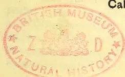

---

EDITED BY

J. FERGUSON,

of the "CEYLON OBSERVER," "CEYLON HANDBOOK AND DIRECTORY," &c.

---

"It is both the duty and interest of every owner and cultivator of the soil to study the best means of rendering that soil subservient to his own and the general wants of the community; and he, who introduces, beneficially, a new and useful *Seed, Plant or Shrub* into his district, is a blessing and an honour to his country."—SIR J. SINCLAIR.

## VOL. XVIII.

[Containing Numbers I. to XII.: July, 1898, to June, 1899.]

---

CEYLON: A. M. & J. FERGUSON, COLOMBO.

LONDON:

JOHN HADDON & Co.; KEGAN PAUL, TRENCH, TRUBNER & Co., LTD.; LUZAC & Co., &c.

MADRAS: HIGGINBOTHAM & Co.—CALCUTTA: THACKER, SPINK & Co.

BOMBAY: THACKER & Co., LTD.—AUSTRALIAN COLONIES: GORDON & GOTCH.

WEST INDIES AND CENTRAL AMERICA: C. H. CALDERON, ST. THOMAS.

STRAITS SETTLEMENTS AND EASTERN ARCHIPELAGO:—JOHN LITTLE & Co., SINGAPORE.

HONGKONG AND YOKOHAMA:—KELLY & Co. JAVA:—MESSRS. JOHN PRYCE & Co.,

BATAVIA, G. KOLFF & Co.

MDCCCXCIX.

5------------------------------------------------

<!-- stage4: FAINT old-images-only -->

[Faint page: no legible print of its own could be verified; text withheld (stage 4 review list)]

6------------------------------------------------

## TO OUR READERS.

---

In closing the Eighteenth Volume of the "**Tropical Agriculturist**," we would as usual direct attention to the large amount of useful information afforded and to the great variety of topics treated in the several numbers. From month to month, we have endeavoured to embody in these pages the latest results of practical experience and scientific teaching in all that concerns tropical agriculture; and our ambition has been to make our periodical not only indispensable to the planter, but of service to business men and capitalists, never forgetting that agriculture trenches upon every department of human knowledge, besides being the basis of personal and communal wealth.

While directing our attention chiefly to the products prominently mentioned on our title-page, we have always taken care to notice minor industries likely to fit in with sub-tropical conditions; and our readers have an ample guarantee in the index pages before them, that, in the future, no pains will be spared to bring together all available information both from the West and East, the same being examined in the light of the teachings of common sense as well as of prolonged tropical experience in this, the leading Crown and Planting Colony of the British Empire.

Special attention has, during the past year, been given to the introduction and extension of an industry in rubber-yielding trees (more especially in the planting of Para and Castilloa trees), and much literature on the subject will be found throughout our pages; also on cacao in Central America and the West Indies as well as in Ceylon; coffee and allied products in Brazil, Mexico, Costa Rica, East Java, Nyassaland, British Central Africa; Liberian coffee in Sumatra, Java, the Straits Settlements; and to other new developments in coffee, coconuts and tobacco planting, &c., in the Malayan Peninsula, Sumatra and North Borneo, as well as in this Island.

The Tea-planting Industry has sprung into so much importance in India (South as well as North) and Ceylon, as also in Java, that a considerable amount of space is naturally given to this great staple; and we think it will be admitted by impartial judges that the *Tropical Agriculturist* should be filled, for the convenience of planters, in every Tea Factory in this Island, in India and in Java.

A full and accurate Index affords the means of ready reference to every subject treated in this, the Eighteenth volume, which we now place in our subscribers' hands, in the full confidence that it will be received with an amount of approval, at least equal to that which has been so kindly extended to its predecessors.

To show how fully other Products besides Tea are treated in this volume, we may mention the number of entries under several headings as follows:—Coffee (including Liberian) 66; Cacao 31; Indiarubber 42; Coconuts and other Palms 25; and Miscellaneous Products nearly 1,000. In the 18 Volumes, the references to Rubber, Coffee and Cacao number many thousands, as also to Coconuts and other Palms.

We are convinced that no more suitable or useful addition can be made to a Planting Company's Library or gift to a tropical planter or agriculturist, whether he be about to enter on his career, or with many years of experience behind him, than the eighteen volumes of our periodical which we have now made available. They are full of information bearing on every department and relating to nearly every product within the scope of sub-tropical industries.

In conclusion, we have to tender our thanks to readers and contributors, and our wish that all friends may continue to write instructively and to read with approval; for then indeed, must the "**Tropical Agriculturist**" continue to do well.

J. FERGUSON.

COLOMBO, CEYLON; 1ST JULY, 1899.

7------------------------------------------------

<!-- stage4: SHOWTHROUGH tess-mirror:37/9/rot1 -->

8------------------------------------------------

# INDEX.

<table style="width: 100%; border-collapse: collapse;">
<thead>
<tr>
<th style="text-align: left;"></th>
<th style="text-align: right;">PAGE</th>
</tr>
</thead>
<tbody>
<tr>
<td><b>A.</b></td>
<td></td>
</tr>
<tr>
<td>Abbotsleigh Tea Company, Ld.</td>
<td style="text-align: right;">708</td>
</tr>
<tr>
<td>Acetylene ...</td>
<td style="text-align: right;">583</td>
</tr>
<tr>
<td>Acme Tea Chests Co., Ld.</td>
<td style="text-align: right;">358</td>
</tr>
<tr>
<td>Acres, How to Measure An...</td>
<td style="text-align: right;">80, 288</td>
</tr>
<tr>
<td>Adulteration of Produce ...</td>
<td style="text-align: right;">123, 420</td>
</tr>
<tr>
<td>Africa, British Central, Planting in</td>
<td style="text-align: right;">871</td>
</tr>
<tr>
<td>    Coffee in ...</td>
<td style="text-align: right;">[See Coffee]</td>
</tr>
<tr>
<td>    Kola in ...</td>
<td style="text-align: right;">[See Kola]</td>
</tr>
<tr>
<td>    Tea Cultivation in ...</td>
<td style="text-align: right;">[See Tea]</td>
</tr>
<tr>
<td>    West ...</td>
<td style="text-align: right;">341</td>
</tr>
<tr>
<td>African Game ...</td>
<td style="text-align: right;">704</td>
</tr>
<tr>
<td>Agra Ouvah Estates Co., Ld.</td>
<td style="text-align: right;">581</td>
</tr>
<tr>
<td>    Tea Co. of Ceylon, Ld.</td>
<td style="text-align: right;">763</td>
</tr>
<tr>
<td>Agriculture as a Scientific Profession</td>
<td style="text-align: right;">638</td>
</tr>
<tr>
<td>    in America ...</td>
<td style="text-align: right;">122</td>
</tr>
<tr>
<td>    in Zanzibar ...</td>
<td style="text-align: right;">70</td>
</tr>
<tr>
<td>Agricultural Chemist for Ceylon</td>
<td style="text-align: right;">124, 130, 159</td>
</tr>
<tr>
<td>    Chemistry, Handbook of ...</td>
<td style="text-align: right;">611</td>
</tr>
<tr>
<td>    Department for Ceylon</td>
<td style="text-align: right;">166, 167, 451,</td>
</tr>
<tr>
<td>        Education ...</td>
<td style="text-align: right;">588, 662</td>
</tr>
<tr>
<td>        Experiments ...</td>
<td style="text-align: right;">760</td>
</tr>
<tr>
<td>        Publications 23, 62, 88, 101, 146, 166,</td>
<td></td>
</tr>
<tr>
<td>            169, 175, 214, 215, 242, 243, 318, 351,</td>
<td></td>
</tr>
<tr>
<td>            363, 386, 391, 392, 416, 445, 446, 612,</td>
<td></td>
</tr>
<tr>
<td>            688, 723, 731, 850, 858</td>
<td></td>
</tr>
<tr>
<td>        Training for Women ...</td>
<td style="text-align: right;">330, 611</td>
</tr>
<tr>
<td>Agri-Horticultural Society of Colombo</td>
<td style="text-align: right;">138, 220, 589,</td>
</tr>
<tr>
<td>    of India ...</td>
<td style="text-align: right;">813, 884</td>
</tr>
<tr>
<td>    of Madras ...</td>
<td style="text-align: right;">215</td>
</tr>
<tr>
<td>Air, Liquid ...</td>
<td style="text-align: right;">732</td>
</tr>
<tr>
<td>Alfalfa Grass...</td>
<td style="text-align: right;">40, 850</td>
</tr>
<tr>
<td>Alkaloids ...</td>
<td style="text-align: right;">874</td>
</tr>
<tr>
<td>Alliance Tea Company, Ld.</td>
<td style="text-align: right;">583</td>
</tr>
<tr>
<td>Aloes 423, 433, 457, 484, 487, 615, 753, 787, 801</td>
<td style="text-align: right;">855</td>
</tr>
<tr>
<td>Aluminium Industry ...</td>
<td style="text-align: right;">479</td>
</tr>
<tr>
<td>Amalgamated Tea Estates Co., Ld.</td>
<td style="text-align: right;">255</td>
</tr>
<tr>
<td>Ambalangoda, Planting in</td>
<td style="text-align: right;">827</td>
</tr>
<tr>
<td>America, Cacao in ...</td>
<td style="text-align: right;">[See Cacao]</td>
</tr>
<tr>
<td>    Ceylon Tea in ...</td>
<td style="text-align: right;">[See Tea]</td>
</tr>
<tr>
<td>    Coffee in ...</td>
<td style="text-align: right;">[See Coffee]</td>
</tr>
<tr>
<td>    Indian Tea in ...</td>
<td style="text-align: right;">[See Tea]</td>
</tr>
<tr>
<td>    Revenue-producing Interests in</td>
<td style="text-align: right;">596</td>
</tr>
</tbody>
</table>

<table style="width: 100%; border-collapse: collapse;">
<thead>
<tr>
<th style="text-align: left;"></th>
<th style="text-align: right;">PAGE</th>
</tr>
</thead>
<tbody>
<tr>
<td>Amsterdam Market ...</td>
<td style="text-align: right;">202, 463</td>
</tr>
<tr>
<td>Ammonia in Ceylon Rain Water ...</td>
<td style="text-align: right;">655</td>
</tr>
<tr>
<td>Anglo-Ceylon and General Estates Co., Ld.</td>
<td style="text-align: right;">203, 204,</td>
</tr>
<tr>
<td>    208</td>
<td></td>
</tr>
<tr>
<td>Ankande Estate Co., Ld. ...</td>
<td style="text-align: right;">722</td>
</tr>
<tr>
<td>Annatto in Zanzibar ...</td>
<td style="text-align: right;">78, 236</td>
</tr>
<tr>
<td>    Preparation in West Indies ...</td>
<td style="text-align: right;">812</td>
</tr>
<tr>
<td>Ants, How to Destroy ...</td>
<td style="text-align: right;">80, 869</td>
</tr>
<tr>
<td>    White ...</td>
<td style="text-align: right;">140, 191, 242, 250, 867</td>
</tr>
<tr>
<td>Anuradhapura Botanic Gardens</td>
<td style="text-align: right;">[See Botanic</td>
</tr>
<tr>
<td>    Gardens, Ceylon]</td>
<td></td>
</tr>
<tr>
<td>Apiculture...</td>
<td style="text-align: right;">[See Bee Culture]</td>
</tr>
<tr>
<td>Arcanut Cultivation in the Straits</td>
<td style="text-align: right;">414</td>
</tr>
<tr>
<td>    in India ...</td>
<td style="text-align: right;">676</td>
</tr>
<tr>
<td>Aristolochia Gigas ...</td>
<td style="text-align: right;">439</td>
</tr>
<tr>
<td>Ashanti Produce ...</td>
<td style="text-align: right;">80</td>
</tr>
<tr>
<td>Ashes, Value of ...</td>
<td style="text-align: right;">141</td>
</tr>
<tr>
<td>Assam, Indiarubber Cultivation in</td>
<td style="text-align: right;">233</td>
</tr>
<tr>
<td>    Sanitation in ...</td>
<td style="text-align: right;">213</td>
</tr>
<tr>
<td>    Tea Planting in ...</td>
<td style="text-align: right;">97, 110</td>
</tr>
<tr>
<td>Associated Tea Estates of Ceylon, Ld.</td>
<td style="text-align: right;">356, 388</td>
</tr>
<tr>
<td>Atavism or Telegony ...</td>
<td style="text-align: right;">594, 669</td>
</tr>
<tr>
<td>Atriples ...</td>
<td style="text-align: right;">584, 716</td>
</tr>
<tr>
<td>Augusta Tea Estates Co., Ld.</td>
<td style="text-align: right;">799</td>
</tr>
<tr>
<td>Australia, Tea in ...</td>
<td style="text-align: right;">[See Tea]</td>
</tr>
<tr>
<td>    Western, Exhibition in</td>
<td style="text-align: right;">87, 553, 616</td>
</tr>
<tr>
<td>Australians as Tea Drinkers ...</td>
<td style="text-align: right;">288</td>
</tr>
</tbody>
</table>

## B.

<table style="width: 100%; border-collapse: collapse;">
<tbody>
<tr>
<td>Bacteriology ...</td>
<td style="text-align: right;">194</td>
</tr>
<tr>
<td>Bahamas ...</td>
<td style="text-align: right;">486, 529</td>
</tr>
<tr>
<td>Bahmeen Fishing in Ceylon ...</td>
<td style="text-align: right;">244</td>
</tr>
<tr>
<td>Baker, Mr. J. G. ...</td>
<td style="text-align: right;">604</td>
</tr>
<tr>
<td>Bamboo Baskets ...</td>
<td style="text-align: right;">266</td>
</tr>
<tr>
<td>Bamboos ...</td>
<td style="text-align: right;">342, 373, 826</td>
</tr>
<tr>
<td>Bananas ...</td>
<td style="text-align: right;">[See Plantains]</td>
</tr>
<tr>
<td>Bandarapura Ceylon Co., Ld.</td>
<td style="text-align: right;">801</td>
</tr>
<tr>
<td>Bee-Culture at the School of Agriculture...</td>
<td style="text-align: right;">373</td>
</tr>
<tr>
<td>Battalagalla Estate Co., Ld.</td>
<td style="text-align: right;">798</td>
</tr>
<tr>
<td>Batoum, Tea Cultivation near</td>
<td style="text-align: right;">[See Tea Cultiva-</td>
</tr>
<tr>
<td>    tion in Russia]</td>
<td></td>
</tr>
<tr>
<td>Berar, Biggest Tree in ...</td>
<td style="text-align: right;">415</td>
</tr>
<tr>
<td>Birds, Ceylon ...</td>
<td style="text-align: right;">266</td>
</tr>
<tr>
<td>Birds' Nests Soup ...</td>
<td style="text-align: right;">637</td>
</tr>
</tbody>
</table>

9------------------------------------------------

# INDEX.

<table border="0" style="width: 100%; border-collapse: collapse;">
<thead>
<tr>
<th style="text-align: left;"></th>
<th style="text-align: right;">PAGE.</th>
<th style="text-align: left;"></th>
<th style="text-align: right;">PAGE.</th>
</tr>
</thead>
<tbody>
<tr>
<td>Bogawantalawa District Tea Co., Ltd. ...</td>
<td style="text-align: right;">118, 128</td>
<td>Capper, Mr. John ...</td>
<td style="text-align: right;">819</td>
</tr>
<tr>
<td>Bois Immortelle in Zanzibar ...</td>
<td style="text-align: right;">77</td>
<td>Carolina Tea Co. of Ceylon, Ltd. ...</td>
<td style="text-align: right;">426</td>
</tr>
<tr>
<td>Bombay Tea Association, Ltd. ...</td>
<td style="text-align: right;">171</td>
<td>Carruthers, Mr. J. B. ...</td>
<td style="text-align: right;">503</td>
</tr>
<tr>
<td>Brahmini Bulls of India ...</td>
<td style="text-align: right;">736</td>
<td>Castor-oil and Milking Cows ...</td>
<td style="text-align: right;">818</td>
</tr>
<tr>
<td>Brazil Coffee ...</td>
<td style="text-align: right;">30</td>
<td>    — Plant, Cultivation of ...</td>
<td style="text-align: right;">138, 145</td>
</tr>
<tr>
<td>    — Planting in ...</td>
<td style="text-align: right;">609</td>
<td>    — Seed in Zanzibar ...</td>
<td style="text-align: right;">78, 236</td>
</tr>
<tr>
<td>    —, Railways in ...</td>
<td style="text-align: right;">685</td>
<td>Catechu, Substitute for ...</td>
<td style="text-align: right;">693</td>
</tr>
<tr>
<td>Breadfruit (<i>Artocarpus Nobilis</i>) ...</td>
<td style="text-align: right;">272</td>
<td>Catering in Ceylon ...</td>
<td style="text-align: right;">613</td>
</tr>
<tr>
<td>    — Plants from Ceylon ...</td>
<td style="text-align: right;">139</td>
<td>Cattle, Branding of ...</td>
<td style="text-align: right;">294, 596</td>
</tr>
<tr>
<td>    — Tree Milk ...</td>
<td style="text-align: right;">514, 516</td>
<td>    —, Ceylon, for Hongkong ...</td>
<td style="text-align: right;">66</td>
</tr>
<tr>
<td>Brokers, Ballads of the ...</td>
<td style="text-align: right;">644</td>
<td>    —, Dehorning of ...</td>
<td style="text-align: right;">146, 787</td>
</tr>
<tr>
<td>Boracic Acid as a Preservative ...</td>
<td style="text-align: right;">812</td>
<td>    —, Dentition of ...</td>
<td style="text-align: right;">668</td>
</tr>
<tr>
<td>Borneo, British North, Planting in ...</td>
<td style="text-align: right;">268, 430</td>
<td>    —, feeding in Fiji ...</td>
<td style="text-align: right;">58</td>
</tr>
<tr>
<td>    —, Coffee in ...</td>
<td style="text-align: right;">[See Coffee]</td>
<td>    —, in India ...</td>
<td style="text-align: right;">736, 737</td>
</tr>
<tr>
<td>Botanic Gardens Ceylon ...</td>
<td style="text-align: right;">169, 175, 178, 194, 199</td>
<td>    —, in Ceylon ...</td>
<td style="text-align: right;">66, 301</td>
</tr>
<tr>
<td>    —, ...</td>
<td style="text-align: right;">808, Sup.</td>
<td>    —, Singalese, in Trinidad ...</td>
<td style="text-align: right;">829, 860</td>
</tr>
<tr>
<td>    —, Calcutta ...</td>
<td style="text-align: right;">168</td>
<td>    —, Warts on ...</td>
<td style="text-align: right;">595</td>
</tr>
<tr>
<td>    —, New South Wales ...</td>
<td style="text-align: right;">241</td>
<td>Ceara Rubber ...</td>
<td style="text-align: right;">[See India-rubber.]</td>
</tr>
<tr>
<td>    —, Uganda ...</td>
<td style="text-align: right;">177</td>
<td>Cement, Madras ...</td>
<td style="text-align: right;">768</td>
</tr>
<tr>
<td>Botanical Names ...</td>
<td style="text-align: right;">702</td>
<td>Central Province of Ceylon, Planting in ...</td>
<td style="text-align: right;">753</td>
</tr>
<tr>
<td>British and Chinese Corporation, Ltd. ...</td>
<td style="text-align: right;">102</td>
<td>    — Tea Co. of Ceylon, Ltd. ...</td>
<td style="text-align: right;">473, 500</td>
</tr>
<tr>
<td>    — North Borneo Company ...</td>
<td style="text-align: right;">96, 186</td>
<td>Ceylon Association in London ...</td>
<td style="text-align: right;">534</td>
</tr>
<tr>
<td>    — Tea Table ...</td>
<td style="text-align: right;">96</td>
<td>    —, All about ...</td>
<td style="text-align: right;">645</td>
</tr>
<tr>
<td>Bug, Australian ...</td>
<td style="text-align: right;">[See <i>Orthezia insignis</i>]</td>
<td>    — and Indian Currency ...</td>
<td style="text-align: right;">[See Currency]</td>
</tr>
<tr>
<td>    —, Mealy ...</td>
<td style="text-align: right;">35</td>
<td>    — and its Disturbances ...</td>
<td style="text-align: right;">396</td>
</tr>
<tr>
<td>    — on Lantana ...</td>
<td style="text-align: right;">[See Lantana]</td>
<td>    — and Indian Planters' Associa-     — tion, Ltd. ...</td>
<td style="text-align: right;">499</td>
</tr>
<tr>
<td>Burma, Agriculture in ...</td>
<td style="text-align: right;">845</td>
<td>    — and Oriental Estates Co., Ltd. ...</td>
<td style="text-align: right;">45</td>
</tr>
<tr>
<td>    — Rice ...</td>
<td style="text-align: right;">104, 116, 163, 248</td>
<td>    — Botanic Gardens ...</td>
<td style="text-align: right;">[See Botanic Gardens]</td>
</tr>
<tr>
<td>    —, — Cultivation in ...</td>
<td style="text-align: right;">18</td>
<td>    — Brick and Tile Company ...</td>
<td style="text-align: right;">425</td>
</tr>
<tr>
<td>Burnside Tea Co. of Ceylon, Ltd. ...</td>
<td style="text-align: right;">799</td>
<td>    —, Cacao Cultivation in ...</td>
<td style="text-align: right;">[See Cacao]</td>
</tr>
<tr>
<td>Butterflies, Flight of ...</td>
<td style="text-align: right;">491, 562</td>
<td>    —, Cinnamon in ...</td>
<td style="text-align: right;">[See Cinnamon]</td>
</tr>
<tr>
<td></td>
<td style="text-align: right;"><b>C.</b></td>
<td>    —, Coconut Cultivation in ...</td>
<td style="text-align: right;">[See Coconut]</td>
</tr>
<tr>
<td>Cacao, Analyses ...</td>
<td style="text-align: right;">165, 195, 249, 509</td>
<td>    —, Coffee Cultivation in ...</td>
<td style="text-align: right;">[See Coffee]</td>
</tr>
<tr>
<td>    —, Advertising of ...</td>
<td style="text-align: right;">423</td>
<td>    — Estates Investment Association, Ltd. ...</td>
<td style="text-align: right;">203</td>
</tr>
<tr>
<td>    —, Ceylon ...</td>
<td style="text-align: right;">22</td>
<td>    — Exports and Distribution 63, 113, 135, 217,     — 291, 365, 447, 511, 585,     — 659, 733, 807, 880,     — 881, Sup.</td>
<td></td>
</tr>
<tr>
<td>    — Criollo ...</td>
<td style="text-align: right;">492</td>
<td>    —, Fibre in ...</td>
<td style="text-align: right;">[See Fibre]</td>
</tr>
<tr>
<td>    — Cultivation ...</td>
<td style="text-align: right;">95, 195, 347, 437</td>
<td>    —, Flora of ...</td>
<td style="text-align: right;">557, 562, 679</td>
</tr>
<tr>
<td>        — in Samoa ...</td>
<td style="text-align: right;">32, 768</td>
<td>    —, Future of ...</td>
<td style="text-align: right;">167</td>
</tr>
<tr>
<td>        — in Trinidad ...</td>
<td style="text-align: right;">285</td>
<td>    — Game Protection Society ...</td>
<td style="text-align: right;">[See Game Protection]</td>
</tr>
<tr>
<td>        — in Zanzibar ...</td>
<td style="text-align: right;">77, 235</td>
<td>    — Handbook and Directory 166, 470, 481</td>
<td style="text-align: right;">429</td>
</tr>
<tr>
<td>    — Disease 25, 320, 328, 351 359, 369, 393, 414,     — 437, 438, 458, 477, 493, 503, 505,     — 541, 571, 771, 793, 796</td>
<td></td>
<td>    — Hills Tea Estate Co., Ltd. ...</td>
<td style="text-align: right;">642</td>
</tr>
<tr>
<td>    —, Draft Allowance on ...</td>
<td style="text-align: right;">316</td>
<td>    — Import Tea Duty ...</td>
<td style="text-align: right;">[See Tea Duty]</td>
</tr>
<tr>
<td>    —, Drying of ...</td>
<td style="text-align: right;">561, 565, 635, 718</td>
<td>    —, India and Russia ...</td>
<td style="text-align: right;">61</td>
</tr>
<tr>
<td>    —, Duty ...</td>
<td style="text-align: right;">614</td>
<td>    —, Indiarubber Cultivation in ...</td>
<td style="text-align: right;">[See India-rubber]</td>
</tr>
<tr>
<td>    —, Enemies of ...</td>
<td style="text-align: right;">347</td>
<td>    — Land and Produce Co., Ltd. ...</td>
<td style="text-align: right;">463, 498</td>
</tr>
<tr>
<td>    — Exports from Vera Cruz ...</td>
<td style="text-align: right;">169</td>
<td>    —, Minerals in ...</td>
<td style="text-align: right;">816, 876</td>
</tr>
<tr>
<td>    — Grafting ...</td>
<td style="text-align: right;">432</td>
<td>    — North-Central ...</td>
<td style="text-align: right;">754</td>
</tr>
<tr>
<td>    — Imports ...</td>
<td style="text-align: right;">20</td>
<td>    — Plantation Property and Varied     — Products in ...</td>
<td style="text-align: right;">41</td>
</tr>
<tr>
<td>    — in America ...</td>
<td style="text-align: right;">33, 285</td>
<td>    — Planters and the Kaiser ...</td>
<td style="text-align: right;">652</td>
</tr>
<tr>
<td>    — in Ceylon ...</td>
<td style="text-align: right;">124, 209</td>
<td>        — in Mexico ...</td>
<td style="text-align: right;">21</td>
</tr>
<tr>
<td>    — in Queensland ...</td>
<td style="text-align: right;">744</td>
<td>        — in South Wynnaad ...</td>
<td style="text-align: right;">102</td>
</tr>
<tr>
<td>    — Leaves ...</td>
<td style="text-align: right;">583</td>
<td>    — Mr. Quintin Hogg on the ...</td>
<td style="text-align: right;">261</td>
</tr>
<tr>
<td>    —, Manufacture of ...</td>
<td style="text-align: right;">494</td>
<td>    — Planters' Association ...</td>
<td style="text-align: right;">158</td>
</tr>
<tr>
<td>    —, Prepared, Competition in ...</td>
<td style="text-align: right;">533</td>
<td>    —, Planting in ...</td>
<td style="text-align: right;">275, 354</td>
</tr>
<tr>
<td>    —, Prices of ...</td>
<td style="text-align: right;">492, 561</td>
<td>    —, Plants, Photographs of ...</td>
<td style="text-align: right;">633</td>
</tr>
<tr>
<td>    —, Prospects ...</td>
<td style="text-align: right;">342, 492</td>
<td>    —, Progress in ...</td>
<td style="text-align: right;">269, 274, 396</td>
</tr>
<tr>
<td>    — Seed, Husk in ...</td>
<td style="text-align: right;">577</td>
<td>    — Proprietary Tea Estate Co., Ltd. ....</td>
<td style="text-align: right;">870</td>
</tr>
<tr>
<td>    — Soils, Analysis of ...</td>
<td style="text-align: right;">391</td>
<td>    — Provincial Estates Co., Ltd. ....</td>
<td style="text-align: right;">692</td>
</tr>
<tr>
<td>    — Thefts of ...</td>
<td style="text-align: right;">492</td>
<td>    —, Rainfall in ...</td>
<td style="text-align: right;">62</td>
</tr>
<tr>
<td>    —, Theobroma ...</td>
<td style="text-align: right;">765</td>
<td>    — Season Reports ...</td>
<td style="text-align: right;">65, 219, 293, 367, 513,     — 587, 661, 883,     — 495, 534, 543</td>
</tr>
<tr>
<td>    —, Varieties of ...</td>
<td style="text-align: right;">162</td>
<td>    — Plantations Co., Ltd. 11, 835, 841, 843</td>
<td></td>
</tr>
<tr>
<td>    —, Chocolate ...</td>
<td style="text-align: right;">430</td>
<td>    — and Coconut Estates Co., Ltd. ...</td>
<td style="text-align: right;">700</td>
</tr>
<tr>
<td>Caledonian (Ceylon) Tea Estate Co., Ltd. ...</td>
<td style="text-align: right;">477, 481</td>
<td>Charcoal ...</td>
<td style="text-align: right;">141, 423</td>
</tr>
<tr>
<td>Cardamoms ...</td>
<td style="text-align: right;">250, 282</td>
<td>Cherry Tree at Nuwara Eliya ...</td>
<td style="text-align: right;">187</td>
</tr>
<tr>
<td>    — Cultivation in Ceylon ...</td>
<td style="text-align: right;">156, 167, 282</td>
<td></td>
<td></td>
</tr>
<tr>
<td>    — Market ...</td>
<td style="text-align: right;">782</td>
<td></td>
<td></td>
</tr>
<tr>
<td>Camphor at Mysore ...</td>
<td style="text-align: right;">775</td>
<td></td>
<td></td>
</tr>
<tr>
<td>    —, Formosa ...</td>
<td style="text-align: right;">193</td>
<td></td>
<td></td>
</tr>
<tr>
<td>    — in Zanzibar ...</td>
<td style="text-align: right;">78, 236</td>
<td></td>
<td></td>
</tr>
<tr>
<td>    — Market ...</td>
<td style="text-align: right;">652, 695, 761</td>
<td></td>
<td></td>
</tr>
</tbody>
</table>

10------------------------------------------------

# INDEX.

<table border="0" style="width: 100%; border-collapse: collapse;">
<thead>
<tr>
<th style="text-align: left;"></th>
<th style="text-align: right;">PAGE.</th>
<th style="text-align: left;"></th>
<th style="text-align: right;">PAGE.</th>
</tr>
</thead>
<tbody>
<tr>
<td>Chestnut, Spanish</td>
<td style="text-align: right;">486</td>
<td>Coffee,, Consumption in Europe</td>
<td style="text-align: right;">200</td>
</tr>
<tr>
<td>Chillies, Cultivation of</td>
<td style="text-align: right;">295, 373</td>
<td>Crop, Rio</td>
<td style="text-align: right;">420</td>
</tr>
<tr>
<td>    in Zanzibar</td>
<td style="text-align: right;">78, 236</td>
<td>Cultivation in Costa Rica</td>
<td style="text-align: right;">287</td>
</tr>
<tr>
<td>    Prices of</td>
<td style="text-align: right;">242, 685</td>
<td>    in Burma</td>
<td style="text-align: right;">193, 472, 647</td>
</tr>
<tr>
<td>    Uses of</td>
<td style="text-align: right;">111</td>
<td>    in British Central Africa</td>
<td style="text-align: right;">472</td>
</tr>
<tr>
<td>China, Tea Machinery for</td>
<td style="text-align: right;">23</td>
<td>    in Brazil 56, 102, 108, 287, 317,</td>
<td></td>
</tr>
<tr>
<td>    Trading and Ramie Syndicate, Ld.</td>
<td style="text-align: right;">576</td>
<td>        318, 350, 420, 467, 551</td>
<td></td>
</tr>
<tr>
<td>Chinniah, Dr., Vet. Surgeon</td>
<td style="text-align: right;">588</td>
<td>    in Congo Free States</td>
<td style="text-align: right;">82</td>
</tr>
<tr>
<td>Chiswick Compound</td>
<td style="text-align: right;">249</td>
<td>    in Guatemala</td>
<td style="text-align: right;">194, 239, 384</td>
</tr>
<tr>
<td>Christie, Mr. T. N., Interview with</td>
<td style="text-align: right;">776</td>
<td>    in India 114, 117, 118, 155,</td>
<td></td>
</tr>
<tr>
<td>Christy, Mr. T., Hothouses and Nurseries of 283,</td>
<td style="text-align: right;">313</td>
<td>        193, 245, 283, 410, 723, 826 [b]</td>
<td></td>
</tr>
<tr>
<td>Christmas Island</td>
<td style="text-align: right;">502</td>
<td>    in Java</td>
<td style="text-align: right;">425</td>
</tr>
<tr>
<td>Chrysanthemums, Manure for</td>
<td style="text-align: right;">509</td>
<td>    in Malay Peninsula</td>
<td style="text-align: right;">215</td>
</tr>
<tr>
<td>Cinchona Alkaloids</td>
<td style="text-align: right;">583</td>
<td>    in Queensland 60, 62, 188, 285</td>
<td></td>
</tr>
<tr>
<td>    Analysis</td>
<td style="text-align: right;">691</td>
<td>        357, 564, 708, 892</td>
<td></td>
</tr>
<tr>
<td>    Bark, German Stocks</td>
<td style="text-align: right;">688</td>
<td>    in Sumatra</td>
<td style="text-align: right;">400, 793, 802</td>
</tr>
<tr>
<td>    New</td>
<td style="text-align: right;">693</td>
<td>    in Zanzibar</td>
<td style="text-align: right;">77, 236</td>
</tr>
<tr>
<td>    Report for 1898</td>
<td style="text-align: right;">690</td>
<td>    Regions Suitable for</td>
<td style="text-align: right;">318</td>
</tr>
<tr>
<td>    Cultivation in Ceylon</td>
<td style="text-align: right;">418, 510</td>
<td>    Curing</td>
<td style="text-align: right;">234</td>
</tr>
<tr>
<td>        in India 212, 245, 445, 634,</td>
<td></td>
<td>    Direct to Consumers</td>
<td style="text-align: right;">708</td>
</tr>
<tr>
<td>            716, 801</td>
<td></td>
<td>    Disease in Burma</td>
<td style="text-align: right;">345</td>
</tr>
<tr>
<td>        in Java 165, 350, 352, 456, 483</td>
<td></td>
<td>        Guatemala</td>
<td style="text-align: right;">15</td>
</tr>
<tr>
<td>    Combine</td>
<td style="text-align: right;">160</td>
<td>        in Venezuela</td>
<td style="text-align: right;">843</td>
</tr>
<tr>
<td>    Factories, Germany</td>
<td style="text-align: right;">691</td>
<td>    Drinking</td>
<td style="text-align: right;">390</td>
</tr>
<tr>
<td>    Market</td>
<td style="text-align: right;">766</td>
<td>    Duty, British</td>
<td style="text-align: right;">614</td>
</tr>
<tr>
<td>    Plantation, Nilgiris</td>
<td style="text-align: right;">716</td>
<td>    Perak</td>
<td style="text-align: right;">357, 377</td>
</tr>
<tr>
<td>    Prospects</td>
<td style="text-align: right;">88, 868</td>
<td>    Enemies of</td>
<td style="text-align: right;">493, 611</td>
</tr>
<tr>
<td>    Sales in London</td>
<td style="text-align: right;">289</td>
<td>    Enterprise in Mexico</td>
<td style="text-align: right;">33, 285, 643</td>
</tr>
<tr>
<td>    Soils, Composition of</td>
<td style="text-align: right;">507</td>
<td>    Export for Queensland</td>
<td style="text-align: right;">105</td>
</tr>
<tr>
<td>Cinnamon as a Cure for Influenza</td>
<td style="text-align: right;">783</td>
<td>    Exports from India</td>
<td style="text-align: right;">154</td>
</tr>
<tr>
<td>    London Sales of</td>
<td style="text-align: right;">103, 531, 717</td>
<td>    from Southern India</td>
<td style="text-align: right;">[Sup.]</td>
</tr>
<tr>
<td>Citronella Oil</td>
<td style="text-align: right;">295</td>
<td>    Green Bug [See Enemies of Coffee]</td>
<td></td>
</tr>
<tr>
<td>    Adulteration of</td>
<td style="text-align: right;">656</td>
<td>    Husk as an Article for Feeding Purposes</td>
<td style="text-align: right;">817</td>
</tr>
<tr>
<td>Claremont Estate Co., Ld.</td>
<td style="text-align: right;">631</td>
<td>    Hybrid 114, 117, 118, 251, 338, 342</td>
<td></td>
</tr>
<tr>
<td>Clove Cultivation at Zanzibar</td>
<td style="text-align: right;">78, 122, 236</td>
<td>    Imports into United States</td>
<td style="text-align: right;">287</td>
</tr>
<tr>
<td>Cloves, Drying of</td>
<td style="text-align: right;">773</td>
<td>    in Africa</td>
<td style="text-align: right;">134, 348, 383</td>
</tr>
<tr>
<td>Clunes Estates Co., Ld.</td>
<td style="text-align: right;">247</td>
<td>    in Costa Rica</td>
<td style="text-align: right;">86</td>
</tr>
<tr>
<td>Coca Leaves</td>
<td style="text-align: right;">657</td>
<td>    in Hawaii</td>
<td style="text-align: right;">241</td>
</tr>
<tr>
<td>Coconut as a Vegetable Food</td>
<td style="text-align: right;">310</td>
<td>    in Japanese Dependencies</td>
<td style="text-align: right;">713</td>
</tr>
<tr>
<td>    Caterpillar</td>
<td style="text-align: right;">Sup.</td>
<td>    in Java</td>
<td style="text-align: right;">46, 90, 112</td>
</tr>
<tr>
<td>    Cultivation in Ceylon 18, 87, 105, 130,</td>
<td></td>
<td>    in Mexico</td>
<td style="text-align: right;">157, 270</td>
</tr>
<tr>
<td>        194, 205, 266, 311, 396, 402, 482, 624, 700,</td>
<td></td>
<td>    in Nicaragua</td>
<td style="text-align: right;">714</td>
</tr>
<tr>
<td>        805, 809, 853, 872</td>
<td></td>
<td>    in the Straits Settlements</td>
<td style="text-align: right;">234, 348</td>
</tr>
<tr>
<td>    Cultivation in Africa</td>
<td style="text-align: right;">446, 772</td>
<td>    Leaf Disease in Coorg</td>
<td style="text-align: right;">745, 823</td>
</tr>
<tr>
<td>    in Fiji</td>
<td style="text-align: right;">58, 66, 256</td>
<td>        Disease</td>
<td style="text-align: right;">116, 338, 708</td>
</tr>
<tr>
<td>    in Samoa</td>
<td style="text-align: right;">684</td>
<td>    Liberian</td>
<td style="text-align: right;">(See Liberian Coffee)</td>
</tr>
<tr>
<td>    in Straits Settlements 234, 253,</td>
<td></td>
<td>    Mexican</td>
<td style="text-align: right;">14</td>
</tr>
<tr>
<td>        348, 784</td>
<td></td>
<td>    Manuring of</td>
<td style="text-align: right;">116</td>
</tr>
<tr>
<td>    Desiccated</td>
<td style="text-align: right;">640</td>
<td>    Market</td>
<td style="text-align: right;">782</td>
</tr>
<tr>
<td>    Industry</td>
<td style="text-align: right;">147, 394</td>
<td>    Notes</td>
<td style="text-align: right;">100</td>
</tr>
<tr>
<td>    in the North-Western Province 673, 706,</td>
<td></td>
<td>    Pests</td>
<td style="text-align: right;">49</td>
</tr>
<tr>
<td>        745, 754, 775</td>
<td></td>
<td>    Planter in Want of a Billet</td>
<td style="text-align: right;">544</td>
</tr>
<tr>
<td>    Manuring 374, 435, 444, 445, 797</td>
<td></td>
<td>    "Planter's Manual"</td>
<td style="text-align: right;">17</td>
</tr>
<tr>
<td>    Milk</td>
<td style="text-align: right;">514</td>
<td>    Planting and Self-Help</td>
<td style="text-align: right;">728</td>
</tr>
<tr>
<td>    Oil, Production of</td>
<td style="text-align: right;">888</td>
<td>    Prices of</td>
<td style="text-align: right;">128, 874</td>
</tr>
<tr>
<td>        Cakes</td>
<td style="text-align: right;">110, 223</td>
<td>    Prospects in Brazil</td>
<td style="text-align: right;">30</td>
</tr>
<tr>
<td>        for American Market</td>
<td style="text-align: right;">770</td>
<td>    Scale and Ladybirds (See Ladybirds.)</td>
<td></td>
</tr>
<tr>
<td>        in Singapore</td>
<td style="text-align: right;">186</td>
<td>    Seed, Ceylon</td>
<td style="text-align: right;">102, 13</td>
</tr>
<tr>
<td>    Palm Produce and their Distribution 574,</td>
<td></td>
<td>    Statistics</td>
<td style="text-align: right;">88, 104</td>
</tr>
<tr>
<td>        575</td>
<td></td>
<td>    Trade in America</td>
<td style="text-align: right;">56</td>
</tr>
<tr>
<td>    Toddy Drawers in Bombay</td>
<td style="text-align: right;">201</td>
<td>    Varieties of</td>
<td style="text-align: right;">318</td>
</tr>
<tr>
<td>    Trade</td>
<td style="text-align: right;">472</td>
<td>    World's Supply of</td>
<td style="text-align: right;">363, 415</td>
</tr>
<tr>
<td>    Trees, Different Opinions on</td>
<td style="text-align: right;">879</td>
<td>Coimbatore, Planting in</td>
<td style="text-align: right;">280</td>
</tr>
<tr>
<td>Coconuts, Experts of, from Ceylon</td>
<td style="text-align: right;">246</td>
<td>Colombo Commercial Co., Ld.</td>
<td style="text-align: right;">753</td>
</tr>
<tr>
<td>    Planting of</td>
<td style="text-align: right;">51, 421</td>
<td>    Horticultural Show</td>
<td style="text-align: right;">48, 57, 66, 67, 81,</td>
</tr>
<tr>
<td>Cocos-Keeling Islands</td>
<td style="text-align: right;">775</td>
<td>        130, 294</td>
<td></td>
</tr>
<tr>
<td>Cod Liver Oil, Aromatic</td>
<td style="text-align: right;">583</td>
<td>Companies Incorporated in Ceylon</td>
<td style="text-align: right;">624</td>
</tr>
<tr>
<td>Coffee, Adulteration of</td>
<td style="text-align: right;">744</td>
<td>    Indian and Ceylon</td>
<td style="text-align: right;">466</td>
</tr>
<tr>
<td>    and Ladybird Beetles [See Ladybirds]</td>
<td></td>
<td>Consolidated Tea and Lands Co., Ld.</td>
<td style="text-align: right;">254, 387</td>
</tr>
<tr>
<td>    and Shade Trees</td>
<td style="text-align: right;">758</td>
<td>    Estate Co., Ld.</td>
<td style="text-align: right;">412, 415</td>
</tr>
<tr>
<td>    as an Auxiliary to Tea</td>
<td style="text-align: right;">504</td>
<td>Congo Free States, "Ceylon" Coffee in</td>
<td style="text-align: right;">82</td>
</tr>
<tr>
<td>    Brazil 45, 616, 804</td>
<td></td>
<td>Coolgardie Exhibition</td>
<td style="text-align: right;">67, 553, 616</td>
</tr>
<tr>
<td>    Ceylon</td>
<td style="text-align: right;">16</td>
<td>Coolies</td>
<td style="text-align: right;">[See Labour Supply]</td>
</tr>
<tr>
<td>    Consumption</td>
<td style="text-align: right;">241, 789</td>
<td>Cooper, Cooper and Johnson, Ld.</td>
<td style="text-align: right;">194, 788</td>
</tr>
</tbody>
</table>

11------------------------------------------------

# INDEX.

<table style="width: 100%; border-collapse: collapse;">
<thead>
<tr>
<th></th>
<th style="text-align: right;">PAGE.</th>
</tr>
</thead>
<tbody>
<tr>
<td>Coorg, Coffee in</td>
<td style="text-align: right;">723</td>
</tr>
<tr>
<td>—, Tea in</td>
<td style="text-align: right;">708</td>
</tr>
<tr>
<td>Copra, Curing of</td>
<td style="text-align: right;">700</td>
</tr>
<tr>
<td>—, Market</td>
<td style="text-align: right;">354</td>
</tr>
<tr>
<td>—, Production of</td>
<td style="text-align: right;">888</td>
</tr>
<tr>
<td>—, Trade of the Philippines</td>
<td style="text-align: right;">192</td>
</tr>
<tr>
<td>Corn Oil, Indiarubber from</td>
<td style="text-align: right;">125</td>
</tr>
<tr>
<td>Costa Rica, Planting in</td>
<td style="text-align: right;">485</td>
</tr>
<tr>
<td>Cotton Industry in India</td>
<td style="text-align: right;">759</td>
</tr>
<tr>
<td>—, Trade</td>
<td style="text-align: right;">863</td>
</tr>
<tr>
<td>Craighead Tea Co., Ld.</td>
<td style="text-align: right;">203</td>
</tr>
<tr>
<td>Crow, Jungle</td>
<td style="text-align: right;">637, 860</td>
</tr>
<tr>
<td>Cyclists, Speed Calculation for</td>
<td style="text-align: right;">543</td>
</tr>
<tr>
<td>Cryptogamist for Ceylon</td>
<td style="text-align: right;">485</td>
</tr>
<tr>
<td>Cuckoo</td>
<td style="text-align: right;">637</td>
</tr>
<tr>
<td>—, Flower</td>
<td style="text-align: right;">858</td>
</tr>
<tr>
<td>Currency Problem 13, 28, 43, 49, 51, 54, 55, 90, 102, 106, 125, 156, 179, 349, 404, 491, 553, 696, 711, 865, Sup.</td>
<td style="text-align: right;"></td>
</tr>
</tbody>
</table>

## D.

<table style="width: 100%; border-collapse: collapse;">
<tbody>
<tr>
<td>Dairy Cows, Feeding of</td>
<td style="text-align: right;">884</td>
</tr>
<tr>
<td>—, Farm, Ceylon Government</td>
<td style="text-align: right;">139, 221</td>
</tr>
<tr>
<td>—, Poona</td>
<td style="text-align: right;">741</td>
</tr>
<tr>
<td>—, Trinidad</td>
<td style="text-align: right;">141, 816, 829, 860</td>
</tr>
<tr>
<td>—, Farming for Tea Planters</td>
<td style="text-align: right;">86</td>
</tr>
<tr>
<td>Delft, Stock-breeding at</td>
<td style="text-align: right;">847</td>
</tr>
<tr>
<td>Delgolla Estate Co., Ld.</td>
<td style="text-align: right;">885</td>
</tr>
<tr>
<td>Digalla Ceylon Tea Estate Co., Ld.</td>
<td style="text-align: right;">501</td>
</tr>
<tr>
<td>Dimbula Valley (Ceylon) Tea Co., Ld.</td>
<td style="text-align: right;">204, 211</td>
</tr>
<tr>
<td>—</td>
<td style="text-align: right;">271, 577</td>
</tr>
<tr>
<td>Direct Produce Supply Association</td>
<td style="text-align: right;">115</td>
</tr>
<tr>
<td>Dogs, Treatment of</td>
<td style="text-align: right;">489</td>
</tr>
<tr>
<td>Doemoo Tea Co. of Ceylon, Ld.</td>
<td style="text-align: right;">332, 358</td>
</tr>
<tr>
<td>Drayton Estate Co., Ld.</td>
<td style="text-align: right;">778</td>
</tr>
<tr>
<td>Duck Farming</td>
<td style="text-align: right;">817</td>
</tr>
<tr>
<td>Duckwari Tea Plantations Co., Ld.</td>
<td style="text-align: right;">356, 363</td>
</tr>
<tr>
<td>Dumbara, Planting in</td>
<td style="text-align: right;">134</td>
</tr>
<tr>
<td>Dumont Coffee Co., Ld.</td>
<td style="text-align: right;">108</td>
</tr>
<tr>
<td>Durian</td>
<td style="text-align: right;">202</td>
</tr>
</tbody>
</table>

## E.

<table style="width: 100%; border-collapse: collapse;">
<tbody>
<tr>
<td>Eadella Estate Co., Ld.</td>
<td style="text-align: right;">159</td>
</tr>
<tr>
<td>Eastern Produce and Est. Co., Ld.</td>
<td style="text-align: right;">11, 840</td>
</tr>
<tr>
<td>—, Province of Ceylon, Industries in</td>
<td style="text-align: right;">311, 805, 851</td>
</tr>
<tr>
<td>Ederapolla Tea Co. of Ceylon, Ld.</td>
<td style="text-align: right;">799, 843</td>
</tr>
<tr>
<td>Eggs, Artificial</td>
<td style="text-align: right;">670</td>
</tr>
<tr>
<td>—, Composition of</td>
<td style="text-align: right;">376</td>
</tr>
<tr>
<td>—, Preservation of</td>
<td style="text-align: right;">69</td>
</tr>
<tr>
<td>Eila Tea Co., Ld.</td>
<td style="text-align: right;">315</td>
</tr>
<tr>
<td>Eighty Years Ago and Now</td>
<td style="text-align: right;">755</td>
</tr>
<tr>
<td>Electric Power, Transmission of</td>
<td style="text-align: right;">485, 496, 583, 840</td>
</tr>
<tr>
<td>Electricity and Agriculture</td>
<td style="text-align: right;">337, 788</td>
</tr>
<tr>
<td>—, Poplar as a Conductor of</td>
<td style="text-align: right;">84</td>
</tr>
<tr>
<td>—, Timber Seasoning by</td>
<td style="text-align: right;">876</td>
</tr>
<tr>
<td>Elephant's Sick Diet</td>
<td style="text-align: right;">485</td>
</tr>
<tr>
<td>Empire of India and Ceylon Co., Ld.</td>
<td style="text-align: right;">114</td>
</tr>
<tr>
<td>Essential Oils, Adulteration of</td>
<td style="text-align: right;">241</td>
</tr>
<tr>
<td>—, Market for</td>
<td style="text-align: right;">583, 657</td>
</tr>
<tr>
<td>—, Plants</td>
<td style="text-align: right;">522</td>
</tr>
<tr>
<td>Estate Co. of Uva, Ld.</td>
<td style="text-align: right;">701</td>
</tr>
<tr>
<td>Eucalypti</td>
<td style="text-align: right;">375, 424, 504, 554</td>
</tr>
<tr>
<td>Eucalyptus Cordata</td>
<td style="text-align: right;">604</td>
</tr>
<tr>
<td>—, Globulus</td>
<td style="text-align: right;">103, 445, 710, 784</td>
</tr>
<tr>
<td>—, Oil</td>
<td style="text-align: right;">504</td>
</tr>
<tr>
<td>—, and Typhoid Fever</td>
<td style="text-align: right;">202, 249</td>
</tr>
<tr>
<td>—, Pilularis, Sm.</td>
<td style="text-align: right;">210</td>
</tr>
<tr>
<td>Exchange Question</td>
<td style="text-align: right;">[See Currency Problem]</td>
</tr>
<tr>
<td>Exeter Sewage Scheme</td>
<td style="text-align: right;">637</td>
</tr>
</tbody>
</table>

## F.

<table style="width: 100%; border-collapse: collapse;">
<thead>
<tr>
<th></th>
<th style="text-align: right;">PAGE.</th>
</tr>
</thead>
<tbody>
<tr>
<td>Factory Supervision</td>
<td style="text-align: right;">398, 414</td>
</tr>
<tr>
<td>—, Extensions</td>
<td style="text-align: right;">482</td>
</tr>
<tr>
<td>Famine Food, A</td>
<td style="text-align: right;">891</td>
</tr>
<tr>
<td>Fever, Enteric, Olive Oil as a Remedy for</td>
<td style="text-align: right;">24</td>
</tr>
<tr>
<td>—, Typhoid, Cure for</td>
<td style="text-align: right;">202, 249</td>
</tr>
<tr>
<td>Fertilizers</td>
<td style="text-align: right;">[See Manures]</td>
</tr>
<tr>
<td>Fibre, Aloe</td>
<td style="text-align: right;">[See Aloes]</td>
</tr>
<tr>
<td>—, Ceylon</td>
<td style="text-align: right;">241, 277</td>
</tr>
<tr>
<td>—, in Mexico</td>
<td style="text-align: right;">285</td>
</tr>
<tr>
<td>—, in Natal</td>
<td style="text-align: right;">316</td>
</tr>
<tr>
<td>—, Machinery</td>
<td style="text-align: right;">[See Rhea]</td>
</tr>
<tr>
<td>—, Plants Useful</td>
<td style="text-align: right;">883</td>
</tr>
<tr>
<td>—, Pineapple</td>
<td style="text-align: right;">468</td>
</tr>
<tr>
<td>—, Rhea</td>
<td style="text-align: right;">[See Rhea]</td>
</tr>
<tr>
<td>—, Villebrunia Integrifolia</td>
<td style="text-align: right;">858</td>
</tr>
<tr>
<td>Fiji, Planting in</td>
<td style="text-align: right;">58, 316, 586</td>
</tr>
<tr>
<td>Fire, Extinguishing of</td>
<td style="text-align: right;">189</td>
</tr>
<tr>
<td>Fish as Manure</td>
<td style="text-align: right;">341</td>
</tr>
<tr>
<td>—, Culture in Ceylon</td>
<td style="text-align: right;">391, 400, 402, 406, 431, 454, 463, 487</td>
</tr>
<tr>
<td>—, Rare</td>
<td style="text-align: right;">431</td>
</tr>
<tr>
<td>Fishing in Ceylon</td>
<td style="text-align: right;">244</td>
</tr>
<tr>
<td>Flemingia Congesta</td>
<td style="text-align: right;">663</td>
</tr>
<tr>
<td>Flooring, A New</td>
<td style="text-align: right;">260</td>
</tr>
<tr>
<td>Floors, Paper</td>
<td style="text-align: right;">170</td>
</tr>
<tr>
<td>Florida Velvet Bean</td>
<td style="text-align: right;">53, 169, 189, 202, 305, 222, 242, 251, 273, 325, 372, 397, 414, 422, 481, 484, 493, 522, 625</td>
</tr>
<tr>
<td>Flour Compressing</td>
<td style="text-align: right;">302</td>
</tr>
<tr>
<td>—, in China</td>
<td style="text-align: right;">100</td>
</tr>
<tr>
<td>Flying-foxes, To Destroy</td>
<td style="text-align: right;">505</td>
</tr>
<tr>
<td>Foowhow Tea Improvement Co., Ld.</td>
<td style="text-align: right;">788</td>
</tr>
<tr>
<td>Food Stuffs, Ceylon</td>
<td style="text-align: right;">501</td>
</tr>
<tr>
<td>Foods of the Nation, Chief</td>
<td style="text-align: right;">548</td>
</tr>
<tr>
<td>Forest Conservancy of Ceylon</td>
<td style="text-align: right;">237, 841</td>
</tr>
<tr>
<td>—, in India</td>
<td style="text-align: right;">300, 743, 775</td>
</tr>
<tr>
<td>Forestry, Rainfall and Cultivation</td>
<td style="text-align: right;">766</td>
</tr>
<tr>
<td>Formosa, Japanese in</td>
<td style="text-align: right;">62</td>
</tr>
<tr>
<td>—, Planting in</td>
<td style="text-align: right;">240</td>
</tr>
<tr>
<td>Fortune, Robert</td>
<td style="text-align: right;">862</td>
</tr>
<tr>
<td>French Merchants in Colombo</td>
<td style="text-align: right;">348</td>
</tr>
<tr>
<td>Frost in Ceylon</td>
<td style="text-align: right;">705, 713</td>
</tr>
<tr>
<td> Fruit and Flower Show, Colombo</td>
<td style="text-align: right;">48, 57, 66, 67, 81, 130, 294</td>
</tr>
<tr>
<td>—, Australian</td>
<td style="text-align: right;">616, 637, 760</td>
</tr>
<tr>
<td>—, Enemies of</td>
<td style="text-align: right;">487, 529, 558</td>
</tr>
<tr>
<td>—, Fumigation of</td>
<td style="text-align: right;">549</td>
</tr>
<tr>
<td>—, Indian</td>
<td style="text-align: right;">22</td>
</tr>
<tr>
<td>—, Imports to England</td>
<td style="text-align: right;">384</td>
</tr>
<tr>
<td>—, South African</td>
<td style="text-align: right;">279, 781, 850</td>
</tr>
<tr>
<td>—, Trees, Pruning of</td>
<td style="text-align: right;">1, 462</td>
</tr>
<tr>
<td>Fruits, Drying of</td>
<td style="text-align: right;">368, 594</td>
</tr>
<tr>
<td>Fuel, Liquid</td>
<td style="text-align: right;">336, 482</td>
</tr>
<tr>
<td>—, Oil</td>
<td style="text-align: right;">264</td>
</tr>
<tr>
<td>Fungus Diseases</td>
<td style="text-align: right;">169, 344</td>
</tr>
</tbody>
</table>

## G.

<table style="width: 100%; border-collapse: collapse;">
<tbody>
<tr>
<td>Galaha Tea Estates Co., Ld.</td>
<td style="text-align: right;">876, 877</td>
</tr>
<tr>
<td>Galle Districts Planters' Association</td>
<td style="text-align: right;">705</td>
</tr>
<tr>
<td>Game Protection</td>
<td style="text-align: right;">173, 189, 862</td>
</tr>
<tr>
<td>Gangawatte Estates Co., Ld.</td>
<td style="text-align: right;">700</td>
</tr>
<tr>
<td>Gardening in England</td>
<td style="text-align: right;">509</td>
</tr>
<tr>
<td>Gardens, Irrigation of</td>
<td style="text-align: right;">510</td>
</tr>
<tr>
<td>Geological Survey for Ceylon</td>
<td style="text-align: right;">243</td>
</tr>
<tr>
<td>Ginger Cultivation</td>
<td style="text-align: right;">4</td>
</tr>
<tr>
<td>—, Prices of</td>
<td style="text-align: right;">341</td>
</tr>
<tr>
<td>Glasgow Estate Co., Ld.</td>
<td style="text-align: right;">578</td>
</tr>
<tr>
<td>Goat Skins, Curing of</td>
<td style="text-align: right;">167</td>
</tr>
<tr>
<td>Goats and Damage to Tea Plants</td>
<td style="text-align: right;">615</td>
</tr>
<tr>
<td>Gold in Western Australia</td>
<td style="text-align: right;">566</td>
</tr>
<tr>
<td>Goomera Tea Estates Co., Ld.</td>
<td style="text-align: right;">432</td>
</tr>
<tr>
<td>Gourami Fish</td>
<td style="text-align: right;">400, 402, 406, 431, 655, 695, 736</td>
</tr>
</tbody>
</table>

12------------------------------------------------

## INDEX.

<table border="0" style="width: 100%; border-collapse: collapse;">
<thead>
<tr>
<th style="text-align: left;"></th>
<th style="text-align: right;">PAGE.</th>
<th style="text-align: left;"></th>
<th style="text-align: right;">PAGE.</th>
</tr>
</thead>
<tbody>
<tr>
<td>Gourds</td>
<td style="text-align: right;">187</td>
<td>Indiarubber in Brazil ..</td>
<td style="text-align: right;">252, 337</td>
</tr>
<tr>
<td>Grafting</td>
<td style="text-align: right;">519</td>
<td>in Columbia ..</td>
<td style="text-align: right;">761</td>
</tr>
<tr>
<td>Grape Cultivation in Brazil</td>
<td style="text-align: right;">111, 167</td>
<td>in Congo ..</td>
<td style="text-align: right;">84, 755, 709</td>
</tr>
<tr>
<td>Vine at Hampton Court</td>
<td style="text-align: right;">216</td>
<td>in Fiji ..</td>
<td style="text-align: right;">243</td>
</tr>
<tr>
<td>Graphite</td>
<td style="text-align: right;">[See Plumbago]</td>
<td>in Goa ..</td>
<td style="text-align: right;">842</td>
</tr>
<tr>
<td>Grasses, New South Wales</td>
<td style="text-align: right;">339</td>
<td>in Mexico ..</td>
<td style="text-align: right;">33, 157, 284, 285</td>
</tr>
<tr>
<td>Grass for Paper-making ..</td>
<td style="text-align: right;">375</td>
<td>in New Guinea ..</td>
<td style="text-align: right;">846</td>
</tr>
<tr>
<td>Green, Mr. E. E., Honorary Govt. Entomologist</td>
<td style="text-align: right;">772</td>
<td>in Queensland ..</td>
<td style="text-align: right;">357, 509</td>
</tr>
<tr>
<td>Grevillea Timber</td>
<td style="text-align: right;">656</td>
<td>in Zanzibar ..</td>
<td style="text-align: right;">62, 77, 235</td>
</tr>
<tr>
<td>Grevilleas and Tea ..</td>
<td style="text-align: right;">96, 104, 131, 169</td>
<td>Kickxia Africana</td>
<td style="text-align: right;">729</td>
</tr>
<tr>
<td>Ground-nuts in India ..</td>
<td style="text-align: right;">619</td>
<td>Landolphia Florida</td>
<td style="text-align: right;">392</td>
</tr>
<tr>
<td>Guatemala Coffe Disease..</td>
<td style="text-align: right;">15</td>
<td>Machinery ..</td>
<td style="text-align: right;">806, 810</td>
</tr>
<tr>
<td>Guinea Grass, Analysis of</td>
<td style="text-align: right;">884</td>
<td>Manicoba ..</td>
<td style="text-align: right;">651</td>
</tr>
<tr>
<td>Guneratne, Limited ..</td>
<td style="text-align: right;">88</td>
<td>Market Rates for</td>
<td style="text-align: right;">104, 504</td>
</tr>
<tr>
<td>Guttapercha</td>
<td style="text-align: right;">[See Indiarubber]</td>
<td>Mexican ..</td>
<td style="text-align: right;">256</td>
</tr>
<tr>
<td colspan="4" style="text-align: center;"><b>H</b></td>
</tr>
<tr>
<td>Hakgala Botanic Gardens ..</td>
<td style="text-align: right;">567</td>
<td>Milk; Coagulation of</td>
<td style="text-align: right;">337</td>
</tr>
<tr>
<td>Hambantota, Sporting in ..</td>
<td style="text-align: right;">657</td>
<td>Para ..</td>
<td style="text-align: right;">77, 215, 231, 235, 846</td>
</tr>
<tr>
<td>Hapugahalanda Tea Co., Ltd.</td>
<td style="text-align: right;">261</td>
<td>Seed, Sale of ..</td>
<td style="text-align: right;">358, 755</td>
</tr>
<tr>
<td>Hawaii, Planting in ..</td>
<td style="text-align: right;">241</td>
<td>Plantation, Oldest ..</td>
<td style="text-align: right;">51</td>
</tr>
<tr>
<td>Heneratgoda Gardens ..</td>
<td style="text-align: right;">471</td>
<td>Preparation of ..</td>
<td style="text-align: right;">600</td>
</tr>
<tr>
<td>High Forests Estates Co., Ltd.</td>
<td style="text-align: right;">619</td>
<td>Trade ..</td>
<td style="text-align: right;">176</td>
</tr>
<tr>
<td>Highland Tea Company of Ceylon, Ltd..</td>
<td style="text-align: right;">855</td>
<td>Varieties of..</td>
<td style="text-align: right;">92</td>
</tr>
<tr>
<td>Hogg, Mr. Quintin, on the Ceylon Planters</td>
<td style="text-align: right;">261</td>
<td>"Indiarubber World" and the Rubber Trust</td>
<td style="text-align: right;">620</td>
</tr>
<tr>
<td>Honey-seeking, Death from ..</td>
<td style="text-align: right;">470</td>
<td>Indigo, Artificial ..</td>
<td style="text-align: right;">879</td>
</tr>
<tr>
<td>Hooper, Sir William ..</td>
<td style="text-align: right;">112</td>
<td>Crops in India ..</td>
<td style="text-align: right;">775</td>
</tr>
<tr>
<td>Hornsey Tea Estates Co., Ltd.</td>
<td style="text-align: right;">499</td>
<td>Wild, as Food ..</td>
<td style="text-align: right;">738</td>
</tr>
<tr>
<td>Horrekelly Estate Co., Ltd.</td>
<td style="text-align: right;">693, 719</td>
<td>Indo-China, Produce in ..</td>
<td style="text-align: right;">615</td>
</tr>
<tr>
<td>Horses, Mange in ..</td>
<td style="text-align: right;">722</td>
<td>Insect Pests ..</td>
<td style="text-align: right;">249, 402</td>
</tr>
<tr>
<td>Horticultural Show, Colombo</td>
<td style="text-align: right;">48, 57, 66, 67, 81</td>
<td>at the Cape ..</td>
<td style="text-align: right;">818</td>
</tr>
<tr>
<td>Humus, Importance of, to Soils ..</td>
<td style="text-align: right;">520</td>
<td>in California ..</td>
<td style="text-align: right;">525</td>
</tr>
<tr>
<td>Hybridisation in Agriculture ..</td>
<td style="text-align: right;">367</td>
<td>Stings ..</td>
<td style="text-align: right;">349</td>
</tr>
<tr>
<td colspan="4" style="text-align: center;"><b>I</b></td>
</tr>
<tr>
<td>Ibex Hunting in North Travancore ..</td>
<td style="text-align: right;">647</td>
<td>Iodine as a Cure for Rattlesnake Bites..</td>
<td style="text-align: right;">892</td>
</tr>
<tr>
<td>"Icones Plantarum," Hooker's ..</td>
<td style="text-align: right;">804</td>
<td>Iron in India ..</td>
<td style="text-align: right;">24</td>
</tr>
<tr>
<td>Imperial Ceylon Tea Estates, Ltd.,</td>
<td style="text-align: right;">853</td>
<td>Iron Ore in Ceylon ..</td>
<td style="text-align: right;">477, 505</td>
</tr>
<tr>
<td>India, A Singular Custom in ..</td>
<td style="text-align: right;">654</td>
<td>Ivory ..</td>
<td style="text-align: right;">414, 486</td>
</tr>
<tr>
<td>Ceylon, and Russia ..</td>
<td style="text-align: right;">61</td>
<td colspan="2" style="text-align: center;"><b>J</b></td>
</tr>
<tr>
<td>Exports from ..</td>
<td style="text-align: right;">392</td>
<td>Jak Tree ..</td>
<td style="text-align: right;">811</td>
</tr>
<tr>
<td>Planting Industry of ..</td>
<td style="text-align: right;">275</td>
<td>Jadoo, Limited ..</td>
<td style="text-align: right;">510</td>
</tr>
<tr>
<td>Southern Planting in ..</td>
<td style="text-align: right;">42, 105, 242, 544, 829</td>
<td>Jaffna, Tobacco in ..</td>
<td style="text-align: right;">105</td>
</tr>
<tr>
<td>Tobacco in ..</td>
<td style="text-align: right;">[See Tobacco]</td>
<td>Jamaica ..</td>
<td style="text-align: right;">646, 663</td>
</tr>
<tr>
<td>Trade of ..</td>
<td style="text-align: right;">475</td>
<td>Ginger Cultivation in ..</td>
<td style="text-align: right;">4</td>
</tr>
<tr>
<td>Indian and Ceylon Tea Trust Co., Ltd.</td>
<td style="text-align: right;">414, 474</td>
<td>Planting in ..</td>
<td style="text-align: right;">244, 722</td>
</tr>
<tr>
<td>Agriculturist, An Enterprising ..</td>
<td style="text-align: right;">889</td>
<td>Japanese in Formosa ..</td>
<td style="text-align: right;">62</td>
</tr>
<tr>
<td>Currency and Ceylon ..</td>
<td style="text-align: right;">[See Currency]</td>
<td>Java Botanical Gardens, Director of</td>
<td style="text-align: right;">161</td>
</tr>
<tr>
<td>Museum Notes ..</td>
<td style="text-align: right;">768</td>
<td>Coffee in ..</td>
<td style="text-align: right;">46</td>
</tr>
<tr>
<td>Patents ..</td>
<td style="text-align: right;">[See Patents]</td>
<td>Natives of ..</td>
<td style="text-align: right;">532</td>
</tr>
<tr>
<td>Tea Association ..</td>
<td style="text-align: right;">[See Tea Assocn., Indian]</td>
<td>Jolly, Captain John Keith ..</td>
<td style="text-align: right;">229, 396</td>
</tr>
<tr>
<td>Indiancorn ..</td>
<td style="text-align: right;">815</td>
<td>Joint Stock Enterprise in 1898 ..</td>
<td style="text-align: right;">620</td>
</tr>
<tr>
<td>Indiarubber ..</td>
<td style="text-align: right;">192, 515</td>
<td>Jungle Fowl, Ceylon ..</td>
<td style="text-align: right;">354</td>
</tr>
<tr>
<td>Artificial ..</td>
<td style="text-align: right;">85, 88, 276, 620, 857</td>
<td colspan="2" style="text-align: center;"><b>K</b></td>
</tr>
<tr>
<td>Castilloa ..</td>
<td style="text-align: right;">166, 171, 561, 618</td>
<td>Kaiser and Ceylon Planters ..</td>
<td style="text-align: right;">652</td>
</tr>
<tr>
<td>Ceara ..</td>
<td style="text-align: right;">77, 104, 109, 138, 168, 228, 235</td>
<td>Kalutara Company, Ltd..</td>
<td style="text-align: right;">619</td>
</tr>
<tr>
<td>Cultivation ..</td>
<td style="text-align: right;">381</td>
<td>Kanan Devan Planters' Association ..</td>
<td style="text-align: right;">638</td>
</tr>
<tr>
<td>in Ceylon ..</td>
<td style="text-align: right;">17</td>
<td>Kanapediwatte Tea Company, Ltd.</td>
<td style="text-align: right;">693</td>
</tr>
<tr>
<td>in India ..</td>
<td style="text-align: right;">233, 699, 702, 710, 752</td>
<td>Kauri and Jarah Timber ..</td>
<td style="text-align: right;">768</td>
</tr>
<tr>
<td>in the Straits ..</td>
<td style="text-align: right;">24, 228, 234, 348, 414</td>
<td>Kegalla, Coconut Cultivation in ..</td>
<td style="text-align: right;">396</td>
</tr>
<tr>
<td>Exports from India ..</td>
<td style="text-align: right;">46</td>
<td>Kekuna Oil ..</td>
<td style="text-align: right;">220, 294, 370, 517</td>
</tr>
<tr>
<td>Extraction of ..</td>
<td style="text-align: right;">289, 736</td>
<td>Tree ..</td>
<td style="text-align: right;">670</td>
</tr>
<tr>
<td>Forests ..</td>
<td style="text-align: right;">341</td>
<td>Kelani Tea Garden Co., Ltd.</td>
<td style="text-align: right;">709</td>
</tr>
<tr>
<td>from Corn Oil ..</td>
<td style="text-align: right;">125</td>
<td>Valley Planters' Association ..</td>
<td style="text-align: right;">607, 618</td>
</tr>
<tr>
<td>from Euphorbia ..</td>
<td style="text-align: right;">703, 743</td>
<td>Planting in ..</td>
<td style="text-align: right;">828</td>
</tr>
<tr>
<td>from Year-old Trees ..</td>
<td style="text-align: right;">850</td>
<td>Tea Association, Ltd.</td>
<td style="text-align: right;">800</td>
</tr>
<tr>
<td>Gathering ..</td>
<td style="text-align: right;">709</td>
<td>Kelway-Bamber, Mr., and His Mission</td>
<td style="text-align: right;">35, 168, 178, 355, 457, 571</td>
</tr>
<tr>
<td>Green ..</td>
<td style="text-align: right;">139</td>
<td>Kerosine Oil ..</td>
<td style="text-align: right;">634</td>
</tr>
<tr>
<td>Hevea ..</td>
<td style="text-align: right;">561</td>
<td>Kew, Royal Gardens ..</td>
<td style="text-align: right;">32, 276, 342, 564</td>
</tr>
<tr>
<td>Imports ..</td>
<td style="text-align: right;">325</td>
<td>Kino Tree, Indian ..</td>
<td style="text-align: right;">888</td>
</tr>
<tr>
<td></td>
<td></td>
<td>Kintyre Tea Estates Co., Ltd.</td>
<td style="text-align: right;">420</td>
</tr>
<tr>
<td></td>
<td></td>
<td>Kirklees Estate Co., Ltd. ..</td>
<td style="text-align: right;">631</td>
</tr>
<tr>
<td></td>
<td></td>
<td>Kitul Palm ..</td>
<td style="text-align: right;">589</td>
</tr>
</tbody>
</table>

13------------------------------------------------

INDEX.

<table border="0">
<thead>
<tr>
<th></th>
<th style="text-align: right;">PAGE.</th>
</tr>
</thead>
<tbody>
<tr>
<td>Knuckles, Planting in</td>
<td style="text-align: right;">305</td>
</tr>
<tr>
<td>"Koha" Bird</td>
<td style="text-align: right;">656</td>
</tr>
<tr>
<td>Kola in Central Soudan</td>
<td style="text-align: right;">474, 478</td>
</tr>
<tr>
<td>    in Zanzibar</td>
<td style="text-align: right;">77, 235</td>
</tr>
<tr>
<td>Kolazuts, Market Value of</td>
<td style="text-align: right;">490</td>
</tr>
<tr>
<td>Korale Tea Estates, Ld.</td>
<td style="text-align: right;">432, 501</td>
</tr>
<tr>
<td>Koshena Coconut Estate Co., Ld.</td>
<td style="text-align: right;">390</td>
</tr>
</tbody>
</table>

**L.**

<table border="0">
<tbody>
<tr>
<td>Labour in Assam</td>
<td style="text-align: right;">782</td>
</tr>
<tr>
<td>    in British Guiana</td>
<td style="text-align: right;">390</td>
</tr>
<tr>
<td>    , Indian</td>
<td style="text-align: right;">88, 245</td>
</tr>
<tr>
<td>    , Sinhalese, in South India</td>
<td style="text-align: right;">644</td>
</tr>
<tr>
<td>    Supply in Ceylon</td>
<td style="text-align: right;">504</td>
</tr>
<tr>
<td>    in Selangor</td>
<td style="text-align: right;">834</td>
</tr>
<tr>
<td>Lactometer</td>
<td style="text-align: right;">110</td>
</tr>
<tr>
<td>Ladybirds ... 46, 47, 49, 81, 90, 112, 129, 131, 158,</td>
<td style="text-align: right;">159, 772</td>
</tr>
<tr>
<td>Lamps, Old and New</td>
<td style="text-align: right;">651</td>
</tr>
<tr>
<td>Lanka Plantations Co., Ld.</td>
<td style="text-align: right;">473</td>
</tr>
<tr>
<td>Lantana Bug</td>
<td style="text-align: right;">58, 81, 82, 88, 112, 128,</td>
</tr>
<tr>
<td></td>
<td style="text-align: right;">129, 150, 193, 256, 673</td>
</tr>
<tr>
<td>    in Mysore</td>
<td style="text-align: right;">710</td>
</tr>
<tr>
<td>Leather, Australian</td>
<td style="text-align: right;">818</td>
</tr>
<tr>
<td>Lemon Grass Oil</td>
<td style="text-align: right;">317, 522</td>
</tr>
<tr>
<td>Liberian Coffee, Bug on</td>
<td style="text-align: right;">434</td>
</tr>
<tr>
<td>    , &amp;c., in the Straits</td>
<td style="text-align: right;">234, 416</td>
</tr>
<tr>
<td>    in Sumatra</td>
<td style="text-align: right;">36, 88, 198, 424, 486</td>
</tr>
<tr>
<td>Liquids, Fermenting, Sterilising of</td>
<td style="text-align: right;">743</td>
</tr>
<tr>
<td>Locusts</td>
<td style="text-align: right;">449, 475, 628, 656, 661, 662, 735, Sup.</td>
</tr>
<tr>
<td>Logwood, Jamaica</td>
<td style="text-align: right;">101</td>
</tr>
<tr>
<td>Lucerne (Alfalfa)</td>
<td style="text-align: right;">874</td>
</tr>
</tbody>
</table>

**M.**

<table border="0">
<tbody>
<tr>
<td>Mackay, Mr. Donald</td>
<td style="text-align: right;">310</td>
</tr>
<tr>
<td>Madagascar, Agriculture and Progress in</td>
<td style="text-align: right;">279</td>
</tr>
<tr>
<td>Madras School of Arts</td>
<td style="text-align: right;">479</td>
</tr>
<tr>
<td>Maha Uva Estate Co., Ld.</td>
<td style="text-align: right;">631</td>
</tr>
<tr>
<td>Malaya, Confederated States of</td>
<td style="text-align: right;">851</td>
</tr>
<tr>
<td>Managing Agent's Shorter Catechism</td>
<td style="text-align: right;">213</td>
</tr>
<tr>
<td>Mango</td>
<td style="text-align: right;">595, 670</td>
</tr>
<tr>
<td>    Budding</td>
<td style="text-align: right;">722, 744</td>
</tr>
<tr>
<td>    , Cultivation of</td>
<td style="text-align: right;">484</td>
</tr>
<tr>
<td>    Starch</td>
<td style="text-align: right;">629</td>
</tr>
<tr>
<td>Mangosteens</td>
<td style="text-align: right;">372</td>
</tr>
<tr>
<td>    from the West Indies</td>
<td style="text-align: right;">118</td>
</tr>
<tr>
<td>Mangroves</td>
<td style="text-align: right;">522</td>
</tr>
<tr>
<td>Manure, Fish</td>
<td style="text-align: right;">341</td>
</tr>
<tr>
<td>Manures and Manuring</td>
<td style="text-align: right;">100, 414, 509, 530, 764, 803</td>
</tr>
<tr>
<td>Manuring, Scientific</td>
<td style="text-align: right;">25, 132</td>
</tr>
<tr>
<td>    Coconuts</td>
<td style="text-align: right;">435, 775, 797</td>
</tr>
<tr>
<td>    , Comparative Statistics of</td>
<td style="text-align: right;">520</td>
</tr>
<tr>
<td>    Tea</td>
<td style="text-align: right;">[See Tea]</td>
</tr>
<tr>
<td>Market Rates, Colombo</td>
<td style="text-align: right;">[See Price Current]</td>
</tr>
<tr>
<td>    for Old and New Products</td>
<td style="text-align: right;">64, 136, 218,</td>
</tr>
<tr>
<td></td>
<td style="text-align: right;">292, 366, 448, 512, 660, 734, 808, 882</td>
</tr>
<tr>
<td>Martinique, Coffee and Cacao in</td>
<td style="text-align: right;">708</td>
</tr>
<tr>
<td>Mate Tea Company</td>
<td style="text-align: right;">14</td>
</tr>
<tr>
<td>Maturata Tea Company</td>
<td style="text-align: right;">416</td>
</tr>
<tr>
<td>Mauritius Chamber of Agriculture</td>
<td style="text-align: right;">187</td>
</tr>
<tr>
<td>    , Planting in</td>
<td style="text-align: right;">691</td>
</tr>
<tr>
<td>Mayfield (Dimbula) Tea Co. of Ceylon, Ld.</td>
<td style="text-align: right;">181</td>
</tr>
<tr>
<td>Mazawattee Tea Company</td>
<td style="text-align: right;">642, 843</td>
</tr>
<tr>
<td>Mealy Bug</td>
<td style="text-align: right;">35</td>
</tr>
<tr>
<td>Medicinal Plants, Native</td>
<td style="text-align: right;">516</td>
</tr>
<tr>
<td>Meryta Sinclairi</td>
<td style="text-align: right;">478</td>
</tr>
<tr>
<td>Mexico, Cacao in</td>
<td style="text-align: right;">33, 285</td>
</tr>
<tr>
<td>    , Ceylon Planters in</td>
<td style="text-align: right;">21, 283</td>
</tr>
<tr>
<td>    Tea in</td>
<td style="text-align: right;">269</td>
</tr>
<tr>
<td>    , Coffee in</td>
<td style="text-align: right;">33, 270, 285</td>
</tr>
<tr>
<td>    , Indiarubber in</td>
<td style="text-align: right;">33, 285</td>
</tr>
<tr>
<td>    , Orange Cultivation in</td>
<td style="text-align: right;">8</td>
</tr>
<tr>
<td>    , Planting in</td>
<td style="text-align: right;">33, 285</td>
</tr>
</tbody>
</table>

<table border="0">
<thead>
<tr>
<th></th>
<th style="text-align: right;">PAGE.</th>
</tr>
</thead>
<tbody>
<tr>
<td>Mexico, Sugar in</td>
<td style="text-align: right;">285</td>
</tr>
<tr>
<td>    , Tobacco in</td>
<td style="text-align: right;">33, 285</td>
</tr>
<tr>
<td>    , Vanilla in</td>
<td style="text-align: right;">285</td>
</tr>
<tr>
<td>Mexican Gulf Agricultural Company</td>
<td style="text-align: right;">397</td>
</tr>
<tr>
<td>Mica in India</td>
<td style="text-align: right;">232, 255</td>
</tr>
<tr>
<td>    in Quebec</td>
<td style="text-align: right;">174</td>
</tr>
<tr>
<td>    in Zululand</td>
<td style="text-align: right;">689</td>
</tr>
<tr>
<td>    , Properties of</td>
<td style="text-align: right;">341</td>
</tr>
<tr>
<td>Mice, To Destroy</td>
<td style="text-align: right;">595</td>
</tr>
<tr>
<td>Micro-Organisms in Soils</td>
<td style="text-align: right;">131</td>
</tr>
<tr>
<td>Milk and Butter Tests</td>
<td style="text-align: right;">368</td>
</tr>
<tr>
<td>    , Average Yield of</td>
<td style="text-align: right;">670</td>
</tr>
<tr>
<td>    Fever in Cows</td>
<td style="text-align: right;">891</td>
</tr>
<tr>
<td>    , Hints on</td>
<td style="text-align: right;">590, 664, 727</td>
</tr>
<tr>
<td>    , Preservation of</td>
<td style="text-align: right;">146</td>
</tr>
<tr>
<td>Milking Cows and Castor Oil</td>
<td style="text-align: right;">818</td>
</tr>
<tr>
<td>    Experiments</td>
<td style="text-align: right;">139</td>
</tr>
<tr>
<td>Mineral Wealth of Ceylon</td>
<td style="text-align: right;">846, 876</td>
</tr>
<tr>
<td>Minor Products Reports</td>
<td style="text-align: right;">16, 117, 164, 175, 200, 314,</td>
</tr>
<tr>
<td></td>
<td style="text-align: right;">419, 430, 471, 577, 630, 640, 649,</td>
</tr>
<tr>
<td></td>
<td style="text-align: right;">723, 775, 851, 286</td>
</tr>
<tr>
<td>Mocha Tea Company, Ld.</td>
<td style="text-align: right;">253</td>
</tr>
<tr>
<td>Monckton, Mr. C. C. F.</td>
<td style="text-align: right;">628</td>
</tr>
<tr>
<td>Mousoon, Sunspots and Cycles</td>
<td style="text-align: right;">561</td>
</tr>
<tr>
<td>Morris, Dr.</td>
<td style="text-align: right;">216, 264, 657</td>
</tr>
<tr>
<td>Mosquitoes and "Creeper"</td>
<td style="text-align: right;">81</td>
</tr>
<tr>
<td>    Malaria</td>
<td style="text-align: right;">445</td>
</tr>
<tr>
<td>    , How to Prevent</td>
<td style="text-align: right;">486</td>
</tr>
<tr>
<td>Moth-destroying Plant</td>
<td style="text-align: right;">634</td>
</tr>
<tr>
<td>Mother-of-Pearl Shell Industry</td>
<td style="text-align: right;">651, 695, 714, 761</td>
</tr>
<tr>
<td>Mullaitivu, Palms and Tobacco in</td>
<td style="text-align: right;">105</td>
</tr>
<tr>
<td>Mysore, Coffee Planting in</td>
<td style="text-align: right;">410</td>
</tr>
<tr>
<td>    , North, Planters' Association</td>
<td style="text-align: right;">836</td>
</tr>
<tr>
<td>    , South, Planters' Association</td>
<td style="text-align: right;">854</td>
</tr>
</tbody>
</table>

**N.**

<table border="0">
<tbody>
<tr>
<td>Nahalma Tea Estates Co., Ld.</td>
<td style="text-align: right;">763</td>
</tr>
<tr>
<td>Nahavilla Estates Co., Ld.</td>
<td style="text-align: right;">694</td>
</tr>
<tr>
<td>Negroes and Pets</td>
<td style="text-align: right;">535</td>
</tr>
<tr>
<td>New Caledonia, Planting in</td>
<td style="text-align: right;">62</td>
</tr>
<tr>
<td>    Dimbula Co., Ld.</td>
<td style="text-align: right;">416, 417, 426, 801</td>
</tr>
<tr>
<td>    Guinea</td>
<td style="text-align: right;">201, 422, 564, 612, 617, 789</td>
</tr>
<tr>
<td>    South Wales, Planting in</td>
<td style="text-align: right;">629</td>
</tr>
<tr>
<td>Nilgiri Game and Fish Preservation As-</td>
<td></td>
</tr>
<tr>
<td>    sociation</td>
<td style="text-align: right;">262, 873</td>
</tr>
<tr>
<td>    Planters' Association</td>
<td style="text-align: right;">206, 607</td>
</tr>
<tr>
<td>Nilgiris, Planting in</td>
<td style="text-align: right;">245, 283, 611</td>
</tr>
<tr>
<td>Nilla</td>
<td style="text-align: right;">[See Strobilanthea]</td>
</tr>
<tr>
<td>Nitragin</td>
<td style="text-align: right;">518</td>
</tr>
<tr>
<td>Nitrogen, Atmospheric</td>
<td style="text-align: right;">340, 346</td>
</tr>
<tr>
<td>North-Central Province of Ceylon</td>
<td style="text-align: right;">756</td>
</tr>
<tr>
<td>    Western Province of Ceylon</td>
<td style="text-align: right;">257, 266, 312,</td>
</tr>
<tr>
<td></td>
<td style="text-align: right;">482, 624</td>
</tr>
<tr>
<td>Northern Districts Planters' Association</td>
<td style="text-align: right;">580</td>
</tr>
<tr>
<td>    Planting in</td>
<td style="text-align: right;">760</td>
</tr>
<tr>
<td>Nutmeg Cultivation in Ceylon</td>
<td style="text-align: right;">173, 218</td>
</tr>
<tr>
<td>Nuts as Food in France</td>
<td style="text-align: right;">794</td>
</tr>
<tr>
<td>Nuwara Eliya Tea Estates Co., Ld.</td>
<td style="text-align: right;">11, 841, 844</td>
</tr>
<tr>
<td>Nyassaland Coffee Co., Ld.</td>
<td style="text-align: right;">326, 341</td>
</tr>
</tbody>
</table>

**O.**

<table border="0">
<tbody>
<tr>
<td>Oil, Citronella</td>
<td style="text-align: right;">295, 415</td>
</tr>
<tr>
<td>    , Fuel</td>
<td style="text-align: right;">264</td>
</tr>
<tr>
<td>    Motors</td>
<td style="text-align: right;">874</td>
</tr>
<tr>
<td>    , Petroleum</td>
<td style="text-align: right;">290</td>
</tr>
<tr>
<td>Oils, Essential</td>
<td style="text-align: right;">[See Essential Oils]</td>
</tr>
<tr>
<td>Olive Oil for Enteric Fever</td>
<td style="text-align: right;">24</td>
</tr>
<tr>
<td>Olives in California</td>
<td style="text-align: right;">504</td>
</tr>
<tr>
<td>    in Spain</td>
<td style="text-align: right;">509</td>
</tr>
<tr>
<td>    in Zanzibar</td>
<td style="text-align: right;">78, 236</td>
</tr>
<tr>
<td>Onions</td>
<td style="text-align: right;">743</td>
</tr>
<tr>
<td>Ootacamund</td>
<td style="text-align: right;">62</td>
</tr>
<tr>
<td>Orange Cultivation in Mexico</td>
<td style="text-align: right;">8</td>
</tr>
</tbody>
</table>

14------------------------------------------------

# INDEX.

<table style="width: 100%; border-collapse: collapse;">
<thead>
<tr>
<th style="text-align: left;"></th>
<th style="text-align: right;">PAGE.</th>
</tr>
</thead>
<tbody>
<tr>
<td>Orange Crop in Florida ..</td>
<td style="text-align: right;">843</td>
</tr>
<tr>
<td>Oranges in South California ..</td>
<td style="text-align: right;">415</td>
</tr>
<tr>
<td>Orchards and Light Frosts ..</td>
<td style="text-align: right;">647</td>
</tr>
<tr>
<td>Orchid, A Useful ..</td>
<td style="text-align: right;">482</td>
</tr>
<tr>
<td>—, Giant ..</td>
<td style="text-align: right;">188</td>
</tr>
<tr>
<td>Orthezia Insignis ..</td>
<td style="text-align: right;">70, 112, 543, [Sup.]</td>
</tr>
<tr>
<td>Ostrich Farming ..</td>
<td style="text-align: right;">887</td>
</tr>
<tr>
<td>Ottery Tea Company of Ceylon, Ld. ..</td>
<td style="text-align: right;">549</td>
</tr>
<tr>
<td>Ouvah Coffee Co., Ld. ..</td>
<td style="text-align: right;">93</td>
</tr>
</tbody>
</table>

## P

<table style="width: 100%; border-collapse: collapse;">
<tbody>
<tr>
<td>Paddy and Weevils</td>
<td style="text-align: right;">12, 18, 23, 63, 68, 91, 110, 112, 122, 161</td>
</tr>
<tr>
<td>— Cultivation in Ceylon ..</td>
<td style="text-align: right;">582</td>
</tr>
<tr>
<td>— in the Straits Settlements ..</td>
<td style="text-align: right;">160, 234</td>
</tr>
<tr>
<td>—, Seed ..</td>
<td style="text-align: right;">68, 810</td>
</tr>
<tr>
<td>— Trade in Ceylon ..</td>
<td style="text-align: right;">329</td>
</tr>
<tr>
<td>Palk's Strait and Palk's Bay ..</td>
<td style="text-align: right;">489</td>
</tr>
<tr>
<td>Palm Kernels ..</td>
<td style="text-align: right;">84</td>
</tr>
<tr>
<td>Palmerston Tea Co., Ld... ..</td>
<td style="text-align: right;">694</td>
</tr>
<tr>
<td>Palmyrah Fibre ..</td>
<td style="text-align: right;">168</td>
</tr>
<tr>
<td>— Palm in Ceylon ..</td>
<td style="text-align: right;">105</td>
</tr>
<tr>
<td>Panawal Tea Co., Ld. ..</td>
<td style="text-align: right;">798</td>
</tr>
<tr>
<td>Papaw in Zanzibar ..</td>
<td style="text-align: right;">78, 236</td>
</tr>
<tr>
<td>— Juice ..</td>
<td style="text-align: right;">110</td>
</tr>
<tr>
<td>—, Use of ..</td>
<td style="text-align: right;">111</td>
</tr>
<tr>
<td>Paper Floors ..</td>
<td style="text-align: right;">170</td>
</tr>
<tr>
<td>Paper-making, Grass for.. ..</td>
<td style="text-align: right;">375</td>
</tr>
<tr>
<td>Para Rubber ..</td>
<td style="text-align: right;">[See India Rubber]</td>
</tr>
<tr>
<td>Paris Exhibition ..</td>
<td style="text-align: right;">11, 220, 810, 837, 876</td>
</tr>
<tr>
<td>Passara Planters' Association ..</td>
<td style="text-align: right;">605</td>
</tr>
<tr>
<td>Patents ..</td>
<td style="text-align: right;">14, 93, 609, 642</td>
</tr>
<tr>
<td>Peafowl in Ceylon ..</td>
<td style="text-align: right;">468</td>
</tr>
<tr>
<td>Peanut Butter ..</td>
<td style="text-align: right;">835</td>
</tr>
<tr>
<td>Pearl Fisheries, Ceylon ..</td>
<td style="text-align: right;">87</td>
</tr>
<tr>
<td>— Fishery in India ..</td>
<td style="text-align: right;">658</td>
</tr>
<tr>
<td>Pearls, Artificial and Natural ..</td>
<td style="text-align: right;">415, 689, 771</td>
</tr>
<tr>
<td>Pepper and Coffee Exports from S. India ..</td>
<td style="text-align: right;">154</td>
</tr>
<tr>
<td>— Cultivation in Assam ..</td>
<td style="text-align: right;">755</td>
</tr>
<tr>
<td>— in Ceylon ..</td>
<td style="text-align: right;">239</td>
</tr>
<tr>
<td>Peradeniya Botanic Gardens ..</td>
<td style="text-align: right;">[See Botanic Gardens]</td>
</tr>
<tr>
<td>—, Floral Beauties at ..</td>
<td style="text-align: right;">490</td>
</tr>
<tr>
<td>Perak, Planting in ..</td>
<td style="text-align: right;">175, 605</td>
</tr>
<tr>
<td>Perfume Manufacture in France ..</td>
<td style="text-align: right;">576</td>
</tr>
<tr>
<td>Persimmons ..</td>
<td style="text-align: right;">509</td>
</tr>
<tr>
<td>Pests and Parasites ..</td>
<td style="text-align: right;">20</td>
</tr>
<tr>
<td>Petroleum Industry ..</td>
<td style="text-align: right;">290</td>
</tr>
<tr>
<td>Phallin ..</td>
<td style="text-align: right;">373</td>
</tr>
<tr>
<td>Pineapple Fibre ..</td>
<td style="text-align: right;">468, 509</td>
</tr>
<tr>
<td>—, Florida ..</td>
<td style="text-align: right;">313</td>
</tr>
<tr>
<td>— Industry of Bahamas ..</td>
<td style="text-align: right;">529</td>
</tr>
<tr>
<td>— Market ..</td>
<td style="text-align: right;">565</td>
</tr>
<tr>
<td>Pine Hill Estates Co., Ld. ..</td>
<td style="text-align: right;">313</td>
</tr>
<tr>
<td>Pioneers of the Planting Enterprise in Ceylon:—</td>
<td></td>
</tr>
<tr>
<td>  Francis Richard Sabonadiere, J.P. ..</td>
<td style="text-align: right;">147</td>
</tr>
<tr>
<td>  William Augustus Sabonadiere, J.P. ..</td>
<td style="text-align: right;">147</td>
</tr>
<tr>
<td>  Capt. John Keith Jolly ..</td>
<td style="text-align: right;">229, 396</td>
</tr>
<tr>
<td>  Wm. Bowden Smith ..</td>
<td style="text-align: right;">303</td>
</tr>
<tr>
<td>  Thomas Wood ..</td>
<td style="text-align: right;">377</td>
</tr>
<tr>
<td>  Charles Tottenham ..</td>
<td style="text-align: right;">523</td>
</tr>
<tr>
<td>  John Stephen ..</td>
<td style="text-align: right;">671</td>
</tr>
<tr>
<td>  John Capper ..</td>
<td style="text-align: right;">819</td>
</tr>
<tr>
<td>Pipal Tree ..</td>
<td style="text-align: right;">689</td>
</tr>
<tr>
<td>Pisonia ..</td>
<td style="text-align: right;">66</td>
</tr>
<tr>
<td>Pitakanda Tea Co. of Ceylon, Ld. ..</td>
<td style="text-align: right;">770</td>
</tr>
<tr>
<td>Plague, Bacteriology of ..</td>
<td style="text-align: right;">344</td>
</tr>
<tr>
<td>Plant Gems ..</td>
<td style="text-align: right;">423</td>
</tr>
<tr>
<td>Plants, Acclimatization of ..</td>
<td style="text-align: right;">228</td>
</tr>
<tr>
<td>— and Drought ..</td>
<td style="text-align: right;">228, 592</td>
</tr>
<tr>
<td>—, Change for ..</td>
<td style="text-align: right;">423</td>
</tr>
<tr>
<td>—, Collecting, Packing, &amp;c., of ..</td>
<td style="text-align: right;">175</td>
</tr>
</tbody>
</table>

<table style="width: 100%; border-collapse: collapse;">
<thead>
<tr>
<th style="text-align: left;"></th>
<th style="text-align: right;">PAGE.</th>
</tr>
</thead>
<tbody>
<tr>
<td>Plants, Diseases of ..</td>
<td style="text-align: right;">310</td>
</tr>
<tr>
<td>—, Inoculation of ..</td>
<td style="text-align: right;">227</td>
</tr>
<tr>
<td>—, Insectivorous or Carnivorous ..</td>
<td style="text-align: right;">441</td>
</tr>
<tr>
<td>— of Commerce ..</td>
<td style="text-align: right;">684</td>
</tr>
<tr>
<td>—, Quarantine for ..</td>
<td style="text-align: right;">59</td>
</tr>
<tr>
<td>Plantain, Derivation of Botanical Name of ..</td>
<td style="text-align: right;">596</td>
</tr>
<tr>
<td>—, Dried ..</td>
<td style="text-align: right;">17, 434, 485, 589, 603</td>
</tr>
<tr>
<td>—, Flour ..</td>
<td style="text-align: right;">139, 239, 372, 482, 515, 589, 603</td>
</tr>
<tr>
<td>—, Jelly ..</td>
<td style="text-align: right;">892</td>
</tr>
<tr>
<td>—, Tree, Diseases of the ..</td>
<td style="text-align: right;">299, 415, 472</td>
</tr>
<tr>
<td>Plantains ..</td>
<td style="text-align: right;">23, 294, 295, 509, 588</td>
</tr>
<tr>
<td>Planter, The Future ..</td>
<td style="text-align: right;">850</td>
</tr>
<tr>
<td>Planters, A Compliment to ..</td>
<td style="text-align: right;">243</td>
</tr>
<tr>
<td>Ploughs, A New Form of ..</td>
<td style="text-align: right;">522</td>
</tr>
<tr>
<td>Plumbago and Mining in Ceylon ..</td>
<td style="text-align: right;">214, 243, 269, 321, 427, 428, 460, 657, 790, 850</td>
</tr>
<tr>
<td>— in Bohemia ..</td>
<td style="text-align: right;">573</td>
</tr>
<tr>
<td>—, Price of ..</td>
<td style="text-align: right;">243</td>
</tr>
<tr>
<td>Poetry:—</td>
<td></td>
</tr>
<tr>
<td>  Ballads of the Brokers ..</td>
<td style="text-align: right;">644</td>
</tr>
<tr>
<td>  Planter's Verses: Sing a Song of Tenpence ..</td>
<td style="text-align: right;">346</td>
</tr>
<tr>
<td>Poonagalla Valley Ceylon Co., Ld. ..</td>
<td style="text-align: right;">853</td>
</tr>
<tr>
<td>Poplar as a Conductor of Electricity ..</td>
<td style="text-align: right;">84</td>
</tr>
<tr>
<td>Portmore Tea Co. of Ceylon, Ld. ..</td>
<td style="text-align: right;">784</td>
</tr>
<tr>
<td>Porto Rico ..</td>
<td style="text-align: right;">166, 392, 684</td>
</tr>
<tr>
<td>Poultry Rearing ..</td>
<td style="text-align: right;">143, 268, 320, 830</td>
</tr>
<tr>
<td>— Disease ..</td>
<td style="text-align: right;">403</td>
</tr>
<tr>
<td>Price Current, Colombo ..</td>
<td style="text-align: right;">63, 135, 217, 291, 365, 447, 510, 585, 659, 733, 807, 881</td>
</tr>
<tr>
<td>Prickly Pears ..</td>
<td style="text-align: right;">484, 554</td>
</tr>
<tr>
<td>Products, Minor ..</td>
<td style="text-align: right;">[See Minor Products Report]</td>
</tr>
<tr>
<td>Pruning ..</td>
<td style="text-align: right;">455, 527</td>
</tr>
<tr>
<td>— of Fruit Trees ..</td>
<td style="text-align: right;">1</td>
</tr>
<tr>
<td>Pterocarpus Marsupium ..</td>
<td style="text-align: right;">888</td>
</tr>
<tr>
<td>Puka Tree ..</td>
<td style="text-align: right;">478</td>
</tr>
<tr>
<td>Pundaluoya Tea Co. of Ceylon, Ld. ..</td>
<td style="text-align: right;">779</td>
</tr>
<tr>
<td>Puttalam, A Trip to ..</td>
<td style="text-align: right;">849</td>
</tr>
<tr>
<td>—, Coconut Cultivation in ..</td>
<td style="text-align: right;">105</td>
</tr>
<tr>
<td>Putupaula Tea Estates Co., Ld. ..</td>
<td style="text-align: right;">339</td>
</tr>
</tbody>
</table>

## Q.

<table style="width: 100%; border-collapse: collapse;">
<tbody>
<tr>
<td>Quarantine for Plants ..</td>
<td style="text-align: right;">59</td>
</tr>
<tr>
<td>Queensland, Coffee Cultivation in ..</td>
<td style="text-align: right;">60, 62</td>
</tr>
<tr>
<td>—, Expert for ..</td>
<td style="text-align: right;">105</td>
</tr>
<tr>
<td>Quinine, German Stocks of ..</td>
<td style="text-align: right;">688</td>
</tr>
<tr>
<td>— Industry ..</td>
<td style="text-align: right;">268</td>
</tr>
<tr>
<td>— in India ..</td>
<td style="text-align: right;">268</td>
</tr>
<tr>
<td>— in Italy ..</td>
<td style="text-align: right;">637</td>
</tr>
<tr>
<td>— in Portugal ..</td>
<td style="text-align: right;">159</td>
</tr>
<tr>
<td>—, Java ..</td>
<td style="text-align: right;">87, 201, 255, 352, 353, 357, 419, 759</td>
</tr>
<tr>
<td>— Market ..</td>
<td style="text-align: right;">766</td>
</tr>
<tr>
<td>—, Prices of ..</td>
<td style="text-align: right;">774</td>
</tr>
<tr>
<td>—, Prospects of ..</td>
<td style="text-align: right;">19, 622, 689</td>
</tr>
<tr>
<td>— Report for 1898 ..</td>
<td style="text-align: right;">690</td>
</tr>
<tr>
<td>— Works, Java ..</td>
<td style="text-align: right;">311, 315</td>
</tr>
</tbody>
</table>

## R.

<table style="width: 100%; border-collapse: collapse;">
<tbody>
<tr>
<td>Ragalla Tea Estates, Ld. ..</td>
<td style="text-align: right;">871</td>
</tr>
<tr>
<td>Rainfall and Fertility ..</td>
<td style="text-align: right;">857, 860</td>
</tr>
<tr>
<td>— at the School of Agriculture, Ceylon ..</td>
<td style="text-align: right;">65, 138, 219, 220, 293, 367, 514, 661, 663, 735, 810, 885</td>
</tr>
<tr>
<td>— Heaviest, in Ceylon ..</td>
<td style="text-align: right;">190</td>
</tr>
<tr>
<td>— in Ceylon ..</td>
<td style="text-align: right;">62, 658, 721, 732, 806, 880</td>
</tr>
<tr>
<td>— in Planting Districts ..</td>
<td style="text-align: right;">720</td>
</tr>
<tr>
<td>Ramie ..</td>
<td style="text-align: right;">[See Rhea]</td>
</tr>
<tr>
<td>Rangalla Tea Co. of Ceylon, Ld. ..</td>
<td style="text-align: right;">871</td>
</tr>
<tr>
<td>Rattlesnakes, Cure for the Bite of ..</td>
<td style="text-align: right;">892</td>
</tr>
<tr>
<td>Remission, Planting in ..</td>
<td style="text-align: right;">879</td>
</tr>
<tr>
<td>Rhea ..</td>
<td style="text-align: right;">363, 522</td>
</tr>
<tr>
<td>— Cultivation ..</td>
<td style="text-align: right;">16, 17</td>
</tr>
<tr>
<td>— in Selangor ..</td>
<td style="text-align: right;">234</td>
</tr>
<tr>
<td>— in Sumatra ..</td>
<td style="text-align: right;">172</td>
</tr>
</tbody>
</table>

15------------------------------------------------

# INDEX.

<table style="width: 100%; border-collapse: collapse;">
<thead>
<tr>
<th></th>
<th style="text-align: right;">PAGE.</th>
</tr>
</thead>
<tbody>
<tr>
<td>Rhea, Decortication of ...</td>
<td style="text-align: right;">595</td>
</tr>
<tr>
<td>    Fibre ...</td>
<td style="text-align: right;">23, 370</td>
</tr>
<tr>
<td>        Company, A New ...</td>
<td style="text-align: right;">576</td>
</tr>
<tr>
<td>        in China ...</td>
<td style="text-align: right;">326, 626</td>
</tr>
<tr>
<td>        in Java ...</td>
<td style="text-align: right;">244</td>
</tr>
<tr>
<td>        Machinery ...</td>
<td style="text-align: right;">15</td>
</tr>
<tr>
<td>Rhododendron Cilicaylx ...</td>
<td style="text-align: right;">604</td>
</tr>
<tr>
<td>Rice, American ...</td>
<td style="text-align: right;">373</td>
</tr>
<tr>
<td>    Burma ...</td>
<td style="text-align: right;">104, 116, 163, 248</td>
</tr>
<tr>
<td>    Crop, Indian ...</td>
<td style="text-align: right;">415</td>
</tr>
<tr>
<td>        Cultivation in Burma ...</td>
<td style="text-align: right;">18</td>
</tr>
<tr>
<td>        in Ceylon ...</td>
<td style="text-align: right;">165</td>
</tr>
<tr>
<td>        in Russia ...</td>
<td style="text-align: right;">565</td>
</tr>
<tr>
<td>        in Straits Settlements ...</td>
<td style="text-align: right;">848</td>
</tr>
<tr>
<td>    Import Trade of Ceylon ...</td>
<td style="text-align: right;">724</td>
</tr>
<tr>
<td>        Manuring of ...</td>
<td style="text-align: right;">886</td>
</tr>
<tr>
<td>        Price of ...</td>
<td style="text-align: right;">312, 313, 922</td>
</tr>
<tr>
<td>        Raw, and Ceylon Coolies ...</td>
<td style="text-align: right;">29</td>
</tr>
<tr>
<td>        Siam ...</td>
<td style="text-align: right;">554</td>
</tr>
<tr>
<td>        the most Extensively Used Food ...</td>
<td style="text-align: right;">710</td>
</tr>
<tr>
<td>        Trade ...</td>
<td style="text-align: right;">797</td>
</tr>
<tr>
<td>            Calcutta ...</td>
<td style="text-align: right;">724</td>
</tr>
<tr>
<td>Rinderpest (Cattle Plague) ...</td>
<td style="text-align: right;">65, 215, 220, 869</td>
</tr>
<tr>
<td>    Remedies for ...</td>
<td style="text-align: right;">69, 220, 224, 517, 666</td>
</tr>
<tr>
<td>Roeberry Tea Co., Ld. ...</td>
<td style="text-align: right;">694</td>
</tr>
<tr>
<td>Rogivue, Mr. M., and "Thirty Committee" ...</td>
<td style="text-align: right;">26</td>
</tr>
<tr>
<td>Rothamsted, Scientific Agriculture at ...</td>
<td style="text-align: right;">283</td>
</tr>
<tr>
<td>Royal Colonial Institute ...</td>
<td style="text-align: right;">550</td>
</tr>
<tr>
<td>Ruanwella Tea Co., Ld. ...</td>
<td style="text-align: right;">646, 647</td>
</tr>
<tr>
<td>Rubber ...</td>
<td style="text-align: right;">[See India-rubber]</td>
</tr>
<tr>
<td>Rubies, Burma ...</td>
<td style="text-align: right;">704</td>
</tr>
<tr>
<td>Rupee, Purchasing Price of the ...</td>
<td style="text-align: right;">312</td>
</tr>
<tr>
<td>Russia, India and Ceylon ...</td>
<td style="text-align: right;">61</td>
</tr>
<tr>
<td>"Russian People at Home" ...</td>
<td style="text-align: right;">121</td>
</tr>
<tr>
<td>Russians as a Tea-drinking People ...</td>
<td style="text-align: right;">119</td>
</tr>
</tbody>
</table>

## S.

<table style="width: 100%; border-collapse: collapse;">
<tbody>
<tr>
<td>Sabonadière, Mr. F. R., J.P. ...</td>
<td style="text-align: right;">147</td>
</tr>
<tr>
<td>    Mr. W. A., J.P. ...</td>
<td style="text-align: right;">147</td>
</tr>
<tr>
<td>Safflower in Zanzibar ...</td>
<td style="text-align: right;">78, 236</td>
</tr>
<tr>
<td>Sales of Estates and House Property ...</td>
<td style="text-align: right;">622, 794</td>
</tr>
<tr>
<td>Saltbush ...</td>
<td style="text-align: right;">584, 716</td>
</tr>
<tr>
<td>Samoa, Cacao Cultivation in ...</td>
<td style="text-align: right;">32</td>
</tr>
<tr>
<td>Sandalwood Plant ...</td>
<td style="text-align: right;">794</td>
</tr>
<tr>
<td>San Domingo, Planting in ...</td>
<td style="text-align: right;">874</td>
</tr>
<tr>
<td>    Jose Scale ...</td>
<td style="text-align: right;">509, 604, 628</td>
</tr>
<tr>
<td>Sarapiqui Estates Co., Ld. ...</td>
<td style="text-align: right;">537, 586</td>
</tr>
<tr>
<td>Sarsaparilla in Zanzibar ...</td>
<td style="text-align: right;">77, 236</td>
</tr>
<tr>
<td>Scientific Expedition to the Far East ...</td>
<td style="text-align: right;">649, 704</td>
</tr>
<tr>
<td>Scientists and Experts ...</td>
<td style="text-align: right;">166</td>
</tr>
<tr>
<td>Scottish Ceylon Tea Co., Ld. ...</td>
<td style="text-align: right;">26, 38, 870</td>
</tr>
<tr>
<td>    Trust and Loan Co. of Ceylon, Ld. ...</td>
<td style="text-align: right;">427</td>
</tr>
<tr>
<td>Seaweed as Manure ...</td>
<td style="text-align: right;">514</td>
</tr>
<tr>
<td>Seed Grain, Treatment of ...</td>
<td style="text-align: right;">110</td>
</tr>
<tr>
<td>    Selection and Change of ...</td>
<td style="text-align: right;">219</td>
</tr>
<tr>
<td>Seeds, New Varieties of ...</td>
<td style="text-align: right;">586</td>
</tr>
<tr>
<td>Seedsmen, An Enterprising ...</td>
<td style="text-align: right;">128</td>
</tr>
<tr>
<td>Selangor Planters' Association ...</td>
<td style="text-align: right;">114, 430, 570, 715, 717</td>
</tr>
<tr>
<td>    Planting in ...</td>
<td style="text-align: right;">234</td>
</tr>
<tr>
<td>Seychelles, Planting in ...</td>
<td style="text-align: right;">268, 350</td>
</tr>
<tr>
<td>Shade Trees ...</td>
<td style="text-align: right;">758</td>
</tr>
<tr>
<td>Share List ...</td>
<td style="text-align: right;">134, 216, 290, 364, 446, 510, 584, 658, 732, 780, 806</td>
</tr>
<tr>
<td>Sinhalese on South Indian Plantations ...</td>
<td style="text-align: right;">644</td>
</tr>
<tr>
<td>Smith, Mr. Wm. Bowden... ...</td>
<td style="text-align: right;">303</td>
</tr>
<tr>
<td>Snipe in Ceylon ...</td>
<td style="text-align: right;">60</td>
</tr>
<tr>
<td>    Solitary ...</td>
<td style="text-align: right;">649</td>
</tr>
<tr>
<td>Soil, Fertility in ...</td>
<td style="text-align: right;">52, 220, 548</td>
</tr>
<tr>
<td>    Moisture ...</td>
<td style="text-align: right;">593, 596, 667</td>
</tr>
<tr>
<td>Soils and Humus ...</td>
<td style="text-align: right;">520, 596</td>
</tr>
<tr>
<td>    Analysis of ...</td>
<td style="text-align: right;">223, 226, 228, 297, 371, 414, 517, 519, 803</td>
</tr>
<tr>
<td>    Barren ...</td>
<td style="text-align: right;">137</td>
</tr>
</tbody>
</table>

<table style="width: 100%; border-collapse: collapse;">
<thead>
<tr>
<th></th>
<th style="text-align: right;">PAGE.</th>
</tr>
</thead>
<tbody>
<tr>
<td>Soils, Lime in ...</td>
<td style="text-align: right;">514</td>
</tr>
<tr>
<td>    Micro-Organisms in... ..</td>
<td style="text-align: right;">131</td>
</tr>
<tr>
<td>    Sulphuric Acid as a Constituent of ...</td>
<td style="text-align: right;">514</td>
</tr>
<tr>
<td>South Travancore Tea Co., Ld. ...</td>
<td style="text-align: right;">502</td>
</tr>
<tr>
<td>    Wanarajah Tea Estates, Ld. ...</td>
<td style="text-align: right;">852</td>
</tr>
<tr>
<td>Southern India, Coffee and Pepper Exports from <i>Sup.</i> ...</td>
<td style="text-align: right;">630</td>
</tr>
<tr>
<td>    Province of Ceylon, Planting in ...</td>
<td style="text-align: right;">564</td>
</tr>
<tr>
<td>Spices, Adulteration of ...</td>
<td style="text-align: right;">60, 657</td>
</tr>
<tr>
<td>    in Southern India ...</td>
<td style="text-align: right;">42, 105, 647</td>
</tr>
<tr>
<td>Spring Valley Coffee Co., Ld. ...</td>
<td style="text-align: right;">94, 495</td>
</tr>
<tr>
<td>Standard Tea Co. of Ceylon, Ld. ...</td>
<td style="text-align: right;">11, 854</td>
</tr>
<tr>
<td>Stephens, Mr. John ...</td>
<td style="text-align: right;">671</td>
</tr>
<tr>
<td>Stock Breeding at Delft ...</td>
<td style="text-align: right;">847</td>
</tr>
<tr>
<td>Stones, Recipe for Polishing ...</td>
<td style="text-align: right;">630</td>
</tr>
<tr>
<td>Straits Settlements, Planting in ...</td>
<td style="text-align: right;">160, 171, 251, 253, 284, 343, 348, 434, 625, 767</td>
</tr>
<tr>
<td>Strawberries in Ceylon ...</td>
<td style="text-align: right;">272</td>
</tr>
<tr>
<td>    in India ...</td>
<td style="text-align: right;">422</td>
</tr>
<tr>
<td>Stringybark Tree of New South Wales ...</td>
<td style="text-align: right;">504</td>
</tr>
<tr>
<td>Strobilanthes in Ceylon ...</td>
<td style="text-align: right;">353, 640, 655, 712, 754, 860</td>
</tr>
<tr>
<td>Sugarcane Pests ...</td>
<td style="text-align: right;">512</td>
</tr>
<tr>
<td>Sugar Consumption in Europe ...</td>
<td style="text-align: right;">200</td>
</tr>
<tr>
<td>    in Mauritius ...</td>
<td style="text-align: right;">208, 644</td>
</tr>
<tr>
<td>    in Mexico ...</td>
<td style="text-align: right;">285</td>
</tr>
<tr>
<td>    in Natal ...</td>
<td style="text-align: right;">270</td>
</tr>
<tr>
<td>    in Straits Settlements ...</td>
<td style="text-align: right;">780</td>
</tr>
<tr>
<td>    in West Indies ...</td>
<td style="text-align: right;">156, 552, 573, 808</td>
</tr>
<tr>
<td>    Industry, Indian ...</td>
<td style="text-align: right;">469</td>
</tr>
<tr>
<td>    Machinery ...</td>
<td style="text-align: right;">468</td>
</tr>
<tr>
<td>    Production ...</td>
<td style="text-align: right;">801</td>
</tr>
<tr>
<td>Sumatra, Planting in ...</td>
<td style="text-align: right;">176, 192, 198, 242, 269, 400</td>
</tr>
<tr>
<td>Sunflower Oil ...</td>
<td style="text-align: right;">463</td>
</tr>
<tr>
<td>Sunspots, Cycles and the Monsoon ...</td>
<td style="text-align: right;">661</td>
</tr>
<tr>
<td>Suriya Tree ...</td>
<td style="text-align: right;">[See <i>Thespesia populnea</i>]</td>
</tr>
<tr>
<td>Sweet Potato, Nancimum ...</td>
<td style="text-align: right;">884</td>
</tr>
</tbody>
</table>

## T.

<table style="width: 100%; border-collapse: collapse;">
<tbody>
<tr>
<td>Talawakele Estates Co., Ld. ...</td>
<td style="text-align: right;">778</td>
</tr>
<tr>
<td>Talgaswela Tea Company, Ld. ...</td>
<td style="text-align: right;">644</td>
</tr>
<tr>
<td>Talipot Palms in Ceylon ...</td>
<td style="text-align: right;">415, 460</td>
</tr>
<tr>
<td>Tea, Advertising of ...</td>
<td style="text-align: right;">9, 126, 199, 384</td>
</tr>
<tr>
<td>    All About ...</td>
<td style="text-align: right;">477</td>
</tr>
<tr>
<td>    and Cacao Estates Co., Ld. ...</td>
<td style="text-align: right;">181</td>
</tr>
<tr>
<td>    and Economy ...</td>
<td style="text-align: right;">342</td>
</tr>
<tr>
<td>    and Exchange ...</td>
<td style="text-align: right;">13, 28, 43, 51, 54, 90, 125, 349, 404, 553</td>
</tr>
<tr>
<td>    and Shade Trees ...</td>
<td style="text-align: right;">758</td>
</tr>
<tr>
<td>    and Sir W. Jenner ...</td>
<td style="text-align: right;">544</td>
</tr>
<tr>
<td>    and Tea Drinkers ...</td>
<td style="text-align: right;">542</td>
</tr>
<tr>
<td>    Annual Reviews of ...</td>
<td style="text-align: right;">2, 728, <i>Sup.</i></td>
</tr>
<tr>
<td>    Area in Ceylon ...</td>
<td style="text-align: right;">45</td>
</tr>
<tr>
<td>    Association, Indian ...</td>
<td style="text-align: right;">11, 87, 178, 200, 212, 245, 263, 316, 340, 467, 499, 539, 571, 695, 706, 785</td>
</tr>
<tr>
<td>    Blending ...</td>
<td style="text-align: right;">503, 532, 757, 764, 795</td>
</tr>
<tr>
<td>    Blight ...</td>
<td style="text-align: right;">[See, Tea, Enemies of]</td>
</tr>
<tr>
<td>    Boxes ...</td>
<td style="text-align: right;">246, 434, 482, 484, 490, 540, 581, 629, 634, 850</td>
</tr>
<tr>
<td>    and Timber ...</td>
<td style="text-align: right;">46, 123, 154, 307</td>
</tr>
<tr>
<td>    Breaks ...</td>
<td style="text-align: right;">503</td>
</tr>
<tr>
<td>    British Grown ...</td>
<td style="text-align: right;">703, 705</td>
</tr>
<tr>
<td>    Broking in Calcutta ...</td>
<td style="text-align: right;">115</td>
</tr>
<tr>
<td>    Bulking of ...</td>
<td style="text-align: right;">257, 698, 831</td>
</tr>
<tr>
<td>    Cess ...</td>
<td style="text-align: right;">458</td>
</tr>
<tr>
<td>    Ceylon ...</td>
<td style="text-align: right;">2, 52, 252, 259, 493</td>
</tr>
<tr>
<td>    at Coolgardie ...</td>
<td style="text-align: right;">537</td>
</tr>
<tr>
<td>    Averages for 1898 ...</td>
<td style="text-align: right;">653</td>
</tr>
<tr>
<td>    Direct from the Gardens ...</td>
<td style="text-align: right;">165, 858</td>
</tr>
<tr>
<td>    Distribution of ...</td>
<td style="text-align: right;">95, 103, 505</td>
</tr>
<tr>
<td>    in America ...</td>
<td style="text-align: right;">10, 22, 35, 86, 123, 125, 130, 160, 166, 178, 215, 243, 269, 272, 319, 439, 444, 484, 487, 546, 552, 555, 558, 707, 767, 782, 795, 836, 837</td>
</tr>
</tbody>
</table>

16------------------------------------------------

# INDEX.

<table border="0" style="width: 100%; border-collapse: collapse;">
<thead>
<tr>
<th style="text-align: left;"></th>
<th style="text-align: right;">PAGE.</th>
<th style="text-align: left;"></th>
<th style="text-align: right;">PAGE.</th>
</tr>
</thead>
<tbody>
<tr>
<td>Tea, Ceylon, in Austria and Hungary</td>
<td style="text-align: right;">10, 393, 442, 459</td>
<td>Tea Gossip</td>
<td style="text-align: right;">788</td>
</tr>
<tr>
<td>—, —, in Australia...</td>
<td style="text-align: right;">630, 878</td>
<td>—, Green</td>
<td style="text-align: right;">10, 13, 24, 123, 191, 250, 323, 324, 325, 329, 340, 341, 363, 473, 551, 635, 863, 874</td>
</tr>
<tr>
<td>—, —, on the Continent of Europe</td>
<td style="text-align: right;">789, 796</td>
<td>—, Grevilleas in</td>
<td style="text-align: right;">96, 104, 131, 169</td>
</tr>
<tr>
<td>—, —, in Canada</td>
<td style="text-align: right;">9, 10, 485</td>
<td>—, High-grown</td>
<td style="text-align: right;">248</td>
</tr>
<tr>
<td>—, —, in China</td>
<td style="text-align: right;">84</td>
<td>—, Iced</td>
<td style="text-align: right;">241</td>
</tr>
<tr>
<td>—, —, in France</td>
<td style="text-align: right;">123, 429, 876</td>
<td>—, Imports to India</td>
<td style="text-align: right;">415</td>
</tr>
<tr>
<td>—, —, in Germany</td>
<td style="text-align: right;">10, 59, 190, 207, 406, 457, 488, 532</td>
<td>—, in America</td>
<td style="text-align: right;">35, 178, 331, 440, 496, 573, 628, 650, 652, 711, 720, 785, 803, 863</td>
</tr>
<tr>
<td>—, —, in London</td>
<td style="text-align: right;">29, 535</td>
<td>—, in Australia</td>
<td style="text-align: right;">684, 857</td>
</tr>
<tr>
<td>—, —, in Manila</td>
<td style="text-align: right;">804</td>
<td>—, in Foreign Markets</td>
<td style="text-align: right;">711</td>
</tr>
<tr>
<td>—, —, in New Zealand</td>
<td style="text-align: right;">878</td>
<td>—, Indian</td>
<td style="text-align: right;">3, 52, 417, 472, 493, 607, 685, 695, 782, 857</td>
</tr>
<tr>
<td>—, —, in Norway</td>
<td style="text-align: right;">10</td>
<td>—, —, in America</td>
<td style="text-align: right;">178, 212, 247, 805</td>
</tr>
<tr>
<td>—, —, in Russia</td>
<td style="text-align: right;">10, 26, 32, 86, 119, 202, 265, 459, 726, 837</td>
<td>—, —, in France</td>
<td style="text-align: right;">123</td>
</tr>
<tr>
<td>—, —, on High Districts</td>
<td style="text-align: right;">839</td>
<td>—, —, in Russia</td>
<td style="text-align: right;">[See Tea in Russia]</td>
</tr>
<tr>
<td>—, —, Prospects of...</td>
<td style="text-align: right;">288</td>
<td>—, —, in Tibet</td>
<td style="text-align: right;">564</td>
</tr>
<tr>
<td>—, —, Quality of</td>
<td style="text-align: right;">97, 153, 156, 271</td>
<td>—, —, Report for 1898</td>
<td style="text-align: right;">832</td>
</tr>
<tr>
<td>—, —, Rubbishy</td>
<td style="text-align: right;">54</td>
<td>—, Industry</td>
<td style="text-align: right;">172, 480</td>
</tr>
<tr>
<td>—, —, Weighing of, in London</td>
<td style="text-align: right;">319, 538</td>
<td>—, —, Ceylon, Agricultural Che-</td>
<td style="text-align: right;"></td>
</tr>
<tr>
<td>—, —, Charges on</td>
<td style="text-align: right;">423, 482, 492, 765</td>
<td>—, —, mist for</td>
<td style="text-align: right;">124, 130, 159</td>
</tr>
<tr>
<td>—, —, Cheesy</td>
<td style="text-align: right;">692</td>
<td>—, —, Indian</td>
<td style="text-align: right;">236, 266, 346, 404, 416, 627, 805</td>
</tr>
<tr>
<td>—, —, Chests</td>
<td style="text-align: right;">[See Tea Boxes]</td>
<td>—, Infusion</td>
<td style="text-align: right;">417, 424</td>
</tr>
<tr>
<td>—, —, China</td>
<td style="text-align: right;">27, 56, 97, 241, 538</td>
<td>—, in Angola</td>
<td style="text-align: right;">607</td>
</tr>
<tr>
<td>—, —, Adulteration of</td>
<td style="text-align: right;">316</td>
<td>—, in Central Africa</td>
<td style="text-align: right;">879</td>
</tr>
<tr>
<td>—, —, Companies and Dividends</td>
<td style="text-align: right;">96, 612</td>
<td>—, in China</td>
<td style="text-align: right;">27, 40, 252, 613</td>
</tr>
<tr>
<td>—, —, Ceylon</td>
<td style="text-align: right;">11, 101, 262, 342, 611, 844, 869, 875</td>
<td>—, in English Households</td>
<td style="text-align: right;">459</td>
</tr>
<tr>
<td>—, —, Indian</td>
<td style="text-align: right;">40, 101, 262, 280, 565, 697</td>
<td>—, in France</td>
<td style="text-align: right;">420, 476, 633, 642</td>
</tr>
<tr>
<td>—, —, Consumption in America</td>
<td style="text-align: right;">320, 605, 783, 789</td>
<td>—, in Germany</td>
<td style="text-align: right;">636</td>
</tr>
<tr>
<td>—, —, in Europe</td>
<td style="text-align: right;">200</td>
<td>—, in Java</td>
<td style="text-align: right;">322, 699, 765</td>
</tr>
<tr>
<td>—, —, Controversy in America</td>
<td style="text-align: right;">545</td>
<td>—, in Mincing Lane</td>
<td style="text-align: right;">531</td>
</tr>
<tr>
<td>—, —, Corporation, Limited, of Ceylon</td>
<td style="text-align: right;">495, 534, 543, 873</td>
<td>—, in Natal</td>
<td style="text-align: right;">193, 211, 279, 407, 410, 775, 857</td>
</tr>
<tr>
<td>—, —, Crops, Ceylon,</td>
<td style="text-align: right;">158, 546, 581, 634, 639, 695</td>
<td>—, in North America</td>
<td style="text-align: right;">290</td>
</tr>
<tr>
<td>—, —, Indian</td>
<td style="text-align: right;">200, 212, 246, 341, 345, 702</td>
<td>—, in Norway</td>
<td style="text-align: right;">429</td>
</tr>
<tr>
<td>—, —, Cultivation</td>
<td style="text-align: right;">112, 477</td>
<td>—, in Russia</td>
<td style="text-align: right;">174, 417, 534, 607, 757, 759, 767</td>
</tr>
<tr>
<td>—, —, and Economy</td>
<td style="text-align: right;">34</td>
<td>—, in Sicily</td>
<td style="text-align: right;">123, 166, 202, 276</td>
</tr>
<tr>
<td>—, —, in Ceylon</td>
<td style="text-align: right;">81, 209, 259, 364, 445, 688, 872</td>
<td>—, in Japan</td>
<td style="text-align: right;">112</td>
</tr>
<tr>
<td>—, —, in India</td>
<td style="text-align: right;">23, 48, 97, 110, 155, 245, 290, 363, 364, 485</td>
<td>—, Leaf, Bought</td>
<td style="text-align: right;">322</td>
</tr>
<tr>
<td>—, —, in Japan</td>
<td style="text-align: right;">415</td>
<td>—, —, Red</td>
<td style="text-align: right;">174</td>
</tr>
<tr>
<td>—, —, in Russia</td>
<td style="text-align: right;">481, 625, 649</td>
<td>—, Literature on</td>
<td style="text-align: right;">504</td>
</tr>
<tr>
<td>—, —, in South Carolina</td>
<td style="text-align: right;">166, 407, 409</td>
<td>—, Looleconda</td>
<td style="text-align: right;">256</td>
</tr>
<tr>
<td>—, —, Darjiling</td>
<td style="text-align: right;">874</td>
<td>—, Low Priced</td>
<td style="text-align: right;">15</td>
</tr>
<tr>
<td>—, —, Deterioration of</td>
<td style="text-align: right;">435, 469</td>
<td>—, Machinery</td>
<td style="text-align: right;">23, 326, 540, 611, 643</td>
</tr>
<tr>
<td>—, —, Dietetic Value of</td>
<td style="text-align: right;">489</td>
<td>—, makers' Handbook, Ceylon</td>
<td style="text-align: right;">557</td>
</tr>
<tr>
<td>—, —, Drinking</td>
<td style="text-align: right;">542, 783</td>
<td>—, Manufacture and School Books</td>
<td style="text-align: right;">402</td>
</tr>
<tr>
<td>—, —, in Assam</td>
<td style="text-align: right;">201</td>
<td>—, —, Experiments in</td>
<td style="text-align: right;">347</td>
</tr>
<tr>
<td>—, —, in Russia</td>
<td style="text-align: right;">731, 795</td>
<td>—, —, in Ceylon</td>
<td style="text-align: right;">786, 827, 841, 849, 875</td>
</tr>
<tr>
<td>—, —, and Dr. Johnson</td>
<td style="text-align: right;">424, 536, 834</td>
<td>—, Manuring of</td>
<td style="text-align: right;">34, 37, 132, 133, 316, 718, 769, 774, 787</td>
</tr>
<tr>
<td>—, —, Dust, Ceylon</td>
<td style="text-align: right;">550, 560, 561, 570</td>
<td>—, Market</td>
<td style="text-align: right;">12, 112, 879</td>
</tr>
<tr>
<td>—, —, Dutch Colonial vs. English</td>
<td style="text-align: right;">483, 536, 563, 577</td>
<td>—, —, Improving of</td>
<td style="text-align: right;">582</td>
</tr>
<tr>
<td>—, —, Duty, British</td>
<td style="text-align: right;">26, 128, 163, 168, 188, 206, 398, 406, 567, 614, 762, 781, 857, 879</td>
<td>—, —, Russian</td>
<td style="text-align: right;">563</td>
</tr>
<tr>
<td>—, —, in Russia</td>
<td style="text-align: right;">94</td>
<td>—, Mate</td>
<td style="text-align: right;">689</td>
</tr>
<tr>
<td>—, —, in America</td>
<td style="text-align: right;">126, 178, 192, 857</td>
<td>—, Natal</td>
<td style="text-align: right;">358, 639</td>
</tr>
<tr>
<td>—, —, Drying by Electricity</td>
<td style="text-align: right;">689</td>
<td>—, Old Flourishing</td>
<td style="text-align: right;">642</td>
</tr>
<tr>
<td>—, —, Dyspeptic's</td>
<td style="text-align: right;">261</td>
<td>—, Packages, Marking of</td>
<td style="text-align: right;">333, 487</td>
</tr>
<tr>
<td>—, —, Enemies of</td>
<td style="text-align: right;">183, 199, 271, 386, 392, 406, 423, 542, 543, 553, 576, 645, 650, 712, 723, 773, 856 Sup.</td>
<td>—, Paraguayan or Yeba Mate</td>
<td style="text-align: right;">193</td>
</tr>
<tr>
<td>—, —, Estates, Sale of</td>
<td style="text-align: right;">496, 608, 839</td>
<td>—, Pests</td>
<td style="text-align: right;">[See Tea, Enemies of]</td>
</tr>
<tr>
<td>—, —, Exports, Ceylon</td>
<td style="text-align: right;">103, 339, 563, 611, 802</td>
<td>—, Plant, Legend of the</td>
<td style="text-align: right;">87</td>
</tr>
<tr>
<td>—, —, China</td>
<td style="text-align: right;">755, 864</td>
<td>—, Planters, Advice to</td>
<td style="text-align: right;">718</td>
</tr>
<tr>
<td>—, —, Indian</td>
<td style="text-align: right;">563, 802</td>
<td>—, —, Indian</td>
<td style="text-align: right;">96, 503</td>
</tr>
<tr>
<td>—, —, "Eye", American</td>
<td style="text-align: right;">484</td>
<td>—, Plucking</td>
<td style="text-align: right;">154, 211, 321, 802</td>
</tr>
<tr>
<td>—, —, Facts about</td>
<td style="text-align: right;">32</td>
<td>—, Prices of</td>
<td style="text-align: right;">211, 467</td>
</tr>
<tr>
<td>—, —, Firms, Big</td>
<td style="text-align: right;">202, 212</td>
<td>—, Production of</td>
<td style="text-align: right;">73, 462</td>
</tr>
<tr>
<td>—, —, Fiji</td>
<td style="text-align: right;">646</td>
<td>—, Profits from</td>
<td style="text-align: right;">123, 174, 486</td>
</tr>
<tr>
<td>—, —, Freight</td>
<td style="text-align: right;">710</td>
<td>—, Prospects</td>
<td style="text-align: right;">56, 128, 170, 282, 314, 322, 386, 425, 430, 472, 479, 533, 553, 572, 578, 579, 580, 634, 643, 710, 731, 761, 762, 783</td>
</tr>
<tr>
<td>—, —, for Persia</td>
<td style="text-align: right;">340</td>
<td>—, —, in India</td>
<td style="text-align: right;">167, 181, 315</td>
</tr>
<tr>
<td>—, —, for Thibet</td>
<td style="text-align: right;">200</td>
<td></td>
<td></td>
</tr>
<tr>
<td>—, —, Gardens as Assets</td>
<td style="text-align: right;">709</td>
<td></td>
<td></td>
</tr>
</tbody>
</table>

17------------------------------------------------

# INDEX.

<table border="0" style="width: 100%; border-collapse: collapse;">
<thead>
<tr>
<th style="text-align: left;"></th>
<th style="text-align: right;">PAGE.</th>
<th style="text-align: left;"></th>
<th style="text-align: right;">PAGE.</th>
</tr>
</thead>
<tbody>
<tr>
<td>Tea, Pruning of</td>
<td style="text-align: right;">30, 32, 46, 87, 129, 154, 187, 215, 250, 318, 320, 345, 403, 436, 584</td>
<td>Tropical Agriculturist</td>
<td style="text-align: right;">... 192, 332</td>
</tr>
<tr>
<td>— Regulations in America</td>
<td style="text-align: right;">... 59</td>
<td>Tropical Medicine, School of</td>
<td style="text-align: right;">... 538</td>
</tr>
<tr>
<td>— Report, Geo. White &amp; Co.'s</td>
<td style="text-align: right;">... Sup.</td>
<td>Tropics, Control of the</td>
<td style="text-align: right;">... 317, 476</td>
</tr>
<tr>
<td>— —, Gow. Wilson &amp; Stanton's</td>
<td style="text-align: right;">... Sup.</td>
<td>—, European Life in the</td>
<td style="text-align: right;">... 459</td>
</tr>
<tr>
<td>— —, Wm. Jas. &amp; Hy. Thompson's</td>
<td style="text-align: right;">2</td>
<td>Trout Breeding and Stocking of Streams</td>
<td style="text-align: right;">... 739</td>
</tr>
<tr>
<td>— —, Wilson, Smithett &amp; Co.'s</td>
<td style="text-align: right;">728, Sup.</td>
<td>— in Ceylon</td>
<td style="text-align: right;">11, 710, 721, 723</td>
</tr>
<tr>
<td>—, Rubbishy</td>
<td style="text-align: right;">189, 406, 433, 733</td>
<td>Troy Weight in the East, Basis of</td>
<td style="text-align: right;">... 858</td>
</tr>
<tr>
<td>— Sale Conditions, Indian</td>
<td style="text-align: right;">... 643</td>
<td>Trusts in America</td>
<td style="text-align: right;">... 638</td>
</tr>
<tr>
<td>— Sales in Colombo</td>
<td style="text-align: right;">... 352, 562</td>
<td>Tulip Tree</td>
<td style="text-align: right;">... [See <i>Thespesia populnea</i>]</td>
</tr>
<tr>
<td>— in London</td>
<td style="text-align: right;">... 352</td>
<td></td>
<td></td>
</tr>
<tr>
<td>— —, Indian</td>
<td style="text-align: right;">... 59, 88</td>
<td style="text-align: center;"><b>U.</b></td>
<td></td>
</tr>
<tr>
<td>— —, New York</td>
<td style="text-align: right;">... 110, 264</td>
<td>Udagama, Planting in</td>
<td style="text-align: right;">... 467</td>
</tr>
<tr>
<td>— —, Travancore</td>
<td style="text-align: right;">... 794</td>
<td>Udapussellawa Planters' Association</td>
<td style="text-align: right;">... 632</td>
</tr>
<tr>
<td>— Seed</td>
<td style="text-align: right;">... 164, 415</td>
<td>Udagama Tea and Timber Co., Ltd.</td>
<td style="text-align: right;">... 586</td>
</tr>
<tr>
<td>— Sellers and Buyers</td>
<td style="text-align: right;">... 333</td>
<td>United Planters' Association of Southern India</td>
<td style="text-align: right;">... 418</td>
</tr>
<tr>
<td>— Selling in the Salvation Army</td>
<td style="text-align: right;">... 612</td>
<td>Union Estates Co. of Ceylon, Ltd.,</td>
<td style="text-align: right;">... 701</td>
</tr>
<tr>
<td>— Share Rules, Ceylon</td>
<td style="text-align: right;">... 331</td>
<td>United Coffee Growers' Company</td>
<td style="text-align: right;">... 654</td>
</tr>
<tr>
<td>— Shares</td>
<td style="text-align: right;">331, 392, 5-5, 620</td>
<td>— Planters' Association</td>
<td style="text-align: right;">... 851</td>
</tr>
<tr>
<td>— Sixpenny</td>
<td style="text-align: right;">... 423</td>
<td>Uva, Planting in</td>
<td style="text-align: right;">... 470, 624</td>
</tr>
<tr>
<td>— Sifting and Cutting</td>
<td style="text-align: right;">... 714</td>
<td>Uvakellie Tea Co., Ltd.</td>
<td style="text-align: right;">... 709</td>
</tr>
<tr>
<td>— Soils</td>
<td style="text-align: right;">... 52, 318</td>
<td></td>
<td></td>
</tr>
<tr>
<td>— Soup</td>
<td style="text-align: right;">... 337</td>
<td style="text-align: center;"><b>V.</b></td>
<td></td>
</tr>
<tr>
<td>— Statistics</td>
<td style="text-align: right;">3,104, 480</td>
<td>Vanilla</td>
<td style="text-align: right;">... 24</td>
</tr>
<tr>
<td>— Taring</td>
<td style="text-align: right;">... 257</td>
<td>— Cultivation</td>
<td style="text-align: right;">... 170, 188, 193, 239, 507</td>
</tr>
<tr>
<td>— Trade</td>
<td style="text-align: right;">412, 532, 539, 692, 803, 842, 858</td>
<td>— Curing</td>
<td style="text-align: right;">... 79</td>
</tr>
<tr>
<td>— —, American</td>
<td style="text-align: right;">... 726</td>
<td>— Exports from Tahiti</td>
<td style="text-align: right;">... 169</td>
</tr>
<tr>
<td>— —, China</td>
<td style="text-align: right;">... 416</td>
<td>— —, Vera Cruz</td>
<td style="text-align: right;">... 169</td>
</tr>
<tr>
<td>— —, French</td>
<td style="text-align: right;">... 258</td>
<td>— for Germany</td>
<td style="text-align: right;">... 693</td>
</tr>
<tr>
<td>— —, in Japan</td>
<td style="text-align: right;">... 90</td>
<td>— Imports in Europe</td>
<td style="text-align: right;">... 421</td>
</tr>
<tr>
<td>— —, of the Far East</td>
<td style="text-align: right;">... 638</td>
<td>— in Mexico</td>
<td style="text-align: right;">285, 867, 874</td>
</tr>
<tr>
<td>— —, Russian</td>
<td style="text-align: right;">... 335, 571</td>
<td>— in Seychelles</td>
<td style="text-align: right;">612, 655, 657, 695</td>
</tr>
<tr>
<td>— Traders' Association, Ceylon</td>
<td style="text-align: right;">... 333, 760</td>
<td>— in Zanzibar</td>
<td style="text-align: right;">77, 79, 235</td>
</tr>
<tr>
<td>— Travancore</td>
<td style="text-align: right;">... 418</td>
<td>— Market</td>
<td style="text-align: right;">... 583, 657</td>
</tr>
<tr>
<td>— Warehouse Methods in London</td>
<td style="text-align: right;">... 104</td>
<td>—, Microscopical Characters of</td>
<td style="text-align: right;">... 599</td>
</tr>
<tr>
<td>Teak Polishing</td>
<td style="text-align: right;">... 248</td>
<td>Vanillin, Chemistry of</td>
<td style="text-align: right;">... 600</td>
</tr>
<tr>
<td>Technological Museum, New South Wales</td>
<td style="text-align: right;">... 215</td>
<td>Vegetable Seeds, American</td>
<td style="text-align: right;">... 220</td>
</tr>
<tr>
<td>Telegony or Atavism</td>
<td style="text-align: right;">... 594, 669</td>
<td>Vellikellie Tea Co. of Ceylon, Ltd.</td>
<td style="text-align: right;">... 805</td>
</tr>
<tr>
<td>Texas</td>
<td style="text-align: right;">... 440, 472</td>
<td>Venezuela, Planting in</td>
<td style="text-align: right;">... 58</td>
</tr>
<tr>
<td>Thespesia Populnea</td>
<td style="text-align: right;">... 66</td>
<td>Veterinary Notes</td>
<td style="text-align: right;">... 885, 886</td>
</tr>
<tr>
<td>"Thirty Committee" Proceedings</td>
<td style="text-align: right;">9, 26, 126, 397</td>
<td>Vichka Seed</td>
<td style="text-align: right;">... 891</td>
</tr>
<tr>
<td>Thistleton Dyer, Sir W. T., K.C.M.G., &amp;c.</td>
<td style="text-align: right;">582</td>
<td>Villebrunia Integrifolia</td>
<td style="text-align: right;">... 888</td>
</tr>
<tr>
<td>Thorn tree, Extermination of</td>
<td style="text-align: right;">596</td>
<td>Vogan Tea Co., Ltd.</td>
<td style="text-align: right;">427, 460, 696, 790, 797, 850</td>
</tr>
<tr>
<td>Ticks</td>
<td style="text-align: right;">... 125, 139</td>
<td></td>
<td></td>
</tr>
<tr>
<td>Timber Dry Rot</td>
<td style="text-align: right;">... 879</td>
<td style="text-align: center;"><b>W.</b></td>
<td></td>
</tr>
<tr>
<td>— Seasoning by Electricity</td>
<td style="text-align: right;">... 876</td>
<td>Wagtails</td>
<td style="text-align: right;">... 822</td>
</tr>
<tr>
<td>— Tea Chests Co., Ltd.</td>
<td style="text-align: right;">... 544</td>
<td>Wanarajah Tea Co., Ltd.</td>
<td style="text-align: right;">... 259</td>
</tr>
<tr>
<td>Tin-can Irrigation of Gardens</td>
<td style="text-align: right;">... 510</td>
<td>Warts on Cattle</td>
<td style="text-align: right;">... 595</td>
</tr>
<tr>
<td>Tobacco, Analysis of</td>
<td style="text-align: right;">... 290</td>
<td>Water, Drinking, Testing of</td>
<td style="text-align: right;">... 446</td>
</tr>
<tr>
<td>— Consumption in Europe</td>
<td style="text-align: right;">... 200</td>
<td>—, Pure, as a Poison</td>
<td style="text-align: right;">... 583</td>
</tr>
<tr>
<td>— Cultivation</td>
<td style="text-align: right;">... 494, 665</td>
<td>Waterfalls for Sale</td>
<td style="text-align: right;">... 861</td>
</tr>
<tr>
<td>—, Curing of</td>
<td style="text-align: right;">... 521</td>
<td>Weather Forecasts in America</td>
<td style="text-align: right;">... 858</td>
</tr>
<tr>
<td>—, Duty on</td>
<td style="text-align: right;">... 26</td>
<td>West Indies, Hurricanes in</td>
<td style="text-align: right;">... 288</td>
</tr>
<tr>
<td>—, in Mexico</td>
<td style="text-align: right;">... 33, 285</td>
<td>—, Planting in</td>
<td style="text-align: right;">273, 277, 316</td>
</tr>
<tr>
<td>—, in Ceylon</td>
<td style="text-align: right;">87, 105, 372</td>
<td>—, Sugar in</td>
<td style="text-align: right;">156, 552, 573, 803</td>
</tr>
<tr>
<td>—, Manures for</td>
<td style="text-align: right;">... 228</td>
<td>Wheat Trade</td>
<td style="text-align: right;">... 89</td>
</tr>
<tr>
<td>— Soils</td>
<td style="text-align: right;">... 589</td>
<td>Whyte, Mr. Alex.</td>
<td style="text-align: right;">177, 194, 243, 787</td>
</tr>
<tr>
<td>Tobago, Planting in</td>
<td style="text-align: right;">... 158</td>
<td>Wiggin, Mr. F. H., and Cheltenham Show</td>
<td style="text-align: right;">502</td>
</tr>
<tr>
<td>Tomatoes</td>
<td style="text-align: right;">... 146, 744</td>
<td>Wood Ashes</td>
<td style="text-align: right;">... 509</td>
</tr>
<tr>
<td>Tonga Beans</td>
<td style="text-align: right;">... 175</td>
<td>— Preservation</td>
<td style="text-align: right;">... 783</td>
</tr>
<tr>
<td>"Tongas" for Ceylon</td>
<td style="text-align: right;">... 463</td>
<td>—, Uses of</td>
<td style="text-align: right;">144, 298, 374</td>
</tr>
<tr>
<td>Tortoise Shell Trade</td>
<td style="text-align: right;">... 755</td>
<td>Wynaad Planters' Association</td>
<td style="text-align: right;">... 611</td>
</tr>
<tr>
<td>Tottenham, Mr. Charles</td>
<td style="text-align: right;">... 523</td>
<td>—, Planting in</td>
<td style="text-align: right;">114, 657, 716, 778</td>
</tr>
<tr>
<td>Trade in the Old World</td>
<td style="text-align: right;">... 52</td>
<td>— Tea Co., Ltd.</td>
<td style="text-align: right;">... 539, 548</td>
</tr>
<tr>
<td>Transvaal, Coffee in</td>
<td style="text-align: right;">... 134</td>
<td></td>
<td></td>
</tr>
<tr>
<td>Travancore, Central, Planters' Association</td>
<td style="text-align: right;">607, 828</td>
<td style="text-align: center;"><b>Y.</b></td>
<td></td>
</tr>
<tr>
<td>—, Planting in</td>
<td style="text-align: right;">105, 424, 471, 773, 838</td>
<td>Yangtse Valley</td>
<td style="text-align: right;">93, 341, 342</td>
</tr>
<tr>
<td>— Zoological Gardens</td>
<td style="text-align: right;">... 471</td>
<td>Yataderia Tea Co. of Ceylon, Ltd.</td>
<td style="text-align: right;">631, 708, 764</td>
</tr>
<tr>
<td>Tree, Old, bearing like Young Trees</td>
<td style="text-align: right;">... 670</td>
<td>Yatiyantota Ceylon Tea Company, Ltd.</td>
<td style="text-align: right;">... 800</td>
</tr>
<tr>
<td>Trees, To Ascertain Height of</td>
<td style="text-align: right;">... 228</td>
<td></td>
<td></td>
</tr>
<tr>
<td>Trincomalee, Planting in</td>
<td style="text-align: right;">... 87</td>
<td style="text-align: center;"><b>Z.</b></td>
<td></td>
</tr>
<tr>
<td>—, Rice Growing in</td>
<td style="text-align: right;">... 165</td>
<td>Zambesi Valley</td>
<td style="text-align: right;">... 572</td>
</tr>
<tr>
<td>Trinidad Government Stock Farm</td>
<td style="text-align: right;">141, 816, 829, 860</td>
<td>Zanzibar, Coconuts in</td>
<td style="text-align: right;">... 772</td>
</tr>
<tr>
<td>—, Planting and Produce in</td>
<td style="text-align: right;">... 128</td>
<td>—, Planting in</td>
<td style="text-align: right;">13, 70, 77, 235</td>
</tr>
</tbody>
</table>

18------------------------------------------------

INDEX.

"LITERARY REGISTER" SUPPLEMENT,

---

<table style="width: 100%; border-collapse: collapse;">
<thead>
<tr>
<th style="text-align: left;"></th>
<th style="text-align: center;">PAGE.</th>
<th style="text-align: left;"></th>
<th style="text-align: center;">PAGE.</th>
</tr>
</thead>
<tbody>
<tr>
<td>Pro. W. Geiger on the Etymology of Ceylon</td>
<td style="text-align: center;">5</td>
<td>The Portuguese Court-of-Arms</td>
<td style="text-align: center;">8</td>
</tr>
<tr>
<td>Javanese Exiles to Ceylon in 18th Century</td>
<td style="text-align: center;">5</td>
<td>Archæological Survey of Ceylon</td>
<td style="text-align: center;">9</td>
</tr>
<tr>
<td>Palk's Bay and Straits ... ..</td>
<td style="text-align: center;">5</td>
<td>Royal Asiatic Society, Ceylon Branch</td>
<td style="text-align: center;">13</td>
</tr>
<tr>
<td>Monumental Remains of the Dutch East India Co. in the Presidency of Madras</td>
<td style="text-align: center;">7</td>
<td>Colombo Museum : Report for 1898</td>
<td style="text-align: center;">14, 16</td>
</tr>
<tr>
<td>Mr. Horatio John Suckling</td>
<td style="text-align: center;">7</td>
<td>Mr. Ramanathan as a Religious Instructor</td>
<td style="text-align: center;">17</td>
</tr>
<tr>
<td>Interesting Discoveries in the Fort Ram- parts, Colombo .. ..</td>
<td style="text-align: center;">7</td>
<td>A Journey in Western Tibet</td>
<td style="text-align: center;">18</td>
</tr>
<tr>
<td></td>
<td style="text-align: center;">8</td>
<td>An Enthusiastic French Admirer of Ceylon</td>
<td style="text-align: center;">18</td>
</tr>
</tbody>
</table>

19------------------------------------------------

<!-- stage4: FAINT old-images-only -->

[Faint page: no legible print of its own could be verified; text withheld (stage 4 review list)]

A decorative horizontal flourish or printer's ornament, consisting of symmetrical, stylized scrollwork or leaf-like patterns, centered on the page.

20------------------------------------------------

# \* The TROPICAL AGRICULTURIST \*

## ◇ MONTHLY. ◇

Vol. XVIII.]

COLOMBO, JULY 1st, 1898.

[No. 1.

### RESEARCHES IN PRUNING FRUIT TREES.\*

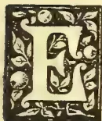A decorative initial letter 'E' in a black and white woodcut style, enclosed within a rectangular frame with ornate floral and leaf patterns.

VERY practitioner who has to do with the pruning of fruit trees, if he has studied the subject, knows how various are the views of the different cultivators who have written concerning it, many of them being diametrically op-

posed to each other, so that the less-experienced reader is apt to be greatly puzzled as to the course he should take. These differing opinions have their rise in the fact that the practices of the older cultivators are constantly being repeated without further proof. In recent years Herr Koopmann has published his researches and observations, extending over many years in a very excellent work, entitled *Grund lehren des Obstbaumschüttes*; or, *Principles of Pruning Fruit-trees*.

This work can be most warmly recommended to the notice of all pomologists, but as it is one that requires careful study, we can only notice here a few striking observations on subjects of every-day practice in gardens.

It is a rule of general acceptance that the hard cutting-back of a young tree results in the strengthening of the shoots, although some pomologists believe that hard-cutting weakens the tree, and consequently has the opposite effect.

Koopmann, in order to put these contradictory views to the test, carried out experiments on a row of equally-developed trees, as to the comparative lengthening and thickening of the shoots after pruning. He found that 1-year-old grafts reached their greatest length when they were not cut-back, which agrees with the view of Gaucher, that by the rearing of standard trees, they should not be cut-back. The thickening of the stem, and the production of wood is, however, not so great if the lateral shoots be not shortened. When the year's growth is re-

latively of sufficient strength, stems intended for standard trees should not be cut back; but when this is not the case, then cutting back must be performed. These experiments showed that the stem development was greatest when seven-tenths were cut off, leaving but three-tenths. By harder cutting back than this, the resultant shoot was shorter. Taking into consideration, however, the entire production of wood, it was found that the removal of two-thirds of the length resulted in the greatest possible strengthening of a tree. This agrees with the fact that the lateral shoots should be also cut back two-thirds of their length.

Experiments were made on pinching the summer shoots of fruit-trees, and it was found that every shoot that was pinched suffered a weakening of one-tenth as compared with the lengthening of a natural or unpinched shoot. The earliest is the most suitable time to pinch, or when the shoots are about 4 inches long, and only the terminal bud should be taken. If more than this be removed, the lower buds push out strongly, and the object of the pinching is defeated.

It is an important point in the management of pinched trees, that, only in the second year does a permanent weakening occur if the pinched parts are pruned, and the small lateral shoots shortened back, then the shoots remain permanently weak. On the contrary, if the pruning is performed on parts of a tree below the pinched shoots, the results and purposes of the pinching are frustrated.

We are also enlightened as to the results of Ringing. The breadth of a ring should on no account exceed 4 to 6 millimetres, this being the most suitable because the excised space gets covered in the first season; whereas narrower rings allow the bark to unite too quickly, and broader ones prevent an union taking place. A suitable time for ringing a tree is just previous to its flowering.

Especially deserving of notice are the effects of ringing on the growth of the roots; ringing forming a hindrance to the descent of the sap, the roots being thereby decidedly weakened. Beyond this we find that ringing not only weakens the branch on which it is performed, but likewise the branches below the ringed part break water. Ringing should not be carried out on all the branches of a tree at one time, but at the utmost on the half of them, and on naturally weak-growing trees it should be omitted.

Koopmann struck a note of warning in reference to scraping and slitting the bark, not to carry these operations too deeply into the innermost tissues of the bark, recommending slitting to be carried out over the basal enlargement of the branch as far as the stem; and he points out its importance in cases of canker caused by frost or sun-burning. He advised the cutting of parallel lines, beginning above

\* The subject-matter of this article was contained in a lecture given by Herr W. Lauche, at a meeting of the K. K. Gartenbau Gesellschaft of Vienna, March 15, 1897.

21------------------------------------------------

2THE TROPICAL AGRICULTURIST.[JULY 1, 1898]

the injured parts, deep down to the wood, and ending in sound tissue below them, this being the only method by which healthy new bark can be made to extend over an injured surface.

In order to make the so called notching of a branch or shoot of good effect, the notch must be cut down through the bark to the wood at a point just above a dormant bud; which then leads to the strengthening of the growths below that point, whereas if the notch be made under the bud it weakens them. Koopmann discovered that notching can be used in different methods with diverse effects on various kinds of fruits.

Important are his observations on pruning newly-planted trees. The very common practice of cutting the shoots hard back, i.e., to three or four buds, was always productive of unfavourable results, but a cutting back to one-half the length was satisfactory, and good results were sometimes obtained in the absence of all pruning, but only by such trees as possess a very compact habit of growth. And concerning the much-discussed subject of the season when to plant, Koopmann has much to say. He found that planting during winter, in the early autumn, and as early as possible in the spring, gave the best results; and the worst when the planting was performed in late autumn, and in winter just previous to the occurrence of hard frost.

In Germany, where the winters are, as a rule of great severity, with bright sunny days, protection against frost by means of mulches, and against sunshine, have to be used for autumn and winter-planted trees. Koopmann deprecates the planting of fruit trees in the autumn after a wet summer and autumn, the wood being in an immature condition; and he only recommends the planting of Apricots and Peaches at that season if the summer has been a warm one.—*Gardeners' Chronicle*.

## INDIAN AND CEYLON TEA.

### ANNUAL REVIEW.

38, Mincing Lane, June 8th, 1898.

The publication in London of statistics relating to the trade of the twelve months ending May 31st brings an opportunity of reviewing the main features of the season now concluded, of recording results of general or particular interest, and of surveying the position and prospects.

The season opened under favourable conditions and with a hopeful outlook. In the background stood the record of many prosperous years; accumulated experience and knowledge, placing planters in a position of great advantage; and the signs that our produce was making headway in all the chief markets. In the foreground stood the hopes raised by the remarkable increase in the use of tea at home during recent years; by the abundant capital attracted to the Home Trade; and by the evidence that in none of the business centres of the world large stocks were in existence.

The outcome of the season, however has not been fully equal to its early promise—and it is necessary to search for explanation of a result disappointing to many, though not entirely unexpected by those who a year ago took note of possible contingencies.

Turning, in the first place, to PRODUCTION:—as regards INDIA, owing to circumstances which may be considered exceptional, over large areas conditions prevailed which prevented planters from making tea sufficiently good to maintain its value. Taken as a whole, Assam kept up its high reputation—some Estates yielding tea of exceptional quality—but results were not so uniformly good as usual, and gardens north of the Brahmaputra have generally suffered from adverse climatic influences. Cachar and Sylhet, on the other hand, temporarily lost ground in respect of quality and value of produce, largely attributable to the effect of the earthquake, which was followed by widespread malarial sickness, rendering it difficult to maintain work at the highest point of efficiency—apart from the disturbance of factories, machinery, roads

and waterways. Estates in the Doomsa appear to have been less affected; they have given full crops of average quality, if somewhat short of the excellent tea once produced in this district. In Darjeeling with a few exceptions results have been disappointing, notwithstanding the increased appreciation of its tea. Up to the date of the earthquake the gardens were doing well, but subsequently a general reverse was experienced, and although a fair yield was secured, the latter portion of the crop lacked the right flavour, greatly to the detriment of value. By some this was attributed to rapid flushing after excessive rainfall: by others to disturbance of soil during the earthquake, which affected the bushes. The crops from Southern India—slowly growing in volume—have not been of sufficiently good quality to hold their own in competition with other growths, but if Managers will pay more attention to the details of cultivation and manufacture, there seems no reason why good tea should not be made there: if good it will find a ready market here. The season was not a favourable one for Estates in the Kangra Valley, but there is a demand for their tea abroad, and buyers will pay a fair price for such as have flavour.

As regards CEYLON:—Production increased, but at a slower rate than hitherto. Upon the whole the crop has maintained its ground in respect of quality, and although it has contained but few of the specially fine sorts originally made, tea of uniformly good make and flavour has been sent from estates situated on the higher levels, possessed of character so distinct from other produce as to make a market for itself. The position of properties which have not given "distinctive teas" and cannot work as cheaply as estates in the low countries seems less assured, and it will be well for their proprietors to make improvement of quality their first aim, in face of the tendency for values to decline for ordinary teas lacking special characteristics, wherever produced.

All growers in India and Ceylon have suffered from the high rate of exchange, which has raised the cost of production without bringing any compensation in the form of higher values in London. An inflated rupee may check further extensions, but the effect of this, in retarding increase in production, will not be felt for years. Some have also suffered heavy loss on rice, owing to the famine. These several drawbacks to a successful season, however, would not have been so much felt if the market had not been checked and buyers discouraged by the signs that Home Consumption was not expanding as it used to do. Useful as our growing foreign trade is, it is still inadequate to do more than stiffen the price of particular kinds, the value of the crop as a whole, remaining dependent (1) upon the requirements of the United Kingdom; (2) upon its quality.

The Board of Trade Returns show that in 1891 Home Consumption increased 8½ million lb.; in 1892, 4½ millions; in 1893, 1 million; in 1894, 6½ millions; in 1895, 7½ millions; in 1896, 6 millions, and in 1897, only 3½ millions;—making a total of 37½ millions in 7 years, i.e., from 194 millions in 1890 to 231½ millions in 1897. By contrast with such progress, the increase of only 1½ million lb. during the 10 months ending 31st March was most discouraging:—that the figures at the moment look better is due to recent heavy duty payments in advance.

When writing a year ago, we pointed out some of the causes contributory to the large expansion in the past, and remarked that as they had "been for some time in operation in London and other great centres, if not in the country, it would be unsafe to reckon upon Home Consumption expanding in the future as substantially as it has done for the past two years." We also showed that the margin for increased use of our own teas at home had become narrow, owing to the extent to which China tea had already been pushed out of consumption. The figures are as follows:—  
Of the total used in 1891-2 1893-4 1895-6, 1896-7 1897-8

<table>
<thead>
<tr>
<th></th>
<th>was</th>
<th>79%</th>
<th>86½%</th>
<th>88½%</th>
<th>90%</th>
<th>91½%</th>
</tr>
</thead>
<tbody>
<tr>
<td>China and other kinds were</td>
<td>..</td>
<td>21 "</td>
<td>13½ "</td>
<td>11½ "</td>
<td>10 "</td>
<td>½ "</td>
</tr>
</tbody>
</table>

22------------------------------------------------

JULY 1 1898.]THE TROPICAL AGRICULTURIST.3

Apart from these reasons, have any other causes operated to check expansion, and if so, are they permanent in their effect, or merely temporary?

The principal beverages competing with Tea are Coffee and Cocoa. The quantity of Coffee and Chicory taken for home use in 1897 was 37 million lbs., compared with 37½ millions in 1896. The quantity of raw Cocoa taken was 27½ million lbs. in 1897, compared with 24½ million lbs. in 1896, and the increase has continued since 1st January, which means that several million pounds weight of Cocoa and its compounds have been pushed into consumption, with the aid of lavish advertisement, mainly at the expense of tea. Opinions differ as to its future as a popular beverage. It lacks some of the properties which have made tea almost a necessary of life to the masses, and the price of the pure Cocoas retailed is nearly double that of tea. An indirect reason for the comparatively short Deliveries of tea last year may be the serious loss of income to the working classes incidental to the labour troubles. Renewed activity in the industries of the Midlands and North should beneficially affect a commodity of which wage-earners are the principal consumers.

Much attention has rightly been paid to fostering trade with other countries. The figures at foot show progress, but not sufficiently rapid to keep pace with the prospective increase in production. Our trade with America, indeed, continues small in view of the energy and capital devoted to the work of introducing our teas there, where we have to encounter the efforts of Japan to fill the opening left by the smaller receipts from China. We regard Russia as a more hopeful market, for the Russian buyers appreciate the best Indian and Ceylon teas and will pay a good price for them, whereas in other outside markets, whether Australian, American, or Central Asian, the demand is chiefly for the cheaper kinds and depends much upon the lowness of quotations. Business with Russia would be helped by the shipment of the fine sorts they like in larger lines, which prove to be most attractive.

The probability, then, seems to be that in the coming year the total supply may be somewhat heavier than the United Kingdom requires, and the surplus a little larger, perhaps, than the other markets will absorb. Under these circumstances it will be prudent to modify the policy, which has lately prevailed in some districts, of making the heaviest crop possible, irrespective of quality. So long as there was a fair margin of profit, this policy was successful; but with higher cost of production and reduced selling value it ceases to be so. Prices have fallen here for such kinds partly because London has become the destination of tea, from all parts, too common to find acceptance elsewhere; and partly from a reason to which we referred a year ago, viz., that the principal vendors who make tea a speciality have mainly built up and are maintaining their trade by selling *better tea* than the average individual retailer—not by pushing the sale of inferior tea at lower prices. The proof that this is the case exists in the fact that for many years the finest qualities have met with the strongest competition, and in the evidence that those who have bought them are among the most successful traders of the day.

The profitable nature of the Distributor's business is a factor of importance, and an element of strength not to be overlooked, as it ensures a buying-power commensurate with the large dimensions of the trade. The confidence with which wealthy buyers handle crops, however, depends largely upon their quality—not merely upon the statistical position—and there can be little doubt that the market has suffered more from the inferiority of the last Indian crop than from larger importations.

It is customary to assume that China tea has been ousted from British and Colonial markets, and need not be decried a serious rival. Indian and Ceylon teas, however, have made their way; 1, by their superior character and value, accentuated by the deterioration in the quality of China Congou; 2, by the help of their low cost of production. It must not be taken for granted that the Chinese are incapable of reforming

their methods and making good tea once more, in order to save a valuable trade now in danger of being lost; and it must not be forgotten that dear Rupees with cheap silver place British growers at a serious disadvantage compared with those in the Far East. There seems no occasion to fear competition at home from the produce of Java or Japan, but the Japanese will compete strongly with us to keep their trade with the United States and Canada, approaching an annual value of nearly £1,000,000.

Surveying the position as a whole, therefore, we conclude that the wisest policy for growers both in India and Ceylon will be, to pay the closest attention to improvement of quality; to check the tendency to pack and send forward to any part of the world tea so common as to lower the reputation of their produce; and to be slow in extending plantations upon soil which has not proved its capacity of yielding good tea. The industry is so thoroughly established and sound, that with ordinary prudence and normal climatic conditions, successful results may reasonably be anticipated for well-managed properties not overweighted with unduly high capital.

### STATISTICS.

Showing the development of the INDIAN TEA TRADE during the past three Seasons, ending 31st May:—

<table border="1">
<thead>
<tr>
<th>Exported from Calcutta</th>
<th>1895-96.</th>
<th>1896-97.</th>
<th>1897-98.</th>
</tr>
</thead>
<tbody>
<tr>
<td>To the United Kingdom</td>
<td>121,163,000</td>
<td>132,600,000</td>
<td>133,800,000</td>
</tr>
<tr>
<td>To Australasia</td>
<td>6,842,000</td>
<td>6,171,000</td>
<td>6,803,000</td>
</tr>
<tr>
<td>To America</td>
<td>1,086,000</td>
<td>1,938,000</td>
<td>2,036,000</td>
</tr>
<tr>
<td>To Asia and elsewhere</td>
<td>5,390,000</td>
<td>4,855,000</td>
<td>4,400,000</td>
</tr>
<tr>
<td></td>
<td>134,483,000</td>
<td>145,564,000</td>
<td>147,039,000</td>
</tr>
<tr>
<td>From other Indian Ports to U.K.</td>
<td>2,000,000</td>
<td>2,500,000</td>
<td>3,000,000</td>
</tr>
<tr>
<td>Season's Re-Exports from the U.K.</td>
<td>3,800,000</td>
<td>5,250,000</td>
<td>6,000,000</td>
</tr>
</tbody>
</table>

Showing the development of the CEYLON TEA TRADE during the past three years, ending 31st December:—

<table border="1">
<thead>
<tr>
<th>Exported from Ceylon</th>
<th>1895.</th>
<th>1896.</th>
<th>1897.</th>
</tr>
</thead>
<tbody>
<tr>
<td>To the United Kingdom</td>
<td>85,573,000</td>
<td>94,000,000</td>
<td>99,000,000</td>
</tr>
<tr>
<td>To Australasia</td>
<td>9,380,000</td>
<td>11,806,000</td>
<td>13,233,000</td>
</tr>
<tr>
<td>To America</td>
<td>394,000</td>
<td>718,000</td>
<td>831,000</td>
</tr>
<tr>
<td>To Elsewhere</td>
<td>2,413,000</td>
<td>2,270,000</td>
<td>2,983,000</td>
</tr>
<tr>
<td></td>
<td>97,940,000</td>
<td>108,794,000</td>
<td>116,002,000</td>
</tr>
<tr>
<td>Season's Re-Exports from the U.K.</td>
<td>7,500,000</td>
<td>9,150,000</td>
<td>11,000,000</td>
</tr>
</tbody>
</table>

Showing the progress of the Ceylon Tea Trade in London:—

<table border="1">
<thead>
<tr>
<th>Season ending</th>
<th>Imported million lbs.</th>
<th>Total of Auctions. pkgs.</th>
<th>Average price per lb.</th>
</tr>
</thead>
<tbody>
<tr>
<td>31st May, 1896</td>
<td>.. 82 ..</td>
<td>975,000</td>
<td>.. 83d</td>
</tr>
<tr>
<td>.. .. 1897</td>
<td>.. 92 ..</td>
<td>1,140,000</td>
<td>.. 8d</td>
</tr>
<tr>
<td>.. .. 1898</td>
<td>.. 93½ ..</td>
<td>1,160,000</td>
<td>.. 7¾d</td>
</tr>
</tbody>
</table>

London Warehouse Returns, including all kinds of Tea, for the past three Seasons, ending 31st May:—

<table border="1">
<thead>
<tr>
<th rowspan="2">Import—</th>
<th colspan="3">(Estimated Weights.)</th>
</tr>
<tr>
<th>1895-6. lbs.</th>
<th>1896-7. lbs.</th>
<th>1897-8. lbs.</th>
</tr>
</thead>
<tbody>
<tr>
<td>Indian</td>
<td>117,932,000</td>
<td>131,650,000</td>
<td>135,377,000</td>
</tr>
<tr>
<td>Ceylon</td>
<td>81,870,000</td>
<td>92,073,000</td>
<td>93,580,000</td>
</tr>
<tr>
<td>China</td>
<td>40,996,000</td>
<td>33,012,000</td>
<td>31,007,000</td>
</tr>
<tr>
<td>Java, etc.</td>
<td>3,947,000</td>
<td>3,606,000</td>
<td>3,682,000</td>
</tr>
<tr>
<td>Total</td>
<td>244,745,000</td>
<td>260,341,000</td>
<td>264,636,000</td>
</tr>
</tbody>
</table>

23------------------------------------------------

4THE TROPICAL AGRICULTURIST.[JULY 1, 1898.

<table border="1">
<thead>
<tr>
<th></th>
<th>1895-6.</th>
<th>1896-7.</th>
<th>1897-8.</th>
</tr>
<tr>
<th>Delivery—</th>
<th>lbs.</th>
<th>lbs.</th>
<th>lbs.</th>
</tr>
</thead>
<tbody>
<tr>
<td>Indian</td>
<td>120,743,000</td>
<td>126,165,000</td>
<td>129,399,000</td>
</tr>
<tr>
<td>Ceylon</td>
<td>81,034,000</td>
<td>90,677,000</td>
<td>96,303,000</td>
</tr>
<tr>
<td>China</td>
<td>41,075,000</td>
<td>39,691,000</td>
<td>32,895,000</td>
</tr>
<tr>
<td>Java, etc.</td>
<td>3,891,000</td>
<td>3,500,000</td>
<td>3,719,000</td>
</tr>
<tr>
<td>Total</td>
<td>246,743,000</td>
<td>260,333,000</td>
<td>262,316,000</td>
</tr>
<tr>
<td>Of which</td>
<td></td>
<td></td>
<td></td>
</tr>
<tr>
<td>Home Con-</td>
<td></td>
<td></td>
<td></td>
</tr>
<tr>
<td>sumption</td>
<td>213,500,000</td>
<td>227,000,000</td>
<td>228,616,000</td>
</tr>
<tr>
<td>Export(actual</td>
<td></td>
<td></td>
<td></td>
</tr>
<tr>
<td>Weights)</td>
<td>33,250,000</td>
<td>33,300,000</td>
<td>33,700,000</td>
</tr>
<tr>
<td>Stock 1st June—</td>
<td></td>
<td></td>
<td></td>
</tr>
<tr>
<td>Indian</td>
<td>26,751,000</td>
<td>32,235,000</td>
<td>38,213,000</td>
</tr>
<tr>
<td>Ceylon</td>
<td>18,557,000</td>
<td>19,953,000</td>
<td>17,231,000</td>
</tr>
<tr>
<td>China</td>
<td>19,635,000</td>
<td>12,891,000</td>
<td>11,993,000</td>
</tr>
<tr>
<td>Java, etc.</td>
<td>988,000</td>
<td>865,000</td>
<td>827,000</td>
</tr>
<tr>
<td>Total</td>
<td>65,931,000</td>
<td>65,944,000</td>
<td>68,264,000</td>
</tr>
</tbody>
</table>

THE EXPORT TRADE OF CHINA.

<table border="1">
<thead>
<tr>
<th></th>
<th>1896-97.</th>
<th>1897-98.</th>
</tr>
</thead>
<tbody>
<tr>
<td>To England</td>
<td>35,200,000 lbs.</td>
<td>31,000,000 lbs.</td>
</tr>
<tr>
<td>To Russia*</td>
<td>22,600,000 lbs.</td>
<td>26,800,000 "</td>
</tr>
<tr>
<td>To America</td>
<td>52,500,000 lbs.</td>
<td>44,800,000 "</td>
</tr>
<tr>
<td>To Elsewhere</td>
<td>12,600,000 lbs.</td>
<td>10,600,000 "</td>
</tr>
<tr>
<td>Total</td>
<td>122,900,000 lbs.</td>
<td>113,200,000 lbs.</td>
</tr>
</tbody>
</table>

\* Overland trade not included.

THE EXPORT TRADE OF JAPAN.

<table border="1">
<thead>
<tr>
<th></th>
<th>1895.</th>
<th>1896.</th>
<th>1897.</th>
</tr>
<tr>
<th></th>
<th>lbs.</th>
<th>lbs.</th>
<th>lbs.</th>
</tr>
</thead>
<tbody>
<tr>
<td>To United States</td>
<td>54,000,000</td>
<td>46,500,000</td>
<td>..</td>
</tr>
<tr>
<td>To Canada</td>
<td>9,700,000</td>
<td>8,500,000</td>
<td>..</td>
</tr>
<tr>
<td>To Elsewhere</td>
<td>4,300,000</td>
<td>3,000,000</td>
<td>..</td>
</tr>
<tr>
<td>Total</td>
<td>63,000,000</td>
<td>58,000,000</td>
<td>57,000,000</td>
</tr>
</tbody>
</table>

SOME INDIAN CROP RESULTS FOR THE PAST SEASON:—

Previous Tables, including most of the Estates named above, showed the following results:—

<table border="1">
<thead>
<tr>
<th rowspan="2">Returns for</th>
<th rowspan="2">Acreage.</th>
<th rowspan="2">Quantity. lb.</th>
<th colspan="2">Per Average</th>
</tr>
<tr>
<th>Acre.</th>
<th>Price. per lb.</th>
</tr>
</thead>
<tbody>
<tr>
<td>1896-97</td>
<td>101,950</td>
<td>46,600,000</td>
<td>458</td>
<td>9-77</td>
</tr>
<tr>
<td>1895-96</td>
<td>101,750</td>
<td>45,850,000</td>
<td>450</td>
<td>9-55</td>
</tr>
<tr>
<td>1894-95</td>
<td>97,120</td>
<td>45,284,000</td>
<td>435</td>
<td>10-55</td>
</tr>
</tbody>
</table>

WM. JAS. & HY. THOMPSON *Brokers*.

IN THE LAND OF GINGER.—JAMAICA.

IN THE LAND OF GINGER, JAMAICA," is the title of a pamphlet from the pen of Mr. J. B. Kilmer, of New Brunswick, N. J., a reprint from the "American Journal of Pharmacy." Mr. Kilmer's investigations into the methods employed in planting and preparing ginger for the market, have been personally conducted on the plantations of the small settlers in the ginger producing districts of Jamaica, and are entertaining and instructive. We produce extracts from the pamphlet for the benefit of those of our readers who are engaged, or who are desirous of engaging in the cultivation of this important minor product.

The books state that "Zingiber officinale, Roscoe (Amomum zing'ber,) is a native of Asia, and that it has been introduced into most tropical countries, and is now found in the West Indies, South America, tropical western Africa, and Queensland in Australia." But the vial handed over the drugstore counter, even though it may contain a weak decoction of pepper, will invariably be labelled "Jamaica Ginger." In these notes we shall, therefore, study this plant as seen in its popular habitat, thus keeping in

sympathy with the West India planter, to whom the only known spot where ginger grows is in his sunlit garden.

One of the essential requirements for the growth of this plant is sunshine—Old Sol is here young, bright and active.

Another requisite for growth—moisture—is also here in plenty. In some portions, 281 inches, or 23 feet, is recorded as an annual down pour. In the "ginger district," 88 inches, or over 7 feet, has been the mean annual rainfall for the last twenty years. (In a report made by one of my correspondents in this district, October, 1897, 47 inches or nearly 4 feet, of rainfall were recorded in sixteen days.) While ginger grows at suitable elevations all over the island, it is mainly produced in the central western portion, along the borders of the parishes of Westmoreland, St. Elizabeth, Manchester, Clarendon, Trelawny, St. James. The underlying soil of this district consists of white and yellow limestone, with trappean formation; this is covered in some of the nooks or valleys with a pulverent mould or loam deposit several feet in depth. The plant grows luxuriantly in such soil, but apparently will not thrive in marshy soil, nor where there is present more than 10 to 20 per cent. of clay or 30 per cent. of sand. The government returns for the whole island give only about 250 acres of land devoted to ginger. This amount of acreage would not yield the crop harvested. But the real cultivation is not in acres, many cultivators having beds varying from six feet square up to the size of a building lot. A few cultivate from one to six acres. Large lots are very rare. For the most part, it is put in the ground in any convenient spot, alongside pineapples, yams, cocoa, cassava or other plants, often in the midst of a dense growth of bush or weeds. In the statistics of this fertile island this article does not figure in pounds, shillings and pence as largely as do some of its other products. Economically speaking, however, ginger is one of its most important articles of commerce. In my judgment, from 25,000 to 50,000 of its people are more or less dependent upon the ginger crop for such ready money as is essential to maintain their existence. The ginger planter divides ginger into "blue" and "yellow" from the color of the rhizome. These are also known as, respectively, "turmeric" and "flint." I was unable to see any botanical difference in the plant producing the two different coloured root-stalks, and many intelligent planters were unable to distinguish the kinds without first examining the root. If anything, it seemed to me that the blue was a degenerate species. The root of the blue is hard and fibrous, yields a much less proportion of powder, is less pungent, and therefore less valuable commercially. There is also a division into "plant" and "ratoon" ginger. Plant ginger is ginger that is planted each season; ratoon ginger is really a product of laziness. It is a return crop, secured by leaving part of the "hand" containing a bud in the ground when the crop is harvested. Ratoon ginger is much smaller in size of hands than the planted, and loses each year in flavour, each successive crop being less and less in amount.

Ginger Planting

Ginger is planted in March and April. The planting process consists in burying the divided fingers, each division containing an "eye" or embryo, in trenches or holes a few inches below the surface and about a foot apart, similar to the process of planting potatoes. The small grower simply digs a hole in a convenient spot. The thrifty planter first burns over his plot, to destroy weeds and insects, then ploughs and lays the plot out into beds and trenches. The growing plant needs plenty of sun, and the weeds and bushes must be kept down. This latter is a perplexing problem, unless the weeds have

\* I found some shippers in Jamaica ports who were exporting the undried "blue" ginger to supply the demand for green ginger as used in pickling and preserving.

24------------------------------------------------

JULY 1, 1898.]THE TROPICAL AGRICULTURIST.5

been destroyed before the ginger has been planted. If the weeds are pulled or the ground disturbed while the plant is growing, water is apt to settle round the root, and this rots them. The reed-like ginger plant, with its leafy stems, grows sometimes to a height of five feet; its cone-topped flowering stems reach from 6 to 12 inches, and, in a well-cleaned field, make a pretty show when in their September bloom. On wet soil and during very rainy seasons the root is subject to what is termed "black rotten." This is a rotting induced by warm, soggy soil. The root swells in spots, fills with water, turns black, and emits an offensive odor. In this condition it is attacked by insects and worms, which has given rise to the belief among the planters that the rotting is caused by a so-called ginger worm. (It is possibly a fungus disease.)

Growing ginger must be well watered. Irrigation is practised to a limited extent, but in most of the parishes this is unnecessary, as the rainfall is abundant. Fertilization, though highly important, is rarely attempted, partly owing to the small profit, but largely owing to the customs of the country. The most that is ever done is to plough in the weeds and cover the ground with banana trash. Rarely will the planter ever gather up the manure from his live stock and throw it on the ginger-bed. There are no stables used in Jamaica, therefore no such thing as a compost heap. Sea weeds and watering the beds with sea water have been tried, experimentally with good results; but no matter how large-sized roots or how fine a quality would be yielded, the average planter would not take the trouble to work his ground in a scientific manner. An all important feature is the rapid impoverishment of the soil that follows the ginger culture. One planter told me that only ferns would grow on the soil after exhaustion by this crop. There is thus a constant demand for virgin soil to secure the best-paying crops. This is attained by sending valuable timber up in smoke, as one authority tersely expressed it. "Dried-up streams, general barrenness in fact a wilderness marks the progress of ginger culture."

The situation is clearly summed up by Mr. Wm. Fawcett, Director of Public Gardens for Jamaica, from whose report to the Honorable Colonial Secretary I quote: "The soil which produces the very highest quality ginger, realizing, perhaps, £10 per cwt. in the London Markets, is the very deep black soil of virgin forest. To grow ginger under this condition involves the destruction of large areas of forest. Magnificent trees, six feet in diameter, may be seen in some districts lying rotting on the ground, while the ginger cultivators have gone further to the centre of the island, abandoning the woodlands already cut down. The plan adopted in clearing a forest is for a cultivator to invite ten or twelve of his friends to a 'cutting match.' He provides food and drink, and the laborious work of felling trees is carried on merrily and without much expense. Afterwards, fire is put and the place is burnt over. This burning is considered very important, as much so as the virgin soil.

"Probably its importance is due principally to the deposit of potash and other mineral matters contained in the ashes, but the fire will also sweeten the ground, correcting sourness; and moreover, it destroys insect pests. Some cultivators will only grow ginger in freshly cleared woodland, and next year they move on to a new clearing; but although in this way they get very fine ginger, it is at the expense of forest land which would require a heavy outlay and perhaps a term of 100 years to restore. Albert Town was not long ago a great centre for the cultivation, but I was told there that growers had already got as far as 14 miles further inland.

"Ginger can be, and is, grown in many places year after year on the same ground. An intelligent cultivator at Borbridge stated that he knew of ginger growing for forty years in the same patch. Sanford Town is in a German colony, and one of the original colonists, Somers, an active old man of eighty years

of age, has been cultivating ginger and arrowroot there since his youth. He and the other colonists have been in the habit of planting a small patch one year, leaving it to ratoons as long as it was profitable, then throwing it up or growing other plants until, after a term of years, they again plant the same patch with ginger. This is an irregular rotation of crops; 'plant ginger,' the product of planting, is of better quality than the ratoons, and the ratoons in each succeeding year are inferior. When the ground is too poor to grow 'white ginger,' the 'blue ginger' the inferior variety, can be grown. "More depends upon the curing of ginger, considering the crop as a livelihood, than soil. I believe that the badly-cured ginger brought sometimes to the market is due to wet weather, rather than to want of care."

"The export of ginger is, on the whole, on the increase, but if this is accompanied by the gradual destruction of woods and forests, it is not a subject of congratulation." An examination of the exhausted soil revealed the fact that it was deficient in organic matter, lime, phosphoric acid and soda. Attempts made, at my suggestion, to supply these deficiencies by the use of market fertilizers of various kinds were not productive of any favourable results. Stable manure alone resulted in a failure, as likewise did the use of a bat guano found on the island. The use of a marl, especially when mixed with stable manure, was a partial success.

The Jamaica Agricultural Society, in 1895, began a series of practical experiments which are still in progress. Their first results gathered in February, 1897, were somewhat affected by a drought in the previous November. Upon a limited area of worn-out land, which in check experiment gave no return, they secured a crop which would be equivalent to over 2,500 pounds of cured per acre, and the product was of extraordinary size and quality. The fertilizer aiding in bringing this result was a mixture of marl with a compound fertilizer made up of about 10 per cent. each of soluble phosphates ammonia and potash salts. These results were very encouraging and the Society has extended them by securing larger plots, giving aid to planters in the way of furnishing fertilizer, etc., returns from which will be gathered in the spring of 1898.

The solution of the problem of reclaiming land exhausted by the ginger and other crops, and the prevention of the further wasteful destruction of valuable soil, is in Ginger Land one of great moment. There is in this fair Island thousands upon thousands of acres of abandoned land, lying within easy reach of roads and ports; much of it has been abandoned because the soil has been exhausted by ginger or coffee. If by suitable tillage and manures it can be reclaimed, great benefits to the inhabitants will follow.

Ginger, as we know it, is the root-stalk of the plant. The root proper or root fibres are about  $\frac{1}{2}$  inch long, not very numerous, dying off as the rhizome advances and leaving a slight scar. As regularly shaped hands, with more or less straight fingers, command the higher price in markets, experiments were made to secure a regular shaped growth. Owing to the peculiarities of the native planter, instructions were not closely followed and the results were unsuccessful. The fact was developed that a sprout starts from the parent eye, and from this stem turn, lateral shoots or branches develop in pairs. These side branches again develop in pairs, these pairs generally alternating no opposite sides. It was found that if the soil was well worked and pulverized before planting the growth was straighter than when planted in hard soil. Some difference was noted also in the condition of the parent plant; if this was well developed and vigorous the resultant root-stalk was of a better type than where the parent was small, nearly and crooked. The Botanical Department is now experimenting with selected plants

#### *Gathering the Ginger Crop.*

Ratoon ginger is gathered from March to December, but planted ginger is not ready for digging until December or January, and from then until March

25------------------------------------------------

THE TROPICAL AGRICULTURIST.[JULY 1, 1898.

is the "ginger season." Ginger is known to be ready for harvest when the stalk withers. This begins shortly after the bloom departs. The rhizomes are twisted out of the ground with a fork. In this operation, every bruise or injury to the hands is detrimental to the market value. There is quite a knack in doing this, and it takes long practice to become expert. The hands are thrown in heaps, the fibrous roots are broken off, and the soil and adherent matter removed. This must be done quickly after removal from the earth, for, should the ginger be dried with the soil and roots still adhering, the product would not be white, and, if it lies in heaps before drying, it will mould. The custom is to throw it immediately into a dish of water; it is then ready for the uncoating or peeling operation; this is done by hand. A planter who has any quantity of it on hand, will make a "peeling match" by gathering his own numerous family, and whatever help his neighbors can afford. The ginger season thus becomes a time of merry-making.

#### *Peeling Ginger.*

Ginger-peeling is an art, and there are many expert peelers in Jamaica. The ginger knife is simply a narrow-edged blade riveted to a handle. In large operations an expert peels between the fingers of the hands, less experienced hands peeling the other portions. Examination of a transverse section of ginger will show the importance of the operation. There is an outer striated skin under which there are numerous oil cells, the oil cells being most numerous at the bud points. The oil contained in these cells, in specimens fresh from the ground, is almost colorless, very pungent, and exceedingly aromatic. It becomes yellow very quickly on exposure to the air, and, even upon drying without removing the epidermis, its delicate aroma is found to be fleeting. On drying the ginger the contents of these cells appear as a yellow, pitchy mass. (It has been stated that this coloring matter is identical with that of Curcuma.) As this cork layer is the seat of the greatest amount of oil and resin cells, it will readily be seen that the deeper the peeling so much the more of these substances will be carried away with the epidermis, and more cells opened from which these principles may exude.\*

As fast as peeled, the roots are thrown into water and washed. The purer the water and the more freely it is used, the whiter will be the product. Generally a very little water washes a great deal of ginger. The hands are peeled during the day, and allowed to remain in the water over night. This water acquires a slimy feeling and if concentrated, becomes mucilaginous and acquires a warm and aromatic taste. The natives claim that this process sucks out the "fire and poison" from very hot ginger. I placed some pieces in a stream of running water for twelve hours, and succeeded in making them several shades lighter in color. This sample proved to be less pungent to the taste, and it is quite possible the force of the water carried away some portion of the aromatic principles. A few planters use lime juice in the wash water. This gives a whiter root, having some solvent action on the coloring matter, but, as the lime juice contains saccharine and pectose matter, it prevents drying, and mildew follows. In another experiment I supplied the natives with citric acid, vinegar and acetic acid. They all worked fairly well, citric acid being the best whitening agent, but it was reported that the process was expensive and troublesome. It is generally stated that ginger is deprived of its coat by being plunged into boiling water before being scraped. This practice is not used to any extent in Jamaica. Its effect is to swell the starch and balsa-like gums. I found that after keeping the freshly

peeled root-stalks in boiling water for an hour they were considerably swollen and the stream was filled with the aroma of the ginger. Under this treatment the coating comes off easily; but, if the action of the boiling water is prolonged, the starch and fibre are acted upon, the product dries hard and the color is darkened. In fact, what is known as "black-ginger" of the market is the result of this process. Ginger is found in the market coated with calcareous matter, such as carbonate of lime, etc., this is said to be to fill a demand for "white ginger." Such a proceeding is apparently unknown among the planters. Well-cured ginger has a decided white coating and that is all they know about it.

It has been stated that it is a common practice to bleach ginger with the fumes of chlorine or sulphurous acid. It may be done in the other parts of the world, but no instance of it is known in Jamaica.\* I tried chlorine gas as a bleaching agent, but at best the product was of a dirty yellow color. By using the fumes of burning sulphur, the whole being partially enclosed in glass, the heat of the sun aiding in the experiment, the ginger was whitened and mildew prevented. I found on trial that it might be of service to place the ginger in a weak solution of chloride of lime before drying; this would aid in bleaching and prevent mould.

#### *Curing Ginger.*

After washing, the process of drying follows: The tropical sun is the drying agent in all cases. Large operators have what is called a "Barbecue." This is a piece of ground several feet square, leveled off and laid with stone and the whole coated with cement. It is placed so as to receive the greatest amount of sunshine. The small planter uses what is called a "Mat," consisting of sticks driven into the ground, sawbuck fashion, and across these sticks are laid boards, palm, banana or other large leaves; oftener than otherwise, the place for drying is a few palm leaves spread upon the ground.

Careful handlers put their ginger out as the sun rises, and turn it over at mid day, taking it in at sundown. Rainy or cloudy weather invites mildew. It requires 6 to 8 days for the root to become thoroughly dry. I made several tests to ascertain the loss in weight by drying in the sun, and found the average to be nearly 70 per cent.

Ginger dried in the sun for the market examined for moisture gave the following results: Six samples well dried specimens, showed a further loss when dried at 100° C. as follows: 7-2, 8-5, 8-9, 9-5, 10, 11, 12 per cent. Several poorly-dried specimens, some of which were damp and mouldy, gave from 15 to 25 per cent. moisture when dried at 100° C. During the progress of my attention to this subject, several attempts were made to utilize artificial heat in drying ginger. Such a course would, in some respects, be a very desirable one.

In a portion of the island given almost entirely to the cultivation of this product, a few years ago a wet season prevailed. It was impossible to dry the crop in the sun; as a consequence there was a loss of the crop, followed by a considerable distress among the planters.

During my observations an attempt was first made to dry without removal of the skin coat. This, if successful, would have meant the saving of considerable labor. The product was quite dark, the flavor not as good as that of the sun-dried. By removing a part of the coat the drying was hastened. Dr. A. G. McCatty, a practicing physician and owner of a plantation, at my suggestion, placed in operation an American fruit evaporator. It was necessary to use wood as a source of heat, and, partly owing to the high temperature and partly from the ignorance of the operator, the product so far has been rather poor in quality, the color many shades darker, much of the aroma was lost, and a smoky, burned flavor acquired. Other planters are trying the process on this year's crop.

\* Bleaching by chemicals and coating with powders are market processes unknown to the planters.

\* The Jamaica Agricultural Society has advertised in the United States and England the desirability of a machine or apparatus to be used in removing the coating from ginger; experiments along the line are now being made.

26------------------------------------------------

JULY 1, 1898.]THE TROPICAL AGRICULTURIST.7

A curious incident resulted during these experiments. The natives, through prejudice against innovations, boycotted the drying apparatus, and refused to furnish supplies at any price. Experiments were made with calcium chloride as a drying agent. The result did not equal samples produced by the native method of drying in the sun. Attempts made to dry the ginger after first slicing, as might be expected, resulted in great loss of flavor and pungency. My conclusions were that, when well conducted, the native method of careful peeling and curing in the sun would produce a handsomer and a better product than any process yet suggested.

These observations were not undertaken with a view of making any complete analysis, and it was found that a macroscopic examination by expert judges was far more reliable than any assay that could be made with limited facilities present in the ginger fields. A few such examination were made as follows:

*Ethereal Extract.*—Exhaustion of the ginger with either in a Soxhlet extraction apparatus. The resultant extract, after evaporation of the ether, was dried over sulphuric acid to remove moisture. From this extract the volatile oil was calculated by the loss on drying the ethereal extract at 110° C. for three hours. The only results from this process that seemed to be of value were that the finer grades, when carefully dried, contained a higher percentage of volatile oil.

Ginger dried without removing the peel gave somewhat higher results as to volatile oils than the peeled. The loss of this constituent was greater in a product dried by artificial heat than when dried by sun. The amount of volatile oil found by aforesaid process was, lowest, 1 per cent.; highest, 3.20 per cent. The results as to ethereal extract, exclusive of volatile oil or from alcoholic extract from the ether-exhausted residue, seemed to be of little value, the different specimens giving such greatly changing amounts as to afford no guide.

In these Experiments some observations were made that were interesting though of no particular value. In the extracts from ratoon ginger there was evidently a more fiery taste and less flavor than in the planted ginger. This was also true in regard to the extracts from the blue and yellow varieties, the yellow having a much finer odor and taste. Upon the addition of water to these extracts in sufficient amounts to precipitate the dissolved resins, it was observed that in the case of the well-cured specimens of plant ginger a delightful aroma was imparted to the water, a true ginger flavor, without fire or pungency. But in extracts from old ratoon ginger, from mildewed specimens spoiled in drying, this aroma was greatly changed, becoming musty and weak, the taste in some instances being decidedly better. Ninety-five per cent. alcohol was found to give better results as to flavor of extract than that of lower strength.

The ruling price in Kingston and Montego Bay for the heap is a penny-half-penny (about three cents). Heaps purchased by me varied according to quality, but the average weight was from one-fourth to one-half pound.

The buyers of ginger for shipping are expert and accurate. They grade, sort and price with a quick eye and ready touch gained by years of practice. The highest grades are large-sized hands of light and uniform color, free from evidence of mildew. This grade is brittle and cracks easily, but broken pieces depreciate the value. Buyers also require the hands and fingers to be firm and full, without wrinkles or spots. They generally assort into four or five grades, that which is shriveled and small being the lowest. The dark varieties form another, the heavy, tough and flinty a third. These four are finally assorted by placing hands which are small but of good texture and color as one grade. The larger-sized, well-bleached hands into the highest grade.

The ratoon ginger sorts generally bring the lowest price, as they are small, soft and soggy, and lack flavor. Ginger gathered green shrivels much in

drying and is less aromatic and pungent than when fully matured. Ginger that has mildewed is spotted, and the mildew starts a decomposition that affects the flavor. Ginger put in bags or laid away before being thoroughly dried will mould and acquire a musty odor and flavor, which it is impossible to remove.

The largest sized lands are carefully selected by buyers and shipped to special markets, usually to England, I noticed hands weighing as much as eight ounces; many of them weighing from four ounces upward.

Ginger is packed in barrels for shipment.

#### *Economics.*

The amount of Ginger exported from this Island during the last ten years is shown in the following table\*:—1887, 1,121,827 lb.; 1888, 1,141,877 lb.; 1889, 1,002,653 lb.; 1890, ( $\frac{1}{2}$  year), 554,93 lb.; 1891, 1,219,197 lb.; 1892, 1,822,531 lb.; 1883, 1,526,884 lb.; 1884, 1,672,384 lb.; 1885, 1,736,460 and 1896, 1,969,609 lb.

The yield and profit of the ginger crop depend somewhat upon the nature of the soil. In favourable seasons rainfall, sunshine, planting care and curing, are also factors. An average yield can be estimated at from 1,000 to 1,500 pounds dried ginger per acre. In exceptional cases, 2,000 pounds have been gathered. There are planters in Jamaica who plant ginger here and there in patches, and gathering as little as a hundred pounds in a year. Ginger is well adapted to the small planter, and admirably suited to the peasantry of Jamaica, who, by slow evolution, are passing from serfdom to manhood and independence.

The Botanical Department, through its crops of agricultural instructors, is now going among the people and showing them exactly what may be done in the way of improving their methods of cultivation. The Jamaica Agricultural Society is conducting practical and extensive demonstrations to show the use and value of fertilizers. These have already an important bearing upon this crop. Information recently to hand states that the crop which will be gathered in the coming season (Spring, 1898) will probably be the largest ever grown upon this Island. This is due to the improvements in cultivation, together with an abundant rainfall. Unfortunately for the ginger planter, a largely increased production will tend to lower prices.

I am aware of the fact that these notes will add but little to the already recorded observations upon ginger. It may be questioned whether such a common article of materia medica merits any extended research. We should, however, realize that any drug that holds a name and place in medicine is of sufficient importance to merit our best efforts.

Our knowledge of the changes which take place in crude drugs, due to the methods of preparation, is very meagre. Karl Dieterich (*Berichte der Deutschen Pharm. Gesellschaft, 1896. p. 335.*) says:

"Thus it is that I am convinced that the study and development of this branch of pharmacy will yield far more than theoretical results and that the analysis of fresh and dried drugs at different stages will be of great practical advantage in directing the proper manipulations to be employed in producing uniform and superior products." My convictions are strong that the study of drugs should begin in their habitat and extend to the bed-sides of the patient. That it is important to know every change that may take place in their cultivation and collection as well as those incident to their preparation for administration, this seems to be sufficient warrant for these observations taken in the

\* Figures obtained from the office of the Collector-General of Jamaica show that more than one-half of the crop is shipped direct to the United States, ports.

The amount of ginger imported into the United States from all parts of the world, from the years 1890 to 1894, was as follows:—1890, 2,328,825 lb.; 1891, 2,697,989 lb.; 1892, 1,431,295 lb.; 1893, 2,927,942 lb.

27------------------------------------------------

8THE TROPICAL AGRICULTURIST.[JULY 1, 1898.

Land of Ginger—Jamaica.\*—*Journal of the America Agricultural Society.*

### ORANGE CULTIVATION IN MEXICO.

It is generally supposed that the Spaniards introduced several varieties of fruit trees into Mexico, among them perhaps the sweet orange, but the traveller in that country, after seeing the numerous forests of wild oranges inclines to the theory that the ancients knew of this fruit, and that perhaps it was cultivated before the time of Cortez. However, works treating on the history of old or ancient Mexico do not describe oranges; yet it is to be presumed that the existing wild stock, found generally in obscure and inaccessible regions of the tropics, was placed there originally by the hand of man, and nature spread it widely, but gradually changed it from a sweet to a sour or bitter orange. The United States Consul-General in the city of Mexico says that the Mexican orange comes under the family Aurantiacea, genus citrus. Although fifty varieties are known to exist, there are but three kinds of oranges found in the markets of the country, classified as follows:—The sweet orange, "naranja dulce;" the Chinese orange "naranja de China;" and the sour orange, "naranja de agria." The "naranja de China" is a small fruit, a little over two inches in diameter, spherical, slightly depressed at the apex, deep yellow in colour, thin, with minute oil cells, and very delicious; its tree is somewhat dwarfish, having small leaves, one inch to one inch and a-half long, and resembling those of the myrtle. The sour orange has a roughish rind, rather thick, acrid, bitter pulp, and is generally large in size; its tree is large, having a hard wood, and in many places develops a trunk of great dimensions; the leaves are of a brilliant, agreeable green colour, aromatic, lanceolated, and with a broadly-winged petiole. The sweet orange could be greatly improved and much could be accomplished with it by careful selection in its propagation—for instance, selecting shoots, cuttings, or seeds from trees, or budding, or grafting with sound stock from California and Florida. There are few countries that possess the natural advantages which subtropical and tropical Mexico enjoys, and hardly any are gifted with the immense proportion of territory comprising two-thirds of the Republic, suitable for orange culture. The greatest producing and most important districts, having easy means of transportation, are La Barca, Ocotlan, and Guadajara, in the state of Jalisco; Yutepec, Morelos, Linares and Montemorelos, Nurvo Leon; Rio Verde and San Antonio, San Luis Potosi, Guaymas and Hermosillo, Sanora; Jula, Tamaulipas, and Coatepec and Cordoba, Veracruz. In Montemorelos and Linares, during the last three years, more than 50,000 trees have been planted with several hundred grafted and budded with California and Florida stock. The Mexican people relish the fruit, and especially on the occasion of the holydays—All Saints' Day and the Posadas—vast quantities of it are brought into the principal cities for home consumption. Mexico city alone consumes annually more than 300 car-loads of sweet, Chinese, and sour oranges, while Puebla consumes 70, and Guadajara 30 car-loads. As regards the by-products of the Mexican orange, the leaves (*hojar*) are used for the tea of the Indians and of the poor, and in large cities where they are sold in the streets and in the markets in small bunches for one half penny each, are consumed in large quantities. They are considered the best remedy for insomnia and restlessness, and are highly commended for children. A wine is manu-

factured from the refuse oranges, purchased at about one shilling a hundred in Cuautla, Morelos, and Guadajara, which retails at two shillings a bottle. There are other valuable products which could be obtained, such as the distilled water of the blossoms, used for toilet purposes, worth about 19s. a gallon; citric acid from the pulp of the sour oranges; oil from the leaves and rind; and the essential oils from the blossoms, leaves, and unripe fruit. Mexican growers propagate the orange from seed, but it can be reproduced more advantageously by budding, grafting, layering, and from cuttings. The fruit appears in the latter case, in from four to five years. Budding and grafting have to be practised on grown trees. Propagation by cuttings can be effected from both immature and mature growth. In Propagating by seed, a well ventilated place, yet free from cold winds, is selected; the soil must be deep and susceptible of being irrigated. For this process, good vigorous large seeds must be chosen from healthy fruits and best plants. In May the seed beds are made and in June the seeds, which have previously been kept in earth, are sown 4 inches apart by 8 inches between the rows. The rows can be run with the length of each seed bed, thereby producing 427 seedlings to the seed bed. Having soaked the seeds from 12 to 20 hours in lukewarm water, previous to sowing them the plants should come up in fifteen to twenty days. If the rainy season, has not set in, and on dry days during that season, the seed beds are sprinkled every two days, but when the plant has made its appearance a generous application of water is necessary every day, the amount being decreased as the plant grows. In May the ground is ploughed, cleared of all weeds, and fertilised with cheap manure, having plenty of nitrogenous matter. After the land has been well worked, ditches are run at a distance of about 13 feet apart, and then cross ditches of the same distance. At the intersection of these ditches hole 2 feet deep are made for the reception of the young trees; this will give 245 trees to the acre, which can be decreased on a very rich soil, making the distance 16 feet apart. Great care is taken in transferring the young plants that they are not in any way injured either in leaf or root. A ring (*cajete*) is hoed round each tree, wide enough to admit manure, and in connection with the ditches referred to above, for irrigation purposes. If it does not rain all day following the transplanting, the plants are irrigated, and afterwards so often as they require it. Two or three days after, if the earth around the plant has settled loose soil mixed with leaf mould or manure is used to make up the loss. When the trees are mature, dead and ill-shaped branches are removed with the pruning saw, the wound being trimmed with a knife and then tarred over. Wax can be substituted for the tar if the former is not obtainable, and this is done to prevent decay entering into the heart of the tree. Maturity of crop varies very much in Mexico. In Campeachy, Chiapas Oaxaca, Guerrero, Atlixo (Puebla) and Yutepec (Morelos) the fruit ripens as early as July, and the season lasts until December 1, while in Cordoba and Coatepec (Veracruz), in Michoacan and Jalisco until September, Rio Verde and Montemorelos following, and the Sonora crop comes in last, about November 10. The yield in Mexico varies very much—soil, climate, proper irrigation, pruning, and cultivation being important factors in determining the extent of the crops. In Atlixo, Yutepec, and Tacambaro the trees average 860 oranges each, but in Atolomilco, Montemorelos, and Hermosillo, the average yield is from 1,700 to 2,200 oranges a year. With the advantages of climate and soil the tree in Mexico should yield from 5,000 to 8,000 oranges. The tree is not generally subject to any pest, nor is it affected by any disease.—*Indian Agriculturist.*

\* In preparing this paper, valuable assistance has been rendered the writer by those whose names are mentioned therein. In addition, he feels indebted to His Excellency, Sir A. Blake, Governor of Jamaica; to the Hon. Q. O. Eckford, ex-United States Consul; to Geo. A. Douet, Esq., Secretary of the Jamaica Agricultural Society; to L. Frazer, of Montego Bay, and many others.

JAVA SHIPPING MEN intend, says the "Liverpool Journal of Commerce," to try and benefit by the war owing to the extra demand for quinine and the check to the trade in Cuban and Philippine sugars.

28------------------------------------------------

JULY 1, 1898.]THE TROPICAL AGRICULTURIST.9

### "THE THIRTY COMMITTEE" AND EXTENSION OF TEA SALES.

The "Thirty Committee" being one of the most important organizations in existence for pushing the sale of Ceylon tea in foreign markets, its proceedings are always of special interest. In another column we give the minutes of the last meeting at which Mr. Mackenzie, our Commissioner, was present and received a unanimous and surely well deserved vote of thanks for his labours on behalf of Ceylon tea throughout the great North American continent. Not a dissentient voice was raised,—not a word suggesting an amended or new policy,—and therefore, Mr. Mackenzie has completely justified the confidence reposed in him as Ceylon's representative in America where he has had to cope with some of the smartest business men in "creation," and so it must be all the more encouraging for him to know that the Committee, and specially the planting community, have so unanimously declared their confidence in him. We are certain that all this confidence will lead to no effort being spared on his part to gain fresh ground and we sincerely trust that the methods devised may continue to be even more successful than they have been in the past. Financial matters of course occupied a good deal of the attention of the Committee and it is only right that members should be in possession of all details as to the state of the fund and how it is expended whether in America, Russia, Germany, or elsewhere. Much has been heard about the importance of manufacturing green tea for the American market. The Committee have carefully considered the subject, and their resolution to consider applications for assistance from those prepared to experiment in making these teas for export to America, while certainly cautious, holds out an inducement which may result in much good. A sum of £500 has been voted for the purpose of pushing our staple product amongst the green tea drinkers in Canada and Mr. Mackenzie will no doubt see the sum fairly apportioned. The business before the meeting was varied enough, and embracing from South Africa to Norway and from France to Russia, which only comes second to North America in importance. The more attention that is directed to Russia, its import duty, customs of transit, &c., the better. But for a moment, most interest is concentrated on Austro-Hungary, and that is dealt with separately.

### THE THIRTY COMMITTEE.

Minutes of proceedings of a meeting of the "Thirty Committee" held at Kandy, on Friday, the 20th day of May, 1898, at half-past 7 o'clock (7-30 a.m.) in the morning.

Present;—Messrs. F. G. A. Lane, (Chairman); A. Philip, (Secretary); Wm. Mackenzie, (Representative in America); Hon. J. N. Campbell, M.L.C.; Messrs. James E. P. Ryan, W. Henry Figg, A. E. Wright, R. A. Galton, E. Turner, J. B. Coles, A. J. Denison, J. H. Starey, J. A. Burmester, George Greig, Hugh B. Roberts, Gordon Pyper, H. V. Masefield, A. A. Bowie, Joseph Fraser and A. Melville White.

The notice calling the meeting was read. The minutes of proceedings of a meeting of the Thirty Committee held at Kandy, on Saturday, the 12th March, were submitted for confirmation.

Resolved:—"That they be and they hereby are confirmed."

Read letter from Government acknowledging receipt of copy of the minutes of proceedings of a meeting of the Thirty Committee held at Kandy, on the 16th of February, 1898.

### STATEMENTS OF ACCOUNTS.

Resolved:—"That members of the Thirty Committee be furnished with a detailed statement of the names of those to whom payments have been made in America, for purposes of advertising with the amounts paid to each in 1897; also with a report and statement of account of the whole fund for the same year."

With reference to the last paragraph, it was pointed out that a 100 copies of the report of the Thirty Committee, with statement of account for the whole fund for the year 1897, had been printed and duly circulated and that there remained only about six copies available in pamphlet form for issue to any members who might wish for another copy, but that the report, minutes of proceedings and statements of accounts for the year 1897, would also be included in the usual way with the proceedings of the Planters' Association in the annual volume.

### FINANCES.

Submitted letters from the Treasurer of the Colony.

Submitted letters from the Manager, National Bank of India, Ltd.

Submitted sketch memo of the position of the fund as at 20th May, 1898.

Resolved:—"That the Bank be asked to furnish quarterly a transcript of Mr. William Mackenzie, No. 2 account for the information of the Committee; (2) that the sanction of the Governor in Executive Council be obtained to the transfer of any available balances in the Ceylon Tea (New Markets) Fund, from time to time into fixed deposits with the Bank for short periods with a view to earning interest on such temporary balances."

### GOVERNOR IN EXECUTIVE COUNCIL.

Read letter from Government intimating that the Governor has been pleased with the advice of the Executive Council to sanction the proposal to send 500 lb. of Ceylon tea to Norway for free distribution, in terms of resolution passed by the Committee and forwarded to Government by letter, dated the 2nd March. Read letter from Government intimating that the Governor has been pleased with the advice of the Executive Council, to sanction the expenditure of a £1,000 in advertising Ceylon Tea in Russia, in terms of resolution passed by the Committee and forwarded to Government by letter, dated the 2nd March. Read letter from Government intimating that the Governor has been pleased with the advice of the Executive Council to sanction the expenditure of £200 sterling in advertising

### CEYLON TEA IN SOUTH AFRICA.

Read letter from Government intimating that the Governor has been pleased with the advice of the Executive Council, to sanction the expenditure proposed to be incurred by the Committee in advertising Ceylon Tea in Germany, in terms of resolution forwarded to Government by letter dated the 17th March.

### REPRESENTATIVE IN AMERICA.

Mr. Wm. Mackenzie (representative in America) who was present, gave a long and interesting sketch of the position, and of the progress made

2

29------------------------------------------------

10THE TROPICAL AGRICULTURIST.[JULY 1, 1898]

in his work of pushing and advertising Ceylon Tea in America. Resolved:—"That copies of Mr. Mackenzie's accounts, without names being given, be furnished to all members of the 'Thirty Committee'; (2) that copies of Mr. Wm. Mackenzie's letters be circulated to members of the 'Thirty Committee' as far as practicable before the regular meetings; (3) that sketch memos similar to those submitted for the past few months, showing position of the Fund be laid on the table at each meeting; (4) that the Secretary be and he hereby is authorised and empowered to make the necessary arrangements for such special services under the general approval of all necessary expenditure incurred in and about the carrying out of the provisions of Ordinance No. 4 of 1894, in terms of letter from Government, dated 13th June 1895; (5) that the Thirty Committee desire to express to Mr. Wm. Mackenzie its great appreciation of the good work done by him in pushing Ceylon Tea into the American Market, and its approval of his methods, which have been so eminently successful in the past. The Committee now records its unanimous confidence in him, its hearty thanks and trusts he will continue to carry on the work and gain fresh ground.

GREEN TEAS.

Discussed the question of the manufacture of Green Teas for America. Resolved:—"That the Committee would consider applications for assistance from those prepared to experiment in making Green Teas for export to America."

CEYLON TEA IN WESTERN CANADA AND THE PACIFIC SLOPE OF THE UNITED STATES, AS FAR EAST, AS SALT LAKE, AND DENVER, &C.

Read letter from Messrs. Rowbotham & Co. supporting an application on behalf of Mr. J. E. Chipman for advertising Ceylon Tea in the above-mentioned country. Resolved:—"That Messrs. Rowbotham & Co. be informed that their application on behalf of J. C. Chipman will be considered at next meeting before which a member of Committee has been asked to obtain full information as to the extent and nature of Mr. Chipman's business."

Read letter from Mr. C. W. Horsfall enclosing a letter from Rev. T. S. Smith, making an application for samples of Ceylon Tea for distribution in New Zealand, etc. Resolved:—"That it be suggested to Mr. Horsfall that he should inform Rev. Mr. Smith, that he might renew his application to Mr. Wm. Mackenzie at his New York address as already given."

CEYLON TEA IN RUSSIA.

Read letters from Government acknowledging receipt of a letter in triplicate to the Secretary of State for the Colonies, on the subject of duties levied by the Russian Government on tea, and stating that His Excellency the Governor will have much pleasure in complying with the request made relative to the import duty on tea in Russia.

Read letter to the Secretary of State for the Colonies above referred to.

Read letter from Mr. J. M. Maitland, Kirwan. Resolved:—"That pending further advices from Mr. Christie, the Committee are not disposed to make any appointment."

Read letter from Messrs. Rodewald & Heath, while thanking the Committee for their suggestion that they should apply for samples of Ceylon Tea for free distribution in Russia, regretting that they shall not be able to take advantage of the proposal as they do not think

the sale of Ceylon tea in Russia would be likely to be increased by this means.

Read letter from Messrs. Peek Brothers & Winch, Limited, acknowledging the receipt of the resolution of the Committee, regarding the grant to them as passed by the Committee at a meeting held on 1st February.

Read letter from Messrs. Crossfield, Lampard & Co., Colombo, in regard to the grant made to them, and enquiring when payment would be made. Resolved:—"That Messrs. Crossfield, Lampard & Co., be informed in reply that on production of vouchers for the whole £3,000 sterling, or any considerable part, the Committee would be prepared to pay one third subject, to the conditions contained in the correspondence on the basis of which the grant was promised."

Read letter from Mr. Arthur Lampard to Mr. Lane.

Read letter from Mr. John Ferguson to Mr. Lane with enclosure

CEYLON TEA IN GERMANY.

Read letters from Messrs. Murdoch & Biamwell in regard to the grant of 5,000 lb of Ceylon tea, made to Mr. John Hagenbeck for free distribution in Germany, in terms of the resolution of the Committee passed at a meeting on the 12th March and enclosing invoices and specimen labels and intimating that the tea had been packed and would leave per "City of Calcutta" on through Bill of Lading for Hamburg. Resolved:—"That payment be made."

Read letter from Messrs. C. H. and A. Bohringer, Colombo, acknowledging cheque for R750 and noting with pleasure the Committee, further grant of £50 sterling for advertising Ceylon Tea in Germany on the same terms as previously.

CEYLON TEA IN NORWAY.

Read letter from Mr. A. G. Seton regarding Messrs. A. Ktieboleget G. Maren & Co., Stockholm. Read letter from Messrs. A. Ktieboleget G. Maren & Co., Stockholm, defending themselves against the strictures passed on them by Mr. R.V. Webster.

Resolved:—"That consideration of the papers be deferred."

Read letter from Mr. C. Palliser acknowledging receipt of 250 lbs. Ceylon tea granted by the Committee and stating that he had distributed the tea, to his Agents in Bergen, Stavanger, and Christiania and requesting payment of the duty thereon amounting to £13 17s 7½d sterling. Resolved:—"That the claim be paid."

Read letter from the Ceylon Company, Limited, regarding the shipment of tea granted to Mr. Floor, Burgundy.

CEYLON TEA IN AUSTRIA HUNGARY AND OTHER COUNTRIES.

Read letter from the Imperial and Royal Austro Hungarian Consul, stating that he had received from the Lord High Steward of the Imperial and Royal Household, through the Minister of Foreign Affairs, information that his Imperial and Royal Apostolic Majesty has been graciously pleased to note with satisfaction the intention of your Committee to offer to His Imperial and Royal Majesty, a presentation of Ceylon tea, on the occasion of the Jubilee of His reign.

Read letter from Messrs. Bosanquet & Co., enclosing account for the presentation tea and stating that it had been shipped while a letter of advice had also been sent to the British Ambassador Sir Horace Rumbold in Vienna. Resolved:—"That the invoice be paid."

30------------------------------------------------

JULY 1, 1898.]THE TROPICAL AGRICULTURIST.11

Read letter from the Anglo Colonial Import Association Budapest, intimating that the samples of Ceylon Tea for free distribution had arrived, and claiming payment of freight and duty which they state amounts to about £100 sterling. Resolved:—“That the attention of Messrs. Cooper, Cooper & Co. Ltd., London, who made the application on behalf of the Anglo Colonial Import Association, Budapest, Hungary, be drawn to the allegations made by Mr. R. V. Webster, which appeared in the Ceylon newspapers and that they be requested to give a detailed explanation to the Committee regarding the advertisement referred to.”

Read letter from Messrs. Cooper, Cooper & Co. Ltd., advising that they would draw for £200 sterling for Belgium and £40 sterling for Sweden by next mail.

CEYLON TEA IN CANADA.

Resolved:—“That a sum of £590 sterling be devoted to push Ceylon tea amongst the Green tea drinkers in Canada, and that the grant be handed to Mr. Wm. MacKenzie, to apportion as he considers best; (2) that the sanction of the Governor in Executive Council be obtained to this appropriation.”

UNIVERSAL INTERNATIONAL EXHIBITION TO BE HELD IN PARIS, IN THE YEAR 1900.

Read letter from Government intimating that no official information has yet been received in regard to the Paris Exhibition, but that it is observed from the newspapers that a Royal Commission has been issued instructions will doubtless soon follow. Until the Regulations which are said to be on a new principle are issued, it cannot be stated what space the Ceylon is likely to require.

INDIAN TEA ASSOCIATION, CALCUTTA.

Read letter from the Indian Tea Association, Calcutta, asking for information regarding the levy, the proceeds of which are devoted in Ceylon to the exploitation of foreign markets as the Indian Tea Association's attention is now being prominently directed to the best means of raising a permanent annual fund to aid in the expansion of the trade in British-grown tea. Intimated that the desired information had been supplied.

RECEIPT ON ACCOUNT OF TEA FUND.

Submitted letter from the Treasurer of the Colony, No. 766, on the subject of a receipt furnished. Resolved:—“That the request made be complied with.”

TEA SALES IN COLOMBO.

Read letter from the Secretary, Ceylon Association in London enclosing copy of a letter received from Mr. A. Lampard in regard to tea sales in Colombo. Resolved:—“That the matter be placed on the agenda for next meeting.”

The Thirty Committee then adjourned.

A PHILIP,

Secretary to the Thirty Committee.

**TROUT CULTURE IN CEYLON.**—We direct attention to the extremely satisfactory account of his stewardship which Mr. Burrows furnishes in our correspondence column as Hon. Secretary of the Ceylon Fishing Club. That 11,788 trout fry should have been successfully distributed among so great a variety of our upland streams must be cause of gratification to all who take an interest in trout acclimatisation, apart from the enthusiastic anglers in our midst.

“FOUR IMPORTANT CEYLON TEA COMPANIES.”

[Mr. Wilson's “Investors' Review,” strange to say, has been comparing the same four Companies we dealt with the other day.—Ed. T.A.]

Ceylon tea companies, as a rule, are small, but in the past week four of the large ones issued their reports. Each company complains of a lower price obtained for its tea, and naturally the higher exchange and enhanced cost of rice, through the Indian famine, adversely affected profits. It might be well to explain that the cost of rice, affects the companies from the fact that they are bound to supply their coolies at a fixed price, and in times of high prices the companies have to pay a good deal more for the grain than the amount received back from the coolies. The exchange for the year 1897 averaged just about 1d. per rupee higher than in 1896, which meant an increased working charge of about ¼d. per lb., while the higher price of rice represented nearly another ¾d. per lb. So the companies had their charges increased by ¾d. per lb., in addition to which a lower price was obtained for their tea. The increase in acreage, too, was very moderate, as the following table sets forth:—

<table border="1">
<thead>
<tr>
<th></th>
<th>Ceylon Mature area.</th>
<th>Crop.</th>
<th>Price per lb.</th>
</tr>
</thead>
<tbody>
<tr>
<td>Tea</td>
<td>1896. 1897.</td>
<td>1896. 1897.</td>
<td>1896. 1897.</td>
</tr>
<tr>
<td>Plantations</td>
<td>7,998 8,067</td>
<td>lb. 3,763,167</td>
<td>lb. 4,000,516</td>
</tr>
<tr>
<td>Eastern Produce &amp; Estates</td>
<td>9,490 9,565</td>
<td>lb. 3,713,000</td>
<td>d d 3,635,000</td>
</tr>
<tr>
<td>Nuwara Eliya</td>
<td>1,734* 2,302*</td>
<td>lb. 565,692</td>
<td>d d 839,223</td>
</tr>
<tr>
<td>Standard</td>
<td>1,519 1,680</td>
<td>lb. 602,773</td>
<td>d d 749,680</td>
</tr>
</tbody>
</table>

\* Part of this worked for only some months in year.

The Eastern Produce Company actually obtained a smaller crop, but the Nuwara Eliya had an output exceeding the estimates. In its case, however, the increase is in a great measure due to the fact that it is a new company, and in 1896 it evidently did not gather the full crop upon its acreage. The Standard Company included another estate it had purchased, but even then the yield per acre is higher while the Ceylon Tea Plantations had merely an ordinary increase. Under these circumstances the profits of the companies working under normal conditions were bound to be lower, and the following table gives the amount and the manner in which it was divided:—

<table border="1">
<thead>
<tr>
<th rowspan="2"></th>
<th colspan="2">Net Profits.</th>
<th colspan="2">Put to Reserve, &amp;c.</th>
<th colspan="2">Dividend.</th>
</tr>
<tr>
<th>1896</th>
<th>1897.</th>
<th>1896.</th>
<th>1897.</th>
<th>1896.</th>
<th>1897.</th>
</tr>
<tr>
<th></th>
<th>£</th>
<th>£</th>
<th>£</th>
<th>£</th>
<th>Per cent</th>
<th>Per cent</th>
</tr>
</thead>
<tbody>
<tr>
<td>Ceylon Tea Plantation</td>
<td>48,896</td>
<td>43,713</td>
<td>18,392</td>
<td>11,600</td>
<td>15</td>
<td>15</td>
</tr>
<tr>
<td>Eastern Produce and Estates</td>
<td>48,212</td>
<td>40,890</td>
<td>23,219</td>
<td>14,963</td>
<td>6½</td>
<td>7</td>
</tr>
<tr>
<td>Nuwara Eliya</td>
<td>9,910</td>
<td>13,584</td>
<td>953</td>
<td>1,023</td>
<td>6</td>
<td>6</td>
</tr>
<tr>
<td>Standard</td>
<td>10,991</td>
<td>10,920</td>
<td>2,500</td>
<td>2,000</td>
<td>15</td>
<td>15</td>
</tr>
</tbody>
</table>

The increased profit of the Nuwara Eliya was mostly due to its working the greater part of its estates for the whole year, but it must have done relatively better than the other three companies. Yet the margin set aside for reserve before paying the dividend compares badly with them. The fact that the older concerns have been so prudent in the past mainly accounts for their good exhibit at the present time. In spite of the decline in profit, the Eastern Produce is able to pay a higher dividend (this, however, only represents £1,500), and sets aside nearly 40 per cent. of its profits to reserve and depreciation, and the two others pay the same dividend, the Standard setting aside nearly 20 per cent., and the Ceylon Tea Plantations 25 per cent of their profits to reserves. Beside these statements, the

31------------------------------------------------

12THE TROPICAL AGRICULTURIST.[JULY 1, 1898.

deduction of £1,023 by the Nuwara Eliya or about 7 per cent. of the profits, is poor especially when it is remembered that £481 of the sum is represented by the writing off of the balance of preliminary expenses. Yet this company, of the quartette, needed most in the way of accumulation from revenue, for taking the generally accepted formula, its capital cost works out at £89 per mature acre, as against about £30 per mature acre for the Eastern Produce and Standard Companies, and £21 per acre for the Ceylon Tea Plantations. Of course, we know that an acre of the Nuwara Eliya must be more valuable than an acre of the other three, for on an average it obtained last year 518 lb. of tea per acre, worth 93d per lb. Accordingly, in working out the formula we have treated every acre of immature Nuwara Eliya tea as being worth £40 an acre, as against £20 per acre for the immature tea of the other Companies. Even allowing for these circumstances, we must assume that the company is highly capitalised, and it would have been more prudent to have paid less in dividend and studied reserves to a greater extent. It is, however, a high-grade company, and so far has not worked the whole of its properties for a year. Of course, the shares of the Eastern Produce, Ceylon Tea Plantations, and Standard Companies stand at higher premiums in the market than those of the Nuwara Eliya, but even when this is taken into account the latter company compares badly. Treating debenture and loan capital as being worth par, the market valuation per mature acre works out as follows:—

<table border="1">
<thead>
<tr>
<th></th>
<th>Market valuation.</th>
<th>Deduction for reserves and immature acreage.</th>
<th>Mature acreage.</th>
<th>Market value per acre.</th>
<th>Profit per acre</th>
</tr>
<tr>
<th></th>
<th>£</th>
<th>£</th>
<th>£</th>
<th>£</th>
<th>£</th>
</tr>
</thead>
<tbody>
<tr>
<td>Ceylon Tea Plantations ..</td>
<td>581,654</td>
<td>109,951</td>
<td>8,067</td>
<td>58 5½</td>
<td></td>
</tr>
<tr>
<td>Eastern Prod. &amp; Estates ..</td>
<td>485,000</td>
<td>96,258</td>
<td>9,565</td>
<td>41 5½</td>
<td></td>
</tr>
<tr>
<td>Nuwara Eliya ..</td>
<td>250,000</td>
<td>25,517</td>
<td>2,302</td>
<td>97 8½</td>
<td></td>
</tr>
<tr>
<td>Standard ..</td>
<td>136,100</td>
<td>20,055</td>
<td>1,680</td>
<td>69 7</td>
<td></td>
</tr>
</tbody>
</table>

Yet if we take the present price of £11 per £10 share for Nuwara Eliya, £27 per £10 share for Ceylon Tea Plantations, £63 per £5 share for Eastern Produce, and £14 per £6 share for Standard, we find the yield to an investor works out at about 5½ per cent in each case. It is not, perhaps, a high return for an industry subject to fluctuations of exceeding severity, but then the three older companies have never paid dividends up to the hilt, and last year their profits were reduced from every cause. Rice will certainly not be so dear this year, and in other respects these older concerns ought to be better fitted to meet the future than the weedy productions of the last few years. We are glad to learn that the increased cost of working last year has proved a blessing in disguise to prudently worked concerns, as the putting out of heavy extensions has been brought to a standstill. Many of the new companies were to do this upon borrowed money, but the money has not been forthcoming, and so the extensions have had to be postponed. A year or two back, when Sir John Muir, the Buchanans, and others of that enterprising *genus* were launching their ill-balanced productions, the older concerns were very much in the state of mind assigned to Wellington at Waterloo by French writers when they say, he prayed "for night or Blucher." In the tea-growing industry "night and Blucher" have come together in the shape of a high exchange and low prices, and the consequence is that crudely formed and wasteful schemes are feeling the pinch severely. It is yet too early to estimate the mischief such have given rise to, but of one thing we may be certain, the bad results achieved by a number of them will effectually prevent more capital being put into this industry for some time to come.

## THE STATISTICAL AND MARKET POSITION OF TEA.

It is certainly a striking fact at this time of low tea prices, that, statistically, the position of our staple was never better in the London market. Both as regards rate of consumption—deliveries—and the quantity now in stock, no Ceylon planter could wish for more favourable figures. They are almost unprecedentedly good. They are, moreover, backed up by short shipments and a falling-off in estimates from this side with evidence that these experiences are likely to be strongly accentuated in the approaching months, if not during the rest of the year. And yet in the face of these facts, prices continue almost at their lowest! How is this fact to be accounted for? There must be some unusual if not mysterious factor, qualifying the situation, and in the absence of any other explanation, we cannot but fall back on the control which the big tea-buying and distributing houses are said to exercise over the Mincing Lane market. It is also said that a temporary cause affecting the price of tea has been the great run upon cocoa and especially vi-cocoa; but it is now recognised that this was a mere passing "boom" and that there is not likely to be any special rise in the consumption of cocoa of a permanent character. If then the prices in the tea market do not shortly improve, we can only be shut up to the conclusion that the big tea buyers are too many even for the very strong statistical position. In such a case, we should hail the advent of a new firm like Gilbey's taking up tea, as it is rumoured to be doing in return for Lipton's going in for wines; for, it is evident that the more numerous the big distributors, the less likely they are to arrive at a common understanding and the greater the chance of healthy competition. We can find no encouragement for the suggestion that a Planters' Direct Tea Supply Association should be started; but obviously if there is no improvement, an experiment of this kind will be forced on the producers.

## THE PADDY WEEVIL PEST.

We are indebted to Mr. Vanderpoorten for a practical suggestion as to fighting the very serious attack of weevils on the paddy of the North-Western and Western Provinces. In the case of Indian corn and wheat in America naphthaline is used, the smell of which is sufficient to keep away weevils without doing any harm to the corn. Mr. Vanderpoorten would recommend the use of a series of pieces of bamboo say each 5 feet long to correspond with the usual depth of heaps of paddy. Along the sides of these bamboos gimlet holes should be bored—up even to an inch in diameter. Pinches of naphthaline should then be put inside the bamboos which should be wrapped in a piece of clean cloth to prevent the rice getting into the bamboos. The naphthaline is so volatile that when the bamboos were stuck into the heaps of paddy, say at 5 feet apart, the smell would very speedily permeate the heap and drive away the weevils, or prevent paddy as yet free, from being attacked. Mr. Vanderpoorten has already sent some naphthaline to the Kurunegala district to be experimented with, and it would be well if the Government Agents and Headmen and all intelligent natives

32------------------------------------------------

JULY 1, 1893.]THE TROPICAL AGRICULTURIST.13

in the districts affected, at once gave a trial to this very simple and yet effective remedy. The cost is very little; a rupee's worth of naphthaline going a very long way indeed towards saving a large store of paddy.

#### AGRICULTURE AND TROPICULTURE AT ZANZIBAR.

ONE of the most practical and interesting Reports on a small scale it has been our privilege to peruse for some time is that which has reached us from Mr. R. N. Lyne, Director of Agriculture, Zanzibar for 1897. We have marked copious extracts for our *Tropical Agriculturist*, while all we can do here is to mention the new products which are reported on with the results of careful experiments. These are Cacao, Kola, Para and Ceara Rubbers, Vanilla, Coffee, Chillies, Papaya, Castor-seed, and especially Cloves which is the staple crop of Zanzibar. The Clove crops of Pemba and Zanzibar fluctuate a good deal from 537,845 in 1895, to 361,869 in 1896 and 332,521 "frasillas" (35lb. each) in 1897. Dry weather is chiefly to blame for short crops. Labour seems good and plentiful:—

LABOUR.—No labour difficulties have arisen at Dunga in consequence of the abolition of the legal status. Women received R6 per month, including food money, and men R8 and R9. Twelve months ago the wages were R10 and R11, and they are still at this figure in the town; yet in spite of this disparagement the labourers show no inclination to desert the shamba for the town. A few Indian and Chinese labourers have been given work at Dunga but have not been a success, as they frequently get fever when cultivating the soil. They also require higher wages than the natives though they work shorter hours.

Live stock, implements, manures and soils form the closing chapter of Mr. Lyne's admirable Report.

#### PRODUCE AND PLANTING.

TEA AND THE CURRENCY COMMITTEE.—As regards the Committee on Indian Currency, to which, reference is made elsewhere, the tea industry has been practically left out in the cold. It is true Sir John Muir is on the committee, but he may be said to represent the commercial side of the industry. It is the actual producer of Indian produce who needs representation. What about Mr. Christie? Immediately on the announcement that the Secretary of State for India had agreed to the appointment of such a committee the Ceylon Planters' Association put in a claim to independent representation on the committee, and submitted to the home Government the name of Mr. Thomas North Christie as that of a suitable representative of the interests of the colony. Planters may to some extent be satisfied if Mr. Christie is called as a witness before the committee. But, it is urged, "the producing interests of Ceylon are of sufficient importance to secure Ceylon a seat on the committee." The incident may perhaps suggest to Lord George Hamilton and, what is more important, to the committee itself, that interest in the Indian currency question is not restricted to India. The views of the Indian Tea Association, London, are shown in the following letter from Mr. E. Tye, the secretary, forwarded for publication in the *Times*: "The Secretary of State, in his despatch of April 7, 1898, wrote as follows: 'I propose therefore, to refer the whole matter to a committee consisting of gentlemen whose knowledge and experience, whether administrative, financial, or commercial, entitles their

judgment to the greatest weight, and who may be expected to give an impartial and unbiased opinion upon the question which will be submitted to them.' The result has been the appointment of a committee, who are all men of mark and weight, but I am desired to point out that there is not a single representative with Indian experience of such great producing industries as tea, coffee, indigo, and other important agricultural products, or of such manufactures as jute and cotton. The interests of Indian producers and Indian manufacturers are not necessarily opposed to those of Indian houses of commerce and finance. But in the present case financial and commercial authorities, however able and impartial, are not likely to look at this question of currency and exchange through the eyes of the Indian producer or the Indian manufacturer. What my association and the producers, both of India and Ceylon, ask is that some members should be added to the committee to represent the views and interests of producers and of manufacturers in India and Ceylon, considered independently of those either of financiers or commercial middlemen. In other words some members are required on the committee who will see that the question of currency and exchange are carefully considered from the point of view of producers and manufacturers in those countries. While official, financial, and commercial views are fully represented on the committee, there is not a single member with Indian experience who exclusively represents the views of producers and manufacturers in India. The association therefore asks that two members be added to the committee to represent the great producing and manufacturing industries in India and Ceylon, such as tea, coffee, indigo, jute, cotton, and other agricultural produce."

THE GREEN TEA TRADE.—As evidence of the intensity of the trade struggle in Asia between Great Britain and Russia a correspondent of the *Morning Post* points out that another attempt is to be made to put an end to the trade in Chinese green tea carried on between Bombay and the Central Asian possessions of Russia. The business, still fairly large, is entirely in the hands of British subjects, Peshawur merchants in Bokhara, who act as agents and consignees for certain Indian firms. The Muscovite dealers have long looked with envious eyes on this branch of business, and have made many endeavours in late years to tempt the Hindoos to abandon their Indian connections and ally themselves with the Russian traders. About fifteen months ago a delegate from Samarkand came to Bokhara and actually offered to advance to the Peshawur merchants as much money as they might require for their purchases without any interest if they would cease to order their green teas through the Bombay houses they represented, and procure their supplies instead direct from certain Russian firms already established in China. In addition to the tempting offer of an advance of money, it was represented to the Peshawur dealers that by obtaining their green teas from the Russian firms named, and allowing the Russians to forward them direct from the Chinese port of shipment to Batoum, and thence to Bokhara, they would save at least two to three annas—from 1½ to 13-16 of a penny—on each pound, and would thus be in a position to sell cheaper locally and make a better profit than they now do. But though the Russian authorities joined in the representations made them, the Peshawur dealers declined to abandon their clients. The result was that every hindrance possible has since been put in their way by the Customs and other officials. A Muscovite combination of firms arranged for the importation direct of from fifteen thousand to twenty thousand chests of green tea from the Russian houses in China, and sold them locally in competition with the Indian traders at such low prices as to make the business unremunerative to the Bombay shippers.—*H. and C. Mail*, May 6.

33------------------------------------------------

14THE TROPICAL AGRICULTURIST.[JULY 1, 1895.MEXICAN COFFEE.

[Some one—we think an ex-Ceylon Planter—has sent us a copy of the *Mexican Herald* of April 14th with the following letter, making his own notes which we append.—ED. T.A.]

EFFUSION OF POSSIBLY A DISAPPOINTED PLANTER.

*To the Editor of the St. Louis Globe-Democrat*

St. Louis, Mo., April 7.—The cultivation of coffee in Mexico continues to attract the attention of speculative promoters and unwary St. Louis capitalists. The beautiful white blossoms of the coffee plant, I do believe, would actually turn yellow, and its bright red cherries blush still more scarlet, had the tree the sense of hearing and could listen to all the barefaced lies absolutely ignorant writers are telling us about its capabilities. Men really who have done little more than see a coffee tree are from time to time being quoted as high authorities, and, still more surprising, their theoretical methods substantially indorsed.\*

Coffee culture in Mexico, on an average, may, perhaps, be a fair investment, if care be taken, but at the present prices of coffee, and the certainty almost of it for some years remaining at a low ebb, there is no room for either theory or experiment. Every detail and important attention that a coffee tree needs must be practically understood before it is safe to embark in an expensive enterprise of such a nature.

Not the least of the many important features that should be most carefully investigated in starting a coffee plantation is locality. Under this heading I fear that great errors of judgment have been made that will cause considerable disappointment, if not ultimately dismay.

It is only a matter of time. Coffee comes into bearing at the end of the second year, and in four years give a full crop, if the planting has been from the start carried out correctly. Some of our companies have, I think, been fully four years in existence. Are they declaring dividends, or piling up the agony and adding insult to injury by fictitious values of their mismanaged properties and wild forest land?

Coffee planting was, I think, at its zenith in Ceylon in the year 1870, and Ceylon had then 185,000 acres of coffee in cultivation, which produced a crop of 885,728 cwt. of clean coffee. This was, I am almost positive, the largest crop Ceylon ever produced. How much was it per acre? How much per tree? A simple enough question; let those interested work it out and base their calculations accordingly. It must also be borne in mind that Mexico will never produce a coffee that will in the markets of the world command the price of No. 1 Ceylon plantation.†

In 1880 Ceylon had an area of 321,000 acres of coffee in bearing and exported a crop of only 649,000 cwt. An immense increase of acreage, accounted for by the famous young districts of Dimbula, Dikoya and Maskeliya coming into bearing, but the decrease in crop is almost appalling. It has been calculated that not more than ten per cent of the planters in Ceylon (and they were men of education and intelligence) ever bettered themselves by investing in the coffee enterprise. Of the rest, many lost their health or their lives in the struggle. Fearful of offending Ceylon planters I apologize for calling them

men, not gentlemen. I simply do so because they did not wear silk hats and kid gloves.

It has been said that many a good British sovereign (pound sterling) lies buried on the Kandian hillsides, just perhaps as in after years many a good American dollar will lie buried in Mexico.\* Ceylon is an island, 267 by 140 miles, with an area of 15,809.28 acres all told, and to prove how precarious a matter location is I may mention that only about 400,000 acres of this area was considered fit for the cultivation of coffee, the balance being absolutely useless for coffee, the bean in fact almost refusing to even germinate in the extreme north of the island.

It may be said that the writer is an alarmist or, speaking metaphorically, has "got an axe to grind." Such is not the case; Ceylon coffee culture has become history, and my remarks can be verified by perhaps one of the greatest living authorities on coffee culture, viz., Mr. Wm. McKenzie, Ceylon Government Commissioner, and Planters' Representative, 138 Front Street, New York. PRO BONO PUBLICO.

INDIAN PATENTS.

Applications for the under specified inventions have been made.

No. 120.—Samuel Cleland Davidson, of Belfast, for improvements in apparatus for drying tea leaf or other substances.

No. 144.—John McDonnell, of Ceylon, for improvements in tea rolling-machines.

No. 153.—Samuel Cleland Davidson, of Belfast, for improvements in apparatus for drying tea, coffee, cocoa, grain or other substances.—*Indian and Eastern Engineer*.

THE MATE TEA COMPANY.

In the Court of Appeal on Tuesday before the Master of the Rolls and Lords Justice Rigby and Collins, Major Cogan appealed from an order of Mr. Justice Barnes dismissing an action which he had brought against Arthur and Hamilton Cumberland, in respect of the purchase of the business of the Mate Tea Company. The action was to have an agreement of the 14th August for the purchase of the business and a subsequent mortgage set aside and cancelled, and for the repayment of a sum of £1,000 which had been paid to the defendants. The business, that of the manufacture and sale of Mate Tea, which was stated to have stimulating properties similar to coca and kola, was advertised for sale by the defendants and the plaintiff entered into negotiations for its purchase. The plaintiff, it was admitted, had had no business experience, but he contended that the defendants had misrepresented the extent and profits of the business. His Lordships in the Court below, came to the conclusion that no substantial misrepresentations had been made, but that the falling off in the volume of business was due to the inexperience and want of care and forethought of the plaintiff.—Mr. Terrell Q.C., on behalf of the appellant, agreed that everything being taken into account, there was such a misrepresentation on the part of the defendants as would entitle the plaintiff to have the purchase annulled.—After hearing Counsel on the other side, their Lordships reserved judgment.—*Grocers' Journal*, May 7.

\* This is quite true.—Cor.

† Not correct to wit present prices.—Cor.

\* Not so Ceylon planters come here.—Cor.

† He is certainly not a practical planter.—Cor

34------------------------------------------------

JULY 1, 1898.]THE TROPICAL AGRICULTURIST.15LOW-PRICED TEA.

The people of the United Kingdom are among the greatest tea-drinkers on the continent of Europe, consuming five pounds per capita, against one and one-half pounds per capita consumed in the United States. The tea trade, therefore, means more to the grocers of the United Kingdom than those here, and yet interest in the article is quite as great in this country as abroad. Cheap tea and competition have diminished the profit on the article, and not tended to increase the consumption. Some very pertinent comments on the tea trade are made by the *Grocers' Gazette*, of London, Eng., as follows:—"The extraordinarily low range that tea generally has now got down to make those who look ahead wonder what is going to be the end of it all. It is wise to educate the public to lower and lower-priced tea. Who reaps the benefit? We venture to say nobody. It cannot be argued that because a tea costs the household is per pound, instead of 1s 3d per pound, more cups will be drunk, or more spoonfuls put in the pot. No; all we are doing at present is (to use vulgarianism) 'queering everybody's pitch.' Tea is now what may almost be called a disreputably low range of price, and the morale or tone of the trade is certainly not improving. Cutting is the ruin every decent business; it always has been and always will be. That forcing low-priced tea on the public will not appreciably increase consumption can be seen in the falling-off—or, if not exactly falling-off, at any rate the standstill—in deliveries for months past; from which it would almost appear that tea drinking has, for the time being, at any rate reached its limit. We cannot but think that some of the tricks and ruses adopted to sell tea are a discredit to a time-honored business, and are undoubtedly tending to lower the prestige of the trade. A good tea at a fair price is all that any reasonable person wants. Cutting prices cannot tend to a healthy state of things. They spoil the trade, benefit nobody, and are decidedly detrimental to sound business.—*American Grocer*, April 20.

PLANTERS' ASSOCIATION OF CEYLON.

We have received the following for publication:—

NEW PRODUCTS: RHEA FIBRE.  
Kandy, May 26.

SIR,—I enclose for publication copy of a letter received from the Rhea Fibre Treatment Company, Limited, London, with reference to that portion of the Annual Report under the above heading and asking what price per ton or the Ribbons would be considered adequate to pay for the cultivation of Rhea in Ceylon,—I am, Sir, Yours faithfully,  
A. PHILIP,  
Secretary to the Planters' Association of Ceylon.

Piccadilly Mansions, 17, Shaftesbury Avenue, W.  
London, April 15.

The Secretary, of the Planters' Association of Ceylon, India.

DEAR SIR,—Our attention has been drawn to the Supplement to the "Times of Ceylon" of Feb. 18th, 1898, which contains a reprint of the Forty-fourth Annual report of the Planters' Association of Ceylon, for the year ending the 17th February 1898.

In this report, under the heading of "New Products Forest Reserves, Rhea Fibre," occurs the following passage:—

"Your Committee having received an offer from a London Company for the treatment of Rhea Fibre of £10 a ton for the Ribbons, felt bound to state in reply that the price offered was inadequate to pay for its cultivation in Ceylon and that the difference between the price offered for the Ribbons and the value of the prepared article appeared to be out of proportion."

May we ask you what price per ton for the Ribbons your committee consider would be adequate to pay for its cultivation in Ceylon, as for the first few years, and with the desire to assist in the promotion of the cultivation, we would not object to pay a slightly higher price than the above-mentioned £10 per ton, although we are advised by Planters and others competent of forming a reliable opinion that the plantations once established, and assuming only four cuttings a year, the price we have offered, viz., £10 a ton would leave a considerable margin of profit to the cultivator.

We send you under separate cover a copy of "The Rochdale Observer" of April 2nd, 1898, in which you will find an account of the New Plant for Degumming, which has just been erected at our Spinning Mill at Castleton, near Rochdale, and it may interest you to know that Captain Whitley was present at the trial and has promised us to write out to Ceylon, giving his impressions as to the future of the Rhea Industry with our Gomess Process, which we believe are of an extremely satisfactory character.—Yours faithfully,

Sgd. ERNEST A. COLLIN,

Secretary and Manager.

THE GUATEMALA COFFEE DISEASE.

[It is curious that our coffee planting friends in Guatemala and Hawaii should not understand that the disease in the coffee of the former is nothing more or less than the dread fungus *hemileia vastatrix* which wrought havoc all through our Ceylon coffee. We see a different name given to it in Washington; but from the description we should take it to be our old enemy.—*Ed. T.A.*]

Frequent reference has been made in our exchanges to a new and very dangerous disease which has attacked the coffee plantations of Guatemala and other parts of Central America and the West Indies. In last year's volume of the Planters' Monthly (page 230, May, 1897), will be found a letter referring to this disease from Mr. W. J. Forsyth,† who visited these islands some ten years ago, and wrote a full report for the government regarding coffee planting in Hawaii. His last year's letter did not furnish a full description of the Guatemala disease, but it contained the opinion of the government entomologist at Washington that it was what is called Stilbum Flavidum, a disease that is well known in Costa Rica, Jamaica and Venezuela, for which he could suggest no remedy. Owing to this disease, Mr. Forsyth was compelled to abandon his plantation in Guatemala, and went to Mexico, where no disease to the coffee has yet appeared. His letter referred to above should be read by those engaged in coffee culture.

In the *Advertiser* of a recent date, Mr. Marsden, Commissioner of Agriculture and Forestry, publishes a communication, in which a more detailed account of this dangerous disease is given, from information received from Washington. We insert the whole of his article, and would caution coffee planters to be on their guard and note its first appearance, should it by any means reach these islands. If introduced by the seeds, the seat of the disease will probably be found located in the roots, and every plant found diseased with it should be dug up by the roots and burned, root and branch, as a surest remedy, till something better is found.

I would respectfully call the attention of coffee planters to a fungus disease that is seriously affecting the coffee plantations in Guatemala. The following account of this disease has been sent to this bureau from Washington: "It is a vegetable fungus which

\* Not received.

† Published in the *Ceylon Observer* and *Tropical Agriculturist*.

35------------------------------------------------

16THE TROPICAL AGRICULTURIST.[JULY 1, 1898.]

is destroying the coffee culture of Guatemala, so that the whole industry in that country is to be given up, unless a remedy is found. So far no antidote has been found for this fungus, nor any means by which it can be kept in check. It not only attacks coffee trees, but other plants as well. It is first seen as a little brown spot, about the size of a pea, on the leaf. There may be a number of such spots on a single leaf. In the centre of each spot is a little orange red growth, about the size of a dot, which under the microscope looks like a little ball on a stem. The action of this fungus on the coffee tree is to cause the leaves to shrivel up and fall off, so that the tree is entirely denuded of its foliage, the growing berries also dry up and fall off. This fungus clings to seed coffee and may be transported to other countries receiving such seed."

It would be a wise plan for our coffee planters to refrain from importing seed coffee from any foreign country and any seed coffee for which orders have previously been sent, should be disinfected as soon as possible after being landed on the wharf. This can best be done by immersing the bags containing the coffee in strong lime water, made by putting a large bucket of unslacked lime into 50 gallons of water. After the lime is slacked it should be well stirred up, and the bags of coffee should be immersed in the mixture for at least ten minutes. This method will effectually destroy any fungus spores that may be adhering to the bags or seed. There seems to have been a great and general desire on the part of the coffee planters to obtain coffee seed from Guatemala and other countries. There is no doubt but that the trees grown from Guatemala seed have borne crops much earlier than trees grown from Hawaiian seed; but it is by no means certain that the superiority of the Guatemala trees is maintained as the trees become older. As a general rule, trees that bear at an early age, soon lose their vigour and are short lived. We would like to hear from Mr. J. M. Horner on this subject. He was perhaps the first planter to grow the Guatemala trees.—J. MARSDEN, Commissioner of Agriculture and Forestry.

#### MINOR PRODUCTS.

London, May 6.

Oil, Citronella.—The price of this oil is almost nominal at 1s 1½d in drums and 1s 2d in cases on the spot, whilst for arrival it is quoted at 1s 0½d to 1s 0¾d c.i.f.

Amsterdam, May 5, 5.20 p.m.—At the cinchona auctions held here today 7,086 packages of bark were offered, of which 5,526 packages sold at an average unit for the manufacturing-bark of 5.20c per half-kilo (or slightly under 1d per unit), against 4.25c paid at the auctions on March 31. The American and English manufacturers bought 4,361 kilos., the Auerbach factory 945 kilos, the Brunswick factory 4,036 kilos, the Mannheim and Amsterdam factories 7,088 kilos, the Frankfurt and Stuttgart factories 1,795 kilos, and various other buyers 4,885 kilos. The prices realised for manufacturing-bark ranged from 7¾c to 58c per half-kilo, and for druggists' bark from 12¾c to 115c. The tone of the auctions was quiet.

Camphor.—There appear to be indications of an advance in prices of refined camphor in the not very remote future, and German sublimers have raised the price of tablets slightly, taking 1s 2½d for bells as the basis.

Camphor (Crude).—A quiet and dull market, with easier quotations. There are sellers of Chinese for arrival at 82s 6d, and Japanese at 88s per cwt., c.i.f. terms. The arrivals of Japanese camphor at Hong Kong since March 19 amount to 1,071 cases; sales 750 cases; and stock, 7,200. The total exports to the Continent from January 1 were 4,291 cases; to the United Kingdom, nil.

Cocoa-butter.—Lower. At the London sales on Tuesday, 80 tons Cadbury's brand sold at 10d down to 9¾d, closing at 9¾d per lb. These figures mark a decline of ¾d to ¾d per lb. At Amsterdam on the same day, 60,000 kilos, Van Houten's make, sold at 49¾c to 52c, an average of 51.11c (10¾d.), and other brand at substantially the same rate.—*Chemist and Druggist.*

#### RHEA.

[BY AN OLD PLANTER.]

Given, then, a supply of roots or cuttings, the next question is the selection of ground to put your rhea out in; and this must be of the very best. It is no use people thinking there is a valuable adjunct in rhea, that it will do to fill up any vacant corner, and thus increase revenue! Rhea demands the very finest of soils, and to this we attribute the slow development that has taken place in its cultivation. A heavy loam with strong dampish subsoil is the *beau idéal* of what rhea requires. Possibly the present peat blils that have been planted with tea will one day be converted into rhea fields, for in such low, damp-lying lands, from 12 to 14 cuttings can be made in one year. Rhea abhors water, so that our readers must not run away with the idea that it will grow in rich land that is liable to be submerged. A few hours under water will kill it, though it is one of the hardiest of plants in other respects, for it will grow on mountain sides, 1,000 to 1,500 feet above sea level. When we say, grow, we mean it, we don't mean flourish and yield a paying crop.

Having then got a good low peat flat, well drained, and quite dry, the planting out of cuttings or roots should be begun. Regarding this there is greater diversity of opinion, more especially as to the distance apart to plant. Some argue 12 inches; some two feet, and so on. Our own experience is that 12 inches is the most economical, as less weeding is necessary. The time is short before rhea takes possession of the ground, but this it does in real earnest, when the ground is covered, so to speak. As soon as the ground is covered, and the stems attain their full height, which takes place during the first year of its existence, it will be seen if the plants are too close, and if so, they can be thinned out, and put into a new extension. The above method, we recommend as giving a quicker return then with two feet planting. The only cultivation that will be found necessary will be a few hand weedings, just for the first month or two, until the rhea has got a good hold, when it will not only be more than able to keep its own position, but will kill out anything else in its neighbourhood, so that the initial outlay is practically the only cost in raising this valuable weed, except of course the cost of cutting the ribbons later on. At the present time, when all products are daily going down in price and narrowing the margin of profit, we strongly recommend this new opening to our planting friends, as, instead of cheapening the product, we feel certain that for some years, at any rate, the price would be enhanced, as it is simply the want of supplies that is hampering our manufacturers, and there are a hundred and one uses to which rhea can be applied, as yet untouched, on account of the want of the raw material. Jute machinery requires but little altering to work the fibre up into fabrics, but the supply at present visible is not enough to guarantee even this small expense.—*The Planter*, May 14.

CEYLON COFFEE IN MINCING LANE.—At a time when coffee can be bought at Brazil shipping ports for from 18s to 22s per cwt., it is cheering to notice in the very scanty sale list elsewhere that Middleton (Dimbula) coffee has been selling up to 107s and Bogawana (Dikoya) to 104s 6d to 111s 6d. Oh, that there were some hundreds of thousands of cwt. of such coffee now going from Ceylon!

36------------------------------------------------

JULY 1, 1898.]THE TROPICAL AGRICULTURIST.17

## RUBBER AND ITS PROSPECTS IN CEYLON.

We have delayed too long offering a correction on our last statement that Para rubber trees may be safely planted amongst tea on lowcountry plantations at *fifty feet apart*. The correction we have to offer is not, as might be supposed from recent discussion, a prohibition of such planting altogether; but an assurance that Para trees may be planted without doing the least harm at the rate of 50 to the acre. To get this number per acre, the planting would have to be 30 feet by 30 and men in whose judgment and experience we have the utmost confidence, assure us that no field of tea will suffer from being so dealt with. Indeed one authority says that in some tea fields, he would not hesitate to plant 20 by 20 feet or 100 Rubber trees to the acre. So much for planting in connection with tea, apart from what can be done on boundaries and in separate small clearings should the reserves permit.

But now on the general question of Rubber cultivation and the prospects of a profitable return, we have to face a considerable divergence of opinion. One of the shrewdest of planting critics in expressing his doubts, referred to the rush into "Ceara" Rubber some years ago and asked, what came of it? Well, it so happens that we have just been made acquainted with a fact which seems to show that the planters of Ceara rubber even were far too hasty in giving up their experiments. For it turns out that where the tree has been allowed to grow as in some parts of the Dumbara Valley, 1 lb. of good Rubber per cooly for each day's work is now readily collected. This, as an adjunct to the staple cultivation whether tea or cacao, is not to be despised and it has the obvious advantage that the harvesting can be done within certain limits, according to the convenience and labour supply of the planter.

But now as to Para Rubber, which is undoubtedly, the preferable kind to plant in the low-country of Ceylon, indeed up to 500 feet altitude, or perhaps 1,000 in certain districts, there are sufficient data to show that given good seed, careful planting and suitable soil, six years should mark the term of waiting before returns can be got. In the 6th year, no doubt, the quantity gathered per tree would be limited; but experience in the Kalutara district shews that from this date, a steady increase may be expected year by year up to a period, so far practically undefined. There are not many Para trees growing in the island altogether that are above six years old, so that we may really be said to be only entering on the period when harvesting and financial experience is to be reaped. But the indications are decidedly in favour of Para Rubber Cultivation turning out a stable and profitable industry, and more especially do we recommend it as a help and alternative to the low-country tea planter. Men who want to go in for "a big thing" in planting Rubber, are perhaps right in trying the Straits Settlements; but for our part, we do not see why suitable lots of land, if not for any extensive, at least for safe experiments should not be picked up between the Kelani Valley and Kalutara, in the neighbourhood of Ratnapura for instance, or in some of the damper korales of the Western Province.

Strangely enough there are numerous enemies to be found in connection with Para Rubber, both of

the seed and young plants, and the destruction by porcupine, cattle, &c., in some cases is past belief. No doubt in the case of an appreciable clearing it would pay to fence properly and to set systematic traps for porcupine and wild pig; but all this is only an old story in the Ceylon planter's experience of new products. In the Kelani Valley, cattle trespass is found to be a great drawback to Rubber cultivation. We are glad to learn that an experimental clearing in the far distant Moneragalla division of Uva, is doing well. So far, of course, the older trees on private estates as in the Botanical Gardens, are more profitable as seed-bearers than as Rubber-yielders, and this for some time to come will prevent anything like an appreciable export of Rubber. As to the area cultivated so far, we are not yet in a position to say from our estate returns, and indeed the best reckoning must be from the quantity of seed sold. Mr. Willis's reckoning is 750 acres and probably our Directory, which gave 634 acres in last edition, will shew the equivalent of about 1,000 acres of Para Rubber planted out altogether at this time in the island.

---

## BANANA DRYING APPARATUS.

In transmitting a summary of the exports from Bluefields, Nicaragua, Consular Agent M. J. Clancy reports a shipment of evaporated bananas to the United States, and says:—"The men engaged in the experiment here have no practical knowledge of the business of drying the fruit. If firms in the United States engaged in the manufacture of machinery and appliances adapted to the evaporation of fruits would experiment until they perfected machinery to evaporate bananas, hundreds of such machines would be immediately sold, and the demand would increase. At present there are millions of bananas yearly thrown into the river or allowed to rot on the ground, because they are too small or too ripe for shipment." I may say, in addition that if the demand for evaporated bananas should become general, the industry would embrace every banana district of Central and South America, Jamaica, Cuba, the West Indies, Haiti, and other tropical and semi-tropical belts, and the sale of the machinery therefore would be enormous.—*United States Consul-General at San Juan del Norte.*

---

## THE COFFEE PLANTERS' MANUAL.

We have received a copy of the new (4th) edition of Coffee Planters' Manual, by J. Ferguson (*Ceylon Observer and Tropical Agriculturist.*) The book is well-known to coffee planters and in its 300 pp. will be found references to every imaginable subject connected with coffee—except how to raise the price. There are notes on Liberian Coffee in the Malay Peninsula, and in Serdang, from a well-known ex-Ceylon man. Altogether the book is quite a *vade mecum* for the coffee planter.—*S. F. Press.*

---

**RHEA FIBRE AND THE PRICE FOR "RIBBONS" IN CEYLON.**—We fear there are not sufficient data available as yet to show at what price "ribbons" off Ramie stems, can be profitably supplied at, or shipped from Colombo. Mr. Manley-Power has an appreciable acreage under this new product; but he has only now begun to harvest his crops systematically and keep a careful record of the results. In six months he should be able to say at what price per ton it would pay to supply "ribbons,"

3

37------------------------------------------------

18THE TROPICAL AGRICULTURIST.[JULY 1, 1898.

### COCONUT PROPERTY AND CULTIVATION IN THE NORTH.

We are indebted to an intelligent proprietor of coconut estates in Jaffna for the following comment on our remark that R200 per acre seemed a low price to pay for coconut palms in bearing, and also for information as to extension of cultivation by natives. Our correspondent writes:—"Several natives are clearing and planting yearly small portions of land which will in time develop into fair properties. At present they can only be called native gardens. I notice your remark on the prices supposed to have been paid for estates here lately. R200 an acre is considered a very good figure here, and a large advance on old prices, considering that coconuts are rather at a disadvantage in the Northern Province. The almost yearly recurrence of eight months' dry weather, leaving only four for cultivation, is a great drawback. Then the existing facilities for transport are uncertain and difficult. With them we can take no advantage of the favourable fluctuations of the market." The last drawback should be relieved by the railway if only coconut produce can afford railway transport for so great a distance as to Colombo or Kandy? Were the line a cheap narrow one—or a tramway—over so great an expanse of flat country, it could afford to carry produce at rates far below what must be charged on a broad-gauge line.

### THE "VINE" EXPERIMENT AT THE SCHOOL OF AGRICULTURE.

In answer to an enquiry in connection with our "agricultural review," we regret to have the following report:—"The vine-growing experiment under Mr Zanetti's care was very promising while it lasted and it is a pity that Government could not see its way to continue the license for more than twelve months. Signor Zanetti who brought over the plants from Australia offered to demonstrate vine growing at the School on certain terms, which at the end of a year he wished altered so as to make it worth his while to continue the trial for another year; but Government not accepting his terms he decided to sell all his plants (about 1,000) which are now to be found no doubt in various parts of the island. It is satisfactory to know that the vines were not taken out of Ceylon and that some are in the hands of Mr. Ivers at Jaffna and others in the hands of Mr. E. Elliott at Tangalle."

### PRESERVATION OF GRAIN FROM WEEVILS.

Here is information on this important subject from the *Agricultural Magazine* for December last:—

(NOTE BY PROF. CHURCH.)

The only cheap and perfect application of the prevention of the attack of weevil upon corn and grains consists in the employment of bisulphide of carbon. The quantity required, provided for the grain is kept in closed vessels, is very minute—not more than  $\frac{1}{2}$  lb. to each ton of grain—so that 8d is the cost of preserving a ton of wheat. The bisulphide leaves no disagreeable taste or smell behind, and the quality of the grain remains unimpaired. When bags are used instead of the iron cylinders specially prepared

for use in the bisulphide process, the protective influence of this chemical soon ceases, and a fresh application of the bisulphide must be made. In either case the liquid is applied as follows. A ball of tow is tied to a stick of such length that it can just be plunged into the middle of the vessel containing the grain. The tow receives the charge of bisulphide like a sponge and is then at once plunged into the sack or cylinder and left there, the mouth being closed tightly. When necessary the stick may be withdrawn and the charge (1 oz. bisulphide to 100 lb. grain) renewed.

(Note by F. W. Cabaniss, Assistant Director of Agriculture, Burma, on the Prevention and Destruction of Black Weevil.)

I have been trying for several years a number of experiments, with the object of finding a cheap and simple method of preventing the ravages of this weevil. I think that I have found it in the use of naphthalene powder. My method of using the powder is here given for the benefit of the grain dealers of Burma. It is best to place the naphthalene powder at the bottom of the bin or bulk of grain. To accomplish this take a bamboo, about  $\frac{1}{4}$  inches in diameter and long enough to reach from the top to the bottom of the bulk of grain. Push the joints out of the bamboo, so as to be able to pass a stick through from one end of the bamboo to the other. Have the stick made to fit the cavity in the bamboo. Pass the bamboo, with the stick in it, down through the bulk of grain from the top to the bottom. Withdraw the stick, and drop into the top of the bamboo about half a teaspoon of naphthalene powder. The bamboo can then be drawn out, as the naphthalene is safe at the bottom of the bulk of grain. If the bulks are large this should be done once to every 10 feet square of the bulk. Repeat the application every 15 or 20 days as the powder evaporates.

The weevil that can leave the grain will do so, and those that cannot leave are killed by the odour of the naphthalene. I do not believe that naphthalene thus used can cause any injury whatever to grain. For seed purposes the germinating powers appear not to be affected in the least. For marketable grain the colour is not affected, and the odour will leave in a short time if fresh naphthalene is not applied to it. The quantity of powder used is infinitely small in proportion to the quantity of grain, and the powder is entirely destroyed by evaporation, so that for food purposes the effect is nil.

Naphthalene powder can be procured at the Medical Halls in Rangoon at R2-80 per ounce, and a few ounces of it will be sufficient for one season for any grain dealer in Burma.

[There are two species of weevil (*Curculionidae*) belonging to the division *Rhynchophora* which attack stored wheat and other grain. One is *Calandra* (*Sitophilus*) *Granaria* and the other *Calandra* (*Strophilus*) *Oayzae*. The former is found principally in Europe, America and Canada. The latter which requires a high temperature is chiefly confined to India and other hot climates.]

### BURMA: AREA UNDER, AND TRAFFIC IN RICE.

At a time when the question of a rice supply from Burma to Ceylon is under discussion, it may be well to quote the following information from Dr. Watt's standard work on "Economic Products of India":—

The Agricultural Statistics of British India, published by the Imperial Government, show that the province of Burma had 5,673,542 acres under rice during the year 1888-89. Of this area, 4,067,606 acres were under cultivation in Lower Burma and 1,605,936 in Upper Burma. The following figure shows the principal rice-growing districts of the two sections of the province: Upper Burma, Ye (250,000 acres); Mimbu (176,880 acres); Shweb

38------------------------------------------------

JULY 1, 1898.]THE TROPICAL AGRICULTURIST.19

(172,858 acres); Katha (166,400 acres); Pakokku (142,025 acres); Kyauksee (136,355 acres); and Sagaing (115,000 acres). Lower Burma, Pegu (678,200 acres); Bassein (406,003 acres); Akyab (451,418 acres). Hanthawaddy (403,983 acres); Thongwa (394,194 acres); Henzada (297,199 acres); Tharra-waddy (290,661 acres); Amherst (286,872 acres); and Prome (250,210 acres). For the other districts, in Upper Burma, the statistics fluctuate between 84,000 and 1,833 and, in Lower Burma, between 134,201 and 1,249 acres.

It is commonly stated that 1,600 lb of paddy per acre is the average yield in Burma. That quantity, by deducting twenty-five per cent as loss of weight in husking, would show the yield to be fifteen maunds of clean rice. Expressing that yield to the acreage returned, the total production may be said to have been for the year (1888-89) as follows:—

<table>
<thead>
<tr>
<th></th>
<th>Maunds of Rice.</th>
<th>Total Production.</th>
</tr>
</thead>
<tbody>
<tr>
<td>Lower Burma ..</td>
<td>6,10,14,090</td>
<td>8,51,03,130 maunds</td>
</tr>
<tr>
<td>Upper Do. ..</td>
<td>2,40,89,040</td>
<td>3,039,397 tons.</td>
</tr>
</tbody>
</table>

The transfrontier trade to and from Upper Burma is not published, but the available statistics show the land traffic to and from the lower province, the transactions with Upper Burma being viewed as between a foreign country. These may be briefly reviewed:—Imports of rice and paddy 13,961 cwt and exports 2,738,723 cwt, thus showing a net export of 38,00,663 maunds. The average exports to Upper Burma during the past nine years have been 20,92,186 maunds. But viewing the transactions between Upper and Lower Burma only, the net export from the latter to the former province was 38,11,262 maunds. That amount has, therefore, to be added to the estimated production of the upper province. The figure thus obtained would have given to the population of Upper Burma a daily consumption of  $\frac{1}{2}$  seers per head. But as the amount thus shown is, judging from the similar results obtained for other provinces of India, exceptionally high, it may be pointed out that there are four possible errors:—The population accepted is a mere estimate and may be considerably below the mark; there were in Burma during that period a large army of soldiers and camp followers which materially increased the rice-consuming population; no allowance has been made for the exports beyond the frontier of Upper Burma; and the figure of yield (fifteen maunds of rice to the acre) is that worked out for the lower province and may be too high for the mountainous tracts of Upper Burma.

But in addition to its exports to Upper Burma, the Lower province has an extensive trade by sea to the provinces of India and to foreign countries. Besides Upper Burma, it has also a small land traffic with Siam and Kareenee. The following balance sheet of the rice traffic of Lower Burma may, therefore, be given for the official year ending 31st March 1889:—

<table>
<thead>
<tr>
<th rowspan="2">Destination.</th>
<th>Exports.</th>
<th>Imports.</th>
<th>Net Ex-</th>
</tr>
<tr>
<th>Maunds.</th>
<th>Maunds.</th>
<th>ports.</th>
</tr>
</thead>
<tbody>
<tr>
<td>Foreign Countries ..</td>
<td>1,99,52,090</td>
<td>310</td>
<td>1,99,51,780</td>
</tr>
<tr>
<td>Indian Ports ..</td>
<td>5,35,498</td>
<td>1,05,482</td>
<td>4,30,016</td>
</tr>
<tr>
<td>Land Traffic ..</td>
<td>38,34,212</td>
<td>20,749</td>
<td>38,13,463</td>
</tr>
<tr>
<td>Total..</td>
<td>2,43,21,800</td>
<td>1,26,541</td>
<td>2,41,95,259</td>
</tr>
</tbody>
</table>

These figures have been purposely made to exclude from consideration the transactions to and from ports within the province, and thus to exhibit the net exports from Lower Burma. Owing to the disturbances in Upper Burma the exports to that province, during 1887 and 1888, were abnormally high, and the comparison with those of the succeeding year, therefore, showed an apparent, though not real, falling off, since the total exports were, during these years, adjusted by the temporary decline and again restoration of the foreign trade. A slight confusion is also occasioned through the fact that the financial year ends (31st March) in the middle of the rice season. An average of the transactions carried out during a period of years would, however, admit of the correction of this cause of confusion. To allow the above

balance sheet to be compared with other published statements, it may, for example, be said that the average gross exports (under the three headings shown in the table) for the past nine official years ending 31st March 1890, have been 3,95,10,308 maunds or, say, 1,411,082 tons, and the average net export of any period of years would appear never to have exceeded 40 million maunds.

It need scarce be here added that paddy and rice have in these figures of Burma trade (as in those of the provinces of India) been taken conjointly. The error thereby admitted into the calculations is, perhaps, more serious in the case of Burma than in any of the provinces of India, since the coast-wise exports are in nearly equal quantities of paddy and rice. But even this fact is greatly minimised by the immensely greater quantity of rice exported to foreign countries. If we accept the balance sheet as fairly correct, the net export deducted from the estimated production would leave the amount which in the year in question was available for local consumption. That quantity expressed to head of population (viz., 3,756,771) would be about one seer per day.

## QUININE TO CONTINUE CHEAP:

### PROSPECTS OF THE JAVA MANUFACTURES.

The anomalous condition of the quinine-market has been slightly relieved. We have no previous occasions called attention to the influence which Java quinine may have upon the supply of Java bark, the European quinine-manufacturers' mainstay; but, so far, the information in regard to the quinine-works in Java has been too general for definite conclusions, while the supply of bark has increased rather than diminished. We now have more specific information before us, and, in presenting it, we, for clearness sake, review the conditions which prevailed before Java undertook the manufacture of quinine. We shall take it from the Amsterdam point of view, since the market there dominates the supply. It will be remembered that when Amsterdam reached that position, cheap bark and quinine became inevitable, and continued sales from the large London stocks threw greater quantities of bark on the market than the quinine-works required, very little was bought on speculation, and a decline in the prices naturally followed. The margin between the price of quinine and that of bark, which, in 1888, was 7*fl.* (1*ls* 8*d.*), gradually fell until in 1892 it was only 4*fl.*, and at one of the auctions in that year it came down even to 3*fl.* (5*s.*). With a margin of from 5*fl.* to 6*fl.* the manufacturers were still able to work with a good profit, but the downward tendency caused much dissatisfaction, and, to remedy matters, the most important quinine-manufacturers combined to depress the price of bark. Growers are naturally inclined to sell their output quickly, as very few of them are backed up by sufficient capital to allow their stocks to lie idle and increase; so the combination had it all their own way until recently, when some Java planters resolved to turn their bark into quinine, which they reckoned would give them as good profits as bark, and better if they embarrassed European quinine-manufacturers. Three factories have been established in Java, the most important being the Bandoeng quinine-works, which have been working for over twelve months, although it is only within the past two months that their quinine has come into the market. The company which owns the works is well supplied with capital, otherwise it could not have met the difficulties which have repeatedly been placed in its way, which difficulties extended even to the fitting of the factory and its superintendence. These difficulties have been overcome, and when we consider that the works have already done in the production of quinine it would be unreasonable to exclude

39------------------------------------------------

20THE TROPICAL AGRICULTURIST.[JULY 1, 1898.

the supposition that with extended experience they will produce an article which is as merchantable as any. Moreover, Mr. John Smit Sibniga, the director of the Langen-Ardjo plantations, to whose "manifesto" we alluded in our issue of February 12 (page 288), has successfully carried out his combination amongst the planters, who have contracted with the Bandoeng works to supply a certain proportion of their output to the Bandoeng works, against payment on a sliding-scale, varying with the prices obtained from the manufactured product; they also agree not to supply any bark to other quinine-manufacturers without the consent of the Bandoeng works. The latter have secured the orders from the Netherlands-Indian Government, and the remainder of the manufactured quinine is sold for collective account by a wealthy firm in Samarang.

The following, according to a writer in the *Pharmaceutisch Weekblad*, is the method of manufacture adopted in the factory:—

At present only sulphate of quinine is produced, but the intention is to extend the scope of the works soon, and to add the manufacture of hydrochloride of quinine, &c. *Ledgeriana* is the only bark used, and the different parcels are mixed in such manner that the contents are always approximately 5 per cent. The bark is then ground to a fine powder, and mixed with about 50 per cent. of slaked lime and a sufficient quantity of water to give it a consistency which allows it to be transported in baskets to a vertical tank containing a certain quantity of mineral oil. This oil, of a sp. gr. of 0.92 and a boiling-point of 130 dg. C., dissolves the alkaloid in a proportion of about  $\frac{2}{3}$  to 1 per cent. The tank is heated by means of a coil, through which steam is passed for about half an hour. When steam is shut off, the mixture separates readily into two layers, of which the upper—i.e., the oil, which now holds the alkaloids in solution—is drawn off; the remainder is again heated, in order to separate any oil that might have been left. The oil is then pumped into another reservoir, and warmed with a quantity of 1 per cent sulphuric acid, which removes the alkaloid. The acid solution of the sulphates is then drawn off, again heated, and almost, but not quite, neutralised with either ammonia or soda. As soon as it is sufficiently concentrated, it is run into shallow dishes holding about 5 to 6 gals., and there left to cool, by which means the crude sulphate of quinine crystallises out. This crude product then passes through a centrifuge, and the residue is washed, and afterwards purified by treatment with charcoal and re-crystallise. It is then dried and packed for export.

So far, we understand, the company is satisfied with the results of the sales of its product in Europe, and regular shipments have been arranged for. The producers are apparently content to sell their product at less than secondhand prices of German quinine, and it has been eagerly bought here for manufacturing purposes, so that its future is practically assured. Their principal danger is that of being squeezed out by the European manufactures, but the latter do not appear to have given any indication of moving in that direction, perhaps because of their failure to move the Java people otherwise. In any case, dear quinine appears to be a remote possibility.

### THE IMPORTS OF COCOA.

By the courtesy of the Chancellor of the Exchequer we have been favoured with the exact figures of the duty paid on the imports into this country of raw and manufactured cocoa, as referred to in his Budget speech. The particular feature of that speech which interested us was the statement that the imports of "manufactured" cocoa were three times as great in the last financial year as they were two years ago. This was rather unexpected. We thought it was the home-prepared cocoa which was growing in favour. The following are the exact figures recorded at the Statistical Office of the Customs House:—

Net Duty received on Cocoa, Raw and Prepared, in the two financial years 1895-96 and 1897-98.

<table border="1">
<thead>
<tr>
<th></th>
<th>1895-96</th>
<th>1897-98</th>
</tr>
<tr>
<th></th>
<th>£</th>
<th>£</th>
</tr>
</thead>
<tbody>
<tr>
<td>Cocoa, raw .. ..</td>
<td>103,503</td>
<td>116,484</td>
</tr>
<tr>
<td>" prepared .. ..</td>
<td>21,032</td>
<td>66,218</td>
</tr>
<tr>
<td>Total .. ..</td>
<td>124,535</td>
<td>182,647</td>
</tr>
</tbody>
</table>

The duty on raw cocoa being 1d. per lb. and that on manufactured cocoa 2d. per lb., it appears from this statement that while our imports of raw cocoa had increased by 3,103,440 lb. those of cocoa manufactured abroad had increased by 5,491,720 lb. a notable and not very easily explainable fact.—*Chemist and Druggist*.

### FIGHTING PESTS WITH PARASITES.

The greatest single industry of California is fruit-growing, says the *Sydney Mail*, and the importance of this industry has led to the study of every method which would increase its profits or lessen its expenses. In this studies that of economic entomology has taken a foremost place, for the most obdurate and expensive enemy the orchardist has to combat is the myriad insect pests that attack him at every point and lessen his profits on all sides.

The result of years of careful study and continuous fighting with sprays and washes and gaseous what may be called the California method—that of fighting insects with insects—a sort of homeopathic remedy of like curing like. Wherever insect pests have become destructive, efforts to find and introduce their natural parasites have been made, and usually with good results. Artificial methods are resorted to as a temporary expedient until better means could be had.

Throughout all Nature there exists a perfect system of checks and counter checks, and otherwise redundant life is kept down and the balance preserved. It is this fact that the Californians endeavour to take advantage of. The worst pests that are known there are all imported varieties. They were brought into her borders when California, ambitious to become the garden of the Union, imported all varieties of plants from every part of the world. In very many cases they were destructive varieties of insects without their natural parasites. Removed from their natural enemies these pests increased with wonderful rapidity and became a threatening danger.

One of the worst of these was the now well-known cottony-cushion scale (*Icerya purchasi*), which at one time threatened the total destruction of the orange orchards of the State. All artificial methods of combating this pest were unavailing. At last it was suggested that, in as much as the scale had been brought from Australia, where it was native and not a pest, there must be some natural parasite which kept it in check. Upon this suggestion action was taken, and the now famous *Vedalia cardinalis* was introduced. The result of the labours of this one little parasite is that California will this year ship 12,000 carloads of oranges, whereas she would have had none had it not been for its labours, for the shipments at one time fell to 600 cars, and scores of orchards were being cut down and burned.

The wonderful success of this importation of parasitic friends led to the further study of parasitism in insects, which was aided by the State, and large importations of parasitic insects have been made, with varying but usually good results. In some cases parasites have been introduced with the scales themselves, and in these cases the spread of the pest has not been rapid. In other cases natural parasites have adopted themselves to new conditions, and attacked the imported insects. There are now very few scale insects in California which do not have some parasites. There are sections, however, in which the parasites have not got a foothold, and the pests increase rapidly, while in some cases the scale increases beyond the power of the parasite to keep it in check. But, as a rule, the effort to introduce and

40------------------------------------------------

JULY 1, 1898.]THE TROPICAL AGRICULTURIST.21

propagate beneficial insects has met with marked success. While artificial methods of fighting pests have still to be resorted to for some varieties and in some sections, these have been and are still being lessened, much to the benefit of the fruit-grower, by taking advantage of Nature's methods of keeping them in check.

### CEYLON PLANTERS IN MEXICO: AND THEIR WORK ALL ROUND THE TROPICAL WORLD.

"What about your coffee venture in Mexico?" we asked a recent visitor to the island who was one of the prominent supporters of the Syndicate that sent Agents to inspect and report on Mexican coffee properties. "Abandoned—collapsed," was the reply: "the fall in the price of coffee put an effectual stop to any idea of buying land or estates at high rates in Mexico." Very fortunate indeed, it was, that the great fall in price occurred just in time to prevent the investment. With Brazil coffee, suitable for the American market, purchasable at from 18s to 22s per cwt.; with the Dumont Company's £10 shares, so highly thought of when brought out by Messrs. Buchanan, Rutherford, Talbot and others down to £2½; with "good coffee" selling retail in the United States at 4d per lb., we cannot see where the margin of profit can exist for Mexican coffee planters who look chiefly to the great Republic for a market for their staple. This being so, we cannot attach much practical importance under present circumstances to the information sent us by Mr. W. Laing Malcolmson. As regards coffee this is chiefly given in an extract from the *Mexican Herald* where a planter relates how it only cost him 18,000 Mexican dollars (not much more than £2,000 sterling with silver depreciated) to bring his 500 acres of coffee into full bearing at 5 years old. Five years' expenditure not exceeding £4 or even £5 per acre is a little beyond belief, even if the cost of land and buildings is excluded; unless, indeed, it means that weeds and coffee were pretty well allowed to grow up together, with a cutting down of the former once-a-year or so. Further the clear income specified of 21,000 dollars a year—on a total investment of 20,000—must be considerably affected by the drop in coffee and altogether we should like to have the experience of a resident Ceylon man—Mr. Darley or Mr. Forsyth for choice—above his own name for this year 1898, before paying much attention to news about "Coffee in Mexico." We should like to know too from Mr. Forsyth how long he allows for the fungus disease—which, not long ago, he described to us pretty well as *hemileia vastatrix* and as rampant in Guatemala,—to cross over into Mexico, and indeed to penetrate to the great South American coffee-growing region?

It would have been more interesting to us at this time to learn from Mr. Malcolmson as to the working and results of other products—cacao, fibre, tobacco. Mexico is the home of cacao, the seeds of which were used as current coin in the days of the Emperor Montezuma who also drank chocolate flavoured with vanilla from a golden cup when first visited by Cortez. Information regarding Mexican cacao groves or "walks" from ex-Ceylon planters, as to growth varieties, mode of culture and cropping and especially as to the prevalence

of any pest, fungus or otherwise, on pod or tree, would have been of special interest. Let Mr. Laing Malcolmson try his pen in this direction if he wants to interest a considerable number of readers in Ceylon. Meantime his present chatty letter will receive attention chiefly for its interesting references to "personalities." We all like to hear of old friends in distant lands. "Where is Mr. Pineo now?" we asked the American Tea Commissioner the other day; but he could not tell; and here he turns up unexpectedly in Mexico, while the list altogether of ex-Ceylon planters visiting that land is a considerable one. The missions of Messrs. Naftel, Clark, Fort, Stopford-Sackville and perhaps P. F. Hadow we had heard of; while our old correspondent Mr. W. J. Forsyth has wandered so freely between California and Brazil, that he must know as much of Mexico and Central America as any trained practical planter in existence. Then there are Mr. Malcolmson and his partners Messrs. Darley and Evans as permanent settlers in Mexico. May they be prosperous! It is very pleasant to note in the photographs sent us (which can be seen at our office) that Mr. Darley especially, is looking so stalwart and well. He does credit to the old Colony (and to the Knuckles district) as a Ceylon planter, although he does not do much more than overtop the wonderful two-and-a-half year old (from seed) coffee bush alongside of which he is standing. The other little picture of Messrs. Hadow and Darley on foot and Mr. Naftel and the Comprador on mule-back upcountry taken for a casual meeting at one of our might be bazaars. Both photographs are very interesting and we are obliged to our correspondent for his letter and enclosures and hope to hear from him again; but until prices improve, it is little use anticipating the arrival of "planter-capitalists" from Ceylon to go into "coffee."

Altogether what an illustration does this little chapter afford us of the wonderful way in which Ceylon planters have spread themselves round the whole tropical world! Not simply are they to be found in every British tropical dependency that can be named, but also in nearly every foreign tropical State, and everywhere we find their judgment and experience as practical planters deferred to. The old proverb about the ubiquitous Scot, may well be altered so far as the tropics are concerned, into "the Ceylon planter"; for, go where you may, he is sure to crop up. At this moment he is shewing the Brazilians how to "pulp" and prepare coffee after the proper plantation fashion; he is teaching the Dutch tobacco planters of Sumatra how to grow tea; and he is developing East Java with the old staple. What he has done in North Borneo and the Straits needs no exposition; while he will shortly be taking in hand New Guinea, to which we are about to despatch one or two intelligent Sinhalese to supervise the planting of coconuts. Time would fail us to relate how the Ceylon planter has pioneered "coffee" in several divisions of Northern Queensland; shewn the Guatemalan President how a cinchona nursery and plantation may be formed; or to indicate what he has done and is doing in Nyassaland, East Africa, and even in growing Vanilla on the lonely Seychilles; while a Ceylon planter first shewed Mr. Shephard in South Carolina how to cultivate and prepare his tea; and his fellows are now doing the same service for the tea pioneers in Natal. Costa Rica,

41------------------------------------------------

22THE TROPICAL AGRICULTURIST.[JULY 1, 1896.

Mexico, Florida, California, Jamaica, Trinidad, Dominica, Fiji, the New Hebrides, West Africa and San Domingo have all seen the Ceylon planter and to nearly every land we have named, the Ceylon "*Tropical Agriculturist*" finds its way, in following our wanderers, or in being be spoken by residents who have heard of it through their visitors.

Veily Ceylon has proved a Training School for Planters to serve the whole Tropical World \* ; and if we speak at this time of our Planting Districts being overcrowded with "creepers" (pupils), let us not forget that their training over, if they are men of the right stamp, and have put their heart and mind into their work, the tropical—world is all before them, where to choose.

Their place of *work*, and Providence their guide.

\* We are accustomed to say that Ceylon is the best field and school in the world for the training of the tropical planter. This saying is based, not simply on the interested opinion of our very good selves, but on the observation of scientific gentlemen connected with Kew, or other botanical, agricultural, and chemical institutions, who have visited us; of travellers who have been able to compare plantation work in different colonies; and on the evidence of intelligence, skill, and experience in the development of our local enterprise. A young man properly graduating as a planter in Ceylon is bound to acquire much practical knowledge respecting the best treatment of the plant and soil on which he is engaged; in regard to the proper management of coloured labour—(and nowhere are labourers treated more kindly)—including the learning to speak the coolies language colloquially; he is expected to understand not only the mysteries of seed nurseries, of planting, draining and road-making; but to be able to design and superintend buildings, whether in wattle and daub for coolie lines, or in brick and stone for his own bungalow and factory, and the more he is, or becomes, of a practical engineer, land surveyor, and even physician for his coolies, the better. To know something of chemistry and geology, of soil constituents and manurial applications, is no drawback, but the reverse, to such colonists. Many of our planters, after they have learned the nature of their work, are anxious to experiment—backed by the expert in Mincing Lane, the machinist, or the analytical chemist, or by all three, in the hope of turning out a better, or better prepared product, of securing a more abundant crop, without injury to the plants, or waste of soil; or of economising in their field or factory work, in freight or other expenses, by some mechanical contrivance or improvement. For such improvements there is still plenty of scope in connection with nearly every department of tropical agriculture. Supported by the local press—(and Ceylon produces an organ, the monthly *Tropical Agriculturist*, unique among English periodicals, and which finds its way to the Agricultural Department in Washington, whilst it is highly valued all over India, in Australia, East and South Africa, Central and South America, in fact, all round the tropics)—there is a constant interchange of ideas, experiments, and criticism in our island. Therefore it is no wonder that, to have earned the reputation of being a reliable, experienced planter in Ceylon should pretty well be a passport to respect if not profitable employment, in any part of the tropical world. In this region the Ceylon trained planter, like the Scotchman, who is never so much at home as when he is abroad, promises to become ubiquitous. The first great exodus took place after the collapse of our coffee when some three hundred planters gradually left Ceylon, and began cultivation in the jungles of Perak and Johore, of the Straits Settlements, in North Borneo or "New Ceylon," in the tobacco fields of Deli, Sumatra; in the sugar-growing regions of Northern Queensland; while I found some of them in 1884 in the vineyards and fruit orchards of California, and orange-growing in Florida. Others went

#### CEYLON TEA IN AMERICA.

We direct attention to the full and business-like letter of our Tea Commissioner published on another page. It is well deserving of careful consideration by all who are inclined to criticize the course pursued by Mr. Mackenzie and the Thirty Committee across the Atlantic. The Commissioner is satirical and rightly so about some of the applications made to him for money to push or advertise Ceylon teas:—

The sacristan said nothing to indicate a doubt, But he put his hand up to his nose and spread his fingers out.

In some cases, at least, the Commissioner holds that private pockets would benefit, rather than the Ceylon planters if he made grants. What he is prepared to do is to add a third more of Ceylon money to the *bona fide* advertising fund of any Firm taking up Ceylon teas; and that, we think, is a safe and wise principle to act on. Finally, we may notice some of the accusations brought against Mr. Mackenzie by a contemporary or in his columns. Our Commissioner was accused of making no annual Report and sending in no accounts. He has never failed to send in both every year. Further he was accused of only writing casually and that to one and another member of Committee. It so happens that the Commissioner never wrote to a member of Committee; but always to the Chairman and that he has never failed writing once-a-week, save when travelling or at sea. Then again as to Green Teas he was accused of making a new departure not approved of by Mr. Blechrynden—whereas the suggestion has the latter's full approval; but with this we deal elsewhere. Altogether whatever criticism may be offered in Colombo, it is quite evident from the recent meeting of the Thirty Committee, that the Commissioner has the full confidence of his Planting Constituents.

CEYLON CACAO.—The Mincing Lane sale of "Cocoa" recorded elsewhere does not seem to have been very satisfactory, so many of the lots are marked "out." Still we notice several sales at from 70s to 75s per cwt.

to try coffee on the Blue mountains of Jamaica, to revive cacao planting in Grenada, to open coffee and cinchona plantations for the President of Guatemala, and to supervise coffee investments in Brazil. Farther, two ex-Ceylon planters of experience have lately returned from a Trans-Andean Expedition in Peru, where they explored and selected large areas of fine land for tropical products, these areas lying along the tributaries of the Amazon, and being taken up for the Peruvian Corporation of London; while another gentleman, Mr. J. L. Shand, closely connected with Ceylon, has just been reporting on cultivation in Johore and North Borneo. New Guinea and Madagascar have been explored by Ceylon planters, and among the pioneers in the hill-country of East, or rather Central Africa, at this moment are men trained in our island. An illustration of what is thought of such training in other lands came under my notice the other day. One of our planters was travelling through a West Indian island. The director of the local Botanic Gardens, greatly interested in his cacao field, and seeking the opinion of his Ceylon visitor on the different kinds he had growing together, was reminded by the latter of one result in the probability of his different plants *hybridising*. "Ah!" said the director, "that word alone teaches me a lesson as to your training; such a suggestion I have never heard from any West Indian planter."—From Mr. J. Ferguson's Lecture before the London Chamber of Commerce, July 25, 1892.

42------------------------------------------------

JULY 1, 1898.]THE TROPICAL AGRICULTURIST.23TEA MACHINERY FOR CHINA.

MR. DAVIDSON ON THE SIROCCO WORKS INTERVIEWED.

Mr. S. C. Davidson has been interviewed on the subject of tea machinery for China, the following dialogue occurred:—

"You have recently, I believe, received an order for large consignments of your machinery for China?"

"Yes; for firms in Shanghai and Foochow and another in the neighbourhood of Hankow. I expect others shortly."

"Then you have not been in the habit of sending your machinery there, as you do to India?"

"Oh, no! You see the Chinese are so conservative that up to the present it has been utterly impossible to get them to consider the advantages of the new methods of tea preparation. Hitherto my machinery has gone mainly to the Indian, Ceylon and Java tea estates, where it has saved enormously in labour and produced a better article. Natal also is a tea-growing colony now, and uses my machinery, as well as Fiji, and several places in the West Indies."

"And yet the Chinese retained—"

"Yes, the Chinese still retained their old and antiquated hand labour, with the result that they have been left far behind."

"Their trade has fallen off in proportion as that of India has increased?"

"Exactly. From an export to the United Kingdom of, roughly speaking, 120,000,000 lb. in the zenith of their prosperity to 20,000,000 lb., which is about their annual exported quantity now."

"Then they have begun to see the error of their ways, as manifested by the orders you have received from China?"

"Well, it is the influence of British and Russian enterprise. But for it, I suppose they would continue their old, painfully slow, and in many respects objectionable methods of manufacture."

"It does seem surprising that it should be left to outsiders, so to speak, to teach the Chinamen what he ought to do with his own tea?"

"It is nevertheless a fact. Then again, these orders are not from English or Russian firms in their individual capacity, but from syndicates in which Chinamen are associated with the foreigners."

"I should have thought the foreigner would rather do without a native as a partner?"

"So they would. But you see no foreigner can own a square yard of soil in China outside the Treaty ports. There must be a native along with him, and to him it must (at least nominally) belong."

"Under such difficulties as you have narrated, the English and Russian traders deserve great credit for their enterprise."

"Assuredly," said Mr. Davidson, "and in my opinion there are vast possibilities before us in China in the near future."—*Ulster Echo*.

PLANTING NOTES.

**PADDY AND WEEVILS.**—We are reminded that the subject of preserving grain against weevils has been fully discussed in the "Agricultural Magazine," in which a number of articles have appeared at intervals. But no better or simpler remedy than naphthaline has yet been suggested we believe.

**BANANAS.**—Eleven thousand bunches of Queensland bananas were recently condemned in Sydney owing to the presence of the fruit fly.

**"RAW RICE."**—The Colombo merchant, who writes elsewhere on this subject today, is very likely right in his surmise that in the majority of cases our estate coolies would make little if any objection to the Burma rice. We can recall a time when any rice save that from Southern India, was regarded with suspicion.

**QUININE AND LOCAL MANUFACTURE.**—Some interesting information respecting quinine and especially the influence which the Java manufactures is having on the market, will be found on page 19. The Java planters have now no fewer than three local factories of their own, and the result is they save all the middle profits and are therefore able to go on making the cultivation pay. Had the Ceylon—and especially the Uva—planters only got a local Quinine Factory some years ago, as we strongly advocated, the cultivation of Cinchona might have been profitably continued in certain districts up to the present day.

**RHEA FIBRE.**—That cultivators are not for the present to have a rival in Rhea fibre production in Natal may be inferred from the following extract from the Report of the Curator of the Natal Botanic Gardens:—

I may say that I have little hope of this plant Rhea or Ramie being a success commercially in the colony, as in some other countries three or even four crops may be reaped in the season; in Natal I think that two are as many as we could fairly expect to get, which would place us at a considerable disadvantage in competing with more favourably situated places, where heavier crops could be got, and where labour is more plentiful and cheaper.

"THE AGRICULTURAL GAZETTE" of New South Wales, for April, 1898, has the following contents:—Some Food Plants of the Aborigines. J. H. Maiden; Botanical Notes; The Weed of New South Wales, No. J. H. Maiden; Sheep's Burnet. J. H. Maiden; Notes on the Constitution of Wheat *Gluttea* F. B. Guthrie; Potato Culture—Result of Experiments at Ontario Agricultural College, Canada; Vegetable Galls. W. W. Froggatt; Ramie. Rhea or Chinagrass. H. V. Jackson; Appliances Necessary in Fruit-packing Houses, Orange Grading, Raisin Dipping. W. T. Allen; The Propagation of Plants. J. L. Leopold; Bees, How to Manage Them, IV. Albert Gale; Report on Parasites of Stock. N. A. Cobb; Bee Calendar. Albert Gale; Orchard Notes for May. W. J. Allen; Practical Vegetable and Flower Growing for May. W. S. Campbell; General Notes; Replies to Correspondents; Maure List for 1898, F. B. Guthrie and E. H. Gurney; List of Agricultural Societies' Shows; Label for Specimens.

**TEA PLANTERS** in general, and those whose lot is cast in rainless districts in particular, might, says a Calcutta contemporary, do worse than the planters in the Doloi River Valley. Recently a visitor to the South Sylhet Tea district noted a rather ingenious method of irrigating tea bushes on one tea estate. All the small streams had been dammed up, and the water made to flow back among the bushes by the drains, natural and artificial. The different appearance of these bushes on the flats compared with those on the tillahs was very marked. This garden, he opines, will score heavily in its outturn by this simple and inexpensive irrigation scheme. It was the oft-told tale of necessity being the mother of invention. Compared with last year the rainfall in the Doloi Valley is two inches as against nine inches. Possibly this wrinkle may be worth something to tea planter similarly circumstanced.

43------------------------------------------------

24THE TROPICAL AGRICULTURIST.[JULY 1, 1898.

**RUBBER PLANTING IN THE STRAITS.**—That a Ceylon man should decide, as Mr. Gordon Brown has done, to go all the way to the Straits to plant up 1,000 acres with Para rubber shows what advantages the Government of the Protected Malay States are deriving from their liberal treatment of the land question. It cannot be asserted for instance that there is not abundance of land in Ceylon quite as suitable as any in the Malay Peninsular for the cultivation of para rubber, but owing to the difficulty of securing it, and the high price probably demanded for it, an enterprising planter leaves the island and embarks elsewhere. It seems to us that this sort of thing ought to be prevented, if possible. Why should not Government, even now at the eleventh hour, turn round and say that they will alienate no more land from the Crown by outright sale except in certain specified cases? If this were done and a yearly rent exacted instead, it is not possible, that with greater facilities for acquiring land opening it, greater encouragement would be given to the extension of new cultivations? We call attention to the information kindly supplied by Mr. Gordon Brown in another column.

**THE REPORT OF THE MADRAS BOARD OF REVENUE** on the prospects of an iron industry in Salem, is of so hopeful a character, writes the *Madras Mail*, that it should not fail to attract attention from those interested in the iron trade. The question has been very carefully considered—from the manufacturing expert's point of view by Mr. Jeremiah Head and Major Mahon, and from the fuel expert's point of view by Messrs. Popert and Brazier; while the whole matter has been summed up by the Board of Revenue in the proceedings published. The conclusion arrived at by the Board is, briefly, that it would be possible to deliver ten thousand tons of Salem pig-iron annually in London at £3-11-6 per ton, while the value per ton of Swedish pig-iron delivered at a British port varies from £4-1 to £5-0-9. Furthermore, it is shown that the Salem product would compete on favourable terms with hematite iron imported into India, the average cost of the latter at Madras being £3-3-6, while the average cost of the former would be only £2-16-6.

**GREEN TEAS FOR AMERICA.**—Those who object to the suggestion of the Tea Commissioner—see his letter elsewhere—that an attempt should be made to capture the “green tea trade” of the United States from the Japanese, alleged that success is impossible and the business not one appertaining to the Ceylon planter. Now these critics forget what the Ceylon tea planter has already done. He has driven out the inferior China teas in the mother country and created a taste for a very different and far better tea right through the land. Moreover the same process with even a greater difference is going on in North America with our British-grown or “English breakfast teas” as the Americans call them. Why then should Ceylon and Indian “green teas” not out the 40 millions lb. of Japanese it only sufficient care is taken? We learn that Mr. Blechynden who was at first opposed to the recommendation, is now most heartily with Mr. Mackenzie in this matter and that samples of green tea he submitted from an Assam factory to large American buyers, received their express approval. This being the case, we strongly advise the Ceylon tea planter, where favourably placed for the manufacture of green teas, to go on at once and conquer this new and profitable market.—We must quote in an early issue, some instructions as to the making of “green teas” for local guidance.

**VANILLA.**—We alluded the other day to the well-known facts that the American market takes almost the whole of the Mexican beans produced and that these are of distinctly superior character. We have in this article the appearance of each of the beans met with in commerce described—Maican, Bourbon, Seychelles, and so on. The character of the Tahiti bean is only referred to in connection with vanillon, a description of bean from Guadeloupe, which was offered at auction five weeks ago. We note that the writer of this article says that the odour of vanillon is “that of heliotrope, even surpassing that of the Tahiti vanilla.” We should be inclined to emphasise the fact that the odour of vanillon is totally distinct from that of the ordinary vanilla bean, even the Tahiti description. The consumption of vanilla in the United States is enormous. The highest point it reached in the last 13 years was in 1893, when nearly 250,000 lb. were imported into the country. Bourbon beans are improving in appearance. Mexican deteriorating. The introduction of vanillin has not interfered so much as would have been expected in the old field enjoyed by vanilla, but has helped to extend the use of this flavour; 100,000 ozs. of vanillin were used in the United States in 1897.—*British and Colonial Druggist*, April 8.

**OLIVE OIL FOR ENTERIC FEVER.**—Incontinuation of what has appeared, from time to time, on the above subject, in the local press, the following from an Indian contemporary will be of interest:—

“Medico” writes to and upcountry paper:—“I notice with great interest, in your issue of the 16th instant, your reference to the treatment of enteric fever with olive oil now being carried out at the Station Hospital at Meerut. In the *Lancet* of November 27, 1897, page 1883, there is an article on the value of olive oil in the treatment of typhoid fever by Dr. Owen Paget of Fremantle, Western Australia, and on reading this I was so struck with the excellent results obtained, that I determined to try it on the first occasion which came under my notice, but as yet have had no opportunity I think that medical officers who have opportunities, as so many have now, of trying any new treatment, would do well to study the article in question. Dr. Paget in his article says:—‘It has been my lot to attend a large number of patients suffering from typhoid fever (well over 100) who were placed under the most disadvantageous circumstances, many of them unable to obtain any form of fresh milk, yet my percentage of death is nil, and this is the more remarkable seeing that among patients removed to the hospital where they are properly attended to and receive suitable nourishment, the percentage was high as 20 in 1896 and 11 in 1897, with better accommodation.’ He continues:—‘Now this success I attribute very largely to the use of olive oil in this disease.’ He gives the method of administration in his article, simple in the extreme. Typhoid fever is so common in India and its death-rate so high in spite of all the latest methods of treatment being adopted, that I think from the remarkable results recorded in the article in question, the simple treatment advocated might, with advantage be tried in cases in all hospitals and its results recorded. I ask you to kindly give publicity to this letter in order that medical officers who wish to try the above method of treatment may know where to find it fully explained.” The *Times of India* says:—“It may interest Surgeon-Major Rennie, who is making encouraging experiments at Meerut to establish the curative effect of olive oil in enteric fever, to know that the oil in question is in many parts of Spanish America considered the only remedy of much use in yellow fever. The usual practice is to make a patient drink half a pint of olive oil—not always an easy thing to do—and then send for a doctor, who, if he is well advised, repeats the dose. The remedy, real or supposed, is well known to the captains of merchant vessels trading with Havana, the Brazils and Pernambuco. They prescribe it for sailors under their charge who may be attacked,

44------------------------------------------------

JULY 1, 1898.]THE TROPICAL AGRICULTURIST.25SCIENTIFIC MANURING:MR. JOHN HUGHES—MR. A. BAUR—AND THE LATEST CONTINENTAL AUTHORITIES.

Before directing our readers' attention to the following communication from Mr. John Hughes—who always writes after an instructive fashion—we would explain that the passage Mr. Hughes condemns in the editorial of *Observer* of April 6th which he quotes, was expressly given by us as a quotation from the writings of one of the most distinguished Agricultural Chemists of the present day. Moreover our attention was called to this deliverance by Mr. A. Baur—who sends us another letter on nitrogen in the manuring of tea—and for whom Mr. Hughes has commendation to offer towards the end of the following communication. We are now enabled to give the information Mr. Hughes desiderates as to the identity of the Agricultural Chemist. He is Monsr. M. P. P. Deherain, member of the Institute of Science, Paris, whose work on "Science and Agriculture" was published in Paris (Rueff & Co., 106 Boulevard St. Germain) in 1897, and is entitled "Micro-organisms or Bacteria in the Earth"\* and from this volume we quoted. With this preliminary explanation, let us hear what Mr. Hughes has to say:—

"A leading article in the *Overland Observer* of April 6th under the heading of 'Science and Manuring' is naturally calculated to attract considerable attention not only in Ceylon, but also in India and China and wherever tea is cultivated. In this article the following paragraph has no doubt attracted special notice and well deserved hostile criticism:—'We proclaim, not as a prophecy but with certitude; the reign of the nitrogenous manures is finished and that of the Bacterias commences.' Who the author of so definite a statement may be does not appear; but it may safely be stated without fear of contradiction by those well informed that the reign of nitrogenous manures is very far from being over; and this fact may be illustrated by the enormous quantities of guano, nitrate of soda and sulphate of ammonia that are annually applied both directly, and as important ingredients in mixed manures wherever artificial or chemically prepared fertilisers are applied.

"It is somewhat surprising that such a statement as that contained in the above paragraph should have been published in a paper which has always been so justly regarded as the medium of affording planters sound practical advice.

"Let me quote the opinion of the late Agricultural Chemist to the Royal Agricultural Society of England when reporting upon some analyses of Australian soils sent to the writer by the Agent-General for Queensland:—'As regards the relative rapidity with which the fertilising matters are removed by growing crops and natural drainage, nitrogen is the first which goes, and in relatively larger proportions than any of the essential mineral plant constituents, and hence there is the greatest necessity to make ample provision for the restoration of nitrogenous food which is constantly being eliminated from the land by the growing crops, and to a very large extent in the drainage (see Voelcker's analyses of drainage water from experimental plots at Rothamsted).'2 This statement is just as correct now as when it was written upwards of 23 years since. Nitrogenous manures must, however, be used with moderation especially if they are employed in a form readily soluble in water such as nitrate

of soda, nitrate of potash, sulphate of ammonia or even as guano. This caution is specially important to bear in mind in tropical or semi-tropical climates with a heavy rainfall like that associated with Ceylon. It is for these reasons that the writer in recommending fertilisers for tea, coffee and cacao has found it desirable to treat each estate or groups of estates according to their special requirements as indicated by previous analyses of selected samples of soil. Where the nitrogen naturally present in the soil is comparatively large, the percentage of nitrogen in the manure recommended was naturally comparatively small and the proportions of phosphates and potash salts were comparatively large. When, however, as in most Ceylon estates the figures for nitrogen are low, and in cases where the original rich humus of the surface soil has been washed away, it is reasonable, and indeed requisite to raise the percentage of nitrogen. Also at higher altitudes much more nitrogen is required than in low altitudes. In fact as I have already stated if manuring is to be carried on with due regard to science it is necessary to treat each locality according to local circumstances of soil, situation and season. A recent writer, Mr. A. Baur has correctly pointed out that it does not seem reasonable to apply nitrogen in a readily soluble form while phosphates are supplied in a form only slowly soluble. In a properly compounded manure for tea a certain proportion of all the necessary elements of plant food should be supplied in a form at once available and the remainder of these constituents in forms and conditions of different and less soluble character. It is only by careful attention to these and other points that manures can be economically applied, and it would be very impracticable as well as decidedly unscientific to prescribe any definite formula for a tea manure without regard to the composition of the soil, the altitude of the estate, the situation as regard exposure to wind, and the average rainfall experienced.

JOHN HUGHES, F.I.C.,  
*Agricultural Analyst.*"

"79, Mark Lane, London, E.C."

No doubt Mr. Hughes will refer to Mr. Deherain's book and will, in due season, give his opinion of it. He may also have something to say about the present letter of Mr. Baur who tells us that average tea soils have enough nitrogen (and to spare) year by year, for 1,600 lb. of made tea per acre—20 lb. of nitrogen being equal to 400 lb. of made tea. He further indicates how this may be increased by stirring the soil; and also by our tropical rains which are notoriously rich in nitrogen. Now it seems to us that each practical planter may well settle the question at issue for himself. Surely he can afford to set aside a few acres for an experiment while going on treating the rest of his estate as usual? Let him hole a couple of acres as for manuring, but put nothing in—filling in the holes after the usual interval and repeating this operation year after year for three years. Another two acres let him treat as directed by Mr. Baur; and a third in the old and most approved fashion with castor-cake and bones. Let him keep a note of the cost and returns in each case for the three years and he will then have an object lesson more valuable to him for his estate, than can be offered by all the manure sellers or Agricultural Chemists in the world. He should take care that the six—or even three—acres of the estate selected, should be as near as he can decide, a fair average of the property.

\* M. Deherain is in charge of the best-known agricultural Experimental Station in France.

4

45------------------------------------------------

26THE TROPICAL AGRICULTURIST.[JULY 1, 1898.TEA AND TOBACCO.

Tea and Tobacco have been brought into unwanted antagonism by the removal of the duty from the latter article in this year's Budget. It was contended in the House on the night of Monday, the 9th of May, that the tax on tea ought to have been withdrawn instead, seeing that a greater number of the community are concerned with its purchase. Ladies drank tea, said Mr. Edmond Robertson, the Member for Dundee, whereas they did not touch tobacco. Subdued mirth in the Ladies' Gallery followed this remark, and Sir William Harcourt rose to affirm that it was contrary to his "own personal observation." The practice is, we know, extremely common in ladies' clubs in the West End and among the higher classes in the country, especially in Ireland; but to those who know anything about the sale of tobacco, it is an established fact that hardly any smokers of small means refrain from indulging in the fragrant weed through lack of cash. They merely smoke inferior tobacco, and often a greater quantity of it, owing to its mildness. Whereas a reduction in the cost of tea would involve a vast increase in its sale. Poor people are repelled by the inferior qualities of cheap tea far more than in tobacco. Moreover, in the stimulating beverage, there is a power for genuine refreshment; while smoking gives us only a sensuous pleasure with, at best, but a soothing effect on the nerves. The removal of the tobacco duty is a move in favour of the upper classes, amongst whom the fashion of abstaining from tea is prevalent just now, whilst expensive cigars with them remain always in demand.

In the House of Commons, on the Budget Resolutions coming up, as already stated, Mr. Edmond Robertson, Member for Dundee, expressed regret that the surplus had not been applied to a reduction of the tea duty instead of the duty on tobacco. Sir Wm. Harcourt supported and pointed out that tea had become almost exclusively a British product. A reduction of the tea duty would therefore benefit a larger number of people than the reduction of the duty on tobacco, whilst at the same time, it would be of service to the British tea-grower. The Government, however, carried its Resolutions. A reduction of the Tea Duty is bound to come next year if there be no war.

THE CACAO DISEASE: MR. CARRUTHERS' CAMPAIGN.

We learn that Mr. Carruthers is working hard now at cures and preventives and that he has a lot of experiments in hand. He is at present travelling about and has already visited some 17 estates, all of which except one, have disease in varying proportions. Mr. Carruthers hopes that his final report may be able to lay down methods of getting rid of the canker which will be quite effectual; but of course the wet season, N.-E. monsoon in the Matale district, is the time that will test the efficacy of any cure and he is not likely to stay for that. Mr. Carruthers' engagement is till August 13th only. Mr. Carruthers is now with Major Pain at Wattegama for a few days to look at the estates in that district and then he goes on to the Katugastota district and then to Rambukkana, and also perhaps to Monaragala in Uva.

THE SCOTTISH CEYLON TEA COMPANY.

We direct attention to our special report of the proceedings at this Company's meeting. There is a good deal given there that does not appear in the official report or in the London papers. One item of interest is that the Chairman, Mr. Forbes, is likely to be able to impress the producers' view about the Indian Currency on a member of the Committee who has not studied the subject. The other is the little discussion over the reading by our old friend Mr. Geo. Todd of Mr. A. L. Cross's letter—given in full—objecting to the reduction in dividend. We have a similar complaint from a home correspondent who writes:—

"You would be surprised perhaps to see the Scottish Ceylon Tea Company are only going to pay 10 per cent against the usual 15 per cent. I think this was a mistake as I gather from the Report 12 per cent might have been paid and a small balance still carried forward. With a reserve of £7,000, there was no occasion it appears to me to be so very cautious. It will lead to the depreciations of the shares I fear."

It is clear, however, that the city business men present at the meeting, fully approved of the course taken by the Directors. We hope the good old "Scottish Company" will return next year to its usual rate of dividend.

MR. ROGIVUE AND THE THIRTY COMMITTEE.

The following correspondence has been forwarded to us for publication by Mr. A. Philip, the Secretary of the Thirty Committee.

Kandy, March 2.

M. Rogivue, Esq., Moroseika, House Leberieff, Moscow.

CEYLON TEA IN RUSSIA.

DEAR SIR,—Your letter of the 5-17th December, 1897, having been duly submitted to the "Thirty Committee" and published, I now annex for your information and guidance, copy of a Resolution passed by "Thirty Committee" after personal conference with Mr. T N Christie on his return here from Russia—I am, Dear Sir, Yours faithfully,

A. PHILIP,

Secretary to the "Thirty Committee."

RESOLUTION REFERRED TO.

"That having heard Mr. T N Christie's views regarding Mr. Rogivue's work in Russia the Committee desires to convey to Mr. Rogivue their thanks for his past services in pushing Ceylon Tea in Russia, and to intimate on the understanding that his business is carried on on similar lines, the Committee would wish to continue their patronage and support."

Moscow, Mroseika, House Leberieff, 17-19th April 1898.

M. Rogivue, Ceylon Tea and Coffee, to A Philip, Esq., Secretary to the "Thirty Committee," Kandy, Ceylon.

DEAR SIR,—I have duly received your esteemed favour of the 2nd March and was very pleased to hear of the resolution passed by your committee in February expressing their satisfaction with my efforts to push the sale of Ceylon Teas, in Russia, as reported by Mr. Christie, and indicating their willingness to continue to support me.

My plan of business has not been changed, and I shall, as hitherto, carry it on similar lines, and continue to sell and push the sale of "Ceylon"

46------------------------------------------------

JULY 1, 1898.]THE TROPICAL AGRICULTURIST.27

Tea in this country. This being understood, I now write to ask if the committee will kindly subscribe a sum to assist with the advertising of the Teas. My scheme of advertising must necessarily be governed by the sum which the committee agree to devote to this purpose, but with sufficient funds I should be inclined to cover as much ground as possible by means of Newspapers, Magazines and Illustrated papers. To do this thoroughly well would involve a very heavy expenditure, say nearly Rbs 50,000 as it would mean 3,200 advertisements in 86 newspapers during 40 weeks of the year,—September to May—and sundry extra insertions from time to time during that period and the Nijna-Nowgorod's fair, but of course the advertising can be very effectively done on a smaller scale according to the funds allowed.

Mr. Christie, I think, is averse to private firms' names appearing on the Committee's advertisements, but this can be met by my own advertisement appearing on the same page immediately below that of the Committee.

Another way which I can recommend is by "Placards" at Railway stations.

I have another inexpensive and effective scheme for advertising by means of "Post-Cards" with views of Ceylon and tea estates, etc., upon them; these can be got up here very cheaply, and if the Committee will permit me to stamp them with my name and address, I would be glad to pay a share of the expense.

I can go more fully into details when I get the views of the Committee and have a general idea of the amount they are prepared to spend to help on this work.

The progress made by Ceylon tea in this country, during the last year, is undoubtedly noticeable. A number of whole-sale Tea merchants are selling it pure and many, (K. and S. Popoff amongst them, who once said that they would never touch Ceylon Tea) are now advertising a special brand-mixture of "China-Ceylon," this being an evident proof that the fancy to the taste for "Ceylon" is gaining more and more ground amongst the public and that the demand is on the increase.

Last year, I have myself imported 320,000 lb. Ceylon Tea, all sold in packets of 1/1, 1/2, 1/4, 1/8, 1/16, and 1/32nd of a pound, and during the past three months of this year, I have already passed orders for over 2,000 chests all "Ceylon," of which 800 chests direct to Colombo.

Another evidence of the increase is, I think, the fact that Moscow, Odessa, St. Petersburg, and other places, are now constantly visited by representatives of London Tea Houses who, one after the other, appears on these markets seeking for Agents capable of placing for them Ceylon Tea.

No doubt that a good, steady and substantial advertisement would still help and push forward the consumption.

Awaiting on this subject the favour of your reply.—I am, Dear Sir, Yours faithfully,  
Signed M. ROGIVUE.

## PRODUCE AND PLANTING.

THE OUTLOOK FOR TEA IN CHINA.—Consular reports from China on the subject of the tea trade differ in regard to tea prospects. While some of them point to renewed efforts and hopes on the part of the Celestials in regard to their tea trade, others are not at all sanguine about the prospect of rehabilitating it. Amongst the latter is the report of Mr. Carles, the British Consul at Foochow, who

says the export of tea from Foochow in 1897 was nearly sixteen million pounds below that of 1896. At present the cultivation of tea is scarcely remunerative. In the Kien Ning and Yen Ping prefectures rice is said to be taking its place. In the Foochow neighbourhood the sweet potato receives more attention, and in remote tea districts the Consul hears of curing-houses being offered for sale to missionaries. But Oolong, Seu-moo, Souchong, and Pan-yong teas retain and in some cases improve their position. The competition for Oolongs, some Souchongs, and flowery Pekoes is still very keen, nothing like them being produced in India. Mr. Carles cannot see how China can regain her position in the tea trade, the importance of which to the country is far greater than might be imagined. The consumption of tea in China is restricted even in the provinces, which produce it to a small class. Even in Fuhkien, outside the literary class and merchants, the majority of the people use tea dust of different grades and in provinces where tea is not grown other leaves take its place. In England 6 lb. per head of the entire population is the average consumption. In the Foochow province it is probably nearly 3 lb. per head, even among the small fraction of the population who are tea drinkers. Some of the old faults of Foochow teas appears to have been eradicated; but none of the new methods of preparing teas appears to have proved a complete success, from which we are to infer that the dirty methods affected by the Celestials still prevail. This of itself would be enough to drive Englishmen from the Chinese to the Indian article could they but realise the difference between the two modes. One sensible and direct step towards the resuscitation of Chinese tea is being taken by the local government—the *likin* charges have been reduced. But even this reform has not been induced by any real desire for the amelioration of the trade. The provincial government has reduced the charges because it was apprehensive that, if it made no concession, tea would be brought down to the coast under transit passes, the proceeds of which would not go to it, but to the central government.

CHINA TEA IN AMERICA.—The American importation of Chinese tea in the year ending June 1897, amounted to 56,932,000 lb., valued at £1,467,000. This represents about half the total import of tea into the United States for that year; the balance was contributed by Japan (45,000,000 lb.), the United Kingdom (6,000,000 lb.), and East India (2,000,000 lb.) The total consumption of China tea by the United States in 1896 was larger than the British consumption by about 1,800,000 lb., but fell short of the Russian consumption (inclusive of Asiatic Russia) by over 14,000,000 lb.—*H. and C. Mail*, May 13.

## AN OPENING FOR INDIAN FRUIT.

### EFFECT OF THE SPANISH-AMERICAN WAR.

(From *Indian Gardening*.)

Advises from England state that the Spanish-American war is calculated to completely paralyse the fruit trade between Spain and Great Britain. It is pointed out that one of the first results of the war will be the destruction of this industry. It is well known that England draws a very large proportion of her supply of fruit, not only from Spain, but from the Spanish colonies as well. The Seville orange, from which mar-malade is chiefly made, comes from Spain mainly, not to mention grapes and some other fruits. As long as hostilities continue between Spain and the United States, the supply of Spanish fruits for the London market will be very scarce. Of course, the home country can draw upon Florida and the Australian colonies; but from the Australian papers we gather that the fruit supply this year has been practically destroyed by blight; while the authorities in Sydney are reported to be condemning as unfit for human consumption large quantities of Tasmanian apples and Queensland bananas.

47------------------------------------------------

28THE TROPICAL AGRICULTURIST.[JULY 1, 1898.

Melbourne imports large quantities of lemons and oranges from Northern Australia; but it is stated that something like 80 per cent of the supply is condemned as being affected with scale; indeed, it is averred that oranges completely covered with this disease are found among the consignments coming from that source. It so happens that Northern Australia grows very much the same kinds of fruit as India, such as guava, mango, loquat, &c.; in Victoria there are large areas planted with fruit trees; and the Australian fruit trade has grown very large during recent years.

It seems to us that India's opportunity has come at last, and if she does not seize it now, and make the most of it, she ought for ever to hold her peace. Two important sources of England's fruit supply are practically closed, as we have pointed out more than once. India produces fruit of several kinds and of good quality. Her oranges and bananas are far and away superior to anything that can be raised in any other country in the world. The Allahabad guava will compare favourably with the produce of any other country; moreover, the fruit is in great abundance, and after leaving a large margin for home consumption, there would be more than enough for export, and we have no doubt that this fruit would be much appreciated at home. Take our liches and mangoes: we do not believe that any other country could produce them of the same quality and in the same variety. Why should not some enterprising firm set about the establishment of an export trade in fruit from India for the London market? We have shown that were shipping companies to afford special facilities for the export of Indian fruit, by providing refrigerating chambers, such as are to be found in most of the liners plying between the Australian Colonies and Britain, they would, we believe, have no reason to complain of want of cargo. Last week we quoted an interesting article from the *Australasian* on a new process for the preservation of fruit for export. It is such a simple one that it could easily be adopted in this country. The fact is that Englishmen in this country are so much occupied in trying to make large fortunes out of such products as indigo and jute, that they have never troubled themselves about the possibilities of an extensive fruit trade, which, we consider, would pay much better than either jute or indigo; and would, moreover, give an impetus to a new industry.—*Pioneer*, May 24.

## EXCHANGE AND THE TEA TRADE.

(To the Editor of the *Economist*.)

SIR,—Lord Farrer, in his letter of the 25th ult., no longer holds to his position that an increase in the exports of tea from Ceylon in 1897, proves that the industry is not now suffering from the 1s 4d rupee. But with some object, not disclosed, he returns to the charge with a comparative statement of the imports of tea into the United Kingdom from India, Ceylon, and China, from 1884 to 1896. These teas, it will be observed, must have all been plucked from bushes planted in or before 1893, up to which year, as Lord Farrer kindly reminds us, all three countries had a silver currency. The figures tell a marvellous tale of the results that have been achieved by Indian labour, directed by British energy and supported by British capital, in fair and open competition, a tale of which Indian and Ceylon planters may well be proud; but they give us no information at all as to the course of trade when India and Ceylon have to work with rupees

fixed at 1s 4d, China having still a silver standard in which the value of the rupee is 9d to 10d.

Fortunately, owing to the kindness of the secretary of the London Chamber of Commerce, I am able to give some figures that bear on the point. Java has a gold standard. In the days when the rupee was worth 2s she used easily to hold her own with Ceylon in coffee. About the same time as Ceylon she began to plant tea. How has she fared? The following list of her exports (in lb. 000's omitted) for the years 1885 to 1896, as compared with those from Ceylon, will show us:—

<table border="1">
<thead>
<tr>
<th></th>
<th>From Java</th>
<th>From Ceylon.</th>
</tr>
</thead>
<tbody>
<tr>
<td>1896</td>
<td>9,569</td>
<td>106,141</td>
</tr>
<tr>
<td>1895</td>
<td>10,147</td>
<td>97,940</td>
</tr>
<tr>
<td>1894</td>
<td>8,734</td>
<td>84,592</td>
</tr>
<tr>
<td>1893</td>
<td>8,792</td>
<td>84,388</td>
</tr>
<tr>
<td>1892</td>
<td>9,157</td>
<td>71,154</td>
</tr>
<tr>
<td>1891</td>
<td>5,880</td>
<td>69,274</td>
</tr>
<tr>
<td>1890</td>
<td>7,062</td>
<td>46,902</td>
</tr>
<tr>
<td>1889</td>
<td>7,627</td>
<td>34,048</td>
</tr>
<tr>
<td>1888</td>
<td>7,479</td>
<td>24,381</td>
</tr>
<tr>
<td>1887</td>
<td>7,029</td>
<td>13,801</td>
</tr>
<tr>
<td>1886</td>
<td>7,393</td>
<td>8,111</td>
</tr>
<tr>
<td>1885</td>
<td>7,029</td>
<td>4,412</td>
</tr>
</tbody>
</table>

During these years the gold price of Ceylon tea fell from 1s 3½d to 8½d, the gold price of the rupee varied from 18 24d to 13 37d. Java made a better start than Ceylon, when the gold prices of both tea and the rupee were high, but has since been able to make little progress.

But the Ceylon tea-grower has been making profits "at the expense of those whom he employs," by paying his "coolies in depreciated rupees," say both Lord Farrer and your correspondent "*East India Merchant*." This, I venture to think, is one of those "currency delusions" that Lord Farrer deprecates. First, from the point of view of the planter, it is clear that he has nothing wherewith to pay his coolie but his tea, and the rupee, having even at its lowest had an increased purchasing power in respect of tea, the wage bill has been a heavier charge on the produce at the lower rates of exchange. Secondly, from the point of view of the coolie, his fixed daily wage (it has for fifty years past varied little from one-third of a rupee) has bought him as much rice, provided at a fixed rupee rate, as much cotton cloth, curry, stuffs, &c., when the rupee had fallen to 1s 1½d, as when it was 2s. He has been able to live as well and to put by as many rupees wherewith to return home to India as ever. He is a man free to come and go as he will, and his contentment with his lot is proved by the fact that rarely during the recent wonderful expansion of tea cultivation has the supply of labour fallen short of the constantly increasing demand.

So, then, though there has been a steady and prolonged depreciation of silver in respect of gold, there had been up to 1893 no depreciation of that metal either to the disadvantage of the coolie or to the undue advantage of the employer. In a word, silver had up to that date shown itself, so far as Ceylon was concerned, a fairly stable standard of value in respect both of commodities and of the "services of man."

This has been all changed by the closing of the Indian Mints and the forcing of the rupee to 1s. 4d. The rupee price of tea has experienced a heavy fall, the silver price a corresponding rise.

The real vital question that lies behind these currency changes, this diminishing of "the number of counters" out of which Lord Farrer and the Indian Government seek to make profit, is the effect on the comparative cost of labour in the competing producing countries.

In Ceylon the daily wage, which in 1894 and 1895 was equal to 4½d, has been raised today by the action of the Indian Government to 5½d. Similarly, the wage of the Chinaman, as measured in gold, will have fallen in proportion as silver has fallen, and there is not the least reason to suppose that in either country the currency changes will lead to a change in the nominal wages.

48------------------------------------------------

JULY 1, 1898.]THE TROPICAL AGRICULTURIST.29

Now as to the future of the trade, Lord Farrer has shown by his table that the United Kingdom already takes nearly all its supplies from India and Ceylon, and cannot absorb any large additional quantity. The "East India Merchant" has told us how for at least three or four years to come both India and Ceylon will export largely increased weights. This excess of tea must go to other markets where at present China and Japan hold the field. In the process of expelling China tea from the United Kingdom the gold price of the Ceylon leaf fell from 1s 3½d to 7¾d; how can we possibly expect that, under the circumstances created for us by the Indian Government, there will not be, in the struggle for such markets as those of Russia and North America, a still further fall in the gold price?

I am no prophet, as Lord Farrer suggests, but I am an English manufacturer, and I know too well by experience the inevitable curtailment of profits consequent on a fixed wages bill and constantly falling prices, not to see in these the threatening of disaster.

Lord Farrer throws light on my statement that within the last few months tea seeds have for the first time become unsaleable in Ceylon, by showing that so recently as some unnamed date in 1897 (probably, I think March 31st) tea seeds were being imported from India. The figures given seem to add weight to my statement, as showing how quickly the effect of the 1s 4d rupee, established so lately as January last, has made itself felt. On this point I may quote the following extract from the "Ceylon Times" of April 4th, which has reached me since the date of my last letter:—"No bidders for tea seed! Such is the report which reaches us as to the result of a sale of Horagalla seed which was held by Messrs. Forbes and Walker today. We do not think there is much likelihood of any further demand for tea seed yet awhile."

I am glad that Lord Farrer has not attempted to minimise the significance of this sudden cessation of planting in Ceylon.

I now turn to the letter of "East India Merchant." When next he quotes with a view to criticism, even though he quotes but three words, I would recommend him to read carefully the sentence from which the words are taken, so as to make sure of its meaning. He attributes to me not only that which I did not say, but the very reverse of that which I did say. I did not say there was no increase in the land planted with tea in Ceylon later than 1894. I did say that tea seed had become unsaleable for the first time within the last few months.

I made no error. The "East India Merchant" makes many. The Ceylon Directory gives as the area planted with tea, old and new, in 1890, not 250,000 but 220,000 acres. The years 1890 to 1894 are four not three. The yearly average acreage planted in those years was 17,000, not 13,000. There are not, nor are there likely to be, 375,000 acres planted with tea in Ceylon. The latest estimate of the total acreage planted is 315,000 with a probable eventual extension to 350,000. The yearly average acreage planted in the last three years was probably about 10,000, not 29,000. "East India Merchant," when next he rushes into print with figures about Ceylon, had better come to me to have them verified before publication.

He is so far right, however, in that in each year a substantial addition has been made to the planted area; but he omits to notice that in the years subsequent to the closing of the Mints the gold price of the rupee touched its lowest point, its average values being 13½d in 1894, 13¾d in 1885, 14¼d in 1896, and even in 1897 only 15¾d. The 1s 4d rupee was not established till January last.—Yours faithfully,

WM. MARTIN LEAKE, Secretary.

Ceylon Association in London, 61 and 62 Gracechurch street, E.C., May 4th, 1898.

Since writing the above, I have read the letter of the Indian Government giving its new currency proposals, as reported in *The Times*. A high official lately said something about "lunacy." I will not retaliate, but, like Lord Farrer, I will ask a question. What is to be said of gentlemen, however eminent,

who, complaining of the burden of their gold, debt and expressly stating that in payment thereof "the real remittance must be made in exported produce," propose as a remedy to borrow more gold, and to melt rupees, unfruitful operations both, and yet give not one word of heed to the effect of these operations on the quantity and gold value of the all-important produce? W. M. L.

TO THE EDITOR OF THE "ECONOMIST."

SIR,—I have read, with interest and respect, Lord Farrer's views on exchange as a factor in the trader's calculation. May I be allowed to put the following case?

Lord Farrer and I are merchants in India, competing for a foreign order for the shipment of Indian produce. The other conditions of our competition being equal, let us suppose that I can command a lower exchange for my bills than he is able to do. Which of us would make the cheaper tender? Would he secure the order, or should I?

Lord Farrer says:—"Of all the mischievous delusions prevalent in the mercantile world there is perhaps none more mischievous than the notion that a nation can, by depreciating its standard of value, increase its power of production, of exportation, and of competition with other nations."

But the Indian contention is not that we wish to depreciate our standard of value, nor that we expect benefit therefrom *per se*. What we say is, we cannot afford to artificially enhance our standard of value so long as our trade rivals who have a similar standard allow it to rest at a natural level and lower than ours. I scarcely suppose Lord Farrer intends to dispute this. But if he does, I venture to think that he will not find himself in agreement with any practical trader.—I am, sir, your obedient servant,  
May 4th, 1898. H. F. B.

#### CEYLON TEA: HOW TO FIGHT THE BIG DISTRIBUTING HOUSES.

It is well to remember how Ceylon tea first came into notice in the United Kingdom. The prejudice against it in Mincing Lane was very great: it is always so at first with reference to any new departure in an established trade. Samples or shipments of any product identified with certain regions, coming from a previously untried country, are viewed with suspicion and brokers and buyers were far from favourable to Ceylon tea at the outset. The distributing Houses and middlemen would have nothing to do with it. How then was a demand created? It is not too much to say that a thousand or more Ceylon planters did this effectually by sending sample chests or half-chests to their relatives—parents, cousins, aunts—all over the Kingdom, and instructing them how to make and enjoy this new tea, and then to insist on getting no other but Ceylon tea from their grocers. That speedily created a demand which had to be supplied, so that for some years the shipments from Colombo were not equal to the requirements of Mincing Lane. To hasten the distribution, moreover, a considerable number of retired coffee planters or other colonists became agents for certain tea estates and supplied the local village grocers, or families, taking a chest or half-chest at a time. All this speedily created a revolution in the tea trade: "Chinas" were everywhere decried in households that had become accustomed to the superior flavoured "Ceylons" and Indian teas also greatly profited by the change in public taste originally started by the action of a thousand or more planters out in Ceylon.

Now the problem before us at the present time is whether some action cannot be taken to meet

49------------------------------------------------

30THE TROPICAL AGRICULTURIST.[JULY 1, 1898.]

and overcome the present crisis similar to that effected a dozen or fifteen years ago. The trouble is now that, while Ceylon and Indian teas command the United Kingdom and the people are willing to pay a fair price for a good tea, their taste is being gradually spoilt by very inferior mixtures, while, on the various grades sold, the enormous profit goes nearly all into the pockets of middlemen, and the producers see only a fraction which, year by year, is growing less. How is this to be met and remedied? The first thought and answer is,—by the formation of a powerful Syndicate of planters and their friends to establish a "Direct Supply Tea Association" and compete with the big tea distributing Houses on their own ground. This, we are assured, has been thought of by Ceylon men settled in the Metropolis with the command of capital and experience in business; but after full consideration, they have shrunk back from an enterprise which they declare would be attended with immense difficulty and risk and might eventuate, through failure, in doing more harm than good to the producer. This is a first decision and we do not accept it as final, if the evil complained of continues as bad as at present. But, there is a simpler, preliminary mode of proceeding open to the Ceylon planter and his friends at this time which ought to be tried. It is well known that teas, advertised as the finest and retailed as high as 2s and more per lb. by the big Houses, are bought in the Lane at not more than 8d per lb. We can imagine what the medium teas must be like if these are the finest sold in this way, and how the public taste is being gradually lowered. Now, it is suggested that the 1,600 planters now in Ceylon should once more send home good or superior samples, half-chests or chests, to their relatives and friends with instructions that they are to demand and require of their grocers, a better class of tea, a tea up to the sample produced which can be got for such and such a price. In many cases where there is opportunity, leisure, and inclination, this may, of course, lead to a little "direct trading," and every little helps. But, in any case, the simultaneous demand all over the United Kingdom for a better class of tea than that now sold at 1s 6d and 2s, and the demonstration to grocers that a far superior tea can be laid down in his store, with an ample profit to himself, for that money, could not fail to work a change; to cause a fluttering at headquarters among distributing Houses and a re-arrangement and improvement in their grades of tea sold—all of which must tend, to some extent, to benefit the producer by giving a better price for his tea. It depends on the planters themselves then for the crusade to begin.

#### COFFEE PROSPECTS IN BRAZIL.

The following has been received from the British Consulate at Santos Brazil in reply to a communication sent by the Singapore Chamber of Commerce asking for information. The letter is being circulated to all members of the Chamber:—

1. Actual prices in Brazilian currency are still remunerative for the smaller part of production in the State of San Paulo. The greater part, say about 2-3rds, however, depend on heavy interests on mortgages and excessive expenses, the more so, as during the times of high coffee—prices and prosperity—the majority of these estates were bought and laid out to culture at double and triple of

actual value. Should currency rise and prices in the consuming quarters not follow accordingly on account of the pressure of the extraordinary large stocks, a great portion of the culture would be voted to misery, principally in the more distant coffee growing districts, where the expensive cost of transport and higher railway-tariffs interfere seriously with the result.

2. The cultivation is not dependent to any appreciable extent on European Capital and only a small number of Estates or Plantations are worked under European management.

3. There are no prospects of cheaper labour than that furnished by the Italian immigrants. Several attempts have been made with other immigrants (Siberian, Russian) but failed completely. Japanese labour is not being employed, although there appear periodically strong endeavours to attract the Japanese Immigration. Under the actual critical circumstances and the heavy crisis the country is undergoing, there is no probability of any propaganda for other immigration than Italian proving successful.

4. As stated under item 1 many estates would have to be abandoned, if actual critical conditions were to last and bring about lower prices. Even with actual value of coffee production is most probably to be curtailed by the fact of many planters not being able to give their plantations sufficient care as to cleaning the ground and eventually manuring.

5. The reason of foreign capital not having been invested in Brazilian estates to a more considerable extent was in first place the slavery up to 1888 and since then political uncertainty and the everlasting republican troubles.

#### THE PRUNING OF TEA.

SOME SUGGESTIONS FOR AN IMPROVED SYSTEM.

(By a Planter in India of Twenty-four Years' Experience.)

After a long experience I venture to give some of my ideas about pruning. I want to show that *cutting down* is a serious mistake and to propose a system by which this cruel operation can be stopped entirely. If any one will take the trouble to examine a bush which is about to be sacrificed, he will see by marks and signs that the great stems are of various ages. Some of the branches will show the scar of a previous cutting low down near the ground, other branches will be found with a clean stem almost level with the top of the bush, and the marks of the annual prunings will be found at intervals on all the stems. This will prove that some of the branches grew up from the ground or out of the old branches after the last cutting down. The theory which I have evolved from this fact is that branches should be eradicated only when they cease to yield well, and that the bush will constantly renew itself with fresh vigorous branches.

I have for many years been working patiently to bring the garden in my charge into good growth, and I have succeeded, and I am confident that I can now keep my bushes at a constant level and in full vigorous growth, without "cutting down" a single bush, and in course of time I expect to get all the bushes to be one height, and of equal bearing surface. During the last four years I have succeeded in getting the height and surface more uniform, but when I began I had bushes of all sizes; the biggest are three feet up to the pruning point, and I refuse to cut down even these which are rather too high.

At each pruning I cut off the new wood close to the last pruning on any bush over two feet in height, leaving only about one inch of new wood; on the lower bushes I leave from four to eight inches of new wood so that in course of time the smaller bushes will reach the height of the best. In course of time I shall reduce the height of the bushes which are too high. Any new wood found growing from low down

50------------------------------------------------

JULY 1, 1898.]THE TROPICAL AGRICULTURIST.31

is cut at about two feet from the ground and one or two of the tallest branches are cut out, the weakest being selected for sacrifice. I am not sure that three feet is too high, because I find bushes of this height have new wood as thick as one's thumb, and by the end of the season they have grown to about  $4\frac{1}{2}$  feet which is well within reach of the pluckers. If my system can be adopted, the result after eight or ten years would be that each bush would be composed of straight clean branches without a break, to the height of two feet, and above that there would be visible the scars of each successive pruning. And then year by year the weakest of these would be cut down as low as possible, and replaced by new wood from below.

I have been applying this system thoroughly only for four years, and I notice that most of the bushes have one to three of these fine clean stems; and the older branches show good growth owing to judicious topping off of weaker parts. And when I find that an old branch has sent out good new wood from low down, and the top has ceased to give strong new growth, I cut off the piece above the new wood. Only four years have shown such a vast improvement that I am now confident of being able to renew each bush in course of time.

I recognise that there is a short cut to this result, i.e. to cut down and re-grow the bushes, but I should have to sacrifice a great deal of tea, and I consider it wiser to sacrifice the appearance of the bushes to keep up yield of tea, than to sacrifice the yield to get good bushes. "Cutting down" is a short cut, and as usual with short cuts it proves to be the longest way round. The object of cutting down is eventually to increase the yield, and no sooner has this object been attained than it becomes necessary to resort to it. But I hold that by a system of constantly cutting out *only* those branches which show weakness, the bushes can be kept at one constant level and surface, and will give the same yield from year to year without any limit of time. It is also reasonable to think that branches quite clean from the ground to the pruning point will have a freer flow of sap than those which have been cut and hacked at yearly intervals. One must have at least two feet growth to give a large surface to a bush, and if you can get the sap to flow *straight* up to this *necessary* height the result must be increased yield. It is necessary to clean out the bushes now and then and I think that intervals of two years are quite sufficient. Thus one half of a garden would be cleaned out thoroughly, all whippy and undersized wood cut off, and the other half of the garden should be light pruned, and all the *inside* growth left alone, and only the surface growth should be cut off.

This light pruned part would begin to yield first, and would give a considerable amount of leaf before the other part can be plucked. The *surface* only of each bush should be plucked, so that any new shoots which grow from inside are not touched until they appear on the surface. These will give new straight wood to prune on at the end of the year. At first I had to do my pruning with two lots of coolies; the ordinary lot simply pruned the bush leaving the required amount of new growth.

After them came the knowing lot who selected hard wood to be cut out. My work was to examine this cut out hard wood to see that no vigorous parts were cut away. If I found a knot with decent wood on it say about  $\frac{1}{4}$  inch diameter I explained to the man that I had lost the yield of that piece of wood for a whole year, and that I wanted only weak wood to be cut off. This required a great deal of attention. Now I make the men collect what they cut off and heap up the bits at intervals and I examine those heaps. But even the ordinary coolies are getting to know what I want, and as only half the garden has to be pruned with discretion there is not much fear of serious over pruning. The rest of the garden is only "cut over," not quite straight, but with a view to giving as regular a surface as possible. I like to see the bushes "round," it gives more surface, and the side branches can be of the

same length as the centre ones. I have seen a piece of old tea yielding well which had never been cut down,—it averaged about 3 feet to the pruning point; and regarding the fear that a bush will get too high this can be obviated by not leaving too much growth at each pruning. If you start pruning a new shoot at 2 feet, and leave only one inch each year, this shoot will only be 3 feet in height in 12 years; and supposing that by that time it shows signs of getting weak you can cut it out entirely, and its place will be taken by other shoots which have grown up in the interval.

With a new extension, and this system of pruning I imagine that the greatest yield would be attained over the course of any given number of years. No branch should be cut below 2 feet, and I really think that with a good class of plant 3 feet would be the best height. A bush of this sort would not grow much brush-wood inside. Failing a ready made garden which has not been hacked and hewed, it is possible with patience and discretion to get the place round gradually. Rather than cut down a gnarled bush, I would leave it unpruned for two years; it has not sufficient energy to grow fine new wood in one year, but at the end of two years some of the growth would be found of a decent size. With a little humouring this bush will begin to send out good wood from lower down, and it will in time regain vigour and youth, whereas one or two "cuttings down" will leave it an old wreck with only a few twigs to show that it is alive. I think that as a rule tea is "cut down" not because it has fallen off in yield, but from the fear that it will soon begin to yield less, and that the bushes will get too high. I would earnestly recommend to any one who contemplates the renewal of a plot of tea by cutting down to give it a year or two more of full growth, thinning out some of the worst branches, keeping a careful record of the yield as compared with past seasons. This advice would apply especially to any manager taking charge of a new garden, which, (according to his opinion) has been ruined by past bad pruning, or overplucking. As long as a branch can give new wood as thick as one's little finger there is no fear of its power of yielding well; then why should thousands of such branches be cut down? And consider the loss of plucking surface. As an illustration, take a compass and draw concentric semicircles on a straight line, have one of 1 inch radius, another of 2 inches, another of 3, and another of 4. This last semicircle of 4 feet represents the bush which has to be cut down, and the intermediate lines will show the gradual increase to the original surface, and I am quite convinced that the greatest possible surface (i.e., all the bushes touching) can be maintained by simply cutting out weak branches, and pruning any new growth at the level of the surface of the bush.

I must admit that I have never seen a whole garden pruned on this system from the very beginning so that I must also admit that the universal practice is opposed to my theory, and it is always rash to suggest that the universal practice is wrong. However I venture to do so because I have worked hard at the problem for six years on an old and much hacked estate, and at the end of this time, of which only four years have been *fully* given to the idea, I can see a very great improvement in the appearance of the bushes, and I have also the *proof* of the benefit to the bushes, because I make *more* tea of very much better quality than my predecessors made in former times.

If any one has had experience that this system is not the best, I should like to hear from him. I imagine that this system would give best results in Ceylon, the bushes being pruned every second year; one quarter of the estate cleaned out and pruned thoroughly, one quarter pruned lightly, and one-half not touched at all. The two years of growth gives the new wood time to be well matured before it is cut, and any wood that has not grown to a standard size can be shaved off close to the branch it started from.

This pruning at intervals of two and three years is customary in Ceylon, I have little doubt that it would

51------------------------------------------------

32THE TROPICAL AGRICULTURIST.[JULY 1. 1896]

be best for India also, but the annual pruning has become so firmly fixed that I do not dare to suggest any departure, I can only say that I tried the plan on a patch of Manipuri indigenous, and it gave 14 maunds of tea per acre, against a yield of 12 maunds from the rest of the plot which was pruned as usual.

That was long ago, and I had not sufficient courage or power to continue the experiment on a large scale. I have nothing to say to those who are in charge of estates on good soil and yielding more leaf than their labour forces can handle, but there are many properties which might be saved by patient and careful fostering of the bushes, and by refraining from the established custom of cutting down. The planter has an instinctive horror of a "knot" and to get rid of the knot, he gets rid of the bush. There is also an idea that the tea plant has not the power to propel the sap to a distance beyond 2 feet or so. Naturally, when the old stem is interrupted at intervals of a few inches, and is also tapped by small side growth, the sap does not show great vigour; but a stem which rises clear from the ground up to the yielding part and having no small branches to divide the sap will show great strength and give a good crop of strong well-grown leaf. Whether straight or gnarled the life of a branch comes to an end sooner, or later, but it is folly to cut it out before it has given signs of weakness. One should have a standard gauge of wood below which the branch should come out, and each branch should be left as long as it grows good of the standard girth. On some soils planted with indigenous,  $\frac{1}{2}$  inch diameter might be taken as a gauge; on other soils with hybrid plant  $\frac{1}{2}$  inch might be the limit.

My principles now are not to sacrifice one inch of yielding surface area, and to increase the surface year by year by adding about four inches growth at each pruning to the smaller bushes; to carefully cut away poor wood so as to give more sap to the branches which are yielding well.

Beyond this, at present I have not sufficient labour to take all the leaf that is grown, so that manuring or anything of the sort is not advisable. Having mentioned the word manure, I cannot refrain from repeating what I said once before that manuring should be adopted, not to improve the bushes, but as a separate means of utilizing capital to good profit. In course of time, I expect that manuring will become general, and that it will be found an excellent source of revenue. You will pour money on the roots of the plants, and take it off the tops with an increase of about 10 per cent. With very ordinary care, one thousand rupees applied as manure to a given plot of land annually should give a return of eleven hundred rupees, that is to say, 10 per cent. At this rate a big company would find it more profitable to spend R50,000 getting a return of R55,000 per annum, than in spending an equivalent sum in extending its area of plant.

With pruning on the system detailed above, and liberal manuring every year, the yield of a whole estate should not stop short of 1,600 lb. of tea per acre. And this would be better in every way than having an estate of double the area yielding 800 lb. per acre.

#### PLANTING NOTES.

**PRUNING OF TEA.**—We publish a paper elsewhere under this heading, from the pen of an experienced Indian Tea Planter, propounding improvements according to a system which he has found to give good results on the plantation under his charge. We would invite the opinions of practical Ceylon men to the letter of "1874"; for an interchange of experience in this way between this island and Northern India cannot fail to be mutually beneficial.

**CACAO PLANTING IN SAMOA.**—We have an interesting letter from a British resident in Samoa, who has begun planting cacao and who by the *Tropical Agriculturist*, which he and his neighbours prize much, has been induced to send to Ceylon for "more information" which we are glad to supply. Cacao planting can never become of much importance in Samoa: to meet a local demand seems the ambition of our correspondent.

**FACTS ABOUT TEA, BY DR. GORDON-STABLES, C.M., R.N.**—The Mazawatie Tea Company, Ltd. have issued a tastefully designed booklet, printed in green and gold, which is written by Dr. Gordon-Stables, of caravan fame, and illustrated profusely by Ambrose Dudley. The evils of drinking cheap and common teas, which are now a matter of every-day discussion, are here dealt with in a thorough and most interesting manner. The Doctor proves, by his own experience and observation, both as a doctor and consumer of the cup that cheers, that it is not a question of the "evils of tea drinking," but the evils of drinking "bad teas," which are to be feared and avoided. Copies of the book, which will well repay the few minutes required for its perusal, can be had on application from the Company.

**"KEW BULLETIN."**—No. 132, December, 1897, has just been issued. Its contents are of unusual interest, comprising extracts from letters of Dr. Henry from Yunnan, in which he urges the despatch of a botanist to Szechwan and the neighbourhood. The flora is very rich, extremely interesting, and contains many plants which would be suitable for introduction here. Perhaps the Royal Horticultural Society, having fallen on better days, might be induced to assist, and renew its old glories. The introduction of *Ficus elastica* into Egypt promises to be a matter of importance as a source of rubber. The great demand for the timber of white Willow—for cricket-bats!—will give rise to much thought on the part of practical men, as well as of philosophers! The fate of the pelican is detailed, but the conduct of the gamekeeper was so abominable, that it is to be hoped he will be deprived of his gun forthwith. *Gardeners' Chronicle*, May 14.

**TEA FOR RUSSIA.**—The Secretary to "Venesta, Limited" sends us copy of a letter he has addressed to Mr. A. Philip, Secretary, Planters' Association, Kandy, as follows:—

"We understand that one of the obstacles to the introduction of Ceylon tea into Russia, is the very high duty. We therefore wrote Mr. Luther, who, as Director of our Factory at Revel, is not only a resident in that country, but a Russian subject as well to learn if tea packed in Venesta cases could not be got through at a lower Customs Tariff, on account of the packages being of Russian manufacture. Mr. Luther writes us, that he will take the matter in hand, and try to get a reduction, not only in the Duty, but in the Railway Freight as well, if we will advise him when the next shipment of tea packed in Venesta cases is made to any Russian Port. You no doubt notice in Mr. Christie's report, that tea imported in Russian bottoms, is taken from St. Petersburg to Moscow at a reduced railway freight, the economy being something like 20/25%. We believe that the Russian Volunteer Fleet generally carries this cargo from Ceylon, and we would suggest that the next lot that is going by that opportunity, might be packed entirely in Venesta cases so as to afford an occasion for making this experiment.

"It would also facilitate matters, if, just before shipment, you could give us a description of the cargo, and tell us what the marks are, so as to have everything in readiness before the goods arrive,"

52------------------------------------------------

JULY 1, 1898.]THE TROPICAL AGRICULTURIST.33Correspondence.To the Editors.COFFEE IN MEXICO BY AN EX-CEYLON PLANTER;ALSO TOBACCO—RUBBER—CACAO.

Mexico, 15th April 1898.

SIR,—Under a separate cover I send you a copy of the "Mexican Herald" and as the article referring to coffee growing in Mexico may reach you and appear in your paper, I think some explanation is necessary. The writer is evidently one of the many Americans who come here and have been disappointed as they think all they have to do is to stick in a coffee plant into the ground and allow it to take care of itself. Coffee here in Mexico with experienced attention, as in the old days of Ceylon, will beat the world, both for production and quality, and the present prices or high grade coffee attest this. For production, I have seen on estates lately visited by me, coffee trees which produced last year from trees only five to six years old, 60 lb. of cherry or equal to 15 lb. of clean coffee.

On an adjoining property to this and under the management of Mr. E. O. Darley an old Ceylon planter, I send you the photograph of a coffee tree, two and half years from the seed with Mr. Darley standing beside it, which was topped at  $4\frac{1}{2}$  feet, which has a crop upon it equal to 2 lb. of clean coffee. This will therefore, show what coffee will do under proper treatment in Mexico.

The property I write from is jointly owned by Mr. Darley and Mr. Evans and myself. We propose this year placing a considerable area under coffee and look to our getting a crop of tobacco which we intend planting between the rows (and which last year we successfully experimented with) for one season only. That will pay us at least for our expense in opening up and planting our land.

Tobacco cultivation in Mexico, is one of the finest paying investments in this or any other country. Whilst Rubber planting also pays handsomely. Mexican cocoa is known all over the world and commands the highest price, Messrs. Menier & Co. of Paris securing nearly all the crop grown in Mexico.

Since I turned my attention to Mexico, some two years ago, I have been the means of drawing the attention of some well-known Ceylon men to the country, these include Mr. John Clark, of Wattegode; Mr. J. Fort of Eltofts, Bogawantalawa; whilst I enclose you the photographs of Messrs. P. F. Hadow and C. O. Naftel taken on this property. These four gentlemen have all been in this country. Mr. Sackville has lately paid a visit to Mexico in the interest of a Syndicate in London, headed I understand by Mr. James Sinclair of Dimbula. I may mention that outside of Mr. E. O. Darley being in Mexico there are also at the present time Mr. R. E. Pineo and Wm. Forsyth late of Lindula both of whom are looking out for investments, in this country. I may also state that Mr. Wickham paid a visit to Mexico some few weeks ago, so it will be seen some considerable attention is being taken by Ceylon men in Mexico.

I consider this country offers unusual inducement to planters of experience. Land is of

the best and cheap. Whilst labour is moderately plentiful. Although if extensive areas are placed under tropical products labour will require to be drawn from Japan. There are already some Japanese labourers in Mexico and they work most satisfactorily, their rate of wages being for men 1s per day, women 6d to 9d. and boys and girls less.

I shall be glad to hear from any Ceylon planters who should think of turning their attention to this country.

WM. LAING MALCOLMSON,

Late of Campion Estate, Bogawantalawa.

We quote the essential part as follows:—

COFFEE IN MEXICO.

(From the Mexican.)

All the coast States of Mexico south of the 25 deg. are suitable for coffee culture, and the finest plantations are found about Vera Cruz on the east coast, the States of Colima and the Michoacan on the west coast, and the Isthmus of Tehuantepec.

One of the most successful coffee growers in the republic gives his experience in its culture as follows:—

"When I came to Mexico, ten years ago, I had \$20,000 in gold which, by the way, is as small a sum as anyone should ever undertake the business with. Most of the failures in the coffee business, and they are many, are due to the fact that the parties have insufficient means to wait from five to seven years before realizing anything from the crop. I had had some experience in coffee-growing in the Hawaiian Islands, previous to coming to Mexico, and learned some very dear lessons there, having planted my trees at too low an elevation, and lost the entire plantation from the rust which prevails at an altitude of from 1,000 to 2,000 feet above sea level, where most of the plantations located in former days.

"I selected 500 acres of land in the State of Vera Cruz, among the primeval forest, at an elevation of 3,000 feet, paying \$12.50 in Mexican silver per acre. The land was a rich loam, rather rocky, and cost me \$8 per acre to clear. Thus, you see, the first outlay, was about \$10,250. I left trees at a distance of about twenty-five feet, as they were large, and I calculated that one tree would shade three or four coffee plants. All of the land was on a side hill, where drainage would be good, thus preventing too much dampness about the roots of the plants. I selected young plants from a nursery, paying about \$800 for sufficient plants for my 500 acres of ground. Of course, the cost was much higher than ten years ago than now. The distance at which to set trees is a mooted question, some claiming that they may be set as close as three and one-half feet, others say that the proper distance is eight to ten feet. In India and Ceylon the average distance is six feet, with the trees topped at about four feet. In Guatemala they are set at about nine feet and the trees allowed to attain their natural height of about twenty feet. Each planter has his own opinion, but from my experience, I am convinced that ten feet is the proper distance in this State, where the conditions are somewhat different from the west coast or the Isthmus of Tehuantepec. I set my trees in holes eighteen inches deep by eighteen inches square, carefully removing all stones and roots from the surrounding soil. The holes were left open for about three weeks, and the plants placed in them just at the beginning of the rainy season.

"When the trees attained the age of eighteen months, I had them topped to a height of four feet, which caused them to throw out more vigorous branches, and from these sprang "suckers," most of which I had removed. It requires a good deal of experience to understand the principles of successful pruning, that is, to remove all superfluous wood and leave such branches as will produce the best crop. In the work of pruning comes one of the greatest ob-

5

53------------------------------------------------

34THE TROPICAL AGRICULTURIST.[JULY 1, 1898.

stacles to be met with in coffee culture in Mexico. The ordinary peon laborer will cut and slash the tree indiscriminately if not carefully watched, and they sometimes totally ruin the next year's crop. The work of weeding and keeping the soil free from grasses which grow so luxuriantly in this climate, is very arduous and expensive.

"The total cost of bringing my 500 acres of coffee trees to maturity, that is, the fifth year after planting was about \$18,000 in Mexican silver, which sum included my living expenses and the buildings erected on my plantation. The first crop that I gathered averaged half a pound per tree, which I sold for 16 cents a pound, gold. The fourth year the production was one and one-quarter pounds, and the fifth year showed a trifle over two pounds per tree, which has been the average production for the past five years. I have never lost a crop, and my trees are all healthy and the plantation is in the best possible condition. The life of a coffee tree is about thirty years. In the twenty-fifth year about one-half of the trees should be taken up and the ground replanted to young trees. This, of course, cuts the planter's income down to one-half for the ensuing five years, but insures the original income for the next twenty years thereafter. My income for the past five years from my 500 acres of trees has averaged \$40,000, Mexican silver, from which, deducting the cost of curing the crop and care of the land, about \$19,000, leaves me a clear income of \$21,000, which I consider a good investment for my \$20,000 Mexican silver. There are many men in Mexico who have enormous incomes from their coffee plantations, and all the old plantations are making money. On the Isthmus of Tehuantepec, which is the ideal coffee-growing country of Mexico,

personally know dozens of men whose incomes range from \$10,000 to \$60,000 per year. It is only the inexperienced growers and those who began without sufficient capital and with no knowledge of the language or labor conditions who are crying about there being no profit in the business."

With the exception of maize, coffee forms the most remunerative of Mexico's agricultural products. During the past year Mexico sold to the United States 32,387,823 pounds of coffee, worth in gold \$4,380,895, as compared with but 18,959,467 pounds, worth \$3,179,578 in gold in the corresponding period of the previous year. Thus, the average value of Mexican coffee during 1895 was 16.77 cents a pound, and 15.06 in 1897.

## THE TEA PLANTING INDUSTRY AND ECONOMY.

April 29.

SIR,—A worm will turn when trodden on unmercifully, but it is something out of the common to find a planter rounding on the big-wigs of Colombo and London. Having a fellow-feeling for "An Unfortunate Shareholder" in the *Observer* of the 28th inst., and thinking that it is about time some one should resent the one-sidedness of this economical wave which has been sweeping over Ceylon for some time past I feel constrained to give that unfortunate my moral support if nothing else.

I have no wish to single out any one particular concern, but I was surprised to see that Hugh (said to be of The Rock) having got the sow by the right ear, allowed himself to be ground to pieces like so much rotten old red sandstone. It does seem strange there should be such exceeding great extravagance in local and London charges as also in palatial new factories in face of what we are told is something little short of a crisis unless it pays the wire pullers or some one to have it so.

I am not the only one who has felt inclined to ask the local Press if they were subsidised by the Company Managers of London and Colombo;

for all along it has been the happy-go-lucky days of 20 per cent are over, and now you planters have got to work just as it we'd been playing the fool for years, and the 20 per cent had earned itself.

A lucky gambler in the tea would takes a run out to Ceylon to escape the winter as he's got a liver. The trip spells profit as well as pleasure to him, but it's rough on the planter.

Peter Dick promptly gets the sack and Sandy Simple gets the supervision of the Cook of the North Estate, some 500 acres, on the handsome addition of £50 per mensem to his salary and a conductor as resident manager.

It's only half-a-dozen miles away, however, so Sandy can easily visit his outlying charge as well as his factory, at least twice a day and give special care and attention to his manufacture, with the view of improving his prices which some cracked old musical instrument in the shape of a Chairman of Directors in London will assure his shareholders is very probable; but is it right of the local Press to applaud pranks of this sort and call it true and far-seeing economy?

When coffee went to the wall what a rumpus there was over return commissions and such like little swindles, and I am much mistaken if when the tea pot begins to boil over, we don't have a high old dhooby's day once again.

Do you know if our local Brokers get the one per cent which their memos so regularly show? I'd like to know this and lots of other things, but enough for the present.—Yours faithfully,  
A POOR PLANTER.

## MANURING OF TEA.

May 2.

SIR,—A perusal of Mr. Baur's letter suggests a doubt whether the writer has any practical knowledge of manuring in Ceylon, or of the conditions that obtain in the planting districts.

While it would be a pity if any really valuable theories were lost to the planting community, it would equally be a matter of regret if any considerable section were led astray by Mr. Baur's somewhat specious arguments.

In the face of the experiments conducted by eminent scientists on the Continent, no one would be prepared to deny that micro-organisms increase the natural sources of nitrogen; but consider what are the actual ascertained facts disclosed by Mr. Baur and upon which he builds his whole theory of manuring.

Experiments carried on at a "French Agricultural Station" demonstrated that in a temperate climate the quantity of soluble nitrate was least in winter and most in autumn; but these facts are of little value to us in Ceylon where the climatic conditions are altogether different.

Even assuming that Mr. Baur is right in answering in the negative his own question that "the production of nitrates in our soils during the year is inferior to that at home," does it necessarily follow that the nitrates formed remain in our soil?

As one of the functions of the micro-organism, we are informed, is to convert atmospheric nitrogen, its habitat must be on the surface and the nitrates it produces beside it. What then becomes of the micro-organism when a heavy shower of rain falls and washes away the surface soil? It is much to be feared that this useful little creature and all his works are deposited in the nearest drain!

But most people will not be disposed to waste much sympathy on micro-organisms, until actual

54------------------------------------------------

JULY 1, 1898.]THE TROPICAL AGRICULTURIST.35

experiments in Ceylon prove that they exist in sufficient numbers to be beneficial to the soil. At present we have no knowledge on this point, and Mr. Baur's arguments are based on an airy theory that may, or may not, be ultimately substantiated.—I am sir, your obedient servant,  
EX-PLANTER.

MEALY BUG.

Colombo, May 2.

DEAR SIR,—During a recent holiday trip to Kandy, I noticed with much alarm that lantans between Kadugannawa and Kandy was in places badly attacked with mealy bug and was being killed. On enquiry I learnt that the same thing is noticeable further north as well. Knowing with what rapidity fungoid and insect pests spread from uncultivated into cultivated lands, I was surprised to find that so far no notice whatever has been taken of this pest. What with low prices, the numerous enemies of the tea plant, and the yet undiscovered enemy of cacac, one would think the upcountry planter had enough to contend with. How is it he sits with folded hands, and takes no steps to ward off a great and possible danger? Should not the Planters' Association take the matter up, and ask Government to legislate for clearing and burning of all waste bug-infected lands? Prevention is better than cure.—Yours truly, B.

MR. HUGHES AND MR. BAMBER'S VISIT.

Analytical Laboratory, 79, Mark Lane, London E.C., May 20.

GENTLEMEN,—Mr. M. Kelway Bamber, whose name must be well-known by Tea Planters, on account of his excellent book on the "Growth and Manufacture of Tea," called upon me this week prior to his departure today per P. and O. "Victoria" for India via Colombo and Calcutta.

I understand he has to keep an important appointment in Calcutta, so will probably not remain long in Ceylon on his outward voyage; though if necessary could arrange to make a stay on his homeward voyage.

He appears to me to have given much attention to the manufacture of tea and I feel sure could give planters considerable information, especially in regard to the final operations, such as the temperature and length of time best adapted to firing.

As regards myself, I am very busy in connection with Ceylon, much more so than I have ever been before. I have also samples of coffee soil from Central Africa sent me at the suggestion of the Director of the Botanic Gardens at Kew.

I have also samples of Ceylon tea now being exhaustively analysed with a view of ascertaining if possible how far differences in market value are due to differences of soil and situation or to differences in the manufacture.

It is very interesting to me to see that at last planters are recognising the advantage of making a careful inquiry into these important points, and I need hardly add that every effort on my part will be made to assist in the improvement of the cultivation and manufacture of Ceylon tea.—Believe me, yours faithfully,

JOHN HUGHES.

TEA IN AMERICA.LETTER FROM MR. MACKENZIE.

Kandy, May 27.

SIR,—I enclose a letter from Mr. William Mackenzie, which he has sent to the Chairman for

publication, as it will interest all.—I am, sir,  
yours faithfully,  
A. PHILIP,  
Secretary to the Thirty Committee.

New York, February 1898.

To the Chairman of the Committee of Thirty,

DEAR SIR,—I have not yet heard who has been elected, but I trust you are well posted in the history of this mission, and have been taking an interest in the matter hitherto. If not, names I may mention, and references to different methods and schemes, will be obscure to you.

You are doubtless aware that the method I suggested to the Committee three years ago was to assist strong firms who were putting their own energy and capital into the business. I advised having little or nothing to do with the many who founded claims on such fanciful reasons as that they had been in Ceylon, or had friends there; that they have been engaged under Sir J. Grinlinton; that they were the first who introduced Ceylon tea into America (wonderful what a number of the *very first* I met)? I enquired into the position and standing of many of those, and found they were generally failures who had tried many things, but had not succeeded with any. The Committee agreed with me that the Fund was not a Benevolent Society, or a Pension Fund, and that "BARNACLES" should have no place on it.

When I first went to America in a position to work, in August 1895 (my previous visit was to enquire and report), I found American Houses averse to handling our tea. They had much capital invested in establishments in China and Japan, they had a good business in the teas the people were in the habit of drinking; and they saw no reason for doing pioneer or missionary work, on behalf of an article whose introduction could only be at the expense of their existing business.

I was thus thrown back on the few strong English Houses who were endeavouring to push Ceylon teas in the States and Canada. In addition to these, I tried a few small traders as a lever to move the larger American dealers. But one by one, these "went under"—not having the requisite capital or ability.

In Canada I found one firm pushing our teas energetically, and advertising Ceylons as superior to all others. Several rivals of this firm on whom I called, vowed vengeance on them, and expressed their intention of breaking them, as they objected to their disturbing the business in Chinas and Japans. For a year, I paid a small proportion of this firm's advertising. Finding then that their trade had made great progress, and that their rivals instead of crushing them, were all themselves advertising Ceylon teas I withdrew all support from this Canadian work. This firm's brand is now the chief of 19 Ceylon packets, being advertised in hundreds of papers in Canada.

But even in Canada there is still a consumption of about 11 million lb. of Japan teas yearly, chiefly among the French Canadians, and of poor cheap cognos in the thinly-peopled Eastern settlements. It would perhaps be good policy to spend some money in endeavouring to persuade those people to try our Teas.

I need not here repeat what I have so frequently written, as to how the efforts of the English Houses, coupled with the very extensive Advertising we have been doing, gradually weakened the conservatism of several of the Ameri-

55------------------------------------------------

36THE TROPICAL AGRICULTURIST.JULY 1, 1898.

can importers, until we now number many such among allies. These firms employ many travellers who call on the grocers, and supply them with stocks of Tea, Coffee, etc. Instead of urging the grocers not to hold our Teas as was the case two or three years ago, these travellers now show them samples of Ceylons, and insist on leaving a case of packets, put up by their American employers, for exhibition on the shop counters. I am safe I think in saying, that there are eight to ten thousand shops in the large towns between New York and Chicago, where Ceylon and Indian teas are sold, and that three or four thousand of them have the words "Ceylon Tea" in large white letters on their window. The word "Ceylon" must be read many times a day by all who frequent the marketing quarters of Chicago, Buffalo, Pittsburgh, Detroit, Rochester, Cleveden, Boston, New York, Brooklyn, Philadelphia, etc.

In the West too, beyond Chicago,—Tetley, Lipton, and some Chicago houses, are gradually pushing our Teas in Kansas City, Cincinnati, St. Louis, Denver, St. Paul etc. etc. In all these cities, advertising and demonstrations are being done.

Two Indian Houses have helped Ceylon very materially by holding stocks, circulating samples, etc. I think it a pity that the strong Colombo Firms have not seen their way to help us more than they have done. Several have made efforts more or less successful, but in a spasmodic way. Grants have been asked for, but the Committee does not make grants, although always glad to make grants-in-aid. I do not think it falls within my province to give a bonus to any firm in America, merely because a Colombo firm recommends it—on the ground of the shipment of a few thousand lb. of Tea. The American or Colombo firms must show that they are themselves spending money in advertising or pushing our Teas. So far Mr. Webster alone has satisfied the conditions on which grants-in-aid are made.

Figures frequently published have shown the progress hitherto made. What is to be our position this year I cannot tell. During my recent visit to Chicago, Pittsburg and other towns, frequent complaints were made of the difficulty of selling our teas with coffee down to 4d per lb., and the opinion generally held seemed to be, that we could not do as well in 1898 as we did in 1897. In any case we must persevere for another year, as if we stop now, the United States' dealers would certainly relapse to a great extent to China Tea, as the difference in exchange gives that country so great an advantage. In Canada our position is more secure.

But we must not forget that as in England and Australia, so in America, there are only a few millions lb. more of China BLACK Tea to be displaced. Against such tea our progress has been comparatively easy. But the vast bulk of the tea used in America is green or unfermented tea.

To convert Americans from unfermented to fermented tea would be a long and costly process. The present generation of planters would pay the piper, without seeing much of the benefit, whether or not Ceylon men care to make the tea, the Americans drink, is for them to say. I can but repeat what I previously said, that a few million lb. taken off the London market would greatly relieve the tension there,

I have no new suggestions to make. If we are to go on I would advise continuing to help and stimulate those who are using their own energy and capital in the work; at the same time keeping up our general advertising in the magazines and daily papers,—the circulating as hitherto of cards, leaflets, etc., and of demonstrations at all good Food Shows, Bazaars, and Social Entertainments.

Yours truly,  
W. M. MACKENZIE.

FURTHER LETTER FROM MR. MACKENZIE.

Kandy, May 30th.

SIR,—At Mr. Lane's request I enclose a further letter he has received from Mr. William Mackenzie.—I am, sir, Your obedient servant,

A. PHILIP,  
Secretary to the Thirty Committee.

Colombo, May 26th, 1898.

Dear Lane,—In a letter which appeared a few days ago it was said, I sent no annual report.

I have done so each year. That I write *occasionally to some official of the Planters' Association*. I have written almost weekly to the Chairman of the Thirty Committee. I have been accused of giving no information, as to recipients of subsidies.

My accounts show names in every case. Besides everything, save stamps and wires, is paid by cheques and the account does not stand in my name, and is always open to the Chairman. The Bank will at any time furnish a copy. There is no secret service money in our work.

In a leader in yesterday's "Times" we are told we should not attempt to make "greens" because we cannot make them similar to Japan. Our "blacks" are not similar to Chinas, yet we are displacing them, notwithstanding difference in exchange, just because of the dissimilarity! Again Mr. Blechynden is diametrically opposed to me in this matter. He *teas*, but, is now very enthusiastic over the success of some green samples from India. Of several firms to whom those samples were shown, *five offered to take the whole crop*.

Of course the firms able to exploit the Pacific slope rips up. But I have not yet heard of their offer to "put up" some of their own money. I have had several offers to do it from men who were convinced they were in a better position than any other to undertake the work, but who always to meet the test of their own CAPITAL as well as ENERGY. All wished go on the old principle of "*your money and our brains*."—Yours truly,  
(Signed) W. MACKENZIE.

LIBERIAN COFFEE STILL PROSPEROUS  
IN SERDANG, SUMATRA.

SIR,—In your issue of 6th inst., you throw me a sort of a challenge as to Tea v. Coffee on the East Coast of Sumatra. You say, "How does Mr. Mackenzie, explain Mr. Baker and his Dutch Superiors abandoning Liberian Coffee for Tea?" My reply is short. I don't attempt to explain it, because I know nothing of the estate or the circumstances. Further: my little confidences to you have all been from, and of, Serdang; and Serdang only. Mr. Baker's estate is in Deli or Langkat.

However, as you've got me on the war-path, let me repeat my conviction that Serdang, acre for acre, will be one of the finest Liberian Coffee producing districts in the East. I hope shortly to give you some account of the progress made in the district during the last three years. Mean-

56------------------------------------------------

JULY 1, 1898.]THE TROPICAL AGRICULTURIST.37

time note the following. About six months ago, I met a planter from the native States over here on a visit. He reluctantly admitted that the coffee in the Peninsula was *not better* than what he had seen here. Secondly: a friend of mine visited Selangor a few weeks ago and returned fully convinced that his property was on the right side of the water. He is a Serdang proprietor. Thirdly: a Selangor resident, not a planter, was through the length and breadth of this district a few days ago; and he said without fear, favour or intimidation, that the coffee here struck him as looking finer than that in Selangor. The soil here *must* be richer than that across the narrow, though deep, strip of water that divides Sumatra from the Malay Peninsula: and to anybody who reads Wallace's *Malay Archipelago or Island Life*, the explanation is as clear as mud in a wine-glass. Wherever one goes the richness of the soil strikes one, and I can't help recalling a saying of old John Scott, who died near Nuwara Eliya a few years ago. I asked him about something or other growing in a certain kind of soil. His idea of its productive powers was summed up in his emphatic answer. "Graw, mon, graw?" he roared, "stick yer pipe into the groon' an' it 'll graw terbacker!" So it is here.

The *Singapore Free Press* of 13th inst. quotes Liberian coffee at \$17.50 per pikul—the quotation having been \$17—for many weeks. I have all along held that prices will recover in the course of time, South America having cut her own throat by over-production. She has tried the same game before; but this time she has gone parolous near the jugular. Who will give us reliable figures of S. America's cost of production? Surely she cannot stand against the cheap labour of the East?

A gentleman largely interested in coffee in the Malay Peninsula writes as follows:—After referring to "retrenchment" tactics—"Personally I am inclined to think the present a good time for capital to be invested, feeling confident that in a couple of years' time there will be a change for the better, for the simple reason that the low prices will induce a larger consumption. It is a question whether Brazil can afford to go on at these prices."

Them's my sentiments to a T: or should I not rather say, to a Coffee?

W. TURING MACKENZIE.

Daisydale, Lohopakam, O. K. Sumatra,  
24th May, 1898.

P.S.—I should mention that my last-named correspondent is not "on the sell."—W. T. Mk.

### MANURING OF TEA vs. CHEAP PRODUCTION.

DEAR SIR,—In my previous letters I have drawn attention to the natural sources of nitrogen due to micro-organisms in fixing and converting the atmospheric nitrogen and in reducing the organic nitrogen already present in the soil into nitrates, the form in which nitrogen is taken up by plants. I have pointed out the conditions under which the formation of nitrates is going on, conditions that are rendered specially favorable by our climate: an even and warm temperature and a good and well distributed rainfall. I have further pointed out how the formation of these nitrates can be increased artificially by loosening the soil, in bringing it in contact with the oxygen of the air and by making it more retentive for water. The conclusion drawn therefrom was that only small quantities of nitrogenous manures were needed for our tea crops.

I would now approach the subject afresh and state that where those climatic conditions are fairly fulfilled I see no reason why any nitrogenous manures should be needed at all. To support my theory it is necessary that I should place before the reader the researches which of late years have been made at home with a view of ascertaining the composition of drainage waters i.e. water that had filtered through the soil. As

previously mentioned, the nitrates have a deplorable habit: contrary to what takes place with the other elements of fertility like phosphoric acid and potash, the nitrates are incapable of being fixed or retained in the soil. The loss of nitrates in a soil covered with vegetation is very small but in a soil, devoid of vegetation they are carried off with the water that filters through it. Therefore in analysing the composition of the drainage water it is easy to calculate the amount of nitrates formed in a given soil. The experiments to which I refer had been carried out on a French Agricultural station under the direction of one of the most eminent agricultural chemists of the day, and were undertaken with soils of totally different character and which had not been previously manured. The average quantity of nitrates found in these drainage waters amounted to the following figures, viz.:

<table>
<tbody>
<tr>
<td>In winter</td>
<td>about 11 lb.</td>
<td>of nitrogen per acre.</td>
</tr>
<tr>
<td>In spring</td>
<td>" 16 lb.</td>
<td>" "</td>
</tr>
<tr>
<td>In Summer</td>
<td>" 24 lb.</td>
<td>" "</td>
</tr>
<tr>
<td>In autumn</td>
<td>" 37 lb.</td>
<td>" "</td>
</tr>
</tbody>
</table>

Total per year ,, 88 lb. ,, ,, ,,

From this it will be seen that the formation of nitrates is smallest during winter; it is a little better in spring, when with the warmer temperature the conditions for micro-organisms become more favourable; it increases considerably during summer, but owing to the comparative dryness of the soil, it reaches the maximum only in autumn. At this period the soil which had been heated during summer now also contains a fair amount of moisture, and thus the conditions for the micro-organisms are all the most favorable. Other experiments had been carried out which show the influence of the aeration of the soil on the formation of the nitrates by micro-organisms. Before the analysis of the drainage waters was begun, the soil had been turned and brought thoroughly in contact with the air and afterwards was left to itself. During the first year the nitrates collected in these drainage waters amounted to about 195 lb. of nitrogen per acre, during the second year to 71 lb. of nitrogen per acre, and during the third year to 65 lb. of nitrogen per acre. Thus the utility of loosening the soil is clearly demonstrated.

But to return to the first series of experiments it will be interesting to draw some practical conclusions therefrom. The average quantity of nitrogen removed by a crop of cereals or potatoes at home is about 50 lb. of nitrogen per acre. This it will be seen could be amply met by the natural production of nitrates during the course of a year. If such or better crops cannot be grown as a rule without the aid of nitrogenous manures, it is owing to the fact that the bulk of those nitrates are produced at a time when they cannot be taken advantage of by the growing crop. In July and August most of the crops have already ceased to assimilate nitrogen, and it is owing to the insufficiency of the nitrates produced in the spring and early summer that the application of nitrogenous manures has to be resorted to at home.

How are we now placed with regard to our staple produce? We are not tied down to particular seasons for our crop and the plants can therefore take advantage of whatever nitrates are produced in the soil during the year. Is it likely that the production of nitrates in our soils during the year is inferior to that at home? To suppose it, we would have to assume that our vegetation is poorer than at home. Let us therefore examine what those 88 lb. of nitrogen produced naturally in the soil mean to our tea crop per year. We know that 400 lb. of tea take up 20 lb. of nitrogen; therefore we can multiply this crop by four before we see those natural sources of nitrogen exhausted by our crops. Now I do not mean to imply that all the nitrates produced in the soil are pure gain for the plants; but at any rate I believe I have demonstrated the fact that there is enough nitrogen for the most ample crops and that if they are denied to us it is not for want of nitrogenous food for

57------------------------------------------------

38THE TROPICAL AGRICULTURIST.[JULY 1, 1898]

plants, but is due to the insufficiency of some other element or elements of fertility and those which from experience we know to be almost always deficient are phosphoric acid and potash.

The planter has recognised the necessity of keeping his soil clear from weeds in order to render the conditions under which the micro-organisms perform their function more favorably, but is it not equally important that he should make sure that the fruit of the labour of those micro-organisms—the nitrates—be not lost to the plant through the deficiency of the other necessary plant food constituents?

We owe the theory of the micro-organisms to Pasteur; it is still within my memory when the discovery of the nitrifying organisms by Winogradsky was made at Zurich; the fixation of the atmospheric nitrogen through micro-organisms by Berthelot is of still later discovery; but it is practically only during the last few years and due to experiments some of which have already been cited by such eminent agricultural chemists as P. P. Deherain, that an entirely new light has been thrown on subjects which formerly escaped a satisfactory explanation, and that thus a better knowledge of the conditions of inducing soil fertility was brought about.—Yours faithfully,  
A. BAUR.

The Ceylon Manure Works.

SCOTTISH CEYLON TEA COMPANY,  
(LIMITED.)

(Specially Reported for the "Tropical Agriculturist".)

Mr. H. L. FORBES presided on May 12th at the ninth annual ordinary meeting of shareholders in this Company, held at 16, Philpot Lane, London, the offices of Messrs. Lyall, Anderson & Co., agents and secretaries.

The CHAIRMAN said:—The nett profits for the year amounted to £1,429 5s 8d, and adding to this the balance brought forward from the preceding year's accounts, £1,252 7s 3d, we have £5,681 12s 11d to dispose of. Last September, you will remember, we paid an interim dividend of 5 per cent, which absorbed the sum of £2,051, and £630 has been paid on the preference shares; and we propose to pay now a final dividend of 5 per cent on the ordinary shares, which will leave us with a balance of £951 12s 11d to carry forward to the current year's accounts. As you have been told in the report, the directors much regret that, owing to the high level of exchange during the past year and the depressed state of the Ceylon tea market, and of the tea market generally, the results of our 1897 working compare unfavourably with those of previous years. The average rate of exchange was 1s 3 13/32d per rupee, against 1s 2 15/16d per rupee, for 1896. We realized an average price of 7-956d per lb, against 8-860d in 1896, but you will be glad to know that we were above the Ceylon average as regards price in the London market, which, according to Messrs. Wilson, Smithett's report, was rather over 73d per lb. Owing to the unfavourable weather at the close of the year our total crop fell short of expectations, the out-turn being 708,533 lb. against 721,200 lb. for 1896—some 12,000 lb. less—the average yield being 415 lb. to each acre in bearing. In addition to this we manufactured about 206,500 lbs. of tea for other proprietors, making a total output from our factories of 914,997 lb. of made tea. Mr. Kerr, our manager, reports that all the estates under his charge are in a thoroughly satisfactory state. I shall have to ask you, gentlemen, to pass a vote of thanks to our staff in Ceylon

for the admirable manner in which they have looked after the Company's interests (hear, hear.) Mr. Craib, who has charge on one of our estates, is over here, and I regret that he is unavoidably absent today from our meeting. His estate has done best during the year, though that, too, shows a falling-off in comparison with 1896. I have had a long interview with Mr. Craib about the estate's present results and its previous prosperity, and he merely says: "It will come again!" (hear, hear.) And I believe it will come very shortly. The high exchange and the fall in the market price together account for a very large sum. Other factors not here mentioned must be also considered. The question of the rice I have not put in, for I do not believe that the rise in the cost of rice is anything but a very small matter. One year we make a little money out of it; another year we make less. But I don't think it makes an appreciable difference to the dividends. The cost of our production during the last year has been rather higher than before. One of the reasons has been that labour was so scarce at the beginning of the year that wages went higher, and the cost of production was necessarily greater. Comparing 1897 with the previous year we spent about £900 on manure and its application to the estates. Out of this we have so far received no result, and we have the prospect of seeing a return for that expenditure in the future. I may point out that it has been charged, not to capital account but to ordinary expenses. Another thing that increased the cost of production was that though labour was scarce we did not get the full value out of the labour we employed that we used to get. My experience of the past seven years is that the coolie is scarce to find, dear to pay, and hard to work (laughter.) He has rather deteriorated, I am afraid, and has perhaps been rather spoilt. We do not get the same day's work for the day's pay that we used to get in any day. I should not like to say that the superintendents are to blame—not our own, at any rate—but in some parts of the island they have grown a bit loose, perhaps. The rises in the exchange may prove to be a blessing in disguise, for they may help to stop the too rapid extension of the tea industry in Ceylon. As to the cure of the present exchange trouble—well, we should be glad to cure it but I don't know how to go about it; in fact, nobody knows anything about it (laughter.) A Departmental Committee has been appointed by the Government, but nobody as yet knows what the remedies are to be. Undoubtedly the causes of the trouble include the closing of the mints in India and the raising of the value of the rupee to the fictitious value of 1s 4d. We are all endeavouring to assist the market—this Company as well as others—and I believe that all the private owners of estates are also doing whatever they can. In Ceylon we have a self-imposed tax for the pushing of Ceylon teas into new markets, and our Indian brothers are working with us in this direction, and I hope our united efforts will do much to still more widely spread our tea over the world than it is distributed at present (hear, hear.) Of course, the present wars and rumours of wars do not help us, but we have to hope for a speedy termination of the present conflict. We will not say much about rice. All that needs to be said is that the famine in India is over, and that we hope it will be a very long time before we get another one. As to the cost of production, we

58------------------------------------------------

JULY 1, 1898.]THE TROPICAL AGRICULTURIST.39

shall all do everything that we can to keep down the cost. We must really try to work up the coolie to the point of giving a day's work for a day's pay, and we must also see that his pay does not get too high. I hope all the Ceylon Companies will exert themselves to reduce expenditure, while at the same time taking care not to interfere with efficiency. Labour is now, I believe, more plentiful in Ceylon; if exchange keeps as high as it has been and the prices on the London market continue to rule low, there is a fear that labour may become too plentiful, for there are many estates that cannot keep on much longer under the present condition of things. In the past year our Company has had to increase its expenses, but we shall now try to keep them down. The directors of this Company propose that nothing shall be written off this year for depreciation. Our capital outlay, as you will see in the report, has been very small, and we do not think it is necessary to write anything off. Our reserve is, we consider, a very fair percentage on the capital for the present, and so we do not propose to add anything to our reserve fund this year. Now as to our prospects. Mr. Kerr has sent us his estimates, which are, as usual, very carefully prepared, and he tells us that he considers them to be very safe estimates indeed. To make them still safer we have gone into the figures very fully on this side, and have cut them down considerably. We have reckoned that tea will be at the prices it fetched last year, and have taken exchange at 1s 4d; and working out our figures on their basis, and putting down that the crops to be harvested, according to our estimates, will be harvested—and I may say that Mr. Kerr is always safe in this respect—our prospects are considerably safer for this year than they were in the past year. Tea, from all I can hear from men who ought to know, has reached its bottom price in London (hear, hear). You will, I think, consider that our Company is in a very safe position, and the best proof of this is that after passing through a very bad year we are still able to pay 10 per cent; and this, I should say, ought to give confidence to the public (applause).

Mr. TODD:—A shareholder, Mr. A. L. Cross, who is unable to be present today, has written me a letter which I should like to read to this meeting, Mr. Chairman, as it may be expressing the views of other shareholders.

The CHAIRMAN:—Certainly, we shall be very glad to hear it.

Mr. TODD:—Mr. Cross writes:—"I think the Directors of the Company might easily have maintained the dividend at 15 per cent for 1897. It would only have necessitated taking some £400 from reserve, and as the object of this sort of fund should be to enable Companies to equalise dividends it could have done no harm, as next year the amount might probably have been replaced, and if there was then no improvement in the situation in Ceylon from the action of the Indian Government they (the directors) would have been able to come before the shareholders with a better case for lowering the dividend; whereas this drop of 5 per cent—it appears to me, wholly unnecessary—will be sure to cause the shares to drop and to be injured in the eyes of the public. In any case, they could surely have given us 13 per cent and then have carried forward a balance of £131 to next year. Why reduce the dividend so suddenly with a considerable reserve, and keep back £951 from the

shareholders? I certainly would have pointed these things out had I been able to attend the meeting." Mr. Todd added: "I thought perhaps the Chairman might have anticipated the feeling which I think is well put in the letter, and which I dare say is in the minds of many of the shareholders."

The CHAIRMAN:—I do not know that I have any reply to that, except to say that I am myself the chief sufferer. (Laughter.) What is carried forward is, surely, not a loss to the shareholders. It remains with them, and they may be very glad to have it next year. (Hear, hear.)

Mr. G. G. ANDERSON:—I should have thought that taking money from reserve would have had the effect of depreciating the value of the shares more. (Hear, hear.)

Mr. TODD:—I hardly think that. The reserve fund is undoubtedly large, is it not?

The CHAIRMAN:—I don't think it is large enough, and I should like to add another £1,000 to it. (Hear, hear.) The larger our reserve fund the greater the value of the shares, I think.

Mr. TODD:—For my own part I do not, of course, move to amend what is being done. But perhaps we might have had 12 per cent.

Mr. G. W. PAIN:—I think the directors are doing quite right in paying the smaller dividend and thus taking the bull by the horns. I quite agree with their policy. Perhaps the writer of that letter is not a shareholder in other Companies, or he would have known that this course has been followed in the case of most of them. (Hear, hear.)

The CHAIRMAN:—I value Mr. Cross's opinion; I know him well. But, of course, we stick to our report, because we think it is best for everyone concerned.

Mr. R. W. FORBES (Director):—It is always a pity to touch the reserve fund if we can but pay a fair dividend without it. Best let the reserve fund stand. But it unfortunately next year the same condition of things prevails the directors may, of course, have to consider the suggestion.

Mr. TODD:—The fear is that it will bring down the value of the shares.

The CHAIRMAN:—That is Mr. Cross's idea, I see, but I think that to do as he says would show, not strength, but weakness.

Mr. DODDS:—I would rather have had 8 per cent. I prefer to add to the reserve and pay a smaller dividend. (Laughter.)

Mr. R. W. FORBES:—That was really one point that the directors did consider. At any rate, we thought it a pity to break up the reserve fund.

The CHAIRMAN:—Mr. Cross thinks we ought to have paid more; Mr. Dodds thinks we ought to have paid less; Mr. Paine thinks we have done quite right. (Laughter.) I will now formally move: "That the report and accounts as now submitted be adopted, and that a final dividend of 5 per cent be paid, free of income tax, on and after this date."

Mr. R. W. FORBES seconded the motion, and it was carried unanimously.

Mr. G. G. ANDERSON:—I have pleasure in proposing that Mr. R. W. FORBES be re-elected a director of the Company. Mr. Forbes has been a director since the inauguration of the Company, and that I think is sufficient inducement to us to re-elect him. The Company's past record has been exceptionally good, and the future record, I hope, will be well worthy of it (hear, hear.)

59------------------------------------------------

40THE TROPICAL AGRICULTURIST.[JULY 1, 1898]

Mr. DONALD ANDREW seconded the motion, which was carried.

Mr. R. W. FORBES:—I am very much obliged for your vote of confidence. I hope I shall keep up to all that Mr. Anderson says.

Mr. TODD, moved:—"That Mr. J. B. Laurie be re-elected auditor for the ensuing year," remarking that Mr. Laurie had done the work very well in the past.

This was seconded by Mr. G. W. PAINE, and carried.

The CHAIRMAN:—I have now to move that a vote of thanks be given to the Ceylon and London staffs. I have very great pleasure in proposing this. Your staff in Ceylon, I am sure, are quite as dissatisfied with the short-comings in the result of their endeavours to carry on the past year's working of the Company successfully as we are. But they will continue to do their very best. As to the London staff, the same can be said, only with them the disappointment came all the sooner for they had the accounts sooner (laughter.) But they have shown the most praiseworthy activity in doing their best to keep your teas up to the full price in the market. If any of the brokers were here they would be able to say how our staff in London has gone at them to keep prices up (hear, hear.) Perhaps that is why none of the brokers are here today, (laughter.)

Mr. DODDS:—I second, that. It has struck me that there has been a great deal of thoroughness in carrying on the Ceylon tea industry. We owe our best thanks to all those who carry on the industry, those in Ceylon and in London as well (hear, hear.) I say this because I noticed in the *Investors' Review* of May 6 an anonymous article which rather criticised the action of those responsible for the working of Tea Companies. Still, I do not think an anonymous article like that can have much influence with the public. To me it is a great satisfaction to have such gentlemen on the staff and on the directorate as we have in this Company, and as are to be found in so many others of the Ceylon tea Companies (hear, hear.)

The proposition was carried unanimously.

Mr. G. W. PAINE:—I have to propose, "That our best thanks be given to Mr. H. L. Forbes, the chairman, and his brother directors, for their able conduct of the Company's business." I ought to thank Mr. Forbes personally for his practical remarks as to the cause of the diminution of this Company's dividend. It is really the same as in other Companies. The rise in exchange and the fall in markets are, I think, the only substantial causes of the reduction. There seems little chance of reducing exchange prices at present. As to the Committee appointed by the Government, do you think there is sufficient representation of Ceylon tea Companies on the committee.

The CHAIRMAN:—I don't.

Mr. PAINE:—Can we not move or get our association to move to get some one on the Committee who would represent us directly? It would be a good thing (hear, hear.)

Mr. G. G. ANDERSON:—Lord George Hamilton said in the House that the reference to the Committee had been completed, and that the Constitution of the Committee could not be altered. The name of Sir John Muir was mentioned as that of one who was largely interested in the Indian and Ceylon tea industry.

The CHAIRMAN:—Ceylon proposed Mr. Christie, as you know, of course. One gentleman is on the Committee who met me the other day and

confessed he knew little about the question, and said he would be glad to have some views on the subject (a laugh). I said I would be only too happy to let him have our views (hear, hear), and I shall certainly take the opportunity in the interests of this Company and of Ceylon Companies generally to do everything I can to send information and views to this gentleman. He seemed to be very anxious to get any information and to have the expression of Ceylon views generally—and Indian as well, of course—and I'll take care he has all I can give him (hear, hear).

Mr. TODD:—Perhaps you can give evidence. I second Mr. Paine's proposition.

The proposition was carried, and the Chairman briefly replied.

Mr. DODDS:—You said, sir, that the coolies were "bought and sold" (laughter.) I hope you don't mean that literally (laughter.) I should not like any misunderstanding on coast advances to get spread about through what may be reported of our meeting in the papers.

The CHAIRMAN having explained the coast advance system, amid much laughter, the proceedings closed.

## PRODUCE AND PLANTING.

DIVIDENDS.—When two ably administered Indian tea companies fail to maintain the same high rate of dividend as in previous years, it is evidence that tea planters have had more than ordinary difficulties to contend with of late. The Assam Company has been paying 20 per cent dividends since 1894, but for 1897 the rate is only 17½ per cent. The outturn of the Jhanzie Tea Association has proved 202,909 lb. less than the estimate and 142,816 lb. short of the 1896 total. The prices realised were somewhat more favourable, but this was, of course, more than counterbalanced by the shortfall.

LOW EXCHANGE IN CHINA.—Although the export trade of China, as a whole, has benefited by low exchange there was no apparent effect on the tea trade during 1897. In spite of a further falling off in the shipments of tea, the value of the exports for 1897 exceeded that of 1896 by over 32 million taels. The year 1895 held the record with the value of Hk. Tls. 143,293,211, but 1897 has beaten this easily and stands at Hk. Tls. 163,501,358, which nearly doubles the figures for 1897, although at that time the tables included the exports from Formosa. The increase is not due to an exceptional demand for a particular article, and almost every item, except tea, has shared in the expansion.

THE TEA TRADE OF NINGPO.—We gather from the consular report that the total trade of the port of Ningpo for 1897 fell off to the extent of £206,376. Practically the whole of the decrease occurred under the head of exports. It is accounted for by the opening of Hangchow as a treaty port, and the consequent complete diversion of Fuchow teas and the partial diversion of Pingsuey teas.—*H. and C. Mail*, May 20.

PROFESSOR DEWAR caused a good deal of amusement at the Royal Institution of Friday night, last week, by producing a milk can, which he had filled with liquid air, and pouring the fluid out, just as one would the more familiar substance milk. A few years ago, he said, liquid air could only be obtained by the pint, now a gallon of it could be produced with the greatest ease, owing to the improvements in the apparatus for its manufacture. Professor Dewar remarked that many industrial and commercial uses for liquid air had been found, and as production was cheapened further applications it would be sought for.—*British and Colonial Druggist*, April 8.

60------------------------------------------------

JULY 1, 1898.]THE TROPICAL AGRICULTURIST.41

## PLANTATION PROPERTY AND VARIED PRODUCTS IN CEYLON:

### ENCOURAGEMENT TO YOUNG PLANTERS.

There is much truth in one remark made in the record of Rajawella estate which we published as the introduction to our June number. It is to the effect that no owner should ever despair about plantation property in Ceylon. Even when threatened with abandonment on account of the failure of a particular product, *nil desperandum* should be his motto. If his be a fair average estate with no exceptional drawbacks, he may comfortably adopt Mr. Micawber's philosophy and feel sure "something will turn up." Such is the moral read from the history of ups and downs on the Rajawella estate in the valley of Dumbara. But there are far more striking vicissitudes in the history of old coffee estates than any experienced in Dumbara where the rich soil has always given an advantage in trying one product after another. In the early "eighties" the most miserable man in Ceylon was said to be he who "owned a coffee estate" and who could not get rid of it and its mortgage burdens. And yet those who considered themselves fortunate enough to get clear by transferring their property for, comparatively, "a mere song," were no doubt ten years later, envying their aforesaid "miserable" neighbours who having had, perforce, to worry along, found their land advance amazingly in value in the "tea era." Now again, we have a check—a swing of the pendulum. So it has ever been in "the planting history" of Ceylon. Every ten or eleven years, (as if in correspondence, with the sun-spot cycles), there has come round a term of depression, sometimes serious and prolonged; at other times less severe and temporary. Let us hope that to the latter belongs the present check to the Tea Enterprise.

But our subject today is the consideration of certain products which ought to be more and more tried in certain suitable districts as supplementary to tea. In connection with the review of our great industries for our "Handbook and Directory," we have been applying to certain representative planters, Visiting Agents and Managers, for their experience and opinions of alternative products and a good deal of valuable information has been the result. We have already dealt with "Para Rubber," which, by many, is considered the most important of coming products, but which is limited by an altitude of 500 feet, for clearings, as only under exceptional circumstances should planting be tried up to 1,000 or 1,200 feet above sea-level. It is therefore a low country product. Still it is satisfactory to know that apart from the extensive plantings in Kallutara and other maritime districts, in Kelani Valley and especially in Kurunegala, not a little has been done in Matale and Dumbara and still more in divisions of Uva. An interesting and successful experiment is that found on one of the Monaragala estates, from which no doubt neighbouring planters will take courage. On Balangoda clearings a great deal of Para Rubber has been put in and we hope it will succeed in spite of the elevation in some instances, being above that recommended. It is well to remember that experiments, a good many years ago, were not confined to one or two estates or even one or two districts, and although unnoticed, because in most cases the trees have been utilised for seed only, our district returns for Directory seem to shew that there is the equivalent of over 1,000

acres covered with rubber on private plantations, apart from the plantings of the Forest Department and the Botanic Gardens; but then this includes clearings or plantings of the now discarded Ceara Rubber which, in Dumbara, is proving by no means an unprofitable tree. With the Manila trade disorganised, something ought to be done in "Fibres" and we see the New Zealand flax trade is likely to revive and extend. This same New Zealand flax (*Phormium tenax*) grows well in Uva, and a clearing might not come amiss: but at present the more valuable "Ramie" claims attention; and while the low-country again would seem to be favourite, there is no reason why it should not be tried higher up—only it wants good soil. We regard to find a consensus of opinion and experience unfavourable to any revival of coffee, even of the Liberian variety in Ceylon. The extremely plucky and interesting experiment with 120 acres of Liberian in the Kelani Valley cannot be pronounced a success; the trees which blossom and get the same set as well as carry crop till it ripens, are few and far between and leaf disease is often rampant; so that the proprietors have had to protect themselves by planting tea (3 by 3½ ft.) between the coffee. So, from Matale and elsewhere, we have unfavourable accounts of Liberian coffee: when planted with cacao, the latter is almost invariably the successful product. Here is one report from a practical quarter:—

"We tried Liberian coffee with cacao—planted at the same time. A rich piece of soil with situation and everything favourable but no good. It is now 3 to 4 years old, and is nearly killed out every now and then by leaf disease and green bug."

On the other hand it is cheering to have such good accounts of our old staple this year from most of the divisions of Uva: crops up to 5,000 or 6,000 bushels on individual estates, are spoken of, if the season continues favourable; and it is hard to say whether if the lady-bird experiment in Coorg and Mysore prove successful, the same might not save and perpetuate coffee in Uva, where even now there are some 7,500 to 8,000 acres out of 12,000 acres of *Coffea Arabica* remaining in the island. One of the oldest bits of coffee in Ceylon must be that on "the rocky field" of Asgeria between Vicarton Gorge in Matale West—which we visited in 1869 with Abercromby Swan and Charles Forbes. It is planted up with cacao; but continues to give occasional good crops. The interesting experiment begun in Dumbara some years ago of planting coffee for catch "crops" with cacao is still, we find, continued. Coorg seed was used on Kondesalle estate as supposed to be disease-proof—a vain delusion—but good crops were got for a few years, till in the fourth year or so, the Cacao began to overpower the Coffee and the crop from the latter became a straggling one and rapidly fell off. Here is a report from Dumbara on the subject, of some interest:—

"Re coffee planted in 1892 from Coorg seed the coffee is not doing much now as the cacao which was planted along with it has taken up all the ground. Suckers were left on the trees some two or three years ago, and the lateral branches began to die back owing to cacao. They are now very healthy, but of course don't give much crop as the shade is too dense for it. Nothing is now done to the trees, and they are left to grow like native coffee. It gave last year only about ¼ cwt per acre. The coffee, as you know, was only planted as "catch" crop. In 1894-95 another field was planted with coffee, cacao and coconuts. Cacao and coconuts are doing well. The coffee looks very

6

61------------------------------------------------

42THE TROPICAL AGRICULTURIST.[JULY 1, 1898.

healthy, but only gave a little over 1 cwt per acre last year. In June and July 1897 another clearing was planted in coffee and coconuts (cacao now being planted in it.) The young coffee trees are doing very well and have now a small crop on them." As to Cacao—of which there are now over 21,000 acres in Ceylon, an increase of 3,000 acres in 2½ years—the reports are generally favourable; and if only Mr. Carruthers is enabled to show the planter how to deal with its present enemies in certain districts, the industry should rapidly increase in importance. Even as it is, where care is taken to plant the stronger variety on good soil, there is not much to fear. Here is an encouraging Matale report:—

"Cacao is doing very well. First clearings all common red are now four to five years old, fine growth and no signs of disease so far. Subsequent clearings all Forestero and very little else being planted now and anywhere. The disease is said not to flourish west of the north road, but no dependence can be placed in this. Grub moved round about in much the same way in the old days." This, it will be observed, refers to Matale; but we have equally good reports from the other end of the country, say Monaragala, where cacao fields are quite healthy and bearing well. Cacao in the lower divisions and cardamoms on the higher slopes of the Monaragala range seem to prosper; while, as already mentioned, Para rubber is not behind. Here is how one shrewd proprietor and Inspector of Estates sums up the situation:—

"Accepting cacao as a success and well worth growing, I think Para Rubber is the coming new product, but it should not be planted much above 500 feet and unless one has sufficient command of seed to open a considerable tract it should be confined to existing estates where it can be introduced economically."

We have already quoted the opinion of another Visiting Agent with exceptional experience of Rubber to the effect that 50 trees per acre of Para rubber among tea can do no harm; while in some situations (with good soil and plenty of rain) he would go up to 100 trees with confidence. There is an increasing tendency among European managers—for Companies especially—to plant coconut palms in cacao, coffee and even in some tea clearings in certain districts. Dumbara, Kurunegala, Kelani Valley and Kalutara are the favourite districts, but there is also a good deal done in this way in Matale, and in districts around Kandy; and managers are generally satisfied with the growth so far. Ramie is being tried in Dumbara and the soil should be very suitable; but a rainfall of 60 to 70 inches is scarcely enough.

Of other and minor products, we should like to see a little more done with "Kola" of which so far only patches have been tried, but with success, in Matale. A great deal more ought certainly to be done in Pepper and we cannot understand why experiments are not freely made in Kegalla and Kelani Valley, seeing the large crops that used to be collected there for the Dutch, over a hundred years ago. A Matale experiment interests us very much: pepper is there grown in one case on shade trees of a cacao field, and the spice now both bears and sells well. The example ought to be freely followed. Then what about Vanilla? "I believe"—writes one shrewd colonist—"there is money in vanilla round Kandy and Matale." A good deal is being done in Dumbara where a report tells us:—

"Vanilla is being extended as much as we can and is promising, but so far we have only a few

acres. This plant and the curing require a great deal of care and the cultivation can hardly be undertaken on a large scale."

That is true; and yet why not a vanilla garden in Ceylon on the scale followed in poor little Seychelles? At any rate, let young planters of the right stamp, on the look-out for new industries, take heart. There is a choice before them and several of the products mentioned are decidedly promising. As striking out a new line altogether we must quote two more opinions or recommendations from experienced and successful colonists for the benefit of younger men. Here is one in the shape of an enquiry:—

"Don't you think that the very great demand for castor cake in Ceylon with the fact that the castor plant grows so well, should make the growing of the latter a paying concern?"

While the other remarks that it would, he believes, pay well to "plant timber trees (casuarina) for fuel on waste land accessible to Colombo, &c." This reminds us that in the "sixties," an Uva planting proprietor made a good thing by planting casuarinas in the neighbourhood of Madras and afterwards selling the clearing for fuel purposes. But for further information in regard to "minor" as well as "staple" products at this time in Ceylon, we must refer to our Review in the forthcoming "Handbook and Directory."

## PLANTING AND SPORT IN SOUTHERN INDIA.

COFFEE—CINCHONA—SOIL.  
(By an ex-Ceylon Planter.)

The buildings in this quarter of the empire seem to be of a very primitive nature, the bungalows, lines, etc., are not like the neat (as a rule) and comfortable erections one finds on estates in old Ceylon. I cannot say anything as yet about the coffee here, only having viewed it in distance, but I hope soon to see and go over several estates only a few miles from here. It certainly looks well, and I believe is very good, the elevation here is rather too high for coffee, my bungalow being some 6,200 feet, and the land running up to close on 7,000 feet; at the same time I came across a few hundred coffee trees which had been planted by some previous superintendent, and looking exceedingly well. These were one mass of tangled bushes, but finding some Ceylon coolies who had been on an estate up Nawalapitiya way, I immediately had the trees handled out with the result that there is now a good spike coming out on them, they had a blossom out and set well previous to this, which looks as if the elevation was not out of the way. I looked closely for our old enemy leaf-disease, also for green bug, but could find neither, and at this I was glad. I noticed the coffee leaves were much smaller than those in Ceylon, being long and narrow, stems of trees were of very fair size, and altogether I am inclined to think coffee would grow and pay well even at this high elevation. I mean to ask leave to try an experimental patch of a few acres, and hope I shall be allowed to do so. Soil over in this district is something to look at, I have never seen anything to equal or touch it in Ceylon during all my long stay there, I am inclined to pronounce it almost too good. There in no old tea about just at this particular part of the district. The oldest being only two years old, growth is very backward compared to two years' old Ceylon tea; but one would naturally expect this to be the case at such an elevation, from 5,700 up to quite 7,000 feet.

With regard to wild game, &c., about here, I am told it is very plentiful, elephant, tiger (one of these and a cub have been taking a daily ramble through my cinchona fields along the roads of late, about 100 yards below my bungalow, and by the size of the foot prints it must be a monster.) Sambur

62------------------------------------------------

JULY 1, 1898.]THE TROPICAL AGRICULTURIST.43

these in the hills away above the estates are also there in great numbers, the little red deer as we call it in Ceylon, and what they call here jungle sheep, are about in numbers, the roads, through a 300 acre field of officinalis cinchona being thickly marked with them. Jungle fowl and quail are also about, and altogether anyone fond of shooting would have a very good time of it, elephants alone being preserved, there being no end of a row if one is shot by anyone, licences being refused to anyone applying for them. I had almost forgot about the bison, they are about in herds on the hill tops and slopes, a fine bull having been shot a few miles from here by the British Resident, and another caught not long ago on this estate in a pit, which had been dug for it. It was to have been sent to some Zoo, but he broke out one night and got clear away, much to superintendent's disappointment.

I had almost forgotten to mention cinchona. As I said there are over 300 acres here, and on the next estate a big lot of it also, all officinalis and hybrid, and looking very healthy, although I have noticed cancer on individual trees, but nothing evidently to alarm any one. If prices would only rise I dare say a large amount of bark would be harvested, but at present (although I note the price of bark is going up) it is hardly worth one's while to bother with it. We are all busy preparing tea clearings for the S.W. monsoon which we expect will be on us very soon now, we have had almost daily afternoon rains nearly all this month, but evidently N.E. rains. At present the weather is very mild even at this high elevation, and most enjoyable.

"KLONDYKE."

#### EXCHANGE AND THE TEA TRADE.

To the Editor of the *Economist*.

SIR,—The Secretary of the Ceylon Association in London has, in your last issue, favoured your readers with another letter, on which I would make a few remarks.

In my former letter I showed that, in the three years subsequent to 1894, the fresh tea planting in Ceylon was more than double what it was in the three years subsequent to 1891 (erroneously printed 1890, no doubt my fault), and that the area of land under tea in Ceylon is now 375,000 acres. Mr. Leake says I am wrong, that "there are not, nor are there likely to be, 375,000 acres planted with tea in Ceylon. The latest estimate of the total acreage planted is 315,000, with a probable eventual extension to 350,000." The following, however, is an extract from "Kelly's Merchants', &c., Directory of 1898," which is also borne out by the other particulars in my hands:—"There are now (October, 1897) 375,000 acres in Ceylon planted with tea, and it is proved that some parts of the country are capable of producing a greater yield of leaf per acre than any other country in the world." So that the Ceylon Association in London is not up to date in so simple a matter as the area now planted they are wrong to the extent of 60,000 acres.

Driven by Lord Farrer from holding out the tea trade of China as a bright example of the advantages of a falling currency, Mr. Leake has now turned to Java as a shooting example of the disadvantages of a steady currency. He says, quite correctly, that tea in Java has only increased (wonderful that it has increased!) from 7 million lb. in 1885 to 9 million lb. in 1896, whereas Ceylon, which only exported 4 millions in 1885, exported in 1896 108 millions. He writes as if the contrast were due to the respective currencies. But the increase in Ceylon is not due to the currency but to the coffee blight, which left so much excellent land to be replaced by tea. Java had no coffee blight. On the

contrary, whereas in 1888 the exports of coffee were 515,000 piculs, last year they came to 767,361 piculs. How strange that the Ceylon Association in London seem never to have heard of the coffee blight!

The Ceylon Association do not deny that they would like to pay their coolies in depreciated rupees. But they write as if this were good for them, and that they enjoy it. "From the point of view of the coolie, his fixed daily wage (which has for fifty years past varied little from one-third of a rupee) has brought him as much rice, provided at a fixed rupee rate, as much cotton cloth, curry, stuffs, &c., when the rupee had fallen to 1s 1½d as when it was 2s." An article in the *Economist* of September 3, 1892, analysing the figures in the latest Blue Book on prices and wages in India, brings out that "they show a fall of more than 40 per cent. in the purchasing power of the rupee during the last 20 years." This agrees with the fact that the price of coolie rice in Calcutta, which, in 1872, was about 2 annas per mannd, is now about 4 annas. So much as to his food. As to his clothing, brought from Lancashire, it is plain that at 1s 4d exchange it needs now 3 rupees to do the work of 2 rupees at 2s. Until the wages of the coolies, therefore, adjust themselves to the new Mint ratio a wrong is being done to them, of which they are not aware.

Mr. Leake's letters, however, are extremely valuable, as showing the state of mind and style of reasoning of those who believe in falling currencies, who would wreck and ruin the whole currency of the Indian empire to enable them temporarily to pay their workers less; and that although the Indian labourer is cheaper and more effective, more docile, industrious, and thrifty than the clumsy and higher paid Malay and Chinese, or than the indolent negro or the weak mixed breeds of South America.—Yours truly,

May 10th, 1898. EAST INDIA MERCHANT.

#### TO THE EDITOR OF THE "ECONOMIST."

Sir,—Let me assure Mr. Leake that I do hold to my position, notwithstanding all that he says. I am not going to encumber your pages with a discussion of his irrelevant facts or of his curious "theories." I suppose I must not call them "prophecies." But I would ask him one question. If it is true, as he says, that "the daily wage of the Indian labourer, which in 1894 and 1895 was equal to 4½d, has been raised to-day by the action of the Indian Government to 5½d," by how much was that daily wage diminished by the fall in the value of the rupee which took place before the closing of the Indian mints? The rupee, which stood at 2s or 1s 11d before the great fall in silver, had fallen more or less irregularly until the closing of the Indian mints, when it stood at from 1s 2d to 1s 3d; since then it has, with some variations, which brought it down nearly to 12d in January, 1895, risen to nearly 1s 4d. Again, I ask, if the rise of the rupee from 1s 2d or 1s 3d to 1s 4d, which has been consequent on the closing of the Indian mints, has raised the wages of the Indian labourer by one-fifth or one-sixth of its previous amount, by how much must the fall in the rupee from 2s to 1s 2d, which preceded the closing of the Indian mints, have reduced his wages?

I need not say that I do not indorse Mr. Leake's figures; I only point out what is their necessary consequence.

FARRER,

Abinger Hall, May 10th, 1898.

63------------------------------------------------

44THE TROPICAL AGRICULTURIST.[JULY 1, 1898.CEYLON AND THE INDIAN CURRENCY.

TO THE EDITOR OF THE "ECONOMIST."

SIR,—On my return to England may I be permitted to offer a few remarks on the letters that have appeared on the Indian currency question, arising from my letter from Ceylon of March 1st? Lord Farrer has endeavoured to prove that the Ceylon tea industry has not been adversely affected by the restricted currency Mr. Leake, who has been the guardian of planting interests in London for the last twenty-six years, has set him right in that matter; but both Mr. Leake and Lord Farrer appear to shirk the true gist of my letter, which is that we Ceylon and Indian producers are expected, without a currency, to compete with the barbarian with one. It can hardly be denied that we have a common right with all other subjects of the Empire to a currency that shall be a true measure of our commodities. We had this in silver previous to the closing of the Mints, and now that the Government has attained its object of forcing the rupee up to a level which will enable it to transfer from silver to gold, we expect it either to do this or to give us back our silver currency. Any middle course only continues the evil, as the rupee can only be maintained over the natural gold value of silver by keeping up a currency famine. Since my letter was written the Home Government has intimated its intention of developing a gold standard, and with that promise definitely before us we can now consider what this will mean to the producer. From Mr. Leake's letters of the 7th inst. it appears that he regards this as likely to continue the same bounty on the produce of silver-using countries as against ourselves. I do not, and in the contention I trust I shall have the support of Lord Farrer and other economists. It is argued by the planters, in a memorial which they have addressed to the Colonial Office, that commodities will not re-adjust themselves to a gold currency in Ceylon, and the commodities specially instanced for the purpose of the argument are the coolie wage and the price of rice. It is said that the coolie wage has remained constant at three days' labour to the rupee for the last thirty years, and that the price of rice in Ceylon has not risen commensurately with the fall in the gold value of silver, and from this it is inferred that if a gold currency is substituted for a silver one, neither the labour wage nor the price of rice will fall when measured in gold. In other words, the planters claim that their principal commodities—cost of rice and labour wage—are excluded from the operation of a great natural law.

There must, of course, be a fallacy underlying such an argument, and the fallacy is this. It is quite true that the labour wage has remained the same for the past 30 years, but that wage represents to the Tamil family today at least 40 per cent more in volume than it did 30 years ago. The Ceylon planting industry then was coffee, which only gave three months' full employment to the coolie in the year. At the end of the crop a great part of the labour force was paid off, to return to distant homes in India; the women that remained were worked half-time, and the children not at all.

Tea gives full employment to the Tamil family all the year round, and the women and children—the least useful labourers in coffee—are those most in request in tea. The volume of wage earnable has increased fully 40 per cent, or quite the equivalent of the fall in the gold value of silver.

In other ways the condition of the coolie has been ameliorated by the opening of the Southern Indian Railway, by which route he can be carried from a Ceylon estate to his home in 36 hours, where formerly he had a weary tramp of many hundred miles on foot. In other words, the remeasurement of the labour wage in the currency has been rendered unnecessary (and therefore has not been given visible effect to) only because other compensating circumstances have more than made good the difference to the coolie. Similarly in rice; it will be contended that the actual price of rice in Ceylon (excluding famine considerations) is only some 15 per cent higher than 20 years ago, while the fall in the gold value of silver has been 40 per cent. Here again it is overlooked that cheap freights and railways have enabled rice to be laid down in Ceylon at a price 25 per cent cheaper than could be done 20 years ago, and that the price paid to the rice grower in India is fully 40 per cent higher than it was when the rupee was at par. Of these two commodities—rice and the coolie wage—one has remeasured itself as far as it could in the currency, the other—coolie wage—has re-adjusted itself to the currency in other ways. Why, then, is not the same re-adjustment to continue with a gold currency?

I will not trespass on your space by detailing the many advantages to Ceylon that will result from a gold currency, for these will be fully dealt with by the Commission, but I would point out that when these results have been attained Ceylon will have little to fear in its competition with silver-using countries, on which much stress is laid in the planters' memorial. Our Chinese competitors will be unsupported by cheap capital as in Ceylon, and rice, the food of the Chinese coolie, must rise in price as the gold countries purchase it. The quality of Chinese labour must also deteriorate in proportion as it is ill-paid and ill-fed.

I have ventured to suggest the transition from a silver to a gold currency at the rate of 1s 3d per rupee, not only because it appears a just rate, but also because it will fit in exactly with the token coins of England and India if represented by a gold coin, the equivalent of 12s 6d in England, and R10 in India. The present stock of rupees is not more than sufficient for token requirements, and it must be remembered that the burden of currency work in the East will always fall on the token coins, e.g., in monthly payments for labour; the individual wage—after deducting food supplies—but seldom reaches R10. This fact disposes of the idea that the demand for gold for circulation in India will ever in any way compare with the like demand for it in England, where the labour wage is so much higher and food is not made part of the terms of payment.

The proposal of the Government to withdraw rupees from circulation will simply create a difficulty for itself and send a thrill of horror throughout the East. What is wanted is to re-supply the depleted currency of the last five years with gold, minted in India, and statisticians are not worth much if they cannot ascertain what this depletion amounts to, and what further addition to the currency is necessary to move the increased volume of produce stimulated by the fall in silver.—Yours truly,

HARCOURT SKRINE.

New University Club,  
St. James's Street, May 9th, 1898.

64------------------------------------------------

JULY 1, 1898.]THE TROPICAL AGRICULTURIST.45

### THE CEYLON AND ORIENTAL ESTATES CO.

It is very evident now that Mr. Ford, operating with Messrs. Cooper & Cooper, will carry out the arrangement shadowed forth at the last meeting of the shareholders in the above Company. We learn on good authority that the deposit of £3,000 has been paid to the Directors and this will be absolutely forfeited should Mr. Ford fail to form the new Company with sufficient subscribed capital to carry out the purchase by 31st July next.

So far, no ordinary dividend has been paid by the C. & O. Company for 1897 and we learn the accounts were not audited when the mail left owing to the pending sale with Mr. Ford. If the Company takes over, they have to pay a dividend of 7 per cent for 1897 to the old shareholders and 6 per cent interest for the current year until the assets are fully paid for in cash. On the other hand if the shareholders elect to go on in Mr. Ford's new Company they are to have on ordinary shares a bonus of 14 per cent. and on Preference of 12 per cent.

Amalgamated with Messrs. Cooper & Cooper, it seems to us the new Company ought to be a powerful one; and it should to some extent form a Direct Supply Association if it chose to sell its own teas direct to retailers and consumers? The Manager of the C. & O. Company's estates in Ceylon is Mr. A. J. Denison, the Colombo Agents being the Eastern Produce and Estates Co., Ltd. The following is a list of the estates belonging to the Company, so far as our Directory shows:—

<table border="1">
<thead>
<tr>
<th rowspan="2"></th>
<th rowspan="2">District.</th>
<th rowspan="2">Total area.</th>
<th rowspan="2">Culti- vated.</th>
<th colspan="2">Other.</th>
</tr>
<tr>
<th>Tea.</th>
<th>Pro- ducts</th>
</tr>
</thead>
<tbody>
<tr>
<td>Bogahawatte</td>
<td>Dimbula ..</td>
<td>618</td>
<td>541</td>
<td>541</td>
<td>0</td>
</tr>
<tr>
<td>Denegama</td>
<td>Balangoda..</td>
<td>449</td>
<td>320</td>
<td>320</td>
<td>0</td>
</tr>
<tr>
<td>Keenekelle</td>
<td>Badulla ..</td>
<td>1,517</td>
<td>782</td>
<td>566</td>
<td>216</td>
</tr>
<tr>
<td>LeVallon</td>
<td>Nilambe ..</td>
<td>2,095</td>
<td>1,218</td>
<td>1,218</td>
<td>0</td>
</tr>
<tr>
<td>Moralioya</td>
<td>Kelani Val- ley ..</td>
<td>453</td>
<td>335</td>
<td>335</td>
<td>0</td>
</tr>
<tr>
<td>Oodewelle</td>
<td>Hantane ..</td>
<td>1,181</td>
<td>817</td>
<td>817</td>
<td>0</td>
</tr>
<tr>
<td>Peacock Hill</td>
<td>Pussellawa.</td>
<td>388</td>
<td>300</td>
<td>300</td>
<td>0</td>
</tr>
<tr>
<td>Pathragala</td>
<td>Kurunegala</td>
<td>725</td>
<td>406</td>
<td>100</td>
<td>306</td>
</tr>
<tr>
<td>Peradenia</td>
<td>Huntane ..</td>
<td>498</td>
<td>424</td>
<td>424</td>
<td>0</td>
</tr>
<tr>
<td>Wiltshire</td>
<td>Matale W...</td>
<td>644</td>
<td>327</td>
<td>272</td>
<td>55</td>
</tr>
<tr>
<td>Wangie-oya</td>
<td>Dimbula ..</td>
<td>567</td>
<td>400</td>
<td>400</td>
<td>0</td>
</tr>
<tr>
<td colspan="2">Acres:</td>
<td>9,135</td>
<td>5,870</td>
<td>5,293</td>
<td>577</td>
</tr>
</tbody>
</table>

### PLANTED AREA UNDER TEA IN CEYLON ; AND THE CURRENCY AND EXCHANGE DIS- CUSSION.

It would certainly be wrong—that is premature—to say in October 1897 that three were 375,000 acres covered with tea in Ceylon. But the figures were as certainly not a misprint for 315,000—as some London friends suppose—for that would have been far more erroneous the other way. We probably wrote 355,000 in our rough draft of statistical corrections for Kelly's Directory and in the copy sent home, the blunder must have been made. But we cannot understand how Mr. Leake and other London friends connected with Ceylon should not have recalled the fact that both 1896 and 1897 were years of exceptional activity in planting tea both in new plantations and in reserves attached to existing estates. The check to such extensions only took

effect in reality early this year, with the realization that the rise in exchange was not to be temporary, and the low prices were likely to continue for some time.

Now the latest complete return of the planting districts showed 305,000 acres covered with tea in October, 1895, and surely Mr. Leake has heard of the extraordinary activity in planting which has prevailed since then? Why in the one district of Balangoda, mainly through the Companies represented by Messrs. Finlay, Muir & Co., nearly 5,000 acres will have been added to the tea area since October 1895? An addition of the same extent has been made to the Kalutara district, and no less than double or 10,000 acres additional to the Kelani Valley district in the 2½ years—so that we have here 20,000 acres added for three districts alone! We are not quite prepared to give the exact figures for the whole country—although a few more days will bring them out—but we may say that the total addition to our tea area, including native tea gardens, is certain to bring the figures much nearer to 375,000 than to 355,000 acres. Still, the activity represented belongs to 1896 and 1897, rather than 1893, although there are doubtless included, clearings which having been felled in December-January last have to be planted during the present South-west monsoon. What is the lesson to be derived from the largely-increased area under tea in Ceylon? Why, surely, that a halt should be cried both in Northern and Southern India as regards further tea extensions, in the face of such figures; while, it is no less true that the continuance of the Ceylon industry on its present large scale depends a great deal on the course adopted in reference to the Indian Currency. Indeed, though we have had no actual returns of "abandonment" made to us for Directory purposes, it is none the less a fact, we believe, that the cultivation of certain poor tea fields has already ceased, and that this unfortunate experience may extend is, we fear, quite possible, should the rupee be artificially maintained at 1s 4d and no special improvement take place in Mining Lane prices.

### BRAZILIAN COFFEE.

Coffee-Planting in Brazil has for many years completely overshadowed all the other branches of industry and agriculture in that vast country, and no check seems probable in the near future to the constant increase of the already enormous trade. Last year the exports from Rio consisted almost exclusively of coffee, the supply of which exceeded in quantity that of any previous season, having far surpassed all calculated expectations. The entries at Rio and Santos totalled 10,032,390 bags, an increase over 1896 of 2,701,584 bags, and the shipments from the two ports were 9,687,317 bags. The average value was about 36s. per bag. The unprecedented supply, greatly in excess of the consumption, caused prices to drop to a point hitherto unknown in the history of the article, type No. 7, in November, having been sold in Rio at about 6s. 6d. for 32 lb. In the same month, 1896, the lowest quotation for this quality was 10s. 2d. for 32 lb. The large increase in production is the inevitable result of the very high prices which ruled from 1887 to 1896. These prices gave an average profit to the planter estimated at 150 per cent., and naturally stimulated planting to an enormous degree. As it requires several years to bring the coffee plant to a bearing and paying stage, the effect of the enormous extension of plantations has only been seriously felt in the past two years; but whilst it takes some years for the coffee-tree to bear, it continues to bear for many years, and therefore the low prices and depressed condition

65------------------------------------------------

46THE TROPICAL AGRICULTURIST.[JULY 1, 1898.

of the coffee interest is likely to continue for some time. An interesting feature of the transactions of the year is the increase of foreign capital which has been invested in Brazilian coffee plantations. It is reported that extensive properties in the States of Santo Paulo and Minas Geraes have been acquired by European syndicates chiefly English; and it is also said that a company has been organised at Antwerp, which will have a branch at Santos for the purpose of buying coffee of the planters direct, and selling it by retail in Europe for account of the said planters. The receipts of Rio this year up to May 1, were 3,896,000 bags, against 3,156,000 for the first four months of 1897.—*Crocers' Journal*, May 21.

#### TIMBER AND BOXES FOR TEA.

It seems somewhat of an anomaly that about half of the tea crop of Assam is shipped in packages imported from Japan, Burma, Norway and Great Britain, and it points to a serious error in the conduct of the vast forest territory of Assam that such a state of things should exist. Japanese shocks of all those mentioned above, can be landed probably most economically, but the class of timber used, although very nice to look at, is somewhat brittle and fragile; yet there is no doubt that it is properly seasoned, which is not the case with country-made boxes; and nowadays when there is such a glut of tea in the market, the condition of the packages on arrival can no longer be ignored, and planters will have to look to this and endeavour to copy the Chinese trade. It has often been a marvel to us how the Indian packages have gone on from year to year, exhibiting the same rough exterior, and that no attempt has been made to furnish up the appearance a bit. Were any of our large manufacturers of tinned provisions to neglect this for a moment, their trade would at once suffer. We by no means suggest that "the outside of the platter should be cleansed at the expense of the inside," but we would advocate an attempt being made to put the teas into more attractive cases. The old China package would not have been much to look at, without its outside covering of paper with the old quaint Chinese characters that were engraved on it, in addition to other designs. What would a tin of Lipton's Marmalade look like without the touch of paint and showy label, and yet that is what the common Indian package is as compared with its Chinese rival. Is it not a matter that might well be enquired into, and an endeavour made to encourage a trade in?—*Indian Planters' Gazette*.

#### IMPROVED PRUNING OF TEA.

Our Indian tea-planting correspondent who signs "1874"—as the year from which his experience dates—has startled our local community by his exposition of an improved system of Pruning and Manuring, which he says, ought to raise the yield of average estates to 1,600 lb. an acre. "Credat Judæus" seems the more common local commentary on this sanguine estimate; but today a representative Ceylon planter treats the matter more seriously and although still dubious of results, expresses himself as "willing to try." Meantime, clearly Ceylon planters would like to hear a little more of "1874's" experiments and experience—although no doubt time must be allowed for both. As regards the merits of Ceylon and Indian estates, we doubt if there is any-

thing even in the richest part of Northern India to touch the record of the 100 acre-field of Mariawatte which has given an average yield for 14 years of 1,137 lb. of made tea per acre, the whole plantation of 467 acres averaging 926 lb. per acre last year. Nor is this a solitary case in Ceylon; for figures were given lately for a Matala or Ukuwella estate indicating quite as good results for a certain number of years. We doubt it at the end of 14 years, "1874" could shew as good a record as Mariawatte; and yet the Managers of the latter are, no doubt, quite ready to consider a system which would add 25 to 30 per cent to their already large yields, provided it does not tend to injure their bushes in the long run. Of course Mariawatte is regularly manured.

#### COFFEE IN EAST JAVA.

We are much indebted to the correspondent who sends us for inspection the set of photographs referred to in the following notes:—

Reading your recent publications of papers from Mexico about the coffee these lead me to think you will be interested to see the amateur photos I send herewith of the coffee at Glen Falloch Estate in East Java. The most striking perhaps is that of a coffee tree with two men near it. This tree was planted in January 9th 1895, the photo having been taken in February 1898. The oldest coffee in any of the photos dates from July 1894 but all those marked B division are a year younger.

The photographs are very interesting in showing us the vegetation and glimpses of mountain and river scenery as well as of the growth of coffee in East Java. The special picture of Glen Falloch coffee bushes three years old shows a wonderfully luxuriant growth, the bushes topping both the planters shewn and indicating a great wealth of leaf, wood and berries—reminding us of Dumbera in its richest coffee days.

#### PLANTING NOTES.

LADY BIRDS.—The publication of the correspondence respecting the proposal made in the interests of the coffee planters of Ceylon, in reference to the introduction from our Southern colonies of lady birds, has been delayed by circumstances beyond our control. The letters published show that the matter is one of more than passing interest, and it is to be hoped that the Planters' Association will not dally with the question, but will take such steps as will ensure to the coffee proprietors and planters of Ceylon the same advantages that are evidently going to be gained by Southern India.

THE EXPORT OF INDIA-RUBBER FROM INDIA has steadily fallen year by year since 1892, as the following figures compiled for our "Hand-book" will shew:—

<table border="1">
<thead>
<tr>
<th>Year.</th>
<th>Exports to U.K.</th>
<th>Total cwt.</th>
</tr>
</thead>
<tbody>
<tr>
<td>1892-3</td>
<td>.. cwt. 4,712</td>
<td>9,972</td>
</tr>
<tr>
<td>3-4</td>
<td>.. "</td>
<td>9,616</td>
</tr>
<tr>
<td>4-5</td>
<td>.. "</td>
<td>9,270</td>
</tr>
<tr>
<td>5-6</td>
<td>.. "</td>
<td>7,154</td>
</tr>
<tr>
<td>6-7</td>
<td>.. "</td>
<td>6,213</td>
</tr>
<tr>
<td>1897-8</td>
<td>.. "</td>
<td>5,565</td>
</tr>
</tbody>
</table>

A fall of 40 per cent in six years is a serious matter and affords additional reason for cultivating rubber in Ceylon. The supplies of rubber from indigenous or wild trees cannot well increase—but must rather tend to decrease shortly—from Africa as from South America.

66------------------------------------------------

JULY 1, 1898.]THE TROPICAL AGRICULTURIST.47"LADY-BIRD" BEETLES AND COFFEE.

We are asked by Mr. A. Philip, the Secretary of the Planters' Association of Ceylon, to publish the following correspondence:—

Eton, Pandanoya, 25th February, 1898.

From E. E. Green, Hony. Government Entomologist.  
To Alex. Philip, Esq., Secretary, Planters' Association of Ceylon, Kandy.

Dear Sir,—I note that the coffee planters of South India, pecuniarily assisted by the Madras Government, have commissioned Mr. Newport to collect and bring over from Australia, a consignment of "Lady-bird" beetles to check the ravages of scale insects upon coffee. I would strongly urge the corporation of Ceylon planters and proprietors (such as are still interested in the cultivation of coffee), in the scheme. The United Planters' Association of Southern India, and the Madras Government, should be approached with a view to the engaging of Mr. Newport's services on behalf of Ceylon also. A small contribution towards the cost of the work would doubtless be sufficient.

As Mr. Newport was appointed in January, any action proposed should be undertaken at once.—I am, sir, yours faithfully,  
E. ERNEST GREEN.

1st March 1898.

From the Director, Royal Botanic Gardens, Peradeniya.

To the Secretary, Ceylon Planters' Association.

Sir,—I have the honour to enclose herewith papers received from the Government of Madras giving an account of the manner in which it is proposed to obtain a supply of lady-bird beetles for the benefit of the coffee planters of South India.

2. I enclose also a letter from Mr. E. E. Green upon this subject, and should be obliged if you could inform me whether there would be any likelihood of Ceylon coffee planters adopting the suggestion in paragraph 2 of this letter.

3. If any use is to be made of Mr. Newport's mission, action should be taken at once.—I am, Sir,  
Your obedient Servant,  
JOHN C. WILLIS,  
Director R. B. G.

Eton, Pandanoya, 25th Feb., 1898.

To the Director, Royal Botanic Gardens, Peradeniya.

Dear Sir,—I have the honour to return copies of proceedings of Madras Government, relating to the appointment of Mr. Newport to collect and bring over to India, a consignment of "Lady-bird" beetles from Australia, to check the spread of scale insects upon coffee.

2. I have noted this action of the United Planters' Association of Southern India with the greatest pleasure. I would strongly urge that Ceylon planters still interested in the cultivation of coffee, should, with the assistance of the Government, join in the scheme, and—by permission of the Indian Planters' Association and the Madras Government—engage Mr. Newport to bring a supply of the beetles for the use of Ceylon planters also.—I am, Sir, Your obedient Servant,

E. ERNEST GREEN,  
Hony. Govt. Entomologist.

Fort St. George, 2nd Feb. 1898.  
PROCEEDINGS.

Stating that the Government is unable to render the planters any substantial help in obtaining the services of a competent Entomologist or an Agricultural Chemist, but that arrangements will be made with the Government of Queensland for the shipment of a consignment of "Lady-birds."

Approving the proposal of the United Planters' Association to send Mr. Newport to Australia to collect and bring over to this country a consignment of "Lady-birds" and stating that the Government is prepared to meet a moiety of the cost.

EXTRACTS FROM MINUTES OF PROCEEDINGS.

Government of Madras, Revenue Department, 17th January 1898.

READ—again the G.O., No. 1040, Revenue, dated 11th December 1897.

ABSTRACT.—Stating that the Government is unable to render the planters any substantial help in obtaining the services of a competent Entomologist or an Agricultural Chemist, but that arrangements will be made with the Government of Queensland for the shipment of a consignment of lady birds.

READ—again the following G.O., R. No. 2316, Revenue, dated 14th December 1897:—

Read—the following letter from the Hon'ble Mr. H. P. Hodgson, Craigmore Estate, Kullakambay, Nilgiris, to the Secretary to Government, Revenue Department, dated 23rd November 1897:—

As I had no reply to my letter, dated the 21st September, regarding the introduction of lady birds, I have the honour to ask if anything further has been decided in the matter.

We are anxious not to lose another season, as the reports of the spreading of scale pests are constantly coming in. We should like to despatch our Agent to Australia at an early date, as March and April are good months for collecting the lady birds.

I should like to know if Government would approve of our sending Mr. Newport, and if they will supply him with letters of introduction to the Government of Victoria.

Considerable sums have been already subscribed by several planting associations towards this object, and as Government were good enough to promise us some pecuniary support, to the extent to say half the expenses incurred in importing the lady birds, I should be glad to know if I can apply for the money when our subscription list are complete.

READ—also the following letter from the Hon'ble Mr. H. P. Hodgson, Craigmore Estate, Kullakambay, Nilgiris, to the Secretary to Government, Revenue Department, dated 10th January 1898:—

I have the honour to address to you at the request of the Chairman of the United Planters' Association, with a view to ascertain if Government would approve of our sending Mr. Newport to Australia at once to collect and bring over a consignment of lady birds and to arrange for future consignments being sent over to us.

The rapid and continued spread of the scale insects, both on the Palnis and in the Nilgiri district, is causing us the gravest apprehension, and we feel that something ought to be done at once to arrest it. Fields of coffee effected by the pest are threatened with extinction, and if they are to be saved something must be done immediately to relieve them.

Mr. Newport is an intelligent man, and has given the subject considerable study, and is in our opinion well fitted to perform the duty we propose to send him on; if he starts at once he will be in time to make collections of lady birds this season, otherwise another year will be lost before it can be done, and the consequences of such delay may be serious.

We trust therefore that Government will approve our proposal to send him at once. Subscriptions amounting, so far, to say Rs. 5,100, have been already collected by the United Planters' Association of Southern India for the purpose of sending him to Australia, and presume I may rely upon the promise contained in G.O., No. 634, Press, dated the 27th July 1897, that Government will contribute half the cost of importing the lady birds.

Letters of introduction from the Government of Madras will be of the greatest assistance to Mr. Newport, and I have the honour to ask that such letters may be provided, and I will send the names of the persons to whom introductions would be required should Government approve of the suggestion.

Finally I would urge the importance of something being done as soon as possible, and trust to receive the support and assistance of Government in carrying out this experiment, which I have every reason to believe will be attended with success.

67------------------------------------------------

48THE TROPICAL AGRICULTURIST.[JULY 1, 1898.

[Copy of minutes follow stating maximum the contribution of the Madras Government will be R2,000.]

READ—the following letter from the Hon'ble Mr. H. P. HODGSON, Craigmore Estate, Nilgiris, to the Secretary to Government, Revenue Department, dated Kullakumbay, No. —, September 1897:—

In accordance with the request contained in paragraph 3 of G.O., No. 634, Revenue, dated the 27th July 1897, asking me to ascertain what was the result of Mr. Newport's attempt to introduce lady birds, I have the honour to enclose a letter from that gentleman which shows that he failed in getting any of the insects sent to him either from Honolulu or Australia, and he is of opinion, in which I quite concur, that, without the assistance of Government, the attempts of private individuals in this direction are not likely to succeed.

The subject of the scale pests, and the introductions of their natural enemies, was discussed at the annual meeting of the United Planters' Association of Southern India, held at Bangalore last month, and I beg to enclose for information a copy of "Planting Opinion" in which the proceedings on this subject appear in pages 503 to 506.

It will be noticed that the ravages of green bug, and the increase and rapid spreading of the insect threaten the Lower Pulney coffee estates with extinction, and from my own experience in this district with black bug I can speak to the danger being in no way exaggerated.

That whatever is to be done must be done quickly is therefore of paramount importance, and it is with this fact before me that I would beg Government to reconsider the decision contained in paragraph 1 of the G.O., No. 634, in which it is considered "unwise to apply for or introduce lady birds from Australia except under the professional advice and supervision of an expert."

I can quite understand that Government would agree with the opinion of Mr. Marsden "that the work of searching for and introducing the natural enemies of insect pests should be entrusted only to a skilled entomologist," lest "injury instead of benefit might arise." The principle is a thoroughly sound one as applied to the introduction of unknown insects and in searching for new varieties.

I would submit, however, for consideration that the two species of lady birds which I asked Government to assist us in introducing at once, are neither new or unknown, but have been working beneficially for some time past in Honolulu, their history and habits being well-known.

The objection on the score of a possible danger would not apply to the introduction of these species, and I would earnestly urge that Government give us their assistance in procuring them from Australia without delay.

The urgency of the case is so strongly felt that subscriptions are already being raised with a view to sending over to Australia at once and anticipating the assistance and support of Government in the matter.

Should Government, on reconsideration after perusal of the papers sent and the reasons herein set forth, decide on the early introduction of the two varieties named in my letter dated the 23rd June 1897, Mr. Newport would be willing to go to Australia to collect and bring them over, supposing such a course be approved and the planters will defray half the cost of the experiment.

[Confirmatory letter from Mr. Howard Newport is appended.]

READ—the following letter from DENZIL IBBETSON, Esq., C.S.I., Secretary to the Government of India, Department of Revenue and Agriculture, to the Secretary to the Government of Madras, Revenue Department dated Simla, the 18th September 1897, No. 1428/39—3:—

In reply to your letter, No. 635, dated the 27th July last, in which you enquire whether the services of the

Imperial Entomologist can be spared, to conduct investigations in connection with the importation into the Madras Presidency of lady birds and other natural enemies of the insect pests which now infest Indian plantations, I am directed to state that there is at present no Imperial Entomologist at the disposal of the Government of India, and that the question of entertaining one is awaiting the proposals of the Government of Madras on the subject referred to in this department's letter, No. 2146/1—11, dated the 5th August 1897, regarding the appointment of a Botanist for that Presidency.

2. I am, however, to observe that, should such a specialist be appointed, the field for inquiry will be so vast that his first duty will be to enquire into the diseases of the main staples of India that are grown by those who are too poor or too ignorant to help themselves in the matter. Thus, while any assistance that can be given without detriment to the wider work will be afforded, the Government of India are of opinion that the cost of investigations connected with such products as tea, coffee, indigo and the like, which are cultivated by persons possessed of both capital and intelligence, must, in the main, be borne by those interested in them.

3. Indeed, under no circumstances would it be possible to depute such a specialist upon a roving commission outside India for an indefinite period. If, therefore, the scheme under consideration is to be carried out, an independent expert must be engaged for the purpose.

4. I am to add that a copy of the present correspondence will be forwarded to the Trustees of the Indian Museum who will be asked to place any information which they may possess on the subject at the disposal of the Government of Madras, and to inform them whether they are in any way able to assist in the matter.

#### PLANTING NOTES.

THE FRUIT AND FLOWER SHOW.—We are extremely glad to learn of the success which has attended the fruit and flower show, which was held at the School of Agriculture on Wednesday and Thursday. The result must be extremely gratifying to the promoters who worked so very hard on behalf of the exhibition and we sincerely trust that the effect will be such as to cause an effort to be made to hold a regular annual show.

TEA PLANTING EXTENSION.—The following keen criticism and sensible advice are given in the latest *Pioneer* to hand, by its Calcutta commercial correspondent:—

In face of the bad results tea gardens are showing, and especially with the possibility of fresh currency legislation which would affect them still more injuriously, few companies have the temerity even to hint at such a thing as further extension at present. The Phoenix Tea Company of Cachar Limited is one of these few however. The accounts for the past year show a loss of R27,742 which was only met by the sale of the Darrigh at grant of the company, which realised R27,500. There is a balance of R15,364 at the debit of profit and loss account, no dividend has been paid for at least eight years past, and yet on the "strong opinion" of the superintendent the agents now propose to consider way and means for a further extension, which it is estimated will cost R1,78,000. Unfortunately for the shareholders there is an uncalled capital of R15 a share, which is equal to R90,000, and this is referred to in the report as part of the "ways and means." If the shareholders consult their own interests, I should think the best thing they can do is to emphatically protest against good money being thrown away after bad in this manner. The present is clearly no time for tea garden extension especially in the case of a garden that has given no return to its shareholders for eight years.

68------------------------------------------------

JULY 1, 1898.]THE TROPICAL AGRICULTURIST.49

### COFFEE PESTS AND LADY BIRD BEETLES.

With less than 15,000 acres of coffee—including Liberian as well as Arabian varieties—now on the Ceylon plantations, Mr. E. E. Green and the Planters' Association will agree with us that our interest in the "Lady-Bird" experiment is limited, as compared with that of the Madras Presidency where, including Mysore, 290,000 acres of coffee are still reported. We would by no means discourage Ceylon sharing in the experiment. Quite the reverse. We think it would be the greatest pity in the world if some of the "lady-birds" were not got to be tried in Pundaluoya under Mr. Green's direct care, as well as in Haputale, Badulla and other Uva districts. But at the same time, our outlay should be proportioned to our position as a coffee-growing country and our Madras neighbours will, from the above, be able to judge that our share should be in proportion say to that contributed by Travancore which has close on 5,600 acres coffee, while Coorg has over 100,000 acres, and Mysore close on 170,000 acres. We think the fair way would be for the Ceylon proprietors owning coffee, as per Directory, to raise a certain sum; for this to be supplemented by the Planters' Association as a grant-in-aid; and then for the Ceylon Government to grant an amount equal to the aggregate of the other two. Altogether if Ceylon gave R2,000—R1,000 from the Government and R1,000 from the P.A. funds and special contributions from Uva—we think it would do well. Of course, it may be argued that our interest is greater than the 15,000 acres; because if the lady birds proved a success, coffee might once again be planted. But with the present great depression in the coffee market we scarcely think there is encouragement in this direction. Nevertheless, we should feel very great regret if Ceylon took no share in the Lady-bird Experiment of the Madras coffee planters. We feel sure that His Excellency the Governor, with his usual enlightened progressive spirit, has only to have the matter put fairly before him, in order to sanction a moiety of whatever grant it may be proposed to make on behalf of Ceylon Coffee.—It must be remembered that the Government represents native coffee gardens besides the plantations with 15,000 acres

### INDIAN AND CEYLON CURRENCY AND EXCHANGE.

One of the very sanest dissertations we have yet read on this subject is contained in a pamphlet written by "H. F. B." entitled "The Indian Finance Difficulty: a Solution" and published by Eflingham Wilson, Royal Exchange. "H. F. B." whoever he may be, is a thoroughly sound financier and knowing a gold standard to be impracticable for India, he boldly shows—writing be it remembered some time before Sir Robert Giffen—that the true solution of the difficulty is only to be found in the re-opening of the mints and a return to an honest silver currency. The gloomy picture of the state of India previous to closing the mints drawn by Lord George Hamilton is well met by "H. F. B." when he states:—

To me the situation of the country at that time seemed quite otherwise. The revenue had been rapidly increasing. Debt was amply covered. The loss by exchange (as stated by the Government) was to a great extent fictitious, and where real had been easily met. Loss to the Government officials had been compen-

sated. The flow of capital to India had not been checked. Local enterprise was active. Trade was flourishing. The fluctuations of Exchange were not especially embarrassing. The purchasing power of the rupee in India had not diminished. Whence, then came the supposed necessity for the closure of the Mints?

The position of the country was perfectly sound, but the Government required money for its ever-increasing home and military expenditure. To obtain this, two alternatives presented themselves—to increase the Customs duties or to tamper with the currency. They chose the line of least (political) resistance: they tampered with the currency.

What has been the result of that action? On the general question of success or failure, perhaps the most conclusive answer would be, the appointment of the present Committee. But I will tabulate some of the results:—the internal trade sapped of its life-blood; the external trade thrown out of balance; the opium revenue half lost; the flow of English capital reversed; local enterprise checked; monetary crises rendered annual; ordinary banking accommodation unobtainable; fluctuations of exchange more violent.

Nor has the Government's object been attained. For although there has been an occasional spasmodic clutch of the one-and-fourpenny rupee, this has been reached, not by the closure of the Mints, but by the suspension of Council drawings and increase of sterling debt; in other words, by augmenting the evil it sought to cure.

"H. F. B." then proceeds to illustrate the trade effects by various statistics and incidentally he has a passage of special interest to Ceylon readers:—

It seems to me that Mr. Leake has every reason for anxiety as to the future of his Ceylon tea trade. Fortunately for Ceylon and India they, so far, possess great advantages. They have superior quality, more concentrated and better cultivation, and honest manufacture. But who can say that, in the coming development of China, European methods may not be applied to tea enterprise there, if so, does any tea trader feel confident that—other things being thus equalised—he would be able to compete with his rival shipper in China at the present difference of sterling exchange, which is, I make out, about 6d. per rupee in favour of China.

The same argument applies to our Indian cotton yarn trade with China, which is now under serious check. Who can say whether, under this immense incumbus of exchange, we may not only have to cease our export to China, but even suffer competition from a reversal of the trade current by imports of Shanghai yarn into India.

The indigo planters and other growers of produce in India also complain that they are suffering from the artificial rupee; but no doubt this point will be amply elucidated by the present Commission. It is unnecessary to demonstrate it to any practical trader.

There is only one way in which India can meet her liabilities—namely, out of the produce of her soil and manufactures—so that the first duty of the State should be to foster the Export trade. The majority of mercantile opinion in India recognised this, and the Mints were closed against emphatic protest.

He then shows the effect of the present policy on the balance of trade:—

Here is the analysis of the *Manchester Guardian* of 28th April:—

<table>
<thead>
<tr>
<th colspan="3">EXCESS OF EXPORTS, EXCLUSIVE OF TREASURE.</th>
</tr>
</thead>
<tbody>
<tr>
<td>1895-6</td>
<td>..</td>
<td>.. R316,669,050</td>
</tr>
<tr>
<td>1896-7</td>
<td>..</td>
<td>.. 195,740,640</td>
</tr>
<tr>
<td>1897-8</td>
<td>..</td>
<td>.. 178,401,940</td>
</tr>
</tbody>
</table>

These are the official trade returns from April to January of the financial years quoted, and upon which that excellent authority comments as follows:—

"We showed recently that, at the end of the first eight months of the current fiscal year, the decline in the merchandise balance in favour of India since 1894-6 was nearly 40 per cent., and the decline in the net balance, including treasure, close upon 70

7

69------------------------------------------------

50THE TROPICAL AGRICULTURIST.[JULY 1, 1898.

per cent. At the end of the ten months the position had become worse, the percentages of decline being about 44 per cent. and 71.4 per cent. respectively. Sir James Westland and Lord George Hamilton may not unreasonably be invited to give some attention to these impressive figures."

Next he comes to remedies:—

If, as is I think generally allowed, the artificial rupee has been inimical to India's prosperity; if the Mints ought to be re-opened, and exchange allowed to fall to its natural level; how, it will be asked, is the Government to meet the then increased rupee cost of its home remittances? I fear it may seem presumptuous to say so, but in this I do not see, and have never seen, any difficulty. The obvious course is surely that which is resorted to by all civilised Governments when in need—namely, to increase the Customs duties. I will now endeavour to show that this is perfectly feasible.

The Indian Finance Minister has budgeted for £16,000,000 Council Bill drawings for current year, at an exchange of 1s. 3½d. per rupee. On this basis he estimates for a surplus of R8,914,000. Let us now suppose that the Mints were open, and exchange 4d. per rupee below Budget estimate—that is to say, 11½d. instead of 1s. 3½d. per rupee—the extra rupee cost of the £16,000,000 home remittances would then be R87,826,320. How, then, to provide for this extra cost? Here is a rough estimate of ways and means:—

<table>
<tr>
<td>Extra cost of Home Remittances ..</td>
<td>R87,826,320</td>
</tr>
<tr>
<td>Do Compensation to the Services (?) ..</td>
<td>2,500,000</td>
</tr>
<tr>
<td></td>
<td>R90,326,320</td>
</tr>
<tr>
<td>Less Amount budgeted for continuation of the Frontier War now ended ..</td>
<td>R14,815,000</td>
</tr>
<tr>
<td>Net extra Revenue required ..</td>
<td>R75,511,320</td>
</tr>
</table>

<table>
<thead>
<tr>
<th colspan="2">PROVISION</th>
</tr>
</thead>
<tbody>
<tr>
<td>Increase of Import Duties to 10 per cent.</td>
<td>R45,905,000</td>
</tr>
<tr>
<td>Duty on imported Yarns at 7½ per cent.</td>
<td>1,881,525</td>
</tr>
<tr>
<td>Increase of Excise Duties on Indian Cotton Goods to 10 per cent. ..</td>
<td>..</td>
</tr>
<tr>
<td>Excise Duty on Indian Yarn at 7½ per cent.</td>
<td>7,031,250</td>
</tr>
<tr>
<td>Recovery of Opium Revenue ..</td>
<td>15,000,000</td>
</tr>
<tr>
<td>Seigniorage on resumed Coining of Silver (as per last return) ..</td>
<td>1,604,000</td>
</tr>
<tr>
<td>Import Duty on Gold at 5 per cent. ..</td>
<td>2,225,000</td>
</tr>
</tbody>
</table>

R75,960,775

Thus leaving the Budget surplus untouched. If it be argued that my estimate of an 11½d. exchange with open Mints may prove too high, I would reply that the foregoing suggestions of ways and means do not exhaust the possible provision.

And we cannot help quoting his defence of the proposed increase in taxation:—

**INCREASE OF IMPORT DUTIES.**—The objection taken to this will probably be upon the following grounds:—

1. 1. Its divergence from our modern fiscal principles.
2. 2. Its oppression upon an already overtaxed people.
3. 3. Its injury to home manufacturing interests.

None of these objections can, in my opinion, be made good. (1.) In reply to academical objection on this ground, I would first of all point out that nearly one-half of the revenue of the United Kingdom is derived from Customs and Excise duties. Tea is taxed to the amount of about 40 per cent. of its value and tobacco to the amount of about 200 per cent. In India considerably less than one-fourth of the revenue is so raised.

When the import duties on cotton goods and yarn were remitted in 1878 and subsequent years, the sacrifice of revenue was commented upon as follows by that pre-eminent free-trader, Mr. Gladstone:—

"With regard to the remission of import duties, there seems to me to be something distinctly repugnant in the way it has been done in the time of India's distress and difficulty. The Governor-

General says he cannot see that financial difficulty can in any way be pleaded as a reason against what he calls fiscal reform. If that be a true principle of government, it has been discovered for the first time by the present Viceroy. There has not been a Free Trade Government in this or any country which has not fully admitted that the state of the revenue is an essential element in the consideration of the application even of the best principles free trade." I will call in one other authority to my aid, that of a distinguished Indian administrator, whom I am glad to see upon the present Committee. In 1886 Sir Charles Crosthwaite thus wrote in *The Times*:—"The [silver] question is purely one of taxation. The general effect upon the country is good, but the equilibrium of the Budget is upset. If no other remedy can be found, the re-imposition of the duties and taxes remitted in 1882 will probably be effective." If any Indian precedent be required it is afforded by the legislation of the post-Munin period, when the Import duties were raised to 10 per cent. The financial urgency is greater now.

(2.) If an increase of import duties were to constitute a proportionate burden, or any burden at all, to the people of India, I would be the last to propose it. I think, however, I can show that, combined with a restoration of the currency to its natural condition, the effect would be not to increase the burden, but to lighten it. Upon this, in fact, my argument stands or falls. To ascertain this we must go back to the period prior to the closing of the Mints, and see what was the condition of the Indian ryot then, for that is the condition to which he would be restored by the re-opening of the Mints.

From this it will be seen that whilst then (as compared with fifteen years previously) paying 20 per cent. less for his imported necessaries, the Indian ryot was obtaining 30 per cent. more for his produce. It is obvious, therefore, that he could well have afforded to pay the higher Import duties necessary to produce an equilibrium in the Budget; that such duties would have imposed upon him no undue burden, but would have merely taken from him a moderate and equitable portion of his increased earnings.

Finally, "H.F.B." feels sure that to save Indian Agriculture from further check, nothing will be efficacious save the re-opening of the Mints:—

The temporary stimulus now being given to the export of certain articles by war, and grain scarcity, will postpone, but cannot avert, the evil day. With sterling exchange in China at the equivalent of about 10d. per rupee, and in the South American Republics at about 1s. to 6½d. per rupee, it is impossible to suppose that India (with a 1s. 4d. rupee) can compete in the export to gold standard countries of those articles which can be laid down by her rivals at such immense differences of cost in the selling markets. To re-open the Mints, and thus place India, as an exporting country, on equal terms with its rivals seems therefore not merely an advantage but a necessity for the Indian ryot, by which he would be recouped threefold for his contribution, in higher Import duties, to the necessities of the Government.

A duty on Imports is the least objectionable form of taxation in India, and, even on a larger scale than I have estimated, would be unnoticed and unknown to the bulk of the population. Moreover, it has the special advantage of bringing under contribution the Independent Native States, with a population of about 70 millions, whose pockets are otherwise so difficult to reach.

(3.) That home manufacturing interests would be injured by the measures I have proposed is, in my belief, a complete delusion. On the contrary, of all those who would be thereby affected none would probably benefit more than the Lancashire manufacturers. During the whole period of falling exchange, down to the closure of the Mints, it was a particularly noticeable feature that the Import trade on cotton goods increased *pari passu* with the Export trade. With the currency restored to its natural condition, the Indian consumer would be much better

70------------------------------------------------

JULY 1, 1898.]THE TROPICAL AGRICULTURIST.51

able to buy his clothing at the then necessarily enhanced cost than he is now. Any measure designed to improve the condition of the Indian agriculturist ought to meet with the hearty support of Lancashire.

Upon the other items of my estimate it seems scarcely necessary to comment. An Excise duty on Indian-made cotton goods is already a recognised necessity. A similar, although rather smaller, duty on Indian-spun yarns seems also equitable. The other items speak for themselves.

"H.F.B." is quite aware that the re-opening of the Indian Mints will have to be accomplished gradually, and without sudden convulsion to trade. This he thinks might be best effected by preliminary coining to a sufficient extent on Government account. As to keeping up silver, he thinks it possible that China may ere long have a silver currency of her own with open mints. As for the various schemes to keep up the rupee and introduce gold, "H.F.B." considers that these schemes resemble the attempt to produce sunshine out of cucumbers, which has never yet been accomplished!

### THE OLDEST INDIA-RUBBER PLANTATION IN THE WORLD.

For the following translation of a Dutch Report on a Java Rubber plantation, we are indebted to *The Indian Forester* for May. Its contents are specially interesting to Ceylon planters at this time:—

The oldest Caoutchouc plantation in the world is perhaps one existing in the west of Java, in the province of Kranong. A former proprietor of the Pamanockan Tjiassan Estate which is the biggest private property in Java, containing 540,000 Dutch acres, had most of his land under coffee until 1872. Finding the cultivation of this plant was no longer lucrative, he planted some of the land up with *Ficus elastica*. The coffee plantations had already been more or less cleared of forest growth, so that the planting of *Ficus elastica* cost less than thirty shillings per acre. The soil of these coffee gardens had become useless for other agricultural purposes; and had not *Ficus elastica*. (Karet) been planted in time, would only have become covered with poor forest growth. The trees were planted 8½ yards apart, or 72 trees to the acre. The area planted was 72½ acres, containing 5,200 stems. The trees were first tapped when the plantation was 14 years old, and the yield for that and the six following years was:—

<table border="1">
<thead>
<tr>
<th>Year.</th>
<th>lb.</th>
<th>Average-oz per stem.</th>
<th>Value. £.</th>
</tr>
</thead>
<tbody>
<tr>
<td>1886</td>
<td>5,512</td>
<td>17</td>
<td>600</td>
</tr>
<tr>
<td>1887</td>
<td>4,954</td>
<td>15</td>
<td>540</td>
</tr>
<tr>
<td>1888</td>
<td>1,514</td>
<td>4</td>
<td>165</td>
</tr>
<tr>
<td>1890</td>
<td>3,307</td>
<td>10</td>
<td>*360</td>
</tr>
<tr>
<td>1891</td>
<td>6,113</td>
<td>18</td>
<td>387</td>
</tr>
<tr>
<td>1892</td>
<td>5,992</td>
<td>18</td>
<td>256</td>
</tr>
<tr>
<td>1895</td>
<td>3,197</td>
<td>10</td>
<td>411</td>
</tr>
<tr>
<td>Total</td>
<td>30,589</td>
<td>Average per year per stem 6 oz.</td>
<td>2,719</td>
</tr>
</tbody>
</table>

72½ acres thus, it is said, yielded in 7 years a surplus of £2,719, or per acre per annum £5-8-0. The yield was 71 lb. per acre per annum during this period. During the 23 years from the establishment of the plantation in 1872 till 1895 the net yield per acre per annum amounted to £1-12-10. A. H. BERKHOUT, late Consr. of Java Forests.

Wageningen, Holland, 6th Jan., 1898.

\* This note is taken from a report of the Netherland Indian Commercial Bank, in which the money results are called "net income," presumably after deducting the original cost of the planting operations.—Translator.

We cannot regard the above as a favourable yield from trees 14 years old; closer planting would probably give a better return per acre. It is noteworthy that the harvest fell off rather than increased during the 7 years recorded above. Far better and earlier returns can be got from Para rubber trees in Ceylon.

### HOW TO PLANT THE NUTS OF THE COCO-PALM.

A question has been raised in far Fiji as to the best mode of planting coconuts. Hitherto the recognised mode has been by laying the nuts on their side or with the eye upwards; but an ex-Ceylon planter Mr. Griffiths(?) has turned up in Fiji who declares that the proper way is with the eye down and that the tree comes into bearing in half the time if the nuts are put in that way! We never heard of this practice and should like to know what Messrs W. H. Wright and W. Jardine have to say to it? We suspect they will agree with the experienced and shrewd coconut planter who writes:—

I always prefer laying the coconut on its side in the nursery, horizontally; and should say it is the best method for any district. The water in the nut keeps the eye moist, and facilitates the development of the germ; while if it is placed vertically, eye up, the eye dries and the germ may be sooner scorched in droughty weather. Besides, the nut may have to be planted out, too, erect, and then the base to resist wind &c. is less. Eye down is a system I never heard of, and to which there are obvious objections. The shoot has an unnatural twist, is more liable to submersion (and rot) in wet weather, and to attacks of rats, white ants and porcupines from immediate contact with the soil. I don't believe in it. I am quite content with the proportions of plants obtained by the horizontal system which further follows nature. The dropped nut lies on its side.

### EXCHANGE AND TEA.

We direct attention to Mr. Leake's latest letter from the *Economist* given on page 54. While thanking our old friend for his cordial praise of our work as statistic, we regret that he did not observe that our "Handbook and Directory" of 1896-7 was, so far as the Agricultural Review, which he quotes is concerned, only a reproduction of the edition of 1895-6. In other words, the passage he quotes:—"310,000 rising eventually to 350,000 acres" of tea for Ceylon was written in September 1895 and he will find it on page 168 of the 1895-6 edition. Our present statistical review of the situation will show that including native gardens and the clearings to be planted during this monsoon season, there are not fewer—probably more—than 370,000 acres of tea in Ceylon.

Mr. Leake is, however, quite right in his reply to the "East India Merchant" about Java and its coffee crops. Java suffered severely from coffee leaf disease and its crops tumbled down very seriously, although latterly there has been a revival due partly to the planting of the Liberian variety.

We need scarcely say how strongly we approve of the latter part of Mr. Leake's letter and appreciate his cogent demonstrations of the erroneous character of the arguments used by its opponents in *The Economist*.

71------------------------------------------------

52THE TROPICAL AGRICULTURIST.[JULY 1, 1898]INDIAN *vs.* CEYLON TEA.

Reuter's Agent in Colombo writes:—"Replying to our query as to why Indian tea average is above Ceylon, our Head Office has obtained the following from some of the leading London brokers:—

"Messrs. Lloyd and Carter state that the average quality of Indian tea is better, and besides which more common tea is sent from Ceylon, and add, if it was plucked finer doubtless it would make a difference.—Messrs. Lloyd Matheson & Co. say that it is simply a question of supply and demand, Indian tea being naturally stronger than Ceylon, and therefore more suitable for mixing with the weaker kinds, for that reason commands a higher price.—Messrs. Stenning Inskip & Co. say that the Indian tea has been of better quality and that the low-country teas sent from Ceylon have comprised many of a very poor quality, also adding that Ceylon tea is possibly not plucked fine enough and although they say perhaps the system of manufacture may have somewhat to do with it, yet of course the soil &c. are of great importance."

[There is nothing novel to our planters in the above information, although it is courteous of Reuter to collect the various opinions. Ceylon, as we all know, produces some of the finest and some of the poorest teas sent into the London market; and unfortunately rubbish is sometimes shipped that ought never to leave the island, if indeed it should not be burnt.  
—ED. T.A.]

MAINTENANCE OF FERTILITY  
IN TEA SOILS.

(By M. KELWAY BAMBER, F.C.S.)

The question of manuring tea and restoring or conserving the normal fertility of original soils, both in India and Ceylon, is becoming more and more important as the available land for planting either diminishes in extent or increases in cost, and the supply of labour becomes more difficult to obtain, and the time must come when the planter's closest attention will have to be turned in that direction. There are no doubt many tea estates on which the soil is of practically inexhaustible fertility, and the tea plant on such areas will continue to give a good outturn so long as it remains in a healthy condition. But outturn is not everything, the quality of the leaf being of equal importance in determining the value of the tea, and it is more than probable that the quality in certain particulars would tend to diminish, even though quantity was maintained. This fact has, indeed, been noticed in many instances, and the reason for the deterioration can readily be understood when the complex nature and the many constituents of tea are considered. It must be remembered that tea differs from most crops in the fact that after the leaf is plucked or harvested, it has to undergo a process of manufacture entailing certain chemical changes or reaction between some of its constituents *inter se*, and others, involving the action of the oxygen of the air. Now it can be readily seen that a deficiency in the leaf of one or more of the constituents which undergo this chemical change must affect the finished product either by a loss of strength, colour, flavour, or any of the other characteristics which go to make up a tea of good quality. Such a deficiency may easily occur if a single one of its essential constituents is taken from the soil by prolonged plucking without being replaced artificially, and although the soil substance (mineral or organic) in question may be essential for the production of the particular compound in the leaf, its absence may be only of

minor importance in its effect upon the formation of the leaves or shoots as a whole, and consequently on the total outturn.

There are, however, many estates where the soils are of less depth, and more open and non-retentive in character, and it is these which will first demand attention if fertility is to be maintained. It is not sufficiently recognised that partial sterility of a soil may be produced by other means than merely removing the crop without replacing the constituents withdrawn, and this especially in a tropical climate, where the conditions of chemical and bacterial activity are at a maximum, and the rainfall also is unusually excessive. Under these agencies soil matter, whether mineral or organic, is more readily broken down and rendered soluble; in which state it is readily carried away by a heavy and continuous fall of rain, unless the soil has the property of absorbing and retaining the matter in solution, a peculiarity most wanting in open sandy soils, mainly owing to the absence of clayey and humus matter, which are the chief absorbents. This feature of sandy soils will have to be borne in mind, if waste of expensive and valuable material is to be prevented, and the application of concentrated easily soluble manures must be performed with due care. One of the most important factors to be considered relating to the manuring of tea, either in India or Ceylon is the cost of carriage from the source to the estate. As a general rule manures of any great value are not obtained locally, although in some districts where certain oil seeds form a staple crop, oilcakes are to be had of considerable feeding or manurial value. Cattle manure is also produced in quantity on some estates, but it is doubtful whether its direct application to tea is an unmixed blessing, as it is more than probable a fertile source of introducing certain diseases, fungoid or otherwise, to the tea plant, especially when the cattle producing it are obtaining the bulk of their fodder from the jungle, from which most, if not all, tea diseases have originated. The general absence of local manure, therefore, makes importation essential, and are as distances in those countries and freight charges are not particularly low, it is necessary to avoid as far as possible the carriage of large quantities of inert or useless material and at the same time only to apply those constituents, in which the particular soil in question is deficient, or otherwise stands in need.

We give Mr. Kelway-Bamber a hearty welcome to Ceylon where his name is widely known among the tea planters through the great circulation of his book on "The Chemistry and Agriculture of Tea" which has taken place through the agency of the *Observer* Office.

TRADE IN THE OLD WORLD.

"The Early Commerce of Babylon with India." B  
James Kennedy, M.B.A.S. (London: Luzac and Co.)

The study of the history of commerce is a subject of the greatest interest and importance, for it was the merchant trader who was the first missionary of culture, and who established in the great centres of the human race, in past ages, exchanges not only of material, but of intellectual wealth. The history of civilisation is inseparably associated with trade intercourse between the various nations of antiquity, and a study of the subject proves beyond doubt the fact that peace has her victories as well as war. The establishment of a trade reciprocity with a distant land, which resulted in the exchange of commodities, the introduction of a common system of writing, and a mutual medium of monetary exchange, which could only be effected by the trader, was a victory far more extensive and lasting in its benefit to humanity than the conquest of a capital and the deportation of thousands of captives,

72------------------------------------------------

JULY 1, 1898.]THE TROPICAL AGRICULTURIST.53

The wonderful discovery of recent years in such seats of early culture as Egypt and Chaldea and Arabia have restored to us a vast amount of material with which we can construct the early chapters of commercial history, and in this carefully-written pamphlet the author affords a most concise *resume* of the facts now ascertained. The question of the period when trade intercourse was established between India, the Far East, and Babylon, is a subject which has attracted many scholars. Lassen Harren formerly studied the subject from the Indian side, while De Lacouperie and Hewitt have availed themselves of recent discoveries in Western Asia.

The author deals first with the early trade of the Egyptians, Babylonians and Arabs, and shows that it could not embrace India; he also treats most exhaustively of the overland trade in the ninth century of the Christian era, which shows by the discoveries of the representation of the elephant, of Indian apes, a rhinoceros, and Bactrian camels, found on Assyrian sculptures, that there was a trade over the Hindu Kush and by the Bayazid Pass, in North-East Armenia. Whether this represents a trade intercourse of any lengthy duration is doubtful, and it must be borne in mind that all traces of Western Asiatic influence in India are most clearly Babylonian, and not Assyrian, and must be assigned to the period of the New Babylonian Empire, that is, subsequent to B.C. 700. The third section of the work deals with gradual growth of a trade not only with India, but also China, from the shores of the Persian Gulf, the foundation of which was due to the large naval flotilla established on the Persian Gulf in B.C. 695. This fleet was built for the Assyrian King by Phoenicians working on the Upper Euphrates, and manned by Tyrians, Sidonians, and Cypriote Greeks. It successfully broke up the pirate nests on the east shores of the Persian Gulf, and returned to the mouth of the two rivers, but afterwards not a mention of its existence is found in the inscriptions, while as it was quite new it is hardly likely to have been destroyed. In B.C. 675-670, a coinage was introduced into China by traders from Lang-ya in the Far West, who settled on the Gulf of Kiaotchou, in the South Shantung Peninsula. The currency took the form of bronze knives, but of a standard exactly uniform with the Babylonian. Later, in B.C. 613-590, Tehwang, King of Tsu, issued two sizes of small bean-shaped coins again on the Babylonian tariff, and inscribed them with their weights. At that period the Babylonians were in the habit of using small pieces of silver, but payment was still by weight. In the time of Darius, earliest date B.C. 521, the silver shekel was punched for "giving and receiving," and later a device was embossed on them. Thus in B.C. 521 we have a contract which says a payment of "half a maneh of pure silver (ingot), and half a maneh fifty shekels by one shekel piece stamped." These do not appear to have been a State coinage, but issued by private firms, and several kinds are specified, and one mint, which marked its coins with a "bird's-tail plant," seems to have been regarded as spurious. In the main then they resembled the non-Hellenic coinage, punched on one side and not inscribed, but appear to have been as far as possible of uniform weight.

We have seen how shortly prior to this stamped silver tokens corresponding to the Chaldee maneh standard were coined in China, and Mr. Kennedy points out that in just such a system of private minting we have the origin

of the Indian *puranas*. They could not have borrowed them from the Arabs, and in their rude and uninscribed form they resemble the pre-Hellenic and not the Greek coinage, which was afterwards copied.

In dealing with the commodities imported, the author, like all former writers, has to deal with "peacocks" of Solomon, and the sandal wood, and his remarks are of great value, as showing that if the usual identifications of the Hebrew Tuki with Tamil Togei holds good, the passage must be late. The LXX. know nothing of either. On this trade the recent discoveries in Arabia and South Chaldea throw great light. Ophir has been generally regarded as Abhira at the mouth of the Indus, but Hommel and Glaser's discoveries seem rather to point to the Apir of the Chaldee inscriptions, which was the east shore of the Persian Gulf. Here as early as B.C. 800 were settled a powerful tribe, who were certainly mariners. Here the land would be, as in Genesis (x. 29,) opposite to the Arabian trading stations. It is, moreover, the very district near the Karun from which the converted fleet of the Assyrians would start. This may then have become the depot of Indian trade when it commenced. The author now quotes the Indian folk tale known as the Baveru or Bavlulataka, compiled about B.C. 400, but probably much older, which describes how certain traders brought first a crow and then a peacock to Bavlul in their ships and sold them for a fabulous price. This would seem certainly to fall in with the evidence we have referred to, and would show that a depot for Indian trade was in existence on the east shore of the Persian Gulf shortly after B.C. 700. With regard to gold there is no difficulty, as alluvial gold is found on both sides of the Persian Gulf. Rice was known under its Tamil name, *arisi*, the Greek *oruza*, in the time of Sophocles, and the peacock to Aristophanes. It would seem that Mr. Kennedy has made out a strong case, and added a new and important chapter to the history of commerce.

One word, in conclusion, must be said as to overland trade with India and Central Asia—it existed much earlier than the author suggests. The number of jade axes found in Babylonia is considerable, and all of them in buildings of the "power builders" of Ur and Nippur, which would point to a connection with Central Asia; and the jade axe found by Dr. Peters was found in the centre of the Tower of Ur-Gur. Bactrian lapis-lazuli was found as early as B.C. 1500. The Bakk tribes, or the so-called "Hundred families," left their home on the western side of the Tigris about B.C. 3000-2500, and made their way to the north-east, entering China about B.C. 2300. They took with them a great legacy of culture, and it seems very doubtful if the route suddenly became closed. However, the subject is a wide one, and each day brings to light fresh discoveries as to the nature and extent of this old-world trade.—*Daily Chronicle*, May 17.

---

#### THE FLORIDA VELVET BEAN.

[TO THE EDITOR OF THE "SPECTATOR."]

SIR,—I send you herewith a sample of the new Florida product,—the wonderful velvet bean. Up to two years ago it was grown here in a limited way, mainly as a trellis shade, but afterward it became recognised as invaluable for all kinds of stock as a forage, and a phenomenal fertiliser for orange and

73------------------------------------------------

54THE TROPICAL AGRICULTURIST.JULY 1, 1898.

other fruit trees, and for the soil as well, until it is now grown in large quantities. There is nothing yet discovered that is, all in all, so valuable a crop as this for farmers to raise. It being an air plant, it will do well in most any kind of soil, in any of the States, north or south, that will grow corn, and no fertilising is necessary. The forage—the foliage and vine—coming from this bean is a marvel and a wonder. Planting in rows 4 feet apart will produce a solid mass of vine and foliage, up to your waist in height, covering the ground completely, and yielding leaf, vine, and fruit, aggregating four to five tons to the acre, and of dry beans twenty to thirty bushels. Besides the vine being a valuable fertiliser, forage, mulch, and shade, the question will be asked, "Is it also prolific in fruit?" The answer is "Yes, emphatically so." From the hill the vines run out in all directions like the water-melon, 10 ft. to 20 ft. It commences to fruit at the hill in clusters like the raisin-grape thence along the entire length of the vines at intervals of 10 in to 20 in. pods in clusters of from two to twenty appear. Therefore the fruitage must be immense. For twenty years this bean has had a home in Florida, and has been known among the people as "the climber." In good rich soil it will climb 50 ft. to 60 ft., blooming and fruiting all the way up,—a most beautiful and lovely sight to look upon. To drill an acre will take sixteen quarts of seed; to plant an acre in rows 4 ft. apart each way, about twelve quarts. In good soil this acre will produce four to five tons of green forage, and fifteen to seventeen hundred pounds of beans. I speak from practical knowledge, as I have recently harvested nineteen acres of as fine a crop as ever grew.

Plant seed in spring the same time as you do corn, and cultivate and treat in same way, until vine begins to fill the row, then lay by for the season. When bean is ripe in the fall pick it, then turn mass of dry leaf and vine under for fertiliser, and from this your soil is immensely benefitted. It is a good idea to drill or plant corn right in with bean seed as a partial support to vine, to keep pods off the ground. You can turn stock into bean field if you wish, or cut vines up at hill and carry out to stock, latter being advisable. If planted in orange grove or orchard, keep 5 ft or more away from trees, as vine is a rampant grower and climber, and will cause you bother. Experience has shown that it is better to drill than to plant in hills, as by drilling you get a better stand on the ground, and that is important. The beans ground up, hulls and all, make a fine fertiliser of pine-apples, orange, and other fruit trees, as well as for all vegetable growth. Stock of all kinds like it, as well as the green forage early in the season, and all do specially well on it. Every living thing on the farm will eat the green forage and dry bean with greediness. The dry bean is also fit for table use. The question is often asked if this newcomer—the Florida velvet bean—will do well in any other section of our country except Florida. I answer by saying there is no earthly reason why it will not, as it is not tropical, and will do well wherever corn will grow. After having made a thorough test of it, I have come to the conclusion that, as a fertiliser, forage feed, mulch shade, a prolific bearer of fruit, an up-builder of the soil, this bean has no rival. As a porch and trellis-shade, with its beautiful dark-green foliage, and its long, pendant, down-hanging purple bloom, it is truly lovely. The analysis of this bean shows:—Nitrogen, 54 per cent.; crude protein, 19; fat, 6; fibre, 8; moisture, 12. Any further information your readers may want, if they will send stamp, I will cheerfully reply.—I am, Sir, &c.,

Captain E. A. WILSON.

Orlando, Florida.

P.S.—If you desire to say, for the benefit and information of your many readers, that this seed may be obtained in your city of John Shaw and Sons, 5 Great Maze Pond, Borough, you are at liberty to do so.

## CEYLON TEAS SELLING AT 2½d. PER LB.

### CAN THE RUBBISH BE IDENTIFIED?

[Well may an old Ceylon planter in London ask 'What Estate' in reference to the following:—]

Tea-drinkers will be surprised to learn that in Mincing-lane the Ceylon leaves from which their favourite beverage is brewed has been sold at the fabulously low sum of 2½d per lb. This is probably a record price for tea, and it has caused a great deal of indignation among the planters in the island of the "spicy breezes," who declare that the stuff thus sold can be little better than rubbish, and is calculated to bring the products of Ceylon, and India generally, into disrepute. It would be interesting to know how much per pound the public were asked to pay for the article, or how much a cup they gave for the water in which it had been steeped for a certain time—*Daily Telegraph*, May 21.

## EXCHANGE AND TEA.

TO THE EDITOR OF THE ECONOMIST.

SIR,—If your correspondent "East India Merchant" will refer to page 168 of "Ferguson's Ceylon Directory, 1896-7," the latest issue of the work, he will find given as a "rough estimate of the entire area cultivated" in tea in Ceylon 310,000 acres, with a "probable eventual extension to" 350,000 acres. In another part of the book 315,000 acres are mentioned as possibly the acreage. I have inquired from Messrs. Kelly & Co., whence they got their figures of 375,000 acres: it came, as might have been foretold, from Mr. Ferguson, the sole first-hand authority on this matter, and I can hardly doubt that there has been some misreading of 375,000 for 315,000 acres. To anyone who knows Ceylon the statement put forward that 90,000 acres of tea had been planted in the last three years needed no contradiction.

Now, as to Java, "East India Merchant" says, "Java had no coffee blight." If he will refer to Ferguson's Directory, 1893, he will read at p. 174, "The coffee fungus (*Hemileia vastatrix*), which has wrought so much injury in Ceylon, India, and Java, reducing their coffee crops so grievously by from 60 to (in the case of Ceylon) over 90 per cent., has only been casually reported from the Far West.....Already alternate crops, a very poor one followed by a better, which became the rule in Ceylon and Java in the fungus era, have become to operate in Brazil." "East India Merchant" further gives us the exports of coffee from Java in 1888 as 515,000 piculs. This seems to have been the total figure for that year from Java and its dependencies. He does not mention that in 1883 the exports amounted to 1,767,000 piculs (see Ferguson's Directory, 1893, p. 175), the difference between the two years being a greater weight of coffee than ever was exported in one year from Ceylon.

The rest of "East India Merchant's" latter teams with mistakes of the same kind, but it is not my duty to correct them.

I wish, however, to say a few words in the charge that he brings against tea growers of paying "their coolies in depreciated rupees." The charge is a false one. If the fact that the Tamil coolies have themselves of their own free will flocked to Ceylon in constantly increasing numbers as the gold price of the rupee has fallen be not considered a sufficient proof of this, abundant corroborative evidence is to be found in the index numbers, which show beyond question that up to 1893 the silver rupee has lost none of its purchasing powers of all the necessities of life. On this point the Calcutta index numbers, shown in the Review of the Trade of India, 1896-97, I under-

74------------------------------------------------

JULY 1, 1898.]THE TROPICAL AGRICULTURIST.55

stand, agree closely with the Index numbers, issued here by Mr. Sauerbeek. Let us assume, however, that "a wrong is being done to" the coolies, a wrong "of which they are not aware," who is it that is profiting by the wrong? Who is the receiver of these stolen goods? Certainly not the tea grower, for he has to sell more tea to get his hard earned rupee. No! the real criminal is the tea drinker with a fixed gold salary or pension, the British working man with his living wage fixed in gold, these are the people who have gone off with the spoil in the form of that cheap and good beyond experience. I can only hardly believe that they are as thankless for benefits received as "East India Merchant's" would make out.

And this brings me to the economic adjustment, the fall in the cost of labour, to which Mr. Harcourt Skrine looks forward under a gold standard. How does recent experience bear on this? The rupee, as we have seen has for years been an absolutely stable measure of the value of Eastern labour, up to 1893 it had been a fairly stable measure of value of all the chief commodities, yet we have had the daily pay of the English working man rising steadily from about R2 to nearly R4. This gold pay has, if anything, increased. This change (for it is a change) has been going on for a quarter of a century, and we still wait for any symptom of the economic adjustment.

I come now to Lord Farrer's latest question. To those who have read my last letter with any care, it can hardly present any difficulty. It is within my own personal experience that the rupee has been as high as 2s 2d at the time of the cotton famine, and as low almost as 1s some three years back. The coolie's daily wage has been at its highest nearly 9d, at its lowest a little above 4d. This is all matter of history; but in what sense it is to be considered, as Lord Farrer states the "necessary consequence" of "the action of the Indian Government" in forcibly driving the rupee to 1s 4d, I can hardly say. The position thus taken up by his Lordship seems to bear a strong family resemblance to that other position to which, he assures me, he holds that big crops from land planted before the closing of the Indian mints are good evidence as to the effects on the trade of the 1s 4d rupee established in January last.

If Lord Farrer means seriously to argue that the effects on the trade of a change in the gold value of the rupee by reason of a forced contraction of the currency will be similar in all respects to the effects of a change due solely to the fall in the gold value of the silver in the coin, I can only say that I differ from him, and that the argument seems so superficial as to be hardly worthy of so high an authority.

I have done with my merchant's "nonsense." The impression left on my mind by this correspondence is this: From those who approach these currency questions, attributing to either one standard or the other a special fixity, who cannot think of values indifferently and with equal ease in silver or in gold, it is hopeless to look for a right judgment. As well might one have sought from Galileo's Inquisitors, with their firm faith in the fixity of the earth, a right solution of the motions of the heavenly bodies.—Yours faithfully,

WM. MARTIN LEAKE, Secretary.

Ceylon Association in London,  
61 and 62, Gracechurch-street, May 18th, 1898.

#### EXCHANGE AND CURRENCY.

We feel it an honour that Lord Farrer should send direct to the *Ceylon Observer*, his views in reference to the effect on the ryots and coolies of what he calls "a depreciated currency." His lordship's letter in another column will be read with interest and attention. We may clear the ground in the first place, we think, by pointing out that, however we may differ about the effect of a silver currency, Lord Farrer is, like ourselves, a staunch monome-

talist. From all his past writings, we infer that he could have nothing to do with putting any bimetallic theory into practice. We are, therefore, shut up to the belief that failing an honest and reliable "gold standard," Lord Farrer would vote for silver—in other words, an "honest" rupee—currency for India and Ceylon. Of course Lord Farrer may differ from Sir Robert Giffen (who has sent another able explanatory letter to the London *Times* which we reproduce elsewhere) as to the feasibility of introducing a gold standard at this time into India. His lordship, for ought we know, may favour the "Lindsay" or some other scheme for supplying a gold currency without incurring the full responsibility usually attached to the substitution of a gold for a silver standard. But we cannot suppose that Lord Farrer favours the practice of the Indian authorities in establishing an "artificial" rupee and depleting the country of its currency to an extent that has seriously hampered trade and prejudiced not only the producers but all classes of the community? For the present we take it that Lord Farrer favours "gold" instead of "silver"; but that failing gold—as impracticable which, following Sir Robert Giffen, we believe it to be,—he would not oppose the re-establishment of the old silver currency to which India has been so long accustomed, rather than any bimetallic or paper compromise?

Having thus indicated, as we trust correctly, how far we see, eye to eye, we now proceed to deal with Lord Farrer's objections to a "depreciated," or as we prefer to call it, an "honest" silver currency in India and Ceylon. In the first place we think Lord Farrer would alter his view if he paid a visit himself to India and Ceylon and studied the subject in one or two of the great native, or planting, producing centres. The millions of Indian ryots know and care nothing about "exchange" or the complications of the British Government in reference to its sterling loans and remittances. But they do prize their "rupee" currency and self-contained as their districts so largely are, we feel sure that no one could ever make them believe otherwise than that the more rupees they got for their marketable produce, the better off they were in every material respect. As a matter of fact, it is generally acknowledged that never were the Indian ryots so prosperous as previous to the closing of the mints in 1893. The same thing applies to our Indian coolies in Ceylon. Ignorant as these Tamils are, they are wonderfully shrewd wherever their own or their employers' monetary interests are concerned. During the latter half of the fifty years' reign of "coffee" in Ceylon, it was quite interesting to learn how the coolies on the plantations talked among themselves of the prospect of a good crop, and spread the news to their homes in Southern India, to encourage friends and relatives to come over to share in the benefits to them of the rich harvest of work which a full crop meant. Now the same thing is true in the "tea" era as regards the prosperity of the employer and the coolie being largely identical—the more rupees the former gets for the tea leaf crop, the more he can afford to spend through Ramasamy, on better cultivation, on extra work, on plucking a full return of crop that is in profitable demand, and the more liberal he can afford to be in respect of the issue of rice which is often supplied at a rate below cost price. But when rupees are scarce, and the planters' profit

75------------------------------------------------

56THE TROPICAL AGRICULTURIST.[JULY 1, 1898.

dwindles to vanishing point, it stands to reason that less outlay on cultivation, short work all round, and a keen scrutiny as to the issue and "loss" on rice, becomes the rule. It is, in fact, difficult to apply the hard and fast rules of political economy to the cooly system—patriarchal and with "a give and take" aspect as it is found in the Planting Industry of Ceylon. But let Lord Farrer understand that unlike Assam and Northern India generally, here there are no "indentured" cooly labourers, all come and go between Ceylon and Southern India and take service in companies of relatives or village friends and acquaintances under the guidance of headmen of their own choosing and are free to leave after a month's notice or if wages remain unpaid beyond a certain date. Anglo-Indian officials in the Madras Presidency have repeatedly borne testimony to the great benefit conferred on their people and districts by the Ceylon Planting Enterprise. But this may be considered a little beside the mark, although our main contention is that the coolies themselves if questioned would be the first to say 'the more rupees our masters get for their crops, the more earnings we likely to make, and certainly the more rupees we handle, the better off we are.' So also, will say the Sinhalese and Tamil owners in Ceylon of coconuts, cinnamon, citronella, plumbago and other exportable goods. Not all the political economists in the world can persuade the Ceylonese "ryots," if we may apply the term, out of the opinion that the more rupees they handle in return for their saleable produce, the better off they are. "Europe-goods" are, in the main, luxuries rather than necessities to the vast mass of producers in India and Ceylon. Their staple food is produced in the country and give them and abundant rupee currency, and we can assure Lord Farrer, they will be not only contented but able to rejoice in renewed prosperity. They will not care how much the Indian import duties may be raised to meet the requirement of the "Raja's" exchange necessities, even if they find their luxuries in fine or gaudy cloths, ornaments, umbrellas, &c. &c., costing them a little more. If there could be a plebiscite of the people of India and Ceylon, there is not the least doubt that 999 out of every 1,000 would vote for the currency that would make the rupee plentiful in the country, no matter what the foreign or exchange value of the said rupee might be.

#### PRODUCE AND PLANTING.

NEW SEASON'S CHINA TEAS.—Commenting on the character and extent of the new tea crops in the "Flowery Land" for 1898-99 the *Grocer* says: "Most parties agree in stating that, so far as is at present known, the entire crop promises to be larger than in 1897-8, which is satisfactory, as in previous years there has been a heavy falling off in the production of China tea. This is proved by the fact that in 1897-98 the total crop did not yield more than about 582,000 half-chests, as contrasted with 640,000 half-chests in 1896-97, and 811,000 half-chests in 1895-96. It is, however, too plain that if the new crops of China tea do turn out well the full benefit to be derived from this fact will not be enjoyed by the British consumers, but rather by the foreigners who prefer that kind of tea to any other. Thus it is that, whilst the agents acting for English firms are simply looking on there, the Russian buyers at Hankow are actively securing all the best supplies as they arrive, and a good business is being done on their account, whereas last year they operated very cautiously at the outset. As evidence of the diminished rate of consumption of China tea in this country, it may be mentioned that the deliveries for home use during the

first four months of 1898 have been only 6,127,950 lb. against 6,190,180 lb. in the same period of 1897, and 6,535,300 in 1896. Singularly enough, the quantity of China tea exported from the United Kingdom in the four months ended April 30 last comprised 5,812,940 lb. or 684,950 lb. more than the amount consumed in these isles; but the foregoing total of 5,812,940 lb. was lighter than those pertaining to 1897 and 1896, when in the four months 6,098,366 lb. and 6,149,922 lb. respectively of China tea were shipped hence to foreign parts. The exports of all other kinds of tea together (Indian, Ceylon, &c.) to date did not embrace above 6,466,520 lb. in comparison with 5,583,710 lb. and 4,048,150 lb. in the two preceding years, showing that China tea, in this respect at least, takes the lead with shippers to the Continent and elsewhere.

THE OUTLOOK.—The new season opens with a London stock of old Congou, one of the smallest that has ever been seen, it having been at the end of last month only 6,778,650 lb. as opposed to 8,101,750 lb. in 1897, and 13,691,350 lb. in 1896; and with this deficiency in the available supply on hand, there is a corresponding poorness in the assortment on offer. Such being the statistical position of China tea, there is some reason to hope that, when the coming arrivals of new Monings and Kaisows appear on the market here, they will meet with a better reception, both from the dealers and exporters, than they did last year, and so impart a healthier tone to the trade all round. A similar feeling of hopefulness was expressed in May, 1897, when there was a good deal of talk about "machine-made" tea as a novelty in Chinese manufacture, and of the possibility of its taking the place of Indian and Ceylon, where delicacy of flavour, united with a little pungency, was an essential condition with the purchaser. Yet it was not the success anticipated, and the chief manufacturers at Foochow suffered losses of 3d to 4d per lb on the red leaf teas sent to London. The truth is the home trade did not take very kindly to them, not liking to try the experiment of them in their usual blends, for fear they should not exactly please the tastes of their customers; and, worse than all, exporters would hardly look at the teas turned out under the new process. But, notwithstanding these reverses, the makers of these teas have no intention of giving up their enterprise, from a conviction that they are an undoubted improvement on the old style, as the teas are much admired by some tasters and drinkers for being thick, strong, and full of delicate aroma—a flavour which is greatly esteemed by consumers of a more fastidious class. When more widely known and appreciated, it is possible that China teas produced from the machine will find their way more freely into consumption.

THE COFFEE TRADE IN AMERICA.—East India coffee is not popular in America, and for this reason Sumatra coffee and Mocha coffee are worth more than is warranted by their intrinsic value. Coffee dealers say that fine Central American or other mild growth costing 8d to 10d per lb will roast better and make a more satisfactory beverage than East India coffee costing 1s to 1s 3d per lb. The market ranges from 3d to 1s 3d per lb for the raw bean. The roasted bean retails anywhere from 4½d to 1s 10d per lb. The result is the greatest variation in retail cost, and a chance for the shrewd buyer to make use of the prejudice of consumers for Java, or Java and Mocha blended, to sell them some other sort for these favourite growths. Indian tea has been popularised in America at a considerable cost, but it would not, we fear, pay to try a similar experiment with Indian coffee.—*H. and C Mail*, May 27.

A BRAZALIAN COFFEE-PLANTING EXPERT delivered a lecture, this month, at Amsterdam, on coffee-growing in Brazil, and dwelt upon the fact that Brazil furnished nearly sixty per cent. of the world's coffee output.—*Indian Planters' Gazette*, June 4.

76------------------------------------------------

JULY 1, 1898.]THE TROPICAL AGRICULTURIST.57COLOMBO HORTICULTURAL SHOW.THE SHOW AND ITS LESSONS.

The utility of Exhibitions of produce is a well-worn subject; and we certainly cannot take blame to ourselves for having failed to press it on the attention of the public and the Government. While we do not pretend that our efforts and the efforts of those who think with us, on behalf of Agricultural Shows have altogether failed, we yet consider that a great deal, a very great deal, remains to be done. Colombo was, for a long time, the only centre of population in which Agri-Horticultural Shows—with the most elastic interpretation of the poly-syllabic description—were held; and although the stranger wondered at the connection of the interesting animals, pottery, baskets, jewels and all manner of curios that were exhibited, with agriculture and horticulture, visitors, whether foreign or indigenous, were greatly interested in, if not always instructed by, the variety and richness of the display. Perhaps no Government Agent was ever more eager in organizing and promoting Agri-Horticultural Shows than Sir Charles Peter Layard—himself an enthusiastic horticulturist, lover of animals and collector of curios; and it may not be amiss to inform the modern official that the then veteran Nestor of the Civil Service, found time and opportunity to organize these Shows when the burden of the undivided Western Province (including Sabaragamuwa) was on his shoulders, when Kalutara and Negombo had no resident Assistant Agents, and even when the Colombo Municipality was under his direct charge. After his retirement, the recurrence of Shows was more fitful; and the last that was organized, after a very long interval, was in 1891, shortly after Mr. A. R. Dawson had assumed the administration of the Province. That Show was a great success, both for extent and variety; but the provoking delay that occurred in the distribution of medals after they were awarded—was it not more than a year?—left a very bad impression on the minds of Exhibitors. Possibly, it was the memory of that disappointment which rendered the Agent of the Province unwilling to promote another Show during the years that intervened; and probably the same reason operated to make the organizers of the Fruit and Flower Show just concluded, attempt a revival only on a modest scale. Whatever the original intention, however, the gradual growth of the venture was a most pleasing feature; while the consummation was not only far beyond the original conception, but, we feel sure, was also greatly in advance of the general expectation. And for this, the highest praise is due to the Sub-Committee of management, and especially to Sir F. R. Saunders, whose large experience, local knowledge and well-known tact singled him out as the best possible chairman and to Messrs. W. E. Davidson and C. Driberg, whose enthusiasm imposed on them an amount of work which must have taxed their energies to the utmost, but to which they showed themselves quite equal. Nor must we omit in our commendations and congratulations for the splendid success of the Show, the two ladies,—Mrs. Ellis and Miss Taylor,—who more than justified the new departure of having the fair sex represented on the Executive Committee of a Colombo Show.

Now, the very success of the Fruit and Flower Show just concluded, supplies a rebuke to those—we do not name names: let those whom the cap fits wear it!—who have allowed years to elapse without an Exhibition in Colombo. We referred at the outset to the success which has attended the efforts of our advocacy of Shows; but this success has been secured outside the capital. While Assistant Agents have vied with each other in promoting Shows, and Kegalla, Matale, Matara, and especially Nuwara Eliya have entered the lists, to the reproach of capitals of Provinces, and even somnolent Kandy has roused itself to a Show or two,—Colombo has lagged behind. The metropolis has in fact of late years set the rest of the Island a bad example, which has almost nullified the service it rendered in originally pointing the way in the organisation of Shows. We need not labour to prove that Agricultural Shows, if they are to serve their primary and most obvious object of promoting agriculture by healthy competition, must occur at regular intervals, annually by preference, so that exhibitors under the stimulus of success and the disappointment of defeat, may put forth their best efforts to excel. Competition at irregular intervals chills enthusiasm, and tends to make one forget the lessons both of success and failure; while spasmodic Shows further mean generally the denial of sufficient time to prepare for the competition. It is impossible, with only three or four months' notice, to specially grow most of the fruits, vegetables, flowers and general products for which prizes are offered; and mere chance exhibits, even if they win a prize, scarcely teach the needed lesson. We do not dispute, or under-rate, the social aspects of friendly competition and the advantages attendant on the gathering, under one roof, of men and women of different nationalities, in preparation, in exhibition, in judging, and in enjoyment of the profusion and beauty of the treasures which our beautiful Island yields; but the primary object in view is not social, but economical, industrial and educational. We trust therefore, that Sir Frederick Saunders will call together the influential Committee under whose auspices the Show was inaugurated and decide at once on the revival of the Agri-Horticultural Society, or on the formation of a kindred Society for the holding of a Fruit and Flower Show annually in Colombo.

Let this, then, be the first lesson of the Show, namely, that Shows should be held once a year in Colombo. Hitherto, we fancy, one of the chief obstacles to an annual Show has been the cost, a large share of which, in the shape of buildings and decorations, had to be borne by Mudaliyars and other chief Headmen. We are by no means favourable to the exaction of such services from Headmen because they render them uncomplainingly. They are not all wealthy; the official salary of none of them is specially generous; and it is not right to place obligations on Headmen which either involve them in serious expense, or tempt them to place those under their influence under contribution. They may cheerfully enough assist in decorations, &c. on a great public occasion; but Shows, we maintain, once properly organised, can be run so as to pay their way, or at most to call for a subscription of a guinea or so a year from Colombo and upcountry residents who will gladly give what is needed. In this view, the idea of holding the Show in the School of

8

77------------------------------------------------

58THE TROPICAL AGRICULTURIST.[JULY 1, 1898.

Agriculture was a happy one; and we trust it may be possible to continue them annually in the same place—*annexes* being provided, if necessary.

The second lesson is, we think, that June is not always the best month for a Show. Let experience decide between May, June and July for the best specimens of fruits and flowers.

The third lesson is that the programme be drawn up and published for the next Show immediately; and in future whenever a Show is concluded; or at the very least in the present case six months before the date fixed. This will enable real and healthy competition, by the selection of seed, the application of manures, &c.

The fourth lesson is that, as regards some articles at least, competition be restricted to the *bona fide* producer, whether the *goiya* growing his own vegetables and fruits, or the estate cultivating its special products. It would not be difficult to get together a most interesting collection of fruits from the Municipal market; but to award a silver medal to the most skilful in picking up the fruits of other men's labours is not the proper way to encourage the agriculturist and the horticulturist.

Then, it may be a question whether competition, in some articles, such as coconuts, should not be confined to the Province, and to the *bona fide* products of one estate. In our last Thursday's issue, we noted Mr. Wright's failure to secure a medal for his splendid coconuts. Had the prize been offered for the best commercial specimens, he would probably have been the winner; but the Judges had before them two beautiful collections which, for variety, could hardly be excelled, while they included nuts of undoubted high commercial value. We are assured the Judges did not overlook Mr. Wright's exhibit; but awarded it a special certificate of merit, pointedly commending the exceptional thinness of husk, and the relation which the nut bore to the unhulled fruit. Still, the competition between the produce of one estate, and that of perhaps a dozen from different parts of the island, was not in our opinion, quite fair.

#### LANTANA AND ITS INSECT (COCCUS) ENEMY.

We direct attention to the letter of Mr. Shelton Agar. Travelling by rail the other day between Nawalapitiya and Gampola, we failed to observe any difference in the lantana; but we suppose it requires closer observation and is worse on the Kandy side? We certainly think not a day should be lost in asking the Director of the Botanic Gardens with the Hon. Entomologist to examine and report on the pest. A coccus or bug is quite within the purview of Mr. E. E. Green who will no doubt be able to tell us all about the Lantana enemy. We should think if the Chairman, P.A., communicated with His Excellency's Private Secretary, that the needful order would at once be given, in a matter so clearly *pro bono publico*.

#### COCONUT PLANTING AND CATTLE FEEDING IN FIJI.

The following information arising out of the enquiry how to plant coconuts, is of interest:—

"The enclosed from an old friend of mine in Fiji, who has one of the largest and best coco-

nut estates in the group, will I am sure interest you and you may be able to answer his questions. I am not well up enough in coconut planting to tell him whether Mr. Griffiths (by the bye do you know the gentleman and is he an authority on nuts?) is right in saying that coconuts should be planted with the eyes in the ground, but if by doing so they bear 12 months earlier than they would if planted any other way of course it's a great thing to know. I have generally seen them planted on their sides either flat or slanting, but I cannot remember them being planted as Mr. G says they should be. My friend's plantation has a large sea frontage and of a gradual slope back. Fine volcanic soil and parts of it full of scoria. Most of the estate is laid out in paddocks with stone walls and Mr. — has a large and fine herd of cattle always on the place. As soon as his stock is three years or so old and fat, he sells them to the butchers. The price a good many years ago was £8 to £10 a head, but now £4 10s to £5 for beasts above 450 to 550 lb. is the price. The biggest butchers there have a cold storage room, and get meat from the other Colonies at cheap rates, which has had something to do in reducing price of cattle. Besides this, a great many coconut planters, who could afford to buy cattle have gone in for breeding and the butchers themselves have leased several places to run and fatten stock on, so decent, fat cattle are generally readily procurable. The stock all originally came from Australia or New Zealand and thrive well in Fiji, where the climate is good and there are no leeches or ticks. The cattle just roam about and no shelter is provided. Bulls for keeping up and improving the breed are being constantly imported. Sheep thrive fairly well in the drier parts of the group."

The Fiji estate referred to with 2,000 acres more or less, planted with coconut palms is a big concern.—We cannot recall any Mr. Griffiths as a coconut planter or authority in Ceylon.

PLANTING IN VENEZUELA.—In the report of the British Consul at Caracas it is stated that agriculture, the principal source of the riches of this Republic, has hitherto received little or no attention except that which was required to gather the crops. The coffee estates number about 33,000, and those of cocoa 5,000. These two products, coffee and cocoa, were most cultivated because they commanded good prices during the last fifteen years, but as the prices received in 1897 hardly cover the cost of production, the serious attention of agriculturists has been aroused, and they are beginning to see that if they do not turn to some other products which have greater demand and better prices, or if they do not by improved methods increase the production and lower the expenses, their fate is sealed. Numerous agricultural clubs have been founded, and are endeavouring to arouse the planters to a sense of the benefits that would accrue to them by the application of scientific methods in manuring, irrigating, &c., and in the use of improved machinery in all the processes of preparing the produce for the market. Lately, a Superior Board of Agriculture has been formed, with the President of the Republic at its head, and its object is to study and report on agricultural teaching, technical and practical, on agricultural institution immigration, &c., and, in fact, on everything relating to the cultivation of the soil. Beneficial results are expected through this institution.—*H. & C. Mail*, June 3.

78------------------------------------------------

JULY 1, 1898.]

THE TROPICAL AGRICULTURIST.

59

TRAVANCORE TEA SALES.

Average 7-56d. June 10th.

<table border="1">
<thead>
<tr>
<th rowspan="2">Garden.</th>
<th colspan="2">Total.</th>
<th colspan="2">Aver. or Flowery Pekoe.</th>
<th colspan="2">Pekoe and Unsorted.</th>
<th colspan="2">Broken Pekoe.</th>
<th colspan="2">Sou.</th>
<th colspan="2">Broken &amp; Souchnogs.</th>
<th colspan="2">Fannings, Dusts, and Various.</th>
</tr>
<tr>
<th>Quantity.</th>
<th>Price.</th>
<th>Quantity.</th>
<th>Price.</th>
<th>Quantity.</th>
<th>Price.</th>
<th>Quantity.</th>
<th>Price.</th>
<th>Quantity.</th>
<th>Price.</th>
<th>Quantity.</th>
<th>Price.</th>
<th>Quantity.</th>
<th>Price.</th>
</tr>
</thead>
<tbody>
<tr>
<td>Travancore</td>
<td>1477 p</td>
<td>6-30</td>
<td>4</td>
<td>7½</td>
<td>12 p</td>
<td>6½</td>
<td>10</td>
<td>8½</td>
<td>1</td>
<td>5½</td>
<td>—</td>
<td>—</td>
<td>51c</td>
<td>4½</td>
</tr>
<tr>
<td>Arnakal</td>
<td>32 p</td>
<td>7</td>
<td>—</td>
<td>—</td>
<td>21</td>
<td>5½</td>
<td>12</td>
<td>7</td>
<td>20</td>
<td>5</td>
<td>—</td>
<td>—</td>
<td>—</td>
<td>—</td>
</tr>
<tr>
<td>Atchencoil</td>
<td>53</td>
<td>5½</td>
<td>—</td>
<td>—</td>
<td>29</td>
<td>5½</td>
<td>13</td>
<td>7½</td>
<td>16</td>
<td>5½</td>
<td>—</td>
<td>—</td>
<td>—</td>
<td>—</td>
</tr>
<tr>
<td>"</td>
<td>58</td>
<td>6</td>
<td>—</td>
<td>—</td>
<td>84½c</td>
<td>5 5½</td>
<td>19</td>
<td>6</td>
<td>—</td>
<td>—</td>
<td>4½c</td>
<td>4½</td>
<td>—</td>
<td>—</td>
</tr>
<tr>
<td>Balamore</td>
<td>1204c</td>
<td>5½</td>
<td>23</td>
<td>6½</td>
<td>69½c</td>
<td>5½ 6½</td>
<td>13½c</td>
<td>6½</td>
<td>—</td>
<td>—</td>
<td>—</td>
<td>—</td>
<td>2½c</td>
<td>3</td>
</tr>
<tr>
<td>Carady Goody</td>
<td>61</td>
<td>6</td>
<td>—</td>
<td>—</td>
<td>60</td>
<td>5½ 6</td>
<td>25</td>
<td>6</td>
<td>30</td>
<td>4½</td>
<td>—</td>
<td>—</td>
<td>5</td>
<td>2½ 4</td>
</tr>
<tr>
<td>Corrimmy</td>
<td>85½c</td>
<td>6½</td>
<td>—</td>
<td>—</td>
<td>39</td>
<td>5½ 6</td>
<td>36</td>
<td>6½</td>
<td>31</td>
<td>5½</td>
<td>8</td>
<td>3½</td>
<td>7</td>
<td>3</td>
</tr>
<tr>
<td>Elderslie</td>
<td>120</td>
<td>6</td>
<td>30½c</td>
<td>6½</td>
<td>30</td>
<td>6</td>
<td>84c</td>
<td>7½</td>
<td>—</td>
<td>—</td>
<td>—</td>
<td>—</td>
<td>39p</td>
<td>4 7</td>
</tr>
<tr>
<td>Fairfield</td>
<td>151 p</td>
<td>7</td>
<td>115</td>
<td>7½ 8½</td>
<td>—</td>
<td>—</td>
<td>—</td>
<td>—</td>
<td>—</td>
<td>—</td>
<td>—</td>
<td>—</td>
<td>—</td>
<td>—</td>
</tr>
<tr>
<td>Glenmary</td>
<td>184 p</td>
<td>7½</td>
<td>—</td>
<td>—</td>
<td>72½c</td>
<td>5½ 6</td>
<td>32½c</td>
<td>7½</td>
<td>22</td>
<td>6</td>
<td>1½c</td>
<td>4½</td>
<td>1½c</td>
<td>2½</td>
</tr>
<tr>
<td>Glenmore</td>
<td>80½c</td>
<td>6½</td>
<td>—</td>
<td>—</td>
<td>84½c</td>
<td>6½ 6½</td>
<td>88</td>
<td>7½</td>
<td>—</td>
<td>—</td>
<td>9</td>
<td>5½</td>
<td>33</td>
<td>7</td>
</tr>
<tr>
<td>Seafield</td>
<td>318½c</td>
<td>6½</td>
<td>—</td>
<td>—</td>
<td>72</td>
<td>5½ 6½</td>
<td>91</td>
<td>5½ 6½</td>
<td>35</td>
<td>5½</td>
<td>—</td>
<td>—</td>
<td>—</td>
<td>—</td>
</tr>
<tr>
<td>Travancor Est B A..</td>
<td>247</td>
<td>7</td>
<td>30</td>
<td>6½</td>
<td>29</td>
<td>5½</td>
<td>—</td>
<td>—</td>
<td>—</td>
<td>—</td>
<td>—</td>
<td>—</td>
<td>—</td>
<td>—</td>
</tr>
<tr>
<td>" Pamb..</td>
<td>182</td>
<td>5½</td>
<td>—</td>
<td>—</td>
<td>5½c</td>
<td>6</td>
<td>—</td>
<td>—</td>
<td>—</td>
<td>—</td>
<td>—</td>
<td>—</td>
<td>—</td>
<td>—</td>
</tr>
<tr>
<td>W</td>
<td>51c</td>
<td>6</td>
<td>—</td>
<td>—</td>
<td>—</td>
<td>—</td>
<td>—</td>
<td>—</td>
<td>—</td>
<td>—</td>
<td>—</td>
<td>—</td>
<td>—</td>
<td>—</td>
</tr>
</tbody>
</table>

Teas marked thus \* are New Seasons.

TEA REGULATION IN AMERICA.

A modification of the tea regulations has been promulgated at the Treasury Department. Notice is given to collectors and other customs officers that whenever Japan teas shall be imported hereafter, so made up as to imitate the green teas of China, examiners shall compare such teas with the pan-fired standards for Japan teas. Should such teas be made up so as to imitate Congous, they will be compared with the North China standards for Congous.—*American Grocer*.

TEA PLANTING EXTENSION.—The *Pioneer* quotes our words of warning in reference to further tea extensions, based on the unexpectedly wide area already planted in Ceylon,—namely that a halt should be cried in both Northern and Southern India to further tea clearings.

MINOR PRODUCTS' REPORT.

June 11.

ANNATTO SEED.—Good bright East Indian was limited at 5½d per lb.

KOLA-NUTS.—Cheaper. Fair West India sold at 2½d per lb. Good washed ditto was limited at 3d.

LEMONGRASS OIL.—A large parcel was sold without reserve at 3d to 3½d per oz, or 25 per cent below market value.

VANILLA.—In small supply. Madagascar sold at 17s 6d for 7 inches to 7½ inches; slightly crystallised, 6½ to 7½ inches, 18s; 6 inches to 6½ inches 17s; foxy, 6 inches to 7 inches 11s to 14s. Only a few Seychelles sold; 7 inches 19s 6d per lb.—*Chemist and Druggist*.

COFFEE IN B. C. AFRICA.

(From *B. C. Africa Gazette*.)

Mr. D. Morris, the Assistant Director of the Royal Gardens, Kew, in a recent letter says:—"It is evident that planters must adopt some means for manuring their coffee trees if they are to keep them in a suitable condition for yielding crops. Apparently the soil is not rich enough without some manurial treatment. Also, during the dry season, the roots of the trees should be covered with grass or trash, to keep them cool and moist."

Messrs. Gardiner & Co. have issued their circular in regard to the 1897 crop and the prices obtained:—"We are sorry to have to report no market increase in the 1897 crop over that of 1896. The quality, taking the crop as a whole, was not so good as last year, and was distinctly inferior to that of 1895. There appears to us to be a large increase of defective and light berry. Heated reds and stinkers were again present in some parcels, more especially in those parcels showing light berry. Some parcels showed a considerable quantity of chipped and bruised berry. On this account we recommend most careful pulping. A few parcels were overdried, and consequently rather foxy; on the other hand, some parcels were magnificent, and we are of opinion the finest ever put on the market.

It is now more important than ever for planters to do everything in their power to turn out a good even coloury sample in order to maintain the position which we are happy to report the highest grade of Nyassaland coffee has established for itself amongst the high grade coloury coffees sold on the London market.

In our opinion, the greatest difficulties to be overcome by Nyassaland planters are in connection with defective and light berries which are now so prevalent, and which, to a somewhat large extent, detract from the values obtained by the different planters in British Central Africa for their crop. We have great hopes that, with the introduction of shade which is now being so extensively planted the above defects will be eradicated.

CEYLON TEA IN GERMANY.—Mr. Chas. Böhringer, who some years ago established a house at Colombo for the purpose of buying cinchonabark, is now in Stuttgart, where he has opened several shops for the sale of Ceylon tea only. Mr Böhringer anticipates a strong demand for this kind of tea in Southern Germany.—*Chemist and Druggist*.

QUARANTINE FOR PLANTS.—Alluding to the steps taken to prevent the intrusion of the San Jose Scale, our contemporary, *Mechanics' Monthly*, has the following wise remarks:—"But the truth is, the Scale does not need looking after—not by law, for the Scale will travel in spite of all law and its useless expenditures. Cultivators should be encouraged to look for and destroy the Scale. It is as sensible to make laws that there should be quarantines against weeds as against insects. Like love, they laugh at lock-smiths."

79------------------------------------------------

60THE TROPICAL AGRICULTURIST.[JULY 1, 1898]COFFEE-GROWING IN QUEENSLAND.

I am sometimes asked, "Will Coffee pay in Queensland?" By this, of course, is meant not whether coffee is profitable as an article of trade, but whether it, as a field-crop, will pay the cultivator we would advise all those who are in doubt about the matter to visit the State Nursery, and see for themselves the crops on the trees here.

Mr. Dansy, Manager of the Maokay Coffee Co.'s Estate, says he has not seen a better crop in Ceylon. Most people say coffee must be grown in a scientific manner, and for some this word science seems to have a fearful significance, but at the nursery they may see a crop grown on non-scientific principles. At the outset I planted on scientific lines. Starting at the surface of the ground, it was considered necessary to maintain a clear height of stem of 6 or 8 inches without any branches. The single stem was to be continued, and no suckers were to be allowed to grow.

Under this system I soon found that all the plants would require staking. This was all very well for a few months, but when the branches began to grow, I saw that the stakes were not strong enough, and they had therefore to be replaced; then, when the usual wet season, with its gales of wind swept over the place, neither stakes nor stems could resist their violence, and the greater part of the plants were laid flat. I very soon came to the conclusion that the local conditions rendered this method useless. No more pruning, and no more destruction of suckers took place, the single stem soon thickened, the branches began to rest on the ground and formed the necessary support for the trees. Some books recommend manuring; and the scientific method recommended consists of digging a hole or two round the roots, in which the manure is placed. Now the consequence of this is that the roots cut off in digging receive no benefit, and those at a distance from the holes would have to travel if they wanted to share in the good things supplied in the shape of manure.

My method was to spread the manure over the surface of the ground within a radius of some three feet from the stem, and then lightly prick it in with a digging-fork. The result of this was, that as soon as the rain fell, the plants showed dark green foliage in abundance.

It is just possible that when the coffee-expert visits this nursery he may order all these bushes to be dug up, and I would therefore advise anyone who has been lamenting his ignorance of coffee-growing, to come here, and after what he has seen, he will, perhaps, have an easier mind.

The other day I had a visit from an intending coffee-grower, who, no doubt, was impressed with fears for his success, after reading a mass of books on the subject. When he had seen several of the bushes, he expressed the opinion that growing coffee by book was not the way to succeed. There is, however, a danger, of going to extremes on the other side; but it is plain that hard-and-fast rules must give way to circumstances.

Science has done much in the past, and will do much in the future, for agriculture. All I want to impress upon would-be coffee-growers is, not to let, science be the bugbear to frighten you out of the field. If you want to grow coffee, and you possess average common sense, put that common sense to work. If you have not got a farm, then look out for one—a piece of good land, well sheltered from the wind if possible. Having selected your farm, "look over the hedge" and watch the man who is succeeding in the industry. Take his advice, and follow it, as far as your own particular environments will allow. You are then not likely to fail. If a crop of coffee-berries can be grown such as may be seen here, where the soil is by no means specially congenial to the growth of the plant, and where the land is exposed to the fury of the gales that sweep over the place, it shows there is not so much mystery about the matter as is supposed. For land such as that at this nursery I believe manuring to be an absolute necessity.

I notice that some trees bear better than others. Some trees are absolutely barren, although I believe I have none here. In Ceylon these trees are called "males," but such nomenclature does not speak well for the botanical knowledge of those who so designate them. The coffee-tree is not dioecious, it is a hermaphrodite. Perhaps the expression merely means a barren tree; but whatever they may be it would be better to dig them out and plant others in their places. To avoid the risk of raising non-bearing plants, as far as possible seeds would be selected, when it can be done, from the bushes bearing the greatest crop of berries.

The trees here having strong stems and being well-rooted, the branches, as soon as the present crop is gathered, will be thinned, out, thus complying with the common sense and scientific instructions as to letting in light and air.

There are many people who, even if they have the necessary capital and knowledge, are physically unfit for the laborious work of cane-growing, but they would be perfectly capable of growing coffee. While the price remains at its present figure, coffee-growing will pay better than cane-growing at the present price of sugar; and where there is a family of children, the pickers are ready at hand. I feel sure that a good future is in store for the coffee-growing industry, and it is just those farmers who have 20, 50, or 100 acres of cane who can go in for coffee-growing successfully, as they have money coming in to tide them over the three years during which they have to wait for a crop.

D. BUCHANAN.

*Gardeners' Chronicle*, May 28.

SNIPE SHOOTING IN CEYLON.

At the turn of the year the thoughts of shooters at home are greatly occupied by snipe, and it is the same in Ceylon. It is from December that snipe-shooting begins to be at its best, it improves up to the end of January, remains stationary throughout February and March, and is out altogether by the end of April.

It has often been said that snipe, like oysters, are in season in all months which have an R in them; and this is true in Ceylon, although very little is done with them in September and October, and it is seldom before the middle of November that they show really good sport.

What excitement there is among all Europeans throughout the colony as soon as it is known that the "long-bills" are in! The junior subaltern and civil servant, and the Colombo merchant who has for the past six months stuck hard at his office rupee-collecting, are all alike bitten with mania to take their guns out to the paddy fields. Different, indeed, are the conditions under which snipe are shot in the tropics from what they are in Great Britain. No crisp rushy marshes, sparkling with frost in the keen morning air, nor snow bound moorlands, where occasional soft boggy spots afford an almost certain "find" for the birds; but usually long ranges of green paddy fields, or perhaps the borders of some remote-lying tank, where you flounder through the black mud under a burning sun, until the perspiration pours from you. Nevertheless, very pleasant are the memories of bygone days in pursuit of the sport, and such days can be reckoned by me in many hundreds. There was the getting up at 4 a.m., if the ground to be shot over was several miles away, and the early meal (by coconut oil lamp) of "hoopers" (rice cakes), eggs, and coffee. Then the native "tat" was brought round, saddled, the horsekeeper, with gun and cartridges, having been sent on in advance an hour earlier, and after the spurs had been buckled on the shooting boots—for a native pony often needs

80------------------------------------------------

JULY 1 1898.]THE TROPICAL AGRICULTURIST.61

these stimulants—the brisk ride to the scene of action which was reached near about dawn.

Very likely at this time of year (January) the fields are enveloped in mist, making it difficult to see to shoot at a greater distance than thirty yards, and impossible to follow the flight of a wounded bird to see where he falls. But after a little the sun gains power, and, with the departing mists, all the beauty of the tropical morning begins. The crops of grain and the surrounding jungles look so fresh and cool, and bird life is present everywhere. The fields are alive with cranes, kingfishers, mangobirds, and doves of different sorts—the little grey dove and the beautiful bronzewing being the most common. But far more attractive to the sportsman's eye are the snipe, which, with their exciting "skeep, skeep," are rising and pitching again in all directions.

There is no doubt that Ceylon snipe are, as a rule, easier to hit than English ones; but in the early mornings in the mudfields, where there is very little cover, they rise wild and go away with a dash equal to anything ever seen with the home birds. As the morning advances and the sun gets hotter, they become lazier and seek cover, and the great thing is to get them into young paddy not more than 2ft. high. The paddybeds are divided by small ridges or bunds; and you have to walk along these, and often get a most precarious foothold which, of course, handicaps you heavily, but otherwise the shooting is perfect. The birds lie well, and fly, albeit swiftly, steadily—their brown forms showing grandly against the green background of paddy; and, granted decent walking ground, you ought then to make the heaviest part of your bag. Generally, at the end of a range of fields, there is a more or less large bit of untilled ground called a *deniya*. This kind of place often abounds in little pools fringed with highflags and rushes, and is very treacherous walking (it is quite easy to sink in up to your middle if not careful), but it is splendid holding ground for snipe, and must somehow or other be thoroughly shot out. If it cannot be all walked, the plan is to drive it; and this, to my mind, is the prettiest form of snipe shooting, and the one at which the best bags are often obtained.

There is no difficulty about getting beaters; one is pestered by Sinhalese boys following to see the sport from the moment shooting begins (that is to say, in populous parts; it does not apply to wild parts of Ceylon, where you are quite undisturbed), and they are only too glad to be allowed to flounder about in the swamp and scare up the birds. It can be generally ascertained in which direction the snipe mostly break away, and posting yourself well forward, they give most beautiful shots of every variety, though chiefly rocketers; and to see their little twinkling wings collapse and the birds come down dead from high over head is very satisfactory.

In the course of a day's shooting one often comes across painted snipe; beautifully plumaged birds without doubt, and attractive to novices, but experienced snipe-shooters vote them worthless, as having no good qualities to recommend them either for sporting or gastronomic purposes.

Jack snipe are so rare that they may be said to be practically unknown in Ceylon. It happened, however, to a friend and myself to shoot three one morning many years ago on the lake shore at Jaffna, the extreme north of the island. They were veritable jacks,

and we were very much surprized, as neither of us had, in our experience of the colony, ever come across one before. Two of the birds were stuffed and sent to Capt. Legge, R.A., the well-known ornithologist, who has referred to them in his work on the birds of Ceylon. Curiously enough, some years after this, I heard of another jack being shot in exactly the same place; but, to the best of my belief, no other has been met with in any part of Ceylon.

The bags of snipe in Ceylon are not equal to those made in India. An account of some heavy bags of snipe near Calcutta was given in the *Field* in the early part of 1897—one shooter had since the beginning of the year several times exceeded 100 couple to his own gun. This is far greater than anything in Ceylon. The largest bag, to my knowledge, was made some twenty-five years ago for a bet, and 110 couple were bagged by one gun. Referees were appointed to see that all was fair, and the bet was paid, so there can be no doubt that this bag was actually made; but it stands alone, and cannot be taken as a fair example of Ceylon snipe sport. Fifty couple have often been bagged, and this is a grand bag for one gun. Anything overtwenty couple may, nowadays, when guns and shooters are yearly increasing in numbers, be considered an excellent day's sport.—*Court Journal*.

[Capt. Walker, the veteran member of the Forest Department, considers Mr. Rice's 103 brace shot on the favourite ground in the Trincomalee district to be the largest bag ever made in Ceylon; but then several guns were used by him. To make 40 to 50 brace, with only one gun, and that a muzzle-loader as Capt. Walker has done, ought to be considered very good. Next to the Trincomalee resort, the neighbourhood of Horoborewewa tank in Uva used to have the greatest reputation for big bags among Ceylon snipe shooters.]

## CEYLON, INDIA AND RUSSIA.

For some unexplained reason, or perhaps for no good reason at all, mercantile enterprise in India has greatly neglected the very promising market for Indian produce which seems to exist at Odessa. Such goods as tea, coffee, jute are quick to make their way in new markets if properly pushed, but though the more alert merchants of Ceylon export large quantities of tea to the Black Sea, Indian tea exporters have so far left this market unexploited. Freights for Indian produce by the Volunteer Fleet steamers, which run to Odessa from the Far East, rule very low, and the shipowners, we are told, are keen to do more business. Volunteer Fleet steamers call at Colombo regularly, and at ordinary times—that is to say when there is no plague in India to raise quarantine difficulties—at Coconada also. It certainly seems a pity to see steamers which are capable of carrying thousands of tons of Indian goods to Russia, sail to Odessa with perhaps only a few hundred tons of tea or coffee from Ceylon, and a little castor-oil seed from Coconada. There is a large jute factory at Odessa, and most of its jute is supplied from India, though a small quantity of the best sorts is sent from Resht in Persia. In this direction, as in many others, there appears to be an opening for Indian merchants. Mr. J. H. Frontmann is the largest dealer at Odessa in Ceylon and Indian teas, and a British subject, and he may be addressed by anyone in India desiring to make further inquiries.—*Indian Agriculturist*.

81------------------------------------------------

62THE TROPICAL AGRICULTURIST.[JULY 1, 1898.]PLANTING NOTES.

"COLONIA: THE COLONIAL COLLEGE MAGAZINE."—Spring Session, April, 1898. Contents:—Our Students' Column:—Communications from Africa, Australasia, Canada, West Indies and California; "Emigration: a Plea for State Aid"; The British South African Police; New Caledonia: Poet's Corner: A Hint on Manuring; Laboratory Notes; Weather Report—January to April, 1898; Estate, Farm and Building Notes; In Memoriam; The Athletic Club Report; Old Students' Directory (revised); Notice to Correspondents.

PLANTING IN NEW CALEDONIA.—Sugar is grown but to a very limited extent, there being, in fact, but one planter. Tapioca is another product, and one which is stated to pay well, the quality being first class. Tea is being tried by one or two in an experimental form, but it is doubtful whether it will be found to answer on a large scale on account of labour and deficient rainfall. The latter difficulty could be overcome by irrigation, but the question of labour is more serious and would, I think, prevent competition with India, Ceylon, and other tea-growing countries where labour is both cheap and plentiful. Coconuts are, of course, most prolific, and all the tropical and semi-tropical fruits, such as bananas, oranges, lemons, citrons, mangroves, guavas and a host of others grow in profusion.—*Colonia College Magazine*.

A SIGN OF THE TIMES: THE JAPANESE IN FORMOSA.—A few months ago we had an accomplished English visitor here looking round some of our planting districts, and making many enquiries in the interests of Japanese administration in Formosa. This island is sure to be developed year by year now and as a sign of the times or rather of the future in that island, we may mention that a recent mail has brought us an order from the Japanese Government for a complete set (17 volumes) of the *Tropical Agriculturist*. The last enquiry of the kind was in the interests of the King of Belgium for the Agricultural Library of his Congo State; and so the tropical world of foreigners in the Far East and West equally with British tropical dependencies, look to Ceylon for guidance and instruction. Unfortunately the earlier volumes are getting scarce and to reprint them (as Mr. T. Christy suggests) would be a heavy undertaking. Those of our subscribers who have preserved their sets of the T.A. may yet find they have a special value.

CEYLON RAINFALL RETURN FOR 1897.—The Return of Rainfall in Ceylon during 1897 and the Means during different periods, prepared by the Survey Department, was issued as a Supplement to a recent *Gazette*. We are giving the same (together with the P. W. D. Rainfall Return for last year) with our Meteorological Summary, in the "Ceylon Handbook and Directory," where they can be readily referred to. Meanwhile we may remark that the highest total rainfall for last year, registered by the Survey Department, was 201.90 inches on Sembawatte, Nawalapitiya, spread over 218 days, the means during 14.5.6 years being 217.32 inches. This was closely followed by Digalla, Awissawella, with 195.86 inches on 173 days, and 179.83 inches means during 11½ years; while the lowest total quantity was 33.68 inches falling on 76 days at Puttalam, the means during 27.11.12 years being 46.08. The quantity registered in any 24 hours ranged from 2.60 inches (on Nov. 13.14) at Puttalam to 10.20 inches (on June 17.18) at Horekele, Chilaw. Nothing therefore approaching the exceptional Nedunkeni fall, came within the purview of any of the Survey Office observers.

COFFEE-GROWING IN QUEENSLAND.—Some interesting information on this subject will be found on page 60. It is surprising that our contemporary of the useful *Tropical Cultivator* published at Mackay, Queensland, does not tell us more about coffee. Can he not institute an enquiry and compile a list of all the Queensland coffee gardens in existence with their acreage for publication in his columns, and also, if possible, a return of crops in the aggregate or per acre?

CEARA RUBBER IN ZANZIBAR.—The following paragraph from the *Zanzibar Gazette* is of interest to us at present:—

It may be interesting to note that a thousand Ceara Rubber trees are now being planted out at Duuga, on the adjacent coral. The soil is only a few inches deep but what there is of it is of the very best quality. By digging holes one and a half to two feet deep with heavy crowbars and filling in with the rich black surface mould plenty of room is afforded for the short tap root of the tree to strike down. There is a good deal of soil of sorts, chiefly of a red sandy character, mixed up with the coral underneath. It is not by any means all solid rock. The Ceara rubber trees are being placed 17 feet apart which gives 151 trees to the acre. They stand transplanting extremely well and in most cases renew their growth the day after being put out. Then who planted Ceara freely in Ceylon some years ago should look after their trees. A yield of a lb. of rubber a day per cooly, from trees in Dumbara, is not to be despised.

PADDY AND WEEVILS.—Our Negombo correspondent sent us a packet of paddy affected by weevils which we forwarded to Mr. M. Cochran who kindly reports as follows:—"With regard to the sample of injured paddy received from you on Saturday, there is no doubt the grain is very badly weevil-eaten; a great proportion of the sample consisting of empty husks, the weevil holes and the weevils themselves being in evidence. A few days ago in the *Observer*, you published the manner of using the only two agents which I am aware are used as weevil-destroyers. It would be interesting to know if the weevils are noticed on the grain in the field, or if they only come in the granaries. Bisulphide of carbon has, as far as I know, been the favourite remedy; but naphthaline was also mentioned in the article I refer to as very effective. These agents could only act as preventatives as well as destructive agents in the granaries, and not if the weevils commence their destructive work in the field."

UNHEALTHY OOTACAMUND.—The talk up here (says the *Madras Times*) is all about the unhealthiness of Ootacamund. The following are some of the patients:—Sir Frederick Price, Miss Davies, Miss Simpson, Miss Pryce and Mr. Geddes, 4th Pioneers, all of typhoid fever; Mr. Irwin, rheumatic fever; Lady Souter, malarial fever. Sir Frederick Price is not improving as might be wished. It appears, indeed, that he has had a relapse. The Misses Davies, Simpson and Pryce are all improving, and the last two are on their fair way to recovery. Mr. Geddes, of the 4th Pioneers, is the latest addition to typhoid fever, while Mr. Irwin is seriously ill of a malady which he caught through exposure during the race week when he was drenched; and Lady Souter is also ill, having caught malaria while on her coffee estate up here. There are other cases of typhoid in the place among the Natives and Mahomedans. The Sisters of the Church and a large number from that institution have been ill. Miss Elwes, who took the contagion from this institution, and who went to Coonoor, is, I learn, doing well.

82------------------------------------------------

JULY 1 1898.]

THE TROPICAL AGRICULTURIST.

63

COLOMBO PRICE CURRENT.

(Furnished by the Chamber of Commerce.)

Colombo, June 28th, 1898

EXCHANGE ON LONDON:—Closing Rates Bank Selling Rates:—On demand 1/3 25 32; 4 months' sight 1/3 25-32 to 13-16; 6 months' sight 1/3 27-32.

Bank Buying Rates:—Credits 3 months' sight 1/3 29-32 to 31-32; 6 months' sight 1/4 1 to 1-32.

Docts 3 months sight 1/3 15-16 to 1/4; 6 months sight 1/4 1-32 to 1/4 1-16.

Indian Bank Minimum Rates % to %.

Local Rates 2 o/o to 3 o/o Higher.

COFFEE:—Parchment on the spot per bushel R12.50

Plantation Estate Coffee, f.o.b. on the spot per cwt. R7.50.

Liberian parchment on the spot per bus. R3.50

Native Coffee f.o.b. per cwt. None offering.

TEA:—Average Prices ruling during the week Broken

Pekoe per lb. 42c. Pekoe per lb. 30c. Pekoe Sou

chong per lb. 22c. Broken mixed and Dust, per lb.

19c. Averages of Week's sale.

CINCHONA BARK:—Per unit of Sulphate of Quinine per lb 4.80c. 1 to 4 %

CARDAMOMS:—Per lb R2.00

COCONUT OIL:—Mill oil per cwt. R13.87

Dealers' oil per cwt. none. Coconut oil in ordinary packages f.o.b. per ton R307.50

COPRA:—Per candy of 560 lb. R44.00

COCONUT CAKE:—(Poonac) f.o.b. (Mill) per ton, R55.00

Cocoa, unpicked and undried, per cwt. R44.00

P. & D. f. o. b. R48.00

COIR YARN:—Nos. 1 to 8 { Kogalla R17.25

Colombo R16.00

CINNAMON:—Nos. 1 & 2 only f.o.b. 60c.

Do Ordinary Assortment, per lb 53c.

EBONY:—Per ton No sales

PLUMBAGO:—Large Lumps per ton, R580

Ordinary Lumps per ton, R550

Chips per ton, R370. Dust per ton, R200

RICE:—Soolye per bushel, { R 3.60 to 3.75

per bag, { R9.50 to 10.00

Pegu and Calcutta Calunda per bus. R3.70 to 3.80

Coast Calunda per bushel, R3.60 to R3.75 Scarce

Muttusamba per bushel, R3.87 to R4.20

Kadappa & Kuruwe Kazala per bus, none

Rangoon Raw 3 bushel bag:—R9.50 to 10.00

LOCAL MARKET.

(By Mr. James Gibson, Baillie St. Fort.)

Colombo, June 28th, 1898.

Estate Parchment:—per bushel R10 to 13

Chetty do do R9.50 to 10.00

Native Coffee } per cwt R34 to 37

do F. O. B } do

Liberian coffee:—per bush R2.50 to 3.50

do cleaned coffee:—per cwt R27.00

Cocoa unpicked per cwt R48.00

do cleaned do R52.00

Cardamoms Malabar:—per lb. R1.75 to 1.90

do Mysore do R1.80 to 2.00

Rice Market List

Soolai per bag of 104 lb. nett R9.50 to 10.00

Slate or 1st quality soolai:—per bushel R3.70 to 3.75

Soolai 2 & 3rd. do do do R3.60 to 3.63

Coast Calunda 3.75 to 3.87 scarce

Muttusamba ordinary R3.87 to 4.20

Kazala R3.50 to 3.55

Coast Kara R3.60 to 3.65 scarce

Rangoon raw Rice per bag R9.50 to 10.00

Cinnamon. per lb No 1 to 4 55cts

do do 1 to 2 62cts

do Chips per candy R50 to 85

Coconuts. Ordinary per thousand R36 to 37

do Selected do R35 to 40

Coconut Oil per cwt R13.75 to 14.00

do F. O. B. per ton R275 to 280 nominal

Copra per candy

Kalpiiya do R41 to 44

Marawila do R37.50 to 41

Cart Copra do R32.00 to 35

Gingelly. Poonac per ton R97.50

Coconut Chekku do R85 to 90

Mill (retail) do R75 to 80

Cotton Seed do R65 to 70

Satinwood per cubic feet R2.00 to 2.25

do Flowered do R5.00 to 6.00

<table border="1">
<tr>
<td>Halmilla</td>
<td>do</td>
<td>R1.90</td>
</tr>
<tr>
<td>Palu</td>
<td>do</td>
<td>R1.20 to 1.30</td>
</tr>
<tr>
<td>Tuun Pali</td>
<td>do</td>
<td>R1.00 to 1.12</td>
</tr>
<tr>
<td>EBony per ton</td>
<td>do</td>
<td>R75 to 175</td>
</tr>
<tr>
<td>Kitul fibre per cwt</td>
<td>R30</td>
<td></td>
</tr>
<tr>
<td>Palmyra do</td>
<td>do</td>
<td>R3 to 18.00</td>
</tr>
<tr>
<td>Jaffna Black Cleaned per cwt</td>
<td>R18.00</td>
<td></td>
</tr>
<tr>
<td>do mixed</td>
<td>do</td>
<td>R15.00 to 16.00</td>
</tr>
<tr>
<td>Indian</td>
<td>do</td>
<td>R3.00 to 14.00</td>
</tr>
<tr>
<td>do Cleaned</td>
<td>do</td>
<td>R10.00 to 16.00</td>
</tr>
<tr>
<td>Sapanwood per ton</td>
<td>do</td>
<td>R45 to 50</td>
</tr>
<tr>
<td>Kerosine oil American per case</td>
<td>R5.25 to 5.50</td>
<td></td>
</tr>
<tr>
<td>do Bulk Russian per tin</td>
<td>R2.40 to 2.45</td>
<td></td>
</tr>
<tr>
<td>do Russian per Case no: in market</td>
<td>do</td>
<td></td>
</tr>
<tr>
<td>do Sumatra in Case</td>
<td>R4.75 to 4.87</td>
<td></td>
</tr>
<tr>
<td>Nux Vomica per cwt</td>
<td>R5 to 6</td>
<td></td>
</tr>
<tr>
<td>Croton Seed per cwt</td>
<td>R37 to 40</td>
<td></td>
</tr>
<tr>
<td>Kapeck cleaned f.o.b.</td>
<td>R28.00</td>
<td></td>
</tr>
<tr>
<td>do unpicked</td>
<td>do</td>
<td>R4.00</td>
</tr>
<tr>
<td>Plumbago per ton, according to quality</td>
<td>Large lumps R3.00 to 5.40</td>
<td></td>
</tr>
<tr>
<td></td>
<td>do " R2.50 to 5.00</td>
<td></td>
</tr>
<tr>
<td></td>
<td>do Chips R1.20 to 3.40</td>
<td></td>
</tr>
<tr>
<td></td>
<td>do dust R1.00 to 2.30</td>
<td></td>
</tr>
</table>

CEYLON EXPORTS AND DISTRIBUTION. 1897-98.

<table border="1">
<thead>
<tr>
<th rowspan="2">COUNTRY.</th>
<th colspan="2">Coff-e-cwt.</th>
<th colspan="2">Chinona Branch &amp; Trunk lb.</th>
<th colspan="2">Pau.</th>
<th colspan="2">Cocoa Cnoms</th>
<th colspan="2">Cinnamon.</th>
<th colspan="2">Coconut Oil</th>
</tr>
<tr>
<th>Plan-tation</th>
<th>Native</th>
<th>1898 lbs.</th>
<th>1897 lbs.</th>
<th>1898 lb.</th>
<th>1897 lb.</th>
<th>lb.</th>
<th>Bales</th>
<th>lb.</th>
<th>1898 cwt.</th>
<th>1897 cwt.</th>
<th></th>
</tr>
</thead>
<tbody>
<tr>
<td>To U. K.</td>
<td>4421</td>
<td></td>
<td>31084</td>
<td>101646</td>
<td>47902114</td>
<td>50132925</td>
<td>149045</td>
<td>236981</td>
<td>120365</td>
<td>41577</td>
<td>23555</td>
<td></td>
</tr>
<tr>
<td>" Australia</td>
<td>25</td>
<td></td>
<td></td>
<td></td>
<td>6812</td>
<td>1755</td>
<td>250</td>
<td>1500</td>
<td>44800</td>
<td>4124</td>
<td>2062</td>
<td></td>
</tr>
<tr>
<td>" Belgium</td>
<td>401</td>
<td></td>
<td>18704</td>
<td></td>
<td>6110</td>
<td>5895</td>
<td>224</td>
<td>1500</td>
<td>36400</td>
<td>908</td>
<td>199</td>
<td></td>
</tr>
<tr>
<td>" France</td>
<td></td>
<td></td>
<td></td>
<td></td>
<td>24505</td>
<td>45603</td>
<td>399</td>
<td>41900</td>
<td>60336</td>
<td>4008</td>
<td></td>
<td></td>
</tr>
<tr>
<td>" Germany</td>
<td></td>
<td></td>
<td></td>
<td></td>
<td>150827</td>
<td>144603</td>
<td>98</td>
<td>277082</td>
<td>216094</td>
<td>5567</td>
<td></td>
<td></td>
</tr>
<tr>
<td>" Holland</td>
<td>39</td>
<td></td>
<td></td>
<td></td>
<td>6340</td>
<td>14505</td>
<td></td>
<td>10000</td>
<td></td>
<td></td>
<td></td>
<td></td>
</tr>
<tr>
<td>" Italy</td>
<td></td>
<td></td>
<td></td>
<td></td>
<td>2350</td>
<td>3400</td>
<td></td>
<td>47100</td>
<td>85568</td>
<td></td>
<td></td>
<td></td>
</tr>
<tr>
<td>" Russia</td>
<td></td>
<td></td>
<td></td>
<td></td>
<td>176257</td>
<td>176257</td>
<td></td>
<td></td>
<td></td>
<td></td>
<td></td>
<td></td>
</tr>
<tr>
<td>" Spain</td>
<td></td>
<td></td>
<td></td>
<td></td>
<td>9100</td>
<td>9100</td>
<td></td>
<td>75000</td>
<td>16300</td>
<td></td>
<td></td>
<td></td>
</tr>
<tr>
<td>" Sweden</td>
<td>1</td>
<td></td>
<td></td>
<td></td>
<td>26150</td>
<td>25100</td>
<td></td>
<td></td>
<td></td>
<td></td>
<td></td>
<td></td>
</tr>
<tr>
<td>" Turkey</td>
<td></td>
<td></td>
<td></td>
<td></td>
<td>18534</td>
<td>4220</td>
<td>555</td>
<td></td>
<td></td>
<td></td>
<td></td>
<td></td>
</tr>
<tr>
<td>" India</td>
<td>65</td>
<td></td>
<td></td>
<td></td>
<td>10391</td>
<td>49853</td>
<td>3</td>
<td>17251</td>
<td></td>
<td></td>
<td></td>
<td></td>
</tr>
<tr>
<td>" Australia</td>
<td>1219</td>
<td>50</td>
<td>63188</td>
<td>237983</td>
<td>7312110</td>
<td>6419361</td>
<td></td>
<td>4700</td>
<td>7840</td>
<td>49085</td>
<td>60862</td>
<td></td>
</tr>
<tr>
<td>" America</td>
<td>100</td>
<td>200</td>
<td>724</td>
<td>24873</td>
<td>942887</td>
<td>942887</td>
<td>101</td>
<td>150187</td>
<td>32516</td>
<td>325</td>
<td>1587</td>
<td></td>
</tr>
<tr>
<td>" Africa</td>
<td>20</td>
<td>10</td>
<td>2026</td>
<td></td>
<td>213356</td>
<td>111787</td>
<td>260</td>
<td>37500</td>
<td></td>
<td>1854</td>
<td>1018</td>
<td></td>
</tr>
<tr>
<td>" China</td>
<td>218</td>
<td>218</td>
<td></td>
<td></td>
<td>259021</td>
<td>259021</td>
<td>203</td>
<td>670</td>
<td></td>
<td>10132</td>
<td>27636</td>
<td></td>
</tr>
<tr>
<td>" Singapore</td>
<td>1</td>
<td></td>
<td></td>
<td></td>
<td>26551</td>
<td>13401</td>
<td></td>
<td></td>
<td></td>
<td></td>
<td></td>
<td></td>
</tr>
<tr>
<td>" Mauritius</td>
<td></td>
<td></td>
<td></td>
<td></td>
<td>7200</td>
<td></td>
<td></td>
<td></td>
<td></td>
<td></td>
<td></td>
<td></td>
</tr>
<tr>
<td>" Malta</td>
<td></td>
<td></td>
<td></td>
<td></td>
<td>81129</td>
<td>39116</td>
<td></td>
<td></td>
<td></td>
<td></td>
<td></td>
<td></td>
</tr>
<tr>
<td>Total exports from 1st Jan. to 28th June,</td>
<td>6510</td>
<td>50</td>
<td>395716</td>
<td></td>
<td>58902751</td>
<td></td>
<td>27010</td>
<td>308150</td>
<td>610019</td>
<td>177282</td>
<td></td>
<td></td>
</tr>
<tr>
<td>1898</td>
<td>9440</td>
<td>170</td>
<td>361402</td>
<td></td>
<td>58179363</td>
<td></td>
<td>16647</td>
<td>995649</td>
<td>630852</td>
<td>127548</td>
<td></td>
<td></td>
</tr>
<tr>
<td>1897</td>
<td>10363</td>
<td>341</td>
<td>576361</td>
<td></td>
<td>56689043</td>
<td></td>
<td>20504</td>
<td>859990</td>
<td>425444</td>
<td>118591</td>
<td></td>
<td></td>
</tr>
<tr>
<td>1896</td>
<td>36608</td>
<td>2235</td>
<td>498973</td>
<td></td>
<td>51667796</td>
<td></td>
<td>18962</td>
<td>693891</td>
<td>413592</td>
<td>149639</td>
<td></td>
<td></td>
</tr>
</tbody>
</table>

83------------------------------------------------

<!-- stage4: ACCEPT_TABLE vsplitV/V_003:106+107+108+109+110 -->

64THE TROPICAL AGRICULTURIST.[JULY 1 1898.]MARKET RATES FOR OLD AND NEW PRODUCTS.*(From Lewis & Peat's Fortnightly Prices Current, London, June 1st, 1898.)*

QUALITY.

QUOTATIONS.

QUALITY

QUOTATIONS.

<table border="1">
<tbody>
<tr>
<td>ALOES, Socotrine cwt.</td>
<td>Fair to fine dry ..</td>
<td>44s a 100s</td>
</tr>
<tr>
<td>Zanzibar &amp; Hepatic ,,</td>
<td>Common to good ..</td>
<td>11s a 76s</td>
</tr>
<tr>
<td>BEES' WAX, ,,</td>
<td>Good to fine ..</td>
<td>£7 2/6 a £7</td>
</tr>
<tr>
<td>Zanzibar &amp; } White ,,</td>
<td>Fair ..</td>
<td>£6 5s a £6 7s</td>
</tr>
<tr>
<td>Bombay } Yellow ,,</td>
<td>Dark to good palish ..</td>
<td>£6 5s a £6 15s</td>
</tr>
<tr>
<td>Madagascar ,,</td>
<td>Fair average quality ..</td>
<td>87s 6d</td>
</tr>
<tr>
<td>CAMPHOR, China ,,</td>
<td>..</td>
<td>90s</td>
</tr>
<tr>
<td>Japan ,,</td>
<td>Clipped, bold, bright, fine</td>
<td>3s 2d a 3s 6d</td>
</tr>
<tr>
<td>CARDAMOMS, Malabar lb</td>
<td>Middling, stalky &amp; lean</td>
<td>2s 9d a 3s</td>
</tr>
<tr>
<td>Ceylon.—Mysore ,,</td>
<td>Fair to fine plump ..</td>
<td>3s a 4s 3d</td>
</tr>
<tr>
<td>Seeds ..</td>
<td>..</td>
<td>2s 6d a 3s 2d</td>
</tr>
<tr>
<td>„ Tellicherry,,</td>
<td>Good to fine ..</td>
<td>2s 11d a 3s</td>
</tr>
<tr>
<td>„ Long ,,</td>
<td>Brownish ..</td>
<td>2s 6d</td>
</tr>
<tr>
<td>„ Mangalore,,</td>
<td>Shelly to good ..</td>
<td>2s 8d a 3s 10d</td>
</tr>
<tr>
<td>CASTOR OIL, Calcutta,,</td>
<td>Med brown to good bold</td>
<td>3s 9d a 4s 5d</td>
</tr>
<tr>
<td>Madras ,,</td>
<td>1sts and 2nds ..</td>
<td>3<math>\frac{1}{2}</math>d a 4<math>\frac{1}{2}</math>d</td>
</tr>
<tr>
<td>CHILLIES, Zanzibar cwt.</td>
<td>..</td>
<td>3<math>\frac{1}{2}</math>d</td>
</tr>
<tr>
<td>CINCHONA BARK.—</td>
<td>Dull to fine bright ..</td>
<td>27s a 42s 6d</td>
</tr>
<tr>
<td>Ceylon lb.</td>
<td>Ledgeriana Chips ..</td>
<td>3<math>\frac{1}{2}</math>d a 5d</td>
</tr>
<tr>
<td></td>
<td>Crown, Renewed ..</td>
<td>4<math>\frac{1}{2}</math>d a 8d</td>
</tr>
<tr>
<td></td>
<td>Org. Stem ..</td>
<td>1<math>\frac{1}{2}</math>d a 6<math>\frac{1}{2}</math>d</td>
</tr>
<tr>
<td></td>
<td>Red Org. Stem..</td>
<td>3d a 4<math>\frac{1}{2}</math>d</td>
</tr>
<tr>
<td></td>
<td>Renewed ..</td>
<td>3<math>\frac{1}{2}</math>d a 5<math>\frac{1}{2}</math>d</td>
</tr>
<tr>
<td>CINNAMON, Ceylon 1sts</td>
<td>Ordinary to fine quill...</td>
<td>8<math>\frac{1}{2}</math>d a 1s 11d</td>
</tr>
<tr>
<td>per lb. 2nds</td>
<td>..</td>
<td>7<math>\frac{1}{2}</math>d a 1s 8d</td>
</tr>
<tr>
<td>3rds</td>
<td>..</td>
<td>7d a 1s 6d</td>
</tr>
<tr>
<td>4ths</td>
<td>..</td>
<td>6d a 1s 3d</td>
</tr>
<tr>
<td>Chips</td>
<td>..</td>
<td>2<math>\frac{1}{2}</math>d a 3<math>\frac{1}{2}</math>d</td>
</tr>
<tr>
<td>CLOVES, Penang lb.</td>
<td>Dull to fine bright bold</td>
<td>7<math>\frac{1}{2}</math>d a 1s</td>
</tr>
<tr>
<td>Amboyna ..</td>
<td>Dull to fine ..</td>
<td>4<math>\frac{1}{2}</math>d a 5<math>\frac{1}{2}</math>d</td>
</tr>
<tr>
<td>Zanzibar } Good and fine bright ..</td>
<td>4d a 4<math>\frac{1}{2}</math>d</td>
</tr>
<tr>
<td>and Pemba } Common dull to fair ..</td>
<td>3<math>\frac{1}{2}</math>d a 3<math>\frac{1}{2}</math>d</td>
</tr>
<tr>
<td>Stems ..</td>
<td>Fair ..</td>
<td>1<math>\frac{1}{2}</math>d</td>
</tr>
<tr>
<td>COCULUS INDICUS cwt.</td>
<td>Fair ..</td>
<td>8s 6d</td>
</tr>
</tbody>
</table>

<table border="1">
<tbody>
<tr>
<td><b>COFFEE</b></td>
<td></td>
<td></td>
<td></td>
<td></td>
</tr>
<tr>
<td>Ceylon Plantation</td>
<td>..</td>
<td>Bold to fine bold colory</td>
<td>110s a 124s</td>
<td></td>
</tr>
<tr>
<td></td>
<td></td>
<td>Middling to fine mid ..</td>
<td>103s a 108s 6d</td>
<td></td>
</tr>
<tr>
<td></td>
<td></td>
<td>Low mid. and low grown</td>
<td>90s a 100s</td>
<td></td>
</tr>
<tr>
<td></td>
<td></td>
<td>Smalls ..</td>
<td>70s a 85s</td>
<td></td>
</tr>
<tr>
<td>Native</td>
<td>..</td>
<td>Good ordinary ..</td>
<td>35s a 80s</td>
<td></td>
</tr>
<tr>
<td>Liberian</td>
<td>..</td>
<td>Small to bold ..</td>
<td>30s a 45s</td>
<td></td>
</tr>
<tr>
<td><b>COCOA, Ceylon</b></td>
<td>..</td>
<td>Bold to fine bold ..</td>
<td>70s a 78s</td>
<td></td>
</tr>
<tr>
<td></td>
<td></td>
<td>Medium and fair ..</td>
<td>65s a 70s</td>
<td></td>
</tr>
<tr>
<td></td>
<td></td>
<td>Triage to ordinary ..</td>
<td>52s a 63s</td>
<td></td>
</tr>
<tr>
<td></td>
<td></td>
<td>Ordinary to good ..</td>
<td>20s a 20s</td>
<td></td>
</tr>
<tr>
<td><b>COLOMBO ROOT</b></td>
<td>..</td>
<td></td>
<td>nominal</td>
<td></td>
</tr>
<tr>
<td><b>COIR ROPE, Ceylon</b></td>
<td>ton</td>
<td></td>
<td></td>
<td></td>
</tr>
<tr>
<td>Cochin</td>
<td>..</td>
<td>Ordinary to fair ..</td>
<td>£10 a £16</td>
<td></td>
</tr>
<tr>
<td><b>FIBRE, Brush</b></td>
<td>..</td>
<td>Ord. to fine long straight</td>
<td>£10 a £21</td>
<td></td>
</tr>
<tr>
<td>Cochin</td>
<td>..</td>
<td>Ordinary to good clean</td>
<td>£15 a £21</td>
<td></td>
</tr>
<tr>
<td>Stuffing</td>
<td>..</td>
<td>Common to fine ..</td>
<td>£7 a £9</td>
<td></td>
</tr>
<tr>
<td><b>COIR YARN, Ceylon</b></td>
<td>..</td>
<td>Common to superior ..</td>
<td>£12 a £26 10s</td>
<td></td>
</tr>
<tr>
<td>Cochin</td>
<td>..</td>
<td>.. .. very fine ..</td>
<td>£12 a £34</td>
<td></td>
</tr>
<tr>
<td>do.</td>
<td>..</td>
<td>Roping, fair to good ..</td>
<td>£10 10s a £15</td>
<td></td>
</tr>
<tr>
<td><b>CROTON SEEDS, sft. cwt.</b></td>
<td></td>
<td>Dull to fair ..</td>
<td>87s a 90s</td>
<td></td>
</tr>
<tr>
<td><b>CUTCH</b></td>
<td>..</td>
<td>Fair to fine dry ..</td>
<td>9s 3d a 32s 6d</td>
<td></td>
</tr>
<tr>
<td><b>GINGER, Bengal, rough</b></td>
<td>..</td>
<td>Fair ..</td>
<td>19s</td>
<td></td>
</tr>
<tr>
<td>Calicut, Cut A</td>
<td>..</td>
<td>Good to fine bold ..</td>
<td>75s a 83s</td>
<td></td>
</tr>
<tr>
<td>B &amp; C</td>
<td>..</td>
<td>Small and medium ..</td>
<td>32s 6d a 72s 6d</td>
<td></td>
</tr>
<tr>
<td>Cochin Rough</td>
<td>..</td>
<td>Common to fine bold ..</td>
<td>17s 6d a 25s</td>
<td></td>
</tr>
<tr>
<td></td>
<td></td>
<td>Small and D's ..</td>
<td>14s 6d a 21s</td>
<td></td>
</tr>
<tr>
<td>Japan</td>
<td>..</td>
<td>Unsplit ..</td>
<td>17s a 18s</td>
<td></td>
</tr>
<tr>
<td><b>GUM AMMONIACUM</b></td>
<td>..</td>
<td>Sm. blocky to fine clean</td>
<td>30s a 50s</td>
<td></td>
</tr>
<tr>
<td>ANM, Zanzibar</td>
<td>..</td>
<td>Picked fine pale in sorts</td>
<td>£10 7/6 a £13 12/6</td>
<td></td>
</tr>
<tr>
<td></td>
<td></td>
<td>Part yellow and mixed</td>
<td>£8 2/6 a £10 10/6</td>
<td></td>
</tr>
<tr>
<td></td>
<td></td>
<td>Bean and Pea size ditto</td>
<td>70s a £7 12/6</td>
<td></td>
</tr>
<tr>
<td></td>
<td></td>
<td>Amber and dk. red bold</td>
<td>£5 10s a £7 10/6</td>
<td></td>
</tr>
<tr>
<td></td>
<td></td>
<td>Med. &amp; bold glassy sorts</td>
<td>80s a 100s</td>
<td></td>
</tr>
<tr>
<td>Madagascar</td>
<td>..</td>
<td>Fair to good palish ..</td>
<td>£4 8s a £8</td>
<td></td>
</tr>
<tr>
<td></td>
<td></td>
<td>.. .. red ..</td>
<td>£4 5s a £9</td>
<td></td>
</tr>
<tr>
<td><b>ARABIC E. I. &amp; Aden</b></td>
<td>..</td>
<td>Ordinary to good pale</td>
<td>40s a 62s 6d</td>
<td></td>
</tr>
<tr>
<td>Turkey sorts</td>
<td>..</td>
<td></td>
<td>65s a 85s</td>
<td></td>
</tr>
<tr>
<td>Ghatti</td>
<td>..</td>
<td>Pickings to fine pale ..</td>
<td>12s 6d a 40s</td>
<td></td>
</tr>
<tr>
<td>Kurrachee</td>
<td>..</td>
<td>Good and fine pale ..</td>
<td>52s 6d a 57s 6d</td>
<td></td>
</tr>
<tr>
<td></td>
<td></td>
<td>Reddish to pale selected</td>
<td>30s a 40s</td>
<td></td>
</tr>
<tr>
<td>Madras</td>
<td>..</td>
<td>Dark to fine pale ..</td>
<td>27s 6d a 35s</td>
<td></td>
</tr>
<tr>
<td><b>ASSAFETIDA</b></td>
<td>..</td>
<td>Clean fr. to gd. almonds</td>
<td>40s a 80s</td>
<td></td>
</tr>
<tr>
<td></td>
<td></td>
<td>Ord. stony and blocky</td>
<td>30s a 37s</td>
<td></td>
</tr>
<tr>
<td><b>ALNO</b></td>
<td>..</td>
<td>Fine bright ..</td>
<td>12s 6d a 15s</td>
<td></td>
</tr>
<tr>
<td><b>MYRRH, picked</b></td>
<td>..</td>
<td>Fair to fine pale ..</td>
<td>70s a 82s 6d</td>
<td></td>
</tr>
<tr>
<td>Aden sorts</td>
<td>..</td>
<td>Middling to good ..</td>
<td>33s a 57s 6d</td>
<td></td>
</tr>
<tr>
<td><b>OLIBANUM, drop</b></td>
<td>..</td>
<td>Good to fine white ..</td>
<td>34s a 60s</td>
<td></td>
</tr>
<tr>
<td></td>
<td></td>
<td>Middling to fair ..</td>
<td>20s a 31s 6d</td>
<td></td>
</tr>
<tr>
<td>pickings</td>
<td>..</td>
<td>Low to good pale ..</td>
<td>11s a 12s 6d</td>
<td></td>
</tr>
<tr>
<td>siftings</td>
<td>..</td>
<td>Slightly foul to fine ..</td>
<td>9s 6d a 14s</td>
<td></td>
</tr>
<tr>
<td><b>INDIARUBBER, Assam lb</b></td>
<td></td>
<td>Good to fine ..</td>
<td>2s 7d a 3s 1½d</td>
<td></td>
</tr>
<tr>
<td></td>
<td></td>
<td>Common to foul &amp; mxd.</td>
<td>2s a 2s 4d</td>
<td></td>
</tr>
<tr>
<td>Rangoon</td>
<td>..</td>
<td>Fair to good clean ..</td>
<td>2s 3d a 3s</td>
<td></td>
</tr>
<tr>
<td>Lorneo</td>
<td>..</td>
<td>Common to fine ..</td>
<td>1s 4½d a 2s 2½d</td>
<td></td>
</tr>
</tbody>
</table>

<table border="1">
<tbody>
<tr>
<td colspan="2"><b>INDIARUBBER, (Contd).</b></td>
<td></td>
</tr>
<tr>
<td colspan="2">Java, Sing. &amp; Penang lb.</td>
<td>Foul to good clean .. 1s 2½d a 3s</td>
</tr>
<tr>
<td></td>
<td rowspan="6">} (</td>
<td>Good to fine Ball .. 2s 11½d a 3s 2d</td>
</tr>
<tr>
<td></td>
<td>Ordinary to fair Ball .. 2s 6d a 2s 8½d</td>
</tr>
<tr>
<td></td>
<td>Low sandy Ball .. 1s 1d a 1s 4d</td>
</tr>
<tr>
<td></td>
<td>Sausage, fair to good .. 2s 6d a 2s 11d</td>
</tr>
<tr>
<td></td>
<td>Liver and livery Ball .. 2s 6d a 2s 10d</td>
</tr>
<tr>
<td></td>
<td>Fr. to fine pinky &amp; white 3s a 3s 1d</td>
</tr>
<tr>
<td></td>
<td rowspan="3">} (</td>
<td>Madagascar Fair to good black .. 2s a 2s 4d</td>
</tr>
<tr>
<td></td>
<td>Niggers, low to good .. 1s 4d a 2s 4½d</td>
</tr>
<tr>
<td></td>
<td>Bengal--</td>
</tr>
<tr>
<td colspan="2"><b>INDIGO, E.I.</b></td>
<td>Shipping mid to gd violet 4s a 4s 6d</td>
</tr>
<tr>
<td></td>
<td rowspan="10">" {</td>
<td>Consuming mid. to gd. 2s 3d a 3s 4d</td>
</tr>
<tr>
<td></td>
<td>Ordinary to mid. 1s 4d a 2s 1d</td>
</tr>
<tr>
<td></td>
<td>Mid. to good Karpah.. 1s 9d a 2s 5d</td>
</tr>
<tr>
<td></td>
<td>Low to ordinary .. 1s 4d a 1s 8d</td>
</tr>
<tr>
<td></td>
<td>Mid. to good Madras.. 1s 5d a 2s 2d</td>
</tr>
<tr>
<td></td>
<td>Pale reddish to fine .. 2s a 3s</td>
</tr>
<tr>
<td></td>
<td>Ordinary to fair .. 1s 7d a 1s 11d</td>
</tr>
<tr>
<td></td>
<td>Pickings .. 1s 4½d a 1s 5½d</td>
</tr>
<tr>
<td></td>
<td>Dark to fine pale UG... 4s 6d a 6s</td>
</tr>
<tr>
<td></td>
<td>Fair Coast .. 4s 9d a 5s</td>
</tr>
<tr>
<td colspan="2"><b>MACE, Bombay &amp; Penang</b></td>
<td>Jubblepore .. 4s a 7s</td>
</tr>
<tr>
<td></td>
<td rowspan="5">per lb. {</td>
<td>Bhimlies .. 4s 3d a 9s</td>
</tr>
<tr>
<td></td>
<td>Rhajpore, &amp;c. .. 3s 9d a 7s</td>
</tr>
<tr>
<td></td>
<td>Bengal .. Calcutta .. 3s 6d a 5s 6d</td>
</tr>
<tr>
<td></td>
<td>NUTMEGS-- 64's to 57's .. 3s a 3s 2d</td>
</tr>
<tr>
<td></td>
<td>Bombay &amp; Penang .. 110's to 65's .. 1s 3d a 2s 9d</td>
</tr>
<tr>
<td></td>
<td rowspan="3">" {</td>
<td>160's to 130's .. 6d a 1s 1d</td>
</tr>
<tr>
<td></td>
<td>NUTS, ARECA cwt. Ordinary to fair fresh... 12s a 22s 6d</td>
</tr>
<tr>
<td></td>
<td>NUX VOMICA, Bombay Ordinary to middling... 4s a 5s 6d</td>
</tr>
<tr>
<td></td>
<td rowspan="2">per cwt. {</td>
<td>Madras Fair to good bold fresh... 7s a 7s 6d</td>
</tr>
<tr>
<td></td>
<td>Small ordinary and fair 5s 6d</td>
</tr>
<tr>
<td colspan="2"><b>OIL OF ANISEED lb</b></td>
<td>Fair merchantable .. 6s 9d a 6s 10½d</td>
</tr>
<tr>
<td colspan="2"><b>CASSIA "</b></td>
<td>According to analysis.. 4s 9d a 6s 3d</td>
</tr>
<tr>
<td colspan="2"><b>LEMONGRASS "</b></td>
<td>Good flavour &amp; colour... 4½d a 5d</td>
</tr>
<tr>
<td colspan="2"><b>NUTMEG "</b></td>
<td>Dingy to white .. 3½d a 4d</td>
</tr>
<tr>
<td colspan="2"><b>CINNAMON "</b></td>
<td>Ordinary to fair sweet... 5d a 1s 6d</td>
</tr>
<tr>
<td colspan="2"><b>CITRONELLE "</b></td>
<td>Bright &amp; good flavour... 1s 0½d a 1s 2d</td>
</tr>
<tr>
<td colspan="2"><b>ORCHELLA WEED--cwt</b></td>
<td></td>
</tr>
<tr>
<td></td>
<td>Ceylon .. Mid. to fine not woody.. 10s a 12s 6d</td>
</tr>
<tr>
<td></td>
<td>Zanzibar. .. Picked clean flat leaf .. 10s a 15s</td>
</tr>
<tr>
<td></td>
<td>" .. wiry Mozambique 10s a 11s</td>
</tr>
<tr>
<td colspan="2"><b>PEPPER - (Black) lb.</b></td>
<td></td>
</tr>
<tr>
<td></td>
<td>Allepee &amp; Tellicherry Fair to bold heavy .. 4d a 4½d</td>
</tr>
<tr>
<td></td>
<td>Singapore Fair .. 41-16d a 4½d</td>
</tr>
<tr>
<td></td>
<td>Acheen &amp; W. C. Penang Dull to fine .. 3½d a 4½d</td>
</tr>
<tr>
<td colspan="2"><b>PLUMBAGO, lump cwt.</b></td>
<td>Fair to fine bright bold 20s a 28s</td>
</tr>
<tr>
<td></td>
<td rowspan="2">chips {</td>
<td>Middling to good small 15s a 19s</td>
</tr>
<tr>
<td></td>
<td>Dull to fine bright .. 10s a 15s</td>
</tr>
</tbody>
</table>

<table border="1">
<tbody>
<tr>
<td>SAFFLOWER</td>
<td>dust " "</td>
<td>Ordinary to fine bright Good to fine pinky Middling to fair Inferior and pickings</td>
<td>5s 6d a 10s 80s a 85s 60s a 70s 50s a 55s</td>
</tr>
<tr>
<td>SANDAL WOOD—</td>
<td></td>
<td></td>
<td></td>
</tr>
<tr>
<td>    Bombay, Logs ton.</td>
<td></td>
<td>Fair to fine flavour</td>
<td>£20 a £35</td>
</tr>
<tr>
<td>        Chips "</td>
<td></td>
<td>... ..</td>
<td>5s a £3</td>
</tr>
<tr>
<td>    Madras, Logs "</td>
<td></td>
<td>Fair to good flavour</td>
<td>£30 a £50</td>
</tr>
<tr>
<td>        Chips "</td>
<td></td>
<td>Inferior to fine</td>
<td>£4 a £8</td>
</tr>
<tr>
<td>SAPANWOOD</td>
<td>Bombay,,</td>
<td>Lean to good</td>
<td>£4 a £5</td>
</tr>
<tr>
<td>    Madras "</td>
<td></td>
<td>Good average</td>
<td>£4 a £5 nom.</td>
</tr>
<tr>
<td>    Manila "</td>
<td></td>
<td rowspan="2">Rough &amp; rooty to good bold smooth...</td>
<td>£4 10s a £5 15s</td>
</tr>
<tr>
<td>    Siam "</td>
<td></td>
<td>£6 a £7</td>
</tr>
<tr>
<td>SEEDLAC</td>
<td>cwt.</td>
<td>Ord. dusty to gd. soluble</td>
<td>60s a 70s</td>
</tr>
<tr>
<td>SENNA, Tinnevelly</td>
<td>lb</td>
<td>Good bold green</td>
<td>3½d a 8½d</td>
</tr>
<tr>
<td></td>
<td></td>
<td>Fair middling medium</td>
<td>3d a 3½d</td>
</tr>
<tr>
<td></td>
<td></td>
<td>Common dark and small</td>
<td>1½d a 2½d</td>
</tr>
<tr>
<td>SHELLS, M. o'PEARL—</td>
<td></td>
<td></td>
<td></td>
</tr>
<tr>
<td>    Bombay cwt.</td>
<td></td>
<td>Bold and A's</td>
<td rowspan="3">{</td>
</tr>
<tr>
<td></td>
<td></td>
<td>D's and B's</td>
<td>£21 5s a £6 10s</td>
</tr>
<tr>
<td></td>
<td></td>
<td>Small</td>
<td></td>
</tr>
<tr>
<td>    Mussel</td>
<td></td>
<td>Small to bold</td>
<td>£1 5s a £3 10s</td>
</tr>
<tr>
<td>TAMARINDS, Calcutta...</td>
<td></td>
<td>Mid. to fine bl'k not stony</td>
<td>12s 6d a 14s 6d</td>
</tr>
<tr>
<td>    per cwt. Madras</td>
<td></td>
<td>Stony and inferior</td>
<td>4s a 6s</td>
</tr>
<tr>
<td>TORTOISESHELL—</td>
<td></td>
<td></td>
<td></td>
</tr>
<tr>
<td>    Zanzibar &amp; Bombay lb.</td>
<td></td>
<td>Small to bold dark mottle part heavy</td>
<td>{ 16s 6d a 23s 6d</td>
</tr>
<tr>
<td>TURMERIC, Bengal</td>
<td>cwt.</td>
<td>Fair</td>
<td>15s</td>
</tr>
<tr>
<td>    Madras "</td>
<td></td>
<td>Finger fair to fine bold bright</td>
<td>18s a 19s</td>
</tr>
<tr>
<td>        Do. "</td>
<td></td>
<td>Bulbs</td>
<td>12s a 13s</td>
</tr>
<tr>
<td>    Cochin "</td>
<td></td>
<td>Finger</td>
<td>13s a 14s</td>
</tr>
<tr>
<td></td>
<td></td>
<td>Bulbs</td>
<td>7s 6d a 7s 9d</td>
</tr>
<tr>
<td>VANILLOES—</td>
<td>lb.</td>
<td></td>
<td></td>
</tr>
<tr>
<td>    Mauritius and } 1sts</td>
<td></td>
<td>Gd. crysallized 3½ a 9 in.</td>
<td>18s a 26s</td>
</tr>
<tr>
<td>    Bourbon ... } 2nds</td>
<td></td>
<td>Foxy &amp; reddish 4½ a 8 "</td>
<td>13s a 20s 6d</td>
</tr>
<tr>
<td>    Seychelles 3rds</td>
<td></td>
<td>Lean and inferior</td>
<td>7s a 11s 6d</td>
</tr>
<tr>
<td>VERMILION</td>
<td>lb.</td>
<td>Fine, pure, bright</td>
<td>2s a 2s 1d</td>
</tr>
<tr>
<td>WAX, Japan, squares</td>
<td>cwt</td>
<td>Good white hard</td>
<td>37s</td>
</tr>
</tbody>
</table>

84------------------------------------------------

# THE AGRICULTURAL MAGAZINE, COLOMBO.

*Added as a Supplement Monthly to the "TROPICAL AGRICULTURIST."*

The following pages include the Contents of the *Agricultural Magazine* for June:—

Vol. X.]

JULY, 1898.

[No. 1.

## SEASON REPORTS.

**Western Province.**—Paddy. Sowing for Yala almost completed: early sown paddy looking promising. Destruction of stored paddy by weevil reported from various places: Rainfall abundant. Health of cattle good, except for some outbreaks of foot and mouth disease.

**Central Province.**—Paddy. Yala cultivation still going on in most parts, but reaping in Nuwara Eliya district where the results are very satisfactory. There is a want of rain in Matale and Kandy districts. The weevil pest is reported to be doing damage in most districts, but the use of naphthaline is being adopted. Health of cattle generally good.

**Northern Province.**—Paddy. Fields being prepared for ensuing cultivation. Rainfall at Jaffna, '28; Mannar, 1.78. Murrain still prevails in the province, though not widespread.

**Southern Province.**—Paddy. Yala cultivation still going on, prospect middling in Galle, good in Matara district. More rain wanted.

**Eastern Province.**—Paddy. Prospects of Pimmari crop good: harvest approaching. Tobacco crop has been harvested and cared with good results. Rainfall at Trincomalee, '85 in.

**North-Western Province.**—Paddy. Crops progressing fairly, except in Demala Hatpattu where rain is wanted badly. Rainfall at Puttlam 6.14 in. Cattle murrain in the Chilaw district where the weevil is also reported.

**North-Central Province.**—Paddy. Maha crop being threshed; some field being sown for Yala. Rainfall at Anuradhapura 6.45 in. Health of cattle good.

**Province of Sabaragamuwa.**—Paddy. Yala crops in Ratnapura district satisfactory, but there is suffering from drought. In Kegalle district sowing for Yala is in progress. Naphthaline is being used against the paddy weevil.

## RAINFALL TAKEN AT THE SCHOOL OF AGRICULTURE DURING THE MONTH OF MAY, 1898.

<table style="width: 100%; border-collapse: collapse;">
<tbody>
<tr>
<td>1</td><td>Sunday</td><td>..</td><td>1.05</td><td>17</td><td>Tuesday</td><td>..</td><td>Nil</td>
</tr>
<tr>
<td>2</td><td>Monday</td><td>..</td><td>.10</td><td>18</td><td>Wednesday</td><td>..</td><td>Nil</td>
</tr>
<tr>
<td>3</td><td>Tuesday</td><td>..</td><td>1.15</td><td>19</td><td>Thursday</td><td>..</td><td>Nil</td>
</tr>
<tr>
<td>4</td><td>Wednesday</td><td>..</td><td>.04</td><td>20</td><td>Friday</td><td>..</td><td>.25</td>
</tr>
<tr>
<td>5</td><td>Thursday</td><td>..</td><td>Nil</td><td>21</td><td>Saturday</td><td>..</td><td>Nil</td>
</tr>
<tr>
<td>6</td><td>Friday</td><td>..</td><td>.04</td><td>22</td><td>Sunday</td><td>..</td><td>1.02</td>
</tr>
<tr>
<td>7</td><td>Saturday</td><td>..</td><td>.55</td><td>23</td><td>Monday</td><td>..</td><td>.24</td>
</tr>
<tr>
<td>8</td><td>Sunday</td><td>..</td><td>.19</td><td>24</td><td>Tuesday</td><td>..</td><td>.63</td>
</tr>
<tr>
<td>9</td><td>Monday</td><td>..</td><td>.35</td><td>25</td><td>Wednesday</td><td>..</td><td>.40</td>
</tr>
<tr>
<td>10</td><td>Tuesday</td><td>..</td><td>Nil</td><td>26</td><td>Thursday</td><td>..</td><td>.11</td>
</tr>
<tr>
<td>11</td><td>Wednesday</td><td>..</td><td>Nil</td><td>27</td><td>Friday</td><td>..</td><td>.73</td>
</tr>
<tr>
<td>12</td><td>Thursday</td><td>..</td><td>.20</td><td>28</td><td>Saturday</td><td>..</td><td>Nil</td>
</tr>
<tr>
<td>13</td><td>Friday</td><td>..</td><td>Nil</td><td>29</td><td>Sunday</td><td>..</td><td>Nil</td>
</tr>
<tr>
<td>14</td><td>Saturday</td><td>..</td><td>.04</td><td>30</td><td>Monday</td><td>..</td><td>Nil</td>
</tr>
<tr>
<td>15</td><td>Sunday</td><td>..</td><td>.04</td><td>31</td><td>Tuesday</td><td>..</td><td>.01</td>
</tr>
<tr>
<td>16</td><td>Monday</td><td>..</td><td>Nil</td><td>1</td><td>Wednesday</td><td>..</td><td>Nil</td>
</tr>
</tbody>
</table>

Total..7.14

Greatest amount of rainfall in any 24 hours on the 19th, 1.15 inches.

Mean rainfall for the month 19 in.

Recorded by A. H. AHAMAT.

## OCCASIONAL NOTES.

The Agricultural Journal of Cape Colony, quoting an article by Mr. E. T. Hoole, on Rinderpest in Ceylon, which appeared in the March number of the Agricultural Magazine, says: "This disease has been more or less prevalent in Ceylon from the remotest times. Though it is more general at times when there are special outbreaks, yet

85------------------------------------------------

66Supplement to the "Tropical Agriculturist."[JULY 1, 1898.

there is we believe never a clean bill of health for the whole Island. It has been said that the disease is less fatal than in former times, but the following extract from the Colombo Agricultural Magazine shows it quite bad enough."

A Mr. Griffiths, described as an old Ceylon planter has been recommending the planting of Coconuts upside down in Fiji. The idea is certainly novel, and as our experience has been that the planting of the nuts upright instead of sideways (as some advocate) is the most satisfactory, we are hardly prepared to endorse Mr. Griffiths' recommendation, nor are we inclined to think there is any good grounds for it, though it is averred that trees thus raised come into bearing a year sooner than under ordinary conditions of planting!

The statements of accounts of the late Fruit and Flower Exhibition show that it was worked as successfully from a financial point of view as in other respects. The total receipts from subscriptions, sale of tickets, &c. were R2,143.73, and the expenditure was R1,915.54, so that a balance remains of R228.19 to the credit of the Show Committee. This is certainly a very satisfactory state of affairs, and should give further encouragement towards making the Show an annual event.

The credit of making the Show a success is in a great measure due to Mrs. Ellis, Miss Taylor and Mrs. Davidson who rendered invaluable assistance to the gentlemen on the working committee. Of these latter we would specially mention Sir Frederick Saunders, Messrs. W. E. Davidson (Mayor of Colombo), W. Nock, H. MacMillan (both of the Royal Botanic Gardens), C. H. Pate, and W. Ebert. Messrs. L. VanDort and H. de Mell also rendered great help in the office, while the masters and students of the School of Agriculture worked like men.

A young bull and a heifer were procured by the Manager of the Government Dairy for the French Consul in Colombo for shipment to Hongkong. We understand that they are required for breeding experiments by Dr. Jersin of plague fame.

Mr. Alfred Drieberg, an old boy of the School of Agriculture, is at present working under Mr. E. Elliott, on the Walawe Estate, Ambulantte, near Tangalle, where some interesting experiments in paddy cultivation are being carried out.

We have had enquiries about the flowering and seeding of *Pisonia* (the lettuce tree) so commonly grown in Colombo gardens, particularly on the sea side. On referring to many growers of the tree where it is found of the greatest age, we were told that none of them had seen the seeds, or even the blossom. Some two years ago we saw a tree in flower in a Colpetty garden, and Mr. F. Lewis, to whom we mentioned the fact, said that it was the second time he had heard of any one who had seen the tree blossom, he himself, with his large experience, not being so fortunate. Curiously enough, Ferguson in his "Timber Trees in Ceylon," referring to *Pisonia oleracea* says "flowers freely and bears staminal

flowers only." Trimen in his "Ceylon Flora" referring to the tree as *P. Morindifolia*, says the male tree has the leaves much darker green, and is therefore not much grown. It rarely flowers here."

Mr. Jas. Mollison, Superintendent of Farms in the Bombay Presidency, who rendered such valuable service in the selection of a herd for the Ceylon Government Dairy, was a visiting to the Island some weeks ago. He is much interested in our indigenous cattle, and we have promised to send him photographs and measurements to accompany a descriptive account of Eastern breeds.

Regarding *Thespesia populnea* (the native "Suriya" or English "tulip tree") at one time so common as a roadside tree in town, we find Dr. Trimen in his "Flora" saying: "It ripens its seed only in the dry region." We have, however, had more than one experience of old trees in the neighbourhood of Colombo seeding profusely and found the ground under the trees thickly covered with seedlings.

#### THE "DEMONSTRATIONS" AT THE FRUIT AND FLOWER SHOW.

One of the features of the late Show was what was designated the practical demonstrations held on the occasion. These consisted of the processes of budding and grafting, cream-separating, &c. We hope to see at future Shows a development of this excellent idea.

The demonstration in budding and grafting was on the first day carried out by Mr. Macmillan, the Curator of the Royal Botanic Gardens, Peradeniya, and, on the second day, by a Sinhalese assistant of the Botanical Staff. This was a commendable arrangement, as on the first day the majority of visitors were of the English-speaking classes, while on the second the Sinhalese predominated. Many were the enquirers who wished to be informed as regards a process which to the ordinary horticulturist is a mysterious operation not to be attempted by him. This particular demonstration proved, for one thing the advantage that may be expected to result from a combination of the botanical and agricultural interests, and the benefit that is to be looked for by utilising the talent of experts available in the Colony for educational ends—though an educational establishment such as the School of Agriculture. As regards this latter consideration it is a matter for regret that, under existing conditions, the "talent" should be hid within the circumscribed area of Botanical Gardens, while the opportunity offered by making the school a medium for utilizing expert knowledge to its full advantage should be neglected. It will be a good day both for the school as well as the agricultural and horticultural classes in Ceylon when Messrs. Willis, Nock and Macmillan become associated with the curriculum of the School of Agriculture. The cream-separating demonstration as conducted by the Manager of the Government Dairy was a decided revelation to many hundreds who visited the Show, and it must have suggested many possibilities. In this connection we might refer to the advantage derived both by the fa-

86------------------------------------------------

JULY 1, 1898.]Supplement to the "Tropical Agriculturist."67

seeing speculator in town and the village cattle-keepers in the Bombay Presidency. The latter residing in remote rural districts is unable to find a market for the milk got from his cows, while he finds it impossible to send his produce to town owing to the peculiarly perishable nature of milk in the tropics. The former, while looking to his own interests, comes to the rescue of the villagers by investing in one or more cream separators which he sets up at one or more rural centres to which milk is readily brought for sale, as readily purchased and worked out as cream. The cream, which may be said to be less perishable than milk, and indeed is improved for butter-making purposes by keeping, is carried into town and there converted into butter. We are inclined to think that such an industry as is here indicated can, with the same mutual advantage, be carried on in Ceylon where a good deal of the milk, milk of cows and buffaloes are allowed to run to waste in remote villages.

Bee-keeping on rational principles as demonstrated by Mr. Charles Andree was another very suggestive side-show which must have struck many as indicating a possibility of a commendable by-industry, not without remuneration considering its inexpensive character, particularly suitable for the women in a husbandman's family. Mr. Andree proved to satisfaction in carrying on his demonstration amid an assembly of over 2,000 persons, his dictum that "if you do not hurt the bees they will not hurt you." Gentle treatment and an improved hive—costing but a few rupees—would seem to be all the necessary conditions for the production of a pure article of diet—admitted by all authorities to be amongst the most wholesome food products—for home consumption or disposal. Bee honey, as has to be accepted in Ceylon, is an objectionable substance if it is not in many cases a noxious compound,—it would be out of place to describe its origin here,—and the popularizing of apiculture as a home industry to find occupation for the husbandman's family during their many hours of leisure, between seasons of paddy cultivation, should have a more beneficial and far-reaching influence in the villages than at first appears.

Among other exhibits to be seen in the same department of the Show were various insecticides and the means of using them. These should have proved of interest to many who probably had never seen or heard of Paris green or London purple or naphthaline (specially recommended against the paddy weevil), nor were aware that there were convenient and cheap spraying machines that would enable to use certain insecticides most effectually.

We are inclined to include another exhibit in the class to which we are referring, we mean Mr. George Warr's excellent show case illustrating the various and numerous uses to which the fibre of the rhea or ramie plant—now grown in many parts of the Island—can be put. There were many who considered this exhibit among the most striking objects in the Show. There are a number of capitalists who are ready to grow ramie extensively if they were only satisfied that the decorticating and degumming processes can be satisfactorily got over, and, if Mr. Warr saw his way to bring over an efficient machine

for decorticating, and also to show growers how they should set about the after-treatment of the fibre, he would be conferring a boon on the local planting community.

### THE COLOMBO FRUIT AND FLOWER SHOW, 1898.

It is admitted on all hands that the Show which was held on the 9th and 10th of June was a great success, that is to say, fruits and flowers as well as the additional classes of vegetables, poultry, dairy produce and miscellaneous products were all well represented. Considering the fact that such Shows are held only at long intervals, and that they are as a rule hastily got up, it must have been a pleasant surprise to the promoters of the Show to find that their efforts gave such general satisfaction. But as has been pointed out in the local press the benefits derivable from Agricultural Shows cannot be expected to be of a permanent character, unless Shows are held frequently, at least annually, on dates which should be notified 6 months or even one year before. If, as is reported, it is intended before dissolving the present Committee of Management to appoint a Standing Committee for the promotion of annual shows an important step in advance will have been taken. Such a body from gaining experience in conducting recurring Shows may after a few years be expected to become experts in the management of these exhibitions on the most economical as well as utilitarian principle lines. To adopt the model of European Shows has not been found the very best plan, and the endeavour to make local agricultural exhibitions sufficiently comprehensive to fully represent the various departments of agriculture has generally ended disastrously. The better plan appears to be to give prominence to one or two of such departments, while at the same time some recognition is given to agricultural operations in general. For instance, fruits at one time, vegetables at other, poultry and cattle on a third occasion, might form the principal class at a Show just as the chief features at the late Show were flowers and fruits. Exhibitors, themselves, have also to learn the real object of Agricultural Shows. There are many who are under the impression that odd and curious specimens are the most acceptable kinds of exhibits, and good normal specimens are of only secondary importance. They have yet to grasp the fact, that quality as well as size as regards fruits and vegetables are to be reckoned in judging of the merits of exhibits. It is very necessary that the number of specimens of any one exhibit should be limited by the Committee, so that all exhibitors will be showing under the same conditions. If it is thought advisable to call for large collections of different varieties of any one product, there should also be an opportunity for competition as regards the best commercial specimens of that product. All these points will no doubt receive full consideration on future occasions, with the result that the best results will be achieved. The advantage of annually recurring Shows should be seen in the uniform quality of cultivation that will have to be kept up to meet the requirements of healthy competition, while many competitors will find new and important facts

87------------------------------------------------

68Supplement to the "Tropical Agriculturist."[JULY 1, 1898.

brought to their knowledge as regards details of successful cultivation from their own experience in the choice of seed, manures, &c., or from the experience of others with whom they have competed in healthy rivalry.

### THE PADDY WEEVIL.

A great deal has been written in the public press about the damage that has been done by the weevil attacking stored paddy, but no reliable information has yet reached us of the extent of the damage, nor, so far as we are aware has any investigation been carried out in the affected areas, regarding the special causes that may have favoured the wide-spread ravages of the pest, which has long been known to attack badly-stored paddy. It has been said that the last harvest was gathered at a season when the weather was wet, and that, in many cases, there was no alternative but to store the paddy in a comparatively damp condition. If this be so, it is sufficient reason to account for the more or less general (as regards certain districts) prevalence of the pest. A damp condition of grain is well known to favour attack by the weevil, and it is a matter of surprise that cultivators should with their past experience as regards seed-paddy have neglected to take the first opportunity of thoroughly drying their grain when dry weather prevailed after the wet harvest. If the circumstances are such as we have indicated, the present outbreak should read a valuable lesson to cultivators, viz., that they must not shirk the extra trouble and expense of properly drying their grain a second, and even a third time where necessary, if they would not lose 50 or 60 per cent more of their paddy.

Another point, which has been referred to in the bulletin issued by Messrs. Willis & Green, and that should receive careful attention, is that granaries, or whatever form the receptacles for paddy take, should be thoroughly cleaned out against the storing of new grain.

We are aware that special precautions are often taken with seed paddy to preserve it from insect attack; and we would advise cultivators to look upon the expenditure of a comparatively trifling sum in adopting preventative measures against the attack by insects on all stored paddy, as a regular item in the cost of cultivation.

Naphthaline has been generally recommended as the most suitable and efficient preventative medium, and the objection that it is too expensive to be generally used by cultivators is a trivial one. It is merely a choice between the cost of a small quantity of the preservative medium, and the loss of half and more than half of a paddy crop.

We would strongly urge upon Government the necessity for having naphthaline available at every dispensary in the rural districts, and obtainable at cost price by those who may ask for it. This would greatly facilitate matters for the paddy cultivator, who, as we know him, will never dream of procuring the insecticide from town. Indeed, we can hardly expect the villager to accomplish the task of writing as well as of procuring a money order, before he can get possession of a few ounces of naphthaline. Muda-

liars and minor headmen might also well be made use of to bring relief to the helpless paddy growers.

### SEED PADDY.

We have more than once urged that the question of seed paddy which so materially affects the welfare of native agriculture should occupy the attention of those who have, or are supposed to have the best interests of paddy cultivators at heart. Now and again we hear a story of how paddy seed brought over to a particular locality from some other part of the Island, has produced results in the crop which have far surpassed the precious fields. "Change of seed" is always recognised a desirable practice, but with us it is the exception. Without a department to facilitate exchange of seed and the systematic introduction of new and improved varieties of paddy from abroad, we should greatly desire to see an Association founded through the help of the wealthy and influential landowners for taking up among other questions that of seed paddy. Some time ago a quantity of one of the best varieties of Bengal paddy was imported by the Superintendent of the School of Agriculture and distributed among those who showed an interest in the matter of improved paddy. Among others, Mr. E. Elliott, of Wallawe Estate, Ambulantotte, grew the seed experimentally, and as reported in our last issue, the result was most satisfactory. Mr. Elliott, got back as he puts it "forty-five fold," and from the sample sent to us we can endorse his opinion that the rice is "beautiful," not merely in appearance but as an article of diet, possessing, when boiled, all the best qualities of consistency, flavour and digestibility that can be wished for in rice.

Here is an instance of how much good can be done by systematic attention to the question of seed paddy, which must eventually result in the production of large crops of the best varieties by paddy cultivators, who are now, and have been so long, left to shift for themselves as best they can. The Australian Colonies can teach us many lessons in promoting the best interests of our Island by judiciously aiding the agriculturist through measures which, indeed, it is the duty of every good Government to adopt.

The average yield of paddy in the Island is a reproach to the capabilities of our soil and the traditions of the Island as a rice-producing country.

There have been no leaders among paddy cultivators (Mr. Elliott, be it said to his credit, is proving himself one) as there have been in tea and cocoa and coconut cultivation, to show the way to the more backward; and considering the close connection there exists between the rice supply and the labour question, not to say the general prosperity of the Colony, the improvement of paddy cultivation is a subject which cannot be too fully threshed out by the powers that be.

What we should have liked to see in connection with this first (so far as we know) serious attack by weevil, is a few agents—preferably students of the School of Agriculture—despatched to the scene of the ravages by the pest, supplied with a stock of the insecticide recommended, and with

88------------------------------------------------

JULY 1, 1898.]Supplement to the "Tropical Agriculturist."69

instructions to demonstrate the method in which the staff is to be employed. Such a measure would have done an incalculable amount of good which no amount of reports or verbal instructions will effect.

The question of aid to the agriculturist which has so fully been worked out in Colonies such as Queensland and South Africa is still practically unopened in Ceylon.

The spasmodic attempts to help the paddy grower will never secure any permanent benefit to him or bring any good to the country. A properly organized system of safeguarding native agricultural interests is what is wanted, and if this be provided there is bound to be a striking improvement in the condition of the rural cultivator which is so much to be desired.

---

#### INOCULATION FOR RINDERPEST.

The following letter by the Colonial Veterinary Surgeon on the above subject is hereunder published for the information of our readers:—

In reply to numerous inquiries on the above subject, I have the honour to state that cattle can be salted very readily by an injection of glycerinated bile followed by a judicious injection of virulent blood at regulated short intervals. The difficulty is to define the exact dates on which to apply and repeat the blood injection, and this difficulty is by no means easy to surmount as the strength and length of immunity conferred on different animals by the same bile vary very much, hence the unequal results obtained by the first and subsequent injections of virulent blood in different herds and on different animals in the same herd.

In our experience with glycerinated bile followed by blood, in a great majority of the herds as treated the loss after the first injection of 0·1 c.c. virulent blood on the third day was comparatively small, and in some herds none died, while in a very few herds the losses were somewhat heavy. It was after the second and third inoculation with blood that the losses varied so much, and in some herds were very heavy. The cause of this was in my opinion due to the length of time that was allowed to lapse—14 to 17 days—between the first and second doses of virulent blood, because in the case of those animals which did not react to the first injection of blood the immunity had completely passed off before the second dose was applied.

It is a well-recognised fact that the immunity conferred by bile does not pass off gradually but suddenly. Animals which resist effectively a large dose of virulent blood at one time may in a very short time afterwards develop acute rinderpest from the same dose repeated. It has to be borne in mind in justification of the practice that was followed that at the commencement of the bile inoculations all the experts held the opinion that an injection of virulent blood after bile—whether glycerinated or pure—strengthened and extended the immunity conferred by the bile, whether it produced any fevered reaction or not. Painful experience in the field, however, has clearly demonstrated that this was a grave scientific error which led to somewhat serious results in practice, more especially in individual

herds, in which the bile immunity must have been unusually weak and evanescent. Keeping these experiences in mind I would recommend when using glycerinated bile to increase the dose from 20 c.c. as formerly recommended to 30 c.c. for full-sized cattle, others 20 c.c. to 15 c.c. according to size. This will ensure a safe immunity against the first dose of 0·1 c.c. of virulent blood to be injected on the 10th day following, then repeat the blood injection every six days until all the animals have given a decided fever reaction. I may mention that animals have been salted and highly fortified by this method in large numbers. The next consideration is the virulent blood itself. There can be very little doubt that other diseases besides rinderpest can be conveyed to a healthy animal by the injection of blood drawn from a beast affected with rinderpest. Redwater is one. This may not be of much consequence in an area where the cattle are salted against that disease. At any rate, great care should be exercised to obtain virulent blood from cattle which are not liable to suffer from any other blood disease such as redwater or lung-sickness. Another consideration is to see that the blood is used perfectly fresh and free from any septic germs; the instruments also and all vessels used should be boiled for at least fifteen minutes before being used.

I have, etc.,  
D. HUTCHEON,  
Col. Vet. Surgeon.

Cape Town, May 4th, 1898.

---

#### THE PRESERVATION OF EGGS.

In Germany systematic experiments have recently been made for the purpose of ascertaining the most rational method of preserving eggs. Twenty methods were selected for these experiments. In the first days of July 400 fresh eggs were prepared according to the methods (20 eggs for each method) to be opened for use at the end of the month of February. Of course a most essential point for the success of preservation is that only really fresh eggs be employed. When after eight months of preservation the eggs were opened for use, the twenty different methods employed gave the following results:—

1. 1. Eggs placed in salt water were all bad, not rotten but uneatable, the salt having penetrated into the eggs.
2. 2. Eggs wrapped in paper, 80 per cent bad.
3. 3. Eggs preserved in a solution of salicylic acid and glycerine, 80 per cent bad.
4. 4. Eggs rubbed with salt, 70 per cent bad.
5. 5. Eggs preserved in bran, 70 per cent bad.
6. 6. Eggs provided with a cover of paraffin, 70 per cent bad.
7. 7. Eggs varnished with a solution of glycerine and salicylic acid, 70 per cent bad.
8. 8. Eggs put in boiling water for 12 to 15 seconds, 50 per cent bad.
9. 9. Eggs treated with a solution of alum, 50 per cent bad.
10. 10. Eggs put in a solution of salicylic acid, 50 per cent bad.
11. 11. Eggs varnished with water glass (wasserglas), 40 per cent bad.

89------------------------------------------------

70Supplement to the "Tropical Agriculturist."[JULY 1, 1898.

12. Eggs varnished with collodion, 40 per cent bad.  
 13. Eggs covered with lac, 40 per cent bad.  
 14. Eggs varnished with sward, 20 per cent bad.  
 15. Eggs preserved in woodashes, 20 per cent bad.  
 16. Eggs treated with basic acid and water glass, 20 per cent bad.  
 17. Eggs treated with manganate of potash, 20 per cent bad.  
 18. Eggs varnished with vaseline, all good.  
 19. Eggs preserved in lime water, all good.  
 20. Eggs preserved in a solution of waterglass, all good.

It thus appears that the last three processes are to be considered the best. The preservation in a solution of waterglass is however said to be preferable to the other two, as varnishing with vaseline takes so much time, and the treatment with lime water sometimes communicates a disagreeable odour and taste. There is one drawback with waterglass, that is that the eggs burst easily in boiling water; but it is said that this may be avoided by cautiously piercing the egg with a strong needle. For ordinary household purposes vaseline would seem to be the most handy and convenient medium of preservation.

#### AGRICULTURE IN ZANZIBAR.

We have been favoured with a copy of the annual report of the Agricultural Department, Zanzibar, by the Director of Agriculture, Mr. R. N. Lyne.

The report is arranged into five parts: Part I. New Products; Part II. Local Products; Part III. Live Stock; Part IV. Implements; Part V. Manures, Soils, Labour, Weather of 1897, and publications received.

Under the head of new products is mentioned Cocoa, of which it is said that great difficulty has been experienced in obtaining seeds and plants. A consignment of 3,000 seeds which went from Ceylon arrived in Zanzibar "in a completely perished condition," while of 72 plants received from London in Wardian cases only 34 survived. It would appear that there are only two old trees in the Island, but we can hardly endorse the conclusion arrived at in the report that "their presence is sufficient evidence that cocoa will thrive on these islands."

Under the same head we read that Para Rubber shows every indication of doing well. "If para rubber, the most valuable of all varieties will pay to grow at all—a point that has nowhere yet been decided—it ought to pay to grow here." The Director thinks that Ceara rubber might be found suitable for the coral wastes which cover about  $\frac{2}{3}$  of the Island, though he is not satisfied that the yield of juice from trees he has tapped is good enough.

Kola is recommended as germinating freely, growing well, and easily prepared for the market. We read that "The trees may be put down 20 feet apart, and come into bearing in 4 or 5 years. Prices in London rule from 4d. to 6d. per lb. If each tree yields 50 lbs. per annum—a moderate estimate as

trees have been known to yield up to 150 lbs. of nuts each—the gross returns, both per tree and per acre would be much larger than those now obtained from clove plantations, which do not average more than 15 lbs. of produce per tree, worth 2½d."

Kola in 1890 was worth 2s. 6d., but the price has steadily gone down owing to the increased shipments from the West Indies. Among other new products are mentioned vanilla, the rubber, vine, coffee, candelnut, anatto, eucalyptus, camphor, safflower, olives and sarsaparilla. The cultivation of the last four mentioned has been discontinued as unsuccessful. Referring to castor oil under the head of local products, the Director says "The oil is worth about £36 per ton in London, which compared well with coconut oil at £23."

The following report by Messrs. Thomas Christy & Co. of Lime Street is of some local interest:—"In reply to your query regarding Papaw we may tell you that we import the dry juice of this plant in large quantities. We believe this way of drying it is to place the juice upon slabs of glass or earthenware, so that it has a smooth surface to dry upon. This is exposed till it is thoroughly dry and the film then flakes off.... .The price we could pay for the dry juice would be about 5s. to 8s. 6d. per lb..... We understand that the juice is taken from all parts of the plant, principally from the stem or trunk of the tree; if you take it from the fruit you will have to be careful to make your incisions in the latter just before the fruit is ripe. You need only make scratches as the juice is found between the skin and the pulp. None is obtainable from the fruit proper. We hardly think it worth your while to take any trouble with this part of the plant. Out of many fruits you will only be able to obtain but a few ounces, whereas, from the trunk of the tree and other parts of the plant, you can obtain several pounds."

Under the head of "Stock" we read: If there is any tropical country where a cattle-breeding industry might be started with a good prospect of success it is Zanzibar..... The islands are not subject to serious droughts or ravaging storms; there is good communication both with Southern and Northern parts; communication which owing to competition is sure to improve; lastly our insular position would, with proper precautions, always be an effective barrier against contagious epidemics.

As regards agricultural labour we are told that women receive R6 per month, including food money, and men R8 and R9. Twelve months ago the wages were R10 and R11, and they are still at this figure in the town.

The rainfall for the year 1897 was 67.03 in. as compared with the previous five years' average of 55.29 in.

#### A REPORT ON "ORTHEZIA INSIGNIS."

The severity of the ravages of *Icerya purchasi*, the coccid insect commonly known in this country as "Australian Bug" and "Dorthesia," should tend to interest all fruit growers and gardeners in the discovery of an allied insect in the suburbs of Cape Town. This new pest is a true *Dorthesia*, or

90------------------------------------------------

JULY 1, 1898.]Supplement to the "Tropical Agriculturist."71

more properly an "*Orthezia*"—for such is the proper rendering of this generic name; specifically it is *Orthezia insignis*. We will speak of it by its generic name.

*Orthezia* has its mouth parts formed for piercing and sucking, and obtains its nourishment by imbibition of plant sap as do all the numerous species of scale insects. The young are very small. They would hardly be discerned on a plant were it not for the presence of snow-white plates of waxy matter which occur on the back and sides, and which contrast strongly with the darker background of the body. The plates on the back are narrow and are arranged in two rows, one on either side of the middle; those on the sides are broad and prominent and are in a single series as seen from above. There is a single plate in each series to each segment or joint of the body, but as the plates develop they become more or less united.

The adult female insect measures about  $\frac{1}{16}$  inch in length and is not much narrower. It resembles the young insect in appearance, but bears in addition to the white plates on the back and sides, a somewhat cylindrical sac of the same substance projecting from the abdomen. In fully matured females the sac is from three to four times the length of the body proper, thus making the complete insect measure up to  $\frac{1}{4}$  inch in length. The width of the sac is about the same as the width of the body. Its upper surface is fluted and is partially covered in front by the projecting plates for the converging sides of the body. The sac is for the reception of the eggs as they pass from the body of the mother, and here they are retained in a mass of cotton-like substance until they hatch. The young escape through an opening at the end or the upper surface.

The appearance of the mature female as a whole suggests a miniature extremely slim Australian bug; but any gardener having seen both the insects would never mistake the one for the other. And while the ovisac of the Australian bug is soft to touch, that of *Orthezia* is comparatively firm; and the colour of the insect itself, instead of being reddish, as in the case of the former insect, is dark green.

The young insects are quite lively when they emerge from the ovisac and scatter quickly over the stem and under side of the leaves of the food plant. As they grow older they become somewhat sluggish; but they always retain their power of locomotion, and even the heavily egg-laden female may often be seen moving slowly and sedately along with her ovisac highly elevated. The appearance of the insect at such times is almost ludicrous.

From 125 to 200 eggs are laid, and there are three, perhaps four, generations in the course of a year. The females greatly outnumber the males; in fact, it is probable that several generations may be passed without any of the male sex being developed. We have seen no males on any of the plants thus far found infested in the Colony. As in other coccids, the male is totally unlike the female in appearance; it is a tiny, two-winged, flying insect without mouth-parts and therefore short-lived, but with well-developed legs, antennæ and eyes. A characteristic brush of long, slender, fragile, white, thread-like bodies (filaments) projects from near the end of the abdomen.

**OCCURRENCE ABROAD.**—Northern South America is supposed to be the native home of this insect. It also occurs, perhaps as a native, in Mexico and some of the West Indies. In 1887 it was discovered in greenhouses in England, and three years later it was reported as a very troublesome pest by American florists in the vicinity of New York. From England it was accidentally introduced into Ceylon, or at least it was supposed that the plants from England carried it to Ceylon, and it was reported in 1895 to be becoming a destructive pest in the vicinity of where it was introduced.

How and when it got to the Cape is yet unknown to us. It was first discovered a few weeks ago on some coleus plants exhibited at the Western Agricultural Show. The plants were traced at once to the grounds from which they came, and it was there found that a large number of plants of the same kind were much infested. On learning that the insect was new to the country and one liable to prove a dangerous pest, the owner at once promised to have all the infested plants destroyed, and to keep a sharp look-out for the insect in the future. But he was unable to say more concerning the insect than that it did not attract his attention till within the last year. He has imported no plants in recent years to which suspicion can be attached, and the pest is not present at the only place from which he has obtained cuttings of coleus.

The various floral establishments about town have since been visited, but no trace of the insect has been found at any one of them. There is a possibility that we have discovered the insect in time to secure its extermination, but the chances are that infested plants have been distributed from the place where we found it, and it seems probable that the plants at this place became infested from some source within the Colony.

It may be well to note that there are specimens of the insect in the South African Museum marked "Durban, Natal." There is no date on the labels, but it is supposed that the specimens has not yet been traced, and though it is most likely that they are taken from a house plant from which the insect did not escape, there is also the possibility that the insect has become established in some part of Natal, and that it is from that source that the insect was introduced into the Colony.

*Orthezia* appears to be most partial to coleus, and it is only on this plant that it has been found near Cape Town. But the number of plants which the insect attacks in other countries is a long one and includes many of our common garden plants, as well as a number found growing wild in the bush. Next to coleus, *lantana* is most attacked; its destructiveness to this plant disproves the inference somewhat naturally drawn that the insect is one which can only flourish on soft succulent growth. Citrus fruit trees are included among its food plants, and relative to its occurrence on these plants, we quote the following from a personal letter written to us three years ago by Prof T. D. A. Cockerell, the authority in America on the group of insects to which this one belongs:—"Mr. Hart sends it (*Orthezia*) badly infesting lime trees in Trinidad,

91------------------------------------------------

72Supplement to the "Tropical Agriculturist."[JULY 1, 1898.]

In Mexico Prof. Townsend lately found it bad on oranges and limes. They will have to take care they don't get it in Florida, Louisiana and California on their Citrus trees."

In American greenhouses we have known the insect to badly infest plants belonging to the following families: Verbenaceæ, Labiatæ, Acanthaceæ, Convolvulaceæ, and Compositeæ, and have been known to spread to Cericaceæ, Lythraceæ, Geraniaceæ, Malvaceæ, Onagraceæ, Boraginaceæ, Apocynaceæ, Amaranthaceæ, and Solanaceæ.

E. E. Green states that it is "most accommodating in its tastes" in Ceylon, but prefers plants belonging to the Acunticeæ, Rubiaceæ, and Verbenaceæ, he found it on Coffee, which is a member of the second of these families. In Mexico and Trinidad as mentioned above, it attacks Citrus fruits, member of the Aurantaceæ. This list of technical names is uninteresting to the general reader, we know, but it will serve to impress one that the insect is, as Mr. Green aptly expresses it, "accommodating in its tastes."

There is no telling how important a pest *Orthezia* may turn out to be. We know of no place where it is a plague such as the Australian Bug was with us a few years ago, but the Australian Bug has had "its day," and it may well be that "the day" for *Orthezia* is yet to come. It should be remembered that the Australian Bug was known at the Cape in 1873, now a quarter of a century ago; it did not become a pest of importance at once but spread with ever increasing rapidity for twenty years before the climax was reached. Nowhere was it a pest of importance in 1873, but a dozen years later it threatened annihilation to orange growing in several parts of the world. The *Orthezia* has not more than reached the stage where the Australian Bug was in 1873. It has been known to science only ten years. But it has already spread to remote countries and given evidences of great destructiveness. What may it do in the next decade? Give it a score of years and it may be as widespread and destructive as the now prevalent Red Scale.

While the *Orthezia* does not deposit as many eggs as the Australian Bug, it probably has the advantage of one more brood in the course of the year—together circumstances which would ensure as rapid increase as in the case of the "Bug," while at the same time tending to render the destructive attentions of predatory lady-birds less eradicated. It may be well to remark here that as yet we know nothing of the natural enemies of the *Orthezia*. The Australian Bug spread rapidly through the country. The *Orthezia* is adapted for an equally rapid dissemination, for the insect possesses even greater power of locomotion and is just as easily transported with nursery

stock. No other scale insect that we know of is so free moving, and although, if left entirely to its own locomotive powers, its spread would be slow, this spread would probably be much more rapid than that of any other scale insect under similar circumstances.

Happily the insect is one not difficult of detection on plants; and gardeners and fruit growers who heed the oft-given advice to thoroughly examine and clean all plants brought on to their premises, are not likely to become sufferers by it if their gardens are at all separated from their neighbours'.

AN ARGUMENT FOR NURSERY LEGISLATION.—The discovery of the *Orthezia* was a mere accident. If infested plants had not been exhibited at the Show, several years might have elapsed before attention was drawn to the pest. It may now occur elsewhere in the Colony and has already become thoroughly established for aught we know. The notorious San Jose Scale was disseminated from several most reputable American nurseries for four or five years before the discovery of the identity of the insect was made; then many thousands of trees had become so seriously affected that they soon succumbed, and many hundreds of orchards had become breeding grounds for this most destructive of the armoured scale insects in states where even the name of the insect was previously unknown. Many of these states have since secured nursery inspection laws, the necessity for which had been learned by this bitter experience.

Nurseries in this country have played the most important part in the distribution of destructive scale insects; and this recognized fact was the *raison d'être* for the bill introduced in the last session of Parliament calling for the regular inspection of our nurseries and the quarantine of infested stock. Such a measure would preclude the possibility of a pest like the present one remaining undiscovered. But as matters stand, not only must we remain at a loss what nurseries, if any, are disseminating the *Orthezia*, but we are even powerless to demand the destruction of the insect at such places as we may discover it. Happily the florist on whose grounds we have found it, is willing to destroy the infested plants although he has a perfect legal right to sell them. Our nursery inspection bill failed to become law last session, and it behoves fruit growers of the country to come forward and demand its adoption.

In conclusion of this article it is almost needless to say that we are most anxious to learn from the readers of the Journal the occurrence of this insect anywhere in South Africa. If it is anywhere found we would earnestly request that specimens be at once despatched to this office.

CHAS. P. LOUNSBURY,  
Govt. Entomologist.

92------------------------------------------------

# \* The TROPICAL AGRICULTURIST \*

◇ MONTHLY. ◇

Vol. XVIII.]

COLOMBO, AUGUST 1st, 1898.

[No. 2.

[The following paper on Tea production has a good deal of interesting matter in it and of course a deal that doesn't in any way apply to Ceylon; but I think it might well go into your *Tropical Agriculturist* because of its criticism of London charges, and other items of general interest.—*Practical Ceylon Planter*.]

## THE PRODUCTION OF TEA, CHEAPENING THE COST.

(A PAPER READ BY THE SECRETARY BEFORE THE KANGRA TEA ASSOCIATION.)

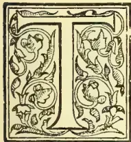

THE keynote of the current condition of the Indian tea Industry is struck in the following passage excerpted from the commercial article of an Indian daily newspaper:—

“The first tea sale of the season was held on the 20th of May, and the result was far from satisfactory to planters. I am told that not one invoice will cover the cost to the grower.”

The tea industry of India is entering on a crisis due chiefly to the artificial rate up to which exchange has been rigged by Government. Had there been no interference with the Indian currency, our industry would probably at this moment have been in a highly flourishing instead of a critical condition. As matters stand it is simply being ruined by what is in practice an overwhelming export duty compared to which the *likin* of China is merely a mild fee. Moreover, her unfettered freedom of exchange is enabling China to keep up competition with us in the tea market, for she gets the full silver value of her produce, which India does not. Time was, as members of this Association are aware, when we reaped our profits at so many pence per pound of tea, and four pence or five pence was a result obtained by several. But now it has come to pass that we estimate our gains (if there are any) by farthings, and five farthings a pound is probably the utmost limit of our profit. Under these completely

changed conditions, and facing a market which only makes about 1½d. difference between our Broken Pekoes and our Souchongs, and gives us just one-third the price for our tea that it did twenty years ago, it is scarcely to be wondered at if planters despair of improving prices. The average value of Kangra Valley tea sold on the public market during the past two seasons has been about 7½d. per lb.

The problem, therefore, for us to solve is how to make tea pay a profit. It can only be done by reducing the cost of production, for I take it that after many years of fruitless effort we are persuaded it is beyond our power to appreciably improve the general standard of our teas.

Accepting then 7½d. as the marked value of the article we produce (and devoutly praying that it may be maintained), to find room for a margin of profit, we must investigate our cost of production, the factors in which are as follows:—

1. 1. Plantation expenditure.
2. 2. Agency and Garden Stores.
3. 3. Interest on advances.
4. 4. The rate of Exchange.
5. 5. Road and rail freight to seaport.
6. 6. Shipping charges and steamer freight.
7. 7. London Dock and Warehouse charges.
8. 8. Sales charges, brokerage and commission.
9. 9. Trade taxes.

1 and 2 plantation Expenditure, Agency and Garden Stores.—These are matters which individuals must deal with for themselves, and we can only start on the assumption—perfectly justified in most instances—that the utmost care and economy have brought down expenditure under these two heads to the lowest level compatible with the proper upkeep of plantations. As a basis to work on we may take this expenditure at 4d. per lb. at the plantation and ¾d. per lb. for Agency and Garden Stores—an estimate based on actuals.

3. Interest on Advances.—Twelve per cent. is the lowest current rate of interest. This is of course a usurious rate. The bank rate in London (unusually high at the moment) is 4 per cent. A substantial industry like tea should be able to borrow at 6 per cent. That it cannot do so is due to the dearness of money, occasioned by the currency policy of the Government of India. Nearly all tea gardens want financial assistance; the extent of their necessity may be assessed at one quarter of their annual working expenses. At 12 per cent. interest their advances will probably cost them 66d. on each pound of tea produced, which is 63d. more than they ought to pay. Of course this is a matter in which the planter is helpless. But he should not suffer in silence. On the contrary, he ought to raise his voice and join loudly in the chorus of protest which all commercial India is sending up against the proposed contraction of the currency of the country which must tend to increase the dearness of money.

93------------------------------------------------

74THE TROPICAL AGRICULTURIST.[AUGUST 1, 1898.LOSSES BY EXCHANGE.

4. **The Rate of exchange.**—Here, again the planter individually is utterly helpless. The currency policy of the Government has raised exchange from 1.1 in 1894.95 to 1.4 in 1898. Three years ago an eight-penny tea yielded the planter nearly ten annas: to-day it only yields him eight. The loss, after adjustments, is at least  $1\frac{1}{2}$  annas per lb., in short, a handsome profit whistled away on the wind. At this critical moment when Government is seeking to make this adverse rate of exchange permanent, and before it is too late, the planting body ought to rouse itself from its normal apathy and do something. Every tea Association in India, every tea planter, every tea agency house, and every tea shareholder should clamour against the proposed Government currency policy that threatens to wreck the tea industry and may bring ruin in the near future to many engaged in it. *Laissez faire* folk will try and make believe that in the end prices adjust themselves to exchange, and that all will come right. They will tell you that exchange governs prices and if silver gets dearer so will tea. But in the last three years we have seen a rise of 3d. in currency silver and a fall of 1½d. in tea, both gradually developed during the same period. Low exchange is killing the industry, whose cry should be heard loud in the land calling for an open mint and a shilling rupee. If planters can only get a quarter of this ideal, they will save themselves from a fall from which many will never rise again. Agitation, prolonged, persistent, is the only way to reach the dull year of Government. What was the Libert Bill in its practical bearing on the welfare of the bulk of the planting community compared to this bulking of exchange that is going on? The Indian planters shouted themselves hoarse over a sentiment. Here is a substance, and their protest against it, to be consistent, should be far more fervid and strenuous.

5. **Road and Rail Freight to the Seaport.**—I do not think the Association can do much more than it has done to minimise these charges. The reductions they have obtained for their members this year are very considerable. In 1897 it cost 67 of a penny to get a pound of tea from the factory to the seaport: this year it is only costing us 55d. A railway to Palampur would probably reduce this to 40d., and the Association's efforts to obtain a Railway, if successful, will greatly benefit the industry. On a crop of 144,000 lb. the above figures work out.

<table>
<tr>
<td>Road and Rail freight in</td>
<td>1897</td>
<td>£ 402</td>
</tr>
<tr>
<td>do</td>
<td>1898</td>
<td>" 315</td>
</tr>
</table>

Probable cost with the railway to district " 240

6. **Steamer freight and shipping Charges.**—These are quite beyond the control of planters. Had the Mutual Line of steamers been in existence, the industry might have been enjoying more favourable freights now. But this would not have affected us in Kaugra, where we ship chiefly by Bombay and Karachi. Freights this year have gone up 40 per cent., showing an increase in the cost of carrying one pound of tea of from 45d. to 63 of a penny. Shipping charges work out 09 at Karachi and Calcutta and 11 at Bombay, where dock dues are very heavy. I think we should do well, when freights drop, to try and enter into a contract rate for one, two or three years. Last year a contract rate for only half the season worked advantageously for us.

7. **London Dock and Warehouse Charges.**—In these there is a great scope for saving, though the effort would probably result in a battle royal between the tea industry and the bonded warehouse keepers who hold it in their clutches. Prior to 1888 the wharfingers allowed a discount of 20 per cent. on their fixed rates, and sometimes even more to secure business. They made the great dock strike an excuse to enter into a combination and reduce discounts to 10 per cent., at which rate they stand at present. In the process they incidentally reduced the discount on rent, which was certainly not affected by the dock strike. The present dock and warehouse charges on a 100 lb. chest of tea weighing gross 140 lb., works out 50 of a penny per pound; with a

reversion to the 20 per cent. rate of discount, charges would be reduced to 45 of a penny per pound. The tea industry now is in a far more indigent state than the wharfingers were in 1889 when they increased their rates. Their charges are very high—no less than 42½ for a 100 lb. chest. Learning a lesson from them, the tea industry should combine, and endeavour to get a reduction in their charges, and this, I venture to think is a matter worthy of the attention of the Indian Tea Association.

Reverting again to the charge for rent, the wharfingers do what they call "commute it" to 12 weeks. This means a fixed charge of 9d. on each chest of 100 lb. But it sometimes happens that long before the 12 weeks are up the chests have been taken away, and the planter is consequently made to pay rent when no rent ought to be charged.

This is another matter the Indian Tea Association might take up. Let us be charged actual and not commuted rent. Let us have value for our money, which at present it is my firm and fixed belief we are not having.

BULKING AND TARING.

I now turn to another matter which intimately affects every Indian planter. I allude to the charges for London bulking and taring our teas. There is a sliding scale, but for the purposes of this paper I take a chest containing 100 lb. nett and grossing 140 lb.

An immense sum comparatively speaking, can be saved by factory bulking and taring. It can be accomplished by any planter willing to devote a decent amount of trouble to save his proprietors unnecessary expense, and I take it all planters worthy the name, are willing to do that. There are, I admit, considerable difficulties can be overcome as I shall proceed to show.

The London Customs regulations require that the tares in a break shall not vary more than 2 lb. Thus, for instance, an invoice may consist of three breaks of, say.

<table>
<tr>
<td>20 chests Broken Pekoe net 120 lb. gross</td>
<td>158</td>
<td>&amp;</td>
<td>159</td>
</tr>
<tr>
<td>30 " Pekoe "</td>
<td>100</td>
<td>"</td>
<td>139 &amp; 140</td>
</tr>
<tr>
<td>50 " Pekoe Souchong "</td>
<td>90</td>
<td>"</td>
<td>127 &amp; 128</td>
</tr>
</table>

If any of these breaks gross any other weight than those given (as examples) the whole 20, 30, or 50 chests are turned out, and the entire parcel tared at the London Warehouse, and I need scarcely say charged for.

Now every planter who saws his own planks and makes up his own chests knows the enormous difficulty, with the wretched and often *kutcha* jungle timber that we have available, of getting a given number of empty chests to weigh the same. They dry off when the hot teas are poured into them: they absorb moisture and consequently extra weight in a few hours on a wet day; they apparently increase or decrease in weight in a most irrational way. In short they set a manager tearing his hair as well as taring his boxes. I may mention as an instance in my own experience that chests made from fire planks, cut and dried for six months, have varied from 21 lb. to 36 lb. each. Wherefore I submit that a margin of 2 lb. on the average tares of a break is not sufficient for practical purposes. If that margin were increased to 3 lb. the difficulty of factory taring would be greatly reduced; if it were increased to 4 lb. every planter could easily factory tare his own breaks.

I cannot see what harm the Customs in London would suffer if they raised the margin of permissible variation in tares from 2 lb. to 4 lb. Planters are not such fools or rogues as to put more into their chests than they stencil on the outside. All that the Customs want is to ensure a correct net weight of tea; and if a variation of tares up to 4 lb. were permitted, I fail to see how this would materially interfere with the essential point aimed at. Nor have I ever been able to fathom the philosophy which deters the Customs from weighing net, instead of weighing gross and then deducting the tare. A few nails or snips or lead tumbled into the tea, may deduct from the tare and increase the net, and

94------------------------------------------------

AUGUST 1, 1898.]THE TROPICAL AGRICULTURIST.75

perhaps in the aggregate add appreciably to the duty on tea. If so there is more in the philosophy of the Customs than I dream of. But I maintain that the process of weighing net for duty is more sensible, more exact, and more expeditious. But since gross and tare the Customs will have, let us endeavour to get them to allow us a reasonable margin of 3 lb. or, if possible, 4 lb. in the variation of the tares. This is a matter which I think the Indian Tea Association ought to take up. It is a matter which will enable the Indian Tea Industry to save many thousands of pounds sterling annually, as I will show in black and white. Take my illustrative crop of 144,000 lb. Pack it in 100 lb. chests, and send it to London. Now here is what you will save by bulking and taring at the factory, if you can succeed on getting a tare that will come within the Customs Regulations.

London bulking and taring charges on a crop of 144,000 sent to market in 1,440 chests of 100 lb. each, and weighing gross over 129 each.

<table>
<tbody>
<tr>
<td>Bulking at 5d, per chest less 10 per cent. ...</td>
<td>£27-0-0</td>
</tr>
<tr>
<td>Taring at 1/3 do do ...</td>
<td>£81-0-0</td>
</tr>
</tbody>
</table>

Total expense if bulked and tared in London £108-0-0

But, if bulked and tared at Factory, only 10 per cent. of the chests will be tared in London for purposes of Customs' check, leaving 144 chests at 1/3 per chest less 10 per cent. to be charged, say ... 8-2-0

Leaving a clear saving of ... £99-18-0 or in round figures £100.

My factory taring costs me  $\frac{1}{4}$  anna, or one farthing a chest, which is the extra allowance I make my carpenters for even weights in their work. They are allowed to make chests from 28 lb. to 33 lb. each, and these are stacked separately according to their weight. On 90 per cent of my chests sent to market I can save exactly 1-5 $\frac{1}{2}$  each, and so can every planter who tries. It is nearly 2 $\frac{1}{2}$  per cent. on the average price I get for my tea. At present it gives me a great deal of trouble to achieve this, but if the margin of permissible difference in tares were raised from 2 lb. to 4 lb. or even 3 lb., then it would give me practically no trouble at all, to save £100 a year out of hand.

With regard to factory bulking this is a most simple and satisfactory operation. My bulking bin cost me Rs. 80. It is made of galvanised iron sheets, bolted together, and holds 4,000 lb. to 5,000 lb. of tea. The bottom is on a slight slope to let the tea run out easily. The top is fed from two superimposed shoots whose mouths deliver at the same point. The tea naturally falls conically and scatters. When full a slide on the lower side of the sloping floor is drawn and the tea runs out, almost of its own accord, on to a surface of zinc-lined flooring. Here two coolies rake it over and over to the end where the packers receive it. In practice the tea is twice bulked, once vertically and then horizontally. The process costs me about four annas for 4,000 lb.: for the same work the London wharfinger would charge me fifteen shillings. I stencil all my boxes

“Chests numbered—to-  
bulked at Factory, and  
guaranteed even quality  
throughout.”

I had not a single complaint last season, except for three chests country damaged, which would of course have been damaged whether factory bulked or not.

#### EXCESSIVE CHARGES.

One final word about factory bulking and taring. Brokers and wharfingers are dead against it: the former from trade sympathy I imagine: the latter for obvious reasons, for, as I have shown, it is calculated to decrease there revenue from £108-0-0 to £8-0-0. I imagine the wharfingers make the greater part of their profits out of London bulking and tar-

ing. Fancy a charge of 1s. 6d. for bulking and taring 100 lb. of tea sold for 4s. per lb.! Why, it is 4 $\frac{1}{2}$  per cent. on the value! The wharfingers are getting this rate of payment for thousands of chests every week, and the work done in return could not be worse performed.

I have endured much tribulation through my insistence on bulking my teas at factory. “We would point out to you,” write my brokers pathetically, “that not any of your teas have been bulked in London this season. Had this parcel been bulked at the London warehouse the damage would have been discovered before the tea was sold!” A plain dig against factory bulking and its evils! But the “damage” was country damage, which had not the remotest connection with the factory bulking of my teas. It cost me £1-10-8 to make good; and my factory bulking saved me over £30.

Listen to the plaint of the wharfingers:—“From our experience certain teas, even if bulked at the factory, show a variation when landed, and we know the brokers find it necessary to bulk these teas for the purposes of sale, and in some sale catalogues they are marked “Bulked in London” in order that the sale may not be prejudiced!”

To which I felt inclined to reply: “From my experience I do not feel inclined to follow your purely disinterested and kindly advice, because I find by bulking at factory that I have to pay you £30 less than I should if I did not do so.”

If teas require re-bulking in London it is because they were not properly bulked or properly fired at factory. A properly bulked and fired tea will of course turn out as even in London as when it left the factory.

8. Sale Charges, Brokerage and Commission.—I find that on my crop of 144,000 lb. brokerage cost me £43-15-8 or ‘07d. per pound of tea, and sale charges (lotting and advertising) £10-8-8 or ‘02 per pound of tea. Both I should hold to be perfectly reasonable and good value for money, if it were not for the expense of discounting the prompt, to which I shall refer later on.

Commission cost me, at 1 $\frac{1}{2}$  per cent. on account sales, £64-7-8, or nearly ‘11 per lb. of tea. If my agent had taken the same trouble as I have myself to analyse the warehouse charges and shown me how to avoid unnecessary expense I would not have grudged him a commission which is, I think, at least  $\frac{1}{2}$  per cent. in excess of the value of the work he performs. It was not until I extracted from him the detailed warehouse accounts for the year that I saw what I had saved by bulking and inefficient factory taring, and how much more I could save, and how to save it. In the present state of the tea industry I consider 1 $\frac{1}{2}$  per cent. selling commission too much. The whole of the detail and checking of the selling work can be done by any London clerk at a pound a week salary, and for an invoice of 10,000 lb. done in about twenty minutes applied work. The skilled part of the business is done by the broker. The agent merely asks—“What’s your valuation?” The broker says “Seven pence.” The agent rejoins, “Sell at seven pence,” and the job is done. The best agent in England cannot get you a farthing more for your teas than the market values it at. All he has to do is to sign the warrants and check the accounts presented to him, and take the money. He is the best paid man in the industry for the purely mechanical work he does, and 1 per cent is ample remuneration for him. His accounts are no more intricate than the brokers, and he is not required to bring the same skilled technical knowledge to the planters’ assistance. He is merely a necessary conduit for the planters’ money to reach them, and the planter should now insist on his commission being reduced to 1 per cent. Any larger commission is behind the requirement of the times.

#### AN UNNECESSARY LEVY.

9. Trade Taxes.—I now come to the last factor in the cost of production. There are two species of

95------------------------------------------------

76THE TROPICAL AGRICULTURIST.[AUGUST 1, 1898.

trade taxes; one is draft and the other the discounting of the prompt.

Draft, as every planter knows, is a free pound of tea given away with every chest weighing over 28 lb. gross to compensate the buyer for the turn of the scale in weighing off to retail. What can be more ludicrously incongruous than the present system in force? A box containing 20 lb. net and weighing 27½ lb. gross, gives no draft, yet there are twenty turns of the scale at least. A box containing 25 lb. net is taxed 4 per cent. by the 1 lb. draft. On the other hand, a chest containing 150 lb. of fine dust is only taxed 2-3rds per cent. by this trade allowance. This, of course, is simply inverting the ratio of necessity. In my crop of 144,000 the amount deducted for draft was 1,626 lb., which, at 7½ per lb. cost me £19-2-4. But suppose my plantation had been up on the Range, and to enable my coolies to carry my teas to the cart road I had been compelled to pack in 40 lb. half-chests. Then I should have been mulct 3,600 lb., valued at £108-15-0.

This again is, I think a matter which the Indian Tea Association should take up. Half a pound of tea extra is ample to compensate for the turn of the scale in weighing off 100 lb. If more is required it is the retailer, not the planter, who should suffer for what can only be laxity of work. Heaven alone knows it is the retailer and not the planter who makes the profits. Supposing the scale of ½ per cent. draft to have been in force last year I should have been cut on my 144,000 lb. only £23 instead of £49.

The last point I have discuss is discounting the prompt. A broker sells your tea, and payment is due three months after date of sale. Well, that is a trade custom, and the planter agrees to give the credit. But here comes in the hardship. Whether he wants it or not, whether he objects or not, the broker can compel the planter to accept payment less 5 per cent. per annum discount, at any moment after the sale. If the bank rate is 2 per cent. as it often is, there is a clear profit of 3 per cent. to the buyer, and I have sometimes suspected to the broker, on this ability to compel the seller to accept a diminished price for his tea. I kicked against it once, but I was told it was the "custom." This custom cost me last year on my crop of 144,000 lb. the sum of £38-19-2. I had no choice, but to accept money I did not want, to pay 5 per cent. per annum for accepting it, and then to deposit it at my bankers, either at no interest, or at 2 per cent. If I contracted to leave it with them for three months certain. Another hardship that runs in double harness with discounting the prompt is warehouse rent. I will quote actual figures. Early in September I sold 8,380 lb. tea for £343-10-5 as per account sales. On the 10th my brokers paid me £100. A week later they paid another £200, and on the last of October the balance of £39-16-7. I lost by discounting the prompt £3-13-10. That was bad enough I have reason in this particular case to suspect that they paid me up so sharp because the buyer paid up so sharp because he wanted the teas out of the warehouse.

To return to discounting: the prompt against the desire of the seller. As I have said it cost me last year £38-19-2. It added 74 per cent. to brokerage and sale charges; wherefore I called them moderate, with a reservation as to this point. Brokerage and sale charges alone cost me 69 of a penny per lb. on my tea, but when prompt is added the cost works out 16 of a penny per pound, or considerably more than agency; and this is too much. Agent, broker, and prompt discounter got the odd farthing and more of my 7½d. tea. It was payment in excess of the work they did for me.

I think this is another point that the Indian Tea Association might take up. If sellers want their prompts discounted, well and good; let it be done, and let them pay for the convenience. But if they do not want them discounted, then they should not be compelled to accept a diminished payment for the goods they have sold especially when the rate

of diminution is 5 per cent., while the Bank rate is often only 2 per cent.

#### SURPLUS PAYMENTS.

That some of the points to which I have attempted to draw intelligent attention are important the following figures will show. Taking the amount of Indian tea put through the London warehouses at 144,000,000 lb. per annum, and valuing it at 8d. per lb., I believe it will be found that:—

1. The decrease in discount from 20 per cent. to 10 per cent. established in 1888 costs the tea industry on warehouse "management" £15,000 a year.

2. That the decrease in discount on warehouse rent, which was contemporaneously introduced without a shadow of justification, costs £5,000 a year.

3. That planters are charged rent, over and above that due for storage to the extent of about £20,000 annually

4. That London bulking, which can be easily avoided, costs the industry £30,000 a year.

5. That 90 per cent. of the London taring charges, which could be easily avoided if the margin of variation of tares was raised from 2 lb. to 4 lb. or if the teas were weighed net, costs the industry £75,000 and damages their tea into the bargain.

6. That if the draft to the buyer was equalised and reduced to ½ per cent. it would probably save the tea industry about £25,000 a year. Nearly two million pounds are given away annually as draft!

7. That if brokers and buyers choose to enforce their legal trade rights they could charge the tea industry about £60,000 a year for discounting the prompt: that if prompt was reduced to 30 days instead of 90 days, or if sellers were allowed to discount it or not as they, and not the buyers chose, it would probably save the industry £20,000 a year.

8. That if by a general combination of tea growers the rate of selling commission was reduced from 1½ to 1 per cent. it would save the industry £25,000 a year.

Here we have what I venture to think is a not unreasonable or impracticable set of proposals to curtail the expenses of the industry by considerably over £200,000 a year.

Taking 400 lb. per acre as the average outturn and £32 per acre as the average capital, I estimate the capital invested in Indian tea plantations at £12,000,000. The above saving, if effected, would produce nearly 2 per cent. extra profit on that capital.

I have not included the question of steam freights and exchange, both of which might be influenced by combination among planters. Taking the present rate of exchange at 1s. 4d. every reduction of 1d. will give planters an extra half anna per lb. for their teas; and, on the figures of capital and outturn per acre given, every half anna gained means an extra profit of over 2 per cent.

The time has now come for planters to take a personal interest in these charges levied in London, which are in most cases hidden from them by a system of quoting "totals" of bills instead of supplying details, and letting those who pay figure out what and why they are required to pay. In a matter of this sort planters naturally look to the Indian Tea Association to take the lead. Of course, in that body there must be many interests that are touched by the suggestions I have made. But the tea industry is in too desperate a condition for anyone who wishes it well to stand upon ceremony.

I conclude by appending a table showing (A) what I might have had to pay for producing and selling my crop of 144,000 lb. on the London market; (B) what I hope to get off with this year; and (C) what I consider is an ideal minimum to aim at.

96------------------------------------------------

AUGUST 1, 1898.]THE TROPICAL AGRICULTURIST.77TABLE.

VALUE OF CROP, 144,000 lbs. @ 7½ £4,350.

<table border="1">
<thead>
<tr>
<th rowspan="2">Detail.</th>
<th colspan="3">Scale</th>
<th rowspan="2">Remarks on Scale C.</th>
</tr>
<tr>
<th>A.</th>
<th>B.</th>
<th>C.</th>
</tr>
</thead>
<tbody>
<tr>
<td>Plantation Expenditure ..</td>
<td>4.00</td>
<td>4.00</td>
<td>4.00</td>
<td></td>
</tr>
<tr>
<td>Agency and Stores ..</td>
<td>.75</td>
<td>.75</td>
<td>.75</td>
<td></td>
</tr>
<tr>
<td>Interest ..</td>
<td>.06</td>
<td>.06</td>
<td>.03</td>
<td>Reduced to 6 per cent.</td>
</tr>
<tr>
<td>Road and Rail Freight ..</td>
<td>.67</td>
<td>.55</td>
<td>.40</td>
<td>Railway to District.</td>
</tr>
<tr>
<td>London Warehouse Management ..</td>
<td>.20</td>
<td>.20</td>
<td>.18</td>
<td>Extra discount of 10 per cent.</td>
</tr>
<tr>
<td>Do. Rent ..</td>
<td>.08</td>
<td>.08</td>
<td>.04</td>
<td>Actual Rent only charged.</td>
</tr>
<tr>
<td>Do. Bulking ..</td>
<td>.05</td>
<td>Nil</td>
<td>Nil</td>
<td>Avoided.</td>
</tr>
<tr>
<td>Do. Taring ..</td>
<td>.16</td>
<td>.02</td>
<td>.02</td>
<td>Simplified by margin of variation in rates increased to 4 lbs.</td>
</tr>
<tr>
<td>Selling Commission ..</td>
<td>.11</td>
<td>.11</td>
<td>.07</td>
<td>Reduced to 1 per cent.</td>
</tr>
<tr>
<td>Brokerage and Sale Charges ..</td>
<td>.09</td>
<td>.09</td>
<td>.09</td>
<td></td>
</tr>
<tr>
<td>Discounting the Prompt ..</td>
<td>.07</td>
<td>.07</td>
<td>Nil</td>
<td>Made optional to seller.</td>
</tr>
<tr>
<td>Draft to buyer ..</td>
<td>.09</td>
<td>.09</td>
<td>.05</td>
<td>Reduced to ½ per cent.</td>
</tr>
<tr>
<td>Total cost of production ..</td>
<td>6.33</td>
<td>6.02</td>
<td>5.63</td>
<td></td>
</tr>
</tbody>
</table>

Profit on Scale A. £544

" " B. £738

" " C. £984

From these profits steamer freight has to be deducted: it is too fluctuating to include in the tables.

It will be seen that the proposed economies in (1) London Dock and Warehouse charges, (2) sales, charges, brokerage and commissions, and (3) Trade taxes, would reduce them from .85 of a penny per pound of tea to .45 of a penny, or a saving of 4/10ths of a penny per pound.

I have not touched exchange in the tables. But if the protest of all producing and exporting India can help to stay the hand of government, and secure a 1s. 3d. instead of a 1s. 4d. rate of exchange, it would increase the profit by nearly another half penny per lb.

The details and decimal figures I have given may appear confusing and even trivial. They are only a few hundredths of a penny saved here and there, or so it appears on the surface. But in these days of desperate struggle for existence by the tea industry it is the hundredths of the penny that go to make the meagre margin of profit. To adapt an old proverb to the exigencies of the case: "Look after the decimals, and the dividends will look after themselves.—*Planter*.

## NEW PRODUCTS IN ZANZIBAR IN 1897.

*Cacao*.—Great difficulty has been experienced in obtaining seeds and plants of *Cocoa*. Early in the year 3000 seeds arrived from Ceylon in a completely perished condition. In June 72 plants were received from London in Wardian cases but only 34 survived. A few pods from Seychelles did well.

*Kola*.—*Kola* germinates freely and grows well. The seed is cheap and easily procured, while the produce requires little preparation for the market, being merely placed in the sun to dry. Hence, if it can be grown at a profit, *Kola* is more likely to find favour with the Arabs than *Cocoa*, the beans of which have to undergo fermentation before being ready for market. *Kola* trees may be planted 20 feet apart;

they come into bearing in 4 or 5 years. Prices in London rule from 4d. to 6d. per lb. If each tree yields 50 lb. per annum—a moderate estimate as trees have been known to yield up to 150 lb. of nuts each—the gross returns, both per tree and per acre, would be much larger than those now obtained from clove plantations, which do not average more than 15 lb. of produce per tree, worth 2½d. per lb. Large quantities of *Kolas* have been shipped from the West Indies, which has had the effect of reducing the price considerably. Thus in 1890 *Kolas* were worth 2/9 per lb. in 1894 1/3 per lb.; while now they are worth, as above stated, less than 6d. The nuts are made into *Kola* wine, *Kolatina* and *Kola* paste, a preparation similar to cocoa paste. Chocolates are also adulterated with *Kola*.

*Vanilla*.—A small plantation of *Vanilla* has been made at Dunga and preparations are in course for extending the cultivation of this vine. Of the 600 cuttings planted, 427 survived and are growing fairly well. Many were found going rotten at the bottom, from being planted too deeply, and had to be taken up and replanted. The vines have been planted singly between three live supports, placed in a small circle. The *Mbono* (*Castor oil*—*Curcas purgans*) and *Frangipani* make good live supports and throw out rapid shade. Six feet has been allowed between each little bed of vanilla. Water is conveyed from the well to the plantation—a distance of 300 yards—through bamboo pipes. Much care is required both in the planting and cultivation of this vine, and some skill in fertilizing the flowers and in harvesting and preparing the fruit for market. For these reasons it is doubtful if the industry will take root here among the Arabs. A small plantation of *Vanilla* has been made at Tundaua.

*Para Rubber*.—*Para Rubber* shows every indication of doing well here. Though the proportion of seed which germinated in the nursery appears small (174 out of 983) much of the seed was old and worthless when sown, and not expected to grow. Those that came up grew rapidly and, with the exception of three, have all been transplanted. One hundred and fifty were taken to Pemba and planted 25 feet apart in one of the sandy swampy valleys of Tundaua. Seven out of the 150 (5%) died, but the others came away well. Sixteen have been planted out in the rich alluvial valley that divides the Dunga bank from the coral, but some of these have failed. There is a *Para rubber* tree, 50 feet high and 6 feet in circumference, growing at Mbweni on a dry sandy ridge. It was planted by Sir John Kirk and in September last was observed to be flowering. The presence of this tree growing so well in an uncongenial locality, justifies I think, the assumption that if *Para Rubber*—the most valuable of all varieties—will pay to grow at all—a point that has nowhere yet been decided—it ought to pay to grow here.

*Ceara Rubber*.—The *Ceara Rubber* is just coming up and looks extremely healthy. It has been grown principally from trees growing about the island. The *Ceara Rubber* trees don't appear to yield much juice. I tapped one growing at Mbweni and got little or nothing from it though it must have been five or six years old. It was afterwards found that wrong methods had been adopted, though at the same time it was quite clear that there was little milk in the tree. This variety of *Rubber* is said to thrive on very barren as well as rich soils, and if this is the case, it ought to do well on the coral wastes of Zanzibar, which cover about 3/5 of the total area of the island.

*Coffee*.—About 60 young Arabian coffee trees are growing in the Nursery from seed obtained from Nyassaland. They look well and will be planted out, though they can hardly be expected to prosper in Zanzibar as the elevation is too low. Liberian coffee was sown late in the year and has not yet germinated. Attempts have been made to procure seed of the Maragojipe coffee, Brazilian variety, but none has yet been received.

97------------------------------------------------

78THE TROPICAL AGRICULTURIST.[AUGUST 1, 1898.

*Anatto*.—Anatto grows well here but the market is too depressed to encourage cultivation. Seedlings are being raised at Dunga for vanilla shade.

*Camphor, Safflower, Olives, Sarsaparilla*.—Camphor, Safflower, Olives and Sarsaparilla have proved unsuccessful, and their cultivation will be discontinued.

*Bois Immortelle (Cocoa Shade trees)*.—The Bois immortelle trees have grown very freely.

*Eucalyptus*.—Small success has attended the efforts to grow gum trees.

*Cloves*.—Some experiments have been made with a view to ascertaining whether it were possible to produce a sample of cloves here equal to the best Penang and Amboyna. The experiments leave little doubt that this can be accomplished. An examination of the table (see next page) shows that the buds should be picked when the stems are pink. If the stems (calyx tubes) are allowed to get red the flowers are very apt to open during the process of drying, and the little round heads (imbricated petals) will drop off, to the detriment of the sample. This is what happened in sample. No. 2. On the other hand if the stems are green—too young—the dried cloves will be shrivelled. Pink bold heads make the best samples. Arabs probably know this; they also know that selecting the buds in the proper stage of ripeness involves more labour in the picking than they can afford at present. Cloves grow on the trees in bunches and each bunch will generally contain from six to ten buds in different stages of ripeness. The labourers pluck the whole bunch when most of the cloves on it appear to be ready; a much more rapid process than picking singly would be. Whether it is possible to apply a speedy and inexpensive method of sorting afterwards is a question for further experiment.

A firm of Engineers (Messrs. Rainforth and Sons, Lincoln, England) have at my request, been endeavouring to separate the good cloves by means of a screening machine and report as under:—

"We have made several lengthy experiments but were unsuccessful in making a separation. We submitted the sample to Messrs. Gray Dawes and Co. and they said the chillies were very slightly improved, and the cloves actually damaged. Their opinion is that it will be impossible to get a machine to do the work and we must confess we are of the same opinion."

Mr. Hugh Garden of Messrs. Gray Dawes & Co. also wrote as follows:—

"They (Messrs. Rainforth and Sons) have sent me samples of chillies which are rather improved, but as so many stalks still adhere it would not appreciably effect the value. The cloves on the other hand are distinctly damaged; the dry bright head has been removed and the cloves which previously passed as fair would now be one eighth under."

#### TOTAL YIELDS.

<table border="1">
<thead>
<tr>
<th></th>
<th></th>
<th>Frasilas.</th>
<th>Total frasilas.</th>
</tr>
</thead>
<tbody>
<tr>
<td>1895</td>
<td>Zanzibar cloves</td>
<td>146,391</td>
<td></td>
</tr>
<tr>
<td></td>
<td>Pemba "</td>
<td>391,454</td>
<td>537,845</td>
</tr>
<tr>
<td>1896</td>
<td>Zanzibar "</td>
<td>119,784</td>
<td></td>
</tr>
<tr>
<td></td>
<td>Pemba "</td>
<td>242,085</td>
<td>361,869</td>
</tr>
<tr>
<td>1897</td>
<td>Zanzibar "</td>
<td>91,571</td>
<td></td>
</tr>
<tr>
<td></td>
<td>Pemba "</td>
<td>240,950</td>
<td>332,521</td>
</tr>
<tr>
<td>Average</td>
<td>Zanzibar "</td>
<td>119,249</td>
<td></td>
</tr>
<tr>
<td>8 years.</td>
<td>Pemba "</td>
<td>291,496</td>
<td>410,745</td>
</tr>
</tbody>
</table>

The quality of the cloves depends also, though to a less extent, upon the drying as well as upon the picking. The experiments at Dunga seem to show that the cloves should be submitted to a high temperature and dried rapidly. I believe that most Arabs overdry their cloves. They expose them to the sun till they become black and dried up, and much of the oil evaporated. The stem of a properly dried clove should be tough and should yield slightly to the strain before breaking. I think that an effective system of drying cloves under glass could be introduced here with little expense. Some authorities are of opinion that, if all the Zanzibar and Pemba cloves were placed upon the market in the best possible condition, the price would not be in-

creased beyond what it is likely to reach under prevailing conditions; low prices being due to over production. The recent abolition of the legal status of slavery will, it is acknowledged, withdraw a lot of labour from the Arab shambas, and the yearly yield of cloves suffer in consequence. Concurrent improvement in the quality of the product should therefore, if it can be accomplished, tend to lessen the effect of a declining crop. The short crop of 1897-98 is probably due to dry weather quite as much as to scarcity of labour. I noticed in October that comparatively few cloves remained upon the trees in the Pemba plantations, and in this respect Pemba compared very favourably with Zanzibar, where a considerable proportion of the cloves were left unpicked. Dr. Charlesworth reports that the rainfall for the second half of the year was only 18.51 inches compared with the previous five years' average of 24.32. This difference practically amounts to a drought, and is quite enough to explain any eccentricity in the output of cloves.

*Chillies*.—About three acres of coral waste have been cleared of scrub and planted in chillies. The dry weather has hindered the growth of the plants, so that we have as yet no results to reports.

*Castor Seeds*.—An enquiry was made in London as to the market condition of Castor seeds, and samples of both the large and small varieties of Castor Seeds were, in May, sent home to Messrs. Gray Dawes and Co. to be reported upon. On May 6th Mr. Hugh Garden wrote as under:—

"From their appearance I did not think they were equal to Madras coast seeds which are very full of oil; but I have had them reported on both in Marseilles and London. In Marseilles our agent writes that both samples are very clean sound seed and they make very little difference in value between the large and the small. In London they state that most crushers give the preference to the large beans although both are of good quality: the difference in favour of the large being about 2s. 6d. per ton. I have made a rough calculation and make to-day's price c. i. f. London or Marseilles about £9.10.0 per ton, without allowing for any excessive admixture of non oleaginous seed. In London they charge shippers with anything over 3% and in Marseilles 4%. To-day's prices however are very high, owing to scarcity, and I have known the seed fully £3 per ton under the above price."

Castor oil trees, though they grow wild in Zanzibar, don't appear to yield much weight of seed. We make a point of collecting the seed from all the trees round about Dunga, but as yet we have got only quite an insignificant quantity together. The oil is worth about £36 a ton in London which compares well with coconut oil at £23.

*Papaya*.—Enquiries have also been made in London regarding Papain and the following communication from Mr. Hugh Garden was received in April:—

"I have received the following information from one of the first authorities:—The dried price of Papaw fruit is a powerful digestive agent and differs from Pepsin in being active in neutral and alkaline solutions. The Papain of commerce is prepared from it by solution of the crude juice in water, and precipitation by alcohol. Only small quantities of the crude concentrated juice have hitherto reached this country, and therefore the price at which it has been sold has only been a nominal value. So far as my observation goes, and the matter has been the subject of considerable experiment by my son, the substance is not likely to come into extensive use, and I should think that the import would hardly be worth consideration by you."

Messrs. Thomas Christy and Co., of 25 Lime Street were good enough to send out a sample of the dried juice with the following:—

"In reply to your query regarding Papaw we may tell you that we import the dry juice of this plant in large quantities. We believe the way of drying it is to place the juice upon slabs of glass or earthenware so that it has a smooth surface to dry upon. This is exposed till it is thoroughly dry and the

98------------------------------------------------

AUGUST 1, 1898.]THE TROPICAL AGRICULTURIST.79

film then flakes off. . . . The price we could pay for the dry juice would be about 5s. to 7s. 6d. per lb. . . . We understand that the juice is taken from all parts of the plant, principally from the stem or trunk of the tree; if you take it from the fruit you will have to be careful to make your incisions in the latter just before the fruit is ripe. You need only make scratches as the juice is found between the skin and the pulp. None is obtainable from the fruit proper. We hardly think it worth your while to take any trouble with this part of the plant. Out of many fruits you will only be able to obtain but a few ounces, whereas, from the trunk of the tree and other parts of the plant, you can obtain several pounds."

I regret having as yet been unable to make any experiments with papayi juice. The report from Messrs. Christy is sufficient encouragement to do so, especially as the tree grows here most freely, though entirely neglected.—*Dunga Zanzibar*.

#### A SEYCHELLES PLANTER ON THE PROSPECTS OF VANILLA IN ZANZIBAR.

(b) We lately had an opportunity of discussing the prospects of Vanilla here with a Planter from Seychelles who has 25 acres under cultivation, and has been successfully engaged in this industry alone for 13 years. In Seychelles Vanilla grows very much as castor oil and cassava grow here, that is to say almost wild. The soil where the cultivation is carried on is gravelly, which allows of a most perfect natural drainage. Sticky soils and stagnant water are most harmful. Our sandy soils, especially on the hill sides, should be equally good, probably the coral country as well; while the low flats and swamps where the water accumulates during the rains should be avoided. The hill tops would be probably too dry. It is in the rainfall where we are deficient. In Seychelles they have 100 inches as against our 60 inches. Our rainfall, though falling short in quantity, is fairly well distributed as a rule, and it is always possible to supplement by watering. But watering, besides being expensive, is at best but an imperfect substitute for rain. In this respect therefore, Seychelles has an advantage over us which we can never hope to overcome.

Bad years sometimes occur in Seychelles through failure of the dry season. They count upon 9 wet and 3 dry months, but if, as it sometimes happens, rain continues to fall during the three usually dry months the Vanilla will continue to grow, and there will be no period of rest to enable it to produce flowers and seed pods. They have a way of inducing the vine to throw out buds by nipping back the pendulous growing end, when the sap of the pendulous end will be partly absorbed by renewed growth lower down, and flowers will appear upon it. But this does not make up for nature's shortcomings. We can always rely upon a dry time about the months of September and October which is in our favour though it does not make up for our deficiency in rainfall which is a permanent and perennial limitation. It was our visitor's opinion that Seychelles has a more forcing climate, and is thus better adapted to the growth of Vanilla, than Zanzibar, though this by no means implies that it would not thrive here. We are in all respects better off than Bagamoyo where the industry has taken firm root and flourishes.

We received some useful impressions as to the methods of the Seychelles Planters. They prefer to plant cuttings 6 or 12 feet in length if they can get them; in fact they cannot be too long. A short cutting of 3 feet may take a year longer to crop than one of 6 feet. Vines are never in any case allowed to crop the first year, as this weakens them. Roots of Vanilla seek the surface. For this reason it must not be planted more than an inch deep, a mere scratch being made in the soil to receive it. If planted too deeply the roots may not have sufficient strength to reach the top and the cutting will

then rot at the bottom. These superficial roots are very liable to be scorched by the sun and must therefore be kept well covered with grass or leaves to the depth of about 6 inches. This will also prevent the soil from becoming too dry; but on the other hand if the soil is kept in too soppy a condition rot will set in, especially with young cuttings. Hence the necessity of constant attention.

Hitherto it has been thought that Vanilla is subject to but one disease, but Mr.———(we regret not being permitted to publish his name), who has made a special study of the subject, declared that his investigations have led him to detect many different diseases of a fungoid nature. The roots are the chief point of attack, whence disease may spread to other parts of the plant. Next to the roots the growing tips and pods are the most vulnerable. Roots begin to rot, and leaves to bleach and wither. To as far as possible check the spread of disease, creepers should be planted at least 9 feet apart and all diseased plants uprooted and burnt as soon as the effects of the fungus are visible. As a safe precaution cut off and remove from the plantation all withered leaves and unhealthy parts.—*Shamba*.

#### NEW METHOD OF DRYING VANILLA PODS.

In the *Kenya Bulletin* (1898, p. 224) a note appeared giving a brief account of a method of drying vanilla pods by means of chloride of lime in course of trial at the French island of Reunion. Fuller particulars are now to hand in a report from Her Majesty's Consul, addressed to the Marquess of Salisbury (F. O. No. 1965, Annual Series. 1897):—

*Explanatory Notes as to the Drying of Vanilla by Chloride of Calcium.*

The object aimed at in the treatment of vanilla, is to endow it with keeping properties, and at the same time to develop the perfume which has not yet come into being at the moment of cropping.

Pods of the best quality should be perfectly smooth, and without excrescences or holes. The longer the pods, and the more perfumed they are, without acidity, the more valuable is the vanilla.

The success of the treatment of vanilla depends upon the care bestowed upon it, and especially upon the state of maturity of the pods.

If the vanilla is picked too green, its treatment will be difficult and its keeping qualities doubtful, the pods will be thin and poor after drying, whilst the perfume will not be properly brought out, and what there is will be lacking in quality.

If plucked when too ripe, the treatment will be easy, it will be of good size and highly perfumed, but it will split and thus lose much of its commercial value.

On a well-ventilated and properly exposed plantation the pods are ripe when the lower part begins to turn yellowish.

The treatment by chloride of calcium,  $\text{CaCl}_2$ , as indeed do all the other methods of treatment, consists of several operations:—

1. 1. Stoppage of vegetation.
2. 2. First drying and colouring.
3. 3. Drying.
4. 4. Watching,

1. The process of drying in a stove by means of hot water is the one resorted to. On the day of the cropping, or the next day at latest, the pods are put to dry by heat in tin cases of the following dimensions:—0.220 millimetres by 0.220 metres by 0.350 metres. Old petroleum oil tins are generally used for the purpose. The size may be slightly altered, but the width and breadth of the box should not be too large, as the vanilla in the centre should be subjected to the same heat as that which is nearest to the sides of the box. Otherwise the treatment of the pods in the centre would not be assimilated to that of those at the sides, and the resultant colouring would be lightly different.

99------------------------------------------------

80THE TROPICAL AGRICULTURIST.[AUGUST 1, 1898.

These boxes are fitted with lids closing on the outside of the box. They are lined with wool carefully arranged along the bottom and up the sides, and a little over the top of the sides.

The vanilla pods are placed on end close enough to secure pressure without damage by rubbing; a horizontal layer is placed on top of these, the wollen covering is folded over all and the lid put on.

The boxes thus arranged are put into the halves of wine barrels and hot water emptied in to the barrels up to the lid of the boxes, care being taken that no water gets into the boxes. In order to prevent the sudden cooling of the hot water, the barrel is covered with a piece of sacking. It is left thus covered during one night.

2. Next morning the pods are withdrawn and exposed in the air for some time to dry; then for two or three days they are kept under wollen coverings in full sunlight.

For this operation low wooden boxes are used, a single layer of pods being placed in the bottom and covered with a wollen cloth. The boxes are placed in sunlight on trestles to prevent contact with the more or less moist earth. After this operation the colouring of all the pods will be uniform if the drying by hot water has been properly done.

Now is the moment to proceed to the drying operation.

3. The old methods of preparation, drying in the open air upon screens in an airy situation, or in hot-air stoves, in which the heat is constantly renewed, result in a loss of perfume and at the same time require a large amount of hand labour. These drawbacks are avoided by drying in closed vessels by means of chloride of calcium,  $\text{CaCl}_2$ .

This operation is carried on in boxes of galvanised iron with a hinged door and closing on an india-rubber edging to ensure airtightness. A drawing of the form and dimensions of the box as used by the Credit Foncier Colonial is given below:—

Each box has eleven drawers or trays; the bottom and the sixth drawer are for the vessels containing chloride of calcium, the others are for holding the vanilla; in the former are placed 13 kilos. of chloride of calcium, and in the latter 45 kilos. of vanilla.

The vanilla is laid upon wooden hurdle-shaped frames resting upon little brackets rivetted into the sides of the box. The tray can thus be drawn out in order to arrange the vanilla properly. Several layers are placed on each tray.

The trays should not be made of resinous or strong-smelling woods, as vanilla absorbs and retains odours it comes in contact with; the hurdling is made of split rattans.

The vessels containing chloride of calcium should be double bottomed, the inner one being perforated to allow of the escape of the liquid chloride of calcium. Each time the case is opened the chloride vessels should be looked to, and the chloride renewed or added to as necessary. When the trays are filled with vanilla, and the chloride vessels are in their places, the door is closed and should fit perfectly into the doorjamb. To be quiet sure that the boxes are hermetically closed all rivets in the box should be soldered beforehand.

Every two or three days the vanilla is carefully examined, and any pods showing moisture are taken out and put aside to be sunned and prepared by themselves in a special box, where they are all collected.

In from 25 to 30 days the vanilla will have reached the required degree of dryness. Practice will show the exact moment when they should be withdrawn.

Vanilla insufficiently dry will not keep and breeds small worms; vanilla over-dried keeps well, but it is not supple, it is called "broken" (brisee) and has less commercial value.

4. After leaving the box, the vanilla is placed for several days on small frames in a covered and well-ventilated, place then it is removed and shut up in tin boxes, each holding from 15 to 20 kilos. of vanilla.

There it remains for several weeks, being examined every two or three days and any showing traces of mildew is carefully wiped.

When it is thought that the vanilla has reached perfection (rendue a point) and its perfume well developed, the cleaning of the vanilla is taken in hand in order to remove the dust and the germs of mildew which may adhere to it. Vanilla which is not subjected to this process is dull in colour and does not keep well.

25 to 30 litres of water at about 60° Cent. (140° Fahr.) are emptied into a perfectly clean receptacle and 15 to 20 kilos. of vanilla are thrown into it and vigorously stirred up in the water by hand.

The pods are withdrawn, lightly wiped and put to dry in the shade. In a few days when the pods are dry, they are sorted and classed according to length and quality, and made up in bundles. All these operations must be conducted with the greatest care. The bundles are placed in tin boxes with covers. Each box contains only vanilla of the same length and quality, and holds from 4 to 5 kilos. each.

Vanilla should never be sent away immediately after dealing with it. It must be watched for at least a month to be quite sure that it will keep during a sea voyage.

During the time it is being watched the boxes should be examined twice a week, and every pod showing the least trace of moisture should be withdrawn.

The mildewed pods are worked up by various processes and sold as quite inferior vanilla.—*Kew Bulletin*.

## PLANTING NOTES.

A METHOD OF TRAPPING ANTS.—We read in one of Mr. Harmsworth's little magazines the other day of a ready means of catching ants. It is to take a large sponge and sprinkle it well with moist or pounded loaf sugar, and set in the vicinity of the ant's nest. These little troublesome creatures eat sugar with avidity, and soon swarm all over and in the interstices of the sponge. When this is noticed throw the sponge into boiling water and let it remain for a few minutes. Then wash out the dead ants, sprinkle the sponge with sugar, and lay it as before. If this be preserved in for a few days every ant will be destroyed.—*Gardeners' Chronicle*.

HOW TO MEASURE AN ACRE.—Farmers would often be glad to know the area of oddly-shaped fields without having recourse to a surveyor. The following may prove of some use:—

<table border="1">
<thead>
<tr>
<th colspan="6">5 yards wide by 993 yards long contains one acre</th>
</tr>
</thead>
<tbody>
<tr>
<td>10</td>
<td>"</td>
<td>"</td>
<td>484</td>
<td>"</td>
<td>"</td>
</tr>
<tr>
<td>40</td>
<td>"</td>
<td>"</td>
<td>121</td>
<td>"</td>
<td>"</td>
</tr>
<tr>
<td>70</td>
<td>"</td>
<td>"</td>
<td>69½</td>
<td>"</td>
<td>"</td>
</tr>
<tr>
<td>80</td>
<td>"</td>
<td>"</td>
<td>60½</td>
<td>"</td>
<td>"</td>
</tr>
<tr>
<td>60</td>
<td>"</td>
<td>"</td>
<td>726</td>
<td>"</td>
<td>"</td>
</tr>
<tr>
<td>110</td>
<td>"</td>
<td>"</td>
<td>397</td>
<td>"</td>
<td>"</td>
</tr>
<tr>
<td>130</td>
<td>"</td>
<td>"</td>
<td>363</td>
<td>"</td>
<td>"</td>
</tr>
<tr>
<td>220</td>
<td>"</td>
<td>"</td>
<td>181½</td>
<td>"</td>
<td>"</td>
</tr>
<tr>
<td>440</td>
<td>"</td>
<td>"</td>
<td>99</td>
<td>"</td>
<td>"</td>
</tr>
</tbody>
</table>

—*Journal of the Jamaica Agricultural Society*.

ASHANTI PRODUCE.—The last-issued number of the *Kew Bulletin* contains some particulars of the botany of Ashanti which Surgeon-Captain H. A. Cammings gathered during the 1895 expedition, who brought home with him 200 specimens, which have been classified at Kew. He mentions in his report amongst the plants cultivated in the country are pappaws, castor oil and chillies, ginger plants grew eighteen inches high in three weeks; palm oil and coconut oil can be produced on a good scale; kola-nuts are obtained and the plant is plentiful; and there is plenty of rubber to be had. The report concludes with a list of the plants of which the surgeon brought specimens home, and one is almost inclined to hope from this that some good may come out of Ashanti yet.—*Chemist and Druggist*, July 9.

100------------------------------------------------

AUGUST 1, 1898.]THE TROPICAL AGRICULTURIST.81COFFEE AND "LADYBIRD" BEETLES.

Mr. H. Kirby's cheery letter about the bright prospects before our old staple this year in Ceylon, ought to prompt the P. A. Committee to immediate action in respect of the "Lady-bird" mission. Or, seeing that the Haputale P.A. very nearly represents *one-third* of all the coffee acreage left in the island, why should its Committee not meet and give the first impulse to a movement for raising funds to enable Ceylon to benefit at the earliest possible day in the South-Indian "Lady-bird" importation from Queensland?

LADY-BIRDS AND COFFEE.

We call attention to the letter addressed by Mr. Philip to Mr. E. E. Green on this subject. Surely the decision of certain Uva planters to do nothing at this time towards getting the benefit of lady-bird beetles, is not well-advised? Mr. Kirby spoke of a levy of 20 cents an acre on coffee; but say that it was only 10 cents and the collection was confined to 12,000 acres (as it would be difficult to levy on small gardens and acreages); yet, in our opinion the resulting R1,200 with a similar amount from Government, or R2,400 in all, should suffice to enable Ceylon coffee planters to share in the importation of the anti-bug beetles now expected for the benefit of Mysore, Coorg, &c. We trust that neither Mr. Green nor Mr. Kirby will let the matter rest where it is now. With our old staple promising so well this year, it will be a great shame if nothing is done to try and get rid of its chief enemy when so good an opportunity offers.

COLOMBO HORTICULTURAL SHOW.STRAY THOUGHTS ABOUT THE COLOMBO FRUIT AND FLOWER SHOW.\*

(By One who was Present.)

The impetus which has of late been given to Horticultural Shows in Ceylon is undoubtedly an indication of progress in the right way. Colombo and Nuwara Eliya seem now imbued with a spirit of emulation, vying with each other as to which will be the more regular and successful with Shows of this kind, leaving benighted Kandy with all her floral advantages, to boast only of an annual barbarous procession of Perahera. The last Flower Show held in Kandy was, if I remember rightly, in 1888, and since then the parasaisal town has evidently been enjoying a blissful state of lethargy. The success of the Colombo Show just past is a renewed proof of the interest and wholesome spirit of competition that such Exhibitions are capable of arousing in all lovers of flowers and in all classes of people. That the competition, however, in certain departments was particularly slack is no criterion of what might be the case if Shows were held more regularly and at shorter intervals. An Agricultural or Horticultural Exhibition held only once in every decade can hardly serve the utilitarian purposes for which its promoters strive so eagerly and a lapse of more than a year is certain to neutralize whatever good may have resulted from it, making the undertaking of a succeeding Show always as much of a tentative nature as the preceding one. But it is in the wind just now, I hear, that before the present energetic Committee disperses an Agri-Horticultural Society is to be organised.

\* Written, we may mention, before our editorial on page 57.—Ed. T.A.

11

To return to the Colombo Fruit and Flower Show, there were several features and object lessons which must have well repaid a visit from those whose attention was not absorbed in studies of fashion and other diversions. In the classes for native products, coconuts, jak-fruits, and mangoes may be said to have been the most striking both in point of size and in number, the last-named especially being more remarkable for size and variety than for eating qualities. The display of tropical edible fruits was very disappointing, with the single exception of pineapples, among which were some very fine exhibits, notably the lot from the Royal Botanical Gardens, which was not for competition. Some fruits shown in this class could not possibly be called "edible," if indeed they were not poisonous, for instance, the "Kiri-gedi." The same remark could well be applied to articles included under the head of yams, the show of which was surprisingly poor. As for mangosteens, the most delicious of fruits and "the only fruit which the Queen has never tasted," they looked tempting to any one acquainted with their delicacy, but from some strange cause most of them displayed signs of disease, which was readily noticed on trying to cut open the fruit, the rind being very hard and corky and the inside quite unfit for eating.

THE EXHIBITS OF COCONUTS

were all good though some were ridiculously large in number, some exhibitors showing over 300. But it must be said that this was not so much the fault of exhibitors, as of those who omitted to put reasonable restrictions on the number to be exhibited. This oversight must have involved some difficulty in the matter of judging, not only in this class but in several others. The selection of coconuts staged by the veteran coconut planter, Mr. W. H. Wright, was in every way excellent, and that it did not include more than were necessary of each variety was an additional recommendation. Yet with these merits it failed to draw the well-deserved medal.

IN THE CLASS OF MISCELLANEOUS EXHIBITS,

there were several objects of special interest, among which may be mentioned Mr. Wright's handsome specimen of a fruit-climber (*monstera deliciosa*) bearing fruit, which as the name implies is said to surpass most other fruits in sweetness of flavour. A monster clump of Mysore cardamoms quite 15 feet in height, shown by Mr. Westland of Matale was also of interest, as showing the height, the plant attains when well-grown. Here also were specimens of rubber "bleached" by a new process discovered by Mr. Parkin of the Botanic Gardens, Peradeniya. But whatever may be said of the exhibits generally, it must be admitted that the arrangements reflected great credit on

THE MANAGING COMMITTEE

and no small share of which is due in particular to Mrs. Ellis and Mrs. Davidson.

The "lady correspondent" in the *Observer* of the 10th instant makes some opportune observations, and the suggestion that Begonias should claim the attention of the country to a special degree sounds very nice and lady-like. But the lady correspondent in question does not seem to take into account that all plants thrive only within a certain range of temperature; otherwise why would Nuwara Eliya not compete against Colombo for coconuts, and Colombo against upcountry for English vegetables?

TEA—LANTANA—CREEPERS AND MOSQUITOES.

(By a Cynic).

Tea planting like all other Tropical farming gives those interested the "jumps." We are exercised one day by advice in local papers and brokers' lists to go in for fine and careful plucking. The next day we read that the Chairman

101------------------------------------------------

82THE TROPICAL AGRICULTURIST.[AUGUST 1, 1898.

of a Ceylon-London Tea Company congratulated the shareholders on having secured as their adviser in Ceylon a gentleman notorious (I don't use this in a bad sense) for his large out-put per acre of poor-priced tea! The fact is that Directors of poor paying Companies are at their wits, ends to prolong their existence\* in the face of low tea prices and high exchange. There is a crumb of comfort in the fact that our Ceylon tea per last London circular May 27th 1898 is averaging 7½d against 7¼d in the same week 1897.

What has come over our LANTANA? You see large tracts of Lantana dying off or blackened in Dumbara, Kadugannawa, etc. Rumour has it that an imported bug is responsible for this and that we shall have no lantana in Ceylon in two or three years' time. If the bug then finds its way on to tea, what a treat the tea farmer has in store for himself!

A young CREEPER when he arrives in the island finds CEYLON MOSQUITOES and fleas quite willing to feast on his new blood. It appears that new insect pests have no enemies to attack them for some time after their arrival, hence the rate they multiply at. I would rather be a new bug than a creeper.

#### “CEYLON” COFFEE IN CONGO FREE STATE.

MR. VANDER POORTEN RESPONSIBLE FOR ITS  
INTRODUCTION.

(From the *B. C. Africa Gazette*, April 9.)

At Uesso experiments have been made on a modest scale both with the Liberian bosh, and with what is described by the “Mouvement Geographique” as indigenous coffee. The former appears to have been a failure but the latter is said to have afforded the most gratifying results. A specimen of this so called indigenous coffee was transmitted to Belgium with a view to obtaining the opinion of experts upon origin and capabilities, and the following report has been issued by the Vice-President of the Chamber of Commerce and his colleagues. “After a minute analysis we have come to the conclusion that this coffee must have originated in Ceylon. Our decision on this point is to a certain extent confirmed by the fact that, in 1893-94 M. de Porter, formerly Belgian Consul in Ceylon, came to Africa and began to plant, in a tentative fashion, upon the Congo plateau. It is more than probable that he introduced in this way what is known as Ceylon coffee. The specimens submitted to us though rather smaller than the Ceylon berry resemble it closely in colour and form. Their flavour is decidedly superior and rivals that of our choicest varieties. The gathering of the coffee must have been effected at precisely the right moment, for it has retained to perfection its tender bluish green colour and silvery outer skin. The preparation and transport must also have been carried out in the most careful manner, the specimens being entirely free from bruises and containing no black or withered bean. We should advise the authorities of the Free State to propagate this variety as widely as possible and to institute experiments with it in every part of the country under their jurisdiction. We have no doubts as to its favourable reception by consumers, nor can it fail to be highly remunerative, being nearly double the value of the varieties known as Liberian, African Mocha, and San Thomé of which our export has hitherto consisted, and which are, for the most part weak and of doubtful flavour.”

Experiments are also being made in the cultivation of nutmeg, pepper, and of a species of vanilla peculiar to the Congo from which an excellent cream has been extracted.

\* That explains the story current about a circular, letter from one London Chairman to his Superintendent, presenting alternatives:—“Put ‘tuppence’ lb. on your tea, or expect the ‘sack’!”—Ed. T.A.

#### THE BUG ON LANTANA:

##### A SERIOUS MATTER, UNLESS DEALT WITH PROMPTLY.

We received recently a branch of bug-affected lantana from Mr. S. Agar, which we at once re-despatched to Mr. E. E. Green, Panduloya, the best authority in the island on any question of Entomology. Mr. Green had, however, no occasion to see this specimen as the appended letter which crossed ours will show. The pest, indeed, is not a new one, having been fully described three years ago. It will be observed on consideration of Mr. Green's facts and opinions that the matter is now a serious one, calling for immediate action on the part of private individuals as well as of the Government. Mr. Green writes:—

“June 15.—Referring to your note and Mr. Shelton Agar's letter in *Observer* of June 14th, it may interest you to learn that the Bug on Lantana is our old friend (or rather enemy), the *Orthezia insignis*, about which you printed a paper in 1895 (*T. A.* vol. iv., p. 437), republished as a pamphlet under the title “An Important Insect Enemy.” In this paper, written when the insect first appeared in Peradeniya Gardens, I prophesied extension of the pest over the island by means of lantana, which is one of its favorite foods. My report was considered in some quarters to be of an unnecessarily alarmist character. The pest has now spread throughout a radius of at least 30 miles around Kandy, and it will be almost impossible to prevent its further progress. In the high jungles, it will find an equally favourable stronghold in the various species of *Strobilanthus* (“niln”). Besides proving an eyesore on waste land, the pest is an intolerable scourge in the flower garden, attacking numbers of ornamental foliage plants, and it is most difficult to eradicate where once established. I am sorry to say that I have already found it attacking tea plants in the immediate neighbourhood of infected lantana bushes. In the case in question the lantana bush was destroyed, the affected tea heavily pruned, and the prunings burned, which has prevented the spread of the disease in this quarter. Unlike most scale insects, the *orthezia* attacks and prefers the young shoots of the plant. On the tea plants, it was found crowded upon the ‘flush.’ It is moreover a very active insect, and wanders freely from one plant to another.

“There is no doubt that this pest was introduced into the Botanical Gardens on imported plants,—whether from Kew or some other country remains an open question. This is only one of the many lessons that should turn our attention to the importance of establishing a system for the proper inspection and disinfection of all imported plants and fruit. All our most serious insect pests are imported ones. Situated as we are in Ceylon, with but a single port of entry, a little outlay in the establishment of a quarantine station might prevent enormous loss from the ravages of introduced pests.”

In the first place must we not all as a community—and especially the leading planters around Kandy, Ganpola and Matale—take blame for not attending to Mr. Green's warning in 1895? No doubt it may be said that the Government and its Gardens Staff should have led the way; but their inaction is probably explained by the illness and death of Dr. Trimen, while his successor may never have had the description of this pestiferous importation, brought specially to his notice. We quite recall Mr. Green's paper and the resulting pamphlet, copies of which are still available. Fortunately it is not too late to fight this “bug” with some prospect of success if the contest is gone into with heartiness and unanimity. According to Mr. Green, the bug is

102------------------------------------------------

AUGUST 1, 1893.]THE TROPICAL AGRICULTURIST.83

confined so far to a twenty-mile circuit of Kandy and is there found on *lantana* chiefly if not alone? (Have any other planters seen it on their tea in the way described by Mr. Green?) We call then on every estate proprietor and manager,—within the prescribed circuit especially—to cut down and burn the *lantana* in his immediate neighbourhood it only for his own protection; and we call on Government to issue orders through its Agents to every Headman in the districts concerned, that wherever *lantana* is affected, they are to cut down and burn the same. We quote the instructions given in Mr. Green's pamphlet—which by-the-way includes figures in illustration of the bug and twigs affected—as to the best mode of procedure. Bad as a visitation of these minute and active little insects can be, it is very different from a well-developed fungus, like *hemileia vastatrix*, the spores of which were blown about everywhere by the wind in millions. Still, without being in the least alarmist, the occasion is one to be "up and doing," and we think the Planters' Association and Chamber of Commerce should call on the Government to lose no time in taking effective action.

It will be observed that Mr. Green further indicates the necessity for following the example of other Colonies—frightened by the Ceylon coffee pest—in establishing an inspection (if not quarantine) of all plants and seeds imported. This is certainly proved by the case of the present pest to be most necessary: for we see that Dr. Trimen referred to the insect in 1893, but spoke of it as mainly a "garden pest" and made light of it then, Mr. Green's warning in 1895 was specially distinct and outspoken; but it passed by unheeded. Let there be no mistake and no procrastination now, on the part of either the Planting public or the Government.

A new importance too must henceforth be given to the question of importing "lady-bird beetles" of the species known as the deadly enemy of the coccus or bug tribe. The interest in this importation will now extend to our tea, as well coffee, planters and to the Government itself in a special degree. Meantime we give a few extracts bearing on the subject from Mr. Green's pamphlet:—

#### AN IMPORTANT INSECT ENEMY:

AND THE NEED FOR PLANTERS TO GUARD AGAINST ITS SPREAD.

By E. E. GREEN, ETON, PUNDALUOYA.

In Dr. Trimen's annual report on the Botanical Gardens for 1893, mention was made of the occurrence in the Peradeniya Gardens of a serious insect-pest which was most destructive to the ornamental shrubs there. As this pest has been increasing very rapidly and has already spread beyond the limits of the Gardens, it is important that general attention should be drawn to it. Within the Peradeniya Gardens efforts are being made to keep it in check, but it has appeared on *lantana* in the neighbourhood, and there is no knowing where it will stop. It has fortunately as yet shown no taste for either of our two most important products—tea and cacao. Coffee, however, does not share this immunity, for trees of Liberian coffee have been observed to be infested with the insect, and we have no reason to suppose that the Arabian species will be less liable to attack.

Dr. Trimen is of opinion that this is mainly a garden pest, and does not expect that it will spread to estates. It is to be hoped that this prediction will prove correct; but it would be unwise to ignore the fact that, if unchecked, the pest might spread enormously and might possibly develop a taste for

other plants; as was the case with the "Fluted Scale" (*Ichneumon purchasi*) which, at first practically confined to acacia and orange trees, finally became almost omnivorous. "Forewarned is forearmed"; and, though it would be most imprudent to create a scare, it is still most advisable to point out a possible danger.

As mentioned above, the insect has obtained a foothold upon *lantana*. Should it once become widely and firmly established, it will be extremely difficult to deal with, and wherever *lantana* flourishes there will be a stronghold of the pest. Though most accommodating in its tastes this bug at present shows a preference for plants belonging to the natural orders *Acanthaceæ*, *Rubiaceæ* (which includes coffee and cinchona), and *Verbenaceæ* (of which *lantana* is a member). To the first of these orders belong our numerous species of "Nelu" (*Strobilanthes*) which might form another possible breeding-ground as extensive and even more impregnable than the *lantana* scrub.1

The insect is known to Entomologists by the name of *Orthezia insignis*, Douglas, being first described by Mr. J. W. Douglas from specimens found in Kew Gardens, where it is now said to be doing an enormous amount of damage in the plant-houses. It has more recently been figured and described by Mr. Buckton under the name of *Orthezia nacreæ*, ("Indian Museum Notes," Vol. III., No. 3, p. 103). The specimens submitted to Mr. Buckton were unfortunately damaged in transit; his figures are consequently not very satisfactory. Comparison with specimens from Kew proves the two insects to be specifically identical.

Originating as it does in the Peradeniya Botanical Gardens, there is little doubt but that we owe the introduction of this pest to plants received from Kew. Its native country has not been determined.

Like so many of our insect enemies, this is one of the "scale-bugs" (*Coccidae*), but is more active than many of the better known members of that family.

The accompanying figures (on our frontispiece) will be of assistance in the recognition of the enemy:—

(Then follow descriptions.)

#### REMEDIES.

Determined efforts should be made to stamp out the pest upon its first appearance in any locality. Infected plants should be treated on the spot, regardless of expense and, if necessary, with complete sacrifice of the plant. Too great stress cannot be laid upon the importance of "Treatment upon the spot" in all cases of serious insect-pests. The pruning of affected plants and subsequent carriage of the cuttings to some spot where they might be burnt or buried would only serve to sow the pest broadcast along the route of transport. However much a fixture the adult insect may seem to be, as in the case of many of the scale bugs, it must be remembered that the young are very minute, very active, and usually very numerous. Should a colony of the insects be discovered upon any plant, a good-sized hole might be dug beside it, in which a fire of dry brushwood and grass could be lighted. The plant should then be cut down or pruned to bare poles, the prunings thrown directly on to fire, and all dead leaves and rubbish from below the plant swept into the hole. The hole should afterwards be filled with earth to prevent the escape of any possible survivors. In places where the pest has established itself on *lantana* or other waste land, such patches should be fired. On cultivated land such extreme measures will usually be impracticable. In this case repeated and thorough spraying with insecticides will be the only available course.

[Details of emulsion, etc., followed.]

Mr. Green winds up with the following important paragraph:—

"Mr. Albert Kœbele, the celebrated discoverer of the Australian beetle (*Vedalia carinalis*) which cleared the Californian fruit orchards of the dreaded 'Fluted Scale' is now on a visit to Ceylon. He has seen this *Orthezia* at work in the Peradeniya Gardens, and has made the acquaintance of the

103------------------------------------------------

84THE TROPICAL AGRICULTURIST.[AUGUST 1, 1898.

'Green-bug' that killed out our coffee. He asserts that there are Australian beetles that would as surely destroy these two pests. It is hoped that a consignment of these beetles will shortly be procured, and that they will soon become established in Ceylon."

Mr. Green then appends to his pamphlet, as related very much by Mr. Kœbele and substantiated by other authorities,—"the Story of the Fluted-Scale (*Iceyria purchasi*) in California and its Eradication through the introduction of a Pedaceous Australian Beetle." It is a thousand pities, in the interests of coffee as well as of all our planting operations that when Mr. Kœbele was in Ceylon in 1895, the Government did not engage his services to go to Queensland to bring over a consignment of the celebrated "Vedalia"; but it is not too late to secure such consignment either through the South Indian Agent, or independently on our own account. Whatever may be done in destroying the lantana and fighting the bug by fire, burial or kerosine emulsions in the first place, there can be little doubt that the most effective means of keeping in check, if not of clearing off "Orthezia insignis" as well as our old friends of the black, white and green bugs—described in Neitner's "Enemies of the Coffee Tree"—will be to import the Vedalia or Lady-bird beetles. "To this complexion we must come at last" and the sooner the better.

#### INDIA RUBBER IN FRENCH CONGO.

The "Mouvement Geographique" of January 30th, speaking of the manufacture of rubber in the French Congo, says:—"The rubber is sold in balls weighing either 120 grammes or about 6 grammes. The larger balls contain a superior quality of rubber, which is obtained by treating the latex with fresh lime-juice. The smaller balls are prepared with lime-juice which has already been used. The natives add a certain proportion of marine salt which serves to facilitate the precipitation of the rubber. The commercial article is obtained from a species of liana called by the Bakala 'Djoumal' (*Landolphia*?) This is the only liana capable of producing rubber of a fine quality, though many others, notably the 'Akounya' and the 'Aboundje' yield this material; the first named forming a soft rubber devoid of elasticity and strength, while the second gives a substance which, when dried, is possessed of considerable firmness. These three are the only varieties of liana exploited by the natives."—*B. C. African Gazette*, April 9.

#### CEYLON TEA IN CHINA.

The following note is from the *Westminster Budget*. English residents at Shanghai sending to Ceylon and India for their tea is, no doubt, not entirely imaginary; and "the Tschang-Tschih-Tung" is excellent:—

The Chinese Mandarins, in order to save themselves pain, appear to be at present hiding their heads in the sand as the ostriches are popularly supposed to do. One of them, however, has determined to make the best of the position, and he sees no reason why, if the foreigner cannot be turned out of China, he should not be made of some service. The refusal of the authorities to allow the introduction of modern machinery and modern methods of cultivation into the tea plantations has gone far to ruin the once extensive trade in tea that China carried on with Europe. English residents at Shanghai have, it is said, found it cheaper to send to Ceylon and India for their tea than to buy from the Chinese planter at their very door. But the Tschang-Tschih-Tung, Governor of the great provinces of Hunan and

Hupei, decided to overthrow the old prejudices that prevented the employment of modern methods of cultivation, and there is no reason why the Celestial Empire should not again become one of the great tea-growing districts of the world. It is another proof that

"'Ill blows the wind that profits nobody."  
—*N. C. Herald*, May 30.

#### PALM KERNELS: A NEW INDUSTRY.

The crushing of seeds and nuts for the oil which they contain and the preparation of feeding stuffs from the residue is, so far as England is concerned, a comparatively new industry. And one of the most important phases of this business is that which centres round the products of the oil palm, and plays such a considerable part in the trade between the West Coast of Africa and Liverpool. This palm—a beautiful tree of the umbrella pattern—flowers about September or October, and the fruit ripens about four or five months afterwards, the main crop being gathered from February to May. The fruit is gathered by natives, who ascend the trees by means of ropes—sailor fashion—and detach the masses of nut clusters, or "hands" as they are called, with a small axe or cutlass. The nuts are then heaped on the ground, covered with palm leaves, and left for a week in the hot and more or less moist atmosphere to ferment. During this process the nuts become loose in their sockets, and are removed by hand and placed in baskets. The next process aims at the separation of the nut proper from the seed vessel, or pericarp. First, huge earthenware pots are taken, with a capacity of about 12 or 14 gallons, and in these are placed about half a hundred weight of nuts. Water is added and the pot placed over a slow wood fire. After two hours' boiling the seed vessel is sufficiently soft to be squeezable by the fingers. The nuts are then placed in the bottom of a canoe drawn up on the river-bank, and the natives tread out the nuts from the encircling pericarp with their bare feet. Three men will thus tread out 250 lbs. in an hour. Water is then poured into the canoe to a depth of 3 to 4 inches, and the nuts treated to the final separating process by being rocked, stirred, and shaken. By this means the kernels with the hard shells containing them become detached from their pericarp, and after drying in the sun are cracked between stones so as to separate the "palm kernels" of commerce from the hard shell enclosing them. But the water in the canoe has become covered with a yellowish oily scum. This is carefully collected in calabashes, and the pericarp fibre is squeezed and washed, and finally pressed in a mortar to extract the remaining particles of oil, and being of no further commercial value, is thrown aside to be used as fuel. Thus, the West African negroes supply us from the oil palm with two valuable articles of commerce—palm oil and palm kernels. The processes employed are wasteful, no doubt, and the absence of means of communication, save by the rivers and creeks implies that many thousands of tons precious produce are annually allowed to rot. This waste, however, is gradually being reduced, and with the advent of much required railways, our supplies of West African tropical produce must be increased indefinitely. The bulk of the palm kernels—or rather that section of them shipped to England—find their way to Liverpool, and it certainly did not reflect creditably upon the enterprise of the merchants of the Mersey port that the major portion of such imports also figured in the exports or shipments from Liverpool to Continental ports.—*Syren*.

THE POPLAR is an excellent conductor of electricity; they prove, when planted near houses, excellent defences against lightning, owing to their height, and their influence upon the electric fluid. [The same may be said of the coconut palm.—ED. T.A.]

104------------------------------------------------

AUGUST 1, 1898.]THE TROPICAL AGRICULTURIST.85ARTIFICIAL INDIA RUBBER.WHAT NEXT?

One of the most recent important events in the history of chemistry was the discovery by an English professor that a substance corresponding in every respect to India rubber may be produced from oil of turpentine. Dr. W. A. Tilden, Professor of Chemistry in Mason College, Birmingham, began a series of experiments with a liquid hydro-carbon substance, known to chemists as isoprene, which was primarily discovered and named by Greville Williams, a well known English chemist, some years ago, as a product of the destructive distillation of India rubber. In 1884, says the *New York Sun*, Dr. Tilden discovered that an identical substance was among the more volatile compounds obtained by the action of moderate heat upon oil of turpentine and other vegetable oils, such as rape-seed oil, linseed oil and castor oil.

Isoprene is a very volatile liquid, boiling at a temperature of about 36 degrees Fahrenheit. Chemical analysis shows it to be composed of carbon and hydrogen in the proportions of five to eight. In the course of his experiments Dr. Tilden found that when isoprene is brought into contact with strong acids, such as aqueous hydrochloric acid, for example, it is converted into a tough elastic solid, which is, to all appearances, true India rubber. Specimens of isoprene were made from several vegetable oils in the course of Dr. Tilden's work on those compounds. He preserved several of them and stowed the bottles containing them away upon an unused shelf in his laboratory. After some months had elapsed he was surprised at finding the contents of the bottles containing the substance derived from the terpentine entirely changed in appearance. In place of a limpid, colourless liquid, the bottles contained a dense syrup, in which were floating several large masses of a solid yellowish colour; upon examination this turned out to be India rubber. This is the first instance on record of the spontaneous change of

ISOPRENE INTO INDIA RUBBER.

According to the Doctor's hypothesis, this spontaneous change can only be accounted for by supposing that a small quantity of acetic or formic acid had been produced by the oxidizing action of the air, and that the presence of this compound had been the means of transforming the rest. Upon inserting the ordinary chemical test paper, the liquid was found to be slightly acid. It yielded a small portion of unchanged isoprene. The artificial India rubber found floating in the liquid, upon analysis showed all the constituents of natural rubber. Like the latter, it consisted of two substances, one of which was more soluble in benzine or in carbon bisulphide than the other. A solution of the artificial rubber in benzine left, on evaporation, a residue which agreed in all characteristics with the residuum of the best Para rubber similarly dissolved and evaporated. The artificial rubber was found to unite with natural rubber in the same way as two pieces of ordinary pure rubber, forming a tough, elastic compound. Although the discovery is very interesting from a chemical point of view, it has not as yet any commercial importance. It is from such beginnings as these, however, that cheap chemical substitutes for many natural products have been developed. Few persons outside of those directly connected with

RUBBER INDUSTRIES

realized the vast quantities imported yearly into this country. Last year there were brought into United States ports, as shown by the reports of the customs officers, no less than 34,348,000 pounds of India rubber. The industry has been steadily progressive since the invention of machinery for manufacturing it into the various articles of everyday use. The wonderful growth of the India rubber interests in this country will be seen from the statistics compiled in the tenth census. In 1870 there were imported 5,122,000 pounds at an average rate of \$1 per pound in 1880 the imports were 17,835,000 pounds at an average price of 85 cents per pound, in 1890 31,949,000 pounds were imported at an average price of 75 cents

per pound. The present price of India rubber varies from 75 cents per pound for fine Para rubber to 45 cents per pound for the cheapest grade. It will be seen that, notwithstanding the increase in importations, the price of the raw material remains at a comparatively high figure. Many experiments have been made to find a substance possessing the same properties as India rubber, but which could be produced at a cheaper rate. Many of the compositions which have been invented have been well adapted for use for certain purposes, and have been used to adulterate the pure rubber, but no substance has been produced which could even approach India rubber in several of its important characteristics. There has never been a substance yet recommended as a substitute for rubber which possessed the extraordinary elasticity which makes it indispensable in the manufacture of so many articles of common use. Great hopes were at one time placed in a product prepared from linseed oil. It was found that a material could be produced from it which would, to a certain extent, equal India rubber compositions in elasticity and toughness. It was argued that linseed oil varnish, when correctly prepared, should be clear and dry in a few hours into a transparent, glossy mass of great tenacity. By changing the mode of preparing linseed oil varnish, in so far as to boil the oil until it became a very thick fluid and spun threads, when it was taken from the boiler, a mass was obtained which, in drying, assumed a character resembling that of glue. Resin was added to the mass while hot, in a quantity depending upon the product designed to be made, and requiring a greater or less degree of elasticity. Many other recipes have been advocated at different times to make a product resembling caoutchouc out of linseed oil in combination with other substances, but all have failed to give satisfaction, save as an adulterant to pure rubber.

Among the best compounds in use in

RUBBER FACTORIES

at present is one made by boiling linseed oil to the consistency of thick glue. Unbleached shellac and a small quantity of lampblack is then stirred in; The mass is boiled and stirred until thoroughly mixed. It is then placed in flat vessels exposed to the air to congeal. When still warm the blocks formed in the flat vessels are passed between rollers to mix it as closely as possible. This compound was asserted by its inventor to be a perfect substitute for caoutchouc. It was also stated that it could be vulcanized. This was found to be an error, however. The compound, upon the addition of from 15 to 25 per cent of pure rubber, may be vulcanized and used as a substitute for vulcanized rubber. Compounds of coal tar, asphalt, &c. with caoutchouc have been frequently tested, but they can only be used for very inferior goods.

The needs for a

SUBSTITUTE FOR GUTTA PERCHA

is even more acute than for artificial India rubber. A compound used in its stead for many purposes is known as French gutta percha. This possesses nearly all the properties of gutta percha. It may be frequently used for the same purposes and has the advantage of not cracking when exposed to the air. Its inventors claimed that it was a perfect substitute for India rubber and gutta percha, fully as elastic and tough, and not susceptible to injury from great pressure or high temperature. The composition of this ambitious substance is as follows:—One part, by weight, by equal parts of wood tar oil and coal tar oil, or of the latter alone is heated for several hours at a temperature of from 252 to 270 degrees Fahrenheit, with two parts, by weight, of hemp oil, until the mass can be drawn into thread. Then one-half part, by weight, of linseed oil, thickened by boiling, is added. To each 100 parts of the compound, one-twentieth to one-tenth part of ozokerite and the same quantity of spermaceti are added. The entire mixture is then again heated to 252 degrees Fahrenheit and one-fifteenth to one-twelfth part of sulphur is added. The substance thus obtained, upon cooling is worked up in a similar manner to natural India rubber. It has not been successfully used, however, without the

105------------------------------------------------

86THE TROPICAL AGRICULTURIST.[AUGUST 1, 1896.

addition of a quantity of pure rubber to give it the requisite elasticity. A substitute for gutta percha is obtained by boiling the bark of the birch tree, especially the outer part, in water, over an open fire. This produces a black fluid mass, which quickly becomes solid and compact upon exposure to air. Each gutta percha and India rubber factory has a formula of it own for making up substances as nearly identical with the natural product as possible, which are used to adulterate the rubber and gutta percha used in the factory. No one has as yet, however, succeeded in discovering a perfect substitute for either rubber or gutta percha. The history of chemistry contains many instances where natural products have been supplanted by artificial compounds possessing the same properties and characteristics. One of the most notable of those is the substance known as alizarine, the colouring matter extracted from the madder root. This, like India rubber, is a hydrocarbon. Prior to 1869 all calico-printing was done with the colouring matter derived from the madder root, and its cultivation was a leading industry in the eastern and southern portions of Europe. In 1869 alizarine was successfully produced from the refuse coal tar of gas works and the calico-printing business was revolutionized. The essence of vanilla, made from the vanilla bean, and used as a flavouring extract, has been supplanted by the substance christened vanilla by chemists, which possesses the same characteristics and is made from sawdust. Isoprene, from which Dr. Tilden produced India rubber, is comparatively a new product, as derived from oil of turpentine. It yet remains to be seen whether rubber can be synthetically produced certainly and cheaply. The results of further experiments will be awaited with interest, as the production of artificial rubber at moderate cost would be an event of enormous importance.—*Scientific American*.

#### CEYLON TEA IN AMERICA AND RUSSIA.

If there is to be any contest on the question raised by a Colombo merchant a few days ago in our columns, we feel that it should be fought out in the "Committee of Thirty"; but meantime the following deliverance on the other side of the case, by a leading planter, is worthy of careful consideration in Colombo, and while our Commissioner is at work in America he must, of course, have unanimous and cordial support to secure the fullest measure of success:—

"I know Mr. Wm. Mackenzie's letters, and utterances, have left a soreness in *Colombo*, but to my mind there never was a more opportune moment than now for pushing, with increased energy and vigour, our campaign in America, we have still 70,000,000 lb. of green tea drinkers to win over, and now that our teas have already commanded attention, and those most opposed to us, are compelled to hold them, because they cannot resist the demand from their customers, it would be madness in my opinion to slacken one jot of our energy; for, every pound of tea taken off the London market is a gain, and helps to maintain prices, and if Mackenzie was withdrawn, and the work left to go casually on, without anyone to check or watch how the grants-in-aid were applied, we should soon have a falling off in exports to America, and where would then be our London market? The 11½ million pounds of British-grown tea taken in America last year, was the saving of Ceylon, for without that additional market, our prices would have been fully ½d lower, which to many estates would have meant a loss on production.

"I quite concur with you that more should be done in Russia, and I believe the 'Thirty Committee' are only awaiting letters from Mr. Christie, who is to look out some reliable man, (vide

published Report of Thirty Committee meeting on 16th Feb. 1898) to whom can be entrusted the advertising in *all* the large and important towns. This will help all interested in tea, and I hope be a means to increase direct orders from Colombo. With regard to publication of accounts I see from Report of Thirty Committee meeting of 20th May that members are to have a full and detailed statement for the past year. *Names* cannot be given to the public, as you can easily realize, great jealousies would arise if one man who was getting a grant-in-aid from the Fund, learnt that another (perhaps in the same town) was getting more, and we must protect our Commissioner, and trust him. I contend we must not stop our efforts in America, financially or otherwise, until we have so securely got hold of the tea-drinking public, that they will not go back to China or Japan teas, which in my opinion they would do, if left alone *now*, or at the end of this year. The Committee will require every cent of the *Cess* when they really launch into Russia and the Continent, and I consider it would be a very short-sighted policy to attempt to reduce it. We must remember that in Mackenzie we have a very independent man, he has no need to work, but I believe has gone heart and soul into this American business for the love of the old Colony."

#### COFFEE IN COSTA RICA.

A Maskeliya planter writes:—"The following extract from a private letter from Mr. R. P. Macfarlane formerly of Cannavarella, may interest some of your readers. He (R. P. M.) is now enjoying good health." We are very glad to have good news of this esteemed Uva proprietor and to learn about Costa Rica as follows:—"The coffee I saw in Costa Rica beats anything I ever saw in Ceylon. They have no leaf disease, and the soil is very rich and deep. Ramasamy would revel in it, as there are few stones, and it is very soft. However the drawbacks are scant and dear labour and awful roads; they drive laden carts over roads we would have thought a good many times about before attempting to ride over. It is a lovely country with vegetation ahead of Ceylon. I never saw such a display of orchids in my life. Everything appears to grow well there; but being a Spanish Republic makes it a very different place from a British Colony."

"DAIRY FARMING FOR TEA PLANTERS," is the title of a long article in the *Indian Planters' Gazette* of course written with reference to the circumstances of Assam; but we quote the conclusion:—

Apart from the suggestions of prosecuting the industry of dairy farming in conjunction or as an adjunct to general factory work, there is the important matter of manure. The manure from cattle well nourished on substantial food will be more valuable than from those fed upon the scant herbage afforded by their usual grazing grounds; thus, a further incentive is given to planters and all connected with the tea districts, to accord support and encouragement to dairy farming; 10,000 head of cattle would yield about 200 tons of manure daily; thus the success of the gardens may be said to be secured. Many people have an objection to buffalo milk and butter, but it is seldom the latter can be distinguished from the product of the common cow. All things considered, we are of opinion that a dairy establishment set up, say, at Brahminbarie or some other equally eligible site on the Assam-Bengal Railway, offers as promising an investment as anything in the agricultural line we know of.

106------------------------------------------------

AUGUST 1, 1898.]THE TROPICAL AGRICULTURIST.87

## COCONUT AND TOBACCO PLANTING IN TRINCOMALEE DISTRICT:

### EARLY PIONEERS.

*From a Correspondent.*

In this district the only European efforts have been by the late Capt. Maloney of Uganda fame and Lieut. Kirkpatrick, situated by Upaar in Kottiar Bay and by Mr. Lushington at Nilavelly. Why other speculators don't turn their attention towards Trincomalee seems strange. There are good lands available in Kottiar pattu and considering that water transit costs far less than land carriage, these lands must surely be attractive. Those lying by the mouth of the Kottiar river towards Foul Point and the islands in "Kattaiparichchan aar and off Foul Point inwards by the South sea shore, are admirably suited for coconut culture.

Lands lying beyond the village of Kottiar between the angle where the "Mahawili Ganga" branches off to the east coast and to Kottiar Bay and such others as are irrigable under the catchment of "Allai" and minor irrigation tanks in the pattu are specially adapted for tobacco cultivation. These are all now jungle lands and not noticed because attention is only given to the spots lying towards Nilavelly.

The European capitalist will find tobacco culture a most paying concern, at present the native cultivators speculate un-borrowed money which enriches the lender, but leaves the planter at the end as poor as when he began the undertaking. I am told that this season's tobacco now safely piled, will not be sold off till by the end of July or August.

There are fine Crown land by the Hot wells hillock from whence there are many streamlets of water quite enough to irrigate a large area for a good farm or garden. The climate is humid, soil excellent and elevation fitting, so it seems strange that speculation is not met in this direction. Hot wells is the only site where the Kittul palm flourishes in this Province. I am informed that Pepper culture was in days gone by successfully carried on; but why abandoned I cannot just now gather.

Cotton seems once to have been tried as some vast acreage of jungle land bears testimony from their designation as "Parathie pullavol" or cotton plantation. All along the Trinco-Anuradhapura road there are vast tracts of estate lands.

Captain Colomb, a French Naval officer who quitted France during the Revolution, and settled with his family at Trincomalee, seems to be the pioneer European planter towards the Anuradhapura side of Trincomalee. Remains of clearings made by him called "Franscara thotum" are yet to be seen and he was I am told the only European who brought labourers from Mosambique whose descendants are now the Caffre settlers of "Palanttu" a village skirting the Inner Harbour. Remains of the Caffre dwellings are yet to be traced at "Thattaikay" which was the Captain's nearest clearing.—17th June.

### PLANTING NOTES.

**THE INDIAN TEA ASSOCIATION.**—Could not the Secretary of this body in Calcutta manage to have the Minutes of Proceedings at its Meetings, published within a week in the press, in place of being delayed for a month or so? Even we in Ceylon take enough interest in these proceedings, to prompt this request.

**TEA PRUNING.**—An experienced planter criticising "1874's" proposals, says:—

"Some of the writer's suggestions have been carried out by me for some years and now I do not approve of them, or have found different treatment more successful."

Our friend promises us a letter on the subject, a little later.

**LEGEND OF THE TEA PLANT.**—Dhrama, the ascetic priest, was the son of a king of India. He went into China and for the space of nine years he remained in contemplation in a temple. Later he went to Japan, and he died on Mount Katavka. He imposed upon himself, as the first rule of his life, privation from sleep. One day, indignant at falling asleep, he cut off his eyelids and threw them away as miserable sinners. From the spot where the eyelids had fallen sprang up a bush which is the tea plant, affording the perfumed beverage which chases away sleep.—"Vick's Magazine."

**JAVA QUININE.**—We have no desire to super-satiate those who read this report with facts about the Java quinine-factories; still, we cannot overlook the circumstance that Mr Consul Davids, in his report to the Foreign Office (No. 2,095, 1½d), mentions the matter, stating that the planters have seen that the policy of sending their bark to Europe was "a mistaken one, and a number of them are now affording the local manufactury good support, and are giving it a considerable share of their bark for manipulation, so that the enterprise is confidently expected to be a success." There is nothing in this quotation which we have not already reported, but it has the distinction, if any, of coming from a British Blue Book.—*Chemist and Druggist*.

**EXHIBITION IN WESTERN AUSTRALIA.**—We had a call today from Mr. E. T. Scammell who is on his way to England by the ss. "Stuttgart" to act as Commissioner for the Westralian Exhibition to be held in March next. Mr. Scammell, whom we had met on previous visits, enquired what chance there was of Ceylon taking a part. We replied that the first step should be an official invitation from the Westralian Government to that of Ceylon and that then we saw no reason why Ceylon should not send an interesting if limited set of exhibits to the Show of its nearest Australian neighbour,—a Colony which through the Coolgardie gold discoveries, has advanced so wonderfully since we visited Perth and the surrounding country in 1875. We think that exhibits of our staple products ought certainly to be sent to the Westralian Exhibition and specially of our staple tea.

**THE PEARL FISHERIES: INTERESTING BUT DOLEFUL.**—An oyster-bed would be a risky thing for anybody to speculate in, seeing that oysters have a disappointing habit at times of suddenly deserting a bank. We are not thinking of oysters for eating purposes, such as the small store of humble molluscs at Ennore, but of the great oyster-beds connected with the pearl-fisheries down Ceylon. Captain Donnan, the authoritative reporter on the pearl banks of Ceylon, has just returned from a serious inspection. As the result Capt. Donnan "regrets having to report that no oysters were found on any of these banks." To read of oysters disappearing by the 155 million is an insight into what an oyster bed is like; but it is a regrettable thing that what is a considerable industry in Ceylon should be in a bad way. Pearls for the next few years are not likely to be cheap—so far at least as the Ceylon production is concerned.—*Madras Times*.

107------------------------------------------------

88THE TROPICAL AGRICULTURIST.[AUGUST 1, 1898.]

**INDIAN LABOUR FOR EASTERN COLONIES.**—We see (says *Indian Engineering*) that the district of Tanjore furnishes nearly all the free emigration from the South of India to the Straits Settlements, where the demand for the "Kling" coolie is an ever increasing quantity. Ceylon, on the other hand draws its requirements from the districts of Madura and Timnevelly. It is noteworthy that the "Caringee" coolie never looks to either of these Colonies as a field for employment. His special preserve appears to be Burma, but it would appear from the returns that that monopoly will be short-lived, as the "Tamil" from the South bids fair to outrun him ere long.

**CINCHONA LOOKING-UP.**—Is it not time for Ceylon planters who have patches or scattered trees, or even stumps with suckers, of cinchona on their estates, to look them up and down, with a view to cultivation and possible harvesting of bark, root and otherwise? There need not be a rush at least in shipments; for bark is an article that can be kept any length of time without much damage, until the market favours shipment. A Ceylon planter who went over to one of the divisions of Travancore lately, was astonished to find 30 acres of officinalis cinchona on the estate placed under his care. Lucky proprietor with 300 acres of possibly mature cinchona, at a time when the price is undoubtedly looking-up!

"THE QUEENSLAND AGRICULTURAL JOURNAL." Vol. II. Part 5. The following are the contents for May 1898:—Co-operation Again; Agriculture—Co-operative Flour Mills; Queensland Agricultural College; The Cockatoo Farmer; Those Summer Crops; Onion Growing on the North Coast; Jerusalem Artichokes and Crocuses; Old Bones and How to Utilise Them; Brussels Sprouts; Four Year's Farming in New South Wales; Liability of Nurserymen; The Hot-water Treatment of Seed Wheat; Yield of Wheat in Australasia; Wheat Harvest, 1897-98; Pumpkins; The Economic Feeding of Working Horses; Dairying; Horse-breeding—Cross-breeding; Poultry; The Orchard; Viticulture; Botany; Economic Botany; Popular Botany; Horticulture; Tropical Industries—Cultivation of Tobacco; Ramie Fibre (Rhea); The Divi-divi; The World's Cane Sugar Industry; Chemistry Entomology; Tick Fever; Forestry—Some Timber Trees of Queensland. No. 2; Trees—Their Benefits to Man; Artesian Wells, &c., &c.

**THE CALCUTTA TEA AUCTION** yesterday (June 10)—says the *Pioneer* correspondent—passed with more spirit, but there is no doubt that there would have been a better demand from home but for the absurdly high estimate of outturn which was telegraphed home by the India Tea Association. A revised estimate will not be prepared till August I believe and meanwhile the Committee of the Association for some reason or other appear to think it unnecessary to wire the true state of affairs to the London dealers. Cachar and Sylhet are much behind last season in outturn and will not now be able to catch up to last year's figures. Assam and Darjeeling are (although to a less extent) also behind the yield of season 1897. There has not been a single transaction in tea shares and this is not to be wondered at. What is wanted in Calcutta is a Planters' Association, and I hear there is every probability of subscriptions to the present Association being discontinued by some of the gardens. The Ceylon Planters' Association are to be congratulated on the energy with which they have taken up the currency question. The Indian Tea Association, on the other hand, have done practically nothing in the matter although I did hear that one of the members, was at length preparing a letter to be sent to the Currency Committee.

**WHO IS M. GUNERATNE?**—The following appears in the *Investors' Guardian* of May 23:—

Guneratne, Ld. (57,399).—Registered May 18.h, with capital £1,000, in £1 shares, to adopt an agreement with M. Guneratne, and to sell and deal in Guneratne's Curry Powder in the United Kingdom. Table A mainly applies. Registered by E. Goddard & Aldridge, 6 Old Serjeants' Inn, E.C.

**LIBERIAN COFFEE IN SUMATRA.**—We have had further assurances and evidence given as to the success of coffee in the Serdang division of Sumatra. Whatever may be the case in the solitary instance in another district, where tea had to be substituted, there can be no question that in Serdang, as Mr. Turing Mackenzie has consistently reported, the growth and prospects are most satisfactory.

**ARTIFICIAL SUBSTITUTES FOR INDIA-RUBBER AND GUTTA-PERCHA** form the not very comfortable theme discussed in an article in our *Tropical Agriculturist* from the *Scientific American*. Fortunately, there is nothing beyond the experimental stage as yet and we know how long "artificial quinine" has been incubating with the probability that the artificial, if ever attained, would be dearer than the natural product.

**POOR COFFEE!**—says the American *Grocer*, May 11th:—"The total supply of coffee for the year ending June 30th, 1898, is estimated as follows:—

<table>
<thead>
<tr>
<th></th>
<th>Bags.</th>
</tr>
</thead>
<tbody>
<tr>
<td>Visible supply, July 1, 1897</td>
<td>.. 3,975,380</td>
</tr>
<tr>
<td>Brazil crop .. ..</td>
<td>.. 11,200,000</td>
</tr>
<tr>
<td>Other crops .. ..</td>
<td>.. 4,800,000</td>
</tr>
<tr>
<td>Total supply .. ..</td>
<td>.. 19,975,380</td>
</tr>
<tr>
<td>Estimated requirements ..</td>
<td>.. 14,300,000</td>
</tr>
<tr>
<td>Visible supply, July 1, 1898</td>
<td></td>
</tr>
<tr>
<td>(estimated) ..</td>
<td>5,675,860</td>
</tr>
<tr>
<td>Visible supply, May 1 (actual)</td>
<td>5,693,758</td>
</tr>
</tbody>
</table>

The above shows that there is no chance for a "bull" campaign in coffee to succeed, and that if the law of supply and demand asserts itself, there must be a reaction from present prices."

**THE BUGGED LANTANA AND SENDING SPECIMENS BY POST.**—We have received a well-merited "censure" and warning from Mr. E. E. Green which we must make public for the benefit of all and sundry. It will be remembered that we received a lantana-bugged branch from Mr. Shelton Agar which we sent on to Mr. Green in paper cover as it came to hand. Mr. Green rightly declares that this is just one easy way of spreading the bug, and that it got into his tea through specimens sent in the same way by some one when he was in England. The warning for all and sundry is that specimens of this pest and of all similar pests should only be sent by post or transmitted from one district to another in tin, or otherwise hermetically closed. We ought to have remembered this fact; because in 1884 when by special request from the Academy of Sciences of California we carried thither specially choice specimens of the coffee fungus (*Hemileia vastatrix*) kindly provided for us by Mr. Gordon Pyper of Hantane, we had them enclosed in one tin inside the other and Professor Barksness was equally careful in opening and handling, not to give the chance of the spores escaping abroad! Let our readers then be on their guard how they send specimens of any insect or fungus pest by post save in tightly fitting tin cases.—We are glad to learn that the Planters' Association is likely to call the attention of Government at once to the pest, and to ask for a Report (no doubt from Messrs. Willis and Green) as to the best mode of getting rid of it.

108------------------------------------------------

AUGUST 1, 1898.]THE TROPICAL AGRICULTURIST.89CORNERING WHEAT: AND HIGH PRICES.

Corners generally do not commend themselves to ordinary folk, though some superior persons, who are too fond of expressions like "rant" and "cant," and consider betting and gambling natural and legitimate incidents of horse-racing and other forms of sport, may consider everything fair in trade and in war. Specially objectionable is the cornering of food stuffs, so that men—generally very rich already—may grow richer on the absolute necessities of others. Very few, we fancy, will sympathise with the promoters of the wheat "corner" in America, of the collapse of which we have learnt by wire, even if they are not among those who lose heavily by what we cannot, but consider an immoral exhibition of cuteness. The worst of it is that the fall in prices is sure to injure so many more than the greedy adventurers, and to some extent unhinge legitimate trade; but if producers obtain, for some time to come less than a fair market price for their corn, they may have already been, to some extent, compensated by the prices that prevailed under artificial conditions. At the same time consumers must greatly rejoice at the heavy decline in prices which has immediately followed the collapse of the "corner." It would be a mistake, however, to suppose that the sharp rise in the price of bread in England—and, we fancy, the experience has been the same in most European countries—is due to the outbreak of hostilities between Spain and the United States, though the war has possibly tended somewhat to aggravate the situation. We find in a London weekly a very sober and thoughtful consideration of the chief cause of the rise in the price of bread which, happily, has led to no disturbance in the United Kingdom, though in some quarters almost a panic had arisen, from a recollection of the troubles which had to be overcome through dear bread not so very far back, and from the knowledge of what was going on in parts of the Continent, notably in Italy. Our home contemporary points out that the upward tendency in the price of wheat had begun since last harvest, before war was declared or considered to be inevitable. The explanation is that last harvest was deficient in Europe (including Russia), in India, and in Australia; and, in the opinion of the best authorities, the world's crop of wheat for 1897 was fully 30,000,000 quarters below the average: and that unfortunately meant a good deal below actual requirements. It is only in good years, when the outturn is above the average, that reserves can be stored; and when these begin to dwindle, prices naturally go up. This result was anticipated at the beginning of this year, and even at the end of last year: and although America was able to furnish the United Kingdom with all it wanted, it became a question, two or three months ago, whether she could send enough to Europe to meet requirements till the new crops from India began to arrive. It is calculated that France alone required to import 20 million quarters; and of that she was able to secure only 5 millions during the first four months of the year. Her home supplies being exhausted, France began buying abroad; and the result of nearly all the cargoes available going thither, was the further lowering of British stocks, and the rise in prices, but this began

before there was any alarm of war. When war was declared, it proved "a nervous shock acting on a feeble constitution," and the sudden jump in prices was out of proportion to the real need. There was thus no cause for undue anxiety, much less for alarm, in the situation in England, with heavy shipments coming steadily from North and South America and the expectation of the new crops from elsewhere, due this month and the next. But the food supply of the United Kingdom is always a matter of concern, seeing how large a proportion has to come from outside; and very opportunely are two considerations pressed on public attention.

The first safeguard suggested is the establishment of national granaries, which would render possible the storage of something more than provision for a month or two which is now the limit of the stocks known in Great Britain. There are difficulties in the way of carrying out this suggestion, one of the most obvious being that the preservation of grain for long period is by no means an easy task. The other and chief safeguard, however, must remain the naval supremacy of Great Britain. Under most conceivable conditions, there need be no apprehension of actual famine from shortage of the world's crop. The highest bidder will always command grain, and Great Britain is better able to pay the highest price than perhaps any other country. It then becomes a question of transport; and that can be secured only with the full command of the sea. Naval supremacy means something more for Great Britain than commercial supremacy. It means insurance against famine, and even the very existence of the Mother Country and Empire. It is held to be pretty certain that there will be no permanent reversion to low prices for wheat for some time to come; as it takes more than a year for granaries, exhausted by short crops, to be filled, while current consumption is being met from good harvests. But scarcity and high prices have done this great service. They have made more clear than ever that there should be no relaxation in ship-building, that the naval supremacy of England must be maintained at all costs. Not only has the policy of the Government been abundantly justified, but its hands cannot fail to be strengthened by the experiences through which the country has recently gone.

PRODUCE AND PLANTING.

A CHEERFUL STATE OF THINGS.—The feeling of sympathy with West Indian sugar planters ruined by foreign bounties should be extended to tea planters in the East. In India and Ceylon the tea industry is suffering not from the action of foreign governments, but by reason of the financial policy adopted by the Indian Government with the sanction and approval of the Government at home. The effect on tea is illustrated by the speech of the chairman at the Luangla meeting, a report of which appears elsewhere. He referred to the serious effect on the industry of the high quotation of the rupee, and mentioned that, so far as his company was concerned, every rise of one penny in the exchange meant a loss of £2,000. Seeing that since 1895 there has been an advance of 2½, this means that, as compared with three years ago, there is a loss equivalent to £5,000 per annum, which is certainly very considerable in view of the fact that the ordinary capital amounts to £100,000. He also pointed out that to the industry as a whole this appreciation of the exchange has meant a shortage of income of no less than £1,000,000. Then again, as regards the lower price of tea, he mentioned that every fall of one penny meant to his company a loss of £8,000.

12

109------------------------------------------------

90THE TROPICAL AGRICULTURIST.[AUGUST 1, 1898.

**TEA PLANTERS AND THE CURRENCY.**—The following letter appears in *The Times* from Mr. Granville J. Acworth, late Chairman, United Planters' Association of South India:—"May 1, in behalf not merely of the European planter of India and Ceylon, but also of the millions of producers of the great Indian Empire who are unable to make their voices heard, support the proposal of Mr. Ernest Tye, that two members to represent the huge producing interest of India and Ceylon be added to the Indian Currency Committee? I do not think the public have adequately grasped what the proposals of the Indian Government in regard to the fixing of the rupee at 1s 4d mean to the producer. Taking silver at its present price of 26d per ounce it means that an export duty of some fifty per cent (50 per cent) is placed on all Indian products coming into competition with those of other silver-using countries; or to put it in other words, countries with a silver currency competing in India have a bonus of fifty per cent (50 per cent) placed on their goods by the Indian Government. Tea, coffee, cotton, jute, hides, seeds &c., will all suffer under this crushing tax, and, so far as the European planter is concerned, it simply spells ruin. We positively cannot on these terms compete with China, Brazil, Costa Rica, and the Central States of America. The end for us must surely come, as surely as it has to the sugar industry in the West Indies, for it must never be forgotten that it was bonny-fed beet and not fair competition that extinguished sugar planting in the West Indies.

**JAPANESE TEA PLANTING PROSPECTS.**—The tightness of money in Japan is said to be seriously embarrassing the tea trade there, and the rise in wages and in the prices of general commodities in recent years has likewise been severely felt by the planters. It is again stated that a considerable decrease in the production of tea in Japan will be a feature of the present year. We have previously pointed out that Japan teas are suffering in reputation in foreign markets as a result of careless and inferior methods of preparation, and attention is being called to this fact as a serious matter affecting the future of Japanese trade and finance, tea being a very important item in the exports of the country. The question is considered to be the more deserving of attention as Ceylon tea is now said to be steadily taking the place of Japan tea in many directions. The Central Tea Guild of Japan is taking the matter up, and is urging the producers in Japan to improve their methods. The Guild is also establishing tea inspection offices in Yokohama and Kobe, with the object of preventing the exportation of inferior tea.

**COFFEE IN JAVA.**—The decline in coffee prices, encouraged as it is by the great fall in the Brazilian exchange, appears to be having a very adverse influence on coffee-planting interests in Java. A stage of depression there, it is stated, has now been reached which justifies fears of the worst. It is reported that many estates there are to be "shut down." The position is said to be most unsatisfactory in Cotie—Dutch East Borneo—where the suitability of the soil and climate to the cultivation of Liberian coffee led planters to open up estates very eagerly. Prices, especially for the Liberian description, have, however, fallen so low, and coffee growing in Brazil has been so extended, that all hopes of financial success in Cotie have now, it is stated, been abandoned. Only a year ago nineteen concessions for coffee planting in Cotie were applied for, but the outlook is at present so discouraging that all these applications will be allowed to fall through. Many coffee estates in Java also are reported to be in difficulties, and four are mentioned, valued in 1896 at 1,400,000 guilders, which are now in the hands of mortgagees, who intend to sell them by auction. It is added that the estates have, as a rule, been worked on so unsatisfactory a system that no provision has been made for bad years such as are now being experienced, planting companies having trusted to a continuance of the brilliant results at first attained.—*H. & C. Mail*, June 8.

## LADY BIRD BEETLES FROM AUSTRALIA:

### MR. NEWPORT'S MISSION.

We call attention to the important correspondence on the above subject given elsewhere. It will be observed that both the Director of Kew Gardens (Mr. Thistlethwaite Dyer) and Mr. W. F. H. Blandford (a leading Entomological authority) deprecate the mission undertaken by Mr. Newport—who is supposed not to be a scientist,—and point out certain risks that may be incurred. At the same time, the success of Mr. Koebel's mission on behalf of California is acknowledged, and it will be observed that Mr. Koebel's authority is mentioned with respect, and also incidentally that of our own Mr. Green. Though the latter wrongly (?) gets credit for work done by the late Mr. Niethner we think. We know how Mr. Koebel advocated, to Mr. Green, the getting over of certain lady-bird beetles which he was confident would work beneficially in the case of Ceylon. Under any circumstances Mr. E. E. Green's authority as a competent Entomologist is fully acknowledged and whatever the Ceylon Government and Planters may do under his advice, cannot be wrong. Could he not be persuaded to undertake a mission in person on behalf of Ceylon, that is if he thinks an enemy to *Orthocis insignis* as well as to "green bug" could be safely introduced.—It will be curious now to see what the United Planters' Association will do: perhaps it may turn out that Mr. Newport is a qualified Entomologist after all. It will be observed that the sum raised for his Mission is only R5,000 all told—half from the planters concerned and half from the Madras Government.

## THE LADY BIRDS AND COFFEE IN SOUTH INDIA:

### ADVERSE OPINION ON MR. NEWPORT'S MISSION.

(From a Correspondent.)

The Madras Government has communicated copies of correspondence received from the Secretary of State for India on the subject of the deputation of Mr. Newport to India for the purpose of obtaining lady birds. The following is the correspondence referred to in proceedings of the Madras Government:—

Read the following despatch from the Right Hon'ble the Secretary of State for India, Revenue No. 4 dated 28th April 1898:—I forward herewith a copy of a letter received from the Director of the Royal Gardens, Kew, and of its enclosure from Professor Blandford, offering some precautionary observations which may be useful on the subject of Mr. Newport's deputation to Australia for the purpose of obtaining a consignment of certain species of lady birds. I am aware of the circumstances in which Mr. Newport was selected for this duty in the absence of a skilled entomologist.

Enclosures: Letter from the Director of the Royal Gardens, Kew, dated 17th March, 1898.

1. I have before me the proceedings of the Government of Madras G.O. 351, 18th May, 1897, and G.O. 28th, 17th January, 1898, of which I have received copies through the Secretary of State in Council.

2. It appears from these that coffee in the Madras Presidency is affected with scale bugs and other insects. To remedy this state of things it has been decided by the Madras Government to pay R2,000, a moiety of the expenses of the delegation of Mr. Newport to Australia, to collect and carry to India, a consignment of lady birds.

110------------------------------------------------

AUGUST 1, 1898.]THE TROPICAL AGRICULTURIST.91

3. The principle of dealing with scale bugs by introducing their appropriate enemy has been worked out by American entomologists and is undoubtedly sound. But as pointed out in the papers there are 1,700 known kinds of lady birds and for the most part each of these will only feed on one kind of scale insect. The method therefore will obviously not work unless the appropriate enemy is set to work on its destined prey.

4. As it appeared to me doubtful if this point had been adequately considered by the Government of Madras, I obtained the opinion of Mr. W. F. H. Blanford, one of the Secretaries of the Entomological Society. This I enclose.

5. I may be permitted to observe that it appears to me improbable that any attempt to utilise these refined entomological expedients will lead to anything except waste of money and perhaps as Mr. Blanford points out worse mischief unless carried out by a competent expert.

LETTER FROM MR. W. F. H. BLANFORD, TO THE  
DIRECTOR OF THE ROYAL GARDENS, KEW. DATED  
15TH MARCH, 1898.

With respect to the support which the Government of Madras is giving to the United Planters' Association of Southern India, in order to send Mr. Newport to Australia, for the collection of ladybirds it is clear that the Government and the planters are relying on the success of the Hawaiian and American experiments in the same direction.

I have looked up as much information as I can find of what has been done in this direction, and it appears that certain Australian ladybirds (of the genera *Chilocorus*, *Orcus* and *Cryptolaemus*) have been found to attack and feed on species of *Lecanium* Insect Life, IV., 164-165.

Although the official papers are silent on the point, it may be inferred that the destructive coffee-scale of Southern India is *Lecanium viride* first described by Mr. Green from Ceylon. It is therefore quite within the bounds of possibility that Mr. Newport may provide a return for the Rs. 5,000, by bringing back lady-birds that really will be useful in India.

At the same time, though not necessarily foredoomed to failure the experiment is being carried out on quite unscientific lines.

No study appears to have been made of the Indian parasites of *Lecanium viride*. Whatever the native home of this scale may be, it is presumably not Australian, as was *Icerya purchasi*; there are plenty of Indian Lady-birds, which perhaps already accomplish all the destruction that imported kinds could do.

The success of the "Vedalia experiment" has given rise to a sort of delusion that one must inevitably turn to Australia for coccidiphagous insects; and it is worth pointing out that *Icerya aegyptiacum*, Dougl., which has been introduced into India, was found in 1894 to be attacked in the compound of the Indian museum, Calcutta, by an indigenous species of *Vedalia* *V. funida reiseipennis*. In this case the introduction of the Australian *V. cardinalis* would have been utterly unnecessary.

In considering the chance of success of such experiments it is well not to lose sight of considerations thus expressed by Riley in a paper which lays down authoritatively the principles of such economic methods (Insect Life, 130 et seq.). There is very little to be hoped from the miscellaneous introduction of predaceous or parasitic insects for the suppression of a phytophage which they do not suppress in their native home or in the country from which they are brought. All other things being equal, we should expect the species beneficial in Australia to be less so when brought to this country (America) a deduction which brings out still more clearly the exceptional nature of the case of *Vedalia* and *Icerya*.

Whatever good result the present experiment may have, must depend on Mr. Newport's capacity for carrying it out, and as the Planters' Association has vainly asked for the services of a skilled Entomologist, he must be presumed not to be one.

To study and collect suitable predaceous species from among the various Australian Coccinellidae

appears to me to be no easy task even for an expert, and to be probably beyond the powers of a non-entomologist.

The selection of the species is only an initial difficulty; possibly injurious forms must be eliminated, a point on which Mr. Koeble, who introduced *Icerya* into America, was specially cautioned. The examples collected must be brought back alive, and sufficient investigations of their life history &c., made to enable this to be done. Moreover they must be fed during the voyage on Australian scale-insects, unless Mr. Newport exports with him a supply of shrubs infested with *Laecanium viride* on which to test and subsequently to rear the lady-birds. In either case there is a risk that unskilled management might introduce an Australian scale into India, or vice-versa, which would be a most lamentable outcome of an ill-considered experiment.

Order thereon. Misc. No. 2,294 dated 26th May, 1898.

Copies of the Correspondence received with the Right Hon'ble the Secretary of State's despatch read above will be communicated to the United Planters' Association of Southern India.

## INSECTS INJURIOUS TO STORED PADDY.

CIRCULAR FROM MESSRS. GREEN AND WILLIS.

Much alarm has recently been caused among paddy cultivators by the appearance in the granaries of large numbers of destructive insects, the most familiar of which is the paddy weevil. Much damage has been done by these insects; e.g., we have found in one sample of grain from the Kurunegala District 35½ per cent of empty grains, and in one from the Salpiti korale 75 per cent. The samples were probably taken from the bottom of the bins, where the damage is greatest; but even when allowance is made for this, the injury is still very serious, and if unchecked, the pest will affect the whole mass. Samples of both the "maha" and "yala" crops from the same district have been examined: the latter which has been longer in store shows a much larger proportion of damaged grain. The insects are always found in greatest abundance at the bottom of the bins; the reason for this is possibly that the bins have not been carefully cleaned before the grain was put into them. In America, where the grain weevil is also prevalent, the injury is found to begin at the top.

A careful examination was made of a particular sample from Kurunegala with a view to ascertain the kinds of insects present and their relative numbers. The result showed that 47 per cent or nearly half, consisted of small Hymenopterous parasites, belonging to the family *Chalcididae*, which had presumably been preying upon and destroying the insects actually injurious to the grain. The remaining portion consisted of small beetles of three distinct kinds, in the following proportions:—

<table>
<tbody>
<tr>
<td>(1) <i>Scolytid</i> beetles, species undetermined</td>
<td>64</td>
</tr>
<tr>
<td>(2) Rice weevils (<i>Calandra oryzae</i>)</td>
<td>32</td>
</tr>
<tr>
<td>(3) <i>Tenebrio</i> sp.</td>
<td>4</td>
</tr>
</tbody>
</table>

Judging from the numbers represented, by far the greater portion of the damage seems to have been effected by the *Scolytid* beetles. This particular family of beetles usually attacks wood, but some few species are known to tunnel into hard seeds. There as so far been no record of their attacking food grains. All stages of the insects, from the larva upwards, have been actually obtained inside grains of rice in the samples examined on this occasion.

Next in importance is the common rice weevil, *Calandra oryzae*, a well known enemy to stored grain. This insect is always present to a small extent, but in the present season, owing to some unrecognized cause, there has been a very considerable increase in its numbers.

The third kind of beetle, *Tenebrio*, occurs in such small numbers as to be practically unimportant.

In other samples of grain examined, and in granaries near Kandy, we have also found large numbers of a small *Teneid* moth, the larva and pupa of

111------------------------------------------------

92THE TROPICAL AGRICULTURIST.[AUGUST 1, 1898.

which have been found inside the injured grains. Although the cultivators say that this moth is always present in the granaries, and do not attach much importance to it, there is no doubt that they do a certain proportion of the damage. All these insects can be driven out of the grain, or actually killed by the same method of treatment. The recognized treatment in America, where most attention has been paid to the subject, is by means of the bisulphide or carbon, evaporated in open dishes on the surface of the grain. The vapour formed, being heavier than air, sinks through the mass of grain and destroys the insects. It is impracticable to use this remedy in Ceylon, on account of its extremely poisonous nature, and also because its importation is dangerous, by reason of its great inflammability.

A simpler and very satisfactory method is the use of ordinary naphthalene powder, which can be used both to drive out the insect already present and to prevent others coming in. It is cheap, and there is no danger in its use. It may even be swallowed in quantity without injurious effects. Fears have been expressed that the germinating powers of the seed paddy may be destroyed or injured by its use, but it has been tried in Burmah without any ill result, and there seems no reason to suppose that its use can in any way affect the germination.

Considering the fact that the beetles are chiefly at the bottom of the bins, the best results will be obtained by applying the naphthalene at this level. This can be done by the following method, devised by Mr. F. W. Cabanisa, Assistant Director of Agriculture, Burmah (see the "Agricultural Magazine," Colombo, December, 1897) :-

"Take a bamboo about  $1\frac{1}{2}$  in. in diameter and long enough to reach from the top to the bottom of the bulk of grain. Punch the joints out of the bamboo, so as to be able to pass a stick through the bamboo, from one end to the other. Have the stick made to fit the cavity in the bamboo. Pass the bamboo, with the stick in it, down through the bulk of grain from the top to the bottom. Withdraw the stick and drop into the top of the bamboo about half a teaspoon of naphthalene powder. The bamboo can then be drawn out as the naphthalene is safe at the bottom of the bulk of grain. If the bulks are large this should be done once to every 10 ft. square of the bulk. Repeat the application every fifteen or twenty days as the powder evaporates.

"The weevils that can leave the grain will do so, and those that cannot leave are killed by the odour of the naphthalene. I do not believe that naphthalene thus used can cause any injury whatever to grain. For seed purposes the germinating powers appear not to be affected in the least. For marketable grain the colour is not affected, and the odour will leave in a short time if fresh naphthalene is not applied to it. The quantity of powder used is infinitely small in proportion to the quantity of grain, and the powder is entirely destroyed by evaporation, so that for food purposes the effect is nil."

This method has already been tried by several Sinhalese proprietors, with satisfactory results. In one case that we examined 6 oz. of naphthalene had thus been applied to a bin containing 530 bushels of paddy; this had apparently driven away all the beetles, though only ten days before they had been present in very large numbers. All smell of naphthalene had disappeared from the paddy by this time. This was chiefly due to the fact that the bin was open above to the roof, so that air could freely enter from outside. To produce the best results the bin should be as closely fitting as possible. This will prevent the too rapid evaporation of the naphthalene, and will also help to keep out insects.

In cases where the grain is stored in wickerwork baskets, or other receptacles which admit the air freely, it will be advisable to render these more airtight before applying the naphthalene. This may be done by plastering them with cowdung on the outside.

Spreading the affected grain out in the sun in thin layers will also have a very useful effect, by killing off the grubs of the beetles before they arrive at

maturity; it will also tend to drive away the mature beetles and weevils. The same treatment will entirely free any grain from the disagreeable smell of naphthalene, if such should be found hanging about it when required for use.

What has been said above applies chiefly to cases where the grain is already affected by the pest; the experience of the ravages of these insects should, however, make cultivators and dealers more careful in future to take preventive measures against the repetition of this trouble. A few recommendations on this point will now be given.

Tightly fitting granaries are strongly recommended so as to leave as few apertures as possible for the entry of injurious insects; a closely fitting building is also more convenient when remedial measures have to be applied. Seed grain might with advantage be kept in zinc-lined bins, such as are at present used in tea factories.

All refuse grain should be carefully destroyed and the granaries kept as clean as possible; the bins should be carefully cleaned out before the new grain is placed in them, and any remains of the previous crop should be stored separately. The addition of a small quantity of naphthalene powder to the bottom of the bin before the grain is put in is strongly recommended. The grain should be well dried before storing; any heating or fermentation is well-known to be a productive source of weevil.

The presence of such large numbers of the parasitic *Hymenoptera* is a very hopeful sign, and points to the probability that the sudden increase of the pest has been met by a corresponding increase in the numbers of these natural enemies, which should speedily afford a check to any further extension of the injury.

E. ERNEST GREEN,  
Honorary Government Entomologist.  
JOHN C. WILLIS,  
Director, Royal Botanic Gardens.

#### RUBBER.

There are four different species of rubber-producing plants growing in the station. The most common species are the native rubber (*Landolphia ovariensis* and *L. florida*). These abound on the Gambia, but owing to the ruthless manner in which the trees are tapped, it is feared they will soon disappear.

*Hevea brasiliensis* (Para rubber).—A few plants of this are at the station, but they do not appear to be growing very well, owing to the long dry season.

*Castilloa elastica* (Central American rubber).—Several plants were brought out by me as already mentioned from Kew. They are now growing well, and are about two feet high. These plants are said to grow well in a deep warm soil, composed of loam and sandy clay; a dry or rainy climate seems equally suitable, but a high and equal temperature, which does not sink below 60° F. at any time is essential.

*Manihot Glaziovii* yields the rubber known in commerce by the name of Ceara rubber. This plant grows well in the Colony. The only difficulty up to the present has been to procure the rubber from the tree. The sample of rubber collected from a tree growing at the station is free from impurity, but, though small, it is quite large enough to show that the method of collecting I have practised is the correct one and the one which should be impressed on the local rubber collectors. The plant is very hardy, and will grow almost anywhere. Its healthy appearance in this Colony shows that it may prove of great value.  
—Kew Bulletin.

COCONUT AND TOBACCO PLANTING IN THE TRINCOMALEE DISTRICT forms the subject of a communication elsewhere from a resident who gives a good deal of information about the lands available. We fear the Trincomalee district is, like Jaffna, too dry for coconuts; but alluvial land on the banks of the rivers or near backwaters ought to be well suited for the palm and certainly water-carriage is an attraction.

112------------------------------------------------

AUGUST 1, 1898.]THE TROPICAL AGRICULTURIST.93

### "A GREAT WORLD OF COMMERCE"

Waiting to be opened up, is the description given by the *Scotsman*, June 1 in reviewing Consul Bourne's Report on the valley of the Yang-tze which he ascended for the first time. We quote as follows:—

As a site for commerce and manufacturing industries the Lower Yang-tzi Valley is described as being "as perfect as can anywhere be found;" coal and iron are within easy reach; the climate is temperate; and behind and around it is a magnificent system of water-ways. But, besides the li-kin barriers, commerce seeking its way to the interior of China has to overcome the obstruction of the hundred miles of rapids that break the course of the Blue River. We have now the treaty right to send steamers up the stream to Chung king, the commercial capital of Ssu-chuan; and in point of fact the experiment of navigating the gorges in a steamer has been successfully made since Mr. Bourne's report was written. His own voyage, however, was made by the old-fashioned method of tracking—"most inhuman work," he calls it. By this Via Dolorosa, the Mission reached a new and wonderful world—the "Red Basin" of Ssu-chuan, some 100,000 square miles in extent, and supporting between forty and fifty millions of souls. The country is wonderfully rich and well-cultivated. And yet its trade, in comparison to its resources, is quite insignificant; it has not yet found an outlet for its wealth. The travellers passed on to Cheng-tu, the capital—a place of nearly half-a-million of inhabitants:—

A few words will describe the country traversed—the same for hundreds of miles—an endless succession of hills of soft red sandstone washed into rounded shapes by the streams that have eaten below, and flow at least in winter, through hard grey sandstone, with water of limpid clearness. The hills are terraced from top to bottom, and enough water is lying on most terraces to cover and fertilise the earth. It is astonishing how the Chinese contrive to retain water at great heights without any appliances—labour, ceaseless and minute, is the secret. Here and there are white farm-houses, with black gables and beams, and graves surrounded by cypresses—of a variety resembling the trees of a toy Noah's Ark—and temples embosomed in pines.

Cheng-tu was distinguished from the average Chinese city by "the great display of articles of Chinese luxury; gorgeous silk brocades, delicate pongees, and silver-ware—all products of local art—musk from Thibet, and scents. The officials and literati assume a very grand air; they ride gaily caparisoned steed, or are carried about at great speed in sedans, with poles bent up in the middle, so as to put the rider above the heads of the pedestrians, and with large retinues. Then there is the link with Central Asia, evidenced by the Thibetans in the streets, and the authority of the Viceroy, who resides here, over that curious country; and the historical interest of the place with its memorials in the palace and tomb of Lui Pei, the great Emperor who ruled Western China from this place in the 3rd century of our era." Such is Ssu-Chuan—a great world of commerce, waiting to be opened up; a country "drained by a splendid system of rivers, making water communication easy;" with a soil, "cultivated in the most careful manner and producing ample food in average years for the teeming population;" and with a climate remarkably mild for the latitude, in which Europeans enjoy good health. Yet, strange to say, "there is not at

present a single Western merchant engaged in the cotton goods import trade in the whole of the Yang-tzi Valley, except in Shanghai; English capital has been withdrawn from Hankow, and has never been invested in the new ports like Chung-king."

### INDIAN PATENTS.

Applications for the under specified inventions have been made:—

No. 179.—William Jackson, of Aberdeen, for improvements in machines or apparatus for packing tea or other analogous products into chests or boxes.

No. 154.—Samuel Cleland Davidson, of Belfast, for improvements in apparatus for drying tea or tobacco leaves, coffee, fruits, cloths and other substances, and for the baking of tobacco stems and other substances.—*Indian and Eastern Engineer*.

### OUVAH COFFEE COMPANY, LTD.

CROP 1896-7.

The coffee crop as estimated in last year's Report proved to be a very short one, and it will be seen that the actual weight sold in London amounted to 405 cwt 1 qr 22 lb.

The proceeds amounted to £1,846 9s 10d, giving an average of 91s 1d per cwt, against an average of 92s 2d obtained for the previous crop. Coffee sold in Ceylon realized £44 16s 7d.

The tea crop was estimated at 650,000 lb, and the actual weight sold from the company's own estates was 698,600 lb being a yield of 457 lb per acre of the 1,524 acres plucked, and of this area 279 acres were only in partial bearing. In addition, 135,986 lb of tea manufactured from leaf bought from neighbouring estates were sold.

The value of the tea sold in London was £28,075 9s 1d, at an average of 8 0s 8d per lb, as compared with 9 1s 5d for the previous season. Tea sold in Ceylon realized £10 7s 6d.

Cocoa, weighing 190 cwt 1 qr 10 lb, realized £276 7s 4d, the average selling price being 55s 1d per cwt, against 46s 11d for the former year's crop. Cocoa sold in Ceylon thus realized £16 11s 8d.

It will be seen that the total value of all produce sold amounted to £30,270 2s.

The total expenditure for the year in Ceylon and London amounted to £26,039 19s 11d, and deducting this from the value of the produce, a profit is shown on the season's working of £4,230 2s 1d. To this has to be added the sum of £166 5s 9d, brought forward from last account, giving a total of £4,396 7s 10d at the credit of Profit and Loss Account.

An Interim dividend of 2 per cent on the capital of the Company was paid on the 9th November last, which absorbed £2,000 of the above-named sum, and the Directors now recommend that £2,000 be applied to the payment of a further dividend of 2 per cent, making 4 per cent for the year and that the balance of £396 7s 10d be carried forward to next account.

The coffee crop seemed to cover the expenditure incurred in maintaining the area still under that cultivation, and it is hoped that the coffee will continue to do this until it is replaced by tea.

The favourable anticipations formed regarding the tea producing capabilities of our estates, and the rupee cost of production have been fully realized. The shrinkage in profits is due to the fall in the market price of tea, and to the rise in the value of the rupee.

The cost of extensions, and the maintenance of young tea not yet yielding crop, necessarily continues to be a heavy charge on the profits earned by the bearing area.

Since the date of last Report a further 133 acres of Tea have been planted, bringing the total area under that cultivation up to 2,144 acres as de-

113------------------------------------------------

94THE TROPICAL AGRICULTURIST.[AUGUST 1, 1898.

tailed below. Further plantings will be limited to replacing Coffee with Tea, as the former has to be abandoned.

The Tea crop for 1897-98 is estimated at 722,350 lb. of made Tea. So far pluckings have been good, and the estimate of crop is considered safe.

TEA.

<table border="1">
<thead>
<tr>
<th>Over 5 years old</th>
<th>1,422 acres</th>
</tr>
</thead>
<tbody>
<tr>
<td>Planted November/December</td>
<td>1893 123 "</td>
</tr>
<tr>
<td>"</td>
<td>1894 153 "</td>
</tr>
<tr>
<td>"</td>
<td>1895 159 "</td>
</tr>
<tr>
<td>"</td>
<td>1896 151 "</td>
</tr>
<tr>
<td>"</td>
<td>1897 133 "</td>
</tr>
<tr>
<td>Area under Tea</td>
<td>2,141 "</td>
</tr>
<tr>
<td>Area under Coffee</td>
<td>472 "</td>
</tr>
<tr>
<td>Area under Fuel</td>
<td>360 "</td>
</tr>
<tr>
<td>Forest Patna and Waste..</td>
<td>515 "</td>
</tr>
</tbody>
</table>

Total Area .. 3,488 acres.

Mr. L. Famin, a Member of the Board, retires on this occasion, and being eligible, offers himself for re-election.

Messrs. Deloitte, Dever, Griffiths & Co., the Auditors, also offer themselves for re-election.

By order, J. ALEC ROBERTS, Secretary.

4th June 1898.

SPRING VALLEY COMPANY, LTD.

DIRECTORS.—Messrs. Alfred Brown (Managing Director), Leon Famin, P. C. Oswald, Norman Stewart.

The following annual accounts are now presented to shareholders, viz:—Profit and Loss Account for Crop 1896-7. Balance Sheet made up to 31st March, 1898.

Crop 1896-7.

As anticipated in last year's report, a very small crop of coffee was secured for the above season, and it will be seen that the actual weight sold in London amounted to 268 cwts. 1 qr. 4 lb. This crop, inclusive of clean and refuse coffee sold in Ceylon, realised £1,182 9s 7d, the average selling price being 87s 10d, as compared with 90s 2d per cwt. obtained for crop 1895-6.

The crop of tea amounted to 352,700 lb, the estimate in last report being 311,000 lb, and this, together with 87,086 lb, bought from neighbouring estates and manufactured at Spring Valley, sold for £15,392 14s 0d, or an average of 8 40d per lb, the average selling price last year being 9 08d per lb.

The yield from the 611 acres of tea in bearing was 440 lb. per acre, a good return when it is remembered that the tea is all planted in old coffee land and that the best portions of the estate have yet to come into bearing.

The total proceeds from the sale of produce amounted to £16,585 3s 7d. The total expenditure in Ceylon and London, including outlay on planting 159 acres tea and maintaining a large area of young tea not yet yielding crop, amounted to £16,049 1s 8d, the result being a profit on the year's working of £536 1s 11d. To this has to be added the sum of £154 9s 5d brought forward from last year, making a balance at the credit of profit and loss of £691 1s 4d.

The Directors regret that owing to the heavy outlay necessitated by the extension of our tea area they are unable to recommend the payment of a dividend. Expenditure incurred in this connection during the next and following years will be charged against the new preference capital created and now available for the purpose, and profit earned by the bearing area will thus be set free for the payment of dividends.

The Tea Industry in Ceylon and India is suffering from a decline in the value of tea, and from the artificial value that has been placed upon the rupee by the action of the Indian Government in closing the mints to the coinage of silver. It is, however, believed, that the natural advantages possessed by Spring Valley place it in a favourable position to compete successfully in the profitable cultivation of tea.

Every effort is now being made to plant up our remaining area, and to complete the necessary factory accommodation as rapidly as possible.

Since the date of last report, 166 acres of unproductive coffee land have been planted up in tea, and 111 acres of steep and precipitous land have been planted as a fuel reserve. The acreage now stands as follows:—

TEA.

<table border="1">
<thead>
<tr>
<th>Over 5 years old</th>
<th>611 acres</th>
</tr>
</thead>
<tbody>
<tr>
<td>Planted November/December</td>
<td>1893 228 "</td>
</tr>
<tr>
<td>"</td>
<td>1894 179 "</td>
</tr>
<tr>
<td>"</td>
<td>1895 145 "</td>
</tr>
<tr>
<td>"</td>
<td>1896 150 "</td>
</tr>
<tr>
<td>"</td>
<td>1897 136 "</td>
</tr>
<tr>
<td>Area under Tea</td>
<td>1,708 "</td>
</tr>
<tr>
<td>Area under Coffee</td>
<td>115 "</td>
</tr>
<tr>
<td>Area under Fuel</td>
<td>167 "</td>
</tr>
<tr>
<td>Forest Patna and Waste</td>
<td>264 "</td>
</tr>
</tbody>
</table>

Total Area .. 2,263 acres

Mr. L. Famin, a member of the Board, retires on this occasion, and being eligible, offers himself for re-election.

Messrs. Deloitte, Dever, Griffiths & Co., the Auditors; also offer themselves for re-election.

4th June, 1898.

DUTY ON TEA ENTERING RUSSIA.

It will be remembered that Mr. T. N. Christie expressed a strong opinion about the differential duties levied on tea entering Russia from different directions and, we believe, that a representation is being made through the British Embassy to get the duty on teas by the overland route equalised with the duty levied on teas via Odessa or from the West. We had occasion to ask the Russian Consul in Colombo a question as to the new duties proposed for teas received via the Siberian rivers, and in courteously replying Capt. de Frisch touches on the general question in a way so interesting to Ceylon planters that we make no apology for quoting his letter:—

Colombo, June 27, 1898.—In reply to your inquiry I am sorry to say that I have no Customs Tariff, but as far as I remember the same duty is levied for tea whichever way it enters Russia, whether by sea or by land, and all the informations given by Mr. Christie is, in my opinion, wrong. The duty for tea is everywhere the same, viz. 1s 11d per lb. Brick tea entering via Kiachta and Yenisei in Siberia and for Siberia, comes under a different heading, but this can scarcely be called tea for it is a mixture of tea and lard and only used by the different Mongolian tribes in Siberia; also there is a reduction for tea of any kind for use in Siberia, I believe. But should such teas enter into Russia-proper, an additional duty, making it equal to that imported via Odessa, is levied on the Ural frontier. Brick tea as prepared in Ceylon, that is to say compressed black tea, as used for the troops in Russia, naturally comes under the same heading as ordinary tea. I hope you will see from this, that there is no preference shown to any nation or country where tea is grown, and that all those stories concerning the differential duty were founded on mistakes.

This leads us to see that the new duties quoted by the St. Petersburg Correspondent of the London Times telegraphing on June 3rd), must be for brick (tea and lard) sorts. Here is the paragraph:—

A Special Commission discussed the subject here several months ago with Mascovite, Siberian, and English representatives. The result, as now determined upon, is that the following imports by sea via Siberian rivers are to be free of duty:—Machinery

114------------------------------------------------

AUGUST 1, 1898.]THE TROPICAL AGRICULTURIST.95

for Siberian gold works, salt, coal, agricultural machinery and parts of machines, to an unlimited extent; machines for equipping Siberian mills and workshops, fishing nets and twine for the same, certain chemicals—but only in quantities actually required by works in Siberia—tin, lead and olive oil in the quantities required in each separate business for preparing fish preserves; and sacks to the extent necessary for the actual export of grain. Duties 4½ roubles per pood on Ob and 4 roubles on Yenisei will be charged on brick tea, so that a Kiaikhta tea merchant who pays only 2½ roubles, will be protected and the overland trade preserved from ruin.

The Minister has made the above exemptions for the present year, and hopes to have them prolonged for the next five years. All machinery for gold mining in Siberia is further made free of duty on all the frontiers of the Empire. Duties are likewise repealed or reduced for five years from September 1st next on agricultural machinery. Steam poughs, various kinds of thrashing machines, reapers, sorters, harrows, &c., will be free of duty, while duties on other special kinds will be reduced from 1 rouble 20 kopeks to 50 kopeks per pood. Finally, duties on nearly all chemical manures and remedies against diseases of trees and vines are abolished.

We work out 4 to 4½ roubles (rouble = 3s 1½d) per pood (36lb. English) to mean 4d to 5d per lb. and therefore this can only refer to the common brick tea as Capt. de Frisch points out, and which apparently enters via Kiaikhta for 2½ roubles per pood, or 2½d per English lb.!

#### THE DISTRIBUTION OF CEYLON TEA: ROOM FOR A COMPANY; AND "J. L. S." READY TO PROMOTE ONE, IF DULY SUPPORTED FROM CEYLON.

We direct the special attention of Ceylon planters to the following letter from one whose initials, as well as his special claim to treat of tea distribution, will at once be recognised. We feel sure that great interest will be felt in the "new departure" J.L.S. has already begun to promote; and if he makes arrangements to enable planters out here to give their support and take shares in his Distributing Company, we cannot help thinking, that support would at once be forthcoming. Should he not also get some of the big estate proprietors at home—such men as H.K.R., W. McK., G.S.D., A.L.C., H.L.F. and others—to take an interest and shew that they recognised the importance of the movement and the sound business basis on which it stands? "J.L.S.'s" letter is as follows:—

24, Rood Lane, 11th June, E.C.

Two or three letters and editorial remarks in your columns lately have pointed at a way in which every planter in Ceylon might do something to raise the prices of Ceylon tea and that is by bringing his force to bear on the domestic and social circle, which, be it large or small, every one can do something to influence.

Many of the Companies, firms and individuals to whom you are good enough to give a gratuitous advertisement as "supporters of the Ceylon Tea Industry" have done much to foster the taste for good Ceylon tea and have as a rule, tried and in many cases very successfully to show that the lowest priced article is not necessarily the cheapest; that the best tea the world produces cannot be retailed at 1s 7d per pound, and by giving good tea and good value for money, have supplied the wants of those who are still ready to pay 2s a pound or upwards for their tea.

The enormous profits which can be made by retailing tea are a dream of the past; retail prices have so come down that it is only by dealing

on a large scale that a tea-selling business can be profitably conducted and most of the "supporters of the Ceylon Tea Industry" could tell how much more business they could do without any increase of rent or wages, and how crippled they are by heavy expenditure owing to the smallness of their transactions.

Now if we could capitalize all these Companies at a fair price, which would show 10 per cent profit over a series of years and if we could secure the co-operation of all whose interest it is to keep up the quality and the price of good Ceylon tea giving them the opportunity of sharing in the profit which their good-will created, the result would be very beneficial to Ceylon.

Place a LONDON COMPANY in a position to retail a million pound, of tea at 2s per pound or more (and there are still many people prepared to pay those prices if they get what suits them), and the result would be far-reaching, it would not only affect the million pounds bought and sold, but it would tell on every pound of Ceylon tea sold in Mining Lane and if it had as I believe it would have, the effect of creating a taste for better tea and there is strong evidence that this has already set in, the benefit to growers might be very great.

I may mention that before my attention was drawn to the suggestions in your columns, I had been working this matter up and have arranged for the amalgamation of several concerns on the basis I have mentioned, each seller of a business to the new Company retaining for a period of years, at least half his purchase price in shares to ensure the continuity of good-will.

Give us the good-will from Ceylon planters which will dispose of a million pounds of good Ceylon tea at the prices indicated which means that the proprietors, managers and assistants of each estate should enable us to sell six chests of Ceylon tea per annum and I will guarantee good dividends and what is of more importance to all of us an effect on Mining Lane prices.

J. L. S.

P. S.—The time is specially favorable for bringing out a Company of this sort: there is clear evidence of a revolt among all classes of tea-drinkers against the cheap and nasty, and the recent reduction in parcel post rates has led largely to the 10 lb. cansister, the favourite from purchasing tea by very many, being sent direct from London to all parts of the country.

#### USEFUL HINTS TO CACAO PLANTERS.

With reference to Mr. de Sanctis' letter and our advice to cacao planters to make "observations," Mr. Carruthers is good enough to write:—

"When I first came out to Wariapolla early in December I marked some 30 young leaves—only just out of the bud. After 15 weeks not one of these leaves was still on the tree. Of course the production of leaf and its duration is modified by the season of the year and the conditions passed through: but this may give a notion of the time the leaves stay on the trees. I have been amused in my visits to find some planters when I asked them, estimate the duration of the leaf at from 3 months to 4 years! The more observations taken the better. The plan I used was to make with a small pencil point protector, a hole in each leaf and make a note of the date."

Mr. Carruthers is at present working at Peradeniya laboratory; but has still to visit Rambukana and Monaragala, so that if he is to finish by the middle of August, he has his work cut out for him.

115------------------------------------------------

96THE TROPICAL AGRICULTURIST.[AUGUST 1, 1898.BRITISH TEA TABLE.A DIRECTORS' GOLD MINE.

We fully expected that some of the shareholders at the meeting of this company would have drawn attention to the extraordinary scale of liberality on which the directors are paid for their services. The accounts just passed only cover nine months' work, and this is how the board are treated. It should be stated, to begin with, that there are three ordinary directors and one managing director. First of all we see in the profit and loss account the item of £1,375 for "directors' fees." On the other side the gross profits are shown, "after deducting rents, wages, managing director's salary and commission," and other expenses. We may perhaps assume, therefore, that the £1,375 is appropriated by the three other directors, and for nine months' attendance at board meetings it is not to be sneered at. But the remuneration does not end there. When we come to the balance sheet, those gentlemen have another turn. The balance of profit and loss is reduced by an item of £1,096, put down as "directors' percentage." That makes £2,471 altogether, without counting the managing directors' "salary and commission," which we believe amounts to over £2,000. Taking at that figure, here is the distribution amongst those interested as the result of nine months' trading:—

<table>
<tr>
<td>Directors take...</td>
<td>... £1,471</td>
</tr>
<tr>
<td>Preference shareholders</td>
<td>... 3,891</td>
</tr>
<tr>
<td>Ordinary shareholders...</td>
<td>... 3,125</td>
</tr>
<tr>
<td>Carried forward</td>
<td>.. 1,508</td>
</tr>
</table>

This is not the sort of appropriation that we should approve of if we held ordinary shares in this company. The managing director, Mr John Pearce, is of course an expert who can command a high salary; but the other three directors, Sir Edward Sullivan, Bart., Mr. J. P. Hurst, and Colonel Sir H. H. Oldham have no special knowledge of the light refreshment business, and the fees paid to them are absurdly high. Again, the office salaries and expenses (excluding rent) come to £1,900 for the months, an amount which a shareholder might properly grumble at. It appears to us that the people who found the money for this undertaking do not get the share of the profits which they might reasonably expect.—*Investors' Guardian*, June 4.

BRITISH NORTH BORNEO COMPANY.

The trade returns of British North Borneo for the past year have more than a local interest just now, when the merits and demerits of Chartered companies as colonisers are being so fiercely discussed. It is useful to ascertain what one of these much-maligned corporations can do when unhampered by international political and territorial complications. The British North Borneo Company cannot compare with either the British South Africa or the Royal Niger Company in its capacity for embroiling us in disputes with foreign powers, but it is doing a considerable work in colonisation and trade development. The statement issued by the Custom Office shows that, notwithstanding the troubles in the interior, the trade of the country has continued to increase during 1897. The gross totals of imports and exports for the last two years, and also for 1887, compare as follows:—

<table>
<thead>
<tr>
<th></th>
<th>1887.</th>
<th>1896.</th>
<th>1897.</th>
</tr>
</thead>
<tbody>
<tr>
<td>Imports ..</td>
<td>$958,642</td>
<td>$1,882,188</td>
<td>$1,887,498</td>
</tr>
<tr>
<td>Exports ..</td>
<td>535,267</td>
<td>2,420,234</td>
<td>2,942,293</td>
</tr>
<tr>
<td>Totals</td>
<td>$1,493,909</td>
<td>$4,302,422</td>
<td>$4,829,791</td>
</tr>
</tbody>
</table>

Tobacco heads the list of principal exports at 1,686,173 dols., cutch taking second place with 232,460 dols.; the other principal exports were: sago and sago flour 145,670 dols., rattans 127,332 dols., treasure 120,510 dols., timber 117,916 dols., gutta percha 93,639 dols., india-rubber 43,513 dols., and "birds' nests" 57,141 dols. With the exception of rattans 1897 showed a considerably larger trade than in 1896 in all the articles enumerated above, the increase being especially

noticeable in tobacco, cutch, and gutta percha. The principal imports were rice, grain flour 468,357 dols., treasure 257,543 dols., cloth 254,905 dols., provisions 96,345 dols., spirits and wines, 87,447 dols., machinery 85,469 dols., opium 80,853 dols., tobacco 72,152 dols., and oils exclusive of kerosine, 57,079 dols. Machinery, rice, and grain and spirits show the largest increases, whilst, on the other hand, there have been considerable fallings-off, in the quantity of cloth, fruit and vegetables, treasure and ironware imported. During 1897, also, no "railway material" was received, against 27,000 dols. worth in 1896, allowing for this, and the decrease noted under the heading "treasure," the general import trade really increased by 68,250 dols. Although the shareholders in the British North Borneo Company have reason to feel satisfied with the progress which is being made in the territory under their control.—*The Investors' Guardian*

TEA INDIAN PLANTERS COMBINE.

It has often been said, remarks the *Englishman*, that tea planters are incapable of combining to effect a common object, however much in their favour such object may be; but the Buxa-Duars tea planters have effectively combined and have unanimously resolved to effect substantial reductions in sirdars' commissions and coolie labour from the 1st of January next. This, of course, means a great saving in garden expenditure, and at a time too when the tea trade, is in anything but a prosperous condition. This reduction, we understand, will not in any way affect labour prospects. The sirdars, who now draw two pice commission per working day for each coolie, will, in future, only receive one pice, and, in order to make up for the loss in commission, they will have to double their musters. The example set by the Buxa-Duars planters is being followed by the Alipur-Duars sub-district planters.

PLANTING NOTES.

GREVILLEAS IN TEA.—We are able to add to Mr. Fraser's testimony from Abbotsford that of Mr. Cantlay, Manager of Mt. Vernon, which is a property very freely dotted over with grevilleas of a mature size for some years back. Mr. Cantlay has always been a firm believer in grevilleas benefiting the tea bush and he considers that the product is also benefitted rather than injured. There is this satisfactory evidence in his case, namely that Mr. Vernon gets better prices for its tea than adjacent estates of equal natural advantages in regard to soil; but which are not dotted over with timber trees, grevilleas or otherwise.

"TEA PLANTING" is the subject of a long contribution to the *Pioneer* by "Sirocco." That he is nothing if not original may be judged from the following specimen:—

At present the range of dividends is from 50 per cent to nil; in a few years the range will be from 20 to 2; later on it will be 10 to 5—and there it will stay. There will be no concerns which don't pay at all, and there will be none which pay fabulous profits. It is hardly necessary to trace the cause of this "steady," because it is simply the human desire to participate in good things, and the demand for shares precludes any private monopolies. More than 20 years ago I heard a man say that tea would not be steady until the prices came down to an average of 6d per pound, and at that time a rupee average was not considered out of the way, and a rupee was worth two shillings. That this saying was true can be seen by the course of events, and the nearer we come to 6d the better prospects for tea.

116------------------------------------------------

AUGUST 1, 1898.]THE TROPICAL AGRICULTURIST.97TEA (CEYLON QUALITY IMPROVED OF RECENT YEARS).FURTHER EVIDENCE IN FAVOUR OF DIRECT DEALINGS.

(By a retired Rangalla Planter.)

I never take up a Ceylon paper, now-a-days without reading several paragraphs from brokers in the Lane, and other agents for the sale of tea, complaining about the inferior quality of your staple as compared with former years. Then advice is given to the planters, by all and sundry, to pluck finer, cure better and ship more carefully; but still, although all this advice has been taken in some cases, the results, so far as the price is concerned, do not improve, in fact everything connected with tea goes down except the commissions paid to agents and brokers,—they keep up all right. It is not for me, a non-specialist on the subject of tea, to suggest any alteration in the present line of mercantile procedure; but just, as a happy thought, I would advise that a rule be brought into operation that no commission is, in future, to be paid to brokers on sales effected under ninepence a lb. I have as good opportunities of tasting Ceylon teas of various brands as most ordinary residents in the British Isles, and, I must confess that, so far from the quality having depreciated, it has improved, in every case, during the past few years, and it would be a very strange thing if all the high grade teas were sent to this remote corner of Scotland, and all the badly cured, coarsely picked and inferior quality brands were reserved for London drinkers. I always pay 1s 4d a lb. for my tea, and I prefer it to the 2s 6d Assam tea which I occasionally meet with, and compared with China tea—well I can't compare the two, because I never drink China tea. Ceylon planters need not fret, therefore, over the ghastly tales of the London broker; these are all told for the purpose of excusing themselves for getting such bad prices; what the planters are requiring to do is to try and get their work done without the assistance of a middleman at all, as one can always get a better price by a direct sale than through a broker. I write this feelingly as I find that I can always get a better price for my wool by selling direct to the mill than through a broker, and a better price for cattle and sheep sold at home than by sending them to an auction mart. In a late *Observer* there appeared a paragraph about "atrocious tea" and an illustration was given of a stem, about as large as the pen-holder with which I am writing. No doubt that sample was bad enough to justify the brokers' outcry, and, if it went forward, must have been productive of an outburst of advice from the distinguished member of the Lane into whose hands it had been placed for sale. It reminded me,—and no doubt your erst-while correspondent, "Aberdonensis," would be reminded also,—of the celebrated post and rail brand of China tea which was so commonly in use, at one time, in the back blocks of Australia, the larger stems of which, after being infused as tea, were kept in reserve, as Christmas logs, in districts where firewood was scarce!

13CHINA TEAS—"NEW METHOD."

We are indebted to the planting proprietor who sends us a copy of a London circular of 9th June on China teas, and writes:—"You may not have seen the enclosed which evidently refers to the new (modern) methods of making Tea being introduced into China. Even with the very favourable exchange, I should think, these prices would hardly pay." We quote as follows:—

New-make Congous.—The first New season's ex "Victoria," were offered on the 25th April, viz., 518 boxes medium to good medium Macao leaf, which sold from 5½d to 9d per lb.—the succeeding import of 703 boxes ranging from about 5d to 8d—subsequent small imports, including New Method manufacture, experiencing a less ready sale the last fortnight or three weeks, especially New Style—the closing range for New Macao leaf, fair common, being 4½d fair to good medium 5d to 7d, and 95 mats, each four 5-lb. boxes, 7d per lb.

"New Method" Teas.—Auction sales show following results:—

<table border="1">
<thead>
<tr>
<th></th>
<th></th>
<th></th>
<th>Per lb.</th>
</tr>
</thead>
<tbody>
<tr>
<td>54</td>
<td>hf-ch</td>
<td>Pekoe Congou</td>
<td>at 5½d</td>
</tr>
<tr>
<td>55</td>
<td>"</td>
<td>Pekoe Souchong</td>
<td>4¾d</td>
</tr>
<tr>
<td>83</td>
<td>"</td>
<td>"</td>
<td>4½d and 5d</td>
</tr>
<tr>
<td>16</td>
<td>"</td>
<td>Broken leaf Pekoe Congou</td>
<td>3¾d and 5½d</td>
</tr>
<tr>
<td>11</td>
<td>"</td>
<td>Pekoe</td>
<td>6½d</td>
</tr>
<tr>
<td>16</td>
<td>"</td>
<td>"</td>
<td>3½d and 6d</td>
</tr>
<tr>
<td>34</td>
<td>"</td>
<td>Orange Pekoe</td>
<td>6½d and 6¾d</td>
</tr>
<tr>
<td>16</td>
<td>"</td>
<td>"</td>
<td>5¾d</td>
</tr>
<tr>
<td>38</td>
<td>"</td>
<td>Golden</td>
<td>6d</td>
</tr>
<tr>
<td>21</td>
<td>"</td>
<td>Specially prepared Broken Orange Pekoe</td>
<td>2¾d</td>
</tr>
<tr>
<td>94</td>
<td>"</td>
<td>Specially prepared New Season's Panyong</td>
<td>5d</td>
</tr>
<tr>
<td>121</td>
<td>"</td>
<td>Choicest hand-made Saryune</td>
<td>6d</td>
</tr>
<tr>
<td>10</td>
<td>"</td>
<td>Keemun Broken Pekoe</td>
<td>4¾d</td>
</tr>
<tr>
<td>8</td>
<td>"</td>
<td>Siftings</td>
<td>2¾d</td>
</tr>
</tbody>
</table>

577 half-chests, which sold at easy rates considering the scarcity of medium to good medium Congous.

TEA PLANTING IN ASSAM.

(BY SIROCCO).

I have been a long time "in Tea" and have had little dreams about writing a book on "Tea. I know the orthodox beginning of a book. You get hold of the *Tea Cyclopædia* and you start from the beginning of tea, and copy out how Major So-and-So first discovered tea in Assam, &c., &c. I have a way, when I get a new book to read, of opening it somewhere about the middle, and going on as long as interest lasts, and if this lands me at the end, I begin that book and read up to the starting place; and so I will begin my book on "Tea" about the middle, and see if I can keep up the interest. The readers of the *Pioneer* are those who have invested, mean to invest, may possibly invest, or take no interest whatever in tea—not even in the drinking of it. I should like to take the *seriatim*.

If you have invested in tea the great question is—will it continue to pay? The answer is simple. Tea will continue to pay large percentages until it comes down to a steady and certain 5 per cent. At present the range of dividends is from 50 per cent to *nil*; in a few years the range will be from 20 to 2; later on it will be 10 to 5—and there it will stay. There will be no concerns which don't pay at all, and there will be none which pay fabulous profits. It is hardly necessary to trace the cause of this "steady," because it is simply the human desire to participate in good things and the demand for shares precludes any private monopolies. More than 20 years ago I heard a man say that tea would not

117------------------------------------------------

98THE TROICAL AGRICULTURIST.[AUGUST 1, 1898]

be steady until the price came down to an average of 6d per pound, and at that time a rupee average was not considered out of the way, and a rupee was worth two shillings. That this saying was true can be seen by the course of events, and the nearer we come to 6d. the better prospects for tea. "Tea" in those days was "planting;" now it is a regular and well founded industry, and a recognised basis for forming companies and dealing in shares. At the present moment there is great faith in those concerns which pay steadily. One company which pays steadily 20 per cent for three years consecutively sells its R100 shares at R375, which means that the purchasers are willing to take a return of R5.9.8 per cent, so that they can have little doubt of the stability of that concern. But should it happen that this concern ultimately pays 10 per cent, then the present purchasers of shares will have to be content to get R2.12.6 per cent, and this is not brilliant. Of course it all depends on whether one invests for a permanent income, or with a view to taking advantage of a rise in the price of shares.

For those who want a permanent, or at least a long investment the question comes, "How long will tea pay 20 per cent?" We can see that very many people are against such monstrous profits; they rush in and open new estates, they struggle for the already insufficient supply of labour; they increase the amount and decrease the price of tea, they are content to get 5 per cent and hope for 10, and this struggle will go on incessantly until a certain 5 per cent is assured. This settling down will not take very long now, because we have almost reached our limit in the way of economy and labour-saving devices, and the output of tea swells rather more rapidly than the markets expand. It is almost a certainty that there will be another boom or two, exchange may go down again, and duties may be taken off in several or all the countries with which we deal. Both of these may give tea another spurt, which will show large dividends from some of the best companies.

THE IMPROVEMENT IN MACHINERY, and every year shows very great advance in this direction, will be one of our greatest factors of safety. It is very important to keep one level quality and character in the tea made, so that the buyers may be fairly sure that they can get what they want and at the time they want it. This result is now attainable by those estates which use the best machinery. This equalising of the quality and character of tea will enable the buyers to make up bigger lots and they will also be able to keep the prices steady. We are gradually eliminating the influence of weather on manufacture. Formerly one of the greatest hindrances to making good tea was the difficulty of "withering." Withering is the process by which the leaf is made ready to be *rolled*. When the leaf is fresh from the bush it is crisp and any pressure breaks it. If the leaf is placed on a tray for several (from 12 to 48) hours it get *withered* and it can then stand severe pressure in all direction without breaking. In wet weather the leaf will not wither properly, and so when there is a long spell of rain the tea made is distinctly bad. We are now getting machines which will wither the leaf in all weathers. Withering by the help of heat is feasible, but it is admitted that the best quality of tea is made from leaf withered in cool dry air, but it is also a fact that withering effected by hot air is better than insufficient withering, and consequently less bad tea will be placed on the market. I am still

looking at tea from the investor's point of view, and I have mentioned one process called withering, because it was probably the greatest cause of uncertainty, and of pie-bald profits (white one year and black the next), and the greatest desire of the investor is to have steadiness.

I noted above the probable benefit to tea from

#### THE REMISSION OF "DUTIES"

and there can be very little doubt that those countries which have the heaviest "duties" will lessen them out of self-interest. Good tea at low prices is sure of favour in all countries from pole to pole. It has paid England to lower the duty to four pence and other countries will find this out. With a heavy duty it is only possible to supply the very worst kind of tea, and even then the price is prohibitive, so that the consumption cannot increase rapidly. People prefer chicory to bad tea at five shillings a pound, but they will certainly give up the stuff which ought to be called "coughly" when they can get good tea at one shilling a pound. There is a great argument against the benefits of free tea, that it has not made much way in America; and the answer is that American has as yet had very little *good cheap* tea. They have had a lot of indifferent cheap tea which could not be disposed of in England, but even this has been found better than the stuff obtained from China. In course of time we planters will be able to turn out great bulks of really good tea; it will cost us no more because we improve our appliances for manufacture; so that the surplus which we dump into other countries will be good, honest tea, and it make its way on its own merits. Then each remission of duty will enable it to spread further and further until (as in England) it becomes the national drink. These causes of steadiness (better and more even quality) will increase the consumption of tea in England itself to a very great extent. Altogether our lookout is hopeful and tea should remain a safe investment for those who form companies and start new ventures. But for those who buy at high figures because of the present inflated returns, the prospect is hardly so attractive. Looking up and down

#### THE LIST OF TEA COMPANIES

I see one of which the closing quotations are four and a half times the price of the shares. The last profit was 12½ per cent, therefore the closing purchasers reckon on a dividend of R2½ per cent. The dividends for two previous years had been more than double. The capital of this company is R500 per acre.

Another company shows 155 as closing quotations and 15 per cent profit, so the purchaser got R9.10.11 per cent, and its capital is R325 per acre. I confess myself a perfect novice as regards investment in tea. I know that people jump at large returns, but I always fancied that when a return of only 5 per cent is required there is usually also a demand that the investment shall be steady, and I hardly think that tea has proved itself steady up to now. It is perhaps hard to understand why concerns which pay about 10 to 5 per cent now should remain at that figure while others which now pay from 20 to 50 will (as I stated before) come down to from 10 to 5, but one cause may be that the prices of tea will get more equal. There are roughly three kinds of tea in demand. The lowest is bought in large quantities and brought up to a certain level of quality by mixing in a little of the highest priced tea. This highest tea is in demand, because the lowest requires

118------------------------------------------------

AUGUST 1, 1898.]THE TROPICAL AGRICULTURIST.99

to be brought up a peg or two. The medium tea passes into consumption on its own merits. In course of time the lowest grade, which is also the bulk, will improve (from causes explained above), and there will be less necessity to purchase very high priced teas of extraordinary strength to raise the quality of the bulk. This will chiefly affect Assam which makes teas for the dealers with which to leaven the tea from Cachar, Sylhet, Dooars, etc. Some estates score by making a very large yield per acre of tea at low prices; this class of tea will probably go out of demand and the yield per acre will have to be reduced.

#### THE EXPENSIVE QUALITY OF TEA-PLANTING

may be seen from the run of large profits during recent years in spite of the fall in prices. The market falls step by step and the dividends rise, and if tea could remain a sort of private property affair it would continue to give increasing dividends, but the outside world will not allow any section of mankind to become too prosperous. We have risen to the eminence which attracts public attention and so we shall be rushed with new ventures until 5 per cent is to be gained only by the greatest care, fullest knowledge and backed by large capital.

Beside improvements in machinery, which save labour and make tea manufacture less uncertain, we are tackling the labour problem. We are about to organise a central recruiting agency which will undoubtedly help to make labour cheaper because any sort of combined effort must be better than catch-who-catch-can game that has been played since tea planting assumed large proportions. But all these things only enable us to keep pace with the falling price of tea. It is like the ship and the wind; as the breeze fails, one sail after another is brought out, and when all the regular rig is displayed one sees (from pictures) that odds and ends of sticks are put out at the side with cloth on them, and last of all the men whistle for the wind. It will probably be a long time before we have to whistle, but we are coming to the regular trade wind, and our progress will be steady and safe.

There is always a certain amount of risk to any planter who details the scenes behind the *purdah*, and the planters are right in going for anyone, tooth and nail, who accuses the industry in general for faults of individuals. I don't intend to make any disclosure, but there is much of interest to be said about.

#### HOW WE GET OUR WORK DONE.

Our work people number about half a million. As a rule they come from far-off countries, and they very seldom go back home again. Some coolies stay ten to twenty years in one garden. "Garden" is the technical term for "tea estate." These are the cream of labour. Some coolies work for periods of five to two years on one garden and move on as soon as the term of contract is finished: these are in search of a "Klondyke" and they never find it. Some coolies get knocked up in their first term of contract, they are asked to "move on," and they wander off and come to various ends. The Chief Commissioner of Assam is now very urgent that some means should be found to support these waifs and strays. A certain amount of opprobrium is cast on the tea industry because it has not up to now established refuges for those who have served it and failed. It would be a most admirable thing if tea would separate itself from the rest of the hard-hearted world and have its own poor-house and

alms houses: if it would take the lead—(not given by any other industry) and from its vast wealth return a little to those who fail. I have not heard that the coal mines, the railway, the post offices, the docks, the mills, in fact any other industry or occupation is accused of stony hard-heartedness, because it refuses to employ people who have worked for them and cannot work any more. The fact that tea labour is imported make this question of vagrants and failure more palpable. Those who cannot work are found wandering about, begging, suffering, lying about on roads and giving piteous tales to kind enquirers. When a man loafs in his own country, even with small children, he manages somehow to fix on to some particular village and leads the life of a dog, but this is so common as to be at present beyond the reach of society. So that we would probably all be quite content if vagrant tea garden failures could be returned to their own homes. It is a question of expense, and I feel quite sure that if the expense of

#### RE-PATRIATING COOLIES

could be lessened it would become a law. The expense of returning a coolie from Assam is about R18 and this could be divided by four. The garden, the carrying companies, the Government and the association. All these corporations benefit largely by the "coolie." Government takes stamps and land rents and duties on liquor and income-tax from the planters. The garden takes good sound work and dividends ranging between 50 per cent and nothing. The steamers, &c. make lakhs of rupees by carrying, and the association is supposed to be the general *ma-bap*. Another source of revenue for the repatriating scheme may be found in those who made such a noise about destitute coolies a short time ago. The idea noted takes count only of the humane feelings of the tea industry, and of society in general. The virtuous civilian or soldier or sailor, will say, "Just fancy those planter chaps, they get coolies from far away, and when they bust them up, they kick them out to starve." It certainly is a blot, but it is shared by others. I have no doubt that tea will take the lead in this matter and give a good example to other sections of the industrial army.

If you could only go a step further and consult the "bust-up" labourer, he might elect to be given one more chance. If we could have "general hospitals" in each district, a certain proportion would return to work, but this is asking too much. The cost of keeping and curing sick coolies would be fully R5 per mensem and the average chance should be about two months' duration. That makes R10, the doctor's fee would be fully R2 per coolie per month and all this added to the R18 for re-patriation would fall too heavily on the four or five subscribers to the scheme.

I think that in practice the proportion of cures would be fairly large and those cured could be sold to the planters. Thus supposing a coolie to get fit for work in a month or two he could be sold to the planters for R10, R15, R20 (according to the price of labour), these sales would go a long way to pay for the keep of the hospitals. I have purposely used the word *sold*, and *sale*, because this is the accepted term for transactions in transferring labour from the districts to the plantations. The planters buy coolies and the Arkatties sell them. If you take money for effecting emigration you sell coolies. And so (of course) if the hospitals take money for the rescued coolies they will have to *sell* them. In course of time

119------------------------------------------------

100THE TROPICAL AGRICULTURIST.[AUGUST 1, 1898.

this word *sell* will not be applied to coolie transactions. At present, being a short and forcible word, it comes handy if you are in any way displeased with coolie emigration. So far I am not aware that any one has attempted to disparage the term, but it might be well to do so.

I have wandered from the main point, which is to get at some form of

#### COOLIE ASSURANCE

without charging the whole amount to the planters, and I forgot to suggest that the coolie himself should be taxed. Let us consider the taxes which he gets free of by becoming a tea coolie. At home he is taxed for chowkidars, for land, for and by the police, for village poojas and customs, for leave to cut wood and grass, and when he flourishes in the tea gardens he is exempt from all but the liquor tax. The coolie is the direct cause of much wealth, a part of this should be put aside by *all* who benefit, to form a fund for supporting and re-patriating the failures.—*Pioneer*, June 19.

#### COFFEE NOTES.

A London telegram of the 13th June says the Coffee market at Havre has become much firmer owing to advices of frosts in the State of Sao Paulo, notwithstanding the circumstance that Van Leckwyck, of Antwerp, has declared that frosts will considerably increase the present crop and also the next.

The New York *Journal of Commerce* of April 20 says, in its Washington telegram regarding the proposed new war taxes:—

“There has been some opposition to the proposed duty of three cents per pound upon coffee, and several members have expressed a desire to find some other article which would yield an equal revenue with equal facility. These efforts have not been successful, and the duty on coffee will probably be imposed.”

—It is a curious fact that the protectionists of the United States are ready and willing to impose any kind of a tax, no matter how uncertain or unjust it may be, rather than levy import duties on coffee. No other article would yield so large a revenue, at so slight an expense as coffee, but as it cuts into the theory of protection it must not be levied. It shows how narrow and selfish are the views of a class which is living upon organized monopolies and maintaining them by false theories of their value to the public.—*Rio paper*.

#### THE USES OF FLOUR IN CHINA.

Although rice is generally regarded by the Chinese as the staff of life, a large quantity of wheat has been used from the most ancient times, and in the earliest classifications, wheat is mentioned as one of the five grains. In the northern provinces, where rice is not grown, and can only be purchased by the well-to-do, wheat is the most common cereal, but it is of very poor quality. The wheat is ground by a very primitive process. The mill consists of two large stones which are turned by the aid of a blindfolded mule. The flour is coarse and dark, chiefly used in the form of vermicelli, and when steamed, makes a good substitute for rice, and when mixed with a little broth, flavoured with a dash of soy, it forms a very savoury dish. To use the Chinese term, they are the “suspended” and the “dropped;” the former is the true vermi-

celli, the manufacture of which is a common sight in many northern villages, where strings of the paste, fastened at the ends of two light sticks, are suspended before the doors of the cottages even in the main streets.

#### THE CHOPPED VERMICELLI

is made by rolling out the dough and cutting it into thin strips with a knife fastened to the board like a straw chopper. The United States Consul-General at Shanghai says that wheat flour is also used for making rolls which are lightened with leaven, and these are cooked by steaming, as are the many varieties of patties containing minced meat, molasses, or a kind of jam. The steamer consists of sieves, fitting tightly one upon another, which are covered and placed over the kettle in which the meat or other food is being cooked. The ordinary Chinese, whether in city or village, takes his breakfast at the tea-house or restaurant. It consists almost entirely of these meat rolls or patties; the latter are dipped in vinegar, soy, or a solution of red pepper when eaten. Sometimes the steamed rolls, after they have grown old, are made palatable by being toasted on a grill over a charcoal fire. Another popular dish is dough nut fried in oil. Baking is almost entirely unknown, but there is a cake of the size and shape of an ox rib which is baked by being struck on the inside of a jar shaped furnace on which there is a hot charcoal fire. These cakes are sometimes circular, but in every case they are covered with the seeds of the sesame which add very much to the flavour. Another variety is a large round cake cooked on a griddle, and which is divided into quarters when offered for sale. The Mohammedan Chinese make a similar cake, of which they are very fond, without using any pork fat. For the better quality of native pastry and confectionery, rice flour is used, but at the treaty ports and the cities to which foreign influence has extended many forms of sweet cake and biscuit are made of American flour.—*Journal of the Society of Arts*.

#### A HINT ON MANURING.

All plants are composed of thirteen or fourteen simple bodies, but it is only necessary for the farmer to concern himself about the restitution of three or possibly four of them to his soil. These elements are nitrogen, phosphorus, potash and lime. The three former of these are the chief ingredients of plant food, and should any one of them be deficient in the soil, it is absolutely necessary that it should be supplied, otherwise the remaining elements are inert and useless, and a good crop cannot possibly be expected. Some may say—“that is all very well, but as we farmers are not chemists, and time is too valuable to spend in experiment we would ask—is there not some way to diagnose the conditions of plant growth, so that we may know what elements of plant food are wanting in the soil, as well as those which predominate?” It is true that farmers are not usually chemists, but they can more easily find out the deficiencies of their soil than any chemist can. The chemistry of the field is more beneficial to the farmer than that of the laboratory. A soil analysis gives only what the soil contains at the moment of examination, and not the quantity in which these constituents may be available to the plant in assimilable form during the period of growth.

While there are elements, besides those particularised above, essential to vegetable growth in our soils, it is needless for the tiller of the soil to concern himself in the least degree about them, as every soil contains a supply sufficient to last practically for ever. Sometimes it may happen that a soil may contain plenty of nitrogen, phosphoric acid

120------------------------------------------------

AUGUST 1, 1898.]THE TROPICAL AGRICULTURIST.101

and potash, but one of them may be combined in an insoluble form and therefore is no more of use to the plants than if it were absent. In such cases it would be better to use some means for

RELEASING THE INERT ELEMENT,  
rather than apply it in a more soluble combination. Therein exists a large part of the value of lime. It causes a re-arrangement of the matter already in the soil, and puts plant food into an available form. A growing plant can find in the soil food material of which a chemist with all his manipulations could hardly find any trace. To illustrate what I mean, suppose I add uniformly to an acre of land, deficient in potash, one cwt of kainit. Is it likely that a chemist, analysing a fair sample of this soil, could find any appreciable difference in the amount of potash, and in that of an adjoining acre of the same soil to which none had been applied? This one cwt would hardly give him a trace of difference, and yet even this small quantity would be shown distinctly in the growth of a crop planted on the land.

No good agricultural chemist places much reliance now-a-days upon chemical analysis of soils. Any intelligent farmer can find by experiment, better than any chemist can tell him, what particular element is lacking in the soil, by trying different elements in combination separately, and comparing the results. In many soils phosphorus is a substance which is frequently deficient; this is applied as superphosphate of basic slag. Nitrogen, in any of its compounds, is hard to keep in any soil, but we may assume that it abounds in a soil full of humus or decayed vegetable matter, though in some of these, such as peaty soils, in an inert state. On such soils heavy applications of lime will usually render it available. While Nitrogen is one of the most important elements, one of the hardest to keep, and the most costly to buy in an artificial form, we know now that it is comparatively easy to keep up a supply in our soils by the growth of

LEGUMINOUS CROPS,  
in a rotation, aided in their development by a liberal supply of the cheap combinations of potash and phosphorus, and by the occasional use of lime in connection therewith. If any soil has lost part of its original fertility, it is safe to assume that phosphorus is largely what it has lost, since all our cultivated grains and the bony structure of all our domestic animals take large quantities from the soil. In soils which are the result of the decomposition of granite or felspathic rocks, as are many of our clays, it is safe to assume that they are not particularly deficient in potash, though it may often, or even generally exist in such a form that heavy applications of lime may be needed to render it available. On a sandstone formation, and indeed on most of our light soils, potash is generally deficient.

There is no one subject in agriculture which demands at the present day more care, continued and widely extended, than the practice of manuring. A soil cannot be cultivated properly until it has been subjected to such examination as will tell us, as nearly as any examination can, what is necessary to render it fertile. The theory of scientific agriculture is based upon a complete knowledge of soils, plants, animals and manures, and it is evident that until these elements are thoroughly understood, no attempts at improvement, or plans for increased production, can possibly be successful.

C. G. FREER-THONGER, M.R.A.C., F.C.S.

—Colonial College Magazine.

LOGWOOD was exported from Jamaica in 1896 to the amount of 84,000 tons, which I have previously stated was valued at £300,000, or 20 per cent of the export of that island. Now we can grow better logwood and can get higher prices than Jamaica can, as I have more than once dived by consignments from our Queen's Park trees, and yet it is apparently despised.—*Mr. Hart of Trinidad.*

## INDIAN AND CEYLON TEA COMPANIES.

The *Scotsman*, of June 6th, has an article on the prospects of Indian and Ceylon Tea. It remarks how that eighteen months ago when the promotion of Indian and Ceylon Tea Companies was being pursued with considerable activity they pointed out that the business was being overdone and that the enterprise bore the appearance of being forced to an excessive extent. Since then things have taken an unfavourable turn. They may mend, but at the moment the outlook is not altogether encouraging, and one had only to study the speeches of the chairmen of the various Companies to see that for a time progress has been arrested. One of the great drawbacks was the rise in the exchange of the rupee, by which it is estimated that the advance of which has taken place is equivalent to an extra charge of 30 per cent in the cost of production, and to the entire tea-growing industry of India and Ceylon a loss of about a million sterling per annum. There were other industries in India similarly prejudiced by this and there was considerable dissatisfaction that these were not represented on the Currency Committee. If every trade were represented on the Committee it would become unweildy, and its work seriously hampered. As it is now composed there is no reason to doubt that it will perform its functions more effectively and thoroughly than if every class concerned in the problem had been given a voice in the final decision. The article then refers to other disadvantages, against which the tea planters have to contend. The famine had meant an increase in the cost of rice, the staple food of the coolies, while a lower price had been obtained for tea, which together meant that the Companies were to the bad to the extent of 1d per pound on the season's output. That famine and earthquake with an adverse state of exchange, with a deteriorated market, will again overtake the Companies simultaneously was improbable, but on the other hand it would be a mistake to think it would be all plain sailing in the future. The time had arrived for putting a check on the industry. In many cases Indian and Ceylon Tea Companies have either wholly or in part abandoned their plans for extension. Nine out of fourteen Companies have been compelled to pay smaller dividends than in the previous year, while one which distributed 10 per cent for 1896-7 has been able to pay nothing for 1897-8. Not a single one has increased its dividend, but it could not be said compared with other industries, investors have done badly. The production of tea in Ceylon and India has increased enormously during the last few years. Competition with China, Japan and Java would be felt because of the high exchange with which India and Ceylon were handicapped. The one thing producers must keep in view was that the market is threatened with a glut of Indian and Ceylon tea and production will have to be curtailed if prices are to be maintained. As to the question of exchange and increase in the cost of production, that is a matter to which the business has to adjust itself.

TRINIDAD ROYAL BOTANIC GARDENS.—Bulletin of Miscellaneous Information April, 1898. Contents: Lecture on "Minor Industries"; Fermentation; Parasitism in *Scrophulariaceæ*; Botanical Notes. No. 27.—*Ustilago Maydis*, D. C.; Oranges (the Bitter and the Sweet) and variation from seed; Cacao: An estimation of the characters of three varieties of Cacao; The Agricultural Exhibition.

121------------------------------------------------

102THE TROPICAL AGRICULTURIST.[AUGUST 1, 1898.MR. THOS. CHRISTY, COFFEE, CURRENCY  
AND T.A.

I found Mr. Thos. Christy, the new products expert, and stopped a few minutes questioning him on different products. His bluff unconventional manner was not exactly an aid to conversation, but I gained several bits of information. Amongst these the most startling was this, that the owners of larger

COFFEE ESTATES IN BRAZIL

have been ordering coffee seed from Ceylon that they may sell it to their smaller rivals. They hope by this means that the disease may be introduced into the little estates of the country and that these will thereby be crushed out of existence. I suggested that the coffee-disease (due to the fungus) had pretty well died out by this time in Ceylon. Mr. Christy was of a different opinion, but admitted it was very possible the disease might not flourish along with the plants grown from diseased seed in the new soil. He believes very much in the coffee of Central America, Nicaragua, the beverage made from this transatlantic bean being of a rich deep colour, a fine flavour, and with a powerful aroma.

He invited me to visit his hot-houses at Wallington where specimens of this most important rubber-plant *Landolphia*, in which he does a good deal of trade with Germany, may be seen in various stages of growth. The *Tropical Agriculturist* was, in his opinion, the paper for tropical products, and the value of its information for all engaged in their cultivation both recently and in the further past, hardly calculable. Its circulation, he said, ought to be vastly increased. Tropical planters would be more alive to the advantage of taking it, he thought, if the first numbers were gradually reprinted up to within the last few years. Recent subscribers would be more than ready than to make up their sets, and new or possible subscribers seeing reprints of the early numbers, if sent at first as specimens, would be tempted to get the invaluable information abounding in every number up to date. These may sound strong words, but the importance of the project was emphatically and repeatedly impressed on me during my talk with Mr. Christy.

From there I went to

THE COLONIAL OFFICE

and after a short time was shown in to a well-known official. He was somewhat busy, but gave me a few minutes' conversation. With regard to the

CURRENCY

all I could get from him was that he fully realised how strongly the Ceylon Planters individually and collectively in their Association felt in the matter of special representation on the Committee. The Committee, however, had been called together to attend to the wants of India, whose financial outlook was undeniably far more serious than that of Ceylon, from the very magnitude of its affairs, combined with wide agricultural misfortune and a costly Frontier war. Seeing, nevertheless, that Ceylon and neighbouring Colonial Settlements are affected by any reform of the Currency in India, the India Office agreed to hear special evidence on the subject in connection with the island. Moreover two members of the Committee, besides Sir Alfred Dent, were, said Mr. —, interested in Ceylon. The Colonial Office was expected to attend to everyone's interest and act accordingly, but

Ceylon planters forgot that its power in regard to a matter which really concerned the Secretary for India was somewhat limited.

To finish with the Currency Question for the present I will here mention the opinion Mr. Lawrence holds. He said that Ceylon ought to have a Mint of its own, and coin its own silver. Ceylon was a comparatively prosperous Colony compared with India, and to keep the island perpetually involved in any financial depression on the mainland was like keeping a clever boy at school back and trying to push a dunce forward, or more accurately I should say, keeping an advanced student handicapped by a whole form of backward ones.

BRAZILIAN

importation of

CEYLON COFFEE SEED

Mr. Hughes, from his analytical knowledge of the disease, thought it less than probable that it would flourish under new conditions as the importers would wish.—From Fenchurch Street I walked across to Billiter Square buildings and saw Mr. Stretch of Messrs. Darley and Butler. In the course of a brief chat with him he expressed the opinion that Ceylon planters were needlessly alarming themselves concerning the work of

THE CURRENCY COMMITTEE;

it was, he thought, most unlikely that the result of their decision would be to raise and fix the value of the rupee.—R. H. F.

PLANTING NOTES.

CEYLON PLANTERS IN SOUTH WYNNAAD.—Tea-opening here is going on apace. Over 1,000 acres will be planted this monsoon; and of this, over 600 acres will be put down by Ceylon planters on their own estates, whilst 80 per cent. of the balance will be planted by Ceylon men who are in charge of Companies' estates. Messrs. Robinson, Day and Wright are planting from 100 to 200 acres each. In spite of exchange and the fall in prices, the estimates for next year's clearings amount to between 1,500 and 2,000 acres. The latter figure will probably be passed, as I hear that one big Ceylon Company and two or three private individuals are coming over to buy estates in time to plant up next year's clearings. Three large *pucca* factories are being erected, and all the best machinery is being put in. Labour is very plentiful just now, and, being 30 per cent. cheaper than Ceylon labour, we still have a nice margin of profit.—Cor.

A SIGN OF THE TIMES: THE OPENING OF CHINA.—The following appears in the *Investors' Guardian* of May 28:—

British and Chinese Corporation, Limited (57,491).—Registered May 24th, with capital £250,000, in £100 share to adopt agreements with the Hong Kong and Shanghai Banking Corporation and Jardine, Matheson & Co., and to carry on in China or elsewhere the business of contractors for public works, railway, tramway, dock, and harbour proprietors, miners, metallurgists, builders, shipowners, carriers, etc. The subscriptions are:—

<table border="0">
<thead>
<tr>
<th></th>
<th>Shares.</th>
</tr>
</thead>
<tbody>
<tr>
<td>F D Barnes, 122, Leadenhall St. E C, shipowner</td>
<td>1</td>
</tr>
<tr>
<td>J W Barry, 23, Delahay St. Westminster, C E</td>
<td>1</td>
</tr>
<tr>
<td>E Cameron, 31, Lombard St. E C, banker</td>
<td>.. 1</td>
</tr>
<tr>
<td>E F Duncanson, 5, Whitington Av, E C mecht.</td>
<td>.. 1</td>
</tr>
<tr>
<td>C C Macrae, 4, Bank Bldgs, E C, barrister</td>
<td>.. 1</td>
</tr>
<tr>
<td>W Keswick, 3, Lombard St. E C, mecht</td>
<td>.. 1</td>
</tr>
<tr>
<td>J Walter, 31, Lombard St. E C, banker</td>
<td>.. 1</td>
</tr>
</tbody>
</table>

The numbers of directors is not to be less than 3 nor more than 5; the first are F D Barnes, E Cameron, Sir A Colvin, W Keswick and C C Macrae; quah, £1,000; remuneration as the Co. may decide. Registered by Harwood & Stephenson, 31, Lombard St. E C.

122------------------------------------------------

AUGUST 1, 1898.]THE TROPICAL AGRICULTURIST.103THE LONDON QUARTERLY CINNAMON SALES.

The news brought by a recent mail from London confirms and explains the intelligence received by wire three weeks ago, of a slight fall in the price of Cinnamon at the last quarterly sales, held on the 6th inst., on account of the Whitsuntide holidays, instead of as usual at the end of May. It is the first check that has been experienced in the gradual rise of the Island spice, year after year, since the turn-set in after a very long period of depression; but the circumstances under which the present drop has occurred do not give cause for much anxiety. Spain has long been known to be, if not exactly our best customer for Cinnamon, at any rate the consumer of the best qualities of Cinnamon; and it is believed that one at least of our best known brands is altogether appropriated for Spanish needs. That brand has seldom, if ever, been purchased except by the Firms which have dealings with Spanish houses; and hence the uniformly high price which Goluapokuna Cinnamon, apart from its intrinsic merits, has always, commanded. It is not surprising that the demand from Spain—chiefly, it is said, for use in confectionery and chocolate and for the preparation of incense—has slackened during the past few months; but when peace has been restored, as we devoutly hope it soon may be, the demand is certain to revive, if not from Spain, from other countries which will take up its trade and forms of luxury.

But as against the undoubted fact that the fall in prices has not been very serious, must be placed the smallness of the offerings. Had the quantity catalogued not been exceptionally small for the second sale in the year—only 959 bales, against 1,956 in February (which was a heavier quantity than usual) and 1,675 bales at the corresponding auction last year—the drop would probably have been greater. Without, however, speculating on what might have been, we may find comfort in the fact that the drop was principally in “Superior” brands which had, at the February Sales, fetched prices which recalled old times. Those brands are well able to bear the fall of 1d to 2d per lb.; while the marks which constitute the bulk of our exports maintained their prices, or receded but slightly. Another hopeful factor is that the quantity of unworked Cinnamons which found buyers was more than two-thirds of the quantity disposed of, and that the prices they fetched do not compare unfavourably with the rates which ruled last February. Indeed, we note in Firsts an advance of 1d. Let us hope that when the parcels which arrived too late for the sale come to the hammer next August, there will be a revival of demand for the Spanish market, and that Superior and Fine sorts will recover lost ground.

The incidents of this Cinnamon sale show how the interests of others than belligerents are affected by War; but the inconvenience and loss sustained by outsiders are, of course, not to be compared with those which must fall on the trade and the industries of the countries engaged in warfare.

COFFEE-SEED GOING FROM CEYLON TO BRAZIL.

We can scarcely credit the story related to “R. H. F.” by our old friend, Mr. Christy of Lime St.,—see page 102 and yet he gave it as seriously as it was afterwards received by Mr. John Hughes, to the effect that coffee-seed was being imported into Brazil from Ceylon by parties who wished to introduce *hemileia vastatrix*! We have never before, heard a whisper of such a thing; and what makes it most improbable is that we fully believe our fungus (H. V.) to exist on the South American continent, and even in some parts of Brazil already; while, in districts where it is not known, they have other enemies to contend with. District after district has been opened and partly-abandoned with coffee in Brazil; and yet its coffee crops have gone on increasing because of the unlimited reserves of rich virgin land and because the railways have kept up their extension with that Coffee.

MR. J. L. SHAND ON TEA DISTRIBUTION.

We cannot see wherein the mystery lies in “J.L.S.”’s letter which our contemporary conjures up. We have been loudly calling for some means of getting all the friends of Ceylon throughout the United Kingdom to make sure of drinking a pure and good Ceylon tea and thereby, to some extent, forcing the hands of the big dealers and influencing the Mincing Lane markets. “J.L.S.” shows us one means by which this can be done. No one dreamt of a continuous direct supply of tea from the estates. That is impossible business; but it is not impossible to recommend our friends to deal with a house that sells, pure good Ceylon tea at a moderate profit; and moreover (as we hinted to “J.L.S.”) why not turn the business into a Limited Company and make shares available to those in Ceylon who would then more than ever be ready to do their best to secure business in their own direct interest. As “J.L.S.” said such a Company buying over a million lb. of good Ceylon tea in Mincing Lane, would have a certain effect on prices, and, of course, so much more effect as the million was doubled and trebled and business extended.

OUR TEA EXPORTS.

It will be seen that the Chamber’s return gives very close on 59 million lb. of tea as exported up to the 28th June.—an increase of only 720,000 lb. over the same period last year. Judging by the precedent of the past three seasons in which the first half of the year shews the larger shipments, the indication at present is that our total exports for 1898 are not likely to exceed 118,000,000 lb., and certainly 120 million lb. may be regarded as a liberal anticipation—(of which 100 to 102 million lb. may go to the United Kingdom); but the P.A. Estimate is 126 million lb. It ought at once to be reduced.

Cacao shews a large increase, also Plumbago, Coconut Oil and Copra; but Coffee a woeful falling off again this season.

EUCALYPTUS GLOBULUS is in flower in the garden at Huntley, Bishops Teignton, as we learn from the gardener, Mr. Best. We lately saw two young trees of this species at Buckland, near Dover. One was suffering if not dead, the other was as well as could be expected in the locality.—*Gardeners’ Chronicle*, June 4.

123------------------------------------------------

104THE TROPICAL AGRICULTURIST.[AUGUST 1, 1898.PRODUCE AND PLANTING.

**TEA IN BOND.**—Tea planters know something about the treatment of their tea at the bonded warehouses. The general public are not so well acquainted with the *modus operandi*, and a writer in the *Daily Mail* tries to enlighten them. He begins by pointing out that, "of course, London does not consume all the tea imported. The 200,000 odd retailers in the United Kingdom obtain their supplies from the metropolis, and there are besides 36,000,000 lb. required by tea drinkers abroad. All the tea sent to England is landed at the docks, and sent under lock and key to bonded warehouses, the largest of which, situated near Liverpool Street Station, stands on five acres of ground. Other goods, &c., to the value of £3,000,000 are housed in this six-storied barrack-like building, but tea occupies the bulk of the 610,000-square feet of space, which is not surprising, considering that there are seldom less than 100,000 packages in stock, and that the incomings and outgoings average 10,000 packages a week. To finish with statistics, let it be added that there is enough tea at this bonded store to supply every one of the 5,000,000 inhabitants of the metropolis with 12 lb. of tea each.

**WAREHOUSE METHODS.**—"It would be impossible in the limits of this article to describe the routine of a bonded tea warehouse," says the writer. "Speaking generally, it may be said that the packages on arrival are hoisted with lightning celerity from the yards below and stacked in piles called beds, damaged cases being repaired by coopers with a rapidity and dexterity quite wonderful to behold; but not more surprising, perhaps, than the speed shown in sorting the packages with due regard to quality, marks, weights, etc. One of the busiest spots is the scales. Innumerable trucks are rushed to this spot at full speed. One overseer will call the shipping mark; the entering clerk will shout some response. Stentorian accents will proclaim the description of tea, and the person for whom the information is intended will yell something in reply. In fact the noise here is so great that had not the individual who notifies the weights a very penetrating voice he would not be heard at all. The only silent figures in this Babel are the Government officer, who is there to see that Her Majesty gets a full 4d. on every pound of tea that comes in, and a workman whose duty it is to stencil the date on every box as it goes by. The emptying of the chests, which is necessary to ascertain the tare, frequently reveals dead rats and other foreign substances, mostly introduced, it is feared, to replace tea which has been abstracted. There is one individual in a bonded tea warehouse whose presence to the community is a boon and a blessing. Since the Sale of Food and Drugs Act of 1875, which empowered a public officer to select a sample of tea for analysis, adulteration has virtually become extinct. Prussian blue, turmeric, aloes, liquorice, and ash leaves are now things of the past. Indian tea being, notwithstanding its splendid properties, a little variable in quality and make has to undergo, in order to secure uniformity, a process known as "bulking." It is quite a common thing in this warehouse to see gangs of men armed with shovels mixing mountains of tea of 20,000 lb. or more. Brokers are allowed to take away samples providing they tender in exchange an equivalent in weight. Blending is an interesting operation, but one quite impossible to describe. The object of blending is to legitimately increase the profits of the trade, and at the same time tickle the palate of the public. Its mysteries are so intricate and profound that only the 'tea mind' can tackle them. The 'tea nose' is even more exclusive than the 'tea mind.' Place before this appendage half a dozen samples, and it will nose you their merits to a nicety. In the tea world, brains of course rank high, but it is questionable whether noses are not more marketable. As evidencing the care taken by the officials to prevent the revenue being defrauded, the sweepings are carefully collected, and when a sufficient stock has been accumulated are taken in barges and emptied into the Thames near the Nore. The bonded tea warehouse packs the tea sent abroad in wrappers

and canisters, furnished by merchants. Many of these labels are remarkable for the elegance of the pictorial display."

**IMPORTS OF TEA AND COFFEE IN MAY.**—The trade returns show that among dutiable articles coffee increased by £106,000, while tea, from Ceylon mostly, fell off by about £100,000.—*H. and C. Mail.*

PLANTING NOTES.

**BURMAH RICE.**—A Colombo Estate Agent who ought to know, thinks well of the prospect of Ceylon planters being able to utilise Burmese rice for their coolies and at a cheaper rate than rice from Calcutta. It appears that Burmah will have about two million tons of rice available for export this year. Our total requirements for Ceylon are under 300,000 tons.

**INDIARUBBER.**—The market is again firmer with sales in Para spot at 3s. 11½d. to 3s. 11¼d., and Bolivian at 4s. per lb. closing buyers, report Messrs. Henry Kwer & Co. on the 20th ult. In mediums at the sales on the 13th, the quantity offered was only partly sold at extreme rates. 96 bags Mozambique offered, and 50 sold—good green ball at 2s. 11¼d. to 3s., red rather heated 3s. 0¼d., good read 3s. 2d., mixed Lamma 2s. 11¼d. to 2s. 11¼d. 10s bags Borneo offered, and 30 sold—fine 2s. 2¼d., good 2s. 1d. to 2s. 1¼d., fair 2s., and pickings 1s. 4¼d. to 1s. 5¼d. per lb. 326 bags Penang offered and 23 sold—fine 2s. 10¼d., good 2s. 7d., and low pickings 1s. per lb.—*British Trade Journal.*

**CEARA RUBBER.**—The article on this subject in the last number of the *Kew Bulletin*, (to be reprinted in full in the *Tropical Agriculturist*) will be read with much interest by tropical planters, says the *Gardeners' Chronicle*, as the tree Manihot Glaziouvi is easily propagated by seeds or by cuttings is, very hardy, a fast grower, not subject to insect or fungus attack, and thrives on poor soil. It produces rubber of good quality, for which there is a large demand, and it is, therefore, recommended that the tree be planted over large areas in a dry climate and on poor stony soil.

**THE GREVILLEA QUESTION.**—In my letter, I merely expressed my opinion to the effect that Grevilleas were not injurious to tea, which is about all an ordinary unscientific planter may do, and my object in doing this was with the view of preventing a stranger like Mr. Kelway Bamber, authority though he be, running away with the idea that we generally supposed Grevilleas were at the bottom of all our troubles. I admit I have proved nothing farther than that an estate with a plethora of trees (mainly gums, the planting of which throughout the tea, even I won't attempt to defend) can hold its own fairly well in the London saleroom. Is the originator of this crusade against one of our most ornamental and useful trees, an unfledged creeper or a buyer of Grevillea plants? Is he aware that one of the principal reasons given for the coffee-leaf disease was our flying in the face of all the laws of nature, by confining our attention solely to the one product, coffee, for miles and miles on end? Is it not a fact that when the heathen Chinese lays himself out to produce a pound of tea worth for weight in silver, he artificially shades his bushes, and the result is a thing that Queens and Emperors dream of? In the face of all this, would it not be very foolish of us to revert to the naked, ugly-looking landscapes of old, even if our trees were not all of them beneficial to our tea bushes which, most men of any experience whatever, consider Grevilleas are. Comparison with my neighbours would only end in confusion. Most of them have sufficient sense nowadays to grow Grevilleas or other shelter trees. Some of them get better prices, some worse, which again proves nothing.—**JOHN FRASEN**, Abbotsford, Nanuoya, June 25th.

124------------------------------------------------

AUGUST 1, 1898.]THE TROPICAL AGRICULTURIST.105A COFFEE EXPERT FOR QUEENSLAND.CEYLON MEN AT A DISCOUNT.

In the face of the wine and the tobacco industries having had their wants looked after, it is not unreasonable that the coffee growers should seize upon recent opportunities to urge their claims. The growing of coffee has not yet attained that importance which it should perhaps have reached, but neither has tobacco. Just what has hindered the one has kept back the other—want of expert knowledge. Both of these industries have great possibilities before them, and should on that account be duly encouraged. The new Minister of Agriculture (Mr. J V Chataway) in his late speech to his constituents at Mackay, in speaking on this subject, as good as made a direct promise to appoint a coffee expert, and even went so far as to say that a man had been found. Let us hope the choice may not fall on some of the broken-down gentlemen planters from Ceylon we wot of. A few years unsuccessful struggle at the business in Ceylon, or elsewhere, is not a sufficient recommendation for appointment to teach the struggling but determined coffee planters of Queensland.—*Australian Tropiculturist*.

PALMS AND TOBACCO IN MULLAITTIVU.IN MULLAITTIVU DISTRICT.

**COCONUTS.**—In the Vavuniya District it is estimated that there are between 7,000 and 8,000 coconut trees. The yield—only five nuts per tree—would seem to show either that the soil is not suited for them or that they are not cultivated with proper care.

In the Mullaittivu District there are said to be about 89,000 trees, yielding an average of 50 nuts per tree. Nearly all of them are growing in the maritime pattus, where the soil is well adapted to them. The nuts fetch on an average R3.50 per 100.

**PALMIRAH.**—In the Vavuniya District it is estimated that between 40,000 and 50,000 palmirah trees grow. They yield on an average only 10 nuts per tree.

In the Mullaittivu District about 110,000 trees are said to be growing. They yield 200 nuts per tree. As in the case of coconuts, it is in the maritime pattus that they thrive.

**TOBACCO.**—In the Vavuniya District 88¾ acres were cultivated, as against 159¾ acres in 1896, and are said to have yielded 1,255,100 leaves, or 14,142 leaves per acre. The yield in the previous year was estimated at 11,196 leaves per acre. The decrease in acreage planted was due to land suitable for tobacco cultivation being flooded at the end of 1896.—*Mr. Fox's Administration Report for 1897*.

TOBACCO IN JAFFNA.

As pointed out by Mr. Ievers in his Administration Report for 1896, the cultivation of tobacco constitutes one of the most important industries of the Province, and were it possible to encourage the growth and manufacture of a superior article of commerce the greatest boon possible would be conferred on the industrious agriculturists of the North. So far, however, no experiment of this character has succeeded, though European capital and energy have been freely expended in various parts of the Island under the guidance of experts

in the endeavour to produce tobacco saleable in a foreign market.

I fear that it must be admitted that the soil of the Island will not produce anything better than the coarse product now grown. The cultivation during 1897 extended over a very large area, but owing to unseasonable weather the crops were not equal in quantity or quality to those obtained in the previous year. The following is a comparative statement showing the exports of the last two years, to which must be added a very large quantity sent by road to Anuradhapura and Matale, of which no reliable returns can be obtained. The exports for 1896 were the largest on record:—

RETURN SHOWING EXPORTS OF TOBACCO BEYOND SEA AND COASTWISE.

<table>
<thead>
<tr>
<th></th>
<th>Beyond Sea.</th>
<th>Coastwise.</th>
<th>Total.</th>
</tr>
<tr>
<th></th>
<th>Quantity.</th>
<th>Quantity.</th>
<th>Quantity.</th>
</tr>
<tr>
<th></th>
<th>Cwt.</th>
<th>Cwt.</th>
<th>Cwt.</th>
</tr>
</thead>
<tbody>
<tr>
<td>1896 ..</td>
<td>61,879</td>
<td>29,592</td>
<td>91,471</td>
</tr>
<tr>
<td>1897 ..</td>
<td>44,914</td>
<td>39,857</td>
<td>75,772</td>
</tr>
</tbody>
</table>

—*Mr. Fisher's Administration Report for 1897*.

COCONUT CULTIVATION AT PUTTALAM.

It is extraordinary how coconut cultivation has taken on in the Puttalam district. Thousands of acres of lands have been within the last few years cleared and the cultivation is rapidly extending. In the fresh clearings, plantations are cultivated and a very large quantity sent down to Colombo in paddy boats. Puttalam is one of the busiest towns in the island. The district contributes a very large proportion of the income of the island, but it cannot be said to be well treated. Bullock coaches always full ply between Chilaw and Puttalam, a distance of thirty-two miles and a whole day is taken up by the journey. There is no proper jetty for loading and unloading goods and everything is done in a most primitive style. Salt as everybody knows is the stable export from Puttalam and yields a handsome revenue. After a lapse of three years salt is again being manufactured and the salt pans are being prepared to receive the sea water. The people in the district seem to be all well off and no beggars of any description are seen anywhere. The coach service between Negombo and Chilaw is abominable. The horses are of the worst possible description and the coaches themselves are bad. It is time some improvement is made. The boat service is fair, but as the boats start from Grandpass the public in town find it inconvenient to go all that distance.—*Cor.*

PLANTING REPORT FROM S. INDIA.NORTH TRAVANCORE NOTES.

June 26th 1898.

The S. W. Monsoon burst here on the 5th instant, coming on very mildly at first, but every day increasing in force, and violence, and lasting for fully a fortnight, since when the weather has moderated. The strong winds, along with the rains, have done considerable damage; blowing down a number of jungle trees across roads and blocking them up for a time. I hear of as much as nine inches of rain having fallen in the twenty-four hours, but more down towards Munar; farther to the N. E. the rains were not so heavy. We had more

14

125------------------------------------------------

106THE TROPICAL AGRICULTURIST.[AUGUST 1, 1898.

squally weather with driving showers, and very cold winds; the poor coolies had a bad time of it, and during the fortnight very little work was done on the estates, it being simply cruel to ask the coolies to go out to work, besides, the roads being pretty well blocked by fallen trees. Tavalams were unable to get along to bring the necessary weekly supply of rice &c., so Ramasamy and Meenatchy had to go to fetch the necessary weekly supplies themselves.

#### THE DEER

and other inhabitants of the dense jungles must have had a pretty lively time of it too; evidently, numbers (to judge by foot-prints in the clearings) have been frightened from the jungle by more falling trees, and branches torn off and tossed about their ears. Elephants were to be heard trumpeting all day and night long; they evidently having got a fright as well. Now, however, the weather has changed very much for the better; today being the best day (to say nothing of its being Sunday) we had since the burst, and we only hope we have seen the worst of it.

CLEARING WORK from what I understand is pretty well advanced, and should the monsoon prove a good one, a lot of tea will be planted out during the next few months.

I had an opportunity lately of

#### VISITING SOME COFFEE ESTATES

up in this quarter, the first I have seen since my arrival in the district. The first field we entered was a nice sheet of coffee, and judging by the look of it, I should say it was between four and five years old, smallish trees, but they had a very fine crop set on them, just as much, I should say as they can comfortably carry, and in fact I should expect to see a good many of the trees looking shuck towards end of crop, the small berries were looking remarkably healthy, as also the trees themselves, I scanned the trees all along the road-sides for our old enemies green bug and leaf disease, and was very pleased I could not find a bug, nor a spot, of the disease, long may they keep away, and let the old "King" got up his head again. The next estate we came too had evidently had a good crop the previous year, as there was not much crop on the trees, but a profusion of fine healthy wood, and it ought to do well next season. There are some particularly fine coffee fields in the neighbourhood which I hope to have an opportunity of seeing later on, and for which I hope I shall have a good word to say. They certainly look remarkably fine in the distance, and I have no doubt they will prove as good as they look, its to be hoped so at any rate.

I am rather surprised your invaluable *Tropical Agricultural* is not better known over this way. It is a periodical which I think ought to be in every bungalow, for the instruction, information and guidance, of each, and every superintendent, and manager of an estate. Again I think it is a sort of publication which ought to be supplied free gratis by every Company, or private Proprietor, to their Superintendents, managers &c., for I am sure the gain would be theirs, and the cost next to nil. Oh for a *Ferguson's Directory* as well, it would be like the Pickwick pen a "boon and a blessing" to us, but we cannot yet everything in a day. Meantime

#### ROADS AND TELEPHONES

seem to be the great rage, the former especially are much required, for what they call roads here, are most execrable, to say nothing of their being

positively dangerous; if I could only think of a word which would define them better I would substitute it for "dangerous." However this will do, and you can imagine the rest, but once the road; work on hand just now is finished, things will be much better. What we want is a light railway transport of all goods including rice &c. is our great drawback at present, and I must say it is no child's play. However "Nil Desperandum" must be our motto, so let us stick to it. Strange, we have not had a single clap of thunder with the S. W. Monsoon, but I noted we had plenty of it during the last dying kicks of the N. East Monsoon. Is this usual in Ceylon? Thunder seems to be the dis-connecting link here between the two—more anon. KLONDYKE.

#### INDIAN CURRENCY:

EXTRACTS FROM LETTER BY MR. H. DUNNING MacLEOD.

#### THE TRUE PRINCIPLES OF CURRENCY.

The Summary of the Principles declared by (reliable) writers may be stated thus:—(1) That if good full-weighted coin and clipped and degraded coin of the same metal, or base coin, be allowed to circulate together, the good, full-weighted coin disappears from circulation and the degraded and base coin alone remains current. (2) That it is not possible for gold and silver coins issued in unlimited quantities to remain together in circulation at a fixed legal ratio between the coins differing from the market ratio of the metals. (3) That the coin which is underrated invariably disappears from circulation, and the coin which is overrated alone remains current. (4) There cannot be two measures of value in the same system of coinage, however, large any more than there can be two measures of length, weight, or capacity in the same country. These principles may be summed up thus: "The worst form of currency in circulation regulates the value of the whole currency, and drives all other forms of currency out of circulation." (5) When the legal ratio of the coins remains fixed, and the market ratio of either metal rises above or falls below the legal ratio of the coins, the metals alternately displace each other from circulation, and that one alone which is underrated remains current, and the one which is underrated disappears from circulation.

These laws have been observed to be TRUE IN ALL AGES AND COUNTRIES, and are as firmly established as the law of gravitation. When it was proved by experience that it was impossible to adapt the legal ratio of the coins to the varying market of the metals, and that they alternately displaced each other from circulation according as the market value of one metal or the other rose above or fell below the legal ratio of the coins, Sir William Petty, one of the most scientific men of the age, demonstrated that the true principle was that one metal should be selected as the standard, and that coins of other metals should only be used as subsidiary to the standard. This principle was advocated at great length by Locke in 1694 and by Harris in 1750 was, thoroughly explained by Lord Liverpool in 1805, and was fully considered by the Governor-General of India in Council in 1806, and adopted by them. It was upon these principles that the great recoinage in this country was founded in 1816, and they have now been recognised as true, and adopted by every Government in the world, with only a very few exceptions.

When the market value of a metal in bullion exceeds its legal ratio in coin it is said to be at a premium, and every tyro in finance knows that whenever either

METAL GOES TO A PREMIUM it at once disappears from circulation by one or all of three methods: either (1) by being hoarded away, or (2)

44

126------------------------------------------------

AUGUST 1, 1898.]THE TROPICAL AGRICULTURIST.107

by being melted down into bullion, or (3) by being exported to foreign countries. Thus, suppose that the legal ratio between silver and gold was 15 to 1 while the market value was 18 to 1, then silver in coin would be worth 15 while in bullion it would only be worth 18. The inevitable consequence would be that it would either be hoarded away, or it would be melted down into bullion, or it would be exported to foreign countries, where it would pass at its market value; and no one would bring silver to be coined, because then 18 oz. of silver would be reduced in value to 15 oz. Now let us apply these considerations to the coinage of India.

I must, however, begin by dispelling two very

#### PREVALENT ERRORS

(1) that India has nothing but a silver coinage from time immemorial, and that it is not possible to change the inveterate habits of a people; and (2) that India is too poor a country to have a gold coinage. Both these assertions are erroneous.

In the first place, it is certain that gold was the original measure of value throughout all India. India produces large quantities of gold, but no silver. Nevertheless, from pre-historic times vast quantities of silver have been introduced into Northern India to purchase gold. The ratio of gold to silver was 1 to 13 in Persia; but it was 1 to 8 in India. The Phoenicians, before the times of authentic history, brought vast quantities of silver from Tartessus and exchanged it for the gold dust of the Lower Indus, which Sir Alexander Cunningham, the highest authority on the subject, holds to be Ophir.

Sir Alexander thinks that silver was coined in India as early as 1000 B.C. But the gold was not coined; it was kept in dust and tied up in little bags, which passed current as money. But as silver was first coined it was considered as the standard, and the gold dust passed at its market value. Darius exacted as tribute from the satrapy of the Punjab 360 talents of gold dust, which he coined into Darius. The other 19 satrapies paid their tribute in silver.

We have no certain information when gold was first coined in India; but though gold and silver were equally current in Northern India, there was never any fixed legal ratio between them. Every petty prince issued his own coinage. The Mahomedans adopted the silver coinage as they found it existing; but their conquests never extended to Southern India, and gold was the standard in Southern India until 1818, when the East India Company for the first time forced the silver rupee as the standard in Southern India. These historical facts refute the two errors I have mentioned above—that silver had been from time immemorial the standard of India and that India is too poor a country for a gold standard.

The Government of India took no action on its weighty and important minute of 1806 till 1818, when it issued

#### A NEW COINAGE OF GOLD AND SILVER

and for the first time introduced the silver rupee as legal tender in Southern India, where gold alone had hitherto been the standard. In 1835 the Government gave up the attempt to maintain bimetallism as hopeless. They then coined gold and silver rupees of equal weight and fineness. The new silver rupee was declared the sole legal tender throughout India: but the gold rupees were allowed to pass current and be received at the public treasuries at their market value in silver.

This state of affairs continued till 1852. The great gold discoveries in 1848 and subsequent years seemed likely to cause a serious fall in the value of gold. Holland, in a fit of panic, demonetised gold, which she repented of afterwards and retraced her step. Lord Dalhousie took the same panic, and in the last week of 1852 he suddenly issued a notification that after January, 1st 1853, no gold coin of any sort would be received at the public treasuries. By this unfortunate action gold was totally demonetised throughout India. By this astounding *coup de finance*, utterly without precedent in the history of the world, it was estimated that £120,000,000 of

gold coin at once disappeared from circulation and was hoarded away, and this has been the origin of all our present monetary troubles in India, and for forty-five years we have been repenting at leisure.

#### THE DEMONETISATION OF GOLD

by Lord Dalhousie was soon felt to be a disastrous error, and a strong feeling grew up in favour of its restoration. Some minor movements were made, but in 1864 a most powerful and unanimous effort was made throughout India to procure the restoration of the gold currency. By this time the gold sovereign had acquired an immense circulation throughout the whole of India. The Chambers of Commerce of Bengal, Bombay, and Madras, and the Bombay Association unanimously pointed out the immense inconveniences and losses by having only a silver currency, which was no longer adequate for the wants of commerce. From time immemorial, until within the last few years, India had an extensive gold currency, and the superior convenience of it was fully appreciated by the natives. The gold coins in circulation commanded a considerable premium in the market, and the natives made an attempt to supply the deficiency by circulating gold bars bearing the stamps of the Bombay banks. The restoration of a gold currency would be most popularly received, both from ancient associations and present convenience. The exclusion of gold from the currency of India could not be justified, or considered as otherwise than barbarous, irrational, and unnatural. These views were supported by a large number of high officials and bankers from all parts of India, and they were unanimous that the gold sovereign should be made the standard unit, as the people were already well accustomed to its use. A great number of collectors in Southern India reported that large quantities of sovereigns were in circulation in their district, and the natives complained bitterly of the losses and inconvenience they suffered from their not being received at the public treasuries.

This is a very slight epitome of the immense mass of evidence collected from all parts of India of the unanimous desire of the people to have the sovereign made the standard unit. Some persons, indeed, pretend that it is an impossible chimera to restore a gold currency to India. But what can persons sitting in their studies in England know about the matter if they will not read the unanimous opinion of the people of India themselves which was published as a parliamentary paper in February, 1865? In consequence of this powerful movement and the vast body of evidence it had collected, the Government of India, on July 14, 1864, addressed a despatch to the Home Government, requesting it to authorise it to declare that British and Australian sovereigns and half-sovereigns should be made legal tender throughout the British dominions in India at the fixed rate of 10 rupees for the sovereign.

Sir Charles Wood (the Secretary of State for India) instantly quashed this fatuous proposal, which was

#### PURE BIMETALLISM,

and showed that two metals could not circulate together at a fixed legal ratio in unlimited quantities different from the market value of the metals, instancing the recent case of France, where a small change in the market ratio of gold and silver had sufficed to displace the whole silver currency of France and to substitute gold for it. But it appears that neither Sir Charles Wood nor the Indian Government had any knowledge of the minute of the Indian Government in 1806. Sir Charles Wood, however, proposed that sovereigns might be received and paid out of the Indian treasuries at R10; but this plan equally failed, because at that time sovereigns passed at R10 and several annas. Thus both the plan of the Indian Government and that of Sir Charles Wood failed because they were both tainted with bimetallism, which has ruined every system of coinage it ever touched, and thus the golden opportunity passed away, never to return, when, by adopting a system of coinage similar to the British, the sovereign might have been made the standard unit, with a subsidiary currency of silver at R10 to the sovereign, by restricting the issue of silver.

127------------------------------------------------

108THE TROPICAL AGRICULTURIST.[AUGUST 1, 1898.

As silver continued to fall in value, the Bengal Chamber of Commerce in 1876 addressed a memorial to the Government of Lord Lytton

TO SUSPEND THE COINAGE OF SILVER;

but the Government replied that it would be impossible to suspend the coinage of silver without at the same time opening the mints to the free coinage of gold as unlimited legal tender. The Indian Government being then prohibited from attempting to reintroduce pure bimetalism into India, addressed several memorials to the Home Government to aid in bringing about an international agreement to fix the ratio between gold and silver, and several fatuous international conferences were held to see if anything could be done; but they all ended in smoke, as they were bound to do. For every sound economist knows that it is just as chimerical to secure a fixed ratio between gold and silver by international agreement as for any single State to do so. It would be just as rational to appoint an international conference to square the circle or to discover perpetual motion. Both of these are known impossibilities. In economics it is equally a known impossibility to fix by law a ratio between any two quantities which are produced without limitation. At least, in 1893, when the value of silver continued to fall, and it was expected that the United States would repeal the Bland and Sherman laws, the Indian Government found itself on the verge of bankruptcy. It then closed the mints to the free coinage of silver, and declared its intention to restore the gold currency. But just five years have passed away, and it has never yet taken a single step to carry its purpose into effect, and of course it has found itself surrounded with constantly-increasing difficulties. The whole of this unhappy India business for thirty years is an everlasting stigma on the British economic and financial statesmanship of the nineteenth century.

—*Financial News*, May 28.

PLANTING COFFEE IN BRAZIL:  
DUMONT COFFEE COMPANY, LIMITED,

MR. P. R. BUCHANAN GIVES A FULL  
EXPLANATION.

The second annual general meeting of the Dumont Coffee Company, Limited, was held Thursday, at Winchester House, Old Broad-street, E.C., under the presidency of Mr. P. R. Buchanan (chairman of the company).

The Chairman, in moving the adoption of the report and accounts, said that the result which was disclosed in the accounts showed the company had made a profit for the year of £54,425, as against some £93,000 in the year 1896. The sole cause of this diminution of profit was the continued and persistent fall in the price of coffee. There was no other reason that the directors were able to give. It undoubtedly was a most unfortunate thing that this company had had to commence its career with the very worst year that had been known in the coffee trade for the past forty years; but such was the case, and they could only accept it and work for better results in the future. There were those who had suggested reasons other than he had mentioned for the board's inability to recommend a dividend. These suggestion's however unjustifiable they might be, he felt bound to bring before the meeting. They were, first, that the vendors got a great deal too much profit that was that the company paid far too high a price—for the properties; and, in the second place, that the commission given to the promoter was excessive in the extreme. In regard to the first point, the directors knew nothing of what profits the vendors made. What they did know was that those gentlemen had owned for some time previously the estates which they sold to the company; they had worked them, added to them, and improved them. They offered them for sale to the company, and had made a profit on the sale. In doing so they did nothing they had

not a perfect right to do. The directors made full investigation, and, being satisfied at that time that the price asked was not an unreasonable one, they concluded the bargain, and, so far as they had been able to judge, the statements made at the time had in no way been discredited. The estates were as good as ever, and as good as they had been stated to be, and if the price of coffee had been maintained at what it was when the company made the purchase the profits would have been quite as good as was anticipated, or even better. That being so, it was not fair to turn round on the vendors and accuse them of having taken anything in an undue or improper manner. It was a truism which was scarcely worth repeating to say that if they had known that coffee was going to take this tremendous drop they would not have given the price they did for the properties. On the other hand, if coffee had taken a rise they would all have been very pleased at having a good investment. With regard to the other suggestion, that the company could not pay a dividend today because the commission paid to the promoter was excessive, under ordinary circumstances if he were satisfied, as he had already shown he was, the price given for the properties at the time of their sale was reasonable, he should hold that for them as a company to go behind that and to claim the right to ascertain what the vendors chose to do with the money the company paid them was not in order. But the circumstances were a little different; for the promoter in this instance happened to be their chairman. He claimed the right to take advantage of the present opportunity for settling this question once for all. There had never been any secret as to what the terms of the promotion were. As a matter of fact all the gentlemen who were invited to join the board, all who were invited by him to do any underwriting for the company, and all, in fact, who had anything to do with the formation, were not only informed by him exactly the terms that were given, but they also had placed in their hands every document of every kind connected with the whole transfer of the company. What he undertook to do was to have the properties thoroughly inspected, and the whole of the statements of the vendors investigated. He placed his services for nearly a year at their disposal in both Brazil and England. He advanced all the money necessary for those investigations, entirely at his own risk, and for what might be called the preliminary expenses, amounting, as they did, to several thousands of pounds. He agreed, on being satisfied, to take all steps to bring out the company, and to get underwritten on behalf of the vendors any amount of capital they required underwritten for the purpose of carrying through this transaction: That was what he carried through. He received for this in cash a little less than the actual amount of cash that he was out of pocket, viz., £7,000 in payment of £7,200 that he had disbursed in cash, and besides that he received a commission of slightly over 2½ per cent upon the whole transaction, that commission being payable in shares. He ventured to say there were very few gentlemen in the City of London who would have rendered such services and undertaken such duties on similar terms. If the shareholders were not satisfied that he had made out a good case for himself he was glad to think he was one of the directors retiring at that meeting, and they could have an opportunity of showing their opinion with regard to him pretty forcibly a little later on.

Reverting to the heavy fall in the price of coffee, the Chairman said it had dropped about 24s a hundredweight during the past year, which meant a difference of £270,000 to the Company in the year. Their estates were in a very much better condition than they had ever been previously and, instead of producing coffee which, as in 1896, sold at 5s. per hundredweight under the average price of Santos coffee, they had produced coffee which had realised nearly 5s. per hundredweight over the average price, and great credit was due to the management for that very satisfactory result. There was a large expenditure on capital account, amounting alto-

128------------------------------------------------

AUGUST 1, 1898.]THE TROPICAL AGRICULTURIST.109

gether to about £35,000; some £10,000 of this was on extensions, £20,000 on machinery, buildings, &c., and £5,000 on the railway. They had opened up during the year some 877 acres of young coffee. This was a much larger area than they had contemplated, and, indeed, under present circumstances they would far rather have postponed making any extension, but in this matter they were a little tied upon labour questions, and no doubt that these extensions would come in very usefully in the course of time. In the meantime, so far as labour would permit, they had given instructions that extension should be rigorously curailed. As to the capital expenditure during the coming year, the estimate sent to them was that it would possibly amount to some £12,000, of which £7,000 had been already incurred. With regard to the management, they had every cause to be satisfied with the work done, and he was very glad to say they had been able to secure the services as second in command, of Mr. Hammond, who had had considerable experience in Brazil not only in coffee growing, but in business matters generally. As to labour they had a good and full force on the estates, and had added to it considerably. The directors felt that the great hope of the company was to be able to produce a quality of coffee superior to that generally known as Santos coffee, and all the exports they had consulted had been fully satisfied that all that was necessary was certain mechanical alterations in the treatment of the coffee. The general character of Brazilian coffee was poor, and the great fall from which they were now suffering was caused by the fact that there had been a very great oversupply of this particular class of coffee. Other grades—medium, fine, and good qualities—had not fallen in the extraordinary manner in which Brazilian coffee had, and therefore the aim of the directors was to keep Dumont coffee out of the rut of the Brazilian, so that it might be of a superior grade, equal, as they felt it should be, to any Central American high-class coffee. During the past year they had been making every preparation they could for the treatment of the 1898 crop, and in that respect they had been very fortunate in securing the services of Mr. Michie, of Ceylon, who was a very capable engineer, and was in every way the right man for this work. The point was—with all these improvements would they be able to earn a dividend for the ordinary shareholders, for they looked upon the debenture holders and preference holders as perfectly safe. The directors stated in their report that they hoped that the improvements they were making would even this year enable them to earn a dividend; but of course it depended not only upon the improvement in quality, but also upon their getting a fair quantity. Since the report, however, they had received telegrams from their managing director in which he informed them that the coffee crop would be very short of the estimate, though the quality was considered to be good. This, of course, rather altered the position from that existing at the time the directors issued their report, and he was not inclined to confirm the hope held out there” in. It was early, of course, to judge, but he felt he must advise patience. In the calculations the directors had made they had never taken into consideration the possibility of a rise in the coffee market. Of course they could not predict what the state of the market would be, but if the Brazilian crop was going to be short to the extent of some 20 per cent to 25 per cent, as they were advised, of the previous year's crop, it was clear there must be a very considerable rise in the market, and that would mean to them a very great deal. Owing to the low prices ruling in the past year, the consumption was very materially affected, and he was told by authorities who should know that during the current year the deliveries up to date had been at the rate of an increase of 4,000,000 bags per annum, and if that continued the market for coffee would undoubtedly very soon be in a far more healthy position than at the present time. He could only promise that the board would continue to do its best in the shareholders' interests. It might be satisfactory to them to know that the board held one.

fourth of the ordinary capital of the ordinary, and, personally, not only was he a buyer of company shares last year, but since then he had trebled his holding. That would show that he had full confidence in the goodness of his investment.

Mr. H. K. Rutherford seconded the motion.

Mr. Stratten Bulnois said he visited the company's estates because he and his friends were largely interested in them. He was very pleased with all that had been and was being done by the staff, and by Mr. Michie. Improved methods were being adopted in the gathering of the crop, and the coffee trees themselves seemed to be in a perfectly healthy state.

The resolution was carried unanimously.

Mr. Rutherford moved the re-election of Mr. Buchanan as director, which was seconded by Mr. G. A. Talbot, and carried unanimously.

Mr. C. A. Carlisle was also unanimously re-elected a director, on the motion of the Hon. H. A. Lawrence, seconded by Major F. B. McCrea.

Messrs. Jackson, Pixley & Co. were reappointed auditors, and the proceedings closed with a vote of thanks to the chairman and directors.—*H. and C. Mail*, June 17th.

#### CEARA RUBBER.

“Kew Bulletin” for January-February, lately received, gives the first place to a résumé of the experiments made in various Countries with Ceara Rubber and winds up with the following Summary:—

The result of experience so far gained in the experimental cultivation of the Ceara rubber plant may be summarised as follows:—

1—The plant is readily propagated both from seeds and cuttings. Seeds are abundantly produced in almost every part of the world where the plant has been introduced. They may be gathered from plants when only three to five years old. There is therefore the great advantage that a large area could be planted within a comparatively short period. Sowing the seeds in the position where they are to grow permanently is universally adopted in Brazil. It is possible, if adopted elsewhere, this plan would greatly reduce the cost of establishing plantations.

2—The Ceara rubber plant is very hardy, a fast grower, free from insect and fungoid attacks, requires little or no attention when once established and thrives in poor, dry and rocky soils unsuited to almost any other crop. It is evident, however, that the yield of a few trees cannot be remunerative and only large areas can hope to make the industry a paying one.

3—It produces a good class of rubber, second only when well prepared to the best Para rubber. For this there is a steady and continuous demand. The yield per tree is apparently small, but a return is obtained earlier than from any other rubber plant. With thick planting and judicious thinning as the trees grow up, it may be possible to increase the yield hitherto recorded; while with skilful treatment the permanent trees may be tapped twice yearly and last in a productive state for 15 to 20 years.

4—In spite therefore of the apparent want of success which so far has attended experiments with Ceara rubber plants in Ceylon and other countries, the increasing importance of rubber as an article in large demand in all civilized countries at good prices, suggests a reconsideration of the merits of this interesting plant. In many of our colonies possessing a dry climate and a poor stony soil, it is possible that large areas could be profitably occupied with Ceara rubber trees so grown as to provide annual crops for tapping. We feel very strongly that more might be done in Ceylon with Ceara Rubber, and that cultivation was not persevered with, ten years ago, because of the “boom” in tea. But now in dry districts not suitable for Para, the Ceara kind might well be planted.

129------------------------------------------------

110THE TROPICAL AGRICULTURIST.[AUGUST 1, 1898.TEA CULTURE IN ASSAM.

An upcountry planter asked us the other day to say in what relation the various divisions of the great tea country of Assam stood to each other. His immediate object was to show that when a report came affecting crops in Cachar or Sylhet, that meant but a limited division of Assam. That is quite true. Assam altogether is made up of 10 divisions and while Cachar includes the largest number (191) of tea gardens, Sibsaghur has the largest area under crop, 70,000 acres or 7,000 acres less than Dimbula and Dikoya together. Sylhet comes a good second with 70,200 acres. Altogether Assam includes 822 gardens with an area of 310,550 acres of mature and immature plants, the total crop last year being 107,266,334 lb. As to the yield per acre, the average ran from 474 lb. from Sylhet to 132 for Kamrup. As regards total crop, Cachar gave a little over 22 million lb.; Sylhet over 26; Lakhimpur nearly 19; Darrang over 11; Nowgong over 4; Kamrup  $\frac{3}{4}$ ; Goapara and Khasi and Jantai Hills under 150,000 lb.

PICKINGS.

Says the *Chemist and Druggist*:—"A thirty pound case of the concrete JUICE OF THE PAPAW, shipped from Ceylon, was included in the drug sales recently; it consisted of small, irregular manes of a light-brown colour, having an odour somewhat resembling Para rubber. Papaw juice is obtained by scarification from the unripe fruits and is generally employed medicinally in countries where the tree is found. The active principle—papain—is readily precipitated by the action of alcohol; it is used in the treatment of dyspepsia, diphtheria, and as an anthelmintic, and is also recommended for eczema. The lot in question was sold at five shillings per pound, 'subject to approval.' It is hardly correct to say that the juice is used medicinally in countries where the tree is found; at any rate this is not the case as regards Ceylon. It would be interesting to know who are the shippers of papaw juice from Ceylon at present. It is advised (by Mr. Christy we believe) that the papaw juice for papain should be taken not from the fruit but the tree itself. This would leave the fruit undamaged and allow it to ripen properly.

The following is an advertisement, writ large, taken from an Australian exchange:—"SUNLIGHT COCONUT OIL CAKES. For cows, calves, working horses, pigs and poultry. It is the richest food known. Coconut oil cake is used on every up-to-date farm in England, Denmark and Germany. It prolongs the milking period of cows, enriches the milk, and increases the quantity. It increases the feeding power of grass, hay ensilage, lucerne, oats, maize, bran, &c. Enables more stock to be kept in a given area and returns to the land a rich manure. Pamphlets etc. on application. Its effects are marvellous—just give it a trial. Manufactured by Lever Bros., Ltd., 65, Pitt Street, Sydney." Coconut planters in Ceylon should feel thankful to Lever Bros. for this advertisement.

Advocates of the LACTOMETER should read the following:—"A gallon of water at 60° F. weighs 10 lb.; a gallon of average milk 10.25 lb.; and a gallon of cream 10.15 lb. Skim milk weighs about 10.36 lb. to the gallon, so that water is

lighter than either milk or cream. This was the chief reason of the failure of the lactometer as a testing instrument. Fat being the highest constituents of milk, a low specific gravity would indicate rich milk, but as water was also lighter than milk, the addition of water produced the same results.

To treat SEED GRAIN for planting, it is recommended that each bag of seed should be heaped on a cloth on the ground and a preparation consisting of a milk dishfull of lime and three gallons of boiling water, added. Stir the seed quickly with a shovel. Take care that the water is in a boiling state. If it is melted it is said to be superior to treatment with bluestone. It carries earlier germination and an earlier harvest, while presenting smut and improving the yield.

WEEVIL AMONG STORED GRAIN is from the "Farm and Dairy" (Sydney):—

There is probably more grain stored in N.-S. Wales at present than at the corresponding period of any other season in its history. And it is equally probable that less is known about storing grain in this colony than in any other of the large wheat producing countries. The weevil became domesticated at about the time that Cain—or was it Abel—first planted wheat and offered up some of his stored grain as a sacrifice in the off season when he wasn't busy ploughing. Perhaps it was because his wheat was weevily that it didn't find so much favour as his brother's merinos and shorthorn calves. Later on the weevil did much damage to the wheat that Joseph cornered in Egypt and we have it from authentic records writ on Papyrus in hieroglyphics found in the Pyramids that in revenge for the bad treatment that he received in his youth from his brethren, Joseph gave them weevily grain later on out of his stack and much of it they couldn't eat. It was about that time that the weevil, finding that it wasn't safe to fly out of doors and catch one of the seven plagues, forgot the use of its wings and ever since it has been able to fly about as far as a Muscovy duck. Joseph tried all manner of means of extirpation but failed, and if the drought hadn't broken up about that time Pharoah would have had to lynch him, on the top of Cleopatra's needle. We have since then learnt somewhat about weevil. The floor, walls and ceilings of all grain sheds should be smooth and so leave no lurking place for weevils or their eggs and when the shed is empty all the corners should be played on with a steam hose. Close all doors and windows and evaporate 1 lb. of bisulphide to every thousand cubic feet of space and the weevils will feel very sick indeed and express a keen desire to go and rest with their ancestors.

AUCTION SALE TEAS IN NEW YORK.THE LARGEST PUBLIC OFFERING EVER MADE.

A correspondent writes:—"New York, June 3.—Possibly the enclosed, from yesterday's *Journal of Commerce*, will interest you. Strikes me that prices are extraordinarily low:—

The largest offering of teas ever sold by auction in the United States was disposed of yesterday in this manner by the Montgomery Auction and Commission Company in this city. The sale lasted from 12 o'clock noon to 4 p.m., and attracted one of the largest gatherings of buyers ever seen at an auction sale; two auctioneers were required. A noteworthy feature of this sale is that it was the first public offering under the new tea regulations, which, it will be remembered, provide for a higher standard of importations than what existed a short time ago.

The total amount offered was 32,654 packages, consisting of 9,394 half-chests Moyne, including the

130------------------------------------------------

AUGUST 1, 1898.]THE TROPICAL AGRICULTURIST.111

Lee Yeh Hing, Emperor and many other fancy chops; 1,982 half-chests and boxes Pingsuey; 925 half-chests Japan; 960 half-chests Japan, basket-fired and sundries, including all grades; 232 half-chests Japan dust; 3,673 packages Cougou, every grade and kind; 780 packages India, Java and Ceylon Pekoe, well selected stock; 3,303 half-chests and boxes Amoy, well selected invoices; 11,350 half-chests and boxes Formosa, including "White Bear," "Black Bear" and "Swan" chops.

A large contingent of city and out-of-town buyers were noticed on the floor, but very many were represented by brokers, so it is impossible to give the actual number of purchasers at the sale.

The lots sold at the following prices:

Moyune—346 packages hyson at 22 a 11½c per pound, 6,135 packages young hyson at 31½ a 11½c per pound, 907 packages of imperial at 21½ a 12½c per pound, 2,016 packages gunpowder at 26 a 15½c per pound.

Pingsuey—294 packages imperial at 16 a 14½c per pound, 1,688 packages gunpowder at 24½ a 14½c per pound.

Japan—925 packages of pan fired at 18 a 14½c per pound, 810 packages basket fired at 16 a 14½c per pound, 150 packages snu-dried at 14½ a 14c per pound, 282 packages siftings at 9½ a 8½c per pound.

Congons—3,673 packager at 13½ a 9½c per pound, 780 packages India and Ceylon at 18½ a 11½c per pound.

Oolong—3,303 packages Amoy at 13 a 11½c per pound, 11,350 packages of Formosa at 41 a 16c per pound.

Naturally, the unusual offering of 32,604 packages has had the effect of depressing the market for some time, and it has been expected that prices would be in buyers' favour. However, the sale, considered in its totality, has resulted in a large quantity of teas being marketed without a disastrous fluctuation, although, as expected all kinds and grades of teas declined from what they have been when the market was stimulated with the prospect of a duty on tea. In country greens, all extras sold at a decline of fully 2 cents per pound against last market, low grades declining only about 1 cent per pound. Pingsueys showed a well sustained market, all grades selling at firm prices. Japans declined about 1 cent per pound for all grades, including basket fired and snu dried. Congous probably suffered the most of any other teas in the sale, low grade teas declining fully 1½ cents per pound from a week ago. Indias and Ceylons were very heavy and but little support was given to them, with the result that desirable teas sold as low as 12 cents. The offering of Amoys was very attractive, and the prices declined about 1 cent per pound in comparison with the last sale. Formosas showed quite a sharp decline for teas selling from 20 to 25 cents, while low grades declined to 16½ cents to 17 cents.

#### HOW TO UTILISE CHILLIES AND PAPAWE.

In response to inquiries made by various persons as to how certain products should be treated when it was desired to prepare them for domestic use, Mr. H. V. Jackson has furnished the following information:—

**HOW TO MAKE USE OF CHILLIES.**—*Capsicum*—Chillies are a variety of shrubs or sub shrubs, natives of tropical countries; *Capsicum annuum* the common chilli, *C. baccatum*, the bird pepper of Chillí, and *C. grossam*, the bell pepper, being the most generally in use, whether for pickles or ripened and ground as cayenne pepper. Some of the varieties are exceedingly ornamental, and in most cases the smallest pots have the hottest flavour.

**TO MAKE CHILLI VINEGAR.**—Take say fifty chillies to 1 pint of vinegar, mash the chillies, then place them in a close jar or wide bottle, adding the vinegar, then cover tightly; at the end of four weeks uncover, strain and bottle.

**TO MAKE CHILLI SAUCE.**—Take one dozen large tomatoes, two large onions, and four green chillies; peel the tomatoes and onions, and chop them up fine, also chop the green chillies fine. Keep them all separate until chopped, then mix and stir all together, adding two tablespoons of salt, two tablespoons of sugar, one tablespoon of cinnamon, and three teacups of vinegar. Boil the whole steadily and slowly about an hour and a half, stirring well all the time, and then bottle.

**TO PICKLE CHILLIES.**—Take large green capsicums and slit them sufficiently to remove the seeds, then make a brine of salt and water of sufficient density to float an egg. Place the chillies in this when the brine is cold and let them remain for twenty-four hours, then make a fresh brine, drain the chillies, and put them in it for another twenty-four hours, drain again, rinsing in cold water, then place in wide-mouthed stone or glass jar. Now take vinegar and water in the proportion of 1 quart vinegar and 1 quart water to every thirty chillies. Heat to boiling point and pour it over the peppers in the jar; leave it stand till cold, then drain off this vinegar and water and throw away. Heat fresh vinegar now without water and pour over peppers boiling hot. Cover the jar tightly and set in a cool place.

**WHAT CAN BE DONE WITH THE PAPAWE FRUIT.**—*Carica papaya*, Papaw.—A native of South America, no commonly cultivated in most tropical countries. Fruit of an orange colour when ripe, shaped like a melon, the inner flesh being yellowish, like that of rock melon. The fruit and leaves are reputed to possess the remarkable property of rendering the toughest meat tender. According to Vanguelin the contain *fibrine*, a substance at one time supposed to be confined to the animal kingdom. The *Chemist and Druggist*, 28 August 1897, says:—"A 30-lb case of the concrete juice of the papaw, shipped from Ceylon, was included in the drug sales recently; it consisted of small irregular masses of a light-brown colour, having an odour somewhat resembling *Parsley*. Papaw juice is obtained by sacrificing the unripe fruits, and is generally employed medicinally in countries where the tree is found. The active principle—papain—is readily precipitated by the action of alcohol; it is used in the treatment of dyspepsia, diphtheria, and as an anthelmintic, and is also recommended for eczema. The lot in question was sold at five shillings per lb, 'su-ject to approval.' The fruit is used in making chutney, and it also will make excellent jam, for which peel off the outer skin and cut up the flesh in small pieces, much as you would a jam melon. Put half an ounce of green ginger with every pound of fruit, three-quarters of a pound of sugar to every pound of fruit. Mix the sugar through the fruit and allow to stand all night, then boil about an hour. For jam-making take the fruit just turning yellow and not fully ripe. In the West Indies the ripe fruit is made into sauce, or preserved in sugar, and the unripe fruit is pickled, or boiled and eaten like turnips. The flowers give forth a very powerful aroma, and scent is manufactured from them in the South American States.—*New South Wales Agricultural Gazette*.

#### PLANTING NOTES.

**VINES vs. COFFEE.**—In the hope of making up the loss Brazil has sustained through the fall in the value of coffee, Dr. Barrets, a well-known agriculturist, has long been urging the cultivation of the grape, 600 varieties of which from all parts of the world he has been experimenting with upon his own estate in the San Paolo province. At a recent exhibition he had on view 390 varieties, and in most cases the products were superior to those of the parent country, both with respect to table fruit and that more suitable to the wine-press. Dr. Barrets evidently believes it better to get a new steed than to try flogging one lacking in quality.—*Planting Opinion*.

131------------------------------------------------

112THE TROPICAL AGRICULTURIST.[AUGUST 1, 1898.

**LADY BIRD BEETLES FOR SOUTHERN INDIA.**—We regret to learn that the first batch of lady-bird beetles obtained in behalf of the United Planters' Association of India from Australia has proved a failure. Not a single insect had thawed out alive.

**WEEVILS IN PADDY.**—It will be observed that in the useful circular just issued by Messrs. Willis and Green (see page 91) principal remedy recommended is fresh napthalene, already so much pressed on the notice of our Sinhalese rice cultivators, and whose virtues is, we believe now well-known to them.

**COFFEE IN JAVA.**—People in the East of Java are pulling long faces at the bad price of coffee and the short crop. An estate at Blitar which last year produced 1,400 pikuls now produces a couple of hundred. Some estates have sold at 42½ to 47½ guilders per pikul, and one hears of plans to bring all under the hammer. A good way not to meet the famine years stoutly, says the *Socrabaya Courant*.—*S. F. Press*, June 27.

**JAPANESE TEA.**—A large company has been formed in Japan for the purpose of introducing Japanese tea into Russia, depots for its sale are to be opened in Moscow, Warsaw and Odessa. Japanese officials are also visiting in order to find other openings for their goods. Russia, on the other hand, is going to run a special line of steamers from the Black Sea ports to Yokohama, carrying petroleum to Japan and bringing back raw iron and camphor.—*Pioneer*, July 2.

**LADY-BIRD BEETLES AND BUG.**—We direct attention to Mr. E. E. Green's very instructive letter elsewhere which, we think, is a satisfactory answer to Mr. Blanford's objections to the Indian Coffee Planters' Mission through Mr. Newport. We were wrong in supposing green-bug had dated back to Nietner's time: to Mr. Green belongs the honour of describing it. We earnestly trust that an attempt will be made to get the proper lady-bird enemy of the new *lantana* bug "*Orthezia insignis*."

**TEA CULTIVATION.**—Manuring and Pruning are freely discussed by correspondents elsewhere: as regards the former there is nothing like each planter experimenting for himself. "Experimental plots" are far better guides than chemical analyses. As regards improved Tea Pruning, "J" gives some very good advice, and no wonder; for there are few more competent managers than he, in the island. In our *Overland Supplement* will be found more about grevilleas from another old planter, Mr. J. Fraser; and references to our tea exports.

**THE LANTANA BUG.**—Although we published Mr. E. E. Green's full letter and warning on Friday last, our evening contemporary waits till he receives the same news in an extract on Monday, before he votes "urgency." Mr. Willis in sending on Mr. Green's statement respecting the bug to our contemporary, adds:—

You will see that this is a rather serious statement, and it is very hard to say what is best to be done. One thing may be recommended to planters—that they should destroy at once any *lantana* on which they see *Orthezia*. In this neighbourhood the result of the bug as far as the *lantana* is concerned, is to cause it to give place to the newer invader, the *Tithonia* or so-called sun-flower, which bids fair to replace *lantana* all over the island.

We trust that an immediate campaign against bugged *lantana* may be commenced and that Government will do its full share.

**SIR WILLIAM AND SIR JOSEPH HOOKER.**—In acknowledging the presentation by the Linnean Society of a special medal as previously reported by us, Sir Joseph Hooker thus gracefully alluded to the part that his father had taken in launching him in his career and supporting him in it:—"It remains, Sir, to thank you cordially for coupling my father's name with my own in this award; but for which indeed, I could not have accepted it without a protest. I inherited from him my love of knowledge for its own sake, but this would have availed me little were it not for the guiding hand of one who had himself attained scientific eminence; who, by example, precept and encouragement, kept me to the paths which I should follow; launched me in the fields of exploration and research, liberally aided me during his lifetime, and paved for me the way to the position he so long held at Kew with so great credit to himself, and benefit specially to our Indian and Colonial possessions."—*Gardeners' Chronicle*.

**THE COMING "CORNER" IN TEA** is the heading of an article in the *Indian Planters' Gazette* of June 4, from which we quote:—On the 21st April we pointed to the possibility of the London Tea Market getting into the hands of the large dealers, and suggested co-operation among all. British Indian growers to check the operation of these people. Since then matters seem to have intensified. Although the average price (according to the last mail) in London had fallen only to 7d, the miserable results of the sales at Calcutta tend to show that influences are at work to still further depress the market. It would thus seem to be evident that the situation must be grappled with in the promptest manner. Those concerns with good reserve funds can always resort to the extreme measure of abstaining from manufacture *in toto*, or restricting their operations to very fine plucking; but those carrying on from hand-to-mouth must apparently go to the wall. At all events a very serious loss on the season's operations must result, and all must gird up their loins for a struggle that will be long and severe; but if loyal and united action is immediately taken, we believe the corner men can be beaten. \* \* \* The stoppage or restriction of supplies might force the big men to act more generously, and we suggest that fine plucking should be the order of the day until such time as the reduction of stocks indicated the prudence of more copious cropping. Weekly meetings of the agents here could be held, and each could compare his visible supply with what was held in the London warehouses, wiring the different Managers how to act in the matter of plucking. A well-digested scheme of this kind would go far to regulate the markets. Stocks ought never to be allowed to accumulate in the manner they have heretofore been permitted to. We can pretty accurately judge now of the weekly demand for deliveries, and provide for the winter requirements; for should the depletion justify it, the large yielding months of August and September would make good any deficiency that might become apparent towards the end of summer. This is of course, restriction under another guise, but it is better to keep our reserves on the bushes, than boxed up in bond. Once tea is made it must be held or sold, and we can draw upon our plants at discretion. We believe that improved prices would result when it became known in London that this determination had been universally come to; the tactics of the ring would be rudely shaken, if not shattered altogether. But co-operation on strictly loyal principles is imperative.

132------------------------------------------------

AUGUST 1, 1898.]THE TROPICAL AGRICULTURIST.113

OUR EXPORTS FOR THE FIRST HALF  
OF 1898:

THE WIDE DISTRIBUTION OF CEYLON  
TEAS.

It will have been seen from the statistics elsewhere that even more interesting than the satisfactory development of some of our staple products, has been the change in the destination of some of our more prominent exports. The diversion of trade from one country or from one centre, to another, is of more than academic interest, whether as evidence of the appreciation of our wares by new customers, or of the desire of old consumers to deal directly with the producing country. In either case, the producer must derive some benefit from increased competition, or from the removal of at least one middleman and his appropriations. It is in this view we welcome the growth in the Exports of Tea to Germany, to America, Africa, "China" (which means the Pacific Coast of America), and to "Singapore" (as a distributing port) which has nearly doubled its orders; to Australia which is our best customer after the mother-country, and which has already taken nearly a million lb. more than last year—we are, of course, speaking only of the first half of the year—and especially to Russia which, as we saw in our last article, claimed 1,198,555 lb. up to 28th June last, against only 176,257 lb. for the corresponding period of 1897! Most of these countries, especially America and Russia, receive considerable quantities of our tea through London and the Continent, so that the figures before us do not represent anything like all our trade with those countries; but the direct trade is full of hope; and we regard with special satisfaction the opening of direct communication with Russia. She is a great country, her population is immense, and the people are great tea-drinkers. Much as the Thirty Committee, and their predecessors in pushing the Tea trade into likely markets, have done through Mr. Rogivue and other agencies in making our Teas known in Russia, we feel sure that what they have accomplished will be as nothing compared with what may be achieved through direct means and from the presence of Russian buyers in our midst. They know their countrymen and their wants; their countrymen will be naturally more ready to deal with them than with strangers; and altogether we look very hopefully, to the expansion of this branch of our Export trade. We shall deal separately with the question of the tea duty as it affects the Russian trade.

Curiously enough, Tea is the only one of our numerous Exports which is sent direct to all the nineteen countries which find a place in our Export tables. Coconut Oil comes next with a list of eleven countries, to which it finds its way direct—though this year, so far, the number is reduced to ten, without any shipments to Italy; while Cinnamon, Plumbago and Coir Yarn are claimed by ten countries. The other Exports are sent to less than half the countries on the list—Ebony finding an outlet in the United Kingdom alone, and Coir Rope in India and Singapore. With apologies to old King Coffee for the omission, we are bound to say that he is still sought in eleven countries; but of these Sweden and Singapore have taken only one cwt. each! Again, while the United Kingdom has taken away more or less—generally more—of all our

products, save rope, Malta and Mauritius have been content with Tea alone, Turkey with Tea and cardamoms, and Sweden with Coffee, Tea and Plumbago. But Russia, although she too has put in a bid for only three products, has claimed full quantities of each—standing third on the list for Tea, first for Copra, and fourth for Coconuts with 60,000 against her name. Altogether, Russia is showing herself a customer whose friendship must be specially cultivated.

We must add a few lines on some of the products to which we were unable to make special reference in our previous article. Of these Plumbago is the most considerable and shows a gratifying increase, with a total of 200,922 cwt., on the Exports of previous years. For the whole of last year the Exports were 357,257 cwt. and topped the four previous years. Should we send away as much during the current half year as during the past, 1898 will show the largest quantity of Plumbago even exported in any year save 1889 when 475,516 cwt. were sent away. America, which was our largest customer in 1896, and the second in order last year, claims first place again with 79,527 cwt. against 62,182 by the United Kingdom, and 37,137 by Germany. Coir, in its various forms of Rope Yarn and Fibre seldom shows any remarkable growth or fluctuation; but this year in both Rope and Fibre, we are well-ahead of the three previous years, while in Yarn there has been a corresponding drop. Palmyra fibre shows an increase after two years' falling-off: but that is scarcely matter for congratulation, as young trees are reported to be seriously injured in collecting the fibre. Citronella Oil continues to develop: and Cinnamon Oil too, shows an advance this year: but it is noteworthy that Germany has so far made no demand for this Oil: while as regards Cinnamon, in both Quills and Chips she heads the list, distancing even the United Kingdom for the first time.

THE BOGAWANTALAWA DISTRICT  
TEA COMPANY, LTD.

Directors.—Henry Bois, Esq., Charles Fetherstonhaugh, Esq., John Geoffrey Fort, Esq., Alfred Tabor, Esq.

Agents in Colombo.—Messrs. J. M. Robertson & Co.  
Agents and Secretaries.—Messrs. Robertson, Bois & Co.

REPORT.—To be presented at the first ordinary annual general meeting of the Company, to be held at the office of the Company on Monday, 27th June, 1898, at 12 o'clock noon.

The Directors have the pleasure to submit the balance sheet and accounts of the Company for the year ending 31st March, 1898, duly audited. The higher rate of exchange and fall in the Tea Market reduced the profits of the estates as compared with the years prior to the formation of the Company. The expenditure compares favourably with the estimates, and the crops have somewhat exceeded the quantity expected at the beginning of the season. In accordance with the prospectus, the factory on Bogawana is being enlarged so as to take in the leaf from the adjacent Bridwell estate. These alterations will shortly be completed, and the sum expected thereon to the 31st March, 1898, amounting to £1,331 6s 10d, has been charged to capital account. The total yield was 994,413 lb. tea, plucked off 2,041 acres, of which 141 acres are only in partial bearing, being at the rate of 487 lb. per acre all round, costing free on board Colombo 26½ cents, or 4-22d per lb. The gross average price of the 985,330 lb. sold in London was 8-20d per lb. The crops for the current season

15  
12

133------------------------------------------------

114THE TROPICAL AGRICULTURIST.[AUGUST 1, 1898.

are estimated at 1,011,570 lb. tea. The gross average rate at which drafts were negotiated was 1s 3 9-16d per rupee. A rise or fall of 1d in the rate of exchange is approximately equivalent to 1 per cent on the ordinary capital of the Company.

The Profit for the year inclusive of interest, and after providing for General Expenses &c., amounted to £12,997 13s 5d

Interest in the Mortgage Debentures has been paid less Income Tax £406 0s 0d

Dividends on the 6 per cent Preference Shares for the 12 months were paid on the 1st October 1897, and 13th April 1898, less Tax £5,394 0s 0d

An interim Dividend of 2½ per cent on the Ordinary Shares was paid, less Tax, on the 21st January 1898 £2,416 13s 4d

It is proposed:—

To pay a Final Dividend of 3½ per cent on the Ordinary Shares, making 6 per cent for the year, which will require, less Tax £3,383 6s 8d

To write off the whole of the Preliminary expenses £438 19s 1d

And to carry forward to next year (out of which Income Tax has to be paid) the Balance of £958 14s 4d

£12,997 13s 5d

SCHEDULE OF THE COMPANY'S ESTATES.

<table border="1">
<thead>
<tr>
<th>Estates.</th>
<th>Tea, full bearing.</th>
<th>Tea, partial bearing.</th>
<th>Tea, not in bearing.</th>
<th>Forest.</th>
<th>Grass.</th>
<th>Chena and Patene.</th>
<th>Total Acres.</th>
</tr>
</thead>
<tbody>
<tr>
<td>Kirkoswald..</td>
<td>748</td>
<td>8</td>
<td>—</td>
<td>109</td>
<td>12</td>
<td>—</td>
<td>877</td>
</tr>
<tr>
<td>Bridwell ..</td>
<td>367</td>
<td>15</td>
<td>—</td>
<td>71</td>
<td>5</td>
<td>15</td>
<td>473</td>
</tr>
<tr>
<td>Elbedde ..</td>
<td>559</td>
<td>46</td>
<td>100</td>
<td>27</td>
<td>15</td>
<td>—</td>
<td>747</td>
</tr>
<tr>
<td>Bogawana ..</td>
<td>227</td>
<td>71</td>
<td>44</td>
<td>70</td>
<td>6</td>
<td>18</td>
<td>436</td>
</tr>
<tr>
<td>Total ..</td>
<td>1,901</td>
<td>140</td>
<td>144</td>
<td>277</td>
<td>38</td>
<td>33</td>
<td>2,533</td>
</tr>
</tbody>
</table>

EMPIRE OF INDIA AND CEYLON COMPANY, LTD.

EXTRACTS FROM DIRECTORS' REPORT.

<table border="1">
<thead>
<tr>
<th rowspan="2">Group.</th>
<th rowspan="2">Name of Garden.</th>
<th rowspan="2">Total area of Grants.</th>
<th colspan="4">Acres under Tea.</th>
<th rowspan="2">Total Acres under Tea.</th>
</tr>
<tr>
<th>Acres in bearing.</th>
<th>Acres planted in former Seasons.</th>
<th>2nd Season.</th>
<th>Acres in their first Season.</th>
</tr>
</thead>
<tbody>
<tr>
<td rowspan="2">Ceylon</td>
<td>Lebanon.</td>
<td>1,641</td>
<td>809</td>
<td>—</td>
<td>10</td>
<td>34</td>
<td>853</td>
</tr>
<tr>
<td>Knuckles</td>
<td>950</td>
<td>606</td>
<td>—</td>
<td>—</td>
<td>—</td>
<td>606</td>
</tr>
<tr>
<td colspan="2">Name of Division.</td>
<td></td>
<td>Outturn in lb.</td>
<td colspan="4">Gross Average Price on A/c Sale Weight.</td>
</tr>
<tr>
<td rowspan="2">Ceylon Gardens.</td>
<td>Lebanon</td>
<td>...</td>
<td>386,710</td>
<td colspan="4">6 60</td>
</tr>
<tr>
<td>Knuckles</td>
<td>...</td>
<td>207,356</td>
<td colspan="4">6 61</td>
</tr>
<tr>
<td colspan="2"></td>
<td></td>
<td>594,066</td>
<td colspan="4">6 60</td>
</tr>
</tbody>
</table>

The Dooars gardens have not done so well as in 1896, but the results for the Ceylon gardens are encouraging.

Prospects for 1898.—The gardens are in a good state of cultivation, advices to date are satisfactory, and the Directors look forward with some confidence to the results of the current year.

Profits.—The profit for the year amounts to £32,617 4s 8d, from which £2,576 3s 0d has to be deducted for commission to Managers. Adding the balance of £429 19s 10d, brought forward from last year, there remains the sum of £30,471 1s 6d available

for distribution. The Preference dividend will absorb £10,950, and the Board recommend a dividend of 9 per cent on the Ordinary Shares. After providing for the remuneration of Directors, the balance of £143 3s 9d will be carried forward.

WYNAAD PLANTING NOTES: HYBRID COFFEE.

Coffee crop prospects are exceedingly favourable, much more so than has been the rule during the past few years, as both March and April blossoms set well. Extensions of tea are being carried on vigorously, despite the lamentable fall in the Tea Market. Estates which in the early quarter of 1896 secured an all round average of 10d per lb. for their produce, have of late sold their breaks for little more than half that price, and unless we get a very high average of made tea per acre, it is difficult to understand how 6d per lb. with exchange at 1s 4d can pay. Both tea and coffee estates are looking exceedingly well, and it is a notable fact that one of the bumper coffee crops expected is from a property opened 36 years ago. Increased attention is now being devoted to hybrid Liberian-Arabica coffee, and amongst those who are in a position to form an unbiased judgment on the subject, the opinion is rapidly gaining ground that this new variety, and not tea, will prove the salvation of the country. Already rumour is rife that an offer of a rupee per bean, the production of an original hybrid Liberian-Arabica, has been declined, and assuming that a Mysore seed measure will hold 1,500 of such beans, and that this original hybrid has, since it came into full bearing, averaged a yield of nearly six seers of such coffee annually, the value of such a tree, while the supply of good seed is so far below the probable demand, furnishes an appreciable addition, prospectively, to the fortunate owner's income. The result of the deliberations of the Currency Commission in England is awaited with much anxiety by Planters' for with the high ruling rate of exchange, and the decline in prices in both coffee and tea markets, it will be a problem for even the most affluent proprietors to show a profitable margin in the working of their estates, confronted as they all are by alternate good and indifferent coffee crops.—*M. Mail*, July 5.

SELANGOR PLANTERS' ASSOCIATION.

Minutes of a General Meeting held in the Victoria Hotel, Kuala Lumpur, on Saturday, 18th June, 1898, at 11 a.m. Present:—Messrs. E V Carey (Chairman), C Meikle, A Walker, A B Lake (Members of Committee), Hardy Inniss, E B Skinner, H M Darby, J D Toynbee, A D Douglas, R C Tollemache, W Meikle, G Watson, Logan Tod, F A Hurth, J G Glassford, C G Glassford, H Hüttenbach, F Callaway, N Dalrymple, Brooke and Tom Gibson (Hon. Secretary.)

Read letter from Secretary to Government, forwarding copy of a letter from the Colonial Secretary, Singapore, to the Singapore Chamber of Commerce, on the subject of the proposed alteration in the currency of the Straits Settlements, and asking for the views of the Association on the subject for the information of Government. The Chairman said you only had to look upon the fatal effects of fixity of rupee exchange in India and Ceylon on the planting interests, to see that a fixed dollar would affect us prejudicially here if its silver value continued to depreciate.

Mr. W. MEIKLE agreed with the Chairman that a dollar fixed at 2s was not desirable. Mr. Hüttenbach said that although there might be some in the room like himself who in the general interest would like to see a fixed dollar, still, as such might lead to

134------------------------------------------------

AUGUST 1, 1898.]THE TROPICAL AGRICULTURIST.115

serious complications, he thought it better to leave the currency question as it now is. After some general discussion the Chairman proposed and Mr. W. Meikle seconded the following resolution, which was carried unanimously—viz:—"That in the opinion of this Association any action having for its object fixity of exchange is undesirable in the interests of the planting community."

Read letter from Secretary to Government inviting the Assistance of the Association to effect the acceptance on the part of Estate Managers in Selangor of the views expressed by the Government of India to the effect that coolies should not be denied sustenance in cases of malingering, but that the proper remedy for contumacious refusal to work is punishment as provided by law. Resolved that the Hon. Secretary inform the Government that it is the custom on Estates to make advances of money and food to coolies who may be without means of subsistence and are in consequence disposed to malingering.

Read letter from Messrs. Barlow & Co., in reply to certain queries made by the Association in reference to the proposed Curing Mill at Klang, intimating that they will keep the queries before them, but with the immediate future so gloomy they think it wiser to break off negotiations for the present.

#### COCONUT TREES PRESERVATION ENACTMENT, 1898.

THE CHAIRMAN said that now with coffee at such ruinously low figure, planters had to look to other products to make up for the loss, and it behoved Government to give us all the assistance in its power such as the stringent enforcement of the Enactment in question. This had been done in Province Wellesley and Singapore with good effect, and should be done here, where a great deal of capital was being invested in the coconut industry.

The Chairman read a letter from Mr. F. A. Toynbee offering to assist the Association in pushing of our coffee by the sale of packets, and in the opinion of the meeting the offer was well worthy of consideration.

TOM GIBSON, Hon. Secretary, S.P.A.

Klang, 20th June, 1898.

#### TEA BROKING IN CALCUTTA.

We are in receipt of the business circular of Mr. Louis Campbell Baines from 3, Mangoe Lane, Calcutta, 29th June and we quote as follows:—

I have this day established myself in business at the above address under the style of Baines & Co. as Tea, Indigo, and General Produce Brokers, assisted by the staff of the late firm of Messrs. William Moran & Co. I have authorised Messrs. Bertram Stansbury and George Henry Louis Mackenzie to sign my firm, and beg to call your attention to our respective signatures at foot. The late partners in Messrs. William Moran & Co., to whom I have been an assistant for the past eighteen years, share with me the hope that all their friends and constituents will extend to me the same support, as was afforded to them, and every endeavour will be made by me, and the staff, to ensure the efficient conduct of all business entrusted to my firm.

EXTRACTION OF RUBBER.—We read that at the Trinidad Agricultural Exhibition—the Botanical Department exhibited a new form of machine for the extraction of rubber, Mr. Hart directing the operations which were carried out on the spot. The rubber in the space of two minutes is separated from the *latex*, or milk of the Castillea tree, and is then put to dry. In the space of three hours, sheets or slabs of fine clear marketable rubber is produced, free from the usual amount of proteid and albuminoid matters which are usually found in rubber produced by the ordinary process. Some 22,000 people visited the Exhibition, which was a great success.

#### DIRECT PRODUCE SUPPLY ASSOCIATION.

We have now received some further information about the proposal brought under the notice of our readers by our well-known correspondent "J.L.S." We have been placed in possession of a Circular which has been addressed to several who have tea businesses and which, we learn, has been very favourably received: so much so that the project is certain now to go on and the larger it can be made and the more it embraces, the better for all interested. Some friends of the proposal at home think the promoters should start in competition with the huge cheap, tea-supplying concerns and cut them out; but to enter into competition with such Houses would only still further lower the price to the consumer and consequently to the producer. If it is decided to raise the price of tea it can only be done by getting people to pay more for it, and the scheme now proposed will—to all appearances, and "J.L.S." is especially confident—have the effect of arresting the steady fall, and possibly in raising the price. Those who have already built up connections for the distribution and sale of Ceylon tea or other produce, can capitalize them according to the information given in the Circular; and those who can build up connections and have not already done so can work as commission agents at ten per cent clear profit upon all business introduced. Working as a commission agent, it seems, will only mean sending home a list of names to whom circulars and price lists may be forwarded. This ready-made machinery will save part of the enormous expenditure on advertising and employing travellers which otherwise would have to be paid. The promoters are anxious to lose not a moment in putting the project through, so if any of their friends in Ceylon think of joining they should write at once. The new Company is likely to have agents in all the large towns to take orders, but not lock up large stocks of tea in the country, supplying as far as possible direct from London. We now reproduce the preliminary Circular referred to above:—

This Company is formed to take over and amalgamate several going concerns, which have made the supplying of Ceylon tea their special object, and also of coffee, cocoa, pepper, curry powder and other articles of common use, which they procure direct from the place of production and can thus offer to the public on exceptionally favourable terms. The going concerns which are now being taken over are all purchased at a price which shows 10 per cent nett profit for the last three years, and it is estimated that the economies in working expenses which will result from the amalgamation will considerably increase this return. In addition to which the introduction of many new shareholders largely interested in the cultivation of tea in Ceylon will, it is confidently expected, afford a cheap and valuable advertising medium which will very largely increase the business and consequently the dividends of the Company. The supporters of these businesses are composed chiefly of those who can appreciate a good article and are prepared to pay a fair price for it, who realise that the lowest priced article does not necessarily offer the best value, and who are aware that "the finest tea the world produces" cannot be retailed at prices below what it realises in Mincing Lane; and while the object of this Company will be to supply tea at prices which will suit the wants of all, special attention will be given to placing the very best tea at reasonable prices within the reach of everyone. No promotion money will be paid, and, to ensure continuity of goodwill, the vendors to the Company will in no case take less than half the purchase money in shares. The extra capital which

135------------------------------------------------

116THE TROPICAL AGRICULTURIST.[AUGUST 1, 1898.

is being raised will enable the Company to purchase such other firms as may from time to time offer, and to provide for the extension of business which is expected.—15th June, 1898.

We do not know how far planters in Ceylon are ready to act on the above. Possibly many may be inclined rather to wait for the Prospectus which we understand is to follow very speedily and to then offer to take shares or otherwise extend support by furnishing a list of possible or certain customers. The experiment seems to us to be well deserving of planting support and we trust in the interests of all concerned, it will prove a success.

#### COFFEE LEAF DISEASE AND MANURING.

The Queensland *Agricultural Gazette* for April contains a long contribution on coffee leaf disease by Mr. Philip MacMahon, Curator, Botanic Gardens. The references to Ceylon are naturally frequent in this unfortunate connection, and the diagrams are "after Rev. R. Abbay." Speaking of the abatement of the disease in our Island, the writer says "it is not due to applications of fungicides, which on such a scale would be out of the question, but to improved cultivation and to the fact that the fungus in its turn does not now find the same growth conditions that it formerly did. . . . Formely it was not the custom to manure coffee; it did quite well without it. But for years the crop, a highly special one, was being taken off the land, and no equivalent returned. Wherever this practice is adopted the result will inevitably be failure of the land to produce that crop, and a condition of the plant favourable to the reception of the first wandering fungus spore of a suitable species which floats that way. Manuring is now largely practised in Ceylon, and the custom is increasing."

Mr. MacMahon should know that our coffee area has gone down in 18 years from 280,000 to 12,000 acres, and that even what is left is not free from disease; and let him further digest this one absolute fact that the fungus *hemilecia vastatrix* first left its jungle habitat and fixed on coffee in one of our youngest coffee districts, Madulsima, where the fields were on virgin soil and not long enough in existence to have given many crops. The fungus, in fact, revelled in our youngest and most vigorous coffee fields. Again, manuring with the highest possible cultivation was very general in Ceylon before the fungus appeared, and yet manured coffee suffered equally with unmanured. Of course, coffee in good heart from cultivation, or being in its prime on good soil, was able to carry and mature its crop, in spite of the fungus, better than poor neglected coffee. But the fungus spared nothing in the shape of coffee.

#### THE IMPORT OF BURMAH RICE. MESSRS. JACKSON AND SHATTOCK'S REPORT ON BURMAH RICE.

The following Report has been made by Mr. Jackson, the present Acting Collector of Custom, and Mr. E. M. Shattock, of Messrs. Lee Hedges and Company, in reference to their recent visit to Rangoon. The Report has also been submitted to the Chamber of Commerce:—

TO THE HON. THE COLONIAL SECRETARY.

Colombo, 18th June 1898.

SIR,—We have the honour to submit our Report on the Commission issued to us to make enquiry into the conditions of the Burma rice trade, with

special reference to the supplying of Ceylon with a rice suitable to the needs of her cooly population.

(2). We reached Rangoon on the 27th May and remained there a fortnight, during which time we interviewed all the principal firms of rice exporters.

(3). The rice trade is in the hands of three classes:—

(a) The producer, the Burma villager, who sells his crop at the threshing floor to

(b) The broker, a Chetty, or other trader, and very frequently the owner of the boats in which the paddy is transported to the market at Rangoon.

(c) The miller, who buys from the broker, to whom he makes advances in order, it is presumed, to ensure a due supply of paddy, but, as the broker has no time limit and contracts to deliver at the market rate at time of delivery, the benefit which the miller derives from the advance is problematic, though it is easy enough to see that the broker can utilise it most profitably, and not infrequently to the disadvantage of the miller from whom he receives it. The reason for this somewhat extraordinary state of affairs appears to be in the extremely acute rivalry between leading milling firms.

(4.) As to the capabilities of the Burma market it suffices to state that it is estimated that there will be this year a surplus of one million nine hundred and thirty thousand tons of cargo rice available for export. The total requirements of Ceylon average about eight million bushels equivalent to two hundred and thirty thousand tons of rice, or about twelve per cent of Burma's estimated surplus for this year. The rice is shipped from ports Rangoon, Akyab, Bassein and Moumein; Rangoon exporting more than half, and the other three ports dividing the balance in about equal proportions.

(5.) All paddy is milled raw and the opinion is unanimous that, for "parboiling" paddy and then milling, an entirely different type of milling machinery is necessary, as well as "dryers" on a very large scale.

(6.) Of the milling firms, two alone, Messrs. Steel Brothers, and Messrs. Gillanders, Arbuthnot & Co. gave the question of "parboiling" anything like serious consideration, while a third, Messrs. Zaletski, Boch and Company also asked us for estimates of cost of the necessary machinery and spoke of sending their engineer to inspect the Tanjore mills.

The chief difficulty in preparation of rice in this way on a large scale, is the drying of the parboiled paddy before milling. No dessiccators exist in Rangoon and the rains at present render "sun drying" out of the question. Messrs. Steel Brothers are ready to make a sample of parboiled rice and try our market with it during the next dry season (January to June.)

Messrs. Gillanders, Arbuthnot & Co., are comparatively a new firm in the rice trade, they have space available for putting up new machinery, have not worked into the trade grooves of other firms, and are by no means averse from putting up the requisite machinery, provided the Chamber of Commerce, from whom they would like to hear fully and authoritatively on the subject, can shew them that it is worth their while to embark in this new enterprise, by giving them a guarantee that the rice specially milled for this market will be duly purchased. It, therefore, rests with the

136------------------------------------------------

AUGUST 1, 1898.]THE TROPICAL AGRICULTURIST.117

Chamber to push this matter to a successful conclusion. As "enquirers" we had no power to give orders or to bind the rice buyers of Colombo in any way; it is however now open to them if they think it worth their while to come to terms with this firm.

(8) The other millers, though averse from milling other than raw rice, are all prepared to mill, in the raw, samples as near to our Indian rices as practicable. "Kallundai" and "Karai" are the rices that can most nearly approximate to them, and we have brought with us, for distribution amongst merchants and planters, certain samples of rice that may be found to satisfy the tastes of our coolies.

9. In our opinion before any other step is taken a full and patient trial should be given to these qualities of rice. We base these considerations on the following grounds:—

(a). The rice is immediately available, whereas parboiled rice cannot be at any rate for months to come, owing to the absence of the necessary machinery.

(b). We shall have at once, all the millers competing for our market and get the benefit of an exceedingly keen competition.

(c). Rice of a similar grade was largely exported to Chittagong and Bengal during the late famine, with a result that a steady trade has since developed between Rangoon and Chittagong, hitherto a stronghold of the "parboiled" trade. It is stated that the Assam planters are now very largely using a raw rice for their coolies, who have apparently quite overcome their former prejudices.

(d). Medical opinion in Rangoon is unanimous that the raw rice is thoroughly wholesome.

In jails and hospitals alike, not only Tamils, but Sikhs and Punjabis, who have probably never eaten rice in their lives, are at once put on a rice diet, and the medical officers in charge assure us that they have never known ill-effects to follow from using the raw rice.

(e). There are in Rangoon very large number of Tamil coolies of the same class as our estates labourers, who all live upon raw rice, on account of its cheapness.

10. Paddy is sold in Rangoon by the 100 baskets, each basket holding a bushel—the price varies from R85 to 150 and even higher. The average purchasing price this season, according to the information given us by one of the large milling firms, amounted to R94 per 100 baskets, and this is probably above the ordinary, the brokers having combined to keep up the price of paddy in the market.

11. With the existing competition between millers, if it were contemplated to import paddy into Ceylon, it would be necessary to keep a man in Rangoon to make the purchases. From Akyab, however, during the paddy season from January to April it is practicable to import paddy through the Akyab Milling Company, at rates which we are informed are nearly always R10 to R15 per 100 bushels below those of Rangoon.

At the commencement of the 1899 season, samples with prices will be forwarded by the Akyab Milling Company.

12. Freight on rice averages about R10, and on paddy R11, per ton of twenty cwts.

We are, etc.,

(Signed) E. M. SHATTOCK,

W. H. JACKSON,

Commissioners to Rangoon.

## MINOR PRODUCTS REPORT.

London, June 17.

**LEMON OIL.**—The London market is quiet, and at least 4s 3d must be paid for reliable oil. An advance is looked for in Messina if orders go forward there to any notable amount, as the stocks are said to be low.

**LEMONGRASS OIL.**—Dearer. We reported last week the sale of a parcel at 3½d per oz "without reserve." This was unexpectedly cheap and had the effect of depressing the market, but holders are now firm and want 4½d per oz on the spot, and 4¾d for August-September. Advises from India to hold the oil at these figures have helped to strengthen the position of the article.

**CITRONELLA OIL.**—Quiet, with a little spot business doing at 1s 1½d for tins or drums.

**CINNAMON OIL.**—Higher grade oil has been in distinctly better demand since the publication of the Pharmacopoeia. The new standard requires a 50 per cent content of aldehydes, and consequently better oil has a higher market value. For stuff answering the B.P. test 1s 6d is being obtained.

**TAMARINDS.**—Barbadoes kind sold at auction this week at 13s.

**TURPENTINE.**—American spot, 23s.—*British and Colonial Druggist*.

## HYBRID COFFEE IN SOUTH INDIA.

As the subject of Liberian-Arabian hybrid coffee has for some time past engaged a good deal of attention in South India and in Ceylon, a few particulars will probably prove of interest, more especially in view of the decline in prices of tea in India and Ceylon, and the prospect within the next two or three years of the abandonment of unprofitable tea lands. A recent issue of the *Kew Bulletin* refers to the subject as follows:—

"Hybrid Coffee in Mysore. What are regarded as hybrid coffee plants, the result of cross fertilisation between the Liberian and Arabian kinds, are being cultivated in some Districts in Mysore. The most recent information regarding them is that contained in a Report on the Manjarabad Forests, presented last year to the Government of Mysore by Mr. J. Cameron, F.L.S., Superintendent of the Lal Bagh Gardens, Balangore. It is evident that coffee planters in the District believe the plants to be true hybrids. No specimens, however, which would substantiate the fact, have been received in this country. It is therefore impossible to express an authoritative opinion on the subject."

Mr. Cameron has already pronounced these to be true hybrids, and his report contains a description of their origin, which briefly summarised, indicates that some seed yielded by Liberian trees which had been planted in or near Arabian, had developed one or two plants of a new type, combining many of the best peculiarities of both varieties, two of the most important points being immunity from leaf disease, and productive powers of a high order. Mr. Cameron, by the way, contributed some interesting articles to *Planting Opinion* early in the present year on "Fertilisation of the Coffee Flower," from which the following is an excerpt bearing on the question of hybrids:—

"Coffee Arabica or Arabian coffee, of which there are several well defined varieties, known by such names as 'Chick,' 'Coorg,' 'Nalknad,' has been almost exclusively cultivated in this country from the time the industry was started, and it is only within recent years that one or two new varieties and species have been introduced and cultivated on estates. This fact will explain the absence of hybrids over such an extensive area, there being no material to make hybrids from. Yet, within the past few years, some hybrids have made their appearance, shortly following the introduction of Liberian coffee, a distinctly new species. And barring the fact that the two distinct species have been placed in juxtaposition to each other the hybrids

137------------------------------------------------

118THE TROPICAL AGRICULTURIST.[AUGUST 1, 1898.

are the work of nature. But in the instances referred to, man must get the credit of having materially helped Nature by providing a new species for the latter to work upon."

An important factor which has tended to minimise the chances of cross-fertilisation between Liberian and Arabian coffee, notwithstanding that many lakhs of the former variety have been planted out in the coffee districts during the past decade, is found in the fact that whereas Liberian coffee blossom opens out within 6½ days of the first good shower, it fades and drops off within 36 hours; whereas the Arabian variety requires 9 to 10 days to reach the former stage, and unless displaced by rain usually retains its position on the branches from 48 to 60 hours.

The first hybrid Liberian-Arabian discovered in Wynaad, about which reliable details are forthcoming, was observed amongst some plants grown from seed at stake (raised from Liberian seed) in 1890. This original hybrid tree is now nearly 8 years old. It has never shown the slightest signs of leaf disease, although surrounded by Liberian and Arabian, both of which varieties have been severely attacked by the blight year after year. The rapid growth of this original tree has been phenomenal, though it is on ordinary bamboo land, at an elevation of about 2,800 feet above sea level, and with an annual rainfall of about 85 inches. The following figures furnish the crop yielded by this tree:—

<table border="0">
<tbody>
<tr>
<td>1893 at 2½ years old</td>
<td>¾ seer</td>
<td>sound parchment</td>
</tr>
<tr>
<td>1894 " 3½ "</td>
<td>3 seers</td>
<td>do</td>
</tr>
<tr>
<td>1895 " 4½ "</td>
<td>8 "</td>
<td>do</td>
</tr>
<tr>
<td>1896 " 5½ "</td>
<td>4½ "</td>
<td>do</td>
</tr>
</tbody>
</table>

or nearly 16 seers within the four years, so that omitting the "virgin crop," the yield was 5½ seers parchment per annum average.

So far experience shows that these Liberian-Arabian hybrids should be planted 8 feet apart, which would give about 660 trees per acre, and assuming that each tree yielded only 4 seers parchment annually, equal 1.7 of an imperial bushel the return works out to about 94½ bushels per acre, or approximately to a ton an acre all round. An encouraging feature connected with the plants raised from the seed of this original hybrid is that they have hitherto been found immune from leaf disease, although now over 4 years old, while their productiveness promises to equal that of the parent tree. It is believed that high, light shade is necessary to protect hybrid coffee, this advantage insuring *inter alia*, less risk of injury from borer. One or two noticeable peculiarities with hybrids are that the spike on this variety is always much more forward in the spring than that of either Liberian or Arabian. Moreover, the spike opens in either 7 or 8 days. The crop requires nearly 12 months to mature, and the bean is shorter and bulkier than Liberian, though of course larger than ordinary Arabian coffee. The best original hybrids hitherto observed have all been raised from seed gathered off pure Liberian, while the ensuing generation has also been found fairly true to type, notwithstanding the absence of protective arrangements to guard against cross fertilisation during the flowering season.

The following is the history of another hybrid tree, which is, if possible, more encouraging than the instance already quoted. In 1892 a two-leaved seedling, rooted in a basket raised from the seed gathered off a pure Liberian, was planted in semi-abandoned Arabian coffee, opened in 1862, together with Liberian seedlings. About a year later, this seedling presented such marked peculiarities that it attracted attention, its foliage differing from the surrounding Liberian plants, while it far outstripped the latter in growth. This land has a South aspect, elevation 3,400 feet above sea-level, and an annual rainfall of about 140 inches, and so far this hybrid, which in foliage, etc., closely resembles the original hybrid tree first described, bids fair to equal the latter in all essential points.

It is as yet premature to judge whether hybrids grown from the seed of hybrid plants that have been raised from the produce of the original hybrid tree, will retain all the distinctive peculiarities of the latter; but as the efficient protection of the blossom

from external influence is believed to insure the reproduction of the same strain exactly, the reasonable inference follows that it is merely a question of time, careful selection, both of the seed and plants, to effect the gradual introduction of the Liberian-Arabian variety all over the coffee districts. We understand that Messrs. Parry & Co. have already initiated the opening of an hybrid coffee estate in their Vellera Mulla Forest. Messrs. Arbuthnot & Co., are also planting the same species in their South Wynaad properties while an offer of a rupee per bean from an original hybrid tree, for the ensuing 3 years, has been declined by the fortunate owner. Should, therefore, the favourable anticipations now held of Liberian-Arabian hybrids be realised, coffee planters have a fair prospect of profitable returns, year by year in South India, and as coffee paid well in Ceylon prior to the inroads of leaf disease, suitable lands in that Island may also eventually be turned into paying coffee estates.—*M. Mail.*

#### PLANTING NOTES.

**HYBRID COFFEE IN SOUTHERN INDIA.**—We draw attention to an interesting deliverance on this subject from the *Madras Mail*, referred to in our *Tropical Agriculturist*, which points to the possibility of a hybrid coffee between the Liberian and Arabian varieties capable of withstanding disease and yielding better crops than either of the parents, being found permanently prolific. It is too soon, however, to make sure of success. In his first Report (for 1896) Mr. Willis referred to the great expectations aroused by a similar hybrid in Java. It would be interesting to know what Dr. Treub has to say about this Java hybrid?

**MANGOSTEENS FROM THE WEST INDIES.**—Plants of this well-known and delicious tropical fruit have been widely distributed from Kew to the West Indies. The Mangosteen is a native of the Molucca Islands, and is cultivated in the Straits Settlement, Java, and in one or two localities in India and Ceylon. The fruit is regularly shipped from Singapore to the Calcutta market. The first West Indian fruits were produced at the Botanic Gardens, Trinidad, in 1875. In September 1891, the Governor of that island forwarded some West India Mangosteens for presentation to her Majesty the Queen. The Mangosteen fruited for the first time in the Jamaica Botanic Gardens in 1886 ("Kew Bulletin," 1895, page 79). Last year a box was received at Kew from Mr. J. H. Hart, F.L.S., of Trinidad, containing nine fruits of Mangosteen, which were perhaps the first to reach this country in a condition to allow their merits to be appreciated. Each fruit was separately packed in a compartment with pine wool. Owing to the firm consistency of the outer wall of the fruit it appears to travel well. The fruits were distributed to the Secretary of State for the Colonies and others. The reports received were uniformly favourable. One fruit was sent to Mr. George Munro, one of the leading fruit merchants in Covent Garden, to obtain an opinion as to prospects of shipments of Mangosteens to this country. Mr. Munro reported:—"Yours to hand. I cut open the fruit and showed it to some of my best customers, and they think with me that, if they came in good condition, and not too many at first, a business could be worked up in them. At any rate I should like to try some, and if sent, will do all I can to get a trade for them. They appear to be a fruit that would carry well."—"Kew Bulletin."

138------------------------------------------------

AUGUST 1, 1898.]THE TROPICAL AGRICULTURIST.119

CEYLON TEA IN RUSSIA AND THE  
RUSSIANS AS A TEA-DRINKING  
PEOPLE:

RUSSIAN TEA CONSUMPTION 43 PER CENT. ABOVE

MR. T. N. CHRISTIE'S FIGURES;

THE NEED OF A REFORMED TARIFF;

LETTER TO M. DE WITTE, FINANCE MINISTER;

PROPAGANDA FOR TEA-DRINKING HOUSES  
IN RUSSIA.

"After all there is nothing which would affect the prospects of our tea industry so beneficially as the liberal opening of the Russian market to Ceylon teas. The Russians are a great tea-drinking people like ourselves, only they are prevented by a prohibitory customs tariff from obtaining a sufficiency of the beverage they all delight in." This opinion of a home resident with extensive proprietary interests in Ceylon, is one which is now largely shared both here and in the United Kingdom. Indeed, more and more do we find attention directed to Russia as the great hope of the tea producer and every mail increases the interest felt in the various attempts made to foster a taste for our teas and to place the trade generally on a sound basis. Mutual trade interests and identity of certain social customs, ought to draw differing nationalities rapidly together, and we sincerely trust that the better the Russian people learn to appreciate Ceylon and Indian teas, and the greater the trade in the same becomes, the more will a tie be created between large bodies of British and Russian subjects with which politicians will have to reckon when they think of disturbing good relations between the two countries.

We owe a good deal of fresh information about Russia and its tea trade to Mr. T. N. Christie in the Report which he made to the Planters' Association in February last, including detailed statistics such as had not previously seen the light. But strange to say our first task today will be to shew that so far as we can see, Mr. Christie understated the present consumption of tea in Russia by a very large figure. No doubt Mr. Christie got his figures from the best available authorities in Russia; but we must remember the enormous extent of Empire from the White, Baltic and Black Seas eastward to the Pacific; from the Arctic Ocean to the borders of Thibet and Western China. It will be remembered that Mr. Christie gave the total annual consumption of tea in Russia in 1896 at "about 52 million lb. of leaf teas and 40 million lb. of brick and slab teas" per annum and this is about the figure usually accepted by our leading London authorities. But we can see no escape from this being a very serious underestimate to the extent of over 43 per cent; and we think our information when it is considered, will be accepted as reliable. It is based on a Report of the "Tea" section Sub-Committee of Shanghai dated 21st January 1897 which was signed by the following:—

Alex. Campbell, of Alex. Campbell & Co., Chairman; J. F. Rodewald, of Rodewald & Heath; J. W. Harding, of Turnbull, Howie & Co.; R. S. Freeman, of Barlow & Co.; E. Davis of Wisner & Co., Members.

These names will, we have no doubt, carry weight. We are not going to deal with their Re-

port (already freely noticed in our columns many months ago), but with some of the valuable statistics appended to that Report. The fullest possible details are appended from 1871 onwards and one strange fact brought out is that the total volume of the China Tea Trade has not decreased since that year, if we take into account the brick tea trade via Kiachta, and also an overland trade in leaf teas. The grand total of China exports in 1871 was 236 million lb.; in 1896 it was 238,800,000 lb. ! In the interval there was a falling-off of over 100 million lb. to the United Kingdom; but there was an increase of no less than 105 million lb. in the export to Russia ! Here is the comparison afforded to us:—

*Export of Tea from China to Russia:*

1871.—Congou and Green Tea—via Odessa 1,984,000 lb. Northern Ports 2,293,333 lb. Leaf Tea via Fancheng† 12,149,600 lb. Brick Tea mainly via Kiachta 11,172,000 lb. Total 27,598,933 lb.

1896.—Congou and Green Tea—via Odessa \*23,285,333 lb. Northern Ports 21,893,733 lb. Leaf Tea via Fancheng† 10,439,600 lb. Brick Tea mainly via Kiachta †76,949,200 lb. Total 132,567,866 lb.

\* Including 631,733 lb. green tea (Hysons) shipped to Batoum.

† Leaf tea via the Han River and Fancheng does not come under the cognisance of the Foreign Customs; the statistics are given in a supplementary form.

‡ Including 2,717,733 lb. via Odessa.

We may be told that the brick tea does not count; but Mr. Christie included 'brick and slab' tea in his figures and when it is carefully included by a Committee of Shanghai merchants in their tea tables of exports, we do not think its importance can be denied, and in any case it is well to have the fullest and most reliable figures for Russian tea consumption before us. To the total of 132½ million lb. exported direct from China, must be added the re-exports from London (perhaps 7 million lb.) to get a proper appreciation of how far the people of Russians have progressed as a tea-drinking people. The census of January 1897 gave the population of the Russian Empire at about 129½ millions of people and so we see the consumption of tea at 140 million lb. (in place of Mr. Christie's 92 million lb.) is equal to 1.08 lb. per head.

And now we come to a very practical as well as interesting question, namely, if so much as 140 million lb. of tea of all kinds is consumed with the present adverse Russian tariff, to what would that consumption reach if gradual reductions were made as in the case of Britain during the past sixty years? For, curiously enough,—leaving brick tea and its exceptional tariff out of view—the present normal tea duty in Russia is the same as prevailed in the United Kingdom when Queen Victoria came to the throne! In 1837, 24 millions of the British people drank 30 million lb. of tea paying 2s 1d duty on the same; in 1897, Britons numbering 40 millions drank 231 million lb. of tea very much because the duty had been reduced step by step to 4d. The reform which Mr. Christie thought it his business to take up after visiting Russia is the equalisation of the duty and the removal of certain differential disadvantages that British teas introduced via Odessa, and from the West, seem to lie under. It is the opinion of the Russian Consul just retiring from Colombo, that some mistake has been made and that only brick tea is treated more advantageously than the rest. Be this as it may the action of the Planters' Association at Mr. Christie's instance through the

139------------------------------------------------

120THE TROPICAL AGRICULTURIST.[AUGUST 1, 1898.

British Embassy can do no harm and may very likely do good, either in removing an existing injustice to our teas, or in attracting attention to the new trade with Ceylon springing up and perhaps interesting certain Russian authorities in the same. We are now very pleased to have Russian merchants in Colombo, buying our teas and shipping them direct to Odessa, and it is of course to their interests as well as to ours, that the Tariff Law of Russia should be impartially administered.

But what struck us, personally, in considering the question how to Promote the Consumption of Tea in Russia was the great pity that the enlightened Russian Minister now at the head of its Finances, should not copy the example of Britain and of the greatest English Finance Minister who has just gone (Mr. Gladstone), in starting a Reform of the Tariff and Reduction of the Duty. That would be a matter of much greater importance to Ceylon planters than even the abolition of differential levies if such exist. Nowhere else in the world does so high a tea duty now exist as in Russia, and nowhere else have we a people more eager to drink tea. Full of this thought we drafted a letter on the subject to the Russian Minister of Finance; we showed a rough copy of this letter to Mr. Christie before he left and it had his approval; it was sent to be read before the Thirty Committee for any comment that might be afforded, but secured none, although the Chairman of the Planters' Association gave it his cordial approval in a private letter; and we had further the advantage of learning from the Private Secretary to His Excellency the Governor that the letter had better be sent on direct to the Minister to whom it was addressed. After this, it was delayed for a reference about statistics and some other reasons; but went forward in French to M. de Witte a few weeks back and must by this time be in his hands. It runs as follows:—

Ministre des Finances à Monsieur le Ministre Son Excellence le Secr. d'Etat Cons. pr. S. J. de Witte, St. Petersburg, Russia,

Office of the *Ceylon Observer*,  
Colombo, Ceylon, June 1898.

Your Excellency,—

I would very respectfully beg to draw Your Excellency's attention to the following account of the treatment of tea under the British Customs Tariff:—

In the year 1837—when Queen Victoria came to the throne—the Customs Duty on Tea imported into the United Kingdom of Great Britain and Ireland, was two-shillings-and-one-penny per pound avoirdupois; the total consumption for that year was 30,625,206 lb. (or less than 1½ lb. per head of population per annum) and the total of revenue collected from the duty was £3,190,125.

Not much change took place until Mr. Gladstone became Chancellor of the Exchequer (Minister of Finance); and then between 1852 and 1865 a series of financial reforms, due to his initiation, took place, and we find the Customs Duty at one-shilling-and-ten-pence per pound in 1854; at one-shilling-and-five-pence in 1858; at one shilling in 1863; and then it was reduced to six-pence per pound, to take effect from 1st June 1865.

The result of this policy was not only a largely increased consumption of tea; but eventually, an increase as well of the revenue derived from the duty,

The progress in Consumption and Revenue may be indicated as follows:—

<table border="1">
<thead>
<tr>
<th>Year.</th>
<th>Total consumption. lb.</th>
<th>Per head per annum. lb.</th>
<th>Duty per lb. s. d.</th>
<th>Revenue. £.</th>
</tr>
</thead>
<tbody>
<tr>
<td>1837 ..</td>
<td>30,625,206</td>
<td>1½</td>
<td>0 1</td>
<td>3,190,125</td>
</tr>
<tr>
<td>1867 ..</td>
<td>111,061,160</td>
<td>3½</td>
<td>0 6</td>
<td>2,776,529</td>
</tr>
<tr>
<td>1879 ..</td>
<td>160,432,000</td>
<td>4½</td>
<td>0 6</td>
<td>4,010,800</td>
</tr>
<tr>
<td>1887 ..</td>
<td>183,635,885</td>
<td>5</td>
<td>0 6</td>
<td>4,590,897</td>
</tr>
</tbody>
</table>

The next reduction was on 1st May 1890,\* when the Tea Duty was reduced from six-pence to four-pence per lb., and the result is thus shown for last year:—

<table border="1">
<thead>
<tr>
<th>Year.</th>
<th>Total consumption. lb.</th>
<th>Per head per annum. lb.</th>
<th>Duty per lb. s. d.</th>
<th>Revenue. £.</th>
</tr>
</thead>
<tbody>
<tr>
<td>1897 ..</td>
<td>231,399,778</td>
<td>5½ to 6</td>
<td>0 4</td>
<td>3,856,662</td>
</tr>
</tbody>
</table>

or £666,537 more of revenue than when the Customs duty was two-shillings-and-one-penny per pound in 1837; while the total consumption of tea is now twice as great, and per head of population, is four times more.

I would wish respectfully to point out, to Your Excellency, that the Russian people, like the English, are noted as tea-drinkers, and that no more wholesome or refreshing beverage can be used by any people. It is a drink that makes for peace and contentment as well as health. This is evidenced in the case of the population of the Australian Colonies who are the greatest drinkers of tea in the world averaging over seven-and-a-half pounds per head, in their tea consumption, per annum; while they (the Australians) are among the healthiest of people, noted for their activity and athletic powers, capable of defeating the choicest English players in their own favourite field game of cricket.

All this shows that the policy of gradually reducing the tariff on tea ought to benefit the Russian people, while by no means causing any loss to the Imperial Revenue; but rather, eventually, benefiting it. There are some countries indeed—like the United States of America—that consider it advisable to have no Customs levy on tea (except in time of war); and Belgium has just led the way among the Powers of Continental Europe in abolishing the duty on tea. But in the case of Russia, a reduction of duty to the equivalent of one shilling per pound could not fail to be beneficial, and still more a few years later if there were a further reduction to the equivalent of six-pence per lb.—so making this very wholesome and refreshing beverage (tea) accessible to many more millions of the Russian people than it can be at present.

\* CONSUMPTION OF TEA IN UNITED KINGDOM.

<table border="1">
<tbody>
<tr>
<td>1887 ..</td>
<td>185,620,800 lb.</td>
</tr>
<tr>
<td>1890 ..</td>
<td>194,008,492 "</td>
</tr>
<tr>
<td>1891 ..</td>
<td>202,456,837 "</td>
</tr>
<tr>
<td>1892 ..</td>
<td>207,126,825 "</td>
</tr>
<tr>
<td>1893 ..</td>
<td>208,047,385 "</td>
</tr>
<tr>
<td>1894 ..</td>
<td>214,341,044 "</td>
</tr>
<tr>
<td>1895 ..</td>
<td>221,800,137 "</td>
</tr>
<tr>
<td>1896 ..</td>
<td>227,785,500 "</td>
</tr>
<tr>
<td>1897 ..</td>
<td>231,399,778 "</td>
</tr>
</tbody>
</table>

[Total value of tea consumed last year about £10,400,000.]

140------------------------------------------------

AUGUST 1, 1898.]THE TROPICAL AGRICULTURIST.121

In conclusion, I would venture to draw attention to the appended list of the Customs duties imposed by different nations of the world,\* and

I have the honour to be, Your Excellency's most obedient, humble servant,

J. FERGUSON, *Editor*,

[Thirty-seven years resident in Ceylon and the Compiler of Books about Tropical Produce and Culture.]

We were greatly encouraged in sending on the above by the Russian Consul, Capt. de Frisch, who after reading the French original for the Minister, was good enough to write to us:—

"I have read your letter to our Minister of Finance and my opinion is, that he will take great interest in your communication. He is a very go-ahead man and has done already a lot to improve the revenue in Russia and possibly the contents of your communication may be new to him and may have the result desired by you and the Ceylon tea planters. Over-leaf the proper address of M. de Witte."

But while arranging for the despatch of this letter, further encouragement as to the future of tea in Russia, was afforded by a friend of the Chairman of the Planters' Association who called his attention from Bombay to a paper in "Harper's Magazine" with some interesting references to M. De Witte's interest in a "Spirit Monopoly" and also apparently in the encouragement of Temperance workers and the establishment of Tea-drinking rooms to win the people away from intemperance. It is well known that drunkenness is the worst failing of the Russian peasant and of the lower classes generally in the country. We reprint in full all of the paper in "Harper" for June that bears on our topic. It will be observed that the Temperance Committees which establish tea shops in the villages to counteract drunkenness are as much under official patronage as is the Spirit Monopoly. Indeed M. De Witte is apparently aiming at the Gothenburg system, and we see that Mr. Stead in the latest *Review of Reviews* advocates the United Kingdom Alliance sending out a Commissioner to Russia to investigate the working of the new system. It is just possible therefore that the lessons offered from England and Australia as to tea-drinking may arrive at an opportune moment. In any case "tea" is evidently a subject much in the thoughts of M. de Witte. One would like to know how the Russian Temperance Committees get their tea and whether it would be possible to supply them direct from Ceylon. Meantime, let us hope that M. de Witte may take the letter sent on to him in good part, giving it some consideration, so that in due season it may bear fruit. From England the suggestion has reached us that a similar letter ought to be sent to the Ministers of Finance in Austria and Germany. But the tea duty in Germany is only 6d; in Austria it is 9d per lb; and in France 9d to 11½d. A more useful idea would be to print the letter in English, French and German as a leaflet for distribution with Ceylon tea on the Continent in order to help to form a sound, liberal opinion and a movement for a reform of the tea tariffs generally on the Continent of Europe, little Belgium having led the way by abolishing its tea duty altogether.

\* Here was appended the list of Tea Tariffs compiled for the "Ceylon Directory."

16

## "THE RUSSIAN PEOPLE AT HOME"

BY JULIAN RALPH.

HOW THE SPIRITS MONOPOLY AND TEA TEMPERANCE SOCIETIES AFFECT THE PEOPLE.

(From *Harper's Magazine* for June 1898.)

The utter hopelessness of the condition of the great black mass of peasants which underlies the light embroidery of the uniformed class in Russia makes it the drunkenest peasantry in Europe. The fact that Russia is mainly a huge farm brings to that mass a winter of idleness. The shortness of the daylight over the great northern half of the empire in winter tends greatly to increase the drinking habits of the muzhik. Corn brandy, or whiskey, as we would say, is the staple intoxicant. It is a colorless liquid, as transparent as gin, but with the almost sparkling clearness of distilled water—fire would be a better word for this sparkle, because vodka is a liquid which starts a train of fire at the palate and blazes its way through one's body to one's boots. Sudden drunkenness is what I saw most of. The peculiar, hilarious, noisy, exuberant intoxication of the whiskey drunkard which I had expected to see continually, fell under my observation only two or three times in all my journeyings.

Among the many important activities of M. Witte, the Finance Minister, none is more extraordinary than his effort to make the vodka trade a government monopoly. The scheme is attractively subtitled: one to counteract the evil effects of the original dram-shops. It aims to provide a purer grade of whiskey to the masses, and to break the power of the dram-shops which have been so managed in the past as to make the pawn-shops as well as public-houses—even to the degree that it was possible for a muzhik to lose there not only his superfluities and his tools, but even his right to a share of village land—even his profit on his own labor. It was in 1895 that M. Witte began the building of the government monopoly scheme by introducing it in the provinces of Samara, Ufa, Perm and Orenburg. Eighteen months later, in July 1896, it was extended to Bessarabia, Volhynia, Ekaterinoslav, Kiev, Podolia, Poltava, the Taurida, the Black Sea, and Kherson provinces.

In these places the excise on vodka is abolished, and the government has established central liquor-depots in each province, from which supplies are distributed in sealed bottles and vessels to retail shops set up by the government in the towns and country districts. The little local distilleries, once so numerous and prosperous, are closed, and the drink is supplied to the state (by distilleries operated under government control) in quantities and at prices fixed by the government. It is the law of South Carolina carried out consistently from the root—the purchase of the grain and its distillation—instead of being begun in the middle, as by Governor Tillman. For the public convenience, let us say (of course, not to increase the sale of the liquor), licenses are issued to tavern and restaurant keepers and grocers to sell the government liquor, the licensees being selected for trustworthiness and good repute, and they having to sign an agreement that their licenses are revokable at the government's pleasure. In connection with the scheme, Temperance Committees are formed in each province under the leadership of the Governor, and in the principal towns under the Marshal of Nobility, to prevent drunkenness and establish attractive tea-shops, to wean the people from their taste for liquor—tea, by-the-way, being the commodity which it is said the government means next to monopolize.

Wines, beer, and all other intoxicating beverages, as well as the government's vodka, may be sold by licenses under the same terms as the licenses for vodka-selling are given out.

The government's official announcements, after two years of experimenting with the new law, are to the effect that it is working very satisfactorily. M. Witte made a tour of ten provinces in eastern and southern Russia, where it is in

141------------------------------------------------

122THE TROPICAL AGRICULTURIST.[AUGUST 1, 1898.

operation, and was confirmed in his plan to extend the scheme all over Russia. It is declared that the better qualities of the liquor and the decrease of drunkenness have produced a reform whose good is already apparent. The unofficial newspapers of the empire do not altogether share this admiring and hopeful view of the new system. They declare that the government got a profit of fifty per cent on the capital invested in the new enterprise, and argue that this came out of increased excise rates, so that it is clear that there is the opposite of reform in the drinking habits of the people. Where the new system has been longer in operation it is asserted that the Temperance Committees have failed to appropriate sufficient money to make the tea-shops attractive, and they are a failure. A serious loss to the unfortunate small farmer has come from the closing of the local distilleries—abandoned because of the advantages secured by the large ones under government control. The little distilleries afforded convenient markets for the sale of farm products, and produced a waste that was utilized to feed cattle and enrich the land. A considerable decline in cattle-breeding has followed the new system, and very small agricultural communities have suffered other losses which to them are very severe.

The muzhik is still being bled by the liquor-sellers. Even the Government admits that under the new system the licensees, though obliged to sell vodka cheaper than under the old plan, still manage to get more from him than the former price of the liquor by charging for the use of the glasses, corkscrews, and whatever the poor peasants need in connection with this liquor, and by exacting high prices for the relishes sold at the bars. These evils, being understood, are to be dealt with by law.

The muzhik, who possesses self or popular Government in its purest and simplest form in the management of his village—which is all the world to him—has always shown remarkable skill and moderation in the use of this right. He has seen his own and his village rights shorn and invaded from time to time in ways and to an extent which must have seemed monstrous: but then, as always, he has proved himself the patient, amiable, simple, and docile creature that he is. He believed, for instance, from the beginnings of his nationality that, though he was a chattel of the nobles, yet the land was his irrevocably. But when serfdom was abolished the land was partitioned, and the villagers got only a portion, which is now seen to be generally less than is actually necessary for the support of the inhabitants whose numbers have greatly increased. New abuses have crept in, owing to the muzhik's simplicity, his lack of ambition, and the vices of drink, gaming, laziness, and aboriginal disregard for the morrow, so that the nihilist writers declare his present state as a freeman is worse and more hopeless one than his former serfdom. And the calmest men—even in official life—admit that condition of agriculture is desperately bad. With characteristic rebound into despondency that is a Slav trait, the journals which have recovered from their jubilation over the proposed reform of the drinking habits of the people now declare that there is no hope for reform by the Government, and that the muzhik can only be turned from drunkenness by multiplying the primary schools and spreading education among the masses.

Of course this is true, and it is the hostility of the Government to the spread of enlightenment by schooling, by travel, and by the introduction and multiplication of serious literature, that renders impossible a valuation of Russia's future based upon European comparisons. For myself, I cannot foresee the consequence of a long continuation of present Russian methods in Europe, because I cannot begin by conceiving their durability; and yet the Russians tell me that these must be maintained, that the self-interest of those who govern Russia demands the maintenance of present conditions, that with enlightenment must come rebellion, unrest, reforms in the direction of a constitutional

government—and with this latter alone must come the breaking up of this huge feudal landlord's estate.

His government of his villages suggests the capacity the Russian peasant possesses, sadly rude and undeveloped as it is. His "artels" prove that this capacity is strong enough for him to govern himself, which we are taught is a mightier thing than the taking of a city. They show that he can make himself industrious, honest, thrifty, far-sighted, responsible, nearly everything, in fact, that he is not—until such combination gives him the chance to redeem himself.

#### PLANTING NOTES.

AGRICULTURAL STATIONS.—According to some statistics given in the *Botanical Gazette* there are in the United States fifty-one State Experiment-stations, Connecticut and New York having two each. On the whole, there are about 50 trained botanists scattered over the land, acting either as botanists, or as entomologists, bacteriologists, mycologists, &c. Up to recently we had none, but the County Councils have in many cases accomplished that, the necessity for which we so often pointed out.

THE PADDY WEEVIL.—The attention is drawn of our paddy-growing friends to the correspondence published by the Government Agent for the Western Province on damaged paddy. In connection with that report Mr. E. Green, the Government Entomologist recounts some interesting experiments, which he has made by placing insects among sound grains of paddy and he says he was surprised to find them after several days remained untouched. It seems to be the opinion of the Mudaliyars in the Western Province that weevil is disappearing, and that it is less frequently found in places free from damp. Commenting on these facts Mr. Willis, of the Peradeniya Gardens, thinks that the pest will disappear until such time as the people again become careless as to drying their grain after a damp season, before storage.

CLOVES.—The clove question which was exciting the London market three months ago was still being discussed in Zanzibar when the last mail left. The *Shamba* reprints a *C. & D.* editorial on the subject, and adds. "Another view on the clove question"—viz., its own—and it is a good view on the whole. The opening sentences of the *Shamba's* article are soothing; there is no need for excitement, says the writer, there have been short crops of cloves before now, and there will be again. It is difficult—nay, almost impossible—to say what next season's crop of cloves will be, because travellers rarely visit the clove districts, and native reports are not in the least to be relied upon. Still the *Shamba's* inquiries have resulted in the discovery that the new crop promises favourably. Many Arabs say that the rains have made the trees throw out buds even more freely than last year, and that looks well. Then our contemporary proceeds to indulge in speculations as to what the Arabs will do if there happens to be a big crop. Some of them are hopelessly involved with Indian money-lenders, and all have to conform to the new slave regulations, which give these persons an extra day per week, so that they only work four days now; so that "if the coming season should produce a 500,000 frasilas crop only 400,000 frasilas would be gathered," but "there are a multitude of small holders who can be relied upon to pick all they can find. Many of the plantations in Pemba are in the hands of small Indian traders, who employ the Wa-pemba to gather in the crop on the co-operative system of one-third to the labourer and two-thirds to the owner, or, in the case of short years, half and half. There are no cloves left on the trees where this system prevails."—*Chemist and Druggist*, June 25.

142------------------------------------------------

AUGUST 1, 1898.]THE TROPICAL AGRICULTURIST.123

**SKILFUL ADULTERATION.**—In his quarterly report to the Cheshire County Council, the public analyst states that the samples examined by him included a sample of coffee which was found to contain an excess of sugar. This, he said, was probably due to a practice of roasting coffee with a certain proportion of sugar, which would increase the weight of coffee from 5 to 10 per cent. This admixture was so skilfully done that each berry was coated with the sugar, and anyone buying such coffee in the berry would think he was obtaining it pure. Some might say that it was an innocent adulteration, but it was, at the same time, a most profitable one, for the sugar, which was not much more than one penny a pound, was sold at the rate of one shilling or more.—*British and Colonial Druggist*, June 10.

**"CEYLON TEA-BOX WOODS"; AND "MICA."**—Mr. Frederick Lewis, F.L.S., of our Forests Department, contributes a paper under this heading to the "Journal of the Society of Arts" of June 17. There is not much that is new to local readers; but the paper will be useful for reference as reproduced in our *Tropical Agriculturist*, seeing it gives a full list of all the local timbers in use for tea-boxes. From the introduction the following is of general interest:—

Some notion of the volume of wood required yearly may be arrived at from the fact that, assuming all the tea exported from the island to be packed in 100 lb. chests, the total number of chests for one year's export alone would be over a million, or, roughly speaking, upwards of 18,000,000 superficial feet of planking.

In the same number of the Journal there is a brief but very instructive paper on "Mica Mining in the District of Nellore" by Robert W. Thompson, A.M.I.C.E., M.S.A., which we must also give in our monthly, where it can be studied by those interested in mica mines in Ceylon.

**CEYLON'S PERSEVERANCE.**—No one can read Mr. W. Mackenzie's letter of February from New York, which we reproduced in our last issue—says the *Indian Planters' Gazette*—without acknowledging that the Tea Planters' Committee of the island have secured the services of a man possessing not only energy, but also sound commercial views. The Indian Tea Association will do well to bestir themselves in the matter of providing additional travellers to push our teas, especially among that class of French Canadians to which the letter commented on refers. It is not in the American market alone that Ceylon has displayed more energy than India, but both in Southern Russia and Holland the Islanders are pushing the trade with success, and, in fact, all along the line are leading the way. As has been pointed out, the discovery of gold in the Arctic Circle will give an impetus to farming in British Columbia and the far west of the Dominion, the returns showing that an influx of emigration from Europe has set in with the summer, so that a vast field is opening for driving a lucrative business among a class more than any other that is partial to the "cup that cheers." What is required in the above and similar places is the taking of packet teas to each homestead, persistently forcing it into notice, and the establishment of central depots whence the pedlars and bagmen could replenish their stock to keep up the supply. That all this means money we fully admit, and it is the duty of those who have constituted themselves the guardians of an industry that may truly be described as gigantic, to grapple with.

## PRODUCE AND PLANTING.

**THE BATTLE OF THE TEAS.**—We notice that Mr. Mackenzie, the representative of the Ceylon tea industry in the United States, suggests that an effort should be made to capture the green tea trade from the Japanese. This tension in the London market has to be relieved somehow, and that fact must be recognised. It is not always pleasant to have to look facts squarely in the face, but the necessity for straining every nerve in the direction of finding new outlets for tea is paramount. A go-as-you-please policy will not do. Every opportunity must be taken advantage of, and every possible encouragement offered to those who have the work in hand.

**A PROMISING MARKET.**—That there is work to be done is certain. Here is a case of a new market for tea being thrust upon us. According to the consular report on Sicily, just issued by the Foreign Office, a taste for tea is increasing among the upper classes in Palermo, and with a little judicious education the demand would rapidly grow. At present tea can be obtained at only one or two places, and that of a very inferior quality, while the price is very high, being about 8 lire, or 6s per lb. The duty on tea is about 1s per lb if in bulk, and the cases are included in this rate. Taking everything into consideration, the Consul is of opinion that high-class Ceylon and Indian teas could be sold at a fair profit at from 3 lire 50c to 4 lire 50c per lb. During the past year the total amount of the commodity imported was, according to the Customs returns, only 1,000lb, so that Palermo and in fact, the whole island, is yearning for more tea.

**GOOD BUSINESS.**—The tea planter is subject to vicissitudes of climate and exchange which do not trouble the tea dealer. This latter business when properly organised and managed is clearly a very lucrative one. From the report of Messrs. Brooke, Bond, and Co., we find that the net profit for the year ending last month amounted to £23,128 which with the amount brought forward, totals £36,861. The company spent £8,623 in additional freehold warehouse premises during the year. A dividend of 15 per cent is declared, £5,000 is carried to reserve, £10,000 is written off goodwill and £4,170 is carried forward. Thus in six years the reserve has been built up to £32,000 and goodwill has been written down by £64,000. The share capital of the company is £150,000.—*H. and C. Mail*, June 24.

## INDIAN AND CEYLON TEA IN FRANCE.

To the Editor of the *H. and C. Mail*.

SIR,—Your leaderette regarding the allusion by the British Consul at Bordeaux, to the increasing use of tea in France, and your remark that a little pushing was required has an appropriate suggestiveness at the present moment, when the necessity for opening up new channels of consumption is so urgent. It may interest your readers to know in this connection, that the money spent some years ago on the "Palais indien" scheme in Paris was by no means altogether wasted, though the scheme at the time, was dropped in an altogether unjustifiable way for want of funds and the necessary persistence. Mr. W. de Peyster who was connected latterly with the *Palais indien* business has since done and is now doing a satisfactory and increasing business—chiefly in Ceylon Teas—at No. 14 rue de Rome, Paris (near the Western railway terminus). His resources however, are small, and it is of course, impossible for him "off his own bat," to push the trade rapidly or on a large scale. I believe however, that any aid which could be afforded to him by the Indian or Ceylon Association in the way of subventions for advertising purposes, etc., would be amply repaid in the long run. He would, I am sure, himself willingly furnish information or the undesigned would be glad to speak for him, if applied to.—Yours faithfully,

GEO. SETON,  
120, Bishopsgate St., E.C.

June 19, 1898.

P.S.—Mr. de Peyster is a Frenchman, who has had business experience also in the United States and speaks English frequently.

143------------------------------------------------

124THE TROPICAL AGRICULTURIST.[AUGUST 1, 1895.

AN AGRICULTURAL CHEMIST FOR  
THE CEYLON TEA INDUSTRY:  
£1,000 A YEAR SALARY IF GOVERN-  
MENT APPROVE.

We direct special attention to the official correspondence received from the Secretary of the Planters' Association regarding the doings of the Thirty Committee with reference particularly to the appointment of an agricultural chemist. There are several items of general importance, but the most important we believe to be that of the agricultural chemist, and that the selection of Mr. Kelway Bamber to act in this capacity would give universal satisfaction.

CACAO: THE FUTURE OF CULTIVATION  
IN CEYLON—BAD ROADS—GOOD TEA.

When passing through the Wattegama cacao the other day it was not difficult to see the impress of the teaching of our cacao expert, "Moisture and heat," Mr. Carruthers maintains, are the favourite conditions for the growth of all fungi, and that they get in Ceylon to perfection especially where the shade is at all dense. "Thin out your shade" is the order which has resulted from this deliverance, and as one travels up from the Wattegama station it is clearly evident that the axe and the woodman have been about: Letting the sun in, is, as if you put salt on the tail of the fungus, and it wants the source of energy evidently to cope with the reproductive powers of fungi, for, given the favourable conditions, it spreads beyond calculation.

It is becoming clear that the future of cacao in Ceylon may be safe enough if the cultivation be intelligently pursued. The artist's advice to mix your colours with brains, will apply to the cacao planters now that the cacao pest has got a hold, for it is brains that will be wanted. Too much shade will be the death of him, as the fungus will rage and rampage; too little will let in the *helopeltis*, and that sucking bug will produce results as hard to bear. The conditions of cultivation are changing, and it is only by patient care, the watchful eye, the regular inspection, knife in hand to cut out the first appearance of the pest, that this plague will be stayed. Cacao has ever been responsive to attentive treatment; but the old hunting for borers and the squirting of kerosene into the eye of the "poochie" generally, which was formerly undertaken in an intermittent way, has now to give place to an orderly campaign. The fungus will have to be watched as keenly as weeds are watched, and a gang will have to go round the estate monthly anyhow to examine each tree, and where necessary apply the knife. What will they be called? We have weeders, pruners, pluckers, drainers, and so on; but what can be added to fungus or fungi that will make a decent word? In Tamil it is easy enough. "Kokalatehie-al" will cover a lot, but the English cognomen has yet to be discovered. Mr. Carruthers has it that the cacao culture of the future will be more like orchard cultivation than the rough and ready system which obtained in the past. Each cacao tree will have its own individuality, be regularly examined, and treated

accordingly. We are evidently not going to have a panacea for the pest, to treat by the million and be done with it. All the more call for the brains. It will be interesting to watch what will be the effect of the thinning of the shade. That it will not wholly stop the progress of the fungus is likely enough, for on cacao trees that are away from shade, and have been grown in the open, there have been deaths from the pest. The late Dr. Trimen made many cacao planters "sit up" when he condemned shade, and got it cut out in many places to the sad detriment of the cacao growing below, and we will have to wait and see what the thinning out will result in before swearing by it. Meanwhile the cacao round and about Wattegama was looking vigorous and hopeful with a fine blossom out, and the promise of more to come.

It is queer how the cacao pest resembles "the pestilence that walketh in darkness," and why it should be so virulent in one part of a district and absent altogether from another. You hear of a place here and there "smitten hip and thigh" for no obvious reason, while others have wholly escaped, and the lesson for the cacao planter is to be very watchful. In the days of our ignorance when whitewash, tar, kerosine oil and other things were applied to the stricken tree, on the principle that *something* had to be done, we were only halt-hearted. We might stumble on a discovery and *we might not*. But now that a system of mitigation—for since the fungus is in, it will be impossible to hunt out and exterminate—has been recommended, and has where tried been successful so far, there is a heart of hope about, and though the cacao planter's difficulties have very much increased he can expect to overcome them with brains and care. Mr. Carruthers gave a fine object lesson on the need of observation, when to a man who pointed out how tar had done good, the expert made a cut with his knife and revealed below the tar the fungus in full vigour? "That's how it is," said our expert, "tar may do good; but it prevents you from seeing what is going on underneath!" What was wanted was to kill the disease and to plaster it with tar seemed as if that would "cook its goose," but fungi like the Heather Chinese have "ways that are dark" as the knife of our expert certainly revealed. The late Dr. Thwaites used to have a fine contempt for the planter as an observer. He cannot scientifically observe, he used to maintain, he never was trained to it; and although it is a humbling confession to make, still it must be allowed. However put him on the track of any thing that can be hunted down, and that is capable of being exterminated, and he will give it a warm and a merry time.

By the way into what a dreadful condition has the road to Panwila and beyond been allowed to get? As you drive over it, you are banged and tossed about as the trap gets out of one hole into another. Driving is now-a-days on Ceylon roads more fatiguing than walking, and a couple of hours' run on roads like these, leaves you sore all over an aching at special points over and above. We used to have roads which were a credit and things to be proud of, but now-a-days all this is changed. Who is the officer in charge? He ought certainly to be promoted.

Tea about looked very vigorous, and the returns for June are considerably ahead of what were expected. This is doubtless the result of the enforced inactivity of the months of drought and a mildness of the S.W. monsoon,

144------------------------------------------------

AUGUST 1, 1898.]THE TROPICAL AGRICULTURIST.125

### CEYLON TEA IN AMERICA—AND THE INDIA CURRENCY QUESTION.

June 21st.—I have been to see Mr. Wm. Mackenzie, Ceylon Tea Commissioner for North America, at the Ceylon Association rooms this morning. I found him looking extremely well after the voyage home. He said he had very little information to give regarding the immediate prospects of tea in America, having unburdened himself to the Committee shortly before leaving the island. The only comparatively new point was the 5d duty on tea which the American Government had imposed as a War Tax. The injury that this will do to the trade in tea is somewhat serious, and for the present its sale will be considerably hampered. Of course America had to create some extra tax to provide revenue for the war which is proving far more costly than the nation had anticipated, £80,000,000 having been spent already. But a duty of half the amount, say 2½d, on coffee would have produced, in the ordinary course of affairs, more than three times the revenue that will accrue from the ordinary tea-duty. For coffee is far more of a national drink in America than its later rival. For every 9 lb. of coffee consumed by the Yankee, the corresponding quantity of tea does not exceed 1½ lb. The only cause for this apparent shortsightedness in American finance must be found in the powerful influence exercised by the large coffee firms in the States, such as the American Sugar Trust and Arbuckle & Co. They practically rule the market and may be said also to control any fiscal measures that may be proposed in Congress. It is doubtless their wire-pulling that has kept the coffee untaxed at a time when the immense revenue that a small impost would produce would have proved a welcome addition to the resources of the American War Department. As it is, the very price of coffee, at wholesale rates, *i.e.*, 4d per lb., is alone less than the duty now imposed on tea. Mr. Mackenzie had however heard this morning from one of Sir John Muir's men that an agitation had been started in America to obtain either a remission of the present tea-tax, or else a similar treatment for coffee. It would be a bolder stroke than one feels justified in expecting (provided the influence of the big coffee firms is really as great as Mr. Mackenzie believes) if the American Government were to equalize the circumstances of

#### TEA AND COFFEE

by making a tax of 2½d on each. They can hardly, in the case of pressing war-needs, remove the recent imposition, and it is only too probable that tea will have to endure its hardship and make the best of it without hope of change for some time. The tax, taking the tea imports at 90,000,000 lb. is expected to yield rather more than 1½ million sterling; but, as Mr. Mackenzie remarked, the higher prices consequent upon the new duty will reduce the quantity of tea-drinking. Here lies the chief hope of the even-handed justice that those interested in tea would desire. The American Government if they find the tea revenue to be below their estimates may be brought to see the superior importance of coffee to them as a revenue-producing product and act accordingly with decision and audacity, in spite of the long arm of the millionaire kings of the bean. With reference to Sir John Muir's doings in the American tea market Mr. Mackenzie informed me that it was an error to suppose that that gentleman

was favouring India at the expense of Ceylon. He had received a considerable number of orders for Ceylon tea, and was serving the interests of both without partiality.

Mr. Mackenzie also told me that the Tea Commissioner for Russia, Mr. Rogivue, is in town just now, so I will interview him in a few days if he has leisure.

Mr. Leake came in for a few minutes before I left and he had written another letter to *The Times* yesterday on the Currency questions, proving from the words of Lord George Hamilton, Sir James Westland and Sir Henry Fowler, that the Indian Government had already gained, not lost, by the depreciation of the rupee and that the additional Indian Loan proposed would be an additional to the prosperity it had enjoyed through its borrowings. He was of opinion also that the re-opening of the Mint was bound to come eventually. As I was going, Mr. T. N. Christie turned up. He had come to meet a gentleman with a view to discussing the Currency question. I said I had hoped to see him before now, but had not found time. He had, however, been away in Scotland till yesterday, having had a bad attack of fever and been in the doctor's hands for days past; but today he seemed fairly well. R. H. F.

### TICKS IN CEYLON AND AUSTRALIA.

The *Queenslander* of June 18th mentions that—“Ticks have now been received by the Stock Department from India, Ceylon, Batavia, Argentine and the Continent of Europe, which are identical with the true cattle ticks of Queensland, and, with the exception of Natal and Argentine, the ticks have no evil effect one way or another on the cattle.”

The specimens from Ceylon referred to are no doubt those sent by the Colonial Veterinary Surgeon. The request for the specimens from Queensland, with specimens of the Australian tick and bottles containing the preserving solution for Ceylon ticks, came to the Superintendent of the School of Agriculture through Mr. J. G. Driberg, D.E., Anuradhapura. The matter having been referred to Mr. Sturgess, that officer undertook to forward the required information. It appears that a tick found on goats which was sent from Ceylon is new to Queensland.

The *Queenslander* who mentions that “Mr. T. J. Kingsbury, of Town Hall Chambers, has brought before the notice of the Department of Agriculture an oil made from the Margosa tree of India (*Azadirachta indica*), which is said to be very effective in destroying ticks on cattle. The oil is used in Ceylon for nearly all cattle diseases, and is mentioned by Mr. J. Affleck Robertson, who has had thirty years' experience of cattle in Ceylon.” The most common remedy, we may add, against ticks, and moreover a satisfactory one, is a mixture of salt and coconut oil.

RUBBER FROM CORN OIL.—This is the heading which the *Financial News* puts, with an exclamatory sign attached, to cover a statement that some Chicago chemists have provided a substitute for rubber by vulcanising the oil of corn. The South American rubber tree is going to be eclipsed by this discovery.—*British and Colonial Druggist*, June 10.

145------------------------------------------------

126THE TROPICAL AGRICULTURIST.[AUGUST 1, 1898.THE AMERICAN DUTY ON TEA.

Under the lead of Senator Tillman, of South Carolina, the United States Senate, by vote of 38 to 32, agreed to an amendment to the war revenue bill placing a duty of 10 cents per pound on tea after July 1st, 1898. This means an addition of \$9,000,000 to \$10,000,000 to the revenue without imposing any appreciable tax upon the consumer. If coffee is taxed 3 cents per pound, as it ought to be, another \$18,000,000 would be added to the revenue. Unfortunately, legislators who privately have conceded the equity of a duty on tea and coffee, have lacked the courage of their convictions, simply because they are imbued with the idea—as several senators have expressed it—"that it would be bad politics." And yet these astute politicians, gray with experience, have witnessed successive revolutions, completely changing the political character of the Administration and Congress; while today there is not in either branch of Congress one who can predict with certainty the result of next fall's elections. It seems as if Senators and Representatives can not or will not learn the force of the political axioms enunciated by the late President R. B. Hayes, that "He serves his party best who serves his country best," and ex-President Cleveland's, that "Public office is a public trust." A duty on tea and coffee is partly, and sometimes wholly, borne by the producer. The cost of both articles is unusually low and much below the average of previous years. Tea is selling today at wholesale at one-fifth the price it commanded during the civil war period. Three cent duty on coffee added to the cost at wholesale, would still leave its price far below the average cost of coffee from 1881 to 1896. Every pound of tea makes at least 150 cups of beverage, so that a duty of 10 cents, amounts to 1 cent or less for every fifteen cups. Three cents per pound on coffee is equivalent to a tax of half a mill per cup. Next to the duty on sugar, no tax could be levied that is so equally distributed as one on tea and coffee. We trust that the Conference Committee will insert in the bill a duty on coffee, and thus give all of the people a chance to share in the cost of a war, which is ostensibly waged in the interest of liberty and humanity.—*American Grocer*, June 8.

TEA IN NEW MARKETS.MEETING OF THE THIRTY COMMITTEE.

Minutes of proceedings of a meeting of the "Thirty Committee" held at Kandy on Saturday, the 9th day of July, 1898, at half past seven o'clock (7-30 a.m.) in the morning.

*Present*.—Messrs. F G A Lane (Chairman), A Philip (Secretary), Hugh B Roberts, R S Duff Tytler, H V Masefield, George Greig, E M Shattock, W Henry Figg, Edgar Turner, J B Coles, Hon. J N Campbell, Messrs. W D Gibbon, Gordon Pyper, and A J Denison.

The notice calling the meeting was read.

The minutes of the proceedings of a meeting of the "Thirty Committee" held at Kandy, on Friday, the 20th May, were submitted for confirmation.

Resolved that they be and they are hereby confirmed.

Read letter from the Secretary, Indian Tea Association, Calcutta, acknowledging with many thanks letter and copies of the Book of Proceedings of the Planters' Association for the years ending 17th February 1896, and 1897 with the last report of the Committee of Thirty and stating that the information asked for had been fully supplied by these reports.

Read letter from Mr. A. E. Wright on the subject of advertising Ceylon Tea in Russia and

drawing attention to the following Resolution viz: "That all shippers of 'Green Teas' to America be given a grant of say 10 cents per pound out of cess funds on presentation of copy of shipping documents and sample of Tea shipped."

Resolved that Mr. Wright be referred to the following resolution passed at last meeting of the "Thirty Committee" as follows: "That the Committee would consider applications for assistance from those prepared to experiment in making green teas for export to America;" and that Mr. Wright be further informed that under the resolution above mentioned, the Committee would be prepared to deal with any application from him or any other shipper of "Green Teas," (2) that Mr. Wright's remarks regarding Ceylon Tea in Russia be considered when the subject comes up."

Read letter from Mr. Hugh B. Roberts requesting that a list of the members of the "Thirty Committee" and their attendance during the past and present year be laid on the table of the Committee.

Submitted the lists as requested which were circulated among the members present.

STATEMENTS OF ACCOUNTS.

Read letters from the Secretary, Ceylon Chamber of Commerce and the reply sent.

Read letters from Mr. John Guthrie reporting that he had examined the books of the "Thirty Committee" and found the balance sheet to the 31st December 1898, quite in order. Further stating that he found that the books have been kept in a thorough business-like manner.

Submitted "summary of receipts and expenditure of the Ceylon Tea (New Market) Fund—as per abstracts for each year—from 1894 to 31st December 1897, referred to above as audited and found correct.

Resolved that a copy of the said audited account from 1894 to December, 1897, be published in the newspapers.

Submitted abstract of the Ceylon Tea (New Market) Fund account from 1st January to 30th June, 1898, for the inspection of the Committee.

Submitted ledger balances as at 30th June, 1898.

Submitted memos showing the proceeds of the levy from 1st January to 30th June, 1897, from 1st July to 31st December, 1897; 1st January to 30th June, 1898.

Submitted sketch memo. of position of the fund as at 9th July, 1898.

Read letter from Chairman "Thirty Committee" to the Secretary, "Thirty Committee" and his reply.

MINUTES OF PROCEEDINGS.

Read letter from Government acknowledging receipt of copy of the Minutes of Proceedings of a Meeting of the "Thirty Committee" held at Kandy, on the 12th March, 1898, and which were confirmed at a meeting held at Kandy on the 20th May, 1898.

FINANCES.

Submitted letters from the Treasurer of the Colony.

Read letters from the National Bank of India, Limited.

GOVERNOR IN EXECUTIVE COUNCIL.

Read letter from Government stating that there is no objection to the transfer of any available balances in the Ceylon Tea (New Market) Fund from time to time into fixed deposit with the Bank, at

146------------------------------------------------

AUGUST 1, 1898.]THE TROPICAL AGRICULTURIST.127

same time offering the Committee the alternative of making their own arrangements for the deposit—which however should be in the name of the Treasurer—or of receiving from Government 4 per cent., on the minimum daily balance for the month.

Resolved that the proposal of Government be accepted, viz., to receive from Government 4 per cent. on the minimum daily balance, on the understanding that the funds are available at any time required: (2) that Hon. Mr. J. N. Campbell and Mr. W. H. Figg be asked to see the Hon'ble the Colonial Secretary with a view to a satisfactory arrangement.

Read letter from Government notifying that the Governor has been pleased with the advice of the Executive Council to sanction the expenditure of the sum of five hundred pounds sterling in advertising Ceylon tea in Canada.

#### CEYLON TEA FOR THE AMERICAN ARMY.

Submitted correspondence that had passed on the subject of a proposal to make a present of a thousand chests of Ceylon and Indian Tea to the American Army and which had been published in the newspapers; also read letter from the Secretary Ceylon Association in London acknowledging receipt of cablegrams and stating that having communicated the fact that permission could not be given for the present to the American Army to the Indian Association, he had learned that the Indian Association also had rejected the proposal.

#### REPRESENTATIVE IN AMERICA.

Submitted circular letter marked private and confidential to the members of the "Thirty Committee" transmitting accounts called for in regard to the work in America, also letters received from Mr. Mackenzie to the Chairman and Memorandum to the Secretary regarding remittance.

Read letter from Mr. C. W. Horsfall.

#### CEYLON TEA IN CANADA.

Read letter from Messrs. Gordon Frazer and Co., asking for small samples for free distribution, also some pamphlets for advertising purposes.

Resolved that Messrs. Gordon Frazer & Co. be referred to Mr. William Mackenzie.

Read letters from Messrs. Rowbotham and Co., transmitting letters from Mr. J. E. Chipmen making application for the appointment of Ceylon Tea Commissioner for Western Canada and on the subject of aid in advertising generally.

Read the Chairman's reply.

#### CEYLON TEA IN RUSSIA.

Read letter from Government stating that a despatch has been received from the Secretary of State intimating that a copy of the letter on the subject of the duties levied on tea by the Russian Government has been forwarded to the Secretary of State for Foreign Affairs.

Read letter from Mr. Rogivue on the subject of advertising Ceylon Tea in Russia.

Resolved that a copy of Mr. Rogivue's letter be sent to Mr. T. N. Christie, and that he be asked whether co-operation with Mr. Rogivue would be advisable in the matter of advertisements, postcards, railway placards, etc., as indicated in Mr. Rogivue's letter and that if this meets with Mr. Christie's approval the Committee would ask Mr. Christie to arrange with Mr. Rogivue for the carrying out of his proposals; (2) that Mr. Rogivue's letter be acknowledged and that a copy of the above resolution be forwarded to him; (3) that a copy of the resolution be also forwarded to Mr. A. E. Wright for his information with reference to his suggestion.

Submitted letter from Messrs. Crosfield, Lampard & Co.

#### CEYLON TEA IN GERMANY.

Read letter from Messrs. Murdoch & Bramwell acknowledging receipt of R3,002.31 and reporting on Mr. Hagenbeck's exhibition at Berlin.

#### CEYLON TEA ON THE CONTINENT OF EUROPE.

Read correspondence with Mr. R. V. Webster on the subject of the following resolution passed by the "Thirty Committee" at a meeting on the 16th of January, 1897, viz.:-"That Mr. Webster be informed that a sum of £500 has been granted for his use on the Continent of Europe in pushing and advertising Ceylon Tea; (2) that the Chairman's letter to Mr. Webster dated the 7th January, 1897, be on the same hereby is confirmed; (3) that Mr. Webster be requested to furnish the Committee with progress reports, and statements of accounts showing how the sum voted is applied."

Resolved that the Committee deprecates the great delay that has taken place in Mr. Webster's rendering of his complete report with accounts and submitting necessary vouchers as promised, and trusts to receive them at the date now named.

#### CEYLON TEA IN NORWAY.

Read letter from the Ceylon Tea Company, Limited, advising having shipped the Ceylon tea granted to Mr. Floor for free distribution in Norway with accompanying invoice; read also letter from Mr. Floor stating that steps had been taken to fulfil the conditions intimated having forwarded to Mr. Cecil Palliser a draft for £13 17s 7d in payment of his claims for duty.

Intimated having paid Messrs. Cooper, Cooper & Co., Limited, draft for £40.

#### CEYLON TEA IN BELGIUM AND HOLLAND.

Intimated having paid Messrs. Cooper, Cooper & Co., Limited, draft for £200 sterling.

Read letter from Messrs. Murdoch & Bramwell asking for a grant of 250 lb Ceylon tea for free distribution in Belgium and Holland on the understanding that they also send 250 lb. of Ceylon tea for free distribution there.

Resolved that 250 lb. of Ceylon Tea be granted to Messrs. Murdoch & Bramwell for free distribution in Belgium and Holland and that a report with accounts be rendered to the "Thirty Committee."

Resolved (2) that the sanction of the Governor in Executive Council be obtained to this appropriation.

#### CEYLON TEA IN AUSTRIA AND HUNGARY.

Submitted correspondence and cablegrams with reference to the presentation to His Imperial and Royal Majesty the Emperor of Austria on the occasion of the Jubilee of His Reign.

#### CEYLON TEA IN NEW ZEALAND.

Submitted letter from Mr. George T. K. Mackenzie on the subject of Ceylon packed teas.

#### SECRETARIAT.

Resolved that the salary of the Secretary be increased by R2,000 per annum from 1st January, 1898, on the footing of the accounts submitted as audited as at 31st December, 1897.

#### AGRICULTURAL CHEMIST.

Considered the following report received from the Committee of the Planters' Association with the intimation that the report had been adopted and had been ordered to be forwarded to the "Thirty Committee" for approval and action thereunder. The Sub-Committee in conference

147------------------------------------------------

128THE TROICAL AGRICULTURIST.[AUGUST 1, 1898]

with representatives of the Chamber of Commerce and Managers of Companies unanimously recommend that the "Thirty Committee" should approach Government for sanction to the necessary disbursements at the rate of a thousand pounds sterling per annum in securing the services of an analytical Agricultural Chemist for the purpose of investigating Ceylon Tea and in finding out all information as to various chemical changes which occur in the process of Tea Cultivation and Manufacture with an analysis of soils, the Sub-Committee being of opinion that this step is of paramount importance at this critical time in order to safe-guard the position Ceylon Tea has held in the past and to ascertain how strength and flavour can be maintained.

Resolved that the recommendation of the Committee of the Planters' Association be adopted by the "Thirty Committee"; (2) that the sanction of the Governor in Executive Council be obtained to this appropriation; (3) that a Sub-Committee consisting of Messrs. W. H. Figg, E. M. Shattock, W. D. Gibbon, E. Turner, John H. Starey, H. V. Masefield, George Greig, Hon. Mr. J. N. Campbell, Messrs. F. G. A. Lane, and A. Philip, to make the necessary arrangements.

#### TEA SALES IN COLOMBO.

Read letter from Secretary Ceylon Association in London transmitting copy of a letter received from Mr. A. Lampard in regard to tea sales in Colombo.

Resolved that the letter be sent to the newspapers for publication.

The "Thirty Committee" then adjourned.

A. PHILIP,

Secretary to the "Thirty Committee."

#### PLANTING NOTES.

**THE IMPERIAL TEA DUTY.**—A well-known tea planter, who has been looking into the matter, expresses a doubt as to the wisdom of touching the tea duty. He writes:—"I question the necessity of agitating for a reduction of duty on tea in England as being in any way advantageous to the producer. The price per lb. in England is well within the purchasing power of the labourers, and if the duty is entirely removed, it lets every body in to sell tea without any hold on them as to purity, &c."

**THE BOGAWANTALAWA DISTRICT TEA COMPANY'S FIRST REPORT** (which we give in our daily and *T. A.*), is an interesting one, and shews a splendid margin between the cost of its million (nearly) lb. of tea f.o.b. Colombo, namely 26½ cents or 4.22 per lb., and the gross average price in London 8.20d per lb. Nevertheless, in view of Mortgage and Preference liabilities, the ordinary shareholders only get 6 per cent. The Company owns 2,533 acres, 1,901 of tea in bearing, 140 partial, and 144 not in bearing.

**THE LANTANA BUG.**—We are glad to learn from Mr. Green, what we did not understand before, that in his opinion the tea plant is not a really congenial food-plant for *orthesia insignis*. It is more likely to prove troublesome on coffee if it got a hold. But so long as boundaries are kept clear and clean and lantana cut down and burnt or kept back from cultivated fields, the risk of mischief is greatly diminished. So far, there is no authentic case of the bug touching tea, save what came under Mr. Green's own notice.

**A RECORD IN COFFEE !**—Messrs. I. A. Rucker & Bencraft report of our old staple on June 33rd:—

Spot coffees have seldom been more irregular in price, and a considerable and rapid fall has taken place, which may be assessed at 1s to 4s per cwt. At this decline there is far more disposition to deal on the part of buyers, and several of the large importers are not in the market at anything like the fall decline. The fact that contracts are passing at 37s for some good ordinary coffees is a record, 38s to 39s being the lowest price ever known before for a generation, and it is not so very long ago that these descriptions were bought in quantity at 80s, as being a cheap and attractive price.

**AN ENTERPRISING SEEDSMAN.**—An Australian exchange writes:—"Messrs. J. P. Williams & Brothers of Heneratgoda offer to supply plants of *artocarpus incisa* (breadfruit) by the Wardian care of 50 plants for the sum of £10. One cannot help comparing what it must have cost the British Government to send Bligh twice to the South Sea Islands and back to the West Indies, 100 years ago—probably returning with not more than 500 plants after an absence of years—with the facilities of the present day, when we are able to send a telegram to Ceylon and have the same description of plants packed in fine wardian cases, and all to cost probably one-hundredth part of the sum spent in the 'Bounty' affair."

**MINOR PRODUCTS IN TRINIDAD.**—Mr. Hart summed up his lecture in a way that conveys lessons to Ceylon:—

1st.—I have shown that it is idle to expect Minor Industries to be introduced, as it were by word of command.

2nd.—I hope to have convinced you of the urgent need for educating the people in the principles of agriculture and practical husbandry.

3rd.—I hope I have convinced you that tradition must be conquered, that people must be taught new methods, and that a crop that is worth growing at all is worth growing well, and that small profits must not be despised.

4th.—I hope I have shown you that there are no greater obstacles here, than have already been met and overcome elsewhere, and that the Minor may be made a Major, with a full commission as a Field Officer, if only the culture of the field is properly watched and controlled. For evidence of this, I recommend you to persue the table of Jamaica exports which I have prepared for your inspection.

**TEA PLANTING PROSPECTS.**—The *Economist*, in lately noticing a total fall in value of certain selected Indian and Ceylon sterling Tea Companies, in the year ending May last, amounting to £737,963 or the equivalent of 10¾ per cent, offered the following remarks:—

Current quotations still show on the average a considerable premium on the nominal value of the capital paid up, as the dividends, in spite of the reduction, give a fair return on the investment. It remains to be seen whether even the present rates of distribution can be maintained in future years. The companies may fairly hope for an improvement in the climatic conditions, but most of the other difficulties have still to be contented with. The currency question remains to be settled, and fears have been expressed that its adjustment may open the way for renewed competition from Chinese tea-growers. To that anticipation, however, probably not much weight need be attached. It seems improbable, however, that the industry can for a considerable period to come, be worked on the same highly-profitable basis as formerly, since no improvement in prices is likely to occur until the demand overtakes the supply; and while there is a check to the introduction of capital for the opening up of new estates, the existing companies are in many cases extending areas, as they can by such means largely increase their production at a comparatively small increase in working costs.

148------------------------------------------------

AUGUST 1, 1898.]THE TROPICAL AGRICULTURIST.129Correspondence

To the Editor.

THE PRUNING OF TEA: IN INDIA AND CEYLON.

DEAR SIR,—The Indian planter, who in your columns has offered suggestions for an improved system of pruning, has evidently a different condition of things to deal with than obtains generally in Ceylon. With his applied system of pruning and liberal manuring he holds an estate should not fall short of 1,600 lb. an acre.\* Who in Ceylon is sufficient for these things, and where is the estate here to be found that can hope to touch such a magnificent record? I have heard of estates brought up to 800 lb. after a series of successive manurings, and each was thought to be doing well at that, and as a top shot, 1,200 lb. may have been attained; but these Indian yields take poor Ceylon wholly to the fair, and we can but comfort ourselves that if we cannot duplicate them we can at least stand by and admire.

That the planters in Ceylon know a lot is admitted at least by themselves, and they are as ready to impart their information, as they are to pick up a wrinkle anywhere. Our thanks are due therefore to the Indian man, who has so fully explained a system which he says he has tried, and proved to be worthy of following.

On the face of it the system reads well, and to be able to save a field from the drastic action of "cutting down" should commend it for a trial anyhow. Thus regularly of surface and steadiness of yield are two conditions much to be desired, and when to this is added that the tea obtained from the trees is better than could be expected from bushes recovering from a severe dose of the knife, it would seem as if your Indian correspondent was on the track of a good thing, and that Ceylon might benefit from his thoughtful work.

That the new system will need careful watching goes without saying, but what does not need that more or less? The experts who are to remove the hard work; will soon take a pride in their work for the Tamil cooly has the faculty of all good workers that of knowing when they stand well with their employer and rising to it. Of course "the proof of the pudding is the eating of it," and to know what this new system is worth, will take sometime. Meanwhile, the writer of the article assures us that *he* is satisfied with what he has seen it do, and as the whole paper has a decidedly modest ring about it, and is full enough to enable any one to follow out the line indicated, it is more than likely that the system will get a trial and later on there will be improvements on this improved system. If the result be better grown trees, better tea, and a bigger yield, the new system will have more than established a footing for itself. Certainly in these days of short crops, and unattained estimates, to read of a simple system for increasing output is cheering. But perhaps the improved system is not proof against drought!

WILLING TO TRY.COFFEE AND THE "LADY-BIRD" QUESTION.

Hiralovah Estate, Haldummulla, June 13.

DEAR SIR,—I am glad to see the interest you are taking in the "Lady Bird" question, as I

consider it more important to the island generally, than it seems to be supposed at present, and if successful would enable many of us to resume coffee growing with satisfactory results.

There is not much coffee left here, but what there is, I have never seen in better heart, and with a good show of spike on it. Its improved appearance this year, is I think due to much more favourable weather (for coffee) than we have had for some few years. And with bug kept in check by "Lady Birds" I should be glad to increase the acreage under coffee, especially as "Ceylon plantation" always seems to sell well. I do not know what funds are required for the scheme. But if coffee planters were agreeable we could easily raise R3,000 by a levy of 20 cts. per acre in the 15,000 acres coffee left. And I daresay many tea planters would be glad to assist with the hope of being able to plant portions of their estates with coffee, and grow it successfully.

Government would I should think be glad to give a similar amount to what was collected by planters, through the P.A.—Your faithfully,

H. H. KIRBY.

THE BUG ON LANTANA.

Fairieland, June 13.

SIR,—My attention was drawn to the "Bug" that attacks the "Lantana" some six months ago. Since then, it appears to have spread very considerably in the "Central Province." It will be an "eye-sore" very soon, as the pretty green, soon turns to an ugly black: and the "Lantana" looks withered.

The question of importance, however, is not one of *appearance* but one for *very* serious consideration, as to whether this "Lantana" pest may or may not attack our tea bushes?

The Government should be approached on this subject, by our "Planters' Association," and opinions obtained from qualified experts.

Some of your readers may remember the first appearance of the "coffee" pest, and how efforts were made to "stamp it out," only when it had gained a firm footing in Ceylon; if there is *danger* of this "Lantana" bug coming on to our tea bushes, then let us with the help of Government, fight it and try and stamp it out at once.

SHELTON AGAR.

"LANTANA" BUG AND COFFEE LEAF DISEASE.

Heneratgoda, June 15.

SIR,—Referring to Mr. Shelton Agar's letter I have to say that many people told me that coffee leaf disease was introduced by disease which affected Lantana plant. I think there is reason to believe the story as is plague from rats. There is no disease in the lowcountry Lantana as yet to be seen. Coffee leaf disease also first appeared upcountry and gradually came to lowcountry. Mr. Shelton Agar's letter deserves immediate attention of the Planting Community as well as Government.—Yours faithfully,

J. P. WILLIAM.

[Coffee-leaf disease was first seen in Madul sina district and Dr. Thwaites traced the fungus to an insignificant jungle plant in Uva. It had nothing to do with Lantana.—ED. T.A.]

"THE LADY BIRD."

SIR,—The "Lady Bird" is a very common insect of Ceylon. It is found on pumpkin vines

\* As a maximum.—ED. T.A.17

149------------------------------------------------

130THE TROICAL AGRICULTURIST.[AUGUST 1, 1898]

during the hot season, in most part of the island.

E. J. THWAITES.

Rosewood, Nuwara Eliya.

[Not the particular "lady birds," we think, which feed on the coccus bug,—the *Vedalia*; or Mr. Green would be sure to have heard of them. ED.—T.A.]

### AGRI-HORTICULTURAL SHOW.

June 16.

DEAR SIR,—I am glad to see the good advice in your columns about the Show. If the suggestions therein are carried out there is no doubt a really good Show will be held every year, which will be most useful in improving Agriculture and Horticulture. The rubbish wants to be sorted out and the good and improved things brought forward. This is impossible when a Show is only held once in six or seven years. —Yours, &c.,

PRACTICAL.

### AN ANALYTICAL CHEMIST FOR THE TEA PLANTATIONS.

DEAR SIR,—Why should not you revive at this time the suggestion that the services of an Analytical Chemist might be paid out of the Cess Fund money? A very useful appropriation it would be, in my opinion.—Truly yours,

A PAYER OF CESS.

[A very useful suggestion: of course the sanction of Government would have to be got to this vote from the Cess Fund, but we would expect it to be readily given.—ED. T.A.]

### THE PLANTING OF COCONUTS:

THE OPINIONS OF TWO OF OUR OLDEST PLANTERS WHO NEVER HEARD OF THE MODE INSISTED ON BY "MR. GRIFFITHS" WHO IS REGARDED AS A "HOAX" THOUGH IN FIJI HE POSES AS AN EX-CEYLON COCONUT PLANTER.

Kurunegala, June 15.

DEAR SIR,—Re planting coconuts with the eyes downward,—I have no knowledge of, and never before heard of such a method. In the white-ant-warming soil, of Ceylon I doubt if 10 per cent of the nuts would be allowed to grow; white ants would attack the nuts at once and the eyes be destroyed. To guard against white ants, nuts in a nursery are never entirely covered with soil, an inch or two of the upper part of the nut containing the eyes is always left uncovered and care taken to keep off the white ants from encroaching. I always sow my nurseries with the nuts standing upright and get from 80 to 90 per cent of plants. Ample water should be allowed to nurseries in the dry weather: one copious watering every five or six days. In my nurseries the paths are an inch or two higher than the surface of the beds and thus water is retained. When the beds are raised and the paths six inches below the surface of the beds (as is the general practice) most of the water runs to waste and the outer rows of nuts do not grow with the same vigor as those in the centre. That trees raised from nuts planted with the eyes downwards should come into bearing in half the time that plants raised in the ordinary way do, seems to me absurd, and the whole story sounds very like a hoax.

W. J.

No. II.

Mirigama, June 15.

DEAR MR. EDITOR,—I have received your memo about planting coconuts with the eyes downwards. I must confess that this is quite new to me. I have little faith in this mode of planting. I have this day put twelve nuts in my nursery eyes downwards, twelve slanting, and twelve eyes upwards. I shall let you know the result of the trial afterwards.

The following is an extract from the *Ceylon Observer* of the 26th June 1893 when I gave some hints to those about to open land under coconuts:—"Let the nuts be close to each other in a slanting position; shade them from the sun, and water during dry weather. The nuts will germinate within four months from date of putting down, and if at the end of five months there are any which show no signs of growth, reject them, for they will never make healthy trees.

"When the seedlings are from two to two-and-half inches high transplant them at intervals of 18 to 20 inches in to another nursery where they will have more sun; ashes applied lightly after transplanting will help the growth of the plants greatly. The plants when twelve months old will be big enough to put out into your clearing, and sufficiently strong to withstand the attacks of white ants, one of the most formidable of the enemies of a young coconut plant. On removing the plants from the nursery carrying them by the branches must be strictly forbidden, as want of care in this respect is very likely to result in injury to the 'cabbage.'

"May being a wet month is the best time in the year for planting."—Yours truly,

W. H. W.

### CEYLON TEA IN THE UNITED STATES AND THE NEW TEA DUTY.

Toronto, June 17.

DEAR SIRS,—You will no doubt, have heard before this of the imposition of 10c per lb. duty on tea entering the United States and it might be interesting to your readers to get the opinion of an interested person on the spot as to the probable effect it will have on Ceylon Teas.

As many of your readers are aware, we, the "Sallada" Ceylon Tea Company, have opened branches of our business and have been pushing Ceylon Teas in the following cities in the United States:—Boston, Buffalo, Cleveland, Detroit, Pittsburg, Toledo, Rochester, etc. In many of these places we have our own warehouses and staff; in others we have given the agency for our teas to wholesale tea firms, but are doing the advertising ourselves. Of course, any change made by the Government is an annoyance to the trade, but we really believe that this imposition of a duty will redound, in the end, to the benefit of Ceylon and Indian teas, increasing their sale. We make some impression on coffee drinkers, winning not a few over to tea, but our main gain has been from the drinkers of China and Japan teas. This duty will hurt these trashy teas far more than it will ours. A person is not very likely to import a low grade China or Japan tea—even one that will pass the standard—pay the duty on it and perhaps "be hung up with it." And we believe that the effect of the duty will be to limit the importations of these teas. This is evidently recognized by the Japanese Government as they have made representations, through their Ambassador, to the authorities at Washington, pointing out that this was aimed chiefly at their products.

150------------------------------------------------

AUGUST 1, 1898.]THE TROPICAL AGRICULTURIST.131

We might say that the Campaign is going on most satisfactorily at all points in the United States. But it is slow and laborious, as we have found it in Canada in times gone-by. Yet there is a constant gain there, as there was here, and we have every reason to feel sanguine that in a few years, Ceylon Teas will be as popular in the United States as today they are in Canada.

Some time ago, in writing to your Commissioner, Mr. McKenzie, I predicted that at some date within a period of 25 years there will be more Ceylon tea consumed on this Continent than there is today in all England.

With kind regards, I remain yours, truly,  
P. C. LARKIN.

### EFFECTS OF GREVILLEAS ON TEA.

Abbotsford, Nannuoya, June 20.

DEAR SIR,—As this subject keeps cropping up periodically in the local press and as such an eminent authority on tea as Mr. Kelway Bamber appears to think that grevilleas planted throughout the tea may be detrimental to the product, both as regards strength and flavor I venture (as an investigation of the question is desired) to give my opinion and experience though they may be practically of no value whatever.

Abbotsford, as is well-known is about the best wooded estate in Ceylon. Its trees consist of all sorts of gums, grevilleas, wattles, &c., and as they were mostly planted in the days of coffee, the tea has had to contend against them from its infancy. That they have injuriously affected the growth of the tea is undoubted, but I very much question their having injured its quality in any way and I base my belief as to this on results.

The nett prices realised for the teas from this estate during the past three years are as follows :

<table>
<tbody>
<tr>
<td>1895</td>
<td>..</td>
<td>..</td>
<td>9.19d per lb.</td>
</tr>
<tr>
<td>1896</td>
<td>..</td>
<td>..</td>
<td>8.99d "</td>
</tr>
<tr>
<td>1897</td>
<td>..</td>
<td>..</td>
<td>8.29d "</td>
</tr>
</tbody>
</table>

The drop is not nice to look at, but it is not more than may be accounted for by the drop in the market and as the yield has considerably increased during this time, although the youngest tea is 12 years old and a pretty large proportion ranges from 20 to 25 years'. I look on it with a certain amount of philosophical equanimity and cannot think that the gums or grevilleas have misbehaved themselves in any way.—Yours truly,  
JOHN FRASER.

### LADY-BIRD BEETLE AND BUG.

Eton, Pundaluoya, 24th June, 1898.

DEAR SIR,—There are one or two points in the "Lady-bird" correspondence, (see page 90,) that call for comment.

The Director of the Royal Gardens, Kew, remarks that for the most part each kind of lady-bird will feed only on one kind of scale insect. This is fortunately not altogether the case. Several kinds are very general feeders upon not only different species, but different genera of scale insects. Mr. C. P. Lounsbury—Government Entomologist at the Cape—informs me that one of their local lady birds (*Exochomus nigromaculatus*) is an all-round feeder—including Aphides and Psyllidae as well as Coccidae. Other kinds will often prey promiscuously upon closely allied species. The beetles that feed upon the various species of *Lecanium* in one country would most probably attack allied species in another country. Those that prey upon the *Dia-*

*spidine* (*Aspidiotus*, *Chionaspis*, *Diaspis*, &c.), are very wide feeders within that group.

Mr. Newport, though possibly not a trained Entomologist, will no doubt receive assistance and advice from the several Government Entomologists in Australia.

Mr. Blanford remarks that "there are plenty of Indian lady-birds which perhaps already accomplish all the destruction that imported kinds could do." There certainly are—both in India and Ceylon—several kinds of lady-birds that attack the "green-bug" (*Lecanium viride*). But, being themselves indigenous species, they are hampered and kept in check by their own long-standing natural enemies.

It is a well established fact that imported insects, (beneficial as well as injurious), if they find an ample supply of congenial food, will increase much more rapidly than they did in their own country where they were subject to their own natural enemies. It is this that constitutes the special danger from imported insect pests and the corresponding advantage from the importation of beneficial insects.

The natural home of *Lecanium viride* has never been definitely determined. I have always been of opinion that it was introduced with Liberian coffee. It is a comparatively recent pest (long after Nietner's time). In its original home it may attract little attention, being doubtless kept in check by the balance of nature. It is when taken away from its home and placed amidst an unlimited supply of congenial food that it is enabled to increase without check.

Mr. Blanford quotes the fact that an Indian species of *Vedalia* (*V. funida roseipennis*) was found to attack an imported scale insect. *Iceryaegyptiaca*, and argues that "in this case the introduction of the Australian *Vedalia* "cardinalis" would have been utterly unnecessary." I do not agree with Mr. Blanford on this point—for the reasons stated above—viz., that the Indian *Vedalia*, being an indigenous species, would be unlikely to multiply rapidly enough to cope with an introduced pest.

With reference to the last paragraph of Mr. Blanford's letter, I would point out that it is not absolutely necessary that the beetles should be fed during the voyage. Some of Mr. Koebele's most successful consignments were imported in a dormant condition on ice. When the insects are imported in an active condition, together with a supply of food, I quite agree with Mr. Blanford that the utmost caution is necessary to prevent the accidental introduction of further injurious insects. On this account, importations should not be turned directly into the field, but kept for a time in carefully constructed breeding cages. All diseased specimens, and any suspicious insects of other kinds that may appear in the breeding cages, should be at once destroyed, and only healthy examples liberated.—Yours truly,

E. ERNEST GREEN,  
Hon. Government Entomologist.

### MICRO-ORGANISMS IN SOILS.

DEAR SIR,—"Ex-Planter" according to his letter which appeared in your issue of the 2nd instant has apparently no sympathy with micro-organisms. This may be more due to conservatism than to any special knowledge of the subject. But let me tell him that though he does not know the theory of their existence he will one day have to accept their practice and then I am afraid "Ex-Planter"'s criticizing powers will be lost to us. The day we shall

151------------------------------------------------

132THE TROPICAL AGRICULTURIST.[AUGUST 1, 1898]

all have to make close personal acquaintance with these micro-organisms will be the day of our dissolution; for the very micro-organisms which convert the organic nitrogen in the soil are those which will reduce our mortal remains. If it were not for them, the dead plant (to use a popular expression) would not rot and the dead body would not decompose. Our earth would be full of corpses—vegetable as well as animal—and for that very reason life would become impossible. Is "Ex-Planter" still prepared to argue that these micro-organisms are less at work under our climatic conditions than under those of Europe?

But there is yet another class of micro-organisms whose function as explained has been found to be the *fixation* of the atmospheric nitrogen. According to "Ex-Planter" one would imagine that these micro-organisms sit on the surface of the earth and with open mouths swallow whatever nitrogen they can get hold of. Let me however tell him that the process is not quite as simple as all that. Whilst the first-mentioned class of micro-organisms—those converting the organic form of nitrogen—can only perform their functions when in contact with the oxygen (of the air,) the last mentioned micro-organisms—those fixing the atmospheric nitrogen—can on the contrary only perform their function when cut off from contact with the air. They have, as it is, to be surrounded by the ordinary bacteria and only after the latter have deprived the air of its oxygen can the former fix the nitrogen.

I have explained that in a soil devoid of vegetation the nitrates are unavoidably carried off with the water that filters through it, but even in a soil covered with vegetation there is a constant though very much minimized loss of nitrates going on. These nitrates, in the course of their voyage, are carried into the sea and only very little is returned as organic nitrogen in the shape of fish, sea-weeds, &c. By far the largest portion of these nitrates is turned into ammonia (sea water contains about 0.004 ammonia; and from there finds its way back into the atmosphere. The disproportion between the losses and gains of nitrogen (as shown also by the Rothamsted experiments) would thus be so great that our soils would, with every year, diminish in fertility and would have become sterile long ago.—Yet we see no change in nature as time goes on; our plants assume their ordinary growth year after year; and we have no fear that this state of things will cease. What then makes good this deficiency? We know today, as a scientifically established fact that it is due to this special kind of micro-organisms fixing the atmospheric nitrogen. It is owing to their work that the continuance and perpetuity of vegetable life is assured. Matter does not create itself, nor does it lose itself, it only changes its form. Present today as an organic combination, tomorrow it falls a prey to micro-organisms, resulting in a nitrate to assist the building up of a new form. But this nitrate may through ill-luck get dissolved in water, then carried off into the sea to form ammonia whence to find its way back into the atmosphere where after awhile it will be fixed by micro-organisms only to start its career afresh.

Travelling educates people and when Ex-Planter will himself have accomplished this great voyage he will no doubt learn to feel the power and usefulness of these micro-organisms. And if perchance he should one day find himself back in the scene of his former labours—not as a Planter this time however but as a modest nitrate; let him be careful not to tumble into a drain and again desert the field as his nom-de-plume admits he has done during his present career.—Yours faithfully,

A. BAUR,

The Ceylon Manure Works.

#### EX-PLANTER'S REPLY TO MR. BAUR.

14th June, 1898.

DEAR SIR,—M. Baur's reply will convince no one that he has a practical knowledge of manuring.

It may be conveniently divided into two parts. The beginning and end are devoted to purely personal remarks, which, if not impertinent, are certainly not pertinent to the matter under discussion; and the middle is taken up with a description of ordinary phenomena familiarised to the average man through the medium of elementary text books. To this is added a re-hash of certain portions of works on manuring, which presumably form the staple of M. Baur's extensive scientific library.

I really cannot pretend to follow M. Baur in his gruesome incursion into the realms of dissolution and putrefaction.

M. Baur has adopted a method much in favor with a certain class of controversialists, and has by implication attributed opinions to me which there is no evidence to show that I hold. He has fathered dummies upon me to give himself the pleasure of bowling them over!

It was nowhere stated in my letter that there were fewer micro-organisms here than in Europe. What I questioned was whether on the hill-sides, that are a feature of the majority of Ceylon estates, the nitrates formed would not be frequently washed away by excessive rain.

It is not unreasonable to assume as I did that experiments conducted on level land in a temperate climate are of no great value in dealing with steep land subjected to a tropical rainfall.

Although it has not occurred to him to admit it, M. Baur must be well aware that experiments have shown micro-organisms to be far more abundant on the surface and immediately below than at a depth of a foot or more. Indeed I believe that at quite moderate depths, it is possible to find soil that is absolutely germ free.

Even if M. Baur proved by cultivation in gelatine the medium usually employed, the existence of large numbers of micro-organisms in our soil under normal conditions, nothing much would be gained. For, according to his own showing, micro-organisms have always been at work maintaining the fertility of the soil, and we can conceive no reason why they should not so continue doing till the end of time. But has their action rendered the application of nitrogenous manure unnecessary either in Europe or Ceylon? I trow not. Is it not a fact well within the knowledge of most planters that the results from Castor Cake—a manure whose value is almost entirely nitrogenous—have been universally most favorable? Why should this be, if sufficiency of nitrates already exists in the soil? Again why does M. Baur himself recommend nitrogenous manures, and why does he offer Castor Cake for sale, if there is already an excess of nitrates present in the soil?

The fact is that the sooner M. Baur recognises that his self-proclaimed omniscience on the subject of manuring is not acknowledged, the better it will be for himself and the general public, upon whom he inflicts his dogmatic deliverances.

On reflection I think, perhaps I have treated M. Baur too seriously.—Yours, etc., EX-PLANTER.

#### MANURING OF TEA, AND NITROGEN.

DEAR SIR,—It was not my intention to reply to "Ex-Planter's" letter, but as I find that some wrong impressions have been created it may be as well to shortly review his letter.

I have brought forward this nitrogen question in rather a prominent fashion, and I make no excuse for having done so, as I consider the same as one of the greatest importance to our planting interests. I may also state that I am quite prepared to argue the subject further, and to adduce unmistakable practical evidence in support of what I have written, though for the present I must confine my remarks to the points raised by this correspondent.

152------------------------------------------------

AUGUST 1, 1898.]THE TROPICAL AGRICULTURIST.133

I have said that there was nothing to show or indeed to make us suppose that the natural formation of nitrates going on in our soils was less than in Europe, and the only thing this correspondent has been able to urge there against is that on steep land and with a tropical rainfall part of the nitrates may get washed away. How does this compare with my own statement, viz., I do not mean to imply that all the nitrates formed in the soil are pure gain for the plants. Admitting, however, for argument's sake that half of the nitrates formed are washed away—which I think is rather a large concession to make—there would still remain say 44 lb. of nitrogen per acre, capable of producing 800 lb. of tea. Does his argument then take anything away from my contention that under certain conditions the natural supply of nitrates—which we can besides augment artificially by loosening the soil—is sufficient to produce ample crops?

Your correspondent has tried to make out an inconsistency between my theory and the fact of my offering for sale nitrogenous manures; but is this not rather proof that I am not personally prejudiced on this nitrogen question and that my writings have had their main object in an attempt to benefit and assist the planting industry?

"Ex-Planter" points to the results that have been obtained by the application of nitrogenous manures. Have I disputed or minimized these facts, though I have plenty of letters to show that the application of nitrogenous manures has not always proved an unmixed blessing. But is this application of nitrogenous manures the cheapest way to produce our crops? That is the real question at stake. It is easy enough to produce large crops, if the question of cost has not to be considered, but my letters, as their headings denote, bore on the subject of cheap production, a fact seemingly overlooked by this correspondent, but which will bye-and-bye be fully appreciated by those going in for practical trials and supplying those fertilising ingredients, which are actually deficient in soils.

Let us for one moment consider the meaning of the manurial percentages recommended by Mr. John Hughes for up-country estates. The application of 4 cwt. of a mixture containing 4 per cent nitrogen, 9 per cent phosphoric acid, and 13½ per cent of potash, is equal to 16 lb. nitrogen, 36 lb. phosphoric acid, and 54 lb. potash. The phosphoric acid, as the dominant manurial ingredient, is therefore sufficient to produce over 4,000 lb. of tea per acre (400 lb. tea to every 3 lb. phosphoric acid), but the nitrogen would hardly suffice for 400 lb. of tea, and reliance is therefore placed upon the natural sources of nitrogen to make up the deficiency. Practically this in no way differs from what I maintain? Mr. John Hughes has given it as his opinion that 4 per cent nitrogen in a manurial mixture should prove sufficient for most Ceylon tea estates and I dare say that Mr. Bamber's recommendations will hardly be much at variance with those of his colleague.

Should "Ex-Planter" care to give us the benefit of his further criticisms, let him throw off his non-de-plume and write over his own name.—Yours faithfully, A. BAUR.

#### MANURING TEA: THE "NITROGEN" QUESTION AGAIN.

June 30.

Sir,—If "wrong impressions have been created" by my letter of the 14th inst., it was unkind of M. Baur, in the interests of the planters for whom he professes such concern, not to have endeavoured to

remove them sooner, and when he did make the attempt not to do so more thoroughly. I cannot see that he has tried to disprove any one of my assertions. If there is anything fresh in his last letter, I hope, he will forgive me for not being able to seize upon it. For my own part I am not inclined to trespass on the patience of the editor and his readers by carrying this correspondence much further, unless some obviously useful purpose can be served. But there are one or two points in M. Baur's last letter, which I trust, I may be allowed space to comment upon.

In the first place, what is the "Nitrogen Question" which he takes credit to himself for having "brought forward" in "a prominent fashion"? Apparently the fact that nitrification is the result of micro-organic action and not, as was at one time supposed, a purely chemical process. But this discovery was made more than 20 years ago, and M. Baur pays the planters and merchants of Ceylon a poor compliment in taking for granted that they are so hopelessly behind the times. But say that all Ceylon, save M. Baur, lay enveloped until lately in black ignorance on this point, does M. Baur imagine that the eminent chemists who have from time to time, recommended suitable tea fertilisers for India and Ceylon producers, are unaware of the important part played by the micro-organism? It is refreshing to witness such a delightful display of naive vanity and unreflecting fervour at the end of the nineteenth century! A fire with all the zeal of a recent convert M. Baur is impelled to shout aloud his good news from the housetops! M. Baur states that "under certain conditions" the natural supply of nitrates is sufficient. But has he the least idea what these "certain conditions" are? Could he, for instance visit an estate and say whether it was blessed with such happy "certain conditions"? If he cannot, of what practical value is this loosely-worded paragraph? Is M. Baur prepared to state definitely that the application of nitrogen in Ceylon has been excessive in the past, or that it is altogether unnecessary in some cases or in all cases? Why, if half the natural supply of nitrates is capable of producing 800 lb. of tea, does Mr. Hughes recommend the addition of nitrogen sufficient for another 400 lb. of tea per acre? Presumably, even from M. Baur's point of view, because in Mr. Hughes' opinion, all the nitrate present in the soil is not readily available as plant food.

If M. Baur's offering nitrogenous manures for sale when he believes them to be unnecessary, is proof of anything, it is surely rather of a disregard for the pockets of his clients than of his impeccable and unprejudiced attitude in the matter.

Nothing is easier than to insinuate that some vague system of manuring recommended, but not very particularly described by M. Baur, is cheaper than all others, but nothing would be more difficult to prove. There is not space for a long letter containing elaborate calculations in the correspondence column of a paper and M. Baur probably relies on his assertion passing unchallenged. But such ex-parte statements have no weight, and are in some degree their own refutation.

If M. Baur had more experience of planting matters, he would know that no one interested in the industry can afford for one moment to "overlook" the "subject of cheap production." It goes without saying that it is a subject constantly in our thoughts.

Should any one wish to read a short but clear exposition of the functions of the various micro-organisms engaged in building up the soil, I would suggest their perusing Dr. Aikman's article entitled "The Microbe in Agriculture" in the June number of the "Nineteenth Century." I see no reason why I should abandon the *non-de-plume* which I adopted for the express purpose of eliminating the personal element, as far as possible from the discussion. I have nothing to gain by advertising my name. I do not pose as an authority. M. Baur lays down the law publicly, and I take it that anyone in the crowd has a right to answer him.—Your obedient servant,

EX-PLANTER.

153------------------------------------------------

134THE TROPICAL AGRICULTURIST.[AUGUST 1, 1898.SHARE LIST.ISSUED BY THE  
COLOMBO SHARE BROKERS' ASSOCIATION.CEYLON PRODUCE COMPANIES.

<table border="1">
<thead>
<tr>
<th rowspan="2">Name of Company.</th>
<th colspan="2">Amount paid per share.</th>
<th rowspan="2">Buyers.</th>
<th rowspan="2">Sellers.</th>
</tr>
<tr>
<th>£</th>
<th>s.</th>
</tr>
</thead>
<tbody>
<tr><td>Agra Onvah Estates Co., Ltd</td><td>500</td><td></td><td></td><td>90</td></tr>
<tr><td>Ceylon Tea and Coconut Estates</td><td>500</td><td></td><td></td><td>500 nm</td></tr>
<tr><td>Castlereagh Tea Co., Ltd.</td><td>100</td><td></td><td></td><td>100</td></tr>
<tr><td>Ceylon Hills Estates Co., Ltd</td><td>100</td><td></td><td></td><td>50</td></tr>
<tr><td>Ceylon Provincial Estates Co.</td><td>500</td><td></td><td></td><td>460</td></tr>
<tr><td>Claremont Estates Co., Ltd.</td><td>100</td><td></td><td></td><td>—</td></tr>
<tr><td>Cumes Tea Co., Ltd.</td><td>100</td><td></td><td></td><td>90</td></tr>
<tr><td>Clyde Estates Co., Ltd.</td><td>100</td><td></td><td></td><td>40</td></tr>
<tr><td>Deigolla Estates Co., Ltd.</td><td>400</td><td></td><td></td><td>170</td></tr>
<tr><td>Doomoo Tea Co., of Ceylon, Ltd.</td><td>100</td><td></td><td></td><td>65</td></tr>
<tr><td>Dryston Estate Co., Ltd.</td><td>100</td><td></td><td></td><td>160</td></tr>
<tr><td>Edella Estate Co., Ltd.</td><td>500</td><td></td><td></td><td>250</td></tr>
<tr><td>Ella Tea Co., of Ceylon, Ltd.</td><td>100</td><td>40</td><td></td><td>50</td></tr>
<tr><td>Estates Co., of Uva, Ltd.</td><td>500</td><td>300</td><td></td><td>—</td></tr>
<tr><td>Gangawatta</td><td>100</td><td></td><td></td><td>—</td></tr>
<tr><td>Guangow Estate Co., Ltd.</td><td>500</td><td></td><td></td><td>930</td></tr>
<tr><td>Great Western Tea Co., of Ceylon, Ltd.</td><td>500</td><td></td><td></td><td>600</td></tr>
<tr><td>Empugahandie Tea Estate Co., Ltd.</td><td>200</td><td></td><td></td><td>275</td></tr>
<tr><td>High Forest Estates Co., Ltd.</td><td>500</td><td></td><td></td><td>350*</td></tr>
<tr><td>Do part paid</td><td>350</td><td></td><td></td><td>250</td></tr>
<tr><td>Horchelly Estates Co., Ltd.</td><td>100</td><td></td><td></td><td>95</td></tr>
<tr><td>Kalutara Co., Ltd.</td><td>500</td><td></td><td></td><td>300</td></tr>
<tr><td>Kandy Hills Co., Ltd.</td><td>100</td><td></td><td></td><td>50</td></tr>
<tr><td>Kanapedawatte Ltd.</td><td>100</td><td></td><td></td><td>80</td></tr>
<tr><td>Kelani Tea Garden Co., Ltd.</td><td>100</td><td></td><td></td><td>90</td></tr>
<tr><td>Kirklees Estates Co., Ltd.</td><td>100</td><td></td><td></td><td>160</td></tr>
<tr><td>Knavesmire Estates Co., Ltd.</td><td>100</td><td></td><td>50</td><td>52½</td></tr>
<tr><td>Maha Uva Estates Co., Ltd</td><td>500</td><td></td><td></td><td>700</td></tr>
<tr><td>Mocha Tea Co. of Ceylon, Ltd.</td><td>500</td><td></td><td></td><td>875</td></tr>
<tr><td>Nahavilla Estate Co. Ltd.</td><td>500</td><td></td><td></td><td>500</td></tr>
<tr><td>Nyassaland Coffee Co., Ltd</td><td>100</td><td></td><td></td><td>50 nm</td></tr>
<tr><td>Ottery Estate Co., Ltd.</td><td>100</td><td></td><td></td><td>120</td></tr>
<tr><td>Palmerston Tea Co., Ltd.</td><td>500</td><td></td><td></td><td>450</td></tr>
<tr><td>Penrhos Estates Co., Ltd.</td><td>100</td><td></td><td></td><td>85</td></tr>
<tr><td>Pine Hill Estate Co., Ltd</td><td>60</td><td></td><td></td><td>85*</td></tr>
<tr><td>Putupaula Tea Co., Ltd.</td><td>100</td><td></td><td></td><td>100 nm</td></tr>
<tr><td>Ratwatte Cocon Co., Ltd.</td><td>500</td><td></td><td></td><td>350</td></tr>
<tr><td>Rayigam Tea Co., Ltd.</td><td>100</td><td></td><td></td><td>30*</td></tr>
<tr><td>Rosberry Tea Co., Ltd.</td><td>100</td><td></td><td></td><td>50*</td></tr>
<tr><td>Ruanwella Tea Co., Ltd.</td><td>100</td><td></td><td></td><td>50*</td></tr>
<tr><td>S. Mehers Tea Co., Ltd.</td><td>500</td><td></td><td></td><td>800</td></tr>
<tr><td>Edgawella Tea Co., Ltd</td><td>100</td><td>25</td><td></td><td>32.50</td></tr>
<tr><td>Do 7 per cent. Prefs.</td><td>100</td><td></td><td></td><td>90</td></tr>
<tr><td>Tonacombe Estate Co., Ltd.</td><td>500</td><td></td><td></td><td>575</td></tr>
<tr><td>Udagabe Estate Co., Ltd.</td><td>100</td><td></td><td></td><td>65 nm</td></tr>
<tr><td>Udagama Tea &amp; Timber Co., Ltd.</td><td>50</td><td></td><td></td><td>25</td></tr>
<tr><td>Union Estate Co., Ltd.</td><td>500</td><td></td><td></td><td>350</td></tr>
<tr><td>Upper Maskeliya Estate Co., Ltd.</td><td>500</td><td></td><td></td><td>600</td></tr>
<tr><td>Uvakellie Tea Co., of Ceylon, Ltd.</td><td>100</td><td></td><td></td><td>40*</td></tr>
<tr><td>Vogan Tea Co., Ltd.</td><td>100</td><td></td><td>50</td><td>80</td></tr>
<tr><td>Wanarajah Tea Co., Ltd.</td><td>500</td><td>1200</td><td></td><td>1275</td></tr>
<tr><td>Yataderiya Tea Co., Ltd.</td><td>100</td><td></td><td></td><td>240</td></tr>
</tbody>
</table>

CEYLON COMMERCIAL COMPANIES.

<table border="1">
<tbody>
<tr><td>Adam's Peak Hotel Co., Ltd.</td><td>100</td><td></td><td></td><td>90</td></tr>
<tr><td>Bristol Hotel Co., Ltd.</td><td>130</td><td></td><td></td><td>80</td></tr>
<tr><td>Do 7 per cent Debts</td><td>100</td><td>101</td><td></td><td>—</td></tr>
<tr><td>Ceylon Gen. Steam Navgt. Co., Ltd.</td><td>100</td><td>120</td><td></td><td>—</td></tr>
<tr><td>Ceylon Spinning and Wring. Co. Ltd.†</td><td>100</td><td></td><td></td><td>10</td></tr>
<tr><td>Do 7 o/o Debts.</td><td>100</td><td></td><td></td><td>90</td></tr>
<tr><td>Colombo Apothecaries Co. Ltd.</td><td>100</td><td></td><td></td><td>112</td></tr>
<tr><td>Colombo Assembly Rooms Co., Ltd.</td><td>20</td><td>12.50</td><td></td><td>—</td></tr>
<tr><td>Do pref.</td><td>20</td><td></td><td></td><td>17</td></tr>
<tr><td>Colombo Fort Land and Building Co., Ltd.</td><td>100</td><td></td><td></td><td>50*</td></tr>
<tr><td>Colombo Hotels Company</td><td>100</td><td></td><td></td><td>250</td></tr>
<tr><td>Galle Face Hotel Co., Ltd.</td><td>100</td><td></td><td></td><td>145*</td></tr>
<tr><td>Kandy Hotels Co., Ltd.</td><td>100</td><td></td><td></td><td>65</td></tr>
<tr><td>Kandy Stations Hotels Co.</td><td>100</td><td></td><td></td><td>—</td></tr>
<tr><td>Moun. Lavinia Hotels Co., Ltd.</td><td>500</td><td></td><td></td><td>45</td></tr>
<tr><td>Do Part paid</td><td>350</td><td></td><td></td><td>—</td></tr>
<tr><td>New Colombo Ice Co., Ltd.</td><td>100</td><td>150</td><td></td><td>160*</td></tr>
<tr><td>Nuwara Eliya Hotels Co., Ltd.</td><td>100</td><td></td><td></td><td>65</td></tr>
<tr><td>Public Hall Co., Ltd.</td><td>20</td><td></td><td>17.50</td><td>—</td></tr>
<tr><td>Petroleum Storage Co.,</td><td>100</td><td></td><td></td><td>—</td></tr>
<tr><td>Do 10 % pref</td><td>100</td><td>25</td><td></td><td>—</td></tr>
<tr><td>Wharf and Warehouse Co., Ltd.</td><td>40</td><td>64</td><td>67.50</td><td>—</td></tr>
</tbody>
</table>

\* Transaction.

† In Liquidation.

LONDON COMPANIES

<table border="1">
<thead>
<tr>
<th rowspan="2">Name of Company.</th>
<th colspan="2">Amount paid per share.</th>
<th rowspan="2">Buyers.</th>
<th rowspan="2">Sellers.</th>
</tr>
<tr>
<th>£</th>
<th>s.</th>
</tr>
</thead>
<tbody>
<tr><td>Alliance Tea Co., of Ceylon, Ltd.</td><td>10</td><td></td><td></td><td>8</td></tr>
<tr><td>Associated Estates Co., of Ceylon Ltd.</td><td>10</td><td></td><td></td><td>8</td></tr>
<tr><td>Do. 6 per cent pref.</td><td>10</td><td></td><td></td><td>11</td></tr>
<tr><td>Ceylon Proprietary Co.</td><td>1</td><td></td><td></td><td>—</td></tr>
<tr><td>Ceylon Tea Plantation Co., Ltd.</td><td>10</td><td></td><td></td><td>24</td></tr>
<tr><td>Dimbula Valley Co., Ltd.</td><td>5</td><td></td><td></td><td>5½</td></tr>
<tr><td>Eastern Produce and Estates Co., Ltd.</td><td>5</td><td></td><td></td><td>5½</td></tr>
<tr><td>Ederapolla Tea Co., Ltd.</td><td>10</td><td></td><td></td><td>10</td></tr>
<tr><td>Imperial Tea Estates Ltd.</td><td>10</td><td></td><td></td><td>—</td></tr>
<tr><td>Kelani Valley Tea Asson. Ltd.</td><td>5</td><td></td><td></td><td>5½</td></tr>
<tr><td>Kintyre Estates Co., Ltd.</td><td>110</td><td></td><td></td><td>9</td></tr>
<tr><td>Lenka Plantation Co., Ltd.</td><td>0</td><td>1</td><td></td><td>26</td></tr>
<tr><td>Nahalma Estates Co., Ltd.</td><td>1</td><td></td><td></td><td>1</td></tr>
<tr><td>New Dimbula Co., Ltd. A</td><td>10</td><td></td><td></td><td>26</td></tr>
<tr><td>Do B</td><td>10</td><td></td><td></td><td>24</td></tr>
<tr><td>Do C</td><td>10</td><td></td><td></td><td>15-40</td></tr>
<tr><td>Nuwara Eliya Tea Est. Co., Ltd.</td><td>10</td><td></td><td></td><td>10*</td></tr>
<tr><td>Onvah Coffee Co. Ltd.</td><td>10</td><td></td><td></td><td>12½</td></tr>
<tr><td>Ragalla Tea Estates Co., Ltd.</td><td>10</td><td></td><td></td><td>12½</td></tr>
<tr><td>Scottish Ceylon Tea Co., Ltd.</td><td>10</td><td></td><td></td><td>20</td></tr>
<tr><td>Spring Valley Tea Co., Ltd.</td><td>10</td><td></td><td></td><td>7</td></tr>
<tr><td>Standard Tea Co., Ltd.</td><td>0</td><td>11</td><td></td><td>12</td></tr>
<tr><td>Yatiantota Ceylon Tea Co., Ltd</td><td>10</td><td></td><td></td><td>7</td></tr>
<tr><td>Yatiantota pref 6 o/o</td><td>10</td><td></td><td></td><td>10</td></tr>
</tbody>
</table>

BY ORDER OF THE COMMITTEE.

C.ombo, 20th July, 1898.

PLANTING NOTES.

PLANTING IN DUMBARA 34 YEARS AGO.—Mr. Edward Mortimer—one of the oldest planters left at work in Ceylon writes:—"I was much interested in reading your account of 'old Raja.' I raised the tea in nursery and planted out the plants you refer to, as supplies amongst the coffee about the year 1864. The tea bushes were about 1½ foot high on my handing over charge to my successor. I was sorry he spoilt the leaf and did not turn out a better sample of tea, but I suppose he was not at fault. (In those days we were all young hands and how very few knew in Ceylon the process of manufacturing tea.) The tea seed was from Assam and it grew up to be lovely plants and made a fine show in the nursery."

COFFEE IN TRANSVAAL.—They are going ahead with coffee-planting in the Transvaal. The Cape Times says:—"It appears that the entire Eastern part of the Transvaal, from Spelonken in the north to Vryheid in the south, contains tracts of ground particularly suitable for the cultivation of coffee. The coffee plant must be sheltered and the chain of mountains from north to south through the eastern half of the Transvaal affords that shelter. The equatorial current from the Indian Ocean and the other ocean currents blowing in a southerly direction through the Mozambique Channel have a beneficial influence upon the cultivation. Right up, in the north in Servaa's country, many farmers grow their own coffee. One farm in the Lydenburg district in Water-vallei, on the slopes of Spitzkop and the Seco-coenie's Mountains coffee has been cultivated with success. Coffee from the district exhibited in the Vryheid Show in 1896 was judged to be of excellent quality. The plant appears to grow best in a loose, sandy soil of a reddish colour. It must be sheltered against wind and frost. Twenty-five years ago a farmer named Gysbert van Rooyen, grew not only his own coffee, but his sugar.

\* Transaction.

154------------------------------------------------

<!-- stage4: ACCEPT_CAP r1O/O_001:50 -->

AUGUST 1, 1898.

THE TROPICAL AGRICULTURIST.

135

COLOMBO PRICE CURRENT.

(Furnished by the Chamber of Commerce.)

Colombo, July 26th, 1898

EXCHANGE ON LONDON:—Closing Rates *Bank Selling Rates*.—On demand 1/3 13-16; 4 months' sight 1/4 27-32 6 months' sight 1/3 7-8.

*Bank Buying Rates*.—Credits 3 months' sight 1/4 to 1/4 1-32; 6 months' sight 1/4 3-32 to 1/4 1/2. Doets 3 months sight 1/4 1-32 to 1/4 1-16; 6 months sight 1/4 1/2 to 1/4 5-32.

Indian Bank Minimum Rates 5% to 6%  
Local Rates 2 o/o to 3 o/o Higher.

COFFEE:—Parchment on the spot per bushel R12.50

Plantation Estate Coffee, f.o.b. on the spot per cwt. R73.00.

Liberian parchment on the spot per bus. R4.00  
Native Coffee f.o.b. per cwt. R47.50

TEA:—Average Prices ruling during the week Broken Pekoe per lb. 42s. Pekoe per lb. 3 1/2s. Pekoe Sou-chong per lb. 27s. Broken mixed and Dust, per lb. 20s. Averages of Week's sale.

CINCHONA BARK:—Per unit of Sulphate of Quinine per lb 5 1/2s

CARDAMOMS:—Per lb R1.90

COCONUT OIL:—Mill oil per cwt. R13.37

Dealers' oil per cwt. none Coconut oil in ordinary packages f.o.b. per ton R300

COPRA:—Per candy of 560 lb. R42.50

COCONUT CAKE:—(Poonac) f.o.b. (Mill) per ton, R77.50

Cocoa unpicked & undried, per cwt R50.00

Picked & Dried f. o. b. R53.00 Finest

COIR YARN:—Nos. 1 to 8 { Kogalla R17.25  
Colombo R16.00

CINNAMON:—Nos. 1 & 2 only f.o.b. 60c.

Do Ordinary Assortment, per lb 53c.

EBONY:—Per ton Govt. sales on 15th August, 1898.

PLUMBAGO:—Large Lumps per ton, R750

Ordinary Lumps per ton, R700

Chips per ton, R450. Dust per ton, R300

RICE:—Sooly per bushel, { R 3.70 to 3.95  
per bag, { R9.00 to 10.50

Pegu and Calcutta Calunda per bus. R3.85 to 3.90

Coast Calunda per bushel, R3.75 to R4.00.

Muttusamba per bushel, R3.75 to R4.50

Kara per bushel R3.65 to 3.70

Rangoon Raw 3 bushel bag:—R9.50

THE LOCAL MARKET.

(By Mr. James Gibson, Baillie St. Fort.)  
Colombo, July 26th, 1898.

Estate Parchment:—per bushel R12.00

Chetty do do R19.00

Native Coffee } per cwt R42 to 00  
do F. O. B. }

Liberian coffee:—per bush R1.50

do cleaned coffee:—per cwt R18.00

Cocoa unpicked per cwt R35.00

do cleaned do R45.00

Cardamoms Malabar:—per lb. R1.35 to 1.50

do Mysore do R1.75 to 2.00

Rice Market List

Soolai per bag of 164 lb. nett R2.62 to 10.20

Slate or 1st quality soolai:—per bushel R3.90 to 3.95

Soolai 2 & 3rd. do do do R3.75 to 3.85

Coast Calunda R3.90 to 3.97

Muttusamba ordinary R4.00 to 4.12

Kazala R3.65 to 3.70

Coast Kara R3.75 to 3.37

Rangoon raw Rice per bag R9.50

Cinnamon. per lb No 1 to 4 00.52 to 00.56

do do 1 to 2 00.60 to 00.65

do Chips per candy R50.00

Coconuts. Ordinary per thousand R35 to 36.50

do Selected do R33 to 39

Coconut Oil per cwt R13.25

do F. O. B. per ton R265 to 267.50

Copra per candy

Kalpitiya do R38 to 39

Marawila do R37 to 33

Cari Copra do R33 to 34

Gingelly. Poonac per ton R92.50 to 95.00

Coc. nut Chekku do R85.00 to 90.00

Mill (retail) do R75.00 to 80.00

Cotton Seed do R65.00

Satinwood per cubic feet R2.00 to 2.25

do Flowered do R5.00 to 6.00

<table border="0">
<tr>
<td>Halmilla</td>
<td>do</td>
<td>R1.90</td>
</tr>
<tr>
<td>Pala</td>
<td>do</td>
<td>R1.25 to 1.30</td>
</tr>
<tr>
<td>Tuun Pali</td>
<td>do</td>
<td>R1.00 to 1.12</td>
</tr>
<tr>
<td>Ekony per ton</td>
<td>do</td>
<td>R75 to 175</td>
</tr>
<tr>
<td>Kitul fibre per cwt</td>
<td>R30.00</td>
<td></td>
</tr>
<tr>
<td>Palmyra do</td>
<td>do</td>
<td>R5.00 to 17.50</td>
</tr>
<tr>
<td>Jaffna Black Cleaned per cwt</td>
<td>R17.50</td>
<td></td>
</tr>
<tr>
<td>do mixed</td>
<td>do</td>
<td>R14.00 to 14.50</td>
</tr>
<tr>
<td>Indian</td>
<td>do</td>
<td>R5.00 to 16.00</td>
</tr>
<tr>
<td>do Cleaned</td>
<td>do</td>
<td>R19.00 to 17.00</td>
</tr>
<tr>
<td>Sapanwood per ton</td>
<td>R50.00</td>
<td></td>
</tr>
<tr>
<td>Kerosine oil American per case</td>
<td>R5.00 to 5.25</td>
<td></td>
</tr>
<tr>
<td>do Bulk Russian per tin</td>
<td>R2.40 to 2.45</td>
<td></td>
</tr>
<tr>
<td>do Russian per Case</td>
<td>do</td>
<td></td>
</tr>
<tr>
<td>do Sumatra in Case</td>
<td>R4.85 to 4.95</td>
<td></td>
</tr>
<tr>
<td>Nux Vomica per cwt</td>
<td>R5 to 6</td>
<td></td>
</tr>
<tr>
<td>Croton Seed per cwt</td>
<td>R45.00</td>
<td></td>
</tr>
<tr>
<td>Kapok cleaned f.o.b. do</td>
<td>R26.00</td>
<td></td>
</tr>
<tr>
<td>do uncleaned do</td>
<td>R3</td>
<td></td>
</tr>
<tr>
<td>Plumbago per ton, according to quality</td>
<td>do</td>
<td>Large lumps R350 to 6.00 do R240 to 500 do Chips R130 to 380.00 do dust R100 to 200.00</td>
</tr>
</table>

CEYLON EXPORTS AND DISTRIBUTION.

1897-98:

<table border="1">
<thead>
<tr>
<th rowspan="2">Commodity</th>
<th colspan="2">1897</th>
<th colspan="2">1898</th>
<th rowspan="2">1897-98</th>
</tr>
<tr>
<th>1897</th>
<th>1898</th>
<th>1897</th>
<th>1898</th>
</tr>
</thead>
<tbody>
<tr>
<td>Coconut Oil</td>
<td>54081</td>
<td>54358</td>
<td>39883</td>
<td>4005</td>
<td>94136</td>
</tr>
<tr>
<td>Chips lb.</td>
<td>44800</td>
<td>6327</td>
<td>21808</td>
<td>25</td>
<td>44825</td>
</tr>
<tr>
<td>Bales lb</td>
<td>361804</td>
<td>27500</td>
<td>30883</td>
<td>401</td>
<td>392804</td>
</tr>
<tr>
<td>Cocos Cnons lb.</td>
<td>191137</td>
<td>224</td>
<td>11754</td>
<td>39</td>
<td>191361</td>
</tr>
<tr>
<td>Cocos Cnons cwt.</td>
<td>27170</td>
<td>250</td>
<td>11754</td>
<td>39</td>
<td>27209</td>
</tr>
<tr>
<td>Lat. 1897 lb.</td>
<td>6064855</td>
<td>8495</td>
<td>5818054</td>
<td>1372</td>
<td>6066227</td>
</tr>
<tr>
<td>Lat. 1898 lb.</td>
<td>5818054</td>
<td>1372</td>
<td>5818054</td>
<td>1372</td>
<td>5818054</td>
</tr>
<tr>
<td>Cinchona Branch &amp; Trunk lb.</td>
<td>11754</td>
<td>...</td>
<td>11754</td>
<td>...</td>
<td>11754</td>
</tr>
<tr>
<td>Coff. cwt.</td>
<td>6105</td>
<td>...</td>
<td>6105</td>
<td>...</td>
<td>6105</td>
</tr>
<tr>
<td>Plan. Native lb.</td>
<td>6105</td>
<td>...</td>
<td>6105</td>
<td>...</td>
<td>6105</td>
</tr>
<tr>
<td>Plan. Native cwt.</td>
<td>6105</td>
<td>...</td>
<td>6105</td>
<td>...</td>
<td>6105</td>
</tr>
<tr>
<td>Countries</td>
<td>...</td>
<td>...</td>
<td>...</td>
<td>...</td>
<td>...</td>
</tr>
</tbody>
</table>

155------------------------------------------------

<!-- stage4: ACCEPT_TABLE vsplitV/V_003:76+77+78+79+80 -->

136THE TROPICAL AGRICULTURIST.[AUGUST 1, 1898.]MARKET RATES FOR OLD AND NEW PRODUCTS.*(From Lewis & Peat's Fortnightly Prices Current, London, July 13th, 1898.)*

<table border="1">
<thead>
<tr>
<th></th>
<th>QUALITY.</th>
<th>QUOTATIONS</th>
</tr>
</thead>
<tbody>
<tr>
<td><b>ALOES</b>, Socotrine cwt.</td>
<td>Fair to fine dry ..</td>
<td>44s a 100s</td>
</tr>
<tr>
<td>Zanzibar &amp; Hepatic ,,</td>
<td>Common to good ..</td>
<td>41s a 76s</td>
</tr>
<tr>
<td><b>BEEF'S WAX</b>,</td>
<td></td>
<td></td>
</tr>
<tr>
<td>Zanzibar &amp; { White ,,</td>
<td>Good to fine ..</td>
<td>£7 2/6 a £7 10</td>
</tr>
<tr>
<td>Bombay { Yellow ,,</td>
<td>Fair ,, ..</td>
<td>£6 5s a £6 7s 6</td>
</tr>
<tr>
<td>Madagascar ,,</td>
<td>Dark to good palish ..</td>
<td>£6 5s a £6 15s</td>
</tr>
<tr>
<td><b>CAMPHOR</b>, China ,,</td>
<td>Fair average quality ..</td>
<td>85s</td>
</tr>
<tr>
<td>Japan ,,</td>
<td>.. ,, ..</td>
<td>90s</td>
</tr>
<tr>
<td><b>CARDAMOMS</b>, Malabar lb</td>
<td>Clipped, bold, bright, fine</td>
<td>3s a 3s 2d</td>
</tr>
<tr>
<td></td>
<td>Middling, stalky &amp; lean</td>
<td>2s 3d a 2s 6d</td>
</tr>
<tr>
<td>Ceylon.— Mysore ,,</td>
<td>Fair to fine plump ..</td>
<td>2s 6d a 3s 11d</td>
</tr>
<tr>
<td></td>
<td>Seeds ..</td>
<td>2s 4d a 2s 9d</td>
</tr>
<tr>
<td>„ Tellicherry,,</td>
<td>Good to fine ..</td>
<td>2s 11d a 3s</td>
</tr>
<tr>
<td></td>
<td>Brownish ..</td>
<td>2s 6d</td>
</tr>
<tr>
<td>„ Long ,,</td>
<td>Shelly to good ..</td>
<td>2s 8d a 2s 10d</td>
</tr>
<tr>
<td>„ Mangalore,,</td>
<td>Med brown to good bold</td>
<td>3s 9d a 4s 5d</td>
</tr>
<tr>
<td><b>CASTOR OIL</b>, Calcutta ,,</td>
<td>1sts and 2nds ..</td>
<td>3½d a 4½d</td>
</tr>
<tr>
<td>Madras ,,</td>
<td>..</td>
<td>3½d</td>
</tr>
<tr>
<td><b>CHILIPEPS</b>, Zanzibar cwt.</td>
<td>Dull to fine bright ..</td>
<td>26s a 42s 6d</td>
</tr>
<tr>
<td><b>CINCHONA BARK</b>.—</td>
<td></td>
<td></td>
</tr>
<tr>
<td>Ceylon lb.</td>
<td>Ledgeriana Chips ..</td>
<td>3½d a 4d</td>
</tr>
<tr>
<td></td>
<td>Crown, Renewed ..</td>
<td>4½d a 8d</td>
</tr>
<tr>
<td></td>
<td>Org. Stem..</td>
<td>1½d a 6½d</td>
</tr>
<tr>
<td></td>
<td>Red Org. Stem..</td>
<td>3d a 4½d</td>
</tr>
<tr>
<td></td>
<td>Renewed ..</td>
<td>3½d a 5½d</td>
</tr>
<tr>
<td><b>CINNAMON</b>, Ceylon 1sts</td>
<td>Ordinary to fine quill..</td>
<td>8½d a 1s 11d</td>
</tr>
<tr>
<td>per lb. 2nds</td>
<td>.. ,, ..</td>
<td>7½d a 1s 6d</td>
</tr>
<tr>
<td>3rds</td>
<td>.. ,, ..</td>
<td>7d a 1s 5d</td>
</tr>
<tr>
<td>4ths</td>
<td>.. ,, ..</td>
<td>6d a 1s 1d</td>
</tr>
<tr>
<td>Chips</td>
<td>.. ,, ..</td>
<td>2½d a 3½d</td>
</tr>
<tr>
<td><b>CLOVES</b>, Penang lb.</td>
<td>Dull to fine bright bold</td>
<td>7½d a 1s</td>
</tr>
<tr>
<td>Amboyna ..</td>
<td>Dull to fine ..</td>
<td>4d a 5½d</td>
</tr>
<tr>
<td>Zanzibar {</td>
<td>Good and fine bright ..</td>
<td>3½d a 4½d</td>
</tr>
<tr>
<td>and Pemba {</td>
<td>Common dull to fair ..</td>
<td>3½d a 2½d</td>
</tr>
<tr>
<td>Stems ..</td>
<td>Fair ..</td>
<td>1½d</td>
</tr>
<tr>
<td><b>COCULUS INDICUS</b> cwt.</td>
<td>Fair ..</td>
<td>9s</td>
</tr>
<tr>
<td><b>COFFEE</b></td>
<td></td>
<td></td>
</tr>
<tr>
<td>Ceylon Plantation ,,</td>
<td>Bold to fine bold colour</td>
<td>110s a 124s</td>
</tr>
<tr>
<td></td>
<td>Middling to fine mid</td>
<td>103s a 108s 6d</td>
</tr>
</tbody>
</table>

<table border="1">
<tbody>
<tr>
<td></td>
<td>Low mid. and low grown</td>
<td>50s a 100s</td>
</tr>
<tr>
<td></td>
<td>Smalls</td>
<td>70s a 85s</td>
</tr>
<tr>
<td>Native</td>
<td>Good ordinary</td>
<td>35s a 80s</td>
</tr>
<tr>
<td>Liberian</td>
<td>Small to bold</td>
<td>30s a 45s</td>
</tr>
<tr>
<td>COCO A, Ceylon</td>
<td>Bold to fine bold</td>
<td>74s a 78s</td>
</tr>
<tr>
<td></td>
<td>Medium and fair</td>
<td>69s a 73s</td>
</tr>
<tr>
<td></td>
<td>Triage to ordinary</td>
<td>55s a 65s</td>
</tr>
<tr>
<td>COLOMBO COT</td>
<td>Ordinary to good</td>
<td>17s 6d a 26s 6d</td>
</tr>
<tr>
<td>COIR ROPE, Ceylon ton</td>
<td></td>
<td>nominal</td>
</tr>
<tr>
<td></td>
<td>Ordinary to fair</td>
<td>£10 a £16</td>
</tr>
<tr>
<td></td>
<td>Ord. to fine long straight</td>
<td>£10 a £21</td>
</tr>
<tr>
<td>FIBRE, Brush</td>
<td>Ordinary to good clean</td>
<td>£15 a £21</td>
</tr>
<tr>
<td></td>
<td>Common to fine</td>
<td>£7 a £9</td>
</tr>
<tr>
<td></td>
<td>Common to superior</td>
<td>£12 a £26 10s</td>
</tr>
<tr>
<td>COIR YARN, Ceylon</td>
<td>very fine</td>
<td>£12 a £34</td>
</tr>
<tr>
<td></td>
<td>Roping, fair to good</td>
<td>£10 10s a £15</td>
</tr>
<tr>
<td></td>
<td>Dull to fair</td>
<td>87s a 90s</td>
</tr>
<tr>
<td>CROTON SHELS, soft. cwt.</td>
<td>Fair to fine dry</td>
<td>9s 3d a 32s 6d</td>
</tr>
<tr>
<td>CUTCH</td>
<td>Fair</td>
<td>18s 6d</td>
</tr>
<tr>
<td>GINGER, Bengal, rough</td>
<td>Good to fine bold</td>
<td>70s a 84s</td>
</tr>
<tr>
<td></td>
<td>Small and medium</td>
<td>32s 6d a 60s</td>
</tr>
<tr>
<td></td>
<td>Common to fine bold</td>
<td>17s 6d a 25s</td>
</tr>
<tr>
<td></td>
<td>Small and D's</td>
<td>15s a 17s</td>
</tr>
<tr>
<td></td>
<td>Unsolit</td>
<td>15s 6d a 16s 6d</td>
</tr>
<tr>
<td></td>
<td>Sm. blocky to fine clean</td>
<td>27s 6d a 55s</td>
</tr>
<tr>
<td>GUM AMMONIACUM</td>
<td>Picked fine pale in sorts</td>
<td>£10 7/6 a £13 12/6</td>
</tr>
<tr>
<td>ANIMI, Zanzibar</td>
<td>Fart yellow and mixed</td>
<td>£8 2/6 a £10 10s</td>
</tr>
<tr>
<td></td>
<td>Bean and Pea size ditto</td>
<td>70s a £7 12/6</td>
</tr>
<tr>
<td></td>
<td>Amber and dk. red bold</td>
<td>£5 10s a £7 10s</td>
</tr>
<tr>
<td></td>
<td>Med. &amp; bold glassy sorts</td>
<td>80s a 100s</td>
</tr>
<tr>
<td></td>
<td>Fair to good palish</td>
<td>£4 8s a £8</td>
</tr>
<tr>
<td></td>
<td>red</td>
<td>£4 5s a £9</td>
</tr>
<tr>
<td></td>
<td>Ordinary to good pale</td>
<td>40s a 55s</td>
</tr>
<tr>
<td>ARABIC E. I. &amp; Aden</td>
<td></td>
<td>65s a 85s</td>
</tr>
<tr>
<td></td>
<td>Pickings to fine pale</td>
<td>12s 6d a 40s</td>
</tr>
<tr>
<td></td>
<td>Good and fine pale</td>
<td>52s 6d a 57s 6d</td>
</tr>
<tr>
<td></td>
<td>Reddish to pale selected</td>
<td>30s a 40s</td>
</tr>
<tr>
<td></td>
<td>Dark to fine pale</td>
<td>27s 6d a 35s</td>
</tr>
<tr>
<td></td>
<td>Clean fr. to gd. almonds</td>
<td>40s a 80s</td>
</tr>
<tr>
<td>ASSAFETIDA</td>
<td>Ord. stony and blocky</td>
<td>30s a 37s</td>
</tr>
<tr>
<td></td>
<td>Fine bright</td>
<td>12s 6d a 15s</td>
</tr>
<tr>
<td>INO</td>
<td>Fair to fine pale</td>
<td>70s a 82s 6d</td>
</tr>
<tr>
<td>MYRRH, picked</td>
<td>Middling to good</td>
<td>53s a 55s</td>
</tr>
<tr>
<td></td>
<td>Aden sorts</td>
<td>34s a 60s</td>
</tr>
<tr>
<td>OLIBANUM, drop</td>
<td>Middling to fair</td>
<td>20s a 31s 6d</td>
</tr>
<tr>
<td></td>
<td>Low to good pale</td>
<td>11s a 12s 6d</td>
</tr>
<tr>
<td></td>
<td>Slightly foul to fine</td>
<td>9s 6d a 14s</td>
</tr>
<tr>
<td>INDIARUBBER, Assam lb</td>
<td>Good to fine</td>
<td>2s 7d a 3s 1½d</td>
</tr>
<tr>
<td></td>
<td>Common to foul &amp; mxd.</td>
<td>2s a 2s 4½d</td>
</tr>
<tr>
<td></td>
<td>Fair to good clean</td>
<td>2s 3d a 3s 1¼</td>
</tr>
<tr>
<td></td>
<td>Common to fine</td>
<td>1s 4d a 2s 4d</td>
</tr>
<tr>
<td>Rangoon</td>
<td></td>
<td></td>
</tr>
<tr>
<td>Borneo</td>
<td></td>
<td></td>
</tr>
</tbody>
</table>

QUALITY

QUOTATIONS.

INDIARUBBER, (Contd).  
Java, Sing. & Penang lb.

<table border="0">
<tr>
<td>Foul to good clean ..</td>
<td>1s 2½d a 2s 0¼d</td>
</tr>
<tr>
<td>Good to fine Ball ..</td>
<td>7s a 2s 3½d</td>
</tr>
<tr>
<td>Ordinary to fair Ball..</td>
<td>2s 6d a 2s 10d</td>
</tr>
<tr>
<td>Low sandy Ball ..</td>
<td>1s 1d a 1s 4d</td>
</tr>
<tr>
<td>Sausage, fair to good..</td>
<td>2s 10d a 3s 1½d</td>
</tr>
<tr>
<td>Liver and livery Ball..</td>
<td>2s 8d a 2s 2d</td>
</tr>
<tr>
<td>Fr. to fine pinky &amp; white</td>
<td>2s a 3s 1d</td>
</tr>
<tr>
<td>Fair to good black ..</td>
<td>2s 4d a 7s 9d</td>
</tr>
<tr>
<td>Niggers, low to good..</td>
<td>1s 4d a 2s 4½d</td>
</tr>
</table>

INDIGO, E.I.

<table border="0">
<tr>
<td>Bengal--</td>
<td></td>
</tr>
<tr>
<td>Shipping mid to gd violet</td>
<td>4s a 4s 6d</td>
</tr>
<tr>
<td>Consuming mid. to gd.</td>
<td>2s 2d a 3s 4d</td>
</tr>
<tr>
<td>Ordinary to mid.</td>
<td>1s 4d a 2s 1d</td>
</tr>
<tr>
<td>Mid. to good Kurpah..</td>
<td>1s 9d a 7s 5d</td>
</tr>
<tr>
<td>Low to ordinary ...</td>
<td>1s 4d a 1s 8d</td>
</tr>
<tr>
<td>Mid. to good Madras..</td>
<td>1s 5d a 2s 8d</td>
</tr>
</table>

MACE, Bombay & Penang  
per lb.

<table border="0">
<tr>
<td>Pale reddish to fine ..</td>
<td>2s a 7s</td>
</tr>
<tr>
<td>Ordinary to fair ...</td>
<td>1s 6d a 1s 9d</td>
</tr>
<tr>
<td>Pickings ..</td>
<td>1s 4d a 1s 5d</td>
</tr>
</table>

MYRABOLANES, } cwt  
Madras }  
Bombay ,,

<table border="0">
<tr>
<td>Dark to fine pale UG..</td>
<td>4s 6d a 6s</td>
</tr>
<tr>
<td>Fair Coast ..</td>
<td>5s a 5d 3s</td>
</tr>
<tr>
<td>Jubbeipore ..</td>
<td>4s 6d a 8s</td>
</tr>
<tr>
<td>Bhimlies ..</td>
<td>4s 3d a 9s</td>
</tr>
<tr>
<td>Rhajpore, &amp;c. ..</td>
<td>8s 9d a 7s 9d</td>
</tr>
<tr>
<td>Calcutta ..</td>
<td>3s 6d a 5s 6d</td>
</tr>
</table>

NUTMEGS-- lb.  
Bombay & Penang ,,

<table border="0">
<tr>
<td>64's to 57's ..</td>
<td>2s 6d a 2s 9d</td>
</tr>
<tr>
<td>110's to 65's ..</td>
<td>1s 2d a 2s 5d</td>
</tr>
<tr>
<td>160's to 130's ..</td>
<td>6d a 1s 1d</td>
</tr>
</table>

NUTS, ARECA cwt.

<table border="0">
<tr>
<td>Ordinary to fair fresh..</td>
<td>12s a 22s 6d</td>
</tr>
</table>

NUX VOMICA, Bombay  
per cwt. Madras

<table border="0">
<tr>
<td>Ordinary to middling..</td>
<td>4s a 5s 6d</td>
</tr>
<tr>
<td>Fair to good bold fresh..</td>
<td>8s a 10s 6d</td>
</tr>
<tr>
<td>Small ordinary and fair</td>
<td>5s 6d</td>
</tr>
</table>

OIL OF ANISEED lb

<table border="0">
<tr>
<td>Fair merchantable ...</td>
<td>6s 9d a 6s 10¼d</td>
</tr>
</table>

CASSIA

<table border="0">
<tr>
<td>According to analysis..</td>
<td>4s 9d a 5s 6d</td>
</tr>
</table>

LEMONGRASS

<table border="0">
<tr>
<td>Good flavour &amp; colour..</td>
<td>3½d a 3¾d</td>
</tr>
</table>

NUTMEG

<table border="0">
<tr>
<td>Pinky to white ..</td>
<td>3½d a 4d</td>
</tr>
</table>

CINNAMON

<table border="0">
<tr>
<td>Ordinary to fair sweet..</td>
<td>5d a 1s 6d</td>
</tr>
</table>

CITRONELLE

<table border="0">
<tr>
<td>Bright &amp; good flavour..</td>
<td>1s 0¼d a 1s 2d</td>
</tr>
</table>

ORCHELLA WEED--cwt

Ceylon

<table border="0">
<tr>
<td>Mid. to fine not woody..</td>
<td>10s a 12s 6d</td>
</tr>
</table>

Zanzibar.

<table border="0">
<tr>
<td>Picked clean flat leaf ..</td>
<td>10s a 15s</td>
</tr>
</table>

,, wiry Mozambique

<table border="0">
<tr>
<td>,, wiry Mozambique</td>
<td>10s a 11s</td>
</tr>
</table>

PEPPER-- (Black) lb.

Alleppe & Tellicherry

Singapore

Acheen & W. C. Penang

PLUMBAGO, lump cwt.

<table border="0">
<tr>
<td>Fair to bold heavy ..</td>
<td>4½d a 4¾d</td>
</tr>
<tr>
<td>Fair ... ..</td>
<td>47-10d a 4½d</td>
</tr>
<tr>
<td>Dull to fine ... ..</td>
<td>4d a 4¾d</td>
</tr>
<tr>
<td>Fair to fine bright bold</td>
<td>20s a 28s</td>
</tr>
<tr>
<td>Middling to good small</td>
<td>15s a 19s</td>
</tr>
</table>

chips

<table border="0">
<tr>
<td>Lull to fine bright</td>
<td>10s a 15s</td>
</tr>
</table>

dust

<table border="0">
<tr>
<td>Ordinary to fine bright</td>
<td>5s 6d a 10s</td>
</tr>
</table>

SAFFLOWER

<table border="0">
<tr>
<td>Good to fine pinky ..</td>
<td>80s a 85s</td>
</tr>
</table>

<table border="0">
<tr>
<td>Middling to fair ..</td>
<td>60s a 70s</td>
</tr>
</table>

<table border="0">
<tr>
<td>Inferior and pickings ..</td>
<td>50s a 55s</td>
</tr>
</table>

<table border="1">
<tbody>
<tr>
<td><b>SANDAL WOOD—</b></td>
<td></td>
<td></td>
<td></td>
</tr>
<tr>
<td>Bombay, Logs</td>
<td>ton.</td>
<td>Fair to fine flavour</td>
<td>£20 a £35</td>
</tr>
<tr>
<td>Chips</td>
<td>"</td>
<td>... ..</td>
<td>5s a £3</td>
</tr>
<tr>
<td>Madras, Logs</td>
<td>"</td>
<td>Fair to good flavour</td>
<td>£30 a £50</td>
</tr>
<tr>
<td>Chips</td>
<td>"</td>
<td>Inferior to fine</td>
<td>£4 a £8</td>
</tr>
<tr>
<td><b>SAPANWOOD</b></td>
<td>Bombay,,</td>
<td>Lean to good</td>
<td>£4 a £5</td>
</tr>
<tr>
<td>Madras</td>
<td>"</td>
<td>Good average</td>
<td>£4 a £5 nom.</td>
</tr>
<tr>
<td>Manila</td>
<td>"</td>
<td>Rough &amp; rooty to good</td>
<td>£4 10s a £5 15s</td>
</tr>
<tr>
<td>Siam</td>
<td>"</td>
<td>bold smooth...</td>
<td>£6 a £7</td>
</tr>
<tr>
<td><b>SEEDLAC</b></td>
<td>cwt.</td>
<td>Ord. dusty to gd. soluble</td>
<td>60s a 70s</td>
</tr>
<tr>
<td><b>6 SENNA, Tinnevelly</b></td>
<td>lb</td>
<td>Good bold green</td>
<td>3<math>\frac{1}{2}</math>d a 8<math>\frac{1}{2}</math>d</td>
</tr>
<tr>
<td><b>S</b></td>
<td></td>
<td>Fair middling medium</td>
<td>3d a 3<math>\frac{1}{2}</math>d</td>
</tr>
<tr>
<td></td>
<td></td>
<td>Common dark and small</td>
<td>1<math>\frac{1}{2}</math>d a 2<math>\frac{1}{2}</math>d</td>
</tr>
<tr>
<td><b>S</b></td>
<td></td>
<td></td>
<td></td>
</tr>
<tr>
<td><b>SHELIS, M. o'PEARL—</b></td>
<td></td>
<td></td>
<td></td>
</tr>
<tr>
<td>Bombay</td>
<td>cwt.</td>
<td>Bold and A's</td>
<td rowspan="3">} £2 15s a £6 10s</td>
</tr>
<tr>
<td></td>
<td></td>
<td>D's and B's</td>
</tr>
<tr>
<td></td>
<td></td>
<td>Small</td>
</tr>
<tr>
<td>Mussel</td>
<td>"</td>
<td>Small to bold</td>
<td>£1 5s a £3 10s</td>
</tr>
<tr>
<td><b>TAMARINDS, Calcutta...</b></td>
<td></td>
<td>Mid. to fine bl'k not stony</td>
<td>12s 6d a 14s 6d</td>
</tr>
<tr>
<td>per cwt.</td>
<td>Madras</td>
<td>Stony and inferior</td>
<td>4s a 6s</td>
</tr>
<tr>
<td><b>TORTOISE SHELL—</b></td>
<td></td>
<td></td>
<td></td>
</tr>
<tr>
<td>Zanzibar &amp; Bombay</td>
<td>lb.</td>
<td>Small to bold dark</td>
<td rowspan="2">} 16s 6d a 23s 6d</td>
</tr>
<tr>
<td></td>
<td></td>
<td>mottle part heavy</td>
</tr>
<tr>
<td><b>TURMERIC, Bengal</b></td>
<td>cwt.</td>
<td>Fair</td>
<td>10s</td>
</tr>
<tr>
<td>Madras</td>
<td>"</td>
<td>Finger fair to fine bold</td>
<td rowspan="2">} 25s a 26s</td>
</tr>
<tr>
<td></td>
<td></td>
<td>bright</td>
</tr>
<tr>
<td>Do.</td>
<td>"</td>
<td>Bulbs</td>
<td>20s</td>
</tr>
<tr>
<td>Cochin</td>
<td>"</td>
<td>Finger</td>
<td>18s a 19s</td>
</tr>
<tr>
<td></td>
<td></td>
<td>Bulbs</td>
<td>9s a 9s 3d</td>
</tr>
<tr>
<td><b>VANILLOES—</b></td>
<td>lb.</td>
<td></td>
<td></td>
</tr>
<tr>
<td>Mauritius and</td>
<td rowspan="3">} 1sts</td>
<td>Gd. crysallized 3<math>\frac{1}{2}</math> a 9 in.</td>
<td>16s a 25s 6d</td>
</tr>
<tr>
<td>Bourbon</td>
<td rowspan="2">} 2nds</td>
<td>Foxy &amp; reddish 4<math>\frac{1}{2}</math> a 8</td>
<td>14s a 15s</td>
</tr>
<tr>
<td>Seychelles</td>
<td>3rds</td>
<td>Lean and inferior</td>
<td>7s a 13s</td>
</tr>
<tr>
<td><b>VERMILION</b></td>
<td>lb.</td>
<td>Fine, pure, bright</td>
<td>2s a 2s 1d</td>
</tr>
<tr>
<td><b>WAX, Japan, squares</b></td>
<td>cwt</td>
<td>Good whitehard</td>
<td>37s</td>
</tr>
</tbody>
</table>

156------------------------------------------------

# THE AGRICULTURAL MAGAZINE, COLOMBO.

Added as a Supplement Monthly to the "TROPICAL AGRICULTURIST."

The following pages include the Contents of the *Agricultural Magazine* for July:—

Vol. X.]

AUGUST, 1898.

[No. 2.]

## "BARREN SOILS."

N an article on the sources of plant food, and particularly of nitrogen, written by us for the Magazine some years ago, we drew attention to the fact of many plants which are characteristic of almost purely silicious soils, thriving with apparently no adequate supply of nitrogenous food, and went on to indicate the likely sources of such plant food in the case of these plants.

In his Report on the Agriculture of Zanzibar for last year, the Director, referring to "Soils" remarks that the soils over the cultivated portions of the Island are of a very light sandy character. A sample of this kind of soil was sent to Dr. Voelcker, the Consulting Chemist to the Royal Agricultural Society of England, who reported on it as follows:—

Dried at 212° F.

<table><tbody><tr><td>* Organic matter and loss on heating</td><td>... 3.83</td></tr><tr><td>Oxide of iron</td><td>... 2.28</td></tr><tr><td>Alumina</td><td>... 5.34</td></tr><tr><td>Lime</td><td>... .23</td></tr><tr><td>Magnesia</td><td>... .33</td></tr><tr><td>Potash</td><td>... .15</td></tr><tr><td>Soda</td><td>... .07</td></tr><tr><td>Phosphoric acid</td><td>... .05</td></tr><tr><td>Sulphuric acid</td><td>... .02</td></tr><tr><td>Insoluble silicates and sand</td><td>...87.00</td></tr></tbody></table>

100.00

\* Containing nitrogen 0.09.

"The Soil is one of a light-loamy to sandy nature. "Judging its composition by the foregoing analytical figures, it will be seen it is one of a miserably poor character, and has every evidence of being a thoroughly exhausted Soil, so that apart from the objection you mention, as existing in the pan "of hard sand, there is so little fertility in the Soil "that I am not surprised to hear that the cloves "grown on it are unproductive.

"The Soil has in the first place a deficiency of "vegetable matter and is very poor in Nitrogen. "Next there is very little Lime present, only a "small portion of Potash, while in Phosphoric acid "in particular there is a most marked deficiency. "In brief, in all the constituents which are needed "to make a Soil fertile, this one is exceptionally "deficient, and the Soil is clearly quite impoverished. It seems to me, indeed, a question whether "such a soil would bear the cost of any large outlay "in manuring of an artificial nature. The existence of the 'pan' of which you speak must be "always detrimental and, unless this can be broken "up by cultivation, it would be waste to spend "much in manures upon it. Moreover, what the "Soil needs, rather than artificial manuring, is the "liberal application of bulky materials, such as "cattle manure; leaf and similar refuse of a vegetable nature; wood ashes; anything in short "which will give the Soil better texture and more "substance."

On the Director pointing out that the Soil in question produced, as a rule, vegetation of a luxuriant character, and suggested that this might be accounted for by the abundant and

157------------------------------------------------

138Supplement to the "Tropical Agriculturist."[AUGUST 1, 1898.

well-balanced supply of sun and rain, Dr. Voelker replied:—

"I note with interest what you say with regard to crop production under favourable climatic conditions, although a soil may be intrinsically poor. I was much struck by the same fact when a few years ago in India, and it is very evident that these conditions must have a most marked influence in enabling crops to provide themselves with food. There can be no doubt I think that under such conditions, what food supplies there are in the soil become more quickly available than where we have such a climate and physical conditions of soil to deal with as are met with in England."

These observations of Dr. Voelker are very interesting and bear out our own remarks, which have appeared in the pages of the Magazine, with reference to the "Cinnamon sands" of Ceylon and the characteristic—and comparatively luxuriant—vegetation found on them. Considering the nature of these soils, which do not even possess the slight loamy character which the Zanzibar soils are said to have, it cannot be doubted, as Dr. Voelker remarks, that our tropical conditions are peculiarly favourable to the availability of plant food, a circumstance which would place analyses of tropical soils in a different light from that in which analyses of soils generally, and particularly in the case of soils in temperate climates are read. Indeed, it would appear that we must attach a distinct signification to the analyses of "tropical soils," owing to the important part played by sun and rain in the tropics, and any ordinary comparison between soils in the tropics and in temperate climates cannot be considered a fair one. We have had visitors to the school enquiring in their innocence what was the "white stuff" we strewed over our soil in the areas lately reclaimed from cinnamon jungle, so misleading is the appearance of the surface soil, particularly during the dry months, when it is so blanché as to resemble a sheet of snow. And yet we find Cinnamon, Dawata (*Carallia integerrima*), Dan (*Eugenia jambolana* and *E. Caryophylla*) Cashew (*Anacardium occidentale*) and other forms of vegetation undoubtedly flourishing in this barren waste. There is, however, one point to be noted in the growth found on the Cinnamon sand, and that is, that the vegetation is of a deep-rooted character, while natural surface growth is very sparse and generally found loosely rooted in parts where some organic matter has found a lodgement. So that although the character of the top soil is such as to make one wonder that the land carries any form of vegetation, the sub-soil in which the deeper roots ramify is apparently of a better character, and with the aid of sun and rain, and particularly, as we are inclined to think, of the supply of nitrogen compounds (for the formation of which we have specially favourable conditions in the tropics) brought down by the rain, is able to sustain the vitality of the trees found growing on cinnamon sand.

In an interesting article on the Barren Soils of Ceylon in the *Tropical Agriculturist* of September, 1890, the Editor considers the possibility of improving their fertility.

#### RAINFALL TAKEN AT THE SCHOOL OF AGRICULTURE DURING THE MONTH OF JUNE, 1898.

<table border="1">
<tbody>
<tr>
<td>1</td>
<td>Wednesday ..</td>
<td>Nil</td>
<td>17</td>
<td>Friday ..</td>
<td>.09</td>
</tr>
<tr>
<td>2</td>
<td>Thursday ..</td>
<td>Nil</td>
<td>18</td>
<td>Saturday ..</td>
<td>.26</td>
</tr>
<tr>
<td>3</td>
<td>Friday ..</td>
<td>4.38</td>
<td>19</td>
<td>Sunday ..</td>
<td>.34</td>
</tr>
<tr>
<td>4</td>
<td>Saturday ..</td>
<td>.37</td>
<td>20</td>
<td>Monday ..</td>
<td>Nil</td>
</tr>
<tr>
<td>5</td>
<td>Sunday ..</td>
<td>.29</td>
<td>21</td>
<td>Tuesday ..</td>
<td>Nil</td>
</tr>
<tr>
<td>6</td>
<td>Monday ..</td>
<td>.53</td>
<td>22</td>
<td>Wednesday ..</td>
<td>Nil</td>
</tr>
<tr>
<td>7</td>
<td>Tuesday ..</td>
<td>.26</td>
<td>23</td>
<td>Thursday ..</td>
<td>.02</td>
</tr>
<tr>
<td>8</td>
<td>Wednesday ..</td>
<td>.34</td>
<td>24</td>
<td>Friday ..</td>
<td>.22</td>
</tr>
<tr>
<td>9</td>
<td>Thursday ..</td>
<td>.09</td>
<td>25</td>
<td>Saturday ..</td>
<td>.05</td>
</tr>
<tr>
<td>10</td>
<td>Friday ..</td>
<td>Nil</td>
<td>26</td>
<td>Sunday ..</td>
<td>.03</td>
</tr>
<tr>
<td>11</td>
<td>Saturday ..</td>
<td>Nil</td>
<td>27</td>
<td>Monday ..</td>
<td>Nil</td>
</tr>
<tr>
<td>12</td>
<td>Sunday ..</td>
<td>.34</td>
<td>28</td>
<td>Tuesday ..</td>
<td>Nil</td>
</tr>
<tr>
<td>13</td>
<td>Monday ..</td>
<td>1.81</td>
<td>29</td>
<td>Wednesday ..</td>
<td>.28</td>
</tr>
<tr>
<td>14</td>
<td>Tuesday ..</td>
<td>2.04</td>
<td>30</td>
<td>Thursday ..</td>
<td>.02</td>
</tr>
<tr>
<td>15</td>
<td>Wednesday ..</td>
<td>1.19</td>
<td>1</td>
<td>Friday ..</td>
<td>Nil</td>
</tr>
<tr>
<td>16</td>
<td>Thursday ..</td>
<td>.70</td>
<td></td>
<td></td>
<td></td>
</tr>
<tr>
<td colspan="4"></td>
<td>Total..</td>
<td>13.17</td>
</tr>
</tbody>
</table>

Greatest amount of rainfall in any 24 hours on the 3rd instant, 4.38 inches.

Mean rainfall for the month .43.

Recorded by D. L. DIAS.

#### OCCASIONAL NOTES.

We are indebted to Mr. J. Ferguson for a handsome map on rollers, representing the planting districts of the Island and showing the areas under different forms of cultivation. This up-to-date map will form a valuable addition to the School of Agriculture reading-room.

At the request of a correspondent we publish some notes on the cultivation of the Castor Oil plant, for which we are indebted to Dr. Nicholls.

We are glad to announce that there is a prospect of Annual Agricultural Shows being held. We have always been advocates of such Shows, and we note with pleasure the passing of the following resolutions at the final meeting of the Committee of the late Fruit and Flower Show, held on the 9th of July:—"(1) That the members present do form themselves into a Standing Committee for the purpose of reviving the Agri-Horticultural Society of Colombo, with the object of holding annual fruit and flower shows, and from time to time larger agri-horticultural shows, at which all products of the Island might be suitably represented. (2) That an invitation be sent to all the members of the late Agri-Horticultural Society, and of the Committee of the late Fruit and Flower Show asking them to join the Society—paying an annual subscription of R5.00 from 1899—and requesting them to attend a meeting to be held at the School of Agriculture on Saturday, the 6th of August next, at 7.30 a.m., for the purpose of electing a permanent Committee, a President, and other office-bearers, and to make rules."

Those who have Ceara rubber (*Mainhot Glaziovii*) growing in their gardens should be careful that cattle do not get at the leaves, as we have seen fatal effects resulting from a cow and calf eating the foliage. Another plant we often see

158------------------------------------------------

AUGUST 1, 1898.]Supplement to the "Tropical Agriculturist."139

growing as a weed in gardens is the Datura which, as is well known, is also poisonous to stock.

We understand that it is intended in future not to sell the Government Dairy calves, as usual, by public auction in Colombo, but to offer them for sale at provincial towns situated in the remoter districts. We doubt if this plan will work successfully, for as far as the Government Dairy is concerned it will be a disadvantage. In Colombo the highest values are naturally realized for stock, so that the Dairy as a commercial concern will not gain anything by taking the risks of conveying its cattle to great distances and exposing them for sale in places where it is not to be expected that there will be very keen competition. According to present arrangements the sales are held in Colombo at seasons when most people of any standing in the provinces are in the capital, while those who are unable to be present can always depute the auctioneer or some other agent to make purchases for them as is commonly done. It is not to be expected either that the smaller native cattle owners will purchase Sind calves and keep them for a couple of years to be afterwards used for breeding purposes. Take Kurunegala, for instance, where it is intended to hold the first sale. The best known stock owners in this district have found it convenient to make their purchases in Colombo. The new arrangement proposed would, we suppose, be welcomed by these gentleman who would get their Sind stock brought to their very doors and made available to them at prices that with no doubt be lower than what they have hitherto paid.

As we said before, it is the more wealthy cattle owners who will purchase Dairy cattle, and they can, however far away they may be, arrange to purchase their cattle in Colombo; indeed, Sind animals are now found in Negombo, Chilaw, Henaratgoda, Kurunegala, Veyangoda, Matale, Lindula, Ohiya, as well as in the Southern Province.

The solution of the problem under present conditions in Ceylon is for Government to purchase the calves from the Dairy whenever an auction sale is held, and supply them to the Agents of Provinces to be used for the benefit of the locality, or Government might authorize the Revenue Officers to purchase one or more bulls, each to be kept for the use of the poorer cattle owner in the provinces. By this plan the Dairy as a commercial concern will not suffer, and the proper parties will be benefitted by having some means of improving their stock provided for them.

Referring to an advertisement to supply bread-fruits plants from Ceylon, the *Queensland Agricultural Journal* says: "So it would seem that the bread-fruit has found its way to the west of us, and is being turned into capital," as though its introduction is something comparatively new, when indeed the tree is one of the commonest found in gardens and has been long naturalized in the Island.

Specimens of the common cattle tick of Ceylon have been sent to Queensland, and it has been found that the parasite is identical with the Australian tick which causes so much trouble there. A tick

found on Ceylon goats is said to be new to Australia. The usual treatment for ticks is applying a solution of coconut oil and salt (unrefined salt being generally used) and washing the cattle afterwards.

We have seen an excellent sample of plantain flour made by the head clerk of the Anuradhapura Kacheeri. As the fruit grows well in the N.-C. Province and means of transport is difficult, it would be a good thing if the flour could be manufactured so as to make it a paying business. Specimens of the flour have been sent to England, America and the Continent for information as to the market for the product, with reference to which we shall have more to say in a future issue.

#### MILKING EXPERIMENTS.

Much diversity of opinion exists amongst experts as to the intervals that should elapse between milkings to secure the richest results. It is asserted, too, that the hours at which cows are milked exercise an influence not only on the quantity, but on the quality of the milk—its richness in fat. Some recent experiments made in France show that the longer the interval between the milkings the more the fat in the milk diminishes. When a cow is milked three times a day, the milk of the morning is always less rich in fatty matters than that of the midday and evening milkings. This upsets the idea which many possess that the longer the interval the richer the milk; in fact, it is quite the reverse. The result of milking trials almost invariably indicate that the butter fat ratio is greater in evening milk than it is in the morning supply; and there is always a longer interval between the evening and the morning operation than between the morning and evening. It seems, also, that the more equal the intervals the better it is. A German breeder has ascertained that with two milkings per day 33 lbs. of milk were required to make 1 lb. of butter, but that when the milk was taken from the cow in three operations, extending equally over the day, a similar quantity of butter could be made from 28½ lbs. of milk. The difference is found to be less striking, however, with newly-calved cows than those which have been in profit for a more or less longer period. It is, therefore, advisable to replace the two milkings by three if the best quality milk is required. Of course, it will be necessary to see that the animals have plenty of good and suitable food if they are expected to yield more and better milk. There is another advantage in frequent milking; it gives ease to the cows, more especially when they are naturally heavy milkers; and further, it tends to develop the dairy propensities in young cattle, and predisposes their offspring to a greater secretion of milk and becoming higher class dairy stock.

#### GREEN RUBBER.

From the *Tropenpflaazer* (Organ des Kolonial-wirtschaftlichen Komitees, Berlin) we take the following note on "Green Rubber":—"Much has already been written on the extraction of gutta-

159------------------------------------------------

140Supplement to the "Tropical Agriculturist."[AUGUST 1. 1895.]

percha from the leaves of the tree by the Rigoles method, and only lately this invention was represented in a very bad light by many publications, whilst previously optimistic opinions prevailed on the other side. Who is right, time must show. But meanwhile the fact remains that the product by this method is placed on the market in quantity and offered to the manufacturers. In the United States shipments made some months ago were favourably received.

In Europe, the well-known firm of H. P. Moorhouse, Paris, undertook the sale of green gutta-percha. This firm reports:—Green gutta-percha is the extract of the leaves of the *Isanandra*, a tree which hitherto has yielded the rubber of commerce by tapping or by felling. The product has the advantage:—1. Of guaranteeing a constant equal quality to the purchaser. 2. The work of cleaning, which increases the price from 15 to 20 per cent, is entirely done away with. In addition, the material combines the same properties of ordinary rubber with an exceedingly great solidity and elasticity, which must necessarily tend to strengthen and extend the use of the material.

The green colour, which results from the chlorophyll contained in the leaves, can easily be altered or done away with by ordinary chemical process. As it is very plastic and yet very solid, the green rubber can be bent and twisted at will, without breaking. It can be rolled into very thin plates; it gives the most exact and delicate impressions, and withstands the action of water as well as that of the sharpest acids. Even after it has been used and broken up, it still represents a value of about 25 per cent. of the cost price.

The French Telegraph Directory, in order to obtain an authoritative opinion on the product, has employed the new rubber for the repair of deep-sea cables, and experiments made with the most sensitive apparatus have established the fact that, as far as capacity and insulation are concerned, the rubber extracted from the leaves gave better results than were obtained with other first-class rubber. The green rubber works up either when pure or mixed, as in the case of the ordinary crude material, with the only difference that, on account of its purity and homogeneity, exceeding care has to be taken in working it, and this has to be done at a somewhat higher temperature—100 degrees to 120 degrees Réaumur (257° F.)

#### WHITE-ANTS AS AGRICULTURAL PESTS.

The extermination of white-ants as plant pests is still an unsolved problem, the statement frequently made that the ants only attack plants after they have been killed by or are very nearly dead from other causes is as proved by the experiments referred to below, unwarranted, we and have always taken the opportunity, from our own experience, of contradicting the statement. We have heard of bi-chloride of mercury (corrosive sublimate) being used with success against the pest, while we have ourselves employed Paris Green with satisfactory results. Both these remedies are of course used in the form of solutions and employed against the pest when not closely associated with plants. It is a question whether the insecticides referred to can be made of sufficient strength to destroy

the pest when found on young plants, and at the same time not to injure the plants themselves. In the *Indian Agricultural Ledger*, No. 18, of Entomological Series No. 7 appears the following note from the Settlement Officer, Balaghat, to the Commissioner of Agriculture, Central Provinces:—

White-ants are specially fond of young mango trees. In some villages repeated efforts to make a mango grove have failed on account of the roots of the young trees being attacked by white-ants. I once doubted this fact and was disposed to believe that in those villages the people were unusually negligent in watering the saplings, and that first the trees died of thirst and then the white-ants devoured the dead wood, as is their ordinary practice. A scientific forester had told me that white-ants attacked only dead wood, and hence my scepticism as to the statements of the villagers; but I am now convinced that the saplings in many cases die of white-ants and not of other causes, that the attacks of the white-ants on the roots are the cause and not the effect of the trees drying up.

The cause that led me to this perception of the truth is that I have attempted to raise a row of half a dozen mango trees close behind my bungalow, and I have had a number of the saplings die, they being in most cases attacked by white-ants. I have dug up three of the trees in different stages of the white ant disease. One of the plants was almost dead, and it would have been difficult to prove that the white-ants were not scavengers, removing useless dry wood. Another tree was half-dead, and the theory that exonerates the white-ant from the charge of devouring living timber could only be maintained by crediting the termite with a marvellously accurate prophetic instinct that told the scavenger which of the trees were already doomed to die and might be removed as useless, for the tree was not yet dead but only likely to die shortly. In the third case the tree still looked quite green, save for a suspicion of unhealthiness about some of its leaves, and on digging it up I found that its root had been eaten through in places by white-ants, and that a detachment of the voracious termites was actually pushing its way up the heart of the sapling, eating its path through perfectly good, juicy wood. The sight of a channel about  $\frac{1}{8}$ th of an inch wide thus eaten out up the very centre of a sapling appeared to me to be conclusive proof that the mango tree was dying from the attacks of white-ants pure and simple, and that the theory I had heard put forth in the name of science by a Forest Officer was untenable. That theory appears to me to confuse two cases: (1) that in which white-ants attack young trees a few feet high, eating out the heart of the tree, full of sap though it is, and doing their work of destruction unseen below the surface, and (2), that in which white-ants ascend the *outside* of a tree in search presumably, of dead branches on top. The attacks of the first of the above kinds are not confined to young trees. I have found fields of *tur* in which a number of the plants have withered owing to the roots being eaten by white-ants, and in grain-fields also I have had similar damage pointed out to me.

If, then, it be considered as proved that white-ants do considerable damage to horticulture by attacking the roots of living trees, the question of finding some preventative against their ravages

160------------------------------------------------

AUGUST 1, 1898.]Supplement to the "Tropical Agriculturist."141

becomes one of practical importance. I have made enquiries as to remedies against the attacks of termites, and found that the popular preventatives are numerous and not usually efficacious.

The cultivator starts with the belief that the white-ants have a delicate sense of taste or smell; and exercise their ingenuity in inventing nauseous mixtures with which to water the suffering plant. Water in which fish has been allowed to decompose is believed to be almost as strong in efficacy as in stench. Solutions of salt or tobacco are about the most popular remedies. The *al* dye I have heard of in this connection, but it is not thus used locally. The burying of *gur* in a hole near the tree in the hope that black ants will be attracted thereby and will incidentally eat up the white-ant colony, has been put forward by villagers. I have also been told to utilize the fact that bears are greedy eaters of white-ants, and to soak a bear skin in water and put the termites to fight by applying the resulting liquor highly impregnated with the smell or taste of their enemies' skin.

None of these proposals are believed in very much by the people. I have myself tried a decoction of salt and tobacco with some effect, but the young trees are not thriving on the diet any more than the white-ant is. The question of finding a cheap and efficacious remedy is, I submit, worth an enquiry over a larger area than I have been able to arrange for.

---

#### THE TRINIDAD GOVERNMENT DAIRY FARM.

The Report on this Establishment which is always interesting to us from the fact that it was the Trinidad Farm which suggested the establishment of the local Government Dairy, is as usual a satisfactory one. The manager, Mr. Meaden, states at the outset that the demand for milk from the various institutions has steadily increased during the past three years and has been well fulfilled. The produce for the year was 131,285 quarts: an average of 360 quarts was issued daily, and 55 cows were milked. This is certainly a satisfactory record. The losses by death during the year under review (1897) were, an imported Red Poll Bull, a shorthorn bull, two other bulls, 7 calves and 3 cows, making a loss—somewhat larger than usual we are told—of 14 animals in all.

The Manager considers that the eating of earth by young calves—a common experience in all dairies—is probably due to an insufficiency of saline matter, but though the animals have salt now placed before them each evening in an open trough, Mr. Meaden is not able to say that this is a preventative.

As an instance of the influence of the sire, it is mentioned that a  $\frac{3}{4}$ -bred zebu heifer with well-developed hump and ample horns produced a hornless calf to the polled bull. Mr. Meaden states that a start has been made in the special treatment of the herd to cultivate the milking qualities of cows or heifers under different conditions of feeding, shelter, &c., a departure that may well be followed in our own dairy, where we should also like to see some trials in crossing with approved European breeds and our Sind stock carried out.

Mr. Meaden points out that all English stock should be introduced to a tropical Colony such as Trinidad as early as possible. Experience has shown that pure-bred European animals do not thrive satisfactorily in Colombo, but half-bred animals from up-country have, when mated with Indian cattle produced excellent milkers and regular breeders. We should like to see a country-bred shorthorn or Jersey bull introduced among the Sind cows for a short period as a trial, or an arrangement by which a number of heifers could be made to visit a good pure bred bull upcountry. The progeny of the half-English sire that was kept two years ago were, as a rule, unsatisfactory animals; no doubt from the fact of the bull being rather too old for breeding purposes.

Regarding dishorning we read: "All the heifer calves born during the year have been dishorned, the process adopted being almost painless. The button was scraped, but it assumed an inflamed appearance, and then was rubbed with stick caustic potash. The operation was generally effectual the first time. The immense horns of our cows are a nuisance and a source of danger to the cows themselves, as they frequently inflict injury on each other; besides, dishorning makes them more docile, a fact that must weigh a great deal in managing part-bred zebu cattle. The red poll was introduced with a view to bringing down the horns by a natural process, but this would take years to effect. The artificial process is immediate in its results."

Another method of treatment for dishorning is by making cross incisions in the button and inserting a small piece of stick caustic potash. The stock constituting the dairy herd in Trinidad are as indicated a cross breed between English and zebu cattle (the humped cattle of India, but of what particular breed or from what part of the Indian Empire we have not been able to gather). Some weeks ago a good deal of surprise was evinced at the announcement that native Sinhalese cattle were wanted for Trinidad. The inference naturally was that the stock were required in connection with the dairy operations, and that possibly a mistake was made in asking for Sinhalese cattle instead of those of the Sind breed (kept in the Ceylon dairy) whose reputation as dairy stock might have reached the West Indies. But a letter to the Editor of the *Ceylon Observer* from the Manager of the Trinidad Stock Farm explained the misconception, for the Sinhalese stock were wanted as being small and cheap draught animals suited to the requirements of the peasants. An enquiry for these animals for draught purposes in connection with Municipal work came some time ago from Mauritius, so that there is a likelihood of these hardy little creatures being found as colonists in other lands in the near future.

---

#### THE VALUE OF ASHES AND CHARCOAL.

Ashes are now largely used in connection with the cultivation of coconuts, and the good results attending its use are well known to most coconut planters, but Mr. R. Harding, Curator, Botanic Gardens, Toowoomba, proves so well the value of

161------------------------------------------------

142Supplement to the "Tropical Agriculturist."[AUGUST 1, 1898.

both ashes and charcoal in an article contributed by him to an Australian exchange, that we quote it for the benefit of those who are inclined to look with contempt on these simple fertilizers:—

Long observation and study, together with the intimate practical experience acquired over a long term of years of close association with plants introduced into this colony will probably give some weight to the remarks here made on ashes and charcoal, as I have found them the most natural, and in all respects the most economical, manures that can be applied to all plants, especially when they are so near at hand, but yet are allowed to go to waste. These, when used as fertilisers, not infrequently produce a greater increase of crop than their chemical composition promised; and this is all the more remarkable because the opposite is usually the case with fertilisers. The ashes contain all the mineral parts of the wood, and, as not much nitrogen is required, the ashes alone are sufficient. Suppose we were to burn an apple-tree, what is left? Ashes certainly; and as 50 lb. of these ashes contain 4 lb. of potash, this must have been the substance most largely taken from the soil by the tree. Apparently the potash in the ashes increases the production of available plant food in the soil by inducing or stimulating chemical action. This potash is a constituent of every plant, although some plants require a great deal more than others. The power of the potash in ashes to liberate nitrogen from humus is well known, and this action in making available the nitrogen in the soil is strikingly shown when land recently cleared of timber is put into crop. Wherever a heap of logs or brush has been burned, the vegetation is rank and luxuriant.

In the raising of trees and shrubs, my seed beds consist of ashes and charcoal, except a small amount of good soil on top for the seeds to germinate in and for absorbing the water, as it would be impossible to get the water to enter the ashes; and I notice that immediately the young roots get a firm hold of the ashes they make tremendous growth, and also find that the application of these ashes to the soil improves its capillarity, and therefore gives to the plants more moisture, increases the woody growth, and in all pot plants it gives the greatest satisfaction.

In a ton of ashes there should be about 140 lb. of potash in a form most readily available by the roots of plants, besides sufficient phosphoric acid and a small quantity of nitrogen, and the inorganic matter in the ash of a plant gives strength to the plants and enables them to give large produce. But some soils have sufficient potash only in a dormant state; then a little lime will make it active. For instance, recently a lucerne crop on Talgai Station became less each year, and at last it was nearly covered with weeds. In the dry weather the manager decided to burn these off previous to ploughing. After this was done (the burning), rain set in, and in one week after the fire the crop showed signs of being as good as it was in the first or second season after sowing. I think the ashes did that, because if we were to burn 2 tons of clover hay we would have a large quantity of ashes, and this is what it contains:—Potash, 52 lb.; soda, 7 lb.; magnesia, 35 lb.; lime, 111 lb.; phosphoric acid, 20 lb.; silica, 10 lb.; and common salt, 3 lb.

To show that the ashes are also good for the orchard, we will take the orange-tree as an example. A ton of oranges removes from the soil 100 lb. of mineral matter, and 30 lb. of this is potash. We will say that an average crop of full-grown trees will be about 10 tons per acre, and we have thus a removal from the soil of about 1,000 lb. of mineral matter per acre per annum by an orange crop. This may go on for ten years, and not a single particle of these ingredients is returned except what Nature returns by an occasional crop of weeds; and still many wonder why their orchards become exhausted. But how many take into account the necessity for their growth? And as the largest proportion of the residue of the orange-tree is phosphate of lime, the value of ashes to this tree cannot be over-estimated.

All kinds of fruit abound in potash, more especially in their seeds, and lack of potash in available form for use is probably one reason why fruit does not perfect itself as it used to do.

In growing grapes in Europe, they use no fertilisers excepting potash made by burning clippings from vine and twigs cut in the pruning of trees, and it was part of my duty, when a boy, to assist in doing this. In France this is done extensively. It is probably true that a dressing of unleached ashes applied in the spring will make the fruit ripen earlier and attain higher colour and perfection. It may be a lack of potash that causes fruit at midsummer to remain several days without change. This is particularly noticeable in grapes when the vines have set more fruit than they can perfect. In such cases mildew often sets in, and the fruit never matures. Potash aids not only in perfecting the seed, but in that mysterious process which changes the acid astringent green fruit to the wholesome lusciousness that the same fruit attains when ripe. Whatever of sweetness the fruit has, it receives through the leaves, but cannot do so unless there is soluble potash to be taken up by the roots from the soil. The lime in the ashes tends to make the plant food already in the soil available, and is essential to plant growth, also for decomposing vegetable matter in the soil.

With the ashes there is always a certain amount of charcoal; therefore what the ashes are deficient in, the charcoal provides. Charcoal which is frequently used as a manure, does not act as such by changing into carbonic acid. Its effects are solely owing to the property which it has of retaining large quantities of various gases in its pores. Fresh burnt charcoal will absorb ammonia to ninety times its own volume. It also absorbs hydrochloric acid, sulphuric acid, hydrogen, carbonic acid, oxygen, nitrogen. Ammonia, from its being the great source from which plants derive nitrogen, is one of the most important components of manure, and this ammonia is a colourless gas with a pungent smell, such as we meet with on opening the stable-doors, also when cleaning the manure from the pig-styes. Charcoal forms a valuable auxiliary to all manures, and when applied to the soil alone has great fertilising properties, and it also renders the soil to which it is applied in any considerable quantity lighter and more friable.

In using charcoal, I make a large quantity of strong liquid manure, and into this is put the dry charcoal. When well soaked, it is taken out and

162------------------------------------------------

AUGUST 1, 1898.]Supplement to the "Tropical Agriculturist."143

dried. It can then be used as required. In repotting plants I simply put a little of this in the bottoms of the pots, and as soon as the roots reach it, the effects can be immediately seen. Being in a dry state, there is no smell while using the charcoal. I also use this in a powder to the soil to darken and enrich the flowers of dahlias, petunias, roses and other flowers, and the foliage of all is improved by the use of this, combined with wood ashes.

I think it would be advisable for every one to preserve all the ashes they possibly can in a dry condition and distribute them over the roots of the trees in the orchard and also in the garden. If the soil has been roughly dug, the ashes may be scattered on the surface each day they are collected. It would not be amiss to utilize the ashes in this direction all the year round, since the trees will be benefitted thereby. They do their work slowly but surely, and this I have proved by experience.

#### NATURAL INCUBATION AND THE DEVELOPMENT OF THE CHICK.

This is a subject which is little understood even by those who make a business of poultry-keeping, and we therefore take over for the benefit of our readers, an extract dealing with the subject from an article on Incubators and Incubation contributed by Mr. J. McCue to the last number of N.S.W. *Agricultural Gazette* :—

All hens at one time possessed the natural desire to incubate, but a long course of selection by poultry breeders has eradicated it in some breeds, i.e., Hambrugs, Leghorns, &c., which now rarely have a desire to incubate. A hen, if left to itself, will prepare a shallow nest for her eggs, let her be a sitter or non-sitter. The non-sitter will go on laying, but will seldom show the maternal propensities by sitting on her eggs. The sitter, after preparing her nest, will at some time during the laying period settle down to incubate her eggs.

When a hen is broody the plexus of the organ of incubation is developed. This consists of a number of arteries ramifying beneath the integument of the abdomen, which form by their union a rich network of vessels which becomes truly extraordinary during hatching. Through these arteries the warm blood is brought to the surface of the abdomen, nearest the eggs, bringing the temperature of the eggs nearly to that of the fowl.

After the hen has become properly broody and prepared herself she sits on the eggs, more or less constantly for twenty-one days, turning and moving the eggs from time to time about in the nest, to assist the development of the chick and for her own comfort. The number of times that a hen leaves her nest depends on the weather, if and she is fed or is compelled to find her own food. If the weather is hot she leaves the nest more often, dusts and cools herself more often; if the weather be very warm during the last three or four days of the hatch many chicks will be found dead in the shell. Just before the chick breaks the shell the eggs sweat; after the chick comes into the world it at first sweats profusely—is very sensitive to

cold at this time, and nestles close under the mother for warmth.

As most poultry-breeders know; all fertilised eggs have the germ of life when laid, and it remains in a kind of dormant state if the temperature is not allowed to reach 70 or 80 degrees. Dr. W. H. Ransom, who has investigated with great care, says: "That the unfertilised ovum or egg continues, for a time, to undergo changes similar to those which the fertilised egg undergoes; but that these changes, becoming languid and incomplete, are finally arrested by decomposition."

The yolk of an egg is encased with a thin skin called the *vitelline membrane*, viz., a transparent and flimsy membrane. On the upper surface of the yolk, and immediately under this membrane, will be found a little semi-opaque spot; this is the germ-spot or *blastoderm*. During the passage of the egg along the oviduct of the fowl, it is in a temperature of 105 to 110 degrees, and the germ undergoes important changes during its passage down the oviduct.

From the germ of every egg a narrow passage runs to a small chamber in the centre of the yolk. As the yolk matures, the ovisac becomes thinner, especially around its greatest diameter. Around this diameter, when the yolk is almost matured, a belt—*stigma*—appears. Then fecundation takes place, the sac ruptures at the stigma, and the fertilised yolk, covered with a thin substance, is received by the funnel-shaped opening of the oviduct, or egg passage. On its way through this passage, the yolk becomes enveloped in a white fluid—albumen. This is secreted by the mucous membrane of the oviduct, and is added layer by layer as the egg passes on.

The albumen of the egg forms the chief nourishment of the chick, being absorbed very fast by the little embryo; it also gives room to the fast-growing animal. Albumen, being a bad conductor of heat and cold, guards the germ-life in the hatching eggs against chills, which may occur when a hen leaves her nest for food, &c. It also preserves the yolk and germ from sudden shocks or injury. Besides the ordinary albumen, there are two cords, or strings, of a slightly fibrous albumen found; these strings, called the *chalazae*, are spiral-shaped and fastened to the yolk—one at the air-bubble end, the other to the small end of the egg. These two cords act as balance-weights to the yolk, keeping the germ uppermost, where it can best receive the heat to incubate it.

After an egg has been incubated for a short time, the germ-spot enlarges by the development of small vessels, which spread until they almost cover the yolk. From the germ-spot a flask-shaped tube proceeds to the centre of the yolk. During the growth of the embryo, many chemical and physical changes happen; blood-vessels appear about the third day in the membrane that lines the shell, and this being porous, admits the air necessary to aerate the blood. The air-bubble at the larger end of the egg becomes larger by the evaporation of the water from the albumen through the pores, and the consequent influx of air to take its place.

The chick, until nearly developed, is encased in a thin skin, or membrane, which is broken by the beak of the chick on the nineteenth day. The chick begins to use its lungs for the first time by using the air in the much enlarged air-bubble. At

163------------------------------------------------

144Supplement to the "Tropical Agriculturist."[AUGUST 1, 1898]

this time the chick occupies the smallest space in the egg, the air-bubble taking up about one-third of the egg-space. When the air-bubble is broken, the chick commences its struggles to leave the shell, and in its efforts gradually works itself up to top of the egg till it fills the whole space. This gives it more room, and liberty to move around. After the chick begins to use its lungs, it can be heard (if the egg is held close to the air) "puffing" and struggling for several minutes. The chipping of the shell is done by the beak, which has a small, hard, horny tip on it. Owing to the position of the head and beak, this horny tip comes in direct contact with the shell. The "chip" at the first is a small star-like fracture; after this the chick works itself round in the shell, at the same time cutting off the upper portion of the egg. After the chick escapes from the egg he rests for some time, to gain strength and prepare himself to be able to follow his parent.

Chicks vary considerably in the time they take to free themselves from the egg. Much depends on the moisture in the egg, strength of chick, and thickness of the shell. Three to twelve hours is about the usual time taken. Just before the chick leaves the shell it should have absorbed into the abdomen all the unused yolk, which is its natural food for twenty-four or thirty hours. If chicks leave the shell before the whole of the yolk is properly absorbed, they will, in nine cases out of ten, die.

Many things cause chicks to die in the shell. Some die from want of stamina or constitution, often hereditary or brought on by impure air. Of course some chicks die in the shell through over-exertion in trying to extricate themselves from the egg. The chick, just before leaving the shell, draws its head from under its wing—where it had been folded,—stretches out its neck, and rests after its labours, then a few more struggles, and it leaves the egg.

The chick comes out of the egg covered with wet downy feathers; these feathers possess innumerable minute branchlets, enclosed in delicate tubes. As the chick dries the tubes split, the branchlets open out and spread by their own elasticity, covering the little chick with its first coat of soft down.

### THE USES OF WOOD.

(Continued from page 108, Vol. IX.)

14. Distillation of wood furnishes charcoal to the smithy or furnace, vinegar to the table, alcohol to the artisan, creosote to the wood preserver, gas for fuel and light, tar for roof boards, and pyroligneous oxalic, acetic, and other acids, as well as acetone, paraffin, naphthalin, etc. to the manufacturing chemist, and, by a slight variation of the process, lampblack to the printer and painter.

Wood also differs from the metals in several other respects. It is not fusible, it cannot be cast; hence, to duplicate a form in wood requires the same amount of effort as did the original. Changed into pulp, and still more into cellulose, this drawback is largely overcome. Wood cannot be welded, though, as stated before, this is more than compensated by gluing; nevertheless, an end-to-end.

junction of the kind produced in iron cannot be effected.

Wood cannot be rolled; it must be cut into shape: but owing to its softness and cleavability this requires incomparably less effort and equipment than the rolling of metals.

Wood is hygroscopic; it contains water under all ordinary conditions, and the amount so contained varies with external conditions and with the dimension of the piece. Though an advantage in a barrel or tube, by making it more secure against leakage, this peculiarity of wood is nevertheless a drawback not belonging to the metals, but corresponding to the drawback in the use of metals occasioned by their annoying expansion and contraction due to change of temperature. Wood decays, iron and steel oxidize or rust. Both are serious drawbacks to the use of these materials, but since decay depends on living organisms, whose multiplication is sometimes extremely rapid, at other times almost imperceptible, varying with the conditions of the wood (moisture, temperature, etc.), the decay of woods is generally more damaging than the oxidation of metals. Under water wood lasts longer than steel or iron.

#### WHEREIN THE WOODS DIFFER.

The properties which directly or indirectly lead the artisan to prefer a particular kind of wood for a special purpose may be grouped into—

(1.) Mechanical properties, such as strength, toughness, stiffness, etc.

(2.) Physical, such as weight and behaviour during and after seasoning.

(3.) Chemical, such as colour, durability, and value as fuel.

(4.) Structural, such as texture, beauty of pattern, and length of fire.

(5.) Biological, such as size, form and abundance.

#### MECHANICAL PROPERTIES.

Of these several groups, the mechanical properties naturally take precedence, and of these again toughness and stiffness are unquestionably the most important, so that even the most general classification of woods into "hard woods" and "not hard woods" (for this latter class, though by implication the conifers, has so far no name in this country) depends not at all on hardness as the word might suggest, but on toughness, the tough woods being the hard woods, the others the conifers. Since toughness is a combination of strength in several directions, the various forms of strength should be first considered separately.

When in use, wood usually breaks in bending, as in the case of an axe or fork handle, or else in shearing or splitting as seen in planks and boards, whether on the sidewalk or in the wagon body. Wood fails much more rarely in compression, though much exposed to this form of strain, and still less frequently in tension, since in this direction its resistance is enormous, and can, in ordinary articles, never be brought to fair trial.

Fundamentally, all strength of wood depends on four different forms of resistance, namely, the resistance to tension or lengthwise, separation of the fibre, resistance to compression lengthwise, resistance to compression sideways, or to

164------------------------------------------------

AUGUST 1, 1898.]Supplement to the "Tropical Agriculturist."145

collapse of fibre, and lateral adhesion of the fibres.

Where a stick of wood is tested, more of these forms of resistance can be isolated and tested separately, and in every kind of failure two or more are represented.

Since the strength of the fibres in adhesion is very much less than in tension and compression, adhesion enters into nearly every test as an important factor. Thus, if a piece of wood consisting of several fibres is tested in tension, the fibre would probably not break at all, but be merely pulled out, the failure, as far as they are concerned, being due to lack of adhesion and not to a lack of tensile strength. Every tension test presents numerous cases of this kind, the broken fibres presenting no even fracture, but being splintered and drawn out, especially if the wood is good.

In the same way when a piece of wood is compressed lengthwise, some fibres badly situated with regard to the action of the load collapse, or else crush into their neighbours, and immediately a breach develops into which fibre after fibre falls, the breach spreading from this point; and the whole mass of fibres, now no longer adhering in this plane, behave as a great number of separate fine strands—they "buckle," and the piece fails.

Bending is a compound test of compression on the upper (concave) side of the beam, and tension on the lower (convex), and numerically stands between these two, that is to say, if a stick breaks in bending, whether it break first on the upper side (in compression) or on the lower side (in tension), the bending strength, as commonly stated, is neither equal to the compression strength nor to the tension strength, but lies between the two. Here, as in the case cited, adhesion forms one of the factors, since at failure part of the rupture consists in a separation of fibres.

Shearing along the fibre is simply a test in adhesion, where the force acts in a line parallel to the fibre, and the values in shearing wherever tested agree with those of test in "transverse tension," as the test of adhesion may be termed.

### THE CASTOR OIL PLANT.

This plant, known botanically as *Ricinus Communis*, is supposed to be native to India, though some authorities make it of African origin. It is now extensively cultivated in India, the southern States of America, and even the warmer parts of Europe. It stands wide ranges of climate, and in the tropics grows from sea-level to a height of 5,000 feet. In temperate climates (where it grows in the summer) it is an annual, but in the tropics it becomes a small perennial tree.

The best soil is a rich well-drained sandy or clayey loam; light loose sandy, and wet heavy soils are not suitable. The plant is said to improve the fertility of soils on which it is grown, but this is a mistaken idea as the seeds contain much nitrogen, potash and phosphoric acid, and thus heavy crops would remove considerable quantities of these substances from the soil. The plant has many roots which penetrate deeply, and, therefore, by their decay they would open channels for the penetration of the atmosphere,

and thus increase the valuable constituents of and add organic matter to the land, thereby temporarily increasing the available quantity of plant food, and so the error of imagining that the plant enriches the soil may be explained in this way.

Plants are propagated by seeds which are sown in the fields. The land is cleared and prepared in the usual way; deep tillage and subsequent harrowing being necessary to render the soil open and free, so that the roots can penetrate easily. Before sowing, hot water should be poured over the seeds, and they may, with advantage, be left to soak in the water for twenty-four hours. Then the seeds are planted at distances of six feet by six, or eight feet by eight, in good rich land. The best time for sowing is just before the rainy season commences. Four seeds should be planted in each hole, at the distance of six inches from each other; and, when the plants are from six to ten inches high, all but the strongest seedling should be pulled up. The seeds will usually germinate in about ten days, and the plant will grow rapidly, and commence to bear in four months from the time of sowing. The ground will have to be kept clear of weeds, and the plants may with advantage be moulded up occasionally. As the object of the planter is to produce trees with many fruit-bearing branches, it will be necessary to nip back the main stem when it is making too rapid growth, otherwise long lanky stems with few flowering spikes will result. The castor oil plant has few enemies, for most insects shun it; and for this reason it has been recommended in cases of insect blights on other plants, that castor oil bushes should be planted at intervals in the affected fields. In older plants, however, the bark of the stem becomes attacked with various insects, such as the scale blight, *Coccus*, and the mite, *Acarus*. Should these pests appear to injure the trees, they may be killed by applying lime wash or kerosine oil emulsion to the affected stems with a brush.

There are two principal kinds of castor oil seeds cultivated—the large and the small varieties. The large seeds yield from 25 to 30 per cent. of oil, but the oil is of an inferior quality, and it is used only for lighting and lubricating purposes. The small seeds give from 38 to 40 per cent. oil, which is of a finer quality, and this variety is the one from which the medicinal cold-drawn oil is obtained. The plants commence to bear at the fourth month, and the crops will become larger as the trees increase in size. In India, sometimes a yield of 15 lb. of seed is obtained from single trees; and in the United States it is reckoned that from fifteen to twenty-five bushels are got from an acre of land under castor seed cultivation. There is a ready sale for the cleaned seed in the American and European markets. In the United States, the seeds are sold by the bushel of 46 lb., and the produce may be shipped in bags or in barrels.

In harvesting, the spikes are gathered as soon as the capsules commence to turn brown; for, if they were left on the trees to ripen thoroughly, the crops would be lost as the capsules burst open suddenly with some force and scatter the seed to wide distances. The spikes, when cut off, are

165------------------------------------------------

146Supplement to the "Tropical Agriculturist."[AUGUST 1, 1898.

carried to the drying house, or they may be exposed to the sun on barbecues. During the day the spikes are turned over with a rake once or twice, so as to allow the lower layers to receive the rays of the sun. In from three to four days all the capsules will have burst, and then the seeds may be cleaned from the husks and foreign matter by winnowing. Should rain come on whilst the spikes are exposed out of doors, they should be raked into heaps, and covered up with tarpaulins or boards. As the seeds "pop" to some distance it is usual to confine the drying-place by a board fence four or five feet high; but, if a clear space of twelve feet can be left outside the drying layer of capsules, this fence may be dispensed with. The spikes should be spread in a thin layer of not more than six inches in depth, for the thinner the layer the quicker will be the drying. The cold-drawn oil is made in Europe and the United States by several rather complicated processes requiring the aid of expensive machinery and skilled labour; but there is always a ready sale in the great northern markets for crude oil which is sometimes refined, and sometimes sold without further preparation for lubricating purposes. In India, the crude oil which is exported in large quantities is made in the following manner:—The seeds are broken between rollers set so that the outer hard covering is cracked off. The whitish kernels are then separated, placed in hempen cloths, and submitted to heavy pressure in powerful screw hydraulic presses. The oil which runs out is then boiled with water to separate the mucilage and albumen. The clean oil is finally drawn off, strained through flannel and put into tins, barrels, hogsheads and *dubbers* for exportation. A *dubber* is a globular leather barrel or bottle used by the natives of India to hold oils and such like.

A common oil is made in the West Indies, where the castor oil plant can scarcely be said to be cultivated, and is practically a weed—on a small scale in a simple way. The seeds are first stacked in an earthenware pan over the fire and then pounded in a mortar; the husks are sometimes removed and sometimes left, but their separation produces a better oil. The broken seeds are then tied in a linen bag and boiled with water in a large pot, and the oil is skrimmed off as it rises to the surface. It is then strained and may be bleached by exposing it to the sun in clear glass bottles. In this way the seeds will yield at least a fourth by their weight of oil.

#### GENERAL ITEMS.

In an article on "Dehorning" contributed by Mr. P. R. Gordon to the *Queensland Agricultural Gazette*, the writer says:—But the most satisfactory and least painful process of dehorning is by the use of caustic potash on very young calves, the younger the better. Mr. J. C. Thompson, the late Principal of Hawkesbury Agricultural College, practised this mode of destroying the growth of the horns, and reported it as most successful. If the young horn has not made its appearance above the skin, it should be felt for by the fingers. The surrounding surface should be saturated with a little oil or grease to prevent injury from the caustic soda. With a portion

of a sponge or a piece of rag firmly tied on the end of a small stick, the "button" should be rubbed with the caustic soda, which will effectually stop further growth, and the animal grows up a "poley," a curly lock of hair taking the place of the horn. Complaints have been made as to the failure of this process as tried in this colony, but the failure must have been due to the caustic soda having been exposed to the air. It should be borne in mind that when caustic soda is exposed to the atmosphere, it loses its power as antiseptic, and therefore the air must be carefully excluded from it.

The experiments of Mr. H. A. Tardent of the Westbrook Experimental Farm have been particularly successful as regards tomatoes, some of his specimens (of the crimson cushion variety) turning the scale at 20 oz. and measuring 15½ inches in circumference. The variety known as the new Peach is said to be the favourite. It is said that a handful of kainit spread round tomatoes when they have been planted out, keeps off the destructive cut worm.

The following comes from an American paper, and we give it for what it is worth:—"John Russell, of Seattle, Washington, is said to have discovered a process for preserving milk that will stagger the condensed milk people. Some samples have been kept for a year, and the milk has proved as fresh as when 'put up.' It is not 'condensed,' nor is it preserved by the use of any additional preservative. It is, however, subjected to a process known only to the discoverer. Milk and cream are both prepared in the same way, and have the same taste, appearance, and properties of the fresh article. Samples have been submitted to Dr. Spencer the well-known bacteriologist, who is reported as having enthusiastically endorsed the milk as being pure and healthful. A factory has been erected, and the preserved milk is now being used in San Francisco, California. The possibilities of the discovery are described as being enormous; and while it may injure the business of the milkman near the large cities, it will be of the greatest benefit to the more remote dairies and the consumers. At Point Reyes, where the parent factory is located, farmers are offered 25 per cent. more for their milk than they could make by turning it into butter. The new process takes milk out of the list of perishable articles, and it is said that so cheap is the process that it can be practically sold at the same price as fresh milk. A family can get a dozen bottles, or a hundred for that matter, and keep them on hand ready to use at any time. It is expected that grocers will keep it on hand also, just as they do canned tomatoes or corn, as it can be handled just as safely and easily.

Mr. Geo. Warr, who is interesting himself in the cultivation of ramie fibre has contributed an interesting series of articles on the subject, bringing up all the latest and most reliable information with reference to the fibre in review. We understand that Mr. Warr intends republishing his account in pamphlet form, and we have no doubt it will be a valuable brochure which just at this time will be welcomed by local agriculturists.

166------------------------------------------------

A faint, circular red stamp or seal is centered on the page. The stamp appears to contain some illegible text or a signature, possibly in a cursive script. The overall appearance is that of a library or archival mark.

167------------------------------------------------

A black and white portrait of a man with a full beard and mustache. He is wearing a dark suit jacket over a light-colored shirt and a dark tie. He is looking slightly to his left. The portrait is set within a circular frame with a soft, glowing border.

F. R. SABONADIERE.

A black and white portrait of a man with a full beard and mustache. He is wearing a dark suit jacket over a light-colored shirt and a dark tie. He is looking slightly to his left. The portrait is set within a circular frame with a soft, glowing border.

W. A. SABONADIERE.

168------------------------------------------------

# \* The TROPICAL AGRICULTURIST \*

◇ MONTHLY. ◇

Vol. XVIII.]

COLOMBO, SEPTEMBER 1st, 1898.

[No 3.

## “PIONEERS OF THE PLANTING ENTERPRISE IN CEYLON.”

(Third Series.)

FRANCIS RICHARD SABONADIÈRE, J.P.,

AND

WM. AUGUSTUS SABONADIÈRE, J.P.,

PLANTERS AND MERCHANTS:—1839—1891; AND 1845—1896.

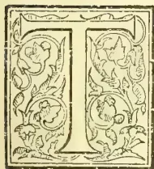

HE BROTHERS SABONADIÈRE deserve to be put in the very forefront of the Pioneer Planters of Ceylon. Both began their career in the island at an unprecedentedly early age—as lads of only 16 years; both (but especially

Frank) were among the very earliest batch of planters; both earned general esteem by industrious, persevering and honourable careers; and both clung to coffee as long as the industry had any return to make in Ceylon; while, in Jamaica, William died, as he had begun life, a coffee planter. We had, personally, no idea until we began to utilise the dates and notes, kindly placed at our disposal by surviving relatives, that the planting careers of the Messrs. Sabonadière, offered such uniquely interesting lessons of self-dependence, perseverance and sterling character from the very beginning—and this beginning, dating from an age when lads are usually sent to a Public School, in place of being shipped off to try their fortune in a new and, then, almost unknown colony like Ceylon. We believe Robert Boyd Tytler was of the same age

when he left home for Jamaica, to learn the West Indian mode of cultivating coffee, before coming to Ceylon; and it is interesting that there is this link of age between Pioneers who formed the advance-guard of so many Ceylon Planters, furnished by the North-Eastern Counties of Scotland and the Channel Islands. How the former came to be connected with Ceylon has often been explained. The influx from the Channel Islands began through the connection of the Bird (or Byrde) family, or rather of Colonel Byrde with residents in the islands, and this will come out very clearly as we proceed with our account of the Messrs. Sabonadière. Certainly, no Pioneers connected with Ceylon had a better right to induce a flow of young planters than the Messrs. Byrde, seeing that to them belongs the honour of forming the very first coffee plantation in Ceylon.

But to return to the subjects of our notice. We may be permitted first of all to say that the Sabonadières were a Huguenot family originally from Nismes, in the South of France, where there are still residents—as a relative found out some years ago—spelling the name as Sabonadier without the final “e,” but who belong to the Roman Catholic

169------------------------------------------------

148THE TROPICAL AGRICULTURIST.[SEPT. 1, 1898.

Church, and whose relationship to the descendants of the Huguenot branch is probably too distant to trace. Curiously enough, we may mention that the family (Durands) of the mother of the Messrs. Sabonadière, as also that of the wife (Portals) of Mr. Wm. Sabonadière, were of Huguenot descent. The father of the subjects of our paper was the Rev. C. C. A. M. L. J. A. Sabonadière, ordained of the Church of England, and a Pasteur in the Reformed Church of France, resident in the town of Meaux in the Department of Seine & Marne.\* His wife was Sophia, daughter of the Very Reverend Dean Durand of Peter Port, Guernsey. Here, in Meaux, were born Francis Richard Sabonadière, on 8th Feb. 1823 and (six years later almost to a day) William Augustus Sabonadière on 9th February 1829. Soon after the latter year, their father was transferred to Paris, and there Francis was educated at the Lycée, until his father's further transference to St. Quentin, where the latter died in 1838. Their mother then returned with her family to her old home, Guernsey, and her elder son, F. R., a lad of 15 at the time, could hardly speak a word of English. A notable physical defect in F. R. Sabonadière (big powerful frame as he eventually developed) was the absence of the right eye, and many in Ceylon, during his lifelong residence, thought this had occurred through some sporting accident. But it really dates from his early childhood, when during an attack of measles (at the age of 4) a nurse wrongly treated the inflammation of the eyes in poulticing, and this proved fatal to the right one. The incident is worth recording as showing under what disadvantages school work, and still more a Colonial and Planting life was begun. Mrs. Sabonadière, unable to make further provision for her son, bethought of her relative Capt. Bird (afterwards Colonel H. C. Byrde) in Ceylon, and it was to his care, young F. R. Sabonadière was consigned in 1839; and under whom he began his planting career, a lad of 16 years, on Black Forest Estate, Pussellawa, the property at the time of Capt. Cobbe, of the Ceylon Rifle Regiment. The salary allowed to the "sinna durai" (Assistant Superintendent) of that day was not more than a good native

or Eurasian tea-maker now receives; but on this, F. R. Sabonadière managed to live without incurring debt, by denying himself any stimulant or tobacco.

We usually date the beginning of the regular Coffee Planting Enterprise in Ceylon from 1837, so that Mr. F. R. Sabonadière was here almost from the outset by arriving in 1839. This arrival then was interesting from another cause; for he saw the first crop of coffee—and a very remarkable one—taken from the earliest clearing on Black Forest. The estate got this name from the Pussellawa jungle being all peculiarly heavy and of dark foliage and this being the first estate opened in the district. It was begun on a small scale in 1836, as an experiment in planting coffee at a comparatively high elevation—that is above 3,000 feet—for the only estates previously opened—namely Gangaroowa, Wariagalla, Konda sale and Rajawella—were from 1,500 to 1,700 feet above the sea. The unopened district of Pussellawa must have presented a grand expanse of forest and patana in 1836, and even so three years afterwards when young Sabonadière arrived. The experiment of Colonel Byrde—(or as he was then Lieut. Bird)—at first was only over 8 acres, but from this in three years was gathered the heaviest crop of coffee per acre perhaps ever harvested in Ceylon, and F. R. Sabonadière must have helped to gather it in. The return was 167 cwt. or nearly 21 cwt. (105 bushels) per acre. This result was due to the land being grubbed up, and all the roots and stumps of trees being burnt and the ashes spread over the surface; but this work was found far too expensive to be continued. The success of Black Forest clearing, however, soon caused a rush into Pussellawa; but, indeed, the larger and finer blocks had been taken up in 1836, owing not only to the fine forest and soil of the district; but to the fact that the main road from Kandy to Nuwara Eliya ran through its midst. We have in our possession a sketch in red pencil made for us by Mr. F. R. Sabonadière of the various blocks and the dates of most of them being taken up. The first on the road (nearest Gampola) though not the earliest taken up is Old Kaloogalla (C. R. Buller); next Melfort (Brook); Black Forest (Bird); Delta on the right 1836 Archdeacon Glenie with Glenloch and Whyddon behind all making 2,293 acres; on the left of the road Rothschild (Major Murray, 1836—we take it that the name was given by the Messrs. Worms when they purchased this block of the black forest of Pussellawa three or four years later at £5 an acre); further on the road we have Helbodde bought in 1836 by Col. Macpherson 2,200 acres; Karagastalawa, Capt. Fisher; Tavalamtenne

\* From a memorandum in the late Mr. F. R. Sabonadière's writing the following private family reminiscence is transcribed:—"My grandfather John Scipio Sabonadière married Louisa Barbauld (a sister of the well-known authoress) at the Parish Church of St. James, Westminster, on 7th April 1789, and had issue Adelaide Henrietta born 1st January 1790 and my father Carey Charles Alfred Mary Louisa Jean Antoine, born 25th January 1791 in the Parish of St. Luke's, Chelsea, and baptised in the Church of the said Parish 25th February 1791, also John Richemont born 25th March 1792, baptised in St. Luke's, Chelsea, and died at Caen June 13th 1809.

170------------------------------------------------

SEPT. 1, 1898.]THE TROPICAL AGRICULTURIST.149

Darley ; Wavendon, Tattersall and Lang ; Ramboda, Smith ; Bluefields and Rangboda, Col. Fraser ; Pallagolla, Kelson and Garstin ; Kandelgalle, E. R. Bower. Some of these ownerships must date from well on in the "forties"; for next to Colonel Fraser, we find entered Bird and Sabonadière 1845. Then away to the East of Delta, beyond the Attabage-oya, Mr. Sabonadière pencilled in a block belonging to "Rev. Owen Glenie"; Pooprassie, a large block bought by Gray & Co., Bombay, and which included Torrington, 1810-41" (we take it, however, the name Torrington was applied after the arrival of Governor Lord Torrington in 1847); "Haunagalla, Geddes ; Galloway-Knowe, "Miller, the Bombay Dentist," both dating from 1843-t. "Beyond this, MacCulloch's Land, now the Le Vallon Group." Farther South, there ran "Newmarket and Stellenberg originally Kandalawewa, the two Armands, representing an English house in Paris;" "Kandelawewa, Alston ; Poodjagodde, Fisher ; Eyrie, W. Keir ; Ballewan, Lyon Fraser and Sheriff." We cannot resist reprinting the contents of this sketch of the district properties as they were from 53 to 60 years ago, first, because it is in Mr. Sabonadière's own pencilling; secondly, because of the many old names recalled; but chiefly because it indicates the early development of what was long regarded as the Premier Coffee-planting Division of Ceylon and with whose fortune the names of the Messrs. Sabonadière were so long and so creditably connected.

To return to the career of the young planter-pioneer: five years of steady hard work followed, and then Mr. F. R. Sabonadière went home; and at the age of 21 married Miss Emily Murray, daughter of General Murray. On his return to the island in 1844, he took charge of Wahagapitiya estate, Pussellawa, and here he continued, until, in 1852, he was appointed to the management of Delta estate. In the interval, Mr. Sabonadière lost his wife who died of consumption at Jaffna, whither she had been removed to try and check the fell disease. Soon after entering on the management of Delta, Mr. Sabonadière built the fine large residence which has ever since marked the property. This, at first, he shared with Mr. Straube, the then Agent of Baron Delmar, proprietor of the estate; but the latter soon after retired leaving Mr. F. R. Sabonadière in full charge.

It is time now that we said something of the start in life of the younger brother. Only nine years old when his mother returned to Guernsey, William was sent to a private school, and afterwards to Elizabeth College. Just six years younger than Frank, he started for Ceylon (no doubt en-

couraged by the success of his elder brother) exactly at the same age and arrived in 1845 a lad of sixteen to begin a planting career. Our local information went to shew that the first employment of Mr. W. A. Sabonadière was under the Messrs. Rudd on Bowlana estate, Hewaheta; but we have in our possession the last letter he wrote to us from Jamaica in 1893, in which he alludes to the start of his planting career in Ceylon, 51 years before as on "Imbulpitiya and Wahagapitiya in July 1845." The latter meant that he got some of his first lessons and start under his elder brother as was natural. Probably he went to Bowlana when qualified to take charge and continued some years in Hewaheta, until called to the management of Glenloch, Pussellawa and Ramboda where, in Choisy, he and his brother acquired proprietary interests. There is in fact only the usual planting routine of opening and managing estates to record up till 1858-9, when Mr. Wm. Sabonadière returned home, and met Miss Sarah Portal his future wife, with whose family he passed a summer in Guernsey; they were married in 1860 and returned to Ceylon to reside on Glenloch which Mr. Wm. Sabonadière continued to manage, while developing Choisy. More than one trip home occurred in the "sixties" and he was in England in 1869, when he got the appointment of Manager of Delta in succession to his brother. He returned at once with his wife and two children and continued in charge till 1875.

In the early "sixties," the district of Pussellawa may be described as flourishing exceedingly. Our first visit was in 1865 on our way to Nuwara Eliya and we had for our companion through the district old Geo. Sheriff of Helbolde on his way to visit John Lewis Gordon on Wavendon who had not been very well. Full of reminiscences, Mr. Sheriff pointed out to us the different properties, so well known by name: Melfort so well cared for by the "Rev. John" (Martin) lately passed away. Rothschild with its hedges of roses, so long the property of the Messrs. Worms who always cultivated highly, as indeed did their successors, the Ceylon Company, Limited, under the guidance of Mr. Wm. Rollo. Delta Store stood out as if commanding the whole district, and Mr. F. R. Sabonadière was clearly recognised as not only the most experienced, but the leading planter in the countryside. A more delightful residential district there could not be than Pussellawa, with its healthy climate, average temperature of 65 degrees, its wide outlook of country and beautiful and varied scenery; abundance of pasturage for cattle, good roads—Delta alone having some 15 miles of cartroad and 20 miles of good bridle-paths within its bounds, affording delightful and

171------------------------------------------------

150THE TROPICAL AGRICULTURIST.[SEPT. 1, 1898.

extensive rides with fine scenery. Such was the home and scene of labours for 17 years of Mr. F. R. Sabonadière and afterwards for 6 years of Mr. W. A. Sabonadière—one of the largest and for many years) most prosperous coffee plantations, Ceylon, or even the world, has ever seen.

Meantime, Mr. F. R. Sabonadière married a second time on August 19th, 1854, Miss Mary (Minnie) Layard—sister of Sir C. P. Layard, so long Government Agent of the Western Province—and they continued to reside on Delta till her death which occurred on January 4th, 1864, leaving two daughters, Sophia who was married to Mr. Alex. Crabbe, merchant, Gracechurch Street, and died in 1895; and Emily Antoinette, now Mrs. A. M. Hurst. After 23 years; uninterrupted residence in Pussellawa (15 of which were on Delta), Mr. F. R. Sabonadière took a trip home in 1867 and in 1869 retired from Delta (in favour of his brother) to begin a mercantile life in Colombo as the head of the new firm of Sabonadière & Co.; having for his partner Mr. John Northmore, both being joined later by Mr. Wm. Bowden Smith.

As a Planting Proprietary and Agency House, Messrs. Sabonadière & Co. (having secured the support of Mr. G. S. Duff, Messrs. Crabbe & Co., and other home proprietors) quickly took a leading position—indeed in our Directory for 1883 they stood at the top of our Agency list—having the produce of some 28,564 cultivated acres from 113 estates to attend to. All was prosperous in the “seventies” and until the gradual decay of coffee through the fungus *hemilecia vastatrix*, and then a struggle set in for the partners (as for nearly all Ceylon) which culminated in the failure of the old Oriental Bank, and Sabonadière & Co. closed on 4th September 1884. It was at once succeeded by Messrs. Cumberbatch & Co., Mr. Cumberbatch having been a trusted assistant in the old house, and in due season (March 1885). Mr. F. R. Sabonadière in due time, became a partner in the new firm and watched the transition from coffee to tea, while cinchona, in many cases, affording the means to enable the new product to be started. Mr. Sabonadière could never be idle, even in his old age, and he was always chatty and cheerful; but his life-work was drawing to a close and the end came on 18th July, 1891. All that was mortal of Francis Richard Sabonadière was next day committed to the grave in the General Cemetery, Colombo, amid a large assemblage of all races and classes, many of whom felt they had lost a true friend; while all realized that the island was poorer through the death of as honorable, true-hearted and upright a colonist as ever helped to develop its prosperity. No one in the long list of Ceylon planters and

merchants was ever more deservedly loved and respected than the subject of our memoir whose whole life practically was given to Ceylon since he arrived a lad of 16 and never left it till he died in his 68th

DEATH OF MR. F. R. SABONADIÈRE.

(From the “Ceylon Observer,” 20th July 1891.)

Another of the ancient landmarks is gone. Mr. F. R. Sabonadière died on Saturday night, and last evening his remains were interred in the General Cemetery in the presence of a large number of those who knew and respected him when living, as an honest man and an amiable gentleman. As the manager of the great Delta coffee property of Baron Delmar, in Pussellawa, in “the forties” and “fifties,” and subsequently as estate proprietor and head of a mercantile firm, Mr. Sabonadière has been for a period in excess of half a century connected with the planting enterprise in Ceylon. The collapse of coffee brought misfortune to him as to so many others, and amidst trying physical suffering the closing years of his life were devoted to the task of enabling him to say “I, ‘owe no man anything.’” In his death European society in Ceylon has lost one of its most worthy members, while his departure will be mourned by the community generally. Much sympathy is due to his family, especially to Miss Sabonadière, who was deeply attached to one whose death leaves her an orphan. The deceased gentleman was connected by marriage with the Layard family, having married a sister of Sir Charles Peter Layard. His brother, Mr. William Sabonadière, author of a standard work on coffee cultivation, will, in far-off Jamaica, receive with grief the news that the elder brother whom he esteemed so much and loved so well has been taken away while he is left to fight the battle of life. On that battle-field but few remain of the generation, who were connected with the early days of coffee, who experienced its vicissitudes, and lived to see it finally superseded by tea as the staple product of Ceylon.

THE FUNERAL.

The funeral took place last evening, the procession leaving Nethercourt at 5.30 p. m., the first carriage being occupied by Miss Layard and Mr. and Mrs. Bowden Smith. At the cemetery the funeral service was conducted by the Archdeacon. The pall-bearers were the Hon. F. R. Saunders, Dr. Kynsey and Messrs. Henry Bois, Stanforth Green, P. C. Oswald, and F. J. de Saram. There was a large and representative gathering at the funeral.

On the 18th July, 1891, at Nethercourt, Colombo, FRANCIS RICHARD SABONADIÈRE, aged 68.

We must now return to Mr. William Sabonadière who after six years' management of Delta, determined to retire to the old country in 1875, selling out of his properties, Choisy in Ramboda and Cobo in Badulla. Before this, however, we should notice the preparation by Mr. Sabonadière and the publication of “The Coffee Planter of Ceylon” at the time by far the best and most practical book published on the subject. It first appeared in 1866 and was characteristically dedicated as follows:—

Dedicated to  
F. R. SABONADIÈRE, Esq.,  
OF DELTA, PUSSILAVA, CEYLON,  
BY HIS AFFECTIONATE BROTHER,  
THE AUTHOR.

172------------------------------------------------

SEPT. 7, 1898.]THE TROPICAL AGRICULTURIST.151

The Preface we quote as follows:—

PREFACE.

As planters, like doctors, often disagree, it may be thought presumption on my part to come forward with a work on the subject of Coffee-planting, as at present practised in Ceylon; yet I think that my twenty years' experience in the districts of Pussellawa, Hewahette, and Rambodde justify me in the desire to employ usefully the leisure time at my disposal for the benefit of beginners, in writing a work which may hereafter be useful as a book of reference.

I trust I need not say that I have no wish, neither do I pretend, to teach men who are as old and experienced planters as myself; for had I not felt confident, before I commenced this book, that a modern work or manual for young coffee-planters was required (the want of which has often been deplored), I would not have undertaken the task.

I have appended numerous extracts from Laborie's work, which, though written many years since, is still in some respects excellent of its kind, though not fully equal to present requirements—so much that is new having been learnt since Laborie wrote.

I have also availed myself of various letters, published either by the Planters' Association or in the local papers, all of which I gratefully acknowledge. They will, I am certain, add to the value of my book, as affording corroborative professional authority. I also acknowledge, with thanks, much statistical information derived from Ferguson's 'Ceylon Directory,' 1864—5, a compilation very useful to anyone who has interests in that island.

In conclusion, I trust my fellow-planters will excuse the many deficiencies that may be found in my work, and rely upon their kind and friendly criticism.

WILLIAM SABONADIÈRE.

GUERNSEY, February, 1866.

There was a new edition published in 1870.

In selling out of coffee estates before the crash overtook coffee, Mr. Wm. Sabonadière may have been deemed fortunate; but on settling in London he went into partnership with Mr. David Smith (afterwards Mayor of Brighton and a well-known Cinnamon and Coconut estate proprietor in Ceylon), the firm being Runciman and Smith, and so maintained business relations with coffee proprietors in Ceylon. In this way he suffered, like many more merchants, when the ravages of leaf-disease ruined the coffee properties of constituents. But for some years after 1875 prosperity ruled and Mr. Sabonadière lived in Delta House, Worcester Park, Surrey, the lower garden gate of which was immortalized by Millais in his picture of the "Black Brunswicker." Finally, Mr. Sabonadière retired from the firm and from mercantile life in 1882, and, although now in his 54th year, began to cast about for a new field of labour and enterprise. Tea at that time had begun to attract attention in Ceylon as a substitute for coffee; but at his age, Mr. Sabonadière did not think it well to take up with a new product. He received good accounts of coffee in Jamaica where the fungus disease was unknown, and at the beginning of 1884 he went out to Jamaica and took up the Arntully coffee plantation on the Blue Mountains, finding, however, that labour and means of transport and other conveniences

were very different and more trying than in Ceylon. Mrs. Sabonadière and his only daughter, Miss Mary Sabonadière, accompanied him; but the former died in December 1885. Still Mr. Sabonadière, cheered by his daughter's society, stuck with marvellous tenacity for more than another decade to the by no means encouraging work to which he had thus put his hands. Of his varying fortunes and of his experience of coffee and other products and life generally in Jamaica, the readers of the *Ceylon Observer* and the *Tropical Agriculturist* learned a great deal from his series of graphic letters sent to us at intervals between 1885 and 1896. He was cheered at times by good crop prospects and still more by the success of his only son, Mr. Alfred Sabonadière, who won his way into the Indian Civil Service to the great satisfaction of both the old Ceylon Colonists (father and uncle) who well knew the possibilities for good and notable work and the advantages offered by the finest Service in the world.

At length, early in 1896, Mr. Sabonadière began to feel the time had come when he should wind up in Jamaica and retire finally to the mother country. In May, his daughter left for England to be with her brother invalided home from India; and it was arranged that he (the father) should follow in a couple of months. In our last letter, already alluded to, Mr. Sabonadière dating from "Arntully, Cedar Valley P. O., Jamaica, 17th May," intimated that he would "be leaving Jamaica for good on or about 21st July." and he gave us his London address for papers, etc., and promised to write occasionally after he had settled down, though he added, "my notes may not be so amusing as Jack Tyndall's." Alas, it was not to be! He wound up his letter in the following interesting fashion:—

"Crops on the Blue Mountain estate are this year a bumper, and I am pleased to chronicle that Arntully is no exception to the rule. The coffee I planted since I came out is in full bearing and commencing to tell favourably.

"The estate should increase in value, as we have a cart road near by, which will soon be further advanced, and pass close above the Works. It has also been proved that with cheap and easy transport it would pay to send Arntully oranges to the New York market, now that poor Florida has been proved too risky by reason of the terrible cold "snaps" and "blizzards" it occasionally experiences. It is time I went home for good. I am 67, and it is 51 years since I commenced work at Imbulpitiya and Wahagapittiya in July 1815. I feel the laborious work of a Coffee Planter's life getting a little beyond my diminishing powers. I shall be glad to hear from you on my arrival in England.

Believe me, yours most truly,

W. A. SABONADIÈRE.

The big crop on Arntully and difficulties with unseasonable weather in July, prevented Mr. Sabonadière getting away on 21st July as originally planned, or again by the first mail in August,

173------------------------------------------------

152THE TROPICAL AGRICULTURIST.[SEPT. 1, 1898.]

But everything was arranged for his departure by 1st September, and all business arrangements settled, Mr. Stephens of Radnor estate having taken charge on the 26th August, the very day on which Mr. Sabonadière fell ill. The doctor was sent for next day, but did not think the case at all serious and left his patient much better on Friday morning the 28th. Dr. Castle, however, did not think Mr. Sabonadière, weakened by a diarrhetic attack, would be able to take the long ride down to Gordontown *en route* to Kingston, and he therefore arranged that a buggy should be sent to Moy Hall (quite close to Arntully) to drive into Kingston on Sunday by a new and easier road lately opened. On Friday evening, the Dr. returned to Arntully and seemed to have thought all was going on well; but at 10 P.M. a great change came on, through failure of the heart's action, and Mr. Sabonadière passed away soon after midnight, very peacefully. He was in his 68th year, almost exactly the same age as his brother at his death. The illness was therefore a short one and there was little or no suffering. Even in his latter Ceylon days, Mr. Wm. Sabonadière used to be careful about his heart which was pronounced weak. Overwork and excitement towards the end of his stay in Jamaica, no doubt was the reason of what seemed a slight, but yet proved a fatal, attack. Few if any Planting Colonists in the East or West had so ruled their lives as to be readier for the great change than Mr. W. A. Sabonadière. He was known in Ceylon as a truly humble-minded sincere Christian man, and both brothers left a high example to succeeding generations of younger planters. The remains of Mr. W. A. Sabonadière were laid beside those of his wife at Woburn Lawn close to the East End of the Church which had been enlarged some few years previously, chiefly through his personal efforts.

We cannot do better than close our notice of the Messrs. Sabonadière, than by quoting our letter, Sept. 11th, 1896, to the *Ceylon Observer* from London where the news of Mr. Wm. Sabonadière's death reached us. We do so at the risk of some repetition.

He wrote as follows:—

London, Sept. 11th.

I was indeed sorry to see the death of  
MR. WM. SABONADIÈRE

announced in the *London Times* two days ago, and as occurring "very suddenly on the eve of his embarkation for England." I had been under the impression that he was already safely settled at Norwood, to enjoy rest and calm after much hard work and buffetings both in the Far East and West. Mr. Sabonadière was a pattern planter in Ceylon for some 30 years and he wrote the most elaborate, in some respects the best, treatise, ever penned on "coffee planting," and dedicated it with the loyalty that ever distinguished him, to his elder brother "Frank" who preceded him

as Manager of Delta, when it was perhaps the largest and most prosperous coffee plantation in Ceylon. While the esteemed brother left planting to give his name and experience to the large Agency House which as "Sabonadière & Co." flourished as long as coffee held out, William—more fortunate so far—gathered together all the capital he could out of his Ceylon investments and cleared out before the crash came. So far, we have said, he was "fortunate"; but query, if it had not been better had he stuck to his first love and passing through our days of trial and depression had merged with some more of the old haunts on the sunny side of prosperity in "tea." For, as matters turned out, Mr. W. Sabonadière, with the best intentions, but in an evil hour for himself, left his retirement in England to invest in a hill coffee garden in Jamaica, and there he struggled on under disadvantages—as regards labour and transport especially—which would not at all have tried him, had he returned or even sent out his capital again to Ceylon. Having, however, made the choice at a time that none of us could say it was an unwise one, he stuck to his post like the plucky, industrious planter he was. Everything that intelligence and hard work could ensure, we may be sure, was done; but in his "sixties," he could not work in the field under a tropical sun—albeit on the hills—as he could have done during his third, fourth or even fifth decade, and it must have been both trying and depressing to the old Ceylon coffee planter—accustomed to cheap and superabundant coolies—to work with the labour available in Jamaica. But we need not pursue the story: much of it is familiar to our readers through the racy little letters which the late Mr. Sabonadière was accustomed to send the *Observer* and *Tropical Agriculturist* from the Far West. We have his very latest letter before us as we write. It is dated "Arntully, Cedar Valley, Jamaica, May 11th," and in the beautifully clear neat "hand" of the veteran (of 67 years), it tells us that he was to leave Jamaica "for good about 21st July" and so giving his new address at Norwood where he hoped to hear from us. Mr. Sabonadière went on to report a bumper coffee crop on the Blue Mountains, including his own place, Arntully, from which, too, he thought it would now pay with a road close by, to send away oranges to be shipped to the United States. The coffee he had planted he was leaving "in full bearing"—no doubt hoping to reap the return in the old country, well earned by one who began his planting career 51 years ago (when only 16 years of age) at Imbulpitiya and Wahagapitiya in July 1845. No wonder though he added:—"I feel the laborious work of a Coffee Planter's life getting a little beyond my diminishing powers." I fear that illness and possibly worry accounted for the delay of six weeks beyond the date fixed for his departure as above—and this delay as it turned out, proved fatal:—

"After life's fitful fever  
He sleeps well."

A good man in the highest sense, Wm. Sabonadière ever was—a truly sincere humble Christian; a model of an intelligent, industrious planter; of an upright, straightforward man of business; a good friend and no man's enemy:—

"Peace to the memory  
Of a man of worth"

if ever there was one among the Planting community of Ceylon or Jamaica. Our condolence is due to relatives—especially to the daughter, and to the son (in whom he rightly felt pride) for the distinguished place he had won for himself in the Indian Civil Service.

The name of

SABONADIÈRE

will always hold a leading place in the Planting and Mercantile annals of the first of Crown Colonies, and both brothers—Messrs. F. R. & W. A. Sabonadière—may be fearlessly held up as examples to young men of the present and succeeding generations.

174------------------------------------------------

SEPT. 1, 1898.]THE TROPICAL AGRICULTURIST.153THE QUALITY OF CEYLON TEA.

A very interesting discussion has taken place through Mr. C. H. Bagot's condemnation of our contemporary for alleging that the quality of Ceylon tea has deteriorated. Mr. Bagot holds to the contrary and he is supported by Mr. Metcalfe of Dunsinane, Pundaluoya, and by Mr. H. B. Roberts of Bozawantala-wa (all three letters reproduced below,) both of whom maintain that the teas from old tea in their districts have improved, and that the fault for lower prices is with the market, not with the quality of the produce sent forward. This is a most important question; and its practical bearing on the mission just entrusted to Mr. Kelway-Bamber will at once be seen. Our contemporary attempts to turn the tables by pointing to the fall in the Ceylon, as compared with the Assam, averages during the past three years. But this is obviously unfair; for Ceylon includes a far larger proportion of lowcountry coarse common leaf than is the case in Assam. There is no division in Assam to be exactly compared with our lowcountry districts of the Western and Sabaragamuwa Provinces. It must be remembered that while the average for all Ceylon in 1897 was as low as 7½d., the average for our highest group of districts was as high as 9¾d. A great deal of information bearing on this subject is embodied in the many letters we received in answer to our circular on the "Planting, Pruning and Preparation of Tea." For instance, "B" writing from a high district, told us very tersely that (as regards good quality tea and good prices),—

Preparation in the Factory is most important and I scarcely know of a building which has *always* sufficient withering space and machinery, and he gave his own case with its splendid results :—

Factory has accommodation for  $\frac{1}{2}$  million lb.  
 1895 318,000 lb. sold for 1s 0¾d  
 1896 340,000 " " 1s 1¼d

No change in system of plucking.

"B" also said that so far as he knew manning and pruning had not much to do with quality; but he significantly added as a special cause for poor quality :—

Starvation wages paid to Superintendents and the mistaken idea that any one can make tea.

We may be pardoned for taking the following valuable testimony from the letter of Mr. Bagot—who, we know, has made "tea manufacture" a special study during the past twenty years or so. He writes :—

"I see samples of teas from many estates in different districts, and as far as I can judge this year's quality shows much improvement; this is due to finer plucking, drier season, and smaller crop to deal with."

The first question then to be asked of a grumbling proprietor who says the quality of his tea is declining, is, Have you provided withering space and machinery in proportion to your increased crops?—and (2) have you a good Manager with qualified Factory Assistant, both adequately remunerated? This is, perhaps, enough for the present.

TWO REASONS WHY OUR TEAS HAVE LOST QUALITY.

Sir,—Now that Mr. Kelway Bamber is in Ceylon, perhaps it might be as well to enquire from a person

of his scientific knowledge if there is any reason to suppose that the quality of Ceylon Tea is in any way effected by the increased age of the plant. I have for some years past watched with interest what might be regarded as the phenomenal rise and fall of prices of teas sold by certain estates, and except where fine plucking has been resorted to, I have remarked that up to a certain point these places got considerably over the market price, and then after a time, they tottered on the edge of the weekly average of sales, and finally got a shade below it or on a level with it.

My theory is this, in explanation of the above, that up to a certain point the tea plant is nourished by the superior "top-soil," after which, as the plant is a deep feeder, the roots get into a poorer and poorer stratum of soil as it gets older, and so is unable to draw from a richer combination of elements—if I may use this phrase. Not only is this so, but it may in a way be borne out by what we may call district averages,—when we know certain districts have not got the same soil as those of higher altitude, and less denudation.

My theory is also supported by the results of sales from estates in which the prevailing soil is sandy, or say, made up of quartz.

Those estates not only always get a low price, but from the first never had a good one, for the simple reason that they started in sand and so must continue.

It is undoubtedly true that a great deal can be done by careful manufacture; but if the plant has not got the "flavor" to start with, no amount of manufacture will put it there.

I am also inclined to believe from certain observations that I have followed, that we are by no means at an end of our knowledge of what Planters call "fermentation." If that part of the process was strictly mechanical, it might be contended that it had its limits; but such is not the case. The "fermentation" begins, where the "mechanical" leaves off, and it is from its chemical standpoint that this process should be examined. Indeed I would go further in venturing to suggest not only a chemical standpoint, but a bacteriological standpoint.

If it was in our power to control the action going on within the bruised cells of the leaf, we might, to some extent say we could make all our samples of tea alike; but this the Planter has never been able to do, and it is held probable that he may find the greatest scope for change in the art of manufacture.

I trust I may be excused for taking up so much of your space, Sir, but as we have a learned authority in the country, perhaps he may be pleased to express his views on the two points that I have ventured to put forward.

4th August 1898.

F. L. S.

CEYLON TEA HAS NOT DETERIORATEDEVIDENCE FROM NUWARA ELIYA.

SIR,—It is not only Ceylon tea which is suffering from low price, but teas from every other country are affected in the same way, and yet neither you nor anyone else can seriously affirm that the quality of teas *everywhere* has deteriorated.

For our own teas, I maintain that *to-day* we are making universally far better quality than we ever have done previously, notwithstanding what Colombo exports and tea tasters tell us to the contrary, not one of whom, I believe, would back his opinion as to the value he puts on samples, unless he knows the mark.

When coffee dropped from 120s. per cwt. to 60s, was fault found with the cultivation of the berry, or manipulation of the bean? Take cinchona, cocoa, cinnamon, or any other product.

That some estates once got better prices than they are at present getting is easily explained.

Formerly there was competition for these marks, whereas now buyers have a larger selection of tea of the same quality to choose from, thus entirely doing away with competition.

175------------------------------------------------

154THE TROPICAL AGRICULTURIST.[SEPT. 1 1898.

The Tea market is in a rotten condition, which is to be regretted, but that neither chemical nor bacteriological investigations, still less "crying stinking fish" will improve it is the humble opinion of, yours faithfully.

CHAS. H. BAGOT.

St. Leonards, Nuwara Eliya, Aug. 7th, 1898.

I.

SIR,—I am glad to see Mr. C. H. Bagot has protested against the harm done by your frequent references to the alleged falling-off in quality of our teas. That your remarks have done harm, I have proof in the shape of letters from friends in England who are interested in Ceylon estates, asking my opinion as to the question raised in your paper, of the altered character of Ceylon teas. I replied that there must be differences in the quality of tea made under varying climatic influences; as with the vintage, so with tea, one season's crop differs from another; that the teas manufactured this year were well made in the factory, and of better quality than last year's, as comparison with 1897 teas fully proved.

The absence of competition on the market owing to the altered conditions of the tea-trade at home, the statement that "the finest tea the world produces" can be bought at a figure that, to anyone who thinks, carries contradiction on the face of it, the over-supply of one type of tea; these are some of the reasons for the fall in price.

I beg to differ from you as to the "whole tea-trade" opinion on Ceylon teas. I have valuations and reports of sales before me which contain the following remarks: "These teas are the best we have seen from— for some time, but we do not value them higher owing to the depressed condition of the market." Again—"we regret not to have obtained more for the Pekoe, the market is over-supplied with this grade, the tea is fully up to invoice ex s. s. ———, sold early in May at 2½d. per lb. higher."

If you would cease your unjustifiable comments on the character of Ceylon teas, and do all in your power to advocate their consumption in new countries, you would further the interests of the planting enterprise.—I am, sir, your obedient servant,

W. P. METCALFE.

Dunsinane, August 10th, 1898.

II.

SIR,—I quite agree with all Mr. Bagot says on this subject. The teas on most estates have improved with the age of the bushes, showing more strength, and still have fine flavour. Thin flavour teas made from young tea, which used to sell so well do not command any price in the present market. They are too thin.

Could we go back to the market we had five years ago, even with our increased yield per acre the teas would fetch as high prices as then.

It is the market, not the tea, that is at fault.—Yours faithfully,

HUGH B. ROBERTS.

Eltofts, Bogawantalawa, August 9th.

CEYLON WOODS FOR TEA PACKAGES.

SIR,—The publication recently of Mr. Lewis's paper on Ceylon woods leads me to offer a few remarks on the fitness of some of those woods for tea-packages. At the present time, when there is so much talk about the special attention we must give to our teas with the view of introducing them to new markets, planters should not overlook the subject of packages, for that subject is almost as important as the subject of the tea itself. I am nearly certain that at least two-thirds of the tea that comes down from up-country is packed in native wood cases which are totally unfit for shipment; in fact many firms have told me in my travels that they cannot take Ceylon teas;—they are afraid to indent for them, not knowing what cases they will be in. Mind, I am not condemning the country chest as a whole. Several local woods are useful and serviceable; but care should be taken in their selection. The following are native

woods suitable for tea chests:—Hal, Bombie, Mango Areda, Diatalia, and Ombie. Tea should never be packed in Kattuimbul, Tell-kakuna, or Bulu chests. If planters would pay more attention to the packages their teas are shipped in, many firms now selling Chinas and Japans could be induced to handle our product. Going on board a steamer loading tea in our harbour, numbers of chests are to be seen with lead and often the tea exposed to view. When weevils and dry rot have had time to work their havoc on Kattuimbul, Tell-kakuna, and Bulu chests, what condition will the tea be in when it arrives at the store of a purchaser in a distant land?

One day while in San Francisco I saw a cart load of Ceylon tea going down the street, leaving a trail of tea as it went. My friend, who happened to be one of the largest importers of tea in America, remarked:—"there goes your Ceylon tea, and still your planters wonder why our merchants are not ready to receive your goods with open arms, and condemn teas from China and Japan in their neat, light, packages, which seldom give any trouble through breakages." I strongly urge on planters the necessity of paying more attention than they have hitherto done to this vital matter.—Yours truly,

R. V. WEBSTER.

PLANTING NOTES.

TEA PRUNING AND PLUCKING.—There is clearly a great deal to be learned in this connection; but allowance must be made for the differing conditions of different districts. Thus from Uva, in the midst of drought, we learn of 8 lb. of leaf a day per cooly coming in, which certainly will not pay on a price not above the average. A critic of this, in an old district on the Kandy-side, thinks the "pruning" is to blame and tells us:—"Why I get 20 lb. of leaf a head, and I attribute it to going over my tea once a year with light pruning." Another equally experienced planter, but in a much higher district (4,500 ft. as compared with 2,000?) says: "Your 20 lb. plucker will injure his tea in the long run—my average is 12 lb. and I think it a good one: this season I have got 14 lb. which I think quite as much as should be plucked by any cooly in a day." Now all we have to say is that our "20 lb." friend is the last man in the world to injure his tea and he knows a good deal about it too; but "who will decide when doctors disagree?"

COFFEE AND PEPPER IN SOUTHERN INDIA.—We have delayed publishing Mr. R. Tatham's letter until we could, as usual, give his tabular statement which is the really valuable portion of the information. Both will now be found as a Supplement. It will be seen that, for the first time we think, Mr. Tatham attempts to distinguish between 'Native' and 'Plantation' coffee and he makes out that as much as 81,658 cwt. of Native coffee was exported. But we thought from a recent discussion in the press that all the 'native' coffee grown in India was scarcely enough for local consumption if the whole continent were considered? Again, if the plantations of Mysore, Coorg, &c., only gave 121,517 cwt., what will that make per acre? We fear very little, judging by the figures in our Directory. Still the total export of 203,000 cwt. is not so bad, considering the times. The maximum export of coffee reached by India was 507,296 cwt. in 1871-72; but since then there has been a steady decline though never the collapse which has occurred in Ceylon.—The export of Pepper from India last year was short and the price high: what a chance for Ceylon to do something with this "new-old product"!

176------------------------------------------------

SEPT. 1, 1898.]

THE TROPICAL AGRICULTURIST.

155

TEA AND COFFEE IN INDIA:  
LATEST RETURNS OF AREA UNDER  
CULTIVATION;  
TEA IN INDIA COVERS 103,000 ACRES  
MORE THAN IN CEYLON.

Just as we are closing our work for the present edition of the "Ceylon Hand-book and Directory" we receive (as Editor of the *Tropical Agriculturist*) the latest volume of "Agricultural Statistics in British India for the years 1832-3 to 1893-7." It is one series of tabulated returns covering well-nigh 400 pages and of course—with an almost universal collection of revenue from cultivated land,—the figures for the different crops are far more reliable than anything of the kind in the Ceylon Blue-books; though they cannot approach our still more accurate record for the tea, cacao, coffee, cardamoms, cinchona, rubber, &c. plantation statistics of this Colony. To give an idea of the enormous areas with which the Indian Director-General of Statistics has to deal, we give a few of the results, leaving out odd figures. First, there is the total net area of territory by professional survey, deducting feudatory and tributary States and areas for which no returns exist, and we get 537 millions of acres! Under forests, 64 millions; not available for cultivation 154 millions; culturable waste 95 millions; fallow land 47 millions; area from which crops were taken 177½ millions; area irrigated 29 millions acres. Next we have the different crops: Rice covers 63½ millions acres; wheat over 16 millions; and the total under food-grains was no less than 160 millions acres! Under oil-seeds 10½ millions; cotton 9½; jute 2½; other fibres 611,000 acres; sugar 2½ millions; indigo 1½ million; tobacco 1 million; fodder crops 2 million; opium 691,600 acres; Coffee 147,158 acres; Tea 423,732 acres.

It is with reference to Coffee and Tea that we wish to offer remarks and corrections on the official statistics just published. In the case of coffee there is not much to correct, because the volume before us credits Mysore as an independent State with nearly as much coffee as all "India," but ignores Travancore. Adding in for the last the figures compiled for our own Hand-book, we get the following:—

<table border="0">
<tr>
<td>Coffee cultivated in "India"</td>
<td>=</td>
<td>147,158 acres</td>
</tr>
<tr>
<td>" " " Mysore</td>
<td>=</td>
<td>145,550 "</td>
</tr>
<tr>
<td>" " " Travancore</td>
<td>=</td>
<td>4,283 "</td>
</tr>
<tr>
<td>Total ..</td>
<td>295,991 "</td>
<td></td>
</tr>
</table>

But inasmuch as we feel sure the official return is too high for the Wynnaad and Nilgiris districts, we are inclined to reduce the figures and estimate to 290,000 acres as the approximate area now under coffee in all India against not more than 18,000 acres in Ceylon for plantations, Liberian and native gardens. Much of the area in India must be bearing very little; for the total export in 1897-8 was only 225,003 cwt. It is surmised, however, that there is a far larger local consumption of coffee in India than has hitherto been credited. We are inclined to put it down at 150,000 cwt.; but even then we should not get an average yield over all the coffee area of 1½ cwt. per acre.

Turning to TEA, the Director-General in Calcutta has evidently failed to get returns from Travancore which, with the large area being opened up by Sir John Muir's Companies in North Travancore, has now become quite an important tea-growing division. Our returns indicate no less than 23,000 acres in tea in Travancore, more than half of which is young or immature. Altogether we arrive at a total extent for tea throughout the opposite Continent, of 433,751 acres or 45,090 in advance of the Director-General's return. Here is how we make up our returns. In ASSAM:—Cachar 61,199; Sylhet 70,299; Sibsaghar 79,644; Lakhimpur 53,539; Darrong 33,934; Nowgong 12,659; Kamrup 5,873; Golpore 410; and Khasi, etc. 3)—total 310,550 acres planted—but divided as follows:—

<table border="0">
<thead>
<tr>
<th></th>
<th>In Bearing.</th>
<th>Young.</th>
</tr>
<tr>
<th></th>
<th>Acres.</th>
<th>Acres.</th>
</tr>
</thead>
<tbody>
<tr>
<td>Assam .. ..</td>
<td>233,213</td>
<td>47,337</td>
</tr>
<tr>
<td>Bengal (Darjeeling, Chittagong etc.) .. ..</td>
<td>93,000</td>
<td>14,000</td>
</tr>
<tr>
<td>Kamroun, Dehra Dun, etc., .. ..</td>
<td>8,000</td>
<td></td>
</tr>
<tr>
<td>Kungra Valley .. ..</td>
<td>10,000</td>
<td></td>
</tr>
<tr>
<td>Burma .. ..</td>
<td>1,200</td>
<td></td>
</tr>
<tr>
<td>Bombay Presidency .. ..</td>
<td>1</td>
<td></td>
</tr>
<tr>
<td>Nilgiris, Wynnaad, etc., .. ..</td>
<td>1,000</td>
<td>5,000</td>
</tr>
<tr>
<td>Travancore .. ..</td>
<td>10,000</td>
<td>13,000</td>
</tr>
<tr>
<td>Total for India .. ..</td>
<td>330,414</td>
<td>79,337</td>
</tr>
<tr>
<td>All Ceylon .. ..</td>
<td>273,000</td>
<td>93,000</td>
</tr>
<tr>
<td>Grand total = .. ..</td>
<td>603,414</td>
<td>172,337</td>
</tr>
</tbody>
</table>

<table border="0">
<thead>
<tr>
<th></th>
<th>Acres.</th>
</tr>
</thead>
<tbody>
<tr>
<td>Total of Tea planted in India = ..</td>
<td>433,751</td>
</tr>
<tr>
<td>Do. do. do. Ceylon .. ..</td>
<td>371,000</td>
</tr>
<tr>
<td>Grand total, acres .. ..</td>
<td>803,751</td>
</tr>
</tbody>
</table>

<table border="0">
<thead>
<tr>
<th></th>
<th>lb.</th>
</tr>
</thead>
<tbody>
<tr>
<td>1893—Estimated crop—India ..</td>
<td>153,000,000</td>
</tr>
<tr>
<td>Do. do. do. Ceylon .. ..</td>
<td>120,000,000</td>
</tr>
<tr>
<td>Total .. ..</td>
<td>273,000,000</td>
</tr>
<tr>
<td>Allowing local consumption .. ..</td>
<td>6,000,000</td>
</tr>
</tbody>
</table>

For Export .. .. 272,000,000  
Say 238 million lb. to United Kingdom and 34 million lb. to other countries.

In our calculations of area for Ceylon, we include 7,000 acres in native tea gardens—2,000 young and 5,000 acres in bearing. We take between 4 and 5 years as the limit between young and mature tea. Let it be further noted that the Assam tea planters have a reserve of land not yet planted equal to nearly 700,000 acres; while the reserve in private hands on Ceylon plantations equals 367,000 acres, of which 121,000 acres may be fit for planting.

In round figures we may now say that in all India, there are 470,000 acres planted with tea; and in Ceylon 370,000 acres; so that our big neighbour is only 101,000 acres in advance of us. The time has, however, come for suspending further planting operations until it is seen what is to become of the additional crop (say 59 million lb. at least) which the young tea is capable of producing. If crops aggregating 272 million lb. can with difficulty be disposed of at a profitable rate, how, within the next four years or so, can 59 millions more lb. be taken off? That is the problem; and one that can only be solved with the aid of Russia and the United States. May these countries respond by demands increasing by leaps and bounds, year by year.

20

177------------------------------------------------

156THE TROPICAL AGRICULTURIST.[SEPT. 1, 18 .

DR. MORRIS, C.M.G., AND MR. JOHN HUGHES ON THE WEST INDIES.

INDIAN CURRENCY, AND CEYLON TEA.

With Dr. Morris at Kew this afternoon (15th June) I had a long conversation. Explaining the reasons for the

WEST INDIAN COMMISSION

to inquire into the disastrous condition of the sugar trade, Dr. Morris stated that French Colonies send home their sugar to any French port where it receives a bounty of £5 per ton; thence it is sent over to the English market and sold at the cost price of £10 per ton. English Colonies receive no bounty and therefore have practically to sell against Frenchmen at less than cost price. A rich mother-country, owing to her stubborn, and yet far from blameworthy, principles of free trade, thus allows a bounty-fed foreign supply of sugar to out from the English market that sent home by its own colonies. Dr. Morris did not approve of the creation of a bounty system of our own, seeing that it tended to weaken the independence of planters and led them to rely less upon their own resources. He would advocate very strongly, nevertheless, that some assistance should be given in the West Indies to those Colonies, which have been ruined by the free-trade principles at home, in the shape of loans at a moderate rate of interest to help them put their estates in order and renew their machinery. Even after this has been done, it seems to me that French sugar will still hold the field in England, unless its quality is inferior to that of the English and the charges for freight considerably greater. The only resource of the West Indian planters would seem to be to confine their supplies to and develop those markets nearest to them namely the American and Canadian. It will be interesting to see what assistance Mr. Chamberlain will eventually propose should be given, for he has already agreed that something shall be done for the West Indian sugar estates.

With regard to

THE CURRENCY

Dr. Morris admired the wholly justifiable energy with which the Ceylon Association had acted in view of non-representation on the Indian Committee. But, he said, it would be unwise on the part of Ceylon planters to offer any opposition to the Indian Government when once it had decided on the step which to it seemed necessary—and this was evidently the fixing of the value of the rupee at 1s 4d. If the whole question were looked at from a wider point of view, the importance of Ceylon was small compared with that of the dollar-using Colonies. The "almighty" coin which rarely fluctuated much from 4s 2d in America, was there worth only 2s 3d. Nevertheless the injury that would result to Ceylon planters from the measure they fear, coupled with the recent fall in the prices of tea (now happily less marked), would undoubtedly add to their difficulties.

[It is what may shortly occur through British agencies, in the Yang-tse-kiang Valley in developing properly grown and prepared teas, with the dollar at 2s 3d or less, that brings a cloud over the prospect of the Indian and Ceylon tea planters

and makes them anxious about the Currency settlement.—ED. T.A.]

Mr. Hughes said the other day that it would be a point of interest to discover whether the

DETERIORATION IN TEA

of late (of which he felt assured) was due to careless manufacture, or the affection of the tea-bush by decay, or exhaustion of the soil. On this question Dr. Morris's views were as follows:—The tea plant was too hardy to be quickly affected by any deterioration in the soil. The latter was always a slow process, and seeing how short a time the industry had been established in the island it could even if ascertained for a fact, which it is not, hardly account for the reported loss of quality in the manufactured tea. It was more probable that, as usual with all products that come to be manufactured on a large scale, less careful attention had been given to each of the various processes involved in the work of the factory and the field. Competition, in the shape of Companies, was largely answerable for the depreciation in the quality of the manufacture. Dr. Morris recalled how in the days of hand-made teas, when tea was 3s 6d per lb., he used to receive 2lb. packets from Mr. James Taylor of Loocondera, and sent them to various people such as Mr. Thistlethwaite, Sir Joseph Hooker and Professor Huxley. It usually led to their writing for more of the article, and in the case of Sir Joseph Hooker to the throwing up of China teas through preference for the Ceylon. But in these days unless the pristine excellence of teas exported from Ceylon were restored, their advance in the home markets would be a slow and tedious business. If the planters would strive rather to improve the product than accelerate its production, the outlook for the tea industry was by no mean disappointing. Visitors to Ceylon were struck with the vitality of the work going on and the hopeful look of the estates. Only the other day Dr. Morris had had a visit from Mr. Freeman-Mitford, C.B., late M.P. for South Warwickshire, and of Batsford Park, Gloucestershire. While on a trip to Ceylon recently, this gentleman gained so high an opinion of the prosperity of plantations he visited in Dikoya that, before he left the island, he had invested in a share of an estate at Hatton. Dr. Morris invited me to visit Kew again before I sail, and he would then show me round many things of interest.

R. H. F.

CARDAMOM CULTIVATION IN CEYLON—is well-known to be very prosperous, where it does succeed, although a good many fields in unsuitable districts have had to be given up. But can any cardamom planter beat this return courteously sent to us for our Handbook by a well-known Ceylon V.A.:—a field of about 80 acres 4 to 5 years old last season gave 480 lb. dry cardamoms per acre. At a gross return of 4s per lb. or £96 per acre, this ought to pay well! One hundred and fifty years ago, the Dutch had to get most of their cardamoms from the Hanwella and Matara districts—is the cultivation quite given up there by the natives? Altogether we now get 5,153 acres planted with cardamoms on plantations, chiefly in the Medemahannuwara, Rangalla and Matara East districts with less in Nitre Cave, Knuckles, Kelebokka, Hewahette, Kurunegala and Badulla. Our last export of 540,000 lb. should be added to as young fields come into bearing.

178------------------------------------------------

SEPT. 1, 1898,]

THE TROPICAL AGRICULTURIST.

157

COFFEE AND RUBBER IN MEXICO.

A recent mail brought us from America a very handsome volume on the above subject, accompanied by the following note from the author, Mr. M. Romero—"Washington, June 11.—I have the pleasure of sending to you by this mail, at the request of Mr. Hawthorne Hill, editor of the 'India Rubber World,' of New York, a copy of the book I have just published in New York entitled 'Coffee and India Rubber in Mexico,' which contains two papers that I wrote several years ago on the culture in Mexico of both staples, which may be of some interest to you. In my paper on 'Coffee Culture' I make frequent reference to its culture in Ceylon." The full title of the work is "Coffee and India Rubber Culture in Mexico preceded by Geographical and Statistical notes on Mexico, by Metras Romero—G. P. Putnam's Sons, New York and London, 1898." We cannot more tersely or exactly explain how Mr. Romero came to write this book or how he gained the necessary experience than by quoting the first portion of his introduction as follows:—

When, after serving five years, from 1858 to 1871 as Secretary of the Treasury in Mexico under President Juárez's administration, I was obliged to resign, my health being so greatly broken down as to make it impossible for me to continue discharging the duties of that responsible, and at the time, very difficult office, feeling that if I remained in the City of Mexico, I could not regain my health as I would be subject to continual mental excitement, I made up my mind to live in the country and occupy my time in agricultural pursuits. Before deciding what branch of agriculture I should follow, I made a tour of inspection to the most favored regions of Mexico and found that india-rubber and coffee raising seemed to be the most promising and profitable undertakings. The place which I thought best adapted to both of these products was the district of Soconusco, one of the counties of the State of Chiapas, in southeastern Mexico, bordering on Guatemala, and I concluded to settle there and apply myself to coffee and india-rubber culture.

In the meanwhile, coffee raising had attained considerable development in Guatemala, the Guatemalan coffee being very highly esteemed in foreign markets, and I determined to make a tour of inspection in Guatemala and examine the principal coffee plantations, in order to learn what was the best way to make a plantation and keep it productive. I, of course, tried, during this time, to collect all the information I possibly could about these two branches of agricultural industry.

Finally I undertook to make a coffee plantation in the high lands of Soconusco—located from four to five thousand feet above the level of the sea—as, in my opinion, a temperate zone is the proper one for that tree; and another for india-rubber in the lower lands of the district, which are warm, damp and marshy. I acquired some experience by these experiments and I made a study of the subject, not only in coffee plantations in Mexico and Guatemala, but in other countries where I understood coffee raising was also very prosperous, like the Island of Ceylon, in the East Indies, and Brazil which is now and has been for many years, the largest producer of coffee in the world.

Mr. Romero eventually visited every coffee district of Mexico, so that he ought to write with a full knowledge of his subject. The first edition of his book—a small manual—came out 25 years ago and it ran afterwards through several editions. When the price of coffee began to rise rapidly in 1890, great attention began to be given to Mexico with its grand advantage of proximity to the United States, the greatest coffee consuming country in the world. Mr.

Romero mentions that the maximum price obtained was 35 cents in silver; but that the price fell rapidly in 1897 until 12 cents was reached and yet even that proved remunerative. Still we think the Ceylon planters who recently visited Mexico did quite right to hold off purchasing coffee property there until they saw what the course of the market was likely to be. The total production of coffee for Mexico in 1896 is given as follows:—

<table border="0">
<thead>
<tr>
<th></th>
<th></th>
<th>lb.</th>
</tr>
</thead>
<tbody>
<tr>
<td>Cordoba produces ..</td>
<td>..</td>
<td>10,000,000</td>
</tr>
<tr>
<td>Huatusco and Coatepec..</td>
<td>..</td>
<td>10,000,000</td>
</tr>
<tr>
<td>Oaxaca ..</td>
<td>..</td>
<td>6,000,000</td>
</tr>
<tr>
<td>Tabasco ..</td>
<td>..</td>
<td>5,000,000</td>
</tr>
<tr>
<td>Chiapas..</td>
<td>..</td>
<td>3,000,000</td>
</tr>
<tr>
<td>Other Districts ..</td>
<td>..</td>
<td>26,000,000</td>
</tr>
</tbody>
</table>

60,000,000 lb.

Or nearly 536,000 cwt. The only chance of maintaining the remunerativeness of the industry we should say, must lie, in introducing the Ceylon system of careful pickings of ripe cherries only, pulping, drying, separating, &c., in fact that careful "preparation" which gave "plantation Ceylon" so high a reputation.

But the strange fact is that the recent Ceylon visitors to Mexico did not pay a little more attention to "Rubber," the coming product and one so much in demand at handsome prices. Here is what Mr. Romero has to say with a quotation from a Report by the British Minister:—

*India-Rubber.*—The lowlands of Mexico, especially those adjoining the Pacific Ocean which have a very warm and moist climate, are very well adapted for the india-rubber tree, which attains a large size and yields a considerable amount of india-rubber. We used to have whole forests of them, which fact shows that they were in their proper conditions of soil and climate, as they could outgrow the rank vegetation of the tropics, and prevent the growth of most of the other large trees in the forests; but india-rubber gatherers have destroyed most of them, and I imagine that there is a comparatively small number left.

I have always thought that the production of india rubber would before long cease to be sufficient to supply the demand, and that, therefore, the value of that article would increase with the lapse of time. Now it is to be expected that the enormous expansion during the last few years of the cycle-tire, electrical motor-car, cab, and kindred industries will lead to the bestowal of increased attention on the world's rubber supply, which is so intimately associated with the existence of these industries.

Thinking that a plantation of india-rubber trees would be very remunerative, I devoted considerable attention to that subject, and in 1872 started one of 100,000 trees in a place admirably located for the purpose, bordering on the Pacific Ocean and between two large rivers, in the same district of Soconusco. In an article published in 1872, under the title "India-Rubber Culture in Mexico," I compiled all the information on the subject that I could obtain, supplementing it with the experience that I had acquired. Unfortunately, for reasons of a political nature, I had to abandon that plantation, and when the trees that I had planted grew large enough to yield rubber, they were tapped by the natives and entirely destroyed, but my work gave me an experience which I considered of great value.

The india-rubber trees that grow in Mexico are not the *Hevea guianensis* that grows in Brazil, but the *Castilloa elastica*, and if we have any of the *Hevea guianensis* I have not seen them.

Enough has been written lately on rubber cultivation to show that the profits, in Mexico at least, would be very great; indeed, 300 per cent. on the capital invested is a possible return, after five years, from cultivating *Castilloa elastica* in that Republic. This is a return which provides plenty of margin for

179------------------------------------------------

158THE TROPICAL AGRICULTURIST.[SEPT. 1, 1898.]

contingencies. Rubber-growing is no longer in the experimental stage, as witness the plantation of La Esmeralda, in Oaxaca, to which further reference is made below. Cultivated india-rubber plantations are few, for the reason that, in some degree like the coffee plant, the india-rubber tree requires a long period of continuous cultivation before making any return to the cultivator. Mexico affords excellent opportunities for the development of this admittedly profitable industry. On this point the authority of Sir Henry Nevil Dering, the British Minister to Mexico, who, in a recent report to the Foreign Office on the cultivation of india-rubber, says:—"The regions most favorable for the growth of this important, yet rarely cultivated, india rubber tree are the plains of Pochutla, Oaxaca, and also along the banks of the Copalita River where the tree is found in astonishing numbers. Few are the plantations of india-rubber trees existing in the Republic of Mexico. The principal one is La Esmeralda, in Juquila, Oaxaca, which has over 200,000 trees eight years old." According to the same report the total expense for five years' cultivation of a "rubber plantation of 100,000 trees will not exceed \$25,000 in silver and the yield of 100,000 tree at the first year's harvest will bring the planter \$120,000, besides the product obtained from the corn, vanilla beans, cacao, and bananas raised, from side planting. The net profit on the investment, after deducting the entire cost of the land and all expenses up to the first year of harvesting, will be \$95,000, and each of the succeeding harvests, for twenty-five or thirty years, will bring a steady income of over \$100,000." This is 400 per cent. per annum net profit on the investment. These calculations are based upon the production of a five year old tree, but the report adds that "this product will be gradually increased every year for the next four or five years."

Leaving aside the wonderful estimate of profits—and neither Sir Henry Dering nor Mr. Romero gives much practical information as to labour to back it up,—we would observe that the favourite rubber is that so well spoken of by Mr. Hart in Trinidad (as quoted by us the other day) and which for several years received a good deal of attention from Dr. Trimen in his annual Reports, although the growth and yield of milk did not answer his expectations. Possibly the situation was not favourable to either. We should like to know if any trees of this kind (Panama rubber) have been tried in the Kalutara or Ratnapura districts and with what results. Here we must close for the present.

## PROGRESS IN THE FAR WEST.

### TOBAGO—THE FINEST OF WEST INDIAN ISLES.

The beautiful little island of Tobago is to be the scene of some agricultural life and enterprise at last. A gentleman of ample means, ability and enthusiasm, having one day, last autumn, come across the little book "In Tropical Lands," was struck with the idea of selecting an interesting winter resort in the Tropics, and after consultation with the writer, left in November last for the West Indies. Visiting Barbados, Dominica, Antigua, St. Thomas, St. Kitts, etc., he spent a month in Trinidad and another month in Tobago. This, he thinks, the finest little island in the West Indies: splendid soil, rich vegetation, abundance of clear sparkling water and pretty scenery—little changed since the day of Robinson Crusoe. Here my friend has invested in 1,600 acres of excellent land eminently suited for, and intended for, cacao, coconuts, nutmegs, rubber, etc. He was not much enamoured with Port of Spain, but greatly enjoyed a ride through the mountain gorges, where Sir Arthur Gordon took his friend

Chas. Kingsley: purchased two fine cacao estates in Trinidad, the steamy climate of which exactly suits the cacao though the reverse of invigorating for the European. There will soon be openings in that quarter for some of your spare "dorays." The great advantage of the West Indian islands over Mexico or Peru is the stable Government and ———! I do not like Brazil for the same reason. Nothing will thrive through a Spanish extraction and the old proverb holds good:—"Pump out of a Spaniard every particle of good and the remainder will make a pretty fair Portuguese." No, no: stick to the old flag under which there is still ample room, and as regards the Crown Colonies, at least, some feeling of safety and justice. O. C.

## CEYLON PLANTERS' ASSOCIATION.

*Extracts from Minutes of Proceedings of a Meeting held at Kandy, on Friday, the 8th day of July, 1898*

### OFFICIAL ESTIMATE OF TEA CROP FOR 1898.

Discussed the Official Estimate of the Tea crop for 1898 as compared with actual shipments as at date. Resolved:—"That as the first half year has shown no increase over the Tea yield to end of June 1897, the Committee is of opinion that the estimated increase of 10,000,000 (ten million) lb. of Tea for 1898 will not be secured."

CACAO DISEASE AND THE SERVICES OF A CRYPTOGAMIST. Read letters from Government in reference to remittance of the equivalent of £ 50 stg.

### LADYBIRD BEETLES.

Read letters from the Director, Royal Botanic Gardens, Peradeniya, and from Mr. E. Ernest Green the latter stating that in his opinion the introduction of various kinds of foreign "Ladybird beetles" would prove beneficial not only to coffee or tea but, to all cultivated plants in Ceylon, each of which has one or more species of red insect or aphid that must more or less affect its productive power; further mentioning that he had been promised a consignment of living Ladybird beetles from the Cape, where they have several species likely to be useful in Ceylon. Resolved:—"That a grant of £200 be voted to Mr. E. E. Green towards his expenses in bringing a consignment of 'Ladybird beetles' from the Cape."

Read letter from the Secretary United Planters' Association of Southern India.

### LANTANA BUG.

Read letter from the Director, Royal Botanic Gardens, Peradeniya stating that in regard to the Lantana insect it has been common about Kandy for years and that the Director now does not see any chance of exterminating it; adding that the area affected by it is too large and it is too omnivorous in its appetites. The Director further mentions that the only feasible thing is to think for planters to keep it off the tea by burning back the Lantana and other weeds upon the boundaries of estates. If the insect is once allowed to live on tea for a generation or two, the progeny may acquire the taste for this plant and thus become a most dangerous enemy; at present the insect prefers other plants and seems to have but little relish for tea. In this connection the chief danger is likely to arise from the insect getting upon abandoned tea estates and planters who have any such land in the neighbourhood should keep careful watch upon it for the appearance of this or other pests. Resolved:—"That Government be asked to appoint an entomologist who could devote the whole of his time to investigation of the many important problems in connection with insect pests the Committee being of opinion that the time has come when in the agricultural interests of the island Government should at once take preventive measures which can only be done by a scientist in the early stages: such entomologist would work out the life history and habits of obscure insect pests which are at present not thoroughly understood."

180------------------------------------------------

SEPT. 1, 1898.]THE TROPICAL AGRICULTURIST.159AGRICULTURAL CHEMIST.

Submitting the following report received from the sub committee appointed to consider the advisability of securing the services of an Agricultural Chemist with instructions to confer with representatives the Chamber of Commerce and Managers of Companies, viz.: "The sub-committee in conference with representatives of the Chamber of Commerce and Managers of Companies unanimously recommend that the Thirty Committee should approach Government for sanction to the necessary disbursements at the rate of a thousand pounds *stg.* per annum in securing the services of an analytical Agricultural Chemist for the purpose of investigating Ceylon Tea and in finding out all information as to various chemical changes which occur in the process of Tea cultivation and manufacture with an analysis of soils the sub-committee being of opinion that this step is of paramount importance at this critical time in order to safeguard the position Ceylon Tea has held in the past and to ascertain how strength and flavour can be maintained." Resolved:—That the report be adopted and that it be forwarded to the Thirty Committee for approval and action thereunder.

Read letter from Mr. A. Baur, and submitted the chairman's memorandum on the subject appended.

MEMORANDUM REGARDING THE ANNEXED COPY OF MINUTE AND RESOLUTION PASSED BY THE COMMITTEE OF THE PLANTERS' ASSOCIATION ON THE SUBJECT OF AN AGRICULTURAL CHEMIST.

With regard to the resolution I proposed relative to the appointment of a Sub-Committee of the Planters' Association and Chamber of Commerce to consider the question of securing the services of an Analytical Agricultural Chemist.—I would suggest that a Guarantee Fund should be started of R20 per Estate, which would raise a sufficient capital sum to pay a really good Scientist, who would (say for six to nine months) devote his entire time to finding out all information as to the various chemical changes which occur in the process of tea cultivation and manufacture. I would suggest his first finding out the special chemical advantages which exist on those Estates which are known to command high prices in the London or Colombo Markets, and when once he has fully ascertained what particular chemical constituents exist on these Estates, he will then be able to compare with analyses of the teas and soils of those Estates, which only command medium and low prices.

My contention is that Estates in the same districts, equally found in Factory and Machinery, shew such divergence in price, that it is self-evident, that a great deficiency exists in some very essential chemical ingredient, which only a Scientist can find out—and at this present critical position of Tea cultivation it is very important that an Agricultural Chemist should be secured, who must go thoroughly into the matter and help in maintaining the position Ceylon Tea has held in the past, by endeavouring to find how strength and flavour can be maintained.

The Guarantee Fund would thus be utilized in paying for the Agricultural Chemist during the early stages of his investigations, and after he was in a position to explain the difficulties which exists, his services would then be available to those who wish individual Estates visited, and analyses taken. A table of fees would then have to be arranged for by the Sub-Committee, which would be paid by the Estates visited by the Scientist. F. G. A. LANE, Kandy, 31st May, 1898.

Minute and Resolution referred to.

The question of an Agricultural Chemist was introduced by the Chairman.

Resolved:—That a Sub-Committee be appointed to consider the advisability of securing the services of an Agricultural Chemist with instructions to confer with representatives of the Chamber of Commerce, and Managers of Companies, and that the following members be requested to serve.—The Hon. Mr. J. N. Campbell, Messrs. John H. Starey, H. V. Masfield, T. C. Huxley George Greig, the Chairman, Planters' Association, the Secretary, Planters' Association,

THE EADELLA ESTATES CO., LD.

The annual ordinary general meeting of the Shareholders of the Eadella Estates Co., Ltd., was held recently at Kandy, when report of the Directors (Messrs. W. D. Gibbon, A. Melville White and Frank M. Laurie) for the year ending 30th June and the statement of accounts were submitted and passed.

REPORT.

TEA.—The estates have yielded 73,924 lb. made tea against an estimate of 110,000 lb. There has been leaf purchased 11,803 lb; and the average price of the tea sold has been 39.48 cents per lb.

COCOA.—149 cwt. 0 qr. 18½ lb. were secured against an estimate of 150 cwt.

COFFEE.—37 bushels of Liberian parchment coffee was obtained against an estimate of 100 bushels.

The balance of profit and loss account is R6,768.18. The new branch road involved a heavy contribution which was not included in the original estimate. When completed, as expected in a few months time this road will be of very great advantage to the estates, besides relieving the labour force from all heavy transport and making the carriage between factory and railway stations much easier and cheaper.

COCONUT NURSERIES are very fine and are ample to supply both clearings and to plant up some of Lesmoir estate.

TEA NURSERIES for supplies are also successful.

The cocoa clearings are beginning to bear and may be expected to yield a little crop in 1898-99. They are reported upon as being perfectly healthy and without any appearance of disease at all, and promise to be very shortly a most valuable addition to the Company's property.

ADVANCES.—It has been necessary to increase the amount. The Visiting Agent reports the question of labour at the root of all the difficulties upon these estates, and now that this is on a better footing and pruning can be effected at proper period there is every season to expect a much increased yield of tea in the coming season.

<table>
<thead>
<tr>
<th>Area.</th>
<th></th>
</tr>
</thead>
<tbody>
<tr>
<td>221</td>
<td>Tea approximate</td>
</tr>
<tr>
<td>98</td>
<td>Cocoa and coffee approximate</td>
</tr>
<tr>
<td>102</td>
<td>Cocoa and coconuts</td>
</tr>
<tr>
<td>50 a.</td>
<td>4 years old and 52 a. 3 years old</td>
</tr>
<tr>
<td>151</td>
<td>Forest</td>
</tr>
</tbody>
</table>

Total 572 acres.

THE DIRECTORATE.—Mr. W. D. Gibbon was re-elected a Director.

AUDITOR.—Mr. John Guthrie was re-elected Auditor for the Company.

THE IMPORT DUTY on quinine and its salts in Portugal is now 8,000 reis (about 36s) per kilo. (21-5th lb) !—*British and Colonial Druggist*, July 1.

LADY-BIRD BEETLES.—In the face of what he has told us of the lantana bug attacking his own tea and the difficulty attending its destruction, we are surprised at the modest and moderate tone of Mr. E. E. Green's latest communication to the Planters' Association in regard to the introduction of Lady-bird beetles. The introduction to our mind should be regarded as "urgent." Perhaps though, this may arise from there being a doubt as to whether *Orth. zea* *in ignis* would be dealt with by the Lady-bird beetles? Even if there be such a doubt, we should say the case is one for immediate action. It is absurd to talk of the expense—at most a very few thousand rupees—when the interests at stake are considered. We shall be much disappointed if the P.A. leaders do not decide to share in Mr. Newton's mission or to start an independent one, looking to Government for a moiety of the required outlay.

181------------------------------------------------

160THE TROPICAL AGRICULTURIST.[SEPT. 1, 1898.

### RULES FOR PLANTING PADI IN THE MATANG DISTRICT.

No. 361.—The clearing of all fields to be commenced not later than the 20th June. Nurseries to be commenced not later than the 4th July, and completed by the 14th July. The planting of *padi* to be commenced not later than the 24th August, and completed by the 30th September. It shall be lawful for the District Magistrate to alter, at any time, the dates on which any of the above operations shall take place if, owing to drought and other causes, it is found expedient to do so, due notice being published in the *Government Gazette* and given to planters and all others concerned of such alteration being made.

Any person who shall commit a breach of any of these rules shall be liable, on conviction before a Magistrate or Penghulu, to a fine not exceeding \$5, and in case of a continuing offence to a fine not exceeding \$1 for each day during which such offence is continued.

13th June, 1898.

### THE CINCHONA COMBINE.

The three cinchona bark auctions in Holland, which were to be an experimenting ground for an attempt by importers of the bark at a combination, are now things of the past, and yet the association which promoted these attempts has had little or nothing to say as to the success or non-success of its plans. Our market reports have, of course, shown the main fact that the effort to maintain cinchona bark at the unit ruling at the time the project was started has failed, and we have also thought it was only fair to place considerations before our readers which to an extent excused the failure of the importers. No official explanation has, however, been given in Amsterdam, but in Java a criticism of the circumstances surrounding these three auctions has appeared from Mr. E A Van Winning, one of the Java growers of cinchona bark. This gentleman, writing from Bandoeng, deals very fully with the case. He recognises that the attempt to keep up prices has failed, but, as is to be expected, he does not put this down to any fault of the cultivators. Indeed, he surprises one by insinuating that there was much more real combination amongst the growers in Java than there was amongst the importers in Amsterdam. The principal growers, he says, had made some kind of working arrangement which was frustrated by the action of their agents, the importers. In Amsterdam the whole thing became a comedy, and he lays a great deal of the blame for what has happened on those who were not loyal in helping the combination and on speculators.—*B. & C. Druggist*, June 17.

### PLANTING IN NEGRI SEMBILAN STRAITS.

(From Report on Land Department, Coast District, 1897.)

ESTATES.—Early in the year the Port Dickson Coffee Company completed the planting of the 700 acres previously cleared by them. Mr. Robert Engler obtained a concession of 640 acres of land for planting coconuts adjacent to the 300 acres already planted up by him at Pasir Puteh, and has already begun operations. A small coconut plantation was begun by Mr. C. Malcolm Cumming on the Lukut Road, the land selected being deserted kampong land, grown up in lalang and blukar. The owners of tapioca estates are year by year planting less and less, and in my opinion, it will be a blessing to the district when this form of cultivation ceases altogether. To judge from the customs returns, the cultivation of gambier and pepper is on the increase, 39,290 pikuls of the former having been exported during the year. The largest of the gambier and pepper estates is owned by a Chinese firm in Canton, which is represented by Loh Cheng Kong, and is situated between

the Lukut and Sepang Rivers. It would be tedious in a report of this kind to go into detail with regard to the way in which these estates are managed and worked, and also superfluous, as I am led to believe a report on the working of them will shortly emanate from another quarter. When the Sengkang Gambier and Pepper Concession fell in, about 6,000 acres of it was applied for by the executors of the origins owner, Toh Eng Siew. The survey is now complete and I am led to believe that the amount alienate will reach nearer 8,000 than 6,000 acres.

### MR. W. MACKENZIE AND TEA: AN INTERESTING LETTER.

Kandy, July 12.

SIR,—I enclose copy of a letter received by Mr. Lane from Mr. Mackenzie, together with the newspaper cutting referred to.

I am, sir, yours faithfully,  
A. PHILIP,  
Secretary to the "Thirty Committee."

London, June 24.

Dear Lane,—I arrived home this day last week. Thanks for your letter of the 31st inst. The China blacks we have been displacing, were quite 2d nearer [4d cheaper than our black tea. Japans are at present dearer than our teas in America. By the new tea law Japan inferior tea is excluded and the average price has gone up considerably. I enclose a cutting from the "Canadian Grocer," of 10th June, which, while it shows Japans were being quoted at  $\frac{1}{2}$  to 1s 5 $\frac{1}{2}$ d, speaks of the very poor quality of Ceylons! See bright flavorly pekoes are practically unobtainable in Ceylon.

This week's mail has brought me depressing reports of the result to tea of a duty of 5d per lb. while coffee, already so absurdly cheaper, gets off free. I have heard today, that a strong agitation was being got up to have both articles treated equally, but with what success remains to be seen. I am arranging for the effort we are to make in Canada. I am glad to say a strong Colombo and London firm are contemplating action (in Canada). I had an interview with them today.

I can learn nothing of the "Nirvann" Company here, although they are described as of Colombo, London, New York and Vancouver. I have written to New York and Canada about them.

Rogivue is in London, I hope to meet him. Large quantities of Ceylons have been bought for him recently.

I was given a sample yesterday of a very rubbishy Ceylon Tea, which was sent here to be matched. It is reported too poor to be matched here. Yet the Committee has helped the men introducing this rubbish to a new country. I am not allowed to disclose the name. Since such tea is made, it is well it should find a market elsewhere than in London.—Yours faithfully,

(Signed) WM. MACKENZIE.

(Extract referred to from the *Canadian Grocer*, June 10th.)

The one or two wholesale houses which brought on Japan teas by the first steamer are quoting 28c. to 35c. (14d. to 17 $\frac{1}{2}$ d) per lb. There have been a good many transactions in Ceylon teas of low and medium grades during the past week, and there has been a little doing in Indian growths, but other descriptions are neglected. The Ceylon teas arriving this week are not showing nearly as good quality as those which arrived a month ago, and advices from Colombo and London say that fine teas are becoming scarce. Bright, flavorly pekoes are practically unobtainable in Ceylon. A few China green teas were shipped to the United States this week, while some teas of the same description, which had been rejected by the tea inspectors in the United States, are being offered this week in Toronto.

182------------------------------------------------

SEPT. 1, 1898.]THE TROPICAL AGRICULTURIST.161DAMAGED PADDY.

The following has been handed to us for publication :—

To the Director, Royal Botanic Gardens.

SIR,—I have the honour to return the enclosures, relating to samples of injured paddy from Batalaly in the Hapitigam Korale.

2 I have carefully examined the samples submitted. In addition to the insects noticed in previous samples, I now find a considerably larger beetle, apparently allied to the genus, *Tenebrio*: also large numbers of the larvae of another grain beetle—*Tenebrides Mauritanicus*—a species that is found in stored grain all over the world. While itself feeding upon the grain it is partly carnivorous and will attack and destroy the grubs of other grain-feeding insects. The presence of a few small earwigs was probably accidental.

3. With a view to testing the relative amount of injury caused by the several species of beetles occurring in damaged paddy, I have confined living examples of the insects in separate boxes, and supplied them with sound uninjured grains of paddy. I have been considerably surprised to find that after several days (in one instance eight days) the grain has been absolutely untouched. In one instance only a discoloured and defective grain had been perforated. *It would appear therefore that well developed and properly dried grain are impervious to attack.*

4. A question therefore arises as to the real abuse of the excessive injury to stored grain and the sudden increase in grain-feeding insects noticeable in Ceylon at this time. It should be ascertained if any difference in the quality of the grain was noticeable at the time of harvest, whether a larger amount of defective grains were present; whether there had been any disease (fungal or otherwise) in the growing paddy; or whether any circumstances occurred at the time of harvesting to prevent the proper drying of the grain before it was stored.—I am, etc.,

(Signed.) E. ERNEST GREEN,  
Hon. Government Entomologist.

Eton, Pundaluoya, June 21, 1898.

The Director of the Royal Botanic Gardens reports as follows on the above:—

The insects appear to be beetles and earwigs.

There appear to be more insects than in the previous samples, but the naphthalene treatment is equally efficacious with all.

I would call attention to paragraphs 3 and 4 of the report, which seem to indicate that the pest is largely due to bad drying of the grain before storage. Would it be possible to find out through the headmen, if any of the causes suggested in para 4 by Mr. Green have been at work?

(Signed) J. C. WILLIS, Director, Royal Botanical Gardens.

The Kacheheri, Colombo, July 1.  
WEEVILS.

Sir,—I have the honour to inform you that, from reports received from the Mudaliyars, it appears that the weevils are largely decreasing. The drying of the paddy in the sun and mixing it with certain leaves seems to be effective.

2. Some of the Mudaliyars attribute the disease to the fact that there were heavy rains at harvest time, and that the paddy was not properly dried. It has now been noticed that paddy stocked in houses or near fire places has not been attacked, and it seems probable that the existence of the

animals is due to the dampness of the paddy when stocked.—I am, etc.

F. R. ELLIS, Government Agent, W. P.  
J. S. DRIEBERG, Office Assistant.

The Hon. the Colonial Secretary.

Mr. Willis reports on the above:—

This confirms the statement made by Mr. Green in Report referred to. I think the weevil will probably soon die out, but appear in numbers again at some future season, when people have once more become careless about drying.—I am, etc.

(Signed) JOHN C. WILLIS, Director R.B.G.  
Peradeniya, July 8th 1898.

THE DIRECTOR OF THE JAVA BOTANICAL GARDENS IN CEYLON.HIS IMPRESSIONS.

We briefly referred, the other day, to the visit of a distinguished scientist to our shores in the person of Dr. Treub, the Director of the Botanical Gardens of Java. Dr. Treub arrived in Ceylon, on the 23rd of June, and since then has been visiting several places of interest in Ceylon, accompanied by his curator, Mr. Wignam. He has come in his official capacity, but the doctor's visit has no special aims, he informed the reporter of a contemporary that beyond collecting information of interest to himself. The first place he visited in Ceylon was the Peradeniya Gardens, and then he went on to Hakgala-Badulla, and Anuradhapura, to all of which places he was accompanied by Mr. Willis, our Director. Dr. Treub also went on to Galle, whence he returned and then went to Heneratgoda to inspect the gardens there. Questioned first as to

THE PERADENIYA GARDENS

the doctor said that what struck him most in connection with it was its extremely fine situation. It was the best situated Botanical Garden he knew of, what made it so being the beautiful river that skirted the gardens, which with such an advantage

HAD NO EQUAL.

What they had in Java was only a mountain stream, and nothing like the Mahaweli Ganga of Peradeniya. The gardens besides had excellent slopes and the general scenery was very striking, while the place, he thought, was very well laid out indeed. As to the botanical specimens in the gardens, he was much struck with them, and particularly with the giant bamboos. The rubber trees near the entrance he considered very fine specimens indeed; while the banyan trees were also striking. Dr. Treub spent some time in Peradeniya collecting information, and he is loud in his praise of Mr. Willis for his unremitting attention and hospitality.

HAKGALA PRAISED.

From the Peradeniya gardens, Dr. Treub went on to Hakgala, and when asked what he thought of the garden there, he started with the exclamation "Oh!" and said he never saw anything like it in the topics. In fact he never saw such a grand garden in Europe; and he was much struck with the splendid display of European flowers. They were excellent specimens, and the garden was well laid out and apparently well cared for. The advantage was that it was near Nuwara Eliya, which gave many people an opportunity of visiting it. In Java, they had mountain gardens at an altitude of 5,000 feet; but they were isolated and were seldom visited. Dr. Treub also spoke very well of the orchard at Hakgala, and specially mentioned the luxurious growth of the papaua fruit. In regard to

THE GARDENS AT BADULLA AND ANURADHAPURA

Dr. Treub, of course, had not much to say, but he considered them very profitable things, and thought they should be kept up, though he did not think much of the soil at Anuradhapura, as he thought it too sandy. In speaking of his visit to Badulla and Anuradhapura, the doctor, referring to the scenery generally, enthusiastically praised it.

183------------------------------------------------

162THE TROPICAL AGRICULTURIST.[SEPT. 1, 1898.THE REMARKABLE EXTENT OF OUR TEA AREA.

He was struck with the splendid foliage wherever he went, and the stretches of tea between Peradeniya and Badulla were magnificent. He never saw a more extensive area of tea, and he thought it remarkable. The flush, as far as he was able to see, was splendid and he thought tea ought to thrive well always in the mountain districts of Ceylon, and in this connection he particularly mentioned Scrubs estate in Nuwara Eliya.

A VISIT TO THE MUSEUM.

Dr. Treub though going to Galle, only visited the Southern capital to see the place, and he did not visit Matara, where, as most of our readers are aware, there is a thriving Botanical Garden of some interest. The doctor paid a visit to the Museum where he was taken round by Mr. Haly. Dr. Treub thinks Colombo must congratulate itself on the valuable collection at its museum. The specimens were remarkably well-kept for a tropical country, and as he knew the difficulty there was himself he must confess that the collection at the Museum was in very good condition indeed. Dr. Treub also went round the Library, and he was much interested in the books to be found there.

DR. TREUB'S NEXT ANNUAL REPORT.

At Heneratgoda gardens the Doctor was met by Mr. Willis, and he returned to Colombo in time to catch the German Lloyd steamer, on his way to Java through Singapore. This is Dr. Treub's first visit to Ceylon, and he said he would carry back very favourable impressions of Ceylon and the hospitality meted out to him here. His notes on his visit will probably appear in his next annual report in the same way as he referred to his visit last year to Singapore and Penang.

CACAO—AN ESTIMATION OF THE CHARACTERS OF THREE VARIETIES.

Wishing to ascertain for ourselves whether there was any essential difference in the character of various samples of cacao when worked up or manufactured for consumption, I obtained three samples through the kindness of the well known firm of Messrs. Gordon, Grant & Co. of Port-of-Spain, our chief town. These samples were accurately weighed to 10 lb each, and were then roasted and ground and the fat extracted by an ordinary press. The percentage of fat is not so large as might have been taken, but as in each case the means used was identical, the results are directly comparable as to the relative proportion shown in the tables of results. The character of each cacao is exhibited most distinctly by the colour and flavour of the dry powder, and by the colour, character and flavour of the fat extracted. The cacao powder, cocoaina cocoa or essence, which we produced, is an article which can be used in the same manner as ordinary cacao powder of the larger manufactures, and is of course a perfectly pure article. The value of the powder can be estimated if we allow a certain per cent for process of manufacture. Our own experience is too limited to fix this with accuracy, but it may be for our present purpose taken as twenty per cent.

The cacao powder produced is seen to average some 55 per cent of the total weight of cacao operated upon, and therefore we have a saleable article at a loss of 45 per cent of the original weight. Now the value of cacao at the time of the operation was averaged at 14 cents per lb, and therefore the cost of the powder not allowing for value, of fat, and sale of waste—and not admitting cost of manufacture, is more than double the cost of raw material—or some 30 cents per lb. When, however, some 15 per cent or 20 per cent fat is sold at 1s 3d per lb and the husk at lower value, it will greatly reduce the cost of manufacture, and it can be clearly seen that *Pure Cacao Powder* can be produced at reasonable rates, leaving a good margin of profit, and also that the admixture of starch and sugar is not in any

way required, either for the purpose of making it palatable or as an improvement to the keeping qualities of the article. The public should therefore put down adulteration by demanding nothing but a pure cacao powder, which is in every way a palatable and nourishing beverage. One of the facts to be noted is, that the mild flavoured and light colored Venezuelan cacao is rated at the same value as ordinary Trinidad, although it is evident it produces a cacao powder in every respect superior to "Ordinary" Trinidad cacao.

The following are the tables of results of our late experiment:—

NO. 1.—VENEZUELAN FINE CLAYED CACAO, VALUED AT 14C. PER LB.—MESSRS. G. G. & CO.

<table border="0">
<thead>
<tr>
<th></th>
<th>lb</th>
</tr>
</thead>
<tbody>
<tr>
<td>1 Weight received from G. G. &amp; Co..</td>
<td>10.00</td>
</tr>
<tr>
<td>2 Weight when roasted and cleaned ..</td>
<td>7.55</td>
</tr>
<tr>
<td>3 Weight of Husk ..</td>
<td>1.68</td>
</tr>
<tr>
<td>4 Weight dry Cacao after fat was removed ..</td>
<td>5.60</td>
</tr>
<tr>
<td>5 Weight of Fat extracted from 7.55 lb ..</td>
<td>1.23</td>
</tr>
<tr>
<td>6 Loss during roasting and cleaning ..</td>
<td>.77 lb</td>
</tr>
<tr>
<td>7 Loss during grinding and expression of fat ..</td>
<td>.62 lb</td>
</tr>
<tr>
<td>8 Total loss of manufacture ..</td>
<td>1.59</td>
</tr>
<tr>
<td colspan="2" style="text-align: right;">Per cent.</td>
</tr>
<tr>
<td>Loss roasting, cleaning and extracting fat and husk ..</td>
<td>32.7</td>
</tr>
<tr>
<td>Dry Powder ..</td>
<td>55.0</td>
</tr>
<tr>
<td>*Fat ..</td>
<td>12.3</td>
</tr>
<tr>
<td></td>
<td>100.0</td>
</tr>
</tbody>
</table>

Notes.—The loss is larger than it would be with larger quantities.

Comparing samples Nos. 2 and 3, it is seen that clay is to be estimated at about 1½ per cent.

NO. 2.—TRINIDAD "FINE ESTATES" VALUED 14½C. PER LB.—MESSRS. G. G. & CO.

<table border="0">
<thead>
<tr>
<th></th>
<th>lb</th>
</tr>
</thead>
<tbody>
<tr>
<td>1 Weight received from G. G. &amp; Co..</td>
<td>10.00</td>
</tr>
<tr>
<td>2 Weight when roasted and cleaned ..</td>
<td>7.86</td>
</tr>
<tr>
<td>3 Weight of husk ..</td>
<td>1.63</td>
</tr>
<tr>
<td>4 Weight of Cacao after removal of Fat ..</td>
<td>5.60</td>
</tr>
<tr>
<td>5 Weight of Fat from 7.86 lb..</td>
<td>1.64</td>
</tr>
<tr>
<td>6 Loss roasting and cleaning ..</td>
<td>.51 lb</td>
</tr>
<tr>
<td>7 Loss during grinding and expression of fat ..</td>
<td>.62</td>
</tr>
<tr>
<td>8 Total loss ..</td>
<td>1.13</td>
</tr>
<tr>
<td>10 lb { Dry Cacao Powder ..</td>
<td>56.0 per cent</td>
</tr>
<tr>
<td>{ Fat ..</td>
<td>16.4 do</td>
</tr>
<tr>
<td>{ Loss ..</td>
<td>11.3 do</td>
</tr>
<tr>
<td>{ Husk ..</td>
<td>27.6 { 16.3 do</td>
</tr>
<tr>
<td></td>
<td>100.0</td>
</tr>
</tbody>
</table>

NO. 3.—TRINIDAD "ORDINARY" CACAO, 14C PER LB. MESSRS. G. G. & CO.

<table border="0">
<thead>
<tr>
<th></th>
<th>lb</th>
</tr>
</thead>
<tbody>
<tr>
<td>1 Weight received from G. G. &amp; Co..</td>
<td>10.00</td>
</tr>
<tr>
<td>2 Weight when roasted and cleaned ..</td>
<td>7.80</td>
</tr>
<tr>
<td>3 Weight of husk ..</td>
<td>1.53</td>
</tr>
<tr>
<td>4 Weight of Cacao after removal of Fat ..</td>
<td>5.48</td>
</tr>
<tr>
<td>5 Weight of Fat from 7.80 lb..</td>
<td>1.61</td>
</tr>
<tr>
<td>6 Loss during roasting and cleaning ..</td>
<td>.67 lb</td>
</tr>
<tr>
<td>7 Loss during grinding and expressing fat ..</td>
<td>.71 lb</td>
</tr>
<tr>
<td>8 Total loss ..</td>
<td>1.38</td>
</tr>
<tr>
<td>10 lb { Dry Cacao Powder ..</td>
<td>54.8 per cent</td>
</tr>
<tr>
<td>{ Fat ..</td>
<td>16.1 do</td>
</tr>
<tr>
<td>{ Loss ..</td>
<td>13.8 do</td>
</tr>
<tr>
<td>{ Husk ..</td>
<td>29.1 { 15.3 do</td>
</tr>
<tr>
<td></td>
<td>100.0</td>
</tr>
</tbody>
</table>

—Trinidad Royal Botanic Gardens Bulletin.

\* Fat should be slightly more, owing to absorption during extraction of first samples, possibly 1½ per cent.

184------------------------------------------------

SEPT. 1, 1898.]THE TROPICAL AGRICULTURIST.163THE IMPERIAL TEA DUTY.

From the letters and hints, which reach us from planters in different parts of the country, there is evidently a good deal of difference of opinion on the subject of abolishing the duty of 4d a lb. on tea entering the United Kingdom. The argument is used in some quarters that good sound tea is now sold, notwithstanding the duty, at a price well within the means of the British labouring-classes; and this is clinched by the further argument that the abolition of the duty would tell all in favour of the lower grade teas. The fear indeed is, that with no duty to pay, inferior Chinas would be rushed in and by their extreme cheapness tend to deprave the taste and destroy the market, among a certain proportion of the people, for good and sound teas. The answer to this is that a people once won over from China to Ceylon and Indian teas, are never likely to go back; and that among the lower classes in the United Kingdom there is often a keen appreciation of good tea and a determined intolerance of anything cheap and nasty—"fusionless" as many old wives describe tasteless infusions. There is much truth in all this, and much encouragement to hope for an increased consumption of Ceylon and Indian teas, were the duty reduced, if not removed altogether. Nevertheless, there is no denying the fact that at this moment, even with the barrier of a four-penny duty, there are shippers enterprising, or reckless enough, to send to England from Ceylon (and we suppose from India) teas which are described as "rubbishy" and a libel on the good name of the country whence they are exported. Now, again, with this object-lesson before us,—asks a planter who is all for the maintenance of the duty,—what may we fairly expect if there is no duty? And he goes on to insist that one result will be a large increase in the shipment from Calcutta and Colombo of the very cheapest and in many cases of "rubbishy" teas, to the great detriment of legitimate trade and of good well-made teas. There is always a residue of the British people, he thinks, who cannot resist the attraction of great cheapness and the evil will spread among the rising generation around them. So that, the typical Ceylon proprietor of whom we speak, would vote for the maintenance of the present imperial tea duty, as a protection against a greatly increased export of cheap and even rubbishy teas. Now this is a "planting" view of the case which never strikes the reformer in love with the policy of "a free breakfast table" or rather on the principles of free and unrestricted trade the latter would welcome the increased influx of all sorts of tea: "people will soon find out what they like and want, and that they ought to have, however cheap or even rubbishy in some persons estimation." There are also among the great tea-traders and Mincing Lane authorities those who welcome any change that brings a larger volume of trade; although, we presume the leading brokers in the India and Ceylon tea trade would hesitate to approve of any step that affected the consumption of the better class of teas. Probably, the carefully weighed opinions of such experts on the questions which we have summarized and formulated in the foregoing remarks would be of more value, and carry greater authority, than any other utterances available.

For ourselves, we have long been inclined to advocate a medium course on the ground at once of prudence, expediency and feasibility. We do not believe for one moment that the total abolition of the tea duty will be sanctioned or voted by the present House of Commons. In this time of war, and rumours of war, there are stronger reasons than usual for resisting such a proposal. The Chancellor of the Exchequer has shown that each penny of the tea duty means very nearly a million pounds sterling in revenue. Even if all were "peace" with no warlike cloud on the horizon, to sweep away in one year four millions sterling of revenue, would be well nigh impossible. Sir Michael Hicks-Beach shewed that in his last budget, the surplus would not permit of the 2d reduction in the tea duty which Sir Wm. Harcourt preferred to the amelioration of tobacco levies, and the latter on learning the fact, at once withdrew his opposition. It is difficult to surmise whether the current fiscal year's surplus will be equal to, or greater than the last; but to our mind, the wise course to advocate is one of gradual reduction of the duty, and so the nearer we get to total "abolition," the better able shall we be to judge of the effect as regards the export of, and market for, cheap and rubbishy teas. It may be argued that "abolition" ought to be memorialised for, even if the petitioners would be content with a reduction of the duty by one-half. We scarcely think so, and for this reason. There must be a large number of men on both sides in the House of Commons who would absolutely refuse to support a movement for "abolition"; but who might well be won over to support a movement for gradual reduction, and by their aid in speaking here and there during the recess, it could be made clear to the Chancellor of Exchequer that "something must be done." If the Ceylon and Indian planters with their friends at home press for a reduction of the duty to two-pence, they would, we think, meet with far wider parliamentary and general support, and they might well hope that if Sir Michael Hicks-Beach did not see his way to sacrifice two millions sterling of revenue in 1899, he might, at the least, consent to spread the loss over two or three years—reducing the tea-duty to 3d from May 1899 and to 2d from May 1900 or 1901. By this means the effect of a policy leading to abolition could be fairly and fully judged by the tea planters and their friends.

RANGOON RICE FOR CEYLON.

Mr. Owen De Run, who was interviewed by one of our representatives recently stated that Rangoon rice had been imported by Messrs. Lee, Hedges & Co., and distributed through the Chamber of Commerce, to several merchants in Colombo, who had sent it out to various estates in small lots of from five to fifteen bags, where it had been issued to the coolies. The superintendents had not had time yet to make any definite report, but it appeared that the coolies do not show any dislike to it, neither do they take to it readily. The rice appears to be sound, and considering the great difference in price between it and the Calcutta article it was in quality satisfactory. It would be an inducement for the coolies to take it if they had to actually pay for it: and if only the planters could reason with the coolies and induce them to accept it. The quantity sent, however, was not large enough to give a fair

21

185------------------------------------------------

164THE TROPICAL AGRICULTURIST.[SEPT. 1, 1898.

trial, and they should have further supplies so that each estate could have a run of it for a fortnight at least.

My own impression is, continued Mr. de Run, that the Calcutta rice will revert to satisfactory prices in the first week in August, and will be able to compete with Rangoon rice. The shipping difficulties are over and the plague restrictions are not so stringent. The reason why the prices are firm in Calcutta is because a large percentage of paddy in the dealers' hands is not turned into rice, until they are satisfied that the incoming crop will be a good one. The latest reports received by local dealers show that the crop will be a good one, and therefore this old paddy, with a large percentage of the new, will be turned into the market.

In another column we publish a very interesting Report by Mr. Jackson, Acting Collector of Customs, Colombo, and Mr. E M Shattock, of Messrs Lee Hedges and Company on their recent visit to Rangoon to make enquiries into the conditions of the Burma rice trade with special reference to the supplying of Ceylon with a rice suitable to the needs of her cooly population. There was recently a boom among the Colombo Chetties in broken rice from Burma, but the coolies refused to purchase it and planters would not take it at a gift. The schemes put forward in the Report under reference seem to be thoroughly practical and business-like and there is probably a great future for Burma rice in Ceylon.—*M. Mail.*

#### MINOR PRODUCTS REPORT.

**CARDAMOMS.**—Offered, 434 cases. Sold 346. The following rates were obtained:—Ceylon-Mysore, fine bold 3s 9d to 3s 11d; fine medium bold 3s 3d to 3s 4d; fine medium 3s; fine small 2s 3d to 2s 5d; good medium bold 2s 9d; good medium 2s 5d; good small 2s 1d; brownish and splits 1s 11d to 2s 1d; seeds 2s (low) 2s 9d. Ceylon—Malabar, fine bold 2s 9d; fair small to medium, 2s 3d. Native, lean long 2s 9d.

**KOLA NUTS.**—Offered, 19 packages. Sold, 19. An unusual clearance was made from the catalogues in the case of this article; bold West Indian and Ceylon nuts each fetched 2½d, and fair washed nuts offered without reserve 3d.—*British and Colonial Druggist*, June 24.

**CINCHONA.**—The monthly auctions were held on Tuesday, when only a small quantity of bark was offered. A fairly animated tone prevailed throughout, and the bulk of bark offered was sold at fully previous London sales' prices, and rather better than at the last Amsterdam auctions. The unit averaged 3d to 3d per lb. The ten catalogues comprised 2,724 packages (against 4,145 in May), which were divided as follows:—

<table border="1">
<thead>
<tr>
<th></th>
<th>Packages.</th>
<th>Packages.</th>
</tr>
</thead>
<tbody>
<tr>
<td>East Indian cinchona ..</td>
<td>1,598</td>
<td>of which 1,766 were sold</td>
</tr>
<tr>
<td>South American cinchona (Calisaya) ..</td>
<td>349</td>
<td>do 152 do</td>
</tr>
<tr>
<td>Java cinchona ..</td>
<td>226</td>
<td>do 213 do</td>
</tr>
<tr>
<td>Ceylon cinchona ..</td>
<td>224</td>
<td>do 189 do</td>
</tr>
<tr>
<td>American Cinchona ..</td>
<td>27</td>
<td>do 27 do</td>
</tr>
<tr>
<td></td>
<td>2,724</td>
<td>2,347</td>
</tr>
</tbody>
</table>

**CEYLON.**—Ledgeriana, natural stem chips, 2½d; branch, 3½d; renewed stem chips 4½d; and root, 5d per lb. Succirubra, poor to fair stem chips and shavings, 1¾d to 2¾d; ditto, renewed, 2d to 2¾d.

**COCOA-BUTTER.**—The next cocoa-butter auctions will be held at Amsterdam on July 5th, and will consist of 60 tons Van Houten's and 10 tons Helm brand. On the same date 40 tons Cadbury's brand will be offered, in London.

**COCAINÉ.**—The official quotations for muriate are 9s 5d and 9s 6d, but a small amount of business has been passing at a few pence less per oz.

**CITRONELLA OIL.**—Business has been done this week at 12.1.16th per lb, c.i.f., for October shipment.

**COCA-LEAVES.**—Ceylons sold at 7½d per lb for good bright pale. Truxillos were offered and bought in at 6d per lb. Privately Huanoco leaves are 10d per lb, c.i.f.

**CROTON SEEDS.**—In better supply, and slightly cheaper for second quality, which sold at 65s to 71s for medium sizes, slightly dull; 85s to 87s 6d was refused for fine bright, and from 90s to 95s per cwt. is wanted.

**LEMONGRASS OIL.**—Quiet. An attempt on the part of speculators to "bull" the market had no effect upon it, and there is plenty oil available in London at 4d to 4½d per oz. on the spot, while there are sellers forward at 3½d, and buyers at 3½d. In auction a parcel was offered "without reserve," and sold at 3½d per oz. Another lot was bought in at 5d.

**VANILLA.**—Easier. Only Mauritius sold. They were mostly good beans, well-frosted or chocolate, and the following were the rates realised:—5½ to 6 inch, 17s to 17s 6d; 6½ to 7 inch 19s, 18s 6d, 16s, 20s 6d; 7½ to 8 inch 20s; 7 to 7½ inch 17s. Small brownish beans: 3½ to 5 inch 16s; 4½ to 5 inch 14s 6d, 13s; 4 to 5 inch 13s; 5 to 5½ inch 15s; 5½ to 6 inch 15s 6d; 6 to 6½ inch 14s 15s; 8 to 8½ inch 16s 6d; slightly mouldy 5s 6d. The exports from Tahiti in 1897 were 75,740 lb (£35,408) against 59,134 lb (£16,957) in 1896 and 50,628 lb (£7,209) in 1895. In 1897 the value of the vanilla sent to the United States was £20,236; Great Britain £2,249; New Zealand £6,281; and France £6,642. In January 1897, vanilla at Tahiti, was worth £1 per kilo, and it gradually rose in value to £1 16s per kilo. In April, after which it gradually declined to 16s.—*Chemist and Druggist*, June 25.

#### TEA SEED.

A writer on "Tea Seed, its Varieties and Capabilities," discusses the subject of how many different kinds exist at present. He states that "there are two varieties of Manipuri that exist in what is known as the small black one, and the yellow one." Hundreds of mounds of this seed have passed through my hands, but I have never noticed that there existed the two varieties named. We all live and learn. I should like to know if any of my brother planters have noticed that Manipuri seed is of two kinds, black and yellow. Jacobson in his "Handbook for the Cultivation and Manufacture of tea in Java" writes:—"A change in the plant takes place, by changing the seeds in different lands. A difference in the colour of the fruit becomes also perceptible." I have consulted several works on tea but can find no other allusion to differences in colour of seed. Bad seeds, those which have kernels and are merely shells, are of a sickly yellow colour, but I doubt if good, sound seeds vary in colour. Dr. Watt distinguishes different varieties of tea by the number of veins in the leaf but we want to know more. A small pamphlet before me gives the following information:—"There are several varieties of the tea-plant, each of which is called after the country in which it is found growing wild or to which it is indigenous. The principal of these being the following, viz:—The China variety is a small bush, growing under favourable circumstances to 8ft. or 10ft. in height. The Assam variety is a free growing shrub, growing to 20ft. or 25ft. in its wild state. The Cachar variety is a very strong growing plant, and is found wild in the jungles as a tree from 40ft. to 50ft. in height. The Manipur variety also grows as a tree, but is not so strong growing as the Cachar variety, and has more lanceolate shaped leaves. There are numerous hybrids between these, the best yielding of which, are found to be the hybrids between the indigenous Indian varieties and the China plants." Such is the meagre information supplied. The chapter on tea seed has yet to be written, for none of our present works on tea exhibit any really definite knowledge of the subject.—*The Planter*.

186------------------------------------------------

SEPT. 1, 1898.]

THE TROPICAL AGRICULTURIST.

165

PRODUCE AND PLANTING.

A LARGE ORDER.—The *Ceylon Observer* modestly puts forward a suggestion for improving the position of the Ceylon tea industry. This is to be done by bringing about the humiliation of the great tea distribution houses who have failed to do justice to Ceylon tea, and the establishment of a system of direct trading. As this savours somewhat of a large order, it is as well we should quote our Ceylon contemporary on the subject. (Quotations follow.)

A DANGEROUS MOVE.—We do not wish to damp the ardour of the writer of the above. Ceylon planters we know are, enterprising enough for anything, and if 1,600 planters were to supply their friends with samples of superior tea the effect might be electrical. It is well to point out, however, in justice to the distributing firms, that they, or at least some of them, have spent large sums in advertising and pushing tea. It is quite true that in the first instance they were apathetic on the subject of Indian and Ceylon tea, and so long as China held the field they were content to ignore British-grown tea, leaving planters to do the pioneer work, and when the public began to recognise the merits of Indian and Ceylon tea the dealers, wholesale and retail, took advantage of the new departure. All this true. It cannot be denied, however, that when once the public taste for tea had been tickled in the right direction, the dealers helped things along very considerably. If the work of popularising these teas had been left to direct supply associations the work of supplanting China would have made but slow progress. Farmers and fruit growers have tried the direct supply system, but the consumer is a queer customer, and it takes him a very long time to think out new methods. The large tea dealers or distributing firms may be all that the *Observer* thinks they are and more, but they too have the bug bear—keen competition—to contend with, and although large profits are made by successful tea-dealing, an extensive knowledge of the business is required. These terrible distributing houses may be great sinners, but they have their uses, and we think that were the advice of the *Ceylon Observer* followed some regret would also follow in its wake.—*H. and C. Mail*, July 1.

RICE GROWING IN THE TRINCOMALEE DISTRICT.

Having had the opportunity of visiting the village grounds of Tampalagampattu, and spending a few days in the vast rice growing plains there, I trust some notes on the mode of cultivating paddy in that part of the

TRINCOMALEE DISTRICT

will be of interest. To begin with—the measures of capacity in vogue as regards buying and selling paddy, are as follows:—120 nālies make 1 amonam; 1 amonam equals 10½ bushels. The size of the “nālies” or baskets vary in different “pattus” or divisions. “Pinmari” is the only cultivation carried on under the catchment area of the “Kanthalai” tank, and the fields are not manured.

The cultivation of paddy is pursued as follows:—The seeds are steeped in water and left covered, to germinate, as they do in four days’ time, then washed in water and spread under shelter, and on the sixth day to the fifteenth day they are scattered in the different beds or pans prepared. This commences in the beginning of April and the grown crop is reaped in four months’ time. The method followed is in this manner:—After letting in water for about two weeks, the fields are trampled by buffaloes in February and March, and the dams are banked and then, after one or two weeks, re-trampled, and any mending or patching work is done to the embankments—the pans are afterwards trodden over by foot so that whatever tufts of grass or any vegetable matter lying on the surface may be pressed into the earth and buried. The surface of the beds are then made even and smooth to be perfectly level. This process is done by foot in ankle deep water, and afterwards

a small supply of water is let into each bed for a week or two, to imbue sourness, or tart, or taint the soil and keep it moist (to idiomatically express it as explained in Tamil) and then the fields are sown. In beds of poor soil, fresh water is let in two or three days after the seeds are scattered for growth, and in rich soil five or six days after; but drained off. This process is repeated two or three times or days. In eight days’ time the paddy will have sprouted and then a little water should be caught in to rot or destroy the grass and herbage.

The following descriptions of paddy are usually sown:—“Ottavalen,” “Sempa,” “Sellakadha,” and “Peru nellu.” The first two shoots into ears in 80 or 90 days, and can be reaped in four months’ time, and the others in lesser time by 15 days or so. The following show the income of a field eight acres in extent, which is equal to twelve “chundus”—Calculated 9 amonams Land share 6 baskets equals ¾ amonams for a chundu.

<table border="0">
<tr>
<td>Do</td>
<td>5</td>
<td>“</td>
<td>Seed paddy 2 amonams with interest at ½ per one.</td>
</tr>
<tr>
<td>Do</td>
<td>4</td>
<td>“</td>
<td>Buffalo hire, 1 amonam each pair.</td>
</tr>
<tr>
<td>Do</td>
<td>6</td>
<td>“</td>
<td>Consumption paddy, with interest at ¼ per one.</td>
</tr>
<tr>
<td>Do</td>
<td>3</td>
<td>“</td>
<td>(say) Chargeable against cultivation and are repaid in paddy taken over at Rs per amonam, however much more in value the market rate of paddy may be.</td>
</tr>
<tr>
<td colspan="4">Expenses incurred, for advances in money ..</td>
</tr>
<tr>
<td colspan="4">Wages of hired sower ..</td>
</tr>
<tr>
<td colspan="4">Wages of bird drivers ..</td>
</tr>
<tr>
<td colspan="4">Watcher ..</td>
</tr>
<tr>
<td colspan="4">Vatti Vidhan ..</td>
</tr>
<tr>
<td colspan="4">Repairing fence ..</td>
</tr>
</table>

25 amonams at R10 per amonam amounts to R250, equal to R750 in one year.

It requires two cultivators and four pairs of buffaloes to cultivate such an area. Consumption paddy is estimated at two amonams for each cultivator. You and your readers can just imagine what the income is, without failure or damage or insect destruction.

PLANTING NOTES.

CACAO ANALYSES.—Mr. Cochran has now sent in his Report on this subject to the Planters’ Association: it will be looked for with interest in due course.

JAVA CINCHONA.—The cinchona of Java, which produces about two-thirds of the world’s supply, has for years been regularly shipped to Holland, where it has been sold at public auction. The large quinine manufactories, mostly situated in Germany, who supply themselves with the raw material in the Dutch market, have, however, during the last five or six years combined to keep prices at such a low level as to render the cinchona cultivation unprofitable, notwithstanding the fact that large dividends have been derived from these manufactories, part of which should rightly have found their way into planters’ pockets. In order to counterbalance the influence of this ring of quinine manufacturers it was decided to establish a manufactory in Java. This quinine manufactory has since been erected at Bandoeng, in the Preangar Regencies, and delivered last year its first product, which is said to be of first-rate quality, and in all respects equal to the best European brands. Some large shipments of the Bandoeng manufactory’s product have, towards the end of 1897, been made to London, and smaller ones to various other parts of the world, and much will depend upon the result of these ventures. The crop of cinchona for 1897 was 7,901,502 lb. from private, and 597,224 lb. from Government lands, against 9,440,855 lb. and 631,177 lb. respectively in 1896.—*H. & C. Mail*. [There are now three quinine factories in Java we believe.—ED, T.L.]

187------------------------------------------------

166THE TROPICAL AGRICULTURIST.[SEPT. 1, 1898.]

AN AGRICULTURAL-SCIENTIFIC DEPARTMENT.—A planter writes:—"I quite agree with your editorial; but if the Colony can throw away R2,500,000, why not an extra lac? The whole Administration wants over-hauling, and the sooner the better."

SCIENTISTS AND EXPERTS are all very well in their way, says a correspondent of the Calcutta *Planter*: they can, undoubtedly, afford us great assistance, but the real backbone of the industry is the *practical* planter. Without his co-operation and assistance little hope can be entertained of the tea enterprise making much headway.

"THE INDIAN FORESTER."—Edited by J. S. Gamble, M.A., F.L.S., Conservator of Forests, and Director of the Forest Schools, Dehra Dün. Contents. No. 6—for June 1898:—Original Articles and Translations; Correspondence; Official Papers and Intelligence—How rubber trees are grown in Assam, by D. P. Copeland.—[We give this in *Tropical Agriculturist*.—Ed. C.O.] Reviews; Shikar and Travel; Timber and Produce Trade; Extracts from Official Gazettes.

CEYLON TEA IN AMERICA.—Mr. J. C. Larkin, of the far-famed Salada, Ceylon Tea Company of America, is indeed a sanguine individual; but, although we cannot go all the way with him in his predictions, still it is very cheering to get so hopeful a letter as he sends us in regard to Ceylon Tea Prospects on the North American continent. It is noteworthy, too, that he regards the new American Tea duty as distinctly telling in favour of Ceylon and other high-grade teas—another warning, perhaps, that the absence of a duty favours cheap inferior teas?

PORTO RICO is an extremely rich little island—not quite so big as Jamaica, 3530 square miles or 200 miles less than the aggregate of our Western and Sabaragamuwa provinces, though with less population. Hills rise to 3,600 feet: it is extremely well watered, 1,300 streams being enumerated and that it should grow and ship 500,000 cwt. of coffee; 100,000 tons of sugar; large quantities of tobacco, &c., is marvellous for its population of 800,000 with their own food to grow. But there are nearly 300 miles of railway made or under construction. Under American auspices, Porto Rico will at once spring into a new and splendid development and Jamaica may suffer from its rivalry.

CASTILLOA, OR CENTRAL AMERICA rubber, —said Mr. Hart of Trinidad in his lecture on Minor Products—is worth today from 1s 6d to 3s 7d per pound. We have trees in the Garden which will give a yield of from four to six pounds per tree per annum. Two gentlemen, who were lately here, declared on trial that our trees not only produced a fine quality of rubber, but that the yield at one bleeding was greater than any they had previously seen, and the milk itself gave a return of twenty-five per cent. of the best transparent rubber, and His Excellency the Governor has been told on good authority that rubber is a gold mine to Trinidad, if we can only work it. Returning to rubber, a Castilloa forest, if it existed today, would be a valuable property. A single tree of eight years is capable of giving at one tapping six to eight ounces of rubber, and such a tree can be tapped many times a year without injury, the number of times varying in accordance with the season. This means that an acre of 200 trees would give a gross return of some £90 per annum, while the expenditure for upkeep is much less than for any other crop generally grown.

"THE CEYLON HANDBOOK AND DIRECTORY FOR 1898-9."—In answer to numerous enquiries, we may mention that the compilation of this work is now completed; the printing should be finished within a week; and the binder begin to supply volumes a week later on. Copies will be issued according to the registered list of subscribers.

A HINT TO THE "THIRTY COMMITTEE."—In view of what Mr. J. R. W. Pigott—as an old Ceylon planter—has been able to do in making Ceylon tea known in Sicily—he got a supply regularly direct from Abbotsford estate—would it not be a good plan for the "Thirty Committee" to send a gift in the form of a sample chest of Ceylon Tea to each on a selected list of British Consuls all over the world? The recipients would be certain to take it as a complimentary bit of attention; and in return would be sure to make the tea known to their friends and probably refer to it in their Reports.

THE CEYLON AND ORIENTAL COMPANY AND COOPER, COOPER & CO.—We call attention to the full report of the extraordinary general meeting of the shareholders in Cooper, Cooper & Co. elsewhere, where much information of interest was given respecting the terms of amalgamation and the starting of a new Company with a capital of £500,000. So long as they induce increased rivalry in the tea market, the more new Companies of this kind the better. In this case, however, it will be seen the promoters talk of supplying consumers direct after the fashion of "butter and eggs from our own farm"! And also of shipping from Colombo direct to foreign markets. It will be seen that Pallakelle and other estates are likely to be included in the new Company.

GROWING TEA IN SOUTH CAROLINA AND THE WAR-TAX.—Our friend Mr. Charles U. Shepard, of the Pinehurst tea plantations, Summerville, South Carolina, is well satisfied with the war-duty on tea. He writes to us under date June 7th in the following complimentary way:—

"Thanks to the information which the highly prized *Tropical Agriculturist* affords and to the probable duty on tea in the U. S., the Pinehurst tea experiments are going to prove a success in spite of cheap oriental labor and the jeers of my friends." That Mr. Shepard should feel indebted to the Ceylon monthly is only natural, tea being so entirely our staple of late years. It appears, however, that Mr. Shepard has taken an active part in inducing the U.S. Government to tax tea, using the following arguments in a letter to the Secretary of Agriculture:—

1st. As a source of revenue; 2nd. As inducing an improvement in the quality of commercial tea; 3rd. As an encouragement to the establishment of a tea-industry in the United States.

And then he explains about his Pinehurst experiment, adding in a subsequent letter:—

As you have expressed an interest in the "Pinehurst" work as a means of employing poor children who have otherwise no lucrative employment, I would beg to add to my letter of yesterday that nineteen coloured pupils from the "Pinehurst School" picked today from five or six acres 190 pounds of green leaf, for which they shall receive \$5, or more than 25 cents each. Some of the better workers have earned over 40 cents. This lot of leaf will make over 45 pounds of cured tea, at an outlay of about 14 cents for leaf-picking, children's lunch and supervision. As it costs about 2 cents in the Orient, the difference between us is about 12 cents. The same fields in the height of the season should afford me 50 per cent more.

188------------------------------------------------

SEPT. 1, 1898.]THE TROPICAL AGRICULTURIST.167

**GRAPE GROWING.**—An interesting experiment is being made in Brazil, with a view of making up the loss sustained by the fall in the value of coffee. This is the cultivation of the grape. An exhibition was held last month at Rio de Janeiro, at which specimens of about 300 varieties were on view, including grapes for table and wine making. —From “The Journal of the Jamaica Agricultural Society” for June.

**CURING GOAT SKIN.**—To cure a goat's skin, trim it on the flesh side with a sharp knife, and then well brush with a solution of  $2\frac{1}{2}$  lb. of alum and 1 lb. of common salt in 1 gal. of warm water; the skin should be treated two or three times with this solution on successive days. Now sprinkle bran all over the skin, brush out, and nail the skin to a board and dry it. As a preservative against insects; the flesh side may be treated with a mixture of arsenic and black prepod previous to drying.—From *Work* for July.

**THE PROFITS FROM CARDAMOMS.**—A planter writes:—“The figures in your Saturday's issue, of a yield of 480 lb. per acre over 80 acres of cardamoms, are, surely, phenomenal, and must make the mouths of planters water. At 4s a lb., that would represent £7,680 for the year—or, say, nett £7,000! Deducting this acreage and yield from the 5,153 acres under the product and the 592,830 lb. cardamoms exported last year, we have an average of only 97 lb. per acre. Is not that too low? Though even with that, if an average of 4s can be obtained, the spice must be regarded as one of our most paying products.”

**THE THREATENED TEA CRISIS.**—At the meeting of the Jokai (Assam) Tea Company on June 24th Surgeon-General A. C. C. De Renzy, C.B. (chairman of the company) in the course of his address said:—

The figures given in the report showed how grievously the rise in exchange was effecting the cost of production in India, but that was not the end of the matter. The establishment of a gold standard in India would have the effect of lowering the price of tea in this market by raising the value of gold, and as it would confer a bounty of 30 per cent on China, they could hardly expect to be able to continue the struggle with that country for the supply of foreign markets, in which for the last few years, they had been finding so large an outlet for their surplus produce. If China were to continue under its present corrupt and impotent Government they might be able to continue the struggle. But how long would that Government live? Was it not almost certain that that country would shortly be opened to European enterprise, capital, and skill, and that they must look forward to planters of foreign nationality, as well as Englishmen, engaging in the tea industry in China? Favoured by a bounty of 30 per cent China grown tea would surely be able to retain its position in the foreign market, from which they had been lately so rapidly displacing it. It was greatly to be regretted that the Indian tea industry was not represented on the Commission which was now examining the currency proposals of the Indian Government. The question, in his opinion, vitally affected the safety of the Indian tea industry, and a common standard of value between India and the other countries where tea could be produced commercially was essential to its existence for any long period. Such a bounty as it was proposed to confer on China would as certainly destroy the Indian and Ceylon tea industries as the beetroot sugar bounties had destroyed the West Indian sugar industry. In conclusion, he stated that instructions had been sent to the company's superintendents to reduce expenses to the lowest possible point. The directors had also decided to stop all extensions, except such as might be calculated to reduce the cost of production on those gardens which were too small to give profitable occupation to a first-class manager. As regarded buildings, they would do the best they could with the old ones, only completing the permanent ones under construction.

**THE FUTURE OF CEYLON.**—A correspondent, writing as a merchant and owner of tea property in Ceylon, calls attention to the adverse effects on the prosperity of the island of the closing of the Indian mints. Ceylon since 1872 has had a rupee currency, but it is quite independent of India in its financial relations, and is in no way interested in the Indian debt. Yet, whenever a scarcity of money occurs in India it seriously affects Ceylon, as the Indian banks which have agencies in the Colony are instructed to remit rupees to Bombay or Calcutta, as the case may be, sometimes even selling high-class securities to obtain cash. The result is that it is difficult, and sometimes even impossible, to borrow at 15 or as much as 20 per cent. The Ceylon Government has a note issue based upon a reserve of 5 millions of rupees, about half of which is in silver in the Government vaults. Our correspondent asks whether it is not possible to use this silver in times of great pressure in the Colony for the relief of trade. And he goes on to ask how India is to compete with China if she is to have a gold standard, supposing China continues the silver standard and is opened up by means of railways. All the European nations are now interesting themselves in China. Is it not likely that China will soon become an exporter of wheat, indigo, and jute, as she has long been of tea? And if she does, with European capital and European skill to develop her resources, what is to become of India and Ceylon? The question is undoubtedly very serious, and we would commend it to the careful attention of the Committee that is now considering the Indian Government's currency proposals.—*Statist*, June 25.

**WANTED: AN AGRICULTURAL (SCIENTIFIC) DEPARTMENT.**—A well-known planter puts the question to us—“Has not the time arrived for a public agitation for a Government Scientific Department? What with weevil, cacao disease, lantana bug, etc. and the colony dependent on ‘agriculture?’ Surely there should be a department to look after the various interests involved.” We most heartily agree. We have been pressing for reforms in this direction for a quarters of a century back. *Never was there a more pressing need than now; but then never was there a more unfavourable time for asking for a new Department!* With R2,500,000 of our revenue to be appropriated for a non-paying Railway (in utter defiance of the “Will-it-pay” test), where is the chance of getting money voted for the permanent establishment of Scientific and Agricultural investigators so much needed in the country? It will even, perhaps, come to be asked if we can afford the boon of imperial Penny Postage, although the disgrace and discredit of refusing to join in this great reform will, we hope, deter obstruction or delay. With Ceylon leading, the Straits must follow and also India we are told.—At the same time how extraordinary that a Colony so entirely dependent on its agriculture should be far behind Dependencies like British Guiana, not nearly so important, in its provision for the scientific investigation of agricultural pests. The fact is that every Civil Servant Cadet for Ceylon should go through an agricultural course after the pattern of the Civil Servants sent out to Java; and then their interest in the needs of cultivators and planters, would speedily secure the appointment of Specialists. The way, in which the local Agricultural School is allowed to drag on, is simply a disgrace to the present Ceylon Administration.

189------------------------------------------------

168THE TROPICAL AGRICULTURIST.[SEPT. 1, 1898.

**TEA DUTY AGAIN.**—"The proprietor of a small totum making good teas" asks us in a private letter to state editorially whether in the matter of the abolition of the home duty on tea, the interests of Colombo merchants and of upcountry planters are identical. He adds that in his opinion, a merchant cares only for more business and commissions with no special interest in the quality of the produce shipped; whereas the planter would wish to see cheap and nasty teas discouraged even if business were restricted.—There is, of course, some truth in this; but a "Proprietor" should also be fair in recalling the fact that the large majority of Colombo mercantile houses are as closely identified with the Planting Industry of the island as the planters themselves. Many firms in view of their long list of responsible agencies are, we believe, ready to put the interests of their constituents before their own—that is if the latter could be shewn to be different; many houses again own plantations; and altogether we do not think it can be fairly said there is a diversity of interests, although it is true that in a matter primarily affecting producers, the vote of the latter should carry most weight. But "Proprietor" and any others opposed to total abolition—if that is the reason of the above enquiry—can "possess their souls in patience" and take this consolation, namely, that there is not the remotest possibility of £3,800,000 sterling of imperial revenue being sacrificed in one year: one million or two millions may be managed, but that is the most a Chancellor of the Exchequer can look for in a surplus now-a-days.

**MR. M. KELWAY BAMBER IN CEYLON.**—Mr. Bamber returned to Colombo last evening with Mr. John Roger, who is sailing for England on Thursday. While up-country they did not go further than Kotmale and the Hatton districts, Mr. Bamber preferring to wait until the Planters' Association have decided on the question of appointing a scientific analyst. He will defer his visit to Calcutta for the present, but was unfortunate in not being able to prevent his chemical apparatus from going there. It was shipped from London by P. and O. steamer with instructions that it might be wanted in Colombo; and he subsequently wrote for it to be put out here on arrival. He could not get down to Colombo to meet the steamer, however, three days ago the ss. "Sunda" carried the apparatus away for Calcutta. It will probably be three weeks before it can be got back to Ceylon, and although there is much that Mr. Bamber can do in the meantime, the circumstance is annoying. He is not bound to time as regards his return to England. Mr. Bamber has already received instructions to visit several estates to make investigations and analyses, and should Government approve of the expenditure of the necessary amount of the Thirty Committee funds, he will no doubt receive the official appointment already referred to, and will be able to commence work without further delay. The idea, we believe, is that for the special retaining fee Mr. Bamber should devote special attention to twelve typical estates at different elevations, and in different localities, making exhaustive experiments and accumulating data of all kinds. At present nothing of this sort exists, and the opinions of hardly two planters are alike as to the various causes which effect quality and price. There can be no doubt that methodical investigation and their scientific classification will be eminently useful.—Local "Times."

**PALMYRAH FIBRE.**—The industry in this product is now dying out. Less demand in the Colombo market has limited the purchase of the fibre, which is now bought at 7 to 10 cents a pound. A Colombo trader has been carrying on his trade for some time past at a godown on the 1st Cross street, Jaffna. He proposes to wind up his business, for want of encouragement, by the end of this month. It is no doubt a matter for rejoicing, that the injury to our palmyrah trees once so mercilessly committed, has to be abandoned. The craze for the fibre was then so alarming, that a continuance of the same demand, it was feared, would have caused a wholesale destruction of the trees, and starvation to the people, a large majority of whom look to the palmyrah palm for their subsistences during several months of the year.—Jaffna "Morning Star," July 14.

**CEARA RUBBER.**—Near to the carriage drive is a tree of Ceara rubber, *Monihot Glaziovii*, easily recognized by its papery bark like that of the common birch. Some years ago this tree was largely planted in Ceylon for rubber, but although it grew very well indeed, the yield of rubber was not sufficiently large, and the market price was too small, to render the cultivation profitable. The rubber is obtained by scraping off the outer bark and making numerous small incisions in the stem. From these there flows a milky juice, which hardens into rubber. This species is a native of the Province of Ceara in Brazil, where a large part of the world's supply of rubber is obtained from the wild trees of *Manihot Glaziovii*. With the rise in the price of rubber and the improved methods of cultivation and tapping, &c., that are being perfected, it is possible that the cultivation of this species may again become an important industry in Ceylon, though perhaps rather in native than in European hand.—Mr. Willis' *Circular in the Badulla Gardens*.

**THE REPORT OF THE ROYAL BOTANIC GARDEN, CALCUTTA,** for the year 1897-98 is not a very elaborate affair. From the order of Government thereon we quote as follows:—

Plants of an economic value received especial attention. In the cold weather Dr. Prain commenced the study of the various kinds of pulses and other leguminous crops cultivated in Bengal, but as the subject is a large one, it could not be brought to completion in one season. The results of a series of experiments on the cultivation of rhea-seed were inconclusive, but they tended to show that seed derived from plants grown in Lower Bengal is very often infertile. At the request of the Reporter on Economic Products to the Government of India, certain of the varieties of cotton were experimentally cultivated, and the same officer supplied a number of tubers, bulbs, and seeds of plants of economic interest to be cultivated and determined, after they had flowered and fruited. In this way, Dr. Prain reports, the sources of a considerable number of economic products, the origin of which was unknown or doubtful, have been definitely ascertained, and this branch of study is about to be developed. The chief work of the year was the completion of an account of the *Orchids of Sikkim* by Sir George King and Mr. Pantling. This constitutes one of the finest contributions to systematic and regional botany that has recently appeared. Some valuable papers on botanical subjects were also published by Sir George King and Dr. Prain, the contributions of the latter officer including a "Note on the mustards in Bengal," to which reference was made in the Resolution on last year's report. Sir George King, the Superintendent of the Garden, was compelled by ill-health to retire at the end of February last. He had been in charge of the Garden since July 1871, and his brilliant services have been acknowledged by Government in a separate Resolution. The Lieutenant-Governor desires also to thank Sir George King's successor, Surgeon-Major Prain, for his efficient management of the departments under his care, and for the interesting report submitted by him,

190------------------------------------------------

SEPT. 1, 1898.]THE TROPICAL AGRICULTURIST.169

**THE FLORIDA VELVET BEAN.**—"I was induced to plant about two acres of them [velvet beans] last spring upon thin land. The beans grew nicely, and made a large amount of forage. As they were recommended as good food—both vines and beans for stock, and also regarded by some as edible table food—we cooked and ate a lot as green shelled beans. Quite a number were made sick, some before leaving the table, others later—even to twelve hours afterwards. Two who were not affected, and doubting that the beans were the cause of the trouble experienced by others, ate some cold the next day, which 'fetched' em.' Some were seriously affected, but all recovered after two or three days. Symptoms were nausea, purging of the bowels, headache, and violent action of the heart. Afterwards, some were fed to chickens, both cooked and raw; some of the chickens died, and the beans were found, on examination, to be still undigested. Horses refuse to eat the ripe beans in the pods, and, in view of our experience, we do not care to urge them by grinding and mixing with other food. Will not our experiment station test and analyse them for poison, and tell us what is its extent, and how to overcome it?"—*The Datil Pepper*.

**TEA AND AUSTRALIAN TREES.**—We think it is generally acknowledged that Abbotsford is among the estates in the island, most fully supplied, with introduced timber, as well as ornamental trees. The *penchant* of the late Mr. A. M. Ferguson was, it possible, to give a trial to every tree he could hear of in India, Australia or elsewhere that might be useful or interesting to grow on the hills of Ceylon. He and his son backed up by their experienced Manager, Mr. Fraser, have certainly succeeded in giving Abbotsford a leading place in the island, so far as introduced trees go. Among these the Australian eucalypti and Queensland grevilleas occupy a prominent place and being dotted through the estate from the very beginning of tea, no one is better qualified perhaps than the Abbotsford Manager to give an answer to the question said to be started by Mr. Kelway-Bamber.—Do grevilleas on estates affect the quality of the tea? Hitherto there has been unanimity in the opinion that grevillea leaves dropping on the soil did good to the teaplant; and now as regards the quality of the product, if due consideration be given to his long observation and experience, we think the letter we publish today from Mr. John Fraser should be deemed re-assuring. We have no doubt Mr. Kelway-Bamber will be much interested in reading it.

**TAHITI: EXPORTS OF VANILLA.**—In a report on the trade of Tahiti for 1897 our Consul says that vanilla, which had been rapidly increasing in value during the early months of the year, suddenly dropped to half the price previously obtained, and the Chilian and Peruvian silver dollar—the currency in which most of the trade of the island is conducted—fell to the comparative value of 1s 9d sterling. Accordingly, their expectations not having been realised, importers found themselves at the end of the year with abnormal stocks on hand and in bond, and with no means promising out-look for the ensuing 12 months. Our Consul goes on to say that the greater care exercised in the cultivation of vanilla during 1897, stimulated, doubtless, by the continued demand and high prices ruling at the end of the year preceding, led to an increase in the export of this article of 16,606 lb, valued at £19,351. Starting in January at about £1 per kilo, it gradually rose in value until £1 16s per kilo, was reached in April, when its price declined to 16s, with little prospect of an immediate improvement in that figure. During 1897 75,740 lb of the value of £35,408, were exported, against 59,134 lb. of the value of £16,057, in 1896.—*British and Colonial Druggist*, July 1.

THE "JOURNAL OF THE JAMAICA AGRICULTURAL SOCIETY," for June 1898 has the following contents:—Illustration of Dexter Cow "Red Rose," Frontispiece; Board of Management; Special and Annual General Meeting; How to Work an Incubator; Vegetable Growing; Notes from Apiary; War on the Banana; Sheep Breeding; Bad Results from the Cross-Bred Rams; Poultry Notes; Hoeing Tobacco; Grape Growing in France; Methods of Planting Irish Potatoes; Odds and Ends; War! Its Effect on the Fruit Trade; The Right Way to Set Fruit Trees; The Orange; Cheese; Recipes; The Agricultural Outlook; Questions and Answers, Prices of Meat, Vegetable, &c.

**THE NATURE OF FUNGUS DISEASES.**—Mr. W. C. Sturgis contributes to the Twenty-first Annual Report of the Connecticut Agricultural Station (New Haven, Conn.), a valuable list of the publications relating to plant diseases, issued by the U.S. Department of Agriculture and the several experiment station during the ten years, 1887-1897, inclusive. The list will be so valuable that we may express the hope that it may be circulated separately. The author has adopted popular names where they are misleading, and has endeavoured to systematise them thus, black-rot, rust, leaf-blight, leaf-spot, stem-rot, mildew, leaf-scab.—*Gardeners' Chronicle*, July 2.

**VERA CRUZ:—EXPORTS OF VANILLA AND CACAO.**—In a Foreign Office report on the trade of Vera Cruz for 1897 our Consul says that there has been a considerable decrease in the exports of vanilla. The curing of it is very difficult, and cultivators generally sell their crops to professional curers. In 1896-97 the exports amounted to 16 tons, of the value of £47,316, against, in 1895-96, 56 tons, of the value of £101,524. The exports of cacao have been insignificant, and our Consul says that it is even imported into the country, although it produces abundantly on the coast. In the States of Tobacco and Chiapas cacao gives four crops a year. The principal harvest is from March to April, though harvesting continues all the year round. The price is very variable, being from 18 to 33 dollars Mexican per 60 lb. Cacao could be advantageously cultivated both for home consumption and for export.—*British and Colonial Druggist*, July 1.

**THE BOTANIC GARDEN, BADULLA.**—The area of the Garden being only eleven acres, it is impossible to grow more than one or two specimens of each kind of plant, and trials on a commercial scale must necessarily be made elsewhere in the neighbourhood. The function of the Garden is to grow as many kinds of useful plants as possible with a view to determining their suitability to the climate of Uva, and, should they prove thus suitable, to supply seeds or cuttings in small quantity to residents who may be desirous of giving them further trial. The Garden was opened in 1886 on some old paddy land near the racecourse; a driving road passes through it, and there are several foot-paths. Badulla stands on the eastern side of the main mountain mass of the Islands, at an elevation of 2,220 ft. It depends for its rainfall more on the north-east than the south-west monsoon, and has a distinctly drier climate than that of the western side of the hills. The mean annual temperature is about 73.9. The average rainfall is given in the following table:—

January, 9.91 in., February, 3.75 in., March, 4.24 in., April, 8.46 in., May, 5.57 in., June, 2.96 in., July, 1.54 in., August, 3.61 in., September, 2.95 in., October, 10.11 in., November, 12.21 in., December, 14.61 in. Total, 79.92 in., falling on 106 days.—*Mr. Willis's Circular*.

191------------------------------------------------

170THE TROPICAL AGRICULTURIST.[SEPT. 1, 1898.A FORTUNE IN VANILLA?

No wonder though our friend Mr. Hamilton Traill of Victoria expressed himself well satisfied with his Vanilla property in Seychelles when the Administrator Mr. Cockburn Stewart—who will be remembered by old residents as Private Secretary to Sir Hercules Robinson and for a time, to Sir William Gregory—reports an “estate” there (none are of large extent) as yielding £5,000 worth of vanilla. He further adds that “some of the Seychelles vanilla sent home last year was pronounced by experts to be the finest ever seen in the London market.” Mr. Chamberlain sends the letter and samples to Kew, and Mr. Thistleton-Dyer gets an expert’s opinion as follows:—

Report by Mr. A. C. Meyjes, of the *Chemist and Druggist*, on a sample of vanilla grown in Seychelles, and received through the Colonial Office, December 7, 1897:—“The pod you have sent is an unusually fine and long one. Vanilla of this character would probably realise about 26s or 27s per lb. gross in the London market at the present time. From that figure must be deducted certain trade allowances brokerage, &c. amounting altogether to about 10 per cent. But your friends should be careful to tie the vanilla together in bundles containing pods all of the same length, or at least not varying more than  $\frac{1}{2}$ -inch, because the pods are paid by length as well as by appearance. And further, I am afraid that the prices of vanilla are on the decline. They have been unusually high this year, and after Christmas the trade demand is apt to drop. Moreover, vanilla-growing must have been a very profitable business during the past few seasons and the usual result, viz., over-production is sure to follow. Strange to say, vanillin (the coal-tar product) has never been so cheap as now. The consumption of vanilla pods, however, is increasing every year and likely to continue to do so for a long time.”

Then the pursuit looks very attractive when described by the Administrator in his Annual Report:—

“The Mexican system of allowing the vines to grow under trees nearly wild is almost universally adopted at present, and is a decided improvement on the old system of training the vine on artificial supports. Nothing pays better than vanilla. Its production costs the planter R3 per pound, and as prices vary from R8 to R16 the pound, a net profit of from R5 to R13 is the result. This year the average price was R15 the pound. The yield may be taken to be 200 lb. an acre. Taking, therefore, an average of R10, an acre of vanilla should produce R2,000. Most of the land in Seychelles is in the hands of private owners, and it is difficult to estimate its cost, but it may be taken that land can be bought at from R100 to R200 the acre. It has been stated that landowners are reluctant to part with their land, but not much difficulty need be apprehended on this score provided that purchasers are prepared to pay ready money. There is some land belonging to the Government well adapted for vanilla cultivation which can be leased for periods varying from nine to 21 years. Seychelles is, unfortunately, almost a terra incognita, but there is little doubt that if the scores of young Englishmen who leave the Mother Country year after year for other lands knew of it, they would give the preference to an English colony which offers advantages not to be met with elsewhere for the investment of small capital, say £1,000.”

But there is the prospect of further extensions of planting in the Seychelles (only these islands are out-of-the-way) and the possibility of over-production; for Mr. Stewart further tells us in his Annual Report for 1896:—

“The vanilla crop of last year is the largest that has ever been grown in Seychelles—63,000 lb. The prices

ruling during the year on the London and Paris Markets have also been most favourable, and the value of the crop has been declared at R936,000.”

“The large output of vanilla has given a fresh impetus to its cultivation and a very large quantity has been planted during the past year. When the country is opened up by means of roads, as will shortly be the case, many acres of vanilla land will no doubt be taken up which at present are uncultivated, owing to the difficulty of transport. In one district alone, the Mare aux Cochons, to which a new road will be opened, there are about 5,000 acres of virgin soil well suited to vanilla. The cultivation of vanilla only dates back to about 20 years ago, and is only now beginning to be thoroughly understood.”

Still, there ought to be room in Ceylon—in Dumbara, around Kandy or in the low-country and even near to Colombo—for producing some of the precious pods. Mr. W. H. Wright of Mirigama is indisputably the oldest cultivator of vanilla in Ceylon and he has always been very successful. His experience and that of some other cultivators will be found recorded in our planting review in the forthcoming “Hand-book and Directory” and we really think there is room for several thousand pounds sterling worth of vanilla pods being added to our Ceylon exports without disturbing the European markets: We are glad to learn that Mr. Wright has recently had a demand for vanilla cuttings.

PROGRESS OF CEYLON TEA:ADVICE TO PLANTERS.

An absent proprietor, writing to us by last mail, offers the following remarks for local consideration, and we think they deserve to be thought over:—

“With regard to tea matters I am hopeful that the Currency Commission will do us some good. Meanwhile, we should do all we can to improve matters ourselves. We should keep down expenditure on the estates as low as possible. The superintendents should give increased attention to the plucking and the factory, in order to improve the quality of tea. By combination, coast advances may be greatly reduced and crimping may be stopped.

“We should pluck a little finer and keep down the output of tea to something like 100 million lb. I think Mr. Mackenzie’s advice, to make a certain proportion of our crop *green tea* for the American market, is excellent, as it will take so much tea off the London market. Planters should not send home so much inferior tea,—Dust, fannings, etc., fetching 2d to 3d per lb. It should be sold locally. If we were to act on these lines, we would soon again be paying 10 to 15 per cent dividends.”

PAPER FLOORS.—Paper floors are enjoying a steadily increasing popularity, which is readily explained by the many advantages they possess over wooden flooring. An important advantage consists in the absence of joints, whereby accumulations of dust, vermin and fungi dangerous to health are done away with. The new paper floors are bad conductors of heat and sound, and, in spite of their hardness, have a linoleum-like soft feel to the foot. Their cost is considerably lower than that of floors made of hard wood. The paper mass receives a small addition of cement as binder, and is shipped in bags, in powder form. The mass is stirred into a stiff paste, spread out on the floor, pressed down by means of rollers, and painted with oakwood, nutwood or mahogany colour, after drying.—*Scientific American*.

192------------------------------------------------

SEPT. 1, 1898.]THE TROPICAL AGRICULTURIST.171

### THE BOMBAY TEA ASSOCIATION, LIMITED.

This Company has just been formed with a capital of R1,00,000, divided into 1,000 shares of R100 each. In the prospectus it is stated that the annual production of Ceylon and Indian tea is about fifteen crores of lb., but the consumption in India is very small, only forty lakhs with a population of twenty-eight crores, whereas with a population of about four crores in Great Britain, the annual consumption is fourteen crores, so there is a great future for introducing tea among the masses in India. Hundreds of tea Companies and Agents in Calcutta it is said realize a good profit and pay handsome dividends. Tea merchants, agents and owners of tea estates are flourishing and making large fortunes, but it is surprising that such a well-known commercial city like Bombay has not a single tea Company, and people have no idea of the large and extensive tea industry and profits accruing therefrom. There is a vast field for such a Company in Bombay to extend sales of Indian teas in Indian and foreign markets. It is not generally known that teas from different districts in India vary in strength, quality, and flavor; some draw strong liquor, but less flavor; some have high flavor, but draw very thin light liquor; some teas are of very fine leaf, whilst others are coarse; some have tips and flowers, and others have none. Different varieties of choice teas can be prepared, by importing teas from different districts in India, such as Darjeeling, Kangra, Kumaon, Assam, Dehra Dhoon and the Nilgherries, &c., and blending them. It is necessary to open a factory where different varieties of teas can be sorted, blended and seasoned scientifically, so as not only to give good strength and flavour, but to secure perfect tea of uniform quality, and also to remove the injurious properties of teas, such as tannin and to give a stimulating as well as a nourishing drink. All these require practical knowledge and care, and it is a secret art to blend and season teas to perfection, to suit the tastes of different nations. These teas may have to be refined and packed into cheap wooden, lead and tin boxes, as well as in superior class fancy boxes, also in a variety of tin foil and lead packets of different sizes, in such a way as to suit the climate of different countries. It is also advisable to open agencies in India, and export teas to Europe, America, Australia, South Africa, and such Mahomedan countries as Persia, Asia Minor, and other markets, where Indian teas are appreciated and largely consumed. To carry out, amongst others, the above objects, the Bombay Tea Association, Limited, has been formed and registered as a Joint-Stock Company, and to start this Association on a firm and profitable footing, and to ensure success in this enterprise, it is arranged to purchase the good-will and stock of the well-known and oldest firm of Messrs. Morton, Maju & Company who have done so much for the tea industry, and were the first to introduce Indian tea into the Bombay Presidency. The business of this Association will be conducted under the immediate supervision of the experienced and enterprising proprietor of this firm, who is a well-known expert in teas. If there is a good opportunity, tea estates will be purchased which will considerably add to the profits of the company. The company will also have the power to deal in coffee, sugar, &c., and other profitable articles.

The payment of a dividend at the rate of 6 per cent at least for the first three years is guaran-

teed, and the shareholders will have the further advantage of a right to purchase from the company any of the articles in which the company shall deal at 10 per cent less than the fixed prices therefor.

### PLANTING IN STRAITS SETTLEMENTS.

(From Report on Tampin District, 1897.)

Padi planting was begun simultaneously, for probably, the first time, in obedience to the regulations issued early in the year, and, I believe, that there has never before been such a large area under padi nor, for some years, so good a promise of a fine harvest. It is impossible to speak too highly of the good derived from the issue of a few simple rules.

Tapioca planting was, during the first five or six months of the year, in a very depressed state owing to low prices, wet weather, and the bad state of the Malacca country roads; with the advent of dry weather and a slight rise in the market, however, the export quickly increased and large quantities of tapioca were taken out of Negri Sembilan during the latter part of the year. Tapioca ruins the soil, and is, nearly always, replaced by lalang of which there are now large expanses in this district. Could fires in the small scrub and lalang be prevented, there is no doubt that in many places the jungle would grow again and gradually kill the lalang, but these constant fires mean death to the young trees, whilst the lalang seems to thrive all the better after burning.

About 1,000 pikuls of jungle produce were exported during the year, and the sum of \$1,436.73 was collected as duty thereon. Four thousand pigs reared on or near the tapioca estates were also exported, bringing in duty of \$1 per head.

Steady progress was made on the coffee estates owned by Europeans, and a considerable amount of new land was cleared. No coffee was exported, none of the estates being yet in bearing.

CASTILLOA RUBBER.—Read the following letter from Mr. T. J. Ferguson, Calicut, dated 5th January, 1898, about Castiltoa rubber:—"I am anxious to propagate plants of Castiltoa elastica Central American rubber from cuttings as my trees seldom or ever seed and I have never been able to save any seed from these trees while the Heveas, Para Rubber, seeds freely. When these Rubbers were first introduced here I undertook to experiment on the best plan of propagating the plants rapidly from cuttings, but I failed. The late Mr. Lawson, at the request of Government, came here to look into this matter and to advise me on the subject and my opinion being that we could not propagate by cuttings except by having a propagating house with bottom heat: but this Mr. Lawson, stated was unnecessary: he spent several days with me here and planted many hundreds of cuttings of the Castiltoa in small pots in much the same manner as I had previously done. I took the greatest personal care of the cuttings but all died, not one cutting had formed a callus, and an expenditure of R784 and much valuable time were lost, as Government would not sanction my building, a small propagating house with hot-bed to start the cuttings. If you can give me any suggestion or information in this connection I will be greatly obliged. In the case of planting cuttings, here, it appears to me the sap is drawn up and no callus is formed. I find this with Roses and many other plants, but I think the use of bottom heat would overcome this difficulty? If so what would be the best form of applying bottom heat here or in Wynad for propagating purposes? a stove or a hot bed? and with a suitable propagating house and a trained man to attend to it, could the work be carried on at all seasons of the year? Mr. Ferguson has been asked to send some cuttings of Castiltoa elastica—they will be tried in the gardens here and the results communicated to him.—*Agri-Horticultural Society, Madras.*

22

193------------------------------------------------

172

THE TROPICAL AGRICULTURIST.

[SEPT. 1, 1898.

**RAMIE FIBRE:  
IMPORTANT PROGRESS.**

The company of which Mr. Bluntschli is managing director has its chief office in Zurich, and its plantations in Sumatra. It commenced a careful series of experiments in 1894 in relation to ramie growing in Sumatra. These experiments were carried on systematically, according to intelligent methods, and had for their object to ascertain clearly:—(a) The best kinds of soil suitable for the growth of ramie; (b) The questions of irrigation, shade, manuring, etc.; (c) The number of roots that can be planted practically per acre—the number of effective cuttings obtainable per year—the average number of available stems per root per cutting—the average weight per 100 stems available for decortication—and the percentage of dry fibre obtainable; (d) The best method of decorticking the stems or extracting therefrom the fibre and the most advantageous condition in which to send the fibre to market. Simultaneously extensive inquiries were made in Europe concerning the prospects of trade in the fibre, both as regards the quantity saleable and the price obtainable. During the experiments various methods of mechanical and hand decortication were tried, including the importation of Chinese labourers.

The company purchased through Mr. Bluntschli, a Faure decorticking machine, and having thoroughly tried it on their plantation, they were convinced that it satisfied their requirements and had solved the question of successful decortication. All these experiments and enquiries were considered terminated early in 1897, and the valuable data thus obtained, which indicated that a large profit could be realised by growing ramie on an extensive scale under favourable conditions, led to the decision to proceed energetically with the extensive production of fibre. Ample capital has been subscribed by leading manufacturers in Germany and Switzerland, and all the circumstances seem very favourable to a successful issue of the undertaking.

The company possesses upwards of 12,000 acres of land suitable for the growth of ramie. Five hundred acres are now under cultivation, an additional five hundred will be planted between now and next year, and further acreage will be planted as required. The figures relating to: the outlay of capital required for all purposes; the cost of planting; the cost of cutting, decorticking and bailing the fibre; bringing it to market; the general working expenses, have been very carefully worked out on the basis of actual experience, and show that clean, dry fibre, free from wood and skin, and freed from a large percentage of its natural gum, if sold at £20 a ton c.i.f. European port, will leave a profit sufficient to pay large dividends on the capital employed.

The question of the sale of the fibre is also in a favourable position. The two largest spinners of ramie on the Continent have entered into contracts with the new company to buy yearly 600 tons of the ramie fibre grown on their plantation in Sumatra and decorticated by the Faure machines, at a price very favourable to the buyers and very profitable to the growers. There will be no difficulty in selling the balance of the production to European and American spinners, because the fibre can be produced as cheaply as flax, and it is very much superior in every respect, viz., length, strength, ductility, lustre, etc.—  
*British Trade Journal*, May 1st, 1898.

**THE TEA INDUSTRY.**

That 1897 was a bad year for the tea planters of India and Ceylon is a fact only too well-known by everyone interested in the industry. The same tale, with little variation and very few exceptions, has been told by the chairmen of the various companies which have lately held their annual meetings. The chief causes for the set-back are the rise in the exchange, the high price of rice—the chief food of the coolie—and a shortage in the crops. The earthquake which occurred about this time last year also caused considerable loss to many companies, both in revenue and capital, while in other estates there was an unusual amount of sick-

ness. These weighty factors, sufficient in themselves to severely depress the industry, were unfortunately supplemented here, at home, by an all-round lower price for tea. The better to illustrate the position of the industry, compared with that of the previous year, we give below the net profits, etc., for 1896 and 1897, of the twelve largest Indian and eight largest Ceylon companies which have as yet published their accounts. The figures compare as follows:—

<table border="1">
<thead>
<tr>
<th rowspan="2">Name</th>
<th rowspan="2">Capital 1896-7. £</th>
<th colspan="2">1896</th>
<th colspan="2">1897</th>
</tr>
<tr>
<th>Price per lb. d.</th>
<th>Net profit. £</th>
<th>Div. on Ord. per cent.</th>
<th>Net profit. £</th>
<th>Div. on Ord. per cent.</th>
</tr>
</thead>
<tbody>
<tr>
<td>INDIAN:</td>
<td></td>
<td></td>
<td></td>
<td></td>
<td></td>
</tr>
<tr>
<td>Assam</td>
<td>187,160</td>
<td>12.45</td>
<td>43,394</td>
<td>20</td>
<td>31,283</td>
<td>174</td>
</tr>
<tr>
<td>Cachar and Doora</td>
<td>153,000</td>
<td>7.00</td>
<td>10,426</td>
<td>6</td>
<td>9,921</td>
<td>5</td>
</tr>
<tr>
<td>Darjeeling</td>
<td>135,420</td>
<td>12.18</td>
<td>9,601</td>
<td>7</td>
<td>5,565</td>
<td>—</td>
</tr>
<tr>
<td>Do Consol</td>
<td>120,000</td>
<td>10.75</td>
<td>5,031</td>
<td>2.12</td>
<td>3,534</td>
<td>124</td>
</tr>
<tr>
<td>Doora</td>
<td>225,000</td>
<td>8.26</td>
<td>29,954</td>
<td>124</td>
<td>24,486</td>
<td>124</td>
</tr>
<tr>
<td>Doom-Dooms</td>
<td>157,500*</td>
<td>11.75</td>
<td>31,382</td>
<td>124</td>
<td>18,558†</td>
<td>124</td>
</tr>
<tr>
<td>East India and Ceylon.</td>
<td>170,000*</td>
<td>7.70</td>
<td>12,656</td>
<td>7</td>
<td>7,134†</td>
<td>9</td>
</tr>
<tr>
<td>Empire India, etc.</td>
<td>439,500</td>
<td>9.56</td>
<td>80,046</td>
<td>10</td>
<td>30,041</td>
<td>3</td>
</tr>
<tr>
<td>Jhanzie</td>
<td>83,500</td>
<td>10.33</td>
<td>9,521</td>
<td>10</td>
<td>4,347</td>
<td>8</td>
</tr>
<tr>
<td>Jokai</td>
<td>300,000*</td>
<td>10.79</td>
<td>29,786</td>
<td>10</td>
<td>28,625†</td>
<td>8</td>
</tr>
<tr>
<td>Lungle</td>
<td>200,000</td>
<td>7.59</td>
<td>12,718</td>
<td>6</td>
<td>7,608</td>
<td>3</td>
</tr>
<tr>
<td>Majuli</td>
<td>95,970</td>
<td>10.31</td>
<td>4,976</td>
<td>5</td>
<td>3,574</td>
<td>—</td>
</tr>
<tr>
<td><b>Total</b></td>
<td><b>2,258,050</b></td>
<td></td>
<td><b>229,341</b></td>
<td></td>
<td><b>174,721†</b></td>
<td></td>
</tr>
<tr>
<td>ALLIANCE</td>
<td>50,000*</td>
<td>8.23</td>
<td>4,388</td>
<td>10</td>
<td>3,864</td>
<td>6</td>
</tr>
<tr>
<td>Ceylon Land.</td>
<td>47,950*</td>
<td>8.25</td>
<td>12,125</td>
<td>20</td>
<td>10,364</td>
<td>20</td>
</tr>
<tr>
<td>Do Plantations</td>
<td>248,460</td>
<td>8.14</td>
<td>48,986</td>
<td>15</td>
<td>42,139</td>
<td>15</td>
</tr>
<tr>
<td>Eastern Province</td>
<td>299,888</td>
<td>7.33</td>
<td>39,163</td>
<td>64</td>
<td>32,992</td>
<td>13</td>
</tr>
<tr>
<td>Imperial Estates</td>
<td>90,000</td>
<td>8.36</td>
<td>8,393</td>
<td>5</td>
<td>3,689</td>
<td>4</td>
</tr>
<tr>
<td>Lanka Plantations</td>
<td>164,700</td>
<td>8.15</td>
<td>10,708</td>
<td>5</td>
<td>8,281</td>
<td>5</td>
</tr>
<tr>
<td>Ouvab</td>
<td>100,000</td>
<td>9.15</td>
<td>5,015</td>
<td>6</td>
<td>4,220</td>
<td>4</td>
</tr>
<tr>
<td>Sunnygama</td>
<td>55,000*</td>
<td>6.75</td>
<td>6,213</td>
<td>8</td>
<td>3,924</td>
<td>6</td>
</tr>
<tr>
<td><b>Total</b></td>
<td><b>4,055,998</b></td>
<td></td>
<td><b>131,202</b></td>
<td></td>
<td><b>109,574†</b></td>
<td></td>
</tr>
</tbody>
</table>

It will be seen that in every one of the above twenty companies the profit for 1897 was less than that for the previous year. The Empire of India and Ceylon

\* These capitals were increased during 1897-8 by the following amounts:—Doom-Dooms, £7,500; East India and Ceylon, £15,000; Jokai, £50,000; Alliance, £15,000; Ceylon Land and Produce, £5,200; and Sunnigama, £10,000, so that

† The 1897 profits were made on an aggregate capitals larger by £102,700 than that appearing in the table, viz.:—Indian companies £2,330,550; Ceylon companies, £1,086,198.

‡ Loss of £5,340 on rice debited to reserve, not to revenue.

§ Sold in Calcutta.

194------------------------------------------------

SEPT. 1, 1898.]THE TROPICAL AGRICULTURIST.173

shows best, the reduction in this case being only £5. The Cachar and Dooars gave £505 less, the Imperial Estates £340 less and the Ouvah £785 less; all the others have decreased more than £1,000. The falling-off in the profit of the Jokai is shown above as £1,161, but this figure is arrived at by debiting a loss of £5,340 on rice to reserve, instead of to revenue, as in the other companies. In only one case (the Eastern Produce and Estates) has the dividend on the ordinary shares been increased (from 6½ per cent. to 7 per cent.); the rate of 1896 is maintained in six of the companies; the reduction in the remaining thirteen ranges from 1 per cent. (Darjeeling) to 5 per cent. (Majuli.) The additional ¼ per cent. in the case of the Eastern Produce and Estates, despite a falling-off in the net profit, was owing to only £7,500 of debentures being redeemed out of revenue, as against £12,500 in the previous year. The teas of three of the companies, two Indian and one Ceylon, realised a higher price per lb. in 1897 than in 1896; Jhanzie '17 per lb., Lungla '12 per lb., and Sunnygama '31 per lb.

Taken collectively the figures tabled above give the following comparisons:—In the case of the twelve Indian companies the profits of 1897 were 23·81 per cent. less than those of 1896. The aggregate net profits of 1896 represented an average of 10·15 per cent. on the share capital employed; those of 1897 give just under 7½ per cent. Ceylon companies have had fewer difficulties to contend with than Indian, and, consequently, they show considerably better. The net profits of 1897 were 16·48 per cent. less than those of 1896. The aggregate profits of 1896 gave an average of 12·42 per cent. on the share capital concerned; those for 1897, 10·09 per cent.—*Investors' Guardian*, June 25.

#### NUTMEG TREES COMING INTO BEARING IN THE LOWCOUNTRY OF CEYLON IN FIVE YEARS.

Nutmegs form another minor product with which a great deal more, we are convinced, might be done in Ceylon and we dare say the news we are going to report of trees coming into bearing in a lowcountry district in five years will cause a rush after this handsome and profitable tree. Hitherto, 10 to 15 years have been given as the term required to come into bearing. In the West Indies—Grenada especially, now called "the sland of spices" of the West—nutmegs are freely cultivated with cacao and Liberian coffee. There used to be very fine trees in Nilambe, 25 acres of nutmegs having been planted by Sir John Wilson, K.C.B., General Commanding 1831-1838; and there are very fine trees in front of Ratnapura resthouse from seed put in by Charles Shand in the "forties"; also we believe there is a nice grove of nutmegs on Roseneath and Mr. Dewar should tell us about the crops and how utilised? Clearly if nutmegs can be got to bear in Kurunegala and perhaps Kegalla (Kelani Valley) and other lowcountry districts in five years, there ought to be a great deal more planted. The late Dr. Trimen was a firm believer in nutmegs and cloves paying well; but Zanzibar too often swamps the European market with cloves. So far, Ceylon exports from 4,000 to 7,000 lb. of nutmegs a year.

#### GAME PROTECTION.

The last issue of the *Ceylon Forester* has a paper dealing with this subject and criticising certain views put forward by Mr. Wace, in which the belief is expressed that as "The forests in Ceylon are reserved, it is the policy of Government to hand them all over to the

control of the Conservator of Forests, if such is the case as we have reason to believe, the appointment of Forest Guards by the Government Agents, over whom the Conservator would have no control is certainly to be deprecated; in fact, we should simply be reverting to that system of dual control which has caused endless trouble in the past."

Our proposal would be to put the money available in the hands of the Conservator of Forests (both Mr. Broun and Mr. Fisher who is acting for him are well-known as keen sportsmen), and let them spend the money available in consultation with the President and Secretary of the Game Protection Society. In this way the Society would know in what way their money was being spent, and it would lead to homogeneous work throughout the island. If the money was placed at the disposal of the different Government Agents, our opinion is that there would not be a similarity of policy, and this is very desirable if game protection is to be thoroughly carried out. Another important point we would desire to impress on the Secretary of the Game Protection Society is the necessity of framing rules under the Forest Ordinance, giving Forest Officers power to seize any one found shooting game. In the close season both forest officers and surveyors are more constantly employed in the jungles than any other Government officers, and they would most certainly be able to do more to protect game than any others. At present they have no power to arrest, even when they catch an offender redhanded in the act of killing a deer in the close season. We are also inclined to join issue with Mr. Wace on his instructions to Mr. Hopkins to only allow two stags and one hind to be killed on each license, as Mr. Davidson said at the meeting the limit is a small one, sportsmen going all the way from upcountry to places like Hambantota, have to go to very considerable expense, and would expect to be allowed to shoot more than three deer; it is, besides, very hard on forest and other officers, who spend their lives in the lowcountry, to be only allowed three deer in the year."

The article then refers to the question of close season and proceeds:—

"At present what is the use of the close season. We maintain that the only result of it, is to prevent a few Europeans from shooting deer, while the native still shoots indiscriminately, and that such is the case will be admitted we are convinced by the vast majority of Europeans who live in the dry lowcountry, and who being mostly officials are compelled to travel about on duty all over their provinces and districts as the case may be.

"Let the Game Protection Society move for the abolition of the close season for deer, and ask for the proclamation of sanctuaries. In these sanctuaries, no one should be allowed to go with a gun or rifle, unless he has a special license, for which a large fee should be demanded, a clause being put in, especially prohibiting the shooting of does or their young, and a penalty clause being inserted entailing the confiscation of the license and gun if the conditions of the license are infringed, and the possibility of a criminal action as well. Should this be done, we have little doubt that does in young would soon learn that these sanctuaries were safe places to breed in, and would resort to them in large numbers with every prospect of bringing up their young in safety."

It is contended that if the villagers had at one time the right of hunting in Crown forests, that right has terminated, and the editor of the *Forester* fails to see why the Government Agent of any province cannot act under the Forest Ordinance and proclaim any forest not a reserved or village sanctuary.

Another important step in the better protection of game will undoubtedly be achieved it is said if Government can be induced to compel traders in deer to take out a license for removal.

Finally our contemporary says:—A small annual tax on guns would yield a fair revenue. There

195------------------------------------------------

174THE TROPICAL AGRICULTURIST.[SEPT. 1, 1898.]

are, we believe, something over 200,000 guns in the island, and a yearly tax of 11 per gun would enable the Government to go a good deal further in protecting game, and at the same time to obtain revenue from a tax which would not entail any hardship on the people who have to pay, while it would enable Government to know in whose possession most of the guns are, and a 10% commission to the headmen for collecting this tax would doubtless induce them to take some trouble in collecting it.

#### "GOOD BUSINESS."

(To the Editor of the *H. and C. Mail*, July 1st.)

Sir,—In your issue of June 24th, you comment on the report of Brooke, Bond & Co., Limited, under the heading as above, "Good Business." Allow me as a looker on, to point out that the report of the same Company for the previous year showed "Better business still," inasmuch as the Company then earned a total of £48,001 17s 6d, out of which sum they redeemed debentures at a cost of £10,558, leaving a nett disposable profit of £37,443 17s 6d. This, I would point out, is very different to the results of this year's operations, as no debentures have been redeemed, and it would thus appear, as the profits are stated at £32,000, that there is a falling away of about £16,000. Wholesale tea blenders like this Company who, by the way, carry on extensive retail business at Leeds, Bradford, and Manchester, have no insect pests such as 'red spider,' "green fly," and blight to contend with, but are subject to excessive competition, low prices, etc.; for example "true tea" at tenpence retail. It is possible for any dealer to sell "true" that is clean, pure Indian and Ceylon tea at such a price and maintain profits?—I am, sir, yours, etc. S. London, June 27th, 1898.

#### RUSSIAN TEA.

It is always interesting to note what may be the beginnings of a big industry. Last year the first crop of tea that has ever been grown in Russia was secured by Mr. Popoff, a Russian tea merchant. On March 14th he was received in audience by the Czar, and he gave him a sample of the new crop. As tea is largely consumed in Russia, and cost just twice as much as it does in England, it is possible that there is as great an opening for the tea planters as there was for the vine-grower in that country.—*Westminster Budget*, July 1.

**MICA IN QUEBEC.**—In a paper on "Mining in Quebec," read before the Federated Canadian Mining Institute, it was stated that several prospects for mica were made in the Gatineau district, but that they were of small importance. In the vicinity of Perkins mill, in Templeton, three important companies have worked regularly, and taken out a large quantity of mica, well adapted for electric purposes, of which a good part has been sold in Canada and in the United States. It is very difficult to give exact figures regarding this mineral, on account of the numerous qualities and sizes, representing as many different prices, but according to the best information it is estimated that about 200 short tons of thumb-trimmed mica have been taken out, 90 men being employed. The demand has diminished, on account of the high duty in the United States, and only the best grade of electrical mica is wanted. No mine of white mica was worked last summer.—*The Electrical Engineer*.

#### A RECORD SALE IN "RED TEA LEAF" AND THE HISTORY THEREOF.

A planter writes:—"You are a steady denouncer of the shipper of 'rubbishy teas,' and in that I agree with you. Yet I have humbly to confess that I have been in the London market with rubbish, and come out in a way that has surprised me. My 'flutter' was forced upon me, for I had shipped good Broken Pekoe, and while it was in Colombo—presumedly between the store and the wharf—some of the chests were tampered with, emptied of their contents, and a vile sample of red leaf and dirt was substituted. I was not the only sufferer; other marks were treated in the same way, and the thing was done so neatly that it was only by very careful examination that it externally became evident that the chests had been opened. The lead inside was cut, and left unsoldered. A sample of the 'muck' was forwarded to me from London, and instructions asked for: Would they sell it, or what? I naturally grumbled a good deal, for I made sure that the loss would have been less had the chests been walked off with for good, but to be filled up with a kind of no quality tea, and on which I would have to pay the usual shipping charges, etc., was like adding insult to injury. What to do with it? That was a question, and I expected to see my estate mark with a sale of Broken Mixed at 1½d or 2d a lb. and to read again a burst of indignation from various quarters, on the iniquitous cut-throat policy of shipping rubbish and 'spoiling the face' of Ceylon teas. So I replied to my London friends, that I left the problem with them; they could sell it or abandon it if they liked, but they were to take no course that would land me in any extra expenses, and there I left it. Fancy my astonishment to get by the mail just in, a memo of sale for this unique thing in teas—and 4½d landed! I am sorry I threw away the samples which were sent me, for I am sure the all-seeing editorial eye if it had seen them would have admitted that here was (and at the price) something it had never seen before. Four-pence-farthing for such stuff is surely a thing only to be dreamt of!! Who could be the buyers of this undrinkable stuff and how could it be utilized?"

"P.S.—I find that my tea maker has kept back a sample of the 'Broken mixed' which I told him to throw out. So I send it for inspection."

Messrs. Somerville & Co. have been good enough to report on the sample sent us as follows:—"Brownish flaky mixed dusty; liquor very common. London value 2d; Colombo equivalent at exchange 1s 4½d=6 cents." This increases the mystery of the London Sale at 4½d? We trust this will not be taken as an encouragement to go in for the shipment of "rubbishy tea" worth 1½d to 2d in the hope of "landing" 4d to 4½d!—a trade which undoubtedly the full abolition of the tea duty would be apt to foster. There is, however, no chance of getting rid of this duty save by gradual steps—the first probably being a reduction from 4d to 3d; then another year from 3d to 2d; and then, after an interval, total abolition.

196------------------------------------------------

SEPT. 1, 1898.]THE TROPICAL AGRICULTURIST.175THE AGRICULTURAL MAGAZINE.

The following are the contents of the July number to hand:—

I.—Ourselves; II.—Season Reports; III.—Rainfall taken at the School of Agriculture during the month; IV.—Occasional Notes; V.—The Demonstrations at the Fruit and Flower show; VI.—The Colombo Fruit and Flower Show, 1898; VII.—The Paddy Weevil; VIII.—Seed Paddy; IX.—Inoculation for Rinderpest; X.—The Preservation of Eggs; XI.—Agriculture in Zanzibar; XII.—A Report on "Orthezia Insignis"; XIII.—The Utilisation of Town Refuse; XIV.—General Items.

As will be seen from the above table there is a good deal of interesting reading, both of a local and general character.

The present issue, which begins a new volume, furnishes an index to the IXth volume, July 1897 to June 1898. We wish the Magazine all success in the future.

MINOR PRODUCTS REPORTS.

JAVA QUININE.—On the 12th instant 26 cases, total-ing 306 klogrammes (10,710 ounces) of quinine sulphate from the Bandoeng factory will be put up for auction in Amsterdam.

THE BULGARIAN ROSE-CROP will yield 60,000 T. oz of otto. A Kezaulik correspondent does not think the price will rise.

CINNAMON.—Ceylon chip fetched at this week's auctions  $4\frac{1}{2}$ d 16 bags being sold. Quils are firm, but quiet at 1s  $0\frac{1}{2}$ d for firsts  $10\frac{3}{4}$ d for second,  $9\frac{3}{4}$ d for thirds, and  $8\frac{3}{4}$ d for fourths.

COCA LEAVES.—Rather firmer and scarcer, though little business is passing: good green Truxillo leaves have sold at 1s 8d.

CARDAMOMS.—There have been a fair enquiry, but actual business has been small, though prices are steady. Mysore splits have fetched 2s, and good medium bold at 2s 11d.

EUCALYPTUS OIL.—Ceylon Coconut oil 24s to 24s 6d in pipes, and Cochin 29s on the spot. Fine Lagos Palm oil is lower on the week at 23s per cwt.

LEMONGRASS OIL.—Little business doing; but if anything the oil is firmer, at  $4\frac{1}{2}$ d per oz on the spot, and  $3\frac{3}{4}$ d to  $3\frac{1}{2}$ d, c.i.f. or new oil.

QUININE.—Dealer in second hand, and manufacturers are firm, without inclination to sell other than small lots for consumption. As a matter of fact, makers' stocks are low, and they appear to be supplying as they make. The general opinion is that the recent reduction in price by manufacturers was not justified by the condition of the bark market, and that it is fear of Java competition which keeps the price low. In that connection we may note that at Amsterdam, on Tuesday July 12th, there will be offered 26 cases, each containing twelve 1-kilo. tins of the Bandoeng sulphate of quinine. The total amounts to nearly 11,000 oz.

OLIVE OIL IN CALIFORNIA.—A great increase has lately been made in the olive acreage of Southern California. Reports say that there is more than enough olive oil product to supply the Pacific Coast, and unless an Eastern demand can be created ruin stares the olive growers in the face. A single packing company in Angeles, which has just completed its season's work, has manufactured 3,000 gals. of olive oil and pickled 1,000 barrels of olives.

PLANTING IN PERAK.

COFFEE, COCONUTS, RUBBER, SUGAR, RAMIE, PEPPER, RICE  
(From Annual Administration Report for 1897.)

It is not generally realized how large is the area of land held by Europeans and Chinese in Perak, and I have appended to this report a special return showing the number and area of estates exceeding 100 acres, from which it will be seen that the number of estates is 75, comprising a total area of 68,138 acres. The total area of agricultural land alienated in Perak amounts to 230,691 acres. During the time I have been in acting charge of the State I have visited every district, and have been specially struck by the extent and excellent management of the sugar estates in Krian, and of the coffee and coconut plantations in Kuala Kangsar, Larut, Matang, Kinta and Lower Perak. The planting of coconuts and Para rubber is being rapidly extended, and experiments are being made with ramie, a new fibre somewhat difficult of treatment. The high price of pepper is very encouraging to the few planters of this agricultural product in Perak. The Malay cultivator is mainly depended on his rice crops, and the rice harvest partially failed in every district during the year under review. The chief district in which swamp *padi* is grown at present are Krian and Kuala Kangsar, but the area is being extended throughout the State, and, if opened up by means of roads and drains, there is no reason why the extent of land under rice cultivation in Lower Perak should not soon equal or exceed that of either of the districts named above. I hope that a rice mill will soon be established in Krian, as it would be of great assistance to the local cultivators. Large tracts of good planting land are still available, and there is every reason for confidence in the planting future of the State. At Kuala Kangsar there is a Government garden, planted chiefly with limes, coconuts, nutmegs and other fruit trees, from which good crops have been obtained, and about 35,000 Para rubber seeds have been supplied to intending planters. A scheme for establishing a Federal experimental garden is now under consideration.

The prices of Liberian coffee were much lower at the end than at the beginning of the year, and I fear that planters must have suffered severely. The check to this promising industry is much to be regretted, but I hope that it is merely temporary and that the ability and energy of European planters in the Federated Malay States will successfully cope with the bad times through which they are now passing, as their fellow planters have done, on former occasions, in Ceylon and elsewhere. It is probable that the conditions of soil, climate and labour prevailing in these States compare favourably with those of other countries in which Liberian coffee is grown, and no one visiting the estates can fail to be impressed by the excellence of the crops. Possibly, however, improved methods of curing, sorting and packing the beans can be devised, and more general advertisement may enable Malayan coffee to command higher quotations in the European market.

ROYAL BOTANIC GARDENS, CEYLON.

INSTRUCTIONS FOR COLLECTING AND SENDING SPECIMENS OF PLANTS AND INSECTS FOR REPORT.

1.—DIRECTIONS FOR PACKING AND TRANSMITTING INSECT PEST FOR REPORT.—Packets, said to contain "Insects for Report," are frequently received by the Government Entomologist with the contents quite unrecognizable. The chief consideration is that the specimens should reach their destination in as fresh a condition as possible. As a general rule this can be best ensured by putting them into a close-fitting tin box. In this way leaves, and the insects feeding upon them, can be kept quite fresh for several days, or even a week. *But do not spoil the effect by punching air-holes in the lid of the box.* Insects do not require much air, and the supply that enclosed with them will in all cases be ample for their needs. The

ROYAL GARDENS, KEW BULLETIN of Miscellaneous Information, June, 1898.—Contents:—Tea Blights, Fungi Exotici, I. Miscellaneous Notes:—Mr. H. B. Lloyd—Mr. H. Holley—Botanical Magazine—Hooker's Icones Plantarum—Rosa Gigantea—Totem Pole from British Columbia—Kola in the Lagos Hinterland—Gutta Percha—The Toonu or Tunu—Brunfelsia Calycina—Pragway Tea—Malingering in Egypt—A Chinese Prescription.

197------------------------------------------------

176THE TROPICAL AGRICULTURIST.[SEPT. 1, 1898.]

free admission of air will only result in the drying up of the leaves and the possible escape of the insects; or the specimens may be injured by the edges of the tin where the holes have been punched. If the objects consist of blighted leaves it is particularly important that they should arrive in perfectly fresh condition. When withered and dried up, many leaves, particularly those of the tea plant, become quite black, and any peculiar spots or characteristic markings are obliterated or rendered indistinct. Leaves and shoots of plants will keep fresh a longer time if gathered early in the morning.

For small parcels an ordinary tea sample box will answer the purpose as well as anything. For larger specimens, or a larger supply of them, an empty tobacco box or small biscuit tin will be found useful. If it should be necessary to send large pieces of stems or branches that cannot be conveniently packed in a tin box, they should be nailed up in a close case in such a manner as to prevent the possible escape of any of the insects or the spread of the disease.

An ample supply of the material should always be sent and this should include examples in as many different stages as can be found. It is not always possible to identify the insects locally; in such cases a duplicate set of specimens has to be forwarded to some specialist in Europe, where large collections and good zoological libraries are available for reference. It is also intended to make up a collection of Economist Insects for exhibition in the Museum of the Peradeniya Gardens. It is therefore particularly requested that ample material of any insect pests, as they occur, may be sent in.

Care must be taken that the specimens shall not rattle about loosely within the package during transit, which would result in their being bruised or otherwise injured. This can be prevented by including a sufficient number of leaves and twigs to support them. The opposite extreme—the overcrowding and consequent crushing of the contents—should be equally avoided.

Cardboard boxes or empty match boxes are not recommended, as leaves and young shoots soon become dried up in them; but if they should be used a separate label should be attached for the stamps and to bear the brunt of the postmark. Packages sometimes arrive completely crushed for want of this precaution.

It should be remembered that a broken package, or one that permits the escape of any of the contents, is a source of considerable danger. A most serious pest or disease may be widely distributed by this means.

Careful notes should be made and sent with each parcel, giving—

1. (1) Locality and elevation at which the pest occurs;
2. (2) Date of first appearance and particulars of progress;
3. (3) Nature and extent of the injury.

To prevent any possible confusion between packets arriving by the same post, the name and address of the sender should be written on a corner of the label.

In conclusion, stress should be laid upon the following important points:—

1. (1) Send the specimens in as fresh a condition as possible.
2. (2) Do not make holes in the boxes for ventilation.
3. (3) Send an ample supply of material.
4. (4) Do not risk the spread of a perhaps dangerous pest by sending an insecure package.
5. (5) Send full and precise particulars of the disease.

E. ERNEST GREEN,  
Honorary Government Entomologist.

2.—SENDING PLANTS FOR IDENTIFICATION.—It is very difficult to recognize many of the specimens of plants sent for identification, as the most important parts—the flower and fruit—are omitted. The specimen should always include, if possible, flowers, fruits (ripe, or nearly so by preference), and a branch with both

young and old leaves in the case of a tree or shrub, or the whole plant in the case of a herb. A small portion of the surface bark is also useful in the case of trees. If the journey is longer than twelve hours, and always by preference, the specimens should be sent in a tin box, tightly closed, and the name of the sender should be written outside. In the case of plants found growing wild in Ceylon, notes should be sent of the locality in which they were found and of any other points of interest. If the plants are from abroad, the country from which they came should be mentioned if known, as the labour of identification is lightened if this is known.

3.—SENDING FUNGUS PESTS FOR REPORT.—Specimens of plants with fungus pests upon them should be most carefully packed in tin boxes or tea lead to keep them fresh, and to prevent the disease being spread by means of the packages. They should be despatched as soon as gathered, and if the journey be long other samples may be sent in alcohol (dilute whisky or arrack will do). Full notes should be sent of the time of appearance of the disease, its ravages, what parts it attacks, the causes to which its appearance is supposed to be due, the results of any preventive or curative measures tried, and so on. If the pest attack the leaf or bud, send fresh specimens showing as many stages as possible, with the necessary explanatory notes; also send a few healthy specimens of the same variety of plant from the same neighbourhood if possible. If it attack the stem, cut out diseased pieces in as many stages as possible, to whatever depth the fungus penetrates, and send also some healthy pieces.

JOHN C. WILLIS,

Director, Royal Botanic Gardens.

#### SCARCE TROPICAL PRODUCTS.

There is little likelihood that at the price ruling this year for Tonka beans, or Tonquin beans as they are incorrectly called, snuffmakers will run the risk of a £300 penalty and forfeiture of the snuff by using an illegal quantity of the bean for scenting purposes. The limit fixed by law is three per cent. Last year the price of this Tonka or Tonga bean was 4s per pound; this year it is 8s, or more than twice the price of ordinary snuff. The crop is only gathered once in three years, and as the tree bearing the fruit grows to a great height, and as each fruit contains only one seed or bean, it is a troublesome one to save, but at the present price is a very profitable one. Those engaged in it have, I am told, cleared cent per cent on last year's crop, which was put on the market a week ago. Another tropical product, has reached the highest price known to the trade. I refer to indiarubber, the demand for which appears to be as great as ever despite the paragraphs about overstocking and depression in the Midland cycle trade which have been appearing in the London papers lately. As to whether the Birmingham cycle manufacturers have been obliged to discharge their hands in thousands because dealers are overstocked and are trying to clear at a sacrifice, I have no trustworthy information—my own experience of the past week is that machines are as dear now as at any time during the past five years—but I can say that although since Monday last buyers have been offering 4s 1d per lb.—an extraordinary price—for Para, rubber sellers decline to trade until they obtain another halfpenny, and practically no business has been done in the best rubber.—*Glasgow Herald*.

PLANTING IN SERDANG, SUMATRA.—Mr. Vanderpoorten writes:—"I called on my return, but missed you. When in Serdang, Mr. Mackenzie wrote that he was anxious to meet me. So was I, but luck willed it otherwise. It is a grand country; it may well be called the stoneless land; there is not even gravel for the roads and the ballast for the railway has to be brought from Penang. No part of Ceylon comes anywhere near it and Serdang is not the most favoured district."

198------------------------------------------------

SEPT. 1, 1898.]THE TROPICAL AGRICULTURIST.177

UGANDA: CURATOR OF THE NEW  
BOTANICAL GARDENS.

LONDON, July 8.

Mr. Alex. Whyte, having been appointed Curator of the Botanical Gardens, Uganda, as was mentioned in my last letter, left London on Wednesday per s.s. "Shannon" to take up his work. Before he left, I was fortunate enough to meet him, and learn from himself some details of this fresh work he has taken up.

"I had some expectation of being sent to Rhodesia," Mr. Whyte told me, "where a department of Agriculture has been talked of for some time, but when Mr. Rhodes was home the other day it was decided to postpone that project in the meantime, though it's what they want out there. With their own food grown in the Colony, a good part of their difficulties would disappear. However as I say, the scheme is put off, for the present and so I immediately closed with this other offer."

"I didn't know," said I, "that they were so far advanced in Uganda as to have Botanic Gardens. I thought the railway was about as much as they had managed in that part of the world."

Mr. Whyte laughed. "To tell you the truth," said he, "the Gardens so far exist only in imagination. I am going out to make them."

"Make them! You'll have your work cut out, then for you."

"Well, yes, I suppose so; but then you know I am used to pioneering, and I don't anticipate much trouble once I get started. I sail by the 'Shannon' as far as Aden, and then leaving her make for Mombasa, after which I go on up the country to my destination. Altogether I shall have a march of about five hundred and fifty miles. The entire distance is seven hundred, but on the first part I shall have the benefit of the railway. I am taking out all the implements, seeds, and other things with me that I require to make a start."

"That will give you a lot of baggage, I should say."

"A large quantity. Two hundred loads I reckon at least which will all have to be taken by native carriers of course. However I am allowing myself three months for the march."

"So long as that?"

"One can't travel very rapidly in Africa you see at any time and besides I have instructions to examine and report on the country as I go along, with a view to the opening up of other public seed gardens. I shall also be making new collections of plants. To the botanist, Africa is an intensely interesting place. There are any amount of flora and fauna there new to Europeans, as no doubt you know. From British Central Africa, I brought back upwards of three hundred new specimens."

"Do many of these exotic plants survive their transportation to a colder climate?" I enquired.

"Yes. Many of them do very well. Of course they must be looked after. But for instance on my last African visit, I was fortunate enough to find a new variety of the

WIDDRINGTONIA,

that is a description of cedar first discovered by Widdrington and called after his name. It is

an extremely rare plant, but some of the seeds of the variety I brought home have done very well. I had the honor of presenting six plants to the Queen, which are to be grown in the open at Osborne. I believe they will flourish in the Isle of Wight, where the climate is extremely mild. Some have been grown up in Inverness, though they can't get them to do in Kew, by-the-bye. Another couple I sent to the Marquis of Salisbury. The species I brought home is called the 'Widdringtonia Whytei' or 'Whyte's Cedar' and was found in Nyassaland."

"Then you have a name child, Mr. Whyte."

"Oh not one only. Over ninety different specimens are called after me, and if I live to have another good spell of the tropics, I daresay I shall add to their number when I come back."

"What sort of tropical industries do you suppose Uganda will be favourable for, Mr. Whyte?" I enquired.

"Not tea. The climate is not suitable for that, but coffee. I should say Uganda would be a grand place for coffee, and all products that grow under similar conditions. However I'll be better able to tell you that, when I have been there a little time."

"And big game. I suppose you'll have something of that?"

"I had a letter last week from a friend who has just gone out, and he tells me that in the march up, nineteen elephants were shot among the party of eight Europeans. That wasn't a bad bag eh?"

"And lions?"

"There are lions galore, but of course it does not follow that I shall fall in with any. Deer too abound in that part of Africa. There will be plenty of shooting, no fear of that." "You are a silver medalist, Mr. Whyte, aren't you?"

"Yes, of the Royal Zoological Society. Would you like to see the medal? I am just on my way to leave it at the Bank, for I prize it too highly to carry it into Africa. There are only six other people living who hold a similar one to mine" he added with pardonable pride as he opened the velvet case and showed the large solid disk covered with engraved figures of elephants, giraffes and such like awesome creatures on the one side, and with representations of tropical birds on the other. I observed it was a handsome heir loom.

"Yes, but I have another which, at the present time at least, would perhaps be considered of quite as much interest, though it has of course no connection with African exploration. See here," continued Mr. Whyte drawing out his watch, and showing me the inscription on the back, "this gold watch as you see was presented to my father by Mr. Gladstone's father on his death-bed, Sir John Gladstone was one of the principal heritors in my father's parish in Scotland, and when he was dying he gave the minister his watch as a remembrance of him. For the sake of his son, that great man, William Gladstone, my father's son prizes it, as well as for other reasons."

"You won't take that into Africa either, I daresay," I remarked as I shook hands.

"Not likely. Well good-bye. I'm glad enough to get away from all this." Mr. Whyte concluded pointing to the men and women hurrying along, "for we stood in the street now—" "I'm spoiled for civilized life now, but when I come back in two years time, I'll be able to tell you something again. I've always a good side to Ceylon,"

199------------------------------------------------

178THE TROPICAL AGRICULTURIST.[SEPT. 1, 1898.THE AMERICAN DUTY ON TEA.

(Omaha Be.)

As to the expediency of the duty, it has been questioned on the ground that it will impose a considerable tax upon American consumers, but on the other hand, it has been urged that it will give them a better quality of tea. But at all events, the duty is one which can be easily collected and which will yield a considerable revenue, and in the present exigency this is what is needed.

(Providence R. I., Journal.)

We now have one more honest tax, entirely unconnected with any unfair attempt to "protect" a favoured class of home producers at the expense of their fellow-citizens. It is distinctly a free-trade tax—the only kind of tax that ever ought to be levied by a well-established country on imported goods. That Congress has been forced to resort to this method of raising revenue at a time when an increase of national income has become imperatively necessary, is a rather striking proof of the comparative worthlessness of the "protective" taxes as revenue producers; and it is perhaps not too much to hope that, having once started on a more rational taxation plan, our national legislators will hereafter extend it as occasion arises, gradually abandoning the less satisfactory and less equitable plan that has been applied for many years at the wholly unnecessary cost of many millions of dollars to their constituents. To collect import duties on non-competing products only is an essential part of a wise and effective tax system; and if the Spanish war teaches us that great truth it may, for that reason alone, be worth all its costs.—*American Grocer*, June 29.

AN AMERICAN VIEW OF INDIA AND CEYLON TEA.

Twenty-three years ago Ceylon exported 282 pounds of tea; last season, 116,000,000 pounds. At present Ceylon and India can be counted upon to furnish the world 240,000,000 pounds or more of tea for the season of 1898-99. This vast quantity displaces an equal amount of China and Japan tea, which displacement has been going on for 23 years, and has been most marked in the United Kingdom. In England the average price of India and Ceylon teas for eight months ranged from 6½d to 9¾d, or from 13 to 20 cents American currency. The average for Assams was 10¾d, or 20½ cents. These low prices are likely to continue until there is a heavy shrinkage in the world's total production.

The future in this country is regarded as very promising for Ceylon and India tea. The fashion of blending and selling in bulk has been growing, and also the demand for blended packet teas, and this has increased the demand for India and Ceylon for blending purposes. It is to be regretted that so few American consumers have acquired the habit of drinking high grade tea, the flavor of which is incomparably better than the low grades. The majority of tea drinkers seem satisfied if they have a warm and palatable drink. Their indifference to the niceties of flavor and the art of brewing robs them of much of the pleasure of the cup, for the highest grades of China, Japan, India and Ceylon tea afford the greatest delight to a sensitive palate. If tea planting is to be profitable, we believe it must come through greater attention to quality and less regard for quantity on the part of growers all over the world.—*American Grocer*, June 29.

ROYAL BOTANIC GARDENS.—Three more of Mr. Willis's useful Circulars have come to hand:—No. V, The Botanic Garden, Badulla (a brief Guide to the Garden); No. VI, Insects Injurious to Stored Paddy (by Mr. Green and Mr. Willis); and No. VII, Instructions for collecting and sending specimens of Plants and Insects for Report (also by Messrs. Green and Willis).

THE INDIAN TEA ASSOCIATION,  
LONDON.

The following is an abstract of the Proceedings of a Meeting of the Committee held on Tuesday, July 5. Present:—Mr. D Cruickshank, chairman; Messrs. A Bryans, J R Boyle, G W Christison, R Lyell, J N Stuart, R G Shaw, J Stewart, A G Stanton, W H Verner, and C W Wallace.

It was noted that two meetings of the Special Sub Committee on Currency appointed at the last meeting had been held under the presidency of Mr. D Cruickshank, and that a letter dated the 24th ult. had been addressed by the secretary to the Right Hon. Sir Henry Fowler, M.P., expressing the views of the Association on the proposals of the Government of India and tendering the evidence of Mr. D Cruickshank, Mr. R B Major, Mr. J N Stuart, and Mr. W H Verner.

INDIAN TEA FUND.—It was noted that the subscriptions promised to the new levy were reported by the secretary of the Indian Tea Association, Calcutta, on June 16 to amount to Rs 59,913 12s 6p.

It was noted that Mr. R. Blechynden left New York on the 2nd inst for London.

ESTIMATES OF CROP.—It was resolved that with a view to ensure greater accuracy in estimating the amount of the crop, the Indian Tea Association, Calcutta, should be asked to procure special estimates from managers to be submitted by the end of June and published immediately afterwards, and that no estimate be published before that time.

PROPOSED CENTRAL RECRUITING AGENCY.—A letter dated the 1st inst. from Mr. J. Stewart was read, and it was decided to ask Mr. H. C. Begg if he would be good enough to reply to the questions put by Mr. Stewart, and that his answer be submitted to the committee.

INLAND STEAMER AGREEMENT.—A telegram from Calcutta as follows, "Steamer agreement companies intimated expiration agreement rates June 13. Speedy settlement desirable," was read, and it was resolved that the agents of the two steamer companies be asked whether they were prepared to consider and settle the terms for a new agreement on this side, or if the matter must be settled in Calcutta, and in case the question is to be considered here that Messrs. Hyell, Boyle, and Wallace be appointed a sub-committee to meet the representatives of the steamer companies.

Copies of the report of Government on "Tea Culture in Assam for 1897" and copy of a letter from the secretary, Bengal Chamber of Commerce, to the secretary of the Indian Currency Committee, dated June 16, 1898, were laid upon the table.

It was noted that the Calcutta Customs daily entries for the second half of June were 5,040,000 lb, making the total from April 1 to June 30 11,497,000, against 9,948,000 lb in 1897.

ANNUAL REPORT.—Draft of the annual report was read, revised, and ordered to be printed. The date of the annual meeting was fixed for Tuesday, the 26th inst., at 11 a.m.—ERNEST TYE, Secretary.—H. and C. Mail, July 8.

MR. KELWAY-BAMBER looks wonderfully fresh and vigorous, considering his seven years of scientific work in India. He came out to Ceylon this time on a special mission for private proprietors; but is free to stay on—after perhaps a week's visit to Calcutta—should the proposal formulated by the P.A. Committee to Government be accepted, as, of course, it ought. Mr. Kelway-Bamber's book showed that as a scientist, he is specially qualified to help the tea planter and moreover that his whole heart is in his work. We sincerely trust he may be engaged for several years to work for the benefit of Ceylon planters.—His full name and designation are:—Mr. M. Kelway-Bamber, M.R.A.C., M.R.A.S., ENG., F.C.S., Analytical and Consulting Chemist,

200------------------------------------------------

SEPT. 1, 1898.]THE TROPICAL AGRICULTURIST.179THE INDIA CURRENCY COMMITTEE :MR. T. N. CHRISTIE'S MEMORANDUM.

Being much more interested in Ceylon than in India, I should premise my statement by explaining the relevancy of Ceylon evidence to the present enquiry. Although the Indian Government in their recent Despatch (3rd March, 1898) claim for their Currency policy Imperial importance and Imperial aid, and so open the question to the consideration of other than purely Indian views, there is not on the part of Ceylon any expectation that its interests could in the very least be allowed to interfere with those of India. The attitude of the Colony in this matter is, that its 1893 Currency Commission (of which I was a member) cleared up issues and elicited facts which had not previously—nor have they subsequently—been investigated by any authoritative body, and that Ceylon affords a most valuable object lesson to those who desire to see what the effect of currency changes has been, and is likely to be, on the real prosperity of the people in a producing country. There is practically no difference between Ceylon and India in this particular; the prosperity of the people in both countries depends on the remunerativeness of their agriculture, and the ability of each country to meet its home (English) charges for debt, &c., entirely hinges on a favourable balance of trade being maintained. It is true, however, that in the matter of sterling payments, the position of the Government of India is not such an easy one as that of the Government of Ceylon, and that the anxieties of the former have not been shared by the latter owing to its relatively smaller gold obligations.

In the investigation by the Committee of the probable effects of the proposed changes upon the internal trade of India, the issue of most far-reaching importance is whether on the whole a high or a low rate of exchange is beneficial, and the finding as regards Ceylon, after most careful investigation, was :—

"Our opinion is that up to the present time a bullion silver currency, coupled with a falling rate of exchange, has been for the benefit of the greatest number—in other words, the sum of the advantages has preponderated over the sum of the disadvantages, and, as far as we can see, the action of the Government of India is not advantageous to the general interests of Ceylon, provided—

"(a) That the re-adjustment of all local salaries, wages, and prices to the altered value of the rupee could be deferred for an indefinitely long time;

"(b) That the future rise in the general revenue would be sufficient to keep pace with the increase in the obligations of the Government consequent on the altered value of silver, such rise being secured either by the revenue naturally rising *pari passu* with the increased demands on it, or by additional contributions from the producing interests specially favoured by a bullion silver currency and low exchange.

"With reference to the possible re-adjustment of local wages and prices measured in silver, while we find that there is in Ceylon a slight tendency towards increasing wages, and a more general tendency towards increasing prices (after taking duly into account local exceptions and certain prices which have decreased), such increase bears no actual proportion to the progressive decline in the gold price of silver, and it can hardly be attributed thereto.

"It is our opinion that the date of such a general adjustment of wages and prices is uncertain: that it will probably be remote, and that it may be postponed for an indefinite period of time."

This, be it remembered, was during a period when India, Ceylon, the Straits, China, Japan, &c., were all sharing the fall, but when, as at present, the

high rate of exchange is an artificial one, and partial only to India, Ceylon and Mauritius, the crushing disadvantage to these countries where they now, or may hereafter, come in competition with silver-using countries, cannot be lightly thought of, and claims the most careful consideration. There is one rather convincing example of the benefit which a silver currency is to an industry competing against gold currency rivals, and that is the sugar production in Province Wellesley. It is the only one of England's sugar Colonies which is prosperous and not on the verge of ruin—it is the only one with a bullion silver currency.

I would most especially direct the attention of the Committee to the necessity of their examining the only attempt (so far as I know) of the Government of India to rebut the producer's belief that low exchange benefits him. It is contained in the letter of the Government to the Darjeeling Planters' Association, dated 12th October 1892, and on that document the Government of India evidently still rely, for it is referred to in their despatch of 17th March last. The entirely erroneous premises on which the reasoning in that document is founded, were exposed by the Ceylon Currency Commission, (quotation).

Even had the position of India's trade been as was (wrongly) assumed, the reasoning would still be unsound, for it takes no heed of the benefit which accrues by a producer exporting more and spending the full amount of his increased income on imports. Further, the reasoning that any benefit derived by anyone from a mere currency change can only be at the expense of another member of the same community, would, if true, apply equally to the benefit which the Government of India expected to get by their currency manoeuvre. And still further, the argument that the gain is not permanent and is counterbalanced by a tendency to overproduction and consequent re-action would apply with equal force to a rise in market prices, and would condemn as illusory the benefits which the credulous producer has hitherto imagined he derived from many of the devices of mankind to cheapen production and land and sea transport. Additional profit of course means additional production, and that, in its turn, means lower prices, but it is the action of an all-round law and not one singular to exchange benefits.

The value of Ceylon as an object lesson in this matter is that it presents, in a compact and reliable form, an index of the results of high and low, natural and artificial, exchanges, undisturbed by war, famine or plague. The prosperity of all classes in Ceylon steadily advanced with falling exchange, and with the artificial rise and scarcity of currency came a great check; the margin of profit has most seriously gone down, in some cases disappeared, and the Bank rate has stood for months at 12 to 15 per cent. The price of tea, its staple product, has gone down, and verified the prediction of the 1893 Currency Commission:

"The effect of this exchange premium in China's favour would therefore be manifested less by any remarkable increase in the export of China tea or displacement of Ceylon tea, than by a prolonged reduction in the price of tea to a figure which was so low as to prevent Chinese growers, even with a premium of say 1½ or 2d per lb. in their favour, exporting with profit."

Had Ceylon been competing during the last few years on even currency terms with China and Japan, it would undoubtedly have displaced the teas of these rival countries to the extent of a good many millions of lb. in the American, Russian and other markets, and, as a consequence, the English market would have been relieved of the over supply which has depressed it. Up to the time when the artificial value of the rupee

29

201------------------------------------------------

180THE TROPICAL AGRICULTURIST.[SEPT. 1, 1898.

rose considerably above the lowest point which it had reached when a bullion coin, and the scarcity of Currency became acute, every index of a people's prosperity unmistakably showed the advancing welfare of all classes in the Colony: since then the turn has taken place, prosperity has waned, and Europeans and natives alike feel the baneful effects of the present Currency position. I draw precisely the same deduction from the Indian statistics—they showed a steady and great increase in the prosperity of the people, in their purchasing power and in their accumulating capital. The later figures tell a different tale, but, distorted as they must have been by the influences of plague and famine, it is impossible to attribute the decline solely to the state of the Currency, although it must have been a potent adverse factor. Not only do the statistics relating more particularly to the people tell of the steady advance under low exchange, but the facts and figures connected with the Government's finances bear witness to the same conclusion. In spite of the great decline in the opium revenue, and the much increased rupee charge for sterling payments, the Finance Minister in his last statement was able to show that during the 20 years (1878-1898) the revenue had exceeded the ordinary expenditure by Rs. 50,988,294 and he declared "The record of 20 years finance which I have displayed in the above figures is a better one than can be shown by almost any country in the world but the United Kingdom. The prosperity of the people was reflected in the expansion of Revenue, for there has practically been no increase in the rates of taxation except those imposed after 1886 to make up for the remissions of 1882. It is evident, too, from the above statement that the embarrassments of the Government of India, due to low Exchange had been greatly exaggerated. In this connection, it may be well to draw attention to the erroneous way in which the Government of India's loss by exchange is commonly thought and talked of. The par value of a remittance is taken, and the difference between it and the rupee sum actually required is "loss by exchange," or the rupee cost of India's sterling remittances in a given year is contrasted with the rupee cost in a subsequent year and the difference is "increased loss by exchange." India has of course often increased its debt, and with increased debt, apart from exchange, larger payments have to be made. I notice that the permanent debt in England which was £73,000,000 in 1886, has gone up to £113,000,000 in 1896, and the difference has been raised at an average probably under 1/4 per rupee. The gain on capital on such portions of the debt is quite equal to the proportionate loss on the annual interest, and enabled a smaller loan to construct a given railway or irrigation work. I notice that Sir J. WESTLAND quotes the extra exchange loss on the railway debt as it stood in 1878 at only Rs 1,000,000.

Stability of exchange has had very great importance attached to it, and the Secretary of State for India said lately.

"If we could ever establish a gold standard in India, fixing the stable exchange of the rupee at 16d., subject only to the fluctuations of trade the advantage to India would be enormous. At the present moment the great industries of tea, and indigo, and jute, are carried on to a large extent by borrowed money, and in India money can only be borrowed at from 6 to 10 per cent. On the other hand, if you can secure anything like a stable exchange, you would have all the hoarded capital in

this country waiting for employment, ready to be used in developing the resources of India."

But I submit there is in this utterance a great misapprehension of what is the real magnet that attracts capital. It is the reasonable prospect of profit which causes the flow of capital, and stability of exchange *per se* comes as a very minor factor. For instance, we have perfect stability of exchange with the West Indies, but no British capital—other than the Government does—is going there; nor has the stable exchange with Australia, Newfoundland, or Fiji, sent British capital to these countries for some time past; on the other hand the unstable exchange with Ceylon has not in the least checked the flow of capital to it. After examining witnesses of all classes, the Ceylon Currency Commission reported:

"The evidence we have is conclusive that fall has not prevented the introduction of all necessary English capital, and it is stated that there is more capital offering for investment on reasonable terms than has ever been the case before. There is no practical or legal difficulty in securing the repayment of sterling loans in sterling value, and the loans of English capital almost entirely made to Europeans, are so secured (see appendix D. 13). Native borrowers and lenders deal entirely in rupees, and have been in this respect unaffected by the fluctuations of exchange."

Stable exchange, if other things remained equal, is an encouragement to the free movement of capital, but it is not a condition that is worth achieving at the cost of restricted currency and diminished prosperity. It would be a convenience to many, and tend to assure profit to those financial houses—private firms and public companies—who can borrow money at low rates in England and lend it at high rates in the East. The increase of local capital, to which the mints were so favourable, and the maintenance of whatever exchange conditions are found to be best for the producers, would seem preferable to driving the people to borrow from foreign lenders. It must always be remembered that many of those whose voices are heard loudest in expatiating on the advantages of a stable exchange, care, in reality, nothing for stable exchange *per se*; but regard it solely as a hopeful means towards securing their end, which is an artificial rate very much above the natural rate. Similarly, with those who, like myself, oppose it, it is not the abstract stable rate which is opposed, but the knowledge that behind it comes what at present would probably be a 50 or 60 per cent artificial appreciation, and the possibility that this crushing handicap on Indian and Ceylon products in competition with those of the far East might be further increased. On the merits of the scheme, as a sound or unsound currency proposal, now before the Committee, I can only offer a mere amateur opinion, but it seems to be a reversal of the usually accepted duties of a Government to its people in currency matters; and a denial of a sufficiency for local trade requirements of the only legal tender, in order that it may acquire an outside scarcity value, is a sad come-down from the stand-point of the Indian Government as disclosed in a state paper bearing date, October, 1876 in which it was laid down that to evade the consequences of lower exchange by raising the value of the standard unit of value, would be "an especially vicious form of class taxation," and "an expedient quite inadmissible."

The present scheme is apparently that of Sir David Barbour, as laid down in his minute of

202------------------------------------------------

SEPT. 1, 1898.]THE TROPICAL AGRICULTURIST.181

21st June, 1895; but it omits one essential of the scheme then propounded, viz., that "they (the rupees) must be convertible into gold coins either without payment of premium or on payment of a trifling premium whenever any person wishes for gold coins in exchange for silver coins." If an effective gold standard can be introduced into an Empire like that of India in such a simple manner as is now suggested at almost no cost at all, it is strange that other countries, Russia for instance, should have required many millions to achieve the same end.

If achieved in India in the manner now suggested, the real cost would I believe soon be apparent in the strangulation of trade and diminution, if not extinction, of the favourable balance. I do not question that, as the Indian Government states, "redundancy is a relative term," but I submit that the standard should be the needs of the people, and not that necessary to give a coin a scarcity value in foreign eyes.

So far as the needs of commerce and the people go, there is far from being a redundancy even at present, before the destruction of the currency medium has commenced.

It is much more easy to criticise than to suggest, and I am unable to propose any alternative scheme which I consider satisfactory. The least unsatisfactory plan would be, I think, to re-open the mints with a rather heavy seigniorage and the imposition of an import duty on silver to about the same amount per rupee. If the whole of the artificial value be placed on the seigniorage the temptations to illicit coining will remain very great, and, on the other hand, if it were all placed in an import duty, the value of silver in the country would be raised too much, and probably for some time to come there would be little outside silver imported, and consequently the revenue to Government would be small.

The unqualified re-opening of the mints is what one would like to be able to recommend, but although strongly opposed to their closure, I consider that a sudden drop in the rupee to bullion value, even allowing that silver would at once rise somewhat, would be too revolutionary, and it would leave the Government in a position of anxiety as regards their sterling payments. I may say, however, that I would prefer to see the mints re-opened without qualifications, and bear the cyclonic disturbance which would result, rather than continue the present wholly intolerable position.

THOS. NORTH CHRISTIE.

18th June, 1898.

TEA PROSPECTS IN INDIA.—The following is from the Calcutta correspondent of the *Pioneer* (July 19th):—

In tea shares there has been a strong demand for Central Cachars at 59 and 60. Dehing at 44 and Singell at 80 and 81. The prices obtained at Friday's tea auction were again very satisfactory and high prices were paid for quality. Prices in most cases were over last year's rates in spite of the adverse exchange, which makes fully  $\frac{1}{4}$  annas difference. The falling-off in outturn of Cachar and Sylhet gardens is becoming serious, as the gardens do not seem to be making up leeway. The reduction in outturn in this direction helps the other districts considerably and there ought to be a stronger market for tea when London fully realises the extent of the deficiency in crops. A very encouraging feature is the active demand for Bombay and the Persian Gulf—two markets which have just opened to Indian teas but which promise to take off a very large part of what London calls the surplus outturn.

#### THE MAYFIELD (DIMBULA) TEA COMPANY OF CEYLON, LIMITED.

The following is from the report of the directors, submitted at the first annual ordinary general meeting:—

The yield of tea from the three estates during the period covered by the report was 417,323 lb. of which 398,268 lb were sold in London, and 19,055 in Colombo, at an average of 6.92d gross for the combined sales. The yield of cardamoms was satisfactory, and a small quantity of cinchona was also produced and sold. During the season a small extension of six acres of tea was made, the total area now under that product being 1,159 acres. To provide for some further planting out a supply of high-class Indian tea seed, Jetinga Valley, was purchased, sufficient for about 30 acres extension, and this will be planted up during the next three months, as well as an additional clearing of 25 acres cardamoms. The estates have lately been visited by the chairman, who went over each most carefully, and reported on the prospects as being highly satisfactory, although some extraneous outlay will be necessary to bring Chalmers into the same condition as the others. In the transfer of the estates to the company a large amount of labour was lost, and the crop consequently suffered, but as that is now remedied and full supply is working, a very much increased yield is estimated for the current season. After taking over the gardens certain improvements were found to be necessary, and this was represented to the vendor, who agreed to bear a portion of the cost, to the extent shown in the revenue account. The profit and loss account, after providing for general expenses and writing off one-third of the preliminary expenses, shows a gain of £2,215 14s 2d out of which £1,204 13s 1d has already been paid as dividend on the preference shares up to December 31, 1897. Out of the balance £1,011 1s 1d, the directors recommend the payment of a dividend on the ordinary shares at the rate of 5 per cent. per annum, to be calculated from the date of the payment of the final call, which will absorb £965 7s 5d, and that the balance of £45 13s 8d be carried forward to next account. The company's along with all other tea estates have suffered severely financially during the past year from the higher rate of exchange, high price of rice and the fall in the price of tea, a combination your directors could not avoid. The estimate for this year is 445,000 lb of tea, 5,000 lb cardamoms.—*H. and C. Mail*, July 8.

#### TEA AND CACAO ESTATES COMPANY, LD.

COOPER, COOPER & JOHNSON, LIMITED.

Share capital ... £340,000

(Incorporated under the Companies Acts, 1862 to 1893.)

Being an Amalgamation of Cooper, Cooper & Co. Limited, Johnson, Dodds & Co. (Manchester and London), the Ceylon and Oriental Estates, Co. Limited, the Pallikelle Ceylon Estates, Limited, and other valuable Estates in Ceylon.

Divided into 170,000 six per cent preference shares and 170,000 ordinary shares of £1 each. The preference shares rank in priority to the ordinary shares, both as regards dividends and the repayment of capital. Of the above shares, 20,000 preference shares, and 50,000 ordinary shares are reserved for allotment in part payment of purchase money. Subscriptions are now invited for the balance of the preference and Ordinary shares, viz., 150,000 preference shares & 120,000 ordinary shares, and for £250,000 £5 per cent First Mortgage Debenture Stock.

TRUSTEES FOR THE DEBENTURE STOCK HOLDERS.

William Howard, 21 Lombard Street, E.C. Thomas Chandler, 7, Angel Court, Throgmorton Street, E.C.

DIRECTORS.

Matthew P. Evans, 39, Lime Street, E.C., Director of the London Commercial Sale Rooms, Limited. Count Max Hollender, 97, Westbourne Terrace, London, W. Charles Brook Dobson, 72, West Cromwell Road, S.W., Director of the Wenlock Brewery Company, Limited. Alfred A. Clark, Director of Wilkinson, Heywood, & Clark, Limited, of London, Bombay, Hong Kong, and

203------------------------------------------------

182THE TROPICAL AGRICULTURIST.[SEPT. 1, 1898.

Melbourne, Hamilton A. Hancock, Director of the Ceylon and Oriental Estates Company, Limited, John Young, 71 and 73, Tooley Street, S.E., Managing Director of Cooper Cooper and Company, Limited, William Johnson (Johnson, Dodds & Co.), 29, Mincing Lane, E.C., Director of the Pallikelle Ceylon Estates, Limited, Clive Harding Meares, 71 and 73, Tooley Street, S.E., Managing Director of Cooper, Cooper & Co., Limited.

#### PROSPECTUS.

This Company is formed for the purpose of acquiring as going concerns the well-known business and assets of Cooper Cooper & Co., Limited, the Manchester and London business of Messrs Johnson, Dodds & Co., the Ceylon and Oriental Estates Company, Limited, the Pallikelle Ceylon Estates, Limited, and other producing estates in Ceylon, whereby it is believed that one of the most important amalgamations of cocoa and tea producing and distributing business will be effected:

(a) The business of Messrs. Cooper Cooper and Co. was founded in the year 1866, and was converted into a limited liability company in October 1895. As wholesale and retail dealers in tea, coffee and cocoa this concern enjoys a high reputation, and has over 100,000 customers at its various establishments in London, Belfast, Dublin, Glasgow, New York, Brussels, and the chief Continental cities.

(b) Messrs. Johnson, Dodds & Co. have recently established at Manchester and London a wholesale Tea distributing business, and have at the present time a large number of accounts on their books, they have also a general grocery business at Newcastle-on-Tyne, which will not be acquired by the Company, but they will purchase the Tea required in connection with such business from the gardens acquired by the Company. Messrs. Johnson, Dodds & Co. take the whole of their purchase consideration in shares of the Company, and guarantee that the profits from that branch of the Company's business shall, during the next three years, amount to at least 5,000 p er annum.

(c) The Ceylon and Oriental Estates Company, Limited, was formed in the year 1892 to acquire numerous valuable plantations and estates in Ceylon. The Company has been very successful, substantial dividends having been paid, and for some time past the shares have been regarded as a safe and profitable investment.

(d) The Pallikelle Ceylon Estates, Limited, was formed in June, 1896, and owns some of the most valuable Cocoa estates in the Island. The first year's operations were sufficient to allow of a dividend of 12 per cent. on the Ordinary Shares, and the latest reports show a large increase of profits.

(e) This Company acquires, in addition to the foregoing, ten privately owned estates in Ceylon, which are being worked at a profit by their respective owners, and which will add an additional source of strength to the present amalgamation.

The estates above mentioned represent a total approximate acreage of 19,670 acres, of which 10,580 acres are already under cultivation—6,860 acres being in Tea, 3,543 Cocoa, and 177 Coffee and Crotons.

<table>
<thead>
<tr>
<th></th>
<th>Tea.</th>
<th>Cocoa.</th>
</tr>
<tr>
<th>The output of Estates for the</th>
<th>lb.</th>
<th>lb.</th>
</tr>
</thead>
<tbody>
<tr>
<td>season 1896-7 was</td>
<td>..1,985,680</td>
<td>590,128</td>
</tr>
<tr>
<td>For 1897-8 the output was</td>
<td>..2,046,502</td>
<td>604,240</td>
</tr>
<tr>
<td>The estimate of crops for 1898-9 is</td>
<td>..2,210,000</td>
<td>708,960</td>
</tr>
</tbody>
</table>

The directors reserve to themselves the right to eliminate any of the privately owned estates, should they deem it advisable, on the grounds of defective title, delay in transfer, or otherwise, in which case the purchase price and proportionately the Debenture Stock issue would be reduced, or other estates substituted. They think it right, however, to state that they do not anticipate any such occurrence, but have taken the precaution referred to in the interests of the company.

The various businesses, estates, &c., will be taken over from the dates mentioned in the several contracts. Further particulars of the estates, will be found on the sheet accompanying this prospectus.

**ADVANTAGES OF THE AMALGAMATION.**—The directors do not think it necessary to point out at any length the various advantages that are practically assured by the combination of interests, as they must be apparent to investors and the public generally. Considerable economy will be effected in connection with the cost of administration, whilst the combination of production and distribution, by diminishing the intermediate charges, must ensure increased profits. The company acquires the various businesses and estates as going concerns, the existing arrangements as to management so far as requisite, being continued, whilst it will be noted that the Board is composed of practical men, mostly intimately associated with the trade, who will have a considerable financial interest in the concern.

**VALUATIONS.**—Mr. E. H. Hancock (of the firm of Messrs. Hancock Brothers & Co., 28, Mincing Lane, E.C.), who has recently returned from Ceylon, has valued the estates, including factories, machinery, growing crops, &c., whilst Messrs. Izard, French, & Izard, of Gracechurch Street, E.C., have valued the premises, fixtures, horses, vans, &c., of Cooper, Cooper & Co., Limited, and Messrs. Johnson, Dodds & Co. The foregoing valuations are set out in full in the sheet accompanying the Prospectus, and amount exclusive of goodwill, to .. £414,500 0 0

<table>
<tbody>
<tr>
<td>To this must be added the stock-in-trade, cash balances at the Bankers, and the guaranteed book debts of Cooper Cooper &amp; Co., Limited, and Messrs. Johnson, Dodds &amp; Co., amounting to</td>
<td>..</td>
<td>73,227</td>
<td>8</td>
<td>7</td>
</tr>
<tr>
<td>Further working capital to be provided by this issue</td>
<td>..</td>
<td>20,000</td>
<td>0</td>
<td>0</td>
</tr>
</tbody>
</table>

<table>
<tbody>
<tr>
<td>Making a total value, exclusive of goodwill, of</td>
<td>..</td>
<td>..</td>
<td>..</td>
<td>£507,727</td>
<td>8</td>
<td>7</td>
</tr>
</tbody>
</table>

**CERTIFICATE OF PROFITS.**—Messrs. Arthur Goddard & Co., Chartered Accountants, of St. George's House, Eastcheap, E.C., have furnished the Directors with a detailed certificate as to the profits of the various businesses to be taken over.

This certificate is set out in full on the sheet accompanying the Prospectus, and shows the annual net profits to be .. £42,699 7 11

<table>
<tbody>
<tr>
<td>With a probable further annual profit in connection with one of the businesses of ..</td>
<td>..</td>
<td>..</td>
<td>..</td>
<td>1,500</td>
<td>0</td>
<td>0</td>
</tr>
</tbody>
</table>

<table>
<tbody>
<tr>
<td>Making in all</td>
<td>..</td>
<td>..</td>
<td>..</td>
<td>£44,199</td>
<td>7</td>
<td>11</td>
</tr>
</tbody>
</table>

Taking, however, the profits at £42,699 7s. 11d. only, it will be seen that after paying interest on the Debenture Stock (£12,500 per annum) and the dividend on the Preference Shares (£10,200 per annum) there would remain .. £19,999 7 11

Which is sufficient to pay 10 per cent. on the Ordinary Shares, leaving a balance of over £3,000 for administration expenses, &c. The Managing Directors have expressed the greatest confidence as to an increase in future profits of the distributing businesses; whilst the estimate of the 1898-9 crops shows a considerable increase on the output of the preceding season.

**WORKING CAPITAL.**—With the additional £20,000 cash provided by this issue, the Company will have, besides the growing crops, liquid assets available as working capital, amounting to about £120,000, which is ample for all present requirements and developments.

**PURCHASE PRICE.**—The Vendor, who has contracted to purchase the various properties, and is reselling at a profit, has fixed the purchase price of the various properties and assets, including the goodwill, at £570,000, payable as to £70,000 by the allotment to him or his nominees of 20,000 fully paid-up Preference shares, and 50,000 ordinary shares of the Company; and as to the balance, in cash, shares, or debenture stock, at the option of the directors of the Company. The Vendor pays all expenses in connection with this issue up to and including the first general allotment of shares.

204------------------------------------------------

SEPT. 1, 1898.]

THE TROPICAL AGRICULTURIST.

183

**CONTRACTS.**—The following contracts have been entered into, namely:—(1) dated 29th April, 1898, between the Ceylon and Oriental Estates Company, Limited, and Theodore Jermyn Ford; (2) dated 14th March, 1898, between the Pallikelle Ceylon Estates, Limited, and Marshall Harcourt Paine; (3) dated 18th May, 1898, between Marshall Harcourt Paine and T. J. Ford; (4) dated 18th May, 1898, between George Vanderspar and T. J. Ford; (5) dated 28th May, 1898, between William Johnson and William Henry Dodds and T. J. Ford; (6) dated 1st June, 1898, between Alexander Charles Pirie, Martin Lindsay Hadden, Martin Henry Pirie and T. J. Ford; (7) dated 3rd June, 1898, made between Cooper Cooper and Co., Limited, and T. J. Ford; (8) dated June 27th, 1898, between The Right Honourable Frederick Augustus Baron Chelmsford, G.C.B., Charles Montagu Buckworth, Charles George Inglis and T. J. Ford; (9) dated June 1st, 1898, between Clive Harding Meares and T. J. Ford; (10) dated 8th July, 1898, between T. J. Ford (the Vendor) and the Company.

London, 9th July, 1898.

**VALUATIONS.**

28, Mincing Lane, London, June 8th, 1898.

To the Directors of Cooper, Cooper & Johnson, Limited, Gentlemen,—Having lately returned from Ceylon from visiting Tea and Cacao properties, and having visited most of the Estates to be acquired by your Company, and being well acquainted with the working of the others, I have carefully considered the acreages under cultivation on the various Estates (as more particularly set forth in the Schedule annexed) and considering the elevation, quantity and quality of crops and other points, I value the properties including forest land, factories, machinery, bungalows, buildings &c., at Three Hundred and Ninety-one Thousand Five Hundred Pounds sterling (£391,500).—Yours faithfully,

E. H. HANCOCK, Sworn Broker, City of London.

**SCHEDULE OF ESTATES.**

<table border="1">
<thead>
<tr>
<th>Name of Estate.</th>
<th>District.</th>
<th>Acreage Tea.</th>
<th>Acreage Cocoa.</th>
<th>Coffee and Cacao tons.</th>
<th>Forest Grass and Chena.</th>
<th>Total acreage.</th>
<th>Approximate elevation, ft. above sea level.</th>
</tr>
</thead>
<tbody>
<tr>
<td>Pallikelle</td>
<td>Dumbara</td>
<td>80</td>
<td>1,329</td>
<td>427</td>
<td>1,836</td>
<td>1,500</td>
<td></td>
</tr>
<tr>
<td>Ambacotta</td>
<td rowspan="2">" "</td>
<td></td>
<td>600</td>
<td>282</td>
<td>882</td>
<td></td>
<td></td>
</tr>
<tr>
<td>Gangawatte</td>
<td></td>
<td></td>
<td></td>
<td></td>
<td></td>
<td></td>
</tr>
<tr>
<td>Rajawella, No. 2</td>
<td rowspan="2">" "</td>
<td></td>
<td>122</td>
<td>129</td>
<td>251</td>
<td></td>
<td></td>
</tr>
<tr>
<td>Warekettia</td>
<td></td>
<td></td>
<td></td>
<td></td>
<td></td>
<td></td>
</tr>
<tr>
<td>Kilmarnock</td>
<td rowspan="2">" "</td>
<td></td>
<td>244</td>
<td>328</td>
<td>572</td>
<td></td>
<td></td>
</tr>
<tr>
<td>Victoria</td>
<td></td>
<td></td>
<td></td>
<td></td>
<td></td>
<td></td>
</tr>
<tr>
<td>Rajawella, No. 1</td>
<td rowspan="2">" "</td>
<td>127</td>
<td>647</td>
<td>476</td>
<td>1,250</td>
<td></td>
<td></td>
</tr>
<tr>
<td>Rajawella, No. 3</td>
<td></td>
<td></td>
<td></td>
<td></td>
<td></td>
<td></td>
</tr>
<tr>
<td>Roseberry</td>
<td>Haputale</td>
<td>60</td>
<td>100</td>
<td>51</td>
<td>457</td>
<td>668</td>
<td></td>
</tr>
<tr>
<td>Bogahawatte</td>
<td>Dimbula</td>
<td>541</td>
<td>•</td>
<td>•</td>
<td>77</td>
<td>618</td>
<td>4,300</td>
</tr>
<tr>
<td>Le Vallon</td>
<td>Fusselawa</td>
<td>1,218</td>
<td>•</td>
<td>5</td>
<td>2,356</td>
<td>3,579</td>
<td>3,500</td>
</tr>
<tr>
<td>Rajatalawa</td>
<td rowspan="2">Balangode</td>
<td>318</td>
<td>•</td>
<td>•</td>
<td>131</td>
<td>449</td>
<td>3,500</td>
</tr>
<tr>
<td>Denegama</td>
<td>Pusselawa</td>
<td>300</td>
<td>•</td>
<td>•</td>
<td>192</td>
<td>492</td>
<td>3,500</td>
</tr>
<tr>
<td>Peacock Hill</td>
<td rowspan="2">Badulla</td>
<td>558</td>
<td>140</td>
<td>116</td>
<td>756</td>
<td>1,570</td>
<td>3,000</td>
</tr>
<tr>
<td>Keenakelle</td>
<td></td>
<td></td>
<td></td>
<td></td>
<td></td>
<td></td>
<td></td>
</tr>
<tr>
<td>Keenakisheene</td>
<td rowspan="2">Hantane</td>
<td>424</td>
<td>•</td>
<td>•</td>
<td>747</td>
<td>1,171</td>
<td>2,500</td>
</tr>
<tr>
<td>Serendib</td>
<td></td>
<td></td>
<td></td>
<td></td>
<td></td>
<td></td>
<td></td>
</tr>
<tr>
<td>Peradenia</td>
<td rowspan="2">" "</td>
<td>817</td>
<td>•</td>
<td>•</td>
<td>1,027</td>
<td>1,844</td>
<td>2,500</td>
</tr>
<tr>
<td>Odewelle</td>
<td></td>
<td></td>
<td></td>
<td></td>
<td></td>
<td></td>
<td></td>
</tr>
<tr>
<td>Ooragalla</td>
<td rowspan="2">Matale</td>
<td>272</td>
<td>55</td>
<td>•</td>
<td>517</td>
<td>844</td>
<td>2,500</td>
</tr>
<tr>
<td>Wiltshire</td>
<td>Dimbula</td>
<td>445</td>
<td>•</td>
<td>•</td>
<td>122</td>
<td>567</td>
<td>4,700</td>
</tr>
<tr>
<td>Hampshire</td>
<td rowspan="2">Kelani Valley</td>
<td>334</td>
<td>•</td>
<td>•</td>
<td>121</td>
<td>455</td>
<td>500</td>
</tr>
<tr>
<td>Wangie Oya</td>
<td></td>
<td></td>
<td></td>
<td></td>
<td></td>
<td></td>
<td></td>
</tr>
<tr>
<td>Maraliya</td>
<td rowspan="2">Kurunegala</td>
<td>100</td>
<td>306</td>
<td>•</td>
<td>348</td>
<td>754</td>
<td>700</td>
</tr>
<tr>
<td>Wilton</td>
<td>Dikoya</td>
<td>310</td>
<td>•</td>
<td>•</td>
<td>99</td>
<td>339</td>
<td>4,500</td>
</tr>
<tr>
<td>Pathragalla</td>
<td rowspan="2">Kalutara</td>
<td>447</td>
<td>•</td>
<td>•</td>
<td>256</td>
<td>708</td>
<td>300</td>
</tr>
<tr>
<td>Shannon</td>
<td>Kelani Valley</td>
<td>344</td>
<td>•</td>
<td>•</td>
<td>202</td>
<td>546</td>
<td>300</td>
</tr>
<tr>
<td>Ambatene</td>
<td rowspan="2">Ambalangoda</td>
<td>165</td>
<td>•</td>
<td>•</td>
<td>110</td>
<td>275</td>
<td>300</td>
</tr>
<tr>
<td>Densworth</td>
<td></td>
<td></td>
<td></td>
<td></td>
<td></td>
<td></td>
<td></td>
</tr>
<tr>
<td>Paterajah</td>
<td></td>
<td></td>
<td></td>
<td></td>
<td></td>
<td></td>
<td></td>
</tr>
</tbody>
</table>

Total acres.—6,860 3,543 177 9,090 10670

**TEA BLIGHTS.**

(“ Kew Bulletin ” for June.)

The field of nature is one of incessant struggle. Every plant has to hold its own in the face of foes bent continuously and relentlessly on its destruction. If it succeeds it is only because its defensive resources are on the average superior to the attacks made upon it. The final result is one of equilibrium, in which foe and victim each manage to survive. This is arrived at through the interaction of conditions usually difficult to trace, but brought into adjustment after a long period of struggle.

When man appears on the scene and for his own purposes destroys the adjustment, the struggle begins anew with increased severity. He grows some one plant in wide stretches after clearing the ground of its competitors. But in so doing he relaxes the restraint of all its foes and often gives them a chance they have never possessed before.

Plants and their parasites have to live in nature as best they may. The host can do without the parasite, but the parasite cannot do without the host. A plant may exist alone in a forest and the parasite which kills it will find its own fate sealed if it cannot transfer its attacks to a neighbouring individual. The straits to which a parasite in consequence is put to continue its existence, and the varied means by which this is effected, form one of the most fascinating subjects of biological study. But the net result is that under natural conditions the parasite is kept in check.

When any crop is grown on a large scale it is obvious that the conditions are changed. A parasite having by accident fastened on an individual plant in a plantation and done its fatal work, can then extend, usually with little difficulty, to contiguous plants. Under such circumstances the spread of a fungoid disease can only be compared to a conflagration, which beginning on a small scale may increase to disastrous dimensions. Such troubles are part of the price which man has to pay for disturbing the order of nature. The only way to treat them is to endeavour either to restore the natural checks which man has abolished, or, as this can from the circumstances of the case rarely be done, to substitute artificial ones in their place. And as a matter of practice, an attentive study of the habits of the parasite, this can generally be effected and the injury it inflicts circumvented.

The difficulties which best tea-culture in Assam are only an illustration of these general principles. But the Government of India does not possess any trained mycologist in its service, and no one was available for the study of the “Blights” which affect Indian tea-culture, but Dr. Watt, its Reporter on Economic Products. When a similar investigation was needed for the poppy crop, it was entrusted to a gardening member of the staff of the Royal Botanic Garden, Calcutta. Dr. Watt, was obliged to have recourse to Kew for the technical investigation of the most serious maladies with which the tea-planters have to contend. The following report has been drawn up, from material transmitted by Dr. Watt, by Mr. Masse, a Principal Assistant in the Herbarium of the Royal Gardens.

**GREY BLIGHT.**

(*Pestalozzia Guepini*, Desmaz.)

The amount of injury caused to the tea plantations by this fungus is estimated by Dr. Watt as follows:—“I regard the ‘Grey Blight’ as very alarming, a disease that if not checked may easily reduce the productiveness of gardens by fifty per cent. It might, in fact, convert Assam from the prosperous province the planters have made it, to one of extreme distress.”

An examination of the fungus sent from Assam on leaves of the tea plant, showed it to be identical with the parasite common on leaves of cultivated species of *Camellia* in Europe. The fungus first appears under the form of small grey spots, more or less circular in shape; these spots gradually increase in size and not infrequently run into each other, forming large, irre-

205------------------------------------------------

184THE TROPICAL AGRICULTURIST.[SEPT. 1, 1898.

gular blotches which often eventually cover the greater portion of the surface of the leaf. During increase in size, the spots are often bordered by a narrow dark line. The grey or sometimes white colour of the spots is equally evident on both surfaces of the leaf, and is due to the disappearance of the chlorophyll, and the subsequent death of the cells composing the tissue of the leaf. The mycelium of the fungus is very delicate, rarely exceeding  $2\mu$  in diameter, hayline, and sparingly transversely septate; it at first occupies the intercellular spaces and runs between the cells, which eventually become separated from each other by a dense web of mycelium. Finally the mycelium enters the cells and vessels in considerable quantity, causing the death of the invaded patches, the un-attacked portion of the leaf remaining quite unchanged. When the leaf tissue of the diseased patches is quite dead and brittle the mycelium of the fungus becomes aggregated in numerous dense tufts just beneath the cuticle, more especially on the upper surface of the leaf. On the tips of these aggregations of slender, erect hyphae, or conidiophores, which spring from a basal pseudoparenchymatous stroma, the conidia are borne. As these clusters of conidia increase in size they raise the cuticle of the leaf into a series of minute warts, until finally the tension is too great, and the cuticle ruptures, usually in a triangular slit through which the mature conidia protrude and soon become free on the surface of the leaf, from which they are removed by wind or rain. Such of those as happen to alight on the moist surface of the leaf of a suitable host-plant, germinate at once, enter the tissues of the leaf, and form a new centre of disease, which in course of time produces conidia. By this rapid method of conidia-formation and distribution, it can be readily understood how possible and certain it is for the disease to spread rapidly when once introduced into a tea garden.

The conidia are produced at the apex of slender hyphae or conidiophores, and are very beautiful objects when seen under the microscope, being narrowly elliptic with somewhat pointed ends, and usually three-septate; the two end cells are colourless, while the two median cells are olive-brown, the terminal colourless cell being surmounted by four very slender, colourless, spine-like processes longer than the conidium itself. The above-described is the typical and most abundant form of conidium; variations occur in the number of septa, which range from two to four; the hair-like appendages also vary from one to four, or are sometimes entirely absent.

The life-history of the fungus was ascertained from a series of cultures; living conidia being obtained from the fungus growing on "Camellias" cultivated at Kew.

Conidia germinated freely within eighteen hours in hanging-drop cultures in ordinary tap water. The median dark-coloured cells of the conidia are alone capable of germination, each cell as a rule producing a single germ-tube; in rare instances two germ-tubes spring from a cell, one of which remains rudimentary. On sterilised bread a dense white superficial mycelium soon appears, on the surface of which very minute dark points, consisting of groups of conidia are visible about the third day. Five days after sowing, the conidia are mature and capable of germination, but bread does not appear to be a very suitable medium for the cultivation of this fungus, the characteristic terminal, filiform appendages of the conidia being almost constantly below the number normally present, and in certain tufts entirely absent. The spineless condition of conidium agrees exactly with the fungus described by Cooke as "*Hendersonia theicola*," parasitic on living tea leaves from Cachar, which is in reality nothing more than an abnormal form of "*Pestalozzia* Guepini," and has also been observed on "*Camellia*" leaves at Kew. Examples of these abnormal spineless conidia, sown on plum-juice gelatine, gave origin to perfectly normal conidia within a week, in fact only normal conidia were produced on the last mentioned nutrient solution, whether normal or exceptional conidia (in so far as the number of apical

spines were concerned) were sown. It is quite an easy matter to inoculate living uninjured "*Camellia*" leaves by placing conidia on the damp under surface of the leaf, and keeping it moist for two or three days. No result was obtained when the conidia were placed on the upper surface of the leaf.

*Pestalozzia Guepini* is not known to possess any other form of fruit or mode of reproduction than the condition described above.

The disease under consideration is by no means new; specimen of tea leaves attacked by the "*Pestalozzia*," now in the Kew Herbarium, are accompanied by the following note. "Tea leaves (blighted). Cachar, 1872 growth, A. H. Blechynden." A second lot of tea leaves, suffering from the same disease, is accompanied by a note as follows. "Leaves from a tea tree recovering from 'red spider.' Sap just beginning to run through them. This tree like many thousands has not given any leaf for three months. T. B. Curtis. Received from Mr Blechynden, Calcutta, by T. B. C., October, 1878."

The fungus occurs as a parasite on leaves of plants belonging to the following genera:—"*Camellia*," "*Rhododendron*," "*Citrus*," "*Magnolia*," "*Alphitonia*," "*Niphobolus*," and "*Lagerstroemia*."

Owing to its wide distribution at the present day, the original home of the fungus is difficult to determine with certainty, but the amount of evidence at hand suggests an Eastern origin. In India it occurs on "*Camellia*" and "*Rhododendron*"; in Europe it is by no means uncommon, but always on introduced plants belonging to the two above-named genera. In the United States it occurs on introduced species of "*Camellia*" and "*Citrus*," from which it may possibly have passed on to the native "*Magnolia*." On the other hand, it occurs on indigenous plants (*Niphobolus*) in New Zealand, and on "*Alphitonia*" in Queensland.

PREVENTIVE MEASURES.—If the diseased leaves were collected with the amount of care and intelligence exercised in collecting sound leaves, and burned at once after being collected, the disease would soon be stamped out, as the mycelium of the fungus is not perennial in the tea plant; consequently infection, and a recurrence of the parasite, depends entirely on inoculation by the numerous conidia or reproductive bodies of the fungus present on deceased leaves. Remembering the very different kinds of plants on which the fungus is known to be parasitic, it is very probable that it also occurs on wild plants growing in the vicinity of the tea gardens; if such proves to be the case, all such plants should be removed if practicable, as the conidia of fungi are carried considerable distances by wind, birds, and insects, and no amount of attention in the way of removing the parasite from the tea plants would avail, if the supply of conidia requisite for inoculating the tea plants were formed on other plants growing in the neighbourhood.

The name of the fungus, together with the synonymy, is as follows:—*Pestalozzia Guepini*, "*Desmaz.*" Ann. Sci. Nat., Ser. 2, XIII., 182, tab. 4, figs. 1-3 (1840). Syn. "*Pestalozzia inquinans*," Karst., Hedw., 1891, p. 301. "*Pestalozzia Camellie*," Passer., Rev. Myc., 1887, p. 146. "*Coryneum Camellie*," Massee, Grev., XX., 8 (1891). "*Hendersonia theicola*," Cooke in Sacc. Syll., IV., No. 2, 334 (1884).

Fig. 1, Leaf of tea plant showing the pale patches formed by "grey blight" (*Pestalozzia Guepini*); nat. size. Fig. 2, Section through a pustule of the fruit of the fungus;  $\times 100$ . Figs. 3 & 4, Conidia of the fungus;  $\times 400$ . Fig. 5, Conidia germinating;  $\times 400$ .

### BLISTER BLIGHT.

("Exobasidium vexans," Massee).

The amount of injury caused by this parasite, along with an interesting account of its general appearance and mode of life, will be gathered from the following account by Dr. Watt:—"One of the very worst blights on tea is known to the planters as 'Blister Blight. At first it seemed to me as if this might prove a species of blister mite (*Phytoptus*), but I am now disposed to regard it as a fungus, and possibly a species of '*Exoascus*' or '*Taphrina*. In tube No. 257 I have sent specimens of the disease in

206------------------------------------------------

SEPT. 1, 1898.]THE TROPICAL AGRICULTURIST.185

All stages, from young leaves showing translucent spots, to pieces of leaves showing well-formed circular blisters, also the further stages of the blisters appearing hairy (under the lens), and others turned quite black. The history of the disease is somewhat striking. It invariably appears on tea that has not been pruned in the autumn. About April it extends to the pruned tea, which has by then come into leaf. At first it looks like a minute pink spot, which, on being viewed through the leaf, is seen to be surrounded by a pale margin. This widens, and the upper surface of the leaf at this point becomes depressed into a circular pit that appears shining and moist. The under surface looks like a wart of a white, woolly appearance. These warts, as they enlarge, unite together and invade the shoots until the whole of the affected parts shrivel up. The woolly surface of the warts thus seems to be covered with white filaments, but I could never detect these as bearing spores. Shortly after this the leaves and shoots turn quite black, and fall to the ground. At this stage the tea plantation looks as if it had been burned. I have seen hundreds of acres completely ruined in this manner. But in two months or so, new shoots appear, and the blight is not seen again, as a rule, till next spring, and even then spasmodically, and where unpruned tea exists. It was very bad in the spring of 1895, and in 1897 I could not discover a bush with this blight in the very gardens where, at the time of my first visit, all operations had been completely stopped by it."

The view entertained by Dr. Watt as to the fungus nature of the parasite proved to be correct, microscopic examination showing it to be an undescribed species of "Exobasidium," possessing features of interest from the mycological standpoint, more especially in the production of a dense layer of conidia which covers the surface subsequently occupied by the hymenium. The earliest indication of the disease is the appearance of translucent spots in the leaf, due to the disappearance of the chlorophyll and starch grains; this is followed by a rapid increase in the number of cells constituting the spongy parenchyma of the leaf and situated within the area occupied by the mycelium of the fungus. The conspicuous blisters present on leaves that have been attacked for some time, are caused by the secondary increase in the number of leaf-cells over a limited area of the surface being resisted by the healthy unyielding tissues of the leaf; hence the abnormal growth, stimulated by the action of the parasite, assumes the form of a blister, being concave on the upper, and convex on the under surface of the leaf. When the points of infection are numerous on a leaf, the originally distinct blisters grow into each other during their development. The mycelium is very slender, not exceeding  $2\mu$  in thickness, sparingly transversely septate, and tinged with yellow when seen in the mass. It runs between the cells, which finally become much distorted and separated from each other. After becoming concentrated in clusters between the epidermal cells of the convex surface of the blister, on the under surface of the leaf, the mycelium ruptures the cuticle and appears on the surface of the blister under the form of minute, densely crowded clusters of hyphae. When the growth of the parasite is very vigorous the hymenium is not infrequently formed on both surfaces of the blister. Some of these hyphae run out into long, sterile filaments, giving a minutely downy or velvety appearance to the blister, when seen under a lens; the greater majority of the hyphae, however, remain short, and produce a single conidium at the apex. The conidia are hyaline, or with a tinge of yellow when seen in the mass, elliptic with somewhat pointed ends 1-septate, slightly constricted at the septum, straight, or sometimes very slightly curved, measuring  $14-16 \times 5-6\mu$ . It is not unusual to find conidia germinating *in situ*, each cell of the conidium producing one slender germ-tube. Mixed with the conidiophores are numerous basidia, but these are not sufficiently crowded and compact to form a typical hymenium, the surface of the tuft constantly remaining loose in

texture, resembling the face of a brush rather than a waxy, compact surface. The basidia are subcylindric, and so far as observed, constantly produce two slender spines like sterigmata, although the presence of four daughter nuclei in some preparations of basidia stained with iodine green, would seem to suggest the probability of four sterigmata being found in some instances. The spores are hyaline, continuous, glabrous ovate-oblong, often slightly inequilateral,  $5 \times 3\mu$ . When old, the tufts of hyphae appear to contract a little, thus becoming more isolated and distant from each other, and giving the hymenium a cracked appearance.

The branches do not appear to be disfigured to the same extent as the leaves by the parasite.

PREVENTIVE MEASURES.—Remembering the statement by Dr. Watt, that the disease "invariably appears on tea that has not been pruned in the autumn," it seems almost superfluous to suggest that autumn pruning should be carried out, unless there is some very strong reason for not doing so. The removal of diseased portions before the spores are mature would go far towards preventing a recurrence of the disease. Such infected parts should be burned, and not allowed to remain on the ground. Spraying would not, in all probability, be permissible, otherwise a solution of potassium sulphide (one ounce to three gallons of water) would prevent to a great extent the spread of the disease, if applied at the time when it first appears. All known species of 'Exobasidium are parasites, forming blisters or galls on the leaves and branches of the host plant: the flowers and fruits are sometimes also attacked. Species belonging to the following genera are known to serve as host plants:—"Rhododendron, Vaccinium, Andromeda, Cassandra, Arctostaphylos, Ledum, Saxifraga, Laurus, Symplocos, Arrhenatherum, and Bromus." The above list of genera belonging to widely separated orders of plants, suggests the possibility of some ally of the tea plant also serving as a host for the "blister blight," and if such exist in the forest adjoining the tea plantations, there is but little hope of eradicating the disease until such nurse-plants are removed from the vicinity.

The following is a diagnosis of the species:—

Exobasidium vexans, "Massee." "Hymenophora" innata, effusa, forma varia, vulgo orbicularia vel oblonga, in foliis infestatis bullas supra concavas infra convexas 4-12 mm. diam. interdum confluentes formantia. "Hymenium" leve, siccitate rimosum, initio pallidum, dein ætate albo-pruinosum. "Basidia" cylindracea  $30-35 \times 5-6$  d, 2-sterigmatifera; sterigmata aculeata,  $3 \times 0.5\mu$ . "Spore" ovato-oblonga, continuae, hyalinae, glabrae, taepa inequilaterales,  $5 \times 3\mu$ . Conidia fusiformia, hyalina, 1-septata, ad septum leviter constricta,  $14-16 \times 5-6\mu$ .

On living leaves and branches of "Camellia Thea," Assam.

Fig. 6, Leaf of tea p'ant, with blisters formed by blister blight ("Exobasidium vexans"); nat. size. Fig. 7, Section through a blister;  $\times 100$ . Fig. 8, Portion of hymenium of same, showing numerous conidia, a, and basidia, b, bearing two spores each;  $\times 400$ . Fig. 9 Free spores;  $\times 400$ . Fig. 10, Conidia;  $\times 400$ .

## THREAD BLIGHT.

("Stilbum nanum," Massee).

This very remarkable fungus, while agreeing technically with the genus "Stilbum" in the structure of the conidiophore, differs very materially in the presence of an elaborately branched, sterile stroma composed of densely interwoven, slender, sparsely septate, vaguely branched hyphae,  $2-3\mu$  in diameter, combined to form a thin, white membrane, which is inseparable from the bark or leaf on which it grows. This sterile felted mycelium often forms white patches several inches in length on the bark of living branches, and then breaks up into irregularly-branched slender strands, many of which are

207------------------------------------------------

186THE TROPICAL AGRICULTURIST.[SEPT. 1, 1898.

not thicker than thread, hence the planter's name "thread blight." The delicate white strands of mycelium run along the surface of the bark to the tips of the young shoots, branching and anastomosing irregularly; thence they not infrequently pass on to the leaves, where they form a yet more delicate, irregularly branched pattern. Microscopic examination of a deceased branch shows that the slender mycelium is at first most abundant in the cambium zone, and extends to the young wood, the vessels of which soon become choked with a dense web of mycelium. A slight browning of the tissues indicates the progress of the mycelium. This internal mycelium passes through the substance of the bark, and gives origin to the superficial strands of mycelium described above. The branches are eventually killed owing to the destruction of the cambium zone and choking of the vessels of the wood by mycelium. So far as can be observed from an examination of the ample supply of material forwarded by Dr. Watt, the fruit of the fungus is only produced after the branch on which it occurs is dead, when it appears on the surface of the bark under the form of miniature pins about half a line high, and of a pale yellow colour. These fruits generally occur in large numbers, giving to the branch a minutely velvety or hairy appearance as seen with the naked eye.

In the absence of living material it is impossible to state definitely in what manner the fungus first gains access to the interior of the living plant; but the general habit suggests the idea of its being a root-fungus, first attacking the slender rootlets, and afterwards extending into the above-ground portions of the plant. If mycelium is found in quantity on the thicker root-branches and about the base of the trunk, the above supposition would doubtless be correct, and would imply the presence of strands of mycelium in the soil; such strands probably traversing the soil and extending from one plant to another, as is known to be the case in other root-parasites, as "Dematophora Necatrix" and "Rosellinia radiciperda." The fungus described above is in all probability only the conidial phase of some higher form, which, as is usually the case, only forms its fruit on thoroughly decayed portions of the host plant.

**PREVENTIVE MEASURES.**—If examination, as indicated above, shows the fungus to be a root-parasite, a trench should be made round the base of the stem, as deep as practicable without injuring the roots, and filled with lime, or failing this, with wood ashes. Deep narrow trenches should be made enclosing batches of diseased trees, for the purpose of checking the spread of underground mycelium from diseased to healthy trees. Under any circumstances branches killed by the disease should be collected and burned, otherwise the conidia formed on such branches will be carried by wind and other agencies, and infect healthy plants. Care should be taken to ascertain whether fungus is present on wild plants growing in the vicinity of the plantations, as no amount of care exercised on the tea plants to prevent the disease will avail if the fungus is present on other plants that grow near at hand.

The following diagnosis will enable the fungus to be recognized by a mycologist:—

*Stilbum nanum*, "Massee" (sp. nov.).

"*Conidiophora*" minutissima, vix 0.5 mm. alta, gregaria, flava. "*Stipites*" æquales, tenues. "*Capitula*" globosa vel obovata. "*Conidia*" numerosissima, minuta, hyalina, continua, elliptica, mucro primitus obvluta,  $5 \times 2.5\mu$ .

On living branches and leaves of "Camellia Thea," Assam.

Fig. 11, Branch of tea plant attacked by "thread blight" ("*Stilbum nanum*"), showing the white sterile mycelium running over the bark, also the fruit of the fungus; nat. size. Fig. 12, Fruit of the same;  $\times 100$ . Fig. 13, Section through a head of fruit, showing the conidia borne at the tips of the hyphae which form the head;  $\times 400$ .

## PLANTING NOTES.

SINGAPORE which has been taking so much of our coconut oil this year is to have an Oil Mill on a big scale of its own. A former member of Messrs. Volkart's firm here, is getting the Mill erected at Singapore and it is expected to be in working order by the end of the year.

NORTH BORNEO.—We (*L. & C. Express*) are pleased to note that the directors of the British North Borneo Company are again able to recommend a dividend of 1 per cent. It is true the shareholders have had to wait a long time for any return upon their capital, but the fact that for two years in succession the directors have been able to pay even a small dividend shews that a better financial position is being gradually brought about, and that the time is arriving when those who have for so long put their faith in North Borneo may look for substantial results. The company has a magnificent territory, and the shareholders, we think, may rest content that it is being administered under the present management upon a thoroughly sound and statesmanlike basis. Much, of course, remains to be accomplished yet, for it is impossible to transform such a country all at once, but in pursuing a cautious policy the directors are without doubt acting wisely. A 1 per cent dividend is not handsome, but it is better than nothing at all, and must be taken by the shareholders as an earnest of better things to come.

THE MAURITIUS CHAMBER OF AGRICULTURE.—A series of 20 resolutions in answer to Mr. Chamberlain's refusal of the £500,000 loan have been adopted. We quote a few:—

That the Chamber regrets to see that the Secretary of State considers that part of the money raised under the Hurricane Loan Ordinance of 1892 has been lent for purposes for which it was not intended.

That the Chamber submits that, if the law has been misinterpreted, which it is not ready to concede neither the Planters of the Colony nor the Loan Commission, which was purely an advising board, can be held responsible for it, nor can the Commission be reproached with having overlooked the instructions of the Secretary of State, contained in a despatch which only reached Mauritius when nearly all the applications made by the Planters for loans had been disposed of.

That the Chamber firmly hopes that, on reconsidering the matter, the Secretary of State will admit that the appeal made for the aid of the credit of the Imperial Government is justified by the circumstances of the Colony.

That though the Colony may not be at its last extremity, yet it is a fact that the Sugar industry of Mauritius is in imminent danger of extinction because the sale price of its produce does not cover the costs of production.

That our sugar, which is unprotected, cannot compete on foreign markets with bounty fed beet sugars or home grown sugars.

That we have thus been driven from the English and the Australian markets and we are gradually losing the Indian markets.

That, to be beneficial, the aid of the Government must be given in time before the position becomes worse.

That unless the production of the island is increased by a larger extraction of the sugar contained in the cane, the Colony will ultimately become a burden on the Imperial Government.

That the best proof that we are declining is that our public revenue is now insufficient to meet our public expenditure.

That with improved methods and machinery the cost price of sugar may be reduced so as to render competition possible.

208------------------------------------------------

SEPT. 1, 1898.]THE TROPICAL AGRICULTURIST.187Correspondence

To the Editor.

THE CHERRY TREE AT NUWARA ELIYA.

St. Denis, Island of Reunion, May 30, 1898.

SIR,—I hope you will excuse the liberty I take in asking you some botanical questions, to which I hope you will deign to grant a reply. It is concerning the Cherry Tree of Europe (*Prunus Cerasus* and *Prunus Avium*). Professor W. Detmer (University of Jena) asserts, in a treatise of Vegetable Physiology that this tree, introduced from Europe into Ceylon by English colonists, at first lost its leaves once only every year, as it does in temperate climates at the end of the autumn. Then, gradually, the tree became an evergreen never completely losing all its leaves. Is this correct?

I should be keenly anxious to know the answers to the few questions which I venture to put to you on the opposite page. If you could fill them in and send the half sheet to me, I should owe you a thousand thanks.

Not only do these points interest me, but they have been asked for by a French horticulturist.—I am, &c.,  
EDMOND BORDAGE,  
Director of Museum, St. Denis.

[We thought the quickest way of answering Mr. Bordage's questions would be to refer to Mr. Nock of Hakgalla Gardens and publish the result in the answers given below. Mr. Nock tells us that he has had to answer similar questions from scientists more than once of late.—ED. T.A.]

Questions and Answers

1. Has the European cherry tree introduced into Ceylon become an evergreen?—No. It loses its leaves at the end of every year and for a short time is quite bare.

2. Does it flower abundantly in Ceylon?—It flowers abundantly in the locality of Nuwara Eliya, [6,200 feet above sea-level; average temperature 57.7 degrees. Ed. T.A.]

3. Does it bear fruit there?—It sets but little fruit, and that generally falls off before the stoning stage. Occasionally I have seen fruit colouring, but never saw one quite ripe.

4. Is it sometimes reproduced from seed or kernel in Ceylon?—Never, to my knowledge, by seeds, but plentifully by cuttings and suckers.

5. Is it exclusively reproduced from cuttings or from grafting?—Yes, from cuttings and suckers, not grafting.

TEA PRUNING IN CEYLON: CRITICISM BY A SUCCESSFUL PLANTER ON "1874" S TEA-PRUNING LETTER.

SIR,—Nothing is said in this very interesting letter of elevation, soil, jat or cost; so I will merely say that with us, at some 4,000 feet, I have found the greatest success with good jat tea (which is naturally a one-stem tree) instead of encouraging the straight stems, in the way the writer describes, in removing them all and keeping the tree perfectly clear of them in pruning, and afterwards as much as possible in plucking. On such tea I look upon them as simply and purely gormandizers. The rest of the treatment in pruning, I quite agree with, and that each branch be treated on its own merits, and not merely left up to the one level. Also that the

"frame" of the tree should as a rule always be preserved. In Ceylon I think most planters adopt the up-pruning system as far as possible and few go down very low except for reasons given in a letter signed "Audi Alteram Partem" in "Times of Ceylon" with which I entirely agree. To leave such tea as "1874" suggests, would be very liberal treatment; but few would allow it with present unfavourable exchange and comparatively low prices, and I am not at all sure that where tea has been badly planted at first and has all else against it, that even this would be as successful as cutting down, manuring and re-training in the right way—but it should never be cut down again lower than the 2 feet when once up to that.

Instead of always cutting up the one inch when pruning (above the 2 feet) I have found that occasionally one can cut down between the previous cuts and then go up again the one inch; or it can be 2 inch cutting for 2 or 3 prunings and then down 1½ or even 3 inches, and let up again. This keeps the tree low and does not necessitate the cutting down to 2 feet at all even after the 1 foot, or "12 upward cuts."

Of course in Ceylon at this elevation we let our tea run from 2 to 3 years between prunings and at a higher elevation even much longer.

In place of "surface pruning" advocated by "1874" I have found that cutting down (some 3 inches or so below level) the high branches only, and heavy banging, or plucking down to fish leaf and then letting it up again, answer best, and it does not stop plucking altogether, though it may reduce the average for a time.

There is no doubt about the importance of getting all the tea to one height and I have been trying to do this for years, but have found the most successful plan is to leave the smaller trees up to height of the larger ones when tipping by stick measurement and not when pruning. The wood produced is superior. These trees too ought to be treated lightly for a time or left to grow up if they show any distress from plucking. In any case, however, it will take years to train all the trees to the one size; for though one may get height it is not so easy to get bulk. Supplying also has a lot to say in keeping up a regular cover of tea, and can, as I have proved, be successfully done under proper conditions.

With this treatment, and manuring such tea as requires to be kept up to the general standard, I can get large yields (for Ceylon at this elevation) and good prices and realize a good profit per acre; but when it comes to doubling 800 lb. per acre all round even with the best possible cultivation, I must either doubt the possibility of any such thing, or we are altogether out of the running in Ceylon as far as I know anything about it! J.

GOURDS, LOCAL PRODUCTIONS.

SIR,—In Ceylon the cultivation of gourds is very much neglected, it is entirely in the hands of natives and they seem to be quite satisfied with the few varieties they have, viz. *Lagenaria Vulgaris* and *Cucurbita Moschata*; the *Diya* and *Bata Labu* of the Sinhalese. Yet the number of these fruit taken on board of steamers and ships is something enormous—there must therefore be a brisk trade in these and it is a pity that its cultivation is not taken up on a large scale. On looking over Sutton's or Carter's monthly catalogues, the most attractive and luscious pictures of fruit are the different varieties of gourds and melons. Is this not a subject worthy of our School of Agriculture?

24

209------------------------------------------------

188THE TROPICAL AGRICULTURIST.[SEPT. 1, 1898.

Whilst on this subject it strikes one forcibly that with our favourable climate, rainfall, and other advantageous resources, why we should so entirely depend upon Southern India for our chillies, onions and saffron? This is a point on which the public would very much like to have the opinion and advice of the intelligent principal of our Agricultural School.

Many years ago we also depended upon India for our ginger, but all our wants in that direction now, is met with locally, for the Sinhalese have now taken to planting it largely and they supply the market. C.

#### FLOWERING OF THE GIANT ORCHID.

July 12.

DEAR SIR,—It may interest some of your readers to know that the largest orchid known (*Grammatophyllum Speciosum*) may now be seen in flower in these gardens, this being, so far as is known, the first time it has been induced to bloom in Ceylon. That this Malayan plant, which was introduced into Ceylon probably about 1850, merits the title of "Queen of Orchids" will be conceded from the dimensions of the *Peradeniya* specimen above referred to: viz:—Length of stems or pseudo-bulbs (24 in number) 5 to 10 ft., the sheathing leaves being about 2 ft. long and closely arranged in two rows on the stem; height of flowering-scapes (six) at present 5 to 6 ft.; thus the height from base of mound containing the plant to top of inflorescence is about 10 ft.; circumference of the plant approximately 40 ft. Of individual flowers, nearly 500 can now be counted (not including the smaller in bud), each measuring  $\frac{5}{4}$  to 6 inches across.

The period of flowering promises to be prolonged for a few weeks yet, though the expansion of the first flower occurred a month ago. It is hoped, now this interesting plant has got into flowering trim, it will blossom annually in future.—Yours faithfully,  
H. F. MACMILLAN.

Curator, Royal Botanic Gardens, Peradeniya.

#### THE FOUR-PENNY DUTY ON TEA.

4,500 feet, July 15.

SIR,—No getting over this argument, I think. If, with the barrier of a four-penny duty, "rub-bishy" teas are now sent from Colombo to London, paying Freight and CHARGES ( $1\frac{1}{2}$ d?) and DUTY 4d a lb.,—how much more would the same process go on and increase, if there were no Duty at all? I for one, say to my brethren who are abolitionists,

BEWARE!

#### COFFEE IN QUEENSLAND, &C.

Department of Agriculture, Brisbane, June 22nd, 1898.

DEAR SIR,—I quite forget whether I wrote to thank you for the back numbers of the *Agriculturist*. Should I have failed to do so, I beg that you will now accept my thanks for acceding to my request so promptly.

I now write to ask if you can give me any further information on the trade in coffee husk refuse between Colombo and the Persian Gulf Ports, to which you alluded in the early part of the year. I have promised to get further statistics on the trade, and I hope that you will be able to furnish me with same. I shall be always happy to reciprocate with any information in my power concerning matters agricultural in Queensland.

I am publishing a series of articles on coffee in Queensland by Mr. Dausey, who is manager of the Mackay Coffee Company in Northern Queensland.

He seems to have mastered the work of coffee-planting here where the conditions of climate, soil and seasons are different to those in Ceylon. We have great hope of this industry for Queensland. No disease has as yet appeared and heavy crops have been obtained on small plots—up to 7 lb. of clean coffee per tree (6 years old) and  $3\frac{1}{2}$  lb. from 3 years old trees. A fair price also is obtained locally (9d per lb). I am afraid however, that when we come to big plantations, picking will be a source of trouble as far as labor is concerned.

You will find in the next number of the Journal (August 1) a capital paper on coffee-growing on a small scale on the coast of Queensland by a farmer who read his paper at the late Agricultural Conference at Rockhampton. It is worth reading. Wishing you all success with your work.—Yours very truly,  
A. H. BOYD.

[The papers referred to will be read by us with interest: Coffee growers on a limited scale in Northern Queensland have the grand advantage of a local market, and if Federation prevails, this market, free of every border duty, will extend all over the Continent, if not to Tasmania and perhaps eventually to New Zealand.—We can give no further information about a trade in coffee husks, save that it is reported to prevail largely in Arabia where, in some parts, a decoction from the husks only is drunk, the beans (Mocha coffee) being all exported.—ED. T.A.]

#### CULTURE OF VANILLA.

SIR,—The report of the vanilla crop in the Seychelles is very interesting. The mode adopted of allowing the vines to grow wild on trees is good, as the trees afford the required shade and moisture; but it has its disadvantages, as it is difficult to fructify the flowers, when the vines go up too high and on their branches, unless the natural operators (bees) can be depended upon to do what is necessary. In Ceylon there are so many other flowers that yield larger quantities of honey, that the flowers of the vanilla are quite neglected by bees and artificial means have to be devised to fructify them.

Many years ago I purchased a few cuttings of vanilla for a few pence from the Botanical Gardens at Peradeniya and planted them in a garden at Colombo; the vines were allowed to go up some mango trees growing thick and affording good shade; they grew up luxuriantly and formed a regular network. One morning, my friend, Mr. Wright, the veteran planter, who was then a resident in Colombo, called on me, accompanied by a young European gentleman, and asked if I would part with the vines and at what price? I left it to them, they paid me one shilling for every two knots, a little more than a foot in length. The vines were pulled down and measured and a cheque was written out in my favour for R56! The cuttings were taken and planted on an estate in the Galle district and I afterwards learned with regret that the venture proved a total failure.

That vanilla requires both light and shade is proved from the fact that I grew one on a Cochin goraka (*Garcinia Xanthochymus*) tree, every alternate branch being removed to admit light, very successfully and this yielded a fair crop of beans. The difficulty I had to contend with in the preparation of the bean was that they split at the ends: this had to be avoided by tying them up with thread. C.A.C.

#### VANILLA CULTIVATION.

Beniota, July 23.

DEAR SIR,—I note with much interest the extension in vanilla cultivation, which is at present taking place. The Seychelles' report certainly presented a very roseate account of the industry. As you rightly remark, there seems no reason

210------------------------------------------------

SEPT. 1, 1898.]THE TROPICAL AGRICULTURIST.189

why Ceylon should not put a few thousand pounds' worth on the London market.

Intending cultivators should bear in mind that, while the actual growing of the plant and the fertilising of the flowers are quite simple, the proper "curing" of the fruit is by no means simple or easy; in fact, it is a very ticklish operation, especially in our climate, which seems to favour the development of "mouldiness" on the surface of the "cured" fruits. Vanilla tainted by mould fetches quite nominal prices—3s or so per lb. Much care is required also to bring out the aroma to its fullest extent, and to conduct the "sweating" stage as to produce the "frosted" appearance, which is taken, to a great extent as the criterion of quality. Vanilla has undergone a serious drop in prices within the last year. Last July the finest long-frosted beans fetched some 32s per lb.; while the same quality beans now bring from 19s to 22s per lb. Other grades have dropped proportionately. Vanilla cultivation could be easily overdone, as there is but a certain limited demand for the spice.—I am, dear sir, yours truly,

ORCHID.

July 26.

DEAR SIR,—Your correspondent "C.A.C." records the total failure of the planting of over 100 vanilla cuttings on an estate in the Southern Province. The cause of failure, or at least one good reason for it, was evidently the small size of the cuttings planted. To be successful, these should be at least four joints in length; five leaved cuttings are even better. They should be planted with two eyes below the surface and the third just level with it, the soil being well mixed with dead leaves and litter. An essential to good growth is permanent moisture without damp, that is to say, without stagnation: good drainage is necessary. The vines grow well up many soft-wooded trees such as the indigenous *Erythrina* (*E. indica*) and the writer has seen plants growing, with a profusion of fine pods on them, over old stone walls of dismantled buildings and even over moderate sized rocky boulders, of course under shade. When grown-up trees the vines should be turned down over the lowest branch and led down to the ground to root again: in this way the flowers are all within easy reach for artificial fertilisation.

The pods, if gathered before they are ripe, will always split just as cardamom capsules do: they should be gathered as soon as they begin to turn yellowish at the tips.—Yours faithfully, B.

#### GAME PRESERVATION.

July 25.

DEAR SIR,—The article you quote from the "Ceylon Forester" (see page 173) raises an important point. If the close season, as is suggested, is abolished and sanctuaries for game are established, who is going to look after them? They would have to be very numerous, if not very large, so as to be close together, or a large proportion of game would have no refuge in the breeding season. Would the headmen be sufficient to protect them?

The value of the proposal is considerably reduced in the very next sentence, in which it is suggested that special licenses, with large fees, might be issued for shooting within these sanctuaries, penalties being inflicted for shooting does or young!

The question of gun licenses is dealt with in an airy way, but owners of guns used merely for protection of property would naturally object to be taxed at the same rate as sportsmen. If the Game Association is in want of funds to

pay for watchers and informers, it should agitate for a license on the manufacture of guns in the island: the number produced locally is not small.  
—Yours faithfully,

MAXIMS.

#### THE SALE OF RUBBISH AS TEA.

July 25.

DEAR SIR,—You have on many occasions called attention to the numerous instances in which villainous trash has been sold as Ceylon tea, but we seem to be no nearer a solution of the difficulty of suppressing this malpractice. A correspondent suggested in your columns some six months ago, that the names of all local buyers of teas below 12 cts., should be published with the weekly sale lists. Why not?

The Commissioner who is spending large sums of money in pushing the sale of Ceylon tea in America, lately called attention to a consignment of tea valued at 2½d, but stated that he was not at liberty to disclose the estate's name! Again, why not? If the tea had been worth two shillings instead of two-pence, American dictionaries would have been ransacked for terms to proclaim its virtues: the Commissioner's false modesty will prove expensive to the Ceylon tea enterprise.

Can we do nothing in Ceylon to check the shipping of worthless teas? Have our Colombo tea-testers no fixed limits to separate tea from rubbish? At last week's sale over 21,000 lb of dried tea leaves in some form or other were sold at 12 cts per lb., and over 24,000 lb at still lower prices. If all this was fit for human consumption, the producers are being robbed: if not, the Public Analyst should interfere and order its destruction.—Yours faithfully,

DUST-BIN.

#### THE FLORIDA VELVET BEAN.

July, 27.

DEAR SIR,—I should be greatly obliged if you or any of your agricultural readers could tell me whether the much-talked-of velvet Bean of Florida has yet been grown in Ceylon. From all accounts it is a plant deserving of cultivation, in at least all sub-tropical countries, being wonderfully productive as a forage plant, handsome as an ornamental climber, and the bean useful as a table vegetable. Its nutritive properties have apparently not attracted attention until within the last two years, and now it seems to be booming in America, Australia, and Southern Europe. Stock of all kind feed greedily upon it—the foliage, vines, and beans; and belonging to the pea family, its merits as a soil fertiliser are said to be very prominent.

—Yours faithfully,

INQUIRER.

Colombo, July 29.

DEAR SIR,—If your correspondent "Inquirer" is a man who wishes to try the Florida Velvet Bean, let him have the enclosed seeds of it which I brought with me from Melbourne. B.

[Our correspondent, we feel sure, will do full justice to the seeds which we send on to him.  
—ED. T.A.]

#### "FIRE EXTINGUISHER": A CORRECTION WANTED.

DEAR SIR,—In the T.A. for May is given a 'recipe' (taken from the "Diocesan Gazette")

211------------------------------------------------

190THE TROPICAL AGRICULTURIST.[SEPT. 1, 1898.]

for a fire extinguisher. The ingredients are given as common salt and sal ammoniac (nitrate of soda). As sal ammoniac is not nitrate of soda but ammonium chloride, one is unable to make out whether sal ammoniac or nitrate of soda is the second ingredient. As the correct recipe will be a useful one, and as mixed chemicals are not always safe, it would be an advantage to have the point cleared up.—Yours, &c. C. D.

#### HIGHEST RAINFALL IN 24 HOURS.

27th July, 1898.

DEAR SIR,—The following correspondence on the above subject is interesting now that Ceylon is competing with Queensland and India for the highest record rainfall in 24 hours.—Yours truly,

C. D.

A REMARKABLE RAINFALL.—I send a few particulars of the recent remarkable rainfall at Crohamhurst, situated on the western slope of Mont Blanc, a peak on a spur of the D'Agulier Range, an offset from the Blackall Ranges, South Eastern Queensland. The whole of this district is watered by the Stanley river, a tributary of the Brisbane river, and hence the values given below were prominent factors in producing the terrible floods from which we have suffered. I may mention that the observer at Crohamhurst is Mr. Inigo Owen Jones, one of my specially trained assistants, and that implicit reliance can be placed on his figures. The following are the more remarkable falls of the flood period at Crohamhurst:—For 24 hours ending 9 a.m. February 1, 10.775 inches; ditto February 2, 20.056 inches; ditto February 3, 35.714 inches; ditto February 4, 10.760 inches. The gauge is a standard of the "eight inch" pattern, standing one foot above the ground at an altitude of about 1,400 feet above mean sea level. The approximate latitude and longitude of Crohamhurst are 26° 50'S. 152° 55'E. The gauge was emptied every three hours, night and day, on the occasion of the greatest fall. I think meteorologists will agree that for a 24 hours fall we have beaten the world's record. Clement L. Wragge, Government Meteorologist of Queensland. (Late of Ben Nevis). Brisbane, March 22.  
—Nature, May 4, 1893.

THE GREATEST RAINFALL IN TWENTY-FOUR HOURS.—In *Nature*, May 4, Mr. Clement Wragge, of Brisbane, confidently asserts that Queensland has beaten the world's record in the extraordinary amount recorded on February 3, viz., 35.7 inches. I am sorry to have to take away such an unenviable palm from Queensland, by recalling a fact well-known to every Indian Meteorologist that the highest record extent belongs to Chirapunji, in the Khasia hills, where on June 14, 1876, 40.8 inches were recorded in the twenty-four hours. Not only so, but on the 12th 30 inches fell, and in the four days, from the 12th, to the 15th inclusive, as much as 102 inches. Of course the effects were not so disastrous in this case, as indeed such a state of things is little removed from the normal at China in the early part of June, but I have a very clear recollection of it as I was at Chirapunji on the 12th and 13th, and not far from it on the memorable 14th. The conditions which have occurred in Queensland and the North Islands of New Zealand during the last six months have been a remarkable example of persistent abnormalities, and though the total number of rational causes may still be wanting to explain everything, one or two were evidently in operation when I was there from October to January, and I am confident that from the empirical law of persistency, coupled with a few rational inferences, a forecast of impending floods could have been made and can be made for the future, much in the same way as the general character of the monsoon can be foretold in India.—(*Nature*, May 13 1893.)

With regard to the statement made by Mr. E. Douglas Archibald in our issue of May 25th, that the highest rainfall in twenty-four hours was 40.8 inches, registered at Chirapunji, in the Khasia hills, a correspondent writes to the *Ceylon Observer* as follows:—"If the *Indian Planters' Gazette* of 28th Jan. 1893, is correct, the following paragraph establishes a still higher record. On page 59 one reads: Our Dehra Doon correspondent writes on January 24th 1893, "Last night we had 48 inches of rain, and all the hills are covered with snow. It is still raining." For this to have any scientific value, however, it must be known who were the observers, and by what means the rainfall was gauged.—*Nature*, July 27th, 1893

HIGHEST RAINFALL IN TWENTY-FOUR HOURS.—With reference to the paragraph quoted in your notes of this week's "*Nature*" from the *Indian Planters' Gazette* of Jan. 28th 1893, the most elementary knowledge of Indian meteorology would suffice to show that the remarkable figure, 48 inches, supposed to represent the fall of a single night in January at Dehra Dunn, is simply a misprint for 4.8. The entire rainfall of the winter season in no part of India exceeds one-half this amount, and I have no hesitation in declaring such a figure as 48 inches in twenty four hours to be absolutely without precedent, and in my opinion, so extraordinary at such a season, that, if it really were 48, it would require us to regard all existing Indian meteorological data with suspicion. Thirty inches in twenty four hours has often been recorded at Chirapunji in June and July. Can any one show a single instance of even 20 inches in twenty-four hours at Dehra Dunn? Moreover, the whole annual supply at Dehra Dunn is only 75 inches, while that of Chirapunji is 600 inches.  
E. DOUGLAS ARCHIBALD.

#### CEYLON TEA IN GERMANY: AN URGENT APPEAL.

Gammadua, July, 30.

DEAR SIR,—It seems an age since I lifted my pen to open my mind to you, but having just returned from a very enjoyable trip of nine days, I cannot let the impressions received from my journeying be altogether lost. I shall not at present attempt to describe individual estates, factories or the hospitalities I met with in Badulla, Udapussellawa and Dolosbage, but rush to the subjects I feel most deeply concern the great industry we are all so heartily endeavouring to keep afloat.

I was greatly pleased to see, that so many papers had given favourable notices of the Planters' Association Commemoration present to the Emperor of Austria, and think that now is a fitting opportunity for the Thirty Committee, to show their appreciation of the notices, by sending each of the Editors of those papers a 50 lb. box of the best household tea the country can produce. In sending these presents the Committee might also advocate the reduction of the import duty on tea in Austria pointing out some of the advantages the reduction of the duty would bring to the people individually, and to the great increase of revenue their country would receive. Comparing England's consumption of tea under the high rate of duty with that of the present day.

The Ceylon Government should also approach the German Government on behalf of the great industry which is so often spoken of and truly considered the backbone of this country. Without the tea planting industry, Ceylon would be in a very bad way. It is therefore to my mind the duty of the Government to help that industry in every possible legitimate way it can, and there is no way more likely to be productive of goo

212------------------------------------------------

SEPT. 1, 1898.]THE TROPICAL AGRICULTURIST.191

results, than this of His Excellency, (either with or without his Legislative Council) at once appealing to the Emperor of Germany on the matter of reduction of the duty on teas into that great country. It is needless to point out in a letter to the press the vast benefits a country like Germany would derive from the greatly increased importation of good pure sound teas, at prices within the means of the poorest inhabitant.

At present our teas are said to be beyond their means owing to the prohibitive duty, and the difficulty in obtaining it. Tea in Germany is still an article found in few but chemist's shops, I believe, not that the Germans who knows its good properties wish it to be so, but that so few of the people who know good tea can afford to pay the price charged for it. In a country like Germany this ought not to be and our Thirty Committee might, and ought to do far more towards spreading a knowledge of our teas there, than they are doing. Why should they wait for agents to come forward and ask aid?

Are there no more men of the Rogivue type to be found to pioneer Ceylon tea throughout Germany? Cannot the Thirty Committee advertise for men thoroughly qualified to do the work in Germany as Rogivue has done in Russia! Or must we all wait in the hopeful expectation of such persons presenting themselves? I appeal to you Mr. Editor to stir up the planters and the Government to do more for the country's great industry and not to go on in the old track we have quietly been following in the vain hope of times improving. My letter is already too long or I should urge the latest reports from London in proof of the great need there is for immediate action.—Your faithfully,

JAMES WESTLAND.

[The duty in Austria is 9d; in Germany 6d per lb.—ED. T.A.]

#### GREEN TEA.

SIR,—I am very glad to see that Mr. Mackenzie has at last spoken plainly about the advisability of making Green Tea for America. He has hinted it all along, but now that times are so very hard he has had the courage to advocate it openly.

You will not grudge me the pleasure of saying "I told you so." You will see by my letters in 1894 that I said a good deal about making green tea for America. I was looking ahead. To do any real good we must all look ahead.

In 1894 our prices were not low enough to encourage any change in our programme but now the time has come when something *must* be done. If we had only had a few men in 1894 who were looking ahead, we might by this time have had a large market for green tea. It is all right now, and we shall begin, and we shall succeed because we have the material ready in the shape of good leaf, and we shall very soon find out how to acquire the *lost art* of making green tea as good as any that comes from China. I believe that in course of time we shall destroy the taste for green tea because it is unfermented and injurious. The Americans will first demand unfermented tea, gradually they will take (and like) very lightly fermented teas; later on they will ask for fully fermented (or oxidized) tea. The change will not be noticeable from year to year, but we shall succeed by *humouring* the taste of the consumers, and we shall be able to follow their taste as it gradually changes from flavored dish water to the liquor of our noble fermented teas.

The Americans are absolutely blind to the merits of our teas. But you don't restore sight to weak eyes by showing an electric light in front of them. You shade the weak eyes with green shades, and remove them gradually, and increase the light little by little.

That is what we are now going to do to the American "tea eye." But now that we intend to imitate the character of China tea, it will be the vastest mistake if we do not also imitate their methods of dealing in tea. I presume that we shall (until taught by severe experience) as is now our custom send off small breaks of 20 chests, and that each garden will send teas differing from the rest, so that no dealer can know what will become of his venture, and whether he can ever get the same tea again if the venture proves profitable.

We *must* send large "chops" of tea and we *must* be prepared to repeat them as often as required.

One hundred estates from different districts should send, each, a contribution of 500 lb. of green tea each month to a common bulking house, and risk getting much or little for the tea.

This bulk of 50,000 lb. should be forced on the American market month by month. Let them have the lot at 2d per pound as an advertisement and then let it take its chance in their market.

Whatever we are, let us be "*big*." The spirit of the day requires big things. Big estates, big factories, no peddling in small plots of land, and tiny breaks of tea. The Americans require big things, irrespective of quality.

We don't want to upset the system of tea dealing; we want only to replace the China tea with British tea. So we must copy as closely as possible the ways and customs of the China trade even to the shape and appearance of our boxes, to the size and quality of the breaks, to the giving of the usual trade credits, &c., &c. And all this can be attempted by a Syndicate of Tea Estates. The syndicated estates would steal a march on China by taking the place of both grower and merchant. Looking at recent tea sales from Sylhet, Cachar, Ceylon, &c., it is not rash to say that the same leaf which sold at 4 to 5 annas as black tea would have got the same (and possibly more) price if it had been made into unfermented tea and sent to America. 1874.

#### WHITE ANTS AND THE TEA-BUSH.

Veyangoda, August 3rd, 1898.

DEAR SIR,—Will you please give your opinion on the point involved in the following discussion?

A maintains that white ants attack a perfectly healthy living tea-bush.

B denies this and holds that the white ant only attacks the tea-bush when the bush is unhealthy—suffering in some mysterious way from fungus growth or poochies, etc.

In a word B's argument is that the white ant finishes the deadly work commenced by some other enemy of the bush.—Yours faithfully,

WHIST.

[This is a revival of a controversy which frequently occupied our columns in "days of old." Undoubtedly, the weight of opinion is that white ants cannot touch a living healthy plant of any kind, and we do not see why a tea-bush—regarded as exceptionally hardy—should be an exception. But we must confess that in days gone by, evidence was afforded of appar-

213------------------------------------------------

192THE TROPICAL AGRICULTURIST.[SEPT. 1, 1898.

ently vigorous plants (not tea) being occasionally overcome, especially in the lowcountry; and therefore we should not like to be positive. Since writing the above, we have referred to the "T. A."—what a blessing to every estate manager if he had a set within reach!—and in the very first volume we take up, on reference to the index, we find the following letter showing that in North India at least, white ants are a recognised enemy of Tea:—

WHITE ANTS IN TEA.

To the Editor of "The Planter."

SIR,—In reply to "Chunder" I am pleased to inform him that when I was an assistant in one of the largest concerns in Cachar we used buttermilk and kerosine oil against this pest, in proportion of about 10 to 1, with very fair success, the bushes thus treated not being attacked again for several years, in no case again in the same year.

Before applying the remedy, the branches and trunk of the affected bushes were well scraped, and the roots opened to about 12 inches round the stem with a forked hoe. The branches were then washed with a piece of cloth soaked in the fluid and an ounce or two sprinkled round the roots, after a day or two fresh manure was applied and covered up again with soil. This work has to be done immediately after pruning.

CACHAR.

—ED. T.A.]

#### PLANTING NOTES.

THE AMERICAN TEA TAX.—Habit is so strong with most people—says the *American Grocer*—that a 10 cent duty on a favorite article of drink will not prove a barrier to its use.

GUTTA PERCHA.—The series of Cantor lectures on Gutta Percha delivered before the Society of Arts by Dr. Eugene Obach in November and December last has now been published in a separate volume with numerous illustrations. It forms an exhaustive summary of all that pertains to the gutta percha industry and contains numerous appendices with analytical and statistical tables. The assistance afforded by Kew is fully acknowledged.—*Royal Gardens Kew Bulletin*.

TEA BLIGHTS.—We reproduce verbatim from the "Kew Bulletin" for June, the full account given of certain fungoid enemies of tea in Assam—popularly known as Grey, Blister and Thread Blights—together with recommendations as to preventive measures. Although we have not heard of these blights troubling Ceylon planters, the latter ought to be prepared and should therefore carefully study the descriptions, and the proposed remedies.

RUBBER AND THE T.A.—A Burmah resident writing to a friend who was able to lend him our monthly, says:—"Many thanks for the *Tropical Agriculturist*, which I return herewith. I have just copied out the article containing the two Government Reports on Para rubber, and have written to the Director at Peradeniya for a copy of the Circular he quotes giving data for a profit and loss calculation on working a rubber farm. That is a good journal—I am going to take it in regularly. I had no idea Para rubber cultivation was taken up so extensively in Ceylon. Curious to note how much at variance the two reports are as regards planting. Ceylon puts down the success of the trees he reports on to wide intervals—the Straits man insists on the value of close planting."—It is all too soon yet to dogmatize in either direction: further experience is wanted before settling a good many points connected with Rubber planting, culture and especially the tapping and harvesting.

PLANTING IN SERDANG, SUMATRA.—Mr. Vander Poorten gives (on another page) a glowing account of the richness of the Serdang district of Sumatra. He had heard a good deal about it; but the half was not told him. He compares the fertile soil to that which he saw in the little island of Fernando Po where cacao groves yield 20 cwt. per acre. He also sends a very fine photograph representing young Liberian coffee with Malays picking crop, certainly much finer trees than we have ever seen in Ceylon at same age.

COPRA TRADE FROM THE PHILIPPINES STOPPED: COCONUT OIL SHOULD RISE IN PRICE?—The following information of interest to all coconut producers (for export) in Ceylon is from a New York trade journal of May 30th:—

It seems not unlikely that the warlike conditions prevailing at the Philippines may have a material effect upon the supply of coconut oil should they be long continued. It is not generally known that the exportation of copra constitutes a very important element in the commerce of the islands. Formerly coconut oil was made quite largely in different parts of the territory, as it doubtless still is for domestic consumption, but efforts to export the surplus product proved unsuccessful, by reason of the lack of containers in which could be transported to the coast without too great expense of carriage or excessive waste. This led to the production of copra as an industry which has existed for about 15 years, with steadily increasing importance. The exports of copra from the Philippines annually for the past three or four years, have ranged from 40,000 to 50,000 tons. Of this amount the statistics we have indicate that about 90 per cent. went to Europe, more than half going to France, and the remainder being divided about equally between England and Spain, the latter country being the small receiver. Just what percentage of oil the average crop of copra will yield, we have no means of ascertaining, but the undried coconut meat is estimated to contain 50 per cent. of fat which, it is obvious, must constitute a still larger percentage of the copra, as the meat would lose nothing but water in the process of drying. We may therefore assume the supply of coconut oil derived from the Philippines as about 25,000 tons, or about two-thirds of the entire exportation from Ceylon and Cochin. Of the Indian oil it must be remembered, not more than 12,000 tons go to Europe and America, hence the importance of the Philippine supplies to these countries is very great. To be sure, none of the copra comes here, but it supplies European markets, which compete with our own for coconut oil, and these, it deprived of the material by means of which they are now able to obtain oil made by their local pressers, must fall back upon the Cochin and Ceylon oils. The present advancing tendency in all of the soap fats has not left so much of a margin between coconut oil and the other greases as to greatly encourage the substitution of the latter, although at a price they would, of course, very largely supplant the oil. But on its merits with the supply even measurably diminished, coconut oils are in a position which is very favorable to holders, and points to a further advance in cost.

We had no idea the copra exports from the Philippines were so large as 40,000 to 50,000 tons, a maximum of 1 million cwt per annum. Our New York contemporary is however too high when he thinks the copra would produce half its weight in oil. Our reckoning is 500 coconuts to a cwt. of oil and 170 to 180 to a cwt of copra. The maximum copra export from the Philippines would therefore not be equal to more than 18,000 tons or 360,000 cwt of coconut oil, close on an average year's export from Ceylon? This quantity lost to the markets of the world for a time, should certainly make a difference.

214------------------------------------------------

SEPT. 1, 1898.]THE TROPICAL AGRICULTURIST.193

**TEA IN NATAL.**—In an article entitled “The Imperial Heritage”—(in which by-the-way the Crown Colonies, included Ceylon, are passed over in three lines)—there is a brief summary of the position of tea in Natal. The writer of the article is Mr. Ernest E. Williams, the author of “Made in Germany” and he says:—

Natal also means entering the world's market as a tea planter. Already some 2,500 acres have been planted, and the estimated return on the proportion of them bearing was, for the year 1894-5, 800,000 lb. This industry should have a good future. The tea planters at present under way appear to be thriving, and the industry is particularly well worth the attention of men whose capital is not large.

**FORMOSA CAMPHOR.**—The fall in the price of camphor this week gives point to two consular reports, which have been published since our last issue, regarding the trade of Formosa. In one of these, from Tainan, it is reported that the danger of camphor-distillation increased during the past year owing to continued brigandage, which the Japanese authorities appear not to have been able to overcome or minimise in the least. The net result is that several of the merchants who have provided the capital for camphor-distillation have lost it all, and in view of that there is no disposition to invest more in the same direction. The exports from Tainan since the trade commenced in South Formosa as are follows:—1892, 4,315 piculs; 1893, 6,691; 1894, 12,157; 1895, 10,145; 1896, 8,001 (value £44,888); 1897, £3,057 (value £12,525). The present out-look is far from bright. The Consul in North Formosa states that at present no British firm in North Formosa seems to interest itself in this important product, the handling of which is in the hands of German and Chinese merchants, acting probably in combination. The value of the camphor exported decreased from £194,221 in 1896 to £121,938 in 1897.—*Chemist and Druggist*, July 16.

**PARAGUAY TEA.**—Notes on the botany of the tea plants yielding Paraguay tea or Maté were published in the *Kew Bulletin* (1892 pp. 132-137). In the following year it was noted (*K. B.* 1893, p. 367) that seeds of what was believed to be true *Ilex paraguensis* had been received through the kindness of Senor Glaziou, Director de Passeio publico, Rio de Janeiro. After retaining a few the others were distributed to various Botanical Institutions in the Colonies. Unfortunately none of the seeds sown at Kew germinated. The following interesting information respecting the tea made from the leaves, so largely used in South America is taken from a report issued by the Foreign Office (No. 1,963, 1897):—“*Yerba-mate*, or Paraguayan tea, is the most valuable article of export. There are two classes sold, but it is only in the manner of preparation that they differ. The kind known as ‘*Mborovire*’ is merely dried over a furnace, and then beaten into small pieces with sticks. The ‘*Molida*’ goes through the same process, but it is afterwards ground in a mill. The export duty on the former was increased in 1895 from 30 c. paper to 10 c. gold, and on the latter from 25 c. paper to 9 c. gold per 10 kilos. The revenue derived from this source in 1895 amounted to 471,668 dol. (16,845*l.*). The yerba forests, called yerbales, were formerly the property of the State, but most of them have been sold, and are now in the hands of a few capitalists and companies. The Industrial Paraguayan Company which owns about half of the yerbales known to exist in the country, exports annually about 400,000 arrobas (4,512 tons). The total quantity of yerba exported during the past year is estimated at about 9,024 tons, and the average price per arroba (25 lb.) was 11 dol. 50 c. paper (7*s.* 8*d.*).” Paraguay tea is now advertised for sale in this country and appears to be in moderate demand; possibly, as a curiosity more than as a regular article of food.—*Royal Gardens Kew Bulletin* for June 1898.

“TEA PLANTING BY SIROCCO.”—This paper by an Indian Tea Planter as given by the *Pioneer*, may now be read in full in our *Tropical Agriculturist*. It contains some novel and amusing passages; but it is sad to learn how discharged coolies are neglected in Assam, and how a scheme for their “re-patriation” is required. We are certainly better off in our coolie dealings in Ceylon, both for coolie and employer.

**VANILLA CULTIVATION EXTENDING.**—We are glad to learn with reference to our recent notice, from the Mirigama veteran, Mr. W. H. Wright, that he continues to have numerous applications for Vanilla cuttings. He writes:—“I have already sold 12,000 cuttings 18 inches long at R15 per 1,000 cuttings, and I think I have still 8,000 cuttings, but of these 4,000 are already booked and the balance will soon be gone. To give you an idea of the quantity of Vanilla which I have sold 12,000 cuttings 18 inches long each will make in all 18,000 running feet. I have sold cheaply and chiefly to Kelani Valley and Kandy planters.” We would also direct attention to correspondence on page 188 *et seq.*

“THE FUTURE OF COFFEE IN NORTHERN INDIA AND BURMAH.”—Such is the title of a “communicated article to the *I. P. Gazette* which opens out as follows:—

With the persistent high exchange and low prices prevailing in tea, added to the immediate intention of the United States to add a 10 cent per pound duty on tea, it behoves the firms interested in tea to supplement it as soon as possible with a second known staple, coffee; just as a similar step was found necessary when, by mismanagement alone, Ceylon coffee planters turned the grand old fruit tree coffee into a simple evergreen bush, which actually ceased to bear.

The writer “O.P.Q.” makes out that he discovered in the “seventies” how Ceylon coffee could be restored to its pristine vigour and leaf disease got rid of. There is no need for further comment. Our advice to any one thinking of following “O.P.Q.’s” advice must be like *Punch*’s to those about to marry—“Don’t.” We have no belief in coffee flourishing North of 15° to 18° N. latitude in India.

**THE “LANTANA BUG” IN SOUTH AFRICA.**—Mr. E. E. Green writes:—“The enclosed may be of interest, as showing that we are not the only sufferers from the ‘*Lantana Bug*’ (*Orthezia insignis*). The insect has recently attracted considerable attention at the Cape as a garden pest. It seems to be particularly fond of the ornamental foliage plant (*Coleus*)—a trait which is equally noticeable with the pest here. I have had many *Coleus* plants killed out in my own garden.” Mr. Green encloses a brief paper by the Government Entomologist, Cape Colony, showing that the bug is prevalent in Natal and has been known there for the past 15 years. Some think it is a native of Natal and altogether there is less fear of its proving a destructive pest from the experience gained in that Colony. This leads us again to mention that a full Report on this bug, by the same Entomologist Mr. Lounsbury, is reproduced in the local “Agricultural Magazine” (included in July *T.A.*) from which a good deal of information can be gained.—Since writing this, Mr. Willis’s latest letter on the subject has come to hand and will be read with interest in another column. Clearly *Orthezia insignis* flourishes in Ceylon as it never did in Natal and it ought to be fought, in our opinion, by Government as well as by private individuals.

215------------------------------------------------

194THE TROPICAL AGRICULTURIST.[SEPT. 1, 1898.

MR. ALEX. WHYTE—remembered in Ceylon by old Kandy residents, must be quite a veteran now—not under 55 to 60 years, we should think—yet here he is starting off to Africa to begin Botanical Gardens at Uganda! He writes:—"Leaving for Uganda via Aden per ss. 'Shannon' on 6th July. Good-bye and best wishes. It will be interesting work in a very interesting country, and I trust, I shall be able to stand another spell of the tropics and be of much use in developing the resources of the country. My destination is Mengo, but I shall have to report on likely stations on the way up."—Our London Correspondent gives results of an interview with Mr. Whyte.

PERADENIYA GARDENS.—On another page will be found a very instructive account by "W.H.W." of a recent visit to the Gardens with which he was so closely connected in years gone by and in which he has always taken a deep interest. The immediate object of the veteran's visit was the flowering of the giant orchid; but he does not confine his description to it, nor to other special flowers, but gives us a general survey of the Gardens which he considers much improved under the present *régime*. Coming from so experienced, and practical an observer as "W.H.W." this may be accepted as a compliment of some value, especially by the Curator who is in immediate charge of the Gardens.

EUROPEANS AND COCONUT CULTIVATION IN THE EASTERN PROVINCE.—We recently stated that a large block of forest land in the Eastern Province had been sold to Mr. Jemmett Brown, but it was not stated at the time that the land—in extent some 1,400 acres—was purchased by him on behalf of others for coconut cultivation. The land is situated in Tirukovil and Komari, in the Batticaloa district, and skirts the seashore. The land between the lots sold and the road, are also, we hear, available for purchase. On the 13th instant Mr. Brown purchased another 175 acres at Mandur, which, it is said, he will clear of timber for sale to the Steamboat Company and others. We are also told that more land for coconut cultivation has been applied for at Pottuvil by Europeans, so that there promises to be a large extension of the area under this product in that part of the world, and, as the new proprietors are Europeans, the ultimate benefit to the surrounding district cannot fail to be great.—Local "Times." [The Tirukovil Division of the Eastern Province will make quite a show in our Coconut Estates Directory.—ED. T.A.]

COOPER, COOPER & JOHNSON, LIMITED.—On page 181 we reproduce in full the prospectus of this Company with the list of estates taken over in Ceylon. These are more numerous and extensive than we had anticipated, including not only the plantations of the Ceylon and Oriental Company and Pallekelly Company; but also the well-known Rajawellas belonging to the Messrs. Pirie and Hadden; Mr. Beachcroft's two Dumbara places; the Kalutara and Kelani Valley properties of Lord Chelmsford and Messrs. Inglis and Buckworth; and Patirajah belonging to the heirs of A. T. Broadhurst. Altogether the new Company are to hold 19,670 acres in Ceylon, of which 10,580 acres are in cultivation (6,860 in tea; 3,543 in cacao and 177 in coffee and crotons) with 9,090 acres of forest, chena and grass. The Company will therefore take a first-class position as proprietors with almost exactly the same cultivated acreage as the Ceylon Plantations Co., Ltd.—Only the latter has tea and coconuts; the new Company tea and cacao.

COFFEE GROWING IN GUATEMALA.—From the Consular report on the trade of Guatemala we gather that at the present time the cultivation of coffee absorbs the attention of almost all the landowners, for until the past year the high price at which Guatemala coffee was quoted abroad stimulated the planting of many large coffee plantations. The principal districts of the coffee-growing industry are found in the departments of Quetzaltenango, San Marcos, Chimaltenango, Santa Rosa, Retalhuleu, Zacapa, and Alta Vera Paz. The conditions essential for the growth of coffee are, in this latitude, an altitude of from 2,600 feet to 4,500 feet above the sea level, a considerable depth of vegetable soil, and a clay subsoil. Lands of this description are found in almost every department of the Republic. The coffee tree is easily cultivated. The young trees are planted in little pits about fifty centims. deep, and at a distance of 1½ metres from each other. Every three months the plantation needs thinning out, and the first harvest is obtained the third or fourth year after planting the trees. The cost of a coffee plantation and the profits which it yields are not easy to state accurately, and are estimated very differently by different persons. There has not been much change in the cost of raising coffee or its yield in the last twenty years.

THE IMPORTANCE OF BACTERIOLOGY, both at home and in the tropics, is every day—says the London Times of July 11th—receiving fresh illustrations; and the latest of these comes to us from German East Africa, where, as was mentioned by our Berlin Correspondent on Saturday, Professor Koch has discovered a new and previously unsuspected plague centic, among a race of people who live almost entirely upon bananas, and whose diet may, he thinks, have something to do with their proneness to the disease. At alleveuts, he has shown its character by isolating its bacillus, and it has pursued its usual course by first producing an extraordinary mortality among rats, and next by attacking human beings. The tendency of recent investigation seems to be to show that certain disease producing bacilli may be indigenous to certain localities, like other special forms of vegetable life, and that they may be transplanted to new soils along the ordinary lines of human intercourse. It would seem probable, therefore, that the soil must be congenial if the imported bacillus is to thrive; and it can hardly be doubted that the condition most congenial to the plague bacillus is supplied by the presence of large quantities of decomposing animal and vegetable matter. If this be so, Dr. Koch is probably justified in his anticipation that plague cannot survive the spread of civilization, and that within a measurable time it may be expected to disappear. In the meanwhile he confirms the accounts which we have already published of the excellent results that have been obtained from inoculations for the production of artificial immunity, and he also points out the dangers which, until civilization has done its work, most occasionally follow from the passage of caravans, and, still more, of railway trains. Sir John Simon told us, many years ago, that a time might come when the current infections of India would be current also in Europe, as a result of the increased activity of mankind and of the increased rapidity of travelling. It is comforting to reflect that the conditions which produce the evil may be expected also to provide the remedy; and it may be hoped that the step now taken by the Colonial Office will shortly furnish our tropical dependencies with medical officers who will enter upon their duties not only prepared to grapple with the diseases which they will be called upon to encounter, but also to unravel their nature and the sources from which they spring, and so to render important service in preventing them.

216------------------------------------------------

SEPT. 1, 1898.]

THE TROPICAL AGRICULTURIST.

195

**CACAO CULTIVATION: MR. COCHRAN'S ANALYSES AND REPORT.**

*To the Editor of the "Ceylon Observer."*

Kandy, 29th July 1898.

SIR,—I enclose for publication copy of Mr. M. Cochran's report to the Planters' Association of his agricultural analysis of the cacao tree.—I am, sir, yours faithfully,  
A. PHILIP.

Secretary to the Planters' Association of Ceylon.

City Analyst's Office, Colombo, 9th July, 1898.

The Secretary, Ceylon Planters' Association, Kandy.

SIR,—I have now the pleasure to hand you the results of my agricultural analysis of the Cacao tree, samples of which were sent to me by Mr. H. de Sanctis of Pathragalla Estate on behalf of the Planters' Association.

At the request of Mr. de Sanctis, I have added to the analyses some deductions therefrom with reference to the manuring of the Cacao tree, suggesting proportions in which fertilisers may be advantageously applied. These, planters will be able to modify according to the special conditions of their estates as regards shade trees, in the direction indicated by the Chemical and Botanical authorities of British Guiana, i.e., reducing nitrogenous manure and increasing the amounts of Potash and Phosphates, as the development of the shade trees may render advisable.

I trust this investigation may be of some service to members of the Association. I am, sir, your obedient servant, M. COCHRAN, *City Analyst*.

**ANALYST'S REPORT.**

**AGRICULTURAL ANALYSIS OF THE THEOBROMA CACAO TREE, VARIETY "FORESTERO."**

City Analyst's Office, Colombo, 9th July, 1898.

The following analysis shows the composition of the Cacao tree, only so far as is required to assist the agriculturist in the cultivation of the tree. The tree analysed was grown on Pathragalla estate, near Potuhera, and the samples were forwarded to me by Mr. H. de Sanctis, who made what may be termed the physical analysis of the tree on the estate. As some of my calculations are based upon the data supplied by Mr. de Sanctis, I shall quote from his letter of 28th April, advising me of the despatch of the samples. He wrote as follows: "I am sending you by rail to-day two bags containing:—

- "6 lbs. Stem and primary branch ... (one analysis)
- "6 " Leaf and twigs ... (one " )
- "6 " Roots, large and small ... (one " )
- "6 " Pod-husk ... (one " )
- "3 " Merchantable unsized Cocoa (one " )

"for analysis, (five in all.)

"The proportions are as follows:—

- "Stem and primary branches ... 68½ lbs.
- "Smaller branches ... 18 "
- "Leaves ... 27 "
- "Roots, large and small ... 17½ "

131 lbs.

"Proportion of root is probably not quite correct, as some of the smaller roots must have remained in the ground. For each 100 lbs. dry seeds packed, 126 lbs. of dry Cacao pods are thrown away."

Mr. de Sanctis, likewise, weighed the parts after being dried in the sun in the condition in which the samples were despatched. By the time, however, that I was able to put the samples in hand, the stem, primary branch and roots had lost very considerably in weight by further dryage.

Representative portions of the samples were thoroughly desiccated at 212° F. of temperature, and all the subsequent calculations expressed in terms of the perfectly dry matter.

The physical analysis of the tree, in terms of dry matter, was as follows:—

<table border="1">
<thead>
<tr>
<th></th>
<th>lbs.</th>
<th>per cent.</th>
</tr>
</thead>
<tbody>
<tr>
<td>Root ...</td>
<td>6.011</td>
<td>13.2</td>
</tr>
<tr>
<td>Stem and primary branch ...</td>
<td>22.854</td>
<td>50.2</td>
</tr>
<tr>
<td>Leaves and smaller branches</td>
<td>16.663</td>
<td>36.6</td>
</tr>
<tr>
<td></td>
<td>45.528</td>
<td>100.0</td>
</tr>
</tbody>
</table>

The following is the agricultural-chemical analysis of the different parts of the tree in the dry states:—

TABLE A.

Agricultural-Chemical Analysis of the different parts of the Cacao-tree, in the Dry State.

<table border="1">
<thead>
<tr>
<th></th>
<th>Root per cent.</th>
<th>Stem and primary branch per cent.</th>
<th>Leaves &amp; smaller branches per cent.</th>
<th>Seeds per cent.</th>
<th>Pod-husks per cent.</th>
</tr>
</thead>
<tbody>
<tr>
<td>*Organic Matter</td>
<td>91.086</td>
<td>94.91</td>
<td>86.523</td>
<td>96.514</td>
<td>89.9</td>
</tr>
<tr>
<td>†Ash ...</td>
<td>8.914</td>
<td>5.09</td>
<td>13.477</td>
<td>3.486</td>
<td>10.1</td>
</tr>
<tr>
<td></td>
<td>100.000</td>
<td>100.00</td>
<td>100.000</td>
<td>100.000</td>
<td>100.0</td>
</tr>
<tr>
<td>*Containing Nitrogen ...</td>
<td>.640</td>
<td>.554</td>
<td>1.453</td>
<td>2.307</td>
<td>1.401</td>
</tr>
<tr>
<td>†Containing Sand &amp; Silica</td>
<td>.720</td>
<td>.029</td>
<td>3.813</td>
<td>0.82</td>
<td>.245</td>
</tr>
<tr>
<td>Lime ...</td>
<td>2.040</td>
<td>1.492</td>
<td>3.453</td>
<td>.237</td>
<td>.876</td>
</tr>
<tr>
<td>Magnesia ...</td>
<td>.787</td>
<td>.504</td>
<td>.746</td>
<td>.585</td>
<td>.699</td>
</tr>
<tr>
<td>Potash ...</td>
<td>2.468</td>
<td>1.489</td>
<td>2.581</td>
<td>1.275</td>
<td>4.991</td>
</tr>
<tr>
<td>Phosphoric Acid ...</td>
<td>.263</td>
<td>.216</td>
<td>.449</td>
<td>1.074</td>
<td>.447</td>
</tr>
<tr>
<td>Other constituents ...</td>
<td>2.631</td>
<td>1.360</td>
<td>2.435</td>
<td>.233</td>
<td>2.842</td>
</tr>
</tbody>
</table>

The percentage of ash in each case was the percentage of residue obtained by incinerating the substance, after deducting the proportion of unburned Carbon, but without recarbonating any of the alkaline earth that may have been rendered caustic by the heat of incineration. In the next table I give the percentage composition of the ash as thus defined.

TABLE B.

Percentage Composition of the Ash of the different parts of the Cacao-tree.

<table border="1">
<thead>
<tr>
<th></th>
<th>Root.</th>
<th>Stem and primary branch.</th>
<th>Leaves &amp; smaller branches.</th>
<th>Seeds.</th>
<th>Pod-husks.</th>
</tr>
</thead>
<tbody>
<tr>
<td>Silica and Sand</td>
<td>8.07</td>
<td>.562</td>
<td>28.29</td>
<td>2.35</td>
<td>2.43</td>
</tr>
<tr>
<td>Lime ...</td>
<td>22.89</td>
<td>29.317</td>
<td>25.62</td>
<td>6.80</td>
<td>8.67</td>
</tr>
<tr>
<td>Magnesia ...</td>
<td>8.83</td>
<td>9.910</td>
<td>5.54</td>
<td>16.77</td>
<td>6.92</td>
</tr>
<tr>
<td>Potash ...</td>
<td>27.68</td>
<td>29.257</td>
<td>19.15</td>
<td>36.56</td>
<td>49.41</td>
</tr>
<tr>
<td>Phosphoric Acid ...</td>
<td>3.01</td>
<td>4.237</td>
<td>3.33</td>
<td>30.80</td>
<td>4.43</td>
</tr>
<tr>
<td>Other Constituents ...</td>
<td>29.52</td>
<td>26.717</td>
<td>18.07</td>
<td>6.72</td>
<td>28.14</td>
</tr>
<tr>
<td></td>
<td>100.00</td>
<td>100.000</td>
<td>100.00</td>
<td>100.00</td>
<td>100.00</td>
</tr>
</tbody>
</table>

The ash of all parts of the tree is particularly rich in Potash; while, in the case of the pod-husks, practically one-half of the ash is Potash. The ash of the pod-husks is thus about as rich in Potash as is the Salt Sulphate of Potash imported for manurial purposes.

When compared with the wood ashes produced on Estates from jungle woods, the ashes of all parts of the Cacao tree are relatively rich in Phosphoric acid, while, in the ash of the Cacao seeds, there is nearly one third more Phosphoric acid than there is in bone meal. My results, as regards the Phosphoric acid in the ash of the seeds, are, moreover, lower than those obtained by some other analysts for different varieties of Cacao seeds. I may state that I did not make a selection of the best seeds, but took the flatter ones, as well as those that were filled out, for the analysis.

25

217------------------------------------------------

196

THE TROPICAL AGRICULTURIST.

[SEPT. 1, 1898.

Of the "other constituents" referred to in the analysis, the chief one is Carbonic acid. Small quantities of Chlorine and Sulphuric acid also occurred in all the samples. The presence of Oxide of iron was also detected in all the samples. In the leaves and pods the presence of Oxide of Manganese was distinctly evident. From the presence of Chlorine the presence of Sodium in small proportion may also be inferred in all the samples.

From the data in the foregoing tables may be calculated, first, the amount of the more important plant food ingredients, from the agriculturist's point of view which go to build up a cacao tree of four and a half years old; and, second, the amounts of the same constituents required for a crop of seeds and pods.

Estimate of the amount of the more important plant-food ingredients in a cacao tree of four and a half years old:—

TABLE C.

<table border="1">
<thead>
<tr>
<th rowspan="2"></th>
<th colspan="3">Stem and Leaves &amp; Root, primary smaller branches.</th>
<th rowspan="2">Total.</th>
</tr>
<tr>
<th>lb.</th>
<th>lb.</th>
<th>lb.</th>
</tr>
</thead>
<tbody>
<tr>
<td>Nitrogen ..</td>
<td>0385</td>
<td>1266</td>
<td>2424</td>
<td>4075</td>
</tr>
<tr>
<td>Lime ..</td>
<td>1226</td>
<td>3410</td>
<td>5754</td>
<td>10390</td>
</tr>
<tr>
<td>Magnesia ..</td>
<td>0473</td>
<td>1152</td>
<td>1243</td>
<td>2868</td>
</tr>
<tr>
<td>Potash ..</td>
<td>1484</td>
<td>3403</td>
<td>4301</td>
<td>9188</td>
</tr>
<tr>
<td>Phosphoric acid ..</td>
<td>0161</td>
<td>0494</td>
<td>0748</td>
<td>1403</td>
</tr>
</tbody>
</table>

As the trees were planted 12 feet by 12 feet apart, by multiplying the results in the last table by 302, the amounts of plant food required for an acre of such trees is obtained. Estimate of the amount of the more important plant-food ingredients in 302 trees, planted on one acre:

TABLE D.

<table border="1">
<thead>
<tr>
<th rowspan="2"></th>
<th colspan="3">Stem &amp; Leaves &amp; Root, primary smaller branches.</th>
<th rowspan="2">Total</th>
</tr>
<tr>
<th>lbs.</th>
<th>lbs.</th>
<th>lbs.</th>
</tr>
</thead>
<tbody>
<tr>
<td>Nitrogen ..</td>
<td>11627</td>
<td>38233</td>
<td>73205</td>
<td>123065</td>
</tr>
<tr>
<td>Lime ..</td>
<td>37025</td>
<td>102982</td>
<td>173771</td>
<td>213778</td>
</tr>
<tr>
<td>Magnesia ..</td>
<td>14285</td>
<td>34790</td>
<td>37559</td>
<td>86614</td>
</tr>
<tr>
<td>Potash ..</td>
<td>44816</td>
<td>102771</td>
<td>129593</td>
<td>277477</td>
</tr>
<tr>
<td>Phosphoric acid ..</td>
<td>4862</td>
<td>14919</td>
<td>22590</td>
<td>42371</td>
</tr>
</tbody>
</table>

In building up the tree, lime is thus the dominant ingredient, amongst those of which the agriculturist has to take account; then come, in order, Potash, Nitrogen, Magnesia, and Phosphoric acid.

In like manner may be calculated the amounts of the more important plant-food ingredients assimilated by a year's crop of seeds and pods. The Cacao planter looks for a crop of from 2½ to 3 cwts. of cured Cacao beans. For this estimate I shall take a year's crop as 1 lb. perfectly dry Cacao beans per tree, and 1.26 lb. dry pods, or 302 lbs. beans per acre, and 380 lbs. pods per acre.

Estimate of the amounts of the more important plant-food constituents in a crop of 302 lbs. dry Cacao beans, and 380 lbs. dry Cacao pods grown upon one acre:—

TABLE E.

<table border="1">
<thead>
<tr>
<th rowspan="2"></th>
<th colspan="2">Seeds. Pods.</th>
<th rowspan="2">Total.</th>
</tr>
<tr>
<th>lb.</th>
<th>lb.</th>
</tr>
</thead>
<tbody>
<tr>
<td>Nitrogen ..</td>
<td>697</td>
<td>532</td>
<td>1229</td>
</tr>
<tr>
<td>Lime ..</td>
<td>72</td>
<td>333</td>
<td>405</td>
</tr>
<tr>
<td>Magnesia ..</td>
<td>177</td>
<td>266</td>
<td>443</td>
</tr>
<tr>
<td>Potash ..</td>
<td>885</td>
<td>1897</td>
<td>2282</td>
</tr>
<tr>
<td>Phosphoric acid ..</td>
<td>324</td>
<td>170</td>
<td>494</td>
</tr>
</tbody>
</table>

The total amounts of the five ingredients of plant-food in the tree, and in the fruit respectively, may now be set side by side for comparison. In the case of the former, I do not take into account that the leafage is renewed from two to three times each year, as appears from some observations made by Mr. J. B. Carruthers. The leaves are returned to the soil, and I understand from cacao planters that there is very little absolute loss of leaf to the estate by wind and wash.

Comparison of the amount of the more important elements of plant-food in 302 Cacao trees, 4½ years old, and in one year's crop of fruit (seeds and pods.)

TABLE F.

<table border="1">
<thead>
<tr>
<th rowspan="2"></th>
<th colspan="2">Tree.</th>
<th rowspan="2">Total.</th>
</tr>
<tr>
<th>lb.</th>
<th>lb.</th>
</tr>
</thead>
<tbody>
<tr>
<td>Nitrogen ..</td>
<td>12307</td>
<td>1229</td>
<td>13536</td>
</tr>
<tr>
<td>Lime ..</td>
<td>31378</td>
<td>405</td>
<td>31783</td>
</tr>
<tr>
<td>Magnesia ..</td>
<td>8661</td>
<td>443</td>
<td>9104</td>
</tr>
<tr>
<td>Potash ..</td>
<td>27748</td>
<td>2282</td>
<td>30030</td>
</tr>
<tr>
<td>Phosphoric acid ..</td>
<td>4237</td>
<td>494</td>
<td>4731</td>
</tr>
</tbody>
</table>

There is, still, one more interesting estimate and comparison to make. An estimate of the amount of plant-food removed from the soil by the annual increment to the substance of the tree will enable a comparison to be made with the amount of plant-food removed by crop as per table E, and the two amounts added together will give an approximation to the amount of plant-food removed from the soil annually.

In the estimate of the annual increment to the tree, I have no data of an exact nature; indeed, the increment will not be the same for any two years; but for this calculation I shall assume that a four and a half year old tree may double its weight by an additional 5 years of growth. If, then, the weight given in column No. 1 of table F be divided by 5, the quotients will be an approximation to the average amounts of plant-food removed per annum during the next five years, in building up 302 Cacao trees.

In the following table. No. 1 is an estimate of the amounts of plant-food removed from an acre of soil, by the annual increment to the trees only.

No. 2 is an estimate of the amounts of plant-foods removed from one acre annually, both by the increment to the trees, and by a crop of Cacao seeds only. The pods are supposed to have been returned to the soil.

No. 3 is an estimate of the amounts of plant-food removed from one acre annually by the increment to the trees, and by a crop of Cacao seeds and pods.

TABLE G.

<table border="1">
<thead>
<tr>
<th rowspan="2"></th>
<th>No. 1</th>
<th>No. 2</th>
<th>No. 3</th>
</tr>
<tr>
<th>lb. per acre.</th>
<th>lb. per acre.</th>
<th>lb. per acre.</th>
</tr>
</thead>
<tbody>
<tr>
<td>Nitrogen ..</td>
<td>2461</td>
<td>3158</td>
<td>3690</td>
</tr>
<tr>
<td>Lime ..</td>
<td>6276</td>
<td>6348</td>
<td>6681</td>
</tr>
<tr>
<td>Magnesia ..</td>
<td>1732</td>
<td>1909</td>
<td>2175</td>
</tr>
<tr>
<td>Potash ..</td>
<td>5550</td>
<td>5935</td>
<td>7832</td>
</tr>
<tr>
<td>Phosphoric acid ..</td>
<td>847</td>
<td>1171</td>
<td>1341</td>
</tr>
</tbody>
</table>

In the case in which the pod-husks are burned, and the ashes only returned to the soil, the total Nitrogen removed annually from the soil by tree and crop will be as in No. 3, the other items as in No. 2.

The Cacao tree is usually cultivated under shade trees, which act as Nitrogen collectors, and which, of course, store up a certain amount of plant-food in their tissues, which is, therefore, removed from the soil. Both the shade trees and the Cacao trees require after a time to be pruned. The application of the above calculations to the manuring of the Cacao tree can, therefore, only be on general lines, subject to modification by experience, and to increased knowledge of the wants of the shade trees.

MANURING.

In the West Indies, the good Cacao soils appear, from published analyses, to be markedly richer than Ceylon soils in respect of Lime and Magnesia. In respect of Potash, the average is also higher than in Ceylon; but in respect of Nitrogen and Phosphoric acid, the soils of the West Indies have no superiority. It is regarded as essential to a good Cacao soil that it should be well drained. The dampness, due to an undrained condition of the soil, or to overshadowing or overcrowding, is regarded in the West Indies as conducive to a diseased condition of the pods.

The Cacao tree, we have seen, has a very good proportion of Phosphoric acid, distributed through the tree with a concentration of it in the seed. Any deficiency in this constituent in the soil will, therefore, affect more especially the fruit-bearing power of the tree. We have seen, further, that all parts of the Cacao tree are rich in Potash, with concentration in pods and seeds, that Lime is the predomi-

218------------------------------------------------

SEPT. 1, 1898.]

THE TROPICAL AGRICULTURIST.

197

nant constituent in root, stem, branch and leaves and that Magnesia is distributed in considerable proportion through all parts with concentration in the seed. A soil, therefore, deficient in Potash, Lime or Magnesia is likely to produce sickly trees, and such are usually less able to resist attacks of parasitic blights, even if a sickly condition does not induce an attack.

The Botanical department of British Guiana in the "Proceedings of the Agricultural Society"\* make recommendations for the manuring of Cacao, based more especially on the unavoidable loss of plant-food in the beans and pulp of the Cacao. The crop of cured Calabacillo is taken at 250 lb. and of Forastero at 150 lb. per acre; while the Cacao grown in Guadeloupe is assured to give a return of 450 lb. per acre. I quote as follows:—"The unavoidable loss in this Colony, as compared with that in Venezuela, given by Marcano, and with that in Guadeloupe, reported by Boname, is as follows in lb. per acre per annum:—

<table border="1">
<thead>
<tr>
<th>Demerara.</th>
<th>Venezuela.</th>
<th>Guadeloupe.</th>
</tr>
<tr>
<th>Calabacillo.</th>
<th>Forastero.</th>
<th>Varieties not stated.</th>
</tr>
</thead>
<tbody>
<tr>
<td>Nitrogen ... 11.30</td>
<td>7.26</td>
<td>8.7 7.3</td>
</tr>
<tr>
<td>Phosphoric Anhydride 5.32</td>
<td>4.19</td>
<td>4.5 2.8</td>
</tr>
<tr>
<td>Potash ... 6.31</td>
<td>3.20</td>
<td>3.7 4.3</td>
</tr>
<tr>
<td>Lime ... .65</td>
<td>.47</td>
<td>1.4 .4</td>
</tr>
<tr>
<td>Magnesia ... 2.69</td>
<td>1.95</td>
<td>1.0 1.4</td>
</tr>
</tbody>
</table>

"There is a general concordance in these results, showing the low amounts of constituents necessarily removed from the soil by the production of a crop of Cacao.

"In the absence of direct experiments on the manuring of Cacao, we have formed our opinion that, when Erythrinae are used as shade trees, manuring should be directed largely towards the upkeep of the potash and phosphates necessary to enable the shade trees to do their part as Nitrogen collectors; and that, when no shade trees are used, the mineral manuring ought to be more largely supplemented by Nitrogen. Thus, the following mixture or mixtures of other material, yielding the same proportions of Nitrogen, Potash, and Phosphates per acre, might be adviseably tried in Cacao plantations.

<table border="1">
<thead>
<tr>
<th>Erythrinae used for shade.</th>
<th>Not shaded.</th>
</tr>
</thead>
<tbody>
<tr>
<td>Nitrate of Soda 1 cwt.</td>
<td>2 cwt.</td>
</tr>
<tr>
<td>Superphosphate of lime 36 per cent Soluble <math>\frac{3}{4}</math> "</td>
<td><math>\frac{1}{2}</math> "</td>
</tr>
<tr>
<td>Potash Sulphate 1 "</td>
<td><math>\frac{1}{2}</math> "</td>
</tr>
</tbody>
</table>

"The materials should be well mixed and applied in quantity, according to the number of trees planted per acre around each tree, at a distance of about two to three feet from the stem." Whether the foregoing are intended as annual or biennial application is not stated.

In the above recipe, if Nitrate of Potash, which would supply both the Nitrogen and the Potash, were substituted for Nitrate of Soda and Sulphate of Potash, the equivalent would be approximately:—

<table border="1">
<thead>
<tr>
<th></th>
<th>Shaded.</th>
<th>Not shaded.</th>
</tr>
</thead>
<tbody>
<tr>
<td>Nitrate of Potash ...</td>
<td>140 lb.</td>
<td>280 lb.</td>
</tr>
<tr>
<td>Superphosphate of Lime 36 per cent soluble ...</td>
<td>84</td>
<td>56</td>
</tr>
</tbody>
</table>

In the case of Phosphoric acid supplied in less soluble forms than Superphosphate, the quantity would have to be much greater, I should say not less than, double. While the unavoidable loss of Nitrogen, Potash, and Phosphates in the beans and pulp is small, yet, when the amounts of these constituents which are required for the annual increment to the tree are also regarded as so much plant-food removed from the soil, it puts a different complexion on the matter.

If a calculation of the manures required for cacao cultivation be based on table G, and the ashes only of the pod-burks be supposed to be returned to the soil, the following data may be taken as a guide in preparing suitable mixtures. For one manur-

ring, the effects of which last for two years, the whole of the Nitrogen in column 3 may be returned to the soil, say about 37 lbs. This would be assisting nature to the extent of one half of the Nitrogen required for two years: and, if the Cacao is grown under good shade trees, which act as Nitrogen collectors, the amount of Nitrogen may be greatly reduced.

The quantity of Potash would be deduced from column No. 2 of table G, and, say 60 lb. might be allowed, thus assisting nature, in this case, also, to the extent of one half of the requirements for two years.

In the case of Phosphoric acid, the tabular number is 11.71, say 12 lb. When a seed crop is to be raised, it is advisable to be liberal with the Phosphoric acid, so as to enrich the soil with it. If added in the soluble state, not less than 30 lb. equal to 181 lb. Superphosphate, would probably be a sufficient quantity; and using less soluble materials, such as Thomas Phosphate powder or bone meal, 60 to 76 lb. would not be too much.

The following would be an example of a manure-mixture, using soluble materials:—

<table border="1">
<thead>
<tr>
<th></th>
<th>Per acre.</th>
</tr>
</thead>
<tbody>
<tr>
<td>Superphosphate of Lime 36 % soluble</td>
<td>... 182 lbs.</td>
</tr>
<tr>
<td>Sulphate of Potash 50 % Potash</td>
<td>... 120 "</td>
</tr>
<tr>
<td>Nitrate of Soda ... ..</td>
<td>... 237 "</td>
</tr>
<tr>
<td>or (Sulphate of Ammonia) ... ..</td>
<td>... 186 "</td>
</tr>
</tbody>
</table>

With good shade trees to act as Nitrogen-collectors, the Nitrogenous manure might be reduced by as much as a half, and this item, whether as Nitrate of Soda or Sulphate of Ammonia, being in such a very soluble form, might, with advantage, in any case, be halved and applied annually instead of biennially, or the whole receipt might be halved and applied annually.

The following would be a few typical examples of mixtures in which the Phosphates are in less soluble forms than Superphosphate:—

<table border="1">
<thead>
<tr>
<th></th>
<th>Per acre.</th>
</tr>
</thead>
<tbody>
<tr>
<td>Bone meal ... ..</td>
<td>300 lbs.</td>
</tr>
<tr>
<td>Sulphate of Potash ... ..</td>
<td>120 "</td>
</tr>
<tr>
<td>Castor Cake ... ..</td>
<td>460 "</td>
</tr>
</tbody>
</table>

With good shade trees the Castor Cake might be reduced to 100 lbs.

<table border="1">
<thead>
<tr>
<th></th>
<th>Per acre.</th>
</tr>
</thead>
<tbody>
<tr>
<td>Thomas Phosphate Powder ... ..</td>
<td>360 lbs.</td>
</tr>
<tr>
<td>Sulphate of Potash ... ..</td>
<td>120 "</td>
</tr>
<tr>
<td>Castor Cake ... ..</td>
<td>570 "</td>
</tr>
</tbody>
</table>

With good shade trees the last item might be reduced as low as 285 lbs.

<table border="1">
<thead>
<tr>
<th></th>
<th>Per acre.</th>
</tr>
</thead>
<tbody>
<tr>
<td>Thomas Phosphate Powder ... ..</td>
<td>360 lbs.</td>
</tr>
<tr>
<td>Sulphate of Potash ... ..</td>
<td>120 "</td>
</tr>
<tr>
<td>Blood meal ... ..</td>
<td>300 "</td>
</tr>
</tbody>
</table>

With good shade of trees the last item might be reduced as low as 150 lbs.

<table border="1">
<thead>
<tr>
<th></th>
<th>Per acre.</th>
</tr>
</thead>
<tbody>
<tr>
<td>Fish Manure ... ..</td>
<td>500 lbs.</td>
</tr>
<tr>
<td>Bone meal ... ..</td>
<td>200 "</td>
</tr>
<tr>
<td>Sulphate of potash ... ..</td>
<td>120 "</td>
</tr>
</tbody>
</table>

With good shade trees the fish manure might be reduced as low as 200 lbs., adding 50 lbs. to the bone meal.

The foregoing will suffice as examples respectively of the more soluble and of the more slowly available manures; while the following might be taken as an example of a judicious mixture of the above per biennial application:—

<table border="1">
<thead>
<tr>
<th></th>
<th>Per acre.</th>
</tr>
</thead>
<tbody>
<tr>
<td>Nitrate of Soda ... ..</td>
<td>119 lb.</td>
</tr>
<tr>
<td>or (Sulphate of Ammonia) ... ..</td>
<td>93 lb</td>
</tr>
<tr>
<td>Blood meal ... ..</td>
<td>100 lb</td>
</tr>
<tr>
<td>or (Castor Cake) ... ..</td>
<td>200 lb</td>
</tr>
<tr>
<td>Superphosphate of Lime 36 % soluble</td>
<td></td>
</tr>
<tr>
<td>Phosphate ... ..</td>
<td>91 lb.</td>
</tr>
<tr>
<td>Bone meal ... ..</td>
<td>150 lb</td>
</tr>
<tr>
<td>Sulphate of Potash ... ..</td>
<td>120 lb</td>
</tr>
</tbody>
</table>

It will be observed that, in the manure mixtures, no special account has been taken of Magnesia. In all the common Phosphatic manures, Lime is supplied in considerably larger proportion than the Phosphoric acid; but, in most manures other than the crude Stassfurt salts, Magnesia is present in very small proportion. In Thomas' Phosphate powder, however, 5 or 6 per cent may be looked for, which in 360 lb. represents half of the Magnesia required by the Cacao tree for two years. In

\* For a perusal of this I am indebted to Mr. John Ferguson of the *Ceylon Observer*.

219------------------------------------------------

198THE TROPICAL AGRICULTURIST.[SEPT. 1, 1898,

soil, shewn by analysis to be deficient in Magnesia, this substance may be supplied as Sulphate of Magnesia, as Sulphate of Potash-Magnesia, or as dolomitic Lime or limestone. I would not desire to lay too much stress on the propriety of using Magnesia in manures. Many agriculturists consider it unnecessary, taking it for granted that soils can always supply all the Magnesia that is required for crops; but when the analysis of a Cacao soil shows the Lime and Magnesia to be very low, the following considerations would justify the Cacao planter in giving the soil a dressing of Lime or ground lime-stone, containing a fair amount of Magnesia. In the published analysis of good Cacao soils in the West Indies, the amount of Lime ranges from .356 to 4.98 per cent, and of Magnesia from .217 to 3.367 per cent. I cannot give the corresponding figures for Ceylon Cacao soils, but our up-country soils generally have Lime ranging from about .05 to about .75 per cent, and Magnesia from about .02 to about .55 per cent. The Cacao tree makes a much greater demand on the Lime of the soil than on the Magnesia; but, on the other hand, the seed of the Cacao, like most seeds, makes a considerably greater demand on the Magnesia of the soil than on the Lime of the soil. Both of these substances, Lime and Magnesia, have, moreover, a value in the soil beyond their plantfood value. In the case of Lime, this is so well known as not to require further reference here.

As an example of good effect attributed to Magnesia M. Dajardin states that Magnesia forms a very important constituent in all soils, in which the French vine resists the attack of *Phylloxera vastatrix*, and according to Dr. A. B. Griffiths, the American vine flourishes best on those soils containing a high percentage of Magnesia. The Magnesia in the ash of the Styrian Vine, according to an old analysis, is 6.55 per cent; while in the ash of the Cacao tree, the proportion of Magnesia is decidedly higher than this.

As a source of Potash, I have chosen the Sulphate in preference to the Muriate, as, in the absence of much direct experience on the subject, the Sulphate is the safer salt to use.

Chlorides, however, have been said not to derange the Cacao tree, in which case the Muriate, as the cheaper salt, may be used instead of the Sulphate.

M. COCHRAN, M.A., E.C.S.;

City Analyst,

## SERDANG\* AND THE LIBERIAN COFFEE ENTERPRISE.

(By a Ceylon Planting Visitor.)

The description of the soil and rainfall sent to me some time back by the managing partner of one of the plantations there, had given me a high idea of the country; but the reality I found far beyond anything told me.

The plantations I visited are situated at about 55 miles from Belawan, the shipping place, 40 of which are covered by rail to Lobocq Pakam and the extension of it is being considered and will soon impose itself.

I must not forget, however, to mention *Keboen coffee*, the first plantation I saw on the main road at about 7 miles from the rail and where the oldest trees exist. These I did not see, but a field of eight years old, bordering the cart road was very luxuriant: topped at 8 ft. they were touching at 10 ft., without vacancies, under the shade of young cotton trees (*kapok*), which I would not recommend. Some young Arabica did not seem so promising owing, I think, to the too retentive flat drained land.

On Begerpang, the largest plantation of Serdang, with 300,000 trees planted within the 2½ last years, the growth is all what can be desired; for

even on the St. Paul's river (Monrovia), in the best cultivated gardens, I have not seen better. It is bearing heavily from after the 2nd year (which does not seem to injure the trees later on).

In other plantations I have seen fields of trees up to four years which all came up to the highest standard.

*Henileia Vastatrix* is not unknown, but does not affect the trees in any way, on which it is but sparse.

GREEN BUG also is there but only on trees from one to two and half-years old. It then seems to cease reproduction.\*

The distance adopted is 10 by 10 which is fully necessary and I am convinced that the returns at four years will be from 10 to 12 cwt. per acre (about 3 lb. per tree).

A few cacao trees raised from seed obtained from Peradeniya (a forestero variety) planted on the edge of a ridge and uncared-for had given an average of 40 pous at 3½ years.

The altitude of the Serdang plantations is about 330 ft. and the rainfall averages 100 inches well-distributed through the year. There is a heavy dew at night, clothes in the bungalow felt damp in the morning. The temperature is the same as in Ceylon at the same elevation, but the nights are cooler. Cyclones are unknown. There is less fever than in the Ceylon lowcountry and living is cheap and comfortable.

The lay of land is generally undulating at such a gradient that roads have seldom to be diverted from the straight line, high forest covers the main part of it, with much good timber, and *talang* (illuck grass) those parts which have been cultivated by the natives and being burned yearly, forest growth is prevented.

THE SOIL in the forest is a thick layer of humus covering a silicious brown loam of great depth. Thousands of square miles are in the same condition between the sea and the dividing range on the N.-E. coast. I have seen nowhere in Ceylon anything to compare to that part of Sumatra as to general conditions required for lowcountry products, and Dutch and German planters have assured me that the S.E. part (Palembang) and the Padang west coast is even more fertile.

Deli and Serdang might well be called the stoneless country; the ballast for the railway has to be imported from Penang and there is no gravel for the roads. The land in Sumatra is leased for 75 years. In Serdang the Sultan requires at present 8\$ per bouw (1½ acres) and a yearly rent of 1\$; besides the Government survey costs 1, 10 gulden per bouw.

THE JAVANESE LABOUR is unlimited and the cost is cheaper in the end than our decayed Tamil labor. It is indented for three years. A premium of 30 guildens (1 gulden is 8 1-3d) free passage 10 G. advance 30 G. Monthly wages, men 6\$ (1\$ = 1s 11½d) women 3\$: work 6 to 11-3 a.m. and 1 to 6 p.m. Only two free days per month, periods of sickness deducted, no kanganies, mandares or overseers appointed by the manager. No crimping nor bolting possible by good regulations.

THE FELLING AND CLEARING is generally done by Battacks, the aborigines of the country, and

\*This would be in favor of my theory that another mysterious (root) disease was in Ceylon in conjunction with these two and was the main cause of the destruction of the coffee. A root disease also affected the cacao for several years (1834-91) and was the reason of the abandonment of one-third of the acreage then in cultivation.

\* A Dutch-protected State of N.-W. Sumatra.

220------------------------------------------------

SEPT. 1, 1898.]THE TROPICAL AGRICULTURIST.199

cost 10\$ per acre. They also contract for the *buildings*, such as sheds and lines at a more moderate cost than in Ceylon.

A certain amount of Tamils (called Klings there) are also employed, more specially as cartmen.

The Malays have many privileges and only few of them care to serve as house servants. They have their own lands that they cultivate, but nowhere have I seen a wet paddy field. They have groves of nutmeg trees; but the produce is all consumed in the country for no export is reported, so are the coconuts and the arecanuts, the former being sold at \$5 per 1,000. Nearly all the rice is imported from Singapore, or Penang being raw rice from Siam and Burma.

The Chinese work on the tobacco estates where their more skilled labour is more remunerated or have holdings of their own, particularly in the tobacco country where they produce large quantities of sweet potatoes, manioc, beans and vegetables. They do nearly all the trade of supplies, none being given to the coolies by the managers of plantations. Nearly all the artisans belong to that race.

The universal language is Malay.

The interior of Sumatra is practically unknown. Exploration requires the special permission of the Resident on account of the danger. It is inhabited by the Battaks, a warlike race of good physique. They have no racial connection with the Malays, who came over from the Straits some centuries ago and repulsed them. Their features have much affinity with those of the Tamils, but of a paler hue, probably due to the more cloudy sky. They have their own writing and make their own weapons; but, nevertheless, are cannibals. One of them working on the plantations admitted in my presence having eaten human flesh. They cultivate dry paddy and other grains, sweet potatoes, manioc, tobacco, etc. They are very jealous of their females. I was told that they were not fetiches but could obtain no details as to their religions.

### PRODUCE AND PLANTING.

**TEA BLIGHT.**—A report appears in the "Bulletin of Kew Gardens," on the subject of the diseases and parasites which attack the tea plant in Assam. It is by Mr. Massee, who deals with these maladies. The first is the "grey blight." It is a disease that, if not checked, may easily reduce the productiveness of gardens by 50 per cent. It might, in fact, convert Assam from the prosperous province the planters have made it to one of extreme distress. Mr. Massee states that this fungus is identical with the parasite common on leaves of cultivated species of camellia in Europe. He believes that if the diseased leaves were collected and burned at once the disease would soon be stamped out, as the mycelium of the fungus is not perennial in the tea plant. One of the very worst blights on tea is the second malady known as "blistar blight," another kind of fungus. The earliest indication of the disease is the appearance of translucent spots in the leaf, due to the disappearance of the chlorophyll and starch grains. In his advice to the tea planters Mr. Massee says that the removal of diseased portions before the spores are mature would go far towards preventing a recurrence of the disease. The third malady is "thread blight." Delicate white strands of mycelium run along the surface of the bark to the tips of the young shoots, branching irregularly: thence they not infrequently pass on to the leaves, where they form a yet more delicate, irregularly branched pattern. Microscopic examination of the diseased branch shows that the slender mycelium extends to the young wood, the vessels of which soon become choked with a dense

web of it. Mr. Massee, however, is confident that even the spread of this disease can be checked by proper precautions. The best remedy, he thinks, is to make a trench round the base of the stem and fill it with lime or wood ashes.

**A SUGGESTED NEW SOURCE OF PROFIT.**—Planters cannot complain of a lack of counsellors in view of a continuance of bad times. The *Indian Planters' Gazette* advises tea planters to turn their attention to—in conjunction with or as an adjunct to general factory work—dairy farming.

**THIRTY YEARS AGO.**—The task to be performed on behalf of the Celestial Empire if the tea of the United Kingdom is to be recaptured will be a tall one. The Indian and Ceylon position is a strong one, and the victory over China tea is complete, while the consumption of tea has increased enormously during the last thirty years. In 1868 the total consumption of tea in the United Kingdom was 107,085,000 lb., giving an average of 3.52 lb. per head of the population. Of this 93 per cent. was Chinese tea and 7 per cent. Indian. Since that date the consumption has increased to 227,785,509 lb., an average of 5.73 lb. per head of the population. But at the present moment 11 per cent. only of the entire consumption is Chinese, whilst India supplies 54 and Ceylon 35 per cent.—*H. and C. Mail*, July 8.

### A VISIT TO THE PERADENIYA GARDENS.

I was induced by Mr. M——'s letter in the *Observer* of the 12th instant to pay one of my periodical visits to the Royal Botanical Gardens, Peradeniya, rather earlier than usual, but that did not in any way detract from the interest the old place always affords to me. The Giant Orchid, which is here now displaying for the first time in the history of Ceylon, tall and gracious tusses of flowers, is itself worth a visit by all who are interested in this most beautiful and wonderful class of plants. It is certainly entitled to be called

#### THE "QUEEN OF ORCHIDS"

as the proportions of both foliage and flowers are at once pre-eminent among its kind. But it is the size of the monster orchid that is remarkable, rather than the attractiveness of the flowers, and people who expect to find it bearing huge masses of cattlegala-like flowers will be somewhat disappointed on seeing it. There are however very many interesting and unique plants to be seen both in the immediate neighbourhood of the giant orchid and elsewhere. Efforts are being made to get together in the Ornamental Lake an interesting and useful collection of

#### WATER PLANTS,

among which are shortly to be planted several plants of the giant water-lily (*Victoria Regia*) which are now being carefully nursed in a tank with other aquatics. This very handsome plant with huge tray-like leaves which are sometimes 25 to 30 feet in circumference and 8 to 9 feet in diameter, has been found within the last 2 or 3 years to succeed at Peradeniya with careful treatment. The general appearance of the garden struck me as having greatly enhanced in beauty within the last few years. What have only recently been uncared-for quarters, are now made to assume an appearance that is more in keeping with the best kept parts. Of course it is impossible for a large botanical establishment like this to be properly judged by a person who is otherwise than a botanist, so that these few lines do not pretend to touch on the scientific character of the Department; but that the Peradeniya Gardens combine the functions of a botanic garden and the features of a magnificent Public Park to a degree not elsewhere equalled in the world, is a well known and undeniable fact. This is to a great extent due to the naturally favourable position of the Garden, the large river almost surrounding it, and the beautiful undulating character of the land. Yet notwithstanding this, the greatest drawback the Curator particularly deplores is

#### THE MEAGRE SUPPLY OF WATER.

the river being too much below the level of the Garden to be availed of by ordinary means. This is a de-

221------------------------------------------------

200THE TROPICAL AGRICULTURIST.[SEPT. 1, 1898.

sideratum that must be seriously felt, especially when the labour force is not over strong, and any extensive improvement must obviously be thus considerably retarded. A long and intimate acquaintance with these Gardens, however, enabled me to notice evidences of indomitable energy and ambition possessed by those at present in charge of them.

The work of beautifying and utilising the grounds by thinning out ungainly and common trees and by the judicious replanting of only useful and handsome kinds, goes on apace with important though limited agricultural experiments, to which numerous plots are now being devoted. The extensive lawns never seemed to me finer than they are at present; and fresh acres are now gradually having their rough surfaces cleared and made even. A new avenue of Royal Palms has just been planted in a position with a commanding aspect. Rare and beautiful plants are being gradually planted along frequented drives, and some of the latter also are now undergoing a great improvement in being made wider where necessary.

Additional flower borders planted with the newest varieties of cannas have just been completed, and their design is in good taste. The nurseries too are well worth a visit, being full of young stock of every description, but with economic plants predominating.

W. H. W.

### THE TEA, COFFEE, &C., TRADE.

TO THE EDITOR, "PIONEER."

SIR,—*Apropos* of your recent articles on the Indian tea industry, it may be of interest, to give some figures (taken from the latest, the 1895, edition of Dr. Paul Langhans' *Kleiner Handelsatlas*; Gotha, Justus Perthes), showing the annual importation per head of population, in kilogrammes, of tea, coffee, sugar and tobacco by the principal nations of the world. The figures are very instructive, those for sugar, more especially, as they show what a boon to our country, upon the whole, is the free entry of sugar, as affecting manufactures in which sugar is largely used, and its domestic consumption.

<table border="1">
<thead>
<tr>
<th colspan="4">TEA.</th>
</tr>
</thead>
<tbody>
<tr>
<td>Great Britain</td>
<td>.. 2.40</td>
<td>Holland</td>
<td>.. 0.50</td>
</tr>
<tr>
<td>Australia</td>
<td>.. 1.50</td>
<td>Russia</td>
<td>.. C.40</td>
</tr>
<tr>
<td>United States</td>
<td>.. 1.00</td>
<td>Austria-Hungary</td>
<td>.. 0.15</td>
</tr>
<tr>
<td>France</td>
<td>.. 0.92</td>
<td>Germany</td>
<td>.. 0.05</td>
</tr>
<tr>
<th colspan="4">COFFEE.</th>
</tr>
<tr>
<td>Holland</td>
<td>.. 5.00</td>
<td>Sweden</td>
<td>.. 2.27</td>
</tr>
<tr>
<td>Belgium</td>
<td>.. 4.14</td>
<td>France</td>
<td>.. 1.38</td>
</tr>
<tr>
<td>Norway</td>
<td>.. 3.96</td>
<td>Austria-Hungary</td>
<td>.. 1.00</td>
</tr>
<tr>
<td>United States</td>
<td>.. 3.75</td>
<td>Italy</td>
<td>.. 0.47</td>
</tr>
<tr>
<td>Cape Colony</td>
<td>.. 3.50</td>
<td>Great Britain</td>
<td>.. 0.45</td>
</tr>
<tr>
<td>Switzerland</td>
<td>.. 3.02</td>
<td>Portugal</td>
<td>.. 0.34</td>
</tr>
<tr>
<td>Denmark</td>
<td>.. 2.37</td>
<td>Spain</td>
<td>.. 0.16</td>
</tr>
<tr>
<td>Germany</td>
<td>.. 2.32</td>
<td>Russia</td>
<td>.. 0.10</td>
</tr>
<tr>
<th colspan="4">SUGAR.</th>
</tr>
<tr>
<td>England</td>
<td>.. 30.50</td>
<td>Switzerland</td>
<td>.. 8.00</td>
</tr>
<tr>
<td>United States</td>
<td>.. 25.50</td>
<td>France</td>
<td>.. 8.00</td>
</tr>
<tr>
<td>Canada</td>
<td>.. 22.50</td>
<td>Sweden</td>
<td>.. 7.75</td>
</tr>
<tr>
<td>Denmark</td>
<td>.. 15.00</td>
<td>Norway</td>
<td>.. 5.50</td>
</tr>
<tr>
<td>Holland</td>
<td>.. 11.25</td>
<td>Russia</td>
<td>.. 4.00</td>
</tr>
<tr>
<td>Belgium</td>
<td>.. 10.50</td>
<td>Brazil</td>
<td>.. 4.00</td>
</tr>
<tr>
<td>Germany</td>
<td>.. 8.00</td>
<td>Portugal</td>
<td>.. 4.00</td>
</tr>
<tr>
<td>Austria-Hungary</td>
<td>.. 8.00</td>
<td>Greece</td>
<td>.. 3.00</td>
</tr>
<tr>
<th colspan="4">TOBACCO.</th>
</tr>
<tr>
<td>United States</td>
<td>.. 3.10</td>
<td>Sweden</td>
<td>.. 1.20</td>
</tr>
<tr>
<td>Holland</td>
<td>.. 2.30</td>
<td>Norway</td>
<td>.. 1.40</td>
</tr>
<tr>
<td>Belgium</td>
<td>.. 2.50</td>
<td>Russia</td>
<td>.. 0.90</td>
</tr>
<tr>
<td>Switzerland</td>
<td>.. 2.30</td>
<td>France</td>
<td>.. 0.80</td>
</tr>
<tr>
<td>Germany</td>
<td>.. 1.90</td>
<td>Italy</td>
<td>.. 0.70</td>
</tr>
<tr>
<td>Austria-Hungary</td>
<td>.. 1.90</td>
<td>Great Britain</td>
<td>.. 0.60</td>
</tr>
<tr>
<td>Denmark</td>
<td>.. 1.50</td>
<td>Spain</td>
<td>.. 0.55</td>
</tr>
</tbody>
</table>

ALDOBRAND OLDENBUCK.

### MINOR PRODUCTS REPORT.

COCO LEAVES.—Offered, 13 packages; sold 5. Some Truxillo leaves, offered without reserve, were disposed of at 4d, a low price considering the quality,

part of the leaves being of fair green colour, though the rest were faded; nice pale brownish green Ceylon leaves fetched 7d.

KOLA NUTS.—Offered, 79 packages. Sold 0. Nothing was sold, pale brown medium nuts being bought in at 4d, and ordinary dark small at 3d.

NIUMEGS.—West Indian kind fetched at auction from 1s 11d for 6's to 11d; for 30's for ordinary to good nut.

CITRONELLA OIL.—Quiet. The spot value is 1s 1d for drums, and 1s 1½d for tins. The last business for arrival was done at 1s 0¼d c.i.f., but now there are no sellers under 1s 0¼d, whilst there are buyers at 1s.

LEMONGRASS OIL.—Quiet, and lower since the end of last week. For arrival it is now offered at 3½d c.i.f. —*British and Colonial Druggist*, July 8.

LEMON OIL.—Tending dearer. For oil of guaranteed citral content, 4s 6d, per lb f.o.b. Messina, is wanted, and holders are not disposed to part with it at that, as they expect higher rates. Fair quality may be had at 4s per lb, c.i.f. terms.

COCO LEAVES.—The exports from Java during April amounted to 85 bales, and from July 1st 1879 to April 30th 1898, the total exports were 948 bales. In 1894 only 12 bales were exported, in the following year 901, and four more in 1895-96, but in 1896-97 the exports fell to 825 bales. Fine bright Ceylons sold at 7d per lb and Huanaco (put up without reserve) realised 4d. The later was partly broken, but of fair colour.

CROTON SEEDS are still high, 70s per cwt being refused for a fair medium seed.

KOLA NUTS.—Very flat, the demand having lately gone off considerably. Sales of W-et Indian have been made privately at 1½d to 2d per lb.

VANILLA.—The following are some of the prices obtained:—For Mauritius fine 4½ to 5 inches, 15s 6d to 16s fair frosty. From 6 to 7 inches part frosty, 14s 6d to 16s. Fine frosted 8 to 8½ inches 22s 6d. Short sizes 12s to 14s. For Madagascar we noted the following: 4½ to 5½ inches 13s; 6 to 7 inches 15.—*Chemist and Druggist*, July 9.

### INDIAN TEA ASSOCIATION.

DUTY—TEAS FOR THIBET—CROP ESTIMATES.

The following is an abstract of proceedings of a meeting of the General Committee, held on 6th June 1898:—

The General Committee noted the London Secretary's remarks with reference to the Budget Statement and the duty on tea, and regretted that the Chancellor of the Exchequer, although admitting that the tax on tea was oppressively heavy in relation to its prime cost, and that India supplies more than half the consumption of the United Kingdom, could not see his way to reduce this tax. His argument was that the Government at home should "settle their system of taxation rather with regard to the necessities and advantage of those who have to bear the taxation than anybody else." This was recognised to be right in principle, if it were strictly adhered to, as taxes had been imposed upon India against the wishes of Indian taxpayers and purely in the interests of English industries, it was thought that this principle need not have been so strictly adhered to in the case of the tea industry.

The London Secretary suggested as a possible outlet for Indian tea that the Bengal Chamber of Commerce might be able to move the Government of India to obtain an "open door" for our teas on the Frontier of Thibet. The General Committee noted this suggestion, but considered that at present the difficulties appeared to be insuperable.

A number of letters were read by the Chairman on the subject of Tea Crop Estimates. After a full discussion, in which the proposition was made that a revised estimate should be made up, now, or at

222------------------------------------------------

SEPT. 1, 1898.]THE TROPICAL AGRICULTURIST.201

latest early in August, it was decided that the Secretary should write to the London Secretary to ask his Committee whether they desired the estimate to be continued under the present system, and to point out that these early estimates had been kept up at the request of the London Association. It was further decided that it was undesirable to make up fresh estimates now, anticipating those published in September, and the Secretary was instructed to advise the firms whose letters were now under discussion to this effect.—*Indian Planters' Gazette*, July 2.

### PLANTING NOTES

**NEW GUINEA.**—There can be now no doubt that Sir Hugh Nelson had known all about the New Guinea syndicate affair long ago, (says the *Sydney Mail*, July 9) and he appears to have at least failed to adequately impress upon the other Australian Premiers. He says he mentioned it to Mr. Reid and Sir George Turner, but the latter has no recollection of it, and Mr. Reid did not consider it at a discussable stage then, while both deny that it was brought up at the Premiers' conference. Mr. Chamberlain explained last week that Sir William M'Gregor considered that unless encouragement was given to such a company as the New Guinea Land Syndicate there was no apparent prospect of early development of the agricultural resources of the protectorate, and the Queensland Government were responsible for the agreement with the syndicate. It is not only the undue concealment that Australians object to in this matter, but the conditions, some of which were certainly objectionable. If there was to be such a syndicate there should have been equality of opportunity. There was no need to go to English company promoters. Australians should have at least been permitted to know that such chances were open.

**COCONUT PLANTERS AND THE PLAGUE.**—The *Bombay Gazette* writes:—Amongst the numerous classes who fled from Bombay in large numbers when the first epidemic of plague was at its height eighteen months ago, were the Bhandaris whose hereditary occupation is the tapping of coconut trees for the extraction of toddy. The number of persons thus employed in the town and island is about ten thousand, and their operations are carried on at the head of about double that number of trees. When the large majority of these sure-footed climbers left the city, they were in such hurry that they did not stop to pay the dues receivable from them as licensed Bhandaris; many of the trees remained untapped, and distilling operations were greatly interrupted. As other work-people had fled besides the Bhandaris this did not lead to any marked restriction of supply available for the reduced number of toddy-drinkers left behind. But there is one class of the community to whom the disappearance of the Bhandaris has been a serious matter. The fazandars or owners of the coconut plantations are liable, under Section 21 of the Abkari Act of 1878, to make good to Government the amounts due from defaulting toddy-drawers, and the Collector of Bombay has served them with notices requiring them to so. They are thus brought face to face with a heavy burden, and as the Commissioner of Abkari has rejected the appeal preferred against the order of the Collector they have resolved to petition the Governor-in-Council. His Excellency is to be asked to direct withdrawal of the order compelling the owners to pay the sums due by reason of the disappearance of the Bhandaris, especially as their absence was caused not by any act of the fazandars but by fear of the plague.—*Pioneer*.

**JAVA QUININE.**—The result of the auction which we announced in our issue of July 1st, and at which 26 cases of Java quinine from the Bandoeng factory were to be put up in Amsterdam, has been that only one case was sold at 15 florins per kilo (8½d per ounce), while the rest were bought in at 15½ florins.—*British and Colonial Druggist*, July 15.

**TEA-DRINKING IN ASSAM.**—It is quite refreshing to hear that the natives of Upper and Northern India, especially Mahomedans, are taking to drinking tea in large quantity in the cold weather:—

Those who know India—native India—have noticed of recent years a remarkable change coming over the habits, at least as regards eating and drinking, of vast masses of the population, except the orthodox Hindus of Bengal and Southern India. It is a common fallacy to suppose that English rule and English civilisation has made no impression on the multitude. Nothing could be further from the truth. Everywhere may be seen a breaking loose from old ties and traditions, an upheaval of creeds, and relaxation of the rules of custom and caste. With especial reference to the matter in hand, there do not seem to be any reliable statistics available as to the consumption of tea among natives, but personal observers have noted that it is steadily increasing, the Mohamedan community especially growing year by year more partial to the beverage. About 7,000,000 lb. of China and Ceylon tea are annually imported into India. It would appear that the consumption is, as might be expected, larger in the cold weather than in the hot. In Upper and Northern India the mornings are bitterly cold in the winter, and those who have to be abroad early generally if they can afford it fortify themselves with a dish of tea. In Calcutta itself the Mohamedans are supplied by a large number of tea shops located in every part of the town. Twenty years ago, we have reason to believe, there was not a single one. In the cold weather here men may be seen parading the streets every evening with large cans supplying tea to passers-by at the rate of only a pice a cup, and they do a thriving business. Quite a little trade has sprung up in the capital in the sale of once-used tea-leaves. But, of course, this is not the chief source whence natives obtain their tea. It comes chiefly from China and Ceylon as noted above. Here then is a chance for planters. The demand is bound to grow enormously, and steps should be taken to learn the methods which now obtain among native merchants for distribution. Planters, however, must not be above selling their dust in small quantities to retail dealers. Indeed there is no reason why pound packets should not be sold by gardens out of Assam direct to the consumer. The attempt, we know, has been made, but it should be persevered in.

In Central Asia, Afghanistan, Russian and Chinese Turkestan, and Tibet are to be found, one might almost say, the most profitable markets in the world. In these regions everybody drinks large quantities of tea. So far Chinese brick-tea enjoys an absolute monopoly, not that it is better than Indian tea, but because it is the only sort procurable. For many years Chinese growers jealously guarded the secret of the manufacture of tea in bricks, but recent travellers have published full particulars of their methods. The tea, it appears, is gathered in June and July after the opening of the summer rains. After being rolled by hand into large balls, it is put away till it ferments. When in this state the tea is put into wooden moulds and slowly dried over a charcoal-fire till baked into a solid mass in the form of a brick. In the countries west of Lhassa the best quality of brick-tea is sold at a rate averaging about four shillings and six-pence per pound. When absolutely pure the tea is really drinkable, but generally speaking it is so mixed with mud, twigs, and rice-water as to be absolutely abhorrent to Europeans. One traveller has shortly described it as "all brick and no tea."

223------------------------------------------------

202THE TROPICAL AGRICULTURIST.[SEPT. 1, 1898.]

**AMSTERDAM BARK AND QUININE MARKET.**—Our Amsterdam representative wires us this afternoon that the result of the bark auctions in Amsterdam today was an advance in the unit of 10 Dutch cents per half kilo the average unit working out today at 4.20 about 7.9d per lb) against 4.10 at the last auctions. The lowest price for *Manufacturers'* bark was 7½ cents, and the highest 38 cents, and the lowest for *Druggists'* was 1 cent and the highest 60½ cents. The tone of the market was firmer. Out of 6,350 packages offered 6,113 sold.—*B. and C. Druggist*, July 15.

**THE FLORIDA VELVET BEANS,** you so kindly sent me, for trial, look almost the same as our Vandurumā. The description given in the *T. A.* comes so very near it. But the Vandurumā of Ceylon, is not much relished for human consumption as the consumer is often put into a sort of giddiness, just after it is taken. I shall report on florida beans later on.—*Sinhalese Planter*.

**FLORIDA AND LIMA BEANS.**—A well-known planter writes:—

"I shall be very glad if you can spare me a few Florida Velvet Beans to try: and I promise to do the best I can for them, and to report results. I have tried the famous 'Lima' Bean here with some success; but the crop seems only seasonal, and I shall not have any more for a few months. It is a very fine bean, and I shall be glad to send you a dish when the next supply comes on."

From the *Gardeners' Chronicle* of July 16, we quote:—

**THE FLORIDA VELVET BEAN.**—We had occasion to refer to this in a preceding number. We now have to make mention of an article with an illustration in the *Queensland Agricultural Journal* for May last. The plant is named as *Mucuna pruriens* var. *utilis*, and it is thought it may prove a valuable fodder plant in warm climates, and useful for green manuring.

**COMPRESSING FLOUR: A NEW INDUSTRY FOR INDIA.**—We find the following interesting statement in the *Friend of India*:—

"Considerable interest is being taken in the system of compressing flour in England. It is now found to be quite feasible to make blocks sufficiently hard and coherent to bear the handling necessary for packing, etc. Compressed flour occupies two-fifths the space of the loose flour, or one half the space required for flour stored in the ordinary manner in sacks. The quality of the flour when compressed is not injured in any way." The foregoing quotation, which is taken from an Irish agricultural journal—the *Irish Homestead*—ought to be a sufficient hint to Indian milling companies. There are now flour mills at work in Calcutta, the Punjab, and elsewhere, producing as fine flour as any English or American mill could turn out. The whole of the present output of these mills is, we believe, consumed locally. The important question is whether the output might not be increased for the sake of establishing an export trade, or whether it would not be profitable to start further mills of the same character. Hitherto the main objection to sending Indian flour instead of Indian wheat to England has been the transport difficulty. Wheat is obviously less delicate as a traveller than fine flour, and therefore suffers less by the trying journey through the steaming atmosphere of the Indian Ocean and the Red Sea. But if it be possible to compress flour as above described, there seems to be no reason why it should not travel as well as wheat. If so, India can retain for herself that portion of the milling industry which she now gives to Great Britain. It is along these lines, as we have often before urged, that Indian industries should be developed. Wherever a trade in raw materials is established, the object of manufacturers should be to convert that manufactured, or partially manufactured, products. The wheat trade should, if possible, be converted into a flour trade, just as the trade in raw jute has been.

**THE BIG TEA DISTRIBUTING FIRMS**—do not enjoy the criticism which our columns for some back have contained; but there is no getting over the harm done by fixing their prices too low and so shutting out best quality teas.

**ULU LANGAT, STRAITS SETTLEMENTS,** for June 1898.—The durian-crop, now ripening, will not be a large one, though there is promise of a better crop than was experienced at the end of last year.—*Selangor Government Gazette*.

**CEYLON TEA IN RUSSIA.**—Writes a tea estate proprietor:—"You of the *Observer* certainly have done well for the Ceylon Tea interest, by directly interesting the Russian Finance Minister in the subject of reducing the heavy duty on tea, and in the information you elicited from the late Russian Consul Capt. de Frisch as to the tea customs duty in Russia. I heartily trust that we may see some good come of this and a growing tea trade between Colombo and Odessa."

**TEA IN SICILY.**—This is how our old friend Mr. J. R. W. Pigott (formerly of Matala) reports on the prospect in Sicily, where he has been Consul:—

A taste for tea is increasing among the upper classes in Palermo, and with a little judicious education the demand would rapidly grow. At present tea can be obtained at only one or two places, and that of a very inferior quality, while the price is very high, being about 8 lire, or 6s per lb. The duty on tea is about 1s per lb. if in bulk, and the cases are included in this rate. Taking everything into consideration, the Consul is of opinion that high-class Ceylon and Indian teas could be sold at a fair profit at from 3 lire 50c to 4 lire 50c per lb. During the past year the total amount of the commodity imported was, according to the Customs returns, only 1,000 lb., so that Palermo, and, in fact, the whole islands, present virgin soil for the propagandists of the cup that cheers and does not inebriate.

**A CURE FOR TYPHOID FEVER.**—"A Planter writes to *Indian Gardening*:—"I desire to record the virtues of the *Eucalyptus* oil in typhoid fevers. The remedy is well known in Australia; and Mr. Maiden, F. L. S., and Curator of the Technological Museum, New South Wales, in his works on the useful plants native to Australia and Tasmania in the chapter on oils, records that a Doctor Kesteven, in two hundred and twenty cases, treated in eighteen months for typhoid fever had only four deaths; his success was due to the use of *Eucalyptus* oil. It is a pity that India cannot show the like results. For instance, they have had some fatal cases of typhoid fever in Ootacamund quite lately, and though the Blue Gum abounds and the oil is common, we do not hear of its use as a cure; if given with olive oil it is said to produce astonishing results, more especially if the diet is confined to milk and plantains. Some thirty years ago a lady treated her son suffering from typhoid fever to a milk and plantain diet, and he recovered; this was before the virtues of Blue Gum oil were known. As an antiseptic in the treatment of sores and wounds, it is unrivalled, being three times more powerful in the destruction of bacteria than carbolic acid. It is mentioned that an Australian native suffering from a fearful wound over the intestines, to which a person treated in the ordinary manner would have succumbed, was cured by a poultice of *Eucalyptus* leaves applied by his *gin*. In influenza the inhalation of steamed *Eucalyptus* leaves has cured many; the remedy is also very useful in attacks of bronchitis. In intermittent malarial fevers the oil has been found useful in doses of five drops every three hours.

224------------------------------------------------

SEPT. 1, 1898.]THE TROPICAL AGRICULTURIST.202  
75  
300CACAO ANALYSES AND MANURING.

There can be no question of the great value to the Cacao cultivator of the Report furnished to the Planters' Association by Mr. Cochran, on the suggestion of Mr. de Sanctis of the Kurunegala district. The several analyses and the recommendations as to manuring are very clearly put, so that the cacao planter should make no mistake over the practical advice offered. Of course, properly speaking, each district, if not each estate, should have its own soil analyses; but Mr. Cochran gives enough of information to shew in what directions manuring experiments can safely and profitably be made, even without further analyses. A special vote of thanks should be passed to Mr. Cochran for this Report.—See page 195 for full report.

CRAIGHEAD TEA COMPANY, LIMITED.

Registered July 1, by Allen and Son, 17, Carlisle-street, Soho-square, W., with a capital of £50,000 in £10 shares (1,650 six per cent cumulative preference). Object to acquire, by purchase or otherwise, certain lands, buildings, and other property in Ceylon or elsewhere or any interest therein, and in particular the Craighead and Cholankander Estates, Dolosbage District, Central Province of Ceylon, with a view to the above objects, to adopt and carry into effect an agreement expressed to be made between G Alston, E Hamilton, and E B Hay of the first part and this company of the other part, and generally to carry on in all or any of their respective branches the businesses of timber growers, timber merchants, tea, coffee, and cocoa merchants with the necessary plant, machinery, apparatus which may be considered necessary or useful for the said businesses, or any of them; as coal and coke merchants, brick and tile manufacturers, carriers by land and sea of goods, passengers, live stock, munitions of war, &c.; to acquire and turn to account any patents, patent rights and inventions; to acquire and turn to account any real or personal property; to establish and maintain telephone and telegraph systems, &c.; to acquire any mines, mining, water, and other rights, grants, leases, claims, concessions, options of purchase, metalliferous land, alluvial ground, mineral deposits, &c.; and to carry on the business of a mining, smelting, and trading company in all its branches; and, further, to acquire any lands and estates, and to develop, deal with, and turn to account the same; also to carry on the business of an electric light and power company in all its branches. The signatories are:—

<table>
<thead>
<tr>
<th></th>
<th>Shares.</th>
</tr>
</thead>
<tbody>
<tr>
<td>G Alston, Nawalapitiya, Ceylon ..</td>
<td>.. 1</td>
</tr>
<tr>
<td>J H Alston, 60, Watling-street, E.C. ..</td>
<td>.. 1</td>
</tr>
<tr>
<td>C M Robertson, 12, Fenchurch-street, E.C. ..</td>
<td>.. 1</td>
</tr>
<tr>
<td>N D Alston, 147, Minorities, E.C. ..</td>
<td>.. 1</td>
</tr>
<tr>
<td>R O Smith, 73, Eaton-square, S.W. ..</td>
<td>.. 1</td>
</tr>
<tr>
<td>F G Hopkins, 21, Old-square, Lincoln's-inn, W.C. 1</td>
<td>.. 1</td>
</tr>
<tr>
<td>E Bois, 12, Fenchurch-street, E.C. ..</td>
<td>.. 1</td>
</tr>
</tbody>
</table>

The first directors—of whom there shall be not less than two nor more than five—are G Alston, R H Wallace, and C M Robertson. Qualification, £500. Remuneration, £250 per annum, divisible. Registered office: 12, Fenchurch-street, E.C.—*Financial News*, July 12.

**WANTED: FIBRE TO MAKE UP FOR MANILA HEMP.**—There is a great want of hemp in England just now as "R.H.F." shows on the authority of Mr. T. Christy; but, alas! Ceylon is not ready to supply the deficiency, although the island in several districts is most favourable to the growth of fibre plants.

THE ANGLO-CEYLON AND GENERAL ESTATES COMPANY.

The Report given on page 204 appears to be a very satisfactory document so far as Ceylon is concerned, but specially unsatisfactory as regards Mauritius. It is the old experience of the Ceylon Company, Limited, over again. We suppose the reason that there is no dividend is entirely due to the losses in Mauritius; for the Ceylon estates, under the general management of the Hon. J. N. Campbell, did better last year than in 1896 in respect of crops both of tea and cacao, and the average prices in both cases were distinctly better. It is very disheartening under these circumstances to find no margin for dividend. However, let us do Mauritius justice, apart from a less sugar crop for which it is responsible, there was the plague in Bombay ruining the best market for its sugars, which it could not help. There is hope, therefore, for better times, especially if the Currency Committee respect the producing interests, and honest silver, in India, Ceylon and Mauritius. In Ceylon the Company owns 12 tea estates and two cacao and coconut estates; in Selangor one coffee estate with 490 acres under coffee, and 711 reserve; in Mauritius two fully owned sugar estates and four others in which the Company is interested. We confess we should like to see the Mauritius properties handed over to another Company to work, and that Ceylon interests stood on their own basis.

CEYLON ESTATES INVESTMENT COMPANY, LIMITED.

The fourteenth general meeting of Ceylon Estates Investment Association, Limited, was held in the office of the secretaries, Messrs. Brown, Fleming, and Murray, 163, West George-street, Glasgow. Mr. Robert King presided.

The directors, in their report, stated that owing to unfavourable weather the crop of tea harvested was 17,973 lb. below that of last year. The lower prices and the higher rate of exchange have also prejudicially affected the result. The balance at the credit of profit and loss account, including £359 8s 9d brought forward from last year, is £1,389 1s 6d. From this the directors have already paid on January 1st, 1898, an interim dividend at the rate of 5 per cent per annum, free of tax, amounting to £775, leaving a balance of £614 1s 6d, which the directors propose should be applied in payment of a dividend for the half-year of 2½, per cent per annum, free of tax, £389 10s, making 3¾ per cent. for the year, and that the balance of £226 11s. 6d. be carried forward to next year. Depreciation at the rate of 10 per cent. has, as usual, been written off tea machinery and factories. During the year there has been expended on the factories and machinery the sum of £903 2s 8d.

The CHAIRMAN said the directors regretted that they had to submit a disappointing report. The crop had been very nearly 18,000 lb less than in the previous year. This falling off was due to the unfavourable weather. The smallness of the crop was a matter of considerable disappointment to the directors, especially as the estimate for the year was 5,000 lb. in excess of that of the previous year. Although the small crop was the principal cause of the disappointment, the result had also been prejudicially

26

225------------------------------------------------

202THE TROPICAL AGRICULTURIST.[SEPT. 1, 1898.

affected by the lower prices obtained for the teas and by the higher rate of exchange. In 1896 the average price of Ceylon tea was 8.25, while in 1897 it was 7.79, showing a difference of about 1d per lb. The rise in the exchange value had caused an increase in the cost of working the estates of £424 2s 8d.—The report was adopted, and Mr. Robert King and Rev. Dr. Grant, Dundee, were reappointed directors.—*The Grocers' Journal*, July 9.

### THE DIMBULLA VALLEY (CEYLON) TEA CO., LTD.

DIRECTORS:—James Sinclair, Chairman and Managing Director; Wm. Forbes Laurie, Keith F. Arbuthnot, Aneas R. McDonell and C. J. Rowe.

DIRECTORS' REPORT.—To be submitted to the shareholders at the second annual ordinary general meeting, to be held at the office of the Company on Tuesday, the 19th day of July at 12 o'clock noon.

The directors beg to submit the general balance sheet and profit and loss account for the year ending 31st March last.

The net amount at credit of profit and loss account, bringing forward £375 6s 2d from last account, after providing for general expenses, for depreciation, and for directors' fees, and after writing off the whole of the preliminary expenses, is £11,693 9s 9d.

<table>
<tbody>
<tr>
<td>Dividends aggregating 6 per cent, less Income Tax, have been paid for 1897 on the Preference shares. These dividends amounted to ..</td>
<td>£</td>
<td>s.</td>
<td>d.</td>
</tr>
<tr>
<td>Interim dividends aggregating 5 per cent, less Income Tax, have been paid, and amount to ..</td>
<td>3,440</td>
<td>2</td>
<td>0</td>
</tr>
<tr>
<td>It is proposed to pay a final divi- dend of 2 per cent on the ordinary shares (making 7 per cent in all). This will absorb ..</td>
<td>5,733</td>
<td>5</td>
<td>0</td>
</tr>
<tr>
<td>Leaving to be carried forward to next year a balance of ..</td>
<td>2,293</td>
<td>6</td>
<td>0</td>
</tr>
<tr>
<td></td>
<td>226</td>
<td>16</td>
<td>9</td>
</tr>
<tr>
<td></td>
<td>£11,693</td>
<td>9</td>
<td>9</td>
</tr>
</tbody>
</table>

The Company has during the past year had to contend with serious mistakes in local management, resulting in a very heavy shortage of crop beyond what may have been due to unfavourable weather. It has also had to face a depressed tea market and a rate of exchange which averaged 1s 3d as against 1s 2.9-10d for the previous year. Your Managing Director, Mr. Sinclair, thought it advisable to visit the Company's estates himself in January last. It was then too late to regain the large shortage, or to alter the system of working, but the results during the last two months of the financial year have been proportionately far more satisfactory than those for the previous ten months.

Mr. Sinclair reports that the estates are in excellent order, and he is of opinion that the insufficient plucking of last year will ensure to the benefit of the present year. Already 80,000 lb more tea have been secured during the first three months of this year than were made during the corresponding quarter of 1897. So much of it as has yet come to hand show that the teas keep up their high quality. Mr. Forbes Laurie, another of your directors, also visited the Company's estate in January. His opinions and conclusions are in agreement with those of Mr. Sinclair. The directors recommend a final dividend on the ordinary shares of 2 per cent, making up the total dividend for the year to 7 per cent.

The total tea crop for the year was 833,874 lb. As the Company was in possession of Langdale estate during the whole of the year, the total crop should have exceeded 900,000 lb. The gross average price realised was 8.95d per lb., as against 9.22d per lb. for 1896-97.

The Company's property consists of the following, viz.:

<table>
<thead>
<tr>
<th></th>
<th>Total Area, Acres.</th>
<th>Tea, Acres.</th>
<th>Forest, Waste, &amp;c. Acres.</th>
<th>Elevation above Sea Level</th>
</tr>
</thead>
<tbody>
<tr>
<td>Elgin ..</td>
<td>448</td>
<td>379</td>
<td>69</td>
<td>4,600</td>
</tr>
<tr>
<td>Lippakelle ..</td>
<td>206</td>
<td>197</td>
<td>9</td>
<td>4,400</td>
</tr>
<tr>
<td>Tillicoultry ..</td>
<td>401</td>
<td>380</td>
<td>21</td>
<td>4,500</td>
</tr>
<tr>
<td>Mausa Ella ..</td>
<td>550</td>
<td>468</td>
<td>82</td>
<td>4,800</td>
</tr>
<tr>
<td>Belgravia ..</td>
<td>305</td>
<td>270</td>
<td>35</td>
<td>4,200</td>
</tr>
<tr>
<td>Bearwell ..</td>
<td>233</td>
<td>229</td>
<td>4</td>
<td>4,200</td>
</tr>
<tr>
<td>Langdale ..</td>
<td>303</td>
<td>291</td>
<td>12</td>
<td>4,300</td>
</tr>
<tr>
<td></td>
<td>2,446</td>
<td>2,214</td>
<td>232</td>
<td></td>
</tr>
</tbody>
</table>

The issue of 1,267 preference shares and 1,133 ordinary shares was promptly taken up by shareholders in the Company.

A mortgage debt for £5,000, which fell due on December 31st last, has been paid off, which will result in a saving of revenue to the Company.

Mr. Keith F. Arbuthnot retires in accordance with the articles of Association, and offers himself for re-election. Messrs. Singleton, Fabian & Co., the Auditors to the Company, retire, and, being eligible, offer themselves for re-election.—By order of the Board, **BENTHAM F. WHITE**, Secretary.

9th July 1898.

### THE ANGLO-CEYLON AND GENERAL ESTATES COMPANY, LIMITED.

Report of the Board of Directors to be presented to the stockholders at the twelfth annual ordinary general meeting, to be held at 20, Eastcheap, London, E.C., on Thursday, July 21st, 1898, at noon:—

The Directors herewith submit to the Stockholders their Report, together with the accounts of the 12th year of the working of the Company. The net profit, as shewn in the audited accounts annexed hereto, amounts, after payment of the Debenture Interest, to £9,629 8s 11d.

In Mauritius, the year under review, the Directors regret to state, had been throughout unfavourable. A prolonged drought seriously affected the canes over a large part of the island, and particularly those on the Beau Sejour and Mon Songe Estates, in which the Company has an important interest, and a hurricane was experienced in the month of November last which did some damage, not only to the canes, but also to the buildings. The combination of these unfavourable conditions resulted in a great diminution of the crops, 8,916 tons of sugar only having been made from the estates as against 11,960 tons in the previous year. Further, owing to the prevalence of plague in Bombay (the principal market for the Company's sugars), hardly any demand existed for sugar for a long period, and consequently low prices ruled for Mauritius sugar throughout the year. Considerable stringency existed also, and still exists, in the Money Market in Port Louis, and rates for accommodation advanced to 15 per cent. per annum and upwards for ordinary commercial business.

A considerable sum is shown for cash in hand at the close of the financial year: part of this consisted of proceeds of Ceylon land sales, and the remainder included the necessary provision for financing the Mauritius Estates until the new crop is available. The circumstances being as described, the Directors, while feeling that the Company is fortunate in having escaped actual loss in Mauritius, regret that they are unable to recommend the distribution of a dividend.

With the consent of the Trustees for the Debenture Holders, the Estate of Kuda Oya in Ceylon was sold as from June 1st, 1897.

Owing, however, to the extensions made in recent years, the total acreage of Tea in bearing on the Company's Estates in the course of the current year

226------------------------------------------------

SEPT 1, 1898.]THE TROPICAL AGRICULTURIST.205

will be about as large as at any previous time, notwithstanding the sale of Havilland, which was previously reported, and of Kuda Oya. A statement of the present acreages of the Ceylon and Mauritius Estates is given in the Schedule annexed hereto.

The Tea Crop in Ceylon amounted to 1,584,236 lb. (which includes 26,425 lb. from bought leaf), as against 1,743,824 lb. in the previous year. The reduced amount was due to the lessened acreage under Tea consequent on the Sale of the Estates above-mentioned. The gross average price was 8.17 pence per lb. in London as against 7.95 pence in the previous year.

The Cocoa Crop was 2,100 cwt. as against 1,346 cwt., and the price averaged 71/ per cwt. as against 60/8d per cwt. in the previous year.

The net profits from the Ceylon properties were slightly better than those of the preceding year, notwithstanding the high prices of rice, the higher rate of exchange and the general fall in the average price of Ceylon Tea.

The result of the working of the Estates in Ceylon and Mauritius respectively are given in the Profit and Loss Account, calculated at the average rate of exchange of 1/9s as against 1/2s in the year 1896-97.

In accordance with the resolution passed at the last General Meeting of the Company, Mr. S. C. Macaskie was, on the 27th July last, elected to a seat on the Board of Directors.

Mr. Norman William Grieve, under the provision of the Articles of Association, retires from the Board, and being eligible, offers himself for re-election.

The Auditors, Messrs. Welton Jones & Co., also retire from office, and have expressed their readiness to act if re-elected.

By order of the Board, HENRY GREY, Secretary.  
July 5th, 1898.

### THE FLORIDA VELVET BEAN.

We have a number of correspondents acknowledging Mr. Brown's gift through us, of seed; promising to do all the justice they can and to report the result. Mr Nock of Hakgala, writes:—

"I am extremely obliged to you for twenty 'Florida velvet beans,' which shall have my best attention. I have sown ten, sent six to Badulla Gardens and four to Mr. A. J. Kellow. So they will be tried in three different kinds of soil and elevation. I got three seeds a few days ago from Dr. Drummond of Talawakele; so if they all grow I shall have 13 plants to work on. I am afraid we shall be too wet here for it at the end of the year; but if it grows at the rate Capt. Wilson says it does, it must have a strong constitution and may push through our wet season. I hope I shall have seeds at the beginning of the year 1899, and so try it in our dry season. It will have a job to beat Lucerne, I have just cut my fifth crop of this, this year."

We quote as follows from the letter of an American to London seedsmen:—

"Up to two years ago this bean was grown in Florida in a limited way, mainly as a trellis shade, but afterwards it became recognised as invaluable for all kinds of stock as a forage, and a phenomenal fertiliser for orange and other fruit trees, and for the soil as well, until it is now grown in large quantities. There is nothing yet discovered that is, all in all, so valuable a crop as this for farmers to raise. It being an air plant, it will do well in almost any kind of soil, in any of the States, north or south, that will grow corn, and no fertilising is necessary. The forage—the foliage and vine—coming from this bean is a marvel and a wonder. Planting in rows 4 ft. apart will produce a solid mass of vine and foliage up to your waist in height, covering the ground completely, and yielding leaf, vine, and fruit, aggregating four to five tons to the acre, and of dry beans twenty to thirty bushels. Besides the vine being a valuable fertiliser, forage, mulch, and shade, the question will be asked, "Is it also prolific in fruit?" The answer is "Yes emphatically so." From the hill the vines run out in all directions like the water-melon, 10ft. to

20ft. It commences to fruit at the hill in clusters like the raisin-grape, thence along the entire length of the vines at intervals of 10 in. to 20 in. pods in clusters of from two to twenty appear. Therefore the fruitage must be immense. For twenty years this bean has had a home in Florida, and has been known among the people as "the climber." In good rich soil it will climb 50ft. to 60ft., blooming and fruiting all the way up,—a most beautiful and lovely sight to look upon. To drill an acre will take 16 quarts of seed; to plant an acre in rows 4 feet apart each way, about 12 quarts. In good soil this acre will produce four to five tons of green forage, and fifteen to seventeen hundred pounds of beans. I speak from practical knowledge, as I have recently harvested 19 acres of as fine a crop as ever grew.

"Plant seed in spring the same time as you do corn, and cultivate and treat in same way, until vine begins to fill the row, then lay by for the season. When bean is ripe in the fall pick it, then turn mass of dry leaf and vine under the fertiliser, and from this your soil is immensely benefited. It is a good idea to drill or plant corn right in with bean seed as a partial support to vine, to keep pods off the ground. You can turn stock into bean field if you wish, or cut vines up at hill and carry out to stock, latter being advisable. If planted in orange grove or orchard, keep 5 ft. or more away from trees, as vine is a rampant grower and climber, and will cause you bother. Experience has shown that it is better to drill than to plant in hills, as by drilling you get a better stand on the ground, and that is important. The beans ground up, hulls and all, make a fine fertiliser for pineapples, orange and other fruit trees, as well as for all vegetable growth. Stock of all kinds like it, as well as the green forage early in the season, all do specially well on it. Every living thing on the farm will eat the green forage and dry bean with greediness. The dry bean is also fit for table use. The question is often asked if this newcomer—the Florida velvet bean—will do well in any other section of our country except Florida. I answer by saying there is no earthly reason why it will not, as it is not tropical, and will do well wherever corn will grow. After making a thorough test of it, I have come to the conclusion that, as a fertiliser, forage feed, mulch, shade a prolific bearer of fruit, an up-builder of the soil, this bean has no rival. As a porch and trellis shade, with its beautiful dark green foliage, and its long, pendant, down-hanging purple bloom, it is truly lovely. The analysis of this bean shows:—Nitrogen, 54 per cent; crude protein, 19; fat, 6; fibre, 9; moisture, 12."

### COCONUT PLANTING N.W. PROVINCE: MARITIME.

MARAWILA, July 27.—We were passing through a season of comparative drought which was broken on the 25th inst. by a fall of .71 inches of rain. The whole of that day was drizzly and monsoonish. What aggravated the dry weather was the dry, scorching wind usual in July-August. Farther north, the drought is said to be more severe. I have heard of streams, wells and tanks drying up and making the water supply of estates a matter of much difficulty and anxiety.

Hardly had I despatched my last communication announcing that I had not heard of the canal being impassable anywhere, before I had ocular evidence of the grounding of boats. The water in the centre of the canal ran down to barely two feet, and heavily laden boats were grounded and had to wait till a rising tide floated them. It is interesting to notice how the tides affect the level of the canal. Boatmen know exactly the time of the day when the tide rises, and if it is sufficiently high to float their boats, they go on their journey; otherwise, they wait till the tides are affected by the lunar phases. The sides of the canal are being trimmed and it looks quite trim and spruce.

The price of coconuts and copra has gone down.

227------------------------------------------------

206THE TROPICAL AGRICULTURIST.[SEPT. 1, 1898.NILGIRI PLANTERS' ASSOCIATION.

The bi-weekly meeting of the Nilgiri Planters' Association that was held on July 30, was very poorly attended, for besides the Honorary Secretary and the Chairman (Mr. W. L. Edmiston) only two members were present, viz., Messrs Groves and Cockburn.

LADY BIRD.

The Collector, Mr. Allan Butterworth, attended, and Mr. Newport was present to explain matters connected with the consignment of lady birds that perished in transit.

The Association resolved to express their sympathy with Mr. Newport, whom they exonerated from all blame, resolving to refer the question of further experiments in the same direction to the United Planters' Association, which will consider it at its forthcoming meeting at Bangalore.

AGRICULTURAL CHEMIST.

The Association resolved not to join in the proposed scheme of the Mysore Government to get a man for the Planters of Mysore, whose services should also be available for the whole of Southern India. Another circumstance referred to was the importation of an Agricultural Chemist by Messrs. Stanes and Co., at Coimbatore. This gentleman, however, had preceded his apparatus. Messrs. Stanes and Co. promise that as soon as the latter arrives he will be able to undertake the analysis of soils and chemical investigations for the public at charges to be notified later on. The sense of the meeting was in favour of an essentially *Planters' Chemist*, and it accordingly resolved to refer this subject also to the consideration and discretion of the U.P.A. at Bangalore.

Satisfaction was recorded with the proceedings of the Director of Cinchona Plantations in Ootacamund in respect to what Government is doing in the purchase of bark and manufacture of quinine.

TEA.

The Chairman, at the conclusion of the meeting, made allusion to his experience as an exporter of tea with the P. & O. Agents at Bombay; owing, he said, to a chest of tea put on board that was mildewed and damaged belonging to someone else, the agent refused to receive a shipment from himself and others. He considered this a most high-handed proceeding on the Company's officers, and stated that he would lay the matter before the U.P.A. at its next meeting. Meantime he hoped this Association would give him their good-will.

ABOLITION OF THE IMPERIAL TEA DUTY.

At the half-yearly meeting of the Colombo Chamber of Commerce, on July 22nd,

Mr. STANLEY BOIS moved his motion that it was desirable that action should be taken with a view to secure the abolition of Import Duty on Tea in the United Kingdom. Just before he began his remarks on the subject fully two-thirds of those present left the room they having been chiefly concerned in the foregoing business, and Mr. Bois began by saying that in rising to support his motion he did not think he need detain the other members long. It would be fresh in the memory of them all that in the Budget presented on the 21st April last by Sir Michael Hicks-Beach he disclosed a satisfactory statement of Imperial Revenue, showing a surplus of three and a half millions of which £75,000 was due to the increased returns from tea and he also showed an increase to the revenue which had been derived

from tobacco. Subsequently, when the Budget proposals were being considered in Committee Sir William Harcourt urged that as nearly nine-tenths of the tea consumed in England was grown in India and Ceylon, and was therefore nearly all British-grown, there is good reason for a diminution of the duty on this article to the extent of two-pence—in other words he asked that half the existing duty should be taken off. It was evident from this that the question of the reduction and the entire abolition of the tea duty was well within the range of practical politics, and, assuming that the next Budget showed a corresponding buoyant state of the Revenue the matter would no doubt come up for consideration again, and if the duty was taken off tea it would be another move in the direction of the free breakfast table they had heard so much about. In support of this Mr. Bois quoted some interesting figures that were given in the *Observer* some days ago, as follows:—

“In the year 1837—when Queen Victoria came to the throne—the Customs Duty on tea imported into the United Kingdom of Great Britain and Ireland, was two-shillings-and-one-penny per pound avoirdupois; the total consumption for that year was 30,625,206 lb. (or less than  $1\frac{1}{2}$  lb. per head of the population per annum) and the total of revenue collected from the duty was £3,190,125 and then between 1852 and 1865 we find the Customs Duty at one-shilling-and-ten-pence per pound in 1854; at one-shilling-and-five-pence in 1858; at one shilling in 1863; and then it was reduced to six-pence per pound, to take effect from 1st June 1865.

The progress in Consumption and Revenue may be indicated as follows:—

<table border="1">
<thead>
<tr>
<th rowspan="2">Year.</th>
<th rowspan="2">Total consumption. lb.</th>
<th rowspan="2">Per head per annum. lb.</th>
<th colspan="2">Duty per lb.</th>
<th rowspan="2">Revenue. £</th>
</tr>
<tr>
<th>s.</th>
<th>d.</th>
</tr>
</thead>
<tbody>
<tr>
<td>1837 ..</td>
<td>30,625,206</td>
<td>1<math>\frac{1}{2}</math></td>
<td>2</td>
<td>1</td>
<td>3,190,125</td>
</tr>
<tr>
<td>1867 ..</td>
<td>111,061,160</td>
<td>3<math>\frac{1}{2}</math></td>
<td>0</td>
<td>6</td>
<td>2,776,529</td>
</tr>
<tr>
<td>1879 ..</td>
<td>160,432,000</td>
<td>4<math>\frac{1}{2}</math></td>
<td>0</td>
<td>6</td>
<td>4,010,800</td>
</tr>
<tr>
<td>1887 ..</td>
<td>183,635,885</td>
<td>5</td>
<td>0</td>
<td>6</td>
<td>4,590,897</td>
</tr>
</tbody>
</table>

The next reduction was on 1st May 1890 when the Tea Duty was reduced from six-pence to four-pence per lb., and the result is thus shown for last year:—

<table border="1">
<thead>
<tr>
<th rowspan="2">Year.</th>
<th rowspan="2">Total consumption. lb.</th>
<th rowspan="2">Per head per annum. lb.</th>
<th colspan="2">Duty per lb.</th>
<th rowspan="2">Revenue. £</th>
</tr>
<tr>
<th>s.</th>
<th>d.</th>
</tr>
</thead>
<tbody>
<tr>
<td>1897 ..</td>
<td>231,399,778</td>
<td>5<math>\frac{1}{2}</math> to 6</td>
<td>0</td>
<td>4</td>
<td>3,856,662<math>\frac{1}{2}</math></td>
</tr>
</tbody>
</table>

It was evident, he argued, that these periodical reductions of the tea duty had in all instances had the effect of stimulating consumption and, therefore, he thought they could not do better than press it on these grounds alone for the abolition, or at all events the reduction meanwhile of the duty on tea as affecting their staple. But it had been urged in some quarters that this reduction in the price of tea to the consumer might stimulate the consumption of low grade China tea, which would displace a corresponding quantity of Ceylon and Indian tea. That was, of course, a matter of opinion, and he would like to hear what anyone

228------------------------------------------------

SEPT. 1, 1898.]THE TROPICAL AGRICULTURIST.207

had to say on the subject, but he did not think any of the figures before them would lead them to suppose that that would be the case, and he thought moreover from all independent accounts that they had before them that the tea trade of China was on its last legs, Great Britain and the Continent were beginning to acquire a taste for India and Ceylon teas, and he did not think this movement was likely to be damaged by a reduction of the duty—a reduction in which they would have an advantage as well as China. Under these circumstances he begged to propose—"That in the opinion of this Chamber it is desirable that action should be taken with a view to secure the abolition of Import Duty on tea in the United Kingdom."

Mr. CUMBERBATCH seconded the resolution.

Mr. MACKWOOD thought that it was very desirable that the Chamber should approach the Secretary of State with the view of inducing him to use his influence in order to get—he did not think it likely they should secure abolition—but in order to get probably a reduction of the duty. He thought that with the present claims on the revenue, due to political troubles, it was impossible to expect abolition, but a reduction might be agreed to. On the other hand, strictly, it seemed to him, the request should come more from the people at home who were the drinkers of the tea as they were the people likely to benefit most by the change. He did not think that they in Ceylon could expect to benefit very much. The figures quoted by Mr. Bois included figures which represented the displacement of China tea to a very large percentage. He had not had time to work out those figures, but they did not show merely an increase of consumption, but were largely due to the displacement of China tea. They must remember that in the battle they had been fighting with China they had been fighting with that duty before them and it was another matter how far the altered conditions of abolition, might affect the fight. As regarded China being on its last legs—it did not sound very sympathetic, but from their point of view one would be glad to think this was so; but he (the speaker) had friends in China, and he understood from them that they did not intend to sit and take their chance with their hands folded. They intended to do their best to resuscitate their trade and, among other things, they in Ceylon had been accustomed to speak of China tea as being cultivated from the China bush, but they would have to meet in future with tea manufactured from the same description of tea-seed, that they had been using in Ceylon. They were getting the same sort of seed that we had planted, and he did not suppose the climatic conditions were very different in China from what they were here, and it was an unknown question as to what China would do with these conditions; but one thing he was quite certain of was this, that they should bear in mind that if there was any public agitation of the tea enterprise in Ceylon brought to bear upon the authorities in England, after January or February next it would leave such a state of uncertainty in the tea trade as would have a disastrous effect on prices, and they would probably have a serious crisis to go through even if their expectation in regard to extension of consumption held good. Nothing was said last year about the increase there had been, in the revenue got from tea, and it came as a surprise this year when the Chancellor of the Exchequer said:—"Will you have a reduction off tea or tobacco?" And there was no public agitation for the free breakfast table last year. The real hope he had in the change was that

they might gain a great advantage over the countries that produced cocoa and coffee if they could induce people by giving them cheapened tea to drink tea by preference. He was not opposing the motion, but simply putting forward these views to help on the discussion. (Applause).

The Hon. Mr. MITCHELL said that when at home last year he talked over this matter with several people and found a great difference of opinion. He drew attention, however, to the fact that in Australia the average number of lb. of tea consumed per head was  $7\frac{1}{2}$  lb. and thought there was some reason for thinking that reduction might raise the English average from its present point— $5\frac{3}{4}$  lb.

Mr. MACINDOE thought this was rather a serious matter for the Chamber to discuss as it was at present with so many members away. He advocated the matter being sent to a Committee, and he would bring that suggestion forward as an amendment.

Mr. HORSFALL seconded.

The CHAIRMAN said, before he put the amendment he would not detain them by saying much, but he thought it a pity they should defer it.

Mr. RENTON:—We have not a quorum.

The CHAIRMAN said that though they had not so many members as when they came in that was really the fault of the members who retired. They had had a week's notice of this resolution and if they took such little interest in the question that they did not remain to discuss it, it rested with the members who remained to give their opinion as to whether they were in favour of the resolution or the amendment. He, as in duty bound, should put the amendment first, and that was to the effect that the matter should be deferred. Personally he was not inclined to take that view. He suggested the Standing Committee might put themselves in communication with the Planters' Association, and, if they saw fit, there might be a general meeting to see how far they agreed. The mere fact of their asking the Chamber to take action did not mean that they were going to apply at once to the Secretary of State. There would be, he could guarantee, no hasty action in the matter. He would put the amendment.

Mr. HORSFALL wished to make his position clear. When he seconded the amendment he did so on the understanding that the matter was to be taken up at once. If there was going to be any delay and the matter stood a chance of being shelved for six months he desired to withdraw his seconding.

The CHAIRMAN (To Mr. Macindoe): Will anyone else second your amendment.

Mr. RENTON: I second it.

The CHAIRMAN then put the amendment and it was lost by 10 votes to 7.

Mr. HORSFALL said he would like to propose another amendment.

The CHAIRMAN: You are too late. The resolution must now be put.

He then put the resolution, and it was carried by 9 votes to 8.

---

CEYLON TEA IN GERMANY.—Mr. Westland writes:—"The more I think of the great field there is before us, the more I feel assured that we ought to have far more success in Germany than in America, and I hope to see and learn of a large share of the funds of the 'Thirty Committee' being wisely diverted into this new channel."

229------------------------------------------------

208THE TROPICAL AGRICULTURIST.[SEPT. 1, 1898.

## SUGAR IN MAURITIUS AND TEA AND CACAO IN CEYLON.

### ANGLO-CEYLON AND GENERAL ESTATES COMPANY, LIMITED.

The twelfth annual ordinary General meeting of the Anglo-Ceylon and General Estates Company, Limited, was held yesterday at the offices, 20, East cheap, E.C., Mr. Alec W. Crichton (managing director) presiding.

The Secretary (Mr. Henry Greey) having read the notice convening the meeting

The CHAIRMAN said: I must explain that I have been asked to take the chair at this meeting in the absence of Mr. Quintin Hogg. He has gone, as perhaps some of you have already been informed, to the East on a tour, principally to visit our estates. He is first going to the Straits and to Ceylon, and when he has finished his inspection there he will go on to Mauritius, where he will arrive in September—that is, shortly after the beginning of the crop. I believe that this latter visit of his—to Mauritius, I mean—will be a matter of particular satisfaction to you, because his long acquaintance with sugar machinery and manufacture and with the economical management and the capital values of sugar estates make him an excellent judge of their position, and you will be glad to hear his views at the next meeting, and to have the benefit of his knowledge of the actual present state of affairs which he will gather during his visit, which can thus hardly fail to be of advantage to the Company. He will arrive in Mauritius at a time rather critical in the history of the Colony, when they have just passed through one of the very worst years on record, and when we feel, as I know that he does, that we should act with great caution, and strengthen the resources of the company so as to be able to meet all contingencies. You will have seen from a paragraph in our report the series of misfortunes which we have had to encounter in the course of the year in MAURITIUS.

First there was the very severe drought, and as an example of the effects of that I will take the estate of Beau Sejour, a large and important property, which was lately cited, at a public meeting held in Port Louis, as one of the best-managed estates in the island. The drought there was so severe that they failed to harvest half a crop, and that realised very indifferent prices. If we compare the position of this estate at the close of our financial year in March, 1897, with its position at the close of this financial year in March, 1898, you will find that by March, 1897, we had received 36,000 bags of sugar from it, of which 27,000 bags were actually delivered and in the hands of purchasers who had paid us over R3,23,000 for them, whereas by March, 1898, we had received only 17,000 bags of sugar, and 8,000 bags were in the hands of purchasers, and we had only been paid R92,000. If you will consider those figures—R3,23,000 against R92,000—you will see the enormous difference, especially to us who have to finance the estate, and who have to provide, in the interest of this company, that the machinery and cultivation should be thoroughly well kept up.

In addition to the difficulties presented by the small crop, and therefore the small income, and the expenditure—because that, of course, must always go on—there was hardly any demand for sugar in Bombay, our principal market, owing to the prevalence of the plague there, and there arose, and not unnaturally, a financial crisis in Port Louis of great severity, which lasted for a long time, when the rates of money lent for ordinary commercial business rose to 15 per cent., and even over that rate, and they are very high now. Hence you will see that what has been suggested to us by several shareholders—that we should call in the mortgages on those estates in which we are interested—was absolutely impossible. Far from that, we had ourselves, in order to continue the liquidation of the Highlands Estate, to pay off the mortgage there. But

you will say, as, in fact, it has been said, "Notwithstanding all these complaints of yours, by looking at the balance-sheet we see that you had a very substantial sum of ready cash in hand, which at the end of March amounted to over £30,000." That was so, but a great part of that consisted of moneys arising from sales of land in Ceylon belonging to the debenture-holders, which were not available for the purposes of finance in Mauritius, or for the distribution of dividends. As for the remainder of the £30,000, if you will consider the course of our business in Mauritius you will remember that March is five or six months from the time when we can expect any money to come in from the sales of the new crop, and it is in March that we have to make provisions, especially in times of financial difficulty such as this, for cash for the purpose of carrying on our estate, and this, in fact, does not represent the whole amount necessary. I think that under those circumstances you will see that the paragraphs in our report are clearly justified. It is as unpleasant to us as it can possibly be to you that we should have to recommend you not to divide these profits at present, and not to declare a dividend; but it is our plain duty to do so, having regard to the circumstances which I have referred to, and also to the somewhat uncertain future of cane sugar. The principal element of uncertainty in that respect is the question of whether the continental bounties, which cause such an over-production of beet sugar, and a glut in the market here, and sometimes in Bombay, shall be allowed to continue. It is admitted that one word from this country would be sufficient to procure their abolition; but if that is to be a determined or decisive word, who knows whether it will ever be pronounced. Other countries are making considerable sacrifices for their colonies and for the future of their trade, but it is impossible to say what we are going to do in that respect. One thing is certain, that if we had made up our minds long ago to preserve the freedom of our trade in our own markets for all—for the producers as well as consumers—against those bounties by means of which any trade whatever can be attacked and ruined, we should not have been in our present difficulty, and if we fail to seize the opportunity now of discrediting these bounties we may have to fight them under circumstances which may be much more dangerous to ourselves and our trade. These Mauritius properties are good ones in their present condition, and capable of giving us good returns, provided we have natural, and not unnatural, competition to contend with. Before I leave the subject of Mauritius I should direct your attention to an item in the balance sheet, "Mauritius Sugar Estates, including lands under realisation," which has increased to £101,414 in the present balance-sheet.

After what I have said you will doubtless wish for an explanation; and it is very simple. In the 1897 balance-sheet the item of

#### MAURITIUS SUGAR ESTATES

contained nothing in respect of our interests in the Highlands property. That was then represented and considered, as it was, a debt from the estate, and was included in the sundry accounts receivable; but a large amount of the Highlands lands has now been sold under registered contracts, the terms of which are for payment to us of the purchase money spread over five years by yearly instalments, and under the advice of our auditor we have taken the amount of the registered sales, and placed it under the head of Mauritius Sugar Estates, including lands under realisation; because we either recover the moneys from the purchasers or we recover the lands themselves as unpaid vendors. I may mention that in most cases the first instalment has actually been paid. Proceeding with the list of estates, the next one I will refer to is the Selangor Estate, the cultivation of which estate is being duly proceeded with. We have a most excellent report as to the lie and capabilities of the land. We have planted it not only with coffee, but with coconuts and indiarubber, and the coconuts and indiarubber particularly are likely to become very valuable products, and it is

230------------------------------------------------

SEPT. 1, 1898.]THE TROPICAL AGRICULTURIST.209

reported to us on every hand that the estate will constitute a very remunerative asset. I may mention that

IN SELANGOR

we are not troubled with the Indian rupee but we have the advantage of a coinage more in accordance with the natural price of silver. With regard to the upkeep of the estate the general profits of the company will not be burdened, because we shall keep it up out of the sales of land in Mauritius which would not be applicable in any case to the payment of a dividend. With regard to the sales you will see from our report that we have sold our tea during the year at an average price of a little under 8½d., as against an average price of something under 8d, last year, and an average market price for the year under consideration of 7¼d., and our profit rose from £15,800 to about £16,700 in Ceylon. In fact, there are two circumstances which I think will afford you satisfaction with regard

TO CEYLON.

In the first place, whereas most people have been complaining of the low price they have obtained for their tea, and the high rates for rice and the high exchange, and that consequently the profits had declined, we have been enabled to increase our profit; and, secondly, that whereas, as is within your knowledge, we have in the course of the past two years sold estates in Ceylon of a total acreage of 800 acres of tea in bearing, we have now—that is, in the current year—as large an acreage of tea in bearing as ever. This is owing to the policy that we have pursued during the past few years of extending the cultivation of tea rapidly on the better estates, and of getting rid of those that were less remunerative. There can be no doubt, for instance, that the extensions of tea on the estate of Delmar, though rapidly made, have been thoroughly well done, and that as they increase in productiveness, as they naturally will do, the estate will become very much more valuable. You will see, also, that at Loolecondera we have 1,200 acres of tea planted, of which over 1,000 is actually in bearing. On two of the estates we have planted since 1893 a considerable acreage of coconuts, and although those trees are somewhat slow in coming into bearing, yet the expense of keeping them up after they are first planted is quite trifling and every year they will increase in value.

With regard to the expenditure, I have not gone into the figures of the cost of sugar per ton in Mauritius, as usual, because, as I have just explained, the year has been so very exceptional in Mauritius that no general rule could be deduced, and nothing was to be said usefully on that point, although I shall be happy to discuss the question with any gentlemen who will come here to see the figures in regard to our estates. The expenditure in Mauritius generally has been reduced from £69,000 to a little over £66,000. Every effort has been made to keep down the expenditure, and the same thing may be said with regard to Ceylon, where you will see that there is a slight decline; but in both these cases you must remember the effect of the high rate of exchange which prevailed during this year, and through which it may easily be that an expenditure which was really less than in the previous year when measured in rupees, will appear greater if measured in pounds sterling. As a great many shareholders appear, from their communications with us, not to understand the operation of the exchange, perhaps I might usefully say a few words on the subject to those of you who are not acquainted with it, in order to show how it works and why it is so important to us. All Indian and Ceylon producers who send home their produce to England receive, of course, gold for it as the result of their operations, and out of that gold they have to pay for the rupees which are necessary for keeping up their East Indian estate, and when the rupees are dear the expenses of the estate are higher than they are when the rupees are cheap. That seems very elementary, but the application of it is striking. Suppose you have a group of estates costing £30,000 to keep up with the rupee at 1s it will cost £45,000 to keep them up with the rupee at 1s 6d and £60,000 with the rupee at 2s; and, if under the former cir-

cumstances, with the rupee at 1s the profits were £15,000 a year, then, roughly speaking, of course there would be no profits with the rupee at 1s 6d. Now, the higher rate of exchange which now prevails is not due to any natural causes. Silver is as cheap as it ever was. It is due to the contrivance of the Indian Government. That Government wishes to pay off its debts in a manner advantageous to itself, and for that purpose. It has put in practice a plan for raising the price of its rupees in comparison to gold in order that it may pay off a greater proportion of its gold debts with them. It has closed the mints, and thus made the rupees scarcer and dearer. Now, that is a new plan of tampering with the coinage—if I may use the phrase, without offence, with regard to persons who are, of course, only acting up to the best of their lights; but the principle—that, I mean, of trying to get the coinage taken for a much higher value than that of the metal of which it is composed—is a very old principle indeed, and I believe has never been found advantageous to the trade of the countries which have employed it. In this case the Indian Government, of course, has raised the gold value rupee; but other people have to pay for that, and one of those persons is

THE CEYLON PRODUCER,

who ought properly, to have nothing to do with the difficulties of the Indian Government; and you must remember that the welfare of Ceylon is almost entirely dependent upon the welfare of the tea producer. A commission has been appointed to consider this question, and I presume that some regard will be had to the interests of the producer, because, otherwise, if the conditions are made too adverse, large branches of trade will be affected, and there can be no question that the trade of India has flourished under a low exchange. I have kept you for a long time I fear, on this subject; but it is really of great importance to us and to our profits and that is my excuse for doing so. I think I need only say, in conclusion, that we have done our best in a year of difficulties to promote the welfare of the company, and to procure for it brighter prospects. While the profits of other Ceylon companies have been shrinking we have increased ours, and in Mauritius, amidst great difficulties, we have avoided actual loss, and in both cases I think that our thanks are due to the managers. With regard to Mauritius, we are continuing the scales of land there, and I hope that gradually we may be able to accumulate a fund which will materially lessen the burden of the debenture debt. I will now ask Mr. Rutherford to address a few words to you on the subject of Ceylon. (Applause.)

Mr. RUTHERFORD: As the chairman has asked me to say a few words relative to your business in Ceylon, I have great pleasure in doing so, more especially as there are a great number here who have no intimate knowledge of tea cultivation and management. There may be a few who do know intimately about it, so that in any remarks that I may make I will only touch upon the fundamental part which may interest both classes of shareholders. Well, it will be within your recollection that about four years ago, when I was elected on the board of this company I went to Ceylon and paid a visit to all the company's estates, and I found then that the management was not as it ought to be, and I made very drastic changes in the management. I am happy to state that after four years of that management I would not undo a single thing that I did when I went to Ceylon and made that change. (Hear, hear.) With regard to the management, there are many companies in Ceylon that have better estates than we have; but I make bold to say that there is not a company—and I have a knowledge of a good few—that is better managed than the Anglo-Ceylon and General Estates Company. (Applause.) You have in the Hon. Mr. Campbell, perhaps, without exaggeration, the best man that you could have, or that could be got in Ceylon. As a proof of that, and of the view the planters take of him, they have elected him to be the chairman of the Planters' Association, and they have lately elected him to be their Member in the Legislative Council. That shows clearly that the planters themselves look upon him as their leading

231------------------------------------------------

210THE TROPICAL AGRICULTURIST.[SEPT. 1, 1898.

man. We know, of course, intimately, what he has done for us. You have only to read his annual reports on our various estates to see in every line the care, trouble, and anxiety that this company gives him out there; so that you may rest assured that your interests are cared for not only by Mr. Campbell but the whole of the staff, who, I believe, are well selected, and are doing all they can in the interests of the company. I think that is satisfactory on that point. With regard to what has happened in four years, I may say that in 1894 you had something like 5,000 acres under tea cultivation, and when I was out there I drafted a scheme for the further extension of the tea on the estates and the development of the forest and other lands. Practically that programme has been carried out, and we are now at about the end of those extensions. Although we have sold nearly 1,000 acres of tea land, at the present moment we hold as large a quantity of tea land in bearing as we held in 1894, and we have 1,600 acres not in bearing; so that altogether we have 1,500 acres more than we had in 1894. But not only that. We have added in that time, I think, 280 ACRES OF CACAO, ABOUT 80 ACRES OF CARDAMOMS, AND 1,000 ACRES OF COCONUTS.

That is a great work to do in that short time, and it is a great work to do without a large sum to do it with. You have not felt it further than not getting a dividend this year. I value those extensions at between £70,000 and £80,000, and you have been quite unaware during these four years that that has been done.

The profit of 1894 was £12,700, while this year it has amounted to £16,700, practically over the same acreage of tea. Since, as has been mentioned, we have sold 1,000 acres. Well, I think that when you consider that this year which we have just passed was the very worst year that Ceylon has ever experienced in the tea enterprise, you cannot but say that we have done extremely well. (Applause.) And we should have done a great deal better if the conditions of 1894 had obtained in 1897-98. We would have made nearly £12,000 profit with the exchange ruling then and the price of tea ruling then. These are matters, however, over which we have no control; but as to those matters over which we have control—good cultivation and good management—I say we have done extremely well. If that is the true position of affairs, although you may not feel inclined to give any credit to this board for it, still, I hope you will give full credit to the management in Ceylon for what they have done. (Applause.) Now, those who do not know about our estates say: "It is all very well talking like that; I see that other estates are making 400 lb. or 500 lb. tea an acre, whereas we only get 340 lb. tea per acre." In answer to that, I may say that we cannot control a yield. The estates we have to manage were not of our selection; they were handed down to us. They are some very excellent estates and some very indifferent estates, and you cannot increase the yield more than the nature of the soil and climate will permit, except by further manuring. There was a certain amount of manuring done in 1894, but I say the funds of the company would not allow us to expend a large sum in manuring, and I thought it better to stop manuring and extend the tea cultivation. Now that has been done we will revert to manuring. We have 700 acres to manure, and the yield will increase; but we could not face that expenditure previously, and I think it was better that we do not attempt nay manuring, because in the four years we have been able to get the benefit of all the various experiments made by others, and we shall be able to arrive at a better system than was in vogue four years ago. That, I think, explains the question of yield; and now I will say a few words with regard to the future. I will not say what we are going to get next year, or the year after, or any year, as I cannot predict what the exchange will be or the price of tea will be. But I think it will be a great satisfaction to you to take away the following, namely, that if the present conditions as to the price of tea and exchange, if those two conditions prevail, and if the whole of our tea is in bearing, and we get the like amount of cocoa from our estates, which have

done exceedingly well this year the Ceylon portion of the company ought to pay 10 per cent on the capital value of the estates as they stand in the books, that is to say, ought to pay £23,000 or £24,000. That is, I think, a very fair prospect, and it is a prospect we cannot grumble at. You must remember that these were not selected estates, or they might yield 20 per cent or 30 per cent, but under the conditions in which this company was formed I think if we do that we shall do extremely well.—*H. and C. Mail*, July 22.

**EUCALYPTUS PILULARIS, Sm.:**—We think we have heard of this tree upcountry. It is the "Blackbutt" of Queensland and is thus described:—

The Blackbutt is a very large tree, generally growing straight and tall, and attaining a general height of from 60 to 150 feet, with a circumference varying from 8 to 15 feet or more. On good soils it attains a height of as much as 200 feet, with a diameter of as much as 15 feet. It attains perhaps the biggest bulk of any tree in Australia.

And of its uses we are told:—

It is close and very straight in the grain. It is much used for house carpentry (especially as flooring-boards), in shipbuilding (decking and planking), for wharves, piles, bridges, and culverts, and any purpose where strength and durability are required. It is extensively used for fencing purposes, splitting into posts, rails, and even palings very easily. It is also used for telegraph poles and ships' masts, and to some extent for railway sleepers. It is useful for wheelwright's work, and is one of the best timbers for woodpaving. It also furnishes one of the best of charcoals.

Its liability to gum-veins has prejudiced the timber of the Blackbutt in public favour. When free from them, it is second in point of durability, hardness, and strength only to Ironbark. From observations of the timber of this tree, I think the veins exist only in the butt portion of each tree (that part covered with the rough bark), and are found chiefly in old trees. Except when thoroughly dry, it furnishes but an indifferent fuel. In seasoning it shrinks a good deal, but warps very little. Fencing posts have been known to last for fifteen and twenty years, and rails for a much longer period. It is very liable to the attack of white ants; indeed, many trees are hollow, or "pipery," and infested with these insects. Trees growing on dry open ridges furnish the best timber.

The bark, though inferior to stringybark, is useful for roofing and flooring bush buildings. When exposed, however, it does not last long, but when under cover it hardens and lasts a long time.

The tree yields a kind of a ruby colour, quite transparent, and entirely soluble in spirit or water. It contains about 64.00 per cent. of kino-tannic acid.

The Blackbutt is a tree of very rapid growth, and the leaves of the young saplings are opposite, sessile, and of a lanceolate shape. It commences to flower at from about five years of age. A ship's mast 60 feet in length and 14 inches square has been obtained from a tree twenty-one years of age. It attains the biggest bulk of any tree in Australia, and in the sister colony (New South Wales) there are some giant specimens of this tree. The following are three of the largest:—

1. The "Bulli Big Tree," situated on the Bulli Mountains, a little below the "Elbow," forty-two miles south of Sydney, said to be the largest tree in New South Wales. Girth, from buttress to buttress, at ground 57 feet 6 inches girth at 3 feet above the ground, 45 feet; girth at 6 feet above the ground, 40 feet; estimated height, 90 feet (the head is broken off). Measured March, 1891, by J. H. Maiden, Consulting Botanist, Sydney.

2. A tree in the Illawarra district. Girth, 45 feet; height about 300 feet. Measured by Messrs. Camara and Kirton.

3. A tree at Gosford. Girth, 25 feet at 6 ft. from the ground; height, 156 feet.

232------------------------------------------------

SEPT. 1, 1898.]THE TROPICAL AGRICULTURIST.211

## BETTER PRICES FOR TEA WITH INCREASED PLUCKING.

DIMBULA VALLEY (CEYLON) TEA COMPANY, LIMITED.

The second ordinary general meeting of the shareholders of the Dimbula Valley (Ceylon) Tea Company, Limited, was held on Tuesday at the offices of the company, 16, Philpot Lane, E.C. Mr. James Sinclair (chairman and managing director) presided.

The SECRETARY (Mr. Bertram F. White) read the notice convening the meeting.

The CHAIRMAN said: Gentlemen,—The report and balance-sheet for the year just passed, having been in your hands for some time, may be taken as read. (Hear, hear.) But in moving their adoption I should like to tell you a little more than a report usually discloses. You will be all the more anxious to have this in the face of the reduction of our dividend. Looking at the class of properties you own, and the quality of tea they will always produce, 7 per cent is not a bad return, yet I am bound to confess the result of the year's working has been a great disappointment to your directors. If I could have stood here today and only echoed that the complaint of most tea companies—viz., that the poor result was allowing to high exchange and the cost of rice—I could have done so with a certain amount of complacency. No doubt we were handicapped to some extent by high exchange. If exchange had been all, whilst you might have seen a sum carried forward some £800 less than if exchange had ruled as during our first year, your dividend need not have been reduced. If our crop had been gathered and produced at what it should, the less by exchange (some £800) would not have brought our dividend down. Gentlemen, almost every tyro knows what it should cost in any given district to put a pound of tea free on board ship in Colombo. About that there is no mystery, but when I tell you that the Dimbula Valley tea cost 34 cents per lb it will be apparent that it can only be attributed to mismanagement on the other side. For the previous year, when our staff of European supervision and labourers was not thoroughly organised, and when in the nature of things, work must have been more costly, it cost but 29 cents. That was under different management, however. The Dimbula Valley teas should run to, at the outside, not over 23 cents per pound, free on board ship. But gentlemen, this was not our only loss. Our crop should have been nearer a million pounds than 833,000. Most of this loss was caused by under-plucking. For it was perfectly apparent on my visit to the estates in February that the bushes had been underplucked. Langdale estate, which we purchased last year, was a disappointment as regards prices realised for the tea. Prior to our acquiring this estate, the teas had been sold locally, and were bought entirely for the Russian market, realising a high average, but when we shipped to London we could not get over 6½d per pound. Attempts on the estate to improve prices by varying the style of manufacture proved abortive until my visit last February, when certain changes were made, and the teas are now selling at prices satisfactory for the season of the year. To these causes, gentlemen, more than to loss by exchange, or even low prices (only ¾d below the previous year), is to be attributed the falling-off in dividend. Of course, it is but temporary, and with the management now engaged we shall soon return to our original dividend. Gentlemen, I am quite sure if we are to have a hard time in Ceylon in regard to tea that the Ceylon planter will rise to the occasion. I can remember very well in the old days when we thought that coffee could not be produced under £10 per acre, and to our surprise a few years after, when we were compelled to do so, we found that we could place our coffee in Colombo at £5 an acre. I have no doubt, although not to such a large extent, some reduction can be made in the cost of the production of tea. In London, so far as expenses go, the company is on the most favourable terms. When it was formed we were

careful to keep our hands perfectly free. We are bound to no agents in any shape or form on this side or in Ceylon hence we can command the easiest terms. That I think, is a matter the shareholders may be congratulated upon. Well, gentlemen, besides visiting Ceylon three times at practically no expense to the company, I have this year, in view of the losses we have sustained, waived my managing director's fee, and my colleagues their remuneration as far as commission on profits go. We do not mean to make this a precedent and we have only done so because we feel satisfied that not only will there be no need for us to do it again, but that one day in the not far distant future you will reimburse us. You will observe that all preliminary expenses have now been paid, and that a mortgage for £5,000 which fell due January 1st last has been paid off. This mortgage carried interest at 6 per cent, and to this extent the company has been relieved. You will notice that over £5,000 has been spent on capital account, some explanation of which you will expect. The whole of this outlay has been made to enable us to produce our teas at the minimum of cost, so that if Ceylon is to have a pinch for a period, we shall be in the best position for taking the last cent of value possible out of our green leaf at the lowest possible cost. One of the most serious questions for many districts in Ceylon is that of fuel. Well, by removing factories to centres where there is a plentiful supply of water for power by which steam power is superseded, the question of fuel has been with us reduced to infinitesimal proportions. For our seven estates we have now but three factories, all worked with water power. Another very important point, namely, that of superintendents, has been put on a proper footing, for I know nothing that handicaps profit-making more than continual changes of European supervision. This can only be obviated by making each charge large enough to justify good salaries, and so be in a position to retain good men when you have proved them to be so. Our estates were happily so situated that we have been able to combine four of the smaller gardens into two charges under two superintendents, instead of under four as formerly. These combinations, besides the advantages named, tend towards greater economy all round. With a further outlay of some £500, to complete Belgravia factory we shall have three of the most substantial factories in Ceylon, equipped with the very best machinery and competent to turn out 1½ millions of tea, a quantity which I hope in the not very remote future I may be able to tell you we have secured. Our crop this year should run well over 1,000,000 unless we have a return to the somewhat untoward weather which prevailed this year up to May 15th. We are, however, already for the first quarter 30,000 lb. ahead of last year at same time and our prices so far are somewhat better; hence I think I am safe in predicting a better result altogether. I do not think I have anything more to add, and I now beg to move the adoption of the report and accounts.

Mr. AENEAS R. McDONNELL seconded the motion.

Mr. W. F. LAURIE said he had visited some of the company's estates with the chairman, and he found them in perfect order as regarded all general workmanship and maintenance, and that the prospects for the coming year were exceedingly good, certainly more promising than they had been before. He agreed with all the chairman had stated with reference to the position of the different estates.

---

## PRODUCE AND PLANTING.

NATAL TEA.—Mr. Hulett, who is the pioneer of tea-planting in Natal, does not intend to confine the supply to South Africa apparently. There is a London office at 34, Great St. Helens, for the supply of Hulett's Anti-Dyspeptic Natal tea in packets. It is probable that the Natal Government will further protect tea by increasing the duty to 6d per lb. and in the case the Natal tea enterprise will receive an impetus.

27

233------------------------------------------------

212THE TROPICAL AGRICULTURIST.[SEPT. 1, 1898.

### BIG TEA FIRMS AND THE TRADE IN LONDON.

Healthy competition cannot be expected if there should be anything like an understanding not to oppose each other's interests, among a certain number of the leading buyers; and this is the conclusion now forced on business and tea men in Ceylon. A letter from a "Colombo merchant now at home," to our evening contemporary, has an intimate bearing on this question. He says:—

The reasons advanced do not altogether, however, account for the serious decline in prices which has been taking place during the last few years, and whilst the rise in exchange, inferior quality and increase in production (particularly in India) is undoubtedly responsible to a large extent for having brought too many Ceylon estates into the bad way they are at present in, yet these reasons do not altogether, I venture to think, fully account for it, and since I have been in London some other reasons have been apparent to me. One of the most noticeable causes is the contraction of the trade. By this I mean that the large distributing firms have by sheer weight of capital and by cutting prices to the lowest possible level driven a very large number of their smaller competitors out of the field altogether, and so reduced competition in the public sale-room. This coupled with the instructions given by a large number of merchants to whom tea is consigned for sale to the selling brokers "to sell" at valuations (which may or may not mean the value of the article!!), means on a bad market simply ruinous results. This auction business appears to me to be the curse of the tea trade from a producer's point of view, and if tea could be sold privately as was the case in the old China tea trade days results would not be so disastrous. Alas! however, I fear that this is no longer possible, as the weight of Indian and Ceylon tea to be dealt with is too great, and merchants will not combine, whilst buyers will. Another important reason not to be lost sight of is that the export trade, once held by London, is now being done directly from Colombo,—witness the large shipments direct from Colombo to America and Russia. One comfort to the Ceylon producer must be that his produce is more readily saleable in foreign markets than Indian tea is, and that, by judiciously supporting the Colombo market, a great deal may yet be done to renew the prosperity of the industry. Prices realized in Colombo during the past twelve months have, undoubtedly, on an average, been much above London rates; unfortunately for the industry, however, a very large acreage has passed into the hands of London Companies so much mixed up with the selling brokers, that it is much to be feared that the interests of shareholders will not be altogether considered, as, indeed, the living of both agents and brokers depend upon their commissions, so that no movement will be made in the direction of selling in Colombo, without considerable pressure is brought to bear by the shareholders themselves. There is a feeling in city circles that the Commission now sitting will not accomplish much in our interests. It is certainly most unfair that we should have to bear, in addition to our own burdens, those of India, too.

### CINCHONA IN INDIA.

The Resolution of the Government of Bengal sums up the contents of Sir George King's Annual Report on the Government Cinchona Plantation and Factory in Bengal for the year 1896-97. The number of trees uprooted at the plantations for their bark was 1,064,200, against 453,000 uprooted in 1895-96. The result of the year's operations was that the total number of cinchona trees in the plantation at the close of the year (excluding the nursery stock, which amounted to 79,000) was 2,683,451,

all being of the quinine-producing sort, with the exception of 185,000 trees of the red bark for the manufacture of cinchona febrifuge. The policy steadily observed for several years past has been to reduce the number of the trees which yield the febrifuge, and to plant out only the quinine-producing varieties. The crop of the year amounted to 629,222 lb. of dry bark, of which 251,468 lb. were obtained from the trees uprooted in the Government plantations in Sikkim, and 377,754 lb. were collected from the trees in the plantation purchased at Nimbung. The bulk of the bark was of the quinine-producing sort, and with the exception of 1,642 lb. supplied to a medical depot and sold to the public, the whole crop was, as usual, made over to the Cinchona Factory for disposal. Besides the bark obtained by cropping, 122,571 lb. were purchased from private plantations in Sikkim and Travancore. The output of the factory, which was strengthened by a new turbine, was 10,672 lb. of sulphate of quinine, and 3,452 lb. of cinchona febrifuge, against 9,004 lb. and 3,124 lb. respectively, in 1895-96, the total increase being 1,996. The stock of quinine in hand at the close of the year was 4,548 lb. and of febrifuge, 1,205 lb. The revenue derived from the sale of sulphate of quinine, cinchona febrifuge, cinchona bark, and other products of the plantation, amounted to R171,779, against R189,530 in the previous year. The expenditure on the plantation amounted to R82,143, against R79,865 in the previous year. The amount spent on account of the factory rose from R62,982 to R79,867, which included the price paid for the bark purchased from private plantations, and the cost of a new turbine. The net profit on the working of the plantations amounted to R9,767, against R4,598 in the previous year. The result is satisfactory. The amount of quinine delivered to the Jail Department, for conversion into piec-packets for sale to the public through the Postal Department, was 3,330 lb. or only 130 lb. more than the quantity supplied in 1895-96. It appears that the smallness of the increase was due to the inability of the Printing Department to supply to the Jail Department, in sufficient quantity, the envelopes in which the quinine is wrapped up. Measures have since been taken to remedy this defect. At the same time, all restrictions on the supply of quinine, either in piec-packets or in bulk, to other Governments and Administrations, referred to in the last year's Resolution, have been withdrawn, and Dr. King has been instructed to comply with any demands he may receive. The Lieutenant-Governor desires to thank Dr. King and also Mr. Gammie, the Deputy Superintendent for the Cinchona Plantations, who has since retired from service, for their efficient management of the Department during the year.

### INDIAN TEA ASSOCIATION, LONDON.

#### ANNUAL REPORT.

The following is from the annual report of the Association:—

The general committee have the pleasure to submit their report for the eighteenth year of the operations of the Indian Tea Association in London.

#### NEW MARKETS.

Mr. Blechynden's work in America continued to receive the attention of the committee during the whole of the year. The two Commissioners—Mr. Blechynden for India, and Mr. Mackenzie for Ceylon—have continued to work together satisfactorily with no inconsiderable measure of success in making British grown teas known to the American consumers. The

234------------------------------------------------

SEPT. 1, 1898.]THE TROPICAL AGRICULTURIST.213

various modes of advertisements have been detailed in previous reports, and these were combined with subsidies to persons and firms who interested themselves strongly in the movement. It may be safely said that facilities for obtaining British-grown teas are now offered in nearly every important district in New York, Brooklyn, Boston, &c. The number of firms dealing with Indian tea has largely increased, and of these firms nine out of every ten, store our teas and offer them for sale to consumers. Efforts are being made in many quarters to take advantage of the trade in green tea, which is the predominant tea in the United States, by mixing with it a proportion of Indian and Ceylon growths, and in this direction an increasing consumption is looked for. In response to the appeal made in Calcutta, subscriptions amounting to R102,039 were received in 1897, as compared with R103,674 in 1896, and R92,575 in 1895, and in addition the sum of £200 was subscribed in London. The planters of Southern India contributed liberally. The committee issued on February 15 an interim report on the operations in America, a copy of which will be found in the appendix, together with Mr. Blechynden's report to date. As will be seen from the interim report, the committee in view of the increased crops expected yearly both from India and Ceylon, recommended a fresh levy to enable them to continue their special work in America. This recommendation has been supported by the General Committee of the Indian Tea Association, Calcutta, and it is hoped that subscriptions will not fall short of those of last year. The imposition of a duty of 10 cents per pound as a war tax is unfortunately likely to curtail considerably the consumption of tea in the States, as it will add appreciably to its cost and tend to make coffee the more popular beverage. It is hoped, however, that the tax will be only a temporary one. Our advertisements now point out, that owing to the strength and purity of our teas, buyers will not feel the tax so much as those who drink the weaker Japan and China tea. In view of the increased production expected from the large area of new extensions to come into bearing, the Committee recognise the importance of giving attention to other markets beside that of America, especially to that of Russia, and will at the first opportunity, appropriate a portion of the funds at their disposal towards that object.

#### INDIAN TEA CROP.

The first estimate of the crop for last year was 156½ millions. The actual crop gathered was only 148 millions, climatic conditions having been unfavourable for yield and quality. The actual quantity shipped to the United Kingdom was 134 millions. For the current season the total crop is estimated at 153½ millions of which 140½ millions will, it is estimated, be available for the United Kingdom. Unseasonable weather, however, in Cachar and Sylhet, experienced since the above estimates were framed, will considerably reduce the crop. Travancore is not included in the above estimate, and about 3 million lb. may be expected from that district, making a gross total of 161¼ million lb.—*H. and C. Mail*, July 22.

### MANAGING AGENTS' SHORTER CATECHISM.

#### THE DISTORTED VIEWS OF A MUCH-MANAGED MANAGER.

(Contributed.)

What are Managing Agents?

We are the middlemen between the Board of Directors in London and the Managers of the Tea Estate.

What is a Board of Directors?

A small body of kindly disposed elderly gentlemen, who, knowing nothing about the working of tea estates, and believing all planters are unbusiness-like and unreliable, wisely leave the control of the gardens to us.

What is a Tea Estate?

In the eyes of Government Tea Estates are farms started by wealthy philanthropists for the redistribution of population and the comfort and happiness of the labouring classes; in the eyes of the Directors they are tea plantations where planters will persist, in spite of instructions to the contrary, in growing more Pekoe than Orange Pekoe bushes; but we look upon them as forming a most reliable and lucrative source of income.

What is a Manager?

He is a planter appointed by the Board to work and look after the gardens, but whose whole time is much better employed in supplying us with information and statistics.

What is the chief aim of Managing Agents?

Our chief aim, after taking care of Dowb, is to impress the Board with the enormous amount of skilful supervising we bring to bear on the Manager?

How is this best accomplished?

By constantly inventing new forms of elaborate statistics to be supplied by the Manager, which, republished and sent home in neat typewritten columns, causes the Board to feel how fortunate the company is to possess such able and zealous Agents.

What is the great secret of successful management by an Agent?

It is to keep the Manager well under control.

Is this easily done?

Yes, it is very simple.

Can you give an example?

Yes, if a Manager in the middle of the season wires us: "150 Cacharees offering, can I employ?" we do not wire back "yes" or "no."

What do you reply in such a case?

We reply thus: "Estimated expenditure must not be exceeded, but cultivation and efficiency of garden must be maintained."

What is the result of this?

The result of this is, that if the Manager employs the Cacharees, we send him a set of statistics to show he is exceeding his estimate; while if he does not employ the Cacharees, we send him another set of statistics to show the cultivation is falling off.

Is it desirable that Managing Agents should understand the working of a Tea Estate?

No; it is most undesirable.

Why?

Because such knowledge would seriously hamper the freedom of our criticising.

Without such knowledge can the Managing Agents with confidence instruct a Manager as to how he is to work his garden?

Yes, certainly; we do so with the greatest confidence.

Do such instructions given at the beginning of a season ever produce a disastrous failure at the end of it?

Yes, frequently.

What do Managing Agents then?

We express to the Board our great disappointment in the Manager; and recommend, reluctantly, that in the interest of the company he be dismissed.

What effect has this system on the Managers?

The effect is distinctly good, for we have every reason to believe that the Manager frequently rises up (from his statistics) and calls us Blessed!

What is a Shareholder?

He is a man of no importance.—*Indian Planters' Gazette*, July 23.

SANITATION IN ASSAM.—The death-rate on tea gardens in Assam of 6.82 per 1,000 from cholera is serious. Fever also claimed a terrible amount of victims. Deaths in Cachar increased from 3,691 to 12,974; and in Sylhet from 33,850 to 66,550—as the *Englishman* truly remarks: "With cholera, fever, and a destructive earthquake, Assam passed through what appropriately may be called 'a record year of tribulation.'"

235------------------------------------------------

214THE TROPICAL AGRICULTURIST.[SEPT. 1, 1898.NUTMEG CULTURE NEAR KANDY.

Mr. J. L. DEWAR has replied to our enquiry regarding nutmegs as follows:—"I don't think that there is a fortune in nutmegs, unless perhaps the culture were tackled on a big scale.

"Here, there is perhaps a quarter to one-third of an acre planted, but a considerable proportions are male trees. A well-cared-for nutmeg grove would have had only a few males; but as you have to wait till the tree flowers before the sex can be determined, people who are only playing with the product, dislike the rooting out and re-planting process. Once the nutmeg tree is up, the cost of cultivation is almost *nil*. The shade becomes so dense, that a run over once in six months would fulfil all that was wanted in the way of weeding. The trees are very subject to parasites, which if not regularly seen to—a cleaning out twice a year—spread with considerable rapidity and ruin the trees; but except that, a nutmeg estate would cost little besides superintendence, gathering and drying. It does not do to have them growing where there is much wind, not that the tree suffers to speak of, but the crop is so heavy that in the swaying it snaps off, long before it is ripe.

"From my experience, about 750 lb. of nutmegs—the weight includes the shell—and 120 lb of mace, might be got from an acre, and as the price of nutmegs is locally from 20 to 30 cents a lb.—and at times a little more—and mace about R1 per lb., this would work out, taking the nutmegs at 25 cents, and the mace at R1 a lb. = R307.50 an acre for the gross earnings. There is this to be remembered before jumping to the conclusion that here is a promising minor product, that the trees here are old and well-grown, and besides this there is the well-known deception of basing a calculation on the outturn of a small patch. We can all remember the kind of calculations which were indulged in when cinchona was the vogue. That cinchona tree gave so much, there are so many trees to the acre, which at that rate works out a goodly sum, add the selling price and what a handsome return—a fortune in fact! But all the same it was not there. Still all said and done, granted a sheltered piece of good land, it would seem as if there was a possibility of 'striking'ile.' Beside the nutmeg grower on a big scale would ship to London, which might pay better than the local market; but of that I have no experience.

"If the culture be taken up, no doubt the best will be done for it. In the old days of the East India Company, when, among other things dabbled in, there was shipped home, nutmegs and mace, the Court of Directors turned their attention to these spices; and the result of their deliberations was, that an order was issued, directing that for the future, they were to grow less nutmegs and more mace! Ceylon when it tackles a new product in earnest, generally 'gives it fits' and everybody connected with it; and although to follow the instructions of the Court of Directors may be beyond the Ceylon planter even at his best, I have no doubt that both mace and nutmegs could be piled in to the amazement of the world. It would be wise perhaps if nutmeg culture is to become a favourite, that too many should not rush in all at once, for not only is the market for spices a limited one, and the tree can easily be grown in many parts of the East; but even if we did manage to take first place in the Orient, what about the American variety—the wooden one?"

We do not think there is much chance of a rush after a tree that at least takes five years to bear and from that up to ten years, according to the soil, climate, &c. The best situations for nutmegs are said to be about Avisawella and in the Kurunegala district.

PLUMBAGO: A FORTUNE IN CEYLON'S ONE MINERAL OF COMMERCIAL IMPORTANCE.

We can recall the day when plumbago was R100 per ton and when R140 was considered a handsome figure. A year ago the price stood at R350 and today it is R700 per ton! Plumbago is in fact more valuable per lb. than a great deal of tea. The foregoing prize works out to over 31 cents per lb. for plumbago, and so the fortunate owners of "pits"—including our old friend Mr. W. A. Fernando, Messrs. N. D. P. De Silva & Co. and others—must be making large fortunes. The great demand, too, is not a temporary one, merely caused by the War—though that has given an impetus—but is connected with the activity in Electrical Engineering and electric business generally; and so far as we can judge "plumbago" and "rubber" are going to be two articles for which there will be a full market demand for many years to come.

We can now judge how far-seeing Mr. Tottenham was in bringing out his Mining friend, Capt. Tregay, when he did. The Plumbago Mine on Monerakande is now, we learn, turning out 5 tons of the valuable mineral every week. Our exhortation today is to tea-planters in suitable districts, such as, Kalutara Kurunegala, Kegalla and in some divisions even in the Central Province, if they have labour to spare, to go in for a little "Plumbago" prospecting. There may be a "fortune" in it—or at any rate a very profitable return. But we more especially write today, in order to appeal to His Excellency the Governor to do all he can to get the Indian Government to lend us a Geologist, or failing that, to telegraph to England for a competent Scientist who will aid us at this crisis in deciding which are likely to be lands with plumbago deposits. America and Europe are clamouring for "more plumbago." Ceylon is one of the very few countries in the world with a large reserve—how extensive no one as yet knows; and, if Governor Ridgeway makes the most of his opportunity, no one can say how important may be the results:—

There is a tide in the affairs of *States*  
Which taken at the flood, leads on to fortune!

PLANTING NOTES.

"THE QUEENSLAND AGRICULTURAL JOURNAL."—Vol. III. Part 1, for July has the following contents:—Agricultural and Pastoral Conference; Agriculture—Liquid Manure, R & Harding; The Food of Horses; Dairying; Horse-Breeding—Cross-breeding, "Arab"; Viticulture—Maladies of Vine, E. H. Hainsford; Treatment for Anthracnose; Tropical Industries—Sugar-cane from Childers; Preparation of Meat Extracts; Forestry—Some Timber Trees of Queensland, No. 4, J. W. Fawcett; General Notes; List of Agricultural, Horticultural and Pastoral Associations in Queensland; The Markets—Average Prices for May; Enoggera Sales; Farm and Garden Notes for July; Orchard Notes for July; Cultural Notes for Tropical Queensland; Public Announcements.

236------------------------------------------------

SEPT. 1, 1898.]THE TROPICAL AGRICULTURIST.215

**CEYLON TEA IN AMERICA AND IN MINCING LANE.**—The P. A. correspondence published on another page is chiefly remarkable for the buoyant spirit displayed by Mr. Larkin as to the future of our teas in North America. He feel certain that the day is not far distant when the people of the States will drink more tea than the population of England! In other words, 500,000,000 lb of tea will be required for North America alone when Mr. Larkin's prophecy comes true! Mr. Mackenzie informs us that the Indian Tea Committee in London favour British prepared "green" tea being tried in America. He also gives us very clear evidence of the system adopted by big buying houses in the Lane in order to keep down prices of tea. What can be done to check such powerful combinations?

**THE RUBBER INDUSTRY OF PARA.**—In his report on the trade of the Consular district of Para for the year 1897, Mr. Consul Churchill gives some particulars of the rubber industry, which is the principal one of the province of Grao-Para. There are numerous varieties of elastic gum produced in all tropical countries of the world which are chemically allied, but which are obtained from many varieties of several orders of plants, and are used for different purposes in commerce. These gums are commonly divided into two classes—indiarubber and guttapercha, the chief commercial difference being that indiarubber is elastic whereas guttapercha becomes hard and inelastic when kept in a cool temperature. For this reason guttapercha is used for the insulation of submarine cables. The world's production of rubber in 1896 reached 31,541 tons, towards which South America (mainly the Para district) contributed 19,234 tons. Last year the exports from this particular part amounted to 22,216 tons. Rubber, it appears was first introduced into Europe from South America in 1736, but its virtues were not generally appreciated until the close of the eighteenth century, when it was first employed in the manufacture of waterproofs. The localities where rubber trees thrive the best are on islands and low ground near rivers where the banks are periodically inundated. Ground that is above water at all times or that has no drainage is not suitable to the tree.

**USEFUL ORIGINAL WORK** is being done since July 1896, at the Technological Museum, New South Wales, by R. T. Baker, F.L.S., who besides a great deal of original botanical work has discussed the presence of a true manna on an Australian grass (jointly with Mr. H. G. Smith, F.C.S.) (As Mannite is worth 5s per lb. we have here a pharmaceutical product new for the Australian Continent, and obtained from what was previously supposed to be an objectionable fungus). He has had a note on a new variety of *Acacia decurrens*, Willd. (On two new species of *Acacia* from N. S. W.) (One species was found to yield in quantity a good gum arabic worth 16s to 20s per cwt.) On the Cinnamomums of N. S. W., with a chemical research on olivierian oil. (Apart from the botanical discovery, it is shown that in the bark alone there is a valuable oil to be obtained and in good quantity). On the essential oil of *Eucalyptus piperita*, Sm. and the occurrence therein of a solid camphor or stearoptene. (In the finding of this new camphor they add another product for the consideration of the commercial world.) On *Eucalyptus punctata*, DC. especially in regard to its essential oil (Jointly with Mr. H. G. Smith, F.C.S.) (The economic side of this species is very fully treated and its oil is shown to be superior in quality and equal in quantity to that of *Eucalyptus globulus*). Organic chemistry—By H. G. Smith, F.C.S. On the constituents of the sap of the Silky oak, (*gravillea robusta*), R. Br. and the presence of butyric acid therein.

**COFFEE PLANTING IN THE MALAY PENINSULA** is just now on the verge of a grave crisis. Latest accounts from the Straits through the Singapore *Free Press* tell of the annual report of the Malay Peninsula Coffee Company showing a deficit of £1,975 on last year's working, due to bad weather and the fall in prices.—*Friend of India*, July 28.

**KEW BULLETIN.**—The June number contains articles on Tea Blights, and an account of various fungi injurious to Tea in India, drawn up by Mr. Massee; who also contributes descriptions of various exotic fungi. "Miscellaneous notes" justify their title. The acquisition of a Totem Pole made from the wood *Thuya plicata*—gigantea, is evry interesting.—*Gardeners' Chronicle*, July 23.

**IMPROVED PRUNING OF TEA AND HEAVY CROPS.**—Our correspondent "1874" complains that we interpreted his previous letter wrongly: and that he meant a maximum, not an average, crop of 1,600 lb of made tea per acre as the result of improved pruning. There is certainly reason for criticising the practice of "cutting-down" and a Dimbula planter the other day condemned it unsparingly.

**THE AGRICULTURAL SOCIETY OF INDIA.**—The report of this Society for the past year shows that the organization is now in a much healthier and more active state than it has been for many years. The finances of the Society are however we regret to note, not in a satisfactory state, the year closing with a deficit of over R2,000. The work of the past year was interesting and varied. Large additions of plants, rare, beautiful, and of economic value were made during the year, while a new glass house—believed to be the finest structure of the kind in India—and a very fine specimen house, were among the new additions. Another important addition is the aermotor, presented by the Maharaja of Hutwa, which is now in full working order. It is acknowledged to be a most valuable aid for irrigation purposes.

**RINDERPEST** exists in Colombo and Government Veterinary Surgeon Sturgess recommends the following measures for suppression and the treatment of affected animals:—

I. On the earliest indication of illness an animal should at once be isolated.

II. Tacks soaked in Carbolic acid and water ( $\frac{1}{2}$  tea cupful of acid to a bucketful of water) should be hung up in the sheds and about the yard, for purposes of disinfection.

III. Waste food, letter and dung from the sick animals should be burned.

IV. *Treatment*: I have found the following prescription answer well and I strongly recommend it,—in the present outbreak most of the cases treated in this way from the earliest indication of illness are recovering:—Quinine 1 to 2 drams, according to size of animal; arrack  $\frac{1}{4}$  bottle, rice cougee 4 botls, mixed together and given every morning or morning and evening in bad cases.

The eyes and nostrils when gummed up with the discharged should be cleaned with a weak solution of permangands of potash in water, (or Jeyes fluid and water).

Good nutritious food in the way of congee, and soft grass should be given until the animal regains its appetite.

For the last day and a half I have heard of no fresh cases.

Cattle owners will greatly assist in suppression by at once reporting cases. I may add for their guidance that one of the earliest symptoms I have observed during the present outbreak is that the belly becomes puffed up accompanied by a little pain; followed in about 12 hours by diarrhoea.

237------------------------------------------------

216THE TROPICAL AGRICULTURIST.[SEPT. 1, 1898.]SHARE LIST.ISSUED BY THE  
COLOMBO SHARE BROKERS' ASSOCIATION.  
CEYLON PRODUCE COMPANIES.

<table border="1">
<thead>
<tr>
<th>Name of Company.</th>
<th>Amount paid per share.</th>
<th>Buyers.</th>
<th>Sellers.</th>
</tr>
</thead>
<tbody>
<tr><td>Agra Ouvah Estates Co., Ltd</td><td>500</td><td></td><td>500*</td></tr>
<tr><td>Ceylon Tea and Coconut Estates</td><td>500</td><td></td><td>500 nm</td></tr>
<tr><td>Castlereagh Tea Co., Ltd.</td><td>100</td><td></td><td>90</td></tr>
<tr><td>Ceylon Hills Estates Co., Ltd</td><td>130</td><td></td><td>50</td></tr>
<tr><td>Ceylon Provincial Estates Co.</td><td>600</td><td></td><td>460</td></tr>
<tr><td>Claremont Estates Co., Ltd.</td><td>100</td><td></td><td>—</td></tr>
<tr><td>Ciunus Tea Co., Ltd.</td><td>100</td><td></td><td>90</td></tr>
<tr><td>Clyde Estates Co., Ltd.</td><td>100</td><td>40</td><td>—</td></tr>
<tr><td>Deigolla Estates Co., Ltd.</td><td>400</td><td></td><td>170</td></tr>
<tr><td>Doomoo Tea Co., of Ceylon, Ltd.</td><td>100</td><td></td><td>65</td></tr>
<tr><td>Drayton Estate Co., Ltd.</td><td>100</td><td></td><td>160</td></tr>
<tr><td>Eadella Estate Co., Ltd.</td><td>500</td><td></td><td>250</td></tr>
<tr><td>Eila Tea Co., of Ceylon, Ltd.</td><td>100</td><td></td><td>50</td></tr>
<tr><td>Estates Co., of Uva, Ltd.</td><td>500</td><td></td><td>300</td></tr>
<tr><td>Gangawatia</td><td>100</td><td></td><td>—</td></tr>
<tr><td>Glasgow Estate Co., Ltd.</td><td>500</td><td></td><td>930</td></tr>
<tr><td>Great Western Tea Co., of Ceylon, Ltd.</td><td>500</td><td>600</td><td>—</td></tr>
<tr><td>Hapugahalande Tea Estate Co., Ltd.</td><td>200</td><td></td><td>275</td></tr>
<tr><td>High Forests Estates Co., Ltd.</td><td>500</td><td>350</td><td>—</td></tr>
<tr><td>Do part paid</td><td>350</td><td></td><td>250</td></tr>
<tr><td>Horekelly Estates Co., Ltd.</td><td>100</td><td>90</td><td>95</td></tr>
<tr><td>Kalutara Co., Ltd.</td><td>500</td><td></td><td>300</td></tr>
<tr><td>Kandy Hills Co., Ltd.</td><td>100</td><td></td><td>50</td></tr>
<tr><td>Kanapedawatte Ltd.</td><td>100</td><td></td><td>80</td></tr>
<tr><td>Kelani Tea Garden Co., Ltd.</td><td>100</td><td></td><td>90</td></tr>
<tr><td>Kirklees Estates Co., Ltd.</td><td>100</td><td></td><td>160</td></tr>
<tr><td>Knavesmire Estates Co., Ltd.</td><td>100</td><td>57</td><td>—</td></tr>
<tr><td>Maha Uva Estates Co., Ltd</td><td>500</td><td></td><td>700</td></tr>
<tr><td>Mocha Tea Co. of Ceylon, Ltd.</td><td>500</td><td></td><td>575</td></tr>
<tr><td>Nahavilla Estate Co., Ltd.</td><td>500</td><td></td><td>500</td></tr>
<tr><td>Nyassaland Coffee Co., Ltd</td><td>100</td><td></td><td>60 nm</td></tr>
<tr><td>Ottery Estate Co., Ltd.</td><td>100</td><td></td><td>120</td></tr>
<tr><td>Palmerston Tea Co., Ltd.</td><td>500</td><td></td><td>450</td></tr>
<tr><td>Penrhos Estates Co., Ltd.</td><td>100</td><td></td><td>80</td></tr>
<tr><td>Pine Hill Estate Co., Ltd</td><td>60</td><td>30</td><td>35</td></tr>
<tr><td>Putupaula Tea Co., Ltd.</td><td>100</td><td></td><td>100 nm</td></tr>
<tr><td>Ratwatte Coconut Co., Ltd.</td><td>500</td><td></td><td>350</td></tr>
<tr><td>Rayigam Tea Co., Ltd.</td><td>100</td><td>40</td><td>50</td></tr>
<tr><td>Roeberry Tea Co., Ltd.</td><td>100</td><td></td><td>40*</td></tr>
<tr><td>Ruanwella Tea Co., Ltd.</td><td>100</td><td>50</td><td>—</td></tr>
<tr><td>St. Heliers Tea Co., Ltd.</td><td>500</td><td></td><td>300</td></tr>
<tr><td>Talgaswela Tea Co., Ltd.</td><td>100</td><td>25</td><td>—</td></tr>
<tr><td>Do 7 per cent. Prefs.</td><td>100</td><td></td><td>80</td></tr>
<tr><td>Tonacombe Estate Co., Ltd.</td><td>500</td><td></td><td>575</td></tr>
<tr><td>Udabage Estate Co., Ltd.</td><td>100</td><td></td><td>65 nm</td></tr>
<tr><td>Udugama Tea &amp; Timber Co., Ltd.</td><td>10</td><td></td><td>25</td></tr>
<tr><td>Union Estate Co., Ltd.</td><td>500</td><td></td><td>250</td></tr>
<tr><td>Upper Maskeliya Estate Co., Ltd.</td><td>500</td><td></td><td>600</td></tr>
<tr><td>Uvakellie Tea Co., of Ceylon, Ltd.</td><td>100</td><td>40</td><td>—</td></tr>
<tr><td>Vogan Tea Co., Ltd.</td><td>100</td><td></td><td>55*</td></tr>
<tr><td>Wanarajah Tea Co., Ltd.</td><td>500</td><td></td><td>1200</td></tr>
<tr><td>Yataderiya Tea Co., Ltd.</td><td>100</td><td></td><td>240</td></tr>
</tbody>
</table>

CEYLON COMMERCIAL COMPANIES.

<table border="1">
<tbody>
<tr><td>Adam's Peak Hotel Co., Ltd.</td><td>100</td><td></td><td>70</td></tr>
<tr><td>Bristol Hotel Co., Ltd.</td><td>130</td><td>72</td><td>75*</td></tr>
<tr><td>Do 7 per cent. Debts</td><td>100</td><td>101</td><td>—</td></tr>
<tr><td>Ceylon Gen. Steam Navgt. Co., Ltd.</td><td>100</td><td></td><td>125*</td></tr>
<tr><td>Ceylon Spinning and Weaving Co., Ltd.†</td><td>100</td><td></td><td>10</td></tr>
<tr><td>Do 7 o/o Debts.</td><td>100</td><td></td><td>90</td></tr>
<tr><td>Colombo Apothecaries Co. Ltd.</td><td>100</td><td></td><td>112 50*</td></tr>
<tr><td>Colombo Assembly Rooms Co., Ltd.</td><td>20</td><td>12 50</td><td>—</td></tr>
<tr><td>Do pref.</td><td>20</td><td></td><td>17</td></tr>
<tr><td>Colombo Fort Land and Building Co., Ltd.</td><td>100</td><td>50</td><td>—</td></tr>
<tr><td>Colombo Hotels Company</td><td>100</td><td></td><td>250</td></tr>
<tr><td>Galle Face Hotel Co., Ltd.</td><td>100</td><td></td><td>50</td></tr>
<tr><td>Kandy Hotels Co., Ltd.</td><td>100</td><td></td><td>65</td></tr>
<tr><td>Kandy Stations Hotels Co.</td><td>100</td><td></td><td>—</td></tr>
<tr><td>Mount Lavinia Hotels Co., Ltd.</td><td>500</td><td></td><td>475</td></tr>
<tr><td>Do Part paid</td><td>350</td><td></td><td>—</td></tr>
<tr><td>New Colombo Ice Co., Ltd.</td><td>100</td><td>165</td><td>185*</td></tr>
<tr><td>Nuwara Eliya Hotels Co., Ltd.</td><td>100</td><td>25</td><td>35</td></tr>
<tr><td>Public Hall Co., Ltd.</td><td>20</td><td>—</td><td>15*</td></tr>
<tr><td>Petroleum Storage Co., Ltd.</td><td>100</td><td>—</td><td>—</td></tr>
<tr><td>Do 10% pref</td><td>100</td><td>50</td><td>75</td></tr>
<tr><td>Wharf and Warehouse Co., Ltd.</td><td>40</td><td></td><td>64</td></tr>
</tbody>
</table>

\* Transaction.

† In Liquidation.

LONDON COMPANIES.

<table border="1">
<thead>
<tr>
<th>Name of Company.</th>
<th>Amount paid per share.</th>
<th>Buyers.</th>
<th>Sellers.</th>
</tr>
</thead>
<tbody>
<tr><td>Alliance Tea Co., of Ceylon, Ltd.</td><td>10</td><td></td><td>64-8</td></tr>
<tr><td>Associated Estates Co., of Ceylon Ltd.</td><td>0</td><td></td><td>7-8</td></tr>
<tr><td>Do. 6 per cent. prefs.</td><td>10</td><td></td><td>10-10 1/2</td></tr>
<tr><td>Ceylon Proprietary Co.</td><td>1</td><td></td><td>3-1</td></tr>
<tr><td>Ceylon Tea Plantation Co., Ltd.</td><td>10</td><td>22-24</td><td>—</td></tr>
<tr><td>Dimbula Valley Co., Ltd.</td><td>5</td><td>4 1/2-5</td><td>—</td></tr>
<tr><td>Eastern Produce and Estates Co. Ltd.</td><td>5</td><td></td><td>5 1/2-6</td></tr>
<tr><td>Ederapolla Tea Co., Ltd.</td><td>10</td><td>9 1/2-10</td><td>—</td></tr>
<tr><td>Imperial Tea Estates Ltd.</td><td>10</td><td></td><td>7-8</td></tr>
<tr><td>Kelani Valley Tea Asson. Ltd.</td><td>5</td><td></td><td>6-7</td></tr>
<tr><td>Kintyre Estates Co., Ltd.</td><td>10</td><td>8-9</td><td>—</td></tr>
<tr><td>Lanka Plantation Co., Ltd.</td><td>0</td><td></td><td>6 1/2-6</td></tr>
<tr><td>Nahalma Estates Co., Ltd.</td><td>1</td><td>4-1</td><td>—</td></tr>
<tr><td>New Dimbula Co., Ltd. A</td><td>10</td><td></td><td>22-25</td></tr>
<tr><td>Do B</td><td>10</td><td></td><td>21-23</td></tr>
<tr><td>Do C</td><td>10</td><td>15-20</td><td>—</td></tr>
<tr><td>Nuwara Eliya Tea Est. Co., Ltd.</td><td>10</td><td></td><td>10-10 1/2</td></tr>
<tr><td>Ouvah Coffee Co. Ltd.</td><td>10</td><td>6-13</td><td>—</td></tr>
<tr><td>Ragalla Tea Estates Co., Ltd.</td><td>10</td><td></td><td>10-10 1/2</td></tr>
<tr><td>Scottish Ceylon Tea Co., Ltd.</td><td>10</td><td>6-18</td><td>—</td></tr>
<tr><td>Spring Valley Tea Co., Ltd.</td><td>10</td><td></td><td>7</td></tr>
<tr><td>Standard Tea Co., Ltd.</td><td>6</td><td></td><td>11</td></tr>
<tr><td>Yatyantota Ceylon Tea Co., Ltd.</td><td>10</td><td>6-7</td><td>—</td></tr>
<tr><td>Yatyantota pref 6 o/o</td><td>10</td><td></td><td>9 10</td></tr>
</tbody>
</table>

BY ORDER OF THE COMMITTEE.

C. lombo, 2nd Sept., 1898.

PLANTING NOTES.

THE FAMOUS VINE at Hampton Court Palace, which is now 130 years old, is bearing 1,200 bunches of grapes. The fruit is beginning to ripen, (August 12th) and will shortly be sent for use on Her Majesty's table, says a home contemporary.

COFFEE AND CARDAMOMS.—Writes a *Matale* planter:—"What a grand coffee year this would have been, had we been growing it as in by-gone days. These long spells of dry weather would have ripened the wood for the big blossom in September on the Uva side. Should this weather continue the cardamom crop will be very short this year, and some of us trust to the cardamoms paying for the loss on the tea."

DR. MORRIS, M.A., C.M.G.,—has been promoted to a very important and responsible post—as may be seen from paragraphs on our third and seventh pages—and it may be said that the future prosperity of the West Indies is intimately bound up with the "Agricultural and Botanical Department" which Dr. Morris is to establish and direct. There could not possibly be a better officer for the post. The planters of Ceylon know something of the energy, ability and varied knowledge of Dr. Morris; and since he left us, his experience has been greatly increased, not only through his position at Kew, but also in the West Indies itself, to which—apart from his Botanical Directorship in Jamaica—he has had more than one special mission. His compilation respecting the products, conditions, resources, &c., of the different British Dependencies in the Western Tropics, as the outcome of his connection with the recent Commission, is one of the most practical and useful little works we have ever come across—a most complete agricultural guide for each of the Colonies concerned. We wish Dr. Morris all success and prosperity in his new position.—The question will be asked who is to succeed Dr. Morris at Kew, and it may have some interest for Ceylon should Mr. Thistlethwaite Dyer recommend Mr. Willis for the post. We hope not, for the sake of Ceylon; but stranger things have happened,

238------------------------------------------------

SEPT. 1, 1898.]

THE TROPICAL AGRICULTURIST.

217

COLOMBO PRICE CURRENT.

(Furnished by the Chamber of Commerce.)  
 Colombo, Aug 30th, 1898

EXCHANGE ON LONDON:—Closing Rates *Bank Selling*  
*Rates*:—On demand 1/3 15-16 to 31-32; 4 months' sight 1/3 31-32 to 1/4; 6 months' sight 1/4 to 1/4 1-32.  
*Bank Buying Rates*:—Credits 3 months' sight 1/4 1/8 to 5-32; 6 months' sight 1/4 7-32 to 1/4.  
 Docks 3 months' sight 1/4 5-32 to 3-16; 6 months' sight 1/4 1/8 to 9-32.  
 Indian Bank Minimum Rates 4%.  
 Local Rates 2 o/o to 3 o/o higher.  
**COFFEE**:—Parchment on the spot per bushel R12.50 Nominal.  
**Plantation Estate Coffee, f.o.b.** on the spot per cwt. R73.00. Nominal.  
**Liberian parchment** on the spot per bus. R3.87 Nominal.  
**Native Coffee f.o.b** per cwt. R47.50 Nominal.  
**TEA**:—Average Prices ruling during the week Broken Pekoe per lb. 47c. Pekoe per lb. 35c. Pekoe Sou chong per lb. 30c. Broken mixed and Dust, per lb. 20c. Averages of Week's sale.  
**CINCHONA BARK**:—Per unit of Sulphate of Quinine per lb 05c

**CARDAMOMS**:—Per lb R2.00  
**COCONUT OIL**:—Mill oil per cwt. R13.75  
**Dealers' oil** per cwt. none Coconut oil in ordinary packages f.o.b. per ton R307.50  
**COPRA**:—Per candy of 560 lb. R45.00  
**COCONUT CAKE**:—(Poonac) f.o.b. (Mill) per ton, R77.50 Cocoa unpacked & undried, per cwt none offering.  
**Picked & Dried f. o. b.**

**COIR YARN**:—Nos. 1 to 8 { Kogalla R17.25  
 { Colombo R16.00  
**CINNAMON**:—Nos. 1 & 2 only f.o.b. 60c. Nominal  
 Do Ordinary Assortment, per lb 53c. do  
**EBONY**:—Per ton. no sales  
**PLUMBAGO**:—Large Lumps per ton, R700 Nominal  
 Ordinary Lumps per ton, R600 do,  
 Chips per ton, R450. Dust per ton, R300 do  
**RICE**:—Soolye per bushel, { R 3.30 to 3.65  
 ,, per bag, { R 8.00 to 9.25  
 Pegu and Calcutta Calunda per bus. R3.7C to 3.80  
 Coast Calunda per bushel, R3.75 to R3.94

**Kadappa and Kurawe**, none  
**Rangoon Raw** { 3 bushel bag R9.50 to 9.98  
 { bushel R3.50

THE LOCAL MARKET.

(By Mr. James Gibson, Baillie St. Fort.)  
 Colombo, August 30th, 1898.

**Estate Parchment**:—per bushel R12 to 13  
**Chetty** do do R8 to 10  
**Native Coffee** } per cwt R34 to 37  
 do F. O. B. }  
**Liberian coffee**:—per bush R3 to 3.50  
 do cleaned coffee:—per cwt R20 to 25.00  
**Cocoa unpacked**:—per cwt R40 to 45.00  
 do cleaned do 45 to 52.00  
**Cardamoms Malabar** per lb. R1.15 to 1.35  
 do Mysore do R1.65 to 2.10  
**Rice Market List**  
 Soolai per bag of 164 lb. nett R8.75 to 9.25  
**Slate or 1st quality**:—per bushel R3.60 to 3.75  
 Soolai 2 & 3rd. do do R3.45 to 3.60  
 Coast Calunda R3.75 to 3.94  
 Muttusamba ordinary R3.87 to 4.12  
 Kazala R3.40 to 3.45  
 Coast Kara R3.62 to 3.75  
**Rangoon Rice** per bag R9.50  
**Cinnamon**. per lb No 1 to 4 00.44 to 00.49  
 do do 1 to 2 00.45 to 00.55  
 do Chips per candy R52.50 to 85.00  
**Coconuts**. Ordinary per thousand R31 to 36  
 do Selected do R36 to 39  
**Coconut Oil** per cwt R13.37 to 13.62  
 do do F. O. B. per ton R250 to 255  
**Copra** per candy  
**Kalpitiya** do R43 to 45.00  
**Marawila** do R10 to 42.50  
**Cart Copra** do R33 to 37.00  
**Gingelly**. Poonac per ton R92.50 to 95.00  
**Coconut Chekku** do R50.00  
**Mill (retail)** do R75.00 to 80.00

<table border="1">
<tr>
<td>Cotton Seed</td>
<td>do</td>
<td>R70.00</td>
</tr>
<tr>
<td>Satinwood per cubic foot</td>
<td>do</td>
<td>R2.00 to 2.25</td>
</tr>
<tr>
<td>do Flowered do</td>
<td>do</td>
<td>R5.00 to 6.00</td>
</tr>
<tr>
<td>Halmilla</td>
<td>do</td>
<td>R1.90</td>
</tr>
<tr>
<td>Palu</td>
<td>do</td>
<td>R1.25 to 1.30</td>
</tr>
<tr>
<td>Tuun Pali</td>
<td>do</td>
<td>R1.60 to 1.12</td>
</tr>
<tr>
<td>Ebony per ton</td>
<td>do</td>
<td>R75 to 175</td>
</tr>
<tr>
<td>Kitul fibre per cwt</td>
<td>R30.00</td>
<td></td>
</tr>
<tr>
<td>Palmyra do</td>
<td>do R5.75 to 8.50</td>
<td></td>
</tr>
<tr>
<td>Jaffna Black Cleaned per cwt</td>
<td>R18.50</td>
<td></td>
</tr>
<tr>
<td>do mixed do</td>
<td>R14.00 to 15.50</td>
<td></td>
</tr>
<tr>
<td>Indian do</td>
<td>R6.75 to 17.50</td>
<td></td>
</tr>
<tr>
<td>do Cleaned do</td>
<td>R8.50 to 17.50</td>
<td></td>
</tr>
<tr>
<td>Sapanwood per ton</td>
<td>R69.00</td>
<td></td>
</tr>
<tr>
<td>Kerosine oil American per case</td>
<td>R5.00 to 5.25</td>
<td></td>
</tr>
<tr>
<td>do Bulk Russian per tin</td>
<td>R2.40 to 2.45</td>
<td></td>
</tr>
<tr>
<td>do Sumatra in Case</td>
<td>R1.85 to 5.00</td>
<td></td>
</tr>
<tr>
<td>Nux Vomica per cwt</td>
<td>R5 to 6</td>
<td></td>
</tr>
<tr>
<td>Croton Seed per cwt</td>
<td>R45.00</td>
<td></td>
</tr>
<tr>
<td>Kapack cleaned f.o.b do</td>
<td>R26.00</td>
<td></td>
</tr>
<tr>
<td>do uncleaned do</td>
<td>R3.00</td>
<td></td>
</tr>
<tr>
<td>Plumbago per ton, according to quality</td>
<td>Large lumps R250 to 620 do ,, R250 to 600 do Chips R180 to 350 do dust R80 to 210</td>
<td></td>
</tr>
</table>

CEYLON EXPORTS AND DISTRIBUTION. 1897-98:

<table border="1">
<thead>
<tr>
<th rowspan="2">COUNTRY.</th>
<th colspan="2">Coffee-cwt.</th>
<th colspan="2">Cinchona Branch &amp; Trunk b.</th>
<th colspan="2">Cocoa</th>
<th colspan="2">Cinnamon.</th>
<th colspan="2">Coconut Oil</th>
</tr>
<tr>
<th>Plan-tation</th>
<th>Total</th>
<th>1898. lbs.</th>
<th>1897. lbs.</th>
<th>1898. lb.</th>
<th>1897. lb.</th>
<th>Bales lb.</th>
<th>Chips lb.</th>
<th>1898 cwt.</th>
<th>1897 cwt.</th>
</tr>
</thead>
<tbody>
<tr>
<td>U. K.</td>
<td>7249</td>
<td>7240</td>
<td>456492</td>
<td>186787</td>
<td>66094112</td>
<td>69811298</td>
<td>214353</td>
<td>131410</td>
<td>66761</td>
<td>52652</td>
</tr>
<tr>
<td>Austria</td>
<td>25</td>
<td>25</td>
<td>4421</td>
<td>..</td>
<td>12535</td>
<td>14360</td>
<td>..</td>
<td>50400</td>
<td>6490</td>
<td>5163</td>
</tr>
<tr>
<td>Belgium</td>
<td>401</td>
<td>401</td>
<td>21808</td>
<td>..</td>
<td>5846</td>
<td>9470</td>
<td>..</td>
<td>36400</td>
<td>903</td>
<td>4910</td>
</tr>
<tr>
<td>France</td>
<td>3</td>
<td>3</td>
<td>..</td>
<td>4132</td>
<td>59430</td>
<td>58421</td>
<td>..</td>
<td>60598</td>
<td>4209</td>
<td>..</td>
</tr>
<tr>
<td>Germany</td>
<td>39</td>
<td>39</td>
<td>..</td>
<td>..</td>
<td>176775</td>
<td>419</td>
<td>67381</td>
<td>25808</td>
<td>..</td>
<td>..</td>
</tr>
<tr>
<td>Holland</td>
<td>..</td>
<td>..</td>
<td>..</td>
<td>3132</td>
<td>15505</td>
<td>96</td>
<td>..</td>
<td>11800</td>
<td>..</td>
<td>..</td>
</tr>
<tr>
<td>Italy</td>
<td>43</td>
<td>43</td>
<td>..</td>
<td>..</td>
<td>2977</td>
<td>4044</td>
<td>..</td>
<td>85568</td>
<td>..</td>
<td>..</td>
</tr>
<tr>
<td>Russia</td>
<td>..</td>
<td>..</td>
<td>..</td>
<td>..</td>
<td>30361</td>
<td>..</td>
<td>..</td>
<td>..</td>
<td>..</td>
<td>..</td>
</tr>
<tr>
<td>Spain</td>
<td>..</td>
<td>..</td>
<td>..</td>
<td>..</td>
<td>24650</td>
<td>18110</td>
<td>..</td>
<td>..</td>
<td>..</td>
<td>..</td>
</tr>
<tr>
<td>Sweden</td>
<td>1</td>
<td>1</td>
<td>..</td>
<td>..</td>
<td>25604</td>
<td>35123</td>
<td>..</td>
<td>..</td>
<td>..</td>
<td>..</td>
</tr>
<tr>
<td>Turkey</td>
<td>..</td>
<td>..</td>
<td>..</td>
<td>..</td>
<td>22542</td>
<td>6720</td>
<td>..</td>
<td>..</td>
<td>..</td>
<td>..</td>
</tr>
<tr>
<td>India</td>
<td>65</td>
<td>65</td>
<td>..</td>
<td>..</td>
<td>799834</td>
<td>642980</td>
<td>..</td>
<td>..</td>
<td>..</td>
<td>..</td>
</tr>
<tr>
<td>America</td>
<td>1578</td>
<td>1578</td>
<td>188819</td>
<td>..</td>
<td>10081116</td>
<td>8525994</td>
<td>..</td>
<td>..</td>
<td>..</td>
<td>..</td>
</tr>
<tr>
<td>Australia</td>
<td>100</td>
<td>100</td>
<td>..</td>
<td>..</td>
<td>1060744</td>
<td>547882</td>
<td>..</td>
<td>..</td>
<td>..</td>
<td>..</td>
</tr>
<tr>
<td>Africa</td>
<td>20</td>
<td>20</td>
<td>724</td>
<td>..</td>
<td>147761</td>
<td>..</td>
<td>..</td>
<td>..</td>
<td>..</td>
<td>..</td>
</tr>
<tr>
<td>China</td>
<td>226</td>
<td>226</td>
<td>2026</td>
<td>..</td>
<td>278186</td>
<td>420392</td>
<td>..</td>
<td>..</td>
<td>..</td>
<td>..</td>
</tr>
<tr>
<td>Singapore</td>
<td>12</td>
<td>12</td>
<td>..</td>
<td>..</td>
<td>780286</td>
<td>19933</td>
<td>..</td>
<td>..</td>
<td>..</td>
<td>..</td>
</tr>
<tr>
<td>Mauritius</td>
<td>..</td>
<td>..</td>
<td>..</td>
<td>..</td>
<td>43630</td>
<td>11790</td>
<td>..</td>
<td>..</td>
<td>..</td>
<td>..</td>
</tr>
<tr>
<td>Malta</td>
<td>..</td>
<td>..</td>
<td>..</td>
<td>..</td>
<td>116229</td>
<td>43410</td>
<td>..</td>
<td>..</td>
<td>..</td>
<td>..</td>
</tr>
<tr>
<td>Tot. export 1st Jan. to 30th Aug.</td>
<td>9753</td>
<td>9803</td>
<td>672290</td>
<td>..</td>
<td>81889207</td>
<td>..</td>
<td>336149</td>
<td>743908</td>
<td>278415</td>
<td>..</td>
</tr>
<tr>
<td>1897</td>
<td>14486</td>
<td>14696</td>
<td>486546</td>
<td>..</td>
<td>80510435</td>
<td>..</td>
<td>345095</td>
<td>704004</td>
<td>243655</td>
<td>..</td>
</tr>
<tr>
<td>1898</td>
<td>16830</td>
<td>17445</td>
<td>810533</td>
<td>..</td>
<td>73701539</td>
<td>..</td>
<td>220239</td>
<td>509878</td>
<td>183229</td>
<td>..</td>
</tr>
<tr>
<td>1895</td>
<td>48605</td>
<td>53202</td>
<td>729033</td>
<td>..</td>
<td>68122746</td>
<td>..</td>
<td>250845</td>
<td>472448</td>
<td>214162</td>
<td>..</td>
</tr>
</tbody>
</table>

239------------------------------------------------

<!-- stage4: ACCEPT_TABLE vsplitV/V_003:81+82+83+84+85 -->

218THE TROPICAL AGRICULTURIST.[SEPT. 1, 1898.]MARKET RATES FOR OLD AND NEW PRODUCTS.

(From Lewis & Peat's Fortnightly Prices Current, London, August 10th, 1898.)

<table border="1">
<thead>
<tr>
<th></th>
<th>QUALITY.</th>
<th>QUOTATIONS.</th>
</tr>
</thead>
<tbody>
<tr>
<td><b>ALOES</b>, Socotrine cwt.</td>
<td>Fair to fine dry ..</td>
<td>44s a 100s</td>
</tr>
<tr>
<td>Zanzibar &amp; Hepatic ,,</td>
<td>Common to good ..</td>
<td>11s a 76s</td>
</tr>
<tr>
<td><b>BEES' WAX</b>, ,,</td>
<td>Good to fine ..</td>
<td>£7 2/6 a £7 10s</td>
</tr>
<tr>
<td>Zanzibar &amp; } White ,,</td>
<td>Fair ,, ..</td>
<td>£6 5s a £6 7s 6d</td>
</tr>
<tr>
<td>Bombay } Yellow ,,</td>
<td>Dark to good palish ..</td>
<td>£6 5s a £6 15s</td>
</tr>
<tr>
<td>Madagascar ,,</td>
<td>Fair average quality ..</td>
<td>85s</td>
</tr>
<tr>
<td><b>CAMPHOR</b>, China ,,</td>
<td>'' '' '' ..</td>
<td>10s a 100s</td>
</tr>
<tr>
<td>Japan ,,</td>
<td>Clipped, bold, bright, fine</td>
<td>3s a 3s 2d</td>
</tr>
<tr>
<td><b>CARDAMOMS</b>, Malabar lb</td>
<td>Middling, stalky &amp; lean</td>
<td>2s 3d a 2s 6d</td>
</tr>
<tr>
<td>Ceylon.—Mysore ,,</td>
<td>Fair to fine plump ..</td>
<td>2s 9d a 3s 11d</td>
</tr>
<tr>
<td>'' Tellicherry,,</td>
<td>Seeds ..</td>
<td>2s 4d a 2s 9d</td>
</tr>
<tr>
<td>'' Long ,,</td>
<td>Good to fine ..</td>
<td>2s 11d a 3s</td>
</tr>
<tr>
<td>'' Mangalore,,</td>
<td>Brownish ..</td>
<td>2s 6d</td>
</tr>
<tr>
<td>'' ..</td>
<td>Shelly to good ..</td>
<td>2s 8d a 2s 10d</td>
</tr>
<tr>
<td><b>CASTOR OIL</b>, Calcutta,,</td>
<td>Med brown to good bold</td>
<td>3s 9d a 4s 5d</td>
</tr>
<tr>
<td>Madras ,,</td>
<td>1sts and 2nds ..</td>
<td>31-16d a 4d</td>
</tr>
<tr>
<td><b>CHILLIES</b>, Zanzibar cwt.</td>
<td>.. 3½d</td>
<td>26s a 42s 6d</td>
</tr>
<tr>
<td><b>CINCHONA BARK</b>.—</td>
<td>Dull to fine bright ..</td>
<td>26s a 42s 6d</td>
</tr>
<tr>
<td>Ceylon lb.</td>
<td>Ledgeriana Chips ..</td>
<td>3½d a 5d</td>
</tr>
<tr>
<td></td>
<td>Crown, Renewed ..</td>
<td>4½d a 8d</td>
</tr>
<tr>
<td></td>
<td>Org. Stem ..</td>
<td>1½d a 6½d</td>
</tr>
<tr>
<td></td>
<td>Red Org. Stem...</td>
<td>3d a 4½d</td>
</tr>
<tr>
<td></td>
<td>Renewed ..</td>
<td>3½d a 5½d</td>
</tr>
<tr>
<td><b>CINNAMON</b>, Ceylon 1sts</td>
<td>Ordinary to fine quill...</td>
<td>8½d a 1s 11d</td>
</tr>
<tr>
<td>per lb. 2nds</td>
<td>'' '' ..</td>
<td>7½d a 1s 6d</td>
</tr>
<tr>
<td>3rds</td>
<td>'' '' ..</td>
<td>7d a 1s 5d</td>
</tr>
<tr>
<td>4ths</td>
<td>'' '' ..</td>
<td>6d a 1s 1d</td>
</tr>
<tr>
<td>Chius</td>
<td>'' '' ..</td>
<td>2½d a 3½d</td>
</tr>
<tr>
<td><b>CLOVES</b>, Penang lb.</td>
<td>Dull to fine bright bold</td>
<td>7½d a 1s</td>
</tr>
<tr>
<td>Amboyna ..</td>
<td>Dull to fine ..</td>
<td>4d a 5½d</td>
</tr>
<tr>
<td>Zanzibar } Good and fine bright ..</td>
<td>Common dull to fair ..</td>
<td>4½d a 4½d</td>
</tr>
<tr>
<td>and Pemba } Fair ..</td>
<td>.. 2d</td>
<td>4d a 4½d</td>
</tr>
<tr>
<td>Stems ..</td>
<td>.. 9s</td>
<td>2d</td>
</tr>
<tr>
<td><b>COCULUS INDICUS</b> cwt.</td>
<td>.. 9s</td>
<td>9s</td>
</tr>
<tr>
<td><b>COFFEE</b></td>
<td></td>
<td></td>
</tr>
<tr>
<td>Ceylon Plantation ,,</td>
<td>Bold to fine bold colory</td>
<td>110s a 120s</td>
</tr>
<tr>
<td></td>
<td>Middling to fine mid ..</td>
<td>103s a 108s 6d</td>
</tr>
<tr>
<td></td>
<td>Low mid. and low grown</td>
<td>90s a 100s</td>
</tr>
<tr>
<td></td>
<td>Smalls ..</td>
<td>70s a 85s</td>
</tr>
</tbody>
</table>

<table border="1">
<tbody>
<tr>
<td>Native</td>
<td>„</td>
<td>Good ordinary</td>
<td>... 35s a 80s</td>
</tr>
<tr>
<td>Liberian</td>
<td>„</td>
<td>Small to bold</td>
<td>... 28s a 37s</td>
</tr>
<tr>
<td><b>COCOA, Ceylon</b></td>
<td>„</td>
<td>Bold to fine bold</td>
<td>... 76s a 80s</td>
</tr>
<tr>
<td></td>
<td></td>
<td>Medium and fair</td>
<td>... 72s a 75s</td>
</tr>
<tr>
<td></td>
<td></td>
<td>Triage to ordinary</td>
<td>... 65s a 70s</td>
</tr>
<tr>
<td><b>COLOMBO ROOT</b></td>
<td>„</td>
<td>Ordinary to good</td>
<td>... 10s 6d a 17s 6d</td>
</tr>
<tr>
<td><b>COIR ROPE, Ceylon</b></td>
<td>ton</td>
<td></td>
<td>nominal</td>
</tr>
<tr>
<td>Cochin</td>
<td>„</td>
<td>Ordinary to fair</td>
<td>... £10 a £16</td>
</tr>
<tr>
<td><b>FIBRE, Brush</b></td>
<td>„</td>
<td>Ord. to fine long straight</td>
<td>... £10 a £21</td>
</tr>
<tr>
<td>Cochin</td>
<td>„</td>
<td>Ordinary to good clean</td>
<td>... £15 a £21</td>
</tr>
<tr>
<td>Stuffing</td>
<td>„</td>
<td>Common to fine</td>
<td>... £7 a £9</td>
</tr>
<tr>
<td><b>COIR YARN, Ceylon</b></td>
<td>„</td>
<td>Common to superior</td>
<td>... £12 a £26 10s</td>
</tr>
<tr>
<td>Cochin</td>
<td>„</td>
<td>„ „ very fine</td>
<td>... £12 a £34</td>
</tr>
<tr>
<td>do.</td>
<td>„</td>
<td>Roping, fair to good</td>
<td>... £10 10s a £15</td>
</tr>
<tr>
<td><b>CROTON SEEDS, sift. cwt.</b></td>
<td></td>
<td>Dull to fair</td>
<td>... 87s a 90s</td>
</tr>
<tr>
<td><b>CUTCH</b></td>
<td>„</td>
<td>Fair to fine dry</td>
<td>... 9s 3d a 32s 6d</td>
</tr>
<tr>
<td><b>GINGER, Bengal, rough</b></td>
<td>„</td>
<td>Fair</td>
<td>... 18s 6d</td>
</tr>
<tr>
<td>Calicut, Cut A</td>
<td>„</td>
<td>Good to fine bold</td>
<td>... 70s a 84s</td>
</tr>
<tr>
<td>B &amp; C</td>
<td>„</td>
<td>Small and medium</td>
<td>... 32s 6d a 60s</td>
</tr>
<tr>
<td>Cochin Rough</td>
<td>„</td>
<td>Common to fine bold</td>
<td>... 17s 6d a 25s</td>
</tr>
<tr>
<td>Japan</td>
<td>„</td>
<td>Small and D's</td>
<td>... 15s a 17s</td>
</tr>
<tr>
<td><b>GUM AMMONIACUM</b></td>
<td>„</td>
<td>Unsolit</td>
<td>... 15s 6d a 16s 6d</td>
</tr>
<tr>
<td><b>ANIMI, Zanzibar</b></td>
<td>„</td>
<td>Sm. blocky to fine clean</td>
<td>... 27s 6d a 50s</td>
</tr>
<tr>
<td></td>
<td></td>
<td>Picked fine pale in sorts</td>
<td>... £10 7/6 a £13 12/6</td>
</tr>
<tr>
<td></td>
<td></td>
<td>Part yellow and mixed</td>
<td>... £8 2/6 a £10 10/6</td>
</tr>
<tr>
<td></td>
<td></td>
<td>Bean and Pea size ditto</td>
<td>... 70s a £7 12/6</td>
</tr>
<tr>
<td></td>
<td></td>
<td>Amber and dk. red bold</td>
<td>... £5 10s a £7 10/6</td>
</tr>
<tr>
<td></td>
<td></td>
<td>Med. &amp; bold glassy sorts</td>
<td>... 80s a 100s</td>
</tr>
<tr>
<td>Madagascar</td>
<td>„</td>
<td>Fair to good palish</td>
<td>... £4 8s a £8</td>
</tr>
<tr>
<td></td>
<td></td>
<td>„ „ red</td>
<td>... £4 5s a £9</td>
</tr>
<tr>
<td><b>ARABIC E. J. &amp; Aden</b></td>
<td>„</td>
<td>Ordinary to good pale</td>
<td>... 40s a 55s</td>
</tr>
<tr>
<td>Turkey sorts</td>
<td>„</td>
<td></td>
<td>65s a 85s</td>
</tr>
<tr>
<td>Ghatti</td>
<td>„</td>
<td>Pickings to fine pale</td>
<td>... 12s 6d a 40s</td>
</tr>
<tr>
<td>Kurrachee</td>
<td>„</td>
<td>Good and fine pale</td>
<td>... 52s 6d a 57s 6d</td>
</tr>
<tr>
<td></td>
<td></td>
<td>Reddish to pale selected</td>
<td>... 30s a 40s</td>
</tr>
<tr>
<td>Madras</td>
<td>„</td>
<td>Dark to fine pale</td>
<td>... 27s 6d a 35s</td>
</tr>
<tr>
<td><b>ASSAFETIDA</b></td>
<td>„</td>
<td>Clean fr to gd. almonds</td>
<td>... 40s a 80s</td>
</tr>
<tr>
<td></td>
<td></td>
<td>Ord. stony and blocky</td>
<td>... 30s a 37s</td>
</tr>
<tr>
<td><b>AINO</b></td>
<td>„</td>
<td>Fine bright</td>
<td>... 12s 6d a 15s</td>
</tr>
<tr>
<td><b>MYRRH, picked</b></td>
<td>„</td>
<td>Fair to fine pale</td>
<td>... 70s a 82s 6d</td>
</tr>
<tr>
<td>Aden sorts</td>
<td>„</td>
<td>Middling to good</td>
<td>... 33s a 55s</td>
</tr>
<tr>
<td><b>OLIBANUM, daop</b></td>
<td>„</td>
<td>Good to fine white</td>
<td>... 34s a 60s</td>
</tr>
<tr>
<td></td>
<td></td>
<td>Middling to fair</td>
<td>... 20s a 31s 6d</td>
</tr>
<tr>
<td>pickings</td>
<td>„</td>
<td>Low to good pale</td>
<td>... 11s a 12s 6d</td>
</tr>
<tr>
<td>siftings</td>
<td>„</td>
<td>Slightly foul to fine</td>
<td>... 9s 6d a 14s</td>
</tr>
<tr>
<td><b>INDIARUBBER, Assam lb</b></td>
<td></td>
<td>Good to fine</td>
<td>... 2s 7d a 3s 3½d</td>
</tr>
<tr>
<td></td>
<td></td>
<td>Common to foul &amp; mxd.</td>
<td>... 2s a 2s 4½d</td>
</tr>
<tr>
<td>Rangoon</td>
<td>„</td>
<td>Fair to good clean</td>
<td>... 2s 3d a 3s 1½d</td>
</tr>
<tr>
<td>Lorneo</td>
<td>„</td>
<td>Common to fine</td>
<td>... 1s 4d a 2s 4d</td>
</tr>
</tbody>
</table>

QUALITY

QUOTATIONS.

INDIARUBBER, (Contd).  
Java, Sing. & Penang lb.

Mozambique

Madagascar

INDIGO, E.I.

MACE, Bombay & Penang  
per lb.

MYRABOLANES, } cwt  
Madras }  
Bombay }

Bengal

NUTMEGS— lb.  
Bombay & Penang

NUTS, ARECA cwt.  
NUX VOMICA, Bombay  
per cwt. Madras

OIL OF ANISEED lb

CASSIA

LEMONGRASS

NUTMEG

CINNAMON

CITRONELLE

ORCHELLA WEED—cwt

Ceylon

Zanzibar.

Foul to good clean .. 1s 2½d a 3s 1d

Good to fine Ball .. 3s 4d a 3s 6½d

Ordinary to fair Ball .. 2s 8d a 2s 10d

Low sandy Ball .. 1s 1d a 1s 4d

Sausage, fair to good .. 3s 3½d a 3s 7½d

Liver and livery Ball .. 2s 9d a 3s 2½d

Fr. to fine pinky & white 3s a 3s 1d

Fair to good black .. 2s 4d a 2s 9d

Niggers, low to good .. 1s 4d a 2s 4½d

Bengal--

Shipping mid to gd violet 3s 10d a 4s 6d

Consuming mid. to gd 2s 3d a 3s 4d

Ordinary to mid. 1s 3d a 1s 10d

Mid. to good Kurpah... 1s 7d a 2s 4d

Low to ordinary .. 1s a 1s 6d

Mid. to good Madras... 1s 2d a 2s 4d

Pale reddish to fine ... 2s a 3s

Ordinary to fair .. 1s 5d a 1s 9d

Pickings 1s 4d a 1s 5d

Dark to fine pale UG.. 1s 6d a 6s

Fair Coast 5s a 5d 3s

Jubblepore 1s 6d a 8s

Bhimlies 1s 3d a 9s

Rhajpore, &c. 1s 9d a 7s 9d

Calcutta 3s 6d a 5s 6d

64's to 57's 2s 6d a 2s 9d

110's to 65's 1s 2d a 2s 5d

160's to 130's 3d a 1s 1d

Ordinary to fair fresh.. 12s a 22s 6d

Ordinary to middling.. 1s a 5s 6d

Fair to good bold fresh.. 8s a 10s

Small ordinary and fair 3s 6d

Fair merchantable 7s 1½d

According to analysis.. 5s a 5s 6d

Good flavour & colour.. 3½d

Dingy to white 3d a 2½d

Ordinary to fair sweet.. 5d a 1s 6d

Bright & good flavour.. 1s 0½d

Mid. to fine not woody.. 10s a 12s 6d

Picked clean flat leaf .. 10s a 15s

.. wiry Mozambique 10s a 11s

<table border="1">
<tbody>
<tr>
<td>PEPPER - (Black) lb.</td>
<td>Fair to bold heavy</td>
<td>4<math>\frac{1}{2}</math>d a 4<math>\frac{1}{2}</math>d</td>
</tr>
<tr>
<td>Alleppe &amp; Tellicherry</td>
<td>Fair</td>
<td>4 9-16d a 4 11-16d</td>
</tr>
<tr>
<td>Singapore</td>
<td>Dull to fine</td>
<td>4d a 4<math>\frac{1}{2}</math>d</td>
</tr>
<tr>
<td>Acheen &amp; W. C. Penang</td>
<td>Fair to fine bright bold</td>
<td>20s a 28s</td>
</tr>
<tr>
<td>PLUMBAGO, lump cwt.</td>
<td>Middling to good small</td>
<td>15s a 19s</td>
</tr>
<tr>
<td>chips</td>
<td>Dull to fine bright</td>
<td>10s a 15s</td>
</tr>
<tr>
<td>dust</td>
<td>Ordinary to fine bright</td>
<td>5s 6d a 10s</td>
</tr>
<tr>
<td>SAFFLOWER</td>
<td>Good to fine pinky</td>
<td>50s a 85s</td>
</tr>
<tr>
<td></td>
<td>Middling to fair</td>
<td>60s a 70s</td>
</tr>
<tr>
<td></td>
<td>Inferior and pickings</td>
<td>50s a 55s</td>
</tr>
<tr>
<td>SANDAL WOOD—</td>
<td>Fair to fine flavour</td>
<td>£20 a £35</td>
</tr>
<tr>
<td>Bombay, Logs ton.</td>
<td>...</td>
<td>5s a £3</td>
</tr>
<tr>
<td>Chips</td>
<td>Fair to good flavour</td>
<td>£30 a £50</td>
</tr>
<tr>
<td>Madras, Logs</td>
<td>Inferior to fine</td>
<td>£4 a £8</td>
</tr>
<tr>
<td>Chips</td>
<td>Lean to good</td>
<td>£4 a £5</td>
</tr>
<tr>
<td>SAPANWOOD Bombay,</td>
<td>Good average</td>
<td>£4 a £5 nom.</td>
</tr>
<tr>
<td>Madras</td>
<td>Rough &amp; rooty to good</td>
<td>£4 10s a £5 15s</td>
</tr>
<tr>
<td>Manila</td>
<td>bold smooth...</td>
<td>£6 a £7</td>
</tr>
<tr>
<td>Siam</td>
<td>Ord. dusty to gd. soluble</td>
<td>60s a 68s</td>
</tr>
<tr>
<td>SEEDLAC cwt.</td>
<td>Good bold green</td>
<td>3<math>\frac{1}{2}</math>d a 8<math>\frac{1}{2}</math>d</td>
</tr>
<tr>
<td>6 SENNA, Tinnevelly lb</td>
<td>Fair middling medium</td>
<td>3d a 3<math>\frac{1}{2}</math>d</td>
</tr>
<tr>
<td>s</td>
<td>Common dark and small</td>
<td>1<math>\frac{1}{2}</math>d a 2<math>\frac{1}{2}</math>d</td>
</tr>
<tr>
<td>SHELLS, M. o'PEARL—</td>
<td>Bold and A's</td>
<td rowspan="2">{</td>
</tr>
<tr>
<td>Bombay cwt.</td>
<td>D's and B's</td>
<td>£2 15s a £6 /</td>
</tr>
<tr>
<td></td>
<td>Small</td>
<td rowspan="2">{</td>
</tr>
<tr>
<td>Mussel</td>
<td>Small to bold</td>
<td>£1 5s a £3 10s</td>
</tr>
<tr>
<td>TAMARINDS, Calcutta...</td>
<td>Mid. to fine bl'k not stony</td>
<td>12s 6d a 14s 6d</td>
</tr>
<tr>
<td>per cwt. Madras</td>
<td>Stony and inferior</td>
<td>4s a 6s</td>
</tr>
<tr>
<td>TORTOISESHELL—</td>
<td>Small to bold dark</td>
<td rowspan="2">{</td>
</tr>
<tr>
<td>Zanzibar &amp; Bombay lb.</td>
<td>mottle part heavy</td>
<td>15s 6d a 28s</td>
</tr>
<tr>
<td>TURMERIC, Bengal cwt.</td>
<td>Fair</td>
<td>20s</td>
</tr>
<tr>
<td>Madras</td>
<td>Finger fair to fine bold</td>
<td rowspan="2">25s a 26s</td>
</tr>
<tr>
<td></td>
<td>bright</td>
</tr>
<tr>
<td>Do.</td>
<td>Bulbs</td>
<td>20s</td>
</tr>
<tr>
<td>Cochin</td>
<td>Finger</td>
<td>18s a 19s</td>
</tr>
<tr>
<td></td>
<td>Bulbs</td>
<td>9s a 10s</td>
</tr>
<tr>
<td>VANILLOES— lb.</td>
<td>Gd. crsallized 3<math>\frac{1}{2}</math> a 9 in.</td>
<td>16s a 25s 6d</td>
</tr>
<tr>
<td>Mauritius and 1sts</td>
<td>Foxy &amp; reddish 4<math>\frac{1}{2}</math> a 8</td>
<td>14s a 15s</td>
</tr>
<tr>
<td>Bourbon ... 2nds</td>
<td>Lean and inferior</td>
<td>7s a 13s</td>
</tr>
<tr>
<td>Seychelles 3rds</td>
<td>Fine, pure, bright</td>
<td>2s a 2s 1d</td>
</tr>
<tr>
<td>VERMILION lb.</td>
<td></td>
<td></td>
</tr>
<tr>
<td>WAX, Japan, squares cwt</td>
<td>Good whitehard</td>
<td>67s</td>
</tr>
</tbody>
</table>

240------------------------------------------------

# THE AGRICULTURAL MAGAZINE, COLOMBO.

*Added as a Supplement Monthly to the "TROPICAL AGRICULTURIST."*

The following pages include the Contents of the *Agricultural Magazine* for August:—

Vol. X.]

SEPTEMBER, 1898.

[No. 3.

## SEASON REPORTS FOR JULY.

**ESTERN Province.**—Paddy. Yala crops in ear. Preparation for Maha cultivation has commenced in some places. Rainfall ample. Prospects of crops good in the Colombo and Negombo districts, but not so in the Kalutara districts.

**Central Province.**—Paddy. Yala cultivation in progress. Rainfall in Matale, 5.36 in. Crop prospects good. Health of cattle good.

**Northern Province.**—Paddy. Threshing of Kalapokam and preparation of fields in progress. Rainfall in Jaffna, nil. Health of cattle good, but want of pasture felt.

**Southern Province.**—Paddy. Crops being reaped, prospects fair. Rainfall in Galle, 8.24 in., in Hambantota weather very dry and cattle suffered for want of grass and water.

**Eastern Province.**—Paddy. Pinmari crop harvested. No rain, excessive heat and tanks dry in Batticaioa. No cattle disease reported:

**North-Western Province.**—Paddy. Crops suffering for want of rain which was practically absent during the month. Health of cattle fair, though some cattle plague still prevails.

**Province of Uva.**—Paddy: Maha crops reaped, yield not very good. The weevil has done much damage to stored grain. Cattle murrain still prevails.

**Province of Sabaragamuwa.** Paddy. Crop prospects good, except where drought is felt. Rainfall at Ruanwella, 14.12 in. Cattle murrain prevailing.

**North-Central Province.**—Paddy. Crops in various stages, but the want of irrigation water is felt in many parts. Rainfall at Anuradhapura 1.04 in.

## RAINFALL TAKEN AT THE SCHOOL OF AGRICULTURE DURING THE MONTH OF JULY, 1898.

<table style="width: 100%; border-collapse: collapse;">
<tbody>
<tr>
<td>1</td><td>Friday</td><td>.. Nil</td><td>17</td><td>Sunday</td><td>.. Nil</td>
</tr>
<tr>
<td>2</td><td>Saturday</td><td>.. Nil</td><td>18</td><td>Monday</td><td>.. Nil</td>
</tr>
<tr>
<td>3</td><td>Sunday</td><td>.. Nil</td><td>19</td><td>Tuesday</td><td>.. .16</td>
</tr>
<tr>
<td>4</td><td>Monday</td><td>.. .02</td><td>20</td><td>Wednesday</td><td>.. .02</td>
</tr>
<tr>
<td>5</td><td>Tuesday</td><td>.. Nil</td><td>21</td><td>Thursday</td><td>.. .57</td>
</tr>
<tr>
<td>6</td><td>Wednesday</td><td>.. .92</td><td>22</td><td>Friday</td><td>.. Nil</td>
</tr>
<tr>
<td>7</td><td>Thursday</td><td>.. .03</td><td>23</td><td>Saturday</td><td>.. Nil</td>
</tr>
<tr>
<td>8</td><td>Friday</td><td>.. .64</td><td>24</td><td>Sunday</td><td>.. Nil</td>
</tr>
<tr>
<td>9</td><td>Saturday</td><td>.. 1.48</td><td>25</td><td>Monday</td><td>.. .08</td>
</tr>
<tr>
<td>10</td><td>Sunday</td><td>.. .04</td><td>26</td><td>Tuesday</td><td>.. 1.35</td>
</tr>
<tr>
<td>11</td><td>Monday</td><td>.. Nil</td><td>27</td><td>Wednesday</td><td>.. .76</td>
</tr>
<tr>
<td>12</td><td>Tuesday</td><td>.. Nil</td><td>28</td><td>Thursday</td><td>.. Nil</td>
</tr>
<tr>
<td>13</td><td>Wednesday</td><td>.. Nil</td><td>29</td><td>Friday</td><td>.. Nil</td>
</tr>
<tr>
<td>14</td><td>Thursday</td><td>.. Nil</td><td>30</td><td>Saturday</td><td>.. Nil</td>
</tr>
<tr>
<td>15</td><td>Friday</td><td>.. Nil</td><td>31</td><td>Sunday</td><td>.. Nil</td>
</tr>
<tr>
<td>16</td><td>Saturday</td><td>.. Nil</td><td>1</td><td>Monday</td><td>.. Nil</td>
</tr>
</tbody>
</table>

Total.. 6.07

Greatest amount of rainfall in any 24 hours on the 9th instant, 1.48 inches.

Mean rainfall for the month 19 inches.

Recorded by D. L. DIAS.

## SELECTION AND CHANGE OF SEED.

In his final report on Indian Soils, Dr. Leather refers to Dr. Voelcker's remark that the Indian cultivator is very ignorant in regard to selection and change of seed, and says how desirable it is that the ryot should be helped by introducing to him new varieties of crop and new crops altogether,

241------------------------------------------------

220Supplement to the "Tropical Agriculturist."[SEPT 1, 1898]

In this view, says Dr. Leather, I entirely agree with him. Whilst in England and America, he continues, there is no branch of agriculture more energetically pushed than that for the provision of both good seed and new varieties; in India there is, for all practical purposes, no such agency. If, he says, there were a body of educated agriculturists, such as one sees in Europe and America, who could form Agricultural Societies, then a few principal stations could do something by working in conjunction with such bodies.

Now that an Agricultural Society has been established in Ceylon, we would respectfully suggest to the members the desirability of taking up this question of seed supply, and making some attempt to work on the lines suggested by such eminent authorities on Agriculture as Dr. Voelcker and Dr. Leather. With an influential body of men such as form the Colombo Agri-Horticultural Society, ready and willing, we take it, to work for the cause of agricultural improvement by holding Shows and in other ways, it would be a wise policy on the part of Government to allow a grant to the Society for the special object of supplying native cultivators with good seed and with new varieties. We have before now fully discussed the advantage of change of seed and selection of seed, and the possibilities of greatly improving the condition of the paddy cultivator by these means, and we therefore need not go over the same ground. But we would again urge upon the Government and the new Agricultural Society the desirability of co-operating in "energetically pushing" this most important but much neglected branch of agriculture.

#### OCCASIONAL NOTES.

The following gentlemen have been appointed a Committee by His Excellency the Governor to report on the area required for the representation of Ceylon Products at the Paris Exhibition of 1900, as well as on the character and extent of the representation to be made:—The Hon. Sir F. R. Saunders, K.C.M.G.; the Mayor of Colombo; the Chairman of the Chamber of Commerce; the Chairman of the Planters' Association; the Director of the Colombo Museum; the Director of the Royal Botanic Gardens; and the Superintendent of the School of Agriculture.

There is a probability of a steady demand springing up for the oil from the Kekuna tree (*Aleurites triloba*) through the specimens sent from Ceylon to the Imperial Institute. Already large orders have been received which it is difficult, just at present, to meet.

Rinderpest has been prevailing in Colombo during the months of July and August, and though the disease has in a great measure been checked now, we hear of its appearance in the districts outside Colombo. The Government Dairy cattle have so far remained intact as a result no doubt of the stringent preventative measures adopted by the authorities.

The following statement gives the rainfall recorded at the School of Agriculture during each

month in 1897:—

<table>
<tbody>
<tr>
<td>January</td>
<td>...</td>
<td>...</td>
<td>...</td>
<td>3.51</td>
</tr>
<tr>
<td>February</td>
<td>...</td>
<td>...</td>
<td>...</td>
<td>2.80</td>
</tr>
<tr>
<td>March</td>
<td>...</td>
<td>...</td>
<td>...</td>
<td>2.35</td>
</tr>
<tr>
<td>April</td>
<td>...</td>
<td>...</td>
<td>...</td>
<td>11.82</td>
</tr>
<tr>
<td>May</td>
<td>...</td>
<td>...</td>
<td>...</td>
<td>11.02</td>
</tr>
<tr>
<td>June</td>
<td>...</td>
<td>...</td>
<td>...</td>
<td>11.80</td>
</tr>
<tr>
<td>July</td>
<td>...</td>
<td>...</td>
<td>...</td>
<td>5.87</td>
</tr>
<tr>
<td>August</td>
<td>...</td>
<td>...</td>
<td>...</td>
<td>11.30</td>
</tr>
<tr>
<td>September</td>
<td>...</td>
<td>...</td>
<td>...</td>
<td>6.32</td>
</tr>
<tr>
<td>October</td>
<td>...</td>
<td>...</td>
<td>...</td>
<td>4.32</td>
</tr>
<tr>
<td>November</td>
<td>...</td>
<td>...</td>
<td>...</td>
<td>10.56</td>
</tr>
<tr>
<td>December</td>
<td>...</td>
<td>...</td>
<td>...</td>
<td>8.41</td>
</tr>
</tbody>
</table>

The total rainfall for the year was thus 89.58 inches. The greatest amount of rainfall fell on Thursday, the 15th May, and measured 4.70 inches.

We have to thank Mr. J. P. Williams, the well-known seedsman of Henaratgoda, for a parcel of 28 varieties of vegetable seeds from America for trial and report, and also for seeds of the Florida Velvet bean.

His Excellency the Governor has been pleased to become patron of the Colombo Agri-Horticultural Society, and H.E. the Lieut.-Governor has consented to be President. The following form the Committee elected at a meeting held on the 6th August:—The Hon. the Government Agent, Western Province (Chairman), Sir F. R. Saunders, the Hons. J. N. Campbell, H. L. Wendt, Abdul Rahiman, and Giles F. Walker, Mr Ellis, Sir Harry Dias, Messrs. C. E. H. Symons, J. C. Willis, P. Coomaraswamy, J. C. Huxley, F. C. Loos, the Mayor of Colombo, Mr. Davidson, Messrs. J. Ferguson, James Pieris, H. VanCuylenberg, W. Nock, H. A. Perera, G. H. Perera, Jacob de Mel, W. A. de Silva, P. D. Siebel, T. Kurunaratne, J. Clovis de Silva, G. W. Sturgess, Dr. Vandort, Mahawalatenne R.M., and C. Driemberg, (Hon. Secretary).

We would draw attention to the important points brought forward in the article on "The Relation of Water to Soil Fertility," which is based on an exhaustive paper by Edmond Gain, Professor of Agricultural Physiology and Chemistry, University of Nancy, France, on the Physiological Role of Water in Plants.

#### SERUM INOCULATION AGAINST RINDERPEST IN INDIA.

It is to be hoped now that the initiative has been taken in India that Ceylon will follow suit in utilizing the means at the disposal of veterinary officers to minimize the ravages of Rinderpest by the method of inoculation introduced by Dr. Koch.

The last number of the *Indian Agriculturist* refers to the trials made with Koch's serum as very encouraging, and goes on to say that in North Behar where a herd was inoculated, none of the animals subsequently developed the disease which was raging amongst the village cattle around: The operation of inoculation is said to be so simple, and inexpensive, that, with the increasing number of trained veterinary students, there would seem to be reason to hope that the time is approaching when it can be employed upon a

242------------------------------------------------

SEPT. 1, 1898.]Supplement to the "Tropical Agriculturist."221

sufficiently large scale to check an epidemic in any particular area. It is hoped that the Bacteriological Laboratory under Dr. Lingard will ultimately be able to manufacture the serum in any quantity.

We would suggest that the veterinary scholar now undergoing his course of training in Bombay should be instructed by Government to thoroughly acquaint himself with the details of serum inoculation, so that on his return to the Colony he may be in a position to operate on local stock and make a beginning in stamping out a disease which at present is admitted to be amenable to no curative treatment that English veterinary science is able to bring to bear upon it.

#### REPORT ON THE GOVERNMENT DAIRY FARM, 1897.

At the beginning of 1897 the dairy stock consisted of 127 head, made up as follows: 65 cows, 58 calves, 2 stud bulls, and 2 draught bulls. In January a batch of 25 cows was imported from Sind (brought over by the Colonial Veterinary Surgeon) at a cost of R2,999. Three other half-bred Durham cows were purchased for R400, while two extra draught bulls were also added. In February and June 22 cows, 18 calves, and 2 stud bulls were sold by public auction and realized, after paying all incidental charges, R1,047.85. The cows were such as could not have been profitably retained any longer, the calves were male animals that would have served no useful purpose in the dairy, while the stud bulls, which had been in use for over three years, had to be disposed off to prevent in-and-in breeding among the stock. These latter were replaced by younger animals bred on the farm.

Some of the heifers born in the dairy were transferred to the herd of milch cows.

For the twelve months there were 5 deaths among the cows and ten among the calves. The cows were nearly all old and debilitated animals, while the calves succumbed to ordinary calf ailments. There was thus a total absence of any form of epizootic disease. In December, however, there were apprehensions of an outbreak of cattle plague, which arose from the fact that a number of animals became feverish, 4 calves dying rather suddenly, while colour was lent to our suspicions by the fact that rinderpest was prevailing in more than one part of the Island. Precautionary measures were at once adopted, but the fears that had been entertained fortunately proved to be unfounded.

There were 40 calves born during the year, at the end of which the dairy herd was constituted as follows: 71 cows, 62 calves, 3 stud bulls, and 4 draught bulls, and numbered in all 140 head.

In the latter part of the year the supply of milk was a good deal short of what was demanded from the hospitals, owing to the increase of the demand as well as the running down of some of the milkers. Of necessity a part of the supply to the hospitals had to be supplemented with milk purchased from outside. As the price paid for dairy milk is only 18 cents per bottle (26 oz.), it was found extremely difficult to get pure milk for that value, the market rate for pure dairy milk ranging from 22 to 25 cents. Much trouble arose

owing to the inferior quality of the purchased milk, and it is to be hoped that in future the dairy will be so stocked as to obviate the necessity of milk being purchased in the open market. Of the 137,156 pints of milk supplied 34,195 pints had to be purchased from outside. The quantity produced in the dairy was thus about 102,961 pints, or 12,870 gallons. The largest quantity supplied in any month was 12,710 pints in July, and the smallest, 9,586 pints, in February.

A new wing, 52 ft. by 42 ft., has been added to the dairy building, principally for the accommodation of the growing heifers, which are an exceptionally fine lot. The new structure cost R300.

The quarantine shed, which is a thatched building, had to be repaired, and this cost another R131.05.

It is to be hoped that from next year the Medical Department will see its way to give 20 cents for a bottle of dairy milk instead of 18 cents hitherto allowed. The enhanced price would be nearer the intrinsic value of the milk, and also meet the complaint of other dairy keepers that the Government dairy is underselling them and interfering with private enterprise.

The Model Farm revenue has steadily increased during the year under review. The income, after deducting all expenses connected with the farm, was R4,004.30. From this a further sum of R1,350, payable to the Government Agent of the Western Province as rent, must be deducted, when a clear profit is left of R2,655.30. Adding to this a sum of R121 per annum paid by the Colombo Golf Club (R10 per mensem for the use of the farm bungalow and 25 cents per mensem peppercorn rent for the use of the grounds), the total revenue for 1897 will be found to be R2,778.30.

Since the month of June no dairy cattle were kept on the Model Farm, as it was found convenient and more economical to have all the cattle in one centre, while the acquisition of the Havelock Racecourse as a grazing ground met the difficulty as regards pasture.

At the end of the year, on the application of the Mayor of Colombo, a block of about 3 acres of land lying at the back of the infectious diseases hospital was given over to the Health Department of the Colombo Municipality as a site for the erection of an incinerator.

The grass farm attached to the dairy was worked departmentally during the year, and this resulted in an increased revenue. In 1896 the net profits from this source was R776; in 1897, in spite of purchases of carts and bulls for working the lands, the net income was R1,414.65. To give some details the value of grass taken off the land was R3,331.02, the value of carts and bulls was R192, and the expenses were R1,724.37, and the net profit R1,414.65.

The Havelock Racecourse has proved an economical investment, though as much as R60 per mensem is paid to the Ceylon Turf Club for the right of grazing dairy cattle. As I stated in my previous report, it is particularly valuable as an exercising ground for the stock.

C. DRIEBERG, B.A., F.H.A.S.,

Superintendent.

243------------------------------------------------

222Supplement to the "Tropical Agriculturist."[SEPT. 1, 1898.]

*A.—Financial Statement of the Government Dairy and Grass Farm for the Year 1897.*

<table border="0">
<thead>
<tr>
<th colspan="2"></th>
<th colspan="2">RECEIPTS.</th>
<th colspan="2">Amount.</th>
</tr>
<tr>
<th colspan="2"></th>
<th colspan="2"></th>
<th>R.</th>
<th>c.</th>
</tr>
</thead>
<tbody>
<tr>
<td>January</td>
<td>...</td>
<td>To amount realized by</td>
<td></td>
<td></td>
<td></td>
</tr>
<tr>
<td></td>
<td></td>
<td>sale of milk</td>
<td>...</td>
<td>1,485</td>
<td>23</td>
</tr>
<tr>
<td>February</td>
<td>...</td>
<td>do</td>
<td>...</td>
<td>1,343</td>
<td>27</td>
</tr>
<tr>
<td>March</td>
<td>...</td>
<td>do</td>
<td>...</td>
<td>1,401</td>
<td>94</td>
</tr>
<tr>
<td>April</td>
<td>...</td>
<td>do</td>
<td>...</td>
<td>1,446</td>
<td>30</td>
</tr>
<tr>
<td>May</td>
<td>...</td>
<td>do</td>
<td>...</td>
<td>1,566</td>
<td>39</td>
</tr>
<tr>
<td>June</td>
<td>...</td>
<td>do</td>
<td>...</td>
<td>1,597</td>
<td>17</td>
</tr>
<tr>
<td>July</td>
<td>...</td>
<td>do</td>
<td>...</td>
<td>1,790</td>
<td>5</td>
</tr>
<tr>
<td>August</td>
<td>...</td>
<td>do</td>
<td>...</td>
<td>1,738</td>
<td>96</td>
</tr>
<tr>
<td>September</td>
<td>...</td>
<td>do</td>
<td>...</td>
<td>1,582</td>
<td>71</td>
</tr>
<tr>
<td>October</td>
<td>...</td>
<td>do</td>
<td>...</td>
<td>1,791</td>
<td>45</td>
</tr>
<tr>
<td>November</td>
<td>...</td>
<td>do</td>
<td>...</td>
<td>1,766</td>
<td>58</td>
</tr>
<tr>
<td>December</td>
<td>...</td>
<td>do</td>
<td>...</td>
<td>1,763</td>
<td>20</td>
</tr>
<tr>
<td></td>
<td></td>
<td>For the services of stud bull</td>
<td></td>
<td>55</td>
<td>00</td>
</tr>
<tr>
<td></td>
<td></td>
<td>For extra milk delivery</td>
<td>...</td>
<td>53</td>
<td>33</td>
</tr>
<tr>
<td></td>
<td></td>
<td>By sale of grass</td>
<td>...</td>
<td>148</td>
<td>20</td>
</tr>
<tr>
<td colspan="4">Total ...</td>
<td>19,529</td>
<td>78</td>
</tr>
</tbody>
</table>

EXPENDITURE.

<table border="0">
<tbody>
<tr>
<td>Paid to the Manager as part salary</td>
<td>...</td>
<td>300</td>
<td>0</td>
</tr>
<tr>
<td>Paid to Mr. Kuruppu</td>
<td>...</td>
<td>180</td>
<td>0</td>
</tr>
<tr>
<td>Paid as rent of the Havelock Racecourse</td>
<td></td>
<td>720</td>
<td>0</td>
</tr>
<tr>
<td>Expended in transporting milk</td>
<td>...</td>
<td>210</td>
<td>97</td>
</tr>
<tr>
<td>Expended in feeding cattle during the</td>
<td></td>
<td></td>
<td></td>
</tr>
<tr>
<td>year</td>
<td>...</td>
<td>6,237</td>
<td>77</td>
</tr>
<tr>
<td>Expended for medicines</td>
<td>...</td>
<td>29</td>
<td>11</td>
</tr>
<tr>
<td>Expended in the purchase of carts,</td>
<td></td>
<td></td>
<td></td>
</tr>
<tr>
<td>bulls, implements, &amp;c.</td>
<td>...</td>
<td>199</td>
<td>25</td>
</tr>
<tr>
<td>Expended for repairs to utensils, water</td>
<td></td>
<td></td>
<td></td>
</tr>
<tr>
<td>service, &amp;c.</td>
<td>...</td>
<td>19</td>
<td>30</td>
</tr>
<tr>
<td>Repairs and additions to buildings</td>
<td>...</td>
<td>431</td>
<td>5</td>
</tr>
<tr>
<td>Expended in the purchase of milk</td>
<td>...</td>
<td>4,644</td>
<td>77</td>
</tr>
<tr>
<td>Paid to Dairy coolies</td>
<td>...</td>
<td>1,390</td>
<td>00</td>
</tr>
<tr>
<td>Paid to grass land coolies</td>
<td>...</td>
<td>1,564</td>
<td>83</td>
</tr>
<tr>
<td>For the manure purchased for grass lands</td>
<td></td>
<td>103</td>
<td>54</td>
</tr>
<tr>
<td>Cart hire for transporting grass</td>
<td>...</td>
<td>56</td>
<td>00</td>
</tr>
<tr>
<td>Expended in keeping cattle at the</td>
<td></td>
<td></td>
<td></td>
</tr>
<tr>
<td>Model Farm</td>
<td>...</td>
<td>391</td>
<td>47</td>
</tr>
<tr>
<td>Paid as rent of the meter</td>
<td>...</td>
<td>40</td>
<td>00</td>
</tr>
<tr>
<td>Net profit</td>
<td>...</td>
<td>3,011</td>
<td>72</td>
</tr>
<tr>
<td colspan="4">Total ...</td>
<td>19,529 78</td>
</tr>
</tbody>
</table>

*B.—Financial Statement of the Model Farm for the Year 1897.*

<table border="0">
<thead>
<tr>
<th colspan="2"></th>
<th colspan="2">RECEIPTS.</th>
</tr>
<tr>
<th colspan="2"></th>
<th>R.</th>
<th>c.</th>
</tr>
</thead>
<tbody>
<tr>
<td>To receipts of the Model Farm</td>
<td></td>
<td>4,368</td>
<td>30</td>
</tr>
<tr>
<td colspan="4">Total ...</td>
<td>4,368 30</td>
</tr>
</tbody>
</table>

EXPENDITURE.

<table border="0">
<tbody>
<tr>
<td>Expenses of the farm</td>
<td>...</td>
<td>240</td>
<td>00</td>
</tr>
<tr>
<td>Rent paid to Government...</td>
<td>...</td>
<td>1,350</td>
<td>00</td>
</tr>
<tr>
<td>Net profits</td>
<td>...</td>
<td>2,778</td>
<td>30</td>
</tr>
<tr>
<td colspan="4">Total ...</td>
<td>4,363 30</td>
</tr>
</tbody>
</table>

*C.—Financial Statement of the Dairy Farm, including the Government Dairy and Grass Farm and Model Farm for the Year 1897.*

<table border="0">
<thead>
<tr>
<th colspan="2">1897.</th>
<th colspan="2">RECEIPTS.</th>
</tr>
<tr>
<th colspan="2"></th>
<th>R.</th>
<th>c.</th>
</tr>
</thead>
<tbody>
<tr>
<td>Dec. 31</td>
<td>...</td>
<td>To purchase of stock in 1897</td>
<td>3,399 00</td>
</tr>
<tr>
<td></td>
<td></td>
<td>To amount paid to the Hon.</td>
<td></td>
</tr>
<tr>
<td></td>
<td></td>
<td>the Treasurer</td>
<td>4,175 10</td>
</tr>
<tr>
<td></td>
<td></td>
<td>To amount paid to the Manager</td>
<td></td>
</tr>
<tr>
<td></td>
<td></td>
<td>for 1897: 6 per cent.</td>
<td></td>
</tr>
<tr>
<td></td>
<td></td>
<td>commission on R3,011.72</td>
<td>180 70</td>
</tr>
<tr>
<td></td>
<td></td>
<td>To balance cash in hand</td>
<td>4,076 51</td>
</tr>
<tr>
<td colspan="4">Total ...</td>
<td>11,831 31</td>
</tr>
</tbody>
</table>

1896. EXPENDITURE.

<table border="0">
<tbody>
<tr>
<td>Dec. 31</td>
<td>...</td>
<td>By balance at credit, Dairy</td>
<td></td>
</tr>
<tr>
<td></td>
<td></td>
<td>Farm, 1896</td>
<td>4,964 84</td>
</tr>
<tr>
<td>1897.</td>
<td></td>
<td></td>
<td></td>
</tr>
<tr>
<td>Dec. 31</td>
<td>...</td>
<td>By net profit working the</td>
<td></td>
</tr>
<tr>
<td></td>
<td></td>
<td>Government Dairy, 1897</td>
<td>3,011 72</td>
</tr>
<tr>
<td></td>
<td></td>
<td>By net profit working the</td>
<td></td>
</tr>
<tr>
<td></td>
<td></td>
<td>Model Farm, 1897</td>
<td>2,778 30</td>
</tr>
<tr>
<td></td>
<td></td>
<td>By sale of stock, 1897</td>
<td>1,047 85</td>
</tr>
<tr>
<td></td>
<td></td>
<td>By interest allowed by Bank</td>
<td>28 60</td>
</tr>
<tr>
<td colspan="4">Total ...</td>
<td>11,831 31</td>
</tr>
</tbody>
</table>

*D.—Assets and Liabilities of the Government Dairy Farm.*

<table border="0">
<thead>
<tr>
<th colspan="2">1897.</th>
<th colspan="2">LIABILITIES.</th>
</tr>
<tr>
<th colspan="2"></th>
<th>R.</th>
<th>c.</th>
</tr>
</thead>
<tbody>
<tr>
<td>Dec. 31</td>
<td>...</td>
<td>To amount due to Govern-</td>
<td></td>
</tr>
<tr>
<td></td>
<td></td>
<td>ment, balance as per</td>
<td></td>
</tr>
<tr>
<td></td>
<td></td>
<td>account*</td>
<td>10,648 61</td>
</tr>
<tr>
<td></td>
<td></td>
<td>To assets over liabilities</td>
<td>5,727 90</td>
</tr>
<tr>
<td colspan="4">Total ...</td>
<td>16,876 51</td>
</tr>
</tbody>
</table>

<table border="0">
<thead>
<tr>
<th colspan="2">1897.</th>
<th colspan="2">ASSETS.</th>
</tr>
<tr>
<th colspan="2"></th>
<th>R.</th>
<th>c.</th>
</tr>
</thead>
<tbody>
<tr>
<td>Dec. 31</td>
<td>...</td>
<td>By cash in hand</td>
<td>4,076 51</td>
</tr>
<tr>
<td></td>
<td></td>
<td>By value of stock, buildings,</td>
<td></td>
</tr>
<tr>
<td></td>
<td></td>
<td>utensils, &amp;c.</td>
<td>12,300 00</td>
</tr>
<tr>
<td colspan="4">Total ...</td>
<td>16,376 51</td>
</tr>
</tbody>
</table>

THE FLORIDA VELVET BEAN.

We have to thank Mr. J. Ferguson for a few seeds of this much-talked-of plant. Agricultural Journals have of late contained frequent reference to it, and seedsmen have not been behind-hand in issuing circulars about the bean. It is said that when planted 4 feet apart in rows it may be expected to yield a crop of leaf, vine and fruit aggregating 4 to 5 tons to the acre, and of dry beans 20 to 30 bushels. Stock of all kinds are said to like the green forage including pods and do

\* The total amount voted and advanced by Government was R31,639.12.

244------------------------------------------------

SEPT. 1, 1898.]Supplement to the "Tropical Agriculturist."223

specially well on it. The beans ground up make an excellent fertilizer for fruit trees, but are also fit for table use. The vine is however specially recommended as a renovator of the soil when turned in as green manures.

Prof. Person, Chemist of the Florida Station, gives the following analysis of the bean: ash, 2.29; albuminoids, 21.36; fat, 7.14; fibre, 8.46; carbohydrates, 60.75.

The Florida bean is said to be specially adapted to sandy soils as has been repeatedly tested in Florida. Plots in which the bean has been grown and the vines allowed to wither on the land are described as being covered with a mulch fully 4 inches deep, leaving the soil on their decay of a rich alluvial character. One writer graphically describes his experience of the velvet bean as "the boss for making humus, and gathering the most expensive of fertilizers—ammonia. I would advise every one to shade their land from the hot sun and provide a fertilizer and humus for future use by planting their beans wherever possible." It is pointed out in the *Queensland Agricultural Journal* that the velvet beans has been wrongly named *Dolichos multiflorus*, and that Mr. F. M. Bailey identifies it as *Mucuna pruriens* var. *utilis*, a variety of Cowitch. Other names for it are "Pea banana," "field pea," "Banana stock pea."

#### COCONUT OIL CAKE.

To judge from the pamphlet issued by Lever Bros. of Sunlight Soap fame, the refuse cake in the extraction of coconut oil for making Sunlight Soap is bearing an exceedingly popular food for dairy stock. There are of course many kinds of oil cakes of which linseed, groundnut, gingelly, coconut, and kekuna are used as cattle food. In Ceylon the two best known are gingelly and coconut oil cake or "poonac" as they are generally called. The former is a by-product in the manufacture of gingelly (sesamum) oil, and is of far higher value than coconut poonac as a food for milch cows. In fact it is the exception to use coconut poonac for milking stock, though it is the common food for working bulls. Horses, too, are never fed on coconut cake in Ceylon, the usual diet being crushed paddy (rice in the husk) and gram (the legumes of *Cicer arietinum*). The recognised foods for dairy stock are gingelly poonac and crushed cotton seed, which are often supplemented with bran and sometimes with "black gram" (*Phaseolus mungo*, var. *radiatus*), a very rich milch-producing food. A full daily diet for a good milker might thus be made up of 5 lbs. gingelly poonac, 2 lbs. cotton seed, 2 lbs. bran and 1 lb. black gram. Both the cotton seed and gram, which have to be used in moderation, and mixed with poonac and bran, are considered to "improve the quality" of milk, while again rice "conjee" or gruel is sometimes given to "increase the quantity" as it is said.

Coconut cake or poonac is generally classified as "chekku" and "mill" poonac, the former being the product of the Native oil mill worked by cattle, and containing a larger percentage of oil than the latter, which is the by-product from machine-made oil, and is considered to be considerably inferior to the other as cattle food.

For pigs, poonac is considered to be an excellent food for fattening purposes.

Though coconut cake is looked down on locally as food for milch cows, we are glad to see that it is very popular abroad, as this fact should go to still further ensure the stability of what is always considered one of the safest agricultural enterprises in the Island, viz., coconut cultivation.

#### THE ANALYSIS OF SOIL AS A GUIDE TO ITS FERTILITY.

BY BERNARD DYER, D.SC., F.I.C., LONDON.

The request that I should contribute this paper is no doubt due to the fact that, in 1894, I had the honour of contributing to the "Transactions of the Chemical Society, a paper of some considerable dimensions, "On the Analytical Determination of probably available Mineral Plant-Food in Soils," which paper embodied the results of some years' work on the subject, and involved an attempt to approach it on somewhat new lines. The work then recorded has been extended since its publication; but although some reference will be made to newly-obtained and hitherto unpublished results, it is nevertheless difficult to render the present article much more than a popular summary of the more extensive paper to which reference has been made.

It is exactly five and twenty years ago that I began to analyse soils, under the guidance of the late Dr. Augustus Voelcker, whose pupil I was privileged to be. The late Dr. Voelcker's name is not specially connected with any brilliant scientific discovery, but it is a name that will last in the history of agricultural chemistry for the many essentially practical investigations with which it is associated. He did not introduce agricultural chemistry into England, but he came from Germany to Edinburgh, as assistant to the late Professor Johnston, at a time when the value of agricultural chemistry appealed to comparatively few farmers; and it is not too much to say, without loss of respect to the memory of Johnston, or even of Liebig, whose lectures, translated by Playfair, had already attracted attention, that it was Voelcker who acted as the chief pioneer of agricultural chemistry in the United Kingdom, dealing as he did, one after another, with so many interesting problems of agriculture, and always in so practical a fashion, that the atmosphere of the laboratory never seemed with him to vitiate that of the open country. One of the subjects I well recollect on which he was never satisfied, although dogmatic scientific orthodoxy claimed to have said its last word thereon, was that of the world's maintenance of its stock of vegetable nitrogen. It was impossible to gainsay the negative experiments of Boussingault and of Lawes and Gilbert as to the non-assimilability of atmospheric nitrogen by certain plants under certain conditions. Too many chemists held these experiments as a general and complete demonstration of the non-assimilability of atmospheric nitrogen; and no little effort was made to adopt the theory of the non-assimilability of atmospheric nitrogen to the existing facts of soil condition and productiveness. Whenever

245------------------------------------------------

224Supplement to the "Tropical Agriculturist."[SEPT. 1, 1898.]

one approached this nitrogen question conversationally, Voelcker's brow assumed the knotted expression well-known to his friends, and a short discourse would ensue, ending always in the reiteration that there was something or other which we had not yet taken into account, and without which the balance was incomplete; and among the lasting regrets of his sons, his old pupils, and other survivors among his chemical friends, is the fact that he did not live to learn the discoveries of Hellriegel and Wilfarth on the mode of nitrogen assimilation by the leguminous family of plants, in which discoveries he would have keenly delighted.

During my pupilage with him a large proportion of my time was devoted, under his direction, to the analysis of soils, an operation then much more in vogue than it now is; and a constant lament poured into my youthful ear was that of the limited utility of the analysis which we were called upon to make. Under some circumstances an analysis of soil—as then and as now ordinarily conducted—viz., by determining the constituents soluble in strong mineral acids—was useful enough, as, for example, in showing that a soil required liming, in showing the presence of imperfectly oxidised iron, and, inferentially, the existence of imperfect drainage; or as indicating a deficiency of phosphoric acid, of potash, or of nitrogen, so great as to obviously remove the soil from the category of ordinary land, and to proclaim a glaringly unusual degree of poverty. But under most circumstances it was unsatisfactory. In an excellent paper, "On the Influence of Chemical Discoveries on the Progress of English Agriculture," published in 1878, Dr. Voelcker wrote:—

"At one time both farmers and chemists thought analysis would solve all the difficulties which practical men meet in cultivating soils of low fertility, the occupier of which experiences much disappointment by his frequent failure to raise remunerative crops upon them.

"Further experience, however, has proved that in many cases mere numerical analytical results are not calculated to assist the farmer in improving his land, or to inform him of the cause of non-success in growing certain crops—why, for instance, he cannot grow clover on some soils. There are many apparently similar soils—that is to say, soils in which analysis shows like quantities of the same constituents—such as potash, soda, lime, magnesia, phosphoric, sulphuric, and silicic acids—and in which, notwithstanding, the same kind of manure produced a good result in one case and an unfavourable one in another. This plainly shows that the analysis of soils, as usually performed by chemists, does not afford in all cases a sufficient guide to an estimate of their agricultural capabilities, nor to point out the kind of manure which is particularly well adopted for the special crops intended to be grown. Even the detailed analysis of a soil usually gives only the proportions of its different constituents, and generally without reference to the states of combination in which they exist in the soil; and it is altogether silent on the property possessed by all soils in a higher or lower degree, of effecting striking and important changes in the manures which are incorporated with the land. Analyses of soils, therefore, it must be

confessed, are often disappointing in their practical bearings."

During the time that I worked at my bench in Dr. Voelcker's laboratory, some years before this, he had not only frequently talked in the same strain, but had urged that any one wishing to make a useful contribution to the chemistry of agriculture could best do it by devoting himself to devising some more subtle and more satisfactory means of chemically gauging the plant-food in a soil than was afforded by the ordinary process of determining the total percentages of phosphates, potash, and the like, without reference to the degree of assimilability they might happen to possess. As he often pointed out, a soil containing only 1 per cent of phosphoric acid is poor rather than rich in that constituent, as average soils go, yet such a soil, measured over an acre to a depth of from 6 to 9 inches, would contain 1 ton of phosphoric acid, which is about as much as would be contained in 7 or 8 tons of ordinary superphosphate. And yet on such a soil experience shows that a few hundredweights of superphosphate, applied at the proper time, make all the difference between a good and a bad turnip crop.

Hermann Von Liebig (son of Justus Von Liebig) had then recently published a paper in which he gave the results of some attempts to distinguish between total and available potash in certain of the Rothamsted wheat-soils. He extracted the potash with "dilute acetic acid" (the use of which was also tried by E. Peters) and also with "dilute nitric acid," but the strengths of acid used are not recorded. Although the scope of the investigation was not sufficiently complete to render the details of much practical value, the results, nevertheless, afforded indications that the enquiry might have proved of considerable interest had it been systematically worked out.

Some preliminary work on the subject was actually started in Dr. Voelcker's laboratory and under his advice, about the year 1875, beginning with the determination of the water-solubility of the constituents of a given soil, the next step in view being the determination of the carbonic-acid solubility; but circumstances took me away from his laboratory before any substantial progress was made in the matter, and it was not for some years that I again began to work at it, although the subject gradually attracted the attention of many chemists, some of whose successive contributions to it I have mentioned in the paper which appeared in the Chemical Society's Journal, and these I may be allowed still more briefly to refer to here.

(To be continued.)

#### INTERESTING REPORT ON INOCULATION AGAINST RINDERPEST.

Since writing about Serum inoculation in India, we have been favoured with a copy of the Report on Prof. Koch's method of immunising cattle against rinderpest, issued by the Government of India, and embodying reports by Dr. Lingard, Imperial Bacteriologist to the Government, of India Veterinary Lieut. Baldrey, Assistant Principal;

246------------------------------------------------

SEPT. 1, 1898.]Supplement to the "Tropical Agriculturist."225

Bombay Veterinary College; Veterinary Capt. Hagers, Principal, Ajmere Veterinary School; Veterinary Capt. Pease, Principal, Veterinary College, Lahore; Veterinary Capt. Raymond, Superintendent, Civil Medical Department, Bengal; and Veterinary Capt. Evans, Superintendent, Civil Medical Department, Burma.

We are specially interested in Veterinary Capt. Raymond's experiments which point to great possibilities, and make the following short extracts from that officer's report for the benefit of our readers:—

"On the 25th June a bullock belonging to the Chitpore Municipality was admitted at Belgatchia suffering from cattle plague and died.

From this animal two calves were inoculated and proved to be immune, and as the outbreak was sporadic, my material came to an end. But from the bile obtained from the bullock I inoculated four calves, four bulls and three bullocks. The dose was 10 c. cm. each.

The result went to prove that the operation was perfectly harmless. The animals had a slight swelling at the seat of inoculation, but this showed no sign of any kind of disease and fed and worked as usual.

On the 15th of August I received an urgent telegram from Muzaffarpur. Upon my arrival I found Mr. G. R. Toomey of the Kanti Indigo Concern, who, whilst driving me to his place, told me that cattle plague had been raging on the estate since the 3rd August, and that he had lost 86 head of cattle. I ascertained that some 400 or 500 head of cattle had died in the neighbouring villages. Mr. Toomey had heard that I was desirous of experimenting with rinderpest, and in the most public-spirited manner expressed his willingness to assist me, undeterred by some hostile criticisms of the method which it was my duty to send him.

It should therefore be noted that Mr. Toomey is the pioneer in India in what may possibly become a very important public benefit.

Having decided upon inoculation, the next thing was to procure suitable materials. It was obviously out of the question to kill any of the cattle owing to the religious opinions of the people. On the other hand, observations upon cases that had succumbed were often unsuitable in cases that had died in the usual way. Unless the bile can be removed at once, it is nearly always useless.

Hence there was an element of uncertainty over the work which it was desirable to remove. There is fortunately no prejudice against killing buffaloes. I therefore recommended Mr. Toomey to procure some buffaloes. I there obtained a typical case of cattle plague wherewith to infect the buffaloes. This case (Buffalo A.) showed all the symptoms in a marked degree and soon died.

Buffalo No. 1, besides receiving materials from Bullock A., was also treated with material from a young calf that had died without showing all the typical symptoms of cattle plague. Four other buffaloes (Nos. 2, 3, 4 and 5) were also treated with material from Bullock A.

Having prepared the way for further work, I returned to Calcutta to my other duties, leaving my assistant to report by wire when the temperatures of the buffaloes were rising. I returned to Kanti, and on the 3rd September Buffalo No. 1 was shot;

The bile was extracted and placed in ice. On completion of the post-mortem examination, I examined the bile under the microscope, moreover the colour and odour were satisfactory. In the afternoon I injected 10 c. cm. of the bile into each of 12 head of cattle, which were then branded  $K_I$  1-12. On the 5th September, Buffaloes Nos. 2 and 3 were shot. Bile was extracted from both animals, found to be good, and placed in ice. The bile from Buffalo No. 2 was used the same afternoon to inject 28 head of cattle which were branded  $K_I$  1-28.

On the 6th September I injected 32 head of cattle with bile from Buffalo No. 3, which had been kept in ice. This batch was branded  $K_I$  1-32.

On the morning of the 7th September, Buffalo No. 4 was shot. I extracted the bile which was good, and placed it in ice. In the afternoon, I injected 21 head of cattle, which were branded  $K_I$  1-21.

On the 9th September, Buffalo No. 5 was shot. From this animal I obtained a quantity of bile but on the remaining cattle of the herd I only inoculated 14, because some were too wild to catch and others were cows in calf. This batch was branded  $LK$  1-14.

From the same animal I secured a quantity of virulent blood for testing experiments. This was placed in ice. Some of the blood and the remainder of the bile was also placed in ice and taken to Belgatchia.

I wish here to mention that Mr. Toomey told me that cattle plague had not been known on the estate nor in the neighbourhood for at least eight years and probably more. Mr. Toomey breeds his own cattle. This points to the probability that none of the animals on the estate had been rendered immune against cattle plague by suffering from a previous attack.

It was found impracticable to take the temperature of the 108 cattle that had been treated with bile, but they were all repeatedly inspected by Mr. Toomey, his assistant, my assistant and myself, and I was surprised to see how little swelling was to be seen; only in two cases did it interfere with the gait of the animals. Constitutionally none of the animals appear to suffer in the slightest degree.

Professor Koch states that the bile injection confers immunity not later than the tenth day.

In order to test the immunity of the animals after the bile treatment 6 bullocks were selected simply because they were blind or lame.

(a) Bullocks  $K_I$  2 and 10 each received subcutaneously 20 c. cm. of virulent blood from Buffalo No. 5 on the 10th September, that is to say, seven days after the bile inoculations.

(b) Bullock  $K_T$  15 received subcutaneously 10 c. cm. of virulent blood from Buffalo No. 5 on the 12th September, that is to say, after seven days after bile inoculation.

(c) Bullock  $K_T$  16 received 20 c. cm. at the same time under the same circumstances.

(d)  $K_T$  1 received 10 c. cm. of virulent blood from a case of Belgatchia on the 16th September,

247------------------------------------------------

226Supplement to the "Tropical Agriculturist."[SEPT. 1, 1898.]

that is, eleven days after inoculation with bile.

(e) L K 2 received 20 c. cm. of the same blood on the same date and under the same conditions. All these animals proved to be immune.

The dose of virulent blood used in these test cases is said by Koch to be respectively 5,000 and 10,000 times greater than a fatal dose.

The experiments above recorded go to show that Professor Koch's preventive treatment with bile promises to be successful in Bengal. The exact amount of success can only be determined by future experiment.

Here again Mr. G. R. Toomey has rendered great assistance by permitting the inoculated bullocks to be branded, so that each animal might be identified later.

I have performed another experiment to ascertain if by any chance bile in this province would confer immunity quicker than in other climates. For this purpose I injected calves with 10 c. cm. of bile and five days later tested them with virulent blood from Buffalo No. 5. They have all reacted in temperature, three developed genuine rinderpest, and one died.

Experiments are proceeding."

---

## THE RELATION OF WATER TO SOIL FERTILITY.

---

It is evident that as regards fertilizers there is an opportunity for selection with reference to special conditions which will greatly influence the profit from their use.

Declaux has said that "the meteorology of a region influences the vegetation more than the geology," and under different climatic conditions it is to be expected that fertilizers will give different results, so that the results of fertilizer experiments in one place cannot be expected to be the same in another.

The life of a plant is in effect the resultant of a number of physical conditions acting in conjunction. For example, the action of water will not be the same during a hot and a cold season nor in a moderately cold temperature and a tropical region. The exact knowledge of the influence of water on the phenomena of vegetation, therefore, requires a comparative study of this influence as affected by such factors as temperature, light, fertility of soil, &c.

The fertilizing substances are partially absorbed and retained by the soil and partially dissolved. It is known that drainage water carries off only a small portion of potash, the quantity thus removed being least in well manured soil. The potash is retained not only by the humus but also by the clay colloids. With an excess of water in the soil the solvent action is largely increased as shown by the experiments of Gasparin and Berthelot and Andre. While the soil, therefore, may contain large quantities of soluble potash, it is retained with such energy that enormous quantities of water are necessary to dissolve it. The solubility of the potash is greatly increased if some sulphate such as gypsum is added to the soil. Way has shown that the quantity of ammonia absorbed by a soil

is nearly constant when the solutions present have the same concentration, but that the force with which the soil absorbs alkalies varies with the concentration of the solution. Brustlein has shown that soils are not able to remove alkali completely from its solution in water. These solutions circulate to a considerable extent in the soils without undergoing decomposition. This explains how water brings to the plant the chemicals needed in very great dilution. Potash and ammonia are easily retained as carbonates by the soil, but less readily in the form of sulphates.

When a solution of acid phosphate of lime comes in contact with sand, a portion of the phosphate is rapidly absorbed; but absorption is not complete for at least twenty-five days. Still it is believed that there is little serious loss of phosphates by drainage following a heavy rain even in sandy soils, while with lime and clay soils the absorption is naturally more rapid and complete.

The influence of the water of the soil upon the micro-organisms which play a part in the fertility of the soil remains to be mentioned. The experiments of Berthelot show that the nitrogen of the air is fixed through bacteria in non-sterilised soil; and Hellriegel and Wilfarth, Breal, Schlössing, and Laurent have shown that the bacteroids in the root tubercles of leguminous plants are able to fix free nitrogen.

It is known that the phenomena of nitrification takes place in three steps—formation of ammonia, nitrates and nitrates—under the influence of bacteria, yeasts, algae and the ferments of Winogradsky. *Bacillus Mycoides* is aerobic, and able to produce ammonia in the presence of organic nitrogen, but it becomes a denitrifier and anaerobic when there exists in the soil rapidly reducible substances, such as nitrates.

These investigations show that the lower organisms play an important rôle in the fertility of the soil. Water in varying quantity has an influence on the biology of all these organisms. Schlössing and Müntz have shown that nitrification requires a certain amount of moisture, and the writer's investigations have shown that the vitality of *Rhizolum leguminosarum* is influenced by the water content of the soil. For each soil there is an optimum humidity. Too great dryness checks or entirely prevents the formation of tubercles. Excessive moisture produces an analogous effect though less marked. The writer has shown that the formation of the tubercles begins soon after the development of the plants, and it is therefore of the highest importance to furnish the young leguminous plant with sufficient water.

As regards the variations in ammonia formation with varying proportions of water, it would appear *à priori* that the results should be analogous to those cited in the case of nitrates.

We think the time has arrived to study with greater care the absolute value of the different optima which are recognized in biology. It is well known that there are optima of temperature, of light, of plant-food, and of humidity with which to realise the best possible growth of the plant, but only in rare instances have the values of these optima been definitely fixed. It has been considered sufficient if we knew the optimum temperature for germination of our cultivated plants.

248------------------------------------------------

SEPT. 1, 1898.]Supplement to the "Tropical Agriculturist."227INOCULATION OF PLANTS AGAINST DISEASE.

The June number of the *Queensland Agricultural Journal* contains an interesting contribution from the pen of Mr. Henry Tryon, the Entomologist, on Preventive Treatment in Plant Diseases. The writer first refers to Hybridisation as a means of warding off plant diseases, and cites as examples of the successful employment of this method, the production of a rust-resisting wheat and phylloxera-proof vines. Success has even been attained in preventing "chlorosis" and "mildew" in grapes, and a kind of leaf disease in the strawberry by hybridisation, and Dr. Von Tubeuf, the eminent German authority on Plant Pathology, has stated that he considers the method as available in preventing many diseases in cultivated plants generally. Mr. Tryon considers that it might be possible to keep off the woolly aphid or American blight from apples, the fruit maggot fly from plums, and "black spot" from pears and apples by the same means.

As regards inoculation against plant diseases, we shall quote Mr. Tryon's remarks *in extenso* :—

With regard to this procedure little beyond general considerations can be adduced in support of its employment as a means for preventing the occurrence of disease in plants.

Many maladies that they exhibit present this feature—viz., their active agents, whether germs or other bodies, are restricted in the first instance to the vessels or to the tissues with which these are immediately in connection. As instances of this may be mentioned the gumming disease of sugar cane caused by a microbe, *Bacillus vasculorum*, Cobb, in the vessels thereof; and the new and most destructive disease of the potato, discovered by the writer and found to be occasioned by the presence of *Bacillus vasculorum-solani*, Tryon, similarly related to it; and the same obtains in other diseases with regard to the tissues.

Again, it is possible to introduce small dosages of chemicals or other reagents into the vessels and tissues of plants without prejudicially affecting the vigour and health of the latter. As an instance of this may be mentioned the *Hydrangea*, the flowers of which are pink or blue, in correspondence with the plentiful or comparatively paucy occurrence of available iron in the soil in which it is grown. Moreover, it has been found that when vines have been sprayed with Bordeaux mixture their leaves absorb into their tissues an appreciable amount of copper from the copper sulphate that this fungicide contains. Again, a permeability of plant vessels and tissues to bodies of various kinds, as well as the general translation of these when once introduced, is shown by well-known physiological experiments.

Chemicals or other reagents may therefore be brought into contact with the germs or other bodies originating disease, and either destroy them or counteract or inhibit their action. Thus an Italian investigator, Pichi, has alleged that experimental evidence is forthcoming to prove that the absorption by the foliage of the vine of copper sulphate is preventive of the occurrence of mildew occasioned by the growth of the parasitic fungus, *Peronospora viticola*, in the tissue. A. N. Berlese, however, in commenting on this finding by P. Pichi, alleges that in using a solution of copper

sulphate as weak as that mentioned by the latter there would be no deposit of copper sulphate in the tissue, and therefore no such action manifested as that implied. It may, however, be pointed out that this objection would appear to lack soundness, for, as has been subsequently demonstrated by Dr. Meade Bolton, pieces of metal that are absolutely pure, and not only such as are commercial and marked chemically pure, will, when placed in pure cultivations of different micro-organisms, notwithstanding they are practically insoluble in the media of these cultivations, inhibit or prevent the growth of these organisms in a very marked manner; and in the absence of any suggested explanation of this phenomenon it may be presumed that a germicidal action by infinitesimal quantities is being displayed.

The introduction of metallic salts into the tissue of plants, moreover, forms the special feature in a treatment employed in France, with—in some instances—marked success, in obviating the previously mentioned vine disease chlorosis, and known as "Badigeonnage Rassiguier." This treatment consists in applying to all the fresh surfaces exposed by the pruning scissors or "secateur" a strong solution of sulphate of iron, at a time when there is free movement of the sap (*i.e.*, in October, in France). The absorption (states Rassiguier) in this case takes place rapidly; and, after some days have elapsed on cutting a "courson" or a "bras de souche," it is easy to detect traces of sulphate of iron by following up the tissue of the plant. In fact, according to L. Degrully, this solution can be observed to penetrate into the body of the branch from 10-12 centimetres below the point of insertion of the shoot through which the solution has entered. The benefit following the adoption of this process of inoculation has been fully dealt with by the last-mentioned authority, and would appear to be very pronounced.

From the foregoing statements it would seem likely also that there may, after all, be some grounds for concluding that the observed freedom from disease, said in some instances to follow the act of driving metallic nails into the wood of fruit trees, may stand in the relation of cause and effect.

With regard to other forms of inoculation for preventing disease in plants it may be remarked that, though those maladies that might be attributable to the presence and action of bacteria have been little studied, "there are (to quote Dr. Erwin F. Smith) in all probability as many bacterial diseases of plants as of animals." Moreover, with regard to the bacteria that produced maladies in plants, it may be further affirmed that they are closely related, both biologically and morphologically, to bacteria that produce maladies in animals. Again, in the course of their growth they both may produce acids, alkalies, enzymes, or other bodies. Thus, whereas in the case of animals immunity may be secured by inoculating into their systems products derived in the course of their development from pathogenic bacteria, so also the same may happen when similar inoculation is performed on plants, and this seems especially probable since it has been demonstrated that the disease itself, with its casual agents, can be communicated to them by this procedure.

249------------------------------------------------

228Supplement to the "Tropical Agriculturist."[SEPT. 1, 1898.]

As to the employment of any method of inoculation related to that which consists in the use of serum, as in dealing with animal diseases occasioned by micro-organisms, it may be stated that, although Dr. Russell has concluded from experimental evidence that "vegetable cell juices, aside from their acid reaction, are entirely powerless against bacteria, and do not possess any germicidal properties like the blood serum of animals," the experiments that he conducted were "too limited in number to afford any basis for a general conclusion"; and there are grounds for concluding that "it is not improbable that a great variety of bactericidal and protective substances occur in plants," just as there are bodies contained in them, such as "the various essential oils and other vegetable products—e.g., thymol, salicylic acid, benzoic acid, tannin, quinine, oil of peppermint, &c., that are known to "exert a powerful restraining influence on bacterial growth."

Again, there are organisms that are met with in the tissues of plants in a condition referred to by German writers under van Beneden's term "Mutualismus" that exert, as far as has been observed, no apparent influence upon either the vigour or development of their hosts, or if otherwise only after a comparatively long period has elapsed, although it has been suggested that the advantages of this "Mutualismus" may be only distinctly manifested when the plant is in need of a large amount of nitrogenous matter—for instance, during the ripening of the fruit. These may yet prove to be destroyers of the true parasitic organisms occurring in plants, and therefore competent to prevent the maladies that these originate in them; and if so, seeing that plants previously free from their presence may be artificially infected by them, as shown by Janse and other investigators, they may be available for inoculation having for its end the prevention of disease.

#### GENERAL ITEMS.

There are two simple ways of ascertaining the height of trees. The first is well-known and depends on the shadows thrown, thus requiring the aid of the sun. The shadow of a stick fixed in the ground is to the length of the stick as the shadow thrown by the tree is to the height of the tree. The calculation is easily made according to ordinary rule of three. Another simple way is given in the *Journal of Horticulture*. Take three laths and nail them in the shape of a triangle, so that a right angle may be formed by two laths of equal length. Now let the triangle stand with one equal side along the ground and the other parallel with the tree to be measured. Next move the triangle into such a position that, as far as can be judged by the eye, the line opposite the right angle, if continued upwards will strike the top of the tree. It will then be seen, by the help of a diagram, that the height of the tree will be the same as the length of the line measured from the foot of the tree to the farther end of the lathe laid on the ground that is to the end away from the right angle.

An experienced cultivator of tobacco states that the best fertilizer for the crop is crushed cotton seed and cotton seed meal. The latter to give the plants a quick start, the former by its slow action to feed the plants at a later period and sustain them during the important crisis of leaf formation. About 80 to 100 bushels of crushed seed, and 500 to 800 lbs. of the meal should be applied per acre.

Mr. E. Cowley writing to the *Queensland Agricultural Gazette* says, referring to ceara rubber, "the idea published in Ceylon that seeds planted in fresh horse-dung will germinate rapidly" has on trial been quite exploded. Only six out of 100 seeds thus planted germinated after a long period, though every care was taken. Reference is also made to the 'fallacy' that the seeds take twelve months to germinate, and it is stated that seed obtained for Messrs. Christy, London; germinated within two months in the open ground without any preparation of seed. The writer draws attention to the fact that half-ripened wood grows readily though older wood will not grow at all except in isolated instances. The younger wood if freshly planted is said to grow to a height of 20 feet and bear flowers and fruit within 12 months. He believes that if rubber growing is to be established in Queensland, Ceara will yield the best results.

In the Straits rubber is got from the following trees:—*Dichopsis gutta*, *D. polyantha*, *D. pustulata*, and *D. Maingayi*; also from *Payena leerii* in Java, *Palaginium borneense* and *P. gutta* are among the rubber-producing trees. A species of rubber plant peculiar to Colombia, and which grows at an elevation of 6,000 to 8,000 ft. has been named *Sapium biglandulosum* by the Kew authorities. *Ficus rigo* is a rubber tree of British New Guinea, said to be hardy and a fast grower, coming into "bearing" in about 4 years.

Prof. Raulin of the University of Lyons has demonstrated that the chemical nature of the soil influences the seed of plants grown upon it, and this difference may be felt for many generations. In this way some of the widely-different results of experiments may be explained.

Gaston Bounier of the University of Paris has proved that in the process of acclimatization certain secondary characters are developed which are often retained by the plant in its struggle to adapt itself to its surroundings, this being seen in the convergence of morphological types under the influence of cold, due either to latitude or altitude, and the analogous structure of plants upon mountain tops and polar regions.

Vesque has established the fact that inherited characteristics have little to do with the adaptation of plants to drought, and that there is no genus, however small, all the species of which are adapted in the same degree to a given physical environment.

250------------------------------------------------

# \* The TROPICAL AGRICULTURIST \*

∞ MONTHLY. ∞

Vol. XVIII.]

COLOMBO, OCTOBER 1ST, 1898.

[No. 4.

## “PIONEERS OF THE PLANTING ENTERPRISE IN CEYLON.”

(Third Series.)

CAPT. JOHN KEITH JOLLY,

FIRST CHAIRMAN OF THE PLANTERS' ASSOCIATION OF CEYLON;

PROPRIETARY PLANTER, 1843—1865.

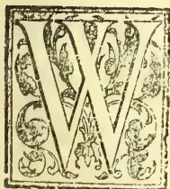

WE regret being unable to present a portrait of CAPTAIN JOLLY, one of our earliest and most esteemed Planting Pioneers and the first Chairman of the Planters' Association. In view of his holding

the latter position Captain Jolly would have appeared as one of the earliest in our list, were it not for the absence of a portrait. Application was duly made to surviving relatives for such photograph or other portrait as would enable us to reproduce a colotype print; but Lady Kynsey, the only surviving daughter (Capt. Jolly had no son) could not help us, and we quote as follows from the courteous answer received:—"Fain would I send you one, but Captain Jolly was unfortunately never photographed; and the only miniature we have of him is in such youth that it would convey nothing of himself to the very few who now remember him and could not interest others: so that, as I feel on the subject, it would be better to have no portrait than one of so distant a date. So will you be so kind as to put in a word that no worthy picture of him was to be had or I, his daughter, would most gladly have supplied it." We must,

therefore, content ourselves with a brief biographical notice of the veteran Captain and Planter, based mainly on notes kindly placed at our service by his nephew, Mr. Stewart Jolly—himself one of our early, but still surviving, and much-esteemed planters.

We find then that CAPTAIN JOHN KEITH JOLLY was the son of Stewart Jolly, Justice of the Peace and Deputy-Lieutenant of the Shires of Stirling and Dumbarton, by his wife Catherine Douglas. He was born in 1807 and at an early age entered the Maritime Service of the Hon. East India Company. In it he remained till the Company's Charter was withdrawn and the Eastern ports thrown open to free trade. So his service came to an end and with other officers he was pensioned off. He commuted his pension, married, and in 1843 decided to settle and plant coffee in Ceylon. He had before that been offered the command of an "opium clipper" by Messrs. Jardine, Matheson & Co. of China, which would have brought him an almost certain and speedy fortune; but we are glad to learn that, for conscientious reasons, he felt bound to decline the offer. So in 1843, Captain Jolly and his wife arrived in Ceylon and settled at Katugastota near Kandy. Mrs. Jolly was sister of Mrs. Swan, wife of Mr. James

251------------------------------------------------

230THE TROPICAL AGRICULTURIST.[OCT. 1, 1898.

Swan of Morankanda, a leading Colombo merchant and sometime member of the Legislative Council, and of Doveton Greentree, Lieutenant in the Ceylon Rifles. Her father, who was a pensioned member of the Hon. East India Company's Civil Service, bought Katugastota House, and it only passed out of the family about 1866. Captain Jolly successively bought the lands which became the estates of *Farieland*, opened by Archibald Millie\*; *Vicarton*, *The Borders* and *The Glen*, opened by the well-known and worthy Mr. Abercrombie Swan (so long known as "B. W.")—"BackWoodsmen" of the *Observer*); *Atherton* opened by that most admirable of managers Mr. W. B. Lamont—still we are happy to think to the fore; and *The Burn* opened by Jack Sutherland, afterwards of the Public Works Department and of Pusellawa where he owned Karagastalawa. When he first arrived in Ceylon Captain Jolly was asked by Lady Oliphant if he, like all those who were going into coffee, expected to make a rapid fortune? He said, "No", but that he hoped by industry and perseverance to achieve a modest independence in perhaps twenty years. As coffee estates *Farieland* (above Kandy) and the three Matale estates—*Vicarton*, *The Borders* and *The Glen*—paid very fairly well; but by *Atherton* in Ambagamuwa and *The Burn* in Yakkessa, through the almost never-ceasing rain preventing the ripening of crops and encouraging the growth of weeds, some £20,000 were lost. In 1853 Captain Jolly joined the firm of Messrs. George Wall & Co. which, after some years' existence in Kandy, in that year set up what grew to be an influential mercantile house in Colombo; and in this firm he remained a partner—latterly only a sleeping one—till he died in 1865. From that date, as a coincidence, the prosperity of the firm, we have heard, began to decline. But the fact was that a time of depression generally set in during 1866, beginning from "Black Friday" when Messrs. Overend, Gurney & Co. collapsed in London. Captain Jolly's partnership in the estates with friends at home, who were unknown in Ceylon, was broken up about 1860 and so, selling out of the other properties, he was left sole owner of *Farieland* only. On that model and delightfully situated plantation he had in 1847 built a bungalow at a cost of some £2,000 and there, as soon as the work was finished, he took up his residence finally, quitting Katugastota. We believe Captain Jolly was, if not the first, among the very earliest to keep coffee estates free from weeds by constant weeding; and Mr. Louis Byrde,

a good judge, on visiting *Farieland* in 1855, declared that although the soil was by no means rich indeed over a great part comparatively poor, yet the estate and vigorous coffee were a perfect triumph of good management.

Of Capt. Jolly's life as a public man there is not much to be said, though he worked faithfully and well both in the Planters' Association and as Member of the Legislative Council. He was, as we have said, the first Chairman of the Association—1854-55—and gave general satisfaction by his upright, straightforward guidance in the public questions of the day dealt with. The two great rivals in the Association at its commencement were R. B. Tytler and Geo. Wall: the latter did most work, and indeed drew up the "constitution" &c., but Tytler with his *bonhomie* and wide liberal views was far more popular among his brother planters. It shows how much esteemed and liked was Capt. Jolly, when both leaders and rivals readily agreed to sink all differences and to serve under him as first Chairman. The first Secretary was the redoubtable "Sandy Brown" who was indefatigable and in love with his work, so that he became almost as indispensable to the Association as Mr. Alexander Philip has proved since he took Mr. Brown's place in 1876. (Of course the work has increased ten-fold since the early days.) On Capt. Jolly's retirement after two years' service, Mr. Tytler took his place, but for a few months only, as he was leaving for home, and then Mr. Wall succeeded. Meantime, Capt. Jolly was not idle; and so long as health permitted, he ever continued loyal and assiduous in attendance at Committee and General Meetings of the Association. No European Colonist, too, was more respected and trusted by the natives—whether we take the Kandyan aristocracy with whom he came in contact,\* the minor headmen

\* THE REBELLION IN 1848.—Mr. S. Jolly supplies the following interesting note:—"I well remember I was 'out' one day as a special Constable—the day when Sir Emerson Tennent made a speech to the people from the steps of the Pavilion, (and "Goompane could make no reply")! Another day I saw the anointed King (Denis the bandyman)—a fair man with blue eyes—brought in a prisoner from Matale. George Elphinstone Dalrymple (Logie's uncle) and I, who were at the time living at Katugastota, went to the ferry to await his arrival in charge of our friend "Twig" Wilkinson, Lieut. of the 15th Regt., and a small escort of men. I heard the volley when he was shot, after trial by court-martial. One evening my uncle, Capt. Jolly, and I rode down to Kandy. We met Lord Torrington also on horseback in front of the O.B.C. house. He stopped and talked to us. Parsons the Fiscal passed on horseback. Lord Torrington called him to stop and said to him:—"Be sure you hang that Buddhist priest in his uniform tomorrow morning." I think the doing of that and recording it in a despatch had much to do with Lord Torrington's recall. Whereas if he had said and written nothing at all, the man would have been hanged in his yellow robe all the same. He had nothing else to wear!"

\* Mr. A. Millie was a brother of the better-known Mr. P. D. Millie who still survives. The former left *Farieland* in 1848 to take charge of Patampahai estate in Hunasgiriya, but returned home a year later to his native Kirkcaldy.

252------------------------------------------------

Oct. 1, 1898.]THE TROPICAL AGRICULTURIST.231

and villagers, or the Tamil coolies on his own estates—than was Capt. Jolly. His chief aim in public life was ever the public good—to do all he could for the progress of the Colony, for the good of the land and of the people of Ceylon and the Indian immigrants whose labour did so much to develop the hill country. Capt. Jolly was the soul of honour, ever generous and kindhearted, and one who knew him well, declares he cannot recall a single action in his Ceylon career which the worthy proprietor of Farieland had to recall with regret. No doubt Capt. Jolly himself, if he saw such testimony, would, in modest sincerity, deprecate it as exaggerated; but of how few of us Colonists of the present day—God help us!—can we expect neighbours and onlookers to say “He never did anything he had to recall with regret.”

Capt. Jolly's solid judgment and prescience were illustrated in the fact that his forecast in answer to Lady Oliphant was as nearly as possible, realized. In about twenty years, he had from his work and investments in coffee (though some turned out heavy losses) realized the competency he had aimed at. No great fortune as some people would count it, but enough to satisfy the ambition of a worthy man. Capt. Jolly, however, did not live long to enjoy the *otium cum dignitate*.

We have already mentioned the large sum Capt. Jolly had spent on his bungalow, and the extremely careful cultivation he directed in his home estate, making it one of the most comfortable and delightful residential properties in the island. Within a few miles of Kandy which it overlooked, from the grassy hills rising above the property, extensive and varied views were obtained over the Kandyan country, especially from the summit of the celebrated Mattana-patana (Mutton-Button) hill.\*

Capt. and Mrs. Jolly clung to their delightful Farieland home which had been brightened for some years by the presence of their two daughters, soon, however, to leave them—the one to become Mrs. Steele, the wife of the Poet-Magistrate of Kandy (who retired from the Service eventually as Assistant Agent, Hambantota), and the other to marry the then young bright Military Assistant Surgeon, Dr. William Raymond Kynsey (afterwards to return to Ceylon as P.C.M.O., and to retire

as Sir Wm. Kynsey, Kt., C.M.G.\*). Through a painful and lingering illness, Capt. Jolly was most devotedly nursed, and being brought for a change to the seaside at Mount Lavinia, the veteran East Indianman and Colonist expired there on the 27th day of February, 1865, at the comparatively early age of 53 years. In the following year, his widow passed peacefully away at Farieland, and the poor and natives of all degrees, about Kandy, knew they had lost true friends.

(From “Overland Ceylon Observer,” March 3, 1865.)

On the 27th February, at Mount Lavinia, John Keith Jolly, Esq., of Farieland Estate, aged 58 years.

It becomes our sad duty to record the death of Captain John Keith Jolly which occurred on Monday, the 27th February. The deceased was well known as one of our earliest and most enterprising Planters, and at one time filled, with much credit to himself, the post of Chairman of the Planters' Association and representative of the Planters in the Legislative Council. One by one, the links connecting the present with the commencement of our great coffee enterprise, are dropping off.

#### THE HOME OF “PARA” (HEVEA) RUBBER.

Condensed from a recent report on the trade of the consular district of Pará, Brazil, by Mr. Consul W. A. Churchill, to the British foreign office.

The *Hevea* tree is not conspicuous, and resembles many other forest trees. People have travelled for thousands of miles through the rubber region and have lived for years in the centers of the industry without even noticing it. The newcomer invariably expects to see the familiar glossy dark-green leaves of the *Ficus*, and is disappointed with the insignificant appearance of the *Hevea*. In appearance it is more like the English ash than anything else. It grows to a height of upwards of 60 feet. The blossoming season is in August, and the fruit ripens in December and January. The seeds should be planted as soon as possible after ripening, as they speedily lose their vitality.

The localities where rubber-trees thrive the best are on islands and low grounds near rivers where the banks are periodically inundated. Ground that is above water at all times or that has no drainage is not suitable to the tree. A peculiarity of this rubber-tree is that it will not grow satisfactorily on cleared and open ground. It requires the shade of other trees, and still air, from the time that its growth begins until it becomes an adult tree. Without these conditions the supply of milk is very much affected. In fact, the tree has been known to die-soon after the clearing of ground around it.

No cultivation worth mentioning has been attempted in the Amazon region. It is considered useless to invest capital in cultivation so long as the Amazonian forest shows no signs of exhaustion. The *Hevea* requires about fifteen years to mature—that is too long for the ordinary investor to wait. The most competent authorities maintain that the

\* MUTTON-BUTTON (the hill above Kandy). In 1848 Loku Banda (then Inspector of Police, Kandy, and the brother of Tikiri Banda, the famous rebel, and of James Alex. Dunuwila) told Mr. S. Jolly that the proper name of this hill is “Motta” (the Tamil word for bald) and “patana” (the Sinhalese word for a natural grassland)—Motta-patana. We believe he was right: nothing could be more apt or truly descriptive. It is exactly like a bald crown surrounded by a fringe of hair (jungle).

\* Though Sir William and Lady Kynsey have left Ceylon, there is still a family tie through the presence of Mr. and Mrs. Buckworth (Dimbula)—Mrs. Buckworth (nee Miss Kynsey) being a grand-daughter of Capt. Jolly.

253------------------------------------------------

232THE TROPICAL AGRICULTURIST.[OCT. 1, 1898.

Supply is inexhaustible, because the *Hevea* is continually being reproduced by nature. Certainly some areas become exhausted when overworked, but when left alone for some time they recover. The district of Cametá, on the river Tocantins, gave an excellent quality of rubber, for which there was a special quotation in foreign markets. This strict, however, is now exhausted, because, for about forty years, thousands of men have tapped its trees. All newcomers flocked to Cametá to make their fortunes.

But there are many districts that have not been tapped. The area that is known to produce Pará rubber amounts to at least 1,000,000 square miles. Further exploration will no doubt show that this area is underestimated. The richest zones as at present known are along the banks of all the southern tributaries of the river Amazon, and on the islands in the main stream and near Pará. The most prolific part is on the river Aquiry or Acré, one of the tributaries of the river Purús. Here a hundred trees yield as much as one ton of rubber per annum.

The northern tributaries of the Amazon do not produce much rubber. Of these, the river Negro produces the most, but the quality is soft. The river Branco yields very little rubber, and the upper part runs through pasture lands and high ground which is not suitable for good rubber. Some of the other northern tributaries have not been explored, and may yet reveal large stores of rubber. The *Hevea* is known to exist on the banks of Japurá, but that district has not yet been opened up.

It was at one time imagined that the excellence of Pará rubber was greatly due to the kind of fuel (palm-nuts) used in curing it. The palms that furnish this fuel were accordingly transplanted to Africa with a view of making "Pará rubber" there—the experiment, however, has not succeeded. The reason why these nuts are selected is because they emit a continuous dense smoke, and are more portable than other fuel obtainable. However, when none of the palms are present, bark and twigs of other trees are used as fuel.

When the accumulation of rubber is sufficient—usually the collection of three or four days—the collector lights a fire in his hut, places an inverted funnel over the fire, and ladles a thin coat of milk over a paddle and holds it over the smoke to coagulate; the process is repeated until a large cake has been formed. To release the paddle from the cake it is necessary to make a slit on one side. The paddle mold makes a cake of uniform and even shape. The paddle is in general use in the state of Pará; in other districts a spit is placed on two upright forked sticks, and given a rotary motion. By this means the rubber is cured with greater ease, but paddle-smoked rubber is preferred, as it is drier and more carefully cured. Attempts to introduce improved curing apparatus have not been received with popular favor, because the primitive process possesses the advantages of being simple and inexpensive. The process of curing rubber is very injurious to the eyes. Many cases of total blindness result from it.

An expert collector gathers 7 pounds of rubber in a day on the lower Amazon, but three times this amount is collected on the upper Amazon, in the rich parts. The collecting season on the lower Amazon begins when the waters have subsided—about July—and ends in January or February. The collectors employed are principally Brazilians, immigrants from Ceará and other neighbouring states and from Portugal, together with half castes. The pure South American Indian is of very little use as a laborer. Nor are the West Indian negroes suitable for the Amazonian rubber estates, as they cannot stand the malarial climate.

The insufficient amount of labor is one of the most serious difficulties in the rubber industry. It is not of much use to own rich rubber estates if the owner cannot obtain sufficient laborers to collect the rubber for him. The exploitation of rubber

forests is entirely in the hands of the Brazilians and Portuguese. Foreigners to the country have on several occasions attempted to engage in the same enterprise, but without success. It was tried some years ago on a large scale by an American syndicate, but the experiment failed.—*India Rubber World*.

## MICA MINING IN THE DISTRICT OF NELLORE, INDIA.

BY ROBERT W. THOMPSON.

A. M. I. C. E., M. S. A.

Nellore is one of the maritime districts of the Madras Presidency. It is bounded on the North by the district of Kistna, on the south by the districts of Chingleput and North Arcot, on the east by the Bay of Bengal, and on the west by the district of Cuddapah, from which it is separated by the Eastern Ghats—a range of hills from 2,000 to 3,000 feet in height, running roughly parallel to the coast from fifty to sixty miles inland. The length of the district is about 180 miles, and the area about 10,000 square miles. The Great Northern Road from Madras to Calcutta passes through the district south to north keeping at an average distance of ten miles from the sea. Various other roads branch east and west from this trunk to populous and important villages. The chief town is Nellore, on the Pennar river, 140 miles from Madras by the Great Northern road; the next in importance are Ongole, 182 miles from Madras and Gudur, 85 miles from Madras, both of which are also on the Great Northern road. Venkataghiri and Calastry are also important places, both being in the south-west of the district. There is railway communication with Madras, but the route is circuitous, and a break of gauge occurs at a place called Rennigunta where passengers tranship from the Madras railway, broad gauge, to the South Indian Railway, narrow gauge, the journey taking over sixteen hours; but the new Bezwade-Madras State Railway, which will probably be opened for traffic this year will give direct broad-gauge communication between Madras and Nellore, the journey taking not more than six hours. The district is salubrious and populous, the population being approximately 200,000. There is not sufficient employment for the lower, or cooly, class of the people, so that labour is plentiful and cheap, a man's wages (reduced to English money being from 3d. to 4d. a day, and a woman's or boy's from 2d. to 3d.—nothing more. The district is interested by numerous streams having their origin in the Eastern Ghats, and one river—the pennar—which, rising in the tableland of Mysore, flows through the district of Cuddapah (receiving there the waters of the Chittravatty, the Paupugni, and the Cheyair) and then through a rift in the Eastern Ghats past the town of Nellore into the Bay of Bengal, after a course of 355 miles.

East of the Great Northern road, and for a few miles to the west of it, the country is generally low and flat and the soil alluvial, and rice is largely cultivated upon it; to the west of this the ground begins to rise and becomes undulating and rocky, and is only fit for the cultivation of dry grains in some parts, the rest being barren or covered with jungle. The geological formation of this portion may be described as being generally a bed of metamorphic rock on which is superimposed a layer of laterite, which is a soft argillaceous stone of a reddish-brown colour, and of aqueous formation. The metamorphic rocks are represented by gneiss, mica schist, hornblends schist, and quartzite; these, though forming the bed rock of this part of the district, very often crop out about the surface and stand exposed. Instances of igneous rock are also met with in trap, felspar, and granite, the former occurring in dykes, and the two latter as isolated intrusions through the bed of metamorphic rock. This is the general aspect of the district: but laterite is occasionally met with in places nearer to the sea than above indicated, and alluvial land farther inland; this is

254------------------------------------------------

Oct. 1, 1898.]THE TROPICAL AGRICULTURIST.233

naturally the case along the valleys through which streams flow.

Mica exists in the western parts of the district where the land begins to rise to the ghats. The surface indication of it is the outcrop of quartz and felspar, with which minerals it is usually associated, being sometimes integrated with them so as to form a coarsegrained granite, or else occurring in large separate masses. It is not unusual to find distinct masses of mica, of quartz, and of felspar, lying contiguous to each other; the idea which they convey being that Nature intended manufacturing granite on the spot, but after collecting the necessary materials had changed her mind about it. But the surface indication, above mentioned, is not always present: in some cases mica occurs in isolated blocks. There are mica mines in operation at Inikurti, Utukur, Chaganum, Sydapuram, and Khandali, all lying from W.S.W to S.S.W. of the town of Nellore, at from twenty to thirty miles distance. Indications of mica are met with further north, but no mines have yet been started: the industry is in fact in its infancy, the first mine, the one at Utukur, having only been started in 1888. The mineral it found near the surface, and those hitherto engaged upon the getting of it not being professional miners, but mere diggers, the only method of working yet adopted has been that of quarrying—no subterranean mining has yet been attempted. The mica occurs in masses of from 100 to 200 cubic feet; these masses have been found from near the surface to a depth of 70 feet, the method employed for detaching the stuff being blasting with gunpowder or dynamite.

The cutting and sorting of the mica after it is won from the quarry is a very important part of the industry: the value depends not only on the sizes of the sheets, but also upon their freedom from flaws and their clearness and transparency. Slabs of clear mica have been obtained of a superficial area exceeding two square feet; such pieces are however rare. But pieces of no more than 4 square inches find a ready market. All clear mica is cut into rectangular pieces of certain sizes. The clippings, or waste, have hitherto been thrown aside as useless; but inquiries have recently been made for this waste also, as the mineral is said to be useful as a lubricant when powdered. Some of the mines recently started have had their whole output bespoken by firms in Madras. New uses are continually being found for the mineral. A patent has recently been taken out in India for a composition, in which it is the principal ingredient, for the covering of boilers, steam-pipes, and the like, as it is a capital non-conductor of heat. A cartridge has also been recently invented in which, instead of paper or metal for the wrapping, mica is used, the advantages of the material for this purpose being manifold.

It is not easy to ascertain the actual cost of getting the material, the mine owners being naturally reticent on the subject; and, in fact, the cost must vary in different mines according to the quantity and quality of the mica obtained, and the depth at which it is found. That it is a very paying industry is clear from the eagerness with which both Europeans and natives are taking up land for mining. From statistics obtained from the Sea Customs Department, it appears that during the first half of the year 1895 the quantity of mica exported from the port of Madras was 66,815 lbs., which increased to 71,030 lbs. in the second half, and to 89,330 lbs. in the first half of 1896. During last year (1896), no less than 30 mining leases were taken out for 64 acres of land, for a total assessment of 3,192 rupees. The industry has hitherto been worked by men of small means, who have each taken up from one to two acres of land to operate upon. But recently some firms in Madras have been applying for large blocks of land for the purpose. In consequence of these applications Government have been reconsidering the question of their attitude towards the industry. Hitherto the rule has been a charge of a rupee an acre for the right of prospecting, and an annual rent of 50 rupees an acre for land taken up on lease for

mining upon. But the term "prospecting" has not been clearly defined, nor have any maximum or minimum limits been laid down as to the sizes of blocks which may be taken up or the distances which must separate rival blocks. In consequence of this difficulties have arisen at times. Government have hitherto taken no interest in the outturn of the mines or the status of the lessees; they are inclined now to take an interest in both; they desire to encourage firms or companies to take up large blocks of lands say of about half a square mile in area and while reducing the ground-rent to charge a royalty of 5 per cent. *ad valorem* on the outturn. The idea is that such firms or companies, by introducing improved methods of mining, would get better results than have yet been achieved and so earn a higher profit, in which profit Government desire to participate. The difficulty of accurately valuing the mica obtained is to be gotten over by ultimately accepting a brokers's certificate as to what it realised on sale in London, or wherever it was disposed of; Government in the first instance exacting a royalty calculated upon the highest price it is likely to realise. A deposit of 500 rupees is to be made with each application for a lease of land or a license to prospect. The new rules have not yet been promulgated, but it is believed that the above is a pretty accurate forecast of what is coming. These rules will, of course, apply only to mining on Government land. Where it is desired to mine on land belonging to private parties, an arrangement must be come to with the owners. The Rajah of Vencataghiri owns much mica bearing land in the district; his rates, at present, are a rupee an acre for prospecting and an annual rent of 50 rupees an acre for mining.

It must not be supposed that all who have gone in for mica mining have been successful; there have been failures as well as successes; but the successes have so far outnumbered the failures that, as has already been said, there is a considerable boom in the industry just now—as booms in India go. The failures have generally been due to ignorance, men have started mining where there was no mica. In some cases failures have been due to want of capital and spirit. One of the most successful mines in the district was abandoned by the original owner as unprofitable.

Besides mica, the district contains iron, copper, gypsum, kaolin, and garnets. The iron ore is of good quality and is worked by the natives to a small extent for supplying local wants. The copper ore was worked formerly, but the ore procurable near the surface being exhausted, the industry has been abandoned. It is not known to what extent these minerals exist. Gypsum, kaolin and garnets are found, but are not worked. The kaolin, which is disintegrated felspar, is white, and appears to be of good quality. The garnets hitherto found have been poor.—*Journal of the Society of Arts*.

## HOW RUBBER TREES (FICUS ELASTICA) ARE GROWN IN ASSAM;

By D. P. COPELAND, DEPUTY CONSERVATOR  
F FORESTS, DARRANG DIVISION.

**FICUS ELASTICA.**—1 The India rubber fig or Caoutchouc tree is indigenous in Assam where it is found a dominant tree in the evergreen forests. It requires an exceedingly damp atmosphere, and the best natural rubber trees are met with in the forests at the foot of the hills, or on the hills themselves up to an elevation of 2,500 feet.

**NATURAL GERMINATION.**—2. In its natural state, the rubber starts from seed dropped by birds in the forks of other trees, often 20 or 30 feet or even more from the ground, where it germinates, and the young plant remains an epiphyte for years until its aerial roots touch the ground; as soon as this takes place, the little epiphyte changes rapidly into a vigorous tree, throwing out numerous aerial roots which gradually envelope the tree on which it first began life and often kill it out.

255------------------------------------------------

234THE TROPICAL AGRICULTURIST.[OCT. 1, 1898.

Having started life so high up, it soon throws out branches which overtop the surrounding trees, and the numerous aerial roots, which fall from these and establish connection with the ground, in a few years enable it to dominate the forest growth around it.

**SEED.**—3. The seed of this tree is contained in fig-shaped fruit, about 75 seeds being found in one good sound fig. The fruit first begins to form on the trees in March and ripens from May onward to December. On some trees the whole crop ripens and falls off by June, but, as a rule, the rubber tree has fruit on it from April right up to December, the figs forming, ripening and falling off, the whole of the rains.

After collection the figs have to be carefully dried and mixed with pounded charcoal, which preserves the seed for several months.

**SEED BEDS.**—4. In the Charduar rubber plantation nursery, for a seed bed  $40' \times 33'$ , two to three seers of pulverized rubber seed, 10 seers ash and 20 seers of vegetable loam or good soil, is well mixed in a half cask and spread evenly over the bed, and then lightly stamped down and watered. Such a bed should yield, with good germination, 2,000 seedlings and should be sufficient for putting out 100 acres of rubber planted  $70' \times 33'$ . The beds must be well-raised and drained, the soil being prepared in the same way as for vegetable or flower seed. If sown in boxes, these should be put under the eaves of a house; if in beds, light removable shades must be put up to keep off the direct rays of the sun. The shades should be removed during rainy or cloudy weather and at night. Light sandy loam is most suitable for seed beds; if the soil is stiff, charcoal dust should be mixed with it to make it porous and prevent caking. The bed or boxes must never be allowed to get dry.

**SOWING.**—5. This should be done exactly in the same way as for vegetable or flower seed which requires transplanting after germination. The figs are broken between the hand. As the seed is very minute, the particles of the fruit are left with the seed and sown with it, no attempt being made to clean or separate the pulverized figs. In order to distribute these minute seeds evenly over the seed beds, or boxes, a certain quantity of ash and soil is mixed with them.

**GERMINATION.**—6. Germination takes place from the end of April to the end of the rains. Seed sown between October and January, requires daily watering and screening from the sun, and will not germinate before the end of April or the beginning of May, but seed sown any time during the rains will germinate in a few days (from five days to a fortnight). It follows that the best time for sowing seed is during the rains—that is from June to September.

The embryo appears on the germination of the seed as a seedling having a pair of opposite cotyledons with an entire margin destitute of incisions or appendage of any kind, with the exception of the notched or emarginate apex, oval in general outline, green in colour and of a glassy smoothness. The second pair of leaves shows a tendency to the alternate arrangement on the stem but appears at the same time. Their shape and venation are very different from those of the primary leaves for they have a central midrib and a distinctly coarsely-crenated margin. The third pair of leaves do not appear simultaneously, and are distinctly alternate, with a marked reddish colour: after this the plant is easily recognized.

**PRICKING OUT.**—7. When the seedlings are one to two inches high in the seed beds or boxes, they should be transplanted into nursery beds, and put out in lines about a foot from each other. The nursery beds should be well-raised and drained, but the soil need not be so carefully prepared as for the seed beds. Here the plants are kept till the following rains, when they are dug up and taken to stockaded nurseries in the forest, and put out  $5 \times 5'$  on raised well-drained beds, where they remain for

two years till they are required for planting operations.

**FOREST NURSERIES.**—8. Almost every animal will eat the young rubber plants; it is, therefore, impossible to plant out small seedlings in the forest, owing to the destruction by the wild elephants and game, unless each individual plant is carefully fenced in. As this is too costly, and the rubber after it is 1–2 feet in height is very hardy and can be transplanted, with ordinary care, at any time of the year (the best time in Assam is between May and July), the seedlings are kept in stockaded nurseries in the forest where planting operations are to take place, and remain there till they are 10 or 12 feet high, that is, about three years after germination, when they are dug out and the roots are cut back 18 inches right around the plant and planted on the mounds in the forests.

**PLANTING OPERATIONS.**—9. In artificial planting it is found that the rubber grows best on mounds. Lines are cut through the forest 20 feet wide and 70 feet apart from centre to centre; in these lines 15 feet stakes are put up 35 feet apart. Round each stake a mound is thrown up four feet high. The base of the mound is about ten feet in diameter and they taper to four feet on the top; on this mound the rubber tree is planted, care being taken that the roots are carefully spread out before they are covered up with earth. To prevent animals pulling the plants and wind blowing them down, they are tied to the stakes.

**CUTTINGS.**—10. The rubber tree can readily be propagated from the cuttings, if only perfectly ripe young branches or shoots are used, but the tree raised from cuttings does not appear to throw out aerial roots, and, as the future yield of the tree probably depends on its aerial root system, it is questionable whether trees raised from cuttings ought to be used except where required only as shade givers, such as in an avenue. In the Charduar rubber plantation, propagation by cuttings was given up very early, that is about 1876, the plantation having been commenced in 1873.

The best time to take cuttings is May and June.

**GENERAL.**—11. The rubber grows equally well on high land or low land, in forest land or grass land, so long as it is planted on a mound and its roots are not exposed to the sun. It is a surface feeder, but, as soon as its roots appear above ground, they must be covered with fresh earth until such time as the tree has formed a sufficient leaf canopy to protect itself.—(Assam Forest Report 1896-97).—*Indian Forester*.

## PLANTING IN SELANGOR: LIBERIAN COFFEE—COFFEE CURING— RAMIE—RUBBER—COCO.

### NUTS—PADI.

The year 1897 was not a prosperous period for the European owners of coffee estates. The price of Liberian coffee, which stood at \$31.50 a pikul in January, 1897, declined so low as \$22.50 a pikul, rendering it almost impossible for those planters with estates in bearing to put their produce upon the market except at a loss. Notwithstanding this adverse outlook, however, the estate owners have continued to extend their clearings, and the area under cultivation was very considerably increased during the year. There is now coffee in Selangor of all ages up to fifteen years old under the management of European planters. The appearance of the plants, of whatever growth, is almost uniformly flourishing, whether on the low lands of the coast districts or the more elevated situations in the inland divisions. Many additional acres come into bearing every year, the amount of produce increases in proportion, and nothing but a more favourable market appears to be now wanting to ensure a fortunate future for the estates of Selangor.

Allusion was made in the last Annual Report to the existence of a small coffee curing establishment

256------------------------------------------------

Oct. 1, 1898.]THE TROPICAL AGRICULTURIST235

at Klang. I am glad to say that this factory is now about to be supplemented by a store and curing establishment of large dimensions now in course of erection by Mr. W. W. Bailey, on his estate of Lowlands, near Klang. Constructed under the superintendence of this most experienced planter there can be no doubt that this building will be replete with all the necessary plant, and Mr. Bailey will, in all probability, be able to render assistance in curing to his planting neighbours as well as to provide for the requirements of his own produce.

The decline in market rates has exercised a very visible effect upon the condition of the Malay coffee gardens. The natives, naturally, never anticipated that the value of the produce would drop to its present figure, and now that it has done so, and shows no immediate sign of a return to former quotations, they are generally convinced that the trees are not worth looking after, and have withdrawn much of the little attention which they previously paid to the growing plants. Their gardens, for the most part, present a neglected and uncared for appearance. The cultivation of coffee is not an industry which is well suited to Malays, because the trees require careful handling throughout the time of their growth, and the Malay understands planting, but does not realise what cultivation means. He likes to put something in the ground and then to sit down and watch it grow, until it is time to gather the fruit, leaving the cultivation to nature. He therefore succeeds with coconuts, betelnuts and plantains, and it may be that he will be well advised to leave coffee alone.

I again desire to express to the Selangor Planters' Association the sense of this Government of the valuable work done by their body in 1897. It is, in my opinion, a matter of much import that all matters affecting the planting interest should be freely ventilated and suitably and concisely represented to the Government. This is precisely what has been done by the Association, whose continued effects on behalf of all that affects the agricultural development of the State will always be warmly seconded and fully appreciated by the officers of the administration.

The attention of planters has been directed to other products besides Liberia coffee—ramie grass, rubber, and coconuts, having each received notice. I am not aware that the cultivation of ramie has yet assumed a practical form, but experiments are being made with Para rubber (*Hevea Braziliensis*), which appears to be the species best adopted for cultivation in this part of the world, and exceptionally favourable terms for the acquisition of land for this purpose were sanctioned during the year.

Coconut cultivation has received much stimulus from the establishment of the Oil Company's Factory at Kuala Selangor, under the management of Mr. H. C. Holmes. The natives on the coast, attracted by the creation of an assured market, are seriously interesting themselves in this form of cultivation, and the demand for seed coconuts became so great as to cause a noticeable rise in their value. Mr. E. V. Carey is now negotiating with Government for a large area of land at Kuala Langat, which it is proposed shall be utilised for the same purpose by an English company.

The cultivation of wet padi has never yet been undertaken on any important scale in Selangor, and there is no doubt that rice is not being grown to the extent which it should be. There is plenty of land on the coast which is suitable for that purpose and for very little else, but it requires draining in some cases and irrigation in others, and the people are not generally prepared to make the attempt unless assisted by Government in the undertaking of the preliminary works, and afterwards directed and encouraged by the personal influence of an officer interested in the task. It is therefore satisfactory to record that Mr. A. Hale, the newly appointed District Officer of Kuala Selangor, is devoting himself enthusiastically to the development of this industry. With the small amount of money at his disposal last year he succeeded in getting the

people of Jeram to open up and plant the land lying between Bukit Panjang and the Klang Road, and the work will be much extended with the additional resources available in the current year. I visited the land and found the people hopeful and industrious, and their work thoroughly well done. I am glad to hear, since, that they have been favoured with a good harvest. The abnormally high price of padi which prevailed during the year caused an unusually large amount to be planted last season. The harvest is reported to have been generally excellent, and the circumstances of the people are improved in proportion.—From Mr. Belfield's Administration Report for 1897.

## NEW AND OLD PRODUCTS IN ZANZIBAR.

*Cocoa*.—Great difficulty has been experienced in obtaining seeds and plants of Cocoa. Early in the year 3000 seeds arrived from Ceylon in a completely perished condition. In June, 72 plants were received from London in Wardian cases but only 34 survived. A few pods from Seychelles did well.

*Kola*.—Kola germinates freely and grows well. The seed is cheap and easily procured, while the produce requires little preparation for the market, being merely placed in the sun to dry. Hence, if it can be grown at a profit, Kola is more likely to find favour with the Arabs than Cocoa, the beans of which have to undergo fermentation before being ready for market. Kola trees may be planted 20 feet apart; they come into bearing in 4 or 5 years. Price in London rule from 4d. to 6d. per lb. If each tree yields 50 lb. per annum—a moderate estimate as trees have been known to yield up to 150 lb. of nuts each—the gross returns, both per tree and per acre, would be much larger than those now obtained from clove plantations, which do not average more than 15 lb. of produce per tree, worth 2½d. per lb.

*Vanilla*.—A small plantation of Vanilla has been made at Dunga and preparations are in course for extending the cultivation of this vine. Of the 600 cutting, planted, 427 survived and are growing fairly well. Many were found going rotten at the bottom, from being planted too deeply, and had to be taken up and replanted. The vines have been planted singly between three live supports, placed in a small circle. The Mbono (Castor oil—Curcas purgans) and Frangipani make good live supports and throw out rapid shade. Six feet has been allowed between each little bed of vanilla. Water is conveyed from the well to the plantation—a distance of 300 yards—through bamboo pipes. Much care is required both in the planting and cultivation of this vine, and some skill in fertilizing the flowers and in harvesting and preparing the fruit for market. For these reasons it is doubtful if the industry will take root here among the Arabs. A small plantations of Vanilla has been made at Tundau.

*Para Rubber*.—Para Rubber shows every indication of doing well here. Though the proportion of seed which germinated in the nursery appears small (174 out of 938) much of the seed was old and worthless when sown, and not excepted to grow. Those that came up grew rapidly and, with the exception of three, have all been transplanted. One hundred and fifty were taken to Pemba and planted 25 feet apart in one of the sandy swampy valleys of Tundau. Seven out of the 150 (5%) died, but the others came away well. Sixteen have been planted out in the rich alluvial valley that divides the Dunga bank from the coral, but some of these have failed. There is a Para rubber tree, 50 feet high and 6 feet in circumference, growing at Mbweni on a dry sandy ridge. It was planted by Sir John Kirk and in September last was observed to be flowering. The presence of this tree growing so well in an uncongenial locality, justifies I think, the assumption that if Para Rubber—the most valuable of all varieties—will pay to grow at all—a point that has no where yet been decided—it ought to pay to grow here.

*Ceara Rubber*.—The Ceara Rubber is just coming up and looks extremely healthy. It has been grown

257------------------------------------------------

236THE TROPICAL AGRICULTURIST.[OCT. 1, 1898.

principally from trees growing about the island. The Ceara Rubber trees dont appear to yield much nice. I tapped one growing at Mbweni and got little or nothing from it though it must have been five or six years old. It was afterwards found that wrong methods had been adopted, though at the same time it was quite clear that there was little milk in the tree. This variety of Rubber is said to thrive on very barren as well as rich soils, and if this is the case, it ought to do well on the coral wastes of Zanzibar, which cover about 3/5 of the total area of the island.

*Landolphia Kirkii.*—In October I went to Pemba and investigated the local Rubber vine (*Landolphia Kirkii*) and reported thereon.

*Coffee.*—About 60 young Arabian coffee trees are growing in the Nursery from seed obtained from Nyassaland. They look well and will be planted out, though they can hardly be expected to prosper in Zanzibar as the elevation is too low. Liberian coffee was sown late in the year and has not yet germinated. Attempts have been made to procure seed of the Maragogipe coffee, Brazilian variety, but none has yet been received.

*Anatto.*—Anatto grows well here but the market is too depressed to encourage cultivation. Seedlings are being raised at Dunga for vanilla shade.

*Camphor, Safflower, Olives, Sarasaparilla.*—Camphor, Safflower, Olives and Sarasaparilla have proved unsuccessful, and their cultivation will be discontinued.

#### LOCAL PRODUCTS.

*Cloves.*—Some experiments have been made with a view to ascertaining whether it were possible to produce a sample of cloves here equal to the best Penang and Amboyna. The experiments leave little doubt that this can be accomplished. On the other hand if the stems are green—too young—the dried cloves will be shrivelled. Pink bold heads make the best samples.

The quality of the cloves depends also, though to a less extent, upon the drying as well as upon the picking. The experiments at Dunga seem to show that the cloves should be submitted to a high temperature and dried rapidly. I believe that most Arabs overdry their cloves. They expose them to the sun till they become black and dried up and much of the oil evaporated. The stem of a properly dried clove should be tough and should yield slightly to the strain before breaking. I think that an effective system of drying cloves under glass could be introduced here with little expense. Some authorities are of opinion that, if all the Zanzibar and Pemba cloves were placed upon the market in the best possible condition, the price would not be increased beyond what it is likely to reach under prevailing conditions; low prices being due to over-production. The recent abolition of the legal status of slavery will, it is acknowledged, withdraw a lot of labour from the Arab shambas and the yearly yield of cloves suffer in consequence. Consequent improvement in the quality of the product should therefore, if it can be accomplished, tend to lessen the effect of a declining crop. The short crop of 1897-98 is probably due to dry weather quite as much as to scarcity of labour. I noticed in October that comparatively few cloves remained upon the trees in the Pemba plantations, and in this respect Pemba compared very favourably with Zanzibar, where a considerable proportion of the cloves were left unpicked. Dr. Charlesworth reports that the rainfall for the second half of the year was only 18.51 inches compared with the previous five years' average of 24.32. This difference practically amounts to a drought and is quite enough to explain any eccentricity in the output of cloves.

*Chilies.*—About three acres of coral waste have been cleared of scrub and planted in chillies. The dry weather has hindered the growth of the plants, so that we have as yet no results to report.

*Castor Seeds.*—An enquiry was made in London as to the market condition of Castor seeds, and samples of both the large and small varieties of Castor Seeds were, in May, sent home to Messrs. Gray Dawes and

Co. to be reported upon. On May 8th Mr. Hugh Garden wrote as under:—"From their appearance I did not think they were equal to Madras coast seeds which are very full of oil, but I have had then reported on both in Marseilles and London. In Marseilles our agent writes that both samples are very clean sound seed, and they make very little difference in value between the large and the small. In London they state that most crushers give the preference to the large beans although both are of good quality; the difference in favour of the large being about 2s. 6d. per ton. I have made a rough calculation and make to-day's price c.i.f. London or Marseilles about £9.10.0 per ton, without allowing for any excessive admixture of none oleaginous seed. In London they charge shippers with anything over 3% and in Marseilles 4%. To-day's prices however are very high, owing to scarcity, and I have known the seed fully £3 per ton under the above price." Castor oil trees, though they grow wild in Zanzibar, dont appear to yield much weight of seed. We make a point of collecting the seed from all the trees round about Dunga, but as yet we have got only quite an insignificant quantity to get her. The oil is worth about £36 a ton in London which compares well with cocoanut oil at £28.

*Papaya.*—Enquiries have also been made in London regarding Papain and the following communication from Mr. Hugh Garden was received in April:—"I have received the following information from one of the first authorities:—The dried price of Papaw fruit is a powerful digestive agent and differs from Pepsin in being active in neutral and alkaline solutions. The Papain of commerce is prepared from it by solution of the crude juice in water, and precipitation by alcohol. Only small quantities of the crude concentrated juice have hitherto reached this country, and therefore the price at which it has been sold has only been a nominal value. So far as my observation goes, and the matter has been the subject of considerable experiment by my son the substance is not likely to come into extensive use, and I should think that the import would hardly be worth consideration by you." Messrs. Thomas Christy and Co., of 25 Line Street were good enough to send out a sample of the dried juice with the following:—"In reply to your query regarding Papaw we may tell you that we import the dry juice of this plant in large quantities. We believe the way of drying it is to place the juice upon slabs of glass or earthenware so that it has a smooth surface to dry upon. This is exposed till it is thoroughly dry and the film then flakes off. . . . The price we could pay for the dry juice would be about 5s. to 7s. 6d. per lb. . . . We understand that the juice is taken from all parts of the plant, principally from the stem or trunk of the tree; if you take it from the fruit you will have to be careful to make your incisions in the latter just before the fruit is ripe. You need only make scratches as the juice is found between the skin and the pulp. None is obtainable from the fruit proper. We hardly think it worth your while to take any trouble with this part of the plant. Out of many fruits you will only be able to obtain but a few ounces, whereas, from the trunk of the tree and other parts of the plant, you can obtain several pound."

#### A CRISIS IN THE INDIAN TEA INDUSTRY.—

"Any one at all conversant with the subject says the *Planter's Gazette*—knows that the Indian Tea Industry is at the present moment passing through the most critical stage of its existence"; and elsewhere our contemporary adds:—"It is useless dallying with the subject, and the sooner proprietors realise that they are manufacturing an article unsaleable under present conditions in increasing quantities, the better. To our mind the apathy of shareholders is inexplicable. Producers all over the world have shown a determination to get rid of the middlemen, and why should the British tea-grower foster them?"

258------------------------------------------------

OCT. 1, 1898.]THE TROPICAL AGRICULTURIST.237FOREST CONSERVANCY IN CEYLON.

Mr. F. C. Fisher supplies the Report for 1897. He disarms criticism in his first sentence by stating that he wishes it to be understood that his Report is merely a *resumé* of the reports sent in by the Assistant Conservators of each Province. There is nothing novel or original, therefore, in the pages before us. Mr. Fisher gives the total Revenue of the Department at ... R488,956  
Expenditure ... R465,383  
Balance to the good ... R23,573

So that, at least, the Forest Department pays its way. We have then details of the work done under "Area and Boundaries" (reserve forests); "Surveys and Working Plans"; "Protection and Improvement"; "Yield and Working"; "Financial Results" (already summarized) and "General Remarks." The only chapter that contains information of general interest is "Protection and Improvement" which covers nearly five pages. But the arrangement is so bad that it is not easy to pick out what is of importance. Cenna cultivation seems generally dying out save in the Uva and Eastern Provinces. "Forest fires" are reported to do damage in the same two provinces. The branches of the Assistants' work that are of most interest to planters and others, are given under the headings of "natural" and "artificial" reproduction. In regard to the former we learn:—

**WESTERN PROVINCE.**—Mendora seeded freely in Barawa forest.

**CENTRAL PROVINCE.**—In Nuwara Eliya District the Forester reports that keena flowered very plentifully all over the district, the flowering on the Kandapola side being a month later than on the Nuwara Eliya side of the Pedro Range. Sapu (*Michelia nilagirica*) and mihiriva (*Gordonia zeylanica*) flowered freely all through the year, but there were no signs of reproduction from the year's fruit. The red flowered mihiriva (*Gordonia speciosa*) blossomed towards the end of the year in the Pandulu-oya forests. Madol, damba, and kududawla reproduced freely. In the Nannova clearings different species of *Myrtacea* with mihiriva are reproducing themselves well. In the Hatton District, dan, damba, and kududawla seeded freely, and natural reproduction has taken place in the Kotagala forest, the seedlings being favourable. In Nawalapitiya District the following species have flowered, seeded, and germinated freely in forests:— *Homalium zeylanicum* (livan) flowered and seeded fairly. *Vateria acuminata* (hal) flowered and seeded well, and *Filicium decipiens* (pehimbija), *pepilis* (*Apocynum latifolium*), *damba* (*Eugenia operulata*), *hora* (*Dipterocarpus zeylanicus*) flowered and seeded heavily. Wai sapu (*Michelia alauca*) and porawamara (*Canthium didynamum*) have flowered and seeded copiously.

**MATALE DISTRICT.**—Halmilla, satinwood, wewarana, palu, pihimbija, and hulanhik have seeded and germinated favourably where improvement fellings were made, and in the forests where fellings have been carried out numerous seedlings are springing up. In fact, where light is let into the forest seedlings at once appear in a most remarkable manner. Satinwood did not as a rule seed well this year, and ebony does not appear to have seeded at all.

**NORTHERN PROVINCE.**—Most of the species flowered freely, there having been no drought. In some cases seedlings were abundant.

**EASTERN PROVINCE.**—The weather was on the whole very favourable for the seeding of the forest trees and growth of seedlings, as the rainfall was well distributed throughout the year, and there were no long

periods of drought. Ebony fruited well in the Bintenna, Korala, and Porativu forests, but as usual the seedling crops are reported to have been bad. Satinwood seeded largely as usual. In forests containing this tree every open spot almost had seedlings. Halmilla seeded well in the Panawa and Nadukadu pattus, palai seeded abundantly. The stunted palai trees in the coast forests were as usual stripped of their branches by people collecting the edible fruit. Milla is reported to have seeded only moderately and the germination to have been bad. Ranai seeded freely in the south part of the Province, and even better in the Korala pattu. Kumbuk, Itumpalai, mangosa, and naval all seeded well.

**NORTH-WESTERN PROVINCE.**—Satin, halmilla, palu, kumbuk, milla, mi, and hora are the principal species that seeded abundantly during the year. It has not been a good year for seedlings excepting in the case of satin, lunumidella and hora.

**NORTH-CENTRAL PROVINCE.**—The year has been a good one for seedlings, but a great part of the blossom this year was partially a failure, having been damaged by heavy rains.

**PROVINCE OF UVA.**—Owing to the unusual wet weather the seed and seedling crops were only partially successful.

Then as regards the "plantations" formed by the Department, everything connected with "rubber" is of interest:—

**WESTERN PROVINCE.**—During the year 75 acres of land were surveyed opposite the rubber plantation at Midellana for the purpose of extension. Care was taken to select land well above the high water mark left by last year's exceptional floods. The land was cleared of forest and the firewood sold on the spot, but unfortunately, owing to an unfavourable seed crop, both at Henaratgoda Government Gardens as well as at the Forest Department plantations at Edangoda in Sabaragamuwa, sufficient seed was not procurable to plant up the land opened. A small nursery was made with all the available seed, but it cannot be denied that by this circumstance a whole season has been lost, and the work will have to be done over again in 1898. The great difficulty of obtaining seed will for some time prevent our extending rubber on any large scale, even assuming that suitable land is available, but in this last particular it is very doubtful that any large connected area can be found in Western Province.

The Midellana plantation of rubber has been carefully looked after, and some of the vacancies supplied. It is too early yet to report as to the prospects of this plantation, which has already had to contend against many drawbacks.

**PROVINCE OF SABARAGAMUWA.**—No further addition was made to the rubber plantations at Edangoda or at Yattipowa during the year. The crop of seed from there (and the majority came from Edangoda) amounted to 11,500 seeds, and was sent to the Western Province for the plantation at Midellana in the Pasduu Korale. This crop was very much below the Assistant Conservator's estimate, and the deficiency was due to the loss of much seed through gales of wind that destroy the young fruit. Obviously no seed was available for sale. If the public are to be supplied with rubber seed the existing plantations will have to be added to, but it is difficult to find any large block of suitable soil. No tapping of the rubber trees at Edangoda was attempted in 1897, the oldest plantation being only eight years old.

As to other plantations here are the reports:—

The jakwood plantation at the Model Farm at Kalutara has been kept cleared and free from weeds. The jak plants are already from 6 to 8 feet high and look healthy and regular, giving a promise of future success. A few lunumidella plants were put in, and at long distances apart, by the sides of roads and drains. They are progressing, but their growth is slow.

The 3½-acre not selected for calamander and planted with ingasaman for shade has not proved a success

259------------------------------------------------

238THE TROPICAL AGRICULTURIST.OCT. 1, 1898.

The plants have for some reason, contrary to all experience, assumed a semi-creeping habit, necessitating interplanting of the whole again in 1898 with jak, which will supersede the ingasaman. The Assistant Government Agent at Kalutara is desirous that more of the Model Farm may be planted up with jakwood in view of the success of the existing plantations.

The teak garden at Hanwella had a number of thin and weakly poles cut out in order to secure greater freedom of growth for the remaining trees—a work that the plantation was much in need of. The teak plantation at Kotadeniya was not weeded again this year, but should be next.

The Mungurugampola and Pohannoruwa plantations appear to be considerably improved by the weeding they had in 1896, but it is to be regretted that sickly plants were not thinned out in 1897. The domba has self-sown itself freely, and young plants are looking healthy.

**CENTRAL PROVINCE.**—No addition was made to existing plantations during the year. The acreage of plantations is as follows, viz., Galboda 337, Kotagala 14, Nannu-oya 118, and Nuwara Eliya 36; total 545 acres. At Galboda the 377 acres have been kept up by rooting out scrub, lantana, mana grass, and weeds. A few plants were also put in bare places and seed at stake dibbled in. The total cost for these works was R1,700.55, averaging R4.51 per acre. This sum has been disbursed as follows:—

**BLACKWATER.**—This clearing is still very poor, and very little improvement can be seen except the new clearing of 9 acres planted in 1894, which is coming on well. The *Acacia melanoxylon* and jak continue to die out where the soil is poorest and gravely. The *Eucalyptus* and *Grevilleas* are the only species growing fairly well, and that only in sheltered places. The seeds which were dibbled in last year, and which came up well, have died off on account of drought. Out of the whole 69 acres in this clearing only about 12 acres can be said to be of any use. This clearing should be left to take care of itself, except that the few acres of what is good should be kept clear of weeds.

**DEKINDA** Nos. 1 and 2.—Leaf canopy has formed well in several places on these two clearings, and the general appearance of the two blocks of 60 acres may be considered promising.

**MAPAKANDA.**—This clearing of 192 acres though looking bare in many places has been thoroughly stocked with plants. Last year 2,096 plants were supplied. The indigenous plants, though slow growers, have sprung up considerably more than the previous year, and a great improvement in the general appearance of this clearing is observable.

**PENHROS.**—This clearing of 56 acres is fairly wooded, particularly the portion below the railway line.

**KOTAGALA.**—The plantation in Kotagala forest, Hatton District, has shown improvement in the growth of the *Eucalyptus robusta* plants, and the trees have attained considerable dimensions.

The new clearing of 4 acres planted with *Grevilleas* last year was damaged by wild animals. In consequence of this some replanting will have to be done during the next rainy season, as there are a good many vacancies on the clearing to be supplied.

**NUWARA ELIYA.**—The plantation in Galway's land was slightly thinned out during the early part of the year. The Forests reports a great deal of damage was done by the high winds, necessitating the lopping of broken branches and the coppicing of damaged trees. The plantations on the whole are doing well, with the exception of some of the blue gum clearings at Conical Hill. Wherever *Acacia* has been planted in places exposed to incursions of elephants and pigs, it has been severely browsed down. In one or two clearings, such as the one near Mahagastota tea estate, where a thorny undergrowth has been allowed to spring up round the plants, they have shown the benefits of this protection and grow well and healthily. Of all the exotic species planted, the red gum (*E. robusta*) shows itself the one which has best adapted itself to the soil and climate. The plantations at Nannuoya were cleared of weeds and undergrowth

during the year. Beyond this, the present system of working the Nannuoya compartment, which is really an improvement felling, no improvement felling were carried out. It is interesting to note in connection with this system how rapidly the leaf canopy has assumed the previous natural condition.

**EASTERN PROVINCE.**—No additions were made to the teak plantations, but in the latter part of the year 46 acres of grass land were planted up with gallnuts obtained from the Province of Uva for the purposes of experimental re-afforestation.

**NORTH-WESTERN PROVINCE. SUNDAPOLA PLANTATION.**—This plantation has made very considerable progress during the year, and the growth of nearly all the species is most marked. This improvement is due to more attention having been paid to weeding and thinnings. The Conservator of Forests again this year brought the forestry class to this plantation, and the students did a great deal of work in thinnings and marking trees to be felled, &c. This plantation was planted in the north-east monsoon of 1890, and the following are the mean girth increments for seven years:—Teak 12.02, jak 14.40, na 3.87, mahogany 14.04, satin 6.61, and kumbuk 13.62. The expenditure for the year was R474.35, and the receipts from date, of thinnings, faggots, and firewood, R500. The expenditure since the beginning has been R8,832.16 and the receipts R6,214.59.

**KUMBALPOLA PLANTATION.**—No work was carried out at this plantation beyond keeping the place clear at a cost of R90 for the year. The trees have made some considerable progress. The mean annual increment for seven years of 50 teak is 13.08, 50 jak 18.14, and 30 helmilla 6.73.

**PUTTALAM TEAK PLANTATION.**—Pruning and coppicing were the chief operations carried out during the year. 270 posts were sold to the Telegraph Department during the year. The receipts for the year are R1,162 and the expenditure R249. Teak and satin show the following increment for the year:—Teak 1.47, satin .87.

**NORTH-CENTRAL PROVINCE.**—No plantations were carried on in 1897.

**PROVINCE OF UVA. JUDON'S HILL PLANTATION.**—Thinning operations, which were commenced in this plantation at the latter end of 1896, were continued. All the suppressed and inferior trees were taken out and the stools carefully coppiced with satisfactory results. *Grevilleas* are doing fairly well, especially in the hollows. But they do not stand coppicing as well as the sapu, the stool shoots being weedy-looking as compared with those of the latter.

**ELLADALUWA PLANTATION.**—The 18-acre field of this plantation, too, was gone over during the year, but the thinnings were only slight, but notwithstanding they have had a beneficial effect. The 28-acre field planted in 1893 is coming on well in parts, but there are still many vacancies, owing chiefly to the damage done by buffaloes at night.

**MEDIRIYA.**—The broad-leaved mahogany is not doing at all well here, it would seem that the soil and probably the climate is not suitable to it.

**MORATOTA.**—In November and December, 1895, twelve acres were planted up. In the hollows the growth has been good and canopy has been formed. But the soil on about a quarter of this field is poor, as shown by the stunted appearance of the plants.

**BANDARAWELA.**—This plantation has proved a failure. The soil is so extremely bad that it will be many years before the trees will form cover. It was this year supplied with seeds of forest trees.

**HAPUTALE PLANTATION.**—This has certainly proved a grand success, and it is rather a pity it has not been further extended. Adjoining it there is a large piece of forest land, from which all valuable timber has been removed, and it now seems desirable to make a complete clearance of the remaining unprofitable jungle growth and substitute for it a continuation of the existing plantation. The experimental coppice was not continued this year, as it was thought advisable to make sure of the success of previous experiments. The growth of the stool shoots has been extremely satisfactory, and this work

260------------------------------------------------

OCT. 1, 1898.]THE TROPICAL AGRICULTURIST,239

should be again taken in hand next year, as it is doubtful whether better results would be obtained by waiting longer. The measurements of stool shoots appear elsewhere, the average height being 19 ft. 6 in. and the average girth 3 ft. from the ground 7'26, in. The total expenditure on this plantation amounted to R169.94 for the year. The quarry situated in this plantation was handed over to the Public Works Department by order of Government.

**OHIIA PLANTATION.**—The damage caused to this plantation this year by the wind was very great. Large numbers of trees in every field were either broken or destroyed entirely, especially so in the field opposite the railway station, where numbers of plants were broken down and others, especially *Grevilleas*, were almost twisted out of the ground. The total number of trees that had to be coppiced owing to the damage were 2,748 *Eucalyptus robusta*, 276 *Grevilleas*, 125 *A. Melanopylon* and *Toona*.

Some of our planting friends have been accustomed to smile over the "plantation" efforts of the Forest Department: what have they to say to the above? We suppose Mr. Fisher has done the best he could with his material; but surely an Acting Conservator with liberty to travel about could have inspected the plantations and given the Government and public his own general impressions of the same, in criticism or corroboration of the Assistants more immediately responsible?

#### PLANTAIN MEAL OR FLOUR.

From the Government Agent, Anuradhapura, to the Hon. the Colonial Secretary.

No. 199/74.

Anuradhapura K.chocheri, July 11th, 1898.

Sir,—In forwarding a sample of Plantain meal or flour prepared by my head clerk, Mr. Stouter, I have the honour to request that you will be good enough to obtain the opinion of an expert as to whether the flour as prepared will keep for any time, and whether it is fit for food, and how it should be packed for transport to Colombo or beyond the island.

Plantains grow well in this Province, and I am anxious to know whether it would be as well to encourage the making of this flour or meal.—

I am, &c., (Signed) E. M. BYRDE,  
Government Agent.

(Signed) T. R. E. LOFTUS, Office Assistant.

Copy of Report referred to.

No. 333.

Since W. H. Stanley drew attention to banana meal as an article of diet, a good deal has been done to bring the fruit into convenient form for export. A Committee to inquire into this matter was some years ago appointed in Jamaica, with the Director of the Botanic Gardens as Chairman. I have not seen any report on the result of the inquiry, but have written for information to Jamaica and also to Trinidad. In a report on the Trinidad Experimental Farm reference is made to plantain meal. A sample sent from there to London was quoted at 6d per lb. The same report states that a 15-lb. bunch of plain plantains yielded 3 lb. of flour. Dr. Watt (Economic Reporter to the Indian Government) mentions that the fresh core should yield 40 per cent meal, and that an acre of average quantity will produce 1 ton. In Australia it has been found participle to prepare dried bananas and ship on board at a cost of 3d per lb., the fruit fetching 6d per lb. in London.

All authorities agree that as a flour it is an excellent food, and more nutritious than any of the ordinary starch flours in the market. If properly dried it will keep well for a long time. It is the opinion of some, however, that the dried fruit will keep better than the flour, and will probably find a better sale than the latter. As labour would be saved by simple drying, further information on this point

is desirable. Dried fruit could be packed in boxes like figs, but the flour will need to be put into sealed tins for transport.

I have already given over one sample to be sent to America for an opinion as regards price and market, and another sample will go to London. I shall be glad if a similar quantity to that sent could be forwarded to me, as well as a specimen of the dried fruit. In sending these may I ask to be supplied with some figures; e.g., what weight of fresh fruit (say without stalk) will produce 1 lb. of flour; the cost of producing 1 lb. and delivering it in Colombo (valuation being placed on the fruit according to local market rates); and the approximate quantity of flour that might be expected to be produced (if the industry was taken up in the district) per month.—I am, &c., (Signed) C. DRIEBERG,  
School of Agriculture, Superintendent.  
July 27, 1898.

#### VANILLA AND PEPPER.

We have received some well-grown and well-prepared pods as a sample of his Vanilla from Mr. Vanderpoorten, who has been for many years paying attention to this product: his first shipment having been made eleven years ago. Mr. Vanderpoorten enquires if the present sample can be valued locally; we fear not. Few, if any of our merchants have experience of Vanilla and the market in London and Europe generally is rather uncertain and changeable. But we should say the sample is nearly as fine as the Seychelles Vanilla which some time ago was selling at 20s per lb. and upwards. Still, it would not do to count on such a return for any quantity. If there is any deficiency in Mr. Vanderpoorten's pods, it is the absence of the slight, frosted covering or appearance of the pods, to which some attach importance in the present day. Those interested in the culture will note that Mr. Vanderpoorten advertises Vanilla cuttings for sale, and these ought to be specially reliable as being from properly-matured vines and supplied of a full length. It is encouraging to hear of the increased attention given to Vanilla: a Hangwella correspondent says there is a demand for cuttings in his neighbourhood.

We would next ask, what about Pepper?—a product that deserves very general attention all through the Keggala and adjacent districts, including that of Kalutara. In the Areca Palm, Rubber, Nutmegs, Pepper and Vanilla, planters (Europeans and natives) have a choice of minor products to add to their tea or coconut gardens.

#### GUATEMALA AND COFFEE.

Guatemala is the largest of the independent States of Central America; and, sitting astride of the continent in a narrow part, it has a sea-board both on the Atlantic and on the Pacific. Beyond this, owing to the altitude above sea-level to which the interior of the Republic rises, it enjoys a remarkable variety of climate and productions, with the result, as we are informed in the excellent report on the trade and finance of Guatemala during 1897, prepared by Mr. Consal Trayner, that its agricultural capabilities are "equal to any in the world," and that "every kind of crop, from those of the tropical coast regions to those of the cold highlands, the latter having a climate corresponding with that of Northern Europe in summer, may be raised." Still Guatemala is lacking in many conditions essential to an Earthly Paradise; It knows not political stability; it is poor and in debt; and of the plagues that vex it the incurable laziness of its labouring population is not the least. Of the 195 miles of line between the capital and Puerto Barrios, on the Atlantic coast, only 134 miles have

261------------------------------------------------

240THE TROPICAL AGRICULTURIST.[OCT. 1, 1898]

been constructed, although the works were begun in 1884. The remaining sections are the most costly and difficult from the engineering point of view; and Guatemala has no money to spare for railway construction. Public opinion and official inclination appear to be in favour of resigning the work to foreign capitalists, who have the money and energy in which Guatemala finds itself sadly lacking. Foreign capital rather hangs back, and not without reason. Considering, however, the extent to which British commerce is interested in the trade of the Republic, it is to be hoped that the money may be found; for, says Mr. Trayner, "the country is practically waiting for this road to be completed for its full development, and its commerce and prosperity will undoubtedly increase immensely when it is in working order under good and independent management."

There were other reasons, besides revolution and the "hopeless condition" of the Guatemalan railway projects, why, in 1897, money was scarce and credit hard to obtain—why banks were shaky, and the national revenues fell off by over two million silver dollars. The staple product—indeed, "the sole source of wealth which the country possesses"—is

COFFEE; and while the export of coffee last year was larger than usual, there was a still more marked drop in prices, so that while Guatemala gave to its customers 150,000 quintals more coffee than in 1896, it drew about four millions of gold dollars less from the transaction. This, it must be admitted, was bad business. Whether an improvement will be made by the lowering of the export dues which the Guatemalan Government makes on its coffee from 3 dollars 65 cents to one dollar silver per quintal, it will be for a future report to say coffee growers in the Republic have had another evil to contend against—the incursion of a destructive bug, known as the "chinche"—a kind of "coffee phylloxera," which attacks not the roots, but the branches and other overground parts of the plants. To check this plague an attempt was made to introduce the Australian "lady-bug," which has the great merit of devoting itself to the extermination of the destroying "chinche." But the "lady-bug" is costly and difficult to obtain; and the Guatemalan planter has been fain to put up with a native bug—the "tortolitas;" and this, it seems is "fairly efficacious," in chewing up the intrusive "chinches," which are further being blasted by a convenient fungus. Between revolutions, floods, bugs and suspended banks and railways, Guatemala cannot be said to have been in a very hopeful state commercially. But business, having reached the lowest ebb, has begun to improve; and all classes in the Republic have lately become more hopeful. The labour question is perhaps the most deep-seated and stubborn of the causes that tell against Guatemalan prosperity. There are three classes of farm-workers or "mozos" in the Republic; and all begin by getting in debt to their employer. The first class, according to Mr. Trayner, work well until the debt is paid, and then get another advance; the second keep jogging on in a state of chronic indebtedness, rendering the while tolerably faithful service, until they die in debt. The third class is an "interesting and very numerous one, composed of those who ask advances as long as they can get them, and when they know that they can get nothing more, desert with what money they have and anything more can beg or steal." The Guatemalan "mozo" is admirable as an actor, if not as a worker; he may labour well and obediently for a week, and then "he begins to play his part; either he or his wife turns ill, and he is unable to work, but must needs buy broth." The game may be carried on for five or six months; and then one fine day the "mozo" disappears; nine-five per cent. of these rogues "simply evaporate, and turn up at the opposite end of the country, and there find another victim;" and against the evil the unfortunate agriculturist and capitalist has no resource.—*Scotsman*.

#### PLANTING IN NORTH FORMOSA.

CAMPHOR.—With regard to campfor at present no British firm in North Formosa seems to interest itself in this important product, the handling

of which is in the hands of German and Chinese merchants, acting probably in combination. There is a slight decrease in the quantity exported and a large decrease in value from £194,221 in 1896 to £121,938 in 1897.

TRA.—There was a short export in Formosa colonys amounting to 17,857,438 lb., as against 19,286,281 lb. in 1896. The value, however, was £654,583 in 1897, as against £592,326 in 1896.

To prevent the adulteration of Formosa colonys by mixture with old local leaf or China tea, foreign merchants co-operated with the Chinese Tea Guild under the auspices of the Japanese authorities. A committee, consisting of three foreign and four Chinese merchants, was appointed to deal with the questions of adulteration of tea, having the power to impose fines and confiscate adulterated teas. It is doubtful whether decisions given by that committee may not yet become the subject of litigation. The inland tax on tea collected last year amounted to some £40,000.

The export of hemp and other fibre becomes noticeable this year, amounting to some £7,000. The special ports each exported a lesser or greater quantity. The authorities are taking great interest in the development of this product.

For many years Twatutia, the centre of the tea trade and the distributing centre of North Formosa, has been the home of the foreign merchants, who have quite forsaken the port Tam-sui, called Hobe in former times. Their right to reside and trade in that town seems never to have been questioned by the Chinese Government, though the latter would never allow foreigners to lease lands in their own names. A most satisfactory arrangement, however, was made with the Japanese Government whereby lands and buildings acquired previous to the end of April, 1897, and hitherto held in Chinese compradores' names, could respectively be leased perpetually and owned absolutely by foreign merchants within the limits of "mixed residence" which were made to include the whole of Twatutia and several large vacant spaces. It was a pity that British merchants did not avail themselves more largely of the opportunity of acquiring land at that moment, for leases made after May 8th could not be made for a longer term than twenty-five years. The British merchant in Formosa is rather a pessimist in his views as to the future of the island, but if high prices for land and exorbitant rents are a guide the owners of property in Twatutia should have every reason to congratulate themselves.

That the natives of the cities have never enjoyed so much prosperity as at present, and that commercially they have benefited much by the altered circumstances of the island, are facts that cannot be denied.

The want of road and rail communication is perhaps the most serious obstacle to expansion of trade, and what is of greater importance, the pacification of outlying districts. It is most regrettable that the projected railway between north and south is no nearer a commencement than it was a year ago. It is indispensable for the Government to undertake its construction; a private company like the "Formosa Railway Company" formed in Japan, and having no support in the island is bound to be a failure. Roads leave the capital in every direction, but the method of construction makes them unsuitable for permanent traffic.—*L. & O. Express*, July 22.

262------------------------------------------------

Oct. 1, 1898.]THE TROPICAL AGRICULTURIST.241FIBRE SPECIMENS.

The Principal of the School of Agriculture writes:—"I am sending some fibre specimens for you to see:—

1. Ramie ribbons extracted by Mr. Warr from sticks supplied by me and grown on the premises. The growth I did not consider by any means good, and that is to be expected considering the nature of our soil. The following figures will be useful:—

100 fresh stalks with leaves were taken and found to weigh 40 lb.

The same without leaves weighed 27 lb.

Average height of stalks, 5 ft.

Weight of stalks without fibre, 20 lb.

Weight of dry ribbons—2 lb., i.e., 5 per cent of the stalks with leaves.

Mr. Warr reports 'quality of fibre fair, growth medium.'

2. Fibre extracted at the School from leaves of Sisal hemp, a few plants of which, supplied by Dr. Trimen, are growing here.

3. Fibre of Niyanda (*Sansevieria Zeylanica*) extracted by Mr. Warr.

4. Fibre of *Sansevieria Cylindrica*, extracted at the School. The plants were supplied by Dr. Trimen as one of the best of the *Sansevieras* for fibre. I send specimens of leaves also." The collection is a very interesting one and may be seen at our office by anyone who wishes, and we must send it round the Fort after the mail leaves.

PLANTING NOTES.

ICED TEA.—There is no more refreshing summer beverage than iced-cold tea served with lemon. One pound of tea will make from five to fifteen gallons of beverage, as to the sort used. What better advertisement for a store than to serve on a hot day iced-cold tea? It would tend to increase the popularity of the store and the sales of the tea, cracker, and fruit sections. Make the experiment.—*American Grocer*, July 6.

CHINA TEA IN AMOY.—According to some particulars given by our Consul at Amoy, once an important tea growing and exporting district in China, the competition of Indian and Ceylon teas is very far from being, as is sometimes supposed, the chief cause of the decline and ruin of the tea-growing industry says the *Financial News* of July 12th. Its extinction is due to the ruinous system of taxation. Mr. Gardner tells of the sad sight to be seen in the district, of tea-gardens run to waste and of once comfortable homesteads of prosperous teagrowers fallen into ruins—a sight which rouses, in addition to sympathy for the sufferings of the natives, a not illegitimate feeling of annoyance, for our own sakes, that our hoped-for customers should be thus prevented from purchasing our wares. Of reform in taxation—the only thing which could have saved the industry—there is no indication, the only idea the authorities seem to have been to increase the stringency with which the likin is collected. Mr. Gardner appends a report by Mr. Frank Cass on the Amoy tea season of 1897-98, in which it is shown that the crop for the season was only 7,000 half-chests, compared with 26,000 half-chests, in the previous season and with 178,000 half-chests twenty years ago. Mr. Cass caustically adds that natives and foreigners alike, whose trade likin and duty have ruined, have the consolation of knowing that for those to whose ignorance and rapacity the present state of affairs is due there is now no trade left for them to blackmail.

BOTANIC GARDENS AND DOMAINS, N.S. WALES.—Mr. J. H. Maiden's Report for 1897 is an elaborate document, for he has a very varied and extensive charge in all its departments. Our old friend Mr. Charles Moore after forty-eight years' service retired from the Sydney Directorship in 1895 and we are glad to gather that he is still in good health, his successor expressing the hope that there remains to Mr. Moore "a long period of leisure after his exceptional services to the Colony." Mr. Maiden is evidently a well-qualified successor and we congratulate him on the exhaustive Report just published.

THE HAWAII ISLANDS being annexed, there is sure to be a rapid development of coffee culture there, through the influence of American capitalists. The American Consul-General at Honolulu has issued a very full Report on the subject, an early copy of which has been sent to us and from this we gather that out of 76,000 acres of land well fitted for coffee, not more than 10,000 have been taken up, or 4,000 acres planted, the highest elevation being 2,300 feet. The largest plantation so far opened is one of 200 acres belonging to a Company, with the bushes planted 8 by 8 feet. The labourers (Japanese) are paid 15 dollars a month. Some Japanese get 16 and Chinese labourers get 16 to 17 dollars a month.

ESSENTIAL OILS.—The adulteration of essential oils has been for a long time one of the most lamentable practices in commercial circles, extending as it does from the time that the oil leaves the natural source to the point at which it reaches the wholesale drug trade; after which we think we may safely say there is little to fear of such practice being followed. The most trustworthy British firms in the drug trade have set their face strongly against this evil, and we are glad to see that the Essential Oil Importers and Exporters, Limited, of 62, 63, and 66, Basinghall Street, London, E.C., are doing all they can to assist dealers in essential oils by laying it down as a first principle to sell best articles only, and undertaking to hand customers a warranty that all essential oils delivered by them are pure.—*British and Colonial Druggist*, July 22.

CONSUMPTION OF COFFEE.—The following table taken from the *Economist*, and quoted in the *Board of Trade Journal*, shows the annual consumption of coffee for the last five years in the United States and the principal countries of Europe:—

<table>
<thead>
<tr>
<th></th>
<th></th>
<th>Europe</th>
<th></th>
<th>U.S.A.</th>
</tr>
<tr>
<th></th>
<th></th>
<th>Tons.</th>
<th></th>
<th>Tons.</th>
</tr>
</thead>
<tbody>
<tr>
<td>1893</td>
<td>.. ..</td>
<td>271,498</td>
<td>.. ..</td>
<td>248,117</td>
</tr>
<tr>
<td>1894</td>
<td>.. ..</td>
<td>272,191</td>
<td>.. ..</td>
<td>258,822</td>
</tr>
<tr>
<td>1895</td>
<td>.. ..</td>
<td>277,400</td>
<td>.. ..</td>
<td>260,850</td>
</tr>
<tr>
<td>1896</td>
<td>.. ..</td>
<td>291,150</td>
<td>.. ..</td>
<td>267,830</td>
</tr>
<tr>
<td>1897</td>
<td>.. ..</td>
<td>305,150</td>
<td>.. ..</td>
<td>318,170</td>
</tr>
</tbody>
</table>

As will be seen from the above, the consumption of coffee in the United States in 1897 exceeded that of the whole of Europe. The European countries which consumed the most coffee are Germany (136,390 tons) and France (77,310 tons). The United Kingdom consumed only 1,420 tons, and Italy 12,500 tons.—*Journal of the Society of Arts*, July 8. [Other authorities show the total consumption for Europe to be over 400,000 tons; North America 340,000 tons.—ED. T.A.]

263------------------------------------------------

242THE TROPICAL AGRICULTURIST.[OCT. 1, 1898]PLANTING IN S. INDIA.

The following are extracts from the U.P.S.I. Report:—

**GOVERNMENT CINCHONA BARK.**—Representations made to Government have been so far successful that tenders for the supply of bark were called for during the year by the Director of the Government Cinchona Plantation. In reply to your Secretary's enquiry as to the result, the Director wrote:—"It was estimated that about 100,000 lb of crown bark would be required, and the enquiry for tenders resulted in 246,018 lb being offered to Government, at the unit rate ruling in the London market. The total amount purchased during the official year 1897-98 was 108,934 lb. and payment was made at the unit rate ruling in the London market at the time of purchase, based on the actual outturn of Sulphate of Quinine after the bark had been worked up in the Nedivattam factory. The percentage of Sulphate of Quinine in the barks ranged from 3.2 to 6.40, the average for the whole quantity purchased being 3.95, and the amount paid for the 108,934 lb of bark being Rs 23,999.65, or an average of annas 3.6.29 per lb." He observed that the system of purchasing bark to supplement the yield on the plantations had so far been a success from the Government's point of view, and as there was a considerable saving effected in freight and Home charges, by the opening of a market at Nedivattam it was presumed that the planters whose bark was accepted had benefited.

**SCIENTIFIC INVESTIGATION.**—There was no strong feeling in favour of the employment of an Agricultural Chemist, and a month ago the proposition put forward last year appeared to have fallen through. The Government of Mysore then submitted a suggestion that gave fresh life to that proposal. A circular issued on the 23rd July gave details, and the matter was also brought to the notice of the Governments of India, Madras, Travancore, and Cochin, whose replies are awaited. The Mysore suggestion comes up for consideration at the present meeting.

**SCALE PESTS.**—Mr. Newport proceeded to Australia in quest of ladybirds for the extermination of certain scale pests on coffee. His report giving full details is laid on the table, and the accounts are also before you.

**CHEMICAL MANURES.**—Owing to the active personal interest the Madras Government took in this matter, it has been decided that the Import Duties levied on certain chemical manures be abolished. The Government of India has now under consideration what manures, in addition to Nitrate of Soda shall be allowed to enter the country duty free.

CHILLIES.

It is estimated about 100 tons of dried chillies are annually received in this country from the West Indies and the East and West Coast of Africa. The price at which they are sold appears to be liable to considerable fluctuation. In May 1898, "50 bags dull Zanzibar sold without reserve at 29s to 29s 6d; while 58 bags good Japan sold at 39s to 41s per cwt." A sample of capsicums grown at St. Lucia in the West Indies, dull and uneven in colour, were valued (in February last), in limited demand, at 20s per cwt. What is evidently required is an article bright in colour even in quality, and possessing great pungency.—*Kew Bulletin*.

PLANTING NOTES.

**WHITE ANTS AND TEA.**—We attract attention to the very useful letter (page 250) on this subject from the Hon. Government Entomologist, Mr. E. E. Green. It settles the dispute between A and B very satisfactorily, since both are shown to be right!

"THE AGRICULTURAL MAGAZINE," COLOMBO, for August 1898, has the following contents:—"Barren Soils"; Rainfall taken at the School of Agriculture during the Month of June, 1898; Occasional Notes; Milking Experiments; Green Rubber; White-Ants as Agricultural Pests; The Trinidad Government Dairy Farm; The Value of Ashes and Charcoal; Natural Incubation and the Development of the Chick; the Uses of Wood; The Castor Oil Plant; General Items.

"THE JOURNAL OF THE JAMAICA AGRICULTURAL SOCIETY."—Illustration of Hackney Hare "Vivandiere," Frontispiece; Board of Management; Annual Report; Corn Preservation; A Cup of Coffee; Jamaica Hay; Hints before Starting, Bee-Keeping; Poultry Notes; Wheat Crops of the World; Sheep Breeding; Condensed Milk; The Kerry Breed; A Trip to the Ginger District; Notes from the Apiary; A New Way to Tell a Good Cow; Tobacco; An Experiment with Irish Potatoes; Odds and Ends; Cuba's Extremity; Ladies' Corner; The Agricultural Outlook; Questions and Answers; Prices of Meat, Vegetables, &c.

**PLANTING IN SUMATRA.**—The annual report of the company for working the Pamanoean and Tjiassam lands refers to the bad coffee crop, but, on the other hand, to better results obtained with rice and cinchona. Plans for the establishment of a tea undertaking on the lands are being considered by an able expert. Concerning petroleum nothing can be said as yet, as a further exploration is necessary. The Djati wood working is regularly continued. Of rice 58,581 piculs were received, against 59,059 in 1896. The account closes with a credit balance of fl 262,2.5 against fl 196,661 in 1896. The total proceeds of the coffee crop was fl 415,347, and the cost of production fl 413,299, and further fl 177,065 was spent to begin and maintain cultivations. The crop of cinchona was 130,382 kilos and afforded a profit of fl 103,267, against fl 12,002 in 1896. The profit and loss account opens with a deficit of fl 1,225,541, and closes again with a debit of fl 54,273, so that the total loss sustained from 1887 to 1897 amounts to fl 1,279,815.—*L. & C. Express*, July 22.

**THE FLORIDA VELVET BEAN.**—This vegetable has been very much landed as a valuable food and fodder crop,—says *Indian Gardening*, August 4. The *Gardeners' Chronicle*, we see, has identified it as *Mucuna pruriens* var. *utilis*. We had a suspicion that, like the much-lauded Soy Bean, we had its counterpart in India, and our suspicions are confirmed. We have here the *Mucuna nivea*, a very common Indian vegetable, known to the Natives under the name of *Kamach*. The following description of it by Dr. Roxburgh (vide Firminger's *Manual of Gardening for India*, 4th edition, p. 156) is quite correct. He says: "By removing the exterior velvet skin of the large fleshy tender pods, they are, when dressed, a most excellent vegetable for the table, and the full-grown beans are scarcely inferior to the large garden beans of Europe." We have in India many valuable food and fodder plants, the properties of which are either not known or not appreciated, until some one discovers the product in some other country, and raves about its value. Then we in this country wake up to the fact that we have had it with us all along! Our *Mucuna nivea* is probably identical with the *Mucuna pruriens* var. *utilis* of Florida.

264------------------------------------------------

Oct. 1, 1898.]THE TROPICAL AGRICULTURIST.243

"THE INDIAN FORESTER."—Edited by J. S. Gamble, M.A., F.L.S., Conservator of Forests, and Director of the Forest School, Dehra Dun, for July has the following contents:—Original Articles and Translations.—The Belgian Forest Exhibition and the Forest Service; Equilibrium between the crown and the roots of trees, by F. Gleadow. Correspondence.—Income Tax in England. Official Papers and Intelligence.—Estimate of Forest Revenue and Expenditure for 1888-99; Report on some Indian Gums. Reviews.—Forest Administration Report of the North-Western Provinces for 1896-97; Forest Administration Report for Berar for 1896-97. Shikar and Travel.—A Day on the Beas, by 'X'; On the Choice of Rifles for the use of Forest Officers, by 'O. C.' Extracts, Notes and Queries; Timber and Produce Trade; Extracts from Official Gazettes.

WANTED A GEOLOGIST.—It may be supposed that our oft-repeated call for a Geological Survey of the island is of recent date. But we first put it forward in 1884, and the late Mr. A. M. Ferguson in his paper on Plumbago for the Royal Asiatic Society in 1885, distinctly pressed the matter on public and official attention. Here is one passage from his paper:—

To set this and other like questions at rest, I submit that this Society would do well to use its influence with Government to induce them to borrow an officer, if his services could be spared, from the Geological Survey Staff of the Government of India, to examine and report, once for all and with authority, on the Geology and Mineralogy of our island.

A COMPLIMENT TO PLANTERS.—Mr. J. D. Rees in his "Nineteenth Century" paper on "Among the Elephants" in Travancore has the following:—

How much better the planter often knows the native than the honourable member who makes speeches in the Legislative Council, and how untrue it is to represent him as an oppressor! I who have known innumerable instances of kind treatment will here mention two, because they are amusing. An old woman and a young boy were treated by their employer's wife for months for a serious complaint, and finally completely recovered their health. They were then desired to resume work, when both plaintively asked whether it was really possible that the sahib and his wife, after treating them like their own children for so long, could intend them to work like coolies again! On another occasion an old woman asked her employer for 10 rupees, which she had vowed as an offering at the shrine of a neighbouring goddess whose festival was just then being celebrated. The next day she was seen picking weeds as usual, and when her master said, 'Why! I thought you were going to make your offering,' she said, 'I made it over to another cooly who was going.' But, asked the master, 'How do you know he will give it to the goddess?' 'Oh!' said she, 'I don't. All I know is, I vowed 10 rupees, and I paid 10 rupees; and if the goddess cannot look after the money herself, what can be expected from a poor old woman like me?' Of the hundreds of millions of India the vast majority are more like the cooly than the smart lawyers, who pretend to represent them and their feelings in the Legislative Councils. The honourable gentlemen represent a microscopical minority, and see far less of the masses than the European, who, as a planter, a sportsman, or an official of the older school, mixes with the people, talks to them in their own languages, and recognises the stage of development which they have actually reached, and their real capacity for the absorption of the benefits of highly elaborate and scientific administration. Indeed, the busy lawyer of the towns sees nothing of the people. I venture to say so last year during the Budget debate in the Viceroy's Council, and though taken to task by Indian friends whose opinions I respect and value. I will repeat the statement. The voice of the people does not thus penetrate into the Council Chamber.

CEYLON TEA IN AMERICA.—More correspondence from our indefatigable Commissioner; and he is hopeful of making a push with green teas and so relieving pressure by a few million lb. He also shews how Messrs. Finlay, Muir & Co. are making way with their "Monsoon tea"—all pure Ceylon—in Canada. But very hard is the intelligence he gives us of the trouble caused by the new duty and of an American tea house repudiating an order given by them, in what strikes us as a dishonourable way. Along with the letter we have received several specimens of attractive advertisements and a long list of the newspapers in which it was intended to advertise during July and August:

PLUMBAGO—now R700 per ton in Colombo—was, in 1858, valued at R80 per ton. Even in 1873 the price fell from R200 a ton a few years before to R90, at which price there was no profit in digging. The highest price ever paid up to 1885 for the best Plumbago in the home market was £48 per ton. In the palmy days of "the plumbago mines" of the North of England, the blacklead obtained from them was valued at 30s per lb. or over £3,000 per ton! Ceylon plumbago is now frequently mixed with Cumberland blacklead in pencil-making.—Mr. Jacob de Mel drew £2,000 a year profit for eleven years from a Kurunegala plumbago mine.—As a general rule, plumbago shows itself not far from the surface, although the superior qualities are got deep down. These are but a few (out of a host of interesting) facts culled from the late Mr. A. M. Ferguson's Monograph on our one mineral of commercial importance.

MR. ALEXANDER WHYTE has been appointed by the Secretary of State for Foreign Affairs, Curator of the Botanic Garden, Uganda, about to be established "for the better examination and development of the agricultural resources of the Protectorate." Mr. Whyte had previously started a similar enterprise in British Central Africa, in which he was from 1891-7 Head of the Scientific Department. An interesting report of his work is given in the *Kew Bulletin* for 1895 (pp. 186-191). He made an important collection in North Nyasaland, a country which had never been previously explored botanically. A portion of the novelties was described in the *Kew Bulletin* for last year (pp. 243-300) and a further one is published in the present number.—*Kew Bulletin* for July.

RUBBER.—The Governor (G'Brien) and the Fijian authorities under the stimulus of Kew are endeavouring to get the natives to revive rubber collecting from different rubber-producing trees in the forest; but so far the samples sent home are not very satisfactory. Here is the most promising:—

With the above was enclosed a sample of rubber from a tree known as "Baka" *Ficus Obliqua*, Forest f.). According to Mr. Joske, this "yields quantities of rubber." Further, "it is used by the natives of the interior as birdlime with which at certain seasons of the year they catch wild pigeons; it is very easily procured. Incisions are made in the bark and underneath are placed bamboos which receive the sap as it pours out. It is coagulated by the means of heat,.... the natives say they could get immense quantities of this without much trouble. Were it discovered that the rubber was of commercial value, it would prove an immense boon to the natives of these islands." although the specimens of "Baka" rubber received at Kew had not been sufficiently coagulated it was regarded by Messrs. Hecht, Levie and Kahn as suitable for mixing purposes, and its value today was placed at 1s to 1s 3d per pound.

265------------------------------------------------

244THE TROPICAL AGRICULTURIST.[Oct. 1, 1896.]PLANTING IN JAMAICA.

(From Report Jamaica Agricultural Society.)

**EXPERIMENTAL FARMS.**—These Farms, devoted to the cultivation of Coffee, Kola, Cocoa, Nutmeg, and many other minor products, continue in operation, and notwithstanding the protracted drought and other adverse circumstances, the crops give evidence of good promise. While this Society cannot, at this stage, regard these Farms as remunerative or even self-supporting ventures, there is good reason for the belief, that their primary purpose of affording object lessons to the neighbouring peasantry is being fulfilled, noticeable improvements having taken place in the adjacent holdings, due, to a certain extent, to the more enlightened methods of tillage employed on these farms.

**APICULTURE.**—The interesting and remunerative nature of this occupation brings it daily into wider popularity. The flora of our island holds out excellent inducements to our people to engage in bee culture, and this fact is being brought to their notice through the medium of the Journal. Already in the parishes, notably in Manchester, Clarendon, St. Catherine, and St. Ann's, apiaries have been established with satisfactory results. Crude ideas have given place to the latest scientific knowledge on the subject. The Society has been approached on the question of employing a competent apiarist to deliver lectures on bee culture to the peasantry, and circumstances point to the development of a very important industry to the colony.

**RAMIE FIBRE.**—The Society has interested itself in the question of Ramie cultivation in Jamaica. A machine for the decoctication of the Ramie Fibre, known as the "McDonald Boyle" Process, which appeared to fulfil the requisite conditions, was exhibited by Mr. L. Bernstein in Kingston, and was reported upon favourably by a committee appointed by the Society to inspect it. Efforts are being made to establish a company for the cultivation of this plant in the island, on an extensive scale, samples of the fibre having been pronounced by experts in England of excellent quality.

**RUBBER WITHE.**—In view of the remunerative prices of Rubber in the American markets and the fact of a quantity of rubber producing plants growing wild in the colony, a committee has been appointed for prosecuting enquiries into the possibility of developing rubber industry, and a grant of £20 has been made for experimental purposes by the Society. Small samples of Jamaica Rubber have been submitted to the American market and are said to be of a desirable quality and investigations are being made in Jamaica concerning this product, by parties interested in the rubber trade.

**GINGER EXPERIMENTS.**—This product has received considerable attention at the hands of the Society during the past year. In the Christiana district, Mr. R. J. Miller, on behalf of the Society has very energetically carried out experiments on exhausted ginger lands, with manures, with gratifying results, and ginger cultivation in this fertile district is being widely extended on improved methods, due, in no little measure, to the active operations of the Christiana Branch Society. Similar experiments have been conducted at Mannings Hill, in St. Andrew, and at Lamb's River in Westmoreland, by the respective Branch Societies, and in these excellent ginger-producing districts, there is a growing belief that the industry, conducted on proper lines, is likely to prove very remunerative. The primitive, tedious and costly process of peeling ginger prompted the Society to address communications to the editor of "Invention," England, and the editor of the "Scientific American," pointing out the advantage that might accrue to the inventor of a machine for this purpose. In response to enquiries from Canada and the Straits, samples of unpeeled and peeled ginger have been forwarded, but so far no machine has yet been devised.

**TOBACCO.**—Of all the industries which this Society is striving to encourage, perhaps, none deserves, at

this juncture, to be brought into greater prominence than tobacco. With the Cuban product no longer in the market, the opportunities of Jamaica are most hopeful, and the Society, recognizing this fact, has distributed large quantities of seed for experiments, in districts where favourable conditions for its cultivation are apparent.

**ANALYSIS OF SOILS AND MANURES.**—The Society has lost no opportunity in urging upon cultivators, the use of fertilizers for their crops. Satisfactory experiments have been carried out on coffee lands, orange groves, ginger plots and other cultivations, and there is reason to believe that the valuable properties of these chemical preparations, are being extensively recognized and in this connection, the Board has pleasure in reporting that after a somewhat protracted delay the hope of securing the appointment of an Agricultural Chemist is likely to be realized.

RAMIE FIBRE IN JAVA.

An experiment is reported in the Java and Straits papers with a new machine called the "Faure" for the preparation of ramieh. It was conducted on Tjitrap Estate near Buitenzorg by Mr. du Perron the manager, and it is confidently said to have been a complete success. Mr. Bennett, Chief of the Engineering firm of Taylor and Lawson in Batavia, is credited with the praise for this triumph, for he introduced the machine into Java.

The machine was driven by a Pelton wheel of 35 h.p. The results summarised are:—2 coolies in 10 minutes can work 25 cattie of stem. This yields  $1\frac{1}{2}$  cattie wet fibre from cultivated ramieh. Parcels of ramieh were shown:—

(a)—Rough ramieh fibre from the machine, afterwards worked in water and dried in the sun.  
(b)—Ramieh soaked after washing for some hours in a lye (merang-water) bath of 1 $\circ$  strength.  
(c)—Ramieh after a lye bath of  $1\frac{1}{2}\circ$  (d)—Ramieh after a lye bath of 2 $\circ$ .

It appears plainly from experiment that the fibre lost strength from the lye bath but as the manufacturer does not require fibre treated with lye, seeing that this hinders the further handling (treasing) of it, the preparer need not bother about this chemical process.

The Faure machine answers entirely to what is required of it—the ramieh fibre is prepared out of the stalk.

BAHMEEN FISHING IN CEYLON.

K. G. D. B. writes to the (London) *Field* as follows from Slave Island:—In hopes that this may catch the eye of Colonel Osborn, who writes on the above and on nair fishing in "the Rod in India," I would venture to ask him if his remarks apply equally to Ceylon? At page 211 he says that thick water and evening fishing are suitable for nair fishing. Here in Ceylon I have observed large fish in the estuary of the Kelani river, but directly the monsoon burst these fish cease to frequent the river. I had a try or two of them, but the fishermen assured me it was useless after the burst of the monsoon. Can Colonel Osborn, or any other gentleman who has had experience of this fishing, kindly inform me whether any is to be had during the monsoon, and in what localities? Native fishermen here do not help one much, and look with contempt on a rod and line. Should the fish be spun for, or will it do to troll only; and is it of any use fishing until the nair are seen to be on the feed?

266------------------------------------------------

OCT. 1, 1898.]THE TROPICAL AGRICULTURIST.245TEA AND COFFEE IN THE  
NILGIRIS DISTRICT.A CEYLON PLANTER INVESTING IN TEA  
AND CINCHONA PROPERTY AT  
6,500 FEET.SPLENDID COFFEE AT 3,000 FEET.

MR. T. C. ANDERSON of Maskeliya has just returned after a prolonged tour of inspection through the Nilgiris, where he was on a preliminary visit some months ago. The result of the present trip is that Mr. Anderson has purchased from, or through, Messrs. Arbuthnot & Co., the Glen Morgan Tea and Cinchona property of 400 acres at an elevation of 6,500 feet on the Nilgiris. The tea is Assam Hybrid and promises well, although hitherto neglected—according to Ceylon notions—while the preparation with a hand roller and no proper Factory, has been a farce. In fact, though there have been tea gardens for many years in the Nilgiris District, tea “preparation” is in its infancy. A sample of the leaf prepared by Mr. Anderson with primitive appliances, has been valued very highly for flavour and liquor by Messrs. Somerville & Co. That Messrs. Arbuthnot & Co. have not lost faith in Nilgiris tea—though, for some (perhaps family) reasons, they had to sell Glen Morgan—is shown by their now arranging to open 1,000 acres in tea adjoining Mr. Anderson. We have no doubt the advent of Ceylon-trained planters will work a change; for, though labour is fairly abundant, the coolies do not understand plucking, pruning and other work as done in Ceylon. They simply would not believe that coolies in Ceylon could get through so many trees a day, and as for Factory work, they know little or nothing about it. Mr. Anderson's Superintendent—Mr. G. B. Tringham, late of Deltota—greatly admires the Nilgiris tea, and when a proper Factory is equipped and some Ceylon coolies got to show the way, he has no doubt of fine tea being turned out.

Besides tea, Mr. Anderson includes in his purchase nearly 100,000 well-grown cinchona trees, most of them ready for barking whenever the market suits, and samples sent home lately realized up to 7d a lb. We have not learned the price paid for the property by Mr. Anderson; but evidently he is well-satisfied with his bargain, though no doubt he will have a good deal of factory and other outlay at the commencement.

Coming down from Glen Morgan to Pykara, Mr. Anderson passed through a renovated coffee property which astonished him: 200 acres of our old staple (at about 3,000 feet elevation) were laden with a splendid crop, the bushes all looking healthy and vigorous, with little or no signs of *hemileia vastatrix*. The renovation consisted of liberal manuring and irrigation and planting with shade trees. There can be no doubt of the good effect of shade; for, where not available, the disease takes hold. Several descriptions of trees—dadap, ‘potatoe’ trees, &c.—are used for shade and all seem to do well. Is it too late for some of the owners of coffee fields in Uva to try the effect of a quick-growing shade tree?

Mr. Anderson is delighted with the climate and scenery of the Nilgiris at the present time, though the season has been an unhealthy one, owing to an outbreak of typhoid, due to bad water. The dwarf nilloo (*strobilanthes*) is in flower on the rolling patenas around Utacamund, and the flowers give a lavender-coloured tinge to the downs and the general outlook. Game being preserved, the number of deer and other

animals encountered in travelling is very large. When the railway is open to Coonoor, the journey from Ceylon will be shortened. For the present, Mr. Anderson left Ooty on 15th August, landed at Colombo within 48 hours, via Tuticorin.

TEA, AND COOLIES, AND PREPARATION  
ON THE NILGIRIS:—IN CORRECTION.

Colombo, Aug. 17, 1898.

DEAR MR. EDITOR,—Just a line to explain that my remarks about the Nilgiri Coolies knowing nothing of tea manufacture, referred only to Glen Morgan. There are several Ceylon planters over there and some estates turn out very fair teas—see the London reports. In your remarks, it reads as if planters and coolies on the Nilgiris generally knew little of manufacture. I spoke only of the one estate “Glen Morgan.”—Yours truly,

T. C. ANDERSON,

[We stand corrected and give prominence to Mr. Anderson's letter.—Ed. T.A.]

THE INDIAN TEA ASSOCIATION  
(LONDON.)ANNUAL MEETING.

The eighteenth annual meeting was held at the offices, St. Mary's Chambers, 14, St. Mary Axe, on Tuesday last. Mr. W. H. Verner the senior vice chairman, was called upon to preside.

The Secretary (Mr. Ernest Tye) read the notice convening the meeting.

REPORT AND ACCOUNTS.

The Chairman moved the adoption of the report and accounts, and observed that one or two matters mentioned therein were in an inchoate state, not having been finally dealt with, and notably the very important question of Indian Currency Exchange. They must await, before they could put forward any very definite views as to that, the result of the examination now being made into the matter by the Currency Committee. The question of inland river freights was also still under consideration. This was a matter of very great importance to the Assam tea industry, and it was hoped that the very able sub-committee which had been appointed would be able to meet the representatives of the shipping companies so as to get the matter placed on a satisfactory basis for tea planters. He might mention that he had been approached privately, not as a member of this Association, to consider the possibility of forming some new river shipping agency in the interest of Assam tea planters, but he and others who considered the subject with him thought that existing agencies were sufficient, as there was no reason to suppose that the steamship companies would not be very glad to meet the planters half-way. It was hoped, therefore, that the committee would be able to make satisfactory arrangements. The one great thing which the report brought home to every one of them was the necessity for new markets. Day by day it was being brought home to them that they must not sit still. They must try to extend their markets not only across the water, but also on this side of the water. Operations were being commenced by private enterprise with a view to extending markets, but hitherto the great and powerful connection of Sir John Muir and Messrs. Finlay and Company had been the only producers who had been also engaged in pushing their teas as ordinary merchants in foreign countries. For that, he thought, the tea interest was very much indebted to them. Of course they were proceeding on a business basis and seeking to make a profit, and were not doing it simply for benevolent reasons, but that made their chances of success all the greater. With regard to the Association itself, he had had the privilege of being connected with it for ten years, and though the Association had not done all that it might have done,

267------------------------------------------------

246THE TROPICAL AGRICULTURIST.[OCT. 1, 1898.

nor all that it was hoped it would have done, it had still been of some use, and he thought that by degrees it would gain a larger and greater importance in the eyes of the public. The feeling of those who had conducted the work of the Association for years past was that it was time almost for some of them to stand by, and to allow new and younger blood to come in with fresher ideas.

Mr. J. N. Stuart seconded the resolution, and speaking with regard to the Currency Committee, &c., said that unfortunately the committee was unable to take any evidence from the Indian representatives this month, but the Indian representatives hoped that they might be heard in October. The point that he had endeavoured to put forward in the memorandum he had sent in to the committee was that they could not expect to get any great benefit from a low exchange, but that unless they were put on a footing with other silver-using countries such as China, they would be severely handicapped in opening out foreign markets. A low exchange would of course have the effect of reducing the cost of tea to themselves, but on the other hand it would have the effect of opening out new tea to a still greater extent than had already been done, and that would be a very serious matter to the existing tea gardens. A letter in the *Calcutta Englishman* of July 7 pointed that there were only two ways of meeting the difficulties before tea growers arising from the large supplies of tea—one by the curtailing of supplies, and the other by the opening out of new markets. As regarded the curtailing of supplies, all connected with Indian tea were not likely to agree to reduce their output and to stop extensions. He noticed from the report of two large companies that during the years 1897-98 they had put out or had contemplated putting out over 10,000 acres of tea, and if people would keep on extending to this enormous extent the markets could not hope for any relief. As regarded the opening out of new markets there were certain suggestions made in the latter of the *Calcutta Englishman* which would no doubt be considered by all connected with the tea trade. One of them was as to the consumption in India itself, a very important fact being that 7,000,000 lb. of China and Ceylon tea are imported into India and consumed there. There were no doubt many present who had endeavoured to dispose off—tea among the natives of India, and the great difficulty they had always met with was how to sell it to them cheap enough, for although the natives were very glad to drink tea if it was given to them, they did not like to have to buy it. Within the last year or two (as the article pointed out), although the individual quantities of tea sold were small, the aggregate consumption had been increasing. A good many of the members of the Association once invested in the Indian Tea Supply Company, which had a capital of one lac of rupees. That company went on losing money every year, but had 35,000 rupees still to lose in its mission for the disposal of Indian tea to the natives, and if they could replace the 7,000,000 lb. of tea imported from China and Ceylon by Indian tea, that would be some help. With regard to Russia, they would, perhaps, have noticed in Messrs. Gow, Wilson, and Stanton's circular that the direct exports from Colombo to Russia had increased from 178,000 lb. last year to 1,195,000 lb. during the first six months of the present year. This was an increase which they would do well to follow up if they could see their way. Another suggestion was that Thibet might be opened out. In that country brick tea was used, and the *Calcutta Englishman* quoted the opinion of one traveller to the effect that it was nearly all brick and very little tea; still, the consumption would help the trade in disposing of some of their lowest quantities, if the country could be opened out. Five or six years ago, when he was in Calcutta, he was consulted by the Government with reference to a treaty which was then being made with China for the opening out of Thibet, and it was finally agreed that for five years the Government of India would not press

for the Import of Indian tea into Thibet, but that at the end of that time they should be free to send tea into that country. The attention of the Calcutta Association should be called to the fact that that time had now about arrived. They wanted, of course, also to open markets in other parts of the world, for while Ceylon exported 20 per cent. of her produce to foreign countries, India only exported 10 per cent. If they could establish the "open door" with surrounding countries and press forward extensions as successfully as was being done by the mission which was now being directed to America, they might by degrees carry through that very important part of their work, which consisted in opening out of new markets.

#### THE USE OF METAL CHESTS.

Mr. Leckie asked if the Association had got any further with the steamship owners in the matter of the metal chests.

The Chairman said they had heard nothing more about it, but the Association was quite prepared to maintain the rights of any members of the Association to use the metal chests.

The Secretary; that the Association had protested against the assumed right of the shipowners to decline to pay tollage on metal chests, and the shipowners had never replied to the protest.

Mr. Leckie: How do we stand in the matter of tollage?

The Chairman said they were waiting until a specific case came up before taking action.

Mr. Leckie said that when he saw Mr. Westray some time back, that gentleman explained that the difficulty with the ship-owners was that they were afraid that there were a great many claims held back, and that if they met any claims their position would be very much prejudiced in the future.

The Chairman said he understood that the ship-owners were finding that the use of metal chests did not increase their liabilities at all. The Association had told the shipowners that they could not accept their view, and they were now waiting until the question was further raised.

Mr. Leckie said that his own claims were trifling, amounting to only 301 lb. on 1,093,582 lb. Therefore, so far as he was concerned, as he had told Mr. Westray, the pretension put forward by the shipowners was a monstrous one. The position of the Association should be positively defined.

Mr. Wallace said that if Mr. Leckie would send in his claim to the committee of the Association they would go into it.

#### CROP ESTIMATES.—THE OPENING OUT OF THE RUSSIAN MARKET.

Mr. Seton called attention to the report of crop estimates, which he believed was occupying the attention of a good many members of the Association both here and on the other side, and asked the Chairman to state what were the ideas of the committee with regard to the future. There was an idea that the original estimate which was wired home was rather a useless thing, and it had been suggested that it would be a good thing if the Association in Calcutta were to revise the estimates received from the managers and communicate a reliable estimate to the Association here somewhere about the month of August. With regard to the opening out of new markets in Russia, it was stated in the report that the committee proposed to devote a certain proportion of their surplus funds to that purpose. For a great many years he had ventured to urge that this Association should devote more of its large funds to the development of Russia, which he regarded as an equally important market with America, if not more so.

The Chairman said that with regard to the estimates of the crops it had been resolved that, with a view to ensuring greater accuracy, the Indian Tea Association should arrange to procure special estimates from managers, to be submitted by the end of June, and published immediately afterwards, and that no estimate should be published before that time.

268------------------------------------------------

Oct. 1, 1898.]THE TROPICAL AGRICULTURIST.247

With regard to Russia, what was stated in the report was that "the committee recognized the importance of giving attention to other markets besides that of America—especially to that of Russia—and will, at the first opportunity, appropriate a portion of the funds at their disposal towards that object." Personally he very much agreed with what had fallen from Mr. Seton, and that the sooner they made a beginning—however small—in Russia the better. At the same time every great commander had recognized that it was sometimes a mistake to divide one's forces; it was not always a case of *divide et impera*; sometimes there was a failure. They had not a great deal of funds, and it might be found impossible—certainly during the current year—to divert anything away from America. But it was quite evident from what Ceylon had done that there was an "open door" in Russia.

Mr. Arthur Thompson observed that he was quite satisfied that the Russian market was being properly worked both here and in Russia by the buyers themselves. There was no doubt that after a short time Russia would take a large quantity of tea, especially fine tea, and that a large and increasing trade would be done with the country. Whether it would be worth while to spend there the small funds at the disposal of the Association, or whether it would be better to continue the work in America, which had shown such large progress, was a question for consideration.

#### THE AMERICAN TEA MARKET.

Mr. Blechynden, the Association's American Commissioner, on being called upon by the Chairman, said he had very little to add to his reports, but one or two matters had come up since he had submitted his annual report, and about these the members of the Association would perhaps like to hear something. One was with reference to the duty on tea which affected America considerably, a duty of 10 cents per lb. having been imposed as a war measure. It was looked upon as a temporary measure to tide over their present financial difficulties, and it was also thought that this being a tax which affected the poor man it would be used as a party cry and would therefore be removed before October. Either it would be removed at that time or a duty on coffee would also be imposed. As soon as this matter of the taxation took tangible shape buyers, by way of precaution, bought large quantities of tea, and for the present the market was practically paralyzed. There would be very little done in the way of purchases by grocers and other retailers for the next two or three months, and possibly until something more definite was known about the future of the tax. Statistics showing the increase in the sales of Ceylon and India had been prepared by the Association, but it was rather difficult to separate the proportions. Taking the two countries together there had been an increased export to America of 3,000,000 lb. over last year, and the tea consumption of America had increased in no other direction. The imports from China and Japan had fallen off somewhat. The position in America at present was very different from what it was even two years ago. It was then a very difficult thing to find retailers stocking Indian teas. It was only where teas were being advertised by the funds of this Association that retailers found it worth there while to stock them. But now it was a common thing to see Ceylon and Indian teas advertised by the grocers themselves. There were two channels through which their teas reached the consumer. One was the package firms and one the grocer's ordinary bulk tea, such as was sold over the counter in this country. Indian tea was now being largely substituted for the so-called English breakfast tea. Oolong tea, mixed with green tea, and sold as mixed tea was being largely consumed by the poorer classes. In the last few years attempts had been made to prepare a tea suitable for the American market, known as Namunna tea. The earlier samples sold in America were not very favourably reported upon, but recently he had seen some

samples of tea which were not only favourably reported upon but were quoted at a price at which substantial orders were immediately forthcoming. The difficulty was that this tea was not prepared upon any scale in India, as it had only been prepared in an experimental way in a few places, and at a meeting held in Ceylon Mr. Mackenzie, the Ceylon commissioner, suggested that some support might be given to the producers of this green tea in the form of a guarantee against loss in its experimental preparation.

It was not, perhaps, a matter to be brought before a general meeting, but he would wish, with the permission of the Association, to prepare a short letter in reply to an inquiry he had received through the "Ceylon Times" on this particular subject. His own views had changed, and he was now of opinion that a great deal was to be said in favour of the preparation of green tea, and he thought it was a matter which should be brought permanently before the attention of planters. There was one point which he did not think the Association had placed before it, and that was that since last year there had been a considerable change in the position of the American market. About this time last year an agitation was started by the importers of tea into America for the improvement of the quality of the tea. But it was a matter which rested absolutely in their own hands. The Americans sought the support of their Government, and instituted certain standards, and the matter was very fully discussed, with the net result that a higher class of tea was now going into America. It was a little more expensive, and could be quoted perhaps 2d. a lb. dearer. Fortunately for the India and Ceylon tea industry the Indian teas were of such a character that there was no fear of adulteration, and that being so, the quality of the tea to be sent there need not necessarily be raised. India was, therefore, in a better condition to compete as regards price with the teas coming from China or Japan, inasmuch as very low grade teas used formerly to be sent from those countries. The average price of the teas landed in America previous to last season was 13 cents per lb.

Mr. Arthur Thompson asked what price was put on the Namunna teas.

Mr. Blechynden said from 18 cents to 23 cents. If he might throw out a suggestion it would be that the growers of green teas should have an understanding among themselves. In the case of a very high-class tea coming from Ceylon and known as the "Norwood" tea, when first sent to America it was found to be very suitable for the market, and fetched the extraordinary price of 80 cents per lb. Other firms were enabled to purchase those teas, and the popularity of the "Norwood" tea was so great that more "Norwood" tea had been sold in America than was grown in Ceylon. It seemed to him that it would be a very easy matter for those gentlemen who were proposing to experiment in the manufacture of these uncloulded green teas and Namunna teas to arrive at some understanding whereby they would not be competing against each other and run their tea to ground. At present they could get very reasonable prices, but if two or three shipments were offered in different parts of the country their "drummers" would be competing against each other, and the result would be in accordance with the usual experience in the country that no profit could be got out of the tea.

A vote of thanks to the Chairman brought the proceedings to a termination.—*E. and C. Mail*, July 29.

#### CLUNES ESTATES COMPANY, LIMITED.

##### THE REPORT

was as follows:—

CLUNES DIVISION.—Superintendent: Mr. T. S. Luce. Tea in bearing 315 acres; No. of clearings 5. acres; Forest 1,000 acres; Total 1,315 acres.

ERRACUT DIVISION.—Superintendent: Mr. C. F. S. Shaw. Tea in bearing 315 acres; Tea planted 1804—

269------------------------------------------------

248THE TROPICAL AGRICULTURIST.[OCT. 1, 1898.

20 acres; 1896-7—50 acres; 1898—92 acres; Forest and Waste Land 246 acres; Total 753 acres. Grand Total 1,317 acres.

The Directors now beg to submit to the Shareholders the Accounts and Balance Sheet of the Company, duly audited, for the year ending 30th June, 1898.

After providing for Depreciation of Buildings and Machinery, the result of the year's working shows a nett profit of R29,121.50, to which has to be added a balance of R1,852.37 brought forward from last year, making the total at credit of Profit and Loss Account R30,973.87.

The crops secured amounted to 395,535 lb. Tea, as against 388,842 lb. last year, being 24,465 lb. short of the estimate, due to unfavourable weather in the early part of this year. The nett average sale price was 32.22 cents per lb., the cost laid down in Colombo being 21.60 cents per lb., both of which figures under the circumstances may be deemed satisfactory.

With reference to the Coast Advances and Doubtful Debts Reserve Account, the Directors have carried to the credit of this account R700, the premium on 20 shares issued during the year; R86.98 Profit on Rice, and a sum of R468.83 out of this year's profits, and have written off R275.36 for Coast Advances irrecoverable. The balance now remaining at credit of this account the Directors consider will provide for all bad and doubtful debts due to the Company.

During the year another 50 acres of jungle have been opened up and planted on Clunes Division, and 92 acres on Erracht Division.

The estimate for the 1898-99 season is 400,000 lb. Tea against an expenditure on working account of R86,540.

In accordance with a notice already circulated to the shareholders, their sanction will be asked for permission to alter the memorandum and articles of Association, to enable the Company to borrow on mortgage. This has been necessitated by the subscribed capital being insufficient to cover the capital expenditure incurred on the properties, the cost of bringing the 200 acres of young tea into bearing, and providing the additions to factory and machinery necessary to cope with increase in crops. The required amount is estimated at R50,000.

The Directors recommend that, should the arrangements for the mortgage be carried out, a dividend at the rate of 8 per cent be paid on the paid up capital.

In terms of the articles of Association Mr. W. H. Figg now retires from the Board, but is eligible for re-election.

The appointment of an auditor for the current year rests with the meeting.

### PLANTING NOTES.

**PLUMBAGO.**—Hitherto the Kurunegala District in the North-Western Province has been the chief scene of the plumbago mining industry. But we learn with some surprise that for some time past a larger quantity has been obtained from the Kalutara District in the Pasdun Korale than even from the North-Western Province. We believe also that natives are hard at work in the surrounding country sinking pits; and many plots, as we know, have recently been purchased from Government for Plumbago mining. In other parts of the Pasdun Korale we are told many Plumbago pits are now in full work, and although it is, we believe, almost impossible to discover what quantity arrives in Colombo from Kalutara, Kurunegala, and other districts of the island, it is well-known that a very large proportion, if not the largest portion, and certainly some of the very best quality, comes from the Kalutara District; which seems to have a prosperous future before it, as the scene of Plumbago mining. Favourable indications of the existence of the valuable mineral have also been found on Ancoombra estate, Matale, where Mr. Webster is about to collect coolies and sink shafts; and in many parts of the country inquiries are now being made as to what may be considered likely indications of the existence of the mineral.

**PLUMBAGO DEPOSITS.**—It is very interesting to note how closely allied widely differing forms of carbon, are in the geologist's list. First comes the Diamond, next Amber, then Plumbago, next Coal, Peat and Petroleum—all having their common basis in carbon. The diamond is pure carbon in a crystallized form; amber has 79 per cent of carbon; and plumbago has been described as "simply an impure form of native carbon"; while we need scarcely say how much carbon enters into the composition of coal, peat and petroleum.

**OUR PLUMBAGO EXPORT AND WHERE IT COMES FROM.**—Our contemporary reminds us that some of the plumbago carried by rail comes from the Southern Province and part from Mirigama (W.P.) as well as Kegalla (Sabaragamuwa).—It is a striking fact that there appears to have been very little working or export of plumbago until about the beginning of the "coffee" era. Dr. Davy, Scientist though he was, has only the scantiest reference to graphite or Plumbago and strangely enough, the neighbourhood of Balangoda is the place where he found it. Here is the passage:—

Belonging to the inflammable class of minerals, I know of two only that occur in Ceylon, viz. graphite and sulphur. Graphite in minute scales is very commonly disseminated through gneiss, and it occasionally occurs imbedded in this rock in small masses. In the latter form, it is pretty abundant in the neighbourhood of Balangodde, in the upper part of Saffragam. It is highly probable, it may be found in sufficient quantity to be collected and exported with profit.

That was in 1821. In 1837 there was an export 3,700 cwt.; in 1847=9,249; in 1857=33,497 cwt.; in 1867=45,836 cwt.; 1877=96,792 cwt.; 1887=238,600 cwt.; 1897=379,415 cwt.; and we expect that the year 1898, both in quantity and money value will, far excel all its predecessors.

**A FINE SALE OF HIGH GROWN TEA.**—High Forest comes again to the front. A fine invoice of tea from High Forest estate was sold in the sale on Wednesday, and realised the following prices:—

<table>
<tbody>
<tr>
<td>31 half-chests</td>
<td>Broken Pekoe</td>
<td>..</td>
<td>85 cts.</td>
</tr>
<tr>
<td>25 "</td>
<td>Orange Pekoe</td>
<td>..</td>
<td>65 "</td>
</tr>
<tr>
<td>21 chests</td>
<td>Pekoe</td>
<td>..</td>
<td>48 "</td>
</tr>
<tr>
<td colspan="4">Average 70 cts.</td>
</tr>
</tbody>
</table>

This tea was, we believe, bought for the Russian market.

**THE NEW RANGOON RICE** is gradually finding favour with the labourers up-country, if one is to judge by the large and regular parcels which arrive from Rangoon by almost every steamer. The Bibby boat "Shropshire" expected today is bringing another consignment. Rumour has it that the coolies exchange this rice for Indian with the boutique keepers by giving them something extra for every measure they buy. There is more than one kind of Rangoon rice, and I am sure if the best quality is imported and sent to the Estates, it will have a better reception than that afforded to the stuff sent up now.

**POLISHING TEAK TO IMITATE ROSEWOOD.**—The first coat of polish should be coloured red with sanders or Bismarck to give a red undercoat and to kill the oil with which the frames are treated. The tone required may then be gained by the aid of brush polish; a small quantity of lampblack or gas black may be mixed with the red polish, and perchance a little rose pink in order to gain the exact tone required. Thin out with spirits, if necessary, and aim at gaining the result by several applications rather than by one. Apply with a camel-hair brush. When dry, apply a thin coat of spirit varnish with a trace of red in. When the varnish is dry it is ready for finishing either by polishing or several coats of varnish. Take care not to rub off any colour at the edges. Keep the face of the rubber perfectly flat yet pliable when used for levelling the varnish or for the flat portions.—From "Work" for Angus.

270------------------------------------------------

OCT 1, 1898.]THE TROPICAL AGRICULTURIST.249Correspondence

To the Editor.

ANALYSIS OF COCOA TREE.

Pathregalla, Potuhera, June 24.

DEAR SIR,—Mr. Cochran has asked me the following question:—

“Have you ever made an estimate of how long a leaf lasts? In other words by what number would you multiply 29 lb. leaves to get the whole leafage for one year?”

27 lb. was the green weight of leaves from the tree I sent him for analysis.

Would you mind looking up your files to see if you can find the necessary information, and send it to Mr. Cochran.—Yours faithfully.

H. DE SANCTIS.

[Very sorry we cannot oblige; but Mr. Cochran is such a regular reader of our *Tropical Agriculturist* that if the information had been already published, in our monthly files since 1881, he would be sure to know. The “fact” wanted is just one never yet verified by cacao planters and they should now take observations in different districts in regard to this particular enquiry and also others of equal importance to the Chemist and Fungologist.—ED. T.A.]

INSECT PESTS.

Sir,—At a time when attention is being directed to insect pests, we think that the enclosed copy letter received from the Chiswick Soap Co. together with the article from the *Planters' Gazette* has been more than mere trade interest, and that you may care to publish it.

We may add that we have a small quantity of the Chiswick Compound which we would be prepared to issue to Planters' free of charge ex our Godowns here on the understanding that they would experiment with it on cocoa or tea, &c, and report results.—Yours faithfully,

A. PHILIP & Co.

Chiswick, London, July 6, 1898.

Messrs. Alexander Philip & Co., Kandy, Ceylon.

Dear Sirs,—No doubt you will have heard of and very probably have seen the book recently published by Mr. Watt as to the result of his visit to some of the Tea Gardens and he mentioned in same that he is of opinion that insecticides are of little or no use, an opinion which is entirely at variance with what is done in all other countries and opposed to the opinion of many of the principle planters who are using Chiswick Compound with very excellent results. We enclose you copy of an article in an old *Planters' Gazette* recommending the use of the Chiswick Compound, evidently written by some planter who is now using the wash although we do not know in the least who the writer is. We make these few remarks for your guidance.—Yours truly,

(Signed) CHISWICK SOAP CO.

It is a somewhat extraordinary circumstance that so little is known about this pest. It has baffled the skill of all the scientists at home. It would appear to be established that any extreme climate condition produces it, and that is about all that is absolutely ascertained. Indeed, it would seem that atmospheric charges have more control over it than

anything that man can devise to counteract it. We do not agree that insecticides are no use, for there is little doubt that considerable advance has been made in this, and that the Chiswick Compound mitigates its ravages to a great extent; and although we do not imagine that this, or any other compound, will thoroughly eradicate it, still the amount often saved is very considerable; and a perseverance with it is to be recommended to those whose gardens suffer from the pest. So long as no control can be obtained over the elements, so long will red spider reign supreme. The extreme drought, now in some of the Tea districts, fosters it; and the same will hold good if we have continuous downpour after the drought breaks. The cases of cholera, which one so often sees, are excellent examples of what red spider is to the tea bush; and every doctor one has ever heard on the subject, will tell you that unless the patient's blood is in a certain state fit to receive the poison, cholera is harmless; that some subjects=weakly ones—are more prone to be attacked, no one will deny, so it is with the tea bush. The weakly ones fall victims first, and every annual attack leaves its victim more susceptible to attack as the constitution, so to speak, is weakened; and in addition to using Chiswick Compound freely, attention should also be paid to the bush by manuring or top-dressing, which are the equivalents to the course of soups, essences, etc., supplied to the human subject. We consider that those who follow the course will have no cause for regret, and we confidently assert will be well rewarded for their trouble.

The application of dry sulphur has for years been recommended as a cure by some of our oldest planters, and if our memory serves us rightly, by none more strongly than by Mr. Christison, when a tea-planter in Darjeeling. Now it stands to reason if sulphur applied in a dry state, was to a certain extent beneficial in checking the ravages of red spider, it must be much more so if applied in a soluble state, and although we are not possessed of the secret of the preparation of the Chiswick compound, one's olfactory nerves are not long in discovering the fact that sulphur is one of the principal ingredients. Many may not be aware of it, but it is a fact that sulphur is not soluble in ordinary water, except by the aid of lime; and the application of dry sulphur must be more expensive and, we should say, less likely to give out those gases which are necessary to act as insecticides. We notice Dr. Watt says he does not believe in insecticides, but we fail to grasp what he would have the planter to do. Is he to sit down and fold his hands, and say, it is “*kismut*,” or to try some remedy? If the planter does try some remedy, even if it fails, he has the satisfaction of knowing he has done his best in his proprietor's interests; but we venture to express an opinion that the Chiswick Compound has gone beyond the experimental stage; and, if it is not a cure, (and we don't say it is), it certainly mitigates the ravages of the red spider, and it remains to be seen whether a series of applications of, say, 3 to 4 years will not eradicate the disease, or, at any rate, leave so little behind it that it would not enter into a planter's calculations. The Chiswick Compound Co. should keep statistics of the factories that have been supplied with their Compound, and how many years in succession the same portion of a garden has been treated; and the information now wanting could be obtained for the benefit of future generations.—*Indian Planters' Gazette*.

EUCALYPTUS: A CURE FOR TYPHOID FEVER.

Aug. 2nd.

DEAR SIR,—The planting correspondent of “*Indian Gardening*,” whose letter you quote on page 202, is quite right in calling attention to the general neglect of the *Eucalyptus* by the medical profession in India and his remarks apply perhaps with greater force to Ceylon. Being only an amateur medical practitioner, un-

271------------------------------------------------

250THE TROPICAL AGRICULTURIST.[OCT. 1, 1898.

biased by any profound reading for competitive examinations, I have made use of *Eucalyptus* in many forms and always with excellent results. The oil is a specific for malarial fever and ague. A decoction of the young succulent leaves of the blue gum makes a good fomentation for sprains and rheumatism; for lung complaints the inhalation of steam from the boiled leaves is very efficacious, and for cold in the head and the feverish headache of influenza, the young leaves dried and powdered and used as snuff make a very simple and pleasant remedy.—Yours faithfully,

A CEYLON PLANTER.

### GREEN TEAS AND CARDAMOMS.

August 4

DEAR SIR,—It was with much interest I read the letter from "1874" (see page 191) *re* green tea. The proposals of the writer are very good, some but one must begin and why does not "1874" take up a lead and show the way by sending some green tea to America?

The prices at present are most disheartening and the position of many estates is clearly shown in Mr. Westland's letter and it would be well to have a try in green teas.

Would it not meet requirements if you Mr. Editor gave us some articles on "Manufacture and packing of green teas" and then if a few of the leading planters who have free hands would take the lead, we might be able better to get into America.

Most Planters are unable to do much being employed by Companies which do not seem to like experiments.

I am astonished at your note in July 16th *re* Cardamoms did not bring in letters from cardamom planters.

Consideration must be taken to the fact that cardamoms will only crop for a limited number of years and that in the 4th and 5th year from planting, one gets the largest and finest crop. Thereafter both the amount realised per acre diminishes considerably and the fruit gets smaller in size.

The market is fully 50 cents lower this year than last per lb. and with the very big acreages now being planted up there is every likelihood that the price will go down very much more.—Yours faithfully, X. Y. Z.

[We have called on "1874"—who is an Indian Tea Planter and perhaps not at liberty to do as he writes—to send us some letters on the manufacture of "green teas."—We took it for granted that the limitations of cardamom planting were understood; and the figures referred to were given as maximum and very exceptional ones.—ED. T. A.]

### WHITE ANTS AND THE TEA BUSH: THE SOLUTION OF THE MYSTERY

Eton, Pundaluoya, Augt. 6.

DEAR SIR,—With reference to the letter, under above heading, in your issue of 3rd inst, the fact of the matter is that both disputants (A and B) are right—in their several statements. The confusion arises from the fact that many people are under the impression that there is only one kind of 'white ant' in Ceylon; whereas we have many different species—all with different habits. There is the common gallery-forming white ant (*Termes Taprobanes*) that at-

tacks dead but apparently sound wood, including sawn timber: another species that lives only in soft decayed wood: others whose habits have not yet been studied; and finally a species that certainly does feed upon the living wood of what are to all interests and purposes healthy plants. It is the latter species that I described and figured in my little work on, *Insect Pests of the Tea Plants*, p. 93. This insect is quite distinct from the common species. It makes its entrance into the plant underground, often by the tap root, works upwards through the stem and branches, and eventually leaves little but the shell of the plant. As the sap continues to circulate in the outer parts for sometime, the plant does not show signs of the damage until it is past remedy. The only thing to be done then is to carefully destroy that colony of the termites, to prevent any further attack. The stem of the injured stem will be full of the insects and others will be found in extensions of the galleries under ground.

—The 'queen' of this species has not yet been found. If any of your readers are afflicted with this pest, I should be greatly obliged if they would send me a supply of living specimens (*properly packed in tin*) of the different stages of the insect.

Dr. Watt gives a large amount of interesting and valuable information about different species of 'White Ants,' in his recent elaborate work on "the Pests and Blights of the Tea Plant." Yours truly, E. ERNEST GREEN.

### "IMPROVED PRUNING OF TEA"—AND BETTER CROP.

SIR,—I have been very much misunderstood in my letter published in the *Tropical Agriculturist*. At the end of my letter I said, that with pruning as detailed by me and liberal manuring every year, the yield of a whole estate should not stop short of 1,600 lb. of tea per acre.

The comment on this sentence (see page 46) is as follows: 1874 has startled our local community by his exposition of an improved system of pruning and manuring, which he says, ought to raise the yield of AVERAGE estates to 1,600 lb. an acre. Please note that I said "the yield of a whole estate" and not the yield of average estates. I imagined that the average planting mind would know that I meant the maximum and not the average.

This system which I have advocated is probably the oldest of all, and was recommended by Dr. Jacobson about 45 years ago. The Indian Tea Cyclopædia of 1881 will also show any one who troubles to read it, that the cutting down of bushes is strongly forbidden except only in the case of individual bushes which are evidently dying. I have not got any improved system, but I have reverted in practice to what all will acknowledge as common sense in theory. And as far as I know I am the only Planter who has tested the theory over a series of years, and found it to succeed in the main object, which is to improve the bushes. I ask to be informed if anyone has tested the plan of not cutting down and found it to fail?

I believe any planter who reads my letter to mean that I expected "1,600 lb. of tea from average estates" is either deficient in common sense himself, or did not give the matter sufficient thought. There is nothing in the bulk of my letter to show that I expect the system of pruning to work like a patent manure—could such

272------------------------------------------------

Oct. 1, 1898.]THE TROPICAL AGRICULTURIST.251

a man imagine the amount of labour required to make 1,600 lb. of tea per acre? 1,600 lb. of tea = 6,400 lb. of leaf. Say that each plucking of the estate takes 5 days, then there will be 6 pluckings in the month and in 8½ months there will be 50 pluckings. Divide 6,400 by 50 and we have 128 lb. of leaf for each plucking per acre. Three pluckers would have to pluck 42½ lb. of leaf to get in 128 lb. And this means that the bushes must yield sufficient leaf to take the best work of 3 pluckers per acre, at times 2 per acre and in heavy flushes 4 or 5 per acre. I believe the tea bush *capable* of this; but I doubt whether any estate can afford to keep up the enormous labour force required, even if it had command of local labour when required.

In time to come no estate will be able to keep up any, but the best plots of tea; there must be no waste for cultivating vacancies, the whole area must be covered with leaf—and when times become *really hard* for good estates, the periodical cutting down which is now universal will become a thing of the past. Planters will find out means of keeping the yielding area intact from year to year, and I have only tried to suggest the means. I am looking ahead. It is no use to merely keep level with the times and allow each improvement to be discounted by the fall in prices. One *must* go ahead by careful trial, and from actual experience I find that a certain system of pruning is the best. 1874.

#### HYBRIDIZING COFFEE.

DEAR SIR,—Judging from what I have read about the Coffee hybrid in the *T.A.* and from some experiments of my own 15 to 18 years ago, I am inclined to think that this new hybrid is worth trying, and therefore I am anxious to procure some seeds. So if you can assist me by informing me of the name and address of the Wynad planter who claims to have discovered the hybrid, when you, as you probably will, come across them, I shall feel very much obliged. My experiments were not made with a view to find a H.V.-resisting type of coffee by hybridising, but to find one among the coffee then existing, and I believe I succeeded; but through misfortune there has been no result, all my plants having been killed by green bug. I would go more into details, but there is no use in writing about what has been practically a failure. If circumstances had permitted, the result might have been different as I might have been able to save a few of the plants.—Yours truly,

OLD PLANTER.

#### THE FLORIDA VELVET BEAN.

DEAR SIR,—It has more than once occurred that a so-called "new product" coming with a great reputation from abroad has proved to be a familiar plant with a new name. It will be remembered that the famous "cow-pea" turned out to be *Vigna Catiens* which is represented in Ceylon by the legumes well known to the Sinhalese as *Gas-me*, *Li-me*, *Nil-me*, &c., and of which the common *Me-karal* is only another variety.

The Florida velvet bean which was originally wrongly named *Dolichos Multiflores*, has now been identified as *Mucuna pruriens*, var. *utilis*, a cultivated variety of the plant commonly known as cowhage or cowitch.

*Mucuna pruriens* is known locally by the Sinhalese name *Achariya-pala*. Dr. Trimen says that it is found in the "dry and intermediate regions; rather common." The Queensland *Agricultural Journal* for May last has a good plate illustrating a description of the plant.—Yours truly,

C. D.

[See the extract from *Indian Gardening* on page 242 where it is identified with "Mucuna Nivea" known to natives in India as "Kamach." A very high character is given to the bean and fresh seed from a new land may be of special advantage.—ED. T.A.]

#### PLANNING IN STRAITS SETTLEMENTS

KLANG.—Notwithstanding the decrease in the demand for land, and the depressed condition of the coffee market, the European estate owners exhibit continued confidence in the future, and have not ceased to open and plant up new land. The natives on the coast are exhibiting interest in the new copra factory now being established at Kuala Selangor, and it may be anticipated that the work to be carried on there, and the certain market thus established, will materially stimulate the people to plant their land with coconuts. It has not been possible to obtain complete information regarding the amount of land newly opened by the European planters of the district during the year, but these figures which are to hand are evidence of substantial advance. In eight estates from which returns are available the total additional area opened up appears to be fourteen hundred acres. Principal among these are the Anglo-Ceylon Company, who have added about five hundred acres; the Kapar Estate, with three hundred and twenty acres; Mr. Christie's Damanara Estate, one hundred and ten acres; and Mr. Bailey's estate at Sungei Rengan, one hundred acres. Mr. Bailey is now erecting a complete and capacious coffee store and curing establishment, which will be of the utmost benefit to the neighbourhood. Up to the present there has been only one coffee curing establishment worked by steam, and the objections to a monopoly have been rather severely felt.

KUALA LANGAT.—Rent was paid on 3,560 acres of land taken up by European planters, for which grants had not yet been issued at the close of the year. The area of these estates is therefore not included in the total amount of land alienated, which is returned at 18,631 acres. There is included in this total 1,492 acres of land newly occupied by native cultivators in 344 holdings. The land in the occupation of Malays is mostly devoted to the planting of coconuts and coffee, regarding which latter cultivation the District Officer makes some pertinent remarks. He considers, and I think he has good ground for his views, that the cultivation of coffee is eminently unsuited to Malays, who will not devote the labour and time required to bring the trees into bearing. They seem to have been mostly imbued with the idea that the coffee trees, once stuck in the ground, would take care of themselves, so having done this they went and sat down to wait for the profits, which naturally have not fulfilled their somewhat elastic expectations. The fall in market prices has strengthened their recently formed conclusion that coffee growing is not what they once imagined, and efforts will now be made to attract their attention to coconuts as an alternative. The Sepang gambier and pepper estates are not being looked after as well as they ought to be, and consequently the amount of pepper and gambier exported was considerably less than in 1896.

ULU LANGAT.—Eleven grants, including an area of about 2,600 acres were issued to European planters. All the permits previously issued for coffee estates were replaced by grants, and no

273------------------------------------------------

252THE TROPICAL AGRICULTURIST.[Oct. 1, 1898.

arrears of survey work remained in respect of large agricultural areas. Twenty-eight of the old agreements for leases were cancelled, leaving twenty only remaining to be dealt with, most of which will come in when the titles for the Ulu Langat village are issued.

**KUALA SELANGOR**—The starting at Kuala Selangor of the business of the Coconut Oil Mills Company of which Mr. H. C. Holmes is manager has given a great impetus to coconut planting in the district; so much so, indeed, that the number of nuts saved for seed has had an effect on the price, which has risen considerably. Where coffee has proved a failure, as at Bukit Botan, the people are now putting in coconuts instead. This is a good work, for coconut planting is much more in the Malay's line than coffee cultivation. It is when planting ends and cultivation begins that the Malay fails.

### CEYLON TEA AND PROSPECTS.

An interesting commentary on the opinions recently expressed that Ceylon tea, when justice is done to it in plucking and manufacture, has *not* deteriorated in quality, is afforded in a communication received by us today from London. Our letter is from a tea expert and a gentleman deeply interested in Ceylon, but it was written for our personal information rather than for publication. We cannot refrain, however, from quoting one or two sentences with a special bearing on the current discussion. Writing on the 26th ultimo, our friend says:—"The market continues low in all conscience, and in spite of the stronger statistical position there seems to be no indication of an upward move. I often and often hear from the trade that finer teas, or rather teas of distinct quality and character are wanted, such as your island used to send home, not so very long ago either—but the mania for quantity is, in my opinion, in a great measure, at the bottom of the deterioration of your teas. Of course there are individual estates where the old characteristics are maintained, but they are few in number. *Quantity* invariably leads to less care in manufacture, and *quantity* also means working with coarser leaf, which it goes without saying, cannot possibly give the same flavour and quality as the younger and more succulent leaf."

Now it will be observed here that our critic just saves himself from absolute opposition to Messrs. Bagot, Metcalfe and Roberts by admitting that there are individual estates where the old characteristics are maintained; but clearly he indicates they are in a decided minority. If so, the proprietors, who have to face deterioration, ought at once to enquire as to their withering space, machinery and ratio of plucking; for, our present London critic is at one with local authorities in urging that the *quantity* of leaf harvested (in proportion to means of preparing, including skilled supervision) lies at the bottom of the mischief—that is fully explains any deterioration. Apparently therefore it is the Factory-builder and Machinist, rather than Mr. Kelway-Bamber, who will have to cure the evils which have caused a falling-off in quality. At any rate no proprietor has a right to grumble until he makes sure that his skilled, adequately-paid Factory supervisor has space and machinery adequate to the leaf plucked. And what the Planters' Association Committee will have to find for Mr. Kelway-Bamber are

estates on which, in spite of all Factory requirements being fully met, with moderate plucking, the teas have deteriorated? We adhere to our statement made on the authority of Mr. T. C. Owen—Compiler of the "Ceylon Tea Planters' Manual"—that he found in the early days of the industry here, an aroma appertaining to the teas of the first three or four years from bushes grown on virgin soil, which could not be secured—do what he would in careful preparation—after that period. This, at any rate is a matter Mr. Kelway-Bamber might look into; although even Mr. Owen may be challenged as to whether the difference in flavour was not partly owing to the larger quantity of tea operated on?

### TEA IN CHINA

Meantime, in another direction, here is disconcerting news for Ceylon and Indian planters. We quote from *The Economist* of July 23rd:—

Improvements in the Production of Chinese Teas.—In his report upon the trade of Shanghai during 1897, Mr. Acting-Consul Maufield has something to say in regard to efforts that are being made to improve the production of Chinese teas, which will be of special interest to the British investors who have embarked many millions of capital in the competing tea industries of India and Ceylon. As an incident of the past season, he records "the experimental use at Wenchow of a machine roller, which proved beyond doubt that the most ordinary China tea is capable of astonishing improvement if made by modern methods. Wenchow tea made by the old native process is of the most inferior description, but by being carefully made and machine rolled, a very fair drinkable tea resulted." He adds that a company under the auspices of Mr. A.B. Moorhead, the Commissioner of Customs at Hankow, is being formed to experiment in this line in the Hupeh tea district, the safety of the men and machines being guaranteed by Imperial edict, and that "a somewhat similar company is already working in Foochow, and has, I understand, had some measures of success. It is now enlarging its operations." There are signs, he further states, that the Chinese Government are at last awakening to the fact that the tea trade is rapidly slipping away from their country, and will be willing to make some concessions to encourage measures for the improvement of the tea produced. And to this end a very feasible and efficient way would, Mr. Mansfield suggests, be for the Government "to grant facilities to foreigners to take up land in the tea districts, so as to introduce more careful cultivation of the plant, and to offer a premium in the shape of a large reduction of duty on tea prepared by modern methods."

### RUBBER.

**BRASIL**—Some people suppose that the supply of Amazonian rubber may become exhausted in the near future. The most competent authorities are not at all of this opinion, but maintain that the supply is inexhaustible, because the "hevea" is continually being reproduced by nature. Certainly some areas become exhausted when overworked, but when left alone for some time they recover. The district of Cameta, on the River Tocantins, gave an excellent quality of rubber. There was a special quotation for it in the foreign markets. This district, however, is now exhausted, because, for about forty years, thousands of men have tapped its trees. All new-comers flocked to Cameta to make their fortunes. There are many districts that have not been tapped. The area that is known to produce Para rubber amounts to at least 1,000,000 square miles. Further exploration will no doubt show that this area is under estimated. —*British Consul at Para*.

274------------------------------------------------

OCT. 1, 1898.]THE TROPICAL AGRICULTURIST.253COCONUTS AND COFFEE.

A new settlement has been started by one of the most energetic Malays on the Perak river, Pawang Jais by name, who is planting coconuts and Liberian coffee, and has about twenty-five other settlers round him. The land is high, the natives say it is rich and suitable for coconuts.—*Perak Government Gazette*, July 29.

THE MOCHA TEA COMPANY.

A general meeting of the Mocha Tea Company, Limited, was held at the office of Messrs. J. M. Robertson & Co., the Agents and Secretaries, Prince Street, on the 19th Aug. The Hon. J. N. Campbell was in the chair and there were also present the Hon. Giles F. Walker, Mr. H. G. Bois, Mr. W. E. Mitchell, and Mr. A. Bethune. The following were represented by attorney:—Mr. H. Bois by Mr. H. G. Bois, and Mrs. E. F. Walker by Mr. G. F. Walker.

The CHAIRMAN moved the adoption of the report and accounts. They would remember, he said, that at the last half yearly meeting they decided not to declare an interim dividend, and now the accounts showed that the profit earned was equal to 14 per cent of the capital of the Company. He did not know if there was any other item in the report which need be dealt with. They would notice that the loan for the purchase of the Lanka and Craighill estates had been reduced from R60,000 to R40,000 during the year. He begged to move the adoption of the report and accounts.

Mr. BETHUNE asked for information as to the working of the estates, which some of the shareholders thought was high.

The CHAIRMAN said that the expense at Mocha estate was 26.47 per cent, which, less manure .76, made 25.71 per cent; at Glentilt it was 32.58, less manure 4.48 making 28.10 per cent and at the Lanka estate 36.99, less manure 6.52, which made 30.47 per cent. Last year Lanka estate was only worked nine months, and this year it had been worked twelve. The cause of the increase was in the manure, which had been applied, and they had not felt the effect from it they hoped they would. There was no other increase in the working of the estates, as they would get from the estate report. At Mocha it was a little less than it was before.

Mr. Bois:—The report for Mocha last year was 181,000 lb., and now it was 188,000 lb. At Lanka the crop for the nine months last year was 47,000 lb. as against 53,000 lb. for the past twelve months, not much increase for the extra three months.

After further conversation Mr. BETHUNE seconded the motion for the adoption of the report, which was carried.

The report was as follows:—

The Directors have now to submit their report and accounts for the season ending 30th June, 1898.

The total quantity of Tea made on the Company's Estates was 378,052 lb. which cost 31.34-100 cts. per lb. delivered in Colombo whilst the net average price realized was 45.45-100 cts. per lb. as compared with 46.68-100 cts. per lb. last season.

The net profit for the year after writing off R1,670.48 for cost of tea extensions is R55,961.79 which is equal to nearly 14 per cent on the capital of the Company. To this must be added the balance of R1,313.58 brought forward from last season less the shortfall on the old crop after deducting the value of Coffee sold,

There has been transferred to Depreciation account a sum of.. .. R10,147 60  
A bonus has been paid to the Superintendents of Mocha and Glentilt of .. R 2,000 00

Leaving a balance still to be dealt with of R44,683.59.

Out of this it is proposed to pay a dividend of 11 per cent absorbing.. .. R44,440 00  
and to carry forward .. R 243 59

The Company's properties now consist of:—

<table>
<tbody>
<tr>
<td>1,055 acres tea in bearing</td>
<td></td>
</tr>
<tr>
<td>22 "</td>
<td>under 2 years</td>
</tr>
<tr>
<td>56 "</td>
<td>Grass land</td>
</tr>
<tr>
<td>101 "</td>
<td>Forest and fuel trees</td>
</tr>
<tr>
<td>21 "</td>
<td>Buildings, roads, &amp;c.</td>
</tr>
</tbody>
</table>

1,255 acres.

The estimated crops for season, 1898-99 amount to 389,000 lb. to cost R116,280.00 in Colombo from which must be deducted the receipts from the Glentilt bazaars.

Mr. F. W. Bois having left the Island, Mr. G. F. Walker was appointed to the vacancy on the Board.

Mr. G. G. Bois retires in accordance with the articles of Association, but being eligible, offers himself for re-election.

The meeting will have also to elect an auditor for season, 1898-79.

THE DIVIDEND.

Mr. W. E. MITCHELL proposed that a dividend of 11 per cent for the season, 1897-8, be declared forthwith.

The Hon. G. F. WALKER seconded.—Carried.

THE DIRECTORATE.

The CHAIRMAN had much pleasure in proposing that Mr. H. G. Bois be re-elected a director.

Mr. MITCHELL seconded the motion, which was carried.

THE AUDITOR.

Mr. BETHUNE proposed the election of Mr. Hercules J. Scott as auditor.

Mr. MITCHELL seconded.—Carried.

A vote of thanks to the chair concluded the business.

PLANTING IN THE STRAITS.

(An Administration Report on *Negri Sembilan* for 1897.)

The returns, in the Appendix, of land already alienated, only give the surveyed area which is permanently occupied; they take no account of over 86,000 acres of land that are owned by tapioca planters in the *Negri Sembilan* (old); they do not include the gardens and padi fields of some 30,000 Malays in those States, the measurement of which has only now been commenced; and they overlook numberless holdings which are cultivated without the knowledge of land officers. The most noticeable of land matters in 1897 (other than the cultivation of rice and coffee, with which I will deal on) have been the great impetus to the cultivation of coconuts and the influx of Chinese settlers in the Coast District; the activity in the manufacture of bricks and lime at Port Dickson, Seremban and Kuala Pilah; the improving protection of our forests and the better tillage of land in the State generally. Exclusive of small areas there are more than 25,000 acres of land held under coffee and coconut leases, of which about 6,000 acres have now been planted with an expenditure of over a million of dollars. Depressed prices ruled for the greater part of the year, but, as the estates are mostly young, only those will suffer which are already in bearing. The outlook, however, is not bright, for the opinion expressed in the London market on the quality of the coffee are far from encouraging. In those untoward circumstances the planters deserve and have the sym-

92

275------------------------------------------------

254THE TROPICAL AGRICULTURIST.[Oct. 1, 1898.

pathy of everyone interested in the development of the Malay States. In this, as in other States, they are agitated by the question of how to cure their coffee so as to put it upon the London market under the most favourable conditions. Only a very few, who have formed companies with large capital would be able to incur any extensive outlay in preparing their own coffee, and may appear to favour the construction of a coffee-curing establishment at Port Dickson. Some such centralising scheme will, I trust, meet with general encouragement, since it is to be feared that in many cases planters have opened areas for which their capital and labour force are inadequate. The scheme for assisted immigration will prove a boon, but it is co-operation rather than external help that seems to be required. It is often remarked of our Planters that, notwithstanding their Associations and United Association, their motto is rather *quot homines, tot sententie*.

### THE CONSOLIDATED TEA AND LANDS COMPANY, LIMITED.

The second annual ordinary general meeting of the shareholders of this company was held at the office of the company, 22, West Nile Street, Glasgow, on Friday last, Sir John Muir, Bart, presiding.

The Chairman, in moving the adoption of the report, said: We have now the pleasure to submit the accounts and directors' report for the year ending November 30th, 1897. You will be pleased to see that the result is very satisfactory, disclosing a profit of £108,340 3s 9d. This, with the amount of £14,236 5s 4d brought forward from last year, enables us to pay full dividends on the first and second preference shares, a 10 per cent dividend on the ordinary shares, and to carry forward a balance of £26,995 4s 3d to the next year. This result has been obtained in a year which has been a most trying one to the tea industry, as explained in the report, and it is a matter of congratulation to us all that our company has stood the test so well—a result which cannot but give us even greater confidence than before in future. On the whole, our staff in India has worked well; and it is particularly gratifying to report that, in several important instances, a distinctly superior quality of tea has been attained. This, as you are aware, has been the constant aim of the directors, and it will be kept prominently before our managers. There is an impression in the London market that there is a possibility of too large a quantity of low-quality tea being produced. The obvious remedy is, to a considerable extent, in planters' hands. By closer attention to the details of manufacture, by improved factories and withering accommodation, by up-to-date machinery, and a full labour force, a great deal may be done to secure improved quality, and your directors will not relax their efforts in this direction, as the matter is one of the first importance. You will notice that we have opened up further land during the year, to the extent of 3,472 acres, of which 726 acres are planted with coconuts and cocoa. It is the policy of the board to encourage, wherever possible, the profitable growth on the company's estates of these and other products, as well as tea. This, we are confident, is a wise policy, and one which will greatly strengthen the company. We have arranged to extend a further area of 3,179 acres during the current year. A great portion of these extensions will be on land capable of producing high-quality teas, for which, we believe, there will be an increasing demand. You will be glad to hear our extensions in Upper Assam have been most successful, and we have an exceptionally fine property there, from which we expect very satisfactory results. The extensions made in the Dooms are on the finest lands, and are reported to be even better than the best parts of the older cultivation. The extensions to the Nakhati and Rungamuttee Divisions have been specially satisfactory. The same extension of 380 acres is in progress in Sylhet

is with a view of improving the health of the working force. It is not our intention, in the meantime, to add materially to the existing areas of cultivation in that district. Our present aim is rather to increase our plantations in Assam, as we think this will secure better average results for the company. In addition to the estates the company possesses, you are aware we have a considerable investment in the Kanan Devan Hills Produce Company, Limited. We continue to have most encouraging reports of this large property, which will greatly increase in value when the necessary connecting roads now in progress are completed. The Kanan Devan Hills Company has given us this year the satisfactory profit of £5,283 11s. 1d. This was mainly derived from the company's Assam property. It will be two years yet before the Travancore Estates begin to earn dividends, as they are at present young, but after that time we confidently expect large profits from them. It is necessary to provide funds for the Kanan Devan Company, and also for our Assam extensions, and as contemplated in the prospectus, and stated in the present report, is now our intention to issue the remainder of the ordinary capital—viz., 20,000 shares of £10 each. This will be called up gradually, as required, and within a period probably not exceeding four years from date of this new issue, in the same manner as the original issue of ordinary capital. Some shareholders have already applied for allotments, but it is the directors' intention to give all shareholders an equal opportunity of taking an interest in this issue, and they will endeavour, so far as is possible, to give effect to the wishes of applicants. A prospectus will be issued to shareholders tomorrow. The shares will be offered to them at par. You will observe with satisfaction that our efforts in opening up new markets continue to be successful. We are combining with the Amalgamated and Kanan Devan Companies in this work, which will be prosecuted with vigour and energy wherever in our judgment suitable openings occur. In addition to having materially increased our connections in the United States of America and Canada, we have made arrangements for pushing the trade in Russia, and more recently still in Turkey and Persia. We have every confidence that our primary object—viz., the introduction of our teas to new markets—will be successfully attained. But, in addition to this, we anticipate that we shall succeed in establishing profitable businesses in the countries where we operate, which will be a strength to the company, and an important factor in adding to our dividends. Of course, the establishment of such businesses takes time, but we think it well worth our while to encourage them in every way, and you may depend upon them receiving our constant attention. I do not think I need not detain you any longer. I will conclude by expressing a hope that we may have an equally satisfactory report to give you next year. I beg to move:

That the balance-sheet and profit and loss account for the year ending November 30th, 1897, with the Auditors' certificate and the Directors' report thereon, be and the same are hereby approved and adopted; that the dividend of 5 per cent, less income tax, paid for the year to November 30th, 1897, on the first preference shares of the company, and the dividend of 7 per cent, less income tax, paid for the year to November 30th, 1897, on the second preference shares of the company, be and the same are hereby confirmed; that the interim dividend at the rate of 10 per cent per annum, less income tax, for the six months to May 31, 1897, paid December 23, 1897, on the amount paid up on the ordinary shares of the company, be and the same is hereby confirmed; and that a final dividend at the rate of 10 per cent. per annum, less income tax, payable August 12, for the six months to November 30, 1897, be now sanctioned and declared out of the balance of the profits for the year on the amount paid up on the ordinary shares of the Company, and the balance of £26,905 4s 3d carried forward to next year.

276------------------------------------------------

OCT. 1, 1898.]THE TROPICAL AGRICULTURIST.255

Sir Robert D. Moncreiffe, Bart., seconded the motion, and the report was adopted.

The retiring directors—Sir Robert D. Moncreiffe, Bart., and Mr. P. R. Buchanan—were re-elected on the motion of the Chairman, seconded by Mr. A. W. Coats.

The auditors were also reappointed, and a vote of thanks having been passed to the Chairman for presiding, the meeting separated.—*H. and C. Mail*, Aug. 5.

### THE AMALGAMATED TEA ESTATES COMPANY, LIMITED

The second annual ordinary general meeting of the shareholders of this Company was held at the office of the Company, 22, West Nile Street, Glasgow, on Friday, the 22nd ult., Sir John Muir, Bart., presiding. After the usual preliminary business, the Chairman said:—

We have the pleasure in submitting for your adoption the accounts and directors' report for the year ended November 30, 1897. You will all, doubtless, have perused these documents, which, therefore, I assume, may be taken as read. Altogether, the year under review has been a very trying one. The crops in Darjeeling and Assam were below the average, both in quantity and quality, and, owing to the rise in exchange and the famine, our expenses were necessarily heavier; nevertheless the result of the year is very satisfactory, and we are able to pay a dividend of 10 per cent per annum on the ordinary shares, and carry over a balance of £20,708 3s 10d to next year, against a balance brought forward from last year of £16,519 10s 8d. During the year 1,840½ acres of new plant have been added to the cultivation, which, together with the expense of upkeep, of all our non-bearing plant, has cost us £52,665 5s 1d, and we propose to plant a further area of 2,647 acres during the current year. You will be pleased to learn that most of these extensions are in Assam and Darjeeling, and should be capable of producing teas of the highest quality, for which, in our opinion, there will always be a good demand. You will notice by the report that we have sold two small estates. These we were originally bound to take over from the Land Mortgage Bank, as we purchased the whole of that company's assets; but, at the time of purchase, we attached no value to these particular properties, and we are very glad to have been able to dispose of them so favourably, as they were not likely to be a source of profit to this company. We are glad to be able to report that the company's investment in the Kanan Devan Company has given us a good return for the past year, and we have full confidence that it will realise our expectations in the future. We have made an investment, in conjunction with the Consolidated and Kanan Devan Companies, in tea distributing businesses in the United States of America, Canada, and Russia. This we consider the most practical way of opening up new markets, and, whilst this is the first object of our investment, we have no doubt these businesses will yearly become more important and remunerative. In response to the wishes of many shareholders, we propose shortly to take steps to secure a Stock Exchange quotation for the Company. To do this it will be necessary to make some alterations in our articles of association, and formal meetings will be duly called for this purpose. With a view of providing funds to meet calls for the Kanan Devan Company, and also for the purpose of opening up the exceptionally fine land we have in Darjeeling and Assam, the directors propose to issue the remainder of the nominal capital. The works for which these funds will be required will greatly add to the strength of the Company, and will, in our opinion, ensure even greater prosperity in the future. You will be glad to know that the latest reports from the estates are satisfactory. They are all in good order, and yielding well, and we have every reason to believe that the estimated

crop will be secured—in fact, we have nothing that is not of a satisfactory nature to report to you today. I will not detain you any longer, but big to move: "That the balance-sheet and profit and loss account for the year ending November 30, 1897, with the auditor's certificate and directors' report thereon, be, and the same are, hereby approved and adopted; that the dividend on the preference shares of 5 per cent., less income tax, paid for the year to November 30, 1897, and the interim dividend at the rate of 10 per cent. per annum, less income tax, for the six months to May 31, 1897, paid December 23, to the amount paid up on the ordinary shares of the company, be, and the same are, hereby confirmed; and that a dividend at the rate of 10 per cent. per annum, less income tax, payable August 5, for the six months to November 30, 1897, be now sanctioned and declared out of the balance of the profits of the year on the amount paid up on the ordinary shares of the company, and the balance of £20,708 3s 10d carried forward to next year."

Mr. P. R. Buchanan seconded the motion, and the report was adopted.

The retiring director, Mr. A. M. Brown, was re-elected on the motion of Sir Robert D. Moncreiffe, seconded by Mr. A. B. Murray.

The auditor was also reappointed, and a vote of thanks having been passed to the chairman for presiding, the meeting separated.—*H. and C. Mail*, Aug. 5.

### MICA MINING IN BENGAL.

It is not generally known that more than one-half the world's consumption of mica comes from a small district in Western Bengal. Mica—better known under the name of talc—is much used by the natives for ornamental purposes. The thin silvery plates are made into banners, tassels, fringes so much used by the poorer classes of Hindus and Mohammedans on all festive occasions. Large sheets form a most durable material, admirably suited for painting on, as being at once impervious to the attacks of insect pests and the weather. Scraps and waste mica are ground into a coarse powder, mixed with starch and applied to thin cotton cloths to give them a glistening appearance. It is said that as much as 10,000 maunds (820,000 lb.) were extracted annually and carried to Delhi and Patna for sale. The mica from this district, known to commerce as Behar mica, is the finest in the world. It is hard and tough and of a clear ruby colour, and answers best for furnace work where intense heat has to be withstood. Through apertures closed with sheets of mica, the workmen are able to see the reactions that are going on within the furnace without occasioning loss of heat by opening the furnace door. The ruby tint of the mica also protects the eyes of the workmen from the intensely bright light of the incandescent mineral being treated within the furnace. There are some 300 mines at work in the districts of Hazaribagh, Gaya and Monghyr. The out-put last year amounted to nearly 2,000,000 lb., of which about one-half was exported from Calcutta chiefly to the British Isles and the United States of America. The exported mica was valued at £10,00,000: that retained for home consumption, chiefly inferior kinds, at £1,00,000. Mica is found in veins of granite (pegmatite) from three to ten feet wide running through the gneissose rocks which make up the hills of this district. The mica occurs in large crystals sometimes as much as two feet long eighteen inches wide, and nine inches thick. These crystals readily split into sheets along their length. In many places as much as a third of the bulk of the vein-matter is mica, the other constituents being quartz and feldspar.

Although Europeans have lately taken up the mica industry and the bulk of the mines are in their hands, yet the mining is conducted under purely native methods. The out-crops of veins are opened out by cuttings to a depth of from twenty to fifty feet, the bottom of the cutting being reached by inclines, up

277------------------------------------------------

256THE TROPICAL AGRICULTURIST.[Oct. 1, 1898.]

which the vein-stuff is carried in baskets. These inclines follow down the rich parts of the vein, and branch off and zigzag in a most intricate manner. In order to give light and air to those tortuous passages, perpendicular shafts two and-a-half feet in diameter are sunk at intervals to meet the inclines. Where water is met with, double rows of women side by side extend along the incline from bottom to surface. Earthen gurrahs holding about four gallons are filled at the bottom, and pass from hand to hand along one row to the surface: the empties coming down the other row. Only the softer portions of the vein are removed, and the crystals of mica loosened out by means of a steel chisel and hammer. A coarse gunpowder, manufactured locally, is sometimes used for blasting out hard pieces of rock. Latterly dynamite has been introduced by European proprietors. Not the least attempt at regular mining after European methods has been attempted even by the largest mine-owners, although as much as R5,00,000 a year is spent by one gentleman on wages, transport, up-keep, etc.

When the mica crystals are brought to surface, they are split into sheets of about one-eighth of an inch in thickness and all the frayed and loose layers peeled off. The edges are now trimmed with a sickle to remove all imperfections, and the plates sorted according to their size. The sheets are not squared or cut into any particular shape. Seven sizes are recognised in the trade.

Specials, having an area of more than 50 square inches.

<table>
<tr>
<td>No. 1</td>
<td>.. 32 to 50 Sq. inches.</td>
</tr>
<tr>
<td>" 2</td>
<td>.. 24 to 32 "</td>
</tr>
<tr>
<td>" 3</td>
<td>.. 16 to 24 "</td>
</tr>
<tr>
<td>" 4</td>
<td>.. 10 to 16 "</td>
</tr>
<tr>
<td>" 5</td>
<td>.. 6 to 10 "</td>
</tr>
</table>

6 anything between 4 and 6 square inches.

Mica is sold by weight. Specials fetch from 8 to 20

<table>
<tr>
<td></td>
<td>shillings a pound.</td>
</tr>
<tr>
<td></td>
<td>s. d. lb.</td>
</tr>
<tr>
<td>No. 1</td>
<td>.. 6 0 "</td>
</tr>
<tr>
<td>" 2</td>
<td>.. 4 0 "</td>
</tr>
<tr>
<td>" 3</td>
<td>.. 2 0 "</td>
</tr>
<tr>
<td>" 4</td>
<td>.. 1 0 "</td>
</tr>
<tr>
<td>" 5</td>
<td>.. 0 4 "</td>
</tr>
<tr>
<td>" 6</td>
<td>.. 0 2 "</td>
</tr>
</table>

Four classes of mica are also recognised.

<table>
<tr>
<td>Hard, tough, ruby mica</td>
<td>.. First class.</td>
</tr>
<tr>
<td>White transparent mica</td>
<td>.. Second "</td>
</tr>
<tr>
<td>Other colour</td>
<td>.. Third "</td>
</tr>
<tr>
<td>Stained and discoloured</td>
<td>.. Fourth "</td>
</tr>
</table>

The first class would sell twice as much as the second, four times as much as the third, and eight times as much as the fourth class. Thus if a pound of first class would fetch eight shillings, second would sell for four shillings; third for two shillings; and fourths for one shilling. Large sheets of ruby mica fetch fancy prices, as they are admirably adapted for painting on. The smaller sheets are used for electrical purposes in secondary batteries, chimneys of incandescent gas lamps, fire, screens, stoves, etc. With the growth of the use of electricity in the arts, the demand for mica increasing.

The amount of mica available in the district is practically inexhaustible. The pegmatite veins from which the mineral is obtained, are numerous and of large size.—*Pioneer*.

## ODDS AND ENDS.

(By *Cosmopolite*.)

### LOOLECONDURA TEA.

I WAS glad to read that the oldest field of tea, in Ceylon, on Loolecondura estate, is still looking well, and yielding 400 to 500 lb. per acre. I can remember its being planted in the sixties, when I was in K. D. & Co.'s office in Kandy, and after the produce got into the market for local consumption, I drank no other tea but it, unless, perchance, my supply ran short and I

had to send my beef coolie to the Mincing Lane of Odispattu to buy a 'break' of about half a pound of pure China chap stick tea.

### MEXICAN RUBBER.

And writing about that country affords me an opportunity of enclosing the following cutting from a paper:—

"Last year the output of rubber from Mexico was 1,000,000 lb. Hundreds of thousands of rubber trees are being planted, and in a few years most of the supply of rubber will come from that country."

This will badly affect the good prospects of the fine Para trees on Culloden estate, although I doubt not rubber will yet prove a capital string to the planter's bow. [We are not disposed to accept as reliable some of the statistical forecasts connected with Mexico, and this is one of them.—ED. T.A.]

### CHEAP TEA.

Tea at 2½d a lb. reads cheap, but I daresay it was the dearest tea sold, in the Lane, that month. And just think of the joy of those V. A.'s, who made a profit of one cent. per lb. on such a sale, regardless of the injury they are doing to your chief industry. But what do they care for a hereafter, absolutely nothing; economy at any price is what they aim at, and which has culminated in that company's orders to their down-trodden superintendents,—"Raise your tea 2d, or expect to be sacked." No wonder then the poor but honest planter is complaining that bad luck is being dropped on him like a ton of coals.

### LANTANA.

In the days of king coffee, had any one discovered a poochie that would kill off lantana, he would have been considered a saviour of our industry, and probably been made a K.M.O. But now that a poochie—a foreigner too—has taken a contract to eradicate lantana in two or three years, a howl has got up to spare their old friend who was once their enemy.

## COCONUTS IN FIJI.

While coconut property in Ceylon has been regarded as a valuable possession amongst its inhabitants for the past century or more, commanding its figure in the market, its creation as an industry is a comparatively new one in Fiji, and, at the outside, it is not more than 25 years since the regular planting of coconuts was first entered upon by Europeans. It is therefore only of later years the coconut property has grown to be looked upon as a real live asset, and that it does not today command a large figure on the exchange than it does is owing principally to the fact that very little new capital has, for some undefined reason, found its way to this country. That there will be a change in these conditions presently there can be very little doubt, and coconut property will then realise its proper value in the open market. In Ceylon papers we frequently read of coconut estates realising £30 per acre for very small patches, and the larger ones must intrinsically be worth a great deal more per acre. In fact the question may be asked: How is it that coconut property in Ceylon realises three or four times more than it does in Fiji, where climate and soil are a long way superior? It may be that Ceylon is on the high road to more numerous and nearer markets than Fiji is, and that consequently the industry here is handicapped with additional freight charges. However this may have been the

278------------------------------------------------

OCT. 1, 1898.]THE TROPICAL AGRICULTURIST.257

ense in the past it can hardly hold good today in face of the starting of a considerable enterprise in Sydney for reducing copra into those oleaginous articles of commerce which the manufactures of the world are open to receive. The colony will have to consider whether it will be best to erect a manufactory on its own account or accord a bonus to some European firm for the establishment of a concern. The idea is not an original one, and was first suggested by our last Governor, Sir John Thurston. With copra however at £10 per ton—the highest price we have known it to realise in Fiji is fifteen guineas—the industry should be an exceedingly remunerative one, and there is nothing like fair market values to stimulate an industry. The following data as regards acreage in coconut estate properties owned by Europeans will be interesting. It is only a rough estimate, but it is approximately a correct one. Kanacia, the property of Messrs. Miller, Headdey and Co., heads the list with something over 2,000 acres. Mango Island and the island of Rabi come next with something like 2,000 acres each. Cicia, one property, 1,200 acres; Naitaba, 800 acres; two properties on Taviuni belonging to Mr. Coubrough of 800 and 600 acres each; Messrs. J V Tarte and Co., Vuna, Taviuni—a specially fine area—800 acres and arrangements in course of progress for the putting in of 900 additional acres; the island of Laucala, 700 acres; Mr. W. Peckham, Wairiki, Taviuni, 500 acres; and Mr. Rennie's property at North Taviuni, some 400 acres. There are many other coconut estate properties in Fiji ranging downwards, but it is difficult to arrive at their acreage.—*Fiji Times*, June 11.

#### TEA BULKING AND TARING CHARGES.

We have received the following from the Secretary of the Kangra Tea Association:—

Your correspondent, who on page 96 of your issue of 23rd July, takes exception to my remarks on Mr. Buckingham's circular about bulking and taring charges, has been misled at the outset by a printers' error. "Infracted 5d per 100lb" was originally hieroglyphic by me "in practice 5d per 100lb." It is perfectly true that the charge for (1) bulking, (2) or taring, (3) or weighing net varies from 3d to 1s 6d per package, as may be seen on page 46 of that useful hand book, "The Tea Planters' Compendium," which gives full details about these charges. But it is impossible to suppose that any one who can get a tare to pass customs would knowingly incur a charge of 1s to 1s 3d per chest for such a simple operation as bulking. The taring is the lion in the path, and as at present all breaks are "in practice" tared, so "in practice" the bulking charge is the difference in the rates for taring and bulking and taring only, and 5d a chest is a fair average to take.

I do not get at the £100,000 (in the second paragraph) of the same process as your correspondent does, but as there is only a difference of £5,000 between his figures and mine, the point is immaterial. I reckoned £75,000 could be saved by the industry on taring and £30,000 on bulking charges.

The question of whether 1s 5d or 1s 8d per chest is saved is a question of timber. It is my misfortune to have to use a wood which tares about 35lb (with lead) for a hundred pound chest. A lighter wood would save me 3d per chest, but the saving would be swallowed up in the extra cost of the timber. It would be interesting to hear from some of your readers how much these average chests, holding 100lb tea, tare. It requires a good deal of dodging to shave under the present warehouse scale. I can do it best with a 95lb chest, which I can gross to 128lb by selecting boxes. And 120 lb chests work out nicely to 155lb or thereabouts. But chests holding intermediate quantities are charged relatively higher.

Your correspondent's last paragraph is open to criticism. He says: "10 per cent. only of the break is weighed, and 1s charged for each chest, or a little over 1d per chest." This is a specious but spurious argument. Why debit the nine chests with a charge they have not incurred? As a fact (granted the gross is under 29lb.) the charge for weighing 100 lb of tea net is a shilling less 10 per cent. Will your correspondent defend that charge? I doubt if it costs the wharfingers 2d. They have excellent scales, and labour at 6d per hour per docker. They do not re-solder the lead after shovelling the tea back into the box. Say, two men and a clerk are employed at an outside cost of 1s 6d an hour (for you may be sure the poor devil of a clerk does not get so much as the horry-handed son of toil, and I allow the extra 1d or 2d for proportion of foreman's wages). Well, how many boxes ought three to weigh net in an hour? Shall we put it at a low estimate at 12, that is, one in five minutes? (They shovel and tramp expertly, those same dockers, and I think 20 would be nearer the mark.) Taking 12 as a fair number, the warehouse gets 12s less 10 per cent. for 1s 6d paid on wages. For you must remember "management" has already been charged at 1s 10d a chest, and rent at 6d a chest remains to be charged. With these figures before him, I ask your correspondent, is one shilling less 10 per cent. a chest an excessive charge for the simple process of net weighing 100 lb of tea, or is it not? My opinion is, it is, in view of the rudimentary operation performed and the other charges made for the same chest. And if we are able to obtain facilities that will enable us to factory tare or teas, leaving the wharfingers only the net-weighing of tea chests in the hundred to do, unless they considerably reduce their present scale, I should consider we are being charged three times as much for the work as we ought to be.

Another incidental point that is worth consideration is the waste or loss by weighing (in addition to the 1lb draft) which the planter suffers. Most factories use packing machines now-a-days to avoid breaking the tea. But when the tea is tared or net-weighed in London, and has to be got back into the same chest without a packing machine, then the slaughter begins. Ramming and grinding and breaking and smashing is in part of the process, and the balance that "can't be got in no how, sir"—that, I fancy, is "loss by weighing."—*Planters' Gazette*, Aug. 6.

#### THE NORTH-WEST PROVINCE.

##### POUDRETTE: BARREN SOILS.

MARAWILA, Aug. 23.

In continuation of the treatment of night soil discussed in my last communication and its use as a manure, I read that in the Straits the treatment of night soil by incineration has been found successful, but its sale as a fertilizer has not taken place as yet. By the way, has the incineration of the Colombo night soil been given up as a failure? It seems a sinful waste that while thousands and tens of thousands of rupees are annually sent out of the island for manures, we allow to go to waste what ought to be, or can be made, a valuable fertilizer. I am not forgetful of the failures of the attempts of Sir John Grinlinton in Colombo, and of C. L. Byrde in Kandy to manufacture and sell poudrette. If I am not mistaken, these failures were chiefly owing to the bulk of the substances. Cost of carriage is a very important consideration in manuring. People do not wish to pay for the carriage of a ton of manure which has only a few lb. of valuable stuff in it. If it be possible to prepare Poudrette in a more concentrated form by the addition of artificial fertilizers, there is the possibility of people living not far from the seat of manufacture purchasing and using it. Somewhere at Kelani will be good as transport will be possible both by rail and river.

Barren soils are discussed in the current number of the *Agricultural Magazine*, especially with reference to the white sand of our cinnamon gardens' soils.

279------------------------------------------------

258THE TROPICAL AGRICULTURIST.[Oct. 1, 1898.

There are portions of cinnamon estates where the pure white sand prevails and which are devoid of surface vegetation and where cinnamon bushes are stunted in growth. Such places in native parlance are said to have "maradang valle." I leave to philologist the question whether the "ding" in the first word has any reference to the *Eugenia jambolana*, and whether the word Maradang is a corruption or an Anglicized form of "maradang." What is noticeable in these soils is that while surface vegetation refuses to grow on them owing to the entire absence of vegetable matter or mould in their composition, yet trees grow fairly well on them. It will be noticed that the particles of sand are coarser here than elsewhere, and consequently the spaces between the particles are greater. This allows of the free passage downwards of any accumulation of mould lying on the surface. The decay of the leaves of trees forms a mould which, after a shower of rain, is to be found on the surface in depressions. This gradually finds its way below the surface by the action of the feet of man or cattle. A little observation will show that though the soil on the surface is bleached perfectly white, a little below the surface particles of black can be seen which flow to the surface of the soil be placed in water. My idea is that all the elements of fertility in these "barren soils" are, owing to their open composition, to be found in the soil below the surface, and in the water always to be found not far from the surface. This explains the apparent paradox of fertility to be found in these chemically infertile soils. The subsoil and the water in it ought to be analysed for an explanation of what now is regarded as a riddle. Most of these soils have a kind of frame a few feet below the surface formed by particles of sand closely packed. It is probably here that all the fertility in the soil is to be found, and becomes available to the roots of deep-feeding trees.

## THE FRENCH TEA TRADE.

BY EDWARD CORNER.

(Special.)

Although the usage of tea in France does not progress by leaps and bounds, it is making its way slowly but surely. Coffee has had a good half century of a notoriety start upon tea, and was only first used in Paris in 1669, though known in the country fifteen years previously. Both beverages were bitterly opposed when they appeared. Coffee, declared the doctors, was "a dangerous drink," and Gui Patin fulminated against tea, as an "impertinent novelty." Both products have lived down their detractors. The customs and manners of France are against any rapid growth in a taste for tea. The first breakfast in France when not soup, is *café au lait*; after the second breakfast or *déjeuner* black coffee, the latter also succeeding the dinner in the evening. Hence there is no room for a tea to come in. True there is the very modern institution called "Five o'clock tea," but that is a mere social bagatelle for exhibiting toilettes and indulging in gossip. It is not a "meal." Another cause for the non-consumption of tea in France, resides in the reputation it has enjoyed as a "medicament" since its introduction into the country. The French do not dispute the refreshing qualities of tea, but do not lose sight either of the comforting effects of a cup of black coffee, or a glass of generous wine. While the French faculty declared their hostility to tea Cardinal Mazarin, about 1660, asserted it cured him of his gout. That was the year when Samuel Pepys took "his first cup of tea," and when the leaf sold at £6 to £10 per lb.

Without going the length of Boutekoe, a Dutch enthusiast, who proclaimed that tea could cure every human ill, and that 200 cups of the infusion might be taken daily, it is an excellent stomachic; it slightly excites the circulation, stimulates the work of digestion, acts on the nervous system by imparting to it more physical and intellectual energy, while at the same time keeping it more healthily active. Tea is excellent for travellers, it assuages thirst, and diminishes fatigue as the Russian army testifies. The active principle of tea, caffeine, is sold by French pharmacists or chemists; it is the same principle as is in coffee, only the percentage is higher in tea. It is that principle and tannin which impart to tea its stimulating and diuretic properties; while its stomachic and gently heating qualities are due to its essential oil. The acrid flavour of green, as compared with black tea, is due to the greater presence of tannin. French commerce handles the two chief varieties of tea, green and black. Among the greens most in demand are *Hyson*, *Perle* and *Poudre a canon*, so named from its large grains recalling gunpowder. In the black teas, the favourites are *Souchong* and *Pekoe*. Flavour, colour and perfume are left to the judgment of the tea-tasters, who as scrupulously and minutely test the teas as do the wine tasters of the wine brands of Bordeaux and Burgundy. *Bohea* is the most common of black teas, and is the variety on which adulteration is most practised. The Caravan teas had purchasers among the wealthy till some years ago, when the demand died away. It was too dear, and its legendary qualities asserted to be acquired by overland carriage on camels' backs, were in time found not to be superior to the tea conveyed in the hold of a ship. Caravan tea will never be more than a Russian importation, for Russian markets and will so continue till ousted by British teas.

Adulteration is not much practised; tea being better known, there is no demand for sloe and ash leaves; it is only the lowest grades of tea that are doctored, and for which the buyer is prepared. But tea is relatively good and cheap, and each importer has his own laboratory, in addition to that organized by the Municipal Council. The latter's laboratory in 1890, analysed 182 samples of coffee, chicory and tea; separate results are not given. Only 9 samples were handed in by private individuals; the others were collected by the Food Inspectors. Of the 182 examined, 116 were pronounced to be "good." The remainder contained "foreign matters." France imports the greater part—or two-thirds—of her tea direct from China, paying for it either in cash or in merchandise. It is England, and in a very minor measure Russia that furnishes the rest. The history of her importations is as follows; the average in the decennial period, 1827-1836, 355 tons; 1847-1856, 237 tons; and in the year 1859, 469 tons; now England in 1858 imported 34,000 tons of tea. The mean decennial consumption, 1827-1836 was 119 tons, while for the year 1859, it was 284. In 1894, France imported 1477 tons of tea, of a value for 4½ millions of francs. Of the total imported, 702 tons were consumed, being 418 tons more than in the year 1859. Of the 1477 tons imported in 1894, 900 came from China; 364 from England; 60 from British India; 21 Japan; 40 Turkey; 7 Egypt; 47 Belgium; and the remainder from sundry countries. In 1894, France exported tea to the amount of 862 tons, valued at 2½ fr. millions; of this total 51 tons were sent to the Russian

280------------------------------------------------

OCT. 1, 1898.]THE TROPICAL AGRICULTURIST.259

Black Sea ports; 446 to England; 47 to Spain; 92 to Switzerland; and the remainder to other places. At the close of 1894, the principal depots had in bond, the following quantities. Paris 351 tons; Marseilles 165; Havre 161; Bordeaux 9; the rest in other Customs Stores. At the same date there were 121 tons of tea in transit, chiefly for Switzerland, Italy, and Spain; of this total, 45 tons were from English stocks.

The present import duty on tea is 3 fr. 5 centimes per kilogramme; say 1½d. per lb. It is free of octroi dues at Paris. In 1806, Napoleon I. decreed the import duty on tea at 3 francs the kilogramme, nearly its present rate; in 1810, he raised it to 9 francs. In 1814, after the Restoration, the duty was lowered to 3 francs, with fractional differences in favour of tea imported in French bottoms. In 1826, in order to encourage direct commercial relations with China, the French Government reduced the duty to 1½ fr. per lb., if carried in French ships, but if transported by foreign bottoms and the tea of other origin but Chinese, the duty was 6 francs. English tea agencies continue to be established in Paris, evidence that business is to be done. Some have shops, that deal also in coffee, others vend liqueurs and very many supply tea made by the cup. By the bye, in 1639, tea in England was "brewed" and so sold; further it was taxed eight pence per gallon. The larger agencies have simply offices, employ local travellers, and inundate the public with circulars. It must be a keen competition. The lowest price, for the lowest grade of tea, is 2 fr. 40 centimes. The scale of prices is then graduated up to 19 and 12 francs per lb. About 6 to 7 francs per lb. is the average price paid by the middle class consumer. The members of the English colony in Paris generally club and order a chest of tea from London or Liverpool, and subdivide as agreed upon. French grocers who sell tea, now do so invariably in packets varying from one quarter of a pound to one pound, they are not equipped to sell it direct from the canister, they have no scoop scales to commence with. The quality which French grocers push is *Souchong* which sells at 6 francs per lb. Tea possesses the seduction that once tasted, the initiated likes to return to the temptation. But the masses are strangers to tea in France; they can buy their favourite one pound of coffee roasted for a little over 2 francs, while the most superior coffee costs 3 fr. 50 centimes per lb. These quotations are to be pitted against "tea-dust" which costs 2 fr. 50 centimes, and *Souchong* 6 fr. per lb. Therein lies the whole problem of the French tea trade.

The French Colonies produce no tea. During the 1889 Exhibition, a real John Chinaman, but evidently "smart," opened a pagoda-shop, in the Rue des nations. France was then deeply interested in her Congo colony. The Celestial improved the occasion, he displayed on his sign board an appeal to the French, to support their Colonies, and try his celebrated "Congo" tea. He made money. Mr. Lefèvre Pontalis, who was a member of the Pavia Mission in 1890-91 has studied the hill-slopes round the Delta of Tonkin, and pronounces them to be a region suitable for the culture of tea, as practised in Java, and Ceylon. Already, it produces a coarse tea, much in demand by the natives. There is an excellent tea, patronized by the Chinese residents, sold in Tonkin, that grows in the vicinity of the rivers Noire and Mékong. The Ipang brand is much in request. The tea imported from Canton and Fo-

kiew, arrives in the junks by the Red River. It is in the form of *galettes*, or cakes wrapped up in dry banana leaves; it is tea coagulated by vapour. The cakes are enclosed in packets of seven, and twelve *paquets* or 84 cakes net 10 piastres or 40 to 50 francs. These packages are stored in Hanoi, and other large towns in Tonkin. There is also another form of coagulated tea sold in "Cubes," 150 of the latter cost 12 piastres. M. Pontalis recommends to purchase Ipang teas, where they are grown, and to sell them very dear at Hanoi, the Chinese would arrive to buy them, and Hanoi would thus become an important centre for the Indo-China tea trade.

#### THE FUTURE OF TEA IN CEYLON.

A planter of much experience and who, as Inspector of estates, travels a great deal over the country, reminds us of a possible result of better prices and low exchange which is apt to be forgotten. He writes:—

"I do not at all share the hope that exchange will go down and prices of tea advance; for if either the one or the other were to happen, it would lead to further planting and we should be no better off. I would rather see things remain as they are until the flow of capital has been diverted into other channels; and once this happens it will take some time to bring it back again. Then, our Ceylon tea prospects will improve.

"The doctrine that Ceylon tea has deteriorated, I regard as a most dangerous one, as likely to still further cheapen our produce and give it a bad name, which, of course, all should try and avoid. Nor do I believe that there are any good grounds for thinking that Ceylon tea is any worse than it was. The yield on a great number of estates has no doubt increased, and quality suffers as a matter of course if a maximum output is secured; but this is not deterioration as I understand the term."

This puts the matter in a very practical light as regards the danger attending further extensions of tea planting, and certainly the larger the present area under tea in India and Ceylon is found to be, the stronger, surely, the discouragement to further planting. This is a view which may well be commended to the attention of certain short-sighted critics. Again, our correspondent's deliverance against the theory of "deterioration," preached chiefly in Mincing Lane, is compatible with the fact that increased crops and insufficient withering room or deficient power for machinery must inevitably mean unsatisfactory preparation and inferior tea. It must be very easy for each proprietor to find out whether his factory and arrangements are up to the proper standard, and, it not, improvement in that direction should be the first object kept in view. Especially may this be pressed on any who are anxious to add, less or more to their planted acreage: are they doing full justice to what they have already planted, should be the first question.

#### WANARAJAH TEA COMPANY.

The sixth ordinary general meeting of the Wanarajah Tea Company of Ceylon. Ltd., was held on the 26th Aug. in the offices of the Agents and Secretaries, Messrs. Baker and Hall. Mr. A. Cantlay occupied the chair and the others present were:—Messrs. J. W. Vanderstraaten, J. F. Baker, F. W. Burt, Keith Rollo, H. Creasy, and J. Paterson. Those represented by proxy were Mrs. J.

281------------------------------------------------

260THE TROPICAL AGRICULTURIST.[OCT. 1, 1898.]

F. Baker, and Messrs. C. A. Hutson and T. W. Hall, Mr. F. J. de Saram was present as attorney for Messrs. Taylor and Noble.

The notice calling the meeting having been read by Mr. Baker and the minutes of the previous meeting confirmed,

THE REPORT  
was submitted as follows:—

Directors:—Messrs. Thomas Mackie, A. Cantlay, and Mr. J. W. Vanderstraaten.

<table border="1">
<thead>
<tr>
<th colspan="4">ACREAGE.</th>
</tr>
<tr>
<th colspan="4">Tea in bearing over 6 years</th>
</tr>
</thead>
<tbody>
<tr>
<td>old</td>
<td>..</td>
<td>acres 541</td>
<td rowspan="4">} under leaf 1897-8</td>
</tr>
<tr>
<td>" planted</td>
<td>1892</td>
<td>" 291</td>
</tr>
<tr>
<td>" "</td>
<td>1893</td>
<td>" 124</td>
</tr>
<tr>
<td>" "</td>
<td>1895</td>
<td>" 72</td>
</tr>
<tr>
<td colspan="4">will be lightly plucked 1898-9</td>
</tr>
<tr>
<td>" "</td>
<td>1896</td>
<td>" 12</td>
<td></td>
</tr>
<tr>
<td>" "</td>
<td>1898</td>
<td>" 20</td>
<td></td>
</tr>
<tr>
<td colspan="2"></td>
<td colspan="2">—1,068 acres in Tea.</td>
</tr>
<tr>
<td>Timber Trees</td>
<td>..</td>
<td>20</td>
<td>"</td>
</tr>
<tr>
<td>Forest</td>
<td>..</td>
<td>27</td>
<td>"</td>
</tr>
<tr>
<td>Grass, &amp;c, not available</td>
<td>..</td>
<td>27</td>
<td>"</td>
</tr>
<tr>
<td colspan="2">Total</td>
<td colspan="2">1,134 acres.</td>
</tr>
</tbody>
</table>

The Directors have the pleasure of presenting to the Shareholders the Report, Balance Sheet, and Profit and Loss Account for the year ending 30th June, 1898, and to congratulate them upon the result of the Company's operations during that period.

The crop harvested amounted to 367,509 lb. of tea, against an estimate of 355,000 lb., of which quantity 296,999 lb. have been sold in London at a net average of 55 cents per lb., and equally good returns may be anticipated from sale of balance of the crop. The previous year's crop yielded 53 cents per lb. with the advantage of a lower rate of exchange and a higher Ceylon tea average than prevailed during 1897-98, clearly indicating the improvement of quality and manufacture of the Company's produce during the past season.

The cost of manure and its application has been Rs. 173.72, and the acreage treated 206 acres.

The balance at credit of profit and loss is shown at Rs. 101,475.90, and after payment of the interim dividend of February last at the rate of 8 per cent., there remains a balance available of Rs. 69,723.90.

The Directors now recommend the declaration of a final dividend of 12 per cent., which will absorb Rs. 45,360, making 20 per cent. for the year, and that the balance of Rs. 24,363.90 be carried forward.

The estimated crop for season 1898-99 is 390,000 lb. of made tea, at an expenditure of Rs. 118,637.76. In addition to this, it is proposed to expend Rs. 460.24 on Capital Account.

The Visiting Agent's reports can be seen by Shareholders at the Company's office.

Mr. Thos. Mackie retires from the board by rotation, and is eligible for re-election.

The Shareholders are invited to elect an Auditor for the ensuing year, and Mr. Guthrie again offers his services.

By order of the Board,  
BAKER & HALL, Agents and Secretaries.  
Colombo, 3rd Aug. 1898.

The CHAIRMAN said:—Gentlemen, I have now the pleasure to submit the accounts and report for the season 1897-98 for adoption by you. You will all doubtless have perused these accounts and I presume they may be taken as read. The report and accounts give full details of the year's working; and I think we may congratulate ourselves on the satisfactory results, in a year such as the past, when smaller profits and lower dividends are the order of the day. I do not think there is any occasion for me to detain you longer, but before sitting down I should like to state that in your Director's opinion the satisfactory results are in a great measure due to the able management of Mr. Rollo and his staff of assistants. (Applause.) With these remarks,

Gentlemen, I move the adoption of the report, and should any one have any questions I shall be happy to reply them as well as I can, and Mr. Rollo who is present will, I am sure, be willing to assist me, should I fail.

No questions were asked.

Mr. BURT seconded the Chairman's proposal and the report was unanimously adopted.

The next business was the declaration of a DIVIDEND.

Mr. H. CREASY proposed that a final dividend of 12 per cent. (making 20 per cent. for the year) be paid forthwith.

Mr. VANDERSTRAATEN seconded and the motion was carried *nem con*.

#### ELECTION OF DIRECTORS.

Mr. ROLLO proposed that Mr. H. Creasy be elected a director in place of Mr. Thos. Mackie who had left the island.

Mr. BURT seconded.

Mr. DE SARAM moved that Mr. Mackie be re-elected.

Mr. VANDERSTRAATEN seconded.

On a show of hands being taken it was found that each nominee had three votes.

It was stated that the Chairman could exercise his right and "give a casting vote."

Mr. ROLLO then said that for himself he would withdraw the nomination of Mr. Creasy.

Mr. MACKIE was thereupon declared re-elected.

Mr. BURT said that this would leave only two directors to do all the work.

In the course of some conversation it was stated that the shareholders could elect five directors, and that as one of the three who now held office was out of the island—Mr. Mackie might not return for nine or ten months—it might be advisable to elect another director making four altogether.

Mr. ROLLO proposed that Mr. H. Creasy be elected the additional director.

Mr. BURT seconded.

Mr. F. J. De SARAM proposed that Mr. John Paterson be elected, stating that he had no objection to Mr. Creasy if they were going to have five directors.

On a show of hands Mr. Creasy was elected by 3 to 2.

#### AUDITOR.

On the motion of Mr. Vanderstraaten, seconded by Mr. Rollo, Mr. J. Guthrie was re-elected auditor.

This was all the business and the proceedings terminated with a vote of thanks to the chair, proposed by Mr. Burt.

#### INTERIM DIVIDENDS.

Afterwards an extraordinary general meeting was held for the purpose of considering and passing the following resolution:—

"That to the 76th clause of the articles of Association of the Company the following words be added:—'and the directors may from time to time pay to the shareholders such *interim* dividends as in their judgment the position of the Company justifies.'"

Mr. VANDERSTRAATEN explained that the articles of Association did not give power to the directors to declare an interim dividend. For the last four years they had been declaring rich dividends, and at the general meeting such declaration had been confirmed by the shareholders. Doubts had been raised as to the power of the directors in the matter and therefore he proposed the resolution given above.

Mr. CREASY seconded.

The resolution was unanimously adopted.

Mr. BAKER stated that another meeting would be held a month hence to confirm the resolution.

The proceedings then terminated.

282------------------------------------------------

OCT. 1, 1898.]THE TROPICAL AGRICULTURIST.261DYSPEPTIC'S TEA.

A lady writes as follows to a Sydney contemporary:—Milk contains all the ingredients needful for human sustenance, and is of all things the easiest of digestion. The unfortunate part of it is, however, that so many people dislike milk; even those who tolerate it in health seem to have a rooted objection to it in the form of "sick-diet." One of the best methods I know for administering it is by Sir Andrew Clark's recipe for "dyspeptic's tea." The simplest way to prepare it is as follows:—Fill a breakfast-cup with milk, to which a small quantity of water (hot or cold) has been added, and pour into a sauce pan. Put two teaspoonfuls of tea into one of the tiny strainers (sold for a few pence for making single cups of tea), and as soon as the milk is boiling pour it through the strainer straight into the cup. This makes both a palatable and a nourishing drink, and is taken with relish by many who would not touch plain milk, and with whom tea made in the ordinary way does not agree. According to Sir Andrew, the boiling milk precipitates the tannin, and thus the stimulating properties of the tea are secured without the deleterious results from which dyspeptics are apt to suffer.

HAPUJAHALANDE TEA COMPANY.

The fourth annual general meeting of the shareholders of the Hapugahalande Tea Co., Ltd., was held on the 27th Aug. at the offices of the Company, Messrs. Lewis Brown & Co., the chair being taken by Mr. W. Milne. The notice convening the meeting having been read, the minutes of the last general meeting were confirmed; and the chairman then moved the adoption of the report and accounts, which was duly seconded and carried unanimously. On the proposal of Mr. Robt. Davidson, seconded by Mr. Thos. Mackie's attorney, a final dividend of 4 per cent was declared and carried *nem con*: Mr. Cantlay was re-elected Director and Mr. John Guthrie Auditor of the Co.'s accounts for the season 1898-99. With a vote of thanks to the Chairman the meeting closed. The following is the

REPORT.ACREAGE:

<table>
<thead>
<tr>
<th></th>
<th>A.</th>
<th>R.</th>
<th>P.</th>
</tr>
</thead>
<tbody>
<tr>
<td>Tea in full bearing .. .. .</td>
<td>235</td>
<td>0</td>
<td>0</td>
</tr>
<tr>
<td>New clearings .. .. .</td>
<td>150</td>
<td>0</td>
<td>0</td>
</tr>
<tr>
<td>Jungle, &amp;c. .. .. .</td>
<td>369</td>
<td>1</td>
<td>3</td>
</tr>
<tr>
<td>Total Estate .. .. .</td>
<td>754</td>
<td>1</td>
<td>3</td>
</tr>
</tbody>
</table>

Your Directors beg to submit their Annual Report and Accounts for the twelve months ending 30th June, 1898, which they regret show as compared with those previously issued a falling off in profit due mainly to the fall in value of Tea and high rate of exchange.

The quantity of Tea manufactured during the season (including estate and bought leaf) was 188,455lb.

Estimating the unsold Tea at a safe valuation and excluding a surplus of R528.50 on last year's crop, the nett amount realised for this product totals R61,057.74, which is equal to 32.39 cents per lb.

An interim dividend for the season of 5 per cent amounting to R8,500 was paid on 1st March last, and the sum now available for distribution (including R466.66 brought forward from last account) after setting aside R2,367.09 for depreciation on buildings and machinery is R6,923.61. From this sum the Directors recommend payment of a final dividend of 4 per cent absorbing R6,800.00 and leaving R123.61 to be carried forward.

33

The opening of Uralindatenne in Tea has steadily progressed, 100 acres having been planted during the season, bringing the total at date to 150 acres, which it is intended to slightly increase before the close of this year.

To meet the expenditure thus incurred, the Directors in preference to issuing debentures or fresh capital, propose negotiating a loan, and will take an early opportunity of consulting the Shareholders on the subject.

Mr. Keith Rollo has accepted a seat on the Board. In terms of the Articles of Association, Mr. Alexander Cantlay retires from the office of Director, but being eligible offers himself for re-election.

The appointment of an Auditor for the current season will rest with the meeting.

EXTRAORDINARY MEETING.

An extraordinary general meeting of the shareholders of the above Company was held afterwards, the chair being taken by Mr. W. Milne. The notice convening the meeting having been read, the following resolution was put and carried unanimously:—"That the Directors be and are thereby authorized and empowered to borrow or raise from time to time for the purposes of the Company, any sum or sums of money not exceeding in all £2,000 sterling of lawful money of Great Britain at such rate or rates of interest, and generally upon such terms and conditions in all respects as to repayment or otherwise as they may determine or think proper, and to mortgage all or any of the Company's estates and properties as security for every and all the sum or sums of money so to be raised and borrowed and the interest thereon. The meeting then closed with the usual vote of thanks to the Chairman."

MR. QUINTIN HOGG ON THE CEYLON PLANTERS.

In an interesting interview between a representative of the *Financial News* and Mr. Quintin Hogg—at one time of Ceylon—we find the reporter asking with reference to the depression in the West Indies, whether the planters there could not try to produce something else more profitable than sugar, and Mr. Hogg replying that he had grown sugar and several other things in various parts of the world, but he did not see what could be done in the West Indies. A little coffee could be grown, a little cacao perhaps, and some cotton in some parts, but, asks Mr. Hogg, who could do it? and points to the enormous amount of capital that will be lost if sugar fails. Who, he asks, is going to make any further effort? To which the reporter rejoined:

"But when Ceylon planters failed they took to tea and made big profits. Surely you could change from sugar to something else."

"Yes, but it is necessary to bear in mind that it costs little to change from coffee to tea. There were not big amounts of capital to be abandoned. You talk of energy. The Ceylon Planter never showed anything like the energy of the West Indians. We used to grow sugar at £23 to £24 a ton. We have fought all the way down to £10, and we have done it by improved methods and so forth. We have not stood still I can assure you."

"How about indiarubber as an alternative product?"

"Well, we tried it in Ceylon and it was a great failure. It is a difficult tree to grow and takes some time to establish. The planters will not throw away money in wild speculation of this

283------------------------------------------------

262THE TROPICAL AGRICULTURIST.[OCT. 1, 1898.

kind. You might as well talk of establishing oak forests in England to start a new industry with. Tea gave profits in three years to the Ceylon planters. Indianrubber would take many years before success was assured."

#### NILGIRI GAME AND FISH PRESERVATION ASSOCIATION.

The following are extracts from the report of this Association for the past year:—

##### DESTRUCTION OF VERMIN.

The following are a detailed statistics of the above for the past five years:—1893-94, 6 eagles, 13 wild cats, 5 mongooses; 1894-95, 23 eagles, 43 wild cats, 20 mongooses, 14 crow pheasants, 1 wild dog, 1 otter; 1895-96, 58 eagles, 42 wild cats, 31 mongooses, 6 crow pheasants, 6 wild dogs, 10 otters; 1896-97, 263 eagles, 96 wild cats, 52 mongooses, 24 crow pheasants, 8 wild dogs, 6 otters; 1897-98, 45 eagles, 108 wild cats, 37 mongooses, 52 crow pheasants, and 2 wild dogs.

##### INCREASE OF GAME AND RESULTS OF PROTECTION.

As remarked last year, it is impossible to pronounce definitely on this subject. There are plenty of sambur in various parts of the district. In Kodanad there has been a marked increase of late years. In the South-East Wynad forest sambur are this year particularly numerous. On the other hand bison seem to be diminishing in Mudumali. In the Mayar and adjacent reserves there are a goodly number of spotted deer.

##### POACHING.

The amount of poaching in the Soegur Range is, however, deplorable. Every salt-lick is watched from machans or screens, and a great many animals must be done to death by these means. The Forest Department ought to be more on the alert, but is short-handed as usual.

##### RAIDING SAMBURS.

Special measures have been taken to prevent the raiding of sambur by Kurumburs during the monsoon, when no Europeans are about. The success of these measures cannot be judged by the number of "cases" detected, for the Kurumbur is too smart to be caught, but in the year or two the result may be evident in a large number of deer on the grounds.

##### IBEX SHOOTING

has been thrown open, and some very good heads have been bagged, some small ones, too, and a doe or two by mischance. Sportsmen, must for their own sake, look to it that the shooting is not overdone and try to detect any case of immature bucks or of does being killed, whether by accident or otherwise. Without such care another long period of closure must be enforced.

##### A REGISTER OF THE NAMES OF SHIKARIES.

While dealing with the protection of game, another register which has been opened in the District Forest office may be mentioned, for, if successful, it may have very important results. This register is to contain the names of all shikaries recommended by reliable sportsmen of experience. It will take some time to work properly, perhaps, but if, as is hoped, license-holders will give the preference to the men on the Association register, the best men will readily look themselves and think twice before they do anything to forfeit their privilege, while the loafing, poaching Kandal scoundrel, and who is anything by turns and nothing long will find his chief occupation gone. These are the men who get hold of young hands and induce them to kill game not worth the powder, but for the sake of the meat which falls to their own share, and do not hesitate to break bounds in the pursuit, of game into reserves closed against shooting.

##### TROUT CULTURE.

Major Grant reports with regret that all efforts to obtain a consignment of trout ova this season have failed, through the Director of the German Government Fish Farm at Kensington being unable to arrange for the proper shipment of the ova. In future Major Grant thinks the Association should

always arrange for the shipment of the ova, and suggests that the Madras Chamber of Commerce might be willing to assist. The bad effects on the ova and fry of the swamp water, which supplied the old hatching house at "Snowdon," was told in last year's report. Accordingly a new hatch house has been built on the stream in Glenrock, near the Rifle Butt there. It is hoped that much better results will be obtained with hatching work in the future. The trout in the Khenda river are doing very well, and Major Grant has reason to believe that there are many more of these than was previously supposed, and that this river is sufficiently choked to allow fishing to be opened.

#### INDIAN AND CEYLON TEA COMPANIES.

About a couple of months ago we dealt with the results for the year 1897 of a number of Indian and Ceylon tea companies. For the most part these were disappointing, nearly all of the undertakings showing, as compared with the previous year, a decline in profits, entailing the payment of reduced dividends, and accompanied by a considerable decline in the market value of their shares. And now, from the analytical table published annually by Mr. George Seton, which covers the operations of a much larger number of companies, it appears that the results then brought out were not exceptional, but were characteristic of the experience of the industry as a whole. Mr. Seton's table embraces 45 companies registered in London, with an aggregate paid-up capital of £7,216,000. That is the same number as was dealt with in his statement of last year; but the composition of the list is not the same, some companies which were then included being now omitted, and others substituted in their place. For this reason any comparison of the amount of capital, acreage, and yield of crops shown in the two statements would be fallacious. A comparison of average results, however, holds good, and in nearly every respect that is unfavourable. The one satisfactory feature is a very trifling reduction in the cost of production. That averaged 7-13d per lb. as compared with 7-16d in 1896. On the other hand, however, the receipts, which in 1896 averaged 9-31d per lb., fell last year to an average of 8-71d per lb. As a consequence, the margin of profit, which in 1896 was 2-15d per lb. was reduced to 1-58d. And as the profits had to be spread over a bigger amount of capital, the proportion of profits to capital showed a still larger decrease, falling from 9-48 per cent to 5-98 per cent while the dividends on the ordinary and preference share capital, which worked out in 1896 to an average of 9 per cent dropped to 7-3 per cent there being also a proportionate reduction in the balances carried forward.

For this reduction in profits the main causes were a fall in the selling price of tea and a shortage of the crop, the yield per mature acre having fallen from an average of 496 lb. in 1896 to 470 lb. in 1897. But in a circular issued this week, Messrs Gow, Wilson and Stanton seek to lay the blame for the less profitable condition of the industry at the door of the Indian Government. "The artificial value recently given to the rupee by the closing of the mints by the Government of India handicaps," they say, "the growers of India and Ceylon in their competition with their rivals in other tea-producing countries whose currency is ruled by natural laws. The force of this assertion, however, is obviously weakened by their further statement that "hitherto fortunately for Indian traders, the Chines have not been able to avail them-

284------------------------------------------------

OCT. 1, 1898.]THE TROPICAL AGRICULTURIST.263

selves of the [currency] advantage they have over their Indian competitors." For an alleged drawback that is not yet existent cannot be held accountable for past results. Thus far, indeed, it is confessed that the Chinese producer has been at a disadvantage, for we are told that "China tea has to bear certain internal and export duties, besides which there is some slight loss in converting silver into copper cash, in which part of the producing charges are paid in that country. And further, when it is argued that in the interest of tea producers and others, the Government of India should cease to endeavour to maintain the exchange value of the rupee, the fact is overlooked that if that were done then there would be a heavy deficit of revenue, which would necessitate the imposition of new taxes, of which the tea-producing companies must expect to be made to bear their full share. Besides the fall in the prices of Indian tea is largely due to the excessive influx of capital into the industry, which has caused production to increase more rapidly than demand, and this state of things a sharp drop in exchange would tend to intensify and perpetuate. Thus there is great exaggeration both as to the effect that the rise in exchange has had upon the Indian tea-producing industry and the advantages which a low exchange might be expected to bring to it. And when shareholders in the various undertakings are asked to pin their faith to currency legislation as a sovereign remedy for all their troubles they will do well to be sceptical.—*Economist*.

### THE INDIAN TEA ASSOCIATION.

(From the *Financial Times*.)

In our last issue we published a summary of a highly-interesting report on the industries of India and Ceylon, presented by the well-known firm of Messrs. Gow, Wilson and Stanton, whose opinions on this subject naturally carry considerable weight; and, in view of the peculiar circumstances which exist at the present moment, the document is calculated to attract a great amount of attention on the part of the numerous class of investors who have put money into tea plantations in our great Dependency. The outlook has for some time past been clouded by fears of increased production outrunning increased consumption, and, as recent reports have shown only too plainly the effect of the advance in exchange on undertakings which have to remit funds to India has been very unfortunate. To this latter point Messrs. Gow, Wilson and Stanton devote the bulk of their attention, and it is not surprising to find that they are labouring under a strong sense of grievance. They point out that the gold which the Chinese trader obtains in Europe by the sale of his goods returns in silver coin about 50 per cent in excess of what it does in India and Ceylon. This is, of course, an indisputable fact, and there is no denying the deduction that the Chinese trader is thus placed at an enormous advantage. From the merchant's point of view, the margin is looked upon as a differential tax on British-grown tea; an advance of a penny in the exchange now means a loss of £400,000 sterling to the tea producers, and we are told that "the artificial value recently given to the rupee by the closing of the Mints handicaps the growers of Indian and Ceylon in their competition with their rivals in other tea-producing countries whose currency is ruled by natural laws." The

attitude is a perfectly natural one, but, to our mind, it illustrates very forcibly the danger of approaching a problem so complex as that of Indian currency from the standpoint of one industry, or even of a group of industries. That the value of the rupee has been hoisted to the neighbourhood of 1s 4d by artificial means is a well-known fact; that these means were deliberately adopted with the object of bringing about a stable rate of exchange is a matter of common knowledge, and that the programme which has been entered upon will be persisted in may be regarded as an absolute certainty. We are told that this policy means a differential tax on British-grown tea; would it not be more correct to say that the depreciation of the rupee had previously constituted a bounty, which is now withdrawn? Producers in other countries, "whose currency is ruled by natural laws," have the whip hand for the time being, but can it be seriously argued that a volatile exchange, such as that which ruled in China last year, is anything but a standing menace to general commerce? A wholesale disorganisation of import trade is hardly a desirable occurrence, but this, as events have proved, is a danger worth keeping in mind. When the subject was under discussion in the House of Commons last spring, Lord George Hamilton, in speaking of the proposal to appoint a committee to consider the problem, remarked that "it is desirable that, while we get gentlemen associated with banking and commercial interests, we should try and not put gentlemen on with too direct a personal interest in the exchange one way or the other." In other words, interest warps judgment, and individual persons and individual industries must adjust themselves to the conditions which are imposed for the general welfare.

During the few years prior to 1896 the steady and continuous decline in the prices for Indian and Ceylon tea in London was counteracted by the falling exchange; since the closing of the mints both factors have operated in an adverse manner. Meanwhile land which has been planted of late is approaching the stage of maturity, and the increased supplies will therefore be coming on the market under most unpropitious circumstances. China has, of course, been letting her old monopoly slip through her fingers, and the flavour of Indian and Ceylon descriptions has become a strongly-acquired taste. But a vital change has come over the situation. As Messrs. Gow, Wilson and Stanton point out, the scramble for concessions, territorial acquisitions, and trading privileges that has been taking place in China recently brings into the range of possibilities the application of European skill and capital to the creation in China of the industries which have made such remarkable strides in India. Our Consular representative in Shanghai, in the course of a report received only the other day, remarked that the Chinese Government appeared at last to be awakening to the fact that the tea trade was rapidly leaving the country, and he perceived signs that it would be willing to make some concessions to encourage measures for the improvement of the tea produced. At Wenchow a machine-roller had been experimentally used, and the effect had been to prove "beyond doubt that the most ordinary China tea is capable of astonishing improvements if treated by modern methods. Wenchow tea made by the old native process is of the most inferior description, but by being carefully made and machine rolled, a very fair drinkable tea resulted." The displacement of China tea in the past, as the circular under discussion

285------------------------------------------------

264THE TROPICAL AGRICULTURIST.[OCT. 1, 1898.

reminds us, was largely due to its inferior quality, and if this objection be removed the position may be partially regained, although the process is not at all likely to be a rapid one. But the cultivation of new markets must be taken in hand vigorously without loss of time. It may be assumed that in our own country there is very little room for further expansion beyond what is provided by the increase of population and the raising of the standard of comfort. Foreign markets present unlimited possibilities, but in respect of these the Indian planter stands simply on merits, and derives no assistance from patriotic impulses. If China do awaken in real earnest, and if by reason of varying exchanges its produce can be delivered at a lower figure than that quoted by its competitors, the question of restricting the areas under cultivation may easily become one of great urgency. But it is certainly to be hoped that the Indian and Ceylon Tea Associations will carry on their excellent campaign, and that the assistance they require from planters will be readily forthcoming. Passive resignation to the prospects of an acute crisis would be a most disastrous policy to adopt at the present time.

The elaborate table compiled by Mr. Gregory Steton, showing the "results of working of forty-five Indian tea companies registered in London" during the 1897 season, comes at a timely moment, and affords an opportunity to take a bird's-eye view of the general position. In 1896 the profits per pound came to 2½d, yielding in the aggregate the sum of £450,000. Last year—owing to influences with which all our readers are familiar—the figures were 1½d and £430,000 respectively. The statistics relating to the cultivated area make a somewhat remarkable showing:—

<table>
<thead>
<tr>
<th></th>
<th>Young</th>
<th></th>
<th></th>
<th></th>
</tr>
<tr>
<th>Mature.</th>
<th>Plant.</th>
<th>Total.</th>
<th></th>
<th></th>
</tr>
</thead>
<tbody>
<tr>
<td>1896 ... 102,397 ...</td>
<td>14,613 ...</td>
<td>117,010</td>
<td></td>
<td></td>
</tr>
<tr>
<td>1897 ... 140,029 ...</td>
<td>33,045 ...</td>
<td>173,074</td>
<td></td>
<td></td>
</tr>
</tbody>
</table>

The bulk of the advance, it should be explained, is accounted for by the omission of some seven comparatively unimportant concerns, and the insertion of an equal number of fresh enterprises in their stead. But this, of course, does not detract from the significance of the expansion to which the figures bear witness. The paid-up capital represented by the whole group as it now stands is not far short of seven and a quarter millions, and their produce last year came to the imposing total of 65,726,000 lb. The crop per mature acre worked out less satisfactorily than in the previous year, but the cost per lb. remained practically unaltered. The average dividends distributed work out at just under 6 per cent (including those on preference issues), absorbing £420,000, as compared with 7¾ per cent. requiring £360,000, and the amounts carried forward and the reserves totalled £559,000, or 7·75 per cent, as against £413,000, or 8·74 per cent. It will be seen, therefore, that, despite the unfavourable developments which have occurred to check the prosperity of the industry, the most recent results hardly afford sufficient reasons for despair. Progress may be temporarily arrested, but the fruits of the past few years' labour are not likely to disappear at a moment's warning. We showed in a recent issue the extent to which securities of this description had depreciated during the past twelve months, the decline averaging about 20 per cent. There is surely, there-

fore, some justification for hoping that prices have now reached bed rock, even if no decided rally can be looked for until the outlook assumes a more promising aspect.

#### DR. MORRIS, C.M.G.

While all who know Dr. Morris, the assistant director of Kew Gardens, will join in congratulating him upon the important appointment conferred upon him by the Government, everybody in this neighbourhood will regret that it involves his removal from our midst. Mr. Chamberlain, Sir Edward Grey, and Sir John Lubbock bore the highest testimony, in the House of Commons, on Tuesday, to the ability of Dr. Morris and his fitness for the important post to which he has been called, and there seems to be no doubt that an excellent selection has been made, for, apart from his high position in the world of science, Dr. Morris has a special acquaintance with the West Indies. But for all that, many will regret the loss of an excellent neighbour, and one whose good work in this district will not soon be forgotten. To the Richmond Athenæum especially he has rendered services of the highest importance. A couple of years ago, when that institution was not so flourishing as it is now, Dr. Morris came forward with fresh suggestions and help which seemed to put new life into the concern. Now that he is about to leave us we shall all think of his good work, and wish him all happiness and prosperity in his future career. —*Richmond and Twickenham Times*, Aug. 6.

#### TEA IN AMERICA.

New York, Aug. 9.

The auction sale of today, by the Montgomery Auction and Commission Co. of 14,022 pkgs., will be a good test of the market, which has ruled firm since our last. Demand has been light. The sale includes new crop teas, including Formosa. Medium to good medium Japan, 25 to 27c. The Appraiser's office rejected during July 802 pkgs. tea, or 32,846 pounds, of which 629 pkgs. were Pingsney. There were passed 33,045 pkgs. or 2,043,850 pounds. Not a package of Formosa, Foochow, India, Ceylon or Japan tea was rejected. —*American Grocer*.

#### OIL FUEL.

A very interesting experiment was recently made at Portsmouth, when oil fuel was tried on board the torpedo-boat destroyer "Surly," the first occasion on which this fuel has been tried in a British warship at sea. The system which the Admiralty have permitted to be fitted up on board the "Surly" is that invented by Mr. Holden, of the Great Eastern Railway. The apparatus has been adapted to two out of her four boilers. Coal fires are first lighted in the furnaces, but as soon as sufficient heat has been generated bricks take the place of the coal, and oil is fed to them in a spray from an overhead tank the difficulty of furnishing a regular and adequate supply of oil having been overcome by the last mentioned provision. The trial, which was made over the mile in Stokes Bay, appears to have been fairly successful, a sufficient spray being obtained as well as heat, the thermometer indicating as much as 150 degrees (Fahrenheit) in the stokehold. It was hoped to obtain a speed of sixteen knots but three runs over the mile gave a mean of only fourteen knots, results which seem to be sufficiently encouraging to induce the authorities to continue the experiment. —*London and China Excess*.

286------------------------------------------------

Oct. 1, 1898.]THE TROPICAL AGRICULTURIST.265

CONSUMPTION OF CHINA TEA  
IN RUSSIA.

We direct attention to Mr. T. N. Christie's letter elsewhere on this subject. He does not do justice to our authority which was a Committee of leading Shanghai Merchants expressly appointed to consider the position of China tea and collate all the statistics referring to its export. These gentlemen published a very valuable Report and full tables of exports for a series of years and the figures they gave under "Russia" are apart from "other countries." Mr. Christie, as we gather, supposes that "Russia" in the case of the Shanghai figures includes tea for, or re-exported to "Asia." But to what part of "Asia" would Mr. Christie send the 37 million lb. of brick tea which were sent from China in excess of the figures he gave for consumption, and which tea was shown in the Shanghai Report, to be mainly imported into Russia "via Kiachta"? Is there any part of "Asia" (outside China and Tibet) using brick tea not under the rule or protection of Russia?

However, the readiest means of settling the point will be to refer Mr. Christie's Statement and the present letter to the Shanghai merchants who drew up the official Report of January 1897. The point at issue is:—Mr. Christie (on Russian official authority, of course) gave the total consumption of tea in Russia in 1896 as follows:—

<table>
<tr>
<td>Leaf teas</td>
<td>52 million lb.</td>
</tr>
<tr>
<td>Brick and Slab teas</td>
<td>40 " "</td>
</tr>
<tr>
<td>Total</td>
<td>92 million lb.</td>
</tr>
</table>

The Shanghai Committee of merchants gave the total exports of China tea to Russia in 1896:—

<table>
<tr>
<td>Green and Leaf tea</td>
<td>55,618,666 lb.</td>
</tr>
<tr>
<td>Brick tea</td>
<td>76,949,200 "</td>
</tr>
<tr>
<td></td>
<td>132,567,866 lb.</td>
</tr>
</table>

Of course, there must always be an allowance for stocks and for tea in transit, &c.; and we only dwell on the great difference in the case of "brick tea" and for this reason: of the total, only 2,717,283 lb. "brick" tea went via Odessa; the rest apparently via Kiachta. Now we do not think the Shanghai Chamber would take cognizance of tea sent from one part of China to another; we understand that *bonafide* exports into Russian territory are meant by the heading "Russia" in their tables. Of course, if it can be shown that Russia re-exported so much as 37 million lb. of "brick" tea, there would be an end of the matter; but that, as at present advised, we cannot consider probable. However, a reference will be made to Shanghai.

"FIELD-NOTES ON THE LAND-BIRDS OF  
SABARAGAMUWA PROVINCE, CEYLON."

BY FREDERICK LEWIS, A.C.F., CEYLON, F.L.S.

We have already acknowledged the receipt of a copy of this paper. Mr. Lewis does not tell us that his Notes add to the information in Legges' "Ceylon Birds"—to which he bears the highest testimony—but his introduction is interesting in itself as the following extracts will show:—

Briefly, the province contains very nearly the greatest range of altitude in Ceylon, and if Pidurutalagalla, our most lofty mountain, excluded, this

general statement is more nearly correct, as Sabaragamuwa extends from about 50 feet above sea-level to close on 7,250 feet. In this wide variation of altitude there is, naturally, wide variation in temperature. Not only does the thermal variation show wide differences, but the rainfall is still more variable, for it ranges from, roughly speaking, 40 inches at Embelipitiyé in the dry zone, in the east, to close on 300 inches in the valley of the Kuruganga, within the influence of Adam's Peak.

Amid such rapid variations, both of temperature, altitude, and humidity, a still more changeable state of soil and vegetation is met with. In the hot and dry flat country—The Bintenna of the Sinhalese—a rich soil is found. In the wet steaming forests, within the limit of high rainfall, the soil is sandy, poor, and usually shallow, while up in the high altitudes the forest-clad hill-ranges are frequently broken by long open stretches of grass-or "patina"-land. The presence of these patina-lands is not clearly accounted for, and various theories have been put forward to explain why there should be a hard-and-fast line between high forest and short grass; but though some of the explanations are distinctly plausible, they do not answer all the conditions of the problem. I may here state that patina-land is not the exclusive characteristic of the hill-country, but its occurrence has an undoubted effect on the distribution of the birds, and as such forms an important factor. Not only so, but the conditions of forest distribution are also to some extent affected.

Taking the general physical conformity of Sabaragamuwa as a whole, it may be regarded as very mountainous over two-thirds of its entire area, the flat country being mostly to the south and nearest the sea, while the hill-ranges begin rapidly to rise from Ratnapura, the chief town of the province, both to the east, north, and north-west; but in making this general statement it must not be supposed that all the hill-ranges radiate from the spot mentioned. The great mountain-zone that divides the Sabaragamuwa Province from the Central Province may be said to take its rise from the bottom of the valley through which the Kalani river forces its way into the lower plains, and rapidly rises until it reaches Adam's Peak, comprising with that area the wettest part of Ceylon. From Adam's Peak a continuous high altitude is maintained towards the east, where vast precipices are found, around which some of the most curious variations of vegetable life occur. The hills then undulate a little to the north, when the Horton-Plain country is reached, and the basin of the Belihuloya stream terminates the province-boundary to the east, after which the Uva Province takes up the continuation of the great hill zone.

The high rainfall already referred to of necessity gives rise to a great number of streams that in turn form rivers of considerable magnitude. None of these rivers are, within the province under description, subject to tidal action, but all of them, during the period of high rainfall, overflow their banks, causing (except in the case of the Wallavey river that flows for the greatest part of its entire length through the "Bintenna," or dry zone) floods over large portions of the country.

The wet forests, or areas in which the mean humidity is high, contain by far the largest proportion of vegetable life, and it is here that the greatest profusion of birds may naturally be expected to occur, but such is not the case as regards species. Numerically the individuals in the wet forests may be abundant, but for variety of species the dry zone has the preponderance in its favour. Thus, taking two extreme points, at Kittulgalla, where the rainfall is over 200 inches, it is unusual to find more than five species of Hawks; on the other side of the province, at Embelipitiyé, more than a dozen kinds will be found in a day.

Another very important factor in bird-distribution is the influence of the monsoons. During the southwest monsoon months, that extend from the early part of May to the early part of September, most of our migratory species are absent. High winds prevail, and in parts of the province, especially to the north,

287------------------------------------------------

266THE TROPICAL AGRICULTURIST.[OCT. 1, 1898.

east, the whole of the vegetation of the country is passing through a continuous period of unrest. Insects are blown away to more sheltered spots, flowers are few, and when formed are rudely torn off and lost, and those birds that remain are forced to a state of comparative privation.

When on the other hand, the north-east monsoon comes in, with its sharp local thunderstorm, a still air, and a burning sun, then bird-life is found in profusion. The first of the migratory species to appear is generally *Motacilla melanope*. This beautiful little Wagtail will be found often on the 1st of September, and in a few days, from the banks of the cold bubbling streams in the heart of the "wilderness of the Peak," down to silent rivers of the "Bintenna" country, this ever active little bird will be found in restless movement in search of its food. Soon after and often together with this Wagtail, will be found *Merops philippensis* and *Hirundo rustica*, while more to the south, in the swamplands and rice-fields (paddi-fields), the sportsman of the country hopes to record his bag of the "first Snipe of the season." The Snipe (*Gallinago stenura*) arrives about the 2nd of September and departs at the end of April, though it is not uncommon to find individual specimens so late as the 10th of May. In the hills, as well as in the low country, migratory species begin to increase in number, counting among them such species as *Cerchneis tinunculus*, *Hierococcyx varius*, *Lanius cristatus*, *Tersiphone paradisi*, *Phylloscopus nitidus*, and *Pitta coronata*, not to mention many others that are less noticeable. The stream of migration is difficult to follow, as it has never been regularly observed at different points at right angles to its course simultaneously; but the impression I have gathered from my own observations is that in this province the incoming stream strikes well to the south of the main mountain-ranges, while the outgoing may be taken at first as a gradual thinning of species in the hills and increase in the plains, after which the departure takes place, probably in the course of a few nights. I have not been able to find any special places or points at which birds of any one species congregate previous to departure, and I receive with doubt the statement insisted on by some observers that this association does take place, as it has not been supported by my own direct experience, beyond a few occasions on which I have found large assemblages of birds of one species within one isolated area. These occasions, however, were not those periods when the outward migration was commenced, but rather on the contrary. I will, in its proper place, again refer to this fact in its relation to migratory as well as endemic species.

#### A NEW FLOORING.

Has been invented and patented by a House (for which Messrs. Whittall & Co. are local Agents) which is likely to prove more economical, durable and efficient than either cement or concrete. Generally speaking it is a mixture of iron slag ground down and cement and many thousand yards are likely to be used by our Railway authorities and also possibly at Hultsdorf Mills, if the tests now being applied are satisfactory, which we have no doubt they will be. This new flooring does not crack as cement often does.

#### BAMBOO BASKETS: A HINT FOR PLANTERS.

##### A "WRINKLE."

Dimbula, 5th Sept., 1898.

DEAR SIR,—It may be not generally known, or at all, that the giant bamboo—of which there are magnificent specimens in the Royal Botanic Gardens, Peradeniya—makes a very good basket.

I have tried it for roll baskets in the tea house, and for manure, and it is likely to be good for plucking and carrying baskets. Indeed, it may turn out better than cane which is often bad. The canes of the big bamboo when ripe, split easily, especially when steeped in water for some time—and with the thin "splittings" the baskets are made. These bend sufficiently, without breaking, for the work. It would still, be an improvement to boil the "splittings" in a cauldron, as basket-makers do at home. The big bamboo (which, by the way, is not botanically speaking a bamboo, but belongs to an allied genus), will grow at any elevation, from sea level to 5,000 ft.

It thrives best in moist sandy soil, and least so in stiff clay, and does not live in bogs or where there is stagnation.

The bamboo is easily propagated, by division of roots, or in hot climates by cuttings of the bamboo: canes laid in the ground etc.

Yours faithfully,  
M. K. G.

#### COCONUT IN NORTH-WEST PROVINCE.

Whether the white ant attacks live wood is a question that periodically is discussed in the press. Every observant agriculturist or horticulturist knows that it does. They have evidence of it always. There is an article on "White Ants as Agricultural Peas" in the August number of the "Agricultural Magazine." Peas they undoubtedly are, but under certain circumstances they prove to be friends to the agriculturist. In seasons like the present the planter will observe that the ground is alive with white ants attacking every bit of dry wood lying on the ground and converting it into soil. That is benefit number one. Number two is that that the soil is literally honey-combed by the tiny termites and is thus being thoroughly aerated now and all will render the passage of water through it easy when the rains do come. So like the humble earth worm it answers a very useful purpose in the economy of nature and under certain circumstances is a very useful friend to the agriculturist.

#### THE INDIAN TEA INDUSTRY.

The coolies "bonuses" given by the Cacher and Sylhet Gardens, the *Englishman* informs us, are very heavy and liable to abuse. It is calculated that if the Planters there did away with the system, an annual average saving of R7,000 per estate would be effected. Ceylon Coast Advances are bad enough, but there appears to be a much lower sink of principal as well as of interest in Indian Gardens.

London and Ceylon Brokers always hold up the average of Indian Tea to their Ceylon constituents. In India, however, there are Districts and — Districts. The average for Assam, where there is a large area of young tea coming now into bearing, is 7 annas and 8 pice. The Surma Valley, however, gives only an average of 5 annas and 11 pice. The area of the former is 6 annas to 4 annas of the latter.

The Indian Tea Association seems to be divided on the subject of telegraphing estimates of tea crops early in the year to London as they are not to be depended on, but the Association intends to discuss the matter fully at its next meeting. The following remarkable passage appears in the Indian Tea Association's report, and we trust our contemporary of the "Times" will not have a fit when he reads it:—"the total planted area represented by the Association during the year is 308,921 acres.

288------------------------------------------------

OCT. 1, 1898.]THE TROPICAL AGRICULTURIST.267

This shows a SATISFACTORY increase of 34,470 acres on the former year." This beats Ceylon with a vengeance! We only put out 55,000 acres in 2½ years.

The following pertinent remarks from the *Pioneer* of September 1st, are very applicable to Ceylon :—

The annual report of the Indian Tea Association recently published offers some food for reflection to the many shareholders in tea companies resident in this country. Within the limits to which it has confined itself the Association has done good work, and the recent resuscitation of local branches in districts, such as Sylhet, where they had disappeared, is a healthy sign of its influence. A strange omission in the report is the absence of any reference to the present condition of the tea industry. We search in vain for some indications of the serious troubles under which, we so constantly hear, tea planters are labouring. So far as this document, published under such distinguished authority, is concerned, the industry might be sailing in smoothest seas. And yet only a short time ago, Mr. Buckingham, the Chairman of the Assam branch of the Association, publicly stated in his speech before that body that the tea industry is passing through a crisis probably worse than that which was experienced in the sixties, when tea shares, it will be remembered, were begging buyers at a few annas each on the stock exchange. If it to be true the industry is in this parlous state, it seems passing strange that the Indian Tea Association's annual report should completely ignore so grave a matter; the more so as the existing depression might have been legitimately urged to give weight to the argument that union is strength, and to summon all interested in tea to marshal their powers and combine their forces to meet the difficulties ahead. Unfortunately combination is not a characteristic of tea planters, therefore it is all more the important to encourage it, and if necessary compel it.

In the matter of exploiting America as a new market for Indian teas, the Association in alliance with Ceylon has a good record to point to. We think it is wise in its decision to continue the campaign for another year, notwithstanding the demand already established, which absorbed over five million pounds of Indian tea in 1897. But we could wish the Association had exhibited equal interest in other markets for Indian tea, and corresponding energy in invading them. The greatest market of all is India itself. If such impoverished countries as the Central Asian Khanates, Persia, Afghanistan and Kashmir can afford to drink Indian tea and pay highly for it too, it is strange there should be so little consumption of the article in India proper. An industry that spends over a lakh of rupees yearly in establishing a trade of five million pounds in so distant a country as America, may reasonably be asked why it does not capture the market at its very doors. Tea is almost universally drunk in China, but the qualities in common local consumption consist chiefly if not entirely of dust and coarse leaf. We observe from week to week the sale of hundreds of chests of dust tea at the Calcutta and London auctions at values which create wonder. In a recent sale, for instance, 300 packages fell to the hammer at prices ranging from ten pies, or two and a half annas per pound. Are not these the very teas with which to tempt the thrifty native of this country to make a start and squander his anna on what is at first a luxury, but speedily becomes a necessity? A direct benefit would ensue by the relief afforded the London market if three million pounds of dust tea were taken off it, and that amount is probably a fair estimate of the annual production of this quality. It is obvious that at the prices quoted it cannot pay the planter to pack such teas in lead and sell them on the public market. It is also obvious from the Association's report that many plantations shirk contributing their quota to the American market fund. A planter who may be a miser with his money, is often prodigal with his tea, as missionaries and charitable institutions

are aware. Why not start an Indian market fund, and in lieu of monetary subscriptions assess contributions in the shape of dust tea, packed-lined boxes or even bags, and to be sold for what it will fetch in the chief cities of the Empire? It is hardly possible there could be any loss on such operations; for carriage and sale expenses from one end of India to the other would not exceed one anna per pound. Force the article on the natives by putting it in their midst and leaving it there. They are bound to try it, and the taste once acquired would probably lead to tea becoming as necessary to the people of this country as it is to those of Central Asia and Persia.

The Indian tea industry is made up of three component parts: the shareholder, the planter, and the middleman. In the latter category must be included every individual or corporation which deals into the tea from the time it leaves the factory until it reaches the consumer. Of such are railway, river, and ocean steamship companies, agents, directors, brokers, exchange banks, bonded warehouse keepers, wholesale buyers, retail sellers. All these exact their uttermost dues with unfailing punctuality from every pound of tea before it is sold over the counter to the consumer. Agency houses reap as much profit for the work done as any other folk. They and the brokers charge the same percentage for their services, now that tea is selling at a loss, as they used to do when it sold at a handsome profit; and we certainly have not hitherto observed any reductions in the Calcutta or London cost of administration of tea companies. We are creditably informed of companies paying their directors and agents the same remuneration now that they are working at a loss, as they did when their operations resulted in handsome profits. The value of the hundred million pounds of tea produced in Assam and Cachar in 1897 is given at about 6 annas 10 pies per pound in the Association's report. After deducting the tribute demanded when running the gauntlet of the various middlemen, the bare balance that remains to the shareholder or planter in the majority of cases does not in many cases repay the cost of production. This the scores of tea companies' reports for 1897 that we have looked into, show to be a proven fact.

The time has come when further economy cannot be enforced at the plantations by the barbarous method of dismissing manager after manager who cannot pay a profit as well as his Calcutta or London expenses. The economy of the future must be extended to a reduction of the charges and taxes levied on teas in Calcutta and London. But who is to enforce this? The Chairman of the Indian Tea Association, in his speech dealing with the report, let drop a pregnant remark. Alluding to a certain matter he said it ought to have the attention of "our managers." That puts the position in a nut shell. The planter, whose whole stake is in the tea industry, is to the members of the Indian Tea Association merely "our manager"—not our conferee. How shall the subordinate control the master? It is too much to expect the Indian Tea Association to reform itself. There is no dismissal for its members if Calcutta expenses are too high. And yet, in order to place the industry in a healthy condition, it is the members who control it, who should be, as a community, subjected to criticism and control. If they will not take up crying abuses to which their attention has been publicly directed, then some one else must. There is still room for a modicum of profit in tea planting if the same economy is enforced at Calcutta and London as has been achieved under pressure at the plantations. Unfortunately the Indian Tea Association in its reports displays but a quarter-hearted interest in the reduction of the excessive charges which are known to every tea planter, and should be made known to every shareholder. We fear the Association is not the organisation to deal with the evils indicated. It is the planter whose voice should be heard now at the council table of the Association, and he should be backed and supported by the shareholder. It is the planter who has made the Indian tea industry, not the Calcutta or London agent, who has merely passed on

289------------------------------------------------

268THE TROPICAL AGRICULTURIST.[OCT. 1, 1898.

him the money subscribed by the public. The planter and the shareholder are the people whom the shoe is pinching—the middlemen are in velvet slippers still. Economy is wanted all down the line which only begins at the plantation gate, and extends through carrier companies, directors, agents, brokers, exchange banks, and wharfingers right away to Mincing Lane. A trades union or alliance of planters and shareholders is the tonic the Indian tea industry requires to pull it round.

#### POULTRY FARMS.

The subject of poultry breeding on an extensive scale is just now occupying the attention of many Durbanites who think there is money in the business. Messrs. Munger and Aarons have started a farm at Malvern, and it has been fitted up with patent incubators capable of turning out 1,000 chickens per month. Incubators have also been erected at Umgeni, in connection with the Queen's Bridge Hotel, for duck-breeding.—*Natal Mercury*, Aug. 12.

#### AN INDUSTRY OF QUININE.

Professor Koch has published a severe indictment of quinine, in which he urges, that the extent to which the alkaloid is used in tropical and malarial countries not only does not effect the object for which it is taken, but is open to a far graver charge. According to the eminent professor quinine is given in such excessive doses in the treatment of malarial fever that in many cases the more dangerous black-water fever is induced. One of the causes which is no doubt responsible for the consumption of such enormous quantities of the alkaloid is the immense cheapening in price which has taken place in recent years. Residents in tropical countries are accustomed not only to take the drug in large doses intermittently, but also regularly, with the object of impregnating the system and rendering it proof against malaria. Many persons who have lived in the tropics aver that quinine does not effect the object of rendering the consumer immune against malarial fever, and that its excessive use tends to debilitate the system and cause the fever, when it does attack the subject, to be far more dangerous. It is also said that antipyrrin and antifebrin have similar effects. In support of this theory it is stated that the mortality in certain portions of West Africa is increasing, in spite of the fact that conditions of life are rapidly improving. Whether there is any ground for this belief in the injury caused by the continued consumption of quinine we do not know, but there is no doubt that the use of it has increased enormously of recent years, this being partly due, leaving out of the question the present price of the drug, to the fact that it is now presented in such palatable forms as sugar-coated tablets. It is asserted, too, that women are unable to take quinine to the extent that men do, and that, therefore, the mortality of women on the West Coast of Africa is much less in proportion to that of males. It must, however, be borne in mind, in this connection, that European women at any rate, in such regions as we are now dealing with, are not exposed to such trying circumstances as are men. In ordinary cases of fever on the West Coast of Africa doses of 70 grains or more in 24 hours are said to be by no means uncommon. Professor Koch also advances the argument that cases of black-water fever occur almost exclusively among white men, and the disease only exceptionally attacks women and natives. This he ascribes to the fact that the consumption of quinine is far greater among the European male population than among any other class of the community. Professor Koch concludes his article by saying that the treatment of black-water fever with quinine must cease, and that malarial patients, who have had one attack of black-water fever, must have quinine given them with extreme

caution, and it is far better to give some other remedy instead. These are weighty words coming from a man like Dr. Koch, and we are waiting with considerable interest to hear what eminent authorities will have to say in favour of a drug like quinine, the reputation of which has been so long established, and which reputation we cannot think will be swept aside without some very strong arguments being advanced in opposition to those we have summarised above.—*British and Colonial Druggist*, Aug. 19.

#### QUININE IN SOUTHERN INDIA.

The report on the administration of the Government cinchona department during 1897-98 is very satisfactory and shows that the amount of quinine distributed during the year was the highest on record and exceeded the previous year's issues by 428 lb. The sales of quinine packets by postal agency continued to show an increase, having amounted to 658½ lb. against 628 lb. in 1896-97. On the other hand, sales by the Revenue Officers necessarily showed a further decrease. The demand of the Government medical depots for tebrifuge fell considerably. The total receipts and charges amounted to R98,464 and R95,300, respectively against R147,310 and R82,549 in 1896-97. The fall in receipts was mainly due to the fact that the price of quinine supplied to Government medical depots was reduced from R18 in 1896-97 to R11 in the year under review. From the balance sheet it appears that the profit on the year's working amounted to R32,852-15 10. Mr. Standen, the Director has richly deserved the thanks of the Government for his efficient working of the plantations and factory during the year.—*M. Standard*.

#### THE SEYCHELLES.

One writing enthusiastically in a contemporary on the various advantages and delights of the Seychelles, especially as a recruiting place for worn Anglo-Indians who have not the time or money to run home, says that apart from their attractiveness as a health resort the Seychelles afford a very fair opening for an energetic man with a little capital. It is claimed for this little British colony that it offers advantages for a young man with a thousand pounds to spare not to be found elsewhere. Some planters from Behar who recently visited Mahé were so favourably impressed with its possibilities that they have decided to give up indigo planting and try their fortunes in the Fortunate Isles.—*M. Times*, Sept. 4.

#### NORTH BORNEO ITEMS.

There is a strong feeling in British North Borneo that a large amount of trade will soon take place between that Colony and the Philippines, now that an up-to-date Power has the control. Previously squeezes of the same character as exists in China handicapped commerce. There will now be a doing away with discriminative duties and restrictions, and there will be the opening of new ports.

The Bakow Company exported lately 22 cases of Cutch. This is now one of the most flourishing industries in Sandakan.

A sale of Pearls took place at Marudu Bay by auction and \$2,563 were realised, one pearl fetched \$150. A survey of the banks is likely to be made so as to regulate the fishing. A new bank has just been discovered.

290------------------------------------------------

Oct. 1, 1898.]THE TROPICAL AGRICULTURIST.269MR. R. E. PINEO ON MEXICO.

We call attention to an interesting letter from (see next page) this well-known Uva planter on coffee planting in Mexico. The picture he draws is very different from the highly-coloured ones of the promoters of Companies in America or of Syndicates in London. Mr. Pineo shows very plainly the difficulties with labour. He does not, however, refer to the present low prices of coffee. He gives us news of Mr. E. C. Darley and also of the *Observer's* correspondent, Mr. W. J. Forsyth: both are evidently very busy. It is more interesting, however, to learn of Mr. Pineo himself: he is now established in the capital of Texas as agent for Mr. Elwood May's "Bhud and Tiffin tea" and "Lanka Coffee." We may as well quote what Mr. Pineo says in a separate note, for it will be of interest to his old friends out here:—

"I am now here in the interest of Mr. May endeavouring to sell his brands of Ceylon pure Tea, and I see that one of the stores has a packet tea styled 'Holyrood' on sale and two places have bulk Ceylon's on exhibit. It is a pity, I think, that the Ceylon planter is going in for quantity, and not quality, as the markets of the world have a sufficiency of rubbish already to take care of.

"It has grieved me to see the notices of so many deaths among the old residents of Ceylon who helped much to make its history. The late Mr. Byers was among the many good friends who helped me in Ceylon, and the late Major Skinner was one of the men who gave me a helping hand when most I needed assistance."

We trust Mr. Pineo will be very successful in his Texas mission both for his sake and that of old Lanka where, he must now understand, the tea planters are especially set on *quality* during the present season.

"PROGRESS IN CEYLON."

Under this heading, the London *Times* of 19th August—the day the last Mail left London—contains a letter from our pen covering nearly a column-and-a-half of leaded type. We did not expect to find it inserted in full; long letters being so often cut down. The subject we need scarcely say is a review of the latest statistics connected with the Planting Enterprise not only in Tea and Cacao plantations, but also connected with Coconuts and other products more especially in native hands. We produce the latter on page 274, so that our readers may see what has been published in the leading metropolitan journal. The parts that are of most local interest are where we emphasize the benefit that may result from the stoppage put on planting extensions, through the large area now under tea and the big crops in prospect, if all continues to be cultivated. We are strongly of opinion that nothing is more likely to deter Sir John Muir and other big capitalists from opening more land for tea, than to put before them the enormous extent now covered with the product in Ceylon as well as in India. Next we point out that Ceylon has a full supply of planters and no young men should come here "seeking." But of far more importance is the possible effect of the Currency Committee's decision on our tea planting and other export industries, and to this we refer more than once, and in the end we venture to leave the following expression of opinion with the home public, official and otherwise:—

"I would just mention that, should the decision of the Indian Currency Committee prove unfavourable, the Ceylon tea planters and produce exporters

generally are likely to press Mr. Chamberlain for an amelioration of fiscal burdens in two directions, namely—(1) a reduction (with a view to eventual abolition) of the import duty on rice; and (2) a reduction in the Government railway traffic rates, which are out of all proportion higher than those charged on any Government railways in India."

Before this, we had shown the utter failure of the policy of abolishing the Paddy rents and "protecting" the local industry, so far as lessening the imports of rice which have, instead, risen from 7,282,411 to 8,723,750 bushels between 1892—the year before abolition—and 1897.

We refer, further, to the importance of Russia as a tea consuming country and to the wisdom of reducing the prohibitory import duty which we trust the present Finance Minister, M. Witte, may take in hand and lessen gradually. Finally, we close with a reference to the Colombo Harbour Works and the great future before the trade of our Port, especially if connected by railway with Southern India, and if gradually relieved of the obstruction offered by a long and troublesome Customs tariff.

MINING PLUMBAGO!

In our reference to this subject yesterday we were thinking only of the "royalty" (now an export duty) and forgot all about the obligations of the "Mining and Machinery" Ordinance No. 2 of 1896. We quote an obligatory clause as follows for the information of planting and other friends:—

(1) If any person intends to open, work, or use any mine, he shall, one week at least before commencing to open, work, or use such mine, furnish the government agent of the province within which such mine is situate with a declaration in writing containing the following particulars:

(a) The name and boundaries of the land in which the mine is to be opened, worked, or used;

(b) The nature of the right of the applicant to open, work, or use the mine on such land; and

(c) The name or names and residence or residences of himself and of the person or persons under whose management or superintendence the mine is intended to be opened, worked, or used.

(2) If such person ceases to have an interest in such mine, or if any person or persons other than those named in the declaration shall be entrusted with the management or superintendence of such mine, such person shall forthwith make a further declaration thereof to the government agent.

PLANTING IN SUMATRA: A PARTNER WANTED.

With reference to an advertisement sent us and which appears elsewhere, Mr. Turing Mackenzie writes:—"Soengey Poetitie is the finest young Liberian coffee I have ever seen, and Daisydale is a good second. For this especially I wanted Mr. Vander Poorten to come to me. But it was not to be. He confined his attention to coffee planting in 'Switzerland' and could not spare a day to come to Serdang East or the more cosmopolitan end of the District. At the time, I was in the agonies of 'flitting,' in fact moving myself, from Cosmopolitania (Serdang E.) to Switzerland (Serdang W.), so I could not get to meet Mr. Vander Poorten. The coffee in Switzerland is very fine, but I think Cosmopolitania is even better. More power to your elbow. You will surely get relief on the Currency Question, and prosperity will return once more. It is not as if planters only raised the outcry. Importers and Exporters in Ceylon and India combine against the Government."

34

291------------------------------------------------

270THE TROPICAL AGRICULTURIST.[OCT. 1, 1898.]Correspondence.To the Editor.COFFEE PLANTING IN MEXICO BY  
MR. R. E. PINEO—OLD CEYLON  
MEN THERE.

Galveston, Texas, 20th July 1898.

DEAR SIR,—In view of the fact that many Ceylon Coffee Planters are giving their attention to possibilities of profitable coffee cultivation in Mexico, it may not be uninteresting to yourself and to the readers of your valuable journal to learn what the impressions of an Old Planter, gathered during a short visit to that country, were and are.

I entered Mexico at Porforio Dias in the North and left it at Progreso, Yucatan, in the South. The country has a progressive and able President, who gladly welcomes Foreign Investors, and it is being opened up by railroads, and its nearness to the markets of the United States, gives it a pull over any other coffee producing country. As a rule, the visitor to a coffee district will find it a wilderness of coffee growing and being treated in precisely the same manner as the native coffee of Ceylon, with this difference, however, that in Mexico the Plantain Tree is very extensively used for shade, although, in my opinion, no shade whatever is needed, which fact is just beginning to dawn on the progressive Mexican gentleman. In many parts, the old Disc Pulper is to the front, but it has a solid metal drum and the punch is cut in this metal, hence it is rigid with an ignorant person in charge much damage might be done.

Cordoba and Oaxaca are among the most favoured and profitable districts owing—partly—to superior climatic conditions and to transportation facilities, but many claim that Chiapas is the best country for coffee in the Republic, although it has its drawbacks in the absence of roads, and all coffee must be carried by river and pack to Frontera to be shipped. The Isthmus of Tehuantepec is being boomed by land dealers as the favourite, and they will show you photographs of trees, twelve and fifteen feet in height, in proof of their claim. This district is better adapted to the cultivation of tobacco and sugar and these products should be very profitable—always provided the labour supply is sufficient. At Cotapée a Swiss gentleman has a modern, perfectly equipped coffee pulping and curing establishment, and he will take in your cherry and give you back clean coffee highly polished. He has splendid water power, two Gordon pulpers, cisterns, drying machine, winnowers, sizers and two polishing machines. The drying and polishing machines were patented in Guatemala. The matter that will confront the careful, cautious Investor is the labour problem, and I confess that it appears difficult of solution. When you talk to the old resident about improved cultivation, he will tell you that it is an utter impossibility with the labour conditions as they are and always have been, and he will say that it is not certain that improved cultivation is either desirable or even profitable, and he is determined to let things go on unchanged. One gentleman who had been in the country for upwards of twenty years and always identified with coffee told me, he intended putting in a new clearing this year, that he would

plant the trees very close, and, after they had borne for two or three years, he would thin them out!

About midway between Puebla and Oaxaca, the enterprising American has started in for coffee planting and already he is beginning to experience the difficulty of finding satisfactory labour conditions. One gentleman told me that when he began operations he secured labour at fifty Mexican cents per day without rations, but that he was then paying sixty Mexican cents and giving rations in addition. When will this thing end? If, with the small quantity of labour required in the beginning, the rate has increased more than twenty per cent, what will it be when a large force is needed in the harvesting season? Some advocate the employment of colored labour from the Southern States of the United States and the introduction of Chinese from California, but they—apparently—have not taken into consideration the cost, and I am of opinion that this class of labour can never be secured at a rate that the coffee planter can afford to pay, nor that, if obtained, it would be satisfactory. The only solution to this labour problem that I can suggest is, the importation of Japanese. The Mozzo or peasant is oftener that not armed with a pistol which he is disposed to use on very slight provocation, and when one sees a train load of them going to a bull-fight fully armed, it would appear that there was some good reason for it, although those best able to judge claim that the peasant is harmless and inoffensive. I met two prominent Mexican gentlemen about proceeding to their Hacienda, that had been in possession of their family for generations and when I questioned them about their going armed they said it was absolutely necessary.

The climatic conditions of certain portions of Mexico are favourable for the cultivation of coffee, and land can be secured at reasonable prices, but the investor has the labour question and low prices for the commodity staring him in the face, and he would be a bold man indeed who would invest under existing conditions.

I had not the privilege or pleasure of meeting my old friend, Forsyth (he assisted me for a short time on Kalupahani), and I was, consequently, very greatly disappointed. He was, I understood, engaged in erecting a plant on a plantation owned or partly owned by the President of the Republic. Mr. Forsyth is held in high esteem by those who know him and is considered the best authority on coffee in Mexico.

Mr. Darley is in charge of a property on the Isthmus. The Isthmus is reached by a Mexican steamer leaving Vera Cruz for Coaxacolos, from which point there is a railway crossing to Salina Cruz and at both Termini the harbours are to be greatly improved by means of breakwaters and piers. It is claimed that the Isthmus has an elevation of 1,200 feet, that coffee, rubber, tobacco, cacao and sugar can be profitably cultivated and that it has many advantages over any other district in the Republic, but these claims are not verified by actual experience extending over a number of years, and I feel doubtful about coffee proving a permanency there, although, as before stated, tobacco and sugar ought to do well. Vera Cruz is the great shipping port of the Republic, with Tampico trying hard for first place. The first-named place is a veritable death trap, owing to its vilely dirty and unsanitary condition, and it is the home of yellow fever, while Tampico can give it or any other place odds on mosquitoes and then come out ahead,

292------------------------------------------------

OCT. 1, 1898.]THE TROPICAL AGRICULTURIST.271

The churches and hotels of the Republic were a disappointment to me, but on the whole, it is a very interesting country to visit, and it is rapidly coming to be recognised as a progressive and, of course, wealthy country.

If you think the foregoing will be of any interest to your readers you may, perhaps, give them space in your columns, or you may decide that they are suitable for the waste paper basket. —Yours faithfully,  
R. E. PINEO.

### ENEMIES OF TEA.

Nawalapitiya, Aug. 16.

DEAR SIR,—Under separate cover I am sending you some Tea Shoots off bushes pruned about three months ago. I also found the same shoots on tea pruned over a year ago; it is not general but is quite in evidence. This looks very serious. I have been trying to fix it to many surroundings such as the drought we are experiencing in what is one of our wettest months; August in every year has been famous for its stormy weather; never a year without 30 inches of rain; last year we had no less than 36.44 inches and up to date this year we have only registered 2.73 and more than half the month is gone; today it is quite bright like any day in December or January. I also thought the tea bushes in rocky soil were affected and not others, but here again I was disappointed; I found it on tea, where there are no rocks within 100 yards. Do sir, ease our mind by referring the matter to some experts and let us know how to guard against this evil. As the Planters' friend, I have not the least doubt you will give us all the help you can. C. T.

[We have referred the injured shoots to Mr. S. Green as the nearest authority.—ED. T.A.]

### HAS CEYLON TEA DETERIORATED?

August 16, 1898.

SIR,—With all due humility and perhaps a slight sensation of fear and trembling, which I think pardonable, considering the number and strength of our enemies, I venture to record my vote in favour of the minority who contend that our Ceylon teas have not deteriorated.

V. A. interrogating grizzly old fossil like myself as to new estimate:—"Field No. 1, 20 years old, what yield for 97?" "843 lb. 15 oz." "put it down at 950,—natural increment you know!"

Managing Director prancing around and making himself generally disagreeable. "What the — has Brown Stout been about that he hasn't frothed up to 10d at least and as for Cock o' the North I'll scrag him for his chickenheartedness over those confounded coolies. Pluck coarse ye beggars and study grindstones or gunny bags."

"He will return I know him well." Ample supervision properly remunerated did ye say? No fear! Cheap and nasty is the order of the day and cheap and nasty it is, sir, in a great many cases.

Now for London:—Tea for Price and the great Combine will ultimately kill fine teas, for though they keep on howling for quality, you won't find them pay for it and the reason of this, in my opinion, is that so many upcountry men nowadays go in for quantity and produce a tea with some flavor and quality (precious little of either though) which the country grocer thinks good enough for general use and therefore does not see his way to rise to the extra superfine, though the best the

world produces is put at only 1s 7d, so even were there no combination there would be but limited competition for fine teas.

Look at recent sales and you will find close on 1,000 packages from Dimbula sold thus: London 6½d and 6¾d, Colombo 33 cents. These estates got stand-out prices not so very long ago, so why this thusness? Coarse plucking and nothing else which simply spells suicide were all to indulge in it.

The Thirty Committee, I take it are neutral. They act on the hue and cry as in duty bound and see no harm in more light like the rest of us. Mr. Bamber is welcome to a leaf from my catechism: "Your yield and average in '94? 400 lb. and 11d

Do. Do. '9? 600 and 8d Q.E.D.

Now for J. R. Many a time and oft have I marvelled at the experience and expertness of our worthy friend as a taster of the whisky wine, but still more do I now wonder to hear he has become an authority on tea. He lives by it of course and it is naught, it is naught, says J. R. and all this would be positively amusing did the press not swallow it so seriously. Did J. R. ever make a pound of tea worth 6d. in his life and if not what right has he now to pose as an expert on the subject, and why should the "Times" back up such twaddle and as it were foul its own nest?

It is comforting to be assured that planters are now doing a little work; have renewed the bottoms of their kettles and set their pluckers to hunt the shy and wily flush at the rate of about three days in seven as this is to give them good prices later on. I was under the impression, prices *usually* improved from now for a few months; that planters worked all the year round, same like editors, but as the latter constantly say no and of course, they know everything even to the law of libel, I suppose there must be a certain amount of veracity about me, though with apologies for this lengthy yarn I feel bound to sign myself—Yours faithfully,

OLD FOGIE.

### II.

Aug. 22.

Here is something worthy of the serious notice of the *Observer* even. Per last mail I had a sample of my own tea sent me, which had been seen in a grocer's shop and sent him by a large buying firm as a very good substitute for Darjeelings.

It was priced 4d per lb. in bond more than it had fetched in the market, and seeing the grocer had still to have his 4d or 6d per lb. for his trouble, do you think we are getting anything like fair play whether our teas have deteriorated or not?—Yours faithfully,

"OLD FOGIE."

### RE DIMBULA VALLEY (CEYLON) TEA COMPANY, LTD.

DEAR SIR,—With reference to the paragraph in the London letter of the "Times of Ceylon" of the 1st August inst., headed "Dimbula Valley Company; management severely criticised" and to the publication in "The Times of Ceylon" of the 8th inst., and your own report of Mr. Jas. Sinclair's speech from the chair at the meeting of the Company on the 19th July last, I desire to point out to you and through you to the general public, the injustice Mr. Sinclair has done me in his criticism

293------------------------------------------------

272THE TROPICAL AGRICULTURIST.[OCT. 1, 1898.

of my work as manager of the Company's estate. Mr. Sinclair makes a general charge of mismanagement against me, but gives no particulars as to how I mismanage the estates and then goes on to say in his speech, of the 19th July, that the Company's tea cost thirty-four cents, f.o.b., when in the previous year it cost but twenty-nine cents. Now the following figures will show at a glance the yield of the Company's estates for 1896-97, 1897-98 and Mr. Sinclair's estimate for 1897-98. There was nothing whatever to justify such an increased estimate in the case of any of the estates. The actual yield is shown in the third column and the actual cost per lb. f. o. b. in the fourth column. How Mr. Sinclair makes up his estimate of thirty-four cents I do not know, but he must have debited items which should go against capital to the yearly expenditure. Thus in the case of Tillicoultry, which was in my immediate charge, Rs. 697.48 have been added to general expenditure, which should have gone to capital account:—

<table border="1">
<thead>
<tr>
<th>Yield for 1896-97.</th>
<th>Mr. Sinclair's Estimates, 1897-98.</th>
<th>Yield for 1897-98.</th>
<th>Cost as shown from actual working by Mr. Pattenson.</th>
<th>Cost of production in 1896-97 when similar items charged to expenditure as Mr. Sinclair charges in 97-98.</th>
</tr>
<tr>
<th>lb.</th>
<th>lb.</th>
<th>lb.</th>
<th>ct.</th>
<th>ct.</th>
</tr>
</thead>
<tbody>
<tr>
<td>111,271 lb.</td>
<td>140,000</td>
<td>112,150</td>
<td>32</td>
<td>33.80</td>
</tr>
<tr>
<td>Belgravia 177,074 lb.</td>
<td>..</td>
<td>162,477</td>
<td>26</td>
<td>26</td>
</tr>
<tr>
<td>Mousella ..</td>
<td>200,000</td>
<td>116,832</td>
<td>28.62</td>
<td>00</td>
</tr>
<tr>
<td>Langdale 121,513 lb.</td>
<td>..</td>
<td>140,000</td>
<td>24.65</td>
<td>25.86</td>
</tr>
<tr>
<td>Berwell 117,472 lb.</td>
<td>..</td>
<td>130,000</td>
<td>109,719</td>
<td>28.02</td>
</tr>
<tr>
<td>Lippakelle ..</td>
<td>150,000</td>
<td>116,116</td>
<td>29.47</td>
<td>30</td>
</tr>
<tr>
<td>Tillicoultry 105,873 lb.</td>
<td>..</td>
<td>149,000</td>
<td>81,026</td>
<td>36.80</td>
</tr>
<tr>
<td>Elgin ..</td>
<td>..</td>
<td>..</td>
<td>..</td>
<td>31</td>
</tr>
</tbody>
</table>

I challenge Mr. Sinclair to deny the accuracy of these figures, and, if they are unnecessary, to point out that Mr. Sinclair must have been wrong in the allegation that 34 cents was the cost of production.

As regards the second allegation of under-plucking, by which the crop is alleged to have been reduced from nearly a million pounds to 833,000, due (as implied) to my under-plucking; the leaf on all the estates was plucked in the same way in which it had always been plucked, but crops were short all over the island and on many of the Company's estates I was compelled to prune large areas which had been allowed to run too long. Thus in the case of Elgin three years, Tillicoultry three years, and Belgravia two to three years; I had also to prune nearly the whole of Langdale.

This pruning would of itself increase the cost of tea in the particular year under review. Moreover some 50 acres on Elgin were abandoned by Mr. Sinclair's order, as far as plucking was concerned, for 12 months, the bushes being too shuck to pluck. From Mr. Sinclair's own statement it would appear that the alleged mismanagement will secure good returns to the Company in the future, and feel that I have been made a scapegoat, as Mr. Sinclair was unable to redeem the large promises he had previously made to the shareholders.—Yours faithfully,  
C. J. PATTENSON.

STRAWBERRIES.

Near Nuwara Eliya Aug. 22.

DEAR SIR,—Are you partial to strawberries? If so now is the time to take your well-deserved holiday trip and pay a visit to Mr. John Cotton's gardens, Nuwara Eliya. From two small patches, each about 8 yards by 12, he picked on Saturday last 30 lb of beautiful ripe strawberries: (please work it out, I make it 726 lb to the acre). This was only one picking, but from the same patches he had already taken this season, about the same quantity in smaller lots, and even now does not consider that he has got in more than half the crop.\*

I trust this record will "catch the eye" of the gentlemen who sat on the judicial products thefts' Commission, a few years ago at the Bandarawella hotel, as during an after-dinner discussion, on fruit, some of those present were surprised at a statement made by me re strawberries that I had grown here. They can now see for themselves what can be done in Nuwara Eliya and Mr. Cotton's plants having been propagated in the usual way from the identical plants that were then bearing here, is proof that they have not deteriorated.—Yours truly,  
AMATEUR.

BREAD FRUIT IN CEYLON.

22nd Aug.

DEAR SIR,—Re recent paragraphs on this subject, I was told by the late Dr. Trimen that the species in the island was by no means a good one, and that a far superior variety is grown in Fiji. Any ordinary gardener like myself would expect the Government to use every opportunity to introduce all desirable plants, giving Consuls and others no peace till satisfied. I suppose we must form an Association and do these things ourselves.—Yours faithfully,  
RUSTICUS.

CEYLON TEA IN AMERICA.

PLANTERS' ASSOCIATION OF CEYLON.

KANDY, Aug. 22.

SIR.—I enclose copy of a further letter from Mr. Wm. Mackenzie to Mr. Lane, together with the various specimens of advertisements received at the same time.—I am, sir, yours faithfully,

A. PHILIP,

Secretary, "Thirty Committee."

LONDON, July 28th, 1898

DEAR LANE,—I have not much to tell you this week. I enclose press copy of our advertisement which appears today in the papers of which I sent you a list last week. I also enclose an article on "Repairing, &c., for Market," which is to appear gratis in perhaps sixty to eighty papers: note the last paragraph. Last year two gentlemen known to W. Blechynien and myself, started round the world to take interesting views for Edisons & Co. We asked them to look into some Factories in China and Japan with the result that we have this statement. We may yet get photos from these. Mr. W. Chipman: I have not yet heard from this gentleman, but at last I have heard of him.

From Winnipeg the report is "never heard of here." But from Vancouver I hear "Chipman sells Nirvana packet, Ceylon tea, but does very little advertising or business." Still if he writes me, and satisfies me that he is able to contribute money and energy, I shall help him on the usual terms in Vancouver. I have arranged with Laukin for Eastern

\*Last year he got over 100 lb.

294------------------------------------------------

OCT. 1, 1898.]THE TROPICAL AGRICULTURIST.273

Canada. (Tetley thought that district too expensive): with Tetley for some special work in central Canada: with Lipton for Winnipeg and Manitoba, and may arrange with Chipman for Vancouver. This will cost more than the special grant of £500, but I can contribute as much more from the savings effected from my not going over during this hot weather, &c., &c. To show how one Canadian man follows another, where the pioneer work has been done, I may mention that in Montreal, where a year ago Larkin and Tetley had the field practically all to themselves in Ceylon advertising, there are now about ten firms pushing Ceylon packets. Larkin writes he is certain his opponents will soon be after him in the Eastern provinces, and that he now is convinced the many firms advertising Ceylon teas are making considerable impression in "Japan."

From the States, I have doleful accounts: "Since imposition of duty business does not pay postage stamps, &c." We must, as I said before, help the English Houses to peg away. The war is nearly over.

I see the *Observer* agrees with me—the establishment of Russian buyers in Colombo means that the Russian market will fast open to us.—Yours truly,  
(Signed) WM. MACKENZIE.

Kandy, 23rd Aug. 1898.

SIR,—I enclose copy of a further letter from Mr. Wm. Mackenzie to Mr. Lane together with the various specimens of advertisements received at the same time.—I am, sir, yours faithfully,

A. PHILIP.

Secretary, "Thirty Committee."

Scotland, 2nd August, 1898.

DEAR LANE,—American mail just come in and with it much interesting correspondence. Our New York Pressman, whom we have sent round the large cities to be interviewed, writes me he had been very successful in getting our story (copy sent for last week) into the papers. He secured five insertions in Philadelphia, six in Pittsburg, four in Chicago, four in Toledo and four in Detroit. He is also getting in the story of the present of 100 chests to the American Army, which was unfortunately stopped by neutrality considerations. All this costs us nothing beyond the Pressman's travelling expenses, as the Provincial Press lend the courtesy of their columns to a New York brother while we could not buy the space.

I have heard from Mr. Chipman and have replied offering to aid him as per terms of your letter of 1st June—copy of which he sent me. I have explained our method fully, and have pointed out that I have no power to appoint Commissioners for certain territories, as he requested.

Mr. Wright's greens.—Writing me on 31st July, Mr. Larkin says again that he had no received Mr. Wright's samples. Mr. W. promised me he would send them to a number of firms of which I sent him a list. I enclose Tetley's report on them, also a report and valuation from Buchanan & Co.'s agent in Toronto. Both agree with me that these teas should compete favourably with Japans. But I think the Toronto man values them low, hoping no doubt to secure them at his own figures. Therein lies the difficulty not in making the teas, but in breaking through the ring of vested interests already in possession of the field, and the trade. The importers with establishments for fining, blending and packing to standards in Japan hold the trade as the large breweries hold "tied houses" in the beer trade. I send all information regarding these greens through you, because I think the Committee entitled to the benefit of all work I do.

This mail brings papers containing many advertisements and references to "Salada Ceylon" tea. You will see it is now advertised in 480 papers. I send one of many circulars constantly being sent out. Indian tea occasionally appears. I send one hitting at Ceylon as well as China and Japan. Buffalo

dealers are now following this example in Montreal, and are advertising Ceylons extensively. One by one the towns fall in. The more the dealers do, from rivalry, the less we need do. Helping one to give a lead is our best policy.—Yours, &c., (signed.)

W. MACKENZIE.

#### PLANTING NOTES.

CEYLON TEA IN AMERICA.—Mr. Warr sends us the kind of letter that Ceylon planters will like to read as coming from an American gentleman, resident in Colombo. What a bond of union we should have between this "Eden of the Eastern Wave" and "the great American Republic" if we converted her 80 millions of people to drink Ceylon Tea in preference to Brazilian Coffee! Mr. Warr must help us in the battle!

THE WEST INDIES assume a new interest for us now that Dr. Morris of Kew at one time of Peradeniya (who will be his successor may be asked?) is going to the Far West, to establish an "Agricultural and Botanical Department," on which £17,000 a year (or, say R255,000) is to be expended. This is what Ceylon ought to have. It remains to be seen where Dr. Morris is to fix his headquarters. Meantime if any one wishes to visit the West Indies, it may be interesting to learn that he should fix on "Trinidad as the centre and headquarters of a visit to the West Indies. It is accessible, not expensive, and makes an admirable centre for further voyages. There are good lines of steamers direct from Europe, and a first-class return fare is only \$175. The island has the best hotel in the West Indies, with charges of from \$2 to \$3 per day. For a further \$150 the visitor can make a cruise to St. Thomas Santa Cruz, Antigua, St. Lucia, Barbadoes, and Demerara, and make a trip up the Orinoco. For four months he can wander among the islands, living on comfortable steamers at a cost of \$2.50 per day; and we (*Spectator*) agree with Mr. Stark that he will probably never regret the experiment."

FLORIDA VELVET BEAN.—The Director of the Florida Agricultural Experiment Station, in his *Bulletin* 43 for September, 1897, on page 637, gives the name of this Bean as above instead of *Mucuna pruriens*, as given in a recent issue of the *Gardener's Chronicle*, and speaks of it as follows:—"Another legume that has lately come into prominence, and that promises to be a valuable agent in reclaiming the worn-out soils of Florida, and also a most excellent food for stock, is the Velvet Bean. During the past two years this station has been conducting experiments with this plant, and the results have been very promising. It is now known that the plant will grow luxuriantly all over the State, and stock of all kinds are exceedingly fond of it. The practical results of feeding have been all that could be desired, and we believe it to be equal to the best legumes in feeding value. In the near future it is proposed to make a complete chemical study of this plant in different stages of growth, and to publish the information for the benefit of farmers. There is scarcely a doubt that it will yet play an important part, not only in solving the forage problem in Florida, but in improving both the mechanical condition and productive capacity of our thin sandy lands, by increasing their stores of both nitrogen and humus, and exerting various other beneficial effects." The present retail price of the Beans is about 2½ dollars per bushel. *W. E. G. in Gardeners' Chronicle of Aug. 20.*

295------------------------------------------------

274THE TROPICAL AGRICULTURIST.[OCT. 1, 1898.PROGRESS IN CEYLON:PLANTING STATISTICS:—TEA, CACAO, COFFEE, RUBBER, COCONUTS, &c.

TO THE EDITOR OF THE [LONDON] "TIMES."

SIR,—At intervals during the past 30 years I have at the cost of much time and trouble compiled, statistics of the planting enterprise of this colony and have periodically sent you the results for publication. An agricultural industry in the world probably has a fuller or more reliable record than is obtained through the inquiry thus conducted. My last report to you was dated August, 1895, so that nearly three years have elapsed, and all interested in the first of Crown colonies and its most notable industry will be glad to have the following figures:—

<table border="1">
<thead>
<tr>
<th></th>
<th style="text-align: right;">Acres.</th>
</tr>
</thead>
<tbody>
<tr>
<td>Total area of 1,938 plantations and planting properties ... ..</td>
<td style="text-align: right;">807,079</td>
</tr>
<tr>
<td>" of 1,534 plantations in cultivation with 1,564 superintendents and assistants ... ..</td>
<td style="text-align: right;">434,540</td>
</tr>
<tr>
<td>Total approximate extent under Tea ... ..</td>
<td style="text-align: right;">363,807*</td>
</tr>
<tr>
<td>" " Coffee (Arabica) ... ..</td>
<td style="text-align: right;">11,988</td>
</tr>
<tr>
<td>" " Coffee (Liberica) ... ..</td>
<td style="text-align: right;">2,428</td>
</tr>
<tr>
<td>" " Cacao ... ..</td>
<td style="text-align: right;">21,260</td>
</tr>
<tr>
<td>" " Cardamoms ... ..</td>
<td style="text-align: right;">5,153</td>
</tr>
<tr>
<td>" " Cinchona (5 to 6 million trees) equivalent ... ..</td>
<td style="text-align: right;">1,178</td>
</tr>
<tr>
<td>" " Rubber ... ..</td>
<td style="text-align: right;">1,071</td>
</tr>
<tr>
<td>" " Grass (cultivated) of Annotto, Cocoa, Kola, Ramie, Vanilla, Pepper, Cloves, Citronella grass, Divi-Divi, Citron, Castor-oil, Aloes, Cinnamon, Tobacco, Cotton—in our plantations' list ... ..</td>
<td style="text-align: right;">6,242</td>
</tr>
<tr>
<td>Coconuts, Areca, Nutmegs, Fruit trees (on the cacao, tea, or coffee plantations) ... ..</td>
<td style="text-align: right;">16,603</td>
</tr>
<tr>
<td>Of Fuel, Timber, Sapan, and Kapok (on the tea, cacao, or coffee plantations) ... ..</td>
<td style="text-align: right;">6,505</td>
</tr>
</tbody>
</table>

Without entering into any elaborate comparison, I may mention that in the three years over 55,000 acres have been added to the total area under cultivation; but the increased extent under "tea" in the same period is over 59,000 acres (indeed 66,000 acres if native gardens are counted), the difference being obtained by a further supercession of coffee (Arabica), due to the persistency of its several enemies, and of cinchona (no longer a profitable product). While there are 9,600 acres fewer under ordinary coffee, the cultivation of the harder Liberian species has not increased, the full in price having discouraged planting; but if an experiment now being made to import ladybird beetles from Queensland to clear off the bug (coccus) which is troubling coffee in Mysore and Coorg be successful, Ceylon is sure to profit by the example and it is possible that there might then be a fresh departure with our old staple.

The area under cacao (chocolate plant) has, I am glad to say, considerably increased over 3,000 acres having been added in the past three years, while our export is fast rising. So also with the cultivation of rubber trees a considerable advance has been made, and great interest is now being taken in the culture of Para rubber by planters in our lowcountry districts.

I am thus particular in specifying certain minor industries before touching on the present overshadowing staple, tea, because it has been my constant endeavour, in writing for the planters in our daily Press, as well as in the monthly *Tropical Agriculturist*, to impress upon them the great advantage, wherever possible, of having two or more strings to their bow, and my hope is to see the cultivation of cacao, rubber, ramie, and other fibre-yielding plants, and useful and

\* This is apart from some 7,000 acres at least in native tea gardens of small extent, so that the grand total under tea in Ceylon at the middle of 1898 cannot be less than (more likely over) 370,000 acres.

ornamental timber trees freely extended during the next few years in the Ceylon planting districts.

Nevertheless, I am bound to confess that so far tea has proved the most profitable culture. Although we have now got far beyond the maximum area ever planted with coffee (280,000 acres coffee in 1878-79, against 370,000 acres in tea in 1898), yet the tea plant is reported everywhere healthy and vigorous, and crops fairly satisfactory. Nowhere, apparently, can tea be grown more economically than in the favoured divisions of Ceylon, and any enemies of tea can be much more easily fought and conquered than those of coffee. Shortness of the labour supply is occasionally in some parts a difficulty, dearness of rice (all imported from India for the coolies) and cost of transport are further drawbacks; but these have been overshadowed since the beginning of this year by the great check which adverse exchange—the artificial raising of the rupee to 1s 4d by the Indian financial authorities—and scarcity of money has given to the tea planter. Lower prices for his product in the London market he cannot help, although every effort is being made to conquer new markets in North America and Russia, and to create a direct trade through advertising distribution of samples, demonstrations at food exhibitions, &c., the funds being provided by a self-imposed cess on the planters' crops as exported. In common with all producers (for export) in India and Ceylon, the tea planters have a special stake in the issue of the Indian Currency Commission, and the future of a proportion of our tea plantations must hang in the balance, until the result is known. Meantime good has been done in the check given to further planting. It is felt that Ceylon has quite enough area under this one product. The Crown for the present will sell little or no land for tea.

But it may be of interest to mention that during the administration of Sir Arthur Gordon (now Lord Stanmore), 1883-90, the area planted with tea rose from 32,000 to 220,000 acres, while 81,000 acres were added in the time of Governor Sir Arthur Havelock, against no less than 65,000 acres in the 2½ years of Sir West Ridgeway's energetic administration. This has been largely due to the advent of wealthy capitalists hitherto interested in Assam, but who, through several powerful limited companies, have added greatly of late to the area planted with tea both in Ceylon and North Travancore. The large number of plantations sold by private individuals to limited companies, formed either in London or Colombo, is also a special feature of the experience of the past three years. I may further mention that the ranks of Ceylon planters are very full at present, and that there is no room for additions in young men who hope for a career here, although our plantations continue, in my opinion to be the best tropical agricultural school for young men who are prepared after their training to pioneer with rubber, cacao, coconuts, coffee, &c., in the Malayan Peninsula, Sumatra, North Borneo, tropical Australia, Uganda or Nyasaland in Central Africa.

The export of Ceylon tea, which was only about 1½ million lb. in 1883, will for this year probably reach 120 million lb. and I see no reason why this should not be maintained (if not exceeded) for many years to come, provided there is sufficient encouragement in prices and the effect of the new Indian currency does not prove seriously detrimental to the industry. As an evidence of the shrinkage in value of Ceylon tea investments which has already taken place, I may mention that the shares in our local limited (rupee tea companies, almost entirely held in Ceylon, show a less aggregate value in July, 1898, than in January, 1897, of no less than 7,336,882 rupees. Of course, much of this difference is due to undue inflation and speculation which prevailed 18 months ago, but even since January 1898, there has been a shrinkage from a total value of 16,465,310 rupees to 15,617,490 rupees.

A word or two may be permitted as to the more purely native agricultural industry in Ceylon. I calculate that there are some 50 million of coco-palms growing in regular plantations or small native gardens in Ceylon, covering about 700,000 acres and yielding

296------------------------------------------------

OCT. 1, 1898.]THE TROPICAL AGRICULTURIST.275

An annual harvest approximating in value to that gathered from the area bearing with our tea plant. A certain proportion of the "harvest" is exported—in coconut oil, up to 508,000 cwt.; copra "and poona" (the dried kernels), up to 200,000 cwt. coir fibre, rope, and yarn up to 190,000 cwt.; in coconuts (14,000,000), as pulled or with the husk off; and in a new and fast-expanding industry in "desiccated coconut," 12 to 14 million lb. But a large perhaps the larger, proportion of our coconut crop, is consumed for food and domestic use by the people of the island, apart from the large and, unfortunately, growing quantity of arrack (the whisky or brandy of Ceylon), prepared from the sap of a number of palms set apart for that purpose. Of other palms (palmyra, kitul, and areca chiefly) and fruit trees in great variety, I count the Cingalese and Tamils of Ceylon have over 300,000 acres planted, and most of this yielding crops, as additions to the food supply and, in some cases, exports. Of our famous ancient spice, cinnamon (which was carried from Ceylon and sold in Rome in the time of Augustus Cæsar for the equivalent of £8 sterling per lb.), there are still about 35,000 acres planted in Ceylon, the annual exports of the quills and chips keeping in excess of 3½ million lb. This industry is in Ceylonese (chiefly Singalese) hands. Cardamoms, pepper, cloves, nutmegs, and some other spices claim more attention from the European planters; but the cultivation of citronella and lemon grass for essential oils is solely done by the natives, as also, of course, the great paddy or rice-growing industry in Ceylon.

Since the abolition of paddy rents from January 1, 1893, this industry is now "protected" (the Cobden Club Committee consenting) to the extent of a Customs duty of 29 cents per bushel on all rice imported from India; but the result so far has not affected our imports, which are as follows:—

<table>
<thead>
<tr>
<th></th>
<th></th>
<th>Bushels.</th>
</tr>
</thead>
<tbody>
<tr>
<td>1892</td>
<td>Imported from India</td>
<td>7,232,411</td>
</tr>
<tr>
<td>1893</td>
<td>do</td>
<td>7,447,376</td>
</tr>
<tr>
<td>1894</td>
<td>do</td>
<td>7,556,505</td>
</tr>
<tr>
<td>1895</td>
<td>do</td>
<td>8,722,737</td>
</tr>
<tr>
<td>1896</td>
<td>do</td>
<td>7,594,413</td>
</tr>
<tr>
<td>1897</td>
<td>do</td>
<td>8,723,750</td>
</tr>
</tbody>
</table>

If it should be said that the imports are for immigrant coolies it must be answered that the total consumption by them cannot exceed three million bushels, while local and imported rice competes in every bazaar in the towns and throughout the island; and the poorest classes in our towns are solely dependent on imported rice.

Finally I may mention that the trade in our only mineral of commercial importance, plumago, is increasing in importance and we now export close on 400,000 cwt. of it, largely to the United States, London coming next, while Germany and France have begun to take increasing quantities in direct shipments. But in regard to direct shipments to the Continent, our greatest satisfaction rests in the establishment of Russian merchants in Colombo and their increasing shipments of our tea and coconut palm produce direct thence to Odessa. The Russian people next to the English are the best judges of good tea, and, if only the heavy duty of 2s 1d per lb. were reduced, a great increase of tea consumption might be expected in the Russian Empire. I have ventured to address the Russian Minister of Finance, M. Witte, on the subject, pointing out how tea in the United Kingdom had to pay a duty of 2s 1d when Queen Victoria came to the throne, and how mainly through Mr. Gladstone, the duty now stands at 4d, with the result that the consumption has increased from 30 to 237 million pounds (or from 1½ lb. to 5½ lb. per head of population) while the revenue last year was £3,856,662 against £3,190,125 in 1837.

Ceylon has from time immemorial been famous for its precious stones—rubies, sapphires, cat's-eyes, and moonstones—and these continue to be freely found, the digging and selling being in native hands and the proceeds largely carried away by visitors or despatched in registered postal packets. An English syndicate with patent machinery is now endeavouring to develop a steady industry.

Coincident with the rise of the tea industry, the revenue of the colony—which had fallen to 12,396,580 rupees in 1883, the year of Sir Arthur Gordon's (Lord Stanmore's) arrival, and only recovered, under his very able Administration, to 16,288,769 rupees the year he left us (1890)—rose to 20,982,809 rupees for 1895 (the last year of Sir Arthur Havelock, who came in for a good time), and is estimated at 23,411,000 rupees for this, the third year of Sir West Ridgeway's energetic Administration. But clearly this, like everything else connected with our prosperity, must receive a check should the present cloud over the tea industry not be dispelled.

I would just mention that, should the decision of the Indian Currency Committee prove unfavourable, the Ceylon tea planters and produce exporters generally are likely to press Mr. Chamberlain for an amelioration of fiscal burdens in two directions, namely—(1) a reduction (with a view to eventual abolition) of the import duty on rice; and (2) a reduction in the Government railway traffic rates, which are out of all proportion higher than those charged on any Government railways in India.

Apologising for the great length of this letter, may I wind up by saying that the two notable material facts in the history of Ceylon during the past 18 years are—(1) the rise of the tea growing industry from 9,000 acres planted in 1880 to over 370,000 acres in 1898; (2) the immense growth and ever-increasing expansion in the tonnage and trade of the capital, Colombo. The total tonnage of the port in 1880 was 1,300,000; while last year the aggregate (inwards and outwards as before) had reached 6,704,747 tons. If, in place of being shackled with a long list of Customs burdens and restrictions, Colombo were to get some of the fiscal advantages of Singapore, or even Bombay, it would more and more rapidly become the great port of Southern Asia (and especially of Southern India); and such increase of prosperity for the port and city would be further confirmed and extended if it were directly connected by an Indo-Ceylon railway with Southern India, as originally projected by the late Duke of Buckingham and Sir William Gregory, and towards which result the present policy of Mr. Chamberlain and Governor Ridgeway, to a certain extent, is directed—I am, sir, yours respectfully.

J. FERGUSON, of the *Ceylon Observer* and  
*Tropical Agriculturist*.

Colombo, Ceylon, July 7.

—London Times, Aug. 19.

## THE PLANTING INDUSTRY OF INDIA AND CEYLON.

The following supplementary letter appeared in the London Times of August 20th, the day after our long report on Ceylon was inserted. We think it will be allowed that the case for tea in India and Ceylon is put in such a light as at any rate to discourage capitalists from speculating in a further extension of cultivation. It will be seen that, writing in July, we put the probable total export of Ceylon tea this year at 120 million lb. (against 119 just fixed by the Planters' Committee); but the export to the United Kingdom was only counted at about 100 million lb. The large area of young tea—larger in Ceylon apparently than in India—cannot fail to attract attention. Finally, we urge a reduction of the imperial duty on tea as well as the pushing of our teas in the American and Russian markets:—

To the Editor of "The Times."

Sir,—May I be allowed to supplement the planting statistics referring to Ceylon in my last communication by adding now the figures for tea and coffee for all India as well. For these I depend chiefly on the official returns (which, in view of the universal "land revenue," are far more reliable than any figures in the Ceylon Blue.

297------------------------------------------------

276THE TROPICAL AGRICULTURIST.[OCT. 1, 1898.]

books); but I am able to offer certain corrections, more especially as regards Travancore, which is fast becoming an important tea-growing division and which has always maintained a close connexion with Ceylon, being occupied chiefly by planters trained here. Evidently, returns for Travancore had not reached Calcutta, and altogether I arrive at a total extent of tea throughout India, including newly-planted fields, of 468,751 acres, or 45,030 acres in advance of the Director-General's return. It is only fair, however, to add that the latter does not come beyond 1897, whereas my reckoning is, as far as possible, to the middle of the present year. Here are the combined tea statistics for India and Ceylon:—

<table border="1">
<thead>
<tr>
<th colspan="2">TEA</th>
<th>In Bearing</th>
<th>Young</th>
</tr>
<tr>
<th></th>
<th></th>
<th>Acres</th>
<th>Acres</th>
</tr>
</thead>
<tbody>
<tr>
<td>Assam</td>
<td>..</td>
<td>263,213</td>
<td>47,337</td>
</tr>
<tr>
<td>Bengal (Darjiling, Chittagong &amp;c)</td>
<td>..</td>
<td>93,000</td>
<td>14,000</td>
</tr>
<tr>
<td>Kumaon, Dehra Dun, &amp;c</td>
<td>..</td>
<td>8,000</td>
<td></td>
</tr>
<tr>
<td>Kangra Valley</td>
<td>..</td>
<td>10,000</td>
<td></td>
</tr>
<tr>
<td>Burma</td>
<td>..</td>
<td>1,200</td>
<td></td>
</tr>
<tr>
<td>Bombay Presidency</td>
<td>..</td>
<td>1</td>
<td></td>
</tr>
<tr>
<td>Nilgiris, Wynad, &amp;c</td>
<td>..</td>
<td>1,000</td>
<td>5,000</td>
</tr>
<tr>
<td>Travancore</td>
<td>..</td>
<td>10,000</td>
<td>13,000</td>
</tr>
<tr>
<td>Total for India</td>
<td>..</td>
<td>389,414</td>
<td>79,337</td>
</tr>
<tr>
<td>Add Ceylon</td>
<td>..</td>
<td>278,030</td>
<td>93,000</td>
</tr>
<tr>
<td>Grand total</td>
<td>..</td>
<td>667,414</td>
<td>172,337</td>
</tr>
</tbody>
</table>

<table border="1">
<thead>
<tr>
<th></th>
<th>Acres</th>
</tr>
</thead>
<tbody>
<tr>
<td>Total of tea planted in India =</td>
<td>468,751</td>
</tr>
<tr>
<td>Total of tea planted in Ceylon =</td>
<td>371,030</td>
</tr>
<tr>
<td>Grand total, acres ..</td>
<td>839,751</td>
</tr>
<tr>
<td></td>
<td>Lb.</td>
</tr>
<tr>
<td>1898—Estimated crop—India</td>
<td>158,000,000</td>
</tr>
<tr>
<td>Ditto Ceylon</td>
<td>120,000,000</td>
</tr>
<tr>
<td>Total ..</td>
<td>27,800,000</td>
</tr>
<tr>
<td>Allowing local consumption in both countries ..</td>
<td>6,000,000</td>
</tr>
<tr>
<td>For export ..</td>
<td>272,000,000</td>
</tr>
</tbody>
</table>

Say 233,000,000 lb. to United Kingdom and 31,000,000 lb. to other countries.

In my calculations of area for Ceylon I include 7,000 acres native tea gardens—2,000 young and 5,000 in bearing, and I take between four and five years as the limit between young and mature tea. Let it be further noted that the Assam tea planters have a reserve of land not yet planted equal to nearly 700,000 acres, while the reserve in private hands on Ceylon plantations equals 367,000 acres, of which 120,000 acres may be fit for planting.

In round figures we may now say that in all India there are 470,000 acres planted with tea, and in Ceylon 370,000 acres, so that our big neighbour is only 100,000 acres in advance of us. The time has, however, come for suspending further planting operations until it is seen what is to become of the additional crop (say, 50,000,000 lb. at least) which the young tea is capable of producing. If crops aggregating 272 million lb. can, with difficulty this year, be disposed of at a profitable rate, how, within the next four years or so, can 50 million more lb. be taken off? That is the problem; and one that can only be solved, probably through a reduction of the Imperial duty on tea and consequently increased consumption in the United Kingdom, and also with the aid of Russia and

the United States. It is the earnest hope of Ceylon planters that these latter countries may increase their demands for British-grown teas, by leaps and bounds, year by year.

Turning to coffee, the record is a very poor one comparatively:—

<table border="1">
<tbody>
<tr>
<td>Coffee cultivated in "India"</td>
<td>..</td>
<td>147,153 acres</td>
</tr>
<tr>
<td>" " " Mysore</td>
<td>..</td>
<td>145,550 "</td>
</tr>
<tr>
<td>" " " Travancore</td>
<td>..</td>
<td>4 283 "</td>
</tr>
<tr>
<td>Total</td>
<td>..</td>
<td>296,991 "</td>
</tr>
</tbody>
</table>

But, inasmuch as I feel sure the official return is too high for the Wynad and Nilgiris districts, I am inclined to reduce the figures and estimate 290,000 acres as the approximate area now under coffee in all India, against not more than 18,000 acres in Ceylon for plantations, Liberian and native gardens. Much of the area in India must be bearing very little; for the total export in 1897-98 was only 225,008 cwt. It is surmised, however, that there is a far larger local consumption of coffee in India than has hitherto been credited perhaps as much as 151,000 cwt.; but even then we should not get an average yield over all the coffee area of 1½ cwt. per acre.

I am, Sir, yours obediently,

J. FERGUSON, Editor of the *Tropical Agriculturist* and *Ceylon Handbook and Directory*,  
Colombo, Ceylon, July 21.

## TEA IN SICILY.

From the Diplomatic and Consular reports issued by the Italian Government we take the following in regard to Sicily:—

The total amount of tea imported during the year was, according to the customs returns, under 1,000 lb.

The taste for tea among the upper classes in Palermo is increasing, and there is no doubt that with a little judicious education the demand would increase rapidly. At present tea can only be obtained at one or two places, and this is of on inferior quality, and very expensive, about 8 lire (6½ per lb.)

The duty on tea is about 1s per lb. if in bulk the cases being included in this rate. High class Ceylon and Indian teas could be sold at a fair profit at from 3 lire 50 c. to 4 lire 50 c. per lb.

## ARTIFICIAL INDIA-RUBBER.

The demand for India-rubber has led to an attempt being made, with partial success, to manufacture artificial india-rubber in France and Germany. The French products is a very complex composition; the German preparation consists mainly of oxidised linseed oil and jute refuse. The first has for its foundation a substance called resinoline which itself is made up of oil treated with three or four times of its bulk of metallic carbonates, and then with nitric acid. After undergoing numerous chemical processes, this compound is mixed with oxide of manganese, xine, and methylated spirit, the whole mass, when kneaded and compressed, being found to possess some of the properties of fine india-rubber.—*H. & C. Mail.*

ROYAL GARDENS, KEW.—We have received from the Secretariat a copy of the "Bulletin of Miscellaneous Information" for July, the contents are: Diagnoses, Africanæ, XI: Fiji India Rubber; San Jose Scale; Chillies; Miscellaneous notes.

298------------------------------------------------

Oct. 1, 1898.]THE TROPICAL AGRICULTURIST.277

MR. CHRISTY ON FIBRES—THE NEW  
MONTHLY JOURNAL AND CEYLON—  
DR. MORRIS AND THE WEST INDIAN  
AGRICULTURAL DEPARTMENT.

I called again on

MR. T. CHRISTY

the Produce Export, to get his opinion on the fine fibre you sent me (from the Agricultural School). He did not consider it of high quality; not of sufficient strength and endurance or rope-making, but might be serviceable for weaving or some such purpose as that. There was an abundance of fibres to be had, Mr. Christy said; the only difficulty was to discover a good process for extracting them. He was just then engaged in experiments for a new process of extraction that seemed to promise well. Details of this were naturally not forthcoming. Before leaving I made arrangements to visit the firm's Seedling Houses at Wallington next week. As an evidence of the success of Para Rubber Mr. Christy stated that he had lately exported thousands of young plants for plantations.

A NEW MONTHLY JOURNAL.

Before returning home I had the good fortune to catch the Editor of the new monthly journal, *British Indian Commerce*, which made a good start in July and of which I had seen a notice in the *Daily Chronicle*. He was really holiday-making he said, but just happened to be in town that morning. "If you will call again at the end of the month" he said "perhaps we might knock up something mutual." They were not at present including Ceylon in the Journal. I said we were so close to India and so largely connected with it that we ought to be brought in. He said that Ceylon had come so much before his notice since the Journal was started that he foresaw its inclusion was inevitable. After further personal conversation he said some years since he used to know Bishop Copleston intimately, and the latter was accustomed to call him by the playful sobriquet "My little schoolfellow." *B.I. Commerce* is published at the same office as the *Mercantile World*.

In the afternoon I rode over from Ealing to Kew to see

DR. MORRIS

again, before he retires from his present post of Assistant-Director at Kew Gardens on the 27th inst. Though very busy just now, he was able to favour me with a long walk round the Gardens. I asked his views on the "lantana bug." He thought that a needless fuss was being made over it, and that by taking effective measures with the bushes affected by it the spread of the disease might easily be prevented. It was not likely that it would ever attack tea he thought. With regard to his departure to the West Indies, I enclose a cutting from the *Daily News*, which gives a good account of the Agricultural Scheme of which he will be in charge.\* Dr.

\*PLANTING IN WEST INDIES:

HOW THE WEST INDIAN GRANT WILL BE SPENT.  
THE SCHEME AND THE WAY IT WILL WORK.

(From the *Daily News*.)

I had an interesting talk an afternoon or two ago with Dr. Morris, the gentleman whom the Government has just appointed to be the head of the Agricultural Department to be established in the West Indies. Upon the success of this venture will largely depend the future of those delightful islands which stud the Caribbean Sea like so many gems over an area which stretches through seven degrees of lati-

tude. Morris showed me two or three Museums, besides Miss Marianne North's wonderful Gallery of Botanical Paintings; also the Mexican and Australian houses, where from around the high gallery, tone obtained beautiful sights of tropical foliage the tree fern flourishing in great perfection. These latter houses were designed under the patronage of the Prince Consort many years ago; but the

tude. The bounty-fed sugars of France and Germany have nearly ruined the industry upon which they have mainly depended for generations. It will be the business of the new office to do what it can to improve the cultivation of the cane when only cane can be profitably grown, and to promote the development of a hundred other resources which undoubtedly exist, but for one reason and another have hitherto been largely neglected. To do this the House of Commons has just voted a grant of 6,000*l.* a year, to be increased later to £17,000, which Dr. Morris will administer; and a further 10,000*l.* a year to subsidise a special line of steamers for trading amongst the islands. It is obviously a big business, the progress of which will be closely watched; in the islands themselves, by whites and blacks; in England, which owns them, finds the money, and has plenty more if a decent interest on its gold is forthcoming; in America, which has been pushing trade with them for a long time. The new scheme, then, is the direct outcome of the Commission which Mr. Chamberlain sent out to investigate the condition of our oldest colonies, and the man who is appointed to work it out sails in a few weeks to begin his arduous duties. It was concerning these that he talked in his office at Kew Gardens, of which he has been the Assistant Director for twelve years. Most of those who visit our famous gardens think of them only as pleasure grounds, but as a matter of fact it is the centre to which those who cultivate the soil in all parts of the world come or send for advice. It will easily be understood, then, why one of its heads is going out as the chief of the new department. Nor are the West Indies new ground to him. Dr. Morris, after serving in the Ceylon Gardens, went to take charge of the Gardens at Jamaica, and afterwards came to Kew. He accompanied the West Indian Commission as expert, and is now returning to put his advice into practice. With this little introduction I will now repeat the gist of what he told me as to his immediate operations, and the organization which he is preparing. It is not often that a man has such a field for an experiment of such far-reaching importance. But he expresses every confidence in the results which will follow in a few years' time. Let it be quite understood that it is not to bolster up the sugar, but the development of new industries which the infinite prodigality of Nature has made possible, that is the main object of the mission. In the first place Dr. Morris will establish his headquarters at Barbadoes, which he calls the Clapham Junction of the West Indies, by reason of the number of inter-island steamboats which call there. From this convenient base he will be able to journey from one island to the other with the least delay, forming as they do a chain, the component parts of which are divided by intervals of sea varying from 20 to 100 miles across. Let us now give in precise detail the exact duties which the department will set itself to perform. They will be as follows:

THE WORK OF THE DEPARTMENT.

1. 1. To supervise and extend the work of the present botanic stations.
2. 2. To start industrial schools for training boys in agricultural pursuits.
3. 3. To encourage the theoretical (and to some slight extent the practical) teaching of agriculture in elementary schools.
4. 4. To promote the teaching of scientific agriculture in colleges and schools.
5. 5. To organize horticultural shows and exhibitions, implements and machinery suitable for cultivating and curing tropical products.

35

299------------------------------------------------

278THE TROPICAL AGRICULTURIST.[Oct. 1, 1898.

plans lay idle until Mr. Chamberlain, one day visited Kew and, coming across them, asked their purpose. Being told they were designs for houses which they required money to build, he obtained a promise from Sir William Harcourt, then Chancellor of the Exchequer, to attend to this need at Kew Gardens. Sir William Harcourt demurred at the figure required, but gave the promise and was kept to his word by Mr. Chamberlain when at one time shewing an inclination to lay the matter aside. The houses, of which the third is now being completed will, when the interior doors

6. To prepare bulletins, leaflets, and other literature on subjects suitable for cultivation in the West Indies.

So much for the skeleton scheme, the bones, the fabric as it were. Now to enter into details:

#### THE WORKS OF THE BOTANIC STATIONS.

These are already in existence on a good many islands. It is proposed to extend the work which they are at present doing. They are to devote themselves in a systematic manner to the work of introducing, propagating, and distributing all the promising economic plants of the tropics; they are to initiate the experimental cultivation of new or little known plants, and assist in the efforts made in the larger colonies to secure improved varieties of the sugar cane. They are to act as centres for diffusing accurate information, and as training institutions for the practical teaching of tropical agriculture; also as the headquarters from which agricultural instructors could be sent to give lectures and demonstrations bearing upon the selection of land for tropical economic plants, their suitable cultivation, and the best methods for curing and packing the produce.

Such, roughly, then, is the outline of Dr. Morris's work. It must be understood that blacks as well as whites are to participate in the benefits which may arise from the work of the new Department. Their numbers are vastly in excess of the whites, and it is to their efforts largely that we must look for the future prosperity of the islands. It will be the business of Dr. Morris's instructors to help them to help themselves. They will be taught how to get the most out of their patches of ground; they will be told what produce it is best fitted for; seeds and plants will be given or sold to them. This will all be a slow business, and Dr. Morris says plainly that the experiment must take ten years before we shall see its full result. The aid given by such botanic stations as are at present in existence, though much under-manned, we may repeat here a few of Dr. Morris's figures, showing the number of plants distributed in Dominica (for example) during six years:—

<table>
<tr>
<td>1891....</td>
<td>9,000 plants.</td>
<td>1894....</td>
<td>30,000 plants.</td>
</tr>
<tr>
<td>1892....</td>
<td>17,000 "</td>
<td>1895....</td>
<td>36,000 "</td>
</tr>
<tr>
<td>1893....</td>
<td>22,000 "</td>
<td>1896....</td>
<td>42,000 "</td>
</tr>
</table>

These are, of course, *all* economic plants. The great demand has been for Liberian coffee, of which over 75,000 plants have been sent out. The others were chiefly limes, cacao, oranges, kola, nutmegs, and vanilla. The cost of a cacao plant in a pot is a farthing, of coffee plants less than a farthing, whilst nutmegs cost a penny. The distribution of seeds was also large, no less than 2,233 cacao-pods of good varieties, capable of yielding 44,660 plants, having been sent out to local planters in three years. At present the most flourishing industry is the production of lime juice. And yet fifty years ago it exported 6,000,000 pounds of coffee in one year. These are suggestive figures. Today the people are emigrating to Cayenne and Venezuela, and those who remain are in immediate need of assistance. The working of the Government's scheme is well illustrated by Dr. Morris's plan for dealing with it when he reaches the Islands. Dominica, he thinks, may be saved by establishing at once a trade in bananas and other fruit with New York or London. He proposes to employ two agricultural instructors at the Botanic Station, to have six students, and start an industrial school for training 25 boys. The result, says the Doctor, will soon show itself. And the cost

are open, afford an immense vista from end to end, the entire length being 600 ft. or that of an Atlantic liner. Description of the numerous plants I saw would take a great deal of space, more than their interest demands. An insect-devouring plant, discovered by Dr. Morris in the West Indies, and named after him *Threnasi Morrisii* was most strange in appearance. Its many months resemble minute green purses with a single opening, toothed round its edges. The newest plant was one from New Guinea of which the flowers were long woolly-looking tassels. The beautiful *Victoria Regia* was in fine blossom, its huge tea-tray-like leaves resting calmly on the surface of a hothouse pond. I saw also the paper mulberry (*Bronsonia Papyrifera*) the fibre of which is put to innumerable uses. From it are manufactured Japanese table napkins, paper, cloths, rope &c. Rolls of "tapa" cloth made from it are handed down in

is interesting, as it gives an idea of how the grant is to be spent:—

<table>
<tr>
<td>Curator</td>
<td>..</td>
<td>£200</td>
</tr>
<tr>
<td>Two agricultural instructors at 150/.</td>
<td>..</td>
<td>300</td>
</tr>
<tr>
<td>Travelling allowance</td>
<td>..</td>
<td>80</td>
</tr>
<tr>
<td>Foremen</td>
<td>..</td>
<td>180</td>
</tr>
<tr>
<td>Twelve labourers, 15/.</td>
<td>..</td>
<td>180</td>
</tr>
<tr>
<td>Six students, 10/.</td>
<td>..</td>
<td>60</td>
</tr>
<tr>
<td>Tools and manure</td>
<td>..</td>
<td>50</td>
</tr>
</table>

<table>
<tr>
<td>Industrial School</td>
<td>..</td>
<td>£1,000</td>
</tr>
<tr>
<td></td>
<td>..</td>
<td>500</td>
</tr>
</table>

<table>
<tr>
<td></td>
<td>Total</td>
<td>£1,500</td>
</tr>
</table>

The following figures give the totals:

<table>
<tr>
<td>Head office</td>
<td>..</td>
<td>£2,200</td>
</tr>
<tr>
<td>Nine botanic stations and four industrial schools</td>
<td>..</td>
<td>9,700</td>
</tr>
<tr>
<td>Sugar-cane experiments in British Guiana</td>
<td>..</td>
<td>1,000</td>
</tr>
<tr>
<td>Horticultural Show, exhibition of implements</td>
<td>..</td>
<td>500</td>
</tr>
<tr>
<td>Literature</td>
<td>..</td>
<td>500</td>
</tr>
<tr>
<td>Elementary school teaching and school garden</td>
<td>..</td>
<td>500</td>
</tr>
<tr>
<td>Colleges and schools for teaching scientific agriculture</td>
<td>..</td>
<td>2,600</td>
</tr>
</table>

£17,000

One of the great difficulties which has hitherto stood in the way of the small cultivator has been the absence of markets. It is to help him to ship his produce, fruit, or whatever it may be, the moment it is ready, that the subsidy for the establishment of a special line of coasting steamers has been granted. And the masters of these must not only carry but buy. The sugar mills, which are to be erected with borrowed money, of which the Government guarantees the interest, scarcely comes within Dr. Morris's province; and for the present it is too early to discuss the proposed purchase of estates upon which to place small proprietors.

A heavy burden of responsibility obviously rest on the head of the new office, which will require steady plodding, indifference to difficulties and opposition, and restless energy. The sugar planters are still crying loudly for bounty or duty as the only hope for the West Indies.

Those who are fearful of scientific methods of putting a country on to its legs again may be referred to this list of West Indian products which economic Botanical Departments have introduced and widely distributed within a hundred years:

<table>
<tr>
<td>Ginger.</td>
<td>Bourbon cane.</td>
<td>Camphor</td>
<td></td>
</tr>
<tr>
<td>Nutmeg.</td>
<td>Coffee.</td>
<td>tree.</td>
<td>Yam.</td>
</tr>
<tr>
<td>Clove.</td>
<td>Mango.</td>
<td>Orange.</td>
<td>Cacao.</td>
</tr>
<tr>
<td>Black pepper</td>
<td>Logwood.</td>
<td>Lime.</td>
<td>Shaddock.</td>
</tr>
<tr>
<td>Guinea grass</td>
<td>Cinnamon.</td>
<td>Citron.</td>
<td>Lemon.</td>
</tr>
<tr>
<td>Sago palm.</td>
<td>Bamboo.</td>
<td></td>
<td></td>
</tr>
</table>

And ever so many more.

300------------------------------------------------

OCT. 1, 1898.]THE TROPICAL AGRICULTURIST.279

Japan from father to son as valuable legacies. In one of the Museums was one roll two miles long by 120 ft. wide, and also a copy of the *Polynesian Times* printed on it, besides many other specimens of its use. I must close now for the mail. I suppose you have seen Dr. Morris' four lectures on Rubber before the Society of Arts, and will make use of them for the *Tropical Agriculturist* as also in the forthcoming new edition of your "Rubber Manual"?

R. H. F.

EALING, August 19.

### AGRICULTURE AND PROGRESS IN MADAGASCAR:

MADAGASCAR ALREADY A MODEL COLONY; GREAT SUCCESS OF GENERAL GALLIENI'S OPERATIONS; (A SIR EDWARD BARNES AND SIR HENRY WARD COMBINED).

(Translated from the *Figaro* of August 15th.)

We still continue to receive excellent accounts of Madagascar. Our youngest Colony has made a good start, which is a timely consolation for what is taking place in the others.

I wish to cite the example of Madagascar not only as a source of consolation, but also and above all as a ground for further hope. Why should not Frenchmen do in other places what they are doing there? There they are showing themselves to be men of initiative and action; soldiers and civil servants are working as hard as the colonist; these three classes of men, whom one would have expected to be naturally hostile to one another, are there living side by side in perfect understanding, and what is still more wonderful, the native complains of none of them. All forces are working in harmony united in quest of the common welfare. It is an organic association such as is dreamed of by the philosopher. And yet these public servants, these officers, these colonists, are all of the same race, have received the same education, and have been turned out of the same mill as those men in the other Colonies of whom we have only too often good reason to complain. What next? Why this, that at Madagascar there is a guiding head, a leader; and that this leader not only is prepared for his task by long years of colonial apprenticeship, but possesses in the highest degree all the qualities of a leader.

We could hardly expect the Government to place men of this stamp in all our colonies. Nature, alas, produces too few. But what one can demand is that the principles, methods and systems which are responsible for the pacification, organisation, and administration of Madagascar shall not remain the monopoly of this colony; but shall be employed throughout all, with racial and local adaptations, of course, wherever necessary.

A "Colonial Code" has yet to be made. For this we must look to General Gallieni. He is the only man of the present day qualified to render this service to his country. Meanwhile, he continues out there to astonish us by his prodigious activity. You call to mind the good old fable about the eye of the master. He is living it out in his capacity of Governor. The bad season he spends at Antananarivo looking ahead, making preparations, organising everything; he appoints for each man his task. But directly the season arrives when roads become practicable and the sea negotiable, he is off. He must see everything himself. With his presence he encourages the good feeling in every district. And all that he orders is thus performed by its appointed time. His subordinates take a pride in imitating the example of their leader, whom they trust implicitly. They do their work. No task seems too difficult when the General has commanded it. If he orders a thing to be done, it is in their eyes, a proof that it can be done,

and so it must be carried through. In this order and discipline, the true history of Madagascar presents the elements of an exceedingly interesting study for professors of physiology.

In the Sakalava districts for instance on the Tsiribina and Manambaho, it was, with their weak resources, an almost superhuman task which was imposed on our officers who were charged with the "pacification" of these immense new tracts of territory. The general demanded it. They performed the work. And when the leader congratulates them on their success, they reply "We followed out your instructions." Instructions which we can trust! That is everything. Our France possesses for colonizing purposes the most wonderful instruments one can desire; we have soldiers, civil servants; we have colonists, we have all necessary specialists; when these instruments are united under sound administration as they are in Madagascar today, there comes a success so brilliant that all similar successes of other nations, including the Anglo-Saxon, grow pale besides it. (I—Translator).

In places where we have occasion to complain of the result, it is simply and solely because the Administration is bad. We know now what is required to render it sound.

### AGRICULTURE IN MADAGASCAR.

Next to the pacification of the country, General Gallieni makes it his chief business to assist towards the prosperity of agriculture. Moreover he encourages by all the means in his power the utilisation of the soil. To all the Agricultural Colonists which are capable of working it, he gives a grant of land. Wherever it is necessary and his "budget" admits of it, he gives a start to the Trial Gardens, where work is done, not for the Museum, but for practical colonisation. Around the military stations he causes "Plantations" to be started. In Emyrna which the Hovas had stripped of its timber each station supports a "nursery for the forest restoration" entrusted to the soldiers. In every village he favours the cultivators by special measures. For this purpose he has revived old customs which had fallen out of use. He organises "Rustic Shows." The *Official Journal* gives regular reports of these festivities. I have just read the account of the last one, held not far from Antananarivo. All the grandees of the city were present. Numerous prizes were awarded to the native gardeners and cultivators. And let no one imagine a show, like what one sees in an operetta. No. The natives had brought thither 3,000 fattened oxen. The rest I will speak of later.

And it is like this in every Province.—R. H. F.

### TEA, SUGAR AND FRUIT IN NATAL.

(By an ex-Ceylon Planter.)

MR. JOHN FRASER AT SUGAR AND FRUIT

PLANTING AS WELL AS TEA.

Natal, 17th Aug. 1898.

I am sending you by this post papers with reference to our Natal Shows in which the writer has taken part with a certain amount of success; showing that his early Ceylon training has not been altogether lost! Our colony has sustained a very heavy loss just now in the retirement of Sir Walter Wragg. The whole colony appears grieve very much over its loss. I am sending you papers reviewing his past life in Ceylon as well as Natal, which may interest some of your older readers at least. He was from all accounts a splendid type of a judge. I had a letter from Mr. Leonard Acutt, of Tongaat, Victoria County to whom I had sent a copy of your *Tropical Agriculturist* and with which he was very pleased, and intends ordering it. Send him copies containing letters or paragraphs on

301------------------------------------------------

280THE TROPICAL AGRICULTURIST.[OCT. 1, 1898.

manure or manuring. I send specimen copy of the *Natal Advertiser* enclosed with the other papers showing quotations from the *T.A.*, and with many useful hints on sugar in the cultivation of which I am now largely interested having almost completed the planting up of 400 acres since I took charge about eighteen months ago with 700 acres of tea. Roughly the estates are 2,400 acres: cultivated sugar 500; tea 300; fruit 180 acres equal to 900 acres under cultivation or will be by end of Dec. 1898.

#### THE COST OF LABOUR

in Natal is very heavy and handicaps all industries very much—including everything. Our coolies cost over 1s a day on the average—a day's work here is much the same as in Ceylon, our 4d "protection duty" keeps us on about a level with Ceylon as regards the cost per lb. made tea. We will have a wider field for our produce, when the new Customs Convention between the Cape Colony and Natal goes through, which it is likely to do eventually although at present there is a strong opposition by the "working man" especially in Durban.

#### CEYLON'S "GO" WANTED.

If Natal had only half the *go* of Ceylon, it would be a grand Colony. As it is we have no poor, but with equal truth I may say we have few rich. Money seems to come lightly and go as lightly.

With regard to the "Show" that our correspondent refers to we quote the following:—

"The Barrow Green Estates, Limited, received gold medal for best teas in the ordinary grades—three firsts, and first prize for navel oranges, as highly commended for 50 small Spanish lemons in the fruit section. "I think (writes Mr. John Fraser) the judge of the teas will bear me out when I say the whole of the teas on show this year (first and second as well as special prize teas) have never been equalled before on any show in South Africa, in either appearance or quality."

With regard to the teas the "Witness" says:—

"The exhibits of tea were exceedingly disappointing, numerically; but the quality was really magnificent. The Barrow Green Estates' display was beyond comparison for Colonial tea, and inspired judges of good tea with ecstatic eulogistic comments. In the higher grades, a wonderful improvement over last year's exhibits was noticeable, and the fancy teas were the finest ever shown in Durban. The Barrow Green's Pekoe tips were a very valuable collection, one sample tin, containing about a pound of tips, being estimated to be worth £5. It was essentially exhibition tea, of course. Mr. McMillan secured all the prizes in the second grade. Mr. McMillan deserves a word of praise for assisting in the tea display. It is a pity the same cannot be said of other large growers."

We congratulate our correspondent, Mr. John Fraser, (the well-known planter formerly of Lagalla and Lower Dikoya) on the good work he has already done, and for the "T.A." specially his experience as a Sugar and Fruit Planter will be very welcome.

There is also a very appreciative notice of Sir Walter in *The Natal Advertiser*. In the same paper we notice allusion to the article in the *Tropical Agriculturist* pointing out the great difference between the most approved preparation of artificial manure and that recommended by well-known analytical chemists. It is added:—"That such difference should exist is another proof, if one were wanted, that experiment is the only thing upon which we can rely in our selection of a formula for 'artificials.'"

#### TEA AND COFFEE AND CEYLON PLANTERS IN COIMBATORE.

Mr. E. J. Martin, of Avisawella, who has purchased 1,500 acres of land at Annamalains, Coimbatore—North of Travancore and under the British flag—started from Colombo on Monday for his new possession. He travels via Tuticorin—although Calient will eventually be his point of export—and takes with him about thirty Sinhalese, and thirty to forty Tamil estate labourers. He could not obtain any unopened land in Ceylon, and says he is obliged to go out of the island to get Government land. We think the local authorities are right in restricting the opening of any fresh land, in the low country at any rate; but in the meantime we lose Mr. Martin, who says there will always be a market for high grown-teas, and his land is from 3,500 feet to 5,000 feet in elevation. Mr. A. O. Bannatyne has also purchased 2,500 acres adjoining Mr. Martin's block; and the latter, while clearing 100 acres annually of his own land, has to open up 200 acres of his friend's property. Mr. Martin's estate, when made, he will call Monica, and he will cultivate both tea and coffee. In explanation of why he is taking away estate labourers from this island, the new pioneer said that Ceylon could spare them very well just now; and the reason why he was taking a gang of Sinhalese was that they were to be employed in felling the jungle. The natives of the locality, Mr. Martin says, cut down one tree at a time, and work terribly slowly, cutting all round the trunk, and sometimes felling only one tree a day. Sinhalese will, of course, work all right, removed far away from their villages and paddy fields. Mr. Martin's nearest neighbours will be representatives of Messrs. Finlay, Muir & Co., one of whom is supposed to be a former Ceylon planter.

#### INDIAN TEA COMPANIES IN 1896 and 1897.

Last year must be considered to have been a thoroughly bad one for Indian tea-growing, and with all allowance for the sanguine temperaments of those connected with the business, it may be presumed that the industry is not likely to meet such an experience again for some time to come. Not only was the season poor in regard to the quality, but the earthquake in Assam seriously upset the working of many gardens, and the famine led to high prices for rice, which the Indian Government compels the planter to supply to his coolies at a fixed price of 3 rupees per maund, or, roughly, 4s per 80 lb. In times of good harvests the natives can obtain their grain on cheaper terms than this, and so do not trouble the planter, but in a famine they all take advantage of the law and, consequently, the companies were last year at times supplying the grain at 3 rupees per maund when it cost them six. They almost all, therefore, sustained a considerable loss on this account. Furthermore, even at this fixed tariff, food was dear, and the coolies suffered in health. The amount of work done by each labourer was below the average, while sickness was more prevalent. To these bad conditions, of an exceptional nature, the standing troubles of the higher exchange and overproduction must be added, and result in a combination of untoward conditions which has filled the cup of the poor Indian planter with bitterness to the brim.

The rise in the exchange is, as we have explained in previous articles, a serious

302------------------------------------------------

OCT. 1, 1898.]

THE TROPICAL AGRICULTURIST.

281

matter to the tea planter, and more particularly to the Indian as compared with the Ceylon planter. The Indian average price of tea is distinctly higher than that of Ceylon, as is also the cost of production. To raise the value of the rupee means a compulsory increase in the cost; for the tea sold in London produces a less number of rupees when the sterling receipts are exchanged into Indian currency, and, at the same time, the expenditure on the estates is pretty well at a uniform level, with a disposition to expand. The currency policy of the Indian Government has caused the value of the rupee in the last two years to rise 1d each year to an average price last year of 1s 3½d per rupee, and the consequent reduction in the number of rupees obtained for the £1, as compared with the preceding year, was about 7 per cent. Of course, this does not mean an increase in expenses to that extent, for certain charges are met in gold but on the whole, the change has led to a reduction in profits of at least 4 to 5 per cent. each year. In many industries such a reduction would have been followed by less of the product being thrown upon the market, but unfortunately the output of tea cannot be thus regulated. To produce tea means the planting of shrubs which have to grow for at least four years before they can be stripped of their leaves. In the seasons prior to 1897 the tea planter had been adding heavily to the area under plants, and consequently there was bound to be automatic addition to the output, as the following table will show:—

INDIA :

<table border="1">
<thead>
<tr>
<th rowspan="2">Year.</th>
<th rowspan="2">Crop.</th>
<th>Acreage</th>
<th>Average Price of</th>
</tr>
<tr>
<th>under Tea.</th>
<th>Indian Tea.</th>
</tr>
<tr>
<th></th>
<th>lb.</th>
<th>Acres.</th>
<th>Per lb.</th>
</tr>
</thead>
<tbody>
<tr>
<td>1886</td>
<td>82,425,812</td>
<td>298,219</td>
<td>12d</td>
</tr>
<tr>
<td>1887</td>
<td>92,252,082</td>
<td>312,803</td>
<td>11½d.</td>
</tr>
<tr>
<td>1888</td>
<td>99,792,544</td>
<td>324,327</td>
<td>10½d.</td>
</tr>
<tr>
<td>1889</td>
<td>107,042,875</td>
<td>333,701</td>
<td>10½d.</td>
</tr>
<tr>
<td>1890</td>
<td>112,036,000</td>
<td>344,827</td>
<td>10½d.</td>
</tr>
<tr>
<td>1891</td>
<td>123,867,000</td>
<td>362,437</td>
<td>10½d.</td>
</tr>
<tr>
<td>1892</td>
<td>121,994,000</td>
<td>374,869</td>
<td>10d.</td>
</tr>
<tr>
<td>1893</td>
<td>132,247,000</td>
<td>395,839</td>
<td>9½d.</td>
</tr>
<tr>
<td>1894</td>
<td>134,713,000</td>
<td>422,551</td>
<td>9½d.</td>
</tr>
<tr>
<td>1895</td>
<td>135,500,000</td>
<td>436,000</td>
<td>9d.</td>
</tr>
<tr>
<td>1896</td>
<td>146,500,000</td>
<td>450,000</td>
<td>8½d.</td>
</tr>
<tr>
<td>1897</td>
<td>148,250,000</td>
<td>471,000</td>
<td>8½d.</td>
</tr>
</tbody>
</table>

Owing to last bad season, the increase in the output is much less than the addition to the plucking area might have led us to expect, and possibly an improvement might have been seen in the price had it not been for the poor quality of much of the tea turned out, and the heavy stocks that were on the market at times. In these circumstances a heavy reduction in profit was only to be expected, and the following tables show how severely the companies have suffered. In these tables we have endeavoured to show the results of the important companies, but it will be noted that two large concerns—the Consolidated Tea and Lands and Amalgamated Estates—are not included. They have been purposely omitted, as the manner of drawing up profits pursued by those two companies is so peculiar that we believe it would mislead rather than inform the public if they were treated in the same way as the rest. We dealt pretty fully with these concerns in our issue of four weeks ago.

1897.

<table border="1">
<thead>
<tr>
<th rowspan="2">Company.</th>
<th rowspan="2">Crop.</th>
<th rowspan="2">Net Profit.</th>
<th rowspan="2">Div. on Ord.</th>
<th>Added to + or taken from</th>
<th>Sum paid away</th>
</tr>
<tr>
<th>Reserve or amount forward.</th>
<th>in Divi. dends.</th>
</tr>
</thead>
<tbody>
<tr>
<td>Allynugger</td>
<td>943,709</td>
<td>4,965</td>
<td>3</td>
<td>+ 100</td>
<td>4,930</td>
</tr>
<tr>
<td>Assam</td>
<td>3,561,480</td>
<td>31,288</td>
<td>17½</td>
<td>—1,464</td>
<td>32,753</td>
</tr>
<tr>
<td>Assam Frontier</td>
<td>3,229,146</td>
<td>11,174</td>
<td>4†</td>
<td>+ 5,189</td>
<td>5,750</td>
</tr>
<tr>
<td>Attaree Khat</td>
<td>852,250</td>
<td>2,678</td>
<td>5</td>
<td>—659</td>
<td>3,936</td>
</tr>
<tr>
<td>Balijan</td>
<td>305,686</td>
<td>2,572</td>
<td>10</td>
<td>—727</td>
<td>3,100</td>
</tr>
<tr>
<td>Borelli</td>
<td>583,484</td>
<td>2,901</td>
<td>4</td>
<td>—660</td>
<td>3,460</td>
</tr>
<tr>
<td>Brahmapootra</td>
<td>2,254,616</td>
<td>17,202</td>
<td>15</td>
<td>+ 28</td>
<td>17,175</td>
</tr>
<tr>
<td>British Indian</td>
<td>811,446</td>
<td>2,685</td>
<td>5</td>
<td>—1,388</td>
<td>3,866</td>
</tr>
<tr>
<td>Chargola</td>
<td>2,095,711</td>
<td>8,602</td>
<td>5</td>
<td>—448</td>
<td>9,270</td>
</tr>
<tr>
<td>Chubwa</td>
<td>937,944</td>
<td>4,042</td>
<td>8</td>
<td>—908</td>
<td>4,950</td>
</tr>
<tr>
<td>Darjeeling</td>
<td>617,016</td>
<td>5,563</td>
<td>5</td>
<td>—1,207</td>
<td>6,771</td>
</tr>
<tr>
<td>Dejoo</td>
<td>420,128</td>
<td>611*</td>
<td>nil</td>
<td>—672</td>
<td>—</td>
</tr>
<tr>
<td>Dooars</td>
<td>3,526,473</td>
<td>24,487</td>
<td>12½</td>
<td>+ 37</td>
<td>24,900</td>
</tr>
<tr>
<td>Doom-Dooma</td>
<td>1,812,990</td>
<td>18,588</td>
<td>12½</td>
<td>—2,067</td>
<td>20,625</td>
</tr>
<tr>
<td>East India and Ceylon</td>
<td>1,710,929</td>
<td>7,134</td>
<td>3</td>
<td>—697</td>
<td>7,765</td>
</tr>
<tr>
<td>Empire of India</td>
<td>594,066</td>
<td>30,041</td>
<td>9</td>
<td>—286</td>
<td>29,985</td>
</tr>
<tr>
<td>Jhanzie</td>
<td>825,091</td>
<td>3,933</td>
<td>8</td>
<td>—2,747</td>
<td>6,680</td>
</tr>
<tr>
<td>Jokai</td>
<td>3,691,159</td>
<td>22,434</td>
<td>8</td>
<td>—2,598</td>
<td>25,033</td>
</tr>
<tr>
<td>Jorehaut</td>
<td>1,562,959</td>
<td>12,302</td>
<td>13</td>
<td>—2,669</td>
<td>13,000</td>
</tr>
<tr>
<td>Lebong</td>
<td>501,000</td>
<td>8,444</td>
<td>12½</td>
<td>—134</td>
<td>8,206</td>
</tr>
<tr>
<td>Lungla</td>
<td>1,710,984</td>
<td>7,608</td>
<td>3</td>
<td>—1,391</td>
<td>9,000</td>
</tr>
<tr>
<td>Majuli</td>
<td>899,690</td>
<td>3,574</td>
<td>†</td>
<td>—</td>
<td>—</td>
</tr>
<tr>
<td>Scottish Assam</td>
<td>485,366</td>
<td>2,009</td>
<td>5</td>
<td>—1,970</td>
<td>3,979</td>
</tr>
<tr>
<td>Singlo</td>
<td>1,465,089</td>
<td>7,233</td>
<td>1</td>
<td>+ 116</td>
<td>6,200</td>
</tr>
</tbody>
</table>

\* Loss. † No dividend, but one may be paid later on. ‡ 4 per cent. dividend on 6 per cent. preference shares.

1896.

<table border="1">
<thead>
<tr>
<th rowspan="2">Company.</th>
<th rowspan="2">Crop.</th>
<th rowspan="2">Net Profit.</th>
<th rowspan="2">Div. on Ord.</th>
<th>Added to + or taken from</th>
<th>Sum paid away</th>
</tr>
<tr>
<th>Reserve or Amount Forward.</th>
<th>in Divi. dends.</th>
</tr>
<tr>
<th></th>
<th>lb.</th>
<th>£</th>
<th>p.c.</th>
<th>£</th>
<th>£</th>
</tr>
</thead>
<tbody>
<tr>
<td>Allynugger</td>
<td>935,977</td>
<td>5,339</td>
<td>3</td>
<td>339</td>
<td>5,000</td>
</tr>
<tr>
<td>Assam</td>
<td>3,429,510</td>
<td>43,294</td>
<td>20</td>
<td>5,862</td>
<td>37,432</td>
</tr>
<tr>
<td>Assam Front.</td>
<td>3,312,761</td>
<td>27,834</td>
<td>6</td>
<td>5,047</td>
<td>22,300</td>
</tr>
<tr>
<td>Attaree Khat</td>
<td>874,171</td>
<td>4,823</td>
<td>8</td>
<td>5,191</td>
<td>5,340</td>
</tr>
<tr>
<td>Balijan</td>
<td>304,035</td>
<td>5,793</td>
<td>12½</td>
<td>1,918</td>
<td>3,875</td>
</tr>
<tr>
<td>Borelli</td>
<td>586,504</td>
<td>4,153</td>
<td>5</td>
<td>78</td>
<td>4,075</td>
</tr>
<tr>
<td>Brahmapootra</td>
<td>2,282,431</td>
<td>26,831</td>
<td>20</td>
<td>3,932</td>
<td>22,900</td>
</tr>
<tr>
<td>British Indian</td>
<td>874,711</td>
<td>5,361</td>
<td>5</td>
<td>1,275</td>
<td>3,918</td>
</tr>
<tr>
<td>Chargola</td>
<td>2,002,367</td>
<td>15,556</td>
<td>10</td>
<td>2,481</td>
<td>12,871</td>
</tr>
<tr>
<td>Chubwa</td>
<td>968,093</td>
<td>7,445</td>
<td>10</td>
<td>1,835</td>
<td>5,610</td>
</tr>
<tr>
<td>Darjeeling</td>
<td>603,550</td>
<td>9,601</td>
<td>6</td>
<td>1,559</td>
<td>8,125</td>
</tr>
<tr>
<td>Dejoo</td>
<td>449,085</td>
<td>3,510</td>
<td>8</td>
<td>55</td>
<td>3,486</td>
</tr>
<tr>
<td>Dooars</td>
<td>3,025,366</td>
<td>29,954</td>
<td>12½</td>
<td>5,04</td>
<td>24,000</td>
</tr>
<tr>
<td>Doom-Dooma</td>
<td>1,851,364</td>
<td>31,332</td>
<td>12½</td>
<td>11,64</td>
<td>19,687</td>
</tr>
<tr>
<td>East India &amp; Ceylon</td>
<td>1,529,334</td>
<td>12,703</td>
<td>7</td>
<td>1,364</td>
<td>11,113</td>
</tr>
<tr>
<td>Empire of India</td>
<td>2,984,619</td>
<td>30,046</td>
<td>10</td>
<td>15,429</td>
<td>11,409</td>
</tr>
<tr>
<td>Jhanzie</td>
<td>967,907</td>
<td>9,521</td>
<td>10</td>
<td>1,171</td>
<td>8,350</td>
</tr>
<tr>
<td>Jokai</td>
<td>3,466,609</td>
<td>27,403</td>
<td>10</td>
<td>597</td>
<td>28,000</td>
</tr>
<tr>
<td>Jorehaut</td>
<td>1,803,446</td>
<td>18,522</td>
<td>20</td>
<td>1,477</td>
<td>20,000</td>
</tr>
<tr>
<td>Lebong</td>
<td>554,563</td>
<td>12,682</td>
<td>15</td>
<td>2,469</td>
<td>9,847</td>
</tr>
<tr>
<td>Lungla</td>
<td>1,865,792</td>
<td>13,217</td>
<td>6</td>
<td>1,217</td>
<td>12,000</td>
</tr>
<tr>
<td>Majuli</td>
<td>875,162</td>
<td>4,976</td>
<td>5</td>
<td>178</td>
<td>4,798</td>
</tr>
<tr>
<td>Scottish Assam</td>
<td>510,120</td>
<td>6,761</td>
<td>7</td>
<td>1,150</td>
<td>5,571</td>
</tr>
<tr>
<td>Singlo</td>
<td>1,635,224</td>
<td>9,624</td>
<td>5</td>
<td>74</td>
<td>9,325</td>
</tr>
</tbody>
</table>

From the above it will be seen that a reduction in dividend was almost the rule, and even then the actual rate of distribution was usually only made possible by trenching on the reserve or balance forward. Two companies in the list managed to maintain their distributions, but in 1896 they had put large sums to reserve, and, of course, nothing of the kind was done this time, whilst one of the two had to draw freely from the balance forward. There has been much discussion about the policy of the boards of the better companies in reducing their dividends so freely when, in many cases, they had considerable reserves at their disposal. But, after all, these good com-

303------------------------------------------------

282THE TROPICAL AGRICULTURIST.[OCT. 1, 1898.

panies now pay dividends of 8 to 12½ per cent., and such high distributions ought to imply great caution on the part of their directors. It was only by being cautious in this respect during the past that dividends at present rates are possible, and we have seldom come across a board of directors which, when all the pros and cons are taken into consideration, deliberately vote for an unnecessary reduction in dividend. And if one board were so disposed, the feeling of terror is not likely to have had a deterrent effect upon those in control of half-a-dozen of the best-managed concerns in the industry.

Taking into account the attitude of boards of companies that have witnessed the ups and downs of Indian tea-growing for twenty or thirty years and the general position of affairs, we fear that tea companies in general have yet many anxieties to go through. Presumably there will be no loss in the near future from another earthquake, and as harvests have been bountiful this year, the companies ought not to lose much from cost of rice, although this will be a little dearer than the average, and of course the coolies ought to work better this season than last. On the other hand, the exchange will probably be screwed further up against the planter, for whatever the Currency Committee may agree upon, its deliberations are not likely to interfere with the determination of the bureaucracy to force and keep the rupee up at all costs. Then the effects of over-production, which were not experienced to any material extent last year, are bound to be more pronounced this, so that we should not be surprised if the year works out with a further decline in the average price of tea in spite of the reduction in the crop estimates recently cabled. On the whole, therefore, the current twelve months is not likely to produce much improvement in profits, although the exceptional loss in rice will be almost eliminated.

Present conditions are working towards good in the end, for, barring a few flagrant exceptions, where companies are carrying the whole cost of extensions and their upkeep to capital account, the policy of expansion has well-nigh stopped. Then, the sudden rise in working expenses, caused by the advance in exchange, must lead to economies in management, and we do not suppose that exchange can rise much above 1s. 4d. per rupee, the now ideal standard. The industry has been in an unhealthy condition through the "boom" which was partly the result of the decline in exchange, and the present period of adversity—due to the propped rupee more than ought else—will bring it back to a sounder financial state. The preposterously capitalised companies of this time of inflation have yet to exhibit their true character, and when such concerns as the Consolidated Tea and Lands, the Lungla, and the Amalgamated Estates have been put thoroughly to the proof, and their dangerous policy of extending and maintaining extensions entirely out of capital has proved to be bad for all concerned, there may be reason to expect that soundly-managed properties will see an improvement in their profits; but until this policy of extension blindfold is stopped there can be no safety for the industry from the attacks of unscrupulous company promoters.

We have not entered into the question of the danger of a revival of Chinese tea-growing. It must not, however, be forgotten that the rise

in the Indian exchange has placed the planter there at a disadvantage of 30 per cent. compared with his Chinese competitor. The difference in currency indeed shows 50 per cent. of a handicap, but a considerable proportion of the expense has to be met by both Indian and Chinese planters in gold. Improvement in treatment is also being applied to China teas, and undoubtedly such teas on the whole seem far less injurious to the human constitution than those of India or even Ceylon. But taste goes for a great deal, and we believe it is impossible to grow tea in China to any extent possessing the distinction and now popular qualities of Indian tea. So long as this proves to be the case there is little danger of China teas regaining their lost ground. To endeavour to replace a strongly astringent and highly-flavoured article by one less pronounced, when once the former has become acceptable to people's tastes, is no light task, and so we think there need not be any immediate fears of a return to the milder leaf of China. At the same time, an improvement in China teas will render further attempts to dislodge that article from its own markets all the more difficult, and upon such dislodgment in the near future from the markets of Russia and America the British tea planter in India and Ceylon has placed a great deal of hope. From various aspects, therefore, the prospect is not without clouds.—*Investors' Review*, Aug. 26.

#### CARDAMOMS—CHENAS—AND TOBACCO.

(From a Planter)

I think the Cardamom crop generally in this North-Eastern district will be short this year. We had too little rain in August. We are now getting slight showers every day, and still from the S. W.

At present the villagers are busy Chena felling. These lands round here contain a lot of young satin, hora, mililla and other valuable woods. It is a pity Government does not conserve them, and besides it is hopeless to expect the ordinary Kandyan to improve generally and be more industrious as long as he is given a free hand to indulge yearly in this ruinous system of cultivation.

The planting of Tobacco—principally by Moors and Tamils—is largely on the increase round Teldeniya. Jaffna merchants come here and buy it very often in its green state. These traders like the planters feel the want of a telegraph station at Teldeniya very much.

TEA PROSPECTS.—Much dissatisfaction I hear—says the Calcutta correspondent of *Pioneer*—is expressed among tea garden shareholders at the present low prices obtaining for tea in the Calcutta auction room, and in view of the strong position of tea as shown by the London August figures, there is evidently some cause for complaint. While imports to London of all descriptions—Indian, Ceylon and China—amount to practically the same weight as in 1897 and 1896, deliveries to consumers are 2 million lb. more in 1898 than in the two previous years, while stocks held are 3 millions less than in 1897 and nearly 6 millions under 1896 figures. Stocks in London have not been so low as they are now for many years. Direct shipments to London will probably be made by garden proprietors in preference to selling here, and no doubt this is the proper course to follow until buyers are able to make up their minds to pay fair prices.

304------------------------------------------------

OCT. 1, 1898.]THE TROPICAL AGRICULTURIST.283COFFEE-PLANTING ON THE NILGIRIS.

The following further particulars regarding the coffee alluded to, on the Nilgiris, by Mr. T. C. Anderson, have been furnished us by the proprietor:—"The estates are the Leighwood and Northern Hay estates. In the good old coffee days they yielded two or three times one ton per acre, and on an average of several years 13 cwt. an acre. On the advent of leaf-disease they were semi-abandoned and the present proprietor, Mr. L. W. Grey, bought them for a song. By *manuring* (with cattle manure) *irrigation* and *shade*, he has brought them round to their present high state of cultivation, and the present crop now being picked is estimated at 7 cwt. per acre all round—a safe estimate. The irrigation is secured by tapping the Pykara River below the falls, 3,000 feet above the estates, and diverting the water into their own Valley. During the blossoming season the water is turned on to the coffee and field after field irrigated. By judicious management this allows the coffee to ripen gradually, so that there is no danger of a rush of crop and loss, for want of labour. The greatest enemy of the coffee and shade trees are the wild elephants, which do a certain amount of damage at night. There is splendid shooting on and near the estates—present area about 300 acres planted, and another 400 to be opened out. Estate always open to inspection."

This is all very interesting. The late Mr. Tytler and his partners spent £20,000 on irrigation works for their Dumbara Valley coffee estates and yet could not make irrigation pay. Will Mr. Grey tell us if his coffee has always been, and is now, free of the leaf fungus? Were it not for our pests of the fungus and green bug, we should say that the experiment of growing coffee under shade, in Ceylon, with manure and irrigation, would be worth a trial, wherever such trial could be given under favourable circumstances, say on a small area with good soil and a convenient stream.

CEYLON PLANTERS IN MEXICO;

We are glad to have a long letter from Mr. E. O. Darley on life in Mexico and treating of its coffee, cacao, rubber, tobacco, and which appears on page 285. Mr. Darley kindly adds:—

"I will be glad to send you any information you wish; and whilst I am no scribe and the rifle or pruning knife feel more at home in my hands than the pen, you may rely on any statements being facts and not hearsay."

He also adds that Mr. W. L. Malcolmson is at present in London, but that he and another ex-Ceylon man much enjoy the *Observer* and Ceylon news.

A LABORATORY FARM.

Mr. John Mills supplies the *Humanitarian* for August with a highly instructive account of the laboratory farm founded and endowed by Sir John Lawes, under the heading "Scientific Agriculture at Rothamsted," near St. Albans. For more than fifty years careful experiments in agriculture and agricultural chemistry have been carried on there.

The rainfall is carefully studied. Results prove that the "fertilising rain" is an incorrect phrase, for the rain washes out the nitrogen which is the fertilising element from the soil! Nitrogen is the principal element, it appears, in the fertility of land. Arable land treated only with mineral manures without nitrogen becomes im-

poverished. Conversion to permanent grass is needed to restore the nitrogen, which is, however, also restored by its fixation from the atmosphere by growing leguminous crops. Even when nitrogen is present in manures, the plant cannot assimilate it except the soil be "infected" with the power to do so; and this power is supposed to be the work of bacteria. These bacteria flourish in the roots of leguminous plants, and once present enable the plants to take up nitrogen freely from the air. Hales, two hundred years ago, found that a plant growing in a pot of soil increased in weight out of all proportion to the very slight diminution in weight of the soil. The Rothamsted chemists have shown that 95 per cent. of the weight of the plant comes from the air, not the soil.

Experiments with and without manures have yielded the following results, which Mr. Mill put in this tabular form:—

<table border="1">
<thead>
<tr>
<th rowspan="2">Averages.</th>
<th colspan="4">14 Tons</th>
</tr>
<tr>
<th>Farmyard Manure every year.</th>
<th>Without Manure every year.</th>
<th>Mixed Mineral Manure alone.</th>
<th>Ammonium Salts alone.</th>
</tr>
<tr>
<th></th>
<th>Bushels.</th>
<th>Bushels.</th>
<th>Bushels.</th>
<th>Bushels.</th>
</tr>
</thead>
<tbody>
<tr>
<td>8 years, 1852-59 ...</td>
<td>34½</td>
<td>16½</td>
<td>19</td>
<td>32½</td>
</tr>
<tr>
<td>8 ,, 1860-67 ...</td>
<td>35½</td>
<td>13½</td>
<td>15½</td>
<td>31½</td>
</tr>
<tr>
<td>8 ,, 1868-75 ...</td>
<td>35½</td>
<td>12½</td>
<td>14</td>
<td>28½</td>
</tr>
<tr>
<td>8 ,, 1876-83 ...</td>
<td>28½</td>
<td>10½</td>
<td>12½</td>
<td>27½</td>
</tr>
<tr>
<td>8 ,, 1884-91 ...</td>
<td>39½</td>
<td>12½</td>
<td>13½</td>
<td>32½</td>
</tr>
<tr>
<td>20 ,, 1852-71 ...</td>
<td>35½</td>
<td>14½</td>
<td>17</td>
<td>31½</td>
</tr>
<tr>
<td>20 ,, 1872-91 ...</td>
<td>33½</td>
<td>11½</td>
<td>12½</td>
<td>29½</td>
</tr>
<tr>
<td>40 ,, 1852-91 ...</td>
<td>34½</td>
<td>13</td>
<td>15</td>
<td>30½</td>
</tr>
<tr>
<td>50 ,, 1844-93 ...</td>
<td>33½</td>
<td>13½</td>
<td>...</td>
<td>...</td>
</tr>
</tbody>
</table>

The average without manure for fifty years is above the average of the United States, and about the average for the whole world.

A DRUGGIST'S GARDEN:

MR. T. N. CHRISTY AT WALLINGTON.

About twelve months ago did the Manor House Wallington, pass into the hands of Mr. Thos. Christy, who is exceedingly busy in an endeavour to bring it and the gardens into good condition. The Manor House and grounds occupy nearly 20 acres, and the land is situated between two roads, one of which leads to Hackbridge, the other two Croydon. The residence is a famous house, and parts of it are very old. Almost underneath the drawing-room even is an old Norman chapel, and quaint steps leading thereto. It is said that the first Italian roof put upon a residence in this country was that used in the case of the Manor House. There is evidence that at one time the gardens were the subject of intelligent interest, as, for instance, in the selection of the trees and shrubs, which according to report, was the work of an Italian. Everything has since been neglected. The trees have overgrown each other, the fine, extra large, variegated Hollies and other ornamental species are either in unsuitable positions, or are hidden by less worthy specimens. A year ago there were no laws, unless a meadowlike greensward may be described as such; there was no kitchen-garden, and the Rockery, which, in spite of its neglected condition, may be capable of improvement, was utterly overgrown with undesirable plants. Mr. Christy has done much in the direction of improvement, by attacking the most needed reformations first. There is now, therefore, a kitchen-garden, with good crops of vegetables, and young fruit-trees have been planted. There is a conventional but pretty flower-garden close to the house, and the surrounding lawn has been brought into as good a condition as the time would permit.

Walking with Mr. Christy through the vegetable-garden, we were made aware of a fact that we suspect gardens in rural districts may not know so well as their suburban confrères. The Cabbages were

305------------------------------------------------

284THE TROPICAL AGRICULTURIST.[Oct. 1, 1898.

Protected by nets, just as were the Strawberries; and it was affirmed it is difficult to preserve the Brassicas from the voracious appetites of the wood-pigeon. Mr. Christy has for many years been a zealous Fellow of the Linnean Society, he is also the head of a large firm of wholesale City druggist, and one department of his garden indicates that his greatest interest lies in the cultivation and distribution of economic plants. There is a good collection of these interesting plants, which his special knowledge of the value of drugs has led him to acquire. Mr. Christy disposes of the plants commercially over the whole world. He must have a wide correspondence, for as we pass along the house, this plant is described as having been sent from the West Indies, that from Queensland, the other from Columbia or Japan, others from east and west Africa, and so on.

TROPICAL PLANTS.

In this way Mr. Christy acquires plants without names, but with wonderful descriptions. They frequently turn out to be unimportant, no doubt, but now and again quite a new plant is flowered. Thus we were shown a new ornamental Begonia, several important Rubber-plants, and other species that may turn out to be valuable. But there is no doubt in respect of such well-known plants as the Coffeas, Vanillas, Cocas (Erythroxylon Coca, and Theobroma Coca), which we noticed in some quantity, nor as to the Ginger (Zingiber officinale), the Pepper (Piper nigrum), the Arrow-root, &c. Piper nigrum produces the Pepper of commerce, though there are many other sorts of Pepper that are obtained from other genera. All Pepper-corns are black, and the white form is obtained by fermenting the seeds. Black Pepper has always the best flavour.

The Nutmeg-tree too, is here. It is Myristica moschata, or officinalis, and grows to 25 or 30 feet in height, being cultivated extensively in the Banda Isles, Sumatra, Java, and the Mollucca Isles. There is also a large Camphor tree 9 feet high. Close to the plants which furnish all these tasteful articles was the deadly poisonous Strychnos (S. nux vomica), a member of the Loganiaceous group, almost all of which are more or less poisonous. The Strychnos is a native of India, grows to a moderate size, and its fruits somewhat resemble Oranges. Besides being a deadly poison, Nux vomica is also a valuable drug. There were many varieties of the Strophanthus that yield the heart tonic. Next we notice the Mahogany-tree (Swietenia Mahogany), but there are many kinds of Mahogany from various countries, and obtained from different species of trees. Passing a species of Hibiscus in bloom in the stove, Mr. Christy observed that by a new process, yet in an experimental stage, it may be possible to utilise the full length of the fibre contained in this plant.

We next notice the Cassia in bloom, the origin of the school-boy's medicine—"senna." It is a yellow-flowered leguminous plant, of quite ornamental appearance. One species, C. occidentalis, of the Indies furnishes a Coffee in use by the negroes. Next is the Guaiacum officinale, which yields the Gum Guaiacum of commerce, and a very heavy wood also; Eucalyptus in several species; and the Cinnamon (Cinnamomum zeylanicum). This Lauraceous plant furnishes the best Cinnamon, and is cultivated extensively for the purpose in Ceylon. Cecropia peltata, the Trumpet-tree of the West Indies and tropical America, said Mr. Christy, will supersede the Bamboo for many purposes; its hollow, light wood grows very quickly. A friend sent the plants from Columbia, advising that they be planted out-of-doors, stating that in that country the tree grows to a height of 60 feet. Passiflora edulis, and many other economically interesting plants we saw, but must refrain from enumerating them. As we looked at a plant of Ilex paraguayensis, Mr. Christy surprised us by remarking that it is in great demand, and that even in England there are thousands of people now taking the Paraguay Tea as a beverage. We tasted it, a long time ago, but our memory of the liquid is still vivid, and we have no intention of repeating the experience. On the roof of one of the houses were Cissus discolor and C. albonitens, the latter with aerial roots 8 feet long. A variety

of purple-leaved Coleus was noteworthy too, the leaves being larger in all respects than is usual.

Near to the southern entrance to the residence is a very old plant of Wistaria sinensis. It has been slung across to a variegated Holly-tree, and now covers the top of this. An iron chain from one to the other has become embedded at either end, through the growth made by the Wistaria and the Holly.

Before taking leave of Mr. Christy, our attention was drawn to a Wardian-case, then being filled with young rubber plants (Castilloa elastica) for exportation. The plants were dibbled into a compost in rows, and a flat lath placed over the surface between each. Then two laths were placed longitudinally along the sides of the case, and over the ends of those between the rows, thus securing the soil and plants from becoming loosened.—*Gardeners' Chronicle*.

PLANTING IN THE STRAITS.

(Extract from Report on the State of Pahang for the Months of June and July, 1898.)

British Residency, Pahang, 31st July, 1898.

In company with Mr. Owen, the Superintendent of Ulu Pahang, I travelled over the whole length of the Trunk Road during July, and made the selection of the reserves which I think will be needed in the future in the event of applications being made for large areas for planting. The aspect which the district presents is one of ever increasing prosperity and activity, in very marked contrast to its condition a very few years ago. Land is being eagerly taken up all along the length of the Trunk Road, and the coffee and other plantations look exceedingly prosperous. The number of foreign Malays now settled permanently in the district is very considerable, and the price of land is still rising.

RUBBER IN MEXICO.—A Colombo merchant sends us the following extract from a letter he has received:—

Tepic, Mexico, 28th July.—"As to rubber there is only one kind known here, and we have not found out for sure, the botanical name of the tree. We believe it to be 'Siphonia Elastica.' The tree begins to yield after 5 to 7 years, 6 to 8 years 10 pounds, if properly treated, and soil and climate agree. Up to now there are only wild growing trees; we only began to plant some 3 or 4 years ago. The seed we sow in nursery beds, covered about 3 to 4 inches distance about 4 inches, when about 6 inches high every second plant is transplanted to 8 inches distance. Later on, when plants begin to develop they are left at about 16 inches distance. At the beginning deep shade is necessary; we lessen shade gradually till plants, at a height of about 2 feet are left in the full sun. This is to make them hard. The soil has to be worked before about 2 feet deep, so that the roots get not hurt when you take out the plants. If the soil is not moist, in the beginning a light daily irrigation is necessary, but if kept too moist the seeds will rot. We have found out that therefore it is more convenient to sow with irrigation, because you have in hand the degree of moisture. Later on, in order to harden the plants, and make the roots go deep, a weekly irrigation will be sufficient, but of course this depends entirely on local circumstances and the look of the plants will tell. You plant in more or less deep shade, at a distance which will depend on the shade trees, and on land with natural moistness, (or which is to be irrigated). The tree also grows on pretty dry land, but you get considerably less rubber out of them. Some people talk here about 15 to 20 pounds of rubber to a tree, but we will not assure this. We get out quite a lot of rubber every year, but do not know the exact number of trees. The time for seed is the June."

The "Siphonia Elastica" is nothing more nor less than Para rubber; but they have much to learn in Mexico, as in so many other places, about rubber.

306------------------------------------------------

OCT. 1, 1898.]THE TROPICAL AGRICULTURIST285COFFEE IN QUEENSLAND.

At 6 feet by 6 feet apart an acre will contain 1,201 trees. \*Allowing 3 lb of clean marketable coffee to each tree, we get 3,603 lb per acre. At the above calculation of about 5 lb of berry to 1 lb of clean coffee, this would mean that 18,015 lb of berry would have to be picked. The cost of the labour for picking at  $\frac{1}{3}$ d per lb, would reach £37 10s  $\frac{7}{8}$ d, and the value of the commercial bean produced £135 2s 3d; from which we deduct picking expense, leaving £97 11s  $\frac{7}{8}$ d, from which all the above-mentioned items have to be deducted. As, however, paper calculations rarely are borne out by practical results, a considerable reduction may doubtless be made on the figures denoting returns.—Mr. E. Cowley, Manager of Kamerunga State Nursery, Cairns, in *Q. A. Journal*.

CACAO IN TRINIDAD.

**CACAO BLIGHT.**—Correspondence published in the *Grenada Government Gazette* respecting a blight belonging to the genus *Thrips* affecting Cacao pods, forwarded by the Acting Governor for the information of The Society was read. Mr. Hart said that *Thrips* are best treated with plenty of cold water or soap suds. They generally occur and do damage in very dry seasons, but not otherwise. Documents ordered to lie on the table.

**CACAO—ANALYSIS OF SOIL.**—A letter was read from Dr. W. H. Ince, dated 28th May, expressing his willingness to undertake further analyses of cacao soils or to otherwise assist the Agricultural Society.—Mr. Hart exhibited two pods of aligator cacao.

JAVA QUININE.

Trouble looms ahead for the maker of it. We hear that a meeting of the shareholders of the Bandoeng quinine-factory is to be held in Samarang on December 14, 1898, to consider the following propositions of the directors:—(1) To dismiss Mr. H. J. Van Prehn, technical director; (2) to determine the conditions of his dismissal; (3) to alter the articles of association so that in future the management will consist of one managing director and three—or, at most, four—ordinary directors. The immediate cause of the friction between Mr. Van Prehn and his co-directors seem to be the failure of the former's scheme of co-operation between the quinine-works and the planters. Full details of the agreement, on the basis of which co-operation was desired, were published in our issue of May 21. In practice the scheme is found to be unworkable, a good many planters objecting to the condition that the quinine should be consigned to a firm appointed solely by the works, without consulting the planters. The almost general opinion is that the bark should be purchased for cash by the works, instead of paying a fixed manufacturing charge and a percentage of the net proceeds of the quinine. It has also been found more profitable to sell the bark at the Amsterdam auctions than to forward it to the Bandoeng works. The result is that not one single planter has accepted the terms of the agreement. Under these conditions, and threatened by the erection of competing quinine-works in Java, Mr. Van Prehn devised other means for successful co-operation between the planters and the Bandoeng works, and formulated the proposals that three-fourths of the usual annual production of Java bark should be exported to Europe, and the remaining fourth be manufactured in Java for consumption in Asia and Australia. This would necessitate the extension of the Bandoeng works, as one-fourth of the ordinary yearly production represents double the quantity of quinine that can be manufactured at present at

Bandoeng. Unfortunately Mr. Van Prehn did not succeed; had he done so, he would have established a monopoly which, on the basis of co-operation, would have been profitable both to the Bandoeng factory and the planters. The object of European manufacture is considered to be the extinction of Java competition, and they may succeed in this by temporarily increasing the price of the bark, so that the planters will find it more profitable to export their produce, when naturally the Bandoeng works would stand idle and soon come to grief. Mr. Van Prehn, who is at present in Europe, is fighting against this, and for what he believes to be the mutual interest of planter and manufacturer in Java; and that, in his absence, his colleagues should have made arrangements for the meeting indicates as well as anything how happy a family they are out in Java, and how effectually they will kill the goose if they do not take care.—*Chemist and Druggist*.

PLANTING IN MEXICO.

COFFEE, CACAO, RUBBER, SUGAR, FIBRE, TOBACCO, VANILLA, &c.

(By an ex-Ceylon Planter.)

MEXICO, 30th July 1898.

DEAR SIR,—I have seen your paper of May 22nd and read with much interest your remarks on Mexico. I thank you for your kind wishes and will endeavour to give you the information asked for. I have not got your paper by me and my quotations are from memory, so subject to correction.

Messrs. Clarke and Fort, whom you quote as saying

COFFEE

did not pay in Mexico, on account of present low prices, can hardly have looked very closely into the matter—in fact I heard that they were never off the rail road and only saw the poorest part of Mexico, and the one coffee district of Cardoba, the oldest certainly, but having the thinnest soil and smallest crops, though the dearest land because being easy of access to Mexico city and Vera Cruz. On the Isthmus of Tekuantepee, in Oaxa and in Chiapas, as fertile land as any in the world, suitable for every tropical product, can be bought in small blocks of 200 to 1,000 acres, with good transport facilities, for from \$15 to \$25 silver per acre, large tracts at a much cheaper price, and I will guarantee to plant coffee and bring to bearing for \$120 (one hundred and twenty dollars) per acre. Coffee can be produced for from \$5 to \$8 per 100 lb., the former dried in cherry and peeled, the latter pulped, washed, peeled and classified ready for market. The former is quoted today at \$20 per 100 lb., and the latter in New York at \$30 and \$32; and as coffee bears here some crop at two years old and one lb. per tree at three years old and at least two lb. per tree at five years old, with 1,000 trees per acre, there is still a very handsome profit even at the present low prices. Mexican coffee when properly cured will always bring a good price in New York for mixing with the inferior South American, so much used in the United States, to give it a flavor. Since Messrs. Clarke and Fort were in Mexico, eight American Companies have bought

250,000 ACRES OF COFFEE LAND

on the Isthmus alone, which does not look as if the Americans feared for the future of Mexican coffee. The soil here is so rich that crops have to be seen to be believed and coffee if grown under *high moderate shade* only needs pruning once and weeding four times a year; if grown without shade

36

307------------------------------------------------

286THE TROPICAL AGRICULTURIST.[OCT. 1, 1898.]

the crops are heavier, but the growth of weeds is tremendous and the extra cost of weeding counterbalances the extra crop. When I came to this district some three years ago, my neighbour, who has gone in for sugarcane, had near his house about 25 coffee trees that had been planted by the Indians at least 20 years ago. They had never had any attention at all and he was about to cut them down as they were unsightly, having three or four stems and a mass of old wood. They yielded that year three lb. on an average of clean coffee. I asked to be allowed to prune a few of them to demonstrate what pruning would do. I pruned four of them and was informed by four embryo American coffee planters that they certainly would give no crop next season. The next crop was carefully gathered from three of them (the fourth was so heavily laden with crop that two-thirds of it broke down), dried and cleaned and they averaged 13½ lb. per tree. Last year Mexico produced 14,817,662 kilos coffee, value \$9,876,532. I have seen no leaf-disease or heard of any.

#### CACAO.

I have seen no regular cacao grove here. The Mexicans plant cacao, coffee and rubber all together; and except a casual chopping down of weeds give them no attention, but gather what crops Providence sends them in a contented spirit. I have seen a number of trees under these circumstances 20 to 25 feet in height, bearing 5 lb. to 7 lb. per tree. The local value is 60 to 70 cents per lb. for the cacao nigra and 70 to 80 cents for the cacao colorado; the latter has the very finest flavour and if well cured should sell as high as the best in the European markets. The only enemy is the squirrel and a beetle—both easily destroyed.

#### RUBBER

grows wild all over this district and is tapped by the Mexicans in the most barbarous manner, the trees being hacked with a machete as high as they can reach; and the only wonder to me is that they do not bleed to death long before they do. It grows readily from seed and the cost of forming a grove is small. The under-bush and smaller trees only need cutting down at a cost of some \$2 to \$2.50 per acre. The ground is chopped with a hoe and three or four seeds are dropped at whatever distance apart it is proposed to have your trees. I intend myself planting seed at stake 6 ft. x 6 ft., and when three years old, bleeding to death from root every alternate tree which will leave the permanent grove for regular tapping. The rubber produced from the trees destroyed will pay all the cost of grove. Rubber sells locally from 75 to 85 cents per lb. as crudely prepared by the natives and at that price a grove will yield \$200 to \$300 annually per acre.

#### SUGARCANE.

On account of the import duty, the manufacture of sugar and white rum pays well in Mexico, but of course the capital required is very much larger than for coffee, cacao, rubber, etc. The cost of clearing the land so as to be cultivated, by ploughs, alone costs \$50 to \$60 per hectare (2½ acres), but it will if properly cultivated yield profitably for 5 to 7 years without replanting. On these rich lands a hectare will produce 80 tons of cane, which yields 90 per cent of juice, or of white sugar 300 to 400 lb. or of panela (dark sugar) 600 to 800 lb. or aguardiente (rum) 15 to 20 gallons per ton. The local price for white sugar per 25 lb. is \$2, panela \$1.75, aguardiente (rum) 60 to 80 cents per gallon. The cost of producing being about the same as any West Indian Colony.

#### TOBACCO

is largely grown in this canton and brings a good price. A hectare (2½ acres) produces from 2 to 30 arobas (per araba = 25 lb.) of the finer kinds of leaf worth in the local market \$8 to \$12 per araba which leaves a good margin of profit; the coarser kinds produce much larger crops, but the value of course is lower which equalizes matters. I may here say that some Dutch tobacco growers from Sumatra, after looking all over Mexico, have just bought 1,800 acres of land adjoining mine on which to grow tobacco for the Amsterdam market.

#### VANILLA

grows well and is in great demand and might be grown on the shade trees amongst the coffee, cacao or rubber as a side crop. The large number of humming-birds here render the labor of artificial fertilizing of the flowers unnecessary to a very great extent.

#### FIBRE PLANTS.

There are many in Mexico: last year henequen to the value of \$7,500,000 was exported. It is said a machine for the extraction of fibre from ramie has just been perfected; if such is the case there should be money in that.

#### CARDAMOMS AND GINGER

both should pay here, every condition of soil and climate being suitable.

#### OF FOOD STUFFS,

maize, rice and beans all produce large crops with little cultivation; and fruits, the banana, orange, lime, avocado, mango, popo, melons, pine apple and many others. Vegetables I have grown of every kind except Irish potatoes. So much for tropical Mexico on the high plateaus. The

#### MAGUEY

(*Agave Americana*) plant is the chief product: it is planted 10 by 10 or 12 by 12 ft. and at eight years old each plant yields \$10 worth of pulque, the drink of Mexico. Pure, it is a refreshing and wholesome drink, but as sold in the Mexican drink shops fortified with a plant called "datu stramonium." A few drinks will make the most peaceful person "fighting drunk." Some of the large haciendas have 300,000 plants tapping from 20,000 to 30,000 a year, barley and wheat are sown between the rows of maguey. The value of the maguey produced in 1896 was \$6,768,002 and Mexico city alone daily consumes 280,000 litres of pulque.

#### THE CLIMATE

here is good. June and July have averaged 78° at mid-day and 68° night. The hottest day in three years was 96° and the coldest night 58°. The average rainfall 87 inches is well distributed over eight months, and there are showers and exceedingly heavy dews during the other four months. But Mexico has all kinds of climates (that of Guadalajara being simply perfect) and all kinds of lands. In fact the large or small capitalist can hardly go wrong in tropical agriculture here if he has a knowledge of the business. Our rivers afford easy and cheap transport, and are full of fish, turtles and alligators. Game is plentiful, but on account of the dense undergrowth

#### HUNTING AND SHOOTING

are somewhat difficult. There are tapirs, three kinds of deer, two kinds of peccari hogs, two kinds of pheasant and (from Nov. to Feb.) ducks and geese without number in the lagoons and marshes. Jaguars, pumas, and panthers can be got by looking them up: four of the latter made calls on my live stock at various

308------------------------------------------------

OCT. 1, 1898.]THE TROPICAL AGRICULTURIST.287

times, all of which I shot. My best jaguar skin is 9 ft. 3 in. Of course we have

OUR DISAGREABLES

like other tropical countries. The festive mosquito in the rainy season and sand-flies and ticks in the dry season make their presence felt; and I often hunger for my old Sinhalese cook and a good curry when tackling a chili-con-carne. The low price of silver has not affected us planters at all to our detriment, for excepting machinery and some tools everything we need is produced in Mexico and we sell our produce for gold. With our Banks declaring annual dividends of from 16 to 20 per cent and cotton mills from 20 to 55 per cent, and other enterprises equally as good, I hardly think that either the planter or the manufacturer has much to complain of in this country—I am, yours truly,

E. O. DARLEY.

P. S.—The Mexican dollar is worth two shillings, £1 sterling exchanging for \$10.50 at present rate.

BRAZIL COFFEE NOTES.

—A phenomenal blossoming appeared on the coffee trees throughout a great part of the state of São Paulo during the last half of July. What the result will be, no one seems to know. The blossoms are due in September, but they appear some five or six weeks earlier. It is predicted by many that the blossoms will not adhere, and that they betray weakness in the trees.

—A project has been presented to the estate legislature of São Paulo, authorizing the state executive to acquire a pavilion at the Paris exposition of 1,900 where the agricultural products of São Paulo, principally coffee, can be favorably exhibited. The purpose is to make a propaganda in favour of coffee, and for this purpose coffee will be placed on exhibition in every conceivable way, and cups of the beverage will be distributed to the public. All machinery for preparing coffee for the market, together with machinery and apparatus for roasting, grinding and preparing the beverage, will also be exhibited. It is a practical idea, but why should not the planters bear the expense, instead of the state treasury? Why should a Pindamonhangaba shoemaker pay for a propaganda calculated to benefit the coffee planters alone?—*Rio News* 2nd.

IMPORTS OF COFFEE INTO UNITED STATES.

The full report of the U.S. Bureau of Statistics shows coffee to be the most important article, measured by value; in the imports of 1898. The total net imports compare with five preceding years as follows:

<table border="1">
<thead>
<tr>
<th>Year ending June 30—</th>
<th>Pounds.</th>
<th>Value.</th>
</tr>
</thead>
<tbody>
<tr>
<td>1898 .. ..</td>
<td>851,691,346</td>
<td>$62,674,241</td>
</tr>
<tr>
<td>1897 .. ..</td>
<td>724,559,536</td>
<td>79,893,943</td>
</tr>
<tr>
<td>1896 .. ..</td>
<td>572,671,840</td>
<td>83,534,366</td>
</tr>
<tr>
<td>1895 .. ..</td>
<td>643,234,766</td>
<td>94,599,880</td>
</tr>
<tr>
<td>1894 .. ..</td>
<td>547,068,994</td>
<td>89,600,572</td>
</tr>
<tr>
<td>1893 .. ..</td>
<td>551,395,250</td>
<td>78,444,496</td>
</tr>
<tr>
<td>Total .. ..</td>
<td>3,890,621,732</td>
<td>$488,747,498</td>
</tr>
<tr>
<td>Average per year</td>
<td>648,436,955</td>
<td>$81,457,916</td>
</tr>
</tbody>
</table>

It is apparent from the above that the very large imports of 1898 were due to coffee imported in excess of requirements and in anticipation of the imposition of a duty. Stocks out of licensed warehouses are known to be heavy and variously estimated from 100,000,000 to 150,000,000 pounds. It allowance is made for increased consumption, due to growth of population and to the decline in price, we find that the imports in 1898 were too far above the yearly average to warrant the state-

ment that the increase was due to enlarged use of the bean. It is fair to assume that dealers and roasters are carrying from 1,000,000 to 1,500,000 bags more coffee than was held at this time last season.

The following table shows the average import price for the past six years:

<table border="1">
<thead>
<tr>
<th>Year.</th>
<th>Price per lb.—cts.</th>
<th>Year.</th>
<th>Price per lb.—cts.</th>
</tr>
</thead>
<tbody>
<tr>
<td>1898 .. ..</td>
<td>7.3</td>
<td>1895 .. ..</td>
<td>14.7</td>
</tr>
<tr>
<td>1897 .. ..</td>
<td>11.0</td>
<td>1894 .. ..</td>
<td>16.4</td>
</tr>
<tr>
<td>1896 .. ..</td>
<td>14.6</td>
<td>1893 .. ..</td>
<td>14.0</td>
</tr>
</tbody>
</table>

The large imports at low prices show that a duty of three cents per pound might have been levied on coffee and still left the average cost for the year nearly one cent per pound below the cost in 1897.

The coffee imported was received from the following countries:—

<table border="1">
<tbody>
<tr>
<td>United Kingdom .. ..</td>
<td>1,796,985</td>
</tr>
<tr>
<td>France .. ..</td>
<td>859,419</td>
</tr>
<tr>
<td>Germany .. ..</td>
<td>7,334,801</td>
</tr>
<tr>
<td>Netherlands .. ..</td>
<td>2,409,967</td>
</tr>
<tr>
<td>Other Europe .. ..</td>
<td>2,427,834</td>
</tr>
<tr>
<td>Central America .. ..</td>
<td>35,662,385</td>
</tr>
<tr>
<td>Mexico .. ..</td>
<td>34,511,168</td>
</tr>
<tr>
<td>West Indies .. ..</td>
<td>6,412,209</td>
</tr>
<tr>
<td>Brazil .. ..</td>
<td>661,008,372</td>
</tr>
<tr>
<td>Other South America .. ..</td>
<td>90,113,241</td>
</tr>
<tr>
<td>East Indies .. ..</td>
<td>21,311,159</td>
</tr>
<tr>
<td>Other Asia and Oceanica .. ..</td>
<td>3,947,018</td>
</tr>
<tr>
<td>Africa .. ..</td>
<td>42,305</td>
</tr>
<tr>
<td>Other countries .. ..</td>
<td>1,477,352</td>
</tr>
<tr>
<td>Total .. ..</td>
<td>870,514,215</td>
</tr>
</tbody>
</table>

—*American Grocer.*

COFFE-PLANTING IN COSTA RICA:  
AN OPENING FOR YOUNG MEN OF CAPITAL.

Writing from London on 2nd Sept., "J.L.S." thus gives his views about Costa Rica:—

"Some energetic young fellows of the right sort should go out to Costa Rica and open land for themselves. A man must have the command of not less than £3,000 and be not afraid to do a bit of work himself. There is magnificent coffee land in an excellent climate where even a sunhat is unnecessary, and good shooting and fishing. A young man could go to work very gradually perhaps with half-a-dozen or a dozen labourers and plant say 50 acres, that is at 300 trees an acre, 15,000 trees, which in four years would give him a clear income of £500 to £1,000 a year and go on doing so longer than he required an income.

"If I were twenty years younger I would go and plant most of those 15,000 trees myself (I wish I had a shilling for every cinchona tree I have planted with my own hands in Ceylon). Labour is dear, but you don't want much of it. Transport is at present bad, but by the time land now planted comes into bearing, it will certainly be much better. I do not say there are no such openings anywhere; but I say I know of no such opening. The Serapiqui Company would deal liberally in selling land, supplying plants, and in time curing the coffee. Mr. R. P. Macfarlane said after his return:—'If I were a young man again I would not hesitate to go off to Costa Rica at once.' Mr. Huntley Thring has been the means of two young men already going out. £3,000 is the least I should recommend a man to go with the command of; but of course he does not want it all at once, and he must not be afraid of

309------------------------------------------------

288THE TROPICAL AGRICULTURIST.[Oct. 1, 1898.

work and of roughing it at first. Every coffee plant he puts in with his own hands or any other hands will, four years after it is put in, bring him in a clear income of a shilling per annum for life. Surely it is worth doing where there is no risk of climatic danger."

But surely cacao and rubber may be planted as well as coffee? At this moment, coffee does not stand high, although the price of properly grown and prepared coffee has not fallen much, and we see reports of Brazil being likely to fall off in its crops. Still, the fine soil of Costa Rica may well be utilised for cacao, and rubber as well as coffee, so as to have several strings to one's bow.

### THE WEST INDIES DEVASTATED.

Very terrible is the burden of Reuter's message recently as to the destruction in life and property, wrought throughout the Windward and Leeward Islands, by one of those awful hurricanes with which this region is periodically visited. The groups of islands named, range over nearly 8 degrees of latitude—from Tobago very near to Trinidad in the South to the Virgin Islands in the North or North-West. It would seem as if the storm took most effect about the 14th degree North Latitude, in the line of St. Vincent and the Barbadoes; and while 300 persons were killed and 20,000 rendered homeless in the former, we are told of 200 being killed and the whole of the sugar estates being ruined in the latter. This is far more awful destruction than in the recent battles of the Spanish and Americans. St. Vincent is a tiny island 18 miles by 11—not much larger than the area of the Colombo Municipality—with a population not much over 40,000. Barbadoes has always been regarded as about the best cultivated of the West Indian islands: it covers 166 square miles with a population of about 190,000. Strangely enough, here Dr. Morris was to establish his headquarters because of its central position, taking British Guiana as well as Jamaica into account. There are both European and Ceylonese officers in the West Indies, about whom relatives and friends in Ceylon will be anxious until further details are got. Dominica has several such including Mr. Templer and family; in Trinidad there is Mr. Wrightson and family; in St. Vincent we see Drs. Bruce-Austin and M. G. Pereira among Medical Officers and Mr. C. Messervy, Director of Public Works. Doubtless there are more in the several islands affected; but we trust there has been no casualty amongst them. Once again how thankful residents in Ceylon ought to be at its immunity from hurricane, cyclone or volcanic disturbances. We do not want to preach; but if such exemption does not find acknowledgment in more than mere words of thankfulness, there will assuredly be visitations in another form,—plague, pestilence or depression. It is "righteousness that exalteth a nation."

### AUSTRALIANS AS TEA DRINKERS.

The following very clear and interesting statement is from the *Melbourne Leader*:—

The people of Australasia, as frequently remarked, are well in advance of the rest of the human race with regard to their consumption of tea. The Chinese, however, are omitted from the comparison, as owing to the lack of Celestial Empire statistics, there is no means of ascertaining what position it occupies

per capita in the list of the world's tea drinkers. The Australian average consumption per head is a fraction over 7 lb. a year. The United Kingdom comes next in the list with an average of 53 lb. The following are the Australian tea statistics for 1897:—

<table border="1">
<thead>
<tr>
<th>Colony.</th>
<th>Population.</th>
<th>Tea Consumed</th>
</tr>
</thead>
<tbody>
<tr>
<td>Victoria</td>
<td>.. 1,170,000</td>
<td>9,256,286</td>
</tr>
<tr>
<td>West Australia</td>
<td>.. 157,781</td>
<td>1,414,992</td>
</tr>
<tr>
<td>South Australia</td>
<td>.. 856,877</td>
<td>2,734,837</td>
</tr>
<tr>
<td>New South Wales</td>
<td>.. 1,311,440</td>
<td>9,594,138</td>
</tr>
<tr>
<td>Queensland</td>
<td>.. 480,079</td>
<td>3,074,060</td>
</tr>
<tr>
<td>Tasmania</td>
<td>.. 167,062</td>
<td>901,670</td>
</tr>
<tr>
<td>New Zealand</td>
<td>.. 719,299</td>
<td>4,564,640</td>
</tr>
<tr>
<td></td>
<td>4,362,681</td>
<td>31,570,893</td>
</tr>
</tbody>
</table>

The value of the 31,570,893 lb. of tea is given approximately as £975,000. It is interesting to note that the quantities of tea consumed per head in the several colonies exhibit considerable variations. West Australia, with a consumption of about 24 lb., is an easy first. Next comes Victoria with 63 lb., whilst the other colonies, in order, are South Australia, 8 lb.; New South Wales, 7½ lb.; Queensland, 63 lb.; New Zealand, 64 lb.; and Tasmania, 6 lb. As coffee drinkers the Australians stand on a much lower scale, their average per capita consumption being about ¼ lb. per annum.

Would that in Europe and North America tea was drunk up to 7 lb. a head per annum! It will be observed that Westralia is the largest consumer per head—no less than 94 lb.—while New Zealand, Queensland and Tasmania are below the average, only 6 to 63 lb.—the latter three markets should be worked up by Ceylon merchants.

### PLANTING NOTES.

TO LAY OFF AN ACRE with approximate accuracy, you can measure 161 yards by 30 yards; 121 yards by 40 yards; 103 yards by 47 yards; 97 yards by 50 yards; 83 yards by 55 yards; 82 yards by 59 yards; 69 yards 5 inches by 70 yards. An English custom used to be to take 70 by 70 yards, but this makes 4,900 square yards, and is therefore too much by 90 square yards.—*Journal of the Jamaica Agricultural Society*.

THE FUTURE OF CEYLON TEA IN FIELD AND FACTORY.—A thoughtful as well as experienced Colonist, and who has much to do with tea and no small stake in the Colony, thus expresses his opinion in a letter now before us:—"I am afraid I am not sanguine enough to expect much from Mr. Bamber's investigations, nor do I quite see why money raised for the express purpose of 'pushing Ceylon Teas' should be thus applied, or rather misapplied. If planters were really in earnest they might find out a great deal for themselves as to the effects produced by different methods of treatment of Teas, both in the field and factory, and now that the shoe is beginning to pinch we may hope for more valuable information under these heads than has yet been available. We have much to learn from many of the Indian planters. In Northern India, teaplanting is a business, here in the majority of cases it is an occupation; and there is a vast difference between the two. This is a terrible slur on the reputation of Ceylon tea planters; of course our correspondent would, at least admit there are exceptions—and brilliant exceptions? Anyhow, no one can be better fitted than Mr. Kelway-Bamber after he has been a year or so in their midst, to say whether the training and application of Ceylon tea planters as a whole, is inferior to those of their Assam brethren."

310------------------------------------------------

Oct. 1, 1898.]THE TROPICAL AGRICULTURIST.283THE LONDON QUARTERLY CINNAMON SALES.THE SPANISH-AMERICAN WAR DEPRESSING "CINNAMON."

The reports which have come to hand by this mail, as to the quarterly sales of cinnamon, held at the end of last month in London, reflect the situation of the spice in the local market. Or rather, they explain the slackness of the demand here which has been noted for the past few months, as there can be no doubt that the market here is ruled by the prices which obtain in London. This may be less the case now, than it was when London was practically the sole emporium for the distribution of our spice. The opening of the Suez Canal, and the development of commercial enterprise among continental nations, have combined to divert much of the trade from London; but still, Mincing Lane is a fair gauge of European prices, as the direct shipments from here to European ports do not represent all the needs of the Continent. When we noticed the previous quarterly sale, we pointed out the influence which the Hispano-American war was having on prices; and the continuance of the war up to a few weeks ago naturally continued to exercise a depressing effect on the market. Spain is one of the largest consumers of cinnamon in the world, having regard to its area and its population; and if it is not actually the largest, it certainly is the buyer that pays the highest prices. Our best marks of cinnamon have for years past gone to Spain through London; and the buyers for that country had established a sort of monopoly in securing the best brands, and were so tenacious of keeping the trade in their own hands, that outside bids resulted in fancy prices. As a result, it was the best brands which had to submit to the biggest fall in prices. In June, a fall of 1d to 2d was recorded for them, as against an inappreciable drop, or the maintenance of former prices, for ordinary bark; and we now read that, whereas ordinary to medium sorts lost 3d per lb. on the June prices, fine qualities dropped fully 1d, and the competition for them dragged.

These facts, and the further one that a little less than one-half the quantity offered found buyers at the auctions, constitute the dark side of the picture—although it must be remembered that the offerings were much larger than usual. The excess of more than half as much again as was offered in June is not significant, as the third sale in the year is always heavier than the second; but the quantity catalogued was much larger than that offered at the corresponding sale last year, which was heavy enough; and that should in itself explain a slight fall. Another cheering fact, apart from the maintenance of prices and the inappreciable fall for ordinary bark, which constitutes the bulk of our output, is that chips ran up to prices which we believe were never before reached—the average having for a long time been 2d to 3d—and that chippings fetched 8½ to 9d. Not very long ago 5d to 6d used to be considered a good price for chippings—the ends and trimmings off quills; but here we have chips fetching nearly that figure! The inference is that there is a steady demand for spice of ordinary quality, and if Spain is able to resume her orders—as we hope she may, after the resumption of trade, although it may be a little doubtful,—the finer qualities will, we trust, be in better demand, and prices all round

look up. We say this, without meaning that the ruling rates are disappointing. They are almost 50 per cent. higher than the rates which ruled for years in the eighties and even in this decade.

We referred to the shifting of trade from London in recent years. Last year, the United Kingdom, which once almost monopolized our spice market, took about 11-26ths of our total exports—1,169,190 lb. of quilled cinnamon, out of an output of 2,674,537 lb. Every European country, except Russia, Sweden and Turkey, took our spice direct—Spain putting in a direct claim for 270,760 lb., and coming in third, with Germany second with 686,588 lb. The exports up to date this year are in excess of those for the corresponding months of last year, and that means of any year; but the United Kingdom has taken only about one-third of the exports—583,310 lb. out of 1,676,274—and Spain only 97,500 lb. direct. Germany, however, accounts for 465,577 lb. (not far behind the United Kingdom); while America has forged ahead, coming third with no less than 229,687 lb., as against only 109,828 lb. for the whole of last year. America would thus seem to be resolved to conquer Spain even in the peaceful pursuit of consuming cinnamon! May she hold her own there too!

The following is the Report of a leading London firm in the trade:—

London, Aug. 31, 1898.

CINNAMON.

The quarterly auctions were held on Monday last, when 1,517 bales Ceylon were brought forward against 939 bales in June and 1,393 bales at this period last year. There was again a lack of orders from Spanish buyers and the sales went off with a dull tone, about 720 bales only being cleared. On the average, ordinary to medium sorts met a decline of ¼d per lb., and good to fine qualities ruled fully 1d per lb. cheaper with a dragging competition. Medium to superior "worked" firsts brought 11d to 1s 4d, ditto seconds 9½d to 1s 3d, fair to superior, thirds 10d to 1s 2d and fourths from 7d to 1s per lb.

Of the 964 bales "unworked" quill only a small portion sold:—Firsts 8d to 1s; Seconds 7d to 8½d; Thirds 7d to 8½d; and Fourths 7d to 8d per lb.

We had to buy in a few lots for want of fair offers.

Of Cinnamon chips, &c., only 140 bags offered and sold at 3d to 5½d for common to fine, and chippings 8½ to 9d per lb.

Stock of Ceylon 4,066 bales against 2,869 in 1897, 2,371 in 1896, and 2,292 bales in 1895.

The next auctions are fixed for 28th November.

A RUBBER EXTRACTOR.

One of the objections to the method of collecting rubber by aborigines, whether in New Guinea or in other rubber-producing countries, is the crudeness of those methods. All sorts of extraneous matter are mixed with the product, and lengthy processes have to be adopted to turn out a pure article in first-class marketable condition. We seem to have now arrived at a point when invention will master all such difficulties. At an Agricultural Exhibition at Trinidad recently held in that colony, a most interesting exhibit was to be seen in working order in the Botanical Department in the shape of a new machine for the extraction of rubber from the *latax* or milk of the *Castilloa* tree. In two minutes the rubber was separated, and then was set to dry. In the space of three hours, sheets or slabs of fine, clear, marketable rubber were produced, free from the usual amount of proteid and albumenoid matters which are usually found in rubber produced by the ordinary process.—*Queensland Agricultural Journal*.

311------------------------------------------------

290THE TROPICAL AGRICULTURIST.[Oct. 1, 1898.SHARE LIST.

ISSUED BY THE

COLOMBO SHARE BROKERS' ASSOCIATION.

CEYLON PRODUCE COMPANIES.

<table border="1">
<thead>
<tr>
<th>Name of Company.</th>
<th>Amount paid per share.</th>
<th>Buyers.</th>
<th>Sellers.</th>
</tr>
</thead>
<tbody>
<tr>
<td>Agra Ouvah Estates Co., Ltd</td>
<td>500</td>
<td></td>
<td>900</td>
</tr>
<tr>
<td>Ceylon Tea and Coconut Estates</td>
<td>500</td>
<td></td>
<td>500 nm</td>
</tr>
<tr>
<td>Castlereagh Tea Co., Ltd.</td>
<td>100</td>
<td></td>
<td>90</td>
</tr>
<tr>
<td>Ceylon Hills Estates Co., Ltd</td>
<td>150</td>
<td></td>
<td>50</td>
</tr>
<tr>
<td>Ceylon Provincial Estates Co.</td>
<td>500</td>
<td>440</td>
<td>—</td>
</tr>
<tr>
<td>Claremont Estates Co., Ltd.</td>
<td>100</td>
<td></td>
<td>—</td>
</tr>
<tr>
<td>Clunes Tea Co., Ltd.</td>
<td>100</td>
<td></td>
<td>90</td>
</tr>
<tr>
<td>Clyde Estates Co., Ltd.</td>
<td>100</td>
<td>40</td>
<td>—</td>
</tr>
<tr>
<td>Delgolla Estates Co., Ltd.</td>
<td>400</td>
<td></td>
<td>170</td>
</tr>
<tr>
<td>Doomoo Tea Co., of Ceylon, Ltd.</td>
<td>100</td>
<td></td>
<td>65</td>
</tr>
<tr>
<td>Frayton Estate Co., Ltd.</td>
<td>100</td>
<td></td>
<td>160</td>
</tr>
<tr>
<td>Edella Estate Co., Ltd.</td>
<td>500</td>
<td></td>
<td>250</td>
</tr>
<tr>
<td>Ella Tea Co., of Ceylon, Ltd.</td>
<td>100</td>
<td></td>
<td>40</td>
</tr>
<tr>
<td>Estates Co., of Uva, Ltd.</td>
<td>500</td>
<td></td>
<td>300</td>
</tr>
<tr>
<td>Gangawatta</td>
<td>100</td>
<td></td>
<td>—</td>
</tr>
<tr>
<td>Glasgow Estate Co., Ltd.</td>
<td>500</td>
<td></td>
<td>930</td>
</tr>
<tr>
<td>Great Western Tea Co., of Ceylon, Ltd.</td>
<td>500</td>
<td>600</td>
<td>—</td>
</tr>
<tr>
<td>Hapugahalande Tea Estate Co., Ltd.</td>
<td>200</td>
<td></td>
<td>275</td>
</tr>
<tr>
<td>High Forests Estates Co., Ltd.</td>
<td>500</td>
<td>350</td>
<td>—</td>
</tr>
<tr>
<td>Do part paid</td>
<td>350</td>
<td></td>
<td>250</td>
</tr>
<tr>
<td>Horekelly Estates Co., Ltd.</td>
<td>100</td>
<td></td>
<td>95</td>
</tr>
<tr>
<td>Kalutara Co., Ltd.</td>
<td>500</td>
<td></td>
<td>250</td>
</tr>
<tr>
<td>Kandy Hills Co., Ltd.</td>
<td>100</td>
<td></td>
<td>50</td>
</tr>
<tr>
<td>Kanapedawatte Ltd.</td>
<td>100</td>
<td></td>
<td>80</td>
</tr>
<tr>
<td>Kelani Tea Garden Co., Ltd.</td>
<td>100</td>
<td></td>
<td>90</td>
</tr>
<tr>
<td>Kirklees Estates Co., Ltd.</td>
<td>100</td>
<td></td>
<td>1600</td>
</tr>
<tr>
<td>Knavesire Estates Co., Ltd.</td>
<td>100</td>
<td>57</td>
<td>—</td>
</tr>
<tr>
<td>Maha Uva Estates Co., Ltd</td>
<td>500</td>
<td></td>
<td>70</td>
</tr>
<tr>
<td>Mocha Tea Co. of Ceylon, Ltd.</td>
<td>500</td>
<td>600</td>
<td>—</td>
</tr>
<tr>
<td>Nahavilla Estate Co., Ltd.</td>
<td>500</td>
<td></td>
<td>50</td>
</tr>
<tr>
<td>Nyassaland Coffee Co., Ltd</td>
<td>100</td>
<td></td>
<td>90 nm</td>
</tr>
<tr>
<td>Ottary Estate Co., Ltd.</td>
<td>100</td>
<td></td>
<td>120</td>
</tr>
<tr>
<td>Palmerston Tea Co., Ltd.</td>
<td>500</td>
<td></td>
<td>450</td>
</tr>
<tr>
<td>Penrhos Estates Co., Ltd.</td>
<td>100</td>
<td></td>
<td>80</td>
</tr>
<tr>
<td>Pine Hill Estate Co., Ltd</td>
<td>60</td>
<td></td>
<td>30*</td>
</tr>
<tr>
<td>Putupaula Tea Co., Ltd.</td>
<td>100</td>
<td></td>
<td>100 nm</td>
</tr>
<tr>
<td>Ratwatte Cocoa Co., Ltd.</td>
<td>500</td>
<td></td>
<td>350</td>
</tr>
<tr>
<td>Rayigam Tea Co., Ltd.</td>
<td>100</td>
<td></td>
<td>50</td>
</tr>
<tr>
<td>Roeberry Tea Co., Ltd.</td>
<td>100</td>
<td>40</td>
<td>—</td>
</tr>
<tr>
<td>Ruanwella Tea Co., Ltd.</td>
<td>100</td>
<td>50</td>
<td>57</td>
</tr>
<tr>
<td>S. Hellers Tea Co., Ltd.</td>
<td>50</td>
<td></td>
<td>500</td>
</tr>
<tr>
<td>Talgawella Tea Co., Ltd.</td>
<td>100</td>
<td></td>
<td>30*</td>
</tr>
<tr>
<td>Do 7 per cent. Prefs.</td>
<td>100</td>
<td></td>
<td>90</td>
</tr>
<tr>
<td>Tonacombe Estate Co., Ltd.</td>
<td>500</td>
<td></td>
<td>575</td>
</tr>
<tr>
<td>Udabage Estate Co., Ltd.</td>
<td>100</td>
<td></td>
<td>65 nm</td>
</tr>
<tr>
<td>Udugama Tea &amp; Timber Co., Ltd.</td>
<td>50</td>
<td></td>
<td>25</td>
</tr>
<tr>
<td>Union Estate Co., Ltd.</td>
<td>500</td>
<td></td>
<td>350</td>
</tr>
<tr>
<td>Upper Maskeliya Estate Co., Ltd.</td>
<td>500</td>
<td></td>
<td>600</td>
</tr>
<tr>
<td>Dvakellie Tea Co., of Ceylon, Ltd.</td>
<td>100</td>
<td>40</td>
<td>—</td>
</tr>
<tr>
<td>Vogan Tea Co., Ltd.</td>
<td>100</td>
<td>60</td>
<td>60*</td>
</tr>
<tr>
<td>Wanarajah Tea Co., Ltd.</td>
<td>500</td>
<td></td>
<td>1200</td>
</tr>
<tr>
<td>Yataderiya Tea Co., Ltd.</td>
<td>100</td>
<td></td>
<td>240</td>
</tr>
</tbody>
</table>

CEYLON COMMERCIAL COMPANIES.

<table border="1">
<tbody>
<tr>
<td>Adam's Peak Hotel Co., Ltd.</td>
<td>100</td>
<td></td>
<td>70</td>
</tr>
<tr>
<td>Bristol Hotel Co., Ltd.</td>
<td>130</td>
<td></td>
<td>72.50</td>
</tr>
<tr>
<td>Do 7 per cent Debts</td>
<td>100</td>
<td>101</td>
<td>—</td>
</tr>
<tr>
<td>Ceylon Gen. Steam Navgt. Co., Ltd.</td>
<td>100</td>
<td></td>
<td>125*</td>
</tr>
<tr>
<td>Ceylon Spinning and Weaving Co., Ltd.</td>
<td>100</td>
<td></td>
<td>10</td>
</tr>
<tr>
<td>Do 7 o/o Debts.</td>
<td>100</td>
<td></td>
<td>90</td>
</tr>
<tr>
<td>Colombo Apothecaries Co. Ltd.</td>
<td>100</td>
<td></td>
<td>120*</td>
</tr>
<tr>
<td>Colombo Assembly Rooms Co., Ltd.</td>
<td>20</td>
<td></td>
<td>12.50*</td>
</tr>
<tr>
<td>Do pref.</td>
<td>20</td>
<td></td>
<td>17</td>
</tr>
<tr>
<td>Colombo Fort Land and Building Co., Ltd.</td>
<td>100</td>
<td>50</td>
<td>—</td>
</tr>
<tr>
<td>Colombo Hotels Company</td>
<td>100</td>
<td></td>
<td>250</td>
</tr>
<tr>
<td>Galle Face Hotel Co., Ltd.</td>
<td>100</td>
<td>145</td>
<td>—</td>
</tr>
<tr>
<td>Kandy Hotels Co., Ltd.</td>
<td>100</td>
<td></td>
<td>65*</td>
</tr>
<tr>
<td>Kandy Stations Hotels Co.</td>
<td>100</td>
<td></td>
<td>—</td>
</tr>
<tr>
<td>Mount Lavinia Hotels Co., Ltd.</td>
<td>50</td>
<td></td>
<td>475</td>
</tr>
<tr>
<td>Do Part paid</td>
<td>350</td>
<td></td>
<td>—</td>
</tr>
<tr>
<td>New Colombo Ice Co., Ltd.</td>
<td>100</td>
<td></td>
<td>175</td>
</tr>
<tr>
<td>Nuwara Eliya Hotels Co., Ltd.</td>
<td>100</td>
<td>27</td>
<td>35</td>
</tr>
<tr>
<td>Public Hall Co., Ltd.</td>
<td>20</td>
<td></td>
<td>15</td>
</tr>
<tr>
<td>Petroleum Storage Co., Ltd.</td>
<td>100</td>
<td></td>
<td>—</td>
</tr>
<tr>
<td>Do 10 % pref</td>
<td>100</td>
<td>50</td>
<td>75</td>
</tr>
<tr>
<td>Wharf and Warehouse Co., Ltd.</td>
<td>40</td>
<td></td>
<td>60</td>
</tr>
</tbody>
</table>

\* Transaction.

LONDON COMPANIES

<table border="1">
<thead>
<tr>
<th>Name of Company.</th>
<th>Amount paid per share.</th>
<th>Buyers.</th>
<th>Sellers.</th>
</tr>
</thead>
<tbody>
<tr>
<td colspan="4" style="text-align: center;">STERLING COMPANIES.</td>
</tr>
<tr>
<td>Alliance Tea Co., of Ceylon, Ltd.</td>
<td>10</td>
<td></td>
<td>6.8</td>
</tr>
<tr>
<td>Associated Estates Co., of Ceylon Ltd.</td>
<td>0</td>
<td></td>
<td>6.8</td>
</tr>
<tr>
<td>Do. 6 per cent pref.</td>
<td>10</td>
<td></td>
<td>10-10</td>
</tr>
<tr>
<td>Ceylon Proprietary Co.</td>
<td>1</td>
<td></td>
<td>1-1</td>
</tr>
<tr>
<td>Ceylon Tea Plantation Co., Ltd.</td>
<td>10</td>
<td></td>
<td>23.24</td>
</tr>
<tr>
<td>Dimbula Valley Co., Ltd.</td>
<td>5</td>
<td></td>
<td>41.24</td>
</tr>
<tr>
<td>Eastern Produce and Estates Co. Ltd.</td>
<td>5</td>
<td></td>
<td>54-54</td>
</tr>
<tr>
<td>Ederapolla Tea Co., Ltd.</td>
<td>10</td>
<td></td>
<td>9-10</td>
</tr>
<tr>
<td>Imperial Tea Estates Ltd.</td>
<td>10</td>
<td></td>
<td>5.6</td>
</tr>
<tr>
<td>Kelani Valley Tea Asson. Ltd.</td>
<td>5</td>
<td></td>
<td>0-7</td>
</tr>
<tr>
<td>Kintyre Estates Co., Ltd.</td>
<td>10</td>
<td></td>
<td>8-9</td>
</tr>
<tr>
<td>Lanka Plantation Co., Ltd.</td>
<td>0</td>
<td></td>
<td>54-6</td>
</tr>
<tr>
<td>Nahalma Estates Co., Ltd.</td>
<td>1</td>
<td></td>
<td>1-1</td>
</tr>
<tr>
<td>New Dimbula Co., Ltd. A</td>
<td>10</td>
<td></td>
<td>22.23</td>
</tr>
<tr>
<td>Do B</td>
<td>10</td>
<td></td>
<td>20.21</td>
</tr>
<tr>
<td>Do C</td>
<td>10</td>
<td></td>
<td>15-20</td>
</tr>
<tr>
<td>Nuwara Eliya Tea Est. Co., Ltd.</td>
<td>10</td>
<td></td>
<td>10-10</td>
</tr>
<tr>
<td>Ouvah Coffee Co. Ltd.</td>
<td>10</td>
<td></td>
<td>6.5</td>
</tr>
<tr>
<td>Ragalla Tea Estates Co., Ltd.</td>
<td>10</td>
<td></td>
<td>10-10</td>
</tr>
<tr>
<td>Scottish Ceylon Tea Co., Ltd.</td>
<td>10</td>
<td></td>
<td>14.16</td>
</tr>
<tr>
<td>Spring Valley Tea Co., Ltd.</td>
<td>10</td>
<td></td>
<td>7 nm</td>
</tr>
<tr>
<td>Standard Tea Co., Ltd.</td>
<td>6</td>
<td></td>
<td>12-12</td>
</tr>
<tr>
<td>Vatyanotota Ceylon Tea Co., Ltd.</td>
<td>10</td>
<td></td>
<td>6-7</td>
</tr>
<tr>
<td>Vatyanotota pref 6 o/o</td>
<td>10</td>
<td></td>
<td>9-10</td>
</tr>
</tbody>
</table>

BY ORDER OF THE COMMITTEE

Colombo, 30th Sept., 1898.

PLANTING NOTES.

THE WYNAAD CORRESPONDENT of the *Madras Mail* reports that tea is looking exceedingly well, and further extensions appear under contemplation, despite exchange and low prices. It should, however, be borne in mind, he adds, that great uncertainty exists as to the future of the tea market, and that a potent factor in governing the value of such produce is associated with China.

TOBACCO.—The analysis of a perfect tobacco fertilizer should be 10 to 12 per cent potash, 8 per cent phosphoric acid, and four per cent nitrogen. It is quite an impossibility to get this analysis outside a mineral fertilizer. A great many growers do not get satisfaction out of their fertilizers because they apply them in the wrong manner and too near planting time.—*Journal of the Jamaica Agricultural Society* for August.

INDIAN AND CEYLON TEA IN NORTH AMERICA.—The *Financial Times* gives the import as follows according to our evening contemporary:—

6 months 1898=6,245,443 lb.

1897=6,580,336 "

Considering the war and the war-tax, the figures for the present year are satisfactory; but we trust there may henceforward be rapid improvement.

A DISTINCTION AND A DIFFERENCE.—An Indian contemporary thus summarizes the different conditions under which the Oil Industry is carried on in America and in Russia:—

When petroleum is struck in the United States, at considerable depths, it has to be drawn up without regard to market requirements. It is diffused through the sandstone strata, and the Company that suspends pumping to economise its supply may lose that supply altogether. A neighbouring Company may appropriate the oil. The common practice is to drill along the boundary first. In Russia as *Knowledge* points out, the conditions are different; the oil is usually found at comparatively shallow depths often not more than one-fourth of the depth of the American wells. The strata in which the oil occurs are so disturbed as to practically constitute independent oil reservoirs, so that closely contiguous wells are found to be practically independent of each other, and there is no necessity for raising the oil until required.

312------------------------------------------------

OCT. 1, 1898.]

THE TROPICAL AGRICULTURIST.

291

COLOMBO PRICE CURRENT.

(Furnished by the Chamber of Commerce.)

Colombo, Sept 27th, 1898.

EXCHANGE ON LONDON:—Closing Rates Bank Selling

Rates:—On demand 1/3 15.16; 4 months' sight 1/3 31.32; 6 months' sight 1/4.

Bank Buying Rates:—Credits 3 months' sight 1/4 3/8 to 5.32; 6 months' sight 1/4 1/2.

Docks 3 months' sight 1/4 5.32 to 3.16; 6 months sight 1/4 9.32.

Indian Bank Minimum Rates 4% to 5 o/o  
Local Rates 2 o/o to 3 o/o Higher.

COFFEE:—Parchment on the spot per bushel R12.50  
Plantation Estate Coffee, f.o.b. on the spot per cwt. R73.00

Liberian parchment on the spot per bus. none  
Native Coffee f.o.b per cwt. R50.00

TEA:—Average Prices ruling during the week Broken Pekoe per lb. 48c. Pekoe per lb. 37c. Pekoe Sou-chong per lb. 30c. Broken mixed and Dust, per lb. 21c.—Averages of Week's sale.

CINCHONA BARK:—Per unit of Sulphate of Quinine per lb 0.44c 1 to 4%

CARDAMOMS:—Per lb R2.15

COCONUT OIL:—Mill oil per cwt. R14.00

Dealers' oil per cwt. R13.87 Coconut oil in ordinary packages f.o.b. per ton R312.50

COPRA:—Per candy of 560 lb. R44.00

COCONUT CAKE:—(Poonac) f.o.b. (Mill) per ton, R77.50

Cocoa unpicked & undried, per cwt. None offering.

Picked & Dried f. o. b. per cwt Do  
COIR YARN:—Nos. 1 to 8 { Kogalla R17.25  
Colombo R16.00

CINNAMON:—Nos. 1 & 2 only f.o.b. 60c.  
Do Ordinary Assortment, per lb 53c.

EBONY:—Per ton. no sales

PLUMBAGO:—Large Lumps per ton, R700 Nominal  
Ordinary Lumps per ton, R600 do  
Chips per ton, R450. Nominal Dust per ton, R300 do

RICE:—Soolye per bushel, { R 3.15 to 3.40  
" " per bag, { R 8.25 to 8.75

Pegu & Calcutta Calunda per bus. R3.65 to 3.75

Coast Calunda per bushel, R3.87 to R3.94

Mutusamba per pushel R3.75 to 4.00

Kadapa and Kuruwe, none. Rangoon, raw Estate R3.25

THE LOCAL MARKET.

(By Mr. James Gibson, Bailie St. Fort.)  
Colombo, September 27th, 1898.

Estate Parchment:—per bushel R12.00

Chetty do do R11.00

Native Coffee } per cwt R40 to 46.00  
do F. O. B } do

Liberian coffee:—per bush R3.25

do cleaned coffee:—per cwt R17.00

Cocoa unpicked:—per cwt R50.00

do cleaned do 54.00

Cardamoms Malabar per lb. R1.20 to 1.30

do Mysore do R1.75 to 2.10

Rice Market List

Soolai per bag of 164 lb. nett R8.25 to 8.75

Slate or 1st quality:—per bushel R3.30 to 3.40

Soolai 2 & 3rd. do do do R3.15 to 3.30

Coast Calunda R3.87 to 3.94

Mutusamba ordinary R3.75 to 4.00

Kazala R3.10 to 3.15

Coast Kara R3.60 to 3.65

Rangoon Rice per bag R9.50 to 10.00

Cinnamon. per lb No 1 to 4 00.52

do do 1 to 2 00.55

do Chips per candy R57.00

coconuts. Ordinary per thousand R34 to 37

do Selected do R35 to 39

Coconut Oil per cwt R13.87 to 14.00

do do F. O. B. per ton R27.50 to 280.00

Copra per candy

Kalpiiya do R41 to 43

Marawila do R37 to 39

Cart Copra do R33 to 35

Gingelly. Poonac per ton R92.50 to 95.00

Coconut Chekku do R77.50 to 80.00

Mill (retail) do R75.00 to 80.00

<table border="1">
<tr>
<td>Cotton Seed</td>
<td>do</td>
<td>R70.00</td>
</tr>
<tr>
<td>Satinwood per cubic feet</td>
<td>do</td>
<td>R2.00 to 2.25</td>
</tr>
<tr>
<td>do Flowered</td>
<td>do</td>
<td>R5.00 to 6.00</td>
</tr>
<tr>
<td>Halmilla</td>
<td>do</td>
<td>R1.90</td>
</tr>
<tr>
<td>Tuun Pali</td>
<td>do</td>
<td>R1.60 to 1.12</td>
</tr>
<tr>
<td>Ebony per ton</td>
<td>do</td>
<td>R75 to 175.00</td>
</tr>
<tr>
<td>Kitul fibre per cwt</td>
<td>R30.00</td>
<td></td>
</tr>
<tr>
<td>Palmyra do</td>
<td>do R6.75 to 18.50</td>
<td></td>
</tr>
<tr>
<td>Jaffna Black Cleaned per cwt</td>
<td>R17.50 to 18.50</td>
<td></td>
</tr>
<tr>
<td>do mixed</td>
<td>do R14.50 to 16.00</td>
<td></td>
</tr>
<tr>
<td>Indian</td>
<td>do R6.75 to 14.00</td>
<td></td>
</tr>
<tr>
<td>do Cleaned</td>
<td>do R8.50 to 16.00</td>
<td></td>
</tr>
<tr>
<td>Sapanwood per ton</td>
<td>R50 to 60.00</td>
<td></td>
</tr>
<tr>
<td>Kerosine oil American per case</td>
<td>R5.00 to 5.25</td>
<td></td>
</tr>
<tr>
<td>do Bulk Russian per tin</td>
<td>R2.40 to 2.45</td>
<td></td>
</tr>
<tr>
<td>do Sumatra in Case</td>
<td>R4.85 to 4.95</td>
<td></td>
</tr>
<tr>
<td>Nux Vomica per cwt</td>
<td>R5.00 to 6.00</td>
<td></td>
</tr>
<tr>
<td>Croton Seed per cwt</td>
<td>R45.00</td>
<td></td>
</tr>
<tr>
<td>Kapok cleaned f.o.b</td>
<td>do R26.00 to 27.00</td>
<td></td>
</tr>
<tr>
<td>do uncleaned</td>
<td>do R3.00 to 3.50</td>
<td></td>
</tr>
<tr>
<td>Plumbago per ton, according to quality</td>
<td>Large lumps R245 to 515.00</td>
<td></td>
</tr>
<tr>
<td></td>
<td>do " R145 to 495.00</td>
<td></td>
</tr>
<tr>
<td></td>
<td>do Chips R115 to 2.5.00</td>
<td></td>
</tr>
<tr>
<td></td>
<td>do dust R55 to 145.00</td>
<td></td>
</tr>
</table>

CEYLON EXPORTS AND DISTRIBUTION.

1897-98:

<table border="1">
<thead>
<tr>
<th rowspan="2">COUNTRY.</th>
<th colspan="3">Coffee—cwt.</th>
<th colspan="2">Cinchona Branch &amp; Trunk</th>
<th colspan="2">Cocoa</th>
<th colspan="2">Cinnamon</th>
<th colspan="2">Coconut Oil</th>
</tr>
<tr>
<th>Plan-tation</th>
<th>N'tave</th>
<th>Total</th>
<th>1898. Tds.</th>
<th>1897. Tds.</th>
<th>1898 lb.</th>
<th>1897 lb.</th>
<th>Bales lb.</th>
<th>Chips lb.</th>
<th>1898 cwt.</th>
<th>1897 cwt.</th>
</tr>
</thead>
<tbody>
<tr>
<td>To U. K.</td>
<td>7390</td>
<td>..</td>
<td>7390</td>
<td>507021</td>
<td>230887</td>
<td>7240489</td>
<td>73309106</td>
<td>618737</td>
<td>143541</td>
<td>81798</td>
<td>54258</td>
</tr>
<tr>
<td>Austria</td>
<td>..</td>
<td>..</td>
<td>..</td>
<td>..</td>
<td>..</td>
<td>14380</td>
<td>14380</td>
<td>2580</td>
<td>61600</td>
<td>8558</td>
<td>5163</td>
</tr>
<tr>
<td>Belgium</td>
<td>..</td>
<td>..</td>
<td>..</td>
<td>..</td>
<td>..</td>
<td>10640</td>
<td>10640</td>
<td>5200</td>
<td>59900</td>
<td>903</td>
<td>999</td>
</tr>
<tr>
<td>France</td>
<td>..</td>
<td>..</td>
<td>..</td>
<td>..</td>
<td>..</td>
<td>61419</td>
<td>59403</td>
<td>52900</td>
<td>60536</td>
<td>4909</td>
<td>5147</td>
</tr>
<tr>
<td>Germany</td>
<td>..</td>
<td>..</td>
<td>..</td>
<td>..</td>
<td>..</td>
<td>22531</td>
<td>19303</td>
<td>476577</td>
<td>264206</td>
<td>8798</td>
<td>..</td>
</tr>
<tr>
<td>Holland</td>
<td>..</td>
<td>..</td>
<td>..</td>
<td>..</td>
<td>..</td>
<td>3275</td>
<td>3275</td>
<td>10900</td>
<td>11200</td>
<td>..</td>
<td>..</td>
</tr>
<tr>
<td>Italy</td>
<td>..</td>
<td>..</td>
<td>..</td>
<td>..</td>
<td>..</td>
<td>334612</td>
<td>334612</td>
<td>87700</td>
<td>85668</td>
<td>..</td>
<td>..</td>
</tr>
<tr>
<td>Russia</td>
<td>..</td>
<td>..</td>
<td>..</td>
<td>..</td>
<td>..</td>
<td>1034865</td>
<td>1034865</td>
<td>97500</td>
<td>16800</td>
<td>..</td>
<td>..</td>
</tr>
<tr>
<td>Spain</td>
<td>..</td>
<td>..</td>
<td>..</td>
<td>..</td>
<td>..</td>
<td>27630</td>
<td>27630</td>
<td>..</td>
<td>..</td>
<td>..</td>
<td>..</td>
</tr>
<tr>
<td>Sweden</td>
<td>..</td>
<td>..</td>
<td>..</td>
<td>..</td>
<td>..</td>
<td>38450</td>
<td>38450</td>
<td>..</td>
<td>..</td>
<td>..</td>
<td>..</td>
</tr>
<tr>
<td>Turkey</td>
<td>..</td>
<td>..</td>
<td>..</td>
<td>..</td>
<td>..</td>
<td>55839</td>
<td>55839</td>
<td>..</td>
<td>..</td>
<td>..</td>
<td>..</td>
</tr>
<tr>
<td>India</td>
<td>..</td>
<td>..</td>
<td>..</td>
<td>..</td>
<td>..</td>
<td>833152</td>
<td>729753</td>
<td>..</td>
<td>..</td>
<td>..</td>
<td>..</td>
</tr>
<tr>
<td>Australia</td>
<td>..</td>
<td>..</td>
<td>..</td>
<td>..</td>
<td>..</td>
<td>1090688</td>
<td>9205661</td>
<td>..</td>
<td>..</td>
<td>..</td>
<td>..</td>
</tr>
<tr>
<td>America</td>
<td>..</td>
<td>..</td>
<td>..</td>
<td>..</td>
<td>..</td>
<td>1810000</td>
<td>569778</td>
<td>..</td>
<td>..</td>
<td>..</td>
<td>..</td>
</tr>
<tr>
<td>Africa</td>
<td>..</td>
<td>..</td>
<td>..</td>
<td>..</td>
<td>..</td>
<td>724</td>
<td>724</td>
<td>..</td>
<td>..</td>
<td>..</td>
<td>..</td>
</tr>
<tr>
<td>China</td>
<td>..</td>
<td>..</td>
<td>..</td>
<td>..</td>
<td>..</td>
<td>294418</td>
<td>174655</td>
<td>..</td>
<td>..</td>
<td>..</td>
<td>..</td>
</tr>
<tr>
<td>Mauritius</td>
<td>..</td>
<td>..</td>
<td>..</td>
<td>..</td>
<td>..</td>
<td>832173</td>
<td>469468</td>
<td>..</td>
<td>..</td>
<td>..</td>
<td>..</td>
</tr>
<tr>
<td>Singapore</td>
<td>..</td>
<td>..</td>
<td>..</td>
<td>..</td>
<td>..</td>
<td>46426</td>
<td>22601</td>
<td>..</td>
<td>..</td>
<td>..</td>
<td>..</td>
</tr>
<tr>
<td>Malta</td>
<td>..</td>
<td>..</td>
<td>..</td>
<td>..</td>
<td>..</td>
<td>7300</td>
<td>11750</td>
<td>..</td>
<td>..</td>
<td>..</td>
<td>..</td>
</tr>
<tr>
<td></td>
<td>..</td>
<td>..</td>
<td>..</td>
<td>..</td>
<td>..</td>
<td>138219</td>
<td>45910</td>
<td>..</td>
<td>..</td>
<td>..</td>
<td>..</td>
</tr>
<tr>
<td>Total export 1st Jan. to 27th Sept.</td>
<td>10151</td>
<td>50</td>
<td>10201</td>
<td>723482</td>
<td>8444290</td>
<td>29574</td>
<td>29574</td>
<td>1733011</td>
<td>800139</td>
<td>329891</td>
<td>..</td>
</tr>
<tr>
<td></td>
<td>1997</td>
<td>16403</td>
<td>250</td>
<td>550646</td>
<td>8723319</td>
<td>366053</td>
<td>366053</td>
<td>1712617</td>
<td>753238</td>
<td>255546</td>
<td>..</td>
</tr>
<tr>
<td></td>
<td>1896</td>
<td>18355</td>
<td>645</td>
<td>881743</td>
<td>7949583</td>
<td>25556</td>
<td>25556</td>
<td>243177</td>
<td>1442253</td>
<td>216636</td>
<td>..</td>
</tr>
<tr>
<td></td>
<td>1895</td>
<td>54203</td>
<td>3707</td>
<td>803884</td>
<td>7467051</td>
<td>28006</td>
<td>28006</td>
<td>1550562</td>
<td>491018</td>
<td>242653</td>
<td>..</td>
</tr>
</tbody>
</table>

313------------------------------------------------

292

THE TROPICAL AGRICULTURIST.

[Oct. 1, 1898.

MARKET RATES FOR OLD AND NEW PRODUCTS.

(From Lewis & Peat's Fortnightly Prices Current, London, September 7th, 1898.)

<table border="1">
<thead>
<tr>
<th></th>
<th>QUALITY.</th>
<th>QUOTATIONS.</th>
<th></th>
<th>QUALITY.</th>
<th>QUOTATIONS.</th>
</tr>
</thead>
<tbody>
<tr>
<td>ALOE, Socotrine cwt.</td>
<td>Fair to fine dry ..</td>
<td>44s a 100s</td>
<td>INDIARUBBER, (Contd.)</td>
<td>Foul to good clean ..</td>
<td>1s 9d a 2s 2½d</td>
</tr>
<tr>
<td>Zanzibar &amp; Hepatic "</td>
<td>Common to good ..</td>
<td>11s a 76s</td>
<td>Java, Sing. &amp; Penang lb.</td>
<td>Good to fine Ball ..</td>
<td>2s 4d a 3s 6½d</td>
</tr>
<tr>
<td>BEE'S WAX,</td>
<td></td>
<td></td>
<td></td>
<td>Ordinary to fair Ball ..</td>
<td>2s 10d a 3s 2d</td>
</tr>
<tr>
<td>Zanzibar &amp; White "</td>
<td>Good to fine ..</td>
<td>£7 2½ a £7 10s</td>
<td></td>
<td>Low sandy Ball ..</td>
<td>1s 4d a 1s 9d</td>
</tr>
<tr>
<td>Bombay Yellow "</td>
<td>Fair ..</td>
<td>£6 5s a £6 7s 6d</td>
<td>Mozambique "</td>
<td>Sausage fair to good ..</td>
<td>1s 4d a 2s 7d</td>
</tr>
<tr>
<td>Madagascar "</td>
<td>Dark to good palish ..</td>
<td>£6 a £6 10s</td>
<td></td>
<td>Liver and livery Ball ..</td>
<td>2s 6d a 2s 2½d</td>
</tr>
<tr>
<td>CAMPHOR, China "</td>
<td>Fair average quality ..</td>
<td>8s</td>
<td></td>
<td>Fair to fine pinky &amp; white ..</td>
<td>2s a 2s 1d</td>
</tr>
<tr>
<td>Japan "</td>
<td></td>
<td>30s a 10s</td>
<td>Madagascar "</td>
<td>Fair to good black ..</td>
<td>2s 6d a 2s 9d</td>
</tr>
<tr>
<td>CARDAMOMS, Malabar lb.</td>
<td>Clipped, bold, bright, fine ..</td>
<td>3s a 3s 2d</td>
<td></td>
<td>Niggers, low to good ..</td>
<td>1s 1d a 2s 5½d</td>
</tr>
<tr>
<td>Ceylon.-Mysore "</td>
<td>Yiddling, stalky &amp; lean ..</td>
<td>2s 3d a 2s 6d</td>
<td></td>
<td>Bengal ..</td>
<td></td>
</tr>
<tr>
<td></td>
<td>Fair to fine plump ..</td>
<td>2s 9d a 4s 1d</td>
<td>INDIGO, E.L. "</td>
<td>Shipping mid to gd violet ..</td>
<td>3s 10d a 4s 6d</td>
</tr>
<tr>
<td></td>
<td>See 1s ..</td>
<td>2s 4d a 2s 9d</td>
<td></td>
<td>Consuming mid. to gd ..</td>
<td>2s 3d a 3s 4d</td>
</tr>
<tr>
<td></td>
<td>Good to fine ..</td>
<td>2s 11d a 3s</td>
<td></td>
<td>Ordinary to mid. ..</td>
<td>1s 3d a 1s 10d</td>
</tr>
<tr>
<td></td>
<td>Brownish ..</td>
<td>2s 6d</td>
<td></td>
<td>Mid. to good Kurpah ..</td>
<td>1s 7d a 2s 4d</td>
</tr>
<tr>
<td></td>
<td>Shelly to good ..</td>
<td>2s 8d a 2s 10d</td>
<td></td>
<td>Low to ordinary ..</td>
<td>1s a 1s 6d</td>
</tr>
<tr>
<td></td>
<td>Med brown to good bold ..</td>
<td>3s 9d a 4s 5d</td>
<td></td>
<td>Mid. to good Madras ..</td>
<td>1s 2d a 2s 4d</td>
</tr>
<tr>
<td>CASTOR OIL, Calcutta "</td>
<td>1sts and 2nds ..</td>
<td>3 1-16d a 4d</td>
<td></td>
<td>Pale reddish to fine ..</td>
<td>2s a 2s 7s</td>
</tr>
<tr>
<td>Madras "</td>
<td></td>
<td>3 ¼d</td>
<td>MACE, Bombay &amp; Penang</td>
<td>Ordinary to fair ..</td>
<td>1s 6d a 1s 9d</td>
</tr>
<tr>
<td>CASTOR OIL, Zanzibar cwt.</td>
<td>Dull to fine bright ..</td>
<td>26s a 42s 6d</td>
<td>per lb.</td>
<td>Pickings ..</td>
<td>1s 4d a 1s 6d</td>
</tr>
<tr>
<td>CINCHONA BARK.—</td>
<td></td>
<td></td>
<td></td>
<td>Dark to fine pale UG ..</td>
<td>4s 6d a 6s</td>
</tr>
<tr>
<td>Ceylon lb.</td>
<td>Ledgeriana Chips ..</td>
<td>3½d a 5d</td>
<td>MYRABOLANES, } cwt</td>
<td>Fair Coast ..</td>
<td>6s a 6d 3s</td>
</tr>
<tr>
<td></td>
<td>Crown, Renewed ..</td>
<td>4½d a 8d</td>
<td>Madras "</td>
<td>Jubbelpore ..</td>
<td>4s 6d a 5s</td>
</tr>
<tr>
<td></td>
<td>Org. Stem ..</td>
<td>1½d a 6½d</td>
<td>Bombay "</td>
<td>Bhimlies ..</td>
<td>4s 3d a 5s</td>
</tr>
<tr>
<td></td>
<td>Org. Stem ..</td>
<td>3d a 4½d</td>
<td></td>
<td>Rhajipore, &amp;c. ..</td>
<td>3s 9d a 7s 9d</td>
</tr>
<tr>
<td></td>
<td>Red ..</td>
<td>3d a 4½d</td>
<td></td>
<td>Calcutta ..</td>
<td>3s 6d a 5s 6d</td>
</tr>
<tr>
<td></td>
<td>Red ..</td>
<td>3d a 4½d</td>
<td></td>
<td>64's to 67's ..</td>
<td>2s 6d a 2s 9d</td>
</tr>
<tr>
<td>CINNAMON, Ceylon 1sts</td>
<td>Ordinary to fine quill..</td>
<td>8½d a 1s 11d</td>
<td></td>
<td>110's to 65's ..</td>
<td>1s 3d a 2s 5d</td>
</tr>
<tr>
<td>per lb</td>
<td></td>
<td>7½d a 1s 6d</td>
<td>NUTMEGS— lb.</td>
<td>160's to 130's ..</td>
<td>6d a 1s 1d</td>
</tr>
<tr>
<td>2nds ..</td>
<td></td>
<td>7d a 1s 5d</td>
<td>Bombay &amp; Penang "</td>
<td></td>
<td></td>
</tr>
<tr>
<td>3rds ..</td>
<td></td>
<td>6d a 1s 1d</td>
<td></td>
<td></td>
<td></td>
</tr>
<tr>
<td>4ths ..</td>
<td></td>
<td>2½d a 3½d</td>
<td></td>
<td></td>
<td></td>
</tr>
<tr>
<td>Chits ..</td>
<td></td>
<td>7½d a 1s</td>
<td>NUTS, ARECA cwt.</td>
<td>Ordinary to fair fresh..</td>
<td>12s a 1s</td>
</tr>
<tr>
<td>CLOVES, Penang lb.</td>
<td>Dull to fine bright bold ..</td>
<td>4d a 5½d</td>
<td>NUX VOMICA, Bombay</td>
<td>Ordinary to middling..</td>
<td>4s a 5s 6d</td>
</tr>
<tr>
<td>Amboyna ..</td>
<td>Dull to fine ..</td>
<td>4d a 5½d</td>
<td>per cwt. Madras</td>
<td>Fair to good bold fresh..</td>
<td>6s a 10s</td>
</tr>
<tr>
<td>Zanzibar ..</td>
<td>Good and fine bright ..</td>
<td>4½d a 4½d</td>
<td></td>
<td>Small ordinary and fair ..</td>
<td>7s 1½d</td>
</tr>
<tr>
<td>and Pemba ..</td>
<td>Common dull to fair ..</td>
<td>3d a 4½d</td>
<td>OIL OF ANISEED lb.</td>
<td>Fair merchantable ..</td>
<td>5s a 6s 6d</td>
</tr>
<tr>
<td>Stems ..</td>
<td>Fair ..</td>
<td>2d</td>
<td>CASSIA ..</td>
<td>According to analysis..</td>
<td>3½d</td>
</tr>
<tr>
<td>COCULUS INDICUS cwt.</td>
<td>Fair ..</td>
<td>9s</td>
<td>LEMONGRASS ..</td>
<td>Good flavour &amp; colour..</td>
<td>3d</td>
</tr>
<tr>
<td>COFFEE</td>
<td></td>
<td></td>
<td>NUTMEG ..</td>
<td>Dingy to white ..</td>
<td>3d a 3½d</td>
</tr>
<tr>
<td>Ceylon Plantation "</td>
<td>Bold to fine bold colory ..</td>
<td>110s a 120s</td>
<td>CINNAMON ..</td>
<td>Ordinary to fair sweet..</td>
<td>6d a 1s 6d</td>
</tr>
<tr>
<td></td>
<td>Middling to fine mid ..</td>
<td>103s a 108s 6d</td>
<td>CITRONELLE ..</td>
<td>Bright &amp; good flavour..</td>
<td>1s 1½d</td>
</tr>
<tr>
<td></td>
<td>Low mid. and low grown ..</td>
<td>90s a 100s</td>
<td>ORCHELLA WEED—cwt</td>
<td></td>
<td></td>
</tr>
<tr>
<td></td>
<td>Small ..</td>
<td>7½s a 8s</td>
<td>Ceylon ..</td>
<td>Mid. to fine not woody..</td>
<td>10s a 12s 6d</td>
</tr>
<tr>
<td></td>
<td>Good ordinary ..</td>
<td>35s a 40s</td>
<td>Zanzibar. "</td>
<td>Picked clean flat leaf ..</td>
<td>10s a 15s</td>
</tr>
<tr>
<td>Native ..</td>
<td>Small to bold ..</td>
<td>28s a 37s</td>
<td></td>
<td>wiry Mozambique ..</td>
<td>10s a 11s</td>
</tr>
<tr>
<td>LIBERIAN ..</td>
<td>Bold to fine bold ..</td>
<td>75s a 77s</td>
<td>PEPPER (Black) lb.</td>
<td></td>
<td></td>
</tr>
<tr>
<td>COCOA, Ceylon ..</td>
<td>Medium and fair ..</td>
<td>72s a 74s</td>
<td>Alleppe &amp; Tellicherry ..</td>
<td>Fair to bold heavy ..</td>
<td>4½d a 4½d</td>
</tr>
<tr>
<td></td>
<td>Triage to ordinary ..</td>
<td>65s a 70s</td>
<td>Singapore ..</td>
<td>Fair ..</td>
<td>4 1-16d</td>
</tr>
<tr>
<td>COLOMBO ROOT ..</td>
<td>Ordinary to good ..</td>
<td>9s a 17s</td>
<td>Acheen &amp; W. C. Penang</td>
<td>Dull to fine ..</td>
<td>4d a 4½d</td>
</tr>
<tr>
<td>COIR ROPE, Ceylon ton</td>
<td></td>
<td>nominal</td>
<td></td>
<td>Fair to fine bright bold ..</td>
<td>20s a 25s</td>
</tr>
<tr>
<td>Cochin "</td>
<td>Ordinary to fair ..</td>
<td>£10 a £16</td>
<td>PLUMBAGO, lump cwt.</td>
<td>Middling to good small ..</td>
<td>15s a 10s</td>
</tr>
<tr>
<td>FIBRE, Brush ..</td>
<td>Ord. to fine long straight ..</td>
<td>£10 a £21</td>
<td></td>
<td>Dull to fine bright ..</td>
<td>10s a 15s</td>
</tr>
<tr>
<td>Cochin ..</td>
<td>Ordinary to good clean ..</td>
<td>£15 a £21</td>
<td></td>
<td>Ordinary to fine bright ..</td>
<td>3s 6d a 10s</td>
</tr>
<tr>
<td>Stuffing ..</td>
<td>Common to fine ..</td>
<td>£7 a £9</td>
<td>SAFFLOWER ..</td>
<td>Good to fine pinky ..</td>
<td>80s a 85s</td>
</tr>
<tr>
<td>COIR YARN, Ceylon ..</td>
<td>Common to superior ..</td>
<td>£12 a £26 10s</td>
<td></td>
<td>Middling to fair ..</td>
<td>60s a 70s</td>
</tr>
<tr>
<td>Cochin ..</td>
<td>Very fine ..</td>
<td>£12 a £24</td>
<td></td>
<td>Inferior and pickings ..</td>
<td>50s a 55s</td>
</tr>
<tr>
<td>do. ..</td>
<td>Roping, fair to good ..</td>
<td>£10 10s a £15</td>
<td>SANDAL WOOD—</td>
<td></td>
<td></td>
</tr>
<tr>
<td>CFOTON SEEDS, sft. cwt.</td>
<td>Dull to fair ..</td>
<td>87s a 90s</td>
<td>Bombay, Logs ton.</td>
<td>Fair to fine flavour ..</td>
<td>£20 a £35</td>
</tr>
<tr>
<td>CUTCH ..</td>
<td>Fair to fine dry ..</td>
<td>9s 3d a 32s 6d</td>
<td>Chips ..</td>
<td></td>
<td>6s a 4s</td>
</tr>
<tr>
<td>GINGER, Bengal, rough ..</td>
<td>Fair ..</td>
<td>18s 6d</td>
<td>Madras, Logs ..</td>
<td>Fair to good flavour ..</td>
<td>£30 a £50</td>
</tr>
<tr>
<td>Calicut, Cut A ..</td>
<td>Good to fine bold ..</td>
<td>70s a 84s</td>
<td>Chips ..</td>
<td>Inferior to fine ..</td>
<td>£4 a £8</td>
</tr>
<tr>
<td>B &amp; C ..</td>
<td>Small and medium ..</td>
<td>32s 6d a 60s</td>
<td>SAPANWOOD, Bombay..</td>
<td>Lean to good ..</td>
<td>£4 a £5</td>
</tr>
<tr>
<td>Cochin Rough ..</td>
<td>Common to fine bold ..</td>
<td>19s 6d a 25s</td>
<td>Madras ..</td>
<td>Good average ..</td>
<td>£4 a £5 nom.</td>
</tr>
<tr>
<td>Japan ..</td>
<td>Small and D's ..</td>
<td>15s a 18s</td>
<td>Manila ..</td>
<td>Rough &amp; rooty to good ..</td>
<td>£4 10s a £6 10s</td>
</tr>
<tr>
<td>GUM AMMONIACUM ..</td>
<td>Unsolit ..</td>
<td>15s 6d a 16s 6d</td>
<td>Siam ..</td>
<td>bold smooth ..</td>
<td>£6 a £7</td>
</tr>
<tr>
<td>ANIMI, Zanzibar ..</td>
<td>Sm. blocky to fine clean ..</td>
<td>27s 6d a 45s</td>
<td>SEEDLAC cwt.</td>
<td>Ord. dusty to gd. soluble ..</td>
<td>60s a 62s</td>
</tr>
<tr>
<td></td>
<td>Picked fine pale in sorts ..</td>
<td>£10 7/6 a £13 12/6</td>
<td>SENNA, Tinnevelly lb.</td>
<td>Good bold green ..</td>
<td>3½d a 8½d</td>
</tr>
<tr>
<td></td>
<td>Fart yellow and mixed ..</td>
<td>£8 2/6 a £10 10s</td>
<td></td>
<td>Fair middling medium ..</td>
<td>3d a 3½d</td>
</tr>
<tr>
<td></td>
<td>Bean and Pea size ditto ..</td>
<td>70s a £7 12/6</td>
<td></td>
<td>Common dark and small ..</td>
<td>1½d a 2½d</td>
</tr>
<tr>
<td></td>
<td>Amber and dk. red bold ..</td>
<td>£5 10s a £7 10s</td>
<td>SHELLS, M. o'PEARL—</td>
<td></td>
<td></td>
</tr>
<tr>
<td></td>
<td>Med. &amp; bold glassy sorts ..</td>
<td>80s a 100s</td>
<td>Bombay cwt.</td>
<td>Bold and A's ..</td>
<td rowspan="2">£2 15s a £2 7s 6d</td>
</tr>
<tr>
<td></td>
<td>Fair to good palish ..</td>
<td>£4 8s a £8</td>
<td></td>
<td>D's and B's ..</td>
</tr>
<tr>
<td></td>
<td>red ..</td>
<td>£4 5s a £9</td>
<td></td>
<td>Small ..</td>
<td></td>
</tr>
<tr>
<td>ABABICE, I. &amp; Aden ..</td>
<td>Ordinary to good pale ..</td>
<td>40s a 55s</td>
<td></td>
<td>Small to bold ..</td>
<td>£1 5s a £3 10s</td>
</tr>
<tr>
<td>Turkey sorts ..</td>
<td>Pickings to fine pale ..</td>
<td>65s a 85s</td>
<td>TAMARINDS, Calcutta..</td>
<td>Mid. to fine bl'k not stony ..</td>
<td>12s 6d a 1s 6d</td>
</tr>
<tr>
<td>Glatti ..</td>
<td>Good and fine pale ..</td>
<td>12s 6d a 40s</td>
<td>per cwt. Madras</td>
<td>Stony and inferior ..</td>
<td>4s a 6s</td>
</tr>
<tr>
<td>Kurrachee ..</td>
<td>Good and fine pale ..</td>
<td>52s 6d a 57s 6d</td>
<td>TORTOISE SHELL—</td>
<td></td>
<td></td>
</tr>
<tr>
<td></td>
<td>Reddish to pale selected ..</td>
<td>30s a 4½s</td>
<td>Zanzibar &amp; Bombay lb.</td>
<td>Small to bold dark ..</td>
<td rowspan="2">15s 6d a 2s 6d</td>
</tr>
<tr>
<td></td>
<td>Dark to fine pale ..</td>
<td>27s 6d a 35s</td>
<td></td>
<td>mottle part heavy ..</td>
</tr>
<tr>
<td></td>
<td>Clean fr to gd. almonds ..</td>
<td>40s a 80s</td>
<td>TURMERIC, Bengal cwt.</td>
<td>Fair ..</td>
<td>20s</td>
</tr>
<tr>
<td>ASSAFOETIDA ..</td>
<td>Ord. stony and blocky ..</td>
<td>30s a 37s</td>
<td>Madras ..</td>
<td>Finger fair to fine bold ..</td>
<td></td>
</tr>
<tr>
<td></td>
<td>Fine bright ..</td>
<td>10s</td>
<td></td>
<td>bright ..</td>
<td>25s a 26s</td>
</tr>
<tr>
<td>AINO ..</td>
<td>Fair to fine pale ..</td>
<td>70s a 82s 6d</td>
<td></td>
<td>Bulbs ..</td>
<td>20s</td>
</tr>
<tr>
<td>MIRRH, picked ..</td>
<td>Middling to good ..</td>
<td>33s a 55s</td>
<td></td>
<td>Finger ..</td>
<td>18s a 19s</td>
</tr>
<tr>
<td>Aden sorts ..</td>
<td>Good to fine white ..</td>
<td>34s a 60s</td>
<td></td>
<td>Bulbs ..</td>
<td>9s a 10s</td>
</tr>
<tr>
<td>OLIBANUM, diop ..</td>
<td>Middling to fair ..</td>
<td>20s a 31s 6d</td>
<td>VANILLOES— lb.</td>
<td></td>
<td></td>
</tr>
<tr>
<td></td>
<td>Low to good pale ..</td>
<td>11s a 12s 6d</td>
<td>Mauritius and } 1sts</td>
<td>Gd. crystallized 3½ a 9 in ..</td>
<td>16s a 25s 6d</td>
</tr>
<tr>
<td></td>
<td>Slightly foul to fine ..</td>
<td>9s 6d a 14s</td>
<td>Bourbon } 2nds</td>
<td>Foxy &amp; reddish 4½ a 8 ..</td>
<td>14s a 15s</td>
</tr>
<tr>
<td></td>
<td>Good to fine ..</td>
<td>2s 10d a 3s 3½d</td>
<td>Seychelles } 3rds</td>
<td>Lean and inferior ..</td>
<td>7s a 12s</td>
</tr>
<tr>
<td>INDIARUBBER, Assam lb.</td>
<td>Common to foul &amp; mxd. ..</td>
<td>2s a 2s 3½d</td>
<td>VERMILION lb.</td>
<td>Fine, pure, bright ..</td>
<td>2s a 2½d</td>
</tr>
<tr>
<td></td>
<td>Fair to good clean ..</td>
<td>2s 9d a 2s 3½d</td>
<td></td>
<td></td>
<td></td>
</tr>
<tr>
<td>Rangoon ..</td>
<td>Common to fine ..</td>
<td>1s a 2s 4d</td>
<td>WAX, Japan, squares cwt</td>
<td>Good white hard ..</td>
<td>2s</td>
</tr>
<tr>
<td>Iorneo ..</td>
<td></td>
<td></td>
<td></td>
<td></td>
<td></td>
</tr>
</tbody>
</table>

314------------------------------------------------

# THE AGRICULTURAL MAGAZINE, COLOMBO.

*Added as a Supplement Monthly to the "TROPICAL AGRICULTURIST."*

The following pages include the Contents of the *Agricultural Magazine* for October:—

Vol. X.]

OCTOBER, 1898.

[No. 4.]

## SEASON REPORTS FOR AUGUST.

*ESTERN Province.*—Paddy. Yala harvest time, Maha fields beginning to be cultivated. Rainfall light. Crop prospects good or fair. Cattle suffered to some extent from murrain, but the disease

has disappeared.

*Central Province.*—Paddy. Yala crops ripening or being reaped. Maha cultivation commenced. Rainfall deficient, .84 in. in Mutale, none in Nuwara Eliya. Health of cattle good, except for sore foot and mouth disease

*Northern Province.*—Paddy. Fields in preparation. Rainfall 4.52 in. in Jaffna, none in Mannar. Health of cattle good.

*Southern Province.*—Paddy. Yala harvest on, crops fair. Rainfall 1.47 in. in Galle, in Hambantota cattle are dying for want of water.

*Eastern Province.*—Paddy. Harvest time, crops fair. Rainfall, .93 in. in Batticaloa, 3.08 in. in Trincomalee. No reports of cattle disease.

*North-Western Province.*—Paddy. Yala harvest time, crops backward for want of rain. A good deal of cattle plague prevailed, and animals suffered for want of food and water.

*North-Central Province.*—Paddy. Maha crops reaped, Yala in various stages. Rainfall registered in Anuradhapura, .65 in. Health of cattle good.

*Province of Uva.*—Paddy. Maha harvest in progress, crops not good. Health of cattle good, though there is still some murrain prevailing.

*Sabaragamuwa Province.*—Paddy. Yala harvest, crops only fairly good owing to want of sufficient rain. Cattle disease in both Ratnapura and Kegalle districts, but is on the decrease. Rainfall at Ambanpitiya 1.14 in., at Ruanwella, 3.92 in.

## RAINFALL TAKEN AT THE SCHOOL OF AGRICULTURE DURING THE MONTH OF AUGUST, 1898.

<table style="width: 100%; border-collapse: collapse;">
<tbody>
<tr>
<td>1</td><td>Monday</td><td>..</td><td>Nil</td><td>17</td><td>Wednesday</td><td>..</td><td>Nil</td>
</tr>
<tr>
<td>2</td><td>Tuesday</td><td>..</td><td>Nil</td><td>18</td><td>Thursday</td><td>..</td><td>.06</td>
</tr>
<tr>
<td>3</td><td>Wednesday</td><td>..</td><td>Nil</td><td>19</td><td>Friday</td><td>..</td><td>Nil</td>
</tr>
<tr>
<td>4</td><td>Thursday</td><td>..</td><td>Nil</td><td>20</td><td>Saturday</td><td>..</td><td>Nil</td>
</tr>
<tr>
<td>5</td><td>Friday</td><td>..</td><td>Nil</td><td>21</td><td>Sunday</td><td>..</td><td>Nil</td>
</tr>
<tr>
<td>6</td><td>Saturday</td><td>..</td><td>Nil</td><td>22</td><td>Monday</td><td>..</td><td>.09</td>
</tr>
<tr>
<td>7</td><td>Sunday</td><td>..</td><td>Nil</td><td>23</td><td>Tuesday</td><td>..</td><td>.27</td>
</tr>
<tr>
<td>8</td><td>Monday</td><td>..</td><td>Nil</td><td>24</td><td>Wednesday</td><td>..</td><td>Nil</td>
</tr>
<tr>
<td>9</td><td>Tuesday</td><td>..</td><td>Nil</td><td>25</td><td>Thursday</td><td>..</td><td>Nil</td>
</tr>
<tr>
<td>10</td><td>Wednesday</td><td>..</td><td>Nil</td><td>26</td><td>Friday</td><td>..</td><td>Nil</td>
</tr>
<tr>
<td>11</td><td>Thursday</td><td>..</td><td>Nil</td><td>27</td><td>Saturday</td><td>..</td><td>.43</td>
</tr>
<tr>
<td>12</td><td>Friday</td><td>..</td><td>Nil</td><td>28</td><td>Sunday</td><td>..</td><td>Nil</td>
</tr>
<tr>
<td>13</td><td>Saturday</td><td>..</td><td>Nil</td><td>29</td><td>Monday</td><td>..</td><td>.05</td>
</tr>
<tr>
<td>14</td><td>Sunday</td><td>..</td><td>Nil</td><td>30</td><td>Tuesday</td><td>..</td><td>Nil</td>
</tr>
<tr>
<td>15</td><td>Monday</td><td>..</td><td>Nil</td><td>31</td><td>Wednesday</td><td>..</td><td>.07</td>
</tr>
<tr>
<td>16</td><td>Tuesday</td><td>..</td><td>Nil</td><td>1</td><td>Thursday</td><td>..</td><td>.15</td>
</tr>
</tbody>
</table>

Total.. 1.12

Greatest amount of rainfall in any 24 hours on the 27th instant, .43 inches.

Mean rainfall for the month .03 inches.

Recorded by A. M. AHAMAT.

315------------------------------------------------

294Supplement to the "Tropical Agriculturist."[Oct. 1, 1898.KEKUNA OIL.

The demand that comes from abroad for Kekuna oil is one that should be widely made known throughout the villages where this tree, which is so known in certain parts of the Island, occurs.

It is curious that the Kekuna tree from which the oil is got (botanically known as *Aleurites triloba*) is an introduced plant, while another tree also known as "Kekuna" (botanically *Canarium Zeylanicum*) though indigenous to the Island is much less commonly met with. The two trees, of course, belong to distinct orders, and it is better to distinguish the former by calling it "(el-kekuna," or oil-kekuna. The oil as is well known is prepared by villagers for burning purposes, but we have seen a good deal of the nuts running to waste on the ground. If the fact were made known to the Natives that both nuts and oil have a marked value, there would be a possibility of our meeting the large demands from abroad, and the villagers would at the same time be able to benefit themselves.

Mr. Frederick Lewis, of the Forest Department, who must be looked upon as an authority in these matters, has given it as his opinion that if a sufficient demand for the oil sprang up it is possible that it would pay to plant the tree which grows so well and so freely, and which also affords a wood used for tea-boxes. The oil is very suitable for soap making and cloth dyeing as well as purposes connected with the arts. A large order—no less than a ton or over 200 gallons—has been received through the Imperial Institute, with the prospect of further orders, while enquiries have also come from America, so that native dealers would do well to encourage villagers to extract Kekuna oil.

OCCASIONAL NOTES.

Dr. Bernard Dyer's paper on "The Analysis of Soil as a Guide to its Fertility," which we take from the last volume of the Royal Agricultural Society's Journal, will prove interesting reading to many. It shows how arbitrary are the standards that have been so long used in chemical analyses of soils, and also how unreliable, not to mince words, must have been many of the so-called complete (and expensive) analyses of soils as a guide to their fertility.

We acknowledge with thanks the receipt of the Reports of the Rothamstead Field Experiments for 1897, and also for 1898, with plans and summary tables, also a number of pamphlets by Sir John Lawes and Sir Henry Gilbert reprinted from the Royal Agricultural Society's Journal. These papers will be valuable for reference in the School Reading Room.

Referring to the distinction between plantains and bananas, Dr. Watt says:—"The fruit of the cultivated varieties of the plantain are sometimes popularly distinguished by the names of banana and plantain, according to whether they are eating raw or cooked. These names are, however, very loosely applied, some calling any round and

plump fruit "banana," others making a distinction in size only, the smaller being "banana," the large plantain. It is, however, advisable to reject the arbitrary distinction which has arisen between the names, and to call all alike by the commoner name, plantain. This opinion of an accepted authority should settle the much- vexed question about the two names and the grounds for the distinction. It would appear that distinction is one without a difference, and the sooner it is done away with the better.

Among the exhibits at the last Fruit and Flower Show, held at the School of Agriculture, was a sample of paddy, labelled "Tulup Samba, a kind that weevils do not bore." We are unfortunately unable to identify the exhibitor (K. A. Perera), but have not given up hopes of finding out his address, so as to be able to elicit further particulars regarding his exhibit. It would be interesting to discover any reason that is assignable for this immunity of a particular variety of paddy against weevil, if it be really the case that the insects avoid the paddy. It may possibly be the case that there are other varieties of paddy which are also inherently immune against weevil pests, and if so, it would be useful to have a list of them all. The selection of weevil proof paddies may be one solution to the difficulty, which has caused so much trouble of late, in keeping off weevil from stored grain. It is well-known that certain varieties of crops are more liable to be preyed upon by pests than others; this is particularly the case as regards fungus pests, and we now have rust-proof wheats and phylloxera-proof grapes as instances of plants that are immune. Selection and hybridisation may yet give us a weevil-proof paddy!

We have already referred to the new branding medium, and the following is an extract of a letter received from the Secretary to the "Gibson Patent Brand Company, Limited," to whom we wrote some time ago:—"The Company have, pending the arrival of supplies of the patent brand, been giving demonstrations before farmers in different parts of the Colony (Queensland). Arrangements are being made for introducing the brand into all cattle-producing countries, and will very shortly be given effect to. The brand is being taken up by the Government officials, and it is expected that it will supersede fire branding. The cost is about 1½d. per head."

We welcome the announcement of the appointment of Mr. Kelway Bamber as Agricultural Chemist to the Ceylon Planters' Association. Though his duties are limited, we do not doubt that much benefit to the Colony must result from our being able to count among our residents for some time to come so distinguished an authority on tropical soils as Mr. Bamber.

The Colony is about to lose the services, temporarily in the one case and permanently in the other, of two able and useful public servants, by the departure from Ceylon of Mr. W. E. Davidson, the Mayor of Colombo, and Mr. E. O. Walker, Director-General of Telegraphs. Mr. Davidson, since his advent to the capital, has been using his

316------------------------------------------------

OCT. 1, 1898.]Supplement to the "Tropical Agriculturist."295

influence for the good of the community outside his official area, where it is acknowledged he has done more for the sanitation of the city in the short time he has been in office than any or all of his predecessors. In social circles both Mr. Davidson and Mr. Walker will be sorely missed, as both have gone out of their way to provide instruction and recreation for the masses, whose esteem and respect they have thus deservedly won. Philanthropic sentiments are rare now-a-days, particularly in officials, and we can therefore ill-afford to lose two such men as Messrs. Davidson and Walker. The School of Agriculture has reason to remember them both for their help.

We heartily welcome back Mr. A. F. Broun, Conservator of Forests, after an absence of some length from the Island.

#### THE PLANTAIN TREE AND ITS PRODUCTS.

The late Mr. George Wall, writing about the Plantain tree in 1894, remarks that as regards varieties the Phillipines and the Indian Archipelago are richest, and, according to Moon, Ceylon comes next, with 47 varieties. He goes on to say that rich as the Island is in varieties, and though the list comprises some of the most delicious in flavour, and most productive and nourishing, Ceylon is far behind in the economic uses to which the fruit is applied, as compared with several other countries. His object in writing, says Mr. Wall, is to draw attention, in the interests of Ceylon and its people, to several important purposes to which the fruit has not yet been applied here, and to the great extension its present known uses might, with great advantage, be applied. He remarks that Ceylon is not over-abundantly supplied with either quantity or variety of food, and that it may be said, as an additional supply, and as an agreeable variety of wholesome food, the bananas and plantains offer the greatest scope.

Mr. Wall then goes on to refer to the opinion of Dr. Stanley and other authorities in the Indian Archipelago, British Guiana, and India, bearing testimony to the value of banana and plantain meal, and concludes with these words: "Such a variety of testimony leaves no doubt of the fact that in Ceylon we possess in the bananas and plantains, so abundant in supply, so cheap in price, and so delicious in flavour, not only a most remarkably wholesome food, but a singularly effective cure for indigestion, and a specially suitable food for infants and invalids."

As regards keeping qualities Dr. Shier refers to the great superiority of the dried plantain over figs in keeping qualities and in immunity from insect ravages. Comparing dried apples and bananas, it was found that while apples yielded only 12 per cent of their original weight, bananas with the skins removed, give within a fraction of 25 per cent of thoroughly desiccated fruit, Prof. Church, with fruit grown at Kew, obtained 31.7 per cent of dry matter from ripe fruit.

We were not aware when referring to the sample of plantain flour lately submitted to us as having been prepared by the chief clerk of the Anuradhapura Kachecheri, that this officer was identical with the late Secretary of the Grama Rakshaha Samagama of Dalugama, in which, curiously enough,

Mr. George Wall took such a interest. We recall to mind a most interesting village show of agricultural produce, which Mr. Wall himself patronised, some years ago, and which was an excellent model of what village shows should be.

The sample referred to above has already been despatched to New York, and we await with interest the opinion which the trade in America have to pronounce upon it. In the meantime we are anxiously looking forward to other samples of dried plantains and flour from Anuradhapura.

#### CITRONELLA OIL.

A subscriber has kindly placed the following information regarding Citronella grass at our disposal for the benefit of a correspondent from the Straits:—After Citronella grass is planted it usually takes one year for the first crop, but in good soil the first crop comes in in 9 months.

In some districts, especially Weligama and Matara, where the grass is extensively grown, four crops can be counted on in one year, but three is the usual number.

I am unable to say exactly what quantity of oil is got from 100 lbs. of leaf, but 100 bundles, of about 3 ft. circumference size each, will give 7 to 10 bottles of 22 ounces. In this distillery we get 8 bottles per 100 bundles.

The grass is planted 1 to 1½ ft. apart, and an acre, when fully planted, yields from 20 to 25 bottles oil.

After extracting the oil the leaves are spread on the land between the bushes to serve as manure, and this is generally the only return given to the land. When firewood is scarce, the exhausted leaves are used as fuel for heating the boiler of the distillery, in which case the leaves are lost to the land.

There are two kinds of Citronella grass, viz., "Maha pangiri" and "Lenabatu pangiri." The first has somewhat broad leaves and the bushes formed are larger than the second, but it has been found that this variety dies off after 10 or 15 years' cultivation. On this account it is hardly grown at all now, but some twenty-five years ago was the only cultivated variety, and "Lenabatu" was not known then. Maha pangiri, however, yields a larger percentage of oil. Lenabatu grass produces large crops under manure. The price of Citronella oil was R10 to R15 some twenty years ago, but it has been gradually decreasing and was brought very low by the adulteration of the oil with kerosine. Its value per bottle, of 22 oz., is now 80 to 90 cts.

There is always a good demand for Citronella oil, and during the month (September) we have sold at 86 cts. per bottle. Even now the price varies a good deal, going as low as 70 cts. and rising again to R2 or R2.50.

We shall be glad for any further information which growers of Citronella will supply us with, for the benefit of our correspondent.

#### THE CULTIVATION OF CHILLIES.

We are induced to refer to this subject after having watched the result of chilli cultivation by a planter, as a catch crop in land planted with

317------------------------------------------------

296Supplement to the "Tropical Agriculturist."[Oct. 1, 1898.]

Coconuts. The returns in this particular instance, where the land was but lately reclaimed from forest were so large, that to mention figures would be to test the credulity of most people. The same enormous profits cannot of course be expected from all soils, but it at least implies the certainty that chillies can be made to yield a very substantial return on almost any soil.

While travelling from Madras to Tuticorin after a trip across the Deccan some five years ago, we were astonished to see the extent of land laid under this crop, and the enormous loads of dried chillies that were being shipped from Tuticorin suggested the question, why cannot also Ceylon carry on an export trade in this commodity? The fact, of course, is that so far from Ceylon exporting, it draws practically the whole of its supply of chillies from India. This is all the more astonishing, considering the great possibilities that exist in Ceylon for raising the crop in question, and the facilities for marketing it.

Indeed it strikes us that the chilli plant is perhaps more than any other adapted to the conditions of rural cultivation in Ceylon. It is a crop that requires little attention after having once settled in the soil. It has no enemies to speak of, and the peripatetic Moorman is always at hand to take over the produce without any after-treatment on the spot. All these circumstances greatly favour the adoption of the chilli as a crop for native cultivation.

We are aware that chillies are grown to some extent by the Sinhalese and particularly by the Tamils of the North, but such local produce is chiefly consumed in the fresh state. The largest demand for chillies is in the dry and not the fresh condition, for the preparation of a "curry stuff" by grinding into a paste, and in this connection local produce is of little if any account. Why is it that the plant is not grown more extensively for supplying our markets with the dry chilli of commerce?

The *Kew Bulletin* for July last contains a paper on chillies which contains some interesting facts and figures.

We learn that about 100 tons of dried chillies are imported every year into England from the West Indies and the East and West coast of Africa. The prices fetched according to colour and pungency varies from 20/- to 40/- per cwt.

Mr. Consul Cave reporting on the Trade and Commerce of Zanzibar for 1897, says that the production in that Island was over 276 tons. The variety cultivated in Zanzibar for export is said to be *Capsicum minimum*, Bird's eye pepper, the Sinhalese nayi-miris, which forms the basis of Cayenne pepper.

From Natal the chillies exported are a variety of *Capsicum annuum*, which is also used for Cayenne pepper. The Nepal chillies, also a variety of *C. annuum*, are the most esteemed for Cayenne owing to their violet odour when ground to powder.

The *Saturday Review* refers to two preparations of chillies in vogue in South America. In the case of the one, the pods are freed from seeds, ground to a paste, and in this condition packed in well-dried gourds about the size of an orange (or would it be the Calabash fruit) prepared for the purpose. The gourds are sealed over with clay and put in the sun to "ripen." When ready for

use these "spurious fruit" are said to have an "exquisite flavour and refined taste." In the second method of preparation the seeds are also taken, so that the paste is more pungent and is cooked as a condiment with other foods such as Indian corn. These preparations of chilli, called "aji," when specially made with an admixture of delicately-scented bark or other substance, is said to be looked upon as a most acceptable gift in the country of the Incas. Apart from its use for Cayenne pepper, chilli is also employed in medicines and as a food for birds to improve their plumage, for which purpose there is a very large demand. Dr. Watt remarks that there is great confusion in the nomenclature of the chillies. He names four species: *C. annuum*, *C. frutescens*, *Capsicum grossum*, and *C. minimum* (*C. fastigiatum*).

All these species, of which there are many varieties, are represented in Ceylon. The first by the superior full fruits found in our markets, the second by the long, pointed (generally) curved chilli, the third by the largest variety, with thick fleshy skin and little pungency, generally spoken of as "Capsicum," and the fourth by the Sinhalese nayi-miris.

Dr. Morris, in his Catalogue of Ceylon Plants published in Ceylon, gives the following with reference to Chillies: (1) *Capsicum frutescens* var. *rubrum*, red chilli (ratu-miris), var. *luteum*, yellow chilli (gas or kaha-miris) var. *atrum*, black chilli (kalu-miris). (2) *C. annuum*, Guinea pepper. Rata-miris, a variety (olive chillies) being called kalu-miris.

Nearly Rs. 1,000,000 worth of "curry stuffs" are imported annually from India, and a good part of this in the shape of dry chillies, the production of which should be encouraged in every way in Ceylon. We trust the newly-formed Agri-Horticultural Society will see its way to offer, or induce Government to offer, rewards for the largest acreages of cultivated chillies, and for the best commercial samples of dried chillies.

## THE ANALYSIS OF SOIL AS A GUIDE TO ITS FERTILITY.

BY DR. BERNARD DYER, F.I.C.

(Continued.)

In 1880 Prof. K. Schmidt of Dorpat published a series of analyses of Russian soils, in which he had determined not only the total potash and phosphoric acid, but also the proportions of these constituents soluble in hydrochloric acid solutions of various strengths, such as hot 10 per cent acid, cold 5 per cent acid, and cold 1 per cent acid.

In 1881 P. P. Deherain found some soils at Grignon on which phosphatic manures produced no effect, but which did not contain more than an average quantity of phosphoric acid. He ascertained that from  $\frac{1}{2}$  to  $\frac{1}{4}$  of the total phosphoric acid was soluble in acetic acid (a relatively weak acid), and he suggested that probably soils which contained phosphoric acid removable by acetic acid might be independent of phosphatic manures. These soils were cropped without manure for some eleven years, after which time he found that a moderate dressing of phosphatic manure, such as

318------------------------------------------------

Oct. 1, 1898.]Supplement to the "Tropical Agriculturist."297

in earlier days produced no effect, now sufficed to treble the yield of wheat. On analysis by means of acetic acid he found that these phosphate-exhausted soils now yielded only insignificant traces of phosphoric acid, and, although formerly, when they were independent of phosphatic manure, they yielded as much as '03 per cent of phosphoric acid soluble in acetic acid.

A. Vogel in 1882 made a similar suggestion with regard to acetic acid, and in 1894 Dugast published the results of an investigation into the composition of three soils of different degrees of fertility, on which he investigated the solvent action of acetic acid, ammonium oxalate, ammonium citrate, distilled water, and water saturated with carbonic acid. In the same year G. Lechartier suggested the use of a 2 per cent solution of ammonium oxalate as a means of gauging the available mineral contents of the soil.

In 1889 Eggertz and Nilson extracted a soil with a 2 per cent solution of hydrochloric acid, and after washing it, found that the available plant-food had been so far removed from it that barley would not grow in it, while, when the exhaustion was carried out with acid of double this strength, it was sterile to oats.

Wiklund in 1892 published some work in the same direction, criticising the work of the last mentioned authors, and dealing chiefly with the distinction between inorganic and organic phosphorus and sulphur in the soil.

Various papers by Berthelot and André appeared in the "Comptes Rendus" on the subject of the condition of the mineral ingredients of the soil, without, however, suggesting any satisfactory conclusion as to the best mode of distinguishing between available and non-available plant-food.

Petermann had long used alkaline ammonium citrate for the purpose, and Schloesing had suggested the use of dilute mineral acids only just strong enough to leave an acid reaction after neutralising the bases of the soil.

From this brief summary, which, though imperfect, illustrates sufficiently the general position, it will be seen that the difficulty which was early recognised in soil analysis has still persisted, although most chemists seem to have recognised that some very much weaker solvent than strong mineral acid must be used if the analyses were to indicate the proportion of actually available plant-food. The difficulty felt throughout, however, was that of arriving at any definite standard of weakness or strength in the solvent to be used. All that was clearly recognised was that it should be very much weaker than the acids used for determining the total ingredients of the soil.

The attention of agricultural analysts had been for some years engaged in a matter of more immediately pressing interest—namely, the determination of the degree of availability of the constituents of manures. It was no doubt interesting to determine how much available phosphoric acid might exist in a soil; but the rent of land is not fixed by the proportion of phosphoric acid that it contains, while the price of phosphatic manure is. It was recognised as essentially important for the farmer to know whether the whole—or at any rate a fair proportion—of the phosphates which he might purchase in a manure existed in a condition in which he might reasonably expect them to be

available for early utilisation by plants. In the case of manures in which the phosphates were soluble in water, no serious difficulty arose. The difficult cases were those in which the phosphates were not actually soluble in water, although experience showed that, to a larger or smaller extent, as the case might be, they were manually available. Various processes were devised, and are still in vogue—chiefly in the various Continental countries and in America—for determining what is called "available" phosphate in manures. Most of these processes take the form of ascertaining the proportion of phosphate soluble, under certain arbitrary conditions, in solutions of ammonium citrate of various arbitrary strengths, containing in some cases an excess of free ammonia, and in other cases an excess of free citric acid. The varying results obtained by the different processes are, it may be observed, constant sources of annoyance to manufacturers, dealers, and consumers, especially in international trade.

In 1884 Professor Stutzer of Bonn protested emphatically, but I am sorry to say, vainly, against the use of ammonium citrate, although granting its utility within certain limitations. He endorsed an earlier suggestion of Tollens to use dilute citric acid as a means of gauging the availability of the phosphates in fertilisers, and fixed the strength of the solvent at a solution containing 1 per cent. of citric acid. Both Stutzer and A. Thomson showed that the results obtained by acting on various fertilisers with a one per cent solution of citric acid were in fair correspondence with the comparative efficacy accorded to the fertilisers by practical experience.

The strength of the solution—namely 1 per cent—appears to have been arrived at more or less arbitrarily; but as it appeared to give fairly rational results when applied to fertilizers, it struck me forcibly that the same or some similar solution might very probably give useful results when applied to soils. A large number of experiments had been made in my laboratory on the solvent action on soils of water, carbonic-acid-saturated water, and ammonium citrate solutions of very various strengths, without leading to any definite conclusions. It was then decided to try the effect of dilute citric acid solution, in strength varying from 0.125 per cent up to 5 per cent on the same soil. It was found that when the proportion of solvent to soil was ample, there was not much difference as regards phosphoric acid at any rate, between the quantities extracted by the weaker solutions of citric acid employed, up to a strength of 1 per cent; but when the strength was increased to 2½ per cent the proportion dissolved was very much higher, and certainly indicated far more phosphoric acid than could be accounted readily available. There was, in fact, nothing to indicate what particular strength was preferable, and the problem seemed to me not much more nearer solution than before.

The 1 per cent solution of Tollens and Stutzer was very tempting, but, as applied to the soil, its use lacked justification, whether regarded from a practical or a scientific point of view. Seeing that what was required was a means of distinguishing between matter that a plant could take up and matter that a plant could not take

319------------------------------------------------

298Supplement to the "Tropical Agriculturist."[Oct. 1, 1895.

up, the possibility suggested itself that a key to the solution of the problem might be found in an appeal to the plant itself, namely, in a further study of the means by which it collected its mineral food. That a plant takes up some of its food (most of its nitrogen, for example) in a state of solution, or by a mere process of diffusion, is very probable; but from what we know of the solubility of most mineral constituents, the mere solvent action of water, even if saturated with carbonic acid—that is to say, of the very limited quantity of water that exists in even a wet soil—is wholly insufficient to account for the solution of the mineral plant food taken up by a crop.

It had, indeed, long been recognized that plants help themselves to at least a part of their mineral food by means of the solvent action of their root sap, the acidity of which had been noticed so far back as 1733 by Philip Miller Gardener to the Society of Apothecaries, who wrote that "when the juice enters the root it is earthy, watery, poor, and *acid*," while he also drew attention to "that tart liquor oozing from the root of the walnut tree when cut off in the month of May."

In more recent kinds the German vegetable physiologist, Sachs, had shewn that when polished marble was buried in the soil in which plants were growing, the action of the root-sap was sufficiently corrosive to etch on the surface of the marble the pattern corresponding with the paths of contact between the roots and the marble.

In 1889 Sir John Lawes and Sir Henry Gilbert, in a paper "On the Present Position of the Question of the Sources of Nitrogen of Vegetation," described some experiments made with a view to ascertaining how far the acidity of the root-sap might enable plants to dissolve and assimilate nitrogenous organic matter in the soil. In the course of that investigation the authors experimented on the acidity of the root-sap of a large number of plants, although their quantitative determinations of acidity were not published. Few, if any, other attempts appear to have been made to determine the degree of acidity possessed by root-sap, although the fact of its acidity was well recognised.

It therefore appeared desirable to undertake some investigation into this acidity in the fine roots or rootlets of a number of plants.

### THE USES OF WOOD.

(Continued from page 19, Vol. X.)

In splitting and cleaving, the case is, like shearing, almost entirely one of transverse tension; with this difference, however, that the force is applied to a small area and acts on a lever (the side of the cleft); it acts, therefore, the more effectually the longer the cleft and the stiffer the wood. From what has preceded, it is evident that the adhesion of the fibres, or, better, the resistance to transverse tension, is of great importance. Examining the structure, it is quite apparent that this resistance is greatly influenced by the shape and relative position of the fibres. In hard woods the cells do not arrange themselves in rows; hence, there

is no natural cleavage planes (except at the pith rays). A knife will thus not merely have to separate two layers of fibre, but has to cut through the cells themselves, while, if passing through coniferous wood it finds a natural plane of contact of two sheets of fibres, and thus has easy work. Moreover, the course of the fibres in hard woods is rarely straight, the fibres are generally in oblique positions, they interlace, and if a piece of wood is split the surface is "fuzzy" with the myriads of fibres which are not merely separated, but were torn in tension, the very way in which they offer greatest resistance. For these reasons hard woods have generally a much greater strength in transverse section than conifers. Where this greater resistance to tension is accompanied by greater flexibility, by more "give," as is always the case with hard woods, the wood becomes tough; a blow may indent but does not shatter. This toughness is a combination of relatively great strength in transverse longitudinal tension together with a fair amount of flexibility or capacity to endure distortion. That toughness varies widely is well-known. Naturally the hard woods exhibit it to a much greater degree than conifers.

Hardness in wood means the resistance which any surface, but particularly the sides (longitudinal faces), offers to the entrance of a blunt body such as a hammer. The test in hardness is one of transverse compression of the fibres, and therefore depends on the resistance to collapse. In a single fibre this resistance depends on that of the material (presumably about alike in all wood), on the shape of the fibre, and the relative thickness of its walls. Fibres like those of hard woods with a hexagonal cross section and commonly scarcely any cell lumen or hollow, naturally behave like solid wood substance. They offer great resistance, so that if the outer surface of a stick is formed by such fibres its hardness is very great. If, on the other hand, the surface layer is composed of thin-walled vessels or tracheids, like those of the spring wood in conifers, the wood is soft. In the usual test the indentation extends but a short distance ahead of the instrument (as, for instance, when timber is struck with a hammer); but if the test is continued long enough, the compression results in destruction of all the thin-walled and much of the thick-walled tissue of the wood, so that timbers, such as have been buried under ground, are destroyed throughout. Such a crushed stick continues to resist further crushing, becomes compacted, dense and heavy, and loses nearly all its bending strength &c.; it takes up water rapidly, and when soaked crumbles like wood in the later stages of decay. Closer examination shows that all the thin-walled fibres have collapsed just like crushed pasteboard tubes, the break running along two or more lines the length of the fibre, the form of the cross section being changed from a hexagon to an S shape, or an approach to this form.

The hardness of wood in the sense as noted is quite variable, even in wood of the same species, varying on different sides and also according to the portion of the annual ring exposed at the surface, the extent of compression and other circumstances.

In nearly all wood used for construction, whether bridge timber, the studding or joist of a house, or

320------------------------------------------------

OCT. 1, 1898.]Supplement to the "Tropical Agriculturist."299

merely a table or chair leg, the stiffness of wood is an essential quality, and in many if not most cases it is far more important than the ultimate strength. Thus a rafter or joist need not be very strong, but it must bend but little under its assigned load, and even in furniture and smaller objects the piece must not only be sufficiently large to hold up its weight without breaking, but to hold it without being distorted to an unsightly or troublesome degree. In this case ultimate strength is not considered, but stiffness or elasticity rather, and in the majority of cases a "strong wood" is, with the artisan, really a stiff wood. The stiffness of a piece of wood depends on its weight and its structure. Single fibres of different woods may be found to be alike in stiffness, strength and degree of extensibility, both being practically alike chemically and physically, and yet there may be a great difference between the two woods. This difference must therefore be in the combinations in which the fibres occur in the wood structure, which is a ready and plausible explanation for such differences.

For instance, to contrast a typical hard wood with a coniferous wood: we find

1. The elements of structure are alike in conifers, unlike in hard wood.

2. They are all large (comparatively) in conifers, while in hard wood extremely small elements (fibres proper) form scattered bodies among larger ones (pithchyma) and very large ones (the vessels).

3. These bodies of small fibres, the strongest part of the wood, have extremely thick walls, compared to their size, in the hard woods, but much less so in the conifers.

4. The fibres in conifers are arranged in perfect rows (or really sheets, for the cells of each row are practically conterminous), those of hard woods are found in divided bodies, and appear like separate strands of specially strong materials. In addition, the fibres, (tracheids) in conifers are usually much longer than those in hard woods. On account of these structural conditions the fibres in the conifers act much more perfectly together and allow less "give" than the heterogeneous elements, and especially the separated strands of fibres in hard woods, which arrangement permits more "give," and this "give" lessens the stiffness or elasticity of the hard wood. For if we return to our single cells we would have the upper part compressed when the fibre is bent, the lower extended, and the behaviour would simply depend on the shape of the fibre and the material of its wall, but if we have a set of fibres and vessels grown together and tested, the behaviour depends not only on their shape and the material, but also on the relative position of the fibres and other elements. Those which are crooked or oblique on the upper side of the stick will have their unfavourable attitude increased, those on the lower side will merely be straightened or but partly strained, while the main part of the load applied at first is borne by only a part of the fibres, that is, those straightest in their position. Here the large fibres of the conifer with their regularity of arrangement all fall in line at one, they are "straight grain," the "give" is small, and the timber is stiff. Moreover, when the load is removed the case is exactly reversed. The fibres

of coniferous wood, all being strained, exert the same power to return, while many of the fibres in the hard wood, on the other hand, are really under but little strain, they make little effort to return, the timber does not "spring back," and thus is neither very stiff nor springy or resilient; it is not very elastic. Thus it is that conifers are, as far as is known at present, generally stiffer than hard woods of the same weight, the difference of even being very considerable. The finer and the more even the structure of the hard wood, the straighter the grain, the greater the weight of any wood, and the more perfectly it is seasoned, the stiffer it is. In conifers this quality seems to vary directly with their weight. In hard woods the matter is too little known to warrant any general statement, though here, too, heavy woods like oak and ash are stiffer than light woods, such as poplar,

#### A DISEASE OF THE PLANTAIN TREE.

We find in the *Kew Bulletin* of August, 1894, the following remarks referring to plantains:—"Taking into consideration the immense area over which these plants have been cultivated, the lengthened period during which they have been subject to the control of man, it is remarkable that no chronic disease has manifested itself among them except in one or two localities."

In Ceylon, so far as we are aware, no attention has been drawn to any form of disease of the plantain tree, but we have heard of such in Fiji, and the following is a reference to it:—

A short account of the disease affecting banana plants in Fiji was published in the *Kew Bulletin*, December 1890, p. 272. Specimens of stools were received at Kew last year, but the results of an investigation of them were purely negative. Mr. Arthur E. Shipley, F.L.S., to whom they were submitted, was unable to detect anything abnormal in the roots, stems, and leaves. There appeared to be no trace in the specimens, as received in this country, of nematode worms, of insects, or of any fungoid pest. As indicated in the letter addressed by this establishment to the Colonial Office, dated 13th November, 1890, Sir Ferdinand Von Mueller, adopting the view that the disease was possibly produced by a nematode worm, recommended, failing success with various insecticides, ploughing the land, leaving it fallow, and alternating some other crop. The ground could then be re-planted with banana "stools" from an unaffected locality.

The view that the disease was caused, in part at least, by nematode worms, is apparently confirmed by an investigation with fresh material undertaken by Mr. N. A. Cobb, at Sydney, New South Wales. The results are published in the *Agricultural Gazette* of New South Wales, October, 1891, p. 622. The Fiji plants were found to be affected with aphides, which, however, could not be proved to have done much damage. In the root-stock a fungus was found, and the fact that this does some damage has been established. The presence was shown by a brown discolouration of the interior of the root-stock and roots,

321------------------------------------------------

300Supplement to the "Tropical Agriculturist."[OCT 1, 1898.

"It is rather remarkable" (the report continues) "that in the soil about the roots of these plants, nearly 30 species of nematodes should be found, about 25 of which are new species. Two of these species have been shown to be injurious to the plants, one of them attacking the roots, and being found living parasitically on certain brown, rotten cavities, and the other being found between the sheaths of the leaves of the plant, and in some cases even at the very core, where the tissues appeared to be quite sound and white. It will therefore be seen that there are four separate causes for the diseases of these plants, viz., aphides or plant lice, a fungus causing rot in the root-stock, and two different species of nematodes.

"The remedies that are suggested in the present state of our knowledge, which, of course, is incomplete, are these:—

"i. That where the bananas are cultivated, a system of rotation should be adopted; that no attempt should be made to grow banana plants on the same ground continuously for a long series of years \* \* \*

"ii. Judging from the specimens sent, the soil about the banana plants is infested to an extraordinary degree with nematodes, therefore, it is best, in cultivating, to plough deeply, or to occasionally subsoil the land. These nematodes attack the roots of plants, and exist largely within eight inches of the surface. As they become rarer as the depth of the soil increases, it follows that if the land be ploughed deep and thoroughly so as to turn the soil exactly bottom side up, a soil comparatively free from nematodes will be brought to the surface, and, at the same time, the nematodes which were near the surface are buried so deep that they can do much less damage than they could if left at the surface.

"iii. \* \* \* The main difficulty in dealing with these plants is thought to be due to the attacks of the fungus mentioned above, and here the best remedy to recommend is great care in setting the new suckers, i.e., in making new plantations. As pointed out, the presence of the fungus is indicated by discolouration in the root-stock. Now, when suckers are cut off from the old plant with a spade, they should be inspected, and all brown and rotten portions should be carefully removed, and all suckers from which these brown and discoloured portions cannot be removed without destroying the chances of growing, should be discarded."

We regret that we have not access to the number of the Bulletin referred to in the above extract, which describes the disease as it exists in Fiji.

Our attention was drawn to this subject by the fact of our observing the result of an apparently diseased condition of a tree growing in the grounds of the School of Agriculture. This particular tree though apparently healthy, robust, and fruitful does not mature its fruit, which, after setting, gradually shrivel up and assume a blackened colour. The parent tree from which the present one grew was raised on the grounds of the Model Farm where the soil is a pretty stiff clayey loam. There the same peculiarity in the non-development of the fruit was observed. The tree in the School of Agriculture is growing in a very poor sandy soil,

and at its last fruiting a few weeks ago the results were as before disappointing. It should be remarked that the diseased tree both at the Model Farm and at the School grew among a number of other plantain trees which produced excellent fruit.

It would be interesting to know whether the disease in the tree referred to is anything like that which occurs in Fiji, and we are taking steps to ascertain this fact.

## HOW INDIA HAS SAVED HER FORESTS.

[This is the subject of a paper by Mr. E. Kay Robinson in the August number of *The Century*. The paper opens with an account of the origin of the Forest Department, which is said to owe its existence to the pinch which was experienced just fifty years ago, in providing timber for building warships in Bombay. Major-General Michael, still alive, made a beginning of Forest Conservation in the Madras Presidency, and he was followed by Dr. H. Cleghorn and Sir D. Brandis. These three, the authors of Indian Forestry, succeeded in establishing a department which now exercises complete control over one-eighth of the entire Peninsula, producing a revenue of about £1,000,000 a year. This sum, says Mr. Robinson, may be regarded as the lowest possible interest from a growing capital created entirely for the benefit of posterity by the Forest Department of India, whose guiding principle is still the same as it ever was, viz., the subordination of current profits to the improvement of State property for the benefit of the people.

The writer refers to the timidity of Government in incurring expenditure as the bane of successful undertakings, and how even the evidence of the mischief wrought by past neglect of forest preservation will not teach the lesson it should teach.

The history of the Indian Forest Department is of particular interest just at this juncture, when it is reported that Forest Conservancy in Ceylon is to be reported on by a Commission. We quote the latter part of the paper referred to.]

The three great difficulties in the way have been, first, the neglect of forests in the past, causing the denudation of land whose reafforestation has become a Sisyphian task; secondly, the traditions of the villagers who had assumed a right of user in the matter of timber, fuel, and grazing to all forest land; and, thirdly, the habits of the people, who conceive that the best way of paying off a grudge against the Government, of securing a tender crop of fodder for their cattle next season, or in the case of jungle tribes, of preparing the ground for agriculture, is to set fire to a forest. Consequently, the preservation of reserved forests from injury by fire has come to be regarded, due allowance being made for the nature of the inhabitants, as the criterion by which successful forest work in India is judged, even more than by the maintenance of seed-bearing trees, the reproduction of valuable timber, or the pecuniary profit accruing to the State.

It is, however, the curse of forestry in India that its large domain of remunerative, scientific, and philanthropic public work should be dragged at the tail of the procession of political functions

322------------------------------------------------

OCT. 1, 1898.]Supplement to the "Tropical Agriculturist."301

appertaining to the Home Department. Yet, in spite of this, the Indian forest officers do splendid work over the vast area committed to their charge, in every extreme of climate, from the moist, impenetrable forests of Assam covering three-fourths of the province, to the arid hillsides of Beluchistan.

Enumeration of the timber wealth of India would give no idea of the variety of factors with which forest officers have to deal. In Sind, for instance, it so no unusual detail of a year's forest work that an officer in charge of a district should report, as in 1894, the acquisition of ten thousand acres of treeless waste, and the loss of six thousand acres of forest, through the vagaries of the river Indus, which annually shifts its bed to right or left, often wiping out villages and threatening cities in its course. It all comes in the day's work of the forest officer in the Punjab, also, that he should ride for miles over the coarse pasturage of treeless *ruk* land (coarse pasturage classified as "forest"), and personally impound the herds of half-wild buffaloes of neighboring villagers trespassing thereon. If he should have to encounter villagers sallying out with iron-shod bamboo staves, and offering forcible resistance—why, that comes into the day's work, too.

The task of the forest officer naturally divides itself under these heads: Settlement, by the adjustment of legal rights to the ground; demarcation, by the definition of boundaries to the land appropriated as "forest" by the State; survey, to determine the suitability of the land for the produce of timber, fuel, fodder, pasturage, etc., for the neighbouring population or for export; preparation of working-plans, whereby the resources of the land in these several respects may be best developed; provision of communications whereby the produce of the forests may be brought within reach of the people, and of buildings for the accommodation of the staff and establishment; of protection of the forests from fire, trespass, encroachment, and injury, and improvement by means of felling, reproduction, and other operations of forestry; working, whereby the largest annual output of forest produce compatible with the preservation of the undiminished fertility of the forest area may be secured; finance, whereby the working of the department in each of its subsections, whether divided latitudinally as regards operations; or longitudinally as regards locality, may be shown to possess a satisfactory balance sheet; maintenance of establishment, to secure efficiency in every detail of the work; conduct of experiments in the utilization of indigenous resources, and the acclimatization of exotic methods or material; regulation of the export of forest produce to other provinces or foreign lands; technical education and recruitment of men and subordinate officers suitable for forest work; and lastly, record of work done. From this brief and imperfect summary it will be seen that the work of the Forest Department demands legal ability, geometric skill, botanical knowledge, administrative talent, engineering faculty, scientific experience, police ability, and economic science, besides all the qualities required for success in the financial, educational, commercial, organizing, and record work.

In spite of its limitations and its difficulties, the aggregate work of the Forest Department of India has produced a result which has been rightly described by Sir Richard Temple as one of the greatest achievements of the Victorian era; and it has been a work, too, which, as another authority, Sir George Birdwood, has shown, was begun only in the nick of time. "A few more years' delay," he says, "would have resulted in the total loss of half the forest of India," of which now the "reserved" portions alone, where the State declares and maintains its right to the entire produce, cover more than seventy thousand square miles, a total to which large additions have yet to be made in Madras and Burma. These reserves, however, increase annually in value. Land which was once denuded of trees by the unrestricted grazing of cattle, especially of goats, which browse by choice upon the topmost-growing shoots of young saplings, is covered once more with forests which annually yield a richer output of timber and fuel. Valuable trees have replaced more worthless kinds. Carefully guarded, the rubber-tree grows more numerous and more productive, and in a country like India, where the mortality from fever largely exceeds that from all other causes combined, the cheap supply of quinine, dispensed in pice packets throughout the villages by Government agency, would alone more than repay the labors of the Forest Department. Yet its most striking and important achievement has been the acclimatization of valuable foreign trees. Already many Indian landscapes have been completely altered by the *Casuarina* and *Eucalyptus* (beef-wood and blue-gum) of Australia, while the introduction of the apple and chestnut in the Himalayas has brought new and important food-supplies within reach of the people. The Buddhists, the Arabs, and the Portuguese each added somewhat to the flora of India, partly from religious motives, and partly for luxury. To the British has been reserved the honor of surpassing their combined efforts by the exercise of a statesmanlike philanthropy which preserves and enriches the vegetable wealth of the land for the good of its population.

---

## CATTLE AND THEIR MANAGEMENT IN THE INTERIOR.

---

Want of proper management is responsible to a great extent for the poor condition of cattle and the great loss by rinderpest and other diseases. Sufficient fodder is not raised or preserved, and they suffer severely during prolonged drought as they are doing now in most parts of the Northern, North-Central and North-Western Provinces. Some die of sheer starvation, while others are rendered more predisposed to disease. These become too weak to resist infection and mostly succumb to disease when attacked.

Many villagers keep more cattle than they can properly feed and take care of. The poor animals are allowed to shift for themselves and to feed as best as they can. No man ought to keep more cattle than he can look after, if he wants to be free from the charge of cruelty to animals. A few may be slaughtered for meat, if the owner has no prejudice against beef-eating, and the other

323------------------------------------------------

302Supplement to the "Tropical Agriculturist."[OCT. 1, 1898.]

surplus cattle should be sold off. This is being done to a certain extent now. Cattle traders from the lowcountry come and purchase a good number of them, especially black cattle in this Province, Eppawela Korle being one of their favourite resorts. The sale of cattle from infected districts, is, however, prohibited.

Cattle cured of rinderpest (or "salted" cattle as they are termed at the Cape) are generally not sold; but whenever they are, it is obvious that, being proof against future attacks of the disease, they ought to fetch a much higher price than others, in a country where rinderpest is so common. Some special mark should, therefore, be placed on "salted" cattle to indicate their immunity from this dire disease, and a certificate to that effect issued by the headman of the place to the owner, who could make use of it while selling the animal.

The proper domestication of cattle is a great step towards their preservation and improvement. So long as they are in a semi-wild condition, it is extremely difficult to keep them in check when sick and to nurse and give them medicines. The housing of cattle combined with a little handfeeding would be an important factor in domesticating them. In addition to such treatment, it is worthwhile trying what dishorning and the use of the nose-string would do as regards the taming of buffaloes. When thoroughly tame and properly trained they are capable of more work than they are usually given credit for. It is not a rare thing in certain parts of the N.-W. Province to use buffaloes for drawing carts.

With regard to the usefulness of buffaloes, Dr. Shortt writes as follows in his Manual of Indian Cattle:—"The sporting buffalo is much prized by their owners; when the guns are fired close to their ears or even resting on their heads, they never flinch at the report and often display astonishing intelligence by seeming to know what is required of them. They are trained to carry the pack, draw the plough and cart, the latter often containing a load of grain approaching 2,000 pounds. The buffalo is supposed to be a stupid, obstinate animal, and it is the more surprising that they can be so well trained. I have doubts of the reports till I had ocular demonstrations of their practical training and doings."

Cattle-owners must be taught how to make the most of their cattle and to get the greatest possible use and profit out of them. Neat cows must be milked. To farmers in civilized quarters this would appear rather a superfluous statement; but it is a strange fact that, in by far the greater part of this Province, no milk is drawn from them, and the consequence is that it is difficult to buy any-

thing like a fair milk cow here. As no extra demand is made upon the cow's milk, the yielding property remains undeveloped, and nature provides her with only as much milk as is barely sufficient for the calf.

The following extract from the Government Agent's Report for 1896 might be quoted in this connection:—"Villagers have more cattle than they can look after, and in a great many instances I fail to see the value of black cattle, for they are not used in this Province for ploughing, nor are the cows milked; the animals run wild and commit trespass."

Breeding is another point that deserves the earnest attention of cattle-owners. Here and there some very good specimens both of buffaloes and black cattle are met with. But no effort is made to perpetuate good species by discreet selection and careful breeding and rearing. In India, where the conditions of climate and soil are very much like our own, distinct indigenous breeds are produced and typical specimens of good breeds fetch very high prices. Why should not attempts be made in Ceylon too to raise several distinct and superior types of country cattle for different purposes, *e.g.*, a draught breed and a milk breed both among buffaloes and neat cattle? A good trotting breed of bullocks can also be easily established in Ceylon. The systematic improvement of our native breeds by selecting among indigenous stock will most likely redound to greater and more permanent good than spasmodic attempts cross-breeding by imported animals. Besides, in cross-breeding there is the danger of "violent crossing" which is often overlooked by cattle-owners. Animals of entirely distinct breeds having very few points or none at all in common do not produce good results when crossed. Mr. Molleson says in his notes on breeding:—"Male and female different in type should not be mated, as the offspring would very often be a mongrel, *e.g.*, that of an Aden cow by a Gir bull."

The introduction of foreign elements in breeding is at best an experiment, and, like other experiments, may be either a success or a failure; but this uncertainty does not attach to breeding by means of well-sorted native specimens. Further, the latter method is within reach of the poorest cattle-owners, and there is no reason why he should not avail himself of it.

The castration of the "weeds" and prevention of immature animals from breeding are also essential to the improvement of the native breed of cattle.

E. T. HOOLE.

Anuradhapura, 6th September, 1898.

324------------------------------------------------

A faint, circular embossed seal or stamp is centered on the page. The seal features a decorative border and contains some illegible text or a design in the center. The embossing is subtle, creating a slight indentation and a raised border.

325------------------------------------------------

A black and white portrait of a middle-aged man with a mustache, identified as William Bowden-Smith. He is wearing a dark suit jacket over a light-colored shirt and a dark tie. The portrait is set against a plain, light-colored background and has a soft, slightly blurred edge.

WILLIAM BOWDEN-SMITH.

326------------------------------------------------

# \* The TROPICAL AGRICULTURIST \*

◇ MONTHLY. ◇

Vol. XVIII,

COLOMBO, NOVEMBER 1st, 1898.

[No. 5.

## “PIONEERS OF THE PLANTING ENTERPRISE IN CEYLON.”

(Third Series.)

WM. BOWDEN SMITH,

PLANTER, VISITING AGENT AND MERCHANT, M.L.C., J.P., 1858—1897.

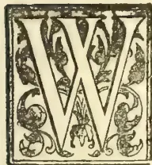

M. BOWDEN SMITH was born in 1839—and spent the early years of his life at Brockenhurst, New Forest, Hants. From 1853 to 1857 he was at Rugby, Dr. Goulbourn being headmaster.

In 1857 he was offered a cadetship in a Bengal Cavalry Regiment, which he declined, not liking the idea of such a long banishment from England.

In 1858 he was preparing for Woolwich examination, when he received glowing accounts of Ceylon and of the fortunes to be made there in coffee, from one of his brothers who was at that time on the East India Station in H.M.S. “Fury.” Accordingly Mr. Wm. Bowden Smith decided to give up Woolwich and try his luck in Ceylon. He travelled by the old P. & O. steamer “Colombo” from Southampton to Alexandria and S.S. “Nubia” from Suez to Galle. At that time the Egyptian Railway was only completed as far as Zag-a-zig, a short distance beyond Cairo, and from thence to Suez passengers were conveyed in two-wheeled vans, drawn by two mules and two ponies, into which six people were crammed sitting face to face. It was a very hot and

trying journey. Passengers were usually detained two days or more at either Cairo or Suez whilst their baggage was being brought across the desert on camels. The two days at Cairo enabled passengers to visit the Pyramids, but it was somewhat risky work in those days. The voyage out from Southampton to Galle took about 34 days and cost over £110 first-class, or nearly twice as long and double as much as it does now.

Mr. Bowden Smith landed at Galle in July 1858. On arrival at Galle, he received a hospitable welcome from Mr. Sonnenkalb, then a well-known merchant there, who has long since joined the majority and probably there are now few in Ceylon who remember him. Galle, with its numerous hotels and with the mail steamers constantly calling there, was a much more important and lively place than it is now. The journey from Galle to Colombo was performed by coach, which was always more or less exciting, as after each change of horses one of the pair usually refused to start and all the ingenuity of the driver had to be used to get the beast to move. Mr. F. B. Templer was at that time District Judge of Kalutara and with him Mr. Bowden Smith stayed three days on his way to Colombo. His old friend, Mr. James Murray Robert-

327------------------------------------------------

304THE TROPICAL AGRICULTURIST.[Nov. 1, 1898.

son, the founder of the firm of J. M. Robertson & Co., was then living at "The Priory," Slave Island, and under his hospitable roof he spent a pleasant month before proceeding upcountry and made the acquaintance of many kind friends, amongst them being Mr. and Mrs. Saunders (father and mother of Sir F. R. Saunders), Bishop Chapman, R. Tatham, Captain Evatt, Dr. Willisford and Mr. Charles Shand. Most of the Civil Servants and merchants lived either in Slave Island or Kollupitiya. More than one pleasant evening was spent at the old Ceylon Rifle Mess, now occupied by the Colombo Commercial Company. There were few roads through the Cinnamon Gardens and scarcely any houses, while packs of jackals used to run howling through the main road in Slave Island at night. The old Fort was guarded at night and no one could enter without the password.

From Colombo Mr. Bowden Smith went direct to Delta estate, Pussellawa, to learn coffee planting under Mr. F. R. Sabonadière, to whose able instruction and kind advice he owed more than to anyone else. He stayed a week as his guest at the big Delta bungalow before beginning work, and whilst there made the acquaintance of Mr. George Sherriff of Hellebodde, than whom a truer friend and kinder host never breathed. Many were those who spent the night under his hospitable roof on their way to and from Nuwara Eliya during the season; or if they wished to push on to Ramboda or Pussellawa, he would meet them on the road-side with a large basket of refreshments under a little strip of jungle he had christened the "Retreat." Pussellawa was then the crack coffee district in the island:—F. R. Sabonadière on Delta whose hospitality at the big bungalow was unbounded and whom all who knew loved; "Jack" Tyndall at Glenloch where Sir Henry Ward usually broke the journey when he went to reside at his house, "Rosebank," Nuwara Eliya, now owned by Miss Barbara Layard; Maurice Worms at Rothschild, a "chow" dog chained to each verandah post of the bungalow and a bull-dog at one end near the iron safe, kept guard—a glass of good old port wine was offered to each guest who called to see him; Col. Lilley with F. Kelson as his manager on Nayapane; Jack Gordon on Wavendon; General Fraser on Rangbodde; Havilland Durand on Choisy; Capt. "Gilks" Wilkinson on Newmarket; J. M. Sutherland on Stellenberg; A. J. Le Mesurier on East Delta; Walter Agar on Hannagalla and C. J. Mais on Black Forest. So Mr. Bowden Smith had the good fortune to be surrounded by men of culture and high standing on his first arrival in Ceylon, and though junior

to most of them had the privilege of their friendship. Alas! nearly all of them have "crossed the bar." "Jack" Tyndall was a frequent visitor at Le Mesurier's and Mr. Bowden Smith's bungalows on East and North Delta and many a practical joke did he play on each of the young planters.

Delta estate was then in its prime and from 1859 to 1863 it yielded average annual crops of over 11 cwt. of coffee per acre all round, in addition to which a great deal of crop was lost each year for want of labour to gather it. During crop months all hands had to be employed picking and by the end of December the weeds were as high as the coffee. But though the yield was large the price of coffee was low and any proprietor who obtained 60s. a cwt. all round for his crop was considered very fortunate. Transport was also a matter of considerable difficulty and carts were sometimes as long as two months on the road between Colombo and Pussellawa. Rice was always issued to coolies at 7s. 6d. per bushel and the loss under this head amounted to about £1 an acre. The currency was altered to rupees and cents under Sir Hercules Robinson's rule. Before the bridge over the Mahaweliganga was completed in 1860, communication between Pussellawa and Gampola was occasionally cut off altogether as the river was so rapid after heavy rains that the old ferry-boat could not cross. On these occasions the arrival of the beef and bread coolies from Gampola was anxiously looked for. Shingles for covering the roofs of bungalows and lines were first used on Delta in 1858, having been introduced into the planting districts by Mr. F. R. Sabonadière. In 1859 Mr. Bowden Smith accompanied Mr. J. Murray Robertson on a tour of inspection through Kotmale and Dimbula. Nearly the whole of the latter district was at that time a dense forest without even a bridle road beyond Mount Vernon estate. The old bridle road from Kotmale to Nuwara Eliya passed under the Great Western and through Hunugalla, Wattegodde, Lonisa and Radella estates and was much frequented by elephants. The coffee on Louisa was at that time covered with "black bug" which caused the berries to drop off and the crops secured scarcely covered working expenses. Most of the high estates in Pussellawa and Ramboda suffered more or less at this time from "black bug." Mr. Bowden Smith then had the pleasure of making the acquaintance of R. J. Corbet, Keith MacLellan, "Col." Hood, Andrew Hunter, "Plum" Duff, James MacDonald and J. F. McLeod all good men and true and thorough sportsmen—all of whom he met frequently afterwards and greatly valued their friendship.

328------------------------------------------------

Nov. 1, 1898.]THE TROPICAL AGRICULTURIST.305

In 1861 Mr. Bowden Smith paid his first visit to the Dikoya district. Only three coffee estates had then been opened there, viz, Dikoya, of which old Squatter Davidson was manager and with whom he stayed; Darrawella and a small part of Dunbar. The first 50-acre clearing of Hatton had just been felled. All the rest of the district was dense forest: no road beyond Dickoya estate and only the old pilgrims' foot-path through Maskeliya to Adam's Peak. There were numbers of elephants in these forests, and some of them used to come out on the estates in the evening and feed on the grass in the ravines. It was unsafe to travel on foot along the road between Watawala and Dikoya after 4 p.m., about which hour, elephants usually come out to feed. On his return journey from Dikoya he stayed a night at W. Grant's bungalow, Agrawatta, and started the following morning intending to ride on to Pussellawa through Ambagamuwa and Kotmale; but he got benighted on the Tyspane patanas owing to his watch having stopped and missed the track. It was pitch dark and raining hard and he had to spend the night out, wet through and covered with leeches. He did not reach the Rothschild ferry till daylight the following morning and for some years after suffered from frequent attacks of fever and ague. Mr. Bowden Smith had several other rough experiences of travelling in the olden days, but the night on the Tyspane patanas was the worst. In 1861, Mr. Bowden Smith went to reside on his own estate, New Forest, on the borders between Pussellawa and Nilambe, 10 acres of which he had cleared and planted the previous year. During this and the next two years, he cleared and planted another 400 acres for himself and others and was also given the general management of four neighbouring estates: so he had his hands full. After the planting season was over in 1862, he paid his first visit to Badulla where he stayed three weeks with F. Kelson who was at that time residing on Kottagodda. Mr. Bowden Smith was greatly struck with the wonderful productiveness of the coffee trees in the Badulla district as compared with the coffee on the Western side of the Island, the trees, in spite of weeds and neglect, being completely covered with berries. Bread was then an unknown luxury in Uva and biscuits or "rotties" were used instead. Here Mr. Bowden Smith first met E. C. Byers and John Brown, two of the well-known pioneers of coffee planting in Badulla.

In November 1863 Mr. Bowden Smith paid his first visit to England; and on his return to Ceylon went to reside in Kandy with one of his brothers, who had been looking after his work during his absence. The two brothers commenced business as Estate Agents and soon

secured the general management and visiting of a considerable number of properties. But as the work and the climate did not suit his brother, he returned to England and Mr. Wm. Bowden Smith carried on the business alone and went to live with his old friend, R. Beauchamp Downall, at Peradeniya. Mr. Bowden Smith's work at this time, took him to every coffee district in the island, including Madulsima and the Morowakkorale which had then been recently opened; so he obtained a thorough knowledge of all the planting districts, and during the last two years that he remained in Kandy had over 80 estates to visit and inspect. On the occasion of one of his visits to Dooomogahalande estate in Madulsima in 1869, he received a note from Keith McLellan, who happened to be visiting the adjoining property, Galoola, which belonged to him, saying that the leaves of a few of his coffee trees were attacked by some kind of blight and he wanted to know if Mr. Bowden Smith had seen anything like it. Mr. Bowden Smith went over and, after examining the leaves, told him the disease was quite new to him. This is believed to have been the first appearance of the terrible blight, afterwards known as "leaf disease" and which ruined so many planters. The following year Hantane and some of the other old estates near Kandy,\* as well as one or two of the *young* estates in the Morowakkorale, were severely attacked by "leaf disease," whereas the intermediate districts were comparatively free from it till later on. There are many who assert that "leaf disease" was produced by over-cultivation. But as the fungus first appeared in young coffee giving its maiden crop in the isolated and new district of Madulsima and in the following year on young coffee in the Morowakkorale, that had only just come into bearing, it would appear quite clear that over-cultivation could not be the origin of the disease. On the other hand, undoubtedly after the blight once made its appearance, the coffee trees on old estates that had been highly cultivated for years and had a great deal taken out of them, succumbed much more rapidly than the younger and stronger coffee trees on estates more recently planted. As there was no railway at this time beyond Kandy and cart roads were not nearly so numerous as they are now, the visiting of estates was much rougher and harder work than it is now and Mr. Bowden Smith, at this time, was obliged to keep four or five horses to enable him to get through his work.

During Sir Henry Ward's rule the three large bridges over the Mahaweliganga, at Katugastota,

\* Mr. Keith McLellan lived on Amblamana (Hantane) and may have carried the fungus on his tweed suit of clothes from Madulsima to this estate.—Ed. T. A.

329------------------------------------------------

306THE TROPICAL AGRICULTURIST.[Nov. 1, 1896.]

Campola and Nawalapitiya were constructed—an immense boon, as the river was at times impassable after heavy rains. The Branch Roads Ordinance was also introduced by the same Governor on the grant-in-aid principle which has done so much towards developing the country and opening up the planting districts. It was in his time also that a deputation of several of the leading planters and merchants offered to contribute 1s. a cwt. on all coffee exported from Ceylon towards the construction of a railway from Colombo to Kandy, the proposal being accepted with the remark that it was the first time he (the Governor) had ever heard of anyone asking to be taxed.

In the interval between Sir Henry Ward and Sir Hercules Robinson's rule, when Sir Charles MacCarthy was Governor, public works were neglected and many of the roads got into exceedingly bad order. But under Sir Hercules Robinson's able administration these evils were soon remedied and Grant-in-Aid roads were carried into the heart of the extensive districts of Dimbula and Dikoya where a large number of acres were being cleared each year and planted with coffee. During Sir Hercules Robinson's term of Government the districts of Madulsima and Morawak Korale were opened out and the latter was then supposed to contain such suitable land for coffee that the Government raised the upset price of the land to R20 per acre. The Morawak Korale, however, proved a complete failure as far as coffee was concerned and much good money was sunk there. Mr. S. LeCocq, a good planter and good man, pioneered there for some years.

Before the railway was opened,

#### KANDY

was a much more important place than it is now; and most planters transacted their business there instead of undertaking the tedious coach journey to Colombo. Several business firms had their head offices in Kandy, of which Keir, Dundas & Co. were the most influential. George Wall also had a branch in Kandy and he, Harrison and Leake spared no pains nor trouble to promote the planting enterprise in which they themselves were so deeply interested. The annual Planters' Association meetings were largely attended with generally a good fight for the Chairmanship.

In 1871, Mr. Bowden Smith joined the firm of Sabonadiere & Co. On the 4th April 1872, Mr. Bowden Smith married Louisa S. Prinsep-daughter of Mr. Justice Prinsep of Indian fame—at Freshwater Bay, Isle of Wight. She was then living there with Mrs. Cameron from whose house they were married. Mr. Bowden Smith first met Mr. C. Hay Cameron senior, at Rahatungodde, Upper Hewaheta in 1860. Rahatungodde

then belonged to Mr. Cameron and he was living there for a short time with his son Ewen, then a boy. Mr. Bowden Smith walked over from Delta via the Gonavy Gap with J. Murray Robertson senior and Jack Tyndall to call on Mr. Cameron. They stayed the night with him and returned to Pussellawa the following day. He did not meet Mr. Cameron again till the autumn of 1871 at Freshwater Bay when he was living at his pretty house "Dimbula" named after the well-known district in Ceylon where he owned a large tract of forest known as "Cameron's Land." Mr. Cameron always loved Ceylon and often expressed a longing to spend the closing years of his life there. This wish was gratified later on and the remains of both Mr. and Mrs. C. Hay Cameron rest in the peaceful and pretty little churchyard at Bogawantalawa. Mr. Bowden Smith returned to Ceylon in July 1872, with his wife and went to reside at Darley House, Colombo.

In September 1873 Mr. Bowden Smith was unanimously elected by the Planters' Association as their representative in

#### THE LEGISLATIVE COUNCIL,

an honour quite unexpected, as he did not even know that his name was to be proposed at the meeting, and the first intimation he received was a congratulatory message from Sir W. Gregory, then Governor. In 1874 he induced the Government to amend the Branch Road Ordinance which required several alterations to meet altered circumstances. That this ordinance was carefully considered is proved by the fact that it worked well for 22 years and only had to be altered last year to meet fresh requirements. He resigned his seat in Council when he went to England in 1876 and was succeeded by old friend, R. B. Downall. Twice during Sir James Longden's rule and twice during Sir Arthur Gordon's (Lord Stanmore's) Government he was requested to take a seat in the Legislative Council, but declined the honour as he felt he could not devote sufficient time to the extra work of the Legislative Council without neglecting his other duties, though always ready to do anything in his power to further the interests of the Colony especially in respect to roads and railways. After 1873 he served on the different Railway Commissions appointed to report on the Nawalapitiya-Haputale extension, Nannu Oya-Haputale extension and the Northern Railway extension; and although he was in the first instance strongly in favour of a metre gauge he was converted by the vast amount of evidence he had heard and read against *break* of gauge if it can possibly be avoided and unless it can be shown that a very great saving can be effected both in construction and subsequent working expenses.

330------------------------------------------------

Nov. 1, 1898.]THE TROPICAL AGRICULTURIST.

Mr. Bowden Smith took a prominent part in starting the Planters' Wards at the General Hospital, Colombo. When the Government took over the working of the Cooty Medical Aid Ordinance from the District Committees in 1874 or 1875, he was largely interested in the Pussellawa and Ramboda Districts and was able to induce the Committee of those two districts to pay the balance they had in hand, which amounted to a good large sum, towards starting the Planters' Wards instead of returning the money to proprietors of the estates interested *pro rata*. This formed the nucleus of the fund out of which the Planters' Wards were constructed. A few other districts followed suit, but not nearly all. He had several interviews with Sir W. H. Gregory and Sir W. Kynsey about starting the Planters' Wards and met with some opposition at first. He always took a deep interest in the Planters' Wards and they have undoubtedly proved a boon to all planters requiring careful medical treatment.

On 5th December, 1897, Mr. Bowden Smith (accompanied by Mrs. and Miss Bowden Smith) left Ceylon with great regret after the many happy years spent amongst the kindest of friends, several of whom, however, he hoped to meet again in England; where he was sure to take the deepest interest in the country in which he laboured for so many years. Alas! his hope of some years of usefulness in a business in the City of London was not to be fulfilled. He went home to succeed the late Mr. Thos. Dickson as London Manager for the Scottish Trust and Loan Company, 52, Gracechurch Street; but he had not been long at work when the great change came.

Up to the time we go to press, full particulars have not been received, but a telegram received by Mr. Cumberbatch announced the death of Mr. Bowden Smith which seems to have taken place on Sunday, October 16th, at his brother's residence in the country where he had been out shooting the previous day. The brief fatal attack, it is said, was due to heart-disease. So passed away in his 60th year the hale and hearty merchant and planter who left Ceylon only ten months previously, apparently in good health. Widespread and sincere sympathy has been felt for Mrs. Bowden Smith and family under this sad and sudden bereavement, and all who knew the deceased in Ceylon feel that a truly good man, and an excellent, hard-working pioneer colonist, has departed this life. Peace to the memory of a man of worth.

JAVA QUININE.—Our Amsterdam representative writes us on the 6th instant that another 600 kilos of quinine from the Bandoeeng factory are on their way to his city,—*British and Colonial Druggist*.

## CEYLON TEA-BOX WOODS.

By FREDRICK LEWIS, F.L.S.,

Assistant Conservator of Forests, Ceylon.

The increasing export of tea from Ceylon, which must now be regarded as having more than fully taken the place of the island's former staple—coffee, has developed a correspondingly large trade in woods suitable for the manufacture of boxes for the packing and transport of the prepared article. Some notion of the volume of wood required yearly may be arrived at from the fact that, assuming all the tea exported from the island to be packed in 100 lb. chests, the total number of chests for one year's export alone would be over a million, or, roughly speaking, upwards of 18,000,000 superficial feet of planking.

Of this vast quantity, for some years past a great proportion of the wood has come from Japan, as both planters and merchants found by experience that the Japanese tea box was not only very neat, but it had the superior advantage over the locally made article, in possessing great equality of weight. The importance of the last consideration cannot be too highly valued by the planter, as fluctuation of weight would in all cases lead to the contents of the box being emptied out and re-weighed, for obvious reasons; entailing not only additional cost and delay, but a serious loss by waste.

London importers also raised objections to certain Ceylon wood packages on the grounds of "tainted teas," implying thereby that the teas themselves had acquired a taint from the smell of the outer wood package, notwithstanding the fact that between the wood and the tea itself is an air-tight envelope of lead. A still further objection was raised, that certain woods corroded the lead lining, an introduced poisonous matter.

It is, perhaps, foreign to the purpose of this paper to enter into any discussion as to the merits of the above objections, as, unfortunately, those most interested accept as final what is told them by their London constituents.

Now that the importation of tea-box wood has declined from Japan. Owing to the late Chino-Japanese war, the demand in Ceylon for local woods for cases at once increased, and the demand for soft light woods rapidly began to manifest itself. The trade is practically in native hands, and for this reason the planter is often placed at a serious disadvantage, as he is absolutely ignorant of the extent of seasoning his packages have received, and very frequently is equally ignorant as to the materials themselves.

The trader is interested chiefly in obtaining woods that are light, and these he buys from people who have wood for sale; and so long as these will float, the log dealer will invariably find a ready sale for his produce, no matter if it is composed of all sorts, or of wood; green or dry. It will be further understood that the log dealer—for so he is—buys his wood wherever he can get it near navigable streams, and as these are very subject to periods of flood, as well as periods of non-navigability, it follows that he must often be for months unable to move his wood, during which time it has either stranded in the stream, or in the forest just as it was felled. Such conditions are not conducive to improved seasoning; and, naturally, wood exposed in this manner to tropical atmospheric changes cannot but suffer in turn. It is, moreover, remarkable that tropical soft woods are much more easily affected than woods imported from temperate zones. Finally, in Ceylon, the forests cannot be regarded as possessing any large extent of gregarious woods; in other words, pure forests do not exist, so that the long dealer can only adopt his standard of lightness as his rule for selection, and not that of species only. It is not to be wondered at, therefore, that our locally made tea boxes are mixed as regards their composition, and equally mixed as regards their specific weights.

331------------------------------------------------

308THE TROPICAL AGRICULTURIST.[Nov. 1, 1898.

That much could be done to remedy this state of affairs goes without saying, and it is to be deplored that so large an industry suffers from want of systematic arrangement, which would go far to reduce the evils complained of, if not to absolutely eliminate it altogether. It is proposed to give a short list of local timbers in use in Ceylon, with their local names added, as in that country the native name is more generally applied than the scientific.

MAGNOLIACEÆ.

No. 1. *Michelia nilagirica*, Zenk. "Flora Brit. India," vol. i., p. 44. Singalese—*Wal-Sapu*.

This is a purely hill species, and is rarely found below 4,000 feet altitude, and not over abundant. It is demand owing to the neatness of package it affords and beauty of wood.

No. 2. *Michelia Champaca*, L. "Flora Brit. India," vol. i., p. 42. Singalese—*Sapu*.

An introduced species, found chiefly in gardens, where it was probably introduced many years ago for the sake of its highly scented flowers which are used as offerings at Buddhist shrines. The wood is greatly prized, and only occasionally found in use for tea-boxes, for which it is far too good.

ANONACEÆ.

No. 3. *Cyathocalyx zeylanicus*, Champ. "Flora Brit. India," vol. i., p. 53. Singalese—*Ippatta*.

Fairly abundant plant, and found through most of the wet forests in the western and Sabaragamuwa provinces, from practically sea level to 2,000 feet. It is a favourite wood, as it grows very straight, and only branches high up, so that it is easily worked.

No. 4. *Xylopia parvifolia*, Hook f. and Thoms. "Flora Brit. India," vol. i., p. 84. Singalese—*Netawu*.

Like the last, is a wet forest plant; common, but not particularly abundant. It is, perhaps, more common in the Gillingal country, at the base of Adam's Peak, than further to the east. It affords a nice, clean-looking wood, but is not in very high demand, as it is said to be too heavy.

GUTTIFEREÆ.

No. 5. *Calophyllum tomentosum*, Wight "Flora Brit. India," vol. i., p. 274. Singalese—*Kina*.

A hill species, and a favourite wood for building purposes in general, and occasionally used for tea boxes, but unsuitable on account of weight. A beautifully marked wood and very durable.

DIPTEROCARPACEÆ.

No. 6. *Doona congestiflora*, Thw. "Flora Brit. India," vol. i., p. 312. Singalese—*Tiniya*.

A large tree, and found growing gregariously in many of the wet forests of the island. It affords a timber much like cedar in appearance, light, and easily worked, and, therefore, is in great demand.

No. 7. *Vateria acuminata*, Hayne. "Flora Brit. India," vol. i., p. 313. Singalese—*Hal*.

A large handsome tree, widely distributed in the western, southern, and Sabaragamuwa provinces, but rarely found above 3,000 feet altitude or out of the very wet limits. The wood is in great demand as it is very easily worked, light, and lasting. This tree runs some risk of becoming destroyed altogether, as the natives strip off the bark from young and old trees, to assist in stopping fermentation in toddy, for which purpose it is freely used, to the destruction of the tree. The fruit is also eaten, so that the tree has many vital enemies to its existence.

MALVACEÆ.

No. 8. *Bombax malabaricum*, DC. "Flora Brit. India," vol. i., p. 349. Singalese—*Katu-imbul*.

An enormous tree, scattered over the greater part of the west of Ceylon, up to 2,500 feet, above which it becomes very scarce. It is found in the dry districts towards the south, where it attains a stem circumference of 15 to 18 feet. Owing to its great lightness and the neatness of box turned out from the wild cotton tree, it is a great favourite and commands a good price. The natural reproduction of the tree is not good, so that in its wild state the tree stands some risk of being very much over-worked.

No. 9. *Cullenia excelsa*, Wight. "Flora Brit. India," vol. i., p. 350. Singalese—*Katu-boda*.

A common tree in all the wet forests up to 4,000 feet, and occasionally a gregarious plant. It has only of late years come into favour as a tea-chest wood, and bids fair to become popular, as the timber is light and easily worked, and rather pretty.

SIMARUBACEÆ.

No. 10. *Ailantus malabarica*, DC. "Flora Brit. India," vol. i., p. 513. Singalese—*Wal-billin* or *Kumbalu*.

A large lofty tree, but found in no great abundance. It yields a very soft wood, and is easily worked. In parts of the Kegalla district the local carpenters pass off a good deal of this wood as wild cotton, so as to secure a sale for it, owing to the popularity of the latter species.

BURSERACEÆ.

No. 11. *Canarium zeylanicum*, Bl. "Flora Brit. India," vol. i., p. 532. Singalese—*Kekuna*.

A very large forest tree, and found chiefly on rocky ground on the wet zone, up about 2,000 feet. Very common in suitable places in the western province, especially in the Pasdan Korah. The wood is very light, and easily worked, but is so soft that it decays very quickly. The bark contains a pungent, balsamic resin that is said by the natives to be a valuable specific against snakes, if burned in a house. The seeds are eaten, and in flavour are not unlike walnuts.

MELIACEÆ.

No. 12. *Melia dubia*, Cav. "Flora Brit. India," vol. i., p. 545. Singalese—*Lunu-middella*.

A large and conspicuous tree, with crowded bipinnate leaves that form tuft-like terminations to the long thin branches. It is not a tree of very general distribution in Ceylon, as it seems to prefer certain soils, out of which it does not flourish. It is cultivated in the Kegalla district both by natives and Europeans, and, owing to its rapid growth, it is a favourite. The wood is in very great demand, both for its suitability for the making of out-riggers for native boats and for ceiling boards, and also tea boxes. It is light in weight, easily worked, and durable. This wood has been tried for fuel purposes, but is not found to be a success as such.

The cultivation of *Lunu-middella* is profitable, as in eight years the tree attains sufficient size as to be saleable.

No. 13. *Chickrassia tabularis*, A. Juss. "Flora Brit. India," vol. i., p. 568. Singalese—*Hulan-hick*.

A moderately large tree, but not common. It has been used a tea-box wood, but is not adapted to this purpose, for which it is much too good, owing to its weight. It is a very ornamental wood, and suitable for carving.

No. 14. *Cedrela serrata*, Royle. "Flora Brit. India," vol. i., p. 561.

This is an introduced timber tree, and is known as "Red Toon." Its introduction has been quite of recent years, and its success has been somewhat questionable, owing to the young plants being subject to the attacks of a "borer" that quite destroys the part attacked, and often the whole tree. The wood is a favourite for tea chests, and at one time was largely imported into Ceylon for this special purpose.

OLACINEÆ.

No. 15. *Lasianthera apicalis*, Thw. "Flora Brit. India," vol. i., p. 584. Singalese—*Urukannu*.

A large handsome tree, the young leaves of which have a conspicuous coppery hue, and highly polished upper surface. It is abundant in parts of the western province, and ascends to a considerable altitude in the wet zone. The wood is not in great favour, chiefly because of its weight, but while it can be obtained easily, carpenters readily buy it for local use.

Trimen gives *Urukouda*, *Urueta*, and *Kospenna* as further native names, but it is more generally known by the name given above.

332------------------------------------------------

Nov. 1, 1898.]THE TROPICAL AGRICULTURIST.309CELASTRACEÆ.

No. 16. *Koكونa zeylanica*, Thw. "Flora Brit. India," vol. i., p. 616. Singalese—*Kokoon* or *Kokoon-pottu*.

A very common tree in the very wet forests near the foot Adam's Peak, and in the districts extending towards the west coast.

The wood is not very favourable, because of its splitting so freely, but is suitable for small cases.

ANACARDIACEÆ.

No. 17. *Mangifera zeylanica*, Hook. f. "Flora Brit. India," vol. ii., p. 16. Singalese—*Walamba*, *Etamba* (*Amba*, lit. a kidney).

A large and handsome tree of wide distribution, extending from the confines of the dry country in the south-west. all over the wet forests up to 2,500 feet, after which it becomes scarce. The tree attains a very large size with a long clean stem. The wood is a pale white, soft, and easily worked, and is in large demand for cases.

No. 18. *Semecarpus subpeltata*, Thw. "Flora Brit. India," vol. ii., p. 33. Singalese—*Maha-badulla*.

A moderately large straight tree, found in all the very wet forests of the Western Province and Sabaragamuwa, particularly within the water-shed of the Kaluganga river.

This wood is in particular demand for tea chests, though it is said to be one of the woods that corrode tea with lead or the lining used between the tea and the wood.

No. 19. *Semecarpus coriacea*, Thw. "Flora Brit. India," vol. ii., p. 32. Singalese—*Badulla*.

A common tree, found over most of the hill country above 4,000 feet. This wood is sometimes used, but it is considered too bad owing to the risk there is of getting any of the "milk" (Sing., *Badulla-kiri*,) on the skin, as it at once sets up a violent inflammation. It is possible that two or more than those mentioned of this genus are used, as the Singalese name *Badulla* extends to both the large as well as small forms of *Semecarpus*, and the word coming within the "light" class would be accepted for the purpose intended.

No. 20. *Campnosperma zeylanicum*, Thw. "Flora Brit. India," vol. ii., p. 41. Singalese—*Aridda*.

A large dark-leaved tree, and in many of the wet forests in the vicinity of Adam's Peak it is a gregarious species. In Gillimali—at the foot of Adam's Peak, eight miles from Ratnapura—these trees are found in great abundance, attaining a girth of seven feet. It is in very high favour for tea-chests manufacture, as it affords a light, easily worked, clean-looking good, possessing all the qualifications necessary to commend it to the planter.

RHIZOPHORACEÆ.

No. 21. *Anisophyllea zeylanica*, Benth. "Flora Brit. India," vol. ii., p. 442. Singalese—*Wellipenna*.

A tree attaining considerable size, and found in moderate abundance in all the wet forests of the western half of the island, up to 2,500 feet, after which it becomes scarce.

It is occasionally used for tea boxes, but is not a favourite for that purpose, as it is too heavy.

DATISCACEÆ.

No. 22. *Tetrameles nudiflora*, R. Br. "Flora Brit. India," vol. ii., p. 657. Singalese—*Mugunu*.

A very large tree, distributed mostly through the country having the intermediate rainfall between the wet and dry zones. The wood is very soft and light, and occasionally mixed up with harder kinds in the manufacture of chests.

CORNACEÆ.

No. 23. *Mastixia tetrandra* ? Clarke. "Flora Brit. India," vol. ii., p. 745. Singalese—*Diya-taliya*.

A large wet-zoned tree, and found in abundance in the valleys of the Kaluganga water-shed. The wood is much sought after, and is suitable owing to lightness.

RUBIACEÆ.

No. 24. *Sarcocephalus cordatus*, Mig. "Flora Brit. India," vol. iii., p. 22. Singalese—*Bakmi*.

A rather common tree in the wet ground, with exceedingly large stipules. The wood is light and soft, but not in great favour.

SAPOTACEÆ.

No. 25. *Chrysophyllum Roxburghii*, G. Don. "Flora Brit. India," vol. iii., p. 535. Singalese—*Lawulu*.

A moderately large tree, scattered sparingly over the wet zone, and occasionally used for tea-box manufacture, but not in great favour, as trees of sufficient size are difficult to procure.

No. 26. *Palauquium grande* (?), Engler. "Flora Brit. India," vol. iii., p. 540. Singalese—*Mihiria*, *Kirihimbilia*, *Kirihiria*.

A very large, thick, brown-barked tree, of wide distribution in all the moist forests of the country, up to about 4,000 feet altitude. It is a favourite building wood on estates, and is often used for tea cases. The wood is reddish in colour, dark and close.

APOCYNACEÆ.

No. 27. *Alstonia scholaris*, R. Br. "Flora Brit. India," vol. iii., p. 642. Singalese—*Rukattana*.

A very large, tall tree with pale grey stem and dark whorled leaves, found throughout the low country up to 3,000 feet, except in the dry zones. This wood is much sought after owing to its extreme lightness, and is greatly in use for the manufacture of coffins. In colour the wood is white, and when freshly cut is offensive in smell.

MYRISTICACEÆ.

No. 28. *Myristica lawifolia*, Hook. f. and Thoms. "Flora Brit. India," vol. v., p. 103. Singalese—*Malaboda*, *Rerimarwara*.

A very common tree in all the west forests up to 5,000 feet, and frequently found on the banks of streams in the dry zone. The wood, if carefully seasoned, affords a splendid packing-case material, but the difficulty in drying the timber is against its popularity. It splits freely and is of a pale yellow colour.

No. 29. *Myristica Horsfieldia*, Bl. "Flora Brit. India," vol. v., p. 106. Singalese—*Ruk*.

A large tree, fairly abundant in the moist zone, with a particularly sweet-scented flowers. The wood very much resembles the last in appearance, but is much more heavy, and for this reason is rarely used in the manufacture of tea boxes.

No. 30. *Myristica Irya*, Gaertn. "Flora Brit. India," vol. v., p. 109. Singalese—*Irya*.

A common tree on the banks of rivers and streams, and often in swampy places. It has a bright pink pericarp, with seeds enclosed entirely by a scarlet aril. The wood strongly resembles that of the last-named species, but is lighter and is in demand.

LAURACEÆ.

No. 31. *Cryptocarya membranacea*, Thw. "Flora Brit. India," vol. v., p. 120. Singalese—*Tawanna*, *Walkos*.

A wet zone tree, and abundant in the Gillimali district at the foot of Adam's Peak and towards the "Haycock," on the borders of the southern province. A yellowish coloured wood, close-grained, and well adapted to tea box manufacture, but not particularly used owing to weight.

No. 32. *Machilus glaucescens* (?) *zeylanica* (Trimen's Catalogue, *M. Macrantha*, Trimen, "Flora of Ceylon," vol. iii., p. 443). "Flora Brit. India," vol. v. p. 140. Singalese—*Ualu*.

A very large tree found in some abundance in the Avsa velia district and towards Adam's Peak.

It is a favourite tea-box wood, as it is easily worked, and of a light weight. Dry saw-dust of this wood is faintly aromatic in smell.

No. 33. *Litsea schifera*, Pers. "Flora Brit. India," vol. v., p. 157. *L. chinensis*, Trimen. "Flora of Ceylon," vol. iii., p. 449. Singalese—*Bomi*.

A common tree throughout the island up to 2,500 feet, and well known to all local carpenters. The wood is in great favour for flooring boards as it is capable of taking a superior polish. Frequently used in the tea-box trade.

333------------------------------------------------

310THE TROPICAL AGRICULTURIST.[Nov. 1, 1893.

No. 34. *Litsea zeylanica*, Nees. "Flora Brit. India," vol. v., p. 178. Singalese—*Kududawula*.

A common tree in the hill country, between 2,000 and 4,000 feet, and in great favour not only for the tea cases but for door frames, sash bars, dados, and the like. The wood is light in weight, and will take a high polish of a yellowish orange colour.

EUPHORBIACEÆ.

No. 35. *Alcurites triloba*, Forst. Singalese—*Tel-kekuna*.

An introduced tree and common enough in native gardens, where it is cultivated for the sake of the oil that is extracted from the nut. Sometimes, but very rarely, used in tea-case manufacture. The wood is white, soft, and light.

URTICACEÆ.

No. 36. *Ficus nervosa*, Hayne. "Flora Brit. India," vol. v., p. 512. Singalese—*Kalamadua*.

A large-leaved tree, and occasionally found in the forests of the wet zone. The wood is soft and light but decays quickly.

It is probable that a few more species of the genus *Ficus* get mixed up with other light soft woods in tea-box manufacture, as they are easily procurable in common with so many of the woods mentioned above, but it is undesirable to record any doubtful examples. The list given includes most, if not all, of the recognised tea-box woods, and to which, but for the ignorance of the traders themselves, many more might be added.

The culture of woods for this special trade may in course of time be tried in Ceylon, as the wants of the planters make suitable wood more and more scarce; but it is noteworthy that no invention has yet been brought out by which compressed wood could be used instead of the present very laboriously manufactured article.—*Journal of the Society of Arts*.

THE NATAL FIBRE INDUSTRY.

The following is an extract from a letter received in Durban from a well-known firm of merchants in London:—

"Natal Fibre.—We think it will be of interest to you to hear the position of this article at the present time, especially as it so favourable that we should like to induce you to start some shipments if it is possible. As you know, your Natal fibre is similar to Mauritius sisal hemp, the value of which is guided entirely by the prices of Manila hemp. Now, at our first valuation we gave you the price at about £17, but since then, owing to the insurrection in Manila and the war between Spain and the United States, the collection of hemp in Manila has for the time entirely ceased. Practically no parcels are coming forward, and all available stock in London is being rapidly snatched up. Owing to this, the price of Manila has risen to £35 per ton, and on this valuation our brokers, to whom we showed your fibre, and who make a speciality of all classes of hemp, report: 'Very good length, well dressed and fair strength, fair colour, present value about £30.' Of course, no one can foresee how long the state of affairs in Manila will last, but at the time of writing there are no prospects of and speedy settlement of matters, and even after the war has ceased it will be some time before further shipments are forwarded, and it is very unlikely that the prices will fall to any extent this year. Therefore, reckoning with as much certainly as possible, the very lowest prices that parcels of your hemp would realise would be £25, which is allowing a margin of £5 fall, which is most unlikely, and for any slight overvaluation on the part of the brokers. Therefore, if you can see your way to start a shipment . . . with a code for prices and repetitions, it is a splendid opportunity to get your hemp into the market. We look forward to hearing from you, and trust that the information we are giving you will prove useful."

—*Natal Mercury*.

PLANTING NOTES.

PLANT DISEASES.—The browning of the Vine, which was treated with so much humour by Mr. Blackmore at one of the meetings at Chiswick, is now ascertained to be caused by a slime fungus. More recent researches show that it is by no means confined to the Vine, but that it is met with in Beetroots, Potatoes, Melons, Cucumbers, Artichokes, Laurel-Cherries, Aucuba, Cherries, Apricots, and Plums. The Pseudocommis—*for such is the name of the slime-fungus or Myxomycete*, determines the gumming, the fungus known as *Coryneum* being now exculpated. In addition to the plants mentioned, Apples, Pears, Chestnuts, Poplars, and Sugar-cane are mentioned by Mr. Roze as subject to this terrible scourge. In many cases the disease has been attributed to other fungi. The existence of the other fungi is not denied, but it is supposed that instead of being directly injurious, they merely feed on the tissues decayed and injured by the presence of the myxomycete. These are questions which must be settled as soon as possible in the botanical laboratory. The present state of uncertainty is worse than embarrassing to the practitioner. Inoculation of a previously healthy plant with spores of the several fungi was considered as sufficient proof of the malignity of that particular fungus, but the slime-fungus can as easily be introduced, and the evidence is as strong in the one case as in the other.—*Gardeners' Chronicle*.

MR. DONALD MACKAY has just returned from a trip to the upper portion of the Central Province, glad to get back from the cold and pouring rain of Nuwara Eliya; but much pleased with the improvement of the tea all along his route and more especially in the Agra, since he saw it four years ago. Mr. Mackay is now going up the Chilaw Puttalam road to visit coconut estates. He will see one of the most profitable routes for a Railway in the island and one that might have been served by the metre gauge on to Mannar, Jaffna and Trincomalee if the Railway Commissioners had only put down their feet and stopped the broad gauge at Kurunegala. As it is, a line on the 2½ feet gauge to Puttalam will have to be made and this gauge is quite enough for Jaffna (direct to Colombo) if only Mr. Chamberlain could be got to believe so, for there is nothing worthy of the name of main line beyond Anuradhapura.

THE COCONUT AS A VEGETABLE FOOD.—In its life-supporting qualities the coconut is quite equal to the best of other vegetable products that have been ranked above it and although these nutritive qualities are admitted, the amount of nutrition derived is much greater than is generally supposed. As an example, we may refer to the account that has been published of a vessel which left San Francisco, with 400 passengers, for Sydney. Running short of stores, they were obliged to put in at port, where a large quantity of coconuts was obtained. The remainder of the passage was attended with heavy weather, and the vessel became water-logged, only reaching Sydney after a perilous voyage of eighty days. Owing to the extreme length of the voyage, their provisions ran out, and men, women, and children were reduced to an exclusive diet of coconut, and owing to the scarcity of these, the quantity apportioned was in the proportion of one coconut to each adult. Notwithstanding this diet, wholly unrelieved by any change, not a life was lost, not single case of illness occurred, all the passengers landing in a healthy and well-nourished condition.

This is speaking well for the trade on shredded coconut, which, with the improvement in manufacturing the last few years, has almost entirely replaced the fresh coconut. This is because of its keeping qualities, and when prepared in the careful manner that the "Brazil" brand is, it is much healthier, and certainly more economical, for it will not turn rancid.—"American Grocer," Aug. 3.

334------------------------------------------------

Nov. 1, 1898.]THE TROPICAL AGRICULTURIST.311

### COCONUT PLANTING IN THE EASTERN PROVINCE.

We had a very favourable account the other day from that veteran Surveyor and keen observer, Mr. O'Dowd, senior, of the new coconut planting district around Tirukovil, in which so many planting capitalists have recently invested. He thinks the soil equal to any already planted with coconuts in the Eastern Province; and when the palms come into bearing, it is pointed out that sea-transport will be very convenient. Meantime in the more northern districts of the Province, there are considerable extensions under way. Mr. Carey has instructions to plant up 300 acres of the reserves on the well-known Ouchterlony group of estates. These estates were recently valued for the proprietors by Mr. C. E. H. Symons; but the decision thereon was not to sell, but to extend cultivation. High exchange will, of course, react adversely on coconut as on tea estates; but there is not the large outlay for factories and machinery to encounter in the case of the former. Still, it may be a question, looking at the tropical world generally, whether the next cry may not be one of "over-production" for the exported products of the coconut palm! Our estimate of the area planted, or bought for planting, during the past three years in Ceylon, is not less than between 40,000 and 50,000 acres taking all the provinces into account. There is, however, the permanently large home consumption of the palm products to console, at least, native proprietors of estates; and we may hope to see new uses for coir and perhaps an extended demand for copra, for oil and for desiccated coconut, spring up.

### THE JAVA QUININE FACTORY.

Mr. Van Prehn, who has the technical control of the Bandong quinine factory in Java, has addressed a letter from the Hague (where he has been staying during a part of his sojourn in Europe) to the director and board of the Company owning the factory, protesting against the treatment he has received. His letter throws light on recent events in Java, and will be taken by some as another piece of evidence in support of the theory that the Dutch cinchona planters will never be able to agree on a scheme for their common protection. Whilst Mr. Van Prehn has been in Europe trying to come to an arrangement with the German quinine makers his conduct in other respects has been severely criticised in Java. We will give extracts from his letter, which will reveal the state of affairs between the various parties.

Mr. VAN PREHN says:—

I was affected in a most painful manner on learning the numerous complaints and reproaches cast at me insinuating that I had acted, and was still acting, in opposition to the true interests of the Bandong quinine manufactory. On numerous occasions, Mr. Van Heeckeren, in consultation with myself, drew up sundry draft contracts and distributed them amongst the cultivators of cinchona bark; according to the terms of these contracts, the latter were invited to

undertake to deliver yearly a certain quantity of cinchona bark to the Bandong quinine manufactory for the purpose of having quinine manufactured therefrom.

The producers, however, found they could not agree to the terms of [the last] contract, and consequently we do not receive a single offer. Many of them were unwilling to agree that these quinine should be consigned to a firm nominated by the Bandong quinine manufactory without any consultation on its part as to the wishes of the owners of the quinine. I was, moreover, unable to agree to the compulsory obligations which it was sought to impose upon the planters. Besides these, there were several other conditions which did not suit the interests of the producers. As a rule the sale outright of the raw material was preferred to the manufacturing of the same against payment of a stipulated price, with settlement at the end of the working year. Even the offer of an advance of 8 florins per kilo. of sulphate of quinine had no attraction for them. Many would have nothing to say to an advance, and demanded earlier and quicker settlements. That several planters accepted this advance was entirely owing to my efforts. I saw that it would happen that many planters after the first trial consignment would send no more cinchona bark to our factory, especially when a rise in the price of the bark clearly showed that the sale in the form of bark in Amsterdam was to a considerable degree more profitable than the manufacture in Bandong with subsequent delayed settlements. Besides all this, reports were circulated that others proposed to establish factories to compete with the Bandong manufactory and which would buy the bark. I allude to the Pengaleugan manufactory, which declared that it had a million florins disposable wherever to buy bark, and pay for the same on the spot.

Another project was that of Mr. Van Meeverden, who was already in correspondence with, and in negotiation with Mr. Henny, of Batavia, with the idea of

#### BUILDING A QUININE MANUFACTORY,

and of buying the bark. Under these circumstances our Bandong manufactory, with its scheme of manufacturing for a stipulated recompence, could not continue to exist.

The scheme was a source of unceasing remonstrance and complaint; first one about a difference in weighing the bark, then another about the result of the analysis, and yet another about the time of settling and the pecuniary circumstances. For example, producers who had given in their bark when the price was 6 cents were not very well pleased with a final settlement on the basis of a lower average price &c., &c. The scheme when in operation was both unsatisfactory to the manufactory, and aroused dissatisfaction and complaints with the producers. I thought, and I am convinced, that I acted in the interests of the manufactory when I made, with a few favourably-inclined and independent planters, arrangements which enjoyed their favourable consideration.

I will refer to a paragraph which can be read in the circular of Messrs. Kerkhoven and De Vries:—"Three-fourths of the cinchona produced by Java will go in the usual manner to Europe and be manufactured there into quinine for the consumption of Europe, America and Africa. The remaining fourth part will be manufactured in Java for consumption in Asia and Australia, &c." When one of the Messrs. Kerkhoven asked me what I wanted for myself, I replied that I did not stipulate for anything for myself, and I only solicited their co-operation in order to save the shareholders in the Bandong quinine manufactory from loss and injury. I have chosen to enlarge thus upon this matter, because a fourth part of the early production of cinchona bark in Java represents twice as much quinine as the factory can at the present time turn out in a year.

Thus, I succeeded in rendering all competition on the part of others in Java impossible, because during the period the factories were in course of construction there would be no occasion to buy any bark, and at the

38

335------------------------------------------------

312

THE TROPICAL AGRICULTURIST.

[Nov. 1, 1898.

same time the Bandoeng manufactory was secured an ample supply of the raw material and a ready market, free from competition, for the manufactured article in Asia and Australia. With a view to extending the factory, a larger site had to be looked for, especially as many complaints were forthcoming with regard to the pollution of the water that flowed through the towns, and was injurious to the fish-ponds.

It is my firm conviction that the plan, according to which the working of our factory is carried on, is not a plan conducive to the interests of the producers, and, as a direct consequence, is likewise not conducive to the interests of the shareholders. Now, what is

THE ACTUAL STATE OF AFFAIRS?

The manufacturers of quinine, who will be only too pleased if they can succeed in rendering the manufacture of quinine in Java an impossibility, have recently raised the price of the cinchona bark, and lowered the price of the manufactured quinine to such a degree that the producers find it more to their advantage to sell their produce in the form of bark than to have it manufactured at Bandoeng, and then to sell it in the form of a preparation. The manufacturers can always effect this with loss, or, at any rate, without only a slight loss for a short time. Planters naturally prefer to send their bark to Europe, and our factory without a supply of the necessary raw material must necessarily cease to exist, after which the manufacturers are masters of the situation, and the producers are ultimately the victims and bear the loss.

Mr. Van Prehn concludes by saying the Bandoeng factory must not cease to exist, but must rather be enlarged and furnished with the very best machinery, as well as with an expert specialist as manager, so as to manufacture as well and as cheaply as in Europe. The factory should pay for the raw material at a price corresponding to the prevailing price of the sulphates of quinine, and the cinchona producers should possess at least half of the shares of the factory.

Since his return to Europe he says he has done much to further the interests of the factory and of the producers, but he cannot, and will not, publish what he has already done and effected in this direction, but he says that he has every reason to be satisfied with the results obtained.

He says he is in a position to declare that his efforts to improve the condition of the producers and to maintain the life of the Bandoeng manufactory have not been without success, thanks to the co-operation in the Netherlands of sundry parties interested in the cultivation of cinchona.

For all these reasons he asks that the vote of censure should be withdrawn.—*British and Colonial Druggist*, Sept. 2.

PLANTING IN THE NORTH-WESTERN PROVINCE.

Marawila, Sept. 20.

THE DROUGHT.

We are yet practically in the throes of the drought. We had a pleasant break in the weather on the 10th inst., when the rain that fell on that and the two succeeding days measured very nearly an inch. But that did not go for much, as the moisture did not go very much below the surface. As I am writing, the weather is very gloomy and a drizzle has fallen. We may have rain before long, but the North-East rains are not due before the middle of October or a month hence.

I have heard residents in Chilaw say that this is the most severe drought they have known for many years. Streams and water-courses that were always flowing, are now quite dry. The Kudawewa in this district is fast drying up. I have heard of an Estate in the Chilaw District where trees that have passed their prime are being watered! Low-lying sandy estates do not suffer to the same extent, as water is not very far from the surface in such places and is within reach of the roots.

THE ORIENT COMPANY'S MILLS.

The Engineer of the Orient Company's Mills at Veyangoda, who went home recently, has returned

and is to boss their Desiccating Mills here. The buildings are already up and with the Engineer on the spot it will not be long before the machinery will be up and the mills a going concern.

COCONUT BUTTER: A NEW COMPANY.

Coconut butter has been before the public for some years now, at least in name. A Company connected with Ceylon has been formed, it is said, for its manufacture. If white butter be wanted, white oil will be necessary and for white oil, white, sun-dried copra must be used. The oil from colored copra will be colored. It can be clarified and purified, but its color cannot be altered. It was said that the great drawback to the use of coconut oil by the Price Candle Company was its color. To secure white copra it will be more economical to establish mills somewhere here on the banks of the canal, than at Colombo. Here in the dug gone, most of the copra manufactured is of necessity white. Once it is known that only white copra will be purchased and good prices will be paid for it, most of the copra from Calpentyn, Puttalam and Chilaw, not to speak of the Districts South of the latter place, will flow into the new mills. I make this suggestion gratis—for nothing.

“THE PURCHASING PRICE OF THE RUPEE.”

Writing on this subject in *Capital* (Calcutta, Sept. 8th) a correspondent “X” puts forward some very striking figures as follows:—

Now take a typical staple like common rice, and look for a moment at the annual average price in Bengal from 1861 to 1897.

<table border="1">
<thead>
<tr>
<th></th>
<th>Seers sold. for Re. 1.</th>
<th></th>
<th>Seers sold for Re. 1.</th>
</tr>
</thead>
<tbody>
<tr><td>1861</td><td>.. 29.1</td><td>1880</td><td>.. 20.61</td></tr>
<tr><td>1862</td><td>.. 29.47</td><td>1881</td><td>.. 26.4</td></tr>
<tr><td>1863</td><td>.. 28.94</td><td>1882</td><td>.. 24.85</td></tr>
<tr><td>1864</td><td>.. 26.17</td><td>1883</td><td>.. 20.49</td></tr>
<tr><td>1865</td><td>.. 18.87</td><td>1884</td><td>.. 15.5</td></tr>
<tr><td>1866</td><td>.. 13.82</td><td>1885</td><td>.. 15.84</td></tr>
<tr><td>1867</td><td>.. 21.67</td><td>1886</td><td>.. 19.92</td></tr>
<tr><td>1868</td><td>.. 23.7</td><td>1887</td><td>.. 21.03</td></tr>
<tr><td>1869</td><td>.. 21.52</td><td>1888</td><td>.. 19.01</td></tr>
<tr><td>1870</td><td>.. 24.6</td><td>1889</td><td>.. 14.93</td></tr>
<tr><td>1871</td><td>.. 25.26</td><td>1890</td><td>.. 16.20</td></tr>
<tr><td>1872</td><td>.. 23.86</td><td>1891</td><td>.. 15.84</td></tr>
<tr><td>1873</td><td>.. 20.97</td><td>1892</td><td>.. 15.31</td></tr>
<tr><td>1874</td><td>.. 15.24</td><td>1893</td><td>.. 12.86</td></tr>
<tr><td>1875</td><td>.. 20.57</td><td>1894</td><td>.. 13.92</td></tr>
<tr><td>1876</td><td>.. 21.76</td><td>1895</td><td>.. 16.9</td></tr>
<tr><td>1877</td><td>.. 18.69</td><td>1896</td><td>.. 13.41</td></tr>
<tr><td>1878</td><td>.. 13.17</td><td>1897</td><td>.. 9.59</td></tr>
<tr><td>1879</td><td>.. 14.02</td><td></td><td></td></tr>
</tbody>
</table>

If we talk the aggregate for these decennial periods as the index, they work out as follows:—

<table border="1">
<tbody>
<tr>
<td>1861-1870.</td>
<td>1871-1880.</td>
<td>1881-1890.</td>
</tr>
<tr>
<td>237.86</td>
<td>.. 194.15</td>
<td>.. 194.41</td>
</tr>
</tbody>
</table>

but if we take the aggregate for the last 10 years, i.e., from 1888-1897, we get the extraordinary low index figure of 148.11

Nor turn back to our exchange. We find the aggregates of the decennial periods are as follows:—

<table border="1">
<tbody>
<tr>
<td>1861-1870.</td>
<td>1871-1880.</td>
<td>1881-1890.</td>
</tr>
<tr>
<td>243.41-48</td>
<td>.. 216.23-32</td>
<td>.. 185.45.96</td>
</tr>
</tbody>
</table>

but if we take the aggregate for the past 10 years, i.e., from 1888-1897, we get the extraordinary low index figure of 156.7-64. Arrange the statement in this way—

<table border="1">
<thead>
<tr>
<th></th>
<th>Aggregate Decennial Index.</th>
<th>Aggregate Decennial Index.</th>
<th>Aggregate Decennial Index.</th>
<th>Aggregate Decennial Index.</th>
</tr>
</thead>
<tbody>
<tr>
<td>Price of Rice</td>
<td>1861-1870.</td>
<td>1871-1880.</td>
<td>1881-1890.</td>
<td>1888-1897.</td>
</tr>
<tr>
<td>Rate of Exchange</td>
<td>237.86</td>
<td>194.15</td>
<td>194.41</td>
<td>148.11</td>
</tr>
<tr>
<td></td>
<td>243.41-48</td>
<td>216.23-32</td>
<td>185.45-96</td>
<td>156.7-64</td>
</tr>
</tbody>
</table>

336------------------------------------------------

Nov. 1, 1898.]THE TROPICAL AGRICULTURIST.313

Just think for a moment what this means. One rupee exchanged every year for the first 10 years would have produced £1.0.4: one rupee exchanged every year for the last 10 years would have produced 13s. One rupee spent in rice every year for the first 10 years would have purchased nearly 238 seers of rice; one rupee spent in rice for the last 10 years would have purchased 148 seers of rice, and yet writers of weight like Mr. T. Lloyd come forward and airily assert that local prices in India have not risen. The inclusion of 1897 in my calculations cannot be objected to on the score of being a famine year, for there have been frightful famines in the other years that are included. At the same time it is worth noting that in 1897 a rupee would purchase far less rice in Bengal than in any former year. The average price of rice in Bengal may be compared by those interested with the following table of cost of rice per bushel on a typical Ceylon upcountry plantation:—

PRICES OF RICE ON ST. JOHN DEL REY ESTATE, BOGAWANTALAWA, FROM 1866 to 1898.

(Supplied from 1866 to 1893 to the Currency Commission; after that by request for "Ferguson's Directory.")

<table border="1">
<thead>
<tr>
<th rowspan="2">Year.</th>
<th colspan="2">Highest Monthly Price per Bushel.</th>
<th colspan="2">Lowest Monthly Price.</th>
<th colspan="2">Average Price for the Year.</th>
</tr>
<tr>
<th>s.</th>
<th>d.</th>
<th>s.</th>
<th>d.</th>
<th>s.</th>
<th>d.</th>
</tr>
</thead>
<tbody>
<tr><td>1866</td><td>25</td><td>0</td><td>9</td><td>9</td><td>11</td><td>5</td></tr>
<tr><td>1867</td><td>17</td><td>0</td><td>7</td><td>0</td><td>10</td><td>9</td></tr>
<tr><td>1868</td><td>8</td><td>6</td><td>7</td><td>3</td><td>7</td><td>10½</td></tr>
<tr><td>1869</td><td>8</td><td>3</td><td>7</td><td>9</td><td>7</td><td>11</td></tr>
<tr><td>1870</td><td>7</td><td>9</td><td>7</td><td>9</td><td>7</td><td>9</td></tr>
<tr><td>1871</td><td>7</td><td>11</td><td>7</td><td>8</td><td>7</td><td>9½</td></tr>
<tr><td></td><td>R.</td><td>c.</td><td>R.</td><td>c.</td><td>R.</td><td>c.</td></tr>
<tr><td>1872</td><td>4</td><td>40</td><td>4</td><td>13</td><td>4</td><td>20</td></tr>
<tr><td>1873</td><td>4</td><td>25</td><td>3</td><td>88</td><td>4</td><td>2</td></tr>
<tr><td>1874</td><td>4</td><td>50</td><td>4</td><td>25</td><td>4</td><td>44</td></tr>
<tr><td>1875</td><td>—</td><td>—</td><td>—</td><td>—</td><td>—</td><td>—</td></tr>
<tr><td>1876</td><td>4</td><td>58</td><td>4</td><td>45</td><td>4</td><td>50</td></tr>
<tr><td>1877</td><td>6</td><td>83</td><td>5</td><td>6</td><td>5</td><td>41</td></tr>
<tr><td>1878</td><td>5</td><td>80</td><td>5</td><td>12</td><td>5</td><td>49</td></tr>
<tr><td>1879</td><td>5</td><td>50</td><td>4</td><td>75</td><td>5</td><td>21</td></tr>
<tr><td>1880</td><td>4</td><td>62</td><td>3</td><td>80</td><td>4</td><td>14</td></tr>
<tr><td>1881</td><td>3</td><td>90</td><td>3</td><td>57</td><td>3</td><td>68</td></tr>
<tr><td>1882</td><td>3</td><td>75</td><td>3</td><td>27</td><td>3</td><td>46</td></tr>
<tr><td>1883</td><td>3</td><td>70</td><td>3</td><td>37</td><td>3</td><td>45</td></tr>
<tr><td>1884</td><td>3</td><td>83</td><td>3</td><td>70</td><td>3</td><td>78</td></tr>
<tr><td>1885</td><td>4</td><td>00</td><td>3</td><td>75</td><td>3</td><td>86</td></tr>
<tr><td>1886</td><td>3</td><td>80</td><td>3</td><td>75</td><td>3</td><td>76</td></tr>
<tr><td>1887</td><td>3</td><td>70</td><td>3</td><td>35</td><td>3</td><td>61</td></tr>
<tr><td>1888</td><td>3</td><td>60</td><td>3</td><td>45</td><td>3</td><td>62</td></tr>
<tr><td>1889</td><td>4</td><td>25</td><td>3</td><td>65</td><td>3</td><td>89</td></tr>
<tr><td>1890</td><td>4</td><td>00</td><td>3</td><td>85</td><td>3</td><td>91</td></tr>
<tr><td>1891</td><td>3</td><td>82</td><td>3</td><td>82</td><td>3</td><td>82</td></tr>
<tr><td>1892</td><td>4</td><td>40</td><td>3</td><td>80</td><td>4</td><td>04</td></tr>
<tr><td>1893</td><td>4</td><td>40</td><td>4</td><td>20</td><td>4</td><td>29</td></tr>
<tr><td>1894</td><td>—</td><td>—</td><td>—</td><td>—</td><td>4</td><td>02</td></tr>
<tr><td>1895</td><td>—</td><td>—</td><td>—</td><td>—</td><td>3</td><td>68</td></tr>
<tr><td>1896</td><td>—</td><td>—</td><td>—</td><td>—</td><td>3</td><td>82</td></tr>
<tr><td>1897</td><td>—</td><td>—</td><td>—</td><td>—</td><td>4</td><td>44</td></tr>
<tr><td>1898*</td><td>—</td><td>—</td><td>—</td><td>—</td><td>4</td><td>24</td></tr>
</tbody>
</table>

GILES F. WALKER.

\* 6 months.—G.R.W.

THE PINEAPPLE CROP OF FLORIDA this year is estimated at 150,000 to 160,000 crates. Last year the crop amounted to 220,000 crates. Frost is to blame for there being less this year.—*Journal of the J. A. S.*

THE PINE HILL ESTATES COMPANY, LIMITED.

THE DIRECTORS' REPORT is as follows:—

The Directors have pleasure in submitting their Fifth Annual Report and Accounts audited for the season ended 30th June, 1898.

The amount earned on Profit and Loss Account including the balance brought forward was

R9,521.47

Out of which an Interim Dividend of two per cent was paid absorbing

4,174.60

R5,346.67

From the balance the Directors propose to pay a final dividend of 2½ per cent absorbing

5,213.50

And to carry forward the remainder .. R128.17

It will be seen that although the Dividend for the year is less than that paid in the previous year, the Estate has really done better than before, the Working Account showing a balance of R10,256.51 against R8,975.18 last year. Last year, however, the profit on the sale of Nahakettia was included in the Profit and Loss Account and increased the Dividend.

During the past year part of the uninvested Capital has been spent in buying a further 101½ acres of land and in clearing part of it. To clear and plant the whole will cost a further R10,000, making with the present Capital cost (R163,790.60) a total cost of say R174,000.00.

The Company will then own 381 acres of Tea, and the cost per acre will only be R460.00, a fairly low cost for the property.

Mr. J. Roydon Hughes having left the Island, the Directors have temporarily appointed Mr. H. St. C. Bowle Evans to act in his place as Visiting Agent and Inspecting Director, and they ask the Shareholders' approval of this arrangement.

There are two vacancies among the Directors, one caused by Mr. Hughes' departure and one by Mr. T. B. Campbell's retirement in terms of the Articles of Association. Mr. Campbell being eligible, offers himself for re-election.

An Auditor will also have to be elected.

Mackwood & Co., Agents & Secretaries

MR. T. CHRISTY'S HOT-HOUSES AND NURSERIES.

After one or two postponements, I went down to Wallington, near Croydon, to see over the hot-houses and seed-nurseries at Manor House, the residence of Mr. T. Christy, the Produce expert. His son, Mr. Gilbert Christy, met me at the gate where for a moment we watched a hot chase after a runaway cock pursued by two stable-boys. Proceeding through the greenhouses and grounds, which were spacious and contained a number of grand old trees, I was shown many plants of interest of which I will mention only a few. First I saw the family patent, called *Christia*, a sort of substitute for oil-silk, of which a long roll half-finished was hanging loosely out to dry in a shed that we passed through. This material is specially prepared for the tropics, for bandages, poultices &c., as preferable to oil silk which becomes affected by the heat. In the green-houses we saw a great many seedlings; one box of cacao-plants had been a great disappointment, the beans seeming to rot and not producing healthy plants, though successive lost had been watched and tended for nearly 2 years. African and Mexican coffee plants looked flourishing, numbers of these being exported annually. Fibre plants including ramie and a good specimen

337------------------------------------------------

314THE TROPICAL AGRICULTURIST.[Nov. 1, 1898.

of Manila hemp, various rubbers, and one or two kinds of Eucalyptus, amongst them being the sweet-smelling species, were also to be seen. Medicinal plants such as *Strychnos nux vomica* (of a miniature size), the Camphor plant, from which a heart medicine is prepared, (one of the two plants we saw being worth £10); and food plants, such as the aerial potato, a climbing plant, which has long fibrous tendrils often used for twine and the fruit of which grows along its stem at points where the leaves sprout, the edible yellow Passion fruit (*Passiflorus edulus*) the flavour of which Mr. Christy said was the best in the world, the coca plant, the Paraguay tea (Mattei), and the American chicklet or chew-gum,—these occupied the major portion of the hot houses. There were also luxuriant growths of maiden-hair, and two varieties of cissus, the one with delicately marked finely coloured leaves and the other with long straggling tendrils; and some good begonias, one being a new variety only lately discovered and introduced from a small island off the coast of Brazil. Coming out into the open we inspected a large bed of violets containing every conceivable variety from the Neapolitan, the red and the white, down to the common scentless blue single violet, and one violet only brought there a year before and called the Princess of Wales having a stalk a foot long and a flower as large as a penny but without smell; a double sunflower seemingly all petals and no centre; a French raspberry (of rich flavour) obtained from Belgium; and a large bed of the rarer sorts of roses, Madame de Wateville, Docteur Grill, &c., many of which took prizes at the Belgian Exhibition last year.

#### MINOR PRODUCTS REPORT.

**CITRONELLA OIL.**—Quiet, cases at 1s 4d, and drums at 1s 2d spot. At today's drug auctions 15 drums were offered and bought in.

**CINNAMON OIL.**—Offered 7 cases. Sold 0. Good bark oil was bought in today at 1s 6d to 1s 8d.

**EUCALYPTUS OIL.**—Offered 18 cases. Sold 0. Cygnus brand was bought in at 2s. Good Portuguese globulous oil was sold before the auctions; it is selling privately at 1s 9d. Australian Amygdalina oil was bought in at 1s 6d; it is offering at 9d, — *British and Colonial Druggist*, Sept. 2.

**CANELLA.**—There is great scarcity of this bark, for which there has been some demand here; but the principal holder wants 50s per cwt for the few bales he has, and we hear of nothing less than that.

**CINCHONA.**—The sales in Amsterdam on Thursday, August 25th, went off quietly, and as reported by cablegram in our issue of last week, the unit declined to 406c. A portion of the manufacturing bark sold as low as 3½c per unit, and the highest touched was 4½c per unit. The richest bark was a parcel of 20 bales *Ledgeriana*, which assayed 9.32 per cent of quinine sulphate, and the poorest was a *Succirubra* root-bark, which yielded 1.48 per cent. Of the 7,503 packages offered, 5,658 sold.

**COCOA BUTTER.**—The next auctions at Amsterdam will be held on September 13th, and will consist of 75 tons Van Houten; 10 tons Helm, and 18 tons Suchard brand. On September 6th 45 tons Cadbury's brand will be offered by auction in London.

**CINCHONA.**—South American crown and grey bark sold fairly well, good clean Huanoco quill fetching 9d to 10d per lb, and Loxa varieties 7½d to 8½d, according to condition. Thin cultivated yellow bark sold at 3d to 4½d, and 1d for dark and damaged stuff.

**COCOA LEAVES.**—The only variety offered today was Ceylon, which sold at 11d to 11½d for good bright green. Privately, good green Truxillo leaves are offered at 5½d to 6d, and dark green Huanoco at

10d per lb c.i.f. There is reported to be an abundant stock of the former in New York.

**KOLA.**—Neglected. The only sale in auction was 3 bags of African quarters at 1s per lb, subject to approval.

**VANILLA.**—Only a poor assortment offered and mostly sold at easier rates. Bold Bourbon beans, of fine chocolate colour, realised 1s 6d to 21s per lb; foxy Bourbon, of various strengths 5s to 13s for slightly crystallised; various mouldy lots 2s 6d and 2s 9d. Seychelles, fine frosted 6½ inches 19s.—*Chemist and Druggist*, Sept. 3.

#### TEA PROSPECTS.

No one put the case for Indian and Ceylon versus China Tea and the influence of Exchange more clearly to the Currency Commission than Mr. S. A. Ralli of Ralli Brothers. Here is a passage from his evidence:—

Do you consider that the closing of the mints places the Indian and Ceylon produce at a great disadvantage in competition with similar produce from China and Japan?—Undoubtedly, but not immediately.

Do you think at present the tea trade is suffering from the high rate of exchange?—Those who are in the tea trade, who have gardens both in India and Ceylon, tell me so, certainly.

I am asking your opinion?—I have not been into tea gardens; I wish I had been, because they have paid very well in late years, but now they do not pay so well.

I do not know whether you have seen a prospectus that has come out this morning. There is a very large set of tea gardens for sale, and it is stated that the output of the estates for the season of 1896-97 was 1,955,680 lb.; in 1897-98 the output was 2,045,602 lb.; and the estimate of crops for 1898-99 is 2,210,000 lb. It is also stated, as to the principal estate which was formed in June 1896, which was after the closing of the mints and after the high rate of exchange, the first year's operations were sufficient to allow of a dividend of 12 per cent. on the ordinary shares, and the latest reports show a large increase of profits. Now if that prospectus is correct, about which I know nothing, it would imply that there is a very large prospect?—There was.

But this is money asked today in London for the property?—There was, but now there is not much profit. I wanted to tell you what is the reason of the great development of the tea trade during late years. They have been favoured by a low exchange, but that is not the principal reason. It is because tea is manufactured in India and Ceylon by scientific process. The Chinaman, who produces his tea as it was produced 4,000 years ago, has no chance whatever to compete with India and Ceylon. But immediately you have the central provinces of China under English control with English administrators, and there is safety for money and property, and the exactions of the mandarins cease, if China is on the 10d. basis, the tea industry in India will certainly be killed, and it is for that very reason that a great many of the tea planters of India instead of cultivating their gardens on their own account are turning them into companies.

And Sir F. F. Adam later on spoke out after this fashion:—

Do you think the development of China will be rapid?—I think, from the signs that we now see, that it is going to be rapid. Of course, we know that China is a marvellous country. It has a most industrious population and splendid resources, and I think that in the course of the next 10 years China will develop more than she has done in the last 200 years—or 800 years for the matter of that.

Have you anything to say about wages in China?—I think in China, as in India, wages move very slowly. The first effect of any development is of course on the price the landlord gets for his produce, and the effect of any great stimulus of production takes a long time to make itself felt by the class you call the wage-earning class.

338------------------------------------------------

Nov. 1, 1898.]THE TROPICAL AGRICULTURIST.315THE CRISIS IN TEA

is the heading of an article in the *Indian Planters' Gazette*, in which we are told that as an average to cover expenses alone, the Indian tea crop would require to realize 6½ annas for Calcutta-sold teas and 6¾ annas for London ones. Then comes an estimate of average prices got :—

<table>
<thead>
<tr>
<th></th>
<th>Annas.</th>
<th>Pie.</th>
</tr>
</thead>
<tbody>
<tr>
<td>Assam ..</td>
<td>7</td>
<td>8</td>
</tr>
<tr>
<td>Darjeeling ..</td>
<td>9</td>
<td>3</td>
</tr>
<tr>
<td>Cachar and Sylhet ..</td>
<td>6</td>
<td>0</td>
</tr>
<tr>
<td>Doars and Terai ..</td>
<td>6</td>
<td>0</td>
</tr>
</tbody>
</table>

Thus we say that even with last year's prices, the margin of profit in the case of the Dooars, Sylhet, Cachar and Terai gardens is very small and this is fully borne out by the printed reports of many of the companies of these districts, and what is it likely to be with the prices ruling in 1898? Have our agents and planters yet brought themselves to face the grim facts? The market this year is, we should say, quite an anna worse than last year, an that means an average price of 5 annas. To convince our readers we might arrive at the results here foreshadowed in another way. The average yield put down in the official paper referred to above, is—

<table>
<thead>
<tr>
<th></th>
<th>Per Acre.</th>
</tr>
</thead>
<tbody>
<tr>
<td></td>
<td>lb.</td>
</tr>
<tr>
<td>Brahmaputra Valley ..</td>
<td>388</td>
</tr>
<tr>
<td>Surma Valley ..</td>
<td>435</td>
</tr>
<tr>
<td>For the whole province ..</td>
<td>408</td>
</tr>
</tbody>
</table>

which is just over 5 maunds per acre, or, if turned into rupees, Rs. 137.8-0 per acre for the Surma Valley and Rs. 157.8 for the Brahmaputra. In this calculation, of course, we have taken into consideration the fall of one anna per pound in price this year. Now it is quite pretty well-known axiom, that bushes will not yield unless liberal cultivation is given, more especially in the poorer soils of the Surma Valley, so that it is impossible to economise in this direction; and given this ordinary cultivation, we do not think we are erring on the side of extravagance if we put local expenditure on gardens in the Surma Valley at Rs. 110 per acre, and in the Brahmaputra we require to enhance that to Rs. 125. We are not very sure if there are many gardens that work to the above figures. That it can be done is instanced by more than one company's published accounts and those who cannot do it, will have to make room for those who can; but that is beside the question at present, although we may avert to it at some future date. Deducting then Rs. 110 from the result of tea sold in the Surma Valley, we find a balance of Rs. 27.8-0 left per acre to meet Calcutta, or Calcutta and London, charges, as the case may be; and, in the case of the Brahmaputra Valley, a balance of the same. In our preliminary examination we said that 25 to 30 per cent was considered a fair calculation for the item, and this is exactly what is left in the case of both Valleys, but what is the shareholder to get? With regard to the Dooars, Terai and Darjeeling, the conditions are so different, that we cannot well compare them with these Assam tea-producing districts. The labour question is quite on a different footing. In the case of the Dooars, the average pay of coolies is so much higher, that probably the increased yield is swallowed up in meeting this item, while the same may be said of the Terai. In Darjeeling the yield is very much smaller, and the labour conditions so different that comparison is hardly possible, although we believe the results will work out pretty much the same. We have purposely kept our figures of expenditure very low, and have, we think, erred on the side of caution, but let us hope we are wrong and have exaggerated these; for in this case there might be a bone to throw to the poor shareholder, although an extremely small one. Meantime, let us glance through the weekly sales and see how many figure in the four-anna column. As shown above, this is bound to leave a heavy less behind it. We do not wish to take too pessimistic a view of tea as an industry, but it is at present in the throes of a crisis that will shake it to its foundation, and it behoves those interested to try and put their houses in order. Economy must be enforced, both in Calcutta and in the districts

generally, and there must be no sentimental feeling allowed to stop the process. The days of rupee or even eight-anna averages are gone never to return we are afraid, and the only thing to do is to look round and see where economy can be introduced without sacrificing efficiency.

THE EILA TEA COMPANY.THE DIRECTORS' REPORT

is as follows :—

The Directors have to submit their Report and Accounts for the year ending 30th June 1898.

The Crops on both Kanangama and Eila Estates were considerably short of the estimate, partly on account of the unfavourable season which has been generally experienced since the beginning of the year, and on Eila Estate partly owing to an easier treatment of the bushes being adopted than that which had hitherto prevailed.

During the past year the remaining debentures were paid off and a sterling loan of £7,000 carrying interest at 6 per cent per annum was negotiated with the Standard Life Assurance Company on the primary mortgage of the property of the Eila Company. This loan was negotiated in order to pay off the debentures and provide funds for the working of the Estates. It is to be repaid in yearly instalments of £500.

The average price realized for the Tea after estimating the value of that unsold was for the two Estates 28.58 cents per lb. as against 32.66 cents for last season. Every efforts has been and is being made to improve the quality of the Tea and it is hoped that more success will be attained in the coming season than has been the case so far.

The net profit for the past season after writing off depreciation on buildings and machinery was only Rs. 3,038.77, to which must be added Rs. 2,443.09 the balance from last season making up a total of Rs. 5,481.86.

In view of the fact that the Company has to pay off £500 of the Sterling loan on 1st April 1899 the Directors regret that they are unable to recommend the payment of a dividend and they propose that the balance of Rs. 5,481.86 be carried forward to season 1898-99.

The Estates on June 30th 1898 consisted of :—

<table>
<tbody>
<tr>
<td>Eila—459 acres</td>
<td>Tea 5 years old and upwards,</td>
</tr>
<tr>
<td>195</td>
<td>do 4 .. do .. do</td>
</tr>
<tr>
<td>62</td>
<td>do 2 .. do .. do</td>
</tr>
<tr>
<td>90</td>
<td>do under 2 years,</td>
</tr>
<tr>
<td>240</td>
<td>do forest.</td>
</tr>
</tbody>
</table>

956 acres

<table>
<tbody>
<tr>
<td>Kanangama—215 acres</td>
<td>Tea 5 years old and upwards,</td>
</tr>
<tr>
<td>108 acres</td>
<td>forest, etc.</td>
</tr>
</tbody>
</table>

323 acres.

During the year Mr. H. G. Bois was elected to the Board of Directors in the place of Mr. F. W. Bois who has left the island.

Mr. P. Bois retires in accordance with the Articles of Association, but being eligible offers himself for re-election.

The Shareholders will also have to appoint an Auditor for season 1898-99.

By order of the Board of Directors,  
J. M. ROBERTSON & Co., Agents and Secretaries.  
Colombo, Sept. 3rd, 1898.

QUININE MANUFACTURE IN JAVA is the subject of an interesting report by Mr. Van Prehn, who seems to have been the founder of the first manufactory in Java, that of Bandeng. The trouble and disappointment attending its inauguration are forcibly related—see page 303. Now the proposal is to enlarge and improve the Factory, so as to make it turn out a better article and so prove financially successful.

339------------------------------------------------

316THE TROPICAL AGRICULTURIST.[Nov. 1, 1898.TEA MAKING IN CEYLON.

The Special Commissioner of *The Engineer* continues his article on Ceylon in the issue of the 9th September. After dealing with the question of railways and incidentally with the strong feeling of the industrial population that narrow gauge lines should be run throughout the planting districts he says it is only natural that some consideration should be given to the staple product for the transportation of which such a line would be used. The article is accompanied with a number of very interesting photographs which serve to give a clear idea of the processes to which tea is submitted in Ceylon. The first of the photographs represents a characteristic tea plantation; the second gives an outside view of a large factory, and the others interior views showing the leaf being withered, rolled, dried, and packed. In concluding his description of the various processes the writer says:—"The expense of tea manufacture mainly lies in the enormous amount of handling that is required. The laying out on trays in the withering sheds in itself entails a very great amount of labour, and although certain ingenious inventions have been brought out with a view to obviating this, they have not met with very great success, or at all events, not with the general approval of the planters. Automatic withering has also been tried, but the objection urged against this is that it damages the leaf to some extent by rolling it prematurely, that is to say, before it is fully withered. These difficulties will, no doubt, be ultimately overcome, in which case the price of Ceylon tea which I understand is extremely low, may possibly be reduced still further."

PRODUCE AND PLANTING.

ALLEGED ADULTERATION OF CHINA TEA.—A case of alleged adulteration of "caper" tea was recently heard at Manchester, when a grocer was charged with the offence. A sample of tea retailed by the defendant was certified by the City Analyst to contain  $2\frac{1}{2}$  per cent of foreign mineral matter, principally sand and feruginous earth. It was not alleged that the foreign matter was injurious. The defendant denied all knowledge on his part that the tea was adulterated. He suggested that the analyst had made a mistake, and asked that a sample might be sent to Somerset House for analysis by the authorities there. The magistrates acceded to this application, and adjourned the case for a month.

THE DRAFT ALLOWANCE ON COCOA.—In the cocoa sale room of the Commercial Sale Rooms, Mincing Lane, E.C., a buyer, before Tuesday week's sale commenced, proposed a resolution to the effect that in future, on all bags of cocoa exceeding  $1\frac{1}{2}$  cwt, 3 lb of draft should be allowed instead of 2 lb. Mr. T. L. Devitt, who was selling, asked whether anyone would second the proposition, but no second being forthcoming the resolution fell to the ground. Mr. Devitt in a few remarks expressed the opinion that any attempt to impose more draft or allowance on cocoa coming into London would be about the worst thing the trade could do. They at present suffered in London from excessive and old-fashioned allowances, which in many trades were being done away with, because they could not compete with Continental markets. He felt sure, therefore, that and proposal to increase the draft would not be favourably received either by "the room" or the importers. He imagined that the excessively weighty bags were a very, very small percentage of the cocoa which came to London, and to

meet buyers' views it would be a good thing when bags were over the usual weight that the broker should either announce it or print it in his catalogue. No further reference to the matter was made.

PLANTING IN THE WEST INDIES.—Steps are being taken in some of the West Indies to replace the sugar industry. In St. Vincent cocoa planting is making steady headway, tobacco is grown with success, and there is a local market for the beginners; coffee cultivation is gradually increasing, and arrowroot and cassava starch are grown with profit. In some parts of the Colony of Grenada cocoa and coffee promise well.—*H. and C. Mail*, Sept. 9.

INDIAN TEA ASSOCIATION (LONDON).

The following is an abstract of the proceedings of a meeting of the committee held on Tuesday, the 6th inst.:-

Indian Tea Fund.—Mr. Blechynnden laid before the committee a specimen of a Japanese fan which was being distributed in the United States as an advertisement for Japan tea, and also submitted a letter containing his views and suggestions on the important question of preparing Oolong tea for the American markets. This object will have the further attention of the committee.

Mr. Blechynnden received final instructions from the committee on his approaching return of America, the chief point being that he was to spend a larger portion of the Indian Tea Fund this year in subsidies than last year, and before leaving he was desired to interview the chief firms whom he proposes to subsidise and to endeavour to form a plan of campaign that would meet their views.

A remittance of £500 was ordered to be sent to the Bank of British North America.

ERNEST TYE, Secretary.

—*H. and C. Mail*, Sept. 9.

PLANTING IN FIJI AND OTHER NEWS.

(Extracts from the letter of a resident to a friend in Ceylon.)

I am asked to remain on—at Holmhurst—till 30th Sept. I want to get away just to have a look at the new place "Wai Ni Koro"—12 or 14 miles from Labasa—where the Colonial Sugar Refinery Co. have taken up 2,000 acres of land. Gemmel Smith (manager of the Company) does not feel inclined to let fellows lease lands from them (the Company). He told me that if it paid us to grow cane for their mills, they (the Co.) might as well have these pickings. However, if I can't come to terms with him I must cast about for something else—go into business perhaps. As for rubber, seven years for returns, sobu, sobu (too slow)! And coconut, with all our unfortunate experiences of tropical atmospheric outbursts, makes me pause. Fine place Ceylon, where you don't get these kind of things in so severe a form.

I think O'Brien (the Governor) has the *malua* (wait-a-bit) fully developed in his system, otherwise he would have struck long ago. I am sorry that the Federal vote in New South Wales was lost. For there was some hope held out that Fiji would have been included in the Common wealth after a reasonable time. Price of labour kills Fiji. And no one with capital will ever attempt anything here till the native policy is done away with entirely or modified.

340------------------------------------------------

Nov. 1, 1898.]THE TROPICAL AGRICULTURIST.317MR. BENJAMIN KIDD ON THE CONTROL OF THE TROPICS.

We are indebted to Mr. Benjamin Kidd for an exhaustive analysis of one of the most vital of contemporary questions. In the three articles which he has contributed to the *Times* he has reviewed the various aspects which the relations of Europe to the tropics have successively worn, and has sought to draw from the survey the lesson needed for our own guidance in the matter. "The first principle of the situation," he tells us, is "the utter futility of any policy based on the conception that it will be possible in the future to hold our hands and stand aloof from the tropics." There are two reasons which make such an attitude impossible. The first is the extent to which our civilisation rests on the products of the tropics. The second is that the very unlikeness between these products and those of temperate countries makes trade between the two regions mutually and increasingly profitable. The wants of civilised man are constantly growing, and the machinery for supplying them includes in its sweep a constantly increasing area. Whatever may be the future of the native inhabitants of the tropics, there is no question as to their present inability to meet these wants, except under the control of the white man. All that remains doubtful is the part that the several nations of Europe are to play in providing that control and the best method of applying it. Mr. Kidd enumerates three such methods. There is first the "plantation" theory. According to this, tropical territory is simply an estate "to be worked for the largest profit it will bring in." Native interests are not considered, except so far as attention to them is likely to promote the interests of the occupying Power. The second method rests on the assumption that what England has done in the way of colonising the temperate regions of the earth other countries may do in the tropical regions. Mr. Kidd regards this method as a "blunder of the first magnitude," since it involves the acclimatisation of the white man to tropical conditions,—an idea which has probably led to "more physical and moral suffering and degradation" than any other which can be named. In the end, however, this second method is simply a return to the first. The land waits for the white colonists who never come, and in the meantime it is worked on the "plantation" system. The third method is the English plan, which differs from the first in that it dismisses altogether the idea of working the territory for the exclusive benefit of its white possessors, and from the second in that it contemplates the development of the tropical colonies under native direction, the Power which represents civilisation being there only temporarily. This was the conception of the tropics which prevailed in England in the middle of this century. Of late we have come to see that this too is a mistake. The tropics and the tropical races are no field for democratic experiments. But we have had no other conception ready to put in its place, and we have "had therefore to witness the strange spectacle of the revival of the oldest, the most indefensible, and in theory the most reprehensible of all forms of government in the tropics,—government by Chartered Company. It was as if successive Governments in England had shirked the national responsibility,—as if they had said: We admit the error of the old idea about the tropics, but we do not know where we are. Let any authority undertake the work. Only take the responsibility off our hands!" With Mr. Kidd's historical survey we are in com-

plete agreement; when we turn to the practical conclusions deduced from them they may seem to require a certain amount of criticism, though here, too, we are in the main entirely with him. To go to India for life, and to go to India for a term of years, even a long term of years, are different things, and though the latter may, on the whole and in the great majority of instances, be far the better thing, it is not the same thing, and so may not have some of the advantages which the former system possessed. But, having in view this great majority of instances, we do not question the superiority of the newer method, or feel any doubt that "the one underlying principle of success in any future relationship to the tropics is to keep those who administer the government which represents our civilisation in direct and intimate contact with the standards of that civilisation at its best." No desire to give natives a larger share in administration should be allowed even for a moment to obscure this cardinal maxim. —*Spectator*.

PLANTING NOTES.

AMSTERDAM BARK AND QUININE MARKET.—Our Amsterdam representative wires us on August 25th that the result of the bark auctions in Amsterdam on that date was a decline in the unit of 14 Dutch cents per half kilo, the average unit working out at 4.06 (rather over 7.10d per lb.) against 4.20 at the last auctions.—*British and Colonial Druggist*, Aug. 26.

COFFEE.—If the tales from the Brazils be true, and not the work of speculators, the recent movement in coffee will ripen into a substantial advance—says the *Grocers' Journal*, Sept. 10. Frost destroying the bulk of the crop would be a serious thing, and result in a great diminution of supply, and a consequent heightening of values. Prices have now got down ridiculously low, and it would not do much harm if a reasonable rise did take place, at any rate in the lower grades.

LEMON GRASS OIL.—*Andropogon Nardus L.*, has been largely cultivated in Ceylon and Singapore for the production of this volatile oil, which has an "odour strongly resembling the sweet scented verena or lemon plant of our gardens." It has some reputation in India for medicinal purposes. According to the following information its production and that of similar oils seems to have fallen into some neglect in the Straits Settlements:—Extracts from letter from Director, Gardens and Forest Department, Singapore, to Royal Gardens, Kew, dated February 16, 1898, "The decay of the Lemon-grass oil trade in Singapore has attracted my notice, and I am writing a few lines to try and stir up the cultivation again. It was chiefly, I believe, produced by one man, who had a distillery for citronella, lemon-grass, &c., a little way outside Singapore. He died a few years ago, and I fear the whole business is diminishing. I hope it may revive and that others will take these oils up. There is nothing more in the industry than ordinary distillation of anything procurable that will produce a saleable oil. With citronella, lemon grass, vetiver, pathouli, (pepper oil, a supposed native specific for cholera, had a great run during the cholera scare, it was a perfectly awful beverage I believe), Cajuput, *Cananga*, *Blumea balsamifera*, *Cassia*, clove, nutmeg, *Ocimum*, camphor, *Artabotrys* and a lot of other things might also be tried by an energetic distiller. The natives would buy them if no one else did."—*Kew Bulletin*.

341------------------------------------------------

318THE TROPICAL AGRICULTURIST.[NOV. 1, 1898.]

**"TEA PRUNING."**—A veteran tea planter writes that on this subject,—"opinions now are just as diverse as they were 20 to 30 years ago."

**FLORIDA VELVET BEANS**—A Veyangoda planter, to whom we sent a few seeds, has been more successful than the correspondents whose complaints we published on Saturday. He writes, "I first put down three seeds in a bed in the flower garden, two of which failed to sprout; the third is getting on vigorously as a healthy plant, but does not grow at the rate of three inches a day! The remaining four seeds I put down about a week after. Of these, three germinated; but one plant was nipped, evidently by a "bloodsucker," and died. The other two are flourishing."

**"THE AGRICULTURAL GAZETTE"** of New South Wales, Vol. IX. Part 7th. Contents for July, 1898:—Wheat Testing—A Description of the Mill; The Caterpillar Plague; The Flora of Mount Kosciusko; Botanical Notes—Supposed poisoning of Sheep by Native Fuschia; White Cedar Berries; Methods of Common-Sense Farming; British Miller's Requirements in Wheat; The Importance of Drainage to Agriculture; Highland Cattle; Pure Water for Farmers and Dairy-men; Economical Feeding; Fruit Inspection; Poultry Notes; Bees, and How to Manage them. VII.; The Production of Honey; Improvement of N.S.W. Live Stock; Bee Calendar for August; Orchard Notes for August; Notes for Northern Rivers District; Practical Vegetable and Flower Growing for August; General Notes; Replies to Correspondents; List of Agricultural Societies' Shows; Label for Specimen.

**"THE QUEENSLAND AGRICULTURAL JOURNAL."**—Vol. III. Part 2. The following are the contents for August, 1898:—Agricultural and Pastoral Conference; Maize-growing on the Darling Down; Wheat-growing; Cow-pea, the Coming Crop for Central Queensland; Coffee; Noxious Weeds and the Necessity for their Eradication; Agriculture—The Queensland Agricultural College; The Sweet Potato; Panicum in the Bundaberg District, J. W. Fawcett; Silos; A. Labour-saving Tool, P. MacMahon; Purchase of Gane by Density, R. Dupont; The Black Mauritius, A. A. Benson; Daring; Viticulture; The Orchard; Botany; Popular Botany; Tropical Industries—Coffee in Queensland and other Parts; Coffee-picking at Cairns; Pisciculture; General Notes; List of Agricultural, Horticultural, and Pastoral Association in Queensland; The Markets; Orchard Notes for August; Farm and Garden Notes for August; Cultural Notes for Tropical Queensland; Publications Received; Public Announcements.

**CEYLON AND CHINA TEA SOILS.**—Mr. John Hughes of Mark Lane has been telling our London Correspondent that never before has he had so many orders for the Analyses of Ceylon tea-soils, and that the cause is found in the "poorer teas" now produced. Mr. Hughes has yet to see the indignant remonstrance against the supposed deterioration of Ceylon teas put forth by Messrs. Bagot, Metcalfe, Roberts and other planters in Upper Dimbula and Dikoya. It is noteworthy, however, that we have not seen letters to the same effect from districts which grew coffee for 20 or more years on their soils before tea was put in. It is probably from old coffee districts that Mr. Hughes has chiefly got his orders? And there can be little doubt of the need and value of manures in such cases. We do not see any advantage for the present in getting samples of China tea soils or analyses, to compare with ours in Ceylon. Unless the different climatic conditions, the difference of *jât*, and the varying modes of cultivation were fully taken into account, any comparison would be almost useless.

**COFFEE IN BRAZIL AND THE WORLD'S SUPPLY.**—The Americans as the largest consumers, are naturally much interested in coffee and Consul Frank Hill of Santos furnishes a very elaborate Report dealing with Brazil chiefly, but also with nearly all coffee-growing countries, of which early proof sheets are sent us under date June 25th, 1898. The most interesting part to us is the introduction which is concise and well put:—

**VARIETIES OF COFFEE AND COFFEE TREES.**—Of the twenty-two varieties of coffee plants (a robust plant whose original habitat was Abyssinia, seven belong to Asia, eleven to the west coast of Africa, two in Central and East Africa, and two in Mauritius. Among the different varieties, the following may be enumerated: Arabia, Mocha, Myrtle, Aden and Bastard, Moorish; Marron, of Reunion; Monrovia, coffee of Gaboon; Saurine, yellow coffee (café amarello), red coffee (café vermelho); and the common coffee of Mexico and Central and South America. All these varieties are variously subdivided, taking name from the districts where they are produced or from ports whence they are shipped. For example, Brazil coffees are Rio, Santos, Bahia, Ceara, etc. The ordinary coffee shrub is an evergreen plant that grows to a height of about 20 feet, with oblong, ovate leaves. The fruit is a fleshy berry, having the appearance and size of a small cherry. Each fruit contains two seeds, embedded in a yellowish pulp; the seeds being enclosed in a thin membranous endocarp.

**REGIONS SUITABLE TO COFFEE CULTURE.**—The regions best adapted to the cultivation of coffee are well-watered mountain slopes, at an elevation of from 1,000 to 4,000 feet above sea level; in latitudes lying between 15° north and 15° south, although it is cultivated with success from 25° north to 30° south of the Equator, where the temperature does not fall below 55° F. Frost is a deadly enemy of the plant, and excessive heat hinders its normal growth. The low, hot lands of Mexico, the Caribbean Sea region—which produces the best cocoa in the world—and the South Atlantic are not adapted to its culture, the coffee lands in all these regions being found on the highlands that rise from the sea. On the American continent, coffee is produced all the way from Paraguay to Mexico; the Argentine Republic, while, the United States, and Canada being either too far north or south for its growth. The shape, size, and color of the seeds are the points that determine the commercial value of coffee. The shape depends upon the particular part of the plant upon which the seed grows, the size upon the nature of the locality of the growth; and the color on the degree of maturity of the fruit at the period of gathering the crop. Brazil is the great coffee country of the world being credited with 66 per cent of the total product. Nearly all the twenty States that form this vast mesopotamia extending from the Amazon to the River Plate produce coffee; but the true coffee zone is confined to the States of Rio de Janeiro, Sao Paulo, Espirito Santo, and Minas Gerais, Sao Paulo being the banner coffee State. This coffee finds its outlet at the ports of Santos, Rio de Janeiro, and Victoria.

The most astonishing statement made is that Venezuela has now about 404,000 acres of coffee yielding 304,800,000 lb. (2,721,428 cwt.) of crop, of which two-thirds are consumed in the country! This part of the Report we are not prepared to accept as correct, especially as a good deal of the coffee is said to be young. Hitherto, the maximum estimate for the Venezuelan crop was one million cwt.; but nothing was said about home consumption. Still, we cannot believe that 94 million Venezuelans consume 80 lb. of coffee per annum per head (man, woman and child). The thing is absurd!

342------------------------------------------------

Nov. 1, 1898.]THE TROPICAL AGRICULTURIST.319Correspondence.

To the Editors

WEIGHING CEYLON TEAS IN LONDON.

Kandy, 13th Sept. 1898.

SIR,—I enclose for publication copy of a letter with enclosure, received from the Metropolitan Bonded Warehouse, Limited, London.—I am, sir, yours faithfully,

A. PHILIP,

Secretary to the Planters' Association of Ceylon.

The Metropolitan Bonded Warehouses, Limited, 9 John Street, Crutched Friars, London, 9th August, 1898.

DEAR SIR,—We invite your attention to the enclosed paper, copies of which we are mailing you under separate cover, which we put forth as containing, in our opinion, instructions in weighing on the Ceylon Gardens, which, if carried out, would show the minimum loss in conformity with the English Customs House Bonded Regulations.

However carefully we, or others, may carry out the weighing-in the face of these Regulations—there may frequently be a larger loss shown than is necessary unless the planter understands the same, and makes his weights accordingly. Of course it will be for him to decide as to whether le jeu vante chandelle that will depend upon the value of his tea no doubt. It is evident that the Warehouse keeper can in no way guarantee weights, we can only deal with the packages as they reach us, and very often indeed have to record a quite unnecessary "Shortage" upon invoice weights, owing to the want of a system on the gardens.

Of course superintendents can ascertain from their Colombo Agents whether their teas are generally rebulked in London or not. We must add that our reason for thus coming before you and our only interest in the matter is the hope of being of some service to our planting friends in Ceylon, and we would ask you kindly to distribute the circular among the members of your Association at your next general meeting, and we shall be glad to have the consensus of opinion upon the subject.—We are, dear sir, yours faithfully,

THE METROPOLITAN BONDED WAREHOUSES, LT.

(Signed) LESLIE MARGETTI, Secretary.

A. Philip Esqre, the Secretary, Ceylon Planters' Association, Ceylon.

THE LONDON CUSTOMS' SYSTEM OF WEIGHING CEYLON TEAS.

(Instructions showing how to reduce the Loss to a minimum)

In order to avoid the loss usually experienced in Ceylon from the system of weighing in vogue by the London Customs authorities, viz., to give the turn of the scale against the importer, both on gross and tare, the following hints will prove of value to Proprietors and Superintendents of Estates.

1. The Tare (that is the weight of the empty package, complete with lid, lead, hoop-iron and nails) should in all cases weigh two to four ounces under the pound, whether the package be chest, half-chest, or box.

2. The gross weight of a package must in all cases weigh three ounces over the pound, whether the package be chest, half chest or box.

3. When a shipment of tea is not to be "Rebulked" in London, the Customs' authorities 'Average Tare' the break, that is to say a small percentage of the packages are opened and their tares ascertained, and from these an "average tare" for the whole break is struck. In this case it is imperative that the tare of each package weighs alike.

4. When a shipment of tea has to be "Rebulked" in London, the tare of each package in the break may vary, provided the tare of each package is 2 oz. under the lb.

Subjoined is an example of the correct method of weighing two packages said to contain 100 lb. tea each, which have to be rebulked in London.

GARDEN WEIGHTS, CEYLON.

<table border="1">
<thead>
<tr>
<th></th>
<th>Tare.</th>
<th>Tea Nett.</th>
<th>Gross Weight.</th>
</tr>
</thead>
<tbody>
<tr>
<td>No. 1.</td>
<td>27 lb., 14 ozs.</td>
<td>100 lb., 5 ozs.</td>
<td>128 lb., 3 ozs.</td>
</tr>
<tr>
<td>No. 2.</td>
<td>28 ,, 12 ,,</td>
<td>100 ,, 7 ,,</td>
<td>129 ,, 3 ,,</td>
</tr>
</tbody>
</table>

CUSTOMS WEIGHTS, CEYLON.

<table border="1">
<thead>
<tr>
<th>Gross Weight.</th>
<th>Tare.</th>
<th>Tea Nett.</th>
</tr>
</thead>
<tbody>
<tr>
<td>No. 1. 128 lb.</td>
<td>28 lb.</td>
<td>100 lb.</td>
</tr>
<tr>
<td>No. 2. 129 ,,</td>
<td>29 ,,</td>
<td>100 ,,</td>
</tr>
</tbody>
</table>

The two examples above will demonstrate the point, in as much as in No. 1 the loss is 5 oz. only, which is the least possible, while No. 2 shows a loss of 7 oz., owing to the slightly lighter tare.

5. The following is a very usual but incorrect way of weighing teas, possibly through faulty scales or weights.

GARDEN WEIGHTS, CEYLON.

<table border="1">
<thead>
<tr>
<th>Tare.</th>
<th>Tea Nett.</th>
<th>Gross Weight.</th>
</tr>
</thead>
<tbody>
<tr>
<td>No. 1. 27 lbs. 3 ozs.</td>
<td>99 lbs. 12 ozs.</td>
<td>126 lbs 15 ozs.</td>
</tr>
<tr>
<td>No. 2. 28 ,, 1 ,,</td>
<td>100 ,, 13 ,,</td>
<td>128 ,, 14 ,,</td>
</tr>
</tbody>
</table>

CUSTOMS WEIGHTS, LONDON.

<table border="1">
<thead>
<tr>
<th>Gross Weight.</th>
<th>Tare.</th>
<th>Tea Nett.</th>
</tr>
</thead>
<tbody>
<tr>
<td>No. 1. 126 lbs.</td>
<td>28 lbs.</td>
<td>98 lbs.</td>
</tr>
<tr>
<td>No. 2. 128 ,,</td>
<td>29 ,,</td>
<td>99 ,,</td>
</tr>
</tbody>
</table>

The Customs do not recognize ounces. With regard to Example 1, this package, the gross weight of which the Superintendent makes 126 lb. 15 oz., would only be called 126 lb. in London, the tare, according to the Superintendent, is 27 lb. 3 oz., over here the 3 oz. would be called 1 lb., and the tare is called 28 lb. The 28 lb. tare is deducted from the gross weight of 126 lb., with the result that the amount of tea in this package is said to be 96, the owner of the estate losing the 1 lb. 12 oz tea, which may quite possibly be in the package.

A still larger loss is to be seen in Example 2, in which the Superintendent has packed 100 lb. 13 oz. of tea, but only gets paid over 99 lb., the difference going into the pocket of the retailer.

6. A most important point is to have the weights of the weighing machine, used on the estate constantly checked, and for this purpose a set of test weights should be kept. A beam scale is to be preferred to a platform one, as the former is the more accurate.

7. When a Superintendent, to equalize the tares of his packages, adds pieces of lead or wood for that purpose, the material so added would be fixed inside the package, so as to prevent it falling out when the package is opened in London.

8. A Superintendent may "tare" and pack his teas with the greatest care, but if he afterwards permits his carpenter to place away from the top of the package before nailing down, all his careful work will be wasted.

The Metropolitan Bonded Warehouse, Ltd., Crutched Friars, London, June, 1898.

CEYLON TEA IN AMERICA: FAVOURABLE REPORT.

Ebor House, Colpetty, Colombo, Sept. 16, 1898.

DEAR SIR,—I am in receipt of the tabular statement from the United States Department of Agriculture sections of foreign markets, Washington D. C. showing the tea consumption in the United States for each fiscal year from 1860 to 1897. Knowing the vital interest that tea is to the people of the island in general and many in particular, the appended statement cannot be but of interest to such, showing the ever-increasing demand for tea, particularly from 1896 to 1897, and indications point to a more surprising statement for 1898. Information gleaned from private parties who have used Ceylon teas is very encouraging. The habit of afternoon tea is not confined to the wealthy class as in former years, but

39

343------------------------------------------------

320THE TROPICAL AGRICULTURIST.[Nov. 1, 1898.

is becoming an established custom among the poorer class. Although the nature of the American will not permit of stopping factories for afternoon tea (as in England), the employees have the privilege of taking their beverage while at work, and what is more cooling on a hot day, and if in winter time they can readily heat their tea on the steam pipes (used for heating purposes) to be found in all factories. I think the future of Ceylon tea in the United States most promising, and that Ceylon planters have a great market to compete for.—I remain, yours truly,

G. C. WARR.

UNITED STATES DEPARTMENT OF AGRICULTURE, SECTION  
OF FOREIGN MARKETS, WASHINGTON, D.C.  
CONSUMPTION OF TEA IN THE UNITED STATES.

<table border="1">
<thead>
<tr>
<th>Years ended June 30th.</th>
<th>Nett Imports. Pounds.</th>
<th>Consumption per capital. Pounds.</th>
</tr>
</thead>
<tbody>
<tr><td>1860</td><td>26,326,928</td><td>·84</td></tr>
<tr><td>1861</td><td>21,016,667</td><td>·66</td></tr>
<tr><td>1862</td><td>23,336,777</td><td>·71</td></tr>
<tr><td>1863</td><td>27,021,040</td><td>·80</td></tr>
<tr><td>1864</td><td>35,851,022</td><td>1·04</td></tr>
<tr><td>1865</td><td>16,849,189</td><td>·49</td></tr>
<tr><td>1866</td><td>41,511,448</td><td>1·17</td></tr>
<tr><td>1867</td><td>39,379,574</td><td>1·09</td></tr>
<tr><td>1868</td><td>35,625,863</td><td>·96</td></tr>
<tr><td>1869</td><td>40,810,025</td><td>1·08</td></tr>
<tr><td>1870</td><td>42,540,471</td><td>1·10</td></tr>
<tr><td>1871</td><td>44,894,945</td><td>1·14</td></tr>
<tr><td>1872</td><td>59,369,602</td><td>1·46</td></tr>
<tr><td>1873</td><td>63,754,940</td><td>1·53</td></tr>
<tr><td>1874</td><td>54,141,353</td><td>1·27</td></tr>
<tr><td>1875</td><td>63,291,304</td><td>1·44</td></tr>
<tr><td>1876</td><td>61,160,245</td><td>1·35</td></tr>
<tr><td>1877</td><td>56,838,175</td><td>1·23</td></tr>
<tr><td>1878</td><td>63,123,188</td><td>1·33</td></tr>
<tr><td>1879</td><td>58,891,555</td><td>1·21</td></tr>
<tr><td>1880</td><td>69,694,769</td><td>1·39</td></tr>
<tr><td>1881</td><td>79,130,849</td><td>1·54</td></tr>
<tr><td>1882</td><td>77,191,060</td><td>1·47</td></tr>
<tr><td>1883</td><td>69,597,945</td><td>1·30</td></tr>
<tr><td>1884</td><td>60,061,944</td><td>1·09</td></tr>
<tr><td>1885</td><td>66,374,365</td><td>1·18</td></tr>
<tr><td>1886</td><td>78,873,151</td><td>1·37</td></tr>
<tr><td>1887</td><td>87,481,186</td><td>1·49</td></tr>
<tr><td>1888</td><td>83,944,547</td><td>1·40</td></tr>
<tr><td>1889</td><td>79,192,253</td><td>1·29</td></tr>
<tr><td>1890</td><td>83,494,956</td><td>1·33</td></tr>
<tr><td>1891</td><td>82,395,924</td><td>1·29</td></tr>
<tr><td>189</td><td>89,610,741</td><td>1·37</td></tr>
<tr><td>1893</td><td>83,131,033</td><td>1·32</td></tr>
<tr><td>1894</td><td>91,831,565</td><td>1·34</td></tr>
<tr><td>1895</td><td>86,437,642</td><td>1·38</td></tr>
<tr><td>1896</td><td>93,340,243</td><td>1·31</td></tr>
<tr><td>1897</td><td>112,907,543</td><td>1·55</td></tr>
</tbody>
</table>

CACAO AND ITS FUNGUS ENEMY.

Sept. 16.

SIR,—You may perhaps think the following remarks about the fungus attacking the cacao tree of some value. When sharing the mistake that the damage was caused by a beetle (*Tomicus perforans*) I applied to the trunk of many trees which did not seem attacked, a coating of margosa oil. With the exception of three of them on which the effects of the fungus showed themselves a few days after the application, the parts of the trees so coated have remained immune.

Bringing this together with the fact that some varieties do not seem to offer a field of culture to the spores of the fungus, I am led to think that the oil has put the bark of the criollo in that state that the spore cannot settle or grow on it. Of course any common oil, the cheapest to be found, would probably be efficacious.

Mr. Carruthers might perhaps think it worth to test this prophylactic.—Yours truly, A. V. D. P.

POULTRY FARMING AND NATIVE APATHY.

SIR,—The number of steamers calling at this port is daily increasing, and as a result there is a great demand for all food stuffs, and prices have considerably risen. Poultry alone has risen in price fully 50 per cent. and eggs the same. At present the dubashes supplying ships send men into the interior and buy up all the fowls and eggs they can. Every steamer leaving the port takes away large numbers of fowls and large numbers of eggs; so that local consumers are at a great disadvantage. It is surprising that local capitalists do not take to poultry-rearing on a large scale. It is an enterprise, which, if carefully managed, is sure to yield good returns. One great drawback is that they have not yet (except in one or two instances only) commenced the use of artificial incubators, as they largely do in India. The experiments of a gentleman at Kurnegala with these incubators have, I believe, to a certain extent been successful, and there is no reason why others with capital and improved modern incubators should not command success. The disinclination on the part of young native gentlemen to strike out in this direction is, I believe, that they consider it to be beneath them! They ignore the fact that their fathers and forefathers earned their curry and rice, by the sweat of their brow at the plough, in their ancestral paddy fields. Let them put their pride in their pockets and go in for some lucrative trade, such as poultry farming, whereby they may accumulate more wealth, instead of squandering what their parents have left them, and leave the next generation wealthier and better members of the community.—Yours truly, C.

TEA PRUNING.

Northern India, Sept.

SIR,—I have not yet seen the letter of "An experienced Planter," who says that he has carried out some of the suggestions (in my last letter,) for some years and does not approve of them, and has found other treatment successful. I shall have done some good if I gain for the public the experience of a man who *thinks and tries*.

I offered my experience, only as an alternative to cutting down tea bushes. It will do some good if it induces Planters to refrain for a year or two from cutting down a block of tea. My idea is that tea is cut down for the benefit of a few seasons, at the expense of the general good of the estate, and that the less severe the treatment of tea bushes, the better they will repay the care given them.

I have seen today an admirable illustration of my theory. An old bush has got one straight stem, about  $\frac{1}{4}$  of an inch in diameter; it is uncut from the ground to the height of 2 feet, above 2 feet it shows two prunings. The growth on this stem is fully 18 inches since the last pruning. The growth on the rest of the bush is barely 12 inches in the same time. I have got only this one straight stem because I have not as yet systematically cut out old wood—the old stems on this bush have all been pruned several times and have probably been cut down twice, but they are still too good to sacrifice. Now that I am convinced of what was only a theory, but has been proved by experience I will cut out some wood from each bush at each pruning. I look forward for the letter referred to, and I shall be able to judge whether the "other treatment" will suit my garden.

I found this place a mass of gnarled stems, I fancy that about 30 per cent. are straight and clean now (which I have allowed to grow), and within five years I hope to have all the stems straight and uncut up to the yielding point. During these five years, I have to increase the yield, to keep pace with a falling market, or make much finer tea of the same amount. The question is, shall I do this more easily by cutting down 1/5th of the estate yearly, or by my present method of preserving the

344------------------------------------------------

Nov. 1, 1898.]THE TROPICAL AGRICULTURIST.321

yielding surface and removing the least useful wood from each bush. This point is worthy of one of your circular letters, by which you get the opinion of many practical men. Letters of this sort will do us more good than Chemical Experts.

The second letter which I find in your *Tropical Agriculturist* of August 1898, by one "Willing to try" shows me that I have set men thinking, and thinking also will do more for us than "Experts." In this letter my system is said to be "New" but it is not new. I got all the ideas from the Tea Cyclopædia of 1881. I have published not "*a new system*" but my experience of say four years of a common sense system. Take for instance one sentence on page 88 of the Cyclopædia:—"We must never forget that the severity of a surgical operation is, except perhaps in the most desperate cases, always proportionate to the stamina of the patient. Similarly when contemplating how bushes are to be pruned, we must never forget to proportion the severity of the cutting to the condition of the bushes and the richness or poverty of the soil."

This hit my fancy, and I said that I would try. I found bushes which were rapidly becoming pensioners. I gave the old things a quiet time, more cultivation, no cutting down and really the effect is very good. You can cut down a plot of tea on good land and perhaps increase the yield, but in my opinion that plot will never again give the same average yield from year to year.

I did not intend to offer advice to men who have good tea bushes and good soil, but still I think that the best tea treated as I suggest from the beginning, and supplied with labour sufficient to take all the leaf produced would not stop short of 1,600 lb. per acre.

My garden yields 350 lb. of good tea per annum per acre. If it had been treated from the first on my present system it would give now fully 800 lb. per acre of the same leaf. Some of the bushes are splendid, and yield even now at rather more than this rate. With all the bushes equally good, I would have 90 per cent of the possible "plucking area," now I have barely 50 per cent of the ground covered by leaf. The good yield would have encouraged better cultivation and probably manuring; in fact this Company would have been made fully four times its present value. And the reason is that each man who worked it worked *for the season*, and not for the welfare of the estate. And I also believe that this is the reason why cutting down has become *universal*, so much so that it is hard to find a single instance of a tea estate that has not been cut down several times.

I may be utterly wrong, and perhaps the universal practice is the right one, and perhaps I myself may find in course of time that cutting down is necessary, but I have no doubt myself that I am right, and for this reason I believe that my experience will prove useful to many men, particularly to those who are taking charge of old gardens and who contemplate cutting down as the only remedy to renew the yield of the bushes. Cut down the whole show if you can afford to give it a rest and let it grow again before you pluck it, so that the following year you can prune the bushes to 2 or 3 feet and after that never cut down again. If you can't afford to wait for new bushes, then cut out a percentage of the worst wood yearly, and let the new wood growing up from below, be pruned as high as possible so as to give the greatest possible surface to the bush. Here is another hint from my old friend—"For each well-developed new stem cut out the worst or least productive stem. In this way a bush may be renewed in a year or two instead of butchered in five minutes"; and another: "It may be taken as a general rule that the higher the class of plant, i.e., the nearer it approaches indigenous (and the furthest from China) the more sparing one must be with the pruning knife. I trust that no one will accuse me of suggesting that my system of pruning will give 1,600 lb. of tea per acre from an average garden and with average labour for plucking.

The following will be a useful

TABLE OF THE LABOUR REQUIRED FOR PLUCKING :

8 months for plucking—240 days

<table border="1">
<thead>
<tr>
<th rowspan="2">Per acre</th>
<th rowspan="2">Leaf</th>
<th rowspan="2">Pluck- ings</th>
<th colspan="3">1 2 3</th>
</tr>
<tr>
<th>cooly.</th>
<th>coolies.</th>
<th>coolies.</th>
</tr>
</thead>
<tbody>
<tr>
<td>400</td>
<td>1600</td>
<td>24</td>
<td>34</td>
<td>17</td>
<td>11½</td>
</tr>
<tr>
<td>800</td>
<td>3200</td>
<td>24</td>
<td>68</td>
<td>34</td>
<td>22½</td>
</tr>
<tr>
<td>1600</td>
<td>6400</td>
<td>24</td>
<td>136</td>
<td>68</td>
<td>45½</td>
</tr>
<tr>
<td>400</td>
<td>1600</td>
<td>48</td>
<td>17</td>
<td>8½</td>
<td>5½</td>
</tr>
<tr>
<td>800</td>
<td>3200</td>
<td>48</td>
<td>34</td>
<td>17</td>
<td>11½</td>
</tr>
<tr>
<td>1600</td>
<td>6400</td>
<td>48</td>
<td>68</td>
<td>34</td>
<td>29½</td>
</tr>
</tbody>
</table>

Referring to the above it will be seen, that given one cooly per acre, who can pluck 34 lb. of leaf at intervals of 10 days, the acre will yield 400 lb. of coarse tea. Also that with plucking at intervals of 5 days one cooly per acre on an average of 17 lb. of leaf per cooly, will give a yield of 400 lb. of *fine tea*. It would require a good acre to yield every five days, but such tea is not at all uncommon. But when you come to the 1,600 lb. per acre it is seen that at intervals of 10 days (i.e. for coarse tea) one cooly would have to pluck 168 lb. of leaf. Two coolies plucking 68 lb. each would do and be practicable off a very fine plot of tea. But, to get 1,600 lb. of *fine tea* per acre would require at least 2½ coolies per acre as an average i.e., at some seasons the plot would yield no more than 20 lb. per cooly, and during the rushes it would give 40 to 50 lb. per cooly. You must have the best of bushes, and the best of coolies, and lots of them.

To conclude I may state that this system of Pruning is of special value against the effects of drought. The bad effects of hard cutting are apparent according to the severity of the droughts. In the Dooars, a bush can be collar-pruned and be a bush again in a few years, but it seems to me such a waste of everything to spoil a good plucking surface instead of preserving it intact and using sensible methods.

I hope soon to see a letter advocating the periodical cutting down of tea bushes.

Between the two opposite systems we shall all gain some good lessons—and be guided chiefly by our circumstances. But at any rate more of us will know what we are doing and not be ruled by convention.

1874.

MINING PLUMBAGO AND OFFICIAL REGULATIONS.

Sept. 17.

DEAR SIR,—The information you give under the above heading in your issue of 14th inst. is very interesting. It is much to be feared that many clauses of the "Mines and Machinery Ordinance No. 2 of 1896" are more honoured in the breach than the observance. If the clauses you quote as to the opening and working of mines are conscientiously obeyed, the Government Agents of more than one Kachcheri should by this time have imposing piles of notices. You do not mention what the penalty is for breach of these clauses, nor whether any reward is offered to informers (I infer there is none). I could tell you of more than a score of pits that have been opened in one district within the past six weeks: most of them, if not all, I feel sure without notice being given. This promiscuous digging is often done with the encouragement of the wealthy owners of old-established pits. As one of your correspondents recently pointed out, these gentlemen have now joined the ranks of the illicit receivers and are ready to buy any plumbago brought to them without caring to enquire whether it is stolen or not. This ought at once to be

345------------------------------------------------

322THE TROPICAL AGRICULTURIST.[Nov. 1, 1898.]

stopped. As matters now stand, plumbago is not seldom dug on private lands without owner's knowledge, the diggers sometimes being merely catpaws of the gentry above alluded to.

Is there not a clause in the Ordinance compelling the owners to protect their pits with fences? I ask because no mention of fences appeared in the Mining Inspector's (unauthorised?) report a few months ago.

While on the subject of Ordinances it occurs to me to ask why the Government when, after much debate, they have added a new law to the statute-book, do not take the trouble to give the public some information on the subject. It may be bought, of course, from lawyers (at considerable expense); but the publication of each new Ordinance *in extenso* as a supplement to the daily papers would prevent a good deal of what the law regards as sinful behaviour. The Government does not even take the trouble to advertise its literary productions, and not ten per cent of the public know to whom to apply for copies of any Ordinance they may require.—Yours faithfully,

CRITICUS.

[A supply of Ordinances affecting the general public should be available for sale at each kachcheri.—Rules were to be made by the Governor in Executive Council under No. 2 of 1896; but in respect of Mines, have they appeared? Meantime as regards penalties we quote:—

6. Any person who shall open, work, or use a mine before furnishing the declaration required by sub-section 1 of section 3, or in breach of, or in any way contrary to, the provisions of this Ordinance or of any rules made under section 4, or who shall fail to furnish the further declaration required by sub-section 2 of section 3, and any person who shall hinder or obstruct any inspector when inspecting any mine or factory, or the machinery of any such mine or factory, under the provisions of this Ordinance or of any rule made thereunder, and any person who shall refuse or neglect to execute any work after receiving notice in writing in that behalf, and any person who shall keep any mine or factory in an insanitary state or condition, or without insuring the due ventilation thereof, and any person who shall commit any breach of any of the rules made under this Ordinance, shall be guilty of an offence, and be liable on a first conviction to a fine not exceeding fifty rupees, or to rigorous imprisonment for a term not exceeding three months, or both; and on every subsequent conviction to a fine not exceeding one hundred rupees, or to rigorous imprisonment for a term not exceeding six months, or both.

7. No prosecution shall be entertained for any offence under this Ordinance unless the same is instituted within six months from the date of the commission of the offence.

8. It shall be lawful to the court imposing a fine under the provisions of this Ordinance to award to the informer any share not exceeding a moiety of so much of the fine as is actually recovered and realized.

—E.C. T.A.]

#### BUYING GREEN TEA LEAF FROM NATIVE GARDENS.

Ambagamuwa, Sept. 22nd.

DEAR SIR—I am positively certain that most factories from Peradeniya to Kaddawella have made little or nothing by buying native tea leaf during the past eight months of the year, in fact you may say since the inflated rupee began to play a prominent part. I will just quote an instance. We will say T's Factory buys leaf at six cts. a lb. Taking the year all round it would take a little more than 4 lb. gross leaf to a lb. of made tea—let us put it down 25 cts. a lb. of made tea. It costs T's factory quite six

cents a lb. to manufacture and lay down in Colombo—total cost 31 cts. Add to this 7 cts. for London charges and this works, out at 38. Tea realizes 64d at 1s 3d equal to 39 cts. loss in weight in London—a mere detail! Even supposing T gets 7d he has a bare 8 cts. to pay for wear and tear of machinery. The only solution to this purchasing leaf system is for all factories in the vicinity I mention clubbing together and fixing the price month after month at a paying rate, each factory pledging itself not to harbour his neighbours constituents, leaf purchasing factories have the game in their own hands. C. T.

#### COST OF RICE AND EXCHANGE.

DEAR SIR,—You allude to the "striking" figures put forward by "X." in *Capital* (Calcutta.)

Yes, they are striking certainly; but quite in a sense opposite to the conclusion "X." draws from them. In fact they only prove the correctness of Mr. Lloyd's assertion which "X." so airily impugns.

They show conclusively that for the whole period between 1871 and 1890—a period of 20 years, during which the index of exchange fell from 16 23 32nds to 185 45 96ths—the index for rice was from 194 15 to 194 41. This shows that rice during the last half of that period was as steady as a rock, but if anything slightly cheaper than during the first half!

The figures for the decennial periods 1891 to 1900 are yet incomplete, and of course "X." could not give them; but even as far as they go, they are suggestive when we remember the course of exchange.—Yours truly,

MERCATOR.

#### THE FIRST WAGTAIL.

Lindula, Sept. 23.

DEAR SIR,—I noticed the first "wagtail" of this season yesterday afternoon, the 22nd September, and hear that one was seen on a neighbouring estate on the 19th inst. This is very early for this pretty migratory bird. He is a sure precursor of the N.E. monsoon. T. D.

#### TEA—INDIA AND CEYLON.

SIR,—I think your Thirty and P.A. Committees should use all the power they have got to get planters to send in quality instead of quantity. Transport, Rail freight, Colombo charges, Ocean freight, London Warehouse charges, are the same on a 1/- tea as they are on a 6d. one. See the grand prices that are being paid for Indian teas, but look at the splendidly prepared teas they are compared to Ceylon. It is simple nonsense to say that quality will not be paid for. All I know as to this is that I have to do so. And if experience is purely practical, W. G. L. from Ayr, writing the other day says,—"Can't you send me some of the tea we used to get five and six years ago."—Yours truly,

TEA DEALER (Ex-Ceylon.)

TEA IN JAVA.—Mr. A. E. Wright has had a very pleasant trip to Java on the present occasion and he has been impressed with the goodness of the tea, generally in the rich soil of that country. Java tea planters are becoming very particular about jât and factories with the best machinery are becoming available. So let intending planters of more tea—beware

346------------------------------------------------

Nov. 1, 1898.]THE TROPICAL AGRICULTURIST.323

## MAKING GREEN AND UNFERMENTED TEA FOR AMERICA:

PROPOSED BY A NEW YORK BROKER  
IN 1881 AND SECONDED BY THE TEA  
ASSOCIATIONS IN 1898.

### THE PROBLEM.

Within 2 years to displace 40 million pounds of tea from our London Market, and place this amount at a profit on the American market as an annual demand.

### INDIAN TEA IN AMERICA.

"In giving you such information as I possess relative to Indian teas in this country, I would say that of late there have been many efforts made to increase its consumption, and I believe these efforts have been to a certain limited extent successful. I say 'successful' and yet with 'limited' because with the present taste of the American public, there would appear to be little hope of the distribution of the ordinary Indian black tea, say, Congou, Souchong, and Pekoe, ever being other than limited, its use probably being confined to mixing with low grade black China teas. In taking up your questions as asked, 1st as to the best kinds of teas to send, of course this is the all important question, and perhaps the answer that will convey the best idea to you will be to give you approximately our consumption of each kind.

<table>
<tr>
<td>Japan estimated roughly at</td>
<td>34,000,000</td>
</tr>
<tr>
<td>Green " " "</td>
<td>16,000,000</td>
</tr>
<tr>
<td>Formosa Colony " " "</td>
<td>10,000,000</td>
</tr>
<tr>
<td>Amoy and Foochow Colony</td>
<td>6 000,000</td>
</tr>
<tr>
<td>Congou " " "</td>
<td>4,000,000</td>
</tr>
</table>

"Now your Indian tea approximates most closely to Congou, which has the smallest consumption of all, and is indeed almost confined in its use to two or three of our large Eastern cities. You will note that Japan supplies about one-half of our wants; it is THE tea of the country, completely eclipsing 'Green,' although in itself it is really nothing more than a green tea. People have got the idea that it is uncoloured, at all events it is taken in all sections, and is increasing in popularity.

"Now the suggestion I have made is this: The Japanese have endeavoured to manufacture a Congou that shall compete in the English market with China tea, and failed badly enough; but the tea they produced certainly approximated in many of its characteristics to an Indian tea, lighter and thinner in the cup, but of similar character.

"Now why should not Indian Planters manufacture a tea that should compete favourably with Japan in this market?

"It will be necessary to bear in mind the necessity for a light-coloured liquor even at the expense of 'body.' As to the size of breaks, it might be well to begin with 25 to 50 half chests; if successful, these might be increased 150 to 200 half chests. The packages should resemble the usual American order package weighing about 70 to 75 lb, gross, tare 15 to 17 lb. papered, matted and rattaned. The expense will be refunded by the extra price, but great care should be taken that they run to even weights to save loss in taring.

"It is a fact worthy of the attention of Indian growers that 18 years ago, the teas of Japan were scarcely known in the American market, and now the consumption of them amounts to

over 34,000,000 lb. As Indian tea is intrinsically superior to Japan produce; the future of Indian tea in America ought to be undoubted, seeing that our cousins are 'cute enough to know a genuine article when they see it."

The above is an extract from a letter of a leading New York Tea Broker, and I have extracted it from the "Indian Tea Cyclopædia" published in 1881.

The words sound as they should have been uttered by Mr. Blechynden, who recently said that his views had changed, and he was now of opinion that a great deal was to be said in favour of the preparation of green tea, and he thought it was a matter to be brought permanently before the attention of planters.

It is useless now to search for the reasons of those who firmly opposed the idea five years ago, when the matter of the American campaign was so prominent.

In studying the subject, I referred to my old friend, the Tea Cyclopædia of 1881 and the letter which I have given above struck me as the only rational method of gaining our object. In 1894 I gave my views in the *Ceylon Observer*—13 years had already been lost, and now another four have passed and at last we are reduced to the necessity of giving way; of humbling our pride to such an extent as to give people what they want, and not to force them to take what we design to supply.

Here is no necessity now to urge the making of suitable tea; "Norwood" tea has sold for 80 cents, and all the tea world will rush to make 80 cents per pounds.

It is time now to say. "steady—boys—steady"! Let us think out our problem; and go for it, bearing the end in view.

Our end is to place at least 40 million pounds of suitable tea permanently on the American market within a space of two years. Mr. Mackenzie suggests that some support might be given to the producers of this green tea, in the form of a guarantee against loss in its experimental preparation.

Logically then, Mr. Mackenzie, you should suggest that those who gain largely by these experiments shall contribute a share of the gains to the good of the new departure! Witness "Norwood" tea. Both these suggestions would be fulfilled by putting the experimental tea into the hands of an Association formed for the purpose of selling the new teas, and also for giving instructions in the art of making suitable tea.

We have got to wake up. The Proprietors, the Managers, Assistants, Associations, all have to wake up and decide once for all to make sure of gaining our end.

In four years, we find that we have placed 10 million pounds of tea in America, are we to go on wasting money and time on a rotten venture.

Until the fact is accomplished each individual must give up the idea of individual gain, and work merely for the general good.

We have wagged our heads and opened our purses to no effect so far and will it be said of Britishers that we have "failed" and can't see our way out of the wood?

I am anxious to see the Programme which will give us some hope that 16 thousand tons of our tea will be taken by America in addition to the small amount of black tea which Mr. Blechynden has removed from our shoulders with the help of pictures, lime light, and quenching the thirst of women's meetings. The failure is not his fault, he

347------------------------------------------------

324THE TROPICAL AGRICULTURIST.[Nov. 1, 1898.

carried out his orders admirably, but it was not "business." Time is of the utmost importance to us.

We must take steps to enable us to place the required bulk of tea on the American market in a short time, the Association must canvass for support, and awaken the interest of proprietors and tea planters.

The Association will (I feel sure) publish a pamphlet showing the admirable success of the small attempts made up to date. It will show how to make the tea which is required, and will circulate the pamphlet gratis to every one concerned.

The Association has two works to carry out. It has to induce Planters to make 40 million pounds of tea, and it has to induce the dealers to take this enormous mass of tea.

Common sense will dictate that by leaving the venture entirely to private, and unguided enterprise, the required bulk of new tea cannot be made within a reasonable time. Also it is very evident that we shall have to afford the dealers every facility, and give them tea, not only of the required quality, but in the quantities and packages they have been used to, and also under the same trade conditions as regards credit, &c., &c.

I heard of "Norwood" tea for the first time in the report of an Association meeting held in July, and by this time instructions how to make it, and any other sort of "American" tea should have been in the hands of every Planter. Calculate the amount of "new" tea already sent to America in proportion to the time we have (2 years) within which our task must be accomplished. Take the time—24 months—and the quantity—40 million pounds—and consider that as yet *no* step has been taken to place suitable *British* tea on the market.

Here am I, and hundreds of other planters ready to help; why have we not as yet been asked for help? Are any of you going to keep this show private? Are any of you going to find out how to make Norwood tea so as to benefit by high prices before the ruck of us come to spoil your game?

#### "THE ADVANTAGES OF MAKING GREEN TEA."

The chief advantage will be that with the same quality of leaf from which you now make 50 per cent of tea which will pass through a No. 12 sieve, you will get at least 80 per cent of the new tea through the same sieve.

In other words you will have 80 instead of 50 per cent of "Pekoe" grades, and 20 instead of 50 per cent of Souchong grades which include the broken tea. The reason of this is that the lightly fermented and green teas are rolled while hot. The rolling and firing are alternate, and the leaf gets more and more sticky. At length it gets so sticky or gummy that each folding of the leaf is firmly held.

In cold rolling (as in black tea) there is not sufficient gum developed, or rather the gum is too diluted with water, to make each folding stick tightly. Consequently in hot rolling the leaf, becomes very much more tightly folded up, and of smaller grade than in cold rolling.

I once made a sample of hot rolled tea which sorted out 80 per cent of Orange Pekoe, *i.e.*, of tea which went through a No. 14 sieve. But the ordinary cold rolled black tea, from the same leaf gave me only 18 to 20 per cent of tea of No. 14 grade; but at that time there was no demand for that sort of tea.

Another advantage is that by the help of warm air the leaf takes much less power to make up with tightly curled and twisted tea.

I anticipate that within a few months (say 15 from now) we shall see the first green tea making machine; which will probably take the form of some way of supplying hot air into our present rollers. And for teas which are made by panning some form of alternate squeezing (or washing) and throwing the leaf against red-hot vertical iron plates, or forcing the leaf along an incline of red-hot iron, by means of an air draught.

I had a sample of Oolong tea (about five years ago) which showed evident marks of having been made on red-hot iron. Patches of brown could be seen on most of the leaves which were otherwise various shades of green. (I mean of course the infused leaves).

It is highly probable that most of us will be able to make "Green" teas in unsuitable weather, and black tea in good weather. At the present time this is just about the proportion of tea which we want to sell to America. About one-fifth of our leaf is spoilt for want of withering accommodation and the "New" teas do not require to be withered as the first process. The withering is done by heat, and the whole process of rolling and firing is much shorter than for black tea.

At present, Black tea made from half-withered leaf is mixed up with tea made from well-withered leaf; and thus many of our biggest invoices are spoilt. If we can dispose of our unwithered leaf as green teas, our black teas will be much improved in quality. If this is true there is a bad time coming for London dealers; because they will have to pay us for improved quality and also for decreased quantity. I would solemnly advise the buyers to pay an anna or two more now, when our teas are cheap.

The greatest of all advantages in making silver tip tea will be that we shall not be able, at the beck and call of London, to withdraw the tea from America and sell it in London. Every rise in prices has caused a deficiency of supply for foreign markets.

London wants tea, offers higher prices, and the supply of foreign markets is withheld. Now that we are going to make tea FOR America, every pound that is made *will* go there. And so the American demand will probably rise by leaps and bounds instead of up one step and down two steps as before.

The Bombay markets are supplied by estates whose tea is not saleable in London.

Bombay offers better prices for these teas, and gets all it wants, and the demand increases steadily.

#### "GREEN" TEA.

Most "green" teas are "faced," or painted with a surface colour to make them look green. The reason for this must be that there is a superfine tea which is really green, and the price of this is so very high that the 'cute Chinaman (rather Jap.) painted ordinary teas of good quality to induce purchasers to pay more for them. If you place a tea leaf, fresh from the bush in perfectly dry hot air of about 150° to 180°, it will become desiccated and remain a vivid green colour. If you bruise the leaf it will dry up with various shades of green to black according to the severity of the bruising. And so I imagine that real green tea is made from fine leaf, treated so very delicately that it becomes rolled up like tea without being much discoloured. And then if you happen to have

348------------------------------------------------

Nov. 1, 1898.]THE TROPICAL AGRICULTURIST.32

good aroma and flavour in the leaf (as in Darjeeling) you could make superfine "green" tea. Of course with a bull dog jam-ram contrivance like our rolling machine it will be impossible to treat our leaf so delicately that it will become tea and remain green. But we shall be able to imitate the Oolongs and semi-green teas, which are wanted in large quantities. Real green tea, probably requires the gentle touch of a maiden's hand, and not 12 to 40 horse-power to call it into existence.

At one time of the year, between May and July, the tea bushes in Assam are liable to what is called "stunted" flush. The shoots are very thick, short and solid, the stalk zigzags between each leaf (just like the vanilla stem.)

When the blight is very severe the shoots are very small, and come out in clusters, as many as 60 in a bunch. The yield falls off, but the leaf is peculiarly rich in quality.

It is possible that real green tea is made from leaf of this description.

The green fly is supposed to cause "stunted" flush; it is known in Sylhet but never affects the flush to the same extent as in Assam. In 1886 I made tea in Sylhet which had a strong Darjeeling aroma, from stunted flush.

We should never forget that we want to lift 40 million pounds of tea from London to America and that to do so we must have no "maiden's hand" business, but put our horse-power into the job. "Green tea" is a misnomer, and we want some short term to express our intentions:—

Light Indian Tea {

Ceylon ,, { would do fairly well.

Indian or Ceylon "Silver Tip" would sound well for the finer grades, as all these teas have silver (instead of gold) white ,, ,, yellow { buds or tips.

"Indian China," or "Indian Japan tea" would be honest and would probably show the Americans that our China tea is better than that from China and so induce them to favour it.

#### ASSOCIATION.

Mr. Mackenzie is in America, get him to send samples of required tea to every tea planter, and if possible get him to send directions with each sample stating whether the tea was panned, or made over open charcoal fires. Appoint an American broker to value gratis every sample of tea sent to him, and ask him to give advice as to quantity of tea to be sent in a break, and the form of package. Then appoint a Committee to receive funds and to do all the business with the dealers, and the factories. That is to say to advance to the gardens on their teas according to the valuations of your broker, and to allow credits to dealers and collect dues, and to pay up balances due to gardens.

40 million pice represents 6 lakhs and 25,000 rupees. Surely this would be enough to pay the broker and the Committee, and any losses on tea, and free samples and pamphlets, &c., &c. If the plan succeeds we shall gain about four pice per pound on our whole crop. And what is the alternative to doing the work ourselves? It is that we shall pay at least four pice and probably eight pice per pound to intermediaries. We shall have to find out (after many failures) what is wanted, and how to sell it, and it will take us at least five years to get 40 million pounds of "American" tea on to the American market, as an annual demand. And if we leave this project to individuals and the fate of chances it is quite certain that a very large bulk of ab-

solutely bad tea (which will result from want of knowledge in new methods), will be foisted on the market, and give our tea a bad name to start with. But under professional guidance, the dealers will be able to get good tea from us, and in large quantities, and it will be their own fault if they dabble with small parcels of inferior tea sent by those who will not join the Association, or who have been turned out of the Association for their inability to make the tea that is required. A. C.

#### THE LARGEST RUBBER IMPORTS YET.

During the fiscal year ended June 30, 1898, the imports of crude India rubber and Gutta percha into the United States were larger than in any corresponding period in former years, while the declared value was even more in excess for former figures. The official statement follows:—

<table border="1">
<thead>
<tr>
<th></th>
<th>Pounds.</th>
<th>Value.</th>
</tr>
</thead>
<tbody>
<tr>
<td>India-rubber .. ..</td>
<td>46,055,693</td>
<td>$25,386,010</td>
</tr>
<tr>
<td>Gutta-percha .. ..</td>
<td>636,477</td>
<td>159,381</td>
</tr>
<tr>
<td>Total .. ..</td>
<td>46,692,170</td>
<td>$26,545,391</td>
</tr>
<tr>
<td>Total 1896-97 .. ..</td>
<td>36,692,114</td>
<td>$17,558,183</td>
</tr>
<tr>
<td>" 1895 96 .. ..</td>
<td>40,618,314</td>
<td>16,781,533</td>
</tr>
<tr>
<td>" 1894-95 .. ..</td>
<td>41,068,401</td>
<td>18,475,382</td>
</tr>
<tr>
<td>" 1893-94 .. ..</td>
<td>34,255,556</td>
<td>15,162,333</td>
</tr>
<tr>
<td>" 1892-93 .. ..</td>
<td>42,129,958</td>
<td>17,964,667</td>
</tr>
<tr>
<td>" 1891-92 .. ..</td>
<td>40,284,444</td>
<td>19,833,090</td>
</tr>
<tr>
<td>" 1890-91 .. ..</td>
<td>34,672,924</td>
<td>18,020,804</td>
</tr>
</tbody>
</table>

The official returns show the average value of India rubber (exclusive of Gutta percha) imported during the last fiscal year to have been 55.1 cents per pound, as against 42.8 cents per pound in the fiscal year 1892-93, or five years ago.—*India Rubber World* Sept. 1.

#### FLORIDA VELVET BEAN.

Under this name a leguminous plant has been prominently recommended in American journals as a forage plant and as admirably adopted for green crop manuring. Recently the beans have been offered for sale in this country. As frequent references have been made to Kew, it is desirable to place on record what is known of the plant and its capabilities. As to its identity, it was from the first conjectured that the seeds belonged to a plant very near the common purple-flowered Cowhage or Cow-itch plant of the tropics, *Mucuna pruriens*. The difficulty, in the absence of adequate specimens, in identifying it with this was the fact that in the cow-itch plant the pods are densely covered with stinging hairs of a brownish colour. A plant so formidably armed, it was thought, could not safely be recommended for general cultivation. The name first given, *Dolichos multiflorus* (Dioclea Bykinnii), was clearly wrong. In these circumstances we are glad to find from the *Queensland Agricultural Journal*, vol. ii. pp. 370-371 (with a plate), that the plant has flowered and fruited in that colony, and that Mr. F. M. Bailey, F.R.S., the Colonial Botanist, has identified it *Mucuna pruriens*, var. *utilis*. In this variety of the cow-itch plant the pods are apparently devoid of stinging hairs. It is probably *M. utilis* of Wall., described in the *Flora of British India* (vol. ii., p. 176), as "a cultivated variety" with velvety not hairy pods. This is figured in *Wight's Icones* (vol. i., t. 280). According to Watt's *Dictionary of the Economic Products of India*, "the young tender pods are cooked and eaten as a vegetable." What may also prove to be the same plant, with jet black seeds, is cultivated as a rotation crop on sugar estates in Mauritius, under the name of "Pois Mascate." The accounts given by interested parties in America respecting the agricultural value of the Florida velvet bean, must be received with caution. It is undoubtedly a rapid grower and affords a large yield

349------------------------------------------------

326THE TROPICAL AGRICULTURIST.[Nov. 1, 1898.

of nutritious forage. It bears an abundant crop of seed and is therefore readily propagated. It may also, in common with many other leguminous plants, possess the power of obtaining its nitrogen from the atmosphere, and thus be admirably adapted for green crop manuring. How far it may be found superior in these respects to other plants it is impossible to say. As it is now being carefully tested in various parts of the tropics, it would be well to await reports which will, no doubt, be shortly issued on the subject. Meanwhile it may be useful to mention some of the more prominent leguminous plants that have long been used in tropical countries, both eastern and western, as rotation crops for fodder and green manuring: (1) *Vigna lattang*, the Cowpea of India, the Tow Cok of China and the Cow pea of the West Indies; of this there are several varieties with black and clay-coloured seeds (2) *Cajanus indicus*, the Pigeon pea (the small form is known as the No-eye pea and the large as Congo pea); this is universally grown in St. Kitts and elsewhere in the West Indies as a "green dressing" on sugar estates; (3) *Phaseolus lunatus*, the sugar or Lima bean known in Mauritius as "Pois d'achéry"; "it remains on the land for three years and produces large crops of fodder." The ripe beans are however regarded as poisonous; (4) *Dolichos lablab*, the Madagascar or Lablab bean, this is known in Mauritius as the "Antaque"; (5) *Dolichos purpureus*, probably a variety of the latter known in Queensland as the Poor Man's bean; (6) *Phaseolus Mungo*, the green gram of India, known in Barbados as "Woolly Pyroe." This is planted "after the canes are reaped and afterwards turned in as a green dressing."—From *Kew Bulletin* for August.

#### NYASSALAND COFFEE, CO.

The annual meeting of the Nyassaland Coffee Co., was held on the 26th Sept. at the offices of Messrs. Carson & Co. Bailie St. Mr. W P Metcalfe was in the chair and there were also present:—Messrs G Kent Deaker, H Creasy, F Macindoe, A Orchard, W Shakespeare, E R Waldock, G J Jameson (by his attorney Mr. F Macindoe) Carson & Co., (represented by Mr. F Macindoe).

The notice calling the meeting was read, and the minutes of the last meeting held on 25th September, 1897, were read and confirmed.

#### THE REPORT

The report was as follows:—

##### ACREAGE:

<table>
<tbody>
<tr>
<td>10 acres coffee planted December 1895</td>
<td></td>
</tr>
<tr>
<td>240 " " " 1896—Feb. 1897</td>
<td></td>
</tr>
<tr>
<td>383 " " " 1897—Feb. 1898</td>
<td></td>
</tr>
<tr>
<td colspan="2">
</td>
</tr>
<tr>
<td>633 acres under cultivation</td>
<td></td>
</tr>
<tr>
<td>2,843 " reserve</td>
<td></td>
</tr>
</tbody>
</table>

Total 3,476 acres

**PROGRESS OF WORK.**—During the financial year under review 383 acres were felled, cleared and planted. The Directors however regret to report that owing to scarcity of labour and heavy growth of weeds due to an abnormal rainfall, the clearings have not been a success, and will require much supplying. The scarcity of labour has been occasioned by disturbances in the districts from which labour is recruited, but these having now been suppressed and the natives pacified, the Superintendent anticipates that he will not experience further difficulty in this direction.

**ESTIMATE FOR SEASON 1898 99.**—Under the circumstances reported above the Directors do not consider it advisable to attempt to open further land this season. They have instructed the Superintendent that last year's clearings must be fully supplied next rainy season, and nurseries for this purpose have been laid down. A crop of some three or four tons

may be secured this year, but it is left to the discretion of the Superintendent as to whether it is advisable to allow the trees to bear any crop or not.

**FINANCE.**—The attached accounts close the Company's Books to the 30th June, 1898. To this date R63,742.30 has been absorbed in developing the Company's property, and there remains a balance in hand of R28,537.70, which will cover the expenditure for the current season. Store buildings and machinery will have to be erected in season 1899-1900, but the crop of that season should more than provide for these and ordinary working expenditure. Prices of Nyassaland coffee have been well maintained notwithstanding the general fall in price of coffee.

Mr. F. Macindoe retires by lot from the Board of Directors but is eligible for re-election.

The appointment of an Auditor for the ensuing year rests with the meeting.—By order of the Directors.

Carson & Co.,  
Agents and Secretaries.

On the motion of Mr. Metcalfe, seconded by Mr. Orchard, the directors' report and accounts were adopted.

#### THE DIRECTORS.

Mr. Orchard proposed, and Mr. Kent Deaker seconded, that Mr. Macindoe be re-elected a director.—Carried.

#### THE AUDITOR.

The Chairman proposed, and Mr. Orchard seconded, that Mr. F W Waldock be appointed auditor for the ensuing year on a fee of R50 for each audit.

#### RAMIE FIBRE.

**CHINA.**—The most important fibre-yielding plant grown in Kwangsi is *Boehmeria nivea* L., from which rhea, ramie, or china-grass is derived. The chief centre of cultivation lies between Wuchow and Kwei-lin, the capital of the province. Eight years ago I forwarded to the Foreign Office and to the Government of India a report on the cultivation of rhea in China and on the extraction and preparation of the fibre. This was published in the journal of the Agricultural and Horticultural Society of India (vol. ix., Part I., Calcutta, 1891) I mention this publication because I have received numerous letters from Europe requesting copies of this report, which I have been unable to supply. I have nothing new to add to the report; but since its publication, great progress has been made in Europe in inventing process for extracting and preparing the fibre and a Manchester house, in forwarding to me samples ranging from the raw material to beautiful dress fabrics of silk and rhea and wool and rhea mixtures, and of rhea plushes, tapestries, damasks, and sailcloths, explains that what is now required is not the fibre as prepared in China, but the raw ribbons, that is, the ribbons as stripped from the stems without any further preparation except drying. I am informed that these raw ribbons can be laid down in London from India, etc., at from 8/9s a ton. Now the price here of the cleaned fibre is from 9 to 10 taels per picul, equal to 12½ to 13.9-10th dol. or at an exchange of 1s 11d per dol. to 1/4s to 1/6s 8d per picul, or 20/1s to 22/1s per ton. Add 2/10s per ton freight from Wuchow to London and the cost (without charges for commission and packing) would thus be 22/11s to 24/18s per ton in the London market. But the extraction of the fibre from the raw ribbons is the most expensive part of the whole process in China, and they should be procurable at less than half the cost of the cleaned fibre. I hope to be able to put a price on this raw material during the present year.—Mr. Alexander Hoste's report on Wuchow.

**A TEA-MAKING MACHINE.**—The *Japan Mail* says:—A Japanese has "invented" a tea-making machine "which takes the newly plucked leaf and performs all the necessary operations preliminary to packing—rolling, roasting, and polishing." With one man and a boy it will manufacture 1,666 lb. of tea in 24 hours.

350------------------------------------------------

TO PLANTERS AND OTHERS.

# SEEDS AND PLANTS

OF

## COMMERCIAL PRODUCTS.

**Hevea Brasiliensis** (Para Rubber).—Seeds and Plants supplied, immediate delivery, quantity limited, good arrival guaranteed, packed to stand 4 to 6 months' transit well, five hundred plants in each Wardian case.

Out of a supply of Para Rubber seed collected in July, 1897, and preserved by us, a quantity was forwarded to Hammond Island in December of the same year, and the gentleman who ordered the seeds in ordering a further supply wrote us on the 30th April, 1898 :—“All the seeds done well, and now some of the plants from them are 13 inches high.” This seed was put in nursery eight months after gathering.

A Mercantile firm who ordered 30,000 Para Rubber plants in 60 Wardian cases, 500 plants in each, wrote 5th April, 1898 :—“I note that you accept delivery of 60 cases. We shall probably require further supply of seeds and plants.”

*For price, instructions and particulars see our Circular No. 30, post free on application.*

**Manihot Glaziovii** (Ceara Rubber).—Fresh seeds available all the year round for shipment at any time, guaranteed to stand good 8 to 12 months.

*For price, instructions and particulars see our Circular No. 31, post free on application.*

**Castilloa Elastica** (Panama or Central American Rubber).—Seeds and Plants supplied.

*See our Circular No. 32 for price, instructions and particulars, post free on application.*

**Urceola Esculenta** (Burma Rubber).—A creeper Seed and Plants.

**Landolphia Kiriki** (African Rubber).—A creeper Seed and Plants.

**Seeds and Plants** of Cinnamon, Nutmeg, Clove, Kiwanut and different varieties of Coffee, Cacao, Tea, Coca, Fibre, Medicinal and Fruit trees, Shade and Timber trees, also Palms, Bulbs and Orchids, &c.

Professor MacOwan writes :—

MESSRS. WILLIAM BROS.

DEPARTMENT OF AGRICULTURE,

CAPE TOWN, 27TH JULY, 1898.

GENTLEMEN,—I have this morning received your letter of 21st June covering parcel of Catalogues. It will give me pleasure to fulfil your wishes in regard to their distribution among likely purchasers.

You will be glad to learn that we have very good reports of the success of the semi-tropical things sent by you to the little Eastern Coast-strip of this Colony, particularly about the mouth of the Buffalo Rum at East London. Pine Apples are now grown there far superior to the stuff sent half ripe by sea from Natal.

Always yours faithfully,

(Signed) P. MACOWAN,

Government Botanist.

**Our enlarged Descriptive Price List of Tropical Seeds and Plants of Commercial Products for 1899-1900 now in the press, post free on application.**

*Agents in London* :—MESSRS. P. W. WOOLLEY & Co., 33, Basinghall Street.

*Agent in Colombo, Ceylon* :—E. B. CREASY, Esq.

*Telegraphic Address* :

WILLIAM, VEYANGODA, CEYLON.

A.I. and A.B.C. Codes used.

J. P. WILLIAM & BROTHERS,

Tropical Seed Merchants,

HENARATGODA, CEYLON.

40

351------------------------------------------------

328THE TROPICAL AGRICULTURIST.[Nov. 1, 1898.CACAO AND ITS FUNGUS:

RESENTMENT OF MR. CARRUTHERS, F.L.S., ON THE CEYLON OFFICIAL STAFF, CALLED FOR.

The old saw that "Experience teaches fools" has long ago been discredited; for it is only the wise who benefit in this way; a fool, never! Still, like many another untrue statement the proverb lives on, to mislead the unwary. In Ceylon it would seem as if often the school of experience had closed its doors, and that the teachings of the past were to remain disregarded. Facts from which golden lessons might have been deduced, influence nothing: and the old hap-hazard style of trusting to things coming right somehow, reigns today quite undisturbed, as if there had been no bitter experience in the days that are gone, nor pitfalls in the future.

We are led to write in this way from learning that Mr. Carruthers—our Cacao Expert—is shortly to leave the island: and his departure appears to be as nothing to the wise Government of Ceylon. We have preached for many a long day on the duty of the authorities to assist the agricultural interests of the island by providing at public expense the best scientific guidance to help them in keeping well abreast of the world, and to enable them to meet at an early stage the incoming of any new pest or disease which was likely to jeopardise those interests. But Ceylon today stands pretty much where it was:—the first of Crown Colonies through the energy and "go" of its Colonists, and the most backward in scientific equipment through the niggardliness and wrong-headedness of the Government which lavishes salaries in certain over-manned civil departments, and grudges a few thousands of outlay in a truly reproductive direction. We see this in the matter of Mr. Carruthers. He was landed here through private enterprise, and although when he was caught, the Treasury did contribute somewhat towards his expenses, had we waited till the official world had found him, the Cacao disease would have done its work; and if he had been secured at last his advent would have been as opportune as was that of Mr. Marshall Ward, too late to do anything except to demonstrate in a scientific way, that hope was fled, and the enterprise was doomed. Mr. Carruthers during his stay amongst us has impressed all who have had dealings with him, as being the man who is specially wanted, a permanence in Ceylon: enthusiastic, energetic, resourceful and skilled; and much good has already resulted from his expert advice. But the campaign is not by any means over, nor the fungus disposed of, and that he should leave us now in the thick of the business, as it were, does seem particularly unfortunate. From many sides we hear of the dying out of Cacao, which is likely to be increased, now that the back of the drought is broken, and the welcome and much-needed rain has fallen. For with the moisture about, the fungus will spread fast, and the unpleasant sight of diseased trees will be sure to mortify the grower. With more experience, who knows how necessary it might

be for Mr. Carruthers to revise and extend his system of cure? To cut out the diseased patch, and properly shave the bark around it, may be what is needed; but we hear that this is not always successful to arrest the fungoid growth, and other measures might be recommended as the result of extended observation. Then it is far from being established that the spread of the fungus is due to shade; for, trees in the open, die and are dying. That the want of potash in the soil has been thought to have something to do with the heavy mortality is another idea; although the vigour with which healthy suckers spring up, would seem rather to point to the roots being healthy and the soil suitable. Then there is the fungus on the pods, who knows how properly to tackle that added trouble? Indeed up to this date the problem has been as yet but half-worked out, and for the Cacao-growers of Ceylon to be deprived at this time of their "guide, counsellor and friend" when he himself is hopeful of having the enemy by the throat, greatly and rightly worries the planters concerned. Many men who have money sunk in Cacao estates, feel this keenly, and the early recall of Mr. Carruthers will soon be a general cry. One such Planter writes:—

"Our Government like big schemes evidently, a railway to Jaffna, for example, where such a scoop is taken out of the island's surplus in one dip, as would meet the outlay for a trained band of scientific agricultural experts for a generation to come. His Excellency may desire to hand down his name as an up-to-date railway man, and leave his mark in that dreary region of the North-Central Province; but he is more likely in my opinion, by this policy, to stop progress in the future, to hasten the going back of planting prosperity and to increase the burden of the people who are now crying out for 'free rice.' As compared with a Scientific Department of Agriculture this railway to the North is as nothing. The whole country depends for its prosperity on the well-being of the planting class, and this covers the Native as well as the European, and yet in spite of the enormous stake which the whole Colony has in Planting success, that scientific help which other Colonies enjoy, and which is so much needed here at all times—for one never knows what new trouble may appear—is denied to Ceylon. You increase schools, you tabulate the scholars. You pass laws of all kinds in the Legislative Council; you build breakwaters and run wild about sanitation and a dozen of other good things; but in all the progress of the day the keen eye of the reformer has never lighted on the reform we plead for—skilled scientific advice for agriculture."

Surely, if ever an outburst was pardonable, the above from a vexed Cacao planter comes into the category. The writer is wrong, however, in thinking "the reformer" has never urged a Department of Agriculture. Let him refer to our illustrated book on Ceylon so far back as 1884, and he will find this very want prominently urged, while each successive Governor since has had it pressed on his attention. We have even urged that Cadets for the Ceylon Civil Service should like their compeers for Java, go through a course of Agricultural Instruction. Still, it is true that Ceylon is today almost as backward in supplying good scientific advice to Agriculturists, as it was a generation ago. We stand still while the world moves on, and if the Colony has held its own, and maintained its premier position, it has not been through any paternal coddling on the part of the Government; nor is coddling wanted.

352------------------------------------------------

Nov. 1, 1898.]THE TROPICAL AGRICULTURIST.329

To help men who help themselves is not an unhopeful business—and if the Government would but realize that, as trustee for the revenue, it has the deepest interest in the prosperity of the Planting Industries of the island, it would at once see that for it to provide trained scientific advice open to all, would not be a heavy tax on its resources for the splendid returns it draws from its share in the business. We must not allow it to be said that we are inconsistent in urging fresh expenditure with one hand, while calling for relief to Planters and Poor on the other. The actual practical outcome of our preaching today is the retention of Mr. Carruthers, if not as a permanency, at least for a term of years; and this would not cost more than a very few of the Cadets who are dancing their heels about Kachecheris to very little practical result. Had the Revenue Department in 1893 been cut down as Sir Arthur Havelock promised, and a properly Scientific Agricultural Department established with the savings, well would it have been for the Staple Industries of this island.

## COUNTRY PADDY AND THE COURSE OF TRADE.

(By a Sinhalese.)

The ordinary course of the trade in country paddy is through Coast Moormen who have boutiques in the villages and are the principal buyers of local surplus crops. They are accustomed to advance to the cultivators, money, curry stuffs and even rice, on condition of being paid after the harvest, and besides going about to collect the paddy for their advances, they also buy any paddy that may be offered for sale by the cultivators. The Coast Moormen sometimes store up the paddy they buy, and sometimes if the market is good they send the paddy to their brethren in Colombo. They also occasionally convert the paddy into rice and sell the same at their boutiques.\*

There are also Sinhalese people who go about the villages after the harvest for the purpose of buying paddy, but this is seldom intended for sale, but for their own use. The trade in country paddy is not spread over Colombo, but in a few boutiques at the Pettah, and in one boutique at Mariakadde, and the trade is only brisk for a few months after the reaping season. The boutique keepers being supplied with country paddy by the village boutique keepers, who buy rice from the cultivators. Amongst the well-to-do Sinhalese there are residents in Colombo who own large extents of paddy fields, and thereby obtain a large quantity of paddy from the cultivators as groundshare,—most of these gentlemen reserve the paddy they obtain for consumption at their houses and for their dependents, and it is very seldom that they sell any paddy. Some land owners lease out their paddy fields to the cultivators on a fixed annual rental. There are also natives who advance seed paddy, and money to cultivators,—on condition that the paddy is delivered to them at a certain rate per bag, when their crops are gathered; but even these people, I understand, do it for the purpose of obtaining paddy for themselves, and not for sale.

According to what I gathered from some of the natives, there are some houses in Welikade, Borella, and in Grandpass where paddy is sold to neighbours after the harvest. These are people who obtain paddy as their ground share of the fields in the villages close to Colombo. It is however not customary for people to buy this paddy for the purpose of converting it into rice in the town, as the same could not be had in sufficient quantities by the people for this purpose. This is however bought by hopper boutique women for converting into raw rice, when obtainable.

The regular trade in paddy in the town is confined to a few boutiques in the Pettah—in Bankshall Street, First Cross Street, Second Cross Street, &c.—where there are about a dozen boutiques—three or four boutiques at Mariakadde in Maradama, and a couple of boutiques at Grandpass. Most of these boutiques are carried on by Coast Moormen, who carry on this trade along with poonac and other horse and cattle food. Their supplies are by imports from Rangoon, and some South Indian Ports. These imports are not very frequent, and are of small quantities ranging from two or three hundred to seven or eight hundred bags at a time, the largest imports, according to one of the boutique keepers being consignments of 1,000 bags. The trade is carried on in a very small scale, each of the boutiques having only two or three hundred bags at a time. The average sale in a boutique is said to be between twenty to twenty-five bags per week. But at times there are larger sales when purchasers come and buy 20 or 30 bags at a time. The purchases made at these boutiques are not for conversion into rice, but it appears paddy in large quantities is gathered in some other provinces, and a large trade in country paddy is carried on at Trincomalee, Batticaloa, Habautota, Matara, Tangalla and several other towns, where paddy, as well as rice made from this paddy, are sold, in large quantities: a good deal being sent away from Matara to other Provinces, and also from Batticaloa, in the latter case chiefly to Jaffna.

## GREEN TEAS FOR AMERICA.

We do not see any justification for the attitude adopted in some quarters towards the "Thirty Committee" for their decision to encourage the shipment of "green teas" by a bonus according to quantity, certified by broker and bill of lading. How is "black tea" to be benefitted by this process?—ask two or three indignant planters who do not mean to bother about "green" tea, and have no faith in the enterprise. Now, supposing the experiment to prove an utter failure, we should suppose "black tea" men would realize that there is still undoubted benefit to them in so much less of their product being exported or thrown on the London market? For our part, we think it most advisable to try and cut out the Japanese—even more than the Chinese—by supplying the American people with a natural, wholesome "green" tea, not only unadulterated, but with no artificial addition or "facing" whatsoever. It may be remembered by some, that, in crossing from Japan to San Francisco in 1884, we had the authority of the largest American buyer of Japan tea for stating that there was not an ounce of it, but was artificially treated, coloured with Prussian blue or some other artificial substance. Now is the time for Messrs. Mackenzie and Blechynden to make capital of this fact. We give them permission to quote our authority as a visitor to Japan and America in the year referred to, making special enquiry as to teas, and never once did we have the fact denied of the many million lb. of Japanese green teas being all artificially faced.

In this connection we call attention to "A.C."s. paper on the making of Green and Unfermented Tea for America, given on our second page. It appears rather opportunely and we trust may contain hints of some use to local planters about to make "green" teas, although our Indian correspondent so mixes up his practical advice with speculations as to "Association," &c., on a big scale, that it is sometimes difficult to follow him. It will be time enough to plan for clearing out the 40 millions of Japanese teas, when it is seen that the first million or 500,000 lb. of green tea sent

353------------------------------------------------

330THE TROPICAL AGRICULTURIST.[Nov. 1, 1898.

from Ceylon to America have caught on with our cousins. We must walk before we run; and work through individuals until the proper time comes—if it ever does—for an “Association” of Pure Green Tea Exporters.

We may as well add here an extract from our letter to the *Observer* from Japan, early in 1884:—

The Japanese mode of preparation has been described as follows:—the tea leaf brought from the field in flat baskets is laid (in these) over a steaming apparatus for a few seconds, the steam permeating and wilting the leaves; the leaf can then be rolled easily before being thrown on paper pans over a slow charcoal fire kept up for several hours, while the rolling and stirring with the hands is constant. Next, the tea is sorted by the women and children, a small quantity being placed by each on a tray from which by the use of chopsticks the stems and coarse leaves are cleverly separated, the large and small leaves being also separated. The tea is then sifted to separate dust and broken leaves, and all is then ready for the market at the port of export. The finer teas are often packed in earthenware jars; but the larger portion is packed in chests of 75 lb. upwards, and occasionally the tea is transported in bales made of paper. (The Japanese have excelled from time immemorial as paper-makers.) In the merchants’ Godowns, the different purchases are bulked according to quality; the whole refined and sifted losing from 5 to 10 per cent in moisture and dust; the firing is done in pans over separate furnaces attended by Japanese, so that some godowns have hundreds of these separate furnaces; but I learned that a good deal has been done, in Kobe especially, in applying labour-saving machinery; one gentleman especially, who has devoted a good deal of attention for years to the subject, having patented several machines which are working successfully in his tea garden. Of the nature of the machinery I did not get a clear idea, though evidently rolling, drying and sifting were expedited and rendered more regular. Of course nearly all the Japanese teas exported are “doctored”: America only cares for green, that is artificially-colored teas, although it may be that a small proportion of the tea sent is genuine green tea. Still it is acknowledged that the vast bulk has foreign substances added, before the half-chests are neatly made up in the style in which Japanese workmen excel. Many of the wooden cases which came down from the tea districts are utilized to make these half-chests, and as many as 500 men are employed in a godown in the busy season, the average day’s wage for ten or more hours’ labour being under ten-pence. As regards spurious and doctored teas, I do not suppose the Japanese are so much to blame as American retailers and middle class dealers who will have something cheap and even trashy. The following outspoken remarks are from the report of an American Consul in Japan, written about six months ago, and with special reference to the Hiogo-Osaka districts of which Kobe is the first:—“The tea trade has gone from bad to worse, until it has now become unsatisfactory, both to the Japanese producer and the foreign exporter. Whether as a result of oversupply, or of such deterioration in the quality of the teas shipped as tends to check consumption, the prices to which tea has fallen in the United States are ruinously low, and if some improvement be not effected, this important commerce will be shunned by all who have anything to lose. Some movement is now taking place among the growers of tea here against the production of the inferior leaf which gives the exporter his excuse for colouring the article to conceal that inferiority, and probably a larger proportion than usual of pure uncoloured tea will this year be shipped to the United States. But this movement will fail of success unless tea drinkers in the United States can somehow be awakened to the fact that bluish-grey and broken leaf is not the natural and proper form of this precious commodity, and that coloured teas are neither clean nor wholesome, whereas the natural leaf of Japan is both good and delicious. If the American demand could be redirected towards these

sound and pure teas, it is probable that the use of the fine and fragrant leaf produced in Japan would so increase as to restore vitality to a trade now vitiated by manipulations which naturally disgust all who become aware of them, and are perhaps the principal cause of the paralysis now prevailing in the tea business.”

### THE PUTUPAULA TEA ESTATE CO., LIMITED.

#### REPORT OF THE DIRECTORS.

##### ACREAGE:

<table>
<tr>
<td>Tea in full bearing..</td>
<td>431</td>
<td>Acres.</td>
</tr>
<tr>
<td>“ partial bearing</td>
<td>36</td>
<td>“</td>
</tr>
<tr>
<td>“ new clearing for Para and Tea</td>
<td>4</td>
<td></td>
</tr>
<tr>
<td>Liberian Coffee and Para</td>
<td>10</td>
<td></td>
</tr>
<tr>
<td>Forest—</td>
<td></td>
<td></td>
</tr>
<tr>
<td>Grass, &amp;c.</td>
<td>228</td>
<td></td>
</tr>
<tr>
<td>Waste land</td>
<td></td>
<td></td>
</tr>
</table>

Grand total .. 659 Acres.

The Directors beg to submit to the Shareholders the accounts for the year ended June 30th last.

The crops amounted to 102,113 lb. tea against an estimate of 170,000 lb.

The nett average price realised was 34.63 cents per lb.

The season has been an unfavourable one for tea, the bushes suffering greatly from drought in the early part of the year. The shortfall in crop must further be accounted for by the necessity of having to allow certain fields to run on without pruning to avoid certain pruning periods.

No manuring operations have been carried on during the past season, but it is proposed to treat 50,100 acres this year.

The old Engine and Boiler were found in an inefficient state and it was necessary to provide fresh machinery. An S H P. Engine and 10 H. P. Boiler were purchased at a cost erected of Rs. 740.61 and are working satisfactorily.

In terms of a resolution passed at the Extraordinary General Meeting held on to November last to provide sufficient Working Capital, the Directors arranged for a loan of Rs. 150,000 bearing interest at 7 per cent allowing, as security for repayment, a mortgage over the Company's property to be executed.

The net profit for the year amounts to Rs. 14,154.64 and with the balance brought forward from last Season, the balance at credit of Profit and Loss account amounts to Rs. 21,941.58.

The Directors recommend that a Dividend of 7 per cent be paid absorbing Rs. 14,000. Rs. 1,000 be placed to reserve fund, and the balance Rs. 941.58 be carried forward.

The Estimated Crop for the Current year is 175,000 lbs. on an estimated outlay on working account of Rs. 618.

In terms of the Articles of Association Mr. Kingsbury retires from the Board of Directors and being eligible offers himself for re-election.

The appointment of an Auditor for the current season will rest with the Meeting.

By order of the Directors. **AITKEN SPENCE & Co.,**  
Colombo, 19th Sept. 1898. **Agents & Secretaries.**

AGRICULTURAL TRAINING FOR WOMEN.—  
When can we expect something of this kind in Ceylon? We quote from an English paper:—

“At Heverle, near Louvain, there is a college with 750 pupils which receives the daughters of farmers and *petits propriétaires*, and gives them a good general education, a sound knowledge of housewifery in all its branches, a thorough theoretical and practical knowledge of dairy-work, and, at their parents’ option, of poultry-rearing, pig-feeding or bee-keeping, and all at the low cost of £12 a-year.”

354------------------------------------------------

Nov. 1, 1898.]THE TROPICAL AGRICULTURIST.331THE COLOMBO TEA SHARE RULES.

The second Resolution proposed at the recent meeting of the Tea Trader's Association (for report see page 323) had, we think, only to be mentioned to commend itself to all practical men, and it was accordingly carried unanimously.

There is also, it is evident, a substantial grievance to be removed by Mr. Mackwood's Resolution as he fully showed in his speech: The 100 chests of tea packed on the estate for export to London may be contrasted with 100 chests intended for sale in the Colombo market. We are not sure that planters make the allowance of a few ounces extra in the latter case; but anyhow when 3 lb. or 4 lb. for samples are taken out of the usual proportion of chests in Colombo, and such nailed down again, ready for shipment, there must be the risk of the Melbourne (or some other) Custom-house coming across one of such short-weight chests, and classifying the whole as under weight. To prevent such risk, it is well, we think, there should be a distinguishing mark on the "sample" cases.

TEA IN AMERICA, GERMANY AND FRANCE.

MR. WM. MACKENZIE, in sending us some papers, writes:—

"Note particularly the letter in *American Grocer* showing the difficulty in getting in *packet* teas. The tea dealers don't like these. Nor would the wholesale importers in the STATES touch our teas, were they not compelled by Tetley, Lipton, Larkin, &c. With the exchange in their favour, they can get China teas 3d cheaper; and in China they have capital sunk in establishments.

"Canada is different, and there we are doing well. Ceylon tea especially has increased largely this year, but unfortunately India has lost ground.

"Tell Westland, it is France not Germany we should attack. German coffee and beer *habits* have been our greatest enemies in the States. In a German town of 60,000 people, in Pennsylvania, not a pound of tea is drunk. When made for them in Colombo, Germans very politely say they like it, but they won't drink it.

"In France, there is to be the grand opportunity of the great Exhibition. There are tea drinking English families everywhere *economising*, and the French are not beer-sodden like the Germans."

This reminds us of what we learned from Dr. MacAll—the founder of the MacAll Mission—when with him in Paris in 1878. He told us that at one of his earliest meetings Sir Edward Baines of Leeds gave an address and concluded with a regular teetotal exhortation. Dr. MacAll did not like to pull his coat-tails; but he said the Parisians thought the British visitor had suddenly become crazy, in asking them to give up their light wines as drunk at meals. "But"—said Dr. MacAll—"seven years have elapsed, and now a temperance or teetotal address would be perfectly understood and appreciated by the Parisians at our meetings, so terribly has the 'absinthe' and even 'beer' habit grown on the French"; and the venerable evangelist pointed out as we walked along, establishments after establishments which he had known as flourishing cafés for coffee and chocolate, turned into drinking bars for beer, absinthe, &c. So much for the change in Paris since the Franco-German War. At the same time, Dr. MacAll said in 1878:—"If I were a young man nothing would please me better than to open a wholesale tea-

selling firm in Paris and to subsidize tea rooms, with a full belief in financial success." On the other hand, our Commissioner who depreciates the German nation, has to learn that there is a growing trade with Germany and that the British Consul at Stettin says Indian and Ceylon teas are much wanted. And how does he account for the fact that at the greatest German watering place—Carlsbad—only *tea* is drunk; while at the next principal European watering place, Vichy, in France, not a cup of tea is seen? Very opportunely, we receive "J."s letter (see our last page) showing, certainly, how great is the consumption of coffee and beer in Berlin; but then Mr. Hagenbeck is attacking that capital; and in answer even to the cry of the British Consul at Stettin, we learn from a Colombo merchant the following interesting particulars:—

"Northern Germany and that part of it known as East Prussia have for some years past taken a great deal of tea. Being close to the Russian frontier the inhabitants follow to some extent the customs of their neighbours, and drink tea. There is a big business done in Königsberg, but rumour says a lot of the tea that goes in there is smuggled across the Russian frontier. The bulk of the tea used was China; but now Ceylon and Indian tea if not pushed is at any rate well-known in the Eastern German Provinces. It is all bought in London. Many London Houses send hundreds of samples of Ceylon tea up for auction and buy on order for Germany. The big Bremen and Hamburg Houses all told me they can buy Ceylon tea much cheaper in London than in Colombo, and they buy precious little China now in London. You may put the import into Germany as one-half China, and the balance is divided between Ceylon, India and Java. I fear Java has the preponderance: the teas are cheaper than ours and their *appearance* beats Ceylon hollow. Several Mining Lane Firms are engaged exclusively in the Continental tea trade. These people (mentioning a long list of firms) are all pushing tea in Germany." The exports of tea direct to Germany from Colombo up to Sept. 20th this year equal 249,474 lb. against 189,503 lb. up to same date last year. To France the comparison is 59,714 this year and 39,403 lb. last.

TEA SHARES.—Says the Calcutta correspondent of the *Pioneer* 1st October:—*A propos* of tea, I recently mentioned that Phoenix Tea shares had changed hands as low as Rs2 per Rs5 paid up share. This week a further call of Rs5 per share has been made. I now understand that another of Messrs. Barry and Company's gardens, the Bhootan Dooars Tea Company, is rapidly following in the footsteps of Phoenix, and not only need shareholders expect no dividend, but it has come to be a question whether it is worth while keeping the garden in cultivation. Unlike the Phoenix, this is a new garden only about three years old. The company's capital is three or four lakhs of rupees, for which there is apparently not going to be much to show. Now this is a company which from its inception has had the advantage (?) of a rising exchange and of the consequent reduction in the rupee outlay for its stores. It has even had a year of comparative fixity of exchange at one and four pence. What have the unfortunate shareholders got to say as to the result? [And what have certain local quid-nuncs to say?—ED. T.A.]

355------------------------------------------------

332THE TROPICAL AGRICULTURIST.[Nov. 1, 1898.

A COMPANY,  
CEYLON, LTD.

The annual meeting of the Doomoo Tea Company of Ceylon, Ltd., was held on the 30th September in the offices of the Agents and Secretaries, Messrs. J M Robertson & Co. Mr. W D Gibbon occupied the chair and the others present were Messrs. W B Kingsbury, A Cantlay, H G Bois, Herbert Bois; Henry and F W Bois by their Attorney Mr. H G Bois; H J Vollar and Capt. Deane by their Attorney Mr. W D Gibbon.

The notice calling the meeting having been read and the minutes of the previous meeting confirmed.

THE DIRECTORS' REPORT.

The report was submitted as follows:—

Directors.—W D Gibbon, W B Kingsbury, H G Bois.

The Directors have now the pleasure to submit their Report and Accounts for the year ending 30th June, 1898.

The quantity of Tea received from the two Estates was 205,902 lb. against 170,000 lb. estimated, and the price realized for that sold was 43-13 cts. per lb. against 49-43 cts. last year. The Directors regret the fall in price and hope that the Teas yet unrealized will sell to more advantage.

During the year an interim dividend of 3 per cent. was paid, absorbing R12,000, and after writing off R1,745-82 for the remaining balance of preliminary expenses and transferring R2,500 to depreciation account there is a sum of R14,400-01 available.

This amount the Directors recommend being disposed of as follows:—

<table border="0">
<tr>
<td>That a final dividend of 3 per cent. (making 6 per cent. for the year) be paid on the capital of the Company, absorbing .. .. .</td>
<td style="vertical-align: bottom;">R12,000 00</td>
</tr>
<tr>
<td>And that a balance be carried forward of</td>
<td style="vertical-align: bottom;">„ 2,400 01</td>
</tr>
</table>

R14,400 01

The estimated of crop for the current season is 220,000 lb. tea and the estimated expenditure is R72,946 00 which includes a sum of R6,500-00 allowed for cost of new machinery and factory alterations on Verallapatna.

The acreage of the two Estates now stands as follows:—

<table border="0">
<tr>
<td colspan="4">Doomoo—</td>
</tr>
<tr>
<td>210 acres</td>
<td>Tea 5 years old and upwards.</td>
<td></td>
<td></td>
</tr>
<tr>
<td>3</td>
<td>„ 2</td>
<td>„</td>
<td>„</td>
</tr>
<tr>
<td>28</td>
<td>„ Timber.</td>
<td></td>
<td></td>
</tr>
<tr>
<td>58</td>
<td>„ Grass Land.</td>
<td></td>
<td></td>
</tr>
<tr>
<td colspan="4">
</td>
</tr>
<tr>
<td>299</td>
<td>acres.</td>
<td></td>
<td></td>
</tr>
</table>

<table border="0">
<tr>
<td colspan="4">Verallapatna—</td>
</tr>
<tr>
<td>310 acres</td>
<td>Tea 5 years old and upwards.</td>
<td></td>
<td></td>
</tr>
<tr>
<td>35</td>
<td>„ 3</td>
<td>„</td>
<td>„</td>
</tr>
<tr>
<td>120</td>
<td>„ 2</td>
<td>„</td>
<td>„</td>
</tr>
<tr>
<td>35</td>
<td>„ 1</td>
<td>„</td>
<td>„</td>
</tr>
<tr>
<td>24</td>
<td>„ under 1 year.</td>
<td></td>
<td></td>
</tr>
<tr>
<td>10</td>
<td>„ Grass Land.</td>
<td></td>
<td></td>
</tr>
<tr>
<td>154</td>
<td>„ Waste and Chena.</td>
<td></td>
<td></td>
</tr>
<tr>
<td colspan="4">
</td>
</tr>
<tr>
<td>688</td>
<td>acres.</td>
<td></td>
<td></td>
</tr>
</table>

During the year Mr. F. W. Bois having left the island Mr. H. G. Bois was elected to the vacant seat on the Board.

In accordance with the Articles of Association Mr. W. D. Gibbon retires from the Board, but, being eligible, offers himself for re-election.

It will also be necessary to appoint an Auditor for season 1898-99.

By order of the Board of Directors,  
J. M. ROBERTSON & Co.,  
Colombo, Sept. 13. Agents and Secretaries.

The CHAIRMAN said the report had been in the hands of the shareholders for some time and if they had any questions to ask or if they wished for any explanation he would be happy to give it.

Mr. H G Bois thought an explanation might be given as to the difference in the cost of working between Verallapatna and Doomoo as there was a large discrepancy.

The CHAIRMAN said the two estates were supposed to be worked separately, but there was a great deal of work done at Verallapatna which would usually be done at Doomoo in the way of manufacturing tea. If they looked carefully into the accounts they would find that the expenditure on Doomoo tea landed in Colombo was about 23-48 and on Verallapatna 31-98 and putting both together the average would be about 28-21. These figures include profit on manufacturing teas for outside estates and receipts from rents.

Mr. CANTLAY referring to Verallapatna estate said he noticed the entry "profit on manufacturing tea."

Mr. H G BOIS said that was a mistake. The word should be "receipts."

The CHAIRMAN added that it had always to be remembered too that expenditure in transport was much heavier in Uva than in Dimbula. They had about forty miles of a cart road to Bandarawella. Another thing they had to bear in mind was that on Verallapatna there were 200 acres of tea not in bearing. Replying to Mr. Cantlay he said that the tea in the young clearings was a very fine jat. Of the old tea he would say that 100 acres was poor and the rest very fair. Doomoo was a beautiful jat and the yield was over 400 lb an acre.

Mr. KINGSBURY said Verallapatna had done much better than they thought it would.

The report was then adopted on the motion of the Chairman seconded by Mr. CANTLAY.

On the motion of Mr. BOIS seconded by Mr. KINGSBURY a final dividend of 3 per cent (making 6 per cent for the year) was declared.

Mr. CANTLAY proposed and Mr. Henry Bois seconded the re-election of Mr. Gibbon as director. Carried *nem con*.

On the motion of Mr. Cantlay seconded by Capt. DEANE, Mr. John Guthrie was appointed auditor for the season 1898-99.

The proceedings terminated with a vote of thanks to the Chairman proposed by Mr. KINGSBURY.

“THE TROPICAL AGRICULTURIST.”

A planter writes that he has always found our Monthly exceedingly useful for reference in respect of all Tea (and other Produce) Sales in Colombo and London, as well as for practical lots of information in planting. “There is another matter,” he adds, “in which its usefulness for reference has often been found by me, namely, for the Annual Reports of our Planting Companies; but I wish to point out that you occasionally miss some of these. I was disappointed the other day in turning back for a particular Company's Report, not to find it in the *T. A.* pages.”—This very deficiency, curiously enough, was remarked on by a mercantile subscriber some weeks ago, and we took steps at once to secure that henceforward every Annual Report of the Directors of Planting Companies should find a place in our *T. A.* pages, and be available by means of the Index, for ready reference.

356------------------------------------------------

Nov. 1, 1898.]THE TROPICAL AGRICULTURIST333

## THE CEYLON TEA TRADERS' ASSOCIATION.

### SELLERS AND BUYERS.

A special general meeting of the Colombo Tea Traders' Association was held at 3-30 p.m. on 1st Oct. at the Chamber of Commerce rooms :—

The Chairman, Mr. W. H. Figg, presided, and others present were Messrs. F M Mackwood, H Tarrant, Geo. Thomson, G H Alston, F Macindoe, F Street, C E H Symons (secretary), W E Drury Wright, W E Mitchell, Gordon Frazer, S P Jeffrey, A H Barber, Davies, and representatives of Bathgate Pim & Co., and of Crossfield Lampard & Co.

The SECRETARY read the notice calling the meeting.

The CHAIRMAN (Mr. W. H. Figg) in opening the proceedings said it was a special general meeting to consider two resolutions which were in themselves very simple and would be amply explained by the movers, and doubtless would receive their support. Before calling upon those gentlemen to speak to the resolutions standing in their names he would like to make a few remarks upon the subject of the 3 lbs. allowance resolution which was passed at their last general meeting. In regard to that there was some correspondence between the Chamber of Commerce and the Planters' Association in Kandy, and the Committee of the latter body passed a resolution to the effect "that it regrets the want of courtesy shown to the Planters' Association by the action of the Tea Traders' Association in entirely ignoring the interests of the sellers." Had these remarks been simply made in the course of a meeting in Kandy by one particular member it might have been advisable perhaps to take no notice of them, but inasmuch as they were contained in a resolution standing on the books of the Planters' Association he thought he would be distinctly wanting in his duty if he did not controvert them and show how utterly wrong and, in his opinion, how unwarranted were these statements (hear, hear). Perhaps it might be as well to state that before that resolution was passed, in fact as far back as March last, the Planters' Association, in his opinion, somewhat peremptorily wired down to him as Chairman of the Chamber asking him to use his influence to stop

### THE 3 LBS. ALLOWANCE RESOLUTION

being passed by the Tea Traders' Association, and that was followed up by a deputation of three of the leading members of the Planters' Association who pressed upon him the views of that body and asked him to do what he could to induce the Tea Traders' Association not to pass the resolution or bring it into force. He explained to them the reasons for the resolution and assured them that in his opinion it was absolutely necessary to pass such a resolution. He did all he could to persuade them that it was a resolution that should be passed and that they should recognise it and give it their support. They would not, however, take his view—in fact they rather took umbrage at his remarks—and this resolution was the outcome.

Mr. GEO. THOMSON :—When was that resolution passed in Committee.

The CHAIRMAN said it was passed on the 8th of July and this was the first time they had the opportunity in general meeting of refuting it. They were charged with a want of courtesy and

entirely ignoring the interests of the sellers. Well as to the want of courtesy they came to him as Chairman and he did all he could to show them that in the opinion of the Association the resolution was

### IN EVERY WAY NECESSARY.

Unfortunately they did not accept the Association's views and although it was passed almost unanimously at the meeting of the Traders' Association at which the sellers were represented, they yet said that they were not shown courtesy. As to ignoring the interests of the sellers he repeated that the sellers were represented at the general meeting and he was quite sure he was right in saying that in the opinion of the majority of the sellers the 3 lbs. allowance was a just and proper one. Having said that in defence of the resolution passed at their last general meeting perhaps it might be as well to explain further with regard to the 3 lbs. allowance which seemed to be utterly misunderstood by the majority of planters and those interested in the matter upcountry. For years past the trade had been gradually growing and up to the present time the 3 lbs. were found absolutely necessary to supply the trade with sufficient samples in order that they might fairly judge the tea, and he claimed that if the buyers were to be properly treated it was absolutely necessary that they should have sufficient tea whereby they could judge what was submitted for sale. The number of buyers on this market was considerably over 30, and he learned that at least 30 samples were sent out by the brokers weighing anything up to 1½ ounces which could not be considered an excessive allowance. Besides that it was also necessary for the broker to have a certain amount of tea in hand in order that the buyers might afterwards compare it. He thought that sufficiently explained the necessity for the resolution that had been passed. They did not ask the seller to put more tea into the chest, and they did not at all wish to go into comparisons between this and the London market. The conditions here did not compare with those in London, and if they tried to impose the London conditions they would have further trouble. They were content to make their own conditions and to change them as they saw necessary as had been done in this case. He merely mentioned these facts because he thought it was necessary that some public explanation should be made as to why the 3 lb. allowance had been passed. He also thought it right that they should take this public opportunity of absolutely refuting what he called not merely an unnecessary but an unwarranted and misleading resolution by the Planters' Association. He trusted that in making this statement he had their approval. (Hear, hear and loud applause).

### THE MARKING OF PACKAGES.

The resolution standing in the name of Mr. F. M. Mackwood was then brought up for consideration.

Mr. MACKWOOD said that in speaking to the resolution he proposed with their consent to draw attention to other points connected with their tea weights which required consideration from the various interests concerned before a specific resolution thereon could be brought forward. As all present knew

### THE CHIEF TROUBLE

in tea shipments was that of out-turn of weight, and the satisfactory solution of it would go far

357------------------------------------------------

334THE TROPICAL AGRICULTURIST.[Nov. 1, 1898.

o increase the import of tea into the colonies and foreign countries, and to stop the prejudices and complaints constantly arising from shortage in weights. He saw no reason why the difficulty should not be overcome. One cause could be at once removed if his resolution in regard to factory-bulked tea was adopted. For the unbulked tea he thought that if the local market was always treated by those using it in the same way that the majority of estates treated the London market when shipping on garden account the trouble would be ended except in such cases as that of weighing machines in factories getting out of order. His resolution was as follows:—

“That the Selling Brokers when drawing Samples of Tea from Factory bulked packages of Tea shall mark the packages from which the Samples are drawn in such manner that they can be identified by the buyers.

The rules of the Tea Traders' Association stipulated that ten per cent of such invoices should be inspected and the number of packages was never to be less than three. The result, taking

#### A TYPICAL LINE

of 15 chests of 1,500 lb., would be that they had 3 lb. of tea drawn from three chest out of the 15, and the invoice to the buyer would be 1,497 lb. At present there was no outward or visible signs—unless they found three chests more knocked about than the others—to show from which three chests the 3 lb. of tea—1 lb. each—had been drawn. Supposing for arguments' sake that they shipped the 1,497 lb. of tea down to Australia the Customs authorities, following the plan obtaining in England,—and as far as he could make out the colonies had adopted that plan,—would take a certain number of packages and average the contents of those drawn. Now it had happened strangely enough, and, of course, there was no reason why it should not, that in some of these smaller lines one of the sample drawn chests in Ceylon, and in other instances two but one would be sufficient,) was selected and the result had been that the whole invoice had been classed as containing 99 lb. of tea per package making on the whole a loss of 7 lb., that was, in addition to the three allowed for here, the total weight thus being 1,490. This aggravated both the shipper and the importer and there was correspondence and claims.

#### THE MAN WHO SCORED

was probably the grocer or blender or whoever bought the tea. The remedy for that seemed to him to be perfectly simple, viz., that when the brokers were sampling the tea they should put some such mark as the letter “S” in red on the package so that the buyer could at once identify it. The weight might be filled up to 100 lb. or perhaps earlier still the 100 lb. might be erased and 99 lb. substituted. The Customs authorities in the country of import would get their full duty, the shippers of the tea the full tea paid for, and the importer would receive the 1,497 lb. assuming that the factory marked weights were correct. This was a matter so obviously simple and so entirely within their control that he presumed there could be no possible objection. Coming now to unbulked tea every package had to be opened and if they followed up the example he had given of 15 packages of 100 lb. they had three lb. drawn from these which was equal to 48 ounces or something over three ounces a package. Ship the tea as they liked it was impossible to

get more than 99 lb. given in any country where the English rule prevailed. The first argument might be that they should have the tea opened up and five ounces put in every package. That might apply in a country with a nice dry climate but it was not applicable in this country, and the depreciation in the quality of the tea would be greater than the loss that might occur in the weight. Here came in his argument, that this difficulty could be solved if the local market was treated in the same considerate way that the London market was treated. In this matter he spoke from both sides of the question. His firm sold tea in the local market and also shipped on garden account, and he made no difference in all estates over which he had the control or influence. In every package of tea whether for the local or London market, when the weight was ascertained they put an extra four ounces of tea in, but he had heard of others doing more and putting in as much as 6 ounces and of local proprietors also putting in an extra amount. He could remember the time when the local sales were very small, when all the tea they produced practically went home, and it was no uncommon thing to find that the difference in weight between that accounted for in the account sales and that shipped in Colombo was fully 3 per cent. The result of experience had been to show that it could be reduced to a minimum of 1 or  $\frac{1}{2}$  per cent by taking care of the packages, by being careful in their weights, and by putting in this extra quantity of tea. That had been his experience, and he had asked a great many both in Colombo and upcountry and they were quite content to accept  $\frac{1}{2}$  or  $\frac{1}{4}$  per cent. Taking a typical line again of 15 chests of 100 lb. each and putting 4 ounces into each that was 60 ounces, and when the account sales came back the owner of the tea was quite content if he got the tea paid for less  $\frac{1}{2}$  per cent. That of course covered the trade allowance and various other things. If they took  $\frac{1}{2}$  per cent on 15 packages that gave about 19 lb of tea the loss of which in addition to the 4 lb put in originally the seller in London was quite content to accept. Against that the 3 lb given here was practically insignificant. He maintained that the interests of the sellers in Ceylon would be furthered if they all would in addition give to the local market that which many firms and many individual proprietors gave viz 4 ounces per chest extra. If the seller would give that to the local market he would be in the position of having the unbulked invoices of tea passed down at the original weights. From a seller's point of view he objected to the 3 lb sample at first and wanted to be satisfied. He was satisfied on the point and contrasting with that what he was perfectly willing to accept in London, found the 3 lb was insignificant. He used the local market because he thought it was a more advantageous market. All sellers expected to get more money for their tea in the local market and they got paid very much quicker. He thought it was a little unreasonable and unfair to the local market to shorten it of the privileges that they accorded to the English market where they were content with much worse results. He offered these remarks because he thought it was to the sellers' interest to keep up this market, and that they believed in the local market was proved by the fact that whenever they heard of a new buyer coming in they cordially welcomed him. In fighting the battle of introducing their tea and probably with much keener competition than they had it was incumbent upon them to

358------------------------------------------------

Nov. 1, 1898.]THE TROPICAL AGRICULTURIST.335

do their best in every possible way. Many of the countries must be exploited from Ceylon. Various parts such as the American continent might perhaps be better exploited from London but undoubtedly there were parts which could only be exploited from Ceylon, and it would be very bad for them if instead of trying to improve their system of weights, they shut their eyes and did nothing.

ADVANTAGES TO PRODUCER AND SHIPPER.

Mr. H. TARRANT had much pleasure in seconding the resolution which had been moved by Mr. Mackwood. It was manifestly to the advantage of every one that buyers should get exactly what they paid for and that there should be no uncertainty about the weights of the packages that were delivered. He thought this was to the advantage of both the producer and the shipper. As Mr. Mackwood had pointed out in the case especially of breaks of 30 packages or under, there must, under the present system be a certain number of packages short by 1 lb., and if the buyer happened to open one of these packages, he would possibly conclude that he had been swindled and probably that Ceylon teas were generally packed short, and, as in the case of China teas, the weights were nearly always over rather than short, this would tend to the disadvantage of Ceylon tea as against China specially though to a certain extent Indian also. As Mr. Mackwood had spoken very fully on the subject he did not think he need say anything more in seconding the resolution.

The CHAIRMAN, replying to a question by Mr. Drury, said Mr. Mackwood had simply suggested that the packages should be marked.

Mr. DRURY said that if this resolution was carried would it be settled how the packages were to be marked. He understood that the selling brokers would mark them.

The CHAIRMAN:—Yes with the letter “S.”

Mr. MACKWOOD said it had struck him that this was a detail to be settled subsequent to the passing of the resolution, but in his speech he had mentioned marking with the letter “S.”

Mr. THOMSON said it was a simple thing when the selling broker had drawn a sample, for the peon who went round with him to mark the letter “S” in red.

Mr. W. E. MITCHELL suggested that packages from which samples were drawn should be marked with a chalk mark, and then the buyers could mark the package with the correct weight when they came to ship it.

Mr. MACKWOOD said that with the leave of the meeting he would make a slight addition to his resolution so as to make it read:—

“That the selling brokers when drawing samples of tea from the factory-bulked packages of tea shall mark the packages with the letter ‘S’ in red from which the samples are drawn, so that they can be identified by the buyers.”

Mr. DRURY thought the letter “S” was rather indefinite, and he was understood to suggest that the short mark be put on the package. Was the letter “S” to be put on in red paint or what? In London the mark was generally put on in white chalk.

The CHAIRMAN:—We prefer it in red in Colombo.

Mr. DRURY:—Red what?

The CHAIRMAN:—Stencil ink.

The resolution was then put and carried.

A conversation took place as to when the resolution should come into force and it was

agreed on the suggestion of the Chairman that it should be as from the 19th of October, that was the third Wednesday's sale.

THE QUANTITY IN PACKAGES.

Mr. GEO. THOMSON then moved the resolution standing in the name of Messrs. Finlay, Muir & Co., as follows:—

“That the attention of Planters be drawn to the fact, that packing more than 100 lb. in a chest, when the Teas are for sale on the Colombo Market, is prejudicial to the Sale of such Teas. This is owing to the action of the Mail Steamship Companies Stamping all Bills of Lading for the Colonies, with the Clause ‘no package to contain more than 100 lb. nett’ and their declining to pay claims, when packages contain more than this amount.”

The resolution he said, spoke for itself. It more particularly referred to packages containing broken pekoe or broken orange pekoe (a voice—and dust) and dust. With regard to big lines of broken pekoes there was a very serious loss very often incurred on shipments to the colonies. With regard to dust he did not think that any packages should contain more than 75 lb. at the outside.

Mr. DRURY in seconding said they had had practical experience of some of the disadvantages of packages containing over 100 lb. and he hoped the Planters' Association and other bodies would take notice of the resolution and do something practical in the way of seeing that the packages were not over 100 lb.

On the suggestion of Mr. G. H. Alston Mr. Thomson altered his resolution so as to read:—

“That the attention of Planters and Agents be drawn to the fact &c., (as in the original resolution) and “that a copy of this resolution be sent to the Planters' Association.”

Mr. MACKWOOD supported the resolution. He had to do with one or two places upcountry in which there was joint authority. The other exercising authority with him thought that he packing of 105 and 110 lb. in a chest was a distinct gain and seemed to think that the argument advanced by him was an academic one. However he did take his (Mr. Mackwoods) advice and the result was that he brought into competition other buyers for the Australian market who had stood out in consequence of the Steamship Company clause, with the result that they got an average, he thought, of 4 cts. a lb. over. He merely mentioned this to show the planters the advantage of the proposal.

Mr. W. E. MITCHELL was understood to ask whether the Steamship Companies could legally maintain the position they had taken up.

The CHAIRMAN.—I am not a lawyer.

The resolution was then put and carried. This was all the business.

TEA *ex* SIBERIA.—We (*Chemist and Druggist*) mentioned recently that Russia had an eye on the tea-trade. Matters have got to such a point that a continental official paper says that the completion of the Siberian Railway will take the exportation out of the hands of the English and give it to Russian merchants, who will place it on the market at fifty to sixty per cent less cost. The tea will go to Irkutsh (South Siberia) by land carriage, thence by the Siberian Railway, and Eastern and Central European goods will be taken as return freight.

41

359------------------------------------------------

336THE TROPICAL AGRICULTURIST.[Nov. 1, 1898.LIQUID FUEL:

FOR STEAMERS, LOCOMOTIVES, GAS-  
WORKS, FACTORIES (TEA AND  
OTHERWISE), &c.

We are on the eve, in this progressive Colombo of ours, of a notable revolution in respect of the fuel required for steamers, locomotives and factories, which cannot fail to have a great and beneficial influence on the amenities, if not health, of the city, and on the progress of trade and local manufactures. We refer to the substitution of petroleum residuum, the liquid fuel known to the Russians as "astaki" or "mazot" for ordinary coal. This substitution is much nearer practical realization at this port than the public are generally aware of. We have become accustomed to the bulk petroleum installation of the great London Company with its £1,800,000 of capital (owners of the "Shell" line of steamers, as well as of deposits of petroleum, in Europe and the East, and of installations at every Eastern Port) for whom Messrs. Delmege, Forsyth & Co. are the local representatives. But it is not known that this same Company, having secured a Concession of 200 square miles at Koti in Dutch Borneo, with an inexhaustible supply of petroleum and especially of the residuum, now proved to be so valuable for liquid fuel, are making arrangements for separate installations on account of this new article of trade to be supplied at every port of any note between Yokohama and Suez. At Singapore, the installation is already complete, and a vessel has arrived with 1,000 tons of the residuum. Colombo is not so far ahead, owing perhaps to the puzzlement of the Government as to how this new product of petroleum should be treated. It took some time to show that it cannot possibly be used as an illuminant; but only as a fuel and substitute for coal or wood. Consequently, it has been properly decided that no Customs duty can be charged on it any more than on coal, and that there is not the slightest need to guard against the risk of accident with the fuel, as there is with kerosine oil. This having been now fully realised, legislation to enable the new fuel to be readily dealt with at Colombo will shortly be passed. Meantime Messrs. Delmege, Forsyth & Co. have had waiting for erection, two enormous tanks each capable of holding 4,000 tons of this material, one of which tanks now about to be erected is expected to be finished by January next. (The largest petroleum oil tank at present in Colombo does not exceed 1,500 tons.) When this is done a supply from Borneo will be available to be pumped into the tank and thence distributed for local as for steamer purposes. Before the close of the present year we shall probably find steamers coming into our harbour using this new fuel,—although they cannot be supplied here before February 1899—but an experiment is to be made on a locomotive in Colombo before the end of this year and this may lead to its adoption all along our railway lines. It is too soon to speak of price; but supplied to us from Borneo, it is very likely that Ceylon can be exceptionally dealt

with as to cost and that the Dimbula planters may be rendered independent of the Elgin forest supply! The home calculation at present is that 1 ton of this new fuel is equal to  $1\frac{1}{2}$  to  $2\frac{1}{2}$  of coal according to circumstances; while among other great advantages is its far less bulk and room required, and strange to say, the much less risk of accident, from combustion, &c. In the case of steamers with the machinery fitted on to spray the liquid fuel from the tanks into the furnace, no stokers are required; while nearly all the space now required for coal can be used for paying cargo. In the case of locomotives no tenders for coal will be required. To get rid of coal-dust alone should be an advantage to Colombo as well as to our engine-drivers; while all humane persons will rejoice that there is to be no further need of "stoking" in the Red Sea or Tropics. What is to be done with our Colombo Coal Sheds on their new sites is a point that can be settled a little later on!

Sir Marcus Samuel stated at the trial that the "Trigonia," which had already started on her Eastern voyage, was really the pioneer of the Shell fleet in using fuel. The intention is to save Canal dues, by supplying installations from North Borneo at all ports up to and including Suez, and on the other side of the Canal to have supplies at the usual "coaling" ports from Russia. In the East, Sir Marcus said his Company aimed at delivering the liquid fuel at a rate to successfully compete with coal and he believed the supply from their field in Borneo to be practically inexhaustible. Five of the "Shell" steamers had now been adapted for liquid fuel. The following extract is of local interest—Sir John Durston, K.C.B., being Engineer-in-Chief of the Navy:—

Mr. E. T. Delmege proposed the health of the directors of the "Shell" Co., on whose behalf Mr. Samuel Samuel briefly responded.

Sir John Durston in proposing the toast of "The Builders of the Haliotis," said that to his mind what had kept back the question of liquid fuel in the past was the difficulty of supply, but after what Sir Marcus Samuel had told them it would appear that the supply was assured, and that the only question became one of the experience.

Throughout the entire run not a hitch of any kind occurred. Steam was readily maintained and smoke entirely absent.

"Fair Play's" shipbuilding authority stated in July last that this new fuel may compete with coal wherever the latter exceeds 30s per ton. But this does not allow for a number of savings from using the former:—in space, in expense of stokers, in time of loading, the "mascot" being pumped into its tanks (no coal dust again for passengers, saloon, cabins or deck—what a blessing!) The Shell fleet to be devoted to this liquid fuel distribution, is reckoned to carry one million tons a year—so Indian and Australian as well as Japanese and British coal mine owners must look out for competition. The use of liquid fuel is expected to add enormously to the speed of vessels, and the comfort, from getting rid of stokers and coal-holds on men-of-war, torpedo-boats, &c., will be very great. Land for oil-tanks for the new fuel has been obtained at Suez, Colombo and Singapore, and at other ports arrangements are in a more or less advanced state, so that as Sir James Laing said in July last, "coal consumption, and especially so far as the Eastern trade was concerned, was doomed to a very sudden death, because the advantages of liquid fuel were so preponderating that it must supersede coal as a motive power."

360------------------------------------------------

Nov. 1, 1898.]THE TROPICAL AGRICULTURIST.337THE RUBBER SOURCES OF BRAZIL.

We have been asked "How many rubber trees are actually known to exist within any given area?" The number varies very much, as the trees are not planted artificially but are on the spot where nature has put them. Generally speaking each workman has about 100 trees under his control, a greater number not being advisable as as the work would then probably not be done with the proper care. A narrow way or path leads from one tree to another. Sometimes it takes three or five minutes to get from one tree to the next, while in other instances a large number of trees is found within a small space. If the distance between the trees is too large, the work of gathering rubber cannot be done profitably since the laborer is obliged to make each day a certain quantity of rubber in order to be able to meet his expenses. Besides the milk remains liquid for only a certain space of time, so that the workman is bound to limit his work of tapping within a certain distance from the hut where the smoking or curing of the milk is performed. On the upper rivers the result of a man's work during the season—from March to October—varies between 400 and 800 kilograms of rubber, 600 kilograms being a fair average. We think that a certain number of rubber trees die annually in the Islands district, but these probably are succeeded by new plants as nature continues producing them. The production of Islands rubber has been increasing on a moderate scale from the beginning. Some rubber estates are exhausted to such an extent that people are more or less obliged to abandon the work, but other plantations, which were abandoned some years ago and which have had time to rest, are now giving satisfactory results. On the upper rivers, especially on the Madeira, the owners of the rubber plantations take great care of their property, most of them giving the trees a rest of a full year after having tapped them during a season.

There is undoubtedly still a large number of virgin rubber forests, especially in the Amazonas district, even in those districts already privately controlled. It happens often that on a sudden a large plantation is discovered quite close to a place where rubber-gatherers have been living for many years. Besides, the terms "exploded" or "discovered" refer simply to a small belt of land along the rivers, the interior remaining almost unknown. The cost of acquiring such land differs very much, due especially to its position.—*India Rubber World*, Sept. 1.

COAGULATION OF RUBBER-MILK.

The extensive use of India-rubber in the arts and manufactures, renders the production of this substance a matter of general interest. One of the most important problems that awaits solution is a simple and effective means for coagulating the rubber-milk and producing an article free from impurities and capable of being worked with as little preparation as possible. In the following paper, which has recently appeared in the *Annals of Botany* (Vol. xii., pp. 165–171), Mr. R. H. Biffen, B.A., Demonstrator in Botany at the University of Cambridge, has given an admirable summary of what is already known on the subject. Mr. Biffen accompanied Mr. E. me Howard last year on a tour through the rubber-yielding countries of Tropical America. They visited Mexico, Central America, Brazil and some of the West India Islands. Mr. Biffen has therefore had a favourable opportunity for becoming acquainted with the conditions under which rubber is at present prepared, and is in a position to suggest scientific methods for the improvement of the industry. \* \* The summary is very scientific, but ends as follows:—To these must be ascribed the well-known 'fermentative change' which causes a considerable loss by converting the solid blocks of rubber into a foul-smelling spongy substance. In the Para rubber the creosote absorbed from the smoke of the burning nuts acts as an antiseptic and prevents this proteid decomposition. To

test for the coagulated proteid is not an easy matter; continued boiling with a concentrated solution of caustic potash will, however, extract small quantities of alkali-albumin. 'Balata' gives good results most readily. On extraction with caustic potash a flocculent precipitate is obtained, which is readily soluble in dilute nitric acid, and is reprecipitated on the addition of alkalies. Boiling precipitates it either in acid or alkaline solutions, and it gives no precipitate with acetic acid and potassium ferro-cyanide. The proteid is thus identical with the albumose, described by Green, from the latex of *Minutops globosa*.—R. H. BIFFEN, Botanical Laboratory, Cambridge February, 1893, in *Kew Bulletin* for August.

PRODUCE AND PLANTING.

TEA SOUP.—Apparently there is still some slight misapprehension about the right method of tea infusion. In an answer to a correspondent which appears in the columns of an evening paper we note the following: "Stewing tea for sixteen or eighteen minutes is to utterly spoil the finest tea, and the surest way to cultivate dyspepsia." Tea planters may struggle to produce high quality teas, and grocers may advertise the "finest tea the world produces" but if the consumer indifferent to the labour wasted on his behalf, will continue to make soup from the leaf, and thus untimely perish of dyspepsia, what is to be done? Printed instructions are of no use; lectures fail of their purpose; the warning voice of the medical journals is in vain. Economy is the great idea, and as long as the brew, once made, will bear the addition of hot water and keep some sort of colour the popular superstition believes that it is both healthful and invigorating any time during the day or night, even though the leaf be stewed to something approaching a pulp in the process. In this connection it may be pointed out that tea drinkers not only have a difficulty in procuring drinkable tea at railway refreshment rooms, but in some cases they cannot get it at all. We notice the complaint of a Colonel who writes to the papers from the Army and Navy Club stating that although he wired to Basingstoke station that tea might be ready on the arrival of his party by a certain train, none was forthcoming. The Colonel adds pathetically: "A little boy was wandering up and down the platform with a pile of trays, each containing a diminutive plate of bread and butter, a teacup or so, and a teapot; but the latter, on inspection, contained only dried leaves, and these, unwatered, are hardly calculated to allay a thirst." If the Colonel had been in need of beer or whisky he would certainly have had no difficulty. These matters may be of small importance in themselves, but they are factors in the problem how to increase the demand for tea.

ELECTRICITY AND THE GROWTH OF PLANTS.—One of the most attractive papers read on the closing day of the British Association related to the effects of electricity upon the growth of plants. Some striking experiments were described, showing how electricity hastened the development of plants. Under electric influence, for instance, strawberries yielded a crop 75 per cent better than that grown under normal conditions; whilst the time necessary for maturing the fruit was lessened by one-third. Some of the facts mentioned were not new, but the novel theory was advanced that electricity helped the growth of plants by enabling them to absorb water in greater proportions; and in the water, of course, there contains, in solution, the mineral matter that goes to form the structure of the plant. The whole question, however, does not seem to have passed beyond the experimental stage, and it is noteworthy that Lord Kelvin, who took part in the discussion on the subject, did not appear convinced of the soundness of some of the arguments used to show the favourable influence of electricity upon plant growth.—*H. and C. Mail*, Sept. 16.

361------------------------------------------------

338THE TROPICAL AGRICULTURIST.[Nov. 1, 1898.COFFEE "HYBRIDS" AND "DISEASE."

A rather curious discussion took place in Committee during the last annual meeting of the United Planters' Association of Southern India on the subject of Leaf Disease and Hybrids. As regards the former, it is a pity that all concerned do not take Mr. Marshall Ward's Report as final, in regard to the life-history and action of *hemileia vastatrix*, and save themselves the trouble of describing appearances and attacks. But certainly there must be a wonderful difference between Mysore coffee and the best left in Ceylon in view of what Mr. Graham Anderson states:—

I should like here to give it as my opinion that little if any deterioration has set in with regard to our coffee. We have coffee in Mysore on some of the old estates opened as much as 50 years ago, which is as healthy and productive now as ever. In addition to this, I believe all the original Babubuden temple trees, which are about 150 years' old, are still to the front. Far from being anxious about the matter, there is nothing in the world that I can think of which is more hopeful than coffee. There has not been a single horticultural arrangement applied to it, and yet we can regard it with entire confidence. We should be happy that it is an industry that involves a certain amount of trouble. Otherwise it would be taken out of our hands altogether. (Cheers.)

One would like to know whether Mr. Anderson's crops per acre over his estates for 1893-8 as compared with those of 1883-8 justify his cheerfulness. The coffee crops in Mysore as a whole have, we suppose it will be admitted, fallen off greatly in the period named. Mr. J. Cameron of the Mysore Government Gardens was very enthusiastic at the meeting about the importance of changing seed, and cultivating hybrids. Here is one passage:—

Mr. PARSONS:—Mr. Cameron has told us one thing which is indeed serious, and that is that if we go on as we are doing now, it is quite possible our coffee may become altogether sterile.

Mr. CAMERON:—Yes, if you are going on as you do now. We have in India about 165 varieties of rice planted in different parts of the country, which would indicate that the natives have found out the benefit of introducing new varieties.

Mr. HARRIS:—How about coffee? We never go in for rotation of crops; but we do go on feeding the soil.

Mr. CAMERON:—That is what I say. Going on that principle, a time will come when the soil will get exhausted and you will gradually get less crop. It is not only the soil we have to consider, but the water and atmosphere generally. You have also certain factors which you can never change.

As to hybridisation, Mr. Brooke-Mockett is the most advanced and Mr. Cameron was so much impressed with what he saw on his estate, that he started a small experiment of his own:—

I have about 130 bushes, in three different kinds of coffee, under irrigation. When these begin to flower, I shall at once begin to fertilise, and when, after being fertilised, these plants come into fruit I shall be able to cultivate and judge the results of hybridisation. In this case it would not take more than three or four years. I don't mean to say the most favourable results will come from these young plants. I think, perhaps, that the experiments should be made with older plants and not with young seedlings. Of course, there may be results from seedlings giving their maiden crop; but it is a good deal more probable that better results would ensue from plants of ten to fifteen years.

Mr. GRAHAM ANDERSON:—With regard to Mr. Brooke-Mockett's hybrids, I may say that the experiment has now entered upon its second phase. He

has got now trees which he has named the Improved Nak Nad and others the Improved Coorg. It is really wonderful what sports these hybrids have produced. By a system of careful management, he has picked the fruit of all the second generation of a promising nature and has planted the seed separately in marked baskets, and so this very useful experiment is proceeding. In regard to a number of trees, some are true to the parent stock, and others are sports or different strains altogether. He had an idea that if he kept the different strains separate and planted them out under auspicious conditions, it would be possible to perpetuate them. Mr. Brooke-Mockett's manager is an extremely clever man and has taken a great interest in this experiment. He has now got to the stage that when the young seedlings have grown to a certain extent, he is able to discriminate between them and say that they will be in accordance with one type or another.

Mr. J. W. HOCKIN:—As we have had considerable experience of hybrids in Wynnaad, the meeting may like to hear of it. About half-a-dozen hybrids, discovered accidentally, are now large trees bearing crop. Two are, I believe, no good, as the crop generally fails. The others are grand trees filling a space about nine feet cube at five or six years of age, and bearing heavily without any signs of leaf-disease. They have, of course, been taken every care of and manured heavily, but even so, the growth and vigour is very remarkable. Their seed has been used for planting out. Some gentlemen tell me about 15 to 25 per cent of the second generation come true to type; but one gentleman has a clearing in which he says all but a small percentage are good vigorous trees free from leaf-disease, though not all, I take it, of the same type as the first generation. It will probably take a long course of careful selection to establish a fixed type. I myself had Liberian nurseries for five years without finding a hybrid. Last year I found three hybrids, which were easily distinguished, as they were two feet high when the Liberian plants were only one foot high. The rapidity of the growth of the hybrids is very remarkable. At two years from seed my plants have the following measurements: one 6½ feet high by 5 feet high by 5½ feet high by 6 feet across; one 5 feet high by 5½ feet across one; the second tree has a few berries on it. All hybrids of whatever generation will grow when it is quite impossible to get Arabica supplies to grow. I had another experiment which promised well, but turned out a failure. In the parchment coffee, picked from Arabica with Liberian coffee growing in it, I found a considerable number of very large canoe-shaped beans. These from their extraordinary size I concluded must be hybrids of which Liberian was the father and Arabica the mother plant. I thought this an extraordinarily good discovery, as I had a very large bold seed with a good Arabica colour and appearance. Unfortunately, the plants raised from these seeds got leaf-disease as badly or worse than ordinary Arabica, and turned out of no value. This would seem to prove that the vigour to resist leaf-disease only belongs to hybrids of which Liberian is the mother plant.

Mr. H. G. PARSONS:—Are we quite right in selecting Liberian as a means of improving our strains, or would you suggest any other varieties?

Mr. J. CAMERON:—It is difficult to say. I do not know that we have had enough experience in the matter.

Mr. H. G. PARSONS:—Are there any other strains?

Mr. J. CAMERON:—Oh yes, these are the varieties that can be got from Jamaica, Johore, Mocha, and West Africa.

Mr. H. G. PARSONS:—But these must all have come from Arabia originally.

Mr. J. CAMERON:—Possibly in most cases; but it must have been so long ago that they are bound to have incurred some sort of change from the original type.

Mr. E. G. WINDLE:—In Jamaica, as far as I know, coffee does not suffer from leaf-disease; but with us Jamaica coffee suffers almost as badly if not worse than the other varieties.

362------------------------------------------------

Nov 1, 1898.]THE TROPICAL AGRICULTURIST.339

The best hybrids so far obtained seem to be between Maragogie coffee and Arabica.—Later on, Mr. Cameron said:—

In addition to the work of hybridisation you could do a good deal by selecting the seed. That is a time-honoured practice at home, not only by seedsmen and nurserymen, but also by farmers and agriculturists of all sorts. In selecting seed you will find the farmer is very particular only to have the heaviest, finest and best. And it should be the same with the planter in this country. He should not be satisfied with mixed seed; but should make sure that he has the heaviest, largest and finest in every respect. He should exchange his seed by sending it to other parts of the country to friends and asking them to send him back their specimens of seed equally carefully selected. He should also try and introduce seed from other countries, such as West Africa, Brazil, Jamaica and all places where coffee is largely grown. I don't know that I can add anything to these remarks; but as you seem very keen on fertilisation and seed selection, I think it right to tell you that by means of these two methods a man can do a great deal. Of course, high cultivation you thoroughly understand, and it is needless for me to say much about it. I believe, however, that you are going to bring up a proposal concerning the appointment of an Agricultural Chemist. In this connection will you allow me to say that there are chemists and chemists. (Hear, hear). If you are going in for the services of a chemist, I strongly advise you to get the very best man available. You will have to pay a heavy salary for such a man, but do that ungrudgingly, and your money will be returned to you twenty-fold. It is no use going to a cheap man, who will make you believe this, that, and the other thing till eventually you find nothing good. I strongly advise you to get the best man possible, and if the Mysore Government or any other Government can help you in the matter, take their help and be thankful.

There can, of course, be no doubt about the importance of the principles laid down. Ceylon planters were very careful about their coffee seed and planting between 1835 and 1865; but many of them got recklessly careless in reference to nurseries and planting when the districts between Great Western and Adam's Peak were rushed into coffee. In our Leaf Disease era, fresh seed from Mocha, East and West Africa, Jamaica, &c., were tried again and again without advantage; but no experiment in hybridisation was made or at any rate persevered in. It will be interesting to watch coffee developments in Mysore, Coorg and Wynnaad.

### MANUAL OF NEW SOUTH WALES GRASSES.

We have received from the author a copy of this useful work\* which must be invaluable to the agriculturist and stock-owner in great pastoral Colonies such as are most, if not all, the divisions of Australia, and which contains information of value to botanists and cultivators all the world over. The illustrations which are numerous and well-executed, enable the different grasses to be readily identified and the information both scientifically and popularly full and instructive, the order usually being to give the botanical name and explanation; botanical description; and notes, synonym and vernacular name where possible; where figured; value as a fodder; other uses; (sometimes "fungus found on this grass"); habitat and range—of each particular grass. The contents of the Manual are as follows:—

Contents.—Introductory page iii.; Cultivation of Native Grasses 1; Conservation of Native Grasses 2; Analyses of Grasses 3; Plan of the Work 4; List of Works consulted 5; Grasses for Special Purposes and Situations 7; Key to the Genera 8; List of Grasses 15; Descriptive Account of each Grass 18; Index 195.

Besides a brief introductory chapter, we have concise deliverances on the Cultivation and Conservation of Native Grasses, also on Analyses of Grasses; Plan of the Work; List of Works consulted; a list of Grasses for special purposes or situations; Key to the Genera and then the main work, with a full index at the end. One passage we must quote from the "Conservation of Native Grasses":—

Mr. Thomas A. Williams gives the following summary of his recommendations for the renewing of worn-out pastures of native grasses:—(i.) Avoid overstocking; (ii.) When the soil begins to get baked and packed stir it up with a harrow; (iii.) Give an occasional light top-dressing of well-rotted stable manure; (iv.) Fill in thin with hardy tame or wild grasses before the weeds get a start; (v.) Keep the weeds mowed off so that the grasses may get the benefit of all the plant-food there is in the soil."

And in conclusion we quote a specimen of Mr. Maiden's method of imparting useful information, taking the perennial "*Eriochloa punctata*," "Early Spring grass" of Australia, "Everlasting grass" of some parts of America:—

VALUE AS A FODDER.—One of the best pasture grasses of the Colony, particularly of the coast districts, though it will endure considerable drought. It grows freely, is succulent, and much esteemed by stock. A good account of New South Wales experience with this grass is by Mr. Secombe, who experimented with it on the Richmond River. He reported: "This perennial grass is fairly plentiful, and in sheltered situations in this district it maintains some growth all the winter. It grows rapidly from very early spring to late summer, and, if undisturbed, reaches a length of 2 or 3 feet. It grows on various kinds of soil. Under cultivation its growth is wonderful, as well as its power of seed-producing. I took as much as six cuttings for seed off my plot during the season 1894 to 1895. This grass has been introduced to our district, no doubt through the agency of travelling stock, for it can be found more or less on the old, much-used highways. It is seldom seen to any satisfaction in open situations, as stock and padamelous keep it cropped very close. This close clipping has given rise to frequently-expressed ideas that *Eriochloa punctata* banishes *Mulumbimby* Couch [*Kyllingia monocephala*, a great pest.—J.H.M.]. It is a grass, I feel confident, our dairy-farmers should introduce to their holdings; it has great vitality, unquestionable milk and butter qualities, as well as the invaluable property of rapid reproduction."

Mr. Maiden's ambition has been to supply a Manual that would meet a twofold demand—that of the farmer and pastoralist, and that of the botanist; and we think he has fully succeeded and deserves the thanks of both classes.

\* A "Manual of the Grasses" of New South Wales, By J. H. Maiden, Government Botanist and Director of the Botanic Gardens, Sydney. (With Illustrations.) By Authority of the Minister for Mines and Agriculture. Sydney: William Applegate Gullick, Government Printer, 1898.—[4s 6d.]

TEA SHIPMENTS.—Through the courtesy of the Secretary of the Chamber of Commerce, we are enabled to state that the shipments of tea to London during September were 7½ millions, the estimate for October being 7 to 7½ millions.

363------------------------------------------------

340THE TROPICAL AGRICULTURIST.[Nov. 1, 1898.

### THE AVAILABleness OF ATMOSPHERIC NITROGEN FOR AGRICULTURAL PURPOSES.

It is generally known that plants owe their nitrogenous food to the circulating nitrogen among plants, animals, and the soil, and that with this circulation the nitrogen of the atmosphere has very little connection: in other words, that it is the decomposition of organic matter and the nitrification of the organic nitrogen contained in it that furnish the soil with the nitrates which are ultimately available for absorption by the roots in the small proportion of ammonia and nitric acid which are held to be directly absorbed by the leaves.

The comparatively small contributions which are made by atmospheric nitrogen to the stock of nitrogenous food are due to the combination of the nitrogen and oxygen through natural electric discharges, and to the fixation of nitrogen by the bacteroids (root bacteria) found in the root tubercles in certain plants. These phenomena are recognized as the only two original sources of combined nitrogen to the plant, imparting, as they do, compounds directly derived from the elementary nitrogen of the atmosphere into the general circulation of nitrogen through soil, plant and animal. The possibility of making use of these two natural processes, or artificially reproducing their results, so as to render the agriculturist altogether independent of the nitrogenous fertilizers now in demand, is an important speculative problem. Indeed, in the case of the action of root bacteria in storing up atmospheric nitrogen in the tissues of certain plants, the process has been practically applied for fertilizing the soil by using nitrogen-collecting plants either in rotation in the case of annuals, or as a mixed crop in the case of perennials, so as to secure the results of their action on crops that follow or grow contemporaneously with them. The attempt to facilitate this action by means of pure cultures of root-bacteria ("nitragin") has so far not produced sufficiently reliable results warranted to make the use of inoculating media of any practical value.

As regards the other original source of combined nitrogen to the plant, it has remained for Sir William Crookes, in his address before the British Association, to declare his belief in the possibility of artificially producing the combined nitrogen for which we are now indebted to the action of natural electric discharges, whenever they occur, in the atmosphere. This he proposes to do by utilizing water power to generate an electric current for bringing about the oxidation of nitrogen and thereby the production of nitric acid.

Chemists tell us that the process of assimilation in plants, whereby they exhaust the carbonic acid of the atmosphere and replace it with oxygen, is necessary for preserving the air we breathe, in a condition suitable for the requirements of animal life, which would otherwise be rendered intolerable if no such counter-action went on, and if the process of animal respiration continued to exhaust the oxygen and replace it with carbonic acid gas. Chemists also refer to nitrogen as an eminently inert substance, whose rôle as a constituent of the atmosphere is as a diluent of the oxygen (the two gases existing respectively in the practically constant proportion of 4 to 1) since an atmosphere of pure oxygen gas, or even one in which oxygen predominated would be unsuitable for animal respiration.

If we may be permitted to speculate with Sir William Crookes, how, we would ask, is the constant ratio of nitrogen and oxygen to be maintained in the atmosphere, and the composition of the air preserved in the most suitable condition, if agriculture all the world over is to flourish by the exhaustion of atmospheric nitrogen? Where would be the counteraction by which the supply of the diluent is to be kept up, and the composition of the air remain unchanged, if it is to be drawn into the general circulation of combined nitrogen and never drawn out again in the elementary condition?

So far, as we have stated, the nitrogen of the air has been looked upon as a neutral element, and it appears strange to the student of nature to think of such a character, for so valuable a substance, taking part as it does in the constitution of the highest organic compounds. But who can say what discoveries have yet to be made through scientific research in the future, after we have seen "argon" eluding the search light of Chemistry all these many years since the first chemist entered his laboratory? Who knows but that there will yet be an explanation of the apparently anomalous character with which scientific men invest nitrogen, and that we shall learn what would seem to be less inconsistent with the designing power of Nature, that atmospheric nitrogen also plays its part in the general economy of the world, or at least as Sir William Crookes predicts, that it is destined to do so, while still subserving its purpose in maintaining a suitable atmosphere for the benefit of mankind and the inferior animals, if its presence is indeed really necessary for this end?—C.D.

### INDIAN TEA ASSOCIATION.

#### TEA FOR PERSIA—GREEN TEA.

The Committee considered the question of the local consumption of tea referred to in the London Secretary's letter of 5th August and the suggestion put forward by a member of the London Association that tea should be packed in small 2-oz. tins and disseminated throughout every bazaar in India. The Committee believed that the imports of China and Ceylon teas into India for use in the country were not nearly as extensive as was apparently believed in London, as a large proportion of tea thus imported is re-exported to the Persian Gulf and other foreign markets. The Secretary was instructed to write to the Bombay Chamber of Commerce for particulars of the imports of tea from China and Ceylon and also for the exports of tea from Bombay to Persian Gulf ports. The general question of the sale of Indian tea in this country was to be fully taken up at the next meeting of the Committee after consideration of the papers now in circulation.

Considered letters of the 13th, 23rd, and 29th July and 5th August from the Secretary, Indian Tea Association, London, in connection with the American Market Fund. The reference made by Mr. Blechynden at a meeting of the London Committee to samples of Green and Oolong teas sent from India and highly appreciated in America was considered by the Committee. Information was afforded by the members of the Committee as to their own experience with manufacture of Green tea and it was stated that experiments recently made proved that it was almost impossible to produce tea at all equal to samples sent out, even with panning and hand-rolling. In addition to this the cost of manufacture was very high.

364------------------------------------------------

Nov. 1, 1898.]THE TROPICAL AGRICULTURIST.341REVISED ESTIMATE OF INDIAN TEA CROP, 1898.

The General Committee regret to state that they are unable to present a revised estimate of the whole of the crop, as they have failed to obtain completed figures from five firms of Tea Garden Agents who submitted a total original estimate of 10,830,780 lb., and they have also been unable to revise the estimates for Dehra Dun and Kumaon, and for private and native gardens amounting to 6,000,000 lb. The Committee are consequently in a position to present only a revised estimate of the crop of such gardens as have now sent in completed figures, as der following particulars:—

<table border="1">
<thead>
<tr>
<th rowspan="2"></th>
<th colspan="3">Manufacture to Balance to be made.</th>
</tr>
<tr>
<th>15th August 1896. lb.</th>
<th>Season 1898. lb.</th>
<th>Total. lb.</th>
</tr>
</thead>
<tbody>
<tr>
<td>Assam ..</td>
<td>30,690,857</td>
<td>31,895,276</td>
<td>62,586,133</td>
</tr>
<tr>
<td>Cachar ..</td>
<td>8,321,434</td>
<td>11,386,949</td>
<td>19,708,383</td>
</tr>
<tr>
<td>Sylhet ..</td>
<td>8,012,971</td>
<td>14,221,269</td>
<td>22,234,240</td>
</tr>
<tr>
<td>Darjeeling ..</td>
<td>3,609,647</td>
<td>2,237,007</td>
<td>5,846,654</td>
</tr>
<tr>
<td>Terai ..</td>
<td>1,884,505</td>
<td>1,059,327</td>
<td>2,943,832</td>
</tr>
<tr>
<td>Doors ..</td>
<td>10,051,444</td>
<td>11,375,876</td>
<td>21,427,320</td>
</tr>
<tr>
<td>Chittagong ..</td>
<td>305,119</td>
<td>616,441</td>
<td>921,560</td>
</tr>
<tr>
<td>Chota-Nagpore.</td>
<td>94,049</td>
<td>100,551</td>
<td>194,600</td>
</tr>
<tr>
<td>Kangra ..</td>
<td>1,302,000</td>
<td>651,030</td>
<td>1,953,000</td>
</tr>
<tr>
<td></td>
<td>64,272,026</td>
<td>73,543,696</td>
<td>137,815,722</td>
</tr>
</tbody>
</table>

The above revised estimate must therefore be taken in comparison with the original estimate of the crop of 1898, viz:—

<table border="1">
<thead>
<tr>
<th></th>
<th>lbs.</th>
</tr>
</thead>
<tbody>
<tr>
<td>Less as per para. 2 ..</td>
<td>156,681,312</td>
</tr>
<tr>
<td></td>
<td>16,830,780</td>
</tr>
<tr>
<td></td>
<td>141,850,532</td>
</tr>
</tbody>
</table>

If from this be deducted 137,815,722 lb the result shows a deficit of 4,034,810 lb on the original estimate of the gardens that have submitted completed returns, or say about 2.844 per cent on their crop, and applying this percentage of deficiency to the 16,830,780 lb above referred to, the total revised estimate would be 154,167,877 lb

Estimating shipments to America, the Colonies and other Ports with local consumption at 18,000,000 lb there will remain about 136,000,000 lb for export to Great Britain.

Actual shipments to 15th September to Great Britain are 58,204,109 lb as against 58,139,550 lb to the same date last year.—*Indian Planters' Gazette*, Sept. 24.

PLANTING NOTES.

**GINGER.**—Good prices are prevailing in London market for Jamaica Ginger. Parcels of very fine quality may realize over 100s per cwt and even better results may be expected where good shipments are made direct.—*Produce World*.

**THE COMMERCIAL ASPECT OF THE WEST AFRICAN problem.** Mr. Freeman, in a new book, deals with in some detail. He is convinced that the trade of the far interior has been over-estimated, while the possibilities of Ashantiland itself have not been sufficiently recognised. The kola nut was the real wealth of the kingdom. "It was to the kola nut," he says, "that Ashanti was indebted for nearly the whole of its great caravan trade with the Mohammedan countries of the north and east—a trade that had supplied it with articles of use and luxury, and had even augmented its stock of gold." But with the passing away of the powerful Ashanti kingdom the cultivation of the kola plantations has been much neglected, and the country has consequently declined in prosperity.

**"RUBBER FORESTS."**—Henri Condreau, who has discovered so many rubber forests, says the *India Rubber World* of September 1st, has again ascended the river Curupuy to the *cachoetra grande*, and terminated his investigation in the Tuéré. This year he intends to explore the region between the rubber-bearing rivers Tocantins and Xingu, returning to Para in December. It had been intended, by one of M. Condreau's companions, who died of fever on the upper Anapa, to establish a model rubber plantation at Pará.

**MICA.**—The tests as to whether the mica is good for anything, or whether, as the natives say, "it is alive," are its firmness, specific gravity, and the power of reflecting the countenance free of contortions. The latter test shows the perfect parallelism of its individual plates and consequent likelihood to split well. The heavier the mineral and the more perfect the reflection, the more valuable is the mineral considered. All the plates not standing the necessary test are of a soft and flimsy nature, without any of the brilliant sparkle of the better sort, and are called by the natives "dead mica."—*Invention*.

**"GREEN OR UNFERMENTED TEA FOR AMERICA."**—On page 323 will be found a paper on this subject by an Indian Tea Planter. "A.C." opens well, but he rather loses himself in wordy reiteration later on and makes impracticable suggestions about a special Association organizing the business. So far as Ceylon is concerned, the "Thirty Committee" have done the right thing in their offer of a bonus for a limited period to give the new teas a good start. However in the following part of his manuscript "A.C." becomes more practical, as will be seen later.

**NYASSALAND COFFEE COMPANY.**—We regret to learn from the report published on page 126 that owing to scarcity of labour and an unusual rainfall causing heavy growth of weeds success has not attended the work of clearing and planting 383 acres accomplished during the past year. No further land will be opened this season and the energies of the Superintendent will be directed towards fully supplying last year's clearings. It is gratifying to know that no further difficulty is anticipated in regard to labour and that the prices of Nyassaland coffee have been well maintained.

**FISH AS MANURE.**—An illustration of the intensity of the heat in London is found in the condemnation of fish at Billingsgate Market, 221 tons having been destroyed in the first 25 days of the present month, against 135 tons in the 31 days of August, 1897. The quantity so treated last month was only 93 tons, and in June 78 tons. Last Monday was the hottest day of the current month, and the result was that no fewer than 34 tons of fish were found to be unfit for consumption. This wasted food is hermetically sealed in tanks with carbolic acid, taken to Belvedere down the Thames, and made into fish guano, excellent for land.—*Home paper*.

**THE YANGTSE VALLEY.**—In the September *Contemporary Review* a solid and valuable article is Mr. Archibald Little's description of the Yangtse Valley. Frankly disclaiming his ability to discuss general English policy in China in spite (or because) of forty years' residence in the Celestial Empire, he gives a most valuable account of the marvellous river with its 3,000 miles of navigable water (including its tributaries), serving a population of 180,000,000 all ready to multiply their expenditure on foreign commodities ten fold. In spite of his disclaimer, he concludes with a plea for securing it as our "sphere of influence."

365------------------------------------------------

342THE TROPICAL AGRICULTURIST.[Nov. 1, 1898.

**BAMBOOS AND ARCHITECTURAL FEATURES.**—The monopoly enjoyed by the Weeping Willow threatens to be broken down. We have lately seen some Bamboos in association with monumental urns and similar constructions; and the effect was excellent.—*Gardeners' Chronicle*.

**TEA COMPANY PROSPECTS: A HINT TO THE "THIRTY COMMITTEE."**—One interested, writing from home by this mail, makes rather an original suggestion for the benefit of that much-talked-of body, the "Thirty Committee." He writes:—

"I hope Ceylon Tea Companies will shew up better at the end of this year than they did at the end of last; but all round for the year, so far, the market has been no better, and exchange is higher: so great things cannot be looked for. It is places like ——— in the lowcountry that feel it most, i.e. among the good places—for, of course, there are a lot of poor properties at mid-elevation which must simply be struggling to keep alive. The Tea Cess Fund Committee might do worse than buy up a lot of worthless property and abandon it for the general good!"

**"KEW BULLETIN."**—The contents of the August number consist of articles upon the Coagulation of Rubber-milk; Kendir Fibre (*Apocynum venetum*, Lin.), a fibre plant successfully used in the manufacture of Russian paper-money; Carob-tree (*Ceratonia siliqua*, L.), including a report on the cultivation of the Carob as a shade-tree, and its seeds as forage for horses when on long journeys; Shinia in Cyprus (*Pistacia Lentiscus*), used in the adulteration of Sumach (*Rhus coriaria*). Shinia is the Cyprian name of the plant. The number contains descriptions of a number of new Orchids, and short notices of Bamboo vulgaris, *Artemesia pallans*, Lemon grass-oil, hybrid Coffee, Florida Velvet Beans, now identified by Mr. F. M. Bailey, F.L.S., the Colonial Botanist, Queensland, as *Mucuna pruriens* var. *utilis*. It is probably *M. utilis* of Wallich, described in the *Flora of British India*, vol. i., t. 280, "a cultivated variety," with velvety not hairy pods.—*Gardeners' Chronicle*, Sept. 3.

**HYBRID COFFEE.**—A note on hybrid coffee in Mysore was recently published in the *Kew Bulletin* (1898 p. 30). According to the *Tropenpflanze* (1898, p. 164), Dr. Burk has recorded a similar hybridization of Arabian and Liberian coffee in Java. The results in that island are, however, not considered so favourable as in Mysore. In Java the hybrid plants are said to yield very sparingly, while some are quite barren. Herr F. von Braun is quoted as stating that "of the many hundred hybrid plants in the experimental gardens at Tjikeumeuh, near Buitenzorg, a few only produce fruits." On the other hand, grafted plant (Arabian coffee on Liberian coffee) are said to be very promising. Hybrid coffee plants appear to have been also produced in the West Indies, but nothing is stated as to their productiveness. Extract from letter from Curator, Botanic Station, Dominica, to Royal Gardens, Kew, dated June 8th 1898. "I noticed in the *Kew Bulletin* a note on hybrid coffee in Mysore. It will interest you to hear that there is a coffee grown in Martinique which is said to be a hybrid between the Arabian and Liberian kinds. A gentleman here obtained a small plant of it for me, and I am now growing it at this Station. The leaves of my small plant are as large as the leaves of Liberian coffee, but in appearance they are similar to the leaves of Arabian coffee, and like the latter are badly attacked by the coffee fly."

—From *Kew Bulletin* for August.

**PROBABLE SCARCITY OF CACAO?**—It is an ill wind that blows nobody any good, Ceylon Cacao planters may be inclined to say when they read the details of the terrible cyclonic visitation to the West Indies. Many cacao estates in both St. Lucia and Grenada are said to be ruined, and it is a question if Trinidad has escaped, and it will be remembered that these are the islands which yield the larger proportion of cacao sent to Europe from the West Indies. Our reckoning in our World's Produce review is 250,000 cwt from Trinidad, 100,000 cwt. from Grenada and 3,000 cwt. from St. Lucia,—together about ten times the export so far obtained for Ceylon.

**THE YANG-TSE VALLEY AND ITS TRADE.**—Mr. Archibald Little, who has lived forty years in China, describes—in the *Contemporary Review*—the region that is supposed to be the sphere of British interest. The river is about three thousand miles long, and two thousand of these are navigable. Another thousand miles of its principal affluents are also navigable, so that we have a waterway of three thousand miles in length flowing through the most populous regions on the earth's surface. Great Britain and her colonies do about two-thirds of the ten millions sterling imports and exports in this region, but Mr. Little says that our proportion is steadily waning owing to the competition of Germany and the United States:—

It is no exaggeration to say that, given a stable and progressive Government, affording encouragement to capitalists with security for their investments—resulting in improved means of communication and a corresponding development of its natural resources—the Yang-tse valley will increase its trade by leaps and bounds, and the £30,000,000 of today will be £300,000,000 to-morrow.

**TEA AND ECONOMIES.**—Hitherto—says the *India Planters' Gazette*—too much time, money and labour has been devoted to extensions and too little attention paid to improvements on existing cultivation. It should be remembered that every acre of extension adds to the expenditure under which the garden may be groaning perhaps; whilst if one can add a maund, or part of it, per acre to any portion of his existing cultivation, he receives at once some return for his expenditure. There is at the same time no extra outlay in cultivation so long as his attention to improvement is directed to old areas; it costs the same to hoe an acre yielding three maunds, as it does to hoe one giving six or eight maunds, but the result in the one acre is very different from the result in the other. We briefly pointed out before, that a planter cannot work his garden under an expenditure of R100 per acre locally, and if we allow R30 more for Calcutta, it should do; so that R130 must be realised before the shareholder can expect any profit. At this calculation, a garden must yield all round over five maunds per acre of five-anna tea, and we don't think it is safe to calculate higher than this; in fact, we imagine we are taking an outside figure when we allow this. However, let this stand, and the conclusion is, that by studying economy in every way, a small margin can be got for the shareholder if the planter can raise his yield all round to six maunds (504 lb.) per acre, and this should be his aim and object. Some will ask how this is to be done. We reply by cutting down all unnecessary expenses, more especially relating to the native establishment, line chowkidars, etc.—a very large reduction in which could be made, provided planters would only form themselves into an association to protect mutual interests.

366------------------------------------------------

NOV. 1, 1898.]THE TROPICAL AGRICULTURIST.343PLANTING IN THE STRAITS.MR. DONALD MACKAY ON COCONUTS,  
PEPPER, COFFEE (LIBERIAN AND  
ARABIAN) AND RUBBER.

Mr. Mackay is enthusiastic over the prospect before coconut planters in certain divisions of the Straits Settlements and from actual experience already gained, we confess, he has some reason for his strong faith. He expects, now that Liberian coffee has turned out a comparative failure (in price even more than cropping), that there will be a "rush" to plant up the palm instead. The great advantages of the Perak State, for instance,—where the property in which Mr. Mackay is interested, is situated—over even the South-West coast of Ceylon for the coconut, are better soil and better-distributed rainfall. In no month of the year is an appreciable fall of rain wanting in Perak and the total is about 120 inches a year. As to the soil, a good deal is alluvial for a certain depth with a loose sandy subsoil if which the palm gets on well, especially with its feeding roots in the alluvial. The particular property referred to—on which 500 acres are now planted with coconuts—is some distance inland, and between 100 and 200 feet above sea-level. It is favoured with a detached limestone hill on one of its boundaries, in the base of which are a number of caves, frequented by bats, so that there are deposits of natural guano ready for future use, a very important matter—since the most experienced palm planter in Ceylon has declared that no cultivation responds so readily and handsomely to manure as that of the coconut. For transport, the estate uses a road 12 miles to Taipeng, the capital of the State and thence there is a railway 8 miles to the seacoast at Port Weld; but in a couple of years the railway will be up to the plantation. Now for actual experience: the first 100 acres planted are 5 years old, and although the trees were put in only 50 to the acre, already the branches cover the soil and the lateral roots are found to meet! Still more convincing is the actual crop of nuts. We do not say that coconut palms bearing in five years are unknown in Ceylon; but we scarcely think 100 acres here can be pointed to, yielding an average of 20 to 30 fully formed nuts per tree at that age. A limited number of trees with 100 nuts we do not make much of; because such exceptions in particularly favourable spots, or where great attention has been given, are not unknown wherever the palm has been tried. But, in Ceylon, we consider seven to eight years quite time enough to look for such returns as apparently this Perak plantation gives two years earlier.

Another profitable product is PEPPER, and Mr. Mackay has brought us two interesting samples well worth the attention of any in Ceylon thinking of going in for pepper. We have more than once urged—and we do so with renewed force after hearing Mr. Mackay's experience—that every estate in the Kelani Valley, Kegalla and Labugama districts ought to have some pepper and areca (if not coconut) palms added to its cultivation. The first sample is of ordinary pepper to shew the effect of the system adopted to clean and whiten it. The pepper is put in bags and then placed in the river (which runs by the estate); when taken out, the skin of the peppercorn is so softened and loosened as to be readily removable and then some drying in the sun finishes the process.

Of this pepper as much as 200 piculs (about 235 cwt.) have been shipped from a crop and realizes 9d a lb. But there is another finer and smaller pepper, which is 50 per cent more valuable when prepared by a process of "hulling" and the result is a tiny seed, less than half the size of the ordinary peppercorn. The mucilage and skins in both cases, amount to about 40 per cent, and are not altogether useless—indeed may be shipped sometimes at a profit. As to the growing of the pepper vine, not much trouble has been experienced, although four years have to elapse before a crop worth gathering arrives. Mr. Mackay's experience is over some 20 acres planted first with Dadap trees as supports, but latterly with areca palms interspersed in some parts with hard-wood posts. The white ants, though common, have never been found to interfere. The usual distance is 8 by 8 feet for the arecas; but this has been found too close (as to shade) for the pepper. An areca palm and post alternating do well, giving all the light necessary for the pepper. Then, recalling the fact that the Dutch 160 years ago got up to an annual export of nearly 500,000 lb. of Pepper—chiefly gathered in the Kegalla, and some in the Matara, district, is it not a shame that Ceylon should do so little now with this valuable product, which at present is rising in price in the home markets? How the Sinhalese came to give up the cultivation is very clear: the British soon after assuming the administration removed the Crown levies from all but Paddy, and looked after besides, only cinnamon which remained a monopoly; and the Kandyans (and others) finding that they were no longer compelled through their headmen to collect and deliver so much pepper, as in the time of the Dutch, soon neglected the culture altogether. We trust, however, the time has now come under European direction for a revival of pepper cultivation on a considerable scale in the districts favourable to it.

As regards RUBBER, Mr. Mackay has not much to tell us: a certain number of "Para" plants obtained from Government Gardens has been planted out, and a little done with native rubber trees.

As regards COFFEE, Mr. Mackay has seen a good deal of Liberian doing very well at the Straits where interspersed with coconuts. Sir Græme Elphinstone, who accompanied Mr. Mackay to Penang, and who speaks of going home shortly, has a large extent of Arabian as well as some Liberian coffee on his property which runs from 1,800 to 2,500 feet altitude. "Logie" has indeed planted 300 acres since he came out three years ago. He has several of his old Ceylon conditors or kanganies (including "Cyclops"); and although the fungus is not absent, it is not virulent and is especially light on the Liberian. We sincerely trust that Sir Græme may get a due return for his hard work, continued at a time of life when most men avoid anything like clearing and planting.

To return to Mr. Mackay, the estate with the 500 acres of coconuts (to yield 4,000 nuts per acre at 10 years old—price at Singapore just now about R48 per 1,000!) with a certain proportion of Liberian coffee, areca palms and pepper vines,—is called Gapis and the proprietorship has just been resolved into a Limited Company, "the Kwala Kwangsa Plantations Company, Limited," whose fortunes we shall follow with interest and whose success will be hoped for on account of the plucky promoter. Mr. Mackay has still planting interests in our Kelani Valley and we hope he will encourage the culture of Pepper of the best type in that district.

42

367------------------------------------------------

344THE TROPICAL AGRICULTURIST.Nov. 1, 1898.

### FUNGUS PESTS ON PRODUCTS OTHER THAN CACAO.

We have already urged that Mr. Carruthers' services should not be lost at this time in the interest of Cacao planters. But there are others who should be quite as much interested in the retention of the Cryptogamist. We do not wish to raise any alarm; but no one can read the several works published in India on tea pests, without realizing that our staple has its fungus enemies quite as much as Cacao. It will be remembered that a recent number of the "Kew Bulletin" was devoted to the consideration of several of these, and in Dr. George Watt's large volume on the "Pests and Blights of the Tea Plant," there is very plain speaking as to the serious effect which the "grey blight" and the "blister blight"—both fungi—may have on tea in Assam, if the beginnings of their attacks are not watched and promptly dealt with. For this reason alone, is it not indispensable to have a Cryptogamist on the spot to be ready to deal with any fungus pest on Ceylon tea. Even now such is not unknown at certain seasons of the year and it would be wilful blindness not to take the needful precautions when the right man for the work is already in the island.

### THE BACTERIOLOGY OF PLAGUE.

We have no doubt that our local medicos are keeping abreast of the knowledge which is available to them from professional sources, on the terrible disease which has taken such a fatal hold of portions of the adjoining continent, and are treasuring the information with which their brethren are able to supply them through the medical journals. The subject, however, is of surpassing interest to lay folk as well; and whatever information can be placed within their reach in a popular form, is sure to be useful in one or more of two ways—in inducing due precautions, and in protecting against groundless apprehensions. Dr. E. L. Marsh is a specialist who has been sent to India from home to assist Professor Haffkine in his investigations; and his Lecture, delivered in the Hall of the Wilson College Literary Society, Bombay, is of the simple and informing character, which the general public should welcome. The lecture was delivered under the presidency of Surgeon-Lieut.-Col. Hatch, the Principal of the Grant Medical College; and we are sure a brief summary of parts of it, as published by an Indian contemporary, may be read with profit by our readers, at a time when plague is so much in the air, and when we are living in constant apprehension of its introduction into the island, notwithstanding the vigilance of the Government and medical authorities here and in India.

In tracing the development of bacteriological research through, and since, the labours of Pasteur, Dr. Marsh points out that the establishment of the connection between living germs and the causes of disease has led to the discovery that many diseases are traceable to parasites; and further to the adoption of treatment which can check their activity. Thus, Pasteur found that the germs of decomposition could be controlled by parboiling the foods containing them, or by excluding the air in which they abounded. Hence the use of refrigerating chambers, and of certain chemicals which destroy germs; hence, too, the filtration or boiling of water, or preferably both, which it is so difficult to make most people to practise. The importance of seeking the aid of science is proved

by the ascertained possibility of intensifying mischief by injudicious applications of so-called disinfectants, or by disturbance of the soil. Thus, the bacillus of enteric or typhoid fever is said to be greatly benefited, instead of being destroyed, by the application of a weak solution of carbolic acid to the material nourishing it. Next, the various well-established methods of protecting against infectious diseases are discussed, such as those of Jenner and Pasteur, which artificially weaken the infection and produce a less virulent form of the disease which protects against virulent disease; that of Haffkine, who inoculates extinct cultures of the micro-organism and its products, with similar results; the method of Behring which confers temporary protection against virulent disease by inoculating blood or serum endowed with immunizing properties—as in the case of tetanus and diphtheria. The extent of the protection which each of these methods confers is next considered; and then we are told that Dr. Haffkine's method of protecting against plague has established confidence in the resources of bacteriology.

Speaking of the results of inoculation, Dr. Marsh concludes thus:—

The inoculations have been applied to many thousands of persons exposed, less or more, to the infection of plague. I make use of the records of 5,655 persons in whom the circumstances of exposure were exactly similar, the only differentiation being that 2,709 of these persons were struggling to escape the disease *secundum naturam*, while 2,946 were aided against the disease *secundum artem*. Of the 2,946 inoculated persons, 114, or 3.8 per cent, suffered from plague, and of these 45 or 39.4 per cent died. But of the 2,709 uninoculated persons 367, or 13.5 per cent were attacked with plague and of these 264, or 71.9 per cent died. Had the incidence of attack and the cases of mortality of the inoculated persons equalled that of the uninoculated then 255 more cases of plague and 242 more deaths from plague would have resulted. Inoculated persons, therefore, even when their armour of protection is put on in the presence of the enemy, have an immense advantage over the uninoculated in respect of the number killed and wounded. It is not difficult to understand how an inoculated population would attain a still greater resistance to the disease if inoculation preventive was established early instead of being relegated to the position of an expedient when the disease had already caused frightful mortality. Thus, more and more, the practice of preventive medicine is having to adapt itself to the experience and study of the natural history of bacteria; and whatever Nature teaches of the limitations she imposes upon these lowly forms of life must form the basis of procedures which purport to prevent bacterial disease. The advances made in recent bacteriology, as a science of disease causes, entitle this science to an important position in preventive measures. In proportion, as it occupies the position its consequence demands, will it be contributive of real service. It would be easy to elaborate the argument as to the importance of protective inoculations in plague, but I must content myself with the plea that the statement I have given, imperfect as it is, of the principles of disease prevention when the disease is of bacterial origin, will sufficiently imply what more might be said for a "Science which is becoming more and more able to preserve and strengthen to men their gift of life."

CACAO TREES, writes a planting correspondent, are still to be seen in a moribund condition on estates lying between Matale and Ukuwella. Mr. Carruthers' services should be retained by Government at least for six months more; for we are likely to have a spell of wet, after all this dry weather, which will be in favour of the destructive cacao fungus.

368------------------------------------------------

Nov. 1, 1898. ]THE TROPICAL AGRICULTURIST.345

### A TEA PRUNING EXPERIMENT AND ITS RESULTS.

[The following paper must be regarded as of permanent value in giving a faithful report of actual experience in regard to the pruning of tea grown at a medium elevation and in an old coffee district. Roseneath, the plantation referred to, grew coffee, we suppose, for nearly 40 years before its fields were turned into tea. The property is now to be taken over by the Kandy Municipality to be gradually turned into a forest with quick-growing trees and added to the reservation around the Water Supply Reservoir for the town. The Manager of Roseneath takes charge of his own tea estate in the Knuckles: but before leaving he has been good enough to place before us his experience of a system of pruning which some authorities would consider too frequent in its operation if not too severe.—Ed. T.A.]

When I last had the pleasure to see you, Mr. Editor, we had a talk about Tea Pruning. I told you of my experiment here and the results; and now that this property is changing hands—passing to the Kandy Municipal Council—and my connection with it ceasing, it might be well to put on record what has been done, and the outcome so far. For those who do not know the estate I may say that part of it might have been opened fifty years ago; that for the first twenty years there were few or no drains: that it has a poor quartz hungry soil, and but for the liberal and enlightened policy of its proprietors who have always allowed steady manuring, it would long ago have lapsed into thin scrub or weakly mana grass. It has been kept alive and going by Kandy rubbish, and now that this savoury fertilizer is to go elsewhere, and the tea now growing is to work out its own destiny unaided, I expect it will be short-lived. The “City Fathers” have taken the property to their bosom—a dignified and hallowed resting place! What I have done in the way of pruning is what I hold will help similarly situated estates, medium elevation 2,400 feet with old coffee land, undistinctive teas, and low yields. There are numerous properties of this kind—“bound to go to the wall” so it is said—and it is to prevent if possible this heart-breaking process, by showing a way to a considerable saving in working, that I send you what has been done here.

I used to prune my tea every 18 months. In 1894 I had come down to 15 months. Since the beginning of 1895 the whole estate has been pruned yearly. The daily averages of leaf gathered per cooly for these years are as follows:—

<table>
<tbody>
<tr>
<td>1894</td>
<td>pruning every 15 months</td>
<td>... lb.</td>
<td>15.09</td>
</tr>
<tr>
<td>1895</td>
<td>do</td>
<td>12 do</td>
<td>17.00</td>
</tr>
<tr>
<td>1896</td>
<td>do</td>
<td>do do</td>
<td>20.09</td>
</tr>
<tr>
<td>1897</td>
<td>do</td>
<td>do do</td>
<td>21.01</td>
</tr>
</tbody>
</table>

This makes cheap working. I may say I went round every 10 days. What was beginning to impress me most was the steadiness and regularity of the flush—no big rushes and no lean months. In 1897 the months which were under 20 lb. average were January 18.09 and August 19.09; the two highest were April 22.07; November 22.04.

The pruning was a light pruning costing rather less than R4 an acre. I had a small gang of experts who did little else. Supplied with decent knives they finished their task by 3 p.m. I found that after pruning I had to tip for the first time in about two months,

The teas made got fair prices, considering the medium plucking and the elevation. Last year, for instance, the average for the whole crop sold was 34½ cents.

I have often been told that I would ruin my tea by the plan I have adopted. It is possible; but who has the experience to speak, and on what other authority are they entitled to speak? Why should 18 months' pruning be considered safe and 12 months unsafe? It's a thing that has to be tested. How was the man regarded who first advocated and applied the knife vigorously to roses? Is it not an axiom in grape-growing countries that you should never prune your own vine; but get another to do it, that the plant may get the thorough treatment it needs?

Anyhow if the medium properties are “bound to go to the wall,” as some of them are being worked at present, might they not go in on the chance of surviving the yearly pruning, lessen their cost of production, and give a wider field for generalizing on the merits and effects of quick and light pruning? Better to die with the old pluck at the fore, and ready to grasp at every advantage before the fatal plunge is taken, than doing nothing, or at best a hum-drum following of the leader to possible disaster. I have seen numbers of places where the returns wereshort—the plucking average too low for anything—and the leaf gathered, bangy abomination most of it—which with an earlier application of the knife would have done ever so much better.

I don't claim all the advantages to the pruning: it produced the leaf, but it had to be plucked and I was blessed with a really hard-working lot of coolies and an exceptionally energetic Conductor to run them. He takes a lot of the credit, classes himself in a new order of merit, that of being *not* “a half-past six feller,” which I presume stands for up-to-date with us. Doubtless there is also a hidden allusion to the lazy coolie late for muster. The manuring too has played a part, but I generally think of that as only bringing up the soil which obtains here, to a fair average elsewhere.

Roseneth, Oct. 4, 1898.

J. L. D.

### INDIAN TEA CROP.

#### A REDUCTION OF 4½ MILLION LB.

The Indian Tea Association's revised estimate of this season's crop—see page 340 for details—now puts the total outturn at 154,167,877 lb., as compared with the first estimate of 158,681,312 lb. The shipments to America, the Colonies and other ports, with local consumption, making up 18 million pounds, will leave 136½ million pounds for export to Great Britain.

This makes a total reduction of about 12 million lb. in the Estimated Indian and Ceylon Tea Crops for 1898, while the total shipments to the United Kingdom will scarcely exceed—if indeed they reach—those of 1897.

COFFEE BLIGHT IN BURMA.—News from Toun-goo says that blight is working great destruction amongst the coffee plantations there, all the gardens north of Leikhto being badly damaged, while those nearer Toun-goo are now showing signs of being affected. Sulphur is wanted as a preventive, but the provisions of the Arms Act put serious difficulties in the way of planters securing a supply from Rangoon.

369------------------------------------------------

346THE TROPICAL AGRICULTURIST.[Nov. 1, 1898.

PLANTERS' VERSES.  
SING A SONG OF TENPENCE.

I.

Sing a song of tenpence  
The planters all exclaim,  
It's what we want to set us up  
And bring good luck again.  
Our crops are short, exchange is high,  
Our balances are low,  
Rupees are up, for this we sigh,  
It is a bitter blow.

II.

We've Borer, Scale, and Leaf Disease;  
As yet there is no cure  
For these drawbacks to planting life,  
Of that we feel quite sure.  
But in the happy future  
A specific may be found  
To exterminate these evils  
And renovate the ground.

III.

So much was heard of Ladybirds,  
We sent across the seas  
A trusty friend to bring some back  
To clean our Coffee trees.  
Alas! the voyage proved too much  
For the Ladybirds' frail health,  
They one and all gave up their life,  
Nor added to our wealth.

IV.

And now we want the Government  
The Mints to open wide,  
It is a simple plan, yet all  
Are sternly kept outside;  
We Planters, and the Ryots brown  
Whose grievances we share,  
Would like Exchange to go low down  
To lighten all our care.

—*Indian Planters' Gazette.*

MARCUS.

THE AVAILABILITY OF ATMOS-  
PHERIC NITROGEN FOR AGRICULTURAL PURPOSES.

It may be noted, in perusing the communicated article on this subject in last night's issue, that criticism can be anticipated to the effect that the argument as to the exhaustion of atmospheric nitrogen by its appropriation for the nutrition of plants applies equally well to the exhaustion of the free oxygen of the air, since the combination of the two elements through elastic agency, and their ultimate exhaustion as free gases, would be in a constant ratio. The necessity for speculation as to the return of elementary nitrogen to the atmosphere would there also stand in the case of elementary oxygen, in order to account for the preservation of a uniform atmosphere for the respiration of animals. This would demand a further hypothesis! And how is it to be supplied?

Sir Wm. Crookes refers to the sea as the receptacle for the almost incalculable amount of organic nitrogen which reaches it under present conditions of civilized life, and points to the immense loss of nitrogen to the plant and soil through the disposal of sewerage by this means—a factor which tends to bring about that crisis in Agriculture which he predicts.

Agricultural Chemistry further tells us that the largest loss of nitrogen from the soil occurs by the washing away of nitrates—among the most soluble of salts—which ultimately reach the sea.

Is it to be supposed, then, that the greater sea which is being enriched at the expense of the lesser land, is holding these reserves of

nitrogenous compounds for a future generation,—to be redeposited through geological agency in the form of natural formations of nitrate as in Chili? Or should we rather give further licence to our speculative powers and think of the sea as the medium by which elementary nitrogen and oxygen are returned, through chemical or organic agency, to the atmosphere, just as it is the medium, though, in a different sense, by which the water lost from the earth is given up to the atmosphere to be returned as rain. The denitrification theory, so much discussed of late, teaches us that certain organisms, the denitrifying bacteria, are instrumental to some extent in supplying the atmosphere with free nitrogen derived from the organic matter in the soil, and why may not a similar phenomenon occur as regards the immense amount of nitrogenous compounds which reaches the sea? Such a hypothesis may be supposed to equally balance the profit and loss accounts of soil and air as regards their nitrogen and oxygen, but how dare we adopt it?—C.D.

INDIAN TEA INDUSTRY.

To the Editor of the *Financial Times*.

Sir,—Your interesting article of Friday last on "The Indian Tea Industry" directs attention, quite properly, to certain possible dangers which threaten this industry, as well as to remedies for these dangers which appear to be within reach. As you truly remark, over-production has for some time "been held out as a danger." It might perhaps be more correct to say that it has constituted a grave danger. The prospect, however, of further and increasing danger on this score may now (it is generally admitted) be regarded as being less likely, owing to the decided check which has been given to extension by the unprofitableness of the past season. It may, indeed, be fairly contended that, instead of production being likely to largely outstrip consumption, a steadily increasing relief may be looked for, owing to the strides that are being made in introducing both Indian and Ceylon teas into new foreign markets, as is shown by Board of Trade figures, especially those of the past three months. Your remarks regarding the opening out of North America as a fresh market of consumption are quite correct. May I point out, however, that there are other even more important markets now showing signs of opening up, chief among which are, first, the great Russian Empire; Germany and Scandinavia coming next, with the various Latin countries all likely, in time, to follow. Taking all these together, as well as the widespread British colonies—all expanding in population—it may safely be said that the fresh outlets which may be looked for are practically boundless in extent. But, of course, further development of these markets will require time, much energy and the spending of a good deal of money, either on the part of the "Liptons," "Mazawattes" and other large distributing agencies, or by the planting communities themselves. As regards the further reduction of the duty, from the purely selfish point of view of the planter, there does not appear to be any very urgent need of this, as the tendency of any such reduction would probably be rather to put a premium on the reintroduction of cheap China teas. As regards the currency question on which you, Sir, appear to have an open mind the rise in exchange, while apparently telling against profits, will, no doubt, before long be accompanied by some compensation reduction in rupee cost of production in the shape of lower costs of food grains for the labourers—equivalent, virtually, to reduced coolie wages, while even European salaries, and all European stores, &c., will tend to cost less in rupees—just as they tended upwards during the decline in the value of the rupee.—I am, &c., GEO. SETON, 120, Bishopsgate-street, E.C., 17th Sept., 1898.—*Financial Times*, Sept. 20.

370------------------------------------------------

Nov. 1, 1898.]THE TROPICAL AGRICULTURIST.347CACAO CULTIVATION AND ITS ENEMIES :MR. CARRUTHER'S FINAL REPORT.

We must direct attention to this interesting and able Report given on page 359, although we have yet to give it that careful perusal and consideration which should alone entitle one to deal with its contents. We may be permitted, however, to refer to some of the main points which even a glance over its paragraphs makes evident as of special interest. In the first place, it is a great relief to Cacao proprietors and the Colony generally to learn that, in Mr. Carruthers' opinion, the presence of the canker on estates in no way threatens the profitable cultivation of cacao in Ceylon; and though it means an extra outlay, this and the additional attention required may yet tend to such improvement in methods of culture, as to secure an increased yield of crop. Nevertheless, Mr. Carruthers has to confess that among the 40 cacao estates visited by him, while some have not suffered at all, yet others have been practically wiped out by the canker. This, we infer, is due to the disease not being dealt with in time, the great matter being to excise the diseased part when first observed. Mr. Carruthers shows very clearly that the roots are not affected, only the stems and branches; while the pods are subject to a distinct enemy. A complete life history of the canker fungus is afforded in the present Report and Mr. Carruthers emphasizes all that has been said as to the superior robustness of the Forastero variety which can also be brought to a higher state of cultivation than the Red or Criollo. The current opinion is that the life of Cacao in Ceylon is limited to fifteen years; but Mr. Carruthers points to plantations twenty years old, which are, so far, the more flourishing the older they become; and he thinks that not even forty years should be placed as a life limit. We have frequently mentioned that in the Guianas—Dutch, French and British, but especially the first-named,—a well-established Cacao "Walk" or Plantation was considered safe to last and produce profitable crops for *one hundred years*, that is, if once the tenth year be passed; but that no cultivation gave more anxiety, if not trouble to the planter until that period was left behind. Let us hope that wherever soil and situation are favourable, "hundred years" old flourishing Cacao plantations may prove to be the rule in Ceylon, carrying us on to 1970-80! Mr. Carruthers gives excellent practical advice in regard to "shade" and also as to the use of "fungicides" and again in respect of the growth of "suckers," and what to do with shade trees affected by the canker. Finally, the "pod disease" is dealt with and very clear warning as well as advice how to act, given to the planter on the subject. Mr. Carruthers calls this his "Final Report" and so it is, according to his present engagement with the planters. But it is quite evident that prolonged observation and experience would enable Mr. Carruthers to convey a good deal more of useful information and practical counsel to aid Cacao planters. But this is not all: other staple products have to be examined and dealt with for fungi; and we, therefore, trust that Mr. Carruthers will not be allowed to leave the island by the Government without an extended engagement—so that even if he has to run home temporarily, he may speedily return to resume his most important investigations in respect of our staple products and their fungoid enemies.

Since writing the above, we are glad to learn that Mr. Carruthers has put off his departure till the end of the month and that he is now investigating some new pest that is attracting attention in the Kelani Valley.

EXPERIMENTS IN TEA MAKING:MR. KELWAY-BAMBER'S APPOINTMENT.  
HINTS TO THE P. A.

[We direct the serious attention of the Committee of the Planters' Association to the following paper by Mr. John Hughes received by a recent mail, —Ed. T.A.]

After writing for twenty years and recommending the scientific manufacture of tea in accordance with the Chemical principles involved, it is very gratifying to the writer to learn that the appointment of a distinguished and able Chemist as expert has at last been made. On reading in the last "Overland Observer" the account of the meeting of the Dikoya Planters' Association however, in reference to Mr. Bamber's proposed work, I could not help thinking that the terms of the appointment were either misunderstood, or that the benefit to be derived from Chemical research in the manufacture of Tea had not been fully thought out by those who made the appointment.

So far as the analysis of the soil or samples of different soils are concerned the work which is long and tedious, can be more readily and cheaply performed here than in Ceylon, with the advantage of having a great number of previous analysis for *comparison*; and I am sure that Mr. Bamber, with whom I am personally acquainted, will fully bear me out in this remark.

What cannot be done however at all by home Chemists and what I have endeavoured for so many years to impress upon planters is the work of local, personal and daily research into the Chemical principles of tea-making by a persevering, industrious and fully qualified man such as I believe the Planters have in Mr. Bamber. It would be a most unfortunate mistake if the time of such a man were to be taken up in the analysis of soils from different estates.

It is not so much the making of soil analyses that is difficult, but rather the difficulty of having sufficient previous knowledge of the composition of really good estates, so that one can make a practical comparison.

I am reminded of a distinguished Dimbula Planter who met me during my official tour through the planting districts in 1877 and was very anxious that I should visit his estate in order as he said that I should analyse the soil on the spot and who was greatly disappointed when informed that such an arrangement would be impossible on account of the absence of the requisite apparatus for performing the chemical analysis and the time that such analysis would require.

If the planters would take my suggestion about a matter that I have been thinking out for years, Mr. Bamber should be allowed to make his own selection of a well-appointed factory in reasonable distance of his bungalow at Hatton and where day by day he would superintend the manufacture of tea according to his own views, carefully analysing the natural leaf and the prepared leaf during the different stages of manufacture, with due regard to the temperature and the humidity of the air in the several processes,

371------------------------------------------------

348THE TROPICAL AGRICULTURIST.[Nov. 1, 1898.

Travelling about the districts afterwards may be useful, but until some practical work in the factory, aided by chemical analyses in the Laboratory close at hand, has been completed, it will only be a waste of valuable time to go from place to place.

All scientific investigations must be carried on in properly arranged works and Laboratories and according to a definite pre-arranged plan, and under careful personal supervision otherwise no useful results could possibly be obtained.

I feel sure that Mr. Bamber will cordially support me in these suggestions and probably will have anticipated me in these remarks; if so, they will be useful in supporting his own views; but having taken a great personal interest in the importance of instituting chemical research in the manufacture of Tea I felt that the opportunity favoured a definite statement in regard to the most practical way of carrying out the same and I trust these lines will be accepted in the same spirit as they have been written.

JOHN HUGHES, F.I.C.

Analytical Laboratory, 79 Mark Lane London, E.C., September 23rd 1898.

### THE FIRST FRENCH MERCANTILE HOUSE IN COLOMBO:

MESSRS. COCHERY AND PERIGNON.

We are very glad to welcome Messrs. Cochery and Perignon who arrived a fortnight ago from France in order to establish a mercantile House in Colombo. It is very singular that although the "Messageries Maritimes" has been in existence for wellnigh 35 years, giving regular and ready communication between France and Ceylon, no French merchant has hitherto started in Colombo. Messrs. Cochery and Perignon deserve all the greater welcome, therefore, for their enterprise and they are eminently qualified for their mission, speaking English well and knowing all about the requirements of France and the Continent generally. It will be especially gratifying to our planters to know that a particular object with the new firm is to introduce tea freely into France. There is a steady and growing demand now all over the north of France, although so far it has been chiefly met by China tea. Of course, other products—of the coconut palm especially, cacao, plumbago, &c.—will not be overlooked. But being on the spot to buy their tea in the Colombo market, it may be confidently assumed that the new firm will be the means of introducing a growing quantity of Ceylon tea direct into France. Messrs. Cochery and Perignon also expect to get orders from Russia. They have not yet settled about an office and warehouse in the Fort, but hope soon to do so.

**CONGO STATE COFFEE.**—The poor quality of the coffee despatched to Antwerp from the Congo Free State last January has now been followed by a further shipment, which experts declare to be a considerable improvement over the previous samples tested at the beginning of the year. The Congo coffee, whilst resembling the Ambriz product cultivated in the Portuguese colonies in Africa, is said to be far superior to it. It has a pleasant although somewhat unusual, taste, and by admixture will facilitate the burning process of other and better qualities of berry where the flavour is not affected. The tests made show generally that considerable progress has been made in the method of cultivation and treatment of the coffee raised near Stanley Falls.

### PLANTING IN THE STRAITS.

COFFEE—COCONUTS—RUBBER—RICE.

(From Report in the Kuala Langat District.)

**CULTIVATION.**—Apart from the pepper and gambier estate at Sepang, the greater part of the land taken up has been planted with coffee or coconuts. I regret to say that much of the land planted with coffee by Malays has been sadly neglected by the owners. Coffee cultivation is eminently unsuited to Malays, who will not devote the labour and time required to bring the trees into bearing. The general idea amongst them here seems to have been that they had only to plant up an acre with coffee and sit down for a year or two, in order to realise a fortune. Experience has, to a very great extent, now disabused them of this notion and I do not anticipate many fresh applications for coffee land nor shall I encourage such applications. Coconuts, on the other hand, thrive extremely well and, except in the immediate neighbourhood of Jugra, the trees have suffered little from the ravages of beetle. In several instances native coconut gardens have realised very good prices.

The cultivation of rice has not increased to any appreciable extent, but I hope that it may do so before long. A start was made in Ulu Labu, with considerable success. The coffee craze having to a certain extent died out amongst Malays, every inducement should, I think, be offered to them to return to the cultivation of products which they are naturally adapted to, such as rice, nipah, rotan sega, coconuts, etc., and that every effort should be made to encourage them to improve the methods they use for such cultivation. On the other hand, they should, I think, be discouraged from attempts to imitate Europeans, with whom they have neither the energy nor the capital to compete, and whose methods they are unable to emulate. On the two European estates at Telok the coffee is still young; but some 70 acres belonging to Mr. Boring, which came into bearing, is reputed to be as fine as any coffee yet produced in Selangor.

(From Report on the Ulu Langat District.)

There are five European-owned estates in this district, the areas under cultivation at the end of the year were:—

<table>
<thead>
<tr>
<th></th>
<th>acres</th>
</tr>
</thead>
<tbody>
<tr>
<td>Coffee</td>
<td>1,435</td>
</tr>
<tr>
<td>Coconuts</td>
<td>80</td>
</tr>
<tr>
<td>Rubber</td>
<td>38</td>
</tr>
<tr>
<td>Durians</td>
<td>9</td>
</tr>
<tr>
<td>Maize</td>
<td>8</td>
</tr>
</tbody>
</table>

The abnormally high price of rice early in the year had the effect of inducing the Malays to plant padi on a much larger scale than usual. The total area of padi planted in all mukims amounted to 1,065 acres, the crop from which was at the commencement of harvest, estimated by the Penghulus at 157,991 gantang.

(From Report on the Kuala Selangor District.)

#### COCONUTS.

Since Mr. Holmes started the Oil Mills Company's work at Kuala Selangor, a great impetus has been given to the coconut planting amongst the natives, so much so that the number of nuts saved for seed has had an effect on the price, which has gone up considerably during the year. Javanese who took up land on the Bukit Rotan Road and planted it with coffee, which was destroyed by flood water, the drain having been dammed by the Public Works Department to use as a canal for transport of metal, have now most of them planted coconuts as also have many others who hold land on the inland side of the Coast Road which as my predecessor pointed out, acts like a long dam from Sabak to Kapar, as if built purposely to prevent the water getting to the sea. By planting each coconut on a mound six feet high it has a chance to get a start without being flooded; but you cannot grow coffee like that. I am in hopes that there will be a regulation soon to fight the coconut beetle with at present it does much damage.

372------------------------------------------------

Nov. 1, 1898.]THE TROPICAL AGRICULTURIST.349

Mr A E Wright of Ceylon, took up 600 acres for coconut cultivation and work is now being commenced on the land.

COFFEE.

Mr. Francis Welford's coffee estate at Kampong Nior is improving; the whole estate will be very soon completely drained, which will allow the land to be worked more effectively. Mr. Welford has now about 100 acres of coffee planted. Mr. Tollemache has done a good deal of draining, felled his first block, and has a fine nursery ready to plant out; his bungalow is now completed. Mr. Tanner, who purchased two of Mr. Jackson's blocks, is just commencing work. Mr. Jackson's other block has not yet been started.

Nipah is a great help to the natives of this district. The Selangor, Bernam and Tinggi Rivers are bordered with very fine nipah for several miles; those from Bernam are nearly all taken across to Sumatra, whilst the Selangor people take theirs to Klang. The trade on the Tinggi River has not yet been properly developed; a more energetic Penghulu is required; at present the ataps are all purchased by one Chinese trader, who gives about half a fair price for them, and pays the cost in rice and shop goods charged at 50 per cent. above Kuala Selangor prices; it is needless to say that his trade, though profitable, is very small.

(From Report on the Ulu Selangor District)

Agriculture in Ulu Selangor consists principally, at present, of small Malay coffee gardens, inter-planted with fruit trees; and bearing, where an acre or two of swampy land presents a favourable opportunity, a small crop of "padi." Except at Ulu Yam and Ulu Bernam, there is no serious attempt at rice cultivation on any considerable scale.

The combined effects of the low price of coffee and the high price of rice, generally prevalent during 1897, were severely felt by the owners of these small plantations, and there is now little or no demand for coffee land. Many of the planters realise that their chief interest should lie in the production of a sufficient quantity of rice to tender them independent of the market outside; but it is a matter of some difficulty to find land in Ulu Selangor suitable for "sawah" cultivation. At Kuang there is an extent of, perhaps, a thousand acres which I have asked Government to irrigate, and I have little fear of difficulty in getting this taken up if the irrigation is carried out.

Titles for Mr. Pasqual's coffee estates at Serendah were prepared and issued during 1897, and applications were received and registered for additional blocks from him and from Messrs. Meikle and Glassford, who are planting coffee at Batang Kali.

The grant of a block of 500 acres at Serendah has been sanctioned, on special terms, to some gentlemen desirous of planting gutta.

INSECT STINGS.

[I enclose a cutting from the "St. Anstell Star" re wasps; they have been very plentiful here lately; has this pest been bad in other districts? I was nearly blinded by one of the "beasties" last week.—*New Galway Cor.* Oct. 7.]

The fact of death occasionally resulting from the sting of insects, such as bees and wasps, is no doubt largely responsible, says the *Lancet* for the species of terror which the presence of these insects brings upon many persons. Only last week, for example, a case was reported of a labourer who placed in his mouth a gooseberry which proved to contain a wasp. The wasp stung him at the "root of the tongue; he went into his cottage and medical aid was summoned, but death ensued in five minutes." In this instance, of course, death most probably supervened on suffocation due to intense swelling in the throat, and was not due directly to the poison itself. Vomiting, fainting, delirium, and stupor strongly suggest a highly virulent substance of the nature of a toxin. The precise nature of the poison of wasps and bees

is not known. They possess a poison bag and sting and the fluid secreted is as clear as water, exhibits an acid reaction, and, in fact, contains formic acid. But this acid can hardly account for the severity of the symptoms sometimes following a sting. Fatal results have, indeed, occurred which could only be attributed directly to the toxic action of the sting. Some persons, however, endure the sting with impunity, others develop alarming symptoms, such as blood-poisoning, and undoubtedly the toxicity of the sting depends very much upon the condition of the "soil" into which it is implanted. One of the old-fashioned remedies, and we believe a good one, is to apply immediately to the part stung the juice of a raw onion. The "rationale" of this remedy is not clear, the sulphur oil in the onion possibly serving as a palliative. The sting, at any rate, if it remains in the wound, should be extracted, and the puncture dressed with a little weak ammonia, and afterwards a little bromide of ammonia may be added, which frequently serves as a sedative. Judging from the great number of wasps which have somewhat suddenly appeared in the country during the recent hot weather this seasonal pest promises to be of no small dimensions. The intense irritation caused in some persons by mosquito "bites" may be promptly relieved by the application of ipecacuanha, either the "vinum" or the powdered root, made into a paste with water or vinegar, being used.

TEA AND CURRENCY.

A well-known, veteran proprietary planter, Mr. G. A. Dick (who is shortly returning to Ceylon) makes the following remarks in the course of a letter by a recent mail:—

"There has been a great improvement in the quality of Ceylon tea during the last four years. In every village in Scotland, good, very good tea is brought within the reach of everyone. Indeed it is quite the exception even to be offered a poor cup of tea and it is wonderfully cheap. Lipton's 1/8 tea has greatly improved, shewing that he is using more and more high-grown tea in making up his packets which are now not only ordered by the artisan classes, but in an increasing degree by the higher classes in the community. I have been reading the evidence given before the Currency Committee T. N. Christie's evidence is very strong as to the injurious effect of the rise of exchange. I don't know if his evidence as to the cost of an estate and the average cost of production will receive universal approval. Some one remarked to me that it was giving the Colony away and might be used as an argument for the carrying out of the Government policy which desires the fixing of a high ratio of exchange. The evidence I like most of all is that of Mr. Ralli. He is an immense exporter of all Indian produce. After all, the question will turn on the effect of high exchange on the 100 millions of Indian produce. He more than any other seems to be in touch with the cultivator. His blunt way of saying 'I know the effects of high exchange from my own knowledge and experience and from living in touch with his many agents in the agricultural provinces of the Empire' must carry great weight. The Lindsay scheme is much commented upon in banking circles. Many people think that Government will adopt it, especially as he argues, that even if it fails it will lead up to what the Indian Government evidently hopes to reach,—a convertible gold and silver token currency. Ralli says that a gold currency established in India will require to begin with an enormous amount of bullion which the Govern-

373------------------------------------------------

350THE TROPICAL AGRICULTURIST.[Nov. 4, 1898.]PLANTING NOTES.

ment could not get and that as the cultivation of the Empire extends and the capacity of the soil is fully developed, the hoarding habits of the natives will be a constant and ever-increasing drain on the gold supplies of the world. This hoarding tendency is hard to understand by those not intimately acquainted with orientals, and I fear a majority of the Commission will not give it the attention which it deserves. The evidence so far as it has gone, is a perfect mine of information. In its variety, its contentiousness, the insight it gives into the methods of Indian finance, the light it throws on the special characteristics of both the members of the Commission and the different witnesses examined—all men of mark—it certainly forms the most remarkable Blue Book that I have ever perused. It is difficult to forecast what the ultimate decision will be; but on all hands one hears that a speedy decision is most imperative. All the expert and official evidence continues to be in favour of a gold coinage with a 1/41 exchange. The voice of the people (and the class to which I belong) has been well and strongly put; but confronted with the opposition of 'the finest Service in the world,' there is little ground for hope. I myself would be satisfied if we got a 1/3 rupee. It would do for my day. It is possible that China may go in for a gold coinage, if she survives the attack of the commercial vultures now attacking her on all sides; if not the ratio will again have to be revised in time. European enterprise will not be throttled so easily. Our Government in India and Ceylon is only defensible so long as our measures conduce to the prosperity and happiness of the people and 'with material prosperity all other prosperity begins.'"

### THE CINCHONA INDUSTRY IN JAVA.

The British Consul at Batavia, in his last report on the trade of Java, mentions an important development in the cinchona industry of the island. Java produces about two-thirds of the world's supply of cinchona, and it has for years been regularly shipped to Holland, where it has been sold by public auction. The large quinine manufactories, which are mostly situated in Germany, supply themselves with the raw material in the Dutch market, and of late years the manufacturers have combined to keep the prices at such a low level as to render the cinchona cultivation unprofitable, although the manufacturers of quinine have been earning large dividends. To meet this combination it was resolved to establish a quinine factory in Java, and this has been done at Bandoeng, where the first Java quinine has been produced. This is described as of excellent quality and equal in all respects to the best European brands. Some of the planters were tempted early last year by the rise of prices in Europe, consequent on the establishment of the factory at Bandoeng, to consign their cinchona to Europe rather than to their own factory; but more recently they have seen that this course must result in the destruction of their own factory, and now the latter is being well supported with the local raw material. Some large shipments of Bandoeng quinine have been made to London, and smaller ones to other parts of the world, and the future of Java quinine will depend on the result of these ventures. Last year the total production of cinchona in the island was over 8½ million pounds, avoirdupois.—*London Times*, Sept. 23.

COFFEE IN BRAZIL.—The *Rio News* of August 9th tenders the following advice in all seriousness:—

If there is a prospect of a failure of the next crop, as many planters allege, why not try the effect of fertilizing and pruning? If the coffee-trees are exhausted by the heavy crops of the last two years, then the trees should be carefully pruned as a means of concentrating their strength, and careful cultivation should be employed to restore exhausted vitality.

THE SEYCHELLES.—Mr. George Waddell, who went from here, seconded in (Ceylon P. W. D.) for service in the Seychelles, early in the present year, is now in Bombay to recruit a labour force for Seychelles, where labour is very scarce. Mr. Waddell (interviewed for a Bombay contemporary) speaks in the highest terms of the salubrity and beauty of Mahe and thinks it the very place for a big hotel to induce visitors—the Seychelles being only eight days of a pleasant voyage from Bombay and Zanzibar four days distant. Here is an attractive passage:—

If there are no hotels, bungalows can always be had and at reasonable rates but it is not easy to get them furnished, and it is safer to bring your own furniture. The climate seems well adapted for women and children, who keep particularly healthy. As for picturesqueness I know nothing prettier than the view from the ridge which runs down the centre of Mahe, surrounded as it is by the smaller islands and by water to which the coral bot on imports the most exquisite and subtle tints. It is a very quiet place, for of the total population of eighteen thousand, about seventy-five are only English, but it is just the spot for a lazy holiday. The fishing is capital, and the boating very good.

Then we are told:—

Mr. Waddell's own work in the Seychelles is to construct an extensive system of roads. At present nearly all traffic is carried on by boat, a method of transportation which is greatly facilitated by the physical configuration of the coast. The products of the plantations on the slopes leading to the sea are carried down to stores on the shore, and the outer reefs act as a breakwater and make the passage of the boats—big canoe-shaped craft propelled with a pole like a punt—to the central depots easy and safe. The lack of proper cart roads has, however, greatly hampered the development of the growing trade. Recently a loan of £20,000 was obtained for the purpose of remedying this defect, and this will allow of the construction of nearly fifty miles of good metalled road.

The outlook in the Seychelles is, in Mr. Waddell's opinion, particularly bright. The vanilla crop has now assumed large proportions, and the Seychelles bean is reckoned the best in the market, and commands a correspondingly high price. Recent yields have been good, but the vice is a peculiarly uncertain growth, and often fails for several years in succession. In good seasons it gives little troubles to the grower. Cultivation is not only unnecessary but absolutely deleterious, and all that is required is to fertilise the flowers, which is done by hand with a brush, as the necessary insects are wanting. Of late there has been a considerable extension of the land under cultivation, and with favourable seasons there promises to be a considerable development in the value of this industry. Cocoa has altogether failed on account of the rats eating through the fruit to get at the seeds as soon as it ripens. Considerable success has, however, attended the efforts to grow coffee. The mistake was made at the outset of attempting to grow the Arabian species, an attempt foredoomed to failure, but since planters have realised their error and have substituted the Liberian variety a very fair prospect has opened up. The importance of the coconut and coconut oil trade has already been referred to.

374------------------------------------------------

Nov. 1, 1898.]THE TROPICAL AGRICULTURIST.351

### THE CACAO FUNGUS AND MR. CARRUTHERS' REPORT.

(From an Agricultural Authority.)

This Report, (see page 359) is undoubtedly an able document showing as it does a great deal of work behind it, and proving the author, to judge from his deductions, a most careful observer. At the outset we find a very important and welcome statement, viz.—“In my opinion the result of the investigation has been to show that though no doubt the presence of the canker will mean an extra expense in cultivation (though not a serious one) it in no way threatens the profitable cultivation of cacao.” Mr. Carruthers refers to some estates which have not been attacked at all, and these have no doubt proved valuable object lessons of the methods of cultivation and environments which are calculated to keep off the fungus. A damp condition is pointed out as one of the factors which favour the pest and for that reason Mr. Carruthers preaches against dense shade for cacao. “There is no doubt,” he says, “that the cacao is much safer from canker when grown absolutely in the open” . . . . “A light flickering shade is in most cases enough to keep away *Helopeltis* in great quantity, and such a shade at some distance above the cacao trees does not keep the undergrowth at all damp.”

We should also have expected that attention would have been called to the need for looking to the better draining of cacao lands—which are as a rule of a dense and heavy character—so as to minimise the dampness against which Mr. Carruthers complains; while, to the same and other ends and to the benefit of the tree, might have been recommended the benefits of liming heavy lands.

As regards suckers, Mr. Carruthers says:—“My observation leads me to doubt the advisability of the hard and fast rule to remove suckers from the tree without regard to the respective requirements of each plant, and in cases of estates where they were left, the health and cropping of the trees seem to be better.”

It is further pointed out that there is very little tendency on the part of suckers to be attacked by the fungus. The practice of leaving suckers alone, unless under exceptional cases of over-crowding, has been strongly advocated by a small section of cacao-planters who now have the satisfaction of learning that the practice is one calculated to minimise the ravages of the fungus. It will be remembered how some time ago, when the cacao disease was attributed to the boring beetle *Tomicus perforans*, the question of “suckering” was warmly discussed in the press; and one writer referred to the process as “a method of rejuvenating itself and guarding against dissolution, that the tree has provided for it.” How true has it proved that the methods adopted in the agriculture of one country, though with reference to the same crop, may not answer in another part of the world! The removal of suckers, which is the common practice in the West Indies, has certainly proved an undesirable one for Ceylon.

It is certainly surprising, however, to find Mr. Carruthers overthrowing what may be called an axiom by stating that it is misleading to suppose that an unhealthy tree is more liable to disease than one full of vigour, and further that as regards cacao canker “the evidence points

more to the infection of healthy trees that unhealthy ones,” though he admits that the former are in a better position to fight the disease than the latter. “No special disposition of the tree is necessary for the attack of the fungus,” but may not the conditions of excessive atmospheric and soil moisture due to shading overhead and dampness of land beneath induce a “softening” effect—not apparent, perhaps, externally—which makes the cacao tree under such conditions a suitable host for the parasite?

Again, as regards varieties, Mr. Carruthers says “both experiments and observations point to the fact that the Forastero is much less attacked by the canker than the Criollo. In fact, the Forastero seems more robust in resisting all the enemies of cacao.” The hardiness of the Forastero will of course, be admitted by all; but there is the objection to growing this variety in the fact that the produce is of a lesser market value than that of the Criollo. Mr. Carruthers, however, only refers to the typical Forastero, which he describes as that with the white or green pod, and makes no mention of what is spoken of some times as the pink Forastero or hybrid variety, which appears to combine the hardiness of the typical Forastero with the superiority of seed of the Criollo. It would be interesting to hear something of his experience with regard to this particular form as distinct from the white and green-podded tree on the one hand and the distinctly red-podded tree on the other. Hybridisation has been of much service to agriculture, as is witnessed by its results in vine culture and wheat-growing, and may yet prove to be an important consideration in relation to the cacao disease. Mr. Carruthers mentions the occurrence of cacao canker on the common shade used on plantations which he refers to as *Erythrina umbrosa*. As it is important that the tree should be identified, and since at least four species of *Erythrina* are used for cacao shade, it would be well to know that the shade tree refers to is really *E. umbrosa*. The commonest tree thus used is, however, *E. Indica* (Sin. Erabadu), which is a thorny species.

On the whole, Mr. Carruthers' Report is very reassuring; and, as he himself puts it, it is to be hoped that the cacao scare “will lead to an improvement in methods, and a consequent increase of yield.”

We rejoice to hear that he has deferred his departure from the Island, and trust that this will give a tardy Government an opportunity to decide as to the retention of the services of a really useful Scientist.

---

### THE AGRICULTURAL MAGAZINE.

The following are the contents of the October number of this monthly:—1. Season reports for August; 2. Rainfall taken at the School of Agriculture during August; 3. Kekuna oil; 4. Occasional notes; 5. The plantain tree and its products; 6. Citronella oil; 7. The cultivation of chillies; 8. The analysis of soil as a guide to its fertility; 9. The uses of wood. 10. A disease of the plantain tree; 11. How India has saved her forests; 12. Cattle and their management in the interior.

We note that there are enquiries from abroad for the oil from the kekuna tree (*Aleurites triloba*) to be distinguished from another kekuna (*Canarium Zeylanicum*), and trust that it will lead to the

43

375------------------------------------------------

352

THE TROPICAL AGRICULTURIST.

[Nov. 1, 1898.

development of a large trade in the article. The wood of the tree is said to be good for tea boxes, and the planting of it for timber and oil may yet become a practical possibility, if good prices are obtainable for the oil. In the Occasional Column are some interesting notes regarding an alleged Weevil-proof Paddy and a new branding medium. The Plantain tree is treated of in two articles, as regards its products and with reference to a so-called disease affecting it. The cultivation of Chillies is an industry which is advocated for the Sinhalese cultivator, and the possibilities of its remunerative cultivation in the island is a matter worthy of the attention of both Government and the Agricultural Horticultural Society as deserving of their encouragement. We would recommend that a leaflet on the subject be printed in the Vernacular and circulated in the villages. Among other interesting articles is a contribution from Mr. E. T. Hoole, the Veterinary Surgeon, who always writes much to the point, on cattle and their management.

TEA MARKETS AND NINE MONTHS' RESULTS.

PUBLIC SALE OF TEA IN COLOMBO DURING THE NINE MONTHS ENDED 30TH SEPT. 1898.

<table border="1">
<thead>
<tr>
<th rowspan="2"></th>
<th rowspan="2">Offered lb.</th>
<th rowspan="2">Sold lb.</th>
<th rowspan="2">Avg. c.</th>
<th colspan="2">Exchange Demand</th>
</tr>
<tr>
<th>1898. s.d.</th>
<th>Drafts. 1897. s.d.</th>
</tr>
</thead>
<tbody>
<tr>
<td>Jan. 5</td>
<td>1,211,714</td>
<td>939,690</td>
<td>35</td>
<td>1 3 7-8</td>
<td>1 3 3-8</td>
</tr>
<tr>
<td>" 12</td>
<td>951,773</td>
<td>670,887</td>
<td>32</td>
<td>1 4</td>
<td>1 3 11-22</td>
</tr>
<tr>
<td>" 19</td>
<td>910,554</td>
<td>714,736</td>
<td>33</td>
<td>1 3 31-32</td>
<td>1 3 1-16</td>
</tr>
<tr>
<td>" 26</td>
<td>781,220</td>
<td>607,507</td>
<td>31</td>
<td>1 3 29-32</td>
<td>1 3 1-16</td>
</tr>
<tr>
<td>Feb. 2</td>
<td>529,775</td>
<td>403,127</td>
<td>31</td>
<td>1 3 7-8</td>
<td>1 3 5-16</td>
</tr>
<tr>
<td>" 9</td>
<td>475,104</td>
<td>367,006</td>
<td>33</td>
<td>1 3 15-16</td>
<td>1 3 7-16</td>
</tr>
<tr>
<td>" 16</td>
<td>548,194</td>
<td>456,238</td>
<td>36</td>
<td>1 3 7-8</td>
<td>1 3 1-8</td>
</tr>
<tr>
<td>" 23</td>
<td>577,688</td>
<td>453,741</td>
<td>34</td>
<td>1 4</td>
<td>1 3 3-32</td>
</tr>
<tr>
<td>Mar. 2</td>
<td>485,275</td>
<td>391,751</td>
<td>36</td>
<td>1 4</td>
<td>1 2 15-16</td>
</tr>
<tr>
<td>" 9</td>
<td>531,204</td>
<td>391,230</td>
<td>34</td>
<td>1 4 1-32</td>
<td>1 3</td>
</tr>
<tr>
<td>" 16</td>
<td>664,974</td>
<td>519,754</td>
<td>36</td>
<td>1 3 31-32</td>
<td>1 3</td>
</tr>
<tr>
<td>" 23</td>
<td>677,838</td>
<td>580,039</td>
<td>34</td>
<td>1 3 25-32</td>
<td>1 3 5-32</td>
</tr>
<tr>
<td>" 30</td>
<td>611,042</td>
<td>531,792</td>
<td>37</td>
<td>1 3 13-16</td>
<td>1 3 1-16</td>
</tr>
<tr>
<td>April 5</td>
<td>531,609</td>
<td>441,692</td>
<td>36</td>
<td>1 3 27-32</td>
<td>1 3 1-16</td>
</tr>
<tr>
<td>" 20</td>
<td>1,191,701</td>
<td>948,229</td>
<td>35</td>
<td>1 4 3-32</td>
<td>1 3 1-32</td>
</tr>
<tr>
<td>" 27</td>
<td>839,225</td>
<td>721,224</td>
<td>36</td>
<td>1 4 1-32</td>
<td>1 3</td>
</tr>
<tr>
<td>May. 4</td>
<td>808,811</td>
<td>611,543</td>
<td>36</td>
<td>1 3 7-8</td>
<td>1 2 15-16</td>
</tr>
<tr>
<td>" 11</td>
<td>903,902</td>
<td>691,318</td>
<td>34</td>
<td>1 4</td>
<td>1 2 19-32</td>
</tr>
<tr>
<td>" 18</td>
<td>932,892</td>
<td>720,463</td>
<td>35</td>
<td>1 4 3-32</td>
<td>1 2 7-16</td>
</tr>
<tr>
<td>" 25</td>
<td>984,444</td>
<td>645,995</td>
<td>33</td>
<td>1 3 31-32</td>
<td>1 2 3-8</td>
</tr>
<tr>
<td>June 1</td>
<td>1,079,613</td>
<td>830,991</td>
<td>33</td>
<td>1 4</td>
<td>1 2 15-32</td>
</tr>
<tr>
<td>" 8</td>
<td>939,626</td>
<td>714,144</td>
<td>31</td>
<td>1 3 31-32</td>
<td>1 2 9-16</td>
</tr>
<tr>
<td>" 15</td>
<td>964,346</td>
<td>771,461</td>
<td>31</td>
<td>1 3 31-32</td>
<td>1 2 19-32</td>
</tr>
<tr>
<td>" 22</td>
<td>807,524</td>
<td>593,982</td>
<td>32</td>
<td>1 3 9-32</td>
<td>1 2 25-32</td>
</tr>
<tr>
<td>" 29</td>
<td>660,479</td>
<td>532,675</td>
<td>33</td>
<td>1 3 3-4</td>
<td>1 2 29-32</td>
</tr>
<tr>
<td>July 6</td>
<td>715,561</td>
<td>579,572</td>
<td>34</td>
<td>1 3 21-32</td>
<td>1 2 15-16</td>
</tr>
<tr>
<td>" 13</td>
<td>665,596</td>
<td>575,500</td>
<td>32</td>
<td>1 3 11-16</td>
<td>1 3 1-8</td>
</tr>
<tr>
<td>" 20</td>
<td>919,478</td>
<td>811,103</td>
<td>32</td>
<td>1 3 15-16</td>
<td>1 3 3-16</td>
</tr>
<tr>
<td>" 27</td>
<td>777,089</td>
<td>659,283</td>
<td>32</td>
<td>1 3 13-16</td>
<td>1 3 1-16</td>
</tr>
<tr>
<td>Aug. 3</td>
<td>691,402</td>
<td>651,704</td>
<td>34</td>
<td>1 3 27-32</td>
<td>1 3 1-8</td>
</tr>
<tr>
<td>" 10</td>
<td>577,016</td>
<td>512,097</td>
<td>36</td>
<td>1 3 29-32</td>
<td>1 3 17-32</td>
</tr>
<tr>
<td>" 17</td>
<td>668,476</td>
<td>604,671</td>
<td>37</td>
<td>1 3 29-32</td>
<td>1 3 1</td>
</tr>
<tr>
<td>" 24</td>
<td>725,153</td>
<td>668,705</td>
<td>37</td>
<td>1 3 29-32</td>
<td>1 3 25-32</td>
</tr>
<tr>
<td>" 31</td>
<td>519,534</td>
<td>425,734</td>
<td>39</td>
<td>1 3 31-32</td>
<td>1 3 13-16</td>
</tr>
<tr>
<td>Sept. 7</td>
<td>546,739</td>
<td>473,232</td>
<td>37</td>
<td>1 4</td>
<td>1 3 15-16</td>
</tr>
<tr>
<td>" 14</td>
<td>624,016</td>
<td>524,425</td>
<td>36</td>
<td>1 4 1-32</td>
<td>1 3 7-8</td>
</tr>
<tr>
<td>" 21</td>
<td>739,282</td>
<td>631,800</td>
<td>38</td>
<td>1 4</td>
<td>1 3 11-16</td>
</tr>
<tr>
<td>" 28</td>
<td>493,547</td>
<td>366,229</td>
<td>39</td>
<td>1 3 15-16</td>
<td>1 3 17-32</td>
</tr>
</tbody>
</table>

Total for 9 months 1898.. 28,263,716 22,645,275 35 $\frac{1}{2}$  1-4 1-3 1-8  
 Same period '97 26,493,853 20,291,497 36 $\frac{1}{2}$  (1d up)  
 Increase...1,769,863 2,353,778 (3 $\frac{1}{2}$  decrease)

\* Exchange ruling on the 11th—the 12th being a Bank Holiday.

PUBLIC SALE OF TEA IN LONDON

DURING THE NINE MONTHS ENDED 30TH SEPT. 1898.

<table border="1">
<thead>
<tr>
<th rowspan="2"></th>
<th rowspan="2">Packages Offered.</th>
<th rowspan="2">Packages Sold.</th>
<th rowspan="2">Renter's Average.</th>
<th colspan="3">Gow. Wilsons and Stanton's Average.</th>
</tr>
<tr>
<th>1898.</th>
<th>1898.</th>
<th>1897.</th>
</tr>
</thead>
<tbody>
<tr>
<td>Jan.</td>
<td>7</td>
<td>26,000</td>
<td>24,000</td>
<td>8<math>\frac{1}{2}</math></td>
<td>8<math>\frac{1}{2}</math></td>
<td>8</td>
</tr>
<tr>
<td>"</td>
<td>14</td>
<td>24,000</td>
<td>22,000</td>
<td>8<math>\frac{1}{2}</math></td>
<td>8<math>\frac{1}{2}</math></td>
<td>8</td>
</tr>
<tr>
<td>"</td>
<td>21</td>
<td>21,000</td>
<td>20,000</td>
<td>8<math>\frac{1}{2}</math></td>
<td>8<math>\frac{1}{2}</math></td>
<td>8<math>\frac{1}{2}</math></td>
</tr>
<tr>
<td>"</td>
<td>28</td>
<td>21,000</td>
<td>19,000</td>
<td>8<math>\frac{1}{2}</math></td>
<td>8<math>\frac{1}{2}</math></td>
<td>8<math>\frac{1}{2}</math></td>
</tr>
<tr>
<td>Feb.</td>
<td>4</td>
<td>33,000</td>
<td>31,000</td>
<td>7<math>\frac{1}{2}</math></td>
<td>7<math>\frac{1}{2}</math></td>
<td>8</td>
</tr>
<tr>
<td>"</td>
<td>11</td>
<td>28,000</td>
<td>24,000</td>
<td>7<math>\frac{1}{2}</math></td>
<td>7<math>\frac{1}{2}</math></td>
<td>8<math>\frac{1}{2}</math></td>
</tr>
<tr>
<td>"</td>
<td>18</td>
<td>23,000</td>
<td>22,000</td>
<td>7<math>\frac{1}{2}</math></td>
<td>7<math>\frac{1}{2}</math></td>
<td>8<math>\frac{1}{2}</math></td>
</tr>
<tr>
<td>"</td>
<td>25</td>
<td>18,000</td>
<td>16,000</td>
<td>7<math>\frac{1}{2}</math></td>
<td>7<math>\frac{1}{2}</math></td>
<td>8<math>\frac{1}{2}</math></td>
</tr>
<tr>
<td>Mar.</td>
<td>4</td>
<td>32,000</td>
<td>30,000</td>
<td>7<math>\frac{1}{2}</math></td>
<td>7</td>
<td>8<math>\frac{1}{2}</math></td>
</tr>
<tr>
<td>"</td>
<td>11</td>
<td>19,000</td>
<td>17,000</td>
<td>7<math>\frac{1}{2}</math></td>
<td>7<math>\frac{1}{2}</math></td>
<td>8<math>\frac{1}{2}</math></td>
</tr>
<tr>
<td>"</td>
<td>18</td>
<td>27,000</td>
<td>26,000</td>
<td>7<math>\frac{1}{2}</math></td>
<td>7</td>
<td>8<math>\frac{1}{2}</math></td>
</tr>
<tr>
<td>"</td>
<td>25</td>
<td>20,000</td>
<td>18,000</td>
<td>7<math>\frac{1}{2}</math></td>
<td>7<math>\frac{1}{2}</math></td>
<td>8<math>\frac{1}{2}</math></td>
</tr>
<tr>
<td>April</td>
<td>1</td>
<td>27,000</td>
<td>25,000</td>
<td>7<math>\frac{1}{2}</math></td>
<td>7<math>\frac{1}{2}</math></td>
<td>7<math>\frac{1}{2}</math></td>
</tr>
<tr>
<td>"</td>
<td>6</td>
<td>17,000</td>
<td>16,000</td>
<td>7<math>\frac{1}{2}</math></td>
<td>7<math>\frac{1}{2}</math></td>
<td>7<math>\frac{1}{2}</math></td>
</tr>
<tr>
<td>"</td>
<td>22</td>
<td>29,000</td>
<td>28,000</td>
<td>7<math>\frac{1}{2}</math></td>
<td>7<math>\frac{1}{2}</math></td>
<td>—</td>
</tr>
<tr>
<td>"</td>
<td>29</td>
<td>35,000</td>
<td>34,000</td>
<td>7<math>\frac{1}{2}</math></td>
<td>7<math>\frac{1}{2}</math></td>
<td>7<math>\frac{1}{2}</math></td>
</tr>
<tr>
<td>May</td>
<td>6</td>
<td>24,000</td>
<td>22,000</td>
<td>7<math>\frac{1}{2}</math></td>
<td>7<math>\frac{1}{2}</math></td>
<td>7<math>\frac{1}{2}</math></td>
</tr>
<tr>
<td>"</td>
<td>13</td>
<td>22,000</td>
<td>21,000</td>
<td>7<math>\frac{1}{2}</math></td>
<td>7<math>\frac{1}{2}</math></td>
<td>7<math>\frac{1}{2}</math></td>
</tr>
<tr>
<td>"</td>
<td>20</td>
<td>21,000</td>
<td>20,000</td>
<td>7<math>\frac{1}{2}</math></td>
<td>7<math>\frac{1}{2}</math></td>
<td>7<math>\frac{1}{2}</math></td>
</tr>
<tr>
<td>"</td>
<td>27</td>
<td>26,000</td>
<td>25,000</td>
<td>7<math>\frac{1}{2}</math></td>
<td>7<math>\frac{1}{2}</math></td>
<td>7<math>\frac{1}{2}</math></td>
</tr>
<tr>
<td>June</td>
<td>10</td>
<td>21,000</td>
<td>21,000</td>
<td>7<math>\frac{1}{2}</math></td>
<td>7<math>\frac{1}{2}</math></td>
<td>7<math>\frac{1}{2}</math></td>
</tr>
<tr>
<td>"</td>
<td>17</td>
<td>32,000</td>
<td>31,000</td>
<td>7<math>\frac{1}{2}</math></td>
<td>7<math>\frac{1}{2}</math></td>
<td>7<math>\frac{1}{2}</math></td>
</tr>
<tr>
<td>"</td>
<td>24</td>
<td>24,000</td>
<td>23,000</td>
<td>7<math>\frac{1}{2}</math></td>
<td>7<math>\frac{1}{2}</math></td>
<td>7<math>\frac{1}{2}</math></td>
</tr>
<tr>
<td>July</td>
<td>1</td>
<td>23,000</td>
<td>21,000</td>
<td>7<math>\frac{1}{2}</math></td>
<td>7<math>\frac{1}{2}</math></td>
<td>7</td>
</tr>
<tr>
<td>"</td>
<td>8</td>
<td>28,000</td>
<td>26,000</td>
<td>7<math>\frac{1}{2}</math></td>
<td>7<math>\frac{1}{2}</math></td>
<td>7</td>
</tr>
<tr>
<td>"</td>
<td>15</td>
<td>20,000</td>
<td>19,000</td>
<td>7<math>\frac{1}{2}</math></td>
<td>7<math>\frac{1}{2}</math></td>
<td>7</td>
</tr>
<tr>
<td>"</td>
<td>22</td>
<td>26,000</td>
<td>25,000</td>
<td>7<math>\frac{1}{2}</math></td>
<td>7<math>\frac{1}{2}</math></td>
<td>7</td>
</tr>
<tr>
<td>"</td>
<td>29</td>
<td>34,000</td>
<td>32,000</td>
<td>7<math>\frac{1}{2}</math></td>
<td>7<math>\frac{1}{2}</math></td>
<td>7<math>\frac{1}{2}</math></td>
</tr>
<tr>
<td>Aug.</td>
<td>12</td>
<td>41,000</td>
<td>40,000</td>
<td>7<math>\frac{1}{2}</math></td>
<td>7<math>\frac{1}{2}</math></td>
<td>7<math>\frac{1}{2}</math></td>
</tr>
<tr>
<td>"</td>
<td>19</td>
<td>30,000</td>
<td>28,000</td>
<td>7<math>\frac{1}{2}</math></td>
<td>7<math>\frac{1}{2}</math></td>
<td>7<math>\frac{1}{2}</math></td>
</tr>
<tr>
<td>"</td>
<td>26</td>
<td>30,000</td>
<td>29,000</td>
<td>7<math>\frac{1}{2}</math></td>
<td>7<math>\frac{1}{2}</math></td>
<td>7<math>\frac{1}{2}</math></td>
</tr>
<tr>
<td>Sept.</td>
<td>2</td>
<td>29,000</td>
<td>28,000</td>
<td>7<math>\frac{1}{2}</math></td>
<td>7<math>\frac{1}{2}</math></td>
<td>7<math>\frac{1}{2}</math></td>
</tr>
<tr>
<td>"</td>
<td>9</td>
<td>27,000</td>
<td>26,000</td>
<td>7<math>\frac{1}{2}</math></td>
<td>7<math>\frac{1}{2}</math></td>
<td>7<math>\frac{1}{2}</math></td>
</tr>
<tr>
<td>"</td>
<td>16</td>
<td>16,000</td>
<td>15,000</td>
<td>8<math>\frac{1}{2}</math></td>
<td>8<math>\frac{1}{2}</math></td>
<td>7<math>\frac{1}{2}</math></td>
</tr>
<tr>
<td>"</td>
<td>23</td>
<td>22,000</td>
<td>21,000</td>
<td>8<math>\frac{1}{2}</math></td>
<td>8<math>\frac{1}{2}</math></td>
<td>8<math>\frac{1}{2}</math></td>
</tr>
<tr>
<td>"</td>
<td>30</td>
<td>24,000</td>
<td>23,000</td>
<td>8<math>\frac{1}{2}</math></td>
<td>8<math>\frac{1}{2}</math></td>
<td>8<math>\frac{1}{2}</math></td>
</tr>
</tbody>
</table>

Total for 9 months 1898.. 920,000 868,000 7 $\frac{1}{2}$  7 $\frac{1}{2}$  7 $\frac{1}{2}$   
 Same period 1897. 962,000 874,000 (1d up.)  
 Decrease ... 42,000 6,000

CINCHONA BARK AND QUININE IN JAVA.—Some interesting information on this subject will be found on page 353. A well-known Java authority thinks there never was a better time than now to go in for the planting of cinchona, that is in Java which now supplies nearly three-fourths of the world's supply. But why should the enterprise not be tried in some parts of Java, where bark grew so well some years ago. If fresh seed were got from Java or South America, we do not see why Mr. Macfarlane's experience might not be repeated.—The Java authority, however, over-estimates the present consumption of the world, through accepting certain loose figures (10,000,000 ounces of quinine) given for consumption in the United States. We think this is far too high and that 6 million ounces must be the maximum. We make the world's consumption of quine about 800,000 lb. against 1,200,000 lb. given in the Java extract. Nevertheless, supplies of bark have so fallen off from all quarters, save Java and West Africa, that the prospect before cinchona planters is undoubtedly good.

376------------------------------------------------

Nov 1, 1898.]THE TROPICAL AGRICULTURIST,353

## QUININE IN JAVA: AND THE PROSPECT FOR THE WORLD'S SUPPLY;

### CINCHONA-PLANTING IN JAVA RECOMMENDED.

Sydney B. Everett, United States Consul at Batavia, makes the following Report under date of June 17, 1898:

Although for some years Java has been the principal country for producing cinchona bark, yet the actual manufacture of sulphate of quinine here has only just begun; it nevertheless, I think, deserves a passing notice.

My attention was first called to the matter by an invoice being brought to me on January 18, to be certified for a shipment to the United States, of 10,000 ounces of sulphate of quinine. This is the first shipment on record and marks the beginning of a new, and, I hope, very profitable era in the trade relations between Java and the United States.

Since then there have been other shipments, and up to the present date there have been shipped, or rather invoiced for shipment, to the United States 48,300 ounces of sulphate of quinine, valued at \$11,395.55; and I have every belief that more will follow.

There is at present only one factory for working the cinchona bark in Java and it has been running a very short time; but, in spite of the drawbacks, its owners are full of energy, and the success of the enterprise is possible.

Just now things look especially bright, as the war has resulted in the rise in quinine quotations. Quinine from this factory (Bandoengsche Kinine-fabrik), which the latter part of April was at \$6.15 per unit\* had risen by the middle of May to \$7.54.

I think I can best describe the industry, its history and its prospects by enclosing a letter written by Mr. F. W. Siythoff, the manager of the factory above-mentioned, who has been very courteous and has offered me every facility for acquiring information. He describes matters better and more graphically than I could.

As regards the cultivation of the cinchona bark, the result of the Government plantations here does not bear out the common opinion that commercial ventures are better managed by private enterprise. An official report just published shows that the Government in 1896 cleared a profit of over \$38,500 from its cinchona estates while the same year was, as a rule, a very poor one for planters, owing, Mr. Siythoff says, to the manipulations of a particularly unscrupulous European trust.

I cannot conceive of a better investment than the planting of cinchona in Java. The shortage in production in a few years will be very large, and prices will take a big jump. Concessions of land are not hard to get here if one is on the spot, and the climate of the interior of Java is as perfect as that of the coast cities is bad.

#### EXTRACTS FROM THE LETTER OF MR. SIYTHOFF TO MR. EVERETT.

I shall gladly give you the information requested. At first it was claimed that no quinine could be made in the tropics, and that, even in case we could make quinine, we could never sell it, because the quinine trade was entirely in the hands of the manufacturers in Europe.

The first year was for us one of adversity and disappointment; now we have not only succeeded in delivering a good product, but can sell it to advantage, the demand increasing constantly.

\* The unit of quinine means the percentage of sulphate of quinine in half a kilogram (1.10 pounds) of cinchona bark; thus, bark yielding 1 per cent. with the unit price 4 cents would bring 4 cents per half kilogram, while bark yielding 5 per cent of sulphate of quinine would bring 20 cents per half kilogram.

Our factory is now producing 90 to 100 kilograms (198 to 220 pounds) of quinine a day, which is sent to America, England, Amsterdam, Straits Settlements, Hongkong, Japan and Australia.

For a few years after cinchona plantations were laid out in Java, fabulous profits were made. Ceylon transformed all its bad coffee enterprises into cinchona plantations with the result that the production kept pace with the consumption, and prices declined. When the Ceylon plantations were seven to nine years old, it appeared that the soil and climate of that island were not good for the tree. After 1894, Ceylon was entirely exhausted, and the production fell off very sharply. A Trust that had been formed in the mean time, and that had already fixed a price for manufactured quinine, fixed also the price of cinchona bark. Thus quinine planters, although coming to the market with a moderate crop and one not satisfying the consumption, always got inferior prices for their product.

Our factory buys no bark and carries on no trade in it, still less in quinine. We work the bark for a commission of 7 florins per kilogram (\$2.81 per 2.2046 pounds) of quinine, the actual proceeds of the finished product going to the planter.

Just now the production is considerably short, so that the deficiency is made up from the stock of quinine on hand, and bark of very bad quality, which has already been lying piled up for twenty years. In another two or three years these stocks will be entirely used up, and the world will have to face a shortage of quinine.

I am firmly and sincerely convinced that now is the time to begin a new Quinine Enterprise which, with the benefit of a long experience, will be a model estate and yield in a few years great profits.

Mr. England, in the Chemist and Druggist, says that North America in 1897 imported in cinchona bark and quinine 10,000,000 ounces of sulphate of quinine. The rest of the world needs some also; let us say 300,000 kilograms (661,380 pounds), which makes the total 585,000 kilograms (1,289,691 pounds). The world's output is only 385,000 kilograms (788,771 pounds), of which Java produces about three-fourths.

When Africa and China are opened up, the consumption will naturally increase, especially in the latter country with its 460,000,000 inhabitants.

Java has attained its highest crop yield, and it will be some years before we can expect any satisfactory enterprise to be undertaken.

The quinine made by American houses comes from bark which is first sent from Java to Amsterdam for sale and then shipped over to the United States. We certainly could produce satisfactory raw quinine for use in America, which would make that country entirely independent of Europe. The transportation of the crude quinine would be simpler and less costly.—*Drug Reporter of New York.*

#### STROBILANTHES IN CEYLON.

The variety of strobilanthus which has lately come into blossom on our Indian hills is well-known in Ceylon. It is called the *niloo* by the planters (from nil, blue); and I have been told by them that they have as many as seven different kinds which are tolerably common in their jungles. The commonest of all is the *kunthianus*, which has a flower of the most delicate lavender tint. Of the other six I can say little except that they vary very much in appearance and the flowers are not all blue as their name should indicate. One is white and another has a pale yellowish blossom. They all form an undergrowth in the jungle and are said to blossom periodically in flushes; but none of them equal the lavender variety in beauty or profusion of flowers. The *kunthianus* blooms in Ceylon at different periods, varying from seven to twelve years. The period is not the same throughout the Island; one District will have its flush in a year when another

377------------------------------------------------

354THE TROPICAL AGRICULTURIST.[Nov. 1, 1898.]

does not possess a single blossom ; probably this has something to do with altitude and climate.

#### BLOOMING ON THE HILLS.

The Ceylon forest is different from the forest of the Nilgiris and Pulneys ; it does not cling so much to the valleys ; it clothes the hill-tops and frequently forsakes the valleys leaving the rivers to flow in a succession of clear pools and foaming rapids through *panana* or grass land. The *niloo* never looks better than in the jungle high up on the hill sides. It grows luxuriantly in dense masses of undergrowth to a height of about fifteen feet forming an impenetrable jungle except for the game tracks which pierce it in all directions.

#### THE HORTON PLAINS.

It was in blossom on the hills about the Horton Plains in the year 1887 when I had the good fortune to be staying on a tea estate in that neighbourhood. It was indescribably beautiful. The jungle seemed to be hung with a delicate curtain of lavender gauze. One has seen marvellous atmospheric effects on the outskirts of Madras from the blue wood smoke of the huts hanging over the luxuriant landscape. This was the blue haze glorified into a pearly lavender, converting the Ceylon jungle into a veritable fairy-land. The flowers trembled with myriads of bees in search of the wealth of honey contained in their depths ; and every variety of butterfly to be found on the hills hovered in the sunlight over the masses of bloom. At night the moth family revelled at the feast, and the entomologist, had he been there, would have made a record harvest of specimens. Later on the blossom was replaced by seed, which ripened in August and September. The bees and butterflies vanished and the strobilanthes swarmed with seed-eating birds of all kinds. Amongst them was

#### THE CEYLON JUNGLE FOWL.

a most excellent game-bird which will bear comparison with the pheasant in flavour although it is not so large. Its handsome chestnut red plumage is like that of the bantam fowl and some of its feathers are much prized by the salmon fisherman for the manufacture of fishing flies. As soon as it was known that the jungle fowl had arrived, shooting parties were arranged by those planters who lived within reach of the jungle. The sport was as good,—so they said,—as any *battue* shooting at Home, though the bags were not so big. Six or seven guns stationed themselves in open spaces outside the jungle, whilst a gang of at least a hundred coolies served as beaters and turned out the game. The *niloo* was too thick to work in regular order as in an English covert ; the coolies made up for the deficiency in beating by employing tom-toms and other implements of noise to make the birds take wings. The fowl were as fat as butter from their high living and very unwilling to leave their feeding ground. Following the game tracks the beaters with the dogs succeeded in scaring the game over towards the guns ; and a good morning's bag numbered anything between fifty and a hundred, not counting pigeons and other quarry thought worthy of powder and shot. The shooting lasted from six weeks to two months and came to an end all too soon for the sportsmen, for the ladies who joined them in their picnic lunches, and for the careful housewife. She lives upcountry in Ceylon in a chronic state of puzzlement how to vary her menu with nothing but the everlasting beef to fall back upon, and the jungle fowl are a most welcome addition to the larder. When one is tired of them roasted with bread-sauce and fried bread-crumbs, a game pie comes as a delightful variety.

#### BIG GAME.

After flowering and seeding, the *niloo* dies down and a young crop springs up looking not unlike a bed of nettles. The *sambur*, miscalled in Ceylon the elk, are dearly fond of the young *niloo* shoots ; and the planter with his hounds, bent on a certain find and a good run, knows where to look for the deer when the *niloo* is springing up again. The old stems stand till they rot, supported by their density, or until they are tempted down by the big game, and they form a cover for the new generation of young plants. Elephants sometimes wander through the strobilanthes in their peregrinations after food and water ; it is possible that they find the canes an admirable means of brushings away the flies and other insects which torment them. In spite of its thick skin, the animal it said to be peculiarly sensitive to the stings of insects ; flies, mosquitoes and leeches prove as irritating to it as to a human being. On one occasion a sportsman with his hounds on elk intent came suddenly upon three cow elephants standing amongst dry *niloo* sticks. It was difficult to say who was most upset by the encounter. The hounds ceased searching for a find and gave tongue at the calves, which screamed with fear. The cows flurried and annoyed at the distress of their young, trumpeted and snorted ; whilst the sportsmen thought it desirable to swarm into a substantial tree till the racket was over. And there was a fine racket, indeed, as the big cumbrous beasts romped through the dry *niloo* sticks in search of their wandering young. The *niloo* though standing twelve feet high, went down before their broad feet like bean stalks before a raging bull in a bean field at Home. What with the smashing of dry wood, the screaming of the calves and the trumpeting of the excited mothers, the tree'd huntsman could have fancied himself in a railway accident. He was not sorry when the family party reunited and made tracks for another district, leaving him and his hounds in undisturbed possession of the strobilanthes.—F. in *Madras Mail*, Oct. 8.

#### PLANTING NOTES.

PLANTING IN CEYLON.—Several Planters' sons are about to take up the occupation of their fathers. A son of the late Mr. Keith Maitland, who met with such a tragic death near Reading in 1896, is to learn his work on Glenomera Estate. Mr. Andrew Greig will do the same, under his father on Larapana, Maskeliya ; whilst the second son of Mr. Edward Annesley Cooke, for so many years Superintendent of Tillyrie, Bogawantalawa, is expected shortly to "creep" at Tangakellie, Lindula, under Mr. T. G. Hayes.

THE COPPERAH MARKET.—There is evidence of a keen demand for Copperah just now, but unfortunately it has come at a time when the slack season of the year is on from the producer's point of view. In addition to this, the wet weather we are having in Colombo and throughout the Island generally acts as a serious obstacle to drying and curing operations. The consequence is that the output is quite out of proportion with the growing demand. During the past few weeks no more than a half dozen beats, on an average, arrived at Grandpass and these found ready buyers. The beginning of this week saw a decided rise in prices. Good Calpenteyn and estate fetched R43-50 per candy during the last week, but on Monday that figure rose to R44, and buyers are even now prepared to pay a little over that sum. Marawilla and Madampe copperah has correspondingly gone up in price, the quotation yesterday varying from R42-50 to R45-50 per canady.

378------------------------------------------------

Nov. 1, 1898.]THE TROPICAL AGRICULTURIST.355

MR. KELWAY BAMBER'S MISSION.  
ESTATES CHOSEN :

DIMBULA.

We understand, at the Committee meeting of the Dimbula District Planters' Association held on Monday, HAUTEVILLE was chosen for the top end of the district and DRAYTON for the lower end. Hauteville, which belongs to Mr. Charles Strachan is an estate of 320 acres, of which 275 are planted with tea and 42 with timber trees. Drayton belongs to the Drayton Ceylon Estate Company, Limited, and consists, of 883 acres of which 797 are cultivated—763 with tea and 28 with timber and grass.

KALUTARA.

PANTIYA has been drawn (first choice) for Mr. Kelway Bamber's visitation in this district, but when our informant wrote he had not heard whether the offer had been accepted. Pantiya estate belongs to Mr. J. H. Strachan and contains 738 acres, of which 404½ are cultivated with tea.

AMBAGAMUWA.

In this district at the meeting held of the District Association on Monday, CAROLINA estate was selected. It belongs to the Carolina Tea Company of Ceylon, Limited, and consists of 491 acres of which 277 are planted with tea.

KELANI VALLEY.

The two estates selected in this district are ELSTON and DUNEDIN, and failing Dunedin the reserve is Polatagama. Elston belongs to Mrs. Hayes and Mr. H. C. Harrison and contained 1,166 acres of which 800 are planted with tea including some Rubber trees. Dunedin is owned by the Ceylon Tea Plantations Company, Limited, and consists of 525 acres of which 474 are planted with tea; while Polatagama belongs to the Yatiyantota Ceylon Tea Company, Limited, and contains 1,491 acres of which 1,027 are in cultivation with tea including some coconut plants.

PUSSELLAWA.

At the meeting of the Pussellawa Planters' Association today the following estates (one of which will be taken) were selected : ATTABAGIE, NEW PEACOCK and ROTHSCHILD. Attabage Group belongs to the General Ceylon Estates Company, Limited, and contains 1,272 acres of which 505 acres are cultivated with tea. New (and Old) Peacock is the property of the heirs of Sir J. Wilson and consists of 1,698 acres of which 636 are planted with tea, 10 with cardamoms, and 134 timber and grass. Rothschild estate is owned by the Eastern Produce and Estates Co., Ltd., and contains 1,177 acres of which 1,000 are planted with tea.

PUNDALUOYA.

The NORTH PUNDALUOYA and HARROW estates are selected for this district. The former belongs to Rosehaugh Tea Company; Limited, and contains 843 acres of which 537 are in cultivation—402 tea, 50 coffee, 10 tea and cinchona and 75 timber and grass; while the latter (with Kalaoya) is the prosperity of Mrs. Travers and Mr. H. E. Daunt and consists of 519 acres of which 300 are planted with tea.

DOLOSAGE.

In the Dolosage and Yakkessa district, Pen-y-lan has been chosen. Pen-y-lan includes Hamdalkellie and belongs to the Tea Corporation, Ltd. It consists of 920 acres of which 523 are cultivated—520 tea and three timber and grass. The estate runs high and low in altitude.

MASKELIYA.

Laxapana is the estate here chosen. The group includes Laxapana, John's Land, York and

Suluganga, the acreage being 1,021, of which 835 are in cultivation with tea. It is the property of the Ceylon and Indian Planters' Association, Ltd.

NUWARA ELIYA.

As already stated Kandapolla has been selected. It is owned by the Kandapolla Tea Estate Co., Ltd., and contains 189 acres of which 179 are planted with tea.

DIKOYA.

Campion estate, Bogawantalawa, Darrawella, and Dikoya, have been chosen by the Dikoya Planters' Association. Campion (with Kohinoor) belongs to Mr. Charles Strachan and contains 724 acres of which 600 are planted with tea. Darrawella is the property of the Anglo-Ceylon and General Estate Co., Ltd., and consists of 675 acres of which 613 are in cultivation—591 tea and 22 timber and grass.

UDUGAMA.

A meeting of this District Association has been summoned for 9th Oct. to consider the choice of an estate.

BADULLA.

The Ouvah Coffee Company's factory in Badulla has been selected for visitation. The following are the estates which belong to the Ouvah Coffee Co., Ltd. :—GLEN ALPINE including Deyenegalla, Graham's Land, Ballagalla and Rockhill containing 1,955 acres of which 1,652 are cultivated—1,057 with tea, 414 coffee and cacao and 181 timber and grass; HINDUGALLA, in extent 592 acres of which 533 are in cultivation—413 tea and 129 timber and grass; LEDGERWATTE, containing 531 acres of which 418 are cultivated—393 with tea and 20 with fuel trees; and NARAN-GALLA which contains 394 acres of which 382 are cultivated—273 with tea, 58 coffee and cacao and 51 timber and grass.

HAPUTALE.

The estate selected in this district is Lunugalla, the present manager of which is Mr. James Bisset. It belongs to Poonagalla Valley Ceylon Co., Ltd., and contains 820 acres of which 496 are cultivated—390 with tea, 15 with coffee alone, 44 with tea and coffee, and 47 with fuel trees.

PASSARA.

The estate selected for visitation by Mr. Kelway Bamber at a general meeting of the Passara Planters' Association held on the 24th inst. was the EL TEB GROUP which belongs to Capt. E. H. A. Gordon and contains 1,724 acres, of which 563 are cultivated—529 with tea and 34 with timber and grass.

THE NORTHERN DISTRICTS.

A correspondent repeats to us the following :—

<table>
<tbody>
<tr>
<td>"Allagalla .. ..</td>
<td>3,301 acres</td>
<td>Tea.</td>
</tr>
<tr>
<td>Kadugannawa .. ..</td>
<td>3,600 "</td>
<td>"</td>
</tr>
<tr>
<td>Kurunnegala .. ..</td>
<td>2,684 "</td>
<td>"</td>
</tr>
<tr>
<td>Polgahawella and Kegalla ..</td>
<td>1,982 "</td>
<td>"</td>
</tr>
</tbody>
</table>

Total acres Tea .. 11,467

and well adds,—

"Are surely entitled to choose at least one estate to be visited by Kelway Bamber?"

UDAPUSSELLAWA.

St. Leonard's estate has been chosen by the Udapussallewa Association. It belongs to the Standard Tea Company of Ceylon, Ltd., and is managed by Mr. C. H. Bagot. The acreage is 725½, of which 519 are cultivated; 408 with tea and 111 with coffee and cinchona.

379------------------------------------------------

356THE TROPICAL AGRICULTURIST.[Nov. 1, 1898.PUNDALUOYA.

We understand that the agents of North Pundaluoya have approved of the choice of this estate, and that it has consequently been definitely chosen.

MATURATA AND HEWAHETA.

A quorum not being obtained at the Committee meeting called for this purpose, a list was however circulated to all the estates with the result that the Loolecondura Group consisting of Loolecondura, Wakoya, Naranghena and Codagalla received the unanimous vote of Upper and Lower Hewaheta with two exceptions, one in favour of Hope estate and one Great Valley. The members living in Old Maturata do not think the Loolecondura Group in any way represents them and want an estate extra in Old Maturata and name Gonapattiya. The voting comes out:—Loolecondura Group 20, Gonapattiya 9, Hope 1, Great Valley 1.

DUCKWARI (CEYLON) TEA PLANTATION COMPANY, LIMITED.REPORT BY THE DIRECTORS TO THE EIGHTH ORDINARY GENERAL MEETING OF THE COMPANY.

The Directors beg to submit the Accounts for the year ending June 30th, 1898.

The balance of Profit and Loss Account, after writing off Ten Per Cent depreciation on value of Machinery and Buildings, is £1,841 14 11 which the Directors propose should be applied as follows:—

<table border="0">
<tr>
<td>(1) In payment of Seven Per Cent Dividend on Preference Shares ..</td>
<td>£840 0</td>
<td></td>
</tr>
<tr>
<td>(2) In payment of Five Per Cent Dividend on Ordinary Shares ..</td>
<td>400 0 0</td>
<td></td>
</tr>
<tr>
<td></td>
<td>
</td>
<td>1,240 0 0</td>
</tr>
</table>

<table border="0">
<tr>
<td>Leaving ..</td>
<td>£601 14 11</td>
</tr>
</table>

to be carried forward to next year.

The returns of crop have been 229,670 lb. tea, and 12,655 lb. cardamoms.

For next season the yield is estimated at 250,000 lb. tea, and 10,000 lb. cardamoms.

The Directors, in furtherance of their policy of high cultivation, have expended the sum of £471, 7s 10d in manuring, during the year.

A general survey of the Company's Estates has been made, and their boundaries clearly defined. The total acreage is 1,698 acres, 3 roods, 27 poles, of which 921 acres, 17 poles are under cultivation.

During the year £118 2s have been required for iron roofing lines, and £92 13s 4d in completion of the new engine and boiler, which sums have been placed to the debit of Machinery and Buildings Account.

With the consent of the Trustees for the Debenture Holders, £600 of the proceeds of the Maryland sale have been utilized in payment of six Debenture bonds of £100 each.

Mr. Hull retires from the Direction by rotation, and, being eligible, offers himself for re-election. The Auditors, Messrs. Brown, Fleming and Murray, also retire, and offer themselves for re-appointment.

P. G. SPENCE, *Chairman.*

R. CROSS AITKEN, *Secretary.*

17, Philpot Lane, London, E. C, September, 1898.

ASSOCIATED TEA ESTATES OF CEYLON, LIMITED.

The following is from the Directors' report for the twelve months ended June 30:—The area of the company's estates, as per the conveyances, was 2,759 acres and at June 30, 1897, the extent under tea was 1,936 acres, but there has been abandoned on Horagoda Estate 20 acres, and on a re-survey the planted area of Silver Kandy was found to have been over-stated to the extent of 18 acres. New planting has been done on Silver Kandy, Chesterford, and Doragalls, to the extent of 91 acres, making a net planted area of 1,889 acres. Further extensions of about 25 acres are in progress, being the uncompleted portions of extensions previously sanctioned. In addition to the planting out in new clearings a large extent of supplying to vacancies has been done, principally on Chesterford. Some of the immature tea taken over by the company had been very unsuccessfully planted, and has had to be supplied several times over. The Nurseries were put out with a high-class chat of seed, and have proved very successful, leaving on hand a large supply of seedlings after satisfying immediate requirements. The yield has been as follows:—Silver Kandy, 89,468 lb; Chesterford, 344,757 lb; Horagoda, 59,341 lb; Doragalls, 214,403 lb; total, 707,969 lb. This, although showing an increase of 22,228 lb. over the previous twelve months, is 57,031 lb. less than the aggregate of the superintendents' estimates, each of the estates having yielded more or less under the estimate furnished for it. The deficiency in yield is attributable to the character of the weather experienced, and it would probably have been more serious had there not been so much young tea coming into bearing to help the out-turn. Of the crop, the entire produce of two estates was sold in Colombo, and of two others, partly in Colombo and partly in London. The portion sold in Ceylon, 544,680 lb, realised an average of 34-69 cents, and the 163,289 lb in London, an average of 9-90d, making together, after allowance for shipping charges to London, a gross average of 7-11d per pound. This compares with 7-28d per pound for the previous year. Considering that the general average of all Ceylon tea sold in London public auctions fell from 8-04d to 7-76d in the respective periods, this company's price may be considered satisfactory. The decline on the aggregate average was caused by one estate, Doragalls, as the others showed advances, obtained partly by improved manufacture and partly by more advantageous sale. The superintendent of Doragalla Estate resigned his position at the end of April, and the directors consider that his successor will probably be more successful in the management. The Chesterford and Madultenne Estates were amalgamated as from October, with a satisfactory result as to economical and efficient working. The new factory for the combined estates started working in February, and it is in every way as perfect as modern experience can make it. The repairs and alterations at Silver Kandy and Doragalla factories have been completed, and there remains to be provided only some additional withering accommodation at the latter to make all the company's factories as complete as could be desired. The estimates for the twelve months ending June 30, 1899, are for a crop of 783,750lb, an increase of 75,781lb over the yield for the previous year, and the directors consider that the figures are reasonable, and likely to be realised. The visiting agent's reports on all the estates show that matters generally are now in very satisfactory shape, both as to manufacture and cultivation. With the exception of two estates, which are deficient to a slight extent the labour force is good and ample. The revenue account shows a net profit of £4,694 10s 9d, to which falls to be added the balance of £164 13s 7d brought forward from last season, making a total of £4,859 4s 4d. Out of this the directors paid £3,050, being interim dividends at the rate of 3 per cent. on the preference and  $\frac{2}{3}$  per cent. on the ordinary share capital, leaving a balance of £1,809 4s. 4d., out of which the

380------------------------------------------------

Nov. 1, 1898.]THE TROPICAL AGRICULTURIST.357

directors propose to pay the final dividend at the rate of 3 per cent. on the preference share capital (making 6 per cent. for the year), which will absorb £1,800, and to carry forward the balance to next account. The directors regret that the revenue has proved insufficient to pay a further dividend on the ordinary share capital, but the circumstances which operated against the company during its first twelve months' working have again been strongly against it during the second. The yield has not been reasonably progressive; the level of market prices has been lower; the rate of exchange has been still higher than before; the supply of rice has again been carried on a loss instead of a profit; and, in addition to these adverse circumstances, there has been the state of transition and reconstruction at the principal factories, which could not fail to affect results both as to expenditure and income. The last-named cause will not operate in the new season; the yield estimated for is moderate; the estimates have been made up at low prices and at the current high rate of exchange, and therefore it is reasonable to expect that they will be realised, and, if so, the shareholders may look for a marked improvement in the results. A material addition has been made to the block account, caused by the cost of various extensions, the upkeep of immature tea, the new factory at Chesterford, and the additions and alterations at Silver Kandy and Doragalla. Further outlay will be necessary on the immature tea, and to a small extent on additional buildings required. Under the articles of association, Mr. John McEwan retires from the directorate, and, being eligible, offers himself for re-election.—*H & C. Mail*, Sept. 23.

#### PERAK DUTY ON COFFEE.

Under the provisions of Section 3 (i) of the "Customs Duties Enactment," No. 10 of 1893, the Resident, with the approval of the Resident-General, has been pleased to impose the following export duty on coffee:—

<table border="1">
<thead>
<tr>
<th>Price of Coffee per pikul.</th>
<th>Duty Ad-valorem.</th>
</tr>
</thead>
<tbody>
<tr>
<td>Below $ 19</td>
<td>free.</td>
</tr>
<tr>
<td>19 and upto $ 21</td>
<td>1 per cent.</td>
</tr>
<tr>
<td>Over 21</td>
<td>1½ "</td>
</tr>
<tr>
<td>23</td>
<td>2 "</td>
</tr>
<tr>
<td>25</td>
<td>2½ "</td>
</tr>
</tbody>
</table>

The above scale to come into force on and after the 1st day of October, 1898, until further notice. Note.—The price of coffee will be taken as that published fortnightly in the *Gazette*, 22nd Sept., 1898.—*Perak Government Gazette*.

#### RUBBER AND COFFEE IN NORTHERN QUEENSLAND.

The London Correspondent of a Queensland paper writes of 20 bags rubber ex ss. "Jumna" selling in London at 2s 8d to 2s 9½d per lb., and he then goes on to give results of an interview with Mr. Thomas Christy (not "Christie" as given in the "Queensland Agricultural Journal") of Lime Street; and there follow the following paragraphs with some rather peculiar information:—

"Mr. Christy was very enthusiastic over an important discovery that has recently been made in connection with rubber, and of which he gave me full particulars. It appears that some few months ago a traveller, in a region not very remote from the Suez Canal, came across a weedy grass with an extraordinary root—a root that grew yards and yards under ground a few inches below the surface. On examination he was agreeably surprised to find that the plant produced rubber, and subsequent investigation proved that the plant was of extraordinarily rapid growth. The rubber obtained proved to be of the very finest quality, and at the present state of the market would realise a heavy price. The plant was extremely hardy, and was admirably adapted for growing in Northern

Queensland. That the plant is of recent discovery could be judged from the fact that there was not even a specimen of it at Kew Gardens. A name has not yet been bestowed upon it, but Mr. Christy, junr., is about shortly to start for the district where it is growing, and on his return I shall be able to supply much fuller details. So far as I understand at present the rubber is obtained from the rhizome, and it is of such remarkably quick growth that a full crop can be obtained from the plant at the end of the first year. This circumstance renders it particularly valuable to colonists in Mr. Christy's opinion. This 'grass' grows about 2½ feet high, and does not require much attention. It can be grown in an inferior soil to that required for the ordinary varieties, and one very important feature, from the cultivator's point of view, is that it is very easy of treatment for the extraction of the juice.

"In connection with this subject, Mr. Christie informed me that a new process for separating and purifying the rubber has just been found out, and it is so simple that one wonders that it was never thought of before. The whole theory of the new system is centrifugal force, and I am told that an ordinary cream separator will serve admirably for the purpose, and the great consideration is that the operation is completed in a few minutes, and every particle of dirt is removed, whereas the old process takes days. This new system results in an increased value of the material to the extent of 25 per cent.—in other words, the rubber which at one time realised only about 2s 3d. per lb. now fetches 2s 11d. Messrs. Christy hope to have several specimens of the new plant I have referred to at their premises before long.

"On the subject of vanilla Mr. Christy was encouraging, and said it was a very good commodity for Queenslanders to 'go in' for. It paid well, and it was one of those substances that never seemed to glut the market. No two places had a big crop at the same time, with the result that shipments were never too heavy, and prices remained firm. Mr. Christy told me that he had only just recently sold a large quantity of vanilla at from 18s to 22s 6d per lb., the last-named price being an advance of quite 1s 6d on the average for last year. There is a good profit on this article, too, and it is a commodity that is easy to handle. Many people gave up the cultivation of vanilla because it required, so they said, such a lot of care, but, as a matter of fact, anybody with ordinary intelligence, when once they had mastered the initial stages of its cultivation, would find but very little trouble in cultivating it. The great thing was to keep a large stock, for the demands from buyers were often very sudden and erratic. Mr. Christie said he had just sent a very large parcel to British Central Africa."

Next we come on, in the above journal, a paper on "Coffee at Buderim Mountains" by Mr. A. P. Corrie, accompanied by a plate showing a very primitive-looking pulper, evidently made on the spot, by the patriarch holding on to it; while above are a few luxuriant bushes and the proprietor. The Editor says that special attention is now to be given to coffee, and articles are to be reprinted from reliable sources, and "more especially from the *Tropical Agriculturist*, Colombo." But why can we not be told something of the extent planted with coffee in the different districts of Northern Queensland?

JAVA QUININE.—Part of the arrival of Java quinine, which we noticed some weeks ago as having been sent to Amsterdam from the Baudong factory, was put up yesterday in auction. Our Amsterdam representative wires us that all the three hundred kilogrammes (say, 10,500 ounces) put up was bought in at 16 florins per kilogramme (about 9d per oz.)—*B. & C. Druggist*, Sept. 28.

\* A parcel of what?!—*Ed. T. A.*

381------------------------------------------------

358THE TROPICAL AGRICULTURIST.[Nov. 1, 1898.]PLANTING NOTES.

**ACME TEA CHEST COMPANY, LIMITED**—we earn have just declared a dividend of 8 per cent. for year ending 31st July last and has brilliant prospects before the Directors and Shareholders. They have patented another chest and laid down an expensive plant—and are now turning out both the Acme and the new one.

**DR. MORRIS'S** new Department of Agriculture has naturally excited widespread comment, and his immediate departure for the West Indies is followed with interest, but it cannot be said with any particular hope. It takes time to work out new theories of agriculture for old planted colonies. It is so easy to say that if they cannot grow sugar at a profit, they should grow something else. In former times other productions were in vogue. The fertile hills of Dominica were covered with coffee trees until disease swept them away. The cotton industry of British Guiana was rendered unprofitable by the cotton growth of the United States. Another attempt was made during the American Civil War, but this was rendered hopeless on any extended scale by the termination of the war. But the climate and soil of the West Indies have always been particularly adapted to sugar growing. So stable and permanent has this industry seemed that it has attracted an enormous amount of capital, which on the whole has been a profitable investment. For hundreds of years in some parts this industry has been carried on. It has survived restrictive legislation, labour crises, equal competition with slave-grown sugar, and for the last thirty years the bounty system of the European continent. And if the bounties were abolished it still would have a chance of a prosperous future, for it can be shown that cost for cost cane sugar can be produced as cheaply as the beet—more cheaply, indeed, with stricter economy of working. If Dr. Morris can do anything to assist in this matter his departmental expenses may be money well spent.—*H. and C. Mail*, Sept. 16.

**NATAL TEA EXHIBIT**.—Mr. Hindson's letter to the Chairman of the Natal Committee of the Grahamstown Exhibition, a copy of which we publish in another column, contains a suggestion that we have no hesitation in saying should be adopted, not only in connection with Grahamstown, but with all future exhibitions or shows in South Africa at which Natal tea is entered for competition. No good, but, on the contrary, much harm is done by the exhibition of samples of tea specially prepared for show purposes, and the sooner steps are taken, such as those suggested both by Mr. Hindson and Mr. Fraser to put a stop to the sample exhibit business, the better it will be for the industry. The judge at the last Durban show drew forcible attention to the matter, and, on the face of it, there is not the shadow of a doubt that the custom hitherto prevailing was wrong in every respect. The marketable article is what is wanted, especially when the idea of exhibition at all is to advertise the industry and open up new markets. When the Customs Convention is ratified, Natal teas should find their way very readily into both the Cape and the Free State and the Grahamstown Exhibition will be a very excellent means of introducing and popularising them, but it will be useless sending exhibits of teas that cannot be supplied to buyers in bulk. The suggestion made is a capital one, and we trust the Committee who have to deal with the matter will see their way to adopt it.—*Natal Mercury*, Aug. 26.

**EXPORT DUTY ON PERAK COFFEE**.—From tomorrow there will be a new export duty on coffee from Perak. When the price is below \$19 export will be free; from \$19 to \$21, 1 per cent. will be collected; from \$21 to \$23, 1½ per cent.; from \$23 to \$25, 2 per cent; over \$25, 2½ per cent.—*S. F. Press*.

**THE DOMOO TEA COMPANY**.—At the annual meeting held on Sept. 30, a final dividend of 3 per cent. was declared making 6 per cent. for the year which is not at all bad considering that there are 200 acres of young tea not in bearing, and we think the result of the year's working must, in all the circumstances, be regarded as satisfactory. The quantity of tea received from the two estates exceeded the estimate, but there was a falling-off in the price realised. It is hoped however that the tea remaining unsold may fetch a higher price.

**PARA RUBBER SEED FROM CEYLON FOR THE WEST INDIES**.—There is a rather curious correspondence in the "Proceedings of the Agricultural Society of Trinidad" just come to hand. It originated in Jamaica with a strong protest from the Governor and other officials there, against Trinidad or any West Indian island receiving not merely coffee, but any, seed from Ceylon, for fear of introducing the terrible *H. V. fungus*. In reply Mr. Hart, of the Trinidad Gardens, points out this is going too far and he sums up a Report to his Colonial Secretary as follows:—

1st. There appears to be no authority, or law under which the government are able to prohibit importations of plants and seeds.

2nd. The disease has existed virulently in Ceylon for over twenty years, during which time constant importations of seeds and plants have been made, without introducing coffee disease. The Botanical Officer in Jamaica states it to be capable of introduction by correspondence and by travellers, but the evidence in favour of their being eminent danger is decidedly weak.

3rd. The ineffectiveness of the prohibition policy is shown.

4th. There is little danger of infection from spores, and it is argued that there is little danger of infection from plants, if they are "found healthy when landed from England" *ergo*; if found healthy when landed from Ceylon?

5th. If diseased they should undoubtedly be at once destroyed.

6th. Any prohibition would act very adversely upon the new Rubber industry: which must for some years be dependent on Ceylon for its supply of Para Rubber seeds in quantity. (*Hevea brasiliensis*.)

7th. A system of inspection should be instituted with power to quarantine, destroy or pass in as uninfected, all plants from infected and non-infected countries.

8th. Attention is called to want of authority to declare Trinidad a non-infected place, for any disease of plants.

9th. Power should be taken to deal with all pests likely to be imported, the "San Josse Scale," a pest on American orange trees is to be specially guarded against.

The specially interesting fact is that brought out in number 6, shewing that Trinidad is, and (in Mr. Hart's opinion) must continue for some years dependent on Ceylon for its supply of Para Rubber seed in quantity! And the Para region where *Hevea brasiliensis* is indigenous is comparatively close to Trinidad on the adjacent South American Continent; while Mr. Hart thinks it best to send all the way to Ceylon for a supply of seed, though our very oldest trees of Para Rubber do not exceed 22 years. This strikes us as being very strange, and also significant of the way in which one British Colony helps another.

382------------------------------------------------

Nov. 1, 1898.]THE TROPICAL AGRICULTURIST.359CACAO DISEASE.MR. CARRUTHERS' FINAL REPORT.

Kandy, 8th October 1898.

From The Secretary Planters' Association of Ceylon.

SIR,—I enclose for publication Mr. J. B. Carruthers' Final Report on Cacao Disease and in continuation of his interim Report published a few months ago.—I am, Sir, yours faithfully,

A. PHILIP.

TO THE PLANTERS' ASSOCIATION OF CEYLON.

In preparing a report on the cacao canker it is difficult to select from the facts observed those which teach more clearly the lessons which it is important for cultivators to know and not to burden the pamphlet with an amount of detail which in some cases sheds only a small amount of light on the subject.

I shall endeavour to make this account as popular as is consistent with accuracy so that cultivators having a practical and not scientific knowledge of cacao may not lose any information it may contain.

When my investigations had been in progress for three months, I submitted an interim report, and in that described the methods by which I endeavoured to discover the nature and life history of the disease or diseases attacking cacao, so that in this report for the sake of brevity I need only give the facts arrived at. Any who are interested in the processes by which these facts were gained can by reading the interim report trace the method of investigation.

Happily, the statements previously recorded need in no case to be corrected and the further information gained as to the life-history of the canker fungus shows that the deductions based on these facts were trustworthy.

THE DISEASE AND ITS EFFECT.

In the first place, I propose to describe the disease as it appears to the planter and the effect produced on the tree and its crop; next giving the life-history of the fungus causing it—on the cacao—the means by which it spreads and the conditions favouring it and its increase, and then describe the treatment which after a series of varied experiments gave the best curative results—and seems to a great extent successful, as well as the preventive means which should ensure that all plantations at present not attacked by the disease may be kept free from it.

It may be well to state here at once that in my opinion the result of the investigation has been to show that though no doubt the presence of the canker will mean an extra expense in cultivation (though not a serious one) it in no way threatens the profitable cultivation of cacao and we may hope that it will lead to an improvement in methods and a consequent increase of yield. Of course an unknown enemy is always more alarming, but now that we have a knowledge of the nature of the evil, it loses to a great extent its terror. The appearance of cacao both of the Forastero and Criollo varieties is well-known to all cultivators, and the number of deaths due to drought and the attack of insects and fungi was in Ceylon extremely small until about five or six years ago when some planters noticed a great increase in the number of casual deaths; and this increase went on until it became a most serious matter and seemed to endanger the profitable cultivation of cacao in Ceylon. It was not until the disease had done damage to a very considerable extent that scientific help was asked for and no doubt the loss might have been spared in great measure if investigations had been made soon after the disease appeared, and not delayed, until it had spread over such a large area. This, however, is nearly always the history of such plant diseases and will be so until the experience has been dearly bought—that in plant life just as in human sanitation, sporadic diseases

should be carefully observed and measures taken to prevent them becoming epidemic. It is a very self-evident fact,—but one that requires reiteration that the usual method of cultivation, viz., the unnatural crowding together of one species—favours the rapid spread of diseases due to foreign organisms and therefore make prompt measures the more necessary.

THE AMOUNT OF DAMAGE.

It is not very easy to estimate the amount of damage done as in many cases by supplying new plants, the estates have partially recovered, but there is no doubt that a serious monetary loss has been incurred, both by decrease of the crop and expense of supplying up diseased estates. I have visited some 40 estates in all districts of Ceylon, and though I am glad to say some places have for reasons afterwards mentioned not been attacked at all—yet in other cases, some estates have been practically wiped out by the canker. That the canker is confined to the stem and branches of the cacao, and does not affect the roots, is clearly shown by the following facts:—1st when suckers are formed from the stumps of diseased trees cut down, they are quite healthy, and show no sign of disease. 2ndly, new cacao plants put in a few inches from the diseased trees grow vigorously and without disease, though the roots of the two plants must be touching in many places; and 3rdly, the examination of many roots of cankered trees showed no trace of the fungus, and all attempts to induce it in roots by inoculation failed.

SIGNS OF THE DISEASE.

The first sign of the disease apparent to the naked eye is a darkening of a portion of the cortex of the tree caused by an excess of moisture immediately below it, and this is usually not accompanied by any "shuck" appearance in the tree. In some cases the cortex has been pierced by insects at the moist places, and this causes an exudation at each puncture of a drop of claret-coloured fluid, which when it runs down the cortex, and dries, gives the tree a rusty appearance over the dark spot. If the cortex be shaved off the tissue will be found to be soft and of a darkish claret or neutral colour, and so full of moisture that small drops exude from all over the cut surface which feels soapy and moist to the touch. This condition is due to the presence of the mycelium or roots of the fungus in the bark tissues in large quantity. The tree to replace the damage done to its tissues sends an abnormal amount of sap to the diseased spot. The existence of such a moist area in the bark, means that the disease has been for some time—a varying time: in some cases, weeks; in others months—in the tree, as it is now until the fungus has got a good hold of the tissues that such an effect is produced.

This characteristic discoloration of the bark tissues is variable; in cases where the mycelium is only present in small quantity, the colour is very little different from that of the healthy bark, and in many cases it is impossible for the eye to detect it. When the mycelium exists to any extent a neutral tint is produced, and this is gradually intensified until when the fungus has completely permeated the bark cells, the discoloration is most marked. If this infected area is closely observed in the course of time—and as I will shortly point out this time varies considerably—a number of whitish pustules will be seen on the surface of the cortex (Fig. 1). The pustules are of just about the size of a pin's head, and increase to the size sometimes of a large pea, and as a rule, they become pink later. These are the reproductive bodies of the fungus, and consist of a mass of spores (spores may be for all practicable purposes, considered as the seeds of the fungus.) It is by means of these spores, that the canker spreads from tree to tree. If we examine the tissues of the bark at a diseased spot microscopically, we shall find all the cells from the cortex to the old wood permeated by their strands (Fig. 2)—almost colourless. The mycelium of the fungus and these are more massed at the points where they have forced their way through the cortex and produced their spore, pustules. The cortex of parts of a tree some eight or ten years old is as a rule slightly cracked in places and it is at these weaker parts that the spore masses are found protruding. As was mentioned

44

383------------------------------------------------

360THE TROPICAL AGRICULTURIST.[Nov. 1, 1898.

above these spore pustules change from a dirty white to a pink colour. In the white stage—which is the first—the spores formed are extremely small oval or egg-shaped, and formed in chains. In order to afford some notion of the size of these spores—at a rough calculation about five million one layer thick would be required to cover the surface of a ten cent piece. Later on from behind second and differently shaped spores are formed which are much larger—about six times the size of the primary spores—and are in the form of a crescent or bent cylinder and septate *i.e.* having a number of transverse partitions usually eight.

If one of the small spores be placed in a suitable medium and kept moist in the course of from 12 to 15 hours they begin to germinate, pushing out a tube which as it grows branches frequently often coalescing with neighbouring branches, and in about 50 hours producing spores like those from which they originated. Unfortunately though this method of cultivating and observing the growth of spores is of the greatest interest yet it is of less value than observing the growth of the fungus in the living cacao stem (and this is unfortunately impossible) because the rapidity and vigour of growth varies according to the media employed. Thus in a water or gelatine culture, the spore in germinating does not behave as it does in the tissue of the cacao bark, where of course the resistance to growth is greater and the nutritive material different.

The method of growth of the secondary spores is very similar except that a number of tubes are sent out from the spore even sometimes one from each of the eighth chambers into which the spores are divided. As a rule the growth is not nearly so rapid.

Both these forms of spores are technically called "gonidia." The fungus, however, in addition to producing the simple gonidia spores has a third and more complex fruit which will be described later called "sporangia."

#### PROGRESS OF THE DISEASE.

In order to trace the further progress of the disease if we leave the diseased spots still longer and allow them to spread until they either completely cover the bark or else go completely round the tree and thus "ring" it and prevent any nutrition passing up to the branches above, then the tree dies—the time taken to kill the tree depends on a number of very varying circumstances and conditions, viz:—the quantity of mycelium in the affected tissues—the vigour of the remain healthy portions of the tree; the amount of moisture in the soil capable of being used by the roots; and the damage being done to the tree by other enemies, borers &c. Clearly, therefore, it is not possible to give any exact data as to the time taken by the fungus to kill the tree and in my inoculation experiments (described in my interim report) there was the greatest diversity in the rate of growth even in trees apparently equally vigorous and under exactly similar conditions. In one case after the tree was inoculated and a diseased spot produced the area of the diseased portion increased only just a noticeable distance (about  $\frac{1}{4}$  inch) every day; in the next tree experimented on the spot increased its area very rapidly, and in about ten days covered a space more than two feet long, and almost round the tree. In these cases, however, the difference in time is explicable in other ways also. In the one case a great many of the spores used in inoculating the part may have germinated, and in the other few, and also the condition of the cells, more or less damaged by the cut made for the inoculation and the quantity of sap they possessed, would naturally influence the growth of the mycelium.

When the tree is being killed by the canker fungus, it exhibits all the symptoms of death from want of nutrition, *i.e.*, the browning of the leaves and fruit, and the gradual drying-up of the bark of branch and stem. Before the bark has quite dried the third, and more perfect reproductive bodies are produced. They are easily recognized with the naked eye as small crimson spherical bodies generally in clusters (Fig. 3). They are individually not so large as

a pin's head, but a number together are easily detected by their size as well as their colour.

The best place to look for these is on the cortex of old trees and branches cut down because dead.

These spherical bodies are the coverings of the third form of spores and contain a number of sack-like transparent bodies which in their turn contain each eight spores. These spores are larger than the primary gonidia spores and are uniseptate, *i.e.*, having one division (Fig. 4.)

A very large and important group of fungi are characterised by the possession of these spores—asco spores—so called from their being enclosed in asci or the sack-like bodies described above, and in many of the fungi in the asci group—the formation of gonidia spores precedes the production of the spherical sporangia enclosing the asci.

We have here the complete history of the canker fungus, which passes all its life on the cacao and produces all its three forms of spores there. It only grows on the back of the stem and branches, and not in the root, often spreading down below the surface of the ground to the root, but never invading it and never passing into the leaves.

#### LIABILITY TO CANKER.

With regard to the relation of the two varieties of cacao grown in Ceylon, the Forastero, with the white or green pod, and the Criollo or Red with the red fruit, the canker—both experiments and observations point to the fact that the Forastero is much less attacked by the canker than the Criollo. In fact the Forastero seems more robust in resisting all the enemies of cacao, I have seen a fine Forastero tree towering many feet above its neighbours, all of which were Criollo, and were damaged by the wind. There can be no doubt that the Forastero can be brought to a higher state of cultivation here, than the red or Criollo, and all supplies should be of the hardier variety.

#### CLIMATIC CONDITIONS.

With regard to climatic conditions affecting the canker, the matter is one on which, to a certain extent, a misunderstanding exists. There is a prevalent idea in the case of the cacao canker as well as in other specific diseases that an unhealthy, and not vigorous, tree is more liable to the disease than one full of vigour, this is misleading. There is no proof whatever that such is the case, and it might almost be said that the evidence points more to the infection of healthy trees than unhealthy ones, but it must always be borne in mind that the healthy trees when attacked fight better against the disease and have more chance to overcome it whereas in the case of weaker plants they succumb sooner. No special predisposition of the tree is necessary for the attack of the fungus, the only conditions needful are moisture and heat. The latter we have always in sufficient in this country, and therefore, it is the dampness as the condition which varies, and which is prejudicial to the tree when considering attacks of canker. The easiest way to understand these conditions is to remember that for all practical purposes the conditions necessary for the germination of a seed are the conditions necessary for the germination of the spores of fungi. In the case of the canker the spores may be blown upon a tree during a dry period and will after being exposed to dry air, for some time (and of course much more quickly if in direct sunlight), lose their power of germination. If however these spores alight on the cortex of a tree, when the air is charged with moisture, and when the stem itself is damp it is almost certain to penetrate and infect the tree. With regard to the entrance of the germinating tube of the spore into the bark tissues, there is here a rather difficult point to decide whether the young mycelium can force its way through, hitherto unbroken cortex or whether it must find an opening caused by a natural crack an insect puncture or a casual injury. My experience on this subject leads me to think that in the case of young trees or the young parts of old trees; the mycelium can penetrate but in the case of thicker cortex on old trees there must be some opening by which an entrance can be effected.

384------------------------------------------------

Nov. 1, 1898.]THE TROPICAL AGRICULTURIST361THE LIFE OF THE TREE.

In this connection reference may be made to a belief which is current that the period of healthy life of the cacao tree is limited to about 15 years. A visit to some of the older plantations in Ceylon 20 years and older, many of which are bearing now more per tree than ever before would dispel this idea, and there seems to be nothing to contradict the belief that if the cacao tree is properly treated, and has room to grow it should yield good crops for twice twenty years, and probably longer. In many cases where the borers, are allowed to ravage the tree without hindrance, the life of the tree is short, and in most cases where deaths are seen at so early an age as that mentioned above, it is due to this or other external causes.

The most important part of this report to the practical planter, however, is the portion dealing with preventive and curative measures.

PREVENTIVE MEASURES.

The conditions necessary for the growth and spread of fungi have been described above, and these conditions must, as far as possible, be kept away—but there are other enemies to consider in growing good cacao besides the canker *Helopeltis*, is in many cases a very serious evil, and experience has shown that in many cases where the shade is taken away, the result is such an increase in the number of the *Helopeltis* that the cacao is seriously damaged. Wind is also very injurious to cacao in many places, and make it impossible to grow it without protecting shade trees. Much depends on the situation with both the enemies. There is cacao in Ceylon growing in the most excellent vigour (and this in one of the hottest districts) without a vestige of shade, and where the *Helopeltis* does not do much danger, there is no doubt that the cacao is much safer from danger of being attacked by canker when grown absolutely in the open. However, taking the *Helopeltis* as an enemy that must be reckoned with, it is important that the shade employed to keep away this pest should not be too dense to prevent the sun getting through, and keeping the air, and the stems of the trees dry. A light flickering shade is in most cases enough to keep away *Helopeltis* in great quantity, and such a shade at some distance above the cacao trees does not keep the undergrowth at all damp. For wind, of course, belts are the most efficacious, and not numerous trees growing among the cacao.

In some cases the cacao trees are placed so near together (I have seen cacao 12–15 years old, six feet apart) with the branches overlapping each other that, although the overhead shade may be light, the cacao itself is keeping the atmosphere around the stems damp and such conditions apart from the cramping effects on the trees are most favourable to the increase of the canker fungus.

The preventive measures, therefore, are to keep the cacao under conditions which do not favour the germination of the spores.

With regard to application of fungicides as preventive means. The best of these are those having sulphate of copper (blue stone) as their basis, Bordeaux mixture, &c. Sulphate of copper is the most powerful fungicide which has comparatively little effect on the external tissues of the plant, we know of. Experiments show that spores will not germinate in a solution of copper sulphate containing only one part in 500,000. If a thin coating of this substance could be kept on stem and branch no doubt this would, effectually prevent the germination of any of the spores on the trees, but the time when the spores germinate is the time when there is continual rain, and during these periods it is practically impossible to keep the copper sulphate on the trees—every shower washing it away. Though I am a firm believer in the efficacy of copper sulphate as a preventive to fungi yet it seems to me that in the case of cacao cultivation it is not practicable.

REMEDIAL MEASURES.

Remedial measures are in plant pathology peculiarly hard to prescribe and my time has been mainly occu-

pied since I have become acquainted with the nature of the disease with this most important question.

In all cases of canker of bark whether fruit or timber trees the remedy has for many years been surgical, viz.:—To cut out the diseased tissue—and there is no doubt that in the case of the cacao canker this is the safest and most effectual remedy. I have tried several experiments with different substances applying them externally in nearly all cases I had no expectation of success, but tried them owing to the belief in them held by practical men. In no case has there been any success and it is more than improbable that there should be. The mycelium of the fungus permeates all the cells, the diseased tissue and any substance applied which would kill the mycelium of the fungus and must necessarily kill the tissues as well and will most probably damage a larger area of bark than is attacked by the fungus. The knife does exactly the same work and in a more efficient manner and even if a substance which could be trusted to destroy the parts affected were employed, it would be very much more expensive in Ceylon than the cost of labour. Two cases have come under my observation of estates where the canker appeared some two or three years ago and the plantations have been kept practically free from canker by this method of cutting out, and there is no doubt that, if this had been carried out generally, that the loss by canker would have been out inconsiderable.

With regard to the application of "Tar" it is in most cases absolutely harmful, as it acts as a water-proof over the diseased parts, keeps them damp and the growth of the fungus goes on beneath. It is also a mistake as it conceals any bad work in cutting out when, for instance, no margin is left.

The above treatment, viz., cutting out all the diseased tissue, and also a good margin of healthy tissue beyond, in order to take away the outlying strands of mycelium, which are not present in sufficient quantity to discolour the bark—has in no case I have seen failed, and I have seen many hundreds of trees so treated; but there are unfortunately many estates in which the trees have been so long diseased, and such a large area of the bark invaded by the mycelium of the fungus that it is impossible without killing the tree to entirely remove all the disclosed tissue. In such cases other treatment must be resorted to; but it should clearly be understood that complete excision is the only sure method of curing the tree.

In cases where a large area on a tree is claret or neutral coloured the treatment by shaving the cortex has been tried with varying success, in one estate it has been practiced for some three years with almost invariably successful results.

A sharp pruning knife is the best instrument, though a spoke shave is very useful when the surface to be shaved is fairly even. All the discoloured part should be exposed, and, in addition, a margin of one and a half to two inches should be also exposed round the discoloured part, leaving the claret or neutral portion in a frame of healthy bark. This is necessary as has been already explained because the mycelium spreads from the discoloured patch beyond and unless it is in a certain quantity gives no clue to its presence by any abnormal colour or moisture in the bark. All the shavings should be strictly collected and burnt as they contain in nearly every case on the outside the spores of the fungus.

When this shaving is properly done the exposure to the air (more especially with very thin shade) dries up the diseased tissue and in some cases the dry and dead tissue scales out and drops away; while the remainder of the bark being relieved from its enemy forms a healthy callus round the injury and in the course of time completely covers over the shaved part. This treatment has been tried on a good number of estates and only succeeds in a proportion of cases. I should estimate about 50 per cent. is certainly not too high. The other 50 per cent. on examining the trees a week or ten days later the mycelium though greatly weakened in ag-

385------------------------------------------------

362THE TROPICAL AGRICULTURIST.[Nov. 1, 1898.

tivity is found to have spread gradually and if this is again cut out as a rule the fungus is killed. In all cases where this second attempt or at any rate the third has been made to kill the fungus by exposure and without success the best plan is to cut down and burn the tree leaving of course a stump as far as possible for the production of "suckers."

The question of growing "suckers" in cacao is an extremely interesting one. Apart from the question of the canker, but in regard to the canker more important still. In my experiments I inoculated the stems of 30 healthy trees and 26 of these acquired the canker, but in the case of "suckers" out of ten "suckers" so treated I only procured the disease in one instance. The infrequency of canker on the suckers compared with stem and branches even in badly diseased estates is most noteworthy; and this is a most important recommendation in support of the practice of leaving the suckers and not as is the usual practice cutting them out wherever they appear. The whole question is perhaps more for the experience of the planter to deal with, but my observation lead me to doubt the advisability of the hard and fast rule to remove suckers from the tree without regard to the respective requirements of each plant; and in cases of estates where they were left, the health and cropping of the trees seem to me better. So that when in addition to this we find that the suckers are less affected by the disease it still further points to the desirability of at any rate trying the plan of allowing trees to produce suckers. One is told that suckers take a long time to produce fruit but from observations taken we find that fruit is borne on suckers very little more than a year old. In all cases where a tree is cut down to a stump it is well to put in a supply plant so that should the suckers not form or not produce a good tree, time will not be wasted.

#### SUMMING UP.

To sum up the measures which experiments have shown to be of value.

1st. In all cases of cankered trees to excise all diseased tissue, being careful to cut out all round beyond the discolouration.

2nd. Burn all diseased parts so removed.

The treatment by shaving only to be resorted to, when the entire removal of the diseased tissue would be likely to prove fatal to a large number of trees.

The best time for examining the trees is just after the rainy season when the stems of the trees are dry. It is very difficult to detect any signs of the canker on the cortex, when the trees are wet during rains and the fungus which begins during the damp weather has not had time to produce a noticeable patch. In all estates there should be an inspection, and in places where the disease is unknown, it would be advisable that an intelligent coolie should be sent to an estate where the canker exists in order to make himself familiar with its appearance; two or three days with the canker cutting coolies on any good estate, would enable an average coolie to readily recognise it, and he would also learn the most workman-like methods of cutting out without doing more damage to the tree than is necessary.

If any doubt is felt with regard to a dark spot on a tree, a slight scratch with a knife will reveal the bark below either healthy or discolored.

There is another advantage attached to this cutting out of cankered spots which the planter will soon find out. The white borer originates in the great proportion of cases in the cankered places, the soft wet tissue there being more easily penetrated; on an estate, therefore where cutting out the borers has had to be carried out pretty frequently a great decrease will be found, when all the diseased patches are removed, and the same coolies who deal with the canker can easily add the cutting out of borers to their duties.

Since beginning to write this Report I have had brought to my notice a canker on the thorny Bois  
a tree extensively used for shade

cacao estates—(*Erythrina umbrosa*)—a canker which on examination, proved to be the cacao canker, and indeed experimentally proved by inducing the canker in cacao trees with inoculations of diseased tissue and spores from the *Erythrina*. There is no doubt—considering the infrequency of this disease on the Bois, even in estates where the majority of the cacao trees are cankered that it has come from the cacao to the *Erythrina*, and not vice versa, but it behoves planters to look to their shade trees, and to treat them surgically as well as their cacao trees whenever they notice any signs in them suspected to be causer.

Though in the first instance these investigations were directed to the canker disease and its effects another disease attracted my notice, and is of great importance to cacao growers as it affects the pods, and consequently damages the crop in some cases to a very large extent.

#### POD DISEASE.

This pod disease is very easily distinguished from the other enemies affecting the pods, viz., *Helopeltis*-borers, and squirrels &c. It causes a browning of the husk, which almost invariably begins either at the stalk or point of the pod and not in the middle, and is marked by a definite line. (Fig. 5). On cutting the pod open, it is found not to be superficial like the brown, or black marks caused by *Helopeltis*, but to spread through the entire thickness of the husk, and if it has been going on for a few days affecting, and discolouring the seeds also. This disease is caused by the presence of the mycelium of a fungus in the soft tissues of the fruit, the fungus belongs to the same group as the Potato disease. It produces its fruits of reproductive bodies in the furrows of the pod where they can be seen as a white mould. On examination microscopically they will be found to consist of spherical or egg-shaped bodies containing round spores.

Pods attacked by this fungus are completely destroyed in about ten days. An important fact to remember is that once the pod is attacked by this fungus the seeds never increase in size all the nutrition being taken up by the quick growing mycelium. It is, therefore, of no use to keep any diseased pods on a tree as no ripening or enlargement of the seeds takes place—only increase and spread of the fungus. Very strict measures should be taken on estates where this disease exists, and all pods affected should be taken off directly any sign of the disease is noticed and burnt. By this means the number of spores is reduced, and if carried out for some time the evil should be lessened to a great extent. Of course as in the canker the wet season is the time when this fungus flourishes in a dry season it is not often met with.

Before concluding this Report I must refer to the great assistance I have received in carrying out these investigations without which it would have been almost impossible to have gained any of the knowledge which is recorded here. The information afforded by planters has been most valuable. Of the greatest use are records which are usually kept—the rainfall; the crops each month; the deaths due to disease—ravages of insect enemies, &c., &c., all of which lead to an increased knowledge in helping cacao to a healthy life. Agriculturalists at home might well take a leaf out of the Ceylon planters' book in regard to these matters.

My thanks are especially due to those planters whose estates I visited and who in all cases added to the pleasure of my visits by their hospitality and kindness.

These investigations have at times presented to me disappointing difficulties, but have always been of the greatest interest to me, and with so much still to learn of the cultivation of cacao, and the battle with its various enemies, fungi, insects, &c., I leave my observations and experiments with regret; but still with the hope that Ceylon cacao planters will continue to gain knowledge as to their cultivation, so that they may grow cacao to greater perfection and with increased profit.

J. B. CARRUTHERS.

386------------------------------------------------

Nov. 1, 1898.]THE TROPICAL AGRICULTURIST.363PLANTING NOTES.

**GREEN TEA.**—That the Indian Tea Association should fight shy and think “green tea” cannot be made up to samples, is surely no reason why Ceylon Planters should not succeed. How often have Ceylon men led the way and shown their brethren on the opposite Continent, “how to do it.”

**ROYAL GARDENS, “KEW BULLETIN,”** of miscellaneous information for September 1898 has the following contents:—China grass: 1891 onwards; Decades Kewenses: xxxi-xxxiii; Miscellaneous Notes—Commissioner of Agriculture for the West Indies—Mr. D. Tannock—Colonial Work of Kew—Botanical Magazine—Flora of China—Incense Trees of the West Indies.

**“COLONIA: THE COLONIAL COLLEGE MAGAZINE.”**—The following are the contents for Summer Sessions, August, 1898:—Old Students’ Column:—Communications from Africa, Canada, Ceylon, West Indies, United States and Central America; College Notes; The Athletic Club Report; Weather Report—May to July, 1893; Estate, Farm and Building Notes; Veterinary Notes; Laboratory Notes; Reviews of Books; A Chat About our Body Heat; The Mission of the Colonial College; Rhodesia; The British South Africa Police; Old Students’ Directory (revised); Notice to Correspondents.

**RAMIE OR CHINA GRASS AND ITS FIBRE: VERY IMPORTANT DELIVERANCE.**—The latest “Kew Bulletin” (September) has a full record of the present position of this industry and of the working of several machines and processes invented, including the “MacDonald-Boyle.” Here then is the summing-up of the whole matter:—

SUMMARY.

Few practical problems have consumed so much time and energy as the attempt to bring China grass and Ramie into use for manufacturing purposes. Notwithstanding all the expenditure of mechanical skill and inventive ability, the conclusion cannot be evaded that we are still as far off as ever from being able to place upon the market a finished product which will effectually compete with silk, flax, and the better qualities of cotton.

The plants can be grown with the greatest ease. But when the problem of treatment is solved, the supply of the raw material will be limited to warm countries. The cultivation of China grass in temperate regions will never be able to compete successfully with that of Ramie (or perhaps of China grass) in the tropics. It is known that when ribbons can be produced sufficiently cheaply, these can be degummed and turned into flasse at a small cost. The whole question then still turns, as in 1888, on the production of ribbons. We are still waiting for a decorticator which will not merely turn out ribbons fit for further manufacturing processes—that has been accomplished—but will turn out, say, half a ton a day at a small cost. Till this has been found, the planter cannot profitably deal with his crop, and the degumming processes now almost entirely dependent on hand-cleaned fibre from China are paralysed for want of a supply which will allow the finished product to compete with other fibres.

The ribbons must be susceptible of being delivered to the degumming factories at a cost not exceeding £7 to £9 per ton. This would pay the planter if he had a decorticator which would enable him to prepare the ribbons at a cost which would leave a profit. At present he cannot produce ribbons under £12 to £15 a ton.

Then the degumming processes should turn out flasse at a total cost of £36 to £40 per ton. At this price the demand would be considerable, and a large and prosperous industry would result. To put the position in other words, flasse must be put upon the market at about 4d a lb. To use the words of one of the speakers in the discussion at the Society of Arts, “unless it could be brought down to something like the price of cotton or flax, it was impossible to make any profit out of it.”

**COFFEE PROSPECTS.**—The American *Grocer*, after giving statistics showing the World’s Supply of Coffee on 1st September, adds:—“These figures show a total visible supply equal to about one-half the world’s production—a pretty good insurance against any rise in price until there is a marked failure in production.”

**THE DUCKWARI TEA PLANTATION CO.**—We direct attention to the report which we publish on page 356, and congratulate the shareholders upon the dividend declared—7 per cent on preference shares and 5 per cent on ordinary shares. The Company goes in for high cultivation and during the past year the directors have expected £471 7s 10d in manuring.

**TEA IN INDIA.**—There has been a discussion on the subject of cultivation and preparation of tea, in the columns of the *Pioneer*, and one of the most instructive letters we have seen is signed “H. C.” Here are two extracts giving practical information of a practical character in answer to a would-be mentor who signs “Sirocco”:

My plucking off China was rigidly two leaves and, the bud; and off Assam hybrid about a third finer, that is half the leaf was only 1 leaf and the bud. The great question now is whether or not to cut the second leaf altogether, as is being done, I am informed, by one or two gardens in Assam that habitually top the market with their teas of Assam indigenous. Assam hybrid will, I believe, pay better with one leaf and the bud, than with two. China, I am very doubtful about. I believe the loss of crop by dropping the second leaf would not be compensated for by the increase in price. China is the rottenest stuff in the world, and I don’t believe Confucius himself could make a decent beverage out of it, pluck it how he would. I do not know what district “Sirocco” works in; but when he talks of cropping from February to December, say 10 months, I have to take a back seat, for I never get more than seven months, and last year and this my cropping season was and will be completed in 6½ months.

What would be really interesting is to hear from “Sirocco” (1) how much has tea averages in the market. (2) What is his outturn per acre. (3) What is his profit per acre. Any planter can work out the other details for himself—excepting of course what the middlemen get out of the tea. I lay special stress upon the *profit per acre*: it is the only true criterion. Dividends are delusive things. For instance I have, for my sins, to pay a dividend on a capital of R1,080 per acre. Looking into the pages of *Capital* I see one favoured garden which is only capitalised at R147 per acre. A dividend of 1½ per cent on my concern, would work out 10 per cent on the concern I have my eyes on. Therefore let us stick to *profit per acre* and we shall know where we are. And not to ask for more than I am willing to give, here are my figures:—

<table>
<thead>
<tr>
<th></th>
<th>Actual 1897</th>
<th>Estimated 1898.</th>
</tr>
</thead>
<tbody>
<tr>
<td>Average value of tea at Calcutta ..</td>
<td>6½ as lb</td>
<td>5½ as lb.</td>
</tr>
<tr>
<td>Outturn per acre ..</td>
<td>423 lb</td>
<td>410 lb.</td>
</tr>
<tr>
<td>Profit per acre ..</td>
<td>R37-1-0</td>
<td>R16-13-0</td>
</tr>
</tbody>
</table>

I don’t call R16-13 profit per acre “making a tea garden pay.” In a risky investment like tea R30 per acre at least is required to gain that distinction. My estimated deficit this year as compared with last is R20-4-0 per acre. I apportion and debit it as follows:—

<table>
<thead>
<tr>
<th></th>
<th>R a. p.</th>
</tr>
</thead>
<tbody>
<tr>
<td>To the Government of India account</td>
<td></td>
</tr>
<tr>
<td>    currency policy ..</td>
<td>10 0 0</td>
</tr>
<tr>
<td>To the Clerk of the Weather account, drought ..</td>
<td>3 0 0</td>
</tr>
<tr>
<td>To the middleman account excessive charges ..</td>
<td>7 4 0</td>
</tr>
<tr>
<td>And there you are</td>
<td></td>
</tr>
</tbody>
</table>

387------------------------------------------------

364

THE TROPICAL AGRICULTURIST.

[Nov. 1, 1898.

**SHARE LIST.**

STERLING COMPANIES.

ISSUED BY THE  
COLOMBOSHARE BROKERS' ASSOCIATION.

<table border="1">
<thead>
<tr>
<th colspan="4">CEYLON PRODUCE COMPANIES.</th>
</tr>
<tr>
<th>Name of Company.</th>
<th>Amount paid per share.</th>
<th>Buyers.</th>
<th>Sellers.</th>
</tr>
</thead>
<tbody>
<tr>
<td>Agra Ouvah Estates Co., Ltd</td>
<td>500</td>
<td>900</td>
<td>—</td>
</tr>
<tr>
<td>Ceylon Tea and Coconut Estates</td>
<td>500</td>
<td>—</td>
<td>500 nm</td>
</tr>
<tr>
<td>Castlereagh Tea Co., Ltd.</td>
<td>100</td>
<td>—</td>
<td>85</td>
</tr>
<tr>
<td>Ceylon Hills Estates Co., Ltd</td>
<td>100</td>
<td>440</td>
<td>60</td>
</tr>
<tr>
<td>Ceylon Provincial Estates Co.</td>
<td>500</td>
<td>—</td>
<td>—</td>
</tr>
<tr>
<td>Claremont Estates Co., Ltd.</td>
<td>100</td>
<td>—</td>
<td>—</td>
</tr>
<tr>
<td>Clunes Tea Co., Ltd.</td>
<td>100</td>
<td>75</td>
<td>75 x p</td>
</tr>
<tr>
<td>Clyde Estates Co., Ltd.</td>
<td>100</td>
<td>50</td>
<td>—</td>
</tr>
<tr>
<td>Deigolla Estates Co., Ltd.</td>
<td>400</td>
<td>—</td>
<td>170</td>
</tr>
<tr>
<td>Doomoo Tea Co., of Ceylon, Ltd.</td>
<td>100</td>
<td>—</td>
<td>65*</td>
</tr>
<tr>
<td>Drayton Estate Co., Ltd.</td>
<td>100</td>
<td>—</td>
<td>160</td>
</tr>
<tr>
<td>Edadella Estate Co., Ltd.</td>
<td>500</td>
<td>—</td>
<td>250</td>
</tr>
<tr>
<td>Eila Tea Co., of Ceylon, Ltd.</td>
<td>100</td>
<td>—</td>
<td>40</td>
</tr>
<tr>
<td>Estates Co., of Uva, Ltd.</td>
<td>100</td>
<td>—</td>
<td>300</td>
</tr>
<tr>
<td>Gangawatia</td>
<td>100</td>
<td>—</td>
<td>—</td>
</tr>
<tr>
<td>Glasgow Estate Co., Ltd.</td>
<td>500</td>
<td>—</td>
<td>930</td>
</tr>
<tr>
<td>Great Western Tea Co., of Ceylon, Ltd.</td>
<td>500</td>
<td>650</td>
<td>—</td>
</tr>
<tr>
<td>Hapugahslande Tea Estate Co. Ltd.</td>
<td>200</td>
<td>—</td>
<td>275</td>
</tr>
<tr>
<td>High Forests Estates Co., Ltd. Do part paid</td>
<td>500</td>
<td>400</td>
<td>400*</td>
</tr>
<tr>
<td>Horekelly Estates Co., Ltd.</td>
<td>358</td>
<td>—</td>
<td>250</td>
</tr>
<tr>
<td>Kalutara Co., Ltd.</td>
<td>100</td>
<td>—</td>
<td>90</td>
</tr>
<tr>
<td>Kandyan Hills Co., Ltd.</td>
<td>500</td>
<td>—</td>
<td>175*</td>
</tr>
<tr>
<td>Kanapedawatte Ltd.</td>
<td>100</td>
<td>—</td>
<td>30</td>
</tr>
<tr>
<td>Kelani Tea Garden Co., Ltd.</td>
<td>100</td>
<td>—</td>
<td>80</td>
</tr>
<tr>
<td>Kirklees Estates Co., Ltd.</td>
<td>100</td>
<td>—</td>
<td>90</td>
</tr>
<tr>
<td>Knavesmere Estates Co., Ltd.</td>
<td>100</td>
<td>—</td>
<td>160</td>
</tr>
<tr>
<td>Maha Uva Estates Co., Ltd</td>
<td>500</td>
<td>—</td>
<td>70</td>
</tr>
<tr>
<td>Mocha Tea Co. of Ceylon, Ltd.</td>
<td>500</td>
<td>650</td>
<td>700</td>
</tr>
<tr>
<td>Nahavilla Estate Co. Ltd.</td>
<td>500</td>
<td>—</td>
<td>50</td>
</tr>
<tr>
<td>Nyassaland Coffee Co., Ltd</td>
<td>100</td>
<td>—</td>
<td>90 nm</td>
</tr>
<tr>
<td>Ottery Estate Co., Ltd.</td>
<td>100</td>
<td>—</td>
<td>120</td>
</tr>
<tr>
<td>Palmerston Tea Co., Ltd.</td>
<td>500</td>
<td>—</td>
<td>450</td>
</tr>
<tr>
<td>Penrhos Estates Co., Ltd.</td>
<td>100</td>
<td>—</td>
<td>80</td>
</tr>
<tr>
<td>Pine Hill Estate Co., Ltd</td>
<td>60</td>
<td>30</td>
<td>37½</td>
</tr>
<tr>
<td>Putupaula Tea Co., Ltd.</td>
<td>100</td>
<td>—</td>
<td>100 nm</td>
</tr>
<tr>
<td>Ratwatte Cocoa Co., Ltd.</td>
<td>500</td>
<td>—</td>
<td>350</td>
</tr>
<tr>
<td>Rayigam Tea Co., Ltd.</td>
<td>100</td>
<td>—</td>
<td>50</td>
</tr>
<tr>
<td>Roeberry Tea Co., Ltd.</td>
<td>100</td>
<td>40</td>
<td>45</td>
</tr>
<tr>
<td>Ruanwella Tea Co., Ltd.</td>
<td>100</td>
<td>—</td>
<td>15*</td>
</tr>
<tr>
<td>St. Heliers Tea Co., Ltd.</td>
<td>50</td>
<td>—</td>
<td>500</td>
</tr>
<tr>
<td>Talgaswela Tea Co., Ltd.</td>
<td>100</td>
<td>30</td>
<td>—</td>
</tr>
<tr>
<td>Do 7 per cent. Prefs.</td>
<td>100</td>
<td>—</td>
<td>90</td>
</tr>
<tr>
<td>Tonacombe Estate Co., Ltd.</td>
<td>500</td>
<td>—</td>
<td>550</td>
</tr>
<tr>
<td>Udabage Estate Co., Ltd.</td>
<td>100</td>
<td>—</td>
<td>65 nm</td>
</tr>
<tr>
<td>Udugama Tea &amp; Timber Co., Ltd.</td>
<td>50</td>
<td>—</td>
<td>25</td>
</tr>
<tr>
<td>Union Estate Co., Ltd.</td>
<td>500</td>
<td>—</td>
<td>303</td>
</tr>
<tr>
<td>Upper Maskeliya Estate Co., Ltd.</td>
<td>500</td>
<td>—</td>
<td>550</td>
</tr>
<tr>
<td>Uvakellie Tea Co., of Ceylon, Ltd.</td>
<td>100</td>
<td>—</td>
<td>65*</td>
</tr>
<tr>
<td>Vogan Tea Co., Ltd.</td>
<td>100</td>
<td>—</td>
<td>70</td>
</tr>
<tr>
<td>Wanarajah Tea Co., Ltd.</td>
<td>500</td>
<td>—</td>
<td>1150</td>
</tr>
<tr>
<td>Yataderiya Tea Co., Ltd.</td>
<td>100</td>
<td>—</td>
<td>240</td>
</tr>
</tbody>
</table>

CEYLON COMMERCIAL COMPANIES.

<table border="1">
<tbody>
<tr>
<td>Adam's Peak Hotel Co., Ltd</td>
<td>100</td>
<td>—</td>
<td>70</td>
</tr>
<tr>
<td>Bristol Hotel Co., Ltd.</td>
<td>130</td>
<td>—</td>
<td>77½</td>
</tr>
<tr>
<td>Do 7 per cent Debts.</td>
<td>100</td>
<td>101</td>
<td>—</td>
</tr>
<tr>
<td>Ceylon Gen. Steam Navgt. Co., Ltd.</td>
<td>100</td>
<td>155</td>
<td>—</td>
</tr>
<tr>
<td>Ceylon Spinning and Wring. Co. Ltd.</td>
<td>100</td>
<td>—</td>
<td>10</td>
</tr>
<tr>
<td>Do 7 o/o Debts.</td>
<td>100</td>
<td>—</td>
<td>90</td>
</tr>
<tr>
<td>Colombo Apothecaries Co. Ltd.</td>
<td>100</td>
<td>120</td>
<td>125</td>
</tr>
<tr>
<td>Colombo Assembly Rooms Co., Ltd.</td>
<td>20</td>
<td>—</td>
<td>12.50*</td>
</tr>
<tr>
<td>Do pref.</td>
<td>20</td>
<td>—</td>
<td>17</td>
</tr>
<tr>
<td>Colombo Fort Land and Building Co., Ltd.</td>
<td>100</td>
<td>—</td>
<td>60</td>
</tr>
<tr>
<td>Colombo Hotels Company</td>
<td>100</td>
<td>—</td>
<td>250</td>
</tr>
<tr>
<td>Galle Face Hotel Co., Ltd.</td>
<td>100</td>
<td>—</td>
<td>147½</td>
</tr>
<tr>
<td>Kandy Hotels Co., Ltd.</td>
<td>100</td>
<td>65</td>
<td>65</td>
</tr>
<tr>
<td>Kandy Stations Hotels Co.</td>
<td>100</td>
<td>—</td>
<td>—</td>
</tr>
<tr>
<td>Mount Lavinia Hotels Co., Ltd.</td>
<td>500</td>
<td>—</td>
<td>450</td>
</tr>
<tr>
<td>Do Part paid</td>
<td>350</td>
<td>—</td>
<td>—</td>
</tr>
<tr>
<td>New Colombo Ice Co., Ltd.</td>
<td>100</td>
<td>—</td>
<td>170</td>
</tr>
<tr>
<td>Nuwara Eliya Hotels Co., Ltd.</td>
<td>100</td>
<td>35</td>
<td>35*</td>
</tr>
<tr>
<td>Public Hall Co., Ltd.</td>
<td>20</td>
<td>—</td>
<td>15</td>
</tr>
<tr>
<td>Petroleum Storage Co., 10% pref</td>
<td>100</td>
<td>—</td>
<td>—</td>
</tr>
<tr>
<td>Do ordinary</td>
<td>100</td>
<td>50</td>
<td>60</td>
</tr>
<tr>
<td>Wharf and Warehouse Co., Ltd.</td>
<td>40</td>
<td>—</td>
<td>60*</td>
</tr>
</tbody>
</table>

per share. Buyers. Sellers.

<table border="1">
<thead>
<tr>
<th>Name of Company.</th>
<th>Amount paid per share.</th>
<th>Buyers.</th>
<th>Sellers.</th>
</tr>
</thead>
<tbody>
<tr>
<td>Alliance Tea Co., of Ceylon, Ltd.</td>
<td>10</td>
<td>—</td>
<td>6.8</td>
</tr>
<tr>
<td>Associated Estates Co., of Ceylon Ltd.</td>
<td>0</td>
<td>—</td>
<td>6.8</td>
</tr>
<tr>
<td>Do. 6 per cent prefs.</td>
<td>1</td>
<td>—</td>
<td>10-10½</td>
</tr>
<tr>
<td>Ceylon Proprietary Co.</td>
<td>1</td>
<td>—</td>
<td>4-1</td>
</tr>
<tr>
<td>Ceylon Tea Plantation Co., Ltd.</td>
<td>10</td>
<td>—</td>
<td>53.24</td>
</tr>
<tr>
<td>Dimbula Valley Co., Ltd.</td>
<td>5</td>
<td>—</td>
<td>44.54</td>
</tr>
<tr>
<td>Eastern Produce and Estates Co. Ltd.</td>
<td>5</td>
<td>—</td>
<td>54-54</td>
</tr>
<tr>
<td>Ederapolla Tea Co., Ltd.</td>
<td>10</td>
<td>—</td>
<td>94-10</td>
</tr>
<tr>
<td>Imperial Tea Estates Ltd.</td>
<td>10</td>
<td>—</td>
<td>6</td>
</tr>
<tr>
<td>Kelani Valley Tea Asson. Ltd.</td>
<td>5</td>
<td>—</td>
<td>6-7</td>
</tr>
<tr>
<td>Kintyre Estates Co., Ltd.</td>
<td>10</td>
<td>—</td>
<td>6-9</td>
</tr>
<tr>
<td>Lanka Plantation Co., Ltd.</td>
<td>0</td>
<td>—</td>
<td>54-6</td>
</tr>
<tr>
<td>Nahalma Estates Co., Ltd.</td>
<td>1</td>
<td>—</td>
<td>4-1</td>
</tr>
<tr>
<td>New Dimbula Co., Ltd. A</td>
<td>10</td>
<td>—</td>
<td>22.28</td>
</tr>
<tr>
<td>Do B</td>
<td>10</td>
<td>—</td>
<td>20.21</td>
</tr>
<tr>
<td>Do C</td>
<td>10</td>
<td>—</td>
<td>15-20</td>
</tr>
<tr>
<td>Nuwara Eliya Tea Est. Co., Ltd.</td>
<td>10</td>
<td>—</td>
<td>10</td>
</tr>
<tr>
<td>Ouvah Coffee Co. Ltd.</td>
<td>10</td>
<td>—</td>
<td>6-8</td>
</tr>
<tr>
<td>Ragalla Tea Estates Co., Ltd.</td>
<td>10</td>
<td>—</td>
<td>104</td>
</tr>
<tr>
<td>Scottish Ceylon Tea Co., Ltd.</td>
<td>10</td>
<td>—</td>
<td>14.16</td>
</tr>
<tr>
<td>Spring Valley Tea Co., Ltd.</td>
<td>10</td>
<td>—</td>
<td>7 nm</td>
</tr>
<tr>
<td>Standard Tea Co., Ltd.</td>
<td>6</td>
<td>—</td>
<td>12 xd</td>
</tr>
<tr>
<td>Yatiyantota Ceylon Tea Co., Ltd.</td>
<td>10</td>
<td>—</td>
<td>6-7</td>
</tr>
<tr>
<td>Yatiyantota pref 6 o/o</td>
<td>10</td>
<td>—</td>
<td>9 10</td>
</tr>
</tbody>
</table>

BY ORDER OF THE COMMITTEE.

C Colombo, 4th Nov., 1898.

TEA IN INDIA AND CEYLON.—It is curious to find the following in Colonel Campbell's interesting book on Ceylon, published so long ago as 1843, the author's residence in this island having been in the "twenties."—

The capabilities of many parts of India, the fertility of much of its soil, the cheapness of food and labour; and the certainty that the best cotton, sugar, &c. can be produced there; have long been admitted. But, in these, and in many other respects, Ceylon cannot be surpassed by any country of the same extent. Other articles of extensive consumption in the United Kingdom, and elsewhere, have been long exported from India; and we are continually adding new staples to our imports from thence; such as tea from Assam, linseed, tallow, &c. With respect to the tea produced in Assam, the existence there of the tea plant, in a wild state, had for some years been known to the agents of the East India Company; and a correspondence on the subject of its cultivation, had taken place between the Government in India and the Directors in England. Specimens of the tea prepared from the wild plant had been forwarded to Europe, and though they were of a quality inferior to the ordinary teas of China, they were still sufficiently good to justify the belief, that, by cultivation and improved manipulation, a marketable article might be produced. With this view directions were given for the cultivation of the tea plant on a limited scale; and natives killed in the various processes to which the leaves are exposed were engaged at Canton. Not long ago, a portion of the produce of the establishment arrived in this country. The contents of four chests were gratuitously distributed to various commercial and political departments in the United Kingdom; also to the leading tea-brokers, tea-tasters, &c. with the view of testing the merits of the tea by the opinions of competent judges. The result was extremely favourable; so much so, that the remaining chests were submitted to the trade by auction. But, it is the decided opinion of many, that several parts of Ceylon are also admirably adapted for the growth of the tea plant; and, with the aid, in the first instance, of a few Chinese to instruct the settlers and natives in the process pursued in its preparation for market, there can be no doubt but that those Europeans who may attempt its cultivation will be successful.

\* Transaction.

388------------------------------------------------

Nov. 1, 1898.]

THE TROPICAL AGRICULTURIST.

365

COLOMBO PRICE CURRENT.

(Furnished by the Chamber of Commerce.)

Colombo, Nov 1st, 1898

EXCHANGE ON LONDON :-Closing Rates Bank Selling Rates:—On demand 1/4; 4 months' sight 1/4 1-32; 6 months' sight 1/4 1-16. Bank Buying Rates:—Credits 3 months' sight 1/4 1/4 to 9-32; 6 months' sight 1/4 1/4 to 13-32. Docts 3 months' sight 1/4 9-32 to 5-16; 6 months' sight 1/4 7-16. Indian Bank Minimum Rates 4 % to 5 o/o Local Rates 2 o/o to 3 o/o Higher. COFFEE:—Parchment on the spot per bushel R13-00 Scarce.

Plantation Estate Coffee, f.o.b. on the spot per cwt. R78.00 Scarce Liberian parchment on the spot per bus. none. Native Coffee f.o.b per cwt. R47.50 Nominal. Tea:—Average Prices ruling during the week—Broken Pekoe per lb. 46c. Pekoe per lb. 35c. Pekoe Son chong per lb. 31c. Broken mixed and Dust, per lb. 22c.—Averages of Week's sale.

CINCHONA BARK:—Per unit of Sulphate of Quinine per lb 04 1/2

CARDAMOMS:—Per lb R2.00 COCONUT OIL:—Mill oil per cwt. R14.25 Dealers' oil per cwt. none, Coconut oil in ordinary packages f.o.b. per ton R322.50 COPRA:—Per candy of 560 lb. R45.00 COCONUT CAKE:—(Poonac) f.o.b. (Mill) per ton, R77.50 Cocoa unpicked & undried, per cwt. R48.00 Picked & Dried f. o. b. per cwt R59.00 COIR YARN.—Nos. 1 to 8 } Kogalla R17.25 } Colombo R16.00 CINNAMON:—Nos. 1 & 2 only f.o.b. 60c. Do Ordinary Assortment, per lb 52c. EBONY:—Per ton. Govt. Sales on 21st Novr. PLUMBAGO:—Large Lumps per ton, R700 Nominal Ordinary Lumps per ton, R600 do Chips per ton, R450 Nominal. Dust per ton, R300 do RICE:—Soolye per bushel, { R 3.05 to 3.20 } per bag, { R 7.87 to 8.65 } Pegu & Calcutta Calunda per bag, R3.75 to 9.25 scarce. Coast Calunda per bushel, R3.87 to R4.00 Mutusamba per pushel R3.87 to 4.25 Kadapa and Kuruwe, R3.25 to R3.30 Rangoon, raw Estate R3.00

Cotton Seed do R70.00 Satinwood per cubic feet R2.00 to 2.25 do Flowered do R5.00 to 6.00 Halmilla do R1.90 Tuuu Pali do R1.00 to 1.12 Ebony per ton R75 to 175.00 Kitul fibre per cwt R30.00 Palmyra do do R6.50 to 18.50 Jaffna Black Cleaned per cwt R17 to 18.50 do mixed do R13 to 13.50 Indian do do R6.50 to 13.50 do Cleaned do R8.50 to 13.50 Sapanwood per ton R50 to 60 Kerosine oil American per case R5.25 to 5.50 do Bulk Russian per tin R2.50 to 2.53 do Sumatra, in Case R5.05 to 5.15 Nux Vomica per cwt R5 to 6 Croton Seed per cwt R5.00 to 10 Kapok cleaned f.o.b do R26 to 27 do uncleaned do R3.50 to 4.00 Plumbago per ton, according to quality { Large lumps R200 to 485.00 } do R150 to 435.00 } Chips do R100 to 185.00 } Dust do R45 to 105.00 }

CEYLON EXPORTS AND DISTRIBUTION.

1897-98:

Table with 4 main columns: Commodity (Coconut Oil, Cinnamon, Cocoa, Cinchona Branch & Trunk), Sub-categories (1897 lb, 1898 lb, 1898 lbs, Total), and Countries (U.K., Australia, Belgium, France, Germany, Holland, Italy, Russia, Spain, Sweden, Turkey, India, Australia, America, China, Ceylon, Singapore, Mauritius, Malacca). Includes a 'Total export 1st Jan. to 1st Nov.' row at the bottom.

THE LOCAL MARKET.

(By Mr. James Gibson, Baillie St. Fort.)

Colombo, November 1st, 1898.

Estate Parchment:—per bushel R12.00 Chetty do do R8.00 to 9.00 Native Coffee } per cwt. R45.00 } do F. O. B. } Liberian coffee:—per bush R3.50 do cleaned coffee:—per cwt R15.00 Cocoa unpicked:—per cwt R40.00 to 45.00 do cleaned do R45.00 to 50.00 Cardamoms Malabar per lb. R1.25 to 1.35 do Mysore do R1.75 to 2.20 Rice Market List Soolai per bag of 164 lb. nett R7.87 to 8.35 Slate or 1st quality:—per bushel R3.20 to 3.25 Soolai 2 & 3rd. do do do R3.50 to 3.20 Coast Calunda R3.87 to 4.00 Mutusamba ordinary R3.87 to 4.25 Kazala R3.90 to 3.00 Coast Kara R3.62 to 3.75 Rangoon Rice per bag R9.50 to 10.00 Cinnamon. per lb No 1 to 4 00.56 do do 1 to 2 00.61 do Chips per candy R83.00 Coconuts. Ordinary per thousand R35 to 38 do Selected do R36 to 40 Coconut Oil per cwt R14.12 to 14.25 do do F. O. B. per ton R252.50 to 235.00 Copra per candy Kalpitiya do R43 to 44 Marawila do R39 to 41 Cart Copra do R37 to 39 Gingelly. Poonac per ton R97.50 to 100.00 Coc nut Chekku do R77.50 to 80.00 Mill (retail) do R75.00 to 80.00

389------------------------------------------------

<!-- stage4: ACCEPT_TABLE vsplitV/V_003:86+87+88+89+90 -->

366THE TROPICAL AGRICULTURIST.[Nov 1, 1898.]MARKET RATES FOR OLD AND NEW PRODUCTS.*(From Lewis & Peat's Fortnightly Prices Current, London, October 5th, 1898.)*

QUALITY.

QUOTATIONS.

QUALITY

QUOTATIONS.

<table border="1">
<tbody>
<tr>
<td><b>ALOES</b>, Socotrine cwt.</td>
<td>Fair to fine dry</td>
<td>..</td>
<td>44s a 100s</td>
</tr>
<tr>
<td>Zanzibar &amp; Hepatic ,,</td>
<td>Common to good</td>
<td>..</td>
<td>11s a 76s</td>
</tr>
<tr>
<td><b>BEE'S WAX</b>, ,,</td>
<td></td>
<td></td>
<td></td>
</tr>
<tr>
<td>Zanzibar &amp; { White ,,</td>
<td>Good to fine</td>
<td>..</td>
<td>£7 2/6 a £7</td>
</tr>
<tr>
<td>Bombay { Yellow ,,</td>
<td>Fair ,,</td>
<td>..</td>
<td>£6 5s a £6 7s</td>
</tr>
<tr>
<td>Madagascar ,,</td>
<td>Dark to good palish ..</td>
<td>..</td>
<td>£5 12s 6d a £</td>
</tr>
<tr>
<td><b>CAMPHOR</b>, China ,,</td>
<td>Fair average quality ..</td>
<td>..</td>
<td>38s a 90s</td>
</tr>
<tr>
<td>Japan ,,</td>
<td>'' '' ''</td>
<td>..</td>
<td>105s</td>
</tr>
<tr>
<td><b>CARDAMOMS</b>, Malabar lb</td>
<td>Clipped, bold, bright, fine</td>
<td>..</td>
<td>3s a 3s 2d</td>
</tr>
<tr>
<td></td>
<td>Middling, stalky &amp; lean</td>
<td>..</td>
<td>2s 3d a 2s 6d</td>
</tr>
<tr>
<td>Ceylon.—Mysore ,,</td>
<td>Fair to fine plump ..</td>
<td>..</td>
<td>2s 9d a 3s 9d</td>
</tr>
<tr>
<td></td>
<td>Seeds</td>
<td>..</td>
<td>2s 10d a 3s 1</td>
</tr>
<tr>
<td>'' Tellicherry,,</td>
<td>Good to fine</td>
<td>..</td>
<td>2s 11d a 3s</td>
</tr>
<tr>
<td></td>
<td>Brownish</td>
<td>..</td>
<td>2s 6d</td>
</tr>
<tr>
<td>'' Long ,,</td>
<td>Shelly to good</td>
<td>..</td>
<td>2s 8d a 3s 10d</td>
</tr>
<tr>
<td>'' Mangalore,,</td>
<td>Med brown to good bold</td>
<td>..</td>
<td>3s 9d a 4s 5d</td>
</tr>
<tr>
<td><b>CASTOR OIL</b>, Calcutta ,,</td>
<td>1sts and 2nds</td>
<td>..</td>
<td>3½d a 4½d</td>
</tr>
<tr>
<td>Madras ,,</td>
<td></td>
<td>..</td>
<td>3½d a 3¾d</td>
</tr>
<tr>
<td><b>CHILIES</b>, Zanzibar cwt.</td>
<td>Dull to fine bright</td>
<td>..</td>
<td>26s a 42s 6d</td>
</tr>
<tr>
<td><b>CINCHONA BARK</b>.—</td>
<td></td>
<td></td>
<td></td>
</tr>
<tr>
<td>Ceylon lb.</td>
<td>Ledgeriana Chips</td>
<td>..</td>
<td>3½d a 5d</td>
</tr>
<tr>
<td></td>
<td>Crown, Renewed</td>
<td>..</td>
<td>4½d a 8d</td>
</tr>
<tr>
<td></td>
<td>Org. Stem</td>
<td>..</td>
<td>1½d a 6½d</td>
</tr>
<tr>
<td></td>
<td>Red Org. Stem..</td>
<td>..</td>
<td>3d a 4½d</td>
</tr>
<tr>
<td></td>
<td>Renewed</td>
<td>..</td>
<td>3½d a 5½d</td>
</tr>
<tr>
<td><b>CINNAMON</b>, Ceylon 1sts</td>
<td>Ordinary to fine quill..</td>
<td>..</td>
<td>8½d a 1s 9d</td>
</tr>
<tr>
<td>per lb. 2nds</td>
<td>'' ''</td>
<td>..</td>
<td>7½d a 1s 5d</td>
</tr>
<tr>
<td>3rds</td>
<td>'' ''</td>
<td>..</td>
<td>7d a 1s 4d</td>
</tr>
<tr>
<td>4ths</td>
<td>'' ''</td>
<td>..</td>
<td>6d a 1s 1d</td>
</tr>
<tr>
<td>Chirs</td>
<td>'' ''</td>
<td>..</td>
<td>2¾d a 3½d</td>
</tr>
<tr>
<td><b>CLOVES</b>, Penang lb.</td>
<td>Dull to fine bright bold</td>
<td>..</td>
<td>4½d a 11d</td>
</tr>
<tr>
<td>Amboyna ..</td>
<td>Dull to fine</td>
<td>..</td>
<td>4d a 5½d</td>
</tr>
<tr>
<td>Zanzibar } Good and fine bright</td>
<td></td>
<td>..</td>
<td>4d a 4½d</td>
</tr>
<tr>
<td>and Pemba } Common dull to fair</td>
<td></td>
<td>..</td>
<td>3½d a 4d</td>
</tr>
</tbody>
</table>

<table border="1">
<tbody>
<tr>
<td>Stems ..</td>
<td>Fair</td>
<td>..</td>
<td>2d</td>
</tr>
<tr>
<td>COCULUS INDICUS cwt.</td>
<td>Fair</td>
<td>..</td>
<td>9s</td>
</tr>
<tr>
<td><b>COFFEE</b></td>
<td></td>
<td></td>
<td></td>
</tr>
<tr>
<td>Ceylon Plantation ,,</td>
<td>Bold to fine bold colory</td>
<td>110s a 120s</td>
<td></td>
</tr>
<tr>
<td></td>
<td>Middling to fine mid ..</td>
<td>103s a 108s 6d</td>
<td></td>
</tr>
<tr>
<td></td>
<td>Low mid. and low grown</td>
<td>86s a 100s</td>
<td></td>
</tr>
<tr>
<td></td>
<td>Smalls ..</td>
<td>70s a 85s</td>
<td></td>
</tr>
<tr>
<td>Native ,,</td>
<td>Good ordinary ..</td>
<td>35s a 80s</td>
<td></td>
</tr>
<tr>
<td>Liberian ,,</td>
<td>Small to bold ..</td>
<td>28s a 37s</td>
<td></td>
</tr>
<tr>
<td><b>COCOA, Ceylon</b> ,,</td>
<td>Bold to fine bold ..</td>
<td>76s a 79s</td>
<td></td>
</tr>
<tr>
<td></td>
<td>Medium and fair ..</td>
<td>72s a 75s 6d</td>
<td></td>
</tr>
<tr>
<td></td>
<td>Triage to ordinary ..</td>
<td>65s a 70s</td>
<td></td>
</tr>
<tr>
<td>COLOMBO ROOT ,,</td>
<td>Ordinary to good ..</td>
<td>9s a 17s</td>
<td></td>
</tr>
<tr>
<td>COIR ROPE, Ceylon ton</td>
<td></td>
<td>nominal</td>
<td></td>
</tr>
<tr>
<td>Cochin ,,</td>
<td>Ordinary to fair ..</td>
<td>£10 a £16</td>
<td></td>
</tr>
<tr>
<td><b>FIBRE, Brush</b> ,,</td>
<td>Ord. to fine long straight</td>
<td>£10 a £21</td>
<td></td>
</tr>
<tr>
<td>Cochin ,,</td>
<td>Ordinary to good clean</td>
<td>£15 a £21</td>
<td></td>
</tr>
<tr>
<td>Stuffing ,,</td>
<td>Common to fine ..</td>
<td>£7 a £9</td>
<td></td>
</tr>
<tr>
<td><b>COIR YARN, Ceylon</b> ,,</td>
<td>Common to superior ..</td>
<td>£12 a £26 10s</td>
<td></td>
</tr>
<tr>
<td>Cochin ,,</td>
<td>.. .. very fine ..</td>
<td>£12 a £34</td>
<td></td>
</tr>
<tr>
<td>do. ,,</td>
<td>Roping, fair to good ..</td>
<td>£10 10s a £15</td>
<td></td>
</tr>
<tr>
<td>CROTON SEEDS, sift. cwt.</td>
<td>Dull to fair ..</td>
<td>72s 6d a 82s 6d</td>
<td></td>
</tr>
<tr>
<td><b>CUTCH</b> ,,</td>
<td>Fair to fine dry ..</td>
<td>9s 3d a 32s 6d</td>
<td></td>
</tr>
<tr>
<td><b>GINGER, Bengal, rough</b> ,,</td>
<td>Fair ..</td>
<td>18s 6d</td>
<td></td>
</tr>
<tr>
<td>Calicut, Cut A ,,</td>
<td>Good to fine bold ..</td>
<td>75s a 85s</td>
<td></td>
</tr>
<tr>
<td>B &amp; C ,,</td>
<td>Small and medium ..</td>
<td>34s a 57s 6d</td>
<td></td>
</tr>
<tr>
<td>Cochin Rough ,,</td>
<td>Common to fine bold ..</td>
<td>18s 6d a 25s</td>
<td></td>
</tr>
<tr>
<td></td>
<td>Small and D's ..</td>
<td>16s a 17s 6d</td>
<td></td>
</tr>
<tr>
<td>Japan ,,</td>
<td>Unsolit ..</td>
<td>17s 6d</td>
<td></td>
</tr>
<tr>
<td><b>GUM AMMONIACUM</b> ,,</td>
<td>Sm. blocky to fine clean</td>
<td>27s 6d a 45s</td>
<td></td>
</tr>
<tr>
<td>ANIMI, Zanzibar ,,</td>
<td>Picked fine pale in sorts</td>
<td>£10 7s 6d a £</td>
<td></td>
</tr>
<tr>
<td></td>
<td>Part yellow and mixed</td>
<td>£8 2/6 a £10</td>
<td></td>
</tr>
<tr>
<td></td>
<td>Bean and Pea size ditto</td>
<td>70s a £7 12/6</td>
<td></td>
</tr>
<tr>
<td></td>
<td>Amber and dk. red bold</td>
<td>£5 10s a £7</td>
<td></td>
</tr>
<tr>
<td></td>
<td>Med. &amp; bold glassy sorts</td>
<td>80s a 100s</td>
<td></td>
</tr>
<tr>
<td>Madagascar ,,</td>
<td>Fair to good palish ..</td>
<td>£4 8s a £8</td>
<td></td>
</tr>
<tr>
<td></td>
<td>.. .. red ..</td>
<td>£4 5s a £9</td>
<td></td>
</tr>
<tr>
<td><b>ARABIC E. I. &amp; Aden</b> ,,</td>
<td>Ordinary to good pale</td>
<td>40s a 55s</td>
<td></td>
</tr>
<tr>
<td>Turkey sorts ,,</td>
<td></td>
<td>65s a 85s</td>
<td></td>
</tr>
<tr>
<td>Ghatti ,,</td>
<td>Pickings to fine pale ..</td>
<td>12s 6d a 40s</td>
<td></td>
</tr>
<tr>
<td>Kurrachee ,,</td>
<td>Good and fine pale ..</td>
<td>52s 6d a 57s 6d</td>
<td></td>
</tr>
<tr>
<td></td>
<td>Reddish to pale selected</td>
<td>30s a 4s</td>
<td></td>
</tr>
<tr>
<td>Madras ,,</td>
<td>Dark to fine pale ..</td>
<td>27s 6d a 35s</td>
<td></td>
</tr>
<tr>
<td><b>ASSAFETIDA</b> ,,</td>
<td>Clean fr. to gd. almonds</td>
<td>37s a 70s</td>
<td></td>
</tr>
<tr>
<td></td>
<td>Ord. stony and blocky</td>
<td>30s a 36s</td>
<td></td>
</tr>
<tr>
<td><b>ALNO</b> ,,</td>
<td>Fine bright ..</td>
<td>10s nominally</td>
<td></td>
</tr>
<tr>
<td><b>MYRRH, picked</b> ,,</td>
<td>Fair to fine pale ..</td>
<td>70s a 82s 6d</td>
<td></td>
</tr>
<tr>
<td>Aden sorts ,,</td>
<td>Middling to good ..</td>
<td>33s a 55s</td>
<td></td>
</tr>
<tr>
<td><b>OLIBANUM, drop</b> ,,</td>
<td>Good to fine white ..</td>
<td>34s a 60s</td>
<td></td>
</tr>
<tr>
<td></td>
<td>Middling to fair ..</td>
<td>20s a 31s 6d</td>
<td></td>
</tr>
<tr>
<td>pickings ,,</td>
<td>Low to good pale ..</td>
<td>11s a 12s 6d</td>
<td></td>
</tr>
<tr>
<td>siftings ,,</td>
<td>Slightly foul to fine ..</td>
<td>9s 6d a 14s</td>
<td></td>
</tr>
<tr>
<td><b>INDIARUBBER, Assam lb</b></td>
<td>Good to fine ..</td>
<td>2s 9d a 2s 10d</td>
<td></td>
</tr>
<tr>
<td></td>
<td>Common to foul &amp; mxd.</td>
<td>1s 6d a 2s 3½d</td>
<td></td>
</tr>
<tr>
<td>Rangoon ,,</td>
<td>Fair to good clean ..</td>
<td>2s 9d a 3s</td>
<td></td>
</tr>
<tr>
<td>Borne ,,</td>
<td>Common to fine ..</td>
<td>1s a 2s 4d</td>
<td></td>
</tr>
</tbody>
</table>

INDIARUBBER, (Contd).

Java, Sing. & Penang lb.

Foul to good clean .. 1s 2d a 2s 10d  
 Good to fine Ball .. 7s a 3s 4d

Mozambique ,, { Ordinary to fair Ball 2s 3d a 2s 9d  
 Low sandy Ball .. 1s 4d a 1s 6d

Sausage, fair to good .. 3s a 3s 4d  
 Liver and livery Ball... 2s 9d a 3s

Madagascar ,, { Fr to fine pinky & white 2s 9d a 3s 3½d  
 Fair to good black .. 2s 3d a 2s 6d

Niggers, low to good.. 1s 4d a 2s 6d

INDIGO, E.I. ,, Bengal--

Shipping mid to gd violet 3s 10d a 4s 6d  
 Consuming mid. to gd. 2s 3d a 3s 4d  
 Ordinary to mid. 1s 3d a 1s 10d

MACE. Bombay & Penang per lb.

Mid. to good Kurpah... 1s 7d a 2s 4d  
 Low to ordinary .. 1s a 1s 6d  
 Mid. to good Madras.. 1s 2d a 2s 4d

MYRABOLANES, } cwt

Pale reddish to fine .. 2s a 7s  
 Ordinary to fair .. 1s 7d a 1s 9d  
 Pickings 1s 4d a 1s 5d

Madras } cwt

Dark to fine pale UG... 4s 6d a 6s  
 Fair Coast .. 5s a 5s 3d  
 Jubblepore .. 4s 6d a 8s

Bombay ,,

Bhimlies .. 4s 3d a 9s  
 Rhajpore, &c. .. 2s 9d a 7s 9d  
 Calcutta .. 3s 6d a 5s 6d

Bengal ,,

NUTMEGS— lb. 64's to 57's .. 2s 6d a 2s 9d  
 Bombay & Penang ,, 110's to 65's .. 1s 3d a 2s 6d  
 160's to 130's .. 6d a 1s 1d

NUTS, ARECA cwt.

Ordinary to fair fresh... 12s a 18s  
 Ordinary to middling... 4s a 5s 6d  
 Fair to good bold fresh .. 8s a 10s

NUX VOMICA, Bombay per cwt. Madras

Small ordinary and fair 5s 6d  
 Fair merchantable ... 6s 10½d  
 According to analysis.. 5s a 5s 9d

OIL OF ANISEED lb

Good flavour & colour... 3½d  
 Dingy to white ... 3d a 3½d  
 Ordinary to fair sweet... 5d a 1s 6d

CASSIA ,,

Bright & good flavour... 11½d

LEMONGRASS ,,

CINNAMON ,,

CITRONELLE ,,

ORCHELLA-WEED—cwt

Ceylon ,,

Mid. to fine not woody.. 10s a 12s 6d

Zanzibar. ,,

Picked clean flat leaf .. 10s a 15s

<table border="1">
<tbody>
<tr>
<td>PEPPER - (Black) lb.</td>
<td>„ wiry Mozambique</td>
<td>10s a 11s</td>
</tr>
<tr>
<td>Alleppe &amp; Tellicherry</td>
<td>Fair to bold heavy ...</td>
<td>4½d a 4 11-16d</td>
</tr>
<tr>
<td>Singapore ..</td>
<td>Fair ... ..</td>
<td>4½d</td>
</tr>
<tr>
<td>Acheen &amp; W. C. Penang</td>
<td>Dull to fine ... ..</td>
<td>4d a 4½d</td>
</tr>
<tr>
<td>PLUMBAGO, lump cwt.</td>
<td>Fair to fine bright bold</td>
<td>20s a 28s</td>
</tr>
<tr>
<td>chips „</td>
<td>Middling to good small</td>
<td>15s a 19s</td>
</tr>
<tr>
<td>dust „</td>
<td>Dull to fine bright</td>
<td>10s a 15s</td>
</tr>
<tr>
<td>SAFFLOWER „</td>
<td>Ordinary to fine bright</td>
<td>5s 6d a 10s</td>
</tr>
<tr>
<td></td>
<td>Good to fine pinky ...</td>
<td>80s a 85s</td>
</tr>
<tr>
<td></td>
<td>Middling to fair ..</td>
<td>60s a 70s</td>
</tr>
<tr>
<td></td>
<td>Inferior and pickings ...</td>
<td>50s a 55s</td>
</tr>
<tr>
<td>SANDAL WOOD—</td>
<td></td>
<td></td>
</tr>
<tr>
<td>Bombay, Logs ton.</td>
<td>Fair to fine flavour ..</td>
<td>£20 a £35</td>
</tr>
<tr>
<td>Chips „</td>
<td>... ..</td>
<td>5s a £3</td>
</tr>
<tr>
<td>Madras, Logs „</td>
<td>Fair to good flavour ..</td>
<td>£30 a £50</td>
</tr>
<tr>
<td>Chips „</td>
<td>Inferior to fine ..</td>
<td>£4 a £8</td>
</tr>
<tr>
<td>SAPANWOOD Bombay,,</td>
<td>Lean to good ...</td>
<td>£4 a £5</td>
</tr>
<tr>
<td>Madras „</td>
<td>Good average ...</td>
<td>£4 a £5 now.</td>
</tr>
<tr>
<td>Manila „</td>
<td rowspan="2">} Rough &amp; rooty to good bold smooth ..</td>
<td>£4 10s a £5 15s</td>
</tr>
<tr>
<td>Siam „</td>
<td>£6 a £7</td>
</tr>
<tr>
<td>SEEDLAC cwt.</td>
<td>Ord. dusty to gd. soluble</td>
<td>60s a 68s</td>
</tr>
<tr>
<td>SENNA, Tinnevelly lb</td>
<td>Good bold green</td>
<td>3½d a 8½d</td>
</tr>
<tr>
<td></td>
<td>Fair middling medium</td>
<td>3d a 3½d</td>
</tr>
<tr>
<td></td>
<td>Common dark and small</td>
<td>1½d a 2½d</td>
</tr>
<tr>
<td>SHELLS, M. o'PEARL—</td>
<td></td>
<td></td>
</tr>
<tr>
<td>Bombay cwt.</td>
<td>Bold and A's</td>
<td rowspan="2">} £3 12/6 a £6 17.6</td>
</tr>
<tr>
<td></td>
<td>D's and B's</td>
</tr>
<tr>
<td></td>
<td>Small ...</td>
<td></td>
</tr>
<tr>
<td>Mussel „</td>
<td>Small to bold ...</td>
<td>£1 5s a £3 10s</td>
</tr>
<tr>
<td>TAMARINDS, Calcutta..</td>
<td>Mid. to fine bl'k not stony</td>
<td>12s 6d a 14s 6d</td>
</tr>
<tr>
<td>per cwt. Madras</td>
<td>Stony and inferior ..</td>
<td>4s a 6s</td>
</tr>
<tr>
<td>TORTOISESHELL—</td>
<td></td>
<td></td>
</tr>
<tr>
<td>Zanzibar &amp; Bombay lb.</td>
<td>Small to bold dark mottle part heavy {</td>
<td>15s a 24s 6d</td>
</tr>
<tr>
<td>TURMERIC, Bengal cwt.</td>
<td>Fair ...</td>
<td>20s</td>
</tr>
<tr>
<td>Madras „</td>
<td>Finger fair to fine bold bright</td>
<td>25s a 26s</td>
</tr>
<tr>
<td>Do. „</td>
<td>Bulbs ..</td>
<td>20s</td>
</tr>
<tr>
<td>Cochin „</td>
<td>Finger ..</td>
<td>18s a 20s</td>
</tr>
<tr>
<td></td>
<td>Bulbs ..</td>
<td>9s a 10s</td>
</tr>
<tr>
<td>VANILLOES— lb.</td>
<td></td>
<td></td>
</tr>
<tr>
<td>Mauritius and } 1sts</td>
<td>Gd. crystallized 3½ a 9 in.</td>
<td>14s 6d a 24s</td>
</tr>
<tr>
<td>Bourbon ... } 2nds</td>
<td>Foxy &amp; reddish 4½ a 8 „</td>
<td>12s a 14s</td>
</tr>
<tr>
<td>Seychelles } 3rds</td>
<td>Lean and inferior ..</td>
<td>7s a 10s</td>
</tr>
<tr>
<td>VERMILION lb.</td>
<td>Fine, pure, bright ...</td>
<td>2s a 2s 1d</td>
</tr>
<tr>
<td>WAX, Japan, squares cwt</td>
<td>Good whitehard</td>
<td>... 33s</td>
</tr>
</tbody>
</table>

390------------------------------------------------

# THE AGRICULTURAL MAGAZINE, COLOMBO.

*Added as a Supplement Monthly to the "TROPICAL AGRICULTURIST."*

The following pages include the Contents of the *Agricultural Magazine* for November:—

Vol. X.]

NOVEMBER, 1898.

[No. 5.]

## SEASON REPORTS FOR SEPTEMBER.

**ESTERN Province.**—Paddy. Yala harvest on, and land in preparation for Maha. Rainfall ample; Health of cattle fair.

**Central Province.**—Paddy. Harvesting of Yala crop in progress, prospects generally fair. Rainfall in Matale, 9.75 in. Health of cattle good.

**Northern Province.**—Paddy. Sowing of fields. Rainfall 6.59 in. in Jaffna, 1.33 in. in Mannar. Cattle disease in the Mullaitivu district.

**Southern Province.**—Paddy sowing for Maha crop going on. Rainfall general, 3.01 in. in Galle. Health of cattle good.

**Eastern Province.**—Paddy. Munmari sowing commenced. Rainfall, 5.24 in. in Batticaloa, 5.46 in. in Trincomalee. No reports of cattle disease.

**North-Western Province.**—Paddy. Yala harvest practically over, and preparations for Maha crop in progress. Rainfall light, .58 at Pattalam. Murrain prevailing in the Kurunegala district.

**North-Central Province.**—Paddy. Yala crops being reaped and threshed. Rainfall 1.37 in. in Anuradhapura. Health of cattle good.

**Province of Uva.**—Paddy. Maha harvest still going on, results not very satisfactory. Yala cultivation begun. Weather: early part dry, latter part wet. Health of cattle good.

**Province of Sabaragamuwa.**—Paddy. Yala harvest generally fair. Maha cultivation begun. Rainfall in Kegalle 19.35 in. Murrain still prevails.

## RAINFALL TAKEN AT THE SCHOOL OF AGRICULTURE DURING THE MONTH OF SEPTEMBER, 1898.

<table style="width: 100%; border-collapse: collapse;">
<tbody>
<tr>
<td>1</td><td>Thursday</td><td>..</td><td>.15</td><td>17</td><td>Saturday</td><td>..</td><td>Nil</td>
</tr>
<tr>
<td>2</td><td>Friday</td><td>..</td><td>.08</td><td>18</td><td>Sunday</td><td>..</td><td>.21</td>
</tr>
<tr>
<td>3</td><td>Saturday</td><td>..</td><td>Nil</td><td>19</td><td>Monday</td><td>..</td><td>.43</td>
</tr>
<tr>
<td>4</td><td>Sunday</td><td>..</td><td>.14</td><td>20</td><td>Tuesday</td><td>..</td><td>.05</td>
</tr>
<tr>
<td>5</td><td>Monday</td><td>..</td><td>.72</td><td>21</td><td>Wednesday</td><td>..</td><td>.18</td>
</tr>
<tr>
<td>6</td><td>Tuesday</td><td>..</td><td>Nil</td><td>22</td><td>Thursday</td><td>..</td><td>.75</td>
</tr>
<tr>
<td>7</td><td>Wednesday</td><td>..</td><td>.11</td><td>23</td><td>Friday</td><td>..</td><td>.14</td>
</tr>
<tr>
<td>8</td><td>Thursday</td><td>..</td><td>.22</td><td>24</td><td>Saturday</td><td>..</td><td>.34</td>
</tr>
<tr>
<td>9</td><td>Friday</td><td>..</td><td>.38</td><td>25</td><td>Sunday</td><td>..</td><td>Nil</td>
</tr>
<tr>
<td>10</td><td>Saturday</td><td>..</td><td>1.08</td><td>26</td><td>Monday</td><td>..</td><td>.06</td>
</tr>
<tr>
<td>11</td><td>Sunday</td><td>..</td><td>.64</td><td>27</td><td>Tuesday</td><td>..</td><td>Nil</td>
</tr>
<tr>
<td>12</td><td>Monday</td><td>..</td><td>.04</td><td>28</td><td>Wednesday</td><td>..</td><td>.29</td>
</tr>
<tr>
<td>13</td><td>Tuesday</td><td>..</td><td>.22</td><td>29</td><td>Thursday</td><td>..</td><td>.56</td>
</tr>
<tr>
<td>14</td><td>Wednesday</td><td>..</td><td>Nil</td><td>30</td><td>Friday</td><td>..</td><td>.32</td>
</tr>
<tr>
<td>15</td><td>Thursday</td><td>..</td><td>Nil</td><td>1</td><td>Saturday</td><td>..</td><td>.02</td>
</tr>
<tr>
<td>16</td><td>Friday</td><td>..</td><td>Nil</td><td></td><td></td><td></td><td></td>
</tr>
</tbody>
</table>

Total.. 8.63

Greatest amount of rainfall in any 24 hours on the 28th September 2.9 inches.

Mean rainfall for the month 1.28 inches.

Recorded by A. M. AHAMAT.

## HYBRIDISATION IN AGRICULTURE.

The influence of Hybridisation in horticulture, and particularly in floriculture, are well known in the new varieties of fruit and the endless varieties of showy flowers that are constantly being brought to public notice.

In Agriculture proper, hybridisation has done something towards the production of disease-resisting plants, and it was only in our last issue that we were speculating as to the probability of a weevil-proof paddy being obtained by this means. Since then we hear of an important

391------------------------------------------------

368Supplement to the "Tropical Agriculturist."Nov. 1, 1898.

departure in the employment of the process of hybridisation which bids fair to revolutionise agriculture. It is well known that there are numberless varieties of cereals and grasses, all of which have their special qualities in early ripening, in finer grain, in hardiness, and so on. The problem then is, how to combine the best qualities of all in one or more distinctly new varieties. To do this in the case of animals is a comparatively easy matter, but with plants and especially those belonging to the grass family it is very different.

To fertilise the pistils in the flower of a wheat plant, by the introduction of pollen from another plant, is an operation which requires infinite care, skill, and patience. Not only must this be done, but the anthers containing the pollen in the flower to be operated upon must be removed without bursting them, and if one of these anthers should be burst, and the pollen it contains let out, the object of the operation would be defeated. Then the resulting grain, or seed, must be carefully watched until it attains maturity, and its descendants have to be watched as well, and it may be years before a grain may be found among its progeny which is worth preserving. When we consider how minute some of these flowers are, and, consequently, how delicate must be the hand and eye of the operator, we may understand the difficulties in the way of the experimenter. And, indeed, these difficulties have been so great in the past, that very little has been accomplished so far as grain is concerned, and nothing at all so far as regards grasses. Messrs. Maund and Raynbird carried out some experiments in 1846, and specimens of new varieties of wheat were exhibited by them at the Exhibition in 1851. Messrs. Carter, the well-known seedsmen, have also experimented since 1883, and they have succeeded in putting new varieties of wheat on the market.

But it has been left to two young men in Lancashire to grapple successfully with this mighty problem, and after eighteen years of hard, unremitting work to open up a vast field of new discoveries in the cultivation of cereals and grasses, which bids fair to revolutionise agriculture. In 1880, John and Robert Garton, the sons of a Lancashire corn merchant, began their experiments in the production of new varieties of cereals by means of cross-fertilisation at Newton-le-Willows. Hitherto, with the two exceptions which have been referred to, improvements in grain had been brought about by carefully selecting the best ear in a field, and the best grain in that ear, and then keeping the produce of that variety for seed. And a change of seed from one district to another, e.g., planting wheat grown in Midlothian in Kent, or vice versa, has been found to be beneficial, as differences of environment sometimes lead to improvement in the produce. But the number of improved cereals to be obtained in this way is strictly limited, and they cannot be said to be new varieties at all. On the other hand, the labours of Messrs. John and Robert Garton have been productive of new species of wheat, oats, barley, and grasses, the number of which seems only to be limited by the time and trouble which may be taken by the experimenters. "I spent a day during the present week at Newton-le-Willows (writes a representative of the *Daily Chronicle*), and saw enough to

convince me that a work was being carried out, destined to have a remarkable influence over the future of agriculture."

Already wheat has been produced the average weight of the grain of which is 60 per cent heavier than that of ordinary wheat; with oats even greater success has been obtained. Varieties of wheat and oats got by hybridisation promise to yield 30 and 40 per cent more per acre than ordinary varieties, and so increase the produce of a country by that amount.

Specimens of different kinds of the particular cereal to be improved have been obtained from every quarter of the globe. Of wheat 350 varieties have been collected from the British Isles, France, Germany, Russia, Hungary, Greece, Italy, India, Australia, Japan, and America. Similarly 100 varieties of oats and 70 varieties of barley have been obtained. Even wild forms or weeds have been brought into requisition with good results. Thus the wild oat of China is said to have no hull or husk, and by crossing British oats with this variety an oat has been got which has no hull at all, and can be at once used for preparation as food, thus doing away with the necessity of removing the thick and tough hull of oats which impairs its flavour and value as food.

Messrs. Garton began their work in 1880. For the first two or three years they did not meet with much success. Their first successful crossing resulted in a grain which partook of the characteristics of both of its parents. But in the second generation, all sorts of queer abortions made their appearance. It is not until the fifth or sixth generation that these tendencies to sport or to revert to original types ceased. After this, the new species became permanent and fixed. I saw magnificent specimens of cereals, in every one of which the valuable characteristics of the parents were intensified and improved. The wild wheat of Southern Asia (*Triticum spelta*) has a grain which firmly adheres to the chaff and is thus not liable to be beaten out by high winds after ripening and before harvesting. It is also a strong glutinous grain calculated to impart "strength" to flour. All these qualities have been fixed in the hybrid produced from it. In barley the ear has two rows of grains, but more of unfertile flowers. Mr. Garton has succeeded in getting an excellent barley which has six rows of good grain.

Even the matter of the straw of cereals has received attention so as to produce a stiff and sturdy plant, while better varieties of grasses and clover have also been brought out by hybridisation.

Mr. John Garton thinks that all cereals and grasses have a tendency to deteriorate unless crossed with new blood, and he places no limit on the improvements, which may be made by judicious scientific hybridisation. The work of the Gartons has naturally attracted the attention of botanists. Professor McAlpine, Botanist to the Highland and Agricultural Society of Scotland, takes a great interest in the work which is being done, and he has reported several times to his Society. He has written two papers, which appear in the "Transactions" of the Society, one in 1894 on the cereals, and one during the present year on the new grasses.

392------------------------------------------------

Nov. 1, 1898.]Supplement to the "Tropical Agriculturist."369

Dr. Robert Wallace, Professor of Agriculture at the University of Edinburgh, bears testimony to the value of the new breeds of cereals and grasses, and says that having visited many countries in the interest of agricultural research he has seen nothing to rival, in scientific interest or national importance, the work in which Messrs. Garton are engaged.

Mr. Alfred Smetham, Consulting Chemist to the Royal Lancashire Agricultural Society; Mr. James Macdonald, Secretary of the Highland Agricultural Society; and Dr. McDougall, Lecturer on Agricultural Botany at the Royal Botanic Gardens, Edinburgh, all bear similar testimony to the value of Messrs. Garton's discoveries, not only from a scientific, but from a practical point of view.

---

#### OCCASIONAL NOTES.

---

The Report of the Milk and Butter Tests at the Royal Show of England held this year, gives some idea of the height of perfection to which breeding for milk and butter has been brought in England. The prize for the best butter cow of Jersey, Guernsey, Kerry and Dexter breed went to the Earl of Cadogan's Six-year Jersey "Clemency." She had calved about six weeks before and yielded  $22\frac{1}{2}$  lbs. in the morning and 16 lbs. in the evening, which produced  $38\frac{1}{2}$  oz. butter. To put these facts in a clearer way, she yielded 31 imperial pints (to a fraction) milk, which produced butter at the rate of just about 1 lb. butter to  $1\frac{1}{2}$  gallons milk, the ordinary proportions being in England 1 lb. to  $2\frac{1}{2}$  gallons. The best milk cow produced  $59\frac{1}{2}$  lbs. milk or  $47\frac{2}{5}$  imperial pints, the winner being a red short-horn. Another short-horn yielded more, viz.,  $64\frac{3}{4}$  lbs. or  $51\frac{1}{4}$  imperial pints, but she was not placed as she did not come up to the standard of solids, viz., 3 per cent fat and 12 per cent total solids.

We may be pardoned for comparing great things with small and making a comparison between these prize-winners and the Government Dairy cattle (Sind breed), as the comparison is interesting. As regards quantity our Cattle fall far short of English milkers, the best cow in the dairy giving only up to 20 pints, but this is very good for the low country where English breeds will not thrive. As regards butter, however, we can compare favourably, for while the standard adopted at the Royal Show was 3 per cent fat, the analysis of a sample of milk from our best milker (Queenie) by the City Analyst gave 8.92 fat, and the prize butter cow above referred showed 4.7 per cent and 6.2 per cent fat in her morning and evening milk respectively. Our record is certainly a noteworthy one of which we might justly be proud.

A trial has been made in the drying of fruits and vegetables in India by means of Dr. Ryders' American Fruit and Vegetable Evaporator. The Director of the Sharunpore Botanic Gardens reports the results in a letter to the Director of Agriculture, N.W.P. The cost of the fruits and vegetables for the evaporator naturally varies,

but the other items are fairly constant and are estimated as follows:—

<table>
<tr>
<td>Preparation of the article for the evaporation and attendance during drying ...</td>
<td>... <math>\frac{1}{2}</math> anna per lb.</td>
<td></td>
</tr>
<tr>
<td>Tins and labels ...</td>
<td>... 2 "</td>
<td>" "</td>
</tr>
<tr>
<td>Interest on evaporation and premises ...</td>
<td>... <math>\frac{1}{2}</math> "</td>
<td>" "</td>
</tr>
<tr>
<td>General supervision ...</td>
<td>... 1 "</td>
<td>" "</td>
</tr>
<tr>
<td>Add as trade profit ...</td>
<td>... 2 "</td>
<td>" "</td>
</tr>
<tr>
<td style="text-align: right;">Total...</td>
<td>6 "</td>
<td>" "</td>
</tr>
</table>

The cost estimated under each kind of fruit and vegetable includes market value of fresh article and cost of wood used for drying. Adding 6 annas to this cost we get the sale price per lb. of the following fruits which we select from a long list of both fruits and vegetables experimented with: Green mangoes about 13 annas; ripe mangoes about 12 annas; guava about 10 annas; plantains (green)  $15\frac{1}{2}$  annas; plantains (green),  $10\frac{1}{2}$  annas. It is disappointing to find, however, that Messrs. Treacher & Co., of Bombay, report unfavourably on the samples of dried fruits sent to them.

The *Indian Agriculturist*, referring to the Report on the working of the Civil Veterinary Department for the past year as a remarkable record of useful work efficiently done under exceptionally trying circumstances, says: "Of even greater importance is the remarkable stride that has been made during the year in the matter of dealing with rinderpest. The investigations of Vet. Capt. Raymond in Bengal in this connection are specially noticeable, as this gentleman has succeeded not only in confirming and utilising with the happiest results the inoculation prophylactic devised by Dr. Koch, but he has been able to dispose once and for all the germ discovered by Dr. Simpson as the *causa causans* of this dreaded cattle-plague. Special mention is also made of Vet. Capt. Gunn's work in the Punjab, and that of Vet. Capt. Evans in Burmah.

We have already made reference to a trial of Dr. Ryder's American Evaporator with Indian fruits. It will be there found that the sale price of dried unripe and ripe plantains is given as equivalent to 93 and 63 Ceylon cents per lb. These would seem to be absurdly high figures, and on looking over the details of cost we find the buying price of the fresh fruit given as equivalent to R1.36 per 100. We understand that a pound of sun-dried plantains such as was sent to us lately from Anuradhapura could be produced at something less than 20 cents!

---

#### THE CACAO CANKER.

---

The second (but we hope not the final) report of Mr. Carruthers, who specially came over to Ceylon to study this disease, while throwing a good deal of light on the nature of this new enemy to the cacao industry, is particularly valuable for the practical hints it contains. The two most important points in this latter connection are his recommendations (1) that light shade

393------------------------------------------------

370Supplement to the "Tropical Agriculturist."[Nov. 1, 1898.

should take the place of heavy shading, and (2) that "suckers" should not be removed indiscriminately if indeed removed at all. These recommendations are based on the grounds (1) that the fungus which is the cause of the disease delights in damp surroundings, and (2) that suckers are little susceptible to fungus attack. Cacao planters have thus the preventive treatment for the canker prescribed for them, and they will we doubt not lose no time in thinning out their shade trees and observe a cautious reticence in interfering with the growth of sucker stems. Mr. Carruthers further draws attention to the fact that the common tree used as shade in cacao plantations—a species of *Erythrina*—is also liable to be attacked by the same fungus as causes the canker in the cultivated crop. Planters will, therefore, do well to pay due attention to this fact and take care to make their estates as uninviting as possible to the pest.

Another fact which must not be overlooked is the tendency on the part of one variety of cacao to resist the disease better than another. Mr. Carruthers believes that the Forestero variety is less liable to contract, and better able to withstand the canker. This is a point of much practical importance to future growers.

In view of the fact that a damp condition is favourable to the parasite, we would add to the valuable suggestions offered by Mr. Carruthers, and advise that due attention should be given to the question of drainage which is so intimately connected with a damp or dry condition.

We find in a quotation on the subject of plant diseases in the *Agricultural Magazine* last year that the writer lays special stress on the necessity for seeing to the proper drainage of lands as a preventative against fungus attack. In the cases of trees dead or dying from such cause, it is recommended that they should be destroyed by fire, even to the stump and main roots.

Again, keep the place free from rotting and decaying timber.

Disinfect with tar the wounds on trees, either those caused accidentally or by pruning.

Cut away the wood from all "sore" places.

Then: *Look out that the drainage is good. This is a most important precaution against timber-destroying fungi. Damp ill-drained plantations are their natural home.*

#### RHEA OR RAMIE FIBRE.

The *Kew Bulletin* for September contains a review of the Ramie fibre question which contains much that is of interest to intending cultivators.

As regards the different forms of the plant it is laid down pretty clearly that China grass is the *Boehmeria nivea*, easily recognised by the white underside of the leaves, and that *Ramie* and *Rhea* apply to *B. tenacissima* which has the mature leaves green underneath: the former being the temperate and the latter the tropical form of the plant.

In planting it would seem that 12 inches apart and 18 inches between the rows is the best distance on fair land, but on strong land 18 in. to 2 ft. are recommended.

Mr. Dodge, the fibre expert of the United States Department of Agriculture, gives the following figures as regards yield: 2 cuttings of the second year's growth should give 20 tons of green stalks with leaves, each ton of which 46½ lb. of clean, dry ribbons or raw fibre, giving 25 lb. of degummed fibre. We have, therefore, a return per acre from two cuttings equal to 930 lb. of clean ribbons and 500 lb. of degummed fibre or flasse.

Other results are also given, but as the *Kew Bulletin* remarks, the field of clean dry ribbons per acre on a large area with 2 or 3 cuttings will average 900 to 1,000 lb. per acre.

After touching on the various contrivances for decorticating the fibre, the *Kew Bulletin* says:—The plants can be grown with the greatest care, but when the problem of treatment is solved the supply of the raw material will be limited to warm countries. The cultivation of China grass in temperate climates will never be able to compete successfully with that of Ramie (or perhaps of China grass) in the tropics. . . The whole question turns on the question of ribbons. We are still waiting for a decorticator that will not merely turn out ribbons fit for further manufacturing processes—that has been accomplished—but will turn out, say, half a ton a day at small cost. Till this has been found, the planter cannot profitably deal with the crop, and the degumming processes now almost entirely dependent on hand cleaned fiber from China are paralysed for want of a supply which will allow the finished product to compete with other fibres.

The ribbons must be susceptible of being delivered to the degumming factories at a cost not exceeding £7 to £9 per ton. This would pay the planter if he had a decorticator which would enable him to prepare the ribbons at a cost that would leave a profit. At present he cannot produce ribbons under £12 to £14 per ton.

[A practical point which is worth settling by actual experiment is whether with the clean labour in Ceylon the ribbons cannot be got by hand-cleaning, as in China, at a price per ton that will leave a fair margin of profit to the grower. The price per ton now offered is rather more than £7 to £9 given by the *Kew Bulletin*.—Ed. A.M.]

#### MORE ABOUT KEKUNA (ALEURITES TRILOBA).

Mr. J. T. de Silva, Agricultural Instructor, Mahawattenne, who is working on the property of the well-known Ratamahatmeya of that name, writes with regard to kekuna, that besides being used for producing oil for lighting, the kernel is sometimes substituted by the villagers for coconut in their curries. The pericarp is, as is well-known, much liked by pigs, so that there would seem to be a probability of the fruits of the tree being useful as food both for man and beast.

Referring to Dr. Watt's Dictionary of Economic Produce of India, we find that high authority stating that the cake, after expression of the oil is a good food for cattle and useful as a manure, so that this "poonac" as it would be locally called should enter the lists with other oil cakes such as coconut, gingelly (sesamum) and groundnut (arachis) if the extraction of oil comes to be carried on on a large scale.

394------------------------------------------------

Nov. 1, 1898.]Supplement to the "Tropical Agriculturist."371

Roxburgh states that the kernels taste very much like fresh walnuts and are reckoned wholesome. Indeed, those who have tasted them will at once be struck with their pleasant nutty flavour. Again, the oil is recommended as a substitute for castor oil—over which it has a considerable advantage in possessing an agreeable flavour and taste—its action being certain and unattended with either nausea, colic, or other ill-effects.

The roots afford a brown dye used for dyeing cloth, while as before stated, the wood has a marked value.

### THE ANALYSIS OF SOIL AS A GUIDE TO ITS FERTILITY.

BY DR. BERNARD DYER, F.I.C.

(Continued.)

Altogether about one hundred acidity determinations were made on some sixty species of plants belonging to twenty different natural orders. The details of the process used for determining the acidity are fully set forth in my original paper in the Chemical Society's Journal, and as they are interesting only to laboratory workers, I need not burden the present article by a repetition of them. It should be said, however, that no attempt was made to identify the actual organic acids to which the acidity was due; but as it was proposed ultimately to use citric acid as the actual solvent for soil analysis, the acidity was in each case calculated in terms of citric acid.

The reason for preferring citric acid to any other organic acid was, firstly, that citric acid is a very convenient material to use; and secondly, because it was the actual weak acid successfully, as was considered, employed by Stutzer in gauging the availability of phosphoric acid in fertilisers.

The average acidity, in terms of citric acid, shown by the hundred plants examined, was about 0.86 per cent. If, however, the plants coming under each natural order were averaged, and these averages again averaged, the twenty natural orders showed an average acidity of 0.91 per cent in terms of citric acid. Further analysis of the results showed that in the orders Ranunculaceæ, Cruciferaæ, Caryophyllaceæ, Leguminosæ, Araliaceæ and Boraginaceæ, the averages lie between the limits of 0.81 and 1.12 per cent. In the orders Tropæolaceæ, Primulaceæ, Umbelliferaæ, Compositæ, Campanulaceæ, Chenopodiaceæ, and Gramineæ, the average acidity ranged from 0.53 to 0.68 per cent.

In the case of the Dipsaceæ and Solanaceæ, (single species only) the figures were below the average, viz., 0.44 per cent and 0.34 per cent., while the plants examined belonging to the Liliaceæ averaged 0.36 per cent, though one of the plants examined in this order was as high as .56 per cent.

The plants examined belonging to the Rosaceæ, Plumbagineæ and Onagraceæ gave high results. Of the Onagraceæ only two plants were examined, both of the same species—namely, *Onothera*, or Evening Primrose. These both gave nearly two per cent of acidity, while two specimens of *Armeria* (Thrift) (Plumbagineæ) showed over two per cent. Of the Rosaceæ four specimens were examined, namely, two of *Geum* and two of

strawberry. The latter both showed nearly two per cent, while the rootlets of the two plants of *Geum* showed respectively 4.24 and 5.53 per cent. With the exception of these orders, however, the results are not very far removed from the averages already mentioned, and appear to indicate that the sap acidity of the rootlets probably generally falls within, and not very far from one per cent, calculated as crystallised citric acid.

It should perhaps, for the sake of clearness, be here stated that by "sap acidity" is meant the ratio of acidity to the total moisture contained in the rootlets of the plant; so that the statement that a plant has a root acidity of one per cent means, in more precise language, that 100 parts of the moisture naturally contained in the roots have such an acidity as would be arrived at by dissolving one part of citric acid in 100 parts of water.

As was pointed out in my paper, the results arrived at in this inquiry were of but a crude kind, and were obviously open to much criticism from a physiological standpoint, but, on the whole, it was considered that, however wanting the results might be in a scientific sense, they seemed to lend confirmation to the wisdom of Stutzer in adopting a solution of one part of citric acid in 100 of water as a standard test of the availability of phosphates in fertilisers, though he appeared to have fixed on that particular strength by experiments based on quite other grounds.

Whether or not such a solution could be usefully adopted for extracting the available mineral plant-food from soils, could of course only be ascertained by practical experiment; and such experiment could only be carried out on soils, the relative fertility of which, as related to the various ingredients of plant-food, was already known. The obvious spot to turn to for such soils was Rothamsted, and Sir John Lawes and Sir Henry Gilbert were good enough to allow me to draw, for the purpose of testing the powers of the solution, a series of samples of soil from the well-known Hoosfield, which had borne barley for forty years, and in which, during that period, each plot had year after year been subjected to the same manurial treatment.

The manurial treatment adopted in the Hoosfield barley experiments was, moreover, such as to render these soils particularly well-adapted for the purpose in view.

These soils samples, twenty-two in all, were first analysed in the ordinary way, by determination of the total phosphoric acid, and by determination of the potash dissolved by strong hydrochloric acid, the total potash in all forms being also determined.

A weight of air-dried soil was then taken from each sample, corresponding to 200 grammes of completely dry soil, and each of such portions was treated in a "Winchester quart" bottle with two litres of distilled water, in which 20 grammes of pure citric acid had been dissolved (that is to say, with two litres of a one per cent solution of citric acid). The soil was allowed to remain in contact with the solution for a week, with frequent agitation. At the end of that time the solution was filtered, and in each case a portion of solution corresponding to 50 grammes of soil was taken for the determination of dissolved phosphoric

395------------------------------------------------

372Supplement to the "Tropical Agriculturist."[Nov. 1, 1898.

acid, and a like quantity for the determination of dissolved potash.

The chemical details of the mode of determination need not here be further described than to explain that portions of filtrate were evaporated and ignited in platinum vessels, the phosphoric acid and potash respectively being determined in the residual ash.

#### BY HIGHWAYS AND HEDGES.

We have all heard of the possibility of getting spirits from the cashew apple (the swollen peduncle of the cashew nut), and if I am not mistaken I have also heard of some experiments being carried on in Ceylon in this connection. The *Kew Bulletin* for January and February, 1898, says that a new use has been found for the cashew apple in Portuguese East Africa. According to a Report furnished by H.M. Consul in that region the natives inhabiting the peninsula opposite the island and city of Mozambique have, since they have been emancipated, taken to brewing and distilling the juice of the fruit of cashew trees. This new industry is unfortunately having a very demoralising effect on the natives, of whom it is said that "during the cashew season (October, November, December) they give themselves up to their favourite beverage, and during that time they become perfectly useless." We are further told that there are millions of trees beyond Portuguese control where at present natives brew and distil liquor to their hearts' content.

I wish Mr. Stouter of Anuradhapura all success in his laudable efforts to start a new industry in Ceylon. I find in the *Agricultural Magazine* so far back as November, 1893, the following relating to Banana meal:—An enterprising firm in Cairns, Australia, has recently sent a trial shipment of banana meal to London. The following are some particulars regarding it: "We dried by heating steam pipes, but found the process slow and expensive, 80 % of fluid having to be evaporated to secure 20 % of solid. The packing and drying is an exceedingly tedious and expensive item. We are convinced it will take 8 or 10 dozen bananas to produce 1 lb. of meal or flour. We have found 8 table-spoonfuls to make a vegetable dish of most agreeable porridge. We sell at 10s. 6d. per doz. tins." What does Mr. Stouter say to this?

The *Kew Bulletin* referring to the Mangosteen says:—Plants of this well-known and delicious tropical fruit have been widely distributed from Kew to the West Indies. The Mangosteen is a native of the Molucca Islands, and is cultivated in the Straits Settlement, Java, and in one or two localities in India and Ceylon. The fruit is regularly shipped from Singapore to the Calcutta market. The first West Indian fruits were produced at the Botanic Gardens, Trinidad, in 1875. In September, 1891, the Governor of that island forwarded some West India Mangosteens for presentation to Her Majesty the Queen. The Mangosteen fruited for the first time in the Jamaica Botanic Gardens in 1886 (*Kew Bulletin*, 1895, p. 79). Last year a box was received at Kew from Mr. J. H. Hart, F.L.S., of Trinidad, containing nine fruits of Mangosteen, which were perhaps the first to reach

this country in a condition to allow their merits to be appreciated. Each fruit was separately packed in a compartment with pine wool. Owing to the firm consistency of the outer wall of the fruit, it appears to travel well. The fruits were distributed to the Secretary of State for the Colonies and others. The reports received were uniformly favourable. One fruit was sent to Mr. George Munro, one of the leading fruit merchants in Covent Gardens, to obtain an opinion as to the prospects of shipments of mangosteens to England. Mr. Munro reported: "Yours to hand. I cut open the fruit and showed it to some of my best customers, and they think with me that if they come in good condition and not too many at first, a business could be worked up in them. At any rate I should like to try some, and if sent, will do all I can to get a trade for them. They appear to be a fruit that will carry well."

Those who visited the last Fruit and Flower Show will remember the excellent specimens of mangosteens exhibited by Messrs. W. H. Wright, S. C. Obeyesekera and Liveris Fonseca Mudaliyar. We believe that Mr. Wright has shown that the mangosteen fruits in a comparatively short time if properly taken in hand, and as the plant thrives in various situations and elevations (Kalutarn, Veyangoda and Kandy for instance) it is surprising that it is not more freely planted, seeing that it is a prolific bearer and that the fruits fetch a fair price in the market. Mr. H. D. Lewis, Sub-Inspector of Schools, Central Province, has by a system of manuring brought the mangosteen tree to a high state of perfection in his garden near Kandy, and his experience on this head should prove interesting if retailed.

I have always thought that there is much to be done with tobacco in Ceylon by using better seeds and adopting better methods of curing. I was, therefore, glad to meet a newcomer to the Island who has already arranged to try the cultivation of tobacco, of which he has had much experience in the Eastern Province. There are many who will shake their heads over such an enterprise, and point to the failure of the Ceylon Tobacco Company, but what companies cannot do is often within the reach of a single man of energy with experience to back him. Mr. \_\_\_\_\_ has my best wishes for his success.

*Mucuna pruriens* (identified with the now famous Florida velvet bean) is thus referred to by Dr. Trimen in his Flora—among plants indigenous to the Island: *M. Pruriens*.—An annual (?) Semi-woody twiner, branches slender, usually clothed with short white deflexed hairs; leaves large, rachis 3–5 in., sparingly deflexed hairs, stipules hairy linear-setaceous, leaflets 3–4 in. on short thick hairy stalks, terminal one smallest and two rhomboid-oval, lateral ones very unequal with lower half greatly dilated, all acute, mucronate, pubescent above, densely covered with shining silvery adpressed hair beneath; flowers numerous,  $1\frac{1}{2}$  to  $1\frac{3}{4}$  in. long, on short pubescent peduncle, usually 2 or 3 together at intervals in a slender pubescent raceme 6–12 in. long, bracts  $\frac{1}{2}$  in: lanceolate,

396------------------------------------------------

Nov. 1, 1898.] Supplement to the "Tropical Agriculturist."373

hairy soon falling; calyx densely silky, two upper segments completely connate, lowest much longest; pod  $2\frac{1}{2}$ —3 in. by about  $\frac{1}{2}$  in. broad, linear, blunt, falcately curved at both ends, with a longitudinal rib along whole length of each valve but with cut wings, densely covered with close rather weak orange-brown irritant bristles pointing backwards and readily detached, 4—6 seeded with partitions between them; seed ovoid,  $\frac{1}{4}$  in., compressed, brownish mottled with black, hilum oblong, not half the length of the seed. *Var. B. biflora*—Leaves smaller, more hairy above; peduncles about 1 in., erect, 2-flowered. Dry and intermediate regions; rather common. *Var. B. BATTICALOA*.—Flowers January-February; dull dark purple, the keel yellowish-green. Found throughout the tropics. This is the cowage or cowthout plant, Moore's name is wel-damaniya. The Sinhalese name given by Trimen is acheriya pala.

The Florida bean is now bearing profusely at the Colombo School of Agriculture, having been raised from the seed kindly presented by Mr. J. P. Williams of Henaratgoda.

Phallin is the active poison found in poisonous mushrooms. Nothing of the same character was known in plants except abrin the poison of *abrus precatorius* (Sin. olinda). A similar substance exists in the venom of the common rattlesnake and other poisonous reptiles and insects, and in the cultures of such disease-causing bacteria as those of diphtheria and typhoid.

Bamboo and cane are now largely used for making furniture, and though such furniture has many advantages over wooden articles, it must be admitted that the former are liable to deterioration sooner than the latter. I have been asked whether something could not be done to prevent bamboo furniture from going bad. There are, of course, many methods of preserving timber, all of which require more or less expensive plant and laborious treatment of the wood, but as a cheap and easy means of preserving bamboo ware, I would recommend the immersion of the materials (after being thoroughly dried) in a solution of sulphate of copper or bluestone—which is cheaper than any or other chemical salt with the required properties, and besides leaves no unpleasant odour behind. The strength of the solution should be about 1 lb. of bluestone to 5 gallons water, and there should of course be enough for the material to be thoroughly immersed and left till completely saturated.

Simmonds, in his Tropical Agriculture, states that in 1870 there were more than 70,000 acres under chillies in the Madras Presidency. England is said to import about 80 tons per annum from the W. Indies and Africa. I am glad to hear that there is prospect of 100 acres being laid under chillies by an enterprising planter.

There are a number of what may be called velvet beans indigenous to Ceylon besides *M. pruriens*. *M. monosperma*, *M. atropurpurea*, and *M. gigantea*, are all furnished with reddish brown hair on the pods.

Last month I had an application for seeds of the jak and breadfruit tree from the Political Superintendent, Palanpur, and was surprised to learn that these two trees are little known on the Bombay side of India—if indeed they are common in other parts of the peninsula. The jak seeds, or nuts as they are sometimes called, were not difficult to obtain, but in the case of the cultivated breadfruit (*Artocarpus incisa*) which cannot be propagated by seed, a few short (about 3 inches) root-cuttings with incipient buds were despatched with the jak seeds, packed in coirdust in a cigar-box. I have since heard from Palanpur that the contents of the box arrived in excellent condition.

Through the courtesy of Mr. Geo. Warr, whose name is familiar in connection with ramie fibre cultivation, I secured a small parcel of American rice seed. The parcel was unfortunately much damaged in transit, and I am afraid that much cannot be done with the very small quantity of good grain that was got from the parcel. I hope, however, to make another effort to introduce one of the excellent varieties of American rice.

THRIPS.

#### TRANSFERRING BEES TO A BAR-FRAME HIVE.

A correspondent has asked for advice as to the best way of transferring a colony of bees, which have for some time been domiciled in a gin-case, to a bar-frame hive. To the inexperienced and timid person this seems a formidable undertaking, but when you see it done by an expert operator, the matter is as easy as falling off a log. Let us say the colony has been at work in the gin-case for twelve months or so, and have filled it with comb. Choose a nice sunny day. Take all the bar-frames out of the new hive and place it on a box or table in a clear space. See that all the frames are in good order and put them—without any comb foundation—in a handy place. Then get a lot of pieces of narrow tape about 30 inches in length, and put them where you can reach them easily; also a sharp thin-bladed knife. When everything is in readiness, take off your coat and roll up your sleeves to the elbow. Seems a hazardous thing to do, but if your sleeves are dangling round, and a bee happens to get squeezed in, it will sting like a fiend possessed. To protect the face and neck, a veil should be worn; and as a gentle persuader a smoke bellows with a piece of smouldering sacking will be all that is necessary. Take up the gin-case as carefully as possible, and carry it to the table, on which it should be placed with as little jarring as possible, upside down. The bees will come out and fly around some. Just stand quietly, and if one alights on you, do not make a violent effort to dislodge it. If a bee really means to sting you, it comes right at the spot like a bullet. Some bees will fall to the ground, and to prevent them crawling into your trousers, just pull your socks over the ends of the unmentionables. Give a few puffs of smoke in the corner of the gin-case that appears easiest to get at, and with the knife cut the first comb out by running the blade along the top or as near to the

397------------------------------------------------

374Supplement to the "Tropical Agriculturist."[Nov. 1, 1898.]

top as you can get. Sweep any bees off that comb with a little brush of leaves and put it aside. Then cut the rest out one by one. The bees will cluster round in the corners of the old box, while you take each comb, and fit and tie it with tapes into a bar-frame. If the comb is deeper or wider than the frame, lay it on top, and run the knife along. It cuts quite slick. When all the frames are fixed up, and you have taken care that on some part of them there is a full queen cell left, put them into the bar-frame hive. This should then be placed over the gin-case. The latter should be rapped to drive the bees upwards into the new hive, and as a rule they will go up readily. Of course this part of the business is expedited by gently seizing the queen, and placing her in the new hive, when her followers will troop in after her. When all are snugly housed, take the new hive back to the site of the old one, and be careful to place it in exactly the same position. In tying the comb in with tape, be careful to knot it in a way that the fastenings can easily be undone without jarring the comb. After the bees have been in their new quarters a few days, and if they appear to be contented, raise the lid of the hive, and you will probably find that the combs have been cemented to the top of the frame with wax. If that is so, undo the knots and carefully withdraw the tapes.

[The above information, which, from the many enquiries we have received should prove acceptable to our readers, is taken from the *Agricultural Gazette of New South Wales*.—ED. A.M.]

#### MANURING OF COCONUTS.

We have been asked to consider the case of a coconut garden in which it is practicable to use neither cattle manure nor bone dust, and to suggest a means of fertilising the soil with other manures. The garden in question is so situated that there are no supplies of cattle manure available, while the absence of all pasture on the land makes it impracticable to keep cattle for manuring purposes. As regards bone dust there is the likelihood of the stuff being appropriated or sold for use on paddy lands.

One of the best local authorities on coconut planting uses the following mixture, when no cattle manure is available:—

<table>
<tr>
<td>Castor cake ...</td>
<td>... 6 lb.</td>
<td rowspan="3">} per tree.</td>
</tr>
<tr>
<td>Bone dust ...</td>
<td>... 2 ,,</td>
</tr>
<tr>
<td>Wood ashes ...</td>
<td>... 8 ,,</td>
</tr>
</table>

This suffices for 2 years. Half the quantity of castor cake would suffice if two head of cattle were tied per tree for say 5 nights.

Taking the percentage of phosphoric acid in bone meal as 22 %, and in Thomas' phosphate as 18 % (as supplied by Messrs. Freudenberg) we find that the amount of bone dust might be replaced by 2½ or say 3 lbs.; and taking the average percentage of potash in ordinary wood ashes as 5 % and in kainit as 12 %, we find that the 8 lbs. of wood ashes may be replaced by 3½ or say 4 lbs. of kainit.

Mr. Cochran gives the following proportions of the important elements of plant food in manures, as giving good results in moist soils:—

<table>
<tr>
<td>Nitrogen...</td>
<td>... 1 lb.</td>
<td rowspan="3">} per tree.</td>
</tr>
<tr>
<td>Phosphoric acid ...</td>
<td>... 1.25 ,,</td>
</tr>
<tr>
<td>Potash ...</td>
<td>... 75 to 1 ,,</td>
</tr>
</table>

These proportions calculated for castor cake, Thomas' phosphate and sulphate of potash would work out as follows:—

<table>
<tr>
<td>Castor cake ...</td>
<td>... 15 lbs.</td>
</tr>
<tr>
<td>Bone dust ...</td>
<td>... 56 ,,</td>
</tr>
<tr>
<td>(Or Thomas' phosphate ...)</td>
<td>... 7 ,,</td>
</tr>
<tr>
<td>Sulphate of potash ...</td>
<td>... 2 ,,</td>
</tr>
</table>

But Mr. Cochran puts down the Thomas' phosphate at only 3 lbs., explaining, however, that the item was made a little less owing to its being more soluble, and therefore more readily available than bonephosphate. But the reduction which makes the item less than half the quantity can hardly be described as a "little less."

The quantities of castor cake and bone dust equivalent to the above formula of important elements of plant food will strike many as being rather high—15 lbs. castor cake and more than 5½ lbs. bone dust.

We are assuming, of course, that the manuring is intended to be done once in two years, but perhaps Mr. Cochran intends that it should be done less frequently?

#### THE USES OF WOOD.

(Continued.)

WEIGHT is an important indicator of the mechanical qualities of wood and a direct measure of its value as fuel or material for coaling and dry distillation, and often determines the choice of woods for a particular purpose. Thus, panels and other surface lumber in vehicles, thrashers, and other movable articles, which should be no heavier than necessary to perform their function, and all lumber for shipping crates and boxes, especially where these must be tight and stiff, are invariably selected from the lightest wood obtainable. Generally speaking, our conifers are lighter than the hard woods, but there are light and heavy kinds in both.

Shrinking, swelling, warping, and checking are the greatest drawbacks to the use of wood, and are all expressions of the same property of wood material, namely, its hygroscopicity, or capacity to absorb or give off water and thereby change its volume. All the walls of the cells grow thicker if a dry piece is moistened. This increases the size of the cells and thereby the size of the piece. The larger the single cell elements the more rapidly the water can get to or from all parts, and the nearer all cells are alike in size the more nearly they shrink and swell alike.

This explains why pine or other coniferous wood shrinks and swells much more evenly than hard woods, and also why they are more susceptible to moisture. It also accounts for the fact that the lighter hard woods give so much less trouble in shrinking and swelling than the heavier ones.

Since the chemical composition of the cell wall of all woods is quite similar, the value of wood as fuel and in dry distillation merely depends on its weight. Of the chemical properties important in construction, it is chiefly durability, and colour which enter into the selection of materials, both dependent on chemical combinations. What the substances are which make the heart of cedar and white oak durable and what

398------------------------------------------------

Nov. 1, 1898.]Supplement to the "Tropical Agriculturist."375

the processes are which lead to their formation are as yet but little understood. It is certain that these bodies are present only in very small quantities, but perfectly permeate the cell walls and commonly appear together with more or less sharply marked changes in colour.

Generally, trees with durable wood form a distinct heartwood, but their sapwood is no more durable than that of other kinds. Since durability depends mainly on resistance to living organisms, proper experiments to determine the relative durability of woods are exceedingly complicated, and satisfactory results are still wanting. In the absence of better data, the "life" of railway ties as commonly observed will in some measure answer this purpose.

Besides being intimately related to the mechanical properties, the structure also determines the texture and almost entirely the beauty of the wood. Texture may be said to be coarse when large pores in rows or scattered, appear as holes on the ends or as dark streaks (troughs) on the sides, as in oak and ash; it is moderately coarse if all its elements are large, as in pine, and it is fine if all the elements are small, as in cherry, and much more so in boxwood. Apart from the appearance of the wood, the texture is often in itself a property which fits or unfits the wood for a particular use. Thus red oak is useless for a faucet or for a delicate piece of carving, because in the one case it leaks, in the other its own coarse-texture lines will mar and distort the picture.

Structure is the first element of beauty in wood. Its uniformity of structure makes white pine monotonous; the striking difference of spring and summer wood renders hard pine obtrusive; the arrangement of vessels, fibers, and pith rays characterize oak, and the peculiar arrangement of the same elements gives to elm those handsome figures of dark wavy lines on an even background of brown.

Without analyzing or inquiring into their cause, the several patterns have become familiar to all, and our bedroom sets in oak and maple, cherry or walnuts, testify to their recognition and importance.

Size, form and abundance of wood more than any other features have influenced the development of our wood industries. Man is indebted to the large, long shafted and well-formed conifers to a degree rarely appreciated for assisting him in his progress. Occurring on extensive areas and combining most useful qualities, they are generally sought for structural purposes. Masts of spruce and pine are carried across the seas, telegraph and other long poles of the same species are hauled hundreds of miles because of their form and the ease with which straight, elastic material can be found among them. If a carpenter were obliged to rely upon beech, birch, chestnut, oak, poplar, etc., and had to use them in combination, house building would be not only much more difficult and costly, but unsatisfactory. While the stringer or joist of pine would keep straight, its neighbour, the oak, would sag down, the chestnut would warp out of line, the beech and hickory would soon be infested with boring insects, and the whole would be a failure. Abundance in suitable size, form, and qualities have made white pine the king of American woods, and so fully are these properties appreciated in practice that it required a severe struggle to introduce even such unexcelled material as cypress as a substitute.

#### GENERAL ITEMS.

The Eucalypti are roughly divided into three classes: Gums, stringy-barks and iron-barks. It has always been remarked that the stringy-barks do not make good firewood. As a matter of facts, says the *Timber Trades Journal*, this wood will not burn as other wood does, for though the bark and leaves are combustible the timber cannot be burnt without being mixed with some more inflammable material. No tests have yet been made to discover how far the wood of Jarrah (*E. marginata*), *E. obliqua*, *E. piperita*, *E. Macrorrhyncha* and other stringy barks will resist fire. Logs or sticks when placed in a fierce fire have, however, been observed to char through very slowly, and this process goes on only as long as a fire fed with inflammable wood is kept up. When this firing is removed the logs become black and cold at once. The discovery of a timber which may be used for internal fittings without danger by fire has engaged the attention of architects and others for some time past, and numerous methods of treating woods, for the purpose of rendering them non-inflammable, have been suggested. Many of these experiments have been made with that most inflammable of all timbers—pine. Whether they would have been more successful had they been made on a timber like stringy-bark, which has a natural power of resistance to fire, cannot be said positively, but its probability cannot be doubted. Stringy-bark is reported to be very sensitive to moisture. Hence, although it is easily worked, can be smoothly planed and takes a good polish, it is liable to warp when exposed to damp. The warping takes the form of a swelling of the fibres, so as to produce small ridges on the surface. How far this would be detrimental to its use for internal fittings must be decided by experts, but there can be little doubt in the mind of any person fully acquainted with the characteristics of this wood, that its use as joists, or for staircases, would enormously reduce the losses by fire in cities. Staircases and lift-wells form natural chimneys in case of fire, and if these were lined with timber as difficult to burn as stringy-bark is known to be by practical bushmen in its natural state, fires, which now burn out a whole building, might perhaps be confined to a single floor or room, or prevented altogether.

The Report of the Royal Commission on Tuberculosis is an interesting document, and among the numerous suggestions for securing pure milk and wholesome meat which the Commissioners make, we find many valuable hints as regards improvements in the sanitation of cowsheds and byres and slaughter-houses, the qualifications of meat inspectors and other matters of local interest.

*Ischaemum angustifolium*, better known as Bhabar grass, and belonging to a genus well represented in Ceylon, is a minor forest product of some importance in North India (Saharunpur) whence it is largely exported for paper-making and is also used in the local industries of rope-making. The quantity cut annually cannot be estimated exactly, but is probably over 200,000 maunds, and the output could, if necessary, be considerably in-

399------------------------------------------------

376Supplement to the "Tropical Agriculturist."[Nov. 1, 1898.

creased. Bahabar grass, which has a large sale, is principally found in the hilly portions of the Division. The rope made from it is used for all purposes of cordage, and the cord which is made fine and coarse into coils of 150 ft. length sell at R2 and R1½ per maund respectively. A large amount of the grass finds its way to Cawnpore and other places for paper-making. Another forest product is *Munj* grass (*Saccharum ciliare*) used for rope, mat-making, and thatching, and the construction of rough furniture.

An egg is made up of several parts which may be reduced to three principal names—the shell, white, and yolk. The shell is made up chiefly of mineral matter, and according to many autho-

rities, when free from moisture, it contains in 100 parts about 91 parts carbonate of lime, 6 of phosphate of lime, and 3 of nitrogenous organic matter. The white of a hen's egg has about the following composition:—In 100 parts—water, 84.8; albumen, 12; fat, sugar, extractives, and membranes, 2.0; and mineral matter, 1.2 parts. The yolk shows a much greater degree of richness than the white. According to analysis by Professor Church it contains:—In 100 parts—water 51.5; casein and albumen, 15.0; oil and fat, 30.1; pigment, extractives, &c. 2.1; mineral matter, 1.4 parts. The mineral matter of the contents of hens' eggs, though small in quantity, is rich in quality, consisting as it does mainly of phosphates of lime, potash, soda, magnesia, and iron.

400------------------------------------------------

This image shows a blank, aged, cream-colored page, likely an endpaper or flyleaf from an old book. The paper has a slightly textured appearance with subtle variations in tone. In the center of the page, there is a faint, circular stamp or seal impression. The stamp is mostly illegible due to fading, but it appears to contain some text or a design within a circular border. The left edge of the page shows a slight shadow, suggesting it is part of a bound volume.

401------------------------------------------------

THOMAS WOOD.

402------------------------------------------------

# \* The TROPICAL AGRICULTURIST \*

◇ MONTHLY. ◇

Vol. XVIII.

COLOMBO, DECEMBER 1st, 1898.

[No. 6.

## “PIONEERS OF THE PLANTING ENTERPRISE IN CEYLON.”

(Third Series.)

### THOMAS WOOD,

PLANTER PIONEER IN UVA FOR MANY YEARS:—1847-1880; MANAGER  
OF THE RICHEST COFFEE PLANTATION IN CEYLON.

[We are indebted to an old friend and partner of Mr. Wood, of many years' standing in Uva, for the following account of the Spring Valley patriarch. We visited the district and was the guest of Mr. Wood in 1865 when Spring Valley estate was in its prime, before passing from Mr. Bannatine to the Company formed by Mr. John Brown. Mousagalla was just being opened in coffee. There was then no baker in all Uva and Mr. Wood had seen no wheat bread for months, living on rice cakes and tinned biscuits. We found Mr. Wood to be still active and hearty, full of his recent visit to Nuwara Eliya to welcome Mr. Bannatine—both meeting as old men when they had parted in their early prime. But we must not go on, but rather leave our friend to tell his very ample tale.—ED. T.A.]

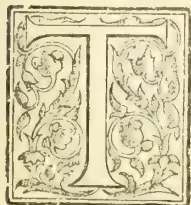

HE SUBJECT OF THIS NOTICE takes us to Ouvah—now spelt “Uva,” the principal town being Badulla—of which the surrounding mountains and valleys, hills and dales, villages and fields are amongst the most lovely and charming in this most beautiful land. I “surveyed” it all again only the other day after many years of absence, from the new Railway line, with all

the same surprise and delight that its first view afforded me now so very long ago. There stands Namunukula majestic and alone, with its many peaks pointing everlastingly to the skies, its flanking ridges far outspread, guarding the valleys and streams and slopes with which my feet were so familiar. These remain, but man does not. He flourishes for a day, seemingly the lord of it all, and then dies, and the place that knew him knows him no more for ever; but the everlasting hills still stand watching the mortal procession, and seem to laugh at man's ephemeral existence and transitory rule. *There* are the haunts of my early years; but where are the men with whom I lived and worked, and amongst whom my early lot was cast? Of them only one remains, and he is preening his wings for flight; and I who look in from afar sigh and think of the little churchyard under the shadow of that great hill where such a goodly company of my old neighbours sleep their last long sleep together. But let me for a brief space cause my old friend to live again in these lines, so that the reader may know the sort of man he was, the place he filled, and the *role* he played.

THOMAS WOOD,

the subject of this brief sketch, was for many years one of the most conspicuous figures in

403------------------------------------------------

378THE TROPICAL AGRICULTURIST.[DEC. 1, 1898.

the planting community of old Uva. His hospitality knew no bounds, and few, if any, of the many strangers who visited Badulla in those days, offered him the offence of not partaking of it. Not that he was singular in this respect; but few others held the prominent position he did, so conspicuous from the town, and but few others enjoyed the same wide reputation all over the country. His house was his castle, but its gates were ever open and inviting; and over its portals might have been inscribed: "Abandon dulness ye who enter here." Not his the ambition to be lord of many lands, the owner of many estates, though, had he so chosen, few could have followed him in his lead. He was content to be the master of what then was, and still is, the largest and most prominently placed estate in the district; and if he did not open other estates right and left, as he might well have done, he added a large new clearing every year to "Spring Valley," and so maintained his position as the manager of the largest estate in all Uva.

It is true that others had gone before Thomas Wood in pioneering the opening of the Namunukula lands for cultivation, prominent amongst whom we may name Sir William Reid, John Oliver, A. Bertlin, the Shands, Tench, Graham, Miller and E. C. Byers. Sir William Reid had opened the first clearings on Spring Valley, adjoining the far-reaching boundaries of which estate or not far away were Cannaverella, Gouravilla, Kottagodde and Wewelhena, about all that was opened in that immediate neighbourhood. Work had not been going on very long before the arrival of Mr. Wood—he was only two years after Mr. Byers—and if we consider the number of estates that soon after sprang into existence and the unceasing war waged by Mr. Wood with his famous writing "battery" upon the Government and officials as regards outlets, before the days of District Planters' Associations, we cannot deny him a place amongst Uva's pioneers. He took over charge of the

#### SPRING VALLEY

(Beddegamme) estate in the year 1847, and from that time he never left the country, (and only once left the district) till his death in 1880. Thus for over 33 years he lived continuously in Uva. While men of wider activities had played their parts and left, he remained and no other name is, or can be, more intimately associated with Badulla than that of Thomas Wood. His eccentricities indeed were many, and it is the object of this paper to slightly lift the veil as far as prudence and good taste permit in order to point the moral of his life.

Thomas Wood, Esq., of the Beddegamme, or Spring Valley Estate, Badulla, the subject of this memoir (known to his early contemporaries more familiarly as "Tom Wood," and to the younger generation of planters in the "fifties" and widely throughout the country as "old Wood") was for many years the most conspicuous figure in the planting community of "Uva," in those "days of old" which so few are left among us now to represent. If we except his contemporary, neighbour and friend, E. C. Byers (who still lingers hale, hearty and strong in the district), the changes of time and circumstance have removed from Uva almost all to whom Mr. Wood was personally known, though there are, doubtless, many remaining in Colombo and other places—veterans of the community, who still remember the

hospitality extended to them by Mr. Wood when visiting the remote district of Badulla in those now remote times. And as a boyish jocularity and a flow of soul and humour always accompanied this lavish hospitality, these reminiscences will doubtless all be of the most pleasurable nature, for Mr. Wood loved his joke and his pun, and the merry twinkle of his eyes and the ripple of his laughter were infectious; and, as he generally took care on such occasions to send for several of his neighbours, a social evening followed that was not readily forgotten. He was a "Ceylon Planter" of the best and truest type in the best days of planting, when

#### "COFFEE WAS KING"

and money was plentiful, easily earned and freely spent, and all alike were prosperous and content. In these days of low exchange, adversely affecting one part of the community, of dear rice limiting the coolies' earnings, of over-production and low value of the new staple, affecting all alike—it is hardly possible to realize the prosperity of those old times, and the good humour and high spirits which generally prevailed whenever planters met at home or abroad. A night with Wood or with Byers was indeed a time of enjoyment long to be remembered. But, alas! *tempora mutantur et nos mutamur in illis*—which remark of course refers only to those who remember the times I am now speaking of. A different spirit is now abroad, in which the new generation doubtless find their pleasure, not unmixed, perhaps, with sentiments of pity and contempt for those old times when tennis was unknown, and even cricket was seldom played, and "ladies" were few and far apart. But planters of the old school look coldly upon these things, and think lightly of them. In those old days men depended more upon themselves and upon one another for enjoyment, which sharpened their wits and gave them wider knowledge and perhaps a little more sense. Well, of those old times Wood was eminently a true type, and his memory is a standing monument. He was a gentleman, and the son of a gentleman, his father having been the sixth in succession of as many generations of Physicians in Edinburgh. His brother, the late eminent Doctor Andrew Wood, was the seventh, and his eldest son, who unhappily did not survive him, was, and would now have been, the eighth doctor of his family in succession. After what has already been said it will surprise many to learn that Thomas Wood was of a reserved, shy, and even taciturn nature, these qualities becoming apparent each under the varying circumstances that arose to influence him, especially when away from his own house and place, and towards his own family. "Why does Tom never write to me?" pathetically asked his old mother of the writer, to which question the only possible answer was an assurance that "it was simply his nature to be reserved" (though a fixed habit of procrastination in such matters had also much to do with it), and that "he was too brimful of goodness of heart and human kindness and sympathy to entertain any but the most loving sentiments towards his mother, which indeed I had often heard him express." From the day he left his father's house he became practically a severed branch. He first went out to

#### JAMAICA

where he was employed as a coffee planter for, I think, nearly ten years. I forget the name of the firm, but when they had extended

404------------------------------------------------

DEC. 1, 1898.]THE TROPICAL AGRICULTURIST.379

their operations to Ceylon he was sent here to assist Sir William Reid in forming that since famous property the "Spring Valley Estate," which soon became the undivided property of Mr. Bannatine of Glasgow. Here Wood reigned with absolute sway for nearly thirty years, adding to the estate a large clearing every year, till it became one of the largest in the country, as well as one of the finest and most productive, yielding its fortunate but wealthy absent owner a princely income. The time, however, came when old age and a plethora of wealth induced the owner to listen to the wiles of the charmer in the person of the company promoter, and to sell his fine property to Mr. John Brown and his co-adjutors for the sum of £40,000, and by that act the days of poor old Wood's glory came to an end and he was never the same man after. Did he retire with his well-earned fortune and independence, to spend the end of his days in his own country, and with his own people? Alas! no. That fact itself did not much trouble him, and he bore his happy and habitual manner to the last. He had acquired no fortune wherewith to retire; and this he knew and admitted to the writer who enjoyed his confidence, perhaps, more than any other person. Few men ever enjoyed better opportunities to become a wealthy proprietor, and few (Scotchmen though he was) ever threw such opportunities away, or cared less for them. To his assistants and the coolies he was a strict disciplinarian, and though he would not have a word of "shop" after 5 o'clock in the bungalow, it was not easy to get a smile out of him in the field between 6 a.m. and 4 p.m. The coolies' names were entered to even a quarter of a day's name, the check-roll being full of  $\frac{3}{4}$  and  $\frac{1}{2}$  day's names, and no mere straight strokes for full days, but an initial letter indicating the nature of the work done each day by each coolie. His stolidity, however, gave way one day when, on asking one of his assistants what the letter "O" stood for in his check-roll, he was gravely told "Ho! O for 'Oling, sir." We often had that joke trotted out afterwards. Then one whole day was set aside every month for all hands to make up the accounts and monthly reports, printed on loose sheets. This was never omitted, and once done they were stowed away in a large box under his own bed. Imagine my surprise when, years after, he confided to me that he had never rendered an account to the proprietor, but only wrote him long letters. When

MR. BANNATINE

informed Wood that the estate had been sold, he said:—"I hope you will not feel leaving the place very much. You have never rendered me any accounts; but I know that you are an honest man, and I have much pleasure in presenting you with 5 per cent on the selling price, viz., £2,000." Incredible as it may appear, however, he never applied for this donation, and never received it. What conclusion could the proprietor come to but that he had saved plenty and did not need it? But never was there a greater mistake. Wood had saved practically nothing. I do not believe that he ever drew the liberal salary to which he was entitled, year after year, during all the time he was in full charge. I believe he only paid his bills as they became due out of the money he drew for the estate,—that this did not nearly amount to his due, and that the proprietor unconsciously benefited by this extraordinary habit, and that the £2,000 would have gone but a short way to recoup Wood for all he had lost by his unaccountable action. "Procrastination," he admitted to me, had been the bane of his life,

much to my surprise, as I had always thought his character to have been the very reverse of this; but to this evil habit must, in some way, be attributed this mystery of his life, that is, in putting off bringing accounts and correspondence to a point, and in squaring up. His very principles of honesty and honor seemed to stand in his way; yet all whom he employed fared well, and were liberally and punctually paid. He only neglected himself.

If a man's biography is worth writing at all such truths as these are worth the telling, to point a moral as well as to adorn the tale. This unfortunate proclivity never left him. It had not for its foundation any desire to evade duty in any form, or to shirk work, for he was most conscientious, and his industry was remarkable. It was in his nature an idiosyncrasy better left to the physician than to the moralist to explain. Even when, in after years, he had become a Superintendent in the employment of a Colombo firm (again under an absent proprietor, though not directly so) he furnished no accounts until, after many months, Messrs. Geo. Steuart & Co. were instructed to demand them from the beginning, and, then, in due course, they were all forthcoming, correct to the smallest item. And in like manner, doubtless, the Spring Valley accounts could also have been produced, given the necessary time and labour. So, too, the accounts of an estate in which the writer and Mr. Wood were jointly interested, for a short time, were not forthcoming, and were never demanded, for I easily made up a retrospective "estimate," and was more than satisfied with the cost of the work done as represented by the money that had been drawn. Many a man in Ceylon has come to grief over his accounts, not exactly in the way followed by the subject of this memoir, but through an unconquerable hatred of the toil of keeping them up, day by day, and the periodical labour they entail. But "*it is work that must be done*" is the moral of this story; for Wood's experience on Spring Valley would certainly not occur many times in a generation; and, even as it was, what but ruin to him was the consequence?

But it must not be thought that this vice of procrastination as it would be considered by men of business, or weakness, as moralists would call it, since the greatest men have ever been the greatest workers, was perceptible in Mr. Wood's daily life. On the contrary, those who knew him best would have been the first to defend him from any such imputation, and but for his own admission it could not have been even suspected, much less ever known. It affected only one phase of his character and that the most private, for in his daily work and duties his restless activity had no bounds, and those subject to his control were permitted no respite during working hours. He never indulged in couches and easy chairs, and he did not smoke. For a man of his attainments he was not a great reader except of the daily and home papers, and I look back with surprise at the few books which adorned his bungalow. In his own bedroom, which I never knew anyone but the servant to enter, it may have been different, though I think not. But on the other hand he was a most industrious writer of letters of business and of war, and he kept a copy of all that he wrote in his "manifold-writer," which became a terror to all against whom he had cause of complaint. Indeed so often and so vigorously was his pen turned upon the public officials, including the Assistant Government Agent, ou

405------------------------------------------------

380THE TROPICAL AGRICULTURIST.[DEC. 1, 1898.

road and other matters, that it came to be familiarly known as

#### WOOD'S "BATTERY."

Well, in those old times there was one curious circumstance that seemed to be characteristic of all the old men of Uva, namely an aversion amounting to an obstinate refusal to leave their beloved district. Decade upon decade went by and still found them in their places, never having left them; while half the country had in turn visited them in their homes round about that grand old mountain Nainnukulakanda, that towers like some guardian angel over the sweet vale and town of Badulla. Without its lake Kandy itself would not be nearly so beautiful, nor can many places in the island be found to equal its calm repose and soothing charm. From a great height, on a spur close to the side of this noble mountain, Wood's bungalow looked down upon this scene, over a lovely foreground and middle distance of paddy-fields and native villages, and it too, could easily be discerned from the town. But, alas! for all human aspirations and intentions. In plotting out his bungalow and selecting the site Wood had projected a long façade whose whitened front should shine a conspicuous object in the view from the town, and be a standing invitation and guide to all strangers to visit it. Mighty stones were collected and the *long* foundation was laid, and then behind a room was built well to the right to serve for the kitchen. Into this room Wood went temporarily, and as time went on one room after another was added to this "kitchen" till it assumed the comfort and dimensions of the permanent abode which it became; and, doubtless, the foundation of the *projected* bungalow remains to this day, a mystery to the uninitiated, and a monument to Wood's intention, if not to his procrastination? But the time came at last when Wood was destined to be obliged to go on

#### A JOURNEY FROM BADULLA.

Mr. Bannatine, the proprietor, who had been content through all the past years to leave his property in Mr. Wood's sole care, thought he would like to see it before accepting the offer of the Company promoters, and actually arrived in Ceylon for that purpose. He got as far as Nuwara Eliya; but there either his courage or his strength failed him, and after travelling seven thousand miles he refused—on account of the bad roads—to go the remaining forty or fifty miles that still separated him from his splendid property. Poor Wood was much put out by this, and at first flatly refused to go up to Nuwara Eliya; but the proprietor was firm, and he went, only to be told that the contract to sell had been signed. In due course Wood handed over, and the place which had known him so long knew him not again. The proprietor could not have paid a large price for the land, in the first instance, and the estate itself paid for the yearly extensions. Even had he possessed nothing else it would have kept this rich man in affluence all his days, while the man who did the work during long years of expatriation got his bare living and nothing more. So do some men fare in this life.

Mr. Wood's religion hung lightly upon him, as not seldom it does upon those who have been trained too strictly in their youth. But the seeds that had been sown were there, the roots alive without any upper growth; for if Wood had any unreasonable prejudice it was against the parsons. But what he may be said to have lacked in outward show of religious observances he made up in his humanity, in the simplicity of his

character, the loving kindness of his heart, and in his sympathy for all suffering. Never had the coolies a truer friend or one more full of solicitude for them in all their troubles and ailments, and his care for them in sickness would put to shame the o-tentations, officious benevolence of these later times. He never did any man a wrong knowingly, and was always far readier to give than to receive. For long years he enjoyed robust and never-failing health, but a time came at last when this failed him, and he certainly did not make a good patient. He was impatient of bodily weakness, and to this was added the real fear of death, and a concern for his "soul." He did not hesitate to talk to me about his thoughts, and I fear I gave him inadequate consolation. But he recovered. On another occasion when he fell ill, the rumour spread that he was dead; and without waiting to hear confirmation of the report, the planters came into town to attend his funeral, for he was much respected by all. Imagine their surprise, to say nothing of his own, to see him appear in their midst almost as well as ever. And so their mourning was turned into joy, and a big feast followed.

As a planter Mr. Wood was not afraid of being singular, and of doing things not known to or approved by his neighbours. He was the father of "dibbling" in Ceylon, and after his time not many holes were cut in the rich Uva soil for planting coffee. He did not use the alavangas or spadefers, which afterwards became so universal, but long poles, eight or nine feet long, newly cut from the jungle, one or more coolies being told off to keep them sharp and serviceable with wette-katties. If any reader feels inclined to laugh at this, let me recommend him to try them first and he will probably laugh no longer, for many are the acres of coffee I have planted by these poles, and much of that coffee is lingering still and the last to succumb. I do not mean to say the poles had anything to do with that fact; but that the clearings were efficiently planted is thereby proved. Another bad of his was to plant all his roadsides up with guineagrass, and none in the ravines. With this grass he not only fed his cattle and horses, but thatched his lines and buildings also. Then, as there was a large new clearing every year, the whole of it was planted with Indian corn of which always a rich crop was harvested for horses, fowl and cattle. He always made his own castor-oil, too, and along roads where cattle passed, they were offered a good hedge of roses to eat instead of the coffee.

His servant was an old Portuguese man, the only one of the kind I have ever known. Anything approaching a smile was never known to light up John's face. Sometimes, after he had been with Mr. Wood for twenty years or more, his master would complain that this or that was cracked or broken. "Twas done before I came, sir" was the never-failing answer of John.

Mr. Wood, of course, had not left himself wholly without means. He had a sum invested to yield him a moderate income; and had, besides, a modest accumulation of interest in the hands of his friends at home, for while still young a wealthy relative had left him a small annuity. Instead of going home to England he was content to live on this income retired in the neighbourhood of Badulla, which locality it appears nothing could induce him to leave. He was found dead one day, on the roadside, having fallen from his horse; and now he lies at rest in the pretty graveyard under the shadow of his beloved mountain, and within sight of the estate so long associated with his name.

406------------------------------------------------

DEC. 1, 1898.]THE TROPICAL AGRICULTURIST.381

We had difficulty in getting any photograph of Thomas Wood and had at last to fall back on a rather faded portrait, taken with one of his "Sinna Durais", now a well-known planter, who writes as follows to us on seeing the collotype (which was with difficulty reproduced) and in reminiscence of his old superior:—

"The collotype is very good considering the poor picture the artist had to go by. The photo was taken early in 1866. Coffee planting in 1864, the year I was at Spring Valley, did not differ from later days. Only, on that estate. Wood followed the West Indian way, and planted Indian corn between the lines of young coffee. Watchmen were put on to guard it, when it began to ripen. There was some difficulty in finding a market for such a quantity, but in the famine year they scored, by issuing it to the coolies. I remember a gang of coolies were constantly employed in pulling stumps in the jungle—plants grown from monkey coffee. These were sent to Madulsuma which was then being opened. This may have been one cause of the origin of leaf-disease. The young coffee 2 to 3 years old on Spring Valley gave from 10 to 12 cwt. per acre."

### RUBBER:

#### SOME RECENT DEVELOPMENTS IN RUBBER-CULTIVATION.

During a trip of several months through the old rubber-producing regions of Central America and the northern states of South America, I found a great interest in rubber cultivation, and preparations were being made to start very considerable undertakings, particularly in the British West Indies, where the fact that rubber never has been indigenous to those islands is not considered in the enthusiasm of the people. On the island of Trinidad I found this enthusiasm increased to a substantial boom. Rubber seeds were selling at five cents each, and young trees were wanted at fifty cents, though owners were refusing to sell year-old trees about two feet high for less than a dollar a piece. It was reported that two English companies were about to begin operations in Trinidad and were proposing to invest a combined capital of \$5,000,000, while private enterprise would probably bring \$2,000,000 more to the island, making a total of \$7,000,000 prospective capital to be invested in that one locality. Other islands were becoming interested. In Grenada seeds were in demand, with the prospect that a very considerable acreage will be set out.

The most interesting point under discussion in relation to rubber-planting in the British West Indies is a series of experiments now being carried on in London and Trinidad, by which it is proposed to secure rubber from year-old trees of the *Castilloa elastica*. It has been found that seeds sown broadcast over a prepared field will yield an abundant crop of young trees, which at about a year old can be cut and sent to a factory where, with ordinary machinery operating a simple process, 8 per cent. of fine rubber can be extracted from the young shoots. This can be done in the laboratory. It is claimed that the process is a simple one, that but little machinery is necessary, and that in future the world's rubber supply will be secured from an annual crop of young trees sown on cultivated estates, and not from remote forests as at present. A series of

experiments has shown that the young tree contains about 8 per cent. of rubber, which would at present prices return an estimated profit of \$200 to \$400 per acre. The extraction of rubber from young shoots has been accomplished chemically in the laboratory, but whether it can be applied to the economic production of rubber on a large scale remains to be seen.

*Castilloa elastica* will grow almost anywhere, but it will yield a profitable flow of milk only under favourable conditions, and these conditions are dependent on the geological formations and topographical features surrounding the trees. To form an opinion in regard to these matters requires an economic geologist of some skill, and because of the fact the greatest losses will be made, for, as it is in mining and kindred enterprises requiring technical skill, uninformed people always considered themselves competent to judge and most of them will have no use for the trained observer. As rubber-trees will grow almost anywhere, and as the period of waiting before a crop can be expected is a long one, the successes that some will make afford an example on which to secure money and lose it to the profit of promoters and their associates who will claim to be thoroughly posted and to control lands that fulfill every requirement.

By forestry cultivation I mean the care of rubber trees in their natural forests, assisting nature to reproduce them; by husbandry I mean the cultivation of rubber-trees in plantations and an attempt to force them under conditions different from their natural surroundings.

Opinions in regard to suitable rubber lands vary to an unusual extent. This is because many observers have noted one species of rubber-producing tree and its special surroundings, but have never noted all the conditions common to the several species. In America rubber is mostly produced from *Castilloa elastica*, and several species of *Hevea*, each of which is found under quite distinctive surroundings. As a result, general opinions on rubber lands, are three times differently expressed. One man will feel assured that rubber to be successful must be planted on land that is inundated a few feet at least once a year; another will say that low ground near a wet swampy country is the only available locality; while still another will talk of the medium upland country as the most promising.

These are widely different opinions, yet each is correct. Some species of *Hevea* do best on low ground that is subject to slight annual floods. Other species of the tree thrive over low, rich woodlands just beyond the reach of floods. *Castilloa elastica* does well on the foot hills wherever there is a rich, clean soil and abundant water. It is also found in low, swampy ground, but amid such surroundings does not yield as fine rubber as in the healthier localities.

Rubber is taken from a number of trees and vines, but the species that I have noted yield the commercial supplies of America; of these *Castilloa elastica* is of the most interest to people who think of planting, because it does well on healthy ground where a man from the temperate regions can expect to live and see his trees develop.

The proper land should be clean, rich, and abundantly watered, with a good drainage. Such lands give the best returns. The trees grow abundantly on low unhealthy lands, but do not yield so good a quality of rubber, for which reason if one proposes to cultivate it is well to have the best, and on this much will depend, for it will have an important bearing on results. Of the two methods of cultivation that are being tried little has been done with forestry as yet, but the few experiments that have been almost universally successful and promise important developments for the future. Husbandry so far has not been a great success, and in many places rubber-trees have been carefully planted and tended for a long term of years but have not given any returns, though it is claimed that some of the trees are twenty to forty years old,

407------------------------------------------------

382THE TROPICAL AGRICULTURIST.[DEC. 1, 1898.

The claims in favor of husbandry are that a great number of trees can be planted on one acre, and that all are within easy reach, while better returns can be expected from cultivation than from the natural conditions of the forest. It must be borne in mind, however, that *Castilloa elastica* is a tree of the shade, and that the flow of sap, and not beautiful proportions or an abundant yield of fruit is the object sought. Another important point is that the tree has a comparatively tender bark in the shady woods, which in an open cultivation becomes much heavier as a protection against the sun and dry air at the expense of the flow of sap, and the provisions of nature which permit the tree to grow anywhere defeat the objects of the planter and makes rubber-cultivation a doubtful undertaking. Hence in many cases the thousands of dollars that are being invested in such enterprises will be the source of grievous disappointment. On the other hand, a careful selection of a run of forest property where rubber-trees reproduce themselves naturally, must yield returns that will surprise even the most sanguine expectations.

*Castilloa elastica* reproduces itself freely. It has been compared to the pine—a slow-growing tree which does not propagate itself rapidly. It should, however, be compared with the chestnut of our northern forests. If a stretch of well-situated land were allowed to grow up wild here at the north, it is certain there would be a fair proportion of chestnut-trees that would probably come up on the property. If, besides these natural results one or two camps were established on the place and a few men were kept working about through the woods planting chestnuts and looking after the trees, it is certain that the care and attention would result in a heavy percentage in favor of the planter. Similar results can be expected in the tropical forest, using the same methods but substituting the care of rubber-trees for the chestnut-trees that I have taken as an illustration.

I have noted strong evidence in the tropical forests that rubber-trees will reproduce themselves whenever the locality is naturally adapted to such reproduction, and with a little care such as could be given by three to ten men according to the size of the property taken in hand the results will be beyond the most sanguine expectations. The great question is to secure a good run of healthy forest land in a suitable location. This being done, but little more is required. A few ordinary laboring-men and the investment of a small amount each year will after a time return thousands annually. In the forests the rubber-tree can be relied on to produce an abundant flow of sap. In open cultivation it must protect itself from the sun and dry air, and the results are doubtful, though some well-situated plantations will certainly yield bountifully. Another important point is that forest land is cheap in most rubber countries, and it is no object to secure a maximum yield from a given amount of land. The object should be a minimum cost of production without regard to the amount of land employed.

After having travelled through all the desirable rubber regions in Central America and northern South America, I am satisfied that suitable tropical forests which can now be had at a low price—often for a few cents an acre—present an opportunity for the profitable employment of capital such as has seldom been offered in the world's history, but the serious point is to secure the proper land. Those who acquire it will have more than they expect, but natural rubber lands are not to be had by simply making a chance location. Though the tree will grow almost anywhere, it is only the most favored spots that will yield those spontaneous returns that are so very profitable. It is fair to state that if people go to taking up tropical forests promiscuously ten will be disappointed to every one who secures a prize.—*Indianrubber World*.

## NOTES ON COFFEE IN AND FOR CENTRAL AFRICA.

Now that the sale of Shire Highland Coffee has closed in the London Markets for the season, several inquiries have been received regarding it. One is: "How do you account for the superior flavour and delicate colouring of the first class samples of coffee sent from the Shire Highlands?" I have no hesitation in answering that this is due to the purity of the water used in pulping and preparing, and to the careful personal supervision of European planters from the gathering of the berries to the packing of the coffee for exportation.

It is not merely a matter of soil. No soil could be better fitted for the growth of coffee in perfection than that of Guatemala, Bolivia, Colombia, or Brazil; but in neither of those countries have you a water supply of such genuine purity as that of the Shire Highlands. Take for instance the three great coffee estates at Zomba, viz, Messrs. Buchanan Brothers, at Mlungusi; Messrs. Hynde & Stark of Singers and Messrs. Sharrer & Co. of Chemlumbes. The rivers that run through these estates take their rise in Mount Zomba, and there are no native dwellings in the basins to taint the water. The pulping is done on the banks of these rivers, and the water in the mill race is so clear and pure that Europeans drink it without filtering. The same may be said of the Mlanje water supply. Nothing could be more perfect. If possible, it is even better than the supply on the Zomba estates, while at Cholo and Namasi the water supply is equally good. This fact should be made widely known, as it gives confidence to the consumer to know that the very purest water has been used in pulping the coffee.

Another matter of great importance is the personal supervision of the European owner. In the Shire Highlands the owner has generally only a small estate, and is always present to see that everything in connection with the coffee is scrupulously clean. In Brazil and other countries, on the contrary, we are told that the owner seldom if ever visits the coffee estate—his business being principally in connection with the rate of exchange and the current prices in the London market. The home consumer can hardly form an idea of the extent to which planters in this country carry their supervision. A personal visit to the estates at pulping time could alone convince them of the efforts made to perform all the processes with perfect cleanliness. Not only in the pulping, but in the curing and drying on the bamboo benches, the packing and sorting,—in fact everything connected with it. Under these circumstances it is not surprising to hear that many English families buy Shire Highland coffee in preference to all others.

**BOLIVIA.**—Next to the Shire Highlands, it is said that the best coffee in the world is grown in the province of Yungas, which is situated to the north-east of La Paz. The quantity however is inconsiderable, being hardly more than sufficient for the planters' own wants.

**GUATEMALA.**—The coffee industry has long been established in Guatemala, and last season's export totalled 68,773,633 lbs, of which about half was sent to market in husk. Every country in Europe got some of this crop, with the exception of Spain, but then Spain has coffee growing colonies of her own, or instance, Porto Rico, and she gets the bulk of her requirements from them. Britain might do well to follow her example and patronise her own young colonies a little more than she does, especially as Britain goes to heavy expense in lives and money to bring some of them into existence and maintain them till they are self-supporting. According to the reports issued by the Foreign Office, England figures as a buyer in all the coffee markets of the world.

**LOANDA.**—Planters are said to be extending their coffee plantations, but the great fall in the European markets has been very discouraging to them. The larger part of the coffee brought in is grown by natives.

**MEXICO.**—The planters around Vera Cruz gather their crop between December and April, but then

408------------------------------------------------

DEC. 1, 1898.]THE TROPICAL AGRICULTURIST.383

it must be remembered that they are distant from British Central Africa from 30 degrees of latitude. Last season's out-put amounted to 11,463 tons valued at £310,330.

In many localities the trees are attacked by an insect of the genus "dactylopius" known in some parts as the "mealy bug," which does not seem to have raised much alarm amongst planters. In some places the diseased trees are simply cut down and replaced by others, while a few planters destroy the insect by syringing with petroleum and soap. It seems that this disease is worst in wet seasons and has been known to cause considerable local loss. It spreads from tree to tree, and threatens, if neglected, to become some day a matter for serious consideration.

**BRAZIL.**—The coffee production of Brazil would require a separate notice. I can only mention here that the total output for last season was 7,330,806 bags, *i.e.* including both Rio and Santos. There is a general complaint from Rio of the fall in prices. The farmers have gone in for coffee cultivation alone, and their output is so enormous that they have affected the universal rate. They still realise 80 per cent on the cost of production, and if this return is not adequate to the requirements of the planters, the cause must be found in the maladministration of the estates, few of which are personally superintended by their owners. It has been argued that the recent low prices will eventually be a blessing rather than a misfortune, inasmuch as the greater cheapness of coffee, by bringing it within the purchasing power of even the poorest classes, will tend to make it an article of general consumption, by which the demand will be extensively and permanently increased.

There is one thing we might learn from the lesson of Brazil, viz, that coffee planters should not go in for the exclusive cultivation of any one crop. By so doing the supply is increased, and this has a tendency to lower the price, the demand remaining the same; whereas the advent of disease would be utter ruin to many. Further, you become dependent on the outside world for almost everything else. For instance, we import tobacco into British Central Africa, although British Central Africa is the natural home of the Tobacco plant and could grow enough tobacco to supply half Europe. The same could be said of sugar, wheat, and many other crops.

**HONOLULU.**—The amount of coffee exported is falling off, and last season's output very little exceeded 120,000 lbs.

**SAMOA.**—A new coffee Company has just leased some of the best coffee land in Samoa, but it is feared that the clearing, and keeping clear, will prove too costly.

**PORTO RICO.**—The value of last season's crop amounted to £2,382,608. Of the total export Spain took 5,568 tons.

**MEXICO.**—The sudden development of the Coffee industry in Mexico is ascribable to the coincidence of the increase in the price of coffee in the United States with the decrease in the cost of labour in Mexico, consequent on the depreciation of the silver dollar which called the attention of investors to the large profits to be made by its cultivation. The export for last season was 334,059 cwts, valued in the returns at £4:3:9 per cwt. Nine-tenths of the whole export went to the United States.

**MARTINIQUE.**—I have received nothing later than the report for 1896. The export then was 3,124 kilos, just the same as on several previous occasions. The "Liberian" and "Mocha" are extensively cultivated.

**PERU.**—Reports from Callao state that the cultivation of coffee is on the increase there, and that it bids to become one of Peru's staple articles. The latest figures available show that the export for 1896 was about 1,066 tons.

**PANAMA.**—The coffee exported during 1896 was valued at £987,192. Growers felt a certain degree of uneasiness on account of the depression in prices which has been experienced since the early part of last year. This depression is attributed to the enormous amount of coffee exported from the Brazils.

**COLOMBIA.**—The estimated export of coffee last season was just under 37,000 tons. This is a vast yield of coffee and considering the distance of the estates from the sea, some 800 miles from the seaport Savanilla, credit is due to the enterprising planters.

The River Magdalena, with several of its tributaries, afford to a large extent the means of transport to Honda. The produce is carried by mules from the mountain slopes to the river, thence in rafts down the current to Honda, from 3 to 5 days' journey. From Honda, whence also is shipped the produce from the great coffee-growing province of Cundinamarca, the coffee is conveyed by steamers, and two short railway routes, to the sea—600 miles. Independently of the Upper Magdalena and its tributaries, many thousands of mule-loads of coffee are annually brought to Honda, partly from Tolima, but chiefly from Cundinamarca, thus from 3 to 5 days' journey to Honda only. The cost of transport from the plantation to the coast amounts in English money from £9. 6s. 8d. to £14. per ton, a very heavy item. In this connection it may also be mentioned that from several of the large growing coffee provinces of the Republic the cost of transport is still higher.

Notwithstanding the great difficulties appertaining to distance from the sea, and the consequent cost of transport, the Tolima planters are quite able to compete with planters in far more favourably situated countries, which are in a position to transport coffee to their seaports at a comparatively trifling cost. Magnificent land abounds on the colossal Andes most admirably adapted for the cultivation. Well cultivated plantations on these Cordilleras are unsurpassed by those of any other country, and this observation applies not only to the quality of the produce, but also to the quantity. Land is obtainable, in general, at a nominal cost; and it is available to a large extent though, it may be mentioned, in the adjoining department of Cundinamarca, where great enthusiasm prevails relative to coffee cultivation, and where it is being much more extensively planted than in Tolima, the price of the more conveniently located sites for plantations has augmented very materially; indeed, as much as 40 and 50 dol. (paper currency), says £2. 13s., to £3. 7s., at exchange now ruling of 15 dol. to £1. per hectare (2½ acres) is now paid.

The extension of this cultivation in Tolima, and this applies to the whole country, is in general confined to districts accessible to settlements or villages. More remotely removed from populated districts widely extending mountain slopes, eminently fitted for coffee, remain in a state of nature. It may also be noted that the quality of the labour itself is satisfactory, for it is on the whole industrious and intelligent 80 c. (about 1s.) per day Colombian currency, are the average wages for peons, and for women about 50 c. (about 8d.).

As regards the productive capabilities of these Cordilleras, coupled with the labour resources, *i.e.* where it is sufficiently abundant it may be stated that the cost of coffee production at the plantation ranges from 30 to 35 dol. per mule-load of 250 lb., or from 12 to 14 dol., Colombian currency, per 100 lb. With the rate of exchange which has prevailed during several years (1 dol. ruling rather less than 2s.), this shows that planters are acquiring enormous profits. With money at par the nominal cost of production would be about the same, although in reality the price measured in gold would have much more than doubled. It should, therefore, be remembered that the depreciation of Colombian currency must be attributed in a great measure to the rapid expansion of the coffee industry. At the same time exceptionally high prices for the article have ruled during recent years, a result partly due to the abolition of slavery, in coffee-growing countries, and partly to the revolutionary movements in Brazil, where coffee is grown on a gigantic scale. Now that coffee has become a stable industry of Colombia there can be no doubt that the country is able to maintain a prominent position among all rivals.

409------------------------------------------------

384THE TROPICAL AGRICULTURIST.[DEC. 1, 1898.

**METHOD OF PLANTING.**—The number of coffee trees planted per hectare ( $2\frac{1}{2}$  acres) in Colombia averages about 1,500. The general average yield per tree per annum on well-kept plantations is  $1\frac{1}{2}$  lb., or 2,250 lb. per hectare—900 lb. per acre. On many other plantations the average yearly crop does not exceed 1 lb. per tree—600 lb. per acre. Thus the number of trees planted per acre in this country strikingly contrasts with the number planted in British Colonies, where twice as many are planted per acre, notwithstanding heavier crops are secured in Colombia. In the palmy days coffee cultivation in Ceylon the average was 5 cwt. per acre.

**SHADE.**—One of the chief elements of success appertaining to this cultivation in Colombia must be assigned to the systematic inter-planting of shade-trees with the coffee. At altitudes ranging from 3,000 to 5,000 feet more densely-foliaged shade-trees are employed than is the case at plantations between 5,000 and 6,000 feet, where a slender shade is afforded by a species of *Cassia*. The shade-trees utilised at plantations situated between 3,000 and 5,000 feet are a species of *Erythrina*, and another leguminous tree, a species of *Inga*, which latter is becoming very generally adopted by planters. Some people strongly recommend this *Inga* for adoption by British colonial coffee planters, as it is most admirably adopted for the purpose. It grows rapidly, and the large compound leaves fall abundantly at the season in which the plantation requires the least degree of shade, whilst the abundance of fallen leaves from this tree check in a very marked manner the irrepressible growth of weeds. Moreover the general result of the beneficial influence of this congenial shade reduces to a minimum all cultural expenses; indeed, it may be safely computed that the good offices of this tree curtail the cost of actual cultivation to the extent of some 50 per cent. as compared with coffee devoid of shade. It is a remarkable fact that British colonial coffee planters have in the main ignored the application of shade to the coffee tree. Without shade the tree certainly flourishes, but its full exposure to the sun, at any rate as the sun is wont to shine here, is detrimental in the long run to its most congenial state of productiveness. However, near the upper limit of the cultivation, namely from 5,000 to 6,000 feet, shade is not to be recommended.

From the foregoing it will be seen that Colombia is making rapid strides in coffee cultivation and the strides are so remarkable that it already produces about two-thirds as much coffee as all British Colonies and possessions combined.

On the whole, after a careful consideration of the coffee production of the world, one comes to the conclusion that there is a downward tendency in prices, and that the quantity thrown on the market is very considerably increased from year to year. There is no means of finding out whether the number of consumers increases in the same ratio, because the humble customers of retail dealers are beyond the scope of Government returns. It is clear, however, that there is either an increase in the number of consumers or that the consumers use more than they formerly did,—both amounting to the same thing, viz, the absorption of the quantity produced.

The fall in price however refers to the medium qualities, and cannot affect the coffee planters of the Shire Highlands whose aim is to produce the very best of coffee.—*British Centra Africa Gazette*.

**ONE WAY TO ADVERTISE TEA.**—The United Kingdom Tea Company (Limited) thus place their wares before the British public:—

The Revolutionizers of the Tea Trade. Tea Merchants to H.R.H. the Prince of Wales. Tea Merchants to the House of Commons. Tea Merchants to upwards of 1,000 Hotels. Superb Tea! Direct from the Growers. The best that money can buy. At prices effecting an immense saving. Write for samples.

## GUATEMALA COFFEE.

A report on the trade and finance of Guatemala, by Mr. Consul C.H.M. Trayner, received at the British Foreign Office in June, and partly printed in the *London Grocer*, states that the year 1897 was an unsatisfactory one in Guatemala from a commercial point of view. The export of coffee—the sole form of wealth which the country possesses—did indeed increase, but the price obtained abroad had diminished in a much greater degree, and although something like 130,000 quintals more were exported, the receipts were less by about \$4,000,000 gold than during the preceding year. The tropical situation of the country, the proximity of every portion to the sea on both coasts, the diversity of altitude and consequently of temperature combine to make the agricultural capabilities of Guatemala equal to any in the world. Every kind of crop, from those of the tropical coast regions to those of the cold highlands (the latter having a climate corresponding with that of Northern Europe in summer), may be raised. There are districts where even four crops of maize are obtained in one year. At the present time the cultivation of coffee absorbs the attention of almost all the landowners, for until the past year the high price at which Guatemala coffee was quoted abroad, stimulated the planting of many large coffee plantations. The principal districts of the coffee-growing industry are found in the departments of Quezaltenango, San Marcos, Chimaltenango, Santa Rosa, Retalhulen, Escuintla, Zacapa and Alta Vera Paz. The conditions essential for the growth of coffee are, in this latitude, an altitude of from 2,600 feet to 4,500 feet above the sea level, a considerable depth of vegetable soil and a clay sub-soil. Lands of this description are found in almost every department of the Republic. The coffee tree is easily cultivated. The young trees are planted in little pits about fifty centims. deep, and at a distance of about 15 metres from each other. Every three months the plantation needs thinning out, and the first harvest is obtained the third or fourth year after planting the trees. The cost of a coffee plantation and the profits which it yields are not easy to state accurately, and are estimated very differently by different persons. There has not been much change in the cost of raising coffee or its yields in the last twenty years. On March 21 of this year (1898) a petition on behalf of the coffee planters was presented to the National Assembly asking that the export dues on this product (about \$3,65c per quintal) be abolished, pointing out that the low price of coffee now current abroad makes it impossible to compete with Brazilian and other foreign coffee, and that as the contract assigning a certain portion of this tax to the Northern Railroad lapses in May, neither government nor railroad would lose by such a measure, as it had practically been determined to sell the concession for the new part of the railroad, along with the part already built to foreign contractors. The result has been that a decree has recently been issued lowering the export tax on coffee to \$1 silver per quintal.—*American Grocer*.

A "CORNER" IN FRUIT.—Whence comes all the fruit now meeting with so ready a sale in London streets, and at so cheap a rate? Every urchin with a half-penny or a penny to spare can regale himself with wholesome fruit from the Continent, Spain, America, or from English Orchards. There is just now a little "corner" in the Farringdon Road, between the Metropolitan Railway-station and the Corporation Fruit and Fish Market, where Covent Garden is represented in miniature. It is a great place for youngsters. Plums sell here at from 1*sd.* to 4*d.* per lb., Pears at 1*d.* to 4*d.*, Apples 1*d.* to 3*d.*, Oranges at two for 1*½d.*, English Grapes may be had from 8*d.* per lb., and foreign Grapes from 3*d.* to 6*d.* per lb.; Bananas meet a ready sale at 1*d.* each, or seven for 6*d.*; fine Damsons are sold from 2*d.* per lb. If some vegetables are scarce or dear, there is an abundance of wholesome fruit.—*Gardeners' Chronicle*.

410------------------------------------------------

D :THE TROPICAL AGRICULTURIST.385PLANTING IN NORTHERN DISTRICTS:

KNUCKLES, &c.

CACAO—FREE RICE—WEATHER AND COOLIES—

PLUMBAGO—ROADS—LANTANA BUG—

SANITARY REFORM.

(Communicated.)

Cacao is a thing that few people like to speak much of. If you press for information, "Well, there is not much disease about here," is what you are told, and are asked "Have you seen it in Dumbara?" You meet another fellow and you pose him with the question: "Have you seen the cacao in Dumbara?" "Oh! that's the result of the drought" says he—high and mighty—and later on, in the same keen pursuit of knowledge, you try a second man with how the drought has killed out the cacao in Dumbara, and he evidently regards you as a kind of idiot. "Drought!" he exclaims. Then putting his hand to his mouth, he says in a mysterious stage whisper,—"It's something—echo!" And the Government is doing what? But is the latter more supine than the planters themselves? Only a few here and there make a stir; the rest sit still. All the same the existence of cacao is threatened and the whole enterprise is at hazard. There is a cape to be doubled, and with dirty weather about, the man who is most likely to succeed in rounding it, Carruthers, is sent about his business at the critical time! "What a world we live in!"

It is quite as bad with the case for "Free Rice." The apathy about, regarding this subject, is simply amazing. People *won't* put themselves to the trouble to understand it and with the clear and able expositions which have appeared in the leader and other columns of the *Observer*, ignorance now is inexcusable. If you tell them how much they themselves pay, then, there is a flare up. You want a lot of that and there will be the blaze by-and-bye. Meanwhile, that big soulless stolid thing—the Government—has got to be made to move. "Dah, dah!" you keep crying, and probe it up with another leader, pointed with the unanswerable figures and facts; but it is a weary business. Let the cry of "help for the poor" fill the land, and even our authorities will feel ashamed of themselves in time—anyhow it will reach sympathetic ears at home and also willing hearts. Your constant hammer-and-tongs style is just the thing that is wanted. "The *Observer* keeps harping on the one string," is what is said. Exactly; and therein lies its wisdom, Mr. Editor. You remember what John Morley says in his "Life of Cobden":—"A political or religious agitator must not be afraid of incessant repetition. Repetition is his most effective instrument. The fastidiousness which is proper to literature, and which makes a man dread to say the same thing twice, is in the field of propagandism mere impotency." Why, oh! why, did John Morley forsake letters for politics?

If the Knuckles have been dry this year, it is not dry there now. It rains pretty steadily, and blows vigorously, like the burst of the S.W. rather than its going out. The result is that flush has retired, and the drooping returns, which in August and September were looking up a bit, are back to where they were. Only on manured and lately pruned tea, are any decent flushes to be got; the rest is looking about

for a sun which never shines now, and will dance to no measure till it appears. The coolies are not hard worked—too many of them. There was short time during the drought which lasted so long, and to have short time now that the rain has come, is a little like having your disadvantages pressed down and overflowing—"rubbed in" in fact. Ramasami is not the only one who has been subjected to this style of massage. It seems, however, to have had a fine humbling effect upon him, and his old cry, when his wishes for more advances were disregarded, of "Give me my tundu," has died wholly out of the land. If you want now to tame the wildest Tamil on the estate, you have only got to touch him up with the *threat* of a "tundu"—to write one out!—then your office is besieged with pleaders, who can't say enough about the temerity and folly of the man who in those days lets a "tundu" see the light. The whirl-gig of time does bring round some strange revenges! [But are these coolies likely to return to Ceylon once they get to the Coast?—Ed. T.A.]

The hunt for PLUMBAGO, which has been stimulated by the late high prices, is hot all about; and I did hear of one planter who had struck a vein, which may yield a lot yet. Mining is generally classed among the most speculative of pursuits, but tropical agriculture takes a lot to beat it. A fellow who has the two combined need not complain of existence being hum-drum! If the tide is running in, he may soon be floated on to fortune; but if it begins to turn, it may be "a tide as moving seems asleep," but it is dead certain to keep *him* lively anyhow, and would not take long about it either.

It is a comfort to know that the KNUCKLES ROAD is now very much better than it was and when the repairs in progress are completed it will be, while driving over it, like a glimpse of "the days of old."

The lantana bug is making its way about in quite a pronounced way: I saw it as far up the road as Panwila. It may have no heritage of bother for the planter, but—I don't like the look of it. For a bug, it has in a very short time taken quite a position in the landscape—come to stay evidently. It resembles the American pill that did not fool around, but went straight to business. I hope it will mind its own business and leave the planters alone.

These are great days of SANITARY REFORM, and the doctors, when they want to be down on a bad spot, emphasize their opinions by signing themselves as the holders of this or that sanitary diploma. Everybody is on the *qui vive*, and it would seem as if officialdom were bitten to make other folks clean up. You remember the old days, when estate lines were condemned freely which might have posed as models for those owned by the Government. This sort of thing still obtains—evidently. Witness the sanitary condition of the Wattegama Resthouse. I knew it in the days of old; they say it is not improved and complaints have gone in to Government, that it is too bad for anything. And yet nothing has been done to remedy it. The story further goes that a prominent official went out to see what all the noise was about. Placing his hand on the shoulder of the Resthouse-keeper, "Francis," said this wiseacre, "you know the planters will complain."

I don't know how much there is in the above, but it is what one hears said, and *per se* is not incredible.

47

411------------------------------------------------

386THE TROPICAL AGRICULTURIST.[DEC. 1, 1898.]

### ON THE TEA CRISIS AND HOW TO MEET IT.

We are in receipt of the following interesting and practical expression of opinion from a well-known member of the planting community:—

Just now I think we are on the verge of a serious crisis, owing to the London buyers' combination—for I believe it to be nothing else,—which is now keeping down the price of our teas. They need not have lowered the prices as they have done. It is our business now to do all we can to find other markets, and thus lessen the quantity for them to handle. Every planter ought to do his utmost in this direction and the time may come when the tea-grower will reap a fair share of the profits with the others who handle it before it reaches the consumer. I think the question how can we best push our teas into new countries of far more importance to us planters than the reduction of the duty on rice. Take this estate, say I get 5,000 bushels of rice a year plus 15c half duty=R750. Take my crop 220,000 lb. tea; if by opening new markets London prices go up one cent per lb.=R2,200. The benefit being to the estate and the coolies will share, whereas the consumer ought to get the benefit of the reduction of the rice duty in the first instance. Remember I am quite with you that the rice tax should be reduced if it cannot be abolished; but there is at least this one thing of far more importance to us at the present time which I should like to see you take up with as much zeal as you show in the matter of the Rice Duty.

We are in entire sympathy with the views above expressed and more particularly because they, in reality, do not clash with those we hold in reference to the Rice Duty as the one above all other local levies calling for attention, first, on account of its manifest injustice, and secondly, because it is the only tax whose reduction and removal would benefit colonists and natives alike. It is impossible to say that the interest of planters in this matter is not identical with that of their coolies or that all classes of employees are not benefitted by remission of taxation which betters the condition of the labouring classes.

At the same time, we quite see the force of the argument of our correspondent about the great benefit to the tea industry from the campaign to push the sale of our teas in new countries being energetically advanced. This is a matter the planters have in their own hands through their representative Committee; and we believe there is no lack of funds; but it does seem a pity that the "cess" should be taken for anything but "the campaign" for which it was specially started. In a year when the Government are likely to have a surplus of a million of rupees—following on one of R2,500,000—it surely would not be too much to expect the necessary outlay for Mr. Kelway's labor's investigation and the Coolgardie Exhibition to come out of such surplus. Had this been done there would have been well nigh R23,000 more to spend in pushing our teas on the European Continent, and in Russia and Germany more especially.

"THE AGRICULTURAL MAGAZINE," COLOMBO.—Oct., 1898. Contents:—Season Reports for August; Rain-fall taken at the School of Agriculture during the month of August, 1898; Kikuna Oil; Occasional Notes; The Plantain Tree and its Products; Citronella Oil; The Cultivation of Chillies; The Analysis of Soil as a Guide to its Fertility; The Uses of Wood; A Disease of the Plantain Tree; How India has Saved Her Forests; Cattle and their Management in the Interior.

### CASTOR OIL MANUFACTURE.

The seeds are first cleansed from dust and fragments of the capsules, and submitted to a gentle heat, not greater than can be borne by the hand, which is intended to make the oil more fluid and more easily expressed. A whitish fluid is thus obtained, which is boiled with a large quantity of water, and all impurities are skinned off as they rise to the surface; the water dissolves the mucilage and starch and the albumen is coagulated by the heat, thus forming a layer between the oil and the water: the clear oil is then removed and boiled with a small quantity of water until aqueous vapour ceases to rise, and a small quantity taken out in a phial remains perfectly transparent and cool. The effect of this is to clarify the oil and rid it of volatile acid matter. Care is necessary not to carry the heat too far, as the oil would acquire a brownish colour and an acid taste. In India the seed is first shelled and then crushed between rollers placed in hempen clothes, and pressed. The oil is afterwards heated with water in a tin boiler until the water boils. This serves to separate the mucilage and albumen, the product being then strained through flannel and put into canisters. Any oily-press would suffice for extracting oil for ordinary purposes, and by decantation and some process of filtration it would be purified.

The use of castor oil as a lubricant for the cylinders of locomotives and other steam-driven engines ensures a market for the product if the quantity is equal to the imported article. For use medicinally the oil is cold drawn, and is only fitted for a medicine in that form.

The plant itself is easily cultivated, it requires little care, is hardy, and is said to enhance the value of the land on which it has been grown. It is said that locustus are killed by eating the leaves, and this is quoted as a reason for planting the shrub around paddocks and cultivated land in districts infested by locustus. Cattle should be kept from the plant, as in times of scarcity the green leaves might prove tempting to them, and the effect would probably be that the animals would be seriously affected, if not actually killed. Judging by the reported luxuriance with which the plant grows in the Esperance district, the extraction of the oil should be profitable industry. Queensland Agricultural Journal.

### PLANTING NOTES.

BRAZIL COFFEE NOTES.—There is much complaint of drought in the state of Rio de Janeiro. In many localities the food crops are a total failure. Many coffee trees have died and others have suffered so much that they will not bear next year.—Rio News, Sept. 6.

THE "QUEENSLAND AGRICULTURE JOURNAL," issued by direction of the Hon. the Secretary for Agriculture. Edited by A. J. Boyd, F.R.G.S.Q., Vol. III; Part 8, for September, has for contents:—Agriculture; Dairying; Poultry; The Orchard; Viticulture; Botany; Economic Botany; Apiculture; Horticulture; Tropical Industries; Gutta-percha—Its History, Rubber Cultivation in Australia, Indiarubber and Other Produce, Coffee at Boderin Mountain, Coffee-picking in Queensland, Coffee in British Central Africa, Liberian Coffee and Insect Pests, Coffee Notes, and Growing and Separation of Fiber, North Queensland; Science; Animal Pathology; Tick Fever; Pisciculture; and General Notes.

TEA BLIGHTS.—We some time ago called the attention of our tea planters to the "Grey and Blister Blights" of Assam and to the need of being on the watch for diseased leaves and burning them as well as prunings. Messrs. Wills and Carruthers are likely very soon to emphasize this counsel, in more detail; but it is satisfactory to know that both authorities do not think much of what they have seen of any fungus on tea in Ceylon so far.

412------------------------------------------------

DEC. 1, 1898.]THE TROPICAL AGRICULTURIST.387

CONSOLIDATED ESTATES COM-  
PANY, LIMITED.

SEVENTH ANNUAL REPORT.

Authorised Capital £100,000; Dividend into 5,000 Preferred Shares of £10 each entitled to a Cumulative Preferential Dividend of 8 per cent, £50,000; 5,000 Ordinary Shares of £10 each, £50,000—total £100,000.

Seventh Annual Report of the General Managers, to be submitted to the Shareholders at the General Meeting, to be held at 34, Great St. Helens, E.C., on Wednesday, the 5th October.

The General Managers have the pleasure to submit their Seventh Annual Report and Balance Sheet together with Statement of Accounts for the Crop Year ending 30th June 1898.

The Profit and Loss Account shows a balance (including £598 3s 3d brought forward from last year) of £4,070 4s 0d, after paying Interest on the Debentures and an Interim Dividend of 4 per cent on the Preferred Shares.

To this sum the General Managers propose to add £250 taken from the Reserve Fund, making a total of £4,320 4s, and to appropriate that amount as follows, viz:—

<table>
<tbody>
<tr>
<td>To pay a Balance Dividend of 4 per cent on the Preferred Shares, making 8 per cent for the whole year which will absorb</td>
<td>£.</td>
<td>s.</td>
<td>d.</td>
</tr>
<tr>
<td>... ..</td>
<td>1,200</td>
<td>0</td>
<td>0</td>
</tr>
<tr>
<td>To pay a Dividend of 4 per cent on the New Preferred Shares requiring</td>
<td>280</td>
<td>0</td>
<td>0</td>
</tr>
<tr>
<td>* To set aside for redemption of 5 per cent of the Debentures at 103</td>
<td>2,000</td>
<td>0</td>
<td>0</td>
</tr>
<tr>
<td>To pay a Dividend of 2 per cent on the Old Ordinary Shares, requiring</td>
<td>640</td>
<td>0</td>
<td>0</td>
</tr>
<tr>
<td>To pay a Dividend of 1 per cent on the New Ordinary Shares, requiring</td>
<td>70</td>
<td>0</td>
<td>0</td>
</tr>
<tr>
<td>Carrying forward the Balance, viz:—</td>
<td>70</td>
<td>4</td>
<td>0</td>
</tr>
<tr>
<td></td>
<td>£4,320</td>
<td>4</td>
<td>0</td>
</tr>
</tbody>
</table>

\* By the Articles of Association it is provided that five per cent of the Debentures must be redeemed before any Dividend can be paid on the Ordinary Shares.

The following shows the result of the year's working, viz:—

<table>
<thead>
<tr>
<th colspan="4">NET PROCEEDS OF CROP.</th>
</tr>
<tr>
<th></th>
<th>£</th>
<th>s.</th>
<th>d.</th>
</tr>
</thead>
<tbody>
<tr>
<td>1,250,823 lb. Tea at an average net price of about 6½d. per lb. realized</td>
<td>32,482</td>
<td>15</td>
<td>10</td>
</tr>
<tr>
<td>Cocoa and Cardamoms</td>
<td>905</td>
<td>7</td>
<td>2</td>
</tr>
<tr>
<td>Interest on Account</td>
<td>86</td>
<td>9</td>
<td>0</td>
</tr>
<tr>
<td></td>
<td>33,474</td>
<td>12</td>
<td>0</td>
</tr>
</tbody>
</table>

<table>
<thead>
<tr>
<th colspan="4">EXPENDITURE ON ESTATES.</th>
</tr>
<tr>
<th></th>
<th>£</th>
<th>s.</th>
<th>d.</th>
</tr>
</thead>
<tbody>
<tr>
<td>Messrs. Geo. Stewart &amp; Co.'s drafts—R393,070 at an average of 1s. 4 1-16d. per rupee</td>
<td>26,283</td>
<td>3</td>
<td>0</td>
</tr>
<tr>
<td>Less Capital Expenditure</td>
<td>666</td>
<td>13</td>
<td>4</td>
</tr>
<tr>
<td></td>
<td>25,616</td>
<td>9</td>
<td>8</td>
</tr>
<tr>
<td>Less Balance of Coast Advances</td>
<td>76</td>
<td>7</td>
<td>8</td>
</tr>
<tr>
<td></td>
<td>25,540</td>
<td>2</td>
<td>0</td>
</tr>
<tr>
<td>Bonus to Supts.—R5,000 at 1s 4 1-32d.</td>
<td>333</td>
<td>19</td>
<td>8</td>
</tr>
<tr>
<td></td>
<td>25,874</td>
<td>1</td>
<td>8</td>
</tr>
<tr>
<td></td>
<td>£7,600</td>
<td>10</td>
<td>4</td>
</tr>
</tbody>
</table>

The Season just over has been a somewhat chequered one; during the first five or six months

the weather was favourable, the tea flushed well, and there seemed to be every prospect of a crop out-turn considerably in excess of the estimates. But early in January a severe drought set in which lasted more or less for three months, the flushing was greatly checked and the intake of leaf fell off very materially, so that instead of a surplus, there is a deficiency as compared with the estimates, of about 90,000 lbs., representing a net value of about £2,000 or over 5 per cent. on the Ordinary Share Capital. This deficiency, combined with the high Exchange referred to below, has seriously affected the Company's profits, thereby, unfortunately, necessitating a material reduction in the Dividend on the Ordinary Shares, and even such Dividend has had to be provided to some extent out of the Reserve Fund.

Such a drought as that above referred to is quite unusual in Ceylon and the General Managers do not apprehend a recurrence of it, nevertheless the estimates for the new season have been prepared with caution, and are as follows:—

<table>
<thead>
<tr>
<th colspan="3">TEA.</th>
</tr>
<tr>
<th></th>
<th>Expenditure.</th>
<th>Crop.</th>
</tr>
<tr>
<th></th>
<th>Rs.</th>
<th>lb.</th>
</tr>
</thead>
<tbody>
<tr>
<td>Wattégode</td>
<td>98,460</td>
<td>350,000</td>
</tr>
<tr>
<td>Hoonocotna</td>
<td>70,326</td>
<td>240,000</td>
</tr>
<tr>
<td>Elлагalla</td>
<td>29,453</td>
<td>90,000</td>
</tr>
<tr>
<td>Tallagalla</td>
<td>50,955</td>
<td>250,000</td>
</tr>
<tr>
<td>Warinagalla</td>
<td>54,311</td>
<td>180,000</td>
</tr>
<tr>
<td>Butland</td>
<td>54,671</td>
<td>172,000</td>
</tr>
<tr>
<td>Sorana</td>
<td>37,483</td>
<td>130,000</td>
</tr>
<tr>
<td>Totals</td>
<td>R395,659 @ 1/4 = £26,377 5/4</td>
<td>1,392,000</td>
</tr>
</tbody>
</table>

Also 9,000 lb. Cardamoms and 20 cwt. Cocoa from Warriagalla.

With normal weather a considerable increase on the above Crop Estimate may fairly be looked for.

With regard to Exchange, it will be seen that the average rate (for three months' draft) has been 1s 4 1-16th d, against 1s 3½d last year, viz. a difference of not quite a penny per rupee. The Company's expenditure in Ceylon is about 400,000 rupees and it therefore follows that the loss occasioned by a rise of a penny per rupee would amount to 400,000 pence or £1,666.

The strenuous effort which the Indian Government are making to maintain a high exchange by artificial means is no doubt within the knowledge of the Shareholders. The whole subject is now being inquired into by a Special Indian Currency Committee, whose Report is awaited with some anxiety. The enclosed Memorandum on the subject, prepared a fortnight ago, for the information of Planters in Ceylon and South India may be interesting to the Shareholders.

Since the date of the last Annual Report, the Company has acquired a group of Estates which will henceforth be known as Sorana, regarding which full particulars were given to the Shareholders in the Circular Letter of 23rd November, and at the Meeting held on the 1st December last.

This group adjoins Tallagalla which has hitherto proved one of the Company's most productive and remunerative Estates, and as the conditions on Sorana are almost precisely similar the General Managers have every hope that it will prove an excellent purchase. The Estate was required on very moderate terms from a Sinhalese Proprietor, and a good deal of expenditure on buildings, machinery, etc., was necessary to bring it into a thoroughly satisfactory condition; of this expenditure two-thirds have been charged to the Purchase Account and one-third to the Factory and Extension Account.

413------------------------------------------------

388THE TROPICAL AGRICULTURIST.[DEC. 1, 1898.]

The following approximate particulars of the Estates now held by the Company will be interesting to the Shareholders:—

<table border="1">
<thead>
<tr>
<th rowspan="2">Name of Estate.</th>
<th rowspan="2">Ceylon District.</th>
<th colspan="3">In Cultivation.</th>
</tr>
<tr>
<th>Full Bearing.</th>
<th>Partial Bearing.</th>
<th>Recently Planted.</th>
</tr>
</thead>
<tbody>
<tr>
<td>Wattegodde ..</td>
<td>Dimbula ..</td>
<td>800</td>
<td>Nil</td>
<td>Nil</td>
</tr>
<tr>
<td>Hoonocotua..</td>
<td>Kotmale ..</td>
<td>553</td>
<td>64</td>
<td>25</td>
</tr>
<tr>
<td>Tallagalla ..</td>
<td>Kalutara ..</td>
<td>380</td>
<td>65</td>
<td>106</td>
</tr>
<tr>
<td>Ellagalla ..</td>
<td>Matale ..</td>
<td>217</td>
<td>3</td>
<td>11</td>
</tr>
<tr>
<td>Rutland ..</td>
<td>Hewaheta</td>
<td>415½</td>
<td>27</td>
<td>10</td>
</tr>
<tr>
<td>Warriagalla ..</td>
<td>Nilambe ..</td>
<td>406</td>
<td>19</td>
<td>153</td>
</tr>
<tr>
<td>Sorana ..</td>
<td>Kalutara ..</td>
<td>178</td>
<td>85</td>
<td>236</td>
</tr>
<tr>
<td></td>
<td></td>
<td>2,919½</td>
<td>25½</td>
<td>541</td>
</tr>
<tr>
<td></td>
<td></td>
<td>Reserve Suitable for Tea.</td>
<td>Forest Waste, Water, &amp;c.</td>
<td>Total Acreage.</td>
</tr>
<tr>
<td>Wattegodde ..</td>
<td>Dimbula ..</td>
<td>Nil</td>
<td>95</td>
<td>895</td>
</tr>
<tr>
<td>Hoonocotua..</td>
<td>Kotmale ..</td>
<td>45½</td>
<td>132</td>
<td>762</td>
</tr>
<tr>
<td>Tallagalla ..</td>
<td>Kalutara ..</td>
<td>106</td>
<td>35</td>
<td>692</td>
</tr>
<tr>
<td>Ellagalla ..</td>
<td>Matale ..</td>
<td>13</td>
<td>201</td>
<td>415</td>
</tr>
<tr>
<td>Rutland ..</td>
<td>Hewaheta</td>
<td>151½</td>
<td>59</td>
<td>663</td>
</tr>
<tr>
<td>Warriagalla ..</td>
<td>Nilambe ..</td>
<td>59</td>
<td>621*</td>
<td>1,261</td>
</tr>
<tr>
<td>Sorana ..</td>
<td>Kalutara ..</td>
<td>127</td>
<td>95</td>
<td>721</td>
</tr>
<tr>
<td></td>
<td></td>
<td>502</td>
<td>1,241</td>
<td>5,439</td>
</tr>
</tbody>
</table>

\* of which 93 acres are planted with Cardamoms and 40 with Cocoa.

From the foregoing it will be seen that 541 acres of Tea have been planted during the past few years, and during the current season it is proposed to open up 70 acres more, chiefly on Tallagalla and Sorana. When this tea comes into full bearing the position of the company should be greatly improved.

The expenditure on Factory and Extension account during the past season for the purposes mentioned in the last report amounted to £7,426 16s. 3d., a great part of which has been provided out of the additional capital recently created, such provision having been duly authorised by the Shareholders at the meeting on 1st December. This expenditure includes one-third of that incurred on Sorana as explained above, and also the purchase of a small plot of land adjoining Rutland.

A rather heavy outlay will be necessary during the coming season for buildings and machinery on Wattegodde, Hoonocotua and Warriagalla, and for the extension of cultivation above referred to; also a further acreage is being planted with Cardamoms on Warriagalla where the land is suitable and the cultivation very remunerative on a small scale; and it is proposed to plant a small portion of the Tallagalla and Sorana Estates with Para rubber. The total of such expenditure on capital account is estimated at about £70,000, say rather less than £5,000. The General Managers hope that the above will nearly complete the outlay required for buildings and machinery for a long time to come.

It is proposed to raise the necessary funds for the above Capital Expenditure by a small issue of five per cent. Debentures at par and any Shareholders desirous of subscribing to such Debentures are invited to communicate with the General Managers.

ARBUTHNOT, LATHAM & Co.,  
General Managers.

34, Great St. Helens, E. C.,  
26th September, 1898.

## ASSOCIATED TEA ESTATES OF CEYLON, LIMITED.

(Special Report for "Tropical Agriculturist.")

There was a large gathering of shareholders of this Company at the third ordinary general meeting, held on September 26th in the board room at the office, 10 and 11 Lime St., London. The Chairman, Sir Alexander Wilson, presided, and he was supported by Messrs. S. R. Earle and John Mc Ewan (Directors.)

The Secretary (a representative of Messrs. Mac-Meekin & Co., secretaries and managing agents) having read the notice convening the meeting,

The CHAIRMAN said: I propose to take up the various matters which call for comment from me in the sequence of the report to the shareholders, which, you will observe, follows the work of the Company in a natural progression from the unplanted lands to the final disposal of the produce. No addition has been made to the land area since the Company was formed, but you will notice that 91 acres of

### NEW TEA

have been put out. This is more than was contemplated at the date of the last general meeting, but the circumstances for extending were favourable, and the extensions have been successfully and economically completed, with the exception of about 25 acres. Beyond that, it is not the intention of the directors to proceed in the meantime. It is unfortunate that the work of our predecessors had been badly done, and that we have, in consequence, had to incur capital expenditure in filling up the vacancies, besides losing somewhat of the increased yield which we should now have been getting in. At the time the Company was formed we had, deducting the 38 acres, written-off in the report 1,370 acres of matured tea, while now we have 1,702 acres, and 187 of young tea—a material increase. The yield is disappointing, but that is an experience we share with the majority of the tea Companies in Ceylon as well as those in India (hear, hear.) I complained of the abnormal weather conditions when presiding over the annual general meeting twelve months ago, and I have again to speak in a similar strain this year. You have doubtless observed how we are experiencing a locally marked lack of moisture in the London district, the rain-fall for the year up to date having been the lowest since 1813. That is only a local feature in the general deviation from normal weather conditions by which so many parts of the world have suffered for several years back. It is not the actual shortening either in sunshine or in rainfall that is the cause of complaint, but the distribution of both as compared with the past. Let me explain how this affects

### OUR TEA ESTATES.

During the two periods of twelve months each ending at June 30th which we have dealt with the rainfall averaged:—

<table>
<tbody>
<tr>
<td>At Silver Kandy</td>
<td>106 inches</td>
</tr>
<tr>
<td>Doragalla</td>
<td>118 "</td>
</tr>
<tr>
<td>Chesterford</td>
<td>147 "</td>
</tr>
<tr>
<td>Horagoda</td>
<td>189 "</td>
</tr>
</tbody>
</table>

any one of which is amply sufficient for good tea cultivation if properly apportioned over the year. But in Ceylon the tea is pruned at irregular intervals, and not, as in India, in the winter season, when, by the ordinary course of nature, it ceases to make new growth. Now, taking our 1,700 acres of tea in full bearing there is always

414------------------------------------------------

DEC. 1, 1898.]THE TROPICAL AGRICULTURIST.389

more or less of the area in a pruned-down condition, when the yield from it is absolutely nil. The time and extent of pruning both vary according to circumstances, and in the case of our estates the acreage pruned during our last working twelve months was 1,179. Now, the loss of yield from the pruned area is, of course, a serious one, but that is reckoned for in all estimates. What cannot, however, be closely estimated is the time the bushes will take to recover from the pruning and to again "come away" with a satisfactory flush of leaf. Unfortunately the superintendents had repeatedly to record that after pruning, wind and drought or hot and dry weather instead of rain were experienced, with unfortunate results. On the disposal of our crop I can speak more encouragingly, and I think our Managing Agents

ARE TO BE CONGRATULATED

on the manner in which they have succeeded in getting the best of both markets and raising the prices for the produce from three of our estates, in the face of a general fall in the market value of Ceylon teas. Their good work was, however, more than neutralized by the very unsatisfactory result from Doragalla, which so far has proved a most unfortunate estate to the company. The late manager of it was taken over with the estate, under the arrangements made with the vendor, and it cannot be said that he was successful in his management of it for us. Under his control the yield fell off, the prices declined, the machinery broke down, and a somewhat serious loss in connection with coolie advances was made. The directors are satisfied that under his successor a marked improvement will be shown and that the estate should be during the new season a source of revenue instead of a loss. In connection with tea estates it is not possible or advisable to abruptly adopt any change of policy, and it takes frequently a long time for the effects of a change in administration to tell, but this company's estates are certainly now in a state as regards cultivation, management and general efficiency superior to that of any period since we took them over (Hear, last).

THE LAST REPORTS OF THE VISITING AGENTS are most satisfactory, and even the labour deficiency referred to in the report has particularly been removed. The improvement has not been got without a considerable capital expenditure, it having been found necessary to spend nearly £6,000 during the year on buildings and machinery, an outlay which the directors saw no way of avoiding if full efficiency was to be obtained both for the present and the future. We have received by a recent mail a photo of the new factory of the amalgamated estates with Chesterford. We have now ample space and

A PERFECTLY-EQUIPPED FACTORY

capable of turning out half a million pounds of tea, which we hope we may ultimately get from the estate. The account which generally concerns shareholders most particularly is the revenue account, and I would like to amplify the report in explanation as to why the anticipations of a year ago, and of two years ago, when this Company was formed, have not been fulfilled. The position generally of tea production matters is well-understood by investors, and I am sure you will be pleased to learn that although our report went out the 16th instant to the 310 shareholders on our register, only two of these have up till now thought it necessary to write and com-

plain about the results. If I may say so, I think their letters show an imperfect realization or circumstances. I cannot more simply explain matters than by referring to the very useful and carefully prepared diagram of Messrs. Gow Wilson and Stanton, which very fully and satisfactorily explain and difference between the position as it was two years ago and as it stands today, the rupee exchange from 1886 to 1897 is shown in the tables, and the average price; and you will notice that the fall in tea has very closely followed the fall in exchange. In 1890 there was a slight rise in the sterling value of tea, which hardly agrees with the boom in exchange in that year; but it lasted a very short time, and, indeed, it did not have time to affect the prices of tea. When exchange began to fall, from 1873, we saw week by week and month by month the sterling value of tea going down. Then the diagram gives a chart showing the equivalent in rupees, and you will see how much exchange has been tampered with by the action of the Indian Government. This I may fairly claim to be what

NO PRUDENT MAN COULD HAVE FORESEEN when the Company was formed. In 1894-95 we had exchange very low—1s 1½d and a trifle over. The London average during those years was in the neighbourhood of 8½d to 9d. That took place with exchange at 1s 1½d. In 1896, immediately after the closing of mints by the arbitrary action of Indian Government, an artificial rise in exchange took place—a rise not justified by the commerce results of the country—a rise from 1s 1½d to 1s 2½d between 1895 and 1896, and it brought down the price of tea by about 6 cents a pound. And that was further emphasised in 1897, when exchange rose to 1/3½, although the sterling average was very much what it was before. It brought down the rupee equivalent of sterling price to 7 annas, 3 pies—or about 44½ cent. That is a state of things that I cannot conceive anyone would have anticipated which, I am bound to say—and it is borne out by statements made by the Government of India at the closing of the mints—that no man could have told what the result would be, and you will see from the preliminary report of the Currency Commission that there is still a great diversity of opinion as to what will happen if there is any further tampering with the currency. I am inclined to think that we will find the result of the report will be that things

WILL REMAIN IN STATUS QUO.

But that is only my opinion. But this statement tabulated by Messrs. Gow, Wilson & Stanton very clearly shows that we have been victims of circumstances over which we have no control. Exchange is, of course, still the serious point. And I must take this opportunity of correcting an error which somehow crept into my remarks at the last annual meeting. The difference made by a rise or fall of 1d in the exchange value of the rupee to this company is £999 (not £500, as I then said); and you will readily see how our results are affected when you know that the average rate of our exchange for the twelve months covered by these accounts was 1/3 (hear, hear.) There is scope for encouragement, however, in the tables showing the figures for produce, home consumption, and consumption outside the United Kingdom. The progress in the development of foreign consumption is very hopeful. In 1897 the combined consumption in this country and abroad amounts very nearly to the total of the production, and I, for one, do not take the pessimistic view held by many people, that

415------------------------------------------------

390THE TROPICAL AGRICULTURIST.[Dec. 1, 1898.]

we are to suffer from over-production of the article (hear, hear.) Even if we are, the results of the present year generally throughout India and Ceylon have been such as will effectually prevent any further extension of cultivation. True, we may see some increase in production, because young companies like our's have tea that is just coming into bearing; but after that has come into account we will see a distinct check upon production. I am given to understand that no one is contemplating extensions at the present moment, and for the first time in my experience, which dates from 1864, tea-seed was practically unsaleable at the beginning of this year. I think probably we have now got to about the hed-rock, and I do not think we need fear anything worse than what I have, unfortunately, had to lay before you today. It may be asked why the 2½ per cent distributed on the ordinary shares was not held over till the year closed. At the time the interim dividends were paid, the yield of the estates had been so satisfactory and the prices so good that it appeared probable we should realise the estimates. That, however, is six months since, and the working during the latter part of the twelve months is where the deficiency took place. As to the future, I can say no more than is stated in the report, but I have a confident hope of meeting you in pleasanter circumstances at our next annual general meeting. Meantime, gentlemen, I can assure you that the board and the managing agents will do their very best for you. (Hear, hear.)

Mr. DIENER:—Considering the low prices, why do we sell so much tea out in Ceylon?

The CHAIRMAN:—It is a question of quality. In Ceylon there is a market for poorer quality teas, for sending to Australia and markets up in the Persian Gulf.

Mr. DIENER:—I see you got nearly 10d in London, and only about 5½d for tea in Ceylon.

The CHAIRMAN:—I am bound to say I feel that we could not have done better under any circumstances. We sold in Ceylon at a time when we were getting distinctly better prices than the equivalent in London. Even if we knew what we know now, I really feel that we could not have done better than we have done.

The CHAIRMAN then formally moved:—"That the report be received and adopted and that a final dividend of 3 per cent be paid on the preference shares (making six per cent for the year on preference shares, and 2½ per cent on ordinary shares), and that the balance be carried forward to the next account."

Mr. S. R. EARLE seconded the proposition, which was carried unanimously.

On the motion of the CHAIRMAN, seconded by Mr. LEOPOLD F. DAVIES, Mr. John McEwan was re-elected a director of the Company.

Mr. EDWARD LOEWENSTEIN moved the re-election of the auditor, Mr. J. M. Henderson, F.C.A., and this was seconded by Mr. ARNOTT and carried.

Mr. LOEWENSTEIN proposed a vote of thanks to the Chairman for the able address he had put before the meeting. He had given them, said Mr. Loewenstein, some crumbs of comfort for the future (hear, hear). Their thanks were also due to the managing agents, who had done the very best they could under all the circumstances (hear, hear).

Mr. DIENER seconded the proposition, which was carried unanimously.

The CHAIRMAN briefly responded, and the proceedings then closed.

## KOSHENA COCONUT ESTATE COMPANY, LIMITED.

A meeting of the above Company was to have been held yesterday afternoon at Mr. Symons' Office, but was postponed for 3.30 p.m. on Tuesday next, as a quorum could not be got together. The following is the

### ANNUAL REPORT.

The Directors have now to submit the accounts for the third year ending 31st December, 1897. They regret to say that the property, though having had careful attention and being in excellent order, has not yet given the returns expected. The Vendors' guarantee for a 5 per cent. dividend extends for another year. Messrs. C. Ramalingam and Bastian Fernando retire by rotation, and, being eligible, offer themselves for re-election. In consequence of the result of the year's working not having been as favourable as was expected, the Directors have waived their fees up to date. It will be necessary to appoint an Auditor for 1898.

### PROFIT AND LOSS ACCOUNT.

31st December, 1896 to 31st December, 1

<table>
<thead>
<tr>
<th></th>
<th>R.</th>
<th>c.</th>
</tr>
</thead>
<tbody>
<tr>
<td>To Balance</td>
<td>8,152</td>
<td>75</td>
</tr>
<tr>
<td>" Expenditure on Estate</td>
<td>R 8,452.60</td>
<td></td>
</tr>
<tr>
<td>" Printing, &amp;c.</td>
<td>" 23.43</td>
<td></td>
</tr>
<tr>
<td>" Directors' Fees</td>
<td>" 1,500.00</td>
<td></td>
</tr>
<tr>
<td>" Auditor's Fee</td>
<td>" 100.00</td>
<td></td>
</tr>
<tr>
<td>" Secretary's Salary</td>
<td>" 600.00</td>
<td></td>
</tr>
<tr>
<td></td>
<td>10,676</td>
<td>03</td>
</tr>
</tbody>
</table>

R..18,828 78

1897 December 31.

<table>
<tbody>
<tr>
<td>By sales of Sundry Produce</td>
<td>R. 134.94</td>
<td></td>
</tr>
<tr>
<td>" Sales of Copperah ..</td>
<td>" 7,573.10</td>
<td></td>
</tr>
<tr>
<td></td>
<td>7,708</td>
<td>04</td>
</tr>
<tr>
<td>" Transfer Fees</td>
<td>.. 12</td>
<td>00</td>
</tr>
<tr>
<td>Directors' Fees as per last report, waived</td>
<td>.. 2,450</td>
<td>00</td>
</tr>
<tr>
<td>Directors' Fees as per this year waived</td>
<td>.. 1,500</td>
<td>00</td>
</tr>
<tr>
<td>Balance transferred to guarantor</td>
<td>.. 7,158</td>
<td>74</td>
</tr>
<tr>
<td></td>
<td>R..18,828</td>
<td>78</td>
</tr>
</tbody>
</table>

### PRODCE AND PLANTING.

THE DECLINE OF COFFEE DRINKING.—Although some medical authorities assert that coffee is an antiseptic and disinfectant and very effective in cases of typhoid, the general consumption of the berry in England does not increase. It will be seen from a reference to the Customs' returns that coffee is still on the decline. This is due no doubt to the ease with which tea can be brewed by comparison, and the tremendous spurt made of late years by the wealthy firms engaged in pushing the sale of tea. Coffee is left to struggle on and live upon its ancient reputation—a reputation, by the way, held in affectionate regard by steady-going coffee drinkers, who resist all efforts to wean them from their beloved beverage.

BRITISH GUIANA AND COOLIE LABOUR.—The sugar planters of British Guiana are hampered by labour difficulties in addition to other troubles. They declare that they cannot do without imported and indentured coolie workmen, and they have to pay, according to a recent regulation of the Colonial Office, two-thirds of the cost of bringing the labourers from India, instead of one-third as formerly, and one-half the cost of their return home.—*H. and C. Mail*, Sept. 30.

416------------------------------------------------

DEC 1, 1898.]THE TROPICAL AGRICULTURIST,391FISH-CULTURE IN CEYLON.

We are pleased to learn that under the auspices of the energetic Honorary Secretary to the Ceylon Fishing Club an effort is to be made to find out the best kinds of fresh water fishes suitable for stocking the Nuwara Eliya lake for food purposes as well as "sport." The funds of the Fishing Club, we are glad to understand, are equal to some little outlay in this direction and the matter will probably be brought up at next month's meeting. In the meantime we have a correspondent elsewhere today asking for information in regard to the Gouramie, and he reminds us that an acre of water ought to produce a greater weight of food than an acre of land! In that case Nuwara Eliya lake ought certainly to be much more useful than it is, apart from the advantages it offers to anglers. In respect of fish-culture, as in some other things, Ceylon is much behind India and still farther behind the Dutch Dependency of Java. The late lamented Mr. Moens of the Java cinchona plantations used to declare that Pisciculture in the Netherlands India Colony is scarcely second in importance to Agriculture. "The natives here," said Mr. Moens "get two crops of nearly equal value from their fields, first the harvest of paddy and then the harvest of fish." The prevalent fish in Java is a good-sized carp, coloured like gold-fish, and we believe it to be allied to, if not identical with, the very Gouramie our correspondent is enquiring about. At any rate Mr. Moens is strongly of opinion that if we had not already got it in Ceylon, it might well be introduced here, and would be certain to flourish. But in reality the list of good fresh-water fish in Ceylon is by no means a scant one. What appears to be needed is the stocking and proper culture of the best kinds in ponds and tanks after a fashion which is most profitably prevalent in and around Calcutta, and also in many of the tanks in Southern India. Our correspondent refers to the *Tropical Agriculturist* of a few months ago. But that was only a passing reference, whereas in earlier volume, of our periodical there are some extremely valuable papers dealing with the known fresh-water fish in Ceylon most worthy of attention from pisciculturists. Meantime to satisfy our correspondent's enquiry we copy from "The Fauna of British India" (Fishes, Vol. II. by Day), the description of the genus to which the Gouramie belongs and also a note on that particular fish showing that its habitat is China and the Malay Archipelago, but that it has been naturalised in Mauritius and Australia, and introduced near Calcutta, Madras and the Nilgiris;—also that it is a fish which attains a weight of twenty pounds, and is excellent eating when taken care of. We quote as follows:—

3. Genus *Osphromenus*\* (Commerson), Lacepède. Syn. *Trichopus*, Lacep.; *Ctenops*, McClelland; *Trichopsis*, Kuer.

\* *Osphromenus olfax*, Commerson.

*Osphromenus olfax*, *Hardwicke, Zool. Journ.* iv. p. 313 *Day, Fish. India*, p. 372, pl. lxxix, fig. 6 (see synonym)

*Osphromenus gonrami*, *Cuv. & Val. II. N. Poiss.* vii. p. 377, pl. 198 (immature).

D. 11-14/11-12. A. 9-12/19-21. L. 1. 30-38. L. tt. 5-8/13. Vert. 12/18-19.

The abdominal profile more convex than the dorsal. Fins—dorsal commencing above origin of anal, in anterior half of body; spines increasing in length to last, sixth and seventh rays longest; first ventral ray reaches base of caudal. Colours—greenish brown, lighter below; four or five vertical bands in the immature.

Branchiostegals six. Body moderately elevate compressed. Opercle without a spine; opercula pieces serrated in the immature. Mouth small, oblique, protractile. Small and fixed teeth in the jaws, none on the palate. One dorsal fin, its spinous portion sometimes in excess, but generally less in extent than its soft part. Anal spines in varying numbers. Outer ventral ray long, filiform, the remainder being generally rudimentary. Scales ctenoid, and of moderate size. Lateral line, when present, uninterrupted. Air-bladder present. Pyloric appendages two.

*Geographical Distribution.* South-eastern Asia and Malay Archipelago. One species has been introduced into India; and another is found in Assam, N.-E. Bengal, Sikkim, and Nepal.

*Uses.* Excellent as food.

In conclusion we would ask whether our correspondent has a copy of Tank-Angling in India" by H. S. Thomas, Madras Civil Service, F.L.S., F.Z.S.? Mr. Thomas' chapter on "Stocking Ponds," specially written with reference to the circumstances of Madras, is just the guide required by the Nuwara Eliya Fishing Club, should they take up the very desirable work of stocking Nuwara Eliya lake; and if not already in his possession, we shall be very glad to lend the little volume to the Honorary Secretary or to any member specially interested in Pisciculture.—We cannot trace that the "Gouramie" is now in, or has ever been introduced into, Ceylon. But will cause further search.

PLANTING NOTES.

"THE AGRICULTURAL GAZETTE" of New South Wales, Volume IX. Part 8. Edited by W. H. Clarke. Contents for August, 1898, are as follows:—*Bovine Tuberculosis*, M. A. O'Callaghan; *Tobacco Growing in New South Wales*, A. M. Howell; *The Weight per Bushel of Australian Wheats*, N. A. Cobb; *Practical Science*, W. S. Campbell; *New Varieties of Sugar-cane at the Richmond River Farm*; Reports by G. M. McKeown and H. V. Jackson; *Poultry*, J. J. McCue; *The Production of Honey*, W. S. Pender; *The Export Trade*; *The Importance of Drainage to Agriculture*, III.—D. Hanneman; *Notes for Hawkesbury District*, Geo. Valder; *Notes for the Northern District for September*, H. V. Jackson; *Orchard Notes for September*, W. J. Alten; *Vegetable and Flower Notes for September*, W. S. Campbell. With a Special article on Herbs; General Notes &c.

ANALYSIS OF CACAO SOILS.—Trinidad cacao planters do not go in for analysis even when offered free! We quote as follows:—

(Read before the Society, 9th August, 1898). With reference to the investigation into the character of our Cocoa Soils, I have to report that only a few Estate owners have responded to the offer made through the Agricultural Society to analyse soils free of charge. The nine soils already analysed do not show sufficient variation to allow of any definite conclusions to be drawn from the analysis. A much larger number is necessary, and more attention should be given to the selection of the samples. It is of primary importance that an analysis of good soils, and of soils in which the cultivation of cacao has been actually and unsuccessfully tried, should be contrasted. Samples of the latter kind are now requested.—P. CARMODY, Government Analyst. 18th July, 1898.

*Hab.* China, and fresh waters of the Malay Archipelago. Naturalized in Mauritius, Cayenne, Australia, and introduced into some parts of India, viz. near Calcutta, Madras, and the Neighbouries. Attains 20 lb. or more in weight, and is excellent eating when kept in clean water.

417------------------------------------------------

392THE TROPICAL AGRICULTURIST.[DEC. 1, 1898.

"THE AGRICULTURAL LEDGER."—1898—No. 9. Gossypium Sp. (Egyptian Cotton.) Dictionary of Economic Products, Vol. IV., G. 381; Experimental Cultivation of Egyptian Cotton in Radhanpur; A Memorandum by M. T. Lyde, I.S.C., Administrator, Radhanpur State. No. 10. Silk (Mulberry), Dictionary of Economic Products, Vol. VI., Part III. S. 1822; Sale of Raw Silk for the Kashmir Darbar; Official Papers including Memoranda on the sale by Sir George Birdwood, K.C.I.E., opinions of Sir Thomas Ward e, Kt., and other experts consulted, etc.—No. 11. Ananas Sativa (Pine Apple). Dictionary of Economic Products, Vol. I., A. 1045-57; Pine Apple Fibre; Review of Correspondence showing results of a chemical examination in the Scientific Department of the Imperial Institute of a sample of the fibre prepared in Assam.

THE GREY BLIGHT ON TEA.—We omitted in our reference on page 356 to say that the simple directions in the "Kew Bulletin" (reproduced in the *Tropical Agriculturist* for September) if attended to, will, in Mr. Willis's opinion, easily keep the trouble in check. This grey blight has been in the island for years, but latterly has appeared in several new places; and, for that reason alone, should be watched and attended to by planters. We may add on Mr. Willis's authority that it is not likely to be more than a temporary trouble in a few localities, unless people get it spread far before noticing it. The description in the *T.A.* should be carefully read. Mr. Willis will probably have a Circular on the subject ere long and doubtless Mr. Carruthers will have his say.

TEA SHARES.—Our evening contemporary compiles the Rupee Companies' Share Lists for the past quarter with the following total result:—

Ordinary capital, R46,230,540; Quotation on 30th June 1898, R15,692,490; Quotation on 30th September 1898, R14,799,860. Net drop during quarter R901,550. From the remarks given we quote:—

At the end of June term no Company in the list showed a rise; but on the present occasion three have gained this distinction:—Agra Ouvah to the extent of R38,500; Knivesmire R31,125; and Ruanwella R19,875; making a total appreciation of R89,500. The total depreciation on the other Companies is R991,050; and thus we arrive at the net reduction of R901,550. The slump in the preceding quarter was R867,820. Then there were still sixteen concerns above par; four at par; and twenty nine below. Now thirteen only are at a premium: the same number at par; and thirty-two at a discount. Those which have contributed most to the fall are Mochas, which fell R275 per share of R500, but continue above par; St. Heliers which have fallen from R800 to par (R500); Wanarajahs, whose R500 shares are R1,200 instead of R1,300; High Forests on both fully paid and part paid shares; Nahavillas which are at par, against R550; Palmerston which have fallen R25 to R450; Pine Hills, whose shares of R60 have dropped from R50 to R30; Roeberys, which are now R40 in place of R60; Clydes, which have dropped 50 per cent to R40; Kalutaras, which are R250 against R325; Raigams, from R60 to R50; Clunes R100 to R90; and Eilas R50 to R40. The others have fallen less than R23,000. The "stand-out" Companies which continue above par make the following notable list:—Agra Ouvah, Drayton, Glasgow, Great Western, Hapugahaland, Kirklees, Maha Uva, Mocha, Ottery, Tonacombe, Upper Maskeliya, Wanarajah, and Yata-deriya. We regret to say, however, that whereas the total of the ordinary paid-up capital of our Rupee Produce Companies is R46,230,540, present quotations represent only one-third of this, the loss thus being R30,000,000 from par—not from the position of two years ago, which represents a much greater fall.

Clearly, the industry as represented by our Rupee Companies is one that would be much the better of the relief that rice freed from the import duty would give to it.

PORTO RICO and its rich planting districts are thus referred to a Special Correspondent of the *London Times* in a recent issue:—

From Aibonito, which is the highest point on the road between Ponce and the capital, we descended rapidly to the village of Cayey, a distance of 14 miles. The greater part of the way lay through the valley of the Rio de la Plata, one of the most fertile spots it has ever been my fortune to see. Coffee plantations cover the mountain slopes, sugar cane estates and farms of all kinds fill the bottom lands of the valley. Everywhere the country is thickly populated, homesteads peeping out in all directions as far as the eye can reach.

SAMPLES OF RUBBER sent by Mr. Cardew, and forwarded to London by Mr. Mahon, have been submitted to an expert, and the following report received:—"Rubber from 'Landolphia florida,' received. Messrs. Hecht, Levis & Kahn report that this rubber is of very good quality and has been properly prepared. Its value today is 3s to 3s 1d per pound. Any quantity of this rubber, provided it is as clean as the sample in question, would find a ready market here for some years to come at a minimum price of 2s 6d to 2s 9d per pound. Messrs. Hecht, Levis & Kahn would be glad to put a consignment of this class of rubber on the market at any time."—*B.C. Africa*.

LORD ROTHSCHILD AND INDIAN EXPORTS.—Without professing to have any personal acquaintance with the circumstances of India, no one spoke more emphatically than Lord Rothschild about the importance of increasing its Export trade. Here are a few passages from his evidence of general interest:—

On the advisability of a gold standard and a gold currency for India—and I cannot separate them, though for a time the gold may not be put into circulation—I must emphatically remark here that a change of that kind, desirable as it may be in the interests of India, will be of no avail and will effect no permanent good unless steps are taken to increase the exports of India, because it is on the magnitude of the export trade that the future of a gold standard and gold currency depends.

The prevalent idea seems to be that if you could ensure a certain fixity of exchange money would flow to India; my belief is that the Indian Government will attract money to India for public work and for the great undertakings if they set to work in the right way. I also believe, although I may be quite wrong on the subject, that quite apart from the fluctuations in exchange, the great banks which now carry on the Eastern trade have discovered this the right and only policy for them to pursue to keep their capital intact in London and to be continually sending it backwards and forwards. The policy of borrowing money in London and allowing one's agents in distant branches, not only in India, but elsewhere, to lend it out on security, the value of which is unknown at the head office, has been curtailed for a great number of years.

Then you disapprove of the policy of Sir James Westland and the Government of India in trying to force up the rate of exchange, and in so doing to force up the rate of interest upon all the merchants of India?—You ask me whether I disapprove of forcing up the rate of exchange by increasing the stringency of the money market. I certainly do disapprove of it.

I may state that merchants all over India, both exporters and importers, are looking for even a worse state of matters in the coming busy export season. That being so you would more emphatically disapprove of any policy which would lead to such a result?—Certainly.

I was very pleased indeed to have your emphatic opinion (because we have had different views stated by two or three witnesses) that you approve of the magnitude of exports from India being largely increased so as to make as big a balance as possible in favour of India?—Yes,

418------------------------------------------------

DEC. 1, 1898.]THE TROPICAL AGRICULTURIST.393Correspondence

To the Editor.

CACAO AND A SCIENTIFIC AGRICULTURAL DEPARTMENT.

Northern District, Sept. 29.

DEAR SIR,—Your editorial (see page 328) will, I hope, not prove too late in directing the attention of Cacao Planters, Colombo Agents, and the Government to the necessity of trying "at once" to secure the continued services of Mr. J. B. Carruthers as Consulting Cacao Cryptogamist. Why has the Chairman, P.A., not called another meeting of "Cacao Sub-Committee" to meet Mr. Carruthers and ascertain the opinion of experienced cacao planters long ere this? Is it because the acreage under cacao is only 21,260, about one-seventeenth (1-17th) of that under tea, and because say only £1,000,000 sterling is invested in the product, and because the hullabaloo at present is all about high exchange and low tea prices, oblivious of the fact that "over-production" is the cause of low prices (combined of course with absence of honest competition for our teas among the large packet dealers in London)? Why, sir, if those who are so interested in tea would only give a little more attention to cacao, and invest in future in cacao and coconuts, and not add another acre of tea till there is a little more demand in new countries, they would in years to come see the far-sighted wisdom of those who urged more attention to cacao. There are many who will argue, "We have tried it, it failed, and we had to plant tea after all to avoid total loss." That was largely because the question of shade and shelter were not properly understood, and too close planting was indulged in to get quick returns, and we began with the most delicate variety—the so-called Caracas. Tea grows like a weed, cacao needs patient, intelligent cultivation.

There is a good time coming for cacao. If we could only get the European nations to supply their armies and navies with the wholesome food-drink (solid and liquid), consumption would very quickly overtake the world's present production. And the beneficent effects on plucky, hardy Tommy Atkins and Jolly Jack Tar ... I need not enlarge upon. Talk of sending tea to cousin Jonathan's Johnnies,—try them with cacao! I think I hear the ghost of H. . . t. . . s C. a. . . e growl out "You've got to grow it first, raise your crops and save them from fungi and fugitive thieves!" Can't you hear him chuckle? Well, his valley will have to stick to tea for the present, and we must hope his factory will be spared the visits of disappointed cacao robbers! Meanwhile there are thousands of acres under tea which will grow good Forastero cacao and tens of thousands of acres of jungle and chena suitable.

What is wanted now is, continued patient investigation of right methods of cultivation, of combating diseases and fungi of all kinds, the proper fertilisers to use and the right amount of the best shade and shelter trees needed (for protection against wind and helopeltis). In young cacao clearings, nutmegs and para rubber might be added.

Mr. Carruthers has taken a wonderfully quick grasp of the situation, and it would be nothing less than criminal for Government to let him

leave the island, if he thinks he can further help us and is willing to remain. The latter I imagine is simply a question of remuneration, and I can hardly believe His Excellency the Governor would refuse to recommend a special vote in Council. For the natives, if they only knew it, are deeply interested in cacao cultivation. This may raise a laugh from those who suffer from dishonest village neighbours. Well, one can enjoy a good healthy laugh even in these doleful days of reduced screws and commissions; but seriously, cacao is pre-eminently a product to encourage among the Sinhalese, for wherever paddy will grow, I believe a few cacao trees would thrive round the cultivators' houses, and tethering their buffaloes to the trees will give them grand crops.

Mr. Cochrane's cacao analyses, I regard as most valuable, and Mr. E. E. Green could with advantage study cacao insect pests (and insect friends!). Mr. Carruthers may find ere-long that "Tea planters want investigations into fungi affecting tea bushes." For these and many other reasons I would urge my fellow planters to do all they can towards securing the immediate\* establishment of a Scientific Agricultural Department (in connection if possible with the Botanical Gardens at Peradeniya).

Let the P. A., take this up at once, without any more useless and harmful delays.—Yours faithfully,  
T. K.

No. II.

SIR,—Your article on the need for retaining Mr. Carruthers' services is admirable. The Governor will do wisely in shewing his sense of the value of agricultural industry by retaining the services of a Cryptogamist who is a sound, clear-headed man of science, and one who has gained the respect and favour of the Planting Community. He has been from Dan to Beershaba;—Dambool to Monaragala and Kurunegala to Rakwana.

We can dispense with the services of a cadet Writer or two, so that agriculture in the Island may be scientifically and professionally served.  
—Yours truly,  
TEA AND CACAO,

CEYLON TEA IN AUSTRIA AND HUNGARY.

Kandy, 6th October, 1898.

SIR,—I enclose copy of Report which has been received from Mr. G. A. Marinitsch on the subject of his enquiries as to the best means of extending the consumption of Ceylon Tea in Austria and Hungary together with the annexures therein referred to.—I am, sir, yours faithfully,  
A. PHILIP.

Secretary, "Thirty Committee."

Vienna, 14th September 1898.

The Chairman, "Thirty Committee," Kandy.

In compliance with your instructions dated the 9th July last appointing me the authorized Representative of the Ceylon Planters' Association for the purpose of making enquiries as to the best means of extending the consumption of Ceylon tea in the Austro-Hungarian Empire I beg to submit the following report:—

After a stay of four days at Trieste I proceeded to Vienna in which city I made my head-quarters

\* I say immediate because we have competent men here now who may be gone tomorrow. It is even possible that Mr. Ernest Green may leave for other pastures, and nothing could be more lamentable than to lose at this time his valuable, practical Ceylon experience.—T. K.

48

419------------------------------------------------

394THE TROPICAL AGRICULTURIST.[DEC. 1, 1898.

up to the 6th July, visiting in the meanwhile Budapest, Prague, Lemberg, Krakau, Karlsbad, Pressburg, Pilsen etc., etc., all being important centres of the Monarchy and at which places I made adequate sojourns.

Everywhere I met with a hearty reception and ready response to my inquiries and I desire to place here on record my deep sense of gratitude to Herr Ritter von Mauthner (President of the Vienna Chamber of Commerce), Herren Hofrath Ebner von Ebenthal and Baron Alexander Koller (of the Imperial and Royal Board of Trade), Herr Ritter von Jarsch, General Agent Austrian Lloyds Company, Herr Heinrich Klinger and a host of others who helped a great deal affording me statistical and other information, and supplying me with letters of introduction. I enclose herein

#### TWO STATISTICAL STATEMENTS.

(a.) Showing the quantities of tea entered for Home consumption during the years 1894 to 1897 inclusive.

B. Showing the population of the Empire and giving a list of cities having more than 50,000 inhabitants.

The consumption of tea in Austria-Hungary may at first sight appear a small one if calculated in proportion to the population, but if one would take into consideration that coffee (of which over 81,000 tons were imported in 1897) is *decidedly the beverage* of the country, and also the existence of large tracts of wine producing districts, the quantity of tea consumed should be regarded as satisfactory.

From the statement A you will observe that the figures for last year when contrasted with those of 1894 show an increase in consumption of about 200,000 lb. equal to 10 per cent. in the space of four years and such a result may be safely taken as a good sign for the future chances of tea drinking in the country.

There is certainly a distinct inclination towards tea drinking and the casual observer cannot fail to detect the existence of a desire on the part of some people to drink tea as an alternative to coffee at certain time and this change of habits is especially noticeable in the hotels patronized by the indigenous population.

So far however the wants of the trade have been supplied by China, the product of which country holds sway as you will gather from the annexure A., the share taken by our own staple being indeed very small and hardly worth recording.

I endeavoured to find out the reasons for such a discrepancy, especially considering that Ceylon tea is well-known to the principal dealers, two of whom indeed take nothing else for their private use.

In the course of my inquiries I certainly heard many views and was also confronted with conflicting statements, due no doubt to the desire on the part of dealers to protect "vested interests," but all the same there appears to be a consensus of opinion that Ceylon teas are too strong, give too dark a liquor and have a rather too pungent a taste as compared to the delicate China teas hitherto imported and to which the palates of the majority of the consumers are accustomed. There is no doubt that the teas imported from China and sold here in retail, are of very good quality and of this I had the corroboration in the report given by Messrs. G. White & Co., upon a collection of teas Mr. Ryan and myself purchased at Vienna and sent on to Mr. W. Martin Leake for valuation.

I report the foregoing merely as what is being said by the dealers, not being in any way prepared to back altogether their opinion because from my own experience in this line I have always found that Ceylon teas of superior quality and of high cultivation have pleased those who gave to them an earnest trial and I fully believe in consequence that Ceylon teas will be appreciated and consumed in larger quantities by the bulk of the public if only properly brought before them which has not been the case up to this time for reasons

which it is needless to enquire into, more than what is disclosed by the opening remarks of this paragraph taken in connection with the one immediately preceding.

Unfortunately for our staple the duty on tea in Austria is very heavy and certainly acts as a barrier to the natural expansion of the now noticeable tea drinking proclivities and so long as the duty remains as it is, there are no hopes of a development greater than what is shown by the statistical information.

Duty on tea in Austria-Hungary is as follows:—

For teas imported by sea (Austrian Ports) 90 Kreuzers in Gold per Kilogram, equal to 2½ per lb. For teas imported by land the duty is 10 per cent. dearer.

I shall not concern myself with the latter as it does not affect our interests nor is it of any real significance as it falls upon importations of so called Caravan Tea and also of small parcels of tea coming from abroad per parcel post.

In actual working however the duty by sea comes to 10½. owing to the system of collecting the same, which consists of taking the gross weight of the packages deducting therefrom 23 per cent. and charging duty on the remainder 77 per cent. which are considered to represent the actual net contents but which are invariably much more, and thus the duty becomes heavier in proportion of the packages being smaller, so much that for one lb. packets the duty may be fully reckoned at 1s 2d per lb.

This is certainly very excessive and in the interests of Ceylon Tea I deemed it a good thing to write to call the attention of the authorities to such heavy taxation which is a distinct hindrance to trade.

I addressed therefore a detailed circular letter to the principal Chambers of Commerce of the Monarchy and posted also copies of same to the Imperial and Royal Ministries of Finance and of Commerce. Herewith enclosed I send you also a copy of the said circular to which I have attached a precise translation for your information hoping that you will approve of my action. I have received many replies, some being mere acknowledgements, others promising to consider my remarks, but of all answers the most important, to my mind, is the one vouchsafed by the Vienna Chamber of Commerce and of which I send you the original with a translation attached, and from the same you will gather that the Vienna Chamber has recommended to the Government a reduction of 50 per cent all round in the rate of duty on tea. This very authoritative suggestion in support of my letter circular will certainly produce a good impression with the Government and I am in hopes to hear that the recommended reduction in the tea duty may become a *fait accompli* some time next year. In the course of an interview I have had since with the President of the Vienna Chamber of Commerce I have acquired further persuasion that we have in him a good ally in the endeavours to obtain a reduction of the duty. All the teas imported by sea come via Trieste where every facility is offered to the trade in the same way as obtained in London and Hamburg, there being a portion of a huge warehouse specially devoted to the bonding of tea and where also importers can carry their packing and blending operations paying duty as the teas go out of the warehouse, and these arrangements give much satisfaction.

I have had interviews with officials at the Board of Trade who have all shown disposition to see that the tea trade be fostered and I gathered from them that the Railway Companies will be approached with some recommendations for the treatment of tea transports and from the Austrian Lloyd's Co's Directors I have been promised that instructions will be given to the effect that tea be specially attended to. Altogether I am glad to say that from all quarters I have received assurances testifying to the good disposition entertained towards the development of the tea trade and the Press is generally in favour of such an expansion.

As a noticeable feature that Ceylon Tea is now being taken into serious consideration I send you a number

420------------------------------------------------

DEC. 1, 1898.]

THE TROPICAL AGRICULTURIST.

395

of the Railway "Gazette," where appears an article referring to the projected new line of the Lloyd Co. between Trieste and Calcutta via Colombo and in which the writer refers to Ceylon Tea, as one of the principal articles to be carried by the steamers on that line. Considering that I had not the occasion of speaking to the writer of the article, his mention of Ceylon Tea in such a prominent manner shows evidence of the great interest that is being taken in our staple product.

Trusting that the foregoing remarks about the Tea Trade in Austria-Hungary may convey an idea of the state in which things stand at present I will now come to the question of the best means for increasing the consumption of Ceylon teas in this Empire.

The only practical manner to attain such a praiseworthy object is to advertise, but the question arises whether the Tea trade in Austria is sufficiently large to warrant any outlay and whether prospects for future development of Ceylon tea here are favourable? My answer will be in the affirmative, there being a distinct inclination noticeable towards tea drinking and such a tendency can only be fostered and increased by advertisements. The desired results will not certainly be immediate, but all chances are in favour of Ceylon tea, the general taste appears now to be entering into a transitory phase and the opportunity is a very good one for giving it a direction towards Ceylon tea. As regards the way to be adopted I have given to the question my best consideration and for the present I do not think it will be possible to carry out here the arrangement wherewith the Thirty Committee lay out a certain sum for advertising Ceylon tea, provided the parties thus benefited do on their side spend an equal sum as that granted by the Committee. The Tea trade in Austria is fully cognizant of the qualities of Ceylon tea but all the same it will be difficult to find any reliable firm that will promise to deal solely with our staple to the exclusion of China sorts, for at the very best the sale will be small at the commencement. To entrust a beginner with Ceylon is not advisable, nor will any old established tea dealer discard China at once in favour of Ceylon lest he should lose his clients and ruin his business.

Now, my view of the question is to leave the dealers severely alone and simply advertise "Ceylon Tea" in leading papers, afterwards adding a liberal display of posters and occasionally getting short notices published in the body of the papers relating to the great progress made by Ceylon tea all over the world. By this means the attention of the general public will be decidedly attracted to a good purpose for, judging by human nature many will be those who in consequence of reading the advertisement will ask their grocers for Ceylon tea and it will not take long before all grocers and retailers will purchase and stock Ceylon tea and sell it as such and not with any other high flown title. Then the time will come for the Thirty Committee to negotiate with some dealer or dealers who will be prepared to stock solely Ceylon teas and receive a subsidy, in the shape of free advertisements, in exchange of their services to Ceylon tea. This system has been adopted with excellent results for many other new articles such as cacao, soaps and the like, the introduction of which appeared at the beginning as a work of education surrounded by uphill and other difficulties, but which were soon surmounted by the co-operation of the public curiosity which is a prime factor in the introduction of new things; I do not mean any disrespect to Ceylon tea, certainly not; but I reckon a good deal upon human curiosity to help us in the achievement of the object for which we are all striving, namely the development of Ceylon Tea Consumption in Foreign Countries.

With regard to estimates, etc. etc., I cannot quote the figures as I have given all particulars to Mr. Ryan who will separately write his views.—I am, dear sir, yours faithfully, G. A. MARINITSCH.

(ANNEXURE A.)  
IMPORTS OF TEA INTO AUSTRIA-HUNGARY,  
DURING THE YEAR 1894.

<table border="1">
<thead>
<tr>
<th>By</th>
<th>Declared value florins.</th>
<th>Totals in 100 kg.</th>
<th>From Germany.</th>
<th>From England.</th>
<th>From Russia.</th>
<th>From China.</th>
<th>From Japan.</th>
<th>From India and Ceylon.</th>
<th>Divers.</th>
</tr>
</thead>
<tbody>
<tr>
<td>Land</td>
<td>496,065</td>
<td>1,375</td>
<td>120</td>
<td>148</td>
<td>315</td>
<td>739</td>
<td>—</td>
<td>11</td>
<td>42</td>
</tr>
<tr>
<td>By</td>
<td></td>
<td></td>
<td></td>
<td></td>
<td></td>
<td></td>
<td></td>
<td></td>
<td></td>
</tr>
<tr>
<td>Sea</td>
<td>2,591,635</td>
<td>7,168</td>
<td>20</td>
<td>12</td>
<td>1</td>
<td>6589</td>
<td>14</td>
<td>392</td>
<td>140</td>
</tr>
<tr>
<td></td>
<td></td>
<td>8,543</td>
<td></td>
<td></td>
<td></td>
<td></td>
<td></td>
<td></td>
<td></td>
</tr>
<tr>
<td></td>
<td></td>
<td>Totals 1,913,632 lb.</td>
<td></td>
<td></td>
<td></td>
<td></td>
<td></td>
<td></td>
<td></td>
</tr>
<tr>
<td></td>
<td></td>
<td>1895.</td>
<td></td>
<td></td>
<td></td>
<td></td>
<td></td>
<td></td>
<td></td>
</tr>
<tr>
<td>Land</td>
<td>434,395</td>
<td>1,393</td>
<td>113</td>
<td>148</td>
<td>316</td>
<td>739</td>
<td>—</td>
<td>14</td>
<td>63</td>
</tr>
<tr>
<td>Sea</td>
<td>2,253,490</td>
<td>7,646</td>
<td>24</td>
<td>16</td>
<td>24</td>
<td>6842</td>
<td>19</td>
<td>698</td>
<td>23</td>
</tr>
<tr>
<td></td>
<td></td>
<td>9,039</td>
<td></td>
<td></td>
<td></td>
<td></td>
<td></td>
<td></td>
<td></td>
</tr>
<tr>
<td></td>
<td></td>
<td>Totals 2,024,736 lb.</td>
<td></td>
<td></td>
<td></td>
<td></td>
<td></td>
<td></td>
<td></td>
</tr>
<tr>
<td></td>
<td></td>
<td>1896.</td>
<td></td>
<td></td>
<td></td>
<td></td>
<td></td>
<td></td>
<td></td>
</tr>
<tr>
<td>Land</td>
<td>418,845</td>
<td>1,372</td>
<td>133</td>
<td>159</td>
<td>302</td>
<td>685</td>
<td>2</td>
<td>14</td>
<td>47</td>
</tr>
<tr>
<td>Sea</td>
<td>2,086,570</td>
<td>7,640</td>
<td>9</td>
<td>10</td>
<td>2</td>
<td>7085</td>
<td>16</td>
<td>481</td>
<td>18</td>
</tr>
<tr>
<td></td>
<td></td>
<td>9,012</td>
<td></td>
<td></td>
<td></td>
<td></td>
<td></td>
<td></td>
<td></td>
</tr>
<tr>
<td></td>
<td></td>
<td>Totals 2,018,688 lb.</td>
<td></td>
<td></td>
<td></td>
<td></td>
<td></td>
<td></td>
<td></td>
</tr>
<tr>
<td></td>
<td></td>
<td>1897.</td>
<td></td>
<td></td>
<td></td>
<td></td>
<td></td>
<td></td>
<td></td>
</tr>
<tr>
<td>Land</td>
<td>421,592</td>
<td>1,331</td>
<td>160</td>
<td>196</td>
<td>338</td>
<td>626</td>
<td>—</td>
<td>16</td>
<td>45</td>
</tr>
<tr>
<td>Sea</td>
<td>2,187,338</td>
<td>8,009</td>
<td>—</td>
<td>7</td>
<td>11</td>
<td>7718</td>
<td>9</td>
<td>241</td>
<td>23</td>
</tr>
<tr>
<td></td>
<td></td>
<td>9,390</td>
<td></td>
<td></td>
<td></td>
<td></td>
<td></td>
<td></td>
<td></td>
</tr>
<tr>
<td></td>
<td></td>
<td>Totals 2,103,360 lb.</td>
<td></td>
<td></td>
<td></td>
<td></td>
<td></td>
<td></td>
<td></td>
</tr>
</tbody>
</table>

(ANNEXURE B.)

<table border="1">
<tbody>
<tr>
<td>Population of the Austro-Hungarian Empire as per last census</td>
<td>... Total souls</td>
<td>45,500,000</td>
</tr>
<tr>
<td>Besides to add Population of occupied Provinces of Bosnia and Herzegovina</td>
<td>... 1,400,000</td>
<td></td>
</tr>
<tr>
<td>*Austria proper</td>
<td>... 4,500,000</td>
<td></td>
</tr>
<tr>
<td>Hungary (including Goatia)</td>
<td>18,500,000</td>
<td></td>
</tr>
<tr>
<td>*Bohemia</td>
<td>... 6,300,000</td>
<td></td>
</tr>
<tr>
<td>*Galicia and Bukovina</td>
<td>... 7,600,000</td>
<td></td>
</tr>
<tr>
<td>*Moravia and Silesia</td>
<td>... 3,000,000</td>
<td></td>
</tr>
<tr>
<td>Styria</td>
<td>... 1,400,000</td>
<td></td>
</tr>
<tr>
<td>Divers Provinces</td>
<td>... 4,200,000</td>
<td></td>
</tr>
</tbody>
</table>

PRINCIPAL CITIES IN THE REALM.

<table border="1">
<tbody>
<tr>
<td>*Vienna</td>
<td>... 1,750,000</td>
</tr>
<tr>
<td>*Budapest</td>
<td>... 600,000</td>
</tr>
<tr>
<td>*Prague</td>
<td>... 350,000</td>
</tr>
<tr>
<td>*Lemberg</td>
<td>... 150,000</td>
</tr>
<tr>
<td>Trieste</td>
<td>... 120,000</td>
</tr>
<tr>
<td>*Briun</td>
<td>... 100,000</td>
</tr>
<tr>
<td>Graz</td>
<td>... 125,000</td>
</tr>
<tr>
<td>*Krakan</td>
<td>... 75,000</td>
</tr>
<tr>
<td>Pilsen</td>
<td>... 55,000</td>
</tr>
<tr>
<td>*Czernorowitz</td>
<td>... 55,000</td>
</tr>
<tr>
<td>Linz</td>
<td>... 50,000</td>
</tr>
</tbody>
</table>

\* Tea-drinking populations.

PRECIS OF CIRCULAR LETTER ADDRESSED TO  
TWENTY-FOUR CHAMBERS OF COMMERCE AND  
INDUSTRY IN AUSTRIA AND HUNGARY.

Dated: Vienna 1st June 1898.

By request of the Ceylon Planters' Association I have just concluded a voyage through the most important centres of the Monarchy for the purpose of studying the Tea Trade and I deem it in the interest of the trade to submit to you the result of my enquiries in the course of which I acquired the very gratifying impression that the consumption of tea was distinctly on the increase and there were visible signs of a decided inclination towards this beverage.

I was struck, however, by the very heavy duty charged upon tea and which on the average comes to over 75 per cent. ad valorem and no doubt this heavy taxation prevents the much desired development of the trade.

421------------------------------------------------

396THE TROPICAL AGRICULTURIST.[DEC. 1, 1898]

Doubtless when the tariff was framed tea was considered a luxury and, as such, was heavily taxed, but now things have changed and thanks to careful cultivation and most perfect machines, tea can be produced cheaper and of better quality, and forms, now a part of every day requirements in almost of every household in the world.

I would therefore suggest that the tariff upon tea be reduced and brought to a point in proportion of other duties now existing; and to stimulate direct importation from the centres of production I would further suggest that duty on such teas be reduced by 50 per cent whilst remaining the same as now for teas imported by land or otherwise.

Once the tea duty is reduced the importations of the leaf will be rendered easier and cheaper, thus the poorer classes will be the first to benefit from such a reduction besides avoiding to the trade resorting to manipulations which in some cases contains teas quite deleterious to health.

In the end the State will also be the gainer by the enhanced importations that are sure to follow a reduction in duty.

Finally I beg to point out that in Belgium the tea duty has been abolished since the 1st January of this year.

REPLY.

Translation of reply received from the Chamber of Commerce in Vienna:—

With reference to your letter of 1st June, de pras. z. 6,337, with regard to Reduction of the Duty on Tea in Austria-Hungary, the undersigned institute beg to say that it has asked the k.k. Ministry of Commerce, to submit the matter to the Industrial and Agricultural Board, which is an effective corporation, for the consideration of alteration in Custom duties, which will meet soon.

The undersigned institute have recommended that the duty on tea be reduced without regard to the origin and to be as follows:—

50 krouzer per kilogramm for tea imported by land, and

45 " " " sea.

(Signed) The Vice-President: KITSCHILT.

The Secretary: Maresch.

THE PROSPERITY OF THE COLONY:—IS IT DUE TO CAPITAL INTRODUCED AND LOST, OR TO PROFITS?

October 8.

DEAR SIR,—I have been discussing the following problem with a mutual friend and we have agreed to refer the question to you as arbitrator. Is it true that a great deal more money has been brought into Ceylon than has ever been or will ever be taken out of it; and that Ceylon owes its prosperity not to what the soil has produced, but to the constant influx of capital, a proportion of which is lost every year?

It would be very interesting to know the extent of the losses or profits in connection with coffee, cacao, cardamoms, cinchona and tea—of course crediting all cultivated area on the basis of the present profits. On which side would the balance be, think you?—Yours truly,

COFFEE AND TEA PLANTER.

[Our friend has set us a hard nut to crack, and we do not see how the necessary information as regards the estates of private proprietors is to be got, to enable any reliable reckoning to be made. In respect of Limited Companies, all their financial business—capital, expenditure, returns—being public, a fair approximation can be made. But that would be but a small proportion of the whole, especially if we count from the beginning of the Tea Enterprise. The late R. B. Tytler made out after 40 years of coffee, and before the final crash came, that

only 10 per cent of all the planters he knew, from the practical beginning of the enterprise in 1837, had bettered themselves materially by coming to Ceylon. Let our two friends make a similar calculation for tea—only it is rather too soon to do so, until we see what the next few years are to bring about. One thing is certain: that whether there is a due return or not for all the capital introduced, all those dependent on tea in the island—coolies, artificers, cartmen, etc.—and the general revenue especially, benefit by its introduction. Every acre opened means employment for so many more people and so much more grist to the Government exchequer. For a further deliverance on the subject see pages 166 to 170 of our "Hand-book and Directory" in our Planting and Agricultural Review.—ED. T.A.]

CEYLON AND ITS DISTURBANCES.

DEAR MR. EDITOR,—There are two errors, in the foot note to your article on the carees, in Ceylon, of the late Capt. J. K. Jolly.

Lord Torrington and Mr. Parsons had nothing to do with the arrangement for the execution of the Buddhist Priest. The priest was not hanged at all; but shot by sentence of Court Martial for treason, the Kandyan Territories being at the time under Martial Law.

The man who was set up temporarily by the rebels as a king, was tried by the Supreme Court, and sentenced to be hanged. I was present at the trial. The sentence was commuted to 100 lashes and transportation for life to the Straits Settlements.

The pseudo-King was flogged in Kandy at the crossing of Trincomalee Street and the main (Colombo) Street. I saw this man as he was being taken back to the jail, after undergoing the flogging.

The only other man shot in Kandy by sentence of Court Martial (in 1848) was an escaped old jail bird and noted marauder, Poorang Appu by name, who found promptly to his cost, that rogue's lawyers were of no avail, before a General Court Martial, and the swift punishment it meted out to robbers.—Faithfully yours,

J. M.

PLANTING COCONUTS IN KEGALLA.

[When a witness in the Crown case deposed that coconut plants in this District bore fruits within five years, our Solicitor-General, Mr. Ramanathan, who elicited the fact in cross-examination did not believe him and he mentioned that 16 or 17 years are required for coconut plants to bear in Colombo District. I should wish to know what your correspondent "D." has to say on that point.—Cor.]

Kegalla Library, Oct. 12.

DEAR SIR,—With reference to the letter of your correspondent "D." Ekelle Estate, Jaela, October 9, 1898, appearing in your paper of the 11th instant, I have to inform you that my method of planting coconuts has always been head topmost. After four or five months the nuts sprout and roots gradually make their appearance through the husk on all sides; the young plants are then placed in the holes previously prepared for that purpose and within six or eight weeks the roots of the young plants enter into the soil and nourish the plants and within five years the young plants in this district

422------------------------------------------------

DEC. 1, 1896.]THE TROPICAL AGRICULTURIST.397

begin to bear fruits. Coconut plants whose roots have been injured on their removal from the nursery to the planting ground take some months before they send fresh roots and a large percentage of the plants whose roots are injured never thrive.—Yours faithfully,

W. D. HERAT APPUHAMY,  
Kandy an Goiya.

#### MEXICAN GULF AGRICULTURAL CO.

Kansas City, Mo, U.S.A., 9th Aug, 1898.

SIR,—At the request of Mr. H. W. Bennett, we are pleased to forward you under separate cover, souvenir pamphlet just issued by our Company, containing descriptive scenes on the Isthmus of Tehuantepec and the Dos Rios district in particular. We trust you will be pleased with this pamphlet which please accept with Mr. Bennett's compliments and we remain, yours truly,

R. E. SHRYOCK.

[Mr. Bennett is President of the above Company and the souvenir is an interesting and attractive one. We make a few extracts:—

Dos Rios was founded on the fourth day of October, 1894, by Major George H. Clemow, then as now, our superintendent, and the first white man in those parts. Accompanied by half a dozen Indians, he landed at four o'clock in the afternoon, and when the moon rose over the valley of the Chalchijapa that night, the first house had been built and first clearing made. In 1897, Dos Rios was made the county seat of the district of Dos Rios, with a mayor, tax collector, police judge and policeman, all of whom are employees of the Company. The town is also visited regularly by a priest, and has its own post office.

The nurseries of Dos Rios are the largest in the world. They contain 5,000,000 coffee trees and 500,000 rubber trees. Three tons of coffee were planted for seed.

Figures: coffee trees planted in Sitio 1, 850,000, 860,000 trees planted in Sitio 3. Rubber trees planted in Sitio 1, 125,000. 175,000 trees planted in Sitio 3. Labourers employed in 1897, 350. \$36,200 worth of merchandise sold in our store in 1897.

1896.—Average Temperature 77°, Minimum 57° and Maxm. 96°. 1897.—Average Temperature 76°, Minimum 54° and Maxm. 103. Annual Rainfall, 114 in.

The illustrations include some rich coffee bushes laden with fruit; township, plantation and river scenes with "types" of the people.—ED. T.A.]

#### FLORIDA VELVET BEANS.

Kola Estate, Veyangoda, 14th Oct., 1898.

DEAR SIR,—The result of the Florida Velvet bean seeds planted at the above estate by me imported direct from Florida two weeks after your free distribution is now as follows:—

1. Planted in rich soil, creeper 12 feet high and growing about 1 foot a day, flowers have appeared two feet from the ground up to 8 feet, throwing out many branch creepers.

2. Plants in gravelly soil 6 to 7 feet high, no flowers or branches yet.

3. Plants in sandy soil 3 to 5 feet high, no flowers or branches yet.

Growth in gravelly soil about 4 to 6 inches and in sandy soil (moist) 3 to 4 inches, ditto (dry) 1½ to 2 inches a day.—Yours faithfully,

J. P. WILLIAM.

#### THE "THIRTY COMMITTEE"

##### MEETING AT KANDY.

Kandy, 18th Oct. 1898.

SIR,—I enclose Minutes of Proceedings of a meeting of the "Thirty Committee" held at Kandy, on Monday the 17th day of October 1898 at half-past seven o'clock in the morning.—I am, sir, yours faithfully,

A. PHILIP,  
Secretary.

Minutes of Proceedings of a meeting of "Thirty Committee" held at Kandy, on Monday the 17th day of October 1898, at half-past seven o'clock (7-30 a.m.) Present:—Messrs. F G A Line (Chairman), A. Philip (Secretary), R S Duff Tytler, H O Hoscason, R A Galton, Hugh B Roberts, J H Renton, J B Coles, Hon'ble J N Campbell, Messrs. W D Gibbon, A E Wright.

The notice calling the meeting was read. The Minutes of Proceedings of a meeting of the "Thirty Committee" held at Kandy, on Saturday, the 10th day of September, 1898, were submitted for confirmation. Resolved that they be and they hereby are confirmed.

##### MEMBERS OF COMMITTEE.

Read letter from the Secretary, Ceylon Chamber of Commerce, notifying that Mr. Horsfall having resigned his seat on the "Thirty Committee" Mr. Gordon Fraser had been elected to represent the Chamber in his stead.

##### CORRESPONDENCE.

Intimated that correspondence (enumerated and already published) had been circulated to all the members of the "Thirty Committee."

##### FINANCES.

Submitted letters from the Treasurer of the Colony. Submitted sketch memo of the position of the fund as at 17th October, 1898.

Read letters from the Manager, National Bank of India, Limited, on the subject of Mr. William Mackenzie's credits, read also Secretary's replies. Resolved:—"that they be approved and confirmed."

##### GOVERNOR IN EXECUTIVE COUNCIL.

Read letters from Government stating that the Governor has been pleased with the advice of the Executive Council to sanction the proposed appropriation of £1,000 sterling in advertising Ceylon Tea in Germany.

Read letter from Government intimating that the Governor has been pleased with the advice of the Executive Council to sanction the appropriation of a sum not exceeding £2,000 sterling in order to give effect to the Resolutions of the Committee of Thirty relating to Green Teas.

Read letters from Government requesting to be furnished with copies of certain correspondence.

##### GREEN TEAS.

Read correspondence with Messrs. Forbes and Walker. Read letter from Mr. H. V. Masefield enclosing Bill of Lading for 2010 lb Green Teas of Tillyrie Estate, Dikoya, and requesting payment of 10cts per lb. Resolved:—"That payment of the grant be made on production of the invoice with a certificate to the effect that the shipment represents all grades."

(2) That the Secretary do make public a memo showing the payments under the grant, and the balance still available of the sum of £2,000 appropriated therefor.

##### UNIVERSAL INTERNATIONAL EXHIBITION TO BE HELD IN PARIS IN THE YEAR 1900.

Submitted correspondence on the subject. Read also letter from Leon D'Espagnac. Considered letter from Lipton Limited. Resolved:—"That the letter be acknowledged and that it be stated that the matter will have early consideration."

##### AGRICULTURAL CHEMIST.

Read letter from Mr. Kelway Bamber and submitted the abstract of replies received showing the names of estates chosen for the visit of the Agricultural chemist in various districts, and that from two districts, viz., Kotmalie and Rakwana, and Morawakorale no estates names had been sent in up to date. Resolved:—"That Mr. E. M. Hay be asked to do the needful as regards Kotmalie."

423------------------------------------------------

398THE TROPICAL AGRICULTURIST.[DEC. 1, 1898.REPRESENTATIVE IN AMERICA.

Submitted letters from Mr. William Mackenzie with connected papers.

CEYLON TEA IN RUSSIA.

Read letter from Government transmitting copy of a letter addressed by Her Majesty's Ambassador to the Secretary of State for Foreign Affairs regarding the treatment of British goods in Russia.

Read letter from Mr. M. Rogivue stating that Mr. Christie had written to him on the subject of further advertising Ceylon tea in Russia and that he had just sent Mr. Christie the tender of one agent in Moscow for such advertisements.

CEYLON TEA IN GERMANY.

Submitted correspondence and considered the question generally. Resolved "with reference to Messrs Ch. & A. Bohringer's letter of the 5th October, 1898, that the letter be acknowledged, (2) That the Thirty Committee cannot make Mr. C. Bohringer sole representative in Germany, (3) that the 'Thirty Committee' would be prepared to support the scheme suggested excepting No. 2 with regard to which the Committee will await the result of the trial now being made, (4) that the Committee would be prepared to grant £100 on accounts and vouchers showing expenditure of £300 sterling being submitted and copies of newspapers with the advertisement inserted therein, (5) that in the event of Mr. Bohringer expending a larger sum the Committee would be prepared to consider a further application."

Read and considered letter received from Mr. Westland. Resolved "that Mr. Westland be thanked for his letter and be informed that his scheme will be considered with other schemes 'for pushing Ceylon Tea in Germany.'"

CEYLON TEA IN NORWAY AND SWEDEN.

Read letter from Mr. Oscar C. W. Dickson on the subject of pushing Ceylon Tea in Sweden. Mr. Dickson who was present personally explained his views to the Committee.

Read letter from Mr. John H. Starey on the subject of pushing and advertising Ceylon Tea in Norway:—Resolved, "That Mr. Starey be thanked for his letter and asked to have an estimate submitted before next meeting to be held in November; it is suggested however that the names of those from whom Ceylon Tea can be procured in Norway should be printed on the post card."

CEYLON TEA IN AUSTRIA & HUNGARY.

Submitted letters received as per schedule. Resolved. That consideration be deferred to next meeting: (2) that the sanction of the Governor in Executive Council be obtained for the appropriation of a further sum of £200 in connection with pushing and advertising Ceylon Tea in Austria and Hungary.

COOLGARDIE EXHIBITION 1899.

Read and considered correspondence. Resolved:—"That the sum of £500 sterling be voted towards the representation of Ceylon Tea at the Coolgardie Exhibition 1899, (2) that the sanction of the Governor in Executive Council be obtained to this appropriation, (3) That Mrs. Mackenzie be thanked for her letter and informed that the Committee will reply as soon as the question of a representative to the Exhibition has been decided; in the meantime the Committee will be glad to receive any further suggestions as to the working of the proposed Tea Room."

The Thirty Committee then adjourned.

A. PHILIP, Secy. to the "Thirty Com."

FACTORY SUPERVISION.

SIR,—Considering the extremely hard times that most estates and companies have experienced lately owing largely to low prices, and partly to high exchange, would it not be as well to again draw attention to the amount of Factory Supervision which, even in large concerns, is still left in the hands of low paid native tea makers. Can this possibly pay in the face of the fact that India,

which has always had European factory superintendents, but which we were ahead of in prices till Ceylon managers had too much work put on their shoulders, now beats us regularly. With the large number of planters now out of berths, many of them with a thorough knowledge of factory work, and willing to accept small salaries with commission on prices, surely it is an opportunity which should not be missed to at least try what the effect of a European tea maker would be. There are instances of Firms being sufficiently alive to their interests to have a European to supervise their factories and to pay him well, and I am sure that they find it politic to do so. There is, I think, no doubt that our greatest mistake has been in putting up small factories for each estate, instead of concentrating in large central factories, when the cost of a European tea maker, divided among the several estates would not come to much more than the present system which I think far greater benefit to the estates concerned.—Yours faithfully  
PLANTER.

REDUCTION OF THE BRITISH TEA DUTY.

Kandy, Oct. 19.

Sir,—I enclose for publication copy of letters addressed to Mr. E J Young, from London Brokers, and from Mr. H K Rutherford, which Mr. Young recently submitted to the Committee with reference to the subject of reduction of the British tea duty.—I am, sir, yours faithfully.

A. PHILIP.

Secretary to the Planters' Association of Ceylon.

MR. YOUNG'S CIRCULAR LETTER.

Colombo, 12th July 1898.

Messrs. ————

Mincing Lane, London, E.C.

Dear Sirs,—A movement is on foot in Ceylon to memorialize the Chancellor of the Exchequer for the abolition of the Duty on Tea. Might I ask you to be good enough to give me your opinion as to the probable effect on the consumption of Ceylon Tea if total abolition (43), or a moiety of the duty (23), be removed and whether in your opinion the import of the China product would be increased thereby. With your permission I intend to make use of your opinion before the Planters' Association of Ceylon.—I am, Yours faithfully,

(Signed) EDWARD J. YOUNG.

REPLIES.LETTER FROM MR. RUTHERFORD.

Copy. Bude, N. Cornwall, August 27th, Polmont, Kenley, Surrey.

My dear Young,—I had yours of 12th ult. and would have answered it earlier but many things intervened to prevent me. I am afraid my opinions on this question of the abolition or reduction of the tea duty are of no more value than those possessed by the men around you.

We have not been able to get the Indian Association Committee to arrange a joint meeting to discuss the subject. They had a discussion on the question about a year ago and as opinions vary very much as to the desirability of pressing it on the Government they came to the conclusion to do nothing.

Opinions differ among the members of the Ceylon Association in London as to the advisability of having the duty either lowered or abolished and I scarcely think unless there is a considerable majority among the planters in favour of taking action it would be politic to ask Government to move in the matter.

I believe in all cases of a reduction of duty the consumer does not get any benefit for a year or so, but there can be no doubt in a few years' time we would see a much larger consumption of tea if the

424------------------------------------------------

DEC. 1, 1898.]THE TROPICAL AGRICULTURIST.399

duty were abolished. The people perhaps would not actually drink much more than they do but there would be more waste.

The annual increase of the population of England is 300,000, so that the natural increase of tea consumption would be only say 1,500,000 lb. (5 lb. per head) but since the duty was lowered the average annual increase has been 5,300,000 lb. so that we may claim an increase of 3,800,000 lb. per annum due to the reduction of duty.—Yours truly,

(Signed) H K RUTHERFORD.

41 Mincing Lane, London, E.C. Aug. 5th, 1898.  
Edward J. Young, Esq.,

c/o Messrs. Whittall & Co., Colombo, Ceylon.

Dear Sir,—We are in receipt of your letter of the 12th July, and in reply to your questions, we are of opinion that the Home Consumption of Ceylon Tea would in all probability receive some stimulus, in common with that of other growths, from a reduction or total abolition of the duty; any alteration would we think, affect every growth alike, with this exception, that inasmuch as the present fixed duty imposes a relatively heavier tax on low priced tea, any reduction or total abolition of duty would give considerable impetus to the exportation of common tea from China, which would in that case become once more an important factor in the trade, interfere considerably with Ceylon and Indian Tea in the market for low grade tea for "price"—The total abolition of the duty and the consequent absence of proper Customs supervision would also greatly facilitate the importation of worthless or adulterated leaf, which has hitherto not been allowed to be entered for Home Consumption.

You are quite at liberty to use these remarks before the Planters' Association of Ceylon, and trusting that you will find them useful,—We are, yours faithfully,  
(Signed) WILSON, SMITHETT & Co.

38 Mincing Lane, E.C. London, August 8th, 1898.

E. J. Young, Esq.

Dear Sir,—In reply to your letter of July 12th we write to say that opinion differs very widely among those who are interested in the question as to the probable result of an abolition or reduction in the duty on tea.

If the tax were removed we think probably the number of distributors might be increased, with the result that for the time at least demand would be brisk and clearances large which would deplete stocks to the benefit of importers—but it is by no means certain that a large permanent increase in consumption would follow—seeing how very cheap tea—as a beverage now is.

Some think the remission of the tea would render it more easy to admit unsound and spurious tea. We think, on the contrary, the vigilance of the Inspectors would not be lessened and if it were a stimulus could quickly be applied.

Looking at the question broadly we incline to the opinion (not generally held) that abolition of duty would turn the scale in favour of the best as against the cheapest tea—thus directly encourage the production of the finer kinds in Ceylon—but importers could not expect to obtain more than a part of the total remission and that only for a time.

We are, dear sir, yours faithfully,

(Signed) WM. JAS. & HY. THOMPSON.

23, Rood Lane, London, E.C. 12th August, 1898.

E. J. Young, Esq., Ceylon.

Dear Sir,—We beg to acknowledge receipt of your favour of 12th ulto.

In considering the points on which you ask our opinion we think it well to record our figures of Home

Consumption. Taking these from the Board of Trade returns they read as follows:—

<table border="1">
<thead>
<tr>
<th rowspan="2">HOME CONSUMPTION.</th>
<th colspan="3">YEAR ENDING 31ST DEC.</th>
</tr>
<tr>
<th>1895 lb.</th>
<th>1896 lb.</th>
<th>1897 lb.</th>
</tr>
</thead>
<tbody>
<tr>
<td>Tea from—</td>
<td></td>
<td></td>
<td></td>
</tr>
<tr>
<td>India ..</td>
<td>116,343,314</td>
<td>122,941,096</td>
<td>124,534,194</td>
</tr>
<tr>
<td>Ceylon ..</td>
<td>74,023,809</td>
<td>80,294,475</td>
<td>85,493,554</td>
</tr>
<tr>
<td>China ..</td>
<td>26,201,374</td>
<td>19,831,678</td>
<td>17,242,247</td>
</tr>
<tr>
<td>Other Countries</td>
<td>5,231,640</td>
<td>4,718,251</td>
<td>4,129,783</td>
</tr>
<tr>
<td></td>
<td>221,800,137</td>
<td>227,785,500</td>
<td>231,399,778</td>
</tr>
</tbody>
</table>

Again taking figures just published and showing results for first seven months of this year—

<table border="1">
<thead>
<tr>
<th rowspan="2">HOME CONSUMPTION,</th>
<th colspan="3">SEVEN MONTHS ENDING 31ST JULY.</th>
</tr>
<tr>
<th>1896 lb.</th>
<th>1897 lb.</th>
<th>1898 lb.</th>
</tr>
</thead>
<tbody>
<tr>
<td>Tea from—</td>
<td></td>
<td></td>
<td></td>
</tr>
<tr>
<td>India ..</td>
<td>70,162,579</td>
<td>71,952,593</td>
<td>76,127,862</td>
</tr>
<tr>
<td>Ceylon ..</td>
<td>44,883,290</td>
<td>48,223,876</td>
<td>48,079,216</td>
</tr>
<tr>
<td>China ..</td>
<td>11,228,204</td>
<td>10,452,219</td>
<td>8,688,588</td>
</tr>
<tr>
<td>Other Countries</td>
<td>2,751,194</td>
<td>2,126,748</td>
<td>2,764,739</td>
</tr>
<tr>
<td></td>
<td>129,025,267</td>
<td>132,655,436</td>
<td>135,660,455</td>
</tr>
</tbody>
</table>

We are of opinion that a decided stimulus would be given to the consumption in this Kingdom of Ceylon Tea if the present duty were reduced by 2d per pound; but inasmuch as the conditions under which Teas must be entered and warehoused and handled for the mere purpose of securing and collecting the Duty are necessarily cumbersome and expensive the value of such a concession would be more than double by a total abolition of the present duty of 4d.

We see no reason to suppose that China Tea would be specially benefited by such changes in our Duty but assuming that the percentage of increase in its consumption to be equal that of Ceylon Tea such increase would be about one sixth of the Ceylon increase. We are of opinion that such fiscal changes would still leave the general position untouched, this general position being as shown in the above figures that our use of Ceylon Tea is increasing—our use of China Tea is decreasing.—We are Dear Sir, Yours faithfully,  
(Signed) WALKER, LAMBE & Co.

37, Mincing Lane, London, E C 18th Aug. 98.  
E J Young Esq., Messrs Whittall & Co., Colombo.

Dear Sir,—In reply to your letter of 13th July asking us to give you an opinion as to the probable effect on the consumption of Ceylon Tea if the duty were abolished or a moiety thereof removed, and whether the Importation of China Teas would be increased, we have now the pleasure to inform you that we have discussed these questions with several dealers and Brokers in the Lane and find they are generally against the total abolition of the duty, but would not object to a further reduction. If the Chancellor entirely removed the duty all check on the movements of the article entirely disappears consequently no reliable figures could be obtained. Doubtless the consumption of all classes of Tea (not only Ceylon) would be increased, but we fear it might encourage the importation of the commoner productions from Java, South Africa, and other countries, where they are beginning to cultivate tea and would most likely also induce growers to send us the inferior qualities to a greater extent than they do at present.—We are, Dear Sir, Yours faithfully,  
(Signed) SANDERSON & Co.

13 Rood Lane, London, E C, Aug. 12th, 1898.

E Young Esq., Colombo.

Dear Sir,—We are in receipt of your favor of the 12th ulto. addressed to our Mr. Gow asking his opinion as to the probable effect on the consumption of Ceylon Tea if the Duty is abolished, also as to the

425------------------------------------------------

400THE TROPICAL AGRICULTURIST.[Dec. 1, 1898.]

effect of the duty being reduced 2d. Mr. Gow is now away on his holidays, but we shall have much pleasure in placing your letter before him on his return when he will doubtless address you fully on the subject. —We are, &c. (Signed) GOW, WILSON & STANTON.

#### COFFEE PLANTING IN "SWITZERLAND" (SUMATRA.)

Oct. 7.

SIR,—It is rather a startling idea, isn't it? But the explanation is that the sub-district of Upper Serdang on the East Coast of Sumatra, is locally known in two divisions, viz., Serdang East and Switzerland: and as these remarks are intended to refer chiefly to Mr. Van der Poorten's admirable notes on "Serdang and the Coffee Enterprise": and as Mr. V.D.P. visited only the estates in Switzerland, I have chosen the above somewhat startling head line.

These notes have been read with interest and very well received throughout the district. The Manager of Begerpang writes as follows in reply to a query of mine as to whether the statement that his estate was the largest is correct. "That Begerpang will be the

##### LARGEST ESTATE OF SERDANG

is the verity, because I will have 400,000 trees till the end of the year, and plant 100,000 more during the next year.

"I would like to see in another article the cost price of one picul of coffee sold in Europe. I think that this price will not be more than fl 20 (guilders) a picul (including 5 per cent rent of capital) on a fully bearing estate where the youngest trees are not less than three years old. The prices now in this bad season paid in Europe are fl 36 to fl 38 (guilders) a picul. B B estate sold lately for 62 to 65 centimes per 500 gr. in Havre. This will be fl 38.75 to fl 40.62 per picul. So we can always reckon that we will get an average of fl 35 to fl 37 over a long period." Now the above is most interesting taken in this connection. It is dated 28th August 1898, while a few days ago I received a letter from a friend in Ceylon dated 5th Sept. 1893, a difference of only seven days, and writing of

##### LIBERIAN

he says:—"The prices are too very bad! Here it sells at R20 per cwt. or R3.87 per bushel parchment." Another estate that I know has never netted during all this time of depression, less than \$29 per picul. Again, a few days ago I was visiting a friend, and I said, in chaff, "Folks say that you put \$10 a picul on to the price of your coffee." He went straight to his office and showed me his last account sales—59 bags—(fr 64 nett.)

##### THE BATTLE OF THE DISTANCES

rages here nearly as savagely as the Battle of the Gauges with you in Ceylon. Regarding it, my first-quoted correspondent from Begerpang writes:—"I have myself adopted the distance of 10 feet by 10 feet and think that this will be the best. 12 feet by 12 feet would be very nice, but regarding the wealthy growth of our weeds, I would not be brave to use this distance. Less than 10 feet by 10 feet is certainly not enough. The soil in the lalang (illook) is quite the same as in the forest. Altitude 300—600 feet. Rainfall all right. Returns of 10 to 12 cwt. per acre after four years (two katties per tree) all right."

As to distances, as I have said, the battle rages. My Begerpang friend sticks out for 10 by 10 feet. Another man says 12 by 12 feet. Yet another 12 by 12 feet with a quincunx, and again 14 by 14 feet with a quincunx. On his

way to Ceylon, Dr. Treub, of Buitenzorg, had a glance at the district. Unfortunately he had no time to go through it; but he is reported to have said that, taking into consideration soil and climate, 15 by 15 feet was the distance for Liberian coffee in Serdang. And here your humble servant slips in. From the first time I saw coffee growing here, I advocated 7 by 7 feet. Take off two crops, and thin out till you are 7 by 14 feet. Afterwards thin out as occasion calls, until you are 14 by 14 feet. Some friends adopted my views, and are now growing in spirit. They confess that the returns are grand, more than could have been anticipated. But what cuts them to the heart is the prospect of having to cut out such magnificent coffee. "Throw sentiment to the winds my dear boy, and look at the Bank-book." This, it is confessed, is the right view, but still sentiment has its sway. The idea of the soil being exhausted under this treatment cannot for a moment be entertained in this district.

When I first knew Serdang three and a half years ago, there were

##### FOUR COFFEE ESTATES,

all in the initial stage, aggregating about 600 acres. There are now

##### TWENTY-THREE ESTATES

(possibly more) with fully 8,000 acres planted in coffee, and extension is still the word. Two or three estates there are that began with small capital when coffee was \$40 upwards at Singapore, looking forward to easy borrowing times later on: and of course depression put these into a quandary for a time. But every one of them has struggled through the rapids. Switzerland has started its Ober-Serdang club, which gave its house-warming last month. A bowling-match, a dinner, an entertainment, concluding with dancing. There were over 40 people present, including four ladies and two controleours (magistrates). I was told afterwards that one piece was staged of which Mrs. Ormiston Chant would not have approved. But I was in the green room, dressing at the time, so I can't speak from personal knowledge.

W.T. MCK.

#### THE INTRODUCTION OF THE GOURAMI FISH INTO CEYLON.

Ratnapura, Oct. 22.

DEAR SIR,—I am glad to see that the Gourami is again attracting attention. Several attempts have been made to introduce it into Ceylon. Some were imported by Sir William Gregory which arrived safely, and were placed in ponds in Kandy; but so far as I can learn, were no more seen. Another attempt was made later (by Mr. LeMesurier, I believe) and a solitary specimen was to be seen for some time in the basin in the Gordon Gardens, Colombo. In 1894, with the kind assistance of Messrs. Bois Bros. and of the late Capt. Bayley, I obtained a consignment from Mauritius. They were most carefully shipped and cared for *en route*; but most unfortunately were all sent off to Nuwara Eliya at once on arrival, and next morning all were dead.

Messrs. Scott & Co. of Mauritius had warned us that it was doubtful whether the fish would thrive in such a cold climate, and we had intended to distribute them at different elevations. I intended to try again; but was moved elsewhere a few weeks later.

The Gourami has been introduced into India, and the Hon. Secretary of the Nilgiri Game Association told me that it had been a great success. I believe that it is quite common in Java.—Yours faithfully,

GEORGE M. FOWLER.

426------------------------------------------------

TO PLANTERS AND OTHERS.

# SEEDS AND PLANTS

OF

## COMMERCIAL PRODUCTS.

**Hevea Brasiliensis** (Para Rubber).—Seeds and Plants supplied, immediate delivery, quantity limited, good arrival guaranteed, packed to stand 4 to 6 months' transit well, five hundred plants in each Wardian case.

Out of a supply of Para Rubber seed collected in July, 1897, and preserved by us, a quantity was forwarded to Hammond Island in December of the same year, and the gentleman who ordered the seeds in ordering a further supply wrote us on the 30th April, 1898 :—“All the seeds done well, and now some of the plants from them are 13 inches high.” This seed was put in nursery eight months after gathering.

A Mercantile firm who ordered 30,000 Para Rubber plants in 60 Wardian cases, 500 plants in each, wrote 5th April, 1898 :—“I note that you accept delivery of 60 cases. We shall probably require further supply of seeds and plants.”

*For price, instructions and particulars see our Circular No 30, post free on application.*

**Manihot Glaziovii** (Ceara Rubber).—Fresh seeds available all the year round for shipment at any time, guaranteed to stand good 8 to 12 months.

*For price, instructions and particulars see our Circular No 31, post free on application.*

**Castilloa Elastica** (Panama or Central American Rubber).—Seeds and Plants supplied.

*See our Circular No 32 for price, instructions and particulars, post free on application.*

**Urceola Esculenta** (Burmā Rubber).—A creeper Seed and Plants.

**Landolphia Kirkii** (African Rubber).—A creeper Seed and Plants.

**Seeds and Plants** of Cinnamon, Nutmeg, Clove, Kolanut and different varieties of Coffee, Cacao, Tea, Coca, Fibre, Medicinal and Fruit trees, Shade and Timber trees, also Palms, Bulbs and Orchids, &c.

Professor MacOwan writes :—

DEPARTMENT OF AGRICULTURE,

CAPE TOWN, 27TH JULY, 1898.

MESSRS. WILLIAM BROS.

GENTLEMEN,—I have this morning received your letter of 21st June covering parcel of Catalogues. It will give me pleasure to fulfil your wishes in regard to their distribution among likely purchasers.

You will be glad to learn that we have very good reports of the success of the semi-tropical things sent by you to the little Eastern Coast-strip of this Colony, particularly about the mouth of the Buffalo Rum at East London. Pine Apples are now grown there far superior to the stuff sent half ripe by sea from Natal.

Always yours faithfully,

(Signed) P MACOWAN,

Government Botanist.

Our enlarged Descriptive Price List of Tropical Seeds and Plants of Commercial Products for 1899-1900 now in the press, post free on application.

*Agents in London* :—MESSRS. P. W. WOOLLEY & Co., 33, Basinghall Street.

*Agent in Colombo, Ceylon* :—E. B. CREASY, Esq.

*Telegraphic Address* :

WILLIAM, VEYANGODA, CEYLON.

A.I. and A.B.C. Codes used.

J. P. WILLIAM & BROTHERS,

Tropical Seed Merchants,

HENARAIGODA, CEYLON.

49

427------------------------------------------------

402THE TROPICAL AGRICULTURIST.[DEC. 1, 1898.]CorrespondenceTo the Editor,  
THE GOURAMI FISH.

DEAR SIR,—It is said that the Gourami may be inferior from a sportsman's point of view, but otherwise is by far the more important fish, and could in a few weeks be established by transporting a couple hundred live fish, which should prove neither very difficult nor costly.

The Gourami is supposed to have spread from Cochin China, which is given as its native habitat, and where, existing in a wild state, it is found up to 100 lb. in weight. In other countries the fish domesticated and being kept in captivity, and is usually marketed before it is 12 lb. in weight—when, no doubt, it proves better eating and is more profitable than when larger. Many consider the Gourami the finest of all fish. The flesh is of a pale straw colour, firm, flaky and very delicious.

The fish is said to be very tenacious of life, being generally taken to market alive, and if not sold returned to the water. It is described as being very hardy and growing fast—mainly a vegetable feeder, but eating any form of waste food. Any one with a pond in his garden can keep the fish and a scoop net is only necessary when one is wanted for dinner. A writer says that it would be difficult to find a new industry which would yield such satisfactory results to any one who owns water, such as a pond or lagoon, as the cultivation of Gourami. For the above facts I am mainly indebted to Mr. D. O'Connor, a Queensland authority on Pisciculture.

The scientific name of the Gourami is *Osphromenus olfax nobilis*. Besides being so commonly found in Mauritius as well as Java it has been established in many other parts, and is found in the tanks of Calcutta, Madras and the Nilgiris where it attains 20 lb or more in weight and is considered excellent eating when kept in clean water.

Dr. Watt, writing a few years ago, says that there the Government of India were considering the introduction of a Fisheries Bill, to remedy the wholesale destruction of fish, by preventing fish poisoning, regulating the size of net fish, guarding the mouths of irrigation canals against the entrance of fish, levying a tax on the use of fishing implements, &c.

It is said that the Seind fresh-water fisheries in 1882-3 yielded a revenue of R92,541, and in Burma in 1883, 12 to 13 laes of rupees were netted,—and these instances are given as arguments in favour of the introduction of a Fisheries Act into other provinces of India, and why not also into Ceylon.

We read that Mr. D. O'Connor lately arrived in London with four specimens of the *Ceratodus* peculiar to Queensland which he succeeded in keeping alive. Two were purchased by the London Zoological Society for £90, and he was offered £100 if he delivered the other two alive at the Jardin des Plantes, Paris.

Mr. O'Connor has determined that on his way back to Queensland he will bring living Gourami from Java or Mauritius, as he considers that Queensland waters are eminently suited to be habits of the fish which he expects to very easily acclimatise. The Mauritius Government was enquiring after Sinhalese cattle a little time ago, why should not the Ceylon Government see about getting over some of the Mauritius fish?—Yours truly,

C. D.

COCONUT GROWING.

Sea View Estate, Veyangoda, Oct. 25.

DEAR SIR,—I send you per passenger train this morning to Port Station one self grown coconut plant eyes downwards in a bush under a coconut tree found today on this estate unattacked by white ants: I think that this mode of growth will turn out better than plants grown eyes upwards or slanting. On the 15th July last I have placed in open nurseries 4,000 coconuts eyes downwards at this estate and at Kola estate and ought to begin to germinate from 15th January next; so far none of the nuts were attacked by white ants; I shall let you know the result in due course.

I hope coconut plants grown eyes downwards will be a success and an improved method of cultivation.—yours faithfully,

J. P. WILLIAM.

[The plant sent us is a healthy one. But let Mr. William try 100 nuts under equal circumstances, in the three ways, and report results.—Ed. T.A.]

ALL ABOUT TEA.

DEAR SIR,—The following is one of the lessons in the First Graphic reader series (Collins') so much used in schools now-a-days:—

MAKING TEA.

"Mother, let me make the tea this time."

"Have you ever made it, Milly?"

"No, mother, but I wish to try now."

"Well, take some tea from the can, and put it into the tea pot."

"How much shall I take?"

"Fill the spoon once for each one of us."

"One, two, three, four, five, and a big one for Frank, makes six."

"That will do, now pour in some hot water, and set the tea pot under the cosy, so that the tea can infuse."

"How long must the tea infuse?"

"Only a little while. The hot water will soon make nice tea for us. Can you tell me what tea is, Milly?"

"Yes, mother, I think I can. Tea is made of the leaves of a plant that grows near the sea. Men pick the leaves from the plant, then roll them up, and dry them. When the leaves are quite dry, they are put into boxes and sent to us in large ships. The tea plant grows in lands that are very far off, and the ships have to sail a long, long time before they get to us."

That graphic account of tea manufacture (underlined) is simply delicious.

The illustration attached to this brilliant description shows a garden laid out in small beds like those for vegetables, with some carrot-like plants in three or four rows.

Scarcely is it time that a popular lesson on tea-making or on the tea-plant in general should be drawn up by the Thirty Committee and sent off to Messrs. Collins, Macmillan and other publishers to be embodied in their reading books.—Yours truly,

D.

INSECT PESTS IN HAWAII (AND ELSEWHERE) AND MR. KØBELE.

Eton, Pundaluoya, Oct. 24.

DEAR SIR,—I have to thank you for the copy of the "Sugar Journal" and "Tropical Cultivator" of September 15th.

The interesting article on "Insect Pests in Hawaii" must be by our friend Mr. Albert Kœbele who, since his visit to Ceylon, has been busily employed in importing beneficial insects from all parts of the world for the benefit of the Hawaiian planters. He has even gone further, and pressed into his service bats and toads, which were previously unknown in the islands. The latter seem

428------------------------------------------------

DEC. 1, 1898.]THE TROPICAL AGRICULTURIST.403

to have been successfully established, but the imported bats are said to have disappeared. I wonder that Mr. Kœbele has not tried moles. I have often thought that these little animals would be of great use in reducing the number of underground insects such as cockchafer grubs, wireworms, cut-worms, and even white-ants. Their introduction would be unattended by any danger. Even in England the only harm they can be said to do, is that they spoil the neat appearance of the grass sward by the numerous little hillocks of earth thrown up during their subterranean wanderings in search of the grubs that feed upon the grass-roots. It is said that the wholesale destruction of moles in England has led to a serious increase in damage from underground larvae. Mr. Kœbele himself quotes an instance of the value of the mole. He tells us that a gentleman of Yokohama, "in building a lawn for a cricket ground, had a brick wall surrounding this to a depth of several feet to prevent the moles from injuring the lawn. All went well for a few months, at the end of which the grass began to get yellow and die off. All efforts with manure and water were useless, and he continuously found larvae of Scarabaeids (Cockchafers) that had come to the surface to die. Nothing could be found to remedy the evil until the gentleman was advised to take down the wall and give the moles access to the larvae, which was done, and the lawn soon recovered."

Mr. Kœbele may be called the "Apostle of Natural Remedies." He altogether refuses to recommend artificial remedies, as being effective only for a short time and too expensive.

In view of the failure that so frequently attends the freezing process, it would be interesting to learn what plan Mr. Kœbele has found most successful for the transportation of the numerous consignments of lady birds and other beneficial insects he has been procuring for the last three or four years.—Yours faithfully,

E. ERNEST GREEN.

#### AN INDIAN PLANTER OF 24 YEARS' EXPERIENCE ON TEA PRUNING.

SIR,—I have read several of the recent letters on Pruning, and from one of them I have received a perfect revelation. This revelation hinges on the word "Gormandizer." I read that gormandizers or straight shoots growing from below have been carefully cut out.

Consequently, the bush could never be renewed, and in the course of eight, ten, or twelve years the existing branches become worn out. Then they have to be cut down in order to get a new set of gormandizers?

The words gormandizer and sucker have a certain fascination about them, and on my word I believe that this epithet has been the cause of incalculable loss to tea estates. It has not been tested whether the sucker sucks up and makes leaf of it. Tea planters have got the word from fruit-growers, who naturally do not want leaf, and have used it to the destruction of the only means which the bush has to renew itself. No doubt, the destruction of new shoots will cause a slight increase of growth on the old branches and in course of time the bush may cease to try and force out growth through new channels. It is highly probable that this is the cause of deterioration in tea bushes, and the blame has been placed on poor soil, or bad weather or over-plucking.

My own experience is that my best branches are suckers, which I have allowed to grow and come to maturity. In each bush where one sees growth extending well above the level of the bush a sucker will be found, growing straight up from the ground or from low down on some old branch.

I have worried a good deal lately to find some reason for the prevalence of cutting down, and I believe that I have found the reason, and I expect to hear that those planters who do not fear the "Gormandizer" are not much given to cutting down their tea bushes. For the present I do not think much more need be said until this point is settled. But I want to start a new discussion which I have never seen before in print, *i.e.*,

THE PROPER TREATMENT OF YOUNG TEA.—Opinions vary, and young tea is generally allowed to grow untouched for a term of years. The first pruning is given at the end of the second year after planting, or at the end of the third year. Some seedlings are cut to a few inches when they are planted if they are over 18 months in the nursery.

This also is a very important subject, and as I have some new planting I should like to get professional opinion.

I have filled in a plot of ground on which there are about 10 per cent of plants alive. It was planted about 15 years ago, and a few of the bushes are as good as can be desired, others are sickly and a few just alive. The soil cannot be bad or there would be no good bushes after 15 years of struggle.

My intention is to pluck the new and old plants at 2 feet from the ground. I intend to go on plucking the new plants until they get strong enough to prune. Above 2 feet I shall consider all growth to be mine, and below that all shall be given to the bush.

I have never tried this system, and will of course modify it if I find that it does not succeed, but I have great hopes that this will be the best way of getting the new plants to become bushy and strong, and come into full bearing gradually.

The system of growing for 3 years and then cutting, back to a certain level, I consider to be a great waste of material, and of no use whatever to the bush for its future growth. During these 3 years one has induced a heavy growth at a point where it is not wanted, and when the bush is pruned one is left with three or four straight sticks which have to make new growth before plucking can commence, whereas by judicious plucking and pruning, one might have a fat round bush ready to give any quantity of leaf.

1874.

#### POULTRY DISEASE.

Oct. 29.

Dear Mr. Editor,—Many thanks for the interesting information about the shooting stars, lately given us, which has interested many. Can any correspondent give me a cure for the following disease which has attacked my poultry, and which I find very fatal, especially to chickens? It first appears in the form of a small spot, on the comb, generally near the eyes, spreads very rapidly and swells to a great size, until the fowl is blinded, which happens in about three days, and of course dies from starvation. I have tried the native remedy of saffron and coconut oil, but without effect. I am now trying carbolic acid and sweet oil. If any fowl fancier can advise me, I shall feel very grateful. I hear that native fowls are dying in great numbers from this disease just now, in the lines and villages.—Yours, etc.

#### UPCOUNTRY SUBSCRIBER,

[An authority on poultry reports:—"A mixture of lime juice and saffron must be applied. The fowls and chickens must be fed with soft boiled rice as the mouth is very tender. The fowl-house must be well smoked out daily with fumes of coal tar which should be heated in a chatty in a corner of the fowl-house,"—ED. T.A.]

429------------------------------------------------

404THE TROPICAL AGRICULTURIST.[DEC. 1, 1898.]

### THE INDIAN TEA INDUSTRY: STARTLING NEWS.

DEAR SIR.—Depression in the Tea industry in Assam, according to a communication to the Calcutta *Englishman* from a Cachar planter, is attributable to the following causes:—Overproduction by widespread extension and the opening out of large tea tracts; high exchange; unseasonable weather and late monsoons; short seasons resulting therefrom; drought and injury to plants from various causes, inferior quality and small outturns of tea; impossibility of reduction of working expenses and cost of manufacture.

There is one strong point made out by the writer and that is the reduction of the Calcutta Agents' charges. If, as he states, two annas per lb. of tea are run up by the charges of these magnates, there is certainly room to reduce them by 25 per cent. Two annas equal 12 cents, so that 9 cents per lb., would leave a fortune to our Colombo Agents, whose charges hardly reach three cents per lb. even if they sell in the country and are Agents and Secretaries for a Company.

The startling announcement is made that 200 planters are likely to be in Calcutta, looking out for employment at the end of the year. Perhaps that is an Indian edition of the yarn that was started by your evening contemporary.

China, this writer thinks, will eventually be the place for the surpluses of planters in India, when once the valley of the Yantsekiang is available. If so, the unfortunate unemployed planter of the present will have sometime to wait.  
—Yours truly, PLANTER.

### CURRENCY AND PLANTERS.

Claverton Manor, Bath, Oct. 14, 1898.

SIR,—As the Indian Currency Committee is now understood to be considering the question of a Gold Currency for India, I send you a memorial I addressed in May last to the Colonial Office and the reply thereto.

You will see that my proposals are very similar to those of Mr. H. D. MacLeod, excepting that, where he advocates the minting of sovereigns and half-sovereigns at Calcutta, I propose the minting there of one 12/6 Gold Coin, which—taking exchange at 1/3—would represent R10 and so fit in with the existing Indian and Ceylon note issues. The sovereign would necessitate an entirely new Note issue and is in itself a coin of too high value for the currency requirements of a native population.

On the other hand a 12/6 Indian coin might at home largely supersede the half-sovereign, which is said to be very uneconomical as not wearing well.—Yours truly,

E. HARCOURT SKRINE.

Downing Street, 13th May, 1898.

Sir,—I am directed by Mr. Secretary Chamberlain to acknowledge the receipt of your letter of the 9th instant, respecting the question of the Indian Currency, and to inform you that a copy of that letter will be communicated to the Indian Currency Committee.—I am, sir, your obedient servant, C. P. LUCAS.

E. HARCOURT SKRINE, Esq.

New University Club, St. James Street,

9th May, 1898.

To the Right Honorable J. Chamberlain, M.P.

Sir,—As an owner of tea property in Ceylon I have the honor to offer some remarks on the subject of the currency which has, I understand, been dealt with in a memorial to the Colonial Office by the

Ceylon Planters' Association. That memorial had not been published when I left Ceylon last month, and it was therefore not in my power to address any representation on it through the official channels, but, inasmuch as I deduce some very different conclusions from the premises upon which the case for the planter is there argued, I venture to hope that I may be allowed to submit this letter for your consideration.

In so far as the Planters' Memorial is descriptive of the mischievous results to the Ceylon Tea Grower from the enforced contraction of the currency, it must command the loyal support of all producers, but, when it goes beyond this, to recommend as a remedy the re-coining of silver on the basis, as I understand, of a somewhat lower Exchange for the rupee, I think it is time to bring to light some of the fallacies that in my opinion have obscured the judgment of the drafters of that memorial.

To instance these fallacies I must refer you to clauses 20 and 26 of the memorial.

The concluding paragraph of clause 20 says: "The rate for Peasant Labour in the Central, Western and Sabaragamuwa Provinces appears to have remained fairly constant at about three days' labour for a rupee, but that rate had only recently been attained in 1870. The rate in 1864 was generally a little lower."

Clause 26 says:—"With reference to the possible re-adjustment of local wages and prices measure in silver, while we find that there is in Ceylon a slight tendency towards increasing wages and a more general tendency towards increasing prices, such increase bears no actual proportion to the progressive decline in the gold price of silver and it can hardly be attributed thereto. It is our opinion that the date of such a general adjustment of wages and prices is uncertain—that it will probably be remote, and that it may be postponed for an indefinite period of time."

The object of both these clauses is to establish the contention that India and Ceylon as Silver-using countries are incapable of re-measuring their commodities in gold. I admit that there is much apparent justification for this contention, opposed though it be to an inevitable natural law, but the fact that it is so opposed should have led the planting body to regard their inferences with suspicion.

The Planters' Association accepts the fact that the rate for peasant labour has remained constant at about three days' labour for a rupee from 1870 to 1898 as proof that the decline in the Gold price of Silver has not resulted in a proportionate rise of wages. It is the purpose of this letter to shew that while the labour wage has, it is true, remained constant at three days' labour for a rupee, the value of that wage to the coolie has been enhanced fully 40 per cent during that period—or the equivalent of the fall in Silver—by compensating advantages.

To trace these it is necessary to give a brief review of the Labour Wage for the past 34 years.

The Memorial admits that (1) during a period of peace of Exchange 1864 to 1870 the Coolie Wage was rising to some slight extent. That rise was commensurate with a stable trade price for coffee, and may fairly be taken to indicate a normally appreciating Labour Wage.

(2) A second period, 1872 to 1881 was a period of great inflation, coffee prices rising from 65s per cent to 130s. This inflation was reflected in Ceylon by correspondingly higher cultivation. Labour that had in previous years been paid off after crop, to return to distant homes in India, was kept on for manuring and other works. Consequently the normal condition of a slowly rising wage was arrested, and made up to the coolie by this new found employment during the slack season. This period of high cultivation, the latter years of which balanced the first fall in Silver, may be said to have ceased in 1881 when leaf disease and a collapse in the price of coffee brought the country to the verge of bankruptcy. It was succeeded by (3) a period of transition from the cultivation of coffee to that of tea. During this period, 1881 to 1885, the Coolie Wage was, it is true, still constant at three days' labor for a rupee, but the coolies were often not paid at all and on some estates worked for years on a bare subsistence in Rice. On estates worked with reserve capital, a

430------------------------------------------------

DEC. 1, 1898.]THE TROPICAL AGRICULTURIST.405

very rigorous task was exacted, such as is certainly quite unobtainable from the cooly of 1898, and a fuller value to the producer was undoubtedly obtained for the same wage. The argument of the apparent uniformity of the wage at the period preceding Tea is, therefore of little account. The coffee enterprise, while favoured by the exchange may be compared to a ship with a favoring breeze struggling vainly against a Maelstrom. Indeed, so disastrous to labor was the ruin of coffee that, notwithstanding the collapse of Silver which accompanied it, wages that should have risen in accordance with a natural law, were actually lower, estimated in the balance of earnings available to the cooly than they were when the exchange was at par. The natural result of all this was that the country was being rapidly denuded of coolies.

With these conflicting influences at work, it is idle to assume that the uniformity of wage had, up to 1885, anything necessarily to do with the question.

Period 4.—Subsequent to 1885 the uniformity of wage argument is still further discounted by the altered circumstances to the cooly in tea. Whereas in coffee, a large proportion of the labor force was paid off to return to their homes at the end of crop, the women that remained worked half time, and the children not at all, the whole Tamil family finds, in tea, a constant full wage all the year round, and the women and children—the least useful laborers in coffee—have become the labor most in request in tea. The wage continues the same, “three days’ labor for a rupee,” but the earnings of the Tamil family have increased fully 40 per cent., or very nearly, if not quite the equivalent of the fall in the Gold value of Silver, which the Planters’ Memorial contends has had no such result. These advantages to the cooly (equivalent to a direct rise in wages) have been further added to by improved journey facilities to India. The Southern Indian Railway to Tuticorin, made in 1875, gave the cooly direct communication with his Indian home, superseding a toilsome march of many hundred miles by the circuitous Northern Ceylon route via Mannar, a route which was quite impracticable for weakly women and children. I am satisfied that this view of the question has been entirely overlooked hitherto, and that, if it is fairly sifted, it will be found that the cooly has been more than compensated for the fall in the purchasing power of his wage by the increased volume of wage earnable, and by easy access to his country.

The contention of the Planters’ Memorial—that prices have remained unaffected by the fall in Silver—can be similarly tested in the history of the Rice market. This article, less than any other produce, lends itself to remeasurement with the rise or fall of the precious metal used as currency, because it is cultivated on lands that can grow little else.

It will be found that previous to the great famine in 1876, rice was selling in Kandy at R3 per bushel and in 1895 previous to the last famine at R3.50, or a rise of 16 per cent. The latter price, however, by no means represented the real rise in value paid to the Indian producer, for his cost of transport in 1896 had been enormously reduced by railways and cheaper freights. If allowance is made for this it will be found that the price received by the Indian Rice grower in 1896 was some 30 to 40 per cent. higher than in 1875, so that here again the natural law of remeasurement of the commodity in the currency had been at work.

In these two main instances—the cooly wage and the price of rice—a nominal but deceptive sameness of rate in Ceylon is used as an argument to support the contention that these commodities have not remeasured themselves in Silver, and therefore will not remeasure themselves in Gold if the latter currency is resorted to. I arrive at the opposite conclusion, and am of opinion that if the depletion of the Indian Original Currency—Silver—is rectified by an influx of Gold to restore the equilibrium between currency and commodities that the Producer, equally with all other classes—will be benefited. Mr. Allan Arthur, in his Standard letter, has shown the disadvantages certain to recur by a partial reopening of the Mints to Silver, which is what the Ceylon Memorial advocates. The result to Ceylon Tea of such a policy,

would be to foster the existing over-production which is likely, in any case, for some years to be a greater hindrance to profits than the recent high Exchange.

On the other hand, the introduction of a Gold Standard will have the following beneficial effects. If the transfer is made at a fair rate, and I consider a fair rate to be that which was ruling before the American Legislation which led to the closing of the Indian Mint in 1893 and which I will take for this and other reasons, at 1s. 3d. per Rupee—the results to the Tea Producer will be (a) he will have a fair amend made to him for the unduly high rate recently forced upon him; (b) the stringency of the money market, as evidenced by prohibitory Bank rates of interest will cease; (c) the English investor will acquire confidence and lend money on mortgage in Ceylon at 5 per cent where he would not now (under the uncertainty of ever getting his capital back) lend it at 10 per cent; (d) there will be a mitigation if not an end to the recurring periods of inflation and depression which has been most injurious to sound enterprise and must continue to occur with an untrustworthy currency medium. There will be less phenomenal profits but they will be constant. (e) The transition to Gold will furnish the opportunity for reconsidering the cooly wage. If the Southern Indian rate of 4 annas for men and 2½ annas for women commands a full supply of Labor there, the Ceylon rates of 6 annas for men and 5 annas for women, taken in connection with the new journey facilities, would appear too high. At any rate the subject would have to be reconsidered, if only to supersede the custom of making profits on rice which has always been a considerable factor in Ceylon in the wage question. These profits are likely to be very considerable if rice comes to be remeasured in Gold, and, being always open to misconception, it would be better to abandon them in favour of a reduced wage. (f) The steadiness given to the cost of production would induce the Planter—instead of looking to the fall of Exchange to help him—to develop his own latent economies. There is no doubt that Labor is not nearly as efficient as it might be, estates having been flooded with new and untrained coolies supervised by young men from England who are gaining their experience at the expense of the Industry. (g) When these results have been worked out, it will be found that there is little to fear in the competition from Silver-using countries on which so much stress is laid in the Planters’ Memorial.

Our China competitors will be unsupported by cheap capital, as in Ceylon, and Rice—the food of the China cooly—must rise in price as the Gold countries purchase it. The quality of China Labor must also deteriorate in proportion as it is ill-paid and ill-fed.

I have ventured to suggest the transition from a Silver to a Gold currency at the rate of 1s. 3d. per Rupee not only because it appears a *just* rate, but also because it will lend itself better than any other to the double necessities of England and India, seeing it would be represented by a Gold coin the equivalent of 12s. 6d. in England and R12 in India. The present stock of Rupees is not more than sufficient for token requirements, and it must be remembered that the burden of currency work in the East will always fall on the token coins, e.g. in monthly payments for Labor the individual wage after deducting food supplies but seldom reaches R10. This fact disposes of the idea that the demand for Gold for circulation in India will ever in any way compare with the like demand for it in England where the Labor wage is so much higher and food is not made part of the terms of payment.

This letter of course accepts the theory that the Indian Government was justified by the cyclonic disturbance to the currency created by American legislation, in contracting the Indian currency to meet a special danger, but the object having been served, it is bound to revert to a sound principle which at the present stage can only mean a *bona fide* Gold Currency for India.—I have the honour to be, Sir, your obedient servant,

E. HARCOURT SERINE.

431------------------------------------------------

406THE TROPICAL AGRICULTURIST.[DEC. 1, 1898.IMPERIAL TEA DUTY.

We think the inference of most people from the interesting and varied Correspondence of the London Brokers with Mr. E. J. Young, (see page 398) will be that any reduction in the Imperial Tea Duty should not exceed 2d a lb. in the first instance, if the interests of Indian and Ceylon producers are to be studied. When the effect of such reduction is seen as to the possibly considerable introduction of cheap and even trashy teas, then will it be time enough to settle about "abolition." Of course the people who can influence Sir Michael Hicks-Beach are the home consumers; but a very considerable proportion of these would be glad to vote according to the wishes of British tea planters, who indeed, have a very wide parliamentary influence through relatives and friends in the United Kingdom.

THE GOURAMI FISH FOR CEYLON.

We are much indebted to Mr. Fowler, Acting Government Agent, Ratnapura, for his resumé of past attempts to introduce the "Gourami" into Ceylon. Seeing how well it has prospered in Mauritius and on the Nilgiris, not to speak of Java, there can be no good reason why it should not be a great success in Ceylon. If specimens were brought from the Nilgiris they ought to be well-suited for introduction into the Nuwara Eliya Lake. We trust the experiments about to be made by the Fishing Club at Mr. Burrows' instance may be fully successful.—The scientific name of the "Gourami" (misprinted on Saturday) is *Ospromenus olfax*.

INFERIOR AND REFUSE TEA.

A planter calls attention in a letter below to the large quantity of very inferior, even trashy, teas which continue to be offered for sale in the local market, justifying to some extent the satirical remark by metropolitans that the Colombo market was becoming the "dustbin" of the trade! Our correspondent considers that all tea selling under 20 cents a lb. must be made at a loss, so that its sale can do no good to the proprietor, while injuring planters as a body. But we are creditably informed that much of the said tea is from native gardens, the owners of which take no account of their labour, but consider every cent received as grist to the mill. We fear the Press can have no dissuading influence on such sellers; and if the teas were not shipped outside the island, no harm would be done. But the natural fear is that a good deal is bought to be shipped, or blended, to the damage of the name and fame of Ceylon tea. The only remedy we can think of is that such tea be all bought for the "Thirty Committee" to be used in some guarded way for sale and distribution in local, or bazaars for sale, under a guarantee, for the purpose of manufacturing "caffeine."

When in Mannheim in 1891, we went over the extensive Chemical Manufactory of Messrs. Bohringer and apart from the main purpose of our visit (the manufacture of cinchona-bark into quinine, &c.), we were interested in seeing and learning about "tea stuff" and the manufacture of "caffeine." Now,

we learn that so great is the demand for "stuff" and "factory refuse" for caffeine, that Messrs. Bohringer & Co. of Colombo can take 200,000 lb. a year at a price not exceeding 4 cents per lb. A cent or two of profit made from the collection of "refuse" sold in this way, is legitimate enough; for the buyers are ready to guarantee that not an ounce is diverted from the Chemist. But this after all does not affect the main question of the trashy, inferior, made teas selling between 4 and 20 cents per lb. for export from the island. It is for the "Committee of Thirty" in conjunction with the Committees of the Planters' Association and Chamber of Commerce, to devise some means of mending or ending this evil practice.

CEYLON TEAS AND SELLING RUBBISH.

SIR,—I have gone to the trouble of extracting from last Colombo Tea Sale the total of teas sold under 20 cents per lb. on that day the 19th. The total of the sale that day deducting "not arrived" parcels was 698,661 lb. and the total of tea sold under 20 cents ranging from 7 cents to 19 cents was 39,851 lb. which works out to nearly 6 per cent of teas that are being put on the market by the growers at a loss; and were these teas destroyed it is surely safe to say the buyers of this muck would have to contend for better teas and materially raise the average value. Why has the parent Planters' Association done so little in bringing this before the planters. It is suicidal sending these teas to market.

OLD PLANTEK.CEYLON TEA IN WURTEMBERG.

We are glad to learn that Ceylon tea has been freely introduced not only into Stuttgart, but into Southern Germany generally, by Messrs. Bohringer & Co., although chiefly so far throughout Wurtemberg. In Stuttgart alone there are no less than sixteen of the leading grocers now selling Ceylon Tea supplied by the above firm. Mr. Gryer, of the firm, who is now in Colombo, is very hopeful of a wide extension of the sales all over the country, and we have seen the printed forms used in the different agencies in Wurtemberg, so that there can be no doubt of a very considerable business having been started. "The Thirty Committee," who support Messrs. Bohringer & Co. in this matter, will be interested in the progress made and still more in what is anticipated.

THE PESTS AND BLIGHTS OF THE TEA PLANT.

This latest monument of Dr. Watts' labour and research\* is of great interest to tea planters, for it is not only a scientific description of the many and various evils affecting tea, but also a practical discussion of the best means of warding them off. The book took its origin in a journey undertaken for the purpose of studying the matter and of reporting on the use of an infusion of the leaves of *Adhatoda Vatica* as an insecticide. On the latter point Dr. Watt finds that

\* The pests and blights of the tea plant by Dr. G. Watt, C.I.E., ect., Superintendent, Government Printing, Calcutta, 1898.

432------------------------------------------------

DEC. 1, 1898.]THE TROPICAL AGRICULTURIST.407

syringing is of service in checking the first attack of some pests, but that on a large scale it is impracticable.

On the subject of tea fertilisers, due prominence is given to the effect of Symbiosis in making atmospheric nitrogen available to the roots. The Leguminosæ are divided into three subdivisiens, Papilionaceæ, Mimoseæ and Caesalpineæ, according as roughly, the flower resembles the Pea, or the Babul, or is irregular like the *Gulmohr*. The two former of these subdivisions alone are known to possess the root-nodules which are the results and visible evidence Symbiosis. A few other trees, such as Alder and *Eleagnus Hortensis* possess the same power. As Symbiosis involves the work of a Microbe or Bacterium, a gelatine cultivation or vaccine has been made for the purpose of propagating it. This is called Nitragin, and has only to be diluted and mixed with the soil. Unfortunately for its utility in this country, it has to be kept in the dark and at temperature not above that of the human body. The natural method of inoculating a poor soil would be to scatter over it a considerable quantity of soil known to be rich in the Bacteria, or to flood it with water drained from such soil. Dr. Watt's method is to divide a 500 acre estate into 5 or 10 plots, each in turn to be sown with *Phaseolus aconitifolius*, or other Leguminous crop; after the legume is ripe, the green stems are hoed in, and left till complete decomposition has taken place. The soil will then be highly charged with Bacteria, and by scattering it in handfuls all over the estate the soil becomes inoculated. Tea produces no nodules but it certainly benefits by the presence of plants that do. The favorite trees generally grown as tea protectors are "sau" *Albizia stipulata*, and "Sissoo," *Dalbergia Sissoo*. Dr. Watt protests that a good deal of harm is done by excessive hoeing. He thinks that weeds are not always harmful, and suggests that a lot of good might be done by riding estates of useless Compositæ, &c., and replacing them by Leguminous weeds, which could be hoed in with great profit. The practice of burying prunings meets with strong condemnation, as the surest way of propagating blight and many other pests that ought to be burnt once.

Some idea of the ravages of these pests may be formed from the fact that the "caterpillar," *Andraca bipunctata*, belonging to the Bombyciðæ, and sometimes called the "brown" or "bunch" caterpillar, costs an estate R1,500 in six months for the labour of coolies who collected no less than 69½ maunds. In another case 8 to 10 maunds have been collected daily. Another hairy caterpillar, probably belonging to the Arctiide, furnished a daily yield of 50 maunds, without making any visible impression on the stock. The Psychidæ, Bag-worms and Faggot-worms, are not very dangerous if a sharp eye is kept on them, and any tendency to multiply nipped in the bud. But they are rather insidious, as a few apparently old abandoned grub-cases may suddenly burst forth into crowds of hungry little caterpillars, and the bite of some of them is supposed to act like a poison on the tea plant. The most curious of this curious family is perhaps the limpet caterpillar, *Acanthopsysche Reidi*, which is about an inch long, in shape like a cow's horn with a flat sucker attached over the open end. It puts the sucker down on to a leaf, and sucks out a spot every 5 minutes. When the leaves are gone the bark is attacked. There may be a score or more on every leaf, so that the unfortunate tea bush appears to have developed a formidable crop of thorns. *psyche assamica* is a similar species, of tendencies as bad or worse. The Cossidæ are represented among the pests by *Zeuxera Coffee*, the red Borer. The female moth has a long hard ovipositor with which she deposits eggs in the crevices of the bark. The young caterpillar gnaws into the small shoots and works down into the roots, eating out the pith and surrounding wood. The Limacodidæ have the genera *Thosea*, *Parasa*, and *Belippa*, with caterpillars protected by a formidable "cheveux de frise" of stinging hairs or spikes. The Lymantridæ are also hairy stinging caterpillars, and utilise their cast-off coat to

protect the cocoon. Both these families are noxious, not only by eating the plant, but by sometimes even laming the coolies. The tea Noctuidæ, like the bunch caterpillar, feed at night, but the former grub hides underground in the day time, preferably in nursery beds whence it can sally out, cut off the tops and branches of a dozen seedlings, which it only eats the succulent bases of, and retire to its burrow, leaving the clean-cut twigs only, as evidence of its work. It must be sought carefully, an inch below the surface, and sometimes puts up a name-plate in the shape of a leaf half drawn down a hole. The Cocoon is a ball of earth. One way of catching the pest is to make conical holes with smooth sides, by rotating a pointed post in the soil. Into these they fall and fail to get out. The leaf-rollers and leaf-tiers are loopers belonging to the genera Tortricidæ and Tineidæ. Generally, an egg is laid on the underside of a leaf, the grub emerging, first burrows, in a sinuous course between the upper and lower skins. It then emerges and proceeds to roll the leaf more or less, in accordance with the habits of the species. The Sandwich caterpillar is a disagreeable creature. It simply makes a flat sandwich of several leaves, eats out the middle, leaves its droppings inside, and goes off to make another sandwich while the old one rots. The Chrysalis is unusually agile, being able to jump. The life-history of *Helopeltis Thevora* called tea-bug, blight, green fly or as Dr. Watt calls it, tea mosquito, a creature of the Rhynchota class, and the most serious of all the tea pests; is of exceeding interest, but too long to extract.

The Coleoptera are not very numerous. First come the Melolonthidæ, with the white grub, or larva of the Cockchafer, *Lachnosterna impressa* which leaves on roots. Next the orange beetle, *Diapromorpha melamopus*, of which 20,000 have been caught in a day, and 300 by one man in an hour; also the green beetle, *Asteyus chrysochlorus*, and other defoliators. Finally the wood-borers, *Xyleborus fornicatus*, *Curculio tanymecus*, perhaps *Crioceris impressa* and *Oides bipunctata*, and probably at least one longicorn.

On the question whether white ants do, or do not, attack living plants, there are various opinions. The truth seems to be that the common kind does not attack perfectly healthy and sound ones, but if an otherwise vigorous tree has been pruned, or had its armour of bark injured so that dead wood is formed the termite will eat the dead, and cause the death to spread, following it up till the tree is a ruin. But there are other species of white ant that will attack and kill the healthiest of seedlings.

The questions of pruning, of watering, drainage, of culture, of seed production, of growth and nutrition, of vegetable foes, &c., are well discussed, and altogether, the book is one that cannot fail to be of interest and service to every planter, and to many who are not planters. F. GLEADOW.

—Indian Forester.

#### TEA IN SOUTH CAROLINA AND IN SOUTH AFRICA.

Simultaneously, accounts reach us of the results of tea-growing in South Carolina and in Natal, see our *Tropical Agriculturist*. The former is written of as a great success, although the inference is based on only 1,000 bushes or so, in a garden here and there, and on crops of a few hundred lb. It will be time enough to treat the enterprise seriously in America when we hear of 100,000 bushes or over growing in a garden in South Carolina and of labour being available at a paying rate, to overtake the plucking of flush from such a garden. We very much doubt whether this can be achieved in a land where the lowest labour price for an adult is a dollar per day, more especially if the war duty on tea is abolished as it ought to be.

433------------------------------------------------

408THE TROPICAL AGRICULTURIST.[DEC. 1, 1898.

In Natal, though the press does not make so much of it, the enterprise is in reality much more important, being represented by a million lb. of tea per annum. But "a sworn tea broker of the city of London" wonders why Natal (having begun tea two years before Ceylon) should have allowed herself to be so greatly distanced. Well, surely the explanation is on the very surface. How is it possible for Natal to compete with Ceylon in cheapness of labour? Surely Mr. John Fraser, now of Natal, will admit as much, and no man is better able to make a comparison. Even if Indian coolies be allowed to work on Natal tea gardens, their wages must be much in excess of what is paid in Ceylon. It is curious to find that tea was first begun in Natal for the same reason as in Ceylon, namely, the failure of coffee. The Natal *Mercury* in reviewing "the situation" affords some useful information and pungent criticism, the latter none the less useful, because "pungent." We quote as follows:—

Five years ago one of our local tea planters stated that the acreage of tea in Natal should supply the requirements of the whole of the tea drinking population in South Africa, and that within the next two or three years considerable quantities would be exported to London, where the success of Natal teas would have to be proved. The manner in which the trade statistics of the Colony are compiled makes it impossible to say how much Natal tea was actually exported or where it was sent to, but in any case the local product has not as yet made a name in the London markets, nor is it yet exported in considerable quantities. Apart, however, from either the London or other foreign markets, there is a very big market in South Africa which has hardly yet been touched. During 1896 the Cape imported 3,000,000 lb. and Natal 1,148,000 lb., so that we are sure we are under the mark in saying that there is a market in South Africa alone for at least 5,000,000 lb. of tea, and in this market the Natal producer has advantages that neither the Ceylon, Indian, nor Chinese growers have. This will be particularly the case when the Customs Convention comes into force. The Natal grower then will have a clear start of 6d. per lb. over all competitors, but as matters stand just now it is questionable if the Natal grower is in a position to supply the Cape and Free State markets opened up to him on such favourable terms. The Grahamstown Exhibition affords a most favourable and opportune chance of advertising the Colony's products, yet the applications for space by planters and other producers have been so meagre that in order to save an utter failure the Government have had to step in and offer producers free space in order that they may advertise their goods. The Ceylon and Indian tea planters have associations, and these associations, with increasing energy and enterprise, have opened up new markets all over the world. Every exhibition has been visited, space taken, and the teas advertised in a manner that has compelled public attention. We want something of the kind here, otherwise the tea industry will never get out of the crawling stage. We have written in no spirit of depreciation of the industry. All honour to those who introduced it, and to many who amid difficulties have laboured to make it a success, but we cannot say honestly that after twenty years it has made the progress expected, nor that it has expanded as fully as could be desired. Of late there have been signs that an era of improvement in the quality and quantity of the tea produced has set in. The widening of the protected area has been long desired by the planters. They have virtually got it now, and it remains to be seen whether having got it they will take the advantage of it the colony has been led to expect, and so develop the industry that, like Ceylon, they will be able to go over the sea and enter the world's markets in open competition with all comers.

MANURING TEA.

In answer to a rather absurd letter in the "Times" trying to shew that Manuring does not pay, the well known V.A., "E.S.G." has sent the following in correction:—

For the sake of convenience I reproduce his figures, and alongside them will be found the necessary corrections:

<table>
<thead>
<tr>
<th></th>
<th>F. S. E.</th>
<th>B.</th>
</tr>
</thead>
<tbody>
<tr>
<td>320,000 lb. of tea at 25 cents ..</td>
<td>..</td>
<td>80,000</td>
</tr>
<tr>
<td>Manure and application ..</td>
<td>..</td>
<td>12,000</td>
</tr>
<tr>
<td>Interest on advances ..</td>
<td>..</td>
<td>100</td>
</tr>
<tr>
<td>Depreciation on Lines ..</td>
<td>..</td>
<td>100</td>
</tr>
<tr>
<td>Do Factory ..</td>
<td>..</td>
<td>100</td>
</tr>
<tr>
<td>Do Machinery ..</td>
<td>..</td>
<td>500</td>
</tr>
</tbody>
</table>

Total cost of 320,000 lb. of tea at 25 cts. a lb. 92,900

Nett profit (at 5 cts. a lb.) on 320,000 lb. of tea 16,000

Original profit on 180,000 lb. tea at 9 cents 16,200

Balance in favor of Manuring .. ?

CORRECTED FIGURES.

<table>
<tbody>
<tr>
<td>180,000 lb of tea at 25 cents ..</td>
<td>..</td>
<td>45,000</td>
</tr>
<tr>
<td>140,000 lb of tea at 15 cents ..</td>
<td>..</td>
<td>21,000</td>
</tr>
<tr>
<td>Manure and application ..</td>
<td>..</td>
<td>12,000</td>
</tr>
<tr>
<td>Other items as per F. S. E.'s Memo ..</td>
<td>..</td>
<td>800</td>
</tr>
<tr>
<td>Total cost of 320,000 lb. of tea at, say, 24 60 ..</td>
<td>..</td>
<td>78,800</td>
</tr>
</tbody>
</table>

Nett profit at 9-40 cents on 320 0 lb of tea, say .. 30,000

Original profit on 180,000 lb. tea at 9 cents.. 16,200

Balance in favor of Manuring .. 13,800

As will be seen from the foregoing, the error "F.S.E." has fallen into is in his estimate of the cost of obtaining the extra 140,000 lb. of tea which the manure has produced. The allowance I have made, viz., 15 cts. a lb. for this increase of yield is sufficient to cover the cost of plucking, manufacture and transport, &c., and there is nothing else to enter against it, superintendence, weeding, pruning, &c., not being influenced by the additional crop—though the superintendent might be entitled to commission on the increased yield. The f.o.b. cost of the whole crop therefore instead of being 29 cts. a lb. as he estimates (which would be an abnormally high figure for an estate giving 800 lb. an acre) is reduced to 24-60 cts., leaving a margin of 9-40 cts. per lb. for profit, as against 5 cts. a lb. only before manuring was introduced. I have taken the figures "F.S.E." has furnished us with, not because I agree with all that they imply, but in order to shew that even with a low selling price of 34 cts. nett, profitable results cannot fail to follow the application of manure if it produces an increase of 350 lb. an acre on the natural yield of an estate. Whether so large an addition can be reckoned on is open to very grave doubt. Personally I do not know of a case where such results have been produced, and anyone contemplating manuring operations in the hope of making the profits "F.S.E." foreshadows may be grievously disappointed. The broad question as to whether manure pays or not is one which circumstances must decide, the element of chief importance being the selling value of the teas.

Judiciously carried out, there can be little doubt that Manuring is a profitable operation. In fact, the question has been asked as to what is the use of stopping planting "Extensions," if instead, planters generally take to "Manuring"? Say that 100,000 acres were manured so as to add, on an average, even 150 lb. an acre to the crop, and we should get an additional output of 15 million lb. of tea, or the equivalent of 43,000 additional acres at 350 lb. per acre!—Perhaps, from this point of view, manuring would cease to pay.

434------------------------------------------------

DEC. 1, 1898.]THE TROPICAL AGRICULTURIST.409"TEA CULTURE IN AMERICA A SUCCESS?"THE OUTPUT OF A TEA GARDEN IN  
SOUTH CAROLINA.

Less than ten years ago, and soon after the abandonment of the last serious attempt to grow commercial tea in the Southern States, it seemed worth the effort to Dr. C. U. Shepard, of Summerville, to repeat the experiment on a much more diversified plan, in the hope that conditions might be found favourable to the successful development of a new industry. It is not necessary at this time to enter into a description of all of the "Pinehurst" tea gardens and the outcome of the various experiments instituted therein. It suffices to state that all available sorts of tea, of soils and situations were utilized, and very divergent results obtained, which further investigations may modify, but hardly reverse. All of which data are to be published later, through the kind interest of the honorable Secretary of Agriculture, James Wilson.

But, in view of the chief motive underlying the work, and especially because of certain results recently established which apparently prove the feasibility of making commercial tea in the Southern States, it may be well to publish an account of the "Rose Garden" patch of tea. Its site was an old piney woods pond, with a black, rich (in humus) but sour surface soil, overlying quicksand and, yet lower, clay. The ground was thoroughly subsoil drained, heavily sweetened with burnt marl and deeply ploughed. About 1,000 plants of acclimatized Assam-hybrid tea were set out at 6 by 6 feet, "quincunx." Whether from the slowness experienced in overcoming the original acidity of the soil or from the comparatively feeble growth of the seedlings during the first few years—in this respect resembling its relative, the *camellia japonica*—little progress was made from 1890, the date of the establishment of the garden, until 1894, although some leaf was plucked from it in 1892.

Again, the system of pruning practised at the start of the experimentation, whereby clean stems were maintained had to be abandoned after the loss of many plants and a degree of disappointment which almost caused the cessation of further work in this direction.

At present the garden contains about 800 vigorous bushes each one composed of many stems, the result of cutting out the original main stem and inducing a luxuriant sucker growth. There are also about 200 younger plants occupying the places where older ones died; they naturally produce less leaf. Altogether this garden of less than an acre may be fairly regarded as containing the equivalent of 900 plants in good bearing.

The output of green leaf from it has been as follows:—Crop of 1892, 56 pounds; crop of 1893, 81 pounds; crop of 1894, 151 pounds; crop of 1895, 333 pounds; crop of 1896, 600 pounds; crop of 1897, 648 pounds; crop of 1898, 1,000 pounds to September 1st, with the prospect of reaching almost 1,200 pounds by the end of the season.

It is to be noted that there has been a material increase each year over the preceding amounting to almost if not quite 100 per cent with the exception of 1897, when a prolonged autumnal drought materially interfered with the leaf production. It is, of course, impossible to foretell to what limits this expansion may extend before reaching that slight annual variation which marks the maturity of the plant. But it would not be surprising if the outturn were doubled within a year or two. Twelve hundred and sixty pounds of green leaf will afford 300 pounds of standard Pinehurst black tea.

On a basis of 900 plants in the "Rose Garden," the production per bush is five ounces of tea. If it were a full acre the yield would approximate 400 pounds. And if the plants had been placed at shorter distances apart, as is the practice in the Orient and now at Pinehurst, the output per acre should be materially larger. The average yearly production per bush in

Japan does not exceed one ounce; in China it is from one to two ounces; in India and Ceylon three to five ounces. In the last-named countries there are estates which annually produce over 1,000 pounds of tea to the acre; but they constitute the rare exceptions. Oriental tea gardens usually contain about 2,000 plants to the acre.

This gratifying productiveness of an experimental garden of almost an acre affords good ground for the belief that commercial tea may be grown in South Carolina in quantity quite comparable with the average yield of the most favourably situated Oriental countries. But the "Rose garden" is not to be regarded as an exceptional result nor of difficult imitation. Two larger gardens, also formerly piney woods ponds planted with Darjeeling seedlings, promise successful rivalry within a few years. And yet others appear to be awakening to a more vigorous productiveness.

The cost of a crop of 300 pounds of tea from the "Rose Garden," by reason of its greater productiveness, is much less than that from Pinehurst, as a whole. And yet it is evident that very material reductions might be secured were its area even only ten-fold enlarged, much more so did it contain 100 acres. The following tables show the actual cost of the several operations in the growth, picking and curing of the crop of 1898 in the Rose garden, as also the estimated and materially reduced expense for the same rate of production on a larger scale:—

<table border="1">
<thead>
<tr>
<th></th>
<th>Actual cost per pound.</th>
<th>Possible reduced cost per pound.</th>
</tr>
</thead>
<tbody>
<tr>
<td>Pruning .. ..</td>
<td>3 c</td>
<td>2c</td>
</tr>
<tr>
<td>Manuring .. ..</td>
<td>3 c</td>
<td>2c</td>
</tr>
<tr>
<td>Cultivation .. ..</td>
<td>14c</td>
<td>1c</td>
</tr>
<tr>
<td>Leaf picking .. ..</td>
<td>14c</td>
<td>8c</td>
</tr>
<tr>
<td>Factory work .. ..</td>
<td>6c</td>
<td>3c</td>
</tr>
<tr>
<td></td>
<td>27¾c</td>
<td>16c</td>
</tr>
</tbody>
</table>

A glance at the above table shows that the chief expense is that of gathering the leaf. Experience has demonstrated that a smart lad or grown girl can pick from a good "flush" twenty pounds of green leaf in ten hours, or, say, enough to make five pounds of tea. This should be done for 30 cents, or at 6 cents, per pound. The supervision in the field will add 1 cent. With immature plants or poor "flushes" there is necessarily much more labor to be spent, and consequently more time in securing the same amount of leaf. Again, the "fineness" of the plucking materially influences its cost. The picking of a coarser and larger leaf or two from each shoot greatly increases the yield and lessens the cost. But with medium leaf picking and in Southern localities where labor is cheap, with an outturn of at least 400 pounds of tea to the acre, this expense should not exceed 8 cents per pound.

There remains to be considered the cost of superintendence and the fixed charges for the outlay in the establishment of the garden and its maintenance until self-supporting. As to the former, the cost will largely depend on the size of the crop; on a production of 140,000 pounds per annum it should not exceed 2 cents per pound of tea. The expense of putting the land in suitable condition for a tea garden should not exceed that for any other intensive crop. The cost of raising and setting out the tea seedlings will vary from \$25 to \$50 per acre, according to whether raised from domestic or foreign seeds. In the establishment of a large tea estate the initial expenses are necessarily heavy, but it should be borne in mind that once well done it is practically for all time. The best Japanese tea is said to be gathered from bushes 200 years old.

The leaf plucked from the "Rose Garden," as indeed from the whole estate, is fine; i. e., it very rarely consists of more than the *Pekoe* tip and two leaves, and then only to the first *Souchong*. Hereof, and without the aid of a protective duty, it has been possible to sell all of the Pinehurst (black) tea at \$1 per pound retail. It remains to be

50

435------------------------------------------------

410THE TROPICAL AGRICULTURIST.[Dec. 1, 1898.]

seen whether the duty will be repealed now that hostilities have ceased, or, if not, what effect it will have on the price of the better grades of tea. But after all deductions—and they are not to be underrated—it must be realized that there is a wide margin of profit between the cost of one pound of “Rose Garden” tea, if produced on a large scale, say 25 cents, and the wholesale price of an equally good imported tea, say 50 cents. A profit of 10 cents per pound means a profit of \$40 per acre on an annual production of 400 pounds of tea. And higher profits per pound, with increasing yield per acre, will rapidly swell the income.

The “Rose Garden” has apparently demonstrated that commercial tea may be successfully grown in South Carolina. The utilization of this knowledge may be along several lines, but all of them involve the erection of a suitably equipped factory, costing from a few thousand dollars upwards, according to the proposed scale of operations. In some countries the bulk of the tea leaf is raised by small farmers, who, at the most, only prepare it sufficiently to insure its safe delivery at factories in the larger, often distant, towns. Or in other districts the extensive tea estates erect factories sufficient to handle not only the output of their own gardens, but also that of the smaller producers in their neighbourhood. As in all other branches of manufacture, the modern tendency is towards centralization and the cheapening of processes by increasing the volume of production. Machines have been successfully substituted for almost all manual operations in the manufacture of black tea, and thus it has come about that a well equipped factory is indispensable in making that sort.

The preparation of green tea still involves much and skilful manual labor, and it is, therefore, questionable whether it can be profitably produced in this country, in spite of a decided national preference for this sort. Machines adapted for making this class of goods will surely follow the commercial realization of the taste of the tea-drinking public.—*News and Courier*, Sept. 15.

#### NATAL TEA INDUSTRY:

##### WHAT AN EXPERT SAYS: CONTRAST WITH CEYLON.

TO THE EDITOR OF THE “NATAL MERCURY.”

Johannesburg, Sept. 10.

Sir,—Ever since the introduction of the tea plant into Natal I may say that I have been interested, more or less, in the growth of the industry, and have been often grieved at the poverty of the results. I fancy I am correct in saying that 20 years ago I was called upon to offer an opinion upon Natal-grown tea, and was obliged to condemn it as unfit for the London market. Since then, notably with one exception, little progress has been made either to increase the quantity or to get rid of the “herby” flavour so objectionable to all lovers of good tea. As competition, and a knowledge of what your competitors are doing are the two most powerful incentives to progress, I would ask you as a favour to myself, and to those engaged in tea manufacture, to kindly find space for this letter, but most of all to print in *extenso* two letters addressed to the *London Times* by Mr. J. Ferguson, of the *Ceylon Observer* and *Tropical Agriculturist*, to be found on pages 2 and 3 of this mail's weekly edition, and dated August 29th, 1898.

From these letters the Colonists will learn something, and when it is remembered that Natal was growing tea at least two years before Ceylon, the figures given in that article ought to cause deep searchings of heart. Of course, there may be circumstances more favourable to the manufacture of tea in Ceylon than in Natal. Labour may be cheaper, but no doubt they have difficulties unknown to us. One thing, they have nothing like such a market at home as Natal has in the Transvaal and adjacent countries—they depend mostly on London.

Some 15 or 16 years ago the Chinese fancied that Europeans wished for low-priced tea, and they commenced to manufacture such, until now they appear to have lost the art altogether, and an expert will look in vain for the choice peach-flavoured Ningchows from the north, or for the fine Lapsang Souchongs from the south of China. The British public need to pay up to 5s and 6s per lb. for these teas, and, I think, would do so again if procurable. In the meantime Ceylon has seized upon the tea trade, and out of 120,000,000 lb. exported from Colombo, some 70,000,000 lb., chiefly medium and common qualities, reach London. I should rejoice to see Natal taking a larger share of the tea trade, and my taking a leaf or two out of the Ceylon book of enterprise it may not be too late even now.—I am, &c.

J. L. Wood,

Over 20 years Sworn Tea Broker of the City of London.

#### COFFEE-PLANTING IN MYSORE AND CEYLON.

The name of Mr. Graham Anderson has long been familiar to us as a Mysore planter of prolonged experience and a well-informed writer on planting topics. In answer to our enquiry as to the coffee crops of recent years as compared with ten years previously, he writes a long and interesting letter which we reproduce below,—but without exactly answering our question save in a general way. However, it is quite clear that Mysore coffee has never suffered from the leaf fungus to the degree that coffee in Ceylon did. But strangely enough, what we have always heard of as the chief cause of this comparative immunity, namely, shade-trees for the coffee, rich soil and a dry climate, are scarcely alluded to. Mr. Graham Anderson makes much of abnormal seasons; and, alas! this only serves to remind us of the voluminous writings on Tytler's dry and wet cycles, favourable and unfavourable seasons which began as coffee went back in Ceylon. Between 1840 and 1875 there were many “glorious seasons” because coffee was vigorous and capable of yielding good crops. After 1875 somehow, the seasons got out of joint all over the country, but it soon became evident the coffee was “out of joint” too. However, Mr. Anderson mentions one very significant fact, namely that since certain Mysore estates were replanted with Nalknaad coffee, they have given better crops than ever before. We have no such experience in Ceylon. Nalknaad coffee seed was experimented with in one or two districts here; but without permanent success. A few catch crops were got and then coffee gave way to cacao usually.

#### COFFEE CROPS IN MYSORE.

To the Editor.

Sir,—Although it is not my rule to reply promptly to questions which are asked in the public press and with which my name is associated, I entertain such profound respect for the Editor of the *Ceylon Observer* as one who has done yeoman's service for planters generally, that I venture most respectfully to point out that although the coffee crops on these estates and many others in Mysore have undoubtedly been less during the last five years than between 1883-88, the cause is attributable (and clearly proved to be so by carefully-kept registers) to faulty distribution of rainfall. It was my special duty and my earnest endeavour at the meeting of the U.P.A.S.I. to clear away for ever the idea that plant pests have been

436------------------------------------------------

DEC. 1, 1898.]THE TROPICAL AGRICULTURIST.411

solely responsible for the diminished yield which has characterized the last five years in Southern India. The distribution of rainfall is far and away more important to agriculture generally than the actual quantity, and although it may be said that in regard to Coffee, the great thing is to note how much rain falls in the locality between January and May, I would go farther and maintain that as the success or failure of a crop is entirely dependent on the blossoming of the trees, it is absolutely essential that the rainfall be properly distributed so as to produce properly developed bearing shoots and that rain must not be either in defect or excess during the critical period when the flower is maturing. I have heard of a grower of rare flowers in England having lost hundreds of pounds in a single day owing to faulty arrangements in the glass houses connected with maintenance of the requisite amount of heat, light and moisture. I regret to have to record the fact that I have lost many thousands of pounds during my life by the faulty distribution of rainfall during the blossoming of Coffee.

The most complete immunity from plant-pests or all the culture in the world will not prevent loss occurring if the rainfall is badly distributed at blossoming and other critical periods of the coffee plant's existence.

It is a well-known fact that during the last five years agriculture in India generally has suffered very serious losses. The question asked is a personal one. Mysore is a very large territory, and one of its peculiarities is the varieties of climatic conditions which are met with or experienced in localities situated only a few miles apart. I hope, therefore, that any general statements I may make may be understood mainly to apply to the estates within a few miles of those in which I am interested, even though I feel sure they also apply to many others which are situated in localities where the climatic conditions are identical with or nearly the same as those under which my experience has been obtained.

The great famine in Mysore in 1877 was caused simply by the failure of a few showers in September when the millet was about to throw up its fruit-stalk. In the same way, I hope the following statement will clearly prove the principal reason of the coffee crops being small, not only on those estates but on many others in the years 1896, 1897 and 1898.

In 1896, after one of the hottest and driest seasons imaginable (nearly 5½ months without a single drop of rain), a shower of 42 cents of rain fell on the 11th April and was followed two days afterwards by 9 cents. This fall was not followed up during the ten days which constitute the period in which the blossom is either matured or ruined. The effect on well-formed spike can readily be imagined.

In 1897, rain commenced, after a late crop and before "spike" was formed, on the 16th February, and 1.55 inches fell between that date and the 19th February, but this rain was not followed up until 15th April.

The result was a grand flush of early wood and no subsequent budforming.

In 1898, 4.28 inches of rain fell in 11 days in April, of which 41 cents fell on the open blossom, and these showers were followed by 1.28 inches immediately after the blossom had matured.

The show of flower was the finest I have ever seen in my life, but a large percentage was ruined by the heavy rain interfering with fertilization.

A few estates which had favourable rains in March and early in April in all three years did very well and picked crops above their average. During this last season also, nearly all the estates in Northern Mysore had excellent rain in March to bring out their blossom, and it is the exception to hear of any of those properties doing badly.

During all the years between 1883-88 we had the most perfect blossom showers, and the crops were in the aggregate magnificent in spite of plant-pests and abnormally irregular aggregate rainfall.

No accurate deductions can be made except from an analysis of the distribution of rainfall during the blossoming season and the North-East Monsoon when the shoots, for the following year are maturing.

The aggregate rainfall during 1896 and 1897 was 232.52 inches, and produced two of the worst crops on record.

The aggregate rainfall during 1883 and 1887 was only 190.55 inches, and produced two of the best crops ever known.

The largest crop, which was in 1887, was produced by only 71.42 inches, and the worst crop ever known was in 1897, with an aggregate of 105.47 inches of rainfall.

In conclusion, permit me to point out that there was only a small amount of leaf-disease last year, and that this pest during the last five years has not been nearly as bad as I have known it to be in many previous years.

I would also desire to draw attention to the fact that the North-East Monsoon of this year is the best that has been experienced for fifteen years.

The finest North-East Monsoon was in 1883, the beginning of the period during which good crops occurred.

The next best was in 1887, when the record crop was produced and was followed by a high average crop, which was most remarkable.

Far from not accepting Professor Marshall Ward's report relative to the life-history of *Hemeleia vastatrix* as final, every planter of any experience is quite satisfied that all that the most eminent cryptogamist could effect has been done by him. Lasting credit is due to him for his painstaking devotion to our interests.

His last words were to the effect that future investigation must be associated with the experimental investigation of the nutrition of plant cells, a subject which can only be studied in a laboratory equipped to the highest possible standard of efficiency. It is this investigation which I venture to hope may claim the first attention of experts in the near future.

Professor Marshall Ward also sounded a most excellent word of warning when he impressed upon us the vital importance of paying increased attention to methods and time of pruning and handling, so as to have such shoots on our trees as local experience may have indicated as best fitted to withstand or even resist the attacks of the pest. Where many practical planters differ from his opinions is simply in regard to the fact that the experience gained on many thousands of acres of coffee clearly demonstrates that attention to the selection of seed and variety of coffee and the class of shade and its regulation; the use of suitable manures, together with improved methods for maintaining proper physical condition of the soil, more especially if associated with judicious pruning and handling; have one and all a most decided tendency to mitigate the effects of the scourge. Professor Marshall Ward's most excellent report, while in some places clearly supporting these facts, also contains the bone of contention that the entire requirements of the fungoid parasite are a plentiful supply of healthy cell-sap and a little moisture, which rightly or wrongly has been interpreted by many to mean that nothing can be done to save us from the pest, and that in fact the more we work and the better heart we keep our trees in, the more attractions there will be for the pest.

I have been a planter for 36 years. Our estates have produced more crop since we entirely re-planted them with Nak Nad Coffee than they ever did even in the glorious seasons of former years.

At this moment they are looking far finer than I have ever seen them do before, and consequently I humbly venture to say that I have every right to my cheerfulness.

Let us hope that your kind intention to watch the developments in Mysore may be rendered agreeable by the beneficial results of the present North-East Monsoon aided by a good distribution of rainfall at next blossoming.

I earnestly hope I may not be blamed for most cordially agreeing with you that systematic and persevering work are essential to success in all agriculture.

437------------------------------------------------

412THE TROPICAL AGRICULTURIST.[DEC. 1, 1898.

undertakings, and for believing that good distribution of rainfall at blossoming and also for the development of the proper class of good-bearing shoots are of vital and paramount importance in connection with all fruit-growing industries.

GRAHAM ANDERSON.

Barguui, Munzerabad, 18th Oct., 1898.

—*Planting Opinion*, Oct. 22.

### MR. KELWAY BAMBER'S MISSION.

We are informed by Mr. G. Crabbe, the Hon. Secretary, that at a meeting of the Ratnapura Planters' Association held at the Resthouse on Saturday 22nd Oct., Hopewell Estate, Balangoda, was the estate chosen to be visited by Mr. Kelway Bamber. Hopewell belongs to the Hopewell Tea Co., Ltd., of which Messrs. Finlay, Muir & Co., are agents, and contains 624 acres of which 476 are in cultivation with tea. Mr. W. M. Taylor is the Superintendent.

### FINANCE OF FIVE-O'CLOCK TEA.

VIEWS OF TWO EXPERTS ON THE SUBJECT—PROSPECTS OF THE TEA TRADE GENERALLY.

A vague rumour has been circulated that one of the most firmly established of British institutions—the five-o'clock tea table—is showing signs of approaching dissolution, says the *Financial News*. The news induced a representative to approach one of the leading tea brokers in the City, Mr. George Seton, of 120, Bishopsgate-street Within, to obtain an authoritative opinion on this point in particular, the effect of the alleged approaching event on tea shares, and the prospects of the tea trade generally. Mr. Seton believed that the rumour was utterly unfounded, and that the excellent custom was as general as ever.

"The consumption of tea," said Mr. Seton, "is steadily increasing among all classes, and I may tell you in confirmation of that statement that during last month alone the statistics show an increase of over 1,000,000 lb above those of September last year."

Is it not the fact, however, that many eminent medical men discourage the practice of tea drinking?"

"It is; but I am not so sure that even they themselves practise what they preach. The late Sir Andrew Clark, I believe, was an example of this class of Mentor. He is said to have often condemned the five-o'clock tea and then gone straight home to enjoy the luxury at his own house. What the doctors really condemn, and ought to condemn, is the way in which tea is often prepared."

"Does that remark apply to all tea?"

"Well, China tea does not require the same strict attention as Indian and Ceylon. The latter now form nearly nineteen-twentieths of the consumption, and only the cheaper qualities come from China. This British tea is excellent, and gives a strong, dark liquor, quite equal, if not superior, to many of the China teas, but it requires a little more care in preparations."

"Does the darkness of colour indicate any superior quality?"

"Not all. The light straw-coloured liquor was quite as good and strong; but housewives imagine that if tea produces a good dark shade it is stronger and better, and so the growers humour them by treating the leaves in a particular way."

"Are you in favour of still further reducing the duty of tea?"

"Well, I am one of those who think there is no hurry for that. At the present time we may take the value of China tea as about 4d. a pound and the Indian tea at 8d. a pound (without duty). If you add the duty, which is 4d. per pound weight, you find that the duty on China tea is 100 per cent., while that on the Indian tea at 8d. is only 50 per

cent. A reduction would therefore be more favourable to the China than the Indian tea, and the result would be that a large quantity of cheap rubbish would be put on the market. In course of time, too, the China, or non-British, tea trade would probably revive, and in that way the interests of companies and others engaged in the Indian tea trade would no doubt be injuriously affected."

"Is that view held generally?"

"No. There is another party which holds that a reduction of duty would lead to increased consumption and increased business. They do not think injurious competition such as I have pointed out would be likely to follow. However, I hold to my own views on the subject."

Our representative afterwards called on Mr. Wilson (of Messrs. Gow, Wilson and Stanton, tea brokers, 13, Rood-lane, E.C.). Mr. Wilson insisted that five-o'clock tea was as popular a custom as ever, and could not imagine how it could be supposed to be falling off. "Not only is it as popular as ever," he said, "but it is rapidly spreading, not only here, but on the Continent. The great bulk of the tea sold is consumed by the masses. Even if the five-o'clock tea were suddenly to cease as a 'society' institution it would really have little or no effect on the total consumption."

"Can you give me any figures in regard to the home consumption?"

"I can. You will see from our circular for October that for the four months from June 1, to September 30, this year there has been an increase of 5,000,000 lb., in the quantity of tea delivered in England over the quantity received for the same period last year. That year only showed an increase of 2,000,000 lb., over the corresponding period of 1896. That does not look like any check in the habit of tea-drinking."

"It is said that there is over-production of Indian tea. Is that true?"

"Quite the contrary. The estimated surplus of the crop for the whole of this year over that of last year is only about 3,000,000 lb., while, as I have already said, the consumption for only four months has risen by 5,000,000 lb., over the figures of last year. As a matter of fact, I anticipate a deficiency this year—a circumstance that has only occurred twice since 1889. The supply will therefore be really under the demand."

"Was there not a decrease in the home consumption last winter owing to a boom in cocoa?"

"Well, there was a slight decrease, I admit; but it was a purely temporary effect caused by immense quantities of new cocoas being thrown on the market. Dealers had to stock all these cocoas; but I think you will find that, as a matter of fact, the great bulk of that cocoa is still in stock and unsold. The figures did not indicate the actual quantities consumed, but only the amount delivered for consumption."

"Then you think the prospects of the tea trade, as regards the producer, the shareholder, and the merchant, are good?"

"I certainly do. Tea drinking has now become such a firmly-established British institution that it bids well to last in all its vigour for many years, if not centuries, to come. Holders of shares in sound tea companies have nothing to fear."—*H. and C. Mail*, Oct. 14.

### THE CONSOLIDATED ESTATES COMPANY, LIMITED.

The seventh annual general meeting of the Company was held at the offices, 34, Great St. Helens, E.C., on Wednesday last, 5th October.

The chair was occupied by Mr. G. Arbuthnot, Chairman of the Company.

The Secretary having read the notice convening the meeting.

The Chairman, in moving the adoption of the report and accounts, said:—"Gentlemen a copy of the report and balance-sheet has been sent to every shareholder, and therefore I presume we it

438------------------------------------------------

DEC. 1, 1898.]THE TROPICAL AGRICULTURIST.413

as read. Before I proceed to move the resolutions necessary to give effect to the recommendations of the General Managers, I think you would like me to say a few words as to the position and prospects of the Company. I need not tell you how greatly we regret the necessity for so serious a reduction in the dividend, but that has been so fully explained in the report that I need hardly go over the ground again. With reference to the statement made in the report that the drought experienced from January to March is unusual, I may say that in all our experience of Ceylon tea-growing we have only once before known the flushing of the tea so seriously interfered with as it was last year—viz., in the year 1893, when there was a decided deficiency of rain and a considerable shortage of crop; and, further, I may remind you that we are now commencing the eighth year of the company's existence, and never, except in the year referred to, have the crops fallen short of the estimates, so that it does seem, humanly speaking, very improbable that we shall have again to deplore a serious shortfall during the current year. The estimates for next season have been carefully prepared, and I think we may hope that the crop will be fully up to them. I believe, in fact, that if the weather is normal they may be exceeded, but at least they will come up to the mark. I may mention that we have weekly returns from each of the company's estates of made tea, and that so far these returns from the commencement of the crop year, viz., July 1 to the date of our last advices from Ceylon, are well up to the estimates, and are considerably in excess of the returns for the same period last year. If you will refer to the report you will see that while the estimated expenditure for the new year is very little in excess of the year just closed, viz., R395,469, against R393,070, the estimated crop is larger by nearly 150,000 lb. than that of last year, which at 6½ d a pound would amount to something like £4,000, or 10 per cent on the ordinary share capital. But, of course, that depends upon the prices realised, and it would be ridiculous for me to attempt to predict how the market will go. However, the price of Ceylon tea is so low that any further fall does not seem probable, more especially as the consumption seems to be overtaking the production, and if the Chancellor of the Exchequer could be induced to decrease the duty on tea next year it will naturally tend to improve the consumption. Last year he hesitated between tea and tobacco, but eventually decided in favour of tobacco, and we must hope our turn will come next year. A third factor, and a most important one in regard to the profits of the company, is that of the Indian exchange. That is a matter which would take me not five minutes but five weeks to explain, so I will not attempt to do it. At our meeting last year I expressed a hope that we should see a fall in exchange, and for a time that hope was realised, so that at one period forward exchange could have been fixed at 1s 3d per rupee, but owing to various reasons it again hardened, gradually rising to 1s 4d, at or near which it has since remained. At present I fear there is not much hope of any reduction in the near future, for the officials in the Indian Government are so strongly committed to the maintenance of a high exchange and the control they exercise over the currency is so powerful that for a time at least they will be able to keep the rate of exchange up to 1s 4d, or near it, although, speaking for myself, I believe that in so doing they are injuring materially the welfare of the country. However, if any of you wish to study the subject for yourselves you cannot do better than lay out the modest sum of 2s 8d in the purchase of the Blue Books published a few weeks ago, giving the minutes of the evidence taken so far before the Indian Currency Committee, which is thoroughly examining the subject. As regards the condition of the estates, which of course, is a very important matter, I think I cannot do better than read you some extracts of the letters recently received from our Ceylon agents, Messrs. Geo. Stewart and Co. The first extract is as

follows:—"We may add that everything necessary to maintain the condition of the estates has been done. They have been liberally manured and well cared for generally, and so far as the current season's prospects depend on circumstances in any way under control they seem no less satisfactory than they have ever been." This is a short extract, but it is all very much to the point and very satisfactory, the more so because our visiting agents' reports are in a similar strain, and what they say may be thoroughly depended upon. The second extract is from an earlier letter, and refers specially to Talagalla and Sorana. It reads as follows:—"After a bad year such as we have just had it is encouraging to know that the tea promises well for the current season, and having regard to the fact that in the case of Talagalla there is a good deal of younger tea coming into bearing we trust it may be found that the crop there has been rather understated. On Sorana the bushes have not yet had time to show the benefit they are deriving from careful treatment, and no doubt we shall see a marked improvement in the yield when the coconut and shade trees here have been removed and the manure applied. Both estates seem to be reaping all the advantages of careful management, and the planting of the new clearing on Sorana having been done in good time, a successful result may be confidently looked for. The planting of Para rubber is contemplated on both estates, and from all we can gather the soil and climate should be well suited to the cultivation of this tree. We also understand that the well-being of the tea need not be interfered with if the trees are planted at wide distances apart." I do not think, gentlemen

have anything further to say in regard to the report or the position of the company and its estates, but I should like to add a word of explanation as to the accounts. One of our shareholders has written to say that there are two items in the accounts he cannot understand, and if they have puzzled him, it may well be that they have puzzled other shareholders. The items in question are both deductions from the factory and extension account. The first is the item, "Charged to 'Sorana,' £1,175 8s 8d." If you will refer to the report you will see it explained that the general managers have decided to charge the Sorana purchase account with two-thirds of the capital expenditure on this estate, and the item in question is that two-thirds. Originally the whole of this expenditure was charged to the factory extension account, and therefore the two-thirds referred to had to be transferred out of that account, and in the summary of accounts take the form of a deduction. The second item which the shareholder could not understand was the deduction of £3,000 for balance of the 1898 issue. This seems simple enough. The 1898 issue was £21,000, the cost of the Sorana estate was £18,000, and consequently the balance was £3,000, which was placed to the credit of the factory extension account, and therefore was deducted from the expenditure on that account, as specially provided when the issue was made. I think that is all I have to say, and unless any shareholder wishes to ask any question I will proceed to move the following resolution:—"That the seventh annual report of the general managers, together with the annexed statement of accounts, duly audited, be now received, approved, and adapted."

The resolution was seconded by Mr. Charles G. Arbuthnot and carried unanimously.

The Chairman then proposed, "That balance dividends of 4 per cent. on the old preferred shares, and half-year's dividend of 4 per cent. on the new preferred shares (less income tax), also 2 per cent. on the old ordinary and 1 per cent. on the new ordinary shares (free of income tax) be and hereby are declared payable this day."

The resolution was seconded by Mr. H. R. Arbuthnot and carried unanimously.

The Chairman proposed, "That there be set aside a sum of £2,060 in terms of the articles of association for the redemption of 5 per cent. of the outstanding debentures at £103."

439------------------------------------------------

414THE TROPICAL AGRICULTURIST.[DEC. 1, 1898.]

The proposal was seconded by Mr. Charles Arbuthnot and carried.

Mr. E. Worthington then moved the re-election of Mr. William Wright as auditor. This was seconded by Mr. P. Moore, and carried unanimously.

On the proposal of Mr. G. R. Fife, seconded by Mr. C. Linder, a vote of thanks was unanimously accorded to the chairman and the General Managers of the company.

The Chairman, in responding, stated that he had occupied the chair for seven years, and hoped he should occupy it for many more.

The proceedings then terminated—*H. & C. Mail*, Oct. 7.

### INDIAN AND CEYLON TEA TRUST COMPANY, LTD.

The following is the report of the Directors presented to the shareholders at an ordinary general meeting held at the offices of the Company, at 34, Nicholas Lane, London, E.C., on Friday, October 28th:—

The Directors, in presenting the first annual report and accounts, made up to 30th June 1898, regret that the period elapsed since the formation of this Company has been an unsatisfactory one for the tea industry generally. The chief causes of depression were the rise in the exchange and the fall in the price of tea, but the Directors now look forward to a general improvement in the conditions.

The experience gained shows that there is room for the establishment of such an organization as this Company. The income receipts shown by the accounts may be considered satisfactory, and in normal and more favourable circumstances the result would undoubtedly be better.

The accounts accompanying this report show that the total income earned to 30th June 1898, amounted to £3,061 4s 10d, and after paying interest and the expenses of carrying on the Trust, a net balance remains of £2,189 8s 8d.

The investments of the Company are shown in the balance sheet at cost price, but the present state of the tea industry has necessarily caused some depreciation in their value.

Under these circumstances, the Directors regret that they are unable to recommend the payment of a dividend, and propose that the profit be carried forward. They have also resolved to forego the fees payable to them under the articles of association.

In accordance with the articles of association, Mr. Keith F. Arbuthnot retires from the office of Director, but being eligible, offers himself for re-election.

Messrs. Singleton, Fabian & Co., the auditors, do not seek re-election as such, as they have accepted responsibility for the secretarial work of the Company.

### PLANTING NOTES.

**ARECAS IN THE STRAITS.**—A Chinaman, who has been doing a small trade in preparing areca-nuts for the Siamese market, was so satisfied with his venture that he has purchased 50 acres of land from Malays, who had practically abandoned it, for the purpose, of planting areca-nuts. This produce is prepared for the Siamese market by gathering the nuts green, cutting them into thin slices, and drying them by fire.—*Report, District Officer, Kuala Selangor, for Sept. 1898.*

**FACTORY SUPERVISION.**—With reference to "Planter's" letter, (see page 111) his suggestion is a good one in the case of factories turning out, say, 300,000lb. of tea and upwards. But as a matter of fact in Ceylon, can "Planter" point to estates under similar circumstances, the one with a European in the factory and the other a native—and the former getting a much better price for its tea? Our native assistants in Ceylon are superior to any in India we suspect. A planter calling on us as we write, who gets a fair price, has never had a teamaker, but the store-keeper of the old coffee days.

**IVORY.**—If we are going to civilise Africa it appears we must make up our minds to do without ivory. For India is in these days unable to support herself in the matter of ivory. Therefore it is African ivory for us or none. The sales of ivory in London have gone on dwindling until for the last three months they have reached an insignificant half-ton, a quantity that could be obtained from the tusks of forty or fifty elephants. The remedy, of course, is to preserve elephants, so that in future African sportsmen may have a red-letter day in their almanac—"elephant-shooting begins."  
—*Daily Chronicle*, Sept. 27.

**THE VELVET BEAN OF FLORIDA.**—[To the Editor of the *Spectator*.] Sir,—The "velvet bean," as might have been expected, has done no good here. Half of the shilling bag which was sent me I raised in a frame. Nearly every bean came up. I put them out in the middle of June, but a cold night checked them and they have hardly grown since. The other half was sown in the open in a sheltered kitchen garden, and was carefully watered and cultivated. About half the seeds came up and have struggled to from 3ft. to 4ft. high, and not shown a sign of a flower-bud. The scarlet-runners close by are unusually gigantic. Will any one from the Southern counties record his experience of the bean?—I am, Sir, &c., LUCY BETHELL, Newton Kyme, Tadcaster, Oct. 3.

**RUBBER GROWN IN PERAK**—has just been sold in London to the quantity of over 1½ cwt. at 3s 1d per lb. The London Brokers reported as follows.—

We have this morning received a letter from our friends who tested your rubber. They write us that the particular lot we sent them lost 26½ per cent in washing, but that they presume it would not be expected to arrive in bulk as dry as these two cases. They continue assuming therefore that the loss in washing would reach 30 per cent. We consider its value 22 per cent below Fine Para. Taking Fine Para at 4s 3½d per pound this will bring value of the parcel in question to nearly 3s 5d, but we expect manufacturers will scarcely give full value considering the trouble and expense put to in this instance, but future lots will command full price.

**SOILS AND MANURE.**—After some complimentary remarks on our "Handbook and Directory" which was the immediate cause of his writing, Mr. John Hughes adds in a letter dated Oct. 7th:—"I have received so many soils for examination and report during this year, that I think a tabulated statement of the results (without the names of the estates) would be of general interest to Tea planters because it is one thing to make the analysis and quite another thing to draw correct conclusions from the results. In order to make a practical report one should have a number of reliable results for comparison. Hence soil analyses and reports, require some practical experience in order to give useful recommendation in regard to the important constituents, that require to be artificially supplied in any mixture of manure."

440------------------------------------------------

DEC. 1, 1898.]THE TROPICAL AGRICULTURIST.415

**COFFEE SUPPLY.**—Messrs. Rucker and Bencraft report early in this month that the visible supply of coffee is 400,000 tons,—“another record”!

**INSECT PESTS AND MR. KØBELE.**—We attract attention to an interesting letter from the Honorary Government Entomologist Mr. E. E. Green on the abundant and good work Mr. KØbele is doing for the Hawaiian Islands.

MR. CARRUTHERS' decision to delay his departure is not due simply to a request to watch the cacao fungus in the wet weather; but also to the discovery that some of the bark cancer was spreading into the pod. This is rather a new development and Mr. Carruthers does not care to leave before investigating it, as he has been requested to do so. This may take two months and Mr. Carruthers is likely to make Warriapolla Matale, his headquarters during this period.

**THE RICE CROP OF 1896**—says Mr. Robertson in his Indian Trade Report just issued—was very deficient in Bengal and Madras, and a large part of the surplus of the Burma crop was diverted to those provinces to supplement the deficiencies in the food supply.

**THE ARTIFICIAL MANUFACTURE OF PEARLS** is becoming a regular industry in America. They are produced by introducing a glass bead or some other substance between the shells of a freshwater mussel. This, in the course of six months, becomes coated, as in the case of oysters, with a slimy substance, and a pearl is thus formed.—*London Times*.

**TEA-SEED.**—Here it may be mentioned that the export of tea-seed from Bengal, mainly to Ceylon, has been in the last three years as follows:—

<table>
<thead>
<tr>
<th></th>
<th>Cwt.</th>
<th>Rx.</th>
</tr>
</thead>
<tbody>
<tr>
<td>1895-96</td>
<td>.. 3,232 ..</td>
<td>35,985</td>
</tr>
<tr>
<td>1896-97</td>
<td>.. 4,173 ..</td>
<td>52,825</td>
</tr>
<tr>
<td>1897-98</td>
<td>.. 5,347 ..</td>
<td>87,853</td>
</tr>
</tbody>
</table>

**IMPORTS OF TEA INTO INDIA.**—The sources of supply are China, Ceylon, the Straits and Java, from which countries the imports in the last five years have been:—

<table>
<thead>
<tr>
<th>China.</th>
<th>Ceylon.</th>
<th>Straits.</th>
<th>Java.</th>
<th>Total</th>
</tr>
<tr>
<th>lb.</th>
<th>lb.</th>
<th>lb.</th>
<th>lb.</th>
<th>lb.</th>
</tr>
</thead>
<tbody>
<tr>
<td>1893-94 6,016,244</td>
<td>930,507</td>
<td>360,770</td>
<td>308,333</td>
<td>7,687,757</td>
</tr>
<tr>
<td>1894-95 4,630,327</td>
<td>901,971</td>
<td>413,417</td>
<td>362,366</td>
<td>6,326,122</td>
</tr>
<tr>
<td>1895-96 5,890,052</td>
<td>997,925</td>
<td>399,792</td>
<td>187,438</td>
<td>7,497,703</td>
</tr>
<tr>
<td>1896-97 6,342,962</td>
<td>748,127</td>
<td>431,672</td>
<td>306,323</td>
<td>7,874,832</td>
</tr>
<tr>
<td>1897-98 1,689,564</td>
<td>1,059,716</td>
<td>450,585</td>
<td>291,674</td>
<td>3,515,013</td>
</tr>
</tbody>
</table>

**THE ORANGE TRADE** in Southern California is reported not to have been so profitable this season as in former years. Over six thousand car loads were despatched from various sections of the state to the eastern market. Some arrived in first-class condition and brought fair prices. It is stated that a large part of the crop has not realized good prices, so that the average has been a loss to the owners.

**LARGE NUMBER OF TALIPOTS IN FLOWER.**—A planter who has just come down by railway, tells us that he never saw so many talipots in flower along the line of railway before. On the way down no less than 21 trees, in full flower are to be seen. We never heard of anything like this number being in flower along the line at one time. Our informant tells us that there is a beautiful clump of 6, all in flower together, about a mile and a half on the Kandy side of Rambukkana, in the north side of the line. They ought to be well worth inspection.—Local “Times.”

**CITRONELLA OIL AND SOUTH CEYLON.**—Messrs. Schimmel and Company of Leipzig send us their reports for this year upon oils and essences and in reference to citronella oil devote three or four pages to descriptions of the methods of cultivation and preparation of the oil, and to diagrams illustrating the distilleries. They also give a map of South Ceylon, shewing the situation of the principal scenes of citronella cultivation and quote from our Ceylon Handbook. Mr. Karl Fritzsche has been in the island collecting full information for the firm. The book contains also a large map of Tonquin showing where the Sternan Plantations are situated.

**THE TEA INDUSTRY.**—In another column (see page 410 of this number) we publish a letter from Mr. J. L. Wood, of Johannesburg, whose experience as a tea-broker makes his remarks on the tea industry of the Colony of something more than ordinary value. We have also reproduced, as requested, the valuable letters contributed to *The Times* by Mr. J. Ferguson, of Ceylon, a gentleman who is well for his painstaking accuracy and knowledge on questions connected with the industries of the East. Mr. Ferguson's letters, we are sure, will be read with interest by all Colonists, and, as Mr. Wood remarks, something should be learned from them.—*Natal Mercury*, Sept. 23.

**BANANAS: A VERY DANGEROUS PEST**—says the *Planters' Monthly*—has attacked the banana plant in Australia, and a shipment of eleven thousand bunches is reported to have been condemned on arrival at Sydney, and were ordered to be destroyed. The insect is stated to be a fly that attacks the fruit, and destroys its value as food. A report states that this pest has appeared also in Fiji. If so, it is likely to be imported in any of this fruit brought from that group by the colonial line of steamers which touch here, and which are usually supplied with bananas grown south of the equator. While there may be no immediate danger of this pest being introduced in this way, it is well to be on our guard against it.

**CONSOLIDATED ESTATES COMPANY, LIMITED.**—On page 412, we reproduce a report of the proceedings at the seventh annual general meeting of the Consolidated Estates Company, Limited, at which a very clear statement was made by the Chairman (Mr. G. Arbuthnot) as to the position and prospects of the concern and the condition of the estates. Apart from details concerning the Company, the Chairman also gave expression to his views on general questions such as that of decreasing the duty on tea (which he thought would result in increased consumption) and that of exchange, his opinion that by keeping the rupee at its present high rate the welfare of the country was materially injured.

**GROWERS OF TEA IN INDIA AND CEYLON** are now meeting with an active rival in the Japan variety; and judging from a pamphlet which reaches us from Tokio, the merits of tea from the Mikado's Empire are to be pushed, in the United States especially, with all the resources of modern advertising skill. In the *brochure* before us, attention is drawn to the extreme cleanliness of the Japanese, and to the fact that of the 93,000,000 lb of tea imported into the United States in 1896, 61,000,000 lb came from Japan. Some useful hints as to the making of tea are also given, and the general arrangement and get-up of the circular show that the Japan Central Tea Traders' Association, from whom it emanates, are apt students in modern methods of pushing commercial commodities.—*B. T. Journal*, Oct. 1.

441------------------------------------------------

416THE TROPICAL AGRICULTURIST.[DEC. 1, 1898.

**THE BIGGEST TREE IN BERAR.**—The picture, which we present to our readers this month, is a photograph of a big Baobab the (*Adansonia digitata*) at Karwand in the Buldana District, Berar, which we recently received from the Conservator, Mr. C. Bagshawe. The tree, whose size can be gauged by the figure of Mr. Bhukan, Extra Assistant Conservator of Forests, who is standing in front of it, is 42 feet in girth.—*Indian Forester* for September.

**THE NEW DIMBULA CO., LD.,** has had a very prosperous year up to 30th June last; for, according to a telegram to our contemporary, the profits were £21,000 against £18,647 in the previous year! The dividends to the several classes of shareholders remain the same (at 16 and 14 per cent), about the heaviest now given by any Ceylon Company; but the Reserve Fund has been raised from £11,000 to £17,000; while £643 have been written off on extension account, and £1,179 on factory and machinery account. We need not say that Diyagama is perhaps, on the whole, the most valuable tea plantation in Ceylon, with fine soil, good climate, favourable lay of land, good jatt of tea, and an admirably-equipped factory; but all this would not avail so much were it not for the experienced and judicious management of Mr. J. E. Dick-Lauder, seconded by the care and experience of Mr. W. Herbert Anderson and his Board in London. The Manager and his Assistants, the Secretary and Directors, are all to be specially congratulated.

**THE INDIAN TEA INDUSTRY.**—On page 346 we reproduce a letter on this subject commenting on an article which appeared in the *Financial Times* of the 16th ult. In his article our contemporary said the small profits made during the past year by Indian tea companies generally compared with previous years have naturally caused some anxiety among those who favour this kind of investment, and some doubt has been expressed as to the actual cause for the diminished returns. Over-production has for some little time been held out as a danger, and there is undoubtedly a well-founded probability that unless a stop be put to the continued extension of gardens, production will far outstrip consumption. But that this cause was not entirely responsible for the comparatively poor results of the past year is evident from the statements made at the recent meeting of the Indian Tea Association held at Calcutta. First there was the famine then plague and next the currency question. Perhaps the most encouraging statement at the meeting was the Chairman's remarks in regard to the Indian and Ceylon tea campaign in the States. According to Mr. Anderson, the consumption of the British-grown leaf in North America has nearly quadrupled since 1892, and as a large quantity of these teas is used for blending with those of China and Japan, it is hoped that in the near future we may see a repetition of what took place in this country, and that the British-grown tea will eventually displace its rivals in the Great Republic. That there is a promising field across the Atlantic is obvious to anyone who has visited the country. Among the agriculturists especially of the North American Continent tea is regularly drunk at every meal. Until recently the green teas of China and Japan have been the favourite leaf, but during the past year or so experience has shown that the North American is not indissolubly wedded to the Chinese product, and further energetic efforts to introduce British-grown teas can scarcely fail to largely increase the consumption of our colonial-grown produce.

**\* LIBERIAN COFFEE.**—Last year more than 10,100 cwt. of Liberian coffee, valued at Rs. 47,663, was imported from the Straits. About 60 per cent was re-exported to Arabia and Persia. So we learn from the Report just issued on the Trade of India by Mr. J A Robertson, Officiating Director-General of Statistics.

**"KEW BULLETIN."**—The number for the present month contains an exhaustive account of the Para rubber, *Hevea brasiliensis*, a native of the damp, shady forests of northern Brazil, where the temperature is very uniform, ranging from 75 degrees at night to 87 degrees at midday. The first half of the year is very wet, the other half relatively dry. Thanks to Kew, the trees have been sent to Ceylon, where they have borne seed, so that the number of trees on private estates is estimated at 200,000. The rubber collected in the Ceylon Botanic Garden has been valued at the highest market price ruling at the time, so that, on the whole there is a prospect of a good return on the capital invested. Reports from Tenasserim and the Straits Settlements are also encouraging. In other colonies the experiments have not been continued sufficiently long to give commercial results. The samples from Trinidad are reported as excellent.

**ALLEGED REVIVAL OF THE CHINA TEA TRADE.**—Says the *Indian Planter's Gazette* of Oct. 8th:—

The question which will no doubt exercise the mind of the Indian planter and his Ceylon conferees shortly, is whether there is any likelihood of the revival some people predict in the China tea trade. We learn from last home advices that those pioneers of tea machinery, Messrs. W and J Jackson, no doubt stimulated by stagnation in business from the slump in tea here, have resolved to send out their representative, Mr. Dalgarno, to see what business can be done in China. Under these circumstances there may be partial recovery in this trade, but we do not for a moment think that there can ever, even with the assistance of depreciated silver, be any serious displacement of Indian tea by China. The conditions under which tea is manufactured in the Flowsery Land are quite different to those practised in India. There are no large plantations such as exist here; every man tills his own bit of ground, gathers his leaf in, prepares it as best he can, and, when in need of the ready wherewith to buy the necessaries of life, carries his basket away and sells it as best he can at some of the "Hongs;" in fact, every Chinese tea-grower farms his own "Kail Yaird," and in every way Chinese methods of dealing with the leaf are entirely opposite to those of the Indian planter. The merest tyro in tea knows that to allow the manufactured article to lie about is fatal to the retention of the aroma, or, as a broker would call it, "nose;" and that the sooner tea is set up in a tin-lined box after it becomes a manufactured article, so much better will be the result in the way of briskness and other qualities, without which tea now will not sell. It is true that were the venture in China taken up by a syndicate of Europeans, they would no doubt try to adapt the Indian method to the Chinese leaf if they could get it in proper condition, but in this no doubt lies the greatest difficulty that would have to be combated. To begin with, leaf must be in a certain condition, from the moment it is plucked and put in the basket on the field, to make good tea; and that condition is perfect cleanliness; next, to be put tightly into the basket, and not pressed down, but left so that air can freely permeate through it. Every planter knows this, and tries to act up to it, although there is never perfection in it we are quite aware; and until chemical knowledge is brought to bear on the subject, we shall never know how much damage a leaf plucked does when she tramps her leaf down into a solid heated mass, and which pluckers are so fond of doing. We do not wish it to be understood that an improvement cannot be made in the manufacture of the China leaf,—far from it.

442------------------------------------------------

DEC. 1, 1898.]THE TROPICAL AGRICULTURIST.417NEW DUMBULA COMPANY, LIMITED.

REPORT, SEASON 1897 98.

The Directors, in submitting their Thirteenth Annual Statement of Accounts, are again able to congratulate the Shareholders on the satisfactory result of the past year's working.

The yield of Tea exceeded the estimate; the yield per acre was larger, though it was not an ideal season for flushing, and the prices obtained show a slight improvement on those of the previous year, while the cost of production has been reduced; on the other hand the rate of exchange ruled higher.

The Estate is reported in good order throughout, including Factory and Machinery.

The area of Tea in full bearing is 2,193 acres, according to the existing plan of the Estate; a new detailed survey is being prepared, showing the various acreages more accurately. The extensions during the past two seasons amount to 152 acres.

The accounts now presented show a surplus of £22,751 11s. 5d. after writing off the amount of Tea Extension Account, viz., £738 15s. 9d., and the amount of the Factory and Machinery Account, viz., £238 2s. 2d. The Directors propose a dividend of 8 per cent. per annum on the "A" and "B" Shares, and 6 per cent. per annum on the "C" Shares, for the year ended June 30th last, a moiety of which was paid in March; and they further propose an additional dividend of 8 per cent. on all Shares, and the placing of £6,000 to the Reserve Fund.

The interests of the Company have, as usual, been very efficiently looked after by the Resident Manager and the Staff in Ceylon, the value of whose work the Directors heartily acknowledged.

By order of the Board, A. CRABBE, Secretary.

INDIAN TEA.

The Indian Tea Association should issue tracts about Indian Tea. They are needed. A correspondent sends us some particulars which throw light on the fancies indulged in by some ladies with regard to Indian tea. Our correspondent came across the report of a meeting of the National Union of Women Workers held in London some months ago, at which the president of that body, Mrs. Alfred Booth, delivered the following denunciation of Indian tea: "Now," said the lady, addressing an assembly of school teachers, "for the one or two articles of diet which teachers ought to bear in mind. The first is Tea. When I first came to England it was said that you could always get a good cup of tea, but I am very much afraid that now we shall have to drop that, for it is very seldom that you can get a good cup of tea. We all drink Indian tea because it is a new industry introduced into this mighty Empire, but may I call your attention to Indian tea and ask you to study it from a scientific point of view, and find out how much more tannin there is in it than in China tea? You are, as reformers, in duty bound to consider this subject, and the effect upon the constitution of drinking Indian tea which has stood more than one or two minutes in hot water. A lady who has lived in China tells me the reason Indian tea is so much ranker than China tea; it is because it is grown in virgin soil, and in fifty years Indian tea will become delicate like China tea. We generally think virgin soil is the most delightful soil for anything to grow in, but until it becomes seasoned—fifty or sixty years hence—will you ladies please be careful when you are giving your lessons on drinks to dwell particularly on the tannin in Indian tea, and its deleterious effects on the constitution?" The tea-growers of China should be deeply obliged to Mrs. Booth, and the Indian Tea Districts Association might with advantage send the lady a few facts in connection with Indian tea which would, unless she be hopelessly prejudiced, induce her to modify her opinion, and encourage the spread of sound knowledge. If the school teachers thus addressed have been carefully echoing her views the tannin bogey will be very much to the fore again before long.

*H. and C. Mail*, Oct. 7.

51TEA IN THE CAUCASUS.

Writing in the *Pall Mall Gazette* about the resources of the Caucasus, Mr. E. Brayley Hodgetts says: "Of late years the great tea merchants of Moscow, notably the celebrated firm of Popoff, which has estates in China and offices in Mincing Lane, have started tea plantations in the Caucasus. These plantations, which were first tried as an experiment, have answered wonderfully well, and already large quantities of this Caucasian tea have been placed upon the Russian market. The first tea raised was sent to the late Emperor Alexander III., who had the courage to drink it, and pronounced it to be excellent. As nobody has ventured to ascribe his Imperial Majesty's premature decease to this cause, we are compelled to assume that this Caucasian tea is harmless as well as palatable. When I was travelling through the Caucasus I was very much surprised and amused to come against numbers of heathen Chinese, in correct Celestial attire—pigtailed and all complete. They formed a most incongruous element in the scenery. I discovered that these gentlemen were tea-planters, who had been imported along with their own tea, and were now engaged in betraying their country's secrets to the barbarian. There is a colony of these Chinamen on the Caucasus. They have brought their houses with them, together with their manners and customs, and they get on uncommonly well."—*H. and C. Mail*, Oct. 14.

MATURATA TEA COMPANY.

At the meeting of this Company, held at the offices of the Maturata Tea Company on Friday, October 7, the following report was submitted:—

The Directors' report and statement of accounts to 30th June last, which was submitted to the meeting, stated that there was a net profit of £931 after payment of debenture and preference interest and London charges Directors' fees, &c.) It was proposed to write off the whole of the preliminary expenses, amounting to £306, leaving a balance of £625, out of which the Directors recommended that a dividend of 6 per cent. be paid on the ordinary share capital, less income-tax. This would absorb £480, leaving a balance of £145 to be carried forward. As the accounts were only made up to the 30th June, the dividend was at the rate of 8 per cent. per annum, and the Directors considered that, as the last year had been an unfortunate one for the Ceylon tea industry, this result was very satisfactory.

HOW TO MAKE TEA.

AT INSTRUCTIVE PAPER BY DR. GOODFELLOW.

The Grocers' and Allied Trades' Exhibition is proving a great draw to the public. The Agricultural Hall was crowded last night with visitors who, for the main part, seemed to be bent on collecting handbills and "samples." In the evening an interesting paper was read by Dr. Goodfellow on "Tea and Tea Drinking" in the lecture hall. The following remarks to which he gave utterance should be useful to housewives who often sin in the matter of tea making.

The facts to be borne in mind in the preparation of a cup of tea, said the doctor, are, first, to develop the aroma; second, to obtain the maximum quantity of theine with the minimum percentage of tannic acid. In order to do this to perfection, he added, it is necessary to have two hot, dry, earthenware teapots, and as soft a water as possible. Should the water be hard it should be used directly it has started to boil, otherwise the precipitation of the hardening salts will interfere with the solution of the constituents. Last, but not least, good tea must be used. The teapots should be placed in front of the fire, or on the hob, to get them warm. Good tea can seldom be made in a cold or wet tea-pot. When the water has come to the boil, the tea should be

443------------------------------------------------

418THE TROPICAL AGRICULTURIST.[DEC. 1, 1898.]

placed in one of the hot pots, and allowed to remain with the cover on for half a minute; boiling water should then be poured in quickly to the amount required, and the pot allowed to stand under a cosy for four minutes, or from three to five minutes, according to the kind of tea used. After this period has elapsed, the infusion should be used at once, or if required to stand for a little while should be poured off into the second hot pot. On no account is a second brew permissible if the tea prepared is to be non-injurious; and although this method may appear wasteful, yet it is not so, when conducted in a proper manner.

Usually an excess of tea leaves is placed in the pot, in the first instance, for the purpose of obtaining the second brew, by the addition of hot water, but the same result in quantity would be obtained if the original tea were divided into two portions, and two separate infusions made, with the additional advantage of a smaller quantity of the astringent tannic acid. When the leaves are allowed to stand for a time in the hot water, notable quantities of the tannin are dissolved out. When, therefore, hot water is added to the leaves that have been standing in the pot, the result is a solution of tannic acid, which being astringent and biting in taste, the properties are looked upon as the strong tea of the brew, but as the stimulating properties of tea depend upon the theine, it is obvious that special tea does not produce the refreshing effect for which tea is taken.

To those who will persist in making a second brew in this way from used leaves, I would say that it would be well to drain the tea-pot from the first brew, so that the leaves are not steeping in water. This would reduce the quantity of tannic acid in the second infusion. Many people believe that the color of the infusion indicates its strength with regard to its refreshing properties. This is wrong, as theine is colorless. In fact, very often the deep color of common tea is due to the tannin, and such tea is usually poor in theine. The fact is that very high-class teas do not produce deeply colored brews. Such teas usually possess a high percentage of theine, with low proportions of tannic acid.—*Daily Chronicle*.

### CINCHONA BARK AND QUININE TO THE FRONT.

We would very seriously advise a renewed attempt at cinchona cultivation in Ceylon, especially in the Uva districts where plants did best and lived longest in years gone by. If fresh seed is got from Java or Northern India, there is no reason why both nursery and clearing—judiciously chosen—should not be successful; or it might be enough from the nursery to plant up all the boundaries, sides of roads and drains. A rather satirical, but still instructive, criticism of Java quinine and cinchona planting from the *Chemist and Druggist*, (see page 419) winds up with the pregnant remark that “it is astonishing how the consumption of quinine goes on,” and gives facts and figures in demonstration.

Moreover, our contemporary dwells on the great and growing demand, which has set in for cinchonidine, which is rapidly rising to the price of quinine. Now we have learned from Messrs. Bohringer that Ceylon cinchona bark—what is

left of it—excels in its proportion of cinchonidine and here is a new reason for once again extending the cultivation. We know what in disappointment the plant has been to many a the past: but was not that due in many cases, to the use of local seed and hurried injudicious planting on exposed or badly-drained clearings. At any rate there is much to encourage the planting up of boundaries and roadsides throughout the Uva districts, Udapussellawa, Maturata and some other divisions where the plant did well in bygone times.

### THE UNITED PLANTERS' ASSOCIATION OF SOUTHERN INDIA.

We have to acknowledge the receipt of a nicely-bound volume containing the proceedings of the Fifth Annual General Meeting of the United Planters' Association of Southern India held at Bangalore in August last. The *M. Mail* says:—We who have followed the proceedings of this body carefully from year to year since, six years ago, it started as the Planters' Conference, cannot fail to notice how as the years have gone by the subjects that have come up for discussion have gradually increased in importance and interest. The Report under notice, in our opinion, gives place to none of its predecessors in this respect.

### TRAVANCORE TEA.

Mr. H. Drummond Deane, of the “Stagbrook” Estate, Peermaad, has ventured upon a new departure in the direction of pushing the sale of Travancore Tea on the local market, his main idea being to get directly at the consumer by making it possible for the purchaser to buy even small quantities of the produce straight from the Estate. With this object in view, he has appointed Messrs. Marse & Co., of this city, his local agents for supplying packets of the leaf containing from  $\frac{1}{2}$  lb. to 2 lb. each of carefully selected teas of three different grades, viz., “Orange Pekoe,” “Choice Pekoe,” and “Pekoe Souchong,” all of which are securely packed and made available at extremely low rates. Orders of 60 lb. and upwards will be attended to directly on the Estate, but smaller weekly or monthly supplies of fresh leaf can be arranged for with Messrs. Marse & Co. Mr. Deane, as some of our readers are doubtless aware, is no novice at this business, for he has had something like twenty years of planting experience in Ceylon, where he was among the first to undertake the manufacture of tea with the aid of machinery, his success in this line being amply attested by the fact that he has taken several prize-medals for the excellence of his output, among them being two premier awards at the Chicago Exhibition. His manufacture has also found favour with Sir Arthur Havelock, to whom he was the chief purveyor during the whole time that personage held the Governorship of Ceylon. We have been favoured with sample packets of the three grades of leaf now manufactured on the “Stagbrook” Estate, and have no hesitation in pronouncing them the very best of their kind we have ever tasted anywhere. This opinion is shared by all to whom we have submitted samples for trial. Considering how largely tea is coming into use among our Native fellow-subjects of all classes, and taking into account the unquestionable excellence of the samples under notice, together with the low price at which they are offered, we are disposed to predict a big “boom” for “Stagbrook” outputs in the near future. At any rate, Mr. Deane deserves to be congratulated on his enterprise, and on the success it bids fair to achieve,—*Western Star*.

444------------------------------------------------

DEC. 1, 1898.]

THE TROPICAL AGRICULTURIST.

419

JAVA QUININE.

(From the *Chemist and Druggist*, Oct. 15.)

PLANTERS' PROSPECTS.

The future of Java cinchona need no longer trouble the producers. U.S. Consul Sidney B. Everett, of Batavia, has taken Java under his wing, and has told his Government how America can buy from Java and be independent of Europe so far as "raw quinine" is concerned. Mr. F. W. Sijthoff, manager of the Java Quinine-factory, is Mr. Everett's authority for the statement; but if Mr. Everett's other information is derived from the same source, his prophecy must be taken cautiously, as he seems to be labouring under the impression that quinine is stuff worth a few pounds per ounce. "There have (he says) been invoiced and shipped to U.S.A. from Java this year 48,300 oz. of sulphate of quinine, valued at \$11,395,055," and "more will follow, of course, but not at that price." No American citizen is required to pay a dollar for his matutinal quinine-pill, although the "war has resulted in a rise in quinine quotations." Mr. Everett's figures have got mixed somehow; there are bound to be millions in it before a U.S. Consul dare touch a thing, and a paltry 48,300 oz. of quinine in face of "North America's annual consumption of 10,000,000 oz." was too little a thing to go by itself we fancy, especially as one object of the report seems to be to induce Americans to put their money in Java. We fancy, however, that Mr. Everett cannot be responsible for the \$11,395,055. "Now is the time," he says, "to begin a new quinine-enterprise. The stock now laid up will be consumed in two or three years, and the demand will immediately be largely increased." (We may remark, parenthetically, that cinchona-trees are always growing.) He "cannot conceive of a better investment than the planting of cinchona in Java. Concessions of land are not hard to get there, if one is on the spot. The climate in the interior is as perfect as that of the coast cities is bad. The Dutch Government has made a great success of the planting, clearing a profit in 1896 of over \$38,500 from its estates. The world's output is only 788,771 lb., of which Java produces about three-fourths." The last sentence refers to quinine, not cinchona.

This invitation to American financiers is not altogether unreasonable, for the thing that Java cinchona-planters lack most is the wherewithal to prevent them realising bark as they dry it. They must get money—they must take what buyers give them for the bark. The successful attempt of last year to advance the unit (which increased threefold from January to December) resulted in such accumulation of bark that many have been forced to realise this year, the result being that, so far, a fourth more bark has been offered. This is shown by the following figures, which give the results of the auctions for the eight months of this year:—

<table border="1">
<thead>
<tr>
<th rowspan="3">Year.</th>
<th colspan="6">Average</th>
</tr>
<tr>
<th colspan="2">Quinine</th>
<th>per cent</th>
<th colspan="2">Quinine</th>
<th>Quin-</th>
</tr>
<tr>
<th>Weight of Bark.</th>
<th>Sulphate in Bark.</th>
<th>of Quinine Sulphate.</th>
<th>Sulphate sold.</th>
<th>ate bought in Kilos.</th>
<th>ine Kilos.</th>
</tr>
</thead>
<tbody>
<tr>
<td>1898</td>
<td>5,175,316</td>
<td>257,678</td>
<td>4.88 to 5.43</td>
<td>173,539</td>
<td>79,139</td>
<td></td>
</tr>
<tr>
<td>1897</td>
<td>4,005,504</td>
<td>221,058</td>
<td>5.26 ,, 6.10</td>
<td>186,444</td>
<td>34,614</td>
<td></td>
</tr>
<tr>
<td>1896</td>
<td>4,528,277</td>
<td>240,309</td>
<td>5.05 ,, 5.83</td>
<td>202,126</td>
<td>38,183</td>
<td></td>
</tr>
<tr>
<td>1895</td>
<td>4,636,859</td>
<td>225,367</td>
<td>4.63 ,, 5.17</td>
<td>141,314</td>
<td>84,053</td>
<td></td>
</tr>
<tr>
<td>1894</td>
<td>3,448,031</td>
<td>161,659</td>
<td>4.61 ,, 5.12</td>
<td>125,727</td>
<td>35,932</td>
<td></td>
</tr>
<tr>
<td>1893</td>
<td>3,930,594</td>
<td>172,982</td>
<td>4.23 ,, 5.02</td>
<td>97,679</td>
<td>75,303</td>
<td></td>
</tr>
</tbody>
</table>

These sales also reveal the fact that this year's quality of bark has sensibly deteriorated—a condition which often accompanies deplantation, or indicates that carelessness on the part of the planters which results from unprofitable enterprise. However that may be, it is

regrettable to see any sign of deterioration in a place where it is so easy to keep up the quality. These are considerations of practical utility to the American investor. It is astonishing how the consumption of quinine goes on. The above figures do not, perhaps, convey much, but when we say that at Amsterdam a fortnight since the bark sold represented 35 tons of quinine sulphate, and that one quinine-manufacturer bought two-thirds of it, everyone can grasp how important in volume the quinine trade has become of recent years. It is also worth noting that although quinine is cheap, and the British Pharmacopoeia has de-officialised cinchonidine, the latter alkaloid is growing in demand and is rapidly coming to the price of quinine.

MINOR PRODUCTS REPORT.

LONDON, Oct. 6.

COCA-LEAVES.—Fair green Truxillos leaves can be had on the spot at 8 per oz.

LONDON, Oct. 13.

CAMPHOR.—The crude market is in a peculiar position. Wednesday's cabled advices from the East gave 107s to 110s per cwt for Japan, but buyers laugh at such prices, and refuse to buy. There is no quotation for Chinese. It is notable that no crude camphor of any kind arrived in Europe last month, and it looks as if Eastern holders were to starve the home market into the higher prices. Refined firm but unchanged. A consular report on the trade of Hingo and Osaka during 1897 states that there was a manifest falling-off in the quality of the Japanese product, which was not observable in the Formosan. Consequently the latter was preferred for the European market, whilst the American market, less discriminating, took more than double the export of 1896. India took an increasing proportion of refined camphor, Europe and America of crude. The exports from the above two ports in 1897, were 1,524 tons, valued at £132,472, as compared with 936 tons, valued at £118,443 in 1896. Hongkong advices dated September 3rd report the stock at 7,500 cases, with sales of 750 cases at 83s 6d per cwt, c.i.f., and arrivals, since August 20th 1,031 cases. The exports from Canton and Hongkong to the United Kingdom since January 1st 1898, have been nil; 1897 nil; 1896 756 boxes; 1895 5,989 boxes; to the Continent since January 1st 1898 12,935 boxes; 1897 20,329 boxes; 1896 16,644 boxes; and 1895 17,019 boxes.

CINCHONA.—At the London auctions on Tuesday the small supply of 1,740 packages was offered, the whole of which was practically cleared with a brisk demand on a unit basis of 13-16d to 1/4d, equal to about 4-1c Dutch. Barks containing cinchonidine sold at about twenty per cent higher rates. Nine brokers offered supplies, the aggregate of which was as follows:—

<table border="1">
<thead>
<tr>
<th></th>
<th>Packages offered.</th>
<th>Packages,</th>
</tr>
</thead>
<tbody>
<tr>
<td>Java cinchona ..</td>
<td>755 of which 755 were sold.</td>
<td></td>
</tr>
<tr>
<td>East India cinchona ..</td>
<td>471 do 365 do</td>
<td></td>
</tr>
<tr>
<td>African cinchona ..</td>
<td>260 do 260 do</td>
<td></td>
</tr>
<tr>
<td>Ceylon cinchona ..</td>
<td>148 do 108 do</td>
<td></td>
</tr>
<tr>
<td>South American cinchona ..</td>
<td>106 do 106 do</td>
<td></td>
</tr>
<tr>
<td></td>
<td>1,740</td>
<td>1,594</td>
</tr>
</tbody>
</table>

SOUTH AMERICANS.—Fair to good Bolivian cultivated Calisaya, 4 3/4d to 5 1/4d per lb.

JAVA.—Lederiana red stem chips 2 3/4d to 3d; root 1 3/4d; branch chips 1d to 2 3/4d; ditto fair to good 2 3/4d to 3 3/4d; and rich 4d to 4 3/4d per lb.

CEYLON.—Succirubra: Fair to good natural red stem chips and shavings 2 1/4d to 2 3/4d; ordinary renewed ditto 2d to 2 1/4d. Officinalis: Natural stem chips 2 1/4d to 2 3/4d per lb.

445------------------------------------------------

420THE TROPICAL AGRICULTURIST.[DEC. 1, 1898.

**EAST INDIAN.**—Red stem chips and shavings 2d to 2½d; poor renewed ditto 1½d to 2½d. Officialis; Crown chips and shavings 2½d to 3d; renewed 4d. Ledgeriana: Natural small stem chips 2½d to 3½d per lb.

**CROTON SEEDS.**—A parcel from Yokohama of doubtful quality was bought in at 85s per cwt, no bid being obtainable.

**KOLA NUTS.**—Bold washed and sound Demerara sold at 3½d per lb, and mouldy ditto at 3½d to 4d. African was limited at 3d. At the spice-auctions 2½d to 3½d per lb was paid for West Indian.

**CINNAMON OIL.**—In good supply, but only one broker managed to sell 39 cases (about 750 bottles) of leaf oil at from 3½d to 3¾d per oz, and this was without reserve Bark oil, best quality, is 1s 6d per oz.

**EUCALYPTUS OIL.**—There was absolutely no bid in auction and the following were the limits stated by the brokers:—Platypus 2s 6d; aldehydic globulus, 1s 10d; and amygdalina 10d.

**LEMONGRASS OIL.**—Privately the market is steady at 3½d per oz on the spot. Samples of the public offerings were not available at the usual time.

**VANILLA** sold, with good competition, at about 6d to 1s per lb better prices for the finest qualities. The following were some of the prices obtained:—Madagascar good bold crystallised beans 6½ to 7½ inches, 18s to 20s; 6½ to 7 inches, 19s; 5½ to 6½ inches 17s 6d; 5 to 5½ inches 16s 6d; 4 to 5 inches 15s to 15s 6d; 6 to 7 inches 13s 6d. Tahiti, of good chocolate-color, brought 8s per lb, but were mostly bought in. Mauritius 2 to 6 inches 7s 6d to 7s 9d; 5 to 7 inches 18s 6d to 19s; 5½ to 6 inches 17s; 6 to 7 inches 11s 6d. Seychelles 5½ to 6 inches 18s; 7 inches 15s 6d; 5 to 6½ inches 12s 6d; mixed sizes 14s 6d subject; and 6½ to 7 inches 19s per lb.—*Chemist & Druggist*, Oct. 15.

#### RIO COFFEE CROP.

According to the message of the President of the State of Rio de Janeiro the average coffee crop of the state from 1881 to 1895 has been as follows:

<table>
<tbody>
<tr>
<td>Between 1881 and 1885</td>
<td>131,572,011 kilos</td>
</tr>
<tr>
<td>1886 .. 1890</td>
<td>90,543,270 "</td>
</tr>
<tr>
<td>1891 .. 1895</td>
<td>75,366,276 "</td>
</tr>
</tbody>
</table>

#### BRAZIL COFFEE INDUSTRY.

The *Rio News* suggests that: "if there is a prospect of a failure of the next crop, as many planters allege, why not try the effect of fertilizing and pruning? If the coffee trees are exhausted by the heavy crops of the last two years, then the trees should be carefully pruned as a means of concentrating their strength and careful cultivation should be employed to restore exhausted vitality."

Nature revolts against excessive fructage and invariably exacts a penalty whether it comes in the shape of a failure of a crop of peaches prunes or coffee. The farmers of Delaware grew peaches and failed to restore to the soil any nourishment and today the peach orchards over a great area of that State are a matter of history.

The great variation in the coffee crop of Brazil shows that a continuation of mammoth crops is not to be expected unless due to a very extensive increase in the number of trees coming into bearing from year to year which is the case in Brazil. Now it seems possible that for lack of foresight on the part of the planter the old coffee plantations are threatened with decay and that means chronic disease and an easy prey to insect pests.—*American Grocer*.

**THE ART OF ADULTERATION.**—The report of the Local Government Board shows that tea continues to be free from the distinguishing touches which once marked it when the bulk of it came from China, "Coffee" is still found to consist of chicory in large quantities. On sample sold as "French" contained as much as 80 per cent. Between seven and eight per cent. of the samples of sugar were impure, the impurities generally being an aniline dye used to colour the white crystals of beet sugar in imitation of cane sugar.—*H. and C. Mail*, Oct. 14.

#### TEA IN FRANCE.

##### INTERESTING INFORMATION.

The imports of tea into France in 1894 amounted to 1,477 tons, out of which they exported 775 tons, presumably to the adjacent countries and their own colonies, 300 tons were from China, 364 tons from England, 60 tons from British India, and the balance from Japan and sundries. Swiss hotels in the same consumed 376,000 francs worth of tea, which means at least 5) tons. Assuming the average cost of first, second and medium qualities of tea landed at Marseilles to be 12 annas a pound—and this is probably a high estimate for tea bought in the open market at Calcutta—the following cost figures may be useful in considering the subject, only it will be necessary to deal with French weight and money—2 lb. 3 oz. equals 1 kilo, and one franc is equal to 10 annas or 10 pence.

<table>
<thead>
<tr>
<th></th>
<th>Fcs.</th>
<th>Cmes.</th>
</tr>
</thead>
<tbody>
<tr>
<td>1 kilo at Marseilles</td>
<td>.. 2</td>
<td>75</td>
</tr>
<tr>
<td>Marseilles expenses and rail carriage to Paris</td>
<td>.. 0</td>
<td>10</td>
</tr>
<tr>
<td>Customs duty at 20s. per 100 kilos</td>
<td>.. 2</td>
<td>10</td>
</tr>
<tr>
<td>Paris expenses, manipulation, etc.</td>
<td>.. 0</td>
<td>25</td>
</tr>
<tr>
<td>Cost price landed at warehouse</td>
<td>5</td>
<td>30</td>
</tr>
</tbody>
</table>

I have sold Ceylon tea at 3 francs 50 to 4 francs per pound; Indian and Ceylon mixed at 8 francs per kilo in tin canisters, and 5 kilo boxes of Indian for a concession price of 40 francs, and all these prices for tea probably not realising more than 8 annas per pound in the Calcutta market. I know shops in Paris and Marseilles where you cannot get a really good tea under 14 and 16 francs the kilo. Taking Paris, all hotels and good restaurants keep tea, of sorts, but they still require considerable education in brewing it, and to distinguish between tea and tea. The British resident gets his tea from home generally, and visitors frequently carry their tea caddy with them. Again, the cost of tea is considerably enhanced by being sent from England or any European entrepôt, as the French Customs House authorities then enforce a surcharge of 60 francs per 100 kilos. When sent direct from the country of productions the ordinary duty of 208 francs per cent kilo operates. The French do not grow tea, I believe, in any of their colonies. The French themselves have begun to appreciate tea, particularly the upper and bourgeois classes; their 5 o'clock teas are an institution and there are several large places in the shopping districts where ladies on pleasure bent, call for a gossip and a cup of tea. These cups of tea are sold at about 50 cmes. each, and is a profitable business to the man who has the means to decorate and furnish suitably. Perhaps on reading this article the Indian tea planter may be disposed to consider whether he cannot assist in opening up this particular market and there is no question of philanthropy in the idea, simply a consideration of what is good for himself, and I do not think he may expect any help from the Calcutta agent.—W. S.—*Indian Planter's Gazette*, Oct. 22.

#### KINTYRE TEA ESTATES COMPANY, LTD.

The ordinary general meeting of the shareholders of the Kintyre Tea Estates Company, Limited, was held at the offices of the Ceylon Association in London, 61 and 62, Grace-church Street, E.C., on Monday last. The chair was occupied by Mr. G. A. Talbot, chairman of the company.

The Secretary read the notice convening the meeting. The Chairman, in moving the adoption of the report and accounts, said:—The report which has been circulated among you will, I presume, be taken as read. The year dealt with in the report has been, I may say, a critical one for the proprietors of tea estates; the rate of exchange rose 1d, causing an increased cost of pro-

446------------------------------------------------

DEC. 1, 1898.]THE TROPICAL AGRICULTURIST.421

duction of about  $\frac{1}{4}$ d a lb. of tea, the tea market in the early months of the year was depressed, the weather was very unfavourable during the first six months of the year, causing a shortage of crop, and the dislocation of trade caused by the fear of the plague in Calcutta caused the bates of freight to rise considerably. I am glad to be able to congratulate the company on having weathered the storm very creditably, if I may as a director use the expression, though not without a certain loss of profits. The 1s 4d exchange has, as far as I can judge, come to stay, for whether a gold currency be adopted or not the weight and influence of the Indian officials will probably be able to keep up the rupee to that rate, prejudicial as it is acknowledged to be to the producing interests and trade of India and Ceylon. On the other hand, the tea market has improved, and is now as high as it was at this time last year, the fear of the plague has in a great measure passed away, and freights have resumed their normal rates, and it is hoped that the short fall of crop in the first half of the year 1898 will in a measure be made up during the last half. Turning to the accounts you will see that directors' fees and income tax in the aggregate are £140 17s 4d more than in the accounts of last year; this is because the income tax on the profits of the company for both years is charged in 1897-98 expenditure. Then we come to the profit earned, which is £607 less than last year. This is accounted for by the loss of 15d by exchange, amounting to £390, and the shortfall of 25,000 lb of tea which is responsible for £225, aggregating £615. You will see that the price realised for our tea was more by  $\frac{1}{2}$  of a 1d. than last year. Roughly speaking, this has been swamped by the increased cost of production in a minor degree, and chiefly by the higher rate of freight. I may tell you that in the early part of the year I went to Ceylon and had the advantage of talking over the working of the estates with our agents, Messrs. Geo. Stuart & Co. I also visited the Kintyre estate. Any questions that any shareholder may wish to ask I shall be happy to answer. I now move the adoption of the report and accounts.

The proposal was seconded by Mr. W. Nevett.

In reply to questions from Mr. Fort, the Chairman stated that the price of the Kintyre tea sent to Australia was 10 83d, the net price being 8 67d, while the net price realised in London was 6 18d. He went to Kintyre to ascertain whether there was a fair division of the two classes of tea. The tea maker stated that they were the same, but Mr. Bell, the manager, was of opinion that the teas sent to Australia were rather better. The prices in Australia were very good—much better than in England. The latter had, however, improved of late, but were not what they ought to be. The estimate for this year was 460,000 lb. of tea, and the cost 26 $\frac{1}{2}$  cents, including manure.

Mr. Fort suggested that in future more particulars should be given in the report.

The reports and accounts were then unanimously adopted.

On the proposal of the chairman, seconded by Mr. Baumann, the retiring director, Mr. W. Nevett was unanimously re-elected.

Mr. Fort proposed and Mr. Worthington seconded the re-election of the auditor. The proposal was carried.

The proceedings closed with a vote of thanks to the chairman.—*H. and C. Mail*, October 21.

Second report of the Directors submitted at the general meeting held on Monday, the 17th October, at the offices of the Ceylon Association in London, 61 and 62, Gracechurch Street, E.C.

The net profit on the sales of the Company's produce amounts to £4,660 16s 7d, and after paying Directors' fees, income tax, etc. £466 9s 9d and Commission to the estate Superintendents £232 6s 6d, there remains a balance at profit and loss account of £3,962 0s 4d. The Directors have paid half-yearly the dividends on the Preference Shares amounting £1,000; they have written £400 off preliminary expenses thereby extin-

guishing that account and put aside £250 for wear and tear of machinery, etc., and they now recommend that a dividend of 5 per cent for the past year be paid on the Ordinary Shares which will absorb £2,250, leaving a balance of £73 10s 8d to be carried forward. The Company's estate suffered a good deal from unprecedented dry weather, which while it does not appear to have inflicted any permanent injury on the trees, greatly affected the quantity of leaf gathered. Not only was the tea crop considerably short of the estimate, but it was much under last year's output, only reaching a total of 434,790 lb. and this in spite of the young tea on Ayr which came into bearing.

The average yield of tea in bearing was 519 lb. per acre. The gross average price of the tea sold in London and Colombo was 7 6 $\frac{1}{2}$  d., this being exclusive of the Kintyre produce sold in Australia.

## PLANTING COCONUTS.

Mr. Thornhill Meedon, writing on the subject of planting coconuts, says:—"I recollect when I was a new chum in the early sixties assisting in planting some coconuts under the supervision of an old West Indian planter, who placed them all eye downwards, giving as a reason that in a natural state the majority of those that grew were such as fell in that position. He also stated that if the nuts was not buried the shoot would always seek the ground to root before growing upward. Those we planted mostly came up, but were subsequently destroyed by cattle, so that I can say nothing as to final success of this method of planting."—*Queensland Agricultural Gazette*.

## THE VANILLA CROPS.

Paris reports that the 1897-98 crop of Bourbon and other vanilla producing countries has now completely arrived in Europe. As foreseen, 120,000 kilos have been supplied by Bourbon; the exports to the end of July from St. Dennis amounted to 120,802 kilos, and there was then about 5,000 kilos, on the spot.—

<table>
<thead>
<tr>
<th></th>
<th>Kilos.</th>
</tr>
</thead>
<tbody>
<tr>
<td>Seychelles supplied the market with ..</td>
<td>30,000</td>
</tr>
<tr>
<td>Madagascar, Mauritius, Comores ..</td>
<td>25,000</td>
</tr>
<tr>
<td>Bourbon about ..</td>
<td>125,000</td>
</tr>
<tr>
<td><b>Total</b></td>
<td><b>..180,000</b></td>
</tr>
</tbody>
</table>

The most exact conjectures for this year are:—

<table>
<thead>
<tr>
<th></th>
<th>Kilos.</th>
</tr>
</thead>
<tbody>
<tr>
<td>Seychelles ..</td>
<td>.. 22,000</td>
</tr>
<tr>
<td>Madagascar, Mauritius, Comores ..</td>
<td>.. 13,000</td>
</tr>
<tr>
<td>Bourbon ..</td>
<td>.. 80,000</td>
</tr>
<tr>
<td><b>Total</b></td>
<td><b>..115,000</b></td>
</tr>
</tbody>
</table>

The large decrease in the crops of Mayotte, Great Comores, Anjouan and Mokali is due to the two disastrous cyclones which destroyed most of the Comores crop in February. From Bourbon, the news of the large decrease, consequence of the persistent drought of the first months of 1898, is now confirmed some think it will amount to fifty per cent, but a crop of 80,000 kilos as a maximum may be reckoned upon, so that we should have a decrease of 65,000 kilos. On the 1898-99 crop, as compared with that of 1897-98 Stocks are not much larger than last year in spite of the very large production of 1897-98, owing to great increase in the consumption. The stock in Paris is 23,000 kilos; in Bourdeaux, 17,000 kilos; together, 40,000 kilos, composed principally of very ordinary vanilla, and some of doubtful preservation. In London, Hamburg, &c., the stocks are small. We are only now getting into the busy months; stocks will be quickly dwelt with, and at the beginning of 1899 the deficit in the new crop will be ascertained. But already the fine extra qualities are very scarce

447------------------------------------------------

422THE TROPICAL AGRICULTURIST.[DEC. 1, 1898]

and dear. Prices have been going down gradually for a year to about twenty-five per cent, having fallen from 75f to 55f net per kilo; for first quality, 18c. From 8f to 12f per kilo has been paid at Bourbon for green beans, which is exactly the parity of the net quotations in Europe, which proves the confidence of importers in the future of this article.—*Chemist and Druggist*, Oct. 8.

### STRAWBERRY GROWING IN INDIA.

A small fortune awaits the man who raises a first-class strawberry. Vigour, quality, fertility and suitability of the plant to stand our climate must be qualities all combined if possible. To produce a strawberry suitable for any soil or part of India is not to be expected, but an ideal kind fit for general cultivation may be the reward of the patient painstaking propagator anxious to raise the standard of this all popular fruit.

The raising of strawberry plants from seed is a simple undertaking. The fruit from which the seeds are to be obtained should be the very finest, both in size, flavour and colour, and it should also be dead-ripe when gathered. It may either be crushed in water and the seeds removed from the pulp, or the berries may be spread out upon stiff paper and allowed to dry gradually.

The small seeds may germinate in the open ground, but it is better to sow under glass in pans or boxes, and if a gentle bottom heat can be afforded so much the better.

The soil should be light and rich, and the seeds only barely covered: partial shading is necessary and the soil must never be allowed to get dry. The seeds germinate irregularly, but many young plants will show themselves in two or three weeks. Plenty of air will be needed as the plants develop; when the second or third leaf has appeared, the tiny plants may be transplanted into small pots or into a sheltered bed made of good rich soil. The following season the plants should be set out into ordinary beds when the majority of them may be expected to bloom and fruit.

Those plants which promise well as regards freeness of fruit and flavour should be marked and reserved for further trial while a large number may be at once destroyed, or if space is no object, they may be left for another year.

But to obtain the best results careful selection and hybridisation are necessary. The plants to be operated upon should be apart from all others, set out three or four of the best pistillate or female plants, together with the number of the staminate or male plants. Just before the plants expand their blossoms place over them a piece of fine-network, so that all bees and flies be kept outside, this can easily be kept in place by means of a few light laths. When in flower, on a hot and dry day, lift the net, and with a fan or other material, fan the pollen from the male to the female plants. This should be done several days in succession. Then select the finest fruits for their seeds. It should be mentioned that all runners should be removed from the seedling plants until they have fruited.—*Indian Gardening*.

### COFFEE PLANTING; COCONUTS; (AND RUBBER) IN NEW GUINEA:

#### GREAT ENCOURAGEMENT TO PLANTERS WITH CAPITAL:

The representative of a leading Australian firm in ordering our monthly periodical and a supply of planting manuals, affords us the following interesting information on the above subject:—

“Coffee planting is at last being undertaken in earnest here as we are forming a plantation on the Astrolobe

Mountains about 20 miles from Port Moresby, at an altitude of 2,500 feet, where we hope to put about 30 acres under trees in February. The Hon D. Ballantine is also starting a plantation a little farther inland at Sogeri, and others are talking of taking up land for the same purpose. The coffee and tea already planted out are looking splendid, as also the young plants in the nurseries. Liberian and Arabian coffee has already been planted in several districts, and is everywhere doing well, but so far the Arabian variety has been neglected. On the Astrolobe we intend to plant the latter kind only.

“It is strange that none of your planter-capitalists have paid us a visit so far. They could have any kind of soil or climate, and the pick of the country at 2/6 per acre, whilst our Government is contemplating the giving of blocks of land free of charge to *bona fide* settlers.

“Rubber is found nearly everywhere; maki and kindred trees on the low country, and vine rubber on the ranges. Prices in London up to 2/11 per lb.

“Coconuts started bearing when three years old at Mekeo and other places. Writer and partner, Mr. Anderson, have 17,000 or more at Dedele, many of which started bearing when a little over three years old. We have good land on coast with 99 years' lease of foreshore, splendid shipping point,—cost only 2/6 per acre.”

### THE FLORIDA VELVET BEAN.

Mr. Drieberg writes from the School of Agriculture:—“I send some Florida beans off my creeper, on which there are some hundreds of fruits”. These are the largest we have seen.

A resident of Slave Island writes to us as follows:—“I had half-a-dozen seeds given me some time towards the end of July, and was successful with four of them which have developed into fine healthy creepers, covered with a mass of beans.”

Mr. J. Medley Wood, curator of the Natal Botanic Gardens reports as follows:—“The seeds of the ‘Florida Velvet Bean,’ which I obtained from England, have been all distributed, and those planted here are above the ground, but many of the plants have been destroyed by insects. The plant turns out to be ‘*Mucuna pruriens* variety *utilis*,’ and is not by any means a new plant, but I fear that it has been somewhat overrated.”—*Natal Mercury*.

Frequent reference is made in our exchanges (says the *Planters' Monthly*) to the “Florida Velvet Bean” as a fertilizing crop, or as food for animals. Analysis shows that it contains 54 per cent of nitrogen and 2) per cent of crude protein. When planted in drill rows four feet apart, it will produce a solid mass of vine and foliage three feet deep. It commences to fruit at the hill in clusters like the raisin grape, thence along the entire length of the vines at intervals of 10in. to 20in. pods in clusters of from two to twenty appear. Therefore the fruitage must be immense. For twenty years this bean has had a home in Florida, and has been known among the people as “the climber.” In good rich soil it will climb 50ft. to 60ft., blooming and fruiting all the way up,—a most beautiful and lovely sight to look upon. To plant an acre takes sixteen quarts of seed; to plant an acre in rows 4ft. apart each way about twelve quarts. In good soil this acre will produce four to five tons of green forage, and fifteen to seventeen hundred pounds of beans. As a fertilizer, it is one of the best known,

448------------------------------------------------

DEC. 1, 1898.]THE TROPICAL AGRICULTURIST,423PLANTING NOTES.

**PLANTS REQUIRE A CHANGE.**—Professor Beal who has had the management of the Botanic Garden, Michigan, for many years, tells us that he finds that there is no such thing as planting once for all time. There is no such thing as stability, for plants need a change sooner or later and will have it or perish. The longer a plant remains in one place in quantity, the more likely is it to be disturbed by enemies—animal or vegetables, big or little.—*Gardeners' Chronicle*, Oct. 22.

**ALOS AND WHERE THEY ARE TO BE FOUND.**—A Veyangoda proprietor writes with reference to a merchant's enquiry, that:—"he has alos over a considerable extent of his boundaries; and, though he has not enough for a regular supply, a few thousand large leaves could easily be rendered available. As the estate is within 25 miles of Colombo, the situation may be considered desirable for experimental purposes; and inquiries might disclose more plants within a reasonable radius."

**SIXPENNY TEA AND INDIAN DISTRICTS.**—A planter correspondent writes:—"What is to be the outcome of sixpenny tea; for this is what Sylhet and Cachar are at this season? Does any one know? Has anyone considered! Has anyone ever thought that this may last for a year or two? It is all very well saying, 'Oh, yes; this year I am bound to make a loss;' but what if this goes on for three or four years? How many proprietors will fork out (asks the *Planter* October 22nd)? Another thing is, even if European proprietors won't go on, the garen will be put up for sale and bought for an old song by natives, and the places will go on yielding, and making bad tea—'muck,' one might say,—do harm to the district, and prices will remain at the same level. We heard rather a novel idea suggested that—to remedy this, the amount subscribed to the American Fund should be diverted buying up gardens such as we have referred to above and allowing them to revert into jungle, and thus reduce the outturn for a year or two; and there is sense in it, we think. But we will no doubt hear in our columns from our numerous correspondents what their views are. In a multitude of councils there is wisdom."

**CHARGES ON TEA.**—The General Committee, (Indian Tea Association), in the course of discussion, thought it would be well to point out that the Agents' and Brokers' commissions were much reduced by the fall in prices, and further that most Agents and Brokers were large shareholders in tea concerns, and consequently suffered equally with other shareholders. The question of wharfage charges had been already referred home to the London Association and was occupying the attention of their Committee. One thing seems abundantly evident from the report, says the *Planter*, and that is that Agents and Brokers do not see their way to any further reductions of their commissions. There are always two ends to a stick; and, as is noted, Agents and Brokers being generally large shareholders, and also very often directors of tea concerns, it appears that in this matter planters have the wrong end of the stick. No doubt, as shareholders, Agents and Brokers suffer from the present depression in the industry; but where economy is so rigidly enforced, sometimes to the detriment of efficient working, on the gardens, it is surely possible that some economies might be found feasible and practicable in Calcutta. It is hardly a question to be dismissed in a few words, as it seems to have been, and surely deserved fuller consideration.

**THE TEA PEST.**—We are glad to learn once again from Mr. Willis that he does not think the disease will be serious if planters only take measures against it as soon as they notice an outbreak of it on their estates. If they neglect to do so no one can answer for the consequence. Mr. Willis is intending to make a tour through some of the planting districts shortly, to notice the extent of the disease on the tea. It is of course, far more a visitant of tea in Assam than in Ceylon where it has only been seen occasionally in certain localities.

**HOW TO MAKE CHARCOAL.**—To make charcoal readily on a small scale, place small pieces of wood in a clay crucible, cover it with wet clay, and heat in an ordinary fire about an hour; thus all the volatile matter is driven off, and on cooling the charcoal will be found in the crucible. On the large scale charcoal is made by burning wood in large heaps or piles, covered with earth or clay, or in ovens or kilns to which only a limited supply of air is allowed access. Any kind of wood may be used, but the hard woods, such as oak, beech, and fir, produce the best and densest charcoal. Charcoal is also produced by heating wood in iron retorts, the volatile products, such as wood, tar, creosote, and acetic or pyroligneous acid, being condensed in receivers and utilised.—From "*Work*" for October

**PLANT-GEMS.**—Among the minor results of the American occupation of the Philippines has been the attention called to a very curious natural product of those islands. Several vegetable growths appear to possess the faculty of secreting mineral concretions, resembling in all respects certain familiar precious stones. These plant-gems were first investigated by the well-known American naturalist, James Smithson, and there can be no doubt as to their authenticity. One of them is the bamboo-opal, which in its delicate green and red tints rivals the best stones. It is, however, small and very rare, for a thousand stems may be cut up before a single specimen is found. The cocoa-nut pearl is rather more common, and not so astonishing, inasmuch as all pearls are organic products. Those found in the Philippine cocoa-nut vary in size from a pin's head to a pea, and very closely resemble the pearls derived from oysters.—*Daily Chronicle*, September 26.

**THE POPULARISING OF COCOA.**—Under this heading the *Grocers' Journal*, of the 15th Oct., has an article referring to the gigantic efforts made by those interested to increase the consumption of cocoa and chocolate and the recent Grocers' Exhibition, the opinion being expressed that the result of the extraordinary enterprise there shown in the matter of cocoa will be an additional fillip to this growing industry. The remarkable thing about this awakening is, it is said, "that new firms are everywhere springing up for the manufacture and sale of cocoa, while firms we have long known in other departments are hastening to make hay while the sun of prosperity shines in this quarter. The most agreeable feature about this progress of cocoa is that it appears to be increasingly 'made in England'; for though our imports have largely increased, the manufactured side is less represented than before, the raw article coming along largely ahead of the quantity received last year. This is pleasant reading to those having the care of British industry at heart; yet it must not be forgotten that all the best things are not made at home. There is little the foreigner can teach us in regard to the preparation of commodities in whose manufacture we have been engaged for ages, but we cannot disguise from ourselves—not should we do so—that continental nations are capable of turning out good cocoas which it would not be fair to prevent a sale of here."

449------------------------------------------------

424THE TROPICAL AGRICULTURIST.[DEC. 1, 1898.

**NORTH TRAVANCORE: PLANTING ACTIVITY.**—We understand that the several Companies at work in this direction expect to open and plant some 4,600 acres during 1899, of which not less than 2,000 acres are to be in coffee and cardamoms. The ropeway and tramway, of which we heard a good deal, are being rapidly pushed on: the former, as we understand it, runs from 1,600 to 6,000 feet and then there will be a motor car on a tramway for several miles. Altogether much enterprise and hard work mark operations in this "New Ceylon," and we cannot but admire the way in which all is being pushed on and wish success to the old "Ceylon durais" who are responsible.

**TWO NEW EUCLYPTUS.**—We have received from the author a copy of his paper (with plates) on two well-known but hitherto undescribed species of *Eucalyptus*. The author is Mr. R. T. Baker, F.L.S., Assistant Curator, Technological Museum, Sydney. These are:—

*E. Bridgesiana*, sp. nov. "Apple," "Apple-topped Box," "Woolly-butt," of New South Wales. "But-but" of Gippsland, Victoria. "A tree of considerable size" (Wools); "grows to a great height, particularly in loamy soil" (J. Manns). Bark whitish-grey, wrinkled or tessellated, short and brittle in the grain, not fibrous, almost exactly identical with the Box, *E. hemiphylla*, when freshly cut giving out an aroma similar to the ordinary oil obtained from *Eucalyptus* leaves, extending almost to the ultimate branchlets.

*Hab.*—VICTORIA: Gippsland ("But But," "Apple-tree," "Apple-tree Box," "White Box," *A. W. Howitt*, F.G.S.). N.S. WALES: Colombo\* ("Apple-top Box," *W. Bäuerlen*); Albury ("Apple," *Dr. Andrews*); Gero-gery ("Woolly-butt," *J. Manns*); Rylstone ("Woolly-butt," *R. T. B.*); Bathurst ("Bastard Box," *W. Wools*).

**TIMBER.**—It is a fairly hard, whitish-brown timber, but it is only good for indoor work as it decays rapidly when exposed to the air or placed in the ground. It is not used where strength and durability are required; fairly good for fuel.

**OIL.**—(a) *Leaves*.—646 lbs. of leaves with branchlets, distilled Feb., 1898, gave 59 ounces of oil, or an average of 571 per cent., a very satisfactory result. The oil is a little red in colour, and a few preliminary tests indicate it to be a good oil.

**EUCALYPTUS PALUDOSA**, sp. nov.—(*E. Stuartiana*, F.v.M., var. *longifolia*, Benth., B.Fl. iii. p.244). "Manna," "Yellow," "Ribbons," "Swamp," or "Flooded Gum." A tree "not exceeding 80 feet in height" (Sir W. Macarthur), with a diameter 6 feet from the ground lft. 6 in. to 2 feet. In the young state up to a trunk of 5 to 6 inches it is very similar to *E. viminalis*, Labill. Bark brown at the butt, bluish-white on the trunk and main branches, and yellow on the smaller branches and limbs, decorticating into long ribbons of 30 feet or more suspended from the forks and trunks of the trees.

*Hab.*—Monga (Braidwood, *W. Bäuerlen*); Delegate (Bombala, *W. Bäuerlen*); Wingeearibee *W. Wools*; Hill Top (*J. H. Maiden*); Baber's Creek (*H. Rumsey*).

**TIMBER.**—The timber is much more difficult to season than that of *E. Gunnii*, Hook., and is also specifically heavier. It is a close-grained, hard timber of a light reddish colour, and I should consider it a much more durable timber than *E. Gunnii* or *E. viminalis*. Sir W. Macarthur states that it is "said to be good." *Dr. Wools* was of opinion that it is not suitable for any purpose, but Mr. H. Rumsey, of Baber's Creek, informs me that sound logs will last 30 years in the ground. My own opinion is that if well seasoned it is a good, sound, hard, durable timber, and useful for many purposes.

**OIL.**—The leaves are not rich in essential oil, as 394 lbs. of leaves with terminal branchlets, distilled June, 1898, gave 15 oz., or 243 %. It is slightly red in colour and is probably (from preliminary tests) not a good oil, and as the yield is not good it could not profitably be extracted.

\* We did not know before that there was a "Colombo" in New South Wales.—ED. T.

**LIBERIAN COFFEE IN SUMATRA.**—We direct attention to an interesting letter from our well-known correspondent "W.T. McK." on page 400. The heading he gave of "Coffee Planting in Switzerland" was so startling that we could not avoid adding "Sumatra," albeit "Switzerland" is the appellation of a very fine coffee-growing division of that island.

**DR. JOHNSON AND TEA-DRINKING.**—Mr. Thomas And, of Belfast, writes in *Notes and Queries* of October 1st:—"The late romancist R.L. Stevenson, in his essay 'Ars Triplex,' has thus written: 'Already an old man, he [Dr. Johnson] ventured on his Highland tour; and his heart, bound with triple brass, did not recoil before twenty-seven individual cups of tea.' Is not this twenty-seven a small romance in itself? I fancied I had read most of the Johnsonian literature in existence, yet I have never heard of the doctor disposing of more than twenty-four cups of tea at one sitting. It is as well to point out this (if it has not already been noted) lest some other writer, *à la* Sir John Falstaff, should add a few more cups to a number which is already large enough in all conscience.—T."

**TEA INFUSION.**—Dr. Goodfellow's seven golden rules are worthy of special record:—

The golden rules he laid down with regard to tea-drinking were: always to use good tea; use water which had just got to the boil; infuse about four minutes; do not allow the leaves to stand in the infusion; avoid second brews and the used tea leaves; avoid tea at the principal meal; and, if suffering from heart or nervous complaints, only use the very finest qualities of tea, with short infusion.

The London Standard winds up an appreciative notice with some unjustifiable remarks in regard to Indian, specially Ceylon, teas:—

The truth is that the excessive use of these teas is a very great evil. They have made their ways and ousted the China leaf, mainly because they are cheap, and "strong," otherwise black. The average Englishman reckons his tea by the blackness, and the average housewife buys the kind with which she can make most cups of the standard shade, so to speak, out of a pound. Indian tea, and in a less degree Ceylon, will make half as many cups again of sufficient colour and "twang" as China. It represents, therefore, a very substantial economy to the thrifty housekeeper; but the blackness and the strength are not desirable qualities from the dietetic point of view. As Dr. Goodfellow said yesterday, the deep colour is due simply to the tannin, and such tea is usually poor in theine, which is the exhilarating principle. High class teas do not produce a deep colour, but they are rich in theine—neither black nor strong—which has such a wonderful effect on the tired nerves when taken at the right time. It seems to spread through the body in a moment, and dispels the sense of lassitude like magic. Taken once, or even twice, a day it is a real blessing. But to swill strong black tea, as many of the working classes do, at every meal—well, they had better by far be drinking beer.

Now, our contemporary ought to know that Dr. Goodfellow's rules were specially drawn up for India and Ceylon teas, not for the weaker and comparatively fusionless China kinds, and that if these rules are observed nothing but benefit can come from drinking our teas. Further he should know that Ceylon teas as a rule come between the Assam and China kinds. Then again, let him note that the greatest tea drinkers in the world—the Australians—are among the most athletic and that they are rapidly abandoning China, in favour of Ceylon and Indian teas,

450------------------------------------------------

DEC. 1, 1898.]THE TROPICAL AGRICULTURIST.425CEYLON BRICK AND TILE COMPANY.

(Investors' Guardian Oct. 22.)

CEYLON BRICK AND TILE Co., LD. 59,113.—Registered October 12th, with capital £20,000, in £1 shares to adopt an agreement with Walker, Sons & Co., and to carry on in Ceylon and elsewhere the business of brick, tile, and pipe manufactures, builders, contractors, masons, engineers, &c. The subscribers are:—

<table border="0">
<thead>
<tr>
<th></th>
<th style="text-align: right;">Shares.</th>
</tr>
</thead>
<tbody>
<tr>
<td>E. Walker, 36, Basinghall Street, E.C., merchant</td>
<td style="text-align: right;">1</td>
</tr>
<tr>
<td>W. J. Walker, 36, Basinghall Street, E.C., merchant</td>
<td style="text-align: right;">1</td>
</tr>
<tr>
<td>R. A. Ziederburg, 36, Basinghall Street, E.C., merchant</td>
<td style="text-align: right;">1</td>
</tr>
<tr>
<td>J. Walker, 36, Basinghall Street, E.C., merchant</td>
<td style="text-align: right;">1</td>
</tr>
<tr>
<td>D. S. Pace, 36, Basinghall Street, E.C., merchant</td>
<td style="text-align: right;">1</td>
</tr>
<tr>
<td>A. Armstrong, 36, Basinghall Street, E.C., clerk</td>
<td style="text-align: right;">1</td>
</tr>
<tr>
<td>A. H. Martin, 36, Basinghall Street, E.C., clerk</td>
<td style="text-align: right;">1</td>
</tr>
</tbody>
</table>

Table A mainly applies. Registered by Sandom & Co., 52, Grace-church Street, E.C.

One half the authorised capital of £20,000 is, says the local "Times," to be issued at present; and of the 10,000 £1 shares, 7s 6d per share is all that is wanted just now. The shares are being offered first to the shareholders and employees of Messrs. Walker, Sons & Co., and it is not known yet whether any will be available to the general public. Suitable clay land has already been procured between seven and eight miles from Colombo, on the Avissawella road, not far from the Kelani river; and the building of the kilns is just about to commence. There is already a pug mill and small machine on the spot. The heavy machinery is coming out later from home; and the whole plant and building will cost about £4,000 sterling. The capacity of the manufacture is to be 3,000,000 hard pressed bricks and 1,000,000 Calicut tiles per annum; and as there is both Government and private demand for good materials, and bringing them from India adds 50 per cent to the cost, the concern, under the excellent management which it is to have, should prove a highly prosperous one. The Manager is to be Mr. H. Wilding, who has already been in the island some time, engaged in preliminaries. Samples of the clay have been sent home and been most favourably reported on, and there is nothing to prevent the Company going straight ahead with its work. Careful calculations show that a profit of 10 per cent can be made on the called up capital, allowing a substantial margin for contingencies. The first Directors are Messrs. W. J. Walker, Edmund Walker (who is also Secretary *pro tem*), Walter Lamont, David S. Pace, and E. Barkley Roe, (Messrs. Walker, Sons & Co.'s local engineer). The London offices are the same as those of the promoting Company—36, Basinghall Street, E.C.

PRODUCE AND PLANTING.

TEA PROBLEMS.—While all those who are interested in the tea industry are endeavouring to discover the cause of the present depression the problem has been settled for them. Planters, as a rule, we know are of opinion that dear silver has a great deal to do with their troubles, and this opinion finds support in London where members of the tea community meet. It is admitted readily enough that cheap silver stimulated production, and that too much tea was in consequence rushed upon the market, but few tea proprietors would attribute the present state of things entirely to over-production. The Calcutta *Englishman* does not hesitate to do so, however. In one of its articles on the subject, after giving an array of figures in support of its contention, it

says:—"A careful examination of these figures shows to any student of the Currency Question that the fall in the price of tea has unquestionably throughout been entirely due to excessive production," and that this cause has had the same effect since the mints were closed as before, and that the reduced China, export has played no part in the fall. There is no compromise here. Over-production and this alone has caused all the trouble, and dear silver is merely an incident of the position. The view taken by the *Englishman* is built upon facts and figures, but theories based even upon this apparently solid foundation have sometimes gone wrong. No one, so far as we are aware, wishes to minimise the evil of over-production, but it is possible to make a fetish of figures. As a writer in *Capital* points out: "The planters must know where the exchange shoe pinches them, and as tea is practically all export, and foreign markets other than the existing ones are still to be captured, surely it is easy enough to understand that planters should chafe a little under this talk of 'over-production,' when they know that an artificially raised standard allows them little chance of meeting outside competitors on anything like equal terms."

ADULTERATED TEA.—Before the days of Indian and Ceylon teas the lower grades of Chinese tea were sometimes manipulated in a manner that did credit to the ingenuity of the Celestial, but did not promote a feeling of confidence in him. The dodges resorted to were so numerous that a book might have been published on the subject. The Custom authorities, slack at first about the matter, began to wake up just about the time when China was losing her hold of the London market. When pure British-grown teas began to take the place of Chinese tea there was less occasion for watchfulness on the part of the Customs, for the Chinese, finding their tea trade departing, neglected the art of adulteration for a while, but do not seem to have entirely abandoned it. The latest Customs report points to the fact that more bogus tea finds its way here than there was a year or two ago. There is nothing very alarming in the report. Of 701 samples tested, 629 samples were considered satisfactory. The remaining 72 samples represented teas of a doubtful character, the results of analysis of which were reported to the Board for their decision, with the following results:—71 samples, representing 1,085 packages, were refused admission to home consumption and restricted to exportation as being exhausted within the meaning of the Act, or as being mixed with other substances. One sample, representing 64 packages, was found to be unfit for human food and destroyed. Of the 403 samples of tea examined by public analysts in 1897 only one was found to be adulterated. As to this sample, which contained small stones and sand, the analyst for Derbyshire reports that at one time this method of increasing the weight of tea was not uncommon, but that since the Custom House authorities have undertaken the examination of tea when imported it is extremely rare to meet with an adulterated sample. We should be sorry, in the absence of clear evidence on the point, to attribute these artistic efforts entirely to the Chinese. But this rubbish certainly does not come from India or Ceylon, and as there are previous convictions against the Chinese, on this account it is but reasonable to assume that the Celestial grower or dealer is the offender. We notice that these teas which are not considered fit for consumption here may be "exported." While this generously permits the foreigner to indulge in the luxury of "exhausted" tea leaves we trust that the nationality of the culprit who sends this stuff to market is made clear.

JAVA COFFEE PLANTING INTEREST.—From a circular issued by the Netherlands India Agricultural Company to the 6½ per cent, bond-holders it would appear that the Dutch India coffee growing industry is not so prosperous as might be desired. The directors say that the April interest could not be paid to the bond-holders referred to owing to the necessity of keeping the available cash to maintain the good condition of the undertakings and to pay interest and redemption of the mortgage debt. If the cultivation is not

52

451------------------------------------------------

426THE TROPICAL AGRICULTURIST.[DEC. 1, 1898.

satisfactorily cared for; the value would rapidly decrease, and the estates might be ruined. A reasonable bid in that case could scarcely be expected. Provisionally there is no prospect of a reinforcement of means. The 1898 coffee crop has not realised much, and it has now been proved that even the most moderate estimates have not by a long way been equalled. As regards the 1899 crop no reliable estimate can be given as yet. On September 4th, a wire was received that the crop was estimated at 4,500 piculs, but the result of the months of September and October must be known before anything definite can be said.

A PLANTER'S PARADISE.—Puerto Rico is clearly a pleasant place for tropical agriculturists. The *Times* correspondent gives an interesting account of its possibilities, and the United States Government will make the most of them. The conditions for sugar-cane cultivation are not unlike those found in Jamaica. The present production of sugar in the island is about 80,000 tons, and of this amount 60,000 tons are available for export. Under favourable circumstances, such as the admittance of the products of Puerto Rico duty free into the United States, the export of sugar could be easily increased to at least 200,000 tons, and the capital necessary to bring about this development in the planting industry would be very speedily forthcoming if the conditions to coffee cultivation offered a somewhat stronger attraction to the possessors of limited capital than sugar-cane planting. Fertile forest land suitable for the formation of coffee plantations can be purchased at rates varying from £2 to £3 sterling an acre. The expense of cultivation may be taken at £7 to £8 sterling for each acre planted until the trees begin to yield a return in the fourth year. Puertorican coffee has always brought very high prices and does so to-day in spite of the over-production of the bean in Brazil and elsewhere. At present the total exports of coffee from the island amount to some 25,000 tons annually, and this quantity might easily be doubled, or even trebled, if capital was available for the extension of the industry and more attention was paid to the methods employed in the cultivation of the plantations—difficulties that should now be easy to overcome. Tobacco cultivation also offers very considerable scope for increased production. One of the most serious questions in connection with tropical agriculture must always be the supply of labourers available for work in the fields. If numbers are any criterion to judge from, Puerto Rico must be considered exceptionally favoured in this respect, the population of 900,000 giving a density of more than 240 to the square mile.—*H. and C. Mail*, Oct. 28.

## NEW DIMBULA COMPANY, LIMITED.

### CHAIRMAN'S SPEECH.

The fourteenth ordinary general meeting, was held at No. 52, Gracechurch Street, London, on Wednesday, 19th October, Mr. W. S. Bennett, in the chair.

The Secretary having read the notice convening the Meeting,

The Chairman said: I now beg to move that the Report and Balance Sheet as presented by the Directors be received and adopted. The report which the Directors have to lay before the Shareholders this year is as satisfactory as any of its predecessors, although several circumstances have made against successful results generally. The rupee is higher, rice has not yet returned to its normal value, and latterly there has been a drought throughout Ceylon, which has affected the yield. The result of the working, despite the drawbacks mentioned, gives a proof that we have a first-class property, and that the working staff in Ceylon, especially the Manager, Mr. Dick Lauder, are thoroughly up to their work. Last year the yield was 1,048,791 pounds of tea, this year it is 1,160,953, an excess of 112,162 lb. off the same acreage. The net price of the tea is slightly higher than last year, whilst the cost of production has been rather less, making the

profit per pound about a farthing more. The price of the rupee has been seven-eighths of a penny higher. You will see, if you compare the reports of the two last years, that whilst the expenditure in the island has been one thousand pounds more, the returns on tea sold are about three thousand more. All works undertaken have been paid for out of current revenue, and both "Tea-extension" and "Factory and Machinery" show a clean sheet. All other matters have been carefully and economically looked after. It will possibly be the proper time now to mention what will be of great interest to Shareholders—namely, that the Directors have for some time past had under consideration the possibility of arranging a scheme for assimilating the various classes of shares, and they hope, in a short time, to submit a plan for this purpose to the Shareholders, which will also deal with the considerable reserve fund now to the credit of the Company. I don't think I need say any more, but we shall be pleased to answer any questions that Shareholders may wish to put.

## CAROLINA TEA COMPANY OF CEYLON, LTD.

The sixth annual report of the Directors of this Company for which Messrs. Leechman & Co. are the Ceylon agents was to be submitted to the ordinary general meeting of this Company to be held at the Offices of the Agents, Messrs Frith, Sands & Co., Winchester House, 50, Old Broad Street E.C., on Monday, 31st Oct. The report is as follows:—

Your Directors beg to submit the Balance Sheet and Profit and Loss Account for the year ending 30th June 1898, duly audited.

<table>
<tr>
<td colspan="4">The surplus of £5,227 13s 6d it is proposed to appropriate as follows:—</td>
</tr>
<tr>
<td>Nett Profit</td>
<td>£5,227</td>
<td>13</td>
<td>6</td>
</tr>
<tr>
<td>Amount at Credit of Ordinary Shares</td>
<td>110</td>
<td>4</td>
<td>7</td>
</tr>
<tr>
<td></td>
<td></td>
<td></td>
<td>£5,337 18 1</td>
</tr>
<tr>
<td>Debenture Interest</td>
<td>£2,450</td>
<td>0</td>
<td>0</td>
</tr>
<tr>
<td>Dividend on Ordinary Shares at 5 per cent per annum</td>
<td>2,500</td>
<td>0</td>
<td>0</td>
</tr>
<tr>
<td>Proposed to place to Reserve Fund</td>
<td>275</td>
<td>0</td>
<td>0</td>
</tr>
<tr>
<td></td>
<td></td>
<td></td>
<td>5,225 0 0</td>
</tr>
</table>

<table>
<tr>
<td>Balance to be carried forward to the credit of the Ordinary Shares</td>
<td>£ 112 18 1</td>
</tr>
</table>

The actual Tea crop from the Company's properties was 939,491 lb., as against an outturn for the previous season of 893,288 lb., exclusive of Bellongala Estate (sold in 1896-97, and which produced 36,778 lb. Tea in that season).

The cost of the Tea free on board at Colombo was 5-10d per lb. compared with 4-88d per lb. for the previous season, the extra cost being due entirely to the advance in exchange.

The average gross sale price in London was 8-02d as against 8-26d in 1896-97.

In addition to the Tea crop 441 cwt. of cocoa and 307 bushels of coffee were obtained, as compared with 450 cwt. and 413 bushels in the previous season.

The reduction of profit shewn by the accounts from the earnings of last and previous years, was caused mainly by the considerable advance in rates, both of exchange and freight during the season, and which entailed an extra cost of working equal to nearly 3½ per cent on the capital of the Company, while the average selling price of the Tea was about ¼d per lb. below that of the previous year's crop.

The total quantity of land now under cultivation is 2,577 acres, comprising:—

<table>
<tr>
<td>Tea in full bearing</td>
<td>1,560 (yielding 480 lb. per acre)</td>
</tr>
<tr>
<td>Tea in partial bearing</td>
<td>556</td>
</tr>
<tr>
<td>Tea not yet in bearing</td>
<td>312</td>
</tr>
<tr>
<td></td>
<td>2,428 acres.</td>
</tr>
<tr>
<td>Cocoa, Coffee, &amp;c.</td>
<td>149 "</td>
</tr>
<tr>
<td></td>
<td>2,577</td>
</tr>
</table>

452------------------------------------------------

DEC. 1, 1898.]THE TROPICAL AGRICULTURIST.427

To the Reserve Fund has been added £1,200, made up as to £275 from the profits of this year, together with the sum of £925 transferred from the amount of Timber profit held in suspense, bringing the total of the Reserve Fund to £7,200.

Your Directors have to express their entire satisfaction with the working of the staff in the Company's employ.

The Directors retiring by rotation are General Hopkinson and Mr. H. St. J. Oscar Thompson, who, being eligible, offer themselves for re-election.

C. A. W. CAMERON, Chairman.

### SCOTTISH TRUST AND LOAN COMPANY OF CEYLON, LIMITED.

Capital, £125,000; First Issue (fully subscribed), £75,000; of which paid up, £45,000; Reserve Fund, £10,000.

Directors:—James Haldane, C. A., Edinburgh, John Wilson, of Messrs. Honeyman & Wilson, Edinburgh and Henry Johnston, Q.C., Advocate Edinburgh.

Secretary:—Francis A. Bringloe, C.A., 123 George Street, Edinburgh.

Registered Office:—123 George Street, Edinburgh.

London Office:—Adelaide House, 52 Gracechurch Street, E.C. Wm. Bowden Smith, London Agent\*.

Agents in Ceylon:—Messrs. Cumberbatch & Co., Colombo.

The following is the report of the Directors of the Scottish Trust and Loan Company of Ceylon, Limited, to the Twenty-first Ordinary General Meeting of Shareholders, held within the Company's Registered Office, No. 123 George Street, Edinburgh, on Wednesday, the 26th day of October:—

The Directors present their Twenty-first Report being for the year to 31st August 1898.

ESTATES IN THE COMPANY'S POSSESSION.—The past season has not been favourable for the flushing of Tea; the estimated yield has nevertheless been realised, and the crop has averaged about 407 lb. per acre. The substantial rise in exchange, the fall in the price of Tea, and a reduced Coffee crop are answerable for the decreased returns as compared with the two previous years.

The Company's Estates now have 1,489 acres of Tea in bearing, 102 acres in partial bearing, and 364 acres of young Tea which is coming on well. The remaining Coffee land is being gradually planted up with Tea.

FACTORIES, BUILDINGS, AND MACHINERY.—All the buildings have been maintained in thorough repair, and the machinery is in good working order. It is anticipated that it will be necessary this year to make some addition to the Annfield Factory, to provide more withering space for the increased quantity of leaf that has now to be manufactured.

MORTGAGES HELD IN CEYLON BY THE COMPANY.—The loan of £9,000 over Lawrence Estate was repaid in November 1897, and the proceeds applied in meeting debentures maturing at Martinmas, in capital expenditure during the year, and in reducing the temporary advance from the Company's bankers.

DEBENTURE DEBT.—The debenture debt has now been reduced to £1,000.

REDUCTION OF CAPITAL.—The re-arrangement of the capital of the company referred to in last report was, during the financial year just closed, duly carried out under the sanction of the Court. The shares are now of a denomination of £5 each, with £3 paid. The reduction of the liability for uncalled capital to £2 per share, in the opinion of the Directors, materially enhances their marketable value.

\* Alas, that we should have to say, the Agent is no more: we have not heard yet who is to be his successor.—ED. T.A.

ACCOUNTS.—The Balance at the credit of Profit and Loss Account is £6012 18 9

And the Directors propose—

To pay a Dividend of 5 per cent. per annum, free of Income Tax, £2250 0 0

Note.—Two and a half per cent. of this was paid as an Interim Dividend at Whitsunday 1898.

And a Bonus of 5 per cent. free of Income Tax, 2250 0 0 4500 0 0

Thus leaving £1512 18 9 to be carried forward to next account.

Since the close of the financial year, the Directors have sustained the loss by death of their colleague, Mr. J. H. Beilby,\* who, for many years, was associated with the management of the Company, and whose sound practical judgment was greatly valued by his co-Directors. They desire to place on record an expression of their regret and of their appreciation of the services which Mr. Beilby rendered while a member of the Board.

The Director retiring by rotation is Mr. Henry Johnston, Q.C., who is eligible for re-election. The vacancy in the Directorate caused by the death of Mr. Beilby will be filled up at the Annual General Meeting of Shareholders.

The Auditor for the current year falls to be appointed. FRANCIS A. BRINGLOE, Secretary, Edinburgh, Oct. 18.

### VOGAN TEA COMPANY.

#### PROPOSED PLUMBAGO MINING.

An extraordinary general meeting of the shareholders of the Vogan Tea Company of Ceylon, Ltd., was held Saturday afternoon (Nov. 12th) in the offices of Messrs. Lee, Hedges & Co. "to consider the advisability or otherwise of authorising the directors to spend money in mining plumbago on the Company's land." Mr. W. B. Kingsbury occupied the chair and the others present were the Hon. W. W. Mitchell, Messrs. V. A. Julius, Gordon Bois (attorney for Mr. Henry Bois), G. E. Woodman, W. E. Mitchell, W. N. Tisdall and A. L. Kirk, proxy in favour of the Chairman.

The CHAIRMAN having read the notice convening the meeting said they had known for some time that there was plumbago on the property, but their hands had been so fully occupied with extensions in tea and one thing and another, that they had not had time to look into the matter closely until about two months ago, when the directors received such favourable reports of the possibility of obtaining plumbago in paying quantities that they decided to spend a sum of about £1,500 to £2,000 in experiments. The best thing he thought he could do now was to read the report which had been received from the Manager of the estate, Mr. Tisdall, and which would give them an idea of what had been done. The report was as follows:—

The work was started the first week in September. The old existing pit was abandoned as it was too wide for sinking a proper shaft. A new shaft was sunk about 15 feet to the east side so as to strike a vein which appeared in the old pit. Work was continued in the old pit on some surface veins, and about three tons of plumbago of an average value of £110 have been extracted. This work is still being carried on and I anticipate getting several tons more of the same quality. To date, the new shaft, properly planked and supported with

\* We fear this must be a relative of a respected Ceylon planter of the same name, and if so, sympathy is due.—ED. T.A.

453------------------------------------------------

428THE TROPICAL AGRICULTURIST.[DEC. 1, 1898.

two winches, &c., has been sunk to a depth of 51ft., and tunnelling was commenced this week. A rough plan enclosed will show the way the tunnelling is being worked. In the eastern tunnel the miners are following a vein of from two to six inches in thickness and about three quarters of a ton has been got out in three or four days. Some of this is good lump plumbago of excellent quality, and the miners think that by following up this vein they will strike a larger vein. The indications are improving as they go on. The plumbago is mixed with quartz which they say is a good sign of the mineral in quantity. The expenses roughly to date, deducting the value of the mineral extracted, is about R1,500. It may not be necessary to spend the R5,000 now asked for as the plumbago being taken out of the pit daily will pay about half of the working expenses and may increase considerably. In case the Company find the working too expensive as they go on, the pit may be leased and a share of the profits given to the Company. Indications of the mineral are to be found in several other places both on Vogan and Iddagodde, and it may be worth the Company's while to obtain the services of a European expert to prospect.

Well, although the outcome of the two tons of plumbago that they had cured was disappointing, the quality was very good. They sold a small quantity, 33 cwt., and of that the lumps sold at the rate of R565 a ton which, he thought they would admit, was a very good price, and chips at R340 a ton. Of course this was only surface plumbago and he should think that probably if they got into a vein it would have been a good deal better and yielded a larger proportion of lumps. One of the best experts in Colombo reported:—

Herewith we return samples and valuations, two tons Vogan lead. The out-turn is disappointing. This is due to the small proportion of lump which is of excellent quality. No doubt as mining progresses the plumbago will improve in quality and the proportion of lump increase considerably.

Well, he thought that with the price of tea so low as it is they should make every effort to increase their income. Without being too sanguine, it looked as if they had here a chance to do so. It must be borne in mind that they had had a good deal of preliminary expenditure which would not occur again and whatever money they spent now it would go a good deal further than what they had already spent. The directors were anxious to get the sanction of the shareholders to spend a certain amount if they saw fit in further prospecting and making the shaft deeper. If any shareholders had any questions to ask he would answer them to the best of his ability.

The Hon. Mr. MITCHELL said he had never known a European to make anything out of plumbago mining. It seemed to him to be essentially an industry for natives to pursue. He could not help thinking that, if this Company took it in hand, the chances were that they would sink a lot of money. The Chairman had said that the preliminary expenses had been got over, but the digging of plumbago was a constant source of expense. The shafts were continually falling in altogether or partially, and they had to be reopened and shored up, fresh tunnels had to be made, and contingencies of all kinds were constantly arising which they could not foresee, involving heavy expenditure. The plumbago was good enough of the kind, but he was afraid they would find that native men were much more likely to succeed in carrying on work of that kind than they were. The present prices of plumbago were high, inflated he should say, and it seemed to him that they were not likely to continue when the supplies were brought out which they would undoubtedly

be as soon as this weather was over. Everybody was making a rush for plumbago just now, the supply was far in excess of the demand, and the prices would undoubtedly drop back to where they were before the inflation. He should strongly recommend that, if anything was done at all, it should be to let the mine to natives to work and take a share of the profit. He was strongly opposed to the Company going on spending money and doing the work themselves.

The CHAIRMAN said it was never the intention of the directors to spend a large sum. Their idea was not to expend more than R5,000 or R6,000.

Mr. GORDON BOIS moved "that the directors be authorized to spend from time to time moneys in the working and mining of plumbago, provided that the moneys due on this account to the Company, after crediting proceeds of sales of any plumbago, shall not exceed R5,000." He was quite aware, as Mr. Mitchell had said, that Europeans had hitherto not made much out of plumbago, but he did not think that Europeans had given it a fair trial on their estates, and he thought it was worth while spending a sum, which was not excessive, in getting an article which at present was of great value. At all events the initial cost would be repaid if they could get the article out without paying a large sum of money in tunnelling, shoring-up operations, and things of that sort.

Mr. TISDALL seconded.

The Hon. Mr. MITCHELL proposed that the action of the Board be confirmed in what they have done in searching for plumbago, and that the pit now be leased to a native for further working as thought desirable.

Mr. W. E. MITCHELL seconded.

Mr. JULIUS said that looking to the small attendance at the meeting and the importance of the matter, it would be advisable to defer the matter until they had obtained the opinion of the shareholders.

Mr. WOODMAN said they might adjourn, but in the meantime this expenditure would be going on.

Mr. TISDALL was understood to say that the expenditure was about R35 a day.

Some conversation then took place as to adjourning, the outcome of which was that the two resolutions were withdrawn and the following, moved by Mr. GORDON BOIS and seconded by the Hon. Mr. MITCHELL was unanimously adopted:—"That as the views of the shareholders present do not coincide as to what should be done and the number of shareholders present is small, it is proposed that the resolutions before the meeting be withdrawn, and that this meeting be adjourned till the 26th Nov. at 12 o'clock, by which time the agents and secretaries are requested to obtain, if possible an expression of opinion from shareholders generally to submit to the adjourned meeting. In the meantime it is agreed that the work be carried on as small a scale as possible and that the past action of the directors be sanctioned."

The meeting terminated with a vote of thanks to the chair, proposed by the Hon. Mr. MITCHELL.

**DIGGING FOR PLUMBAGO.**—Our Geological and Mineralogical Survey when it comes should surely remove much of the objection to Europeans engaging in Plumbago mining? Meantime, we believe Mr. Tottenham is well satisfied with Capt. Tregay's developments on his Monerakande property,

454------------------------------------------------

DEC. 1, 1898.]THE TROPICAL AGRICULTURIST.423TEA IN NORWAY AND FRANCE.

Writing to us from Edinburgh, 27th Oct., Mr. A. L. Cross gives us some interesting information:—

“When in Norway it seemed to me there was a field for pushing Ceylon Teas. I gave some of the Norwegians I became acquainted with a little of our Ceylon high-grown tea, and they liked it. The teas they got, poor stuff mostly, cost five to six kroners per lb. duty paid, and good teas nine to ten kroners. The duty is two kroners per kilo, a kilo being 2½ lb. English. They might easily relieve the Ceylon market of one million lb. of tea. The Norwegian housewives are however splendid coffee makers, and after a course of good coffee drinking, tea does seem poor stuff. Coffee is drunk at 4 o'clock in place of afternoon tea, and tea is given at supper at 8 o'clock, a bad hour for those who can't sleep well after it.

“Push Ceylon teas in France as much as possible, but I don't believe the French Government will reduce the duty. In fact I have little belief in exhibits at Foreign Exhibitions. They simply pick the brains of exhibitors, and keep prohibitive duties against the introduction of the articles. What was the result of the previous French Exhibition? They, the French, talk of growing tea largely in their Tonquin possession.” Mr. Cross does not tell us the value of “kroners.” The “Statesman's Year Book” gives the Norwegian “krone” at 1s 1½d or “18 kroners to the pound sterling.” This would give prices of tea 5s 7½d to 11s 3d per lb. Prodigious! The duty as given in our “Handbook” is 9½d for Norway, while at 2s 3d per kilo, it should be quite 1s per lb. Mr. Cross may be able to clear up the monetary difficulties.

---

 HANDBOOKS, &c.
WHAT THE “PLUCK” OF CEYLON PLANTERS DID.

FERGUSON'S CEYLON HANDBOOK AND DIRECTORY for 1898-99. (Colombo: A. M. Ferguson; London: John Haddon and Co., Salisbury Square.)

Aberdeen has long taken a special interest in Ceylon, and much of the best literature on the subject of the island has been contributed by Aberdonians. Just 101 years ago a young Episcopal clergyman “set out”—as he quaintly tells us in his admirably written book of travels—from the New Inn, Aberdeen, after saying “good-bye to the great and good Dr. Beattie.” The fly left at 3 a.m.; the passengers breakfasted at Laurence-kirk, and slept at Perth. In Edinburgh he met Dr. Bell, the educationist, and in London took part in the rejoicings on hearing of the Camperdown victory. Sailing from Portsmouth on 6th November, 1797, our traveller reached his destination in 6½ months. There were giants in those days, and he got interesting introductions to and glimpses of Wellesley—the great duke to be—Clive, and Mr. North, afterwards the Earl of Guildford and first English Governor of Ceylon. Altogether we have an elaborate and fairly accurate account of Ceylon by this keen and very industrious observer. Forty years later we had another work on this favoured and most interesting of tropical islands by our late neighbour, Major Forbes Leslie of Rothiemann, perhaps the ablest and most important work in many respects which has yet appeared on the

subject, tracing, as it does, in polished and beautiful language the history of the Sinhalese for well-nigh 3,000 years. With the help of his friend Mr. Turnour he interprets the Mahawanso—the principal historical records—while his descriptive writing is eminently accurate. Ceylon, indeed, has been peculiarly fortunate in her historians. Putting aside the monstrous fables of Sir John Mandeville, the De Rougemont of six centuries ago, few countries can show a more copious, interesting, and reliable history. Early in the thirties and forties a few earnest and capable young men went out to this “utmost Indian isle” for the purpose of introducing an improved system of tropical husbandry, particularly the cultivation of coffee. Amongst these were our Boyds, Haddens, Tytlers, Gavins, etc., and more recently shoals of youths have gone out eager to blend tea with sport.

Nowadays there are few in Aberdeenshire who have not a relative or friend in Ceylon, and not a grocer of the least pretensions to respectability who does not pride himself in supplying the best products of the spiry isle. Mr. Ferguson's Directory shows what has been accomplished and what is being accomplished from year to year, and no one interested in the island, however remotely, ought to be without a copy of this invaluable handbook. “I doubt very much,” said Lord Stanmore, “whether any colony, except perhaps Victoria, where they take immense pains with their annual returns, has anything approaching to it in completeness and accuracy.” There is literally nothing one could desire to know with regard to Ceylon that may not be found in this goodly volume of 1,600 pages; and all who are interested in the antiquities or products of this flourishing and beautiful island would do well to secure a copy.

Amongst the numerous facts and figures in this wonderful compilation the outstanding developments of the past fifteen years are the rise of the tea enterprise and the increasing importance of the port of Colombo, tea having increased from 1,000,000 lb. to 120,000,000 lb., while the shipping has gradually grown to about 7,000,000 tons per annum. It is interesting to note that the revenue, which 100 years ago was only £226,000—chiefly derived from pearls, cinnamon, arrack, gambling, and cockfighting!—now amounts to 23,411,000 rupees one of the principal items of which, we are sorry to see, is from a tax on rice, the chief food of the people—a blot on the escutcheon of the Colonial Government which we hope will not long remain. On the whole, however, the island is well and judiciously governed, the best test being the increase of native population from 1,250,000 to over 3,000,000 during the present century. The acreage in cultivation has increased by leaps and bounds, notwithstanding the vicissitudes encountered. Everybody knows of the calamity that befell coffee-planters, but everybody does not know how the pluck of the planter carried him through the dark days of transition from coffee to tea, till now Ceylon is in a better position than ever it was in its most palmy days. Free alike from the hurricane which devastates the West Indies and the earthquake which shatters the hopes of the Java planter, Ceylon is an ideal tropical home, and while its mild, moist climate is eminently suited for the abundant productions of the finest flavoured teas, its proximity to an inexhaustible labour supply and facilities for transport give it an advantage few countries can compete with. More healthy than Assam, better governed than any South

455------------------------------------------------

430THE TROPICAL AGRICULTURIST.[DEC. 1, 1898.]

American colony, the chief calling port of all the great mail and passenger steamers for Australia, China, or Calcutta, it is no wonder that Ceylon has become one of the favourite winter resorts and popular show places of the Eastern world, or that young men are still dazzled with the prospect of a planter's life in the land

Where every prospect pleases.

Mr Ferguson, of course, does not confine himself to tea, but every tropical product of any consequence is more or less dealt with—coffee, cocoa, coca, coconuts, cinnamon, areca, kitul and palmyra palms, rubber, nutmeg, ginger, and vanilla, the great variety of fruits such as pineapple, plantain, oranges, mangoes and mangosteens, spices and essential oils, fibre-yielding plants, etc. for a full account of all of which we must refer the reader to the book itself.—*Aberdeen Journal*, Oct. 17.

### SELANGOR PLANTERS' ASSOCIATION.

General meeting—October 22nd. Mr. E. V. Carey, Chairman.

With regard to the question of arranging for funds to meet the expenses of the U.P.A. delegates to Java the Chairman said that in consequence of a suggestion from the S.P.A., the U.P.A. Committee had decided that an effort should be made to send delegates of the Association to Java to investigate the methods of treating Liberian coffee adopted there, with a view to improving his quality of our own, and Messrs. V. R. Wickwar and G. Shepherd had been asked to go. Unfortunately Mr. Wickwar had been prevented from going by illness, but Mr. C. Meikle had been asked to go in his place and both he and Mr. Shepherd had kindly consented.

A telegram from Mr. W. W. Bailey to the Chairman on the subject of sending delegates to Java and protection of a Dutch pulper was read to the meeting, but could not be dealt with, as the question raised by Mr. Bailey had already been settled.

### TEA PROSPECTS—CROPS AND PRICES.

A planter, who travels a good deal over the tea districts, reports as follows:—

Every one is complaining of the weather. The ground is sodden, and tea is not flushing so well as might have been expected after a dry August and September. Indeed, in some districts the yield in October and November will be very disappointing. The surprising thing is that tea is not higher in price, seeing that supplies have been falling short for some time past. I am afraid wholesale buyers and distributors and other Cheap-Jack people have done us a good deal of harm in the old country if only the truth were known."

### CACAO Vs. CHOCOLATE.

Wishing to know what was really the percentage of sugar in manufactured chocolate of the best makers, I obtained a sample which was sold at the rate of 3 shillings per lb in Port-of-Spain, the capital of Trinidad. Now out of this pound I found 65 per cent of sucrose, which might be either the sugar of the cane, or beet sugar. At any rate there was present 65 per cent of sugar in the one pound of chocolate allowing this to have been of the very best class it could not have cost the manufacturers at wholesale prices more than 3 cents per lb.

The 35 per cent cocoa and other material may be well estimated as follows:—The loss on roasting and

grinding cocoa by hand is 27 to 30 per cent. The value of raw cacao per lb is about 14 cents, and by adding 30 per cent to the original cost and make up for waste, we have a value of clean unground cacao of some 20 cents per lb. Take manufacture, grinding, &c., to represent a value of 100 per cent (which would be an extreme estimate) we should have 40 cents as the price of 1 lb. of prepared chocolate without admixture of sugar. If again, we take 35 per cent of 40 cents—we have 14 cents for the cost of the cacao mixed in a pound of chocolate. This added to the cost of the sugar (some 4 cents) gives 18 cents or 9d, as the cost of first-class prepared chocolate which is sold at 400 per cent above this value or 3 shillings per pound.

It seems a curious thing that the public have not as yet become alive to the fact that they are paying for sugar in the form of chocolate at a ridiculously high rate. For out of every 100 tons of chocolate sold, there are 65 tons of sugar sold at 3s per lb or at the rate of £336 per ton, while the poor planter is glad if he can get some £8 to £12 per ton—a matter which seems to be deserving further inquiry on the interests of West Indian planters.—*New Bulletin* for Oct.

### MINOR PRODUCTS REPORT.

CINCHONA.—Good Huanocos and Guayaquil crown and rusty red barks were the principal offerings today. The following were the prices realized:—Medium to bold Huanoco bright was limited at 7d, one seron of water-damaged selling at quill 6½d, small dark Guayaquil Loxa was bought in at 1s; Guayquil crown thin quill realized 7d 8d, and 1d; damages were limited at 5d and 6d for unbroken ditto 4½d, was refused. Of red bark 46 packages offered, and mostly sold at 3s for bold open quill of good colour; ditto not so good, 2s 1d. 2s 3d; chips 8½d, and rusty 3½d per lb.

OROTON SEEDS.—The Japanese described in our last issue was limited at 82s 6d per cwt, and 86s is wanted for good bright Ceylon.

KOLA.—No business could be done publicly. The exports from Shiloango and Lukula Congo Free State, during March, April and May 1898, amounted to 1,311 kilos (2,884 lb).

VANILLA.—Reports to hand this week from Bordeaux intimate that some important transactions have been put through during the last three weeks, and that stocks of good quality have been reduced. This briskness has been brought about by the present low prices and the good consumptive demand. Slightly dearer prices were paid today, and practically everything was sold. The following were some of the prices paid:—For brown poor Tahiti 4 to 6½ inches 6s 6d was bid and refused 8s being required. Madagascar sold well, with fair competition at 22s for good chocolate 5½ to 7 inches; 6 to 7 inches 21s; 6 inches 20s 6d; 4 to 5½ inches 18s to 20s; mixed sizes 19s to 19s 6d; 5½ to 6 inches 17s to 18s; 3 to 4 inches, 4 to 5 inches 16s 6d; and 3 to 4 inches 15s 6d per lb. Bourbon 6 to 6½ inches 24s; 5½ to 6 inches 23s; 4 to 5½ inches 21s to 23s; 7 to 8½ inches 21s 6d to 22s 6d. Seychelles sold with keen competition at 20s 6d for 5 to 6½ inches; 6½ to 7 inches 22s 6d to 23s; 4½ to 5½ inches 20s; 5½ to 7½ inches 19s 6d; 5 to 6½ inches 14s; and mixed sizes 13s to 14s per lb.—*Chemist and Druggist*, Oct. 29.

### BRITISH NORTH BORNEO.

"The country is going ahead and planting extending. Gold is now being dredged for in the Segammah, the manager being satisfied with his prospects. Tobacco is doing well and the improved prices for coffee may lead to further extensions. Our pearl fisheries at Kudat are bringing riches to the natives and traders. At Lincabo and Paitan on the East Coast seed and pearl fisheries are steadily improving."—*Cor.*

456------------------------------------------------

DEC. 1, 1898.]THE TROPICAL AGRICULTURIST.431THE GAURAMI FISH FOR CEYLON.

We have had an interesting visit from Mr. D. O'Connor on his way back to Queensland after his successful expedition with rare fish never before seen in Europe, referred to below. Mr. O'Connor is strongly of belief that the gaurami to stock Ceylon tanks, could be most conveniently got from Java by British India steamer to Colombo. In Java as in Mauritius, the gaurami is now a great article of food; but it is cultivated almost entirely in private ponds and tanks, bearing the same relation to other fish that a barn-door fowl does to game-birds. True, the gaurami in its native habitat of Cochin-China manages for itself; but elsewhere it does best in private tanks or ponds. Mr. O'Connor does not think too that it will succeed well at Nuwara Eliya (although we spoke of apparent success on the Nilgiris) and for this reason, that he knows it was tried in the hill-country of Mauritius and never could be got to breed there; but succeeded excellently when taken to the low-country. Mr. O'Connor thinks the gaurami should do well in Colombo and the country around; but he would have householders experiment with it as they would with poultry, being assured that few investments if properly carried out are likely to be more satisfactory or profitable.

Mr. O'Connor is very hopeful of getting gaurami from Java to acclimatize and prosper in Queensland.

THE GAURAMI FISH.

Dear Sir,—It is said that Gourami may be inferior from a Sportsman's point of view, but otherwise is by far the most important fish, and could in a few weeks be established by transporting a couple hundred live fish, which should prove neither very difficult nor costly.

The Gourami is supposed to have spread from Cochin China, which is given as its native habitat, and where existing in a wild state, it is found up to 100 lb. in weight. In other countries the fish domesticated and being kept in captivity, and is usually marketed before it is 12lb. in weight. When, no doubt, it proves better eating and is more profitable than when larger. Many consider the Gourami the finest of all fish. The flesh is of a pale straw colour, firm, flaky and very delicious.

The fish is said to be very tenacious of life, being generally taken to market alive, and if not sold returned to the water. It is described as being very hardy and growing fast, mainly a vegetable feeder, but eating any form of waste food. Any one with a pond in his garden can keep the fish and his scroop net is only necessary when one is wanted for dinner. A writer says that it would be difficult to find a new industry which would yield such satisfactory results as any one who owns water, such as a pond or lagoon, as the cultivation of the Gourami. For the above facts I am mainly indebted to Mr. D. O'Connor, a Queensland authority on Pisciculture.

The scientific name of the Gourami is *Osphromenus olfax nobilis*. Besides being so commonly found in Mauritius as well as Java, it has been established in many other parts, and is found in the tanks of Calcutta, of Madras and the Nilgiris, where it attains 20 lb or more in weight and is considered excellent eating when kept in clean water. Dr. Watt writing a few years ago, says that there the Government of India were considering the introduction of a Fisheries Bill, to remedy the wholesale destruction of fish, by preventing fish poisoning, regulating the size of net fish, guarding the mouths of irrigation canals against the entrance of fish, levying a tax on the use of fishing implements. It is said that the Scind fresh-water fisheries in 1882-83 yielded a revenue of R92,541, and in Burma in 1883 twelve to thirteen lacs of rupees were netted and these instances are

given as arguments in favour of the introduction of a Fisheries' Act into other provinces of India, and why not also into Ceylon. We read that Mr D O'Connor arrived in London with four specimens of the *Ceratodus* peculiar to Queensland which he succeeded in keeping alive. Two were purchased by the Zoological Society for £90 and he was offered £100 if he delivered the other two alive at the Jardin des Plantes, Paris.

Mr. O'Connor has determined that on his way to Queensland he will bring living Gourami from Java or Mauritius as he considers that Queensland waters are eminently suited to be habits of the fish which he expects to very easily acclimatise. The Mauritius Government was enquiring after Sinhalese cattle a little time ago, why should not the Ceylon Government see about getting over some of the Mauritius fish?—Yours truly, C. D.

RARE FISH.

We had another call from Mr. D. O'Connor, a scientific resident of Brisbane, (fish and fruit being his hobbies) who sailed on the afternoon of the 9th Nov.; on his return to Queensland. Mr. O'Connor who has been 40 years in Australia, went to England a few months ago with four specimens of a great piscine rarity, the *Ceratodus fosterii* (so called by Gerard Kreft of Sydney after a squatter, Mr. Foster, who first shewed him specimens). The fish reached England in fair condition, and in due time two of the specimens were bought by the Directors of the Zoological Gardens at Regent's Park, the remaining two being purchased for the Jardin des Plantes in Paris. These are the first specimens of the species that have found their way to Europe; the type *Dipnoi* to which they belong; contains two other genera, the *Lepisodiren paradoxa*, found in the tributaries of the river Amazon, and the other *Protopterus annectens* a native the large rivers of tropical Africa. We quote the following from the Encyclopædia Britannica:—

Together with the Australian *Ceratodus*, the lepidosirens are the only living representatives of a very old type of fishes, the *Dipnoi*, which reaches back to the Devonian age, thus giving us an insight into the organization of fishes of which nothing but some obscure and fragmentary impressions of the hard parts are preserved. The body of *Lepisodiren* is eel-shaped, and covered with small thin scales. A single vertical fin surrounds the posterior part of the body and the tail; the paired fins are reduced to two pairs of long threads, internally supported by a series of small cartilages. The dentition is very characteristic, and consists of a pair of conical pointed vomerine teeth, and a pair of large cuspidate and ribbed molar teeth on the palate and in the lower jaw. The skeleton is notochordal; and lungs are present in addition to gills.

Mr. O'Connor's specimens were obtained from the rivers Mary and Burnett in Queensland. The news of their safe arrival in London and Paris excited great interest in the colony from which they came, and telegraphic messages announcing the same were to be found in all the Australian papers. The fish is an edible one, the flesh being of a reddish colour, but many people dislike using it for food, on account of its close connection with the lizard and other reptiles. The *Ceratodus* is, in fact, a link between the reptile and the fish.

Mr. O'Connor, in exchange for the fish he has taken home, brings back for introduction into his adopted colony specimens of the edible frog, *Rana esculenta*, which he hopes to convey safely to their destination. They had this morning accomplished the first part of their journey without injury to their constitution. The frogs were obtained in Paris,

457------------------------------------------------

432THE TROPICAL AGRICULTURIST.[DEC. 1, 1898.]

where consumption of this animal is one of the local customs so distasteful to Englishmen. In Queensland, however, Mr. O'Connor introduces it chiefly in the interests of science. "There," he said, somewhat regretfully, "we do not want more food, only more mouths to be filled—that is, of men who are not afraid to work, not loafers from English towns." Mr. O'Connor, before leaving, promised to send us word, on his arrival, of the condition of his croaking charges.

### GRAFTING CACAO.

(Trinidad, 13th Sept. 1898.)

It has no more than one occasion been asked whether it is possible to graft *Theobroma Cacao* and hitherto I have not been in a position to reply in the affirmative. I have now to report for the information of The Society that experiments have been carried out at the Royal Botanic Gardens, by inarching several varieties of Cacao upon young Seedlings with all the success that could be desired; and I hope that the grafted plants will be sufficiently hardened to be shown at the next meeting of the Society. The course pursued has been to inarch a branch of a desired variety upon a well grown and healthy Seedling, and the result has been that the union has taken place very freely, and there can be little doubt that in future any desired kind or variety can be perpetuated by this means.

I desire to point out the opening this process will afford for the extensive planting of any desired variety or kind, and that it will enable the planter to put samples of Cacao upon the market with less variation in size and quality of the Bean than has hitherto been possible.

I also desire to point out, that it may be possible, as it is with apples and pears in a temperate climate—by grafting weaker growing varieties upon kinds having a larger amount of vegetative vigour—to increase the yield of such kinds as that known as "Criollo," to as much as that of the more commonly productive varieties.

It will also be possible to maintain perfectly true, any kind which may have arisen from seed, on any plantation, and to preserve indefinitely any particular kind that may be desired. We have yet to prove, however, how the grafted plants will thrive, but judging from grafted plants of other kinds I see no reason to anticipate that there will be any difficulty under this head. I recommend the practice as well worth the attention of planters who have on their estates single trees, which are noted for the quality of the Bean and the quality they produce.

### CACAO DISEASE.

I have been requested by a successful and prominent planter, to bring up before The Society the question of Disease among Cacao trees in Trinidad for discussion. This gentleman has forwarded to me several specimens of (so called) diseased Cacao, but after a careful and lengthy microscopical examination, I have not been able to say that the pods have been destroyed by disease. I am free to confess, however, that there is possibility of disease arising in any culture, and therefore in Cacao; but I must reprehend as strongly as possible the spreading of views that we have disease of certain kinds until it has been fully proved that such do exist, as it is calculated to do an immense amount of harm to the Cacao Industry. A strict watch, however, should be kept for any thing which appears to be of a pernicious character, and planters would, I think, do well to forward affected specimens to me, to be transmitted to mycological authorities, if necessary. So far, I may say, I have not found anything of a pernicious character, and I should be glad to hear my idea confirmed, that at present there is little cause for alarm.

J. H. HART, F.L.S.

### THE GOOMERA (CEYLON) TEA ESTATES COMPANY, LIMITED.

The following is from the fourth annual report:—  
The accounts, after paying debenture interest, show a loss of £131 16s, which, when deducted from the credit balance brought forward from last year, leaves sufficient to pay the preference dividend, and this has accordingly been satisfied. The result of the year's working has been most disappointing. A drought of almost unprecedented severity, covering the best plucking months of the year, reduced the quantity of tea manufactured in Goomera so that it turned out 58,000 lb. below last year's crop figures. There was also a shortage on Hunnagalla from the same cause. This large falling-off caused a great increase in the cost per pound of the actual crop harvested, so that the prices realised left a very small margin of profit. Markets for the company's class of tea were poor throughout the year, but had the estimated crops been obtained a dividend would have been earned for the ordinary shareholders. The estates of the company are reported to be in thoroughly good order. The directors believe that the poor results of the last year's working do not affect the producing power of the company's property.—*H. and C. Mail*, Nov. 4.

### KORALE TEA ESTATES, LIMITED.

The following is from the report of the directors, to be submitted at the second annual ordinary general meeting of shareholders, to be held at the office of the company on Tuesday next:—

The net amount at credit of profit and loss account, after providing for general expenses, is £1,623 19s 2d, to which should be added the balance brought forward from June 30th 1897, £21 8s 8d. It is proposed to pay a dividend of 3 per cent., which will absorb £1,436 11s, and to carry forward a balance of £218 16s 10d. The year ending June 30th has been generally the worst, so far, experienced in the history of Ceylon tea; in addition to the upward tendency of the rupee, rice has again been dear and freight higher, owing to the port of Calcutta being closed from fear of spreading the plague. In addition to these causes, the island has suffered from a most unusual drought, and the Ouvah side of the country, where Wewesse is situated, has not for many years been known to have so small a rainfall. This has checked the flush of the tea and caused a smaller yield than was expected, not only there, but at Glenloch and Karagastalawa. A new factory with improved machinery has been erected on Wewesse, and this will enable the tea to be better made than hitherto, resulting, the directors hope, in a better price in the market. During the past year 126 acres have been planted with tea on the company's estate. This year the directors did not deem it prudent to clear an interim dividend, but owing to the improvement shown in the latter part of the year, are glad to be now able to recommend one of 3 per cent for the past year on the preference shares, which judging by the experience of many other companies during the same period, may be considered a satisfactory result. During the year the directors have negotiated a mortgage for £6,000, at 4½ per cent, which sum is being devoted to the extension of the estates, principally Wewesse, and building the new factory on that estate, thereby releasing the revenue from charges strictly capital. Though the directors feel great disappointment at the full dividend of 6 per cent not having been earned on the preference shares, they feel that these shares are an improving property, and that better results may be looked for in the future. In concluding their report the directors have to express their general satisfaction with the work of the staff in Ceylon, and trust that year by year a better result will reward their labours.—*H. and C. Mail*, Nov. 4.

458------------------------------------------------

DEC. 1, 1898.]THE TROPICAL AGRICULTURIST.433Correspondence

To the Editor.

ALOES.

SIR,—Your correspondent who enquires for Aloe plants ought to be able to get any quantity from estates along the railway between Nanuoya and Kotagala, unless the Government have already bought them up all for the Northern line, to keep out elephants and bears?—Yours faithfully,

TRAVELLER.

[It is interesting to know where Aloes abound, even though "Merchant" has already learned from us where he can be served much nearer Colombo. Kelebokka, New Galway, Dimbula are among the districts from which we have had responses.—ED. T.A.]

RUBBISHY TEA.

Oct. 26.

DEAR SIR,—It is to be hoped that something will be done soon to remedy the evil complained of by "Old Planter," who points out that nearly 700,000 lb. of tea were sold last week in Colombo at prices ranging from 7 to 19 cents per lb. Taking the average cost of our teas at 28 cents, it is clear that, as your correspondent points out, the whole of this must have been made at a loss. But with reference to the question of its being all rubbish, it is hardly fair to fix the limit at 20 cents. A good deal of drinkable tea, especially dust, is often sold at prices below this rate. When writing on this subject some months ago, I took 12 cents as the limit, and suggested that all teas valued below this rate should be destroyed as unfit for food. Of what use is a Public Analyst if all this trash is allowed to be sold?

If, as you suggest, a great deal of it is the produce of native gardens, the sooner these gardens go out of cultivation the better. How the owners manage to make the cultivation pay\* even if they work more cheaply than Europeans, can only be guessed at, but when the Government begin to galvanize the police and headmen to effect the suppression of illicit traders and receivers, these gardens will probably suffer.

The "Ceylon Standard" takes a broad view of the question of rubbishy teas. In an editorial review of planting matters on the 22nd inst. it is stated that "The tea that goes to the Persian Gulf and the North-Western districts of India is nothing but mere rubbish. There is no prospect of ever being able to educate the poorer classes of Persia to look with any favour on good tea. Their specialty is red leaf and sweepings....it will be well to make endeavours to push this class of teas in the countries mentioned and create an increased demand for them in that direction....there is no reason why we should not be able to dispose of all the rubbish we can produce in that particular market." And the article concludes with this remarkable statement which is commended to the attention of all interested in the island's welfare:—"A few leading plantations may voluntarily agree to destroy all their red leaf and sweepings, but this will only serve as an encouragement to others to increase the output of a particular class of teas."

\* That is just what the owners of many native gardens never think of: they do not count the time of themselves and families in plucking the leaf, &c.—ED. T.A.

53

The planters of Ceylon are surely as fully entitled as the Editor to any information that may help their enterprise. In future issues of the "Ceylon Standard" we may look for the regular publication of lists of "Buyers for the Persian Gulf," and of copious complimentary extracts from Persian newspapers which circulate amongst the poorer classes.—Yours faithfully,

INCINERATOR.

No. II.

SIR,—Both your correspondents, "Old Planter" and "Incinerator" in advocating the destruction of rubbishy teas argue that all these teas must be produced at a considerable loss: I should like to point out, however, that this is not in reality the case.

The larger portion of the teas which are sold locally at a lower price than 20 cts. per lb. consists of dust and fannings, which no one, I imagine, purposely manufactures; but whatever system of manufacture is in vogue there must necessarily be a certain proportion present, varying from 2 to 8 per cent of the total tea made.

These teas therefore are merely by-products and when calculating the cost of putting them on the market, they ought only to be charged with the cost of packing (about 2 cts.), of transport to Colombo (say 1½ ct.), and broker's charges or about 4 cts. per lb.; so that on a dust realizing 20 cts. per lb. there is a profit of about 16 cts. or in other words if we destroy such a tea we are throwing away 15 cts. on each lb. destroyed.

As to whether this loss would be counterbalanced by the better price we should obtain for our higher grades, if these cheap teas were compulsorily destroyed, is another question. I am inclined to agree that it would.—I am, &c.,  
G. B.

[But all the same, we fear there never can be agreement to destroy "dust and fannings."—ED. T.A.]

No. III.

8th Nov. 1898.

DEAR SIR,—"G. B." states that those who advocate the destruction of rubbishy teas are wrong in supposing that such teas are made at a loss. They are merely by-products,\* and if only the packing, transport and Colombo charges, say four per cents per lb, are taken into account, a dust tea, for instance, realizing twenty cents shews a profit of sixteen cents per lb! I placed the limit for rubbishy teas at twelve cents only, and admitted that drinkable tea was procurable at twenty cents. I cannot agree with "G. B." as to his treatment of dust and fannings, &c. Of course, the manufacture of these is unavoidable, but as to their being "by-products" are they not included in the estate estimate? when "G. B."'s long-headed but short-tempered Visiting Agent comes round on his quarterly visitation does he eliminate these from his calculations, or, when calculating the expenditure, divide it by the whole total of tea made up to date. There is an enormous amount of abominable tea sent away from factories, for public sale, merely to make up estimates of crop. I know of instances in which a Superintendent has 'faked' large quantities of badly-made and of mouldy teas by steeping them in a decoction of some of his higher grades, and briskly re-firing. It is this malpractice which we want suppressed. The more the manufacture of low-class teas is condoned, the greater the demoralisation of tea-makers throughout the country, the lower the average market rates for all teas now, and the worse for the

459------------------------------------------------

434THE TROPICAL AGRICULTURIST.[DEC. 1, 1898.

future. Of course, if all the inferior teas could be bought and consigned, under the patronage of the Editor of the "Ceylon Standard" to Persia, the local market might not suffer so seriously; but the dismemberment of the Persian empire will come about soon enough without the Ceylon planters conspiring to slowly poison the Shah's poorer subjects.

We can apparently get no help from the Public Analyst, nor can Colombo buyers be trusted to condemn as unfit for consumption any stuff which can be used for blending purposes, so the rubbish must be destroyed on estates.—Yours faithfully,

INCINERATOR.

#### A CURE FOR BUG ON LIBERIAN COFFEE.

Greenwood, Nov. 4.

DEAR SIR,—I enclose one of some leaves of Liberian coffee which a friend has just sent me from Serdang (Sumatra). He writes: "A large amount of trees were attacked by green bugs. The orange tips on the under surface of the leaves are I think a cryptogam. One fortnight after I had remarked their appearance, all the green bugs on the plantation were dead."

"These orange tips are to be found on every tree where there is bug and everywhere large and small are dead."

This is more efficacious than the lady-birds and it might still be worth experimenting here to develop the growth of it where there is coffee left.—Yours truly, A. V. D. POORFEN.

[We referred the leaf to the Honorary Entomologist and Mr. Green is good enough to report:—

"The yellow fungus on the leaves is evidently a parasitic growth that has killed out the bugs. And it must have done very great service in checking the pest. Our local 'green-bug' (*Lecanium viride*) is subject to the attack of another kind of fungus, of a greyish-white colour, which frequently destroys very large numbers of the insects; but a sufficient number always escapes to replenish the stock. I am keeping the leaf, and shall try to propagate this Sumatran fungus upon our Ceylon coffee bug. It may possibly prove a more effective check than the disease to which they are already subject."—Ed. T.A.]

#### AN INDUSTRY IN DRIED PLANTAINS, COFFEE, COCONUTS, PARA RUBBER AND TIN IN THE STRAITS.

Straits Settlements, Oct. 24.

DEAR SIR,—I have been very interested to read in the columns of the T.A. of the suggested industry in dried plantains. I believe myself that the fruit can be made to pay handsomely if shipped in bunches to Penang and Singapore; but a rush would soon over-do the business, and it would be wise to keep the possibilities of export in the dried form in view. I write therefore to ask you, if you or any of your numerous correspondents can give me any hints as to the best method of drying and packing plantains, whether any sugar should be used in the curing or not, etc., etc., etc.\*

Coffee beans which went down with the recent slump from \$45 to about \$16 per picul (133½ lb.) has recovered slightly and is now in the neighbourhood of \$23 for the best quality, and this is a price which would pay 15 to 20 per cent on capital cost on estates in full bearing, i.e., giving 5 to 6 piculs an acre. But some investors show

signs of chucking their interests before giving their places a chance. The large majority however are sticking to their guns, and planting Para rubber and coconuts, in many cases through the coffee, sufficiently far apart to minimise the effect of the too dense shade. The discovery of tin on their totums has raised the hopes of a good many, and one estate which was once very nearly converted into a Company in Ceylon is said to have struck it pretty rich. The Government at one time were all for putting difficulties in the way of planters mining their land without first surrendering their agricultural titles, but our present Resident took up a strong position and helped us through. It is early to prophesy; but it is nevertheless quite on the cards that a good deal of land originally taken up for coffee may bring the proprietors in a considerable revenue from the tin, which is now quoted at the splendid price of \$48 per picul (133½ lb.) There can be no doubt that the country has a great agricultural future before it; for everything your plant grows luxuriantly, especially in the rich alluvial soil of the coast districts, almost all of which is reclaimed swamp land which ought to be a hot-bed of fever and its attendant evils, but is on the contrary extraordinarily healthy, infinitely more so than the interior where fever and dysentery in some localities, just about break one's heart.—I am, dear sir, yours faithfully,

EX-CEYLON PLANTER.

#### VENESTA CHESTS AND THE SAVING WHICH MAY BE EFFECTED BY CAREFUL TEA PACKING.

DEAR SIR,—I think the following figures will prove of interest to planters shewing as they do how great a saving may be effected by carefully following Brokers' instructions on taring and weighing gross.

The London Warehouses weigh packages gross and then, having turned out the tea, they weigh the packages themselves; deducting the tare from the gross, they deduce the net weight.

If the gross weight of a package be 120 lb. 15 oz. the 15 oz. is disregarded and the planter loses on that score 15 oz. of tea, being credited with only 120 lb. gross.

If the chest itself weigh 20 lb. 1 oz. the tare is called 21 lb. and the planter loses on that score another 15 oz. of tea, making with the draft 1 lb. which by custom is always allowed, (on chests and half chests) 2 lb. 14 oz. tea or more than 3 per cent of his crop.

To avoid to the utmost such a loss, chests must be thoroughly seasoned. If it is desired to have a 20 lb. tare, the chests should be made 19 lb. 14 oz., i.e., 2 oz. under the number of lb. desired, while the gross weight should be 2 oz. over the number of lb. required. A beam scale should be used, platform scales being frequently inaccurate. The following weighments of teas from three Ceylon factories speak for themselves:—

An estate sent home four consecutive invoices weighing 50,660 lb and gained 13 lb tea over Factory weights. Another estate sent 184,211 lb tea with a loss of 54 lb when packed in Venestas, as compared with 1,118 lb loss last year when packed in Momis, and as only 2 oz extra tea has been put in this year as compared with 4 oz per chest the proprietors remark that the gain is over 1,300 lb of tea." A third estate sent home 172,915 lb tea with a gain of 66 lb.

\* See T.A. for October 1896 page 257; also November page 335; and specially October this year page 230.—Ed. T.A.

460------------------------------------------------

DEC. 1, 1898.]THE TROPICAL AGRICULTURIST.435

All these highly favorable results have been attained not by putting in excess quantities at the Factories but by putting in the minimum quantities recommended and by carefully following the Brokers' instructions.

You will note that in one instance the gain was equivalent to £50. All these teas were packed in Venestas.—Yours, &c. A. S. PENNY.  
Secretary of "Venesta Limited."

#### ALLEGED DETERIORATION IN TEA.

SIR,—*"The Deterioration of Quality in Tea."* "Tea for price and the great combine will ultimately kill fine teas." See "Old Fogie's" amusing and instructive letter page 271 *Tropical Agriculturist*, Oct. 1, 1898.)

Reasons and suspicions are numberless in this question. We want to find out why the brokers run down the teas of the present day as compared with those of say 20 years ago. I do not think that anyone has as yet attributed the cry of deterioration of tea to its actual improvement.

But! as the quality of the low grades improves so will the appreciation of the best teas decrease. When we plucked five and six leaves we made dreadful trash, and at that time worse "muck" was accepted as saleable from China. The retail price was 2s 6d, and high prices were paid for strong teas which would enable the buyers to sell the trash. And this strong tea was of course praised and looked for, and it stood out in very strong contrast to the bulk of British tea.

Since those days the planters have abandoned one leaf after another until we have come to two leaves and a bud, with exceptional cases of three leaves and the bud; and by the vast improvement in appliances there is no really bad tea made. By bad tea I mean such stuff as Cachar planters made in 1876. The red leaf tea was soaked in ink, made by boiling old leaves in an iron pan, and his ink blackened the red leaf and put on an anna or two per pound. Blackened red leaf sold for ten annas instead of seven and eight annas.

Again in Assam in 1880 I saw tea made out of "slates" i.e. fifth to seventh leaf on the shoot. They used to say that it was dangerous to stand below when the leaf was tumbled down from the lofts. A hundred other facts will prove that the average tea of today is much better than that of 15 years ago, or even ten years, or even five years ago. And still the complaint comes out that teas are deteriorating. The brokers may be honest—and I think they are—but they probably forget, or perhaps they are misled by the want of contrast, and one can understand that because bad teas have improved, good teas have become less important, and consequently are reported to have deteriorated. This improvement of the bulk is removing the necessity for blending for price. Blending for *taste* will continue, but the present dealer is able to make a decent tea out of several lots varying at the most from eight to six annas, and this fact will gradually remove the necessity of procuring strong teas. In a few years the only possibility of getting high prices will be to make teas of peculiar and distinct flavour, and to make these in quantities sufficient to keep the demand from a particular set of buyers who cater for a special market.

In 1884 this estate got an average of seven annas for the year, plucking three and four leaves, no machinery, very little accommodation of any sort this year with ample accommodation, no leaf rolled unwithered, plucking two leaves and a bud and good machinery. I have barely got 6 annas average. And yet I hear that tea has deteriorated.

This idea is absolutely sickening to planters. It seems to be such absolute rot, as to be hardly worth refuting, or else to be so absolutely false as to require stronger measures than mere words. An Alderman at the end of a big feed would not give much praise to a juicy mutton chop, and would probably say that mutton had deteriorated from the days when he got it only once a week. He would

not be telling lies, but he would be very wrong! And the fact remains that we shall have to go on improving our tea and taking less for it, dropping out those who cannot move with the times, and landing eventually into a very hard earned 5 to 10 per cent. This is the meaning and reason of Free trade. Producers have to improve and take less while the consumers get better goods and pay less for them. Nothing but monopoly, or rings, or some unholy form of bolstering up incompetence will enable Tea Estates to continue to make large profits. There is enough new tea planted to run the average down to six pence unless sufficient new outlet is found. But new outlets will be found because of the good tea now made and sold so cheaply. If there are any more complaints of deterioration we should ask those who complain whether they allude to tea in general, to tea from any district or Estate, and if it is stated that tea in general has deteriorated I would say that this statement is deliberately made to deceive, in order to gain some particular end. A. C., India.

#### THE MANURING OF COCONUTS.

Nov. 17.

DEAR SIR,—In your issue of last night, I find a reference to my remarks on the above subject which appeared in the November number of the "Agricultural Magazine."

I must take exception to your correspondent's expression, "critic of Mr. Cochran," by which he refers to me. It does not sound nice and makes it appear as though I wrote with the avowed object of criticising Mr. Cochran of whose work I have the highest opinion. Why cannot two people carry on a discussion for mutual and general edification without importing objectionable elements into it?

But let me examine your correspondent's contention. He says "I assume that castor cake contains no phosphoric acid whatever." This he has no right to state as the question of the presence or absence of phosphoric acid does not crop up in the course of my remarks and no calculation given by me is at all affected by this circumstance. If, in valuing the castor cake, I had taken no account of the phosphoric acid present, or in considering its fertilising qualities, ignored the amount of the phosphoric acid imported into the soil, it would have given your correspondent an opportunity of pointing out the omission which he lays to my charge. The only reference made to Mr. Cochran was to the effect that his formula gave larger quantities of bone dust and castor cake than are usually used, while the amount of Thomas' phosphate was—as given by him—considerably lower than it should be by calculation according to his formula. As to revising my figures I really cannot see how I can do it, so as to alter anything, or I should be only too glad to do so and admit my indebtedness to Mr. Cochran, and even to your correspondent.

Without going to Tatloch's obsolete figures, we have local up-to-date analyses, furnished by Colombo merchants, that will not allow us to lose sight of the fact that there is phosphoric acid in castor cake!

Here is the latest I have received, made by the newest agricultural chemist in Ceylon:—

<table>
<tbody>
<tr>
<td>Mixture</td>
<td>..</td>
<td>..</td>
<td>8.95 per cent.</td>
</tr>
<tr>
<td>Organic matter</td>
<td>..</td>
<td>..</td>
<td>80.69 "</td>
</tr>
<tr>
<td>Ash</td>
<td>..</td>
<td>..</td>
<td>10.81 "</td>
</tr>
<tr>
<td colspan="3"></td>
<td>99.85 "</td>
</tr>
<tr>
<td>Containing nitrogen ammonia</td>
<td>..</td>
<td>..</td>
<td>8.15 per cent.</td>
</tr>
<tr>
<td>" Phosphoric acid</td>
<td>..</td>
<td>..</td>
<td>2.20 "</td>
</tr>
<tr>
<td>" Potash</td>
<td>..</td>
<td>..</td>
<td>1.86 "</td>
</tr>
<tr>
<td>" Sand</td>
<td>..</td>
<td>..</td>
<td>1.05 "</td>
</tr>
</tbody>
</table>

461------------------------------------------------

436THE TROPICAL AGRICULTURIST.[DEC. 1, 1898.

and this cake quoted at R70 per ton is I think, good value for the money.

But there is one little bone I have to pick with my critic. He postulates that castor cake containing 2.94 per cent. phosphoric acid will give 7 oz. of the acid in barely 1 lb. of the manure! I do not know about this fact having "escaped my observation," but it certainly passes my understanding.—Yours truly,

A. M. C.

DEAR SIR,—I have no desire to continue this correspondence, if it is to evolve heat of any kind. My sole object in writing was to point out that in the article under review, a calculation had been made on the important matter of manuring coconuts, in which the item of phosphoric acid in castor cake had been omitted. This has not been denied.

As to the "bone" offered me "to pick," all that is necessary to show that it does not exist, can be said in a word. "A.M.C." reads "a dose" of the manure, as "1 lb." of the manure. He will now see at once, that this correct reading causes his problem to vanish. As far as I am concerned this closes the discussion.

#### A COCONUT PLANTER.

##### TEA PRUNING.

SIR,—The letter by "J. L. D." (see page 345) is certainly of permanent value to Tea Literature. Any piece of real experience must be of value. The only thing one has to guard against is making sure that one man's success will serve our own purpose without due consideration of circumstances. But we can always make the record of another man's success the basis of enquiry and experiment.

The difficulty up to now has been to get men to relate their experiences.

"J. L. D." has found that 12 months' pruning has given better results at 2400 feet elevation, than 15 or 18 months' pruning.

The table given of daily average plucked by each cooly is of no use because he does not state whether there were the same number of coolies employed in 1894-1895 &c.

Annual pruning is the universal practice in the Indian Plains Districts. In Chota Nagpur the bushes are pruned every second year, but pruned thoroughly, i.e., leaving only wood which is as thick as a pencil.

In Kangra the bushes are pruned hard—(i.e. half inch wood left) every 5th to 10th year, and every January the year's growth is pruned off but as the bushes are hard plucked, the growth is about eight to six inches after the hard pruning, and about five to three inches in the succeeding years. So we see that there is as yet no hard and fast rule about pruning.

"J. L. D." describes his pruning as "light," and it is probable that several years of light pruning, i.e., cutting off only three or four inches of growth will in course of time render it necessary to cut the bush down, or to thin out the light wood under half inch diameter. Light pruning has a technical term in Assam, it is called "PRUNING FOR LEAF"; this means that it supplies leaf at the expense of the bush; which will have eventually to be thinned out, and that when this is done the yield will be reduced for a time.

I have written a good deal against "cutting down," and more might be said about leaving too much when pruning the bushes.

Cutting down is necessitated by the policy of pruning for leaf for too many years in succession, so that one year has to pay for the heavy yield of former years. And generally a new manager has to risk his reputation because the one before him did not calculate for the permanent good of the estate.

I quite agree with "J. L. D.," that if you fear that you are bound to go to the wall, any measure is better than none, and to run a risk is better than to continue in the way that has failed.

After many trials I have found the following the best system:—

The district is Chota Nagpur; elevation 2,000 feet. The rainfall averages 56 inches, which falls in a few months; 4 inches October to May; 52 inches, June to September.

We prune our bushes in May and June so that they can begin to grow when the rains come.

In May the bushes are absolutely dormant, from the great heat (up to 106 degrees, F) and want of moisture, (the difference between wet and dry bulb thermometers is sometimes 33 degrees).

In May I prune only half of the garden thoroughly, i.e., cut off all wood less than a pencil in girth. The new flush is plucked when it has 4 leaves (about 6 inches length of stalk). I pluck one leaf and a bud; the next flush I leave 2 leaves taking 2 leaves and bud; the growth is then about 9 inches. The next flush (middle of September) I leave one leaf, taking 2 leaves and bud. After this (end of September) I take each shoot as soon as it has 2 leaves developed. This plucking is continued until the bush is pruned again in 2 years from last pruning.

The bush never feels the knife for two years. The new growth is good, solid, and matured, and as soon as it is pruned it throws out vigorous shoots.

I could get more leaf by pruning every year, but the bushes would not stand it without manure.

I think that my system gives me the greatest yield of fine leaf without any harm to the bush; in fact it allows them to improve year by year without manure. I am doing well under this system; when I find that it fails me, I will adopt stricter measures. I am going to try a plot which shall be pruned annually, and manured if it fails to improve.

The cause of the first flush after heavy pruning being of inferior quality:—

This an interesting problem.

It certainly is a fact that the first picking from heavily pruned bushes makes bad tea.

The outturn in the cup is dark and nasty, the liquor is thin.

I pluck only one leaf and the bud of the first flush after pruning, and even this makes bad tea which sells poorly.

I can imagine one cause of this to be that the sap which has remained under the bark is forced up again mixed with new sap, and that it has acquired bad properties, or been robbed of its good qualities while the bush lay dormant previous to commencing a new growth.

Whatever the cause may be it is to be regretted that a heavy bulk of bad tea made from first pickings is annually placed on the market, and it would do a great deal of good if only one leaf and the bud (i.e. only half the weight of bad tea) could be made and sent for sale.

There would be no loss in profit.

The difference in price between tea (of the first flush) made from two leaves and the bud, and tea made from one leaf and the bud would be fully two annas.

First, two leaves, cost of plucking, manufacture, packing, freight, selling would be about 12 rupees per maund.

2nd. One leaf and bud, same charges, would be about R13 per maund allowing R1 extra for finer plucking. Then

<table border="1">
<thead>
<tr>
<th></th>
<th>Maunds tea</th>
<th>Sold at annas per lb</th>
<th>Equal to R. per maund</th>
<th>Rupees gross proceeds.</th>
<th>Cost of making, &amp;c.</th>
<th>Deduct cost Rupees</th>
<th>Balance Rupees</th>
</tr>
</thead>
<tbody>
<tr>
<td>1 leaf</td>
<td>100</td>
<td>8</td>
<td>40</td>
<td>4,000</td>
<td>R13</td>
<td>1,300</td>
<td>2,700</td>
</tr>
<tr>
<td>2 leaves</td>
<td>200</td>
<td>6</td>
<td>30</td>
<td>6,000</td>
<td>12</td>
<td>2,400</td>
<td>3,600</td>
</tr>
<tr>
<td>1 leaf</td>
<td>100</td>
<td>6</td>
<td>30</td>
<td>3,000</td>
<td>13</td>
<td>1,300</td>
<td>1,700</td>
</tr>
<tr>
<td>2 leaves</td>
<td>200</td>
<td>4</td>
<td>20</td>
<td>4,000</td>
<td>12</td>
<td>2,400</td>
<td>1,600</td>
</tr>
</tbody>
</table>

462------------------------------------------------

DEC. 1, 1898.]THE TROPICAL AGRICULTURIST.437

It will be seen from the above that it would not pay to take half the weight if the two-leaf tea is expected to sell for 6 annas and the one-leaf tea for 8 annas.

But there is a decided balance to the good if the 2 leaf tea is expected to fetch only four annas and the 1 leaf tea to get 6 annas.

The same remarks apply of course to the tea of the rest of the season, but the tea made later on is not so absolutely bad as the tea from first picking.

This question of first flush tea is of course pertinent to the body of this letter about Pruning, because the more often one prunes the more frequently one is forced to make a certain quantity of bad tea.—A. C.

#### ON THE ABOVE BY A CEYLON PLANTER.

Nov. 15.

DEAR SIR,—I return you the paper on "Tea Pruning." It is interesting, but I question if in Ceylon we have any district,—where the conditions are at all akin to Chota Nagpur 58 inches of rain, 52 of which fell in four months, and only four inches for eight months, or half an inch a month! Each man has to be guided by his circumstances. All the same as "A.C." evidently thinks for himself and works out his own problems, his letters merit attention.

His shot at the cause of the poor quality of leaf from newly pruned tea does not strike me as very happy. He says:—"I can imagine one cause of this to be that the sap which has remained under the bark is forced up again mixed with new sap and that it has acquired bad qualities while the bush lay dormant previous to commencing a new growth." There can be very little sap to force up from trees that have roasted in a temperature of 106 degrees for eight months, besides, is it not the case that if the sap is not flowing up it is flowing down? I expect that the laboratory is the place where the difference between good and bad flush will be accurately ascertained, and that guessing, happy or otherwise, won't lead to much.

"A.C." is wrong in saying that because it is not stated by me "whether there were the same number of coolies employed in '94, '95, etc. etc. the table given was of no use. It was the cost of plucking I was illustrating, and it matters nothing what coolies you have nor what crop you have, if the coolies bring in an increased weight of leaf, and their wages remain the same. It results in the plucking being done cheaper. I have not the estate books with me to give exact figures, but speaking generally, the pluckers were latterly fewer to some extent, but the tea was considerably increased.

#### CEYLON TEA PLANTER.

#### CACAO DISEASE.

Kandy, Nov. 19.

SIR,—I enclose for publication some prefatory remarks and rules which have just been drawn up by Mr. Carruthers in reference to cacao disease, which the Committee of the Planters' Association hope Government will have translated into Sinhalese and Tamil for distribution among the native cultivators of cacao, so that preventive and curative treatment may be carried out generally.—I am, dear sir, yours faithfully,

A. PHILIP.

Nov. 18.

The cacao disease is caused by the presence in the tree of a fungus. A fungus is an extremely small plant and in this as in many other cases it lives in another plant and gets all its nourishment from the sap of the other plant.

The fungus consists of two parts, 1st the mycelium or roots which are small threads, too small to be seen with the naked eye, and which run through the tissues of the cacao tree and 2nd the spores or seeds which spring from the mycelium. The spores are very small indeed; several millions, one layer thick, would only

cover a ten cent piece. If these spores alight on a cacao stem, branch or pod in damp atmosphere they will grow and produce another canker spot.

The canker in the bark can be seen as a rule by a darker patch and by drops of red coloured fluid exuding, and when the dark outer skin is scraped off the place will be seen to be quite brown or red coloured and moist and slimy. In the pod it makes the part where it is brown or blackish brown. The spores are in white or pink masses on the surface of stem and branches and of all sizes from what can hardly be seen up to three or four times the size of a grain of rice.

If the dark patches are allowed to remain in the tree they will spread and kill it and form many millions of spores which may attack other trees. The cutting out, if the disease has not gone too far, does not materially injure the tree or its bearing qualities; and it is no use to keep diseased pods on the tree as directly they have a spot of disease the seeds no longer increase in size or ripen, but begin to deteriorate. When the trees are diseased, suckers should be allowed to grow.

#### RULES FOR CURING DISEASE.

In the bark, cut out all discoloured tissue and two inches all round it.

In the pods, take off all pods with any trace of disease (the small pods of an inch or so in length are generally not diseased but dry up from want of nourishment).

BURN ALL PARTS CUT OUT AND ALL DISEASED POD HUSKS.

In case where burning is quite impossible, bury the bark and pods deep. Lime put on them is advantageous.

(Signed) J. B. CARRUTHERS, F.L.S.,  
Cryptogamist to Ceylon Planters' Association.

#### CACAO CULTIVATION AND PRICES.

DEAR SIR,—It seems surprising that none of your cacao-planting correspondents have yet addressed you on the subject of the present condition of cacao, either as regards new methods of cultivation or as to the continued low prices.

With regard to the former question Mr. Carruthers in his last report on the cacao canker has urged the removal of the greater portion of our shade trees so as to afford only "a light flickering shade, at some distance above the cacao trees, not so dense as to prevent the sun getting through, and keeping the air and the stems dry." And as regards the distances at which cacao should be planted, he mentions having seen cacao which had been planted, as we used to grow coffee, at 6 feet apart!

In the matter of thinning out the shade trees most planters have already adopted his advice, (though native gardens are of course generally neglected), some perhaps even going too far in this respect; but with regard to the planting of cacao, is there any one who has yet attempted to profit by the advice given? *It is very doubtful if there are even half a dozen estates in the island which are not suffering from too close planting*, yet we see the supplying of vacancies still being done at the same distances as formerly: the ambitious planter must have his 400, or at the least his 300 plants, to the acre whether they die soon or late. The writer has seen a small field of cacao which was planted, with other (temporary) products interspersed, at fifteen feet apart, and this distance is by no means too great. Even the small number of 193 healthy trees per acre is better than double that number chronically diseased.

With the removal of most of the shade trees we shall to a large extent get rid of the leeches which are at present a very serious hindrance to good work on many places and the presence of leeches is always an indication of excessive damp; but more regular attention might in very many estates be advantageously given to the clearing of drains. It is too much the custom to look on this work as one of the least importance, and as long as they are kept sufficiently deep to carry off rain-water, the aeration of the soil is completely forgotten.

463------------------------------------------------

438THE TROPICAL AGRICULTURIST.[DEC. 1, 1896.

And in the selection of seed more care is certainly necessary. Too often it is the custom to select the handsomest pods for this purpose, utterly regardless of the character of the trees from which they are taken. A fine looking pod may frequently be found on a tree of imperfect growth, or even on one suffering from cauler or specially liable to attacks of *Helopeltis*, and the character of the beans themselves, whether of good shape and colour or flat and flinty, is very often disregarded.

Mr. Carruthers in his Report, referring to a fungus attacking the shade trees, speaks of them as *Erythrina umbrosa*. The trees examined by him, if of this species, are only one of four kinds commonly used for shade purposes, but the tree which was first adopted for the planting of shade on cacao estates and which is mostly used is the Dadap, *E. lithosperma*. Since one of these four kinds is liable to be attacked by the cacao fungus, we may safely conclude that none of them will be proof against the canker. The Dadap in addition is frequently attacked and sometimes killed outright by colonies of the large, strong-smelling brown bug, which feed on its sap, while its foliage at present on many estates, forms the principal food of the brilliantly-coloured locusts. The thinning-out of our shade trees may do much to reduce their liability both to the attacks of the fungus and the ravages of insect-pests, both being probably due to overcrowding; but it is evident that we ought to reduce our risks of these dangers by growing a larger variety of shade trees. Many estates have still a considerable number of indigenous trees of different kinds as shade, either original jungle trees or trees that were planted or allowed to grow up when shade of any kind was welcome. Many of these are injurious and most of them gives but little crop. The *Mallotus albus* (Kenda, Sinh.)\* and the *Lunumidella* appear to be two species which may with advantage be planted: some of your readers can probably suggest others.

With regard to Prices, how long is the Ceylon planter to be content with the rates now ruling? Considering the largely extended consumption of cacao it seems reasonable to expect an improved market. No one has yet suggested that our cacao is subject in the same way as Ceylon tea to the operations of a "ring"; but if no combination exists among buyers, what is the cause of low prices? I cannot help thinking it is mainly due, as is partly the case with tea, to the increasingly large quantity of *rubbish* exported. Native dealers will buy damaged cocoa of any sort; they have methods of "curing" and "making" which apparently baffle the scientific attainments of the Colombo merchant! I have been told, too, that "palm oil" is freely used in order to get any very spurious parcels accepted. Of course a fair percentage of good cacao beans is added, in order to pass muster, but when the merchant prepares the stuff for export, does he pick out the worthless beans and see them destroyed?

We want more light on the Colombo market: its present methods are ruinous to the planting industry. Failing an improvement locally we must get the Ceylon Association in London to hunt down and expose those who trade in stuff "unfit for human consumption."

\* We want more intelligence, too, amongst native growers of cacao. At present they mostly ruin even their best produce by washing the beans within two days after the pods are gathered; they say it is not worth while to ferment it properly at present prices!—as long as the beans are bright and well-washed the Moorman dealer, they say, is quite content. And the dealer's standard of course is debased by the large amount of stolen produce which he buys, and which for obvious reasons cannot often be properly fermented, washed and dried.

\* In Mr. Wm. Ferguson's "Ceylon Timber Trees," the *Kænda* of the Sinhalese is the "Macaranga tomentosa"—"abundant up to 3,000 feet."—Ed. T.A.

The Government has for a long time been trifling with the question of Theft's of Prædial Products. It is to be hoped that the Planting Member of Council will be able this Session to bring about a reform. The licensing of traders in estate produce is a measure which would confer an immense benefit: the honest dealer would gain as well as the planter by the suppression of illicit traders and receivers, and the Government would have a welcome addition to its depleted exchequer.—Yours faithfully.

A MISCELLANEOUS PLANTER.

## THE CRYPTOGAMIST AND CACAO DISEASE.

Northern District, Nov. 20.

DEAR SIR,—It is a great pity His Excellency the Governor was not better posted up on the subject of Mr. Carruthers' latest investigations. Although that gentleman may be thought by some to have brought his enquiries to a satisfactory conclusion, any cacao planter acquainted with recent developments knows that there is still a large field for enquiries. Neither from a scientific nor a practical planting view are the results arrived at satisfactory.

At one time it was given out that the fungus that affected the pods was entirely distinct from that which attacked the bark and that the pod disease would not spread to the trees nor *vice versa*. The last few weeks have proved the incorrectness of these premature conclusions.

The bark fungus does attack the pods and spreads from the stalk of the fruit to the bark, so that each pod may become a centre of infection to the tree. Let any cacao planter examine his trees, and he will find the fungus working through the stem of affected pods into the adjoining bark.

It is hardly possible to exaggerate the seriousness of this development, and Mr. Carruthers will have to write a supplementary report yet to correct some of his views prematurely arrived at (before the N.E. rains set in) and misleading to planter and scientist alike.

Had His Excellency known this, his reply in Council to our planting member would have been different.

And I believe, too, that Mr. Parkin is quite qualified to continue investigations; after all cryptogamy is only a branch of the greater subject, Botany.

Mr. Giles Walker's position is absolutely sound. "A stitch in time saves nine" especially where fungus spores are concerned.

Instructions to headmen in the Cacao Districts should be given at once for treatment of trees and pods in affected areas. It is childish to ask *cui bono*? Picture what a centre of infection one diseased tree may prove, when we are told 5,000,000 spores are required to cover the surface of a ten cent piece.—Yours truly, T. K.

Warriapolla, Matale, Nov. 22.

SIR,—Will you allow me to explain a misapprehension as to the pod disease of the Cacao which I think your correspondent "T. K." is under in his letter above.

There is an entirely distinct fungus affecting the pods in addition to the canker fungus. I did not state in my reports that the canker fungus did not spread to the pods, as it is only recently that I have been able to be working with the trees in fruit to any great extent.

This is not a new development of the canker though we have only recently been able to observe

464------------------------------------------------

DEC. 1, 1898.]THE TROPICAL AGRICULTURIST.439

and investigate it. I hope to explain this in my additional report.

The methods prescribed to be used for the prevention of the fungus in the pods are the same, whether the fungus is one species or another.

I do not consider that if measures are taken as advised in all the reports, to destroy the pods with any sign of disease that cacao planters need view with any additional alarm the fact that the canker fungus spreads into the pods—indeed it explains to a great extent the rapid increase of the canker on some estates at certain seasons of the year and gives us reason to hope that now that we know what to do to combat it, we may be able more quickly to get rid of our enemy.—Yours faithfully,

J. B. CARRUTHERS.

#### ARISTOLOCHIA GIGAS.

Sir,—This plant, recently advertised by Mr. Creasy was, I believe, first introduced into Ceylon (R. B. Gardens) from Jamaica in 1880, under the name of *Aristolochia grandiflora*. There are several varieties of it growing in the island. It is altogether a very curious flower; and is, I believe, allied to the Darlingtonia. The liquid substance found in the flower is said to be equal to the gastric juice in animals. The plant being carnivorous; flies and other insects falling into the flower are said to be "devoured," the liquid in it assisting in their digestion. By this means the plant derives partial nourishment. To the uninitiated this may appear to be a little too far-fetched, but there is nevertheless some truth in it. C.

SIR,—With reference to your correspondent "C" he is quite mistaken in supposing that *Aristolochia Gigas* var: *Sturtevantii*, is the same as *A. Grandiflora*. It is an entirely distinct variety with much larger flowers and I introduced it into Ceylon. There are many kinds of *Aristolochia* but only two indigenous to Ceylon according to Dr. Triemen's work on Ceylon Flora see vol. iii. p. 421. *A. Gigas* which I advertise has the largest flowers of any known variety. E. B. CREASY.

#### No. II.

Nov. 21.

DEAR SIR,—With reference to the correspondence in your columns on the above plant, "C" is not justified in classifying it under *Aristolochia grandiflora*, or in the assertion that "several varieties of it are growing in the Island," and it is barbarous to term this handsome climber a "carnivorous plant," which is no more a flesh-eater than a favorite Lime or Orange tree which may be fed with dead pariah dogs and cats. Plants may of course, according to their need, derive nourishment from decomposed animal matter by means of their root organs, but that they can take in such nourishment by their flowers or leaves is not yet proved. An accumulation of dead insects round the ovary of a plant is thus more likely to be adverse to the health of that plant than otherwise, though as it reaches the roots in decomposed condition it may afford nutriment as manure.

Many flowers, owing to their certain peculiar formation, require the agency of insects to fertilize them, and the *Aristolochia* is only a single example. The insects in this case, attracted no doubt by the strong offensive odour, can hardly be said to "fall in" as "C" says, and their egress from the flower is prevented by means of the curvature of the flower-tube and the downwardly pointed hairs on the inside; and instead of being "devoured or digested in the liquid," which does not exist, they are liberated after unconsciously effecting pollination. The *Aristolochia* moreover is not related to Darlingtonia, which it no more resembles than a pomelo. The Darlingtonia is the "pitcher plant" of

California, and like the North American pitcher plant (*Sarracenia*) it has most remarkable tubular leaves rising erect from the ground to about 2 feet in height, and in the case of *Sarracenia* to 6 ft. sometimes. A sweetish fluid secretion in these pitchers entices insects to enter, which in consequence of the internal hairs pointing downwards and a peculiar lid at the top, are unable to escape. As the leaves live to some age they are often found half-full of dead insect matter, which enriches the soil where the plants flourish.

A familiar example of a pitcher plant in Ceylon is the climber known as "Bandura-vel" (*Nepenthes*), which has the ends of the leaves formed into pitchers, which also invariably contain a quantity of fluid, and capture insects in the same manner as previously described. Many plants however act as Fly-catchers by a totally different method:—e.g. the "Sundew" (*Drosera*) by means of the viscidly tipped hairs on the upper surface of the leaves, and the "venus fly-trap" (*Dionaea*) by reason of a high degree of irritability in the leaf blade which, when touched, instantly closes its bristled margins together, in which state they remain until all movement ceases.—Yours faithfully, E.

#### CEYLON TEA IN AMERICA.

##### LETTER FROM MR. W. MACKENZIE.

Kandy, Nov. 23.

DEAR SIR,—I herein enclose a letter from Mr. Wm. Mackenzie to Mr. Lane, on the subject of Ceylon Tea in America and Canada together with, for perusal and use, the advertisements and other matter referred to under separate cover.—I am, dear sir, yours faithfully,

A. PHILIP,  
Secretary, "Thirty Committee."

New York, Oct. 22.

DEAR LANE,—In my last letter from here, I gave you an idea of the dullness of the tea market in the States. I mentioned that one prominent man had described the condition produced by the tax as "disastrous," while another said the "trade was paralyzed."

Since then I have been in Canada. On my way there I spent a day in Boston. One of our friends there said the business was "dead"; another firm, that has spent much money on advertising our teas during the last year, were going "out of the business" at once, and so on, and so on.

As regards the consumer, there is no doubt that with coffee so very cheap, he does not drink as much tea at 40 cts, as he did before the duty went on, when he could get it for 30 cts. But the very great decrease in the shipments of all teas to America so far this year, a drop of one-third, or from 52 millions to 35 millions to end of September, is not due entirely to the falling off in consumption. Dealers are living from hand to mouth on old stocks, which were in before the imposition of duty. The stocks must be very low, and when replenishing begins, the imports should be large. Meantime, grocers are afraid to buy in case the duty should be suddenly taken off, and they be left with stocks on hand on which the duty had been paid.

In Canada, matters are very different. There is nothing so much advertised there as Ceylon tea. Not only are the papers full of it, but walls of houses and boardings of empty spaces in the towns are covered with large placards, while many grocers' shops have two and three signs in large white enamelled letters on their windows, "Sale in Ceylon Tea," "Monsoon," "Kolonna," "Blue Ribbon," "Tetley's," etc., etc. I came across four new packages the "Ceylon—Ceylon Tea," the "Rakwana," etc., etc. In Montreal a large van was being drawn by four horses at a rattling pace through the streets, from the top of which men were throwing samples on to the pavement. This was a new brand; the "Anglo Saxon."

465------------------------------------------------

440THE TROPICAL AGRICULTURIST.[DEC. 1, 1898.

All this advertising is very costly, and in some cases is done at the expense of the quality of the tea. I have learnt since coming over of two orders for 1,000 chests each, one for Calcutta and one for Colombo, of tea to be delivered here at a fraction over 5d. The one for Calcutta is from a firm advertising Ceylon tea only and boasting of their fine cup quality!

It is a matter for congratulation, that whereas the total imports of teas to the States and Canada show such an immense falling-off, Ceylon teas are an exception. The shipments from Colombo direct and via China are two and a half times as much as last year, while up to end of September, shipments from London were slightly in excess of last year.

Were there a duty on tea in Canada, it is probable there would be discrimination in favour of British-grown teas. But as there is no duty, one will not be imposed on foreign teas, to favour us. It is at present generally believed in Canada that a duty will be imposed next year, in which case it may be somewhat lower for our teas, than for Japan or China teas.

Several Canadian tea dealers expressed the opinion very strongly that Ceylons were rapidly ousting Japan teas in Canada. On the other hand a leading Japan dealer told me he never sold his imports so easily in Canada as this year. On quoting this statement of his to the former gentlemen they said "Very likely, because he never had so few to sell," exports from Japan having fallen off so much this year.

Be this as it may, there is no doubt that although the Japanese are increasing their advertising in Canada, there is ten times as much noise made in that way by the offensive and aggressive Ceylon and Indian package people, as by the old dealers in China and Japan teas, who are the defensive party. I believe the special work we are now beginning in Canada will greatly aid our friends.

What Congress will do with regard to taking off the duty in the States or putting a similar duty on coffee, it is as yet impossible to say. Coffee is grown largely in some of America's new possessions, especially Porto Rico. A duty may be put on Brazil coffee to protect the newly-acquired colonies. In one of this morning's New York papers, it is stated that the cost of the war has been only one-seventh of the \$800,000,000 appropriated for it. If so, the war duties may be withdrawn, unless, as is quite possible, every man who was enrolled for service and all his relatives be put on the pension list. So far this year, 17,000 new pensioners of the war which ended in 1864 have been put on the list. Pensions for that war have been doubling every three or four years since the war ended, and now amount to \$33,000,000 (not dollars) a year.

Two men met on the street a few days ago. One said, "Glad, war is over, business will be good now." "What is your business?" asked the other. "Pension Attorney."

I enclose a list of 48 papers in which we are advertising in the States. This does not include magazines or ladies' papers; also two of our recent advertisements which the Colombo papers might reproduce. An article on "Tea Culture in the South," worth printing; one on "Making China Teas Like India and Ceylons," one on "Ceylon Tea Shipments," where the editor of the *Canadian Grocer* corrects an error regarding Russian taste in tea, at my request. One on the "American Tea Eye," which should please the editor of the *Tropical Agriculturist*; a circular on "Ceylon India Blossoms," "Connoisseurs Delight," by a leading Philadelphia house; and one about "Hondi" Ceylon tea from a Vancouver paper. I send the cover of the 20th October number of the *Youth's Companion*. For the front page, Baker & Co. paid £1,500 for one insertion of their Breakfast Cocoa, while Mellin's Food paid £1,000 for the back page.

On the page of *Canadian Grocer* with article on "Ceylon Tea Shipments," see also article on a "Tea Duty Mystery," showing how political influences determine this, as everything else here.—Yours truly.

WM. MACKENZIE.

## TEA AND OTHER CEYLON PRODUCTS, AND LIFE IN TEXAS, U.S.

Galveston, Texas, Oct. 25.

DEAR SIR,—Your principal product has, among other things in this country, to contend with not only the taste for and low price of coffee, the War Tax of ten cents per pound on tea, and the cheap teas that are in general use, but the formidable task of changing the taste of a people, and getting them to buy and use an article unfamiliar and new to them, and which they fear to be a fraud, like so many other new things presented to their notice.

The wholesale and retail prices of COFFEE, as they appeared in the daily papers, are:—Wholesale: ordinary about 8 cents; good ordinary 8½ cents; fair about 9½ cents; prime to choice (!) about 11 cents; "Cordoba" (under which name nearly all Mexican and South American Coffee is sold) and washed 11½ cents to 17 cents; Peaberry 13 to 14½ cents; and roasted Ariosa (Arbuckles) at 11½ cents.

The retailers advertise nine pounds of clean or green coffee for one dollar, the "Crescent" brand (put up in one pound packets by a New Orleans house) at 10 cents per pound roasted, and other styles are sold at from 25 cents and Mocha and Java at 30 to 35 five cents per pound roasted.

CEYLON TEA is sold by one store here from the chest, at one dollar per pound, while the tea in common use is oftener priced at 25 cents the pound and that two in quantities of 5 cents worth.

A drummer for a wholesale house may sell what a retailer would rather not have, and which he makes no effort to dispose of; and so it hangs fire until it loses its strength and flavour, and then the retailer declares he wants no more of it. In other words the retailer buys to please the drummer and then shelves the purchase. Heino, a cheap tea is put up by a Baltimore house, and that has for years been extensively advertised and has the grip on the Southern consumer; and how Ceylon tea is to reach him is an enigma, when we take into account the apathy and indifference of the retail dealer.

When my present effort was first made here, I sent out a neat booklet and circular, together with a postal card, on one side of which was the address of the Company and on the reverse a place for the applicant's name and the different brands and prices. About 1,500 went out at first and not one was ever returned! Numerous canvassers have gone out to return unsuccessful, which discouraged them and made them quit.

On many days I have myself gone out and solicited, and one day's experience will tell you the whole story. On this occasion I took in every house on each side of the street for eighteen blocks, and secured an order for one half-pound of tea to be delivered a week later on. How is that for encouragement? If any one wants to learn of the difficulties of introducing Ceylon tea to the consumer in the South, let him come to Galveston, and he will learn enough in one day to drive him out of the business. The people here are wedded to cheap, rank strong coffee, which is oftener than not composed of chicory and other foreign substances. Some that I induced to use our Pure Lanka Coffee decided that they did not like it, that it was too weak, etc., etc.

In one little town I made a free distribution of fifty-one half-pound packets of

### CEYLON TEA,

among the best families of the place, with the pleasing, satisfying result that not one family gave me an order, although some of them stated they did not dislike it.

In many places the consumer has his axe to grind and he is afraid of offending his grocer. In this city the largest and most progressive dry goods dealer got an architect to draw up plans for a building that he contemplated erecting, and so arranged that it would accommodate almost any class of business, in fact a modern departmental store, and he had actu-

466------------------------------------------------

DEC. 1, 1898.]THE TROPICAL AGRICULTURIST.441

ally rented space when he found he was being boycotted, and upon investigation he discovered that his grocer, the jeweller and others were opposed to any such innovation, and he concluded and did change his plan and now has a very beautiful store, confined exclusively to his own line of trade—that of a retail dry goods dealer.

GALVESTON

is unique in very many ways. Nearly every corner has its grocery and beer store, generally kept by an Italian or Greek, and with a population of 65,000 it has only three first-class grocery stores doing a retail business. It is said to be a very wealthy city, and one is told that it has twenty-seven resident millionaires. It is nearly a dead level with well-laid-out streets, of which a few are paved with wood, while the rest are either deep in sand in dry weather or just as deep in mud in wet weather. Each residential street has, on each side of it, a line of trees and a row of oleander bushes, and as the houses are generally built back from the side-walk, with a lawn between the two, some of the streets are not lacking in beauty. Its sewerage or want of sewerage system is a blot upon the city and where there are sewers the householder has to pay the Company a dollar or so per month for their use! The lanes and alleys are a standing menace to health and a disgrace to any city and yet the Health Officer declared, not long ago, in public print, that the city would compare favourably in regard to cleanliness with any other city in the Union. The streets running north and south are known by numbers, while those going East and West are styled avenues, and are supposed to be lettered—beginning at the north—with the letter A, and thence on to M; when this letter is reached, you have M $\frac{1}{2}$ , N, N $\frac{1}{2}$  and so on; but the streets and avenues are bare of either letters or numbers, and the stranger must ask the passer-by where a certain street may be and how best he may reach it; consequently it is not an easy matter for him to find his way about the place. Galveston is the largest of the Gulf shipping ports I believe, and during the season about 25,000 bales of cotton are received daily; while for the last nine months upwards of 4,000,000 bushels of corn and 6,000,000 bushels of wheat have come in for shipment, besides many other products of the State. There is very little difference here between the Sabbath and any other day of the week. Many of the stores, all the corner stores, the cigar shops, saloons and theatres are wide open on Sundays, and I presume do a thriving business. Sunday before last I heard an obscure minister declare this city to be the most wicked and ungodly in the country, while another clergyman last Sunday referred to the Galveston Sabbath in terms set forth in an abstract from his sermon, which I cut from a newspaper and now enclose to you, so that you may know that I have not exaggerated the matter in the least:—

"Now what shall we say concerning our own city—the city we all love, the city for which we all would make any reasonable sacrifice? Think of our Sunday saloons with their open doors. Think of our gambling places in full blast on the Sabbath evening. Think of our open theatres on the Lord's day. Think of the open beer joints and corner groceries on the Lord's day. Think of our city as the only port of the world, save in China or Japan, heathen countries, that forces men to load and unload foreign vessels. The men must obey the ship broker or lose their jobs. Think of our offices where men are profaning God's day. Think of our Sunday picnics. Think of our Sunday baseball. Think of our Sunday excursions. Think of our utter disregard of the Lord's day. What does it mean? What will be its result? The declension of religion, the declension of morality, yea, the loss of free institutions. I plead in behalf of our holy religion; I plead in behalf of public morality; I plead in behalf of free institution; I plead in behalf of physical nature itself; I plead for the Sabbath. Hold the Sabbath! To the last man! Always the Sabbath! If the Sabbath is lost all is lost!"—Part of a sermon preached in Galveston, 23rd October, 1898, by Rev. W. D. Bradford."

A prominent lady told me not long ago that it was as much as a minister's position was worth for him to refer to certain subjects, and when he so far forgot

himself as to do so, he was quietly told that a repetition would endanger his billet, and lead to his separation from the Church!

So far as I can learn none of the towns in

TEXAS

hold out very promising or flattering inducements to the vendor of Ceylon tea, and it will be a matter of time and education before any perceptible hold can be got on this market. If there be any benevolent individual, having a million or so to lose, in advertising and exploiting your tea in the "Sunny South," and is prepared to wait, he may, in the course of a decade or two, make converts; but to the person of limited means, my advice is to dump his money in some convenient river, and thus save himself an infinitude of trouble and worry, and prevent himself from attempting to invade this particular part of the country, addicted to cheap, fearful compounds, termed coffee. It would be unfair to this bright (?) city to omit to mention its want of an up-to-date modern Hotel, where cleanly prepared food could be obtained, or to make mention of the many so called Restaurants where the food is stacked upon a counter, in all kinds and conditions, and where one sits on a stool and where he is jostled and crowded until he is not quite sure that he is a wedge or a bit of jelly. The traveller had better fight shy of the Galveston Restaurant and its neighbour in iniquity and uncleanness the boarding-house.

Texas is a large and an important state that needs developing, and that is destined to become the producer of immense crops of almost every kind, so soon as the so-called farmer can be brought to know something beyond the planting of cotton and corn, learn a little about his business and go in for diversified crops. The person in the South styled a farmer is, no doubt, a good cotton and corn planter; but beyond this he is a back number. He doesn't want to work every day in the year, nor does he go in for rotation of crops; but he goes on his own sweet way, tickles the soil a few inches, applies artificial manure, goes on cropping the same piece of land, year after year, with the same crop; and when that bit of land is completely exhausted, he clears up another patch and repeats the same old dose, and follows the same ancient methods that prevailed ages ago. His clearing for years is a picture of slovenliness, for he does not cut down all the trees, but leaves many of them to die and rot—standing. He has no vegetable garden, but depends upon some other state or on canned goods for his vegetables, and as for his house and out-building, why?—a coolie would weep over them if he had to become an occupant thereof.

I will now take a leap over to

THE DOMINION

where everything that is produced is of the very best. No place on this continent can produce more deliciously flavored or handsomer fruit, and the vegetables are beyond compare. There the buildings are, as a rule, neat, warm and comfortable, and the out-buildings are now of the very best kind, while the gardens are something to be proud of—and all this in the face of the long bitter winters that the producer has to face. A friend of mine in New Brunswick writes that the Maritime Provinces will not in 1899 import 2,000 half-chests of China tea, and that Ceylon and Indian teas will be almost solely imported! He ought to know whereof he writes for he is and has been Agent for years of the largest China and London Tea houses.

This letter may possibly interest some of my old and dear friends in Ceylon. I hope so, if you think it worth publishing.

R. E. PINEO.

INSECTIVOROUS OR CARNIVOROUS PLANTS:

[INTERESTING AND INSTRUCTIVE TO ALL WHO HAVE TO DO WITH PLANTS.]

SIR,—Your correspondent "E," who has treated us to a popular account of the insectivorous or carnivorous plants, is very far behind the age in

467------------------------------------------------

442THE TROPICAL AGRICULTURIST.[DEC. 1, 1898.

saying that it has not yet been proved that these plants can digest and absorb nitrogenous compounds from captured insects. Has he not heard of Mr. Darwin's researches in this subject? I send a quotation from Dr. Master's 'Plant Life,' referring to the question at issue. D.

The leaves of certain plants are endowed under certain circumstances with a power of digesting and absorbing animal substances placed in contact with them. When a minute fragment of meat, for instance, is placed upon the leaf of

A DROSERA, OR SUNDEW, the tentacle-like glandular hairs of the plant bend over to grasp the intruding morsel, a peculiar digestive fluid is formed as a result of the contact—just as the gastric juice in the human stomach is secreted when food enters that organ—and this fluid effects the solution of the meat, the nutritive solution so formed being absorbed and applied to the benefit of the plant. To common observation the actual gain to the plant by this method of feeding may appear slight, or even none; but the more delicate tests applied by the botanist have sufficed to prove, not only that the processes just mentioned really do go on, but also that they are beneficial to the plant, and contribute to the formation of more numerous and more robust seedlings. The *rationale* of this mode of obtaining nutrition seems somewhat analogous to that in the root, where also the acid fluid with which the cell wall is permeated, when it comes into contact with the particles of soil, determines their solution and renders them fit for absorption into the plant. Practically this admittedly exceptional mode of nutrition by the leaf might seem of little moment; but it is probable that in the future direct nutrition by this means will be shown to be of much greater importance than it appears to be at present. In any case, the fact that ammonia-solutions and ammonia-vapours are absorbed by leaves with increased manifestations of vital activity renders this mode of feeding a matter of some consequence to the agriculturist; and the escape of ammoniacal vapour from the muck-heap may not after all be the wasteful operation it is usually supposed to be—that is, if the circumstances are such that plants can avail themselves of the exhaled vapour.

It is a very remarkable fact that fluids which

DO NOT CONTAIN NITROGEN

do not give rise to the movements of the leaves, the changes in the protoplasm, the formation of a digestive fluid and other consequences, which Darwin has discussed in his work on insectivorous plants. Mere mechanical irritation of the leaves is not sufficient to ensure the formation of the ferment requisite for digestion. The different effects of salts of soda and of potash, in the case of the leaves of *Drosera* are also suggestive, for while soda salts give rise to the physiological activity in the leaves potash salts do not do so, and some of them are even poisonous. Neither the one nor the other is poisonous to the roots, unless applied in very large quantities. Phosphate of ammonia and phosphate of soda act with remarkable vigour on the leaves, while phosphate of potash is quite inert, the activity in the former cases being probably due to the phosphorus.

It would thus appear that while almost all plants absorb the inorganic elements, including their nitrogen from the soil and derive their carbon from the atmosphere, there are others such as *Drosera*, which digest and absorb nitrogenous matters by means of their leaves. Such plants can even extract

NITROGENOUS MATTER

from pollen, seeds and bits of leaves (Darwin). Other plants absorb ammonia by means of the hairs covering their leaves, and this class is probably more numerous than the foregoing. Others, again, have no faculty of digesting by their leaves, though they absorb solutions of decaying animal matter by their means. Some, such as the bird's nest orchis, feed on the decay of vegetable matter, and are themselves nearly or quite destitute of chlorophyll. Lastly, there

is the case of true parasites such as the broom-rapes (*Orobanchus*) and dodders (*Cuscuta*) which affix themselves to living plants, and being themselves destitute of chlorophyll, are unable to live except at the expense of the plants upon which they grow.

#### CEYLON TEA IN AUSTRIA AND HUNGARY.

Kandy, November 25th, 1898.

SIR,—I enclose Report received from Mr. Ryan on the subject of Ceylon Tea in Austria and Hungary.—I am, sir, yours faithfully,

A. PHILIP.

Secretary "Thirty Committee," Kandy.

#### CEYLON TEA IN AUSTRIA AND HUNGARY.

REPORT BY JAMES RYAN TO THE "THIRTY COMMITTEE," KANDY.

VIENNA.

I arrived in Vienna on July 1st, 1898, and was met by Mr. Marintsch—to whose intimate knowledge of that city and linguistic ability I am much indebted. Through his help I was able to do my work in Vienna and Budapest at a considerable saving of time and money.

#### HOW TEA IS SOLD IN VIENNA.

The Vienna tea shops are fairly numerous and are of the best class of shops gauged by a local standard. I was surprised to find tea in such general use as to make it in many instances the principal article sold, although as a rule coffee, spices and Japanese curiosities were sold in the same shops.

I visited a large number of these tea shops and purchased samples of teas, which I forwarded to the Secretary of the Ceylon Association in London for valuation and report. Messrs. George White & Co. examined these teas, but found them so out of condition that anything like a minute valuation was impossible. They report, however, that some of the teas had originally been of very fair quality. This might very well be the case as the teas ranged as a rule from eight shillings per lb., one sample being retailed at about one sovereign English per lb.

In making these purchases Mr. Marintsch and I did not disclose our identity or pose as experts, professing to be ordinary travellers anxious to purchase tea for their private use.

In all instances China tea was recommended as the best. Ceylon tea was as a rule known by name, but was generally deprecated and the geographical position and British occupation of the Island were evidently unknown to many of the vendors—some of whom had a vague idea that it was a province or insular appendage of China.

In one or two of the shops, however, Ceylon tea was procurable unmixed and we saw it in the original packages—(half chest)—I noticed particularly the names of Abbotsleigh (pronounced in Vienna "Albertslake") and St. Johns. These teas were Orange Pekoes, wiry tippy and clean of dust.

#### MEMORANDUM re TEAS WANTED IN VIENNA.

It appears that only leafy teas—(ab-o-utely free from dust and small broken and flat leaf)—have any chance in this market. The merchants tell me that their London constituents do not supply them with teas suitable to their requirements in this particular, but that Hamburg vendors do manage to do so. Complaints to London of dustiness are met with the reply that such a percentage of dust cannot be avoided. If this is actually the case, the cause may be due to the tea being broken in the repacking necessitated by the London Warehouse regulations, as my experience in Ceylon leads me to think that most factories sufficiently comply with the requirements of the Vienna merchants taking the teas as they leave the estate.

What struck me, however, was that, so long as teas were free from dust, the twist was not greatly looked to and wiriness was not directly recognised as a desir-

468------------------------------------------------

DEC. 1, 1898.]THE TROPICAL AGRICULTURIST.443

able quality. The most expensive the "Caravan" and "Kaiser Melange" types (ranging from 12 to 20 shillings per lb.) contained a large percentage of leaf which was hardly rolled or fermented at all, very large and bold and of a Souchong type. Broken, flat leaf, however large, did not appear to be disliked, so long as it was free from dust and small broken leaf.

The tip when present was prominent, bold and silvery (not golden) in colour in these (China) teas. Dust then appears to be objected to mainly as a suspected impurity, and possibly as productive of too dark and pungent a liquor.

#### PRICE OF TEAS.

Even making allowance for a duty of nearly 10d per lb. and the expenses of carriage *via* London and Hamburg or overland *via* Russia, the price of teas in general use in Austria is prohibitive of a daily consumption in an ordinary household. The teas are really good teas, but sold at an exorbitant rate, and it will be a hard fight to induce the trade to forego their present enormous profits. The bird in the hand seems worth two in the bush, and they have no desire whatever to make a smaller profit per lb. on the sale of a much larger number of pounds.

Still there is a wonderfully large consumption of tea under the circumstances, and the demand appears to be on the increase, especially on the Galician frontier where Russian influence is very marked, and this demand might be increased by the following means:—

1st.—A reduction of duty.

2nd.—Competition between dealers, reducing prices.

3rd.—The spread of the knowledge of the fact that a good tea can be got, at about a quarter of the present price.

I may add that I am opposed to the free distribution of tea although I, at one time, believed strongly in it. I am now of opinion that a large proportion of tea distributed free is never consumed at all, but allowed to lie forgotten until it is spoiled, and unless tea, when drunk for the first, time is made by some one who knows how to properly infuse it, it stands a good chance of being actively disliked, and the advertisement works against instead of in favour of Ceylon.

Besides this there is the tendency a man always has to under-value a thing he has got for nothing, whereas he values exceedingly what he has had to pay for, although he may have paid dearly for a bad article.

#### PROSPECTS OF TEA.

I am everywhere informed that the use of tea (even at the present prohibitive rates) is on the increase, and I have no doubt that a carefully conducted campaign will be productive of a further increase of consumption.

I cannot too strongly, however, express my opinion that we must have a reliable representative on the spot for some few weeks at least every year. Such a representative must be able to talk German at least and as many as possible of the other (8 or 9) languages in use in the Austrian Empire, so as to be able to collect information and listen to complaints at first-hand. He should go round the various cities twice per annum, in Spring and Autumn, and facilitate trade by every means possible.

For this work Mr. Marinitsch would be in many ways suited, especially as being an Austrian subject and a first-class linguist, he is also already known in Court and commercial circles as your accredited representative. I should be glad to hear that the Thirty Committee confirm my opinion.

I understand that Mr. Marinitsch's services would be available.

#### REDUCTION OF DUTY.

This should not be lost sight of as the present high duty is probably based by the Fiscal Authorities on what they know to be the retail price of Tea in Austria.

Individuals have been surprised on being informed of the fact that the present Import Duty exceeds the average wholesale price of Ceylon Tea in London.

It might be well officially to acquaint the Fiscal Authorities with the respective market values of Indian, Ceylon, and China Teas in London. The Consular Representative in Vienna and Buda Pesth would be the proper channel through which to address such communications.

#### ADVERTISING.

Mr. Marinitsch has formulated a scheme for advertising Ceylon Tea by Posters and also by advertisements in the Press. It would be noticed that the cost of advertising is comparatively cheap.

#### GENERAL OPINION OF ADVERTISING.

Indiscriminate advertising must be avoided. In Austria, the populace is not an advertisement-reading one to the same extent as Germans are, and advertising generally is much less prominent, while comparatively few people advertise. On the other hand the small number of press advertisements secures greater attention being paid to such goods as are advertised.

Austria proper being a German-speaking nation there is a free interchange of newspapers, and in this way all advertising of Ceylon tea in Germany (already sanctioned by your Committee) would do good work in Austria and *vice versa*.

Advertising being more or less restricted in Austria I think it . . . will be difficult to get persons to do business on the lines of our paying one-half or one-third only of the expense of advertising. I therefore think that the best way would be for the "Thirty Committee" to prepare for general continental use a good taking advertisement of Ceylon tea, leaving space at the bottom for the name or names of the individual vendor or vendors in particular towns and to defray the whole expense themselves (to begin with at least).

This would do more general good than the distribution of free samples costing a greater sum and would sensibly help the dealer to do his work.

If your agent chanced to find any dealer failing to supply Ceylon tea or not making satisfactory increase on his sales, he could withdraw the said dealer's name from the Committee's advertisements and substitute another name if necessary. If business was at a standstill in the particular town advertising could be stopped altogether.

#### HOTELS AND RESTAURANTS.

The only form of free distribution of tea that I would countenance would be that certain first-class hotels and restaurants should get a grant of tea (say 500 lb. weight) one half to be infused in cup and sold to customers and the remainder to be sold in packet—the whole profit to go to the vendor.—There are several good shops in Vienna where the fashionable world goes to drink coffee and tea, and eat ices and confectionery of an afternoon, and one of these might be induced in the above manner to make a specialite, once or twice a week in the season, of Ceylon tea.

The others would be forced to follow suit if the thing became fashionable. I should not propose to risk more than say £100 sterling to begin with in this form of advertising.

It would be of course advisable for your Agent to be on the spot at the time so as to give the scheme fair play.

#### TEA FOR THE AUSTRIAN TROOPS.

Owing to the courtesy and help of His Excellency Sir Horace Rumbold, and Col. Wardrop, I was able to see certain members of the Imperial General Staff. In conversation, their attention was drawn to the Military aspects of the late British Campaigns conducted on teetotal principles, and it was suggested that anything in the nature of an experiment as to the value of tea in Army Manœuvres would receive the co-operation of the Ceylon Planters who would guarantee that a reliable sample of tea would be supplied for purposes of experiment. The incidence of cost was not directly mentioned, but it was made clear that the Planters were not acting as retail vendors, but as producers of tea, wishing, politico-economically to extend their area of operations.

In reply we were informed that:—(1) No ration of tea was issued in the Austrian army; (2) That the

469------------------------------------------------

444THE TROPICAL AGRICULTURIST.[DEC. 1, 1898.]

Atbara and Chitral Campaigns had received appreciative attention; (3) That no compulsion was at present used to make the soldiers drink anything nor-alcoholic to the exclusion of alcohol.

4th. That the soldier could buy as much beer, wine, etc., as he liked in canteen. (There is practically no drunkenness in the Austrian Army).

5th. That if I could supply the General Staff with further detailed information as to the value of tea for forced work, that my communication would receive attention.

I suggest then that the matter be treated as follows:—

That a Sub-Committee be appointed to draft a treatise on the dietetic value of tea. An analyst would be the best man to procure for the scientific portion of the work and a little co-operation from practical planters would be sufficient to give the work a permanent value. The pamphlet could be printed for permanent use in the extension of the use of Ceylon tea in Europe and America.

This pamphlet should be freely circulated among the medical press, and any favourable criticisms appended to later editions.

Your Continental Agent could personally approach professors of Medical Science in Austria and Germany on this point. Much attention is paid by the public to their pronouncements and many of these gentlemen are already predisposed in favour of Ceylon tea.

#### CONCLUSION.

It must be noted that my report is to a certain extent barren of practical result as I was not empowered to make any specific promise of assistance to certain persons who are willing to consider the question of dealing in Ceylon tea only, and this indefinite state of affairs must continue until your Committee have a discriminating representative on the spot.

A distinct offer to pay for advertising would bring forward, not one, but many firms of repute willing to give prominence to Ceylon tea.

In conclusion I have to thank His Excellency Sir Horace Rumbold, our H.B.M. Ambassador, and Col. Wardrop, British Military Attache, as well as Mr. W. N. Beaulerck, H.B.M.'s Consul at Buda-Pesth for their help and assistance. I have also to acknowledge the personal pains taken by Mr. H. W. Cave to make the volume of Picturesque Ceylon, presented by your Committee to the Emperor Franz Joseph on the occasion of his Jubilee, worthy of the occasion. He also supplied me with an album of photographs relating to tea which was of much value in explaining from time to time the nature of the Island Industry.

#### CEYLON TEA IN HUNGARY.

The remarks made as to tea in Vienna practically cover the question of tea in Hungary. The Hungarians are a less conservative and more pushing people than the Austrians and (although at present consumers of but a small quantity of tea) shows signs of taking an increased amount in the near future.

#### TEA IN GERMANY.

In my passage through Dresden, Berlin and Bremen, I was able to note the large strides that are being made in the consumption of tea in Germany, I particularly noticed the efforts of Mr. Hagenbeck to push your staple in Berlin. He has expended a large amount of capital in the best possible way, and I have no doubt will be successful in introducing tea to thousands of persons who otherwise would not have heard of it.

From Stuttgart Mr. Charles Bohringer reports satisfactory progress and Mr. Charles Osswald is advertising extensively and in the most attractive manner from Winterthur.—I have the honor to remain, your obedient servant,

(Signed) JAMES P. RYAN.  
Kingsland, Hereford, Oct. 27.

#### THE MANURING OF COCONUT—IN FINE.

DEAR SIR,—I thank "A Coconut Planter" for the conciliatory tone of his last letter; I would, like him, wish to say a last word.

I must still maintain that the charge made against me is unwarranted as I shall explain. My remarks in the *Agricultural Magazine* may be divided into two parts. (1) I gave the proportions of a mixture of castor-cake, bone dust and ashes recommended by a high authority, and converted the last two into their equivalents in Thomas' phosphate and kainit. (2) I quoted Mr. Cochran's formula and remarked that the quantities of castor cake and bone dust corresponding to it were larger than those usually applied. Had I taken account of the phosphoric acid in castor-cake it would have warranted me in making a further complaint as to the large quantity of bone dust recommended. But enough of this quibbling over the percentages of phosphoric acid or potash in an essentially nitrogenous manure such as castor-cake, or over the nitrogen in an eminently phosphatic fertilizer such as bone dust.

With regard to the arithmetical puzzle propounded by "A Coconut Planter" as to the quantity of phosphoric acid which castor-cake imports into the soil, the explanation in his last letter has not helped to clear the confusion which apparently led me astray. Even now it is not known what he means by 'a doze of the manure.' What manure? Presumably a mixture of castor-cake and bone dust. Then, if the former is to supply 7 oz. (allowing it the highest percentage) of phosphoric acid and the latter (22 per cent) 9 oz. so as to make up the pound between them, the quantities of the fertilizers used will, as nearly as possible, need to be 15 lb. and 3½ lb. respectively—altogether disproportionate quantities.

The fact is that an attempt has been made to evolve a mountain out of a mole hill—an unprofitable undertaking. In these fast times, we cannot afford to linger over *minutiae* for fear of giving an ounce too much of phosphoric acid to our hungry soils!—Yours,  
A. M. C.

#### CEYLON TEA IN AMERICA.

The set of Newspaper cuttings, &c., sent us includes a list of some 50 American newspapers in which the Commissioner now advertises Ceylon tea. This is as it ought to be, and we think 50 more representative of the Middle, Western and even of a few of the Southern States should be added. The time is surely fast approaching when, judicious advertising contracts being entered into to last some time, the subsidising of any separate firms may be discontinued? At any rate "to this complexion it must come at last." In the meantime we are glad to note specimens of the attractive advertisements inserted and to see further the coloured cover of an American periodical, "The Youth's Companion," the front of which is occupied by a "Cocoa" advertisement costing, we are told, 7,500 dollars or £1,500! Mr. Mackenzie also includes extracts showing the extreme uncertainty prevailing as to the future of the American tea duty. The war being over, one would expect the duty to disappear; but "political" reasons may cause its continuance, although we trust not for long. The great increase in the shipments of Ceylon tea to Russia is attracting the attention of American journalists and several references are made to the fact. But perhaps the most amusing and telling deliverance is one in the American *Grocer* on the "American Tea-eye" based on an extract from the *Tropical Agriculturist* and in which special reference is made to "the able work of the Ceylon and Indian Tea Commissioners."

470------------------------------------------------

DEC. 1, 1898.]THE TROPICAL AGRICULTURIST.445

Our Commissioner's own Report on the present occasion—see page 439—is not a very encouraging one as regards New England and the States generally; but compensation is found in the very satisfactory state of affairs depicted in the Dominion. Everything now turns on the removal of the war duty on tea in the United States and with the probable settlement with Spain over the Philippines, surely the last excuse for continuing the tax will have disappeared.

#### PLANTING NOTES.

MANURING OF COCONUTS.—A correspondent says:—"In the *Agricultural Magazine* for November (which is given as a Supplement bound with your *Tropical Agriculturist*) a critic of Mr. M. Cochran under the heading 'Manuring of Coconuts' assumes in his remarks that white castor cake contains no phosphoric acid whatever. This is not so. According to Mr. R. R. Tatlock, Glasgow City Analyst, and Chemist to the Agricultural Society of that city, best white castor cake as sold in Ceylon, contains 2.94 per cent. of phosphoric acid. The critic in question will require to revise his figures, as in a dose of manure containing barely 1 lb. of phosphoric acid 7 oz. of this substance have altogether escaped his observation."

"CEYLON AND ITS TEA INDUSTRY"—is the heading of an interview with a well-known Colombo resident given in the *American Grocer*. We read:—A representative of Messrs. Whittall & Co., of Colombo, Ceylon—Mr. Alfred H. Ayden—is now here in the interest of his firm, and especially to investigate the position of Ceylon tea in America.

Mr. Ayden says: "The present acreage devoted to tea in Ceylon is about 300,000 to 320,000 acres.

Then follow details familiar to Ceylon readers, but we may quote the following:—

"The Ceylon tea industry has not yet reached its limit. There is a good deal of land coming into bearing this year and next, and there is a great deal more land in the higher districts of Ceylon which belong to the Government which is available for tea, but the Government at the present time is not disposed to sell, their greatest objection being that the removal of the forests diminishes the water supply by destroying the numerous springs, the existence of which depends upon the maintenance of the forests."

"It would appear that the people of the United States, although taking increasing quantities of British-grown teas, are not yet familiar with the correct way of brewing the same. Consumers have yet to learn that the tea should not brew longer than three to five minutes and that they should use only one-third the quantity that they have been in the habit of using of China or Japan tea."

And again as to tea in Russia:—

"One merchant in Moscow told me that two years ago he used in his blends 5 per cent of Ceylon tea, but now uses 25 per cent."

"A merchant starting in the tea trade in Russia must first pay the equivalent of \$500 for the privilege, and further must guarantee, before importing any teas, to pay a duty equivalent to 40 cents a pound upon 40,000 pounds weight of tea. On account of this policy the tea trade is in the hands of a few large and wealthy merchants, for the merchant with small capital is not able to guarantee the payment of such a heavy duty in twelve months."

"In Russia tea is drunk from glasses, is made very weak and taken with a slice of lemon and a little sugar. Milk used with tea is quite unknown."

"It is my purpose to return to London, and go from there on a tour through South Africa, which country is looked forward to as a promising field for British grown machine-made tea, which is rapidly growing in favor the world around."

Mr. Ayden certainly deserves well of Ceylon planters for doing his duty by "Ceylon tea."

"THE AGRICULTURAL LEDGER, 1898—No. 12. Daucus Carota. (The Carot.) Carrot Cultivations as an emergent crop at seasons of threatened scarcity or famine.—No. 13. Sugar-cane Disease. (*Trichosphaeria Sacchari*). An account of the fungal disease attacking Sugar-cane in the West Indies, together with remedial measures recommended by the authorities of the Royal Gardens, Kew. Concluding with Dr. Bourne's report on the Occurrence of the disease in Godavari deltas.

EUCALYPTUS GLOBULUS IN CORNWALL.—According to the *West Briton* there is now growing in the garden of Mr Charles H. Hext, at Polgwin, a specimen of *Eucalyptus globulus* commonly known as the "Blue Gum-tree," showing quite a large number of seeds. For a tree of this kind to bloom and seed in the district is exceedingly rare, the gardener, Mr Frank Polkinghorne, never having come across a specimen, either in the neighbourhood or elsewhere.—Extracted from the *Pharmaceutical Journal*.

THE MOSQUITO AND MALARIA.—In an article dealing with the investigations of Major Ronald Ross of the Indian Medical Service and Dr. Patrick Manson as to the spread of malaria by mosquitoes the *Madras Mail* says:—

It is not contended that this is the only way in which malaria is spread, and in fact Manson thinks it probably is not. It is at least one way, and a very important way too. The knowledge Ross has acquired for us by his labour has put in our hands a very important key, and one which may unlock great possibilities. If the mosquito is an important factor in the spread of malaria, the destruction of that insect is an obvious indication. At first sight this seems an impossible feat; but on a small scale much may be done by house owners and others. The breeding grounds of mosquitoes in the neighbourhood of houses may be destroyed. Ponds and marshes should be drained. Fishless ponds should be peopled with fish, for it has been shown that various species of fish feed on mosquitoes. This latter remedy for the evil has been employed on the Continent and in America with very marked success. There is still another means at our disposal, which is within the reach of all, viz., the use of kerosene oil spread on the surface of the water on which the mosquitoes are known to breed. This has been tried experimentally in America with excellent results.

CINCHONA GROWERS IN INDIA may be interested to learn that the competition which was, at one time, threatened by the United States, has come to nought. In an American official report it is stated that the value and demand for quinine were strong incentives to home production, and the cinchonas which furnish the drug were raised and distributed for cultivation, mostly in California and Florida. But in no instance was success obtained; and it is further remarked that cinchona bark is so largely furnished by plantations in the East Indies. [That is in *Java*.—ED. T.A.] And so cheaply, that West India growers have abandoned the culture of the trees. We may note also that in America the eucalyptus tree has not proved a success, except in California, though there was at one time a great demand for plants owing to the reports from Australia that plantations tended to reduce fevers in malarial tracts. It is now stated that no special merit, either in hardness or in utilisable economic products, has been found in any of the 40 species experimented with, so that their further propagation was abandoned several years ago. In India also the blue-gum tree has been a failure in most places where it has been planted.—*Pioneer*. [Surely not on the Nilgiris and Madras hill ranges generally. In Ceylon the blue-gum flourishes in all the higher planting districts.—ED. T.A.]

471------------------------------------------------

446

THE TROPICAL AGRICULTURIST.

[DEC. 1, 1898.

**SHARE LIST.**

ISSUED BY THE

**COLOMBO SHARE BROKERS' ASSOCIATION.**

**CEYLON PRODUCE COMPANIES.**

<table border="1">
<thead>
<tr>
<th>Name of Company.</th>
<th>Amount paid per share.</th>
<th>Buyers.</th>
<th>Sellers.</th>
</tr>
</thead>
<tbody>
<tr>
<td>Agra Ouvah Estates Co., Ltd</td>
<td>500</td>
<td></td>
<td>975*</td>
</tr>
<tr>
<td>Ceylon Tea and Coconut Estates</td>
<td>500</td>
<td></td>
<td>500 nm</td>
</tr>
<tr>
<td>Castlereagh Tea Co., Ltd.</td>
<td>100</td>
<td>—</td>
<td>85</td>
</tr>
<tr>
<td>Ceylon Hills Estates Co., Ltd</td>
<td>100</td>
<td></td>
<td>50</td>
</tr>
<tr>
<td>Ceylon Provincial Estates Co.</td>
<td>500</td>
<td></td>
<td>450*</td>
</tr>
<tr>
<td>Claremont Estates Co., Ltd.</td>
<td>100</td>
<td></td>
<td>—</td>
</tr>
<tr>
<td>Clunes Tea Co., Ltd.</td>
<td>100</td>
<td>—</td>
<td>80*</td>
</tr>
<tr>
<td>Clyde Estates Co., Ltd.</td>
<td>100</td>
<td>50</td>
<td>—</td>
</tr>
<tr>
<td>Delgolla Estates Co., Ltd.</td>
<td>400</td>
<td></td>
<td>170</td>
</tr>
<tr>
<td>Doomoo Tea Co., of Ceylon, Ltd.</td>
<td>100</td>
<td></td>
<td>65</td>
</tr>
<tr>
<td>Drayton Estate Co., Ltd.</td>
<td>100</td>
<td></td>
<td>100</td>
</tr>
<tr>
<td>Eadella Estate Co., Ltd.</td>
<td>500</td>
<td></td>
<td>250</td>
</tr>
<tr>
<td>Ella Tea Co., of Ceylon, Ltd.</td>
<td>100</td>
<td></td>
<td>40</td>
</tr>
<tr>
<td>Estates Co., of Uva, Ltd.</td>
<td>500</td>
<td></td>
<td>300*</td>
</tr>
<tr>
<td>Gangawatta</td>
<td>100</td>
<td></td>
<td>—</td>
</tr>
<tr>
<td>Glasgow Estate Co., Ltd.</td>
<td>500</td>
<td></td>
<td>930</td>
</tr>
<tr>
<td>Great Western Tea Co., of Ceylon, Ltd.</td>
<td>500</td>
<td>—</td>
<td>700*</td>
</tr>
<tr>
<td>Hapugahalande Tea Estate Co. Ltd.</td>
<td>200</td>
<td></td>
<td>275</td>
</tr>
<tr>
<td>High Forests Estates Co., Ltd.</td>
<td>500</td>
<td>400</td>
<td>—</td>
</tr>
<tr>
<td>Do part paid</td>
<td>350</td>
<td></td>
<td>250</td>
</tr>
<tr>
<td>Horekelly Estates Co., Ltd.</td>
<td>100</td>
<td></td>
<td>90</td>
</tr>
<tr>
<td>Kalutara Co., Ltd.</td>
<td>500</td>
<td>200</td>
<td>200*</td>
</tr>
<tr>
<td>Kandyan Hills Co., Ltd.</td>
<td>100</td>
<td>15*</td>
<td>—</td>
</tr>
<tr>
<td>Kanapedawatte Ltd.</td>
<td>100</td>
<td></td>
<td>80</td>
</tr>
<tr>
<td>Kelani Tea Garden Co., Ltd.</td>
<td>100</td>
<td></td>
<td>90 nm</td>
</tr>
<tr>
<td>Kirklees Estates Co., Ltd.</td>
<td>100</td>
<td></td>
<td>160</td>
</tr>
<tr>
<td>Knivesmire Estates Co., Ltd.</td>
<td>100</td>
<td></td>
<td>70</td>
</tr>
<tr>
<td>Maha Uva Estates Co., Ltd</td>
<td>500</td>
<td>650</td>
<td>700</td>
</tr>
<tr>
<td>Mocha Tea Co. of Ceylon, Ltd.</td>
<td>500</td>
<td></td>
<td>700</td>
</tr>
<tr>
<td>Nahavilla Estate Co., Ltd.</td>
<td>500</td>
<td></td>
<td>50</td>
</tr>
<tr>
<td>Nyassaland Coffee Co., Ltd</td>
<td>100</td>
<td></td>
<td>90 n</td>
</tr>
<tr>
<td>Ottery Estate Co., Ltd.</td>
<td>100</td>
<td></td>
<td>120</td>
</tr>
<tr>
<td>Palmerston Tea Co., Ltd.</td>
<td>500</td>
<td></td>
<td>450</td>
</tr>
<tr>
<td>Penrhos Estates Co., Ltd.</td>
<td>100</td>
<td></td>
<td>80*</td>
</tr>
<tr>
<td>Pine Hill Estate Co., Ltd</td>
<td>60</td>
<td>35</td>
<td>35*</td>
</tr>
<tr>
<td>Putupaula Tea Co., Ltd.</td>
<td>100</td>
<td></td>
<td>100 nm</td>
</tr>
<tr>
<td>Ratwatte Cocoa Co., Ltd.</td>
<td>500</td>
<td></td>
<td>350</td>
</tr>
<tr>
<td>Rayigam Tea Co., Ltd.</td>
<td>100</td>
<td></td>
<td>50</td>
</tr>
<tr>
<td>Roeberry Tea Co., Ltd.</td>
<td>100</td>
<td>45*</td>
<td>—</td>
</tr>
<tr>
<td>Ruanwella Tea Co., Ltd.</td>
<td>100</td>
<td></td>
<td>15</td>
</tr>
<tr>
<td>St. Heliers Tea Co., Ltd.</td>
<td>500</td>
<td></td>
<td>500</td>
</tr>
<tr>
<td>Talgaswela Tea Co., Ltd.</td>
<td>100</td>
<td>35</td>
<td>—</td>
</tr>
<tr>
<td>Do 7 per cent. Prefs.</td>
<td>100</td>
<td></td>
<td>90</td>
</tr>
<tr>
<td>Tonacombe Estate Co., Ltd.</td>
<td>500</td>
<td></td>
<td>—</td>
</tr>
<tr>
<td>Udabage Estate Co., Ltd.</td>
<td>100</td>
<td></td>
<td>65 nm</td>
</tr>
<tr>
<td>Udugama Tea &amp; Timber Co., Ltd.</td>
<td>50</td>
<td></td>
<td>25</td>
</tr>
<tr>
<td>Union Estate Co., Ltd.</td>
<td>500</td>
<td></td>
<td>300</td>
</tr>
<tr>
<td>Upper Maskeliya Estate Co., Ltd.</td>
<td>500</td>
<td></td>
<td>500</td>
</tr>
<tr>
<td>Uvakellie Tea Co., of Ceylon, Ltd.</td>
<td>100</td>
<td>65</td>
<td>70</td>
</tr>
<tr>
<td>Vogan Tea Co., Ltd.</td>
<td>100</td>
<td></td>
<td>70*</td>
</tr>
<tr>
<td>Wanarajah Tea Co., Ltd.</td>
<td>500</td>
<td></td>
<td>1100</td>
</tr>
<tr>
<td>Yataderiya Tea Co., Ltd.</td>
<td>100</td>
<td></td>
<td>240</td>
</tr>
</tbody>
</table>

**CEYLON COMMERCIAL COMPANIES.**

<table border="1">
<tbody>
<tr>
<td>Adam's Peak Hotel Co., Ltd</td>
<td>100</td>
<td></td>
<td>77½</td>
</tr>
<tr>
<td>Bristol Hotel Co., Ltd.</td>
<td>100</td>
<td></td>
<td>77½</td>
</tr>
<tr>
<td>Do 7 per cent Debts.</td>
<td>100</td>
<td>101</td>
<td>—</td>
</tr>
<tr>
<td>Ceylon Gen. Steam Navgt. Co., Ltd.</td>
<td>100</td>
<td>155</td>
<td>—</td>
</tr>
<tr>
<td>Ceylon Spinning and Wring. Co. Ltd.†</td>
<td>100</td>
<td></td>
<td>10</td>
</tr>
<tr>
<td>Do 7 o/o Debts.</td>
<td>100</td>
<td></td>
<td>90</td>
</tr>
<tr>
<td>Colombo Apothecaries Co. Ltd</td>
<td>100</td>
<td>—</td>
<td>1</td>
</tr>
<tr>
<td>Colombo Assembly Rooms Co., Ltd.</td>
<td>20</td>
<td></td>
<td>12.50</td>
</tr>
<tr>
<td>Do prefis.</td>
<td>20</td>
<td></td>
<td>17</td>
</tr>
<tr>
<td>Colombo Fort Land and Building Co., Ltd.</td>
<td>100</td>
<td></td>
<td>60</td>
</tr>
<tr>
<td>Colombo Hotels Company</td>
<td>100</td>
<td></td>
<td>250*</td>
</tr>
<tr>
<td>Galle Face Hotel Co., Ltd.</td>
<td>100</td>
<td></td>
<td>147½</td>
</tr>
<tr>
<td>Kandy Hotels Co., Ltd.</td>
<td>100</td>
<td></td>
<td>55½</td>
</tr>
<tr>
<td>Kandy Stations Hotels Co.</td>
<td>100</td>
<td></td>
<td>—</td>
</tr>
<tr>
<td>Mount Lavinia Hotels Co., Ltd.</td>
<td>500</td>
<td></td>
<td>450</td>
</tr>
<tr>
<td>Do Part paid</td>
<td>350</td>
<td></td>
<td>—</td>
</tr>
<tr>
<td>New Colombo Ice Co., Ltd.</td>
<td>100</td>
<td></td>
<td>163*</td>
</tr>
<tr>
<td>Nuwara Eliya Hotels Co., Ltd.</td>
<td>100</td>
<td></td>
<td>35*</td>
</tr>
<tr>
<td>Public Hall Co., Ltd.</td>
<td>20</td>
<td></td>
<td>15</td>
</tr>
<tr>
<td>Petroleum Storage Co., Do 10% prefis.</td>
<td>100</td>
<td>50</td>
<td>—</td>
</tr>
<tr>
<td>Wharf and Warehouse Co., Ltd.</td>
<td>40</td>
<td></td>
<td>60*</td>
</tr>
</tbody>
</table>

**STERLING TEA COMPANIES.**

<table border="1">
<thead>
<tr>
<th>Name of Company.</th>
<th>Amount paid per share.</th>
<th>Buyers.</th>
<th>Sellers.</th>
</tr>
</thead>
<tbody>
<tr>
<td>Alliance Tea Co., of Ceylon, Ltd.</td>
<td>10</td>
<td></td>
<td>6.3</td>
</tr>
<tr>
<td>Associated Estates Co., of Ceylon Ltd.</td>
<td>0</td>
<td></td>
<td>6.5</td>
</tr>
<tr>
<td>Do. 6 per cent prefis.</td>
<td>1</td>
<td></td>
<td>10-10½</td>
</tr>
<tr>
<td>Ceylon Proprietary Co.</td>
<td>1</td>
<td></td>
<td>2-1</td>
</tr>
<tr>
<td>Ceylon Tea Plantation Co., Ltd.</td>
<td>10</td>
<td></td>
<td>23.24</td>
</tr>
<tr>
<td>Dimbula Valley Co., Ltd</td>
<td>5</td>
<td></td>
<td>4½-5½</td>
</tr>
<tr>
<td>Eastern Produce and Estates Co. Ltd.</td>
<td>5</td>
<td></td>
<td>5½-6½</td>
</tr>
<tr>
<td>Ederapolla Tea Co., Ltd.</td>
<td>10</td>
<td></td>
<td>9½-10</td>
</tr>
<tr>
<td>Imperial Tea Estates Ltd.</td>
<td>10</td>
<td></td>
<td>6</td>
</tr>
<tr>
<td>Kelani Valley Tea Asson. Ltd.</td>
<td>5</td>
<td></td>
<td>6-7</td>
</tr>
<tr>
<td>Kintyre Estates Co., Ltd.</td>
<td>10</td>
<td></td>
<td>8-9</td>
</tr>
<tr>
<td>Lanka Plantation Co., Ltd.</td>
<td>0</td>
<td></td>
<td>5½-6</td>
</tr>
<tr>
<td>Nahahma Estates Co., Ltd.</td>
<td>1</td>
<td></td>
<td>4-1</td>
</tr>
<tr>
<td>New Dimbula Co., Ltd. A</td>
<td>10</td>
<td></td>
<td>22.23</td>
</tr>
<tr>
<td>Do B</td>
<td>10</td>
<td></td>
<td>20.21</td>
</tr>
<tr>
<td>Do C</td>
<td>10</td>
<td></td>
<td>15-20</td>
</tr>
<tr>
<td>Nuwara Eliya Tea Est. Co., Ltd.</td>
<td>10</td>
<td></td>
<td>14½</td>
</tr>
<tr>
<td>Ouvah Coffee Co. Ltd.</td>
<td>10</td>
<td></td>
<td>6.8</td>
</tr>
<tr>
<td>Ragalla Tea Estates Co., Ltd.</td>
<td>10</td>
<td></td>
<td>10½</td>
</tr>
<tr>
<td>Scottish Ceylon Tea Co., Ltd.</td>
<td>10</td>
<td></td>
<td>14.16</td>
</tr>
<tr>
<td>Spring Valley Tea Co., Ltd.</td>
<td>10</td>
<td></td>
<td>7 nm</td>
</tr>
<tr>
<td>Standard Tea Co., Ltd.</td>
<td>5</td>
<td></td>
<td>12</td>
</tr>
<tr>
<td>Vatiyantota Ceylon Tea Co., Ltd.</td>
<td>10</td>
<td></td>
<td>6-7</td>
</tr>
<tr>
<td>Vatiyantota pref 6 o/o</td>
<td>10</td>
<td></td>
<td>9-10</td>
</tr>
</tbody>
</table>

BY ORDER OF THE COMMITTEE.

Colombo, 2nd Dec., 1898.

**PLANTING NOTES.**

"TIMEHRI."—The Journal of the Royal Agricultural and Commercial Society of British Guiana. Part I. The contents are as follows:—Papers.—On Faulty Rum and its Alleged Cause, by J B Harrison, M.A., F.I.C., F.C.S., etc., and F I Scard, Chemist-in-Chief to the Colonial Company. Limited; Notes on Labour and the Necessity of Immigration for Sugar Estates; Some Common Trench Flowers, by C A Lloyd; The Poisonous Snakes of British Guiana, by J J Quelch, B. Sc. (London), C.M.Z.S.; Occasional Notes; Reports of Society's Meetings, from January to June, 1898.

TO TEST DRINKING WATER.—Here is a simple test given by the *Asian* for the presence of sewage in water. All drinking water should be tested frequently, as there are other impurities besides sewage which are quite as deadly, and every cistern of water is liable to be a source of blood poisoning. Mice, rats and other pests must have water, and many a case of typhoid is caused by such as these following into the cistern and remaining therefore months in a decomposed state. To detect the impure conditions is very simple and unfailing. Draw a tumbler of water from the tap at night, put a piece of white lump sugar into it, and place it on a table or anywhere that the temperature will not be under 60 degrees Fahrenheit. In the morning the water, if pure, will be perfectly clear: if contaminated by sewage or other impurities it will be milky. This is a simple and safe test well known in chemistry.—*Pioneer*.

COCONUTS AND GERMAN EAST AFRICA.—According to some recent letters received from German East Africa, the future of that country apparently promises to be very very promising. Almost all Ceylon products are successfully cultivated and coconut plantations are reported to be doing wonderfully well. Extensive tracts are under the cultivation of this palm, and already some estates are now in bearing. The yield is said to be more abundant than that of the best estates of our North Western Province and hopes are entertained of big crops throughout the year. German East Africa will soon send a parcel of copperah to Hamburg, and before long there will be a keen competition in this line with Ceylon. Mr. C. W. Bohlmann, late manager of the local branch of Messrs. Volkart Brothers, is the Managing Director of a large estate company at Tanga, and his company are pushing on extensively the cultivation of coconuts and other tropical products in its estates in German East Africa. The company seems bent on turning out the best copperah in the East and this is not impossible, given the right climatic conditions.—Local "Times."

association

472------------------------------------------------

DEC. 1, 1898.]

THE TROPICAL AGRICULTURIST.

447

**COLOMBO PRICE CURRENT.**

*Furnished by the Chamber of Commerce.)*

Colombo, Nov 29th, 1898

**EXCHANGE ON LONDON:**—Closing Rates *Bank Selling Rates* :—On demand 1/3 31-32 to 1/4; 4 months sight 1/4 to 1/4 1-32; 6 month's sight 1/4 1-32 to 1/4 1-16. *Bank Buying Rates* :—Credits 3 months' sight 1/4 7-82; 6 months' sight 1/4 5-16.

Docks 3 months' sight 1/4 11-32; 6 months sight 1/4 11-32. Indian Bank Minimum Rates 4 % to 5 o/o Local Rates 2 o/o to 3 o/o Higher.

**COFFEE:**—Parchment on the spot per bushel R12.50 Plantation Estate Coffee, f.o.b. on the spot per cwt R7.50 Liberian parchment on the spot per bus.

Native Coffee f.o.b per cwt. R45.00 Nominal. TEA:—Average Prices ruling during the week:—Broken Pekoe per lb. 45c. Pekoe per lb. 36c. Pekoe Sou chong per lb. 30c. Broken mixed and Dust, per lb. 21c.—Averages of Week's sale.

**CINCHONA BARK:**—Per unit of Sulphate of Quinine per lb 05 1/2c—1 per cent 4 per cent.

**CARDAMOMS:**—Per lb R2.20

**COCONUT OIL:**—Mill oil per cwt. Dealers' oil per cwt. R15.00 Coconut oil in ordinary packages f.o.b. per ton R332.50

**COPRA:**—Per candy of 560 lb. R45.00

**COCONUT CAKE:**—(Poonac) f.o.b. (Mill) per ton, R80.00 Cocoa unpacked & undried, per cwt. R51.00 Picked & Dried f. o. b. per cwt R53.00

**COIR YARN:**—Nos. 1 to 8 } Kogalla R17.25 } Colombo R16.00

**CINNAMON:**—Nos. 1 & 2 only f.o.b. 62c. Do Ordinary Assortment, per lb 53c.

**EBONY:**—Per ton.

**PLUMBAGO:**—Large Lumps per ton, R650 Ordinary Lumps per ton, R600 Chips per ton, R400 Dust per ton, R 300

**RICE:**—Soolye per bushel, { R 2.80 to 3.20 } per bag, { R 7.25 to 8.25 } Pegu & Calcutta Calunda per bag. R8.50 to 8.75 Do do bushel R3 40 to 3.60 Coast Calunda per bushel, R3.50 to R3.80 Mutusamba per pushel R3.75 to 4.75 Kadapa and Kuruwe, None Rangoon, raw Estate R2.75

**THE LOCAL MARKET.**

*(By Mr. James Gibson, Baillie St. Fort.)*

Colombo, December 6th, 1898.

Estate Parchment :—per bushel R9.50 to 10.50 Chetty do do R3.00 to 9.50

Native Coffee } per cwt. R45.00 } do F. O. B }

Liberian coffee:—per bush R3.00 to 3.50 do cleaned coffee:—per cwt R15.00 to 18.00

Cocoa unpacked:—per cwt R30.00 to 35.00 do picked do R35.00 to 40.00

Cardamoms Malabar per lb. R1.40 do Mysore do R2.20

**Rice Market List**  
Soolai per bag of 164 lb. nett R7.25 to 8.50 Slate or 1st quality :—per bushel R3.05 to 3.20 Soolai 2 & 3rd. do do R2.80 to 3.00

Coast R3.50 to 3.62 Mutusamba R4.50 to 4.75 Kazala R2.75 to 2.80 Coast Calunda R3.70 to 3.80 Rangoon Rice per bag R5.50 to 9.50

Cinnamon. per lb No 1 to 4 00.52 do do 1 to 2 00.58 do Chips per candy R85 to 95.00

Coconuts. Ordinary per thousand R35 to 39.00 do Selected do R36 to 41.00

Coconut Oil per cwt R15 to 15.25 do F. O. B per ton R300 to R305.00

Copra per candy Kalpitiya do R42 to 43.50 Marawila do R46 to 42.50 Cart Copra do R32 to 38.00

Gingelly. Poonac per ton R100.00 to 102.50 Coconut Chekku do R77.50 to 80.00 Mill (retail) do R75.00 to 80.00

<table border="1">
<tr>
<td>Cotton Seed</td>
<td>do</td>
<td>R70.00</td>
</tr>
<tr>
<td>Satinwood per cubic feet</td>
<td>do</td>
<td>R2.00 to 2.25</td>
</tr>
<tr>
<td>do Flowered</td>
<td>do</td>
<td>R5.00 to 6.00</td>
</tr>
<tr>
<td>Halmilla</td>
<td>do</td>
<td>R1.90</td>
</tr>
<tr>
<td>Tuun Pali</td>
<td>do</td>
<td>R1.60 to 1.12</td>
</tr>
<tr>
<td>Ebony per ton</td>
<td>do</td>
<td>R75 to 175.00</td>
</tr>
<tr>
<td>Kitul fibre per cwt</td>
<td>do</td>
<td>R30.00</td>
</tr>
<tr>
<td>Palmyra do</td>
<td>do</td>
<td>R5.00 to 17.50</td>
</tr>
<tr>
<td>Jaffna Black Cleaned per cwt</td>
<td>do</td>
<td>R16.00 to 17.50</td>
</tr>
<tr>
<td>do mixed</td>
<td>do</td>
<td>R13.00 to 14.50</td>
</tr>
<tr>
<td>Indian do</td>
<td>do</td>
<td>R5.00 to 14.50</td>
</tr>
<tr>
<td>do Cleaned</td>
<td>do</td>
<td>R7.50 to 17.50</td>
</tr>
<tr>
<td>Sapanwood per ton</td>
<td>do</td>
<td>R50 to 60.00</td>
</tr>
<tr>
<td>Kerosine oil per case</td>
<td>do</td>
<td>R5.25 to 5.50</td>
</tr>
<tr>
<td>do Bulk Russian per tin</td>
<td>do</td>
<td>R2.50 to 2.75</td>
</tr>
<tr>
<td>do Sumatra in Case</td>
<td>do</td>
<td>R5.25 to 5.30</td>
</tr>
<tr>
<td>Nux Vomica per cwt</td>
<td>do</td>
<td>R5 to 6.00</td>
</tr>
<tr>
<td>Croton Seed per cwt</td>
<td>do</td>
<td>R35.00 to 38.00</td>
</tr>
<tr>
<td>Kapok cleaned f.o.b</td>
<td>do</td>
<td>R25 to 26.00</td>
</tr>
<tr>
<td>do uncleaned</td>
<td>do</td>
<td>R3 to 3.50</td>
</tr>
<tr>
<td>Plumbago per ton, according to quality</td>
<td>do</td>
<td>Large lumps R320 to 645 Chips R250 to 570 Dust R70 to 295</td>
</tr>
</table>

**CEYLON EXPORTS AND DISTRIBUTION. 1897-98 :**

<table border="1">
<thead>
<tr>
<th rowspan="2">COUNTRIES.</th>
<th colspan="2">Coffee—cwt.</th>
<th colspan="2">Cinchona Branch &amp; Trunk lbs.</th>
<th colspan="2">T. A.</th>
<th colspan="2">Cocoa Cnoms</th>
<th colspan="2">Cinnamon.</th>
<th colspan="2">Coconut Oil.</th>
</tr>
<tr>
<th>Plan-tation</th>
<th>Total</th>
<th>1898. lbs.</th>
<th>1897. lbs.</th>
<th>1898. lb.</th>
<th>1897. lb.</th>
<th>lb.</th>
<th>lb.</th>
<th>Bales</th>
<th>Chips</th>
<th>1898. cwt.</th>
<th>1897. cwt.</th>
</tr>
</thead>
<tbody>
<tr>
<td>To U. K.</td>
<td>7704</td>
<td>7704</td>
<td>591376</td>
<td>344388</td>
<td>8574217</td>
<td>87083501</td>
<td>29873</td>
<td>282872</td>
<td>885440</td>
<td>310122</td>
<td>11912</td>
<td>62515</td>
</tr>
<tr>
<td>Austria</td>
<td>75</td>
<td>75</td>
<td>4421</td>
<td>...</td>
<td>14283</td>
<td>17848</td>
<td>...</td>
<td>...</td>
<td>2360</td>
<td>89400</td>
<td>10579</td>
<td>8717</td>
</tr>
<tr>
<td>Belgium</td>
<td>...</td>
<td>...</td>
<td>...</td>
<td>624</td>
<td>13090</td>
<td>10181</td>
<td>250</td>
<td>...</td>
<td>58300</td>
<td>61376</td>
<td>903</td>
<td>1133</td>
</tr>
<tr>
<td>France</td>
<td>491</td>
<td>401</td>
<td>28228</td>
<td>4132</td>
<td>80813</td>
<td>83766</td>
<td>...</td>
<td>224</td>
<td>53700</td>
<td>69336</td>
<td>4909</td>
<td>5254</td>
</tr>
<tr>
<td>Germany</td>
<td>173</td>
<td>123</td>
<td>...</td>
<td>...</td>
<td>31929</td>
<td>23507</td>
<td>463</td>
<td>87815</td>
<td>68940</td>
<td>33536</td>
<td>9003</td>
<td>...</td>
</tr>
<tr>
<td>Holland</td>
<td>...</td>
<td>...</td>
<td>...</td>
<td>...</td>
<td>22631</td>
<td>19775</td>
<td>96</td>
<td>...</td>
<td>10050</td>
<td>11200</td>
<td>...</td>
<td>...</td>
</tr>
<tr>
<td>Italy</td>
<td>2</td>
<td>2</td>
<td>...</td>
<td>3132</td>
<td>6739</td>
<td>6121</td>
<td>...</td>
<td>...</td>
<td>11040</td>
<td>109700</td>
<td>638</td>
<td>...</td>
</tr>
<tr>
<td>Russia</td>
<td>43</td>
<td>43</td>
<td>...</td>
<td>...</td>
<td>214012</td>
<td>356758</td>
<td>...</td>
<td>...</td>
<td>...</td>
<td>...</td>
<td>...</td>
<td>...</td>
</tr>
<tr>
<td>Spain</td>
<td>...</td>
<td>...</td>
<td>...</td>
<td>...</td>
<td>44650</td>
<td>27070</td>
<td>...</td>
<td>2900</td>
<td>...</td>
<td>16500</td>
<td>...</td>
<td>...</td>
</tr>
<tr>
<td>Sweden</td>
<td>1</td>
<td>1</td>
<td>...</td>
<td>...</td>
<td>40821</td>
<td>48965</td>
<td>...</td>
<td>555</td>
<td>...</td>
<td>...</td>
<td>...</td>
<td>...</td>
</tr>
<tr>
<td>Turkey</td>
<td>...</td>
<td>...</td>
<td>...</td>
<td>...</td>
<td>64834</td>
<td>12746</td>
<td>3</td>
<td>...</td>
<td>...</td>
<td>...</td>
<td>...</td>
<td>...</td>
</tr>
<tr>
<td>India</td>
<td>80</td>
<td>80</td>
<td>...</td>
<td>...</td>
<td>93504</td>
<td>873211</td>
<td>...</td>
<td>62510</td>
<td>7600</td>
<td>...</td>
<td>119292</td>
<td>156151</td>
</tr>
<tr>
<td>Australia</td>
<td>1948</td>
<td>2088</td>
<td>186819</td>
<td>263142</td>
<td>13773305</td>
<td>11897221</td>
<td>30</td>
<td>336</td>
<td>...</td>
<td>17300</td>
<td>465</td>
<td>2185</td>
</tr>
<tr>
<td>America</td>
<td>195</td>
<td>195</td>
<td>724</td>
<td>...</td>
<td>106342</td>
<td>654825</td>
<td>279</td>
<td>10657</td>
<td>249657</td>
<td>144816</td>
<td>54775</td>
<td>85022</td>
</tr>
<tr>
<td>Africa</td>
<td>40</td>
<td>40</td>
<td>23089</td>
<td>...</td>
<td>332076</td>
<td>235200</td>
<td>...</td>
<td>4246</td>
<td>...</td>
<td>...</td>
<td>10</td>
<td>32</td>
</tr>
<tr>
<td>China</td>
<td>241</td>
<td>241</td>
<td>...</td>
<td>29353</td>
<td>643152</td>
<td>360</td>
<td>1920</td>
<td>115000</td>
<td>...</td>
<td>...</td>
<td>2533</td>
<td>487</td>
</tr>
<tr>
<td>Singapore</td>
<td>50</td>
<td>50</td>
<td>...</td>
<td>...</td>
<td>56330</td>
<td>40839</td>
<td>233</td>
<td>800</td>
<td>400</td>
<td>...</td>
<td>91893</td>
<td>47289</td>
</tr>
<tr>
<td>Mauritius</td>
<td>...</td>
<td>...</td>
<td>...</td>
<td>...</td>
<td>17759</td>
<td>11700</td>
<td>...</td>
<td>...</td>
<td>...</td>
<td>...</td>
<td>...</td>
<td>...</td>
</tr>
<tr>
<td>Malta</td>
<td>...</td>
<td>...</td>
<td>...</td>
<td>...</td>
<td>173294</td>
<td>71510</td>
<td>...</td>
<td>...</td>
<td>...</td>
<td>...</td>
<td>...</td>
<td>...</td>
</tr>
<tr>
<td>Total export from 1st Jan. to 29th Nov 1898</td>
<td>10942</td>
<td>11082</td>
<td>833637</td>
<td>...</td>
<td>106763599</td>
<td>...</td>
<td>31487</td>
<td>454336</td>
<td>9317657</td>
<td>1175079</td>
<td>406275</td>
<td>...</td>
</tr>
<tr>
<td>1897</td>
<td>17897</td>
<td>371</td>
<td>644672</td>
<td>...</td>
<td>102566006</td>
<td>...</td>
<td>26426</td>
<td>463347</td>
<td>2347251</td>
<td>918016</td>
<td>368646</td>
<td>...</td>
</tr>
<tr>
<td>1896</td>
<td>26343</td>
<td>767</td>
<td>1231359</td>
<td>...</td>
<td>94187955</td>
<td>...</td>
<td>26685</td>
<td>337732</td>
<td>1931289</td>
<td>701481</td>
<td>285678</td>
<td>...</td>
</tr>
<tr>
<td>1895</td>
<td>56381</td>
<td>3870</td>
<td>893973</td>
<td>...</td>
<td>84938116</td>
<td>...</td>
<td>23815</td>
<td>313893</td>
<td>1916442</td>
<td>791578</td>
<td>341269</td>
<td>...</td>
</tr>
</tbody>
</table>

473------------------------------------------------

<!-- stage4: ACCEPT_TABLE vsplitV/V_003:91+92+93+94+95 -->

448THE TROPICAL AGRICULTURIST.[DEC. 1, 1898.]MARKET RATES FOR OLD AND NEW PRODUCTS.

(From *Lewis & Peat's Fortnightly Prices Current, London, November 16th, 1898.*)

<table border="1">
<thead>
<tr>
<th></th>
<th>QUALITY.</th>
<th>QUOTATIONS.</th>
</tr>
</thead>
<tbody>
<tr>
<td><b>ALOES</b>, Socotrine cwt.</td>
<td>Fair to fine dry</td>
<td>44s a 100s</td>
</tr>
<tr>
<td>Zanzibar &amp; Hepatic ,,</td>
<td>Common to good</td>
<td>11s a 76s</td>
</tr>
<tr>
<td><b>BEES' WAX</b>,</td>
<td></td>
<td></td>
</tr>
<tr>
<td>Zanzibar &amp; } White ,,</td>
<td>Good to fine</td>
<td>£7 2/6 a £7 10s</td>
</tr>
<tr>
<td>Bombay } Yellow ,,</td>
<td>Fair ,,</td>
<td>£6 5s a £6 7s 6d</td>
</tr>
<tr>
<td>Madagascar ,,</td>
<td>Dark to good palish ..</td>
<td>£5 12s 6d a £6</td>
</tr>
<tr>
<td><b>CAMPHOR</b>, China ,,</td>
<td>Fair average quality ..</td>
<td>102s 6d</td>
</tr>
<tr>
<td>Japan ,,</td>
<td>" ,,</td>
<td>110s</td>
</tr>
<tr>
<td><b>CARDAMOMS</b>, Malabar lb</td>
<td>Clipped, bold, bright, fine</td>
<td>2s 9d a 3s</td>
</tr>
<tr>
<td></td>
<td>Middling, stalky &amp; lean</td>
<td>2s 3d a 2s 6d</td>
</tr>
<tr>
<td>Ceylon.—Mysore ,,</td>
<td>Fair to fine plump ..</td>
<td>2s 9d a 4s 2d</td>
</tr>
<tr>
<td></td>
<td>See's</td>
<td>3s 2d a 3s 4d</td>
</tr>
<tr>
<td>" Tellicherry,,</td>
<td>Good to fine</td>
<td>2s 11d a 3s</td>
</tr>
<tr>
<td></td>
<td>Brownish</td>
<td>2s 6d</td>
</tr>
<tr>
<td>" Long ,,</td>
<td>Shelly to good</td>
<td>2s 8d a 3s 10d</td>
</tr>
<tr>
<td>" Mangalore ,,</td>
<td>Med brown to good bold</td>
<td>3s 9d a 4s 5d</td>
</tr>
<tr>
<td><b>CASTOR OIL</b>, Calcutta ,,</td>
<td>1sts and 2nds</td>
<td>3<math>\frac{3}{4}</math>d a 4<math>\frac{1}{2}</math>d</td>
</tr>
<tr>
<td>Madras ,,</td>
<td></td>
<td>3<math>\frac{1}{2}</math>d a 3<math>\frac{3}{4}</math>d</td>
</tr>
<tr>
<td><b>CHILLIES</b>, Zanzibar cwt.</td>
<td>Dull to fine bright</td>
<td>26s a 42s 6d</td>
</tr>
<tr>
<td><b>CINCHONA BARK</b>.—</td>
<td></td>
<td></td>
</tr>
<tr>
<td>Ceylon lb.</td>
<td>Ledgeriana Chips</td>
<td>3<math>\frac{1}{4}</math>d a 5d</td>
</tr>
<tr>
<td></td>
<td>Crown, Renewed</td>
<td>4<math>\frac{1}{4}</math>d a 8d</td>
</tr>
<tr>
<td></td>
<td>Org. Stem</td>
<td>1<math>\frac{1}{2}</math>d a 6<math>\frac{1}{2}</math>d</td>
</tr>
<tr>
<td></td>
<td>Red Org. Stem..</td>
<td>3d a 4<math>\frac{1}{2}</math>d</td>
</tr>
<tr>
<td></td>
<td>Renewed</td>
<td>3<math>\frac{1}{4}</math>d a 5<math>\frac{1}{2}</math>d</td>
</tr>
<tr>
<td><b>CINNAMON</b>, Ceylon 1sts</td>
<td>Ordinary to fine quill...</td>
<td>8<math>\frac{1}{2}</math>d a 1s 9d</td>
</tr>
<tr>
<td>per lb 2nds</td>
<td>" "</td>
<td>7<math>\frac{1}{2}</math>d a 1s 5d</td>
</tr>
<tr>
<td>3rds</td>
<td>" "</td>
<td>7d a 1s 4d</td>
</tr>
<tr>
<td>4ths</td>
<td>" "</td>
<td>6d a 1s 1d</td>
</tr>
<tr>
<td>Chirs</td>
<td>" "</td>
<td>4<math>\frac{3}{4}</math>d a 5d</td>
</tr>
<tr>
<td><b>CLOVES</b>, Penang lb.</td>
<td>Dull to fine bright bold</td>
<td>4<math>\frac{1}{4}</math>d a 1s</td>
</tr>
<tr>
<td>Amboyna ..</td>
<td>Dull to fine</td>
<td>4d a 5<math>\frac{1}{2}</math>d</td>
</tr>
<tr>
<td>Zanzibar } Good and fine bright ..</td>
<td></td>
<td>4<math>\frac{1}{2}</math>d a 4<math>\frac{3}{4}</math>d</td>
</tr>
<tr>
<td>and Pemba } Common dull to fair ..</td>
<td></td>
<td>3<math>\frac{3}{4}</math>d a 4 1-16d</td>
</tr>
<tr>
<td>Stems ..</td>
<td>Fair</td>
<td>2d</td>
</tr>
<tr>
<td><b>COCULUS INDICUS</b> cwt.</td>
<td>Fair</td>
<td>9s</td>
</tr>
<tr>
<td><b>COFFEE</b></td>
<td></td>
<td></td>
</tr>
<tr>
<td>Ceylon Plantation ,,</td>
<td>Bold to fine bold colory</td>
<td>110s a 120s</td>
</tr>
<tr>
<td></td>
<td>Middling to fine mid ..</td>
<td>103s a 108s 6d</td>
</tr>
<tr>
<td></td>
<td>Low mid. and low grown</td>
<td>86s a 100s</td>
</tr>
</tbody>
</table>

<table border="1">
<tbody>
<tr>
<td>Native</td>
<td>„</td>
<td>Smalls</td>
<td>... 70s a 85s</td>
</tr>
<tr>
<td>Liberian</td>
<td>„</td>
<td>Good ordinary</td>
<td>... 35s a 80s</td>
</tr>
<tr>
<td>COCOA, Ceylon</td>
<td>„</td>
<td>Small to bold</td>
<td>... 28s a 37s</td>
</tr>
<tr>
<td></td>
<td>„</td>
<td>Bold to fine bold</td>
<td>... 76s a 79s</td>
</tr>
<tr>
<td></td>
<td>„</td>
<td>Medium and fair</td>
<td>... 72s a 75s 6d</td>
</tr>
<tr>
<td></td>
<td>„</td>
<td>Triage to ordinary</td>
<td>... 65s a 70s</td>
</tr>
<tr>
<td>COLOMBO ROOT</td>
<td>„</td>
<td>Ordinary to good</td>
<td>.. 11s a 17s</td>
</tr>
<tr>
<td>COIR ROPE, Ceylon</td>
<td>ton</td>
<td></td>
<td>nominal</td>
</tr>
<tr>
<td></td>
<td>Cochin „</td>
<td>Ordinary to fair</td>
<td>£10 a £16</td>
</tr>
<tr>
<td>FIBRE, Brush</td>
<td>„</td>
<td>Ord. to fine long straight</td>
<td>£10 a £21</td>
</tr>
<tr>
<td></td>
<td>Cochin „</td>
<td>Ordinary to good clean</td>
<td>£15 a £21</td>
</tr>
<tr>
<td></td>
<td>Stuffing „</td>
<td>Common to fine</td>
<td>£7 a £9</td>
</tr>
<tr>
<td>COIR YARN, Ceylon</td>
<td>„</td>
<td>Common to superior</td>
<td>£12 a £26 10s</td>
</tr>
<tr>
<td></td>
<td>Cochin „</td>
<td>.. „ very fine ...</td>
<td>£12 a £34</td>
</tr>
<tr>
<td></td>
<td>do. „</td>
<td>Roping, fair to good ...</td>
<td>£10 10s a £15</td>
</tr>
<tr>
<td>CROTON SEEDS, sift. cwt.</td>
<td></td>
<td>Dull to fair</td>
<td>72s 6d a 82s 6d</td>
</tr>
<tr>
<td>CUTCH</td>
<td>„</td>
<td>Fair to fine dry</td>
<td>9s 3d a 32s 6d</td>
</tr>
<tr>
<td>GINGER, Bengal, rough</td>
<td>„</td>
<td>Fair</td>
<td>19s 6d</td>
</tr>
<tr>
<td></td>
<td>Calicut, Cut A „</td>
<td>Good to fine bold</td>
<td>75s a 85s</td>
</tr>
<tr>
<td></td>
<td>B &amp; C „</td>
<td>Small and medium</td>
<td>34s a 62s 6d</td>
</tr>
<tr>
<td></td>
<td>Cochin Rough „</td>
<td>Common to fine bold</td>
<td>18s 6d a 25s</td>
</tr>
<tr>
<td></td>
<td></td>
<td>Small and D's</td>
<td>16s a 18s</td>
</tr>
<tr>
<td></td>
<td>Japan „</td>
<td>Unsplit</td>
<td>17s a 18s</td>
</tr>
<tr>
<td>GUM AMMONIACUM</td>
<td>„</td>
<td>Sm. blocky to fine clean</td>
<td>27s 6d a 45s</td>
</tr>
<tr>
<td>ANIMI, Zanzibar</td>
<td>„</td>
<td>Picked fine pale in sorts</td>
<td>£10 7s 6d a £15</td>
</tr>
<tr>
<td></td>
<td></td>
<td>Part yellow and mixed</td>
<td>£8 2/6 a £10 10s</td>
</tr>
<tr>
<td></td>
<td></td>
<td>Bean and Pea size ditto</td>
<td>70s a £7 12/6</td>
</tr>
<tr>
<td></td>
<td></td>
<td>Amber and dk. red bold</td>
<td>£5 10s a £7 10s</td>
</tr>
<tr>
<td></td>
<td></td>
<td>Med. &amp; bold glassy sorts</td>
<td>80s a 100s</td>
</tr>
<tr>
<td>Madagascar</td>
<td>„</td>
<td>Fair to good palish ..</td>
<td>£4 8s a £8</td>
</tr>
<tr>
<td></td>
<td></td>
<td>.. „ red ...</td>
<td>£4 5s a £9</td>
</tr>
<tr>
<td>ARABIC E. I. &amp; Aden</td>
<td>„</td>
<td>Ordinary to good pale</td>
<td>40s a 55s</td>
</tr>
<tr>
<td></td>
<td>Turkey sorts „</td>
<td></td>
<td>67s 6d a 85s</td>
</tr>
<tr>
<td></td>
<td>Ghatti „</td>
<td>Pickings to fine pale ...</td>
<td>12s 6d a 40s</td>
</tr>
<tr>
<td></td>
<td>Kurrachee „</td>
<td>Good and fine pale ...</td>
<td>52s 6d a 57s 6d</td>
</tr>
<tr>
<td></td>
<td></td>
<td>Reddish to pale selected</td>
<td>30s a 40s</td>
</tr>
<tr>
<td></td>
<td>Madras „</td>
<td>Dark to fine pale ...</td>
<td>27s 6d a 35s</td>
</tr>
<tr>
<td>ASSAFETIDA</td>
<td>„</td>
<td>Clean fr. to gd. almonds</td>
<td>37s a 70s</td>
</tr>
<tr>
<td></td>
<td></td>
<td>Ord. stony and blocky</td>
<td>30s a 36s</td>
</tr>
<tr>
<td>ANNO</td>
<td>„</td>
<td>Fine bright</td>
<td>10s nominally</td>
</tr>
<tr>
<td>MYRRH, picked</td>
<td>„</td>
<td>Fair to fine pale</td>
<td>70s a 82s 6d</td>
</tr>
<tr>
<td></td>
<td>Aden sorts „</td>
<td>Middling to good</td>
<td>33s a 55s</td>
</tr>
<tr>
<td>OLIBANUM, diop</td>
<td>„</td>
<td>Good to fine white</td>
<td>34s a 60s</td>
</tr>
<tr>
<td></td>
<td></td>
<td>Middling to fair</td>
<td>20s a 31s 6d</td>
</tr>
<tr>
<td></td>
<td>pickings „</td>
<td>Low to good pale</td>
<td>11s a 12s 6d</td>
</tr>
<tr>
<td></td>
<td>siftings „</td>
<td>Slightly foul to fine</td>
<td>9s 6d a 14s</td>
</tr>
<tr>
<td>INDIARUBBER, Assam</td>
<td>lb</td>
<td>Good to fine</td>
<td>2s 9d a 3s 3d</td>
</tr>
<tr>
<td></td>
<td></td>
<td>Common to foul &amp; mxd.</td>
<td>1s 3<math>\frac{1}{2}</math>d a 2s</td>
</tr>
<tr>
<td>Rangoon</td>
<td>„</td>
<td>Fair to good clean</td>
<td>2s 9d a 3s</td>
</tr>
<tr>
<td>Borne</td>
<td>„</td>
<td>Common to fine</td>
<td>1s a 2s 4d</td>
</tr>
</tbody>
</table>

<table border="1">
<thead>
<tr>
<th colspan="2"></th>
<th>QUALITY</th>
<th>QUOTATIONS.</th>
</tr>
</thead>
<tbody>
<tr>
<td colspan="2"><b>INDIARUBBER, (Contd.).</b></td>
<td></td>
<td></td>
</tr>
<tr>
<td>Java, Sing. &amp; Penang lb.</td>
<td></td>
<td>Foul to good clean ..</td>
<td>8s a 2s 9½d</td>
</tr>
<tr>
<td></td>
<td></td>
<td>Good to fine Ball ..</td>
<td>3s a 3s 4d</td>
</tr>
<tr>
<td></td>
<td></td>
<td>Ordinary to fair Ball ..</td>
<td>2s 3d a 2s 9d</td>
</tr>
<tr>
<td>Mozambique</td>
<td>"</td>
<td>Low sandy Ball ..</td>
<td>1s 4d a 1s 6d</td>
</tr>
<tr>
<td></td>
<td></td>
<td>Sausage, fair to good ..</td>
<td>3s 3d a 2s 5½d</td>
</tr>
<tr>
<td></td>
<td></td>
<td>Liver and livery Ball..</td>
<td>2s 9d a 3s</td>
</tr>
<tr>
<td></td>
<td></td>
<td>Fr to fine pinky &amp; white</td>
<td>2s 3½d a 3s 3¼d</td>
</tr>
<tr>
<td>Madagascar</td>
<td>"</td>
<td>Fair to good black ..</td>
<td>2s a 2s 6d</td>
</tr>
<tr>
<td></td>
<td></td>
<td>Niggers, low to good..</td>
<td>1s 4d a 2s 6½d</td>
</tr>
<tr>
<td><b>INDIGO, E.I.</b></td>
<td>"</td>
<td>Bengal--</td>
<td></td>
</tr>
<tr>
<td></td>
<td></td>
<td>Shipping mid to gd violet</td>
<td>3s 6d a 4s 6d</td>
</tr>
<tr>
<td></td>
<td></td>
<td>Consuming mid. to gd.</td>
<td>2s 2d a 3s 3d</td>
</tr>
<tr>
<td></td>
<td></td>
<td>Ordinary to mid.</td>
<td>1s 7d a 2s</td>
</tr>
<tr>
<td></td>
<td></td>
<td>Mid. to good Kurpah..</td>
<td>1s 9d a 2s 7d</td>
</tr>
<tr>
<td></td>
<td></td>
<td>Low to ordinary ..</td>
<td>1s 1d a 1s 6d</td>
</tr>
<tr>
<td></td>
<td></td>
<td>Mid. to good Madras..</td>
<td>1s 4d a 2s 6d</td>
</tr>
<tr>
<td><b>MACE, Bombay &amp; Penang</b></td>
<td></td>
<td>Pale reddish to fine ..</td>
<td>2s a 2s</td>
</tr>
<tr>
<td>per lb.</td>
<td></td>
<td>Ordinary to fair ..</td>
<td>1s 7d a 1s 11d</td>
</tr>
<tr>
<td></td>
<td></td>
<td>Pickings ..</td>
<td>1s 2d a 1s 4d</td>
</tr>
<tr>
<td><b>MYRABOLANES, }</b></td>
<td>cwt</td>
<td>Dark to fine pale UG..</td>
<td>4s 6d a 6s</td>
</tr>
<tr>
<td>Madras</td>
<td>"</td>
<td>Fair Coast ..</td>
<td>5s a 5s 6d</td>
</tr>
<tr>
<td>Bombay</td>
<td>"</td>
<td>Jubbepore ..</td>
<td>4s 6d a 5s</td>
</tr>
<tr>
<td></td>
<td></td>
<td>Bhimlies ..</td>
<td>4s 3d a 9s</td>
</tr>
<tr>
<td></td>
<td></td>
<td>Rhajpore, &amp;c. ..</td>
<td>3s 9d a 7s 9d</td>
</tr>
<tr>
<td>Bengal</td>
<td>"</td>
<td>Calcutta ..</td>
<td>3s 6d a 5s 6d</td>
</tr>
<tr>
<td><b>NUTMEGS—</b></td>
<td>lb.</td>
<td>64's to 57's ..</td>
<td>2s 6d a 2s 9d</td>
</tr>
<tr>
<td>Bombay &amp; Penang</td>
<td>"</td>
<td>110's to 65's ..</td>
<td>1s a 2s 5d</td>
</tr>
<tr>
<td></td>
<td></td>
<td>160's to 130's ..</td>
<td>6d a 11d</td>
</tr>
<tr>
<td><b>NUTS, ARECA</b></td>
<td>cwt.</td>
<td>Ordinary to fair fresh..</td>
<td>12s a 18s</td>
</tr>
<tr>
<td><b>NUX VOMICA, Bombay</b></td>
<td></td>
<td>Ordinary to middling..</td>
<td>4s a 5s 6d</td>
</tr>
<tr>
<td>per cwt.</td>
<td>Madras</td>
<td>Fair to good bold fresh ..</td>
<td>8s a 10s</td>
</tr>
<tr>
<td></td>
<td></td>
<td>Small ordinary and fair</td>
<td>5s 6d</td>
</tr>
<tr>
<td><b>OIL OF ANISEED</b></td>
<td>lb</td>
<td>Fair merchantable ..</td>
<td>6s</td>
</tr>
<tr>
<td><b>CASSIA</b></td>
<td>"</td>
<td>According to analysis..</td>
<td>4s a 5s 6d</td>
</tr>
<tr>
<td><b>LEMONGRASS</b></td>
<td>"</td>
<td>Good flavour &amp; colour..</td>
<td>3½d</td>
</tr>
<tr>
<td><b>NUTMEG</b></td>
<td>"</td>
<td>Dingy to white ..</td>
<td>3d a 3½d</td>
</tr>
<tr>
<td><b>CINNAMON</b></td>
<td>"</td>
<td>Ordinary to fair sweet..</td>
<td>3½d a 1s 6d</td>
</tr>
<tr>
<td><b>CITRONELLE</b></td>
<td>"</td>
<td>Bright &amp; good flavour..</td>
<td>11½d a 1s 0½d</td>
</tr>
<tr>
<td><b>ORCHELLA WEED—cwt</b></td>
<td></td>
<td></td>
<td></td>
</tr>
<tr>
<td>Ceylon</td>
<td>"</td>
<td>Mid. to fine not woody...</td>
<td>10s a 12s 6d</td>
</tr>
<tr>
<td>Zanzibar.</td>
<td>"</td>
<td>Picked clean flat leaf ...</td>
<td>10s a 15s</td>
</tr>
<tr>
<td></td>
<td>"</td>
<td>wiry Mozambique</td>
<td>10s a 11s</td>
</tr>
</tbody>
</table>

<table border="1">
<tbody>
<tr>
<td>PEPPER - (Black) lb.</td>
<td>Fair to bold heavy</td>
<td>4½d a 4¼d</td>
</tr>
<tr>
<td>Alleppe &amp; Tellicherry</td>
<td>Fair</td>
<td>4¼d a 4 13-16d</td>
</tr>
<tr>
<td>Singapore</td>
<td>...</td>
<td>4d a 4½d</td>
</tr>
<tr>
<td>Acheen &amp; W. C. Penang</td>
<td>Dull to fine</td>
<td>20s a 28s</td>
</tr>
<tr>
<td>PLUMBAGO, lump cwt.</td>
<td>Fair to fine bright bold</td>
<td>15s a 19s</td>
</tr>
<tr>
<td>chips</td>
<td>Middling to good small</td>
<td>10s a 15s</td>
</tr>
<tr>
<td>dust</td>
<td>Dull to fine bright</td>
<td>5s 6d a 10s</td>
</tr>
<tr>
<td>SAFFLOWER</td>
<td>Ordinary to fine bright</td>
<td>80s a 85s</td>
</tr>
<tr>
<td></td>
<td>Good to fine pinky</td>
<td>60s a 70s</td>
</tr>
<tr>
<td></td>
<td>Middling to fair</td>
<td>50s a 55s</td>
</tr>
<tr>
<td></td>
<td>Inferior and pickings</td>
<td>...</td>
</tr>
<tr>
<td>SANDAL WOOD—</td>
<td></td>
<td></td>
</tr>
<tr>
<td>Bombay, Logs ton.</td>
<td>Fair to fine flavour</td>
<td>£20 a £35</td>
</tr>
<tr>
<td>Chips</td>
<td>...</td>
<td>5s a £3</td>
</tr>
<tr>
<td>Madras, Logs</td>
<td>Fair to good flavour</td>
<td>£30 a £50</td>
</tr>
<tr>
<td>Chips</td>
<td>Inferior to fine</td>
<td>£4 a £8</td>
</tr>
<tr>
<td>SAPANWOOD Bombay,</td>
<td>Lean to good</td>
<td>£4 a £5</td>
</tr>
<tr>
<td>Madras</td>
<td>Good average</td>
<td>£4 a £5 nom</td>
</tr>
<tr>
<td>Manila</td>
<td>Rough &amp; rooty to good</td>
<td>£4 10s a £5 15s</td>
</tr>
<tr>
<td>Siam</td>
<td>bold smooth</td>
<td>£6 a £7</td>
</tr>
<tr>
<td>SEEDLAC cwt.</td>
<td>Ord. dusty to gd. soluble</td>
<td>60s a 68s</td>
</tr>
<tr>
<td>SENNA, Tinnevelly lb</td>
<td>Good bold green</td>
<td>4¼d a 6¼d</td>
</tr>
<tr>
<td></td>
<td>Fair middling medium</td>
<td>3d a 3¾d</td>
</tr>
<tr>
<td></td>
<td>Common dark and small</td>
<td>2d a 2½d</td>
</tr>
<tr>
<td>SHELLS, M. o'PEARL—</td>
<td></td>
<td></td>
</tr>
<tr>
<td>Bombay cwt.</td>
<td>Bold and A's</td>
<td rowspan="2">£3 12/6 a £6 17/6</td>
</tr>
<tr>
<td></td>
<td>D's and B's</td>
</tr>
<tr>
<td>Mussel</td>
<td>Small</td>
<td></td>
</tr>
<tr>
<td>per cwt. Madras</td>
<td>Small to bold</td>
<td>£1 5s a £3 10s</td>
</tr>
<tr>
<td>TAMARINDS, Calcutta...</td>
<td>Mid. to fine bl'k not stony</td>
<td>12s 6d a 1s 6d</td>
</tr>
<tr>
<td>TORTOISESHELL—</td>
<td>Stony and inferior</td>
<td>4s a 6s</td>
</tr>
<tr>
<td>Zanzibar &amp; Bombay lb.</td>
<td>Small to bold dark</td>
<td rowspan="2">15s a 24s 6d</td>
</tr>
<tr>
<td></td>
<td>mottle part heavy</td>
</tr>
<tr>
<td>TURMERIC, Bengal cwt.</td>
<td>Fair</td>
<td>20s</td>
</tr>
<tr>
<td>Madras</td>
<td>Finger fair to fine bold</td>
<td rowspan="2">25s a 26s</td>
</tr>
<tr>
<td></td>
<td>bright</td>
</tr>
<tr>
<td>Do.</td>
<td>Bulbs</td>
<td>20s</td>
</tr>
<tr>
<td>Cochin</td>
<td>Finger</td>
<td>18s a 20s</td>
</tr>
<tr>
<td></td>
<td>Bulbs</td>
<td>9s a 10s</td>
</tr>
<tr>
<td>VANILLOES— lb.</td>
<td></td>
<td></td>
</tr>
<tr>
<td>Mauritius and 1sts</td>
<td>Gd. crsallized 3½ a 9 in.</td>
<td>14s 6d a 24s</td>
</tr>
<tr>
<td>Bourbon ... 2nds</td>
<td>Foxy &amp; reddish 4½ a 8</td>
<td>12s a 14s</td>
</tr>
<tr>
<td>Seychelles 3rds</td>
<td>Lean and inferior</td>
<td>7s a 10s</td>
</tr>
<tr>
<td>VERMILION lb.</td>
<td>Fine, pure, bright</td>
<td>2s a 2s 1d</td>
</tr>
<tr>
<td>WAX, Japan, squares cwt</td>
<td>Good whitehard</td>
<td>33s 6d</td>
</tr>
</tbody>
</table>

474------------------------------------------------

# \* The TROPICAL AGRICULTURIST \*

## ∞ MONTHLY. ∞

Vol. XVIII.

COLOMBO, JANUARY 2ND, 1899.

[No. 7.

### VISITATION OF SPOTTED LOCUSTS.

CIRCULAR FROM ROYAL BOTANIC GARDENS,  
CEYLON.

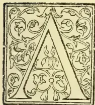

ATTENTION was called to this visitation by a resolution of the Planters' Association dated October 18, 1898, to the following effect :—" That the attention of Government be drawn to the visitation of locusts in Kurunegala, Matale, and Ka-

dugannawa, with a request that the Director of the Royal Botanic Gardens, Peradeniya, be asked to advise as to the best treatment." Further information has since been obtained through the Planters' Association, and the districts affected have been visited by Mr. E. E. Green. The following report may be quoted as illustrating the usual history of the affected estates :—

*To the Secretary of the Planters' Association.*

*Locust Pests.*—These I first observed in 1895, and did not take very much notice of, as they merely ate the leaves of jungle shrubs. In 1896 they appeared again, and had increased to about double the number, and then they ate the dadap leaves and bark on young shoots, to which they did a good deal of damage. In 1897 they increased very much and were about four times the number I saw in 1896, and it was during this year I first noticed where they laid their eggs, which is in the ground.

This year the increase was very great, I should think as much as ten times the number I noticed in 1897, and must have numbered some millions. They made their appearance in March or April, and the dadap, cacao, coffee, and in fact all kinds of growth were bent down and quite black with them. Although so numerous they have this year diminished more rapidly, still a considerable number remains. The damage done this year is great, dadaps being pretty well stripped of their leaves and bark; cacao, of which they prefer mature leaves, suffered considerably, but the food they seemed to prefer most was the leaves of coconut and arecanut trees, which were completely stripped. This year the wild pigs

took to eating the locusts, to the damage of the cacao, the branches of which they broke down to get at them; so far I have not noticed any other animal or bird preying on them. The locusts go steadily along eating up all the leaves there are, and leaving the trees bare skeletons. Tea they eat, but do not seem to care very much for. When their wings develop they do not seem to use them very much, their flights being short and individual. I think the only time to destroy them effectually is when they are depositing their eggs in the ground. By the way they increase, serious attention should be turned to getting rid of this pest.—*Nov. 13, 1898.*

The following account of the insect, report of visit to infected estates, and recommendations for treatment, are extracted from Mr. Green's full report :—

I found the locusts very abundant on an estate in the Kadugannawa district; they proved to be the Spotted Locust (*Phymateus punctatus*). This is a very conspicuous insect, easily distinguished from all other locusts by its brilliant colouring.

The head is black, with a broad yellow band across the front. The upper part of the fore-body (thorax) is curiously roughened, of a shining black colour with a bright yellow border, and an irregular tubercle immediately behind the head. This roughened part of the back gives to the insect the appearance of wearing a cape. The front wings are of a brownish-green tint, irregularly spattered with large bright yellow spots. The hind wings are of a dull smoky hue, except towards the tips, where they are greenish. The under parts of the body are bright red with broad black transverse bands.

The male locust differs in general appearance from the female only in its rather smaller size.

In the early stages the insect is more soberly coloured, being chiefly of a dull brownish tint. It can progress only by hopping, as the wings do not appear until the insect is full-grown, though rudiments of them can be distinguished in the two previous stages. The black and yellow markings become more prominent in each successive stage.

Evidence of their work was very noticeable upon area and coconut palms, the leaves of these trees being eaten quite bare in some parts. The dadap trees (*Erythrina*) used as shade for the cocoa had also been badly attacked. A few breadfruit trees were more or less completely deprived of leaves. The locusts were also observed to be feeding upon cinchona and arnatto plants. It was noticeable

475------------------------------------------------

450THE TROPICAL AGRICULTURIST.[JAN. 2, 1899.]

that the cacao trees were almost exempt from attack, nor did the tea appear to suffer to any great extent.

My visit on November 8 was most fortunately timed, as I found the insects pairing, and was shown several small patches of ground where they were congregated in vast numbers, evidently for breeding purposes. In one such patch, about four yards square, the insects had completely covered the ground three or four inches thick, and had partly filled up a drain that crossed the place. It was a most remarkable sight, and the noise of rustling wings and low chirruping; could be distinguished from a considerable distance. The air, too, was charged with the acrid smell produced by the insects.

On examination of the ground it was evident that the impregnated females were freely depositing their eggs here. The soil was closely pitted with holes, each about three inches deep and half an inch in diameter. In these holes masses of eggs were deposited encased in a frothy yet firm covering, and above them the whole was filled up with the same porous matter. The eggs when first laid are pale yellow, but gradually darken to a reddish brown or purplish colour. The porous matter in which they are enveloped has a pinkish tinge.

The holes are excavated by the abdomen of the female insect, which is enormously distended with eggs. The normal length of the entire insect is only  $2\frac{1}{2}$  in., but during oviposition the abdomen alone attains a length of about 3 inches.

I was unable to determine the exact conditions that regulate the choice of the breeding sites. They appeared to be selected quite at haphazard, but all were more or less shaded by the cacao trees. The nature of the soil did not appear to exercise much influence in the choice, for the eggs were equally distributed in loose sand, stiff clayey soil, and ordinary loam. In one instance the pits had been excavated in the hard beaten earth of the footpath.

It is very evident that the most favourable time to attack the pest is when the locusts are crowded together on these breeding grounds. They may here be collected and destroyed with the greatest ease (as they make no effort to escape), and at a very small cost, by sweeping them into sacks, which may then be sunk under water for three or four hours till the insects are dead. Bags made of coir-matting are most suitable, as they admit the water readily. A trial bag filled at one of these places of assembly was found to weigh 106 lb. As a single insect weighs on an average just one-eighth of an ounce, this bag must have contained about 12,800 individuals, allowing 6 lb. for the weight of the bag. From this one spot 20 such bags could have been filled without any difficulty.

After repeatedly clearing away and destroying the insects till they cease assembling there, the ground on the immediate spot and for a short distance all round should be broken up to a depth of 6 inches and quicklime turned in. This will ensure the almost complete destruction of the brood. The mere breaking up of the earth would probably of itself prevent the greater number of the eggs from hatching out, by exposing the egg-masses to the drying action of the air and to the attacks of birds and predatory insects such as ants and beetles, which would readily feed upon them.

The locusts appear to be confined to a limited area at present, and could be practically exterminated in the course of one or two seasons. The fully-grown insects die off after pairing and depositing their eggs, so that the most important part of the work is the destruction of the eggs. A certain number will no doubt escape and appear later on as small wingless grasshoppers. The breeding grounds should be carefully watched, and if the

young locusts should appear in any numbers they may be destroyed by driving them into trenches and covering them with earth which should be well stamped down above them.

I am now carrying out experiments to ascertain the time that elapses between the laying of the eggs and the birth of the young locusts. The eggs of an allied species in India have been proved to hatch out in about four weeks, and the insects were fully grown in three months' time. It is very probable that there are two or more broods of the spotted locust in the course of the year. The young locusts were noticed on the above-mentioned estate in April. If the life-cycle of this locust is similar to that of the Indian species, these young insects would have emerged from eggs laid in March, the parents of which would have resulted from the previous October-November breeding season.

There may possibly be a third breeding period in July-August. On the other hand, it is possible that only one brood occurs in the year, the eggs laid in October-November remaining underground until the following April. This should be made a matter for careful observation.

From inquiries on the spot I learned that the locusts were first noticed on that estate in large numbers in June, 1897. They are said to have died in thousands and disappeared when the north-east rains came on, and to have reappeared in March or April of the present year in greatly increased numbers and over an extended area. It is probable that the great mortality noticed in the north-east monsoon occurred in the ordinary course of events, after the pairing of the insects and the deposition of the eggs.

These locusts seem to be exempt from the attacks of birds, lizards, and other predatory animals, being protected by an acrid frothy fluid which they can discharge when irritated, both from the mouth and from pores on each side of the thorax.

Baits composed of bran poisoned with arsenic were tried, but though a few of the insects were found feeding upon the bait, it did not prove sufficiently attractive to repay any extension of the plan. Nor do I consider that any other measures than the collection of the living insects on the breeding grounds and the destruction of the eggs are, under existing circumstances, necessary.

The following more important points may be repeated:—

At certain seasons of the year, of which October, November has been found to be one, the locusts assemble in vast numbers upon limited patches of ground where the females—still accompanied by the males—bury their eggs in pits about 3 inches deep. A watch should be kept for these places of assembly, and natives should be encouraged to report the occurrence of breeding grounds upon their gardens or any waste land in the neighbourhood. The locusts should be collected and destroyed from day to day as they collect on these spots. As soon as they cease assembling, the ground should be dug up and well mixed with unslaked lime. Upon the appearance of any swarm of young locusts, trenches should be dug, into which the insects can be swept and afterwards buried.

Attention to these particulars cannot fail to result either in the practical extermination of the insects in the locality, or in so reducing their numbers that they can do little or no damage.

E. E. GREEN,  
Hon. Govt. Entomologist,  
JOHN C. WILLIS,  
Director, Royal Botanic Gardens,  
Peradeniya, November 25, 1898.

476------------------------------------------------

JAN. 2, 1899.]THE TROPICAL AGRICULTURIST.451

## THE PROPOSED AGRICULTURAL DEPARTMENT FOR CEYLON.

(To the Editor, "Tropical Agriculturist.")

### PRACTICAL SUGGESTIONS FOR NATIVES.

SIR,—A proposal has recently been made in the Legislative Council to establish an Agricultural Department for this Colony, and the idea is a good one; but it goes without saying that the utility of such a department must, in a great measure, depend on the qualifications of its members; and should it be established, of course it would be the intention of Government that, while giving due attention to the interests of the European planters, it should not neglect those of the native peasantry who are generally too ignorant and too poor to do anything for themselves, in the way of improvements in agriculture, without assistance. Their poverty is not owing to any intrinsic impossibility of bettering their circumstances, and they are not so apathetic as is commonly asserted; but they do not know how to utilise the resources which lie at their disposal unless they are shown the way to do it, and to do this would be part of the duty of the proposed Agricultural Department. Dr. Trimen was very desirous of inducing the villagers to take up the cultivation of cacao, and in this he was to some extent successful, but not so successful as he wished, because he was dependent for assistance on the Government Agents and headmen, who, however willing they may have been to second his efforts, could not do it otherwise than as a work of supererogation. No doubt cacao is a product well adapted for the native peasantry, but there are others which would suit them equally well, if not better, and in support of this assertion some instances may be adduced. ~

HEDGES.—I begin with hedges because, on land exposed to the inroads of cattle, a secure fence is the first essential to success in any kind of cultivation. Nobody likes the trouble of planting hedges, because they give no direct return; but no amount of chemical or botanical knowledge can be of much practical use to a cultivator if his plants are liable to destruction by trespassing cattle. It would be impossible for an ob servant person to travel in this country without noticing the almost complete absence of effective hedges, and yet there is no country in which they are more needed, owing to custom which obtains here of allowing cattle to go about at liberty. A common fault in the planting of hedges in this country is that of making them too narrow, a single row of hedge plants being generally considered sufficient, whereas a hedge, to be effective, should be not less than a yard in breadth. To some this may seem to be a waste of land, but the grudging of a yard's breadth of ground for a hedge is a case of "spoiling the ship for a halfpenny worth of tar." For hedging some recommend Sapan, others prickly pear (*Opuntia*) and others American Aloes (*Agave* and *Fourcroya*); but I have tried all three and cannot say that any of them have proved satisfactory according to my experience. A sapan hedge requires fairly good soil, because in poor soil many of the young plants die off, leaving too few to be effective as a fence. Its tender leaves are, moreover, eaten by cattle, so that wherever these animals can get at it, a hedge of it requires a temporary fence of some kind for its own protection. Prickly pear makes a good fence in good soil, but it will not answer where the soil is poor. In Mexico (of which

country it is the national emblem in the same way as the rose, thistle and shamrock are the national emblems of England, Scotland and Ireland respectively) there are said to be impenetrable hedges of prickly pear twenty feet high; but in this country the plant seldom attains half that height, and is usually not more than a foot and a half or two feet high and so brittle that a touch is enough to break it, so that a hedge of it is of no use whatever as a protection from cattle. American aloes would be the best hedge plants we have, were it not for their liability to be damaged or destroyed by porenpines; but this renders a hedge of them unreliable in any place infested by these destructive animals. I think the best style of hedge for this country consists of two rows of some rigid, thorny shrub, one yard apart, with Maha Eraininiya (*Zyzyphus rugosa*) planted at intervals of ten feet or so in the space between the rows; but I have not quite made up my mind on the subject, and this will be one of the first matters for the consideration of the proposed Agricultural Department, should its establishment become an accomplished fact.

SISAL HEMP.—When sisal hemp is cultivated on an extensive scale, of course the most profitable method of cleaning the fibre is to do it with a machine; but a machine is not indispensable, as by steeping the leaves in water and beating them by hand, the hemp can be extracted from them as easily as coir from coconut husks in the same way; and it is only by this mode of cleaning the fibre that the plant is ever likely to be of much practical use to the native peasantry, because it would be impossible to construct any machine capable of doing the work efficiently which would not be prohibitive to them by reason of its costliness. Mauritius hemp (*Fourcroya gigantea*), Cuban hemp (*F. cubensis*) and Pita hemp (*Agave americana*) can also be cleaned by hand, though not quite so easily as the sisal hemp, as the fibre of the three former plants is finer than that of the last mentioned, and consequently more liable to break. For a long time I thought it useless to try this method of cleaning aloe fibre, because I believed that it would be impossible to rot the leaves in water without at the same time rotting the fibre also; but having at last made the experiment, I find that this idea was a fallacy. Of course the fibre will be spoilt—as any other fibre would be—if the steeping be too much prolonged; but that needs not happen, as the leaves can, during the rotting process, be examined from time to time to ascertain if the steeping has been sufficient. When aloe leaves are large they should, however, be crushed before steeping, because otherwise the thin parts of them will be too much rotted before the thick parts are sufficiently so.

PALM OIL.—The *Elaeis guineensis* grows well and flowers freely in this country, but its flowers often come to nothing, and this is probably one reason—though not the only one—why it has not hitherto been cultivated here, except as an ornamental tree. The reason of its not bearing much fruit in this country, in proportion to the abundance of its flowering, does not seem to be generally understood; and indeed so small is the interest which most people here take in it that not even its correct English name is commonly known, though the information that it is the "Oily Palm" can be obtained from no less popular an authority than Webster's Dictionary. The frequent abortiveness of its flowers in this country

477------------------------------------------------

452THE TROPICAL AGRICULTURIST.[JAN. 2, 1899.

is due to their not being fertilised by any insect. Presumably there exists in Guinea some insect by which its flowers are fertilised, for the reason, among others, that its flowers, unlike those of most other palm trees, have a very pleasant smell, and that the natural use of this perfume is probably for attracting insects to fertilise the flowers; but this perfume does not seem to be attractive to any Ceylon insect, for I have observed that the *apis trigona*, the small black bee which is the chief agent in the fertilising of the dicesious flowers, of the wild date, never touches those of the oily palm, nor do the flowers of the latter appear to be visited, except accidentally, by any other Ceylon insect. Hence the tree does not bear fruit in this country—or at most bears only two or three fruits on a spadix—unless there are male and female flowers on the same spadix, which is not a frequent occurrence. If, therefore, the tree were cultivated as an economic product in this country, its flowers would, like those of the vanilla, require to be artificially fertilised; but the flowers of the oily palm could be fertilised in a manner much less troublesome and less tedious than is necessary for those of the vanilla; and palm oil might eventually become one of the principal products of this island if the cause of the frequent failure of the tree to bear fruit, though flowering plentifully, were generally known. Some think that the oily palm could not be profitably cultivated here because palm oil in any required quantity can be obtained from the trees growing wild in jungles nearer England than the East Indian; but this is also the case with cinchona bark, and yet the cultivation of cinchona did pay very well here until the trade in the bark became unprofitable to grow by reason of overproduction; but an overproduction of palm oil is a contingency not much to be dreaded, at least for a long time to come, because the annual imports of it into the United Kingdom are, according to the “Encyclopædia Britannica,” about six times as large as those of coconut oil. For domestic purposes, the oily palm is not so useful a tree as the coconut; but, commercially speaking, I think the former is the more valuable tree of the two. Palm oil is more easily made than coconut oil; porcupines, which are often very destructive to young coconut palms, do not attack the oily palm, except when it is very small, being deterred from so doing by the thorns on the leaf-stalks of the latter; the red weevil, another formidable enemy of the coconut palm seems never to attack the *eleis*, nor does the latter tree seem to be liable to damage by any other insect except the rhinoceros beetle—which also damages coconut palms—but the rhinoceros beetle does not kill the tree, though it injures and disfigures it; and the *eleis*, being itself a jungle tree, can, when once established, hold its own without any cultivation. It does not require a longer time to come into bearing than does the coconut; and its produce would not be easily stolen from the tree—not an unimportant practical advantage with a village product. The worst enemy of the oily palm seems to be the bandicoot, which occasionally proves destructive to young plants of it in a nursery; but with a steel trap and a bait of roasted coconut, bandicoots can be caught as easily as common house rats.

**PALM SUGAR.**—Another Palm tree which appears to receive less attention than it merits is the Gomuti or Java Sugar Palm (*Arenga Sac-*

*charifera*). For suitable situations no better palm than the palmyra is likely to be found; but the palmyra requires a dry, hot climate and a deeply permeable soil, whereas the gomuti seems to thrive well in any situation adapted for its relative, the kitul; and the kitul is very liable, when young, to destruction by porcupines, but they do not seem to attack the gomuti, being probably hindered from so doing by the large quantity of black fibre which they would have to tear away or bite through in order to get at the heart of the latter. I have not had any opportunity of experimenting on the gomuti, but I have made many experiments on the kitul, and it may be presumed that any mode of treatment which suits the latter, would suit the former also. Most Europeans imagine the extraction of tari from the kitul to be a very simple process—all that is required, as they suppose, being to bind the flower-bud with a string and cut off the end of it. I was of that opinion too, until I tried my hand at the business; but I then found that it was not quite so simple an affair as I had imagined. By merely binding and cutting the flower-bud, half a pint or a pint of tari in twenty-four hours might be obtained, but even that little would stop in the course of a week or so, by reason of the hardening of the flower-spikes, after which no more tari could be got from the same flower. In order to obtain tari from the spadices of palm trees it is necessary, not merely to bind and cut the spadix, but also check the natural tendency of the flower-spikes to pass from the saccharine into the woody stage. Most of the jaggery made in India is obtained from a species of date—the *Phanic sylvestris*—and the tari of the date is said to be obtained from a notch cut in the stem of the tree just below the inflorescence; but I venture to doubt this and think it more likely that the tari of the date is, like that of other palm trees, obtained from the flower-bud, and that the real object of notching the stem of the tree is, not to obtain tari from the notch, but to half-kill the spadix and thereby check its development. In the coconut and palmyra the development of the spadix is retarded by constantly beating it with a wooden implement made for the purpose, or with the solid end of a buffalo horn; but the spadix of the kitul is too brittle to bear such treatment as that, and other means must therefore be adapted with it. The native jaggery people generally succeed in obtaining tari from the tree, but they do so by following traditional methods of the real effects of which they are ignorant; and when the operation proves a failure, as does occasionally happen, even with men experienced in the work, the failure is ascribed not to any want of knowledge or want of skill on the part of the operator, but it is either thought that the operator has an “unlucky hand,” or the blame of the failure is cast upon the tree. Those who are desirous of obtaining tari from the kitul must make up their minds to the disfigurement and injury of the tree, because, without spoiling the beauty of the tree, it is no more possible to obtain tari from it in profitable quantity than it is to “eat your cake and have it.” The jaggery people think it necessary to expose the tender flower spikes to the sunshine, and for this reason, the first thing they do, when they take a tree in hand, is to lop off any leaves that may be shading the spadix. Then they take the bracts and spathe off it, and leave

478------------------------------------------------

JAN. 2, 1899.]THE TROPICAL AGRICULTURIST.453

the sun to act upon it for one full day. On the third day, having propped or stayed the flower to prevent it from falling down, they make in the part of the stalk near the stem of the tree a cavity into which they introduce a mixture which they call the "medicine," consisting of garlic, chillies, mustard and other stuff pounded up together; then they bind the flower-spikes, usually with split cane, about as far as the end of the central stalk, and cut off the rest of the flower. Next day this flower is cut again once, and the day after, twice, morning and evening, a pot being hung to it in the evening. The process varies somewhat with different operators, some of them thinking it better to leave on the bracts of the flower-stalk, and to do the medicining one day instead of two days after exposing it to the sunshine; some washing the flower-spikes with Kafir lime juice, others with a decoction of dried gamboge fruit, others omitting the acid lustration, and so forth. That is the ordinary way, and there are three other ways of which I have been informed, but have not seen practised. Not much tari is obtained at first and it is usually insipid and fit only to be thrown away; but in a few days it increases in quantity and improves in quality. The jaggery people commonly pretend that the composition of their so-called medicine is a valuable secret; but the ingredients of it vary much with different men. I make use of no mixture at all and do not believe in it, and I have been informed that none is used in Rakwana, where kitul trees are planted and cultivated as coconut palms and in the maritime districts and where the management of the former is therefore presumably better understood than in parts of the island. When the "medicine" is used, it is necessary to make the cavity for its reception far down the flower-stalk, because near the tree it is tough and fibrous and will not break in two at that part; whereas it is very brittle near the spadix, and might break off by the mere weight of the flower if the cavity were made far from the stem of the tree. In order to get at base of the stalk for this purpose, it is usually necessary to cut away part of the sheathing leaf-stalks, and as this weakens the leaf-stalks, they not unfrequently break in high wind, so that the leaves to which they belong hang down against the stem of the tree; and this, together with the lopping away of the higher leaves, causes the tree to present a very dilapidated appearance, looking as if it had been used as a target for artillery practice with chain shot. The jaggery people deny that cutting off the leaves above a flower does any harm to the tree, and say that, as the tree flowers from the top downwards, the leaves above a flower are of no further use to the tree, having already served their natural purpose; but I have observed that kitul trees which have been partially mutilated of their leaves flower at intervals varying from a year and a half to three years, whereas those which have all their leaves intact flower two or three times in one year, from which it is obvious that cutting off part of the leaves *does* impair the vitality of the tree. It is, however, the injury which the jaggery people do to the tree by depriving it of part of its leaves that is the real secret of their success, although they do not know this. They ascribe their success partly to the exposure of the tender flower-spikes to the sunshine, and partly to the stuff which they introduce into

the flower-stalk; but the truth is that neither the direct sunlight nor their so-called medicine has any effect at all in promoting the flow of saccharine sap. By cutting off the leaves, they impair the vitality of the tree, thereby preventing the flower from going to seed so soon as it naturally would, and that is the whole secret of the matter. I shall not venture on any directions as to the best mode of pruning the tree, as that is a question which must be settled by experience. If the tree be insufficiently pruned, it will, by reason of the flower too quickly running to seed, produce less tari than it would be possible to obtain from it; but if the pruning be done to excess, the intervals between the successive appearance of the flowers will be too much prolonged; and this is another matter for the investigation of the proposed Agricultural Department.

I will now endeavour to explain what I believe to be the philosophy of the subject, promising, however, that the explanation is only a theory, and that it is to be taken for no more than a mere theory is worth. When I was at school, about forty years ago, I learned that, in the growth of trees—exogenous ones of course—sugar is first formed in the sap near the root of the tree; that the sap, containing sugar in solution, ascends by way of the cambium to the leaves, where the sugar is by the action of solar light converted into starch; and that the sap, now containing starch instead of sugar in solution, then returns from the leaves, by way of the pith and medullary rays, to the branches and stem, when the starch undergoes a further conversion into lignin or woody fibre. This, I believe, was then the generally accepted theory, and it accounted in an apparently satisfactory manner for the flow in the spring season of saccharine sap from the sugar maple trees of North America; but it is now exploded, and the common opinion of botanists of the present day is that sugar in plants and trees is always formed from starch (or its chemical equivalent) and not starch from sugar, although the manner in which the change is effected is not well understood. Starch is artificially converted into sugar in the manufacture of glucose—an industry of some importance in Germany and the United States—and of the natural conversion of starch into sugar there are familiar examples in the malting of barley and the ripening of bananas. A process analogous to the ripening of bananas takes place in the kitul palm, except that the starch, after conversion into sugar, undergoes a further conversion into lignin or woody fibre. While the tree is in the growing stage a store of starch, in the form of sago flour, is accumulated in the stem; and when the tree flowers, part of the starch passes into the flower-bud, where it is, about the time of the bursting of the spathes, converted into sugar, which would, in the course of nature, soon be in turn converted into woody fibre; but the chief art in palm sugar making is to stop this last change, and keep the flower as long as possible from passing from the saccharine into the woody stage. Perhaps this may not be the true explanation of the matter, but for practical purposes it is a good working hypothesis.

In this connection a few remarks on DATE SUGAR may not be out of place, although date sugar is not a product of this island. If, as has been previously suggested, the tari of the date is obtained from the flower-bud and root,

479------------------------------------------------

454THE TROPICAL AGRICULTURIST.[JAN. 2, 1899.

as is commonly asserted, from a notch cut in the stem of the tree, then the practice of notching the tree is probably not necessary, because the lower leaves must in any case be cut away in order to get at the flower, and this pruning would alone prevent the too speedy development of the inflorescence. Fruit trees other than palms are pruned for the purpose of making them bear more than they naturally would, but pruning a palm tree has the opposite effect. Some years ago, before I knew the cause of the oily palm frequently failing to bear fruit in this country, I read in a local paper—the *Observer* I think—an extract on palm oil in which it was asserted that the only cultivation which the oily palm receives in West Africa consists in cutting off its leaves to increase its bearing; and, having a few oily palms, I thereupon tried the effect of pruning upon some of them, but found that instead of its causing them to bear more fruit than before, they did not flower at all for a long time afterwards. Someone had probably seen oily palms from which the Negroes had been cutting away the leaves in order to facilitate the gathering of the fruit from them, and had erroneously inferred that the pruning had been done for the purpose of making them bear more abundantly than they would in their natural condition. It would be a practical advantage to the cultivation of sugar date palms in India if the notching of the tree could be dispensed with, because the practice, besides injuring and disfiguring the tree, sometimes proves fatal to it by reason of the notch affording a lodgement for the eggs of the palm weevil. Weevil grubs cannot get into a palm tree unless the tree has been wounded, because the parent weevil is not provided by nature with any instrument for making a receptacle for her eggs. Sometimes porcupines bite a small piece of the skin from the stem of a young coconut palm and then leave the tree, finding that it is too hard for them; and if this is noticed in time, no harm results to the tree; but unless the wound be immediately tarred, it commonly affords a lodgement for the eggs of the palm weevil, and then the destruction of the tree is a certainty; and if the practice of notching the date palms could be given up, their destruction by weevil grubs would probably seldom or never happen, because the mother weevil would usually be unable to find in them any suitable place for the reception of her eggs. As the making of date sugar is an important industry in India, this is a matter deserving of investigation; but both here and in India the Government seems to have been hitherto more intent upon getting excise duties from intoxicating drink obtainable from sugar palms than upon encouraging the utilisation of the trees as producers of sugar.

The arenga does not bear productive seed in this country, though it flowers freely; but it is not singular in this respect. The sugar-cane also flowers freely in this country, but produces no seed, although Mr. Daniel Morris propagated it from seed in Jamaica when he was Director of the Botanical Gardens there. The American aloes also flower in this country, but bear no seed. I have had the same experience with Manila hemp (*Musa textilis*), and when the original home of plants of this habit can be known, I think it will generally be found that they are indigenous to volcanic regions. If the failure of the arenga tree to bear pro-

ductive seed in this country is due to the soil of Ceylon being deficient in some necessary volcanic element, it might be practicable to supply the deficiency artificially by manuring; but of course there would be no advantage in producing more seed than would be required for propagation, as arenga seed is of no use for anything else; and one arenga tree would bear seed enough to plant a forest of it.

Some say that the manufacture of palm sugar would not pay; but it used to be said not very long ago that sugar could now be profitably made from anything except the cane, and the manufacture of sugar from beetroot has become a great European industry since then. The manufacture of beet sugar began in Germany with a yield of only five per cent of sugar, but a yield of twelve or fourteen per cent is now obtained; and it is not impossible that a similar improvement might be effected in the production of palm sugar if the subject were scientifically investigated. Moreover, it is only within the memory of living men that Europeans have taken up the production of tea, but in that short space of time they have introduced more improvements into the process than the Chinese could think of in the two thousand years during which they had previously been at the business; and, for aught anybody at present knows to the contrary, it is possible that the process of palm sugar making may be capable of being improved in a similar manner.

The investigation of these and other similar matters would be part of the proper business of an Agricultural Department, and although the proposal that it should be established, originated in the Legislative Council with the Honourable Mr. Campbell, yet it is not at all to be supposed that the Department must necessarily exist for the benefit of the European planters only. The establishment of an Agricultural Department would not interfere with the proper functions of the Botanical Department already in existence, but on the contrary, the one department would rather be the complement of the other. The Botanical Department can and does introduce and acclimatise useful exotic plants, but it cannot be reasonably expected of it that it should undertake or understand the curing of all sorts of products, or that it should even be able in every case to afford information regarding the best methods of their cultivation; and hence the need for an Agricultural Department as well as a Botanical one.—Yours &c. ALEX. T. GEDDES.

#### FISH CULTURE IN CEYLON.

Mr. C. J. R. LeMesurier writes:—I notice in the very interesting report of the Ceylon Fishing Club that it is proposed to introduce the "Gourami" into Ceylon. I may mention that I put three of these fish together, with some lablo, both kinds from Madras, into the Kandy lake, some years ago, and that they should have bred and multiplied there by now. I also put some into the pond in Lady Horton's Walk above the Pavilion where, if the otters have not eaten them, they and their descendants should be now. There is, however, no need to introduce the Gourami into Ceylon, for it, or at any rate a fish almost exactly like it, exists in great abundance in the lakes, and back waters and rivers in the Batticaloa district. It is there called the "Chettal" and it is delicious eating. I used to propagate this fish when I was District Judge at that station. I enclose copy of a letter I wrote to the Local Board when I left

480------------------------------------------------

JAN. 2, 1899.]THE TROPICAL AGRICULTURIST.455

in July, 1895. It may interest some of your readers, and serve to show how difficult it is to keep up local interest in such matters. When I left Batticaloa in 1895, the experiment was dropped. Fish culture should be made a department of the Government, as it is in America, not for the purposes of sport, but as a cheap, easy, and efficient means of increasing the food-supply of the country.

Batticaloa, 30th July, 1895.

Sir,—As I am leaving the district and shall not therefore be able to continue my experiment in fish culture I have the honour to return the balance in my hands out of the R100 voted to me together with a statement and vouchers, &c. for what I have already expended. I trust, however, that my experiments will be continued by the Local Board. They are very simple and efficacious, and will result in the lake being furnished with a yearly supply of the best kinds of fish that are to be obtained in the locality. My method is a very simple one. It is to create sanctuaries where the fish can breed freely and where they can find their way into the lake during flood time. My present and only sanctuary is the backwater in front of the Flagstaff at the bar. I have dammed this up at either end to prevent ingress and egress. I drag it once a month with a madel, at a cost of R5 each time, to get rid of the predatory fish, the owner of the madel taking all the fish he catches except those mentioned below which are thrown back alive into the water. I stop all net fishing in it and I stock it from time to time with fair sized Chettal (? Gourami), Mannale (Mullet) and Kelakan (? Smelt). These are the best kinds to propagate; they are good eating; they grow quickly; they breed very freely and they are non-predatory. During flood time my dams will be washed away and the progeny from the parent stock, then well grown and able to take care of themselves, will escape into the lake to replenish the stock there. When the floods are over the dams, which are very cheap, should be renewed, the predatory fish should be kept down as I am keeping them down now and the pond stocked with a few hundred more fish of each kind. I employ as watchers two of the guards at the Custom house and I pay them R2.50 a month, each.

I am Sir, Your obdt. servant,

(Sgd.) C. J. LEMESURIER.

Statement referred to:—

<table>
<tr>
<td>Watchers</td>
<td>..</td>
<td>..</td>
<td>R 7.50</td>
</tr>
<tr>
<td>Coolies, &amp;c.</td>
<td>..</td>
<td>..</td>
<td>R29.50</td>
</tr>
<tr>
<td>Timber</td>
<td>..</td>
<td>..</td>
<td>R 7.82</td>
</tr>
<tr>
<td>Fish</td>
<td>..</td>
<td>..</td>
<td>R 4.45</td>
</tr>
</table>

Total..R49.27

(Sgd.) C. J. LEMESURIER.

—Local "Independent."

## THE PRINCIPLES AND PRACTICE OF PRUNING.

There are many ways in which the gardener may avail himself of Nature's workmanship, and one of these consists in the production of a great variety of luscious fruit from trees which, in the wild state, bear fruit of a single uniform type, sour, insipid, and unfit for the human palate.

From the Crab he has obtained the nutritive Apple; from the wild Pear all the juicy varieties of that fruit; from the wild Gooseberry, scarce larger than a bullet, the swollen, sweet-tasting berries of our kitchen garden, an inch across; and so on with very numerous other kinds.

How has this feat, far-reaching indeed in its beneficent results, been brought about? By dint of careful and patient cultivation through centuries, if not millennia of years, of the rough-hewn products of Nature dispersed around us in the world.

Almost all horticulturists agree that pruning should play a part in the cultivation of our fruit-trees, for its usefulness has been established over and over again.

The practice of pruning is founded on the fundamental biological fact that in the growth and life-history of every plant there are two forces at work—the force which tends to the production of vegetative, and that which tends to the formation of reproductive organs.

In Nature an even balance between these two forces is almost always ultimately struck, the one ever subserving the other, neither being in any way exaggerated or hurried, the ultimate result being that condition which is, to all intents and purposes, most perfectly adapted to the plant's immediate environment, and hence to the needs of its adequate and full existence.

As attractive-looking, sweet-tasting fruit is always produced by a plant in order that animals of some kind or other may pluck it, devour it, and so help towards the dispersal of the seeds which it contains, this result being finally attained, the plant has realised the aim of its existence. The Crab-tree and the wild Gooseberry-bush have reached the point of sufficiency for the needs of their life in the production of the fruit which the wild birds probably fully enjoy.

But civilised man, appearing on the scene, will have something still better than this; and in order to attain his end, he, alongside of other and equally important modes of cultivation, such as planting in properly-treated soil, cross-breeding, assignment of a spacious position, and protection from insect-pests, sets to work to upset the equilibrium established by Nature between the two forces above-mentioned, thus creating a disturbing and restraining influence upon the free course of the tree's life. For he recognises the principle that, by restraining the force which tends to the formation of vegetative organs, he can increase that which tends to the formation of reproductive organs. This artificial interference of man's part with the ordinary life-conditions of the tree must lessen the vigour and shorten the life of latter to a certain extent; but we shall see that the advantage accruing to man from his action far outweighs any loss of robustness or shorter duration of fruit-bearing activity which the tree may suffer therefrom. Hereafter, the cultivated Appletree of the orchard will lack the strong vigour of the wild Crab-tree of the forest; but the latter, if it could do so, would marvel at the wonderful change in the character of the fruit produced by its descendant. Man, by the swift process of artificial selection, has followed in the wake of the slower process of natural selection, and the result is unique.

We have now to consider some of the more detailed methods by which the force which tends to the formation of vegetative organs is diverted, and that which tends to the formation of reproductive organs, viz., the fruit allowed freer play.

It is but natural that the orchard fruit-tree, if left to itself, as regards the knife, will from vegetative growths, and fruit pretty much after the same fashion as the wild Crab-tree. There may be some difference in quality of the fruit, owing to the richer soil and more favourable situation and precedent ancestry, but this difference will be but slight and inappreciable. Something else will have to be done in order to induce the predominance of fruit-formation to that of vegetative growth. And this is pruning.

This important factor must come into play in the very first infancy of the tree, as it gradually develops and grows from the grafted or budded scion. The pruning at this stage of its life-history will depend on the mode of training to which the tree is hereafter to be subjected. If the future fruit-bearer is to be a wall or espallier-tree, the growth of the main stem or leader must be subordinated and more or less sacrificed to the growth and development of the lateral branches; for, if Nature were allowed free play, the main stem of the tree would soon overtop the wall and the lateral branches become subordinate.

481------------------------------------------------

456THE TROPICAL AGRICULTURIST.[JAN. 2, 1899.]

and of comparatively insignificant length. But the object which the gardener has in view in the training of these trees is that the wall or espalier shall be well covered by the tree, and the space available thoroughly economised, so that the tree must henceforth, from its youngest state onwards, pursue a horizontal rather than a vertical direction of growth. It will thus be seen that the tree departs from its natural habit of growth, not only by this horizontal development of the lateral branches at the expense of the main stem or leader, but also in the fact that the lateral branches are allowed to develop in one plane only, viz., that of the long extension of the wall or espalier. Few forms could be more unnatural or more utterly unlike the habit of the tree in its native state; and the fact that the tree will submit to this and other almost equally artificial methods of training, and bear good fruit, argues that fruit trees have been under training and cultivation for untold generations, and have thus become gradually inured to such severe treatment.

The young grafted tree, at an early age, is topped, or shortened, for several inches, which interruption in the normal flow of the sap upwards causes the latter to accumulate in greater abundance at the place of insertion of the uppermost lateral eyes or buds, and from these to induce the precocious development of lateral branches, while a new leader is allowed to develop from the highest bud or not, as the case may be. Supposing the leader to grow upward rapidly again after this treatment, it must the following winter be again topped in order to start a second pair of laterals above the first formed, and so on year after year, the pruning always being performed in the winter-time, when the active life of the plant is suspended, and when, therefore, there is less fear of interfering with its vitality and its proper course of growth.

The lateral branches are not to be shortened at all in the case of most hardy fruit trees with vigorous growth, but are to be allowed to grow right ahead as far as space will permit. If shortening took place, the sap, instead of being evenly and equally distributed throughout the whole length and thickness of the branch, would be thwarted in its natural course, and induced to accumulate to excess in the lateral buds or eyes, especially those near the end of the pruned branch, and these eyes being caused to shoot, the result would be, instead of the fruit-spurs which would naturally have appeared all along the untouched branch, a great production of tertiary woody shoots and a consequent absence or great reduction of fruit-forming twigs. The topping of any leading shoot inevitably induces the formation of lateral members—a wise provision of Nature for the continuance of the temporarily thwarted vegetative growth of the shoot, but which is exceedingly detrimental to all immediate fruit-forming capacity, and thus to be avoided by the cultivator. Certain kinds of trees, however, such as the Peach, Nectarine, Apricot, which are less vigorous and active in their growth, owing perhaps to the fact that they hail from under more southern skies, are not nearly so liable to the formation of woody outgrowths when their lateral shoots are shortened; hence, where found advantageous, this practice may with these more frequently be indulged in.

If it is desired to form a "pyramid," the same process of topping of the young budded tree must be practised, and a number of branches induced to develop all round the stem, which must be kept at even distances apart, and proportionate in length, so that the lowest are always the longest and strongest, otherwise the pyramidal form will not be retained. To obtain this result, the lateral branches will require carefully watching and training, and frequent shortening to the proportionate distances, otherwise they will naturally tend to grow irregularly in length and in direction.

In the formation of standards by pruning, the main object is to obtain a well-formed symmetrical head or crown. After the young tree has reached a certain height, its natural growth is severely interrupted and

suppressed, owing to the fact that henceforth a number of spirally-arranged lateral branches are caused to develop from the uppermost eyes, entirely at the expense, and to the ultimate complete extinction of, any further growth in length of the main mother-stem.

The latter is first of all topped, in order to induce the out-growth of the lateral shoots, but not in the manner described for the "pyramid," close above an eye, but some little distance above, so as to leave a blind stump. By this means the topmost eye of the mother-stem will be caused to grow in an obliquely ascending direction upward, as an uppermost lateral shoot, instead of forming a vertical continuation of the main axis, as it would do if no stump were left. The second service performed by the stump is to draw for a time some of the sap away from the topmost eye, and so prevent its developing too vigorously and more strongly than the others. Eventually the stump must be removed. This same kind of topping must be adopted, with all the lateral and every succeeding shoot in the same way, until, after the tree has for a few years been put through its youthful training, it is eventually left entirely to itself.

These are the three principal types of the artificial form to which fruit-trees are trained in the garden. As we have seen, the desired form must be early induced in the young tree, when its tissues are as yet plastic and yielding, for it goes without saying that it is difficult to force an older tree, especially when it has begun to form fruit, into a habit of growth to which it is entirely unaccustomed.

One main object of the training of fruit-trees into various shapes is, of course, to please the eye; it is elegance or strangeness of form which we desire to see; but the chief object of the cultivation of fruit-trees is the production of fruit. We have no wish to see an abundance of fine fruit developed on an uncomely tree; but neither do we wish to see a beautifully formed tree with a pancy of fruit. The ideal towards which we have to strive is a mingling of the two characters; the abundant production of fine fruit and an elegance of form in the tree. And the elegance of form, of the tree (at least, in its younger state), and the quality, if not quantity of the fruit which it bears, must be superior to what we find in Nature.—W. C. WOODDELL, F.L.S.—*Gardeners' Chronicle*.

(To be continued.)

DUTCH GOVERNMENT CINCHONA PLANTATIONS.—We have room this week for the insertion of a short paragraph relating to a part of the report (mentioned last week) on the Java cinchona plantations of the Dutch Government. The returns and expenditure are items that merit further notice. The total expenditure in 1897 was equal to about £7,680, of which about 5-9 was incurred in new buildings and repairs. The estimates exceeded this expenditure by £155. In 1896 the expenditure was about £7,550. These figures work out a cost per lb. of 2-3-5d in 1897 against 2-5-11d in 1896. The gross returns for the crop of 1896 amounted to about £17,644 at the sales in Amsterdam, with a profit of about £3,100, to which has to be added profit made by sales in the East Indies, which brings the total profits to about £8,300. The expenditure of about 2-5-11d has to have added 6-11d for freight and commission on sales, which makes the cost of the bark per lb. to the Government 3-2-11d. Deduct this from the average price obtained per lb.—namely, 5-9-11d—and we see that a net profit of nearly 2-7-11d per lb. remains, which seems a very satisfactory margin. We have rendered Dutch sums and weights into English equivalents all through this paragraph into as near absolute accuracy as makes no matter.—*B. and C. Druggist*, Dec. 12.

482------------------------------------------------

JAN. 2, 1899.]THE TROPICAL AGRICULTURIST.457CEYLON TEA IN GERMANY.ALOE FIBRE.

We are glad to see that the important question of pushing our staple product in the land of the Teuton is gradually gaining serious attention at the hands of the Planters' Committee. We can testify from a recent tour through several towns in Germany that the class of beverage supplied there under the name of "tea" is, in many cases, of the poorest quality of China; and it is, therefore, no wonder that the drink has not hitherto become popular among the Germans themselves. Hence the introduction of tea of real excellence ought to make rapid progress directly the new taste has germinated. In Southern Germany the work of "pushing tea" was begun some time since by Messrs. Bohringer, and no doubt the beneficial result will soon be felt; and Mr. Hagenbeck's work in Berlin and the North is too well-known to need more than the passing reference of approval. Special thanks, which we note were duly accorded by the "Thirty Committee," are due to Mr. James Westland of Gammadua, for his persistent advocacy of the energetic furtherance of the sale of Ceylon tea throughout the Germanic States. Germans, like most new hands, require perhaps some little education in the *brewing* of the beverage—upon which so much depends. And we venture to make a suggestion, which we made to Mr. Westland only a short time ago, that in order to win over the German "Frau"—a great point in the contest—to appreciate the merits of the inimitable and stimulating afternoon drink, we ought to bethink ourselves of the uses of the pamphlet and a small sample of fine tea. A pamphlet might well be drawn up, and submitted to the Planters' Association before translation into the tongue of the Kaiser and his people. It should describe in a racy and instructive manner the history of tea in all its vicissitudes from the estate to the table, and it should be illustrated with a number of representative views of the estate, the factory, the shipping, the sale and perhaps even the consumption of the article, concluding with brief but carefully worded instructions as to the "making" of the tea-pot drink. If some such publications were produced (with all necessary attractiveness in printing, paper and illustration) accurately translated, and discreetly distributed by Mr. Hagenbeck, for instance, and other agents, together with a small but choice packet of tea, by a house-to-house visitation among the upper and middle classes in the chief German towns,—we feel sure that large results would accrue to an original effort of this kind: No one need be alarmed by the apparent extensiveness of the proposal here put forward. For, in commencing, only one town of large size, some city where the Ceylon article is not well-known, need be selected and a test distribution made there. A short interval would be sufficient to judge of the effects of the enterprise and estimate, from the forthcoming increase or development of demand in the locality, whether it is worthwhile to pursue this method of advertisement with redoubled vigour. The experiment seems to us worth a trial, or, at least, some consideration.

We are apparently on the eve of an important development in regard to the utilising and cultivation of the aloe plant in our midst. The new machine to which we referred the other day is a patent of Mr. A. Silburn who has come to us from South Africa, where he has already secured patent rights, and who is going on to India, where the patent is also being arranged for and where extensive experiments in cultivation of the plant, and in working the machine, are to be undertaken. Meantime Mr. Silburn's attorney Mr. Parkinson is anxious to learn where aloe leaves in quantity can be obtained in a district not too far from a sea-port, and also where land suitable for an experiment in cultivation can be obtained. We have recommended Kurunegala as a good centre for their enquiries and a place to which possibly the natives could bring an appreciable quantity of the leaf if a factory were established, and cash paid for the leaf on delivery. We may, however, be mistaken as to the aloe being as common in this district as it was in "days of old." In local experiments made a good many years ago with a primitive machine invented by Mr. C. Shand, the best results were about 3 per cent got from the *Sansevieria Zeylanica*, the small parti-coloured garden aloe common in Colombo; but the short fibre of this aloe is of no use for Mr. Silburn's purposes. On the other hand Mr. Silburn's patent machine is said to give up to 7 per cent of good marketable fibre from leaves of the *Agave Fourcroya* and the longer they are the better, 7 or 8 feet if possible. At present, Mauritius has an export trade in Aloe Fibre equal to from R250,000 to R300,000 a year. We wish all success to Messrs. Silburn and Parkinson in promoting a new industry in Ceylon, and one which, if successful, would be certain to benefit many native landowners as well as many of our labouring class.

Since writing this we learn that Mr. Silburn, having secured preliminary protection here, has gone on to India, leaving Mr. Parkinson to represent him. One of the patent machines is now under construction and should be ready in about six weeks. It is indispensable that it should work alongside a river on account of the quantity of water required in the crushing and washing process as well as in the final preparation of the fibre. The banks of the Maha-oya between Ambepussa and Polgahawela would seem to offer a suitable choice of site.

---

CEYLON TEA AND MR. KELWAY-BAMBER —  
A recent mail has brought us, from a Dimbula proprietor in the West of Scotland, the following expression of opinion as to Mr. Kelway-Bamber's mission and work:—

"I am glad to see that you have got a chemist appointed to study tea manufacture and cultivation. I only hope that he will not be asked to attempt too much at first. The point in which chemists have so helped brewers is 'fermentation,' and that is where I expect Mr. Bamber or some chemist will eventually assist tea manufacture, and it is to that point that I hope you will use your influence to confine his researches at first."

The above is very much what Mr. John Hughes meant in his word of warning to planters, namely, that the Chemist should be distracted as little as possible from his work in the factory until he had arrived at definite results.

56

483------------------------------------------------

458THE TROPICAL AGRICULTURIST.[JAN. 2, 1899.]THE TEA CESS.

We do not think it advisable to increase the Tea Cess at this time and for several reasons which, we think, will weigh with the planting community. First and foremost is the temptation presented to use the Cess Fund, for purposes for which originally, it was never intended. We have not one word to say against the engagement of Mr. Kelway-Bamber: on the contrary we most highly approve of his mission and think it one of the fortunate events of the current year. But we very much question whether, with an overflowing exchequer (millions of surplus revenue) these two years, almost solely due to the influence of "tea," one cent of the expense of this scientific and practical investigation for the benefit of our leading industry, should have come out of the Tea Advertising Fund. And we are quite sure that the very least that should have been insisted on—even if the claim went to the Secretary of State—was that half the expense should be borne by the Government. So with the Coolgardie Exhibition. Why should not the Government of the Colony with revenue beyond all precedent—two millions of rupees stuffed into the Supply Bill for 1899, beyond what is needful or what can be in all probability, judiciously expended—come forward to do justice to all our Ceylon products, and especially to our staple product, at this Westralian Exhibition? If the practice of going to the Cess Fund for purposes of this kind, continues, the very best evidence in the world will be afforded that the Tea industry of Ceylon in place of standing in need of relief from Government, is under-taxed, since its representatives voluntarily undertake pecuniary liabilities which, in any other Colony, would be borne by the general revenue. Then, again, as our contemporary notices, there is the fact that while Indian and Ceylon teas are equally advertised by Messrs. Mackenzie and Blechynden in their American campaign, the larger share of the cost has been borne by the Ceylon planters, and that there seems no means of stirring up all the Indian tea proprietors to do their duty in this matter. We would say that in North America henceforward, Ceylon should not spend one cent more than India; but rather advance rupee for rupee; and devote an increasing part of the Cess Fund to the Continent of Europe where the campaign, of course, must be on account of "Ceylon teas" only. Now we see no reason to doubt that there will be enough of money for this purpose and for other legitimate purposes; while to increase the collection would mean to increase the temptation to divert funds to purposes which are really calculated to relieve the central Government of its plain duties and responsibilities. Next year at the present rate of collection, the cess should produce from R240,000 to R250,000; while the proposal of the Thirty Committee is that R60,000 more should be taken from the pockets of tea exporters, for the Fund. But we feel sure that, if the "Thirty Committee" go prudently to work in their administration of the lesser amount, and avoid any temptation to divert money from the original and only purpose of the fund, there will

be no difficulty in doing justice to the claims of Europe as of America—to prosecute an active campaign in Russia, Germany, Austro-Hungary and France as well as in the States and Canada.

We may be told that Mr. Kelway-Bamber's mission should be prolonged. Most probably, and very desirable is such work; but, if so, let the demand for the required additional outlay be made in the proper quarter. There is something ludicrous in the position of the tax-payers of South Ceylon, and especially of the planters, at this time, towards the Executive Government. The latter ignoring the necessities of the staple industry and of the populous districts which periodically suffer from floods in the Kelani-ganga, fill up an unprecedented Supply Bill with big votes for new Buildings and Irrigation Works; and this Bill is likely to be allowed to pass without contest; while some of our planting and mercantile leaders even think the occasion is opportune for proposing to take some more money from the pockets of estate proprietors! We much mistake the signs of the times if either the Chamber of Commerce or Planters' Association is likely to sanction this proposal to increase the Cess levy on tea. Were there no other reason for throwing it out, than the way in which such an increase could be used in official circles both here and in Downing Street, to show that the planters did not feel their burdens but voluntarily agreed to add to them, that risk alone should be fatal to the foolish and untimely suggestion emanating from the last meeting of the "Thirty Committee."

---

CACAO CULTIVATION AND DISEASE.—Our columns contain a good deal of useful information on this subject. Mr. Carruthers has acted very wisely in drawing up a few simple Rules for the use specially of the village cultivators of cacao and for that reason to be translated into Sinhalese and Tamil. But none the less are they useful in their conciseness as a guide to ordinary planters. Following Mr. Philip's letter with these Rules on our sixth page will be found an interesting and suggestive letter from "A Miscellaneous Planter." He pertinently inquires as to the number of cacao planters who have followed the very plain advice already tendered by Mr. Carruthers in respect of shade, thinning out of plants, keeping estates clean, &c.; and he winds up by insisting that justice is not done either in the Colombo or London market to the better qualities of our Cacao; and the Produce Committee of the Ceylon Association in London are asked to take an interest in the subject. As to improved native modes of culture and preparation, agri-horticultural shows with prizes yearly at each Kacheheri—not on an expensive but thoroughly practical scale—ought to do much. The theft of Prædial Products is an old complaint; but the Government has recently promised to do all it can to check the evil. We have a further letter on the subject of cacao from a well-known planter, received this afternoon. Our correspondent will find he is forestalled in regard to Rules for natives by the prompt action of Mr. Carruthers and the Planters' Association. It is certainly an important matter, if Mr. Carruthers has to go, that Mr. Parkin should continue the cacao disease investigations: it is a pity these should be interrupted, while the rubber experiments though important, are by no means in so great a hurry.

484------------------------------------------------

JAN. 2, 1899.]THE TROPICAL AGRICULTURIST.459

### THE WANT OF GOOD TEA IN ENGLISH HOUSEHOLDS.

A visitor to England after an absence of some years, makes the following remarks as the result of his observations:—

"One thing I have to note. It is observed that the taste of tea has much deteriorated in England notwithstanding the enormous quantities consumed and all the facilities for obtaining good teas. To whom do we owe such state of things? To the 'Blenders'! It is a problem in many households where to go to find good tea, and that is a remark I heard set forth by many people."

"Drink pure Ceylon tea" ought to be preached up and down the old country along with a recommendation to deal only with firms supplying pure tea and to have nothing to do with "blends."

---

### CEYLON TEA FOR RUSSIA: GOOD NEWS.

WE learn that the Russian buyers have been buying freely in the Colombo market for some time, and as four distinct firms are establishing branches in Colombo, it is evident that they mean "business," and see a future in the Colombo trade. If we are not greatly mistaken our direct exports to Russia next year will show a very considerable increase. Our informant has heard "10 million lb." estimated as probable, and he adds,—"I really don't think this will be far out."

---

### EUROPEAN LIFE IN THE TROPICS.

The series of papers which, under the title of "The Control of the Tropics," Dr. Benjamin Kidd lately contributed to the London *Times*, have attracted a good deal of attention and have now been published in a separate form. This volume has provoked considerable difference of opinion among critics; but perhaps the most interesting contribution made to the discussion is a letter from the well-known Naturalist, Alfred R. Wallace. We republish nearly all of this letter in our daily and *Tropical Agriculturist* and pronounce it well worth reading. Dr. Wallace, speaking from his own experience of twelve years, chiefly in the Eastern Archipelago, denies that life in the tropics is inimical to Europeans, while he shows how distinctly beneficial it is in many cases. What he tells us of the good health of Dutch families settled for 200 years in the Moluccas is of interest; and, of course, the history of the West Indies shows how far European settlement can be carried in the tropics. It is needless to say that we fully agree with most of Dr. Wallace's statements in contravention of Mr. Kidd's views. Some striking illustrations of the fact that residence and hard work in the tropics are compatible with good health among Europeans, can be furnished from Ceylon. The case of Major Skinner with his fifty years of active life here and his retirement at 65 years in splendid health, is the first that is suggested to us. The Rev. Wm. Oakley of the C.M.S. gave 52 years of his life to Ceylon without intermission. Col. Watson was here about 65 years. Our relative and predecessor in the *Observer* with 55 years' residence, much of it spent in sedentary, mental labour, and dying in

Colombo at the good old age of 76 years, is another case; and Mr. A. M. Ferguson often said that he did not believe he could have enjoyed such continuously good health had he remained in his native Highlands of Scotland. The same is true to a lesser degree in our own case with 37 years of residence; and from our biographies of "planting pioneers" not a few colonists can be named who have laboured in Ceylon—within seven degrees of the equator—with exceptionally good health for 25 to 40 years. Two notable cases occur to us as we write—Mr. John Stephens of Dolosbage, who lately celebrated his 82nd birthday here, arrived in Ceylon on the 25th July 1841, and has since spent not more than 7 years out of the Colony; and still more remarkable is Mr. W.B. Lamont, coffee, coconut, and tea planter, who arrived on 17th February 1841, and has not been away from Ceylon more than twelve months in the well nigh 58 years which have passed since he first saw Ceylon. Both these gentlemen still reside in the island. As to the second and even third generation of Europeans prospering in Ceylon we have also abundance of evidence, only as a rule, it is indispensable to robust health and due moral and mental training that children should spend ten or more years in the motherland. As to Dutch families, we are aware that there are several in the island who claim a pure descent from settlers who arrived from Holland 150 or more years ago, and who have maintained a very satisfactory average of health in the low hot country of Ceylon. Among Europeans, indisputably robust health is chiefly found among planters and public officers whose work and residence are in our mountain regions from 1,600 feet and upwards above the sea. But that is no wonder; because our Ceylon hill-districts from 4,000 feet and upwards include the finest climate in the world—with an average annual temperature of from 57° to 65° against an average of 81° at Colombo by the seaside.

---

### CEYLON TEA IN AUSTRIA AND HUNGARY.

Mr. James Ryan, of Dimbula, sends the "Thirty Committee" a very perspicuous and readable Report on the condition and prospects of our staple throughout the Austro-Hungarian Empire. Mr. Ryan's experiences in Vienna remind us of our own in the same city—duly reported and for which we had the thanks of the Planters' Association—in 1891. But a considerable change for the better has evidently taken place in the seven years and Mr. Ryan is able to adopt an encouraging tone as to the future, while he makes sensible suggestions as to the best way of expediting the general demand for Ceylon tea. Mr. Ryan did not visit Carlsbad—the great Bohemian watering-place—where he would have found 20,000 to 30,000 visitors drinking nothing but tea, and very good tea, as part of the "cure." Here in 1891, we were flatly told by one of the largest dealers there was no such thing as "Ceylon tea" and he was very much astonished when we promptly produced a sample. This, however, he tested and welcomed as representing a new and good tea. We quite agree with Mr. Ryan that an effort should be made to secure a reduction of duty both in Austria and Russia—the German standard of 6d being taken as a model in the first instance—and also to disseminate useful information on the subject of Ceylon tea,

485------------------------------------------------

460THE TROPICAL AGRICULTURIST.[JAN. 2, 1899.]TALIPOTS IN BLOOM.

Frequent mentions in the press of talipots in flower to be seen upcountry just now, led me to keep a careful watch on my journey up lately, and to count accurately the number visible from the line. There were 20 in all, between Rambukkana and Kadugannawa. The first is on the right immediately after quitting Rambukkana station—a magnificent head of bloom. Nos. 2 and 3 follow soon after on the same side but further out. Then on the left we see Nos. 4 and 5 not far apart. Next come a group of five, comparatively close together, but far away from the line. Then on the right again No. 11 comes in view deep down in a hollow, but towering well above the surrounding trees, and standing out finely against the dark ground-work of green. No 12 is nearer to the railway. No. 13 appears deep down in the valley; then five more away across the river, picturesquely grouped on rising ground, and at our feet No. 19 on the river-bank is soon outlined—a mass of golden white—against the brown flood. Darkness was gathering, but a glimpse of No. 20, also on low ground, was obtained ere we turned the last corner up to Peradeniya.—*Com.*

THE VOGAN TEA COMPANY.PLUMBAGO MINING.

An extraordinary general meeting of the shareholders of the Vogan Tea Company of Ceylon, Ltd., was held on the 26th Nov. in the offices of the agents and secretaries Messrs. Lee, Hedges & Co., to consider a proposal to authorise the directors to spend money in working and mining plumbago. Mr. W. B. Kingsbury occupied the chair and the others present were: the Hon. W. W. Mitchell, Col. McComb (by his attorney Mr. Shattock), Messrs. E. M. Shattock, J. McAnish, G. E. Woodman, F. Liesching, Henry Bois by his attorney H. G. Bois, C. E. Haslop, Capt. Whitley, W. Lawrence, C. Link, Percy Bois, G. W. Suhren, R. Davidson, W. E. Mitchell and A. J. G. Field representing the agents and secretaries, and Mrs. M. E. Bois by her attorney Mr. Percy Bois. Proxies were received in favour of Mr. E. M. Shattock from Mrs. L. H. Deaker, in favour of Mr. G. E. Woodman from Capt. Rutherford and Mr. C. M. Buckworth; in favour of the Hon. W. W. Mitchell from Messrs. M. J. Alderson, P. C. du S. Leather, R. W. Harrison, C. Ross Wright, C. Henly and E. B. Creasy and Sir A. Murray; in favour of Mr. J. McAnish from Messrs. W. C. Gowans, W. Finlayson, and J. C. Bell; in favour of Mr. W. B. Kingsbury, from Messrs. Thos. Moore, John Emerson, A. L. Kirk, R. C. Wright, E. C. Ebert, W. P. Metcalfe, A. Bethune, E. Bowder, Smith, F. G. A. Lane, N. Orchard, C. Davidson and J. Dorman, J. E. Dunlop, W. L. Tisdall, F. C. Radcliffe, A. F. White, W. Moir, V. A. Julius, M. Lynam, S. E. James, C. F. H. L. Liesching, J. M. Layard, A. Leighton, C. J. Jones, and J. K. Foster Mellior Miss L. E. Mayes and Mary C. Layard.

The notice convening the meeting was read.

THE CHAIRMAN'S SPEECH.

The Chairman said—Gentlemen I have no doubt that you have all perused Mr. Feilding's report which has now been in your hands for some time. I think it should be borne in mind that very little prospecting work has been done hitherto so that it must be rather a difficult matter for him to give more than a general opinion of what he considered your pros-

pects were as regards plumbago; but your directors thought it advisable to invite him to visit Iddagodde, prior to this meeting so as to place before the shareholders an English mining expert's report and that he might advise them what course they should adopt in future operations should you sanction the small outlay asked for in the motion before you today. The results so far, from a pecuniary point of view, have been exceedingly encouraging—far more so than we ever anticipated. We have obtained between 6 and 7 tons of plumbago of the value of between R900 and R1,000 for an expenditure of about R2,300 but I wish to impress upon you that the real object for which we ask R5,000 is prospecting and you must not be disappointed if we do not go on obtaining the same proportion of the mineral as we have done hitherto. What we propose to do is to follow the lines sketched out in Mr. Feilding's report, that is, to sink our present shaft and the proposed one near the northern boundary till we get down to solid country, and let the result decide our future action. Whatever we do we shall work on a European system, not on a native one which both Capt. Tregay and Mr. Feilding condemn in the highest degree. From what I have heard from one or two shareholders who are

AGAINST FURTHER PROSPECTING

their objections appeared to be three in number. One is that no Europeans have been known to make money out of plumbago mining hitherto, and therefore they can never do so. The second is mining on principle, and the third, the fear that as soon as this R5,000 is spent you will be asked to vote further sums of money. Now as regards No. 1 there is a superstition amongst the white population of Ceylon that no Europeans can mine plumbago at a profit, and the origin of this superstition is derived from one fact only—that no European with sufficient capital and sufficient knowledge of mining has ever gone in for it. Now things are altered and I happen to know of more than one instance where plumbago is now being mined by Europeans at a profit, and I have permission to mention Morankande and Springwood are two places where the results so far have been highly satisfactory. As regards saddling the shareholders with

FURTHER EXPENDITURE.

and the objection to mining on principle as we are a Tea Company, I can most emphatically assure you that your directors have no intention whatever of asking for further money, but they do think that we are more likely to be offered better terms by others who might be inclined to lease or purchase our land if by spending a certain sum of money, we are able to show actual proof of the existence of plumbago than we should do if we sat still and took no interest in the matter. I think there is no doubt that European capitalists at any rate would be more likely to approach owners of mines which have been worked on a scientific principle than of those where there is no system whatever.

OUR MAIN OBJECT

therefore is to prospect and to endeavour to make our properties more valuable from a mining point of view. We have no intention of mining in the ordinary sense of the term, although we would most certainly take out as much plumbago as we could consistent with systematic and proper development.

The Hon. W. W. MITCHELL.—I cannot say, sir, that I have very much to add to what I stated at last meeting beyond this,

486------------------------------------------------

JAN. 2, 1899.]THE TROPICAL AGRICULTURIST.461

that I have received proxies from seven gentlemen, and I need hardly say altogether unsolicited by me, and it is only right that I should express their views as I have been asked to do so. But before referring to their letters I would just allude to the

REPORT OF THE EXPERT,

Mr. Feilding, and remark upon it, that it does not appear to me to be a very satisfactory document, or a very encouraging document I may call it. I would refer to two passages in it. One is—"Water will be the great difficulty to contend with in opening up these veins. It is already very troublesome, but will not always be so much as now, when a great deal of surface water from the recent abnormal rains is finding its way into the workings. With regard to future development I cannot too strongly warn you against native methods of mining, as being uneconomical and, from every point, of view, bad." Then in the last paragraph he says "all the work at present being carried on should be discontinued."

OTHER SHAREHOLDERS' VIEWS.

With reference to the letters of the gentlemen who have sent me their proxies I would like to say that Mr. Henly of Amba Tenne, Kalutara says "from what I have heard locally there is a great deal of water in the present pit, and if operations are extended much further, expensive pumping will probably be required. Mr. Alderson of Clyde estate, Kalutara, asks for a full statement of the expenditure up to date, and "on what authority has the directors voted monies for the mining of minerals when the articles of Association of that Company grant them no power whatever." That, however, has been ascertained by the directors and I understand that a resolution will be brought forward today to deal with the matter. Mr. Ross Wright of Hatherleigh, Rakwana writes to me—"Reading what you said at the last meeting I quite agree with you. I have had a deal of experience from time to time in plumbago mining for which enterprize there is plenty of scope in Rakwana district, and have long ago come to the conclusion that it is a very great risk, and have now adopted the better plan, and certainly the safer, of leasing out the mining rights, securing one-fifth or one-eighth as the case may be as royalty for the estate or parties concerned of all plumbago land, thus securing a sure profit without any expense. Of course any damage done to property is made good by the lessee or lessors." Mr. Harrison of Culloden says:—"I am most strongly against the work being done on estate account. Even if the miners find a good vein, they will at once proceed to cover it up, and after a time when operations have been stopped a Sinhalese will offer to prospect on his own account and reap the benefit of all the money that has been previously spent. Plenty of experienced miners are prepared to lease the pit now, giving one-fifth of all plumbago found to the estate. This surely is the better way to work it." Mr. E. B. Creasy writes:—"I quite agree with the views you expressed at the last meeting with regard to plumbago mining. The mine should, in my opinion either be leased to a native under suitable terms or if worked by the Company, it should be with a special capital raised from such of the shareholders as might care to subscribe. On no account should any of the revenue derived from tea be used for mining purposes." These are the remarks of the different shareholders who have sent their proxies to me,

HARD-EARNED EXPERIENCE.

There is only one other remark I would like to make and that is with regard to what the Chairman said in his opening speech to the effect that objections have been taken to mining by Europeans. He referred to it as a superstition that was abroad that mining on the part of Europeans cannot be attended with success. In reply to that I would only say that it is anything but a superstition; it is the result of hard-earned and dearly bought experience. I would move the resolution which I brought forward at the last meeting, namely, "that the action of the Board of Directors be confirmed in what they have done in searching for plumbago and that the pit now be leased to others if further working is thought desirable."

The CHAIRMAN seconded as proxy for Mr. J. K. Foster Melior.

CAPT. TREGAY'S OPINION.

Mr. G. W. SUHREN said he had to put before them a letter which he had received on the subject from Capt. Tregay. He began his letter with some personal remarks on the speech made by Mr. Mitchell at the last meeting, but he would not refer to these. Capt. Tregay said:—"It was rather a sweeping remark for Mr. Mitchell to make that he had never known a European to make anything out of plumbago mining. A number of people in Ceylon have the opinion that none but natives can work plumbago successfully and apparently for no other reason than that it was attempted by a few planters without any knowledge of mining to guide them and because they, as might have been expected, made a hash of it, people jump to the conclusion that plumbago mining can only be conducted by natives. That this opinion should prevail amongst the natives themselves one can very well understand, but that Europeans and Englishmen at that, should harbour such an opinion is beyond me to comprehend. A mine, no matter what the mineral may be, to be worked economically and safely must be opened up in a scientific manner, and this can only be done by those possessing a full knowledge of the business namely, mining engineers, and whoever attempts to do the work without this knowledge and experience is bound to come to grief sooner or later, generally sooner. As regards the native miner, what I have seen of him has shown me that he knows very little about mining and has no knowledge whatever how a mine should be opened out. The native method of working is slow and most expensive and I do not know how better to express myself than by saying that they begin everything at the wrong end. I was very much amused when I first started to open up a mine. Most of the men I had with me had previously worked in the neighbouring pits and called themselves miners of course. They one and all condemned my method of opening up a mine and all offered me advice which for obvious reasons I did not take as you may suppose. They do not offer it now. As I said before if you choose at the next meeting of the Vogan Company to quote Morankande as an example of European enterprise in plumbago, I have no objection and if there is anything in this letter worth quoting you are at liberty to make use of it." That he thought was a very encouraging letter. No doubt he was a man who had had money at his back to work the mine and although it could not be so very much that he had spent in one year yet he

487------------------------------------------------

462THE TROPICAL AGRICULTURIST.[JAN. 2, 1899.]

had recovered all he had put in and had got something to go upon. In his (Mr. Suhren's) opinion the R5,000 asked for was very little for the Vogan Company; it might amount to  $\frac{1}{2}$  per cent dividend they would have to forego and that was not very much. Then they had to think of the advantage they would get if they could show that there was plumbago to work, that there was something to sell when they wanted to sell, and for their R5,000 they might get a lakh. It was not that the R5000 would develop the mine properly, but they might prospect and show what there was to sell, and on that account they would certainly vote for the R5,000 being given to the directors.

#### AN EXPLANATION.

The CHAIRMAN, with reference to what Mr. Mitchell had said about the last paragraph in Mr. Feilding's report said that the reason he suggested they should stop the work was that they were more or less working on native methods which as he said before they would not do any longer. He also could read to them about thirty letters. He had 24 proxies in favour of the motion besides a lot of other proxies which were not, for various reasons, of any use, and it might take up the time of the meeting too long if he were to read them all. He could not say whether it was due to their having opened this mine, but he might mention that prior to their beginning the work there, there was some talk of their getting a sixth or something like that from a native to lease it. That morning he was informed that they had been offered one third. Whether that had anything to do with the opening of the mine so that the natives could see what was in it he would leave them to judge.

Mr. H. G. BOIS said his opinion did not quite coincide with Mr. Mitchell's—indeed it was diametrically opposed to it. The letter which Mr. Suhren had read was a most interesting one and he entirely agreed with the remarks of Mr. Suhren. If the Company were asked to put out a very large sum he would not approve of it, but it was not a very large amount that was asked and he thought they would be neglecting their resources if they did not develop them to the extent of this particular sum. He moved that the directors be authorised to spend from time to time moneys in the working and winning of plumbago provided that the moneys due on this account to the Company, after crediting proceeds by sale of any plumbago, shall not exceed R5,000.

Mr. PERCY BOIS seconded.

The amendment was then put to the meeting and was declared carried by 42 to 10, these proxies including 31 in favour of and 9 against the amendment.

#### ALTERATION OF MEMORANDUM OF ASSOCIATION.

The next proposal on the agenda was that the memorandum of Association of the Company be altered by the addition of the following clause:—To mine, search for, work, win, and dig for plumbago or other minerals and to sale and realise the same, or to let or lease land or mines for working and winning plumbago and other minerals and to carry on the business of miners and mineral workers in all its branches."

The CHAIRMAN said the reason they asked that the memorandum should be altered was that the articles were somewhat ambiguous. Some people seemed to think that they could mine and others that they could not. To be on the safe side they thought it better to insert the clause proposed.

Mr. H. G. BOIS proposed the resolution.

Mr. SUHREN seconded.

The resolution was carried on a show of hands by 12 to 1. The proxies in favour of it were 32 and 7 against.

This was all the business.

It was agreed that the confirmatory meeting should be held this day three weeks.

#### TEA PRODUCTION AND COST.

Attached to the first annual Report of the Directors of the "Ceylon and Indian Planters' Association, Limited," which, by the way, so far seems to include only four well-known Ceylon estates, is a table of "analysis of cost f.o.b. Colombo," which cannot fail to command attention. Except in the case of the "Ceylon Tea Plantations Company," we do not think such full details have ever been made public before by any Company's Directors. It is not simply that there is an analysis of the year's working so far as crop, acreage, cost per lb. "manure included," average rate of exchange, yield, profit, estimates, &c. are concerned; but that the details of expenditure for each property is given in cents per lb. of tea manufactured. This latter analysis is a guide to tea planting in the present day of the most practical and reliable kind as regards the districts represented. "Plucking and Baskets" represent the largest proportion of the cost and varies from 10.65 cents per lb. on St. Andrews to 11.96 cents Maha Eliya; manufacture, picking, &c., goes from 3.55 cents on Laxapana to 4.75 cents on Kandaloya; while weeding shews so wide a discrepancy as 2.42 cents on Maha Eliya and no less than 5.44 cents on Kandaloya. The total cost per lb. of made tea runs from 29.64 and 29.65 cents on Laxapana and St. Andrews respectively (in the same district and close together) to 31.91 cents for Maha Eliya and 33.33 cents on Kandaloya. The profits per acre were highest (£3 11s. 8d.) for Maha Eliya in Upper Dimbula; next £2 10s. 3d. and £1 17s. 7d. respectively for Laxapana and St. Andrews in Muskeliya; while Kandaloya lower down in Yakkessa only netted a profit of 10s. 5d. per acre. Evidently the last-mentioned estate must have suffered from the prolonged drought, for against an estimate of 191,000 lb. only 134,352 lb. of tea were made. All four estates indeed were short of estimate; the total of the Company's crops being 625,141 lb. instead of 755,000 lb. estimated. The detailed figures have no doubt been supplied by the experienced General Manager and Visiting Agent, Mr. George Greig and the Directors and Shareholders' interests could not be in safer hands.

**NEW FRUIT TREE.**—A new fruit tree is described by Andree in the *Revue Horticole*. The name of the plant is *Feijoa sellowiana*. It is indigenous in La Plata, South America, but also thrives in Southern France. The tree which blossomed and bore fruit in Andree's garden attained a height of 3½ metres, and had the form of a shrub. The fruit is an oblong, egg-shaped berry, four to six centimetres long and three to five centimetres wide, retaining its colour even in the ripest condition. The meat of the fruit is firm, of white colour and sweet taste, containing much juice, and giving off an extremely agreeable and penetrating odour. The flavour is said to remind one of the pineapple.—*Public Opinion*.

488------------------------------------------------

JAN. 2, 1899.]THE TROPICAL AGRICULTURIST.463

### THE CEYLON LAND PRODUCE AND CO., LD.

Deserves a special word of editorial commendation in this year of general depression for the handsome way in which its tea, cacao and coffee, under good management in Ceylon and at home, have kept up the splendid dividends of the past few years. This time, apart from the 6 per cent guaranteed to Preference Shareholders, there is no abatement in the 15 per cent and 5 per cent bonus usually given to the ordinary shareholders. We congratulate all concerned and especially the Directors and Ceylon Estate Managers, on so good a result in this year of high exchange and low prices.

The sheet of statistics for nine years furnished by the Directors is extremely interesting: it shows their crops of tea have risen from 354,842 lb. in 1890 to 753,151 lb. in 1898, the average per acre improving from 314 to 460 lb.; but the average price fell from 9.46d to about 6.25d. In cocoa the fall is about the same from 95s 11d to 66s 7d per cwt. on an average, the crops increasing from 1,224 cwt. to 2,523 cwt. and thereby enabling the splendid dividends to be kept up.

### THE COMING VEHICLE FOR CEYLON:—TONGAS.

This is the Indian *tonga*, a two-wheeled carriage peculiarly fitted for service on hilly or rough roads and with restive bullocks or horses. Mr. Rudolf, a native of Aberdeen and a world-wide traveller, is at present upcountry paying his annual visit to Ceylon. He comes on this occasion from Toronto last, where, I may mention in passing, he saw the elsewhere familiar advertisement of "Cey on tea" becoming general. Mr. Rudolf has travelled a good deal in India, and having seen these vehicles used largely in Government service to and from the hill-station of Simla, and noticed how badly in need we are in this island of some such conveyance, he is of opinion that their introduction into Ceylon would prove a great public boon. The weight of (and in) the vehicle can be regulated, according as the course is up or down-hill, by means of a screw, and the animals are yoked in with such security that their wildest antics cause comparatively little annoyance. For fuller details of this Indian cart I must refer you to Mr. Rudolf himself who hopes to call when he arrives in Colombo two or three days hence. The idea of getting such a vehicle introduced here was borne in upon him very strongly when he noticed how heavy, unwieldy, badly balanced and full of jolts is the ordinary hired carriage that residents in, and visitors to, the island have hitherto had to put up with.—*Com.*

**SUNFLOWER.**—The percentage of oil in the Russian sunflower ranges from 16 to 28 per cent. On the average about 18 per cent of oil can be extracted by expression cold after crushing the seed. This is the highest quality of oil, and any additional amount that might be extracted by steaming would be lower grade. It is estimated that 50 bushels of seed may be harvested to the acre, and roughly the yield would be about a gallon of oil to a bu-hel of seed. These are foreign figures, where the crop is grown for the oil.—*Oil, Paint and Drug Reporter.*

### AMSTERDAM BARK AND QUININE MARKET.

Our Amsterdam representative wires us that the result of the bark auctions in Amsterdam this week was an advance of 62 cents in the unit, the average unit working out at 4.67 Dutch cents per half-kilo (rather under 17.20d per lb) against 4.05 at the last auctions. A very satisfactory feature again was the small amount bought in. The lowest price for *Manufacturer's* bark was 6¾ cents and the highest 45 cents, and the lowest for *Druggists'* was 8½ cents and the highest 99 cents. The tone of the market was firm. Out of 7,181 packages offered, 6,724 sold.—*B. and C. Chemist*, Nov. 4.

### CEYLON FISHING CLUB. ANNUAL GENERAL MEETING.

The annual meeting of the above Club was held at the Hill Club at 2 p.m. on the 26th Nov. when the following were present:—Messrs. Ross Clarke, C. H. Bagot, North C. Davidson, Maitland, Turner, W. L. Murray-Menzies, H. V. Masefield, J. M. Purdon, F. G. Saunderson and S. M. Burrows.

The annual Report was read and passed.

Proposed by Mr. MASEFIELD and seconded by Mr. BAGOT:—"That not less than 75 per cent be reared in small stew ponds: Messrs. Bagot, Ross Clarke, J. M. Purdon and Maitland undertake to make small stew ponds."

Resolved:—"That Messrs. Andrews be asked to send 25 per cent of rainbow trout ova, the total bill not to exceed £60 and a special shipment of these trout to be sent."

Proposed by Mr. TURNER and seconded by Mr. BAGOT:—"That the close season next year commence on October 1st and end on March 1st."—Carried.

Resolved:—"That the attention of members be earnestly invited to the fact that there is a record book at each of the Hotels and at the Club, in Nuwara Eliya and at the Horton Plains, and members are requested either to enter their catches in the books or to send a list monthly to the Honorary Secretary for entry."

Proposed by Mr. BAGOT and seconded by Mr. MAITLAND:—"That the Board of Improvement be requested to revert to the old arrangement and close Lake Gregory for carp fishing during the trout close season."

### ANNUAL REPORT, CEYLON FISHING CLUB NOVEMBER, 1898.

#### MEETINGS.

The last annual Report was read at the general meeting held in November 1897; and after that date two meetings were held; one on February 22nd 1898, at which it was resolved that the Committee should be empowered to "fence" streams in charge of the Club, and that a sanctuary be formed on the Horton Plains; and one on April 9th 1898, at which arrangements were made for the distribution of the available fry.

#### FINANCE.

The financial position of the Club continues to be quite satisfactory; and, after paying all liabilities, the certified balance to our credit on Oct 31st (when our financial year closes) was R941.79. In spite of "low prices and high exchange the interest taken in the Fishing Club continues steady and encouraging. The subscriptions of members during the year amounted to R51; as against R780 in 1897; while licenses brought in R1268.50, as against R1885 for the preceding year, Eleven new

489------------------------------------------------

464THE TROPICAL AGRICULTURIST.[JAN. 2, 1899.]

members were admitted during the year. This of course shows a decrease under both heads, but only perhaps what was to be expected in hard times.

#### THE OUTTURN OF OVA.

A glance at the last report will show what a tale of disaster it was then necessary to unfold under this head. This year was marked by a similarly disastrous commencement, and a successful finish. Messrs Andrews asked leave to try a new method of transporting ova—in an air-tight case; promising to pay for the eggs if the trial was unsatisfactory. The case duly arrived early in January, and was transported from Colombo with great care and promptness by Mr. Elhart. I opened it here with breathless interest, only to be met by an uncompromising mass of corruption. Eyes and nose agreed that the experiment was an utter failure. Luckily 40,000 ova had been ordered in addition, to arrive in two batches. The first batch came by the "Golconda" about the middle of January; as soon as they were opened, it was plain that insufficient care had been taken of them on boardship, and decay had already begun to spread through the trays. It was entirely, due to the unremitting care and skill of Mr. Elhart and his assistant, that even a portion of the eggs were saved, and 1,500 fry eventually hatched out. The second of the two batches came by the N. D. L. "Gera" and went to prove the tantalising fact that, if only proper care is taken, carriage *ag* need do very little harm to ova. It was evident on unpacking the boxes that they had not been disturbed, by tilting over and rough handling, and that they had been regularly iced. This is all we ask, and we hope to secure it by employing the German line, and by a largely increased fee (R100) to the Steward, to be paid on the return voyage of the ship. We are quite content that our ova should be partly "made in Germany" if they turn out as well as these did. They were in remarkably good condition, and we hatched out over 10,000 fry—perhaps the best result ever obtained. The fry were distributed as follows:—

3000 to Nuwara Eliya streams  
3343 to Horton Plains  
1100 to Pattipola Gorge and Dimbula  
800 to Sita Eliya and Elk Plains  
400 to Maskeliya streams  
500 to Bopataloya  
400 to Lower Kurunduoya  
1300 to  
200 to Nuwara Eliya Stew Ponds

11043

The thanks of the Club are due to Messrs. Bagot, R. Jackson, J. Fraser, Lyall and Cuff for supervising the distribution to several of the above streams. Good accounts have been received from Messrs. Jackson and Bagot of the progress of the fry.

#### THE FISHING DURING 1898.

The fishing during the year has been decidedly poor. One record is annexed which, as compared with the record sent by the same gentleman last year and published in appendix 1, of last year's report, is certainly inferior; while other members have written to lament diminished takes. This was only to be expected considering how very few fry were put in in 1896 and 1897; but it may fairly be hoped that this year a more bountiful supply will greatly improve affairs. Moreover the extraordinary drought in June, July and part of August militated strongly against successful fishing. I do not believe that many fish are poached now. The keeper goes round all the Nuwara Eliya waters daily;

and the doubling of the cost of carp licenses has had the desired effect: only those people take them out who really fish for sport; and the crowd of dubious sportsmen, with carp rids and poaching instincts, has disappeared. No doubt the otters do a great deal of harm, but war has been declared upon them, not without good results. Four large ones have been trapped in the Lake within the last month, and Mr. Grintington also shot a fine specimen. Five traps are now constantly set, and would do better business if they could be set on the land, but this would be very dangerous for dogs and children. A very fine trout weighing 9 lb. 10 oz. was caught in Nuwara Eliya by Mr. H. V. Masefield, while it was being hotly pursued by an equally fine otter.

#### STEWPOUNDS.

It is a much debated question whether Stewpounds should be used (1) universally, or (2) partially, or (3) not at all. In 1896, H.E. the Governor kindly allowed us to make use of one of his fine ponds for the purpose. It was prepared at considerable expense, gravelled and fenced off, and all big fish removed. One hundred fry were put into it in March 1897, and it was netted in January 1898. Not a sign of a trout was to be found. We took out a great many larvae of dragon flies; and Mr. E. E. Green (Hon. Entomologist to Government) who was with me, was of opinion that any one of these was big enough to swallow fry. It is obviously no use hatching trout to feed dragon flies. On the other hand the fry put into the very small pond behind the hatchery, and into the pond at St. Leonard's by Mr. Bagot, appear to be doing well. The difficulty is to discover the subsequent history of the fry put direct into the streams; and this can only be done if fishermen are good enough to observe, and record their observations. I am myself in favour of making more small stew ponds, and putting into them at least half of the fry hatched out. But it is a matter to be decided by more competent trout specialists than myself. It is evident that by the present method the loss of fry is enormous. On the other hand it may be interesting to note the exact result of the experiment in the small stew pond at the hatchery. Two hundred fry were put in about the middle of April. The pond was emptied today (November 19) in my presence; and 43 fish were taken out. This represents a loss of  $\frac{2}{3}$ , but on the other hand the fish taken out were remarkably strong and well grown, measuring from four to five inches and full of go. They were at once put into the Nuwara Eliya stream and not one died in transit. The pond is most carefully wired in so that otters can have had no share in the loss. It would thus appear that if in a very favourable year, we hatched out 20,000 fry, we might under the small stew pond system, expect to put 5,000 fine young fish into the various waters. It is for members to say whether it is better than the uncertain results of the present system.

#### SPAWNING.

There is still no certain evidence whether trout are yet breeding in our waters or not. There is certainly any quantity of spawns in the females and a curious deficiency of milt in the males. One member writes that he has seen what he is certain must be locally-bred fish; and I myself have seen suspicious looking pairs lying together in shady pools up the Elk Plain streams. The direct evidence goes no further; and failing the advent of that person whom we all pray for—a leisured man with past experience and with time

490------------------------------------------------

JAN. 2, 1899.]THE TROPICAL AGRICULTURIST.465

to observe and report—we must be content for the present with hope and importation.

SUBJECTS OF GENERAL INTEREST.

I am anxious to extend the operations of the C.F.C. in one or two directions.

(1) I think a further effort should be made to import "Gourami" into Ceylon. I have ventured to add, in an appendix, an interesting letter signed "C.D.," which appeared in the *Observer* on the subject of this fish, and is a sufficient testimony to its value. The last experiment failed because the imported fish (which arrived quite safely from Mauritius) were all brought up to Nuwara Eliya, where the climate is too cold for them, and they all died the first night. I am in correspondence with Messrs Scott & Co. of Mauritius and Messrs. Bois Brothers, agents of the British India Company, and if they are kind enough to help, I will ask the Club on a later occasion for a vote.

(2) With the help of Mr. F. G. Sauber, I have made out from that valuable book "Tank Angling in India," a list of fish procurable locally which are likely to afford good sport and good eating if introduced into tanks. I am employing my headmen to collect as many varieties as possible from the rivers of this district, and propose to put them into Barrack Plains reservoir, the large pond at Queen's Cottage (kindly lent us by H. E. the Governor) and the various other ponds in the place. If this succeeds the next step will be to import yet more varieties from India. Mr. Sauber's letter and list, which will be found appended to this report, will, I am sure, be read with interest.

(3). The importation of trout ova from New Zealand would, I am certain, be worth trying. They have had there the same difficulties about spawning as we have had, and have overcome them, and it is quite possible that the ova of these acclimatised trout would do better here than those imported from England. I am not without hope that, by means of certain influential aid in the matter, I may be able to obtain a consignment.

(4). Mr. George Fowler suggests that it would be well worth while to try and import May-fly larvæ. It is quite certain that the very large trout in our lakes and streams here are sluggish and do not rise freely to flies, either, because their fancy fly is absent, or because they get an abundance of food at the bottom. It may be that the presence of May-flies on the water would get them out of these bad and unsportsman-like habits; so I have asked Messrs. Andrews to send out a consignment of May-fly larvæ with the first lot of trout ova; and I am sure the Club will join with me in wishing success to the corrective diet.

(5). As to the migration of fish, Mr. George Fowler writes:—"When at Bilihuloya, I heard that a villager had caught a trout of about 1 lb. weight down below the road. It must have been washed down the river, descending about 6,000 feet in a very short distance.

(6) I have also, on the suggestion of Mr. Dew, asked Messrs. Andrews to send out a consignment of grayling to be sent to us with the first or second consignment of ova. There seems to be every probability that they will do well in these waters, and the experiment will be well worth trying.

As this is probably the last report I shall have the honour of laying before the Club, I may perhaps express my regret that its management has not fallen into more experienced hands than my own, and at the same time say what pleasure it

has given me to be even of the slightest use to such a sporting institution as the Ceylon Fishing Club.

(Signed) S. M. BURROWS,  
Hony. Secretary.

APPENDICES.

National Bank of India, Ltd. Nuwara Eliya, Nov. 10th 1898.

I certify that the balance standing at credit of the account in the name of Ceylon Fishing Club at the close of business on 31st October at this Bank was R491.79 (say rupees four hundred and ninety one and cents seventy-nine.—Signed, J. D. MURRAY, Agent.

Nuwara Eliya, 2nd October.

The Hony. Secretary, re-Ceylon Fishing Club, Nuwara Eliya.

RE-STOCKING THE NUWARA ELIYA LAKES WITH FISH.

DEAR SIR,—Referring to our conversation on the above subject, I find the method of stocking tanks etc., with fish, recommended in "Tank Angling in India" to be as follows:—

Fresh water fish in the tropics are highly migratory—it is as fry that they migrate, either in search of food or to escape their natural enemies. This instinct drives them to leave the rivers and tanks and to ascend the smaller streams where they too often fall victims to the native fisherman's basket work traps or "cruives."

It is there then the fry can be obtained for stocking purposes—at a cost in India of eight annas per 1000). The usual method of transport is to place the fry in round earthenware chatties fixed to a "pingo" the mouth of the pot being covered by a net of fine mesh; (a cloth should not be used as this keeps out the necessary circulation of air), the oscillation of the pots keeps the water in motion and thus renews the supply of oxygen to the water without which the fish would be asphyxiated. The open net also allows occasional inspection of the fry. This is necessary as dead fry should be removed immediately to prevent the water from being contaminated. Fry of several food varieties of fish are obtainable in Ceylon, and no doubt could be obtained through the good offices of headmen in the low-country.

Information as to getting other kinds of fry from India would doubtless be willingly accorded by the Hony. Secretary. "Rod in India" Club, Madras.

In this connection I may state that the author of "Tank Angling in India" sent Mahseer fry to Nuwara Eliya from 327 miles beyond Madras, and out of 21 fry shipped, 19 arrived well and vigorous. They being fed on Mosquito larvæ.

I append list of fresh water fishes to be found either in India or Ceylon suitable for stocking purposes.—I am, dear sir, yours faithfully, F G SAUNDER.

P.S.—It is obvious that fishes having Sinhalese names are to be found in Ceylon, and very possibly the others whose Sinhalese names I have been unable to find out. It would be wise in introducing the larger varieties of fish to also include any small varieties, such as food for the trout that may be procurable

LIST OF FRESH WATER FISH SUITABLE FOR STOCKING PURPOSES.

<table border="1">
<thead>
<tr>
<th>Scientific name.</th>
<th>Tamil.</th>
<th>Sinhalese.</th>
<th>Remarks.</th>
</tr>
</thead>
<tbody>
<tr>
<td>Labeo (several varieties)</td>
<td>Shaal-candai</td>
<td>Petiya</td>
<td>Grows to 3 feet in length and averages 5 to 20 lb. weight.</td>
</tr>
<tr>
<td>Cirrha cirrhosa (white carp)</td>
<td>Ven-candai</td>
<td>?</td>
<td>Grows to 1½ feet in length; a very active fish and good eating—an allied species "Cirrha mirgala" runs up to 18 lb. wt.</td>
</tr>
<tr>
<td>Barbus chrysopoma (Olive Carp)</td>
<td>Thani-candai</td>
<td>Kendeya</td>
<td></td>
</tr>
<tr>
<td>Barbus carnaticus (Carnatic Carp)</td>
<td>Ponree or Saal-candai</td>
<td>?</td>
<td>Attains at least 25 lb. in weight has been introduced into the Ootacamund Lake.</td>
</tr>
</tbody>
</table>

(Continued.)

57

491------------------------------------------------

466

THE TROPICAL AGRICULTURIST.

[JAN. 2, 1899.

FRESH WATER FISH.—(Continued.)

<table border="0">
<tr>
<td>Barbus hexaticus</td>
<td>Candai</td>
<td>Kendaya</td>
<td>Grows to 3 feet in length, common in Ceylon.</td>
</tr>
<tr>
<td>Barilius gattensis (River carp)</td>
<td>Aart-candai</td>
<td>?</td>
<td>Kodi-kanal Lake is stocked with these, and 7 dozen have been taken with a fly in one morning.</td>
</tr>
<tr>
<td>Barilius bola* (Indian carp)</td>
<td>Maritan candai</td>
<td>?</td>
<td>Runs up to 5 lb., a very game fish and takes the fly well and can also be taken spinning.</td>
</tr>
<tr>
<td>Barbus tor* (Mahseer)</td>
<td>Pumeen candai</td>
<td>Lela or Lel-Kuriya</td>
<td>These are already in the Barrack Plains Lake and more should be procured as they are obtainable in Ceylon.</td>
</tr>
<tr>
<td>Ophiocephalus strfatus*</td>
<td>Veralu</td>
<td>Lula</td>
<td>Attains to 3 feet, will take a salmon-fly, can be procured in Ceylon, as also the allied species "Ophiocephalus gachua" called "Kannaya" by the Sinhalese.</td>
</tr>
<tr>
<td>Callichrous bimaculatus (Butter fish)</td>
<td>Chota or Chela-wahla</td>
<td>Vala-potta</td>
<td>Runs to 1½ foot and 5 lb. weight.</td>
</tr>
<tr>
<td>Etroplus suratensis</td>
<td>Karsar or Pilli-chan</td>
<td>Koraliya</td>
<td>Runs to 2 lb., good to eat.</td>
</tr>
<tr>
<td>Gobius giuris* (Indian Gudgeon)</td>
<td>Uluway</td>
<td>Weli-gouwa</td>
<td>Grows to 1½ foot and 2 lb. weight takes bait freely.</td>
</tr>
<tr>
<td>Wallago attu*</td>
<td>Vala</td>
<td>Walaya</td>
<td>Attains 6 feet length and is in eating good.</td>
</tr>
<tr>
<td>Notpoterus kapirat (Barber's Knife)</td>
<td>Ambutan-wahlah</td>
<td>Potubara</td>
<td>Grows to 2 feet and 2 lb. weight.</td>
</tr>
<tr>
<td>Megalops cyprinoides (Big-eye)</td>
<td>Moran candai</td>
<td>Ellaya</td>
<td>Grows to 1½ feet,</td>
</tr>
<tr>
<td>Anabas scandens (Climbing perch)</td>
<td>Pauni-eri</td>
<td>Kavaya</td>
<td></td>
</tr>
<tr>
<td></td>
<td>Candal</td>
<td></td>
<td></td>
</tr>
</table>

N.B.—Fishes marked \* are only suitable for the Barrack Plains Lake, as if put into Lake Gregory they might destroy the young trout. F.G.S.

APPENDIX IV.  
1898.

<table border="0">
<thead>
<tr>
<th></th>
<th>Total caught.</th>
<th>Re-turned.</th>
<th>Kept.</th>
<th>Weight. lb.</th>
<th>oz.</th>
</tr>
</thead>
<tbody>
<tr>
<td>Horton Plains</td>
<td>29</td>
<td>12</td>
<td>17</td>
<td>19</td>
<td>14</td>
</tr>
<tr>
<td>Ambawella</td>
<td>23</td>
<td>10</td>
<td>13</td>
<td>18</td>
<td>14</td>
</tr>
<tr>
<td>Nuwara Eliya</td>
<td>4</td>
<td>3</td>
<td>1</td>
<td>0</td>
<td>12</td>
</tr>
<tr>
<td></td>
<td>56</td>
<td>25</td>
<td>31</td>
<td>39</td>
<td>8</td>
</tr>
</tbody>
</table>

ABSTRACT OF WEIGHT.

<table border="0">
<thead>
<tr>
<th></th>
<th>20 ¼ lb. and under ¾ lb.</th>
<th>2 ¾ lb. and under 1 lb.</th>
<th>1 ¼ lb. and under 1½ lb.</th>
<th>1 ½ lb. and under 1¾ lb.</th>
<th>1¾ lb. and under 2 lb.</th>
<th>2 lb. and under 2¼ lb.</th>
<th>2¼ lb. and under 2½ lb.</th>
<th>2½ lb. and under 2¾ lb.</th>
<th>2¾ lb. and under 3 lb.</th>
<th>3 lb. 10 oz.</th>
</tr>
</thead>
<tbody>
<tr>
<td>Horton Plains</td>
<td>2</td>
<td>1</td>
<td>1</td>
<td>2</td>
<td>2</td>
<td>1</td>
<td>1</td>
<td>1</td>
<td>1</td>
<td>1</td>
</tr>
<tr>
<td>Ambawella</td>
<td>2</td>
<td>1</td>
<td>1</td>
<td>2</td>
<td>2</td>
<td>1</td>
<td>1</td>
<td>1</td>
<td>1</td>
<td>1</td>
</tr>
<tr>
<td>Nuwara Eliya</td>
<td>1</td>
<td>0</td>
<td>0</td>
<td>0</td>
<td>0</td>
<td>0</td>
<td>0</td>
<td>0</td>
<td>0</td>
<td>0</td>
</tr>
<tr>
<td></td>
<td>7</td>
<td>3</td>
<td>2</td>
<td>1</td>
<td>5</td>
<td>2</td>
<td>1</td>
<td>1</td>
<td>1</td>
<td>1</td>
</tr>
</tbody>
</table>

<table border="0">
<thead>
<tr>
<th colspan="4">ABBOTSFORD, NANUOYA.</th>
</tr>
<tr>
<th colspan="4">1898. Ambawella, Fish year.</th>
</tr>
<tr>
<th></th>
<th>Caught.</th>
<th>Weight.</th>
<th>Returned</th>
</tr>
</thead>
<tbody>
<tr>
<td>February 15</td>
<td>2</td>
<td>1 lb. to 10 oz.</td>
<td>1</td>
</tr>
<tr>
<td>April 17</td>
<td>12</td>
<td>1 lb. 3 of 13 oz.</td>
<td>7</td>
</tr>
<tr>
<td>" 24</td>
<td>5</td>
<td>11 oz.</td>
<td>1</td>
</tr>
<tr>
<td>October 29</td>
<td>2</td>
<td>1 lb., 14 oz., 11 oz.</td>
<td>1</td>
</tr>
<tr>
<td>" 31</td>
<td>2</td>
<td>10 oz.</td>
<td>1</td>
</tr>
<tr>
<td>" 31</td>
<td>2</td>
<td>2½ lb., 1 lb. 2 oz.</td>
<td></td>
</tr>
<tr>
<th colspan="4">NUWARA ELIYA.</th>
</tr>
<tr>
<td>Sept. 24</td>
<td>1</td>
<td>13 oz.</td>
<td></td>
</tr>
</tbody>
</table>

ENGLISH REGISTERS FOR CEYLON LIMITED COMPANIES.

A leading Colombo merchant has brought under our notice the following very forcible and practical article in the *Overland Mail* on a subject which concerns Ceylon quite as much as India and one on which readier action might follow in regard to this Colony than in the case of our big neighbour. The article is as follows:—

ENGLISH REGISTERS FOR INDIAN COMPANIES.

Is it difficult to understand what reasonable objection there can be to the proposal for legitimising by statute—either British or Indian—the establishment in the United Kingdom of branch registers of shares in Joint Stock Companies formed in India—with rupee capital. The advantage is obvious enough, and has indeed been recognised in principle in an analogous case by the Statute 46 and 47 Vic. cap. 30, by which, any company registered in the United Kingdom, whose objects comprise the transaction of business in a colony, is authorised to open a branch register of shareholders in that colony. The result is to facilitate transactions in the company's shares with the colony, and avoid the inconvenience of having to wait for weeks until transfers can be registered at the head office in London. It has been pointed out that a very much larger business could be transacted in Indian shares were registries opened in Great Britain and quotations obtained on the Stock Exchange. At the India Office the opposition to this proposal, which is strongly backed by the Bengal Chamber of Commerce and no doubt would be supported by the commercial community throughout India, seems to be based on some crude notion that it is inconsistent with the much-cherished object of raising money locally for railway and other schemes. Why these companies should be tied down to mere local investors the cleverest financial head in the India Office would find difficult to make good against any decent financial opinion outside. Most men of business, we fancy, would say that local investments would be rather stimulated than discouraged by bringing in the help and competition of outside capital. We are not quite sure that the end desired by the Bengal Chamber of Commerce could be effectively attained by legislation in India, for, as has been pointed out in a correspondence with the Indian Government on the subject, while the Indian Government might give powers to Joint Stock Companies for the opening of branch registers, no Indian enactment could give power to the Courts in the United Kingdom to recognise branch registers in the way in which registers in India are recognised by the Indian Courts. We imagine, however, that the difficulty could be got over by legislation in Parliament. In any case, the Secretary of State might well consider whether it would not be to the advantage of India to give the suggested facilities for transactions in Indian shares in the home market. We need add nothing to the above on the practical advantages of having English registers for Ceylon Companies. But we would ask if there are objections to the course recommended not apparent to us at present? If not, the sooner Mr. Chamberlain is moved to help us in this matter the better.

492------------------------------------------------

JAN. 2, 1899.]THE TROPICAL AGRICULTURIST.467BRAZIL COFFEE NOTES.

The Ger. str. "Belgrano" left for Hamburg yesterday with a record cargo of coffee, from Santos and Rio, of 88,000 bags. This is one of the largest cargoes of coffee ever sent out of the country. Other large cargoes shipped by the steamers of the Hamburg company have been: "S. Paulo" 85,000 bags from Santos exclusively, and "Asuncion," 84,900 bags from Rio and Santos.

*Leslie's Weekly* says that two-thirds of the world's supply of coffee comes from Brazil, and nearly half of the whole supply goes to the United States, where twelve pounds per head of population is consumed annually. The Brazilian export duty of 11 per cent has always been considered prohibitive, but with superior coffee being produced in the Antilles and the Philippines, it is estimated that American enterprise within three years will entirely supply the United States from those sources to the detriment of Brazil.

We are a nation of coffee drinkers, according to the treasury bureau of statistics, which has just issued a report showing that our imports of coffee for the present fiscal year reach 870,514,215 pounds, and that the annual coffee bill for the country for the past ten years has averaged \$87,500,000. We have usually purchased the bulk of our coffee in Brazil, paying chiefly cash instead of goods of our own production, and attention is now called to the fact that in the acquisition of Cuba, Porto Rico and Manila we have secured sufficient coffee growing territory to supply our own wants in this direction.—*Weekly Picayune*, N. Orleans.

THE INDIAN TEA ASSOCIATION.TEA AND STERLING PRICES.

A meeting of the General Committee of this Association was held on the 7th instant, Mr. G. G. Anderson in the chair. There were also present Mr. H. S. Ashton, Mr. A. C. Lawrie, Mr. M. R. Quin, Mr. T. Traill and Mr. W. Warrington.

It was reported the London Association had under consideration the subject of a proposal for the reduction of the present duty on tea, as it was thought that the increase of consumption, on such a step being taken, might have the effect of supporting the prices in London.

The London Committee had before them the resolution of the United Planters' Association of Southern India in favour of a reduction being made, and a Sub-Committee had been formed, consisting of Messrs. W. H. Verner, A. Bryan and C. C. McLeod, to meet the representatives of the Ceylon Association, with a view to discuss the measures to be taken in endeavouring to obtain a reduction on the duty. It appeared that dealers and brokers in the Lane were generally against the total abolition of the duty, but considered that the consumption of all classes of tea would be increased if a reduction in the duty were made.

The Committee had also considered the question of endeavouring to secure the enforcement of a compulsory cess on tea, but were informed that a considerable section of the Indian tea industry were not in favour of this proposal: and until unanimity could be secured, it would be impossible to obtain Government co-operation.

Considered a letter from Mr. W. T. Carter, enclosing copy of a letter addressed by him to the *Englishman* on the subject of "Tea and present low Sterling Prices." Mr. Carter suggested that the merchants of India and Ceylon should combine to supply the retail portion of the trade according to its requirements by placing only a certain quantity of tea on the market every week throughout the twelve months, so as to equalise to some extent offerings at auction and consumption month by month.

In support of this opinion Mr. Carter supplied figures comparing the amounts of tea offered in London and consumed during the year 1896. The

Secretary was instructed to send a copy of Mr. Carter's letter and figures to the London Secretary with the view to an expression of opinion by his Committee as to whether any action in the matter could be taken.—*Madras Mail*.

THE DISTRICT OF UDUGAMA.ELEPHANTS—TEA—PADDY—FIELDS—FORESTS AND TIMBER.

The planting district is situated 24 miles north-east of Galle and 30 miles inland on the left bank of Gindura river. Leaving the railway station, Galle at 11-30 a.m. I travelled by waggon. The whole distance between the 12th and 14th mile stones showed a luxurious district cultivated with paddy. The distance between the 14th and 16th mile stones consists of a vast forest bordering on the wilds of Maliduwa and Morawak Korale from which elephants migrate from time to time. A rogue elephant is said to be prowling in this forest at present. A she elephant and her baby devastated the paddy fields of Yatalamatta and damaged the tea and coconut plants of Marminadola estate, six months ago, baffling the skill of the European planters of Udugama, whom are well-known sportsmen. The she elephant was shot down by Mahasena, the son of Don Elias Jayasinha, Mudaliyar of Nagoda. The baby elephant which remained by her mother for three hours after her death ran with great vehemence back to the forest from which they migrated when he was convinced that all hopes of raising the mother were gone.

The distance between the 16th and 25th mile stones from a vast track of tea estates irregularly arranged. Tea form the principal product in this district. There are ten extensive estates of which six belong to individual proprietors and four to the Udugama Tea and Timber Company. The latter I understand owns about 3,000 acres of valuable forest land abounding with good timber trees for building purposes as well as par excellence wood for tea chest boards; but no cabinet wood is said to be found except a few nadun trees. The floatable trees of the Private Forests (Company's) are cut down by contractors into logs of convenient lengths so as to enable easy transport by river to the sawing mills at Gintota where they are sawn into scantlings and to other sizes for different purposes. I inspected some of these valuable forests and I think much more could be done by improved modes of felling, logging, hauling and rafting the timber for transport. The villagers of Udugama carry on a trade in boat making, the trees used being tolan, del, and aridda; but I find that there are other kinds suitable for this purpose. The majority of these boats are converted at Galle for fishing boats on the sea.

I learn that there is only one tea estate in the district giving over 500 lb. of tea per acre. Two of the estates of about 250-300 acres in extent are worked exclusively by Sinhalese labour, the villagers settling in the lines on the tea estates. The planters appreciate Sinhalese labour, being cheap without Coast advances and attend to the wants of the labourers carefully. The ruling wages here also are 33 cts. for adults and 25 cts. for women and 1½ cts. per lb. for picking. The extensive paddy fields in Udugama are cultivated both for Yala and Maha harvests. The seed paddy sown here is quite a different kind from the paddy used in the Western Province. Great improvement may be made by the interchanges of the seed paddy as such introduction leads to increase of produce. The mode of cultivation, gathering, reaping and threshing also differ from the methods in the Western and North-Western Provinces where threshing is always done by cattle except when the crop is too scanty, treading the corn while the goiyas turn the straw with flails until all the paddy come out of the ears, while thrashing paddy in Udugama district is done by coolies trampling on the ears of paddy until paddy separates. The coolies are paid 1-12th of the produce for thrashing. The wages for

493------------------------------------------------

468THE TROPICAL AGRICULTURIST.[JAN. 2, 1899.]

reaping paddy are four measures (kuruni) and one meal a day per head. The sugar mill at Udugama worked by four pairs of cattle turns out only brown sugar but the sugar mill at Nagoda, ten miles from Udugama which is worked by steam makes refined sugar also.

A STRANGER.

### SPORT.

#### PEAFOWL SHOOTING IN CEYLON.

By J. E. S.

It was one morning in October—a very dry season, the rains being unusually late—that I left my station, Hambantota, in the Southern Province of Ceylon, to ride to my friend L.'s camp, distant about eighteen miles, and situated on the bank of the largest river in the colony, the Mahaveliganga. As usual, my horse-keeper and box-coolie, carrying between them my clothing, guns, ammunition, horse requisites, and other things, packed in the mysterious manner known only to inhabitants of the "gorgeous East," had made an early start at daybreak for the same place. Having allowed them three hours' start, by which time they would have got well over half the distance, I saddled my horse and having filled my game-bag with various little necessaries which had not been taken on by the coolies, I mounted, and set forth at about 8 a.m., followed by my faithful old dog, Mack. Poor old Mack! He died about a year after the trip to be now described, and lies buried in a mangrove swamp near the little station of Chilaw, on the north-western coast. He was a good and game dog, and served me well for many years. Extraordinary though it may sound to English sportsmen, it must be explained that he was a mongrel—a cross between a fox-terrier and a beagle, and in appearance more like the former than the latter—all white, except a brown patch over one ear and one eye. He possessed a rare nose for fur or feather, was an invaluable dog for hare or junglefowl, and was madly in love with the gun. He was, moreover, a plucky fellow; would fight with his own kind or assist in tackling a porcupine, as occasion demanded, and was at the same time an affectionate, faithful friend. Porcupines, barking-deer, and pariah dogs, had all left their marks on old Mack's hide and he looked what he was—a scarred, brave old warrior. Well, this is a digression, but old Mack's memory deserves it. The horse walked, and in places where the jungle path allowed it, cantered along, and the dog followed at his heels, while I smoked many cheroots. After some three and half hours of this kind of progression along the apparently interminable track, we arrived at L.'s camp at high noon. We are not exhausted, for a jungle track is generally shady, and the pace, owing to the roughness of the ground, can never be killing.

L. was in charge of a gang of pioneer coolies engaged on an irrigation scheme. He was ready at his hut to give a hearty welcome to man, horse, and dog, and it was not long before we were all made very comfortable. A swim in the river preceded such a breakfast, as, it appears to me nowadays, one can only get in the Ceylon jungle, and, the meal being over, we talked about shooting and determined to go for peafowl that same afternoon. Old Mack, who thought nothing of his eighteen-mile trot, would not hear of being left behind, so, about 3 p.m., we started for some neighbouring "chenas." "Chenas" are portions of forest land which have been cleared for the cultivation of fine grain, and then, after the crop has been taken, abandoned. The ground is only capable of producing one crop, and the wild jungle at once asserts itself, and in the course of a few years such lands are covered with thick scrub, affording the best of cover for game of all sorts, particularly peafowl. It must be understood that we were in a very wild part of the island (in no civilised spots will peafowl ever be found)—a few small hamlets at long intervals, with a very scant native population, being all the evidence of human life to be seen for many miles. L. had

been having some sport with peafowl since his arrival here, and knowing the likeliest covers, directed the way accordingly. Mack was soon busy on here, but the scrub was too thick to admit of even snap-shooting, and, as several peafowl rose out of shot, we took the dog up and tramped the first one or two chenas slowly out, employing several men to beat it well, for sometimes peafowl will lie very close. At last five or six peafowl rose all at once, close to us, and we got four barrels into them, each of us getting one hen. One might suppose that a flying peafowl could not be missed. Nor can it be very easily, but it can easily be allowed to get away. To bag peafowl requires very steady, careful shooting. The head and neck alone should be aimed at, and a charge of No. 5 or even No. 7, if properly directed, is quite sufficient to drop a bird dead at 40 yards. It was the largest I have ever killed out of many scores, weighing 12 lb., the usual weight being 7 or 8 lb. They certainly have a suspicion of musk about them, and, in a country like Ceylon, where the filthy musk-rat abounds, this is objectionable, but, if carefully garbageed, they are not bad eating, and I have often been very glad of them. In the course of the morning I collected two brace of jungle-fowl, three large pigeons, one spurfowl, three hares, and a pea-hen. This latter rose out of a chena within fair shot, and flew straight away from me. The two barrels knocked a cloud of feathers out of her, but she held on, apparently little injured. However, after flying some 150 yards she suddenly rose up in the air and toppled over dead. This is the solitary instance of a peafowl towering which has come within my experience.—*Shooting Times and British Sportsman*.

### PRODUCE AND PLANTING.

A WONDERFUL TRANSFORMATION.—The invention of a French engineer, M. Robin Langlois, is one upon which all interested in the sugar growing industry will be glad to keep an eye. According to *La Nature* it is a simple and inexpensive process for transforming rapidly into cubes or square blocks, possessing absolutely the external appearance and properties of refined sugar, all raw sugars made from cane or beet, hitherto whitened and purified by the methods at present in use in the factories of the world. Under the new process the transformation of raw sugar into refined sugar takes only a few hours, while in the refineries today it requires from fifteen to sixteen days. M. Langlois's invention may have important consequences for the sugar industry, and the development of the process he has discovered will be watched with interest.

PINE APPLE FIBRE.—The Imperial Institute authorities, we learn from an evening paper, are expecting a trial shipment of pine apple fibre from Assam. The rough outer covering of the fruit is the raw material from which this new material is made, and an Assam planter is, we are told, sending over several tons as an experiment. The new material is very like flax, and may supplant other materials in the manufacture of twine, while it can be softened so as to be available for fabrics. Its estimated value is from £20 to £25 a ton. There may be some prospect of a new industry in the province.—*H. & C. Mail*, Nov. 18.

THE JAVA CINCHONA controls the market for this drug the world over—and the efforts of its conscientious experts should not be untold.—*Pioneer*.

QUININE is the chief topic of conversation this week in London (November 10th) in our markets so far as the articles then dealt in concern us. Practically all the makers except the leading English one have ceased selling at last week's prices, but no official advance in the "combination" figures has been made. Cinchona Bark advanced over 1-16d per unit at the London auctions on Tuesday.—*B. & C. Druggist*.

494------------------------------------------------

JAN. 2, 1899.]THE TROPICAL AGRICULTURIST.469THE DEPRESSION IN TEA.

TO THE EDITOR OF THE "HOME AND COLONIAL MAIL."

SIR,—The improvement in the manufacture of Indian teas appeals to all having any interest therein. The general cry at present is the positive and immediate necessity of finding new markets for our teas. Good work has been done in America in this direction, and the outlet is yearly increasing, but not to the extent of making a very appreciable difference to the over supply of the London market. We are at present introducing our ordinary black teas in America, and it has taken a long time to reach the present figure of export to the United States, and it will take many more years yet to wean the Yank from his China and Japan teas.

Instead of insisting on the tea drinking public of America taking our black teas (in fact, they must take them or have no Indian teas) let us make teas that they will drink, and give them something they are used to and been in the habit of drinking; teas, in fact, that assimilate in flavour those they are at present drinking, instead of forcing our (to th'm) unpalatable teas down their throats, and such teas as require considerable education of palate.

There is an enormous field outside the United States that could be induced to drink Indian teas if they were not so totally different to what the populace have been in the habit of drinking. *Verb. sap.* Let us supply these teas, and in a short period of time millions of pounds of tea will be taken off the London market, and our teas will be demanded where not one pound is now supplied.

I am of opinion we have put too many of our eggs into one basket. There are other enormous markets besides the U.S. which have been entirely neglected. As retail dealers in New York, &c., are advertising and stocking our teas, they might be left to make further developments themselves.

The Continent of Europe, and Russia in particular, is well worthy of attention. Common black teas will have an innings in years to come, no doubt, but to inaugurate the crusade let us introduce teas of a really good quality and flavour, something more than the common teas that flood the home market.

Oolongs and green teas are, to my mind, undoubtedly the teas to meet the requirements of introducing our teas into new countries. To meet this, action should be taken at once to produce these classes of teas. It seems the art of making teas of this kind is more or less a lost one, but a little careful nursing will soon put the intelligent planter in the way of making the right sort. There should be no reason why an expert should not be employed by the association to travel through the tea districts to give instructions and make experiments, and also test teas made and see that the proper kind of tea is produced.

It is astonishing what little is done to divert from the accepted methods of manufacture. We have all got into a certain groove and stick to it. By far the greater number of tea factories have not sufficient machinery to do anything else but to rush their tea through their machines when the leaf is coming into the tea house in large quantities.

The production of Oolongs and green teas in any quantity will, of course, require special machinery for the purpose, as that existing is hardly suitable.

I would suggest the Tea Association form a sub-committee of men really interested to carry out details of a scheme to improve the manufacture of India teas. Companies and larger estates might be asked to undertake to manufacture the first year 5 per cent. of their crop in the way suggested by the committee for the purpose of export to new markets. I am of opinion when these teas of the right sort are sold that the request will not have to be made again, but rather all will be eager to make a tea that sells so well and creates a demand in countries in which heretofore it did not exist. An enormous benefit would accrue to all concerned, as the home market would also be relieved of the ever-increasing supply, and up would go the London prices.

I am, Sir, yours, &c., TEMPORA MUTANTUR.

THE INDIAN SUGAR INDUSTRY.

Just as the Nationalist Irish are believers in agrarian outrage and murders, as the best means of drawing attention to the needs of the peasantry, and the dreams and aspirations of the professional agitator in Ireland, so, almost every school of reformers has its own special means of striving to secure attention to its demands. It is comforting to know that the secure running of trains has been very widely ensured without the sacrifice of Bishops; and that Colonial Dependencies of Great Britain have succeeded in having their wants understood before being finally snuffed out of commercial or political existence. It is not that there is not the will at home to help the outlying Dependencies of the Empire; but, too frequently, there is not the requisite knowledge; and when this difficulty is overcome, economic principles which are held sacred by the nation, or political engagements with other States, oppose insuperable obstacles. It is in this way that the West Indian Colonies, whose prosperity hinged on the sugar industry, have been brought to the verge of ruin. Countervailing Duties, or any interference with Free Trade, being prescribed, continental bounty-fed sugar practically commands the market. The only alternative has been direct financial help from the mother country, and that is now being extended in the hope of promoting effective self-help. But we, while watching with sympathy the struggles of far-off sister Crown Colonies against adverse circumstances, and while noting with satisfaction the measures which the Home Government have devised to place the West Indian Colonies again on their legs, have either lost sight of the similar struggles of our big neighbour, or bestowed on them but scant attention.

Recent Indian files have made us acquainted with the action which is being taken by our neighbours, to secure some relief from troubles which seem to be on all-fours with those which have well-nigh ruined the Colonies in the Far West. The Bengal Chamber of Commerce have drawn the attention of the Bengal Government, to the critical position in which the Indian Sugar Industry has been placed by the increasing importations of foreign bounty-fed sugar, and have asked for the adoption of means to protect the industry. In May last, the Government of India had, at the instance of the Chamber, suggested to the Secretary of State the appointment of Mr. E. C. Ozanne of the Bombay Civil Service, as a British Delegate at the Brussels Conference; but the Conference had to dissolve without being able to secure anything in the direction of the removal of bounties, chiefly owing to the attitude of France and Russia. The British Delegates in their Report were able to see only two courses open:—(1) To come to some agreement with all sugar-producing countries, whereby a modification of the French and Russian systems might be adopted by all, in supersession of the sugar-producing countries that are agreeable, for the total suppression of bounties within their borders, and for either the exclusion of bounty-fed sugar from their markets, or the imposition of countervailing duties. Failing any international negotiations on the lines of the above suggestions, the Chamber ask for countervailing duties without delay, as the sugar industry is being gradually ruined. The importance of the industry is proved by the fact that no less than 2½ million acres are under sugar-cane culti-

495------------------------------------------------

470THE TROPICAL AGRICULTURIST.[JAN. 2, 1899.

vation in India, apart from the extensive acreage under date-sugar cultivation; that the industry gives employment to about two million persons; that it represents an annual turn-over of 12 to 15 crores of rupees; and that the revenue derived by the Government from the land under sugar-cane is about 35 lakhs of rupees. Already a large number of sugar-refineries have been closed in the Jessore District, and the effect of the failure of the Brussels Conference to come to an agreement, and of the imposition by America of countervailing duties, having been to flood the Indian market with bounty-fed sugars to a greater extent than ever before, the remaining refineries may have soon to be closed. The argument that countervailing duties would operate against the consumer, is met by the statement that India is differently situated from England, as refined sugar enters into consumption only among the well-to-do classes, and that the tax which may save an industry in which millions of the poorer classes are engaged, will not be seriously felt by the wealthy.

So far as we are aware, no answer has yet been returned to the representations of the Bengal Chamber, and it is not to be expected that a definite answer is possible in a hurry. Meanwhile, the Government of India have directed all Local Administrations to institute special inquiries, and to report how far the increased importations of sugar have affected the area under cane cultivation, the prices of locally manufactured sugars in the market, the land and canal revenue, etc. The tenor of the inquiries would seem to suggest that the demand for coarse sugars is unaffected, and that it is the refiners and not the growers and manufacturers, of sugar, who are beginning to feel the pinch of increasing importations. That, there has been a growth is indisputable, with the value of imported Austro-Hungarian crystallized sugar increased from Rs 63,582 in 1895-96 to Rs 10,450,000 in 1897-98, and the increase from other protected countries has been in proportion; while Mauritius sorts have fallen off. The outcome of official inquiries will be eagerly looked for.

#### COFFEE IN UVA.

(Communicated.)

At the Pass how it does blow!—the cape of your waterproof is lifted over your head, and the raw cold and drifting mist are twin horrors to the lowcountry man, and the resthouse is not by any means a cheerful place at this season.

The old King Coffee is putting on quite a regal appearance this year at Haputale. Whether it is that the planting of tea through the coffee, where tea was before spurned at, has had any effect, certain it is that the coffee crop this season is remarkably fine—what a wealth of it! Berries clustering everywhere and crowding out each other in all stages of ripeness. “Not expected that the trees will be able to carry it,” is what was told me. Is it a new version of the song of the dying swan, which was always sweetest with death in sight? There will be rare times for the coffee thieves! I have heard of stripping coffee in the old days to relieve a heavily-bearing place, though I must say I never knew the man who had the nerve to do it; but when the relief comes in an erratic way—and through the good services of our coloured Aryan brother—well it may save the tree, but it’s mighty hard luck for the planter.

The lantana bug is said to be flourishing at Judge’s Hill, Badulla—imported from the Peradeniya Gardens, it is reported! It would not take long to spread through the province; and if there is trouble in its track, it will be poor comfort to know that the Principality has to thank the Royal Botanical Gardens for the gift of the blight. We all want a Scientific Agricultural Department, but for other work than scattering fungus broadcast.

#### THE CEYLON HANBOOK AND DIRECTORY.

The new Ceylon Handbook and Directory for 1898-99, compiled and edited by Messrs. A. M. and J. Ferguson, of Colombo, has grown to be a partly volume of some 1,600 pages, full of information regarding Ceylon especially and other countries incidentally. India being so near a neighbour to Ceylon, it is natural that subjects which are of interest to both countries should be compared; for the Handbook is a history and encyclopædia as well as a Directory. Thus, in regard to the tea enterprise, we are told that India and Ceylon together have 840,000 acres under cultivation, while tea is expected to yield 275,000,000 lb. in 1898. The area under tea in India exceeds the Ceylon tea cultivation by only 100,000 acres, the totals being, respectively 470,000 and 370,000 acres. This represents a development of but thirty years in Ceylon, the first ten acres of tea, planted in 1867, having reached a thousand acres in 1875, and 100,000 ten years later. Since 1885 the progress has been phenomenal, and the danger now is over-production. An interesting table shows the “Tea consumption of the World in 1898,” amounting to a grand total of over a thousand million pounds, of which China is supposed to consume 400,000,000 lb. and the United Kingdom 240,000,000 lb. a year. There are statistical tables of great value, besides a calendar, containing a chronological table, showing the principal historic and traditional events connected with Ceylon from the earliest times. One page contains a list of upwards of seventy principal Indian stations, with particulars of population, latitude and longitude height above sea level, mean temperature, etc. It is interesting to note that the recorded mean annual temperatures of Lahore and Poona exactly correspond, though the Punjab capital has far greater extremes of heat and cold than the capital of the Deccan. Darjeeling appears to have the least amount of heat of any of the Indian sanitariums, its mean temperature being only 45° F. The meteorology of Ceylon is fully dealt with, and elaborate statistics of rainfall temperature, etc., are given. Questions of revenue and taxation, railway extension, and harbour works, all find their place, and a closer connection with India is anticipated with the proposed railway by Adam’s Bridge. The Directory proper contains upwards of 12,000 names, and includes every inhabitant of any standing in the colony, besides a directory of roads, estates and professions. It is difficult to imagine anything of interest in regard to the Island of Ceylon that has been omitted or forgotten, while a complete index of sixty pages makes it an easy matter to find out facts and figures which must have been compiled with an incredible amount of patient labour and research.—*Statesman*.

#### DEATH FROM HONEY-SEEKING.

Recently a cooly on Cymru Estate, Dimbula, taking advantage of the present season while the *nullu* is in its septennial bloom, met his death in the pursuit of honey-seeking. He had climbed a high tree on which a swarm of bees had deposited their honey, and in his eagerness to obtain the luscious prize before him, missed his hold, and falling to the ground was almost instantly killed.

496------------------------------------------------

JAN. 2, 1899.]THE TROPICAL AGRICULTURIST.471THE HENERATGODA GARDENS

Are entered by a long avenue of arecas; and just now as you approach the bungalow a delicious scent of cloves meets one. A little bungalow is now put up (as at Hakgala) for visitors who bring their breakfast or lunch, and we can think of no pleasanter way of spending an off-day than by exploring these gardens, which abound in shady trees and great varieties of palms and shrubs.

The 600 rubber trees are specially interesting, and they gave the Gardens a handsome profit last year. A handsome flowering tree with large crimson blossom, the *Spathodia*, is now flowering.—Cor.

PLANTING IN TRAVANCORE.GENEROSITY OF THE BIBBY LINE.

The ss. "Cheshire" brought to our shores recently Mr. W. Hendry, formerly a coffee planter in Ceylon, but who of late years has been farming in Scotland. He has accepted an engagement under Messrs. Finlay Muir & Co., and left by the M. M. ss. "Duplex" for Madras, *en route* to the estate of which he is to take charge.

Mr. Hendry was one of the passengers, who unfortunately contracted typhoid fever while on board the ss. "Cheshire" and has been for several weeks in the Colombo General Hospital. Since he left the hospital he has been upcountry and has derived much benefit from his renewed acquaintance with our hill scenery and hill climate. He speaks very highly of the liberal spirit in which Messrs. Carson & Co., the local agents of the Bibby line of steamers, have met him and his fellow-passengers with regard to their detention, &c., in consequence of illness. He imputes no blame to the Company.

MINOR PRODUCTS REPORT.

LONDON, November 3.

CARDAMOMS.—During the period, January 1st to September 27th 1898 367,635 lb were exported from Ceylon, of which 233,244 lb were shipped to the United Kingdom, 69,685 lb to Germany, and 43,298 lb to India. A good jobbing business has been doing since the auctions at 3d advance.

Broken Ceylon partly scented with coconut oil, sold at 8½d at this week's auctions; coarse broken bark sold at 4¾d to 5¾d.

KOLA NUTS.—Goods Grenada nuts sold at this week's spice auctions at 3d to 3¾d.

CITRONELLA OIL.—Steady. The c.i.f. quotation is now 11¾d. Little or no business appears to be doing in the oil.

LEMONGRASS OIL.—Quiet, as it has been for some time, interest appearing to have dropped out altogether in this substance. The c.i.f. price is 2¾d.

QUININE.—This week has been similar in tone to the two preceding ones, but there has been an idea in one or two quarters that makers would advance prices if today's Amsterdam auctions went off well. The Amsterdam factory, however, has not waited till the result of these bark auctions was made known, for it has already advanced its price to 11d for the sulphate in bulk. Other German makes are unchanged, and Howards price for 1,000-ounce lots in 100-ounce tins is 1s—*British and Colonial Druggist*, Nov. 4.

COFFEE IN QUEENSLAND.—We have a letter in our *T. A.* from a Queensland settler enquiring about our "Coffee Manual" and telling us that "having taken a farm" (in the North of Queensland) he intends to try Coffee planting! It will, of course, be on a small garden scale.

TRAVANCORE ZOOLOGICAL GARDENS.

The public gardens at Trivandrum, and especially their Zoological section, form the subject of a lecture recently delivered at the Travancore capital by Mr. H. S. Ferguson, one of the authorities. Mr. Ferguson, after dealing with the history of the gardens, which were begun early in the sixties, gives a very full account of the Zoological Department. The nucleus of the collection consisted in 1863 of a few animals—two marabous, two Arabian sheep, and one monkey—all taken from the private menagerie of the Maharajah of Travancore who became the patron of the new scheme. In 1867, on the construction of cages for the accommodation of more creatures, tigers and leopards were transferred from the disreputably kept menagerie to the newer and cleaner abodes. One old tiger was overpowered by the unwonted luxury, pined away and died in a few months. Between 1871 and 1880, thanks to liberal Government grants, the Committee entrusted with the care of the Department, was enabled to add largely both to the buildings and to the collection; and subsequent additions have rendered these Zoological Gardens representative, not only of Travancore, but also to a considerable extent of the Indian Empire. We can only give a brief enumeration of the more interesting animals of which Mr. Ferguson speaks. They include: the lion-tailed and bonnet monkeys, the long-tailed black Nilgiri Langur and two (foreign) stump-tailed macaques, obtained from Bombay in exchange for leopards; numerous specimens of the cat tribe, the peculiarity of which (the cheetah alone excepted) is that they can sheathe their claws when not in use; lions, descendants of a pair which came, the male from a Liverpool dealer and the female from the Clifton Gardens; one surviving tiger, a somewhat nervous animal compared with its once fearless mate, now deceased. The cats include the fishing cat, the civet or musk cat, the rusty spotted, and the leopard cat. Amongst the mongooses is the Ceylon brown species, one considered peculiar to the island. Mr. Ferguson mentions also: two of the so-called wild dogs that hunt in packs, live on deer, and belong to a genus entirely different from that of the domestic dog; the Himalayan bear and the sloth; the European and the smooth Indian otter; a great one-horned Rhinoceros from Bangalore, the largest beast in the gardens; tapirs, which are among the oldest living mammals, as proved by their anatomical resemblance to extinct fossil forms; specimens of all deer found in Travancore "from the lordly sambur to the tiny little moose deer hardly bigger than a rabbit;" of the antelope tribe, the black bude, the blue Nilgiri bull, and a female example of the Nilgiri wild goat—the only goat living south of the north temperate zone, excepting only the mountain Ibex of Abyssinia. Beside the Indian animals the gardens have also a fair selection of African and Australian ones, the most remarkable being the red kangaroo and the African crowned crane, which has a loud trumpet-like call and a peculiar fondness for dancing, so that it often indulges in a *pas seul* before breakfast. Mr. Ferguson's lecture contains much further information on the habits of many of the animals to which we have merely referred.—It is a disgrace to Ceylon that no Zoological collection has yet been established in its capital.

497------------------------------------------------

472THE TROPICAL AGRICULTURIST.[JAN. 2, 1899.PLANTING NOTES

**THE COCONUT TRADE.**—Intelligence has been received in Rangoon that the exportation of coconuts from the Straits this year show a marked diminution. When the ss. "Palamotta" arrived from Singapore on her last voyage to Rangoon she brought in the smallest consignment on record, while similar small shipments by other vessels confirm the reports of the fall in the coconut trade between Singapore and Rangoon.—*R. T. in S. F. Press.*

**COFFEE PLANTERS in British Central Africa** have been informed by Mr. John Hughes that the soil on which coffee is grown in the Cholo district in British Central Africa, at an elevation of 3,200 feet, and with a rainfall of 50 inches, is very similar to the coffee soil of Ceylon, its only deficiency being nitrogen, which it is believed can be supplied by ploughing in vegetable matter. The soil is rich in iron and alumina.—*Indian Planters' Gazette.*

**AN OLD CEYLON PLANTER IN TEXAS.**—We call attention to the chatty and instructive letter in our daily issue and *Tropical Agriculturist* from Mr. R. E. Pineo, from Galveston, Texas. He does not give a very bright account of the prospects of Ceylon tea in that quarter of the States; but perhaps it would improve if our Commissioner took an interest in backing it, although Mr. Pineo himself inclines to the Canadian Dominions as offering the better field. In a separate note, Mr. Pineo says:—

I am in receipt of a letter from the British Vice-Consul in Los Angeles, California, in which he states that several Englishmen have, during the past ten years, attempted to do business there in Ceylon tea, and that they all failed. He promises to send me a report on the prospects of Ceylon tea in that section of California, emanating in the Chamber of Commerce of Los Angeles. I have now had a very varied and bitter experience, extending over 13 years, in trying to introduce Ceylon tea into the homes of this country. Anything that suggests itself whereby I can be of service to the Ceylon Tea Industry, or any firm to help it on, in either this country or Canada, will be greatly appreciated.

**THE FUTURE OF THE TEA INDUSTRY** is thus referred to by a writer in the *Calcutta Englishman*:—

As already noticed briefly above, there is still a future, and a fair one, for tea, provided promoters and speculators with capital work upon broad and safe lines. With plenty of first class land still available, and as proved by those estates and tea tracts which are already reaping a remunerative return, for capital judiciously expended upon their creation, we may consider that tea is commercially a sound investment in spite of present depression to it in time; so I hope this note of warning which is being sounded will not be without effect. From a political point of view some years hence the influence of the British Empire, which is gradually but surely making itself felt in China will probably in the interests of commercial enterprise lead to the re-opening up of the China tea question. And herein lies the secret of future success for the tea industry generally, as it would open up a large field of labour for the planting community which with its valuable experience, aided by improved machinery and cheap labour, would revivify and bring to perfection China tea such as it has hitherto never known. There need be no fear that this enterprise would upset the Indian tea market or prove destructive to our interests in this country, for the opposition would necessarily have a somewhat slow progress. It would not be rushed—we have seen the folly of this already—and would be doubtless conducted upon scientific principles. This may seem a far-fetched idea, but I maintain that it is not unreasonable to hope that even in our own day such a dream may come to pass, and thus relieve the present strain by absorbing the surplus available European labour in this country.

**TEA IN INDIAN MARKETS.**—Ceylon provides India with a million pounds of the foreign tea imported, the bulk of the imports being Chinese (says the Officiating Director General of Statistics). Of the 7½ million pounds left in India, 4½ are Indian and 3 are foreign. Part of this may represent stocks in hand, and the exports across the frontier by land, which are but imperfectly recorded, may be understated. More than a million pounds are purchased annually for the British army, and a larger quantity must be consumed by the European and Eurasian civil population. In relation to the population of the country the quantity consumed is infinitesimal, and the use of tea by the native population is practically limited to a small minority in the larger towns.

**PLANTAIN (BANANA) DISEASE.**—"A very dangerous pest—we read—has attacked the banana plant in Australia, and a shipment of eleven thousand bunches is reported to have been condemned on arrival at Sydney, and was ordered to be destroyed. The insect is stated to be a fly that attacks the fruit, and destroys its value as food. A report states that this pest has appeared also in Fiji. If so, it is likely to be imported in any of this fruit brought from that group by the colonial line of steamers which touch here, and which are usually supplied with bananas grown south of the equator. While there may be no immediate danger of this pest, being introduced in this way, it is well to be on our guard against it." Should not care be taken not to allow Australian plantains enter Ceylon?

**COFFEE PLANTING IN TOENGGO, UPPER BURMA.**—We had an interesting call from Mr. James Petley, whose father Capt. Petley, after long service in Burma, retired to plant coffee on one of the Karen Hill ranges in Upper Burma. Here Capt. Petley secured 200 acres of fine forest-land at an elevation of 3,000 feet, the Karens agreeing through friendship to his having it, and the Government sanctioning the transfer. He got his first coffee seed in 1875, the son thought, from Ceylon; but it must have been from Mysore, since no leaf disease appeared on his plantation of 120 acres until last year. Had the seed been from Ceylon, the disease would have developed much earlier; but how or why it developed last year is a puzzle. For the plantation is quite isolated—no other coffee in Burma until Tavoy in the far South is reached, where Mr. Watson from Ceylon (supposed to be dead) pioneered. The Messrs. Petley got good coffee crops for 10 or 11 years and they did well, because they sold it all locally in Rangoon, prepared, ground and in tins—so combining the planter's, the merchant's and middleman's profits. They used one of Walker's pulpers. Now, however, the leaf fungus has wrought sad havoc, and Mr. Petley came to us for information as to planting Para rubber. We showed that it was impossible at 3,000 feet. He would require to find a piece of suitable land in the lowcountry. We advised an experiment in cinchona—seed from Bengal—on the coffee plantation; also to see if cardamoms (for local sale) would not do in the jungle. Tea, Mr. Petley said, they could not touch; because the labourers (Karens) got nearly double the daily pay of coolies in Ceylon. He says there are great stretches of very fine land; but there is difficulty in getting any of it, as Government will do nothing for would-be purchasers; the owners being the Karens. Mr. Petley had been in England on furlough and is now on his way back to Burma,

498------------------------------------------------

JAN. 2, 1899.]THE TROPICAL AGRICULTURIST.473LANKA PLANTATION COMPANY LIMITED.

Directors.—George Allen, Esq., (Chairman), William Austin, Esq., Henry Bois, Esq., and Edward Pettit, Esq.

Agents in Colombo.—Messrs. J. M. Robertson & Co.

Secretary.—Mr. Charles M. Robertson.

REPORT.

To be presented at the Eighteenth Ordinary General Meeting of the Lanka Plantations Company, Limited, to be held at the office of the company, on Wednesday, the 16th November.

The Directors now submit their Report for the twelve months ending 30th June last, together with the Balance sheet and accounts of the company made up to that date and duly audited.

The coffee crop shipped to London was 247 cwt., against 572 cwt. last year, and realised £1,072 11s 8d net. The acreage under coffee alone is nominally 164 acres.

The total crop of cocoa gathered on Yattawatte amounted to 1,509 cwt. against 1,272 cwt. last year, and realised £4,806 14s 10d. During the season 34 acres were planted with cocoa, and 18 acres of available land adjoining the estate have been purchased, making a total of 268 acres new land. The cost of the land and the new planting are charged to capital account. On the same estate 2,125 lb. cardamoms were gathered realizing £269 16s 6d.

The tea received from the company's estates amounted to 731,593 lb. and has been sold at an average of 7.45d per lb. net realizing £22,840 18s 1d. Last year the company received 701,112 lb. which was sold at an average of 7.53d. per lb. net, and realized £22,002 8s 4d. The cost of production has been increased by a further rise in the sterling value of the Rupee.

The average rate at which drafts were negotiated on Account of the season's crops was 1s 4.3/32. per rupee, against 1s 3d last year; this further rise representing a loss of about 1 per cent. on the ordinary share capital of the company.

The following statement shows the acreage and state of cultivation of the company's estates on the 30th June last:—

<table border="1">
<thead>
<tr>
<th>Estate.</th>
<th>Coffee.</th>
<th>Tea.</th>
<th>Cocoa.</th>
<th>Grass.</th>
<th>Chena &amp; Patena.</th>
<th>Forest &amp; Timber Trees.</th>
<th>Total.</th>
</tr>
</thead>
<tbody>
<tr>
<td>Ampittiakande</td>
<td>50</td>
<td>414</td>
<td>..</td>
<td>4</td>
<td>167</td>
<td>70</td>
<td>705</td>
</tr>
<tr>
<td>Arnhall</td>
<td>..</td>
<td>227</td>
<td>..</td>
<td>..</td>
<td>10</td>
<td>..</td>
<td>237</td>
</tr>
<tr>
<td>Fruithill</td>
<td>..</td>
<td>..</td>
<td>..</td>
<td>..</td>
<td>..</td>
<td>..</td>
<td>..</td>
</tr>
<tr>
<td>Fordyce, Garbawn, Gonagalla and Paramatta</td>
<td>..</td>
<td>794</td>
<td>..</td>
<td>7</td>
<td>..</td>
<td>135</td>
<td>936</td>
</tr>
<tr>
<td>Rappahnnock</td>
<td>..</td>
<td>322</td>
<td>..</td>
<td>31</td>
<td>303</td>
<td>90</td>
<td>4733</td>
</tr>
<tr>
<td>Rillamulle</td>
<td>..</td>
<td>292</td>
<td>..</td>
<td>..</td>
<td>6</td>
<td>20</td>
<td>258</td>
</tr>
<tr>
<td>Thotulgalla</td>
<td>114</td>
<td>264</td>
<td>..</td>
<td>..</td>
<td>64</td>
<td>113</td>
<td>555</td>
</tr>
<tr>
<td>Yattawatte</td>
<td>..</td>
<td>..</td>
<td>*751</td>
<td>95</td>
<td>287</td>
<td>82</td>
<td>1,215</td>
</tr>
<tr>
<td></td>
<td>164</td>
<td>2,253</td>
<td>751</td>
<td>137</td>
<td>5643</td>
<td>510</td>
<td>4,3793</td>
</tr>
</tbody>
</table>

The net Profits for the past year amounted to £6,149 13s 8d, to which must be added the sum of £495 8s 2d to the balance brought forward from the year 1896-7, making together £6,645 0s 11d.

Having already paid a half-year's interim dividend on the six per cent. Preference shares to the 31st December, 1897, amounting, less property tax, to £426 6s 0d, the Directors recommend payment of the dividend on these shares to the 30th June last, requiring, less property tax, a similar amount, and having deducted £1,398 2s 0, being one-tenth of the sums charged to suspense account during the 10 years ending 30th June, 1897, they further recommend a dividend of 5 per share, being 21/2 per cent. free of income tax on the ordinary shares amounting to £3,750, carrying forward a balance of £644 6s 11d to the next account.

CENTRAL TEA COMPANY OF CEYLON, LIMITED.

The following is the report of the Directors which was to be submitted at the third annual ordinary general meeting of shareholders to be held at 20, Eastcheap, E.C., on Monday, the 7th November:—

The Directors have the pleasure to submit the general balance sheet and profit and loss account for the year ending 30th June 1898, duly audited.

<table border="0">
<tr>
<td>The nett amount at credit of profit and loss account, including the balance brought forward at 30th June 1897, and after providing for general expenses, Directors' Fees, income tax, &amp;c., is</td>
<td>£</td>
<td>s</td>
<td>d</td>
<td>£</td>
<td>s</td>
<td>d</td>
</tr>
<tr>
<td></td>
<td>2,729</td>
<td>2</td>
<td>2</td>
<td></td>
<td></td>
<td></td>
</tr>
</table>

<table border="0">
<tr>
<td>Dividends on the 6 per cent preference shares were paid for 1897-8 (less income tax) amounting to</td>
<td>1,133</td>
<td>0</td>
<td>8</td>
</tr>
</table>

<table border="0">
<tr>
<td>It is proposed to pay a dividend of 6 per cent (less income tax) on the ordinary shares which will absorb</td>
<td>1,073</td>
<td>0</td>
<td>0</td>
</tr>
</table>

<table border="0">
<tr>
<td>And to carry forward to next year a balance of</td>
<td>523</td>
<td>1</td>
<td>6</td>
</tr>
<tr>
<td></td>
<td>-----</td>
<td></td>
<td></td>
</tr>
<tr>
<td></td>
<td>£2,729</td>
<td>2</td>
<td>2</td>
</tr>
</table>

The Directors trust the results of the year's workings of the estates will be considered satisfactory by the shareholders.

The gross average price realized for the tea was 7.75d per lb., as against 7.52d per lb. last season, and the rate of exchange 1s 4d as against 1s 3 1/32d.

The total crop amounted to 351,646 lb. or 409 lb. per acre of tea in bearing.

Under clause No. 24 of the Articles of Association Mr. W. H. Anderson retires on this occasion from the Board, and, being eligible, offers himself for re-election.

The Auditors, Messrs. Harper Brothers, chartered accountants, also retire from office, and offer themselves for re-election.

At an extraordinary general meeting, held in May 1897, it was resolved that the share capital of £45,000, divided into 1,500 6 per cent preference and 3,000 ordinary shares, be altered to 2,250 6 per cent preference and 2,250 ordinary shares. The necessary agreement drawn by the Company's solicitors, was signed by all shareholders, and duly registered with the Registrar of Joint Stock Companies on 14th July 1897.

157 ordinary shares were cancelled, and 157 preference shares issued in lieu thereof. The 593 unissued preference shares were offered to the public in December 1897, at a premium of £2 per share. These shares were duly taken up, and the premiums arising therefrom, viz. £1,186, it is now proposed to write off from the capital accounts of the estates.

WM. JOHNSON, Secretary.

London, October 31, 1898.

GREEN TEAS.—A North Indian correspondent thinks Ceylon planters have now a splendid opportunity of making a big impression on the American market if they only turn out a sufficiency of well-made, natural "green" teas to oust "Japan's." We agree in this proposition and in the wisdom of following the advice in this matter of Messrs. Mackenzie and Blechynaden: but would ask what are Indian tea planters themselves doing, to back up Ceylon in this effort?

\* 88 acres interlined with Liberian coffee.

58

499------------------------------------------------

474THE TROPICAL AGRICULTURIST.[JAN. 2, 1899.INDIAN AND CEYLON TEA TRUST.EASTERN BUSINESS UNDER A CLOUD.

The first general meeting of the shareholders of the Indian and Ceylon Tea Trust Company, Limited, was held yesterday at 84, Nicholas Lane, E.C. Mr. Keith F. Arbuthnot (Chairman of the Company) presided.

The Chairman said that the balance-sheet covered the period from April, 1897, when the company was started, to the 30th June this year. The directors were extremely sorry that they were unable to place a better statement before the shareholders, but, as they were no doubt aware, all business in the East, and especially the tea industry, had been under a cloud, having suffered from the rise in exchange. When this company was commenced the rate of exchange was 1s 2½d per rupee, and it had increased to 1s 4½d, and companies which were earning fair profits in the old days were now rarely able to pay expenses. He was glad to say prices for tea were now rather better, and if they remained so, companies would again resume the payment of dividends. In addition to investing in shares, the company made advances to tea companies, and they had done a fair amount of business in this way, which would no doubt have been increased had they had larger funds at their disposal. The directors were the largest shareholders—in fact, he believed he was the largest shareholder in the company. He had not sold any of his shares, as he had not had the opportunity. (Laughter.) But for the deplorable shrinkage in the price of tea shares, he was confident they would have been able to present a very different balance-sheet. The Board had received several communications from shareholders desiring more information than appeared in the accounts. (Hear, hear.) They considered it advisable not to publish a list of the company's holdings, but if the majority of the shareholders wished them, they would be only too glad to do so. Shareholders could always be supplied with particulars on calling at the offices. In conclusion, the Chairman moved the adoption of the report and accounts.

Mr. J. Barrett-Leonard seconded the motion.

Mr. Ross said he could not understand why the Board had borrowed £15,000 at 4 per cent., when they had only called up £1 10s. per share. The tea trade at the present time was in a very bad way, and, in view of the low prices of the shares, the company had a favourable opportunity for investment. He should, therefore, prefer to pay up the liability on his shares.

A Director pointed out that if they called up further capital, it would remain a permanent charge, whereas they could pay off the loans at any time.

THE DESIRABILITY OF ALLOTMENT QUESTIONED.

Mr. Gardiner remarked that it was questionable whether the company ought to have gone to allotment at all. (Hear, hear.) The preliminary and formation expenses, amounting to £2,767, were heavy when compared with the capital subscribed—namely, £14,659.

The Chairman: I think all that was taken into consideration at the time the company went to allotment. The capital was nearly all held privately.

Mr. Gardiner suggested that in view of the report presented perhaps it would be wise to gradually work the company off—dissolve it altogether. It would be far better than going on in the present way. He admired the directors for not taking their fees. (Laughter.)

Mr. James McClough said he cordially supported the views of the last speaker. The report in every way was very unsatisfactory. The Board proceeded to allotment on one-third the number of shares offered to the public—only 10,000 being allotted out of 30,000. They must have known a Stock Exchange quotation could not be secured as originally intended. He understood from the prospectus that the preliminary expenses were to be paid by the holders of the deferred shares.

The Secretary stated that 1,000 deferred shares were set aside for that purpose, and the preliminary expenses only appeared in the balance-sheet as a matter of account.

Mr. Barrett-Leonard said that if the company had been dependent upon public subscriptions they would not have gone to allotment, but the directors and their friends having subscribed for a very large proportion of the capital, having confidence in the future of the company, they felt justified in doing so. He differed from the opinion that the state of affairs demanded the drying up of the company and the distribution of the assets. They had made profits. It did not allow that the company would continue to be unsuccessful. He did not think the directors could be blamed for the fall in prices. (Hear, hear.)

The Chairman said that it would be the policy of the Board to act with caution at the present time, and they did not propose entering into any further business until they had called the shareholders together again. (Hear, hear.)

A Shareholder: Can you call us together in six months' time?

A Director: Should you want a balance-sheet?

The Shareholder: No, we do not wish you to go to that expense.

The Chairman considered the calling of a meeting in six months' time a good suggestion.

The report and accounts were adopted.

Mr. Lough, in proposing the re-election of Mr. Arbuthnot as a director of the company, said the criticism on the accounts had been very severe, but the Board had not attempted to conceal the fact that the business had not been satisfactory. The directors had taken no fees. He had made inquiries and found that the investments, so far as could be judged, were of a satisfactory character. He did not see any signs of immediate improvement in the tea trade. After the promise given by the Chairman that no new business would be entered into until the shareholders had been consulted, he thought they could not do better than re-elect him. (Hear, hear.)

Mr. Gardiner seconded the proposition, which was agreed to.

The auditors, Messrs. Singleton, Fabin & Co., having been reappointed.

A shareholder expressed the hope that the proceedings of the meeting would not be made public.

Another Shareholder said he believed a representative of the *Financial Times* was present.

A vote of thanks to the Chairman terminated the proceedings.—*Financial Times*, Oct. 29.

THE KOLA NUT IN THE SOUDAN—alluded to by a correspondent elsewhere—has not yet developed into an export trade of any consequence, so great is the local demand among the "Hausas" for the nuts. One caravan from the coast to the interior towns and villages was estimated to have £100,000 worth of kola nuts!—and the price rises on the borders of Lake Chad by 50 to 60 fold of what it is where grown in the coast districts. Mr. Robinson (whose book "1,500 miles through the Central Soudan", we shall quote from, in our Monday morning's issue) thinks a Railway through the British Soudan-Niger territory would pay far better than the Uganda line. Salt sells in the interior at one shilling per lb. Kano, the capital of Central Soudan (with 100,000 people), has two millions of people passing through it yearly, so great is the trade. Next to salt, scents and perfumes of all kinds are in great demand; bits of camphor worth 2d in England selling readily for 1s near the coast even; English shillings sell well to set in rings; the only coin appreciated in the Soudan (besides cowries by the thousand) being Maria Theresa dollars which contain 2s worth of silver, but buy 3s 6d to 4s worth in cowries. A railway would do more than anything else to put an end to slavery as slaves are required as porters at present.

500------------------------------------------------

JAN. 2, 1899.]THE TROPICAL AGRICULTURIST.475LOCUSTS:IN CEYLON AND ELSEWHERE.

(From a correspondent.)

The absence of any reference to Locusts in your Big Book is I suppose due to the fact that there are practically no official reports on these insects in their relation to the island. Now and again news has been received that locusts have appeared here or there, but fortunately their ravages have been on a comparatively limited scale. But of course that is no reason why every effort should not be made to thorough study the species which are found in Ceylon, not only for the benefit of those whose crops are at present liable to attack by the pest, but in order that we may be forearmed in case the ravages of the insect become more alarming in character.

The "literature" on this subject is very extensive indeed, and the various remedies recommended and tried have been legion, and yet an eminent authority, writing quite recently with reference to the migratory locust, (*acridium migratorium*) says that human ingenuity has practically proved powerless against the destruction caused by these insects. It is, as stated above, important that the types of the Ceylon insects referred to as locusts should be clearly identified, as there are very different forms of the pest characterized by very different habits. Indeed the term 'locust' is very loosely applied, many insects, not true locusts, being called by that name. *Acridium peregrinum* (supposed to be the locust of the Bible) has been known to appear in Upper India, while the pest which caused such havoc in Lower India is thought to be *A. succinum*.

It would be unprofitable to refer to the different forms of locusts, their ravages in various parts of the world (Algeria, the Cape, &c.) or to the laborious but generally futile efforts made to destroy them, but I would draw attention to the very important and successful measures now being employed at the Cape, viz., the use of "Toxine" or "Locust Disease Fungus." The Cape Government has recognised this inoculating medium, which is being supplied by Dr. Edington of the Bacteriological Institute, and is now distributing it far and wide. Both Europeans and natives have acknowledged the efficacy of the new "medicine" which is in great request.

The Queensland, Government has already approached the Cape authorities with a view to utilizing the fungus, if possible against such locusts or grasshoppers or even beetles which devastate crops in that Colony. I enclose a cutting referring to the Rhodesia locust 'campaign' 1887. C.D.

The supply of "Toxine" was distributed to the various Civil Commissioners, who, in their turn, issued it to the most practical farmers, who could be relied upon to carry out the instructions carefully, when inoculating, and who would report the results of their experiments to this office. By the end of June so many encouraging reports had been received, particularly from Umtali and Bulawayo, that it was decided upon to organise a locust campaign at the end of the present year on the young locusts. Accordingly Dr. Edington was asked to supply all Civil Commissioners with a stock of the "Toxine," which he had cultivated freshly, and forward to the different districts with the utmost despatch. A circular has now been issued through our Rhodesia giving full detailed particulars of the different methods of distribution of the Fungus, copy of which is enclosed. This "Toxine" is issued free of charge upon application to any Civil Commissioner, or to this Office—due precaution being taken to avoid any waste.

The cost of the "Toxine" is 3d per tube, so that, allowing for 1,500 tubes for distribution in Mashonaland, the actual cost will not exceed £75 including postage. It is unnecessary to explain that if only one large crop in Rhodesia is saved, it will amply repay this expenditure indirectly.

LOCUST DISEASE FUNGUS.

Small tubes containing this Fungus may be had upon the application to the Civil Commissioner of the District, or to this Office.

METHOD OF DISTRIBUTION.

1. Catch some locusts and after smearing them with the fungus, let them go.

2. Smear patches of dampground, where the locusts alight to feed, with contents of a tube.

3. Confine some locusts in a box or basket, which contains some favourite food, lightly spread with the fungus, and release them when the food has been eaten.

4. Dissolve the contents of a tube in about a pint of tepid water, then dip some captured locusts into the solution, and release them into the swarm. Great care must be taken neither to crush nor drown the locusts.

5. Locusts, which have died from the disease, should be gathered and dried in the sun, and then ground into a fine powder. With three tablespoonful of this powder, add one pint of tepid water, and when thoroughly dissolved use the solution as in Method No 4.

Natives should be informed of and instructed in the use of this method.

Highly satisfactory results have hitherto been obtained and it is particularly requested that all persons using the Fungus will report the results of their experiments to this office.

When the fungus is present in a locality amongst the acridii, or insects of the locust species, and the latter increase to any considerable extent, the fungus appears to assume an epidemic form, and there is no doubt that there are many grasshoppers, which will help to keep the fungus alive in the locality where it once takes hold, and their natural habitat is in the damp shady places, notably by the banks of streams and similar situations.

As locusts should be treated, when in the hopping stage, or about 6 weeks old, all persons desirous of experimenting, are requested to secure a supply of fungus before the end of the present year.

Agricultural Branch,

Salisbury, 12th October, 1897.

P.S.—No. 4 is the most popular method.

TRADE OF INDIA FOR SIX MONTHS ENDING 30TH SEPT. 1898—compared with 1897 and 1896.—The official Report with all the details of import, export and re-export trade has reached us. We quote some figures of local interest:—

Imports:

<table>
<tbody>
<tr>
<td>Tea—From China</td>
<td>lb.</td>
<td>2,127,745</td>
<td>896,870</td>
<td>400,185</td>
</tr>
<tr>
<td>" Other countries</td>
<td></td>
<td>694,104</td>
<td>1,037,617</td>
<td>1,090,328</td>
</tr>
</tbody>
</table>

Re-exports:

<table>
<tbody>
<tr>
<td>Tea—To Russia</td>
<td>lb.</td>
<td>1,298,225</td>
<td>885,579</td>
<td>3,944</td>
</tr>
<tr>
<td>" Persia</td>
<td></td>
<td>1,531,964</td>
<td>844,475</td>
<td>1,164,505</td>
</tr>
<tr>
<td>" Other Countries</td>
<td></td>
<td>77,798</td>
<td>77,026</td>
<td>87,945</td>
</tr>
</tbody>
</table>

Exports:—

<table>
<tbody>
<tr>
<td>Coffee</td>
<td>cwt.</td>
<td>85,976</td>
<td>81,174</td>
<td>66,979</td>
</tr>
</tbody>
</table>

Rice not in the husk

<table>
<tbody>
<tr>
<td>To Ceylon</td>
<td>cwt.</td>
<td>1,875,626</td>
<td>1,919,887</td>
<td>2,266,912</td>
</tr>
</tbody>
</table>

<table>
<tbody>
<tr>
<td>Cinchona bark</td>
<td>lb.</td>
<td>194,081</td>
<td>496,588</td>
<td>818,283</td>
</tr>
</tbody>
</table>

<table>
<tbody>
<tr>
<td>Caoutchouc</td>
<td>cwt.</td>
<td>4,808</td>
<td>4,658</td>
<td>4,997</td>
</tr>
</tbody>
</table>

<table>
<tbody>
<tr>
<td>Mica (commercially called Tale)</td>
<td>cwt.</td>
<td>5,224</td>
<td>7,532</td>
<td>5,554</td>
</tr>
</tbody>
</table>

<table>
<tbody>
<tr>
<td>" "</td>
<td></td>
<td>63,915</td>
<td>876</td>
<td>65,888</td>
</tr>
</tbody>
</table>

<table>
<tbody>
<tr>
<td>" "</td>
<td></td>
<td>354</td>
<td>198,378</td>
<td>217,743</td>
</tr>
</tbody>
</table>

<table>
<tbody>
<tr>
<td>" "</td>
<td></td>
<td>325,397</td>
<td>346,953</td>
<td>553,346</td>
</tr>
</tbody>
</table>

<table>
<tbody>
<tr>
<td>" Persia</td>
<td></td>
<td>1,156,163</td>
<td>697,817</td>
<td>1,961,156</td>
</tr>
</tbody>
</table>

<table>
<tbody>
<tr>
<td>" Turkey in Asia</td>
<td></td>
<td>785,192</td>
<td>600,859</td>
<td>1,385,519</td>
</tr>
</tbody>
</table>

<table>
<tbody>
<tr>
<td>" Australia</td>
<td></td>
<td>2,879,555</td>
<td>2,514,109</td>
<td>2,683,251</td>
</tr>
</tbody>
</table>

<table>
<tbody>
<tr>
<td>" Other countries</td>
<td></td>
<td>633,141</td>
<td>1,072,063</td>
<td>1,645,807</td>
</tr>
</tbody>
</table>

<table>
<tbody>
<tr>
<td>Total ..</td>
<td></td>
<td>73,039,098</td>
<td>71,319,235</td>
<td>74,920,674</td>
</tr>
</tbody>
</table>

501------------------------------------------------

476THE TROPICAL AGRICULTURIST.[JAN. 2, 1899.THE PROBLEM OF THE TROPICS.

THE EDITOR OF THE "DAILY CHRONICLE."

SIR,—In the interesting article on Mr. Kidd's book, "The Control of the Tropics," in the *Daily Chronicle* of last Monday, there is a pervading assumption—I presume made also by Mr. Kidd—that white men cannot live and work there. Your reviewer makes this statement three times, as if it were an absolute fact, undisputed and undisputable, and it is probably this assumption which has made it so difficult for Mr. Kidd to give any satisfactory solution of the "Problem of the Tropics." As one who has lived (and worked) for twelve years in the tropics, perhaps you will allow me space to discuss this interesting question.

No great problem can be solved if we begin by assuming data which are erroneous, and I maintain that the assumption as to what men not being able to live and work in the tropics, in good health and in full enjoyment of existence, is not only untrue, but is the very opposite to the truth. It is because white men, as a rule, do not work enough in the open air in the tropics that they so often suffer in health, and for anyone who lives rationally as to food and clothing, and who conforms in his dwelling and surroundings to ordinary sanitary laws, a fair amount of bodily exertion is, there as much as here, one of the conditions of perfect health, and to those who thus live I affirm that the tropics, as a whole, are more conducive to health than the temperate regions. A large body of facts go to prove this contention, and I will briefly enumerate them.

First, I may say that I owe to my twelve years' residence in the tropics the comparatively good health I now enjoy. When about seventeen I nearly died of lung-disease, but breathing the pure, warm air of the equatorial zone for twelve years completely restored them, so that, ten years after my return home, a physician informed me that my lungs were perfectly sound, and that, in fact, I had the chest of an athlete. Is it not also a well-known fact that, in India, the men who suffer least from the climate are the enthusiastic sportsmen, who seize every opportunity of getting away from civilisation, and who often submit to privations and fatigue with benefit rather than injury to their health. But, turning to a better illustration, do not the rank and file of our European soldiers work, and work pretty hard, too, in every part of India, especially on a campaign, and has a been ever alleged that they "cannot live and work" there, or that they suffer in health from the mere fact of working? On the other hand, the class that does no outdoor work at all in India, and which has fewest outdoor occupations and amusements—the women of the ruling classes—are those who suffer most from the climate. But more striking still is the object lesson we have just had in the Sou'an campaign, where English soldiers and officers have been continuously working and fighting for two or three years in one of the hottest and most trying parts of the tropics, and with certainly not more illness than in similar campaigns in temperate climates.

Again, turn to our sailors. \* \* \*

Then, again, as to there being anything injurious to white men who are permanently settled in the tropics, all the evidence is favorable. In the Moluccas there are many Dutch families who have been there for two or three hundred years, and who are not only perfectly healthy and prolific, but who retain the fair complexions of their European ancestors. In many of our West Indian islands there are, I believe, Creole families of pure English blood, and there are considerable populations of pure Spanish blood in various parts of South America.

It is only when we come to agricultural labor that we find white men refuse to work, and the demand is made for a supply of native colored laborers, and the reason for this is not difficult to see. Agricultural labor among us has always been considered the lowest class of labor, as it is the worst paid, though, as Mr. Ryder Haggard has recently told us, it is

really skilled labor of a very pronounced kind. It is also work in which there is no great excitement, and no chance of getting wealth, except when practised on a large scale with a full supply of very cheap labor. But there is, really, no occupation so full of interest, so enjoyable, so health giving as agriculture to him who practises it for himself; and in the tropics nature is so productive and lavish that five or six hours' work a day would give a larger return than double the amount in our own country.

The more favorable portions of the tropics, extending about 15 deg. on each side of the equator, afford, I believe, the most healthy and the most enjoyable abodes for man, where with the least labor he can obtain the greatest amount of the necessaries, the comforts, and the luxuries of life, and can at the same time develop and cultivate his higher nature. But to do this he must go there not with the object of making a fortune and coming home to live in luxurious idleness, but as a true settler, determined to make his home there. And he must not go with the intention of hiring native labor—a more or less modified form of slavery—but determined to work with his hands as well as with his head. This can be best done—can only be successfully done—by some form of co-operative colonies, of which the Ruskin Colony in Tennessee is perhaps the best type. There, associated labor loses all its terrors, while all the members being approximately equal in education and refinement, there is ample scope for healthy and varied social enjoyments. Such a colony established in some healthy part of the tropics, guided by adequate experience, and with a moderate capital to start with, would soon attain to a condition of social and economic prosperity that could hardly be reached elsewhere. The economies of such a colony as will be shown by the fact that at Ruskin the whole cost of three good meals a day is less than a dollar a month a head. And in a tropical colony of sufficient size, when once fully established, every necessary of civilized life would be produced, such as sugar, coffee, cocoa, &c., while the cost of houses and clothing would be a minimum.

Here then is a clear and definite solution of the "problem of the tropics." They must be gradually occupied by white men in co-operative association to establish permanent homes, which, surrounded by the glories of tropical vegetation, may in time become something like the legendary paradise.—Yours, &c.,

ALFRED R. WALLACE.

TEA—AND CYCLING—IN FRANCE.

Mr. A. E. Scovell—whom we are glad to see looking exceedingly well after his trip home—picked up some curious information as he journeyed by rail, or cycle, through France. In Normandy, for instance, he found that the bill for tea for a small party averaged some 2.84 francs a cup! In Paris, he saw a placard respecting tea, opposite the Louvre, giving prices from 7 to 17 francs per half kilo (1 1-10th lb). The latter price—13s a lb.—was, of course, for some special "golden" orange pekoe; while the lowest rate, say 5s 6d per lb., would probably only purchase an indifferent tea. (The duty on tea entering France be it remembered, is only 9d to 11½d per lb). Mr. Scovell's bicycle trip began on this side of Paris, and he enjoyed it extremely by Fontainbleau and Autun crossing thence to Lyons, and then trying both sides of the Rhone, but staying at Orange, Avignon and Arles. Between Paris and Marseilles, Mr. Scovell took some ten days and much enjoyed the trip. Of course, nothing was seen or heard about tea in the South of France; but as regards the country generally, Mr. Scovell thinks there is every reason to anticipate progress in the consumption of Ceylon tea if it is brought properly under the notice of the people.

502------------------------------------------------

JAN. 2, 1899.]THE TROPICAL AGRICULTURIST.477THE CALEDONIAN (CEYLON) TEA  
ESTATES, LIMITED.ANNUAL REPORT.

Trustees for the Debenture Holders:—Sir Cecil Clementi Smith, G.C.M.G.; Mr. H. K. Rutherford.

Directors:—Sir Alfred Dent, K.C.M.G., Chairman; Messrs. William Gow, Alexander Ross.

Manager in Ceylon:—Mr. J. Stanley M. Ross.

Secretary:—Mr. H. F. Stanley.

Offices: 11, Old Broad Street, London, E.C.

Report of the directors to be submitted at the first annual ordinary general meeting of Shareholders to be held at the offices of the Company on Thursday, 24th November, 1898, at 12 o'clock noon. The directors beg to submit the balance sheet and profit and loss account for the year ended 30th June, 1898, duly audited.

The profit and loss account, after providing for interest on debentures, London charges, directors' fees, &c., shows a balance at credit of £2,268 14s 1d.

The directors recommend the payment out of this amount of a dividend on the preference shares at the rate of 6 per cent. per annum, from the dates of payment of the several instalments thereon to 30th June last, amounting to £1,133 12s 8d., and a dividend on the ordinary shares of six shillings per share, amounting to £1,050.

The result of the first year's working falls short of the original estimates, owing to causes which have affected returns from most, if not all, tea estates in Ceylon.

The season proved generally dry and abnormally cold, causing a serious shrinkage in yield throughout the tea districts. This and the low prices prevailing have contributed almost entirely to bring about the comparatively disappointing result of the season's operations.

This being the first year of the Company's business, and in view of the fact that part of the buildings and machinery are new, whilst a considerable sum has, during the year, been spent on upkeep and repairs and charged to current expenditure, the directors have not thought it necessary to write off anything for depreciation.

The estimates for the current year ending 30th June next, taking exchange at 1s 4½d and the average price of the tea at 7d per lb. net (which is below the present average), promise a satisfactory return on the ordinary shares, after providing for debenture interest, Preference share dividend, London charges, &c., owing to the large area now beginning to come into bearing.

The present statistical position of tea, together with the increasing demand for British grown tea for foreign and colonial markets, justify the directors in contemplating hopefully the future of the Company's business.

The Auditors, Messrs. Singleton, Fabian & Co., offer themselves for election for the current year.

By order of the Board, H. F. STANLEY, Secretary.  
11, Old Broad Street, London, E.C., 14 Nov., 1898.

THE CRYPTOGAMIST AND HIS WORK.—An experienced planter writes:—"H.E. certainly 'put his foot in it' when he stated that there was no more work for a Cryptogamist in Ceylon. We have not heard the last of cacao pest—and we hear of the spread of gray fungus in tea—in different quarters."—We are glad to learn that Mr. Carruthers is staying on till December 22nd, so that he will see the rainy season out. We most certainly think that with the commencement of the rainy season in June-July, a Cryptogamist ought again to be at work and unless Mr. Parkin (now at the Peradeniya Gardens, engaged in valuable physiological investigations in rubber) is willing to take up the post and deal with our fungi, Mr. Carruthers ought to be invited to return on a permanent engagement.

IRON ORE IN CEYLON.

It is pointed out to us that if our ore is worth "16s a ton on the spot," as Mr. Bainbridge said, the question of transport and freight is one for the purchaser and not the seller. True enough certainly, if a contract were so concluded; but we suspect our "M.P." visitor had in view, ore delivered at some port or at any rate on the banks of a navigable river in Ceylon. If, for instance, the Geologist, so long looked for by Sir West Ridgeway, came here at last and enabled us to rediscover the iron ore spread over some 15 miles in Sabaragamuwa, on the existence of which Gygax so explicitly insisted in his Report fifty years ago, it is very likely that the Sinhalese would find it pay them well to deliver such ore for R12 a ton on the banks of the Kaluganga. It is not improbable, too, that that the purity of our ore, over 80 and 90 per cent of iron, would enable the would-be smelter to allow a rather better price than 16s per ton. But we must all remain in the dark as to this problem and many other questions of a similarly practical kind, until the Geological Survey of Ceylon is *un fait accompli*.

"ALL ABOUT TEA."

We gather after perusal of our Indian files that Indian planting opinion is exercised on the subject of Pruning Tea now that the Indian tea season is virtually over.

The general opinion seems to be that *under* pruning is safer than *over* pruning. The former can be remedied, but a mistake through the latter sometime takes years to remedy. A style of pruning that suits Darjeeling does not, of course, suit the Plains. Cold weather appears to have set in earlier this year than usual and Sylhet and Cachar will pan out badly in 1898.

The Indian Tea Association has not succeeded in getting the Indian Government to allow Post offices to be distributing centres for small packets of tea to be consumed by the villagers. Tea, says the Indian Government is not "medicine like quinine though a useful and beneficial beverage."

"TEA; ITS CULTURE AND MANIPULATION" is the title of an illustrated work by Monsieur V. Bontilly, recently published in Paris. The *Revue des Cultures Coloniales* describes it as the most complete and best compiled that has yet appeared in France. Of its five chapters the first deals with the origin and botany of tea; the second and third with the working of Ceylon estates and the methods of preparation, the fourth handles estimates of expenses, returns, &c. In the fifth the authors run over the colonies suitable for tea cultivation. Indo-China, he says, at present gets all its tea from China but as soon as the natives learn the processes of its manufacture they will cease to import a product they can make themselves. "Guiana, New Caledonia, Réunion and a large portion of the high plateaux of Madagascar seem as though they ought to lend themselves equally well to this cultivation, for the climate of these various regions does not sensibly differ from that of the interior of Ceylon." Finally the author gives an estimate for the working of an estate in Réunion, where expenses would be the same as in Ceylon, were it not for the scanty labour-supply, which is twice as costly.

503------------------------------------------------

78THE TROPICAL AGRICULTURIST.[JAN. 2, 1889.]MERYTA SINCLAIRI.(THE PUKA TREE.)

In reference to the very interesting letter of Mr. Boscawen's in our last issue, we may now cite the following passage from Kirk's *Forest Flora of New Zealand*:—"This noble species is one of the rarest plants in the world, being restricted to a few individuals growing on one or two small islands near the northern extremity of the colony; its leaves are larger than those of any other plant with entire leaves in the New Zealand flora. It does not occur on any part of the mainland. In 1869 Professor Hutton and myself visited the Taranga Islands, where we had the good fortune to find a few trees which had long been known to the Maoris, when a description was published in the *Transactions of the New Zealand Institute*.\* The plants found at that visit were confined to old Palæozoic rocks on one of the small islands of the group. Mr. Robert Mair has recently discovered a few plants on another island; and T. F. Cheeseman has found a single plant on the largest island, which is entirely volcanic. The plant forms a small tree from 12 feet to 25 feet high, with stout branches; it is charged with a peculiar resin in all its parts, and the bark is easily wounded, producing large callosities as it heals. The leaves are alternate, crowded near the extremities of the branches, and carried on long leaf-stalk, which vary from 4 inches to 14 inches in length, the blades being from 9 inches to 20 inches long, many of the leaves were 30 inches long, including the leaf-stalk, and from 4 inches to 10 inches broad, equally rounded at both ends, or slightly contracted below the middle, with the margins slightly waved, and strengthened by a remarkably stout marginal nerve. They are of a thick texture and bright-green colour. The male and female flowers are developed on separate trees, and are arranged in panicles from 8 inches to 16 inches long at the extremities of the branches. *Meryta Sinclairi* is of great value as an ornamental tree, and is easily cultivated in Auckland, Taranaki, and Hawke's Bay, but is unable to resist the light frosts experienced at Wellington. It is easily propagated from seeds, and, under cultivation, makes a handsome symmetrical tree, very different in habit from the somewhat naked irregularly-branched trees on the Taranga Islands. The finest cultivated specimen is one raised by Mr. Justice Gillies from a cutting brought from the Taranga Islands in 1869. Its present height is 25 feet, the trunk is 4 feet 8 inches in circumference, and the spread of its branches 28 feet. *Meryta Sinclairi* is only known with certainty to be found on two or three islands of the Taranga group, opposite the entrance of Whangarei Harbour, in the province of Auckland district. It is reported to grow on the Poor Knights, further to the north, and may possibly occur on one of the Three Kings Islands, about thirty miles from the North Cape." A specimen of the tree, 3 feet in height, is now in the Temperate House at Kew.—*Gardeners' Chronicle*, Nov. 19.

THE KOLA-NUT IN THE CENTRAL SOUDAN.

(From "*Hausaland*" by C. H. Robinson.)

To pass on, then, to the import trade of Kano, there is one article scarcely known even by name in Europe, which far and away surpasses in importance every other article of commerce throughout the whole of the Western and Central Soudan. Though not found originally in any part of the Hausa States, there is nevertheless no village or hamlet, however small or remote, in which it is not constantly used. The article to which I refer is the kola nut. It is the product of a tree called "*Sierculia acuminata*," which is found in greatest perfection in the country to the back of the Gold Coast Colony. It is also found as far east as the river Gambia, and, with more or less frequency, in all the intervening country. The fruit resembles a large sized chestnut,

and is encased in long pods, each containing four to six nuts. It grows like chestnut, in bunches of three or four on the tree. Round the kola nut there is usually a black line, sometimes two, at which it can be divided or subdivided. The colour is generally brick-red, though in some countries, especially in the far west, there are all sorts of intermediate shades between red and white. In the country of the Bambarra tribe the kola nuts play an important part in private and public life; the colour in this case has a special significance: a white kola is always a sign of friendship and hospitality; proposals of marriage, acceptances or refusals, deceptions, declarations of war, etc., are conveyed by the sending of a number of kolas of the prescribed colour. The kola from Ganda, which is of a uniformly red colour, is the one most frequently brought to Kano, as it keeps better than any other. The most minute care and attention on the part of the merchant is necessary in order that the kolas may reach the market in good salable condition. They are carried for the most part in Kano-made baskets, each of which contains three or four thousands kolas, while two of them form a donkey-load. If treated with the utmost care, the nuts may be preserved fresh two or even three years, but in order to secure this they must be kept constantly damp. If exposed to the air and allowed to dry, the kola opens along the black line mentioned above wrinkles and becomes as hard as wood. In this condition it has lost ninety per cent of its value. During the march the nuts are packed in basket and covered with fresh green leaves. Every four or five days they ought to be repacked, in order that the leaves may be renewed, and that the nuts which are touched with mildew may be removed. The large profits obtainable on the sale of those which reach the various markets in good condition compensate for the risk and trouble of their carriage. A Ganda's average nut costs five cowries; at Say, on the middle Niger, seventy to eighty; at Sokoto, a hundred; at Kano, a hundred and forty to two hundred and fifty; at Kuka, on Lake Tchad, two hundred and fifty to three hundred.

What, then, one may naturally ask, are the peculiar virtues of this fruit, which forms by far the most important article of commerce in the Central Soudan? The fact that for generations past it has been eagerly sought after by rich and poor alike, and that men will constantly spend the last cowries they possess in buying one to chew, seems clearly to show that it is something more than a mere luxury. The scientific analysis of the nut shows the existence of a large quantity of tannin and of an alkaloid analogous to theine and caffeine. The natives believe that it keeps off the pangs of hunger and enables them to work for long periods without food. As a stimulant it takes the place which tea and coffee occupy with us, both of these being here practically unknown. Owing to its extremely bitter and unpleasant taste we were prevented from giving the sustaining properties of the kola a fair trial. On the occasions when, through lack of food, we would gladly have made the experiment, we were unable to obtain the nut. Whatever its real virtues may be, it is certain that the commercial power of Kano is to a very large extent dependent upon the millions of kolas which its market contains.\*

If a railway to Uganda be necessary in order to check the slave trade there, one to Kano is tenfold more necessary for the same reason. If it be necessary there in order to secure the establishment and maintenance of order, how much more is it needed here for the same object! Lastly, if a railway to Uganda can reasonably be expected to pay a dividend, passing as it will during a great part of its length, through districts the natural products of which are almost valueless, how much safer an investment would be offered by one which would

\* For several of the above details in regard to the kolanuts I am indebted to Colonel Monteil's recently published: "*St. Louis & Tripoli par le Tchad*."

\* *Trns. N. Z. Inst.*, vol. ii., p. 101.

504------------------------------------------------

JAN. 2, 1899.]THE TROPICAL AGRICULTURIST.479

pass through one of the most fertile and productive districts in the whole of tropical Africa. The carriage of the kolanut from the coast to the interior would alone go far towards providing a dividend on such a railway. On one occasion I met a native caravan consisting about a thousand men, together with a large number of donkeys, carrying kolanuts up towards Kano. The value of the nuts in the caravan, which was only one out of several that annually come to Kano for the same purpose, was little less than a hundred thousand pounds sterling. The whole of this immense trade is at present in the hands of natives, as the course of the Niger is not such as to allow of the kolas being carried by water any part of the way.

## MADRAS SCHOOL OF ARTS.

### THE ALUMINIUM INDUSTRY.

Their Excellencies the Governor and Lady Havelock, accompanied by Captain W M Campbell, A.D.C., paid a visit yesterday afternoon to the Madras School of Arts. Their Excellencies on alighting at the School were received by Mr. W D Porterfield, Superintendent of the School, and Mr. A Chatterton, B. Sc., who is in charge of the Aluminium Department. The Governor and Lady Havelock first visited the Aluminium Department where an extensive stock of aluminium vessels was laid out for inspection. The introduction of aluminium into the School of Arts for the purpose of making it into vessels for household purposes is comparatively new, having been started only a year ago. The metal-working classes in the School were put to the work, and it was soon found that good articles could be turned out and sold at a slightly higher price than the copper and brass utensils now in vogue. The vessels thus turned out have been used both in European and Native households and gradually the industry has reached fairly satisfactory dimensions. Skilled workmen have been engaged and Mr. Chatterton is confident that with the judicious combination of machine and hand work the articles turned out will be of a high class and eminently satisfactory in the matter of price. The special object of the visit was to inspect this department of the School of Arts, as the development of that industry is now under the consideration of Government. This industry has completely outgrown the resources of the School and Government is considering what steps should be taken to carry out the industry in future. His Excellency suggested that it was not the function of Government to undertake any commercial enterprise, but the exceptional conditions under which aluminium had been brought into the country rendered it extremely desirable that Government should, in some way, actively support the movement, which is likely in the immediate future to give rise to a new and important industry in this Presidency. His Excellency inspected the Workshops and was particularly struck by the various equipments which are now being made for the Military authorities, especially for the Medical Department. Just at the present time the aluminium industry in the School of Arts is attracting a great deal of attention, and there is likely to be a great extension of operations at the beginning of next year. His Excellency was then taken to the Art Department, where the designs, chased and in relief, on the jugs and plates were of an artistic character. After an inspection of the carpet-weaving rooms, and the other Art Departments, Their Excellencies brought their visit to a close.—*M. Mail*, Dec. 7.

### PRODUCE AND PLANTING.

CANDID FRIENDSHIP.—The uses of adversity are not always sweet, but they teach some useful lessons. One of them is that friends become unusually candid when fortune is unkind. "If my advice had been followed," or "If he had not made the mistake of," &c. We all know and resent the cackle which is offered us by way of comfort if we have made a mistake or are the victims of circumstances, although there may be unpalatable truth concealed somewhere about it. Those engaged in the tea industry must not expect to escape the plain speaking of those candid friends who feel compelled to tell them why tea is under a cloud. Planters are becoming used to the statement that over production is the cause of all the trouble, and that the exchange question has little or nothing to do with it. If any doubt exists about this it should now be dispelled, for a trade paper, the *Produce Markets Review*, joins the chorus of accusers, and takes the opportunity of referring to one or two additional shortcomings in connection with tea which it is its duty as a candid friend to point out. Possibly the trade authority who writes in the *Produce Markets Review* feels that he ought in the interests of the tea trade to say all this on the better-late-than-never principle. Any way, he does not hesitate to shoot, and whether he hits the mark those who are aimed at must decide. He says: "A telegram in a recent *Times* shows that the Darjeeling planters consider one of their chief grievances to be the artificial raising of the rupee to about 1s 4d, which has been caused by the closing of the Indian mints by Government. As the London *Economist*, however, points out, the less favourable exchanges would not affect planters, were it not that the supplies of tea had been in excess of the demand. They would, had the reverse been the case, simply have recouped themselves by raising prices. Nor is there much in the contention that the growers in China benefit to the extent of something like 3d in the rupee's worth, or, say, 1½d on each pound of tea, owing to their having the benefit of a natural exchange. Unhappily as some people think, happily as the Indian planters thought, China tea counts for little here, for the coarser Indian and Ceylon teas have nearly driven it out of use, except among the faithful, who either like delicacy of flavour or dread too much tannin. Wild suggestions are made in India, such as calling upon the home Government to counteract the bounty which the exchange gives to foreign growers by putting a much higher duty on foreign-grown tea, or by levying duty on foreign tea only. Such remedies are not only impracticable as being contrary to our settled financial policy, but they would be useless, because no appreciable quantity of foreign-grown tea is used here."

THE WHY AND THE WHEREFORE.—"Here again appears the surprising increase of 8,782,900 lb over the delivery of Indian tea in 1897, eclipsing all former records, and confirming, in a striking degree, the 'stronger demand' that, so far back as last spring, was looked forward to with well-grounded confidence by both importers and dealers. It should, however, be explained that a portion of the augmentation in the above clearances is due to the larger quantities taken for exportation from the United Kingdom this year, which, as officially returned, have equalled 5,984,350 lb, as compared with 4,235,750 lb in the ten months of 1897, and 2,901,950 lb in the previous year. The separate entries of the same kind of tea for home consumption from January 1 to October 31 aggregated 108,506,200 lb, in lieu of 102,567,350 lb and 99,732,164 lb respectively in 1897 and 1896. As we have repeatedly observed in our market reports, the demand has run chiefly upon the common and low medium leafy sorts, from 5½d to 8d per lb, teas 'for price' being, more than ever, a prominent feature of the season. At its commencement quotations were at a moderate level, and on comparing them with those for similar grades of Ceylon, it was at once seen that Indian, teas offered decidedly better value for money. The latter there

505------------------------------------------------

480THE TROPICAL AGRICULTURIST.[JAN. 2, 1899.

fore have served as a great boon to the big blenders of packet teas and exporters on Continental account, and, inquiries having gone on increasing rather rapidly, subsequent purchases have been made at gradually hardening rates."

**MORE FAVOURABLE STATISTICS.**—"In alluding to the size of the present season's crop of Indian tea," says the *Grocer*, "we can speak in only general terms, as no detailed statement, giving the yield for each important district under cultivation, has yet been received. The nearest approximation to what the total production is likely to reach is that contained in the 'revised' estimates forwarded from Calcutta to the Indian Tea Association (London), which put the aggregate crop for 1898-99 at 154,000,000 lb. as contrasted with a trifle over 148,000,000 lb. actually grown in 1896-97 and 1897-98. Of this season's crop it is reckoned that 136,000,000 lb. will be available for the United Kingdom, which is about 4,000,000 lb. below what was originally estimated, and 2,000,000 lb. more than in 1897. The statistical position of the article, as at present, is thus represented to be more favourable than it was at the beginning of the new season, and the improvement is mainly owing to the largely expanded shipments direct from Calcutta to 'outside countries,' such as Australasia, America, Bombay, and sundry ports, which, from April 1st to September 30th (the latest date named) embraced 8,099,100 lb. in comparison with 5,204,400 lb. last year, and 5,710,600 lb. in the year before. By these means, and the additional demand from shippers that has arisen here, the home market has been sensibly relieved of accumulating and excessive stocks, and prices instead of declining have been pointing towards recovery, a tendency which will probably be maintained for some time to come."—*H. and C. Mail*, Nov. 25

## THE PRESENT POSITION OF THE TEA PRODUCING INDUSTRY.

*To the Editor of the "Home and Colonial Mail."*

Sir,—Recent articles and correspondence in some of your contemporaries would indicate that there is at present a state of panic among tea estate shareholders and proprietors. An undue amount of importance is frequently attached to the ex cathedra utterances of editorial or epistolary anonymity, and I would suggest to those interested in tea property that it would be wiser to be guided by men who have spent a lifetime in connection with tea business rather than to be influenced by unknown contributors to newspaper columns.

I have often admired the manner in which a professional pressman will go round and pick up information on a subject of which he practically knew nothing previously, and how remarkably well, in the main, he will make use of his facts; still, a specialist in any department of commerce can readily recognise the hand of the amateur, however, capable he may be in the literary way. It takes little practical knowledge of tea matters to see that the *Pall Mall Gazette* writer has merely gathered together a few out-of-date impressions to create an alarmist scare, which can serve no purpose today; but which, if engineered four years ago, might have been of value to investors. He appears to be in communication with someone of the planter class in India, probably a man unsuccessful in his own line, and therefore unlikely to be in a condition to take a broad and general view of the position.

There is, of course, something approaching to all crisis in the tea-producing industry, but having in view the comparatively large extent the business has now attained, the situation is nothing like so serious as during several prior crises. Men are still alive and active who saw tea-planting started in Assam, and who have witnessed its many fluctuations. The present position is that the old holders or original shareholders in companies which have not been recently reconstructed on an increased capitalisation have seen

the value of their shares go back to something like the level current before the time of inflation. Recent investors have seen a fall in what they subscribed for or bought at the top of the market. The general investor is much to blame for, a few years ago, running up the prices of preference and ordinary shares in tea companies to a level where the annual return did not allow for such a set-back as is now being felt. Then the public have subscribed freely for new issues in companies, the avowed object of which was to plant larger areas of tea, and thus increase production. Many of those companies were carefully schemed out and judiciously planned, and have not yet suffered much in net revenue by over-production and consequent low prices. What they have suffered from are the unforeseen contingencies, for which in a semi-speculative business like tea-planting an ample allowance should always be made. Famine, drought, abnormal weather conditions generally, earthquake, labour expenses, and above all exchange, are so far responsible for more loss than are low prices. The almost continuous fall for many years in the level of exchange with silver-using countries gave a reasonable justification for the belief generally held until about two years ago, that only a check to the production of silver would stop the fall in the exchange value of the rupee. Consequently, many people reckoned on a lower, rather than a higher, level of exchange. How much this affects the position will be seen when it is known that the difference in annual net income to the owners of the Indian and Ceylon tea estates, as between exchange at its present level and at its lowest point, is about £1,000,000, an amount which, if distributed in dividends now, would go a long way towards advancing share quotations to the highest on record.

The market prices of tea are undoubtedly lower than ever, but that was a result clearly foreseen by many, and only in keeping with the experience of the last twenty or thirty years. It was anticipated and provided for in most cases by extensions which were designed to increase the yield, and so to maintain the net revenue.

History has repeated itself in tea, as in other matters, and every general decline in price has been followed by an increased consumption. During 1898 the increased consumption of Indian tea at home and abroad has been on a larger scale than ever before in the history of the industry, and there is no doubt now that within the year much more will be consumed than has been produced. There is little need to agitate for new markets. The largest and best of those have opened up themselves through the ordinary channels of trade, and every possible outlet in new directions is closely watched by practical distributors eager to widen their connections. It is merely a question of price, and lower values have done more in the last twelve months to increase the sale than the efforts of special missionaries in as many years. The remarkable point about the increase is that it has taken place chiefly in quarters where no special efforts have been made—except by ordinary traders—to push British-grown teas. This fact may suggest to the associations in Calcutta and Colombo the advisability of withdrawing their commissioners and devoting their attention and funds in other directions. If they still consider it necessary to appeal for voluntary, or to collect forced levies, let them apply the money raised to some scheme having in view the improvement of quality, and the reduction of the quantity of inferior tea.

The position is gradually modifying, as it has done before. Unprofitable estates, or sections of such, are being abandoned; expenditure is being more closely watched; greater efforts are being made to produce tea of good quality, with the result that there is some reduction in the quantity made. The abnormal weather conditions referred to above have doubtless restricted yields, and there is much reason to be thankful. One of the most serious risks ahead is that of a "bumper crop" coming simultaneously in India and Ceylon before the volume of consumption has advanced sufficiently to absorb easily the yield.

506------------------------------------------------

JAN. 2, 1899.]THE TROPICAL AGRICULTURIST,481

Some cranks may take the advice given them by one writer and destroy good sound tea by making it into Oolong or green, and they will be wiser after the event; but anyone with an expert knowledge of tea who expects Indian unfermented teas to drive out Japans is only fit to herd with those who for the last years have been shouting the parrot-cry, "Capture the American market."

In conclusion, let me repeat the advice to investors and producers, not to allow themselves to be influenced by anonymous scribblers, but rather to consult experienced tea or share brokers, who have an expert knowledge of the producing and distributing conditions of the great tea industry.—I am, sir, yours faithfully,  
JOHN McEWAN.

10, Lime Street, E.C., London, Nov. 24, 1898.  
—*H and C Mail*, Nov. 25.

**SALE OF TEA ESTATES.**—The sale of the Binaguri and Dim Dima Tea Estates by Messrs. Gow, Wilson, and Stanton, at the Commercial Sale Rooms, Mincing Lane, on Wednesday last, was well attended, and created a good deal of interest. The reserve price not being reached, the properties were withdrawn to be treated for by private negotiation.—*H and C Mail* Nov. 25.

### THE CALEDONIAN (CEYLON) TEA ESTATES, LIMITED.

The First Annual Ordinary Meeting of this Company was held at the office of the Company, 11 Old Road Street, London, on Thursday, 24th Nov., Sir Alfred Dent, K.C.M.G., in the chair.

The Secretary read the notice convening the meeting, and the Directors' Report and Accounts to 30th June last were taken as read. The Board recommended the payment of dividends at 6 per cent per annum on the Preference Shares and 6s per share on the ordinary shares.

The Chairman stated that the Company in common with all other Ceylon Tea Companies had during the past season exceptional difficulties to contend with—drought, extremely cold weather, low prices in London and high exchange. The rise in exchange had been anticipated in the prospectus, the rate having been taken in the estimate at 1s 4d., but the unusual dryness and cold of the season could not of course be foreseen. The crop owing to the causes named had fallen considerably short of the estimates, and the dividend on the ordinary shares was therefore not so good as anticipated when the Company was formed.

The prospects for the current season were however, much more promising, and a cable received from the Manager in Ceylon on the 16th inst., reported a very satisfactory increase in the yield to that date, over the corresponding period last year. The prices of the teas sold so far on account of the present season also showed an improvement, and if these prices were maintained, the next annual accounts would show a very different state of things.

The statistical position of Ceylon tea was satisfactory; notwithstanding the increase in imports the stock in London at 31st October was nearly one and half million lbs less than last year, and the way in which the consumption was being pushed all over the world was shown by the large quantity shipped to countries other than the United Kingdom.

With regard to the Co.'s Estates the Manager in Ceylon reported that they were all looking well and he (the Chairman) felt sure that the Company's interests were quite safe in the hands of their

General Manager—(Mr. J Stanley M Ross) who was himself a considerable shareholder, and was doing all his in power to make the Company a success.

He concluded by moving the adoption of the Directors' Report and Accounts, and the resolution having been seconded by Mr. Alexander Ross was carried unanimously.

The election of Messrs. Singleton, Fabian & Co. as Auditors and a vote of thanks to the Chairman concluded the proceedings.

### RUSSIA AS A TEA-GROWER.

Serious attempts are now being made, says the St. Petersburg correspondent of *The Financial News*, to introduce in Russia the cultivation of tea, especially in the Caucasus, where, according to official statements, experiments so far made have given very satisfactory results.

During the current year about 400 Chinese families have settled down in Southern Russia with the special mission of initiating Russian planters into the secrets of this branch of agriculture. The tea fields are situated in the immediate neighbourhood of the sea, running along the Batoum-Tiflis line. The harvest, on a grand scale, is to begin shortly, with the help of the Chinese, who are kept here by contract, and are already getting accustomed to the climate.

At the same time, I may mention the announcement which I have been unable to verify, that a German syndicate, including well-known capitalists, is about to found colonies in the Crimean regions of Alma, Katscha, and Balbeka, where tea, cotton, and sugar-cane plantations are to be established.—*H. and C. Mail*, Nov. 25.

**TOWER TEA.**—The directors have declared an interim dividend of 7½ per share on the ordinary shares for the half-year ended September 30th. The transfer books will be closed from Thursday, Nov. 24th, to Thursday, December 1st, and warrants for the dividend will be issued on December 1st.—*H. and C. Mail*, Nov. 25.

### FLORIDA BEANS: AN ENORMOUS CROP NEAR BENTOTA, CEYLON.

Kalutara South, Dec. 12.

I send you per train today some velvet beans, part proceeds from the dozen seeds you sent me, I never saw anything like it, the crop is enormous, I think one good creeper will keep a family going—this climate seems particularly well suited for it. [The beans kindly sent us are of a large size, well-filled.—ED. T.A.]

### THE CEYLON HANDBOOK AND DIRECTORY.

I have your new Directory and the map here, and can only repeat opinions formerly expressed in regard to their predecessors as to their get-up, completeness and usefulness. The general appreciation of your work must be very gratifying to you and your staff, and some recompense for the trouble and pains taken.—"*Ceylon Colonist*" now settled in London.

The Secretary (Mr. J. S. Callie), of the Financial Reform Association of Liverpool (established 1848—and just holding its jubilee), writes:—

"Many thanks for your Ceylon Handbook and Directory. It is a wonderful compilation and reflects credit not merely to you the compiler, but also to the colony."

59

507------------------------------------------------

482THE TROPICAL AGRICULTURIST.[JAN. 2, 1899.]

### “THE POSITION OF TEA.

We are much obliged to the Colombo Merchant who has drawn our attention to the pungent and telling article in the “Produce Markets Review” which, as reproduced and commented on by the “Home and Colonial Mail” will be found on page 480. Written from the point of view, and in the interests of certain tea-dealing houses—whose organ our contemporary mainly is—the article nevertheless, embodies opinions which have long been passing through the minds of many merchants and planters, in Ceylon at least; and although there is severe criticism of the latter as responsible for over-production, yet we feel sure, our producers will thank the writer in the “Review” for speaking so plainly and for affording information not within our reach in Ceylon in respect of one side of the question. We now leave the article to speak for itself.

### LIQUID FUEL STEAMER.

The ss. “Sultan Van Langkat” arrived here recently from Lancat on the east coast of Sumatra via Calcutta. She is an oil tank boat, but on the present occasion has a cargo of coals. The Company to which the steamer belongs have five other steamers and several launches worked with this oil, and we understand that there is a small railway at Klang, near Penang, where the engines are worked very successfully with this fuel. The speed of the vessel is fast, 12½ knots an hour, and she performed the voyage between Calcutta and this port in 4½ days.

### THE CHARGES ON TEA.

Our correspondent “W.H.M.” deals elsewhere with a standing grievance in regard to the regulations and charges affecting tea in the London market. We trust he will not let the matter rest, until he sees it further considered in Committee of the Planters’ Association, and, if need be, referred to the Tea Committee of the Ceylon Association in London. Of course the existence of the regulations complained of, may be regarded as an argument, or inducement, for planters, to sell in the Colombo rather than the London market. But it is strange how opinions vary in this matter? One planter at a high elevation only the other day wrote to us that, dissatisfied with his experience of the Colombo market during 1898 (for fine teas), he is going to ship once more to London in order to try Mincing Lane in the hope of doing better during 1899. Let him take note of the obnoxious regulations and charges before he shifts his patronage.

“PLANTAIN MEAL” is the subject of a report by Mr. Driberg of the Agricultural School issued to the press and embodying information gathered from the West Indies and India. We think most of the information has already been given in one shape or other in the volumes of our *Tropical Agriculturist*; but we are looking up our pages to see what is new. Both Mr. Hart, of Trinidad, and Mr. Fawcett, of Jamaica, have little hope of a trade in banana meal and yet the West Indies (so close to the grand market in North America) have a far better chance of developing such a trade than has India or Ceylon. Perhaps Cuba, with American enterprise, may lead the way.

### COCONUTS IN THE NORTH-WESTERN PROVINCE.

#### THE NEW DESICCATING MILLS.

MARAWILA, Dec. 11.

The weather seems to have set fine at last. Previously, we had a day or two of fine weather and it changed to wet without any warning. The rainfall for November was 31.71 inches, more than half of which fell in three days. The canal is again at its normal level and is very muddy. This month so far we have had 3½ inches of rain. The soil will be none the worse for a little drying and airing.

The Orient Company’s Desiccating Mills here started work at the beginning of this month. These are the days of small things so far, and like all enterprises in new centers it is feeling its way. Local hands have to be trained after they are attracted to the Mills. Possibly by next year the work of desiccating will be in full swing.

The price of nuts has gone up; whether it be due to increased local demands or to a rise in the price of copra this deponent knoweth not. The result, due to whatever cause, is an advantage to coconut estates. A disadvantage is that the higher rate of wages and perhaps more congenial work is drawing away our Sinhalese labour to the Mills.

### USEFUL KIND OF ORCHID.

A fine specimen of the Vanilla orchid is now producing an exceptional quantity of its fruit in one of the banana-houses in Earl Percy’s garden at Syon House, Brentford. The Vanilla planixolla is well-known to science as producing the best vanilla, which is so greatly valued for its flavouring properties. The fruit is produced in pod-like bunches, as many as ten to eighteen pods growing in a single cluster.

While possessing such value in the fruit, which is straight and of a dark olive green, the blossoms are usually dull and uninteresting. The plant is of climbing habit, and largely distributed over the tropical regions.—*Daily Mail*.

### FACTORY EXTENSIONS.

The extension to the Haputale estate factory is well-nigh completed. The original factory was about 98 ft. by 40 ft., and now an additional length of 56 ft. is being put up. Another factory is in course of erection on Berragalla estate, under the supervision of Messrs. Brown & Co., Hatton, whose engineer, Mr. Turnbull, has been up here often about it.

It is rumoured, and is probable, that a very large factory on the famous Dambettenne estate, so well-known as the estate where the late lamented Hon. Mr. R. B. Downall spent most of his days whilst a planter, and now the property of Liptons Ltd., is to be erected shortly. Everything in connection with the same, it is said, is to be indented for from England—even the engineers.—*Haputale Cor. of Local “Times,”* Dec. 12.

NEW TEA BOXES.—An old Ceylon resident at home with no interest in the box we believe, writes:—“I send you particulars of a small company called the ‘Colinda Tea Chests’ a consignment of a few thousands having just been despatched to Ceylon. They are the best I have yet seen and surpass the ‘Venesta’ so far as fastening goes.”

508------------------------------------------------

JAN. 2, 1899.]THE TROPICAL AGRICULTURIST.483JAVA CINCHONA.

The report of the Batavia Government on the operations of the Government cinchona-plantations during 1897 has just been published, but it contains few features of special interest or which have not been referred to already in this journal. During the year the plantations sold 321,773 kilos of bark, and the profit for the year was 9,900 florins—not a large figure, but the director says it would have been double were he not bound down by rules which prevent free action. The report concludes with a paragraph of significant advice to private planters, which is notable since it has the endorsement of the Batavian Government—viz., that if the planters are far-seeing enough to support the Badoeng quinine-factory, and only send moderate supplies of bark to Kurpe, the future should be a bright one for them, and they should have no difficulty in keeping up prices.—*Chemist and Drug-gist*, Nov. 26.

DUTCH COLONIAL TEA Vs.  
ENGLISH TEA:

(*A hint for the Board of the "Soekaboemische Landbouwwereniging" and those interested in the growth of Dutch Colonies and trade.*)

Under the above heading, Mr. J. van der Chys, head of the firm of Wel. J. van der Chys en Zoon's tea department, Delft, writes as follows in the *Indische Mercuur* of Nov. 19:—

Knowing that the *Indische Mercuur* has a place in the offices of all Indian branches, and is read by Dutch capitalists as well as by the planters of Java, so that a communication published in it reaches the eye of every interested individual, I prefer to take advantage of this means of bringing the following under the notice of the abovementioned Company and all others interested.

The cultivation of tea in Ceylon and English [*sic*] India has developed in only a few decades to an unprecedented degree.

The production of both countries together amounts to about 250,000,000 English pounds per annum. In both colonies [*sic*] some 1½ million natives by this find employment, whilst the place of sale—London—becomes thereby provided with hundreds of offices, the source of subsistence and welfare of staff and dependents.

Java now after improvement of method yields a product that competes with the best English colonies. New plantations are now opened in Java on a comparatively modest scale, yet the crop there at most amounts to only 10 to 12 million pounds, or about as much as thirty years ago, when British colonial tea was as good as an unknown quantity. By the reports of those engaged in the cultivation, and according to well-known published figures of dividends, it is in Java very profitable to the growers.

Cinchona estates also that no longer give returns are now being altered for the growth of tea.

The world's consumption is steadily increasing, and Java tea *must* find an entrance in every place where the English houses have pushed *their* product and have known how to guide the popular taste in this direction in their own interest.

Java tea therefore with greater production finds a way already opened up for eventual surplus crops and the supplanting by our product of the English-Indian teas, which are exactly parallel to it, pre-

sents therefore few difficulties. These difficulties are however considerably less than those that the English combination had from the commencement to overcome, viz. the alteration of the taste accustomed to China tea to that of the teas of their own colonies. Truly a gigantic leap, and upon which every business man is agreed.

I think the above introduction necessary in order with greater emphasis to bring before the eyes of those interested the enormous importance of the two following reports, both of which I append in the original English text:

The firm of Carritt & Co. wrote in *their* report, dated Calcutta, Sept. 1:—

"The return to producers at the present low rates for tea generally is most discouraging, and in many instances the margin of profit to growers has reached vanishing point. The position may in a great measure be attributed to the fact that consumption has not increased to the extent as was the case with the supply; the prosperous days of low exchange led to a great opening out of the country, the produce of which has now to be dealt with under the burden of an appreciated rupee; and whereas, when exchange was low, prices were high, the exact reverse now obtains. By materially reducing the acreage under tea, which means the loss of thousands of pounds of British capital, and working up new markets, the level of prices may by slow degrees be raised, always supposing that China, with an enormous bounty of nearly 50 per cent in her favor\*, does not attract English energy and capital. The outlook, with the rupee on its present appreciated basis, is therefore far from reassuring, and it is not surprising that it is viewed by those holding large stakes in the industry with less equanimity than that displayed by many supporters of the Government."

Since writing this I have read in the *Grocer* of Nov 12th last the following report under the heading "Indian Tea Growers and the state of Exchange":—

"The Durjeeling Tea Planters' Association has resolved to hold a special meeting on November 14, at which the following resolutions will be proposed: (1) that this meeting views with great alarm the present proposal before the government for fixing exchange at 1s 4d as calculated very seriously to injure, if not to ruin, the Indian Tea Industry, and resolves that the tea Associations of Assam, Cachar and all other tea districts of the Indian Tea Association, also the Tea Association of London, be addressed on the subject with the object of taking united action and, if thought advisable, of drawing up a petition to the Secretary of State praying that some aid may be afforded, either by imposing a higher duty on foreign-grown teas in proportion to the difference in exchange or by altogether removing the duty from British-grown teas, as a counter-balance to the abovementioned rate of exchange. (2) That in view of the critical position of the tea industry in India and Ceylon a conference be held in Calcutta, which one or two delegates from all the Associations shall be invited to attend, to discuss means for ameliorating the same, the proprietors also being invited to attend."

In my opinion, English industry (especially Manchester, which, to mention the single example of the cotton goods industry, has a monopoly of sale for this article among nearly the whole of the British Indian population, and the gigantic figure of which is well-known) has interests at too great variance with the tea planters, whose branch of business is at once allowed to sink into nothing,

\* The firm takes no account of the tea export duties in China, which amount to about 35 per cent of the value of tea (taken in round numbers). Their estimate is therefore reduced to only 15 per cent, which gives China the advantage over English India. Why is nothing said in the report about Java? Perhaps: Sleeping dogs . . . &c.?"

509------------------------------------------------

484THE TROPICAL AGRICULTURIST.[JAN. 2, 1899.

rather than that the English Government should give an ear to the above cry. Should however such be the case, against the interest of our planters, and the English Government take the means referred to, it would be desirable, that our Government took methods of reprisal, and, as a set-off to the restriction of Java teas in the English market, caused an equivalent ranging in the tariffs of all teas imported here from England.

The fall in the quotations of some of the principal English-Indian tea-growing companies may be seen from a comparison of the quotations on the dates given below:—

<table border="1">
<thead>
<tr>
<th></th>
<th>17 April 1897.</th>
<th>January 1898.</th>
<th>12 Nov. 1898.</th>
</tr>
</thead>
<tbody>
<tr>
<td>Assam Tea</td>
<td>.. 59½</td>
<td>62½</td>
<td>55½</td>
</tr>
<tr>
<td>British Indian Tea (Ltd.)</td>
<td>.. 4½</td>
<td>4½</td>
<td>3</td>
</tr>
<tr>
<td>British and Benningtons</td>
<td></td>
<td></td>
<td></td>
</tr>
<tr>
<td>Tea Asso.</td>
<td>.. —</td>
<td>1½</td>
<td>1</td>
</tr>
<tr>
<td>British and Benningtons</td>
<td></td>
<td></td>
<td></td>
</tr>
<tr>
<td>5 pCt. cum. pref.</td>
<td>.. —</td>
<td>5½</td>
<td>5½</td>
</tr>
<tr>
<td>Darjeeling Tea (Limited)</td>
<td>.. 24</td>
<td>23</td>
<td>21</td>
</tr>
<tr>
<td>Dooars Tea (Limited) Ord.</td>
<td>.. 19½</td>
<td>21</td>
<td>17½</td>
</tr>
<tr>
<td>" " 7 pCt. ord. pref.</td>
<td>.. 17</td>
<td>18</td>
<td>16½</td>
</tr>
<tr>
<td>Dooma Tea Limited</td>
<td>.. 21</td>
<td>24</td>
<td>20</td>
</tr>
<tr>
<td>Jokai (Assam) Tea (Ltd.) Ord.</td>
<td>.. 18</td>
<td>18</td>
<td>14½</td>
</tr>
<tr>
<td>" " 6 pCt. cum. pref.</td>
<td>.. 16</td>
<td>15½</td>
<td>15</td>
</tr>
<tr>
<td>Jorehaut Tea (Limited)</td>
<td>.. 59½</td>
<td>57½</td>
<td>46½</td>
</tr>
<tr>
<td>Lebong Tea (Limited)</td>
<td>.. 18</td>
<td>17½</td>
<td>15</td>
</tr>
<tr>
<td>Scottish Assam Tea (Ltd.)</td>
<td>.. 11½</td>
<td>—</td>
<td>—</td>
</tr>
</tbody>
</table>

#### THE LATEST "TEA CHEST."

This, as we have already intimated, is the "Colindia" Tea Chest which is made of "British Colonial Veneer" and for the promotion of which "The Timber Tea Chest Co., Ltd." has been formed with offices at 22, Fenchurch Street, London. The Directors, we learn, are Messrs. J. L. Anstruther, Edmund Walker and Edward Ames—all men with Ceylon experience and who ought to know what they are about in bringing out a new tea chest. Their Company is to have a capital of £8,000 with an issue of £7,000 and the Agents in Ceylon are Messrs. Carson & Co. and Messrs. Walker Sons & Co., Limited. Mr. James Francis Bennett is the London Secretary *pro tem*.

Great advantages are claimed for the new chest: the material used is perfectly inodorous; and no piece of wood is placed in contact with the tea; all boxes to be the same weight and consequently even tares; so that *half the cost* of the "Colindia" chest is to be saved to the shipper in freight and dock charges! The Directors go on to claim that "a better article is offered at a cheaper price than either 'Momi' or 'White-wood' chests." Instructions for setting up the "Colindia" tea chest are given and "40 to 50 chests per day can be constructed by an unskilled workman" we are told. Anything *new* in the way of tea chests or other contrivance to benefit the tea industry is of interest to the Ceylon public and that is our reason for publishing these particulars from papers sent us. The prices, &c., will, no doubt, be advertised in due course. As yet, we believe, no consignment of the new chests has reached the island, though one is on the way.

"A PRELIMINARY STUDY OF THE PRICKLY-PEARS NATURALISED IN NEW SOUTH WALES"—By J. H. Maiden, Government Botanist, and Director of the Botanic Gardens, Sydney, has just reached us in pamphlet form with several fine illustrations. It gives much useful information.

#### PLANTING NOTES.

**ALOES IN CEYLON.**—A colonist writes:—"I see a letter in the *T.A.* from [W. M. Young—a man of many experiments and vicissitudes. There are plenty of aloes in Ceylon; but they all flower at 8-9 years, after which they are useless. W.M.Y.'s aloes will be a flowering jungle now. Old William Smith experimented on a big scale once, I believe, but all failures."

**A NEW FOOD PRODUCT**—for the lowcountry, may well be found in "the Florida bean," the seeds of which (provided from Australia by our late friend, R. L. M. Brown, who was ever ready for new experiments) we distributed some months ago. It will be observed that in South Kalutara district the creeper flourishes exceedingly, and returns a really abundant crop of very nutritious beans for family use.

**BUDDING THE MANGO** has been generally considered an impossibility, but this is a mistake because it is done by experts in Florida, and it can be done by others when understood. The secret lies in taking the buds from about the middle of the growing shoot where they are well developed, and yet not too tender—where the color of the bark is just turning from green to purple—and at a time just prior to a vigorous stage or growth in the tree to be budded. The shield method has been used, but I believe the ring or plate style would be better.—*Journal of the Jamaica Agricultural Society* for October.

**THE AMERICAN "TEA EYE."**—Under the above heading the *American Grocer* says, in reference to the letter (which it quotes) of our correspondent, who calls for big vigorous measures to open American eyes to the excellence of Ceylon teas, that Americans are not "absolutely blind but keenly alive to the merits of Ceylon tea." In proof it quotes the circulars of two prominent distributors of good products on the Atlantic and Pacific coasts. We copy the former:—

#### CEYLON TEA.

**Oriental Visitor of High Caste.**—From that pear-shaped island south-east of India, described by some as the "Modern Garden of Eden."

They know how to grow fine teas there, and how to prepare them. Strong point about Ceylon teas is their cleanliness; another their fragrance and strength, making them more economical to use, because you need less of them.

Very rosy flavour. You may not like it at first, but probably will before long.

It goes on to affirm that the American "tea eye" is wide open on both sides of the Continent for whatever method may supplement the able work of the Ceylon and Indian Tea Commissioners. The article concludes thus:—

We must recognise that the flavour and strength of British-grown machine teas are so different from China and Japan teas that Americans must be educated step by step up to an appreciation of their merits. They are not a tea-drinking people, preferring coffee and beer, which condition is by some attributed to climatic conditions; but whatever the cause there is abundant promise to the persistent advocates of Ceylon and India tea that every year will see an increased demand. "We may not like them at first, but will before long."

Not, however, if low-grade or trashy tea is forced on this market. Just so long as there is merit in the teas of Ceylon and India they are here to stay. The popular taste is fickle and varies in different sections. The Eastern and Middle States prefer fermented tea; the Western and South-western, green or unfermented leaf, and it is folly to attempt to force a change in the character of the demand, except by intelligent and persistent effort.

510------------------------------------------------

JAN. 2, 1899.]THE TROPICAL AGRICULTURIST.485

**CEYLON TEA IN CANADA.**—It is a pity that the advantage which the new tariff will give to British-grown teas in the Dominion does not ensure the supersession of a larger proportion of Japan and China teas than is now consumed. Unlike the United States, Canada has long been a good customer of Ceylon and Indian teas. We gave a lecture, urging the superiority of Ceylon over China teas to a select body of merchants and tea dealers in Toronto, so far back as 1884. We only trust that our cousins in the States may follow the good example of the Canadians, in their taste for superior teas.

**DRIED BANANAS.**—An enterprising firm in Queensland, where enormous quantities of bananas are grown, recently sent over to the officers of the colony, Victoria-street, Westminster, some cases of the fruit in a dried condition, for which it is thought there should be a large market. It is not claimed that dried bananas will find a high place among pippins, prunes, or apple rings, as stewing transfers the flavour to the juice to a marked degree but when used instead of raising in a pudding, the dried banana has an exceedingly agreeable taste. Moreover, it has no seeds and need not be "stoned," like dried grapes, a point worthy of note in these labour-saving days.—*Daily Mail*.

**THE NORTHERN DISTRICT PLANTERS** are ambitious in their way. They do not want cacao to be lost sight of, and quite right to; but we do not think that any steps taken by the Parent body will result in any fuller or better information than we present at the present time each month—which ought to be filed by every cacao as well as by every tea planter. We watch every Consular Report issued for the tropical world as well as every magazine, Report or paper, for anything bearing on cacao or other special tropical products; and we should be much surprised if the Planters Committee could add much to the material at command. As for crop estimates they are unknown; and for cacao have not yet been adopted even in Ceylon!

**LONG DISTANCE MAXIMUM OF ELECTRIC POWER.**—At the Society of Arts, Mr. L. Gaster said that he had visited some Institutions in Switzerland, and had seen a steam-engine factory where a current of 5,000 volts was transmitted from a river 12½ miles away with an efficiency of 77 per cent., and it was used for all the purposes of the factory. Some time ago Mr. Wallace read a paper at the Society of Chemical Industry on the utilisation of water-power, in which he said that by that means power could be supplied at a profit for £1 per annum per horse-power, which was cheaper than steam. The one requisite was to have a very large central station, as in that way it was produced more economically. For long distances the way to reduce the charge for copper was to increase the voltage. From Laufen to Frankfurt, a distance of 108 miles, a high voltage transmission (although double transformation was used) gave an efficiency at Frankfurt of 73 per cent. Large works always produced power more cheaply than small ones, and small manufacturers did better by obtaining their power from such sources than by working independently. Professor Forbes had shown that long distances were no obstacle, and there was every reason to believe that the time was not far off when this method would be very largely adopted. If England had no great amount of water-power she had cheap coal, and if large central stations were established near the coal pits it would be a great benefit to the people at large.

**PLANTING IN COSTA RICA.**—Mr. Huntley Thring has a high opinion of the prospects of coffee and cacao in this, about the best-governed and richest of Central American States. He considers that young men of the right stamp with £2,000 to £3,000 of capital, going out there now would stand "to make a fortune" (after the old fashion in Ceylon) which it is well nigh impossible to do in India or Ceylon now.

**THE CRYPTOGAMIST.**—H.E. the Governor said quite truly that the services of a competent Cryptogamist are very difficult to get. The more pity then, if Mr. Carruthers is allowed to resume duties in England without making him such an offer as would induce him to take up permanent work in Ceylon; for it is absurd to suppose that any scientist is more necessary than he, in a land so rich in fungi.

**CINCHONA PLANTING.**—We direct the attention of planters, who think of following our advice about giving a fresh trial to cinchona, to the letter of "Old Uva." There is much truth in its statements and we trust not a few plantations will get fresh seed and do justice to cinchona nurseries and the result in planting out. We feel sure they will not regret the little expense involved in such an experiment.

**AN ELEPHANT'S SICK DIET** is recorded as the result of an illness at the Zoological Gardens of Frankfort-on-the-Main. A female elephant there suddenly refused food, groaned continually, "wept," it is said, and became weaker and weaker. She was given draughts of brandy (pints), and reduced to a diet of buckets of gruel three times a day, each bucket containing forty quarts. She soon recovered, but the dieting still continued, and the last bulletin describes her present diet as thirty buns, a hundred-weight of hay daily, and suitable drinks.—*D. Chronicle*.

**TEA IN INDIA.**—Mr. H. R. Irwin spoke as follows at the Darjeeling planters' meeting a month ago:—

Of the teas sold in Calcutta this year I believe I am within the mark in saying 75 per cent of them have barely covered the cost of production, and if that is the case, it requires very little argument to prove that another similar season must mean the abandonment of thousands of acres of tea and the ruin of hundreds of Europeans, not to speak of natives thrown out of employment; in fact I fancy there are many gardens to which a very difficult question next season's financing will be, and already there are rumours going round of more than one large concern about to be totally abandoned. The first thing to consider is, what is the cause of the present disastrously low range of prices? A great many argue that it is due to over-production, but looking at statistics, I do not see how this contention can be sustained. Personally I fully believe that the "rotten" artificial rupee, inflated to very much more than its true value is at the bottom of the bad state of the industry, and nothing else.

Proposed by Mr. H. R. Irwin, seconded by Mr. Nosworthy: "That this meeting views with alarm the present proposal before Government for fixing exchange at 1s 4d as calculated to very seriously injure if not ruin the Indian Tea Industry, and resolves that the Tea Associations of Assam, Cachar, and all other Tea Districts, the Indian Tea Association, and also the Tea Association in London, be addressed on the subject of taking united action; and if thought advisable, drawing up a petition to the Secretary of State for India, to be signed as widely as possible by all interested in Indian Tea praying that some relief may be afforded either by imposing a higher duty on foreign grown teas, as a counter balance to the Bounty practically being offered to foreign teas by the above-mentioned rate of exchange."

511------------------------------------------------

486THE TROPICAL AGRICULTURIST.JAN. 2, 1899.

**LIBERIAN COFFEE** (writes a Sumatra planter) after standing for a long time at \$17 in Singapore (per picul) has by slow degrees got up so far as \$21; but Singapore is no market for Liberian—nor is London. Havre, Hamburg and Amsterdam all pay better prices than London—and from what I have heard, I believe Trieste would be well worth a trial."

**SPANISH CHESTNUT.**—With reference to the cutting from the *Planter*, of 15th October, re Spanish Chestnut, I quite agree with the remarks made therein:—

The Spanish Chestnut. This is a fine ornamental tree, and it is pretty well known this way that a recently retired distinguished member of the Indian Government waxed enthusiastic about it, and its fruits, or rather nuts, as a valuable famine food; but Portugal and Spain are not India, and even up here where the nut should keep if anywhere, it rapidly deteriorates, and the plains such as the Dun, where it has been introduced it is bad and useless, in a very short period, and is just about as likely to become a famine food as apples, to say nothing of the intolerable time of waiting before the trees come into bearing. From a commercial or economic standpoint this European nut in India must be written off as a failure. Darjiling planters have a climate and elevation that would grow the Spanish chestnut well, and an isolated plant put in here and there, apart from a few seeds of nuts for home consumption, would form fine, attractive and very distinct objects in a few years.

We have a couple of plants here and though fairly healthy they do not make much headway and it will be a very long time before they are fit for bearing.—*Cor.*

**THE BAHAMAS.**—Governor Sir Gilbert Carter has sent a very interesting report on the Bahamas to the Colonial Office. The present population of the group exceeds 52,000, the coloured inhabitants outnumbering the whites in the proportion of six to one. The sponge industry continues to flourish, and the cultivation of sisal or Bahamas hemp is reviving after a threatened collapse. The price of sisal fibre has advanced very considerably, a fresh impetus has been given to the industry, and, while the sanguine anticipations once entertained will have to be modified, there is good ground for the belief that the colony will ultimately benefit largely from the cultivation and manufacture of sisal. The orange growers have done well, and the opinion is expressed that "if the hundreds of young Englishmen who have had such disastrous experiences with orange groves in Florida had made their experiments in the Bahamas, their fate would have been very different." A new source of profit for the Bahamas has been tapped by the exportation to the markets of New York of over 600,000 grape fruit. The fruit, sometimes called the pomelo or "forbidden fruit," has suddenly sprung into great popularity in the United States. Its bitter-sweet flavor is very refreshing, and the juice is considered to have a remarkably good effect on the digestive organs. Five millions of pineapples were also exported to the United States, fourths going to the canning factories at Baltimore. The salt industry of the Bahamas has received a severe blow by the heavy protective duty now imposed by the United States' tariff. Turtles abound in the shallow seas around the Bahamas, and it is believed that an enterprise for the preparation of a concentrated form of turtle soup, such as has recently been established in Jamaica, would prove a profitable undertaking. The report concludes by describing the general condition of the colony as flourishing, a very material improvement having taken place during the past five years.—*Daily Chronicle*, Oct. 5.

**MOSQUITOES.**—Throw a bit of alum, about the size of a marble, into a small bowl of water, and wet the hands and face and any exposed parts lightly with it. Not a mosquito will approach you. They hum about a little and disappear.—*Zanzibar Gazette*, Nov. 16.

**WHAT TEA COSTS.**—Says the *Indian Planters' Gazette*:—Our reason for quoting the figures of the British India Company is because, so far as we know, it is the most cheaply managed Company whose accounts we have come across, its properties are divided between Cachar and Assam, and it is a fair average property. It is outside our purpose here to quote all the figures, the following extract will suffice for our purpose:—

<table border="1">
<thead>
<tr>
<th></th>
<th></th>
<th></th>
<th>per lb.</th>
</tr>
<tr>
<th></th>
<th></th>
<th></th>
<th>d.</th>
</tr>
</thead>
<tbody>
<tr>
<td>Gross proceeds of tea sold</td>
<td>..</td>
<td>£23,985 0 1</td>
<td>= 7 11</td>
</tr>
<tr>
<td>Less Expenditure—</td>
<td></td>
<td></td>
<td></td>
</tr>
<tr>
<td>Total Indian including English Stores</td>
<td>..</td>
<td>£26,417 18 2</td>
<td>= 7 62</td>
</tr>
<tr>
<td>Less Equation of Exchange</td>
<td>..</td>
<td>£10,149 7 5</td>
<td>= 3 00</td>
</tr>
<tr>
<td></td>
<td></td>
<td>£16,268 10 9</td>
<td>= 4 62</td>
</tr>
<tr>
<td>Freight, Dock Dues, Insurance Agency</td>
<td>..</td>
<td>£14,889 7 11</td>
<td>= 1 45</td>
</tr>
<tr>
<td>Total Expenditure</td>
<td>..</td>
<td>£21,157 18 6</td>
<td>= 6 27</td>
</tr>
<tr>
<td>Commission to Garden Managers</td>
<td></td>
<td>141 7 0</td>
<td>= 0 04</td>
</tr>
<tr>
<td>Grand Total under all hands</td>
<td>..</td>
<td>£21,299 5 8</td>
<td>= 6 31</td>
</tr>
<tr>
<td>Profit</td>
<td>..</td>
<td>£ 2 685 14 5</td>
<td>= 0 80</td>
</tr>
<tr>
<td></td>
<td></td>
<td>£23,985 0 1</td>
<td>= 7 11</td>
</tr>
</tbody>
</table>

Now to deduct from above a six-penny tea, leaves a loss of 31 of a penny behind it. If this Company's gardens are not the most cheaply worked we know of they are amongst those, and the cost of production locally is close on 5d, or 3¼ As. per pound. There is no earthly use in putting forward imaginary figures, and going on calculating profits, when none exist. Each garden Manager knows best what style of plucking pays best on his own estate. Any attempt to educate men as to the relative merits of fine or coarse plucking, and showing a profit where none exist, is doing more harm than good."

**THE IVORY TRADE.**—The greater part of the ivory imported into Europe comes from different regions of Africa; British India and Ceylon furnish a comparatively small quantity. Africa, according to the *Moniteur Officiel du Commerce*, contributes about 1,764,000 pounds of ivory annually distributed among the different centres of exportation as follows: From Zanzibar, 441,000 pounds; Mozambique, 223,000; Gaboon, Cameroons, Lagos, 165,000; Niger Territories, 166,000; Loanda, Benguela, 221,000; Cape Colony, 110,000. The principal markets for ivory are London, Liverpool, and Antwerp. Hamburg also carries on an important trade, but a great part of it has first passed through the London market. Of the work imported at Antwerp, the larger part is from the Congo Free State. As regards the uses to which ivory is put, France, England, Germany, and the United States manufacture the four principal articles in ivory, viz., billiard balls, piano keys, comb and knife handles; in addition France makes a specialty of brushes, fancy articles, handles, of umbrellas and carved goods. Spain manufactures a considerable quantity of billiard balls; Italy and Turkey, combs; Austria, billiard balls and keys; Holland, a very few balls, and Belgium some fancy and carved goods.—*Journal of the Society of Art*.

512------------------------------------------------

JAN. 2, 1899.]THE TROPICAL AGRICULTURIST.487Correspondence

To the Editor.

INDIAN FRUITS AND THEIR ENEMIES.

United Planters' Association of Southern India,

Madras, Oct. 31st, 1898.

(The Editor, *Tropical Agriculturist*, Colombo).

SIR,—I shall be extremely obliged if you or any of your readers can put me in a position to reply to the following inquiry from South Africa:—"Are your '(i.e. Indian)' fruits—all or any of them—attacked by maggots, and if so is there any chance of the mother fly being *Ceratitis capitata* (Wied)—*citriperda*, (MacL.)?"—I am, sir, yours faithfully,

HARRY ORMEROD, Secretary,

United Planters' Association of Southern India.

We referred the above to the Honorary Entomologist, who kindly replied as follows:—

November 4th, 1898.

DEAR SIR,—With reference to enclosed letter—Oranges in Ceylon are very frequently attacked by the maggot of a fly which completely ruins the fruit for eating purposes. Some months ago I submitted specimens to Mr. Austen, of the Natural History Museum, Romwell Road, who informs me that they belong to the genus *Dacus* allied to (*Ceratitis*.) He is unable, at present, to determine the species, and thinks they may possibly prove to be new.

Another species of the same genus attacks the fruits of the vegetable marrow and cucumber.

I have not come across maggots in any other Ceylon fruits, though I believe that the mango is sometimes affected in this way.

Our "orange fly" is quite distinct from *Ceratitis capitata*.—Yours truly,

E. ERNEST GREEN.

ALOE FIBRE.

Sunnyside, Baddegama, Nov. 28.

DEAR SIR,—My attention has been drawn to an article on Aloe Fibre in a recent issue. Allow me to refer you to one of your earliest issues of the *Tropical Agriculturist* wherein I think you will find my account of the preparation of this fibre and your remarks on the sample which was fully seven feet long and white as silk. In 1870 prior to going home I planted a fence of this on Auchintoul Estate about a mile and a quarter in length. In 1879 I found that it had grown so thick that it was injuring the coffee, so I cut down, netted, scraped by hand, washed and dried about half a ton which realized gross about £20 in London on £40 per ton; yet it did not give any profit. If however Mr. Parkinson is willing to give me a commission in return. I think I can guarantee him from my place alone some sixty tons clean fibre with a running stream close by; but I am not sure as I abandoned the estate some years ago and have not seen it since. At the time I mention Messrs. Denison, Barton and Munro in the same district also cultivated the Aloe for fences and I have no doubt large quantities can be obtained from their old estates. Mr. John Stephens on Coorunduwatte near Gampola had also a large avenue of it—I am, dear sir, yours faithfully,

W. McD. YOUNG.

CEYLON FISHING CLUB.

Nuwara Eliya, Nov. 29.

DEAR SIR,—In your account of the annual meeting of the Fishing Club the balance to the credit of the Club is incorrectly given. It should be R941-79, and was so written in my report and in the certificate from the Bank.—Yours faithfully,

S. M. BURROWS, Hon. Sec.

[We regret the blunder of our Nuwara Eliya Correspondent; for our printer is in no way to blame; and strange to say the "Times" also gives the erroneous figures.—Ed. C.O.]

THE STAMPING OF CEYLON TEA PACKAGES.

Dunedin, N.Z., Oct. 29.

SIR,—I have read with much interest your remarks upon my suggestion that the Government of Ceylon should issue a stamp to be placed upon all packets and 5 and 10 lb. boxes of tea as a guarantee that they are packed in Ceylon.

You say why should not the N.Z. Government do so? For the reason that the authorities here are not in the slightest degree interested in the matter! On your side it is quite the reverse, and you are naturally more immediately interested in the extension of the markets for Ceylon tea.

The proposal I made is one which I am certain would achieve the end desired, and nothing short of a Government guarantee would suffice to assure consumers that the packets of tea they are using have *actually* been packed in Ceylon, and are consequently pure. As I said before much tea is packed in these colonies in lead packets and sold as pure Ceylon, the character of which is more or less doubtful. The Government of Ceylon are even now subsidising the advertising of Ceylon tea, and why should it appear in any way an impossible thing for them to guarantee that all tea shipped from your side is actually grown there?

The labels would be sold in hundreds by the Government as stamps are, and only to *bona fide* packers. The system could be carried out with little trouble and expense—one such "guarantee stamp" being affixed to each package or box.

As to the possibility of forging such stamps, well I hardly think this at all probable. It is also possible to forge postage stamps and Bank Notes, but it is a thing not often done. The job is too risky, and if these stamps were issued by the Government they would rank in the same category as postage stamps, except that they would have no financial value.

Again urging the adoption of this, or some other similar scheme to secure the same end,—I am, sir, yours faithfully,

GEO. T. K. MCKENZIE.

CEYLON TEA IN AMERICA.

New York City, Oct. 29.

SIR,—To the Ceylon Planters. It may be of interest to you to learn the views of an American on the work done here which I shall give to you with malice toward none.

If it were only necessary to win success in Ceylon tea culture in your Island to have the requisite amount of money to purchase land, clear it, and follow the ideas of an inexperienced individual then any one with money might set sail for Ceylon with success assured and be independent of the old planters or their experienced co-workers. All your

513------------------------------------------------

488THE TROPICAL AGRICULTURIST.[JAN. 2, 1899.

representatives have come to this country feeling that your backing meant assured success, and is all that is necessary.

This is shown by the fact that they ignored everyone who have laboured here for years in British-grown teas.

The stranger here generally after he has spent his money, sees that there is a concrete mass of combinations to fight. The wholesale merchant whom he has won, under the rose, is working with the people he always has been, and pushing the old article harder than ever. All the large houses here count upon tiring out and using up the funds of newcomers, before they find out that they have a hold of the wrong end of the stick. I have recently travelled over the New England territory and British-grown tea has the name of an exploited failure. To win success in the introduction of an article, to replace a well-known staple product in this country, is indeed a task, and must be handled from basic principles the different localities such as the Eastern States, the Southern States, &c., &c., require different treatment, and great experience to get enough of a foot-hold to have the business go on. Things that move slowly are generally doomed, every one helps to execute them to get them out of the way. It has hurt Ceylon to attach India to it; first it is confusing, second it appears from all the advertising that Ceylon and Indian Tea mixed is the only beverage to use, not Ceylon Tea alone, oh no. It is the most arrant nonsense to say that the way to introduce Ceylon tea is to push India tea also. China and Japan tea, they have been introduced separately and against each other. Having won a place, here the merchants advertise for sale China and Japan Tea. You might as well say that the way to introduce Bass ale is to add Guinness's stout and use Bass & Co.'s money to do it with. There is a season for every thing and I know why they are working Ceylon and India together, but the courtesies that obtain among decent-minded people seal my mouth. You will not get this market to any large extent until certain things are done, they have not been done and while some good has been accomplished, not enough of an impetus has been given to the enterprise to make it lasting. Your money has largely been spent by Englishmen to get experience. If you think they have accumulated enough of it to win success the thing to do is to go on; if you stop, every thing will pretty much be thrown away. It is not fair to count Canada imports with North America, Canada was won before you spent any money here and readily yielded to any efforts made owing to your own people being largely there. Through overwork and worry in upholding Ceylon tea against India and the many persecutions I have had to encounter in this fight my health has given way, but I have provided for all contingencies by bringing into the business my only child Horace Prall May, who I will educate to assist me and continue the work of pushing Bhud Tiffin and Bungalow Teas should my malady develop into anything serious. In the event of my not being spared to complete this introductory work I commend my son to your most gracious favor. I shall always do what I can for Ceylon tea.—Believe me gentlemen, yours very faithfully,

S. ELWOOD MAY.

#### TEA IN GERMANY: NO. 1.

Veyangoda, Nov. 27.

DEAR MR. EDITOR,—I saw a good many articles and letters in your Journal lately re "Tea in Germany." With all the increase in the produce of tea it is evident that no time should be lost in opening up new markets for our Ceylon staple article "Tea." The latter subject has been discussed a good deal lately and different suggestions have been made as to the best and most practicable way of the introduction of Ceylon tea into Germany. Some people are very keen on advertising and I am sorry to see, in the interest of the Thirty Committee; that they waste ridiculous sums of money in this way, but I doubt very

much whether it will repay the monstrous amounts spent. It is not likely that the word "Tea" would strike a healthy German Hansfrau although printed ever so temptingly, as she is accustomed to coffee. You will find pages full of advertisement for the sale of tea in German Newspapers; some of those teas—herbs—are said to purify your Blood, others have the miraculous power to restore to health your bad liver etc. To confound our Ceylon teas with those so-called teas, by advertising them cheek by jowl, would only lead to a wrong estimation of its value and superiority. Other people again propose distributing tea samples! Many Germans never saw nor drank tea, what they would concoct would be very interesting to see. Distributing pamphlets in the language of the Kaiser, as suggested by the Editor, *Ceylon Observer* is about the best scheme, but, considering that nearly in every street corner a pamphlet distributor may be found, a person would come home with so many packets and pamphlets, that he would take hardly any notice of the latter and the chief reason of the scheme would be lost. A far better way to introduce Ceylon tea into Germany and make the product of our industry appreciated, would perhaps be to publicly demonstrate through lectures and ocular practice the preparation of a cup of tea and its valuable quality. Schools, Kindergartens, Public Halls, and all other public establishments for entertaining the public may be advantageously taken into requisition. Without a practical demonstration it may be a very tedious and difficult matter to convince the Germans of the refreshing and stimulating powers of tea. Even in Great Britain, where tea is known for some time, it is an acknowledged fact, that almost nine out of ten persons have not the faintest idea of preparing a decent cup of tea and if in Germany or any other new country where our product is to be introduced, great care is not taken to teach our new customers how to make an unapproachable beverage, it would be naturally difficult to wean them from their customs of coffee, cocoa, etc. And all sums expended on the bare advertising of tea, even with the distribution of samples, I would regard at least as unsatisfactory in its results.—Yours faithfully,

R. M. ECKERT.

P.S.—I just, after closing above, come across Mr. J. P. Ryan's letter to the Thirty Committee on "Tea in Austria." This letter will in general corroborate my expressed opinion on the distribution of tea in Germany, in which I mentioned a few other facts besides, which may be of interest to you.

#### No. II.

Ruanwella, Nov. 26.

DEAR MR. EDITOR,—If I was astonished to find in your issue of the 1st November of the "Tropical Agriculturist" a remark printed, emanating as you say from Mr. McKenzie, to the effect that the Germans are a beer-sodden "nation" it would only express my feeling inadequately. For a Commissioner to the Thirty Committee to use such an expression of a new customer that is to be, is at least to say very injudicious, if not altogether unwarranted and uncalled-for. That this will not do the Planter's cause and the more so Ceylon's product much good in Germany is more than likely and may perhaps cause the new customer to fight shy of a representative of a community, in whose interest it must be to count the good-will and co-operation of his future new client. It would be interesting to know how the commissioner would proceed to efface the bad impression his remark must cause in Germany and how he intends to meet his customer? Still more vital for him will it be to answer his patrons, if he should be taken to task for his wantonly endangering Ceylon's industry in a country like Germany. But why appoint an English Commissioner at all, who in the best does not know the country, nor, anything of the people's customs and habit? Why is there not a German representative on the board of the Thirty Committee to assist the latter with his knowledge as

514------------------------------------------------

JAN. 2, 1899.]THE TROPICAL AGRICULTURIST.489

to the best way to further Ceylon's interest? Mr. McKenzie may be capable to treat Englishmen, but he evidently lacks all ability for Germany. He may find it very difficult to introduce tea in Germany, but that is no reason that he should get already disheartened at so early a stage of the campaign; and in his disappointment make use of questionable expletives. It would be a new way of acquiring customers. Mr. McKenzie may or may not have the "unanimous" approval and confidence of the Committee, but if he holds the same still, the latter evidently loses sight of the Planters' interest. Even a disavowment of the remark made by its commissioner will not enable the Committee to smooth the matter over entirely, if at all. It were a pity, if at the very outset the Ceylon industry should be seriously handicapped. The Germans may be great beer drinkers, but what about the English and their whisky? Do Germans give the British nation an opprobrious appendix to its name on that account? There is a proverb about a "glass house," &c.

"ATHOS."

["Athos" should know that Mr. McKenzie is Tea Commissioner only for America and has nothing to do with Germany.—ED. T.A.]

#### PALK'S STRAIT AND PALK'S BAY.

Croydon, Oct. 21, 1898.

DEAR SIR,—Now that the discussion in your columns on the origin of the above names has come to an end, perhaps I may point out that *more than three years ago* I gave your readers the information that it was Governor Palk whose name was thus immortalized. This, however, is not my object in writing; but to send you, in confirmation of Sir M. E. Grant-Duff's authoritative statement, the following extract from Sir Clements R. Markham's interesting book "*Major James Rennell and the Rise of Modern Geography*" (London, 1895), pp. 40-41:—

On the 21st of October, 1763, a hurricane destroyed every ship in Madras Roads, not two Europeans being saved out of the crews of twelve large vessels. Providentially, young Rennell was on shore, but he lost everything he had in the world. He had, however, made numerous friends at Madras; and amongst the warmest and most active was the Governor himself, Mr. Robert Palk,\* who soon found employment for the youthful sailor where his services would be most useful. The home of the Palks, on Haldon Hill, almost overlooked the little town of Chudleigh, so that home feelings may have had something to do with Mr. Palk's steady friendship, which endured through life.

Rennell was appointed to the command of a small vessel, called the "*Neptune*," belonging to a worthy Madras merchant, and he was recommended by the Governor as a proper person to superintend the landing of stores and the disembarkation of troops for the siege of Madura, in the extreme south of the Madras Presidency. . . . On the 16th of December, 1763, Rennell sailed in the "*Neptune*" on the duty with which he had been entrusted, and which he performed to the satisfaction of the Governor. The troops for the siege of Madura were landed without accident, and Rennell was then ordered to remain between Ceylon and the continent, in charge of a fleet of small vessels, ready to land reinforcements. It was at this time that he executed surveys about Cape Calimur and the Pamben Channel, and

\* Mr. Robert Palk, the Governor of Madras in 1763, had married Anne, sister of Mr. Henry Vansittart, the Governor of Bengal. He was created a Baronet in 1782, and died in 1791. His son, Sir Lawrence Palk, Bart., was M.P. for Devon, and his great-grandson was created Lord Haldon in 1830. [Lady Haldon recently passed through Colombo.—D.F.]

the Strait between Ceylon and Tinnevelly was named after the Governor—Palk Strait. After the completion of this arduous work, Captain Rennell returned to Fort St. George, and had the gratification of receiving the thanks of the Madras Government and a handsome present of money. While commanding his little squadron, he held the local rank of Commodore.

I will only add, that in my communication to your columns three years ago (and lately in the pages of the *Journal of the Royal Asiatic Society*) I commented on the absurd statement of Schlagentweit, that "Palk" meant "The Whirl" in Sinhalese. Almost as ridiculous is the assertion of Captain Percival, in his work on Ceylon (p. 77), that "Paulk's [*sic*] Passage" is called "from a Dutchman of that name, who first attempted it"! The Tamil name for Palk's Bay, mentioned by your Indian correspondent "R.I.P.," viz. Pakku-kudakkadal ("arecanut bay"), is an admirable example of "popular etymology." Yours truly, D. F.

#### DIETETIC VALUE OF TEA.

Nov. 29.

DEAR SIR,—In Mr. Ryan's letter *re* Ceylon tea in Austria and Hungary I see reference is made to the dietetic value of tea, and in this connection I think enclosed abstract from an American Scientific Paper may interest your readers. —I am, sir, yours truly, T.

We may state that one pound of good tea contains about a third of an ounce of theine, two and a half ounces of caseine, one-twelfth ounce of volatile oil, two and a half ounces of gum, half an ounce of sugar, half an ounce of fat, four ounces of tannic acid. Mineral matter or ash, water, and woody fibre make up the remainder. Caseine of which there is so large a quantity, it will be remembered, is the nutritive principle of milk; vegetable caseine, or legumen, is analogous in principle. Tea is therefore a highly nutritious substance, and fully capable of forming flesh and sustaining life. Peas and beans are highly concentrated forms of food, and yet analysis shows that the better qualities of tea are as rich in the nitrogenous element or nutrient principle as are these seeds. Caseine is identical in composition with the muscular fibre and with the albumen of the blood, and is easy of assimilation.

[We trust our American cousins may read, mark and inwardly digest the above.—ED. T.A.]

#### TREATMENT OF DOGS IN CEYLON.

SIR,—In Dalziel's "*Diseases of Dogs*," arecanut powder is said to be a safe vermifuge for dogs but experience has taught us that this is not so. Arecanut may be a good expeller of worms; but it is positively dangerous to the dog, its effect being too drastic, many valuable dogs have succumbed to it. Intestinal parasites are very common in dogs in this country, especially in the puppy stage: the administering of arecanut powder should however be scrupulously avoided. If it is found necessary to resort to a vermifuge, Santonine (from 2 to 5 grains) mixed in a lump of butter may be safely given on an empty stomach, to be followed within ten or twelve hours by a table-spoon of castor oil. A local remedy easily procured may also be used with equally good results: a decoction of the leaves of the *Hydrocotyle Asiatica* or the *Gotu kola* of the Sinhalese; a handful of these leaves boiled down in a cup full of water to half a cup, and administered with a spoon, and the effect is very satisfactory.

*Gotu kola* is a common weed found in almost any garden in the Island and is well-known to all Sinhalese servants. Its Tamil name is, *Vallari*, C.

60

515------------------------------------------------

490THE TROPICAL AGRICULTURIST.[JAN. 2, 1899.THE MARKET VALUE OF KOLA NUTS.

DEAR SIR,—In a leading paper from one of our Southern Colonies there is a review of a work on the Gold Coast, by the Rev. C. Robinson, which may be of interest to those who are growing kola nuts in Ceylon. The writer states that "one caravan was observed by Robinson of 1,000 men and a large number of donkeys carrying these nuts, and the value of the caravan was estimated at £100,000. The nuts are in great demand and fetch high prices in the interior."

It is a pity the number of donkeys is not stated. If we allow as many as 500, carrying each a load of 125 lb., and the men each carry as much as 75 lb., we get a total of 137,500 lb. The average value of the nuts thus appears to have been over 14s 6d per lb.

In your columns of 25th ult. I find the following in the Minor Products Report, dated London, Nov. 3:—"Kola Nuts.—Good Grenada nuts sold at this week's spice auctions at 3d to 3½d." There is obviously something wrong with the London market, if with the large recent demand for these nuts the price paid is barely sufficient to cover transport and packing charges.—Yours faithfully,

AN OLD BOY.

[Curiously enough we have just been reading and marking Mr. Robinson's book, in regard to kola nuts and some other matters. But the trade in 'kola' described is altogether a local one—from one part of the Soudan to another: the use of kola nut being universal in the Soudan villages. We quote from the book elsewhere.—Ed. T.A.]

FLORAL; NOTES FROM PERADENIYA GARDENS.

SIR,—Some of your readers may be interested to know that the following objects of interest may now be seen in convenient parts of these Gardens, viz:—

A *Victoria regia*, the giant water-lily, in bloom in the Lake. This Brazilian aquatic develops only one flower at a time, every third or fourth day, and regularly at 5-45 in the evening. The flower, measuring about a foot in diameter when expanded, can be seen gradually unfolding its numerous creamy-white petals, which emit a powerful and pleasant odour. The leaves are completely circular with a turned up margin, each being about 4ft. 10in. in diameter when full grown. In warmer waters, however, they attain a much larger size and are frequently photographed with children floating on them.

A cannonball-fruit tree, a member of the "monkey-pot" order and native of tropical America, bearing three globular fruits suspended by straggling flowering branches issuing from the trunk at a height of 12 ft. from the ground. The fruit, the pulp of which is relished by the natives where it grows, is appropriately named, being about the size of a man's head, the largest at present measuring 11 inches in circumference and is still growing. The tree itself, introduced in 1881, and probably the only one in the East which has as yet borne fruit, is one of a row of the same species planted along the East river-drive, all apparently of the same age, viz. 17 years, and averaging about 55 ft. in height.

In close proximity to these is a handsome specimen of a Talipot palm in flower and which has been found to be of

the following dimensions:—height of trunk to inflorescence 73 ft.; height from this to top of inflorescence 30 ft—total height 103 ft.; girth of trunk at base 13 ft. The inflorescence, which tapers to the top, consists of 50 main branches, one of which has been found to measure 15 feet in length, having 26 "branchlets" averaging 2 ft. in length. The branch measured, required three strong coolies to carry it; thus, making allowance for smaller branches at top, quite 100 coolies would be required to carry the whole inflorescence. The Talipot "flower" collectively is therefore by far the largest in the vegetable kingdom. The individual flowers are inconspicuous, cream-coloured, unpleasantly scented, and are blown about by the wind, giving a snowy appearance to the ground underneath. Estimating by the number counted on one spike the whole inflorescence contains over 60,000,000 flowers.—Yours faithfully,

H. F. MACMILLAN,  
Curator, R. B. Gardens, Peradeniya.

TEA CHESTS.

DEAR SIR,—I should be glad if you would kindly allow me to reply to Mr. John Hill's letter of 28th November and Mr. E. B. Creasy's letter of 1st December re tea chests.

Mr. Hill must be singularly unfortunate in his choice of carpenters and if he will put on an intelligent cooly he will find his Venestas cost four cents a piece to make. A carpenter has been known to do 40 in a day.

The "lead foil" used in Venestas is stronger than four oz. lead.

Then as regards the "minute holes" made by the fasteners, it would be just as reasonable to say that a ship had 100,000 holes in her hull, because 100,000 rivets had been used in her construction.

Mr. Hill's agents seem as unfortunate as himself in employing a "carpenter" who took 13 minutes to open and close a Venesta.

I can do it easily in four minutes.

Mr. Hill is of opinion that a Venesta will not hold as much as a Momi, but if Mr. Hill will work out the by no means difficult sum of deducting 3/16 in. all round from a five foot Venesta and half in. all round from a five foot Momi he can prove the fallacy of his opinion.

Mr. Hill's prices of Momis R2/60 and Venestas R3/45, finished are extravagant, and as regards Venestas inaccurate.

Mr. Creasy after stating that "good wine needs no bush" appears to have forgotten his text and to have gone off at a tangent. Now nobody has gainsayed the fact that Momis are "cheap light of even tare" but Venestas by long extended trial have been proved, in ultimate cost, to be cheaper, they are very much lighter weighing complete with lead only 17 lb. versus Momi 25 lb. and are of perfectly even tares. They tare to three or four oz.

Venestas have never been known to impart "a cheesy or toyshop flavour" to the tea; six planks make a chest and there are no knots to fall out as frequently happens with the Momi chest.

The light tares of Venestas in a vast number of instances will permit a planter to get his teas home under the 129 lb. limit instead of over it as at present, which alone will mean a saving of several pence per chest.

Since Venestas were first introduced to Ceylon the price has been considerably reduced and I may add there is no intention of raising it neither is there the remotest probability of the supply running short. Venestas have come to stay.—I am, dear sir, yours faithfully,

(Signed)

A. S. PENNY,

Secretary, Venesta Lt.

516------------------------------------------------

JAN. 2, 1899.]THE TROPICAL AGRICULTURIST.491THE "FLIGHT OF BUTTERFLIES."

DEAR SIR,—Not having seen an *Observer* for several days, I may be a purveyor of stale news in writing about a flight of butterflies which I witnessed on Friday last, December 2nd. In a very unscientific and amateurish way I take an interest (fed largely by the stimulating intellectual *pabulum* supplied in your valuable journal) in what scientific people conveniently label the "fauna and flora" of Ceylon. A remark of yours a few weeks ago set me on the look-out for the annual flight of butterflies. I saw nothing of the kind till the day above-mentioned, when between Pelmadulla and Madampe in the Sabaragamuwa Province, I saw one of the thickest flights I have ever witnessed. At some points the coach drove through clouds of butterflies. Their flight was distinctly and almost unvaryingly due South to North. They evidently preferred to keep the Government road where its course was not too tortuous. This preference may be due to the fact that the road is hotter than jungle or paddy-field, and this matter of temperature is, I am persuaded, one of the most controlling factors in this annual phenomenon. The flights only take place on roasting hot days. Since Friday there has been no repetition except a very much milder one on Monday; all the days since having been cloudy. If the two hours of bright sun on Monday had continued a bit longer we should have witnessed a butterfly display equal to that of three days before. As it was, the creatures began to get so warmed up to their work that I noticed they often went full-tilt at a wall of a verandah that seemed to come in their way. The velocity of their flight is not the least remarkable matter.

A couple of months ago we were overrun with caterpillars everywhere. These caterpillars disappeared, changing into the chrysalis state. Perhaps a specially hot sun-shiny day assists their emergence from this state of hibernation and tends to bring them out in the swarms that so interest us, and the "flight" as we call it is just the joy of the new life asserting itself in the love of travel and quest of adventure. What draws them onwards and directs their flight? The love of warmth, perhaps, and the search for warmer and yet warmer places. Why do they all go in one direction? Why, ah why, but for the law of gregariousness which governs so much of the conduct of even more intelligent creatures?

ROLLING-STONE.

THE INDIAN AND CEYLON CURRENCY QUESTION.

Claverton Manor, Bath, Nov. 23.

Sir,—I enclose copy of a letter I have received from the Secretary of the Indian Currency Committee and of a communication I have today forwarded for its consideration. The Secretary's letter lends no support to the "Times of Ceylon's" off-hand view that my paper might just as well have been torn up for all the chance there is of the Indian Government altering its 1s 4d rupee rate. My arguments apply with equal force to India as to Ceylon. Ceylon has failed in its advocacy of silver, as it inevitably must have failed. Let it remember the words of Milton:

"What though the field be lost, all is not lost," and display the same energy in advocating a sound cause as it lately has an unsound one and the 1s 3d rupee may yet become an accomplished fact.—Yours truly,

E. H. S.

Treasury, S.W., Nov. 22.

Dear Sir,—I have to acknowledge the receipt of your letter of the 18th inst., further on the subject of Indian and Ceylon currency.

In reply, I have to say that your previous letter has been printed for the Indian Currency Committee, precisely as the Ceylon Planters' Memorial. If you desire to make a further communication, I will undertake to circulate it forthwith to my Committee who welcome any practical suggestions from those who are familiar with the important question referred to the Committee.—Yours faithfully,

ROBERT CHALMERS.

E. Harcourt Skrine, Esq.

Claverton Manor, Bath, Nov. 23.

To the Members of the Indian Currency Committee, c/o Robert Chalmers, Esq., Secretary, The Treasury.

Dear Sirs,—As Mr. T. N. Christie has been examined at great length on the Currency question, as it affects the Ceylon planter, by your Committee, I venture to request that I may be allowed to supplement my own paper in support of a different view on the same subject by the following remarks:—Whereas the Ceylon Planters' Memorial in effect represents the views of the local agents of dividend-earning Tea Companies of recent growth, my connection with Ceylon dates from 1872, during all which time I have remained in possession of my estates as a *bona fide* cultivator and continued to develop them through all the vicissitudes of production. On the ground, therefore, of the producer I claim to speak with experience, if not with authority. The producer, however, represents but one of at least three conflicting interests affected by the Currency question, and I can well understand that his evidence should be limited in just proportion.

My own views however are not those gained by a Producer *only* for I have had quite as much experience as an Importer of Manchester Goods. During the three years which marked the first great fall of silver—1876 to 1879—I was in charge of a business house in Southern India and was fully sensible of the injurious effect of the depreciation of the Rupee on Import business. Whatever therefore my private feelings might be, as a Producer, of the advantages of cheap silver, its disadvantages to the Importer were equally apparent. I venture to think that this dual experience is one not generally shared in by the witnesses you have examined. Moreover since my Memorial was sent in much additional light has been thrown on the feasibility of a Gold Standard in India and it is in connection with this question that I should like to supplement my paper. In it I advocated the transition from a silver currency to a Gold one at 1s. 3d. per Rupee, having for its basis a Gold Standard and Currency Coin, to be minted in India, the equivalent of R10.

It has been remarked to me that others have advocated 1s. 2d. and others again 1s., why then should a 1s. 3d. basis be accepted more than either of these? On the same argument it might be added that the Government proposal of 1s. 4d. is equally fanciful, but I venture to submit that the claim to transfer at 1s. 3d. has alone, of all others, a logical basis inasmuch as that was approximately the rate current when the Mints were closed. From a purely logical, and therefore just, point of view, the transfer should then and there have been effected and any forcing up of the value of the Rupee subsequently is, on economical principles, indefensible. As it is my duty to confine my arguments to Ceylon I shall show that the 1s. 4d. rate is injurious to the interests of both Labor and Capital in that country.

My Memorial has shewn that under the circumstances of Tea—the labor wage is abnormally high at present. The Tea industry, which could afford to pay that wage with a 1s. 3d. Rupee, cannot do so if a 1s. 4d. basis is insisted on. If this industry—on which the Island Revenue depends—is to be sustained it must be by either lowering the rates of cooly pay or by giving effect to the logical and

517------------------------------------------------

492THE TROPICAL AGRICULTURIST.[JAN. 2, 1899.]

just Exchange rate of 1s. 3d. The first solution would be a drastic but dangerous remedy which can only be imposed by the Proprietary or accepted by the Laborers after much distress and incalculable loss to both, which will have its echo in England in raising the price of Tea, the principal beverage of the masses. If such a result comes about its origin will be fully explained to them. On the other hand it is in the power of the Government to ease the situation by transferring at 1s. 3d. and save Ceylon from a calamity which may only in degree be inferior to the state of things in Barbadoes, and which it will have itself imposed.

I have still two remarks to add to my Memorial. The first is to anticipate the assumption that a Gold currency in the East will be absorbed for hoarding. Lately in Ceylon I have had sovereigns offered me by a Native banker in the interior at below their Colombo market value and, seeing that the enormous volume of gold which is absorbed annually in the East is obtained at cost price, the demand for hoarding is fully met, as it is. An Indian Mint would come into competition with this demand and attract gold now hoarded, more especially in times of stringency.

The other remark, also from a Ceylon standpoint, is as to the necessity, if a Gold Standard is adopted, that it shall be reasonably effective for purposes of Currency as well, and that it shall correspond with the Note circulation. The Sovereign does not meet those requirements. It corresponds with no Note Issue in India and, in Ceylon, where the Colony has been made to think in decimals by the Government, it will have no currency utility whatever. It will serve only to illustrate the expression—"If thy son ask bread of thee wilt thou give him a stone?"

—I am, yours truly,

E. HARCOURT SKRINE.

#### CACAO THEFTS—PRICES AND "CRIOLLO" PROSPECTS.

Galagedera, Dec. 3, 1898.

DEAR SIR,—It is a remarkable fact that the stealing of cacao, so rife formerly, has been gradually lessening to such a degree in this judicial district, that this season no case has been reported yet. This is certainly due to the policy of our able P. M. who, with his usual acumen, has taken in hand the headmen and inspired them so well with a sense of their responsibility as to obtain this most satisfactory result.

Crime of all kinds has diminished also to such an extent that lawyers must be bewailing.

If Government paid the P. M. as doctors are said to be paid in China, according to their ability of keeping away disease (crime is another form of disease) Mr. W. Dunwille would draw a large salary.

The Price Current of the Chamber of Commerce is often at variance with facts; on November 29th their prices for cacao are: unpicked and undried R£1, picked and dried f.o.b. R£3. Unpicked and undried cacao must differ in weight at least 5 per cent and containing all the flat underfermented beans, diminishes it another 10 per cent in value, so that there would be a difference of R7.50 when the picked and dried is quoted at R50. On the 30th of November no better price than R47.5 could be obtained for a fair sample of picked and dried.

There is still some hope that some of the cacao trees of the criollo variety will survive the attacks of the fungus in this district, till the next century. Yours truly,

A. V. D. P.

#### CHEAPENING THE COST OF TEA.

Dec. 9.

DEAR SIR,—In your August *T. A.* there is a very pertinent article:—A Paper read by the Secretary, before the Kangra Tea Association on Cheapening the Cost of the Production of Tea. A good deal of the article applies more particularly to India than Ceylon, but there are one or two points very much applicable to both, and for which a remedy ought to be sought and found. Amongst these on page 74 is one on Taring. The writer submits that a margin of two pounds on the average tares of a break is insufficient for practical purposes that if the margin were increased to three lb., the difficulty of factory taring would be greatly reduced and if it were increased to four lb. the difficulty would disappear. He says further:—"I cannot see what harm the Customs in London would suffer if they raised the margin of permissible variation in tares from two to four lb. All that the Customs want to ensure is a correct net weight of tea, and if a variation of tares up to four lb. were permitted I fail to see how this would materially interfere with the essential point aimed at—nor have I ever been able to fathom the philosophy which deters the Customs from weighing net instead of weighing gross and then deducting the tare, etc. But I maintain that the process of weighing net for duty is more sensible, more exact and more expeditious."

He gives figures to show that by bulking and taring at the Factory the saving on a crop of 144,000 lb. packed in 100 lb. chests would be £99. 18s.

On page 76 he comes to the unnecessary trade levy? Draft, as he says is a free pound of tea given away with every chest weighing over 28 lb. gross.

In this connection I give my own experience. Sometime ago my London Broker wrote suggesting that I should pack a certain tea in 20 lb. boxes as by so doing a higher price might be obtained, at the same time warning me to be careful that the gross weight did not exceed 28 lb. otherwise each package would be liable to a draft of 1 lb. But packing in (even neat) country-made packages I found I could not keep within the 28 lb. gross consistently with stability, necessary to stand the treatment of rail, shipping, etc. We must remember that in addition to the mere case there is lead lining, solder, nails and at the corners at least, scraps of hooping iron. Let me again quote from the Secretary's paper:—"A box containing 20 lb. net and weighing 27½ lb. gross, gives no draft, yet there are twenty turns of the scale at least. A box containing 25 lb. net is taxed 4 per cent by the lb. draft; on the other hand a chest containing 150 lb. of fine dust is only taxed 2.3rds per cent. This of course, is simply inverting the ratio of necessity. In my crop of 144,000 the amount for draft was 1,626 lb. which at 7½ per lb. cost me £19 2s. 4d. But suppose my plantation had been up on the Range and to enable my coolies to carry my teas to the cart road I had packed in 40 lb. half chests, then I should have been mulcted 3,600 lb. valued at £108 15s."—On pages 76 and 77 he gives a long list of surplus payments, but I refrain from inflicting more. But I commend the earnest perusal, or repulsion of the article to all connected with tea production. Surely in these times when the margin is getting so fine for the producer the non-productive portion ought to abate a little of

518------------------------------------------------

JAN. 2, 1899.]THE TROPICAL AGRICULTURIST.493

their perquisites also. As Bret Harte, had he been a planter "could, or would, or should have sung":—

"Do I sleep? do I dream?

Do I wonder and doubt?

Are things what they seem?

Or are visions about?

Is our civilisation a failure?

Or the 'poor honest planter' played out?"

—Yours faithfully, W. H. M.

#### CACAO DISEASE.

SIR,—I enclose for your perusal a specimen of the translation in Tamil of the Rules drawn up by Mr. Carruthers in reference to Cacao Disease, published for distribution by the courtesy of Government—I am, sir, yours faithfully,

A. PHILIP.

Secretary, Planters' Association of Ceylon.  
Kandy, December 10th.

[A very useful Tamil Circular.—ED. T.A.]

#### FLORIDA VELVET BEAN: "THE EATING OUT."

Dec. 16.

DEAR SIR,—With reference to the comments in the *Observer* of the 13th inst., on the Florida Velvet Bean, it would be interesting to know from some person who has actually eaten the seed whether any ill effects have been afterwards experienced. I understand the seed is not considered edible in Florida, as the following extract from a Florida paper will show: "A number of people were made ill from eating some velvet beans shelled out of the green pods and cooked. The symptoms were nausea, purging of the bowels, headache, and violent action of the heart. Afterwards some beans were given cooked and raw to chickens, some of which died, and the beans they had eaten were found indigested."

The seeds you kindly sent me of Mr. R. L. Brown's consignment have grown remarkably well in the neighbourhood of Kandy, and if you wish I shall be pleased to send you some to try. The chief value of this climber seems to be for green manuring and fodder.—Yours faithfully,

"G."

[We can at once answer "G." We have twice partaken of a dish of the beans grown in Ceylon during the past two months and enjoyed them without any ill effect afterwards. Our appu and cook seemed to recognise the beans as old acquaintances and perhaps they treated them differently from the cook in Florida?—ED. T.A.]

#### GREEN BUG IN COFFEE AND ITS CURE.

SIR,—I send an extract from "Das Echo" (translated from German) giving a cure for the green bug:—

"According to a preliminary report, Professor A. Zimmerman of the Botanical Garden of Buitenzorg has discovered upon the green bugs of the coffee a fungus which causes their epidemical death. This fungus is easily cultivated upon the plant Ogar-Ogar so as to obtain a sufficient quantity of spores to propagate the infection on a large scale. Professor Zimmerman recommends to touch the bugs with a brush which has been dipped in the culture of the fungus, late in the afternoon on plants which are out of the sun's rays. After four days the new growth can be seen with the naked eye."

It is to the interest of coffee planters of other countries to study this fungus which they can procure from Buitenzorg. This is another instance of the importance of scientific investigation.

PLANTER.

#### PRODUCE AND PLANTING.

##### INDIAN TEA

As the tea industry is at present under a cloud there is no lack of good-natured friends to sigh over the position and say: "We told you so. But for a really depressing, never-hope-again way of regarding things the following from the *Pall Mall Gazette* deserves special mention. The writer of this dirge says: "The public should be in the mood at present to consider the dross in their treasuries, and we commend Indian tea shares to their unfriendly attention, should they be burdened with this particular class of security. There can be but little doubt that the trade is entering upon a crisis, which will account for the anxiety of certain retailers to convert their undertakings into limited liability companies. The weak spot is the planter. The enormous increase in output and the increase in the area under tea are having results usual when production is outstripping consumption. Some of the pessimists profess to see in improved Chinese methods an influence that will act adversely to Indian growers. It is sufficient for the present in this respect to note that the Indian planter always has the initial advantages of cheaper labour and the actual hold on the markets. The real difficulty is over-production. Private advices from planters of experience in Assam assures us that the falling off in prices has led to resolutions to considerably increase the out-put, and it does not require an economist to show that where quantity and not quality becomes the controlling influence the outlook is gloomy enough. That Ceylon will feel the pinch more than Assam is probable. In fact, at the present time we should scarcely desire to see our dearest enemy a holder of the average Ceylon tea share. But the crisis is rapidly approaching in Assam. There being no controlling influence in the matter of the output it is a case of every man for himself. The weak companies and the small planter must inevitably go to the wall during the next few years, and meanwhile there are low prices and seriously curtailed profits to be faced by the sounder concerns. It is thus time that the investor in Indian shares should seriously consider his position, and although the storm may not loom up immediately it cannot be deferred for any very long period." There is not too much "crisis" about this, but just enough. A few figures may be useful, therefore, in order to show that the position is not quite hopeless. The imports of Indian tea for the period June to October this year were 62 million lb, against 61½ million lb, while the deliveries were this year 55¼ million lb, against 48½ in 1897, and the stock is less now than it was this time last year. These figures are much more to the point than the *P. M. Gazette* jeremiad.

##### INDIAN AND CEYLON TEA.

To the Editor of the *Pall Mall Gazette*.

Sir,—Our attention having been called to your article in yesterday's issue on Indian and Ceylon tea shares, we venture to place a few facts before you bearing on the subject.

For many years past the production of Indian and Ceylon teas had been outstripping consumption, but since January last this has not been the case, as in markets outside the United Kingdom, particularly in America, Russia, the Continent of Europe, and also largely in Australia and New Zealand, a very important demand has sprung up for British grown teas. Owing to the recent increase in this outside demand the danger of overproduction, which has been facing the British grown tea industry appears to have already passed. In support of this we now place before you a few rather important figures. For the first nine months of this year the use of Ceylon tea in markets outside the United Kingdom has increased 7 million pounds, the figures being 28 million pounds, as against 21 million pounds for the same nine months of last year. During that period production of Ceylon tea showed an increase of about 2 million pounds, but the net result is that 5 million pounds of Ceylon tea were diverted from the home market.

519------------------------------------------------

494THE TROPICAL AGRICULTURIST.[JAN. 2, 1899.

The use of Indian tea in foreign markets is also showing a satisfactory development. We can, however, look to the home market to take our extra supplies from that country. We find that for the first four months of the season, namely, June to September, there has been an increase of five million pounds in the deliveries of Indian tea a remarkable expansion, while it is estimated that the total production from India will only exceed that of the previous year by some two or three million pounds.

Trusting you will see your way to publish this letter.—We remain, dear Sir, yours faithfully,

GOW. WILSON AND STANTON.

Rood-lane, London, E.C., Nov. 1.

[We publish this communication with much pleasure. But we see no reason whatever, from the information at our disposal, to alter our view as to the prospects for tea shares during the next few years.—Ed. P. M.G.]

The *H. & C. Mail* adds:—This is a long-range prophecy, even allowing that the editor of the *Pall Mall Gazette* is in possession of information quite out of the reach of ordinary mortals.

#### CACAO AND ITS MANUFACTURE.

Although the consumption of tea is far ahead of cocoa, the proportion being 10 lb. of tea to 1 lb. of cocoa, the public taste for the latter is increasing, and the *Grocer*, in commenting on this, calls attention to the fact that foreign cocoa manufacturers are seriously threatening the position of English manufacturers in their own markets. It gives the following table, which shows the quantities of the articles retained for home consumption in the United Kingdom in the years specified, and the increase or decrease per cent. in each year compared with the year preceding:—

<table border="1">
<thead>
<tr>
<th>Articles.</th>
<th>1888.</th>
<th>1895.</th>
<th>1896.</th>
<th>1897.</th>
</tr>
<tr>
<th></th>
<th>lb.</th>
<th>lb.</th>
<th>lb.</th>
<th>lb.</th>
</tr>
</thead>
<tbody>
<tr>
<td>Cocoa ..</td>
<td>19,909,569</td>
<td>27,155,360</td>
<td>28,046,711</td>
<td>36,201,104</td>
</tr>
<tr>
<td></td>
<td>p.c.</td>
<td>p.c.</td>
<td>p.c.</td>
<td>p.c.</td>
</tr>
<tr>
<td>Increase</td>
<td>13.3</td>
<td>8.8</td>
<td>3.3</td>
<td>29.1</td>
</tr>
<tr>
<td></td>
<td>cwt.</td>
<td>cwt.</td>
<td>cwt.</td>
<td>cwt.</td>
</tr>
<tr>
<td>Chicory and coffee ..</td>
<td>373,173</td>
<td>331,286</td>
<td>328,990</td>
<td>325,699</td>
</tr>
<tr>
<td></td>
<td>p.c.</td>
<td>p.c.</td>
<td>p.c.</td>
<td>p.c.</td>
</tr>
<tr>
<td>Increase</td>
<td>1.3</td>
<td>1.7</td>
<td>—</td>
<td>—</td>
</tr>
<tr>
<td>Decrease</td>
<td>—</td>
<td>—</td>
<td>0.6</td>
<td>1.0</td>
</tr>
<tr>
<td>Tea ..</td>
<td>185,416,238</td>
<td>221,731,490</td>
<td>227,722,561</td>
<td>231,323,156</td>
</tr>
<tr>
<td></td>
<td>p.c.</td>
<td>p.c.</td>
<td>p.c.</td>
<td>p.c.</td>
</tr>
<tr>
<td>Increase</td>
<td>1.0</td>
<td>3.4</td>
<td>2.7</td>
<td>1.5</td>
</tr>
</tbody>
</table>

Thus, says our contemporary, it appears that although the amount of tea consumed is enormously disproportionate to that of cocoa, the yearly amount of the latter has, at any rate, nearly doubled in the ten years. If the present rate of increased consumption continues it is estimated that our population will before long consume more cocoa than coffee. But when we examine the details of the import returns we find that it is the cocoa of foreign manufacture which is really making headway. The import duty on raw cocoa is 1d per lb. and on manufactured cocoa 2d—a protection of 1d a lb. to the home manufacturer. But the increased consumption of foreign manufactured cocoa goes on in spite of this protection. When the imports of 1890 and 1897 have more than doubled those of 1896 the position becomes alarming. It is clear that the article as made abroad finds increasing favour, and there is every sign that the public taste for what may be called the new style of cocoa will continue to grow. To explain the sudden rise in the consumption of imported cocoa, we must bear in mind that the Continental article is made on a different principle from that most generally adopted in this country. In the former, the superabundant fat is reduced by pressure; in the latter, it is often diluted by the addition of another substance. We have British cocoa manufacturers who certainly have nothing to learn from Germany, Holland, or France. But, taking British cocoa all round, there is ground, at any rate, for asking whether the trade is not too conservative. Some of our manufacturers make a pre-

paration similar to that of the Continent; but the sale is not pushed to the same extent as is that of the old-fashioned mixtures. There is no reason why our manufacturers should not make rapid strides if they care to bestir themselves. There are fashions in cocoa as in other things, and our manufacturers should be careful to study them. Are the public growing tired of the thick emulsion with which they have for so many years been supplied, and giving preference, to the tea-like preparation of the Continental manufacturers? Or can it be that what we see taking place is merely the result of the art of modern advertising? Whatever may be the cause, the result is too important to be lightly overlooked, and the lesson taught by the sudden change in the public taste from China to Indian teas should not be forgotten. The figures we have quoted above demand the serious attention of our British cocoa manufacturers.—*H. and C. Mail*, Nov. 4.

#### TOBACCO CULTIVATION.

It is supposed that the discovery recently made by Mr. W. Daroczi of Buda Pest, Hungary, editor of the *Magyar Dohányzászag*, that the tobacco plant is a perennial—will work a revolution in its culture in Southern India, whence we derive our celebrated Trichinopoly and Dindigul cheroots, and where European capital and intelligence are employed in the industry. It does not, however, seem that this feature of the tobacco plant is altogether unknown to the ryot in the part of the country. To begin with, no second crop of tobacco is gathered, it being found that where the sprouts are collected in a second season, as is the case in some parts, the leaves instead of being superior to those gathered from transplants are alleged by Mr. Daroczi, are actually of very inferior quality. Moreover in partially exhausted soils, tobacco is grown only once in two years, so that the method advocated by him is not practicable.

Coimbatore and Madura are the districts that supply the raw material for the Trichinopoly and Dindigul manufacture. In the former, the superiority of the tobacco is attributed to the alluvial richness and suitability of the soil, the careful attention paid to the cultivation, and to the irrigation water which is obtained from wells containing much salt-petre. The Dindigul tobacco is derived from a division of the Madura district and is produced on soil selected with equal care and with an alluvial character artificially imparted to it. In both places only a small quantity of water is supplied to the field, and this is done by mechanical appliances, for excessive damp is prejudicial, and the soil used generally stands high. Before transplanting, the seedlings are gently watered by hand. Heavy rain detracts from the value of the tobacco, which is also the effect sometimes of irrigation: not less, however, does deterioration follow from scarcity of water. If there is an insufficiency when the plant is topped, it causes the roots to throw out a white growth like asparagus, which has the effect of preventing the full growth of the leaf and of injuring the quality of the prepared article. If too at transplanting time the weather is unseasonably dry, the leaves become covered with spots or a description of scald, which is equally injurious. Again if the weather is cloudy and foggy at the time of topping, or if the east wind prevails, then the leaves become white as if wood-ashes had been rubbed over them, and they are entirely spoilt. The manures used are the droppings of sheep and goats penned on the land before cultivation. Cattle dung and urine with ashes and sweepings, and in as great abundance as the ryot can afford. Towards the end of the year is the period for culture. The seed germinates in a week and the seedlings are ready for trans-planting in about five weeks afterwards, when they are five or six inches high. The plants are placed from a foot to a yard apart, sometimes on ridges, sometimes on the flat surface of the field, and as they grow the upper leaves are nipped off to strengthen the dozen or so that are to be left below. Two months after transplanting, or as soon as some

520------------------------------------------------

JAN. 2, 1899.]THE TROPICAL AGRICULTURIST.495

of the lower leaves show symptoms of returning yellow, the tobacco is ready for harvesting. Where American seed has been tried in Coimbatore and Madura, every field process is retarded, and altogether more labor and expense are involved in the cultivation. It has also been found that the product is not so good for smoking or shewing as the country tobacco. The leaves are certainly larger and broader, but they are thinner and have not the same strength and pungency of flavour.

Various methods of curing are practised, but in Coimbatore and Madura the leaves, after drying in the field for a day or two, are hung over poles or ropes, or, where the milk hedge is grown over it preferentially, to acquire thence a flavour, but in the shade; and subsequently stacked in heaps which are regularly pressed till the curing is completed.

Doubtless the tobacco grown in the south is capable of great improvement, but no stimulus is given for the production, of a superior article, because the demand for the coarse tobacco is very great and really greater than the supply, and it is found to pay better to grow a large quantity of inferior leaf than a small quantity of superior. The perennial character of the tobacco plant is thus not calculated to exercise any material influence on the cultivation down south.

Another discovery made by the same foreign expert may prove of greater utility to the tobacco grower, namely, that the plant can be propagated by layering and that the layered plant resists the ravages of insects better than the plant raised from seed, but this presupposes a vast amount of delicate agricultural labor, which the Indian ryot is not prone to expend on any product however valuable.—*Pioneer*, Dec. 14.

## TEA CORPORATION, LIMITED (OF CEYLON).

REPORT OF THE DIRECTORS AND ACCOUNTS TO  
30TH JUNE, 1898, TO BE SUBMITTED TO THE  
SECOND ANNUAL GENERAL MEETING OF  
SHAREHOLDERS ON THE SEVENTH  
OF DECEMBER, 1898.

The Directors beg to submit herewith the accounts of the Company for the year ending 30th June, 1898, and they regret that the results shown therein are not satisfactory.

The period covered by the accounts has been one of depression for the Tea industry generally. The rise in exchange, the increased cost of rice, combined with the high freights which prevailed during the greater part of the year, have added materially to the cost of production; while, on the other hand, the depressed state of the Tea market has resulted in lower prices being obtained.

The Company was formed to take over and work certain estates in Ceylon from 1st July, 1897; owing, however, to legal difficulties and delays in Colombo, which your Directors were unable to control, the estates were not conveyed to the Company until the end of that year. Consequently, for the first half of the period under review the original owners managed the properties on account of the Company, and the result showed, when their accounts were presented, a considerable loss on the working.

As soon as your Directors got possession, they took steps to improve the management and curtail the expenditure as far as possible, and in this they were ably seconded by Mr. Tatham, the Managing Director, with the result that the cost of the Tea per lb. F.O.B. was reduced from 42.65 cents to 25.96 cents; included in this latter

rate is a sum of £1,100 for manure, which under ordinary circumstances would have been spread over the whole year, as well as a large item for weeding and pruning some of the estates which had been neglected. The whole of this has been debited to working expenses.

Although the crop for the first six months fell short of estimates, the production of Tea for the year amounts to 1,112,606 lb., and the Directors are of opinion, that if Mr. Tatham had had control for the whole of the time, this total would have been materially increased.

The working of the estates shows a profit of £1,701 18s 4d., after wiping off the loss on the first six months, and charging the whole of the Ceylon expenses. After charging London expenses and Debenture interest there is a loss of £1,620 6s.

Your Directors have recently authorized a certain amount of prospecting for plumbage, with the result that a vein was struck on Springwood, as well as two small veins on other estates, which are reported as being of good quality. So far the profit on the plumbage secured has been so satisfactory that your Directors have sent instructions for operations to be energetically continued.

The estimates furnished by Mr. Tatham for 1898/1899 are encouraging. He hopes to secure over 1,300,000 lb. of Tea at a cost of about 25 cents per lb., and about 500 cwt. of Cocoa.

The Director retiring in rotation is Mr. Vivian Hugh Smith, who, being eligible, offers himself for re-election.

The Auditors, Messrs. Broads, Paterson & Co., also retire, and offer themselves for re-election.

E. T. BARTLETT, Secretary,

## SPRING VALLEY COFFEE COMPANY LIMITED.

DIRECTORS.—Alfred Brown, Managing Director;  
Leon Famin and P. C. Oswald.

SECRETARY.—J. Alec Roberts.

OFFICES.—5, Dowgate Hill, London, E.C.

### REPORT

To be presented to the Thirty-fourth Ordinary General Meeting of the Company to be held at No. 5, Dowgate Hill, London, on Tuesday, the 13th day of December, 1898, at 12 o'clock noon.

The following annual Accounts are now presented to Shareholders, viz:—Profit and Loss Account for Crop 1897-8; Balance Sheet made up to 31st July, 1898.

Additional Capital having been subscribed for planting with Tea the balance of the available land, and for providing the necessary factory accommodation, there is no longer any reason for deferring the issue of the Accounts to the date adhered to in former years. The Ordinary General Meeting has therefore been convened for the 13th instant, or six months earlier than usual, in order that the Accounts may be in the hands of Shareholders as soon as possible after the close of the season which ended on 31st July last.

### CROP 1897-8.

A small crop of Coffee was secured for the above season, the actual weight sold in London being 175 cwt. 3 qrs. 22 lb. This crop inclusive of clean and refuse Coffee sold in Ceylon realized £865 5s 4d, the average selling price being 96s 5d per cwt. as compared with 83s 10d per cwt. obtained for crop 1896-97.

The crop of Tea amounted to 391,400 lb., and this, together with 85,080 lb. brought from neighbouring estates and manufactured at Spring Valley, sold for £16,365 19s 1d, or an average of 8-24d per lb., the average selling price last year being 8-40d per lb.

The yield from the 1,045 acres of Tea in full and partial bearing was 375 lb. per acre against an

521------------------------------------------------

496THE TROPICAL AGRICULTURIST.[JAN. 2, 1899.

estimated yield of 400 lb. per acre, and this would have been secured but for severe drought during the latter part of the season which was felt throughout the Island, and more particularly in the Badulla district.

The total proceeds from the sale of produce amounted to £17,231 4s 5d and expenditure in Ceylon and London was £14,559 2s 6d, leaving a profit on the year's working of £2,673 1s 11d. To this profit a sum of £691 1s 4d has to be added, being the balance brought forward from last year, and after debiting £100 16s 8d for Income Tax and £900 for Dividend on Preference Shares to 31st July 1898, there remains a balance of £2,363 6s 7d now to be dealt with.

The Directors recommend the payment of a Dividend of 2½ per cent for the year on the Ordinary Shares which will absorb £2,000 of the above sum and that the balance of £363 6s 7d be carried forward to next year.

During the past season the sum of £7,191 13s 11d has been spent on Capital Account, and recent advices from the Manager on Spring Valley lead the Directors to believe that the whole of the contemplated extensions, both of the Tea area and Factory, will be completed by the close of the present year.

The area of the estate as on 31st July, 1898, was as follows:—

<table>
<thead>
<tr>
<th colspan="2">TEA.</th>
<th>Acres.</th>
</tr>
</thead>
<tbody>
<tr>
<td>5 years old and over</td>
<td>..</td>
<td>811</td>
</tr>
<tr>
<td>Planted November/December</td>
<td>1893</td>
<td>234</td>
</tr>
<tr>
<td>Do.</td>
<td>.. 1894</td>
<td>173</td>
</tr>
<tr>
<td>Do.</td>
<td>.. 1895</td>
<td>145</td>
</tr>
<tr>
<td>Do.</td>
<td>.. 1896</td>
<td>159</td>
</tr>
<tr>
<td>Do.</td>
<td>.. 1897</td>
<td>194</td>
</tr>
<tr>
<td>Area under Tea</td>
<td>..</td>
<td>1,716</td>
</tr>
<tr>
<td>Do. Coffee</td>
<td>..</td>
<td>114</td>
</tr>
<tr>
<td>Do. Fuel</td>
<td>..</td>
<td>167</td>
</tr>
<tr>
<td>Forest Patna and Waste</td>
<td>..</td>
<td>262</td>
</tr>
<tr>
<td>Total Area</td>
<td>..</td>
<td>2,259</td>
</tr>
</tbody>
</table>

The Tea crop now being plucked is estimated to produce 499,400 lb. of made Tea, exclusive of bought leaf, and though the effects of the drought continue to be felt, this yield is still looked for. The latest advices report the estate to be in good order and condition throughout.

The Directors regret to report the death of their much esteemed colleague Mr. Norman Stewart.

Mr. P. C. Oswald, a member of the Board, retires on this occasion, and, being eligible, offers himself for re-election.

Messrs. Deloitte, Dever, Griffiths & Co., the Auditors, also offer themselves for re-election.

By order, J. ALEC ROBERTS, Secretary.

Dec. 3rd, 1898.

### SALE OF AN INDIAN TEA ESTATE.

As showing the extent of the depression in the tea industry, Messrs. Mackenzie, Lyall and Co., of Calcutta, under the order of the proprietors, sold by public auction, without reserve, on the 14th instant, the valuable tea estate known as the Mattigurah Tea Estate, as a going concern as from the 1st January next. The estate, which is situated below Darjeeling, comprises an area of about 570 acres, of which about 346 acres are under tea cultivation, held under renewable Government *puttahs*. The outturn of the past season was 93,292 lb., and the estimated outturn for the current season is 120,000 lb. The bidding started at R1,000, and gradually rose to R3,300, at which low figure the estate was knocked down to Mr. Smallwood, of Messrs. Davenport and Co., Calcutta. The number of bidders was very small, —*Madras Mail*, Dec. 16,

### PLANTING NOTES.

TEA IN AMERICA.—Mr. Elwood May sends us a characteristic letter for the benefit of Ceylon tea planters. It is Mr. May's fixed belief that we are paying too much for the benefit of Indian tea in America, that Ceylon tea pushed by itself would make its way more rapidly, and that to spend much money in Canada is superfluous, as the Dominion of British subjects is on a sure way to use only British-grown teas, whether advertised and subsidised, or not. Mr. May would have us believe that, apart from Canada, very little progress is being made in America; but we are glad to think that our figures of exports from Colombo shows a steady increase both Westward and through the Pacific Coast. We regret to learn of Mr. May's ill-health, glad he has a son to temporarily relieve him in the tea business, and trust he himself will shortly recover his usual vigour.

ELECTRICAL TRANSMISSION OF POWER.—At the Society of Arts last night Professor George Forbes, F.R.S., read a paper on the "Long-Distance Transmission of Electric Power." Sir J. Wolfe Barry was in the chair. The lecturer began by remarking that, though long-distance transmission had been much talked about, little had been done, and there were few people who realized what a vast field there was in that way for investment of capital on a sound commercial basis. He proceeded to refer to some instances with which he had to deal in India, New Zealand, and Egypt in which long distances were concerned. Thus he found, when considering the utilization of the Nile cataracts, that the electric lighting of Cairo could be done more cheaply by power generated at the First Cataract—400 miles distant as the crow flies—than by steam engines at Cairo, and he believed that if the gold mines in Rhodesia were really good it would pay handsomely to transmit electric energy 500 miles from the Victoria Falls of the Zambesi, provided the surveys showed the falls to be as satisfactory as they appeared by the photographs and provided that fever was not an insurmountable obstacle. Many a gold mine, hitherto considered worthless because of the cost of power, would be found to be valuable if water-power were available within a few hundred miles. People were often appalled at the capital required for copper conductors, but he suggested a simple financial transaction which he believed copper merchants or others would willingly make and which might avoid the huge capital required by those that transmitted power. He proposed to divide the capital account into two parts—ordinary stock that might be looked on as speculative, and bonds on the copper, which would be as sound an investment as could be desired. Most of the capital of a transmission company was required for the copper. On this, which might be removed if the enterprise failed, and was an absolutely safe security, a mortgage might be raised, 4 per cent being probably sufficient to cover the chances of a change in market value, and thus by a simple transaction a great reduction might be made in the total capital required by the transmitters of energy, with consequent increase of interest earned. Professor Forbes concluded by explaining some methods elaborated by himself for rapidly estimating the cost, on the ordinary lines of working, of any particular case of long-distance transmission of power by electricity. A discussion followed the reading of the paper. *London Times*, Nov. 24.

522------------------------------------------------

TO PLANTERS AND OTHERS.

# SEEDS AND PLANTS

OF

## COMMERCIAL PRODUCTS.

**Hevea Brasiliensis** (Para Rubber).—Seeds and Plants supplied, immediate delivery, quantity limited, good arrival guaranteed, packed to stand 4 to 6 months' transit well, five hundred plants in each Wardian case.

Out of a supply of Para Rubber seed collected in July, 1897, and preserved by us, a quantity was forwarded to Hammond Island in December of the same year, and the gentleman who ordered the seeds in ordering a further supply wrote us on the 30th April, 1898 :—“ All the seeds done well, and now some of the plants from them are 18 inches high.” This seed was put in nursery eight months after gathering.

A Mercantile firm who ordered 30,000 Para Rubber plants in 60 Wardian cases, 500 plants in each, wrote 5th April, 1898 :—“ I note that you accept delivery of 60 cases. We shall probably require further supply of seeds and plants.”

*For price, instructions and particulars, see our Circular No. 30, post free on application.*

**Manihot Glaziovii** (Ceara Rubber).—Fresh seeds available all the year round for shipment at any time, guaranteed to stand good 8 to 12 months.

*For price, instructions and particulars, see our Circular No. 31, post free on application.*

**Castilloa elastica** (Panama or Central American Rubber).—Seeds and Plants supplied

*See our Circular No. 32 for price, instructions and particulars, post free on application.*

**Urceola Esculenta** (Burma Rubber).—A creeper Seed and Plants.

**Landolphia Kirkii** (African Rubber).—A creeper Seed and Plants.

**Seeds and Plants** of Cinnamon, Nutmeg, Clove, Kolanut and different varieties of Coffee, Cacao, Tea, Coca, Fibre, Medicinal and Fruit trees, Shade and Timber trees, also Palms, Bulbs and Orchids, &c.

Professor MacOwan writes :—

MESSRS. WILLIAM BROS.

DEPARTMENT OF AGRICULTURE,  
CAPE TOWN, 27TH JULY, 1898.

GENTLEMEN,—I have this morning received your letter of 21st June covering parcel of Catalogues. It will give me pleasure to fulfil your wishes in regard to their distribution among likely purchasers.

You will be glad to learn that we have very good reports of the success of the semi-tropical things sent by you to the little Eastern Coast-strip of this Colony, particularly about the mouth of the Buffalo Rum at East London. Pine Apples are now grown there far superior to the stuff sent half ripe by sea from Natal.

Always yours faithfully,

(Signed) P. MACOWAN,

Government Botanist.

Our enlarged Descriptive Price List of Tropical Seeds and Plants of Commercial Products for 1899-1900 now in the press, post free on application.

*Agents in London* :—MESSRS. P. W. WOOLLEY & Co., 33, Basinghall Street.

*Agent in Colombo, Ceylon* :—E. B. CREASY, Esq.

*Telegraphic Address* :

WILLIAM, VEYANGODA, CEYLON.  
A.I. and A.B.C. Codes used,

J. P. WILLIAM & BROTHERS,  
Tropical Seed Merchants,  
HENARATGODA, CEYLON.

61

523------------------------------------------------

498THE TROPICAL AGRICULTURIST.[JAN. 2, 1899.]

CEYLON LAND AND PRODUCE COM-  
PANY, LTD.

DIRECTORS.—Mr. James Wilson, Chairman, Mr. William Keiller, Sir N A Staples, Bart.

The following report of the Directors, was to be submitted to the Fourteenth Annual General Meeting of shareholders in London, on Monday, the 14th day of November.

Your Directors have the pleasure to submit the Annexed Profit and Loss Account and Balance Sheet for the Crop year ending 30th June, 1898, duly audited.

The amount at credit of Profit and Loss Account is £10,022 10s 6d, which, with the sum of £755 11s brought forward from last year, leaves £10,778 1s 6d to be distributed.

On the 1st July last an Interim Dividend of 7½ per cent on the Ordinary Shares and 3 per cent on the Preference Share was paid, and your Directors now propose to pay on the 15th day of December, 1898, the balance of the fixed Cumulative Dividend on the Preference Shares (3 per cent) making 6 per cent for the year, and 7½ per cent on the Ordinary Shares, making 15 per cent for the year, and in addition, a bonus of 5 per cent on the Ordinary Shares—all free of Income Tax. It is also proposed to transfer £3,000 from Profit and Loss Account to Reserve Fund, increasing that account to £13,500, and carrying forward the balance of £1,251 1s 6d, subject to the Directors' remuneration for the year under review, to be fixed at the General Meeting, and to the payment of Income Tax, &c.

In accordance with a Resolution of the Board, a call of 10s per share was made upon all members holding Preference Shares under which only £3 had been paid, and the same was payable on the 1st July, 1899.

The crop of Tea slightly exceeded the estimates framed at the commencement of the Company's financial year, and but for the drought experienced during March, April and May last, the intake would have been much larger. The Cocoa Estimates were secured, though the practical failure of the spring crop must be recorded. The net prices obtained for Tea were again in lower than those realised for the previous crop, due partly to lower Markets in London and Colombo, and partly to the rise in Freights.

As will be seen by a reference to the Statistics enclosed herewith, Cocoa values are in excess of last year.

The reduction in the margin of profit on Tea, due to increased cost of production brought about mainly by the rise in the gold value of the Rupee, has been compensated in a measure by the larger Cocoa crop; your Directors are, therefore, pleased to present to the Shareholders a report which bears witness to the continued success of the Company.

TEA.—Owing to unfavourable weather in many of the districts of the Island, the output has been somewhat short of the original estimate, and shipments from Ceylon to this country as in the current year have shown a slight diminution as compared with those of the first nine months of 1897, so that the quantity passed through the London auction room, from the 1st January to the 31st ultimo, is rather less than in the same period of the previous season, viz., 984,300 packages *versus* 990,800 packages; the average realised, however, being identical—7½d per lb.

Quality as usual has shown a good deal of irregularity, no doubt largely due to climatic influences. During the spring and early summer the portion of the Crop landed here was in many cases deficient in flavour, though of fair strength in cup, and quotations ruled somewhat low, but latterly more attractive Teas have been coming forward, with the result that prices generally marked a rise.

The efforts being made in Ceylon to foster trade with other countries than Great Britain, appear to be fairly successful, especially so far as the Australian Colonies and Russia are concerned. It is also satis-

factory to note that business between the United Kingdom and outside Market indicates a decided expansion.

COCOA.—This article has sold well during the great part of the year, and your Directors are pleased to report that good red qualities have realized fair prices, although below the best of last year, but the enhanced rates obtained for the lower grades make the average values very satisfactory.

COFFEE.—As anticipated by your Directors in their last report, the market value of this article has further declined, and although sales were effected at opportune moments prices have been on a much lower basis. The value of good bold yellow Ceylon Liberian is now about 30 per cent.

ACREAGES.—The following statement shows the approximate acreage of the Company's Properties at date:—

<table border="1">
<thead>
<tr>
<th>Name Estate.</th>
<th>Tea.</th>
<th>Cocoa, coffee, coconut, &amp;c.</th>
<th>Forest, grass, chena, abandoned, &amp;c.</th>
<th>Total acreage.</th>
</tr>
</thead>
<tbody>
<tr>
<td>Alloowihare Group ..</td>
<td>214½</td>
<td>457</td>
<td>21½</td>
<td>692½</td>
</tr>
<tr>
<td>Andangodde Estate ..</td>
<td>176½</td>
<td>..</td>
<td>..</td>
<td>176½</td>
</tr>
<tr>
<td>Fetteresso Estate ..</td>
<td>405</td>
<td>..</td>
<td>38</td>
<td>438</td>
</tr>
<tr>
<td>New Peradeniya Estate ..</td>
<td>386</td>
<td>17</td>
<td>54</td>
<td>458½</td>
</tr>
<tr>
<td>North Matale Group ..</td>
<td>394</td>
<td>82½</td>
<td>354</td>
<td>1,577</td>
</tr>
<tr>
<td>Owella Estate ..</td>
<td>98*</td>
<td>117</td>
<td>242</td>
<td>457</td>
</tr>
<tr>
<td>Rickarton Estate ..</td>
<td>546</td>
<td>..</td>
<td>50</td>
<td>596</td>
</tr>
<tr>
<td>Strathiela Group ..</td>
<td>203</td>
<td>170</td>
<td>65½</td>
<td>438½</td>
</tr>
<tr>
<td>Forest Land ..</td>
<td>..</td>
<td>..</td>
<td>430</td>
<td>430</td>
</tr>
<tr>
<td></td>
<td>2,423½</td>
<td>1,590½</td>
<td>1,250½</td>
<td>5,264</td>
</tr>
</tbody>
</table>

\* And coconuts.

Your Directors hope that the current year's Estimate of Tea will be realised, though at the moment the intake is somewhat less than that at the same period last year, owing to a recurrence of the drought; however, latest reports advise more favourable weather. It is, of course, too early in the season to express an opinion upon the forthcoming Cocoa crop.

Sir N. Staples, Bart., by rotation, retires from the Directorate, but being eligible, offers himself for re-election. Mr. James B. Laurie, the Auditor, also retires, but he is eligible, and offers himself for re-election.

JAMES WILSON, Chairman.

ALFRED E. LOCK, Secretary.

10½, Leadenhall Street, London, E.C., 5th Nov.

Statistics for past 9 Years.

<table border="1">
<thead>
<tr>
<th rowspan="2">Year ending 30th June.</th>
<th rowspan="2">Acres of Tea in bering.</th>
<th rowspan="2">Crop. lbs.</th>
<th rowspan="2">Average per acre. lbs.</th>
<th rowspan="2">Tea made for others, and from purchased Leaf. lbs.</th>
<th rowspan="2">Net average per lb. realised for all Teas sold in London.</th>
<th rowspan="2">Rate of Exchange.</th>
<th colspan="2">TEA.</th>
</tr>
<tr>
<th>Rupee</th>
<th>Cents.</th>
</tr>
</thead>
<tbody>
<tr>
<td>1890</td>
<td>1131</td>
<td>354,842</td>
<td>314</td>
<td>286,292</td>
<td>9.46d.</td>
<td>1/5½</td>
<td>54.06</td>
<td></td>
</tr>
<tr>
<td>1891</td>
<td>1345</td>
<td>480,684</td>
<td>358</td>
<td>357,648</td>
<td>9.10d.</td>
<td>1/6</td>
<td>48.61</td>
<td></td>
</tr>
<tr>
<td>1892</td>
<td>1385</td>
<td>503,293</td>
<td>364</td>
<td>479,005</td>
<td>7.81d.</td>
<td>1/4½</td>
<td>46.63</td>
<td></td>
</tr>
<tr>
<td>1893</td>
<td>1406</td>
<td>589,192</td>
<td>419</td>
<td>528,172</td>
<td>7.70d.</td>
<td>1/3</td>
<td>51.33</td>
<td></td>
</tr>
<tr>
<td>1894</td>
<td>1451</td>
<td>608,110</td>
<td>419</td>
<td>342,040</td>
<td>6.77d.</td>
<td>1/2½</td>
<td>46.63</td>
<td></td>
</tr>
<tr>
<td>1895</td>
<td>1556</td>
<td>597,399</td>
<td>384</td>
<td>435,908</td>
<td>7.34d.</td>
<td>1/1½</td>
<td>55.40</td>
<td></td>
</tr>
<tr>
<td>1896</td>
<td>1556</td>
<td>694,720</td>
<td>446</td>
<td>590,111</td>
<td>6.80½</td>
<td>1/2</td>
<td>48.57</td>
<td></td>
</tr>
<tr>
<td>1897</td>
<td>1571</td>
<td>748,994</td>
<td>476</td>
<td>432,652</td>
<td>6.51d.</td>
<td>1/3</td>
<td>43.40</td>
<td></td>
</tr>
<tr>
<td>1898</td>
<td>1636</td>
<td>753,151</td>
<td>460</td>
<td>393,360</td>
<td>6.22d.</td>
<td rowspan="2">1/4</td>
<td>38.88</td>
<td rowspan="2">} 39.19* }</td>
</tr>
<tr>
<td></td>
<td></td>
<td></td>
<td></td>
<td></td>
<td>6.27d.</td>
<td></td>
</tr>
</tbody>
</table>

\* Including Sales made in Colombo.

524------------------------------------------------

JAN. 2, 1899.]THE TROPICAL AGRICULTURIST.499

<table border="1">
<thead>
<tr>
<th rowspan="3">Year ending 30th June.</th>
<th colspan="2">COCOA.</th>
<th colspan="3">DIVIDENDS.</th>
</tr>
<tr>
<th rowspan="2">Crop.</th>
<th rowspan="2">Net Average, per cwt.</th>
<th rowspan="2">Highest price realised.</th>
<th colspan="2">Dividends.</th>
</tr>
<tr>
<th>Preference.</th>
<th>Ordinary.</th>
</tr>
</thead>
<tbody>
<tr>
<td>1890</td>
<td>cwts. 1224</td>
<td>95/11</td>
<td>115/</td>
<td>6 0/0</td>
<td>10 0/0</td>
</tr>
<tr>
<td>1891</td>
<td>1355</td>
<td>108/</td>
<td>129/6</td>
<td>6 0/0</td>
<td>10 0/0</td>
</tr>
<tr>
<td>1892</td>
<td>1431</td>
<td>96/5</td>
<td>120/</td>
<td>6 0/0</td>
<td>15 0/0</td>
</tr>
<tr>
<td>1893</td>
<td>2201</td>
<td>90/11</td>
<td>130/9</td>
<td>6 0/0</td>
<td>15 0/0</td>
</tr>
<tr>
<td>1894</td>
<td>1212</td>
<td>58/4</td>
<td>83/</td>
<td>6 0/0</td>
<td>15 0/0</td>
</tr>
<tr>
<td>1895</td>
<td>2840</td>
<td>52/9</td>
<td>65/6</td>
<td>6 0/0</td>
<td>15 0/0</td>
</tr>
<tr>
<td>1896</td>
<td>2335</td>
<td>56/8</td>
<td>80/</td>
<td>6 0/0</td>
<td>15 0/0</td>
</tr>
<tr>
<td>1897</td>
<td>2266</td>
<td>66/1</td>
<td>85/</td>
<td>6 0/0</td>
<td>15 0/0</td>
</tr>
<tr>
<td>1898</td>
<td>2523</td>
<td>96/7</td>
<td>80/</td>
<td>6 0/0</td>
<td>15 0/0</td>
</tr>
</tbody>
</table>

† Estimated. † And 5% Bonus.

INDIAN TEA ASSOCIATION, LONDON.

The following letter has been received by the Secretary of the Indian Tea Association, London, from the London Wholesale Tea Dealers' Association:—

Ernest Tye, Esq., Secretary Indian Tea Association, London.

Dear Sir,—Reports have reached my committee that some teas have a cheesy taint, and in certain instances have consequently been thrown up.

From exhaustive inquiries made, it is supposed the cause of the cheesiness is that the wood used in the manufacture of the packages is sometimes put together in a green state, and the action of the heat causes the sap to exude, which sap working on the lead lining produces the cheesy smell in the wood and lead.

This injurious effect may take place either during the transport of the chests from the gardens to Calcutta or in the hold of the steamer during the voyage to England.

This fault is not found in metal packages or in chests made from wood imported into India from Japan, as such wood is thoroughly seasoned before the packages are actually made up at the gardens.

Another matter respecting dust teas has also caused considerable inconvenience, by the chests being in some instances so insecure that carriers refuse to take them on account of the claims for leakage.

I am, therefore, desired to ask if your committee could kindly see their way to induce importers either to adopt better seasoned wood to meet the first case, and in the matter of dust teas to have them packed in some well-tested and approved metal chests.—I am, dear Sir, yours faithfully,

R. SEDGWICK, Hon. Secretary,  
London Wholesale Tea Dealers' Association.—H. and C. Mail, Nov. 11.

HORNSEY TEA ESTATES COMPANY, LIMITED.SECOND ANNUAL REPORT, 1897-1898.

The Directors beg to submit the audited Accounts for the year closing 30th June last.

The total crop has been 146,226 lb., against last year's crop of 150,967 lb. The average sale price in London has been 8/95 per lb., against 8/72 per lb. last year, and 35 cents for tea sold in Colombo, against 32½ cents.

The average rate of exchange is 1s 4-3-32d, against last year 1s 2-29-32d.

The cost of production has been 36 cents per lb. or at exchange 1s 4-3-32d equals 5½ f.o.b. Colombo, against 5 per lb. last year.

The estate has been kept in good cultivation, and the smallness of the crop is entirely due to a long drought, which has affected all Ceylon estates alike. With young tea coming into bearing it is very disappointing that the crop should be less than the previous year.

Prices have ruled higher during the period under review, which may be attributed to better tea being made at the Battalgalla Factory, owing

to the completion there of the new Withering House, which now affords ample room.

Prospects are more encouraging for the ensuing year. The crop from 1st of July to 20th September is 11,757 lb. made tea ahead of the corresponding period last year, and prices are satisfactory.

The Directors after paying Mortgage Interest and Preference Dividend for the year carry forward £126 3s 2d to the debit of profit and loss account.

By the Articles of Association Mr. C. A. Reiss, by rotation, retires from the Board, and, being eligible, offers himself for re-election.

The Auditors, Messrs. Singleton, Fabian & Co, also offer themselves for re-election.

CHARLES A. REISS, Directors.

W. S. SICHEL,

ALBIN B. TOMKINS, Secretary.

London, Oct. 26th.

CEYLON AND INDIAN PLANTERS' ASSOCIATION, LTD.FIRST ANNUAL REPORT, 1897-1898.

The Directors in presenting this the first report and accounts regret that the result of the year's working is not so favourable as anticipated.

The past season has been a bad one of the tea industry in Ceylon, a long drought having caused a considerable shortage in crops, and, as may be seen by the accompanying table, this Company has been a sufferer to a large extent. The large decrease at Kandaloya is to some extent caused by finer plucking, but compensation has been obtained by a much higher price for the teas; the difference being about 3d per lb. more for the last invoice sold, compared with the same time last year.

Prices have averaged rather higher than for the previous twelve months for Ceylon tea generally, but the improvement does not compensate for the loss of tea caused by the drought.

The St. Andrew's group of estates was taken over from the 1st September 1897, so only shows the result of ten months' working. The directors think the purchase will prove a satisfactory one to the Company, and are pleased to have the presence on the Board of Mr. Thomas North Christie (the late owner), whose knowledge of Ceylon matters is of great assistance to them.

It will be noted that there are yet 366 acres planted to come into bearing; a future source of profit to the Company.

The directors wish to record their appreciation of the work done in Ceylon by Mr. George Greig and his assistants during a trying and disappointing season. Every effort is being made to reduce the cost of production, and to improve the teas.

ANALYSIS OF THE YEAR'S WORKING.

<table border="1">
<thead>
<tr>
<th></th>
<th>Acreage in bearing and partial.</th>
<th>Acreage planted not in bearing.</th>
<th>Total Acreage.</th>
<th>Cost per lb. etc. Manure included</th>
<th>Average London sale price per lb.</th>
<th>Average rate of Exchange.</th>
</tr>
</thead>
<tbody>
<tr>
<td>Laxapana</td>
<td>683</td>
<td>12</td>
<td>1,021</td>
<td>29.64</td>
<td>7.22</td>
<td>1/3 31-32</td>
</tr>
<tr>
<td></td>
<td></td>
<td></td>
<td></td>
<td>Colombo 4½ p. lb.</td>
<td></td>
<td></td>
</tr>
<tr>
<td>Naha Eliya</td>
<td>263</td>
<td>1</td>
<td>505</td>
<td>31.91</td>
<td>8.18</td>
<td>1/4 1-32</td>
</tr>
<tr>
<td></td>
<td></td>
<td></td>
<td></td>
<td>Colombo 5 p. lb.</td>
<td></td>
<td></td>
</tr>
<tr>
<td>St. Andrew's</td>
<td>469</td>
<td>131</td>
<td>760</td>
<td>29.65</td>
<td>7.57</td>
<td>1/3 27-32</td>
</tr>
<tr>
<td></td>
<td></td>
<td></td>
<td></td>
<td>Colombo 4½ p. lb.</td>
<td></td>
<td></td>
</tr>
<tr>
<td>Kandaloya</td>
<td>530</td>
<td>106</td>
<td>1,006</td>
<td>33.33</td>
<td>7.42</td>
<td>1/4 1-32</td>
</tr>
<tr>
<td></td>
<td></td>
<td></td>
<td></td>
<td>Colombo 5¼ p. lb.</td>
<td></td>
<td></td>
</tr>
<tr>
<td></td>
<td>1,950</td>
<td>366</td>
<td>3,092</td>
<td></td>
<td></td>
<td></td>
</tr>
</tbody>
</table>

525------------------------------------------------

500THE TROPICAL AGRICULTURIST.[JAN. 2, 1899.

<table border="1">
<thead>
<tr>
<th></th>
<th colspan="3">Profit per Acre in bearing.</th>
<th>Yield per Acre made Tea.</th>
<th>Crop made lb.</th>
<th>Original Estimate 1897 and 1898 lb.</th>
<th>Estimate 1898 and 1899.</th>
<th>Estimate cost Colombo per lb. cent.</th>
</tr>
<tr>
<th></th>
<th>£</th>
<th>s.</th>
<th>d.</th>
<th></th>
<th></th>
<th></th>
<th></th>
<th></th>
</tr>
</thead>
<tbody>
<tr>
<td>Laxapana</td>
<td>2</td>
<td>10</td>
<td>3</td>
<td>373 lb.</td>
<td>265,087</td>
<td>285,000</td>
<td>280,000</td>
<td>27.00</td>
</tr>
<tr>
<td>Maha Eliya</td>
<td>3</td>
<td>11</td>
<td>8</td>
<td>450 lb.</td>
<td>118,196</td>
<td>130,000</td>
<td>130,000</td>
<td>28.89</td>
</tr>
<tr>
<td>St. Andrew's</td>
<td>1</td>
<td>17</td>
<td>7</td>
<td>249 lb. 10 mths.</td>
<td>116,506</td>
<td>150,000</td>
<td>180,000</td>
<td>27.35</td>
</tr>
<tr>
<td>Kandalo- oya</td>
<td>0</td>
<td>10</td>
<td>5</td>
<td>253 lb.</td>
<td>134,352</td>
<td>190,000</td>
<td>170,000</td>
<td>29.00</td>
</tr>
<tr>
<td></td>
<td></td>
<td></td>
<td></td>
<td></td>
<td>625,141</td>
<td>755,000</td>
<td>760,000</td>
<td></td>
</tr>
</tbody>
</table>

ANALYSIS OF COST F. O. B. COLOMBO.

<table border="1">
<thead>
<tr>
<th></th>
<th>Laxapana.</th>
<th>Maha Eliya.</th>
<th>Kandalo- oya.</th>
<th>St. Andrew's</th>
</tr>
</thead>
<tbody>
<tr>
<td>Superintendent and Assistants</td>
<td>3.36</td>
<td>2.96</td>
<td>4.32</td>
<td>3.66</td>
</tr>
<tr>
<td>House coolies</td>
<td>.34</td>
<td>.32</td>
<td>.40</td>
<td>.28</td>
</tr>
<tr>
<td>Bungalows</td>
<td>.08</td>
<td>.09</td>
<td>.03</td>
<td>.06</td>
</tr>
<tr>
<td>Lines</td>
<td>.58</td>
<td>.72</td>
<td>.26</td>
<td>.12</td>
</tr>
<tr>
<td>Factories, &amp;c.</td>
<td>.30</td>
<td>.20</td>
<td>.25</td>
<td>.61</td>
</tr>
<tr>
<td>Machinery</td>
<td>.09</td>
<td>.35</td>
<td>.19</td>
<td>.36</td>
</tr>
<tr>
<td>Cattle Sheds</td>
<td>—</td>
<td>—</td>
<td>—</td>
<td>.02</td>
</tr>
<tr>
<td>Contingencies</td>
<td>.55</td>
<td>.51</td>
<td>.63</td>
<td>.46</td>
</tr>
<tr>
<td>Fire Insurance</td>
<td>.24</td>
<td>.32</td>
<td>.50</td>
<td>.43</td>
</tr>
<tr>
<td>Water Course</td>
<td>.09</td>
<td>—</td>
<td>—</td>
<td>.09</td>
</tr>
<tr>
<td>Visiting Fee</td>
<td>—</td>
<td>.85</td>
<td>.75</td>
<td>.58</td>
</tr>
<tr>
<td>Supplying</td>
<td>—</td>
<td>.01</td>
<td>—</td>
<td>.01</td>
</tr>
<tr>
<td>Roads and Drains</td>
<td>.55</td>
<td>.23</td>
<td>.36</td>
<td>.31</td>
</tr>
<tr>
<td>Weeding</td>
<td>3.08</td>
<td>2.42</td>
<td>5.44</td>
<td>4.73</td>
</tr>
<tr>
<td>Pruning</td>
<td>1.30</td>
<td>.88</td>
<td>2.11</td>
<td>.76</td>
</tr>
<tr>
<td>Cost of Manure</td>
<td>1.56</td>
<td>2.59</td>
<td>—</td>
<td>—</td>
</tr>
<tr>
<td>Application of Manure</td>
<td>.57</td>
<td>.50</td>
<td>—</td>
<td>.03</td>
</tr>
<tr>
<td>Tools</td>
<td>.04</td>
<td>.11</td>
<td>.14</td>
<td>.12</td>
</tr>
<tr>
<td>Stock, Cattle, &amp;c.</td>
<td>.17</td>
<td>—</td>
<td>—</td>
<td>.07</td>
</tr>
<tr>
<td>Plucking and Baskets</td>
<td>11.21</td>
<td>11.96</td>
<td>10.68</td>
<td>1.65</td>
</tr>
<tr>
<td>Manufacture, Packing, &amp;c.</td>
<td>8.55</td>
<td>4.45</td>
<td>4.75</td>
<td>4.30</td>
</tr>
<tr>
<td>Transport to Colombo</td>
<td>1.37</td>
<td>1.44</td>
<td>1.85</td>
<td>1.40</td>
</tr>
<tr>
<td>Shipping Charges</td>
<td>.70</td>
<td>.69</td>
<td>.67</td>
<td>.60</td>
</tr>
<tr>
<td>Sundries</td>
<td>.11</td>
<td>.26</td>
<td>—</td>
<td>—</td>
</tr>
<tr>
<td>Costs in cents per lb.</td>
<td>29.64</td>
<td>31.91</td>
<td>33.33</td>
<td>29.65</td>
</tr>
</tbody>
</table>

Prospects for the new season are more encouraging, as all the estates show increased out-turn since the 30th June last.

The accounts show that, after paying interest on mortgage and preference dividend for the year, there is a balance to credit of profit and loss of £268 15s 6d; from this the directors have appropriated £185 18s 3d for the writing down of preliminary expenses account, and carry forward the balance of £82 17s 3d to next season's account.

The Auditors, Messrs. Singleton, Fabian & Co. being eligible, offer themselves for re-election.

Directors: C. A. Reiss and C. F. Dickson;

Secretary: A. B. Tomkins.

London, October 26.

THE CENTRAL TEA COMPANY OF CEYLON.

The ordinary general meeting of the shareholders of the Central Tea Company of Ceylon was held at the offices of the company, 20, Eastcheap, E.C., on Monday (November 7.)

The chair was occupied by Mr. J. Sancroft Holmes, chairman of the company.

The Secretary (Sir Wm. Johnston) read the notice convening the meeting.

The following is from the report of the directors:—

The total crop from the estates for the past season was 751,791 lb., against 713,330 lb last year, being a substantial increase, though 30,000 lb. under the estimate, chiefly owing to the abnormally dry season. The total sales, including bought tea, were 1,025,968 lb., averaging 5.85d per lb. The manufacturing business shows some improvement. The yield of cocoa was 492 cwt., against 507 cwt., but owing to the average price being 62s 3d. per cwt., against 51s 2d, shows a larger profit.

Seventy-two acres have been cleared during the year, and there are now 234 acres tea under three years old. The directors regret that the season's operations have not resulted more favourably. The profits have been affected by the higher rate of exchange, averaging 1s 3.96d per rupee, against 1s 3.3d last year, and also by the difference in price realised by the company's teas, which averaged as above 5.85d per lb. against 6.35d last season. The net profit for the year amount to £4,099 0s 7d, which, with £1,351 12s 4d brought forward from last year, shows a sum of £5,450 12s 11d available for division. Of this sum, £638 14s 9d has been written off for transfer duties, &c., and £1,500 has been applied to the payment of a dividend at the rate of 6 per cent. per annum on the preference shares to December 31st 1897. The directors now recommend a dividend at 6 per cent. on the preference shares to June 30th, 1898, leaving a balance of £1,811 18s 2d to be carried forward. It has been determined to rebuild the factory at Weyweltalawa at an estimated cost of about £28,500, on a new site nearer the cart road, and the work is now in progress. Your directors have given much consideration to this expenditure, which has been forced upon them by the unsatisfactory prices obtained for the tea made at the old factory, and is, in their opinion, unavoidable. In view of this expenditure and the desirability of having the interim dividend on the preference shares in hand, they have deemed it necessary to write off the above-mentioned transfer duties in one sum, and to recommend no dividend on the ordinary shares.

The Chairman, in moving the adoption of the report and accounts, said:—

Comparing season 1897-8 with 1896-7, the accounts show a satisfactory increase of over 30,000 lb. in the crop secured, of £1,300 in the amount realised, and of 3d in the net average price obtained. The cost of production calculated in rupees is practically the same, but owing to the rise of about 1d in exchange the cost in sterling is 3d per lb. higher. If exchange had remained stationary the profits would have been increased by £460, if the same as in 1895-6 about £300, a sum which represents two per cent on the total capital of the company. Applying a similar calculation to the whole tea produce of Ceylon, say 120 millions, it appears that the toll levied on the profits of the tea industry by the rise of 2d in exchange which has taken place in the last two years amounts to no less a sum than £250,000 per annum. In the face of these figures it is not surprising that planters are anxious as to what the future of exchange is likely to be. Any considerable further rise in the cost of rupees, unless a corresponding advance in the value of tea takes place, must seriously jeopardise a large portion of the planting industry. Having regard to what has taken place in the past in India, and to the very general feeling which appears to exist in this country, that it is legitimate for the Government of India to manipulate exchange with a view to relieving the strain upon its own finances, it seems certain that the rupee will not be allowed to find its natural level. The question then arises, is the produce of Ceylon and India, not only tea but all other produce which finds a market in this country, to be made permanently liable to a tax which the experience of this company proves to be one which amounts to an annual charge of no less than two per cent on its capital, and to something like 25 per cent of its profits? If this is so, East Indian industries of all sorts, whether native or British, must be seriously

526------------------------------------------------

JAN. 2, 1899.]THE TROPICAL AGRICULTURIST.501

handicapped when competing in our home markets with similar industries established in silver-currency countries where the medium of exchange finds its natural and unrestricted market value. That the Indian Government has temporarily benefited by artificially raising the value of the rupee is unquestionable, but it seems impossible that anyone can fail to see that it has done so at the expense of the whole body of Indian producers who depend upon the home market. The difficulty of the Indian Government in meeting the annual charge upon her gold-bearing debt will increase if diminishing profits on her exports brings, as it must, a decrease in the volume of her shipments to this country. It is very satisfactory to notice the largely-increasing demand for British-grown tea which is now arising both in the colonial and foreign markets. This, coupled with the fact that little fresh land is now being brought under tea, has an appreciable effect on the quantity arriving to the London market. Year by year estates are being better equipped with all the necessary buildings and machinery, which should result in a continued improvement in quality. It is to be hoped, in the interests of Ceylon, that the Government will recognise the prime importance at this juncture of doing everything in its power to assist planters by reducing railway rates to a minimum, by increasing railway facilities, and by liberally assisting in making roads wherever there is a reasonable prospect of developing traffic. Cheap and quick transport is the very essence of profitable cultivation, and the planter has a right to demand that his pluck and enterprise in the face of many difficulties should be met and encouraged by the Government, and that where public works can promote the well-being of the tea industry, no time should be lost in pushing them forward with the utmost vigour. With a steadily-increasing rate of consumption at home, a quickly-growing demand abroad, and a but slightly enlarging annual output the prospects of the tea industry are improving and give good reason for hoping that the current season will prove a more profitable one than the last.

The report and accounts were then unanimously adopted, and the retiring director, Mr. W. H. Anderson, was re-elected.

The proceedings closed with a vote of thanks to the chairman.—*H. and C. Mail*, Nov. 11.

### THE KORALE TEA ESTATES, LIMITED.

The ordinary general meeting of the shareholders of the Korale Tea Estates, Limited, was held at the offices of the company, 24, Rood Lane, E.C., on Tuesday last.

The chair was occupied by Mr. W. S. Bennet, chairman of the company.

The Secretary read the notice convening the meeting.

The Chairman, in moving the adoption of the report and accounts, said: You have had before you for some days the report and balance sheet for the past year ending June 30th last, and although it is not as favourable as either directors or shareholders could wish, it might have been worse, and if any satisfaction can be derived from the knowledge, we are aware, that many Ceylon companies are worse off than we are. We cannot control Nature, and if she, at times chooses to inflict an unusual drought on a country, we must put up with it. This has been the case this year, and has most seriously affected the yield on some of the estates. Riverside has not felt this so much as the others, but we regret that the price of tea has fallen about  $\frac{1}{2}$  per pound, equal to about  $\frac{1}{2}$  per cent on the dividend. The price of Wewesse tea has also been lower, but this we look upon as exceptional, owing to the transition state in the factory. The new factory being now completed we look forward to better prices for the tea. Another cause for disappointment is the rise in exchange, it being  $\frac{1}{2}$  higher this year than last, and on the expenditure makes a difference in excess of about £280, equal to  $\frac{1}{2}$  per cent on the dividend. The dividend now recommended is really a completion of that of 1896-7,

and still leaves a cumulative dividend of 6 per cent due on the preference shares to June 30 last. You will observe that about 160 acres, principally on Wewesse, are coming on, and in the course of two or three years should add materially to the outturn of tea. Every endeavour will be made improve the prices obtained in the London market. After the adoption of the report and balance sheet has been seconded, we shall be pleased to answer any questions the shareholders wish to put.

Mr. Shand, in seconding the proposal, said the chairman had dealt with the various causes which oblige us to again tell our shareholders a tale of disappointment and I need not repeat them. I can only say we are doing our utmost to exercise the strict economy compatible with good management in London, in Colombo, and on the estates, and also to improve the quality of the tea manufactured. The natural causes to which the chairman has referred we cannot control, but we have suffered loss from a great unnatural cause, the fictitious raising of the value of the rupee, which places us at direct disadvantage in the competition with other silver-using countries, whose currency flows naturally and has not been tampered with, and which only requires to be carried out sufficiently far to mean ruin to Ceylon tea growing and many other Indian enterprises. It behoves the directors of this company, as of all other similarly situated companies, to leave no stone unturned to restore the currency of India and Ceylon to its fair and natural basis.

In reply to questions the Chairman said that last year the directors waived their fees entirely. This year £280 had been carried forward, and the directors proposed to allocate £150. During the year thirty acres had been planted on Karagastalawa, and ninety-three on Wewesse. The factory at Wewesse had been rebuilt on a better site at a cost of £3,000.

Mr. Tye suggested that the directors should give their attention to the manufacture of unfermented or Oolong teas. He believed there was a demand for these teas in America.

Mr. Brett (a director) stated that Oolongs were considered of very small value, and so far as this country was concerned he did not think it would pay to manufacture them. He could not answer for America.

The Chairman stated that the matter should have the attention of the board.

The report and accounts were then unanimously adopted.

On the proposal of the Chairman, seconded by Mr. Brett, a dividend of 3 per cent., making 6 per cent. for the year 1896-7, was declared.

On the proposal of Mr. G. Shaw, seconded by Mr. Tye, the auditors were re-elected.

The proceedings closed with a vote of thanks to the chairman.—*H. & C. Mail* Nov 11.

### DIGALLA CEYLON TEA ESTATE COMPANY, LD.

The following Report of the Directors was to be submitted at the second annual ordinary general meeting of shareholders to be held at 20, Eastcheap, E.C., on Tuesday, the 22nd Nov.:

The Directors have the pleasure to submit the general balance sheet and profit and loss account for the year ending 30th June 1898, duly audited.

<table border="0">
<tr>
<td>The net amount at credit of</td>
<td>£</td>
<td>s</td>
<td>d</td>
<td>£</td>
<td>s</td>
<td>d</td>
</tr>
<tr>
<td>profit and loss account, after providing for general expenses, Directors' fees, income tax, &amp;c., is</td>
<td></td>
<td></td>
<td></td>
<td>450</td>
<td>4</td>
<td>6</td>
</tr>
</table>

<table border="0">
<tr>
<td>Dividends on the 6 per cent preference shares were paid for 1897-8 (less income tax) amounting to</td>
<td>348</td>
<td>0</td>
<td>0</td>
</tr>
</table>

<table border="0">
<tr>
<td>Leaving to carry forward to next year a balance of</td>
<td>102</td>
<td>4</td>
<td>6</td>
</tr>
</table>

<table border="0">
<tr>
<td></td>
<td>£150</td>
<td>4</td>
<td>0</td>
</tr>
</table>

The Directors regret that owing to the fall in the price of tea, and the expenditure incurred on

527------------------------------------------------

502THE TROPICAL AGRICULTURIST.[JAN. 2, 1899.]

the cultivation of tea not in bearing, they are not in a position to pay a dividend on the ordinary shares. The amount expended on tea not in bearing in the past season was £450, on the factory £900 11s 3d, and on new clearings £1,248 17s 10d, in all the sum of £2,599 9s 1d, which has been added to the capital cost of the estate.

The acreage of the Company's property is now as follows:—

<table>
<tr>
<td>Tea in bearing..</td>
<td>420 acres</td>
</tr>
<tr>
<td>Tea not in bearing</td>
<td>99 "</td>
</tr>
<tr>
<td>New clearings ..</td>
<td>80 "</td>
</tr>
<tr>
<td>Jungle ..</td>
<td>151 "</td>
</tr>
<tr>
<td>Total ..</td>
<td>750 acres</td>
</tr>
</table>

The gross average price realised was 6.17d per lb., as against 6.47d per lb. last season, and the rate of exchange was 1s 3 27-32d per lb., against 1s 3 3-16d.

The total crop amounted to 190,818 lb., or 454 lb. per acre of tea in bearing, which includes 37 acres young tea in partial bearing.

Under clause No. 24 of the Articles of Association Mr. R. B. Reid retires on this occasion from the Board, and, being eligible, offers himself for re-election.

The Auditors, Messrs. Harper Brothers, chartered accountants, also retire from office, and offer themselves for re-election.

WM. JOHNSTON, Secretary.

London, Nov. 10.

### CHRISTMAS ISLAND.

WHERE IT IS SUMMER FROM JANUARY TO DECEMBER.

Mr. Charles Andrews, of the Natural History Museum, has been lecturing to the Royal Geographical Society, giving an interesting description of a visit recently paid by him to Christmas Island, in the India Ocean, the expenses being borne by Sir John Murray.

During the year which this explorer spent upon the solitary islet he must have almost forgotten how to grumble at the changes in temperature which, it is said, make our countrymen what they are, seeing that the thermometer only varied 19 deg. Fahrenheit throughout the whole time, rising once towards the end of November to 89 deg., and dropping to 70 deg. in the middle of February. This state of things becomes almost ideal when one learns that south-easterly breezes blow for nearly the whole year through, that there is plenty of fresh water, and that the island is perfectly healthy.

To begin with, the spot explored was originally an atoll, like the Cocos Islands, upon which Darwin based his theory of coral islands, and lies some hundreds of miles to the north-east of these and 190 south of Java. Christmas Island has a maximum length and breadth of twelve and nine miles respectively, and roughly contains forty-three square miles of surface covered with dense forest. For the last eight years or so Mr. Andrew Ross has lived on the island, which previously was uninhabited by man, and the population when Mr. Andrews left was about forty, chiefly Malays.

The animals are not many, and perhaps those which serve as food are most interesting generally, and they must be to the inhabitants. Seabirds are very numerous, and two species of frigatebirds form the chief contents of the larder. Of the several land-crabs the robber-crab (*birgus latro*) provides a dainty dish, which is also substantial seeing

that the animal is often six inches or more across the carapace.

A plentiful supply of rice, which with other stores is left by Mr. Koss's boats on their way from Java to the Cocos Isles, provides vegetable food, and Mr. Andrews says that the coolies who were brought by the engineer to lay down the road to render available the valuable deposits of phosphate of lime looked as if they had never had a square meal in their life, and found themselves in a land of plenty.

In passing it may be said that the solid phosphatic rock represents what was once guano when the island was not covered with trees and was the resting-place of multitudinous birds.

The settlers have proved the suitability of the place for growing coffee, and have planted coconuts and fruit trees.—*Home paper*.

### SOUTH TRAVANCORE TEA CO., LD.

#### DIRECTORS' REPORT.

The outturn of tea was 242,046 lb., being 32,954 lb. below the estimate. The area now under tea amounts to 743 acres. The average price realised was 5.55d per lb., as against 5.85d obtained last season, the gross profit £1,304 15s 3d., as against £1,672 11s 10d last year. The net profit amounts to £740 7d., which, with the balance brought forward from last year, makes a total of £941 15s 4d. Shortness of tea crop, unusual drought, high freights, high rate of exchange, failure of coffee, and lower prices generally have combined to produce so disappointing a result. Your directors are of opinion that the capital expended in developing the estates since the formation of the company will now bear fruit, and that the current year will show more satisfactory results. The latest crop reports show that for the first three and a-half-months of the current year 90,000 lb. of tea were made as against 54,891 lb. during the corresponding period of 1897, and so much of this as has been sold has realised a satisfactory price. Mr. Valentine, who has recently been appointed visiting agent, reports under date September 23rd, that the garden and factory are in good order, reflecting great credit upon the manager (Mr. Stewart) and the assistant (Mr. Macdonald.) Mr. Valentine estimates the probable outturn for this season at 350,000 lb.

At the request of your directors, Mr. Forbes Laurie, early in the present year, visited the company's tea gardens in South Travancore. His report on the properties, with the exception of two small divisions, was favourable. Negotiations are proceeding for the resale of the latter to the vendor on terms favourable to the company. During the period under review, 1897-98, Mr. Alexander resigned the management of the company's properties, and Mr. Stewart was appointed manager in his place.—*H. and C. Mail*, Dec. 2.

### MR. F. H. WIGGIN AT CHELTENHAM.

The *Cheltenham Observer* reports that, at the recent Cheltenham fruit and flower show, Mr. F. H. Wiggin, formerly of Sogama, Pussellawa, won ten prizes as follows:—

Three buttonholes of chrysanthemums with ferns or grasses for gentlemen—(open) F H Wiggin 2.

Do for ladies—F H Wiggin 2.

Bouquet for hand—F H Wiggin 2.

Collection of culinary apples—F H Wiggin 2.

Collection of dessert apples—F H Wiggin 1.

Single dish of culinary apples—F H Wiggin 3.

Collection of pears, 12 dishes—F H Wiggin 1.

Twelve pears for weight, of one sort—F H Wiggin 1.

Grapes (black) one dish, two bunches, distinct varieties—F H Wiggin 1.

One dish, two bunches, one variety—F H Wiggin 2.

528------------------------------------------------

JAN. 2, 1899.]THE TROPICAL AGRICULTURIST.503PRODUCE AND PLANTING.INDIAN TEA PLANTERS AND THEIR SYSTEM.

Under this heading, the *Produce Markets Review* returns to the charge in its issue of last Saturday, and continues its indictment against tea planters and "their system." It says: "Last week we pointed out that the causes of the great fall in value were over-production, particularly of common sorts, the unregulated and reckless method of selling, the discouragement of the larger buyers and widespread but glaring misrepresentations to the public as to the proper price of fine tea. The remedies indicated could only be a partial cure, but such as they were they consisted in better regulated auctions, larger lots, and the revival of sales by private contract for a considerable portion of the imports. In addition to the abandonment of the suicidal policy of sacrificing quality to quantity, and of still further glutting an over-supplied market at a time when a reduction is more called for than an increase, the Indian planters have to consider whether they cannot materially decrease their expenses. The various kinds of tea, apparently supplied from one estate at one time, are really grown on the same plants at the same time; Pekoes, Pekoe Souchongs, Souchongs, and Congous, dust, and so on, are simply different-sized leaves sifted out by the coolies after they have been roasted, with the result of a considerable addition to cost. The Pekoes and so on, of course, fetch more than the larger leaves, but the lower price of the residual dust created by the sifting must go far to neutralise this gain. The separate sizes continue to be so badly mixed that they have to be compulsorily re-blended in the London public tea warehouses. The cost of this operation is  $\frac{1}{2}$ d per pound and in addition to this the tea can never be improved in the operation, and is often materially injured. Finally, all the various Pekoes so elaborated, sifted out, and at such great cost are, as the lawyers say, brought into hotchpot, and once more mixed together either by wholesale or retail blenders, showing, in any case, how little the tea trade appreciate all these careful and expensive divisions. So far as the planters are concerned, the original sifting and the re-blending here must one way or another cost them  $\frac{1}{2}$ d per pound, a charge of about, £390,000 a year on 140,000,000 lb. of tea."

THE QUESTION OF BLENDING.

"Quite apart from the cost of the sifting process, it forms," says the writer in the *Produce Markets Review*, "the main reason of the small breaks which go far to prevent the rational sale of tea in Mincing Lane. The present system of separate sized leaves is certainly a lamentable one, and accounts to some extent for the most unsatisfactory position. The question arises whether, if the Indian planters do not adopt a more sensible system, some very drastic remedy will not have to be found as the trade increases, to enable the parcels offered to be sampled and valued. No doubt when the produce of the various estates is being blended at the public warehouses here, it would be a simple and effectual cure to forcibly blend all the different sizes together again, in order to produce decent sized lots, but it would of course be far better if this were done on the estates, and in addition that the blending there should be so conducted so as not to call for re-blending here prior to the sales. It surely ought to be a simple matter on all the larger estates to make, say 200 chests at a time of an even quality, and not differing from chest to chest, as is often now the case. If the Chinese can, and do, properly blend 500, or even 1,000 chests in a single 'chop,' where is the difficulty in India with much smaller lots? The difficulty of the irregular size of chests which necessitates the turning out of each chest for taring, is simply a proof of imperfect appliances. Tea chests can surely be cut to scale as they are in China, or if not the ready-made iron chests can be substituted, or some of the new light patent packages now being made and freely used in this country.

SMALL BREAKS.

"The small breaks are," according to this authority, "not only a source of expense and loss to the planters, but they prevent a considerable number of buyers from properly tasting and valuing the sales—for it requires a large stuff to taste hundreds of samples a day. This is an injury both to the producer and to the home trade. The small breaks also inflict immense cost and inconvenience on the wholesale houses who mainly distribute their tea through travellers and the cost of supplying them with samples of trivial lots is just the same as if the parcel consisted of hundreds of chests. Then both they and their travellers as well as the retail buyer, have to do at least five times the amount of tasting and valuing as used to be the case for a similar weight of China tea. Large breaks would therefore, be most advantageous for these reasons both to the producer and to the distributor, and we pointed out last week how the present system discourages the larger buyers and tends to bring prices to a dead level, to the injury of all concerned.—*H. and C. Mail*, December 2.

CACAO AND ITS ENEMIES:MR. CARRUTHERS' FAREWELL REPORT.

Mr. J. B. Carruthers, F.L.S., Cryptogamist, landed in Ceylon early in December 1897, and he returned home by the P. & O. mail-steamer on the 22nd Dec. He has, therefore, given a full year to the investigation of the Cacao Fungus; and apart from the series of useful Reports, marking the stages of his investigation, which have already been noticed in our columns, Mr. Carruthers very appropriately marks his departure by a final Report, which will be found in our columns elsewhere today. If there is anything specially new in what he tells the planters today, it is with reference to the very close relation between the fungus on the pods and that on the tree proper. At one time, Mr. Carruthers thought they were not only distinct, but that the one never meddled with the other. Now he has found and demonstrated that disease passes from the pods to the trees and that the cacao planter is bound to give as close attention to the first appearance of fungus in the pods, as he is to cancer in the stem and to pluck off and destroy in the one case, just as he must excise and burn in the other. It is encouraging to find the Cryptogamist so strong in the belief that the cacao planter can really wage a successful contest with his fungoid enemies. It he is watchful for the beginnings of the trouble and trains his coolies to look out for disease in pod or stem, he may be able to prevent any widespread attack and to keep his trees in good condition. Such watchfulness and readiness to deal with the first beginnings of the attack are now all the more necessary, because Mr. Carruthers has come to the conclusion that "Forastero" cacao has by no means the special exemption from fungoid troubles, generally claimed for it. "Criollo" is undoubtedly the most liable to attacks; but the hardier kind has also to be watched and guarded against the prevalent enemy.

Altogether Mr. Carruthers, as Cryptogamist, has done valuable service to the cacao planters of Ceylon during his year in their midst. He has shown a special interest in, and aptitude for, the work entrusted to him; he has won general confidence and esteem among the planters; and his Reports have always afforded practical information and instruction in a way readily understood. He has, in fact, been emphatically the right man in the right place; and this makes us anxious that his connection with the

529------------------------------------------------

504THE TROPICAL AGRICULTURIST.[JAN. 2, 1899.]

Colony should be officially renewed at an early date. Now that we are beginning to hear a good deal more of the troubles affecting tea—fungoid as well as insectivorous—and considering the vast importance of the enterprise, it is a matter of pressing moment in our opinion that Mr. Carruthers, equally with Mr. Green—the one as Mycologist and the other as Fungologist—should be made fully available for the Planting Enterprise. We feel convinced that before Sir West Ridgeway goes home on leave, he will be able to convince himself, that apart from the Staff of the Peradeniya Botanic Gardens and the important investigations there carried on, there will be a pressing need for the constant presence of the two Scientists named, in the Planting districts. If, as we believe, Mr. Green takes up his official duties in September next, we would fain hope that Mr. Carruthers may have an official call to come back to Ceylon not later than that date. Meantime we say farewell, with all good wishes for future prosperity, whether here or elsewhere, to Mr. Carruthers.

#### PLANTING NOTES.

COFFEE AS AN AUXILIARY TO TEA.—From information to hand—says the *Indian Planters' Gazette*—it would appear that a few gardens in Sylhet and Upper Assam are seriously contemplating putting out from 50 to 100 acres of coffee. Failures there will be, no doubt, but careful selection of land, good seed, good pits, careful planting and intelligent cultivation afterwards, ought in a great measure to reduce the failures to a minimum.

A DISH OF TEA.—The literature on tea, and tea drinking increases rapidly and the *Lady* of Oct. 13 adds to the mass of reading, already noticed and quoted by us an interesting article dealing with Dr. Goodfellow's lecture at the Agricultural Hall Islington. Those who have attended the annual Grocery and Provision Trade Exhibitions held in this hall know the interest that is taken in them not merely by the public but the retail traders in the large towns of the United Kingdom. With them Dr. Goodfellow is always popular: a genial lecturer, full of wit and wisdom as well as chemical knowledge, his lectures (from which we quote elsewhere) are well received. The *Lady* reproduces much of what he says and ends with an audacious parody of the Duke of Rutland's memorable distich—

"Let wit and wisdom, laws and commerce flee,  
But give us still our sothing cup" of tea.

ON THE "STRINGYBARK" TREES of New South Wales, especially in regard to their Essential Oils. By R. T. Baker, F.L.S., Curator, and H. G. Smith, F.C.S., Technological Museum, Sydney. Part I. Read before the Royal Society of New South Wales, July 6th, 1898. A copy of this pamphlet has reached us and we copy a summary of the results arrived at:—

1. Baron Von Mueller's classification of the "Stringybarks" is endorsed. 2. That an oil having a less specific gravity than 0.910 has been found to exist containing over fifty per cent of eucalyptol, and answering all the tests laid down in the British Pharmacopoeia of 1898, except that of specific gravity. It is thus seen that the specific gravity test for *Eucalyptus* oil as given in the B.P., if enforced, might be the means of excluding some excellent oils. 3. That phosphoric acid is not a satisfactory qualitative test for eucalyptol in some crude *Eucalyptus* oils. 4. That eudesmol, the stearoptene of *Eucalyptus* oil, exists in large quantities in the oil of *E. macrophylla* and can be readily purified.

THE OLIVE-GROWERS of California will probably gather this winter the largest crop ever known in the Union, says the *Retail Grocers' Advocate*, and for the first time the production of this fruit is expected to be in excess of the demands for consumption in California alone. An enormous planting of olive-groves has been made in California in the last few years, estimates putting the area of bearing-olive groves at about 6,000 acres, while the total orchard area is about 24,000 acres.

INDIARUBBER.—The market is firmer, and fine Para 1/4d. dearer. Sales up to 3s. 9 1/2d. for spot and forward delivery, closing with rather buyers at this. Scrappy negroheads further sales at 3s. 3d. for near at hand, and 3s. 4d. now asked. Camitas sold down to 2d. 5 1/2d. for forward delivery, but have since advanced up to 2s. 7 1/2d. At auction there was rather more demand, but prices show little change. Clean, hard rubber sells well, and is scarce, soft and mixed, cheap and plentiful.—*British Trade Journal*.

FULL EMPLOYMENT FOR ESTATE COOLIES.—Mr. Gosset of Pussellawa has spoken out on a matter that closely affects the future prosperity of tea as well as of the estate coolies. Writing to our contemporary, he made the following unmistakable reference:—

What is at the bottom of this combine is the very serious indebtedness of estate kanganies and coolies to chetties and caddie people, caused in a great measure by the miserable balances of pay that so many coolies now get, consequent on the scandalous amount of short work that is now almost universal throughout the country. Some people may say that short work is due to the over-supply of coolies at the present moment, but short work has been the rule on many estates for years past, and is likely to continue until some more reasonable system of pruning than that now in vogue is adopted.

And questioned as to "pruning" he replies:—

The system of pruning most generally adopted is to prune large acreages in January-March and July-September, and on some estates in January-February and July-August. Under this system it is always a case of a feast or a famine of leaf. In the famine months caused by such a system, coolies are worked from five down to two days a week. What I would call a reasonable system of pruning is to prune all the year round wherever possible; of course there are many estates that suffer from wind drought or excess of rain, during some months of the year, when it would not be possible to prune every month of the year, but on most estates it is possible; and am convinced that it is the only system by which coolies can get practically full work all the year round. The big rushes of crop now experienced would be almost entirely avoided, and there would always be a considerable acreage ready to respond to any kind of weather. Coolies would thus get the full work that they are entitled to by law and common honesty. With full work, all questions connected with labour would improve: such as coast advances; indebtedness of kanganies and coolies to chetties and kaddie people; and, indirectly, managers of estate and coolies would be in a better position to withstand the ever-present combination of chetties upcountry, and elsewhere, against them. The short work that has been prevalent on so many estates (especially during the last three months), is a scandal and a disgrace to the planting community, and will most certainly react upon it whenever better times set in Southern India. The Planters' Association of Ceylon and all District Associations are very keen about the Labour League and kanganies' pay. Would it not be as well if some of this energy were diverted to the root question of the full employment of the unfortunate coolies? If this were solved, the questions of coast advances, kanganies' pay, and the chetty combine could then be undertaken with some reasonable chances of success.

530------------------------------------------------

JAN. 2, 1899.]THE TROPICAL AGRICULTURIST.505

## Correspondence.

### To the Editor.

#### THE LOCAL DISTRIBUTION OF TEA IN SMALL PACKETS.

DEAR SIR,—As the Indian Government has refused to sanction the sale of tea in small packets at post offices, we may conclude that the Ceylon Government would also refuse to grant permission. But there can surely be no objection to our numerous outstation Dispensaries being utilised for this purpose. The distribution of tea in this way would be of great benefit to thousands of the poorer classes, and should lead to a large reduction in the quantity of abominable stuff at present sold at absurdly high prices, and introduce tea to distant parts of the country where it is at present unknown.—Yours faithfully,

TIPS.

#### IRON ORE IN CEYLON.

DEAR SIR,—I do not think a Geological expert is required to 're-discover' the iron ore in Sabaragamuwa. On the boundary of the Province, in the neighbourhood of Halpe, the hill sides are covered with iron stone of very fine quality.—Yours faithfully,

TRAVELLER.

[Ah, but what we want to re-discover is Gygax's 15 miles of iron ore, thus:—

"But there is another description of iron ore," says Dr. Gygax, in his official report to the Ceylon Government, "which is found in vast abundance, brown and compact, generally in the state of carbonate, though still blended with a little chrome, and often molybdena. It occurs in large masses and veins, one of which extends for a distance of fifteen miles; from it millions of tons might be smelted, and when found adjacent to fuel and water-carriage, it might be worked to a profit."—ED. T.A.]

#### CACAO DISEASE.

From the Secretary, Planters' Association of Ceylon.  
Kandy, 19th December, 1898.

SIR,—I herein transmit an additional report on Cacao Disease by Mr. J. B. Carruthers.—I am, sir, yours faithfully.

A. PHILIP.

#### ADDITIONAL REPORT ON CACAO DISEASE.

After writing my report in September last, I had brought to my notice the fact that in some cases the bark of the tree behind the diseased pods was cankered, and this led me to carefully examine a number of diseased pods, and I came to the conclusion that there was an undoubted connection between the canker in the bark and the diseased pods. I, therefore, agreed to remain in the island during the recent wet season, *i.e.*, the North-East monsoon, and carry on my observations and experiments; and my doing so, I venture to think, has been of value—first because I am able to add to, and to a certain extent correct, my former reports; and, second, because I have been able to watch the effects of the different methods of treatment, during the season when the canker is most active.

I propose to describe my investigations  
INTO THE POD DISEASE

and what has been learnt from them and what it teaches us with regard to the treatment of cacao, and then to give the results of observations on the curative means—and how they have succeeded in combating and curing the canker.

In explanation, I must refer to the statements in my previous reports that the disease in the pods was due to an entirely different fungus to that in the bark, and that the pod fungus which belonged to the group of the *Peronospora* could not grow in the bark.

When I first began these investigations in Ceylon I examined diseased pods and found them to be permeated by quantities of mycelium which was different in character to the mycelium in the bark, and which bore masses of sporangia, *i.e.*, egg-shaped bodies containing the spores or seeds of a fungus totally different in structure from what I afterwards found to be the fruits of the canker fungus. These sporangia, on being applied to healthy pods, induced in them the characteristic disease of the pods. The immense masses of the sporangia prevented me from seeing what I have now found even in my preparations made when I first began my work, that among them are to be found the much smaller and inconspicuous gonidia spores of the canker fungus. It is only recently that I have been able to see and examine pod disease again; as during the larger portion of my stay there has been very little crop on the trees and consequently no diseased pods.

In order to prove the action of the

#### CANKER FUNGUS ON THE PODS

I carried on the following experiments:—

A.—Pieces of cankered bark were placed in selected healthy pods on sound trees. Five pods were so treated. In all cases the pods became diseased after about eight days, and in less than 14 days, spores of both fungi were produced in abundance.

B.—Pieces of diseased pods were placed in the bark of sound trees. Eight of these experiments were made. In all cases canker was produced in the bark, after about ten days, and the spores of the canker fungus, but not of the *Peronospora* were found after about 17 days.

C.—Pieces of cankered bark were placed in the bark of sound trees, just above the stalks of healthy pods. Seven of these experiments were made. In all cases the pods became diseased and on them were produced the spores of both fungi, in about eight days, and on their stalks, the spores of the canker fungus only.

D.—Pieces of diseased pods were placed in healthy pods on sound trees, and the disease having been produced, the effect on the adjoining bark was observed. Six of these experiments were made. In three of these experiments, the canker was produced in the bark of the tree adjacent to the stalk, and in the other three cases, the stalk of the pod was cankered, but not the adjacent bark,—in one of them the canker went into the wood of the tree through the stalk, but without affecting the bark surrounding the stalk.

These experiments show conclusively:—1st. That the canker fungus can spread from the bark to the pods; 2nd. That the canker fungus can spread from the pod to the bark and 3rd. That the disease before described affecting the pods does not grow in the bark, and is confined to the pod tissues not running into the stalk of the pods.

They also show that the canker fungus grows much more rapidly in the pod than in the bark and produces its spores much sooner on the former than on the latter. On the bark it takes weeks and often months for the spores to form, on the pods it is a matter of days. The prompt appearance of the *Peronospora* fungus after the canker has infected the pods is shown by experiment C, but the exact share which these two fungi take in the destruction of the pod tissues should be made the subject of further experiment and observation during the next wet season.

I may here mention that one or two careful observers stated to me when I was first investigating the origin and nature of the disease, that the canker on their estates first appeared on the trees surrounding the holes where the pod husks were buried, but this I found not to be always the case, and having no further data to support it in my knowledge of the life history of the fungi I imagined it to be a coincidence. This fresh knowledge of the canker fungus points to the fact that the spores from the diseased pods had in these cases infected the trees near which they had been deposited.

That the diseased pod should not be buried in the holes with the healthy ones has been insisted on in the previous reports, and this shows clearly the danger of such a proceeding.

62

531------------------------------------------------

506THE TROPICAL AGRICULTURIST.[JAN. 2, 1899.

On examining some hundreds of diseased pods, the fungi are in practically every case found associated. The explanation of this seem to be that the *Peronospora* fungus (which belongs to a group most of which are parasitic *i.e.*, growing on living tissue, but which also has some members which are suprophytic, *i.e.*, growing on dead tissue) at once succeeds the canker fungus and lives on the tissue killed by it. This I have endeavoured to prove, but have not, up to the present, been able to do, owing to the difficulty in isolating the *Peronospora* spores so as to get a pure culture of them for the purposes of inoculation; and so I have not been able to observe the action of the *Peronospora* spores alone on a healthy pod. The action of the canker spores alone I have been able to observe on a healthy pod, but in the space of about two hours, it was joined by the *Peronospora* fungus and spores of this latter produced.

The characteristic brown patch which is very moist to the touch when cut, caused by the presence of these fungi on the pod is more frequently found at the ends than on the middle parts of the pods. This is due to two or three causes.

In the first place the central tissue of the pod is frequently the means of conveying the mycelium of the fungus from one end to the other, and this is always the case when the stalk is affected. On cutting open a pod diseased at both ends or the stalk and point diseased longitudinally, the central tissue bearing the seeds will be seen to be discolored owing to the presence of the mycelium of the fungus. There is also a greater tendency for the spores to germinate at the stalk end or the point than on other parts—at the stalk end there is a naturally-formed cup round the stalk, which retains moisture longer than the sides of the pod, and at the tip a drop is often formed, which remains for a sufficiently long time to enable a spore to germinate and push its germ tube into the tissue of the pod.

In observing the general effect of the pod disease all over an estate, one finds that the diseased pods are gregarious on individual trees, so that on one tree ten or twelve diseased pods are seen, and none on the neighbouring trees; while on a tree at some little distance again there are a number of diseased pods. This is more marked where the trees are grown at a reasonable distance apart. This is mainly due to the rapid spread of the disease from pod to pod, the spores being produced in a few hours, and conveyed to the nearest pods which they, in their turn, affect and produced more spores.

The spreading of

#### THE SPORES OVER AN ESTATE

is a most interesting and the most important question in relation to the canker, and has received a great deal of thought and attention from me, as it is, by means of the spores that all the increase of the disease comes about. Though I have seen cases of infection from pod to stem and *vice versa*, by actual contact, these cases are so rare, that we can neglect them and consider that the spores are responsible for all the extension of the disease.

The methods of infection of different trees are very various; but we can distinctly point to three or four chief means of attack which have been constantly observed. In the first place, the wind has no doubt the largest share in spreading the spores, especially over large distances, and it is the wind which enables the disease to spread from estate to estate. Instances of this may be mentioned. In one case an estate was chiefly and first attacked at the point nearest to a native garden which had been entirely killed out by canker, and the trees allowed to remain after they were dead; a prevalent wind blowing from this direction. Cases similar to this are numerous. On the other hand, the disease is often absent from sheltered hollows, even though there were present all the conditions which favour it, because the wind passed right over, and not through the cacao.

The next and nearly as important an agent is water—both rain and river. Rain washing down the trees and dripping off the pods on to other pods or parts of branches and stems, carries

with it the spores from infected places, and leaving them causes fresh spots. I have seen a tree covered with a mass of small fresh diseased places all independent of each other, below an old patch of canker, which was covered with spores. There have been many and clear proof of rivers spreading the disease. In some cases, I fear, by the dead timber being thrown into the stream and conveying its deadly cargo to other places lower down: and also a number of instances of cases of flood washing the spores over a flat area of cacao and infecting the trees. A very clear case of this was found in one young clearing where practically every tree was cankered just above the surface of the ground, where a few inches of water had stood for a short time during a flood.

But, in addition to both, wind and water, ants and other small animals are the means of spreading the disease to an extent that I think is hardly recognised. Anyone who has watched the ceaseless activity of ants in running over stem, branch, and pods of cacao tree, cannot fail to see how they must be the means of carrying from one place to another the spores when they pass over them. I have examined the legs and bodies of some ants which had been travelling over a tree having spores on its bark, but without discovering these spores on them. But, considering the extremely small size of the spores, this does not materially weaken the contention, and, indeed, I should have been surprised if in any of the few cases I examined I should have discovered any spores. The fact that the ants frequent the pods where they feed on the secretion from the backs of the white cocides that live on the juices of the pod alone, makes it probable that in the case of the pods the ants are responsible for a good deal of damage in carrying infection.

How much part

#### THE PODS

take in spreading the canker in comparison to the stem and branches, it is very hard to determine, but the rapidity with which the fungus grows in the pods, produces its spores, and spreads to other pods and to the bark, leads to the supposition that in many cases the majority of the damage is due to the disease in the pods. It is unfortunate that in most estates the time when the largest number of pods are on the trees is the wet season which is most favourable to the fungus, and a suggestion may be offered in this connection; it is well known to cacao planters that the amount of fruit produced by each tree at the different crop times varies; that one tree produces a bigger spring crop and not so big an autumn one as another—this is an individual characteristic which is in many cases quite pronounced. If such characteristics are carefully selected in propagating (as had been done to produce the early and late varieties of cereals and many other cultivated plants), a plantation may be formed which will, in normal seasons, habitually produce its largest yield of fruit in the spring when the dangers of attacks of fungi are much less and when the planter has the advantages of sun in ripening his pods and curing his seeds. By continually using seed which has been produced in the spring, no doubt this would be gradually done; but it would be more effectually and quickly brought about, if the planter would observe for a year or two those individual trees which bear their fruit more in the spring, and by using the seed from them, get in time a spring crop variety. The attention of planters might also with reason be drawn to the practice of grafting which Mr. Hart, of Trinidad, has shown to be practicable in cacao, and which would, without doubt, lead to most interesting results.

With regard to

#### THE CURATIVE EXPERIMENTS,

the interest of my stay over the wet season has been to me very great, for I have been able to visit some ten estates in different districts, in all of which curative treatment has been carried on, and in all cases the treatment has been to a great extent successful. It must be remembered that in the previous reports

532------------------------------------------------

JAN. 2, 1899.]THE TROPICAL AGRICULTURIST.507

the treatment by shaving was not recommended as the best, but as a second method when trees were so badly diseased that the more drastic method of entirely cutting out the deceased tissue was likely to kill the tree. The conditions necessary for the success of the shaving are a dry atmosphere or still better direct sunlight. In estates where, because of shade, the atmosphere is seldom dry, except during a long drought, the shaving treatment does not succeed so well. By "shade" is not meant merely the shade produced by other trees put in for that purpose, but the shade produced by the cacao trees themselves. If the trees are so close that the branches overlap each other, then the ground is shaded just as if heavy shade trees were present. Where the canker is prevalent, the danger of such proximity in spreading and favouring the disease is very marked, and in more than one case where the air has been let in by judicious pruning as well as by cutting down shade trees, the good effects have been most marked.

But in all cases where the effect of

#### THE SHAVING

have not been marred and even nullified by excessive shade, the trees as a rule, were cured. I have examined more than 300 trees, the diseased parts of which had been carefully shaved as recommended, and in only 36 of these was there any sign of the disease. In the case of some estates which had been visited by a most unusually prolonged dry period, the trees had, in nearly every case, been cured, but in those places a proportion of the trees which were badly diseased, and required to be shaved over a large surface, had succumbed to the effects of the drought and the shaving combined: but, in these cases it cannot be said how long the trees, would have survived had they been left; and it is probable that the disease would have itself killed them in a not very much longer time, while, by shaving off the diseased bark and destroying it, a vast amount of danger to the remaining trees was removed.

However, the rule laid down in the last report still holds good; in my opinion, where possible, the whole of the diseased tissue and a wide margin should be entirely excised and destroyed, but in the cases of badly diseased trees the shaving may be tried, and it must always be remembered that having shaved them they are not yet safe; and must be, after a short period, examined to see if the treatment has been satisfactory, and if any active canker still remains, it must be cut out.

The experience which we have gained during the wet season shows us that it is possible, even in cases of estates seriously diseased, to combat the disease; but, it also shows very clearly how much more easily the disease is kept in hand when it is looked after in its initial stages; and it is therefore of great importance that all growers of cacao who have no canker, should be the victims of a wholesome dread of the disease, and by constant watchfulness discover the first signs of any canker and destroy all affected parts, whether occurring in stem, branch or pod.

The statement in the second report that

#### FORASTERO

was much less attacked by the canker than the Criollo, there is reason to think should be to a certain extent modified—though all the data still point to the Forastero being less attacked; yet the existence of fairly large areas of Forastero badly affected show that given the conditions necessary, the disease can in both, bark and pod produce great, and if not checked, fatal damage to an estate which is entirely Forastero.

The cutting out or shaving of trees is an operation that calls for great care, but a very little instruction enables the coolies to understand and practice it. I have seen it carried out perfectly by large bands of coolies on several estates. However, planters will find that a great deal of supervision is necessary to avoid scamped work, which is in many ways more dangerous than not doing the work at all, as it induces a false feeling of security. The application of lime and other washes, while beneficial as a preventive, makes the

detection of the cankered parts more difficult, in fact, the disease goes on growing under the applications until it is noticed by the bleeding, and this means that it must have been active in the tree for some time.

The necessity for a continual

#### INSPECTION OF CACAO

trees is rendered more imperative by the fact that in a considerable proportion of the cases of canker examined, the mycelium of the fungus has penetrated to the wood and runs along the wood and breaks out at another place in the bark; but if the parts of affected bark are all removed in most cases this mycelium in the wood is starved out. Still, this habit of running under the bark in the wood is insidious and calls for special observation even when a tree appears to have been properly treated. Special coolies who show themselves clever at their work constantly examining the trees of an estate, will be certain to repay a hundred-fold their daily wage.

In conclusion, it appears from a further period of observation, that if the methods before laid down for battling with the disease are carefully carried out, this enemy to cacao cultivation may be gradually exterminated, and it behoves all cultivators, however small the area of their plantation to do their best to fight the disease and to see that they are not the means of spreading the spores of the fungus to the detriment of their neighbours and the destruction of their own trees.

17th Dec. 1898.

J. B. CARRUTHERS.

#### "COMPOSITION OF CINCHONA SOILS."

London, E.C., Nov. 30.

SIR,—In the last *Overland Observer* bearing the date of November 4th, there is on page 1,540 a short editorial note under the heading of "Cinchona Bark and Quinine to the Front" in which a renewed attempt at cinchona cultivation is seriously advised especially in the Uva districts.

Bearing in mind the disappointment caused in the past, through the failure of cinchona plantations to produce profitable results, it would be desirable and certainly wise to ascertain first, whether the land selected is likely to be suitable for the purpose intended. Also whether the average rainfall is sufficient in quantity and fairly equally distributed throughout the year.

In 1886, for his own information, the writer specially obtained through Mr. R. Thomson, a specimen of soil, from the Central Cordillera of the Columbian Andes, upon which Cinchona Lancifolia were growing and it may be useful to planters if the analysis, particulars of rainfall and situation were made public at the present time.

Mr. Thomson's notes are as follows:—

"The best varieties of cinchona lancifolia grow upon this soil, the elevation is 8,000 feet and the average rainfall is about 100 inches. One variety of lancifolia gave 6-20 per cent of quinine, while several other indigenous species of cinchona in the same locality contained from 1 to 2½ per cent of quinine. The subsoil to a great depth is the same as sample sent, for the immediate surface soil specially rich in vegetable matter was excluded when taking the sample. This subsoil is sandy and porous so much so that after heavy rains the soil quickly becomes perfectly dry. The sample was taken from virgin forest and represents the quality of the soil throughout the entire Cordillera."

The most noticeable points in the analysis are the high figures for natural moisture 4-823 retained in the air-dried sample, and 18-687 combined water and organic matter; showing considerable retentive properties, which are probably due to the decayed vegetable matter present,

533------------------------------------------------

508THE TROPICAL AGRICULTURIST.[JAN. 2, 1899.

and also to the apparently large amount of alumina suggestive of a somewhat stiff soil. Mr. Thomson, however, states that the soil is very porous and is not injuriously affected by heavy rain. It is fairly rich in phosphoric acid though the figures for potash are low. In nitrogen, however, this specimen is very rich, the figures being much above what is usually found in soils of average fertility, and a nitrogen is a very important constituent of the alkaloids it appears essential that soils suitable for cinchona should be rich in nitrogenous vegetable matter.

Let us now see how the composition of this soil compares with that of the Indian cinchona soils, samples of which were kindly supplied the writer in 1882 by the Madras Government authorities:—

No. 1.—Neddivattam, formerly forest land, now planted with succirubras, which are growing very well, average annual rainfall during five years from 1877 to 1882 was 92.41 inches.

No. 2.—Neddivattam, formerly grass land now planted with succirubras and condamineas, the former growing very badly and the latter fairly well.

No. 3.—Dodabetta, rich surface soil, elevation 7,200 feet, average rainfall during five years from 1877 to 1882 was 51.70 inches, growing Condamineas and doing well.

No. 4.—Dodabetta, poor gravelly soil elevation and rainfall same as No. 3 growing Condamineas.

#### ANALYSIS OF CINCHONA SOIL.

From the Central Cordillera of the Colombian Andes in the District of Chaparral.

SENT BY MR. R. THOMSON, 1886,

Composition of the air-dried sample.

<table>
<tbody>
<tr>
<td>Water (lost at 212° F)</td>
<td>..</td>
<td>4.823</td>
</tr>
<tr>
<td>* Combined Water and Organic Matter</td>
<td>..</td>
<td>18.687</td>
</tr>
<tr>
<td>Oxides of Iron</td>
<td>..</td>
<td>5.752</td>
</tr>
<tr>
<td>Alumina</td>
<td>..</td>
<td>15.406</td>
</tr>
<tr>
<td>Lime</td>
<td>..</td>
<td>.253</td>
</tr>
<tr>
<td>Magnesia</td>
<td>..</td>
<td>.214</td>
</tr>
<tr>
<td>Potash</td>
<td>..</td>
<td>.086</td>
</tr>
<tr>
<td>Soda</td>
<td>..</td>
<td>.091</td>
</tr>
<tr>
<td>Phosphoric Acid</td>
<td>..</td>
<td>.1.5</td>
</tr>
<tr>
<td>Sulphuric Acid</td>
<td>..</td>
<td>.055</td>
</tr>
<tr>
<td>Carbonic Acid</td>
<td>..</td>
<td>.473</td>
</tr>
<tr>
<td>Chlorine</td>
<td>..</td>
<td>.118</td>
</tr>
<tr>
<td>Insoluble Siliceous Matters, Sand, etc.</td>
<td>..</td>
<td>53.937</td>
</tr>
<tr>
<td></td>
<td></td>
<td>100.000</td>
</tr>
<tr>
<td>* Containing Nitrogen</td>
<td>..</td>
<td>.364</td>
</tr>
</tbody>
</table>

#### REGISTER OF RAINFALL AT THE CINCHONA PLANTATIONS, CHAPARRAL.

##### REPUBLIC OF COLUMBIA.

<table>
<thead>
<tr>
<th></th>
<th>1883</th>
<th>1884</th>
<th>1885</th>
<th>1886</th>
</tr>
</thead>
<tbody>
<tr>
<td>January</td>
<td></td>
<td>6.88</td>
<td>5.10</td>
<td>8.62</td>
</tr>
<tr>
<td>February</td>
<td></td>
<td>3.25</td>
<td>7.23</td>
<td>5.11</td>
</tr>
<tr>
<td>March</td>
<td></td>
<td>15.65</td>
<td>12.50</td>
<td>6.88</td>
</tr>
<tr>
<td>April</td>
<td></td>
<td>12.28</td>
<td>18.97</td>
<td>15.90</td>
</tr>
<tr>
<td>May</td>
<td></td>
<td>15.25</td>
<td>11.47</td>
<td></td>
</tr>
<tr>
<td>June</td>
<td></td>
<td>9.17</td>
<td>6.89</td>
<td></td>
</tr>
<tr>
<td>July</td>
<td></td>
<td>2.98</td>
<td>2.08</td>
<td></td>
</tr>
<tr>
<td>August</td>
<td></td>
<td>2.30</td>
<td>4.68</td>
<td></td>
</tr>
<tr>
<td>September</td>
<td></td>
<td>5.05</td>
<td>8.47</td>
<td></td>
</tr>
<tr>
<td>October</td>
<td>10.55</td>
<td>12.25</td>
<td>20.67</td>
<td></td>
</tr>
<tr>
<td>November</td>
<td>9.33</td>
<td>6.30</td>
<td>5.84</td>
<td></td>
</tr>
<tr>
<td>December</td>
<td>4.85</td>
<td>5.73</td>
<td>13.32</td>
<td></td>
</tr>
<tr>
<td></td>
<td></td>
<td>97.09</td>
<td>117.22</td>
<td></td>
</tr>
</tbody>
</table>

From the above returns, it will be seen that the rainfall is heavy and pretty evenly distributed throughout the year; though March, April, and May, appear to be the months of greatest rain. October, however, seems to be a damp month and in 1885 experienced the record down-fall of 20.67 inches.

Evidently cinchona thrives best in a comparatively damp hot climate with only occasional short intervals of really dry weather.

#### INDIAN CINCHONA, SOILS.

Composition of the air-dried Samples.

<table>
<thead>
<tr>
<th></th>
<th>Neddivattam.</th>
<th></th>
<th>Dodabetta.</th>
<th></th>
</tr>
<tr>
<th></th>
<th>1</th>
<th>2</th>
<th>3</th>
<th></th>
</tr>
</thead>
<tbody>
<tr>
<td>Water (lost at 212° F)</td>
<td>4.560</td>
<td>3.704</td>
<td>3.650</td>
<td>1.580</td>
</tr>
<tr>
<td>* Combined Water and Organic Matter</td>
<td>18.580</td>
<td>18.420</td>
<td>16.950</td>
<td>8.080</td>
</tr>
<tr>
<td>Oxides of Iron</td>
<td>7.080</td>
<td>9.800</td>
<td>8.510</td>
<td>26.870</td>
</tr>
<tr>
<td>Alumina</td>
<td>16.340</td>
<td>10.380</td>
<td>6.968</td>
<td>7.830</td>
</tr>
<tr>
<td>Lime</td>
<td>.291</td>
<td>.100</td>
<td>.481</td>
<td>.078</td>
</tr>
<tr>
<td>Magnesia</td>
<td>.244</td>
<td>.280</td>
<td>.274</td>
<td>.077</td>
</tr>
<tr>
<td>Potash</td>
<td>.216</td>
<td>.115</td>
<td>.216</td>
<td>.031</td>
</tr>
<tr>
<td>Soda</td>
<td>.164</td>
<td>.096</td>
<td>.078</td>
<td>.040</td>
</tr>
<tr>
<td>Phosphoric Acid</td>
<td>.268</td>
<td>.108</td>
<td>.217</td>
<td>.211</td>
</tr>
<tr>
<td>Sulphuric Acid</td>
<td>trace</td>
<td>trace</td>
<td>.058</td>
<td>trace</td>
</tr>
<tr>
<td>Carbonic Acid</td>
<td>.140</td>
<td>.240</td>
<td>.220</td>
<td>.160</td>
</tr>
<tr>
<td>Nitric Acid</td>
<td>.009</td>
<td>.006</td>
<td>.007</td>
<td>.004</td>
</tr>
<tr>
<td>Chlorine</td>
<td>.002</td>
<td>.002</td>
<td>.004</td>
<td>.003</td>
</tr>
<tr>
<td>Insoluble Siliceous Matters, Sand, etc.</td>
<td>52.106</td>
<td>56.749</td>
<td>62.372</td>
<td>55.476</td>
</tr>
<tr>
<td></td>
<td>100.000</td>
<td>100.000</td>
<td>100.000</td>
<td>100.000</td>
</tr>
<tr>
<td>* Containing Nitrogen</td>
<td>.485</td>
<td>.299</td>
<td>.496</td>
<td>.107</td>
</tr>
</tbody>
</table>

On comparing the analytical results with the remarks of the authorities, who forwarded the samples, it will be observed that the soils which yielded the best growth were those which contained the most natural moisture (retained in the air-dried condition) the most organic matter and the most nitrogen.

It will also be noticed that the best soils, namely, No. 1, from Neddivattam plantations and No. 3 from Dodabetta plantations, are both of them much richer in lime, potash and phosphoric acid the important mineral constituents. In other words, the analyses are a reliable guide in estimating the probable future crop results.

It is important as well as interesting to notice that the alumina varies very considerably, being highest in No. 1 and least in No. 4. The figures for oxide of iron on the contrary being highest in the poorest soil No. 4, of which in fact it forms just one-fourth or 26.870 per cent and consequently is unusually ferruginous in character.

There are undoubtedly many Ceylon soils that are equally rich in nitrogen, but the average plantation soil does not contain as much as these Indian soils do. While as regards potash and phosphoric acid, which are most important mineral constituents, there is also a corresponding deficiency, the amount of lime being about the same.

The success which has attended the Indian Government cinchona plantations, is generally recognised; therefore it is fair to assume that the analytical results have been fully borne out in the respective yield of valuable alkaloids.

In making therefore any future experiments in Ceylon it would obviously be desirable to proceed with caution and to select a favourable situation in a locality having a rainfall of 90 to 110 inches per annum and a soil rich in nitrogenous organic matter and capable of retaining moisture during periods of occasional drought.

Usually it will be found that richness in nitrogen is also associated with richness in the important mineral constituents, except of course in the case of peaty soils, which though rich in nitrogen and vegetable matter, are sadly deficient in potash, lime and phosphoric acid.

JOHN HUGHES, F.I.C.,  
Analytical Laboratory, 79 Mark Lane,  
London, E.C., Dec. 1.

534------------------------------------------------

JAN. 2, 1899.]THE TROPICAL AGRICULTURIST.509USEFUL NOTES.

**SAN JOSE SCALE.**—This is, says Dr. Fletcher, the well-known entomologist, the most serious pest that has ever occurred in Canadian orchards. We mention this, as there is a tendency to minimise the dangers that may arise from the introduction of this scale. If it breeds so freely in Canada, it may do so here. Fortunately, so far as we know, it has not appeared here in a living state.—*Gardeners' Chronicle*.

**DO NOT ALLOW FERTILIZERS** to come in direct contact with the seed of any crop. This caution is constantly urged in fertilizing pamphlets and otherwise, but most of us fail to properly heed it. Careful and scientific tests have shewn that "ammonia nitrate of soda, chlorate and sulphate of potash and ammoniated superphosphates exert an injurious effect upon the germination of seed in general." But this can be wholly avoided by mixing the fertilizer with the soil.—*American Agriculturist*.

**PINEAPPLE FIBRE.**—We see from Agricultural Ledger 1898, No. 11, that the cultivation of pineapple as a fibre-producing plant has been taken up by the Hon. Mr. J. Buckingham, C.E., at Amguri, Assam. Specimens of fibre prepared by him have been sent to the Imperial Institute, and reported well of. The fibre is said to nearly resemble flax and to be suitable for spinning into fine twine, and if properly softened, for textile purposes. Its value is set down as from £20 to £25 per ton. We are not told how the fibre has been prepared from the leaf.—*Indian Forester*.

**THE CACAO TREE** has a very good proportion of Phosphoric Acid, distributed through the tree with a concentration of it in the seed. Any deficiency in this constituent in the soil will, therefore affect more the fruit bearing power of the tree. All parts of the Cacao tree are rich in Potash with concentration in pods and seeds. Lime is the predominant constituent in root, stem, branch and leaves and magnesia is distributed in considerable proportion through all parts with concentration in the seed. A soil, therefore, deficient in Potash, Lime or Magnesia is likely to produce sickly trees and such are usually less able to resist parasitic blights even if a sickly condition does not induce an attack.—*Jamaica Agricultural Society*.

**THE OLIVE CROP IN SPAIN.**—The accounts received as to the baleful effects of the recent inundations in the provinces of Grenada and Seville are very serious. Not only does there appear to have been a great loss of farm stock and of human life, but we are told that the Olive crop has been nearly or quite destroyed.—The waters seem to have risen to the height of the Olive-trees, and swept away the fruit. This must prove a great calamity, especially as things now are in Spain; and it is to be hoped that the services of the civil engineer and of the forester may be called in, so that a recurrence of such a catastrophe as that recorded may be rendered, as far as may be, impossible in the future.—*Gardeners' Chronicle*.

**LADY GARDENERS** are making headway in England. The first woman to take sole charge of a garden on exactly the same terms as a man is Miss Gulvin, who left Kew Gardens in January of last year to take charge of the garden of Mr. J. Brogden, Iscoed Ferryside, S. Wales. Her success has been great; and, clever as she is, many are surprised that one so young should have conquered all the difficulties of a first-rate situation which was not of the apple-pie order. The charge includes four vineeries, orchard-house, and cucumber frames, with flower and fruit gardens, and five acres of kitchen garden. Miss Gulvin has a lady gardener as an assistant and four men besides. Her staff is now quite contented to be controlled by one of the weaker sex, and her situation is quite an agreeable one.—*Indian Agriculturist*.

**THE CULTIVATION OF THE BANANA** is assuming large dimensions (for South Africa) between the Gouibie and Hex Rivers, South African Republic. One family of Scotch farmers alone has 100 acres under cultivation, and many Scotch and German farmers cultivate from one to ten acres.—*Jamaica Agricultural Society*.

**PERSIMMONS.**—This tropical fruit is getting commoner in our markets than was the case a few years ago. Numbers of well-developed fruits of the size of an ordinary St. Michael Orange, but rather flatter at the top and bottom, were this week remarked in several fruiters' shops in Covent Garden Market in a state fit for immediate consumption. Now that it is known that, like the fruits of the Medlar and Sorbus domestica, it has to be ripened (bletted), and the consumption of it not attempted in the very inviting brilliant red dress of maturity, people will acquire a liking for Persimmons. The fruit now imported come from the Canary Islands, the cultivation of the tree having been taken up by the natives. We hope soon to hear of consignments from some of the West India Islands.—*Gardeners' Chronicle*.

**A LIQUID FERTILISER FOR CHRYSANTHEMUMS.**—The following preparation after a formula given by Professor Paul Wagner, director of the German Experiment Station at Darmstadt is recommended in the special Chrysanthemum number of the *American Florist*, by a writer who has used it with satisfactory results during three seasons. It is called Wagner's Solution, and is prepared as follows:—

Phosphate of ammonia, 2 oz.  
Nitrate of soda, 1½ oz.  
Nitrate of Potash, 1½ oz.  
Sulphate of ammonia, 1½ oz.  
Water, 50 gallons,

The cost of the ingredients is very small, and the preparation, says the writer, is an excellent liquid fertiliser for other plants as well as Chrysanthemums.—*Ibid*.

INQUIRIES are sometimes made as to the likelihood of Northern Queensland and of New Guinea being able to grow rubber trees at a profit. But, judging from latest reports received from South America, the probabilities are small indeed of Australasia or neighbouring country being able to compete with the native production in the Amazon districts of Bolivia and Peru. Mr. Churchill, the British Consul at Para, says that the total quantity of rubber shipped in 1896 from the valley of the Amazon amounted to 20,981 tons, valued at nearly 3½ millions sterling. The supply is regarded by competent authorities as inexhaustible, because the tree is being continually reproduced by nature. Some areas have become exhausted, but when abandoned for a time they recover, and many districts have not been tapped at all. The area producing Para rubber amounts to a million square miles and further exploration will probably show that this is underestimated.—*Indian Agriculturist*.

**CLEAN WOOD ASHES** are better than all the condition powders for the farm horses. In fact, many of the so-called powders are composed chiefly of salt and wood ashes, mixed with probably something else of minor importance. This being the case I find it much cheaper and easier to administer the wood ashes direct. The ashes can be given to the horses twice a week in their oats at the rate of even teaspoonful each time. If given carefully and regularly I believe that no other medicine will have to be given to horses that are fairly treated and cared for. Every one familiar at all with farm matters must have observed a certain habit in many horses and cows to gnaw wooden posts, trees and similar objects. This craving for something which they do not get from their daily food is satisfied when wood ashes are administered regularly to them. It is just as natural for the animals to desire this as it is for us to have a craving for acids, salt and even pepper.—*Indian Farmer*.

535------------------------------------------------

510THE TROPICAL AGRICULTURIST.[JAN. 2, 1899.SHARE LIST.

ISSUED BY THE

COLOMBO SHARE BROKERS' ASSOCIATION.CEYLON PRODUCE COMPANIES.

<table border="1">
<thead>
<tr>
<th>Name of Company.</th>
<th>Amount paid per share.</th>
<th>Buyers.</th>
<th>Sellers.</th>
</tr>
</thead>
<tbody>
<tr>
<td>Agra Ouvah Estates Co., Ltd.</td>
<td>500</td>
<td>975</td>
<td>—</td>
</tr>
<tr>
<td>Ceylon Tea and Coconut Estates</td>
<td>500</td>
<td>—</td>
<td>500 nm</td>
</tr>
<tr>
<td>Castlereagh Tea Co., Ltd.</td>
<td>100</td>
<td>—</td>
<td>80*</td>
</tr>
<tr>
<td>Ceylon Hills Estates Co., Ltd.</td>
<td>150</td>
<td>—</td>
<td>25</td>
</tr>
<tr>
<td>Ceylon Provincial Estates Co.</td>
<td>500</td>
<td>440</td>
<td>—</td>
</tr>
<tr>
<td>Claremont Estates Co., Ltd.</td>
<td>100</td>
<td>—</td>
<td>—</td>
</tr>
<tr>
<td>Clunes Tea Co., Ltd.</td>
<td>100</td>
<td>—</td>
<td>72</td>
</tr>
<tr>
<td>Clyde Estates Co., Ltd.</td>
<td>100</td>
<td>50</td>
<td>—</td>
</tr>
<tr>
<td>Delgolla Estates Co., Ltd.</td>
<td>400</td>
<td>—</td>
<td>170</td>
</tr>
<tr>
<td>Doomoo Tea Co., of Ceylon, Ltd.</td>
<td>100</td>
<td>65</td>
<td>67½</td>
</tr>
<tr>
<td>Drayton Estate Co., Ltd.</td>
<td>100</td>
<td>—</td>
<td>160</td>
</tr>
<tr>
<td>Edella Estate Co., Ltd.</td>
<td>500</td>
<td>—</td>
<td>200</td>
</tr>
<tr>
<td>Ella Tea Co., of Ceylon, Ltd.</td>
<td>100</td>
<td>—</td>
<td>40</td>
</tr>
<tr>
<td>Estates Co., of Uva, Ltd.</td>
<td>500</td>
<td>—</td>
<td>300</td>
</tr>
<tr>
<td>Gangawatta.</td>
<td>100</td>
<td>—</td>
<td>—</td>
</tr>
<tr>
<td>Glasgow Estate Co., Ltd.</td>
<td>500</td>
<td>—</td>
<td>930</td>
</tr>
<tr>
<td>Great Western Tea Co., of Ceylon, Ltd.</td>
<td>500</td>
<td>—</td>
<td>700</td>
</tr>
<tr>
<td>Hapugahalande Tea Estate Co., Ltd.</td>
<td>200</td>
<td>—</td>
<td>275</td>
</tr>
<tr>
<td>High Forests Estates Co., Ltd.</td>
<td>500</td>
<td>410</td>
<td>450</td>
</tr>
<tr>
<td>Do part paid</td>
<td>850</td>
<td>250</td>
<td>250</td>
</tr>
<tr>
<td>Horekelly Estates Co., Ltd.</td>
<td>100</td>
<td>—</td>
<td>—</td>
</tr>
<tr>
<td>Kalutara Co., Ltd.</td>
<td>500</td>
<td>—</td>
<td>225*</td>
</tr>
<tr>
<td>Kandyans Hills Co., Ltd.</td>
<td>100</td>
<td>15</td>
<td>20</td>
</tr>
<tr>
<td>Kanapediwatte Ltd.</td>
<td>100</td>
<td>—</td>
<td>80*</td>
</tr>
<tr>
<td>Kelani Tea Garden Co., Ltd.</td>
<td>100</td>
<td>—</td>
<td>90 n</td>
</tr>
<tr>
<td>Kirkles Estates Co., Ltd.</td>
<td>100</td>
<td>—</td>
<td>150</td>
</tr>
<tr>
<td>Knavesmere Estates Co., Ltd.</td>
<td>100</td>
<td>—</td>
<td>70</td>
</tr>
<tr>
<td>Maha Uva Estates Co., Ltd.</td>
<td>500</td>
<td>—</td>
<td>680</td>
</tr>
<tr>
<td>Mocha Tea Co., of Ceylon, Ltd.</td>
<td>500</td>
<td>650</td>
<td>650*</td>
</tr>
<tr>
<td>Nahavilla Estate Co., Ltd.</td>
<td>500</td>
<td>—</td>
<td>50</td>
</tr>
<tr>
<td>Nyassaland Coffee Co., Ltd.</td>
<td>100</td>
<td>—</td>
<td>90 n</td>
</tr>
<tr>
<td>Ottary Estate Co., Ltd.</td>
<td>100</td>
<td>—</td>
<td>120</td>
</tr>
<tr>
<td>Palmerston Tea Co., Ltd.</td>
<td>500</td>
<td>—</td>
<td>450</td>
</tr>
<tr>
<td>Ponrhos Estates Co., Ltd.</td>
<td>100</td>
<td>—</td>
<td>8</td>
</tr>
<tr>
<td>Pine Hill Estate Co., Ltd.</td>
<td>50</td>
<td>35</td>
<td>—</td>
</tr>
<tr>
<td>Putupaula Tea Co., Ltd.</td>
<td>100</td>
<td>—</td>
<td>100 nm</td>
</tr>
<tr>
<td>Ratwatte Cocoa Co., Ltd.</td>
<td>500</td>
<td>—</td>
<td>350</td>
</tr>
<tr>
<td>Rayigam Tea Co., Ltd.</td>
<td>100</td>
<td>—</td>
<td>10</td>
</tr>
<tr>
<td>Roeberry Tea Co., Ltd.</td>
<td>100</td>
<td>45</td>
<td>—</td>
</tr>
<tr>
<td>Ruanwella Tea Co., Ltd.</td>
<td>100</td>
<td>—</td>
<td>55</td>
</tr>
<tr>
<td>St. Hellers Tea Co., Ltd.</td>
<td>50</td>
<td>—</td>
<td>500</td>
</tr>
<tr>
<td>Talgaswela Tea Co., Ltd.</td>
<td>100</td>
<td>—</td>
<td>35*</td>
</tr>
<tr>
<td>Do 7 per cent. Prefs.</td>
<td>100</td>
<td>—</td>
<td>90</td>
</tr>
<tr>
<td>Tonacombe Estate Co., Ltd.</td>
<td>500</td>
<td>—</td>
<td>400</td>
</tr>
<tr>
<td>Udabage Estate Co., Ltd.</td>
<td>100</td>
<td>—</td>
<td>65 nm</td>
</tr>
<tr>
<td>Udugama Tea &amp; Timber Co., Ltd.</td>
<td>50</td>
<td>—</td>
<td>25</td>
</tr>
<tr>
<td>Union Estate Co., Ltd.</td>
<td>500</td>
<td>175</td>
<td>—</td>
</tr>
<tr>
<td>Upper Maskeliya Estate Co., Ltd.</td>
<td>500</td>
<td>—</td>
<td>500</td>
</tr>
<tr>
<td>Uvakellie Tea Co., of Ceylon, Ltd.</td>
<td>100</td>
<td>—</td>
<td>70</td>
</tr>
<tr>
<td>Vogan Tea Co., Ltd.</td>
<td>100</td>
<td>—</td>
<td>70*</td>
</tr>
<tr>
<td>Wanarajah Tea Co., Ltd.</td>
<td>500</td>
<td>1050</td>
<td>1050*</td>
</tr>
<tr>
<td>Yataderiya Tea Co., Ltd.</td>
<td>100</td>
<td>—</td>
<td>240</td>
</tr>
</tbody>
</table>

CEYLON COMMERCIAL COMPANY.

<table border="1">
<tbody>
<tr>
<td>Adam's Peak Hotel Co., Ltd.</td>
<td>100</td>
<td>77½</td>
</tr>
<tr>
<td>Bristol Hotel Co., Ltd.</td>
<td>100</td>
<td>75</td>
</tr>
<tr>
<td>Do 7 per cent Debts.</td>
<td>100</td>
<td>101</td>
</tr>
<tr>
<td>Ceylon Gen. Steam Navty Co., Ltd.</td>
<td>100</td>
<td>—</td>
</tr>
<tr>
<td>Ceylon Spinning and Weaving Co., Ltd.</td>
<td>100</td>
<td>10</td>
</tr>
<tr>
<td>Do 7 o/o Debts.</td>
<td>100</td>
<td>90</td>
</tr>
<tr>
<td>Colombo Apothecaries Co., Ltd.</td>
<td>100</td>
<td>125*</td>
</tr>
<tr>
<td>Colombo Assembly Rooms Co., Ltd.</td>
<td>20</td>
<td>12.50</td>
</tr>
<tr>
<td>Do pref.</td>
<td>20</td>
<td>17</td>
</tr>
<tr>
<td>Colombo Fort Land and Building Co., Ltd.</td>
<td>100</td>
<td>60</td>
</tr>
<tr>
<td>Colombo Hotels Company</td>
<td>100</td>
<td>250*</td>
</tr>
<tr>
<td>Galle Face Hotel Co., Ltd.</td>
<td>100</td>
<td>145</td>
</tr>
<tr>
<td>Kandy Hotels Co., Ltd.</td>
<td>100</td>
<td>57½</td>
</tr>
<tr>
<td>Kandy Stations Hotels Co.</td>
<td>100</td>
<td>—</td>
</tr>
<tr>
<td>Mount Lavinia Hotels Co., Ltd.</td>
<td>500</td>
<td>450</td>
</tr>
<tr>
<td>New Colombo Ice Co., Ltd.</td>
<td>100</td>
<td>163</td>
</tr>
<tr>
<td>Nuwara Eliya Hotels Co., Ltd.</td>
<td>100</td>
<td>35*</td>
</tr>
<tr>
<td>Public Hall Co., Ltd.</td>
<td>20</td>
<td>15</td>
</tr>
<tr>
<td>Petroleum Storage Co.</td>
<td>100</td>
<td>—</td>
</tr>
<tr>
<td>Do 10% pref.</td>
<td>100</td>
<td>50</td>
</tr>
<tr>
<td>Wharf and Warehouse Co., Ltd.</td>
<td>40</td>
<td>60*</td>
</tr>
</tbody>
</table>

\* Transaction.

STERLING TEA COMPANIES.

<table border="1">
<thead>
<tr>
<th>Name of Company.</th>
<th>Amount paid per share.</th>
<th>Buyers.</th>
<th>Sellers.</th>
</tr>
</thead>
<tbody>
<tr>
<td>Alliance Te. Co., of Ceylon, Ltd.</td>
<td>10</td>
<td>—</td>
<td>6.8</td>
</tr>
<tr>
<td>Associated Estates Co., of Ceylon Ltd.</td>
<td>0</td>
<td>—</td>
<td>6.8</td>
</tr>
<tr>
<td>Do. 6 per cent pref.</td>
<td>1</td>
<td>—</td>
<td>10-10½</td>
</tr>
<tr>
<td>Ceylon Proprietary Co.</td>
<td>1</td>
<td>—</td>
<td>4-1</td>
</tr>
<tr>
<td>Ceylon Tea Plantation Co., Ltd.</td>
<td>10</td>
<td>—</td>
<td>23.24</td>
</tr>
<tr>
<td>Dimbula Valley Co., Ltd.</td>
<td>5</td>
<td>—</td>
<td>41.51</td>
</tr>
<tr>
<td>Eastern Produce and Estates Co., Ltd.</td>
<td>5</td>
<td>—</td>
<td>51-54</td>
</tr>
<tr>
<td>Ederapoll Tea Co., Ltd.</td>
<td>10</td>
<td>—</td>
<td>9-10</td>
</tr>
<tr>
<td>Imperial Tea Estates Ltd.</td>
<td>10</td>
<td>—</td>
<td>6</td>
</tr>
<tr>
<td>Kelani Valley Tea Asson., Ltd.</td>
<td>5</td>
<td>—</td>
<td>6-7</td>
</tr>
<tr>
<td>Kintyre Estates Co., Ltd.</td>
<td>10</td>
<td>—</td>
<td>8-9</td>
</tr>
<tr>
<td>Lanka Plantation Co., Ltd.</td>
<td>0</td>
<td>—</td>
<td>4-6</td>
</tr>
<tr>
<td>Nahalama Estates Co., Ltd.</td>
<td>1</td>
<td>—</td>
<td>4-1</td>
</tr>
<tr>
<td>New Dimbula Co., Ltd. A</td>
<td>10</td>
<td>—</td>
<td>22.23</td>
</tr>
<tr>
<td>Do B</td>
<td>10</td>
<td>—</td>
<td>20.21</td>
</tr>
<tr>
<td>Do C</td>
<td>10</td>
<td>—</td>
<td>15-20</td>
</tr>
<tr>
<td>Nuwara Eliya Tea Est. Co., Ltd.</td>
<td>10</td>
<td>—</td>
<td>10½</td>
</tr>
<tr>
<td>Ouvah Coffee Co., Ltd.</td>
<td>10</td>
<td>—</td>
<td>6.8</td>
</tr>
<tr>
<td>Ragalla Tea Estates Co., Ltd.</td>
<td>10</td>
<td>—</td>
<td>10½</td>
</tr>
<tr>
<td>Scottish Ceylon Tea Co., Ltd.</td>
<td>10</td>
<td>—</td>
<td>14.16</td>
</tr>
<tr>
<td>Spring Valley Tea Co., Ltd.</td>
<td>10</td>
<td>—</td>
<td>70*</td>
</tr>
<tr>
<td>Standard Tea Co., Ltd.</td>
<td>6</td>
<td>—</td>
<td>12</td>
</tr>
<tr>
<td>Vatyantota Ceylon Tea Co., Ltd.</td>
<td>10</td>
<td>—</td>
<td>6-7</td>
</tr>
<tr>
<td>Vatyantota pref. 6 o/o</td>
<td>10</td>
<td>—</td>
<td>9-10</td>
</tr>
</tbody>
</table>

BY ORDER OF THE COMMITTEE.

Colombo, 6th Jan., 1899.

PLANTING NOTES.

TIN CAN IRRIGATION IN GARDENS owing to the scalding of the plants or the baking of the ground, surface application of water during the hot, dry season is often injurious rather than beneficial. By thoroughly saturating the subsoil, leaving the dry surface to act as a mulch, the plants get the full benefit of all water applied, without harm. This can be done by digging a miniature reservoir a foot or so from the plant hill, and with a long, straight rod opening an underground passage to the roots of the plant. A much better plan, however, is to take old tin-cans that can be picked up in any quantity in all rubbish piles or dumping grounds, and perforating their sides near the bottom in a number of places, set one in the ground a few inches from the hill to be watered. Fill with water and the roots of the plant will do the rest. Often the root-lets enter through the perforations and form a mat in the bottom of the cans. This plan is especially adapted to vines of all kinds.—*American Agriculturist*.

CINCHONA-CULTIVATION IN CEYLON.—In consequence of the increased value of the Succi-ribark, endeavour is being made in Ceylon to extend the cultivation of cinchona, and especially to obtain from Java the seed of the cinchonas which are richest in quinine. It would be rash to say that the movement will lead to anything, as Ceylon planters have been too severely bitten by their cinchona operations; but as the failure of these was evidently due to their cultivation of inferior barks, it is probable that with Ledgeriana bark, and a moderate amount of Succi-ribark, they would make more of it now.—*Chemist and Druggist*.

JADOO, LIMITED: ANNUAL MEETING OF SHAREHOLDERS.—The third annual meeting of the shareholders in Jadoo, Limited, was held at the offices of the Company, Palace Gate, Exeter, on Wednesday, October 26. Col. HALFORD THOMPSON presided. The Company, as we learn from the report of the meeting, is pushing the business in Continental countries, and in the colonies, but the turnover was small, and seems scarcely satisfactory; and as the chairman said at the meeting, the sum of £4000 to £5000 was required to still further develop the concern. They were, however, enabled to recommend a dividend of 5 per cent. per annum upon the paid-up capital. The sum of £200 1s. 4d. would be carried over to next year's trading.—*Gardeners' Chronicle*.

536------------------------------------------------

JAN 2, 1899.]

THE TROPICAL AGRICULTURIST.

511

**COLOMBO PRICE CURRENT.**

*Furnished by the Chamber of Commerce.)*

Colombo, Dec 31st, 1898

**EX CHANGE ON LONDON :—**Closing Rates *Bank Selling*  
**Rates :—**On demand 1/4 1-16; 4 months sight 1/4 3-32  
 6 month's sight 1/4 1/2;  
**Bank Buying Rates :—**Credits 3 months' sight 1/4 1/2  
 to 5-16; 6 months' sight 1/4 3/8 to 13-32.  
**Docks 3 months' sight 1/4 9-32 to 11-32; 6 months**  
**sight 1/4 13-32 to 7-16**  
**Indian Bank Minimum Rates 6 o/o**  
**Local Rates 2 o/o to 3 o/o Higher.**

**COFFEE :—**

Plantation Estate Parchment on the spot per bushel  
 R13.00  
 Plantation Estate Coffee, f.o.b. on the spot per cwt  
 R73.75  
 Liberian Parchment on the spot per bus. none  
 Native Coffee f.o.b per cwt. R44.00

**TEA :—**Average Prices ruling during the week—Broken  
 Pekoe per lb. 44c. Pekoe per lb. 35c. Pekoe Sou  
 chong per lb. 30c. Broken mixed and Dust, per lb.  
 21c.—Averages of Week's sale.

**CINCHONA BARK :—**Per unit of Sulphate of Quinine  
 per lb 05¼c—1 per cent to 4 per cent.

**CARDAMOMS :—**Per lb R2.00  
**COCONUT OIL :—**Mill oil per cwt. none  
 Dealers' oil per cwt. R13.75 Coconut oil in ordinary  
 packages f.o.b. per ton R317.50  
**COFFEE :—**Per candy of 560 lb. R41.50  
**COCONUT CAKE :—**(Poonac) f.o.b. (Mill) per ton, R80.00  
 Cocoa unpicked & undried, per cwt. R42.00  
 Pickled & Dried f. o. b. per cwt none  
**COIR YARN :—**Nos. 1 to 8 } Kogalla R17.25  
 } Colombo R16.00  
**CINNAMON :—**Nos. 1 & 2 only f.o.b. 62c.  
 Do Ordinary Assortment, per lb 53c.  
**EBONY :—**Per ton. no sales  
**PLUMBAGO :—**Large Lumps per ton, R700  
 Ordinary Lumps per ton, R650  
 Chips per ton, R500 Dust per ton, R 300  
**RICE :—**Soolye per bushel, { R 2.80 to 3.12  
 " per bag, { R 7.20 to 8.25  
 Pegu & Calcutta Calunda per bag, R8.50 to 8.75  
 Coast Calunda per bushel, R3.40 to R3.75  
 Mutusamba per bushel R3.50 to 4.60  
 Kadapa and Kuruwe, per bushel R3.00 to 3.10  
 Rangoon, raw Estate Do R8.50 to 9.50

**THE LOCAL MARKET.**

*(By Mr. James Gibson, Baillie St., Fort.)*  
 Colombo, January 10th, 1899.

Estate Parchment :—per bushel R12 to 13.50  
 Chetty do do R3 to 10.50  
 Native Coffee } per cwt. R34 to 88.00  
 do F. O. B }  
 Liberian coffee :—per bush R3.50 to 4.00  
 do cleaned coffee :—per cwt R20.00 to 23.00  
 Cocoa unpicked :—per cwt R17.00  
 Cardamoms Malabar per lb. R1.10 to 1.30  
 do Mysore do R1.75 to 2.00  
**Rice Market List**  
 Soolai per bag of 161 lb. nett R7.37 to 8.00  
 Slate or 1st quality :—per bushel R3.05 to 3.10  
 Soolai 2 & 3rd. do do do R2.85 to 2.95  
 Coast Kara R3.50 to 3.62 scarce  
 Mutusamba R3.62 to 4.50  
 Kazala R2.75 to 2.80  
 Coast Calunda R3.62 to 3.75 do  
 Rangoon Rice per bag R9.00 to 9.50  
 Cinnamon. per lb No 1 to 4 00.52  
 do do 1 to 2 00.58  
 do Chips per candy R5.00 to 87.50  
 Coconuts. Ordinary per thousand R3 to 38.00  
 do Selected do R36 to 40.00  
 Coconut Oil per cwt R14.37 to 14.50  
 do d. F. O. B per ton R252.50 to R285.00  
 Copra. per candy  
 Kalpitiya do R10 to 42.00  
 Marawila do R3.9 to 40.00  
 Cart Copra do R36 to 59.00  
 Gingelly. Poonac per ton R100.00  
 Coconut Chekku do R80.00  
 Mill (retail) do R75.00 to 80.00

<table border="1">
<tr>
<td>Cotton Seed</td>
<td>do</td>
<td>R70.00</td>
</tr>
<tr>
<td>Satinwood per cubic foot</td>
<td>do</td>
<td>R2.00 to 2.25</td>
</tr>
<tr>
<td>do Flowered</td>
<td>do</td>
<td>R5.06 to 6.00</td>
</tr>
<tr>
<td>Halmilla</td>
<td>do</td>
<td>R1.90</td>
</tr>
<tr>
<td>Tuun Pali</td>
<td>do</td>
<td>R1.60 to 1.12</td>
</tr>
<tr>
<td>Ebony per ton</td>
<td>do</td>
<td>R75 to 170</td>
</tr>
<tr>
<td>Kitul fibre per cwt</td>
<td>do</td>
<td>R23 to 30.0</td>
</tr>
<tr>
<td>Palmyra do</td>
<td>do</td>
<td>R23 to 17.00</td>
</tr>
<tr>
<td>Jaffna Black Clean per cwt</td>
<td>do</td>
<td>none in market</td>
</tr>
<tr>
<td>do mixed</td>
<td>do</td>
<td>R11.50 to 13.50</td>
</tr>
<tr>
<td>Indian</td>
<td>do</td>
<td>R2.25 to 13.50</td>
</tr>
<tr>
<td>do Cleaned</td>
<td>do</td>
<td>R9.50 to 17.00</td>
</tr>
<tr>
<td>Sapanwood per ton</td>
<td>do</td>
<td>R50 to 55</td>
</tr>
<tr>
<td>Kerosine oil American per case</td>
<td>do</td>
<td>R5.50 to 5.75</td>
</tr>
<tr>
<td>do Bulk Russian per tin</td>
<td>do</td>
<td>R2.60 to 2.65</td>
</tr>
<tr>
<td>do Sumatra in Case</td>
<td>do</td>
<td>R5.25 to 5.50</td>
</tr>
<tr>
<td>Nux Vomica per cwt</td>
<td>do</td>
<td>R6 to 6.50</td>
</tr>
<tr>
<td>Croton Seed per cwt</td>
<td>do</td>
<td>R35 to 33</td>
</tr>
<tr>
<td>Kapok cleaned f.o.b</td>
<td>do</td>
<td>R24.50 to 25.00</td>
</tr>
<tr>
<td>do uncleaned</td>
<td>do</td>
<td>R3 to 3.50</td>
</tr>
<tr>
<td>Plumbago per ton, according to quality</td>
<td>do</td>
<td>Large lumps R325 to 645 Chips R250 to 570 Dust R120 to 400 R70 to 300</td>
</tr>
</table>

**CEYLON EXPORTS AND DISTRIBUTION.**

**1897-98 :**

<table border="1">
<thead>
<tr>
<th rowspan="2">COUNTRIES.</th>
<th colspan="2">Co. re-cwt.</th>
<th colspan="2">Cinchona Branch &amp; Trunk B.</th>
<th colspan="2">Tas.</th>
<th colspan="2">Cocoa Cmoms</th>
<th colspan="2">Cinnamon.</th>
<th colspan="2">Coconut Oil.</th>
</tr>
<tr>
<th>Plan- tation</th>
<th>Total</th>
<th>1898 lbs.</th>
<th>1897 lbs.</th>
<th>1898 lb.</th>
<th>1897 lb.</th>
<th>lb.</th>
<th>lb.</th>
<th>Bales lb.</th>
<th>Chips lb.</th>
<th>1898 cwt.</th>
<th>1897 cwt.</th>
</tr>
</thead>
<tbody>
<tr>
<td>To U. K.</td>
<td>9195</td>
<td>9195</td>
<td>712465</td>
<td>352038</td>
<td>98930659</td>
<td>98930659</td>
<td>337054</td>
<td>337054</td>
<td>954729</td>
<td>402355</td>
<td>123316</td>
<td>72004</td>
</tr>
<tr>
<td>Austria</td>
<td>222</td>
<td>222</td>
<td>4421</td>
<td>14873</td>
<td>10983</td>
<td>10983</td>
<td>269</td>
<td>269</td>
<td>12500</td>
<td>12500</td>
<td>11282</td>
<td>8717</td>
</tr>
<tr>
<td>Belgium</td>
<td>195</td>
<td>195</td>
<td>28228</td>
<td>624</td>
<td>15900</td>
<td>15900</td>
<td>224</td>
<td>224</td>
<td>75800</td>
<td>62376</td>
<td>903</td>
<td>1133</td>
</tr>
<tr>
<td>France</td>
<td>401</td>
<td>401</td>
<td>39</td>
<td>4132</td>
<td>10106</td>
<td>10106</td>
<td>463</td>
<td>463</td>
<td>53700</td>
<td>60536</td>
<td>4209</td>
<td>5754</td>
</tr>
<tr>
<td>Germany</td>
<td>174</td>
<td>174</td>
<td>21035</td>
<td>3132</td>
<td>25634</td>
<td>25634</td>
<td>93940</td>
<td>93940</td>
<td>776740</td>
<td>442716</td>
<td>9003</td>
<td>613</td>
</tr>
<tr>
<td>Holland</td>
<td>39</td>
<td>39</td>
<td>4650</td>
<td>28070</td>
<td>26351</td>
<td>26351</td>
<td>98</td>
<td>98</td>
<td>10000</td>
<td>22400</td>
<td>5</td>
<td>296</td>
</tr>
<tr>
<td>Italy</td>
<td>2</td>
<td>2</td>
<td>43</td>
<td>6121</td>
<td>439349</td>
<td>439349</td>
<td>5040</td>
<td>5040</td>
<td>140000</td>
<td>16806</td>
<td>12</td>
<td>303</td>
</tr>
<tr>
<td>Russia</td>
<td>43</td>
<td>43</td>
<td>28070</td>
<td>44650</td>
<td>5.875</td>
<td>5.875</td>
<td>555</td>
<td>555</td>
<td>...</td>
<td>...</td>
<td>...</td>
<td>...</td>
</tr>
<tr>
<td>Spain</td>
<td>1</td>
<td>1</td>
<td>12796</td>
<td>12796</td>
<td>6121</td>
<td>6121</td>
<td>77701</td>
<td>77701</td>
<td>...</td>
<td>...</td>
<td>...</td>
<td>...</td>
</tr>
<tr>
<td>Sweden</td>
<td>98</td>
<td>98</td>
<td>1091559</td>
<td>1091559</td>
<td>986765</td>
<td>986765</td>
<td>330</td>
<td>330</td>
<td>...</td>
<td>...</td>
<td>...</td>
<td>...</td>
</tr>
<tr>
<td>Thailand</td>
<td>227</td>
<td>227</td>
<td>15120891</td>
<td>15120891</td>
<td>3258456</td>
<td>3258456</td>
<td>936</td>
<td>936</td>
<td>7600</td>
<td>17380</td>
<td>531</td>
<td>2185</td>
</tr>
<tr>
<td>India</td>
<td>140</td>
<td>140</td>
<td>23411</td>
<td>23411</td>
<td>30073</td>
<td>30073</td>
<td>4246</td>
<td>4246</td>
<td>264687</td>
<td>144816</td>
<td>65800</td>
<td>88060</td>
</tr>
<tr>
<td>America</td>
<td>195</td>
<td>195</td>
<td>186819</td>
<td>963142</td>
<td>265450</td>
<td>265450</td>
<td>1920</td>
<td>1920</td>
<td>125000</td>
<td>...</td>
<td>10</td>
<td>52</td>
</tr>
<tr>
<td>China</td>
<td>40</td>
<td>40</td>
<td>724</td>
<td>29355</td>
<td>649162</td>
<td>649162</td>
<td>293</td>
<td>293</td>
<td>400</td>
<td>...</td>
<td>2.91</td>
<td>64058</td>
</tr>
<tr>
<td>Singapore</td>
<td>247</td>
<td>247</td>
<td>22080</td>
<td>...</td>
<td>47191</td>
<td>47191</td>
<td>800</td>
<td>800</td>
<td>...</td>
<td>...</td>
<td>9188</td>
<td>...</td>
</tr>
<tr>
<td>Mauritius</td>
<td>50</td>
<td>50</td>
<td>...</td>
<td>...</td>
<td>59867</td>
<td>59867</td>
<td>...</td>
<td>...</td>
<td>...</td>
<td>...</td>
<td>...</td>
<td>...</td>
</tr>
<tr>
<td>Malta</td>
<td>...</td>
<td>...</td>
<td>...</td>
<td>...</td>
<td>33299</td>
<td>33299</td>
<td>...</td>
<td>...</td>
<td>...</td>
<td>...</td>
<td>...</td>
<td>...</td>
</tr>
<tr>
<td>Mauritius</td>
<td>...</td>
<td>...</td>
<td>...</td>
<td>...</td>
<td>190552</td>
<td>190552</td>
<td>...</td>
<td>...</td>
<td>...</td>
<td>...</td>
<td>...</td>
<td>...</td>
</tr>
<tr>
<td><b>Total export from 1st Jan. to disc Dec 1898</b></td>
<td><b>13174</b></td>
<td><b>140</b></td>
<td><b>975784</b></td>
<td><b>653346</b></td>
<td><b>119769071</b></td>
<td><b>106054567</b></td>
<td><b>36982</b></td>
<td><b>491773</b></td>
<td><b>2534056</b></td>
<td><b>1414165</b></td>
<td><b>435933</b></td>
<td><b>402609</b></td>
</tr>
</tbody>
</table>

537------------------------------------------------

512

THE TROPICAL AGRICULTURIST.

[JAN. 2, 1899.

MARKET RATES FOR OLD AND NEW PRODUCTS.

(From Lewis & Peat's Fortnightly Prices Current, London, December 14th, 1898.)

<table border="1">
<thead>
<tr>
<th colspan="2"></th>
<th>QUALITY.</th>
<th>QUOTATIONS.</th>
<th colspan="2"></th>
<th>QUALITY.</th>
<th>QUOTATIONS.</th>
</tr>
</thead>
<tbody>
<tr>
<td colspan="2"><b>ALOE, Socotrine cwt.</b></td>
<td>Fair to fine dry</td>
<td>45s a 100s</td>
<td colspan="2"><b>INDIARUBBER, (Contd.)</b></td>
<td>Poul to good clean</td>
<td>8d a 2s 9d</td>
</tr>
<tr>
<td colspan="2">Zanzibar &amp; Hepatie</td>
<td>Common to good</td>
<td>11s a 76s</td>
<td colspan="2">Java, Sing. &amp; Penang lb.</td>
<td>Good to nice Ball</td>
<td>8s a 2s 6d</td>
</tr>
<tr>
<td colspan="2"><b>BEES' WAX,</b></td>
<td></td>
<td></td>
<td colspan="2">Mozambique</td>
<td>Ordinary to fair Ball</td>
<td>2s 3d a 2s 10d</td>
</tr>
<tr>
<td colspan="2">Zanzibar &amp; (White)</td>
<td>Good to fine</td>
<td>£7 2/6 a £7 10s</td>
<td colspan="2">Madagascar</td>
<td>Low sandy Ball</td>
<td>1s 4d a 1s 6d</td>
</tr>
<tr>
<td colspan="2">Bombay &amp; Yellow</td>
<td>Fair</td>
<td>£6 5s a £5 7s 6d</td>
<td colspan="2">[INDIGO, E.I.]</td>
<td>Sausage, fair to good</td>
<td>3s 3d a 2s 7d</td>
</tr>
<tr>
<td colspan="2">Madagascar</td>
<td>Dark to good palish</td>
<td>£5 12s 6d a £6</td>
<td colspan="2">Shipping mid to gd violet</td>
<td>Liver and Livery Ball</td>
<td>2s 9d a 2s</td>
</tr>
<tr>
<td colspan="2"><b>CAMPHOR, China</b></td>
<td>Fair average quality</td>
<td>10s</td>
<td colspan="2">Consuming mid. to gd.</td>
<td>Fr to fine pinky &amp; white</td>
<td>3s 4d a 2s 4d</td>
</tr>
<tr>
<td colspan="2">Japan</td>
<td>110s</td>
<td></td>
<td colspan="2">Ordinary to mid.</td>
<td>Fair to good black</td>
<td>2s a 2s</td>
</tr>
<tr>
<td colspan="2"><b>CARDAMOMS, Malabar lb.</b></td>
<td>Clipped, bold, bright, fine</td>
<td>2s 8d a 3s</td>
<td colspan="2">Mid. to good Kurpah.</td>
<td>Niggers, low to good</td>
<td>1s 6d a 2s 8d</td>
</tr>
<tr>
<td colspan="2">Ceylon.—Mysore</td>
<td>Middling, stalky &amp; lean</td>
<td>2s 6 a 2s 6d</td>
<td colspan="2">Low to ordinary</td>
<td>Bengal—</td>
<td></td>
</tr>
<tr>
<td colspan="2">Tellicherry</td>
<td>Fair to fine plump</td>
<td>2s 9d a 4s 2d</td>
<td colspan="2">Mid. to good Mace.</td>
<td>Shipping mid to gd violet</td>
<td>3s 6d a 4s 6d</td>
</tr>
<tr>
<td colspan="2">Long</td>
<td>See's</td>
<td>3s a 3s 1d</td>
<td colspan="2">Ordinary to mid.</td>
<td>Consuming mid. to gd.</td>
<td>1s 2d a 2s 1d</td>
</tr>
<tr>
<td colspan="2">Mangalore</td>
<td>Good to fine</td>
<td>2s 11d a 3s</td>
<td colspan="2">Low to ordinary</td>
<td>Ordinary to mid.</td>
<td>1s 6d a 2s 7d</td>
</tr>
<tr>
<td colspan="2">Madras</td>
<td>Brownish</td>
<td>2s 6d</td>
<td colspan="2">Mid. to good Mace.</td>
<td>Mid. to good Kurpah.</td>
<td>1s 2d a 1s 6d</td>
</tr>
<tr>
<td colspan="2">Castor Oil, Calcutta</td>
<td>Shelly to good</td>
<td>3s a 3s 11d</td>
<td colspan="2">Pale reddish to fine</td>
<td>Low to ordinary</td>
<td>1s 4d a 2s 6d</td>
</tr>
<tr>
<td colspan="2">CINCHONA BARK.—</td>
<td>Med brown to good bold</td>
<td>3s 9d a 4s 5d</td>
<td colspan="2">Ordinary to fair</td>
<td>Mid. to good Mace.</td>
<td>1s 4d a 2s 6d</td>
</tr>
<tr>
<td colspan="2">Chillies, Zanzibar cwt.</td>
<td>1sts and 2nds</td>
<td>3d a 4d</td>
<td colspan="2">Pickings</td>
<td>Mid. to good Mace.</td>
<td>1s 6d a 1s 11d</td>
</tr>
<tr>
<td colspan="2">Cinchona Bark.—</td>
<td>Dull to fine bright</td>
<td>3d a 3d</td>
<td colspan="2">Myrabolanes, } cwt</td>
<td>Pickings</td>
<td>1s 2d a 1s 4d</td>
</tr>
<tr>
<td colspan="2">Ceylon lb.</td>
<td></td>
<td>30s a 40s</td>
<td colspan="2">Madras } cwt</td>
<td>Dark to fine pale UG</td>
<td>4s 6d a 6s</td>
</tr>
<tr>
<td colspan="2">Ledgeriana Chips</td>
<td></td>
<td>3d a 5d</td>
<td colspan="2">Bombay }</td>
<td>Fair Coast</td>
<td>6s a 5s 6d</td>
</tr>
<tr>
<td colspan="2">Crown, Renewed</td>
<td></td>
<td>4d a 8d</td>
<td colspan="2">Jubbapore</td>
<td>Jubbapore</td>
<td>4s 6d a 5s</td>
</tr>
<tr>
<td colspan="2">Org. Stem</td>
<td></td>
<td>1d a 6d</td>
<td colspan="2">Blumies</td>
<td>Blumies</td>
<td>4s 3d a 9s</td>
</tr>
<tr>
<td colspan="2">Red Org. Stem</td>
<td></td>
<td>3d a 4d</td>
<td colspan="2">Rhapore, &amp;c.</td>
<td>Rhapore, &amp;c.</td>
<td>5s 9d a 7s 6d</td>
</tr>
<tr>
<td colspan="2">Renewed</td>
<td></td>
<td>3d a 5d</td>
<td colspan="2">Calcutta</td>
<td>Calcutta</td>
<td>3s 6d a 5s 6d</td>
</tr>
<tr>
<td colspan="2">Cinnamon, Ceylon 1sts</td>
<td>Ordinary to fine quill</td>
<td>10d a 1s 6d</td>
<td colspan="2">64's to 57's</td>
<td>64's to 57's</td>
<td>2s 6d a 2s 7d</td>
</tr>
<tr>
<td colspan="2">per lb.</td>
<td></td>
<td>2d a 1s 4d</td>
<td colspan="2">110's to 65's</td>
<td>110's to 65's</td>
<td>1s 1d a 2s 4d</td>
</tr>
<tr>
<td colspan="2">2nds</td>
<td></td>
<td>3d a 1s 3d</td>
<td colspan="2">160's to 130's</td>
<td>160's to 130's</td>
<td>6d a 11d</td>
</tr>
<tr>
<td colspan="2">3rds</td>
<td></td>
<td>4d a 1s 4d</td>
<td colspan="2">NUTS, ARECA cwt.</td>
<td>Ordinary to fair fresh</td>
<td>12s a 18s</td>
</tr>
<tr>
<td colspan="2">4ths</td>
<td></td>
<td>5d a 1s 5d</td>
<td colspan="2">Nux Vomica, Bombay</td>
<td>Ordinary to middling</td>
<td>4s 2s 6d</td>
</tr>
<tr>
<td colspan="2">Chits</td>
<td></td>
<td>6d a 1s 6d</td>
<td colspan="2">per cwt. Madras</td>
<td>Fair to good bold fresh</td>
<td>8s a 10s</td>
</tr>
<tr>
<td colspan="2">Cloves, Penang lb.</td>
<td>Dull to fine bright bold</td>
<td>4d a 1s</td>
<td colspan="2">Oil of Aniseed lb</td>
<td>Small ordinary and fair</td>
<td>6s 6d</td>
</tr>
<tr>
<td colspan="2">Amboyna</td>
<td>Dull to fine</td>
<td>4d a 5d</td>
<td colspan="2">Cassia</td>
<td>Fair merchantable</td>
<td>6s 2d</td>
</tr>
<tr>
<td colspan="2">Zanzibar</td>
<td>Good and fine bright</td>
<td>3d a 4d</td>
<td colspan="2">Longgrass</td>
<td>According to analysis</td>
<td>3s 1d a 5s 6d</td>
</tr>
<tr>
<td colspan="2">and Pemba</td>
<td>Common dull to fair</td>
<td>3d a 3d</td>
<td colspan="2">Nutmeg</td>
<td>Good flavour &amp; colour</td>
<td>3s a 3d</td>
</tr>
<tr>
<td colspan="2">Stems</td>
<td>Fair</td>
<td>2d</td>
<td colspan="2">Cinnamon</td>
<td>Ingry to white</td>
<td>8d a 3d</td>
</tr>
<tr>
<td colspan="2">Coculus Indicus cwt.</td>
<td>Fair</td>
<td>19s</td>
<td colspan="2">Citronelle</td>
<td>Ordinary to fair sweet</td>
<td>2d a 1s 6d</td>
</tr>
<tr>
<td colspan="2">Coffee</td>
<td></td>
<td></td>
<td colspan="2">Orchella Weed—cwt</td>
<td>Bright &amp; good flavour</td>
<td>11d a 1s 0d</td>
</tr>
<tr>
<td colspan="2">Ceylon Plantation</td>
<td>Bold to fine bold colory</td>
<td>110s a 120s</td>
<td colspan="2">Ceylon</td>
<td>Mid. to fine not woody</td>
<td>10s a 12s 6d</td>
</tr>
<tr>
<td colspan="2">Native</td>
<td>Middling to fine mid</td>
<td>10s a 10s 6d</td>
<td colspan="2">Zanzibar.</td>
<td>Picked clean flat leaf</td>
<td>10s a 15s</td>
</tr>
<tr>
<td colspan="2">Liberian</td>
<td>Low mid. and low grown</td>
<td>8s a 10s</td>
<td colspan="2">Pepper (Black) lb</td>
<td>" wiry Mozambique</td>
<td>1s a 1s</td>
</tr>
<tr>
<td colspan="2">Cocoa, Ceylon</td>
<td>Smalls</td>
<td>7s a 8s</td>
<td colspan="2">Alleppe &amp; Tellicherry</td>
<td>Fair to bold heavy</td>
<td>4d a 4s 11-16d</td>
</tr>
<tr>
<td colspan="2">Colombo Root</td>
<td>Good ordinary</td>
<td>3s a 5s</td>
<td colspan="2">Singapore</td>
<td>Fair</td>
<td>4d</td>
</tr>
<tr>
<td colspan="2">Coir Rope, Ceylon ton</td>
<td>Small to bold</td>
<td>2s a 3s</td>
<td colspan="2">Acheen &amp; W. C. Penang</td>
<td>Dull to fine</td>
<td>4d a 4d</td>
</tr>
<tr>
<td colspan="2">Cochin</td>
<td>Bold to fine bold</td>
<td>7s a 7s</td>
<td colspan="2">Plumbago, lump cwt.</td>
<td>Fair to fine bright bold</td>
<td>30s a 40s</td>
</tr>
<tr>
<td colspan="2">Fibre, Brush</td>
<td>Medium and fair</td>
<td>70s a 74s</td>
<td colspan="2">chips</td>
<td>Middling to good small</td>
<td>15s a 20s</td>
</tr>
<tr>
<td colspan="2">Cochin</td>
<td>Triage to ordinary</td>
<td>0s a 6s</td>
<td colspan="2">dust</td>
<td>Dull to fine bright</td>
<td>10s a 21s</td>
</tr>
<tr>
<td colspan="2">Cochin</td>
<td>Ordinary to good</td>
<td>1s a 17s</td>
<td colspan="2">Safflower</td>
<td>Ordinary to fine bright</td>
<td>5s 6d a 12s 6d</td>
</tr>
<tr>
<td colspan="2">Cochin</td>
<td>nominal</td>
<td></td>
<td colspan="2">Sandal Wood—</td>
<td>Good to fine pinky</td>
<td>80s a 85s</td>
</tr>
<tr>
<td colspan="2">Cochin</td>
<td>£10 a £16</td>
<td></td>
<td colspan="2">Bombay, Logs ton.</td>
<td>Middling to fair</td>
<td>60s a 70s</td>
</tr>
<tr>
<td colspan="2">Cochin</td>
<td>Ord. to fine long straight</td>
<td>£10 a £21</td>
<td colspan="2">Chips</td>
<td>Inferior and pickings</td>
<td>50s a 55s</td>
</tr>
<tr>
<td colspan="2">Cochin</td>
<td>Ordinary to good clean</td>
<td>£15 a £21</td>
<td colspan="2">Madras, Logs</td>
<td>Fair to fine flavour</td>
<td>£20 a £35</td>
</tr>
<tr>
<td colspan="2">Cochin</td>
<td>Common to fine</td>
<td>£7 a £9</td>
<td colspan="2">hips</td>
<td>Fair to good flavour</td>
<td>£30 a £50</td>
</tr>
<tr>
<td colspan="2">Coir Yarn, Ceylon</td>
<td>Common to superior</td>
<td>£12 a £26 10s</td>
<td colspan="2">Sapanwood Bonibay</td>
<td>Lean to good</td>
<td>£4 a £8</td>
</tr>
<tr>
<td colspan="2">do.</td>
<td>very fine</td>
<td>£12 a £34</td>
<td colspan="2">Madras</td>
<td>Good average</td>
<td>£4 a £5</td>
</tr>
<tr>
<td colspan="2">Croton Seeds, sift. cwt.</td>
<td>Roping, fair to good</td>
<td>£10 10s a £15</td>
<td colspan="2">Manila</td>
<td>Rough &amp; rooty to good</td>
<td>£4 10s a £6 15s</td>
</tr>
<tr>
<td colspan="2">Cutch</td>
<td>Dull to fair</td>
<td>7s 6d a 8s 6d</td>
<td colspan="2">Siam</td>
<td>bold smooth</td>
<td>£6 a 17</td>
</tr>
<tr>
<td colspan="2">Calicut, Cut A</td>
<td>Fair to fine dry</td>
<td>9s 3d a 3s 6d</td>
<td colspan="2">Seedlac</td>
<td>Ord. dusty to gd. soluble</td>
<td>5s a 6s 6d</td>
</tr>
<tr>
<td colspan="2">B &amp; C</td>
<td>Good to fine bold</td>
<td>18s a 25s</td>
<td colspan="2">Senna, Tinnevelly lb</td>
<td>Good bold green</td>
<td>4d a 6d</td>
</tr>
<tr>
<td colspan="2">Cochin Rough</td>
<td>Small and medium</td>
<td>4s a 60s</td>
<td colspan="2">Shells, M. o'Pearl—</td>
<td>Fair middling medium</td>
<td>5d a 3d</td>
</tr>
<tr>
<td colspan="2">Japan</td>
<td>Common to fine bold</td>
<td>18s a 25s</td>
<td colspan="2">Bombay cwt.</td>
<td>Common dark and small</td>
<td>2d a 2d</td>
</tr>
<tr>
<td colspan="2">Animi, Zanzibar</td>
<td>Small and D's</td>
<td>16s a 18s</td>
<td colspan="2">Mussel</td>
<td>Bold and A's</td>
<td></td>
</tr>
<tr>
<td colspan="2">31'm Ammoniacum</td>
<td>Unsolit</td>
<td>18s a 18s 6d</td>
<td colspan="2">Tamarinds, Calcutta</td>
<td>D's and B's</td>
<td>£3 12/6 a £6 10/</td>
</tr>
<tr>
<td colspan="2">Animi, Zanzibar</td>
<td>Sm. blocky to fine clean</td>
<td>20s a 45s</td>
<td colspan="2">per cwt. Madras</td>
<td>Small to bold</td>
<td></td>
</tr>
<tr>
<td colspan="2">Madagascar</td>
<td>Picked fine pale in sorts</td>
<td>£10 7s 6d a £15</td>
<td colspan="2">Tortoise Shell—</td>
<td>Mid. to fine blk not stony</td>
<td>61 8s a £3 15s</td>
</tr>
<tr>
<td colspan="2">Arabia F. I. &amp; Aden</td>
<td>art yellow and mixed</td>
<td>£8 2/6 a £10 10s</td>
<td colspan="2">Zanzibar &amp; Bombay lb.</td>
<td>Stony and inferior</td>
<td>12s 6d a 1s 6d</td>
</tr>
<tr>
<td colspan="2">Turkey sorts</td>
<td>Bean and Pea size ditto</td>
<td>70s a £7 12/6</td>
<td colspan="2">Turmeric, Bengal cwt.</td>
<td></td>
<td>4s a 6s</td>
</tr>
<tr>
<td colspan="2">Glatti</td>
<td>Amber and dk. red bold</td>
<td>£5 10s a £7 10s</td>
<td colspan="2">Madras</td>
<td>Small to bold dark</td>
<td></td>
</tr>
<tr>
<td colspan="2">Kurrachee</td>
<td>Med. &amp; bold glassy sorts</td>
<td>30s a 1/0s</td>
<td colspan="2">Do.</td>
<td>mottle part heavy</td>
<td>14s a 21s</td>
</tr>
<tr>
<td colspan="2">Madras</td>
<td>Fair to good palish</td>
<td>£4 8s a £8</td>
<td colspan="2">Cochin</td>
<td>Finger fair to fine bold</td>
<td>19s</td>
</tr>
<tr>
<td colspan="2">Assafcetida</td>
<td>red</td>
<td>£4 5s a £9</td>
<td colspan="2">Bulbs</td>
<td>bright</td>
<td>25s a 26s</td>
</tr>
<tr>
<td colspan="2">Ano</td>
<td>Ordinary to good pale</td>
<td>40s a 55s</td>
<td colspan="2">Finger</td>
<td></td>
<td>20s</td>
</tr>
<tr>
<td colspan="2">Myrrh, picked</td>
<td>Pickings to fine pale</td>
<td>37s 6d a 8s</td>
<td colspan="2">Bulbs</td>
<td></td>
<td>18s a 20s</td>
</tr>
<tr>
<td colspan="2">Aden sorts</td>
<td>Good and fine pale</td>
<td>32s 6d a 40s</td>
<td colspan="2">Vanilloes—</td>
<td>Gd. crystallized 3/4 a 9 in.</td>
<td>14s 6d a 24s</td>
</tr>
<tr>
<td colspan="2">Olibanum, daop</td>
<td>Reddish to pale selected</td>
<td>52s 6d a 57s 6d</td>
<td colspan="2">Mauritius and 1sts</td>
<td>Foxy &amp; reddish 4/4 a 8</td>
<td>12s a 14s</td>
</tr>
<tr>
<td colspan="2">Pickings</td>
<td>Mark to fine pale</td>
<td>27s 6d a 35s</td>
<td colspan="2">Bourbon</td>
<td>Lean and inferior</td>
<td>7s a 10s</td>
</tr>
<tr>
<td colspan="2">Siftings</td>
<td>Clean fr to gd. almonds</td>
<td>7s a 70s</td>
<td colspan="2">Seychelles</td>
<td>Fine, pure, bright</td>
<td>2s a 2s 1d</td>
</tr>
<tr>
<td colspan="2">Indiarubber, Assam lb</td>
<td>Ord. stony and blocky</td>
<td>30s a 36s</td>
<td colspan="2">Vermilion</td>
<td></td>
<td></td>
</tr>
<tr>
<td colspan="2">Rangoon</td>
<td>Fine bright</td>
<td>8s</td>
<td colspan="2">Wax, Japan, squares cwt</td>
<td></td>
<td>3s 6d</td>
</tr>
</tbody>
</table>

538------------------------------------------------

# THE AGRICULTURAL MAGAZINE, COLOMBO.

*Added as a Supplement Monthly to the "TROPICAL AGRICULTURIST."*

The following pages include the Contents of the *Agricultural Magazine* for December-January:—

Vol. X.] DECEMBER, 1898—JANUARY, 1899. [Nos. 6 & 7.

## NEW YEAR GREETINGS.

**T**HE issue of our Magazine at the opening of another year gives us an opportunity of offering our good wishes to our readers both in the Island and out of it. We trust that the next twelve months will prove to each and all a prosperous year, and that the earth will yield her plenty to those engaged in the independent and honest occupation of cultivating the soil.

Of late years science has come to the aid of agriculture in so many ways that the condition of the agriculturist may be said never to be absolutely hopeless. But of course we must be prepared for the "ups and downs" of life even in this department of the world's economy. It is the strong that win the battle, and those who are strong in energy, in the wisdom of nature as she works in the soil and through the plant, in the knowledge of all that pertains to the art of agriculture, who will succeed in their honourable vocation. We need to be of a liberal and yet cautious and discriminating disposition if we would be good agriculturists; conservatism on the one hand and rashness on the other are to be alike condemned.

We have made many friends already, but we hope the coming year will bring us more. To our readers in the Colony, in Queensland, the Cape, the West Indies, the Straits and India we wish a happy and prosperous New Year, and to the kind Editors of the many 'exchanges' we receive, we wish all good fortune.

## SEASON REPORTS FOR NOVEMBER.

*Western Province.*—Paddy. Crop in early stages of growth, a good harvest expected in the Colombo district, some damage done by flood in Kalutara district where the weevil is said to have appeared in the previous harvests' grain. Rainfall abundant. Cattle: a few cases of murrain in Kalutara district.

*Central Province.*—Paddy. Maha fields nearly all in plants. Rainfall sufficient, 7.03 in. registered at Matule. Health of cattle good.

*Northern Province.*—Paddy in plant. Rainfall very heavy, 25.19 in. registered at Jaffna and 14.72 in. at Mannar. Health of cattle satisfactory.

*Southern Province.*—Paddy. Tender crop promising. Rainfall heavy, 11.70 in. registered at Galle. Cattle free from any serious disease, some foot and mouth disease in Hambantota district.

*Eastern Province.*—Paddy. Munmari cultivation extensive and promising. Rainfall registered at Batticaloa 14.10 in., at Trincomalee 21.16 in.

*North-Western Province.*—Paddy. Young crop promises well. Rainfall particularly heavy in Puttalam district where it registered 21.27 in. Health of cattle fair.

*North-Central Province.*—Paddy. Preparations for Maha cultivation. Rainfall ample, 12.10 in. registered at Puttalam.

*Province of Uva.*—Paddy. Yala crops thriving and prospects good. Health of cattle good.

*Province of Sabaragamuwa.*—Paddy. Yala harvest over, Maha cultivation going on with good prospects. Rainfall registered at Ruanwella 17.66 in., at Ambanpitiya 10.95 in. Cattle plague has ceased in Kegalle district, but continues in the Ratnapura district.

539------------------------------------------------

514Supplement to the "Tropical Agriculturist."[JAN. 2, 1899.]

RAINFALL TAKEN AT THE SCHOOL OF AGRICULTURE DURING THE MONTH OF NOVEMBER, 1898.

<table border="0">
<tbody>
<tr>
<td>1</td>
<td>Tuesday</td>
<td>..</td>
<td>.52</td>
<td>18</td>
<td>Friday</td>
<td>..</td>
<td>Nil</td>
</tr>
<tr>
<td>2</td>
<td>Wednesday</td>
<td>..</td>
<td>Nil</td>
<td>19</td>
<td>Saturday</td>
<td>..</td>
<td>Nil</td>
</tr>
<tr>
<td>3</td>
<td>Thursday</td>
<td>..</td>
<td>.09</td>
<td>20</td>
<td>Sunday</td>
<td>..</td>
<td>Nil</td>
</tr>
<tr>
<td>4</td>
<td>Friday</td>
<td>..</td>
<td>.78</td>
<td>21</td>
<td>Monday</td>
<td>..</td>
<td>.08</td>
</tr>
<tr>
<td>5</td>
<td>Saturday</td>
<td>..</td>
<td>1.08</td>
<td>22</td>
<td>Tuesday</td>
<td>..</td>
<td>.01</td>
</tr>
<tr>
<td>6</td>
<td>Sunday</td>
<td>..</td>
<td>.21</td>
<td>23</td>
<td>Wednesday</td>
<td>..</td>
<td>.05</td>
</tr>
<tr>
<td>7</td>
<td>Monday</td>
<td>..</td>
<td>.08</td>
<td>24</td>
<td>Thursday</td>
<td>..</td>
<td>Nil</td>
</tr>
<tr>
<td>8</td>
<td>Tuesday</td>
<td>..</td>
<td>1.08</td>
<td>25</td>
<td>Friday</td>
<td>..</td>
<td>Nil</td>
</tr>
<tr>
<td>9</td>
<td>Wednesday</td>
<td>..</td>
<td>1.42</td>
<td>26</td>
<td>Saturday</td>
<td>..</td>
<td>.25</td>
</tr>
<tr>
<td>10</td>
<td>Thursday</td>
<td>..</td>
<td>1.16</td>
<td>27</td>
<td>Sunday</td>
<td>..</td>
<td>.69</td>
</tr>
<tr>
<td>11</td>
<td>Friday</td>
<td>..</td>
<td>.16</td>
<td>28</td>
<td>Monday</td>
<td>..</td>
<td>.02</td>
</tr>
<tr>
<td>12</td>
<td>Saturday</td>
<td>..</td>
<td>.28</td>
<td>29</td>
<td>Tuesday</td>
<td>..</td>
<td>Nil</td>
</tr>
<tr>
<td>13</td>
<td>Sunday</td>
<td>..</td>
<td>3.6</td>
<td>30</td>
<td>Wednesday</td>
<td>..</td>
<td>.15</td>
</tr>
<tr>
<td>14</td>
<td>Monday</td>
<td>..</td>
<td>1.95</td>
<td>1</td>
<td>Thursday</td>
<td>..</td>
<td>1.54</td>
</tr>
<tr>
<td>15</td>
<td>Tuesday</td>
<td>..</td>
<td>.27</td>
<td></td>
<td></td>
<td></td>
<td></td>
</tr>
<tr>
<td>16</td>
<td>Wednesday</td>
<td>..</td>
<td>.21</td>
<td></td>
<td></td>
<td></td>
<td></td>
</tr>
<tr>
<td>17</td>
<td>Thursday</td>
<td>..</td>
<td>Nil</td>
<td></td>
<td></td>
<td></td>
<td>Total..17.66</td>
</tr>
</tbody>
</table>

Greatest amount of rainfall in any 24 hours on the 13th inst. 3.6 inches.

Mean rainfall for the month .58 in.

Recorded by A. M. AHAMAT.

OCCASIONAL NOTES.

It is not generally known that coconut milk can be treated like cows' milk for the production of butter. The term coconut milk is often erroneously applied to the fluid endosperm found in the nut, while it should refer to the product got by mixing the scrapings of the solid endosperm with water, and squeezing out and filtering away the solution. If this milky or creamy substance be cooled down and churned in an ordinary English churn it will be found that it will produce butter in a few minutes. The butter unlike the so-called commercial "coconut butter" is not lardy but beautifully granular and snowy white. The normal temperature of the air in Colombo is, however, too high to permit of this butter remaining in a solid state, so that in a very few hours it passes into the liquid condition when it appears after filtering, as a clear limpid oil. The application of the churning process is probably of little use in the production of a pure coconut oil, but it strikes us as being capable of application in other directions in which we are at present experimenting.

The *Kew Bulletin* mentions the following nitrogen collecting plants useful for fodder and green manuring:—*Vigna catiang* (cowpea), *Cajanus indicus* (pigeon pea or dhall), *Phaseolus lunatus*, *Dolichos lablab*, *Dolichos purpureus* and *Phaseolus mungo* (green gram). These are all well-known pulses in Ceylon.

A small sample of the Caoutchone-like substance referred to by Dr. Biffen in our remarks with reference to the milk of the Breadfruit tree, and prepared by us with the help of the ordinary centrifugal cream separator, was thought to be of no value when submitted to the Royal Botanic Gardens, Peradeniya.

*Erratum.*—In the number for November last, page 48, at the end of the first column, for *moist* read *most*.

In another column we refer to the experiments with nitragin in Scotland, and the conclusion of Dr. Aitken that it is a practically useless substance. Another substance has now come into the market under the name of Aliinit—a yellowish powder supplied in small tubes by Messrs. F. Faber & Co., Elberfeld, Germany. It also contains a micro-organism discovered by Mr. Caron of Ellenbach, and hence called *Bacillus Ellenbachensis alpha*, but which seems to be no other than the *Bacillus Megatherium* of De Bary. The manufacturers issue instructions for its use, and they claim for it the power of enabling cereals to absorb free nitrogen from the air. Let us hope that it may be less disappointing than its predecessor. The proof that it can enable cereals to assimilate free nitrogen are far from complete, and that it should be boomed over the Continent as a substance that renders the application of nitrogenous manures for the growth of cereals unnecessary is, to say the least of it, premature.

Prof. Hendrick of Aberdeen University, has written an exhaustive paper on "Seaweed as Manure," in which he supplies detailed analyses and refers to numerous field experiments with it in order to compare its fertilizing properties with various other manures. He summarizes the results of his observations as follows:—It will be seen that weight for weight of manure, seaweed gives just as great a crop of potatoes as farmyard manure. When superphosphate is applied along with seaweed the crop is in every case increased. On the other hand in no case does the addition of superphosphate to farmyard manure give any corresponding increase of crop. The crops with dung alone and with dung and superphosphate are practically the same. Even when potash also was added to the dung there was no improvement but the contrary. It should be mentioned, however, that dung had the advantage over seaweed in quality of produce.

Dr. Bernard Dyer referring to the estimation of lime in soils says:—I have for some time been in the habit of adopting the presence or absence of an appreciable amount of carbonate of lime (enough to make the soil effervesce when a mineral acid is added to it) as a means of deciding the frequently put and often vexed question as to whether a given soil should be manured with an acid manure like superphosphate or dissolved bones, or whether it should be treated with a non-acid manure such as bone-meal, basic slag or guano.

The same authority, referring to sulphuric acid as a constituent of soils, remarks:—The proportion of sulphates in a soil is a matter to which insufficient attention has been given. When farmyard manure is liberally used the supply of sulphates in the soil will probably be well kept up; and where superphosphate is used, which, needless to say, contains much sulphate of lime, there can be no lack of sulphates; and the same holds good if sulphate of ammonia is used. But on fields on which dung is little used, and where superphosphate has been replaced by basic slag, and where nitrate is used as a source of nitrogen, the occasional use of gypsum (sulphate of lime) may be desirable. At all events the question

540------------------------------------------------

JAN. 2, 1899.]Supplement to the "Tropical Agriculturist."515

one worth bearing in mind by those who have opportunities of studying, both practically and analytically, the composition of soils. That too little attention has been paid to it has been suggested, as the result of his examination of certain Essex soils, by my friend Mr. T. S. Dymoud.

Since writing a note on Rinderpest Inoculation in India we have read of the success of Mr. G. W. Sturgess, Colonial Veterinary Surgeon, in the same direction. We have not been favoured with a copy of this report, but we heartily congratulate Mr. Sturgess on his good work.

---

#### RUBBER.

---

In H.E. the Governor's address at the opening of Council on November 7th, occurred the following reference to this subject, taken from a report by the Director of the Peradeniya Gardens:—"The whole question of rubber cultivation has however assumed a new aspect in consequence of the discoveries of Mr. Bitten of Cambridge. By the aid of a machine on the principle of the cream separator he can in a few minutes obtain the pure caoutchouc from the milk of any species of rubber tree, and the product thus obtained is practically identical whether got from the Para, Ceara, or other species. The best results are perhaps obtained from the milk of *Castilloa Elastica*, and it thus becomes a question whether the planting of this species should not be taken up in Ceylon in the dry parts of the hills where Para rubber will not grow."

The following description will give some idea of the method adopted by Mr. Biffen, who is the Demonstrator in Botany at the University of Cambridge: As the rubber exists in particles in the latex, it seemed possible that the centrifugal method of separation might be adopted in examining the phenomena of coagulation. A modified form of the ordinary centrifugal milk-tester was, therefore designed capable of being rotated some 6,000 times per minute.

The latex was taken directly from the tree, strained through wire gauze to remove any pieces of bark, and then, if very thick, diluted to about the consistency of thin cream. The first experiments were made with the latex of *Castilloa elastica*. After centrifugalizing for from three to four minutes, the rubber particles completely separated as a thick, creamy, white layer from the deep brown solution containing tannic acid in which they had been suspended. This layer was taken off, shaken with an excess of water to thoroughly wash it, and again separated. The separated particles were then shaken with water, so as to form an emulsion, and alkalies were added. No coagulation now occurred, even though the mixture was allowed to stand for several days. The particles could, however, be brought into a solid mass by pressure, by gently heating, or by drying off the water with a porous tile. So prepared, the rubber formed a pure white mass, without any trace of its usually characteristic smell. On exposure to the air for several days, the surface became brown, probably owing to oxidation.

The percentage of rubber in the latex was estimated at the same time by separating 50 c.c. The weight of the dry substance was 12.5 grammes, which, as the specific gravity of *Castilloa elastica* latex is practically 1.0, gives a yield of 25 per cent.

On treating the latex of *Hevea brasiliensis* in the same way for a slightly longer time, a similar separation occurred. The same purely physical means as those employed in the case of the separated *Castilloa* rubber-particles caused them to coalesce to form a solid mass, while the addition of acetic acid and the action of the smoke of burning urucuri nuts had no effect.

The yield of rubber estimated as before, was from 28 to 30 per cent. The latex of *Manihot glaziovii* also separated readily and gave results completely parallel with those mentioned above. The latex is interesting, as it is readily clotted by churning. A soft spongy clot is formed in a few minutes containing in its meshes the greater part of the solution in which the rubber-particles were suspended. If this clot is cut into slices while still soft and pressed between sugar-cane crushers, or in a heavy press, the bulk of the solution is extracted and a fairly pure rubber is found. On drying it does not give off the putrid smell characteristic of the ordinary Ceara "scrap."

---

#### PLANTAIN FLOUR.

---

This is the subject of a second report by the Superintendent of the School of Agriculture who furnishes some fresh information gathered from the West Indies. It would appear, however, from the report, that the outlook for a trade in the article referred to is not a hopeful one, and it has been pointed out in the *Ceylon Observer* that if the flour was in demand, the West Indies would, with greater facilities for marketing, be more likely to benefit by the trade than we in Ceylon who are at some disadvantage from not being in such close proximity to American and English markets. But there are other facilities from an agricultural point of view which Ceylon has over the West Indies and India for the cultivation and production of plantain flour, but it is not our intention to point to these at present. Our object in writing is to state that since the publication of the report referred to above, encouragement has been given to those interested in the development of a trade in the article. On being referred to in this connection we put the likely parties in communication with each other with a view to facilitate business. What we should like to make clear is that a very business-like enquiry has come from a desirable quarter with reference to the samples of Ceylon-made plantain flour we have been forwarding, and that the prospect of opening up a trade is decidedly hopeful, though it will be two or three months before it can be known whether the trade details at present being worked out will suit producers and buyers. In a short time the question of a trade in plantain flour will be finally settled, and if the decision be favourable the demand for the stuff will be practically unlimited. It, therefore, behoves all those who think they can benefit themselves by this prospective new opening to make their preliminary

541------------------------------------------------

516Supplement to the "Tropical Agriculturist."[JAN. 2, 1899.

arrangements to meet the demand that may arise for the flour. They should at least be familiar with all details of preparation which, however, are simple enough, and arrange for extension of cultivation if necessary. We were lately informed of the rate at which plantains were being sold in parts of the North-Western Province, and, indeed, the prices were ridiculous enough. We believe that there are many districts with suitable land and favourable conditions for cultivating plantains, but where cultivators have but poor marketing facilities *in situ* and no reasonable means of bringing their produce to larger market towns. These are the places which should reap the benefits of a trade in plantain flour, or banana meal as it is sometimes called.

Much credit is due to Mr. Stouter, the Head Clerk of the Anuradhapura Kachcheri, for taking the initiative in this matter, particularly when it is remembered that he has no personal interest in the development of the industry which he has endeavoured to start. We have done what we could to second him, and are glad that our efforts have not been wholly futile, though we are not yet in a position to say anything more definite than that very business-like enquiries have been made after plantain meal from those to whom we forwarded samples. We trust we shall have the satisfaction of seeing a good demand spring up for the article. We shall be glad to give any information to correspondents if they will apply by letter to the Editor of the *Agricultural Magazine*.

#### NATIVE MEDICINAL PLANTS.

The most striking difference in the administration of drugs in native and European medicine is that while in the former the raw materials in the form of bark, roots and other parts of vegetable organisms are used, in the latter it is the active principle in the form of alcoholic extracts, salts of alkaloids, &c., that the drugs are administered. The same difference is to be seen in other connections, for instance, in the process of tanning; for while in the native method barks or fruits are used, it is the extract from tan yielding substances that is utilized in western countries. The advantage of the latter system is obvious, since it deals with preparations of standard strength whose action can be better gauged than that of raw substances, which, though dealt with by weight, may not always be of the same composition. It is well known that the composition of plants is affected by the nature of the soil and other natural conditions. The quality of tea varies in different localities, the development of fibre in fibrous plants is controlled by the nature of soil and climate, the flavour, succulence and sweetness of fruits are not the same in one district as in another, and so on. It is thus quite reasonable to suppose that the active principle of medicinal plants does not always occur in the same proportion, and it is therefore not to be expected that drugs prepared from raw materials taken by weight will always be of the same strength as regards the active principles they contain, and, *ergo*, have the same efficacy.

Apart, however, from this consideration of the method of administering native medicines, there are

undoubtedly many plants unknown to European practice possessing important medicinal properties. The virtues of the seeds of *Plantago ovata* and of the leaves of *Plectranthus Zeylanicus* in the treatment of dysentery, of the root-bark of *Moringa Pterygosperma* as a stomachic, are instances of the efficacy of native drugs which even those who practice European medicine resort to the use of. There are scores of other plants used in Sinhalese medicine which are acknowledged as useful agents by qualified doctors of medicine.

We have been informed by a medical man lately returned from England that he had enquiries for the bark of *Calatropis gigantea*, and the leaves of *Hydrocotyle Asiatica* while in London, so that it is probable if small parcels of such plants as *Hemidesmus indicus* (which possesses properties very similar to Sarsaparilla) and other native drug plants of acknowledged merit were sent to the proper authorities for examination, that a demand might spring up for many of them.

In view of the interest that has arisen in native medicinal plants and in tropical diseases, we are of opinion that it would be an advantage to have a collection of growing specimens of all the drug plants used in native medicine made, with a view to the identification and study of them by local and foreign medical men, and also in order that samples of all may be gradually sent for examination in England. The collection would of course be an enormous one, but if proper provision were made for getting together and preserving it, there is no reason why it should not be undertaken by the local School of Agriculture. Eventually the cultivation of certain medicinal plants on a large scale may come to be an important industry in the island.

#### MILK OF THE BREADFRUIT TREE.

Referring to the genus, *Artocarpus*, Dr. Watt says, although it is known to yield caoutchouc, it is still a question which experiment alone can decide, whether rubber of sufficient economic value could be obtained from the different species. In Mr. Biffen's account of his experiments in coagulating rubber milk, the writer states that *Artocarpus incisa* contains a very viscous latex employed by the Brazilians as a bird-lime and as a substitute for glue. When diluted and centrifugated it separates readily, giving a creamy white layer which dries to a resinous mass somewhat resembling guttapercha. At the ordinary temperature this is quite hard and brittle, but if the temperature is raised slightly it becomes plastic, and at the temperature of boiling water it is soft and excessively sticky. The substance is soluble in carbon bisulphide and insoluble in alcohol and water.

From acquaintance with the breadfruit tree and jak tree (*Artocarpus integrifolia*) one is inclined to think that Mr. Biffen is referring rather to the milk of the jak than that of the breadfruit, but assuming that his experiments were with reference to the latter, it will at once strike those familiar with the jak that there may be greater possibilities of utilizing it as a rubber-producing tree. The milk of the jak is well-known as bird-lime and cement, and is described as

542------------------------------------------------

JAN. 2, 1899.]Supplement to the "Tropical Agriculturist."517

'elastic, leathery, water-resisting, and capable of removing pencil marks.'

According to a writer to the *Indian Agriculturist*, quoted by Dr. Watt, each fruit of the jak yields about 2 oz. of milk, from which  $1\frac{1}{2}$  drachm of caoutchouc-like substance can be obtained.

#### RINDERPEST INOCULATION IN INDIA.

Veterinary Capt. Raymond's further report on experiments with rinderpest forms the subject of the *Indian Agricultural Ledger* No. 6 of the Special Veterinary Series. After detailing a number of experiments carried out by him, the writer offers the following remarks:—

These experiments tend to show that this method might be safely used with advantage on Ward's Estates, etc., when rinderpest is known to be raging in the neighbourhood, for it would probably confer immunity long enough for the disease to die out in the surrounding villages. From the Ward's Estates its use might spread as the neighbours acquire confidence. I may add that it has been clearly proved that there is no danger of the inoculation with bile conveying rinderpest, if properly performed. It has also been proved that the operation does not interfere with the ordinary work of the bullocks.

For the present the buffalo bile method is the simplest way of conferring temporary immunity on cattle in Bengal. But it has the obvious drawback that a delay occurs in obtaining the bile in necessary quantity and purity. It cannot be obtained from the cattle for local reasons. A further delay of about 7 days occurs while the inoculated cattle are acquiring immunity, because they do not become immune at once. Hence 12 very important days, at least, are lost.

I have made a few experiments with a view to testing the serum method of treating rinderpest, because it has been laid down as a principle that immunity extending over a very long period can only be acquired after an attack and recovery from rinderpest.

The preliminary difficulty is, of course, to control the strength of the attack which is to confer immunity, otherwise the animal may be killed.

Though I am not yet prepared to offer a definite opinion as to whether a constant control can be maintained over the virulence or mildness of the disease, it seems probable from what I have done that my injecting virulent blood into a healthy animal and immediately afterwards injecting defibrinated blood taken from an immunised case, the healthy animal becomes subject to an extremely mild attack of rinderpest and recovers. This is what has happened in my experiments, but it remains to be seen if the attack is always as mild as has happened up to the present.

Should this method become recommendable for practical use it will have this advantage, viz., that a mild attack of rinderpest can be run through a herd (isolated for the purpose), and the owner's mind set a rest for, possibly, some years.

I do not think this method will commend itself to the raiyats of these Provinces, as it is rather too complicated for them to understand. Moreover, the dose of defibrinated blood required is large, which is also a drawback.

I have been for some time engaged in attempting to prepare a serum of greater immunising power than is obtained from animals that have recovered from an ordinary attack of rinderpest. Should I succeed, it may be possible to keep a stock of material for distribution.

#### REVOLUTION IN SOIL ANALYSIS.

In this number we conclude Dr. Dyer's important article on "The Analysis of Soil as a Guide to its Fertility," and those who have perused it (and it is worthy of perusal by all intelligent agriculturists) will agree with us in thinking that it is a strong impeachment of the ordinary analytical chemist who professes to be able to tell us the proportion of "available" plant food in the soil and the necessity for manuring it with this or that fertilizer. These chemists have apparently been working in the dark all along, and like those who cannot see and attempt to guide others have only helped to lead their lay-brethren astray. For, according to Dr. Dyer, their deductions, as shewn in the case of potash have been inconsistent as well as incorrect. *Tempora mutantur!* It is pretty clear that the old order of chemical analysis must give place to the new, for we cannot afford to be misled any longer as to the condition of our soils and the treatment they need. The hydrochloric acid bottle must be put on a back shelf in future, and the new solvent brought to the front. Who will now say that a study of modern chemistry is not essential to an enlargement of our agricultural knowledge? Liebig, the father of Agricultural Chemistry, himself fell into a grave error when he believed and taught his Mineral Theory, as did de Candolle with his Excretory Theory, and it is no surprise that those who have mechanically followed the beaten track of soil analysis, without any original research on their own account, should now discover that they must abandon their old formulas for the new teaching, and the sooner this is done the better for the cultivator of the soil who looks to them for guidance,

#### KEKUNA OIL.

We are glad to state that what was originally thought to be an impossible task, namely, to meet large orders for kekuna oil from abroad, is now being accomplished. We were always struck with the wide distribution of the kekuna tree (*Aleurites triloba*) and the manner in which the nuts were allowed to run to waste, though some of them were used for expressing oil for lighting purposes in certain districts. The great difficulty at first was to find an agent in Colombo who would deal in the oil. In fact it was at first reported that many of the Colombo firms who had been communicated with had never heard of such an oil and would not receive orders for it, while it was considered impracticable to procure 100 gallons, which, if by some means, was got together, it was thought would exhaust all resources. We may mention that we did eventually find a gentleman in Colombo who undertook to work up the business in kekuna oil, and we have given him

543------------------------------------------------

518Supplement to the "Tropical Agriculturist."[JAN. 2, 1899.

every personal assistance, with the result, which we have already stated that large orders received by him are now actually being met. We are convinced that there are a great many neglected industries that are waiting to be worked up in Ceylon. It is quite common to read that this or that little known article is capable of such and such uses, and if taken in hand will prove remunerative. But beyond writing it seems nobody's business to work for the development of a trade in these neglected products. It is some satisfaction, therefore, to find that our efforts to bring a new (new to the trade) industry, which has been passed over as too insignificant for notice in the rush for tea and coconuts, have been to some extent successful. "There is safety in numbers" is an old saying, but all the same very true, and especially so of agriculture, in connection with which the plan of putting all our eggs in one basket has been often condemned. We hope before long to see a thriving business carried on in our so-called minor industries and the agricultural prosperity of the island so established on a firmer basis.

#### EXPERIMENTS WITH NITRAGIN.

Dr. A. P. Aitken, Chemist to the Highland and Agricultural Society of Scotland, had made an interesting communication to the Society Journal on the above subject. We have before now referred to this substance and the circumstances which led to its manufacture and introduction as a marketable agricultural commodity in Germany from whence we ourselves were furnished with specimens. Nitragin is an artificial pure culture of the *Bacillus radicicola*, a micro-organism existing in the soil and spending part of its life in the roots of leguminous plants. It entered the roots at a very early period of the plants' growth, and at the place where it entered a disturbance or irritation was set up which caused the growth of a warty excrescence or nodule, within which the bacillus grew and multiplied at a great rate. These nodules were found to be highly nitrogenous substances, and in some way not yet quite clearly understood, they enabled the plant to assimilate the nitrogen of the air and convert it into albuminoid matter, with the result that not only the plants themselves but also the soil in which they grew became enriched in nitrogenous organic matter. Apparently the bacillus is capable of bringing about the oxidation of the free nitrogen of the air with the result that a compound is produced which is further oxidisable with or without the aid of the bacillus: the soil being enriched indirectly through the store of nitrogen in the root-tubercles.

The discovery of the bacillus and of the important function performed by it in the plant and soil, afforded at least a partial explanation of what was known before, viz., that leguminous plants did not use up the store of nitrogenous matter in the soil as cereals did, but on the contrary increased it and fitted the land for the better growth of cereals. The explanation of this long-known and unexplained peculiarity naturally created a profound and widespread interest, and great hopes were entertained that it

might lead to very important results in agricultural practice. The manurial constituent most expensive to buy and most difficult to accumulate in the soil is nitrogenous matter, and it was evident that if this could be done by tapping the unlimited stores of nitrogen in the air, a vast saving would result to the agriculturist. All that seemed wanting was a sufficient stock of the *Bacillus radicicola* in the soil to stimulate the growth of leguminous plants in order that the much desired end should be attained. The credit of cultivating this organism in a pure state and of a kind best suited to each specimen of leguminous plant is due to Messrs. Nobbe and Hiltner of Tharand. The manufacture of it on a commercial scale passed into the hands of a large firm of chemical manufacturers in Germany, who lost no time in putting it upon the market and extensively advertising it. The prices charged were comparatively small, 3s per bottle, sufficient to inoculate a half or a whole acre, and no doubt there was a large demand and ready sale.

Dr. Aitkin in his paper describes the arrangements made for fully testing the efficacy of nitragin by the Science Committee of the H. and A. Society, and also supplies the details of the experiments carried out and the results obtained by different experimenters in different localities. There were some fifty trials in all, but Dr. Aitkin states those who have reported "are unanimous in finding that the application produced no visible effect whatever."

He concludes: It will thus be seen that this new and interesting departure in the treatment of land, so far at least as it has been tried in Scotland, has failed to produce the beneficial results that many expected of it. It is too soon yet to say that it is an entire failure as an agricultural resource; but if it has a use, it is evidently a very limited one, and the results hitherto received have evidently justified the doubts I expressed regarding it in a previous report. It is conceivable that soils may exist somewhere that are so poor in nitrogen as not to be capable of growing leguminous plants well, and which owing to some drastic treatment, have been deprived of the *Bacillus radicicola*. In such cases the importation of the organism would doubtless be beneficial provided that the character of the soil was such as to favour its growth; but such cases must be extremely rare. In ordinary circumstances there seems to be no want of the organism in the soil, and considering the rapidity with which such organisms multiply when the conditions are favourable, it is evidently quite unnecessary to import them. On the other hand, if the conditions of the soil are unfavourable, it is vain to hope that an importation of organisms will do any good.

The conditions under which we are warranted in expecting that nitragin will be of service to agriculture are the absence of sufficient nitrogenous matter in the soil capable of producing a full leguminous crop, and the absence of the *Bacillus radicicola* which enables the plant to obtain a sufficient supply of nitrogen from the atmosphere. It is doubtful if these two conditions will be found to co-exist in any soil under cultivation in this country.

This deliverance of Dr. Aitkin is certainly a counterblast to the glowing advertisements of Nitragin that have so long been appearing, but the conditions under which it might be of use

544------------------------------------------------

JAN. 2, 1899.]Supplement to the "Tropical Agriculturist."519

referred to by him as non-existent in a country where rotation of crops is the rule, do occur in other countries where rotation is either not practised though possible, or is impracticable, and in such cases nitragin would serve its end. But still the demand for it would be but a limited one.

#### THE ANALYSIS OF SOIL AS A GUIDE TO ITS FERTILITY.

[Dr. Dyer next confines his attention to the estimations of phosphoric acid, but there is so much of technical detail in this part of the paper that we have summarized his remarks, touching upon the most important results obtained. He furnishes us with an elaborate table showing the determinations of both total and citric-acid-soluble phosphoric acid in the Rottamscead plots referred to, and taking the previous treatment of the land into considerations, he makes certain important deductions. He shows that judging by the produce in crop the citric-acid-soluble phosphoric acid indicates the fertility of a soil as regards its phosphoric acid more correctly than total phosphoric acid does: and from a general consideration of the results of a long series of analyses he ventures to draw a provisional conclusion that when a soil showed as little as .01 per cent of phosphoric acid soluble in a 1 per cent solution of citric acid, it might be regarded as in need of phosphatic manuring.]

In the process of soil analysis as generally carried out the potash determined is such as dissolves in strong hydrochloric acid. Some of this may be in a condition as to be readily available as plant food, but most of it is certainly not. Further more the determination has not even the merit of being an absolute determination, as in the case of the ordinary phosphoric acid determination, in which case the results represent the total percentage present in the soil.

In the case of ordinary potash determination, the quantity can scarcely ever present the total potash contained in the soil, for the great majority of soils contain potash in the form of silicates, which are not decomposed even by the strongest hydrochloric acid. In the Rottamstead soils, for instance, there is considerably more than 1 per cent of total potash present, only a fraction of which is dissolved by hydrochloric acid.

If the proportion dissolved by hydrochloric acid in any given soil were constant, the determinations might possess some arbitrary value; but even this is not the case. The quantity dissolved depends upon the fineness to which the soil is ground, the strength and quantity of the acid taken, the length of time during which it is heated, and a number of other considerations which will at once occur to the practical analyst. A knowledge, therefore, of the proportion of potash soluble in hydrochloric acid is in most cases of small value.

I venture to think however, that the determination of the potash dissolved by a dilute solution of citric acid is possessed of much more value. (Dr. Dyer then furnishes another comprehensive series of analysis to prove his deduction.) In the case of potash it might be said that when the available (citric-acid-soluble) potash is shown to

be as high as .01 per cent, it may be assumed as probable that the direct application of potash salts will be unnecessary.

I have not attempted in this paper to deal with the question of nitrogen. The total determination of nitrogen in a soil, which, with present methods, is simple enough, gives, no doubt, an indication of its potential fertility as regards this element, but it gives no indication as to the immediate abundance of nitrogen which may be regarded as present plant-food. A determination of the nitrogen existing as nitrate would probably be the nearest measure that we could get of the nitrogen-fertility of the soil at the moment, but nitrates are so easily washed from the soil that the quantity present today may be very much less than the quantity present yesterday, if the soil be an open one and a heavy shower has intervened.

What is most important as regards nitrogen would be to know the total nitrate-producing power of the soil, a power depending not merely upon the quantity and nature of the nitrogen naturally accumulated in the soil, but, firstly, upon the presence and multiplicity of those various micro-organisms on whose action depends the transformation, through many stages, of insoluble vegetable nitrogen compounds on the one hand into soluble nitrates on the other; and, secondly, on the chemical and physical conditions of the soil itself, such as scarcity or abundance of lime, density, porosity, climate, drainage, aspect, and a number of other circumstances; and here analysis can do little to help us. Since nitrogen, however, on land that is in healthy physical condition, is not only freely nitrified, but is also, when unassimilated, freely washed away in drainage, it may be generally assumed that all soils under old arable cultivation require a reinforcement of nitrogen in some form or other, and it is much more often a matter of doubt (which the chemist is often asked to solve) whether a soil needs a dressing of sulphate or muriate of potash, than whether it requires a dressing of nitrate or of ammonia salts.

#### THE EFFECT OF GRAFTING.

The extent of the influence of the stock on the scion has hitherto been but imperfectly understood; non-scientific cultivators have been at a disadvantage in not having any definite data to go upon in their practical operations. The following authoritative statement in the *Gardeners' Chronicle* is therefore welcome, as to a great extent, settling points which have up till now remained in dispute.

"It must be remembered that the theory of the graft has been completely altered during the present decade. The orthodox opinion on the subject implied that hereditary variation was purely of sexual origin, and in a textbook which was published less than seven years ago, one of the most distinguished European botanists stated that the graft is a valuable means of fixing and conserving all the variations introduced into the embryo, because the process itself does not produce the slightest variation.

545------------------------------------------------

520"Supplement to the "Tropical Agriculturist."[JAN. 2, 1899.

A very important communication on this subject was read at the recent Horticultural Congress at Paris, and afterwards at the Académie des Sciences. The author, M. Daniel, gives a *résumé* of all the experiments which he has made relating to the reciprocal influence of the scion on the stock and *vice versa*, including the effect on the taste and quality of the fruit.

It is not possible to give more than the following abstract of the results, which have been published in detail in the *Mémoires* of the National Horticultural Society of France:—

1. The reciprocal influence of the scion and of the stock cannot be denied, even though it may not act with the same intensity.

2. This influence may bear on the general nutrition of the plant, and directly on its size, vigour and resistance to parasites; or it may affect the internal and external morphological character of the plant, including its organs of reproduction, *i.e.*, the fruit.

3. Those variations are frequently of an hereditary character, and frequently appear during the course of the second generation.

4. This effect of the graft offers general practical advantages, viz., the production of larger and better fruit and vegetables (such as an improvement in their taste), and the direct production of new varieties, *e.g.*, a modification of the colour of flowers, of the shape of fruit, &c.

5. The effect is more marked in herbaceous than in ligneous plants, and on the progress of the grafted plant than on the plant itself.

6. The graft, which produces variation in the seed may be employed to produce new varieties. The variation may frequently be diverted culturally so as to impart almost assuredly, after repeated graftings, certain qualities (taste, colour, shape, &c.) to a plant which did not originally possess them, and which varies easily under cultivation. As regards other plants, the graft still affords the means of obtaining variation, however difficult it may be; and as soon as the change is observed, it can be pursued in the desired direction and with good results.

### THE IMPORTANCE OF HUMUS TO SOILS.

In an address on Green Manuring by Mr. J. W. Mills of the Pomona Experimental Station, the following facts were brought forward in support of the practice of green manuring as being the most satisfactory of all methods of maintaining the fertility of the soil:—

"At the Grignon Experimental Station in France, large glazed casks were placed on tripods in a ditch. The tops of the casks were on a level with the surrounding field so as to obtain, as near as possible, natural conditions. Vessels were placed underneath to catch the drainage water from the casks. Parts (some) of the casks were filled with earth from the field that had been fertilized with barnyard manure, and parts (some) were filled with earth naturally rich in humus. During one year the soil fertilized with barnyard manure lost 51.7 grains of nitrogen, while the soil rich in humus lost but 17.6 grains.

"In heavily-manured land  $\frac{1}{2}$  to  $\frac{1}{4}$  of the nitrogen that was made available was washed out in one

year. If the nitrogen from this source is so easily lost, we must look for something additional to supply our soils with humus and nitrogen. Nitrogen from inorganic sources is easily lost and mineral manures never restore the original productiveness of soil. It produces no humus, and the loss of humus from poor soil means its loss of power to retain moisture and nitrogen, and the loss of power to assimilate phosphoric acid and potash and make it available to plant growth. If humus is such a desirable thing let us look into the subject and see how it gets in the soil through nature. You have seen land that has given an abundant water supply by some new agency. It produces rank growths of vegetation that fall down year after year. It is not long until the soil takes on a dark colour, and year after year the vegetation becomes ranker and more luxuriant. Some of our richest lands are formed in this way. What then can we do to our cultivated land that we may give it this life-giving element, humus? Nature lets the weeds grow, but in most cases we fight them. It has been demonstrated that weeds not only supply humus, but during their life they help to retain in the soil that most evasive and subtle element, nitrogen.

"At the Grignon Experimental Station casks were filled with the same sort of soil. In part of these quick-growing crops, such as mustard and rape were grown, while in other casks nothing was allowed to grow. It was found that the soil in which nothing grew lost five times as much nitrogen as that in which the plants were growing. The curch plants save the nitrogen in the soil in two ways: Firstly, using up the nitrogen as fast as it is made available; and second, by taking up a large part of the water and evaporating it through their leaves, instead of letting it pass through the soil and take the nitrogen with it."

The growth of ordinary grass in experimental plots at Grignon showed a marked increase of soil nitrogen, which was no doubt due to a great extent to the presence of the innumerable roots that fill the soil and take up the nitrogen as fast as it becomes available; but we do know from what other causes, since we cannot see into nature's dark laboratory.

It is stated that 160 lbs. of nitrogen that is put into the soil by legumes is equal to about 1,000 lbs of nitrate of soda.

Much has been written about the properties of special plants, such as the cow-pea as nitrogen collectors. No doubt some legumes have an advantage over others in this respect, and the highly-recommended Florida bean is now to the front as one of the best for the purpose, but what we would like to see in tropical agriculture is the acknowledgement of the importance of green manuring and some beginning made in the adoption of practical measures for preserving the humus of our soils, for it has been proved beyond a doubt that it is in this element of soil that the permanent fertility of land lies; and that the simple and inexpensive system of growing legumes between annual crops and together with perennials, for the purpose of green manuring, if adopted as a regular item of cultivation, should do much towards the reduction of the cost of cultivation and the maintenance of the fertility of our soils.

546------------------------------------------------

JAN. 2, 1899.]Supplement to the "Tropical Agriculturist."521CURING CIGAR TOBACCO.

By R. S. NEVILLE,  
Tobacco Expert.

Growers of tobacco should bear in mind that the housing and curing of a crop is the most important of all the work done, and that drying tobacco is not curing it. It should be allowed to ripen well before cutting, and the aim should be to regulate the planting that not too much time will elapse between harvesting the first and the last of the crop. The importance of this will be recognised when it is known that different styles of the curing require different treatment, and tobacco cut at different times will require a different treatment at a given time which cannot be given unless you have a number of curing sheds. A short time will not seriously affect results, but two or three weeks elapsing between the cuttings may be serious. You can tell by the thickening of the leaves and brown spots appearing on it when the tobacco is ripe; also by folding the leaf it will break; but the farmer that carefully watches his crop will detect the first signs of ripening.

It is best to do the cutting after 3 p.m., when the sun is not so hot, unless the day be cloudy and cool, when it may be cut at any time; but never cut or handle tobacco when it is wet with rain or dew. A hard rain will wash the gum off, and unless the tobacco is very ripe it is best to let it stand a few days to again gather gum after much rain, but if it is very ripe it is best to continue cutting as soon as it has dried off. Splitting the stalks is not generally practised in cutting cigar tobacco. Many methods of gathering the crop are in use in the United States, but that most commonly practised is what is called stalk curing, and it is not a settled fact that other methods are better, except where the plant ripens unevenly. Take the stalk in the left hand near the middle, and bend it over slightly, and with a quick stroke cut it off 2 or 3 inches above the ground. Lay the plant down carefully with back to the sun, being careful not to bruise or break the leaves. When it has wilted (*i.e.* withered), so as to be handled without breaking, it should be taken to the shed and hung. If hauled in the cool part of the day, it may be laid carefully on a board-bottom frame, but its out and tails lapping, but should be taken to the sheds at once and hung, as it will heat if left on too long, and ruin the leaf. Two methods are practised in hanging. Some use a spear, hollow at one end to fit over end of stick, and thus push the spear through the stalk 4 or 5 inches from the butt, and passing it on over the stick, and when full remove the spear and put it on another stick, and so on. Others use a string, tying the plant to the stick. Do not tie the plants together, but tie each separately, first on one side of the stick and then on the other, about 6 or 7 inches apart. If you tie two together they press against each other, and you are liable to have pole-burn if the weather is damp. The sticks of tobacco when placed in the shed should be about 12 inches apart, so that the plants will scarcely touch each other. The curing shed should be so arranged so as to make it very open and very close as desired, with ventilation at top and gables; the gable windows being hung upon pivots so as to be opened or closed as desired;

also openings on sides from base board to eaves, and base board hung upon hinges so as to be lifted up and give bottom ventilation to create currents of air when other openings are closed.

By this means you can create light currents of air when not too much is needed—doors in the ends of the shed. For the first 10 days or 2 weeks after housing the shed should be kept open, unless you have hard and heavy drying winds, in which case the windward side should be closed to prevent too rapid drying. After this the shed should be kept closed during the day if the weather is drying, and open at night if the weather is not damp or foggy. The idea is to keep the leaf in a moderately soft or pliable condition during the curing process, and never let it get dry and harsh; and sometimes it is necessary to sprinkle the floor to prevent this. On the other hand it should not be allowed to get wet or it will rot, but keep the air in the shed moderately moist, thus keeping the tobacco curing at a uniform rate all the time. If there should be a continued wet spell, and there is danger of the tobacco getting too soft, it is then well to have a heating stove with pipes running outside, and build fires just enough to keep the air at a proper humidity, being careful not to get it too dry. If the wet weather continues only for a day or two and then turns off drying, open your shed until it has dried out and then proceed as before. During the last stages of the curing light should be excluded, as strong light will injure the colour. With these instructions you must use your own best judgment as to how to proceed under any special conditions. The time required to cure a shed of tobacco is from 8 to 12 weeks, depending upon the season.

Stripping and hauling up should not commence till the stalk and stem are thoroughly cured, and in taking down the tobacco for this purpose, it should be done when the tobacco is coming in condition, and never when it is drying out. If it gets too soft then let it alone until it dries out completely and you get another season. When tobacco is drying out you cannot tell its proper condition as the stem is likely to be surcharged with moisture, and when put into bulk this is distributed back into the leaf and the tobacco gets too soft and will damage. The proper condition for cigar tobacco is when the leaf is pliable and the stem just soft enough not to break in working; when in this condition it is ready to strip and bulk. In sorting put leaves of the same colour and same length together; put those perfectly sound, partly sound, and the inferior each in a class to itself. In packing the tobacco down to be sweated, put it on a raised floor, having the floor tight that no dampness may penetrate. In bulking make two rows, heads out and tails lapping in the middle 5 or 6 inches; cover over the bulk well and put on weight to press it down. Watch it carefully to see that it does not get too hot, and if found to be getting so, shake it out and rebulk; but this will not be necessary if condition is made right at the start. After it has been in bulk 4 or 6 weeks it should be put into boxes and well pressed down, leaving a space of one inch between the bulks and the end of the box. Pack heads towards end of

547------------------------------------------------

522Supplement to the "Tropical Agriculturist."[JAN. 2, 1899.

box and tails lapping in centre. Do not squeeze up the tobacco in the hand in bulking or packing.—*Queensland Agricultural Journal*.

#### A NEW PLOUGH.

Ploughing has been rendered impossible on certain lands owing to the occurrence of tree stumps and boulders, but the inventor seems to have overcome these difficulties, as the following cutting referring to the "Stump-Jumping Plough" proves:—"We (the Agricultural Journal of Cape Colony) learn that a Stump-Jumping plough which Messrs. Halse of Carnarvon have imported from Australia is found to be a great success. It is a large and powerful implement. It covers a width of 6 feet and can be set to plough 10 inches deep, but at this depth it requires 18 good oxen, and they go but slowly. It was thought possibly the depth and resistance of the soil to be moved would prevent the plough "jumping," but it works as steadily as an ordinary plough till it comes in contact with a boulder, when it jumps and passes over it. The implement has been put to severe tests, which no set gang plough would have borne, but up to the end of several day's work not even a share has been broken. As such large areas of our soil contain lumps of iron stone and other boulders and roots, which smash up ordinary ploughs, all trials like the above are interesting, and the result may encourage the use of stump-jumpers for breaking up new land." This new plough should, it strikes us, be also useful in tropical cultivation in working up land newly opened for perennial crops. The power required to work seems to be a serious objection, but we fancy the difficulty could be got over by the employment of elephants as ploughing animals as is done in the Kurunegalla district.

#### GENERAL ITEMS.

Rhea or China grass is the subject of the *Agricultural Ledger*, No. 15 of 1898, issued by Dr. Watt, Reporter on Economic Products to the Government of India. It covers no less than 129 pages, and, as may be imagined, the subject is very exhaustively treated.

The writer's conclusions will prove very disappointing to all who have been interested in the cultivation of the plant, particularly to patentees of machines and methods of treatment of the fibre. Regarding the latter Dr. Watt says: "A cheap and effectual machine or process is as much a desideratum now as it ever has been." What have Messrs. McDonald, Boyle & Co., and the many other companies and individuals with similar interests say to this authoritative opinion?

*The Planter* (Calcutta) referring to the failure of agricultural education among the cultivating classes, attributes it to the undecided character of Government action and the absence of inducements

to attract the better educated natives. It expresses no surprise that the majority of students who join Agricultural Schools should look to Government for employment, and believes that the only solution to the problem of how to reach to cultivating classes is to educate those who from circumstances and position would later on be able to help others and so contribute materially to the wealth and prosperity of the country. We entirely agree with this view.

The Professor of Dyeing of Yorkshire College Leeds reporting on the bark of *Ceriops Candoleana*, one of the mangroves so well known in Ceylon, said that the bark extract behaves, as regards its dyeing properties, in a similar manner to a good quality of catechu. With indigo when the latter is applied in a ferrous sulphate (copperas) vat, the extract combines with the iron and produces a grey colour, which in conjunction with indigo blue gives black. The extract, says Prof. Hummel, "would certainly be of value to dyers."

*The Kew Bulletin* for August refers to the Florida velvet bean. Dr. Watt is quoted as saying that "the young tender pods are cooked and eaten as a vegetable." At any rate we ourselves have found the seed when boiled most delicious and delicate. Reference is made to another variety of *M. pruriens*, with jet black seeds, cultivated as a rotation crop on Mauritius sugar estates and called "Pois mascate." This variety is also found in Ceylon—the fruits forming longer clusters containing more fruits than the true Florida bean. This Mauritius black (referring to the seed) is described and figured in the *Queensland Agricultural Journal* for August.

*The Kew Bulletin* for August last contains a note on Lemon grass under the name *Andropogon nardus*. The latter, however, is the name of the grass producing the citronella oil of commerce, while lemon grass oil is the product of *A. citratus*.

The Director of Gardens and Forests Singapore, thinks that many other plants (besides citronella and lemon grass) yielding volatile oils are worthy the attention of the distiller, most of which are well known in Ceylon: Vertiver (cuscus) *Andropogon muricatus*, Patchouli, *Blumea balsamifera*, cassia, clove, nutmeg, ocimum, *Artabotrys cananga* &c.

Of sugarcane pests two borers are well-known. One, *Diatraea sacchari* (*Phalaena saccharalis*) is of New World origin, though not now entirely confined to it, and is common in Tropical America and the States, while it is reported by Cotes to be found also in India. *D. striatalis* is said to be an Old World species, and has not been recorded in any part of the new. Its present area of distribution includes Ceylon, Mauritius, Java, Singapore, Sumatra and Borneo, and it is said to have been introduced into Mauritius with sugarcanes from Ceylon in 1848 and so spread in the East Indies.

548------------------------------------------------

This image is a scan of a blank page. The background is a uniform light beige or cream color. There are a few very small, dark specks scattered across the surface, which appear to be scanning artifacts or dust. A faint, circular, reddish-brown mark is visible near the center of the page, possibly a watermark or a stamp that is too faded to be legible. The overall texture is slightly grainy, typical of a scanned document.

549------------------------------------------------

A black and white portrait engraving of a man with a full beard and mustache, wearing a suit and tie. The portrait is set within a decorative, scalloped border.

C. TOTTENHAM.

550------------------------------------------------

# \* The TROPICAL AGRICULTURIST \*

## ◇ MONTHLY. ◇

Vol. XVIII.

COLOMBO, FEBRUARY 1st, 1899.

[No. 8.

## “PIONEERS OF THE PLANTING ENTERPRISE IN CEYLON.”

(Third Series.)

### CHARLES TOTTENHAM,

CIVIL ENGINEER, SURVEYOR AND PLANTER:—1859-1899.

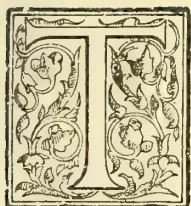

HE subject of our present notice has had one of the most varied careers of any included in our list of pioneers. This will be seen when we mention that Mr. Tottenham as a young man went out to try his fortune in 1851 in California; thence

he passed to Australia, and afterwards to China, visiting most of the Treaty Ports, while he was out again during the time of the siege of Canton. Mr. Tottenham also visited Persia and Arabia during the Persian War, and thence came to India during the Mutiny, visiting all the Presidencies; afterwards he travelled in Java, Borneo, the Straits Settlements, the Cape, Canada, and the Eastern and Western States of the American Republic.

Mr. Tottenham first landed in Ceylon in 1859, and his immediate object at that time was to shoot elephants which, forty years ago, were very numerous and destructive. So much was this the case that one elephant which fell to his rifle was declared by the headman who accompanied Mr. Tottenham to have killed no fewer than 27 men in his village alone. The short spell of sport then experienced made Mr. Tottenham always ready for more, and during his stay in the island he never missed an opportunity of a turn at the elephants. It is in-

teresting to note that one young elephant caught by Mr. Tottenham developed into a very fine “tusker” and that he has figured prominently for a quarter of a century in the annual Perahara festival and procession in Kandy and still continues to do so occasionally. In his younger days, a planter christened him “Timothy” and his manner was perfect: he used to follow Mr. Tottenham about like a dog and got quite put out if his master had to leave him even for a short time.

Mr. Tottenham's most noted connection with coffee-planting was as a pioneer in the district of Haputale. He was known to be a good judge of soil, and we well remember hearing how Colombo and Kandy capitalists were found ready to bid for certain blocks of land offered for sale at the Kandy Kacheri because they had been selected by, and surveyed at the instance of, Mr. Tottenham. This led to competition and high prices for some of the Haputale lots of forest-land. In the earlier days of coffee, it was considered a point of honour not to oppose a purchaser who had gone into the jungle and selected and caused a lot of land to be surveyed and offered for sale. But competition became too keen for this rule to be observed after the early “sixties.” Be that as it may, soon after Mr. Tottenham's arrival, influenced by the coffee-fever and, in conjunction with his friends, Wm. Bain and Alexander Adam, he acquired the Monerakande

551------------------------------------------------

524THE TROPICAL AGRICULTURIST.[FEB. 1, 1899.

and Mousakelle estates in Haputale as well as Moragahagalla estate in the Knuckles. Mr. Tottenham subsequently opened Lunugalla in Haputale, purchased Amanadowa and another estate in the then newly-formed district of Madulsima; besides Bambrella and Dawatakelle in the Knuckles; Wattagalla in Rangala; and Mousava, Morankanda, Udahena and Bulugahatenne in Kurunegala district. In this way Mr. Tottenham became the owner of a larger number of coffee plantations than almost any other individual proprietor in the island if we except, perhaps, Mr. A. C. White.

Mr. Tottenham never settled down himself to manage any of his properties, though he took a general interest and oversight: engineering work was however more congenial to his taste. He was fortunate enough to secure a contract from the Ceylon Government for the survey of Temple Lands at a fixed rate per acre which, it was understood, resulted in considerable advantage to the Contracting Surveyor. Mr. Tottenham imported a considerable staff of Surveyors amongst whom were Messrs. H. S. Deane (Chief Assistant), T. Smith, James Gunn, Borron, Collinson Agar, and L. P. Tottenham, a younger brother of his own; and very speedily disposed of the work entrusted to him. Some of his staff afterwards joined the Survey, Public Works and Railway Departments; and others went to the Straits Settlements. Soon after this, while in Europe, Mr. Tottenham took great interest in contriving a means for securing better means of transport for the Uva districts. His proposal took the form of a Wire Tramway to be operated chiefly by water power, and to run from the neighbourhood of Kandy *via* Dumbara, Lower Hewaheta, Maturata and across Udapussellawa by the Nildandahena Pass to Haputale and Badulla. The experiment went so far, that a trial overhead wire tramway was erected on Brighton Downs, and there we had the pleasure of personally inspecting it in 1870 in company with Mr. Tottenham, when we were certainly very favourably impressed with the prospect of its practical success. (We had, afterwards, at Mr. Tottenham's invitation, in London the opportunity of meeting representatives of the coffee enterprise from nearly every part of the world, not only Ceylon and India, but Java, Brazil, Guatemala, Jamaica and Natal, the dinner party including Mr. Rucker, senior, who told us he had sold Ceylon Coffee in his day at 18s. and 118s. per cwt!) The Wire Tramway, however, did not quite satisfy Mr. Tottenham and was finally abandoned.

Early in 1872 and after a memorable visit to Uva, we began writing on the subject of Railway extension from Nawalapitiya to Haputale, collecting the needful statistics of acreage and coffee crops and drawing up the first Memorial on the subject to Governor Sir Wm. Gregory. Mr. Tottenham very kindly placed the benefit of his professional knowledge at our service, and supplied an estimate of cost for a narrow-gauge line to run from Nawalapitiya, *via* lower Kotmale, Pundaluoya and the valley of the Nanuoya to Upper Dimbula and so across to Haputale. Mr. Tottenham went so far as to indicate his readiness to construct such a line for £11,000 sterling per mile. But the Ceylon Government was far too slow to act on any such offer, and the time was then fast approaching when Mr. Tottenham was to sell out of Uva and quit Ceylon for a number of years. This transfer of interests occurred in 1873 when all the Haputale and most of the other estates were sold to the late L. St. George Carey on his establishing the firm of Carey, Strachan & Co. To the

same firm Mr. Tottenham sold the estates of his late cousin, Cornwallis Tottenham, and the group belonging to Sir John Cheape which included Galaha, Kitulamoola, the three Vedahettas (North, East and West) and one or two other places. About this time Mr. Tottenham with the aid of the late John Gordon (of coffee pulper fame) introduced from Liberia

#### THE FIRST LIBERIAN COFFEE

ever seen in the East. By means of wardian cases, Mr. Tottenham sent out a large quantity of ripe cherry coffee and a large number of well grown plants; and Mr. Bull, the well-known Chelsea nursery-owner, who attended to Mr. Tottenham's plants in transit, afterwards raised seedlings and plants from cherry and sold them for some time, as a tropical novelty, as high as ten shillings per plant! Since that year, 1873, Liberian Coffee has spread to many parts of the Eastern world, notably to the Straits Settlements and Java, although in Ceylon much has not been made of it. In introducing it Mr. Tottenham (like every one else who took an interest in it) fully anticipated that a variety of coffee, so hardy and coarse in its growth, would be able to withstand the fungus *Hemileia vastatrix* "Coffee-leaf disease," which had begun to ravage the Ceylon plantations of the Arabian kind. But this anticipation was doomed to disappointment in Ceylon, although farther East the cultivation has been persevered in with a considerable measure of success.

Mr. Tottenham was absent from Ceylon from 1873 till 1897; but he was by no means idle. He is indeed of the type of colonist and professional man who must always be occupied with some useful practical undertaking. It would take too long, and occupy much space, if we entered into anything like adequate mention of Mr. Tottenham's experiences in financial and industrial undertakings in the United Kingdom as well as other countries—as a contractor, for instance, for the construction of the Northern system of Docks in Liverpool, now used by all the large American Liners, or of his Mining investments in Spain and other parts of the world. But we must mention his candidature for a seat in the Imperial Parliament, a return to which he missed (or escaped!) solely through the Borough for which he stood being merged in the County, by the Re-distribution of Seats Act in 1885.

A more notable circumstance—and one that must have given Mr. Tottenham much satisfaction—was his bringing under the notice of the British War authorities, in 1888—the first time their attention had been drawn to it—the very important, not to say vital, question of "high explosives." This reminder resulted in the experiments undertaken at Lydd, and the adoption of what is now called "Lyddite" by the British Government. Through Mr. Tottenham's business connections with different continental countries, he was at the time (1888) in possession of records of certain "high explosive" experiments in other countries which were both new and astonishing to the British authorities. Since then "high explosives" have received and are receiving much attention on the part of the officials of both Army and Navy, who thus show that they fully realise the importance of keeping pace with other countries in experiments and preparations, however much we may desire that peace, and the Czar's "truce of God," may prevail.—It may be mentioned that Mr. Tottenham is a member of the Wellington and Carlton Clubs in London.

552------------------------------------------------

FEB. 1, 1899.]THE TROPICAL AGRICULTURIST.525RETURN TO CEYLON IN 1897: PLUMBAGO AND PLANTING.

Although he had sold out of the valuable Uva properties and some others on the Kandy side, Mr. Tottenham continued to hold the extensive Morankande and Udahena properties—situated on the borders of the Matale, Kandy and Kurunegala districts, though counted in the Estates' list of the last-mentioned district,—and covering some 1,545 acres of which some 650 acres are in cultivation with tea, cacao, some coffee and minor products. Through this property (and his agents Messrs. Whittall & Co.) Mr. Tottenham with a succession of managers who included Messrs. W. G. Rollo, Andrew Polson, A. J. Thomas, &c, maintained his connection with our planting industry from 1873 onwards, through the worst days of coffee disease, making experiments with "Liberian," participating in the short-lived cinchona era—*fiasco* indeed, so far as the lower districts were concerned—cultivating cardamoms, rubber, cacao and finally tea. Even now, Mr. Tottenham has, on Morankande, large clearings in contemplation to be planted during next south-west monsoon. Apart from this, there is the important plumbago mining industry initiated by him on his visit to the island during the winter of 1897. By his engagement of an experienced mining engineer—Capt. Tregay—who had previously worked for Mr. Tottenham in other parts of the world in connection with iron, copper and gold ventures,—a new departure altogether in connection with our one mineral of commercial importance, plumbago, has been taken; and we trust a due measure of success will follow the public-spirited action in this respect of one who had already done much to develop the resources of Ceylon. Capt. Tregay we are glad to know, is well satisfied with what has been already achieved and still more with the prospects of the mine on the Morankande property; and Mr. Tottenham's example has already been followed by the European owners of lowcountry plantations with outcrops or evidences of plumbago. In this way, Mr. Tottenham will be undoubtedly the pioneer of the Colonists who develop plumbago on their plantations in Ceylon.

Mr. Tottenham's return to this island in the winter of 1897, which has already been fruitful in renewed enterprise, was primarily due to the need of seeking a warmer climate on account of his lungs which are not so strong as they were in his prime. Still, no one who knew him, as we did thirty years ago, would see much difference to look at Mr. Tottenham. He carries his years well, looking very little older and is apparently as active, physically and mentally, as when he drew up for us, in 1872, his Estimate of a Railway from Nawalapitiya to Hatutale Pass. This reminds us, by the way, that Mr. Tottenham with exceptional knowledge of the country North of Kurunegala, has not hesitated to condemn Railway Extension in that direction which he considers folly, while the further use of the broad gauge in a country devoid of population and traffic, he deems utter madness. He strongly supports our view that the way to serve North and East Ceylon is by a narrow gauge from Colombo via Puttalam. This by the way.

On returning to Ceylon after an absence of 24 years, Mr. Tottenham of course saw very great changes, notably in Colombo Harbour Works, Public Buildings, &c. Still more was the change in the personnel of the Colonists brought home to him, his mind naturally reverting to the Pioneers of early days among Ceylon Colonists, so few of

whom remain either here or above the sod. Reverting to the Ceylon of the "fifties" and "sixties," Mr. Tottenham's memory is filled with the kindest recollections of such old friends as the Cruwells, MacLellans, Tyndall, Corbet, Byers, John Brown, John Gordon, Lyon Fraser and other Frasers, Cattos, John Martin, Donald Bain, John Rennie, Chippindall, Morrison ("Bengal Tiger"), Peter Moir, Abercrombie Swan, Drs. Boyd Moss and Baylis, Dr. Kelson, Esdaile, Lambert, Scott, John Davidson, the Macdonalds, Forsyths, W. D. Gibbon and a host of others—all good men and true—fit to lay the foundations and ensure the success of any Colony; while he would not omit to give a special place to his very old friends and partners, Adam and Bain, than whom better and truer men and planters never lived. One can understand how sad it must be to revisit the Colony and miss so many old friends; but

Good and true men still remain,  
If good and true are gone.

And we are glad to know that Mr. Tottenham is pleased with his first trip, and so interested in his own property and its development, that he is likely (d.v.) to make a regular Winter and Spring visit to the Colony of his early choice for several years to come, and so avoid the trying part of the year in the old country. Mr. Tottenham's earnest hope is that Ceylon has a long era of prosperity still before her and in a letter which now lies before us he says:—"I know our British Colonies pretty well; but to my mind none compare favourably with Ceylon in the amenities, "conveniences and comforts of existence." This is high praise from one who has travelled so widely and observed so closely as Mr. Tottenham has, and in enrolling his name among the Planting Pioneers of Ceylon, we think it is a uniquely interesting fact that he should return, after a quarter century's absence, to take a share as Estate proprietor, in the further Planting and Mining development of the Colony. There are other absent proprietor-pioneers of the long ago who might do worse than follow Mr. Tottenham's example; for, to escape the severe English winter and early spring and to spend it with pleasure and interest if not with profit, in Ceylon should be a very successful way of extending one's usefulness and improving one's health, if not prolonging life itself. All such returning old Colonists will, we feel sure, meet with the hearty welcome which is due to the subject of our notice and collotype portrait, Mr. CHARLES TOTTENHAM.

INSECT PESTS IN CALIFORNIA.  
TRIUMPHS OF PRACTICAL ENTOMOLOGY.

"I guess you want the bug inspector. He's right in there." It was thus that a polite gentleman on the San Francisco press replied to my inquiry concerning the office of Mr. Alex. Craw, who is by the act of the Legislature "clerk of the Publishing and Quarantine Bureau of the State Board of Horticulture." I found this officer occupying offices in a modest wooden building on the water front of the city, and more prominent than the office furniture were enormous large glass vessels containing friendly beetles feeding upon rations of injurious insects. When I called on another occasion Mr. Craw was out, and an obliging gentleman in the office said, "He'll not be back for quite a time. Guess he's gone across the bay to get food for his beetles." It soon became apparent, therefore, that beetles and the food of beetles constituted an interest of supreme importance in the office of the chief officer of horticultural quarantine. One was familiar with the romantic

553------------------------------------------------

526THE TROPICAL AGRICULTURIST.[FEB. 1, 1899.]

history of the destruction of the dreaded cottony cushion scale by the imported ladybird beetle, but quite unprepared to find how important that incident had been, or how far the principle of fighting insect pests by the introduction of their natural enemies had been turned to practical account. The magnitude of the interests which were seriously threatened by the spread of insect pests under the peculiarly favourable conditions of the Californian climate are well known. The pressure of these large interests operating upon the peculiarly free and open mind of the Californian have brought about results of the most surprising kind—results full of information and suggestion to scientists throughout the world, and especially important to the inhabitants of Australia.

#### BEETLE v. SCALE.

"Let us spray" is no longer the watch-word of the Californian fruit grower. "Start an Australian colony" is a much more up-to-date proposition. The spray, or more frequently fumigation, is used in the case of diseases for which no effective natural enemy has yet been found, but the greatest good has been done by "our little Australian friends," and the great aim of the fruit grower is to discover the natural enemies of the remaining pests. The results of the discoveries already made, and the vast benefits accruing, have been to elevate entomology to the first rank of importance. It is no longer looked upon as merely the amiable pursuit of sticking pins through harmless beetles, and finding hard names for the most simple insects, but the science has become a subject of the highest practical value. "It has saved the State millions of dollars," and in America, especially, where the value of anything can be stated in dollars, its position is secure. The first triumph was the discovery of the Australian benefactor, *Vedalia cardinalis*, the enemy of the cottony cushion scale, *Iceyria purchasi*. The citrus fruits of California are valued at £1,250,000 sterling per annum, with a rapid expansion of production as the result of an increasing area of plantation. Some years ago, when the Australian scale got to work on the trees, the industry was confronted with apparently total extinction. The scale had killed out the orange trees at the Cape, and in spite of remedies, it was found that the disease made rapid progress in California. The Scale could be held only partly in check by treatment, and the expense was too great. It was at this crisis that Australia, which sent the bane, produced the antidote, and this valuable and growing industry was saved. The ladybird beetle, when introduced, commenced on the scales, and finding plenty of food ready to hand, and being free from their own parasites, which they had left at home, devoured the pests, and soon began to die owing to the scarcity of scale food. Thus the most dreaded of all diseases of the orange has now ceased to give any serious trouble in California. There is, in fact, far more anxiety to preserve sufficient scales to keep the Australian beetle from dying out than that the pest will otherwise give trouble. Many growers are cultivating scale to feed their ladybirds, but Mr. Craw assures them that they need not do so, as he is keeping sufficient stock to supply all the requirements of the State. It seems strange enough that those simple looking glass jars in Mr. Craw's office contain that which is capable of ensuring the great citrus industry of California against such a destructive pest as the deadly scale. It is true, however, and what is more, the vessels contain many other beneficial insects destined to play havoc with pests almost as destructive to other fruits, as the cottony cushion scale is to citrus trees.

#### THE KOEBELE DISCOVERIES.

The science of entomology in California has been stimulated, and in a measure directed, by practical suggestion. The Californian fruit grower has no use for "scientific information" which cannot be turned to practical account. When the orange industry was in its greatest strength, entomologists

came out from Washington to recommend and direct the use of certain remedies which had been beneficial in other States; but the leading growers said, "Don't waste your time in that way. We know all about your sprays and washes, but they are not good to us. You can't kill all the insects, and in this country what are left are enough to keep us spraying all the time, and the thing won't pay. We want you to hunt up the natural enemy of the scale." It was a fortunate thing for California when the President appointed the late Mr. F. M. Coppin, of San Francisco, as American commissioner to our Centennial Exhibition. Efforts to get the Government to send a scientist to Australia in search of the natural enemy of the orange scale had failed, and might not have succeeded to this day. But Mr. M. Coppin said to a large fruit grower, "We'll, I'm going out to Australia. Can I do anything for your interest?" The reply was, "There is only one thing to be done. Take a scientific man alone with you, and let him find something that will cure the orange scale." Mr. M. Coppin knew this was good advice, and he acted upon it, paying the cost of the scientific expedition out of the exhibition appropriation. The selection of a scientist for the work was a most happy one—viz., Mr. A. Koebele, a young entomologist of the United States Department of Agriculture, who had been working for some time in California. How Mr. Koebele discovered the *Vedalia cardinalis*, and saved the Californian lemon industry is well known. The work was better appreciated in California than at Washington, so that when afterwards Mr. Koebele was wanted to go out again, and also to visit India, China, Japan, and the Pacific Islands to look for the enemies of the other pests, no encouragement was received from the Federal Department. California, however, knew the value of work of this kind, and the State Legislature voted £1000 for Mr. Koebele's second mission. The second journey brought great gain to the movement in favour of natural remedies for insect pests. The black scale of the citrus and olive trees, the mealy bugs and other pests had effective natural enemies, which Mr. Koebele discovered and sent home, thus completing the transformation which has taken place in the treatment of insect pests in California.

#### THE SECOND KOEBELE EXPEDITION.

Three beneficial insects, which have proved themselves admirably effective, as well as several other promising ones still on their trial, are the result of Mr. Koebele's second mission. One of the most important is an Australian beetle, *Rhizobius centralis*, which preys upon the dirty black scale of the olive and orange *Tecomium Olex*. Mr. Ellwood Cooper, the great olive grower of California, had to pay from £600 to £1000 a year in keeping this scale within bounds. Soon after introducing the *Rhizobii* the trees became free from the pest, and he now spends nothing upon remedies. His only care is to preserve the beetles. This gentleman has stated publicly that he has spent £20,000 on insect pests. Mr. D. Freeman, a large orange grower, had his crop reduced from 250 tons to 350 boxes by the black scale, but this Australian beetle saved the grove and brought it back to full productiveness. These are only examples of the general experience. Another valuable acquisition is the *Cryptolæmus montronzieri*, an effective enemy of the mealy bug (*Dactylopius*), and two others introduced at the same time promise to be very useful. The third proved acquisition of this mission is an Australian ladybird, which works on the orange scale even more effectively than the original *Vedalia cardinalis*—viz., the *Novius Koebelei*. These, with certain other beneficial insects, introduced in some places accidentally, have brought about the great change in the treatment of pests which has been already referred to. Scores of colonies of the beneficial insects are sent out in little boxes from Mr. Craw's office every month, and before the pests were so well under control as they are now the colonies sent out ranged from 300 to 800 per month.

554------------------------------------------------

FEB. 1, 1899.]THE TROPICAL AGRICULTURIST.527SAN JOSE SCALE AND BROWN SCALE.

The San Jose scale, which is still playing havoc with the orchards in Maryland and some other eastern States, has long ceased to be a serious pest in California. San Jose is about fifty miles from San Francisco, and the place should not have given its name to this deadly scale. The scale was innocently introduced into that district from Chili by the late Mr. Lick, the great benefactor, whose astronomical observatory, with its immense telescope, crowns Mount Hamilton, over-looking the orchard district of San Jose. This pest is the true pernicious scale, *Aspidiotus perniciosus*. It preys upon all deciduous fruits, except the apricot and a certain black cherry, and at one time did immense damage in the orchards of California. The effectual treatment in this case also was the cultivation of the scale's natural enemies. It was cleared out of the State as a serious pest by one internal parasite, *Aphaleinus fuscipennes*, and two beetles—the twice stabbed ladybird (*Chilocorus bivulnaris*) and the Australian brown necked ladybird (*Rhizobius Toowoombæ*). Now it is found only as a rare insect on isolated trees in towns where the scale is able to thrive because its enemies fly off and have no neighbouring trees to light on. The brown scale of the orange *Lecanium hesperidam*, is quite as destructive as the more notorious scirya. Some thirty years ago the orange groves of Southern California were seriously attacked, and large numbers of them were killed, notwithstanding the most vigorous efforts of the growers. The disease, however, at length died out, having apparently "cursed itself." This was before the days of the new sectional survey system, but it has since been discovered that the cure was the work of two internal parasites, viz, *Eucyrthus flabis* and *Coccoephagus lecani*. The brown scale has given no trouble for many years. The yellow scale of Japan, *Aspidiotus citrimus*, gives little trouble, being kept in check by an internal parasite, *Aspidiotophagus citrimus*, and sanguine hopes are entertained of finding effective insect remedies for other pests.

THE LIMITATIONS OF THE SYSTEM.

The remaining scale which gives trouble, and for which no effective natural remedy has been found, is the "red scale," *Aspidiotus aurantii*. Until the natural enemy of this scale is found, spraying and fumigating will have to be continued. For the various pests of deciduous trees also, spraying and fumigation have still to be carried on. Reports, however, have just been received from the Los Angeles district of another striking instance of the success of natural remedies. The ornamental trees of the city and surroundings got so bad with scale diseases that their removal was seriously contemplated. The beetles got to work, however, with such good purpose that now it is believed the trees will soon be clean. It may be asked why this system is not so successful in the other States of America. The answer is a simple one. It is a matter of climate. The beetles are more highly organised forms than the scales, and cannot stand the severe winters so well. This was foreseen by the Californian discoverers, and still Eastern people are surprised when they make the discovery for themselves. There are so many climates in Californian that difficulties have been found in getting the scheme to work in some districts. Perseverance, however, is securing success in unexposed quarters, and means may yet be found of making the Californian scheme of treatment available in regions possessing frozen winters. Fortunately there is no climatic bar to the application of the system in Australia. Without assistance it kept the Parramatta orange-trees clean for more than 100 years. It probably saves the Australian continent from being devoured by locusts, and vigorous research should be continually carried on with the view of applying it to all descriptions of insect pests.—MR. T. K. DOW, in the *Melbourne Leader*.

THE PRINCIPLES AND PRACTICE OF PRUNING.

(Concluded from page 455.)

As regards the detailed pruning of a tree, this must be taken in hand at two periods of the year, viz., in the winter and the summer. In the former season the most important part of the operation must be performed, viz., that dealing with the older wood, with the training of the parts of the tree, and the more careful and accurate preparation for fruit-formation; for more can naturally be done during the dormant condition of the tree, when the sap is at rest, than during the summer, when life is active. In the summer it is more a question of general thinning-out, or suppression of the redundant green twigs, which have sprung up everywhere on the tree, as a result of the vigorous summer activity of the latter which, throwing off the restraint of cultivation, tends to revert to its original ancestral condition.

The following observations are concerned only with general principles, and will not usually, therefore, distinguish between winter and summer-pruning, the main features of each of which have respectively been stated above.

There are various of the more detailed processes in pruning which require really more knowledge, care, and tact than the untrained practitioner would at first imagine. For instance, in pruning-back a main lateral branch, this should always be effected close above a lower eye or bud, for the outgrowth from the latter, which is to form the continuation of the branch, will not tend so much to spoil the general curvature of the branch as would an outgrowth from an upper eye, for the cut surface immediately above its origin would be more quickly covered, owing to the fact that the tissues increase in thickness more rapidly on the upper than on the lower surface of a shoot, and thus the even continuity of the new outgrowth with the branch would be the sooner established. Moreover, the reason why it is always, in the case, at least, of these main branches, advisable to prune to an eye, lies in the fact that if a dead stump of wood be left beyond an eye, the outgrowth from the latter will not only be considerably diverted from its right direction of growth as an even continuation of the mother-branch, but as a result of this, will not draw the sap in such full an sufficient quantity to the fruit developing all along the whole branch. For it is obvious that along a straight or evenly-curved branch the sap will be more even in flow and more unchecked in quantity.

I have stated above that in the case of our hardy fruit-trees trained to walls or espaliers, it is dangerous to shorten the lateral branches, as this induces the production of too many woody twigs; this rule applies in a general way to all trees, but is less to be regarded in the case of pyramids, standards, &c., as attention has in these latter to be paid to the acquisition of the proper form, when some shortening of the lateral branches is inevitable; but this shortening partakes usually only of a slight character. But where shoots which are nipped or cut off low down, as in the vigorous green tertiary shoots formed in summer, are liable to break out again very shortly, and perhaps with as great vigour as before, it is advisable, though involving a little more time and labour, not to remove the shoots at all, but to twist them with the finger and thumb at a point near the base so as to leave them still attached and hanging from the injured portion. In this way they for a time draw a portion of the sap, which prevents the buds below from bursting forth, and yet does not detract to any appreciable extent from the supply of sap to the fruit spurs on the mother branch. These hanging twigs at length gradually wither up, when they can be easily pulled off. If, however, the nipping of these green twigs takes place towards the end of the summer, say at the end of July or August, the likelihood of their again shooting out will not be so great (except in a wet season), for

555------------------------------------------------

528THE TROPICAL AGRICULTURIST.[FEB. 1, 1899.

the activity of the sap's movement and the general vigour of the tree have passed their maximum, and a gradual decline of the life-energy has set in. Yet it is probably the better plan to undertake the summer pruning and training early on in the season, say in May or June, for the superabundance of green twigs being removed and the branches trained as far as possible into their proper positions, the sun, air, and rain-showers will have freer access to the tree all through the summer, which will be a most important factor in the formation of good fruit the same year, and in the ripening of wood for the production of fruit the ensuing season.

As it is a fact that no two branches of a tree are alike in character, but that some are more vigorous in growth or more fertile than others, it follows that each branch must receive its own peculiar treatment, and that the same treatment must not be applied to all alike, as if the trees were a mere machine, for in a tree, as in everything else, true unity is always constituted by variety in its separate parts. If a branch is too rank as compared with the others about it, that is to say, if it tends to produce too much wood at the expense of fruit-spurs, its vigour must be diminished. This may be done either by leaving it entirely unshortened, so that the sap at length exhausts its exuberance in the natural manner throughout the length of the branch, with the result that the surrounding branches again equal it in strength, or the effective measure may be adopted of bending the too vigorous branch out of the perpendicular or obliquely-ascending plane into the horizontal, or, in the case of many wall or espalier trees, out of the horizontal into an obliquely-descending position, so as to induce the shoot to grow towards the ground. The more horizontally-inclined or decumbent is the direction of growth of a shoot or branch, the less vigorous will inevitably be its growth. In a horizontally-growing branch, for instance, the leafy twigs, instead of being more or less radially disposed around a branch as in an upward-growing shoot, will appear on the upper side only, where the fullest amount of light is to be obtained and consequently the sap will be drawn principally to the upper side of the branch, resulting in a lop-sided development of the latter (a transverse section of the branch showing its upper side to possess a much thicker layer of wood than the lower); this uneven distribution of the sap and consequent one-sided development of the branch must result in a retardation of the growth in length of the branch and of its general vigour. The natural course of the sap is upward, and when this course is in any way disturbed or thwarted, weakness of the organ concerned must ensue. Hence, wall and espalier-trees with horizontally-trained boughs will be less vigorous in vegetative growth, and therefore adopted to produce finer fruit, than pyramids and other forms with ascending boughs, and, to take an illustration from our forest trees, the "weeping" varieties will always be found to be less vigorous than the type form. So that in Nature there are very few instances of plants with perfectly horizontal or "weeping" vegetative branches, for this is an unnatural and, as I have shown, a mode of growth unfavourable to the attainment of true vigour and the fulfilment of the proper life-functions.

Another method of reducing the rankness and strength of a branch is that of making in the lower part thereof a deep transverse incision reaching as far as the inner and older layers of the wood; in this way a considerable portion of the area of the pathway of the sap being interrupted (this pathway lying chiefly in the younger layers of wood), the nutrition and, consequently, the vigour of the branch will be very much lessened; but the incision being only on one side of the branch the sap will continue to flow, though in diminished quantity, through the branch, and after a time the wound will heal.

If, in an unfruitful branch, it is desired to induce the formation of fruit-spurs from dormant eyes, this may frequently be done by making an incision

in the stem immediately below the eye, reaching as far as the wood but not penetrating the latter, or by entirely removing a circular area of the cortex all round the branch at that point; this practice is founded on the well-known fact that the elaborated sap containing the organic food substances, such as the sugars and proteins, assumes a descending course through the cortical and bast-tissues of the plant; these tissues, therefore, being removed below the eye which it is wished to force into a fruit-bearing twig, the substances above-mentioned accumulate here in great quantity, and causes the sprouting of the eye.

The same practice may be applied when it is wished to increase the size or improve the flavour of fruit already in process of development, the incision being made below the fruit-spur on the mother-branch. It is to be noted that in these instances the ascending sap is quite unaffected in its course, the wood being left quite undisturbed.

Conversely, to those branches of the tree which are lacking in the necessary vigour, the process of shortening must be applied, as also the nipping off of the fruit-forming buds, and in this way the production of more woody growth will be induced, and a spur to greater vegetative vigour be given. Here again, the method may be applied of making a deep incision into the younger wood on one side of the main stem of the tree, just above the insertion of the branch which it is desired to strengthen; by so doing a portion of the ascending sap will be interrupted at that point and diverted into the branch, increasing thereby its nutrition and vigour.

There is a natural tendency in all vertically-growing stems for the upper appendages, as branches or flowers, to develop at the expense of the lower ones; this may be, in some measure, overcome by giving the branch at first a horizontal direction of growth prior to the natural ascending or vertical one.

In order to secure a proper development of the fruit, careful attention must be paid to the tending of the fruit-buds as they form; if the twig on which they appear requires shortening owing to its too woody extension beyond the buds, this must never be done until the buds are considerably advanced in the formation of the floral organs, for if the twig be pruned too early the fruit-buds might be induced to change their mode of growth owing to the great accumulation of watery sap in their immediate neighbourhood, and develop into vegetative shoots instead of into flowers; this, however, will not be possible when once the distinctive character of the organs enclosed in the bud are laid down, and the shortening of the twig will then act beneficially by increasing the quality and vigour of the individual flowers, and eventually of the fruit. I need hardly add that thinning of the buds or flowers will frequently have to be practised where the size of the fruit is a consideration.

In certain forms and kinds of fruit-trees, and by certain cultivators, as in Belgium and France, a systematic rejuvenating process is forced upon the tree, whereby, as the old stem or branches become unfit for fruit-bearing, they are, at the proper time and place, replaced by younger shoots, which themselves, at a future period, are in turn succeeded by others, and so on throughout a long period in the life of the tree. A young lateral shoot is carefully trained exactly parallel with the old one in such a way that at the proper time, when the latter is removed, the former may supply its place and function. By this method of perpetual rejuvenescence, as it were, of the tree, there is no doubt that a large quantity and a better quality of fruit will be produced in a given time, and superior fruit will be obtainable for a longer period. But the very severe wounding treatment involved in this process must in the long run weaken the vitality of the tree. On the whole, it seems advisable to adapt less slashing and wounding, and more natural methods.

556------------------------------------------------

FEB. 1, 1899.]THE TROPICAL AGRICULTURIST.529

In spite of all that has been said in favour of pruning, many will, no doubt, assert, and with truth, that many kinds of fruit trees, if left entirely to themselves, and which never feel the knife or the support of the wall or espalier, will yet, even when young, produce an abundance of fruit year after year. Nevertheless, while not doubting this statement, the fact remains that, on the whole, and in the long run, trees which are carefully trained and pruned while young, will repay the grower by a more regular and abundant supply and a better quality of fruit than those trees which are left entirely to their own natural devices.

The fact that the old trees of farm and cottage orchards are observed to bear, year after year, an exuberance of luscious fruit of excellent quality is a natural result, firstly, of the probable early training and pruning of the trees when young and easy of manipulation; and, secondly, of the arrival at maturity of these trees when, the acme of their vegetative vigor and growth having been passed, and the ultimate natural form and size of the tree attained, this vegetative growth at length, in the fulness of the trees' maturity, has been equalled by that of the reproductive organs—the flowers and the fruit; this process resulting in the striking of an even balance between the two forces mentioned in the opening paragraphs of this article—the vegetative and the reproductive; a return to the more perfect ways of Nature being the result. And such trees in their maturity are always more beautiful to the eye than when, in their younger state, they are under the domination of the knife and the wall. The superior quality of the fruit in such orchard trees, as compared with the wild crab-trees of a similar shape and mode of growth, and bearing an equal abundance of fruit, is due to their training and pruning when young, and all the other methods of cultivation throughout their life, and to their descent from an age-long cultivated ancestry.

The point more particularly to be insisted on here is that it is during the youthful active vigour of the tree, when the vegetative growth is at its strongest, and when naturally the tree is striving upwards to that maturity of size and form when it will be best fitted for the bearing of fruit, that this natural vegetative vigour must be firmly but judiciously restrained, side by side with other methods of cultivation, in order to the premature production of a superior quality of fruit both in the early and the later periods of the tree's existence; but the tree, having passed a certain age, and beginning to enter on maturity, may be left largely to itself to work out its own salvation in the attainment of an equilibrium between its vegetative and reproductive growth. *W. C. Worsdell, F.L.S.—Gardeners' Chronicle.*

### ANOTHER FRUIT ENEMY.

A NEWLY INTRODUCED SCALE-INSECT (DIASPIS (AULACASPIS) AMYGDALI.)

It may be well to state at the commencement that this pest is quite distinct from the San José scale-insect (*Aspidiotus perniciosus*, Comstock) of the American fruit-growers, which up to the present moment has engaged the attention of the whole fruit-growing industry of the world. But it belongs to the same destructive family of scale-insects (Coccidae), and being of western Asiatic origin, inhabiting a region with a climate somewhat resembling our own, gives us far greater cause for alarm than did its sub-tropical relative—the San José scale.

#### HISTORY OF INTRODUCTION.

In January of the present year a consignment of several hundred Japanese Cherries (*Prunus pseudo-cerasus*) was imported into this country from Japan, which ultimately fell into many hands, and were disseminated over the British Isles without any knowledge they were badly infested with scale. In the following April two of the plants from the con-

signment were submitted to the writer for the purpose of identifying the insects upon them, which proved to be the destructive scale-insect, *Diaspis amygdali*, of Tryon.

#### DISTRIBUTION.

It was originally discovered by Professor Tryon in Australia on the Peach. Mr. Green records it from Fiji, and says that in Ceylon it feeds on many species of plants, but that it is partial to the *Pelargonium*. Professor Cockerell found it injurious to a large number of plants in Jamaica, including the Grape and Peach. The same author also received it from Trinidad. It was in 1892 that it first attracted attention in the United States, where it is a serious pest to the Plum and the Peach. It was also found there on a dwarf-flowering Almond and fifty Tea-bushes imported from Japan; the latter were destroyed (*vide Psyche*, March, 1898, pp. 190, 191). Professor C. Sasaki, of the Agricultural College, Tokyo, describes it (under another name) as a pest to the Mulberry-trees in Japan. Seeing that the insect was originally discovered in Australia, it might be suspected to be indigenous to that country; but I agree with Dr. L. O. Howard and the late Dr. C. V. Riley (*Insect Life*, vol. vi., pp. 287, 295), that Japan is very probably the original home of the species, as we have now three authentic instances of its occurrence on freshly-imported plants from that country.—*Gardeners' Chronicle.*

### PINE-APPLE INDUSTRY OF THE BAHAMAS.

After sponge, the most important productions of the Bahamas are pine-apples, of which no less than nearly 5,000,000 were shipped to the United States in 1897. The report of the Acting Colonial Secretary states that they are chiefly grown in the islands of Eleuthera, San Salvador, and long Island; but nearly every island of considerable size possesses soil which is suited to the cultivation of pine-apples. The species produced is known as the "scarlet", or "red Spanish," and is of inferior quality. It is, however, a good traveller, and four-fifths of the output of these islands go to the canning factories of Baltimore. The methods of cultivation are exceedingly primitive. As many as 20,000 plants are crammed into an arce of more or less rocky ground, and it is only during the last three or four years that chemical fertilizers have been used in these fields. In most cases the pine-apples are grown on the *metayer* system, the owners of the large tracts of land sharing with the cultivators the crop of fruit. These proprietors make advances in cash or provisions to the labourers until the reaping of a crop, and the cultivator is precluded, under an agreement, from selling his share to any other than the landlord. The price to be paid for the fruit varies from 1s. to 1s. 6d. per dozen, according to the date of production; and as the cultivator does not receive more for a fruit weighing six pounds than he does for one that is only half the size quantity and not quality is the object of his labours. From eighteen months to two years must elapse between the planting and a reaping of a crop of pine-apples, and in that interval the cultivator will have required so many advances in cash and provisions for the maintenance of his family that his account with the landlord in the shipping season is very often on the wrong side. The system is open to much objection. Apart from the unsatisfactory transactions in truck, the method acts as a bar to any improvement in cultivation, and tends to the elimination of any independence on the part of the labourer. When ripe the pine-apples are cut and carried on the heads of men and women to the beach nearest the plantation, where they are shipped in large American sailing vessels. The Acting Colonial Secretary says it will hardly be credited that in most cases the fruit is shipped in the bulk in the ship's hold, and as a large schooner will carry from 75,000

557------------------------------------------------

530

THE TROPICAL AGRICULTURIST.

[FEB. 1, 1899.

to 150,000 pine-apples, the condition of the fruit in the lowest layers, when it arrives in Baltimore, after a 10 days' passage, may be better imagined than described. In spite, however of these intensely primitive methods, the pine-apple cultivation in the Bahamas is one of considerable profit and importance to the colony; but there is every reason to believe, if more care were taken, and a superior grade of fruit cultivated, the result would be manifestly more profitable to every one concerned. Tentative efforts are now being made to encourage the cultivation of the finer varieties of pine-apples, and there seems to be no reason why the London market which is now principally supplied by the Azore and Canary Islands, should not provide a profitable outlet for Bahamas fruit of a superior grade. Factories for the canning of pine-apples have lately been established in Nassau and in Eleuthera, and in 1897 they shipped more than 20,000 cases of preserved fruit.—*Journal of the Society of Arts.*

DOES MANURING PAY?

SIR,—With reference to the correspondence on manuring, I enclose overleaf a couple of estimates. One for an estate of 300 acres, which is not manured, and another for a similar estate, which, for three consecutive years, has been liberally treated with manure.

The result is somewhat curious. Instead of increasing the cost per lb. of made tea, the application of manure apparently reduces the expenditure by nearly 4 cents.

In the first case the profit per annum is R9,360—and in the second case, even allowing for a drop of  $\frac{1}{3}$ d. per lb. in the gross price realised (a drop which I personally think would not occur) the profits amount to R18,840, or nearly double the previous return.

There is, of course, no question that in the first and second year of manuring, the profits would not be so encouraging.

The first year would probably show a considerable drop in the returns. In other words the first year's manuring should be treated as capital expenditure, just as much as if an additional acreage in tea was opened up. I do not think my estimates of yield can be taken exception to; at least if they are, I can point to three adjacent estates in the district, two giving a yield of 300 lb. an acre, and the third, which has been regularly manured at the rate of  $\frac{1}{3}$  ton per acre to  $\frac{1}{3}$  of the estate per annum, for the past few years, now yielding a crop of over 600 lb. per acre.

From the above, it will be seen the manuring apparently increases the cost of the following items, viz., general contingencies, tools, lines, agency charges weeding and pruning, while plucking and manufacture are decreased, owing to the freer flushes, and larger crop dealt with. The nett result is an increase of yield to a very considerable extent, and a large drop in the cost of production.

It is unnecessary to point out that these results are not, and cannot be obtained if manuring is taken up in a half-hearted way. Fifteen to twenty tons of manure on a 300 acre estate with worn out soil, dribbled in yearly at the rate of quarter to one-third ton per acre, does not pay and never will pay. It is absurd to expect one-third ton per acre, or less to remain unexhausted for five years. The effect will last, perhaps, two years, but after that the yield will be found to drop below that of the unmanured fields; thus, probably in time leaving little if any nett increase of crop from the estate, while an annual loss equivalent to the cost of the manure, and its application, will be incurred.

If manuring is to be made to pay, proprietors and agents must be prepared to find the extra capital for increasing their factory and line accommodation and

for covering the cost manure during the first year; otherwise, if the factory accommodation be not extended, the inevitable drop in prices which is too often aid to the "discredit" of manure, is sure to follow. 1 Maskeliya, Nov. 10th. H. M. A.

ESTIMATE OF GENERAL EXPENDITURE ON TWO SIMILAR ESTATES OF 300 ACRES EACH SITUATED, SAY, IN MASKELIYA DISTRICT, ON OLD WORN-OUT COFFEE SOIL.

<table border="1">
<thead>
<tr>
<th colspan="2">A. General Expenditure Without Manure.</th>
<th colspan="2">B. Gen. Expendr. for 3 Years of Manuring.</th>
</tr>
<tr>
<th>Works.</th>
<th>Quantities.</th>
<th>Quantities.</th>
<th>Remarks.</th>
</tr>
</thead>
<tbody>
<tr>
<td>Superintendence</td>
<td>4,080</td>
<td>4,080</td>
<td>60 tons of manure per annum having been applied for past two years, at the rate of <math>\frac{1}{3}</math> ton per acre, to <math>\frac{1}{3}</math> of the estate, (i.e. 100 acres).</td>
</tr>
<tr>
<td>Allowances, Line Sweepers</td>
<td>480</td>
<td>480</td>
<td></td>
</tr>
<tr>
<td>General Contingencies</td>
<td>450</td>
<td>550</td>
<td></td>
</tr>
<tr>
<td>Grass-lands, Ravines, Timber...</td>
<td>100</td>
<td>100</td>
<td></td>
</tr>
<tr>
<td>Bungalows</td>
<td>150</td>
<td>150</td>
<td></td>
</tr>
<tr>
<td>Lines</td>
<td>250</td>
<td>350</td>
<td></td>
</tr>
<tr>
<td>Tools, Machinery, Lubricants...</td>
<td>250</td>
<td>750</td>
<td></td>
</tr>
<tr>
<td>Agency Charges</td>
<td>650</td>
<td>250</td>
<td></td>
</tr>
<tr>
<td>Roads, Cart Roads, Assessment</td>
<td>150</td>
<td>150</td>
<td></td>
</tr>
<tr>
<td>Drains</td>
<td>1,200</td>
<td>1,400</td>
<td></td>
</tr>
<tr>
<td>Pruning</td>
<td>9,900</td>
<td>16,500</td>
<td></td>
</tr>
<tr>
<td>Plucking</td>
<td>7,200</td>
<td>11,550</td>
<td></td>
</tr>
<tr>
<td>Manufacture, Fuel, Packing, Transhipment, and Shipping</td>
<td>—</td>
<td>4,250</td>
<td></td>
</tr>
<tr>
<td>Cost of Manure</td>
<td>—</td>
<td>1,000</td>
<td></td>
</tr>
<tr>
<td>Applying Manure</td>
<td>3,280</td>
<td>3,600</td>
<td></td>
</tr>
<tr>
<td>Weeding</td>
<td>98,440</td>
<td>45,510</td>
<td></td>
</tr>
<tr>
<td></td>
<td></td>
<td>10 per cent. on R3,500</td>
<td></td>
</tr>
<tr>
<td></td>
<td></td>
<td>200 acres at R7</td>
<td></td>
</tr>
<tr>
<td></td>
<td></td>
<td>165,000 lbs. at 10 cts.</td>
<td></td>
</tr>
<tr>
<td></td>
<td></td>
<td>ditto at 7 cts.</td>
<td></td>
</tr>
<tr>
<td></td>
<td></td>
<td>50 tons at R65</td>
<td></td>
</tr>
<tr>
<td></td>
<td></td>
<td>100 acres at R10</td>
<td></td>
</tr>
<tr>
<td></td>
<td></td>
<td>3,600 acres at R1</td>
<td></td>
</tr>
</tbody>
</table>

<table border="1">
<thead>
<tr>
<th>Works.</th>
<th>Quantities.</th>
<th>R.</th>
</tr>
</thead>
<tbody>
<tr>
<td>Supt. at R300</td>
<td>4,080</td>
<td>4,080</td>
</tr>
<tr>
<td>Conductor at R40</td>
<td>480</td>
<td>480</td>
</tr>
<tr>
<td>4 coolies</td>
<td>450</td>
<td>450</td>
</tr>
<tr>
<td></td>
<td>100</td>
<td>100</td>
</tr>
<tr>
<td></td>
<td>150</td>
<td>150</td>
</tr>
<tr>
<td>10 per cent. on R2,500</td>
<td>250</td>
<td>250</td>
</tr>
<tr>
<td></td>
<td>650</td>
<td>650</td>
</tr>
<tr>
<td></td>
<td>300</td>
<td>300</td>
</tr>
<tr>
<td></td>
<td>150</td>
<td>150</td>
</tr>
<tr>
<td>200 acres at R8</td>
<td>1,200</td>
<td>1,200</td>
</tr>
<tr>
<td>90,000 lbs. at 11 cts.</td>
<td>9,900</td>
<td>9,900</td>
</tr>
<tr>
<td></td>
<td>7,200</td>
<td>7,200</td>
</tr>
<tr>
<td>900,000 lbs. at 8 cts.</td>
<td>—</td>
<td>—</td>
</tr>
<tr>
<td></td>
<td>3,280</td>
<td>3,280</td>
</tr>
<tr>
<td>3,600 acres at 80 cts.</td>
<td>—</td>
<td>—</td>
</tr>
<tr>
<td></td>
<td>98,440</td>
<td>98,440</td>
</tr>
</tbody>
</table>

A. Crop 300 lbs. per acre = 90,000 lbs., gross price 81. = 42 cents nett; Cost of production = 31½ cents, profit per lb. = 10½ cents.—Total profit = R9,360.  
 B. crop 550 lbs. per acre = 165,000 lbs. gross price 7½d. = 39 cents nett; cost of production = 27½ cents, profit per lb. = 11½ cents.—Total profit = R18,840  
 Deduct interest on factory extension cost of 1st year's manuring R10,000 = R800  
 Deduct interest on increase of  
 Lines R1,000 = 80  
 Deduct interest on increase of  
 Cost advances R1,500 = 120 = 1,000  
 Nett profit R17,840

558------------------------------------------------

FEB. 1, 1899.]THE TROPICAL AGRICULTURIST.531TEA IN MINCING LANE AND  
"CORNERS."

Again and again of late has the opinion been expressed that the law of "supply and demand" will not explain the persistently low prices for Ceylon and Indian teas prevailing in the London market. The statistical position was seldom if ever more favourable. "Fine plucking" has been the rule in Ceylon, new markets have been opened up and shipments to London have been kept below those of the previous year—and yet prices have not risen or even been maintained. How is this? Can there be some truth in reiterated allegations respecting the adverse influence of the large tea buying and packet-distributing houses that have, of late years, come into existence? We know what "corners" and "trusts" have done with certain branches of trade in America. Is there something of the same kind to be realised in the United Kingdom? We hope not. But it is not pleasant nor reassuring to read as we do—in an Australian contemporary—of what is still going on among our cousins across the Atlantic:—

Monopoly finds its most hideous development in the monstrous trusts which seek to control the food supplies of the nation. The intention of this usurpation is to wring out of the necessities of the people the highest price they can be induced to pay without incurring the danger of a revolution. Sometimes it may happen, when rogues fall out and fiercely contend together, that honest men receive a temporary benefit. This is happening at the present time in consequence of a struggle between the two opposing combinations of gigantic monetary resources. Havemeyer, the aggressive head of the Sugar Trust, and Arbuckle, the controller-in-chief of the coffee roasting monopoly, have their hands on each others throats. The cause of quarrel arose two years ago, when the Sugar Trust curtly notified to the Arbuckles a rise in the price of refined sugar. The coffee firm were large customers of the American Sugar Refining Company, but the trust confident in its monopoly after the defeat of the Spreckels' combination, felt able to raise its prices, not only against the inarticulate public, but also against its most prominent supporters. Arbuckle was expected to protest, entreat, and then submit. But to him the rise meant annihilation, for it absorbed every cent of profit on the five pound package of "Angel" coffee—coffee and refined sugar mixed—on which the Arbuckle wealth had been built up. When he represented this to the trust, "all things happen in business" was Havemeyer's cynical reply. "It's business to grow rich; it's business to ruin others when you think they may ruin you." Arbuckle determined to take his ruin fighting, and so he sought to start rivalry in sugar refining, and the trust retaliated by going into coffee. It has now become, as the "New York World," declares, "a fight of millions against millions, of brute force against brute force. Both combatants are bleeding at every pore. The Arbuckles have sustained a loss in two years of 4,000,000 dol. And the depression in sugar is costing Havemeyer from 5,000 to 6,000 dol. a day. And the competition is growing fiercer as the new mills are ready to be brought into active operation. What will be the outcome? Will the fight continue until it ends in the welcome tragedy of the Kilkenny cats, or will the solution be found in another gigantic combine? Meanwhile housewives in America are rejoicing at the phenomenal cheapness of two staple articles of domestic consumption.

Such an example of unintentioned benefit to the public is of exceptional occurrence. The gigantic trusts in the United States are not only equivalent to an organised system of robbery, but are a menace to public liberty. Some idea of the extent to which these combinations dominate the commercial interests of the

country may be gathered from the statement that the American Sugar Refining Company controls 76 per cent of United States refineries, with an output annually of 1,330,000 tons of sugar; that the American Tobacco Trust controls 60 per cent of the cigarette and smoking tobacco factories in the United States; and that the American Cotton Oil Trust, controlled by the Standard Oil Trust, the largest monopoly of them all, owns 70 crude oil mills and 16 refineries. The Standard Oil Trust, which represents a capital of 97,000,000 dol., is now in process of liquidation, some tribute to the effect of the anti-trust laws of the State of Ohio; but there is danger of reorganisation under the more accommodating methods which New Jersey is willing to authorise. The formation of an iron and steel trust, with enormous powers, has given rise to the suspicion that the ultimate intention is to solidify all the giant interests into one colossal corporation, which shall throttle all possibility of competition, and, at the same time, enormously increase the profits by the great reduction of expenses.

THE LONDON CINNAMON SALES.

The Quarterly Sale of Cinnamon, held in London, on the 28th Dec. justified the fears we had been expressing for some time past, in our review of the periodical sales, that the increasing quantities of the spice we have been pouring into the market must bring down prices. One should have thought that the unpleasant experience of cinnamon growers—and that not so very long ago—from over-production, would prevent extensions, especially seeing that the article is not a necessary of life, but a luxury for which the uses are limited; but when has there not been a rush into any product which is reported to be remunerative? Whether it is that the advice and warnings are suspected, as being inspired by selfish and interested people, or that each believes that he will be able to sweep in the gains before the fall comes, there is little use in preaching caution and moderation; and, perhaps, experience is the best teacher; while, after all, it is only moderate profits one can expect from any investment in these days of keen competition. If one wants to find out something likely to yield large profits, one will have to remain idle; while others less ambitious, or less greedy, succeed in earning a living from suspected and prescribed industries, and even in securing a competence.

Anyway we find the growth of exports of cinnamon from the island, reflected in the London market, which, although it no longer monopolises the trade, still continues to attract about one third of our outturn, and is yet our largest customer. According to the last Chamber of Commerce Circular, the exports of quills to 13th December, reached 2,400,796 lb., of which the United Kingdom took 891,469 lb., Germany coming a good second with 731,740 lb. The total exports are so far as follows:—

<table>
<thead>
<tr>
<th></th>
<th>Quills,</th>
<th>Chips,</th>
</tr>
</thead>
<tbody>
<tr>
<td>1898</td>
<td>2,400,796</td>
<td>1,321,806</td>
</tr>
<tr>
<td>1897</td>
<td>2,414,084</td>
<td>1,097,446</td>
</tr>
<tr>
<td>1896</td>
<td>2,104,579</td>
<td>765,776</td>
</tr>
<tr>
<td>1895</td>
<td>2,024,271</td>
<td>842,446</td>
</tr>
</tbody>
</table>

It will be noticed that last year shows a slightly larger quantity of quilled cinnamon exported than this year—about 13,000 lb.; but, on the other hand, chips have risen this year by over 300,000 lb. It is only in recent years that quills have reached two million lbs., and now chips, which used to be thrown away in the early seventies, and before, when the spice commanded

97

559------------------------------------------------

532THE TROPICAL AGRICULTURIST.[FEB. 1, 1899.

high prices, and which were sought to be suppressed a few years ago by proprietors who saw how it was sending down the price of quills, have now topped the round million. Nor is the trade in chips likely to languish, with the present prices which they command. But, as we were remarking, the large exports from here are seen in the London catalogues; for whereas the August sales brought 1,517 bales to the hammer and the November sales of last year 3,093—its self a phenomenal quantity—last month found 3,901 bales in the catalogues. It is no wonder that prices receded in presence of perhaps the largest catalogue ever presented to the trade, even if the cloud under which our best customer, at any rate for the best sorts—Spain—would not tell adversely on prices. But we saw how at the two previous sales, during the Spanish-American war and after, the demand from Spain fell off; and it is not to be expected that trade will begin to flow in the old channels there, at any rate for some time to come. The finer sorts therefore met with less competition, and had to submit to a drop in price of from 1d to 2d per lb., while ordinary and coarse sorts fetched only  $\frac{1}{2}$ d to 1d less than at the previous sale. It will be noted that quillings etc.,—the ends and sides that are scissored off in trimming the quills—continue to command exceptional prices, and so do chips; so that producers are fairly compensated, and the development of our exports will not yet be arrested. The statistical position of the spice is, however, not very reassuring with larger stocks than were ever before reported. Still there is no reason for alarm. We quote as follows from the Report of a leading London Firm in the trade:—

London, 30th November, 1898.

CINNAMON.—The concluding auctions of the year were held on Monday last when a total of 3,901 bales Ceylon was presented against 1,517 bales in August and 3,093 in November last year.

The large supplies offered were more than the market could take, but as a disposition was shown to sell at best rates buyers responded. The good clearance of about 2,450 bales being effected. Prices ruled irregular, "good" to "fine" showing the heaviest decline of 1d to  $\frac{1}{2}$ d and occasionally 2d per lb., while ordinary and medium quill went about  $\frac{3}{4}$ d to 1d per lb. cheaper. The demand from Losin was very poor. Firsts sold at 10d to 1s 6d; seconds 8d to 1s 4d; thirds 8d to 1s 3 $\frac{1}{2}$ ; fourths 7 $\frac{1}{2}$ d to 11d and common firsts to fourths 5 $\frac{1}{2}$ d to 9d per lb.

Quillings, &c., sold to 5d to 9d and chips at 3 $\frac{1}{2}$ d to 4 $\frac{1}{2}$ d per lb. about 400 bags being sold out of 840 packages offered.

1895. 1896. 1895.

Stock 6,116 bales against 4,384 2,100 5,679 bales.  
The next sales will be held 27th February, 1899.

THE DUTCH have had possession of Java for over 310 years with a short interregnum by the British, and have pursued a system of administration at once prosperous to the people and profitable to Holland. It covers an area of 50,000 square miles and the population numbers 24,000,000. The natives are governed just the opposite of the way we employ with natives in India, yet the Javanese are happy and contented.—*Pioneer Cor.* [That is the natives in Java are treated as well-fed servants, forbidden to learn Dutch, or to rise out of the position of servitude.—ED. T.A.]

## CEYLON TEA IN GERMANY.

### MR HAGENBECK'S ENTERPRISE.

We had the privilege of inspecting specimens of three sizes of retail tins which are now being used by Mr. Hagenbeck in his tea enterprise in Germany and also a large advertisement on glass which he is distributing to all grocers who sell the "Ceylon Thee" supplied by his firm. They are very attractively got-up in different colours and cannot fail to catch the eye of those who, it is hoped, will become customers in increasing numbers. The glass advertisement in addition to having the name of the firm as Ceylon tea merchants prominently displayed on it, has also a large representation of an elephant with a pile of tea boxes on its back. Miniatures of this picture are painted on one side of the tin, the other sides showing a bullock laden with tea chests, a tea garden with a cooly plucking in the foreground and a native attendant serving the cheering cup. Mr. Hagenbeck desires great credit for his enterprise and we heartily wish him all success.

## PRODUCE AND PLANTING.

CHANGES IN THE TEA TRADE.—The *Produce Market's Review*, which we presume is written by grocers for grocers, in its series of articles on the tea trade has, in its issue of last Saturday, something to say about the changes in the trade, and also about blending. It points out that "not many years ago it was a general practice among the larger grocers to hold relatively very large stocks of tea in bond, but the recent developments in the trade have greatly modified this custom. It is not only the wholesale trade who are no longer sufficiently interested to lock up their money in tea, but the far larger aggregate stocks that used to be held by the retailers have been so greatly modified as to the comparatively a negligible quantity. Overwhelming and constant public sales throughout the greater part of the year, coupled with the miserably small lots and with the fall in prices and in profits, of course account for this change. Nevertheless, the change is not wholly beneficial, as notwithstanding the deluge of teas or perhaps in consequence of it, it is increasingly difficult for the retailer to maintain the flavour and strength of his blends at a standard where his customers do not notice any change. Any noticeable alteration at once leads to complaint on the part of the captious though uncritical British public, strangely ignorant as it is of tea, and demanding chiefly two things—a black infusion and a strong thick flavour."

BLENDING.—"It is partly this difficulty of maintaining standards on a small scale," says the *Review*, "that has caused the great increase in wholesale blending of the late years, for the large stocks always held by the larger London leaders and their being constantly in the market, ensure their having a supply at all times of the suitable sorts to prepare any blend that may be wanted. They have, of course many other advantages. Work on a large scale is always cheaper than on a small one, especially when, as in this case, machinery can be employed which is not only far more economical, but does the mixing far more evenly than can be done by hand, with the advantage also, which is not possessed by the smaller retailers, cutting the leaf to an even size—the important matter when tea is measured into the pot in a spoon, and is not weighed. Besides this the wholesale dealers, from the greater extent of their experience are certain to make more saleable blends—for it is a common place that far too many of the grocers still spoil the tea which they try at great cost to improve. Nor is it a trifling consideration to save all the worry and mess of such a dusty and

560------------------------------------------------

FEB. 1, 1899.]THE TROPICAL AGRICULTURIST.533

troublesome operation as tea blending in a shop, or on premises where many other goods are stored. The grocer who buys his tea ready blended from a large wholesale dealer effects the following savings:—1. He need hold practically no stock. 2. His teas are more cheaply blended. 3. The teas are likely to be better. 4. A great deal of labour and dirt is save. On the other hand, it may be said that all this only partially applied to large retailers who can work on a sufficient scale, and this is true. It may also be argued that all these advantages will be charged for, but competition soon settles that point. If the grocer cannot buy blended tea more cheaply, all things being considered, he will simply continue to buy unblended tea. It is a matter for a comparison of samples and prices, and for the intelligent judgment of each individual. As a matter of fact, there is absolutely no royal road to tea blending, any more than there is to anything else. It is a question in the first place of an adequate knowledge of tea tasting, and then of a sufficiently large business and capital to enable the necessary stock and machinery to be employed. There is absolutely no secret about any of these things any more than there is about the catch-penny trick, employed in some cases, of selling the lowest tea at a loss. This simply means that the loss must be put on to the higher priced tea, and whenever this obvious artifice is used the remedy is simple. It is to send large orders for the teas sold at a loss, and for no others."

THE COMPETITION OF PREPARED COCOA.—"Besides these hindrances to an expanding commercial enterprise, there has been the severe and unflagging competition of 'prepared cocoa' in various attractive forms, which, being pushed to the front by all legitimate means, has in some degree weakened the hold which the raw material had for many years retained upon the great mass of consumers in the United Kingdom."

PROSPECT.—"In short, prospects for the article have entirely changed within the past few weeks and that too without precise warning to anybody in, particular. Even the best informed in the trade were not aware of the impending reverse in the value of cocoa till its significance and repetition left no room for doubt; and instances could be recorded where the parcels of West Indian and African sorts disposed of, by auction or privately, have shown a depreciation of 5s to 8s per cwt from the recent highest point. Nevertheless, there is ground for satisfaction in the steady progress which the home consumption of cocoa is making in the British Isles, and especially in London, where for the present year to date 154,000 bags have been delivered on payment of duty, in contrast to 135,000 bags in the same period of 1897.—*H. and C. Mail*, Dec. 9."

IS IT TRUE?—The *Financial Times*, thinking the allegations of this correspondent of the *Times* well worth inquiring into, despatched a representative to the offices of Sir T. Lipton, but found that Sir Thomas was away on the Continent. Recourse was next had to Mr. Duncan McDiarmid, the general manager of the company, who stated that he could not say anything in regard to Sir Thomas's scheme in connection with the West Indies as it was entirely a private matter of Sir Thomas's, and had no connection with the company. Asked as to the allegations made by the correspondent against Sir Thomas in regard to his trading with Ceylon, he ridiculed the assertions. It was true, he said, that his company had cut prices, but this certainly benefitted the consumers. Grocers and other competitors, who formerly made considerable profits, naturally objects to this, and the low prices which have prevailed have given rise to a similar feeling among planters. As a matter of fact, he continued, the falling off in price is due principally to over-production, and another factor which injuriously affects planters is the rise in exchange. "Ceylon," he said, "is not the only country affected by the causes mentioned. Indian tea is also down in price, and for precisely the same reason."

ANOTHER VIEW.—Mr. Geo. Seton, writing on the subject of the function of popular distributing agencies and the charge brought against Sir T. Lipton by the correspondent whose letter in the *Times* we have quoted, says: "Let the planting community, at any rate, 'give the devil his due,' and endeavour to seek out in the proper quarter the real 'origo mali.' I hold no brief for cheapness, the driving of which to its extreme issue is undoubtedly one of the evils attaching to the present system of the retail and distributing trade in all its branches, which cheapness is a doubtful benefit to any section of the community. At the same time it cannot be denied that, with the enormous increase in the output of both Indian and Ceylon tea which has been the feature especially of the last five or ten years, disaster would most certainly have overtaken the combined industries much sooner than it has done had it not been for the go-aheadness of the large packet tea and other similar agencies. These, by narrowing the margin of profit, have given an enormous stimulus to the sale, both at home and abroad, of Indian and Ceylon as well as China and other teas. Of these agencies Liptons is only the most recent form. It is to be regretted, no doubt, that the advertising distributors should so go out of their way almost (so to say) to invite the consumer to pay the lowest price. Two facts, however, must not be overlooked as regards the advantages to be derived from this system: 1. As regards the great mass of the poorer population of this country—or, indeed, of any country—the quantity of an article like tea which they can consume has practically no limit except that of the length of their purse, and with an increase quantity obtainable for the same sum of money that increased quantity will undoubtedly be consumed. 2. As regards a very large proportion of the better and more well-to-do class, they refused to be hoodwinked by the minimum of cheapness which is offered them, and still continue to buy a better, though dearer, article. Admitting these facts, we are led to the conclusion, I venture to submit, that this extreme method of pushing the trade is, on the whole, for the planters' advantage."

SO DISINTERESTED.—An ex-Indian official in the *Pall Mall Gazette* expounds at some length the official view of the financial outlook, and if his way of looking at things represents its official position generally the Indian planter can tell pretty plainly what to expect from that quarter. Says the "ex-Indian official": "One class alone appears to be immovable in its preference for open mints—namely, those producers and exporters who believe that they can continue with a falling exchange to pay in a depreciating metal while they receive the same sterling prices for their produce. When these people loudly proclaim the benefits which Indian agriculturists and labourers enjoy by being paid in a metal that is constantly falling in its purchasing power, it is not ill-natured to suppose that their vision is dulled by the mist of their present and immediate interests." According to the "ex-Indian official" a gold standard would give India that sound financial position and staple exchange which selfish Indian producers, having only their own pockets to consider, would deny her, and from his point of view the grandest bogey of all the phantoms used in the work of endeavouring to prevent the adoption of a gold standard is that of the threatened destruction of the tea planting interest. He says, "If China has not an open door for anything else, she has it for silver, and therefore, it is argued, she will be able to beat India out of the market. Chinese labourers will be paid in silver, while Indian workmen must be paid in rupees. This is a question which has to be threshed out. The fear that English or European capital will start plantations and mills in China and produce articles as good as the Indian at a cheaper price seems, to say the least, premature. I doubt if any of the capitalists who own Indian property would feel very safe under the Chinese Government. Has Indian tea won its way by cheapness or by quality?" This is supposed to settle the question and to satisfy all whom it may concern that the real friends of India are those who would establish a gold standard. The taunt

561------------------------------------------------

534THE TROPICAL AGRICULTURIST.[FEB. 1, 1899.

of self interest used against planters and exporters by this "ex-Indian official" is delightfully ingenious.

**TURNING THE TABLES.**—While some people think a gold standard is the panacea for Indian financial trouble, Mr. James R. MacArthur, writing from 134, Fenchurch Street, suggests as a cure for the distress in the West Indies the adoption of a silver standard. He says: "The West India islands, like many other poverty-stricken countries, are groaning under the burden of a gold standard. If a silver standard were substituted for a gold one, they would be able to produce sugar at a price which would drive bounty-fed beet from every market in the world, and these islands would become as prosperous as the Straits Settlements, where a two-shilling dollar has practically secured for Singapore and Penang merchants a monopoly of the tin trade."

**SEIZING THE OPPORTUNITY.**—The Americans are making the most of the fact that Lady Curzon is their country-woman. In an advertisement of tea there is a portrait of her ladyship, under which can be read:—"Lady Curzon, Vice-Empress of the Tea Countries.—Tea! Tea! Thou soft, thou sober, sage, and venerable liquor; thou innocent pretext for bringing the wicked of both sexes together in the afternoon; thou female tongue-running, smile-soothing, heart-opening, wink-tipping cordial, to whose glorious insipidity I owe the happiest moment of my life, let me fall prostrate and adore thee!" At the ————, the teas of Ceylon and India are of the very finest grown."—*H. and C. Mail*, Dec. 16.

**THE RUSSIAN MARKET.**—The Russian Empire takes some ninety million pounds of Chinese tea annually, a large proportion of it being imported at very cheap rates in returning vessels of the Volunteer Fleet that take out troops, con victs, ammunitions of war, and railway material to the Far East. Indian and Ceylon growers, in their desire to push their produce in Russia, have a great deal of prejudice to overcome, but with the two millions of pounds of British tea now sent thither they have made a fair beginning. If it were not for the heavy duty of 1s 9d per lb., which, of course, is all in favour of China, Indian and Ceylon teas would make rapid headway.

**THE CEYLON ASSOCIATION IN LONDON AND THE CEYLON NORTHERN RAILWAY SCHEME.**—The members of the Ceylon Association in London showed a unanimous opinion in opposition to the Ceylon Northern Railway scheme at the meeting of the Association held to consider the matter on Monday last. As was very truly pointed out by Mr. Harcourt Skrine the planting industry is, and must continue to be, the mainstay of Ceylon revenue, and although the Ceylon planters are ever ready to do all in their power for the benefit of the industry, they can hardly be expected to submit to a taxation which is opposed to the true economies of the colony. The population and traffic lie at the extreme end of the proposed line, and for at least a hundred miles the line would pass through a tract of country where no single product could be successfully grown for export. This being so, it is difficult to see how a railway—which is to be broad gauge—could be worked without an annual deficit. The deputation to the Secretary of State will be ably represented by Lord Stanmore, who has the interests of the colony at heart and has an intimate knowledge of its requirements. We understand that an answer has been received from the Ceylon Chamber of Commerce in reply to the telegram sent after the meeting, in which it is stated that support will be given to efforts to obtain reconsideration of the broad gauge.

**TEA STATISTICS.**—It was necessary that the Indian Tea Association should move in the matter of the issue of accurate official figures about tea. We are glad, therefore, to see that a circular is to be issued on the subject.

**TOO GENEROUS.**—The Admiralty cannot be said to encourage the consumption of tea and cocoa in the Navy. The total abstinence men, and others who do not care to take their allowance of grog, have hitherto been allowed to draw its equivalent in tea, coffee,

cocoa, and sugar. And if they cared to economise, even on these articles, they were permitted to carry them ashore duty free, for the use of their families. They may do so still, but under a new Admiralty order, only on condition that they pay the duty on the tea and cocoa.

**COMPETITION IN THE RUBBER TRADE.**—As a result of some previous representative meetings on the subject, a meeting of the leading india-rubber manufacturers of the Kingdom was held last week in Manchester to discuss proposals for a combination of the whole trade. The main object of the new association of British rubber manufacturers is to control prices and output in view of competition. After considerable discussion it was determined to form the association, rules were adopted, and officers were elected. The feeling prevailed that although prices may be to some extent advanced in consequence of this decision, the rapidly growing competition in all departments of the rubber industry by France, Germany, and America must continue to be a powerful check upon any such advance.—*H. and C. Mail*, December 23.

## CEYLON TEA CORPORATION:—A DISASTROUS COMMENCEMENT.

### SIR CHARLES LAWSON'S VIEWS ON THE POSITION.

TO THE EDITOR OF THE FINANCIAL TIMES.

SIR,—In its issue of last Wednesday a financial contemporary of yours offered some suggestive remarks about the impending "combine" of three tea Companies, and urged that since much is made by the promoters in their "private and confidential" prospectus of Companies which stand at a considerable premium, mention should also be made of those that stand at a heavy discount. Will you allow me to tell a tale that contains a moral for those persons who may be nibbling at the proposed "amalgamation."?

Once upon a time—and that time was only 17 months ago—the prospectus of the Tea Corporation, Limited (Ceylon), was issued from the office of Messrs. Antony Gibbs and Sons, and was largely advertised in and favourably noticed by several papers. It appeared from this that Messrs. Antony Gibbs and Sons, had accepted the position of its commercial agents; that the corporation would be accommodated in that firm's office, and that the Board of Directors was formed of Mr. Cyril Gurney, of The meon, Hankey & Co.; Messrs. Hamilton Hancock and Thomas Lawrence, directors of the Ceylon and Oriental Estates Co.; Mr. Vivian Smith, of Ray's Wharf; and, last but not least, Mr. Henry Togwell, of Prescott, Dimedale, Togwell and Co., the bankers. The association of the Gibbs, Hankeys, and Prescotts—names to conjure with in the City—with the concern seemed to many people to afford a guarantee that the bright hopes held out in the prospectus would in all probability be fulfilled.

The corporation was stated to be formed with the object of acquiring, working and developing as "going concerns" several "valuable" estates in Ceylon, equipped with the requisite plant. These estates were said to have yielded 1,060,463 lb. of tea in the year ended 30th June, 1897, and the opinion was expressed that for the year 1897-98 they "should yield" 1,250,000 lb. which "should sell" at an average of 6½ per pound. The directors set forth in prominent type that in their judgment "a considerable economy will be effected in the cost of administration by the combination of the above interests under one management." An elaborate calculation was given which went to show that if a million and a quarter pounds of tea were produced at a cost of 25 cents, and if exchange remained at 1s 2½d, and if the produce sold at only 6d per pound net, the profit would be £12,370. A further £600 was anticipated from cocoa, thus bringing the total profit up to £12,970, or sufficient to pay 5 per cent on £65,000 debentures, 6 per cent on £65,000 cumulative preference shares

562------------------------------------------------

FEB. 1, 1899.]THE TROPICAL AGRICULTURIST.535

and 10 per cent on £51,000 ordinary shares. Moreover, "a considerable increase of profit on the above estimate may be expected in the future as the young tea and coffee come into bearing," and "the planting up of the available land will also be proceeded with as the directors deem advisable." The vendor of the estates was Mr. Theodore Ford, and the price to be paid for them was £169,000, in shares.

The prospectus went on to show that the consumption of Ceylon tea in the United Kingdom had gone up greatly of late years, and that a further increase in the demand for the tea for the Russian, German and American markets was probable. Then a table was appended in support of the directors' remark that "investments in Ceylon tea companies are now much sought after owing to the satisfactory dividends paid and the high premiums at which many of the shares stand." Six Ceylon companies were named, and it was shown that their £10 paid-up shares were worth, at the date of the issue of the prospectus, £29 10s, £20, £13, £24, £25 and £23 respectively, and that the dividends for 1896 were 15, 15, 17, 17½, 18 and 15 per cent. And the name of a seventh company was added, whose £3 share was worth £8 and whose 1896 dividend was at the comfortable rate of 20 per cent.

Now, compare the above figures and statements with those contained in the very brief report of the directors for 1897-98, the first year of the corporation's existence. The directors say that they "regret" that the results shown in the accounts "are not satisfactory." They attribute this to the depression in the tea industry generally, the rise in exchange, the increased cost of rice, the high freights and low prices. Then, owing to some legal technicalities in Ceylon, the directors were not able, they say, to have the estates conveyed to them and brought under their own control until the end of 1897. "Consequently for the half of the year under review the original owners managed the properties on account of the company, and the result showed, when their accounts were presented, a considerable loss on the working." But when at length the directors gained possession of the estates their manager succeeded in reducing the f.o.b. cost of the tea produced from 42 6s to 25 9s. The crop for the first six months—or during the period when the estates were not under the control of the directors—fell short of the estimate, but that for the second six months was better, and the yield for the twelve months consequently amounted to 1,112,606 lb.

But, strange to add, the working of the estates shows a profit of no more than a paltry £1,701, after wiping off the loss of the first six months, and charging the whole of the Ceylon expenses. This is bad enough, but worse remains, for "after charging London expenses and debenture interest there is a loss of £1,620." The funds are not forthcoming, therefore, to pay any interest on the cumulative preference shares, and the liability for 1897-98 on account of that interest has to be carried forward: while, of course, there is not a penny for the holders of the ordinary shares to bless themselves withal.

All this means that the shareholders have a bitter pill to swallow. The directors might have assisted its deglutition, and have atoned at the same time for the meagreness of their statement, if they had issued a report in some detail by the manager explanatory of the position and prospects of the estates. But, as to prospects, they deem it sufficient to say that the manager's estimates "are encouraging," and that they "have sent instructions for operations to be energetically continued" in prospecting for—plumbago! They have reduced their fees, which is to their credit under the circumstances, but those fees, with the accountant's charges, amounted as it was to £1,084, and nothing is said about the agents' commission. Their balance-sheet is more condensed than instructive, as though directors are not under an obligation to anticipate and meet the shareholders' want of full information. No statutory meeting of the corporation was held, and the opportunity afforded by such a meeting to acquaint shareholders with the amount of capital subscribed and the outlook of

their investment was neglected. But an extra ordinary general meeting was held on 13th December, or nearly six months after the corporation was established, to effect some alterations in the articles of association, in compliance with the requirements of the Stock Exchange before a quotation of the shares would be allowed. At that meeting it was resolved that "the qualification of a director shall be the holding of shares of the company of the nominal amount of £500." It might be interesting to the shareholders to learn the amount of the holdings of the commercial agents and their colleagues in the management. The so-called "second annual general meeting of shareholders," which is, however, the first meeting of the description, has been convened for Wednesday, and it is to be held not under the roof of the agents, as the extra-ordinary meeting was—where adverse criticism would seem like a breach of etiquette—but in the neutral atmosphere of Winchester House. The directors owe it to themselves, to the agents (one of whose partners is M.P. for the City of London), and the shareholders generally to refrain from adopting an air of haughty reserve, while the shareholders will be well advised, in the presence of the grave position revealed by the Board's report, if they appoint a committee of independent shareholders to investigate the genesis and outlook of what has already proved to be their over-capitalised and most unfortunate concern. This may be resented in some quarters, but it is about time that their responsibility should be brought home to persons—no matter what their position in the City may be—who provoke such a comparison between promise and performance as I have ventured to make.

To all and sundry, therefore, who are thinking of investing hard-earned savings in new tea companies it will be a kindness to offer "Punch's" memorable advice to those about to marry—namely, "Don't."—I am, &c.,

CHARLES LAWSON.

15, Evelyn-gardens, S.W.,  
5th Dec., 1898,

#### CEYLON TEA IN MINCING LANE.

Under the heading of Bedford news, a well-known Ceylon proprietor, now at home, jocularly asks the question as to whether Ceylon teas could not be offered in Mincing Lane at a fixed upset price, in order to check the effect of combination and secure fair play. That something will have to be done may be judged from the remark of another proprietor with very wide and varied experience, who also writes by this mail as follows:—"The combined purchasing interests at home keep down our prices, although the shipment to other countries has taken so many million lb. that London shipments have decreased. These big blenders cannot now get enough of our cheap teas, *i.e.*, low grades which other countries take. Large profits they must have to earn dividends on their over-capitalized Companies. They are therefore lowering the prices of the finer teas." This is a nice result of "plucking finer," if result it be; but surely there is no lack of low-grade teas from the lowcountry districts; and how can blenders afford to give more than a certain quantity of fine teas and so raise their blends to a quality which they may not be able to maintain?

NEGROES AND PETS.—It was noted by Sir Samuel Baker that a negro has never been known to tame an elephant or any wild animal. A person might travel all over Africa and never see a wild creature trained and petted. It often struck Sir Samuel that the little negro children never had a pet-animal.

563------------------------------------------------

536THE TROPICAL AGRICULTURIST.[FEB. 1, 1899.

DUTCH COLONIAL TEA vs. ENGLISH  
DITTO IN CONNECTION WITH  
THE RUPEE EXCHANGE.

Under the above heading the *Indische Mercuur* of Dec. 3rd has the following further communication from Mr. van der Chys, head of the tea department of the firm of Wed. J. van der Chys & Zoon :—

In connection with and conclusion of my article on the above subject in the *Indische Mercuur* of 19th ult. (No. 889) I placed myself in further communication regarding this matter with H.M. Consul-General in London, the Hon. Mr. H.S. J. Maas, who for the sake of the great Dutch advantages to be anticipated eventually therefrom, was so obliging as to collect statements from the most competent persons. Having liberty to use any of these according to my judgment, I specially give the following on this subject, which I think it is perhaps of importance to bring to the notice of parties interested. "The agitation of the Tea Planters' Association in Calcutta appears so far to have caused less sensation in London than one would have reason to suppose from their cries of distress, since there has not been received there a single telegraphic communication, regarding what was done at the gathering at Calcutta, on the 14th ult. The notes of this meeting, which we shall see in a few weeks, will however be sent me by Mr. Maas, and will then be made public by me in the *Indische Mercuur*, if permission is granted me. As to what the *Grocer* says regarding eventual State assistance, either by a total abolition of the duties on tea of British Indian origin, or by raising the duties on the so-called 'foreign teas' in proportion to the losses arising from the fixing of the rupee rate of exchange at 1s 4d for English subjects, towards neither of these two methods does the English Government give cause for fear. As regards the first, there has for some years been a struggle by the labour party for a total abolition of the tea duties (the so-called "free breakfast table") but this has, at present at least with the growing expenditure for war material, little immediate chance of success, and moreover the infraction of the free trade policy is so revolutionary to the whole English system of commerce, that there can scarcely be a talk of such methods, in contrast with that mentioned by the *Grocer*.

The following paragraph appeared in the latest number of that paper (26 Nov.) in connection with the preceding :—

The Indian Government's proposal to fix the Indian rate of exchange at 1s 4d appears to be viewed with considerable disfavour by those interested in the tea-growing industry of India and Ceylon. The secretary of the Indian Tea Association and the secretary of the Ceylon Tea Association have both protested. During the present season Ceylon has exported to foreign ports 7,000,000 lb. more tea than she did last year.

[\* As there are no quotation marks given at the conclusion of the citation, it is impossible to tell whether all that follows is from the correspondent, or whether some of the remarks are Mr. Van der Chys own.—T.B.]

DISTRIBUTION OF CEYLON TEA  
IN 1898.

We take from our evening contemporary the following statement of the shipments of tea to London and the Colonies,—together with total shipments to all countries—as compared with last year :—

<table border="1">
<thead>
<tr>
<th colspan="4">UNITED KINGDOM.</th>
</tr>
<tr>
<th></th>
<th></th>
<th>1897</th>
<th>1898</th>
</tr>
<tr>
<th></th>
<th></th>
<th>lb.</th>
<th>lb.</th>
</tr>
</thead>
<tbody>
<tr>
<td>January</td>
<td>..</td>
<td>8,542,697</td>
<td>.. 8,152,769</td>
</tr>
<tr>
<td>February</td>
<td>..</td>
<td>6,348,232</td>
<td>.. 6,726,001</td>
</tr>
<tr>
<td>March</td>
<td>..</td>
<td>9,172,886</td>
<td>.. 9,518,775</td>
</tr>
<tr>
<td>April</td>
<td>..</td>
<td>9,373,704</td>
<td>.. 6,941,316</td>
</tr>
<tr>
<td>May</td>
<td>..</td>
<td>9,450,881</td>
<td>.. 9,943,674</td>
</tr>
<tr>
<td>June</td>
<td>..</td>
<td>11,504,127</td>
<td>.. 9,733,910</td>
</tr>
<tr>
<td>July</td>
<td>..</td>
<td>10,265,172</td>
<td>.. 10,216,743</td>
</tr>
<tr>
<td>August</td>
<td>..</td>
<td>6,528,165</td>
<td>.. 6,397,823</td>
</tr>
<tr>
<td>September</td>
<td>..</td>
<td>6,186,580</td>
<td>.. 7,317,074</td>
</tr>
<tr>
<td>October</td>
<td>..</td>
<td>5,524,199</td>
<td>.. 6,220,336</td>
</tr>
<tr>
<td>November</td>
<td>..</td>
<td>6,598,271</td>
<td>.. 6,401,214</td>
</tr>
<tr>
<td>December</td>
<td>..</td>
<td>9,434,945</td>
<td>.. 8,400,000</td>
</tr>
<tr>
<td></td>
<td></td>
<td>98,930,059</td>
<td>.. 95,977,635</td>
</tr>
</tbody>
</table>

<table border="1">
<thead>
<tr>
<th colspan="4">AUSTRALIAN COLONIES.</th>
</tr>
<tr>
<th></th>
<th></th>
<th>1897.</th>
<th>1898.</th>
</tr>
<tr>
<th></th>
<th></th>
<th>lb.</th>
<th>lb.</th>
</tr>
</thead>
<tbody>
<tr>
<td>January</td>
<td>..</td>
<td>956,977</td>
<td>.. 1,290,955</td>
</tr>
<tr>
<td>February</td>
<td>..</td>
<td>787,916</td>
<td>.. 1,031,972</td>
</tr>
<tr>
<td>March</td>
<td>..</td>
<td>1,279,468</td>
<td>.. 1,151,687</td>
</tr>
<tr>
<td>April</td>
<td>..</td>
<td>1,235,769</td>
<td>.. 1,184,076</td>
</tr>
<tr>
<td>May</td>
<td>..</td>
<td>1,500,345</td>
<td>.. 1,832,110</td>
</tr>
<tr>
<td>June</td>
<td>..</td>
<td>983,361</td>
<td>.. 1,561,260</td>
</tr>
<tr>
<td>July</td>
<td>..</td>
<td>967,546</td>
<td>.. 1,129,211</td>
</tr>
<tr>
<td>August</td>
<td>..</td>
<td>1,077,555</td>
<td>.. 1,179,516</td>
</tr>
<tr>
<td>September</td>
<td>..</td>
<td>954,236</td>
<td>.. 904,218</td>
</tr>
<tr>
<td>October</td>
<td>..</td>
<td>968,144</td>
<td>.. 1,664,284</td>
</tr>
<tr>
<td>November</td>
<td>..</td>
<td>1,329,070</td>
<td>.. 937,436</td>
</tr>
<tr>
<td>December</td>
<td>..</td>
<td>1,139,749</td>
<td>.. 1,285,000</td>
</tr>
<tr>
<td></td>
<td></td>
<td>13,179,736</td>
<td>.. 15,151,693</td>
</tr>
</tbody>
</table>

<table border="1">
<thead>
<tr>
<th colspan="4">TOTAL SHIPMENTS.</th>
</tr>
<tr>
<th></th>
<th></th>
<th>1897.</th>
<th>1898.</th>
</tr>
<tr>
<th></th>
<th></th>
<th>lb.</th>
<th>lb.</th>
</tr>
</thead>
<tbody>
<tr>
<td>United Kingdom</td>
<td>..</td>
<td>98,930,059</td>
<td>.. 95,977,630</td>
</tr>
<tr>
<td>Australia</td>
<td>..</td>
<td>13,258,456</td>
<td>.. 15,151,693</td>
</tr>
<tr>
<td>America</td>
<td>..</td>
<td>830,873</td>
<td>.. 2,100,000</td>
</tr>
<tr>
<td>Russia</td>
<td>..</td>
<td>439,349</td>
<td>.. 2,400,000</td>
</tr>
<tr>
<td>Others Ports</td>
<td>..</td>
<td>2,595,829</td>
<td>.. 3,590,000</td>
</tr>
<tr>
<td></td>
<td></td>
<td>116,054,566</td>
<td>.. 119,129,323</td>
</tr>
</tbody>
</table>

\* Estimated.

DR. JOHNSON AND TEA-DRINKING.—In *Notes and Queries* for 19th November, are two more communications on this subject. Mr. Geo. Clulow writes :—"The inordinate consumption of tea which, even under his own confession, belongs to the personality of the good Doctor, may, after all, have not been so, and especially if judged by modern standards. It has to be remembered that tea was, in the Johnsonian age, a luxury, and was dispensed in small doses. As I write I have before me some tea cups of that era—such as were in ordinary use—the fluid capacity being but a little over one ounce. Twenty-four of such cups would total surely a pint and a half." Mr Edward H. Marshall, M.A., Hastings, writes :—"Johnson himself gloried in having swallowed twenty-five cups, in revenge upon a lady who tried to exploit him, while at the same time he 'did not treat her with as many words' (Cumberland's Memoir)."

564------------------------------------------------

FEB. 1, 1899.]THE TROPICAL AGRICULTURIST.537CEYLON TEA AT COOLGARDIE.

In view of the part which Ceylon is to take in the forthcoming exhibition at Coolgardie, readers will no doubt peruse with interest some notes of a conversation which one of our representatives had with Mr. J. L. Denny (formerly of Ceylon) and now of Messrs. Russell, Denny & Co., Ltd., Stock and Sharebrokers, and Mining Engineers, of Perth, Fremantle and Kalgoorlie, the headquarters of the firm being at Perth which is about 328 miles distant by railway from Coolgardie. The firm, of which Mr. Denny is a partner, only started business about eighteen months ago, but so much energy and enterprise has been displayed by them that they are now looked upon as one of the leading firms in the Colony, and from the nature and extent of their business they are in a position to speak with some degree of confidence as to the industrial position of the country. "I cannot tell you off-hand," said Mr. Denny, "the exact area of Western Australia, but you may form some idea of it when I mention that it is as big as France and Germany put together and that, incredible as it may seem, the population only numbers 170,000. The resources of the country are very great and you can understand how, for the development of these, the Government should be anxious to encourage settlers both as capitalists and labourers. This is one of the objects which I hope may be attained by the Exhibition, and as the population increases the greater will be the demand for such produce as Ceylon is able to supply, if only you get a footing early, and see that your interests are persistently pushed by some one who knows tea and knows Australia, following up the advantage you may gain at the Exhibition by steady and determined effort. The Australians themselves are enterprising and appreciate that quality in others. There is some Ceylon tea imported, but this is indirectly done and the quantity is by no means large. I myself took over some Ceylon tea with me but, of course I could not give the time or attention to the business that it requires, although I never fail to praise and recommend it as I can conscientiously do from my experience here as against the very inferior sorts used there and which are sold at about 1s per lb. The people there like a very strong flavoured tea, and I am sure that if you could, at the price I have mentioned, supply them with such a tea they would take to it. There are two brands chiefly sold there, but the quality, as I have said, is very inferior to anything I have ever tasted in Ceylon; and although no doubt it would take some time to overcome the competition by the retailers of these teas, I am certain that in the end the victory would be yours if you set about the campaign in a thorough and energetic manner. I believe the average consumption per head per annum is about 6 lb. and that I think is an inducement to those engaged in the Ceylon trade to have a look in. The Exhibition will I am sure be a great success as an Exhibition and will attract visitors from all parts of the colonies, affording a splendid chance for advertising your product. The tea room will, I am convinced, take well, and I think that the free distribution of samples would be attended with good results. The work must not begin and end with the Exhibition, but be vigorously prosecuted afterwards; and a warehouse or warehouses should be provided where retailers could conveniently get their supplies at whatever time they required them."

"Gold," continued Mr. Denny, "has now been found at the 500 ft. level, so that the industry is an assured thing for a long time to come. There is a variety of other minerals, coal especially. The last reports were excellent and the Government are, I believe, now using the coal themselves. Then there are splendid prospects for those who wish to go in for agricultural pursuits, whether as cultivators or sheep farmers, and the Government are offering facilities to the people to come and settle upon the land. The taxes are being cut down, and duties reduced so as to remove the complaints that were made by miners and others from the eastern colonies that they could not afford to fetch over their families and settle down in Western Australia owing to the cost of living. A scheme has now been settled (principally through the instrumentality of the Premier, Sir John Forrest) to pump water from Helena Vale to Coolgardie, a distance of 330 miles in order to improve and cheapen the supply, the rate for which has been very dear hitherto—so scarce indeed was the water that it was difficult to get it at any price. At present low grade mines are shut down because they cannot be worked at a profit, but the result of this new water scheme will be that many will be re-opened, and of course that means an influx of population. Taking all these things into consideration the colony is bound to go ahead and it would be a great mistake if Ceylon were not now to make a strong effort to secure a firm footing in the market."

THE SARAPIQUI ESTATES COMPANY, LIMITED. (Costa Rica) have for Directors Gilbert D Jennings, 28 Gracechurch Street, London E C; Oswald C Magniac, Hay's Wharf, Southwark, S E; J Loudoun Shand, 24 Rood Lane, E C; J Huntley Thring, J.P., Alford, Castle Carey, Somerset; R P Macfarlane, 13 Albany Street, Edinburgh; F H Phipps, 8 Great Tower Street, London, E C. The Directors have just made an issue of registered mortgage debenture stock for £10,000. The estate comprises 23,190 acres of freehold land selected out of a district of Costa Rica best adapted for coffee planting, and also suitable for cocoa, rubber, tobacco and other products. On the property are timber trees of great value. The survey shows of cedar alone 5,000 trees of 12 tons each. Ample power is obtained for the saw-mill and other machinery by means of natural water courses. The total outlay on machinery amounts to £2,187. Up to the present time 639 acres of forest have been cleared and 339 planted with coffee. When this attains maturity a yield of coffee may be expected of 15 cwt. per acre. The quality of the shipments up to date is of the finest, and commands high and well-maintained prices. The yield from trees already in bearing, the crop from which is now being secured, shows a substantial margin over cost of production, more than sufficient to pay the interest on the debentures now issued. A village has been erected to secure permanent labour, and already 30 to 40 houses are built. It is expected that a large sum will, in course of time, be realised by sale of land to other planters, the whole of which will be applied to the redemption of debentures until they are extinguished. The present issue of debentures bears interest at 6 per cent, and will be secured by an effective mortgage on the Company's property, registered in Costa Rica, in the names of English trustees.

565------------------------------------------------

538THE TROPICAL AGRICULTURIST.[FEB. 1, 1899.]FAILURE TO IMPROVE CHINA TEAS.

We take the following from our evening contemporary:—

Mr. Thomas Fairhurst, who arrived on Wednesday from Foochow, and is now up-country, will continue his journey to London by the "Australia," which leaves Colombo on the 5th January. A representative of the local "Times" saw Mr. Fairhurst before he left for Dimbula, and in answer to questions respecting the Foochow Tea Improvement Company which has just collapsed, he said the Company tried their experiments in improving teas about twenty miles from Foochow, in order to avoid any possibility of friction with the natives. The experiments, which were superintended by Europeans, were carried out in a very poor district, and it had since been thought if they had been undertaken in the more productive districts, 200 or so miles distant, such as Panyong and Seumoi, a larger measure of success would have attended them. The great difficulty respecting this, however, was the inadequate means of transport, the only method of communication or outlet being by a river full of rapids or by cooly-back, and there was another great draw-back in the circumstance that the experiments in the better districts could not have the indispensable European supervision without considerable inconvenience, and, perhaps, danger to them. The reason for the collapse of the Company, Mr. Fairhurst continued, in reply to an enquiry by his questioner, was the high cost of production, this being accounted for by the difficulties of transport, high wages both to Europeans and Chinese, and the heavy Chinese export duty, which averaged something like 20 per cent.

With regard to China teas generally, Mr. Fairhurst said there was a great demand in the English market for common teas at about 4½d or 5d, and China could produce better teas at that price than Ceylon was able to. He gave as an explanation of this, that the Chinese method of manufacture of cheap teas was the better one, as although machine manufacture improved the appearance of fine teas, it had not that effect with the common kinds. Ceylon tea, Mr. Fairhurst remarked, ought to do well, considering the shortness of the amount exported from China and India, the falling-off during the past year with regard to China black teas, as compared with the previous year, being approximately 5,000,000 lb. The demand in London was, as he had before stated, for common teas.

WEIGHING CEYLON TEAS:THE LONDON CUSTOMS SYSTEM.

(INSTRUCTIONS SHOWING HOW TO REDUCE THE LOSS TO A MINIMUM.)

In order to avoid the loss usually experienced in Ceylon from the system of weighing in vogue by the London Customs authorities, viz., to give the turn of the scale against the importer, both on gross and tare, the following hints will prove of value to proprietors and Superintendents of Estates.

1. The Tare (that is the weight of the empty package, comp'se with lid, lead, hoop-iron and nails) should in all case weight two to four ounces under the pound, whether the package be chest half-chest, or box.

2. The gross weight of a package must in all cases weigh three ounces over the pound, whether package be chest, half-chest or box.

3. When a shipment of tea is not to be "Rebulked" in London, the Customs' authorities "average tare" the break, that is to say a small per centage of the packages are opened and their tares ascertained, and from these an "average tare" for the whole break is struck. In this case it is imperative that the tare of each package weighs alike.

4. When a shipment of tea has to be "Rebulked" in London, the tare of each package in the break may vary, provided the tare of each package is 2 oz. under the lb.

Subjoined is an example of the correct method of weighing two packages said to contain 100 lb. tea each, which have to be Rebulked in London.

Garden Weights, Ceylon.

<table border="1">
<thead>
<tr>
<th></th>
<th>Tare.</th>
<th>Tea Net.</th>
<th>Gross Weight.</th>
</tr>
</thead>
<tbody>
<tr>
<td>No. 1</td>
<td>27 lb., 14 oz.</td>
<td>100 lb., 5 oz.</td>
<td>128 lb., 3 oz.</td>
</tr>
<tr>
<td>No. 2</td>
<td>28 " 12 "</td>
<td>100 " 7 "</td>
<td>129 " 3 "</td>
</tr>
</tbody>
</table>

Customs Weights, London.

<table border="1">
<thead>
<tr>
<th>Gross Weight.</th>
<th>Tare.</th>
<th>Tea Nett.</th>
</tr>
</thead>
<tbody>
<tr>
<td>128 lb.</td>
<td>28 lb.</td>
<td>100 lb.</td>
</tr>
<tr>
<td>129 "</td>
<td>29 "</td>
<td>100 "</td>
</tr>
</tbody>
</table>

The two examples above will demonstrate the point, inasmuch as in No. 1 the loss is 5 oz. only, which is the least possible, while No. 2 shows a loss of 7 oz., owing to the slightly lighter tare.

5. The following is a very usual but incorrect way of weighing teas, possibly through faulty scales or weights.

Garden Weights, Ceylon.

<table border="1">
<thead>
<tr>
<th></th>
<th>Tare.</th>
<th>Tea Nett.</th>
<th>Gross Weight.</th>
</tr>
</thead>
<tbody>
<tr>
<td>No. 1</td>
<td>27 lb., 3 oz.</td>
<td>99 lb. 12 ozs.</td>
<td>126 lb. 15 ozs.</td>
</tr>
<tr>
<td>No. 2</td>
<td>28 " 1 "</td>
<td>100 " 13 "</td>
<td>128 " 14 "</td>
</tr>
</tbody>
</table>

Customs Weights, London.

<table border="1">
<thead>
<tr>
<th>Gross Weight.</th>
<th>Tare.</th>
<th>Tea Nett.</th>
</tr>
</thead>
<tbody>
<tr>
<td>126 lb.</td>
<td>28 lb.</td>
<td>98 lb.</td>
</tr>
<tr>
<td>128 "</td>
<td>29 "</td>
<td>99 "</td>
</tr>
</tbody>
</table>

The Customs do not recognize ounces. With regard to example 1, this package, the gross weight of which the Superintendent makes 126 lb. 15 oz., would only be called 126 lb. in London, the tare, according to the Superintendent, is 27 lb. 3 oz., over here the 3 oz. would be called 1 lb., and the tare is called 28 lb. The 28 lb. tare is deducted from the gross weight of 126 lb., with the result that the amount of tea in this package is said to be 98 lb., the owner of the estate losing the 1 lb. 12 oz. tea which may quite possibly be in the package.

A still larger loss is to be seen in example 2, in which the Superintendent has packed 100 lb. 13 oz. of tea, but only gets paid for 99 lb., the difference going into the pocket of the retailer.

6. A most important point is to have the weights of the weighing machines, used on the estate, constantly checked, and for this purpose a set of test weights should be kept. A beam scale is to be preferred to a platform one, as the former is the more accurate.

7. When a Superintendent, to equalize the tares of his packages, adds pieces of lead or wood for that purpose, the material so added should be fixed inside the package, so as to prevent it falling out when the package is opened in London.

8. A Superintendent may "tare" and pack his teas with the greatest care, but if he afterwards permits his carpenter to plane away from the top of the package before nailing down, all his careful work be wasted. The Metropolitan bonded Warehouses, Limited

Crutched Friars,  
London, June, 1898.

SCHOOL OF TROPICAL MEDICINE.—A school of tropical medicine has been founded in London, with headquarters at the Seamen's Hospital, Victoria and Albert Docks, E. The class-rooms, &c. (now in course of erection), will not be ready until October of next year, by which time the constitution and curriculum of the school will have been formulated.—*Chemist and Druggist*.

566------------------------------------------------

FEB. 1, 1899.]THE TROPICAL AGRICULTURIST.539THE WYNAAD TEA COMPANY, LIMITED.

The following is from the report to be presented at the fourth annual meeting of shareholders, to be held at No. 2C, Eastcheap, at the office of the Ceylon Tea Plantations Company, Limited, on Monday next:—

The directors, in presenting to the shareholders the profit and loss account and balance-sheet for the year ending April 30, 1898, have the pleasure to report that the Peringodde Estate, purchased from Mr. R. K. Walker, has been duly transferred to the company, and that, on the other hand, the sale of the Nelimunda Estate, sanctioned at the extraordinary general meeting, held on May 27 last, has been carried out, and the purchase money, £45,000 remitted to London. The operations during the past season have mainly consisted in the erection of the tea factory, the cultivation and extension of the acreage under tea, and the up-keep of the company's coffee and cinchona. The company is now provided with a first-class factory, fully equipped, and capable of turning out 250,000 lb. of tea per annum. The crop of coffee and cinchona harvested during the season 1897-98 has only yielded a net income of £1,071 17s 9d, a small amount of pepper, and a first shipment of tea, making up the total to £1,093 11s 2d. Prices of coffee and bark have ruled much lower than in previous years; the coffee crop only amounted to 11½ tons, and realised 64s 3d per cwt. net. The amount charged to revenue account being £2,723, there is a loss of £1,629 13s 10d carried forward to the debit of profit and loss. Under these circumstances the directors regret they are unable to recommend a dividend for the past season. The prospects for the season 1898-99 are much brighter, the coffee crop, estimated at 35 to 40 tons, has been sold to arrive at 78s per cwt. cost freight and insurance, and the pepper crop, chiefly from Peringodde Estate, estimated at 15 to 20 tons, at £45 10s per ton, landed terms; besides which regular shipments of tea have now begun, and 50 chests are advised as being shipped this month. The directors, therefore, hope to have a balance as the result of the 1898-99 season to the credit of profit and loss account. Owing to the large outlay on the factory and on the young tea on Cootacovil and Chandale debited to capital account, together £4,521 11s 11d, the company is still considerably in debt, after deducting the amount of about £3,000, realised by the sale of the Nelimunda Estate. The directors are anxious to reduce the debit balance as soon as possible by the issue of the remainder of the preference shares, amounting to 3,937, reserving the issue of the balance of the ordinary shares, numbering 6,552, for a later period. The above-mentioned heavy outlay is now drawing to a close, and as the area under tea, which comprises 580 acres, is gradually coming into bearing, the annual returns should show a gratifying increase during the next few years. The directors trust that the shareholders, who have done so much for the company in the past, will come forward once more to take up the remaining preference shares, the intrinsic value of which is about £2, taking the value of the company's property cultivated and available for cultivation at over £30,000. Under the new arrangement with the Ceylon Tea Plantations Company, Limited, Sir William Johnston has succeeded Mr. F. A. Labouchere as secretary, and the London expenses will be considerably less than during the past season.—*H. and C. Mail*, Dec. 16.

THE "PRODUCE MARKETS REVIEW" AND THE TEA TRADE.

To the Editor of *The Home and Colonial Mail*.)

Sir,—The articles which you have lately quoted from the *Produce Markets Review* deserve attentive consideration. The writer is a high authority in the branch of trade with which he is connected—and if all his conclusions cannot be accepted, we may welcome his independent attempt to explain what no one else has yet been able to account for—viz., the continuous decline in the value of tea. It is im-

possible to maintain that overproduction is the cause in face of the fact that between June 1, 1890, and June 1, 1898, we used more tea than was imported. In the interval Indian tea declined 2d and Ceylon tea 3d per lb. in average value.

The position at the moment is perfectly anomalous. Trade is good; there is abundance of capital at command of buyers, owing to the resources of the large joint stock companies which now handle tea. Statistics are unusually favourable, and yet prices for most kinds stand at almost the lowest point on record. All experience of the relationship which supply and demand bear to sterling value is contradicted.

Now the writer of the articles tries to find reasons, and he suggests two principal causes for the depreciation of value. 1. The excessive number of separate samples put upon the market by producers, who will not take advantage of the Customs' permission to bulk together in the London warehouses the small invoices which it suits them to send down from factories. 2. The system of what is, practically, forced public auction as the only medium of business between seller and buyer.

To anyone familiar with the practical working of the public sale system under present conditions, instability of value seems to be the natural and inevitable result.

His diagnosis of the complaint leads him to suggest remedies: 1. By reducing the assortment of the leaf, in order to put upon the market much larger lines and a greatly reduced number of separate samples. 2. To resume sale of tea by private contract as an alternative to the auction room. The first proposal has been made by London brokers year after year, but without much effect. The second suggestion is a new one, and if it would effect what the writer has in view—viz., the rehabilitation of the wholesale dealer as such, the result would probably be beneficial. Of late years the market has suffered from the successful efforts of four or five enterprising and wealthy firms of comparatively modern origin to get the bulk of the trade into their own hands. Upon their action the strength or the weakness of the market now depends. There is sound sense in the argument that producers would benefit if the buying powers of the trade were more diffused and contingent profits more widely distributed. The debatable point is whether facilities for buying privately will set the wholesale dealers on their legs again, for they surely cannot expect to enjoy them to the exclusion of their modern supplinters.

But I am not writing in order to debate, but to induce importers to consider the points raised; and I will conclude with a hint to those who desire that sales by private treaty should be resumed. They must meet sellers in a businesslike spirit, take wider views than some buyers do, and not haggle over the farthings; and they must be prepared to hear with equanimity of transactions to which they have not been parties. The essence of such business is its privacy. It would have been developed years ago if it had not been for the obstacles raised by the dealers themselves, owing to their jealousy of each other.—Yours, &c., A SELLER.—*H. and C. Mail*, December 16th.

INDIAN TEA ASSOCIATION (LONDON.)

The following is an abstract of the proceedings of a meeting of the committee held on December 13:—

Present:—Mr. D. Cruickshank (in the chair), Messrs. A. Bryans, R. Lyell, J. Riddell, A. G. Stanton, and W. H. Verner.

The Secretary read the notice convening the meeting; Minutes of last meeting, held on November 29, 1898, were read and confirmed.

Correspondence with Mr. Blechynden (New York), and with Calcutta, which had been previously circulated to members, was laid upon the table.

INLAND STEAMER AGREEMENT (AMENDED).

After discussion it was decided to recommend members to accept the new agreement as revised,

65

567------------------------------------------------

540THE TROPICAL AGRICULTURIST.[FEB. 1, 1899.

subject to the omission in clause 3 of the words in the second line "on and after the 1st March, 1899."

The draft circular as submitted to the committee was approved of with the addition proposed by the secretary

#### DUTY ON TEA.

Read letter from the Ceylon Association of the 8th inst. with copy of resolution on this subject passed in Ceylon, viz.: "That the committee is not yet sufficiently convinced of the desirability of reduction in the tea duty in England to induce the committee to take up an agitation on the matter at the present time."

It was noted that a duty of five cents per lb. of tea is expected to be imposed in Canada, where British Indian products enjoy a preference of 25 per cent.

Copy of the Government publication on "The Cultivation of Tea in India" and copy of the proceedings of the meeting of the Calcutta Association of November 7, copies of which had been circulated to members, were laid upon the table.

ERNEST LYE, Secretary.

—*H. and C. Mail*, Dec. 16.

### RECENT IMPROVEMENT IN MR. W. JACKSON'S TEA MACHINERY.

Several improvements which cannot fail to commend themselves to planters have recently been made in Mr. Jackson's tea machinery.

In briefly referring to these we may point out that the 42-in and 72-in Venetian dryers, 1898 pattern, are from new designs and patterns throughout. These dryers are specially made when required with a covering to the trays to adapt the machines for the final firing of the finest of assorted teas. The adoption of this system does not to any material extent detract from the capacity of the dryer as a dryer of fermented leaf. These machines are specially adapted as auxiliary dryers in large factories for the final firing of small or light teas, or for finishing teas three-quarter dried in larger machines.

The patent Paragon tea-dryer machine, medium size, has been specially designed as an automatic dryer "for small estates," where the employment of a larger paragon would not prove remunerative. It has been designed on similar lines to the well-known paragon dryer, and embodies a number of improvements, bringing it up to date in every way. This particular machine, however, has no mechanical feeder, the leaf being simply scattered by hand on to the small endless feeding web with solid gill plates which delivers it on to the large perforated trays. An adjustable shutter, which can be instantly raised or lowered to admit a larger or smaller quantity of leaf as may be desired is provided to regulate the thickness of the feed. The endless webs are six in number, and are arranged to turn the tea over five times during the drying process, thus thoroughly exposing the leaf to the current of air—a very important matter in drying all classes of leaf. There are five speeds on the driving belt cone pulleys, which bring the treatment of the leaf under perfect control. The gear wheels are made from machine-cut iron patterns, and are protected by strong guards. There are also a number of improvements in connection with the exhaust fan and the air heater which will doubtless commend this machine to the practical tea maker. The approximate capacity of the machine is 180 lb to 220 lb, but this naturally depends on the nature of the leaf, the weather, and the temperature. The machine, when required, can be equipped with perforated trays specially adapted for final firing. When used as a final firing machine alone, the patentee recommends differential speed gear for driving the fan. The details of the machine generally have been carefully worked out, and the machine will doubtless give as good satisfaction to the tea maker as the larger machines have done.

We have recently had an opportunity of inspecting one of Mr. Jackson's rotary tea breakers, which have

been specially designed by him for the purpose of reducing or "breaking down" large tea previous to sifting, or the larger leaves after assortment. In this machine the tea is forced through mesh-wire of any required size. The mesh-wire is fixed in the under table, and can be quickly changed when desired. The tea is placed inside the upper moving shell, which has a grating in the bottom of it, the movement of which automatically forces the leaves through the fixed mesh-wire. An adjustable dust sieve is placed underneath, and is suspended from the moving shell by four hangers. This machine is calculated to reduce or break from about 320lb t. 480lb of tea per hour, according to the quality and condition of the leaf fed into it. Merely nominal power is required to drive this little machine, which is calculated to render good service to the tea maker.

Mr. Jackson has recently introduced a new tea packer, which he claims possesses some remarkable and unique features. It is simple in construction, very substantial, and the working parts are reduced to a minimum. The machine platen on which the chest is placed is mounted on angular bracket-shaped steel springs without any joints or links, and to the platen is imparted a very fast vibrating motion. This motion being in a true plane, it imparts a like motion to the tea in the chest, right up to the top, until the chest is full, without any risk of shaking the tea over the top edges of the chest. No pressure of any description is put on the tea during the process of packing, hence immunity from breaking or crushing the leaf or making dust. Samples taken from the top, middle, or bottom of the chest are all even, showing perfect regularity of packing. The machine is fitted with fast and loose pulleys, 8in. diameter, and the speed is 750 revolutions per minute. Size of belt required, 2 $\frac{1}{2}$ in. The power required to drive the machine is nominal.—*H. & C. Mail*, Dec. 16.

### TEA CHESTS.

#### A NEW AND UP-TO-DATE PACKAGE.

(From a Casual Correspondent.)

Ever since the soft sheen of the coffee leaf gave place to the harsh and dark green leaf of the tea bush, the Ceylon tea planter has been exercised in his mind as to how and where to find tea chests. As a matter of fact, the bulk of the forest trees were lying about, as it were, the coffee clearings, before the newer product came into being, gradually from "Hal," "Mili la," and "Mallaboda," to "Kekuna," "Mangwood" and other baser kinds, has the tea planter been using up his supply.

It is odd to think that the vast reserves of virgin forest, spread in countless acres at his feet, as it were, is yet far out of his reach. It cannot pay to transport the timber along jungle paths from the heart of the vast lowcountry jungles, and so it came about that the Ceylon planter, who ever comes up smiling from his every difficulty, was obliged, in time, to depend upon other countries for the supply of his tea chests. The wild peach tree of Japan (Momi wood of commerce) has been for many years his best friend, but the Japanese have lately become alive to the fact that their supplies are not limitless. The annexation of Formosa necessitated the importation of thousands of standards of this soft and aromatic timber, and so the planter received due warning by increased prices and irregular supply that this reserve too was becoming a closed one to him. Sweden and Norway, who for many generations have sent over "caseboards" to the British Islands was now drawn upon very largely, but it is a curious fact that, with perhaps two exceptions, the great Saw Mills of this vast Peninsula, did not rise to the occasion, and, in my opinion, the white-wood tea chest, as turned out at Christiania and the Baltic Mills, are not entirely suitable for the carriage of tea, which is after all green vegetable stuff!

I pass by the metal packages, which have been of many types, and which, though "backed" by wealthy combinations, have never quite satisfied the

568------------------------------------------------

FEB. 1, 1899.] THE TROPICAL AGRICULTURIST.541

requirements of the trade, partly because they are so difficult to get rid of by the retailer. It seemed now as if most of the supplies were exhausted, and the Planter, in many cases, dropped back upon native chests, but the contractors could not grow the timber, and had to rely upon inferior growths, the result of which was, and is that, for some time past, there has been a cry of "cheesy" teas,—an appalling and lamentable effect of some oiliness in the wood. Then it was that "Veneer" of three-ply was thought of for tea chests, and many thousand ingenious packages have been thrown upon the Colombo market. Success for the time being crowned the efforts of those responsible for those packages, but, in my opinion, strong, light and beautiful as Veneer undoubtedly is, no material of this nature of less than a quarter of an inch in thickness is capable of withstanding the rough usage that full-sized tea chests are undoubtedly exposed to in transport, lading, and delivery over the ship's side.

Now my object in touching upon this subject is to send you a New "Veneer" package, which, as far as I know, meets the tea growers requirements in every respect. This package is called "The Colindia". The wood is cut from Canadian maple, the cement—which binds the ply together—is a secret composition, the thickness of the material makes the strength of the box equal to an inch plank in resistance. It is extremely light and packs in its outer case as snugly as a box of child's bricks. You will see the sides are made strong, rigid, and waterproof at the corners, by a continuous steel fastener (patented) which is held together by clenched nails. The bottom is very strongly attached, as the nails are driven into an oak batten, which is, in turn, clenched on. The tea cannot come into contact with any wood, the lining being welded and whole. The tare, a most important, matter, is perfectly even, the lid easily removed, and its lightness and compactness for shipment saves a power of freight!

These packages are being sent out to Colombo and Calcutta in large quantities, eleven complete "Coliudians" with two extra ends, nails and instructions complete being sent in every outer chest, which, when empty, is ready for use as a tea chest.

I suppose an advertisement will appear in your paper in due course, giving prices and agents names, &c.; but I would ask you to pass your own judgment upon this package, sincerely wishing it "bon voyage," and a speedy return to the old country filled with and preserving in good condition your excellent teas for the thirsty British millions.

I would only add my own best wishes for Ceylon's continued prosperity, and a Happy New Year to yourself and all old friends.

## THE CRYPTOGAMIST'S REPORT ON THE CACAO DISEASE.

(Communicated by a Practical Planter.)

At first glance the perusal of Mr. J. B. Carruthers' concluding report on the cacao fungi, the result of twelve months' careful observation and experiment, appears extremely satisfactory. The life history of the fungi has been traced, the causes which favour their growth are related in detail, the time of year at which they are most prevalent pointed out, and the period when remedial measures can be most successfully employed clearly stated. It would seem to be impossible for those interested in cacao cultivation to require any further help.

But further consideration tends rather to show that, though the cryptogamist's work has been so thorough, we are still very far from being able to say that the cacao enterprise is saved from

the extinction which threatened it. The more sanguine amongst us may be misled perhaps by our own success in applying remedies over a limited area; others may point triumphantly to the export figures as proof of the disease having been already reduced: such hopes are delusive. The mere adoption of remedial measures on some estates, with the consequent more careful cultivation which these entail, should naturally result in a larger yield of crop from the healthy trees and so balance the loss entailed by the destruction of those diseased. The last experiments made by the cryptogamist, even if they prove the bark fungus and the pod fungus to be totally distinct species and not only varieties produced by the difference of the food they prey upon, only point to the necessity for the very closest attention to the first appearance of disease on either the tree or the fruit, since the canker in the bark may very rapidly produce disease in the pods.

We are not told on how many estates remedial measures are now being employed: it is much to be feared that very many planters still neglect to incur either the necessary trouble or expense. And how few have the courage to fully adopt the advice given as to the removal of superfluous shade, or even to attempt by better draining to get rid of excessive damp?

Mr. Carruthers tells us very clearly how easily the disease is spread from one place to another by various agencies—wind, rain, insects, etc.—and in many cases through dead branches and stems being thrown into streams and carried away to estates below. To these agencies must surely be added the clothing of coolies. It will thus be seen that, even if all planters worked together to combat the disease, the task involved is one requiring both intelligent care and prolonged perseverance. And, inasmuch as there are men amongst us whose ideas of cacao cultivation are limited to the gathering of as much crop as possible with the smallest expense necessary, and who are more penurious even than the much-despised villager, it is clear that no permanent impression can be made on the disease without legislative compulsion. And when we consider the very large amount of cacao grown in every district, in the hands of natives, fully half of which is maintained merely as a cloak for concealing their habitual thefts from neighbouring estates, it is obvious that Government interference will have to contend with widespread opposition. The cryptogamist mentions the case of a native garden, entirely destroyed by the fungus, in which the trees had been left standing and had infected an adjoining estate. This is a type of what may be expected all over the island, wherever cacao has at any time been planted.

The suggestions made as to planting seed from spring-bearing trees, so as to reduce the pod disease which is most severe in the later and wetter months, and as to the cultivation of the harder types of Forastero cacao deserve most careful attention. The advantage of having crop to ripen in the sunny months, when the drying of the beans in the open air would result in improved prices, is so obvious that it is surprising the plan has not been before this generally adopted. As regards the planting of Forastero, the writer in January last called attention to the disease having attacked some of the Forastero trees growing in the Henarattgoda Botanic Gardens, and it is evident that very careful selection of

569------------------------------------------------

542THE TROPICAL AGRICULTURIST.[FEB. 1, 1899.

seed will be necessary. But unless vigorous measures are adopted to exterminate the disease, these proposals for improved cultivation will lose a great deal of their value, and the Planters' Association should at once call upon the Government to lend its support.

#### TEA AND TEA-DRINKERS.

EXTRACT FROM "A CHRISTMAS CUP OF TEA" IN THE  
FIRSIDE CHRISTMAS NUMBER.

One of the first tradesmen in London to publicly advertise the sale of tea was one Garraway, whose coffee-house, at the close of the seventeenth century, was in the neighbourhood of the Exchange. His wares included tea, coffee, tobacco, and—as usual then in coffee houses—many quack medicines. Garraway issued a handbill in praise of his tea, which is a curiosity of early commercial advertising. It ran thus:—"Tea in England hath been sold in the leaf for six pounds, and sometimes for ten pounds the pound weight, and in respect of its former scarceness and dearliness it hath been only used as a regalia in high treatments and entertainments, and presents made thereof to princes and grandees till the year 1657. The said Garraway did purchase a quantity thereof, and first publicly sold the said tea in leaf or drink, made according to the directions of most knowing merchants into those Eastern countries. On the knowledge of the said Garraway's continued care and industry in obtaining the best tea, and making drink thereof, very many noblemen, physicians, merchants, &c., have ever since sent to him for the said leaf, and daily resort to his house to drink the drink thereof. He sells tea from 16s to 50s a pound." Mr. Garraway understood the art of puffy almost as well as a modern manufacturer of soap and pills. It is to be feared that the allusion to the many noblemen and gentlemen who patronized his house in order to drink tea was something of a flourish. Coffee was a masculine drink long before tea was much used by men. Henry, Earl of Clarendon, noted in his diary of 1687 that "Père Couplet supped with me, and after supper we had tea, which he said was really as good as any he had drunk in China." But, as the elder Disraeli long ago remarked, if his lordship had been in the habit of drinking tea, he would hardly have noticed this particular occasion in his diary. We can but admire the courage of the two men in drinking tea after supper. Insomnia had not been heard of in those days.

The seductions of tea gradually conquered masculine prejudice. Men began to brave the cry of "milkop," and to realise that a cup of tea was an excellent thing. Colley Cibber, early in the last century, talks of tea as an innocent pretence for bringing men and women together in a morning. The fragrant beverage evidently promoted sociality, and then, as now, checked excess. Some tea-drinkers, however, in their love for the infusion developed new excesses. Dr. Johnson is the familiar example of the excessive tea-drinker. He was a shameless bibber of tea. When Jonas Hanway—the man who first had the courage to carry an unfurled umbrella in the streets of the metropolis—published an attack on tea, in which he denounced it as a dangerous custom—pernicious to health, obstructing industry, and impoverishing the nation—both Goldsmith and Johnson entered the lists against him. The author of "The Deserted Village" made fun of Jonas in the pages of the *Monthly Review*, while the doctor hit him heavy blows in the *Literary Magazine*. In the course of his trenchant review, Johnson described himself as "a hardened and shameless tea-drinker, who has for many years diluted his meals with only the infusion of this fascinating plant; whose kettle has scarcely time to cool; who with tea amuses the evening, with tea solaces the midnight, and with tea welcomes the morning." One stands amazed at the doctor's powers of digestion; though the tea doubtless had something to do with his hypochondriacal troubles. Yet the tea-drinking hero lived to the age of seventy-five. There were giants in those days!

#### THE INDIAN TEA ASSOCIATION.

##### THE GREY BLIGHT IN TEA.

The London Secretary forwarded, for the opinion of the Committee, copy of a letter addressed to his Committee by Messrs. Alex. Lawrie and Co., on the subject of tea blights, in which they referred to "The Pests and Blights of the Tea Plant" by Dr. Geo. Watt. They specially drew attention to a blight named "The grey blight" which, according to Dr. Watt, is one of the most destructive and dangerous of blights to which the tea plant is liable. As there was no good remedy known for this disease, Messrs. Alex. Lawrie & Co. had suggested that the Calcutta Association should take up the question of appointing a scientific expert to investigate blights. It was decided by the Committee that a communication should be addressed to the Assam Administration on the subject, enquiring if Government could see their way to assist the Association with funds, with a view to the appointment of such an officer.

At the first meeting of the Joint Committee of members of the Indian Tea Association and the Ceylon Association to consider the subject of duty on tea in England which was held in London, the question of a reduction of duty on tea was thoroughly considered. Considerable difference of opinion was expressed as to the advisability of any action being taken, as it was pointed out that the present tax of 4d per pound on tea constituted a heavier imposition on China than on British-grown teas. It was ultimately resolved that, as the Ceylon representatives had received no instructions on the subject from Ceylon, it was inadvisable to take any action at present in the matter.

Mr. Blechynden, who advised his arrival in New York, reported that business so far as tea was concerned, appeared to be absolutely dead for the present. The reason was owing to the uncertainty as to the duty question, an agitation being on foot to remove the war tax now that peace had been proclaimed. He considered that until something definite was known there was small chance of revivifying the business. Mr. Blechynden again brought forward the question of the manufacture of "Oolong" teas in India, as several enquiries had been made on the subject. He urged that systematic experiments should be made with teas of different districts, so that the Indian Tea Association could get some of the trade that Ceylon was pioneering. He considered that "Oolong" teas would be used as substitutes for higher priced Japan teas, and would go in blends with China teas; and he thought that although these teas might not sell use for by themselves at first that might come after experience, and the gradual education of taste, by the bleuders increasing the use of these teas. The General Committee, after considering this subject, were of opinion that it would not pay the great majority of gardens to go in for "Oolong" teas. One firm had sent samples to New York, which were approved, but when rolling with machines was tried the quality was much inferior to the sample made by hand. This firm had, however, sent a shipment to America. It was generally agreed that "Oolong" teas might be satisfactorily manufactured with hill teas, but it was impossible with teas grown on the plains. Apparently Mr. Buckingham's green teas, and the reports thereon by local brokers and by Messrs. Gow, Wilson and Stanton were ignored or forgotten. Mr. Buckingham has certainly made "Oolong" in the plains—at Anguri. Some firms were making experiments with a view to see if they would be likely to succeed in the manufacture of this class of tea. The Secretary was instructed to inform the Secretary of the London Association that one or two firms were trying to make Oolong teas, and that a few small shipments had already been sent home.

The Secretary reported that the amount of contributions promised to the American Market Fund was R1,02,031-13-6.

570------------------------------------------------

FEB. 1, 1899.]THE TROPICAL AGRICULTURIST.543

A letter from Mr. Shirley Tremearne, Official Agent of the Western Australian Mining and Industrial Exhibition, was considered, in which he handed prospectus of this exhibition, which was to be opened next March in Coolgardie, and suggested that, with a view to further pushing the sale of tea, the tea industry of India should be represented thereat. The Committee considered that very short notice had been given, and that it would be difficult to avail themselves of Mr. Tremearne's suggestion, especially seeing that the end of the season was at hand. At the same time, however, the Secretary was instructed to send out a circular to Agents of all tea gardens, asking them to send samples for exhibition.

With regard to the resolutions passed by the Darjeeling Planters' Association Committee on 10th September, which were referred to the General Committee by the Darjeeling and Duars Sub-Committee for settlement,—as follows :—

"That this Association protests against the present contraction of the Calcutta market, as prices realized there for teas from this district compare most unfavourably with prices in London.

"That this Association also protest against the way in which teas are characterized and run down by Calcutta Brokers when the market is low.

"That a copy of this resolution be sent to the Indian Tea Association with a request to ascertain whether the Selling Brokers are also Buying Brokers, and, if so, whether steps should be taken to put a stop to this."

The Committee considered that the statements made by the committee of the Darjeeling Planters' Association were very sweeping and general in their nature. They thought that an assertion such as that contained in the second resolution should not be made unless accompanied by specific instances sufficient to warrant it, and that until some proof of the statement (which was not borne out by the experience of the committee) was submitted, it was unnecessary to make any enquiry in connection with the subject of the three resolutions. The Secretary was instructed to address the Honorary Secretary of the Darjeeling Planters' Association to this effect.

Messrs. Lyall, Marshall and Company's proposal to work the disposal of tea dust among the poorer class of Natives, and enquiry as to the terms upon which the tea was to be given to the Indian Tea Supply Company, was considered; and the Secretary was instructed to reply that the idea of the committee was that tea dust should be delivered (if it appeared hereafter that gardens were disposed to subscribe thus in kind) to them for cost of freight and packing, in order that it might be disposed of among the poorer class of Natives at a purely nominal cost.—*The Planter*, Dec. 24.

**SPEED CALCULATION FOR CYCLISTS.**—A simple method, says the *Engineer*, for a bicycle rider to determine at what speed he is riding is to count the number of revolutions made by the crank in eighteen seconds; multiply this by the gear and divide by one hundred. The result will be in miles per hour. For instance, say that the crank makes 20 revolutions in 18 seconds, and that the bicycle is geared to 60 then  $\frac{20 \times 60}{100} = 12$  miles per hour. This is a calculation that can be made by the bicyclist mentally at any part of the ride, but the difficulty will be to average one's speed during a ride by simply counting the number of revolutions for only 18 seconds of time. The intimate connection between brain and muscle will, I fear, vitiate even the calculation itself, no matter how accurately the rider may time his revolutions. Watching the hand of a stop watch, for instance, will insensibly increase the revolutions as the pointer approaches the 18 seconds limit. But as a species of mental gymnastics the idea is not a bad one.—*Pioneer*.

## THE TEA CORPORATION, LIMITED.

Our old friend Sir Charles Lawson—whom we recall when a merchant at Cochin before his long and honorable connection with the Madras press—has begun to take a special interest in the Tea industry of Ceylon in consequence, apparently, of his holding shares in the Tea Corporation, Limited. He has succeeded in getting a Committee of Enquiry into the management of the Company for the first year, a proposal in which the Directors readily acquiesced, having nothing to hide and not much, we fancy, to reveal beyond what appeared in their Report. The press of Ceylon has been asked to throw light on the working of the Company, and especially on the remarkable discrepancy between the financial anticipations and results for the first year. But we cannot see that there is much to explain. It may be that the estimates of dividend were, at the time they were framed, a little too sanguine; but there is clearly much excuse for the Directors as to the non-realization of a dividend in the fact that certain properties were not given over at the date fixed and in the remarkable difference in the cost of the tea before and after that period. Then the uniform prevalence of high exchange and the continuance of dear rice, no Directors could foresee; while it is evident that altogether the Company did not get fair play during the first year of its existence. As regards the future, we can assure Sir Charles Lawson and the Committee of Enquiry that they could not have a more reliable Ceylon Manager than the gentleman in charge of their properties, well seconded as he is by experienced Colombo Agents and by a staff of Superintendents who—so far as we know—are as hardworking and efficient as any in the island. As to the Corporation's properties, we are not in a position to say whether too much was paid for them in view of adverse exchange and a general tendency to fall in the price of tea; but the estates themselves are well-thought of and mostly situated in good tea districts. Our advice therefore to Sir Charles Lawson and other naturally critical if not impatient shareholders, would be to "possess their souls in patience" and to await the result of a full year's fair trial of the working of the properties under present management.

## THE TEA PLANTERS' NEW BOGEY.

(From the *Saturday Review*, Dec. 10.)

Tea planters in Ceylon are confronted with a new bogey in the guise of *Orthezia insignis*. This entomological curiosity derives its title from a Frenchman named Dorthes, who seems to have discovered and classified it towards the close of the last century. It traces its descent from the family of *Coccidae*; but belongs to the homopterous, as opposed to the hemipterous, branch; that is to say, its wings are of uniform texture, unlike those of its half-brother, better known but known for worse, the bug, whose wings are partly hard and partly soft. It is a small scale insect, covered with a white, waxy secretion, and varies in length from one-eighth to a quarter of an inch. It is appallingly prolific. The male has wings, but the female is apterous. At present it is reported to have specially attacked lantana, for which it deserves our thanks, and, so far, has done little damage to tea. So we may hope that no more will be

571------------------------------------------------

544THE TROPICAL AGRICULTURIST.[FEB. 1, 1899.

heard of the pest, as it generally confines itself to one species of plant. There is no record of this insect in Sir Emerson Tennant's exhaustive book, and the natural history collection of the British Museum do not contain a specimen.

#### TIMBER TEA CHESTS COMPANY, LTD.

The following prospectus has been issued:—Share Capital £3,000. Divided into 8,000 shares of £1 each. Present issue £7,000 of which £2,000 is now offered for subscription, payable 10/— on application and 10/— on allotment.

Directors.—\* Edward Ames, 52, Lee Terrace, Blackheath, S.E., James Lloyd Anstruther, Hyde Park Court, S.W., Ernest Henry Gregory, 33, Bishopsgate Street Within, E.C. Secretary (pro. tem) and Offices Theodore Hamilton Hoste, 22, Fenchurch Street. Solicitors.—King, Burrell & Marzetti, 77, Gresham Street, E.C. Auditors.—Singleton, Fabian & Co., 31, Nicholas Lane, E.C. Bankers.—London Joint Stock Bank, Ltd., Great Tower Street, E.C.

This Company is incorporated to carry out a Contract with the Ceylon and General Syndicate, Limited, to acquire and carry on an agency for the sale in India and Ceylon of Veneer Tea Chests.

The purchase price to be paid by the Company for the above Contract has been fixed by the Ceylon and General Syndicate, Limited, who are the vendors and are selling at a profit, at £5,000, payable in 5,000, fully paid £1 Shares of the Company, leaving the sum of £3,000 in £1 shares to be subscribed for, and it is now proposed to issue 2,000 in fully paid up shares of £1 each, which is considered to be sufficient for the working capital.

The vendors will pay all expenses of and incidental to the formation and registration of the Company up to allotment.

The following contracts relative to the said Agency and the acquisition thereof by the Company have been entered into:—

An agreement dated the 28th day of October, 1898, and made between William Cuthbert McCallum and Peter George Stanhope Payne of the one part and Edward Ames of the other part.

An agreement dated the 1st day of November, 1898, and made between the said Edward Ames of the one part and the Ceylon and General Syndicate, Limited, of the other part.

An agreement dated the 2nd day of November, 1898, and made between the said Ceylon and General Syndicate, Limited, of the one part and James Bennett, as Trustee for and on behalf of the Company, of the other part.

Application for shares should be made on the form accompanying the Prospectus, and can be sent to the Company's Bankers with the amount payable on application.

If no allotment is made the deposit will be returned in full, and in case the number of shares allotted is less than the number applied for, the balance will be applied towards the payment on allotment.

Dated this 21st day of Nov., 1898.

PLANTING IN SOUTHERN INDIA.—Writing from the Coimbatore district about the end of the year, Mr. E. J. Martin formerly of the Kelani Valley, reports:—"We have some magnificent soil and a fine climate and I am much pleased with the land and climate up here, after the Kelani Valley. I have several Sinhalese here who are felling and are quite happy and contented. Being a new district we have many difficulties to contend with, one especially being transport; but, a cart road is being pushed on as fast as possible and the engineer's only difficulty is that he can't spend the money fast enough."

\* Will join the Board after Allotment.

#### TO COFFEE PLANTERS.

We (*Rio News*) have received the following letter from an experienced coffee estate manager in Ceylon, who desires an engagement in Brazil. As some of the new undertakings may wish such a manager, we give such parts of the letter as will show his capacity and experience, and will gladly give his address to any one who may wish to correspond with him direct. Our correspondent, who writes 28th September, says:

"The enclosed newspaper cutting taken from the daily *Ceylon Observer* of yesterday's date\*,—a paper doubtless well known to you,—leads me to take the liberty of asking you if there are any Coffee companies, Brazilian, English or German, in want of the services of a thoroughly competent and experienced coffee planter,—one well up in coffee cultivation and curing in all its branches, and able to take up the entire management of a company's properties; and, should there be, I shall feel very much obliged if you could put me into communication with any such companies.

I may state that I have had 23 years' experience altogether as a practical planter in coffee and in other products, and hold first-class testimonials and can give first-class references if need be. I am thoroughly versed in all the techniques of pruning and manuring coffee and in draining the land and roading it, and thoroughly acquainted with Coffee machinery and the erection of all necessary buildings; and I feel sure I could do a good deal, not only to improve coffee cultivation generally, but to raise the price of the cured coffee.

SIR W. JENNER AND "TEA."—We are much obliged to Mr. C. Tottenham—now on his way out to Ceylon—for drawing our attention to a paragraph in the London *Globe* of 13th December, containing Sir W. Jenner's experience of tea drinking. No doubt the deceased doctor took care to have his tea properly infused. We quote as follows:—

Tea drinkers can point to the life of the late Sir W. Jenner as evidence of the virtues of their particular beverage, even when taken to excess, for throughout his busy career the distinguished physician's sole stimulant was tea. He drank it with his lunch, he took it in his carriage while on his round of afternoon consultations, he drank it again at dinner, and tea was taken as a "nightcap." With many persons tea causes indigestion, but not so with the deceased doctor, for with his affection for tea was combined a love of the table. According to Dr. Cooper Bentham, who was his assistant for 15 years, he was "a great feeder." During those years from 1875 until his retirement in 1889 Sir W. Jenner made a large income averaging from £12,000 to £15,000 per annum, not counting exceptional fees. Dr. Bentham, in a communication to the "Telegraph," says the late Sir A. Clark boasted he once made £24,000 a year, but it was hard to understand how he did it. Sir William received two very large fees in the course of his practice, each of £5,000 and from Americans. He took as much as 1,000 guineas a day in country journeys. Sir W. Jenner, who was Physician-in-Ordinary to the Queen, attended the Prince Consort in his last illness, and brought the Prince of Wales safely through the attack of typhoid fever in 1871. We need merely add that Sir W. Jenner was 83 when he died.

\* The cutting is that of our note in reference to the "Coffee Planters Manual for 1898," compiled by Mr. J. Ferguson, of Colombo, Ceylon, which could be ordered through Messrs. Crashley & Co, of this city,—*Eds. News*,

572------------------------------------------------

FEB. 1, 1899.]THE TROPICAL AGRICULTURIST.545THE TEA CONTROVERSY IN AMERICA:CHINA vs. INDIA AND CEYLON TEAS.

New York, Dec. 2.

Editor of "The Journal of Commerce and Commercial Bulletin."

Sir,—Knowing your desire to have your representative paper give the public facts I again ask your indulgence.

The article which I sent you on November 3rd, making a plain statement of fact regarding the relative purity of China teas and India Ceylon teas, has provoked replies from those interested in advertising the latter teas in this country, and this was to be expected, as no one has hitherto come forward to refute their extravagant statements used to advertise their wares. For instance, I quote from an advertisement in your issue of October 26.

"Imports of tea from China and Japan are scarce, dear and bad, and are apparently at a standstill."

Comment on such a statement as this is unnecessary. The facts remain just as I then stated them, for it is absolutely true that the Formosa Oolongs and China Congous imported under our present laws are purer and of better flavor and quality than Indias and Ceylons. This fact should be known to consumers who otherwise might be led by the extensive advertising of foreigners seeking to introduce India and Ceylon teas here to believe that those teas were better. The quality of China teas imported here has improved very much during the last two years, owing to the inspection law and import duty, and I speak of the facts as they exist today and will exist in the future under our present laws.

That Ceylon and India teas have some merit and are desirable in blending is true, as, owing to the climate, soil and stuff used in fertilizing they have a rank growth and a correspondingly strong and rank flavour, which is usable to a degree when blending with China teas having a more delicate flavor and greater purity. Such celebrated medical authorities as Sir Andrew Clark and Dr. Hale White, of London, have pointed out the extreme amount of taunin contained in Indian teas and warned the consumers of its injurious effect upon the nerves, and advised them to use China teas and to be "satisfied with flavour and not desire intoxication."

While hundred thousands of dollars are being spent annually in this country to advertise Indian, Ceylon and Japan teas, my only purpose is to tell tea drinkers whenever such advertising becomes misleading, as it has lately, and is now. Mr. Blechynden's answer to my first statement is not to the point, as he wrongly assumes that I am defending Japan teas and colored teas from his advertising attacks. He will see by reading my article again that I spoke of comparing Formosa, Oolongs and China Congous with India and Ceylon teas, and no matter by what process of preparation the results are obtained the facts remain just as I stated them, that "the China Oolong and Congous teas are decidedly clearer in water and without the muddy liquor of the Indian and Ceylon teas, and are also of decidedly better flavor and quality." I will not answer the parties seeking to advertise their particular brands through the medium of correspondence in your columns.—Yours truly,

E. A. WILLARD.

New York, Dec. 3, 1898.

Sir,—Although I am confessedly advertising India and Ceylon teas in America I ask the courtesy of your column, as I desire to be put upon the same footing as those heavily interested in Japan and China teas, to whom you extend this privilege, and who thus advertise for nothing. I welcome the reappearance of Mr. Willard as one of your correspondents, as, to use his own expression no one else appears desirous to try and "refute the statements we make in advertising our wares." Let us see how much success attends Mr. Willard's own efforts in this direction. The correspondence originated with a letter from Mr. Wil-

lard reflecting on our advertising of India and Ceylon teas. To this I replied, challenging him to deny the main contention they contain, viz., that India and Ceylon teas are manufactured, by machinery, are uncolored and unadulterated, and that Japan and China teas are rolled by hand—frequently by foot—and that the bulk of them which come to this country are artificially colored. To this he has made no reply, so that your readers may draw their own inference and see how much of refutation he accomplished. Mr. Willard now charges other correspondents with being interested in our advertising and with booming their own brands. Besides Mr. Willard and myself there have so far been five other writers, two of whom, Mr. Nicholson and Mr. Robertson, are importers of India and Ceylon teas, and are thus open to Mr. Willard's charge. The other three are Messrs. Eppens, Smith & Wiemann, Mr. Thomas Martindale and Mr. Jenks, who I need hardly tell the trade sell any tea their customers want. Many of your readers must, like myself, have been struck by the evident sincerity of the writers, and as for the jibe at brands, a simple statement of fact made by Mr. Martindale, that by adding India and Ceylon teas to one of his mixtures he has trebled its sales, is worth any quantity of loose generalities. I have further to point out that the advertising of India and Ceylon tea is of the most general character, and is intended to benefit the trade; there are now few if any firms who do not sell these teas, and consequently any one of them taking a part in this correspondence is open to the charge that they are interested. Even were this not the case it would be obviously unfair to debar those who import this tea and are the most familiar with the growing demand for it from stating facts known to them. If Mr. Willard attacks these teas he must expect to hear from the other side.

I will now reply to the charge that our advertisement saying that Japan and China teas were scarce, dear and bad, was wrong as a matter of fact.

According to Montgomery's return the shipments of these teas on the 1st of December, 1898, were 7 million pounds less than shipments to the same date last year. To this shortage has to be added the large quantity of rejections, which cannot be much short of another million pounds. Now, the shipments last season were considerably short of previous years, and it is clear that these teas are by comparison scarce.

The new tea law is admittedly excluding the most inferior teas, and by its action has put a premium on the stocks of unsaleable rubbish which has lain over from previous years, none of which would pass inspection now, and some of which has been in this country over twenty years, and was fit only to be consigned to the same destination as "salt which has lost its savor." Such tea was selling—when it could be sold—at, say, 4c per pound; it now brings 18c or 20c. It is dear and bad.

As to the statement that India and Ceylon teas owe their strength to the use of fertilizers it is absolutely at variance with the facts. The tea plant is found wild in its native home, India, and every teaman knows that the "indigenous" and "hybrid" varieties of the plant are richer in the essential properties of tea than plants grown for centuries on the same soil under artificial conditions. The plants in China and Japan owe their very life to the domestic habits of the thrifty Mongolian, who preserves and carries to the field that which the caste and religion of the natives of India and Ceylon prohibit being touched. Night soil is the great fertilizer in China and Japan, and is absolutely unused in India and Ceylon, where the tea gardens flourish on practically virgin soil.

I could if it were desirable quote medical authority against the use of all tea, and especially against the use of green tea, but in this case India, Ceylon, Japan and China have a common interest in doing nothing which will reduce the already small consumption of teas generally in America.

I may, however, point out that the active principle of tea is caffeine, and India and Ceylon tea contain

573------------------------------------------------

546THE TROPICAL AGRICULTURIST.[FEB. 1, 1899.]

sometimes as much as 4 per cent of this alkaloid, whereas China tea contains less than one per cent and Japan tea barely a trace, and that black teas contain less tannin than green trees. The thing at the advertising being done by foreigners is not much to the point, and is suggestive of the pot-house politics of an era happily passed away. Has not the Japan Diet voted a sum of money for advertising Japan tea in this country, and are Japanese less "foreigners" than Englishmen? The question of home production is not an issue at present.

Having I think, replied to all the points raised by Mr. Willard save that of comparative clearness of liquor, which I leave to the more able pens of experts, I wish to repeat my contention.

I maintain that all the green tea from China and Japan is artificially colored, and that not one single ounce of India or Ceylon tea is artificially colored. It is therefore ridiculous to say that any tea can be purer than those from India and Ceylon. In round figures some 87½ million pounds of Japan and China tea came into North America last season. Will any champion of these teas say what proportion of these teas was free from artificial coloring?—I am, &c.,

RICH'D BLECHYNDEN.

### HEAVY TEA CROPS IN CEYLON DURING 1898:

MARIAWATTE, GAMPOLA; AND WARAKAMURE, MATALE.

We are indebted to Mr. Masefield, Manager of the Ceylon Tea Plantations Co., Limited, for the appended return of the tea crops on the far-famed Mariawatte plantation, bringing up the information to the close of 1898. Mr. Masefield remarks:—"You will notice that the rainfall was abnormally short, and this has affected the yield considerably." This is an experience common to most of our tea districts during the past year, and it is especially true of all plantations in the lower Kandyan valleys between Nawalapitiya and Matale, as we shall see from a Matale return later on. Meantime, here are the figures for Mariawatte, and although the crop for the whole estate has been short, it will be observed that for the now celebrated "101-acre field," the return of made tea was actually heavier per acre than in 1897, the average being as high as 1,073 lb. The statistics for this field are now complete for fifteen years, and we suppose nothing in the history of tea cultivation in India can approach the high average yield for that period which amounts to 1133 lb. of made tea per acre. The return is as follows:—

#### MARIAWATTE ESTATE, GAMPOLA.

<table border="1">
<thead>
<tr>
<th rowspan="2">Year.</th>
<th colspan="2">Yield of old Tea ...</th>
<th colspan="2">a. r. p.</th>
</tr>
<tr>
<th>Made Tea.</th>
<th>lb.</th>
<th>101</th>
<th>1 0</th>
</tr>
<tr>
<th></th>
<th></th>
<th>lb.</th>
<th></th>
<th>lb.</th>
</tr>
</thead>
<tbody>
<tr>
<td>1884</td>
<td>..</td>
<td>109,230</td>
<td>..</td>
<td>1,078</td>
</tr>
<tr>
<td>1885</td>
<td>..</td>
<td>117,842</td>
<td>..</td>
<td>1,163</td>
</tr>
<tr>
<td>1886</td>
<td>..</td>
<td>105,925</td>
<td>..</td>
<td>1,046</td>
</tr>
<tr>
<td>1887</td>
<td>..</td>
<td>115,996</td>
<td>..</td>
<td>1,145</td>
</tr>
<tr>
<td>1888</td>
<td>..</td>
<td>106,410</td>
<td>..</td>
<td>1,050</td>
</tr>
<tr>
<td>1889</td>
<td>..</td>
<td>113,834</td>
<td>..</td>
<td>1,124</td>
</tr>
<tr>
<td>1890</td>
<td>..</td>
<td>140,144</td>
<td>..</td>
<td>1,384</td>
</tr>
<tr>
<td>1891</td>
<td>..</td>
<td>120,366</td>
<td>..</td>
<td>1,183</td>
</tr>
<tr>
<td>1892</td>
<td>..</td>
<td>119,909</td>
<td>..</td>
<td>1,184</td>
</tr>
<tr>
<td>1893</td>
<td>..</td>
<td>115,440</td>
<td>..</td>
<td>1,140</td>
</tr>
<tr>
<td>1894</td>
<td>..</td>
<td>110,448</td>
<td>..</td>
<td>1,090</td>
</tr>
<tr>
<td>1895</td>
<td>..</td>
<td>118,560</td>
<td>..</td>
<td>1,170</td>
</tr>
<tr>
<td>1896</td>
<td>..</td>
<td>113,360</td>
<td>..</td>
<td>1,119</td>
</tr>
<tr>
<td>1897</td>
<td>..</td>
<td>105,729</td>
<td>..</td>
<td>1,044</td>
</tr>
<tr>
<td>1898</td>
<td>..</td>
<td>108,423</td>
<td>..</td>
<td>1,073</td>
</tr>
</tbody>
</table>

<table border="1">
<thead>
<tr>
<th rowspan="2">Year.</th>
<th colspan="2">Yield for the whole Estate ..</th>
<th>a.</th>
<th>r.</th>
<th>p.</th>
</tr>
<tr>
<th>lb. per Acre.</th>
<th>lb. per Acre.</th>
<th>458</th>
<th>1</th>
<th>17</th>
</tr>
</thead>
<tbody>
<tr>
<td>1892</td>
<td>643</td>
<td>..</td>
<td>..</td>
<td>95</td>
<td>74</td>
</tr>
<tr>
<td>1893</td>
<td>817</td>
<td>..</td>
<td>..</td>
<td>86</td>
<td>22</td>
</tr>
<tr>
<td>1894</td>
<td>750</td>
<td>..</td>
<td>..</td>
<td>72</td>
<td>00</td>
</tr>
<tr>
<td>1895</td>
<td>886</td>
<td>..</td>
<td>..</td>
<td>100</td>
<td>28</td>
</tr>
<tr>
<td>1896</td>
<td>896</td>
<td>..</td>
<td>..</td>
<td>115</td>
<td>41</td>
</tr>
<tr>
<td>1897</td>
<td>926</td>
<td>..</td>
<td>..</td>
<td>111</td>
<td>25</td>
</tr>
<tr>
<td>1898</td>
<td>738</td>
<td>..</td>
<td>..</td>
<td>79</td>
<td>96</td>
</tr>
</tbody>
</table>

(Signed) D. M. SALMOND, Superintendent.  
Mariawatte Estate, Jan. 1st, 1899.

Of course, the continuously high return for the best field on Mariawatte, and the estate generally, is due to well-considered cultivation, judicious management and regular manuring. But there have been some wonderful returns from Ceylon tea gardens without any manure. To one of these, we allude in our latest "Hand-book and Directory," in Mr. E. Storey's Warakamure estate, Matale, which—in 1896 and 1897—gave 993 lb. and 1,066 lb. made tea per acre without any manure. But a dry year like the last, has made a woeful difference. Replying to our inquiry as to the experience of 1898, the Manager, Mr. H. Storey—who only returned to Ceylon at the end of December, after nine months' absence—writes:—

"In reply to your letter of 31st ultimo, *re* above estate's yield for 1898, I am sorry to say that it only turns out to be 720 lb. per acre. The unprecedented series of droughts during 1898 simply play havoc with Matale lower valley crops. If you will not my former reports you will see that my crop depended for big results entirely on rainfall—the higher the rainfall the higher the yield. 1896 and 1897 were at least 20 inches each year above our average rainfall, and the result was for each year, respectively, 993 lb. and 1,066 lb. per acre, without manure. During the latter part of last year, I manured some 60 acres, and am still manuring, as the tea has been rather weakened by the great drought. At present the tea looks first-rate as the manured portions are beginning to show up, and I intend to keep on with it now in case of future droughts. I only returned to Ceylon last week, after nine months' absence, and my 'locum tenens,' Mr. E. C. Anderson, had the 'pleasure' of grappling with the drought and its results, which he did successfully."

We congratulate the Messrs. Storey on their fine property—there are 264 acres in tea, besides some cacao and minor products on Warakamure—and we feel sure 1899 will show a crop exceeding 1,000 lb. tea per acre.

**CEYLON TEA IN AMERICA.**—The Ceylon Commissioner, Mr. Wm. Mackenzie, sends a lively letter this time to Mr. Lane as Chairman of the "Thirty Committee": it is devoted to some spicy criticism of editorial utterances at this end, some of them, as we said at the time, of an extremely foolish, short-sighted character. Our own share in Mr. Mackenzie's comments is comprised in his opening (third and fourth) paragraphs referring to Japan teas; and here we learn from the Commissioner—we believe for the first time—that, although it is true all green teas from Japan were artificially coloured (as we learned on the spot, in 1884), yet of recent years, there is a change for the better and natural green teas have been reaching America even from Japan. On the other hand, the price has increased and is increasing, of such superior teas, and there is the chance of our beating them in fair competition. We hope so.

574------------------------------------------------

TO PLANTERS AND OTHERS.

# SEEDS AND PLANTS

OF

## COMMERCIAL PRODUCTS.

**Hevea Brasiliensis** (Para Rubber).—Seeds and Plants supplied, immediate delivery, quantity limited, good arrival guaranteed, packed to stand 4 to 6 months' transit well, five hundred plants in each Wardian case.

Out of a supply of Para Rubber seed collected in July, 1897, and preserved by us, a quantity was forwarded to Hammond Island in December of the same year, and the gentleman who ordered the seeds in ordering a further supply wrote us on the 30th April, 1898 :—“ All the seeds done well, and now some of the plants from them are 18 inches high.” This seed was put in nursery eight months after gathering.

A Mercantile firm who ordered 30,000 Para Rubber plants in 60 Wardian cases, 500 plants in each, wrote 5th April, 1898 :—“ I note that you accept delivery of 60 cases. We shall probably require further supply of seeds and plants.”

*For price, instructions and particulars, see our Circular No. 30, post free on application.*

**Manihot Glaziovii** (Ceara Rubber).—Fresh seeds available all the year round for shipment at any time, guaranteed to stand good 8 to 12 months.

*For price, instructions and particulars, see our Circular No. 31, post free on application.*

**Castilloa elastica** (Panama or Central American Rubber).—Seeds and Plants supplied

*See our Circular No. 32 for price, instructions and particulars, post free on application.*

**Urceola Esculenta** (Burma Rubber).—A creeper Seed and Plants.

**Landolphia Kirkii** (African Rubber).—A creeper Seed and Plants.

**Seeds and Plants** of Cinnamon, Nutmeg, Clove, Koianut and different varieties of Coffee, Cacao, Tea, Coca, Fibre, Medicinal and Fruit trees, Shade and Timber trees, also Palms, Bulbs and Orchids, &c.

Professor MacOwan writes :—

MESSRS. WILLIAM BROS.

DEPARTMENT OF AGRICULTURE,  
CAPE TOWN, 27TH JULY, 1898.

GENTLEMEN,—I have this morning received your letter of 21st June covering parcel of Catalogues. It will give me pleasure to fulfil your wishes in regard to their distribution among likely purchasers.

You will be glad to learn that we have very good reports of the success of the semi-tropical things sent by you to the little Eastern Coast-strip of this Colony, particularly about the mouth of the Buffalo Rum at East London. Pine Apples are now grown there far superior to the stuff sent half ripe by sea from Natal.

Always yours faithfully,

(Signed) P. MACOWAN,

Government Botanist.

Our enlarged Descriptive Price List of Tropical Seeds and Plants of Commercial Products for 1899-1900 now in the press, post free on application.

Agents in London :—MESSRS. P. W. WOOLLEY & Co., 33, Basinghall Street.

Agent in Colombo, Ceylon :—E. B. CREASY, Esq.

Telegraphic Address :

WILLIAM VEYANGODA, CEYLON.  
A.I. and A.B.C. Codes used.

J. P. WILLIAM & BROTHERS,  
Tropical Seed Merchants,  
HENARATGODA, CEYLON.

69

575------------------------------------------------

548THE TROPICAL AGRICULTURIST.[FEB. 1, 1899.THE FERTILITY OF THE SOIL.

It now seems safe to formulate a few general principles as being sufficiently established to justify building upon them a scheme of horticultural management:—

1. The carbon of green-leaved plants is absorbed directly and practically exclusively from the atmosphere, through the medium of the foliage. At least, the soil supply of carbon is a matter of minor importance.

2. The oxygen of such plants is chiefly absorbed in like manner by the foliage or taken up by the roots in combination with hydrogen in the form of water; although a minor and comparatively unimportant source of oxygen and hydrogen may be found in the breaking up of nitrates and ammonia by nitrification.

3. The nitrogen of such plants is obtained invariably from the soil either directly from compounds of nitrogen with oxygen, hydrogen, or mineral or organic compounds—such as nitric acid, ammonia, nitrates and humus; or indirectly through symbiotic growth of micro-organisms living in the soil, which have the power of assimilating the free nitrogen of the atmosphere; this symbiotic growth being apparently confined almost altogether to leguminous plants.

4. The mineral constituents of such plants are taken directly from the soil, being absorbed by the roots in the form of solution in water.

5. The ten or more mineral elements found in the ashes of plants are furnished in abundance by practically all fertile soils provided there be present a sufficient quantity of available phosphoric acid and potash, and sometimes also of lime.

6. The various elementary substances found in plants are combined with each other in certain definite proportions, varying for different species, but held within very narrow limits for each species; and the growth of the plant is measured and limited by the least amount of the various elements required for their growth.

Reducing these principles to the lowest terms, and stating them in general form, we may say that the plant will secure a full supply of carbon provided other nutrients are furnished; that the supply of oxygen and hydrogen is chiefly dependent upon the water supply; that the supply of nitrogen may be regulated by the use of mineral nitrates of ammonia salts, or the setting up in the soil of those conditions which favour the growth of nitrogen-working micro-organisms; and that having provided a full nitrogen supply, we may control the growth of the plants by giving or withholding phosphoric acid and potash.

7. The water-supply of plants is a matter of supreme importance, for not only does water comprise three-fourths or more of the actual weight of cultivated plants when growing, but it is the vehicle in which all the mineral and nitrogenous constituents of plant-food are carried to their destination. In performance of this function it is constantly passing through the plant, being absorbed by the roots and transpired by the foliage; it being estimated that more than 300 pounds of water must pass through the tissues for the deposition of a single pound of dry substance in the plant, and thus the question of the maintenance of the water-supply becomes one which cannot be neglected in the garden.

The nitrogen supply takes rank next to water in importance, for it is the ingredient which may be most quickly exhausted by an improvident system of horticulture, and which is the most expensive to replace by artificial methods.

When it is considered that the plant-food in the soil must be of very slow solubility, in order that it may not at once be washed away by heavy rains and artificial waterings, and when we reflect upon the observed fact that when we apply certain forms of soluble plant-food, such as superphosphate for instance, a large portion of it is immediately converted into an insoluble or very slowly soluble condition by reactions within the soil, it is absurd to expect to realize in the growth of a single season, or even in that of many seasons, the entire quantity of plant-food applied in manure.

But accepting the fact which seems to be demonstrated beyond question, that the entire amount of plant-food applied in a fertiliser will not be returned in one crop, the question arises, especially in view of the light which recent discoveries have thrown upon the methods by which the inert nitrogen of the soil is converted into assimilable form through the agency of nitrifying organisms, and upon the still more interesting problem of the assimilation of free nitrogen through the agency of symbiotic growth, whether we may not hope to be able to modify existing systems, and obtain the object in view more quickly and efficiently.—J. J. WILLIS, Harpenden. —*Gardeners' Chronicle*, Dec. 17.

WYNNAÐ TEA COMPANY, LIMITED.

The fourth annual general meeting of the WynnaÐ Tea Company, Limited, was held at the company's offices, 20, Eastcheap, E.C., on Monday last. The chair was occupied by Mr. James Labouchere, chairman of the company.

The Secretary having read the notice convening the meeting.

The Chairman, in moving the adoption of the report and accounts, said: Gentlemen, I am sorry to see so few shareholders here today, but I trust that on the other hand it is a proof they have nothing very much to complain of, because, as a rule, shareholders only come in numbers when there are important items to be discussed. The report having been taken as read, the chairman explained that there were only really two great facts to register, one of them being the acquisition of the Peringodde Estate from Mr. Walker, and the other the sale of the Nelimunda Estate for 45,000 rupees—about £3,000. Both these moves on our part have been dictated by the policy that we should try to get our managing director in India to be interested to the greatest possible extent in the success of the company, and we have been able to do that in a very satisfactory manner by securing the Peringodde Estate for £2,500 in shares. The Peringodde Estate being situated between the two places where tea has been opened, we selected that estate to build the factory, which is now in the centre of our tea growing, and which will obviate the necessity of making a second factory on the Chundale Estate. The Nelimunda Estate was sold because we wished to reduce as much as possible the risk arising from the cultivation of coffee. As a result we have reduced our acreage of coffee, but we have still coffee enough to bring us in a fair income in fair seasons, yet not too much to risk a large loss if there were a failure of the crop. We have made enormous progress in the planting of tea, having planted altogether 580 acres, which is very good work in so short a time. On the other hand, we have not attained this result without a comparatively heavy outlay, although the cost of the tea per acre has not been high. On account of the amount of money that is due by the company we have decided to stop any further extension of tea for the present. But this question of further outlay is entirely subordinate to the necessity of finding further capital. In looking over the accounts you will see that we had a very poor

576------------------------------------------------

FEB. 1, 1899.]THE TROPICAL AGRICULTURIST549

coffee crop last year, the amount obtained being £1,093 11s 2d, although the expenditure was no more than that of former years. This has raised the debit to profit and loss account to £2,634. It is with a view of reducing this debit balance and the large amount now due for the building of the factory and the opening out of the tea planting that the directors are anxious to issue the remainder of the preference shares. We have no definite plan yet to lay before the shareholders, but it is evident that either these shares will have to be taken up, or, as it has been suggested, the preference shares at 10 per cent. be altered to 6 per cent. cumulative preference shares. This plan is especially advisable because we are now getting into smooth water, for besides the coffee, cinchona, and the pepper we have on the property, we should have every year an increasing supply of tea. The first bill of lading for 3,970 lb is now to hand, and the production of tea for October amounts to 5,169 lb. The results up to the present are very satisfactory, and that when we meet in a year's time we trust we shall have a good report to show. The directors have sold the present crop of coffee, estimated at 35 to 40 tons to arrive, and have also sold the pepper crop, chiefly from the Peringodde Estate, estimated at 15 to 20 tons, so that with this and the shipments of tea we shall have a much better result to show for the current year.

The motion was seconded by Mr. Sanderson, who said that the company was giving the proposal to alter the character of the shares their very serious consideration. They proposed to alter the ordinary preference shares to 6 per cent cumulative shares. An action of this kind would put their company on a much better financial position. Before any definite steps were taken the shareholders would be called together.

The Chairman then moved the re-election of Mr. Chas. M. Miller as a director. This motion was seconded by Mr. R. M. Inman, and carried unanimously.

The auditors, Messrs. Lovelock, H. W. S. Whiffin, and Dickinson, were then re-elected.

Mr. Sanderson then moved a vote of thanks to the manager and staff in India for the way in which they had done their work during the past season. They had had great difficulties to contend with in building the new factory, and he thought that they thoroughly deserved a hearty vote of thanks for the efficient way in which they met these difficulties. This was seconded by Mr. R. M. Inman, and unanimously adopted.

The meeting concluded with a vote of thanks to the chairman.—*H. and C. Mail*, Dec. 23.

### THE OTTERY TEA COMPANY OF CEYLON, LIMITED.

The annual general meeting of the Ottery Tea Company of Ceylon Ltd., was held at noon yesterday at the offices of the agents and Secretaries, Messrs. Lee Hedges and Co., Baillie Street. There were present Messrs. R. H. S. Scott (in the chair), Messrs. W. B. Kingsbury, J. A. Julius, E. M. Shattock, and Lt.-Col. McComb, by his attorney Mr. E. M. Shattock.

The report submitted by the directors was as follows:—

The Directors have now the pleasure to submit to the shareholders their report and accounts for the year ended September 30th, 1898.

Owing partly to unfavourable climatic conditions, and also to a somewhat finer system of plucking which was adopted towards the end of the season, the crop has been considerably short of the estimated yield, the amount of Tea secured being only 152,978 pounds against the original estimate of 170,000 pounds. The tea has cost without manure cents 25.05, and has realised a nett average price cents 42.40.

During the year, a sum of £125 has been paid in further reduction of the mortgage, and this, together with the amounts previously paid, and the profit which has been derived from the favourable rate of exchange at which the mortgage has been reduced, has been transferred to a Reserve Account. From this account a sum of R2,500 has been spent on manure, and it is proposed to provide from the same source a further sum of R1,000 during the present Session.

After making provision for the interest on mortgage, &c., the balance of profit available amounts to R22,951.68. Of this sum R1,864.08 was absorbed by the payment of £125 in further reduction of the mortgage, and an Interim dividend of 3 per cent to March 31st has been paid, leaving a balance available of R12,147.60. From this it is proposed to pay a final dividend of 4 per cent, absorbing R11,920, and to carry the balance R227.60 to next account.

At an extraordinary general meeting held on the 24th June, 1898, it was decided that the Directors be authorised to enter into an agreement with the mortgagee to make the balance principal secured by the mortgage payable at twelve month's notice on either side, instead of by annual instalments of £500, and this was accordingly done.

In terms of the Articles of Association Mr. A. R. Wiggin resigns his seat on the Directorate, but being eligible offers himself for re-election.

An Auditor will also have to be appointed for season 1898-99.

It was proposed by the CHAIRMAN and seconded by LT. COL. MCCOMB that the report and balance sheet be adopted.—Carried.

#### THE DIVIDEND.

Mr. E. M. SHATTOCK proposed and Mr. W. B. KINGSBURY seconded that a final dividend of 4 per cent be paid as soon as possible.—Carried.

#### THE DIRECTOR.

On the proposition of Mr. E. M. Shattock seconded by Lieutenant-Colonel McComb, Mr. Wiggin was re-elected a director of the company.

#### THE AUDITOR.

It was proposed by Lieutenant-Colonel McComb, seconded by Mr. E. M. Shattock, and carried, that Mr. J. D. Forbes be re-appointed auditor.

#### THANKS.

A vote of thanks to the chair brought the meeting to a close.

### THE NEED OF FUMIGATING INTRODUCED FRUIT.

We direct special attention to the letter of Mr. John F. Jowitt on the risk we run of introducing one or more pests with importations of Australian fruit. Ceylon has so long been a terror to her neighbours from the fear of the terrible coffee fungus, that it may seem a little strange we should wish to guard ourselves against insect or other enemies. But we think Mr. Jowitt gives very good reasons why precautions should be taken and in the number of the *Agricultural Gazette* of New South Wales which we had the pleasure of laying before Mr. E. E. Green from whom Mr. Jowitt had a perusal, we learn how to guard against the introduction of any pest with fruit by adopting certain practical instructions for fumigation. It will be for the Planters' Association and Chamber of Commerce to see to it, that the Government is moved to cause the needful fumigating chamber to be provided at the Customs premises. The instructions referred to by Mr. Jowitt are as follows:—

#### FUMIGATION OF FRUIT WITH HYDROCYANIC ACID.

The following notes on some experiments conducted with the object of ascertaining whether it was possibly

577------------------------------------------------

550THE TROPICAL AGRICULTURIST.[FEB. 1, 1899.

to destroy scale in oranges, lemons and apples, by exposing the infected fruit to the fumes of hydrocyanic acid without rendering them unfit for market, may be of interest to fruit exporters.

A small fumigating chamber was constructed which could be closed air-tight, having a capacity of 16 cubic feet.

In this chamber a number of oranges badly infested with scale were exposed for three hours to the vapours of hydrocyanic acid produced from 50 grammes cyanide of potassium,  $\frac{1}{2}$  oz. sulphuric acid, and 1 oz. water. These proportions are the same as those recommended for adoption in actual practice, but the length of time during which the fruit was treated was longer, so that it constituted a pretty severe test as to the possible injuriousness of the process on the market value of the fruit.

After three hours the fruit was taken out and allowed to remain in the open air for half an hour. They were then examined for any traces of hydrocyanic acid. There was no trace of any odour or taste of the gas, and on shredding a quantity of the fruit finely and subjecting it to distillation with sulphuric acid no trace of hydrocyanic acid could be detected in the distillate. A special test was made by grating the outer skin of a number of the oranges and distilling this separately, as it was thought that if the gas had not penetrated the fruit it would be found in the outer skin or in the scale. No trace of hydrocyanic acid could, however, be detected, either in the pulp or in the shredded skin separately. The exposure of half an hour to the air after fumigating would appear to be quite sufficient to enable the whole of the gas to escape.

With regard to the effects of this treatment on the scale, I forwarded samples of the fruit before and after fumigating to Mr. Froggatt, Government Entomologist. He reports on the original oranges—"About half the adult red scale was dead and dried up, a quarter was dead, and the other quarter alive. Upon each orange I found live active larvae under the adult scale."

On the fruit after treatment—"no live scale of any kind, both the fully developed females and the larvae were quite dead."

The fruit was, moreover, in good condition and quite hard.

Similar experiments were made of samples of apples and lemons infested with scale, with the same result.

#### ROYAL COLONIAL INSTITUTE.

A meeting of the Royal Colonial Institute was held yesterday afternoon in the library of the institute, when a paper on the sugar industry of Mauritius was read by Mr. James Forrester Anderson. Mr. Henry J. Jourdain presided and among those presents were Sir Frederick Young, Mr. G. R. Le Hunt, Governor of New Guinea, Mr. Justice Coude Williams, Mr. R. A. Macfie, Mr. A. E. Aspinall, Mr. W. R. Arbuthnot, Mr. Henry Brandon, Mr. J. A. Ferguson, Mr. R. A. Swan, Mr. D. M. Hogg, Major Cauningham, Mr. E. S. Rawson, Mr. Grieve, Mr. J. P. G. Williamson, Mr. W. H. Sherlock, Mr. J. Goodlife, Mr. L. P. Ford, Mr. J. Louis, Mr. W. S. Sebright Green, and Mr. J. S. O'Halloran (secretary). The lecturer described the staple industry of the island of Mauritius from its early days to the present time. In speaking of the various species of the cane he dealt with comparative richness in sugar of certain species, the diseases of the cane, and the havoc made by the destructive moth, the "Borer" (*Xyleborus perforans*), the only remedy for which is the cutting away of the contaminated shoot and burning it. The disappearance of former rich species of cane, which yielded an average of five tons per acre, was due in his opinion to the exhaustion of the soil and to the intermittent cultivation of a single species from year to year, the feebleness of constitution thus produced rendering the cane more liable to disease. Several estates had been worked over 90 years without remission; hence the soil needed to be renovated

by high doses of guano and good manure, and when the planter today realized an average crop of two tons per acre he considered himself most fortunate; this was far from the handsome average of bygone years, when his predecessors were able to get £1 8s. per cwt. for their sugars, instead of 8s.—i.e., 10s. 8d.—or even less, which was the present day average market price due to the abnormal and unfair competition of the bounty-fed beet sugar on the Indian and European markets. He enumerated the difficulties against which the Mauritius planter had to contend—namely, droughts, diseases of the cane, coupled with the attack by the "Borer," and cyclones. Droughts, which were now much more frequent than in the past, were undoubtedly occasioned by the stagnation of the watercourses, especially in the low lands, brought on by deforestation, which had been the cause of ruin to many an estate, and which had carried desolation and barrenness into localities once rich in luxuriant vegetation, and where the much-to-be-dreaded malaria was never known before. The only radical remedy was for the Government to buy up all the lands surrounding the watercourses and rewood them with good, hardy forest trees; but the local Government was altogether unable to do anything in that direction without material help from the home Government. A cyclone was the most terrible foe of the Mauritius planter. The planter passed through anxious times from the month of October to the month of May, the hurricane season; hence the barometer was a most valuable piece of furniture in the Mauritian home. The Mauritius planter was surely to be congratulated for his spirit of energy and enterprise in face of the ravages of the bounty-fed monster on the markets of the world. He was doing his very best to produce his sugar at the lowest possible cost, which could never be lower than 6s. (8s.) per 100 lb. (50 kilos.), as only at that cost would he be able to derive a reasonable profit on his sales. Many an estate did not realize more than 7-80rs. (8s. 9d.) as their average last year, and could hardly put anything by. The sugar crops, or rather the exports of sugar, for the last ten years to 1896, in round numbers were as follows:—1886-87, 102,376 tons (1,000 kilos. per ton); 1887-88, 124,073 tons; 1888-89, 132,172 tons; 1889-90, 124,564 tons; 1890-91, 129,443 tons; 1891-92, 124,759 tons; 1892-93, 94,097 tons; 1893-94, 87,408 tons; 1894-95, 139,449 tons; 1895-96, 117,430 tons.—("Garrioch's Mauritius Almanac," 1898.)

The largest exportation was to India, which in 1896 took over 48,000 tons, while Australia, which at first took the most of the sugars of the island, received only 13,000 and odd tons; the Cape Colony had surpassed her by 3,000 tons; the United States of America now stood fourth in the Mauritius sugar markets, taking in 1896 about 10,000 tons.

Mr. LE HUNTE, in the discussion which followed the lecture, said he quite agreed with Mr. Anderson as to the irreparable damage done by the deforestation of large tracts of country in Mauritius.

Mr. JUSTICE CONDE WILLIAMS said that the problem in Mauritius might possibly be solved by the peasant proprietor becoming the cultivator of the cane, thus leaving the production of sugar more entirely to the manufacturer.

Mr. LOUIS, Mr. R. S. ASHTON, SIR F. YOUNG, and Mr. MACFIE also spoke, and the CHAIRMAN brought the proceedings to a conclusion by moving a vote of thanks to the lecturer.—*London Times*, Dec. 14.

A CEYLON TEA DUST COMPANY.—"C.T." makes a suggestion in a letter on another page, which we commend to the attention of our readers, though we do not support *all* that he advances. Still the subject is one that will have to be taken into consideration, and has (as our readers know) been already discussed: the lines on which "C.T."s communication runs are interesting.

578------------------------------------------------

FEB. 1, 1899.]THE TROPICAL AGRICULTURIST.551INDIAN NATIVES AND GREEN TEA.

A planter, who spent some months travelling over India with an eye to selling tea amongst the natives, wrote: "Many native tea drinkers asked me for green tea, as they have a theory that green tea is less heating to the system than black tea. Some of them told me that they drink tea regularly during the cold weather, but have to give it up in the hot weather, as it is too heating, but if they could get green tea they would drink it all the year round. I cannot pretend to say how far this theory is founded on fact."—*Pioneer*, Jan. 3.

COFFEE PLANTING IN BRAZIL.

Some months ago an interesting monograph on coffee planting in Brazil was published by J. H. de Bussy, of Amsterdam, Holland. Its author is Dr. F. W. Dafert, of the agricultural institute at Campinas, S. Paulo, whose competence for such a discussion is universally conceded here in Brazil. The monograph is in Dutch, and we therefore make use of the following translation and digest prepared for the *American Grocer* by J. F. Geisler, Ph. C., of New York.

The total amount of land under cultivation for coffee in 1895-96 was estimated at 2,245,557 hectares, and the world's product at 836,000 tons, of which Brazil produced 460,000 tons upon a cultivated area of 1,000,000 hectares. Although Brazil embraces about 83 million square kilometres (an area equivalent to that of Europe), and only about one-tenth of this is excluded from the possibility of coffee culture, yet economical reasons exclude nine-tenths of the theoretically available area. Of the latter, much is of poor quality, but can be made very productive through artificial fertilization, which would bring into active factors the *campos* (grass lands) and *terra exhausta* (exhausted soils).

The lands originally selected for coffee plantations were almost exclusively such whose *flora* consisted of primitive forests or wood lands. Rarely were the *campos* ventured upon. While nature of soil, amount or moisture, and climate are the prime factors in the selection for plantations, the lands should not be exposed to frosts or the cold south winds. The soil should not be wet, and must be porous and deep, to prevent injury to the tap root.

Geologically, the best coffee lands are those of recent volcanic origin, as evidenced by the diorite, melaphyre, and porphyry rocks. To this group belongs the *terra roxa*, a dark red soil. The *terra vermelha*, a lighter red soil, inferior to the former, originated from the paleozoic and triassic era. One of the best S. Paulo soils, known as *massape preta*, is a rich humus soil. The best soils are rich in phosphoric acid and potash, containing usually 18 to 35 per cent. of the former and 10 to 26 per cent. of the latter. The fertility of the soil is usually indicated by the number, strength, and character of the trees.

The varieties of climate in Brazil are so great within the cultivated zone that Rio coffee is usually marketed a month sooner than Santos coffee, while the crops of Bragança and Atibaia do not mature before October.

Of the varieties of coffee, the *café nacional* is the most widely cultivated. It is less productive than the *café Bourbon*. The latter exhausts the soil very quickly, and is, therefore, not very popular with planters. *Maragogipe* is a large berry of limited production and high market value. *Botucatu*, a local yellow variety, known in India as Golden Drop coffee, is not much cultivated. The variety stands between *café nacional* and *café Bourbon* in productiveness. A very scarce variety of scientific interest in the *café hybrico*, with four to six berries instead of the two berries common to the other varieties.

At present the varieties cultivated are divided approximately at 75 per cent. Arabian, 20 per cent. Bourbon, and the rest between *café Botucatu* and *Maragogipe*.

The abolition of slavery in 1888 raised the cost of production of coffee and, in a measure, also the method of cultivation. By the old method, as soon as a land showed a tendency toward short crops the planter with his slaves moved to the interior, where he had acquired new lands. The primitive forest was cut down and the land planted with young trees from the old plantation, or seedling was resorted to. It required three and a half to four years before the new plantation became productive. By the new method a well-manured seed-bed is prepared and the young plants carefully nursed and transplanted two or three times, and gradually accustomed to the sun. The small trees are then transplanted in baskets in rows, carefully spaced, so as to permit the use of machines for hoeing. The careful nursing of the plants yields in one and a half years what the old method scarcely produced in four years. The land is kept free from weeds, and for this purpose is machine-hoed at least five times.

To restore the amount of mineral matter annually removed by the crops the added fertilizer should contain about eight grammes phosphoric acid, thirty-five grammes potash, and sixteen grammes nitrogen per tree. Stable manure must also be applied to the soil to get the best results.

For practical purposes the farm or plantation should be divided into two sections—one for coffee cultivation proper and the other for food and fodder. The ratio for practical purposes should be at least, for 10,000 trees, fifteen hectares fodder land and five hectares animal land. The manure from the latter plays an important part in the successful working of the plantation.

In gathering the crops the ground under the trees is carefully cleaned and the berries allowed to fall on the same. Double picking, to separate the ripe and unripe berries, is frequently resorted to, but is not a universal practice. The picked berries were formerly dried in the sun on mats, the operation taking several weeks. The dried berries were then shelled, cleaned, sorted, and marketed. The average yield per tree was 300 to 900 grammes, the hectare containing 900 to 1,100 trees. The maximum yield ranged between the tenth to fourteenth years, and varied from 270 to 990 kilos per hectare. In the modern plantation the trees are planted in line four to six metres apart, and the soil fertilized with a mixture of stable manure and chemical fertilizers.

The preparation for the market of the picked berries is done by both the wet and dry process. Usually the picked berries are put through a decorticator, in which the ripe berries are crushed, while the unripe hard berries pass through unchanged. The latter are dried separately. Since the ripe berries float and the unripe berries are heavier, this method is frequently resorted to for their separation. The berries are spread out in layers for drying, the decorticated berry requiring about five days (if dried in shell, eight days), while the green berry requires twenty to thirty days, according to the weather.

The drying process is now much improved by sorting the berries according to their size. The berries are first dried in the sun for a few days, by which operation they lose about 50 per cent. of the moisture. They are then transferred to drying chambers, and the drying rapidly terminated; so that the whole operation is finished within five days, whereas the old method required twenty to thirty days. Moreover, the degree of moisture of the berry is more accurately judged during the artificial drying. Thus the blue berries contain more moisture than the green, and the latter more than the yellow.

The modern method of applying fertilizers tends to an increased production of coffee. Thus the products from fifty trees raised in the trial gardens averaged per tree as follows:—

<table border="1">
<thead>
<tr>
<th></th>
<th></th>
<th>1892.</th>
<th>1893.</th>
<th>1894.</th>
<th>1895.</th>
<th>1896.</th>
<th>1897.</th>
</tr>
<tr>
<th></th>
<th></th>
<th>gram.</th>
<th>gram.</th>
<th>gram.</th>
<th>gram.</th>
<th>gram.</th>
<th>gram.</th>
</tr>
</thead>
<tbody>
<tr>
<td>Unferilised</td>
<td>...</td>
<td>25</td>
<td>35</td>
<td>200</td>
<td>90</td>
<td>605</td>
<td>560</td>
</tr>
<tr>
<td>Fertilised</td>
<td>...</td>
<td>40</td>
<td>120</td>
<td>780</td>
<td>485</td>
<td>700</td>
<td>900</td>
</tr>
</tbody>
</table>

579------------------------------------------------

552THE TROPICAL AGRICULTURIST.[FEB. 1, 1899.

For well-fertilized trees twenty years old the products should average 2.5 kilos per tree. Relative to the future of coffee culture in Brazil, there is nothing in the natural conditions to prevent either the continuation or expansion of raising coffee. The principal difficulties are in the management.

The present position of the planter is very precarious, and most of them may be compelled to sell or surrender their properties to the mortgagees. In that event the new possessors could work the plantations to advantage at the present prices. A great many Italians have been imported and have displaced slave labour on the plantations. There is no likelihood of these Italians emigrating, as no other land offers any better advantages for obtaining subsistence and which condition invites further immigration.—*Rio News*, Nov. 29.

### THE SUGAR INDUSTRY.

We remember the question was publicly raised some time ago, whether the West Indian Sugar Planters are as enterprising and as up-to-date as they should be, and whether their misfortunes have not been aggravated, if not caused, by their failure to do their best for their lands, and to avail themselves fully of improvements in machinery and manufacture. Of that we cannot judge; but here is an extract showing that in Hawaii, there is no lack of enterprise and go:—

“The Hawaiian sugar and coffee planters set a good example to Indian planters in their methods. They act on the old but still true maxim that the gods help those who help themselves. Sugar, it may be mentioned, is Hawaii's chief article of export, and coffee one she is trying to develop. The sugar planters have a laboratory and experimental station of their own, where cane of different varieties is grown and tested; and they show great enterprise in making proper trial of fertilisers, irrigation plans, and new machinery, such as the nine-roll mill for juice extraction, the clarification of juice by the Deming apparatus, and crystallisation in motion. We are not surprised to hear as a sequel that the sugar industry of the islands prospered last year, all the plantations paying large dividends. The export of coffee is small as yet—only 337,158 lb. last year,—but last year doubled the year before; and it is proposed to appoint, at Government expense, a commission of experts to promote a knowledge of the best methods of cultivation, to watch markets, and so on.

### CEYLON TEA IN THE UNITED STATES AND CANADA:

• **STRONG FEELING IN THE FORMER IN FAVOUR OF “BLENDS” AND “OOLONGS.”**

#### GOOD PROSPECTS FOR CEYLON TEA IN AMERICA, ON THE CONTINENT OF EUROPE AND IN AUSTRALIA

We publish on page 555 a long, chatty letter from our old friend, Mr. MacCombie Murray, who has now watched the American tea market for a good many years since he gave up planting in Ceylon. He lays the result of that experience and a number of facts gathered at first hand before his friends, the tea planters of this colony, and it behoves them through their representative bodies in the Planters' Association and “The Thirty Committee” to give due consideration to the informa-

tion now brought to light, and more especially as to what is said respecting “blends” and “oolongs.” With respect to the dislike of American families for “pure Ceylon tea,” however, on their first experience of the same, we should like to ask Mr. MacCombie Murray whether he is quite sure that the said families understood that a less period of infusion should be given to Ceylon tea than to the weaker China and Japan products? Here, for instance, are the typical instructions in the case of “Ceylon Tea”:

“HOW TO MAKE A GOOD CUP OF TEA.—First fill your kettle with FRESH water, then see that it really BOWS. Next warm your TEAPOT, and put one small teaspoonful of tea for each cup required; then pour on the required quantity of boiling water, infuse for FIVE minutes, then pour off the tea into another teapot ready for use. Thus treated, CEYLON TEA will give a liquor, pure, delicious and fragrant.”

Now, the above (printed in English, Sinhalese and Tamil) was intended for household servants in Ceylon. In the case of American or other families, unaccustomed to our teas, we should recommend at first only “four minutes” of infusion in place of “five,” and we should like Mr. MacCombie Murray to get any member of “Finlay Acker's” staff or other tea-dealers to experiment in this way and say if pure Ceylon tea is still too strong and “herby” in taste, for the delicate American palate? As regards “oolongs” we have recommended that trials should be made with natural “green” teas from Ceylon, and we trust samples will be sent to Mr. MacCombie Murray to get the opinion of the large tea distributing house that he names. We sincerely hope that our correspondent may speedily build up a remunerative and steadily extending tea business in the great city of brotherly-love with its over a million of population, all no doubt well-to-do comparatively, and all of whom ought to be drinkers of Ceylon tea!—let alone the several millions of customers available in the State of Pennsylvania.

From another quarter altogether, last mail-brought us some interesting information regarding tea prospects in America. This corresponds ent—largely interested in Ceylon tea property—writes from London, 22nd December, as follows:—

“I enclose three cuttings to show you what is happening in Canada, with regard to the proposed differential duty on tea. No. 1, you see, advocates this differential duty; No. 2 tells of the attempts the Japanese Consul is making to stop it; while No. 3 depreciates any change in the tariff.

“The statistical position, the home consumption, the large increasing demand from other countries, the small increase in production—all should tend to better prices in London and Colombo. But while the very existence of the half-dozen large blending and distributing over-capitalized companies depends on beating down prices, they can manoeuvre successfully to that end. Russian orders defeated them in several cases last Tuesday, when they wished to divide lots 1d to 1½d under Russian limits. These orders were for good high-grown and high-priced teas, which unfortunately Australia and America hardly touch. Calcutta has been supplying large quantities lately to America, delivered at 4½d to 5½d, prices which must show a loss. Why this stuff is produced heaven only knows! Agents in Calcutta may benefit—shareholders do not. Yet the Indian people seriously think of stopping their Campaign Fund and leaving Ceylon alone to find markets! With Russia taking (as you think) 10 millions next

580------------------------------------------------

FEB. 1, 1899.THE TROPICAL AGRICULTURIST.553

year, Australia 16, America perhaps eight, and other outside countries six—if Ceylon produces 125 millions, there will remain only 85 for London, which Britain can easily absorb. It is India that really needs other markets, and instead of stopping the Fund, it should, like Ceylon, double it for a year. I call upon your brother planting editors of Bengal to take the matter up.”

We trust Indian tea planters, Calcutta merchants and the trade generally will take warning from the above. In place of giving up, they ought to double their fund for advertising in America and on the Continent of Europe. If, on the other hand, they choose to withdraw, it will become the duty of the Ceylon Tea Committee to devise means to advertise the good name and character of Ceylon teas alone and to ignore “Indians” as no longer worthy of the same attention.

#### THE FUTURE OF TEA: INDIAN EXTENSIONS AND THE CURRENCY.

Under date, Edinburgh, 15th Dec., Mr. A. L. Cross writes:—“I enclose prospectus of a New Issue of first mortgage Debentures of the Lungla (Sylhet) Tea Company, Limited:—

The Company was formed in 1895 to acquire extensive Tea Estates in the district of Sylhet and province of Assam, having an area of 14,882 acres, of which 3,907 acres were under tea. The total cost to the Company was £190,000, including all existing buildings and machinery on the Estates.

The Directors, from the commencement of the Company's operations, adopted the policy of extending the area of cultivation with indigenous plant, and up to the end of the year 1897 the expenditure on extensions amounted to £40,159, in addition to which the sum of £9,677 has been expended on new buildings and machinery, making a total capital expenditure incurred to the date named on extensions and new works of £49,836. The outlay for the maintenance of the extensions to the end of the year 1898 will probably bring this amount up to £60,000, and it is estimated that from £10,000 to £15,000 more will be required before the extensions are brought in to full bearing.

The result of the above expenditure on the extensions already commenced is expected to bring up the area of tea under cultivation to 5,400 acres, and it has now been decided to make an issue of Debentures to replace the amount expended on capital account.\*\*\*

The profits earned in each year since the formation of the Company have been as follows, viz:—

<table>
<tbody>
<tr>
<td>1895</td>
<td>..</td>
<td>..</td>
<td>£12,706</td>
</tr>
<tr>
<td>1896</td>
<td>..</td>
<td>..</td>
<td>13,217</td>
</tr>
<tr>
<td>1897</td>
<td>..</td>
<td>..</td>
<td>7,608</td>
</tr>
</tbody>
</table>

The annual charge for interest on the Debentures will be £3,750.

The outturn of the Company's Estates for 1897 was considerably below the normal owing to the season being throughout India an unfavourable one for the production of tea, while, on the other hand, the expenditure was increased by the advance in the rate of exchange.

Lungla, Shumshernugger and Kannyhatti, which are the principal Estates of the Company, are well known as being among the finest properties in Sylhet, and with normal seasons and the large extent of new cultivation coming forward, it may be reasonably anticipated that the result of the Company's operations will improve in the near future.

“This does not look like restricting the output of Tea? I gather from the Chairman's speech at a recent meeting that it is the intention of the Company, notwithstanding the high rate of exchange, to go on with further extensions. It is surely a foolish proceeding for all interested in tea, to

go on opening large areas in tea to still further glut the market.

“Unless producers can make a big row in Parliament over the exchange question as affecting producers you may depend on it the present Government will impose a gold currency in India. The formation of the Currency Commission is simply scandalous. It is almost entirely composed of men pledged to play into the hands of the Indian Government. I wonder why the Native States of India don't make a noise about it. My own impression is that exchange is now likely to keep up to about 1s 4d so there is no necessity for a gold currency.

“We are having rather more settled weather at present, but it has been a more stormy winter than the last two. I heard Kensit's speech on the subject, ‘Why are we Protestants?’ and he gave me the impression of being a very manly, straightforward fellow, but ‘Cockney’ in speech somewhat.”

#### DR. WATT'S BOOK ON TEA PESTS AND BLIGHTS.

A planter, who has got this book through our office and read it carefully, is very earnest in insisting that there ought to be a copy in the hands of every estate Manager in Ceylon, and that connected and united action should be taken to fight certain pests and blights at their very first appearance in tea. Dr. Watt is very clear in his description of these blights and the sooner his book is read and studied the better.

#### FROM COOLGARDIE, WESTERN AUSTRALIA.

(Extract from letter of a Ceylon visitor.)

COOLGARDIE, 30th Dec. 1898.

The heat up here for some days was enough to knock bronchitis out of anyone. Saturday, the day before Christmas, it was 105 in the shade, and on Wednesday it was from 106 to 110 in the shade with a hot wind blowing—something fearful. All say that I stood it very well, but in the afternoon I had to find the darkest room and lay up for a few hours. At 11 p.m. it was 98 in the shade. I spent about eleven days in Perth. It is a fine town, well laid out, and it has now some very fine brick and stone buildings in it. There are between twelve and fifteen banks in the town and a few good hotels, or what they consider good here. I was staying at the Palace Hotel, a fine building, built about two years ago; in fact, most of the good buildings have been put up these last two or three years, I am told; but the sanitary state of the town is far from satisfactory, and the water is far from good: in fact, I could not drink it—it had such a nasty taste. The thing that astonishes me is where they managed to get the money from, to build such a fine town in such a short time. Strange to say I did not see *Ceylon tea* advertised at all about the town. I think there should be a good opening there for any agency. The journey from Albany to Perth was a very tedious one, about 350 miles—a night journey with four men in one compartment was anything but nice. I arrived at “Coolgardie” about eight days ago. I was much surprised to see the extent of the town: it is well laid out with very broad streets, but I consider about half filled up with buildings to

581------------------------------------------------

554THE TROPICAL AGRICULTURIST.[FEB. 1, 1899.]

all sorts of material, principally iron. The Club and the Coolgardie Chamber of Miners, the Court-house, Post and Telegraph Offices are all good stone buildings. Also the Beaconsfield Chamber, several hotels, banks, and stores are built of stone and brick; the rest of the shops principally of iron and fit up with the electric light. So I think it a good town to be built in three or four years. The great Kalgoolie Mines are about 20 miles from here. I hope to see them in a day or two. There are a good many very fine mines giving very large yields of gold. On Christmas morning about 4,000 miners came over to spend Christmas at Coolgardie to take part in sports, and a stronger, finer-built, well-dressed body of miners I never saw, and I can also testify to their good behaviour—a very jolly lot—and I scarcely saw any of them much the worse for liquor; that speaks volumes for the improvement on the gold-fields.

#### PLANTING NOTES.

**PRICKLY PEARS IN NEW SOUTH WALES.**—A recent issue of the *Agricultural Gazette of New South Wales* contains an important paper, with numerous illustrations, by J. H. Maiden, on the "Prickly Pears Naturalised in the Colony." The subject is briefly summed up thus by the author:—"The principal indictments against the prickly pear are: 1. It frequently occupies good soil. 2. The profusion of spine of some species, which prevent cattle browsing on it, or man dealing with it, the plants thus become a harbour for vermin. 3. The abundance of seeds it produces, which, being eaten by birds and animals, are disseminated through their agency. I have heard it stated that imperfectly-ripe fruits, are a far more certain source of reproduction than perfectly ripe ones. 4. The vitality of the plant. When joints are broken off, they readily take root in most parts of the colony during the greater part of the year. Having said all the harsh things we can against the Prickly Pear, let us see what we can say in its favour: 1. Some species can be utilised as food for stock. 2. Some species yield fruit, of which many people are fond. They should be gathered with gloves, and the bristles rubbed off with a napkin. 3. Some species form fire proof and cattle proof hedges. In some parts of the United States, they are used to fence in railways. 4. They are very desirable for horticultural purposes, both for rookeries and for scenic effects in gardens generally." The various species alluded to above are *Opuntia ficus indica*, *vulgaris*, *tuna*, *monacantha*, *stricta* (*inermis*) and *brasilensis*. None of them is indigenous, but having been introduced at different times, they have flourished and increased to an enormous extent, so that the mischief caused by them far out-weighs their value. The importance of the question may be gathered from the rigour of the Prickly Pear Act, under the provisions of which, "a citizen failing to comply with the regulations is liable to a fine of £20." Total eradication of the pest by burning or deeply burying it is required, and has been tested; while, as an alternative, puncturing and spraying the plants with "scrub exterminator" powder has been tried. For details of these experiments reference must be made to the *Gazette* where, in the paper under discussion many interesting facts are given of the history of the *Opuntias* in the colony and elsewhere, together with several good illustrations.

**THE EUCALYPTI OF AUSTRALIA** have become very familiar in Ceylon: and there is no end to the new species. We have just received a pamphlet (with two plates) made up from the Proceedings of the Linnean Society of New South Wales, 1893, Part 3rd, September 28th, on two new species of *Eucalyptus*, by R. T. Baker, F.L.S., Curator, Technological Museum, Sydney. (Plates x.-xi.)—The new species are:—

*Eucalyptus lœvopinea*, sp. nov. "Silver-Top Stringybark." A very tall tree in favourable situations. Bark fibrous but brittle, a feature that distinguishes it from that of "Red Stringybark," *E. macrorhyncha*, F. v. M., and "White Stringybark," *E. eugenioides*, Sieb.; ultimate branches smooth. Timber.—A very hard, close-grained, interlocked, pale brown coloured timber, difficult to distinguish from *E. pilularis* (Blackbutt), and no doubt of equal excellence. It is durable in the ground, and free from gum-veins as a rule. Suitable for bridge decking, wood blocking, posts, rails, and general building purposes requiring a hard durable timber. In the case of "Red" and "White" Stringybark, the bark soon becomes detached after the timber is felled, but in this species the bark remains attached till the timber decays.

*Eucalyptus dextropinea*, sp. nov. "Messmate or Stringybark." A tree attaining a height of 1,000 to 1,200 feet or higher, and a diameter up of five feet. Bark dark or black on the outside, fibrous and longer in the fibre than that of the other species. Branches smooth for a considerable distance down, but this feature varies. Timber.—A dark brown-coloured timber. Seasons very badly, and is evidently worthless.

Another pamphlet is on the *Pineneae of the Oils*, of the Genus *Eucalyptus*.—Part I. By Henry G. Smith, F. C. S., Technological Museum, Sydney. Read before the Royal Society of New South Wales, October 5th, 1898.

**RICE FROM SIAM.**—We had a call yesterday from the proprietor of the principal paper in Bangkok and the conversation turned on the Rice export trade which, he said, is increasing by "leaps and bounds"—new mills continuing to go up. This is borne out by the following, from the "British Trade Journal" since received:—

#### BANGKOK RICE EXPORTS AND MILLS.

British Vice-Consul Black states that in 1897 the exports of rice from Rangoon (clearly Bangkok—Ed. C.O.) amounted to 557,736 tons, valued at 2,342,619*l.* This is 75 per cent. of the whole exports. The rice business—that is the buying from the cultivators, the milling and the export—is now almost entirely monopolised by Chinese merchants, many of whom have the command of very large capital. They export the rice principally to Hong-Kong and Singapore, and it would seem from the fact that so small a share of this business falls to European merchants, that it is impossible under the conditions of trade prevailing in the East for the European to compete with the astute Chinaman in this particular business. Of the twenty-six steam rice mills in Bangkok only four are European, two British, belonging to one firm, one German, and the fourth nominally registered as French. All the others are either owned or managed by Chinese. Six of these Chinese firms, ranking amongst them the largest and most prosperous, are British, that is, they are owned by Chinese who were born either in Hongkong or the Straits Settlements, one is French and two are Siamese. The proprietors of the remaining thirteen are Chinese under Siamese jurisdiction. It will thus be seen that the share of English firms, strictly speaking, in this important branch of trade in Siam is of itself comparatively small, but by including the Chinese British subjects it may be said that quite one third of the trade is in British hands. We are calling for some special information; because the grand advantage of dealing with Siam (over India or Burmah) is its silver currency against our inflated rupee.

582------------------------------------------------

FEB. 1, 1899.]THE TROPICAL AGRICULTURIST.555CEYLON TEA IN AMERICA.

MR. MACCOMBIE MURRAY (FORMERLY OF DOLOSBAGE) ON THE PROGRESS MADE.

HE RESUMES BUSINESS IN PHILADELPHIA AS TEA AND COFFEE EXPERT.

THE OPINIONS OF CHIEF TEA DEALERS IN FAVOUR OF BLENDS—AND “OOLONGS.”

INTERESTING EXPERIENCES.

From a long letter from Mr. MacCombie Murray—who was for ten years a Ceylon planter—we quote as follows:—

From the enclosed circular you will understand that I am not only keeping up my interest in Tea but am actively engaged in the business:—

TEA AND COFFEE.

From seed to cup—I know them both,  
With daily care have watched their growth  
A science made of How to cure,  
To Buy, to Blend and Sell them Pure.

J. M. MURRAY.

HIGH GROWN PLANTATIONS: TEAS AND COFFEES.PRINCIPLES OF BUSINESS.

Teas and Coffees sold on their own merits at the lowest possible price, and no goods sold which cannot be recommended as good.

CLAIM.

Judgment in buying, and practical as well as scientific knowledge as an expert in the art of blending.

PHILOSOPHICAL AND PERSONAL.

With an experience of two years in the London Tea and Coffee Market, ten years cultivating and curing tea and coffee in Ceylon, E. India; and five years as importer and dealer in Philadelphia, it stands to reason that I should be able to serve my customers to their advantage, and it is to my own best interests to do so.

From time to time I have been financially interested in this line while professionally engaged in Music, but not since I had to give up my store, now eight years ago, have I put my entire time into it. Once again, however, I am an out-and-out Ceylon Tea man, busily engaged at my desk addressing envelopes and writing personal letters to old customers. The “Kootee” Brand is not now my property, but it has been and is now carried on and advertised by the present owner as “The oldest Brand of Ceylon Tea in America, introduced by Professor J. MacCombie Murray, for 10 years Tea and Coffee planter in Ceylon.” In spite of the loss of money it represents, I have a sort of affection for the old Brand yet, and tried to get Mr. Harkness to give me back an interest in it at a price, but he *won’t*. Not only the “Kootee” Brand did I see advertised on Chestnut street on my return from New York city (where I had spent a year, and for part of the time selling Ceylon Tea for Mr. Elwood May), but a “Murray” Brand had been born into existence as being also the oldest Brand in America. This was done without any authority from me, but it may yet serve my own interests as an advertisement, as I have certainly the right to use my own name for this purpose. My idea, however, is to immortalise the face and features of my old ayah, who was a sort of mother to my eldest boy Andrew, now a fine boy of nearly 14 years of age, and by us called Amah. By the way, I would very much like to know of her whereabouts in Ceylon and if you can, through your columns, find where she is and let me know how to address her, you will do me a great kindness. She was about two years over here with us, and was very useful and attractive to my exhibits

70

when I was trying to bring Ceylon Tea before the American public at State Fairs, Pure Food Expositions, &c.

To give you particulars as to the success of the

CEYLON TEA ENTERPRISE IN AMERICA

would be difficult at present, that is, for me to do as I am not sufficiently posted;—but to correspond I will do my best to keep you posted in all such information as I think would be of interest on this side of the ocean.

The latest statistics of exports from Ceylon, for instance, would always be of value to me, as they would form text for advertising.

The attempt of Dr. Shepherd to cultivate

TEA IN SOUTH CAROLINA

is of course interesting to Americans, and it affords them some degree of satisfaction to say that they can grow tea and everything else of God’s creation in this country. It seems strange, however, that there is only *one* man in it—for Yankees are not slow to catch on to any scheme that has money in it. Those who speak of the feasibility of the enterprise are of course in ignorance of the nature of the field work, and the comparative cost of labor, and a few statements in this connection results in a change of subject. So far as climate is concerned, I believe, South Carolina to be favorable, and the yield very fair. The samples I have tasted did not suit *my* palate, but of course, *taste* is a matter of cultivation. I now mean to write to Dr. Shepherd and have him send me a few samples of more recent manufacture; and should he favor me, I will send them on to you.

From what I see today of the position of Ceylon tea in the market, I do not think I was mistaken in statements made by me in your column in the earlier years of my experience here.

I have, in Germantown, a friend whose success as a retailer of tea and coffee (as a sole interest) is unequalled in my personal experience and connection. He had quite a small store when I was “pushing” my tea, and “knew not Joseph” as a prophet worthy of attention when I elaborated on the excellent merits of Ceylon tea, and the prominent part it would play in the near future in the American tea market. Suffice it, that he knows *now*, and fully appreciates the force of my past statements. Our positions have changed—for instead of my having to act as solicitor, he is in a position to sell to me probably as favourably to my interests as anyone. No one he could find as a better and more disinterested authority on the question of the actual position of Ceylon tea in the retail trade, and I have his remarks fresh in my memory as made only a few weeks ago, before I thought of going into the business. While he orders about 120 chests of a kind at a time for his retail requirements, and has *now* the finest tea and coffee house, not only in Germantown, but all Philadelphia, still he holds that Ceylon tea straight will *never* command the popular taste of the people. You may remember my connection with a repeated reference to

FINLAY ACKER

as a power in the grocery line. This man has turned out a veritable wonder. I would not be in the least surprised to find his name on the advertising pages of the *T.A.* as there seems to be no limit to his reach or bound to his interest. He it was who *first* listened to me when I pleaded

583------------------------------------------------

556THE TROPICAL AGRICULTURIST.FEB. 1, 1899.

the cause of Ceylon tea. I mean as a grocer. Busy as he was, and precious as his time must have been, he found it convenient to spend a forenoon in my office tasting Ceylon teas and experimenting with blends. Without any question as to price he bought of me, both in packets and in chests, and it was satisfactory to me to advertise pretty freely the fact that the "Kootie" Brand was handled by Finlay Acker.

Soon, however, there appeared an "Acker's Ceylon Blend?" in his monthly magazine "Table Talk" his references to an article written by "your humble servant" a real planter from Ceylon, &c. He did not make mention of the "Kootie" Brand in this connection, but the skilful blending of tea which had so mystified the world at large—outside the holy of holies at Acker's was to become more mysterious still by the introduction of a new element, the effects of which could only be appreciated by taking advantage of his offer to sell a pound at the nominal cost of 75c cash. Now, while the old Professor starts his little store in Germantown, humbly craving the patronage of every Tom, Dick and Harry that he may meet, and wondering how he will stand when the little stock he has, gives out, Finlay Acker is proprietor of

#### ACKER'S CEYLON BLEND

he helped to make for him and of which probably a few thousand pounds are shipped by the said Acker every week or perhaps day for all that I know. I saw Finlay Acker a few weeks ago, and had some 15 or 20 minutes' interesting conversation with him. Does he sell Acker's Pure Ceylon? No?—Why? Is his name not attached to almost every line of Groceries on the market, and is he not successful in turning every one of them into money? I have just hunted up one of his catalogues which I will probably send you with this letter. Fifty-eight pages. Do you wish say Wilburs cocoa—certainly there it is, but Acker's heads the list, Chocolate, Coffees, Teas, (Ceylon Teas represented by Acker's C. Blend only)—Beverages of every kind—Bor Bons and Confections of every kind and make—Baking Powders. Methods of baking, fruits canu'd, jams and preserves of every brand—vegetables and every brand of every kind of eatable under the sun. Toilet utensils and all articles sold by chemists outside medicines in a straight unprepared form, cigars and what not? All are catalogued under every brand sufficiently advertised to receive attention, but what is the use of mention at all when Acker's heads the list as far and away the best. But where is the packet labelled "Pure Ceylon Tea"?—Is it not a significant omission? Were the demand for this article likely in his opinion to ever become popular, do you not think he would honor it with that distinctive title of Acker's in some shape or form. I have his opinion also, and I do not think anyone, who has watched his career and the unprecedented growth of his business as a grocer, will dispute his integrity or the good judgment he has displayed, and of which his palatial store is positive evidence. "No, Mr. Murray, I'm afraid Ceylon Tea in itself will never become palatable to our American people. What may be the reason it is hard to state, unless it is that the climate is such that people are affected by it in their taste for food. However that may be, the fact remains that Americans do not like heavy teas, but shew almost an universal preference for the lighter kinds. Only those who arrive comparatively fresh from England appreciate the merits of that class of tea generally characterized as English Breakfast."

And considering the excellence or super-excellence of Ceylon tea, the cheapest of them all. Is not money saved by subscribing for the catalogue, so that it may be read as "Acker's Weekly" by every body, and no more exhibitions of foolish extravagance indulged in by the American people who purchase these inferior Brands we see so clearly shewn up in "Acker's Weekly"?

Well, Acker may overestimate the extent of superiority which seems to accompany his name on everything he deals in, but it is true without doubt that he is one of the most far-seeing business men America has ever produced.

JOHN WANAMAKER

is supposed to stand first in the list of successful merchants—but with this exception I think that Finlay Acker is second to none. From a comparatively small store on eighth street in my time, he has erected a mass of buildings in the most densely populated centre of the city, the value of which in very rent room must be enormous. Mostly all articles of a proprietary nature, put up in cans or otherwise, candies and other manufactured articles, are manufactured and put up on the premises, as Acker's. What others can accomplish in specialties of this kind can be done by him, under his own eye on his own premises, and in his own name.

This is in effect what Finlay Acker thinks and says, and his method of introducing Ceylon Tea through his well established channels, is, and always has been, after a little experience in the business, the only feasible one when look'd at from a business standpoint.

To recommend Americans to the use of

#### CEYLON TEA PURE

is absolutely suicidal to the man who does so, if he is dependent on the tea business for a living. Would it not be foolish on my part, for instance, with all my past experience fresh in my memory, to ignore facts which now stare me in the face, and discourage nine out of ten would-be customers from patronizing me, and force them to give their money to my competitors who are obliging enough to sell them what they ask for without informing them that their taste is bad, requires to be educated and that the worthy citizens they may have dealt with and known personally as good friends and honest men are and have all along been victimizing them; selling poisonous herbs, and passing off adulterated stuff as pure tea, &c. In the first place they don't. In their hearts, believe you. They know enough to know that the case is exaggerated and that they are, as a matter of fact, in wonderfully good health after using these horrible teas from China or Japan for so many years. They take some Ceylon tea home, making the family expectant and preparing them for a treat. But how depict the "facial contortions" indulged in after tasting? "Herbs," says one, "Oh! the very smell makes me sick" says another. "Avoid that store in future," says another, "and don't forget to call 'Ackers' wagon as it passes. Mamma, for goodness sake make us some coffee. It can't do more than keep us awake, and the smell of that tea would keep me awake for a night. As for drinking it, I would be sick to my stomach till I died."

Such is the general reception given to Ceylon Tea by an American family of the middle class—representing "the people" on whom a retailer of Tea and Coffee depends for his custom and his bread and butter. Acker appreciates the fact, and does not like his name associated with what he looks upon as distinctly unpopular.

584------------------------------------------------

FEB. 1, 1899.]THE TROPICAL AGRICULTURIST.557

Now—on the other hand—there is scarcely a grocer who is not obliged to have *some* Ceylon and Assam tea in stock. There is scarcely a grocer who does not have a blend of his own too, and he uses a little Ceylon or Assam in it. This *goes*, and I am persuaded in my own mind that this idea has done a great deal towards increasing interest and consequent demand for Tea as a beverage.

I do not think that tasting Ceylon pure has done much to make tea drinkers, but *pushing*, advertising, and newspaper articles on the subject of

#### TEA CULTIVATION IN CEYLON

and India have awakened a new interest in tea *generally*. Grocers have *had* to make themselves familiar with the subject, and have gradually found that Ceylon and Assam teas could be used to their own advantage. Acker did some good work in this direction when he even employed the name of Ceylon in his business as a *leader*. His blend was at once a public interest, and the grocers became inquisitive. The blend was analyzed and imitated as closely as possible. They knew it contained some Ceylon tea, and they were led to *buy* it in consequence.

Now why, in the name of all the gods at once, should Ceylon planters continue to foster in their hearts a prejudice against blending their produce with China and Japan teas when the American Grocer informs them that he wants 100 chests at market price. *That is his interest in the American Grocer*, not how the American Grocer treats his customers.

Let it be true that of the 100 chests, 10 or 15 are sold straight and the rest mixed in with other teas to make blends, &c. What need the planter care? The grocer knows best how to run his business, and doesn't care a rap about how the tea was planted, plucked, withered, rolled, fermented, dried or—well I won't say *packed*—for he does. These old *boxes* are subject to all the dreadful epithets used by, and almost patent to the American Grocers' handy man. I will not enlarge, but leave the subject in its suggestiveness. The *iron* boxes are, on the contrary, eulogized in ratio. They are useful in the store when empty for blending tea or coffee and make very good coffee bins, &c. I cannot imagine planters failing to adopt this style of packing box. Possibly they cost a little more, but the teas arrive so much better condition in the metal boxes that it would pay in the end.

The tea market is rather unsettled at present on account of the Spanish-American war and other causes. A war duty of 10 cents per lb. was imposed, but some of our representatives in Government think the revenue from this is not enough and it is possible that a further duty of five or 10 cents may be added, as also a duty on coffee which has escaped as yet. Then, there is now a law similar to that in England to prevent the importation of rubbishy teas from China. As I understand it, a tea must be worth 15 cents per lb. to be placed upon the market. This makes tea worth at least 25 cents per lb. as an upset price, so you can easily understand how we feel about it, when we have to sell at popular prices.

How are

#### CEYLON OOLONGS

getting on? Do any planters make a specialty of very fine fancy teas? There is a class of Americans who will pay up to \$3. and \$5. per lb. for a very fine tea. The best tea I ever received was a very black, clean and pretty broken pekoe,

with a large percentage of golden tips contrasting beautifully with the small black leaf. It was handsome in appearance, and delicious in flavor. It cost 2s 3d or thereby in London, but it was worth the money, and sold well. If I recollect aright it was "Rookwood" tea, but of this I cannot be certain.

While I have argued so strongly in favor of blending Ceylon tea, I don't wish you to set me down as any less an enthusiast in the interests of the product. I am *personally* heart and soul in enterprise, and hope soon to command the trade of *most* of the Ceylon tea drinkers in German town, and extend my field gradually. To tell you the truth, there is no really *fine* Ceylon tea in the market and now that I am in the Tea business again, presumably for the rest of my life, I mean to wait until such time as I can command *the very best* that Ceylon produces, before I adopt

#### A BRAND OF PURE CEYLON TEA

I am willing to pay 2s 6d and 1s 3d for Broken Pekoe and Souchong respectively delivered at my store for ordinary trade. The present duty of 10cts per lb. is against me just now, as I would always pay this price for the tea. The consumer will not take the duty into consideration and pay more, so they have to be content with a less expensive tea, as the retailer cannot pay much over 30cts for a 50cts tea and make his business profitable. I will mail this letter now and start a new one which may treat of other subjects of general interest. My letters may be long-winded, but I like to scribble down my thoughts when alone, and visit in spirit my old hunting ground. Salaams to all old friends in Colombo and up in the hills.

J. MCCOMBIE MURRAY.

#### THE CEYLON TEA MAKERS' HANDBOOK.\*

This is a very handy little manual for tea-makers, containing well-nigh 70 pages of letterpress divided into four parts:—(1) the General Duties of all the Factory Staff from the Tea-maker to the Watchmen; (2) Manufacture with practical remarks on each department; (3) Machinery with information and hints as to every possible machine in use; and (4) Useful Notes for Tea-makers. In a modest preface, the author deprecates the notion that his work is any more than it professes, namely,—"a handy book for the Tea-maker." He expresses his indebtedness for hints to his brother and to Mr. Kelway Bamber for permission to utilize information from his well-known work on tea. We can very cordially recommend Mr. Pett's little compilation as full of useful information of the most practical kind. To young tea-makers, the handbook should prove of peculiar value. There ought to be a copy in every tea factory in Ceylon—and for that matter, in India as well.

DR. TRIMEN'S "FLORA OF CEYLON."—We learn from Mr. J. C. Willis that the fourth volume of this work is now ready and that Sir Joseph Hooker wishes to present copies to those in Ceylon to whom the late Dr. Trimen sent presentation copies of the earlier volumes. Mr. Willis addresses us a letter to be found on page 562, to which we draw attention.

\* The Ceylon Tea-makers' Handbook—compiled by Geo. Thornton Pett. Price R2 Nett. Colombo: Printed at the "Times of Ceylon" Steam Press, 1899

585------------------------------------------------

558THE TROPICAL AGRICULTURIST.[FEB. 1, 1899.Correspondence.

To the Editor.

THE DANGER OF INTRODUCING "SCALE"  
AND OTHER PESTS WITH FRUIT  
FROM AUSTRALIA.

SIR,—Has it ever struck you that the increasing importation of Australian fruit, especially that of apples and oranges, is a source of danger to the Colony?

Apples and oranges are particularly liable to carry living scale insects and this is so fully recognised that I believe I am right in stating that some colonies absolutely prohibit the importation of fresh fruit and other countries only admit them under certain restrictions.

In the *Agricultural Gazette* of New South Wales for October 1898 there is an interesting article on "Insect and Fungus Diseases of Fruit Trees and their Remedies." Of the scale insects mentioned in the article we already have several (I write under correction) but we are at present, I believe, free from the two most important pests, viz., "The Fluted or Cottony Cushion Scale" (*Icerya purchasi*) and "The Olive Scale" (*Lecanium Oleæ*).

"The Fluted Scale" you will remember was the pest that almost ruined the Californian fruit growers, and would undoubtedly have done so, but for the signal services rendered by "*Vedalia cardinalis*," a predaceous beetle introduced by the Entomologist of the Hawaiian Government, Albert Kœbele.

The "*Lecanium Oleæ*" is reported to render more oranges in Australia unfit for sale than any other pest, red scale (*Aspidiotus aurantii*) only excepted.

That pests have been introduced into the island on imported plants cannot be denied and but for the introduction of "*Lecanium viride*" coffee might still be flourishing on many estates in the island. The survival of coffee in Haputale is a mere question of time; the three years I have been there witnessed the gradual incursions made by this fell pest on otherwise healthy coffee.

There is an old adage, namely, "An ounce of prevention is worth a pound of cure," and my object in writing to you is to point out that the remedy is in our own hands and the introduction of pests into the island can be prevented by the fumigation of all imported fruits. The treatment is simple, inexpensive and absolutely harmless to the fruit.

I send you the account in the *Gazette* referred to above, of experiments in the fumigation of fruit; and this, I think, conclusively proves that we can guard ourselves without interfering with the growing fruit trade.

I would submit in the interests of fruit-growers in Ceylon and of planters in general that all fruit imported should be inspected, and if necessary fumigated at importer's expenses. Great attention is being paid to these matters in the Australian Colonies and if it were known that fruit thence exported was liable to be fumigated on arrival in Ceylon, the exporters would be careful to send nothing but sound fruit.—I am, &c.,

JOHN F. JOWITT.

CEYLON TEA IN AMERICA.

Kandy, Dec. 28.

SIR,—I enclose extract from letter received from Mr. William Mackenzie which gives interesting information on the subject of Ceylon Tea in America.—I am, sir, yours faithfully,

A. PHILIP,  
Secretary, "Thirty Committee."

On a leading avenue in Chicago, close to the wholesale grocery district, there is a large building called the Ceylon Building, full of business offices, one of which is Maravilla Ceylon Tea Co. On the ground floor of a large restaurant, called the Ceylon, on the menu card of which is to be found "German sausages à la Ceylon, Pork and Beans à la Ceylon," but no Ceylon Tea, yet I met several handlers of our teas at luncheon there.

From Chicago I went about 500 miles West to Omaha, to see the splendid Western Exhibition—the grandest thing of its kind ever done in America, excepting the Chicago Fair. Omaha, west of the Mississippi, was 50 years ago inhabited by Indians, buffaloes and a solitary trapper or two: it is now the thriving door or entrance to a country having 22 millions of white people.

A magazine which I send gives pictures and an account of the show. In it is also to be found on pages 81 and 82, an interesting account of great Trusts, like the Sugar Trust, and a sketch of the Arbuckle's.

The Japanese had an exhibit which they called a tea garden, but it was not in good situation, in that it was a strong contrast to Lipton's beautiful pagoda, which was in the most frequented part of the Exhibition, and which in the three days, I was there, certainly had a deal of patronage. It cost about £800, of which Ceylon contributed £200.

I called on Mr. Porter of the Omaha Tea and Coffee Co. He said Ceylons had an increasing trade in the teas, but it was still very small. I found he had four chests of good Ceylons, besides Lipton's, Tetley's and the Mousson packages.

Mr. Weaver, the Manager of the Tea Department of Paxton & Gallagher, a leading wholesale grocery house, took a great interest in our teas, especially in our green samples, which he appraised very highly. He had been in Japan himself, as a buyer, and said he saw few teas there, equal to the Brunswick Young Hyson, yet the very slight difference between the Brunswick's and the Japans in use, might make the former difficult to sell for a time. The chief differences were a little too much fermentation which made the water when infused slightly red, whereas Japs do not; and the want of artificial coloring to which the grocer has been accustomed.

I asked him what influence he thought the World's Fair Exhibition had on our teas. He said, many of their customers when they returned West from Chicago, "thought they wanted our black teas," his very words; but when they bought them, they did not like them, because they could not stand steep steeping. The usual story.

But he added "had Ceylon exhibited those green samples at the World's Fair, you might be selling millions of pounds in the West now."

I dined at the best restaurant in Omaha. I asked for Ceylon tea, the waiter did not understand. The proprietor came forward: he had never heard of it, he kept Japans, but he had never tasted tea in his life. He was an elderly German.

From Omaha, I went north to St. Paul and Minneapolis, known as the twin cities, and containing about 450,000 people. They are the centres of the wheat and corn milling and lumber trades. I called on a firm of wholesale tea merchants. I found their store full of Japan tea chests. I asked if they did anything in Ceylon teas. They said about 25 chests a year; we keep them to mix with very weak Japs, they bring up the strength.

586------------------------------------------------

FEB. 1, 1899.]THE TROPICAL AGRICULTURIST.559

I saw Mr. Wenham, the tea buyer of Griggs and Cooper, Lipton's wholesale agents in St. Paul. He told me they sold a few hundred chests a year to the trade, chiefly in Montana, where there were a lot of Welsh and Cornish miners. They had also an Indian and a Ceylon Tea packet of their own. I asked him if he would not make a special push with our teas, provided I guaranteed him \$5 a week for some months towards wages of demonstrators.

His reply was what I have heard from many, but which he put in fewer and terser words than usual. It is a clear statement of the condition that exists everywhere in business, where business is successfully conducted. He said, "I keep my appointment here by making a profit for my department. Each of our travellers cost \$7, say 30s. a day for travelling expenses, besides his salary, and the profit we expect him to make for us. Each traveller knows we have no use for the man who cannot do that. Were the traveller to spend his time trying to sell the grocer what the consumer does not want, and what would be returned on our hands, he would be a ruined man. Men in business with keen competitors cannot afford to push what is not wanted, unless they want their rivals to get their trade. Our travellers have not time for proselytising, only *"cranks can fool with missionary work."* I was so much impressed with his direct way of putting it, I wrote down his words at once.

About my offer to pay for demonstrations, he said he would consult his partners of the firm, and let me know. He has not written, so it is clear that they did not think it worth while.

This difficulty meets us everywhere. We can work only through grocers, it does not pay them to give time to our teas. Customers pressed to take those black teas by their grocers, try them, don't like them, and go to other grocers next time. I may mention that \$7 a day cover the expenses of travellers only because they stop at all small towns, short distances apart, going only to large towns as I do. The railway fare alone averages double that amount.

From St. Paul I went away north 500 miles to Winnipeg, travelling chiefly through North Dakota, a state which allows no liquor to be sold in the trains while passing through it. Buffet must be kept closed. The soil is very rich. It is a country of wheat, corn and divorces, the former being the main support of the farmers, the latter of the lawyers and hotels. But the latter industry seems doomed or at all events it looks as if it were to lose the privileges it has hitherto enjoyed. For I see the lawyers are advertising to restless or unhappy couples everywhere to hurry up, as the time requisite for residence, before securing divorce, may shortly be lengthened.

So far as the eye can see for hundreds of miles along the river, the country is a level plain, with hardly a tree visible, except a few fruit or shelter trees around some of the farmers' houses. The harvest has been reaped, and steam threshers and steam elevators are everywhere in evidence. It is strange how few animals, horses, cattle or sheep one sees. Yesterday on a long day's journey, I saw a herd of pigs, today a flock of turkeys and a few horses.

In Ireland the pig "pays the rent," but in the West, I see by a Kansas paper, "the hog is the debt payer, the mortgage remover, the promoter of progress and the buttress of prosperity. High class wines are impossible among low class people." Kansas's wine are the product of "Kansas's grain and brain."

The stations on the railway are the centres of industry; here is the Post Office, the school-house, several churches, always the hotel, a store where everything is sold, groceries, clothes, furniture, etc., and above all, the huge elevator to which the farmers bring their grain for export. The store has nearly always a large sign, which is visible from the window of the car. Foreign names prevail; the last one we passed bore the names of Bevis and Ramoussan, suggestive of old clothes, tobacco and coffee, hardly of tea. What they can be, Turks, Armenians, Bulgarians, Jews certainly.

Nothing surprised me more than the number of small churches. At one small village yesterday, I saw four close together. At several two. Competition and Salvation is as strong here as edibles, drinkables and wearables, perhaps because of the many nationalities. On telegraph poles are many advertisements, "Yeastbom Baking Powder," "Carter's Little Liver Pills," "Hood's Sarsaparilla," "Chew Country Plug," "Chew Battle Axe Plug," etc., etc.

In the country between the stations are innumerable large fires. Fifty years ago, these would have suggested Indians torturing the whites or *vice versa*. Now it is only the farmers burning the straw, which seems of no value *as yet*, while wheat crops can be secured without manure.

In the morning when the train stopped at a station a boy came in selling papers. I bought one, and each page of it reminded me we were now in Canada. For in it were not less than five advertisements of Ceylon Tea, none of which were paid for by us. It was a Winnipeg paper. Winnipeg at present contains about 45,000 people, and is the capital of Manitoba, which has about 200,000. It is a great distributing centre, being on the junction of the Red and another river, and the converging point of many lines of railroads. It should some day be a very large city.

It has many initial adventures. The sign boards bore the names of McKenzie, McLean, MacIntosh, MacDonald, MacFarlane, Fraser, etc., only one Elsingar caught my eye, then "Dewar's Whiskey," "Best Hot Scotch in Town" and Ceylon Tea were prominent everywhere. Never had I seen so much advertising of our Tea in so small a compass. The papers were full of it, huge boards, 12 to 20 feet square stared at one from every point of vantage, bearing the name of some well-known brand, "Tetley's" being in this respect, far a head of all others. But Lipton's, Salada, Monsoon, Blue Ribbon, Ram Lal, etc., were everywhere. It was easy to come to the conclusion that we need spend no money in Winnipeg.

WM. MACKENZIE.

Kandy, 4th Jan. 1899.

SIR,—I herein enclose letter from Mr. Mackenzie to Mr. Lane dated London, 14th December, also extract of letter dated 15th December together with the letters referred to from Messrs. E. A. Willard and Richard Blechynden, all of which are of considerable interest and I would ask you to have them published in full accordingly.—Yours faithfully,

A. PHILIP.

Secretary, "Thirty Committee."

London, 14th Dec., 1898.

DEAR LANE,—In my last report, I said I stopped

AT DETROIT

on my way back to New York. Lipton's and Tetley's teas are held by some distributors in this town, but the only teas that are vigorously pushed are the Salada brands. Mr. Larkin has a branch office in the town, and a man whose business it is to visit the grocers' shops. His teas are seen in 512 shops, but although advertised regularly in the daily papers, the average sales are about 370 lbs. a week, or less than  $\frac{3}{4}$  lb. per shop per week. No wonder the grocers say they can give no time or attention to articles the public do not want. This is

A GREEN TEA TOWN,

so far as tea is drunk at all, but there are many people from the old country whom we are gradually reaching. For instance, Mr. Larkin's man told me the following story:—He called on a grocer several times, who had rather a prominent store, but who refused to take in any of Larkin's packets, because there was no demand for pure black tea. A Welsh family settled near this grocer's place, and the lady made her grocery purchasers there. She complained bitterly to the grocer of the quality of his tea. He gave her different kinds, but could not satisfy her. Wishing to retain her custom, he got a package of "Salada," which he sent her. She called next day, and thanked him, saying that was what she wanted. The grocer said,

587------------------------------------------------

560THE TROPICAL AGRICULTURIST.[FEB. 1, 1899.]

"there is no use my keeping that tea, as you will be my only customer." She said, "No, there are several old country families near me, I'll ask them to tea, and make customers for you." Within a week, she had sent him several customers.

This surprised him so much, that he took a packet home and had his wife make it. He tried to swallow it, but felt he was getting sick, and spat it out. But his customers returned for it, and he resolved to give it another trial. This time he forced himself to swallow it, he tried it again, and now he and his wife drink it regularly!

A few days after returning to New York, Mr. Blechynden and I went to Philadelphia, Baltimore and Washington.

#### AT PHILADELPHIA

We found our friends Messrs Park & Co., had a large demonstration at

#### A "FOOD SHOW."

In the Tea Department they had ten girls. It was a wet day, and there were few people there. I considered it a very good advertisement for Parke and Co., who being wholesale people, wished to impress the retail grocers, but far more expensive than the occasion justified from our point of view, as we were contributing towards the cost.

I asked for a cup of Ceylon tea, and one of the girls gave it to me, I asked her if she liked the tea herself. She replied "I can tell the people all the good points of the tea, but candidly I cannot drink it myself." I pointed out to the manager that it would be better if he had girls who liked the tea, and could speak from their own experience. He agreed with me. But he said, the woman in charge is English "and drinks Ceylon tea, but we cannot get American born girls to drink it. We have to be content to have girls who can repeat intelligently the story we teach them about it."

We have three other Firms who are helping us strenuously in Philadelphia—advertising and demonstrating. Two of them are eager buyers of any Ceylon or Indian greens that come on the market

#### IN BALTIMORE

I found Tetley's teas for sale, and bought Ceylon tea in several shops—But the total quantity sold is very small. I asked one firm why they kept it, as they sold so little of it—the reply was—"There are people of all "Nationalities here, and those from the old country asked for it." We found it was dropped and forgotten at one large Department store, where we had assisted to demonstrate and introduce it last year.

This we found was also the case in

#### WASHINGTON,

notwithstanding demonstrations and advertising.

Two days after returning from Washington I saw AN ARTICLE IN A CHARLESTON NEWSPAPER, in which it was said "Indian tea has twice as much tan-nin (poison) as Japan tea" &c. &c. This was probably inserted by the Japanese. But the curious part of it is, that when I called on a tea-packer and blender that afternoon in New York, he showed me an order he had a few days before, for so many packets of Japan and Ceylon teas, from a Charleston Firm. Also a letter he had a few days later, cancelling the order for Ceylon tea. I have no doubt this was due to the article in the Charleston paper.

I know that two papers in Canada which had been advocating

#### A DIFFERENTIAL DUTY

in favour of our teas in Canada, suddenly "modified" their views, when the Japanese sent them some large advertisements for insertion. This is more legitimate bribery than that which caught the English Aristocracy, for Hooley's "Front page" in his many prospectuses. However, I believe there is now every chance that a duty of five cents (2½d.) will be imposed in Canada, with a differential of 25 per cent rebate in the case of British grown tea.

I see by Messrs. Gow, Wilson and Stantons, figures to end of September, that 1½ millions more Ceylon

and India tea went to America during the first nine months of this year, than in the same months of 1897. This is

VERY ENCOURAGING, seeing that the war tax has had sent an injurious effect. But for the tax, I believe, we should have been three millions ahead of last year.

W. Martindale, the Philadelphia tea merchant, who wrote two years ago to Li Hnug Chang, telling of the evil our advertisements were doing to China tea, has recently written to the leading commercial and trade papers, telling how with fear and trembling he began using our teas in his blends. He found

COMMENDATION FOLLOWED COMMENDATION, the more frequently, the larger proportion he used. He candidly admits his

#### TRADE HAS TREBBLED

by the introduction of those teas in his blends. He blends them with Oolongs, where Oolongs are used—with Formosas where those teas are in favor, and with pure greens for the rest.

Their cheapness too, as compared with the teas from China and Japan which the standards admit, is much in our favor, and this fact we are advertising in all trade papers of any standing.

Then the packets of pure Ceylon or Ceylon and Indian tea, are being so energetically pushed where ever there are British residents in the States that we are

#### GRADUALLY GAINING

their trade.

Yours truly,  
WM. MACKENZIE.

Extract from Mr. Wm. Mackenzie's letter, 15th Dec. 1898.

A correspondence has been going on in the columns of the leading New York commercial papers, on the comparative merits of Ceylon and Indian teas, as compared to China and Japan. It was started by a Tea Broker "Mr. Willard." I enclose his last letter, with Blechynden's crushing reply. You will see how Willard tries to prejudice us as Foreigners. Also his allusion to the "Stuff used in fertilizing." I think the reply will make him sorry he spoke.

### PLANTING IN AMBAGAMUWA: A PROPOSED TEA DUST COMPANY.

Ambagamuwa District, Jan. 4, 1899.

DEAR SIR,—It may possibly be of interest to you and your readers and to the planting world in particular to be given a glimpse at the rainfall of this the wettest district in the island for some years past. Herewith rainfall for six years, as gauged on this estate:—

<table>
<thead>
<tr>
<th></th>
<th>inches.</th>
</tr>
</thead>
<tbody>
<tr>
<td>1893</td>
<td>207.70</td>
</tr>
<tr>
<td>1894</td>
<td>209.93</td>
</tr>
<tr>
<td>1895</td>
<td>212.40</td>
</tr>
<tr>
<td>1896</td>
<td>200.06</td>
</tr>
<tr>
<td>1897</td>
<td>209.62</td>
</tr>
<tr>
<td>1898</td>
<td>174.48</td>
</tr>
</tbody>
</table>

You will thus notice that 1895 gauges the highest rainfall, whilst 1898 has the lowest record for the six years. Had only the rainfall last year been distributed evenly throughout the 12 months, no one could have wished for a better year for tea; but as the year was phenomenally remarkable for fitful weather such as we never experienced before, the attending results are easily accounted for. Estimates, as a rule, have been anything but realized, but the appearance of the tea fields ought to compensate for shortage of crop. Never have I at this time of the year seen the tea look so luxuriant. Given good seasons, Ambagamuwa ought to have a record year in 1899.

Why should we in Ceylon not have a company formed to buy up all the dust tea, to distribute the same for sale amongst the millions in the island who at present cannot get a decent cup of tea for want of centres where a cheap tea can be easily procured to suit their scanty purses. A company formed, having selling centres in every district and village, would be of immense service both to the tea planter and the unfortunate village squatter. There will then be no

588------------------------------------------------

FEB. 1, 1899.]THE TROPICAL AGRICULTURIST.561

difficulty to dispose of our cheap teas. This would also tend to a very great extent to minimise thefts of tea from factories! Would not Lebbe & Co. find their sweet occupation gone, when a really good drinkable tea can be offered by the (may I say) "Tea Dust Company"'s agents at say 30 cents a lb. in packets, or 20 cents a lb. in bulk. The "dust tea" invariably sells at from 12 to 15 cents in the local sales and not very much more in Mincing Lane. Apart from this, it would be to the interest of the planters one and all to sell their "dust tea" to such a company direct from the factories and thereby help to strengthen both the London and Colombo markets for their better grade teas.

Would not some of our philanthropists who have the island's interest at heart, and who have the push and energy and the means to promote such a laudable and yet withal paying enterprise, move in this matter? I see the Indian merchants have already made a start. Are we to be behind a country against whom we have always had the credit of forging ahead? Wake up, ye Colombo Company promoters! here's a scheme worthy the name! Wishing the "Old Rag" a very prosperous and happy New Year—Yours truly,  
C. T.

#### CACAO PREPARATION AND PRICES.

DEAR SIR,—One of your correspondents lately called attention to the methods, in vogue amongst native cacao-growers, of drying their cacao beans with little or no fermentation, and attributed the continued low prices partly to this practice. But recent enquiries clearly show that this new, cheap method of curing cacao is by no means confined to native growers and thieves. On several estates a system is now adopted of washing the beans in the morning after the pods have been broken, and drying gradually for periods of three hours daily. By this method a large amount of the sugary mucilage is dried with the beans and their weight consequently increased. The old idea of getting an outturn of bright, well-washed, well-fermented beans has been given up, and Ceylon cocoa, instead of topping the market, seems likely to take the lowest place!

It would seem to be more reasonable for planters to combine in adopting the remedies suggested by the Cryptogamist to exterminate the cacao fungus than to try to make up estimates of crop by these methods.

A complaint was recently made in your columns against the Chamber of Commerce entry, in prices current, of cocoa as 'unpicked and undried': as regards a considerable quantity the heading appears to be perfectly justifiable. It would be fairer though to have two headings, 'fermented' and 'unfermented,' so that honest growers should not suffer for the artful dealings of others.

We have, unfortunately, merchants in Colombo who will buy the lowest grades of any product and make use of the prices so paid to lower the rates for all grades accordingly. Can nothing be done to prevent the sale of such produce? Can we not have some standard fixed so as to prevent unprincipled dealers and receivers pandering to the ingenuous middleman? With Ceylon Tea "faked" in the way "Incinerator" lately pointed out, and cacao "cured" without fermentation, it is hardly fair for the Ceylon planter to continue to throw stones at the "heathen Chinese"!—Yours faithfully,

A MISCELLANEOUS PLANTER.

#### RUBBER AND COFFEE.

Coonoor, S. India, Dec.

DEAR SIR,—Can you recommend any short description of Rubber cultivation, more especially as regards Castiltoa in conjunction with coffee as a possible shade?

Hevea is, I understand, a surface-feeder and would not therefore suit coffee; regarding Castiltoa the information especially wanted is:—

Suitability as shade for coffee.

Distance for planting.

Returns per tree at 3,000—4,000 feet elevation.

Has it been tried successfully as a sole product?  
—Yours faithfully, W. RHODES JAMES.

[Our compilation of available "Rubber" information for the planter is in the printer's hands. Castiltoa is just as much a surface-feeder as Hevea and we have the authority of the Director of the Botanic Gardens for saying this; and neither of these rubbers will do well above 2,000 feet.—Ed. T.A.]

#### PROPOSED CEYLON "TEA DUST CO."

Ambagamuwa, 10th Jan., 1899.

DEAR SIR,—With your kind permission, it is my desire to lay before you and your readers such figures as would convince the most sceptical, that a "Ceylon Tea Dust Company" started to purchase and dispose of all the Dust Tea manufactured (in Ceylon Factories) for consumption within the Island, would not only reflect to their credit as a laudable philanthropic move, but as a scheme which must undoubtedly in the near future prove a very remunerative undertaking. As I pointed out in my last, it would be to the interest of all planters to bind themselves to sell their Dust Teas (*bona fide* dust only) to such a company at say 15 cents a lb, packed in chests and delivered in Colombo. A slight concession may be made to those estates at an elevation over 3,000 ft. in the shape of the "Tea Dust Company" paying the rail freight and giving those estates 15c nett in Colombo. It is not the 15c per lb. we can thus get, that would revert to our benefit, but the enormous advantage gained by keeping back these teas which now go to swell the Colombo and Mincing Lane markets and which must tend in a great measure to keep down our average. When they are no more available to those markets it is but natural to suppose that prices for our better grades must harden: a rise of a penny for these grades would more than compensate those estates where Dust Teas may now sell at a few cents higher than the 15c limit, I have quoted as the selling price of the dust to the "Ceylon Tea Dust Company" only. This is the main object we must keep in view.

Now for figures! Let us take the Ceylon Tea crop for 1899, and for the sake of argument put the crop down at say 120,000,000 lb—5 o/o (five per cent) of this will be Dust Tea equal to 6,000,000 lb. available for the "Ceylon Tea Dust Company." The company at its inception cannot well be expected to dispose of this vast quantity in the Island: those thousands who now know tea only by name and perhaps not, have to be reached; and this can only be done by dint of firm perseverance of a good working staff scattered throughout the length and breadth of the Island. We can then have no reason to doubt that the whole of this quantity within a few years would be more than annually absorbed by the 2,000,000 or so which form the poorer classes of our Island population—every outlying village must be reached and no effort spared to have a good drinkable and yet withal a cheap tea within the purchasing powers of the poorer classes.

A company disposing of these teas at 30c a lb. in one lb. leaden packets or 22c a lb. in bulk, can safely reckon on a profit of 5c a lb. and when such a company can dispose of the 6,000,000 lb. annually, they will turn over the nice little sum of R300,000. With such a figure to be reached, are there no philanthropists in our metropolis to rise to the occasion and float such a company?

589------------------------------------------------

562THE TROPICAL AGRICULTURIST.[FEB. 1, 1899.

We are now verging on a very critical crisis : the Currency Committee's deliberations are nearing the end, what the ultimate result is to be no mortal can foresee ; but of this much we may rest convinced—their utmost endeavours would tend to bring about a scheme to benefit the *poor unfortunate* Indian official element who lose such a fortune with a low exchange. The agriculturists and producers of that vast empire are an unknown quantity, why give a second thought of them ? let them rot !

Let us therefore be up and doing, seize every opportunity and spare no effort to overcome all impending evils. We have to face the inevitable ; let us use every means in our power to alleviate the trouble when it does arrive.

With a high exchange and present prices few indeed have worked 1898 on the right side of that office ledger ; and if prices are still further to fall, blank ruin would and must overtake a large proportion of the Ceylon estates. The only feasible outlet to avoid a recurrence of a falling market is to use our utmost endeavours to lessen as much as possible the export of tea. The old woman was heard to say in a very serious emergency "every little helps" and to the best of her ability I am told she rendered such help. In the same manner. Why not our city magnates take the invitation and help the unfortunate tea farmer by finding a market at this end to dispose of his lower grade tea and thus help to ease the export trade. An Indian planter from Chota Nagpur was years ago on a visit to me ; in the course of a discussion he remarked "To you Ceylon men nothing seems impossible." Oh ! that it may in this instance prove to be gospel.—Yours truly,

C. T.

#### DR. TRIMEN'S "FLORA OF CEYLON."

Royal Botanic Gardens, Peradeniya, Jan. 12th.  
SIR,—May I, through the medium of your paper, ask those who have received from the late Dr. Trimen, *presentation* copies of his "Flora of Ceylon" to inform me of the fact as early as possible, and at the same time to let me know which volumes and plates they have received. Sir Joseph Hooker informs me that volume IV. is now ready, and he wishes to present it to those to whom Dr. Trimen presented copies of the earlier volumes. Some of those who have received presentation copies from Dr. Trimen must, I think, have complete sets, as I have a number of odd volumes which Dr. Trimen left.—I am, etc.,

JOHN C. WILLIS.

#### THE FLIGHT OF BUTTERFLIES.

DEAR SIR,—*"Rolling-stone"*'s letter is very interesting. If it were possible to get a few more careful observers to report the time at which the first day's flight of butterflies passes different stations from south to north of the island, it would be very useful. We should learn the rate at which they travel, and the northern gentry could tell us what becomes of them all. Do they all fall exhausted into the sea at or north of Calpentyn, and, if so, does the annual flight attract large shoals of fish to that part of the coast ?

Your correspondent does not tell us how many species composed the flight, nor on what vegetation he saw the larvae feeding a couple of months previously. They must create a perfect wilderness.

I think your correspondent is wrong in supposing the butterflies travel only in very bright, hot weather, I have seen them going over the Haputale and Balangoda ranges on dull days against a cold wind, but rainy weather stops them. As to their preference for the Government roads in level country it is probably not altogether on account of the extra warmth, but they incur less danger there from birds and lizards and other enemies.

The flight seems this year to be later than usual, perhaps through cold weather prevailing while the caterpillars were feeding, or during the chrysalis stage.—Yours faithfully,

COLLECTOR.

#### COLOMBO TEA SALES: INCREASED SUPPORT WANTED.

Gammadua, Jan. 10

DEAR SIR,—I ask your permission to impress on my brother planters how important it is to them and the tea industry generally that the Colombo Wednesday's tea sales should be better supported by all who have the power to offer their tea for sale in the local market.

The market was never in a better position, I understand, than it is now, for sellers getting similar value for their tea as they would get were they shipping to London ; while the local vendor has the advantage of prompt payments against five to four months' delay when shipped to London.

In addition to the many buyers for Australia and the Continent of Europe, there are a number of Russian buyers who have for a time settled in Colombo with a view to buying large quantities of our teas should suitable teas be offered. Every effort, therefore, should be made by independent proprietors to encourage those gentlemen to remain in our midst, by trying to meet their wishes and the wishes of other buyers, by offering not the Red-Leaf Dust and inferior grades only of their breaks, but by offering full breaks of the various grades.

The local demand will thus be met and Continental and other markets than London supplied direct. Those shipping to London would find that prices would rise there and as local prices are in a great measure guided by London market values, we should reap the benefit here.

If planters do not keep up the supply of good household teas in the local market, we shall in all probability find that our Russian buyers will have to leave, being unable to get what they want, and we shall have ourselves to blame if they turn their attention to India or Japan.

By the latest shipping returns, Germany had 256,584 lb. of our tea in 1897, and 352,252 lb. in 1898 ; Russia 439,349 lb. in 1897 and 2,714,003 lb. in 1898. Now we are bound to ship to both countries much greater quantities this year from Colombo, if buyers can get the teas they require. Then we have Australia taking over 15,126,000 last year, and America ought to take more direct, from this than 2,180,000 after so much expenditure in advertising and in trying to meet the requirements of their markets : while the other countries in the shipping list referred to would all take more if suitable teas were offered. For the above reasons let every one who has the power do his level best to support the Colombo market, and thereby lessen the quantity to be thrown on the London market which has more than it requires.—Yours faithfully,

JAMES WESTLAND.

590------------------------------------------------

FEB. 1, 1899.]THE TROPICAL AGRICULTURIST.563

INDIAN AND CEYLON TEA EXPORTS:  
HAS THE MAXIMUM OF EXPORTS  
BEEN ATTAINED?

Our question may seem a startling one to some people; but there is more in it than appears on the surface. India has made very little advance in her tea exports during the past three seasons. The average up to the season closing March-April next, will probably be under rather than over 150 million lb., and it would not be surprising if this were found to be about the maximum crop—a little more in a good season: rather less when not so favourable. We may, of course, be reminded of the wide area of young tea—in Southern India especially—but one has only to read Dr. Geo. Watt's book regarding the pests affecting tea in Assam to realize that there may be agencies at work, calculated to counterbalance the returns from tea yet to mature,—apart from the discouragement which lower prices must offer to further extensions.

So in Ceylon. It is quite possible that with 120 million lb. of tea exported, we may have reached our practical maximum,—running up some millions beyond perhaps in a favourable season, but falling behind when adverse circumstances prevail. For 1899, few men anticipate a much, if any, larger outturn than that for the past year,—indeed the district estimates are coming in for rather less. Nor is this due simple to "finer plucking," nor to the influence of low, non-profitable prices, shutting up native gardens and also poor fields on regular plantations. It is useless to deny that over a considerable expanse of our country, the crops are now affected by the same agencies as in Assam, namely the blights and other pests described by Dr. Watt. One Visiting Agent with a considerable area of young tea, has distinctly told us that the additional crop from this source will not do more than make up for the shortage he estimates from the older tea in his charge, from the causes we have referred to. There is nothing alarming in this. The pests referred to can be fought and they are more or less fugitive according to season. The tea planters concerned must soon commence a systematic attack on the enemies of their plant albeit that the tea-plant is one of the hardiest and most persistent that has ever come under cultivation in the tropics. Nor is it needful to take a long view of things or to say more than that, probably, the maximum export of Ceylon tea—unless prices permanently improve—has been attained. What is of immediate practical importance is that Ceylon is not likely to do better in 1899 than in 1898, and that, therefore, London dealers must be prepared for a considerably shorter supply, since Russia, Australia and America are bound to increase largely their direct demands. With no more than from 88 to 90 million lb. of Ceylon tea going to Mining Lane during the current year, surely prices are bound to improve?

71

DUTCH COLONIAL TEA *versus* ENGLISH  
DITTO IN CONNECTION WITH THE  
RUPEE EXCHANGE.

Under the above heading the *Indische Mercuur* of Dec. 17 last, has a further communication from Mr. J. van der Chys, dated Delft, Dec. 17, as follows:—

A certain John McEwan writes in the *Groecr* of the 3rd inst. the following, which, in complement of my too former articles on this subject in the *Indische Mercuur*, is perhaps also of interest for a portion of its readers:

[Then follows a translation of Mr. McEwan's letters; and Mr. van der Chys concludes as follows:—]

In connection with the foregoing it appears from the report of the directors of the "Tea Corporation of Ceylon" for the year ending 30th June last, that the results were anything but brilliant. That period, however, was distinguished by an uneasiness in the whole (English) tea industry. The rise in the rupee exchange, the increased prices of rice, together with the high freights which during the course of the year were the order of the day, have caused a considerable increase in the cost of production, whilst on the other hand the low prices of tea in general aggravated the position of affairs still further. Our tea production amounts for the year to 1,112,606 lb. The profits realized on the plantation amount to £1,702, after writing off the loss for the first six months and the expenses incurred in Ceylon. After deducting the expenses in London and interest on capital the loss is reduced to £1,620.

PRODUCE AND PLANTING.

THE RUSSIAN TEA MARKET.—The Baku correspondent of the *Times* in a communication, in which he discusses the Russianising of the Black Sea trade, makes an interesting reference to the tea trade. He says: "Meanwhile Russia, by the creation of the Volunteer Fleet, rendered it possible to take into her own hands her trade with the Far East. This fleet, the joint product of national patriotism and of Government aid, was designed to fulfil the double purpose of commerce and defence, to serve as a mercantile marine during peace, and as a subsidiary naval force in event of war. It received an annual subvention of £31,600 from the State, and by low freights quickly increased the exports from Odessa to Vladivostok five-fold, from 6,567 tons in 1890 to 32,225 tons in 1894. During later years it has undergone a development of much interest to the British tea industry in India and Ceylon. From the first it brought back considerable quantities of tea, and it determined to increase this branch of its business by calling at Colombo. The Ceylon planters promptly took advantage of the cheap transit thus afforded, and a considerable quantity of their tea is now finding its way into South Russia, and even across the Caucasus and Caspian into Central Asia. The efforts of Russia to destroy the Indian land trade with its Asiatic territories told in favour of the sea route. Under the regulations by which the Khanate of Bokhara was included in the Russian customs' zone, the duty on tea imported from India through Persia and Afghanistan was raised, while the same article, if landed at the Russian port of Batum on the Black Sea, was passed on in transit without paying duty, and was charged by the Bokhara customs house at less than one-third of the duty levied on teas entered for consumption at Batum. Such transit tea is of an inferior green quality and it remains to be seen whether the Indian tea exporters can recover by the Russian

591------------------------------------------------

564THE TROPICAL AGRICULTURIST.[FEB. 1, 1899.

Volunteer Fleet via Ceylon, the land trade which they have lost through Persia and Afghanistan. In 1835 the so-called 'Indian' tea that passed through Batum to the Caspian and Central Asia amounted to 800 tons; the last Consular report returns it at 1,330 tons in 1897. The trade in this low class green tea is independent of the large question of the introduction of the finer Indian teas into Russia itself. A movement in that direction is taking place and the Russian shipments of British-grown tea from Ceylon rapidly rose to 439,350 lb. in 1897, besides over one and a half million pounds of Indian and Ceylon teas from London, and an unknown quantity transmitted through German ports. Hitherto the Ceylon and Indian teas have only been used in Russia for blending. If they could be brought into general use a vast new field would be opened to the British industry. But this would involve either a change in the Russian taste or an adaptation of the Indian teas to the Russian market. The movement may, however, receive an impulse from the expected steps towards the equalisation of the Russian duty on sea-borne and land-borne teas, as part of the revised customs arrangements incident to the extension of the Siberian railway towards China."

**INDIAN TEA IN TIBET.**—Mr. Robert Laidlaw calls attention in the *Times* to the revised treaty between India and Tibet, which is subject to revision in May next, and upon which the Indian Tea Association is no doubt keeping an eye. Under this treaty Indian tea is absolutely prohibited from entering Tibet. To the very large class who are directly or indirectly interested in one of India's chief industries, one in which many millions of British capital are employed, it is very important, as Mr. Laidlaw points out, that this restriction should be removed. The Tibetans are great tea drinkers, probably the greatest in the world, their estimated consumption being 12 to 15 million lb. per annum; all of this is now taken from China, whereas, but for the "closed door," this trade would naturally be done with India, which produces a better article at a lower price. The Tibetans have now to pay a high price for a very inferior brick tea, and, as the distance between the tea districts of India and Tibet is much shorter than that over which the China tea is carried, transport would be cheaper; the change would therefore be beneficial alike to the Tibetans and the Indian industry. "The Tibetans have free access into India and no restrictions are put upon their exports into that country," says Mr. Laidlaw. "Chinese influence alone is responsible for our not having the same privileges, and it was Chinese influence which prevented the friendly commercial mission which the Indian Government proposed and prepared to send to Lhasa in 1889. The present position is a most humiliating one. Surely the influence of Peking cannot longer be allowed to retard British enterprise and shut our trade out of a country where the Chinese have no more right than ourselves. If our engineers were allowed to go into Tibet to unearth their minerals it would be an immense advantage to the Tibetans themselves, some gain to us, and no detriment to China, but for that I fear the time is not yet. When revising the treaty the Government should be satisfied with nothing short of equal privileges to those enjoyed by China in the east and Russia in the north. Give us an 'open door,' and in a few years Tibet will be a large and increasing market not only for Indian tea, but for many articles of British manufacture."

**NICE TEA.**—The competition in the retailing of tea has brought about some interesting ventures in the art of tickling the consumer. Here is a list of presents advertised by a retail tea company: Given with quarter pound of tea, at 7d. per quarter: Large tin saucepan (with steamer), pair of lace antimacassars, two large honeycomb towels, hairbrush (all bristles), good washleather, fancy china cream jug, strong wood horse, cocoa broom (red back), strong bass broom, six-pint tin kettle, good clothes or shoe brush. Given with half-pound of tea at 7d. per quarter: 8 ft. 6 in. bamboo cornice pole (rings and ends complete), large oval bath, white table cloth, clothes basket (good size). Given with one pound of tea at 7d. per quarter: Nickel

lever clock, wool-bordered parlour door mat, white table cloth (large size), one yard best floor oil cloth (two yards wide), blanket (good size). With two pounds of tea: Eight pint copper kettle. With four pounds of tea: Pair blaukats (full size). Customers may save their tea checks for any article they see in shop or window, and change them at any time.

**PLANTING IN NEW GUINEA.**—Possibly there may be an exodus of Indian and Ceylon planters to New Guinea. As will be seen in another column, Sir Wm. Macgregor says that the colony is well adapted for tea, coffee, tobacco and cotton, and the climate is not bad, land is cheap, and there are friendly natives who may be induced to work. The fear of being eaten need not trouble settlers, for cannibalism is nearly a thing of the past.

**QUEENSLAND COFFEE.**—Not content with her triumphs in the way of sugar production, Queensland agriculturists recently turned their attention to coffee as there are considerable areas of tropical coast lands suitable for the cultivation of the coffee plant. A quantity of unhulled coffee berries had just arrived from the colony for introduction in Mincing Lane. Half-a-dozen leading firms of brokers have reported upon this Queensland coffee, which they state to be well cured and dried, and to compare well with the Central American article in general quality.

**WHAT THEY ARE DOING AT KEW.**—The organisation at Kew Gardens with regard to the culture of tropical plants is admirable. Special departments have been founded in the more important colonies, which keep continually in touch with the establishment at Kew on botanical questions, and especially those of economic importance, and there are, in addition to these larger Colonial establishments, a considerable number of botanical stations, first founded to meet the special requirements of the smaller West Indian Islands, and since extended to West Africa, and even to Fiji. In many of our colonies the fruit trade of late years has become of great importance, and to this Kew has paid special attention. With its aid the tree tomato, the chocho, and the cherimoyer have been transferred from the West Indies to Ceylon and India, and the debt has been repaid by sending back new varieties of bananas and mangoes. There are also many plants which are valued not for their floral beauty, but for their utility. The fibre plants, as one group about seventy in number is collectively called, of which hemp and flax are the oldest and most familiar examples, have now been carefully studied at Kew for not a few years past. China grass forms the subject of a recent article in the *Bulletin*, from which it appears that, if certain difficulties could be overcome in preparing the fibre, it would be a formidable competitor in the market with silk, flax, and the better qualities of cotton. The cultivation of rubber plants and the discovery of new sources of this material, now that the demand for it is so great, is a question which evidently has not been neglected at Kew, and some of our colonies seem likely to benefit by its studies. Besides these, a host of other horticultural questions of economic importance have been investigated—such as Bermuda arrowroot, quinine, vanilla, the growth of dates, sandal wood, incense trees, even the artificial production of indigo. In all this work the indefatigable labour of the late director, Sir Joseph Hooker, and of his successor, Mr. Thistlethwaite Dyer, seconded by the very able scientific staff of the Gardens cannot be too fully recognised.

**THE ADULTERATION OF SPICES.**—Although the more romantic side of the spice trade is referable to a bygone time, it is not without its pleasant fictions at the present day. The piquant flavour of spices depends upon a volatile essential oil which readily diffuses itself through any less pungent commodity with which it is brought into contact. Hence it follows that the adulteration of spices is both easy and profitable. It is possible, indeed, to manufacture "ground spices" without any admixture of real spice whatever, and as mills exist for the express purpose it cannot be doubted that such a form of enterprise is in active existence. Ginger is "made" from various corn

592------------------------------------------------

FEB. 1, 1899.]THE TROPICAL AGRICULTURIST.565

meals, from ship-biscuit, turmeric, and cayenne. Pepper is turned out which consists exclusively of gypsum, mustard husks, cereal starch, linseed meal, and powdered capsicums. Cloves are ground up with 50 per cent. of charred walnut shells; while the bulk of cinnamon is increased by admixture with coconut shells. In all these cases a judicious soupçon of cayenne is added to supply the lack of pungency in the adulterants. Thus are compounded those gay deceivers the "spice mixtures," which, masquerading as a "term of art," are ever in waiting to beguile the unwary.

**RICE CULTIVATION IN RUSSIA.**—The Russians commenced rice cultivation in the early eighties, and in 1888 the first rice-cleaning steam factory was opened in Baku, producing 100,000 pounds (1,612 tons) the first year. According to Consul-General Holloway, of St. Petersburg, there has been a steady increase in the production, and there are now five rice-cleaning steam factories in operation with an annual production of 3,000,000 pounds (48,387 tons). An additional factory is now in course of construction, which is to be supplied with the most improved machinery. The demand for rice is increasing, and it is now generally used by the peasants throughout the empire, the quality of the native product being equal to that of the imported article.—*H. and C. Mail*, Dec. 30.

### MARKET FOR INDIAN TEA SHARES, 1898.

It was not until well on in the spring of this year that the full effects of the unfavourable conditions prevailing during 1897 (referred to in our annual review of that year) began to make themselves manifest in the results actually obtained from that year's working. When accounts came to be balanced up it was found not only that the actual rupee expenditure on the gardens had, in most cases risen owing to increased cost of food and labour competition, but that the abnormal rise in the rupee, occasioned by the closing of the Indian mints to silver, had told much more heavily against the gardens than even the most pessimistic croakers had foretold. The weight of the crops, too, kept down the price in Mincing Lane, so that practically tea producers found no compensation at all to balance off their higher costs of working. Those companies, of course, which had laid aside something for a rainy day, and those which had only undertaken limited programmes of extensions were less seriously affected than the weaker ones, but one and all suffered to a greater or lesser degree, and it soon became evident that in most cases there would be a considerable diminution in profit, and, of course, also in dividends, while drafts would need to be made on reserves to help out even the lower dividends, which were the rule rather than the exception. Notwithstanding a general uneasiness among investors in tea property, however, values of shares held their own pretty well up to the middle of the year, but since then there has been a considerable drop all along the line.

The season now in progress has been more favourable than the last in Assam and also in the Dooars districts, but in Darjeeling and in Cachar and Sylhet it has been unfavourable—the latter districts having suffered severely from drought in the early stages, which has caused both shortness of crop and poorness of quality.

The tea interest has been well represented before the Committee of the House of Commons on the Currency question, but it would not appear unlikely that the Indian Government will recede materially from their attitude of closed mints, notwithstanding its admitted adverse influence, for the time being, upon the tea planting and other similar productive industries. It can only be hoped that "time will bring its compensation" in the shape of a curtailing of production, with its probable attendant improvement in the price of the produce. It cannot, however, be overlooked that any material rise in the price of tea may not unlikely render the task of capturing new markets for the produce even more difficult than it has been in the past.

Notwithstanding the various aforesaid disabilities, it is satisfactory to record that continued and increasing progress has been made in opening up new channels of consumption for Indian and Ceylon tea, notably in America and the British Colonies, but also in Europe—especially in Russia and elsewhere.

With the close of 1897, the flotation of new companies came to a standstill—this having been previously, as had been feared, rather overdone. Some of the older companies, however, have made additional issues, either in the shape of share capital or in debentures as follows:—

Baraoura, £20,000 debentures, 5 per cent; British Assam, £8,500 debentures; Cachar Dooars, £16,000 debentures, 5 per cent; Chubwa, £39,000 shares; Doom Dooara, £23,000 shares; East India and Ceylon, £30,000 shares; Lungla, 75,000 debentures, 5 per cent; Moabund, £20,000 debentures; Makum, £25,000 debentures (1897); Majuli, £8,500 shares; Singlo, £30,000 shares. While the Amalgamated and Consolidated Companies of Glasgow have each made a call of £1 on their Ordinary shares, amounting to £50,000 and £40,000 respectively.

The Moran Company reconstituted its capital making its shares fully paid up instead of part paid, as formerly, and the old Upper Assam Company reduced its £204,000 of Ordinary and Preference capital to £45,000 of Ordinary capital only.

We append our usual abstract statement, showing, in the case of the best known shares, the range of values during the year:—

<table border="1">
<thead>
<tr>
<th rowspan="2">Company.</th>
<th colspan="5">Year 1893.</th>
</tr>
<tr>
<th>Jan.</th>
<th>Top.</th>
<th>Bot.</th>
<th>Dec.</th>
<th>Fall.</th>
</tr>
</thead>
<tbody>
<tr>
<td>Assam</td>
<td>62½</td>
<td>62½</td>
<td>52½</td>
<td>52½</td>
<td>10</td>
</tr>
<tr>
<td>Brit. Indian</td>
<td>4½</td>
<td>4½</td>
<td>2½</td>
<td>2½</td>
<td>1¾</td>
</tr>
<tr>
<td>Bramapootra</td>
<td>14</td>
<td>14</td>
<td>12</td>
<td>12</td>
<td>2</td>
</tr>
<tr>
<td>Cachar Dooars Pref.</td>
<td>12½</td>
<td>12½</td>
<td>10½</td>
<td>10½</td>
<td>1½</td>
</tr>
<tr>
<td>Chargola Ord.</td>
<td>1</td>
<td>1</td>
<td>½</td>
<td>½</td>
<td>¾</td>
</tr>
<tr>
<td>Chargola Pref.</td>
<td>1¾</td>
<td>1¾</td>
<td>1</td>
<td>1</td>
<td>¾</td>
</tr>
<tr>
<td>Chubwa Ord.</td>
<td>7</td>
<td>7</td>
<td>5¾</td>
<td>5¾</td>
<td>1¾</td>
</tr>
<tr>
<td>Chubwa Pref.</td>
<td>7½</td>
<td>7½</td>
<td>6</td>
<td>6</td>
<td>1¾</td>
</tr>
<tr>
<td>Dooars Ord.</td>
<td>20½</td>
<td>21½</td>
<td>17</td>
<td>17</td>
<td>3½</td>
</tr>
<tr>
<td>Dooars Pref.</td>
<td>18½</td>
<td>18½</td>
<td>15½</td>
<td>16</td>
<td>2</td>
</tr>
<tr>
<td>Doom Dooara</td>
<td>23½</td>
<td>23½</td>
<td>18½</td>
<td>20</td>
<td>3½</td>
</tr>
<tr>
<td>E. Ind. and Ceylon Pref.</td>
<td>13</td>
<td>13</td>
<td>7½</td>
<td>8</td>
<td>5</td>
</tr>
<tr>
<td>Empire Ord.</td>
<td>13½</td>
<td>13½</td>
<td>9</td>
<td>9</td>
<td>4½</td>
</tr>
<tr>
<td>Empire Pref.</td>
<td>11½</td>
<td>11</td>
<td>10½</td>
<td>10½</td>
<td>1</td>
</tr>
<tr>
<td>Indian and Cachar</td>
<td>5½</td>
<td>5½</td>
<td>2½</td>
<td>3</td>
<td>2½</td>
</tr>
<tr>
<td>Jhanzie</td>
<td>8½</td>
<td>8½</td>
<td>5½</td>
<td>5½</td>
<td>3</td>
</tr>
<tr>
<td>Jokai Ord.</td>
<td>18</td>
<td>18½</td>
<td>13½</td>
<td>14</td>
<td>4</td>
</tr>
<tr>
<td>Jokai Pref.</td>
<td>15</td>
<td>15½</td>
<td>14½</td>
<td>14½</td>
<td>½</td>
</tr>
<tr>
<td>Jorehaut</td>
<td>57</td>
<td>60½</td>
<td>44</td>
<td>48</td>
<td>9</td>
</tr>
<tr>
<td>Lebong</td>
<td>17½</td>
<td>17½</td>
<td>14½</td>
<td>14</td>
<td>3½</td>
</tr>
<tr>
<td>Lungala Ord.</td>
<td>10</td>
<td>10</td>
<td>9½</td>
<td>3½</td>
<td>6½</td>
</tr>
<tr>
<td>Lungala Pref.</td>
<td>12½</td>
<td>12½</td>
<td>7½</td>
<td>7½</td>
<td>5</td>
</tr>
<tr>
<td>Majuli</td>
<td>7½</td>
<td>7½</td>
<td>4½</td>
<td>5½</td>
<td>2</td>
</tr>
<tr>
<td>Moabund Pref.</td>
<td>1</td>
<td>1</td>
<td>¾</td>
<td>¾</td>
<td>¾</td>
</tr>
<tr>
<td>Makum</td>
<td>1½</td>
<td>13-16</td>
<td>1</td>
<td>1</td>
<td>¾</td>
</tr>
<tr>
<td>Scottish Assam</td>
<td>10½</td>
<td>11½</td>
<td>9</td>
<td>8½</td>
<td>2½</td>
</tr>
<tr>
<td>Singlo Pref.</td>
<td>12½</td>
<td>13</td>
<td>11½</td>
<td>11½</td>
<td>1½</td>
</tr>
</tbody>
</table>

#### CEYLON SHARES (for Comparison).

<table border="1">
<tbody>
<tr>
<td>Ceylon T Plant Ord.</td>
<td>28</td>
<td>28</td>
<td>21½</td>
<td>24</td>
<td>4</td>
</tr>
<tr>
<td>Ceylon T Plant Pref.</td>
<td>17½</td>
<td>17½</td>
<td>16½</td>
<td>16½</td>
<td>1</td>
</tr>
<tr>
<td>Eastern Produce</td>
<td>6½</td>
<td>6½</td>
<td>5½</td>
<td>5½</td>
<td>¾</td>
</tr>
<tr>
<td>Standard £6 pd</td>
<td>14</td>
<td>14</td>
<td>11½</td>
<td>12</td>
<td>2</td>
</tr>
</tbody>
</table>

*H. & C. Mail*, Dec. 30.

### THE BLACKMAN SYSTEM OF CACAO DRYING.

The Blackman Ventilating Company, Limited, of 63, Fore Street, London, who are the makers of the well-known Blackman Fan, so generally used for withering tea leaf, have been engaged during the last two or three years experimenting with and improving their system of cocoa drying, and now advise us that the reports received from planters confirming the satisfactory working of their apparatus enables them to confidently recommend their system to those who

593------------------------------------------------

566THE TROPICAL AGRICULTURIST.[FEB. 1, 1899.

are anxious not only to hasten the drying, but to produce cocoa that is evenly dried and of excellent appearance.

The main features of the Blackman system are that an abundance of warmed air is brought into contact with each separate bean, that the temperature of the air is under control, and further, that no matter what the weather may be, the cocoa is thoroughly dried in a very few hours, day or night.

Those who have experienced the disappointment of seeing their cocoa almost dry in the evening after a fine day, and found on the following morning that it has gone back considerably during the night, will appreciate the improved condition under which they may be quite independent of cold or rain, and instead to have at their command a warm dry wind in abundance at a trifling expense, and so directed that every bean will receive equal treatment.

Those also who already have drying ovens in which the cocoa is baked or stewed in stagnant heat will do well to communicate with the Blackman Company, as we understand that with very little outlay these ovens can be greatly improved by a modification of the system. We have recently seen letters written by a well-known planter in the West Indies, who writes:—

"The fans which I imported from you some time ago have proved a thorough success; the cocoa dryers to which they are attached are the only ones in the island which work satisfactorily.

"That they turn out a good article the prices realized for the cocoa sufficiently attest."

And we are informed that during the last few months five other planters who have seen the arrangement have placed orders with the Blackman Company for similar additions to their drying houses.—*H and C Mail*, Dec. 30.

## GOLD IN PERMANENT MINES, WESTERN AUSTRALIA,

### PAYABLE ORE AT 600 FEET DEPTH.

When we visited Ballaarat in 1869, the 36 feet mine we went down was considered a very deep one but it will be seen from the following that 600 feet is not thought wonderful now. The article from the *Coolgardie Pioneer*, Dec. 24th, gives a fair summary of the history of the Western Australian, gold mining industry, which is of special interest to Ceylon readers at this time:—

Payable ore struck at a depth of 600 feet in the Great Boulder mine is, apparently, a simple announcement to make, but its full significance and the almost illimitable prospects it opens up for the gold-mining industry of Western Australia will be fully appreciated by those who understand what gold proved at depth means to this considerable portion of Australia. It places beyond all question the fact that West Australia is destined to become the foremost gold producer of the world, and affords another wonderful illustration of the impartiality of nature in the bestowal of her choicest gifts on those who have the energy and enterprise to dare her most forbidding aspect in the search for what humanity holds dear. Without a single physical attribute to attract the attention of man, the eastern portion of the colony was some six years ago entered upon by the gold-seekers as a possible treasure house in which the royal metal was confined. The pioneers had little but hope to guide them until this district was reached; then the indications of gold became more promising, and although water was practically unobtainable, animal life was undiscernable, and the general surroundings were desert-like, trials were made. Hardships were overcome, toils were endured, and eventually pluck and determination proved successful, and the phenomenal finds at Bayley's were announced to the world. The immediate effect was an influx of population that quickly altered the features of the landscape. A solitary wilderness was converted into a human hive of busy workers, all engaged in the struggle for

Nature's golden store that to some extent was revealed by other numerous rich discoveries, and the further men went the better became the prospects of the field. West Australia at once arose from the position of the least considered of the Australian colonies to a land with certain possibilities, and for a time all looked bright and cheerful. The rich surface finds at Hannans, following on those of Coolgardie, induced the belief that the new Eldorado, the "Tom Tiddler's ground" of the schoolboy, had at length been discovered. The tales of marvellous finds travelled, capital was attracted to the colony, claims were pegged out, and companies were formed to work properties all over the district. Men who knew as much about mining as a blue-bottle fly does of the fourth dimension blossomed forth as experts on the soil or were sent out from England to take charge of properties, with the inevitable result. The phenomenal surface deposits were abstracted from their beds; no others were discovered to fill their places and maintain the golden glamor. Nature demanded her tribute. Hard and intelligent work, with some skill in mining, was required, and as the then existent expert and mining engineer was entirely without these qualities, the worst of reports about the eastern goldfields were sent abroad. First-class properties taken up in common with others that were as innocent of gold as the ordinary blue stone quarry, were abandoned, and men who had devoted their principal energies to the consumption of champagne and the affection of the digger's style, having spent the money entrusted to them by their directors, notified their companies that the eastern goldfields consisted principally of surface shows. Fortunately, some of the good properties got into the hands of capable managers, and the output of gold gradually increased until even the expectations of the most optimistic were almost realised. Unfortunately there still clung to the goldfields the reputation of having received thousands of pounds of public money for which there had been no returns, and even the marvellous yields from moderate depths on the famous Boulder belt, together with the ever increasing monthly output all over the colony, failed to reassure the investing public that West Australia was destined to be the great gold producer of the world. The people who had put their money into most of the concerns did not know that it had been frivolised away, but merely that it was gone. They were quite prepared to admit that the eastern goldfields had, their age considered, yielded marvelously, but with the cautiousness characteristic of the average speculator, they preferred to await developments before putting any more of their good sovereigns into what, after all, might prove a chimerical pursuit of the metal in the rough. Prove your mines at a depth has been the favorite cry of the capitalist, both in Australia and abroad, when offered a property which afforded fair scope for investment. The enterprise of the Great Boulder management has done this. It has shown that the lodes in that marvellous district carry gold at depths that would seem to demonstrate that the rich mines of the Rand are not to be compared with those we have in our midst at similar distances below the surface, and those who have pinned their faith to the permanency of the rich reefs in Hannan's Boulder, Coolgardie, and other districts will have the proud satisfaction of realising that their optimism is likely to be rewarded, and speedily too. The immediate effect of the Boulder strike is not likely, in the present disturbed state of international politics in Europe, to result in an rush of foreign capital, but it will hearten those who have money invested in the colony's goldfields, and induce them to take little heed of the reports of individuals whose ignorance and mismanagement prevented them carrying on mining development in a proper manner. To this, more than to anything else, is to be attributed the slump which has passed through the fields, but as what the Boulder has done others can do, a period of renewed activity can be looked for all over the proved fields. There are scores and scores of mines off the Boulder main reefs that only want working to return payable results,

594------------------------------------------------

FEB. 1, 1899.]THE TROPICAL AGRICULTURIST567

and as the auriferous bodies have now been proved of a permanent character, there should be little difficulty in getting the necessary capital to develop them. Few of the mines, even in the richest districts, are likely to yield immediate or mammoth returns to those interested in them, but the fields offer a secure source for the investment of capital. In Coolgardie itself all that is wanted to make many of our mines payable is judicious management, through development, an adequate supply of water, and fair treatment. These conditions granted, the goldfields generally can look forward to a season of steady prosperity that to the community generally will prove more acceptable than the strongest and longest-sustained boom that ever yet existed.

### THE IMPERIAL DUTY ON TEA:

#### "A FEW REASONS WHY THE PRODUCER SHOULD NOT AGITATE FOR A REDUCTION OF THE TEA DUTY IN GREAT BRITAIN":

#### HOW TO COUNTERACT THE BLENDERS.—THE BEST RELIEF FOR PLANTERS.

We very readily give prominence to the following paper, compiled by one of the most thoughtful members of our planting community, in order to show reasons why tea planters should hesitate to promote the reduction, much more the abolition, of the imperial Customs duty on their product. We confess that our own view has been in favour not of total abolition, but of reduction by a penny or at most twopence a lb. But what is said here of the effect of the last reduction from sixpence to fourpence tends to upset our belief in the advantage of any further reduction. However, for the present, we may content ourselves with laying before our planting readers for their careful consideration what the compiler modestly calls "a few reasons" why the producer should not agitate for a reduction of the Tea Duty in Great Britain:—

Total consumption per head in England of tea is now nearly 6 lb. This represents about 360 pints of liquor. Can we expect to increase this amount? If we could, would it be in our own interests, seeing that the abuse of tea might seriously affect the industry? I venture to think there is not any large class in England unable to buy the cheapest form of liquor in the form of tea.

The reduction from 6d to 4d per lb. did not affect the price of tea. The average price of tea, according to the London Custom House returns, was in 1889 10.79d, a year before the reduction; in 1891 10.79d; 1892 10.07d—so that the reduction in duty did not affect the producer as far as price goes.

In 1879 the total consumption of tea in the United Kingdom was 160,432,000 lb. or 4.68 lb. per head, of which 78 per cent. was China tea and 22 per cent. Indian. In 1889 it was 185,600,000 lb. or 4.99 lb. per head or a gain of .31 lb. in ten years; but the proportions had changed:—33 per cent. of China tea, and 67 per cent. of Indian; in 1889. seeing that Indian and Ceylon tea make half as much liquor again as China, the increase of liquor per head was much larger than the figures show.

From 1889 to 1897 the consumption has risen from 4.99 lb. per head to 5.82 lb. per head and the proportions in 1897 were 90 per cent. of Indian and Ceylon and 10 per cent. only of China; so that we

must admit that consumption has increased more steadily during the last decade than in the previous decade; but the increase is more due to the cutting of prices of the blenders—who knock out our teas to suit their blends rather than to the blends suiting the tea,—instead of the decrease in duty, the latter fact enabling the blenders to cut the trade finer as the duty locks up one-third less money than previously.

(Your contemporary's argument that "he will not be satisfied until tea and coffee are taxed the same" is childish, seeing that 1 lb. of tea makes 50 pints of strong tea, and 1 lb. of coffee eight pints only of good liquor).

The only result I see if the duty on tea is reduced to 2d per lb. is that the blenders will lower their blends by 2d per lb., and being a few, against thousands will knock down the prices of teas another 1d and make more money than they are now doing. We want the wholesale country tea dealers to realize that the blenders are doing them out of their legitimate profits, then perhaps they will come into the tea market in London and make a more open market of it than it is now. With the Colombo market yearly expanding, we may hope that the reduced quantity sent to the London market may tend to harden the markets generally in the world. But it will be a hard fight for Ceylon; for, with present prices and high exchange, a goodly number I fear of estates round Kandy and other parts of the island will show no profit this last year, and I think these old districts want more help even than distant Uva and should have railway rates reduced generally and all grant-in-aid and private cart roads taken over by Government. This would help the planters most. This latter will require no increase of staff as Government do the work now, but only supply half the funds.

We are clear that the older planting districts (including Uva) should be specially considered in extending relief; but we fear the natural corollary of Government taking over the grant-in-aid roads would be the extension of the poll-tax to the coolies. Still there are some anomalies connected with road taxation which loudly call for rectification. To find a single estate paying R1,500 a year or R3 per acre (as we have heard) seems monstrously heavy if not unjust.

### NUWARA ELIYA AND HAKGALA GARDENS.

The visitors' book at Hakgala Gardens gives a fair idea of the diversity of tourists (and others) who include the Ceylon Sanatorium in their Eastern or world-wide travels. Ten nationalities represented since the opening of the present year make a fair show: and we feel sure on one who makes the excursion from the Plains on a sunny afternoon, such as recently prevailed, will feel disappointed. There is much to gratify the observant traveller *en route*:—The Hazlewood field of tea of the pure China variety with its trim, squat bushes and small leaf—one of the few places in the island where the pure China type of tea can be seen at its best; the wonderful growth of the introduced Australian trees (Acacias and Eucalypts) surrounding the square plot of tea lower down the road; also the splendid bank facing the road of New Zealand flax (*Phormium tenax*) from which a rich harvest of leaves might be gathered to test a fibre-cleaning machine, if one were established on the side of the stream a little lower down the defile. By and bye we have the romantic glen, down which

595------------------------------------------------

568THE TROPICAL AGRICULTURIST.[FEB. 1, 1899.

the classical "Seeta-Ela" comes tumbling or purling along—according to the season—carrying us back to the old-world Hindu stories of Rama and Ravana and Hanuman, the monkey-king who bridged the passage to Lanka which some of us would now fain see crossed by the iron-way and locomotive; those friends of mankind which have filled this nineteenth century with greater wonders than ever entered into the brains of the old mythologists to conceive. How Seeta fled to the highest mountain regions of Ceylon and was there guarded until rescued, and how henceforth for the Kandyans, both on the Uva and Kotmale sides, these higher regions between Pedro and Totapola, Hakgala and Kirigalpotta became sacred to demoniac agents and agencies and every stream had its tutelary goddess and every boulder or mountain its Yakko, need only be mentioned. And so we pass down one of the splendid roads with which the genius of Sir Edward Barnes and the indomitable perseverance of a Skinner scored the mountain as well as the low country, thereby driving away many superstitions and finally establishing the "Roman Peace" so essential to the welfare of the Sinhalese as of so many more subject peoples. But our way lies down, down; we mark the wonderfully diversified colouring of the mantle of forest alongside the delightfully clear warbling stream, the miniature cataract or quiet trout pool, until suddenly there bursts on the ken, the first view of the Uva panorama of far-extended grassy patana, sparkling rivulet, bright rice-field, darker tea-field, or bare clearing, backed by Namunukulakanda, which rises above the capital of the ancient Principality to the height of 6,680 feet above the sea, or 30 feet higher than the well-known Elbeddekande between Dimbula and Dikoya. How well we recall our first glimpse of the mountain when following the tracks of Governor "Sir Hercules Robinson" on his first visit to Uva in 1865 and which ended for us in a memorable couple of days under the hospitable roof-tree of old Thomas Wood on Spring Valley. But we have arrived opposite the Gardens and the view extends round to Haputale with its wide extending ranges so fully occupied first by coffee, next cinchona and finally by tea fields, and the smoke of the locomotive reminds us of the still more memorable ride. It was that of a Colombo merchant, a visiting agent and editor from Gongalla through Balangoda to Lunugala and thence to Cannavarella and back to Dimbula, during which, when lying in front of the old Bandarawela resthouse waiting for the inevitable "moragie" to be caught, spitted and served, we first conceived the idea of the Uva Railway, and there and then we thought out the heads of the Memorial which afterwards secured a Commission and Survey for the Nawalapitiya-Haputale Railway. Days of old indeed! Where now is the band of Uva and Dimbula-Dikoya pioneers who upheld that great effort after transmountain Railway Extension—Cruwell and Rose, Kelly and Wm. Smith all gone; while Logie in the farther East and Pileo in the far West remind us that C. A. Tottenham who drew up for us the very first estimate ever framed for a locomotive line from Nawalapitiya to Haputale Pass, is once more in the land where he did so much good work, busy and interested as ever in the development of its hidden wealth.

But here are the Gardens—the entrance bearing the well-known year 1861, the one in which we first landed in Ceylon, and which

saw in the East, Clements Markham with his precious burden of cinchona plants and seed from the South American jungles, the beginning of the important industry which has been fraught with so much benefit to the millions of India, China as well as of many European and American lands. We first saw Hakgala Gardens in 1865 and each successive visit since has indicated progress and improvements. Poor old MacNicol, the first Superintendent, a victim to dysentery, would not know the place if he were to

#### Revisit the glimpses of the moon.

The place, is, of course, far more interesting to one who has seen it in the day of small things and has kept note of its development, than to the casual visitor who sees it for the first time. From the economic point of view, how much benefit has been derived from Hakgala? In cinchona alone, it afforded the bridge which kept heart in half of our then coffee planters until tea (also largely from Hakgala) came to their deliverance. Then, nearly all the Australian Eucalypti and Acacias, with the many representatives of Cupressus, Cryptomerias, Auracarias and other ornamental forest and garden trees have come from Hakgala; while in more modern days, the colony is indebted to the same Gardens and its most intelligent Superintendent for the introduction, or bringing to light, of exceedingly useful vegetables and fruit which have added greatly to the food products of the people, especially in our upland regions. We need only mention the prolific tree tomato and mountain papaya, the invaluable "cho-cho" (vegetable marrow of Uva as it may be called, though introduced by Mr. Nock from the West Indies), the "Arracacha," and the many English berries as well as varieties of potato first tried at Hakgala. Humorous old Wm. Kellow (how well we recall the stewart Cornishman and his equally burly but wiser and more responsible brother Mark) as he used to tell us that he manured his potato field just below Hakgala with egg-shells and so produced the clean shiny coats upon them!—but that the porcupines were so devoted to them that when they rooted up whole drills and ate till they could eat no more, they rolled about until they got a potato transfixed on each quill and so carried off a feast for the following day! It was the same humourist who used to say that the flower he liked best was cauliflower! And there was old, rubicund George Cotton—as round as a barrel and as full of laughter at a joke as an egg is full of meat—who began life as a slim young jockey and came to Ceylon like the Kellows and Fowler in the train of Sir Samuel Baker and his brother. What a change in Nuwara Eliya itself since 1867 for instance, when we spent a few weeks out of the season (after about a fever) on the plains, the witty Irish Chaplain, Rev. W. Kelly (afterwards of St. Peter's, Colombo) and a couple of young lieutenants making up the entire European populations, with the permanent residents already mentioned. We four spent nearly every evening together for some weeks and many were the Padre's stories about the begging tramps who had turned up at Matale and Nuwara Eliya in his day, or of the hunts and jungle excursions in the season; while in the daytime we studied and practised horticulture (with trips to New Cornwall or Warwick, and of course to Hakgala under the best of auspices).

But *revenons à nos moutons*! The Gardens are looking their best to our minds, on this sunny

596------------------------------------------------

FEB. 1, 1899.]THE TROPICAL AGRICULTURIST.569

January afternoon of 1899. We have seen a finer floral display on certain previous occasions under Mr. Nock's care, and we are pained to see some valuable introductions looking drooping and sickly. The explanation we got is the blighting drought of the past year, the short water supply, and the want of means to fight the drought by supplementing the watering from the abundance not far off. This seems very hard—a penny-wise and pound-foolish policy on the part of the authorities—whoever they may be; for, of course, in a matter of this kind, the old adage is true that "a stitch in time saves nine." We strongly advise the Superintendent that the next time a severe drought occurs, he should try and compass a visit from the Governor, or at least some leading member of the Executive. How much can a liberal-minded Governor not do in respect of a public resort and institution, such as the Hakgala Gardens—"a boon and a blessing" to all visitors to, and denizens in, the Sanatarium and neighbourhood—and yet kept up at how little cost! An addition of 500 or at most of 1,000 rupees to his usual vote would, we verily believe, be regarded as a little fortune to Mr. Nock. Question him as to the Governor who, in his time, has manifested most interest in Hakgala, and he frankly names Sir Arthur Gordon; but he adds,—we owe protection for our plants and flowers from hare and other enemies, to that admirable wire fence and netting granted through the direct personal interest of our present Governor Sir West Ridgeway. His Excellency deserves special thanks from the growing number of visitors to Hakgala; and we trust he will see before he leaves that the Gardens are provided with a permanent, well-distributed water supply—a work of comparatively trifling expense—from the stream or spring not far off on the mountain-side.

What have the Gardens to shew us on the present occasion? We are most struck with the wonderful growth of some of the introduced timber trees, and what planter, forester, Government Agent or intelligent colonist and native in the island will not be interested to learn that a *Cupressus macrocarpa* (a Californian tree) recently cut down gave no less than 828 superficial feet of one-inch boarding of very considerable width—specimens of which may be seen in a rustic "arbour" recently erected by Mr. Nock at a delightful vantage-point opposite a little lake where one of the water-plants in flower smells exactly like English hawthorn. This arbour with its shingled spire as well as roof; its peeled rhododendron tiny branches serving for the ornate rustic work in the sides and its convenient seats and table of the *Macrocarpa*, is a model to be copied, as far as possible, in estate and villa gardens for thirty miles round. But if Mr. Nock had to fell one giant tree, he has many still remaining. Another *Macrocarpa* that towers up, spire-like to a great height would probably yield over 1,000 feet of similar boarding. Then there are the grand *Auracarias*—a "*Montezuma*" (Mexican) exceedingly fine, and yet not more attractive than its brethren of the Far East and South—the Moreton Bay pine which we recall admiring thirty years ago in its native Queensland, and the still finer Norfolk Island pine. Some fine specimens of *Cupressus torulosa*, *Cryptomeria japonica* and *Cedrela toona* attract attention, and still more a magnificent *Pinus longifolia*; while we always stop at some of the "gums"—the peppermint and lemon-

scented, and still more one whose bark is covered with a red powder which the natives have already turned to medicinal account, finding it useful in dysenteric attacks. Mr. Nock—who fortunately is able to spare half-an-hour, making the visit doubly interesting—points out the Chilian (fan) palm with its wax-covered leaves from which in South America as much as 20lb of wax for candles are gathered from a single tree in South America. Next to the giant and ornamental trees in interest, come the tree-ferns. Who ever tires of looking at the graceful feathery fronds of the finest of Ceylon, as it is the most beautiful of Asiatic (if not of world-existing) ferns, the *Alsophila crinita* which may be seen in the jungle along the Nanuoya and Hakgala roadsides as well as in the Gardens. It is indeed the Queen of tree-ferns and bears comparison with the most interesting of introductions. One of these, a Formosan tree-fern, was given to the Gardens by the colonist who, of all others, took most interest in them, the late Capt. Bayley, P. & O. Agent, while two specimens of *Dicksonia anartica* presented by Mr. W. H. Wright, the veteran planter and horticulturist, must have come from Australia by his friend, Capt. Murray, Commander in the same service. How much has the good old P. & O. Company done one way or other for Ceylon—directly or indirectly—in carrying Wardian cases of plants, or in presenting rare specimens through its officers and agents: let us not be ungrateful! The Elkhorn-fern and the New Zealand silver tree-fern are always interesting, as also the "John Crow-bush" of Jamaica, now freely seen in Nuwara Eliya Gardens, which reminds us that the finest specimen of the "Soap-tree" (whose scientific name escapes us) is not in Hakgala, but in the grounds of Naseby Cottage, a great handsome tree 30 to 40 feet high with silvery birch-like stem and leaves, whose bark offers a capital substitute for soap! This recalls another economic product in which Mr. Nock is much interested—Camphor from the well-known Formosan tree which flourishes well in the Gardens and from the leaves of which camphor has been readily distilled by Mr. Owen of Lindula; while the range of the tree is so great that Mr. Nock believes the finest group in the island is that reported by Mr. Corrie on the property of the Udagama Tea and Timber Company in the Galleg district. Among minor products, camphor should not be despised and we may yet see it more freely patronised by Ceylon planters than even rubber, considering its ready growth at all elevations and the handsome attractive (cinnamon-like) character of the tree. Another group of economic plants in the Gardens are the Agaves (although they may grow more luxuriously lower down) and we are interested in *Agave Morrisii* recently called after Dr. Morris, of whose labours in the West Indies, so much is now expected. The huge Abyssinian banana with leaves 10 to 12 feet long, set off by scarlet midribs, offers a striking contrast to the tiny China variety with its pretty flower. The tree fuschia often mistaken for lilac, leads us to the balsams, one of the finest of the latter being called after the grandfather of Mr. Chapman Walker of Colombo, *Impatiens Walkerii*, Colonel and Mrs. Walker being among the most accomplished botanists who ever resided in Ceylon. Strangely enough, their son, Colonel Walker who came here in command of the 2nd-25th (K.O.B.) in the "sixties," was also a botanist who much enjoyed talks with the late W. Ferguson, F.L.S.

597------------------------------------------------

570THE TROPICAL AGRICULTURIST.[FEB. 1, 1899.]

"And here," said Mr. Nock, "is a plant, the name of which I first learned from 'W.F.'" How deliciously cool and sweet looking is "the fernery" corner with its wealth of maiden-hair and some rare allied specimens; while in rich contrast is the colouring of the tastefully-arranged beds of begonias, pansies, violets, geraniums, verbenas, petunias, mignonette, and still more the rosaries with their varieties of fragrant and showy flowers. We have omitted to mention the camellias, almost as good as those we saw in Japan; but we must not forget to do honour to a specially successful introduction of Mr. Nock, namely the *Cherimoya* of the West Indies (allied but superior to our custard apple) and which shares the honour with the strawberry of being the most delicious fruit in the world. It was Lord Macaulay who declared that he would not exchange a "pottle of strawberries from Covent Garden" for all the fruits he had tasted while in India; but he had not included *Anona cherimolia* in his experience. Hakgala is too high, wet and cold perhaps, to bring the fruit to perfection; and Mr. Nock says that Udapussellawa is far more congenial, Mr. C. H. Bagot on St. Leonards being able to bring them to perfection. Mr. Bagot is otherwise distinguished as one of our foremost amateur horticulturists, ever ready to try new introductions and with one of the best gardens in the country. But the most pleasant of afternoons must come to an end; and we say goodbye to Mr. Nock and Hakgala after noting the wonderful manner in which the tiny, ivy-like creeper *Ficus repens* has covered the wooden walls of the coach-house to its great ornamentation as well as, no doubt, the preservation of the timber. Returning to the Plains, we were favoured with one of the most glorious of sunsets among the mountains, the golden illumination of peak, forest, plain and lake being, for a few minutes, perfectly enchanting; while the successive withdrawal of the waves and rays of light to give place to the pale clouds of mist creeping up from Uva and spreading over the length and breadth of the Sanatarium,—

Round a holy calm diffusing,  
Love of peace and lonely musing—

afford a transformation not readily forgotten by the visitor accustomed to the royal but shortlived sunsets off Kollupitiya where the lord of day

Sinks like a warrior to his rest  
With his blood-red shield before him.

### HOW TO DISPOSE OF "DUST" AND POOR TEA.

A thoughtful proprietary planter writes:—

"Re the letter of 'G.T.' in *Ceylon Observer* the other day, would it not be better to try and start a company to buy up dust and low grade teas and turn it into 'Theine', etc. I believe Mr. Kelway-Bamber thinks it would pay."

This is a most important suggestion and we commend it to the attention of the "Committee of Thirty," who should invite an expression of opinion from Mr. Kelway-Bamber on the subject. If it were favourable and showed a practicable way of manufacture at a profit, shares in a company, to buy up all tea below a certain price in the local market, would, we think, be speedily taken up.

### SELANGOR PLANTERS' ASSOCIATION.

Minutes of a general meeting held in the Victoria Hotel, Kuala Lumpur, on December 17th: present:—Messrs. E V Carey (Chairman), C Meikle, R W Munro and R C Kindersley (Members of Committee), F B Hicks, T S Dunbreck, G Shepherd, Hon. Poulett, H M Darby, D Robertson, A Barnwell, Cathcart, Bumpke and Tom Gibson (Hon. Secretary). Visitors: Messrs. Macbean, Cowie and Steiner.

Read letter from Secretary to Government asking to which districts reference is made in the statement "that the provisions of the Coconut Trees Preservation Enactment are not being strictly carried out in every district, and Hon. Secretary's reply that "the districts of Kuala Lumpur and Kuala Selangor were referred to," as it had been stated that certain trees have been cut down but no attempt made either to bury or burn them.

Mr. Darby said he had been asked by residents in the Coast districts to bring the following resolution before the meeting—viz., "That in the opinion of this Association a European medical officer is urgently needed in the coast districts."

In support of this he informed the meeting that there were 70 European residents and over 2,500 estate labourers in the coast districts, and the only medical advice available nearer than Kuala Lumpur, which was 22 miles from Klang, was that of the hospital dressers at Klang, Jugra and Kuala Selangor.

Mr. Gibson in seconding the resolution said that to the figures given by Mr. Darby must be added all the coolies employed on Government works such as roads, railways, wharves, etc., the native population of Klang, Jugra and Kuala Selangor, and the Eurasian and native clerks employed at these stations, and thought that as a European medical officer was stationed in Ulu Selangor, the coast districts were deserving of as much or even more consideration if the population was taken into account. The Chairman said that Dr. Travers had told him officially that a European medical officer for Klang had been provided for in the 1899 estimates, and would probably be appointed in a few months, but he thought it as well to let the resolution go before the meeting, so that a record should exist in the event of the matter having to be brought up again.

The resolution on being put to the meeting was carried unanimously.

Mr. Meikle proposed and Mr. Munro seconded the following resolution, which was carried unanimously—viz., "That the Government be asked to revise the present system of summoning members of the English speaking community to serve on juries, without in any way compensating them for loss of time or even out of pocket expenses." The Chairman said he had ascertained that jurymen from Province Wellesley were now paid, and, as most of them knew, such had always been the case in Ceylon. It was very hard on those living at a distance to be summoned to Kuala Lumpur and get nothing towards their necessary expenses.

Mr. Darby said jurymen were paid in Perak.

The Chairman said he had received from Mr. F A Toynbee the draft of a scheme for the retail sale of coffee in Brater. Mr. Toynbee had taken great trouble to work up this matter and had found that although the large dealers would not touch it, the smaller men were prepared to support it and he wanted the Selangor planters to supply him with a ton of coffee per month to meet this demand. The Chairman understood that possibly the Hauthornden Association might take up this matter and supply Mr. Toynbee with the necessary coffee so in the meantime nothing need be done by the Association.

CACAO PREPARATION AND PRICES.—"A.V.D.P." sends us an interesting letter on this subject, which we publish elsewhere. It criticises the statements made by "Miscellaneous Planter" (see page 561) and expresses doubts as to the cure proposed by Mr. Carruthers.

598------------------------------------------------

FEB. 1, 1899.]THE TROPICAL AGRICULTURIST.571CACAO AND TEA CULTIVATION—AND SCIENTISTS.

A shrewd, observant planter of both products offers the following suggestive criticism :—

“Mr. Carruthers’ work I look upon as invaluable though open to severe criticism in some points. We know now that fungi are at the bottom of cacao troubles; before, we were all making wild guesses and confusing cause with effect. We do not know yet whether the same species of fungi live on jaks and erythrinas, and in our jungles and chenas whence insects of all descriptions may convey infection to healthy cacao. We do not know how long the spores can live without a congenial host, and we do not know how *Pods* become infected.

“It would be worthwhile trying to find out if the West Indies had this self-same blight and whether Forastero varieties survived after all Caraquez were killed out. [We must at once ask Mr. Hart of Trinidad to answer these questions.—ED. T.A.]

“As regards tea, I think Mr. Kelway-Bamber may learn a lot, but question if he can teach us much of practical value. Suppose he could and we did *all* improve the quality of our teas, prices would be worse than ever, since fine teas would become common, *ergo* cheap? His system of firing was known ten years ago. He cannot alter climatic conditions and he cannot improve withering arrangements so long as men are told to do the best with what they have. Davidson & Co. are now elaborating a machine-witherer, and we must hope it will meet with more success than Gow’s huge revolving “tin” on Mariawatte some years ago.

“Bamber and Watt do not agree on the subject of shade trees for tea—*vide* Watt’s valuable remark 172-173 regarding absence of blight under the shade) of *albizias*. Bamber on the other hand (p. 178 disparages the ‘sau’ shade.

“Dr. Watt condemns burying prunings (and rightly so I consider). Bamber on the other hand says burying prunings ‘fresh’ is *no doubt* the best method (?!). I have found buried prunings covered with fungi.

“For supplying vacancies Bamber recommends two or three baskets of cattle manure placed at the bottom of the holes (what sized baskets and holes ?!!) after digging a large hole and mixing soil removed from old hole with quicklime !! Great Scot ! what would Companies say to estimates based on such methods of supplying vacancies.

“No. Some books are interesting reading, but I guess we shall not learn much that is new from Mr. Bamber. When you have time you will find it interesting to refer to Hughes’ report to the P. A. on Ceylon Coffee Soils and Manures.” November 1877 he arrived—21 years after, 1898, and coffee becomes historical and the costly visit.....? Kelway-Bamber is to go to some two dozen estates in various districts, during the 12 months of his engagement. Possibly the estates he visits may get a little benefit from his personal experiences, but what earthly benefit can you picture all Ceylon gaining, *i.e.*, all tea planters I mean; and what is to prevent other countries gaining the same benefits by the publicity that must be given to such results?

“Buyers may get better value taken for their money, but unless the *Direct Supply* Association is a success he shall not score a single cent !

“When I have time I will try and send you some remarks on Dr. Watt’s book, which I regard as a most valuable one to careful enquiring planters.”

We had recently a very interesting account of Mr. Kelway-Bambers’s *modus operandi*, and have no doubt that his visits to the several estates and his work for them in the laboratory must be of benefit to such plantations, and by inference to others similarly situated. Before making any analysis of soil, we believe, Mr. Kelway-Bamber always likes to visit the estate concerned. One suggestion we would make to the “Thirty Committee” is that *ad interim* Reports might be published. After six months’ experience and observation, Mr. Kelway-Bamber might have something to say, worthy of attention; and time is an important element in these days of depression for so many planters.

THE INDIAN TEA ASSOCIATION, LONDON.

The following is an abstract of the proceedings of a meeting of the committee held on Tuesday last :—

Present: Mr. W. H. Verner (in the chair), Messrs. A. Bryans, G. W. Christison, R. Lyell, A. G. Stanton, C. W. Wallace, T. Carritt and A. Thompson (of the firms of Messrs. Lloyd, Matheson and Carritt and Messrs. W. J. and H. Thompson) were present by invitation.

The Secretary read the notice convening the meeting.

The minutes of the last meeting, held on December 13, 1898, were read and confirmed.

Correspondence with Calcutta and New York, which had been previously circulated, was laid upon the table.

A letter from the hon. secretary London Wholesale Tea Dealer Association, with circular as to fire insurance claims, was read, and it was resolved that a reply should be sent intimating that two members will be deputed to attend the Conference which it is proposed to hold at the end of this month to consider the question.

A letter from Mr. Robert Hart, dated January 3, was read, with reference to

*The Conditions of Public Sale.*—These were discussed at considerable length, and it was finally resolved that the questions raised should be postponed, with the view of taking the opinion of the Broker’s Association on the subject.

—*H & C Mail*, Jan. 6. ERNEST TYE, Secretary.

THE CHINESE-RUSSIAN TEA TRADE.

(From a French official report.)

BY EDWARD CONNER.

The Russians anticipate an extensive commerce, in tea with China, when the Trans-Siberian railway shall be opened. Despite the activity of the weeks, the communications between Russia and the Extreme East are very difficult. The railway is being constructed from both ends of the line simultaneously, two trunks or sections are already open: the longest, at Moscow terminus, crosses the Volga at Syzran’ onwards to Tchelabinsk, Omsk, to Krasnoïarsk, which it has passed by a few hundred verstes (one verst equals two-thirds of an English mile). The second section is very short; but 174 verstes have been constructed, from Vladivostock to Imane. Already commerce benefits largely by the construction, and has not waited for the full completion of the works: a matter still of several years. But the *break*, not the less, is a great drawback to business relations between Western Russia and her Pacific ports. In fact, a Russian merchant, who desires to send a bale of goods from Vladivostock to Moscow, must take charge of the transport himself, through the region which the Trans-Siberian line does not yet pass; that is, from Krasnoïarsk to Imane, a distance of several thousands of verstes. In order to lessen this

72

599------------------------------------------------

572THE TROPICAL AGRICULTURIST.[FEB. 1, 1899.

inconvenience, the Minister for the Public Highways has concluded with certain carriers a contract that Russian opinion states will largely aid to develop the transport of goods in general, but more particularly to facilitate the conveyance of tea to China.

For the future, the intervention of the owner of the goods will be unnecessary. The merchandise will be transported from Krasnoïarsk by railway, to as far as the extending works will permit; then it will be placed on vehicles, to bring it to Sretensk. Arrived at this point, by utilizing the course of the river Amour, and its affluent the Chilka, boats will carry it to Khabarovsk, on to the port of Nicolaïev, or, if the goods be destined for Vladivostock, they must, from Khabarovsk, have to ascend the Oussousi, up to Imane, where the second section of the great line will be encountered. This new route will not prove a formidable rival to the transport service organized by the Volunteer fleet, plying between Vladivostock and Odessa. The carriage by land will exact more time, while costing three times more dear than the transport by sea; but in proportion as new sections of the Trans-Siberian railway line will be opened, the circulation will be more rapid, and with the advantage of that facility, the cost of carriage will diminish. Be these advantages what they may, the new line will have great importance upon the transport of tea. At present the importation of Chinese tea into Russia is effected by two different routes. One at Shanghai, where the tea is shipped for Odessa. By the second route, the tea is transported by caravan, as far as Kiakhta on the Chinese frontier, and from thence across Siberia, to Moscow. Despite the long distance, and the expense that it involves, this old route which formerly absorbed all the trade to be had, still maintains a certain importance, notwithstanding the competition made to it by the maritime route, and its cheaper cost. That is due in part to the Russian tea-merchants who quote as dearer the teas which have not undergone a long journey, and to another cause, that the teas of Kiakhta are protected by established dues, so that on arriving in Moscow, the caravan teas are not sensibly higher in price, than those shipped from Shanghai to Odessa. Thanks to the opening of the new route Moscow-Oussousi, Amour, the teas will be able to be transported by sea to Vladivostock. Protected besides, by the customs dues, which are levied at the Chinese frontier the teas will benefit by a notable economy, and this transport, effected by the care of Russian agents will present more security, than the actual transport by caravan.

Not the less, Chinese tea is disappearing more and more from the European markets, to make way for the products from Ceylon, and India. Out of the 269 million pounds of tea imported into England in 1897, China only figures for 10½ per cent.

## PRODUCE AND PLANTING.

**TEA PROSPECTS.**—The outlook for tea is brighter, and in calling attention to this Messrs. Gow, Wilson, and Stanton in their circular published in our last week's issue drew attention to the importance of remembering that the present more cheerful outlook has been caused by increasing consumption, coupled with a check in production. "Any sudden opening out of new tea areas would therefore only cause a recurrence of the late depression." Consumption has out-stripped production, but there must be no headlong folly in the form of further extensions, or the long state will be the worst. Unfortunately there is no law against rashly conceived tea planting operations, and a brighter outlook is tempting.

**CEYLON TEA IN 1898.**—Ceylon tea has at last had to cry "halt" to increasing deliveries and public favour. "The fact is," says the *Greccer*, "that the bulk of the supplies are too light and pointless, and the trade would be glad to do without them very often, as they always have to take losses on stock that does not sell at once, owing to their losing the freshness and flavour within a few weeks of arrival.

Again, the sale of 'pure Ceylon' packets (compelling those who label it 'pure' to use only Ceylon) is being greatly interfered with by the big blenders, whose numbers and power grow rapidly each year; the competition has therefore benefited the stronger and more potty Indian growers to the detriment of Ceylon and China. Our imports for the year show an increase of about 1 million lb, or say 94 million lb against 93 million in 1897. Deliveries, however, have fallen off 1 million lb—viz., about 94 million lb against 95 million lb in 1897. Deliveries for home consumption have fallen off still more—viz., 2½ million—but this discrepancy was made up by an increase of the exports of over 1 million lb. It will be noticed that these increases and decreases in Indian and Ceylon tea respectively commenced from last April onwards. The stock on January, 1898, was 16½ million lb, and next year (1899) we shall start with about the same. We notice by our Ceylon advices that the total crop for 1898 shows an increase of about 4 million lb. over 1897. However, foreign countries outside the United Kingdom have taken some 5½ to 6 million lb. more direct, while 1½ million less have been sent to the United Kingdom. Australia has taken one-sixth more, or say 2½ million more; America three times more, or say 1½ million more; and Russia six times more, or say 1½ million more. Direct exports from Colombo to other countries outside the United Kingdom, together with the exports from here, may therefore be roughly put down at 34 million lb., so that some 22 million lb. have been diverted from the home market. The market opened with low quotations for Pekoo Bouchongs and Pekoes, viz., 4½d to 6½d, and capital broken Pekoes at 8½d to 9½d, but finer teas were light and difficult of sale up to 1s, finest being scarce. There was a steady demand all through January, but in February quite a slump set in, and the prices ruling for broken Pekoes at 6d to 8½d were simply astonishing. Trade in March was very quiet, but prices showed no change for the ordinary kinds, which were condemned by the trade and the shippers as poor and thin; anything with quality and colour, however, brought rather firmer rates, and grades above 1s were conspicuous by their absence. In April the quality began to improve, and with a better trade demand from 65s to 75s per cwt. in their 'green' state, which would be of immense service in helping the blenders to furnish consumers with a good wholesome beverage at a moderate figure; and at the same time ensure them a constant supply of this aromatic article without its patrons having to forsake it for some other form of nonalcoholic drink."

**THE PRICE OF RUBBER.**—The position of the rubber industry is one which is watched with especial interest just now, for whilst the raw material tends to a still higher level of prices, particularly for the fine Para variety, which is so necessary to the production of serviceable tires and other rubber goods, quotations for the manufactured articles have for some months past gone rather the reverse way, and seem likely to go still lower. It is only two or three years since the prized Brazilian and Venezuelan raw rubber styled "fine Para" ruled at from 3s to 3s 3d per pound, but by July last the quotation, which stood at the beginning of the year at 3s 7d, was up to 4s 5d per pound, whilst the present price is about 4s 1d. British manufacturers of mechanical rubbers have by agreement raised their minimum price-lists twice in the course of this year—10 per cent in February, and a like amount in July last; but it is affirmed that this rise does not nearly cover the enhanced price of the raw material, labour, &c.

**ANOTHER PLANTER'S PARADISE.**—M. Lionel Deele has, in *The Fortnightly*, a very appreciative article on the Rhodesian schemes, and particularly on the Tanganika Railway project. The Tanganika Railway, according to M. Deele, will open new markets and carry to the south scores of thousands of "magnificent Wanyamwezi labourers," who are urgently needed there. It will cross regions rich in minerals, admirably adapted to agriculture, and suitable to the cultivation of coffee, sugar, and tobacco. When it is built the trade from the East coast with the interior will

600------------------------------------------------

FEB. 1, 1899.]THE TROPICAL AGRICULTURIST.573

become insignificant, and the cession of Zanzibar to Germany might be contemplated if an adequate exchange of advantage can be negotiated. M. Deele's account of some of the expected produce of the new territory is as follows: "The Zambezi Valley possesses a climate and soil suitable to sugar plantations; indiarubber is already found in the Ro-Angwa Valley—I have had samples of it sold to me by the natives. Then we must forget that tobacco is cultivated by the natives in every one of the districts which will be crossed by the railway, and the experiments carried out by Messrs. Buchanan Brothers in Nyassaland prove that tobacco of the best quality can be obtained from imported plants. Already, in 1893, I bought from these planters light-coloured tobacco almost as good as the Turkish tobacco sold in Europe, and they were beginning to make cigars equal to many of the Indian brands; this was only two years after they had made their first experiments from imported plants. I have, therefore, no doubt, and I must insist on the point, that Northern Rhodesia and British Central Africa will, with cheap transport, soon be able to compete with Sumatra, Manila, and India as tobacco-producing centres. Neither must we forget to mention coffee; it has, as is well known, already given unhoped-for results in the Shire Highlands, and the coffee which has been grown there for the last eight or ten years—not as an experiment, but on a large scale—has fetched the highest price in the London market. The climate, altitude, and soil of the plateau extending from Lake Nyassa to Lake Tanganika offer conditions similar to those found in the Shire Highlands, and with the advent of the railway those now unutilised lands will soon be covered with coffee plantations."—*H & C Mail*, Jan. 6.

## TEA IN AMERICA.

NEW YORK, Dec. 21.

At the auction Dec. 15, 7,359 packages of tea were sold. The Greens sold at firm prices. No Pingsneys offered, nor were any Japans sold. Good common to fair Old Crop Amoy brought 19c., and common to good common, 18½c.

The Formosas, 5,274 packages, were briskly bid for. The low grades were very strong. Choice, 33 to 34c; finest, 28 to 29c.; fine, 25 to 26.; superior, 24 to 24½c.; good, 23½c.; fair, 23 to 23½c., good common, 22½c.

James & John A. Montgomery report the statistical position of China and Japan tea for United States and Canada as follows:

<table>
<tbody>
<tr>
<td>Total afloat to Dec. 15, 1898...</td>
<td>2,410,637</td>
</tr>
<tr>
<td>Receipts to Dec. 15, 1898...</td>
<td>53,934,642</td>
</tr>
</tbody>
</table>

<table>
<tbody>
<tr>
<td>Total shipment advised by mail...</td>
<td>56,345,279</td>
</tr>
<tr>
<td>Leaving to be shipped...</td>
<td>26,154,721</td>
</tr>
<tr>
<td>Estimated supply, seasons 1898 and 1899</td>
<td>82,500,000</td>
</tr>
<tr>
<td>Supply, seasons 1897 and 1898...</td>
<td>87,711,780</td>
</tr>
<tr>
<td>Afloat, Dec. 15, 1897...</td>
<td>3,476,336</td>
</tr>
<tr>
<td>Receipts to Dec. 15, 1897...</td>
<td>67,562,828</td>
</tr>
</tbody>
</table>

<table>
<tbody>
<tr>
<td>Total shipments advised by mail to December 15, 1897...</td>
<td>71,039,146</td>
</tr>
</tbody>
</table>

Wed. J. Van Der Chijs & Zoon's (Delft, Holland, Dec. 7.) Report:—Todays Amsterdam Java tea sale—the eighth or last auction of the year—comprised but some 7,000 packages in all. Quality has kept up quite to its former excellent standard, if same has not been improved upon again. The old-fashioned "Earthy" Javas that we used to see on our market in quantities but few years back have entirely disappeared. Being now a thing of the past, we hope their memory will soon be forgotten. The good bidding and firm prices are no doubt to some extent attributable to the above-named improvement in the quality. The few really common teas, such as Bolangs, commanded, however, quite as stiff rates, being only fractionally cheaper than good, sound tea, on account of the great scarveness of the former. Such stuff

commanded 5d. per lb., English parity, whereas at a farthing or a half-penny more money good, sound tea, was obtainable. Broken leaf about the same figure. Several parcels of fine Flowery Peccos and stylish Orange Peccos extreme rates.—*American Grocer*.

We have received a lengthy communication from Mr. Elwood May, of the Ceylon Planters Tea Company, New York, in which he deprecates the efforts that have been made to push Indian and Ceylon teas in America "on English lines by Englishmen."

After recounting the numerous attempts that have been made, Mr. May points out that much of the advertising that has been done "has been in bad taste, and has offended what may be termed the tea traditions of householders, merchants, and importers."

Mr. May maintains that the only chance of success is to have a superior article and to attack the consumers from every quarter on well known lines. This he avers has not been done.

Mr. May touches upon controversial matter, but we do not think any useful purpose can be served by the publication of this.—*H. and C. Mail*, Jan. 6.

## GRAPHITE IN BOHEMIA.

Since the Cumberland and also the Siberian deposit of graphite, or plumbago, have been practically exhausted, the chief supply of this mineral has been derived from Bohemia, in the south of which country, near Schwartzbach and Murgan, deposits of pure graphite are found in the gneiss, accompanied by crystalline limestone. The mines and works at the former place are owned by Count Schwartzenburg, and those at the latter by the peasants; and these two centres yield the purest graphite now available, that of Krumman being far inferior. When the mineral is not sufficiently pure to be sent away as natural graphite, it is ground in mills constantly traversed by a stream of water that takes up the powdered graphite, which is afterwards thrown down in the form of mud; and when the mud layer has

gained a sufficient thickness, it is subjected to a pressure of six atmospheres (88 lb per square inch) in a filter-press. The resulting cake, containing more than 20 per cent of water, being then dried in a stove heated to 90 or 100 degrees (mean 203 Fahr.) for 24 hours. Out of the 9,000 quintals (885 tons) of graphite which are turned out yearly on an average in Bohemia, two-thirds are exported; but it is only during the last few years that the production has been considerable. Out of the twelve graphite mines in Bohemia only the three named above are actively worked, occupying 728 hands. Although the prices of graphite, and especially natural graphite, have slightly fallen since, the best quality, now obtains only 15½ florins (28s 7d) instead of 20 florins (38s 4d) per metric quintal (2 cwt.) as formerly the mean annual cost of production has increased from 3.22 florins (6s 0½d) to 5.12 florins (9s 7½d), owing to the better qualities being more in demand than the inferior.—*Journal of the Society of Arts*, Dec. 30.

SIR T. LIPTON AND SUGAR.—The Glasgow correspondent of a contemporary recently had an interview with Sir T. Lipton. Sir Thomas stated that the flotation of his American business may take place in March next, but that if certain circumstances arise it may be delayed for a year. As to his West Indies sugar scheme, his experts are, he said, out there at present, and if their reports are satisfactory he will erect central sugar factories. Sir Thomas further said that he meant to run the whole island of Barbados, and that with the most modern machinery he hopes to get a larger percentage of sugar out of the canes than by the present windmill propulsion. If sugar bounties are not increased he calculates to sell cane sugar in Britain as cheaply as beet sugar.—*H. & C. Mail*.

601------------------------------------------------

574THE TROPICAL AGRICULTURIST.[Feb. 1, 1899.

### THE EXPORTS IN 1898 OF THE PRODUCE OF THE COCONUT PALM.

The growing importance of the Coconut Industry, and the readiness with which, in recent years, Europeans have invested their capital, after a prolonged withdrawal, in coconut plantations, and even in opening up land for a product which is about the slowest to yield returns, render it desirable that we should offer some remarks on the figures for last year, bearing on coconut products, which we published last week as a Supplement. Out of the 24 columns in which our exports are tabulated in the Chamber of Commerce returns, the products of the, to us at least, premier palm, claim no less than eight columns; and these supply an illustration of the diversity of the uses to which the tree and its produce are put, though they by no means exhaust those uses. Tea which is our leading export—and long may it continue to be so!—has not even the double column which its great predecessor of the hill country claimed, under the divisions “Plantation” and “Native”; and Cinnamon is the only other product which shares with Coffee two columns. But, as we explained when discussing the statistics of 1897 last year, it is the price of the Oil, which is the most ancient of our coconut products, which mainly regulates the market for nuts, though the figures in some of the other columns look more formidable. The exports of oil are shewn in cwts; and as each cwt. represents about 500 nuts, the 435,933 cwt. exported in 1898 stand for 217,966,500 nuts, whereas the 13 million odd lb. of desiccated coconut mean only 39 million nuts, which again throw into the shade the 12 million odd coconuts we sent away in the shell last year. The only product of the palm which can compare with oil in importance is Copra, or the dried kernel, of which we sent away last year no less than 506,277 cwt. which, at an average of 240 nuts to the cwt., would mean 121,506,480 nuts; but last year was an exceptional one for copra exports, and the prices paid for the article for export were often quite independent of the price of oil.

To go back, however, and begin with oil, though the quantity exported in 1898 was well ahead of that for the three previous years, it was only a fair average quantity. It was exceeded twice during the last decade—in 1894 when 487,571 cwt. were taken away, and in 1891 the year of our largest export) when the quantity reached 550,977 cwt.; and it was approached in 1891 and 1897, with close on 410,000 on each occasion. There has not thus been that steady advance in exports which we have learnt to associate with increased production in such articles as coffee, tea, cinnamon, cocoa, and cardamoms, of which almost the whole crop is sent away. The manufacture of the oil is controlled, to a great extent, by the demand for it in the European and American markets, and more recently from India and the Straits Settlements as well; and we doubt whether the island has ever yet been called upon to send away its largest possible output. It may be that we should have shipped considerably more oil last year than we did, but for the mishap which destroyed the Hulftsdorp Mills, owned by one of the most respected and enterprising of our local Foreign Firms, and which restricted the outturn for one-half of the year practically to one large mill. However that may be, the exports of oil were only average, and leave little room for exulta-

tion, though the prices were probably better during the latter part of the year than they were for a considerable time before. It is for activity in the trade in Copra that 1898 was most remarkable. It will be seen that the quantity sent away was almost five times that of 1897, when the exports were 106,601 cwt., and that was more than double the quantity for 1896 which stood at 50,049, and more than treble that for 1895. The demand was certainly phenomenal, and led to the price per caddy (of five cwt.) being maintained at considerably over R40, while occasionally it ran up even beyond R50. It is a mistake, however, to suppose—as we confess we were ourselves inclined to do, having regard to the figures for only the three previous years which were published in the Chamber of Commerce circular weekly—that the export trade was practically a new one. In looking up the figures for earlier years, we find that the exports for 1886 to 1888 were 129,794 cwt., 137,853 cwt. and 138,578 cwt., respectively. Since then the fluctuations were considerable—going down as low as 30,642 cwt. in 1894, and rising to us much as 134,590 cwt. in 1892. The figures, however, never approached to one-third of those for last year. How far the troubles in the Philippines, which grow coconuts largely, contributed to the unusual demand, and to what extent the demand may be considered certain, only those in the secrets of the trade can tell. Looking to the geographical distribution of our Exports—and that is an interesting subject which we must reserve for another article—we are hopeful that the demand for Copra will not altogether fall off with the settlement of Philippine affairs; but it would not be safe to calculate on the high prices for Copra of last year, and of nuts of three or four years ago, with the immense extent of land placed under coconut cultivation—not merely here, which may be as a drop in the ocean, but in the Southern hemisphere, in the Eastern Archipelago, in Africa, and in the Pacific Islands. As against the apprehensions of over-production, may be placed the hope of new uses for nuts and copra, and the resulting oil and poonac, for man and beast.

In desiccated coconut, the upward tendency was maintained; but looking to the very gradual growth of exports for the past four years, as compared with the strides in previous years, and specially to the fact that the 13,040,534 lb. sent away represented an increase of only 986,082 lb. over 1897, we may regard the limit of expansion as practically reached. Of coconut poonac, which is the refuse of the dried kernel after the expression of oil, a larger quantity than ever was sent away; and the 216,620 cwt. on the export table, being about one-half the weight of the oil exported, represent a curiously close approximation to the full results of milling operations for export purposes. The oil weighs about 2-3rds of the copra operated on, and the poonac about one-third; so that, practically, we sent away all the poonac which was obtained after the oil we exported was secured, while retaining for local consumption, all the poonac which was left after extracting oil for local needs! But, as we have often said, we would rather retain all the poonac the island produces for feeding stock and for manuring land; but its uses are appreciated in Europe, and the prices offered are such as to ensure sales. The number of coconuts in the shell exported in 1898, fell short of that for each of the two preceding years by between  $\frac{1}{2}$  and two millions, but it was in excess of the number of any previous

602------------------------------------------------

FEB. 1, 1899.]THE TROPICAL AGRICULTURIST.575

year. So that the trade in that item also was only a fair average. So with coir, under the distinctive heads of rope, yarn and fibre. The exports of the two former had been previously exceeded, especially of yarn; but the 95,779 cwt. of fibre place 1898 nearly 20,000 cwt. ahead of the next highest year. Part of the fibre comes back to us in brushes; and we are not sure that, through bleaching and other chemical processes, its character is not so entirely changed as to become horse-hair! Anyway, the demand for fibre seems strong.

Summing up,  
The 435,933 cwt. oil exported represent 217,966,500 nuts  
506,277 cwt. copra " " 121,506,480 "  
13,040,534 lb. Desiccated " " 39,121,602 "  
Coconuts in shell " " 12,027,714 "

Total 390,672,296 nuts.

This number is fully a hundred million nuts in excess of the number computed as the exports for 1897 on pages 114 and 649 of the last edition of the *Ceylon Handbook and Directory*; and it may be accepted as the largest out-turn of the coconut palm ever sent out of the island—even exceeding the out-turn of 1892, which was the record year for oil.

#### THE DISTRIBUTION OF COCONUT PRODUCTS IN 1898.

It will have been noticed from our columns during the past year or two, that a very unusual interest is being shown in the distribution of the products of the Coconut Palm; and we should not be surprised if, before long, that interest should prove to be as great as that with which the destination of our tea and the new markets we are seeking to discover for it, are now discussed. New markets and widespread distribution have, of course, a very important bearing on prices; and no product can afford to disregard them—leastwise those which are being steadily developed, and to which capitalists are being attracted in all climes by the prospect of adequate returns. Though the extension of coconut plantations has spread, not only here, but also in many other lands, happily new uses have been found for the kernel of the palm and its products, so that old prices have been fairly maintained. Not only so, but they have even advanced in many directions, notably in the vicinity of Desiccating Mills, which represent an industry which has sprung up within the last decade, and also within easy reach of a port of shipment. There are not more than four countries, of those which find a place in our Chamber of Commerce Circular, to which one or more of the products of the Coconut Palm does not find its way; and that almost every year finds some new territorial customer is a most hopeful sign. Not less encouraging, from the point of view of the producer—for it is from his standpoint that we regard the situation—is that the concentration of trade in large centres is being gradually dissipated. London, even the United Kingdom as a whole, does not take as much of all Coconut products as it used to do. If that meant lessened consumption, there would, of course, be ground for regret; but, so far as it is due to direct shipments to ports and countries which used formerly to draw on the great metropolis, it means increased competition, and therefore better prices.

The figures for last year do not point to a discontinuance of large shipments of Oil to London, which the figures for 1897 had suggested; but we took care to point out then, that cheap tallow probably accounted for a lessened demand. Even

with that allowance, the calculations of last year have been rather upset. Writing a year ago, we noted that, whereas the United Kingdom took 72,004 cwt. of Coconut Oil in 1897 against 91,710 in 1896, India, which had claimed only 86,796 cwt. in 1896 took 166,238 or nearly double that quantity, in the following year. But 1898, with shipments aggregating 123,316 cwt. to the United Kingdom, distances both years, and offers us a puzzle as respects India which, after taking more than double the quantity the United Kingdom wanted in 1897, is content with much less for last year, or only 2,300 cwt. more than the mother country! There has, therefore, not been that great shifting of trade which the figures for 1897 seemed to suggest. On the other hand, it is worthy of note that Great Britain and India between them have absorbed more than five-ninths of our total output. The third in the list of our customers is Singapore; and a very good customer it is, with 91,893 cwt. for the year; and, what is more, a steadily advancing customer. In 1896 it took 34,133 cwt.; the following year it nearly doubled that demand with 64,058; and now it stands for almost half as much again. America was content with 65,800 cwt. against 88,030 in 1897 and 76,540 the previous year; but Austria and Germany have taken appreciably more Oil in 1898 than in 1897, though still less than in the previous year. That about exhausts our large customers.

It is however, in Copra that most surprises await one. We said in our last article, that the exports for 1897 of this product were nearly quintupled last year, which was quite a record year with 506,277 cwt., against less than that for the seven previous years combined! A not less remarkable fact was that Russia was, far and away, our best customer—taking no less than 143,688 cwt., or more than our aggregate export in any single previous year, and more than three or four times the total quantity we had sent away in several years since 1886. And yet Russia had taken less than 10,000 cwt. in 1897! Why she wanted fifteen times that quantity last year, we cannot say; but there is reason to believe, from the demand that has again sprung up after a lull of a few weeks, and the prices that are now ruling, that her needs were not temporary. Nor must we forget, in our gratitude and admiration for Russia as our best customer, our obligations to Belgium, Germany and France, which have each claimed, in the above order of precedence, from upwards of 92,000 cwt. to upwards of 80,000; while the United Kingdom has been content with 51,067 cwt. On the other hand, the mother country takes a distinct lead in Desiccated Coconut, having claimed nearly 9½ million lb. out of the little over 13 million we have sent away. America is the next best customer with over 2½ million, being followed by Germany and Australia with over half a million each. That, too, is a product which has been helpful to the plantation-proprietor; and, though it can scarcely run up by the leaps and bounds which have distinguished copra, it should continue to be a very useful string to our export bow, if millers and confectioners find the industry profitable, as we hope they do. Germany was our largest consumer of poonac last year, as in previous years, having taken 109,832 out of 216,620. The remainder was divided between Belgium and Great Britain, in the proportion of 3-4ths to the former and 1-4th to the latter. Coconuts in the shell have a far larger number of customers, of whom the mother-country stands first, having taken nearly 10 million nuts out

603------------------------------------------------

576THE TROPICAL AGRICULTURIST.[FEB. 1, 1899.

of a little over 12 millions sent away. The countries which have run into six figures are, in their order, Africa, Germany, India and Holland. Almost all our rope, 11,589 cwt, out of 12,333, went to Singapore; India taking 645 cwt. and the United Kingdom 99; but in yarn the last mentioned stands first among many competitors, with 60,963 cwt. out of 75,819. In fibre too the United Kingdom heads the list with 66,107 out of 95,779 cwt.—Germany and Belgium taking each 11,939 and 10,223 respectively. That product too finds a number of customers. It will thus be seen that coconuts have done well last year; and may that experience be repeated in 1899!

### THE MANUFACTURE OF PERFUMES IN FRANCE.

Enormous quantities of flowers are used in the Alpes Maritimes in the manufacture of perfumes. It has been estimated that of roses alone 2,000 tons are annually treated; orange flowers, 2,500 tons; jessamine, 200 tons; cassie (*Acacia Farnesiana*), 150 tons; tuberoses, 150 tons; and violets, 200 tons. The average selling price per pound of flowers is, in the case of violets and cassie, 1s 8d; tuberoses, 1s 8d; jessamine, 1s; roses, 3½d; and orange flowers, 3½d. Of the flowers producing essences, the orange flower produces 1 lb of essence—which is called “neroli”—for each 500 lb of flowers. As regards the proportionate yield of the other flowers, it is as follows:—Rose, 12,500 lb of flowers, 1 lb of essence; geranium, 500 lb of flowers, 1 lb of essence; mint, 500 lb and 1 lb of essence; lavender, 500 lb of flowers to 1½ lb of essence, and the same proportion for encalyptus. There are two processes used for the purpose of extracting perfume from flowers which do not contain the volatile essence. The first may be described as the cold process, and the second as the hot process. The former is generally used for cassie (*Acacia Farnesiana*), jessamine, jonquils, tuberoses, violets, and some other flowers. Freshly gathered flowers are spread upon a layer of pure lard a quarter of an inch in thickness, spread over a sheet of glass about two feet square, which is framed in wood and forms a kind of tray. These trays—sometimes about 40 or 50 together—are then piled upon one another, the flowers are then changed every 12, 18, or 24 hours, according to circumstances, and the process is thus continued until the lard is sufficiently charged with perfume. Jessamine and tuberoses are frequently changed as often as 50 times before the lard is considered to be sufficiently impregnated, cassie and violets from 30 to 40 times, and jonquils about 20 times only. The fact thus obtained can be packed in air-tight tins and conveyed anywhere. When the hot process is resorted to for the purpose of obtaining the impregnated fat, about 40 lb of grease are placed in a copper vessel together with about 10 lb of flowers; the vessel is then placed over a slow fire and the contents are well stirred. After allowing the compound to boil for 10 minutes the vessel is left to cool for some hours; an additional 10 lb of flowers are then added, and the process is repeated until the fat has absorbed the requisite amount of perfume. The hot liquid is then poured through a sieve, and the greasy flower paste that remains is subjected to hydraulic pressure. It is in these two ways that the “pommades” of trade are produced. From these “pommades” perfumed and alcoholised liquids are extracted by means of grain spirit and also by spirits of wine. These are the “extraits” of trade, and it is by the judicious blending of the different essences and concentrated perfumes, obtained by the processes above described, that the numerous scents are produced.—*Journal of the Society of Arts.*

### TEA PESTS.

A Maskeliya planter writes:—“When pruning a field here I noticed that a considerable number of the bushes had been attacked by some sort of a

borer. I think it is the work of ants, and nothing to be alarmed about, for on most of the adjoining estates a few bushes here and there are attacked in the same way; and from what I hear the damage done to the tea is not serious. I am sending by parcel-post part of a bush, showing the damage done, also a tin containing a few of the grub.” The damage has been done, as our correspondent supposes, by “white ants.” We extract from Mr. E. E. Green’s graphic account of this pest and how it deal with it:—

It will be convenient to commence the account from the time of the periodic flights of the winged insects. The males and females, each provided for the occasion with four long brown wings, issue from the ground at dusk in countless numbers and flutter aimlessly about, a prey to numerous enemies, and bats make havoc in the fluttering crowd. An army of toads swarm over the ground and snap up the fallen insects. Cats and dogs, rats and mice, all come to the feast. Even the Tamil cooly includes them in his bill-of-fare. So great is the combined slaughter that it has been estimated that scarcely one out of every thousand escapes. After a short fight the survivors shake off their wings and recommence their wanderings on the ground. Here they are said to be found by some of the ‘worker’ ants and conveyed to a place of safety underground, each pair being elected king and queen of a new colony. The body of the ‘queen’ ant becomes enormously distended with eggs. She is enclosed in a chamber which has a series of openings through which the ‘workers’ come and go, removing the eggs as fast as they are laid and storing them in nurseries where the young ones are carefully fed by their attendants.

A certain proportion of the eggs develop into males and females; others into the two kinds of neuters, the ‘workers’ and ‘soldiers.’ The ‘workers,’ as their name implies, are employed in building and excavating tunnels and in attending to the larvae, while the ‘soldiers’ are supposed to defend them from attack. The queen ‘sleap’ is said to live for several years, during which time she steadily increases in size. Specimens have been found nearly six inches in length. The number of eggs produced must be enormous. Each fresh brood of males and females finally strain wings and migrate in vast flights, as described above. From the central nets subterranean galleries and covered ways are carried to great distances in search of food. The ants never work exposed to the light. If they have to ascend a rock or the outside of a tree, they make covered ways of clay beneath which they can travel unseen. In a country like Ceylon, where we have abundant evidence of their work, it is needless to dilate upon the destructiveness of the insects,—a destructiveness enhanced by the insidious way in which it is effected. From the above account it will be seen how important it is to find the headquarters of the colony, and especially to destroy the queen insect. In the present case, where the insects have no necessity to wander far afield in search of food the nest would probably be found in the immediate neighbourhood of the injured trees.

The above was written in 1890, and since then we have not heard of much damage done to tea by white ants.

### RAMIE FIBRE: A NEW COMPANY.

CHINA TRADING AND RAMIE SYNDICATE, LIMITED.

Registered January, 3, by Foss and Ledsam, 5, Fenchurch-street, E. C., with a capital of £100,100 in £1 shares. Object, to adopt and carry into effect an agreement made between H. C. Bennertz of the one part and this company of the other part, for the acquisition of a secret process relating to the manufacture of yarn by the degumming of ramie or China grass or other like materials, to develop and work the same, and to open stores in the treaty ports and else-

604------------------------------------------------

FEB. 1, 1899.]

THE TROPICAL AGRICULTURIST.

577

where in China and Corea. The signatories are :—

<table border="0">
<thead>
<tr>
<th></th>
<th>Shares.</th>
</tr>
</thead>
<tbody>
<tr>
<td>G J M Kearton, 28, Fenchurch-street, E C..</td>
<td>1</td>
</tr>
<tr>
<td>F Fleming, Greenroyd, Halifax ..</td>
<td>1</td>
</tr>
<tr>
<td>E Searborough, 19, Crossley-street, Halifax..</td>
<td>1</td>
</tr>
<tr>
<td>H C Bennertz, Shanghai ..</td>
<td>1</td>
</tr>
<tr>
<td>W Woodhead, Halifax ..</td>
<td>1</td>
</tr>
<tr>
<td>M Thomas, 65 and 68, Basinghall-street ..</td>
<td>1</td>
</tr>
<tr>
<td>W Spanswick, 26, Rosenau-road, Battersea-park ..</td>
<td>1</td>
</tr>
</tbody>
</table>

The first directors—of whom there shall be not less than three nor more than seven—are to be elected by the signatories. Qualification, 250 shares. Remuneration, £100 per annum "each : chairman, £150. Managing director, H. C. Bennertz.—*Financial News*, Jan. 13.

**DUTCH COLONIAL TEA VS. ENGLISH DITTO.**

IN CONNECTION WITH THE RUPEE EXCHANGE.

UNDER the above heading, Mr. J. van der Chys of Delft writes on 21st Dec. last, in the *Indische Mercur* of 24th Dec., as follows :—

In connection with and continuation of my former articles in the *Indische Mercur* on this subject, there has reached me through the kindness of our Consul-General in London the report, just received by the mail from Calcutta, of the meeting of planters held in that place for discussion and mutual deliberation as to what they should do in order to pass successfully through the crisis hanging over their heads. This crisis in the English tea industry does not appear to be of such importance, it is true, as the English planters would fain have had the English Government believe was the case; yet nevertheless it is evident, that it cannot be entirely pooh-poohed, and that it will therefore also make its influence felt in such a manner that the cultivation in English India, in the immediate future at all events (and, if Java bestirs herself actively, later on as well), will undergo no further extension. When one considers that the demands of consumption are always for more tea of the Assam-Java character, and that Ceylon, as mentioned by me in a former article, in a single year produced and sold more tea as a surplus quantity than the whole annual outturn of our Java amounts to, there is not the least doubt, that, if suitable land can be found in Java, the cultivation of tea can be doubled, and with success not only for the new plantations, but even more for the old, because the large foreign buyers, who now avoid Amsterdam on account of its small importance as a tea-selling place, would come to that market for making their purchases, if double or treble were sold there of what there now is.

According to the statement of Mr. Maas, who sounded a well-known tea broker on this subject, it cannot be expected that the English Government, at the desire of a small body like the Darjeeling Tea Planters' Association, should immediately affect a total alteration in its policy. The extract from the report of the above-mentioned planters' association sent to me runs in the original text as follows :—

At a meeting of the Darjeeling Planters' Association, held on the 14th inst., Mr. Grant Goidon was in the chair. Twenty-four members were present. A motion was brought forward by Mr. Irwin that the association should not approach the Government with a view to altering exchange, such a course being recognised as useless, but should endeavour to obtain an equalisation of the silver value of tea, as compared with China, either by a large tax upon China tea in England, or by the reduction of the duty on Indian tea. The motion was carried unanimously. A motion, carried unanimously, to approach other District Planters' Associations to send delegates to Calcutta to discuss all questions bearing on the present crisis in tea among themselves first, and then to invite agents and brokers to a conference, to settle amicably the present vexed questions with a view to calming the present strained relations.

**THE AMOUNT OF HUSK IN CACAO SEEDS OF VARIOUS ORIGINS.**

Under the above heading Mr. Bruijning of Wageningen, writes to the *Indische Mercur* of Dec. 17, as follows :—

The cacao shells, which in the technical working-up of the cacao seeds fall off, possess little value from an industrial point of view; they are useful for few purposes, and serve now and then for the adulteration of agricultural food-stuffs and inferior chocolate. It is evident that the amount of husk in a lot of cacao seed is not entirely immaterial to the manufacturer.

By the kind intervention of the firm of A. Driessen, of Rotterdam, I was afforded the opportunity of examining 15 original samples of various origin, and to ascertain the amount of husk in them.

The results obtained are comprised in the following table :—

<table border="0">
<thead>
<tr>
<th rowspan="2">Name, as reg. origin.</th>
<th colspan="2">100 gram seed consist of</th>
<th rowspan="2">Average weight of a seed (unhusked.) gram</th>
</tr>
<tr>
<th>kernels.</th>
<th>shells.</th>
</tr>
</thead>
<tbody>
<tr>
<td>Java cacao ..</td>
<td>92.9 %</td>
<td>7.1 %</td>
<td>1.236 gram</td>
</tr>
<tr>
<td>St. Thomas cacao ..</td>
<td>92.3 "</td>
<td>7.7 "</td>
<td>1.348 "</td>
</tr>
<tr>
<td>Surinam cacao II ..</td>
<td>91.4 "</td>
<td>8.6 "</td>
<td>1.149 "</td>
</tr>
<tr>
<td>Trinidad cacao ..</td>
<td>90.9 "</td>
<td>9.1 "</td>
<td>1.286 "</td>
</tr>
<tr>
<td>Para cacao ..</td>
<td>89.8 "</td>
<td>10.2 "</td>
<td>1.136 "</td>
</tr>
<tr>
<td>Porto Plata cacao ..</td>
<td>89.5 "</td>
<td>10.5 "</td>
<td>1.292 "</td>
</tr>
<tr>
<td>Haiti cacao ..</td>
<td>88.6 "</td>
<td>11.4 "</td>
<td>1.317 "</td>
</tr>
<tr>
<td>Bahia cacao ..</td>
<td>88.4 "</td>
<td>11.6 "</td>
<td>1.379 "</td>
</tr>
<tr>
<td>Puerto Cabello cacao ..</td>
<td>88.1 "</td>
<td>11.9 "</td>
<td>1.598 "</td>
</tr>
<tr>
<td>Surinam cacao I ..</td>
<td>88.1 "</td>
<td>11.9 "</td>
<td>1.637 "</td>
</tr>
<tr>
<td>Machal-Guayaquil cacao ..</td>
<td>88.0 "</td>
<td>12.0 "</td>
<td>1.537 "</td>
</tr>
<tr>
<td>Aribba Guayaquil ..</td>
<td>87.0 "</td>
<td>13.0 "</td>
<td>1.628 "</td>
</tr>
<tr>
<td>Carupano cacao ..</td>
<td>86.8 "</td>
<td>13.2 "</td>
<td>1.469 "</td>
</tr>
<tr>
<td>Caracas cacao ..</td>
<td>86.6 "</td>
<td>13.4 "</td>
<td>1.504 "</td>
</tr>
<tr>
<td>Grenada cacao ..</td>
<td>86.6 "</td>
<td>13.4 "</td>
<td>1.230 "</td>
</tr>
</tbody>
</table>

From these figures it appears evident, that not unimportant differences exist between the amounts of husk of different varieties of cacao; at the same time it appears from this, that there is no definite connection between the amount of husk and the weight of the grain. I must first, however, wait for a closer description of the varieties referred to, as only a thorough examination of a large number of samples of different years would be able to show how far the various peculiarities of the samples already examined are constant.

**MINOR PRODUCTS REPORT.**

LONDON, Dec. 22.

**COCA LEAVES.**—Business has been done in good Truxillo leaves this week at 9d, for Huanno kind 1s 3d is asked.

**CARDAMOMS.**—The sales appear to have been confined to some half-dozen cases or so. A case or two of medium pale Mysore containing a few split have sold at 3s 1d, and 2s 5d has been paid for small-medium long pale.

**CINNAMON.**—Ceylon Quills to the extent of 12 bales sold at this week's auctions at 8½d for first sort, 7½d for second 6d and for third and 5½d for fourth. Nearly 80 bags of Ceylon chips at from 3½d for common to 4½d for fairly good.—*B. and C. Druggist*, Dec. 23.

**THE DIMBULA VALLEY TEA COMPANY** is doing very well this year, seeing that an interim dividend of 4s per share (£5)—4 per cent.—has been already declared. The year ends on 31st March. For the nine months ending December the quantity of tea secured is in excess of last year at same date; while the average selling price per lb. is nearly 1d better. This is exceedingly satisfactory and the shareholders and directors may well be congratulated.

605------------------------------------------------

578THE TROPICAL AGRICULTURIST.[FEB. 1, 1899.]THE SLUMP IN TEA.

Never, perhaps, in the history of the Indian Tea Industry have prospects been less favourable than at present. Most of the large companies now know, within a fraction of an anna, what their dividends will be, and the feeling is one of depressions. One thing is at least certain, and that is that it is only the big amalgamated companies that will pay any dividend whatever, and even some of those that are burdened with played out gardens which they were forced to acquire in order to obtain possession of the more eligible lands will find themselves on the wrong side of the ledger. The fact is that we have reached the time when the ever-increasing production of Indian teas has led to an excess of supply over demand and this, naturally, has had a disastrous effect on prices. The margin of profit on many gardens was already much too small, and the lower scale of prices now ruling has led to attempt to further reduce the cost of production; but the lowest limit has now been reached and it is difficult to see in what direction any further reduction in the cost of working the gardens can be effected—except, perhaps, under the head of imported labour, the cost of which, in the case of coolies obtained through contractors and *arkuties* is generally recognized as excessive. Every item of expenditure on a garden is, now-a-days, rigidly curtailed, and most of the smaller gardens are already very much under-manned. In fact we know of some gardens that are working with a labour force equivalent to three-fourths of an adult per acre, which means ruin. The only way in which expenditure can be further reduced on these small gardens is by cheapening manufacture and bringing the leaf from a number of gardens to one central tea house. Immediate action is necessary, for if fresh outlets are not vigorously sought for and obtained the inevitable results must follow—they are, in fact, already sufficiently obvious. The smaller and older gardens will not be able to survive in the struggle that is now going on. They will go down, leaving their stronger neighbours to fight out the battle till the operation of the eternal laws of economy brings equilibrium. Action—if any can be found to counteract the rush of jealous rivalry that is carrying the industry in India and Ceylon into danger—must be immediate. It is useless to attempt to stem the increasing flood of extension and over-production, and nothing but largely extended foreign markets will prevent that interiecive competition that will spell disaster to the tea industry..... Calcutta is full, just now, of planters seeking billets—good men, the pick of their calling in many cases—who have been asked to accept a rate of pay altogether ridiculous, or to take the alternative and seek elsewhere. Our sympathies are entirely with these men who, after perhaps many years of hard and good work, are thus crowded out of their legitimate billets by the greed and grasp of syndicate promoters. Syndicates have been most disgracefully overloaded with capital—with which the promoters have, in many cases, walked away—and out of the dry bones of what has been left the planter has been expected to show impossible results.

Our contention is that it would be far better for all concerned to manufacture a sufficient quantity of drinkable tea that would at once go into consumption, than send in a quantity of unsaleable rubbish which nobody wants and which only goes to increase stocks, thus giving Ceylon and China a further opening.—*Indian Sportsman*, Jan. 21.

THE GLASGOW ESTATES COMPANY.

At the eighth annual meeting of this Company held on the 28th Jany. at the offices of Messrs. Whittall & Co., the secretaries and agents, there were present:—Messrs. J G Wardrop (in the chair), Jas. Forbes and W H Figg (directors), J H Starey, Alex Stevenson and G H Alston. By

Attorney:—Messrs. E John by C E Haaslop, A H Dingwall by J H Starey, G W Carlyon and A Thomson by G H Alston, G C Walker by Jas. Forbes, J K Mandy acted as Secretary.

After the formal business had been gone through

The CHAIRMAN proposed the adoption of the accounts and report.

Mr. JOHN's attorney seconded, and after a few questions had been asked by the two gentlemen, the motion was adopted.

THE DIVIDEND.

On the motion of the Chairman seconded by Mr. Stevenson, a final dividend of 10 per cent for 1898 was declared to be payable forthwith.

ELECTION OF OFFICERS.

On the motion of Mr. STAREY seconded by Mr. JOHN's attorney Mr. J G Wardrop was re-elected a director.

Mr. STEVENSON proposed and Mr. John's attorney seconded the re-election of Mr. J Scott as the auditor.

This concluded the meeting.

ANNUAL REPORT.ACREAGE.

<table>
<tbody>
<tr>
<td>Tea in full bearing</td>
<td>.. 431 acres</td>
</tr>
<tr>
<td>Do partial bearing</td>
<td>.. 167 "</td>
</tr>
<tr>
<td>Do not in bearing</td>
<td>.. 36 "</td>
</tr>
<tr>
<td>Tea clearings</td>
<td>.. 16 "</td>
</tr>
<tr>
<td>Grass</td>
<td>.. 2 "</td>
</tr>
<tr>
<td>Jungle, &amp;c.</td>
<td>.. 63 "</td>
</tr>
</tbody>
</table>

Total .. 714 acres

The Directors herewith submit their annual report and the accounts of the Company for the year ending 31st December last.

The cost of delivering the tea from the Company's estates in Colombo was 26.79 cents per lb. The crop secured amounted to 290,100 lb. Tea against 277,640 lb. in 1897. The nett average price obtained was 49.71 cents per lb. against 51.57 realized last year.

After allowing for depreciation of buildings and machinery the amount at credit of profit and loss account for the year's working is R57,828.65, being equal to 17.79 per cent on the paid-up capital of the Company. To this must be added the sum of R2,403.51 brought forward from last year, making a total of R60,232.16 at the credit of profit and loss account. An interim dividend of 5 per cent was declared on 28th July last, and the Directors now recommend the payment of a final dividend 10 per cent making 15 per cent for the year.

In accordance with the policy approved of at the Annual General Meeting held last year, a sum of R10,693.90 was placed to the Extension Fund. The Directors again deem it advisable to place a further sum of R10,000 to credit of this account, and it is trusted that this will meet with the approval of the Shareholders. The addition of this R10,000 will bring the Extension Fund up to the substantial sum of R60,000. This leaves a balance of R1,482.16 to be carried forward to the current year's account.

The estimate for this year is 315,000 lb. of tea against an expenditure on working account of R79,660. A sum of R2,400 is estimated on capital account for completion of withering house and upkeep of tea, not yet in bearing.

Mr. H. Tarrant having left the Island, the remaining Directors appointed Mr. Jas. Forbes to fill the vacancy.

In terms of the Articles of Association Mr. J. G. Wardrop retires from the office of Director, but is eligible for re-election.

The appointment of an Auditor for the current year will rest with the meeting.

606------------------------------------------------

FEB. 1, 1899.]THE TROPICAL AGRICULTURIST.579

TEA PROSPECTS:—THE “CURRENCY” QUESTION AND “ABANDONMENT OF POOR TEA FIELDS.”

WE have the greatest respect for the opinions of Mr. Robert H. Elliot, whom we know to be an enterprising capitalist and planter and a charming as well as instructive writer on his experiences in Mysore. But when he returns for the second time—in the letter we publish on page 580—to “the only policy left for the tea planters of Ceylon and India” and to urge on the former especially to lose no time in abandoning every acre they can, we suspect not a few of our readers will begin to say or think,—

Methinks he doth protest too much!

The fact is that it is the most difficult thing in the world to apply a policy of abandonment. In theory,—in the abstract,—what can be easier than to say that it is judicious, wise and politic to abandon tea fields that do not pay, that are cultivated at a positive loss; and on paper it is not easy to controvert the arguments adduced by our respected correspondents “W.D.B.” and Mr. Elliot himself and in our editorial columns; but when we come to apply these arguments and theories to concrete cases, whether of districts or plantations, we are met by opposing views and difficulties which show that there is another side to the question. For instance, we take an old coffee estate—and never a very profitable one—that has been turned into tea, with perhaps a certain number of acres in addition on virgin land. The place has not yet left any margin of profit from tea, nor will it do so this year; but those owning it, or interested in the estate, declare that with time the tea is bound to improve—in fact it has been improving year by year—and they are as confident now as any time during the past thirty years of making a financial success out of the old wattie! In contrast with this position, we may place that of the impulsive proprietor or manager all in a hurry for returns and who will have nothing to do with a manure or any treatment that does not show an appreciable return in a few months! Of course, in some cases where unprofitable, or barely profitable, estates are kept on, it may be a case of no choice, since the mortgagee who at least gets his interest, will permit of no change, and refuses to think of taking over the property, while the Agents are content to carry on with hand-to-mouth returns. On the other hand, in regard to the unprofitable outlying field of an otherwise paying estate, we have heard weighty arguments used against “abandonment” or the lopping off of the weakly non-paying member. In the first place, the actual saving—unless the Superintendent’s salary is docked in proportion to reduced acreage—is a comparative trifle; and in the second, there is the great advantage of securing work for a full number of coolies, equal to a time of pressure in plucking over the specially profitable fields. In other words, it pays to have a poor outlying field to give occupation to extra coolies—whose wages are at least covered—if on emergencies, which periodically recur, these coolies can, most usefully and profitably, be added to the plucking force over the rest of the estate. These then are some of the arguments which indicate “another side” to this question of abandonment.

Then there is always the question,—“Who is going to begin?” Can Mr. Elliot tell us

of deliberate abandonment taking place in any part of India; or any one else of the Agents or individual proprietor ordering such abandonment in Ceylon? Some time we shall hear of the policy being applied in a Northern district; but the remark was made that tea prices only begin to take a turn upwards again and there will be a speedy attempt to recover and repluck the lost fields! It is most difficult to lay down a rule in such a case. We have been accustomed to hear, for instance, that 300 lb. of made tea per acre, save at a high elevation, could scarcely be made to pay; but we have heard of a case of a poor estate with poor jât, apparently poor soil and medium elevation, being made to pay handsomely at that rate of bearing or plucking, simply through the indefatigable attention of its Manager both in field and factory, to getting his subordinates to understand how really fine teas were to be secured in the leaf plucked, and in careful manufacture. The moral seems to be that extra attention to plucking, withering and manufacture generally, especially firing, may possibly make a profit out of what has hitherto been considered unprofitable returns of leaf. Individual planters can alone decide on a point of this kind, each for himself. For, who has not heard of fine, even “beautifully made,” teas being turned out; but so miserably poor in the cup, as to indicate there was nothing in the soil that would make a good tea! What can any planter or teamaker do in such a case? Either to manure judiciously according to analytical results, or to “abandon,” would seem to be the alternatives.

As regards Mr. Elliot’s view, that the present condition of our Tea and Labour Markets puts a new complexion on the Currency Question, we must point out that the superabundance of coolies this season is due to perfectly natural causes. The year of a short supply—1897—was a year of much briskness in planting, extensions in every district, many thousands of acres in some cases had been felled and had to be planted. Coolies had a splendid full-time-working year. They naturally appreciated it and at the end of 1897, a surplus of 10,000 coolies remained with us as compared with 1896. The good news, moreover, spread to Southern India and so an unusual influx took place during 1898 just as depression had set in and all further extensions were stopped and orders issued for the strictest economy in all departments. The result was not an actual reduction in the rates of wages—so far as we have heard—but a diminution in the number of days of work per week, which could be given to coolies on estates. We fear Mr. Elliot cannot make much out of these circumstances in reference to the Paper which he has to send in to the Currency Commission. He was expected to appear personally; but this will be impossible in view of his stay in Egypt during the Spring months.

It may be hinted that we have written today in discouragement of the “abandonment” of unprofitable fields of tea. No such thing. In fact, we do not consider that writing has much influence one way or the other in such a case. Each planter has his own peculiar circumstances and decides for himself. We merely desire to say facts as given to us before our readers and one useful purpose to be served is to dispel the notion either here or in India, that an era of tea “abandonment” has set in, and that then—“it will be safe to go on with that clearing after all you know, in place of leaving it unplanted!”

73

607------------------------------------------------

580THE TROPICAL AGRICULTURIST.[FEB. 1, 1899.

"THE ONLY POLICY LEFT FOR THE PLANTERS OF CEYLON AND INDIA."

Galle Face Hotel, Colombo, Feb. 2.

SIR,—Since writing to you, on January 25th, a letter which you were good enough to publish in the *Observer* of Jan. 30th, I have received letters on the subject from Ceylon Planters of past experience and am now more than ever convinced that the policy of judiciously abandoning unprofitably or only slightly profitable portions of estates is really the only course open to us in order to diminish, as far as possible, the results of the disastrous Currency policy of the Indian Government. For what hope can there be of turning the Government from its course?—a Government which practically consists of Indian officials, who want to get their savings remitted home on the most favorable terms. They started the movement and they will certainly persevere with it to the end, and while they have all the power of the Indian Government, at home and in India, at their back,—we have merely the purely nominal power of the House of Commons, the members of which, with but very few exceptions, neither know nor care anything about the subject.

Then so far from having any security that the officials will content themselves with a 16d Rupee, we have the Government (*vide* Sir David Barbour's speech of June 26, 1893) assurance merely that "it is not attended to do more at present" than aim at this rate. A higher rate then is evidently determined on, and what that may be no one can tell; and even if the existing officials were contented with a moderate further rise, it by no means follows that their successors may not aim at a much higher rate. The whole situation in short bristles with uncertainty so far as the Currency is concerned, and it is therefore evident that we must betake ourselves to our only certain refuge—judiciously abandoning every acre we can, and thereby reducing production, labourers' wages, labourers' advances, and the risks of the season, which of course, are far less on rich, sheltered lands than on the poorer and more exposed portions of estates.—Obediently yours,

ROBERT H. ELLIOT.

PLANTING PRODUCTS.

(From the Northern Districts Planters' Association Report for 1898-99.)

During the year three general and five Committee meetings have been held in Kandy. The oil of members who have paid their subscription is considerably below that of last year—viz. last year 84, this year seventy-three members.

Several important subjects have been discussed by the association this year—notably Plague rules, Labor Federation, the Licensing of Boutique-keepers and the appointment of Mr. Kelway-Bamber.

Your Committee are glad to say that Labor Federation is now an accomplished fact and hope the rules which have been made and published will be of benefit to the Planting Community. The Association gave its support to the Dinabala Association's resolution *re* the licensing of Boutique-keepers, but so far without any result.

Three estates in the Northern Districts were selected to be visited by Mr. Kelway-Bamber, viz. Bandarapola, Elkadua and Knuckles Group. The Association passed a resolution that the districts of Kurunegala, Allagala, Kadugannawa and Polgahawela be included in the list accepted by the Parent Association from which one estate be selected to be visited by Mr. Kelway-

Bamber, these districts having been omitted in the list. This resolution was forwarded to the Parent Association, but without result which your Committee much regrets.

This Association on the motion of Mr. VanStarrer discussed the question of—and passed a resolution which was duly forwarded to the Hon'ble the Colonial Secretary on the condition of the roads in the districts was improved since your Association suggested the desirability of appointing unofficial Inspectors.

NORTH ROAD.

Your Committee deprecate the action of Government in closing the North road, but hope that it will be reopened for coolie traffic at the earliest opportunity. The crop estimates have been checked as carefully as was possible for the year 1899. 39,520 acres are in bearing, estimated to yield, 15,370,000 lb. as against 15,548,650 lb. estimated in 1898 showing a decrease of 128,650 lb.

Your Committee have for the first time made an estimate of cacao and cardamom crops for the coming year, and great care has been taken in the collection of figures.

Some gardens belonging to natives may have been left out, but you may take the following figures as approximately correct. The acreage under cacao in bearing in fourteen districts represented by this Association is 15,825 estimated to yield a crop of 36,346 cwt. Acreage not yet in bearing 2,587. Total under cacao is 18,412 acres.

Your Committee wish to point out that this is the bulk of the island's crop and ask other District Associations where cacao is grown to collect similar returns.

CARDAMOMS.

Total acreage under this product is 2,596, of which 2,406 acres is in bearing, estimated to yield 345,900 lb.

RENEVOLENT FUND.

Your Secretary has collected R235 for this fund which has been duly forwarded to the Treasurer. Your Committee heartily recommend this fund for your further support, and would point out that a number of members paid direct to the Treasurer.

CEYLON MOUNTED INFANTRY.

Your Association supported other districts in asking for a grant to the members of this corps suggested by Government.

THE CRYPTOGAMIST.

Three reports of the work done by Mr. Carruthers have been issued, all of them showing careful investigation of coca canker and pod disease, but proving that there still remains much to be done. Your Committee have urged the necessity for engaging a cryptogamist permanently on the Government Staff and hope the concession will follow since Mr. Green has been appointed Government entomologist. Your Committee urgently ask the attention of cacao planters to the necessity of destroying the diseased pods and cutting out and burning all diseased bark. The matter of a permanent cacao sub-committee of the Parent Association is deferred from consideration, the opinion meanwhile being that the N. D. Planters' Association should undertake the work itself. Your Committee, however, hope that the members will urge on the Planters' Association the desirability of conceding what has been asked for by a resolution passed at our last Committee meeting.

CACAO STEALING.

Cacao stealing has increased to such an extent as to be a scandal and disgrace to a civilised Government. Your Secretary has procured a return of all cases of theft of prædial products instituted in the Matale and Panwila Courts, the return shows 79 cases as having been instituted in Matale and 36 cases as having been instituted in Panwila last year.

ANALYSIS OF THE CACAC TREE.

At the instance of Mr. De Sanctis, the Parent Association had an analysis of the cacao tree made by Mr. Cochran for whose report and hints on manuring your Committee passed a vote of thanks.

OBITUARY.

Your Association regret the loss by Death of Mr. James Rigby, a member of your Committee.

608------------------------------------------------

FEB. 1, 1899.]THE TROPICAL AGRICULTURIST581AGRA OUVAH ESTATES COMPANY, LD.THE ANNUAL REPORT.ACREAGE.

31st December, 1893.

<table border="1">
<thead>
<tr>
<th>AGRA OUVAH.</th>
<th></th>
<th>FANKERTON.</th>
<th></th>
</tr>
<tr>
<th></th>
<th>acres.</th>
<th></th>
<th>acres</th>
</tr>
</thead>
<tbody>
<tr>
<td>Tea in full bearing</td>
<td>302</td>
<td>Tea in full bearing</td>
<td>165</td>
</tr>
<tr>
<td>" not in bearing</td>
<td>20</td>
<td>Timber clearing</td>
<td>10</td>
</tr>
<tr>
<td>Grass and Jungle</td>
<td>9</td>
<td>Grass, Patana &amp; Scrub</td>
<td>18</td>
</tr>
<tr>
<td>Total Estate</td>
<td>331</td>
<td>Total Estate</td>
<td>193</td>
</tr>
</tbody>
</table>

Grand Total 524 acres.

The Directors have now to present to the Shareholders the accounts of the Company for the past year.

The Crops secured amounted to 271,241 lb. Tea, as against 269,087 lb in 1897. This total is about 9,000 lb. below the estimate, and the shortfall is accounted for by the unfavourable weather prevailing during the last few months of the year.

After deducting the cost of manufacturing 77,953 lb. Tea from other estates the cost of delivering the Company's tea in Colombo was 25.47 cents per lb. The average nett price for the tea was 53.82 cents per lb. against 55.05 cents per lb. in 1897. The gross amount of income from manufacturing tea for other estates was R8,964.61. It is satisfactory to note that the Coast Advances outstanding have been reduced by nearly R2,000.

After making the usual ample provision for depreciation of buildings and machinery the amount at credit of profit and loss account for the year's working is R67,719.23, equal to 18.06 per cent on the capital of the Company. To the above has to be added a balance of R16,039.21 brought forward from 1897, making the total balance at credit of profit and loss account R83,758.44. An interim dividend of 7 per cent was declared and paid on 13th August last, absorbing R26,250, and the directors now recommend the payment of a final dividend of 11 per cent, making 18 per cent for the year, and that the balance of R16,258.44 be carried forward to the current year's account.

The estimate for this year is 280,200 lb. Tea on an expenditure on the Estate of R85,531.26, which outlay includes the cost of manufacturing 150,000 lb. Tea expected from other estates for that purpose, and also additions to the Machinery and the cost of watercourse referred to below.

The Directors are glad to announce that they have arranged with the proprietors of a neighbouring estate for the use of water from a stream passing through that estate; the expense of diverting the stream will be small, and a considerable saving in fuel is anticipated.

In terms of the Articles of Association Mr. W. H. Figg retires by rotation from the office of Director, but is eligible for re-election.

The appointment of an Auditor for the current year will rest with the meeting.

TEA CHESTS.A NEW AND UP-TO-DATE PACKAGE.

Ever since the soft sheen of the coffee leaf gave place to the harsh and dark green leaf of the tea bush the Ceylon tea planter has been exercised in his mind as to how and where to find his tea chests. As a matter of fact, the bulk of the forest trees were lying about, as it were, the coffee clearings before the newer product came into being; gradually from Hul and Mellia and Mallabodda to Cakuna, mango wood and other baser kinds has the tea planter been using up his supply. It is odd to think that the last reserves of virgin forest, spread in countless acres at his feet, as it were, is yet far out of his reach.

It cannot pay to transport the timber along jungle paths from the heart of the vast low country jungles, and so it came about that the Ceylon planter was obliged in time to depend upon other countries for the supply of his tea chests. The wild peach tree of Japan (momi wood of commerce) has been for many years his best friend, but the Japanese have lately become alive to the fact that their supplies are limited. The annexation of Formosa necessitated the importation of thousands of standards of this soft and aromatic timber, and so the planter received due warning by increased prices and irregular supply that this reserve, too, was becoming a closed one to him. Sweden and Norway were now drawn upon very largely, but with perhaps two exceptions, the great saw mills of this vast peninsula did not rise to the occasion. It seemed now as if most of the supplies were exhausted, and the planter in many cases dropped back upon native chests, but the contractors could not grow their timber, and had to rely upon inferior growths, the result of which was and is that, for some time past, there has been a cry of "cheesy teas," an appalling and lamentable effect of some oiliness in the wood. Then it was that "vener" of three-ply was thought of for tea-chests. A new package of this description has recently been introduced. This package is called "The Colindia." The wood is cut from Canadian maple, in Canada; the cement which binds the ply together is a secret composition. The thickness of the material makes the box equal to an inch plank in resistance. It is extremely light, and the shooks lie very compactly in their outer case. The sides are made strong, rigid and waterproof at the corners by a continuous steel fastener (patented), which is held together by clenched nails. The bottom is very strongly attached, as the nails are driven into an oak batten, which is, in turn, clenched on. The tea cannot come into contact with any wood, the lead lining being welded and whole. The tare—a most important matter—is claimed to be perfectly even. The lid is easily removed, and the lightness and compactness in packing saves a power of freight. Twelve complete "Colindias," with two extra ends, rails, and instructions complete are sent in every outer chest, which, when empty, is ready for shipping back again. A planter of many years standing assures us that this package is likely to be a great success, and we are glad to add our testimony to what is, in our opinion, its great suitability as a good tea carrier.—*H. and C., Mail, Jan. 13.*

THE FUTURE OF CEYLON TEA CROP.

"W. D. B." undoubtedly gives good advice to his brother planters in the older districts at medium elevation where tea has been planted over coffee fields. We have no doubt that "judicious management" has, in many cases, already done its work in abandoning corners or fields of tea that, with present low prices, can only be cultivated at a loss; and we took this process into account the other day, to some extent, in venturing to suggest that Ceylon had probably attained its average maximum export of tea in 120 million of lb.—a good season giving a few million lb. above and an unfavorable one, a return as much the other way. "W. D. B." works out his argument in a very practical way, and we have no doubt his figures will bring home the wisdom of discarding unprofitable bits of tea, to some who have not yet thought of the matter in their own cases. Of course, if there was a revival of better prices and increased demand, the policy would be speedily reversed; but Russia (the Continent of Europe generally) and America must be properly conquered before that good time can be anticipated.

609------------------------------------------------

582THE TROPICAL AGRICULTURIST.[FEB. 1, 1899.Correspondence.To the Editor.THE COST OF PADDY CULTIVATION.

DEAR SIR,—Below I give the expenses required to bring an acre of paddy land into cultivation as was requested by your correspondent "B P" in your paper of the 6th inst. The figures represent the expenditure required, and the yield in the Ekala (Jaela) district.

What has "F B" to say of the millions that are engaged in paddy cultivation in India, China, Burma, &c.? Had "F B" been an experienced paddy cultivator, his words would have carried some weight, but to cultivate for once only a stagnant muddy pool in a corner of a coconut estate, paying no regard whatever to the suitability of the soil for the growth of paddy, and to denounce paddy cultivation as "the most unremunerative industry," is most ridiculous:—

<table>
<tr>
<td>Cost of ploughing one acre three times (one man taking 2½ days each time, at 37½ cts per day)</td>
<td>R 2 81</td>
</tr>
<tr>
<td>Buffalo hire at 50c a pair a day for 7½ days</td>
<td>3 75</td>
</tr>
<tr>
<td>Cost of sowing one acre (½ a day's work)</td>
<td>25</td>
</tr>
<tr>
<td>Cost of seed paddy, two bushels at R1.50 per bushel</td>
<td>3 00</td>
</tr>
<tr>
<td>Cost of manure, 56 lb, at R3 per owt.</td>
<td>1 60</td>
</tr>
<tr>
<td>Cost of reaping an acre</td>
<td>2 50</td>
</tr>
<tr>
<td>Cost of threshing, winnowing, etc.</td>
<td>2 50</td>
</tr>
<tr>
<td>Cost of regulating water, etc.</td>
<td>1 69</td>
</tr>
</table>

Total cost of sowing an acre R18 00  
R c

<table>
<tr>
<td>Yield of two acres, 30 bushels at R1.25 per bushel</td>
<td>R 37 50</td>
</tr>
<tr>
<td>Value of straw</td>
<td>6 00</td>
</tr>
</table>

Deduct Expenses of sowing as above 43 60  
A net profit remains per acre of R25 50

Reckoning that an acre of paddy land be worth R150, an income of R25 a year shews that the work brings an interest of nearly 16 p. c. on the investment. I have, of course, taken into consideration only the average yield in this district (15 fold) but some of the best lands yield from 25 to 30 fold, but the expenses seldom exceed the figures I have given. The length of time a crop takes to ripen varies from two to seven months according to the variety of paddy sown and those kinds of paddy that take from two to four months are generally known as *bālā wi* and in the paddy lands in the North-Central Province are usually sown twice a year yielding as a rule a much higher fold than in the poor soil in the low-country fields.—Yours faithfully,

A NATIVE PADDY CULTIVATOR.

IMPROVING THE TEA MARKET.

Agras, Jan. 24.

SIR,—Every little helps at a time like the present, when many estates are existing on a bare margin of profit, and some even working at a loss. My suggestion which would relieve the market of a certain amount of low-class tea has no doubt been considered by the greater number of Estate Inspectors, and the obstacle to carrying it into effect is probably the disinclination of the Companies to propose to their shareholders a reduction of acreage, and, perhaps, the feeling of private owners that to cut off acreage is to lessen the amount to be obtained by a possible sale, but, if this be the case, it is, more or less a delusion as purchasers now-a-days have the figures

pretty closely looked into by experts before they venture their capital. My suggestion is not applicable to the high-lying and young coffee districts, but to the old districts where I know for a fact that there are many hundreds of acres producing only 200 lb. per acre, and under. Such acreage should, I hold, be abandoned forthwith; it cannot hope to make a profit with the most scientific manuring. The method of calculation can be applied to each individual estate, and a study of the sale lists will show that there are a very large number of estates whose average price is below 35 cents per pound net, at which I have made my calculations. Every million pounds of tea taken off the market at the present time probably adds a cent to the value of the remainder, and it is the low-grade teas which want most relief, and will I think, most quickly find it in any lessening of the quantity. Reduction of quantity by working for quality does not pay below 3,000 feet, but, at the same time, lessening the quantity in many cases means more room for withering, and, therefore, the best quality obtainable. I take as typical example an estate of 350 acres, in which it is supposed that 50 acres give only 200 lb. and the remainder 400 lb. per acre, and by abandoning the 50 acres it is seen that the profits are not lessened, and will probably be increased by the rise in the market, and the better wither.

<table>
<thead>
<tr>
<th></th>
<th>350 acres 130,000 lb.</th>
<th>300 acres 120,000 lb.</th>
<th>Decreased Expendi- ture.</th>
</tr>
<tr>
<th></th>
<th>R.</th>
<th>R.</th>
<th>R.</th>
</tr>
</thead>
<tbody>
<tr>
<td>Superintendence at R1 per acre, and a Conductor ..</td>
<td>4,320</td>
<td>3,720</td>
<td>600</td>
</tr>
<tr>
<td>Allowances ..</td>
<td>240</td>
<td>240</td>
<td>..</td>
</tr>
<tr>
<td>Weeding at R1 per acre ..</td>
<td>4,200</td>
<td>3,600</td>
<td>600</td>
</tr>
<tr>
<td>General Transport ..</td>
<td>50</td>
<td>50</td>
<td>..</td>
</tr>
<tr>
<td>Contingencies ..</td>
<td>600</td>
<td>550</td>
<td>50</td>
</tr>
<tr>
<td>Roads and Drains ..</td>
<td>350</td>
<td>300</td>
<td>50</td>
</tr>
<tr>
<td>Bungalow, Lines, &amp;c., up- keep ..</td>
<td>500</td>
<td>500</td>
<td>..</td>
</tr>
<tr>
<td>Factory and Machinery at ½ ct. per lb. ..</td>
<td>650</td>
<td>600</td>
<td>50</td>
</tr>
<tr>
<td>Tools and Baskets, &amp;c. ..</td>
<td>150</td>
<td>150</td>
<td>..</td>
</tr>
<tr>
<td>Pruning at R6 ..</td>
<td>2,100</td>
<td>1,800</td>
<td>300</td>
</tr>
<tr>
<td>Picking ..</td>
<td>12,500</td>
<td>10,800</td>
<td>1,700</td>
</tr>
<tr>
<td>Manufacture at 2½ cts. ..</td>
<td>3,250</td>
<td>3,000</td>
<td>250</td>
</tr>
<tr>
<td>Packages at 2½ cts. ..</td>
<td>2,600</td>
<td>2,400</td>
<td>200</td>
</tr>
<tr>
<td>Carriage at 1 ct. ..</td>
<td>1,300</td>
<td>1,200</td>
<td>100</td>
</tr>
<tr>
<td>Sundry Expenses, Insur- ance, &amp;c. ..</td>
<td>500</td>
<td>500</td>
<td>..</td>
</tr>
<tr>
<td>Charges in Colombo at 1 ct. ..</td>
<td>1,300</td>
<td>1,200</td>
<td>100</td>
</tr>
<tr>
<td>Visiting ..</td>
<td>500</td>
<td>500</td>
<td>..</td>
</tr>
<tr>
<td>Total ..</td>
<td>35,010</td>
<td>31,110</td>
<td>3,900</td>
</tr>
</tbody>
</table>

350 acres produce 130,000 lb. at 35 cts. net, equal to R45,500, Profit R10,490.

300 acres produce 120,000 lb. at 35 cts. net, equal to R42,000, Profit R10,890.

It costs in fact 39 cents per lb. to produce the 200 lb. per acre, which is sold at 35 cents.

W.D.B.

THE DIRECTOR OF THE KEW BOTANIC GARDENS has just been knighted, and we beg to congratulate Sir William Turner Thistlethwaite-Dyer, K.C.M.G., F.R.S., LL.D., on his well-earned advancement. Son-in-law to Sir Joseph Hooker, the present Director began his useful scientific and economic career at Kew under the happiest auspices, and his work hitherto (and, we trust for many years to come) has been most beneficial to British Dependencies all over the world, as well as to science at home.

610------------------------------------------------

FEB. 1, 1899.]THE TROPICAL AGRICULTURIST.583USEFUL NOTES.

**CINNAMON.**—Quills are dearer, the price of the usual sort to arrive being now 8 13-16d. c.i.f., January-March shipment. A fair business has been done on the spot since our last.—*British and Colonial Druggist*.

**OILS, ESSENTIAL.**—All East Indian Oils are quiet, Japan demethylated Oil of Peppermint is selling at 3s. 9d. spot, and 2s. 7½d. c.i.f. Lemongrass Oil is obtainable at 3d. spot. Star Anise Oil is 6s. 1d. to 6s. 2d. spot. Oil of Cassia is unchanged.—*Ibid*.

**VANILLOES.**—A special auction was held of these to-day at which 1,095 tins were offered and 1,017 sold. The auction began quietly, but the demand increased as afterwards, prices being irregular; but, on the whole, steady. The following shows the rates obtained:—*Seychelles*: Good beans sold at 28s. for 8 + 8½ ins., 26s. for 8 ins., 25s. 6d. for 7½ + 8 ins., 22s. 6d. to 25s. for 7 + 7½ ins., 21s. to 23s. for 6½ + 7 ins., 21s. to 22s. 6d. for 6 + 6½ ins., and smaller sizes ranged from 19s. for 3 + 4½ ins., to 21s. for 5½ + 6 ins. *Bourbon*: Fair beans sold at 19s. 6d. for 5 + 6 ins., and 18s. for 4½ + 5 ins. No *Mauritius* or *Madagascar* beans were put up, and the offerings of *Tahiti* and *Ceylon* begin confined to a few tins.—*Ibid*.

**TRANSMISSION OF ELECTRIC POWER.**—Professor GEORGE FORBES writes:—"Referring to the suggestion made in my recent lecture to the Society of Arts that the copper used in electric works should be mortgaged. I find that the mention I made of Mr. Thwaites's name in a subsequent notice in the *Journal* (see *ante*, p. 103), led some people to believe that he was the originator of the scheme. This is not the case; my attention has been drawn to the facts that his paper was read on the 12th November, 1892, and that in my Cantor Lecture to Society of Arts on the 25th January, 1892, I had said "That far more copper would be put down in mains if people realised the low rates at which money could be raised in debentures on them."—*Journal of the Society of Arts*.

**PURE WATER AS A POISON.**—H. Koepp has made a very interesting contribution of a recent number of the *Deutsch Medicinische Wochenschrift* (1898, 624) upon the subject of water, and has arrived at the conclusion that absolutely pure water is a poison, a sentiment long since adopted in Kentucky. Isolated living elements and single-celled organisms die in distilled water, since this deprives the cells by osmosis of the salts which are essential to life. The epithelial cells of the stomach are destroyed by free ingestion of distilled water, and eventually thrown off. This local poisoning is indicated by the nausea and vomiting which follows the ingestion of distilled water. In support of this singular view Dr. Koepp cites the fact that the very pure water which results from the melting of glaciers and of snow upon mountains is very unwholesome. Another link in the chain of evidence in the fact that a certain spring known for hundreds of years as the "poison spring" yields water which, on chemical analysis, appears to be absolutely pure.—*American Druggist*.

**GENERAL RESULTS.**—1. The alkaloid is not contained in the sieve vessels, but in the parenchyma. 2. It is present in the green cells. 3. The alkaloid appears as a constituent of living parenchymacells or cells of a kindred nature. 4. Cells containing oxalate of lime contain no alkaloid. 5. Generally speaking (there are exceptions) we find in the case of young organic matter at the growing point the alkaloid dissolved in the cell sap, but in older organic matter, as in the secondary bark, we find it in an amorphous solid condition. 6. Sometimes the alkaloid is present in the form of the tannate, whether it occurs combined with other acids was not investigated. 7. Very active organic matter, such as a cambium, at the farthest portion from the growing point contains no alkaloid as a rule; but close to this centre of activity it is found in considerable quantities. 8. In the neighbourhood of the growing point of the stem much more is found to be present than in the neighbourhood of the growing point of the root.—*British and Colonial Druggist*.

**AROMATIC COD LIVER OIL.**—According to Duguesnel the addition of two drops of oil of eucalyptus to each 150 gms. of cod liver oil is sufficient to completely mask the taste and odour of the oil.—*American Druggist*.

**THE BOTANICAL LOCALISATION OF THE CINCHONA ALKALOIDS.**—Dr. J. P. Lotsij, Government Botanist in Java, has made a very exhaustive report on the localisation of the alkaloids in the cinchona plant. We give below a translation of this report, omitting portions which are of an elementary botanical nature:

Report upon the Localisation of the Alkaloid in the Cinchona Plant, issued by the Laboratory of the Government Cinchona Plantations.—*British and Colonial Druggist*.

IN AN INTERESTING PAPER ENTITLED "CACAO LEAVES."—Contributed to the *Western Druggist* (Chicago) for December by A. Schneider M.D., Ph.D., the author enters into a consideration of the comparative merit of the several varieties of cacao leaves placed upon the market, and arrives at the following conclusions:—(1). The gross differences between the leaves of Bolivian, Peruvian, and Brazilian cacao are quite marked. (2). To observe the essential differences in the ridge along the upper surface of the midrib it is best to examine cross-sections under a medium power. (3). It is practically impossible to distinguish the powders of Bolivian and Peruvian cacao. Powder of Brazilian cacao may be recognised by the prominent globose papillae on the cells of lower epidermis.

**VANILLA AUCTIONS.**—The vanilla auctions to-day were very lengthy, and six catalogues took four hours to go through. Altogether 1,095 tins were offered, of which 1,017 sold. Mr. W. W. Green (Brookes and Green), while Mr. Dalton (Dalton and young) was in the rostrum, said that the course adopted by some of the brokers of offering single-tin lots which only weighed a few pounds was not an advantage to either buyers or sellers, and it was the desire of the trade that the lots should be made as large as possible by grouping the same lengths together wherever practicable. Mr. Heideman said that the offering of small lots was convenient for those who did not require large quantities, but he agreed with Mr. Green's remarks. Mr. Dalton said that he would see into the matter.

As the sales were so long, Messrs. Brookes and Green conceived the happy idea of offering the buyers some light refreshment in the shape of tea and sandwiches, and therefore, at about two o'clock the unusual sound of the rattling of cups and saucers was heard in the sale room.

Particulars of the prices of vanilloes are given in our detailed items below.—*British and Colonial Druggist*.

**ACETYLENE.**—Gloser's *Analien*, in a recent number has a paper by Dr. H. Gerdes, giving an account of a series of experiments by Herr J. Pintsch, of Berlin, undertaken to ascertain the true position of acetylene as regards safety, in view of the common opinion as to its highly dangerous character. He explodes many fallacies, and puts the gas in its true place. The sins laid at its door were that it was very poisonous, that it formed dangerously explosive compounds with copper and copper alloys, and that in its pure state it was as explosive as ordinary coal gas was when mixed with air. The poisonous properties were shown to be non-existent. No acetylides possessing explosive properties were found. It was found possible to prepare an explosive copper acetylide, but only by keeping pure copper exposed for a long time to large quantities of the acetylene. It is now well known that the pure gas does not explode when at ordinary pressure, and that, if heat is applied, the decomposition does not spread catalytically through the mass, but only occurs at the point where heat is applied. When cylinders of gas have exploded upon the application of heat, it has only been when enough heat has been applied to produce an explosive pressure, which, it is needless to state, would be dangerous under any circumstances.—*British Journal of Photography*.

611------------------------------------------------

584THE TROPICAL AGRICULTURIST.[FEB. 1, 1899.SHARE LIST.

ISSUED BY THE

COLOMBO SHARE BROKERS' ASSOCIATION.

CEYLON PRODUCE COMPANIES.

<table border="1">
<thead>
<tr>
<th>Name of Company.</th>
<th>Amount paid per share.</th>
<th>Buyers.</th>
<th>Sellers.</th>
</tr>
</thead>
<tbody>
<tr>
<td>Agra Ouvah Estates Co., Ltd.</td>
<td>500</td>
<td>925</td>
<td>950 ex div</td>
</tr>
<tr>
<td>Ceylon Tea and Coconut Estates</td>
<td>500</td>
<td>—</td>
<td>500 nom.</td>
</tr>
<tr>
<td>Castlereagh Tea Co., Ltd.</td>
<td>100</td>
<td>—</td>
<td>80*</td>
</tr>
<tr>
<td>Ceylon Hills Estates Co., Ltd.</td>
<td>150</td>
<td>—</td>
<td>25</td>
</tr>
<tr>
<td>Ceylon Provincial Estates Co.</td>
<td>500</td>
<td>440</td>
<td>—</td>
</tr>
<tr>
<td>Claremont Estates Co., Ltd.</td>
<td>100</td>
<td>—</td>
<td>—</td>
</tr>
<tr>
<td>Clunes Tea Co., Ltd.</td>
<td>100</td>
<td>—</td>
<td>72</td>
</tr>
<tr>
<td>Clyde Estates Co., Ltd.</td>
<td>100</td>
<td>—</td>
<td>—</td>
</tr>
<tr>
<td>Delgolla Estates Co., Ltd.</td>
<td>400</td>
<td>—</td>
<td>170</td>
</tr>
<tr>
<td>Doomoo Tea Co., of Ceylon, Ltd.</td>
<td>100</td>
<td>—</td>
<td>65</td>
</tr>
<tr>
<td>Drayton Estate Co., Ltd.</td>
<td>100</td>
<td>—</td>
<td>160</td>
</tr>
<tr>
<td>Eadella Estate Co., Ltd.</td>
<td>500</td>
<td>—</td>
<td>200</td>
</tr>
<tr>
<td>Eila Tea Co., of Ceylon, Ltd.</td>
<td>100</td>
<td>—</td>
<td>40</td>
</tr>
<tr>
<td>Estates Co., of Uva, Ltd.</td>
<td>500</td>
<td>—</td>
<td>300</td>
</tr>
<tr>
<td>Gangawatta</td>
<td>100</td>
<td>—</td>
<td>—</td>
</tr>
<tr>
<td>Glasgow Estate Co., Ltd.</td>
<td>500</td>
<td>—</td>
<td>900</td>
</tr>
<tr>
<td>Great Western Tea Co., of Ceylon, Ltd.</td>
<td>500</td>
<td>—</td>
<td>675</td>
</tr>
<tr>
<td>Hapugahalande Tea Estate Co., Ltd.</td>
<td>200</td>
<td>—</td>
<td>275</td>
</tr>
<tr>
<td>High Forests Estate Co., Ltd.</td>
<td>500</td>
<td>45</td>
<td>—</td>
</tr>
<tr>
<td>Do part paid</td>
<td>850</td>
<td>250</td>
<td>—</td>
</tr>
<tr>
<td>Horekelly Estates Co., Ltd.</td>
<td>100</td>
<td>95</td>
<td>100</td>
</tr>
<tr>
<td>Kalutara Co., Ltd.</td>
<td>500</td>
<td>280</td>
<td>300</td>
</tr>
<tr>
<td>Kandyan Hills Co., Ltd.</td>
<td>100</td>
<td>15</td>
<td>20</td>
</tr>
<tr>
<td>Kanapediwatte Ltd.</td>
<td>100</td>
<td>80</td>
<td>85</td>
</tr>
<tr>
<td>Kelani Tea Garden Co., Ltd.</td>
<td>100</td>
<td>—</td>
<td>90 nom</td>
</tr>
<tr>
<td>Kirklees Estates Co., Ltd.</td>
<td>100</td>
<td>—</td>
<td>150</td>
</tr>
<tr>
<td>Knavesmere Estates Co., Ltd.</td>
<td>100</td>
<td>—</td>
<td>70</td>
</tr>
<tr>
<td>Maha Uva Estates Co., Ltd.</td>
<td>500</td>
<td>650</td>
<td>680</td>
</tr>
<tr>
<td>Mocha Tea Co., of Ceylon, Ltd.</td>
<td>500</td>
<td>—</td>
<td>500</td>
</tr>
<tr>
<td>Nahavilla Estate Co., Ltd.</td>
<td>500</td>
<td>—</td>
<td>—</td>
</tr>
<tr>
<td>Nyassaland Coffee Co., Ltd.</td>
<td>100</td>
<td>—</td>
<td>90 nom</td>
</tr>
<tr>
<td>Ottery Estate Co., Ltd.</td>
<td>100</td>
<td>—</td>
<td>150</td>
</tr>
<tr>
<td>Palmerston Tea Co., Ltd.</td>
<td>500</td>
<td>—</td>
<td>460</td>
</tr>
<tr>
<td>Penrhos Estates Co., Ltd.</td>
<td>100</td>
<td>25</td>
<td>—</td>
</tr>
<tr>
<td>Pine Hill Estate Co., Ltd.</td>
<td>60</td>
<td>35</td>
<td>—</td>
</tr>
<tr>
<td>Putupaula Tea Co., Ltd.</td>
<td>100</td>
<td>—</td>
<td>100 nom</td>
</tr>
<tr>
<td>Ratwatte Cocoa Co., Ltd.</td>
<td>500</td>
<td>—</td>
<td>350</td>
</tr>
<tr>
<td>Rayigam Tea Co., Ltd.</td>
<td>100</td>
<td>—</td>
<td>10</td>
</tr>
<tr>
<td>Roeberry Tea Co., Ltd.</td>
<td>100</td>
<td>45</td>
<td>—</td>
</tr>
<tr>
<td>Ruanwella Tea Co., Ltd.</td>
<td>100</td>
<td>—</td>
<td>52½</td>
</tr>
<tr>
<td>St. Heliers Tea Co., Ltd.</td>
<td>50</td>
<td>—</td>
<td>500</td>
</tr>
<tr>
<td>Talgaswells Tea Co., Ltd.</td>
<td>100</td>
<td>—</td>
<td>35</td>
</tr>
<tr>
<td>Do 7 per cent. Prefs.</td>
<td>100</td>
<td>—</td>
<td>90</td>
</tr>
<tr>
<td>Tonacombe Estate Co., Ltd.</td>
<td>500</td>
<td>400</td>
<td>—</td>
</tr>
<tr>
<td>Udabage Estate Co., Ltd.</td>
<td>100</td>
<td>—</td>
<td>65 nom</td>
</tr>
<tr>
<td>Edugama Tea &amp; Timber Co., Ltd.</td>
<td>50</td>
<td>—</td>
<td>25</td>
</tr>
<tr>
<td>Union Estate Co., Ltd.</td>
<td>500</td>
<td>175</td>
<td>—</td>
</tr>
<tr>
<td>Upper Maskeliya Estate Co., Ltd.</td>
<td>500</td>
<td>—</td>
<td>500</td>
</tr>
<tr>
<td>Uvakellie Tea Co., of Ceylon, Ltd.</td>
<td>100</td>
<td>—</td>
<td>70</td>
</tr>
<tr>
<td>Vogan Tea Co., Ltd.</td>
<td>100</td>
<td>—</td>
<td>70</td>
</tr>
<tr>
<td>Wanarajah Tea Co., Ltd.</td>
<td>500</td>
<td>—</td>
<td>1100*</td>
</tr>
<tr>
<td>Yataderiya Tea Co., Ltd.</td>
<td>100</td>
<td>—</td>
<td>240</td>
</tr>
</tbody>
</table>

CEYLON COMMERCIAL COMPANIES

<table border="1">
<tbody>
<tr>
<td>Adam's Peak Hotel Co., Ltd.</td>
<td>100</td>
<td>—</td>
<td>77½</td>
</tr>
<tr>
<td>Bristol Hotel Co., Ltd.</td>
<td>100</td>
<td>—</td>
<td>75*</td>
</tr>
<tr>
<td>Do 7 per cent. Debts.</td>
<td>100</td>
<td>101</td>
<td>—</td>
</tr>
<tr>
<td>Ceylon Gen. Steam Navgt. Co., Ltd.</td>
<td>100</td>
<td>155</td>
<td>—</td>
</tr>
<tr>
<td>Ceylon Spinning and Weaving Co., Ltd.</td>
<td>100</td>
<td>—</td>
<td>10</td>
</tr>
<tr>
<td>Do 7 o/o Debts.</td>
<td>100</td>
<td>—</td>
<td>90</td>
</tr>
<tr>
<td>Colombo Apothecaries Co., Ltd.</td>
<td>100</td>
<td>125</td>
<td>125*</td>
</tr>
<tr>
<td>Colombo Assembly Rooms Co., Ltd.</td>
<td>20</td>
<td>—</td>
<td>12.50</td>
</tr>
<tr>
<td>Do pref.</td>
<td>20</td>
<td>—</td>
<td>17</td>
</tr>
<tr>
<td>Colombo Fort Land and Building Co., Ltd.</td>
<td>100</td>
<td>—</td>
<td>60</td>
</tr>
<tr>
<td>Colombo Hotels Company</td>
<td>100</td>
<td>—</td>
<td>250*</td>
</tr>
<tr>
<td>Galle Face Hotel Co., Ltd.</td>
<td>100</td>
<td>147½</td>
<td>—</td>
</tr>
<tr>
<td>Kandy Hotels Co., Ltd.</td>
<td>100</td>
<td>57½</td>
<td>60</td>
</tr>
<tr>
<td>Kandy Stations Hotels Co.</td>
<td>100</td>
<td>—</td>
<td>—</td>
</tr>
<tr>
<td>Mount Lavinia Hotels Co., Ltd.</td>
<td>500</td>
<td>—</td>
<td>450</td>
</tr>
<tr>
<td>New Colombo Ice Co., Ltd.</td>
<td>100</td>
<td>—</td>
<td>163</td>
</tr>
<tr>
<td>Nuwara Eliya Hotels Co., Ltd.</td>
<td>100</td>
<td>—</td>
<td>50</td>
</tr>
<tr>
<td>Public Hall Co., Ltd.</td>
<td>20</td>
<td>15</td>
<td>—</td>
</tr>
<tr>
<td>Petroleum Storage Co.</td>
<td>100</td>
<td>—</td>
<td>—</td>
</tr>
<tr>
<td>Do 10% pref.</td>
<td>100</td>
<td>—</td>
<td>—</td>
</tr>
<tr>
<td>Wharf and Warehouse Co., Ltd.</td>
<td>40</td>
<td>60</td>
<td>60*</td>
</tr>
</tbody>
</table>

\* Transactions.

LONDON COMPANIES.

<table border="1">
<thead>
<tr>
<th>Name of Company.</th>
<th>Amount paid per share.</th>
<th>Buyers.</th>
<th>Sellers.</th>
</tr>
</thead>
<tbody>
<tr>
<td>Alliance Tea Co., of Ceylon, Ltd.</td>
<td>10</td>
<td>—</td>
<td>6.5</td>
</tr>
<tr>
<td>Associated Estates Co., of Ceylon Ltd.</td>
<td>0</td>
<td>—</td>
<td>6.5</td>
</tr>
<tr>
<td>Do. 6 per cent. pref.</td>
<td>1</td>
<td>—</td>
<td>10-10½</td>
</tr>
<tr>
<td>Ceylon Proprietary Co.</td>
<td>1</td>
<td>—</td>
<td>3-1</td>
</tr>
<tr>
<td>Ceylon Tea Plantation Co., Ltd.</td>
<td>10</td>
<td>—</td>
<td>23-24</td>
</tr>
<tr>
<td>Dimbula Valley Co., Ltd.</td>
<td>5</td>
<td>—</td>
<td>4½-5½</td>
</tr>
<tr>
<td>Eastern Produce and Estates Co., Ltd.</td>
<td>5</td>
<td>—</td>
<td>5½-5½</td>
</tr>
<tr>
<td>Ederapolla Tea Co., Ltd.</td>
<td>10</td>
<td>—</td>
<td>9-10</td>
</tr>
<tr>
<td>Imperial Tea Estates Ltd.</td>
<td>10</td>
<td>—</td>
<td>6</td>
</tr>
<tr>
<td>Kelani Valley Tea Asson., Ltd.</td>
<td>5</td>
<td>—</td>
<td>6-7</td>
</tr>
<tr>
<td>Kintyre Estates Co., Ltd.</td>
<td>10</td>
<td>—</td>
<td>6-9</td>
</tr>
<tr>
<td>Lanka Plantation Co., Ltd.</td>
<td>0</td>
<td>—</td>
<td>1-0</td>
</tr>
<tr>
<td>Nahalma Estates Co., Ltd.</td>
<td>1</td>
<td>—</td>
<td>1-1</td>
</tr>
<tr>
<td>New Dimbula Co., Ltd. A</td>
<td>10</td>
<td>—</td>
<td>22-23</td>
</tr>
<tr>
<td>Do B</td>
<td>10</td>
<td>—</td>
<td>20-21</td>
</tr>
<tr>
<td>Do C</td>
<td>10</td>
<td>—</td>
<td>15-20</td>
</tr>
<tr>
<td>Nuwara Eliya Tea Est. Co., Ltd.</td>
<td>10</td>
<td>—</td>
<td>5-6 10</td>
</tr>
<tr>
<td>Ouvah Coffee Co., Ltd.</td>
<td>10</td>
<td>—</td>
<td>6-8</td>
</tr>
<tr>
<td>Ragalla Tea Estates Co., Ltd.</td>
<td>10</td>
<td>—</td>
<td>11½</td>
</tr>
<tr>
<td>Scottish Ceylon Tea Co., Ltd.</td>
<td>10</td>
<td>—</td>
<td>14-16</td>
</tr>
<tr>
<td>Spring Valley Tea Co., Ltd.</td>
<td>10</td>
<td>—</td>
<td>70 nom.</td>
</tr>
<tr>
<td>Standard Tea Co., Ltd.</td>
<td>5</td>
<td>—</td>
<td>18</td>
</tr>
<tr>
<td>Yatiyantota Ceylon Tea Co., Ltd.</td>
<td>10</td>
<td>—</td>
<td>6-7</td>
</tr>
<tr>
<td>Yatiyantota pref. 6 o/o</td>
<td>10</td>
<td>—</td>
<td>9-1</td>
</tr>
</tbody>
</table>

BY ORDER OF THE COMMITTEE.

Colombo, 3rd Feb. 1899.

"SALTBUSH"—the Australian "Atriplex nummularia"—is to be tried in Ceylon, we are glad to hear. It thrives as a fodder in rainless districts and sheep eat it readily. Mr. E. B. Creasy is sending a small quantity of seed he has, to be tried by Sir Wm. Twynam in Jaffna and by Mr. Byrde at Anuradhapura. We quote from the "Treasury of Botany":—

ATRIPLEX. Orache. A genus of *Chenopodiaceæ*, with the foliage covered with a granular mealinace. The Oraches are chiefly distinguished by the two bracts or small leaves, enclosing the fruit, and enlarging after flowering; they are frequently dotted with large-coloured warts, which give them a peculiar appearance. They genus possesses several species, which are very variable in form, according to soil and situation. The inhabit waste places or mud banks by the sea shore, rarely occurring inland, with the exception of the *Atriplex patula*, which accompanies arable cultivation, especially in wet sandy clays. There are five British species:—*A. patula*, of which several more or less distinct forms are described; *A. littoralis* and *A. laciniata*, seacoast plants, the latter silvery-white all over, as if frosted; *A. portulacoides*, a shrubby much-branched species called Sea Purslane; and *A. pedunculata*, distinguished by its pedicellate fruit.

TEA PRUNING.—The following from a letter in the *Planter* from East Cachar, has a bearing on local discussion:—I notice "South Darjeeling" alludes to the one-inch pruning practised in his district, and although we have not yet descended quite so far in Cachar, much less wood is left on the bushes now than was the case even only a few years ago. One does not require a long experience in tea to call to mind the four and six inches pruning that was almost the universal *dustur* a few years back; and as far as the Surma Valley is concerned, South Sylhet leads the way in adopting a more scientific style. The well-known Mr. Thomas McMeekin usually gets the credit of having introduced two-inch pruning in this valley, and such pruning is still sometime alluded to as "McMeekin's system," but whether he was really the first to adopt this plan I cannot say with certainty. I fear that in Cachar we are rather a conservative lot of people, and not partial to innovations; and when a few years since one or two managers started this style of pruning some of our older men were full of gloomy forebodings as to the result. But within the past year or two the system has been very generally adopted, and we shall accordingly see a little less of "cutting down" in future years than has been common in the past.

612------------------------------------------------

FEB. 1, 1899.]

THE TROPICAL AGRICULTURIST.

585

**COLOMBO PRICE CURRENT.**

(Furnished by the Chamber of Commerce.)

Colombo, Jan 31st, 1899

**EXCHANGE ON LONDON:**—Closing Rates *Bank Selling Rates*:—On demand 1/4½; 4 month's sight 1/4 5 32; 6 month's sight 1/4 3-16.

**Bank Buying Rates:**—Credits 3 months' sight 1/4 9-32 to 5-16; 6 months' sight 1/4½ to 13-32; Docts 3 months' sight 1/4 5-16 to 11-32; 6 months' sight 1/4 13-32 to 7-16.

Indian Bank Minimum Rates 7 %  
Local Rates 2 o/o to 3 o/o Higher.

**COFFEE:—**

Plantation Estate Parchment on the spot per bushel R13.00

Plantation Estate Coffee, f.o.b. on the spot per cwt R75.00

Liberian Parchment on the spot per bus. none

Native Coffee f.o.b. per cwt. R43.50

**TEA:**—Average Prices ruling during the week—Broken Pekoe per lb. 43c. Pekoe per lb. 33c. Pekoe Sou-chong per lb. 32c. Broken Mixed and Dust, per lb. 21c.—Averages of Week's sale.

**CINCHONA BARK:**—Per unit of Sulphate of Quinine per lb 06c.

**CARDAMOMS:**—Per lb R1.95

**COCONUT OIL:**—Mill oil per cwt. none  
Dealers' oil per cwt. R14.25 Coconut oil in ordinary packages f.o.b. per ton R322.50

**COFFRA:**—Per candy of 560 lb. R45.00

**COCONUT CAKE:**—(Poonac) f.o.b. (Mill) per ton, R80.00

Cocoa unpicked & undried, per cwt. R42.

Picked & Dried f. o. b. per cwt R47.

**COIR YARN:**—Nos. 1 to 8 } Kegalla R17.25  
Colombo R16.00

**CINNAMON:**—Nos. 1 & 2 only f.o.b. 62c.

Do Ordinary Assortment, per lb 53c.

**EBONY:**—Per ton. no sales

**PLUMBAGO:**—Large Lumps per ton, R700

Ordinary Lumps per ton, R650

Chips per ton, R500 Dust per ton, R300

**RICE:**—Soolye per bushel, { R 2.85 to 3.10  
" " per bag, { R 7.25 to 8.00

Pegu & Calcutta Calunda per bag. R8.50 to 8.75

Coast Calunda per bushel, R3.60 to R3.75

Mutusamba per bushel R3.25 to 4.00

Kadapa and Kuruwe, per bushel 2.75 to 3.00

Rangoon, raw Estate Do 9.25 to 9.50

**THE LOCAL MARKET.**

(By Mr. James Gibson, Baillie St., Fort.)

Colombo, February 7th, 1899.

Estate Parchment:—per bushel R9.00

Chetty do do R7.00

Native Coffee } per cwt. R40.00 to 44.00  
do F. O. B. }

Liberian coffee:—per bush R4.00

do cleaned coffee:—per cwt R21.00

Cocoa unpicked:—per cwt R40.00 to 42.00

do cleaned do R44.00 to 46.00

Cardamoms Malabar per lb. R1.25 to 1.35

do Mysore do R1.75 to 2.10

**Rice Market List**

Soolai per bag of 164 lb. nett R7.50 to 7.87

Slate or 1st quality:—per bushel R3.00 to 3.10

Soolai 2 & 3rd. do do R2.85 to 3.00

Coast Calunda R3.35 to 3.62

Coast Kara R3.35 to 3.50

Kazala R2.75 to 2.80

Mutusamba Ordinary R3.00 to 4.00

Rangoon Rice per bag R9.25 to 9.50

Cinnamon. per lb No 1 to 4 R00.60 to 00.65

do 1 to 2 R00.70 to 00.72

Chips per candy R05.00

do Ordinary per thousand R35 to 37.50

do Selected do R36 to 40.00

Coconut Oil per cwt R14.50 to 14.87

do do F. O. B. per ton R200.00 to R202.50

Copra per candy

Kalpitiya do R42 to 43.00

Marawila do R41 to 42.00

Cart Copra do R37 to 38.00

Giogelly Poonac per ton R55 to 00.00

Coconut Chekku do R65 to 70.00

<table border="1">
<tr>
<td>do Mill (retail)</td>
<td>do R70 to 75.00</td>
</tr>
<tr>
<td>Cotton Seed</td>
<td>do R55 to 60.00</td>
</tr>
<tr>
<td>Satinwood per cubic foot</td>
<td>R2.00 to 2.25</td>
</tr>
<tr>
<td>do Flowered do</td>
<td>R5.00 to 6.00</td>
</tr>
<tr>
<td>Halmilla</td>
<td>do R1.90</td>
</tr>
<tr>
<td>Palu</td>
<td>do R1.00 to 1.12</td>
</tr>
<tr>
<td>Ebony per ton</td>
<td>R75 to 175.00</td>
</tr>
<tr>
<td>Kitul fibre per cwt</td>
<td>R23 to 30.00</td>
</tr>
<tr>
<td>Palmyra do do</td>
<td>R7.00 to 17.50</td>
</tr>
<tr>
<td>Jaffna Black Clean per cwt</td>
<td>none in market</td>
</tr>
<tr>
<td>do mixed do</td>
<td>R11.50 to 13.50</td>
</tr>
<tr>
<td>Indian do do</td>
<td>R7.50 to 13.50</td>
</tr>
<tr>
<td>do Cleaned do</td>
<td>R8.50 to 17.50</td>
</tr>
<tr>
<td>Sapanwood per ton</td>
<td>R45.00</td>
</tr>
<tr>
<td>Kerosine oil American per case</td>
<td>R6.00 to 6.25</td>
</tr>
<tr>
<td>do bulk Russian per tin</td>
<td>R2.60 to 2.65</td>
</tr>
<tr>
<td>do Sumatra per Case</td>
<td>R5.40 to 5.60</td>
</tr>
<tr>
<td>Nux Vomica per cwt</td>
<td>R6.00 to 6.50</td>
</tr>
<tr>
<td>Croton Seed per cwt</td>
<td>R38.00 to 40.50</td>
</tr>
<tr>
<td>Kapok cleaned f.o.b. do</td>
<td>R22.50 to 23.50</td>
</tr>
<tr>
<td>do uncleaned do</td>
<td>R7.00 to 7.75</td>
</tr>
</table>

<table border="1">
<tr>
<td rowspan="3">Plumbago per ton, according to quality</td>
<td>Largelumps</td>
<td>R325 to 645.00</td>
</tr>
<tr>
<td>do</td>
<td>R250 to 570.00</td>
</tr>
<tr>
<td>Chips</td>
<td>R200 to 300.00</td>
</tr>
<tr>
<td></td>
<td>Dust</td>
<td>R70 to 295.00</td>
</tr>
</table>

**CEYLON EXPORTS AND DISTRIBUTION. 1898-99:**

<table border="1">
<thead>
<tr>
<th rowspan="2">COUNTRY.</th>
<th colspan="2">1898</th>
<th colspan="2">1899</th>
<th rowspan="2">Total.</th>
</tr>
<tr>
<th>lbs.</th>
<th>1898 lbs.</th>
<th>lbs.</th>
<th>1899 lbs.</th>
</tr>
</thead>
<tbody>
<tr>
<td>To U. K.</td>
<td>4914017</td>
<td>35929</td>
<td>7180568</td>
<td>16164</td>
<td>1398</td>
</tr>
<tr>
<td>Austria</td>
<td>150</td>
<td>..</td>
<td>1595</td>
<td>..</td>
<td>..</td>
</tr>
<tr>
<td>Belgium</td>
<td>21257</td>
<td>..</td>
<td>3340</td>
<td>..</td>
<td>..</td>
</tr>
<tr>
<td>France</td>
<td>40</td>
<td>..</td>
<td>24417</td>
<td>..</td>
<td>..</td>
</tr>
<tr>
<td>Germany</td>
<td>..</td>
<td>..</td>
<td>..</td>
<td>..</td>
<td>..</td>
</tr>
<tr>
<td>Holland</td>
<td>..</td>
<td>..</td>
<td>..</td>
<td>..</td>
<td>..</td>
</tr>
<tr>
<td>Italy</td>
<td>1040</td>
<td>..</td>
<td>90</td>
<td>..</td>
<td>..</td>
</tr>
<tr>
<td>Russia</td>
<td>..</td>
<td>..</td>
<td>7000</td>
<td>..</td>
<td>..</td>
</tr>
<tr>
<td>Spain</td>
<td>..</td>
<td>..</td>
<td>11589</td>
<td>..</td>
<td>..</td>
</tr>
<tr>
<td>Sweden</td>
<td>..</td>
<td>..</td>
<td>493</td>
<td>..</td>
<td>..</td>
</tr>
<tr>
<td>Turkey</td>
<td>60</td>
<td>..</td>
<td>33169</td>
<td>..</td>
<td>..</td>
</tr>
<tr>
<td>India</td>
<td>56473</td>
<td>..</td>
<td>1033519</td>
<td>265</td>
<td>..</td>
</tr>
<tr>
<td>Australia</td>
<td>825457</td>
<td>..</td>
<td>120404</td>
<td>..</td>
<td>..</td>
</tr>
<tr>
<td>America</td>
<td>137232</td>
<td>29448</td>
<td>1150</td>
<td>..</td>
<td>..</td>
</tr>
<tr>
<td>Africa</td>
<td>1150</td>
<td>724</td>
<td>69670</td>
<td>..</td>
<td>..</td>
</tr>
<tr>
<td>China</td>
<td>113868</td>
<td>..</td>
<td>16</td>
<td>..</td>
<td>..</td>
</tr>
<tr>
<td>Singapore</td>
<td>9162</td>
<td>..</td>
<td>77</td>
<td>..</td>
<td>..</td>
</tr>
<tr>
<td>Mauritius</td>
<td>..</td>
<td>..</td>
<td>..</td>
<td>..</td>
<td>..</td>
</tr>
<tr>
<td>Malta</td>
<td>..</td>
<td>..</td>
<td>550</td>
<td>..</td>
<td>..</td>
</tr>
<tr>
<td>Total export from 1st Jan. to 31st Jan 1899</td>
<td>6081492</td>
<td>66101</td>
<td>8532979</td>
<td>16164</td>
<td>1758</td>
</tr>
</tbody>
</table>

613------------------------------------------------

588THE TROPICAL AGRICULTURIST.[FEB. 1, 1899.]MARKET RATES FOR OLD AND NEW PRODUCTS.

(From Lewis & Peat's Fortnightly Prices Current, London, January 21st, 1899.)

No Price Current having reached us by latest Mail, we omit the usual quotations and fill with other matter.

UDUGAMA TEA AND TIMBER COMPANY, LIMITED.

The annual meeting of the Udugama Tea and Timber Company was held at the offices of Messrs. Mackwood & Co. on the 31st Jan. when there were present:—Messrs. Hayley (in the chair), H. Figg, Hon. J. N. Campbell, Messrs. H. Creasy and Gillibray, representing the Hon. E. H. Johnson and Mr. F. M. Mackwood.

The report of the directors was unanimously adopted by the meeting and Mr. Hayley, the retiring director, was re-elected, while Mr. H. J. Scott was re-appointed auditor.

The report is as follows:—

Your Directors submit to the Shareholders the accounts for the year ending 30th Sept., 1898.

They regret to report a very serious deficiency in the crop of tea from Saumarez, Ginidomine and Homadola. The estimate was 160,000 lb. but only 119,737 lb. were harvested—a deficiency of 25 per cent, upon the estimate and over 22 per cent upon the previous year's crop. Such a large reduction in the crop has increased the cost of the tea very considerably and has resulted in a heavy loss. All the estates in the district were very short of their estimates.

The estimate for this year from the above estates is 116,000 lb. but it is hoped that the crops will be increased next year to 150,000 lb. by a return to manure. The loss on these estates amounted to R8,162.9.

**MAMINADOLA.**—The new clearings have come on fairly well, especially the last 80 acres at Nakiadenia these will give a large crop next year. The first 100 acres were cut down during the year, and yielded 18,781 lb. The crop this year for these 100 acres and a small return from the next 100 acres is estimated at 50,000 lb.

**FACTORY.**—Difficulties with labor, due to the number of Sinhalese employed in plumbers' mining, caused the contractor to be very late with this work, and the manufacture of our tea in the new factory was not commenced until the end of September. All the Company's tea is now being manufactured there, and the results so far justify your Directors in taking a more hopeful view for the future. Hitherto the Company's tea has been made in a miserable, inadequately furnished building, with no proper withering room, and it has been absolutely impossible to make good tea. Now we have a new factory with ample water power, plenty of withering accommodation, and good machinery. The prices obtained have already shown a marked improvement. The Company has now, in addition to the 500 acres of tea on Homadola, Saumarez and Ginidomine, 300 acres on Maminadola gradually coming into bearing. This year's crop is estimated at 166,000 lb., next year we should obtain 250,000 lb.

**SAWMILLS.**—The result of the year's working has been very disappointing. There is a loss of R964.91. This loss occurred at the beginning of the year; during the latter portion we have made a fair profit. On the 30th September 1897 the stock of tea chests was 15,000, but as the demand had been very poor for some time, many of these chests were lost through white ants and dry rot, which caused a serious loss to the Company. It was not until March and April that we were able to find a ready sale at better prices. In barrels we have done better at the end of the year than during the first six months, when we made only 450 against 1,230 for the last six months. We have now a steady demand for our boxes and we shall make more barrels. We hope, therefore, that some profit may be made during the current year.

PLANTING NOTES.

**INDIAN AND CEYLON TEAS.**—The tea sales for the year are over. The small sale of 17,151 packages Indians on Monday last went off without any noticeable change. Teas "for price" and good liquoring teas were in demand, but there was no increase of price all round. The curtain was rung down on an average for Indian garden teas of 73d! well nigh a record of cheapness for this particular article. Ceylon still maintains precedence in this respect, her 17,613 packages having realized fully.

**PLANTING AND PROGRESS IN FIJI.**—We are permitted to extract from a letter dated Fiji December 10th:—

"I am hard at it trying to make good my lost time by utilizing my experience in such a way as to get on in the service. With a practical business man and a hard worker like our present Governor, this is made possible for he is prepared, as you always advocated, 'opening up the land and facilitating the employment of the labour at the command of the colony.' Good land must not be idle and what is not necessary to one tribe may be leased by another tribe or failing that and Europeans or Indians requiring it, facilities are given for the leasing of such land. The Government have acquired the lease of many thousand acres of land in the mountains of Vitilorn which was unoccupied by the natives and excellent coffee (no disease) is grown at Darivatu which is situated there—facilities of the easiest kind will be given to intending planters when they come. A broad cart road is nearly finished from Javuna Bay up to Darivater, and it is at last to be the sanctuary in deed as well as in name. I sent you a paper *Fiji Times*, in which the message of His Excellency to the Legislative Council was published. It is without doubt the most statesmanlike paper which we have yet had from any of our governors and is only the thin edge of the wedge. You will see that he proposed appointing ex-Provincial Inspectors to try and save natives from dying out—each to get £350 to £500 per annum. — is pegging along at Mago and Cicis in his usual style and has had a fine season and good price for copra over £10 per ton. I am going to plant a lot of coffee for taxes instead of maize."

**THE SARAPIQUI ESTATES CO.** has for its object the development of valuable plantation property in Costa Rica and is of local interest because old Ceylon planters like Messrs. J. L. Shand and R. P. Macfarlane, who have visited the spot, have reported most favourably of the forest land, of the coffee planted and cropping and of the properties generally. Mr. G. D. Jennings, a city merchant of high repute, is Chairman, and his fellow-Directors include Messrs. J. Huntley Thring, J. L. Shand and O. C. Magniac; and according to our contemporary's correspondent, the shareholders include "millionaires" in Messrs. Whithead, Hope Morley and another. According to the Chairman's address at the recent annual meeting, there are 339 acres planted with coffee up to date and 300 acres more cleared ready for planting; and steps are being taken to develop rubber and tobacco. The labour difficulty has been overcome, and there is a good prospect of early, cheap transport by rail or river, or both, has a competent and influential local Manager. Finally the Company in Mr. Lara (brother-in-law of the President of Costa Rica who, by the way, is on a visit to London and has sent for Mr. Shand among others to confer with) and a capital mercantile and shipping agent in Mr. Ford. Altogether, the Sarapiqui Company promises well,

614------------------------------------------------

# THE AGRICULTURAL MAGAZINE, COLOMBO.

*Added as a Supplement Monthly to the "TROPICAL AGRICULTURIST."*

The following pages include the Contents of the *Agricultural Magazine* for February:—

Vol. X.]

FEBRUARY, 1899.

[No. 8.]

## SEASON REPORTS FOR DECEMBER, 1898.

*Western Province.*—Paddy. Maha crop young. Rainfall ample.

*Central Province.*—Paddy. Maha crop in bud and blossom. Rainfall ample, 7.57 in. at Matale.

*Northern Province.*—Paddy in ear in the Jaffna district, where the rainfall was heavy and registered 12.20 in.

*Southern Province.*—Paddy. Maha crops thriving and good yields expected. Rainfall 5.73 in. in Galle.

*Eastern Province.*—Paddy. The Munmari crop harvest is expected to be very good. Rainfall in Batticaloa 51.44 in., in Trincomalee 23.82 in.

*North-Western Province.*—Paddy. Crop prospects good. Rainfall satisfactory, 9.62 in. at Puttalam.

*North-Central Province.*—Paddy. Maha cultivation commenced. Rainfall 10.30 at Auuradhapura.

*Province of Sabasagamuwa.*—Paddy. Maha harvest approaching, and prospects good.

[It is satisfactory to note that the Island is almost free from cattle plague. It is apparently absent in those parts where it always occurs, and is said to be dying out of the Ratnapura district.]

## RAINFALL TAKEN AT THE SCHOOL OF AGRICULTURE DURING THE MONTH OF DECEMBER, 1898.

<table style="width: 100%; border-collapse: collapse;">
<tbody>
<tr>
<td>1</td><td>Thursday</td><td>..</td><td>1.54</td><td>18</td><td>Sunday</td><td>..</td><td>Nil</td>
</tr>
<tr>
<td>2</td><td>Friday</td><td>..</td><td>.21</td><td>19</td><td>Monday</td><td>..</td><td>.03</td>
</tr>
<tr>
<td>3</td><td>Saturday</td><td>..</td><td>Nil</td><td>20</td><td>Tuesday</td><td>..</td><td>.65</td>
</tr>
<tr>
<td>4</td><td>Sunday</td><td>..</td><td>Nil</td><td>21</td><td>Wednesday</td><td>..</td><td>Nil</td>
</tr>
<tr>
<td>5</td><td>Monday</td><td>..</td><td>1.22</td><td>22</td><td>Thursday</td><td>..</td><td>.13</td>
</tr>
<tr>
<td>6</td><td>Tuesday</td><td>..</td><td>Nil</td><td>23</td><td>Friday</td><td>..</td><td>Nil</td>
</tr>
<tr>
<td>7</td><td>Wednesday</td><td>..</td><td>Nil</td><td>24</td><td>Saturday</td><td>..</td><td>.02</td>
</tr>
<tr>
<td>8</td><td>Thursday</td><td>..</td><td>Nil</td><td>25</td><td>Sunday</td><td>..</td><td>.07</td>
</tr>
<tr>
<td>9</td><td>Friday</td><td>..</td><td>.17</td><td>26</td><td>Monday</td><td>..</td><td>Nil</td>
</tr>
<tr>
<td>10</td><td>Saturday</td><td>..</td><td>Nil</td><td>27</td><td>Tuesday</td><td>..</td><td>.03</td>
</tr>
<tr>
<td>11</td><td>Sunday</td><td>..</td><td>Nil</td><td>28</td><td>Wednesday</td><td>..</td><td>.03</td>
</tr>
<tr>
<td>12</td><td>Monday</td><td>..</td><td>Nil</td><td>29</td><td>Thursday</td><td>..</td><td>.25</td>
</tr>
<tr>
<td>13</td><td>Tuesday</td><td>..</td><td>Nil</td><td>30</td><td>Friday</td><td>..</td><td>.76</td>
</tr>
<tr>
<td>14</td><td>Wednesday</td><td>..</td><td>Nil</td><td>31</td><td>Saturday</td><td>..</td><td>.50</td>
</tr>
<tr>
<td>15</td><td>Thursday</td><td>..</td><td>Nil</td><td>1</td><td>Sunday</td><td>..</td><td>.28</td>
</tr>
<tr>
<td>16</td><td>Friday</td><td>..</td><td>Nil</td><td></td><td></td><td></td><td></td>
</tr>
<tr>
<td>17</td><td>Saturday</td><td>..</td><td>Nil</td><td></td><td></td><td></td><td></td>
</tr>
<tr>
<td colspan="6"></td><td>Total..</td><td>4.35</td>
</tr>
</tbody>
</table>

Greatest amount of rainfall in any 24 hours on the 5th inst. 1.22 inches.

Mean rainfall for the month 14 in.

Recorded by Mr. J. RODRIGO.

## THE INTRODUCTION OF NEW VARIETIES OF SEEDS.

We have often drawn attention to the important work that can be done in introducing new varieties of seeds into Ceylon, as well as from one district to another, as the pages of the Magazine will testify. Indeed, the distribution of seed is one of the most important means of agricultural improvement, and the perusal of reports received from the United States, Australia and India issued by the Agricultural Departments of these countries will show how much attention is given to this

615------------------------------------------------

588Supplement to the "Tropical Agriculturist."[FEB. 1, 1899.]

branch of work. In Ceylon practically nothing has been done of this nature, though now that there is some prospect of an Agricultural Department, being organised, it is not unlikely the matter will receive attention.

The School of Agriculture has, however, always tried to introduce new varieties of seeds and plants and distribute them among cultivators, but as these efforts were more or less of a personal and private character and unsupported by Government aid (for which, indeed, there is no provision) the work has been of a very limited nature.

An attempt to introduce a variety of American rice was unfortunately unsuccessful through the seed having been damaged in transit, but some Bengal seed paddy imported last year has become fairly established in the island, and Mr. E. Elliott, who is now an extensive rice grower in the Southern Province, could speak to the excellence of the quality and quantity of the crops of this particular variety which he grows.

We are now able to announce the introduction of a new variety of sweet potato brought over from America, and at present growing in the grounds of the School of Agriculture. In this connection we would draw attention to the fact that while the ordinary method of propagation in vogue in the island is by means of cuttings from the vine, the system adopted in the United States is different, viz., by planting tubers in hot beds and thereby raising plants which are separated from the potato and planted out. It is considered that this latter method (which we may assume from its being practised in America—which always leads the way in improved agricultural methods—is to be preferred to any other) secures more healthy and robust plants by conserving the inherent vitality of the parent plant and preserving the good qualities of the potato. It cannot be denied that as a general rule the sweet potatoes raised in the island are of a degenerate stock as evidenced particularly in the lack of flavour and substance in the tuber whose special characteristic is its fibrous nature. It is therefore a matter of some note that a new variety of the sweet potato has now been brought into the island, which, moreover, possesses all the good qualities that can be desired. The potato is that known as the "Nancimum," and was kindly procured for us by Mr. Geo. Warr who has already done much to develop the minor industries of the island, and given particular attention to the oils produced by many of our indigenous trees. We would also desire to draw attention to another detail in connection with the cultivation of the sweet potato, viz., that while in Ceylon the branches of the vines are allowed to root freely and travel far and wide, the practice in America is to prevent the branches from taking root. It may be thought that the latter system would result in a reduction of crop since the rooted branches also produce tubers, but, on the other hand, it is stated that the tubers are more numerous and better developed by being forced to confine themselves to the central hole in which the main roots of the plant stand, as is the case with the English potato.

Another new thing (new in every sense of being unknown in the island) we have received from the same donor is a parcel of sugar-cane seed of the "light amber" variety.

The introduction of sugar-cane seed for the first time into Ceylon is we consider deserving of more than passing notice. We trust our efforts to raise canes from the seeds will be successful, and that it will lead to the establishing of a desirable variety.

Still another donation we are the recipients of is a parcel of four varieties of tobacco seed, described as follows:—

1. 1. Zimmer's Spanish.—Early variety of good size—largely used for cigar fillers.
2. 2. Tennessee Red.—Splendid sort of good quality—used for making plug tobacco.
3. 3. Ohio Seed Leaf.—Favorite variety. Leaf good size—great favorite for cigar wrappers.
4. 4. White Burley.—Noted for its porous and absorbing nature—splendid plug tobacco variety.

In view of the renewed interest in tobacco cultivation in the island, we trust that a good percentage of the seeds will germinate.

Mr. Warr has also been good enough to give us six layered grape vine cutting which have come to us all the way from California in fairly good condition, and have already been put down in a nursery. The following are the varieties:—

Red Cornichan, Muscat, Faberzagos, Zinandel, Burger and Tokay.

#### OCCASIONAL NOTES.

Referring to recent reports on and accounts of the Plantain, the *Indian Agriculturist* writes:—"The *Spectator* with the happy knack it has of touching nothing without adorning it—to paraphrase the Latin tag—publishes an article on Plantains and Bananas which affords a great deal of up-to-date information on this interesting topic; while in the October number of the *Windsor Magazine* there is an equally charming paper with illustrations of banana-growing in the Canary Islands, which will well pay perusal. We notice, too, in the October number of the *Tropical Agriculturist* a report of the Superintendent of the Ceylon School of Agriculture on plantain fibre and dried plantains which deals specially with these features of the plantain industry."

We welcome back to Ceylon Veterinary Surgeon D. Chinniah after a specially successful career at the Bombay Veterinary College. We understand that Mr. Chinniah is the only Ceylon student who has got a first-class diploma, and he was the only one of his year in the College who gained this honour. We wish all good fortune to the new Veterinary Surgeon, who is an old boy of the School of Agriculture.

H.E. the Governor has been pleased to appoint the following gentlemen members of a Commission to report on the advisability of establishing a Department of Agriculture in Ceylon: The Hon'bles A. C. Lawrie, F. R. Ellis, L. F. Lee, A. de A. Seneviratne, J. N. Campbell, Messrs. A. F. Broun, J. C. Willis, S. D. Bandaranaiake, P. Coomaraswamy, John Ferguson, F. G. A. Lane, and J. H. Starey. Mr. C. Driberg, Superintendent of the School of Agriculture, has been appointed Secretary of the Commission.

616------------------------------------------------

FEB. 1, 1899.]Supplement to the "Tropical Agriculturist."589

The next Show of the Colombo Agri-Horticultural Society has been fixed for the 21st and 22nd of July. A large and representative Agricultural Show will be held at Galle from July 11th to 15th. The comparative frequency of Shows is a healthy sign and should produce good results in the agriculture of the Island.

We have to acknowledge with thanks from the author, Mr. T. B. Pohath Kehelpannala (an old student of the School of Agriculture) receipt of a copy of his interesting brochure on the Kitul Palm. Part of the paper originally appeared in the pages of the *Agricultural Magazine*. The pamphlet were seen through the press by Mr. J. C. Willis, Director Royal Botanic Gardens, Peradeniya, and is published at the cost of the Government.

The article on drought-resisting plants suggests the question whether there are not among our indigenous plants those with similar properties to chicory and sheep's burnet, and which therefore might be grown with the object of minimising the evil effects of drought on perennial crops. The question is one well worthy of the attention of cultivators to whom we commend it for careful consideration, while it shall not escape our notice.

#### PLANTAINS—DRIED AND MEAL.

The annual report of the Department of Agriculture, Queensland, to hand thus refers to the question of exporting plantains or bananas in a convenient form:—"Some years ago several shipments of dried bananas were made to London and Germany, and though the fruit arrived in good condition and a strong effort to popularise this fruit was made by a free distribution in order to create a demand, the result was anything but satisfactory. Banana meal was also sent to England, but the report received was, however, of such a nature that the manufacturer was reluctantly compelled to refrain from any further experiments. During the past year Messrs. Reis Bros., of Woolloongabba, expressed the desire to again test the London market with a shipment of bananas that had been dried by a new process adopted by that firm. A number of cases each containing 28 lbs. were sent to the Agent-General, and a small quantity was kept in this department to test the keeping quality of the fruit. The report from London was not of a cheering nature, and when the samples left here were inspected, the evidence obtained sufficiently proved the difficulty of exporting this product in such a condition that profitable returns could be secured. From what I have learned from visitors to the United Kingdom, it seems to me to be somewhat futile to attempt to place dried fruit of this kind where the ripe fruit, owing to the rapid means of transit, is brought from countries nearer to England, and sold at prices that place it within the reach of all classes of the community."

What we are interested in just at present is not the preparation and export of dried plantains which we always believed to be an undertaking beset with serious difficulties, but the preparation of the flour or meal, for which, if experiments now in progress give favourable results, there should

be a distinct and large demand apart from the demand for ripe or dried fruit for table use.

Mr. Benson, Fruit Expert, referring to the cultivation of the plantain in Queensland says "that the only chance of extending the industry profitably is that we may be able to utilise or preserve the fruit in some manner, and that there is a demand for the product so obtained. In order to determine this matter it is proposed to carry out a series of experiments to determine the best method of preserving the fruit and utilising same when necessary."

It is just such experiments that we have been engaged in ourselves, and while convinced that there is no hope of plantains being exported as "figs" (witness the failure in the West Indies and India), there is still the want of a ready market for the plantain flour or meal which is the most suitable form for export. Our efforts to find such a market have not yet been abandoned, and as we stated in our last issue we have lately had some encouragement in this connection.

#### TOBACCO SOILS.

As Havanah cigars and Cuban tobaccos have attained such wide celebrity, the analysis of a good tobacco soil in that country is interesting as giving an idea of the constituents which help to produce the best quality of tobacco. It would appear from the analysis that the large proportion of organic matter gives good texture to the soil, while at the same time supplying the crop with nitrogen. The quantity of phosphorus is comparatively large and shows the need of phosphatic manures in tobacco growing.

The following is the analysis as made by Dr. Earle:—

<table>
<tbody>
<tr>
<td>Moisture at 110°</td>
<td>...</td>
<td>14.20</td>
</tr>
<tr>
<td>Organic Matter</td>
<td>...</td>
<td>12.30</td>
</tr>
<tr>
<td>Sand and Insoluble Matter</td>
<td>...</td>
<td>30.32</td>
</tr>
<tr>
<td>Carbonic Acid</td>
<td>...</td>
<td>4.20</td>
</tr>
<tr>
<td>Sulphuric Acid</td>
<td>...</td>
<td>.12</td>
</tr>
<tr>
<td>Oxide of Iron</td>
<td>...</td>
<td>29.40</td>
</tr>
<tr>
<td>Oxide of Lime</td>
<td>...</td>
<td>7.60</td>
</tr>
<tr>
<td>Oxide of Magnesia</td>
<td>...</td>
<td>.17</td>
</tr>
<tr>
<td>Phosphoric Acid</td>
<td>...</td>
<td>1.60</td>
</tr>
<tr>
<td>Potash</td>
<td>...</td>
<td>.16</td>
</tr>
<tr>
<td>Soda</td>
<td>...</td>
<td>.084</td>
</tr>
<tr>
<td></td>
<td></td>
<td>100.154</td>
</tr>
<tr>
<td>Nitrogen to</td>
<td>...</td>
<td>.32</td>
</tr>
<tr>
<td>Ammonia ...</td>
<td>...</td>
<td>.39</td>
</tr>
</tbody>
</table>

The sulphuric acid is combined with the lime to form sulphate of lime. The remainder of the lime is combined with the carbonic acid to form carbonate of lime and with the phosphoric acid to form phosphate of lime.

#### A USEFUL SCHEME FOR AGRICULTURAL EXPERIMENTS.

The Director of State Farms, Queensland, gives the following useful though condensed programme of work, which is useful as a guide for similar work in this colony:—

"In my position as Director of State Farms I drafted a scheme for the working and manage-

617------------------------------------------------

590Supplement to the "Tropical Agriculturist."[FEB. 1, 1899.

ment of the Farms, of which the following is a brief outline:—

The work proposed to be carried out was of two kinds—experimental work and work on a commercial scale. The experimental work embraced every branch of agronomy that the soil and climate of the district in which the farm was situated was suited for.

These experiments were to be conducted:—To determine the most suitable varieties of all kinds of farm crops, economic plants, vegetables, fruit trees, vines, &c.

To determine the best method or methods of growing same.

To determine the best means of utilising the crops when grown.

To carry out experiments in draining, manuring, liming, and general cultivation.

To carry out experiments in the rotation of crops.

To carry out experiments in the feeding of stock.

To carry out experiments in fruit culture and in the drying, canning and preserving of suitable fruits.

To determine the varieties of fruits or vines best suited to each district.

To carry out experiments for dealing with insect or fungus pests of all kinds.

To carry out experiments with a view to improving existing varieties of grain or other farm crops—fruit trees, vines, &c.—with a view of introducing varieties adapted to the climate.

To carry out experiments for improving the natural pastures of the colony, and to encourage and propagate valuable drought-resisting grasses and fodder plants.

To keep an accurate and concise record of all experiments.

To compare the results of similar experiments conducted at different farms.

To compare the results of experiments with the results of similar experiments conducted in other colonies or other parts of the world.

To publish the results of experiments, whether successful or not.

To give information in all or any one branch of agronomy.

To distribute seeds, plants, cuttings, or scions of any new varieties of farm or economic plants—fruit trees, vines, &c.—that prove themselves worth cultivating when tested on a commercial scale.

Work on a commercial scale to be confined to the growing of that crop or crops that are found by experiment to be the most suitable to the soil and climate of the district; in brief, the work on a commercial scale should be governed by the results obtained by the experiment work.

In order to carry out the work mentioned, I deemed it absolutely essential that the working and management of the State Farms should be conducted in a thoroughly systematic and business-like manner; as, in my opinion, the value of the work carried out at the State Farms depends entirely on the accuracy with which the records of such work are kept, as without accuracy the results of experiment work are of little if any value.

In order to obtain this accuracy, I therefore defined the duties of everyone connected with the farms, drafted a set of books for keeping record of all experiment and other work, and emphasised

the importance of systematic, business-like, accurate working in everything connected with the farms. I then claimed, and still claim, if the farms are to be a success, that this method of working is absolutely essential, and had I retained the directorship of the State Farms and possessed the necessary authority, I should have endeavoured to work them in this manner.

## MILK.

Milk is rightly considered to be the most perfect food especially for the young, and though the milk of the cow is in general use in civilized countries, that of the camel, aze, goat and other animals affords nutriment to the inhabitants of other parts of the world.

The consumption of—especially purchased—milk is attended with certain risks. Adulteration with water is indeed the least dangerous form of sophistication, provided the water does not come from a contaminated source. It must, however, be admitted that the nutrition of the sick and of infants may be seriously interfered with by dependence on milk which has been thus adulterated, since it does not supply the amount of nutrition expected of it.

In order to guard against the possibility of milk being made unwholesome by its containing foreign substances more objectionable than water, proper supervision should commence with the cow—the source of milk—and be kept up till the fluid reaches the hands of the consumer.

The adage that a bad tree cannot bear good fruit might be adapted with much force to the cow, and the milk from an unhealthy animal is bound to be tainted and unwholesome. A cow whose milk is required for the nourishing of a growing infant must be free from every trace of disease. The diseases of dairy stock may be divided into two classes:—Firstly, diseases of non-communicable nature; and secondly, those communicable to human beings. The milk from animals affected with the first though not capable of communicating similar affection to man, cannot be considered a standard food to repair and nourish tissues. And, so, milk of a bad quality from such sources should not be allowed to pass as first quality milk.

The milk from animals that suffer from communicable diseases, such as tuberculosis, &c., have a tendency to produce similar affections in man, and animals that are to be used for dairy purposes should be free from such diseases.

Bovine tuberculosis has of late received the close attention of scientists, whose researches warn the public of the dangers that threaten those who consume milk and meat of animals suffering from the affection.

So far tuberculin is the only test that may be used with certainty to detect the disease if present; and it will not be long before all dairy animals will have to pass this test before to be selected as milking stock.

Cattle Sheds should be kept as clean as possible and as free as can be from dust, especially during milking hours; for the organisms that lie latent on the floor may be easily carried to the milk where there are favourable conditions for propagation and for gaining admission into the systems

618------------------------------------------------

FEB. 1, 1899.]Supplement to the "Tropical Agriculturist."591

of their hosts. The cow in a state of nature enjoys a free and pure supply of air; but man steps in, for his own benefit and welfare, takes her from her natural abode, and brings her under the influence of artificial conditions rendering her liable to contract certain diseases of which tuberculosis is one. It is very necessary to give a cow at least 800 cubic feet of space.

**Feeding.**—The better the food supplied, the better the milk yielded. The water that is given to the cow should be fresh and good; and the usual way of watering cattle from stagnant ponds and such places should be made prohibitory.

The attendants of animals should be free from disease, and their personal cleanliness should be very much looked into; for, if neglected, they may be the source of contaminating the milk.

**Milking Vessels** should be kept scrupulously clean, and glassware should as much as possible be used in place of metal, but, if the latter, regular "tinning" is very necessary.

**Milking** should be carefully supervised. The udder should be washed and the foremilk should be thrown away; for it is found to be prolific in bacteria. If blood, &c, be found in milk, the animal should be treated with suspicion, and the tuberculin test applied.

**Adulteration.**—When water is mixed with milk it puzzles the chemist to properly ascertain the quantity added. Under any circumstances it lowers the nutrient ratio of it. As before stated, if the added water be pure there is no danger to be apprehended. The only possibility of securing unwatered milk is by patronising honest men to carry on dairying and paying them a good price for the genuine article.

**Despatching.**—The usual system of carrying milk in an open vessel is pernicious, and the use of airtight vessels for such purposes is much to be desired; for, the various bacteria that float in the atmosphere not only find a suitable medium for their growth in milk, but secure easy access into the human system.

The last and not the least important precaution to be adopted in dealing with milk is to thoroughly boil it before use, particularly when it is to be used by infants and invalids.

D. A. CHINNAH,  
Veterinary Surgeon

#### NOTES ON CEYLON PRODUCTS.

(1) The following reports on food stuffs are by Prof. A. H. Church, M.A., F.R.S., Scientific referee of the Imperial Institute:—

**CYANOTIS AXILLARIS, ROEM, AND SCHULTES.**

**Vernacular.**—*Nirpulli*, Tam.; *Soltraj*, *Baghanulla*, Hind.; *Itsaka*, Bomb.

This annual, which belongs to the N.O. *Commelinaceæ*, is common in many parts of India. Though anything but promising in appearance it has been used as food in times of famine. The seeds are spongy and light; 100 weigh only four grains. The sample received was largely charged with earthy matter which it was impracticable to remove entirely.

These percentages were obtained:—

<table>
<tr>
<td>Water</td>
<td>...</td>
<td>...</td>
<td>...</td>
<td>11.5</td>
</tr>
<tr>
<td>Albuminoids (from total nitrogen)</td>
<td>...</td>
<td>...</td>
<td>...</td>
<td>13.9</td>
</tr>
<tr>
<td>Starch, etc. (by difference)</td>
<td>...</td>
<td>...</td>
<td>...</td>
<td>64.1</td>
</tr>
<tr>
<td>Oil</td>
<td>...</td>
<td>...</td>
<td>...</td>
<td>0.5</td>
</tr>
<tr>
<td>Fibre</td>
<td>...</td>
<td>...</td>
<td>...</td>
<td>3.1</td>
</tr>
<tr>
<td>Ash (includes some sand)</td>
<td>...</td>
<td>...</td>
<td>...</td>
<td>6.9</td>
</tr>
</table>

The nutrient ratio is here 1: 4.6, the nutrient value 79. By the phenol method 12.22 per cent. of albuminoids was shown.

After all, these poor-looking seeds possess a good nutrient-ratio and a fair alimentary value.

INDIGOFERA LINIFOLIA, RETZ.

**Vernacular.**—*Torki*, Hind. and Punjab; *Bhangra*, Beng.; *Tandi khode baha*, Santal; *Burburra*, *Pandhari pale*, *Bhangra*, *Torki*, Bomb.; *Pandki*, *Nasik*; *Jawarich*, *malmandi*, *Kaladgi*, Bomb.

The seeds of this common kind of wild indigo are eaten in times of scarcity and famine. They are a little smaller than those of *I. glandulosa*. The percentages obtained were:—

<table>
<tr>
<td>Water</td>
<td>...</td>
<td>...</td>
<td>...</td>
<td>9.3</td>
</tr>
<tr>
<td>Albuminoids (from total nitrogen)</td>
<td>...</td>
<td>...</td>
<td>...</td>
<td>34.3</td>
</tr>
<tr>
<td>Soluble carbohydrates (by difference)</td>
<td>...</td>
<td>...</td>
<td>...</td>
<td>43.4</td>
</tr>
<tr>
<td>Oil</td>
<td>...</td>
<td>...</td>
<td>...</td>
<td>3.0</td>
</tr>
<tr>
<td>Fibre</td>
<td>...</td>
<td>...</td>
<td>...</td>
<td>6.5</td>
</tr>
<tr>
<td>Ash</td>
<td>...</td>
<td>...</td>
<td>...</td>
<td>3.5</td>
</tr>
</table>

The nutrient-ratio is here 1: 1.47; the nutrient-value is 84. The phenol method showed 32.2 per cent. of albuminoids.

(2) Notes on ground nuts (*Arachis hypogaea*) known as "Pindars" in Jamaica: from a report by Dr. Watts:—

Although "pindars" are consumed freely in Jamaica, and are imported to a fairly large extent, the cultivation of the seeds in the island itself has not yet reached the proportions that would naturally be expected in a country where the soil, climate, and general conditions are so favourable. At present these nuts are consumed more as a luxury than as a regular article of food, though they form a most wholesome addition to the dietary, and their cultivation might well become an important industry. The oil which they contain is known to be quite suitable for many of the purposes for which olive and cotton-seed oils are at present imported. The residue left after the expression of the oil is of considerable value, and may be used as a cheap article of food.

The sample nuts, as purchased, yielded about 67 per cent of seeds, which, when pressed in a small hydraulic press, furnished—

<table>
<tr>
<td>31.5 per cent</td>
<td>...</td>
<td>...</td>
<td>Oil of first quality</td>
</tr>
<tr>
<td>5.0 per cent</td>
<td>...</td>
<td>...</td>
<td>Oil of second quality</td>
</tr>
<tr>
<td>54.8 per cent</td>
<td>...</td>
<td>...</td>
<td>Cake or Meal</td>
</tr>
<tr>
<td>8.7 per cent</td>
<td>...</td>
<td>...</td>
<td>Loss in handling, etc.</td>
</tr>
</table>

An analysis of the "pindar" meal gave the following results:—

<table>
<tr>
<td>Water</td>
<td>...</td>
<td>...</td>
<td>9.72 per cent.</td>
</tr>
<tr>
<td>Oil</td>
<td>...</td>
<td>...</td>
<td>5.68 "</td>
</tr>
<tr>
<td>Starches and digestible carbohydrates</td>
<td>...</td>
<td>...</td>
<td>36.08 "</td>
</tr>
<tr>
<td>Protein</td>
<td>...</td>
<td>...</td>
<td>40.05 "</td>
</tr>
<tr>
<td>Nitrogenous matter other than protein</td>
<td>...</td>
<td>...</td>
<td>1.07 "</td>
</tr>
<tr>
<td>Crude fibre, indigestible carbohydrates</td>
<td>...</td>
<td>...</td>
<td>3.85 "</td>
</tr>
<tr>
<td>Mineral matter</td>
<td>...</td>
<td>...</td>
<td>3.54 "</td>
</tr>
</table>

619------------------------------------------------

592Supplement to the "Tropical Agriculturist."[FEB. 1, 1899.

The mineral matter consisted chiefly of potash and phosphoric acid. From this analysis it is evident that "pindar" meal would be eminently suitable as a fertiliser, for which purpose it is valued at about £4 10s. per ton.

The vine itself, when properly dried, is also of considerable value as fodder for stock. "Pindar" hay is very little inferior to clover hay; moreover, it bears on its roots the nodular swellings, characteristic of the *Leguminosæ*, which enable it to assimilate the nitrogen of the air, and so becomes capable of enriching soils which are poor in nitrogen.

There are several varieties of "pindars," and of these the *Spanish* possesses the advantages that the seeds may be planted more closely together, that its crop is comparatively easy to harvest, and that it matures in four or five months, while other varieties require about nine months.

In the United States, it is usual to remove the seeds from the pods before planting; but in the West Indies it is advantageous to sow the seeds in the pods, as they are then protected from the ravages of the ants.

The average yield amounts to about 30 to 50 bushels per acre, the bushel varying from 22 lb. to 28 lb., according to the kind cultivated.

(3) Note on Citronella grass cultivation in Ceylon:—

The production of citronella oil has increased so enormously during the past few years, that Messrs. Schimmel & Co., of Leipzig, have found it necessary to undertake a more complete study of the cultivation of the grass and the preparation of the oil in Ceylon, than has hitherto been made. (*Schimmel & Co.'s Semi-Annual Report, Oct. 1898.*)

The grass is cultivated exclusively in the southern province of Ceylon, mainly between the rivers Ginganga, in the north-west, and Wallaweganga in the east. The present extent of the plantations is from 40,000 to 50,000 acres of land. The grass grows in tufts, to a height of about 40 inches, and only on the declivities of the hills. The plants require but little care; the harvests, however, must be gathered regularly, and in due time, as otherwise the spikles grow too luxuriantly, and partly decay. The crops are generally gathered twice annually, the first during July and August, the second during December and January. The former crop is the more remunerative, as native labour is then more available; it is also more productive, a larger yield of oil per acre of grass being secured. During December and January the rice fields have to be prepared for the south-west monsoon, which occurs during April and May, the result being that the hands are not always available for the citronella crop, and its harvesting has sometimes to be postponed.

The oil is obtained by steam distillation of the grass, without the addition of water, the yield varying from about 22 lb. to 28 lb. per acre for the summer crop, and from 7 lb. to 14 lb. per acre for the winter crop. The produce varies, also, with the age of the grass, the weather, and the local conditions of the various plantations. The yield of oil gradually decreases, and after about fifteen years the vitality of the grass seems to become exhausted and the raising of new plants becomes

necessary to maintain the estate in a paying condition.

The distilleries are located at the base of the ridges and hillsides, where cool water may be obtained in sufficient quantity. The distillate is kept under lock and key, since the natives cannot be entrusted with its care. When a sufficient amount of oil has collected, the proprietor bottles it, and allows the aromatic water to run away. Each distillation occupies about six hours. The exhausted grass, after drying in the sun, is used exclusively for fuel, as wood is almost entirely absent from the southern province of Ceylon. As soon as the rainy season sets in the working of the distilleries ceases, owing to the lack of dry fuel. The working expenses are small, as the water and tear of the distilling apparatus is inconsiderable. The coolies employed receive 87½ cents, the women about 18 cents a day.

Exact figures of the percentage yield of oil are not available, as the weight of grass put into the stills is never ascertained.

The total number of stills in Ceylon is about 600, producing annually about 1,000,000 lb. of oil. The export of oil during 1897 amounted to 1,182,867 lb., while the shipments for the present year, up to August 30, were 1,021,626 lb., as against 781,832 lb. during the same period of last year. Of this quantity, England has imported about 462,000 lb., and the United States 522,000 lb.

The citronella plantations in the Straits Settlements, near Singapore, are insignificant when compared with those of Ceylon. It appears that about 1,000 acres are at present under cultivation there. The oil obtained from that district, however, is of very good quality, and yields as much as 90 per cent. of *geraniol*, the average yield being only from 60 to 80 per cent.

## PLANTS WHICH RESIST DROUGHT.

The subject of drought is always of importance in the tropics, and indeed the question of resisting it is often a very serious problem in the drier parts of the island. It is therefore interesting to hear of any experiments calculated to minimise the risks to which cultivated plants are exposed in this connection. Even in England where drought, as we know it, is unheard of, and where the best scientific knowledge has been brought to bear upon all branches of agriculture, the matter of discovering plants capable of resisting a comparatively long period of dry weather is not free from the element of doubt. In the Edinburgh "Scotman" of 26th September last, we find an interesting letter from Mr. Robert H. Elliot, of Clifton Park, Kelso, on this subject. He says:—

"We are now suffering from such a long continued drought that many farmers have begun to use food intended for winter consumption. The sheep on some farms have been described to me as starving. On my Clifton-on-Bowmont farm, on which (as shown in letters you have done me the honour to publish) the most drought-resisting plants and grasses have been used, no difficulty has been experienced. I have this year observed that the late flowering red clover resisted the drought as well as chicory, burnet, and kidney

620------------------------------------------------

FEB. 1, 1899.]Supplement to the "Tropical Agriculturist."593

vetch. The effect of chicory in keeping open peat or clay land, and for so preventing it from solidifying, was particularly called to my attention by Dr. Voelcker when he was lately inspecting the field in which, two years ago, we traced the downward course of chicory and burnet roots right through a very hard grass into the soft subsoil—the field, I may add, which was described in my paper on "The Value of Plant Roots as Tillers of the Soil" ("Royal Agricultural Society of England's Journal," September, 1897). And the result of thus opening, and keeping open, the soil with the agency of deep-rooting plants is, of course, remarkably apparent as regards the grass, the result being that whereas in the case of an adjacent field on the same flat the land is baked as hard as pavement, and the grasses are quite dried up, the field alluded to is quite green, and, comparatively speaking, soft—so much so that my friend cut up with his pocket-knife sections of the soil—sections with a chicory plant in each—to show me how the powerful chicory lateral roots had kept the soil open and pliable. This field, I may observe, is particularly valuable as an illustration, as it had been laid down by me to permanent pasture before I had ascertained the use of these deep-rooting plants, and in consequence of its comparative failure (owing to the hard grass) was ploughed up, and again laid down in April, 1895, and this time with complete success. Those of your readers who are interested in this important subject may read with advantage Mr. Rider Haggard's paper in the September number of "Longman's Magazine." When laying down land to permanent pasture he selected his worst field for an experiment on my system—that is, with the addition of chicory, burnet, &c., and now he finds that his worst field has beaten the best.

"In conclusion, I may note that the advantages of using a mixture of the most drought-resisting and deep-rooting plants and grasses in the case of land to lie for four or more years by no means terminate with the fact that keep for a stock is more plentiful and reliable, for when you plough up a thick sod composed of deeply-rooting plants, which have not only cultivated the land to the utmost depth, but charged it deeply with vegetable matter, you obtain better grain and turnip crops, and enable both to resist drought in really an astonishing degree—facts which have been amply proved this year on my Clifton-on-Bowmont farm."

#### SOIL MOISTURE.

Under this heading Mr. F. B. Guthire contributes some thoughtful notes. His object in writing, he states, is to present some information as to what is known about the causes of loss of water in the soil, and the means by which this loss may be prevented or to some extent delayed. For, says he, though we are powerless against drought, we should be able to adopt certain remedial measures in alleviating the effects of a long spell of dry weather, and it often happens that the crop might have been saved if it could have held out a few days longer. Moisture is lost from the soil in two ways, by drainage and by evaporation.

All soils have a certain retentive power, for water which enables them to resist to a greater or less degree these two causes of loss. This power is largely dependent on the texture of the soil and is highest in peaty soils, and soils rich in humus followed in order by marls, clays, loams, and sand.

The loss due to drainage is liable to be exaggerated, indeed there is no room for doubt that properly-drained soils are much less liable to suffer from drought than undrained soils.

The action of drainage does not come into play until the soil has absorbed all the water which it is capable of taking.

Drainage only removes the surplus water. In the case of a fine soil lying on a coarser stratum, a condition under which the natural drainage is most effective, it is a fact that the fine soil does not part with its water to the coarser soil below until it has itself taken up as much as it will hold.

When we further remember that in a well-drained soil the conditions favourable to fertility are at their maximum, that its capillary power is increased, and it is enabled to absorb moisture and dew on its surface, and to draw up water from the lower strata, and that in such a soil the roots of the crop have free development, and can penetrate to a greater depth in search of moisture than on badly-drained soil, it is clear that the soil does not lose much of its essential water by drainage, and that a well-drained soil is in point of fact in a better position to resist drought than an undrained one.

The chief loss due to drainage is the loss of soluble fertilising material, especially nitrates, but this occurs principally during the summer and early autumn, and then only when the rainfall is fairly abundant. In dry seasons loss from this cause may be neglected.

The principal cause of the drying up of soils during dry weather is evaporation.

Water evaporates from the soil in two ways, from the surface of the soil itself, and from the leaves of the crop.

The loss of water by transpiration is enormous, far greater than would be generally believed. Experiments have shown that a crop of barley during its growth evaporates nearly 9 inches more water than is evaporated from an adjoining field under bare fallow.

Transpiration is, of course, beneficial, and a vigorous crop evaporates more water than a sickly one. The water thus exhaled by the leaves is continually replaced by water absorbed by the roots. When the plant is unable to obtain sufficient water through its roots to replace the water lost by evaporation through the leaves the plant begins to wither.

This transpiration may be, however, reduced to a minimum without detriment to the plant, and does not appear to be an absolute essential to its growth. The amount of water evaporated from an acre of wheat during the six months of its growth has been calculated to be 3¾ millions of pounds (this includes the evaporation both from leaves and soil). This quantity represents the total amount of water received per acre during the whole year when the rainfall is about 17 inches.

621------------------------------------------------

594Supplement to the "Tropical Agriculturist."[FEB. 1, 1899.

Assuming, then, that there were no available ground-water to draw upon, an annual rainfall of 17 inches, if it were all retained by the soil within reach of the plant, would be entirely used up and evaporated by a crop of wheat during the period of its growth.

It is further important to remember that the plant begins to wilt long before the moisture in the soil is exhausted.

The actual degree of dryness which causes the plant to wither varies according to the nature of the soil.

It has been proved that plants begin to wilt when the moisture in the soil falls below one-third (about) of the quantity which the soil is capable of absorbing. Thus in an average loam which is capable of absorbing 50 per cent. of its own weight of water, plants will begin to suffer the effects of want of moisture when the amount of water in the soil falls much below 17 per cent.

A sandy soil, on the other hand, may contain as little as 8 per cent. moisture before plants grown in it will begin to wilt.

It is found, further, that plants thrive best when the quantity of water present in the soil is about half that which the soil is capable of absorbing.

It may be interesting to state the capacity for water—that is, the amount of water which the soil is capable of absorbing for different classes of soil:—

<table>
<thead>
<tr>
<th>Class of Soil.</th>
<th>Capacity for Water.</th>
</tr>
</thead>
<tbody>
<tr>
<td>Sand ... ..</td>
<td>25 per cent.</td>
</tr>
<tr>
<td>Loams ... ..</td>
<td>50 " "</td>
</tr>
<tr>
<td>Heavy Clay ... ..</td>
<td>60 " "</td>
</tr>
<tr>
<td>Pure Clay ... ..</td>
<td>70 " "</td>
</tr>
<tr>
<td>Garden mould ... ..</td>
<td>90 to 100 percent.</td>
</tr>
<tr>
<td>Pure humus... ..</td>
<td>180 " "</td>
</tr>
</tbody>
</table>

#### FRUIT EVAPORATOR.

Among the many makes of evaporators in the market, it may be said that with the exception of one or two they all come under three heads: the vertical type with the trays placed directly above one another, the horizontal type, and the inclined type. The vertical sorts were first introduced, but it seems as though they were now falling into disuse, owing to better results being uniformly obtained from those which work on the horizontal and inclined system respectively.

In all evaporators of the vertical and horizontal patterns the trays are necessarily placed one above the other, so that the steam form the lower trays ascends, and in so doing passes through and around all the trays above them. The danger from this is cooking or scalding the fruit. These results when they occur are most disastrous, because the vapours expand, and finally burn the cells of the fruit, causing, by exposure of the contents, acidification and oxidation, also dispelling the essential oils, to the retention of which aroma and flavour are due. In other words, the product is deprived of the attributes upon which excellence of quality depends.

In evaporating fruit, one thing that must always be remembered is that the object to be attained is not only to make the fruit keep, but also to retain

the properties for which it is valued. This can only be attained by withdrawing the water contents, and at the same time converting a portion of the starch into sugar in as short a time as possible without boiling the fruit. The quicker the watery portion is removed from the fruit the richer and the more durable its taste will be. Another important point to be remembered is that the more completely the oxygen of the air is excluded during the process, the more perfectly will the fruit retain its colour. Rapidity of the drying process sometimes increases the content of sugar by 25 per cent, and this increase is in exact proportion to a slower or quicker evaporation of the content of water.

This is why evaporated fruit yields better results in weight than can be obtained by sun drying, because in the process of evaporation a portion of the contained water, which otherwise would be lost, is retained by combining with the starch to form glucose, while the carbonic acid, which is always lost in the sun-dried fruit, is retained in its natural combination with the other substances composing the fruit. Hence it is heavier, and those profitable and healthful chemical changes being all in accordance with the laws of Nature will certainly take place if the necessary conditions of heat and air are properly applied. Otherwise the operator will have quite a different product, and no matter how good the fruit may be, or how perfectly bleached, true evaporation will not be obtained, and no matter how deceptive the fruit may be in its colour or fancy packing, it will not stand the test of long keeping in various warm or damp climates. The natural starch, gluten, and albumen of the fruit, instead of having been cured and made indestructible by the chemical changes which constitute the difference between the evaporated and the dried fruit, will absorb moisture and additional oxygen from the air; will increase in bulk, and be attacked by mould; finally ending in sourness and decay.

#### TELEGONY OR ATAVISM.

Telegony may be defined as the science of remote influence in the reproduction of species. The question it involves may be said to be: Does the first impregnation of the ovaries influence several or all the subsequent progeny of the female?

This knotty problem Prof. Cossar Ewart of Edinburgh set himself to solve single-handed. It is needless to state that the experiments conducted by him are of the highest importance to stock-breeders of every class, while as may be imagined they involve considerable difficulty and expense. The influence of the first impregnation so far as colour was concerned has been more or less apparent, but whether similar results followed with regard to other and more important characteristics has never been demonstrated.

It was with horses that Professor Cossar Ewart decided to experiment, and to find a clear issue he secured a Burchell zebra stallion to mate with mares, as the stripes of the zebra would form the best groundwork. The stripping, if it occurred in subsequent progeny, would be the characteristic to first exhibit itself, and the easiest to detect. It

622------------------------------------------------

FEB. 1, 1899.]Supplement to the "Tropical Agriculturist."595

will be readily believed that even to start the experiment was in itself no easy task, but all difficulties were overcome by the acquisition of the Burchell zebra stallion Matopo, 12-2½, from the Antwerp Zoological Gardens. This animal's stripes are clearly defined. There are five upright bars behind the shoulder, and then an equal number of oblique bars behind that. The legs are beautifully marked with alternate stripes, chocolate colour and yellow. The face is also barred. He is still quite wild, considering his long captivity, and cares round the paddock at a great rate with a very light action. Having secured mares the professor mated them with the zebra, and the woes of experimenting has now been going on for about five years, and has almost reached that stage when a final pronouncement may be looked for from his pen at an early date. Speaking, however, to a class of agricultural students who visited the scene of his experiments, Prof. Ewart was good enough to give a short account of his method of work. He explained to them the science of atavism, or, as he preferred to call it, regression or reversion. Many years ago a number of people believed in reversion.

Darwin especially pointed out that when two extreme types were crossed reversion undoubtedly occurred. When his first hybrids appeared he had very great difficulty in understanding the peculiar markings on them, and this led him to study reversion. He proposed to show them some results of these reversion experiments. First, he showed an ordinary-looking Angora rabbit with the characteristically fluffy hair. The father of it was perfectly smooth-haired and white, and the doe was the same. He showed a second one with a little dark hair about the snout and ears, showing the presence of Himalayan blood, while the third had practically all the markings of a Himalayan. These three were of the same litter, yet one was an Angora, one practically a Himalayan, and the other about a third Himalayan. This variation he accounted for by the mother of the father of the three being an Angora. Here was a case of reversion straight back to the grandmother. One of the aunts of the litter was a Himalayan, and although these have none of the aunt's blood in them, one was an exact copy of her. They might account for that by saying that they were both descended from a Himalayan ancestor at least three generations removed. He also bred a large number of white doe rabbits with wild rabbits. It was very difficult to tell the progeny from wild rabbits. He did not consider this a case of reversion to the wild rabbit, but of prepotency. He showed a live cockerel alongside a stuffed jungle fowl, and pointed out that it bore a striking resemblance to this common ancestor. It had a red breast at first, but as it got older it got dark like the jungle fowls. It, however, had a double comb, unlike the jungle fowl. It was a cross between an Indian Game Dorking cock and a very dark-coloured bantam. These were two extreme varieties, and they might call the result a reversion towards the jungle fowl. The cross between a Dalmatian dog and a collie was extremely like a pointer or foxhound. It was believed by all fanciers that the Dalmatian had come from a pointer ancestor. Well, if this were true, they had a reversion to the ancestors of the sire, but no

indication of the ancestors of the dam. Referring to pigeons, he pointed out that all the 150 varieties which existed had descended from the Blue Rock, of which there were three kinds—the Shetland, the Indian, and the Madeira Blue Rock pigeons. Darwin had also experimented with pigeons, but he had failed to point out that his reverted bird resembled the pure Rock pigeon in anything but colour. It was necessary to repeat these experiments to see if there was complete reversion. He bred two Blue Fantails (one with some white feathers) from a white and a blue coloured bird, and he got a perfectly white bird. Now, that seemed to be an utterly impossible result, for fanciers told them that when they had got a little blue into the blood they would not be likely to get it out. Now, there was a case of reversion to the grandparents just as in the case of the rabbit. He crossed a White Fantail and a Blue Pouter. According to fanciers he should have had a blue bird like a pouter, but he had an almost white bird shaped very like a pouter. That was no case of reversion, as both of these birds were more or less in-bred. He also exhibited a Blue Rock pigeon, which was a better bird of the kind than could be bought in Edinburgh or Glasgow. It carried itself well, and behaved like a Blue Rock. It was obtained by a cross between an Archangel and a White Fantail. The professor considered it a most wonderful result. They might say that it was no reversion. He did not see how they would find a simpler explanation. This was all leading up to the telephony experiments.

We reserve Prof. Ewart's account of these experiments for our next issue.

---

#### GENERAL ITEMS.

---

Mr. A. H. Benson, Fruit Expert, Queensland, referring to the mango, says:—"For really good mangoes I believe there will be a steady and increasing demand once the public of the other Colonies get to know what a first-class mango is. I believe a market could be found for high-class preserved mangoes put up in glass, provided the same were got up in an attractive manner, and if so this should provide a good market for the fruit."

The latest method of destroying mice and flying foxes, both agricultural pests, is by inoculating some of them with the bacillus typhi murium and leaving the rest to be infected by the inoculated.

For warts on cattle a correspondent to the *Cape Agricultural Journal* recommends the following simple but effectual remedy: Dissolve ordinary washing soda in water. Make the mixture strong but do not use caustic soda. Dab this on the warts twice every day and let it dry on, and the warts will soon disappear.

The *Agricultural Journal of N.S. Wales* for November contains a paper on the Ramie Fibre plant and supplies many interesting particulars. The following is a description of the way in which the "ribbons" are got without machinery: "The fresh stems are steeped for a short period in boiling water in a tank 6 ft. x 3 ft. x 5 ft.; about 2 lbs.

623------------------------------------------------

596Supplement to the "Tropical Agriculturist."[FEB. 1, 1899.

of crude soda is added to the water. Green stems are thrown into this and steeped for about 15 minutes; at the end of that time they are hooked out and stripped of the bark. These strips (ribbons) are then passed through wooden rollers to squeeze out the superabundant mixture and are then hung up to dry in the sun. After being very thoroughly dried, the ribbons are packed all the one way, *i.e.*, longitudinally, in bales about 5 cwt. in weight. Great care has to be taken to keep the material clean when in a wet state, and it must never be heaped but hung in strands right away; if heaped, fermentation is set up and the fibre is deteriorated if not destroyed.

F. B. Guthrie, writing on Soil Mixture, in the *N. S. Wales Gazette*, says that the presence of humus is of special importance in reference to the problem we are discussing, namely, the best way to retain the mixture in the soil. He points to the tendency of humus to be deficient in cultivated soil, and remarks that the best way of supplying humus is undoubtedly by green manuring, which, he observes, is of benefit to the soil in other ways, particularly in promoting bacterial activity and increasing the production of nitrates.

The following figures are given by *Poultry Industry* as being taken from an American Census return showing the revenue-producing interests in that country:—

<table>
<thead>
<tr>
<th>Value of eggs and poultry</th>
<th>dols.</th>
</tr>
</thead>
<tbody>
<tr>
<td>produced in one year...</td>
<td>290,000,000</td>
</tr>
<tr>
<td>" " Silver production ...</td>
<td>72,000,000</td>
</tr>
<tr>
<td>" " Wool clip ...</td>
<td>38,146,459</td>
</tr>
<tr>
<td>" " All sheep ...</td>
<td>65,167,725</td>
</tr>
<tr>
<td>" " swine ...</td>
<td>186,529,745</td>
</tr>
<tr>
<td>" " horses ...</td>
<td>500,140,186</td>
</tr>
<tr>
<td>" " Petroleum products ...</td>
<td>62,383,403</td>
</tr>
<tr>
<td>" " Potato crop...</td>
<td>78,984,901</td>
</tr>
<tr>
<td>" " Tobacco crop ...</td>
<td>35,574,220</td>
</tr>
<tr>
<td>" " Cotton crop ...</td>
<td>259,164,640</td>
</tr>
<tr>
<td>" " Wheat crop...</td>
<td>237,938,998</td>
</tr>
<tr>
<td>Imports of Coffee, one year ...</td>
<td>84,793,124</td>
</tr>
<tr>
<td>Total of School expenditures ...</td>
<td>178,215,550</td>
</tr>
<tr>
<td>Net earnings of railroads ...</td>
<td>322,516,454</td>
</tr>
</tbody>
</table>

Mr. Guthrie, F.C.S., of the Department of Agriculture, Sydney, made the following analysis of Guinea grass examined when rather dry:—

<table>
<thead>
<tr>
<th></th>
<th>Per cent.</th>
</tr>
</thead>
<tbody>
<tr>
<td>Water ...</td>
<td>11.26</td>
</tr>
<tr>
<td>Ether extract (fats, &amp;c.) ...</td>
<td>0.65</td>
</tr>
<tr>
<td>Albuminoids ...</td>
<td>11.37</td>
</tr>
<tr>
<td>Carbohydrates ...</td>
<td>40.54</td>
</tr>
<tr>
<td>Woody fibre ...</td>
<td>26.08</td>
</tr>
<tr>
<td>Ash ...</td>
<td>9.50</td>
</tr>
<tr>
<td></td>
<td>100.00</td>
</tr>
</tbody>
</table>

Nutrient value = 53 $\frac{1}{2}$ . Nutrient ratio = 1 to 4.

The injury done to hides and the reduction in their value by branding cattle on the rump or sides is well-known. It is suggested that animals should be branded on the neck, close behind the ear, as this does least injury to the hides, which, as a result, fetch much higher prices in the market.

In the *Cape Agricultural Journal* for November is a description of a plank race and catch-pit for trapping locusts, which in some respects is similar to the method which was found so successful in Cyprus.

The Government Entomologist at the Cape suggests the cultivation of a scale insect for the extermination of the Thorn tree (*Acacia horrida*.)

The botanical name of the plantain is sufficient to show its antiquity, for the word *musa* is the old Sanskrit word *mocha*, while *sapientum* "of or belonging to the wise-men" has reference to the old Hindu sages or Rishis, whose chief food plantains were reported to be.

624------------------------------------------------

# \* The TROPICAL AGRICULTURIST \*

∞ MONTHLY. ∞

Vol. XVIII.

COLOMBO, MARCH 1ST, 1899.

[No. 9.]

## VANILLA:

THE SPECIES, DISTRIBUTION AND HABITS OF VANILLA PLANTS, AND THE CULTIVATION AND CURING OF VANILLA.

By H. H. RUSHY, M.D.

(From the *Journal of Pharmacology*,  
New York, February, 1898.)

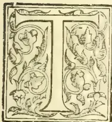

THE genus *Vanilla* was established by Plumier in Miller's Gardener's Dictionary, Edition 6, in the year 1752. The genus has been enlarged from time to time, until we find the *Index Kewensis*, in 1896,

recognizing 33 species. Besides these recognized species, the *Index* cites 23 additional names which it regards as synonyms. As in the case of most large genera, there is a wide difference of opinion as to the limitations of the species, their number being thus greater or less according to different authorities. Engler and Prantl, in the "*Pflanzenfamilien*," allow but 20, which is also the number allowed by Bentham and Hooker in the "*Genera Plantarum*." This doubt as to specific boundaries extends even to those of the improved and cultivated species *V. planifolia*, there being a wide difference of opinion regarding half a dozen forms, as to whether they are distinct species or mere varieties of this one.

The genus is peculiar among flowering plants for its exceedingly wide distribution, nearly all parts of the tropical world possessing their representatives.

In the New World we have 18 species; 3 from Mexico, 5 from the West Indies, 2 from Guiana, 3 from Brazil, 1 each from New Granada and Ecuador and 3 from Peru. This list may have to be extended by the addition of one which I have collected in Bolivia, or this may turn out to be one of those already known in Peru. In the Old World there are 15 species, 4 from Tropical Africa, 3 from the East Indies, 2 from Java, and 1 each from Ceylon, Sumatra, Bourbon, the Seychelles, the Philippines and the Malay Peninsula.

There seems to be no precise record as to whether or not all of these species yield fragrant fruits, capable of use as Vanillas, but it is certain that the larger part of them do so. Neither is it certain that there is not among them some other one or more species, which, by cultivation and improvement, might be made to yield a vanilla equal or superior to that now yielded by the *V. planifolia* and its varieties. The fact that the use of vanilla dates back to prehistoric times leaves us in doubt as to whether the quality of this fruit, as known at present, may not have been the result of improvement by methods of cultivation of a product which in a wild state was more or less inferior. Certainly, the field for experiment in the way of cultivation and hybridization of species at present uncultivated is most attractive.

Although vanilla is not obtained for economic purposes, so far as known, from any other orchids than those of the genus *Vanilla*, we are by no means certain that this may not result in the future. I have collected in the Andes representative of a distinct genus, *Sobralia*, very closely related to *Vanilla*, the pod of which develops a strong vanilla-like odor upon maturity.

The flowers of an orchid growing in Switzerland have a strong odor of vanilla, and have been found to yield considerable vanillin.

As regards the production of fruits for commercial purposes from the wild plants, it may be said that it reaches very considerable proportions. Even among the Indians of Bolivia, it have seen the fruit, of a species unknown to me, collected and traded in, each fruit bringing about 6 reals, equal to some 35 of our money. I have also collected vanilla in a wild state in Venezuela, but there was no one of whom I could inquire as to whether it yielded a useful fruit. Passing out of the reach of such uncivilized districts, we find that considerable quantities are produced without cultivation, and presumably from native species, in various tropical countries.

It is, however, the *V. planifolia* which is chiefly concerned in collection. This species is very widely cultivated, the principal regions being in Mexico and Bourbon, or Reunion Island. The West Indies, Java, Mauritius, Ceylon, the Fiji and the Straits Settlements also yield important supplies. Good scented fruits have been produced in European hothouses, but, of course, not upon a commercial scale.

The methods of cultivation differ widely in the different regions, but are all based upon certain principles deduced from the study of the habits

625------------------------------------------------

598THE TROPICAL AGRICULTURIST.[MARCH 1, 1899.

of the plant in its wild state. Its history in a state of nature is as follows:—It inhabits the richest form of forest land, always completely protected from salt sea breezes, the crevices on a rocky hillside being one of its favorite haunts. It is of terrestrial growth, quickly climbing some adjacent tree trunk. Although it commonly makes a few turns around the trunk, its chief support is derived from the numerous roots which it affixes to the trunk. It ascends to the height of many yards, and then spreads out to a considerable distance over such horizontal supports as it may encounter. The presence of these fixation roots and the fact that it survives for a considerable period after its earth connection has been severed have suggested the idea that it is parasitic or epiphytic, or both. It is not clear just what are the relative degrees of importance of its aerial and terrestrial nutrition, but it is pretty clearly established, especially by the observations of Mr. Charles E. Hires, of Philadelphia, that it cannot long survive after its earth-connection is severed, unless it is able, as is usually the case, to drop down secondary aerial roots, and by this means to establish again a terrestrial support. At the same time we are not entirely without testimony to the continued existence of plants after the decay of their basal portions, and with no other attachment than to the supporting tree. Like most plants of its class, it is fleshy and succulent, and well able to resist accidents of this kind. Its branches readily take root if brought into contact with the soil and this habit is taken advantage of in its artificial propagations by cuttings. Its stem is as thick as the finger, and its leaves are large, oblong, thick and fleshy and very numerous upon the horizontal branches, which are exposed to the light and air. It is these exposed leafy branches, the growth of that year, which constitute the sole flower and fruit-producing portion. There appears to be a very narrowly limited admixture of light and shade which affords the most favorable conditions for flowering, pollination and perfection of the fruit. A lesser proportion of shade will often make the plant thrive better, but will affect adversely its production of fruit. Too much shade, on the other hand, will often result in subjecting the plant itself to destructive fungus disease.

The flowers are born in axillary racemes of some 15 to 20, and they are of a pale greenish white or cream-color and pleasantly fragrant. Nature has taken special care that the flowers shall not be self-pollinated, as she has interposed a well-developed blade of tissue, the labellum, between the pollen and the stigma, preventing all natural contact between them, and causing them to depend for their pollination upon the visits of insects, this mode invariably resulting in cross-pollination. This fact renders it quite certain that the constant introduction of new vital elements from other plants is necessary for the well being of the species and leads to the inference that it is only a question of time when the habit of propagating exclusively by cuttings will result in serious vital deterioration, as has resulted with the sugar-cane, and necessitate the renewal of the stock from carefully produced seedlings. It has been ascertained that, due either to a scarcity of the necessary insects or from the action of some obscure law, only about one on an average, of the 40 flowers ordinarily produced upon a branch of one or two feet in length, will become pollinated, but that, if artificially pollinated, nearly all of these may

be made to yield fruits, although such a prolific yield as this would be very bad for the crop and for the plants. Sometimes a dozen or more fruits will mature upon a single raceme. They will then vary greatly in length—from 5 to 10 inches—and from  $\frac{1}{4}$  to  $\frac{3}{4}$  inch in diameter. Taken as they run, they will weigh from 25 to 35 to the pound in the fresh condition. After curing, their diameter will be reduced by nearly  $\frac{1}{2}$  and their weight by about  $\frac{1}{3}$ .

The bright, green fruit, commonly called a bean, is structurally triquetrous, but two of the sides are so far rounded as to make it appear nearly terete, with one flat side. The top is contracted and then again slightly expanded into a little disk. Its growth ceases many weeks before its maturity. When ripe, it turns first yellowish, then brownish, and if left upon the plant, will split into three parts, and a thick fragrant viscid juice will be exuded. It is just before they begin to turn brown that the fruits should be gathered. If left longer, they will usually split in the drying process, thus seriously affecting the value of the crop. At this time the characteristic odor is not yet developed. It will develop the fruit is left upon the plant, though to a less degree than when artificially cured.

The origin of the use of the vanilla bean, "Bainillo" as it is called throughout tropical America, and, for aught that we know for certainty, its cultivation, is lost in antiquity. It was found in use by the native Mexicans when the country was discovered. They used it for mixing with and flavoring their chocolate, and it was for this that it was introduced abroad. It was only after a long time that it began to be used for flavoring other substances, and only within quite recent times that its present broad field of utility has been developed.

In citing the chief facts in regard to the cultivation of vanilla, reference is made, unless otherwise stated, to the industry as it exists in Mexico, where the conditions are the natural ones of the original home of the plant. The large number of commercial grades depends in part only upon differences in the characteristics of the different beans, as determined by the sorting process. A more important difference is caused by the varieties of the vine which produces them. These are five in number, known respectively as "vanilla coriente," meaning regular or current vanilla; "V. sylvestris," meaning wild vanilla; "V. mestiza," meaning medium vanilla; "V. puerca," meaning hog vanilla, and "vanillon," meaning big vanilla. It will be observed that these names bear no botanical significance, being only native names used to characterize the quality or condition of the plant, and thus of its product. All except the last apparently proceed from varieties or states of the *V. planifolia*. The exception, vanillon, is the product of *V. pompona*, a distinct native species. This bean is much shorter, twice as thick, looks like a banana and has a pleasant, fruity flavor, on account of which it is eaten. It does not often get to the market. It thus appears that the vanilla fruit is edible by men, and is presumably to be regarded as a food-fruit for animals, a consideration which has an important bearing upon any inquiries which we may institute as to the vegetable physiology of the fragrant principle, which can hardly be regarded

\* The term "vanillon," as it is used commercially in this market, refers to a different article, a product of Bourbon.

626------------------------------------------------

MARCH 1, 1899.]THE TROPICAL AGRICULTURIST.599

as a provision to attract pollinating insects, but which may possibly be an influence in procuring dissemination.

The cultivated plants are trained to native living trees. Much care is necessary in selecting the sort of tree for this purpose, in order to secure just the right degree of shade. Besides this there are many ideas prevalent among the cultivators, most of them probably fallacious, regarding special influences which the supporting tree may have upon the growth of the plant. At Reunion artificial shade is employed,

As has already been stated, the crop is very greatly increased by artificial pollination of the flowers. Most planters believe it best to pollinate but two or three flowers of each raceme, though some believe in pollinating five or six of them. At Reunion, and in some other localities, there is a complete absence of the necessary insects, and all pollination must be artificially performed. In such cases the mode of training the vines is modified by considerations of convenience in reaching the flowers. The pollinating process is very simple, and is rapidly performed. The pollen, which is granular in form, is situated directly above the stigma and scarcely a line distant from it. There is interposed between them, however, a little blade of tissue, which perfectly separates them. Artificial pollination consists in holding the flower with the left hand, running a splinter of wood or bamboo underneath this separating partition, elevating and turning it backward, and at the same time pressing the upper portion of the flower, bearing the pollen, downward upon the stigma with the finger of the left hand.

The plant blooms in March, April and May, and the fruit should be gathered in the following January or February. Unfortunately, the habit prevails in Mexico of stealing the fruit before it is harvested by the proper owner. This leads to a state of rivalry among the different sets of thieves and the owner of the plantation as to who shall be, figuratively and literally speaking, the first in the field. As a result, a large part of the crop is harvested some two or three months before the proper season, and before it is in a condition to develop anything like its possible percentage of active constituent. A well-matured fruit, if also well cured, should become of a beautiful silvery white color, due to a crust of fine crystals which develop upon it. This will not occur in the case of a fruit prematurely gathered (*Fide* Hires.) Very few raisers of vanilla cure their crop, this being a separate industry, requiring great experience, judgment and care, being restricted to the hands of a few persons and yielding a great profit. The curers purchase their beans from the producers. In curing, the fruits are placed between woollen blankets in a sweating-box and left there 36 hours. The exuded moisture has then to be very carefully dried off in the midday sun, or, if the weather is bad, in ovens. This portion of the process is of the most critical character imaginable. It is said that overexposure of the fruits for even a small portion of an hour may result in a loss of weight extending to one pound per thousand beans. On the other hand, an underexposure is likely to result in the moulding of fruit, this frequently taking place after it is packed, so that the packer is ignorant thereof, and unable to take any measure to prevent it. After thus drying, the fruits are again sweated and again dried, this process being repeated as

often as necessary until the fruits are quite black, and until the judgment, born of experience, teaches that they are in a suitable condition for being packed. The complete process of curing requires some three or four months. This curing process varies greatly in different countries, and doubtless great improvements in it still remain to be discovered. In Bourbon they go through a preliminary sweating by exposure in tins to a steaming atmosphere for a day. They are then carefully dried in the air for three or four days, indirectly exposed to the sun; after which they are placed in air-tight boxes with trays of calcium chloride, for nearly a month, thus completing the curing process.

Success has been attained by experiments consisting in immersing them for a time in alcohol, in the manner in which tonka beans are treated. In Guiana they are buried in ashes and left until they begin to shrivel, and then afterward painted with olive oil.

In Peru they are dipped into boiling water, dried for 20 days, and then painted with castor oil.

With the details of the sorting and packing process I have not time to deal. Twenty-one distinct lengths are recognized by the Mexican traders. The United States Consul at Vera Cruz says that a stem will yield about three pounds of dried fruit— $\frac{1}{4}$  of it first class, 1-3 second class, the remainder third class.

Vanilla packers are liable to certain peculiar accidents. Owing to the peculiar strain brought to bear upon the muscles of the hand in holding the bundle which is being made up, muscular cramps are developed, and the bundlers feel obliged to rest for four or five days after having worked for that length of time.

The beans are said by Mr. Hamilton, of the house of David E. Greene, to be poisonous to about 2-3 of those who handle them, the effects extending only to those parts of the body which are exposed to contact with the fruit. Much discussion has taken place in relation to the nature and origin of this poisoning, which takes the form of a fine rash, something like that produced by our poison ivy. It is impossible to discuss this question here, but I may say that it has seemed to me, after all that I have read in relation to it, that this is most likely due to the numerous needle-like crystals of calcium oxalate which exist in the bean, than to any other cause.

## THE MICROSCOPICAL CHARACTERS OF VANILLA.

BY SMITH ELY JELIFFE, M.D.

### STRUCTURE OF THE FRUIT.

In general it may be said that the different varieties of the vanilla fruit have an analogous structure. The form we have here is about 25 cm. long, about 10 mm. wide and 6 mm. thick. The color is a rich dark brown, and it has an oily to resinous feel. It is longitudinally wrinkled and covered with a whitish crystalline deposit of vanillin.

A transverse section shows that the fruit is elliptical, and the moderately thick walls enclose an irregular triangular cavity, into which several rib-like processes extend. These are the placentae, and support the fine black seeds, which are very numerous. Each placenta is two-ranked. The interior of the cavity of the ovary is filled

627------------------------------------------------

600THE TROPICAL AGRICULTURIST.[MARCH 1, 1899.

with minute papillae, to be mentioned later under microscopical considerations.

The external surface of the fruit is the epicarp, which is composed of thick-walled regular cells, disposed in a single row. Beneath this the tissues are very thin walled and lax, containing considerable amounts of an oily substance with the characteristic odor of vanillin, and also containing a large number of fine acicular crystals of calcium oxalate. These are in general larger than the crystals found on the exterior of the fruit. The polygonal cells of the mesocarp are finely pitted in the main, but a number of them, especially near the periphery, are irregularly marked.

In the mesophyll are the fibro-vascular bundles. These are irregularly scattered, the external ones being somewhat radially disposed, while those further in are not infrequently tangentially arranged. The bundles are loose and lax, and are built on the concentric type. In the centre of the bundle the fibres and sieve-tubes are found. These are surrounded by a number of ducts, which are usually spiral in type, and sometimes interspersed with annular ducts. Irregular resinous masses and prisms of vanillin may be found in the tissues of the mesophyll.

The innermost layer of the mesocarp is made of smooth, slightly flattened cells, which bear a single row of unicellular papillose hairs, which project into the central cavity. These hairs have the interesting function of secreting the oily and resinous substances which elaborate vanillin.

A few words upon the microscopical identification of false crystalline structures on the outside of the fruit. Unscrupulous dealers often use benzoic acid to make a false appearance of vanillin. It is to be distinguished from the real article by the fact that its crystals are flattened and rhomboidal, whereas the crystals of vanillin are usually acicular and stand out, as a rule, at right angles to the surface of the fruit.

#### THE MOULDS UPON THE FRUIT.

A beautiful specimen of the fruits was given to me by Mr. Henning which showed a marked development of mould on the inside. Fragments of this mouldy fruit were planted upon gelatin and nutrient agar-agar with the following results: The principal mould found was "Aspergillus repens," another form was the "Mucor circinelloides." The first of these moulds is extremely common over the civilized world. The second is a form that has been found by me in the air of this city, but it is extremely rare. In Europe it is reported much more frequently. The characters of these moulds can be seen by consulting the *Journal of Pharmacology* for November, 1897. A number of bacteria were also obtained, but these were in all probability from the air, and not deserving of special mention.

### THE CHEMISTRY OF VANILLIN.

BY VIRGIL COBLENTZ PH. D.

The odorous properties of the vanilla bean reside in the crystalline principle vanillin and a minute quantity of a balsam-like substance which is found in the seed. As is well known, the odorous principles are not well developed until during the curing process. It is then evident that there pre-exists in this fruit a complex organic body, which undergoes hydrolysis, or oxidation, during the sweating process, the exact nature of which changes has never been studied.

### METHODS OF PREPARING RUBBER.

BY R. H. BIFFEN.

So much has been written within the last few years on the subject of Indiarubber, the sources of our supply, and the possibility of acclimatizing the best-yielding trees in our colonies, that at first sight it may appear that there is little more to be said. A study of the methods in use for preparing rubber from the latex, or milk, may however be of use to many interested in the formation of plantations, especially if some attention is paid at the same time to the inaccurate statements made in some recent publications, which apparently have disregarded the valuable series of papers on the subject contained in our one journal devoted to economic botany, the "Kew Bulletin."

The methods in use at present are either the out-come of the limited experience of uncivilised peoples, or the application of experiments made without paying due attention to what is known of the chemical constitution and physical properties of latex. As a good example of the latter we may take the experiments of Morisse,\* who found that coagulation was brought about in the latex of *Hevea* by the addition of alcohol, pheno, hydrochloric acid, nitric acid, sulphuric acid, calcium chloride, ferric chloride, corrosive sublimate, &c.

As the outcome of these experiments, a mixture of phenolin alcoholic solution, and dilute sulphuric acid, was recommended as a coagulating agent.

The latex is, as a general rule, a thick, white fluid, composed of small particles of rubber in suspension in a clear watery solution of various substances. Unfortunately, only the latex of a few trees has, as yet, been chemically examined when fresh.

The analysis of the latex of *Hevea brasiliensis* shows that it contains:—

<table>
<tr>
<td>Rubber .....</td>
<td>32 per cent.</td>
</tr>
<tr>
<td>Protein matter .....</td>
<td>2.3 "</td>
</tr>
<tr>
<td>Calcium and sodium salts 9.7 "</td>
<td>"</td>
</tr>
<tr>
<td>Resin .....</td>
<td>traces</td>
</tr>
<tr>
<td>Water .....</td>
<td>55 to 56 "</td>
</tr>
</table>

It is slightly alkaline to litmus paper.†

The presence of albumin, globulin, and other proteids, has been demonstrated by Green‡ in some other rubber-yielding latices:

As a general rule all these substances are to be found in rubber as it is at present prepared, often with others added to bring about coagulation of the latex, and accidentally or intentionally added impurities such as bark and clay. In all cases the percentage of impurities is large, how large we shall see later, and when it is remembered that some cause a rapid deterioration of the rubber, it is obviously much to the interest of those connected with the industry that a method of preparation should be adopted which would minimize them or ensure their absence.

I propose now to consider a few of the better-known varieties of rubber.

*Pará Rubber* is the product of *Havaea brasiliensis*, a tree which thrives in many parts of the Amazon valley, British Guiana, &c. As pointed out by Churchill§ in his consular report, there is no danger of this source of supplying becoming exhausted, though this is the frequent cry of com-

\*Seeligman, Lamy, et Falconnet; "Le Caoutchouc et a Gutta-percha." Paris, 1896. p. 68.

†"Le Caoutchouc," &c., p. 94.

‡Green, "Proc. Roy. Soc.," 1886, p. 23.

§"Kew Bulletin," 1898, p. 241.

628------------------------------------------------

MARCH 1, 1899.]THE TROPICAL AGRICULTURIST.601

panies formed for rubber-planting, usually fated for an ephemeral existence. The tapping is done with considerable care by the natives, and even should a district become exhausted, in a few years a fresh supply of trees springs up. From the planters' point of view Brazil is hardly a suitable country, for the climate is bad, it is difficult to obtain labour, and the exchange is liable to endless variations. The trees have, however, been introduced into Ceylon, where small plantations exist, and into other colonies\*. The method of preparing the rubber has been so frequently described that repetition is needless; but a "translation of a valuable article on rubber of the Orinoco" † has received so much attention of late that it requires some examination. One of its most striking errors is the following:—"As the juice contains a considerable quantity of water, the preparation of rubber consists essentially in separating the former from the latter, which is performed by evaporating the water by means of a heating process or obtaining its coagulation by certain chemical processes. Although the last system is more rapid they prefer the former, as they pretend that the rubber thus obtained is of a superior quality—a supposition devoid of all reason."

As I have already had occasion to show, ‡ this statement is incorrect, for the heating continues for too short a time; ("the rubber" is not "dried in a few minutes") to evaporate off some 50 per cent. of water, and further there is no loss of all reason." for it is a well-known fact that the smoked rubber is far preferable to that obtained by chemical processes. A comparison of the prices of "Parà fine" and "sernamby" should be sufficient proof of this. Why it is so may be made clearer from the following experiment. At the end of a day's work I had several litres of latex left, to which an equal volume of water had been added, which would not keep over night without coagulating. To this a small quantity of acetic acid was added, and in a short time the whole of it had formed a stiff curd. On pressing and drying, a portion of the water exuded from this mass of sernamby, but it still remained full of cavities, and the proteid matter in it quickly decomposed, so that ultimately a stinking, inflated mass was obtained.

If this latex had been coagulated by smoking it would have yielded a wet rubber, but the subsequent decomposition of proteids would not have set in, for the creosote contained in the smoke would have acted as an antiseptic and prevented decomposition, as it does when meat is preserved by smoking.

Then again we find, "the rubber thus prepared (by smoking) acquires a darkish colour, due to the particles of coal which adhere to the outer skin. Some people believe that this tends to improve it, but such is not the case, for it is thus impregnated with impurity." ¶ Now when these "bottles" of rubber are cut across, the fresh, laminated surfaces are a silvery grey colour, and as each layer is exposed to the same extent to the action of the smoke it is difficult to account for the outer layers only being so coloured. The freshly cut surfaces however soon darken and become black in turn, so that the explanation of oxidation seems far more probable, especially when taken in conjunction with the fact that smoke is white§

and not black,\* for the nuts are simply dry-distilled and not actually burnt. If the smoke of these heated urucuri nuts is condensed it forms two layers of liquid in the receiver, one a clear limpid solution consisting mainly of acetic acid, the other, darker in colour, of creosote.

The hot vapour of acetic acid brings about the coagulation of the proteids of the latex, as many easily be proved by direct experiment.

A solution of alum is said to be in use for preparing rubber in some parts of the Amazon valley. Morisset states that alum solution has no effect upon the latex of *Hevea* species however.

The loss in the factories on making up Parà rubber is as follows:—(1) Parà fine, 10 to 15 per cent.; (2) Entre-fine, the carelessly smoked pieces, 15 to 20 per cent.; (3) Sernamby, rubber pulled from the cuts on the tree and cups, coagulated by being allowed to stand, &c., 20 to 40 per cent. From these data we may safely conclude that the smoking method of preparation is by far the best in use at present, a view which will be further strengthened when we compare the losses on making up other sorts of rubber.

*Ceara Rubber* is the product of *Manihot Glaziovii*, a tree growing chiefly in the highlands of the State of Ceara, Brazil. Cross is responsible for most of the descriptions of the locality in which it grows, but as his experience of it appears to have been limited to Pacatuba, in which place its habitat is far from typical, they are not very accurate. He records it as growing at an elevation of 200 feet above sea level, among granite boulders, in a country whose dryness was indicated by the fact that "ferns, weeds, grasses, and mosses" were absent. True, it does grow among granite boulders, in the scantiest of soil in such localities, but it is more at home in the mountains, up to a height of 3,500 feet, and even more, where there is an abundant rainfall. These facts will serve to show the wide range of conditions the tree will put up with, and were it not for the smallness of its yield (1 to 3 lbs. per annum) it would be in valuable for introducing into many of our colonies. Coagulation is brought about either by smoking, as on the Amazons, or by simply allowing the latex to dry on the tree-trunks or soil.

The latter methods are objectionable, as the rubber invariably contains pieces of bark or grit.

It may also be prepared by churning the latex, and pressing the resulting clots. The method is not to be recommended though, for even if the clots are cut into thin slices and exposed to the heavy pressure of a mandiocapress, a considerable percentage of water remains in its cavities, and decomposition sets in, but not to the same extent as in "Cearà scrap."

Although so inique it commands a price usually second only to "Parà fine." The loss is from 20 to 25 per cent., which, in inferior qualities, may even amount to 55 per cent.

*Mangabeira rubber* also comes from Cearà. It is the product of *Hancornia speciosa*, a dwarf tree with somewhat the habit of a birch. The rubber is prepared by the addition of an excess of salt to the latex, or by Strauss' method of adding alum. Even after thirty days' drying in the sun it is spongy and full of cavities of liquid. As might be expected, the loss on purification is enormous, amounting to from 40 to 60 per cent.

\* "Kew Bulletin," 1893, p. 159.

† "Trinidad Bulletin," 1893, No. 18, and 1897, p. 36.

‡ Biffen, "Ann. Bot.," 1898, p. 165.

§ "Trinidad Bulletin," 1897, p. 38.

\* Compare the plate on page 757 of the "Journ. Soc. Arts," 1898.

† "Trinidad Bulletin," 1897, p. 37.

‡ "Le Caoutchouc," &c., p. 67.

629------------------------------------------------

602THE TROPICAL AGRICULTURIST.[MARCH 1, 1899.

By this method of coagulating with chemical reagents it is impossible to get rid of the coagulated proteid matter, to say nothing of the greater part of the water. Morelet's\* remark that "le procédé Strauss est ingénieux, mais les résultats de son application sont mauvais" may well be applied to all these chemical methods, and the sooner the search for coagulating agents is abandoned the better.

The only other American rubber of importance, at present, is yielded by *Castilloa elastica*. It appears on the market in a number of different forms under the names of Mexican, Nicaraguan, &c. As far as we know *C. elastica* is the only species of the genus yielding rubber, for the *C. Markhamia* of Collins turns out to be a *Perceba* species.†

The latex is obtained in a rough and ready fashion by hacking a spiral channel from the crown of the tree to the ground, or by making great gashes with a machete.

Collins‡ has recommended a timber-scoring knife for tapping, and since then most writers have followed his lead. On experimenting with one, I found it was practically useless, as little latex exuded, possibly owing to the closure of the vessels by the drag of its edge. Stabbing with a broad-bladed knife, or with a chiselled, as practised in Ceylon,§ gives good results without much damage to the tree. In the previously-mentioned article in the "Trinidad Bulletin" (1848), there is some slight confusion as to the localities suitable for the growth of *Castilloa*. In one place (p. 122), "it will scarcely thrive in regions that are not equally suited to *Hevea spp.*," which (p. 130) grow "on land which is periodically inundated, even to a depth of five feet." Then (p. 121), "the tree (*Castilloa*) avoids marshy or boggy land, and manifests a preference for warm, deep loam, or sandy soil." The latter statement is the correct one.

The most general method of preparation in Mexico is to add an extract of the leaves and stem of the moon-flower (*Ipomoea bona-nox*), and allowed the mixture to stand over-night. The floating clot which forms is then pressed to remove some of the water.|| As in all these cases of preparation by "wet" methods the rubber contains large quantities of water, it loses from twelve to thirty per cent. on drying. Another method is in use in Nicaragua.¶ The latex is mixed with about three parts of water, and allowed to stand over-night, when the rubber comes to the surface in particles are mixed with a fresh supply of water, and the process is again repeated. The particles are then brought into a solid mass by pressure. The latest account of this method is apparently given by Hart, in an article on the "Coagulation of Rubber,"\*\* who appears to have rediscovered it. I quote it in full as I may be mistaken. "After the addition of water, the mixture is well shaken; the globules of rubber (having a lighter specific gravity than the albumenoids and proteids [sic] contained in the latex) will float quickly to the surface. It is found moreover that on the removal of albumenoid liquors from below the floating rubber, the globules rise much more quickly to the surface."

\* "Le Caoutchouc," &c., p. 75.

† "Le Caoutchouc," &c., p. 64.

‡ Kew Bulletin, 1887, p. 13. c.f. "Trinidad Bulletin," 1898, p. 21.

§ Collins, "Report on Caoutchouc."

|| "Royal Botanical Gardens, Ceylon," 1898; Ser. I., No. 4, p. 30.

¶ Bilt, "Naturalist in Nicaragua," p. 33. Morris, "Colony of British Honduras," p. 76.

\*\* "Le Caoutchouc," &c., p. 62. "Kew Bulletin," 1887, xxviii., p. 16.

The following criticism of this "creaming" process is given in "Le Caoutchouc et la Gutta Percha":—"Ce mode de préparation est bien rudimentaire et ne peut fournir qu'un produit de qualité inférieure, qui perd souvent plus de 50%, surtout lorsqu'il fraichement préparé."

Recently there has been some talk of extracting rubber from leaves and twigs by means of solvents, as has been done in the case of gutta-percha. A description of this latter process may therefore be of interest. It originated in the smallness of the yield of the *Islandia gutta* trees, a tree from 25 to 30 years old, only giving 1-3 lbs. of gutta-percha when felled. The explanation of this fact is to be found in the work of De Bary,† who showed that the laticiferous system of the tree consisted of short, closed sacs. This being the case, a great many would remain unopened, and thus a considerable per-centage of the gutta-percha would remain in the bark. As the demand for gutta-percha has been large, and the supply has been obtained by felling the trees, they have become almost extinct.‡

Serullas proposes to utilise the leaves and twigs of the shoots from the old butts to extract the gum from. They are dried, treated with caustic potash to destroy colouring matters, and treated with a solvent for gutta-percha. The solvent is then distilled off and may be used again and again.

Rather more than 1 lb. of gutta-percha is said to be yielded by 30 lbs. of chopped up fresh leaves and twigs.§

For several reasons I do not think this process could profitably be applied to the preparation of rubber. The most important of these are (1) on gathering the leaves and twigs there would be an immense loss of latex, and (2) stripping trees of their foliage (the part which builds up their food supply) invariably kills them.

The direction in which research work should tend, I venture to think, is to prepare rubber free from the other constituents of latex, so that among other things, freight and customs charges on these impurities may be avoided.

Now it has been shown conclusively that the chemical constitution of latex varies with its source, so that it is improbable that any one reagent can be found capable of coagulating any given latex. Thus from the fact that acetic acid coagulates the latex of certain *Hevea* species, it cannot be argued that it will coagulate the latex of a *Kiersia* species.

Then expert opinions, as we have seen, show that the preparation of rubber by these chemical means is not satisfactory, for the product is far from pure.

I have recently succeeded, however, in preparing pure rubber by a physical process, and so demonstrated that chemical methods are not necessary. This is effected by centrifugalizing the latex in a special form of separating machine, when the rubber particles, which have a smaller specific gravity than the medium in which they are suspended, are thrown out of the bowl in an almost dry state. They may then be converted into a solid mass by slight pressure, or by draining off the small quantity of water which remains with a porous tile. So prepared, the rubber forms a translucent mass, free from its usual smell and from all danger of decomposition.

\* "Trinidad Bulletin," 1898, p. 131.

† "Le Caoutchouc," &c., p. 62.

‡ "Comp. Art. Phan. and Ferns," p. 151.

§ Serullas, "Kew Bulletin," 1891, ccxiii., p. 230.

|| Kew Bulletin, ccxiv., p. 231.

630------------------------------------------------

MARCH 1, 1899.]THE TROPICAL AGRICULTURIST.603

The merits and demerits of this mode of preparation must rest entirely with me, but I cannot be responsible for any statements made in Trinidad, where a copy of my experimental machine was recently exhibited without my consent or knowledge.—*Journal of the Society of Arts.*

## PLANTAIN OR BANANA MEAL OR FLOUR.

In continuation of my report No. 333 of *July 27, 1898*. I have the honour to state that I have been in communication with the Superintendent of the Botanical Department, Trinidad, and the Director of Public Gardens and Plantations, Jamaica, on the subject of Plantain Flour Meal. The reports received by me from Trinidad and Jamaica (copies of which I annex) are undoubtedly discouraging.

I have been delaying this report in the hope of being able to add some further information on the subject which I have been expecting from those to whom I have forwarded samples of plantain flour, but up till now I have not received reports on the samples sent.

In the meantime it is reassuring to find that Dr. Tibbles, who is referred to in Mr. Hart's letter, is now advertising "Malted Banana Food." This new departure should improve the prospects of a trade in plantain flour. It would appear that desiccated ripe fruit is difficult to handle as a trade article, owing to its liability to fermentation.

I might here refer to the experiment lately carried out in North-West India by the Director of the Saharunpore Botanic Gardens in drying plantains—among other fruits—by means of Dr. Ryder's American Fruit and Vegetable Evaporator. The following are the particulars regarding plantains in this experiment:—

<table border="1">
<thead>
<tr>
<th></th>
<th>Unripe.</th>
<th>Ripe.</th>
</tr>
</thead>
<tbody>
<tr>
<td>Number of fruit used</td>
<td>376</td>
<td>251</td>
</tr>
<tr>
<td>Weight of fresh fruit</td>
<td>88 lb.</td>
<td>88 lb.</td>
</tr>
<tr>
<td>Cost of fruit per 100</td>
<td>R1 6-5-12 a.</td>
<td>R1 6-5-12 a.</td>
</tr>
<tr>
<td>Wood used for drying</td>
<td>2 maunds</td>
<td>3 maunds</td>
</tr>
<tr>
<td>Value of wood at R3 per m.</td>
<td>10½ annas</td>
<td>R1</td>
</tr>
<tr>
<td>Time occupied in drying</td>
<td>24 hours</td>
<td>74 hours</td>
</tr>
<tr>
<td>Weight of dried produce</td>
<td>10 lb. 2 oz.</td>
<td>16 lb.</td>
</tr>
<tr>
<td>Cost of dry produce per lb.</td>
<td>9½ annas</td>
<td>4½ annas</td>
</tr>
</tbody>
</table>

Adding to these further items of cost given, viz:—

<table border="1">
<tbody>
<tr>
<td>Preparation of fruit for evaporation and attendance during drying</td>
<td>¼ anna per lb.</td>
</tr>
<tr>
<td>Interest on evaporator and premises</td>
<td>¾ "</td>
</tr>
<tr>
<td>General supervision</td>
<td>1 "</td>
</tr>
<tr>
<td></td>
<td>2 annas</td>
</tr>
</tbody>
</table>

we get the cost of producing 1 lb. of dried unripe plantains as 11½ annas, and of dried ripe plantains 6½ annas.

It will thus be seen from the above statement that it takes 87 lb. of fresh fruit to produce 1 lb. of dried unripe fruit at a cost of 11½ annas, or 69 cents, and 5½ lb. fresh fruit to produce 1 lb. of dried ripe fruit at 6½ annas, or 39 cents.

It is interesting to compare with these figures the details of cost, &c., supplied by the Chief Clerk of the Anuradhapura Kachcheri, who makes out that about 6 lb. of peeled unripe fruit yield 1 lb. of flour and 1½ lb. dried chips, while the approximate cost of producing a pound of flour is given as follows:—

<table border="1">
<tbody>
<tr>
<td>6 lb. peeled fruit at 2 cents per lb.</td>
<td>12 cents</td>
</tr>
<tr>
<td>Cost of labour for drying and pounding, &amp;c.</td>
<td>4 "</td>
</tr>
<tr>
<td></td>
<td>16 cents</td>
</tr>
</tbody>
</table>

The fruit here used is, as stated, unripe (but not far from becoming mature) and the cost—16 cents per lb. including pounding—by this sun-drying process compares very favourably with the cost of dried unripe fruits desiccated by the American evaporator, viz., 69 cents per lb.

It must be borne in mind, however, that the price of plantains in places like Anuradhapura is infinitely less than in Saharunpore, where they are quoted at Re. 1 6-5-12 annas per 100, equivalent to Re. 1 38 of our money.

The Indian report makes out that about 4 fresh unripe fruits go to make up a pound, which, at the rate of Re. 1 38 per 100 would be 5½ cents; while, according to the figures given by the Chief Clerk of the Anuradhapura Kachcheri, a pound of peeled fruit costs only 2 cents. So that there is an important difference in the cost of fresh fruit at Anuradhapura and Saharunpore. But even calculating the cost of fresh fruit at 2 cents in the Indian Experiment, the cost of producing one pound of dried unripe plantains with the American evaporator would not be much less than 25 cents, as against 16 cent given as the cost of 1 lb. of flour—using the heat of the sun for desiccation. Still, it would not be fair to come to any decision by calculating on paper, and if the American evaporator could be tested for plantains in Anuradhapura under conditions very different from those at Saharunpore—with possibly cheaper fuel and labour—it will probably be found as the Chief Clerk is led to expect, that the use of machinery will tend to reduce the cost of production. But, of course, in that case the manufacture of plantain flour must be on a large enough scale to fully test the capacity of desiccating and grinding apparatus, the initial cost of which is so large.

Details of initial of working cost of a fruit dryer (I saw one of these—an American patent—on trial on an up-country estate some years ago) could be obtained locally.

Mr. Waters of Hawkesbury Agricultural College, recommends a simple and cheap arrangement for drying fruit when sun heat is not available. The following diagram and description will explain the construction:—

The framework consists of hard wood, and the whole covering of either tongued or grooved seasoned boards or galvanized iron, though the boards are better as they do not tend to coil up so quickly.

The circle marked A represents the improvised furnace made out of two oil-drums, by taking the rim off one and forcing it (the drum) about an inch into the other, one of the tops or lids being converted into a door. A hole should be made in the end, and a small flue attached and carried above the machine as shown at B. The bottom of the dryer C can be made of iron, and should be perforated to allow the heat to rise from the air chamber D. Cleats should be nailed on each side as shown in the figure, to slide the trays in and out on. The size of the trays should be 3 ft. by 2 ft., and twenty four of these could be put into the dryer at one time. The size of the dryer should be 3 ft. by 4 ft. by 4 ft. (inside measurements), and two doors (or, better still, one) provided. Every joint must, of course, be as airtight as possible.

The great advantage of this simple dryer, which could be built by any handy man, is its cheapness: and it can always be used for drying fruits when they become too ripe for eating raw. Mr. Waters admits his preference for sun-dried fruit but of course, in wet seasons a cheap dryer such as I have described would be invaluable, and it is as well that it should be given a trial before investing in more expensive apparatus.

[As regards the two names "bananas" and "plantains," it is advisable that the arbitrary distinction should be rejected, and, as Dr. Watt recommends, the commoner name plantain only used.]

### Annexures.

MR. HART to MR. DRIEBERG.

Botanical Department, Trinidad,

August 26, 1899.

MY DEAR SIR,—So far as I have seen, there is little hope for a trade in banana meal—dried bananas, &c.—unless a man of Lipton's or Hooley's stamp arises to form the articles and create a demand,

631------------------------------------------------

604THE TROPICAL AGRICULTURIST.[MARCH 1, 1899.]

The material is good, and can be supplied in quantity, but buyers are wanting. Advertise dried bananas in the same way as Tibble's Vi-Cocoa, and it would sell and make handsome profits, but to put small samples on the market results in loss and failure.

Yours, &c.,

J. H. HART.

Mr. FAWCETT to Mr. DRIEBERG.

Hope Gardens, Kingston, P. O.,  
Jamaica, August 30, 1898.

DEAR SIR,—I Regret to say that at present there is no established trade in banana meal or banana flour. Efforts are continually being made however, and I hope we may be successful before long.

Yours, &c.,

W. FAWCETT.

Mr. FAWCETT to Mr. DRIEBERG.

September 12, 1898.

SIR,—In answer to your letter of 20th July, I beg to enclose copy of a letter from a resident here, who has done his best to start a trade, but so far has failed.

I shall be pleased to give you any further information in my power.

Yours, &c.,

W. FAWCETT.

With reference to the "banana meal," there is really no market or outlet for it, and I have been working the thing for all its worth, and have spent about £300 over it trying to get a satisfactory market, but all to no purpose.

Quotations have been made by Messrs. John Haddon & Co. Bouverie House, Salisbury Square, London, E.C., as being worth £27 a ton of 2,240 lb. ex-warehouse and docks, London. I have offered to supply at those rates—Haddon & Co. were simply booming it.

I have sent tons of meal to various countries—all to no purpose—as the market seems to want it to compete with wheat or rice.

All I can manage to sell is a barrel now and then. I sell at 3d. per lb. landed in Kingston.

The dried banana as a fig is a failure, as the vineous fermentation sets in so quickly that by the time the fruit has been in England two or three months it is too unsightly to look at the second time, or, as my London Agents wrote to say, "it's too suggestive."

I am sorry I cannot give you a brighter account.

Mr. Geast, if he could have got the meal in free to the States, would have taken all the Island could have produced at £30 per ton ex-warehouse New York. He wanted it for a new kind of beer.

#### PLANTING NOTES.

**RHODODENDRON CILICALYX.**—This is the name of a new Rhododendron discovered by the Abbé Delavay, in Yunnan, and figured by M. André, in the *Revue Horticole* of the 16th inst. The leaves resemble those of *R. ciliatum*, and the flowers, which are between 4 and 5 inches across, are widely campanulate and white, flushed with violet. The calyx is less than a quarter-of-an-inch long, with rounded lobes, bordered with long hairs. The plant has flowered in the garden of M. Milne Edwards. *R. ciliicalyx*, with no fewer than thirty-five other species from the same region, was described by M. Franchet, in the *Bulletin Soc. Botan. France*, xxxii., p. 223, and yet there are those who consider that there are no more worlds to conquer in the department of systematic botany!—*Gardeners' Chronicle*.

**EUCALYPTUS CORDATA.**—The Earl of Annesley obliquely forwards from Castlewellan, co. Down, a spray with flower-buds of this species, which so far has proved baidy in East Ireland. The mature leaves are sessile, about 5 cent. long by 4 cent. in breadth, cordate, ovate, obtuse, glaucous on both surfaces. The flowers are in stalked clusters, each cluster consisting of three flowers. It is handsome in appearance, and has an aromatic fragrance.—*Gardeners' Chronicle*.

**EUCALYPTUS GLOBULUS.**—An interest being evinced in the age and dimensions of species of *Eucalyptus* growing in these islands, I wish to state that I saw a very fine specimen of *E. Globulus* last summer in the gardens at Meadfoot Rock, Torquay; and Mr. Soloman, the gardener at that place, kindly sent me the age and height of this tree, viz., 20 years and 50 feet respectively. Spreading circumference of the trunk at the base is 34 feet. *C. L. Branson, Coleshill Park.—Gardeners' Chronicle*.

Mr. J. G. BAKER.—On the occasion of the retirements of this Gentleman from the post of Curator of the Herbarium at Kew, his old colleagues, the members of the staff, presented him with an address expressive of their affectionate respect. A representation of the elegant Bromeliad, called *Bakera tillandsioides*, drawn by Miss Smith, the botanical artist, served to frame the address. The signatures were confined to permanent members of the staff and to one or two regular visitors to the Herbarium. Had it been otherwise many others would have been proud and pleased to have had the opportunity of adding their tribute of respect and gratitude to one who has done so much for botany and gardening.—*Gardeners' Chronicle*.

**THE SAN JOSE SCALE.**—At the last meeting of the Berlin Horticultural Society, Professor Frank read a paper of great interest on the "San José Scale and its allies." Professor Frank said that zoologists have an idea that the *Aspidiotus conchiformis*, which is widely dispersed in Europe, is but a geographic form of the American *Aspidiotus perniciosus*. To decide this question, Professor Frank made a special journey last summer to those countries which have a similar climate to that of those American regions where the San José scale makes the greatest devastation, viz., to Tirol, especially to the valley of the river Etsch and Eisark, and also to South Baden. The result of these investigations was to establish the fact that there is not the slightest difference between the *Aspidiotus conchiformis* of Meran, Botzen, &c., and that of Eastern Prussia. So this is a true species, and different from the American one. Besides this, Professor Frank gave particulars respecting the reproduction of the scale insect. He found that *Aspidiotus conchiformis* and *obstremsis* have but one generation yearly, and that one female has a progeny of thirty-five to fifty descendants. American writers say that the San José scale has three generations yearly, and that each female breeds about 600 young scales. To examine into this remarkable difference, Professor Frank received at three different times, in the spring, at the end of June and in the autumn, twigs of Peach directly from America, densely beset with the true San José scale. Investigation showed that on the twigs sent in spring there were numerous females and males, as also young chrysalids in different states of development. On the twigs in June the adult males were absolutely lacking, also the adult females, only young scales in great quantity were present. On the twigs in autumn there were again females and males, and young chrysalids. From this Professor Frank concludes that the San José scale has also but one generation yearly. Besides this, he investigated the females, and found, not 600, but about thirty ovules and young in them, a number which is in accordance with that found in the European scales. His decision, therefore, is that the American theory is an erroneous one, it is questionable whether the San José scale can live in Europe at all. *Dr. Udo Dammer, Grosse Lichterfelde.—Gardeners' Chronicle*.

632------------------------------------------------

MARCH 1, 1899.]THE TROPICAL AGRICULTURIST.605PLANTING IN PERAK.

SIR GRAEME ELPHINSTONE, BART., IN  
THE STRAITS SETTLEMENTS :

We are very pleased to have a chatty letter from the worthy and indefatigable Baronet who was so long known as a hardworking planter in Ceylon, a pioneer of Dimbula and, alas! one of the greatest sufferers from the havoc played by the coffee-leaf fungus. We learned some time ago from Mr. Donald Mackay that "Logie"—to quote the familiar old title—was likely to go home this year, to rest after his long spell of work in the Straits; but there is no indication of this in the letter before us nor in its requirements in the shape of planting manuals and current publications. We quote the following interesting notes:—

"PERAK, Jan 24.—Coffee prices has driven the Straits planters to other tropical products, and many of which products find here the necessary conditions for a successful growth, and the information contained in your publications is most valuable. Some day when I have more time I will send you some details of information in connection with our industries. There is no doubt that the Native States have a very fine future before them. I may not live to see it, but undoubtedly there will be a successful development of tropical agriculture. More capital and more labor are required, but these will come in time.

"I have read with sorrow the intelligence of the deaths of so many of our old and valued friends. It seems so sad that men in the (almost) prime of life, and in many instances the bread-winners, should be taken. Such, however, is a common experience, and we who remain behind are warned by these sorrows that we must be always in readiness for the call when it comes. With best wishes, &c."

We are glad to be able to infer that Sir Graeme is in good health and spirits—his motto like that of Edward Thring of Uppingham would seem to be "Life to the end of work and work to the end of life"; but we trust there will be a time of resting all the same, after the appointed work is finished at the Straits.

PRODUCE AND PLANTING.

TEA IN THE UNITED STATES.—The consumption of tea has not been increasing in the United States. An official statement on the subject gives the following figures for the ten months ending October 31, 1898:—Imports from United Kingdom, 2,148,382lb; British North America, 1,367,797lb; China 22,060,653lb; East Indies, 1,633,377lb; Japan, 26,384,204lb; other countries, Asia and Oceania, 283,675lb; other countries, 8,974lb. This gives a total of 53,837,082lb., against a total of 73,310,181lb. in the corresponding period in 1897, during which the imports were as follows:—United Kingdom, 4,379,634lb; British North America, 2,405,900lb; China, 38,423,783lb; India, 1,775,471lb; Japan, 31,964,089lb; other countries, Asia and Oceania, 346,039lb; other countries, 15,235lb. Here is a falling off of 25,423,119lb. in ten months' imports. As to the sources of supply, Indian and Ceylon planters should note that Japan furnishes 48 per cent. of the total supply; China, about 41 per cent. As the New York correspondent of the *Grocer* referring to these figures says: "There is apparently plenty of opportunity for Ceylon and India to displace Japan and China tea. It is certain that the demand for British-grown tea is on the increase; and that the efforts of Messrs. Mackenzie and Blechynden, the Ceylon and India representatives of the planters, have been productive of large results, that will be more and more manifest as time rolls on."

BOGUS TEA.—The art of adulteration flourishes under nearly all conditions. One would think that it would scarcely be worth while to manufacture bogus tea in these days, but when there is the ghost of a chance of turning a dishonest penny the ingenious cheat seldom misses an opportunity. A Belgian chemical paper gives particulars of a bogus green tea which, after examination, was found to contain 68 per cent. of extraneous leaves rolled into a globular shape. On steeping in water these unrolled less readily than the true tea. A bluish-grey powder separated from the leaves under water, and was found to contain manganese in addition to the ordinary ash constituents, but no copper or lead. The microscopic examination of the powder led to the conclusion that earth and indigo had been used to imitate the colour of pure tea. In general form the extraneous leaves resembled *Thea chinensis*, but differed therefrom in microscopic character, as also from *Epilobium* *Vaccinium arctostaphylos* and other known vegetable adulterants, and, in fact, could not be botanically identified.

THE TRANS-SIBERIAN RAILWAY AND CHINESE TEA.—We know that in China and Russia it is expected that the Trans-Siberian Railway will give an impetus to the China tea trade. Writing on the commercial aspect of the railway a correspondent of the *Globe* says: "Among the many circumstances that will unquestionably conduce to give Russia an exceptionally advantageous position in the Chinese trade of the future is one that is deserving of special consideration. The Chinese tea trade has suffered immensely by the rapid development of the tea plantations in India and Ceylon. This decline has had the most serious consequences both for the Chinese themselves and also for the Government, Chinese tea being subjected to a very productive export duty. A revival of the Chinese tea trade, not only for consumption in the vast Russian markets, but also in those of other European countries, and passing through a purely Russian channel from the producers to the consumers, would, or course, give an immense impetus to the Chinese demand for Russian goods in exchange.—*H. & C. Mail*.

PLANTING AND PRODUCTS.

(From the Passara Planters' Association,  
Report for 1898.)

The SECRETARY then read the Annual Report as follows:—

SIXTH ANNUAL REPORT OF THE PASSARA PLANTERS' ASSOCIATION, 1898.

Chairman: Mr. J. J. ROBINSON. Hon. Secretary: W. STEWART TAYLOR.

COMMITTEE.—Kandy: Messrs. Duncan, Chairman and Hon. Secretary; for Passara: Messrs. Robinson, Tribe, Hope, Cotton, Duncan, Deaker, and W. Stewart Taylor; for Madulsuma, Messrs. Mason, Gatehouse, Hall, Webster and Kelly; and for Monaragala, Messrs. Betts and Cockburn.

District Hospital Members: Messrs. Duncan and Deaker for Badulla, and Messrs. Gatehouse and Cockburn for Lunugala, "Thirty Committee" Member, Mr. G. K. Deaker.

REGISTER.—The number of estates on the Register is 44.

MEETINGS.—During the year three General and one Committee meetings were held, all being fairly well attended.

FINANCIAL.—The Books of the Association are laid upon the table for the inspection of members and your Committee have much pleasure in bringing to your notice that the amount standing to the credit of the Association with the Bank of Uva amounts to the satisfactory sum of R699.43.

TEA CROP.—The estimate for 1899 is 3,044,000 lb. with 7,700 acres in bearing and 2,220 not in bearing. This gives an average of just about 400 lb per acre which speaks well for the climate and general suitability of our district as

76

633------------------------------------------------

606THE TROPICAL AGRICULTURIST.[MARCH 1, 1899.

a tea growing locality. Your Committee are not sanguine that much good will result from the deliberations of the Indian Currency Commission so far as Eastern producers are concerned but venture to hope that the present crisis in the tea industry will shortly come to an end as from all accounts tea extension to any great extent in the meantime has ceased and this is bound to tell on prices in the near future as the consumption of Indian and Ceylon tea is still largely increasing year by year and new markets are being found. Your Committee are of opinion that the Thirty Committee would have better furthered the interests of Ceylon and increased the demand for its black teas had more attention been paid and money voted to the Russian and Continental markets and less to the American. It also seems to them to have been quite unnecessary to subsidize Lipton who was able to push his own business. Your Committee are further of opinion that the tea-cess was raised for finding new markets for our black teas and the funds applied to that purpose; they consider that the arrangement with Mr. Kelway-Bamber and the granting of bonuses to makers of green teas were false steps which the "Thirty Committee" were not authorized to make without in the first place consulting the other District Associations and are much to be deplored. Such unauthorized expenditure of the tea-cess is doubtless the reason for the Committee considering the desirability of increasing the fund.

CACAO.—The crop for the year has not been so favorable as might have been expected, but the trees are in good heart and there is every prospect of very good crops for the coming year. The young clearings of this valuable product are most promising and the ravages of the disease on the older fields have been very slight; at the same time your Committee would urge that Government be appealed to at once start an Agricultural Scientific Department to protect us against the ravages of disease and pest and not wait for them to have full sway before any attempt be made to grapple with them. Your Committee would further take this opportunity of thanking Mr. Carruthers for his very valuable reports and hints how to combat and guard against the different diseases which cacao seems liable to.

ROADS AND BRIDGES.—Your Committee are reasonably justified in thinking that this Association have every right to be proud of the fact that the Namukula-Passara Road is now completed and opened for traffic since 1st January of the current year. The fight to obtain this road was fierce and the opposition to it strong and in high quarters. Nevertheless the Association persevered and thanks to our present Ruler the road was granted and your Committee have little doubt of its being largely used as a feeder to the Railway at Bandarawela by estates and also by natives. Two of our respected past Chairmen viz:—Mr. W. Waddon Martyn and Mr. R. P. Macfarlane had much to do with the obtaining of this road and the district is under the deepest obligations to these two gentlemen: there is no doubt that they also will be highly gratified to hear that their efforts have been so much appreciated. Your Committee have also to congratulate you on the virtual completion of the Wellawaya-Mupane road as with the exception of the metaling which will be completed in 1899, all the bridges on this important road (some of them very large ones) will be finished during the current year. The thanks of this Association are also due to Government for the sanctioning of the completion of the small piece of connecting road between the Mupane caddies and the main thoroughfare. Your Committee further think the Association should feel gratified at the promised early completion of the Doomoo Extension road to Dunedin Factory. It is hoped this road will be finished during 1899. Your Committee further trust that Government will see their way to shortly complete the Bible-Meddagama-Obeyagoda road as they feel assured the cutting of this road will benefit to a very large extent a fertile country with a large native cultivation

and population which is at present practically cut off from all cart road communication. At the present rate of construction there is little probability of this generation seeing the completion of this road for which a comparatively small sum of money will be required. As regards road upkeep your Committee have great pleasure in stating that towards the end of the year the roads were in better order than they have been for sometime and a very large increase to the road votes for 1899 has been sanctioned. This increased vote will allow for sharp corners being cut away, parapet walls erected round culverts, and we are assured that a better method of upkeep will be adopted during 1899. Your Committee also view with satisfaction the great improvements made to the Madulima road which from being previously a comparatively dangerous one has now been made safe. Your Committee feel it is their duty to place on record the warmest thanks of the Association to His Excellency Sir West Ridgeway for the practical interest he has taken in the affairs of this Association by sanctioning all the above-mentioned large public works.

LABOR AND THE FEDERATION SCHEME.—Your Committee have pleasure in reporting that the supply of labor is at present sufficient for the needs of the district but at the same time looking to the large acreage of young tea coming into bearing they are of opinion it would be most injudicious to do anything to discourage the cooly from returning to the country when his services may be required and they will view with interest the working of the Labor Federation scheme. Advances have been reduced considerably during the year where practicable, and your Committee hope will continue to be so.

FOREST ORDINANCE.—Your Committee view with concern the present working of this Ordinance. Some years ago shortly after it was passed the Ordinance was worked in a harsh and arbitrary manner. The matter was ventilated in the press, put right and since then it has worked smoothly and no complaints have been made. Lately, however, since the Forester has been removed, cases have again occurred in this district where the forest ranger has used his powers in a most harsh and high-handed manner; and if this be not put a stop to by the Government Agent, there is little doubt but that a state of matters will arise which your Committee will deplore. The Ordinance was passed, they understand, to protect Government property but not to harass and worry unnecessarily honest and well-known parties.

REDUCTION OF RAILWAY RATES.—Your Committee have to congratulate you upon a reduction of railway rates which they flatter themselves was obtained to a considerable extent owing to the agitation first started by this Association, and although they are very grateful for the concession allowed, viz., uniform rates on all goods from Nawalapitiya upwards they are at the same time more than disappointed that His Excellency the Governor has not deemed it advisable to also grant what the members of the Railway Rates Reduction Committee urged him to give, viz., a special reduction on all rice above Nanuya. This would have not only placed Passara and Uva generally on an almost equal footing with the other Kandy side districts, but would have been certain to have secured the traffic now passing over the Batticaloa road. Had this concession been granted while considerably helping us it would have materially increased the profits on the railway which are now likely to be lost to it. Whether this policy is a wise one on the part of His Excellency the future alone can prove. Your Committee feel that the heartiest thank of this Association and all Uva should be accorded to the members of the deputation and especially those members comprising it who reside on the Kandy side for the unanimous way in which they so strongly pleaded for this special relief for Uva. Though their efforts were not successful, it was not owing to their having failed in putting the case for Uva most strongly.

The thanks of the Association are also tendered to the Editors of the *Ceylon Observer* and the "Times of Ceylon" for their hearty and strong advocacy

634------------------------------------------------

MARCH 1, 1899.]THE TROPICAL AGRICULTURIST.607

of the claims of Uva for reduction in railway rates, and also for always advancing the interests of Uva in other ways when necessary.

In conclusion your Committee would like to take this opportunity of asking you to express your thanks to our worthy Government Agent, Mr. Baumgartner, for the very great interest he has always shown for advancing the prosperity and development of this province and for cordially giving his attention to any suggestions proposed to him by your Association or by members individually. Your thanks are also due to the Provincial Engineer and his very active and intelligent staff for the manner in which they have carried out all the large and important new public works which are being proceeded with and have been completed during the year.

#### NILGIRI PLANTERS' ASSOCIATION.

The following are from proceedings of a general meeting held at Ootacamund on the 27th ult. :—There were present: Messrs. S Bayly, A H Gerrard, L W Grey, J Harding Pascoe, H D Wilbraham, J W Minchin, W L Edmiston, and E G Windle (Honorary Secretary.)

*United Coffee Producers Co.*—(For selling coffee direct to consumers).—The Honorary Secretary put the scheme of the proposed Company before the meeting, the prospectus had been drawn up the previous day and would be issued very shortly to planters and others interested; considerable support had already been promised.

*Adulteration of Coffee.*—Mr. Windle moved "that this Association request the U.P.A. S.I. to petition the Home Government for more stringent legislation against adulteration of coffee and to endeavour to unite the coffee-producing countries of the world in support of the movement, and in pressing it upon their respective Governments." Seconded by Mr. L W Grey and carried unanimously.—*Madras Mail*, Feb. 4.

#### CENTRAL TRAVANCORE PLANTERS' ASSOCIATION.

The annual general meeting of this Association was held at Penshurst Bungalow, on Saturday, the 21st ultimo, when there were present:—Messrs. F M Parker (Chairman), F Bissett, H J Blandford, H D Deane, R H Goldie, R S Imray, B Laurie, H S Holder, W H J Leahy, J E Pigott, D MacArthur, the Hon. V B Wilbraham, A E Veale, and as visitors Messrs. E Lalter, W MacGrath, N MacGowan and E Williams.

*Election of Officers.*—The ballot resulted as under:—Chairman, Mr. R H Goldie, Honorary Secretary, Mr. A E Veale. Committee, Messrs. B Laurie, F M Parker and R S Imray.

*Shipping facilities.*—Mr. H D Deane in proposing "that H Government be asked to erect a covered landing stage with a boarded floor at Cottayam," said, that he had frequently seen tea and rice turned out of carts and wollams into the mud and exposed to the rain and which in consequence suffered much damage, so much so that he had received complaints from his Cochin agents of the dirty condition in which his tea invariably arrived at that port. Carried *nem con*.—*Madras Mail*, Feb. 4.

#### THE PAST TEA SEASON.

It is sincerely to be trusted that the lessons of the past season will not be thrown away, in spite of the optimistic views expressed by interested parties, anxious to see over-production continued, or to shield

themselves from the results brought about by their own delinquencies. We have before commented upon the supineness and apathy, or at least want of foresight, displayed by the Indian Tea Association (both here and at home) as well as by the Agents in failing to discern indications of the storm that burst upon the tea interest last season. They should have been prepared to meet the operations of the ring with equal energy, but now that the proceedings of the season are before us, a lamentable want of business capacity is exhibited. No doubt these gentlemen have heard a good deal on the subject from justly incensed shareholders, who in future may be trusted to look a little more closely after their own interests, and ere accepting 10 to 20 per cent dividends, enquire more particularly as to whether all reasonable contingencies have been duly provided for \* \* \* \* we are recommended to go in for quality rather than quantity, and herein lies a latent danger. As we have insisted *tinze* and again, there is ample area under plant to supply requirements for (now) the next three years, and if the Anglo-American Distributing Company succeed in establishing direct dealing, we shall have reliable prospective statistics to go upon. Fine plucking must perforce result in diminished yield; so that our planters and proprietors must be prepared for a sudden cry that the visible supply of tea is falling behind requirements; and, most probably, alarmist circulars will be published inciting the unwary into lashing out into those sudden extensions.—*Indian Planters' Gazette*, Jan. 28.

#### TEA IN CONSULAR REPORTS.

ANGOLA.—Teas, both black and green, are in demand. I should advise their being introduced in handsome tins, gilded, silver-plated, or ornamented with crystals. The commercial houses (especially in the interior) are only provided very irregularly with this article.—*Belgian Vice-Consul at Mossamedes*.

RUSSIA.—Odessa may be said to have become the centre of the tea trade in this country. Shipments used to be made via London, but latterly tea destined for Moscow and other towns, has been largely stored at Odessa. China teas are imported in ships of the Volunteer Fleet, which has now practically the monopoly of the tea-carrying trade from China. The total imports of tea into Russia for 1897, including those entering the country over the Asiatic frontier, are estimated at about 40,330 tons; the quantity imported at Odessa for local consumption only was 3,550 tons (257,800*l.* in value), showing an increase of 450 tons over 1896, while 7,750 tons passed through Odessa in transit for Moscow, and 1,340 tons for other towns.—*British Acting Consul-General at Odessa*.

TRANSCAUCASIA.—In Tschakwa the preparation of tea upon a large scale is now being seriously thought of. The necessary machines have already been ordered, and the time is probably not far distant when Caucasian tea will make its appearance on the market.—*Handels-Museum: Austro-Hungarian Consulate at Tiflis*.

#### PLANTING AND PRODUCTS.

(From the Kelani Valley Planters' Association Annual Report for 1898-9.)

THE CHAIRMAN.—The next business is for the Secretary to read the Annual Report.

The Hon. SECRETARY then read the following report:—

FOURTEENTH ANNUAL REPORT OF THE KELANI VALLEY PLANTERS' ASSOCIATION 1898-1899.

Your Committee have pleasure in submitting their fourteenth annual report.

##### MEETINGS.

Seven Committee and four general meetings have been held during the year.

##### FINANCE.

The balance in hand is Rs 600.79 as against Rs 644.70 at credit of last year.

635------------------------------------------------

608

THE TROPICAL AGRICULTURIST.

[MARCH 1, 1899.

SCHEDULE.

The Schedule of the Association shows 76 estates, one private and one hon. member, as against 75 estates, one private and one hon. member last year. Seven new estates have joined the Association, and six have ceased to subscribe.

CROPS.

The estimate for 1899 is 13,044,000 lb. The acreage of tea in bearing is 24,817 : there are 7,747 acres not yet in bearing; the total acreage in tea is 32,564, which gives an average for the tea in bearing of 525 lb. per acre.

It will be observed that the estimated crop for 1899 is 161,000 under the estimated crop of 1898. This is due to the fact that owing to a bad season in 1898 low estimates have been framed for the current year and that the returns, from some of the native gardens have not been obtained.

Including 1899 extensions the returns show the total acreage in tea 32,564 against 32,245 last year or an increase of 319 acres.

MEDICAL.

The health of the coolies has been fair throughout the year.

Large extensions have been made to the Karawanna Hospital and permanent wards built to replace the temporary ones, and Nurses' Quarters, etc. have been erected.

Your Committee are glad to be able to record that Government has sanctioned the extension of the accommodation of the Avissawella hospital and the work is being prosecuted with all possible despatch.

KELANI VALLEY RAILWAY.

This subject has again (as it has for many years past) engaged much of your attention during 1898, and it is now our pleasing duty to report that the construction of the Kelani Valley Railway has at length been sanctioned by the Secretary of State for the Colonies. Your heartiest thanks are due to His Excellency the Governor for the interest he has taken in this matter and the able and statesmanlike way in which he has supported and advocated the construction of this line. Your Committee, however, very much deplore the delay in starting the same since labour is so plentiful in the district. Your Committee earnestly trust that Government will consider the question from this standpoint and realize the necessity of making an immediate commencement.

In this connection it may not be out of place to mention that the Kelani has become practically useless for river transport.

TELEGRAMS.

The line to Yatiyantota has been opened during the year and Government has given a definite promise to extend the line to Ruanwella at once.

As regards the opening of a telegraph office at Dehiowita a letter was received from Government dated September 19th, 1898, stating that they could hold out no hopes of an office being opened there in 1899. Your Committee are glad to be able to report that since then a letter has been received from the Post-master-General dated December 22nd, 1898, in which he states that:—"He is unaware of any decision of Government not to open a Telegraph Office at Dehiowita. That the cost of opening an office there has been included in the Estimates for 1899 and that he will make known to the Association the final decision of Government as to whether the proposed extension has or has not been sanctioned by Government—shortly."

ROADS.

The roads in the district have been a source of much trouble and dissatisfaction and complaints of their general state have been received from all sides. Questions in reference to Kelani Valley roads maintenance were asked in Council and the replies have not been deemed satisfactory. The Hon. the Planting Member has again given notice of questions on the subject. His Excellency the Governor was interviewed by your Chairman and the Hon. J. N. Campbell and their strong representations induced His Excellency to institute enquiries.

**Towards the close of the year the Director of Public Works inspected the district roads which now exhibit some signs of improvement.**

MINOR ROADS.

The question of improving minor and other roads in the district is now occupying the attention of your Committee.

COACH SERVICE.

The bad condition of the roads during the year has handicapped the coach service considerably and it is therefore unfair to criticize this service too closely.

Your Committee however regret to note that in spite of repeated protests there is much cruelty practised on the horses, and although the services have been slightly improved during the year there is still great room for a better class of coaches and horses.

The proposed one-horse coach between Yatiyantota and Kitulgala was found impracticable as Government considered the cost prohibitive.

LABOUR.

The supply has been good, coolies have come in very freely from the coast, possibly exceeding requirements; but this excess of labour will correct itself upon the commencement of the Kelani Valley Railway.

During the year your Committee formed a local Labour Federation which may safely claim to be the first really successful combination of planters for dealing with labour difficulties.

The Labour Federation of the Kelani Valley has worked excellently: it is true that now when coolies are plentiful, there has been little or no strain upon its resources, but your Committee hold that the necessity for this Labour Federation was and is very apparent and its existence will be found to be of immense benefit to the Planters of the Kelani Valley.

The Parent Association Labour Federation Scheme has not been unanimously supported in the Kelani Valley. There is however no reason why Superintendents should not join both Federations and thus secure for themselves double benefits and privileges.

OBITUARY.

It was with the deepest regret that your Committee learnt of the decease of Mr. H. L. S. Ingles, of Melfort, Pussellawa, who was many years a leading planter in this district and sometime Secretary of your Association.

SALE OF A TEA ESTATE.

The property of the Central Terai Tea Company, Limited, in Liquidation, was offered for sale by public auction by Messrs. Mackenzie, Lyell & Co., at No. 2, Lyon's Range, on Saturday last. The estate is situated in the District of Darjeeling, Pargunnah Pathurghatta, and consists of about 2,300 acres of land held under lease from Government of which about 412 acres are planted with tea and with large nurseries of high *jat* 12 months' old seedlings, and a large area is under forest, with a valuable bazar at Kaprail. The buildings consist of a large pucca-built three-storied Factory; a convenient pucca-built Manager's bungalow; a pucca-built Assistant's bungalow with thatched roof, a pucca-built withering house with iron roof; two cutcha-built withering houses; a pucca-built store godown with iron roof; two cutcha built wood storing godowns; a wood built charcoal godown with iron roof; an open box-making shed, with iron roof. The out-turn for 1898 was 2,014 maunds, and the estimate for 1899 is 2,000 maunds. The first offer for the estate was Rs. 5,000, and the bidding rose rapidly, by bids of Rs. 1,000, to Rs. 1,000, at which figure it was knocked down to Mr. S. K. Das of the National Agency Co., 3 and 4, Hare Street.—*Indian Daily News*.

**FIBRES.**—Bulletin of Miscellaneous Information. Additional Series, II. Selected Papers from the *Kew Bulletin*. I.—Vegetable Fibres. [This is a very useful summary of information respecting some ninety different fibres.]

636------------------------------------------------

MARCH 1, 1899.]THE TROPICAL AGRICULTURIST.609NEW INDIAN PATENTS.

No. 461.—Laurence Oliphant Liesching, secretary and accountant of the Colombo Hotels Company, Limited, Colombo, Ceylon. An improved contrivance for weather-proof and thief-resisting covers for live-stock or goods, either while being conveyed by land or water, or while stored on land or water, as well as for all purposes that tents are at present employed for.

No. 464.—James Ernest Hickmott, engineer, of 20, Park lane, Calcutta. Improvements in brick and tile-making machines.

No. 476.—Samuel Cleland Davidson, merchant, of Sirocco Engineering works, Belfast. Improvements in centrifugal fans and pumps.

No. 450.—Arthur William George Silborn, fibre dresser, pulper and tow manufacturer, of Durban, Natal, South Africa, at present residing at Spence's hotel, Calcutta. Improved apparatus for extracting, cleansing and preparing the fibre contained in the aloe and other fibrous plants.—*Indian and Eastern Engineer*.

PIONEERING AND PLANTING IN COIMBATORE, S. INDIA.

(From a Planter.)

Feb. 3.

The weather is very bright and fine over here and jungle is being felled on several blocks and there have been some good burns.

A Mr. Fox, from Knuckles, came over here to take charge of Messrs. Finlay, Muir & Co.'s land, but unfortunately he has fever in his system and the new clearing work seems to have brought it out badly and so he had to leave. He also brought some Sinhalese, but they were a discontented lot, evidently expecting little work and lots of pay; and so the beauty and size of our jungle frightened them away. Though my Sinhalese people have had some rough times, yet with a few exceptions they have done splendid work and are quite happy, looking forward to going to "Lanka" in March, with a nice little sum to enjoy their New Year, and I have no doubt that several will come back here again later in the year.

There are a good many iron-wood trees in the jungles here and also some very fine cedar trees, red and white, three or four feet in diameter. My bazaar is all built of cedar; it is built after the fashion of bazaars in Ceylon and is much patronized by Appuhamy and Ramasamy. My head carpenter finds the work to his taste here and has gone to fetch six more of his trade to assist him.

The next estate has a field of coffee planted last year which is coming on splendidly.

PLANTING IN BRAZIL.

COFFEE—RUBBER—TEA—COTTON—

SUGAR & C.

(BY AN EX-CEYLON PLANTER.)

(Special for the "Ceylon Observer.")

Rio de Janeiro, 1st Dec., 1898.

SIR,—Since I last wrote you there has been little news to chronicle as regards Brazilian Agriculture. The low price of

COFFEE

during the last few years has led the planters to think of growing other products.

INDIAN CORN,

which grows well all over Brazil—or at least the coffee-producing parts—has received a good deal of attention. For the supply of food for tramway mules and for horses belonging to private families, as well as for horses and mules for street transport, and for carriages for hiring, had all to be imported in the shape of

Indian corn from the River Plati, and as it had to be paid for in gold, the price in Brazilian currency rose considerably owing to the fall in exchange. The Government Railways and others in the hands of companies reduced the rates for corn, and with these inducements, planters near a railway have taken to grow a great deal of this produce. Others who have large virgin forests near a railway are sending timber to the towns, for which there is a good demand. A great deal of American and Swedish timber was formerly and is still used in construction in the towns.

COTTON

can grow well all over Brazil, and the many local spinning mills—fostered by a heavy protective duty on imported cotton manufactures—give a fair price for the raw material, but as yet the coffee planter has not gone in for much cotton planting.

SUGAR-CANE

is being grown in the abandoned coffee lands in the State of Rio de Janeiro, but owing to the expense in turning cane juice into sugar, and the continued low price of the latter article, the juice is turned into spirit, for which there is always a fair demand at a paying price.

INDIARUBBER

has not escaped the attention of the coffee planter. A great deal of writing in the newspapers during the last six months has induced the public authorities to encourage the production, by procuring seed, and selling it at cost price, or even below that, to planters; and to small farmers who will promise to plant it, it is given gratis. *Para Rubber* will not grow in the Coffee Districts so far South as Rio and S. Paulo, but there are other two kinds—first: the *Mangabeira* (*Hancornia Speciosa*). It gives a delicate fruit, called in Brazil *Mangaba*, which is said to be harmless to sick people and in the Northern States of Brazil where it grows wild in the forest has the name of "fruit for the sick." The rubber from this tree has been exported from Bahia and Pernambuco for some years, but not in large quantities. It sells at less than the *Para Rubber*. Judging by newspaper reports, this tree is being planted on a large scale in the west of the State of Rio Paulo. Second:

CEARA RUBBER

(Manihot Glaziovii) you are already well acquainted with. It is being distributed in the State of Rio. It will grow in any part in Brazil, but hitherto has been exported only from Ceara in the north. Its price has kept low owing to the careless manner of collecting.

TEA.

I must not omit to mention that *Tea*, your principal staple, has also been thought of. A gentleman of my acquaintance, Col. João Antonio Alves de Brito, who owns a large Coffee Plantation in the borders of Minas and Rio States—after getting several particulars from me and reading some *Tropical Agriculturists* I lent him, stuck to the idea, and he told me a month ago that he had ordered through his agents, Tea seed enough to plant two hundred acres of virgin forestland. The seed to be the best kind grown in Ceylon. He at the same time told me he had ordered through Messrs. Crashley & Co., English Booksellers and News Agents in Rio de Janeiro, all the back numbers of the *Tropical Agriculturist* as well as ordered current numbers to be sent regularly.

I did not press him or give him encouragement to go in for

TEA CULTIVATION

indeed I told him it would be a losing game attempting to compete with Ceylon and India, where labour was plentiful at from nine-pence to a shilling a day, while here in Brazil it was scarce and cost from two shillings and six pence to three shillings. He replied that Ceylon and Indian Teas had been selling here, and in other parts of Brazil, at never less than twelve milreis a kilo for some

637------------------------------------------------

610THE TROPICAL AGRICULTURIST.[MARCH 1, 1899.

years; at exchange of eight pence per milreis this was equal to three shillings and eight pence per lb. On his tea—which would be all absorbed by local consumption—there would be no duty, and this would pay even with the extra cost of production, better than Tea in Ceylon and India, which sold for nine pence to 10 pence. But I said, “competition in growing, and filling up the local market would bring down the price.”

“Future competition!” he cared nothing for that, he would be the first in the field, and would make a large pot of money before others had time to develop Tea plantations.

This gentleman, Col. Joao Antonio Alves de Brito, is a member of the Union Parliament at present sitting in Rio de Janeiro, but he has been absent on leave for over a month. His properties are on very high land on the borders between the State of Rio and Minas. The district is not subject to dry spells, but receives regular rains, and as far as climate goes is very suitable for tea planting. His coffee plantations bear well and he is well supplied with Colonist labour. To make up for the small profit which coffee has given for the last two or three years, he is utilizing the

#### TIMBER FROM HIS VIRGIN FORESTS.

He has erected by the side of the railway near his properties a large timber-preparing and wood-working establishment, fitted with the finest modern machinery for wood working. He sends timber by rail to Rio in all forms from the rough log of fine cabinet wood to be manipulated in Rio, to doors and windows ready made, cart-wheels, carts and even railway waggons. He has just completed a lot of the latter for the Central Government Railway. The iron work for buggies and waggon frames, as well as for Westing-house brakes come from England and the United States. Coal waggons, good covered waggons, and cattle trucks can be supplied at a cheaper rate by him than those ordered from Europe or the United States, and of course the timber is far superior. My friend is a good example of what an English education and a London office-training can bring to the assistance of an intelligent mind, and an energetic character. When I last wrote to you

#### THE PRICE OF COFFEE

was so low it could scarcely pay for production, and in places where pack-mule or bullock-cart transport made it costly to take to the nearest railway station, it has been produced at a loss—even now although the crop at present being shipped is expected to be much less than the former one, the price has not risen. It has not been much above 6cts. per lb. for No. 7—the middling Brazilian Type—in New York. It was believed that the crop for 1898-99 would be a short one, and that the seasons were unfavourable, but somehow the buyers in consuming countries seemed to wait for a lessening of the number of bags being received by rail in Santos, and Rio de Janeiro. With the exception of the two months July and August, between the old and the new season's shipments, there has been little diminution, and both ports continue to receive equal to last year's quantities, and stock in Rio and Santos as well as in consuming countries are large.

There is a great uncertainty as to the quantity expected for season 1898-99, but some authorities which can be relied on put Santos at 6,500,000 sacks of 132 lb. each, Rio 2,000,000 to 2,500,000 sacks; but such conflicting reports have been received as to the ravages of dry weather from July to November in the districts which have Rio for a shipping port, one cannot form a safe calculation, and to make it too high is to bring a hornet's nest about one's ears, for planters believe that low prices continue because of exaggerated estimates made beforehand, and the newspapers are open to attack any poor unfortunate who ventures on this precarious ground.

As is usual in all coffee-producing countries, a long spell of dry weather immediately before blossoming time, brings out a copious flower after the first rains; the same has occurred here during the flowering time—latter end of September, October and begin-

ning of November,—but since then there has been rain almost every day; nice refreshing evening and night showers say I, but a lot of newspaper reports say embryo fruit is rotting and falling off in many places.

#### EXCHANGE.

The low rate of exchange all during last year, certainly favoured the coffee planter, for although the price was low in consuming countries, it represented gold, and owing to the low rate of exchange, the amount in currency came to a respectable sum. Colonist labour was fairly plentiful at not much above the former rates. Therefore the cost of production was not much above what it used to be when exchange was high. During the latter end of 1897, exchange ranged from 7d to 7½d per milreis—thirty-three to thirty-four milreis to a pound sterling. In the first five months of this year it fell from 7d to 6½d per milreis raising the pound sterling from thirty-four to forty-two-and-a-half milreis—the par value of the milreis is twenty-seven pence—or eight mil eight hundred and eighty-eight reis to a pound sterling.

This state of matters if favouring the coffee planters, was the opposite of cheering to commercial people: to the poor people in the towns—for whom nearly all the necessaries of life had to be imported, and therefore had to be paid for in gold—it meant semi-starvation, and to the Government with its gradually diminishing revenue—owing to protective, one may say prohibitive, duties on all imports—who had to meet annual payments in Europe of over three million pounds sterling: this low exchange was indeed a blue look out.

In July of this year,

#### A FINANCIAL ARRANGEMENT

was made in London, and after that exchange rose in a short time to 8½d; although it has not remained at that figure, it has not fallen much below it, and it is expected—if the Government is able to fulfil its part of the contract which if public men are in earnest it can have no difficulty in doing—the value of the milreis will rise to eighteen pence in three years.

I need not inflict on you and your readers the dry details of this arrangement or “*acordo*,” as it is called here, but in a few words it is this:—

1st. A loan of ten million pounds at five per cent.

2nd. The amortization of the external debt is suspended for thirteen years.

3rd. A yearly sum of three million pounds is to be taken out of this loan for three years. This sum is to go towards the payment of interest on the external debt, and guaranteed interest on railways, as well as salaries and expenses of representatives of Brazil in Europe and other payments, such as railway materials, &c.

4th. The Government is not relieved from the payment of these sums, but only relieved from remitting to London. The equivalent of these amounts have to be paid in paper money calculated at eighteen pence per milreis, into one or more of the foreign or national banks (nearly all of them get a part of it) as a deposit, and from time to time the paper money forming this deposit has to be destroyed.

Two results are expected from this “*acordo*”:—first, the Government not requiring to enter the market for remittances to Europe, exchange is sure to rise. Second, a large amount of paper taken out of circulation will increase the value of what is left.

This arrangement has been subject to a great deal of criticism both in Europe and in Brazil: in the former it is regarded favourably, but some of the opposers of the Government in Brazil look on it as humiliating owing to their having to give the receipts of the Rio de Janeiro Custom-house as a guarantee. The Congress—whose sittings are about to close—have given the Government their full support, and have reduced the expenditure in the various departments much below what the official estimates asked for.

#### A NEW PRESIDENT

entered on his duties on the 15th November, and has by the constitution to remain for four years. Before entering on his new duties he paid a visit to Europe, being there during June, July

638------------------------------------------------

MARCH 1, 1899.]THE TROPICAL AGRICULTURIST.611

and August of this year, and although he had not officially anything to do with the making of the financial "acordo," still at the various dinners and public entertainments in his favour in London and Paris he gave his promise that he would in all his government acts, have steadily in view the faithful fulfilment of the contract.

The President who has just left office—President de Moraes e Barros—was a *Paulista*, as the natives of Sao Paulo are called. The present one, Manoel Ferras de Cempas Salles, is also from the same State, both are of the legal profession, but are extensive coffee planters as well.

I intended to have mentioned some facts with regard to narrow-gauge railways, of which there are in successful working many kilometres in Brazil, but I must leave that for another opportunity.

I am glad to see that the colonial governing powers are waking up to the need of further railway communication in Ceylon. I think if you had begun with a narrower-gauge than the five feet six, extensions would have gone on more rapidly.

A. SCOTT BLACKLAW.

#### WYNAAD PLANTERS' ASSOCIATION.

The Annual General Meeting was held at Mep-padi, on January 4th last, at which the Annual Report for 1898 was presented. The following paragraph is of interest:—

CULTIVATION.—Coffee crops are very good throughout the district, and we trust we are now entering on a cycle of prosperous years. The competition of S. American countries with a low exchange threatens us, however, with lower prices for a time. Experiments with Arabica-Liberian Hybrids are being carried out on a considerable scale, and promise very valuable results. The cultivation is extending, and prices and yields are encouraging. The only cloud on the horizon of this cultivation is the unreliable nature of the labour, of which tea requires a steady supply throughout the year. It is to be hoped that this may be overcome in time, but your Committee beg to draw your attention to the importance of making persevering efforts to solve this problem. Pepper is becoming a cultivation of importance, and is being extended: present prices and crops being very remunerative. Liberian coffee cultivation remains much as it was: it is doing well in parts, but is disappointing in others. On the whole, your Committee consider that the prosperity of the district has improved very much during the past year.

#### PLANTING NOTES.

TEA SHIPMENTS AND ESTIMATES.—We are indebted to the Secretary of the Chamber of Commerce for the following figures:—

<table style="width: 100%; border: none;">
<tr>
<td style="width: 60%;">January shipments</td>
<td style="width: 10%;">..</td>
<td style="width: 30%;">6,750,000 lb.</td>
</tr>
<tr>
<td>February estimate:—</td>
<td>7½ to</td>
<td>8,000,000 ,,</td>
</tr>
</table>

NATIVE TEA GARDENS—says a well-informed Nawalapitiya correspondent—have not given up plucking, but since the fall in prices they are not receiving the care and attention hitherto bestowed on them.

"HANDBOOK OF AGRICULTURAL CHEMISTRY FOR INDIAN STUDENTS."—By S. H. Collins, F.I.E., etc., Assistant Agricultural Chemist to the Government of India, Calcutta, Office of the Superintendent to Government Printing, India, 1889.

We quote the preface:—

There are many excellent books on agricultural chemistry based on English experience, and this volume aims merely at supplying their deficiencies in subjects peculiar to India. A certain amount of European experience has been interpolated, since without it the book would not have been intelligible to the student. The analyses are, unless otherwise stated, exclusively Indian; and are in most cases, based on the average results of the treatment of several samples—S. H. C.

CEYLON TEA COMPANIES, LIMITED.—This mail brings the intelligence from London that in the case of Sterling Ceylon Tea Companies, the Agents have seen their way to make a substantial reduction in their commission and charges, in view of the hard times. We trust this liberal example will be followed by the Agents and Secretaries of Rupee Companies in Colombo, especially of such Companies as are only paying a very modest dividend.

COFFEE PESTS.—Much uneasiness is felt in Selangor at the appearance of vast numbers of caterpillars on the Petaling Estate, where they ate the leaves of the coffee trees over fifty acres. Mr. Ridley says they are the caterpillars of the bee hawk moth. Chasseriau estate was badly infested some years ago and the only remedy found was handpicking. He says: "I never heard of the caterpillar doing any permanent injury except to very young trees, but it by no means improves the trees and should be destroyed."—*Singapore Free Press*.

TEA AND CINCHONA ON THE NILGRIS.—Mr. T. C. Anderson, who returned recently from a visit to his property in the Nilgris, reports tea there to be in a very flourishing condition, and is confident that by and by it will come to have as good a name as that of Darjeeling. Cinchona cultivation is also being gone in for extensively. Some interesting remarks on quinine are made by *Cosmopolite* in "Odds and Ends," which we publish in another column. He strongly advises planters, especially those in Uva to plant up their road lines and corners with the best cinchona plants they can get.

A NEW PATENT TEA-DRYER.—Mr. James Betts, a former well-known tea-planter up-country, who arrived recently from Edinburgh, and is at present residing at the Adam's Peak Hotel, Hatton, has, says our evening contemporary, brought with him the fitting machinery, &c., for the erection of a new patent tea-dryer, constructed on his own designs by Messrs. Cruikshank & Co., Edinburgh. The machinery, which has been sent up to Hatton, will be erected at Messrs. Brown & Co.'s foundry, and experiments carried on as to its suitability, or otherwise, for the purpose for which it was made and designed. Arrangements for its erection have already been made, and Messrs. Brown & Co. are busy attending to the work under the personal supervision of Mr. Betts. The machinery is reported to be unlike that of any other of the dryers used in Ceylon.

AGRICULTURAL PURSUITS FOR WOMEN is beginning to be a subject of public interest in New South Wales. Mrs. Armitage (formerly of Colombo) has been writing on the subject and as a prominent member of the New South Wales National Council of Women, she and other leaders have started a proposal for an Agricultural College for women in Sydney. We have received from Mrs. Ingles a copy of an interesting pamphlet entitled:—

Agriculture and Domestic Economy for Women. Notes and suggestions by Mrs. D. E. Armitage, Hon. Secretary, National Council of Women of N.S.W. A paper read at the half-yearly meeting, November 18th, 1898, and printed by order of Council.

Among branches suggested by women's work are:—butter-making; bacon; poultry and duck-rearing; fruit-growing, jam-making and bee-keeping; vegetable-growing; ramie-fibre; and the growing of flowers for scent-making and of herbs for drugs—all very interesting and useful and most of them feasible, we should say.

639------------------------------------------------

612THE TROPICAL AGRICULTURIST.[MARCH 1, 1899.]

"THE JOURNAL OF THE JAMAICA AGRICULTURAL SOCIETY," for December, 1898, has the following contents:—Illustration of Longhorn Cow, "Moss Rose"; Board of Management; Meetings; Durable Whitewash; Cultivation of Potatoes; Bad Dairy Management Cultivation; Adulterated Butter; Notes from the Apiary; The Castor Oil Plant; Skilful Adulteration; Jamaica Preserves; Household Hints; India Sheep for Jamaica; Comments; Poultry Notes; Dairy Notes; Branch Notes; Odds and Ends; Our Imports and Exports; Sale of Indian Cattle; Onion Culture; The Agricultural Outlook; Questions and Answers; Prices of Meat, Vegetables, etc.

TEA SELLING IN THE SALVATION ARMY.—It is interesting to learn from "General" Booth that the selling of tea has become a regular business in many branches of his "Army." Throughout France and Germany this is particularly the case and in Paris and Berlin a very considerable business is done. (The "Thirty Committee" ought to make a note of this.) The same is true of the United States, we are told, the selling of tea being added to other work carried on by the "Army" under the direction of "Commissioner" Booth-Tucker.

PLANTING IN BRAZIL.—We draw attention to a long communication, given in our daily issue and *Tropical Agriculturist*, from our old correspondent, Mr. A. Scott Blacklaw, dated in December from Rio. He deals not only with coffee, but also with cotton, sugar-cane, rubber and even tea! For, it seems as if the depression in coffee were going to force the Brazil planter into new grooves; but we have no fear of his finding tea profitable at the present cost of labour. Mr. Blacklaw gives us a number of novel particulars respecting rubber; and indeed his friend the pioneer tea planter only meditates supplying the local market. We shall be much interested in hearing of the result of his experiment, more especially as the Colonel takes so much interest in the *Tropical Agriculturist*. For information respecting coffee prospects and Brazil's finances we must refer to the letter on our sixth page.

VANILLA IN THE SEYCHELLES.—The Administrator of Seychelles sends the following statement as to the capabilities of the islands in the direction of vanilla production to the *Journal of the Imperial Institute*. A vanilla plantation should not be started in the Seychelles with a capital under £1,000 seeing that it takes three years to produce a crop. Suitable land cannot be secured under R200 an acre, an even at this price it is not easily obtainable. Under the old System (planting on bars, wires, &c.) from 1,200 to 1,300 vines were planted per acre. The vines are now planted on live trees, and the number planted depends on the number of trees existing on the land to be put under cultivation. The vines cost about R4 per 100, and a man can plant 350 cuttings of vines per day, and can keep in good order, throughout the year, 2,500 plants. A man's wages are R12, and a woman's R6 to R8, without rations. The women are employed for "marrying" the flowers, i.e., removing the pollen from the anther of the flower and applying it to the stigma. A woman can "marry" from 600 to 800 flowers per day. Each vine can produce from 25 to 30 pods; 130 of which average 1 lb. of prepared vanilla. The flowering season is from August to December, the pods are gathered about nine months after, and it takes three or four months to "cure" the pods.

COFFEE-GROWING in Serdang continues to be in a hopeful way. Planters there do not complain. There is every encouragement to them from the recent improvement in prices for the berry.—*S. F. Press*.

NEW GUINEA DEVELOPMENT.—Messrs. J. A. Patten and Barrett, we hear from the south are en route for German New Guinea, where they have been offered the same area of land that Sir Somers-Vine tried to acquire in British New Guinea. The offers to Messrs. Patten and Barrett are stated to be even more advantageous to them than the terms on which Somers-Vine proposed to acquire the land. We hear also a rumour is current that it will not be long before British New Guinea will be declared a Crown Colony. The advent of the new Governor may see the change brought about, and if so, rapid changes may occur which will aid settlement and bring along a better and more prosperous state of affairs in New Guinea, the effect of which must sooner or later be felt here.—*Torres Straits Pilot*, December 31.

"THE AGRICULTURAL GAZETTE" of New South Wales, Vol. IX. Part 12. Edited by W. H. Clarke, has the following contents for December, 1898:—Some Exotic Grasses—No. 1 Prairie Grass; New South Wales Weeds—Nut Grass; Botanical Notes; A Successful Duck Farm; The Strawberry; Arrowroot; Rattling Jack Wheat (with coloured plate); Bees, and How to Manage them—Transferring; Ferns; Bacon-curing from the British Point of View; Rust in Wheat during the dry season of 1897; Wheat and Oats in coastal districts; Labour-saving Appliances of the Farm; Insect and Fungus Disease of Fruit Trees and their Remedies; Dairy Breeds and Milk Tests; Bee Calendar for January; Farm Notes for Northern Rivers District; Riverina Notes; Farm Notes for Hawkesbury District; Orchard Notes for January; Practical Vegetable and Flower Growing; Estimates of Wheat Yield; Burning Preventive Breaks; General Notes; Replies to Correspondents.

TEA COMPANIES' MEETINGS: MODEST DIVIDENDS.—The shareholders in the three Companies whose reports appear today ought, we suppose, as times go, to be satisfied with dividends ranging from 3 to 4 and 5 per cent. In respect of both the Kalutara and High Forest Companies (but especially the latter) there is so much young tea as to lead one to anticipate a "good time coming" and the promise of this season so far on Upper Maskeliya Estates is so good as to show that 5 per cent ought to be exceeded in 1899—With reference to several Ceylon Tea Companies we have heard the remark made frequently of late, how a good thing to begin with was turned into a less profitable if not doubtful business, through the purchase by Directors—without taking the opinion of shareholders—of estates never thought of in the original prospectuses and the purchase of which would scarcely be sanctioned if it were put to the vote of the shareholders. No doubt the Directors had power to make such purchases under the articles of Association; but we think it a pity that in each case an appeal was not first made to the shareholders and their opinion taken. Of no less than six Companies, we have lately heard the remark in answer to the enquiry,—"How is it that—is paying no dividend (or only a small dividend)?" "Oh, it would have paid well, had there been no after purchase of —estate." It is no good being wise after the event; but Directors may later on find it awkward to explain how they came to be so much deceived about some, at least, of their purchases.

640------------------------------------------------

MARCH 1, 1899.]THE TROPICAL AGRICULTURIST.613WILD AND CULTIVATED TEA IN SOUTH CHINA.

Szemao, or Esmok, Mr. Jamieson tells us (*N.C. Herald*), in the Report to Lord Salisbury which we noticed two days ago, is the most southerly town of any importance in China, and is situated in a pleasant little mountain plain 4,400 feet above the sea, five days east of the Mekong, in latitude 22° 47' north. To reach either the provincial capital or Mêngtzé involves a journey of eighteen stages, and the nearest posts on the French and British frontiers are respectively five and thirteen stages off. The staple industry of Szemao is the preparation of the celebrated Pu-erh tea in which some twenty-five firms are engaged, of which seven or eight are only brokers. There are five tea "hills," as the Chinese call them, in what is technically the Pu-erh prefecture, south-east and south-west of Szemao on the left bank of the Mekong. Mr. Jamieson gives a table showing prices and particulars of the different kinds of leaf, which may be of interest if Pu-erh tea ever becomes appreciated in Western markets, and gives some particulars of the duty and likin paid on it. He then discusses the total output which it is not easy to discover. Chinese having no tendency whatever towards the collection of statistics. He says that the merchants value the total trade of Szemao at 130,000 to 140,000 taels per annum; but after working out the figures given him of the duty and likin collected, he puts the real value of the total trade at about 230,000 Taels. Then he gives an interesting account of the double duty on tea which is collected during three months of every year, although theoretically the collection of duty remains uniform throughout the year. Mr. Jamieson gives a brief account of the tribute tea which is sent annually to Peking, and of the mode in which the tea is made up into cakes, the whole secret, as pointed out by Mr. Bourne, consisting "in a judicious arrangement by which the delicate young leaves are made to take up a conspicuous position on the outside of the cake, the coarser leaves being carefully stowed away in the centre." Mr. Jamieson adds that "Dr. Augustine Henry, the well-known authority on Chinese botany, has found wild tea on the mountains south of the Red River, and is of opinion that tea occurs wild in the mountainous belt running from the south of the Red River through Yunnan to Assam, where also it has been found in a wild state. He informs me that among the numerous specimens found elsewhere in China, Formosa, and Japan, there is not one which can be considered as undoubtedly from wild trees."

CATERING IN CEYLON.

(SPECIALLY CONTRIBUTED TO THE "HOTEL-KEEPERS' GAZETTE.")

We are indebted to our esteemed subscriber, Mr. Ferdinand Gausselman, manager of the Grand Oriental Hotel, Colombo, and to Mr. H. Wingfield, the *chef de cuisine* of that fine establishment, for the following interesting notes on hotel management, catering, and food supplies in the beautiful island "where the cinnamon comes from."

Colombo is the veritable marine Clapham Junction of the East. Steamers (cargo and passengers) of all nationalities are calling here daily, to take fresh supplies of coal, and to discharge and re-load goods from and for all parts of the world. The principal lines of steamers are the P. & O., the Orient, the Messageries Maritimes, the North German Lloyd, the Bibby, the Clan, the British India, and numerous other steamers, Russian, Japanese, &c. These steamers run between Europe, Australia, India, China, Japan, and America.

Colombo now possesses three first class hotels, the Grand Oriental, more widely known as the "G.O.H.," the Galle Face Hotel, and the Bristol Hotel. All are built to suit the exigencies of the climate, having spacious verandahs, and electric punkahs (or fans) in both public rooms and bed rooms. The first two hotels have passenger lifts, and all are lighted by

electricity. They are managed by Europeans, who in their turn are assisted by a European secretary and French chef. The lower staff is recruited from natives of Ceylon, and excellent servants they make. The native element consists of Cingalese, Tamil, Malays, and half-castes or burghers, the last the off-pring of European fathers and native mothers.

No females are employed in Ceylon hotels, the "boys" as they are called, attending to the bed room as well as dining room service. On account of existing "caste" it becomes necessary to give the "boy" who is in charge of a set of bed rooms an extra coat, who does the sweeping and carrying of articles, because the "boy," who claims to be high caste, must not undertake certain manual labour. Of course this is all very silly, but one has to fall in with the native prejudices and customs. Caste originates from the Hindoo religion, and the true natives of Ceylon are Buddhists. Now Buddhism prohibits caste, yet the Cingalese practise it almost as rigorously as do the Hindoos in India.

The hotel clerks are mostly of the burgher or half-caste class, members of which fill all the minor positions in the Government offices, and also in the mercantile establishments. The wages of clerks range from 15 to 50 Rs. per month; bookkeepers are paid as much as 125 Rs.; bed room boys and waiters receive 15 rs. per month, while the coolies as a rule get 10 Rs. per month.

It is a great help to Europeans strange to the island to find most of the natives able to understand a fair amount of English. As already mentioned, they make excellent servants, but the Asiatic native is different to white help, and a manager in Ceylon must exercise a great deal of indulgence and patience. The same order must be repeated day by day, and the manager who can do this without losing his temper scores immensely, because the native is only too willing to do what is required, but he can't think, or doesn't want to think. Tell him what you want and he does it with a smiling face but don't rely upon him to do it again systematically without fresh orders.

Coming now to the question of food stuffs, we labour under a very great disadvantage compared with our more favoured colonial brethren. The quality of the native bullock and sheep (so called) is most inferior. The bullock is small, lean, and tough while the sheep is a long legged animal whose coat and general appearance favours the goat. In fact, nine times out of ten the meat sold under the name of mutton is goat-flesh. It is tasteless, and often so hard as to be positively uneatable. These animals are imported from the southern state of India, and are supposed to be killed in registered abattoirs and under municipal inspection, but there can be no doubt that, owing to the system of bribery which exist and to the natural dishonesty of the native dealers, many carcasses get into the markets that have never had official sanction. The prices run pretty nearly the same all the year round, those obtaining at the time of writing being as follows:—

Beef—

<table>
<tbody>
<tr>
<td>Sirloin, intact with rump, weighing seldom more than 18 to 20 lb</td>
<td>.. 18c</td>
<td>per lb.</td>
</tr>
<tr>
<td>Bristet, fresh</td>
<td>.. 18c</td>
<td>"</td>
</tr>
<tr>
<td>Do salted</td>
<td>.. 20c</td>
<td>"</td>
</tr>
<tr>
<td>Round, fresh, with bone</td>
<td>.. 18c</td>
<td>"</td>
</tr>
<tr>
<td>Do salted, without bone</td>
<td>.. 24c</td>
<td>"</td>
</tr>
<tr>
<td>Ribs</td>
<td>.. 18c</td>
<td>"</td>
</tr>
<tr>
<td>Fillet</td>
<td>.. 23c</td>
<td>"</td>
</tr>
<tr>
<td>Shins</td>
<td>.. 25c</td>
<td>each.</td>
</tr>
<tr>
<td>Tongues, fresh</td>
<td>.. 35c</td>
<td>"</td>
</tr>
<tr>
<td>Do salted</td>
<td>.. 50c</td>
<td>"</td>
</tr>
<tr>
<td>Do smoked</td>
<td>.. 48c</td>
<td>"</td>
</tr>
<tr>
<td>Tails</td>
<td>.. 15c</td>
<td>"</td>
</tr>
<tr>
<td>Hump</td>
<td>.. 25c</td>
<td>"</td>
</tr>
<tr>
<td>Tripe, cleaned, but not blanched as at home</td>
<td>.. 75c</td>
<td>"</td>
</tr>
</tbody>
</table>

Veal, oh! the fallacy of calling it veal. You would simply get a small bullock weighing about 50 lb. when all skin and bone, and what flesh pertaining thereto

77

641------------------------------------------------

614THE TROPICAL AGRICULTURIST.[MARCH 1, 1899.

of a deep red colour, so different from the well-dressed veal one sees at home. It is sold at 30c per lb.

Mutton—

<table>
<tr>
<td>Leg</td>
<td>..</td>
<td>35c per lb.</td>
</tr>
<tr>
<td>Loin, cut with four rib bones</td>
<td>..</td>
<td>36c "</td>
</tr>
<tr>
<td>Saddle</td>
<td>..</td>
<td>36c "</td>
</tr>
<tr>
<td>Brisket, otherwise breasts</td>
<td>..</td>
<td>31c "</td>
</tr>
<tr>
<td>Liver, including heart</td>
<td>..</td>
<td>28c each.</td>
</tr>
<tr>
<td>Head, including four feet</td>
<td>..</td>
<td>50c "</td>
</tr>
<tr>
<td>Kidney</td>
<td>..</td>
<td>7c "</td>
</tr>
<tr>
<td>Lamb is quoted at</td>
<td>..</td>
<td>36c per lb.</td>
</tr>
</table>

Pork, of which very little is used in first-class hotels, except for sauce, is usually sold at 25c per lb.

Poultry, like beef and mutton, is very poor in quality, and the prices at time of writing, to large consumers, are as follows:—

<table>
<tr>
<td>Fowls, weighing, when trussed about 1 to 1½ lb.</td>
<td>..</td>
<td>70c each</td>
</tr>
<tr>
<td>Medium size chickens, weighing when trussed, about ¾ to 1 lb.</td>
<td>..</td>
<td>40c "</td>
</tr>
<tr>
<td>Ducks</td>
<td>..</td>
<td>87c "</td>
</tr>
<tr>
<td>Pigeons</td>
<td>..</td>
<td>37½c "</td>
</tr>
<tr>
<td>Cock turkeys, weighing, when trussed, about 8 to 10 lb.</td>
<td>..</td>
<td>R3 "</td>
</tr>
<tr>
<td>Hen turkeys</td>
<td>..</td>
<td>R3.50 "</td>
</tr>
<tr>
<td>Geese (very difficult to obtain fit to eat)</td>
<td>..</td>
<td>R3.75 "</td>
</tr>
<tr>
<td>Guinea fowls, which would give a considerable start to their European confreres in toughness, and then win hands down</td>
<td>..</td>
<td>R2.50 "</td>
</tr>
</table>

Game birds, such as partridges and quails, are also imported alive from India, and resemble those at home in shrill notes and plumage only. The partridge is most insipid, and requires cooking in a rich well flavoured sauce to make it palatable eating, and it would be stretching imagination to its utmost limits to give to the quail its synonym of "lumps of celestial fatness," as we do to those found in the poulterers' shops at home. The prices of these birds fluctuate according to the market, partridges fetching from 31c to 35c each and the quail 16c to 20c per bird.

The prime joints of elk and deer and wild boar in their seasons can be obtained from 50c to 75c per lb., and hares and rabbits are sold at R1.50 and 50c each respectively. The snipe, which is in season from November until March, has, however, all the characteristics of its European brother, and is the one bright oasis in a desert of sparseness. This delectable morsel can be obtained usually for the *quid pro quo* of 30c. to 35c, sometimes when very abundant even less.

The Colombo Ice and Cold Storage Company import Australian frozen lamb and mutton, and sell at prices slightly above those at home. They also import from the old country at times pheasants, partridges, grouse, Bordeaux pigeons, &c., which enables us to give variety to our menus, although the prices are somewhat prohibitive. Still "nature tells us everywhere we want a little change," and in no one sphere is that more necessary than on the hotel menu, more especially owing to the system of boarding which prevails in the East. This firm also import salmon, haddocks (fresh and smoked), herrings, kippers, bloaters, soles, and the New Zealand blue fish (smoked). This latter, although a little strong in flavour, makes a welcome addition to our list of breakfast fish.

Of fish caught locally the following, with their sale prices, are the most prominent:—

<table>
<tr>
<td>Seerowling to its firm flesh, lends itself to a variety of ways in serving it; usual price</td>
<td>..</td>
<td>50c per lb.</td>
</tr>
<tr>
<td>Pomphret</td>
<td>..</td>
<td>44c to 48c "</td>
</tr>
<tr>
<td>Mullet, similar in appearance, flesh, and taste to the sea bass of the southern coasts of England</td>
<td>..</td>
<td>37c to 44c "</td>
</tr>
<tr>
<td>Butter fish, a small sweet fish, resembling a J. hu Dory in shape</td>
<td>..</td>
<td>31c to 37c "</td>
</tr>
</table>

We get whitebait from Ceylon waters at 25c per lb., but, ah, Mr. Editor, nothing like that dear little fish for which Greenwich used to be so famous. At the same

price we can also buy sweeting. This little fish, about the size of a spout, is usually strung on coconut icicles, and then dipped in eggwash, bread-crumbs, and fried, and is then considered very delicate by the upcountry gentlemen specially. Icicles, I might mention, are the wood-like substance of the coconut leaf. Prawns, of which large quantities are caught and which sometimes reach an immense size, fetch from 20c to 25c per lb. Crawfish, called lobsters out here, are sold according to size at prices which range from 12c to 25c each.

As to fruit, we have the green orange, a little sour but not at all unpleasant. Price 6c each.

Bananas, the staple food of the native, small, but nice flavour. Price: 37c the 100.

Paupoya, a kind of melon, a splendid fruit, supposed to be especially wholesome, and to yield vegetable pepsin. Price about 15c each, weighing 4 lb. to 6 lb.

Pineapple is in season all the year round, but at its best in May, June and July; of fine flavour, but rather too acid for daily consumption. Price: about 15c to 30c, according to size.

Mango, a splendid fruit of oval form, not unknown in the London market, is in season here in May, June and July, and sells at R3 or R4

Mangosteen, a most delicious mouthful, acknowledged to be *facile princeps* among Ceylon fruits, is in season in May, June and July. Price: R4 to R8 per 100.

Speaking generally, however, fruit although plentiful and not over dear, in quality and flavour cannot vie with the produce of English orchards and gardens.

Vegetables, such as carrots, turnips, beetroots, marrows, leeks, celery, cauliflowers, we obtain from up-country districts, whose altitudes exceed from 3,000 feet to 6,000 feet above sea-level. The market value is as follows:—

<table>
<tr>
<td>Carrots</td>
<td>R1.25 per 100</td>
<td>Leeks</td>
<td>R0.40 per doz.</td>
</tr>
<tr>
<td>Turnips</td>
<td>R1.25 "</td>
<td>Celery</td>
<td>R2.25 "</td>
</tr>
<tr>
<td>Beetroots</td>
<td>R0.75 per doz.</td>
<td>Cauli-</td>
<td></td>
</tr>
<tr>
<td>Marrows</td>
<td>R2.50 "</td>
<td>flowers</td>
<td>R2.50 "</td>
</tr>
</table>

Parsley and herbs generally about 16c per lb.

The native vegetables obtainable from the lower lying districts, are pumpkins, ash pumpkins, water pumpkins, murrungas, snake gourds, spinach, beans, yams, sweet potatoes. Tamaroes are bought for a very few cents each or dozen as required. Ordinary potatoes import from India or Australia fetch as much as 4 rs. 6 to rs. per cwt.

Eggs, as a rule very small, 3 rs. to 5 rs. per 100.

Fresh butter, 1.50 rs. to 2.00 rs. per lb.

A little arithmetical computation will enable your readers to compare prices out here with those at home reckoning the cent as the hundredth part of a rupee and the rupee at the nominal rate of 1s 4d.

It may be interesting to give specimens of table d'hôte bills of fare, which will afford some idea of the catering at the Grand Oriental Hotel:—[Then follow copies of menus.]

## PRODUCE AND PLANTING.

TEA AND THE DUTY QUESTION.—The revenue derived by the Customs from tea during 1898 was £3,923,566, in lieu of £3,856,663 and £3,796,425 in the two former years. Those tea proprietors who think that the reduction or total abolition of these duties would be prejudicial to their interests need not fear that the Chancellor of the Exchequer will be in a hurry to abandon such an easy source of revenue. Considerable political pressure would be necessary before the official mind would be induced to forego this contribution to the national exchequer. The desire to please the consumer, therefore, will have become more intense than it is at present ere any important change is made.

THE DUTY ON COFFEE AND COCOA.—As compared with tea, coffee and cocoa play quite unimportant parts as their contribution to the Government till.

642------------------------------------------------

MARCH 1, 1899.]THE TROPICAL AGRICULTURIST.615

The yield of the former was only £175,565, and on the latter £191,073, showing about the same figures as in former years.

**INDIAN TEA AND THE THIBETAN MARKET.**—The Thibetan market would be a great advantage to Indian tea planters, and if this "splendid outlet," as the *Globe* describes it, were open it would no doubt prove particularly useful just now.

**INDO-CHINA AND PRODUCE PROSPECTS.**—M. Doumer, the Governor-General of Indo-China, is now in France, where he is engaged in expatiating upon the glories of the fine domain "three times the size of France," which he governs. It is to be a great market for French manufactures, and as for produce, there are no bounds to the prospect it offers. The first step, M. Doumer pointed out, was to apply intelligence and capital to the cultivation of rice, tea, coffee, pepper, dyestuffs and other tropical products for the French markets, in order to displace those now received from English dependencies. A start had been made in the growth of tea and coffee in Annam, and progress had been accomplished in the production of raw sugar, which was at present refined at Hongkong.—*H. and C. Mail*, Jan. 27.

### GOATS DAMAGE TEA PLANTS.

#### CAN TEA SUPERINTENDENT MAINTAIN AN ACTION?

Amongst the cases argued yesterday before Mr. Justice Lawrie at the Appeal Court was one from the Court of Requests, Kurunegala, in which questions of law, of importance to Superintendents of estates, had been raised. In this case

MR. E. SCOTT, OF DYNEVER ESTATE, KURUNEGALA, sued two coolies and a kangani of Daisy Valley estate, named Semaila, Sambaga, and Sundram Kangani, for the recovery of R90. According to the plaint, some goats belonging to the defendant trespassed on Dynever estate on the 24th May last and destroyed about 1,200 tea plants growing thereon, and caused damage to the plaintiff to the amount of R90, which the defendants had failed to pay. He asked for judgment against them for this amount and costs of suit. The defendants in their answer denied the allegations of the trespass and damage, and pleaded that the plaint was bad in substance and in law, in that it did not disclose to whom the property of the estate on which the alleged trespass was committed, and the alleged damage was done, belonged. The plaintiff, as superintendent of the estate, had no status in Court, as no cause of action had accrued to him as such superintendent. The cause of action, if any, had occurred to the owners of the estate which plaintiff was not. The defendants

#### DENIED THEIR LIABILITY

to plaintiff for the amount claimed or any portion thereof, and denied that the plaintiff had suffered any damages by reason of any wrongful act on the part of the defendants or any one of them. The defendants admitted that the first was the owner of four goats, that the second defendant was the owner of three goats, and that the third defendant was the owner of three goats. That the said goats were wrongfully driven on to the said estate by Carupen Kangani and Poochie, employed on the said estate, on the day alleged, in order that they might be seized and detained for trespass. They were subsequently seized and detained, and were released upon security. That the defendants were not responsible for the damage, if any, caused by the goats so driven. That the plaintiff could not maintain the action jointly against the three defendants, but should have instituted three separate actions. On these answers the Commissioner framed the following issues for trial:—(1) Can plaintiff maintain this action as superintendent, the proprietor being no party? (2) Can plaintiff maintain this action against the defendants jointly? (3) What is the value of damage caused by the ten goats?

At the trial Mr. Scott stated that the whole estate was in his charge, and it was planted with tea, cacao, Liberian coffee, coconuts, &c. He was answerable to the proprietors for the safety of the plants. If any damage was caused, the proprietors looked to him. He was agent of the proprietors regarding this estate, and the entire business of the estate was in his hands as such agent. If he received money for or in respect of any damage done to plants, he gave credit of the same to the proprietors. The managing proprietor was Mr. A. Wiggia of Lindu. He then deposited to the trespass and the damage caused. The goats were seized and sent to the Police Station, whence the defendant was taken. He produced an authority to the Police Station for any damage. The authority was from the Proprietors.

The Police Sergeant deposited that the defendants removed the goats on

#### GIVING SECURITY TO PAY

plaintiff any damage which he might be declared entitled to.

The Commissioner then held that the defendants' proctor did not contest the amount of damage, and the trial was on the legal issues. On the first issue he held that the superintendent could maintain this action. He had an undoubted right to detain the goats till the damage was paid, but he prudently sent the animals to the Police Station, from whence they were removed by the defendants, without his consent. On the second issue also he held that the action could be maintained against the defendants jointly. Judgment was therefore entered for the plaintiff as claimed.

On an appeal against this judgment the case was argued at length on the point of law yesterday. Mr. Bawa appearing for the defendants, and Mr. H. A. Jayewardena appearing for the plaintiff. The counsel on both sides addressed the Court at length on the point of law raised, as to whether Mr. Scott could maintain this action as superintendent of the estate, several authorities being cited in support.

After argument, judgment was reserved.

**A NEW INDUSTRY: ALOE FIBRE.**—At length, a full and fair trial is to be given to the utilisation of aloe fibre in Ceylon, through a machine, the patent for which has been secured in South Africa and India as well as Ceylon. The patentee has granted certain privileges to a local Syndicate who, with some public spirit, have had a machine constructed at the Colombo Works and an adequate trial is to be made shortly at Matakuliya. But first a due supply of the leaves of *Fourcroya gigantea* (formerly known as *Agave fetida*) must be obtained and Mr. Jenkins, of Cargills, Limited, is advertising for any one who will undertake to cut and supply "leaves of the large green prickly aloe." They ought to be found near to a railway station and for their carriage thence to Colombo, we should expect the Government with the cordial approval of the General Manager to give free carriage. This is a very small request to ask for an experiment without costing money to the promoter, but which may prove of great moment to the Colony. Considering all the expenditure that Mr. Chamberlain has sanctioned in Fibre and other industries in the West Indies, the Ceylon Government may well do all in its power to aid the present local experiment, and perhaps to the length of supplying the leaves required for the first trial from the sides of their railway line. At any rate, free carriage may well be claimed.—To make the initial experiment, about 25 tons of aloe leaves are required, stripped of thorns and put up in bundles. These will probably be delivered in quantities of one or more tons at different railway stations.

643------------------------------------------------

616

THE TROPICAL AGRICULTURIST.

[MARCH 1, 1899.

COOLGARDIE EXHIBITION.

Particulars of Exhibits for the Coolgardie Exhibition shipped per ss. "Prinz Regent Luitpold."

<table border="1">
<thead>
<tr>
<th></th>
<th>No.</th>
<th>Crates or cases.</th>
<th>Tea lb.</th>
</tr>
</thead>
<tbody>
<tr><td>Kelliebedde ..</td><td>1</td><td>1</td><td>60</td></tr>
<tr><td>Eila ..</td><td>2</td><td>1</td><td>60</td></tr>
<tr><td>Concordia ..</td><td>3</td><td>1</td><td>60</td></tr>
<tr><td>Lebanon Group ..</td><td>4</td><td>1</td><td>40</td></tr>
<tr><td>Do ..</td><td>5</td><td>1</td><td>20</td></tr>
<tr><td>Brookside ..</td><td>6</td><td>1</td><td>60</td></tr>
<tr><td>Mount Temple ..</td><td>7</td><td>1</td><td>40</td></tr>
<tr><td>Do ..</td><td>8</td><td>1</td><td>20</td></tr>
<tr><td>Shrubs Hill ..</td><td>9</td><td>1</td><td>60</td></tr>
<tr><td>Tempstowe ..</td><td>10</td><td>1</td><td>60</td></tr>
<tr><td>Hornsey ..</td><td>11</td><td>1</td><td>80</td></tr>
<tr><td>Sutton ..</td><td>12</td><td>1</td><td>60</td></tr>
<tr><td>Delta ..</td><td>13</td><td>1</td><td>60</td></tr>
<tr><td>Excelsior ..</td><td>14</td><td>1</td><td>60</td></tr>
<tr><td>Walpita ..</td><td>15</td><td>1</td><td>30</td></tr>
<tr><td>Maskeliya ..</td><td>16</td><td>1</td><td>60</td></tr>
<tr><td>Minna ..</td><td>17</td><td>1</td><td>60</td></tr>
<tr><td>Pitakanda Group ..</td><td>18</td><td>1</td><td>20</td></tr>
<tr><td>Elfindale ..</td><td>19</td><td>1</td><td>60</td></tr>
<tr><td>Tonacombe ..</td><td>20</td><td>1</td><td>60</td></tr>
<tr><td>Ormidale ..</td><td>21</td><td>1</td><td>60</td></tr>
<tr><td>Bogawantalawa ..</td><td>22</td><td>1</td><td>60</td></tr>
<tr><td>Gorthie ..</td><td>24</td><td>1</td><td>60</td></tr>
<tr><td>Mahadowa ..</td><td>23</td><td>1</td><td>60</td></tr>
<tr><td>Moray ..</td><td>25</td><td>1</td><td>60</td></tr>
<tr><td>Crosson ..</td><td>26</td><td>1</td><td>60</td></tr>
<tr><td>South Wanarejah ..</td><td>27</td><td>1</td><td>40</td></tr>
<tr><td>Middleton ..</td><td>28</td><td>1</td><td>60</td></tr>
<tr><td>Dotale ..</td><td>29</td><td>1</td><td>60</td></tr>
<tr><td>Demodera ..</td><td>30</td><td>1</td><td>60</td></tr>
<tr><td>Brunswick ..</td><td>31</td><td>1</td><td>10</td></tr>
<tr><td>Lethenty ..</td><td>32</td><td>1</td><td>63</td></tr>
<tr><td>St. Clive ..</td><td>33</td><td>1</td><td>60</td></tr>
<tr><td>Doragalla ..</td><td>34</td><td>1</td><td>60</td></tr>
<tr><td>Knuckles ..</td><td>35</td><td>1</td><td>60</td></tr>
<tr><td>Diyanilakela ..</td><td>36</td><td>1</td><td>60</td></tr>
<tr><td>Newton ..</td><td>37</td><td>1</td><td>60</td></tr>
<tr><td>Poiston ..</td><td>38</td><td>1</td><td>60</td></tr>
<tr><td>Kadu-O'a ..</td><td>39</td><td>1</td><td>60</td></tr>
<tr><td>Narangalla ..</td><td>40</td><td>1</td><td>60</td></tr>
<tr><td>Fernlands ..</td><td>41</td><td>1</td><td>50</td></tr>
<tr><td>Diagama ..</td><td>42</td><td>1</td><td>80</td></tr>
<tr><td>Fairlawn ..</td><td>43</td><td>1</td><td>60</td></tr>
<tr><td>Allagalla ..</td><td>44</td><td>1</td><td>60</td></tr>
<tr><td>St. John De Rey ..</td><td>45</td><td>1</td><td>60</td></tr>
<tr><td>Atgalla ..</td><td>46</td><td>1</td><td>60</td></tr>
<tr><td>Dambatenne ..</td><td>47</td><td>1</td><td>60</td></tr>
<tr><td>Stockholm ..</td><td>48</td><td>1</td><td>60</td></tr>
<tr><td>Gikiyanakanda ..</td><td>49</td><td>1</td><td>60</td></tr>
<tr><td>Sunnycroft ..</td><td>50</td><td>1</td><td>60</td></tr>
<tr><td>Agra Elbedde ..</td><td>51</td><td>1</td><td>60</td></tr>
<tr><td>Scrubbs ..</td><td>52</td><td>1</td><td>60</td></tr>
<tr><td>Brunswick ..</td><td>53</td><td>1</td><td>60</td></tr>
<tr><td>Mousakande ..</td><td>54</td><td>1</td><td>60</td></tr>
<tr><td>Kaloogalla ..</td><td>55</td><td>1</td><td>60</td></tr>
<tr><td>Rothschild ..</td><td>56</td><td>1</td><td>60</td></tr>
<tr><td>Holmwood ..</td><td>57</td><td>1</td><td>60</td></tr>
<tr><td>Nugawella ..</td><td>58</td><td>1</td><td>60</td></tr>
<tr><td>Oliphant ..</td><td>59</td><td>1</td><td>60</td></tr>
<tr><td>Coobawa ..</td><td>60</td><td>1</td><td>60</td></tr>
<tr><td>Blair Athol ..</td><td>61</td><td>1</td><td>60</td></tr>
<tr><td>Alswick ..</td><td>62</td><td>1</td><td>60</td></tr>
<tr><td>Rothes ..</td><td>63</td><td>1</td><td>15</td></tr>
<tr><td>T'Kele Toa Estates Co ..</td><td>64</td><td>1</td><td>30</td></tr>
<tr><td>K.A.W. ..</td><td>65</td><td>1</td><td>60</td></tr>
<tr><td>Pullenayagam Bros ..</td><td>66</td><td>1</td><td>Coffee powder</td></tr>
<tr><td>Crystal Hill ..</td><td>67</td><td>1</td><td>Cocoa and seed &amp;c*</td></tr>
<tr><td>J W O de Soysa, Esq. ..</td><td>68</td><td>1</td><td>10 lb Cinnamon</td></tr>
<tr><td>A P Waldock, Esq. ..</td><td>69</td><td>1</td><td>Gallantane C'dmons</td></tr>
<tr><td>Goonambil Group ..</td><td>70</td><td>1</td><td>40 lb Cocoa</td></tr>
<tr><td>Don Theodoris &amp; Co ..</td><td>71</td><td>1</td><td>Curiosities</td></tr>
</tbody>
</table>

<table border="1">
<thead>
<tr>
<th></th>
<th>No.</th>
<th>Crates or cases.</th>
<th></th>
</tr>
</thead>
<tbody>
<tr><td>Don Theodoris &amp; Co.</td><td>72</td><td>1</td><td>Curiosities</td></tr>
<tr><td>A W A Plate &amp; Co</td><td>73</td><td>1</td><td>Photos</td></tr>
<tr><td>A J Waldock</td><td>74</td><td>1</td><td>Mysore Cards: Fernlands</td></tr>
<tr><td>J W C de Soysa</td><td>75</td><td>1</td><td>Desiccated Coconuts, Coconut Oil and Citronella Oil</td></tr>
<tr><td>G &amp; W Leechman</td><td>76</td><td>1</td><td>Ceylon coconut oil</td></tr>
<tr><td>Vavasseur &amp; Co</td><td>77</td><td>1</td><td>Rug</td></tr>
<tr><td>Mousakande</td><td>78</td><td>1</td><td>Cardamoms</td></tr>
<tr><td>Leechman &amp; Co</td><td>79</td><td>1</td><td>Polished Teakwood &amp; C'nut poonac samples</td></tr>
<tr><td>T J Lipton, Ltd</td><td>80</td><td>1</td><td>31 lb Tea, Cocoa and Coffee</td></tr>
<tr><td>N L Juan de Silva</td><td>81</td><td>1</td><td>Plumbago samples</td></tr>
<tr><td>From Fort Godowns</td><td>82</td><td>1</td><td>Tea Pots</td></tr>
<tr><td>"Ceylon Observer" and "Times of Ceylon"</td><td>83</td><td>1</td><td>Printed Pamphlets</td></tr>
<tr><td>Mocha</td><td>84</td><td>1</td><td>60 lb. Tea</td></tr>
<tr><td>The Orient Company</td><td>85</td><td>1</td><td>Bristle fibre, coir yarn, &amp;c.</td></tr>
<tr><td>Do</td><td>86</td><td>1</td><td>Desiccated Coconuts</td></tr>
<tr><td>Do</td><td>87</td><td>1</td><td>do</td></tr>
<tr><td>Do</td><td>88</td><td>1</td><td>do</td></tr>
<tr><td>Clark, Spence &amp; Co.</td><td>89</td><td>1</td><td>Coir yarn samples</td></tr>
<tr><td>Apothecaries Co.</td><td>90</td><td>1</td><td>Photos</td></tr>
<tr><td>Do</td><td>91</td><td>1</td><td>do</td></tr>
<tr><td>H W Cave &amp; Co</td><td>92</td><td>1</td><td>View books of Ceylon</td></tr>
<tr><td>Do</td><td>93</td><td>1</td><td>Tea Cartoons</td></tr>
<tr><td>Do</td><td>94</td><td>1</td><td>do</td></tr>
<tr><td>Do</td><td>95</td><td>1</td><td>do</td></tr>
<tr><td>A P Waldock Esq.</td><td></td><td>1</td><td>Plumbago samples</td></tr>
<tr><td>Do</td><td></td><td>1</td><td>Samples of Cocoa, Oil, Fibre, Cinnamon, Annatto and Curios</td></tr>
<tr><td>S J Tellery &amp; Co.</td><td></td><td>1</td><td>Curtains and Brassware</td></tr>
<tr><td>Don Carolis</td><td>19</td><td></td><td>Furniture and</td></tr>
<tr><td>Do</td><td>8</td><td></td><td>Curios</td></tr>
</tbody>
</table>

BRAZIL COFFEE NOTES.

The Governor of the state of Rio de Janeiro has been authorized to reduce the export duty on coffee if he deems it advisable to do so. The respective law fixed no limit to the reduction authorized.

A planter recently shipped from Botucatu to his commission merchant at Santos 21 bags of coffee, which were sold for 381\$200. The expenses on this coffee were as follows:—Freight, 173\$800, cartage, 10\$160; 3 per cent commission, 11\$440; other expenses 184\$800; total, 380\$200. The planter consequently received for his 21 bags of coffee the sum of 1\$.

The *Journal do Commercio* says that several planters offer to bind themselves to pay to Messrs. Holsworth, Ellis & Co., the sum of 100,000\$ if the present coffee crop reaches the estimate of 6,250,000 bags, provided that firm will agree to pay the same sum if the crop proves to be less than that estimate. It is affirmed that this firm has cabled its estimate of the crop at this figure. Messrs. Holsworth Ellis & Co. will be justified in our opinion, in treating this "bluff" with silence. There ought to be no restriction of any description put on these estimates.—*Bio News*.

IMPORTED FRUIT.—We are very pleased to receive and publish the letters from Messrs. W. Thompson & Co. which, we think, so far as Melbourne and Victoria are concerned, shew that Ceylon is safe in respect of all the fruit imported from that Australian Colony. The only question is whether assurance should not be made doubly sure by adding fumigation at this port. But, for ourselves, we feel we are safe with Victorian fruit; for we know how careful the Government there is to conserve the reputation of the Colony and its fruit-growers.

\* Cocoa, Black and White Pepper, Areca nut, Annatto Seed, Annatto Paste, Liberian Coffee, Silk Cotton and Kapok.

644------------------------------------------------

MARCH 1, 1899.]THE TROPICAL AGRICULTURIST.617BRITISH NEW GUINEA.TEN YEARS' PROGRESS—LAND FOR COFFEE, &c.

Sir Wm. Macgregor's final Report on his Administration of British New Guinea is a very full and interesting document. He first gives a sketch of the Legislation of 1897-98, and one ordinance passed to regulate the collecting of wild birds ought to be of interest to the local Game Protection Society. A collector of birds has now to take out a license of £5 and one of £1 for each native shooting assistant. Sir William considers, however, that very soon it will be necessary to limit the number of birds of certain species that any one collector may kill, as otherwise the rare birds of the paradise family will become extinct. The final ordinance was one to enable certain persons to acquire and occupy Crown lands up to 250,000 acres. This measure has not yet been sanctioned in view of the protest made against the syndicate by certain Australian colonies.

Sir William next deals with the administration of justice and finds it very satisfactory that no European has been charged with murder, although lamenting that 128 natives have been convicted of this crime during the ten years that the Colony has existed. He regards the manner in which the Papuans are falling into the use of courts of law as very gratifying.

A great part of the Report is taken up with visits of inspection which really mean exploration tours, for much of the country traversed, including elevations of 7,000 to 9,000 feet, has been surveyed and filled in for the first time for geographers. Frequent reference is made to good forestland with rich soil, often on the banks of a river or in hilly districts, suitable for growing tea and coffee. The coast carriers were found useless on account of the cold when an altitude of 9,000 feet was attained. More than once a stubborn fight had to be offered to opposing warriors of inland tribes who refused to be conciliated, and had long been a menace to the peace of the surrounding country. But the native constabulary with their rifles speedily disposed of any enemy. The following refers to one trip thus dealt with:—

They lived on the ordinary forms of native food, but without any coconuts. The place of this latter article was taken by a species of pandanus, cultivated and fenced in on the face of the mountains, at altitudes of 3,000 to 4,000 feet. The seeds are smoke-dried and strung on strings. They seem to contain a large quantity of oil. This district consists of deeply excavated glens, the sides of which are covered by grass to an altitude of 4,000 to 6,000 feet. They are steep and narrow. Villages are generally not far below the edge of the forest that covers the tops of the great mountain ranges. At an altitude of about 5,000 feet the temperature in the early morning was as low as 55 degrees Fah. At midday it rose to 84 degrees. At an altitude of 6,500 feet the early morning temperature was 58, the noon temperature 78, degrees. The lesser temperature at the lower camp was probably caused by the damp fog that rose from the river there, and was not present at the upper camp. It seemed a very healthy country, and might be used by Europeans, were it not so inaccessible. No doubt many of the products of temperate climates could be grown there.

In other cases we are told of gold prospectors being at work and getting a fair show of the precious metal, of good coffee being grown, of coconuts growing well, of imported fruit trees covering 25 acres, "so that rice had not been used at the stations for six months." One gentleman is planting coconuts on the Conflict group of islands, which are without people, and the farms are doing remarkably well, so belying the

old proverb about the coconut and the human voice. The most advanced island is Samarai, which is all planted in coconuts and is the seat of a good deal of business. The Government will soon have a plantation of about 7,000 palms on Gesila island.

The armed constabulary, all Papuans, number 110 men, paid 10 shillings a month the first year and £1 afterwards; a very valuable body of men. In one case where a European official, Mr. Green, was treacherously murdered, a native corporal who had got clear and could have escaped, returned to die with his officer rather than desert him. Besides the constabulary, a large body of village policemen is gradually being created. They already number 202 and are content with £1 a year and suitable uniform. Ten years ago there was not a single native in the employment of the Government; in the next ten years the number is likely to be quadrupled. In fact, the Ceylon village Vidana system is likely to be spread all over New Guinea. Sir William bears full testimony to the splendid work done by the Missionaries, more especially by the London Missionary Society, which began there in 1871, the two great Missionaries being the Rev. Dr. W. G. Lawes, typically a man of thought and a great linguist, and the Rev. Jas. Chalmers, a man of action. Both are still at work and the Mission has 10,000 native adherents, with 3,600 native boys and girls at school. Next came the Roman Catholic Sacred Heart Mission, in 1885, and the Wesleyan and Anglican Missions, followed in 1891. The lady workers of the Missions also come in for great praise. Here is a paragraph of special value from a man of Sir Wm. Macgregor's standing and experience:—

The lapse of time has steadily strengthened the conviction that mission labour is of immense value and importance in the possession. It has been pointed out that the constabulary and the prisons are effective training institutions. This applies, however, almost exclusively to adults. The training and educating of children and of youth is practically entirely in the hands of the missions. The figures given above will give a fair idea of the extent to which this very important task is attended to. The example of the regular and upright life of the missionary is of itself an object lesson of great significance. The humanity they practise in regard to the sick, the castaway, and the abandoned child; the moral force by which they exercise restraint over many bad characters, and their sympathy with the weak and suffering, are all softening and ameliorating influences that could not otherwise be supplied to the natives.

As regard the climate the following paragraph speaks volumes:—

With the exercise of reasonable care there is no doubt that a healthy person may remain in the Possession for an indefinite time in active employment. For example, the oldest missionaries in the country, the Rev. Dr. Lawes and the Rev. James Chalmers, will, as regards physique, compare favourably with men of the same age in any country, and they have each performed a vast amount of work.

The total trade of the Colony has developed from £17,000 in 1888-9 to close on £100,000 in 1897-8. The exports make rather more than half, and the gold value is one half of the export total. Next come pearl shells, over 100 tons value at £8,000; 300 to 400 tons of copra valued at £8 a ton; 15 tons of Indian rubber, £240 a ton; 500 tons sandalwood, £9 per ton; 37 tons be. he. de. mer at less than £100 per ton. The total revenue of the Colony is about £10,000, with an expenditure of £15,000, the difference being made up by Queensland, New South Wales and Victoria.

645------------------------------------------------

618THE TROPICAL AGRICULTURIST.[MARCH 1, 1899.

Finally, as to the prospects, Sir. Wm. Macgregor has following remarks :—

The colony is in the condition of being ready for considerable agricultural development. This is not possible without the intervention of Europeans. With the exception of coconuts, rubber from forest trees, and a few other articles, natives are not likely alone to ever add much to the exports of the colony. The time has come when agricultural development should be pushed in the Possession with as much perseverance as has been employed in forcing peace on the different hostile tribes to prepare for it.

The conditions under which land has been offered for some years for settlement have been very easy, but they have failed to attract settlers. There will be no help for this condition of matters, except to grant such facilities and inducements as may attract settlement of the kind now required. There is already undoubtedly as much land known and available for occupation as, if utilised, would suffice to make the colony self-supporting.

The mining industry is better started than the agricultural, probably because for surface mining it requires much less capital. The fishing industry is capable of fuller development. This will probably proceed gradually by its own efforts. Unless new industries, such as the manufacture of sago, the export of cane, and such like, are established, there does not seem to be room for any considerable addition to the number of small traders already in the Possession. The fishing industry, in some scale or other, will be permanent. The agricultural expansion, so far as directed to coconut-trees and rubber-producing trees, will also be permanent; and the cultivation of such crops as tea, sugar, vanilla, tobacco, &c., would, if once begun, probably continue, as there would always be plenty of virgin land to fall back on. The mining population, on the other hand, is not permanent, and the miner has shown no disposition to settle on the lands of the colony. As soon as a prospector becomes wealthy he leaves for Australia. Quartz-reef mining would, of course, be more abiding, and the surface mining may lead up to this. Agriculture, however, will be, in all likelihood, the largest and surest industry of the colony. It is by far the most difficult to start.

A mass of appendices include some valuable reports. From one of these by the Government Agent for the Rigo district, we copy a picture of the Papuan under peaceful rule.—

The coast tribes need little comment. They are an orderly and law-abiding people, but in many villages they are becoming very lazy. For years past they have enjoyed the benefit of peace, whereas in former years they were always on the alert, expecting an attack from the hill tribes. It is drawing near the time that they should be compelled to assist the Government financially; this would also force them out of the grooves inherited from their forefathers. It is regrettable to see the numbers of fine, young, able men in the coast villages who sleep half the day and employ the other half with a looking-glass and a comb admiring their person and dancing all night. While so employed, their wives are labouring in the heat of the sun in their gardens, and toiling under heavy burdens from the hills. So long as a native has plenty of food, there is no need for him to work for the foreigner for any lengthy period; all he wants is sufficient trade to purchase a wife, then he is quite independent. Clothing is a luxury, and not a necessity. In some of the coast villages it is almost impossible to obtain any labour, although high wages may be offered.

Something like the poll-tax of Ceylon is required to teach the dignity and necessity of labour.

Last of all, we have a series of interesting detailed sketches of exploration and maps :—

Sketch map showing Tracks followed and cut by A. Clunas and Party on trip from Clarke's Fort to the Yodda Valley.

Sketch maps by Mr. W. E. Armit, F.L.S., F.R.G.S., of District lying to Eastward of Port Moresby.

Fishing Kite used by Natives of Dobu.

Kiriwina Emblazoned Shield.

Map of the Eastern Part of British New Guinea (in four sheets) from the most recent astronomical observations, surveys and explorations.

And then follow no fewer than 47 illustrations, admirably rendered, quite an album of typical Papuan chiefs and men of different tribes, women, girls and children, native dancers, carving, pottery arms, tools, canoes, ornaments, instruments, implements, constabulary, &c. Mount Victory (a volcano) with Mount Trafalgar, &c.—altogether a most instructive selection giving a wonderful idea of what is to be seen in the youngest of British Colonies. We have no doubt that there is a great future before the Colonial "baby"; and the historian cannot fail to do justice to the wise laying of foundations, in exploration, administration, judicial courts, organisation of native corps and the beginning of European settlement in BRITISH NEW GUINEA BY LIEUT.-GOVERNOR SIR WM. MACGREGOR.

#### PLANTING NOTES.

TEA PROSPECTS.—It is very reassuring to learn that so far as he has gone in his investigations, Mr. Kelway-Bamber is confident of being able to do much for the improvement of Ceylon tea on many plantations, if not over many districts. It is too soon to expect reports; but no doubt very interesting papers may be anticipated from his expert pen a little later on.

CASTILLOA RUBBER.—We have an enquiry from Burma for seed of this kind of rubber to try on a coffee plantation (up to 3,000 feet elevation) on the Toungoo range in Burma. For fifteen years coffee has grown profitably without the leaf fungus; but at last the disease reached this out-of-the-way solitary estate. The owners however write :—"In the first instance, we have decided to try and resuscitate coffee, but it will be necessary to introduce a new strain of seed before doing so. Do you know of a good seed which you could recommend? [We have recommended Blue Mountain, Jamaica seed.] I should also like your opinion on the suitability of growing Castilloa rubber. I find Ceara does very well here, but imagine the price is not nearly so remunerative as the former. The highest portion of the estate is barely 3,000 feet above sea-level and most of the land a good friable soil." Castilloa seed may well be tried.

KELANI VALLEY PLANTERS' ASSOCIATION.—The annual meeting is reported elsewhere and we see that the Estimate of Tea Crop for 1899 is 161,000 lb. below that for 1898, and is given as follows :—1899's estimate 13,014,000 lb. from 24,817 acres in bearing; not in bearing 7,747 acres—total 32,564 including clearings. Yield equals 525 lb. per acre for bearing tea.—Naturally the Committee are not pleased at the great delay in starting the Kelani Valley Railway with its ample financial guarantee. Roads are beginning to show signs of improvement, we are glad to learn. Here again the Railway will be an unmitigated blessing in preventing cruelty to animals. The testimony borne to the memory of the late Mr. H. L. Ingles was cordial and in good taste.—A discussion over Mr. Harcourt Skrine and his personal charges led to some heated language; and eventually to a vote of confidence in the Planting M. L. C. We heartily congratulate the members on getting Messrs. Forsythe and Gawan Jones for their Chairman and Secretary once more—better men there could not be for the posts.

646------------------------------------------------

MARCH 1, 1899.]THE TROPICAL AGRICULTURIST.619THE KALUTARA CO., LTD.

The notice calling the meeting having been read and the minutes of the previous meeting having been read and confirmed, the following report was laid on the table:—

<table>
<thead>
<tr>
<th colspan="3">ACREAGE:</th>
</tr>
</thead>
<tbody>
<tr>
<td>Tea in bearing ..</td>
<td>..</td>
<td>426 acres.</td>
</tr>
<tr>
<td>Tea in partial bearing ..</td>
<td>..</td>
<td>117 "</td>
</tr>
<tr>
<td>Tea not in bearing ..</td>
<td>..</td>
<td>115 "</td>
</tr>
<tr>
<td>Arecanuts, Grass, Ravines, &amp;c.</td>
<td>..</td>
<td>10 "</td>
</tr>
<tr>
<td></td>
<td></td>
<td style="border-top: 1px solid black;">668</td>
</tr>
<tr>
<td>Forest ..</td>
<td>..</td>
<td>416</td>
</tr>
<tr>
<td></td>
<td></td>
<td style="border-top: 1px solid black;">1,084 "</td>
</tr>
</tbody>
</table>

The Directors now submit to the Shareholders the accounts for the year 1898.

The crop amounted to 255,130 lb. Tea including purchased leaf, which realized a nett average of 33.08 cents per lb, against 36.87 cents per lb in 1897, on an expenditure on the estate of Rs5,382.65, equal to 21.71 cents per lb of tea, which included a sum of Rs3,038.38 spent on manuring 100 acres, and Rs1,124.21 for the purchase of 27,887 lb leaf.

The new withering shed, which was urgently required for the efficient manufacture of the teas, should have been completed in April, but owing to delay on the part of the contractor it was not finished till well into October. Since its completion the quality of the teas has improved, and the Directors think they may fairly anticipate better prices during the current year.

About 10,000 rubber plants have been put out in suitable places on the estate and their growth shows promise. The Directors also considered it advisable to prospect for plumbago, and with this object a sum of Rs961.67 was spent on this work, of which Rs206.58 was recovered by sale of the plumbago mined. For the past two months the heavy rainfall has stopped the work, but when the weather settles it is hoped that arrangements can be made with natives to work the pits on the share system.

After making ample provision for depreciation of Buildings and Machinery, writing off the balance of expenditure on plumbago, and a sum of Rs500 to a Coast Advance Reserve account, there remains a balance at credit of profit and loss account on the year's working of Rs15,325.83 after payment of the dividend on the preference shares. To this has to be added the balance of Rs20,448.83 brought forward from last year, making a total of Rs35,774.66. Of the Rs50,000 which the Directors were authorized to issue in Cumulative Preference Shares of Rs500 each, only 35 shares have been subscribed for during the current year, and the Directors therefore recommend that, in order to provide part of the further capital required to balance the expenditure already incurred, the sum of Rs20,000 be transferred from profit and loss account to an Extension Fund account, and that a dividend of 3 per cent on the ordinary shares be declared for the past year. This will absorb Rs32,000, leaving Rs3,774.66 to be carried forward to next year.

The estimate of crop for this year from the Company's estates is 285,000 lb. tea on an expenditure of Rs64,411.86, which includes the cost of manuring 150 acres.

During 1898 Rs23,913.15 was spent on capital account on the erection of a withering shed, additions to Machinery, a cart road between the two estates, the planting of rubber and upkeep of acreage not in bearing, and the estimate for 1899 is Rs8,538.41, chiefly for a new set of lines, balance of withering shed account, planting of rubber, further expenditure on cart road, and upkeep of tea not in bearing.

In terms of the Articles of Association Mr. W. H. Figg retires from the Board, but is eligible for re-election.

The appointment of an Auditor for the current year will rest with the meeting.

HIGH FORESTS ESTATES CO., LTD.

The notice calling the meeting was read by the SECRETARY at the request of the CHAIRMAN, after which the minutes of the previous general meeting were read and confirmed. The following Report was laid on the table and taken as read:—

<table>
<thead>
<tr>
<th colspan="3">ACREAGE.</th>
</tr>
</thead>
<tbody>
<tr>
<td>Tea in bearing ..</td>
<td>..</td>
<td>432 Acres</td>
</tr>
<tr>
<td>" in partial bearing ..</td>
<td>..</td>
<td>156 "</td>
</tr>
<tr>
<td>" planted in 1896 ..</td>
<td>..</td>
<td>246 "</td>
</tr>
<tr>
<td>" do 1897 ..</td>
<td>..</td>
<td>174 "</td>
</tr>
<tr>
<td>" do 1898 ..</td>
<td>..</td>
<td>132 "</td>
</tr>
<tr>
<td></td>
<td></td>
<td style="border-top: 1px solid black;">1,140</td>
</tr>
<tr>
<td>Forest and Patana ..</td>
<td>..</td>
<td>492 "</td>
</tr>
<tr>
<td></td>
<td></td>
<td style="border-top: 1px solid black;">1,632 "</td>
</tr>
</tbody>
</table>

The Directors have now to submit to the Shareholders the accounts of the Company for the past year.

The total crop harvested during 1898 was 221,028 lb Tea, which realized a nett average price of 50.72 cents per pound compared with a nett average price of 44.69 cents in 1897. The improvement in price may be considered very satisfactory, in view of the state of the tea market during the year.

After making the usual provision for depreciation of Buildings and Machinery the result of the year's working shews a profit of Rs37,416.17 to which has to be added the balance of Rs2,739.30 brought forward from 1897. The Directors now recommend a dividend of 4 per cent per annum on the capital Rs75,000 at 31st December, 1898, and at the rate of 4 per cent per annum on the capital of Rs50,000 called up during the year and made payable on 15th March, 1898, which will leave a balance of Rs3,560.47 to be carried forward to the current year's account.

During 1898 a sum of Rs26,969.03 was expended on capital account, viz., Rs24,535.74 on the opening of 132 acres and the upkeep of 420 acres not then in bearing. Rs2,223.10 on Buildings and Rs210.19 on Machinery. During 1899 the expenditure on capital account is estimated at Rs21,226, which includes the cost of 30 mounds of tea seed and nurseries, of opening up 25 acres tea, and of the upkeep of the acreage not yet in bearing. It is not anticipated that it will be necessary to make any call during this year on the holders of part-paid shares, but in 1,900 it will be necessary to make a call to cover the cost of increased factory accommodation which will then be required to deal with the increasing quantity of tea coming in from the acreage planted 1896-97.

Referring to the remarks *re* transport in the last annual report, owing to the abundance of labor in the Island there has been during the past year no difficulty in this work. The Directors have not however lost sight of this question. As Government have again under consideration the construction of a light railway from Nannuoya to Udupussellawa which, by means of a connecting road from Maturata, would be of great service to the estates in that district, the Directors consider it inadvisable at present to commit the Company to the cost of constructing an expensive tramway.

The yield of tea in 1899 is estimated at 230,000 lb or an expenditure of Rs64,132.62 on the estate.

During the year Mr. F. W. Bois resigned his seat on the Board and the Directors appointed in his place Mr. E. J. Young, who now retires in rotation from office in accordance with the Articles of Association, but is eligible for re-election.

The appointment of an Auditor for the current year will rest with the Meeting.

**GROUND-NUT CROP.**—The Madras Government review the question of the alleged deterioration of this crop and authorise the Board of Revenue, as desired by the Chamber of Commerce, Madras, to import from America and Japan a supply of new ground-nut seeds of the best oil-yielding varieties.

647------------------------------------------------

620THE TROPICAL AGRICULTURIST.[MARCH 1, 1899.JOINT STOCK ENTERPRISE, 1898.

<table>
<thead>
<tr>
<th></th>
<th>No. of Com- panies regis ered.</th>
<th>Total Capital.</th>
</tr>
</thead>
<tbody>
<tr>
<td>1898 ..</td>
<td>4,653</td>
<td>240,853,504</td>
</tr>
</tbody>
</table>

ENGLISH COMPANIES.

<table>
<thead>
<tr>
<th>Description of Companies Registered.</th>
<th>1st 6 mths. of 1898. £.</th>
<th>Last 6 mths. of 1898. £.</th>
<th>Total for 1898. £.</th>
</tr>
</thead>
<tbody>
<tr>
<td>Cycling and Motor</td>
<td>1,372,500</td>
<td>693,850</td>
<td>2,065,550</td>
</tr>
<tr>
<td>Tea</td>
<td>353,000</td>
<td>505,500</td>
<td>858,500</td>
</tr>
<tr>
<td>Newspaper and Printing</td>
<td>2,481,857</td>
<td>3,743,910</td>
<td>6,225,767</td>
</tr>
<tr>
<td>Total ..</td>
<td>£145,889,428</td>
<td>£94,964,076</td>
<td>£240,853,504</td>
</tr>
</tbody>
</table>

ENGLISH.

<table>
<thead>
<tr>
<th>Description of Companies Registered.</th>
<th>Total for 1896. £.</th>
<th>Total for 1897. £.</th>
<th>Total for 1898. £.</th>
</tr>
</thead>
<tbody>
<tr>
<td>Cycling and Motor</td>
<td>24,547,315</td>
<td>14,782,254</td>
<td>2,065,850</td>
</tr>
<tr>
<td>Tea</td>
<td>5,408,500</td>
<td>6,627,500</td>
<td>858,500</td>
</tr>
<tr>
<td>Newspaper and Printing</td>
<td>8,746,750</td>
<td>8,056,446</td>
<td>6,225,767</td>
</tr>
<tr>
<td>Total ..</td>
<td>£285,261,077</td>
<td>£269,391,715</td>
<td>£240,853,504</td>
</tr>
</tbody>
</table>

SCOTCH COMPANIES.

<table>
<thead>
<tr>
<th>Description of Companies Registered.</th>
<th>1st 6 months of 1898. £.</th>
<th>Last 6 months of 1898. £.</th>
<th>Total for 1898. £.</th>
</tr>
</thead>
<tbody>
<tr>
<td>Cycling and Motor</td>
<td>115,000</td>
<td>52,500</td>
<td>167,500</td>
</tr>
<tr>
<td>Tea</td>
<td>—</td>
<td>1,250,000</td>
<td>1,250,000</td>
</tr>
<tr>
<td>Newspaper and Printing</td>
<td>3,250</td>
<td>547,500</td>
<td>550,750</td>
</tr>
<tr>
<td>Total ..</td>
<td>£12,130,800</td>
<td>£3,394,958</td>
<td>£20,525,758</td>
</tr>
</tbody>
</table>

IRISH COMPANIES.

<table>
<thead>
<tr>
<th>Description of Companies Registered.</th>
<th>1st 6 months of 1898. £.</th>
<th>Last 6 months of 1898. £.</th>
<th>Total for 1898. £.</th>
</tr>
</thead>
<tbody>
<tr>
<td>Cycling and Motor</td>
<td>—</td>
<td>3,000</td>
<td>3,000</td>
</tr>
<tr>
<td>Tea</td>
<td>—</td>
<td>—</td>
<td>—</td>
</tr>
<tr>
<td>Newspaper and Printing</td>
<td>7,000</td>
<td>45,000</td>
<td>52,000</td>
</tr>
<tr>
<td>Total ..</td>
<td>£2,141,800</td>
<td>£1,744,100</td>
<td>£3,885,900</td>
</tr>
</tbody>
</table>

—Investors' Guardian.

TEA IN CALCUTTA.—Tea shares are steady, but there is no further advance in prices to record, and transactions during the week have been few and unimportant, says the *Pioneer* correspondent on 4th January. With stocks of tea in London 4,000,000 lb. less at the close of 1898 than in 1897, and the increasing demand from America owing to the growing fashion among all classes to drink tea if they can get it good, there would appear to be justification for the faith in improved results for 1899. The Singell Tea Company's report is among the first of the 1898 reports we have seen, and it discloses a profit enough to pay a dividend of 4 per cent. I understand the Kornafuli Tea Association's position has improved. Two non-paying gardens which hitherto formed a drag upon the company have been sold for a figure sufficient to wipe out all losses in the accounts, so that this year a fair and square start can be made with the remaining gardens which are likely to yield a profit.

"THE INDIARUBBER WORLD."

[WELL DONE the Editor and Publishers we say.—Ed. T.A.]

NEW YORK, Jan. 9th.

The substance of what follows is this:

On Friday afternoon, December 30th, the Promoters of the Rubber Trust charged the Publishers of *The Indian Rubber World* with an attempt to extort money from them—the charge being based on evidence secured through a hidden stenographer! But they were prudent enough to say that they did not believe we were aware of having committed that crime. No arrests!

On Saturday morning, December 31st, at 9-30, there came to our offices an intermediary whose avowed object was to patch up a peace. He was told that we must insist upon the unqualified withdrawal, in writing, of the infamous charge. No arrests! Sunday and Monday, January 1st and 2nd, were holidays.

On the morning of Tuesday, January 3rd, at 9-15 o'clock, the friendly intermediary again appeared at our offices, to say that the charge would not be withdrawn, but we would certainly never be prosecuted if we would publish articles in *The Indian Rubber World* favourable to the Trust. To encourage us to adopt that policy, he left an order for advertising in *The Indian Rubber World* amounting to \$600. Later in the day he left another order amounting to \$1,200; we received through the mail a third order increasing a half-page advertisement to a full page; he gave us assurance of many more orders of like character and kind; and promised to send us an article which he asked that we publish in the interest of the Trust. No arrests!

On Wednesday, January 4th, the promised article came duly to hand. On Thursday, January 5th, no developments. On Friday, January 6th, the orders for advertising were declined, because they had been given in the hope that our editorial policy would be favorable to the Trust. No arrests!

Saturday, January 7th, *The India Rubber World* for January was published, and it contained all the alleged libellous articles upon which the Promoters had based their charge of attempted extortion. No arrests!

It is a waiting game! But the publishers of *The India Rubber World* will wait no longer. We give the facts. And we are full ready for the theatrical arrest, the publication of the questionable evidence, and the whole parade of wretched pretense. If it deceives others, it shall neither frighten nor deceive us.

Stand up, Charles R. Flint, and explain yourself!

Stand in the open, Mr. Flint, and let us have your story in cold print over your own name. The commercial honor of New York demands it. The moral sense of a great, free people, will have nothing less. No dodging behind a charge of crime devised for the plain purpose of suppressing facts. No dodging behind anonymous publications and authorized "interviews" in their daily press. No dodging behind a pretense that you thought us guilty. For your attorney was instructed to say that you believed us innocent and now we mean to prove it.

And, Gentlemen of the Press, see to it that the fighting is fair. We ask no favours. We court investigation. The methods have been made plain. Now search for the motives. "*Thrice is he armed who hath his quarrel just.*"

ARTIFICIAL RUBBER.—Just now this article is receiving much attention, several persons (says the *Chemist and Druggist*) claiming to be able to produce a substance closely resembling the genuine thing. The P. Carter Bell Company, is making a so-called substitute for rubber. The process is a secret which is not known to any of the employés, the principals keeping it to themselves.—The Rubber Trust is inquiring into the merits of a process for producing mock rubber, invented by a Mr. McCullum.

648------------------------------------------------

TO PLANTERS AND OTHERS.

# SEEDS AND PLANTS

OF

## COMMERCIAL PRODUCTS.

**Hevea Brasiliensis** (Para Rubber).—Seeds and Plants supplied, immediate delivery, quantity limited, good arrival guaranteed, packed to stand 4 to 6 months' transit well, five hundred plants in each Wardian case.

Out of a supply of Para Rubber seed collected in July, 1897, and preserved by us, a quantity was forwarded to Hammond Island in December of the same year, and the gentleman who ordered the seeds in ordering a further supply wrote us on the 30th April, 1898 :—“ All the seeds done well, and now some of the plants from them are 18 inches high.” This seed was put in nursery eight months after gathering.

A Mercantile firm who ordered 30,000 Para Rubber plants in 60 Wardian cases, 500 plants in each, wrote 5th April, 1898 :—“ I note that you accept delivery of 60 cases. We shall probably require further supply of seeds and plants.”

*For price, instructions and particulars, see our Circular No. 30, post free on application.*

**Manihot Glaziovii** (Ceara Rubber).—Fresh seeds available all the year round for shipment at any time, guaranteed to stand good 8 to 12 months.

*For price, instructions and particulars, see our Circular No. 31, post free on application.*

**Castilloa elastica** (Panama or Central American Rubber).—Seeds and Plants supplied  
*See our Circular No. 32 for price, instructions and particulars, post free on application.*

**Urceola Esculenta** (Burma Rubber).—A creeper Seed and Plants.

**Landolphia Kirkii** (African Rubber).—A creeper Seed and Plants.

**Seeds and Plants** of Cinnamon, Nutmeg, Clove, Kolanut and different varieties of Coffee, Cacao, Tea, Coca, Fibre, Medicinal and Fruit trees, Shade and Timber trees, also Palms, Bulbs and Orchids, &c.

Professor MacOwan writes :—

DEPARTMENT OF AGRICULTURE,  
CAPE TOWN, 27TH JULY, 1898.

GENTLEMEN,—I have this morning received your letter of 21st June covering parcel of Catalogues. It will give me pleasure to fulfil your wishes in regard to their distribution among likely purchasers.

You will be glad to learn that we have very good reports of the success of the semi-tropical things sent by you to the little Eastern Coast-strip of this Colony, particularly about the mouth of the Buffalo Rum at East London. Pine Apples are now grown there far superior to the stuff sent half ripe by sea from Natal.

Always yours faithfully,  
(Signed) P. MACOWAN,  
Government Botanist

Our enlarged Descriptive Price List of Tropical Seeds and Plants of Commercial Products for 1899-1900 now in the press, post free on application.

Agents in London :—MESSRS. P. W. WOOLLEY & Co., 33, Basinghall Street,  
Agent in Colombo, Ceylon :—E. B. CREASY, Esq.

Telegraphic Address :  
WILLIAM, VEYANGODA, CEYLON.  
A.I. and A.B.C. Codes used.

J. P. WILLIAM & BROTHERS,  
Tropical Seed Merchants,  
HENARATGODA, CEYLON

78

649------------------------------------------------

622THE TROPICAL AGRICULTURIST.[MARCH 1, 1899.GOOD PROSPECTS FOR QUININE.

The first two cinchona bark auctions of the new year have been held, and quinine stands as it did at the end of 1898. Bark itself dropped scarcely appreciably at the auction in Amsterdam a fortnight ago, almost, but not quite, losing the gain of December over November; whilst in London this week it sold at rather over the Amsterdam average price. There is, therefore, as yet no change in the features of the market in either the crude or refined product, and nevertheless most interested persons feel that present rates are not by any means so permanent as they look. That quinine makers are doing their best to keep prices from fluctuation, and maintain even values for bark and alkaloid, becomes more and more evident. This might almost be called a common base for their tripartite policy. Their aim is to discourage quinine manufacture in Java; encourage bark cultivators in that island to send supplies to Amsterdam (but not at too rapid a rate) and not to work it on the spot; and, thirdly, to demoralise the second-hand quinine market in London. It is hard to carry out all these objects, but they have managed it pretty successfully, and the common means is revealed in their steady buying of supplies and steady selling at a figure only moved with reluctance. But the question is how long they can go on in this way. During 1898 nearly 6,500 tons of bark were offered at the Amsterdam auctions, which is over 700 tons more than what was offered in the highest previous year. In the twelve months of 1898 considerably over 1,000,000 lb. more bark were shipped from Java than in any year previously, and nearly two and half million pounds over what was shipped in 1897. These large shipments and offerings caused some to take a gloomy view of the future prospects of quinine. If it is seen that buyers are taking pretty well all the extra supply that is coming along, and, moreover (and this is important), not accumulating stocks themselves, the increased shipments are a good sign for the future, not a bad one. It is true that only (1) 264 tons of quinine in bark form were sold in Amsterdam in 1898 against 270½ tons in 1897, but the latter year showed an excess of six and a half tons over 1895, which, in turn, exhibited a heavier increase over 1895. Despite the heavy shipments, the number of packages in first-hands on December 31st, was lower than it has been in any of the last seven years, except last year (when the shipments, as seen, were considerably less) and in 1892, which is too long ago to talk about in a question of this kind. The stocks in second-hands are also believed to be small, and in the 12,000 packages in first-hands on December 31st, are included the 8,000 offered at auction on the 13th instant of which 7,310 sold. The signs from Amsterdam, therefore, are satisfactory, and this being so we hardly need notice what is indicated by the London bark market. There were on Dec. 31st fifty tons of quinine in the London public warehouses, an increase of seven tons over last year's stock at the same date. Put this way the excess seems too ridiculously small to make any fuss about, and the entire London stock appears of small account when we remember that at a single Amsterdam auction sixty per cent of such amount is regularly offered. If we take the last ten years we see that Germany has used up or returned in her own territory 44,000 tons of bark, and she has sent out over her borders about 1,900 tons of quinine. Supposing all this bark had a five per cent quini-

nine content, which is too high an estimate, she would have had at the end of last year about 6,000 tons of bark (or its quinine equivalent) in stock if her people had never used an ounce of quinine themselves and had never bought an ounce of bark or bark preparations from an apothecary. Both these suppositions are, of course, merely theoretical. What the German public has consumed during the last ten years in the way of bark and quinine cannot be stated with anything like precision, but it certainly cannot be much short of the 6,000 tons excess over what it has bought and sold outside its borders. This means that the German manufacturers must have been working from hand to mouth recently, and this fact is borne out by the way they have been taking delivery of their bark as soon as they could. Altogether, then, the signs point as distinctly as they can do to an advance in the prices of cinchona bark and quinine. We know the all-powerful "combination" do not want, for the time being, any serious advances of this kind, but it looks as if circumstances were going to be too strong for them.—*British and Colonial Druggist*, Jan. 27.

SALES OF ESTATES AND HOUSE PROPERTY,—AND NEW COMPANIES FORMED,—DURING 1899 IN CEYLON.

We direct attention to the annual tabular lists under the above headings, given on another page. Their publication has been delayed beyond the usual time; but they are none the less useful for reference on that account. The transactions in estate property have shrunk greatly from the imposing array presented for 1897; and were it not for certain Companies which had been practically arranged for some time before, last year's return would have been still poorer. As it is we have transactions affecting some 62 properties or groups and involving the payment of £674,966 and R444,480 or a total of a little over £700,000 against, for 1897, transactions totalling £1,517,702 and R3,382,311 or say £1,750,000. The difference to the Stamps revenue of the Colony and to the local notaries' fees must be very considerable, between the two years. The largest transactions were those effected for the General Ceylon Tea Estates, Limited, involving payments of close on £250,000; while next came the transfer of Lipton's properties for £187,000—an immense advance on what fortunate Sir Thomas had to pay for the same during our time of depression. The Hopewell Tea Company represents some £60,000 of transactions.

Turning to sales of House Property and building sites, we have 21 transactions recorded and the total amount R741,900 does not compare badly with R625,900 and £10,800 for 1897. The most striking purchase was that of a two-acre building lot in Mackenzie Place, Cinnamon Gardens, for which about R11,000 an acre was paid. This is an immense advance on the old orthodox R5,000 an acre for Cinnamon Gardens building sites, and should indicate a still higher value for land and houses in the more accessible and favourite parts of the city.

Finally, we have a list of five Limited Companies incorporated during 1898 with a total capital of R2,425,000 against R3,165,000 in 1897. Three of these only are Estates Companies, the other two being trading Companies—one for Batticaloa, and one of a native firm in Colombo.

650------------------------------------------------

MARCH 1, 1899.]THE TROPICAL AGRICULTURIST.623

**List of Principal Sales of Estates (Tea, Cacao and Coconuts)  
during 1898.**

<table border="0">
<thead>
<tr>
<th align="left"><i>District.</i></th>
<th align="left"><i>Name of Estate.</i></th>
<th align="left"><i>Name of Purchaser.</i></th>
<th align="right"><i>Amount.</i></th>
</tr>
</thead>
<tbody>
<tr>
<td>Maturata</td>
<td>Marguerita</td>
<td>Mr. John Robson</td>
<td align="right">£6,000</td>
</tr>
<tr>
<td>Pundaluoya</td>
<td>Harrow</td>
<td>„ H. E. Daunt</td>
<td align="right">£14,000</td>
</tr>
<tr>
<td>Matale</td>
<td>½ Longville</td>
<td>„ A. A. Bowie</td>
<td align="right">R24,000</td>
</tr>
<tr>
<td>Ambegamuwa</td>
<td>½ Woodstock</td>
<td>„ G. H. Baird</td>
<td align="right">£1,066</td>
</tr>
<tr>
<td>Siyane Korale</td>
<td>Heyantuduwa*</td>
<td>„ F. Beven</td>
<td align="right">R5,230</td>
</tr>
<tr>
<td>Dolosbage</td>
<td>Bossward</td>
<td>„ E. L. F. de Soysa</td>
<td align="right">R2,700</td>
</tr>
<tr>
<td>Udugama (Galle)</td>
<td>Doon Vale</td>
<td>„ H. W. Davies</td>
<td align="right">£1,600</td>
</tr>
<tr>
<td>Maskeliya</td>
<td>Strathspey</td>
<td>„ N. S. Brown</td>
<td align="right">£5,500</td>
</tr>
<tr>
<td>Dimbula</td>
<td>Holbrook</td>
<td>Messrs. N. B. &amp; L. B. Wyse</td>
<td align="right">£20,000</td>
</tr>
<tr>
<td>Pussellawa</td>
<td>Nynaike</td>
<td>The South Wana Rajah Tea Estates, Ltd.</td>
<td align="right">£650</td>
</tr>
<tr>
<td>Kotmalie</td>
<td>½ Atherton</td>
<td>Mr. M. Pascoe</td>
<td align="right">R64,000</td>
</tr>
<tr>
<td>Kandy</td>
<td>Watarantenne</td>
<td>„ James Forbes</td>
<td align="right">R10,000</td>
</tr>
<tr>
<td>Haputale</td>
<td>Lyburn</td>
<td>Messrs. Orchard &amp; Bateson</td>
<td align="right">R10,500</td>
</tr>
<tr>
<td>Dolosbage</td>
<td>Meddegodde &amp; Jak Tree Hill</td>
<td>Mr. W. S. Blackett</td>
<td align="right">£8,400</td>
</tr>
<tr>
<td>Matale</td>
<td>Mousagalle (including Beaufort and Galacotuwa)</td>
<td>„ W. W. Sevier</td>
<td align="right">£7,500</td>
</tr>
<tr>
<td>Dikoya</td>
<td>Shannon</td>
<td>„ E. H. A. Vanderspar</td>
<td align="right">£6,000</td>
</tr>
<tr>
<td>Badulla</td>
<td>¾ Wattegedere</td>
<td>Messrs. Sampayo and Bawa</td>
<td align="right">R12,000</td>
</tr>
<tr>
<td>Elkaduwa</td>
<td>Weygalle</td>
<td>Mr. E. G. Beilby</td>
<td align="right">£6,500</td>
</tr>
<tr>
<td>Do</td>
<td>¼ Elkaduwa Group</td>
<td>„ A. M. Hurst</td>
<td align="right">£3,000</td>
</tr>
<tr>
<td>Madawaletenne</td>
<td>Allaweva*</td>
<td>„ D. F. Peris</td>
<td align="right">R3,500</td>
</tr>
<tr>
<td>Udugama (Galle)</td>
<td>Pathi Rajah</td>
<td>„ Alex. Bremner</td>
<td align="right">£5,000</td>
</tr>
<tr>
<td>Kandy</td>
<td>Dodangalle</td>
<td>„ A. Vanrenen</td>
<td align="right">R22,500</td>
</tr>
<tr>
<td>Dolosbage</td>
<td>Craighead</td>
<td rowspan="2">The Craighead Tea Company, Limited</td>
<td align="right">£4,500</td>
</tr>
<tr>
<td>Do</td>
<td>Cholankandie</td>
<td align="right">£7,800</td>
</tr>
<tr>
<td>Alagala</td>
<td>Ormondale</td>
<td>Messrs. Vollar &amp; H. J. Gavin</td>
<td align="right">R50,000</td>
</tr>
<tr>
<td>Chilaw</td>
<td>Wallehenat</td>
<td>„ Dornhorst &amp; Pieris</td>
<td align="right">R135,000</td>
</tr>
<tr>
<td>Udugama</td>
<td>Galindekande</td>
<td>Mr. J. W. Erskine</td>
<td align="right">R18,000</td>
</tr>
<tr>
<td>Dumbara</td>
<td>Upper &amp; Lower Rajawella</td>
<td>Cooper Cooper &amp; Johnson, Limited</td>
<td align="right">£13,000</td>
</tr>
<tr>
<td>Do</td>
<td>Pallekelle, Victoria and Rajawella</td>
<td>Do</td>
<td align="right">£65,000</td>
</tr>
<tr>
<td>Wattegama</td>
<td>Flowerdew†</td>
<td>Mrs. A. G. MacLeod</td>
<td align="right">R7,000</td>
</tr>
<tr>
<td>Dolosbage</td>
<td>Meddegodde</td>
<td>„ Robt. Wilson</td>
<td align="right">£4,500</td>
</tr>
<tr>
<td>Ratnapura</td>
<td>Hapugastenne</td>
<td>Hopewell Tea Company, Limited</td>
<td align="right">£12,000</td>
</tr>
<tr>
<td>Do</td>
<td>Bamberabotuwa</td>
<td>Do</td>
<td align="right">£18,000</td>
</tr>
<tr>
<td>Do</td>
<td>Alupola</td>
<td>Do</td>
<td align="right">R50,000</td>
</tr>
<tr>
<td>Do</td>
<td>Bamberallekande</td>
<td>Do</td>
<td align="right">£1,250</td>
</tr>
<tr>
<td>Do</td>
<td>Hopewell</td>
<td>Do</td>
<td align="right">£15,000</td>
</tr>
<tr>
<td>Do</td>
<td>Balakottennekande</td>
<td>Do</td>
<td align="right">£2,000</td>
</tr>
<tr>
<td>Do</td>
<td>Wellewelletenne</td>
<td>Do</td>
<td align="right">£4,000</td>
</tr>
<tr>
<td>Do</td>
<td>Wewelwatte</td>
<td>Do</td>
<td align="right">£3,900</td>
</tr>
<tr>
<td>Haputale</td>
<td>Dambettenne Group</td>
<td rowspan="3">Lipton Limited</td>
<td align="right" rowspan="3">£187,000</td>
</tr>
<tr>
<td>Pussellawa</td>
<td>Pooprassie Group</td>
</tr>
<tr>
<td>Haputale</td>
<td>Nahakettia Group</td>
</tr>
<tr>
<td>Dumbara</td>
<td>Karandegolle</td>
<td rowspan="2">General Ceylon Tea Estates, Limited</td>
<td align="right" rowspan="2">£90,000</td>
</tr>
<tr>
<td>Haputale</td>
<td>Oakfield Group</td>
</tr>
<tr>
<td>Do</td>
<td>Gonamotawa and Berragalle</td>
<td>Do</td>
<td align="right">£17,500</td>
</tr>
<tr>
<td>Kalutara</td>
<td>Gleneagles and Eagles Ltd</td>
<td>Do</td>
<td align="right">£25,000</td>
</tr>
<tr>
<td>Gampola</td>
<td>Attabage</td>
<td>Do</td>
<td align="right">£24,000</td>
</tr>
<tr>
<td>Kelani Valley</td>
<td>Penrith</td>
<td>Do</td>
<td align="right">£17,000</td>
</tr>
<tr>
<td>Do</td>
<td>Stinsford</td>
<td>Do</td>
<td align="right">£7,250</td>
</tr>
<tr>
<td>Do</td>
<td>Sirisanda</td>
<td>Do</td>
<td align="right">£12,800</td>
</tr>
<tr>
<td>Do</td>
<td>Alnoor</td>
<td>Do</td>
<td align="right">£11,500</td>
</tr>
<tr>
<td>Do</td>
<td>Logan</td>
<td>Do</td>
<td align="right">£10,500</td>
</tr>
<tr>
<td>Do</td>
<td>Verelupitiya</td>
<td>Do</td>
<td align="right">£11,250</td>
</tr>
<tr>
<td>Kalutara</td>
<td>Clontari</td>
<td>Do</td>
<td align="right">£18,000</td>
</tr>
<tr>
<td>Wattegama</td>
<td>Hatale</td>
<td>Do</td>
<td align="right">£7,000</td>
</tr>
<tr>
<td>Do</td>
<td>Benveula</td>
<td>Do</td>
<td></td>
</tr>
<tr>
<td align="right" colspan="3">Total...</td>
<td align="right">
        (£674,966 and R444,480)
      </td>
</tr>
</tbody>
</table>

[In 1897 the total was £1,517,702 and R3,382,31 1.

\* Coconuts. † Coconuts (813 acres.) ‡ Cacao and Coconuts.

651------------------------------------------------

624THE TROPICAL AGRICULTURIST.[MARCH 1, 1899.

### Companies Incorporated locally during 1898.

The Hatton Estate Company of Ceylon, Limited, capital R500,000 divided into 5,000 shares of R100 each.

The Batticaloa Trading Company, Limited, capital R300,000 divided into 3,000 shares of R100 each.

The Templestowe Estate Company, Limited, capital R400,000, divided into 2,000 shares of R100 each (6 per cent cumulative) and 2,000 ordinary of R100 each.

Andris Coorey & Company, Limited, capital R25,000, divided into 25 shares of R1,000 each.

Bambrakelle Tea Company of Ceylon, Limited, capital R1,200,000, divided into 12,000 shares of R100 each.

[Total Capital R2,425,000, against R3,165,000 in 1897.]

### List of House Property and Building Sites sold in 1898.

<table border="1">
<thead>
<tr>
<th>SITUATION.</th>
<th>DESCRIPTION OF HOUSE.</th>
<th>PURCHASER.</th>
<th>AMOUNT.</th>
</tr>
</thead>
<tbody>
<tr>
<td>Colombo (Colpetty)</td>
<td>Police Barracks and Inspector's Quarters</td>
<td>Ceylon Government</td>
<td>R. 26,500</td>
</tr>
<tr>
<td>Nuwara Eliya</td>
<td>Bird's Nest</td>
<td>Mr. M. Deen</td>
<td>12,000</td>
</tr>
<tr>
<td>Do</td>
<td>Round Bungalow</td>
<td>do</td>
<td>13,000</td>
</tr>
<tr>
<td>Colombo (Cotta)</td>
<td>Rajagiriya</td>
<td>H. Don Carolis</td>
<td>25,000</td>
</tr>
<tr>
<td>Cinnamon Gardens</td>
<td>Greylands</td>
<td>Mrs. Pieris</td>
<td>20,000</td>
</tr>
<tr>
<td>Fort</td>
<td>No. 1, Chatham Street</td>
<td>S. L. Naina Markar</td>
<td>40,000</td>
</tr>
<tr>
<td>Maradana (3rd division)</td>
<td>House No. 19</td>
<td>Mr. H. P. Fernando, Muhandiram</td>
<td>25,100</td>
</tr>
<tr>
<td>Fort (York Street)</td>
<td>Stores occupied by the Commissariat</td>
<td>Mr. Davies</td>
<td>54,100</td>
</tr>
<tr>
<td>Cinnamon Gardens (Mac-kenzie Place)</td>
<td>Building lot (2a 0r 24p) †</td>
<td>Slema Lebbe</td>
<td>23,300</td>
</tr>
<tr>
<td>Pettah</td>
<td>No. 12, Fourth Cross Street and No. 76, Fifth Cross Street</td>
<td>G. Simon Andris and B. Joseph Peries</td>
<td>49,500</td>
</tr>
<tr>
<td>Cinnamon Gardens</td>
<td>Building lot (0a 3r 2-25p)</td>
<td>A. de Silva</td>
<td>7,900</td>
</tr>
<tr>
<td>Nuwara Eliya</td>
<td>1vy Cottage</td>
<td>M. Deen</td>
<td>9,000</td>
</tr>
<tr>
<td>Slave Island</td>
<td>No. 42, Church Street</td>
<td>T. N. Cooray</td>
<td>4,000</td>
</tr>
<tr>
<td>Hatton</td>
<td>Hatton House</td>
<td>Mr. L. P. Fisher</td>
<td>15,000</td>
</tr>
<tr>
<td>Bambalapitiya</td>
<td>Block of Buildings</td>
<td>Attygalle Muhandiram</td>
<td>80,000</td>
</tr>
<tr>
<td>Kandy</td>
<td>West Cliff</td>
<td>Dr. F. Keyt</td>
<td>17,500</td>
</tr>
<tr>
<td>Cinnamon Gardens</td>
<td>Donegal</td>
<td>H. J. Pieris</td>
<td>30,000</td>
</tr>
<tr>
<td>Main Street, Pettah</td>
<td>House No. 36</td>
<td>N. S. Fernando</td>
<td>80,000</td>
</tr>
<tr>
<td>Canal Row,</td>
<td>House No. 6</td>
<td>Charles Matthew</td>
<td>30,000</td>
</tr>
<tr>
<td>Slave Island</td>
<td>Block of buildings</td>
<td>Mrs. Maria Pate</td>
<td>30,000</td>
</tr>
<tr>
<td>Pettah</td>
<td>Houses Nos. 36 &amp; 36A</td>
<td>I. L. M. Noordeen &amp; S. L. Mohideen</td>
<td>120,000</td>
</tr>
<tr>
<td colspan="3" style="text-align: right;">Total...</td>
<td>R741,900</td>
</tr>
</tbody>
</table>

In 1897 the total was £10,800 and R625,900

\* 0a. 1r. 5p. † Average per acre R10,830.

### COCONUTS: NOTES FROM THE NORTH-WESTERN PROVINCE.

MARAWILA, 11th Feb.

We have had most extraordinary weather this year. The first three months of the year are generally the months of severe drought. In January, we had 5.72 inches of rain. The latter half of the month was persistently wet and cloudy. Fine drizzles and rain as one experiences in the hill-country during the S.-W. months, prevailed. The opening days of this month were dry, but on the evening of the 6th, ominous thunder was heard and the North-eastern sky became clouded. The next evening we had a slight drizzle. It threatened rain last evening too and for the last three evenings the Southern sky was illumined with perfect flashes of lightning.

Rain cannot be far distant; I read the signs of it in Nature. When I was elsewhere, observation led to my finding a vegetable barometer, the cinnamon bushes. However dry the weather was and however unpromising was the sky, if a cinnamon bud showed

itself, rain was sure to follow. Where I am, I have noticed that the tiny white-ant is Nature's barometer. If they show unwonted activity rain follows.

### ROUNABOUT UVA.

We must answer an enquiry as to the whereabouts of "R.H.F." by saying that he has been "doing" a great part of Uva very thoroughly, penetrating to the remotest corner of Madulsima and Hewa Elliya, the first journalist who was ever on "Uva" estate and many more estates in that 'Ultima Thule' of planting. Cycling wherever practicable has not shut out a great deal of riding and walking and each day has brought so much of one or other as to leave no time for "copy" which is to come now. From Madulsima to Passara, Namunukula and the Badulla estates on to Haputale and there some of the finest estates in Nayabedde, Craig, Kelburne, Wihare.

652------------------------------------------------

MARCH 1, 1899.]THE TROPICAL AGRICULTURIST.625

glla, Batgoda, &c., have been included in the trip. Finally, a run by rail has been made from Haputale back to Kandy:—

"How magnificent the scenery on each side summit level—no railway in England can show the like of that piece. Only bits I have seen to compare are on the St. Gotthard and Arlberg Railways—Switzerland and Tyrol."

### TEA-GROWING IN THE CAUCASUS.

The tea plantations in the neighbourhood of Batoum continue to occupy the serious attention of a few Russian tea planters, who appear to be more or less sanguine as to the ultimate results that are likely to be attained. Messrs. Popoff have erected a factory for manipulating tea on one of their estates near Batoum, and have gathered their first crop this year, but I regret to say that, owing to the mystery with which they attempt to surround their industry, and the secrecy which they maintain in respect to all matters concerning their plantations and the cultivation of tea on them, it is quite impossible to procure information of a reliable nature in regard to them. Although the tea crop from these gardens was all forwarded to Moscow and St. Petersburg, it does not, according to the St. Petersburg papers, appear to bear comparison with the imported article in general use in the Russian Empire.

The Imperial Domain authorities expect to obtain a crop next season, and are making preparations for the erection of a factory on their estates, and I am given to understand that the order for the buildings and plant has been placed in the United Kingdom. It seems probable that the results of tea-growing on the last-mentioned estates stand a better chance of success than those obtained on the other estates, thanks to the fact that they have not confined their sowings to one quality only, but have laid out plantations of several kinds, of Indian teas as well as Chinese and Ceylon hybrids. By adopting this rational course they will be able to judge which quality is more especially adapted to the prevailing climate and other local conditions. Their acreage under tea has been largely increased during the present year.

I may here mention that, according to the opinion of persons who have had a wide experience in tea-planting in other parts of the world, the only favourable portion of the Caucasus for tea-planting is the coast land situated between Soukhoun and the Turkish frontier, the general aspect of the land being southerly, and, therefore, sheltered by the hills from the very cold winds that strike their northern slopes. The rainfall is fairly evenly distributed throughout the year, the driest months of the year being, I should think, as a rule, May and June. The heat is never too excessive for tea-growing. Labour, I believe, is expensive as compared with prices paid in India and Ceylon, and the hands available are of course entirely ignorant of the principles of gardening; but I am of opinion that this difficulty could easily be overcome if tea-planting in this district became general, as labourers, being sure of obtaining permanent work on the plantations, would be sure to flock to this district from the surrounding country, which only grows a poor quality of maize, and is not very remunerative. Up to the present diseases among the tea plants have been nil.—*British Consular Report*, 1898.

### FLORIDA BEANS.

Through the kindness of Mr. Lyford we have some more seed to distribute of this useful bean. We are sending some to Mr. E. J. Martin for trial in Coimbatore district, and also some to the Kelani Valley. A few more trials can be given to applicants.

### PROGRESS IN THE STRAITS SETTLEMENTS:

#### PLANTING AND RAILWAYS.

We make a few extracts from the very interesting report by the Resident-General of the Federated Malay States to his honour the Acting High Commissioner (Sir Alexander Swettenham, K.C.M.G.); and first it is surprising how these States have been able to develop so considerable a Land Revenue collected on a scientific basis. We read:—

In a year which I cannot describe as one of general prosperity it is still satisfactory to report that the land offices show the largest measure of comparative increase, and that the total land revenue collected during 1897 amounted to \$636,054 as against \$511,237 collected in 1896:

The duty on tin is the chief support of the revenue, however, giving \$2,716,763 in 1897; while Railway receipts equalled 1,294,139 and the Post Office and Telegraphs gave \$141,328.

The value of trade is returned at \$56,149,020, Imports gave 25,000,682, Exports 31,148,340.

#### Revenue and Expenditure rose:—

The total revenue of the Federated Malay States amounted in 1897 to \$8,296,687 against \$8,434,983 received in the previous year. The great fall in the price of coffee seriously depressed agricultural interests, and the railways felt the adverse influence of the depression. Towards the end of the year some of the States were visited by the greatest floods known within living memory and immense damage was caused. The expenditure of the year amounted to \$8,795,313, against \$8,598,147 in 1896. The excess of expenditure over revenue was met from balances belonging to the State of Selangor; but this money was advanced in anticipation of the early issue of the Railway loan, and some inconvenience has been caused by unexpected delays, as it is still necessary for the wealthier States to find funds, not only for useful development but also, in the case of Pahang, for the general purposes of administration.

#### As regards Agriculture:—

Excluding the planting of rice the principal cultivation has hitherto been that of Liberian coffee; and I reported last year the great progress made throughout the States by this form of industry. I am sorry to say that the price of Liberian coffee fell so low in 1897 that the hitherto bright prospects of the industry were overclouded; and some of the planters who were working on a small capital were unable to contend against the altered condition of the market. Most of the European owners of estates, and some of the natives, are holding on for better times, but in a good many cases, especially among the very small owners, I am told that coffee has been abandoned and that planters are taking to some less expensive and more profitable form of cultivation. Looking at the price which has to be paid for very indifferent coffee in Europe (or at any rate in England) I cannot believe that there is yet serious cause to doubt that the cultivation of Liberian coffee, in the Malay States, can be made a profitable venture. Of the excellence of the berry that can be, and is grown here, there can hardly be two opinions; but before the coffee is consumed it must be very thoroughly and carefully dried, and it ought to be mellowed by keeping for a considerable time. If this is done Malay coffee will compare very favourably with that produced in other countries, and it must be the business of those whose interests are mainly concerned to see that they send their produce to market in the condition to make it most easily saleable. No country should rely on one industry, and, here at least, the enterprising planter should be encouraged to try different forms of agriculture. The various kinds of gutta, both those which are indigenous, and those which have been successfully introduced from South America, seems to offer

653------------------------------------------------

626THE TROPICAL AGRICULTURIST.[MARCH 1, 1899.

a promising field. Again, I am told that the Province of Wellesley and the Krian District of Perak from the one bright spot in the cultivation of cane sugar. There are coconuts, pepper and other spices; but, above all things, I should like to see a vastly increased area, under a well-devised system of irrigation, yielding a rice crop sufficient, not only for the people of the Malay States, but also for the large native population of the neighbouring Colony.

Next we have an important deliverance on Railways and Roads:—

As regards Railways the Secretary of State for the Colonies sanctioned, last year, the extensions necessary to join up all the existing lines in the three western States, and also consented to the raising of a loan of £500,000, an equal sum being furnished from current revenues. This is the most important step, after Fermentation, that has yet been taken in the Malay Peninsula; and it is doubtful whether anything could confer such benefits on this country and its people as the raising of this loan and the devotion of so large a sum as a million sterling to railway construction. As soon as Mr. Chamberlain's sanction was received work was commenced wherever it was possible to do so, and since then a number of engineers have arrived from England, and survey and construction work has been pushed on in Perak, Selangor and the Colony's territory of Province Wellesley. Steam ferry boats have been ordered for the passenger service between Penang and Kuala Prai, and preparations made for erecting the necessary wharf accommodation at both places. The Kinta Valley Railway has been practically completed as far as the Perak River, where a bridge 1,180 feet in length, is in course of erection. Steps will shortly be taken to bridge the Krian River, and the best means of taking the line through the mountain pass which divides the valleys of the Larut and Perak Rivers will be settled on the advice of Mr. Oliver, the engineer who has recently arrived from England to report on the whole railway system. I hope that the sanctioned extensions might be completed in four years from last July, but owing to delays in raising the loan, and in acquiring the land over which the railway will pass in Province Wellesley, the time that must elapse before we can successfully deal with certain large works (especially bridging and tunnelling and the one long extent of practically unopened forest between the existing lines in Perak and Selangor, I fear that the work will not be completed for at least another four years from the present date.

Kuala Lipis, which is the terminus of the trunk road connecting Pahang with the Selangor Railway. That road, though not yet completed in its entire length, has been opened as far as Raub; and I trust that the end of the present year will see it completed as far as Kuala Lipis, a distance of 82 miles. Progress has been made with other important roads in the western States; but, though this form of expenditure always repays the outlay, the large sums that it will be necessary to provide for railway construction will leave little for other works and, looking to the amount of road construction already done in Perak and Selangor, I should prefer to see any available balances spent on the irrigation of land for rice cultivation. If we had the funds I should push on the road which was begun ten years ago to get into the high land which divides the States of Perak and Pahang. In that region there is a wide extent of undulating country at a height of 4,000 feet, and this must eventually be planted and will afford a really healthy climate, where some day a great European station may be established. The district is under forty miles from an existing railway, and some thirteen miles of the cart-road have been already constructed, but the rest must wait until more urgent work has been completed.

COFFEE PROSPECTS.—Discussing these in Brazil, the *Rio News* of Jan. 3rd says:—The coffee crop will be large and prices will continue low, though some improvement may, perhaps, be expected later on.

## RAMIE CULTIVATION IN THE FAR EAST.

In response to request for information, the United States Government sent instructions to certain Consular officers in China, Japan, the Straits Settlements, &c., asking details in regard to the cultivation, marketing, prices, foreign trade, manufacture, &c., of ramie. The replies to these questions have now been published in an official paper, from which we make the following extracts:—

### AMOY.

The growth and manufacture of ramie in Southern China, Formosa, and the Straits settlements have long constituted a distinct and well defined industry. Grass cloth, which is manufactured from the fibre, is of various grades, ranging from the delicacy and fineness of silk to a coarse cloth used by the coolies class as garments, or in the manufacture of rope, fish nets, and burlap. The finest qualities are grown along the Yangtze, on the Island of Formosa, and in the Straits Settlements. The greater portion of the Chinese exports of the cloth comes from the valley of the Yangtze. The coarse goods come in competition with imported cotton in supplying the masses with clothing. Fine qualities of grass cloth which compares favourably with good linen, retail for about 6.30 to 50 silver per yard (6.15 to 25 gold). The greatest obstacle to the production of grass cloth is the tedious process of decortication, which is done by hand.

### CHUNGKING.

There are five classes of ramie—the *ch'ing-ma*, *chuma*, *hwo-ma*, *t'ung-ma* and the *chuh-ma*. The *ch'ing-ma* is the most productive, and it is expected in bundles wrapped in mattin to Haukow and Canton; and the most valuable is the *chu-ma*, from the fibre of which cloth is woven. Ramie grows in nearly all the provinces in China. The chief hemp-cloth factories in this province are those of Kiang Ching, Lung Ch'ang, and Yung Ch'ang districts. The annual transactions in this city in grass cloth alone amount to over Tls. 100,000.

### FOOCHOW.

In this part of Southern China ramie grows wild, and is not cultivated extensively. It is not a commercial commodity to the extent of being shipped to foreign countries, although the climate, soil, &c., are most favourable for its cultivation. What is raised is collected by the natives, scraped and prepared for use by women and children by hand processes, and manufactured into grass cloth, fishing nets, &c. When degummed in this way it cannot be purchased in sufficient quantities and at a price to warrant its being sent to European or American markets.

### HANKOW.

Two kinds of China grass are extensively grown here white and green, principally in Kinkiang and Szechuan. They make a much finer fabric than that raised in Missouri, Kentucky, and other of the American States, the white variety bleaching nearly the colour of flax. Most of the white hemp is raised in Kinkiang, and always finds ready sale on the ground, clean, at Tls. 9 (about \$6.50) per picul (133½ pounds). It is used mainly for the manufacture of thread, twine, and coarse fabrics. The green sells readily at Tls. 10 (\$7.20) per picul, and is used for the manufacture of ropes, nets, mats, and household articles. There is an increasing demand for this hemp, and if an invention of some kind could be devised to extract the gum, large quantities could be shipped from here to the United States.

### JAPAN.

The Consul-General at Yokohama writes:—"The most important place for the cultivation of the *karamushi*, as the fibre is called in Japan, is Yamagata Ken; next in importance are Aizu in Fukushima Ken, Niigata Ken, and Nara Ken. In the districts of the North-east and Central Japan, Kyushu and Shikoku, *karamushi* frequently grows wild at the base of the mountains. The market price is from 8.5 to 4 yen (\$1.75 to \$2) per 8 lb. of the com-

654------------------------------------------------

MARCH 1, 1899.]THE TROPICAL AGRICULTURIST.627

mercial product. The refined product is largely used in the manufacture of Echigo chizimi (a corrugated cloth). The raw material is used for hemp cloth and when beaten out soft, is used for wadding in clothing and coverlets. Of the so-called Chinese hemp imported into this country, the karamashi seems to form the larger part, but it is not suitable for the manufacture of fine (closely woven) fabrics like the native yamagata product, but rather for the manufacture of ships' cables, and ropes, and the meshes of mosquito netting. The price of the imported article is comparatively cheap, being only from 15 to 17 yen (\$7.50 to \$8.50) per 120 lb., while Japanese hemp is worth six or seven times, and the native karamashi five or six times, that much. Notwithstanding its greatly inferior quality, it is being imported into Japan in large quantities year by year. There is no prospect of export of the native karamashi.

KOREA.

The Consul-General at Söal reports:—There are two kinds of ramie plant raised in Korea. Moshi is the name given to the carefully cultivated one. The fibres of this plant produce the silky threads made up into the high-prized grass cloth. The other plant, called sum, seems capable of growing almost everywhere. It is used for making the coarse fabric worn by the poor classes in the summer, and for the very extensive mourning costumes of all classes—a variable "sack-cloth." Moshi is used for the outer gowns of both sexes. Moshi, once started, becomes a permanent crop, easy to raise and care for, and of much value. There is no export of either fibre or fabric. The import for 1898 amounted to 267,769 in value (equal to \$133,834.50 gold). In 1897 the import was 432,699 yen (\$216,845 gold). The imported grass cloth comes chiefly from China, and is supposed to consist of the finer qualities only. The culture of this plant could be increased in Korea, indefinitely.

STRAITS SETTLEMENTS.

In transmitting to the Department of State, a pamphlet ("Facts about Ramie"), Consul-General Pratt, under date of Singapore, March 17th, 1898, reports that the ramie industry in the Straits Settlements is only in embryo, but that planters in the Malay Peninsula, in Borneo, and in the Dutch East Indies are undertaking to grow the plant on an extensive scale, and, with their climatic conditions so favourable, he thinks they will eventually succeed in their experiments.—*L. & C. Express*.

INDIAN TEA PROSPECTS 1899.

The season for 1899 for Indian Tea promises to open fairly well, if one can forecast at all. It is at all times dangerous, but we especially wish to point out, that according to all accounts the market may open fairly strong, but may be very easily overdone, if planters rush away and pluck anything and any how. An increased outturn of even one or two million pounds early in the season, would be attended by disastrous results, and we cannot too strongly impress upon our readers the necessity for sticking strictly to fine plucking, and careful manufacture, and attention to economy in every way. A slight boom in prices in the beginning must not allow our planters to at all relax their efforts towards excellence of quality, and economy along with it; for the industry is far from being out of the wood, and it will take at least two or three years before it can be positively said that tea investments are on a sound basis, and although it seems rather a gloomy prospect, we are not at all certain that another year or two of bad prices might not be an unmixed blessing in the end. Already we hear some whispers, certainly not loud, but still indicative of what might happen, were even another slight boom to occur, and it is on this, that we are principally writing. Most of those concerns that are now wading in deep waters, have a heavy carry in the large area of unproductive tea, which must be a severe tax, and, doubtless, when this comes into bearing the outlook for these will be brighter, and when it comes, we trust Directors, or Managing Agents, will not allow themselves to be

carried away by a slight rift in the present heavy cloud that hangs over the industry. There seems little chance of cheap silver doing much towards reviving the present high rates, for we believe that Government has quite made up its mind that the ideal is 1s 4d and we believe it will remain there or thereabout; so that it is no use speculating on what arrangements or what exchange will do for tea; far better to set one's house in order, to try and work out a certain revenue at a 1s 4d exchange. That this can be done we do not doubt, for if one could calculate on an all round return of say six maunds per acre, there should be a fair return even at five annas. The local working of a garden should be done for R90 to R100 per acre, and if we allow R35 for Calcutta expenditure it should suffice and more provided there is no block debt to hamper the garden with a big interest bill; 6 maunds of tea, at 5 annas, reads R150 an acre. So, if we add Calcutta and local at R35 and R100 respectively, we find a balance left of R15 per acre. Most gardens are pretty heavily capitalised *i.e.* the public companies; and this would not read much to those, but there are a large number of private concerns that are only standing at R300 to R400 per acre, so that R15 per acre, would mean 4 to 5 percent to the proprietors. We do not think this is by any means a handsome return in an agricultural undertaking like tea, which is liable to fluctuations in more ways than one; at the same time we are trying to show that there is no reason why gardens ordinarily capitalised, should not do a little more than cover expenses; which will be the case in but too many instances of last year.

CONSUMPTION OF IN TEA INDIA.—It would be interesting to obtain statistics of the local consumption of Indian tea, and information as to the progress it is making. Some of our Calcutta firms may be in a position to enlighten us and; further, supply us with intelligence as to what steps are being taken to make Indian tea better known to the natives. There is a large annual consumption of China tea among the poorer Christian and native population in this city. The reason for this is that it is put up in small packets of two and four ounces and sold for two and four annas per packet, respectively—a price which the poorer classes can only just afford to pay. They are too needy to be able to lay in a stock for a week at a time. It is more convenient for them to resort to the *moodies* (small native grocers), who, as well as the Chinese, realise a handsome profit on the transaction. The so-called tea is stuff of the worst description. Surely our own low grades of teas (which, at any rate, are unadulterated) would readily be taken instead of the Chinese articles, if we would but supply it in similar small packets. Considering the prices realised at the local sales for our inferior grades, they could be sold retail in small quantities at very low figures, and yet be made to return a profit. Such action would have the effect of relieving the home market of a certain quantity of low qualities, which would prove of decided advantage to all parties concerned. What is wanted is any agency, pure and simple, started with the *bond fide* intention of stimulating the sale of Indian tea, and not for the sake of any big immediate profit. The agency might, for example, be composed of three, four, or more leading tea firms in Calcutta who might be found willing to back up such a scheme with advances of tea, as likewise the necessary funds, and to appoint agents for the sale of small packets of tea. Let Indian tea be found for sale in every huckster's shop where China tea is sold, and where it is not found for sale. Let it be peddled from house to house—start a man with a struck round the streets to sell it. Obtain the services of a really good man to supervise things generally and to travel up-country, when it becomes necessary to work the *Mofussil* which would, of course, be after the Calcutta business had been firmly established. In three years the results would show what a market we had left uncared for at our very doors, and would in the end be certain to turn out a profitable speculation.—*Indian Planters' Gazette*, Feb. 4.

655------------------------------------------------

628

THE TROPICAL AGRICULTURIST. [MARCH 1, 1899.

PLANTING NOTES.

THE "SAN JOSE SCALE" continues to give trouble in the orchards of New South Wales as we learn from the *A. Gazette* last to hand. We might quote much respecting the work of this most pernicious pest; but we prefer to repeat our warning to the Ceylon Government and its Customs Department as to the absolute necessity for the fumigation of imported fruit.

THE CEYLON HILLS TEA ESTATES COMPANY had a short crop from its estates last year; the difference altogether with bought leaf equalling 82,351 lb., while the average selling price was a fraction better than in 1897. But the total result was a dead loss on the year's working of R9,963; and this although Directors, Agents and Secretaries have drawn no fees, and no interest has been paid on debentures since 30th Sept. 1897. This is a truly unfortunate experience and the more so as the estates concerned cannot be said to be old coffee estates or situated in the lowcountry.

TEA IN N. AMERICA.—Jas. and Jno. R. Montgomery of New York—says the *American Grocer*—report the statistical position of China and Japan tea for United States and Canada on January 1, as follows (in pounds):

<table border="0">
<tr>
<td>Total afloat to Jan 1, 1899.. .. .</td>
<td>7,539,685</td>
</tr>
<tr>
<td>Receipts to Jan. 1, 1899 .. .. .</td>
<td>57,327,605</td>
</tr>
<tr>
<td colspan="2">
</td>
</tr>
<tr>
<td>Total shipment advised by mail..</td>
<td>64,863,290</td>
</tr>
<tr>
<td>Leaving to be shipped.. .. .</td>
<td>16,131,710</td>
</tr>
<tr>
<td>Estimated supply, seasons 1898 and 1899</td>
<td>81,001,000</td>
</tr>
<tr>
<td>Supply, seasons 1897 and 1898.. .. .</td>
<td>87,711,780</td>
</tr>
<tr>
<td>Afloat, Jan. 1, 1893 .. .. .</td>
<td>3,935,301</td>
</tr>
<tr>
<td>Receipts to Jan. 1, 1893 .. .. .</td>
<td>71,303,603</td>
</tr>
<tr>
<td colspan="2">
</td>
</tr>
<tr>
<td>Total shipments advised by mail to Jan. 1, 1893.. .. .</td>
<td>75,238,904</td>
</tr>
</table>

TEA IN NORTH AMERICA.—The year 1898, says the *American Grocer*—closed with tea showing an advance about equivalent to the duty imposed. On some grades prices are not more than 8 cents a pound higher than when the tax was imposed. It is somewhat singular that the importations for 1898 are very much lighter than for the preceding year, being for the year ending June 30, 1898, 67,696,339 pounds, against 112,907,548 pounds in 1897, a decrease of 45,211,209 pounds. For the ten months ending October 31, they were 25,423,119 pounds lighter than for the corresponding period of 1897. James and John R. Montgomery report that the estimated supply for the season of 1898-99 is 80,000,000 pounds, of which 57,327,605 pounds were received to January 1st, at which date 7,539,685 pounds were afloat, leaving to be shipped 16,131,710 pounds. The effect of the tea exclusion act has been to improve the general character of the supply, to send into distribution considerable quantities of low grade tea, which had been held here for years, and to give the market a much healthier and better tone. The year closed with prices firm. The following table shows the quotations of standard grades of Japan and Formosa Oolong tea:—

<table border="0">
<thead>
<tr>
<th></th>
<th>Japan.</th>
<th>Formosa.</th>
</tr>
<tr>
<th></th>
<th>Good to Medium.</th>
<th>Superior.</th>
</tr>
<tr>
<th></th>
<th>Cents.</th>
<th>Cent.</th>
</tr>
</thead>
<tbody>
<tr>
<td>Yearly average, 1898 ..</td>
<td>21.47 at 22.63</td>
<td>24.89 at 25.97</td>
</tr>
<tr>
<td>" .. 1897 ..</td>
<td>17.71 at 18.83</td>
<td>20.42 at 21.47</td>
</tr>
<tr>
<td>" .. 1896 ..</td>
<td>14<math>\frac{3}{4}</math> at 19<math>\frac{3}{4}</math></td>
<td>19<math>\frac{3}{4}</math> at 20<math>\frac{1}{2}</math></td>
</tr>
<tr>
<td>" .. 1895 ..</td>
<td>13 .. at 17<math>\frac{1}{2}</math></td>
<td>20 .. at 23</td>
</tr>
<tr>
<td>" .. 1894 ..</td>
<td>13 .. at 18<math>\frac{1}{2}</math></td>
<td>19 .. at 22</td>
</tr>
<tr>
<td>" .. 1893 ..</td>
<td>14<math>\frac{1}{2}</math> at 25<math>\frac{1}{2}</math></td>
<td>22<math>\frac{3}{4}</math> at 24<math>\frac{3}{4}</math></td>
</tr>
<tr>
<td>" .. 1892 ..</td>
<td>14.1-6 at 21<math>\frac{1}{2}</math></td>
<td>22<math>\frac{1}{2}</math> at 25<math>\frac{1}{2}</math></td>
</tr>
</tbody>
</table>

DESTRUCTION OF LOCUSTS IN ARGENTINA.—The central commission for the extinction of the *langosta* or locusts in Argentina has made a very interesting report to the Minister of Agriculture in that country. The commission was appointed for the purpose of obtaining all the information possible regarding the locust, its habitat, procreation, migration, &c., and to inaugurate concerted efforts for its extinction. To this end the commission organised many local commissioners, and these again formed a sub-commission, and all investigated and adopted such means of destruction as seemed most effective. The results are that the habits of the locust have been well studied, enormous quantities of eggs and *saltonas* (locusts before they have wings) were destroyed, and the destruction of crops greatly lessened. The means of extinction employed were, a preparation of zinc, various liquid extirpators, the plough and fire. The quantities thus destroyed in 1898 are estimated in thousands of tons weight, and the area of crops saved at hundreds of thousands of acres; and it is believed that if, with what has been learned, those organised efforts be assiduously continued, the locust may be controlled, or its ravages greatly restricted. The arrest of the ravages of the locust, whether through the efforts mentioned or other causes, has greatly encouraged the agriculturists of Argentina, and improved the general condition of the country.—*Journal of the Society of Arts*, Jan. 31.

ELECTRIC: MR. C. C. F. MONCKTON.—The mail last in brought a contemporary a letter from the above gentleman—who will be remembered as on the electrical staff of Messrs. Boustead Bros.—in the course of which he says that he is quite fit and well once more. After arriving in England, he was, it seems, lucky to get work, within a week of starting to look out for it, with the Brush Electrical Engineering Company, the firm he was with before he came to Ceylon. His arted work in September, and at first came across quite a number of Ceylon men, but, as winter approached he met fewer and fewer, and at the time of writing, he had not seen anybody for some little time. About a month after he joined the Brush Company, he was offered a partnership by an old friend which, after due consideration, he accepted, and he has now joined Mr. Wardrop, in his office at the Army and Navy Mansions, two doors from the Army and Navy Stores. Mr. Wardrop's chief experience has been with railways and waterworks, but he has had electrical experience as well. When Mr. Monckton got to know him he was designing central electric light stations from the Brush Company. There are several places in Ceylon, Mr Monckton goes on to say, where there is sufficient water-power for light railways, if only the Government allowed private enterprise a look in but, as it is, that power will soon be required for driving the tea machinery within say, a radius of from five to ten miles of the source of power. Mr Monckton also says:—

I wonder if the planters will wait till all the forests are used up before they think of the power running to waste in one or two localities that I could name. Strangely enough I found that Wardrop is a cousin to Mrs. G. W. Tytler, with whom everybody in Ceylon sympathised in her sad loss lately. Mrs. Tytler started a type-writing office at 54, Whitehall, Westminster, with a friend of her's, last month, and she has now five typists at work. I am enclosing one of her cards, as I know a large number of Ceylon men will be only too glad to put work in her way. I can speak for the work done at the office, as we get all our typewriting done there.

656------------------------------------------------

MARCH 1, 1899.]THE TROPICAL AGRICULTURIST.SUB-TROPICAL CROPS IN NEW SOUTH WALES.

(From latest Official Report to the Agricultural Department.)

**Coffee** (*Coffea arabica*).—The small number of trees planted upwards of two years ago are still thriving, some of them showing promise of an early crop of berries. Some of them during last winter were somewhat injured by frost, but protection will this season be afforded them. It is intended to plant an acre at least to coffee-trees when the land is ready for the purpose.

**Turmeric** (*Curcuma longa*).—This crop has so far proved successful, the plot harvested since last report having yielded green roots at the rate of 4 tons per acre, valued at £7 per ton. The growing crop now approaching maturity will, in all probability, give an improved return.

**Ginger** (*Zingiber officinale*).—The last season's crop proved a comparative failure, but owing to better soil being available the plot now growing promises payable results.

**Arrowroot**.—A heavy crop of the purple variety (*Canna edulis*) is almost ready for harvest, while a fair yield should be obtained from a plot of the Bermuda or White Arrowroot (*Maranta arundinacea*). Both of these products will be prepared at a local mill, as the process of preparation with the appliances available at the farm is tedious and expensive. Samples and further reports will be furnished later.

**Cassava**.—The sweet variety (*Manihot Alpi*) only is cultivated, the yield of tubers being over 10 tons per acre. *Manihot utilisissima* was applied for from Fiji, but *M. Alpi*, which had previously been in cultivation here, was forwarded in error.

**Rice**.—One variety (Japanese) has been grown this season, but owing to lack of moisture and the attacks of rust it has proved a complete failure.

THE "VENEER-ACME" TEA CHEST.

Our sub-headings are not at all too strong if the new "Veneer-Acme" tea chest is to maintain among Ceylon planters, the reputation already won elsewhere among Indian planters who have seen and tried it, and among the home tea trade that have had it put before them. When in Glasgow in 1896, learning all about the "Acme" steel chest, we ventured to say that we could not help pinning our faith to the men of the Clyde beating the world when they took up a manufacture in their own line in downright earnest. The Acme Syndicate were at the time extending their Works and were full of faith in their steel boxes and not without warrant; because they are at this moment manufacturing the same not at 10,000 "a month's (as we said last evening); but at 10,000 a week! The out-turn last year being not under 400,000 boxes. And their Agent, Mr. H. J. S. Brown, reports that he found very great satisfaction expressed by Indian planters who have been using them. They save so much trouble: no waste of material, no temptation to steal loose lead, nails, &c.; no chips flying about the factory, &c. Why then—it may be asked—should the Acme Company go in for a new chest? Well, undoubtedly, their steel one is heavier than some others in the market: some think it not flexible and handy enough and there is something to be desired on the score of price. So the Clyde machinists set themselves to combine light-

ness, flexibility, strength and efficiency, utilising "veneer" with specially prepared for the veneer they go to Canadian which are sliced round by a peculiar American machine adapted and improved respects on the Clyde. These "cemented together having the grain crossed, and the "cement" is the special invention and the property of the Company and is so admirable that the veneer sides and ends of the chests thus manufactured, have been tested both for heat and wet and have stood both tests admirably. Then the veneer sides are bound together with steel bands firmly fixed, but so flexible that the four sides flatten out in packing as two thin boards might. To stiffen them out into a four-sided chest, slips of hardwood, ingeniously grooved, are used, and nothing can be more satisfactory than the way in which these answer their purpose and are slipped out or in, so far as we can judge by the models. Then the ends—veneer bound with steel—slip into their places and are clasped with steel bands after the fashion with which the Acme chests has made us familiar—nothing more than two screws being required to fix them, over which a thin steel band is drawn and soldered down, so sealing the chest. A lining of lead-foil is duly attached to the veneer.

We are assured that an ordinary coolie can put such chests together in four minutes with the greatest ease; that the tare weight is 16lb against 20lb for the Acme's, while some other chests come between at 18lb or so. Further that each chest can take 110lb of tea which the tare makes 126lb, or well within the 129lb allowed under London regulations. Lastly it is claimed that the new chest saves up to 15 per cent in freight and altogether in cost as much as 1s 5d per maund (84 lb.) of tea. Then we have been shewn letters from leading representatives of the home tea buying trade, saying they are well pleased with what they have seen of the "Veneer-Acme" boxes, and would give preference to them over any others so far seen. The ease with which they can be opened for samples and shut again, is especially realized.

There is nothing like competition to set invention a-going. Tea planters have certainly no cause to complain of the amount of ingenuity used in their interests and not the least in devising improved and economical tea boxes; and we shall be much surprised if this latest invention the "Veneer-Acme" does not meet with full measure of approval.

**MANGO STARCH.**—As the mango season has now commenced, many will be at a loss what to do with the superabundance of fruit, which, of late, has been difficult of sale, and in many cases not worth the expense of gathering, packing, freight, &c. It is not generally known that the mango contains a quantity of starch which is scarcely distinguishable from arrowroot. When used in the same manner and boiled with water, the jelly is very similar to that of the latter. Mr. Watts, a chemist in Jamaica, reported lately on a sample of mango starch submitted to him by the Jamaica Agricultural Society, and he pronounced it almost pure starch of fairly good colour, though capable of being washed to a whiter condition. As an article of diet or of commerce, it will compare very favourably with arrowroot; this being so, he expresses some doubt whether it can be produced at a price sufficiently low to compete with arrowroot, of which the ordinary brands are selling in the wholesale markets at prices ranging from 2d. to 4d. per lb. We think the matter worth a trial, at all events.—*Queensland Agricultural Journal*, January 1st.

79

657------------------------------------------------

630THE TROPICAL AGRICULTURIST.[MARCH 1, 1899.CEYLON TFA IN AUSTRALIA.MR. ROWBOTHAM'S VIEWS.

Among the passengers, who returned by the "Himalaya," from Australia on Wednesday were Mr. and Mrs. Rowbotham, the latter of whom, we are glad to state, has considerably benefited by the change. Mr. Rowbotham has stated to a morning contemporary that, as far as Australia is concerned, we must cry halt, because Ceylon tea does not require any extraneous effort whatsoever; no more puffing or "log rolling," as it would be termed in Australia. Mr. Rowbotham declares that the mistake has lain in the indiscriminate and injudicious shipments of tea to Australia, a fact which is considerably damaging the Ceylon tea trade in the Southern Colonies. "Do you know," said Mr. Rowbotham, "it was these indiscriminate shipments which wrecked the China trade years ago, and if they are continued much longer I have no doubt that Ceylon is bound to suffer in the same way."

"Arguing then from your point of view the Coolgardie Exhibition will not benefit us as far as tea goes?" Mr. Rowbotham:—"Certainly not. It has been money thrown away, by the planters, which will not do him a bit of good." Ceylon tea, I assure you has the largest proportion of business in Australia, though it will surprise you to know that there has been a decrease in the drinking of tea. We are drinking less tea in 1899 than we did in 1890; any why? you ask. Because, sir, the country is being rapidly opened up and the people are able to drink wine and beer cheaper than they did some years ago, both these commodities being procurable at a very cheap rate in the different Colonies. However, as I say, Ceylon tea is well-known in the Colonies and requires no more advertising." Mr. Rowbotham earnestly advocates the sale of tea in Colombo, the justification for which has been urged in more quarters than one of late. It may not be generally known, but it is nevertheless true, that the attention of Australian tea buyers has been drawn to the fact that it is absolutely cheaper to import tea direct from London than it is to do so from Colombo. And we have a lesson of cause and effect in the fact that at the present moment there is a shipment on the water from London to Australia. Mr. Rowbotham contends that not only can tea be purchased at a cheaper price in London, but that freights are also less, so that, unless a movement is made to sell on the spot, London will command the Australian market, though 6,000 miles further removed from Australia. "It is no use mincing matters," observed Mr. Rowbotham "for I say that, from the facts above stated, there is no doubt that both Ceylon and the Ceylon planter are being imposed upon, and the sooner the remedy is devised the better for all concerned."

**POLISHING SMALL STONES.**—The principal thing in polishing stones is to grade the hardness of the polishing material with the stone to be polished. For cutting a surface level, use various grades of emery on lead laps, with a separate lap for each grade of emery. See that all scratches are removed. For the polishing, on hard wood that will not warp glue a piece of buff leather. On this place a little putty powder, which, like the emery, must be used wet. The following has been given as best for soft stones:—Take, say,  $\frac{1}{2}$  lb of putty powder, put it in a jar, cover it with nitric acid, and place it in the open air, as the fumes are noxious; let it stand for a day, then pour off acid and water repeatedly until the water ceases to be acid. Polish with the residue.—From "Work" for Feb.

\*This is going too far, more especially seeing that Western Australia has been getting no tea direct from Ceylon, although steamers run from Colombo to Fremantle.—Ed. T.A.

MINOR PRODUCTS REPORT.

**CITRONELLE OIL.**—This article is firm at a spot price of 11 $\frac{1}{2}$ d in drums, whilst the price to arrive is 11 $\frac{1}{2}$ d c.i.f.

**KOLA NUTS.**—Recent arrivals of fresh nuts have been sold at 10 $\frac{1}{2}$ d, and in dried nuts there appears to be practically nothing doing. In auction last week 19 packages were sold, fair Grenada nuts at 4 $\frac{1}{2}$ d, boldish but dark nuts at 3 $\frac{1}{2}$ d to 3 $\frac{3}{4}$ d, medium quality at 2 $\frac{1}{2}$ d, and dark Ceylon at 2 $\frac{1}{2}$ d.—*British and Colonial Druggist*, Jan. 27.

**CINCHONA.**—At the first London auctions of the year, held on Tuesday, nine brokers offered supplies amounting to 1,911 packages, made up as follows:—

<table border="1">
<thead>
<tr>
<th></th>
<th>Packages offered.</th>
<th>Packages.</th>
</tr>
</thead>
<tbody>
<tr>
<td>East Indian cinchona.</td>
<td>1,015 of which 511 were sold.</td>
<td></td>
</tr>
<tr>
<td>Java cinchona ..</td>
<td>278 do</td>
<td>273 do</td>
</tr>
<tr>
<td>African cinchona ..</td>
<td>267 do</td>
<td>224 do</td>
</tr>
<tr>
<td>Ceylon cinchona ..</td>
<td>235 do</td>
<td>166 do</td>
</tr>
<tr>
<td>South American cinchona ..</td>
<td>121 do</td>
<td>121 do</td>
</tr>
<tr>
<td></td>
<td>1,911</td>
<td>1,325</td>
</tr>
</tbody>
</table>

There was a moderate demand, as instanced by the above table, but some of the bought-in lots were afterwards disposed of by private treaty at sale-rates. The average unit obtained was almost equivalent to that of the last Amsterdam auctions—viz., 15-16d to 1d per lb.

The following figures represent the approximate amount of bark purchased by the principal buyers:—

<table border="1">
<thead>
<tr>
<th>Agents for the American and Italian works ..</th>
<th>lb.</th>
</tr>
</thead>
<tbody>
<tr>
<td>Agents for the Brunswick factory ..</td>
<td>72,279</td>
</tr>
<tr>
<td>Agents for the Frankfort and Stuttgart factories ..</td>
<td>57,518</td>
</tr>
<tr>
<td>Messrs. Howards &amp; Sons ..</td>
<td>49,809</td>
</tr>
<tr>
<td>Agents for the Mannheim and Amsterdam factories ..</td>
<td>23,244</td>
</tr>
<tr>
<td>Agents for the Imperial Quinine factory ..</td>
<td>17,818</td>
</tr>
<tr>
<td>Druggists, &amp;c. ..</td>
<td>3,150</td>
</tr>
<tr>
<td></td>
<td>44,949</td>
</tr>
<tr>
<td>Bought in or withdrawn ..</td>
<td>268,767</td>
</tr>
<tr>
<td></td>
<td>141,121</td>
</tr>
<tr>
<td>Total quantity offered ..</td>
<td>479,888</td>
</tr>
</tbody>
</table>

Prices realised were as under:—

**CEYLON.**—Fair to good *Succiubra* stem chips and shavings, 2 $\frac{1}{2}$ d to 3d per lb. *Ledgeriana* chips 4 $\frac{1}{2}$ d.

**JAVA.**—*Ledgeriana* natural stem chips at 3 $\frac{1}{2}$ d to 4 $\frac{1}{2}$ d; branch at 2 $\frac{1}{2}$ d to 3d; and root bark at 3 $\frac{1}{2}$ d to 4 $\frac{1}{2}$ d per lb.

**EAST INDIA.**—*Ledgeriana* natural stem chips and shavings 2 $\frac{1}{2}$ d to 3 $\frac{1}{2}$ d; ditto branch 1 $\frac{1}{2}$ d; root 2 $\frac{1}{2}$ d. (rown original stem 2d to 3 $\frac{1}{2}$ d; renewed 2 $\frac{1}{2}$ d to 4 $\frac{1}{2}$ d; *Succiubra* renewed chips 2 $\frac{1}{2}$ d to 2 $\frac{1}{2}$ d; original chips 2 $\frac{1}{2}$ d; broken quill 3 $\frac{1}{2}$ d; and root 2 $\frac{1}{2}$ d. Hybrid natural stem chips 3d per lb.

**QUININE.**—Best German brouds are without alteration, and a dull tone prevails. B. and S. Brunswick is quoted nominally at 10 $\frac{1}{2}$ d per oz.—*Chemist and Druggist*, Jan. 28.

**PLANTING IN THE SOUTHERN PROVINCE.**—Tea cultivation is now at a stand still, and the S.-W. clearings this year will not exceed 200 acres. The natives received a shock through the whole of 1898, owing to the low prices, and are now going back to cinnamon. I see the Udugama Company did badly last year; but can they expect to make a profit out of 500 acres yielding less than 200 lb. per acre? The tea-box-making concern seems to have been also worked at a loss, besides the loss of thousands of trees cut out of the jungle. The Talgaswella Company will shortly hold its annual meeting. I believe they have made a small profit on last year's working. There are our only tea companies, and do not advertise the district, but we have good paying steates all the same.—Co.

658------------------------------------------------

MARCH 1, 1899.]THE TROPICAL AGRICULTURIST.631CLAREMONT ESTATE COMPANY,  
LIMITED.

The report is as follows:—

<table>
<thead>
<tr>
<th colspan="3">ACREAGE.</th>
</tr>
</thead>
<tbody>
<tr>
<td>Tea in bearing .. ..</td>
<td>200 acres.</td>
<td></td>
</tr>
<tr>
<td>Tea planted, 1895 .. ..</td>
<td>46 "</td>
<td></td>
</tr>
<tr>
<td>Forest, Ravines, &amp;c. .. ..</td>
<td>90 "</td>
<td></td>
</tr>
<tr>
<td>Total .. ..</td>
<td>3.5 "</td>
<td></td>
</tr>
</tbody>
</table>

The directors submit herewith the balance sheet and profit and loss account, duly audited, for the year ending 31st December, 1898.

The yield for the year was 80,022 lb. against an estimate of 80,000 lb., or just over 400 lb. per acre, costing in Colombo 23.38 cents per lb., after deducting R1,500 on capital account.

The tea was all sold locally, realising 33.10 cents per lb. nett.

The estimate for 1899 is 85,000 lb.

During the year Mr. J F Baker resigned his seat on the board and Mr. J G Russell was elected to fill the vacancy.

Messrs. J G Russell and R Huyshe Elliot retire from the board by rotation, and are eligible for re-election.

The election of an auditor rests with the meeting, and Mr. J Guthrie again offers his services.

MAHA UVA ESTATE COMPANY, LD.THE REPORT.

The report was as follows:—

<table>
<thead>
<tr>
<th colspan="3">ACREAGE.</th>
</tr>
</thead>
<tbody>
<tr>
<td>Tea in full bearing .. ..</td>
<td>499 acres</td>
<td></td>
</tr>
<tr>
<td>Tea in partial bearing .. ..</td>
<td>100 "</td>
<td></td>
</tr>
<tr>
<td>Tea not in bearing .. ..</td>
<td>25 "</td>
<td></td>
</tr>
<tr>
<td>Cardamoms .. ..</td>
<td>85 "</td>
<td></td>
</tr>
<tr>
<td>Grass .. ..</td>
<td>15 "</td>
<td></td>
</tr>
<tr>
<td>Total Cultivated .. ..</td>
<td>724 "</td>
<td></td>
</tr>
<tr>
<td>Jungle and Wasteland, &amp;c. .. ..</td>
<td>234 "</td>
<td></td>
</tr>
<tr>
<td>Total of Estates .. ..</td>
<td>958 "</td>
<td></td>
</tr>
</tbody>
</table>

The Directors now beg to place before the Shareholders the accounts of the Company for the past year.

The crop secured amounted to 198,383 lb tea as against 179,263 lb in 1897, being 32,000 lb below the estimate for the year; this deficiency is accounted for by the short rainfall during the first eight months of the year. The nett average price realized was 42 cents per lb as compared with 43 cents in 1897. Of the cardamom crop 3,751 lb were sold for R6,435.53, or about R1.71 per lb., leaving about 460 lb yet to be realized, which has been estimated at R1.50 per lb. There was also a small quantity of coffee, 285 bushels, which fetched R1,545.20, but very little more of this product may be expected.

After making the usual ample provision for depreciation of Buildings and Machinery the amount at credit of Profit and Loss account for the year's working is R18,806.19, equal to 6.27 per cent on the capital of the Company; this with the balance of R5,789.20 brought forward from the previous year makes a total balance at the credit of Profit and Loss account of R24,595.39. The Directors recommend the payment of a dividend of 6 per cent for the year, and that the balance of R6,595.39 be carried forward to the current year's account.

The estimates for this year are 230,000 lb tea, 100 bushels of cherry coffee and 6,000 lb cardamoms, on an expenditure on the estate of R65,838.89.

The outlay on capital account during the past year amounted to R17,036.01, nearly all of which was expended on additions to Buildings and Machinery. It is anticipated that there will only be a small expenditure of R1,773 on capital account during 1899.

During the year Mr. W. H. Figg resigned his seat on the Board, and Mr. Edward J. Young was appointed in his place. In terms of the Articles of Association Mr. G. H. Alston now retires from the office of Director, but is eligible for re-election.

The appointment of an Auditor for the current year will rest with the meeting.

THE DIVIDEND.

The CHAIRMAN said they would see in the report that the Directors proposed a dividend of six per cent per annum and this he thought they could do quite freely. It disposed of R18,000 and left R24,500 to the credit of the profit and loss account. He proposed that a dividend of six per cent be declared and paid forthwith.

Mr. FORBES seconded,—Carried.

KIRKLEES ESTATE COMPANY, LIMITED.THE REPORT.ACREAGE 31ST DECEMBER, 1898.

<table>
<tbody>
<tr>
<td>Tea in full bearing .. ..</td>
<td>327 acres.</td>
</tr>
<tr>
<td>Tea in partial bearing .. ..</td>
<td>50 "</td>
</tr>
<tr>
<td>Tea not in bearing .. ..</td>
<td>23 "</td>
</tr>
<tr>
<td>New Clearings .. ..</td>
<td>45 "</td>
</tr>
<tr>
<td>Timber and Cardamoms, about .. ..</td>
<td>105 "</td>
</tr>
<tr>
<td>Uncultivated Land .. ..</td>
<td>167 "</td>
</tr>
</tbody>
</table>

Total.. 717 acres.

The Directors now submit to the Shareholders the accounts of the Company for the past year.

The crops secured during the year were 106,852 lb tea and about 1,108 lb. cardamoms, and in addition 4,564 lb. tea were manufactured from bought leaf. The average net prices realized were 39.33 cents per lb. for the tea and R1.62 for the cardamoms. In addition to this 44 $\frac{1}{2}$  bushels cherry coffee were harvested, which sold for R213 and R1,680.60 was received for the manufacture of outside leaf.

After making ample provision for depreciation of Buildings and Machinery and setting aside a sum of R500 to cover possible loss of coast advances, for which the Directors consider it advisable to make provision, the profits for the past year amount to R1,867.37, to which has to be added R3,617.37, the balance brought forward from 1897, making a total of R5,484.84 available for dividend. The Directors now recommend the payment of a dividend of 4 per cent for the year, leaving a balance of R1,484.84 to be carried forward to the current season's account. The crop secured fell very short of the estimate of 130,000 lb. This shortfall was caused by the abnormal dryness of the season, and may also be attributable partly to its having been considered advisable during the year to prune nearly the whole of the older tea.

The crop for the current year is estimated at 125,000 lb. tea and 2,500 lb. cardamoms, on an expenditure on the estate of R38,911.73. During 1898 a net sum of R6,839.53 was expended on capital account in opening up 45 acres tea and planting fuel trees, the upkeep of the acreage not yet in bearing and the erection of a cardamom house for preparing the increasing crops of this product. During 1899 the capital expenditure is estimated to amount to only R2,860.

In terms of the Articles of Association Mr. W H Figg retires from the office of Director, but is eligible for re-election. The appointment of an Auditor for the current year will rest with the meeting.

YATADERIA TEA COMPANY OF  
CEYLON, LTD.

The Directors have the pleasure to submit the balance sheet and profit and loss account for the year ending 31st December, 1898, duly audited.

After providing R3,277.73 for depreciation of buildings and machinery, the profit for the year is R49,294.77

659------------------------------------------------

632THE TROPICAL AGRICULTURIST.[MARCH 1, 1899.]

to which must be added R6,187 07 balance from 1897. An interim dividend of 10 per cent absorbing R13,000 was paid last August, and the Directors propose that a further dividend at the rate of 15 per cent absorbing R28,500 be declared and made payable on 20th instant, that R2,500 be transferred to the reserve fund to bring this fund up to R47,500, equal to 25 per cent of the share capital, leaving a remainder of R5,481 84 to be carried forward.

It will be seen that the property representing capital stands in the balance sheet at approximately R200 per acre cultivated, as compared with about R204 in the previous year's accounts, and that the profit is R61 per acre in bearing, and 25 94 per cent on the capital.

The total tea crop was 548,306 lb. or 12,306 lb. more than estimated in the last report (though 46,314 lb. less than was estimated when the half-yearly meeting was held—the latter part of the year having been unfavourable.) The plucking area was 805 acres. The total quantity of tea for disposal was 551,829 lb. including 3,523 lb. made from purchased leaf, of which 68,493 lb. were sold locally, averaging 26 78 cents per lb., and 483,336 lb. were shipped to London, of which 85,153 lb. had still to be accounted for; but the average obtained for the 483,676 lb. as yet accounted for is 29 32 cents per lb. The cost of the tea delivered to buyers or put on board ship, including all charges and depreciation of buildings and machinery, was 20 20 cents per lb. (being 1 80 cents less than in 1897.) The net value realised from sales (a portion being estimated) was 29 81 cents per lb. (being 13 of a cent less than for the previous crop.) The sum written off for depreciation represents 59 of a cent per lb. of the cost.

The Company's property consisted on the 31st December 1898, of:—

<table border="1">
<thead>
<tr>
<th></th>
<th>Planted in</th>
<th>Yielded in</th>
<th>lb. tea per acre.</th>
<th></th>
</tr>
</thead>
<tbody>
<tr>
<td rowspan="10">983 acres. tea.</td>
<td>172 acres tea</td>
<td>1885</td>
<td>1898</td>
<td>670</td>
</tr>
<tr>
<td>208 do</td>
<td>1887</td>
<td>do</td>
<td>607</td>
</tr>
<tr>
<td>100 do</td>
<td>1888</td>
<td>do</td>
<td>620</td>
</tr>
<tr>
<td>42 do</td>
<td>1889</td>
<td>do</td>
<td>874</td>
</tr>
<tr>
<td>6 do</td>
<td>1890</td>
<td>do</td>
<td>761</td>
</tr>
<tr>
<td>52 do</td>
<td>1891</td>
<td>do</td>
<td>921</td>
</tr>
<tr>
<td>12 do</td>
<td>1892</td>
<td>do</td>
<td>830</td>
</tr>
<tr>
<td>68 do</td>
<td>1894</td>
<td>do</td>
<td>682</td>
</tr>
<tr>
<td>37 do</td>
<td>1895</td>
<td>do</td>
<td>537</td>
</tr>
<tr>
<td>75 do</td>
<td>1896</td>
<td>do not in bearing</td>
<td></td>
</tr>
<tr>
<td></td>
<td>31 do</td>
<td>1897</td>
<td>do</td>
<td>do</td>
</tr>
<tr>
<td></td>
<td>27 do</td>
<td>1898</td>
<td>do</td>
<td>do</td>
</tr>
<tr>
<td></td>
<td colspan="2">22 acres cocoa and Factory site</td>
<td></td>
<td></td>
</tr>
<tr>
<td></td>
<td>293 do Forest, &amp;c.</td>
<td></td>
<td></td>
<td></td>
</tr>
</tbody>
</table>

Average yield from 805 acres 681 lb.

Total 1,253 acres, as per last report.

During the year 13,000 more para rubber trees and 3,860 more coconut trees have been planted at an expenditure of R1,326 borne upon the year's revenue account.

The directors propose an extension of 10 acres tea in 1899.

The estimated crop for 1899 is 555,000 lb. tea.

Mr. D Fairweather retires from the Board in terms of the articles of Association, and, being eligible, offers himself for re-election.

The shareholders will be requested to elect an Auditor for the current year.

*Planting Opinion*—UNDERSTANDS that a Madras firm is about to plant an acre or two of Wynad land with roses, with a view to the manufacture of attar.

*BARLEY SHOW*.—The Madras Government agree with the Board of Revenue in considering that another year may show an improvement in the results of the show to be held in the Nilgiris, and that one at least of the judges should have an experience in brewing.

## PLANTING AND PRODUCTS.

(From the Udapussellava Planters' Association Annual Report for 1898 9)

There have been five general meetings held during the year and the number of estates registered 26, the same as last year.

**TEA**.—This has not been a very favourable season for yield except in some cases near to Kandapola, the drought having been too severe for the middle and lower divisions of the district. The prices also have not been so good, but they still maintain about the former value in excess of the London average. The acreage in bearing is 7,985 acres. Estimated to yield in 1899 3,169,000 lb. which is equal to 396 lb. per acre against 421 lb. per acre in 1898. The area in bearing will be considerably increased during the next two or three years.

**COFFEE**.—This product is now almost a thing of the past. The existing patches have been all planted with tea, and when the present crop is picked, which is a good one, the most of the bushes will be cut out.

**CARDAMOMS**.—These are being planted at the lower end of the district under grevilleas as a trial.

**ROADS**.—The district cart road has been lately much improved by widening out some of the sharp corners, but a good deal more has to be done in this direction, and railway is badly wanted in many places. This Association has approached the Colonial Secretary on the subject. The permanent way has been kept in very fair order throughout the year, but an insufficient supply of metal has been laid on the last three miles from Amberst to St. Margarets to last for 12 miles.

**MINOR ROADS**.—It was suggested to continue the cart road from the P. W. D. Bung-low on Delmar to the Hospital, however Government preferred to widen the existing path and they have made a very fair road of it. With the exception of the Kandapola-Brook-side portion which is in a disgraceful state, all the minor roads in the district are in fair order considering very little has been spent on them since this time last year.

**POSTAL**.—The Receiving Office at Ragalla has been so well supported that the district is still of the opinion that a Post and Telegraph Office should be established there and the P.M.G. has been asked to include the cost of this in his estimate for the current year. During the present year the Nawarn Eliya Coach ng establishment has been running a coach daily each way from Ragalla to Nainuoya which has been a great convenience to the upper end of the district, but it has been of little use to the lower end owing to the fact that it leaves Ragalla at 6.15 a.m. and returns at 7 p.m. The P.M.G. was approached to give a mail subsidy to this coach, but the sum the proprietors asked was more than Government are prepared to give: however it is to be hoped some arrangement will be arrived at to obtain this end.

**LIGHT RAILWAY**.—This is again under the consideration of Government and a Commission has been appointed to obtain further details as to the up and down traffic.

**LABOUR**.—Most estates have been working short time for months on account of having too many coolies during the slack season and there will be quite sufficient for the busy months. Coast advances are being reduced considerably wherever large sums are outstanding.

**LABOUR FEDERATION**.—Out of a total of 26 estates, 23 have joined and it is to be hoped that the others will do so shortly. Influence was at one time rather bad, but with the exception of this the health of the coolies has been fair.

**PLAQUE**.—Sites for camps have been chosen by the Medical Officer for the Estates and most Superintendents are prepared to carry out the Government instructions if necessary.

**FINANCES**.—The funds are sufficient for all requirements.

**AGRICULTURAL CHEMIST**.—The estate selected for Mr. Kelway Bamber to visit is St. Leonards.

**PLANTERS' BENEVOLENT FUND**.—This fund has not been so well supported as it might have been: however, it is to be hoped that more subscriptions from the district will be sent in during the next twelve months.

660------------------------------------------------

MARCH 1, 1899.]THE TROPICAL AGRICULTURIST.633

PHOTOGRAPHS OF CEYLON PLANTS  
IN THE HAARLEM COLONIAL  
MUSEUM.

The *Indische Mercuur* of 28 Jan. says:—

In the Colonial Museum at Haarlem are exhibited 151 photographic views from East India, which the Museum has received as a gift from the Society of Amateur Photographers established in Batavia. Beside this very interesting collection, there are also to be seen 24 views from various places in Neth. India, and last not least 51 photos of plants from Ceylon.

These last attract especial attention by the photos being surprisingly fine, and the softness of the plants and flowers being strikingly reproduced.

The deserving Association in Batavia before-mentioned will perhaps find the opportunity, on reading this short notice, to try to equal the professional photographers established in Ceylon, who 'take' the flora so excellently in that department.

GROWING POPULARITY OF TEA IN  
FRANCE AND AMONG PARISIANS.

DURING THE LAST TWELVE YEARS THE  
SALE OF THE BEVERAGE "THAT CHEERS  
BUT NOT INEBRIATES" HAS TRIPLED IN  
THE FRENCH CAPITAL.

How far the consumption of tea had entered into Parisian customs was the object of interviews on the part of a HERALD correspondent yesterday.

"Our experience," said a representative of the Compagnie Anglaise, place Vendome, is that the consumption of tea in Paris is on the increase.

"With regard to our establishment, the increase in purchases by French customers is very marked, and they have outstripped other nationalities in this respect."

On the other hand, the manager of the English Tea Company, rue Royale, said: "Parisians are becoming fonder of tea than in past years, but certainly not to the extent that is commonly believed. From my experience in Paris, I should say that the mainstay of the tea trade is to be found in the English, American and Swiss clientele. With these nationalities the taste is fixed, and the demand is steady, for a tea drinking, as everyone knows, is not a fad or a question of fashion. On the contrary, tea is considered as part and parcel of the requirements of a home.

"As a means of making tea popular in Paris I think tea rooms have been very useful. French ladies like to take a cup when shopping, and little by little the advantages of tea drinking have become known."

M. Kastor, of the Royalty House, rue Royale, said: "French people are using much more tea than formerly, and from my experience I am in a position to say that within the last ten years its consumption has at least doubled in Paris.

HOW THE TASTE HAS GROWN.

"The reason for this growing taste in French families no doubt takes its rise in making calls,

Formerly the sale of Spanish wines and 'sirops' was much greater than it is now, and special pains were exercised to support such classes of wines as were particularly suitable to a lady's palate.

"In some way, however, the question was pronounced on by medical men, and the use of these wines and cordials was severely condemned. More than that, it was alleged that the quantity of alcohol contained in what appeared to be harmless beverages was much greater than could be recommended.

"Also, it was said that sweet, syrupy beverages produced disorders of the digestive organs. No one pretended that a glass of Malaga, for instance, would be objectionable. But, suppose in the course of an afternoon several glasses of wine or cordials or 'sirops' were taken, then it is easy to see that the case is different. At all events, the decline in favor of these refreshments was contemporaneous with the increase of tea consumption, and tea-dealers attribute the increase in the sale of tea to this cause.

"I do not think the sympathies for Russia in connection with the alliance had anything to do with the importation into France of the Russian custom of drinking tea. Not that it proves my reasoning to be correct; but it is interesting to note that so far as the sale of Russian samovars is concerned in Paris, our customers seem to regard them rather as ornaments than for practical use.

PARISIANS PREFER OVERLAND TEAS.

"However, the French taste is like the Russian in this respect, viz., that they prefer China tea to any other. When we speak of 'English' tea (in the trade), we refer to tea which comes from English colonies, such as India or Ceylon, or China tea brought by sea.

"Now, French people do not, as a rule, care for these classes of tea, preferring that which is brought overland to Russia. So that in this respect French and Russian tastes are more or less identical.

"I am aware that much tea is imported into Russia by English houses, but I think no one could controvert the general statements that I have made."

"Are these 'caravan' teas superior to China tea brought over by sea?"

"They are commonly supposed to be, but I am not sure that the belief is well founded."

LITTLE GREEN TEA USED.

"Is green tea used in Paris?"

"Yes, but very little of it. Parisians never, so far as I am aware, use it. I have never sold nor heard of its being sold to French people. Russians, however, have a taste for it, and we keep green tea in stock for them."

At Colombin's Tea Rooms, in the rue Cambon, the proprietor said: "Speaking in connection with the Parisian trade alone, I am sure that within the last twelve years the sale of tea has tripled. French ladies stop for a cup on their way home from shopping as a regular thing now. Certainly as a refreshment tea has replaced 'sirops' and liqueurs very largely. We always have the latter on hand, but they are not often asked for.

"In the summer cold tea is used to some extent but Parisians seem to prefer tea with milk and moderately strong. With their tea they ask for 'toast,' in two syllables, for the English word has crept into the French vocabulary, and also waffles and rusks."—*New York Herald*, Jan. 31.

661------------------------------------------------

634THE TROPICAL AGRICULTURIST.[MARCH 1, 1899.A MOTH-DESTROYING PLANT.

A plant is cultivated in New Zealand with great care and on a great scale, which has the singular property of destroying the moths that infest vegetation. This valuable plant is the *Auragia alb ns.* It is a native of South Africa, but is easily acclimated wherever there is no frost. It produces a large number of whitish flowers of an agreeable odour, which attracts insects. On a summer evening may be seen bushes of *Auragia* covered with moths, which by the following morning have quite disappeared. The action of the flower is entirely mechanic. The calyx is deep and the nectar is placed at its base. Attracted by the sight and powerful perfume of this nectar, the moth penetrates into the calyx and pushes forward its proboscis to get the precious food, but before it is able to do this, it is seized between two solid jaws that guard the passage, and that keeps the insect a prisoner until it dies.—*N. Z. Exchange.—Sydney Mail, Jan. 21.*

TEA PROSPECTS.

To the Editor, "*H & C Mail*"

Sir,—In the "*Scotsman*" article the profits of twenty-five representative companies from 1897 are contrasted unfavourably with those of 1896, and I fear those from 1893 must again to some extent contrast unfavourably with 1897; and to enable satisfactory dividends to be paid for 1898, the withdrawals from "Reserves" will have to be on a still more liberal scale than those referred to. The concerns that will come out as well for last season as they did for 1897 will be very few indeed, and confined chiefly to the favoured districts of Assam.

I am entirely in accord as to the advantages for the future. (1) Extensions have had a check, (2) markets are expanding, and (3) it is to be hoped that in all directions unnecessary "expenses are to be strenuously kept down."

The evil of over-production may not prove so serious as is generally dreaded from the area statistics (probably overdrawn generally), because (1) the oldest tea will not yield so well as it should have done under different treatment, and more of it and other poor tea will be forced out of cultivation, and (2) though the yield from recent vast extensions must increase rapidly annually, the increase of crop will not be quite what is no doubt expected, owing to the soil and preparation of it not having been all that could be desired in all instances, and as is natural under all the circumstances, the areas are likely to have been over than under-estimated.

The position of China as at least affecting foreign markets is problematical, but must not be left out of account by any means in regard to the future.

Tea proprietors have always had, and must be prepared for, ups and downs. The great danger is lest they be too much depressed by the latter. Still it can serve no good purpose to ignore the facts. No concern in a stroug, sound position financially (that is, in available cash), with good, well-managed gardens has anything to fear, taking an average of years.—I am, sir, yours,

SHAREHOLDER.  
*H & C Mail, Feb. 3*

PLANTING NOTES.

GOOD NEWS FOR CONSUMERS OF KEROSENE OIL.—Many good things in the way of inventions come from America. We had a call today from the Agent of a New York Oil Purifying Company who is taking a patent out in Ceylon for a preparation that, mixed with kerosine oil, will save 40 per cent in the consumption of the latter. This should be good news for shareholders and still more for planters with oil engines. Full particulars shortly in advertisements.

THE ACME TEA CHEST CO. is at present represented in Ceylon by Mr. H. J. Stuart Brown who, however, states that his Company while turning out 10,000 Acme boxes a month, are also going in for a light veneer box, so as to compete with the lightest and cheapest in the market. Specimens are now in Colombo and are to be sent to some of the estates of Messrs. Lipton & Co., Finlay, Muir & Co. and Colombo Commercial Co., to be filled with tea, shipped to England and tested. Mr. Brown is sanguine this will prove the most economical chest yet supplied to planters. Mr. Brown has just come from Travancore. He was previously through Sylhet, Cachar, and the Dooars.

THE TEA CROP ESTIMATE FOR 1899—is now put by the Planters' Association at 126½ million lb.; but of this, 1½ is put down for local consumption, and only 93 million lb. are counted for the United Kingdom or 3 millions less than was shipped thence in 1898, leaving 32 millions for rest of Europe, North America and Colonies; and if Russia takes 10 million lb., Australasia 16 millions and North America 4 millions, there will only be half-a-million lb. left for all other countries, against about 2½ million lb. taken last year! This, of course, will not do; but it remains to be seen if Russia increases its orders for Ceylon by some fourfold those given in 1898.—We count the tea exported last year for "China" as really intended for the Pacific coast of America.

TEA COMPANIES.—The annual meetings of the Claremont, Kirklees and Maha Uva Companies are reported elsewhere, and the Chairman at the latter (Mr. G. H. Alston) made some interesting remarks in proposing the adoption of Report and accounts. The Maha Uva shareholders get the satisfactory dividend of 6 per cent for the year; while those of Kirklees got 4 per cent.—For other two Companies (Castlereagh and Yataderia) the reports of proceedings are to come to us on Monday; but we give the Directors' Reports today and they show ample dividends. Castlereagh gives 4 in addition to 3 interim, making 7 per cent in all; while Yataderia makes the splendid return of 25 per cent dividend in all for the past year.

CINCHONA BARK AND QUININE IN INDIA.—Ceylon is favoured just now with the present on a very brief visit of Major D. Prain, Indian Medical Service, successor to Sir George King, M.D., as Superintendent of the Calcutta Botanic Gardens and Supervisor of the Government Cinchona Gardens. The policy of the Indian Government in disposing of "pice-packets" of its locally manufactured cinchona alkaloids through the post-offices and kacheris of Bengal and other Provinces has succeeded so well of late years that there is some risk of the demand overtaking the production of bark! Major Prain in the course of an official visit to Madras—to the Nilgiris and Travancore—has been enquiring if bark could be purchased from the planters and, crossing over from Tuticorin for two or three days in Ceylon, he has been propounding the same question to us here. He strongly advises Ceylon planters to use not Hybrid but pure Officialis seed for any nurseries they may form at this time. Major Prain hopes to run up to Peradeniya and we have pressed on him to take a run to Hakgala, as the trip would shew him so much of our finest planting districts. We bespeak all due attention to this Anglo-Indian official, accomplished Scientist and worthy Scot, while in Ceylon.

662------------------------------------------------

MARCH 1, 1899.]THE TROPICAL AGRICULTURIST.635Correspondence

To the Editor.

CACAO PREPARATION AND PRICES.

Jan. 14.

DEAR SIR,—With reference to a letter signed "Miscellaneous Planter" published recently in one of your issues, I wish to offer some remarks. I think that he is mistaken in his statement that the way now adopted by many planters of washing the cacao after 15 or 39 hours' fermentation is to add weight by preserving part of the mucilage, which it would do to only a very small extent. It is then slightly dried and heaped again, so as to give it a secondary fermentation, for two days, and then thoroughly dried. This process has been adopted to obtain as bright a red colour and glossy and unsplit bean as possible which is the desideratum for the London market.

It is my experience, however, that cacao treated in the old way by four to five days' continual fermentation which gives it, if a less prepossessing appearance, what I consider a far better and more decided taste of chocolate, obtains a lesser price in London. Why this is I am at a loss to understand as well as why the bleaching of cardamoms does add to their value, considering that the peel of the cacao as well as the capsules of the cardamom are nearly valueless. Thus even the raw products have to be "faked" and it is not the case that the Ceylon Criollo, which forms still a portion of the production, has fallen to the level of cacaos of other countries, formerly less appreciated.

The fermentation of cacao wants a scientific investigation to precise the best method, that is to say to determine the reason why some breaks turnout with a delicate chocolate taste, while others treated apparently in the same way have not that taste.

The continental cacao buyers seem to have another standard to go by for their appreciation of the value of that product: they give high prices for earthed cacaos as Caraquez and Puerto Cabellos, the latter generally 50 per cent more than the next best and the earth obtaining represents about 10 per cent of the weight.

With many other cacao growers, I have little faith in the efficiency of the cure proposed by the cryptogamist, Mr. Carruthers. The spores of the fungus are too "millionous"; they not only settle on and develop on cacao trees, but on many others and their growth is too rapid and often undetected. I think that the only efficient way is to paint over the trunk and the crown, some refuse oil mixed with pulverised sulphate of copper, taking care to cut out previously any part of the bark already attacked. In the case of the cacao tree particularly where the heroic cure of excision does such harm to the patient, prevention is better than cure.

Contrary to the experience of Mr. Carruthers who stated that he found no variety of cacao to be immune from the disease, I have a robust and hardy variety of trees which have been planted in 1886 and which never have been attacked, although surrounded by Criollos and Forasteros which have suffered severely. The pods oval and smooth are large and vary in colour from yellow to deep-red and the shell is thin. The beans also are of large size and when fresh, their colour at the section varies from white to purple. These trees have different characteristics leafage also from the other varieties.

They have given for the last three years an average of 64 cwt. per acre, about half in October-December and half in April-June being planted 12 by 12 in stiff soil. When allowed to spread they cover a space of 20 ft. Since 1894 I have planted a good many acres with the seeds of these trees and not one of the new trees which all have the same characteristics has, to my knowledge, been attacked by the fungus, when it is admitted by neighbours that fields of the

same age, planted from seed of robust Forasteros obtained from Matalé, have already suffered much. I am thus justified in asserting that there is a variety which is not attacked.

I have heard it stated that the replanting of Criollo fields with hardy varieties was generally successful in growth. This is not my experience. I find that it is only exceptionally successful, even in good loamy soil which has not been exhausted and has been left fallow for several years. Here again an agricultural chemist might discover the elements missing to render to the soil its lost fertility. I have tried to do this, but without success, with a chemical manure possessing a high percentage of phosphoric acid and potash. This however has given me surprising results being applied to full bearing trees, increasing the size of the pods and the crop by 40 per cent, having been applied four months before the blossoming season.

I hope my letter may elicit the publication of the experience of other planters pro bono Theobroma cacao.—Yours truly, A. V. D. P.

GREEN TEA: THE STATE OF THE MARKET.

Kandy, Jan. 27.

SIR,—I enclose extract from a letter of Mr. Larkin to Mr. Mackenzie in reference to Green Tea; also some newspaper cuttings forwarded by Mr. Larkin.—I am, sir, yours faithfully,

A. PHILIP,

DEAR MR. MACKENZIE,—I have your valued favor on the 25th inst. to hand.

I have just been showing those Ceylon Greens to the people in the Japan trade, and they all agree with me that they are exactly on the same lines as Japan tea, only they are finer than even the earliest pickings of Japan, as they are more astringent, drawing the same kind of liquor and having the same kind of smell and taste. We can thank our stars that, although these teas are similar to Japan, so far the Japanese have not been able to make a black tea, for the Japan blacks I have seen in the past have been most wretched.

THE TEA MARKET.

The future of this market seems to be a little more hopeful owing to the great expansion of the demand in countries outside the United Kingdom. In the nine months ended September 30th last these outside markets have consumed over nine million pounds more than in the corresponding period of 1897, and the following figures show that the demand has been steadily increasing for some years past:—

<table>
<thead>
<tr>
<th></th>
<th>lb.</th>
<th></th>
<th>lb.</th>
</tr>
</thead>
<tbody>
<tr>
<td>1898</td>
<td>42,918,654</td>
<td>1895</td>
<td>25,002,230</td>
</tr>
<tr>
<td>1897</td>
<td>34,859,215</td>
<td>1894</td>
<td>20,905,531</td>
</tr>
<tr>
<td>1896</td>
<td>28,250,961</td>
<td></td>
<td></td>
</tr>
</tbody>
</table>

Fully one-half of the total for 1898 was shipped direct to these foreign markets from Calcutta and Colombo. Ceylon tea is most in favour, the increase being about six million pounds as against less than two millions of Indian varieties.

In addition to the increased foreign demand there has also been a larger home consumption. Last year, it will be remembered, there was a decrease in the latter, owing partly, it was said, to the engineers' strike and partly to the efforts to push cocoa. This year the increase is well above the normal. For various reasons the Indian growers are expected to supply the United Kingdom with only about two million lb. more than last year, while Ceylon only shows an increase of from 3 to 4 million lb. Stocks are, therefore, diminishing instead of increasing, as in past years, and a healthier tone prevails in the market. Some stress is laid upon the altered conditions of training which are expected to lead to an improvement in business later on. The great difficulty in the tea-trade is that four-fifths of the Indian shipments are made in the six months from August to January. In those six months of 1897-8 the shipments exceeded the deliveries by about 34 million

663------------------------------------------------

636THE TROPICAL AGRICULTURIST.[MARCH 1, 1899.

lb. and this surplus stock had, of course, to be held by the market until supplies grew more moderate. The old firms had been accustomed to hold the smaller stocks of earlier days, but their resources had not grown with the expansion of the business, and in the last few years there has been a greater tendency to push the stock on the market when the conditions were unfavourable. Buyers, knowing the weak state of the market, did not come forward and took as little as possible in order to gain every advantage from forced sales. There is a limit to this state of affairs, and the creation of a number of joint-stock sellers of tea is helping to improve matters. These large dealers with their numerous shops find it advantageous to buy in considerable quantities and as direct from the growers as possible. Their resources enable them to carry their stocks for some time, and as their number increases the competition when prices are depressed tends to grow. So far this new order of things has not had much effect, but prices have improved a good deal of late and it is hoped that the development of competition among buyers may strengthen the market for Indian teas. Ceylon teas do not suffer from the same cause, except sympathetically, as the produce from the island comes in fairly regularly each month, and at no time do shipments exceed delivery to any great extent.

### TEA IN GERMANY.

Stinsford, Veyangoda, Feb. 12.

DEAR SIR,—I append a literal translation of an article appearing in the "Chemnitzer Tageblatt" of the 16th Dec. 1898. Thinking it may prove of interest to your readers.—I am, dear sir, yours truly,  
R. M. ECKERT.

(Copy.)

#### CONSUMPTION OF TEA, COCOA AND COFFEE IN GERMANY.

While in former days the consumption of tea and cocoa in Germany, was limited to a small section of the population, it has with the advance of time, extended to larger circles and today its consumption extends over a large area.

Different is the case with coffee, which was long ago a wellknown drink in Germany and could therefore not have increased in the same proportion as tea and cocoa. All these three products are imported from foreign countries and the consumption can thus easily be authenticated by a reference to the Customs returns.

As to Tea.—In 1862, 741 tons were imported into Germany, whilst in 1897, 2,552 tons were imported. We have therefore during the last 35 years increased the imports by nearly three-fold. This continuous rise was only interrupted during the years 1879-80, owing to the increase of duty from 40 to 100 marks per 100 kilograms, importers getting in as much stock as possible before the 7th July, 1879, the date when the new Tariff charges came into force, and which naturally resulted in a considerable decrease of the article during the following twelve months. The export of tea from Germany is naturally very small, in comparison with the quantity imported. In 1897 the total being only six tons! The maximum exported was in 1892 when a total of twelve tons was reached.

Cocoa.—This article shows a very much larger increase than in the case of tea. In 1862 only 948 tons (cured and uncured) were imported, while in 1897 the total reached 15,473. An increase of sixteen-fold! The export was originally small and during the last few years has ceased altogether, the consumption being entirely local. Cocoa has a special interest for Germans, as of late years it has been largely cultivated in our German-African Colonies, whence the export to the mother-country, has been steadily increased. The imports in 1893 being 26.3 tons as against 78.7 in 1897.

Coffee.—With reference to the consumption of this product, our Custom House Returns show that the imports of raw and mixed coffee (excepting chicory)

were 76,979 tons in 1867, whilst during 1897 the total reached 136,395 tons. Coffee originally was largely consumed, whilst tea and cacao were almost unknown articles. The former has however steadily increased though not in the proportion to the two latter articles.—the figures reading: coffee, under two folds, tea three folds, and cocoa 16 fold. The export of raw coffee has considerably decreased in latter years, the maximum reached being 56 tons in 1888, whilst in 1897 only 14 tons were exported. The following table shows the imports of coffee from our African Colonies:

<table border="1">
<thead>
<tr>
<th>in 1889</th>
<th>1890</th>
<th>1891</th>
<th>1892</th>
<th>1893</th>
<th>1894</th>
<th>1895</th>
<th>1896</th>
<th>1897</th>
</tr>
</thead>
<tbody>
<tr>
<td>51.0</td>
<td>165.0</td>
<td>183.2</td>
<td>tons</td>
<td>1893</td>
<td>7.5</td>
<td>tons</td>
<td>46.0</td>
<td>9.6</td>
</tr>
<tr>
<td></td>
<td></td>
<td></td>
<td></td>
<td></td>
<td></td>
<td></td>
<td></td>
<td></td>
</tr>
</tbody>
</table>

In comparison with the import of the above articles, it will be seen, from the figures quoted below, that the consumption shows a steady increase, viz:

<table border="1">
<thead>
<tr>
<th></th>
<th>TEA,</th>
<th>COCOA,</th>
<th>COFFEE, IN</th>
<th>KILOGRAMS.</th>
</tr>
</thead>
<tbody>
<tr>
<td>1865</td>
<td>0.02</td>
<td>0.03</td>
<td>1.87</td>
<td>per head.</td>
</tr>
<tr>
<td>1876-80</td>
<td>0.03</td>
<td>0.05</td>
<td>2.33</td>
<td>"</td>
</tr>
<tr>
<td>1896</td>
<td>0.05</td>
<td>0.23</td>
<td>2.46</td>
<td>"</td>
</tr>
<tr>
<td>1897</td>
<td>0.05</td>
<td>0.27</td>
<td>2.53</td>
<td>"</td>
</tr>
</tbody>
</table>

We therefore see, that during the last 36 years the consumption of tea, shows an increase of 2½ fold, that of cocoa nine fold, whilst coffee with its fluctuations now shows an increase of 35 per cent. Considering that tea and coffee are supposed to be beneficial to the health of the populace, if consumed in limited quantities only, as against cocoa with its nutritive properties its increased consumption must be encouraging.—This article, in the future, will be of special interest, as it is largely cultivated in our own Colonies.

### FRUIT IMPORTED FROM VICTORIA.

Colombo, Feb. 15.

DEAR SIR,—In pursuance of our letter of December 27, re "The danger of Insect pest being introduced into Ceylon by the importation of fruit from Australia," we have pleasure in enclosing for your perusal (and publication if desirable) a letter received from the Hon. the Minister of Agriculture, Melbourne, in which he assures us that every care will be taken to allow of only good and sound fruit being exported from the Colony of Victoria.

"The Exported Products Act" referred to, is very stringent in the measures adopted for inspection and supervision of exports.

We may add our Melbourne firm are specially careful in selecting only the best fruits for our trade in Ceylon.—We are, dear sir, yours faithfully,  
W. THOMPSON & CO.

Melbourne, Jan. 30.

Messrs. W. Thompson & Co., 6 York St., Colombo.

Gentlemen,—I beg to acknowledge receipt of your communication of the 2nd inst., and to enclose for your information copies of the Vegetation Diseases Act and the Exported Products Act, which have recently been passed by the Legislature of this Colony, the former providing for effectively dealing with fruit pests and diseases in the orchard, &c., and the latter for the examination for fruit and other perishable products by Government Inspectors before shipment, with power to reject such as may not be deemed satisfactory.

These measures are being vigorously enforced and should afford guarantee to countries dealing in Victorian products that every effort is made to ensure that products exported from the Colony shall be in all respects sound and in good condition.

I also forward copies of the "Argus" and the "Age," newspapers of the 25th inst., containing references to your letter. I have the honour to be gentlemen.—Your obedient servant,

J. W. TARVERNER, Minister of Agriculture.

664------------------------------------------------

MARCH 1, 1899.]THE TROPICAL AGRICULTURIST.637HOW EXETER DEALS WITH SEWAGE.

Colombo, Feb. 20.

SIR,—The enclosed cutting from the *Daily Mail* of 13th January, "A Problem Solved," has been sent to us by a public officer now in England, who still retains his interest in Ceylon affairs, and is, I think, deserving of a prominent place in an early issue of the *Observer*, and the attention of our Municipal Councillors. Will you give it publication and draw attention to it and oblige?—Yours faithfully,

PROGRESS.

[The system has already been described in our columns, but we quote the concluding portion of the extract before us:—

The whole scheme is so simple that the inventor has had some difficulty in persuading some scientific men of its merits. The Local Government Board has however,

AFTER AN EXHAUSTIVE INQUIRY,

sanctioned a loan for the treatment of the whole of the city's sewage on the new principle, so that the official mind may be said to have been convinced.

Deputations from all parts of the kingdom, as well as from abroad, have visited the works, with a view to the adoption of the system in their towns; indeed, so numerous has this class of visitors been that the path leading to the meadow in which the works are situated has been christened "Deputation Walk."

Having been in constant and successful operation for over two years, the system is to be regarded as having passed the experimental stage, and as being a serious factor in the administrative economy of communities, large or small.

Of course the method has been patented, but authorities are likely to look upon the payment of a royalty as a highly satisfactory method of getting rid of the nightmare of sewage treatment.

No doubt Mr. W. E. Davidson has brought back the very latest reports on the subject.—ED. T.A.]

WHITE-ANTS V. BIRDS' NESTS SOUP.

DEAR SIR,—No doubt many of your readers are aware that white-ants (*Termites*) in the grub state, especially the large and adipose "queen," are still considered somewhat of a delicacy by Tamil coolies. Apparently, however, they are not in such favour now as they have been in former times, when, land being not so much cultivated as it is now, white-ants were encouraged to multiply, their "nests" being, it seems, often given as marriage dowries, and looked upon as valuable property.

Different tribes of Africa, Asia and Australia have each their own particular insect-delicacy, but the white-ant is invariably held in the highest esteem with all. That these winged creatures, when properly cooked, have a relish which is all their own, is evident from the fact that European Missionaries and bushmen have been known not only to partake of them, but actually to regard them as a delightful treat. Dr. Livingstone, while once taking a meal on the banks of the Zonga, was visited by an intelligent native chief, who was offered some preserved apricots. Asked as to whether there was anything in his country that would equal that, he said, "Ah! did you ever taste white-ants? Well, if you had, you never could have desired to eat anything better."

The best time to collect white ants, according to an Australian paper, is in "the swarming season, when they are about half an inch long, as thick as a crowquill, and very fat." Then they are said to make a pleasant dish when nicely roasted, resembling grains of rice. There seems to me no reason why this apparently dainty and historic dish should not find more favour in Ceylon, especially with globe-trotters who go to China and Japan for a feast of slimy birds' nests in the form of a soup.—Yours faithfully, E.

CEYLON CUCKOO AND JUNGLE CROW.

Bentota, Feb. 18.

DEAR SIR,—Can any of your numerous readers give information relating to that most extraordinary bird, the Ceylon Cuckoo (Koha of the Sinhalese). I distinctly heard one this morning quite close to the bungalow and thought it most unusual. Are they not migratory? I was under the impression that they visit us about April and depart again in September; but the natives here tell me they are here all the year round, but are silent during the time of their laying and while other birds are hatching their eggs. Can this be a fact? They also say that the reason why some are speckled is owing to the ash-dove hatching the eggs. This cannot possibly be; for I once shot a pair of which the cock bird was speckled and hen jet black: the two could not have been hatched in two different nests. Another query: do the jungle crows (*Atikukula* in Sinhalese) build nests? I never came across one or heard of one in all my wanderings in the upcountry as well as the lowcountry.—Yours faithfully,

INQUIRER.

[The Koha or Indian Plaintive Cuckoo (*Cuculus Passerinus*) is, we learn from Captain Vincent Legge's Book on Ceylon Birds, migratory, but it does not make its appearance at the same time all over Ceylon. In Trincomalee it has been known to appear in October, in the Aripu district in January; in the Galle District and Western Province in December. In these latter districts it does not appear in great numbers: it is a lover of a dry climate. The Plaintive Cuckoo does not lay much claim to such a title in Ceylon, as it here is one of the most silent of birds: its notes are supposed to be chiefly uttered in the breeding season. It frequents open scrubby lands or plains dotted with jungle; when disturbed it flies from one low bush to the other; it moves about much in the early morning and evening. It lays its eggs in the nests of Wren-Warbblers, the Yellow-eyed Babbler and the Grey-backed Shrike. Miss Cockburn is said to be the only person who has identified its eggs, which are of a pale greenish hue, blotched and spotted boldly but sparsely.

The Carrion or Jungle Crow (*Corvus culminatus*) is described by Legge as building its nest in the fork of a top bough or at the bases of coconut fronds entirely concealed from sight below. It is a large structure of sticks and twigs, lined with fine roots, hair or wool; the nest is often very straggling, but is on the whole very little larger than that of the *Corvus* splendens.—ED. T.A.]

GOVERNMENT QUININE SALES.—The Italian Government made quite a stir recently by proposing to monopolise the sale of quinine the same as it does tobacco, matches, salt, &c. The bill read as follows: For public and hygienic reasons the Minister of Finance is empowered to furnish to the general public sulphate of quinine by means of the vendors of dutiable articles. The sulphate of quinine shall be supplied to the vendors in hermetically sealed glass tubes, each containing one gramme. Upon each tube shall be placed a stamp of the value of 10 centimes (two cents), which shall be the selling price of the tube. Vigorous action by prominent pharmacists in the leading cities have stopped the matter for the time at least.—*Pract. Druggist*.

80

665------------------------------------------------

638THE TROPICAL AGRICULTURIST.[MARCH 1, 1899.THE TEA TRADE IN THE FAR EAST.

We are just nearing the opening of a new Tea Season in China, so that the total exports for 1898 9 as compared with those of the previous year are interesting. Here they are :—

EXPORT OF TEA FROM CHINA TO UNITED KINGDOM AND CONTINENT:

<table>
<thead>
<tr>
<th></th>
<th>1898-99.</th>
<th>1897 98.</th>
</tr>
<tr>
<th></th>
<th>lb.</th>
<th>lb.</th>
</tr>
</thead>
<tbody>
<tr>
<td>Hankow and Shanghai</td>
<td>13,478,766</td>
<td>13,863,361</td>
</tr>
<tr>
<td>Foochow</td>
<td>.. 13,200,549</td>
<td>12,622,570</td>
</tr>
<tr>
<td>Amoy</td>
<td>.. 688,318</td>
<td>685,651</td>
</tr>
<tr>
<td>Canton</td>
<td>.. 4,443,760</td>
<td>5,455,162</td>
</tr>
<tr>
<td></td>
<td>31,811,393</td>
<td>32,631,744</td>
</tr>
</tbody>
</table>

EXPORT OF TEA FROM CHINA TO UNITED STATES AND CANADA.

<table>
<thead>
<tr>
<th></th>
<th>1898-99.</th>
<th>1897 98.</th>
</tr>
<tr>
<th></th>
<th>lb.</th>
<th>lb.</th>
</tr>
</thead>
<tbody>
<tr>
<td>Shanghai</td>
<td>.. 15,661,674</td>
<td>20,228,971</td>
</tr>
<tr>
<td>Amoy</td>
<td>.. 12,034,647</td>
<td>14,522,772</td>
</tr>
<tr>
<td>Foochow</td>
<td>.. 7,297,412</td>
<td>7,126,264</td>
</tr>
<tr>
<td></td>
<td>34,990,733</td>
<td>41,878,007</td>
</tr>
</tbody>
</table>

EXPORT OF TEA FROM JAPAN TO UNITED STATES AND CANADA.

<table>
<thead>
<tr>
<th></th>
<th>1898 99.</th>
<th>1897 98.</th>
</tr>
<tr>
<th></th>
<th>lb.</th>
<th>lb.</th>
</tr>
</thead>
<tbody>
<tr>
<td>Yokohama</td>
<td>.. 24,964,397</td>
<td>25,670,893</td>
</tr>
<tr>
<td>Kobe</td>
<td>.. 12,166,816</td>
<td>24,475,448</td>
</tr>
<tr>
<td></td>
<td>7,131,213</td>
<td>50,146,341</td>
</tr>
</tbody>
</table>

EXPORT OF TEA FROM CHINA TO ODESSA.

<table>
<thead>
<tr>
<th></th>
<th>1898-99.</th>
<th>1897-98.</th>
</tr>
<tr>
<th></th>
<th>lb.</th>
<th>lb.</th>
</tr>
</thead>
<tbody>
<tr>
<td>Shanghai and Hankow</td>
<td>22,691,075</td>
<td>19,462,293</td>
</tr>
</tbody>
</table>

The slight falling-off to Europe is not of much account; but to North America China tea is less by very nearly 7 million lb. Still more notable is the falling-off of 13 million lb. in the export of Japan teas to North America; but we do not see any figures given for tea exports from Formosa, now belonging to Japan, and the Oolongs of which generally go to America. Finally Russia has taken via Odessa 3½ millions more of China tea this season than in last.

THE ONE REMEDY FOR AGRICULTURE.—Sir Edmond Verney declares—in the *Contemporary Review* that “until agriculture is regarded as a scientific profession, agricultural depression will always be with us.” His contribution is all but entirely made up of a letter from a former farmer who tells how he made his farm to pay by brains, resolution, discipline, quickness, and science. This correspondent’s suggestion is :—

Every county where agriculture predominates ought to have one mixed farm set apart as a training-farm for young fellows about to embark their cash in farming; let the staff for teaching be, say roughly, a general manager and secretary combined, a farm bailiff, and a scientist; these men to be the smartest and most efficient obtainable, and the junior staff the same. Why, with a big old-fashioned farm-house and buildings, the whole thing could be rigged up and started at very moderate cost. Here the pupil would have ocular demonstration of smart and record work, and such a drilling as he would never forget. In every branch he would be prepared to meet the rapid and rushing competition of the age. There would be the library fully stocked and kept replete with all agricultural literature up to date. . . . Such an institution, in my mind, ought to be beacon-light, a “pallying-point” for the agriculturists of the county.

KANAPEDIWATTE TEA COMPANY.

The CHAIRMAN laid the Directors’ annual report for 1898 upon the table, and proposed to take it as read. It reads :—

Directors :—T N Christie, Esq., George Christie, Esq. and W B Kingsbury, Esq.

The Directors have pleasure in laying before the Shareholders their Report and Accounts for the year ended 31st December, 1898.

The amount of Tea secured on Estate account was 142,267 pounds, an increase over the previous year of 20,172 pounds but 2,733 pounds short of the Estimate, which, considering how unfavourable the weather was, may be considered highly satisfactory. The cost laid down in Colombo was cents 20.52 as against cents 23.08 for the previous year.

A further quantity of 30,330 lb. tea was made from bought leaf, being, 7,623 lb. more than was secured the previous season.

The total crop of 172,597 lb. cost in Colombo cents 23.11 per lb. and realised a nett average price of cents 32.71 as against cents 34.38 in 1897.

The nett profits for the year amount to R40,667.99 to which must be added R1,163.25 brought forward from last season. Of this sum R13,367.00 was absorbed by the payment of an Interim dividend of 4 per cent for the 6 months ended 30th June last, and the Directors now recommend that a final dividend of 5 per cent be paid, making 9 per cent for the year that R11,000.00 be placed to the Reserve Fund, thus bringing it up to R15,000.00, and that the balance of R771.24 be carried forward to the next Account. The Nett earnings for the year are equal to over 12 per cent on the paid up Capital of the Company as against nearly 11 per cent in 1897.

In terms of the Articles of Association Mr. W B Kingsbury retires from the Board of Directors, but, being eligible, offers himself for re-election.

The appointment of an Auditor for Season 1899 will also rest with the Meeting.

TRUSTS IN AMERICA.—The industrial monopoly known as a Trust is only some dozen years old in the United States,—says the *Spectator*—yet it already controls about one-half of the industrial capital of the Republic; and as things are now going, it bids fair to control three-fourths before the century has expired. With the present revival of American industry from the great depression which began in 1893, an enormous expansion of Trusts is also taking place. In one day, we read, no fewer than seven of these colossal undertakings were organised, with aggregated capitals reaching into the hundreds of millions of dollars. Among the industries thus closed to outside competition were sewer-pipes, silverware, writing paper, pottery, wire, lead, and tinplate. The capital of the first is put at 30,000,000 dollars, and of the last at 50,000,000. This tinplate monopoly is absolute, 92 per cent. of the manufacturers joining at the start, and the remaining 8 per cent. coming in soon after. At the present time, in addition to the Trusts mentioned, petroleum oil, sugar, cotton-seed oil, whisky, steel rails, and other commodities produced on a great scale are all in the hands of Trusts. Even such a prime necessary of life as meat is controlled by the “big four” of Chicago,—i. e., four huge firms which control the immense stockyards of that city, and which actually fix the retail price of meat in Boston. It is no wonder that the attention of the American people is riveted on this stupendous capitalist development, that manifest anxiety prevails, and that Mr. Bryan is preparing to fight the Presidential election of 1,900 on the Trust question.

666------------------------------------------------

MARCH 1, 1899.]THE TROPICAL AGRICULTURIST.639NATAL TEA AT AN EXHIBITION.

Mr. Henry Atkins, South African representative of the Nectar Tea Company, writes to the *Cape Times* that a great injustice has been done to the brand of "Nectar" tea, the tea-drinking community of South Africa, and myself. The Judging Committee of the Grahamstown Exhibition appointed to act as expert judge of the teas competing, Mr. Hindson, a Natal tea grower who [Not for competition.—*Ed. N.M.*] has an exhibit of his teas at the above exhibition. After careful examination of the competing teas he gave "Nectar" the first prize, thereby entitling the brand to the gold medal. This decision, it appears, was not satisfactory to Mr. Douglas, chairman of the Judging Committee. I thoroughly appreciate that gentleman's knowledge of the relative merits of a Kerry or Friesland cow, but cannot conceive that his knowledge of expert tea-tasting entitled him to set aside the most careful judgment and opinion of the very expert he and his colleagues had chosen. In order to further satisfy his own opinion upon the matter, Mr. Douglass, without intimating his intention to his fellow jurors or to Mr. Hindson, invited Mr. Bushby, of the Natal Court, to give his opinion as to the relative qualities of the teas. Mr. Bushby, after careful examination, fully concurred with Mr. Hindson's judgment. A third person was called in, who, I understand, walked into the judging room smoking a cigar, an act that would be considered an outrage on all tea-tasting laws. This gentleman has placed "Nectar" second. I claim the gold medal, and refuse to accept any other. The following is Mr. Hindson's statement to Mr. Atkins:—

January 16th. Judged teas very carefully. Awarded "Nectar" 1st; "Ceylindo," 2nd; "United Kingdom," 3rd. Subsequent action jurors outrageous. I declined to send in report, and withdrew.—*Chemist and Druggist*.

COFFEE MOVEMENT IN 1898.

The year 1898 is one of exceptional interest so far as coffee is concerned, the record showing that the production of coffee, stimulated by years of high prices has far outstripped the consumptive requirements of the world, and that such condition is likely to continue for several years. The world's visible supply began to increase in 1896, and from July of that year in rose from 2,588,193 bags to 7,128,800 bags on November 1, 1898, declining since to 6,600,763 bags on January 1, 1899. This large supply is about one-half the world's average production for the last two years, and is a bulwark against any "bull" movement until there is a partial failure in supply.

Of the 5,825,163 bags delivered in the United States there were 4,643,672 bags of Brazil and 1,181,491 bags of all other sorts, so that Rio and Santos coffee constituted 79.7 per cent. of the total supply.

The total receipts at Rio and Santos in 1898 were 8,895,000 bags, against 10,039,000 bags in 1897. It is claimed that planters have been holding back coffee and that the crops of Rio and Santos in 1899-1900 will furnish 10,000,000 bags.

The outlook for Java coffee is more favorable for the next than the present crop, the present estimate for next year being 250,000 piculs Government and 350,000 piculs private coffee.

The extension of the industry in Mexico, Central America, and Venezuela has gone forward and supplies from those countries have been increasing, and are likely to for several years to come.

Altogether, it is certain that the world's supply is largely enough in excess of its requirements to keep prices low; and as they are now on a basis of cost commensurate with the relations of supply to demand, it is reasonably safe to carry heavy stocks.—*American Grocer*.

JAVA QUININE.

In the article on Java quinine in our last issue we mentioned that most of the London deliveries have been reshipped to New York. This is a very common rumour, but Messrs Brookes & Green, 21 Mincing Lane, E.C., through whose hands all the Java quinine passes, assure us that it is quite groundless, and, as a matter of fact, not five per cent of the parcels landed in London have been reshipped. It is taken by English buyers for English consumption.—*Chemist and Druggist* for February.

NATAL TEA

Is providing the colony with new outlets for energy and capital. It is about fifteen years since tea-planting was started in Natal, Mr W R Hindson, of the Clifton Tea Estate, being one of the pioneers. The twenty-five acres he commenced with have grown to over 600 acres. Hindoos and their families are the workers employed, the Kaffri having proved to be too dear and too lazy. The picking season in Natal commences generally early in September, and goes on till about the end of the following May. The months of June, July and August are taken up with digging and manuring the land and pruning the plants. The tea is picked by the coolies, mule-carts in different gangs collecting the leaf. Last year's output of tea from the estates was estimated at from 300,000 to 400,000 pounds, for which there is a ready market; and as there are other estates which bring up the total under tea-culture to between 2,500 to 3,000 acres, the year's output of tea may be put down at 1,000,000 lb at least. The industry is a growing one. Incidentally it may be mentioned that although coffee was, as in Ceylon, a failure, it is still grown in Natal, and so is the arrowroot plant to a slight extent.—*Natal Mercury*.

[Our correspondent sends us samples of the Natal tea, which we have tried. The flavour is good, but the teas give a poor liquor with London water, and would only be good here for blending purposes. The leaf is made the average in size.—*Ed. C. & D.*]

THE TEA CROP ESTIMATE.—Very curiously the deductions from the telegraphic news recently made by the local "Times" and ourselves were both wrong; though in different ways. We gathered that the total crop was estimated at 125 millions including (instead of 'apart from') 1½ million lb. for local consumption; while our contemporary put the total estimate correctly at 126½ million lb.; but *wrongly* inferred that all this was available for export. Here is how the Association Committee put the matter:—

<table>
<tr>
<td>Total crop</td>
<td>...</td>
<td>...</td>
<td>...lb. 126,500,000</td>
</tr>
<tr>
<td>Local Consumption</td>
<td>...</td>
<td>...</td>
<td>... 1,500,000</td>
</tr>
</table>

<table>
<tr>
<td>Probable shipments to U.K.</td>
<td>...</td>
<td>...</td>
<td>125,000,000</td>
</tr>
<tr>
<td></td>
<td>...</td>
<td>...</td>
<td>93,000,000</td>
</tr>
</table>

32,000,000

Then we divide this somewhat as follows:—

<table>
<tr>
<td>Australasia</td>
<td>...</td>
<td>...</td>
<td>16,000,000</td>
</tr>
<tr>
<td>Russia</td>
<td>...</td>
<td>(?)</td>
<td>10,000,000</td>
</tr>
<tr>
<td>North America direct (including via China)</td>
<td>...</td>
<td>...</td>
<td>4,000,000</td>
</tr>
<tr>
<td>Other countries...</td>
<td>...</td>
<td>...</td>
<td>2,000,000</td>
</tr>
<tr>
<td>But "Other Countries" should require</td>
<td>...</td>
<td>...</td>
<td>32,000,000</td>
</tr>
</table>

But "Other Countries" should require 3 (if not 4) million lb.; the only question is, will Russia go in for 10 million lb. of Ceylon tea in 1899 against 2,714,000 lb. in 1898. This increase is, perhaps, too much to expect in one year,

667------------------------------------------------

640THE TROPICAL AGRICULTURIST.[MARCH 1, 1899.

### THE EXPORTS OF DESICCATED COCONUTS.

Our attention has been called to a curious mistake in the able and comprehensive Annual Report of the Planters' Association, which was adopted at the meeting the other day. When reading the paragraph, it struck us that the alleged decrease in the exports of desiccated coconuts last year, did not correspond with our own impression, and with our annual review of our exports. On turning to the official table, we find that so far from the quantity exported being nearly a million lb. less than in 1897, last year shows an increase of 986,082 lb.—the figures being 13,040,534 for 1898, and 12,054,452 for the previous year, according to the Chamber of Commerce.

### OUR JUNGLE "NILLU" PLANTS.

Mr. Thomas Farr, writing from North Cove, Bogawantalawa, on Feb. 18th, says:—"I noticed in your January number of the *Tropical Agriculturist* a repetition of one of the numerous 'popular errors' of Ceylon, viz., a reference to the *septennial* flowering of the 'Nillu.' Now I have seen the Nillu flower in different 'Nillu districts' many times—in 1870, 1882, and 1894 all in the same Nillu district; in 1875, 1887, and 1899 all in the same Nillu district. There are other flowerings, too, in other 'districts' and so far as an experience of 29 years goes, the interval between each flowering in each 'district' is 12 years and not seven. I write of an elevation exceeding 4,000 feet."—From Tennent we quote the following interesting reference, on which no doubt the popular idea is based, as to the "Nillu" flowering in five, seven or nine years:—

"There are said to be fourteen species of the Niloo (*Strobilanthes*) in Ceylon. They form a complete undergrowth in the forest five or six feet in height, and sometimes extending for miles. When in bloom, their red and blue flowers are a singularly beautiful feature in the landscape, and are eagerly searched by the honey bees. Some species are said to flower only once in five, seven or nine years; and after ripening their seed they die. This is one reason assigned for the sudden appearance of the rats, as invading the coffee estates, when deprived of their ordinary food by the decay of the niloo. It has been observed that the jungle fowl, after feeding on the niloo, have their eyes so affected by it, as to be partially blinded, and permit themselves to be taken by the hand. Are the seeds of this plant narcotic like some of the *Solanaceæ*? or do they cause dilation of the pupil, like those of the *Atropa Belladonna*?"

What has the Director of Botanic Gardens or any of his experienced lieutenants to say on the subject? We must refer to Dr. Trimen's latest volume which is not at hand as we write. Never before in our 37 years in Ceylon have we been so struck with the variety of colouring in the "Nillu" flowers in the jungles around Nuwara Eliya as in the present season; but we have never taken any note of the intervals between the flowering seasons for any particular locality as Mr. Farr has been able to do. We wish there were colonists in every district of the island of Mr. Farr's stamp, ready to make and note observations on matters of scientific and general interest, occurring around them.

Since writing the above we have been able to refer to Dr. Trimen's "Flora," and we quote what he says below: we had no idea when we made the preceding remarks on Mr. Farr's letter, that he was referred to as so good an authority by the late Dr. Trimen himself:—

"One of the largest genera in our flora, and of remarkable interest. All the species but three appear to be endemic, but they cannot be said to have been exhaustively compared with those of the S. Indian Hills, and we may probably have other species here yet undetermined from not having been met with in flower. Many of the species which grow in the upper montane zone are remarkable for their gregarious occurrence in vast abundance and over large areas. The principal ones, especially common, and together or separately forming unbroken sheets of undergrowth in the forests, are *S. viscosus*, *asperimus*, *calycinus*, and *sexennis*, to which may be added less commonly *S. Walkeri*, *anceps*, *Arnottianus*, *vestitus*, *Hookeri*, *laxus*, *pulcherrimus*, and a few others. These live for several years without flowering, growing close together with straight erect stems, which in some reach a height of 8-10 ft., are quite woody, and several inches in diameter. A few flowers may here and there be found every year, but it is not until the plants reach a certain age, apparently usually from 10-13 years, that the whole patch or area bursts into simultaneous blossoming. These patches or districts are often of great extent, and the boundaries between those of different ages are very conspicuous, being as distinct as if artificially sown." After this general and profuse flowering the whole patch begins to wither and ripen the seed—a process which takes several months or even a year (whence ripe seed is rarely found in herbariums), and then dies down. There is probably a patch to be found flowering somewhere in the mountains every year. The wood is hard but brittle, with a large pith, and makes very good fuel, and the flowers are often beautiful. The name 'Nellu' is applied to the whole genus, and, indeed, is extended to include *Acanthaceæ* generally."

Tennent must stand corrected by the more authentic information thus made available.

### MINOR PRODUCTS REPORT.

ANNATTO SEEDS.—Good bright East Indian were bought in at 8d to 41 per lb. and for a bag of first class sea-damaged 2½d was paid.

COCA LEAVES.—Broken Hutunco leaves sold without reserve at 5d per lb, and for the best lot of another parcel 7½d was bid and refused.

CROTON SEED slightly dearer, good medium Ceylon selling at 71s to 72s, and inferior at 56s, subject; for a parcel of fair Japanese 57s 6d per cwt was bid and refused, the lot being bought in at 75s per cwt.

OIL CITRONELLA.—In auction a parcel of 3 drums sold without reserve and with all faults at 4½d per lb, Privately business has been done in drums at 10¾d to 11d per lb, c. i. f., for January-April shipment. Tins are quoted at 1s 0¾d on the spot.

LEMONGRASS OIL.—In auction good quality was bought in at 3d per oz.

VANILLA.—Quiet, with no buyers in auction, and for what few tins sold unchanged rates were paid. The following were among the prices paid:—

Bourbon.—Common and part mouldy, 4 to 4½ inch, 17s was bid, and for 5½ to 6 inch, 16s 6d per lb.

Tahiti were all bought in.

Seychelles.—Good chocolates 7½ to 8½ inch, were limited at 27s per lb, and for 7 to 7½ inch (good bold), 21s was paid; 6 to 6½ in, 19s 6d.

Ceylon (poor and mouldy) did not sell.—*Chemist and Druggist*.

\* I am indebted for much information about the Nelus to Mr. T. Farr, of North Cave Estate, Bogawantalawa, who, during a long residence in this high mountain region, has paid much attention to the natural features of the country.

668------------------------------------------------

MARCH 1, 1899.]THE TROPICAL AGRICULTURIST.641THE CEYLON FOREST DEPARTMENT.*(Extracts from Commission's Report.)*

It has been determined that the Forest Administration of the Island shall be divided into two parts: (a) General and (b) Provincial.

The control of the General Administration is vested in the Conservator of Forests, while the management of the Provincial Administration is vested in the Government Agents in their respective Provinces.

All reserved forests are intended to be included in the General Administration, with the exception only of the reserved forests of the Western and Sabaragamuwa Provinces, which will, for the present at all events, remain under the control of the Government Agents of these Provinces.

For the purposes of the General Administration the Island has been divided into six sections denominated: (1) Northern Circle, (2) North-Eastern Circle, (3) North-Western Circle, (4) Eastern Circle, (5) South-Eastern Circle, and (6) Hill Reserves. The extent and boundaries of these divisions are shown in the accompanying map. It will be seen that their boundaries do not coincide in all cases with the boundaries of Provinces.

Each of these divisions has been placed under the management of an Assistant Conservator, who is directly responsible to the Conservator.

The remaining tracts of forests land distributed throughout the Provinces constitute the areas to come within the "Provincial" Administration of the Government Agents. In the Western Province, in the Province of Sabaragamuwa, and in the Galle and Matara Districts of the Southern Province the administration of the Government Agents includes within its scope the forests already reserved and the forests which may have to be reserved. When the detached areas in these three Provinces have been surveyed and proclaimed, it is contemplated that the areas finally determined as "reserved" will be transferred to the General Administration; that is, placed under the control and management of the Conservator and his staff. In the Provinces it is understood that, while the areas as defined by Mr. Fisher are accepted as a basis of administration, the boundaries may be varied hereafter according to circumstances, the Conservator handing over to the Government Agents such portions as may be suited for cultivation and are not required to be reserved for climatic or other purposes, and the Government Agents on their part transferring to the Conservator any portions of the areas now placed in their charge that may subsequently be found to be required as reservations.

The Committee do not view with any particular degree of favour the creation of village forests, but if it be determined to create and to maintain village forests they should be under the control of the Government Agents, should be placed in charge of the village headmen, and all produce taken therefrom should be paid for according to a scale to be fixed by the Government Agent, the proceeds being paid over to Gansabhawa Funds to be employed, if necessary, for the protection of these forests. In the event of any improper use being made of village forests, such, for instance, as chena cultivation, the forests should be resumed by the Crown. In order that these village forests may be protected from encroachment they should be surveyed.

STAFF.

The Committee have considered carefully the question of the staff requisite to carry out these proposals, and accept with some additions and modifications the staff agreed on between Mr. Fisher and the Government Agents. The staff will be divided into (a) Superior or Controlling, (b) Executive and protective, and (c) Clerical. A re-classification and rearrangement of salaries on an incremental scale is recommended for the Superior Staff. The scheme submitted is reasonable, and, while calculated to give satisfaction to the officers of the Department, is economical.

SUPERIOR STAFF.

For the Superior or Controlling Staff we recommend—

<table border="1">
<thead>
<tr>
<th colspan="3"></th>
<th>Rs.</th>
</tr>
</thead>
<tbody>
<tr>
<td>1</td>
<td>Conservator at</td>
<td>..</td>
<td>12,000</td>
</tr>
<tr>
<td>1</td>
<td>Assistant Conservator at</td>
<td>..</td>
<td>6,000 to 7,000</td>
</tr>
<tr>
<td>1</td>
<td>Do. do.</td>
<td>..</td>
<td>5,000 to 6,000</td>
</tr>
<tr>
<td>2</td>
<td>Do. do.</td>
<td>..</td>
<td>4,500 to 5,000</td>
</tr>
<tr>
<td>2</td>
<td>Do. do.</td>
<td>..</td>
<td>4,000 to 4,000</td>
</tr>
<tr>
<td>1</td>
<td>Do. do.</td>
<td>..</td>
<td>3,500</td>
</tr>
<tr>
<td>1</td>
<td>Do. do.</td>
<td>..</td>
<td>3,000</td>
</tr>
</tbody>
</table>

the maximum cost being Rs5,500, against Rs59,000 now provided in the Estimates of Expenditure. The existing staff exceeds in number the staff considered by the Committee to be requisite and we advise that the three Foresters, Messrs. Huddleston, Ferguson, and Hansard, be removed from the Department and, if possible, transferred to other employment. Mr. Ferguson's services, we are disposed to think, could be profitably utilized in the Irrigation Department as a Superintendent of Village Tanks, and Messrs. Huddleston and Hansard might be retired with the gratuity to which their length of service entitles them.

When the senior Assistant Conservator, Captain A M Walker, retires next year, the Committee recommend that the other Assistant Conservators should be advanced a step in the order in which they are shown in the Appendix. If this be done, there will be a vacancy for a junior Assistant Conservator, the officer whom Mr. Fisher calls a super-numerary, and this should be filled, in our opinion, by the appointment of a scientifically trained man, preferably by a man trained in Forestry at Cooper's Hill.

The Committee attach importance to the Assistant Conservators in Circles and Provinces being granted a horse allowance and being required to keep a horse. At present the keeping of a horse is left optional with these officers, such as keep horses being granted the allowance.

The Committee do not think that the appointment of an Office Assistant is at present necessary, and recommend that the post of Superintendent of the Central Timber Depot be maintained on its present footing.

For the Executive Staff Mr. Fisher proposes Rangers and Guards. The Establishment would consist of 34 officers.

SAVING ON ESTIMATES.

The following table shows the estimated total cost of the Establishment advocated by the Committee as compared with the provision considered to be necessary at the present time:—

<table border="1">
<thead>
<tr>
<th colspan="3">New Scheme. Estimates of 1898.</th>
</tr>
<tr>
<th></th>
<th>Rs.</th>
<th>Rs.</th>
</tr>
</thead>
<tbody>
<tr>
<td>Superior Staff ..</td>
<td>48,500</td>
<td>59,000</td>
</tr>
<tr>
<td>Executive Staff ..</td>
<td>22,500</td>
<td>26,120</td>
</tr>
<tr>
<td>Protective Staff ..</td>
<td>5,612</td>
<td>6,270</td>
</tr>
<tr>
<td>Clerical Staff ..</td>
<td>11,089</td>
<td>11,613</td>
</tr>
<tr>
<td>Peons ..</td>
<td>2,100</td>
<td>2,850</td>
</tr>
<tr>
<td></td>
<td>89,990</td>
<td>105,853</td>
</tr>
<tr>
<td>Add for travelling expenses, &amp;c. ..</td>
<td>27,000</td>
<td>34,315</td>
</tr>
<tr>
<td></td>
<td>116,990</td>
<td>140,168</td>
</tr>
</tbody>
</table>

an eventual saving, as compared with the provision in the Estimates of 1898, of Rs23,178. In preparing this table the Committee have taken the average rates of salary payable to officers on incremental scales, and have excluded all personal allowances of a temporary character.

RAILWAY SUPPLIES.

We find that the complaint of the Railway Department as to inconvenience and cost of firewood is not exaggerated, but we have obtained no evidence of the Railway being able to obtain better or cheaper supplies elsewhere; on the contrary, we find that the private parties from whom they have hitherto obtained a part of their wood fuel are unable to supply for next year a quantity equal to what they have hitherto, and we are satisfied that, where the Forest Department to cease to supply, the cost of

669------------------------------------------------

642THE TROPICAL AGRICULTURIST.[MARCH 1, 1899.

such firewood as might be procurable from private sources would be largely increased. We find, too, that while the cost and inconvenience of collecting and transporting firewood are great, they are not greater than, if so great as, the cost and inconvenience of transporting coal for a like purpose.

The only other direction in which the Railway Department is interested in the operations of the Forest Department is in connection with the supply of sleepers. The Railway Department takes annually some 20,000 sleepers, which are mostly of imported Norwegian creosoted pine or Australian hardwood. Just now a consignment of some 25,000 Karri sleepers from Western Australia is being landed. Of Ceylon-grown wood only some 2,000 sleepers are supplied annually, the woods preferred being mill and nedun. At present nedun sleepers from Sabaragamuwa forests are being delivered at Hatton station at R4 each, a price that is said by the Assistant Conservator under whose direction the order is being executed to pay. This price compares favourably with the cost of imported sleepers, the creosoted pine sleepers costing R4.23 each and the Karri sleepers R5.73 each delivered at the Colombo Terminus. The General Manager has intimated his willingness to take his entire supply from the Forest Department, if the Department can give him what he wants and at the price now being paid. But the supply is limited, and sleepers of the required quality can be supplied at this price only when the conditions as to felling, &c., are exceptionally favourable. A development of this branch of the Department's operations cannot therefore be looked for.

For the Northern Railway Extension it may be found practicable to supply a certain proportion of the sleepers required of palu, kumbuk, and satinwood, and possibly some even of milla but the question of price will have to be a subject for consideration.

#### INDIAN PATENTS.

No. 19.—John McDonnell, of the Public Works Department of the Government of Ceylon, Jaffna, Ceylon. Improvements in tea-rolling machines whereby the leaf can be treated with electricity during the process of rolling.

No. 20.—John McDonnell, of the Public Works Department of the Government of Ceylon, Jaffna, Ceylon. Improvements in tea-rolling machines whereby light is supplied to the leaf during the process of rolling to promote its oxidation.—*Indian Engineer*.

#### PLANTING NOTES.

VANILLA.—We have received from America a full and interesting paper by Dr. Rushy on the species, distribution and habits of Vanilla plants and the cultivation and curing of Vanilla. This will be reproduced in our March issue of the *Tropical Agriculturist*.

TEA IN FRANCE.—Referring to the interview we published yesterday, the editorial remarks of the *New York Herald* of Paris, in the subject are worth quoting:—

Among the explanations given it is stated that the use of light wines and syrups has diminished, on hygienic grounds, and that tea has gradually taken their place. If this be the correct view then it will be interesting to study the rise and fall of tea drinking in France, for sooner or later one may depend on it, French medical authorities will pronounce upon the custom, if carried to excess, quite as strongly as their English confreres. From another point of view, it is curious to notice how, after all, the English custom of drinking tea has been brought into vogue. In spite of Russian sympathies, French people prefer tea with milk rather than tea with lemon or rum, and even toast is asked for with it. So that not only in the world of sport, but also in social life, Parisians are not loath to borrow much that pleases them from the tight little isle.

OLD FLOURISHING TEA IN CEYLON.—It is very reassuring to learn from Mr. C. Spearman Armstrong, one of the first pioneers of tea in Ceylon and a very early adviser in many districts, that his 23 year old tea fields in Maturatta have continued, without manure, to give as good crops now as fifteen years ago, namely an average of 600 to 700 lb. per acre. Mr. Armstrong has seen nothing of blights in his own high district, though he has heard a good deal of them elsewhere. He agrees, however, that probably Ceylon is approaching its maximum crop of tea, —that future crops may run between 120 and 130 million lb. averaging about 125 millions.

CEYLON HILLS TEA ESTATE CO.—It is brought to our notice that the Company is a good deal better off than we supposed from taking the last sentence of the Report, without observing what immediately preceded it, in reference to the financial condition. It is after allowing for all interest on debentures to the end of 1898, for depreciation, coast advances and all other liabilities, that the loss of R9,962.99 is shewn. We regret very much that we indicated that debenture interest was not paid after 30th Sept. 1897 apart from this loss. The Company, we are glad to see, is much better off than we indicated, and we trust 1899 will shew a balance to the good in every sense.

THE MAZAWATTEE TEA COMPANY had an exceedingly good year (ending December 21st 1898) according to the Report published on January 28th. We make two extracts:—

It is with great pleasure they have to record the most satisfactory year in the history of the business; satisfactory as regards every department, and from every point of view. It will be seen from the Profit and Loss Account that the profit on trading amounts to £60,359 15s 8d, as against £56,695 5s 6d the previous year, showing an increase of £3,664 10s 2d.

More particularly, the volume of trade has surpassed the expectations of Directors, and shows a large percentage of increase over that of any previous year. Some idea of the magnitude of the business which the Shareholders in the Mazawatee Tea Company possess can be gathered from the fact that on April 27th last the Company paid to H. M. Customs for Duty on British grown Tea only, a cheque amounting to £63,000 odd, which is over £12,500 more than any other cheque that has ever been paid for Tea Duty, and which establishes a most telling record.

Here is the handsome disposal of profits:—

<table>
<tbody>
<tr>
<td>Managing Directors' Remuneration</td>
<td>£</td>
<td>s.</td>
<td>d.</td>
</tr>
<tr>
<td>and Directors' Fees</td>
<td>..</td>
<td>1,600</td>
<td>0 0</td>
</tr>
<tr>
<td>Office Expenses and other charges, Interest on Loans, and amount written off for Depreciation of Leases and Plant</td>
<td>..</td>
<td>6,730</td>
<td>10 6</td>
</tr>
<tr>
<td>Paced to Reserve, pursuant to Article 126 of the Articles of Association</td>
<td>..</td>
<td>15,000</td>
<td>0 0</td>
</tr>
<tr>
<td>Further, an Interim Dividend has been paid on the Preference Shares at the rate of £5 per cent per annum, and on the Ordinary Shares at the rate of £8 per cent per annum, amounting to</td>
<td>..</td>
<td>18,366</td>
<td>10 8</td>
</tr>
</tbody>
</table>

A Dividend at the rate of £5 per cent per annum is due on the Preference Shares for the half year ending December 21st, 1893, and the Directors recommend a further Dividend at the rate of £8 per cent per annum for the half year on the Ordinary Shares, which will, together, absorb a further sum of

<table>
<tbody>
<tr>
<td>..</td>
<td>18,366</td>
<td>10 8</td>
</tr>
</tbody>
</table>

Leaving £3,387 to go in Commissions for Directors if the shareholders so will. Ten per cent paid to preference, and 16 per cent to ordinary, shareholders and all from "tea"; while so many producers cannot make both ends meet! Surely not a few planters should try and sell tea for themselves?

670------------------------------------------------

MARCH 1, 1899.]THE TROPICAL AGRICULTURIST.643MR. BETT'S NEW MACHINE.

The new tea drying machine, which is being erected by Messrs. Brown & Co. Ltd., Hatton, for Mr. Jas. Bett, of Beechwood, Strathlay, now verges on completion and is expected to be ready for trial by next week.

The object of the machine, which Mr. Bett has invented, is not so much to do a great deal of work as to improve the quality of tea, but particularly to save fuel. Mr. Bett is quite sanguine of the success in this direction of his new invention. In these days when economy is sought for, Mr. Bett's invention will, by the Planting Community, be looked upon as a great boon. We wish Mr. Bett every success in his new invention.—*Cor.*

TEA PROSPECTS.

To the Editor of the *H. and C. Mail*.

SIR.—It is, I think, generally admitted that the year 1898 will not pan out as favourably for the majority of tea gardens as even 1897. But, after full allowance is made for this fact, the opinion, which is gaining ground and which was expressed by the *Scotsman* writer, is that the situation, unfavourable as it may be, has been over-discounted in the throwaway valuation which was recently placed by timid holders on their shareholdings both in sound companies and in those of less financial strength.

Your correspondent's allusion to over-capitalisation of many companies is, of course, true enough. Truer still what he says as to anxious buyers of the shares having themselves over-over-capitalised such issues still further. This feature, of course, intensified the ill effects of reaction in values when the turn of the tide came, as it did, in early 1898.

Your correspondent admits the natural probability of 1899 being generally more favourable than 1897 and 1898 as regards weather and other producing conditions and this seems, I agree, likely, if only on the swing of the pendulum principle.

As regards actual profits of 1898 and the diversion of reserves to dividend equalisation, provided the conditions are admitted to be exceptional, this would seem a very proper course to follow—where adequate reserves exist. Unfortunately, however, the formation of proper reserves, during favourable times, has been more the exception than the rule, and shareholders should insist on this being done more liberally in the future than it has been in the past.

Your correspondent's allusion to:—

1. 1. Check given to extensions,
2. 2. Expanding markets for the produce,
3. 3. Curtailment of expenses,
4. 4. Diminishing output of old or poor tea,
5. 5. Going out of cultivation of same,
6. 6. Only gradual increase of crop from the large new areas planted, and probable over-estimate of what they are capable of giving—

To all these points his references are no doubt correct.

Finally, I can only say very much *ditto ditto* to his strong recommendation to all companies to aim at having solid cash reserves.—Yours faithfully,

G. SETON.

—*H. and C. Mail*, Feb. 20.

THE INDIAN TEA ASSOCIATION  
(LONDON).CONDITIONS OF SALE AT PUBLIC AUCTIONS.

I am desired by the Committee to inform you that having had this subject under consideration they are in favour of amending the Conditions of Sale in the following reports:—

1. THE AMOUNT OF DEPOSIT.—Hitherto it has been the custom for the buyer to pay a deposit at the

rate of £1 per chest on the Saturday following the day of sale.

This was fixed when the average value of tea was considerably higher than it is at present.

The Committee favour the reduction of this deposit to an *ad valorem* amount of 20 per cent of the value, with a maximum as at present, of £1 per chest.

The objection of this alteration is to render it easier for the trade to hold larger stocks of tea at the time of the year when auctions are heaviest.

2. THE BIDDING AT PUBLIC AUCTIONS.—The Committee think the bidding should advance by  $\frac{1}{2}$ d instead of  $\frac{1}{4}$ d on teas up to 64s per lb. after which only bids of  $\frac{1}{4}$ d shall be received.

In Calcutta a similar rule has obtained for some time with satisfaction to all parties. Bids under 6 annas advance by pies, over 6 annas by  $\frac{1}{2}$  annas; 7d in London is, roughly speaking, equivalent to 6 annas in Calcutta.

3. The Committee think it is desirable that the selling broker should have the right of making the first bid with the view to more order in the bidding and to expedite the sales.

The Committee are now in communication with the Ceylon Committee on the subject, and it is proposed subsequently to hold a meeting of members of the Association and others interested to consider the question.

In case you are unable to attend the meeting when called I should be glad to be favoured with an expression of your views by letter. ERNEST TYE, Secretary.

14, St. Mary Axe, London. E.C., Feb. 6, 1899.

—*H. and C. Mail*, Feb. 10.

MEXICAN COFFEE PRODUCTIONS.

Among those plants having the highest commercial value which flourish on the slopes that extend from the summit of the high plateau of Mexico down to the sea coast are cinchona and coffee. The former has had some attention, but has not been cultivated in anything like the same methodical manner as coffee. The coffee tree is a plant of mild climates. It prospers in localities where the temperature is not commonly inferior to 60 or 64 deg. Fahr., not frequently reaching 86, and generally keeping about 60 or 75 deg. The plant requires also a good amount of moisture in the atmosphere; this seems to constitute its life, and irrigation is therefore unnecessary. The altitudes answering to such temperatures in Mexico are those between 800 and 1,400 metres above the lowest level.

Coffee seems to have been introduced into Mexico in the early years of the present century, and there is some reason to believe that cultivation first began in Cordoba. At any rate, it is on record that in the year 1817 the cultivation had developed in this neighbourhood to an extent which was not paralleled by the progress attained in any other quarter. This position of pre-eminence Cordoba has not been suffered to maintain; but even today the production ranks second only to that of Soconusco, which has the largest output of any coffee district in Mexico. This output has been achieved in face of the general belief that Soconusco is not an ideally suitable place for the cultivation of the berry. Its altitude is from 850 metres to 900 metres, and we believe that it is an undeniable fact that the bearing per tree is larger in the cantons of the same State, Huatusco and Coatepec, lying respectively at 1,300 metres and 1,200 metres altitude. The bulk of each tree is larger in these last cantons, and they are obliged to plant them at a wider distance from each other. Orizaba, at 14 miles from Cordoba and 1,200 metres altitude, enjoys the very climate fit for coffee, and would be more advantageous than its neighbour district if the strong southern winds which blow at the very time of the blooming of the tree, carrying away the flower, had not up to now constituted a very serious check to the development of the industry. The harm, perhaps, might be averted by the planting of trees of thick foliage in a convenient position.

671------------------------------------------------

644THE TROPICAL AGRICULTURIST.[MARCH 1, 1899.

The figures for the output of the fiscal year 1897-98 show a substantial advance on those of 1896-97. The exports were 286,593 cwt. as against 251,826 cwt. Among the States the largest producer was Vera Cruz, with 106,484 cwt., and among the districts, Cordoba with 40,944 cwt. The figures given above are official; but in view of the extensive smuggling which goes on from Soconusco into Guatemala, they cannot be held to be quite accurate. The high price which coffee commands at intervals has, of course, not been without its effect upon the value of coffee lands in Mexico. At Cordoba they are often worth \$48 an acre. Very similar prices rule in Coatepec and little inferior in Huatusco. In Oaxaca, in the good districts, the price is about \$24 an acre. It is not improbable, however, that in view of the low price for the berry which now rules we shall shortly witness a considerable diminution in the number of Mexican plantations and a corresponding fall in the value of land. The present price offers no margin to planters worth talking about. It is plain, therefore, that plantations will be abandoned and the crop reduced until prices rise again. It will be remembered that fifteen years ago, under very similar circumstances, an extensive area went out of cultivation. Although Brazil practically rules the market, it is, we believe, a fact that Mexican coffee is much more appreciated than Brazilian. A Mexican authority is responsible for the statement that the lowest class of the Mexican article commands \$2.50 per cwt. more than the lowest class of Brazilian.—*H. and C. Mail.*

### BALLADS OF THE BROKERS.

#### THE COMING OF THE BALE.

[On Wednesday, during the inspection of drugs at Crutched Friars warehouse, a solitary bale of Rio Ipecac., marked K. & F., and of direct import, was delivered. This was the total shipment.]

There was fever heat in Mincing Lane,  
And rage in Crutched Friars,  
The Brokers sulked, and to sell were fain,  
But broadly smiled the buyers;  
For the news had spread that the longed-for shi  
From Rio had come back  
With an orange-pip and a farthing dip,  
And one bale of Ipecac.

The Great Man swore, and the Small Man laughed,  
And the Wise Man chirped with glee;  
The Bears they growled, and the Bulls they scowled,  
And jumped at thirteen three;  
And some held firm, with a sidelong squirm,  
And tried another tack,  
But gave in quite at the thrilling sight  
Of that bale of Ipecac.

The fatal day and the baleful bale  
Came soon, and the rafters rang  
With the frenzied shouts of the buyers pale  
With dread of the hammer clang.  
They fell on the man who had bought the lot,  
And stretched him on the rack—  
Then strewed his grave with benzoin tears  
And sprays of Ipecac.

—*Chemist and Druggist.*

### PLANTING NOTES.

THE TALAGASWELLA TEA COMPANY share holders are to have a dividend of 2½ per cent and we trust this is the beginning of better things from their extensive, but hitherto disappointing property. In Mr. R. H. Ellis as local Superintendent, supervised by Mr. R. Morison as Visiting Agent, the Company have got the right men in the right place, while the Directors and all concerned are evidently well alive to the need of keeping down expenditure.

ROOM FOR IMPROVEMENT.—We hear, says a writer in a contemporary, who would doubtless like to see an improvement in the tea drinking shops here, a great deal about Japanese tea-houses—their cleanliness, their seductive restfulness, their perfect situation. The rooms are without furniture, and the visitor sits and reclines on the floor with a small low table or elevated tray holding the refreshments. A greater difference than that between the Japanese tea house and the London article could scarcely be imagined. No one would call the average institution in London a "restful and seductive haven." An improvement in the methods of infusing and serving the tea, so as to render it decently palatable, would also tend to an increase in the consumption.

SINHALESE ON SOUTH INDIA PLANTATIONS.—It is very interesting to read the notes from a planter in Coimbatore which appear on page 609; and although Mr. E. S. Fox and his batch of Sinhalese who went over the other day have not been a success, it is very satisfactory to learn how well, those taken over by Mr. E. J. Martin when he left the Kelani Valley, have turned out. To go and fell forest, and erect buildings on plantations, near to a dense population in Southern India is for the Aryan Sinhalese to turn the tables on their Dravidian cousins to some purpose! We hope Mr. Martin's plantation will flourish exceedingly.

THE MAURITIUS SUGAR PLANTERS backed by the local Government and Sir Charles Bruce, the Governor, asked Mr. Chamberlain to obtain consent to a £500,000 loan under the imperial guarantee, to enable £100,000 to be devoted to re-afforestation and £400,000 for loans to be made to planters at low interest. There has been much speaking in the Port Louis Council, Memorializing and Despatches; but finally on 8th December last, Mr. Chamberlain decided to refuse sanction to the proposal, the last clause of his despatch being as follows:—

A sudden catastrophe in the shape of a hurricane overtook Mauritius in 1892. Support was promptly given by the Imperial Government and the fact that it was then given is a reason for not again asking for assistance after so short an interval of time, unless new conditions have arisen of a very urgent nature. But I am not convinced that this is the case, and I am not convinced that the circumstances of Mauritius can be properly compared with those obtaining in the West Indies. The Sugar Industry in the West Indian Colonies has been continuously depressed for a much longer time than in Mauritius. It is only recently that bounty fed beet sugar has seriously competed with Mauritius cane sugar in the Indian Market and the question of imposing a countervailing duty is already receiving the attention of the Indian Government. I am not aware that the area of production has decreased in Mauritius or that the sugar industry is carried on at an actual loss. Moreover, distress in the West Indies has been aggravated, as you are aware, by a hurricane which has devastated Barbados and St. Vincent, caused great damage in St. Lucia, and injured in a smaller degree some of the Leeward Islands. These Colonies were already impoverished, as far as I can judge, to a far greater extent than Mauritius and their case was more exceptional. I do not admit that the Mauritius planters have hitherto suffered in any extraordinary degree, and I am not convinced that if their request for a loan were granted, the relief thus given would be once for all effectual. On the contrary, a precedent would be afforded for turning to the State whenever the pressure of competition was felt and whenever it was desired to improve machinery and introduce new appliances. The outcome would be in my opinion a less energetic race of planters than have hitherto so largely contributed to the prosperity of the Island and a more helpless community.

672------------------------------------------------

MARCH 1, 1899.] THE TROPICAL AGRICULTURIST.645ALL ABOUT CEYLON,

There is not much in the statistics and information worth repeating locally; but an exception must be made to the expression of opinion which follows on reading the Governor's Opening Speech, thus;—

It records a programme completed and in progress for the government of the island, and a grasp of the whole situation by the Governor himself, which appears to me to be as near perfection in colonial government as can be: and after passing through other countries where intelligence—as in the United States and Canada—is tempered with various shades of corruption and after experiencing the bar to progress which exists in the want of straight forward dealing in Japan, and the corrupt conservatism of China, it is delightfully refreshing to realise what a capable Governor, a thoroughly representative Council, and a trading population of English gentlemen can do in the way of successful Government. And yet there are somethings which take one by surprise. Certain matters are submitted to the home Government by a united Council, on which the Colonial Secretary puts his veto. As an illustration, the address of the Governor contains the statement that the Colonial Secretary has not given his sanction (and this in the face of a unanimous recommendation from a body who ought to know what is best for the country) to a new and important railway. Of course the Government has some troubles, and, as at home, there are plenty of "birds of prey" who look out for the surplus. A reduction of railway rates to help the tea industry, and the removal of the duty on imported rice and on kerosine oil, are asked for by the Chamber of Commerce. This is objected to by the Administration on the ground that the home Government urges that the surplus should be devoted to meet part of the outlay to which the colony is committed in

EXTENDING THE RAILWAY

to the north of the island. The view I have formed on this question is that the duty on kerosine and rice should be maintained, as the easiest form of enabling each class of the community to take its shares in general taxation; but that so far as railway rates are concerned the Government, in view of the fact that a number of the tea plantations are now not making ends meet, can safely afford to make some concession in rates, especially in districts where, through the inferiority of the land, or because of distance from the point of shipment, the tea-planter is placed at a disadvantage. I had some conversation with Mr. Pearse, the general manager of the railways, with the President of the Chamber of Commerce, and with the editor of the *Ceylon Observer* (whose remarkable Directory of Ceylon is such a valuable compendium of all the information available with respect to the island that it scarcely leaves an opening for any question to be asked). Talks with these gentlemen, and especially with the Governor, who showed us great kindness during our visit, gave me the conviction that the island has a great and lasting future. The success of the railways quite justifies the Government in being bold in extending the system, and there should be no delay in constructing the line to Mannar, to meet the extension which the South Indian Railway Company are making to the point nearest to Ceylon, and the effect of this double extension will be to connect the railways of Ceylon and India, if a bridge is built over the narrow strait. The railway will also be extended to the northern extremity of the island at Jaffna, but Mr. Chamberlain has made a mistake in calling this the main line of the colony. This will only be a branch line, which ought to be built on a narrow gauge; and if branches also on the narrow gauge extend to Trincomalee to the east and to Puttalam to the west, the system will be fairly complete. The home Government has shown some reluctance to sanction the outlay of new capital on railway schemes, on the ground that there is danger of saddling posterity with debt, but when the

railway surplus (after paying interest and redemption) equals an amount sufficient to pay five per cent. on a sum of three millions sterling, it seems to me that it would be sound finance to issue

PERMANENT DEBENTURES

on the railway of one or two millions, at, say, four per cent., which money could be immediately used for extensions, the profit on which would increase the present surplus and make it available for useful purposes.

Mr. Bainbridge gives a curious reason for keeping on a partial, unjust rice-tax—and so far he failed to profit by our Directory and conversation! We are glad, however, to see that he favours the freeing of salt from duty, for agricultural purposes, and also:—

We have something to learn from the Dutch colony of Java; and we should do well to follow the example of the Dutch Government, who compel the Civil Service candidates who go to the colony to study (as part of their preparation) agriculture for two years, thus turning the mind of the student into a groove which is likely to be of service to the community to which he will be attached. One of the products of the coconut is the arrack spirit, which, unfortunately is likely to be a bane to the natives; and here again we find the Javanese Government enacting laws for the limitation of the sale of the liquor to the natives. Here is something curious:—

So far, the only mineral discovered and worked is plumbago; but the island yields a quantity of beautiful stones of the topaz, amethyst, and sapphire kind as well as some excellent rubies, one of which was purchased by an American firm in my presence for £475. Another precious stone of value is the "Alexandrite," which has the singular characteristic of being green in daylight and red by candlelight.

TEA BUSHES AND THEIR ENEMIES.

TRAVELLING a few weeks ago with a planter of much and varied experience as proprietary Manager and Visiting Agent, and the conversation turning on how best to cultivate tea and ward off its enemies, he testified to a certain estate in the Agras (with which he had no connection) being, in his opinion, among the best managed in the hill country of Ceylon. Meeting a still more experienced Visiting Agent, we put the question to him with the result of another but much larger estate near the Agras being named; but when he heard of the one just specified, he agreed as to the close attention and great care with which our old friend Mr. W. B. Jackson performed his duties as estate Manager. The special point under remark had reference to the entire freedom of Hauteville tea from fungoid or insect pests of any kind. At this time when there is so much talk of occasional blights appearing in certain districts, generally lower down than Dimbula, it is of importance to know what an experienced manager does as a safeguard against the approach of such enemies and so we wrote to Mr. Jackson who has kindly replied as follows:—

"After pruning I remove all gormandizing stems, and roots with sharp alavangas; (2) I bury all prunings green in holes, one to every four trees in every alternate line, and in certain soils supply unslaked coral lime with the mass of green prunings; (3) I remove all moss on tree, and ground and wash the trees with kerosine oil and soap

81

673------------------------------------------------

646THE TROPICAL AGRICULTURIST.[MARCH 1, 1899.

mixture. The cost of the latter 'mossing and bugging' is from R3 to, eventually (as with us now) R1.50 per acre of pruned tea.

"I don't think there would be much complaint of insect (or fungoid) pests, if everyone did this regularly, and it keeps the trees in a very healthy condition and far more ready to respond to all other treatment. I have followed this plan for years on tea and you know with what success I have used this 'Kerosine Oil Emulsion' to coffee here. As to burying green prunings, &c., after a number of years I find I am able to reduce more expensive manuring very considerably, and yet get as good yields, &c.

"I have had a lot of letters from one or another lately about 'mossing and bugging' and 'burying prunings' and 'lime for tea.' Mr. Kelway-Bamber was here lately and has got samples of soil, as being one of the places he has to visit."

We feel sure that not a few planters will be grateful for the practical hints thus afforded by our correspondent. We know that some Superintendents have been discouraged to find blight returning even after burning all their prunings. Let them now try the kerosine and soap mixture and see if their trees are rendered proof against any returning pest. We shall be glad to hear of results.

#### JAMAICA vs. CEYLON.

##### HOW IT STRIKES A VISITOR.

Mr. Astwood, of Jamaica, to whose visit to Ceylon we have already referred, has just returned from a visit to the coconut districts of Cochin. He has now seen all that is worth seeing in regard to coconut cultivation and copra manufacture in this island and on the adjacent coast of India. And as a proof of Mr. Astwood's interest in our industry and desire to experiment in the West, he is sending 1,000 selected seed nuts to Jamaica, one-half coming from the well-known plantation of Mr. W. H. Wright, namely Mirigama, and the other half from the old established Negombo plantation of Goluapokuna. We have been asking Mr. Astwood how Ceylon compares with the oldest British Colony in the West Indies? First, as regards soil, Ceylon is not in the comparison at all; Jamaica with its volcanic conditions is infinitely richer. As regards natural scenery, Ceylon, though much more extensive, has in Mr. Astwood's opinion, nothing better than the best in Jamaica. In Ceylon, we think a great deal of climbing to our sanitarium in ten hours; but in Jamaica in a buggy and on horseback one can get from the sea-side capital into the midst of the Blue Mountains in about three hours. Indeed, Gordontown that bears the same relation to Kingston, in climate, as Kandy does to Colombo, is attainable within an hour. The view from the Blue Mountains over the hills and out to sea is perhaps finer than anything to be seen from the hills of Ceylon. On the other hand, for historical and archaeological interest, Jamaica is not in the reckoning with Lanka, and in this direction presents in no degree so vast a field for research to the tourist. Carib remains are the only ancient objects available for antiquarian students in Jamaica. Mr. Ast-

wood is, moreover, somewhat amused at our efforts to cultivate grass here; in Jamaica the trouble is to keep it down. Mr. Astwood sums up his opinion of the agricultural conditions of Ceylon as compared with his adopted country by the condensed remark: "If we only had your labour supply, you would not be in it for a minute with us in the West Indies, bounties notwithstanding." Still, though hard up for labour, a great advantage that Jamaica possesses is its proximity to the great North American market, although this may in future be neutralised to some extent by the United States' acquisition of Porto Rico and possibly of Cuba. What adds interest to this comparison of the two countries is that when the Panama or Nicaragua Canal is cut, Jamaica will bear to it, in connection with its homeward-bound traffic from the Pacific, pretty much the same relation as Ceylon does now to the Suez Canal with similar traffic from the Antipodes and the Far East. One of the principal objects of Mr. Astwood's mission to the East—the investigation of our coconut planting enterprise—has been satisfactorily met. Mr. Astwood has been studying the preparation of copra, and his investigations appears to confirm our own previous impression that the superiority of the Cochin copra is due not only to their sun-drying as opposed to the local kiln-drying, but also to the drier atmosphere there and the consequent facilities for drying the substance for a longer period of time. Mr. Astwood remains in Ceylon a few days more.

THE RUANWELLA TEA COMPANY REPORT is a satisfactory document although the dividend declared is the modest one of 3 per cent. It will be observed that the unfavourable weather accounts for a short crop and yet that the cost of tea per lb. in Colombo has been no more than 22.41 cents.

FIJI TEA.—A friend writes:—"I am sending you by parcel post three samples of tea from Fiji received yesterday. These are made on Masusu estate, the only tea property in Fiji now carried on. The samples, I am sure, will interest you and probably you will like to get some of your broker friends to examine and report on them for your paper. Masusu has a great pull now that there is an import duty of 6d a lb. on tea and being the only estate to supply the local demand this excessive duty amounts to a monopoly."—The samples have duly come to hand and Messrs. Somerville & Co. kindly report as follows:—

##### SAMPLE TEAS.

<table border="1">
<thead>
<tr>
<th rowspan="3">Description.</th>
<th colspan="3">Feb. 27.</th>
<th rowspan="3">Remarks.</th>
</tr>
<tr>
<th colspan="3">Colombo:</th>
</tr>
<tr>
<th>London</th>
<th>Equivalent</th>
<th>Value at Exchange</th>
</tr>
<tr>
<th></th>
<th></th>
<th>d.</th>
<th>1/4s. cents.</th>
<th></th>
</tr>
</thead>
<tbody>
<tr>
<td>Broken Pekoe ..</td>
<td>7</td>
<td>36</td>
<td>.. Blackish brownish small flaky; liquor coarse common.</td>
<td></td>
</tr>
<tr>
<td>Pekoe ..</td>
<td>6½</td>
<td>33</td>
<td>.. Blackish small choppy; liquor coarse common.</td>
<td></td>
</tr>
<tr>
<td>Pekoe Souchong..</td>
<td>6¼</td>
<td>31</td>
<td>.. Greyish choppy; liquor coarse common.</td>
<td></td>
</tr>
<tr>
<td colspan="2">Infused leaf too dull</td>
<td colspan="2">Leaf is too broken.</td>
<td></td>
</tr>
</tbody>
</table>

SOMERVILLE & CO.

674------------------------------------------------

MARCH 1, 1899.]THE TROPICAL AGRICULTURIST.647

## THE RUANWELLA TEA COMPANY, LIMITED.

### THE ANNUAL REPORT.

#### ACREAGE.

<table>
<tr>
<td>Tea in full bearing</td>
<td>..</td>
<td>358 Acres</td>
</tr>
<tr>
<td>Tea not in bearing</td>
<td>..</td>
<td>16 "</td>
</tr>
<tr>
<td>Jungle and waste land</td>
<td>..</td>
<td>199 "</td>
</tr>
</table>

Total .. 573 Acres.

The Directors now submit the Accounts of the Company for the past year.

The crop secured amounted to only 183,510 lb. Tea against an estimate of 200,000 lb. The shortfall of 16,490 lb. is due to the abnormally bad season experienced, and this estate has suffered in common with most others in the district.

The average price realized was 30.90 cents per lb., against 32.39 cents last year, and cost delivered in Colombo amounted to 22.41 cents per lb.

The usual provision has been made for depreciation on buildings and machinery this year, after which a sum of R7,922.27 stands at the credit of profit and loss account. To this must be added a balance of R9,408.99 brought forward from last year, less a sum of R8,000 which was passed to the credit of depreciation account in terms of the resolution passed at the last general meeting, making a total of R9,331.26 at credit of profit and loss account. The Directors recommend the payment of a dividend at the rate of 3 per cent on the paid-up capital of the Company and that the balance of R1,331.26 be carried forward to the 1899 account.

The estimate for the current year is 200,000 lb tea against an expenditure on working account of R43,417. No capital expenditure is anticipated this year.

In terms of the Articles of Association Mr. F G A Lane now retires from the Board, but is eligible for re-election.

The appointment of an auditor for the current year will rest with the meeting.

**COFFEE IN NORTHERN BURMAH.**—In order to get rid of the leaf fungus, a Toungoo planter writes:—"We are burning down everything except small fields, lightly attacked which we are spraying with lime sulphur and blue stones with what success we hardly know yet." After this fresh seed is to be tried.

**PROTECTING ORCHARDS FROM LIGHT FROSTS.**—It was, we believe, William Saunders,\* the chief of the Government Experiment Gardens at Washington, who, some fifty years ago, insisted that the text books were wrong in teaching that heated air ascended—that is, ascended in an active sense. It was, rather, pushed up by the heavier cold air pressing against it. It seems a slight distinction, but it has immense practical importance. For instance, those who understand this smile at the Florida Orange grower, who builds fires around his orchard to make smoke when he fears a frost is coming. He lightens the atmosphere at the same time among the trees, and makes it all the easier for the heavy cold air to push in and take its place. The modern thought to spray with water is more philosophical. Water is a good conductor of heat, and would add to the chances of resisting cold by the heat it would abstract from its surroundings. Horticulturists have long known that evergreens are quite hardy in a moist atmosphere, when they would easily succumb under the same temperature in a dry one.—(*Meehan's Monthly*.)

\* Who asked us at Washington in March 1884 if we knew a periodical in the East Indies which he valued much and filed regularly—*The Tropical Agriculturist of Ceylon*!—Ed. T.A.

## A SCRAMBLE AFTER "IBEX" IN NORTH TRAVANCORE.

(By a couple of Old Ceylon Hands.)

We started off from T's bungalow shortly after 7 a.m., wending our way up through the upper portion of the estate, and amongst last year's planted tea, and eventually got up to the patana land where the ascent was very steep, both of us having to catch hold of tufts of grass and "nillu,"—the patana nillu which is very plentiful all amongst these hills and is short, only being from a foot to 18 inches high. The hills all about this quarter, wore a beautiful bluish purple colour during September and October last, the nillu then being all in bloom and very much resembling heather in the distance. On we went up, but had not gone very far, before we struck an elephant track, and tramped along it for a short distance, when all of a sudden we

#### DESCRIBED SOME IBEX

away upon some very steep rocky grass land; they did not seem to be much afraid of us. We could make out that they saw us very well, and stood looking down at, I should say, about 200 to 300 yards distance. After a short consultation we proceeded, keeping to their left, and scrambled up a very rough steep bare patana, interspersed with slab rock and boulders, and on to a large ledge about which we proceeded. Shortly afterwards T with his rifle went alone, got up to within about 150 yards, and let drive at the biggest in the herd which numbered about 20; but the rifle being of too small a bore the wounded buck went on, lagging behind the herd, and eventually they all got into a place where it was impossible to follow them. These animals are evidently experts at climbing, and will go with ease where it is doubtful if any other four-footed animal could follow them. Soon another was wounded in the same herd, but we got neither, and somewhat unwillingly came away, for it was no use waiting. We returned to the elephant track and up we went, getting on to more level ground but still steep and rough, along which the elephants had evidently passed a few days before, judging by the droppings which plentifully strewed the path. We were glad to come across a small mountain stream with which we slaked our thirst. Lighting a pipe, we went on upwards, and at last getting to the saddle of the ridge had a fine view away to the north and west of

#### "ANEIMUDI,"

this being the name of the mountain on which we were, some 9,200 feet in elevation and the highest in India south of the Himalayas. But we were not within 1,500 feet of the top, and from the side we were on, it was impossible to get up; so we struck away to the left, and ascended another hill to the westward, amusing ourselves by setting fire to the short patana grass as we went up. The ascent was very gradual, and quite a relief from the stiff path we had just left. The grass being very short, only some five or six inches long, and dry as tinder, it burned away slowly, but left the ground very clean, and in a condition which ought to make it a good feeding ground for the Ibex and Sambur later on when we get a shower or two to make the young grass shoot. But to our tale. We got near the top of this hill, I being ahead, when we descried three fine Ibex lying on a rocky ridge. I took them for bushes at first sight in the distance, but T's "eagle eye" saw at once that they were Ibex: so we bobbed our heads

675------------------------------------------------

648THE TROPICAL AGRICULTURIST.[MARCH 1, 1899.]

down (although by this time they had seen us) and went away back to consider what had better be done. We concluded that the best thing we could do was to rest awhile and relieve the inner man. I have hitherto said nothing of a couple of coolies who had followed us with a well-laden box containing a fine pie, &c., which kindly Mrs. T had packed up for us, and to which we now sat down to do justice. After an excellent feed and re-lighting our pipes, T proposed to tack away round the hill and try to get over, above where the Ibex were resting. I went away up to where we first saw them and lay down watching them through the telescope; fine heads they all had and did not seem to be aware of their danger. I waited for a quarter-of-an-hour or more, and was beginning to think T had mistaken the ground which in fact turned out to be true, but I had nothing for it but to wait. Presently they all jumped up and looked round. I knew then that T had got sight of them. Crack went the rifle, and down the slope they all flew, followed by some half dozen others which had been about somewhere near, but were not seen by us at first.

"HEAD THE CROWD!"

was shouted to a cooly who went running down the slope, and managed to turn three of them in my direction, the other cooly being with me. We gave chase and found one had got a broken leg, but he easily outdistanced us running and got over the ridge to the right whither we all pursued them. However by the time we got to the ridge, they had all disappeared, those untouched having evidently gone round the brow of the hill, and the wounded Ibex having headed straight down the steep patana-side. As we could make out his track, we consulted what had better be done, and took a good look round. Presently we heard the baying of wild dogs away down in the steep jungle ravine, and came to the conclusion it was our wounded buck they were at. It was useless trying to get down in time, as we should have had to make a considerable détour, and by the time of our arrival on the scene, little or nothing of our Ibex would have been to the fore. So a second time we had to come away empty-handed. We concluded our rifle was not of a heavy enough calibre to bring the creatures down. What I would recommend would be a good "Henri-Martini," or a Winchester repeater with a magazine holding six or eight cartridges. Nothing less will bring them to the ground; a good double express, would I believe, be an excellent weapon for Ibex shooting, as if they are not shot dead, or so badly wounded that they cannot run, they will do their utmost to get to the edge of a precipice and wriggle themselves over—the fall, whether of 1,000 or 2,000 feet, being apparently no object—and possibly be dashed to pieces at the bottom. Many portions of these hills are almost sheer, bare precipices with no foothold whatever, enough to make one feel very queer to look down; at any rate I felt it so and was always glad to get back from the edge, and on to safer and less precipitous ground. By this time it was about 1 o'clock, and after a short rest we began to descend, picking our way with care, and eventually getting down a very steep portion of our way, and crossing a small stream. On the other side we again espied some of our game, but this time far below us. However we made for them, and after much wriggling and crawling on all fours, T managed to get

shots at two; but they were too near the edge of the precipice, and both wriggled themselves over, and must have fallen some 600 or 800 feet; we never saw them again. In the meantime we spied some little chaps running about on the slab-rock. We all went for them, but they hid amongst the boulders and nearly got the better of us. Eventually we caught one, the others getting away. This we brought home, and in the course of a day or two it grew very tame, taking milk by the spoonful, and was soon not a bit afraid of any one, nor even of dogs. They are curious little creatures, very much like a young goat in shape, and of a greyish colour all over. Well, after our last misfortune we thought it better to wend our way home: we concluded we might be able to scramble down the side of the hill. If not, our only way would have been to go back, and down the way we had come. However we proceeded, and had not gone far when another herd came in view. These rushed away down a long steep hillside, and crossed a flat, up the next ridge, standing looking back now and then; on we went down, down, ever down, starting another lot of them who ran right across in front of us. What a chance we thought for a good gun or two! By this time our ammunition had run out, and we could only stand and gaze

AT THE HERD

some (20) or more of them, but they were very soon out of sight. These were the last we saw. Altogether we must have sighted at least 80 or 100 during the ramble. Down we went crawling as best we could, until we got to more easy ground; then turned sharp to our left and crept along under the precipice on which we had been standing an hour or two before. It was very rough walking, but at last we came upon an elephant path which we followed until we reached a slab rock. This they had evidently fuked, and taken a zig-zag back and down through a large flat of jungle. We however managed to get across, where the elephants had failed, and kept on and on, but very slowly. At last we got on to known ground, a large flat of patana grass, where occasionally planters from the surrounding districts come to camp and go out shooting,—an excellent ground, with plenty of game, including Sambar, Tiger, Elephants, and Ibex further up. The last named are never seen low down; the little red deer which used to give such good sport in Ceylon are also here in abundance and an occasional Bear; these however being rarely seen. The Ceylon Leopard, as well as a black species, and the black Wanderer are plentiful too, in all the jungles; also beautiful squirrels and fine pigeons. Any one fond of sport could get it to his heart's content, in fact a paradise for any one who had the time, and inclination to camp out. We eventually got back at 4 p.m., having spent a most enjoyable day far from the madding crowd, so to speak, of coolies. I must not forget the Bison which are also plentiful in the hilly parts of Travancore; some of these are huge animals, standing 16 hands and over at the shoulder, the head making a grand trophy for the sportsman.

The weather since end of December has been very enjoyable, more especially to those who came through the daily drenching rains of the south-west monsoon; then we had rain almost

\* (Query.—Can an elephant's footprints be traced on a slab-rock?—No doubt the feet left marks of mud or earth on the rock?—Ed. T.A.)

676------------------------------------------------

MARCH 1, 1899.]THE TROPICAL AGRICULTURIST.649

every day for six months. The thermometer is very low some mornings and a white frost to be seen lying in the low hollows, more especially along streamsides, although cold in the early mornings now (about  $50^{\circ}$ ). It is very hot during the middle of the day, the thermometer rising to quite  $100^{\circ}$  in the sun, and some  $70^{\circ}$  or  $72^{\circ}$  in the verandah shade.

KLONDYKE.

#### ANOTHER CAMBRIDGE SCIENTIFIC EXPEDITION TO THE FAR EAST.

Expedition to the Siamese Malay States (i.e., Patani, Kelantan, Tringgame, and Kedah) for scientific purposes. Members of the expedition arrived yesterday per M.M. ss. "Yarra":—

Mr. R. Evans (Jesus, Oxford),  
 ,, N. Annandale (Balliol, Oxford),  
 ,, D. T. Gwynne-Vaughan (Christ's, Cambridge), and  
 ,, W. W. Skeat (Christ's, Cambridge)  
 Mr. F. P. Bedford of King's, Cambridge,  
 is expected to join at Singapore.

The expedition has been organized in the University of Cambridge, and forms the second important exploring expedition that Cambridge has sent out in the course of the last two years.

In July Messrs. F. F. Laidlaw (of Trinity College, Cambridge) and R. Yapp (St. John's, Cambridge) are also expected to join the Expedition.

#### TEA GROWING IN THE CAUCASUS.

The tea plantations in the neighbourhood of Batoum continue to occupy the serious attention of a few Russian tea planters, who appear to be more or less sanguine as to the ultimate results that are likely to be attained. Messrs. Popoff have erected a factory for manipulating tea on one of their estates near Batoum, and have gathered their first crop this year, but I regret to say that owing to the mystery with which they attempt to surround their industry, and the secrecy which they maintain in respect to all matters concerning their plantations and the cultivation of tea on them, it is quite impossible to procure information of a reliable nature in regard to them. Although the tea crop from these gardens was forwarded to Moscow and St. Petersburg, it does not, according to the St. Petersburg papers, appear to bear comparison with the imported article in general use in the Russian Empire.

The Imperial Domain authorities expect to obtain a crop next season, and are making preparations for the erection of a factory on their estates, and I am given to understand that the order for the buildings and plant has been placed in the United Kingdom. It seems probable that the results of tea-growing on the last mentioned estates stand a better chance of success than those obtained on the other estates, thanks to the fact that they have not confined their sowings to one quality only, but have laid out plantations of several kinds of Indian teas as well as Chinese and Ceylon hybrids. By adopting this rational course they will be able to judge which quality is more especially adapted to the prevailing climate and other local conditions. Their acreage under tea has been largely increased during the present year.

I may here mention that, according to the opinion of persons who have had a wide experience in tea-planting in other parts of the world, the only favourable portion of the Caucasus for tea-planting is the coast land situated between Soukhonum and the Turkish frontier, the general aspect of the land being southerly, and, therefore, sheltered by the hills from the very cold winds that strikes their northern slopes. The rainfall is fairly evenly distributed throughout the year, the driest months of the year

being, I should think, as a rule, May and June. The heat is never too excessive for tea-growing. Labour, I believe, is expensive as compared with the prices paid in India and Ceylon, and the hands available are, of course, entirely ignorant of the principles of gardening; but I am of opinion that this difficulty could easily be overcome if tea-planting in this district became general, as labourers, being sure of obtaining permanent work on the plantations, would be sure to flock to this district from the surrounding country, which only grows a poor quality of maize, and is not very remunerative. Up to the present diseases in the tea plants have been nil.—*British Consular Report, 1898.*

#### SOLITARY SNIPE.

SIR.—H. Inglis, in your paper of the 24th instant is wrong in his identification of the bird he calls the Solitary Snipe (*Gallinago solitaria*). This bird is only found in the Himalayas and does not occur in the plains of India (a straggler was once obtained as far down as Benares). Mr Inglis's bird is the Wood Snipe (*Gallinago nemoricola*) to be found, in winter only, in the hills of Southern India, etc. The Wood Snipe is like a Woodcock, both in flight and appearance, though considerably smaller, while the Solitary species is like the Common Snipe in these respects, but larger. The Indian Woodcock is smaller than the bird of Western Europe. (Bianford *Birds of India* Vol. IV. page 284). Mr Inglis says "the Solitary Snipe is occasionally met with in the Highlands of Scotland." He is wrong again; this is another species—*Gallinago major*. It has a wider distribution in the British Islands than your correspondent imagines. His statement is "another injustice to old Ireland" as the bird frequently visits that island. I would refer Mr. Inglis to any of the many books on British Birds—Yarrell for choice. The so-called Painted Snipe—more of a Water Rail than a snipe—is, of course, never found in Great Britain. As I have never shot down Travancore way, I am not in a position to state whether the Jack Snipe occurs there, but as Legge in his *Birds of Ceylon*, page 828, says this species is met with in that island, I see no reason for its non-existence in Travancore.

Madras, 25th Feb.  
 —M. Mail.

DIDUNCULUS.

#### MINOR PRODUCTS REPORT.

OIL CITRONELLA.—Very quiet at the easier tendency noted last week.

CAMPOR.—In view of the continued stringency of the crude market, English refiners on Monday advanced their prices for refined by 1d per lb. making bells and flowers 1s 7 per lb. in ton lots and 1s  $7\frac{1}{2}$  in  $\frac{1}{2}$  ton lots. On the following day German refiners advanced their price for bells to 1s 6 $\frac{1}{2}$ d per lb. in ton lots. According to our advice from Germany this week, the upward movement has not yet spent itself, for although large quantities have changed hands in Hamburg at the higher rates, it is asserted that the second-hand holders have not obtained sufficient to cover the usual spring demand, and as soon as this influence is felt prices will again advance. Meanwhile the crude market is also advancing rapidly, and on Friday of last week some 800 piculs of Chinese changed hands at 118s to 120s per cwt., c. i. f. (an advance of 2s on Thursday's prices); and a small business was also done in Japanese at 127s 6d, c. i. f. On Monday the market opened with importers quoting Chinese at 125s, and Japanese 135s; but in second-hands there were offers of 122s 6d and 127s 6d, c. i. f. respectively. There were, however, buyers of Chinese at 120s; and on Tuesday about 400 piculs sold for February-April delivery at this figure, and 300 piculs Japanese at 127s per cwt., c. i. f. On Wednesday a sale of 500 piculs Japanese transpired at 126s 9d to 127s for April delivery, and Chinese at 121s 3d, c. i. f. London. Today 200 piculs Japan sold at 107s 6d c. i. f.

677------------------------------------------------

650THE TROPICAL AGRICULTURIST.[MARCH 1, 1899.

Hongkong advices, dated January 7th, report that the sales for the previous fortnight amounted to about 300 cases for the Straits Settlements and India at well-maintained prices. Stock on the above date was 4,000 cases. The shipments for Hongkong and Canton for the 12 months (January to December) were:—

<table>
<thead>
<tr>
<th></th>
<th>1898.</th>
<th>1897.</th>
<th>1896.</th>
<th>1895.</th>
</tr>
</thead>
<tbody>
<tr>
<td>U. K.</td>
<td>410</td>
<td>134</td>
<td>959</td>
<td>6 546</td>
</tr>
<tr>
<td>Continental</td>
<td>18,278</td>
<td>26,421</td>
<td>26,475</td>
<td>21,705</td>
</tr>
</tbody>
</table>

—*Chemist and Druggist*, Feb. 11.

## TEA CULTIVATION AND THE PREVENTION OF TEA PESTS.

Mr. W. B. Jackson writes from Hauteville on the 2nd instant:—

"You have put too strong a construction on the few lines I wrote you, *re* 'Mossing and Bugging,' when you suppose the trees are rendered proof against any returning pests" by this treatment! What I wrote was:—I had carried on this treatment for years and was still doing so (every time the trees were pruned) and I did not for a moment contend that this was a 'perfect cure'; but that it was used more as a 'preventative' to keep these pests from spreading. Of course if they were not merely the few of us who do this, here and there, but if it was generally and thoroughly carried out, it would mean more wholesale destruction and go to make 'life not worth living' to these fungoid pests—under such conditions. It goes without saying that it is true economy to keep up the general health of the tree—not only as regards its life, to-day but its future—and the test of the best success should be profit per acre. 'Slipshod starvation work will never pay.'

## MR. BLECHYDEN'S VIEWS ON THE AMERICAN TEA MARKET.

Mr. Blechyden writes to the New York *Journal of Commerce and Commercial Bulletin* under date January 12, as follows:—

"I read with interest 'Importer's letter in your issue on Monday last commenting upon the pseudo-official statistics in an article on tea and coffee drinking in America which is going the round of the press. I had hoped that some one more competent than myself might take up the parable, but failing this I venture to offer my feeble support.

"Importer" has very completely shown that the terms 'consumption' and 'importation' have been curiously muddled in the mind of the writer of the article in question, and that when stocks are taken into account the consumption of coffee will be found to be about the same as in previous years, although the importations are larger, so I will leave that aspect of the subject and will confine myself to the supposed falling off in the consumption of tea. Although the contrary is asserted, the official figures show an actual increase in the net imports of tea during the five years ending June 30, 1897. The longer the period taken for comparison the more marked is the increase, not only in actual imports but the imports per capita. The fact that there has been a great reduction in the imports during the current season is due to causes other than a decrease in demand. But apart from that fact the comparison of the figures of any two selected years is apt to be misleading, as is shown when those for 1896 and 1897 are taken. The im-

ports in 1896 were some 93 million, and in 1897 some 112 million pounds. The great increase in imports did not mean a corresponding increase in consumption, but was due to the fact that the tea season was an early one, the Government, or fiscal year, not corresponding with the tea season, and much of surplus should be credited to the following season's account.

"The causes which reduced the importations this season are, first, and most important, the sudden imposition of duty on tea, and, secondly, the passage of the Tea Act in the previous year 'to prevent the importation of impure and unwholesome teas.' To understand the present position of the tea trade these two factors have to be considered together. The 'tea law' has undoubtedly excluded much of the rubbish which used to be imported and which was responsible to a great extent for the comparatively small amount of that article consumed in this country. The latter measure paralysed the trade for many months, as retailers would not meet the enhanced cost of tea by a corresponding price. The two together placed a premium on the surplus stocks of bygone seasons, heretofore unsaleable, some of which had been in the country as long as twenty years. Such stuff acquired a fictitious value, as there was no other cheap tea in the market and no more could come in. The amount of this antiquated trash and the amount of stock actually held in the country has been a surprise to most of the trade and has been the only obstacle to the development of business in new teas. What these stocks must have been can be gathered from the fact that, although some 40 million pounds of tea were imported from June 1st to December 1st, 1898, but 12 million pounds were cleared, or paid duty, during that period. If the consumption of tea per capita is calculated upon this basis, it will be found very low indeed, yet no one in the business would admit that people have ceased to drink tea. The actual facts are now well understood. It is now known that there was from eight to nine months' supply in the country, that these are gradually being absorbed and that until they are absorbed, business will remain dull. What stocks remain in hand is shown by your correspondent, Mr. Martindale, whose letter you published on the 10th inst., and who stated that his broker had been unable to find a single jobber in one of our largest cities who had any tea whatever to sell in a large way out of bond. There can be little doubt that during the last trying half-year a change has been brought about in the trade. Jobbers have ceased to hold or lay in stocks, and have shifted the burden on to the importers, who by the stress of circumstances are being forced to sell as cheaply to the small buyer as to the big man. Events will show whether the jobber has been wise in his generation to play this 'safe game,' and if his clients will for the future feel inclined to pay him more than a brokerage, when he has voluntarily assumed the role of a broker. Pessimistic articles like the one noticed, making sensational claims, are copied widely by the provincial press and must to a certain extent influence the minds of buyers in the country, yet the actual facts point to the tea trade being in a healthier condition now than ever. All the rubbish and accumulations of previous years have been swept away, and thanks to the new tea law only fairly good teas will be admitted. Stocks are lower than ever and when the demand from the country begins to come in it must continue and be a lasting one. The tea in bond is in strong hands.

Stocks in the London market are lower than they have been for years, as the demand for Ceylon and India teas, which constitutes the bulk of the business there, is increasing from other countries; so that everything points to a very healthy condition for the trade.

"With a better class of tea supplied to consumers consumption will increase, and if the trade is only true to its own interests there seems every prospect of an era of prosperity to those who handle this staple article in this country."—*H. & C. Mail*, Feb. 17.

678------------------------------------------------

MARCH 1, 1899.]THE TROPICAL AGRICULTURIST.651OLD LAMPS AND NEW.

To the Editor of *The Home and Colonial Mail*.

Sir,—As a fairly large shareholder in different tea companies I have been much concerned by the news I have had in so many letters from India lately of the very large number of older planters who have been dismissed this year to make room for younger and cheaper men. To my mind this seems a very mistaken policy on the part of our agents and directors. I wonder what would be thought of London business men who made it a practice to dismiss their employes on reaching, say, the age of forty, filling their places with young and inexperienced men? In tea it is, if possible, worse policy, for when a planter is uncertain of length of his tenure, beyond that it will probably be rather shorter than longer, he is apt to do the best he can for himself, taking little or no thought for the future. Possibly the results for a year or two are brilliant, then comes the reaction. With the well-established man, looking forward to years on the same garden, the results may not be so brilliant, or correct-like, while the dividends will be more steady, and there will always be "a bit in hand." The conspicuous successes on old gardens has been chiefly where the employes were certain of their billets. It may be said the older planters "get stale," and the younger (and cheaper) men are more active, but I doubt if this is the fact. The older planters are "the survivals of the fittest," and I would put my money on the veteran for a tough time or good health. Again, even supposing what is not the case—viz., that the younger men are more active, is activity the only requisite quality on a garden? I think not. The experienced man manages his coolies better, gets more work out of them with less friction, and last, but not least, understands the intricacies of land laws and others. Lastly (though this, perhaps, is not "business"), is the hardship entailed on those older planters—I do not say old planters, as most of the men I have in mind are from forty to forty-five—by having to turn to and find new work for which they have not been trained? It is all very well to say with the members of a large firm notorious for frequently changing their staff. "It is no hardship, even when we turn out our men for younger ones at the end of a five years' agreement. We have taught them a business." They certainly have, but what is the use of the knowledge if there be no vacancies for which to apply. Further, and for this I confess I am more concerned, is it not penny wise and pound foolish to save money by getting rid of your experienced men and putting in youngsters, who, in their turn, are not blind, and, knowing what to expect, make hay while the sun shines?—Yours faithfully, A. H. and C. Mail, Feb. 17.

MANICOBRA RUBBER IN BRAZIL.

The official report of Consul Benjamin F. Clark of Pernambuco to the United States government has just reached us:

He says: The manicobra plant is grown in the north of Brazil especially in Ceará and Rio Grande de Norte and Parahyba. In price the rubber from those states is second to the seringueira or Pará rubber, and for certain classes of work is preferred to the latter.

The interest in the growth of the plant is steadily increasing through the three states mentioned above, and is also extending rapidly throughout Pernambuco, Alagoas, and Bahia, giving better results with less labour than almost any other agricultural pursuit.

The seed should be planted at the beginning of winter, red or brown soil giving the best results. At the time of planting the soil should be neither excessively dry or wet; once the tree has reached the age of two years it can resist any weather, but, of course, the amount of milk will always more or less depend on the climatic influence.

At six years the plant will have reached its maturity, which is the time best suited for tapping, though this may be begun at the age of two years. After six years the tree will produce annually, until the age of thirty years from 2 to 5 kilograms (11/4 to 11 pounds) of rubber, if in good condition. After thirty years the yield will slightly decrease, the life being at least a century, under fair conditions.

The sap is prepared in exactly the same manner as the seringueira of Pará, but is of a deeper brown color after smoking.

The way the greater part of the manicobra rubber is produced in the states above mentioned is to simply cut the bark of the tree, letting the sap run in drops to the base, where by the action of the sun's rays it coagulates and forms an irregular solid mass, which is gathered by the natives and sold to the middlemen, by whom it is shipped to America and Europe.

The prices per kilogram range, in the states from 2 to 5 milreis (28 to 70 cents per 2,046 pounds), according to quality.

Besides the manicobra, these states produce a great quantity of mangabeira rubber, which is of an inferior grade to the manicobra and is used for covering cables, &c.

Below is given a table of the rubber export from Ceará for the years 1893 to 1897, inclusive:—

<table border="1">
<thead>
<tr>
<th rowspan="2">Quantity.</th>
<th colspan="2">Value.</th>
</tr>
<tr>
<th>* Kilos.</th>
<th>† Milreis $</th>
</tr>
</thead>
<tbody>
<tr>
<td>1893 ..</td>
<td>135,569</td>
<td>1,129,742</td>
</tr>
<tr>
<td>1894 ..</td>
<td>146,627</td>
<td>1,221,892</td>
</tr>
<tr>
<td>1895 ..</td>
<td>146,627</td>
<td>1,592,567</td>
</tr>
<tr>
<td>1896 ..</td>
<td>324,327</td>
<td>2,702,725</td>
</tr>
<tr>
<td>1897 ..</td>
<td>475,663</td>
<td>3,964,108</td>
</tr>
</tbody>
</table>

—*The Rio News*, Jan. 24.

THE MOTHER-OF-PEARL SHELL INDUSTRY.

TO THE EDITOR OF THE LONDON "STANDARD."

Sir,—My attention has been directed to the very interesting Article on "The Mother-of-Pearl Shell Industry," contained in *The Standard* of last Saturday and which is based on the recently-issued Report of Vice Consul Thesiger. Mr. Thesiger's Report deals with Signor Comba's proposition to cultivate the larger tropical mother-of-pearl shell on the Calabrian coast, and suggests that this newly-proposed industry might present a favourable opening for British capital. Queensland is referred to as the only place in which mother-of-pearl shell has, so far, been made the subject of systematic cultivation, and the advantages of establishing a like industry at so much nearer a station as the Mediterranean to the home markets are strongly advocated.

It so happens that the inauguration of this industry in Queensland was the outcome of successful experiments conducted by myself in Torres Straits, when acting as Commissary of Fisheries to the Queensland Government, and following which, upon my recommendation, an Act was passed by the Queensland Parliament, providing facilities for leasing suitable areas within Queensland waters for pearl-shell cultivation. Full particulars of these earliest successful attempts to cultivate the large tropical mother-of-pearl shell were recorded in my Report to the Queensland Government for the year 1888, and also, with further details, in a paper communicated to the first meeting of the Australasian Association for the Advancement of Science, held at Melbourne in 1889. Since then, acting in a similar official capacity for the Western Australian Government, I have demonstrated that this large mother-of-pearl shell, *Meleagrina margaritifera*, may be successfully cultivated under varying con-

\* 1 kilogram equals 2,046 pounds.

† The paper milreis is estimated as follows: 1893, 23 cents; 1894, 20 cents; 1895, 19 cents; 1896, 18 cents; 1897, 15 cents.

679------------------------------------------------

652THE TROPICAL AGRICULTURIST. [MARCH 1, 1899.

ditions on the Western Australian coasts line, and at the instigation of their present popular Premier, the Hon. Sir John Forrest, made especial experiments in the direction of ascertaining how far outside tropical limits this most valuable species of pearl shell might be successfully acclimatised. As an upshot of these experiments, I succeeded in establishing the species, and proving that it would both grow and propagate, as far south as Shark's Bay, lying between the parallels of 23deg. and 26deg. south latitude, and which had hitherto produced naturally only a small and comparatively valueless variety known in the market as Shark's Bay shell, and to Science as *Meleagrina imbricata*. The one important factor in this matter of mother-of-pearl shell cultivation, apart from the mechanical difficulties of transport, is the question of temperature. The large, commercially valuable mother-of-pearl shell, which is alone rightfully named *Meleagrina garitifera*, is an essentially tropical form, which will not live in waters having a lower Winter mean isotherm than that which is coincident with the growth of reef-forming corals, or one varying from 68deg. to 70deg. Fahrenheit.

The prospects of cultivating this shell in Mediterranean waters, with a mean Winter isotherm of less than 60deg. or of British capitalists obtaining a return on funds invested in such an enterprise, is, to say the least of it, absolutely visionary. In the waters of our own Colonies, and more especially those of Australia, there is undoubtedly a wide and exceedingly promising field open to British enterprise in the direction suggested, and to which I have repeatedly drawn attention in reports, books and lectures published relating to Australasian topics.

In the matter of the artificial production of pearls, in which Vice Consul Thesiger accredits Signor Comba with having apparently achieved the first successful experiments, I may state that it was accomplished by myself in connection with the pearl-shell cultivation operations in Torres Straits, previously referred to. Such an artificially produced pearl of fine quality is figured and described in my books—"The Great Barrier Reef of Australia" and "The Naturalist in Australia"—and the specimen itself has been on view for the past two years in the Western Australian Court of the Imperial Institute. The production of the finest quality of pearls can be ensured only by dealing with the true tropical pearl-producing mother-of-pearl shell—*Meleagrina margaritifera*; it undoubtedly represents a most profitable industrial branch, that could, under expert management, be carried on concurrently with systematic pearl-shell cultivation.—I am, sir, your obedient servant,  
W. SAVILLE-KENT, F.L.S.

Late Commissioner of Fisheries to the Governments of Queensland and Western Australia.

The Elms, Croydon, January 31.

### THE CAMPHOR MARKET.

Reports to hand by this mail show that the sales of camphor on the London market since the last week in January aggregated fully £50,000 in value, the advances in prices amounting to 30 per cent. In an article in the *Chemist and Druggist* in Nov. last it was foreseen that the spring demand for camphor would move the market but generally it was felt that the reports of scarcity of the crude material in China and Japan were exaggerated. Events have proved otherwise and it is now realised that the condition of the industry in Formosa is really bad. It is thought however that the improved prices will stimulate production. In the *Chemist and Druggist* for February 18, it is stated that since the beginning of the year nearly 8,000 piculs of Chinese and Japanese camphor (over 1,000,000 lb.) have been sold in London, and nine-tenths of the quantity during the past three weeks.

The year opened with Chinese at 95s per cwt., c.i.f., nominally, and Japanese 100s. On January 14 the market was slack, but the quotations grew higher during the following week. Buyers of crude still held aloof, and purchases were trifling until the refiners advanced their prices 1d per lb. for the week ending January 28; then a large business was done in Chinese at up to 118s per cwt. and in Japanese up to 126s 6d. Refiners put another penny on last week, and for Chinese crude 121s 3d was paid, and 127s 6d for Japanese. The quotations are higher, this week, and the refiners' prices a halfpenny higher, bringing the price to the highest point for three years. Still further advances are expected, sanguine sellers believing that another 4d per lb. will be added to the present price. A circumstance which gives credence to their prophecy is that although Hamburg received 1,445 chests and 197 tubs of crude camphor from the East last week, German buyers have been in the London market this week as seekers of refined, and they have been unable to get any.

### CEYLON PLANTERS AND THE KAISER.

Reuter today telegraphs the bald fact that the Emperor of Germany has received "the delegates from the Ceylon Planters' Association," no names being mentioned or any information given as to the object of the interview. We know locally of course that a grant of 5,000 lb. of Ceylon tea was forwarded by the "Thirty Committee" to Berlin for distribution to the German regiments as might seem best. A special silver mounted chest (made of various Ceylon woods) containing Ceylon tea, was also despatched for presentation to the Emperor of Germany, the duty of presenting the chest being entrusted to Mr. J. P. Ryan on behalf of the Committee "in co-operation with the proper authorities." No one else was asked by the Committee to act with Mr. Ryan; but he was at full liberty to do what he thought best. It is thought probable therefore that he was able to get some gentlemen connected with Ceylon to join him or perhaps members of the British Embassy in Berlin in the military and commercial attaches. We look forward with much interest to the details of the interview and trust that, as Mr. Lane said at the recent meeting in Kandy, much good to Ceylon will result from the attention of a great military nation like Germany being specially directed to the advantages of tea as evidenced in Kitchener's teatotal campaign in the Soudan. Mr. Ryan, we notice, was booked to leave Genoa in the "Prinz Heinrich" yesterday; but no doubt his departure has been deferred or possibly he might have been able to catch the steamer after being received by the Emperor?

TEA IN NORTH AMERICA.—We call special attention to the letter of Messrs. Gow, Wilson & Stanton and to the figures they embody in their Circular. Last year North America took

<table>
<thead>
<tr>
<th></th>
<th>lb.</th>
</tr>
</thead>
<tbody>
<tr>
<td>Ceylon Tea ...</td>
<td>7,636,999</td>
</tr>
<tr>
<td>Indian ...</td>
<td>5,971,701</td>
</tr>
</tbody>
</table>

Total ... 13,608,700

Against only, in 1892, 3,075,900 lb.

680------------------------------------------------

MARCH 1, 1899.]

THE TROPICAL AGRICULTURIST.

653

LOCAL TEA AVERAGES FOR 1898.

[We take these from our evening contemporary, as finally corrected.]

<table border="1">
<thead>
<tr>
<th>Names.</th>
<th>No. of lb.</th>
<th>Average.</th>
<th>Names.</th>
<th>No. of lb.</th>
<th>Average.</th>
<th>Names.</th>
<th>No. of lb.</th>
<th>Average.</th>
<th>Names.</th>
<th>No. of lb.</th>
<th>Average.</th>
</tr>
<tr>
<th></th>
<th></th>
<th>cts.</th>
<th></th>
<th></th>
<th>cts.</th>
<th></th>
<th></th>
<th>cts.</th>
<th></th>
<th></th>
<th>cts.</th>
</tr>
</thead>
<tbody>
<tr>
<td>Devonford</td>
<td>49,100</td>
<td>64</td>
<td>Northcove</td>
<td>11,500</td>
<td>33</td>
<td>Dalhousie</td>
<td>40,000</td>
<td>39</td>
<td>Massena</td>
<td>38,300</td>
<td>31</td>
</tr>
<tr>
<td>Naseby</td>
<td>86,000</td>
<td>68</td>
<td>Esperanza</td>
<td>11,400</td>
<td>23</td>
<td>Shrubs Hill</td>
<td>85,600</td>
<td>39</td>
<td>Weyungawatte</td>
<td>155,300</td>
<td>31</td>
</tr>
<tr>
<td>St. John's</td>
<td>120,800</td>
<td>55</td>
<td>Myraganga</td>
<td>215,000</td>
<td>33</td>
<td>Battawatte</td>
<td>177,900</td>
<td>39</td>
<td>Killin</td>
<td>47,000</td>
<td>31</td>
</tr>
<tr>
<td>Iona</td>
<td>26,900</td>
<td>53</td>
<td>Madultenne</td>
<td>10,000</td>
<td>33</td>
<td>Waitalawa</td>
<td>89,100</td>
<td>39</td>
<td>Kalkande</td>
<td>25,800</td>
<td>31</td>
</tr>
<tr>
<td>Agra Ouvah</td>
<td>335,000</td>
<td>52</td>
<td>Siriniwasa</td>
<td>71,500</td>
<td>33</td>
<td>Tymawr</td>
<td>121,000</td>
<td>39</td>
<td>Balgownie</td>
<td>18,000</td>
<td>31</td>
</tr>
<tr>
<td>Monswood</td>
<td>172,000</td>
<td>52</td>
<td>Hanagama</td>
<td>46,000</td>
<td>33</td>
<td>Killarney</td>
<td>79,800</td>
<td>31</td>
<td>Galkanda</td>
<td>30,000</td>
<td>31</td>
</tr>
<tr>
<td>Pedro</td>
<td>77,000</td>
<td>52</td>
<td>Evagolla</td>
<td>50,000</td>
<td>33</td>
<td>Tillyrie</td>
<td>5,800</td>
<td>39</td>
<td>Drayton</td>
<td>80,000</td>
<td>31</td>
</tr>
<tr>
<td>Kalumallay</td>
<td>14,000</td>
<td>52</td>
<td>Lonach</td>
<td>150,000</td>
<td>33</td>
<td>Bandarwella</td>
<td>23,500</td>
<td>39</td>
<td>Verulupitiya</td>
<td>11,000</td>
<td>31</td>
</tr>
<tr>
<td>Glasgow</td>
<td>281,000</td>
<td>50</td>
<td>Forest Hill</td>
<td>66,000</td>
<td>33</td>
<td>Battalgalla</td>
<td>44,000</td>
<td>59</td>
<td>Ettapolla</td>
<td>12,500</td>
<td>31</td>
</tr>
<tr>
<td>Dambagastalawa</td>
<td>20,300</td>
<td>50</td>
<td>Ferriby</td>
<td>75,700</td>
<td>33</td>
<td>Bokutua</td>
<td>25,500</td>
<td>39</td>
<td>Koilakande</td>
<td>178,000</td>
<td>31</td>
</tr>
<tr>
<td>Glassaugh</td>
<td>161,400</td>
<td>50</td>
<td>Horagoda</td>
<td>62,000</td>
<td>33</td>
<td>Blairgowrie</td>
<td>20,200</td>
<td>39</td>
<td>Gallustain</td>
<td>32,000</td>
<td>31</td>
</tr>
<tr>
<td>High Forest</td>
<td>234,000</td>
<td>49</td>
<td>Mapitigama</td>
<td>66,200</td>
<td>33</td>
<td>Glengariffe</td>
<td>78,400</td>
<td>38</td>
<td>Ivanhoe</td>
<td>13,000</td>
<td>31</td>
</tr>
<tr>
<td>Stafford</td>
<td>30,000</td>
<td>48</td>
<td>Rairayan</td>
<td>176,000</td>
<td>33</td>
<td>Macaldenia</td>
<td>72,200</td>
<td>38</td>
<td>Ritni</td>
<td>9,800</td>
<td>31</td>
</tr>
<tr>
<td>Lynsted</td>
<td>32,000</td>
<td>48</td>
<td>Pea Ella</td>
<td>93,600</td>
<td>33</td>
<td>Rickarton</td>
<td>24,000</td>
<td>38</td>
<td>Rockside</td>
<td>65,000</td>
<td>30</td>
</tr>
<tr>
<td>Middleton</td>
<td>213,000</td>
<td>47</td>
<td>Anningkande</td>
<td>83,300</td>
<td>33</td>
<td>Kelaniya</td>
<td>130,300</td>
<td>38</td>
<td>Tyspane</td>
<td>45,000</td>
<td>30</td>
</tr>
<tr>
<td>Glentilt</td>
<td>210,000</td>
<td>47</td>
<td>Clunes</td>
<td>193,300</td>
<td>33</td>
<td>Dotala</td>
<td>15,000</td>
<td>38</td>
<td>Kanangama</td>
<td>132,000</td>
<td>30</td>
</tr>
<tr>
<td>Fetteresso</td>
<td>18,300</td>
<td>47</td>
<td>Gonavy</td>
<td>36,000</td>
<td>33</td>
<td>Bellongalla</td>
<td>44,000</td>
<td>38</td>
<td>Rondura</td>
<td>182,000</td>
<td>30</td>
</tr>
<tr>
<td>Annandale</td>
<td>60,000</td>
<td>47</td>
<td>Clarendon</td>
<td>23,000</td>
<td>33</td>
<td>Lochiel</td>
<td>87,000</td>
<td>38</td>
<td>Freds Ruhe</td>
<td>105,200</td>
<td>30</td>
</tr>
<tr>
<td>Langdale</td>
<td>8,000</td>
<td>46</td>
<td>Erracht</td>
<td>193,300</td>
<td>33</td>
<td>Putupaula</td>
<td>132,000</td>
<td>38</td>
<td>Ookoowatte</td>
<td>25,000</td>
<td>30</td>
</tr>
<tr>
<td>Scrubs</td>
<td>173,800</td>
<td>46</td>
<td>Maddegedera</td>
<td>44,000</td>
<td>33</td>
<td>Dromore</td>
<td>11,700</td>
<td>38</td>
<td>Bowhill</td>
<td>11,000</td>
<td>30</td>
</tr>
<tr>
<td>Ireby</td>
<td>82,800</td>
<td>46</td>
<td>Thedden</td>
<td>52,100</td>
<td>33</td>
<td>Templestowe</td>
<td>175,000</td>
<td>38</td>
<td>Meeriatenne</td>
<td>15,200</td>
<td>30</td>
</tr>
<tr>
<td>Agra Elbedde</td>
<td>67,000</td>
<td>46</td>
<td>Patiagamu</td>
<td>66,200</td>
<td>33</td>
<td>Roeberry</td>
<td>200,000</td>
<td>38</td>
<td>Arduthie</td>
<td>12,200</td>
<td>30</td>
</tr>
<tr>
<td>Tientsin</td>
<td>48,400</td>
<td>46</td>
<td>Walahandua</td>
<td>15,500</td>
<td>33</td>
<td>Dammeria</td>
<td>182,200</td>
<td>38</td>
<td>Labookellie</td>
<td>8,000</td>
<td>30</td>
</tr>
<tr>
<td>Mocha</td>
<td>194,000</td>
<td>46</td>
<td>Atherton</td>
<td>26,200</td>
<td>33</td>
<td>Halwatura</td>
<td>46,700</td>
<td>37</td>
<td>Carney</td>
<td>52,100</td>
<td>30</td>
</tr>
<tr>
<td>Ormidale</td>
<td>46,700</td>
<td>46</td>
<td>Ratwatte</td>
<td>43,000</td>
<td>33</td>
<td>Holton</td>
<td>71,300</td>
<td>37</td>
<td>Kumbaleluwa</td>
<td>10,000</td>
<td>30</td>
</tr>
<tr>
<td>Mansfield</td>
<td>32,000</td>
<td>46</td>
<td>Yaha Ella</td>
<td>14,000</td>
<td>33</td>
<td>Passara Group</td>
<td>92,400</td>
<td>37</td>
<td>Gingran Oya</td>
<td>15,000</td>
<td>30</td>
</tr>
<tr>
<td>Ellawatte</td>
<td>6,700</td>
<td>45</td>
<td>Clyde</td>
<td>200,000</td>
<td>33</td>
<td>Amblangoda</td>
<td>48,600</td>
<td>37</td>
<td>Warakamure</td>
<td>100,000</td>
<td>30</td>
</tr>
<tr>
<td>Lindula</td>
<td>13,200</td>
<td>45</td>
<td>Ahamed</td>
<td>9,500</td>
<td>32</td>
<td>Hunasgeria</td>
<td>41,200</td>
<td>37</td>
<td>Hangran Oya</td>
<td>131,000</td>
<td>30</td>
</tr>
<tr>
<td>Harrington</td>
<td>82,000</td>
<td>45</td>
<td>Charlie Hill</td>
<td>24,500</td>
<td>32</td>
<td>Dickapitita</td>
<td>97,500</td>
<td>37</td>
<td>Wilpita</td>
<td>16,500</td>
<td>30</td>
</tr>
<tr>
<td>Mount Everest</td>
<td>80,000</td>
<td>45</td>
<td>Knavesmire</td>
<td>212,000</td>
<td>32</td>
<td>Costlanda</td>
<td>27,500</td>
<td>37</td>
<td>Aberdeen</td>
<td>100,000</td>
<td>30</td>
</tr>
<tr>
<td>Carfax</td>
<td>97,500</td>
<td>44</td>
<td>Havilland</td>
<td>35,600</td>
<td>32</td>
<td>Unugalla</td>
<td>14,400</td>
<td>37</td>
<td>Vincit</td>
<td>70,000</td>
<td>30</td>
</tr>
<tr>
<td>Gampaha</td>
<td>94,300</td>
<td>44</td>
<td>Pollatagama</td>
<td>37,000</td>
<td>32</td>
<td>Parsoles</td>
<td>63,000</td>
<td>37</td>
<td>Udapola</td>
<td>18,000</td>
<td>30</td>
</tr>
<tr>
<td>Anchor Mark</td>
<td>80,300</td>
<td>44</td>
<td>Gallawatte</td>
<td>124,700</td>
<td>32</td>
<td>Razeen</td>
<td>14,500</td>
<td>37</td>
<td>Yakka</td>
<td>57,000</td>
<td>30</td>
</tr>
<tr>
<td>Ardlaw &amp; Wishford</td>
<td>30,200</td>
<td>44</td>
<td>Alliuddy</td>
<td>7,300</td>
<td>32</td>
<td>Rowley</td>
<td>69,000</td>
<td>37</td>
<td>Dromoland</td>
<td>33,000</td>
<td>30</td>
</tr>
<tr>
<td>Fairfield</td>
<td>25,000</td>
<td>44</td>
<td>Hughenden</td>
<td>39,200</td>
<td>32</td>
<td>Oonoogaloya</td>
<td>118,500</td>
<td>37</td>
<td>Mousakanda</td>
<td>25,000</td>
<td>30</td>
</tr>
<tr>
<td>Cotswold</td>
<td>15,700</td>
<td>43</td>
<td>Kirindi &amp; Wood-</td>
<td></td>
<td></td>
<td>Yapame</td>
<td>93,300</td>
<td>37</td>
<td>Knightsdale</td>
<td>18,300</td>
<td>30</td>
</tr>
<tr>
<td>Queensland</td>
<td>100,000</td>
<td>43</td>
<td>thorpe</td>
<td>20,400</td>
<td>32</td>
<td>Carberry</td>
<td>33,100</td>
<td>37</td>
<td>Wewattenne</td>
<td>20,000</td>
<td>30</td>
</tr>
<tr>
<td>Kew</td>
<td>85,000</td>
<td>43</td>
<td>Glencorse</td>
<td>120,000</td>
<td>32</td>
<td>Filamulle</td>
<td>21,300</td>
<td>37</td>
<td>Weoya</td>
<td>15,000</td>
<td>30</td>
</tr>
<tr>
<td>New Valley</td>
<td>124,000</td>
<td>43</td>
<td>Edella</td>
<td>4,400</td>
<td>32</td>
<td>Broad Oak</td>
<td>25,200</td>
<td>37</td>
<td>Bandara Eliya</td>
<td>120,000</td>
<td>30</td>
</tr>
<tr>
<td>Messend</td>
<td>23,500</td>
<td>43</td>
<td>Derby</td>
<td>27,000</td>
<td>32</td>
<td>Hayes</td>
<td>175,700</td>
<td>37</td>
<td>Wewelwatte</td>
<td>13,000</td>
<td>30</td>
</tr>
<tr>
<td>Touacombe</td>
<td>215,000</td>
<td>43</td>
<td>Kotugedera</td>
<td>180,000</td>
<td>32</td>
<td>Bloomfield</td>
<td>101,000</td>
<td>37</td>
<td>Logan</td>
<td>19,000</td>
<td>30</td>
</tr>
<tr>
<td>Warwick</td>
<td>54,000</td>
<td>43</td>
<td>Narangoda</td>
<td>66,800</td>
<td>32</td>
<td>Yarrow</td>
<td>104,000</td>
<td>37</td>
<td>Ganapalla</td>
<td>216,000</td>
<td>30</td>
</tr>
<tr>
<td>Ottery</td>
<td>130,000</td>
<td>43</td>
<td>Uva</td>
<td>22,900</td>
<td>32</td>
<td>Hatton</td>
<td>95,500</td>
<td>37</td>
<td>Lavant</td>
<td>42,300</td>
<td>30</td>
</tr>
<tr>
<td>Stamford Hill</td>
<td>104,000</td>
<td>43</td>
<td>Suriakande</td>
<td>12,900</td>
<td>32</td>
<td>Kelani</td>
<td>158,000</td>
<td>37</td>
<td>Ruanwella</td>
<td>144,000</td>
<td>30</td>
</tr>
<tr>
<td>Columbia</td>
<td>73,500</td>
<td>42</td>
<td>Meddetenne</td>
<td>74,000</td>
<td>32</td>
<td>Kirklees</td>
<td>159,900</td>
<td>36</td>
<td>Dedugalla</td>
<td>4,700</td>
<td>30</td>
</tr>
<tr>
<td>Dunbar</td>
<td>127,900</td>
<td>42</td>
<td>Labulgama</td>
<td>47,000</td>
<td>32</td>
<td>El Tep</td>
<td>12,000</td>
<td>36</td>
<td>Nagoda</td>
<td>11,000</td>
<td>30</td>
</tr>
<tr>
<td>Ouvahkellie</td>
<td>4,000</td>
<td>42</td>
<td>Ewhurst</td>
<td>23,000</td>
<td>32</td>
<td>Galapitakande</td>
<td>55,500</td>
<td>36</td>
<td>Malvern</td>
<td>53,500</td>
<td>30</td>
</tr>
<tr>
<td>Nahavilla</td>
<td>43,000</td>
<td>42</td>
<td>Polpitiya</td>
<td>60,000</td>
<td>32</td>
<td>Agra Oya</td>
<td>161,200</td>
<td>36</td>
<td>Allakolla</td>
<td>4,700</td>
<td>30</td>
</tr>
<tr>
<td>Yuillefield</td>
<td>7,600</td>
<td>42</td>
<td>Eila</td>
<td>172,500</td>
<td>32</td>
<td>Emelina</td>
<td>14,000</td>
<td>36</td>
<td>Manickwatte</td>
<td>40,000</td>
<td>30</td>
</tr>
<tr>
<td>Stockholm</td>
<td>12,000</td>
<td>42</td>
<td>St. Catherine</td>
<td>37,600</td>
<td>32</td>
<td>St. Edwards</td>
<td>15,000</td>
<td>36</td>
<td>Pansalatenne</td>
<td>6,000</td>
<td>30</td>
</tr>
<tr>
<td>Troup</td>
<td>40,700</td>
<td>42</td>
<td>Walton</td>
<td>33,500</td>
<td>32</td>
<td>Theydon Bois</td>
<td>20,000</td>
<td>36</td>
<td>St. Leonards on Sea</td>
<td>54,000</td>
<td>30</td>
</tr>
<tr>
<td>Sandringham</td>
<td>22,300</td>
<td>42</td>
<td>Warrattenne</td>
<td>70,000</td>
<td>32</td>
<td>Shannon</td>
<td>42,000</td>
<td>36</td>
<td>Hopton</td>
<td>22,000</td>
<td>30</td>
</tr>
<tr>
<td>Blinkbonnie</td>
<td>69,700</td>
<td>42</td>
<td>Ambalawa</td>
<td>55,300</td>
<td>32</td>
<td>Divitura</td>
<td>16,900</td>
<td>36</td>
<td>Monrovia</td>
<td>66,000</td>
<td>30</td>
</tr>
<tr>
<td>Richlands</td>
<td>8,400</td>
<td>42</td>
<td>Hir louvah</td>
<td>10,500</td>
<td>32</td>
<td>Acrawatte</td>
<td>26,200</td>
<td>36</td>
<td>Hapugasmulle</td>
<td>26,000</td>
<td>30</td>
</tr>
<tr>
<td>Marlborough</td>
<td>114,200</td>
<td>42</td>
<td>Pussetenne</td>
<td>9,000</td>
<td>32</td>
<td>St. Heilers</td>
<td>83,500</td>
<td>36</td>
<td>Bogahagodawatte</td>
<td>37,000</td>
<td>30</td>
</tr>
<tr>
<td>Galella</td>
<td>56,000</td>
<td>42</td>
<td>Sajawe</td>
<td>59,000</td>
<td>32</td>
<td>Ramboda</td>
<td>52,000</td>
<td>36</td>
<td>Comar</td>
<td>39,600</td>
<td>30</td>
</tr>
<tr>
<td>Strathspey</td>
<td>42,000</td>
<td>42</td>
<td>Citrus</td>
<td>63,600</td>
<td>32</td>
<td>Turin</td>
<td>21,400</td>
<td>36</td>
<td>Rosenearth</td>
<td>8,600</td>
<td>30</td>
</tr>
<tr>
<td>Cleveland</td>
<td>55,000</td>
<td>42</td>
<td>Torwood</td>
<td>169,000</td>
<td>32</td>
<td>Chetnole</td>
<td>60,500</td>
<td>36</td>
<td>Belgodde</td>
<td>12,800</td>
<td>30</td>
</tr>
<tr>
<td>Fairlawn</td>
<td>35,000</td>
<td>42</td>
<td>Elilandhu</td>
<td>23,600</td>
<td>32</td>
<td>Ambalatale</td>
<td>29,500</td>
<td>36</td>
<td>Ambattenne</td>
<td>30,000</td>
<td>30</td>
</tr>
<tr>
<td>Erlsmere</td>
<td>74,000</td>
<td>42</td>
<td>Maragalala</td>
<td>50,000</td>
<td>32</td>
<td>Stinsford</td>
<td>8,000</td>
<td>36</td>
<td>Lauderdale</td>
<td>22,000</td>
<td>30</td>
</tr>
<tr>
<td>Ben Nevis</td>
<td>43,000</td>
<td>42</td>
<td>Meetiagadga</td>
<td>15,600</td>
<td>32</td>
<td>Woodstock</td>
<td>8,500</td>
<td>36</td>
<td>Pussellawa</td>
<td>17,000</td>
<td>30</td>
</tr>
<tr>
<td>Rothes</td>
<td>15,600</td>
<td>41</td>
<td>Comillah</td>
<td>8,000</td>
<td>32</td>
<td>Neuchatel</td>
<td>110,500</td>
<td>36</td>
<td>Dewalakande</td>
<td>21,300</td>
<td>30</td>
</tr>
<tr>
<td>Penrhos</td>
<td>165,000</td>
<td>41</td>
<td>Hattangalla</td>
<td>64,000</td>
<td>32</td>
<td>Stisted</td>
<td>65,100</td>
<td>36</td>
<td>Maldeniya</td>
<td>37,500</td>
<td>30</td>
</tr>
<tr>
<td>Errollwood</td>
<td>82,600</td>
<td>41</td>
<td>Monte Christo</td>
<td>15,000</td>
<td>32</td>
<td>Tavalamtenne</td>
<td>17,000</td>
<td>36</td>
<td>Horagaskelle</td>
<td>9,000</td>
<td>30</td>
</tr>
<tr>
<td>Agar's Land</td>
<td>30,000</td>
<td>40</td>
<td>Glenalla</td>
<td>50,000</td>
<td>32</td>
<td>Invery</td>
<td>9,900</td>
<td>36</td>
<td>Bidbury</td>
<td>24,200</td>
<td>30</td>
</tr>
<tr>
<td>Grange Garden</td>
<td>79,000</td>
<td>40</td>
<td>Penrith</td>
<td>30,000</td>
<td>32</td>
<td>Old Maddegama</td>
<td>64,000</td>
<td>36</td>
<td>Maryland</td>
<td>13,400</td>
<td>30</td>
</tr>
<tr>
<td>Mousakelle</td>
<td>10,200</td>
<td>40</td>
<td>Bausejour</td>
<td>45,000</td>
<td>32</td>
<td>Poragalla</td>
<td>26,200</td>
<td>36</td>
<td>Illuketti</td>
<td>16,900</td>
<td>30</td>
</tr>
<tr>
<td>Brownlow</td>
<td>232,000</td>
<td>40</td>
<td>Nahaveena</td>
<td>14,000</td>
<td>32</td>
<td>Claverton</td>
<td>70,000</td>
<td>36</td>
<td>Romania</td>
<td>18,100</td>
<td>30</td>
</tr>
<tr>
<td>Minna</td>
<td>196,000</td>
<td>40</td>
<td>Lyndhurst</td>
<td>75,200</td>
<td>32</td>
<td>Madakelle</td>
<td>11,000</td>
<td>35</td>
<td>Poonagalla</td>
<td>21,600</td>
<td>30</td>
</tr>
<tr>
<td>Oxford</td>
<td>83,000</td>
<td>40</td>
<td>Raven Oya</td>
<td>6,000</td>
<td>31</td>
<td>Aigburch</td>
<td>32,900</td>
<td>35</td>
<td>Elchico</td>
<td>40,700</td>
<td>30</td>
</tr>
<tr>
<td>Lamillere</td>
<td>33,400</td>
<td>40</td>
<td>Olahatigoda</td>
<td>35,500</td>
<td>31</td>
<td>Harrow</td>
<td>46,500</td>
<td>35</td>
<td>Koladeniya</td>
<td>57,000</td>
<td>30</td>
</tr>
<tr>
<td>Maskellya</td>
<td>110,000</td>
<td>40</td>
<td>Cooroondoowatta</td>
<td>25,000</td>
<td>31</td>
<td>Allegedde</td>
<td>275,200</td>
<td>35</td>
<td>Ossington</td>
<td>33,700</td>
<td>30</td>
</tr>
<tr>
<td>Whyldon</td>
<td>71,000</td>
<td>40</td>
<td>Doranakande</td>
<td>57,000</td>
<td>31</td>
<td>Ranesinghapatna</td>
<td>95,000</td>
<td>35</td>
<td>Raxawa</td>
<td>14,000</td>
<td>30</td>
</tr>
<tr>
<td>Eastland</td>
<td>5,200</td>
<td>40</td>
<td>Orion</td>
<td>8,500</td>
<td>31</td>
<td>Kotagaloya</td>
<td>28,600</td>
<td>35</td>
<td>Morningside</td>
<td>75,800</td>
<td>30</td>
</tr>
<tr>
<td>Dunkeld</td>
<td>150,000</td>
<td>40</td>
<td>Suriawatte</td>
<td>44,000</td>
<td>31</td>
<td>Nugawela</td>
<td>100,000</td>
<td>35</td>
<td>Irex</td>
<td>68,000</td>
<td>30</td>
</tr>
<tr>
<td>Deaculla</td>
<td>108,500</td>
<td>40</td>
<td>Sembawatte</td>
<td>40,400</td>
<td>31</td>
<td>Koorooloogalle</td>
<td>51,000</td>
<td>35</td>
<td>Dartry</td>
<td>19,800</td>
<td>30</td>
</tr>
<tr>
<td>Bargany</td>
<td>59,500</td>
<td>40</td>
<td>Oakfield</td>
<td>9,000</td>
<td>31</td>
<td>Kirindia</td>
<td>45,000</td>
<td>35</td>
<td>Meemora Oya</td>
<td>32,700</td>
<td>30</td>
</tr>
<tr>
<td>Castlereagh</td>
<td>176,600</td>
<td>40</td>
<td>Ukuwela</td>
<td>240,000</td>
<td>31</td>
<td>Kirindi</td>
<td>25,000</td>
<td>35</td>
<td>Daphne</td>
<td>5,100</td>
<td>30</td>
</tr>
<tr>
<td>Dalukoya</td>
<td>30,000</td>
<td>40</td>
<td>Mahattenne</td>
<td>36,700</td>
<td>31</td>
<td>Vathalana</td>
<td>25,000</td>
<td>35</td>
<td>Igalkanda</td>
<td>4,300</td>
<td>30</td>
</tr>
<tr>
<td>Bambrakelly &amp; Del</td>
<td>83,000</td>
<td>40</td>
<td>Ketadola</td>
<td>16,000</td>
<td>31</td>
<td>Galphela</td>
<td>49,200</td>
<td>35</td>
<td>Patulpana</td>
<td>7,000</td>
<td>30</td>
</tr>
<tr>
<td>Mandara Newera</td>
<td>47,000</td>
<td>40</td>
<td>Little Valley</td>
<td>82,700</td>
<td>31</td>
<td>Pati Raja</td>
<td>52,300</td>
<td>35</td>
<td>Orangefield</td>
<td>25,800</td>
<td>30</td>
</tr>
<tr>
<td>Longford</td>
<td>14,000</td>
<td>40</td>
<td>Ingeriya</td>
<td>69,400</td>
<td>31</td>
<td>Matale</td>
<td>75,000</td>
<td>35</td>
<td>Galapotagama</td>
<td>15,000</td>
<td>30</td>
</tr>
<tr>
<td>Docnbinda</td>
<td>30,000</td>
<td>40</td>
<td>Essex</td>
<td>24,000</td>
<td>31</td>
<td>Sapitiyagoda</td>
<td>132,000</td>
<td>35</td>
<td>Aberfoyle</td>
<td>6,500</td>
<td>30</td>
</tr>
<tr>
<td>Frogmore</td>
<td>12,700</td>
<td>40</td>
<td>Hatdowa</td>
<td>50,500</td>
<td>31</td>
<td>Koslanda</td>
<td>104,000</td>
<td>35</td>
<td>Lycgrove</td>
<td>12,000</td>
<td>30</td>
</tr>
<tr>
<td>Arapulakande</td>
<td>215,000</td>
<td>39</td>
<td>Pendleton</td>
<td>19,600</td>
<td>31</td>
<td>Honiton</td>
<td>50,000</td>
<td>35</td>
<td>Tiddydale</td>
<td>26,000</td>
<td>30</td>
</tr>
<tr>
<td>Mount Temple</td>
<td>75,900</td>
<td>39</td>
<td>Kosgalla</td>
<td>22,400</td>
<td>31</td>
<td>Deniyaya</td>
<td>87,000</td>
<td>35</td>
<td>Uda</td>
<td>22,800</td>
<td>30</td>
</tr>
<tr>
<td></td>
<td></td>
<td></td>
<td></td>
<td></td>
<td></td>
<td>Bollagalla</td>
<td>46,000</td>
<td>35</td>
<td>Bandarakelle</td>
<td>8,000</td>
<td>30</td>
</tr>
<tr>
<td></td>
<td></td>
<td></td>
<td></td>
<td></td>
<td></td>
<td>Horton Pl. ins</td>
<td>34,800</td>
<td>35</td>
<td>Udagda</td>
<td>24,200</td>
<td>30</td>
</tr>
<tr>
<td></td>
<td></td>
<td></td>
<td></td>
<td></td>
<td></td>
<td>Marigold</td>
<td>115,000</td>
<td>35</td>
<td>Kabragalla</td>
<td>9,000</td>
<td>30</td>
</tr>
<tr>
<td></td>
<td></td>
<td></td>
<td></td>
<td></td>
<td></td>
<td>Ingroogalla</td>
<td>48,000</td>
<td>35</td>
<td>Ankanda</td>
<td>36,000</td>
<td>30</td>
</tr>
<tr>
<td></td>
<td></td>
<td></td>
<td></td>
<td></td>
<td></td>
<td>Talgaswela</td>
<td>161,100</td>
<td>35</td>
<td>O'Kande</td>
<td>22,000</td>
<td>30</td>
</tr>
</tbody>
</table>

12

681------------------------------------------------

654

THE TROPICAL AGRICULTURIST.

[MARCH 1, 1899.

<table border="1">
<thead>
<tr>
<th rowspan="2">Names.</th>
<th colspan="2">No. of lbs.</th>
<th rowspan="2">Name:</th>
<th colspan="2">No. of lbs.</th>
</tr>
<tr>
<th>cts.</th>
<th>Average.</th>
<th>cts.</th>
<th>Average.</th>
</tr>
</thead>
<tbody>
<tr>
<td>Theresia</td>
<td>22,500</td>
<td>35</td>
<td>Mossville</td>
<td>22,000</td>
<td>28</td>
</tr>
<tr>
<td>Geragama</td>
<td>110,500</td>
<td>35</td>
<td>Kosgahena</td>
<td>12,000</td>
<td>28</td>
</tr>
<tr>
<td>Kanapediwatte</td>
<td>154,000</td>
<td>35</td>
<td>Deyanilakelle</td>
<td>5,600</td>
<td>28</td>
</tr>
<tr>
<td>Palawatte</td>
<td>26,300</td>
<td>34</td>
<td>I. Villa</td>
<td>58,800</td>
<td>28</td>
</tr>
<tr>
<td>Theberton</td>
<td>65,900</td>
<td>34</td>
<td>Mirigama</td>
<td>11,500</td>
<td>27</td>
</tr>
<tr>
<td>Nugagalla</td>
<td>53,300</td>
<td>34</td>
<td>Paradise</td>
<td>51,800</td>
<td>27</td>
</tr>
<tr>
<td>Walpita</td>
<td>18,500</td>
<td>34</td>
<td>Hopewell</td>
<td>4,100</td>
<td>27</td>
</tr>
<tr>
<td>Ravenscraig</td>
<td>54,000</td>
<td>34</td>
<td>Hooluganga</td>
<td>25,000</td>
<td>27</td>
</tr>
<tr>
<td>Harangalla</td>
<td>219,000</td>
<td>34</td>
<td>Hustierpoint</td>
<td>10,300</td>
<td>26</td>
</tr>
<tr>
<td>Hapugahalande</td>
<td>15,000</td>
<td>34</td>
<td>Ettie</td>
<td>37,300</td>
<td>26</td>
</tr>
<tr>
<td>Ilandaff</td>
<td>11,000</td>
<td>34</td>
<td>New Angamana</td>
<td>7,500</td>
<td>26</td>
</tr>
<tr>
<td>Keenagahabella</td>
<td>7,110</td>
<td>34</td>
<td>Suduganga</td>
<td>13,340</td>
<td>24</td>
</tr>
<tr>
<td>Ferndale</td>
<td>66,900</td>
<td>34</td>
<td>Nonpureil</td>
<td>10,200</td>
<td>26</td>
</tr>
<tr>
<td>Bittacy</td>
<td>21,700</td>
<td>34</td>
<td>Mousa Eliya</td>
<td>11,500</td>
<td>26</td>
</tr>
<tr>
<td>Neboda</td>
<td>133,000</td>
<td>34</td>
<td>Nicholoyu</td>
<td>6,700</td>
<td>26</td>
</tr>
<tr>
<td>Gangawatte</td>
<td>26,000</td>
<td>34</td>
<td>Ivies</td>
<td>18,700</td>
<td>26</td>
</tr>
<tr>
<td>Oyoca Al</td>
<td>35,000</td>
<td>34</td>
<td>Ratnatenne</td>
<td>9,600</td>
<td>26</td>
</tr>
<tr>
<td>Rambuk</td>
<td>12,300</td>
<td>34</td>
<td>Kahatagalla</td>
<td>9,500</td>
<td>25</td>
</tr>
<tr>
<td>Hornsey</td>
<td>56,700</td>
<td>34</td>
<td>Kirinettia</td>
<td>7,000</td>
<td>25</td>
</tr>
<tr>
<td>Dikmukalana</td>
<td>48,000</td>
<td>34</td>
<td>Galdola</td>
<td>11,000</td>
<td>25</td>
</tr>
<tr>
<td>Vogun</td>
<td>23,000</td>
<td>34</td>
<td>Californu</td>
<td>22,700</td>
<td>25</td>
</tr>
<tr>
<td>Elemuna</td>
<td>27,200</td>
<td>34</td>
<td>Akkara Totum</td>
<td>10,000</td>
<td>25</td>
</tr>
<tr>
<td>Morahela</td>
<td>90,500</td>
<td>34</td>
<td>Graceland</td>
<td>5,700</td>
<td>25</td>
</tr>
<tr>
<td>Woodthorpe</td>
<td>25,300</td>
<td>34</td>
<td>Kakiriskande</td>
<td>15,000</td>
<td>25</td>
</tr>
<tr>
<td>Sinadua</td>
<td>24,300</td>
<td>34</td>
<td>Ridgemount</td>
<td>24,000</td>
<td>25</td>
</tr>
<tr>
<td>Claremont</td>
<td>36,500</td>
<td>34</td>
<td>Trewardena</td>
<td>11,000</td>
<td>25</td>
</tr>
<tr>
<td>Chesterford</td>
<td>316,000</td>
<td>34</td>
<td>White Cross</td>
<td>14,000</td>
<td>25</td>
</tr>
<tr>
<td>Wevebedde</td>
<td>7,100</td>
<td>34</td>
<td>Ugiseide</td>
<td>9,200</td>
<td>25</td>
</tr>
<tr>
<td>Puspone</td>
<td>22,300</td>
<td>34</td>
<td>Manangoda</td>
<td>43,200</td>
<td>24</td>
</tr>
<tr>
<td>Murraythwaite</td>
<td>69,000</td>
<td>34</td>
<td>Bismark</td>
<td>6,000</td>
<td>24</td>
</tr>
<tr>
<td>Great Valley</td>
<td>210,100</td>
<td>34</td>
<td>Suduganga</td>
<td>45,000</td>
<td>24</td>
</tr>
<tr>
<td>Morankande</td>
<td>60,000</td>
<td>33</td>
<td>Naligatenne</td>
<td>42,000</td>
<td>24</td>
</tr>
<tr>
<td>Ascot</td>
<td>168,000</td>
<td>33</td>
<td>Gampalawatte</td>
<td>9,800</td>
<td>23</td>
</tr>
<tr>
<td>Ella Oya</td>
<td>141,700</td>
<td>33</td>
<td>Woodslee</td>
<td>7,300</td>
<td>23</td>
</tr>
<tr>
<td>Ambalakande</td>
<td>67,700</td>
<td>33</td>
<td>Hemmingford</td>
<td>30,600</td>
<td>22</td>
</tr>
<tr>
<td>Farnham</td>
<td>92,800</td>
<td>33</td>
<td>Cosgahawella</td>
<td>20,500</td>
<td>22</td>
</tr>
<tr>
<td>Shawlands</td>
<td>40,000</td>
<td>33</td>
<td>Marakona</td>
<td>12,000</td>
<td>22</td>
</tr>
<tr>
<td>Beverley</td>
<td>49,000</td>
<td>33</td>
<td>Moraloiya</td>
<td>21,000</td>
<td>22</td>
</tr>
<tr>
<td>Dunedin</td>
<td>20,000</td>
<td>33</td>
<td>Talawa</td>
<td>6,700</td>
<td>21</td>
</tr>
<tr>
<td>Yoxford</td>
<td>25,000</td>
<td>33</td>
<td>Kitulgalla</td>
<td>27,600</td>
<td>32</td>
</tr>
<tr>
<td>Marguerita</td>
<td>56,000</td>
<td>33</td>
<td>Nahalma</td>
<td>25,200</td>
<td>18</td>
</tr>
<tr>
<td>New Peradeniya</td>
<td>10,000</td>
<td>33</td>
<td>Kuruwatte</td>
<td>13,700</td>
<td>17</td>
</tr>
<tr>
<td>Galkadua</td>
<td>12,700</td>
<td>33</td>
<td>Pantiya</td>
<td>9,500</td>
<td>15</td>
</tr>
<tr>
<td>Denedene</td>
<td>117,000</td>
<td>33</td>
<td></td>
<td></td>
<td></td>
</tr>
</tbody>
</table>

THE FIGURES FOR REPRESENTATIVE ESTATES.

PRICES FOR THE PAST FOUR YEARS.

<table border="1">
<thead>
<tr>
<th></th>
<th>1895</th>
<th>1896</th>
<th>1897</th>
<th>1898</th>
<th>1895</th>
<th>1896</th>
<th>1897</th>
<th>1898</th>
</tr>
</thead>
<tbody>
<tr>
<td>Agra Ouvah</td>
<td>69</td>
<td>61</td>
<td>55</td>
<td>52</td>
<td>Knavesmire</td>
<td>45</td>
<td>34</td>
<td>32</td>
</tr>
<tr>
<td>Anchor Mark</td>
<td>50</td>
<td>52</td>
<td>45</td>
<td>44</td>
<td>Langdale</td>
<td>67</td>
<td>65</td>
<td>48</td>
</tr>
<tr>
<td>Ardlaw and</td>
<td></td>
<td></td>
<td></td>
<td></td>
<td>Macaldeniya</td>
<td>56</td>
<td>52</td>
<td>40</td>
</tr>
<tr>
<td>Wishford</td>
<td>65</td>
<td>58</td>
<td>55</td>
<td>44</td>
<td>Maha Ouvah</td>
<td>54</td>
<td>47</td>
<td>45</td>
</tr>
<tr>
<td>Castlereagh</td>
<td>50</td>
<td>46</td>
<td>39</td>
<td>33</td>
<td>Malvern</td>
<td>49</td>
<td>37</td>
<td>30</td>
</tr>
<tr>
<td>Clyde</td>
<td>53</td>
<td>44</td>
<td>37</td>
<td>33</td>
<td>Middleton</td>
<td>65</td>
<td>52</td>
<td>55</td>
</tr>
<tr>
<td>Deactilla</td>
<td>55</td>
<td>52</td>
<td>42</td>
<td>40</td>
<td>Mocha</td>
<td>62</td>
<td>57</td>
<td>48</td>
</tr>
<tr>
<td>Dickapitiya</td>
<td>54</td>
<td>47</td>
<td>41</td>
<td>37</td>
<td>Naseby</td>
<td>70</td>
<td>65</td>
<td>71</td>
</tr>
<tr>
<td>Dumbar</td>
<td>49</td>
<td>47</td>
<td>42</td>
<td>42</td>
<td>Stamford Hill</td>
<td>65</td>
<td>55</td>
<td>45</td>
</tr>
<tr>
<td>Eudella</td>
<td>47</td>
<td>34</td>
<td>32</td>
<td>32</td>
<td>Patlagama</td>
<td>56</td>
<td>43</td>
<td>41</td>
</tr>
<tr>
<td>Eila</td>
<td>47</td>
<td>40</td>
<td>33</td>
<td>32</td>
<td>Queensland</td>
<td>53</td>
<td>44</td>
<td>53</td>
</tr>
<tr>
<td>Farnham</td>
<td>55</td>
<td>43</td>
<td>40</td>
<td>33</td>
<td>Roseneath</td>
<td>49</td>
<td>39</td>
<td>33</td>
</tr>
<tr>
<td>Glasgow</td>
<td>61</td>
<td>53</td>
<td>51</td>
<td>50</td>
<td>St. Heliers</td>
<td>50</td>
<td>45</td>
<td>39</td>
</tr>
<tr>
<td>Glenilt</td>
<td>53</td>
<td>49</td>
<td>45</td>
<td>47</td>
<td>Stisted</td>
<td>49</td>
<td>45</td>
<td>37</td>
</tr>
<tr>
<td>Glencorse</td>
<td>49</td>
<td>42</td>
<td>49</td>
<td>32</td>
<td>Talgaswela</td>
<td>59</td>
<td>41</td>
<td>33</td>
</tr>
<tr>
<td>Great Valley</td>
<td>52</td>
<td>42</td>
<td>40</td>
<td>34</td>
<td>Tientsin</td>
<td>73</td>
<td>53</td>
<td>44</td>
</tr>
<tr>
<td>Harangalla</td>
<td>49</td>
<td>42</td>
<td>33</td>
<td>34</td>
<td>Torwood</td>
<td>55</td>
<td>44</td>
<td>33</td>
</tr>
<tr>
<td>Harrington</td>
<td>61</td>
<td>54</td>
<td>51</td>
<td>45</td>
<td>Vogan</td>
<td>52</td>
<td>46</td>
<td>40</td>
</tr>
<tr>
<td>Ivies</td>
<td>43</td>
<td>37</td>
<td>34</td>
<td>36</td>
<td>We-oya</td>
<td>46</td>
<td>33</td>
<td>32</td>
</tr>
<tr>
<td>Ielani</td>
<td>55</td>
<td>39</td>
<td>36</td>
<td>37</td>
<td></td>
<td></td>
<td></td>
<td></td>
</tr>
</tbody>
</table>

PLANTING NOTES.

THE "TEA" FIRE in Melbourne will be found fully described on another page: the total loss was put at £35,000; but insurances seem to fully cover the amount.

"THE AGRICULTURAL LEDGER," 1898—No. 18.—The Breeds of Cattle in the Central Provinces. Notes by Veterinary-Lieutenant A. S. Trydell, Superintendent, Civil Veterinary Department, Central Province.—Ditto. No. 19.—Wild Indigo Seed a Famine Food in Bombay and Berar. Report on the Results of the Examination. By Professor A. H. Church, M.A., F.R.S.

COFFEE DIRECT TO CONSUMERS.—We take the following from the Madras Mail.—

The United Coffee Growers Company (for supplying coffee direct to the consumer) is the name and style of a new Company that has been started at Coonoor. The capital is to be Rs 2 lakhs, divided into 2,000 shares of Rs 100 each. The Directors are Messrs. A. Allan, A. G. Nicholson, J. Stance and Rhodes James, all of Coonoor, and Mr. E. P. Oakshott, of Messrs. Spencer and Co. The Agents in India are Messrs. G. Gordon, Woodruffe and Co., of Madras. The works and offices of the Company will be at Coimbatore or Podanur. It is proposed at first only to erect sufficient machinery to turn out roasted and ground coffee in tins at the rate of about 300 tons per annum, but sufficient motive-power will be established at the commencement to admit of this output being doubled by the simple addition of the requisite roasting and grinding machines. The Directors issue an estimate of annual output and sales showing a return of 13 per cent on the capital. In the course of the prospects it is stated:—"Practically, all the prepared coffee consumed in India is re-imported into the country, and cannot, therefore, be sold at nearly as low a rate as coffee which only travels from the plantation to the roasting factory. There is also a good demand for coffee which may be put up in tins either as the raw bean or roasted, but not ground. The average annual consumption in India for the last five years, according to the most reliable figures available, has been 1,976 tons. Small as this amount is, considering the population, and doubtless capable of enormous expansion, it yet affords a wide basis for the Company to work on. Arrangements are being made for securing the services of an expert for supervising the roasting, grinding, and tinning." We wish the Company every success, for it is calculated to benefit not only its shareholders but also coffee-planters and coffee-consumers.

A SINGULAR CUSTOM.—Mr. E. E. Fernandez, writes to the Indian Forester for January regarding a singular but dangerous custom, which he says, prevails in many parts of the country. It is known as *budna*, and consists in the sacrifice of a large number of animals by setting fire to jungles in order, as it is believed to procure offspring or immunity from disease. The custom was reported as existing first among local tribes in the Jubbulpore Division, and enquiry was instituted, which showed that in Narsinghpur the custom exists, but would appear to be dying out. In Betul also, it is known, but, as the Divisional Officer states, is "gradually losing ground. No one dares to avow it publicly." A case of incendiarism due to this cause was prosecuted many years ago. In Nimar the custom has been heard of more especially in connection with the cure of disease. Barren women have sometimes been known to set fire even to houses, in order, as they believe, to obtain children. In Mandla, it is now rarely practised, though it appears to have been fairly common 20 to 30 years ago. In this district ordinary sacrifices of pigs and fowls are also termed *budna*. The Divisional Officer, Damoh, had ever heard of the custom, although the present Divisional Officer of Betul knew that it was practised when he was in charge of Damoh about three years ago. The Divisional Officer of Hosangabad is unaware of its existence there the nearest approach to it being the sacrifice of domestic animals by Gonds and Korkus when disease breaks out among them. In Saugor, the custom is apparently unknown, probably because the population is largely of Aryan origin. It would be interesting to learn, our authority says, whether this dangerous and destructive custom is practised in other parts of India. There is the assumption that many forest fires are attributable to it.—Pioneer.

682------------------------------------------------

MARCH 1, 1899.]THE TROPICAL AGRICULTURIST.655Correspondence.

To the Editors.

THE GURAMI FISH IN THE SEYCHELLES AND IN CEYLON; AND VANILLA CULTIVATION IN SEYCHELLES, WITH IMPORTS AND EXPORTS.

Mahe, Seychelles, Feb. 12.

SIR,—A day or two ago a new arrival from Ceylon showed me an article on the *gurami fish*, that appeared in the *Tropical Agriculturist* for December last. I note also that an attempt is being made to introduce this fish into your island.

In Seychelles the *gurami* was formerly very common. Owing probably to its excellence, when cooked, nearly all the easily accessible ponds have been netted and the fish captured.

The B.I. ss. "*Lawada*" goes direct from here to Colombo; so I hoped to have been able to have sent a few specimens of the *gurami* to you by her. A pond, said to contain *gurami*, has just been drawn blank, and there is now hardly time for me to send to other ponds before the steamer's departure. I hope however to be more successful shortly and to send you some good specimens before long.

I doubt very much if the *gurami* will thrive in the hills in Ceylon. Even here in Seychelles, where our highest mountains are under 3,000 ft., the *gurami* do far better near the sea level.

There is a kind of dock-leaf plant, always found growing near *gurami* ponds. The owners occasionally throw in a few leaves which are eagerly devoured by the fish. It is said by some that *gurami* will not thrive without an occasional feed of this leaf. Be that true or not, I take the precaution of now sending you by the "*Lawada*," a few plants, that they may be ready for the fish when they arrive later on. They ought to be planted out in rather damp soil.

At present things are fairly bright with us here. Our last Vanilla crop was a good one and prices at Mincing Lane still keep at a very satisfactory level. I fear, however, the crop of 1899 will not be nearly so good. The owners of low-lying estates complain that the dry weather was too prolonged. In the hills, on the other hand, we had a splendid show of buttons, and just as flowers were appearing, down came the rain steadily for two or three weeks. In the islands, reports are more satisfactory. From my own island—*Felicite*—I hear that there is an excellent show of unusually long pods.

I have just leased all the Government islands in the Admirante Archipelago for the next thirty years. These islands only produce turtles, fish, birds-eggs, etc., at present; but I hope to get some of them under coconuts before long.

I hear that several of your Ceylon planters think of trying their luck in Seychelles. I certainly advise caution. They should remember that the area of these islands is small, and that owing to our recent prosperity the present holders of land are not at all disposed to part with their properties except at high rates. Ten years ago any hard-working young fellow possessed of £1,000 could have started here with very fair chances of success; but now I could not advise anyone with less than £3,000 to come here. I send you on a separate sheet the Government trade returns of Exports and Imports since 1891. These will

show you far more eloquently than I can, how things have lately altered for the better with us.

I also send you the detailed Customs returns for 1897 lately issued by the Government. I am informed that last year's figures (not yet published) show a steady improvement.

Should any of your readers wish for information about these islands, I will be happy to tell all I know about this place. I have been here since 1885, so have had some considerable experience. I must, however, again advise caution to intending settlers. Seychelles is "booming" and it is consequently the very worst possible time to enter the lists.—I am, sir, your obedient servant,

HAROLD BATY.

SEYCHELLES: IMPORTS AND EXPORTS FROM 1891-1897.

<table border="1">
<thead>
<tr>
<th rowspan="2"></th>
<th colspan="2">Imports.</th>
<th colspan="2">Exports.</th>
<th colspan="2">Revenue.</th>
<th colspan="2">Expenditure.</th>
</tr>
<tr>
<th>R.</th>
<th>R.</th>
<th>R.</th>
<th>R.</th>
<th>R.</th>
<th>R.</th>
<th>R.</th>
<th>R.</th>
</tr>
</thead>
<tbody>
<tr>
<td>1891</td>
<td>510,325</td>
<td>798,698</td>
<td>1891</td>
<td>217,322</td>
<td>210,725</td>
<td></td>
<td></td>
<td></td>
</tr>
<tr>
<td>1892</td>
<td>481,720</td>
<td>819,400</td>
<td>1892</td>
<td>194,844</td>
<td>213,593</td>
<td></td>
<td></td>
<td></td>
</tr>
<tr>
<td>1893</td>
<td>550,209</td>
<td>828,605</td>
<td>1893</td>
<td>232,024</td>
<td>223,165</td>
<td></td>
<td></td>
<td></td>
</tr>
<tr>
<td>1894</td>
<td>604,633</td>
<td>762,081</td>
<td>1894</td>
<td>234,411</td>
<td>278,470</td>
<td></td>
<td></td>
<td></td>
</tr>
<tr>
<td>1895</td>
<td>518,908</td>
<td>525,359</td>
<td>1895</td>
<td>233,282</td>
<td>225,560</td>
<td></td>
<td></td>
<td></td>
</tr>
<tr>
<td>1896</td>
<td>710,359</td>
<td>1,535,895</td>
<td>1896</td>
<td>243,802</td>
<td>238,177</td>
<td></td>
<td></td>
<td></td>
</tr>
<tr>
<td>1897</td>
<td>1,122,611</td>
<td>1,503,701</td>
<td>1897</td>
<td>296,171</td>
<td>259,056</td>
<td></td>
<td></td>
<td></td>
</tr>
</tbody>
</table>

THE NILLU PLANTS—MORE INFORMATION: "CONJUM NILLU."

Abbotsford, Nannoya.

DEAR SIR,—Mr. Thomas Farr's remarks in reference to the flowering of the Nilu (*Strobilanthes*) are very interesting, but I question if he has established the fact that this occurs only once every 12 years in the same district. The Nilu flowered in this neighbourhood and all around Nuwara Eliya and the Elk Plains very generally if not universally in 1886. It again flowered in 1894, but whether to the same extent or not I cannot say as I was then absent from the island. During the past few months it has been in blossom quite as extensively as in 1886, which is just 12 years ago, but what about the intermediate flowering? The whole thing depends on the weather and I fancy Mr. Farr has been misled by our regular dry cycles of 11 and 12 years into thinking the Nilu only flowered then.

What happens when a dry year tumbles in between just to prove that everything mundane is more or less uncertain? Why the Nilu blossom, of course—as it can't help itself. The average yearly rainfall here for 16 years is 96.86 inches.

The stand-out dry years are:—

<table border="1">
<tbody>
<tr>
<td>1886</td>
<td>...</td>
<td>...</td>
<td>81.41</td>
<td>inches</td>
</tr>
<tr>
<td>1894</td>
<td>...</td>
<td>...</td>
<td>82.00</td>
<td>"</td>
</tr>
<tr>
<td>1898</td>
<td>...</td>
<td>...</td>
<td>76.53</td>
<td>"</td>
</tr>
</tbody>
</table>

And those are the three years in which the Nilu blossomed here and tea did badly.

You will find Nilu over 20 ft. high and 8 to 10 inches in diameter in the higher regions.—Yours truly, JOHN FRAZER.

AMMONIA IN CEYLON RAIN WATER ON ESTATES.

London, E.C., Feb. 14.

GENTLEMEN,—Referring to a letter signed "T.K." page 92 of the *Overland Observer*, January 20th, in which it was mentioned that, in my analysis of rain water collected on Meeriabede estate, between November 16th, 1883, and March 6th, 1884, the ammonia from 90 inches was equal to 87 lb. per acre. I now enclose you my full report.

683------------------------------------------------

656THE TROPICAL AGRICULTURIST.[MARCH 1, 1899.

You will observe that I drew attention to the figures as being unusually high and much above what I had found in rain water collected by Mr. G. Walker at Bogawantalawa.—Yours faithfully,  
JOHN HUGHES.

Analytical Laboratory 79, Mark Lane, London, E.C.,  
No. 1. June 12th, 1884.

Rain Water received in a stone jar case with wicker collected on Meeriabedde, Koslanda, Ceylon, between November 16th, 1883, and March 6th, 1884, and supposed to represent the 20.81 inches of rain registered between the above dates.

An Imperial Gallon was found to yield on evaporation, solid residue dried at 110° C = 5.74 grains consisting of:—

<table>
<tr>
<td>Organic and Volatile Matters</td>
<td>.. 1.12</td>
</tr>
<tr>
<td>Mineral Matters</td>
<td>.. 4.62</td>
</tr>
</table>

Total .. 5.74

Also by direct determination—

<table>
<thead>
<tr>
<th></th>
<th>Per Gallon. Grains.</th>
<th>Per Acre for Every Inch of Rain.</th>
</tr>
</thead>
<tbody>
<tr>
<td>Free Ammonia</td>
<td>.. 291</td>
<td></td>
</tr>
<tr>
<td>Albuminoid Ammonia</td>
<td>.. 008</td>
<td></td>
</tr>
<tr>
<td></td>
<td>—299</td>
<td>equal to</td>
</tr>
<tr>
<td></td>
<td></td>
<td>lb. 966</td>
</tr>
<tr>
<td>Nitric Acid</td>
<td>.. 510</td>
<td>" 1.648</td>
</tr>
<tr>
<td>Sulphuric Acid</td>
<td>.. 2.307</td>
<td>" 7.458</td>
</tr>
<tr>
<td>Chlorin</td>
<td>.. 397</td>
<td>" 1.283</td>
</tr>
<tr>
<td>Equal to Chloride of</td>
<td></td>
<td></td>
</tr>
<tr>
<td>Sodium</td>
<td>.. 654</td>
<td>" 2,114</td>
</tr>
<tr>
<td>Lime</td>
<td>.. 1.332</td>
<td>" 4.306</td>
</tr>
<tr>
<td>Magnesia</td>
<td>.. 100</td>
<td>" 323</td>
</tr>
</tbody>
</table>

Assuming that the average annual rainfall on the estate to be 90 inches—the total quantity of Ammonia from the above results would amount to 87 lb. in round numbers, and the Nitric Acid to as much as 148 lb.

The figures are so very high, and so much above what was found in the rain water collected by Mr. Walker, of Bogawantalawa and reported on last November, that it would be desirable to make enquiry respecting the manner in which this particular sample was collected and stored between the 16th November 1883, and 6th March, 1884.

From the accompanying Table of Rainfall,\* it will be noticed that the total of 20.81 inches extends over 42 days and has been made up by numerous showers, most of which are less than half inch; in only six instances did the quantity exceed one inch per day, and in these it varied from 1.35 to 3.62 inches. Doubtless the rain yielded by these showers does contain a much larger proportion of Ammonia and Nitric Acid to that found in water representing a heavy storm of from 3 to 6 or more inches of rain, but it would be desirable to make enquiries as suggested, especially as the relatively large quantity of Mineral matters found on evaporation, leads me to conclude that some impurities had become accidentally introduced.

For sending Samples of Water, clean white glass spirit bottles well corked are always to be preferred to stone jars.—JOHN HUGHES, F.C.S., Fellow of the Institute of Chemistry.

#### THE "KOHA."

Galle, March 4.

DEAR SIR,—The bird known in Ceylon as the *Koha* is not a migrant. It has been observed all round the year, although its notes are not heard so frequently like those of other birds. There are two species: the black and the speckled. I have been credibly informed as to this by several gentlemen who have frequently noticed the two. These birds are not gregarious. The cry has a joyous ring about it, the several notes

of the gamut being distinctly heard. When the cry is imitated by the human voice, the bird responds readily to the call as if in defiance and the game is kept up for some time to the great amusement of the listener.

The jungle crow builds its nest on the topmost branches or fronds of the areka palm, concealed from observation.—Yours truly, A.

#### ALLEGED ADULTERATION OF CITRONELLA OIL.

Galle, March 4.

DEAR SIR,—I notice a complaint in your paper of the 2nd inst. emanating from Mr. Andrew Pears in regard to the adulteration of the bulk of citronella oil shipped from Ceylon. The alleged adulteration is surely not carried on in Ceylon now; for, whatever malpractices may have existed in the past when coconut and kerosine oil were used in distilleries, shippers are too wide-awake at present to purchase any but the genuine article. I believe all the oil now shipped in bulk is tested by Schimmel's or other satisfactory tests before exportation.

My own impression is that the poor quality of the essential oil of citronella now produced in Ceylon, is due to the fact that the original species of grass (*Andropogon nardus*) which was introduced and cultivated by Messrs. George Winter and William Austin at Baddegama and Wakwella is now extinct. The species now in cultivation was obtained from Matara. It grows luxuriantly, but yields a smaller quantity of oil. The late Mr. Simon Perera Abeywardene who owned the largest citronella estates in the South assured me that this was the fact.

The late Mr. Fisher had an extensive plantation of citronella and lemongrass on the Perseverance estate, Singapore, and his oils always commanded the highest prices in London equally with Winter's. He told the writer that the excellent quality of his oil was brought about by careful filtration according to his own method. I am not aware that this estate is still in existence. It would be worth while if a competent authority were to examine specimens of the citronella grasses grown here and in Singapore.

Lemongrass oil is only partially produced in Ceylon owing to the difficulty of keeping up the cultivation.—Yours faithfully, MERCATOR.

#### LOCUST FUNGUS.

School of Agriculture, Colombo, March 6.

DEAR SIR,—I am in receipt of a letter from Dr. Edrington, the Director of the Bacteriological Laboratory at the Cape, informing me that he has despatched to my address six tubes of the Locust Fungus, with instructions for its use. Dr. Edrington says in his letter: "It has been very successful here, and we are at the present moment destroying immense swarms of the insects." I shall be glad to hear from anyone who would undertake to use the fungus according to directions which I shall supply, and report results—I am, yours truly,

C. DRIEBERG, Supt.

#### THE TIMBER OF GREVILLEAS.

Abbotsford, Nannoya, March 4.

DEAR SIR,—Timber from immature trees decays rapidly if used out of doors, and suffers from weevils or dry rot quite as rapidly when used for inside work, the sapwood portions of the planks being the first affected.

Ironwood of the same age would probably behave similarly or worse, so do not blame the tree as I have seen timber sawn from 20 years' old grevilleas which left nothing to be desired for ordinary building purposes, as it shrinks exceedingly little and doesn't warp at all even when unseasoned.—Yours faithfully,

JOHN FRASER.

684------------------------------------------------

MARCH 1, 1899.]THE TROPICAL AGRICULTURIST.657USEFUL NOTES.

**COCA-LEAVES.**—Ordinary Truxillo are quoted at 7*d.* and light green at 7½*d.* per lb. c.i.f., and for Huanoco for dark green quality 10*d.* c.i.f. is wanted. In auction 8½*d.* per lb. was refused for good Huanoco.

**ORDER OF ST. MICHAEL AND ST. GEORGE.**—At Osborne, on Monday last, January 30, the Queen conferred the honour of knighthood on William Turner Thiselton Dyer, Esq., Director of the Royal Botanic Gardens, Kew, in recognition of services rendered to Colonial Governments. The new knight was then invested with the Riband and Badge, and the Star of his dignity in the Order was affixed to his left breast by her Majesty.—*Gardeners' Chronicle.*

**OIL, CITRONELLA.**—Privately a small business has been done in drums at 10½*d.* per lb. c.i.f. for January-March shipment.

**OIL, EUCALYPTUS.**—A "globulus" oil, so-called "extract," sold without reserve at 1*s.* 7*d.* per lb.

**OIL, LEMON.**—The firm tendency continues, and business has been done privately at last week's quotations. Battaglioni's was limited at 3*s.* 6*d.*

**OIL, LEMONGRASS.**—Privately there are sellers on the spot at 2½*d.* per oz., but business is slow. In auction bids of 2½*d.* and 3½*d.* were refused, 2½*d.* being limit for the former.

**VANILLA.**—The small supply offered to-day was firmly held, and the bulk was bought in, holders not appearing anxious to sell. The following prices were paid:—*Seychelles*, of fair colour, 6 to 7 in., 22*s.*; 5½ to 6½ in., 20*s.* 6*d.* to 21*s.*; 5½ to 6 in., 20*s.*; 6 to 7 in. (poor) 15*s.* per lb. No Bourbon were sold, 15*s.* 6*d.* being refused for 4 to 4½ in. Mauritius large bold beans of full flavour, slightly crystallised:—7½ to 8 in., 25*s.*; 6½ to 7 in., 22*s.*; 6½ in., 21*s.* to 21*s.* 6*d.*; 6 in., 21*s.*; 5½ to 6 in., 20*s.*; 5½ in., 19*s.* 6*d.*; 5 to 5½ in., 20*s.* 6*d.*; 5 in., 20*s.*. No Tahiti were disposed of; several parcels catalogued were not up in time.

**CINCHONA.**—At the Amsterdam auctions last week there was a good demand, but in consequence of larger shipments from Java prices declined by 0.17*c.* The unit moved between 3½*c.* and 5½*c.*, the average being about 4½*c.* (4.70) per half-kilo., as against 4½*c.* (4.87) paid at the previous auctions. The total weight of manufactured bark sold was 628 tons, containing about 30 tons of quinine sulphate. The highest prices paid was 90*c.* per half-kilo. (1.6*d.* per lb.) for 2 cases of fine long Succirubra quill, and the highest quinine-sulphate equivalent was 12.24 per cent. contained in 18 bales of ledgeriana broken quill of Government culture, which sold at 53½*c.* per half-kilo. The stock of unsold Java bark at Amsterdam on December 31 was 2,657 packages, Government and 9,478 packages private grown bark. The next auctions in Amsterdam will be on February 15. To-day good Huanoco quill realised 6½*d.* to 7½*d.*, and Loxa quill, 11½*d.*; good red Guatemala quill sold at 2*d.*, and chips at the same price; for Java trunk bark of fair colour 1*s.* 3*d.* was paid, and fine thin Guayaquil 5*d.*, and 6*d.*; mossy crown bark, 4½*d.* and 4*d.*; a bid of 4½*d.* was refused for Java red quills, the buying-in price being 6*d.*; flat Yellow bark, rather musty, sold at 6½*d.* to 7*d.*, the best lots being held for 10*d.* per lb.

**THE WEST INDIES.**—Dr. Morris, who acted for several years as Assistant-Director at Kew, during which period he rendered valuable services to the Royal Horticultural Society, and made many friends among horticulturists, has taken up his work as Imperial Commissioner of Agriculture for the West Indies. An address which he delivered before the Agricultural Society at Trinidad defines the scope of his future work as comprising the furtherance of every possible agency to benefit the general welfare of the people. The sugar-cane in its various aspects will receive much attention, and amongst other things attempts will be made to obtain a variety with a higher percentage of sugar, and drawings are to be made of all the varieties cultivated in various parts of the world, so that uniformity and fixity of nomenclature may be secured. Trinidad has a very efficient botanical department, and an energetic and

experienced superintendent in the person of our valued correspondent, Mr. Hart. A similar establishment exists in Jamaica under the superintendence of Mr. W. Fawcett, so that these two islands do not stand in need of official assistance in the degree that the less prosperous islands do. Agricultural and industrial schools are to be established, horticultural exhibitions started, agricultural instructors appointed, and experiments carried out. Mr. Hart strongly recommends the growth in Trinidad of *Castilloa elastica*, a rubber-yielding tree which promises well in a commercial sense, both in British Honduras and in Trinidad.—*Gardeners' Chronicle.*

PLANTING NOTES.

**TEA AND COFFEE IN THE WYNAAD.**—From a letter dated, South Wylaad, 28th Feb., we quote as follows:—"We have now settled in Wynaad, the following gentlemen who were formerly, and till recently in Ceylon:—Messrs. J. S. Nicolls, E. de Fonblanque, W. Q. Wright, Stuart Robinson and J. Glennie, all of whom appear to have formed a favourable opinion of the tea already developed here." The difference between the old and new staple is well indicated in the following:—"Within three weeks, the bulk of the season's work on coffee estates will be accomplished, and all superfluous labour paid off, though upon tea gardens no similar cessation of field culture can be looked for."

**FOR SPORTSMEN IN HAMBANTOTA.**—We call attention to the notice appearing in our columns today, announcing that all shooting in the above district between the Yala and Kuimbukan rivers is prohibited; this country has been reserved as a game sanctuary, and all licenses will be confined to the Magam Pattu, W. of the Yala river. Sportsmen should note also that they must apply to the A.G.A. at Hambantota for permission to occupy the Salt Department Bungalows at Bundale, Kirunda and Palatupana; otherwise they will be refused admission there, by order.

**THE PLUMBAGO INDUSTRY.**—We are interested in learning that Messrs. Peto, the Chairman and the Managing Director of the Morgan Crucible Co., of London, have been in the island for some little time, and that they have visited all the so-called native mines of plum-bago of interest in the island. One day last week they visited Morankanda, and were much pleased with the miner-like manner in which Capt. Tregay has tackled his work and also with the prospect there. Other than at Morankanda, they saw no evidence of real mining as we understand the term. Messrs. Peto will not be leaving the island just yet.

**VANILLA IN THE SEYCHELLES.**—In contrast with the letter of Mr. Baty which we published on Saturday is a letter addressed by a firm of Mahe, Seychelles to Messrs. H. W. Cave & Co. in which they state that "every year brings fresh settlers from England, India and the Colonies and we fully expect some arrivals from Ceylon shortly. We shall be glad to supply all the information we can as to Vanilla planting. Prospects are at present very bright owing to the steady decrease of the Bourbon crop and the comparatively small crops of Mexico."—One estate in the market for which R40,000 are asked, has 100 acres in coconuts and coffee and 80 acres partly in vanilla—184 in all. Over 2,000 lb. of vanilla shipped in 1898 realized 24*s.* all round a lb.! There is a fine bungalow and other out-houses—so that to any one who does not mind comparative banishment, the price does not seem a high one.

685------------------------------------------------

658

THE TROPICAL AGRICULTURIST.

[MARCH 1, 1899.

**SHARE LIST.**

ISSUED BY THE  
COLOMBO SHARE BROKERS' ASSOCIATION.

CEYLON PRODUCE COMPANIES.

<table border="1">
<thead>
<tr>
<th>Name of Company.</th>
<th>Amount paid per share.</th>
<th>Buyers.</th>
<th>Sellers.</th>
</tr>
</thead>
<tbody>
<tr><td>Agra Ouvah Estates Co., Ltd.</td><td>500</td><td>925</td><td>925*</td></tr>
<tr><td>Ceylon Tea and Coconut Estates</td><td>500</td><td>..</td><td>500</td></tr>
<tr><td>Castlereagh Tea Co., Ltd.</td><td>100</td><td>..</td><td>80*</td></tr>
<tr><td>Ceylon Hills Estates Co., Ltd.</td><td>150</td><td>..</td><td>25*</td></tr>
<tr><td>Ceylon Provincial Estates Co.</td><td>500</td><td>440</td><td>440*</td></tr>
<tr><td>Claremont Estates Co., Ltd.</td><td>100</td><td>..</td><td>..</td></tr>
<tr><td>Cumts Tea Co., Ltd.</td><td>100</td><td>75</td><td>..</td></tr>
<tr><td>Clyde's Estates Co., Ltd.</td><td>100</td><td>..</td><td>..</td></tr>
<tr><td>Delgolla Estates Co., Ltd.</td><td>400</td><td>..</td><td>170</td></tr>
<tr><td>Doomoo Tea Co., of Ceylon, Ltd.</td><td>100</td><td>..</td><td>60*</td></tr>
<tr><td>Drayton Estate Co., Ltd.</td><td>100</td><td>..</td><td>160</td></tr>
<tr><td>Edella Estate Co., Ltd.</td><td>..</td><td>..</td><td>..</td></tr>
<tr><td>Ella Tea Co., of Ceylon, Ltd.</td><td>100</td><td>..</td><td>40 nom.</td></tr>
<tr><td>Estates Co., of Uva, Ltd.</td><td>500</td><td>..</td><td>250*</td></tr>
<tr><td>Gangawatta</td><td>100</td><td>..</td><td>..</td></tr>
<tr><td>Glasgow Estate Co., Ltd.</td><td>500</td><td>975</td><td>960*</td></tr>
<tr><td>Great Western Tea Co., of Ceylon, Ltd.</td><td>500</td><td>..</td><td>675*</td></tr>
<tr><td>Hapughalande Tea Estate Co. Ltd.</td><td>200</td><td>..</td><td>275</td></tr>
<tr><td>High Forests Estates Co. Ltd.</td><td>500</td><td>..</td><td>500</td></tr>
<tr><td>Do part paid</td><td>850</td><td>30</td><td>..</td></tr>
<tr><td>Horekelly Estates Co., Ltd.</td><td>100</td><td>..</td><td>100</td></tr>
<tr><td>Kalutara Co., Ltd.</td><td>500</td><td>..</td><td>300*</td></tr>
<tr><td>Kandy Hills Co., Ltd.</td><td>100</td><td>15</td><td>20</td></tr>
<tr><td>Kanapediwatte Ltd.</td><td>100</td><td>..</td><td>90</td></tr>
<tr><td>Kelani Tea Garden Co., Ltd.</td><td>100</td><td>..</td><td>90 nom</td></tr>
<tr><td>Kirklees Estates Co., Ltd.</td><td>100</td><td>..</td><td>140</td></tr>
<tr><td>Knavesmire Estates Co., Ltd.</td><td>100</td><td>..</td><td>70*</td></tr>
<tr><td>Maha Uva Estates Co., Ltd.</td><td>500</td><td>..</td><td>650</td></tr>
<tr><td>Mocha Tea Co., of Ceylon, Ltd.</td><td>500</td><td>..</td><td>650</td></tr>
<tr><td>Nahavilla Estate Co., Ltd.</td><td>500</td><td>..</td><td>500</td></tr>
<tr><td>Nyasaland Coffee Co., Ltd.</td><td>100</td><td>..</td><td>90 nom</td></tr>
<tr><td>Ottery Estate Co., Ltd.</td><td>100</td><td>110</td><td>..</td></tr>
<tr><td>Palmerston Tea Co., Ltd.</td><td>500</td><td>..</td><td>450</td></tr>
<tr><td>Penrhos Estates Co., Ltd.</td><td>100</td><td>75</td><td>..</td></tr>
<tr><td>Pine Hill Estate Co., Ltd.</td><td>60</td><td>35</td><td>..</td></tr>
<tr><td>Puttapulla Tea Co., Ltd.</td><td>100</td><td>..</td><td>100 nom</td></tr>
<tr><td>Ratwatte Cocoa Co., Ltd.</td><td>500</td><td>..</td><td>350</td></tr>
<tr><td>Rayigau Tea Co., Ltd.</td><td>100</td><td>..</td><td>10</td></tr>
<tr><td>Roseberry Tea Co., Ltd.</td><td>100</td><td>45</td><td>..</td></tr>
<tr><td>Ruanwella Tea Co., Ltd.</td><td>100</td><td>40</td><td>40*</td></tr>
<tr><td>St. Heliers Tea Co., Ltd.</td><td>50</td><td>..</td><td>500</td></tr>
<tr><td>Talgawela Tea Co., Ltd.</td><td>100</td><td>..</td><td>30*</td></tr>
<tr><td>Do 7 per cent. Prefs.</td><td>100</td><td>..</td><td>90</td></tr>
<tr><td>Tonacombe Estate Co., Ltd.</td><td>500</td><td>..</td><td>400 xd</td></tr>
<tr><td>Udagabe Estate Co., Ltd.</td><td>100</td><td>..</td><td>65 nom</td></tr>
<tr><td>Udagama Tea &amp; Timber Co., Ltd.</td><td>50</td><td>..</td><td>10</td></tr>
<tr><td>Union Estate Co., Ltd.</td><td>500</td><td>..</td><td>175</td></tr>
<tr><td>Upper Maskeliya Estate Co., Ltd.</td><td>500</td><td>..</td><td>500</td></tr>
<tr><td>Ovakellie Tea Co., of Ceylon, Ltd.</td><td>100</td><td>..</td><td>70</td></tr>
<tr><td>Vogan Tea Co., Ltd.</td><td>100</td><td>75</td><td>75*</td></tr>
<tr><td>Wanarajah Tea Co., Ltd.</td><td>500</td><td>..</td><td>1160</td></tr>
<tr><td>Yatanderiya Tea Co., Ltd.</td><td>250</td><td>275</td><td>300</td></tr>
</tbody>
</table>

CEYLON COMMERCIAL COMPANIES.

<table border="1">
<tbody>
<tr><td>Adam's Peak Hotel Co., Ltd.</td><td>100</td><td>..</td><td>77*</td></tr>
<tr><td>Bristol Hotel Co., Ltd.</td><td>100</td><td>..</td><td>77*</td></tr>
<tr><td>Do 7 per cent. Debts</td><td>100</td><td>101</td><td>..</td></tr>
<tr><td>Ceylon Gen. Steam Navgt. Co., Ltd.</td><td>100</td><td>165</td><td>..</td></tr>
<tr><td>Ceylon Spinning and Weaving Co., Ltd.</td><td>100</td><td>..</td><td>10</td></tr>
<tr><td>Do 7 o/o Debts.</td><td>100</td><td>..</td><td>90</td></tr>
<tr><td>Colombo Apothecaries Co., Ltd.</td><td>100</td><td>..</td><td>127*</td></tr>
<tr><td>Colombo Assembly Rooms Co., Ltd.</td><td>20</td><td>..</td><td>12.50</td></tr>
<tr><td>Do pref.</td><td>20</td><td>..</td><td>17</td></tr>
<tr><td>Colombo Fort Land and Building Co., Ltd.</td><td>100</td><td>..</td><td>60*</td></tr>
<tr><td>Colombo Hotels Company</td><td>100</td><td>..</td><td>250</td></tr>
<tr><td>Galle Face Hotel Co., Ltd.</td><td>100</td><td>..</td><td>155*</td></tr>
<tr><td>Kandy Hotels Co., Ltd.</td><td>100</td><td>60</td><td>..</td></tr>
<tr><td>Kandy Stations Hotels Co.</td><td>100</td><td>..</td><td>..</td></tr>
<tr><td>Mount Lavinia Hotels Co., Ltd.</td><td>500</td><td>..</td><td>450</td></tr>
<tr><td>New Colombo Ice Co., Ltd.</td><td>100</td><td>..</td><td>160</td></tr>
<tr><td>Nuwara Eliya Hotels Co., Ltd.</td><td>100</td><td>..</td><td>27*</td></tr>
<tr><td>Public Hall Co., Ltd.</td><td>20</td><td>15</td><td>..</td></tr>
<tr><td>Petroleum Storage Co.</td><td>100</td><td>..</td><td>..</td></tr>
<tr><td>Do 10% pref.</td><td>100</td><td>..</td><td>..</td></tr>
<tr><td>Wharf and Warehouse Co., Ltd.</td><td>40</td><td>65</td><td>..</td></tr>
</tbody>
</table>

\* Transactions

LONDON COMPANIES.

<table border="1">
<thead>
<tr>
<th>Name of Company.</th>
<th>Amount paid per share.</th>
<th>Buyers.</th>
<th>Sellers.</th>
</tr>
</thead>
<tbody>
<tr><td>Alliance Tea Co., of Ceylon, Ltd.</td><td>10</td><td>7</td><td>..</td></tr>
<tr><td>Associated Estates Co., of Ceylon Ltd.</td><td>10</td><td>..</td><td>63</td></tr>
<tr><td>Do. 6 per cent. prefs.</td><td>10</td><td>..</td><td>10-10</td></tr>
<tr><td>Ceylon Proprietary Co.</td><td>1</td><td>..</td><td>12</td></tr>
<tr><td>Ceylon Tea Plantation Co., Ltd.</td><td>10</td><td>..</td><td>25</td></tr>
<tr><td>Dimbula Valley Co., Ltd.</td><td>5</td><td>..</td><td>41-54</td></tr>
<tr><td>Eastern Produce and Estates Co., Ltd.</td><td>5</td><td>..</td><td>54-54</td></tr>
<tr><td>Ederpolla Tea Co., Ltd.</td><td>10</td><td>..</td><td>84*</td></tr>
<tr><td>Imperial Tea Estates Ltd.</td><td>10</td><td>..</td><td>64*</td></tr>
<tr><td>Kelani Valley Tea Asson., Ltd.</td><td>0</td><td>..</td><td>0-7</td></tr>
<tr><td>Kintyre Estates Co., Ltd.</td><td>10</td><td>..</td><td>8-9</td></tr>
<tr><td>Lanka Plantation Co., Ltd.</td><td>10</td><td>..</td><td>41*</td></tr>
<tr><td>Nahalma Estates Co., Ltd.</td><td>1</td><td>..</td><td>1-1</td></tr>
<tr><td>New Dinbula Co., Ltd. A</td><td>10</td><td>..</td><td>22-23</td></tr>
<tr><td>Do B</td><td>10</td><td>..</td><td>20-21</td></tr>
<tr><td>Do C</td><td>10</td><td>..</td><td>15-20</td></tr>
<tr><td>Nuwara Eliya Tea Est. Co., Ltd</td><td>10</td><td>..</td><td>92</td></tr>
<tr><td>Ovrah Coffee Co., Ltd.</td><td>10</td><td>..</td><td>6-8</td></tr>
<tr><td>Ragalla Tea Estates Co., Ltd.</td><td>10</td><td>..</td><td>104</td></tr>
<tr><td>Scottish Ceylon Tea Co., Ltd.</td><td>10</td><td>..</td><td>14 nom.</td></tr>
<tr><td>Spring Valley Tea Co., Ltd.</td><td>10</td><td>..</td><td>70 nom.</td></tr>
<tr><td>Standard Tea Co., Ltd.</td><td>..</td><td>..</td><td>12</td></tr>
<tr><td>Yatiyantota Ceylon Tea Co., Ltd.</td><td>10</td><td>..</td><td>6-7</td></tr>
<tr><td>Yatiyantota pref. 6 o/o</td><td>10</td><td>..</td><td>9-10</td></tr>
</tbody>
</table>

BY ORDER OF THE COMMITTEE  
Colombo, 10th March, 1899.

RAINFALL RETURN FOR COLOMBO.

(Supplied by the Surveyor-General.)

<table border="1">
<thead>
<tr>
<th>1890.</th>
<th>1891.</th>
<th>1892.</th>
<th>1893.</th>
<th>1894.</th>
<th>1895.</th>
<th>1896.</th>
<th>1897.</th>
<th>1898.</th>
<th>1899.</th>
<th>Av. of 20 yrs.</th>
<th>In h.</th>
<th>In in.</th>
</tr>
</thead>
<tbody>
<tr><td>January</td><td>0.81</td><td>1.45</td><td>7.39</td><td>5.42</td><td>0.92</td><td>5.00</td><td>2.82</td><td>3.81</td><td>2.32</td><td>3.79</td><td>6.98</td><td>2.78</td></tr>
<tr><td>February</td><td>4.56</td><td>2.81</td><td>5.92</td><td>2.36</td><td>0.92</td><td>0.81</td><td>0.35</td><td>1.68</td><td>1.98</td><td>1.90</td><td>2.78</td><td>0.06</td></tr>
<tr><td>March</td><td>5.34</td><td>9.43</td><td>1.62</td><td>5.15</td><td>7.44</td><td>1.84</td><td>5.64</td><td>8.66</td><td>4.21</td><td>4.92</td><td>..</td><td>..</td></tr>
<tr><td>April</td><td>14.27</td><td>14.27</td><td>13.92</td><td>20.39</td><td>12.51</td><td>9.34</td><td>10.97</td><td>22.81</td><td>11.47</td><td>..</td><td>..</td><td>..</td></tr>
<tr><td>May</td><td>6.45</td><td>17.65</td><td>3.00</td><td>10.32</td><td>3.00</td><td>10.00</td><td>9.31</td><td>8.30</td><td>5.50</td><td>11.59</td><td>..</td><td>..</td></tr>
<tr><td>June</td><td>1.37</td><td>9.79</td><td>6.62</td><td>11.01</td><td>11.32</td><td>13.59</td><td>8.37</td><td>10.14</td><td>10.94</td><td>8.34</td><td>..</td><td>..</td></tr>
<tr><td>July</td><td>8.92</td><td>4.59</td><td>2.20</td><td>2.20</td><td>0.52</td><td>2.55</td><td>5.24</td><td>6.15</td><td>4.49</td><td>..</td><td>..</td><td>..</td></tr>
<tr><td>August</td><td>0.73</td><td>1.05</td><td>1.14</td><td>1.01</td><td>0.80</td><td>0.92</td><td>6.55</td><td>9.09</td><td>0.97</td><td>3.77</td><td>..</td><td>..</td></tr>
<tr><td>September</td><td>1.60</td><td>4.42</td><td>1.14</td><td>1.90</td><td>0.78</td><td>4.09</td><td>10.99</td><td>4.58</td><td>6.90</td><td>5.13</td><td>..</td><td>..</td></tr>
<tr><td>October</td><td>13.33</td><td>35.28</td><td>19.34</td><td>5.59</td><td>20.81</td><td>30.36</td><td>16.78</td><td>4.71</td><td>20.80</td><td>14.57</td><td>..</td><td>..</td></tr>
<tr><td>November</td><td>12.92</td><td>18.37</td><td>5.86</td><td>18.10</td><td>14.03</td><td>5.83</td><td>19.81</td><td>11.45</td><td>17.32</td><td>12.80</td><td>..</td><td>..</td></tr>
<tr><td>December</td><td>8.47</td><td>7.66</td><td>0.30</td><td>..</td><td>3.25</td><td>..</td><td>..</td><td>..</td><td>..</td><td>6.45</td><td>..</td><td>..</td></tr>
<tr><td>Total</td><td>72.50</td><td>119.03</td><td>60.88</td><td>39.67</td><td>77.46</td><td>93.23</td><td>101.09</td><td>82.7</td><td>103.11</td><td>88.82</td><td>9.82</td><td>..</td></tr>
</tbody>
</table>

\* From 1st to 15th Mar. 0.06 inch that is up to 9.30 a.m. 8th March —  
ED. C.O

PEARL FISHERIES IN INDIA.—We recently had some remarks on the Pearl Fisheries at Mergui, where the areas are simply let on contract and afford a goodly return for no cost in up-keep or working. On the other hand, the pearl and chank banks in Tinnevelly are worked by Government and a service of vessels actually maintained for the purpose. The up-keep of this fishing fleet alone costs on an average something like R24,000 a year, and the total cost of collections, including Superintendents and office salaries, allowances and contingencies comes to the pretty figure of R35,900 more or less—all for what?—Indian Engineering.

\* Transaction

686------------------------------------------------

MARCH 1, 1899.]

THE TROPICAL AGRICULTURIST.

659

**COLOMBO PRICE CURRENT.**

(Furnished by the Chamber of Commerce.)

Colombo, Feb 7th, 1899

**EXCHANGE ON LONDON:**—Closing Rates *Bank Selling Rates*:—On demand 1/4 to 1/4 1/32 4 months' sight 1/4 1/32 to 1/6; 6 months' sight 1/4 1/16 to 3/32.

**Bank Buying Rates:**—Credits 3 months' sight 1/4 5/16 to 7/32; 6 months' sight 1/4 9/32 to 5/16; Docks 3 months' sight 1/4 7/32 to 1/4; 6 months' sight 1/4 5/16 to 11/32

Indian Bank Minimum Rates 7 %  
Local Rates 2 o/o to 3 o/o Higher.

**COFFEE:**—

Plantation Estate Parchment on the spot per bushel R13.00

Plantation Estate Coffee, f.o.b on the spot per cwt R76.00

Liberian Parchment on the spot per bus. none  
Native Coffee f.o.b per cwt. R43.50

**TEA:**—Average Prices ruling during the week—Broken Pekoe per lb. 47. Pekoe per lb. 40. Pekoe Sou-chong per lb. 36. Broken Mixed and Dust, per lb. 28.—Averages of Week's sale.

**CINCHONA BARK:**—Per unit of Sulphate of Quinine per lb 07c.

**CARDAMOMS:**—Per lb R1.75

**COCONUT OIL:**—Mill oil per cwt. none  
Dealers' oil per cwt. R14.75. Coconut oil in ordinary packages f.o.b. per ton R332.50

**COPRA:**—Per candy of 560 lb. R46.00

**COCONUT CAKE:**—(Poonac) f.o.b. (Mill) per ton, R80.00

Cocoa unpicked & undried, per cwt. R48.50

Picked & Dried f. o. b. per cwt R50.00

**COIR YARN.**—Nos. 1 to 8 { Kogalla R17.25  
Colombo R16.00

**CINNAMON:**—Nos. 1 & 2 only f.o.b. 62c.

Do Ordinary Assortment, per lb 53c.

**EBONY.**—Per ton, no sales

**PLUMBAGO:**—Large Lumps per ton, R700

Ordinary Lumps per ton, R560

Chips per ton, R500 Dust per ton, R300

**RICE:**—Soolay per bag, { R 7.50 to 8.00  
per bushel, { R 2.85 to 3.10

Pegu & Calcutta Calunda per bushel. R3.20 to 3.25

Coast Calunda per bushel, R3.15 to R3.30

Mutusamba per bushel R3.15 to 4.00

Kadapa and Kuruwe, per bushel none.

Rangoon, raw Estate per bushel none.

Coast Kara none

Soolai Kara R2.75 to 2.80

**THE LOCAL MARKET.**

(By Mr. James Gibson, Bailie St., Fort.)

Colombo, March 7th, 1899.

Estate Parchment:—per bushel R12.00

Chetty do R7.00 to 8.00

Native Coffee } per cwt. R35 to 40.00  
do F. O. B. } per cwt. R35 to 40.00

Liberian Coffee:—per bush R1.75 to 2.50

do cleaned coffee:—per cwt R20.00

Cocoa unpicked:—per cwt R45 to 48.50

do cleaned do R50 to 52.50

Cardamoms Malabar per lb. R1.25

do Mysore do R1.75 to 1.80

**Rice Market List**

Soolai per bag of 164 lb. nett R7.50 to 8.00

Slate or 1st quality:—per bushel R3.05 to 3.10

Soolai 2 & 3rd. do do do R2.85 to 3.00

Coast Calunda R3.20 to 3.30

Coast Kara R3.20 to 3.35

Kazala R2.75 to 2.80

Mutusamba Ordinary R3.15 to 4.00

Rangoon Rice per bag R9.50 to 10.00

Cinnamon, per lb No 1 to 4 R00.53

do do 1 to 2 R00.58

do Chips per candy R90.00 to 92.50

Coconuts Ordinary per thousand R35 to 38.00

do Selected do R36 to 40.00

Coconut Oil per cwt R14.75 to 15.00

do do F. O. B. per ton R295.0 to R300.00

Copra per candy

Ralpitiya do R45.00 to 46.00

Marawila do R44.00 to 45.00

Cari Copra do R39.00 to 42.00

Gingelly Poonac per ton R92.50 to 97.50

Coconut Chekku do R90.00 to 95.00

do Mill (retail) do R75.00 to 80.00

Cotton Seed do R60.00 to 65.00

Satinwood per cubic feet R2.00 to 2.25

do Flowered do R5.00 to 6.00

Halmilla do R1.90

Palu do R1.60 to 1.12

Ebony per ton R75.00 to 175.00

Kitul fibre per cwt R30 to 32.00

Palmyra do do R6.00 to 17.50

Jaffna Black Clean per cwt none

do mixed do R1.00

Indian do R8.50 to 13.50

do Cleaned do R9.00

Sapanwood per ton R15.00 to 50.00

Kerosine oil American per case R6.25 to 6.50

do bulk Russian per tin R2.65 to 2.70

do Sumatra per Case, none

Nux Vomica per cwt R2.00 to 3.50

Croton Seed per cwt R30.00 to 35.00

Kapok cleaned f.o.b. do cwt R23.00 to 24.50

do uncleaned do R8.00 to 9.50

Plumbago per ton, according to quality { Large lumps R 00.00 to 700.00  
do { do R 00.00 to 700.00  
Chips { R10.00 to 50.00  
Dust { R50.00 to 300.00

**CEYLON EXPORTS AND DISTRIBUTION.**

1898-99:

<table border="1">
<thead>
<tr>
<th rowspan="2">COUNTRIES.</th>
<th colspan="2">Tca.</th>
<th colspan="2">Coffee-cwt.</th>
<th colspan="2">Chichona Branch &amp; Trunk lb.</th>
<th colspan="2">Cocoa Cinnamon &amp; Chips</th>
<th colspan="2">Coconut Oil</th>
</tr>
<tr>
<th>1898 lbs.</th>
<th>1899 lbs.</th>
<th>Plan-ation</th>
<th>Native</th>
<th>Total</th>
<th>1898 lbs.</th>
<th>1899 lbs.</th>
<th>Bales lbs.</th>
<th>Chips lbs.</th>
<th>1898 cwt.</th>
<th>1899 cwt.</th>
</tr>
</thead>
<tbody>
<tr>
<td>To U. K.</td>
<td>1453074</td>
<td>14378770</td>
<td>2336</td>
<td>2336</td>
<td>2336</td>
<td>82818</td>
<td>13696</td>
<td>82876</td>
<td>180533</td>
<td>10952</td>
<td>10952</td>
</tr>
<tr>
<td>Austria</td>
<td>127</td>
<td>2190</td>
<td>43</td>
<td>43</td>
<td>43</td>
<td>130</td>
<td>130</td>
<td>15000</td>
<td>2189</td>
<td>202</td>
<td>202</td>
</tr>
<tr>
<td>Belgium</td>
<td>9833</td>
<td>2340</td>
<td>165</td>
<td>165</td>
<td>165</td>
<td>3</td>
<td>3</td>
<td>66</td>
<td>31640</td>
<td>709</td>
<td>709</td>
</tr>
<tr>
<td>France</td>
<td>33259</td>
<td>8167</td>
<td>165</td>
<td>165</td>
<td>165</td>
<td>7624</td>
<td>7624</td>
<td>5280</td>
<td>1750</td>
<td>25</td>
<td>25</td>
</tr>
<tr>
<td>Germany</td>
<td>47899</td>
<td>68195</td>
<td>165</td>
<td>165</td>
<td>165</td>
<td>2916</td>
<td>2916</td>
<td>23400</td>
<td>11237</td>
<td></td>
<td></td>
</tr>
<tr>
<td>Holland</td>
<td>5176</td>
<td>5176</td>
<td>1</td>
<td>1</td>
<td>1</td>
<td>21053</td>
<td>21053</td>
<td>1300</td>
<td>8400</td>
<td>8310</td>
<td>8310</td>
</tr>
<tr>
<td>Italy</td>
<td>1540</td>
<td>278816</td>
<td>1</td>
<td>1</td>
<td>1</td>
<td>50</td>
<td>50</td>
<td>15600</td>
<td>16037</td>
<td>163</td>
<td>163</td>
</tr>
<tr>
<td>Russia</td>
<td>352712</td>
<td>750</td>
<td>1</td>
<td>1</td>
<td>1</td>
<td>340</td>
<td>340</td>
<td>10000</td>
<td>1922</td>
<td>10694</td>
<td>10694</td>
</tr>
<tr>
<td>Spain</td>
<td>8050</td>
<td>8050</td>
<td>1</td>
<td>1</td>
<td>1</td>
<td>380</td>
<td>380</td>
<td>10000</td>
<td>2122</td>
<td>274</td>
<td>274</td>
</tr>
<tr>
<td>Sweden</td>
<td>7298</td>
<td>11589</td>
<td>1</td>
<td>1</td>
<td>1</td>
<td>2056</td>
<td>2056</td>
<td>10000</td>
<td>1922</td>
<td>16213</td>
<td>16213</td>
</tr>
<tr>
<td>Switzerland</td>
<td>6096</td>
<td>6096</td>
<td>1</td>
<td>1</td>
<td>1</td>
<td></td>
<td></td>
<td></td>
<td></td>
<td></td>
<td></td>
</tr>
<tr>
<td>Turkey</td>
<td>113071</td>
<td>63731</td>
<td>609</td>
<td>609</td>
<td>609</td>
<td></td>
<td></td>
<td></td>
<td></td>
<td></td>
<td></td>
</tr>
<tr>
<td>India</td>
<td>224984</td>
<td>923927</td>
<td>12</td>
<td>12</td>
<td>12</td>
<td></td>
<td></td>
<td></td>
<td></td>
<td></td>
<td></td>
</tr>
<tr>
<td>Australia</td>
<td>594693</td>
<td>239011</td>
<td>19</td>
<td>19</td>
<td>19</td>
<td></td>
<td></td>
<td></td>
<td></td>
<td></td>
<td></td>
</tr>
<tr>
<td>America</td>
<td>13915</td>
<td>50856</td>
<td>77</td>
<td>77</td>
<td>77</td>
<td></td>
<td></td>
<td></td>
<td></td>
<td></td>
<td></td>
</tr>
<tr>
<td>Africa</td>
<td>233798</td>
<td>196231</td>
<td>77</td>
<td>77</td>
<td>77</td>
<td></td>
<td></td>
<td></td>
<td></td>
<td></td>
<td></td>
</tr>
<tr>
<td>China</td>
<td>14024</td>
<td>6367</td>
<td>77</td>
<td>77</td>
<td>77</td>
<td></td>
<td></td>
<td></td>
<td></td>
<td></td>
<td></td>
</tr>
<tr>
<td>Singapore</td>
<td>6170</td>
<td>14018</td>
<td>77</td>
<td>77</td>
<td>77</td>
<td></td>
<td></td>
<td></td>
<td></td>
<td></td>
<td></td>
</tr>
<tr>
<td>Mauritius</td>
<td>17192</td>
<td>17192</td>
<td>77</td>
<td>77</td>
<td>77</td>
<td></td>
<td></td>
<td></td>
<td></td>
<td></td>
<td></td>
</tr>
<tr>
<td>Malta</td>
<td>17192</td>
<td>17192</td>
<td>77</td>
<td>77</td>
<td>77</td>
<td></td>
<td></td>
<td></td>
<td></td>
<td></td>
<td></td>
</tr>
<tr>
<td>Total export from 1st Jan. to 7th Mar 1899</td>
<td>18150236</td>
<td>18151110</td>
<td>3289</td>
<td>3289</td>
<td>3289</td>
<td>115016</td>
<td>14100</td>
<td>250542</td>
<td>373011</td>
<td>51177</td>
<td>51177</td>
</tr>
</tbody>
</table>

687------------------------------------------------

<!-- stage4: ACCEPT_TABLE vsplitV/V_003:96+97+98+99+100 -->

660THE TROPICAL AGRICULTURIST.[MARCH. 1, 1899.]MARKET RATES FOR OLD AND NEW PRODUCTS.

(From Lewis & Peat's Fortnightly Prices Current, London, January 25th, 1899.)

<table border="1">
<thead>
<tr>
<th></th>
<th>QUALITY.</th>
<th>QUOTATIONS.</th>
</tr>
</thead>
<tbody>
<tr>
<td><b>ALOE</b>, Socotrine cwt.</td>
<td>Fair to fine dry ...</td>
<td>44s a 100s</td>
</tr>
<tr>
<td>Zanzibar &amp; Hepatic ,,</td>
<td>Common to good ...</td>
<td>11s a 80s</td>
</tr>
<tr>
<td><b>BEES' WAX</b>, ,,</td>
<td>Good to fine</td>
<td>£7 2/6 a £7 10s</td>
</tr>
<tr>
<td>Zanzibar &amp; { White ,,</td>
<td>Fair ,,</td>
<td>£6 5s a £6 7s 6d</td>
</tr>
<tr>
<td>Bombay { Yellow ,,</td>
<td>Dark to good palish</td>
<td>£5 17s 6d a £6 5s</td>
</tr>
<tr>
<td>Madagascar ,,</td>
<td>Fair average quality</td>
<td>112s 6d</td>
</tr>
<tr>
<td><b>CAMPHOR</b>, China ,,</td>
<td>“ ,,</td>
<td>120s</td>
</tr>
<tr>
<td>Japan ,,</td>
<td>Clipped, bold, bright, fine</td>
<td>2s 9d a 3s</td>
</tr>
<tr>
<td><b>CARDAMOMS</b>, Malabar lb</td>
<td>Middling, stalky &amp; lean</td>
<td>2s a 2s 3d</td>
</tr>
<tr>
<td>Ceylon.—Mysore ,,</td>
<td>Fair to fine plump ..</td>
<td>2s 9d a 4s 1d</td>
</tr>
<tr>
<td>“ Tellicherry,,</td>
<td>Seeds ...</td>
<td>2s 8d a 3s</td>
</tr>
<tr>
<td>“ Long ,,</td>
<td>Good to fine ...</td>
<td>2s 11d a 3s</td>
</tr>
<tr>
<td>“ Mangalore,,</td>
<td>Brownish ..</td>
<td>2s 6d</td>
</tr>
<tr>
<td>“ ,,</td>
<td>Shelly to good ...</td>
<td>2s 6d a 3s 9d</td>
</tr>
<tr>
<td><b>CASTOR OIL</b>, Calcutta,,</td>
<td>Mel brown to good bold</td>
<td>3s 9d a 4s 5d</td>
</tr>
<tr>
<td>Madras ,,</td>
<td>1sts and 2nds ...</td>
<td>3½d a 4½d</td>
</tr>
<tr>
<td><b>CHILLIES</b>, Zanzibar cwt.</td>
<td>“ ,,</td>
<td>3½d a 3½d</td>
</tr>
<tr>
<td><b>CINCHONA BARK</b>.—</td>
<td>Dull to fine bright ..</td>
<td>30s a 40s</td>
</tr>
<tr>
<td>Ceylon lb.</td>
<td>Ledgeriana Chips</td>
<td>3½d a 5d</td>
</tr>
<tr>
<td></td>
<td>Crown, Renewed</td>
<td>4½d a 8d</td>
</tr>
<tr>
<td></td>
<td>Org. Stem</td>
<td>1½d a 6½d</td>
</tr>
<tr>
<td></td>
<td>Red Org. Stem</td>
<td>3d a 4½d</td>
</tr>
<tr>
<td></td>
<td>Renewed</td>
<td>3½d a 5½d</td>
</tr>
<tr>
<td><b>CINNAMON</b>, Ceylon 1sts</td>
<td>Ordinary to fine quill</td>
<td>10d a 1s 6d</td>
</tr>
<tr>
<td>per lb. 2nds</td>
<td>“ ,,</td>
<td>½d a 1s 4d</td>
</tr>
<tr>
<td>3rds</td>
<td>“ ,,</td>
<td>8d a 1s 3d</td>
</tr>
<tr>
<td>4ths</td>
<td>“ ,,</td>
<td>7½d a 11d</td>
</tr>
<tr>
<td>Chips</td>
<td>“ ,,</td>
<td>3½d a 4½d</td>
</tr>
<tr>
<td><b>CLOVES</b>, Penang lb.</td>
<td>Dull to fine bright bold</td>
<td>4½d a 1s</td>
</tr>
<tr>
<td>Amboyna ..</td>
<td>Dull to fine</td>
<td>1d a 5½d</td>
</tr>
<tr>
<td>Zanzibar } Good and fine bright</td>
<td></td>
<td>3½d a 3½d</td>
</tr>
<tr>
<td>and Pemba } Common dull to fair</td>
<td></td>
<td>3½d a 8½d</td>
</tr>
<tr>
<td>Stems ..</td>
<td>Fair</td>
<td>2d</td>
</tr>
<tr>
<td><b>COCULUS INDICUS</b> cwt.</td>
<td>Fair</td>
<td>9s</td>
</tr>
<tr>
<td><b>COFFEE</b></td>
<td></td>
<td></td>
</tr>
<tr>
<td>Ceylon Plantation ,,</td>
<td>Bold to fine bold colory</td>
<td>110s a 120s</td>
</tr>
<tr>
<td></td>
<td>Middling to fine mid</td>
<td>103s a 108s 6d</td>
</tr>
</tbody>
</table>

<table border="1">
<tbody>
<tr>
<td>Native</td>
<td>Low mid. and low grown</td>
<td>86s a 100s</td>
</tr>
<tr>
<td>Liberian</td>
<td>Smalls</td>
<td>7s a 85s</td>
</tr>
<tr>
<td>COCO A, Ceylon</td>
<td>Good ordinary</td>
<td>35s a 80s</td>
</tr>
<tr>
<td></td>
<td>Small to bold</td>
<td>28s a 37s</td>
</tr>
<tr>
<td></td>
<td>Bold to fine bold</td>
<td>73s a 76s</td>
</tr>
<tr>
<td></td>
<td>Medium and fair</td>
<td>70s a 72s 6d</td>
</tr>
<tr>
<td></td>
<td>Triage to ordinary</td>
<td>60s a 68s</td>
</tr>
<tr>
<td>COLOMBO ROOT</td>
<td>Ordinary to good</td>
<td>1s a 19s</td>
</tr>
<tr>
<td>COIR ROPE, Ceylon ton</td>
<td></td>
<td>nominal</td>
</tr>
<tr>
<td>Cochin</td>
<td>Ordinary to fair</td>
<td>£10 a £16</td>
</tr>
<tr>
<td>FIBRE, Brush</td>
<td>Ord. to fine long straight</td>
<td>£10 a £21</td>
</tr>
<tr>
<td>Cochin</td>
<td>Ordinary to good clean</td>
<td>£15 a £21</td>
</tr>
<tr>
<td>Stuffing</td>
<td>Common to fine</td>
<td>£7 a £9</td>
</tr>
<tr>
<td>COIR YARN, Ceylon</td>
<td>Common to superior</td>
<td>£12 a £26 10s</td>
</tr>
<tr>
<td>Cochin</td>
<td>" " very fine</td>
<td>£12 a £34</td>
</tr>
<tr>
<td>do.</td>
<td>Roping, fair to good</td>
<td>£10 10s a £15</td>
</tr>
<tr>
<td>CROTON SEEDS, sift. cwt.</td>
<td>Dull to fair</td>
<td>55s a 70s</td>
</tr>
<tr>
<td>CUTCH</td>
<td>Fair to fine dry</td>
<td>3s 3d a 32s 6d</td>
</tr>
<tr>
<td>GINGER, Bengal, rough</td>
<td>Fair</td>
<td>20s</td>
</tr>
<tr>
<td>Calicut, Cut A</td>
<td>Good to fine bold</td>
<td>30s a 85s</td>
</tr>
<tr>
<td>B &amp; C</td>
<td>Small and medium</td>
<td>4s a 60s</td>
</tr>
<tr>
<td>Cochin Rough</td>
<td>Common to fine bold</td>
<td>20s a 28s</td>
</tr>
<tr>
<td></td>
<td>Small and D's</td>
<td>16s a 18s</td>
</tr>
<tr>
<td>Japan</td>
<td>Unsolit</td>
<td>18s 6d a 19s</td>
</tr>
<tr>
<td>GUM AMMONIACUM</td>
<td>Sm. blocky to fine clean</td>
<td>20s a 45s</td>
</tr>
<tr>
<td>ANIMI, Zanzibar</td>
<td>Picked fine pale in sort.</td>
<td>£10 7s 6d a £15</td>
</tr>
<tr>
<td></td>
<td>art yellow and mixed</td>
<td>3s 2/6 a £10 10s</td>
</tr>
<tr>
<td></td>
<td>Bean and Pea size ditto</td>
<td>70s a £7 12/6</td>
</tr>
<tr>
<td></td>
<td>Amber and dk. red bold</td>
<td>£5 10s a £7 10s</td>
</tr>
<tr>
<td></td>
<td>Med. &amp; bold glassy sorts</td>
<td>80s a 100s</td>
</tr>
<tr>
<td>Madagascar</td>
<td>Fair to good palish</td>
<td>£4 8s a £8</td>
</tr>
<tr>
<td></td>
<td>" " red</td>
<td>£4 5s a £9</td>
</tr>
<tr>
<td>ARABIC E. I. &amp; Aden</td>
<td>Ordinary to good pale</td>
<td>40s a 55s</td>
</tr>
<tr>
<td>Turkey sorts</td>
<td>Pickings to fine pale</td>
<td>37s 6d a 85s</td>
</tr>
<tr>
<td>Glatti</td>
<td>Good and fine pale</td>
<td>2s 6d a 40s</td>
</tr>
<tr>
<td>Kurrachee</td>
<td>Reddish to pale selected</td>
<td>52s 6d a 57s 6d</td>
</tr>
<tr>
<td>Madras</td>
<td>Dark to fine pale</td>
<td>3s a 40s</td>
</tr>
<tr>
<td>ASSAFETIDA</td>
<td>Clean fr to gd. almonds</td>
<td>27s 6d a 35s</td>
</tr>
<tr>
<td></td>
<td>Ord. stony and blocky</td>
<td>37s a 80s</td>
</tr>
<tr>
<td>KINO</td>
<td>Fine bright</td>
<td>2s a 36s</td>
</tr>
<tr>
<td>MYRRH, picked</td>
<td>Fair to fine pale</td>
<td>3s</td>
</tr>
<tr>
<td>Aden sorts</td>
<td>Middling to good</td>
<td>65s a 75s</td>
</tr>
<tr>
<td>OLIBANUM, diop</td>
<td>Good to fine white</td>
<td>33s a 55s</td>
</tr>
<tr>
<td></td>
<td>Middling to fair</td>
<td>34s a 60s</td>
</tr>
<tr>
<td></td>
<td>Low to good pale</td>
<td>20s a 31s 6d</td>
</tr>
<tr>
<td></td>
<td>Slightly foul to fine</td>
<td>1s a 12s 6d</td>
</tr>
<tr>
<td>INDIARUBBER, Assam lb</td>
<td>Good to fine</td>
<td>9s 6d a 14s</td>
</tr>
<tr>
<td></td>
<td>Common to foul &amp; mxd.</td>
<td>2s 9d a 3s 3d</td>
</tr>
<tr>
<td></td>
<td>Fair to good clean</td>
<td>1s 3 1/2d a 2s</td>
</tr>
<tr>
<td>Rangoon</td>
<td>Common to fine</td>
<td>2s 9d a 3s</td>
</tr>
<tr>
<td></td>
<td></td>
<td>1s a 2s 4d</td>
</tr>
</tbody>
</table>

<table border="1">
<thead>
<tr>
<th></th>
<th>QUALITY</th>
<th>QUOTATIONS.</th>
</tr>
</thead>
<tbody>
<tr>
<td colspan="3"><b>INDIARUBBER, (Contd).</b></td>
</tr>
<tr>
<td>Java, Sing. &amp; Penang lb.</td>
<td>Foul to good clean ..</td>
<td>8d a 2s 9½d</td>
</tr>
<tr>
<td></td>
<td>Good to fine Ball ..</td>
<td>3s a 3s 5½d</td>
</tr>
<tr>
<td></td>
<td>Ordinary to fair Ball ..</td>
<td>2s 3d a 2s 10½d</td>
</tr>
<tr>
<td>Mozambique ..</td>
<td>Low sandy Ball ..</td>
<td>1s 4d a 1s 6d</td>
</tr>
<tr>
<td></td>
<td>Sausage, fair to good</td>
<td>3s 3d a 3s 7d</td>
</tr>
<tr>
<td></td>
<td>Liver and livery Ball..</td>
<td>2s 9d a 3s 2½d</td>
</tr>
<tr>
<td></td>
<td>Fr to fine pinky &amp; white</td>
<td>3s 4d a 3s 4½d</td>
</tr>
<tr>
<td>Madagascar ..</td>
<td>Fair to good black ..</td>
<td>2s a 2s 6d</td>
</tr>
<tr>
<td></td>
<td>Niggers, low to good..</td>
<td>1s 4d a 2s 10d</td>
</tr>
<tr>
<td colspan="3"><b>INDIGO, E.I.</b></td>
</tr>
<tr>
<td></td>
<td>Bengal--</td>
<td></td>
</tr>
<tr>
<td></td>
<td>Shipping mid to gd violet</td>
<td>3s 6d a 4s 6d</td>
</tr>
<tr>
<td></td>
<td>Consuming mid. to gd.</td>
<td>2s 2d a 3s 2d</td>
</tr>
<tr>
<td></td>
<td>Ordinary to mid.</td>
<td>1s 6d a 2s</td>
</tr>
<tr>
<td></td>
<td>Mid. to good Kurpah</td>
<td>1s 9d a 2s 7d</td>
</tr>
<tr>
<td></td>
<td>Low to ordinary</td>
<td>1s 2d a 1s 6d</td>
</tr>
<tr>
<td></td>
<td>Mid. to good Madras</td>
<td>1s 4d a 2s 6d</td>
</tr>
<tr>
<td>MACE, Bombay &amp; Penang per lb.</td>
<td>Pale reddish to fine</td>
<td>2s a 3s</td>
</tr>
<tr>
<td></td>
<td>Ordinary to fair</td>
<td>1s 5d a 1s 11d</td>
</tr>
<tr>
<td></td>
<td>Pickings</td>
<td>1s 2d a 1s 4d</td>
</tr>
<tr>
<td>MYRABOLANES, } cwt</td>
<td>Dark to fine pale UG</td>
<td>4s 6d a 6s</td>
</tr>
<tr>
<td>Madras } cwt</td>
<td>Fair Coast</td>
<td>5s a 5s 6d</td>
</tr>
<tr>
<td>Bombay ..</td>
<td>Jubbepore</td>
<td>4s 6d a 8s</td>
</tr>
<tr>
<td></td>
<td>Bhimlies</td>
<td>4s 3d a 9s</td>
</tr>
<tr>
<td></td>
<td>Rhajpore, &amp;c.</td>
<td>3s 9d a 7s 9d</td>
</tr>
<tr>
<td>Bengal ..</td>
<td>Calcutta</td>
<td>3s 6d a 5s 6d</td>
</tr>
<tr>
<td>NUTMEGS— lb.</td>
<td>34's to 57's</td>
<td>2s 5d a 2s 7d</td>
</tr>
<tr>
<td>Bombay &amp; Penang ..</td>
<td>110's to 65's</td>
<td>1s 1d a 2s 6d</td>
</tr>
<tr>
<td></td>
<td>160's to 130's</td>
<td>6d a 11d</td>
</tr>
<tr>
<td>NUTS, ARECA cwt.</td>
<td>Ordinary to fair fresh</td>
<td>12s a 18s</td>
</tr>
<tr>
<td>NUX VOMICA, Bombay</td>
<td>Ordinary to middling</td>
<td>4s a 5s 6d</td>
</tr>
<tr>
<td>per cwt. Madras</td>
<td>Fair to good bold fresh</td>
<td>8s a 10s</td>
</tr>
<tr>
<td></td>
<td>Small ordinary and fair</td>
<td>5s 6d</td>
</tr>
<tr>
<td>OIL OF ANISEED lb</td>
<td>Fair merchantable</td>
<td>6s 2d</td>
</tr>
<tr>
<td>CASSIA ..</td>
<td>According to analysis</td>
<td>3s 11d a 5s 6d</td>
</tr>
<tr>
<td>LEMONGRASS ..</td>
<td>Good flavour &amp; colour</td>
<td>3s a 3½d</td>
</tr>
<tr>
<td>NUTMEG ..</td>
<td>Dingy to white</td>
<td>3d a 3½d</td>
</tr>
<tr>
<td>CINNAMON ..</td>
<td>Ordinary to fair sweet</td>
<td>3½d a 1s 6d</td>
</tr>
<tr>
<td>CITRONELLE ..</td>
<td>Bright &amp; good flavour</td>
<td>11½d a 1s 0½d</td>
</tr>
<tr>
<td colspan="3"><b>ORCHELLA WEED—cwt</b></td>
</tr>
<tr>
<td>Ceylon ..</td>
<td>Mid. to fine not woody..</td>
<td>10s a 12 6d</td>
</tr>
<tr>
<td>Zanzibar. ..</td>
<td>Picked clean flat leaf</td>
<td>10s a 15s</td>
</tr>
<tr>
<td></td>
<td>.. wiry Mozambique</td>
<td>10s a 11s</td>
</tr>
<tr>
<td colspan="3"><b>PEPPER (Black) lb.</b></td>
</tr>
<tr>
<td>Alleppe &amp; Tellicherry</td>
<td>Fair to bold heavy ..</td>
<td>5d a 5½d</td>
</tr>
<tr>
<td>Singapore</td>
<td>Fair .. ..</td>
<td>5½d</td>
</tr>
<tr>
<td>Acheen &amp; W. C. Penang</td>
<td>Dull to fine ..</td>
<td>4½d a 5d</td>
</tr>
<tr>
<td colspan="3"><b>PLUMBAGO, lump cwt.</b></td>
</tr>
<tr>
<td></td>
<td>Fair to fine bright bold</td>
<td>30s a 40s</td>
</tr>
<tr>
<td></td>
<td>Middling to good small</td>
<td>15s a 20s</td>
</tr>
<tr>
<td>chips ..</td>
<td>Dull to fine bright</td>
<td>10s a 21s</td>
</tr>
<tr>
<td>dust ..</td>
<td>Ordinary to fine bright</td>
<td>5s 6d a 12s 6d</td>
</tr>
<tr>
<td colspan="3"><b>SAFFLOWER</b></td>
</tr>
<tr>
<td></td>
<td>Good to fine pinky ..</td>
<td>80s a 85s</td>
</tr>
<tr>
<td></td>
<td>Middling to fair ..</td>
<td>60s a 70s</td>
</tr>
<tr>
<td></td>
<td>Inferior and pickings ..</td>
<td>50s a 55s</td>
</tr>
<tr>
<td colspan="3"><b>SANDAL WOOD—</b></td>
</tr>
<tr>
<td>Bombay, Logs ton.</td>
<td>Fair to fine flavour ..</td>
<td>£20 a £35</td>
</tr>
</tbody>
</table>

<table border="1">
<tbody>
<tr>
<td>Chips ..</td>
<td>5s a £3</td>
</tr>
<tr>
<td>Madras, Logs ..</td>
<td>Fair to good flavour .. £30 a £50</td>
</tr>
<tr>
<td>Chips ..</td>
<td>Inferior to fine .. £4 a £8</td>
</tr>
<tr>
<td>SAPANWOOD Bombay,,</td>
<td>Lean to good ... £4 a £5</td>
</tr>
<tr>
<td>Madras ,,</td>
<td>Good average ... £4 a £5 nom.</td>
</tr>
<tr>
<td>Manila ,,</td>
<td>Rough &amp; rooty to good £4 10s a £5 15s</td>
</tr>
<tr>
<td>Siam ,,</td>
<td>bold smooth .. £6 a £7</td>
</tr>
<tr>
<td>SEEDLAC cwt.</td>
<td>Ord. dusty to gd. soluble 55s a 62s 6d</td>
</tr>
<tr>
<td>SENNA, Tinnevelly lb.</td>
<td>Good bold green 4½d a 6½d</td>
</tr>
<tr>
<td></td>
<td>Fair middling medium 3d a 3½d</td>
</tr>
<tr>
<td></td>
<td>Common dark and small 2d a 2½d</td>
</tr>
<tr>
<td>SHELLS, M. o'PEARL--</td>
<td></td>
</tr>
<tr>
<td>Bombay cwt.</td>
<td>Bold and A's</td>
</tr>
<tr>
<td></td>
<td>D's and B's { £4/5 a £5/12/6</td>
</tr>
<tr>
<td></td>
<td>Small ...</td>
</tr>
<tr>
<td>Mussel ,,</td>
<td>Small to bold ... £1 8s a £3</td>
</tr>
<tr>
<td>TAMARINDS, Calcutta .</td>
<td>Mid. to fine bl'k not stony 12s 6d a 14s 6d</td>
</tr>
<tr>
<td>per cwt Madras</td>
<td>Stony and inferior .. 4s a 6s</td>
</tr>
<tr>
<td>TORTOISESHELL--</td>
<td></td>
</tr>
<tr>
<td>Zanzibar &amp; Bombay lb.</td>
<td>Small to bold dark { 14s a 19s</td>
</tr>
<tr>
<td></td>
<td>mottle part heavy</td>
</tr>
<tr>
<td>TURMERIC, Bengal cwt.</td>
<td>Fair ... 19s</td>
</tr>
<tr>
<td>Madras ,,</td>
<td>Finger fair to fine bold bright 30s a 32s</td>
</tr>
<tr>
<td>Do. ,,</td>
<td>Bulbs .. 20s</td>
</tr>
<tr>
<td>Cochin ,,</td>
<td>Finger .. 18s a 20s</td>
</tr>
<tr>
<td></td>
<td>Bulbs .. 9s a 10s</td>
</tr>
<tr>
<td>VANILLOES-- lb.</td>
<td></td>
</tr>
<tr>
<td>Mauritius and } 1sts</td>
<td>Gd. crystallized 3½ a 9 in. 14s 6d a 24s</td>
</tr>
<tr>
<td>Bourbon ... } 2nds</td>
<td>Foxy &amp; reddish 4½ a 8 .. 12s a 14s</td>
</tr>
<tr>
<td>Seychelles 3rds</td>
<td>Lean and inferior .. 7s a 10s</td>
</tr>
<tr>
<td>VERMILION lb.</td>
<td>Fine, pure, bright ... 2s a 2s 1d</td>
</tr>
<tr>
<td>VAX, Japan, squares cwt</td>
<td>Good white hard ... 32s 6d</td>
</tr>
</tbody>
</table>

688------------------------------------------------

# THE AGRICULTURAL MAGAZINE, COLOMBO.

*Added as a Supplement Monthly to the "TROPICAL AGRICULTURIST."*

The following pages include the Contents of the *Agricultural Magazine* for March:—

Vol. X.]

MARCH, 1899.

[No. 9.]

## SEASON REPORTS FOR JANUARY, 1899.

## RAINFALL TAKEN AT THE SCHOOL OF AGRICULTURE DURING THE MONTH OF JANUARY, 1899.

*ESTERN Province.*—Paddy. Maha harvest begun. Crop prospects good. Rainfall fair. A few cases of murrain in Kalutara District.

*Central Province.*—Paddy nearing harvest, prospects fair. Rainfall sufficient. A few cases of murrain in Gampola.

*Northern Province.*—Paddy. Harvest begun in some places, prospects good. Rainfall, 1.65 in. in Jaffna, 2.53 in Mannar. Murrain in Mullaitivu.

*Southern Province.*—Paddy. Maha harvest in progress and yield good. Rainfall, 4.28 in, in Galle Health of cattle good.

*Eastern Province.*—Paddy. Harvest prospects good in Trincomalee, some damage by rain in Batticaloa. Rainfall, 7 in. in Trincomalee, 15.55 in. in Batticaloa. Cattle healthy.

*North-Western Province.*—Paddy. Prospects of crop good except in a few places where rain has been excessive. Cattle murrain still lingers in the Kurunegalla district, though not prevailing to any great extent.

*North-Central Province.*—Paddy. Maha cultivation commenced in Anuradapura district. Rainfall, 5.05 in. Health of cattle good.

*Province of Uva.*—Paddy. Yala harvest going on, prospects good. Rainfall at Badulla 16.89 in. Health of cattle good.

*Province of Sabaragamuwa.*—Paddy. Crop prospects favourable. Rainfall at Ruwanwella 4.78 in., 5.78 in. at Ambanpitiya. Cattle murrain still lingers in both Ratnapura and Kegalla districts.

<table border="0">
<tbody>
<tr>
<td>1</td>
<td>Sunday</td>
<td>..</td>
<td>28</td>
<td>18</td>
<td>Wednesday</td>
<td>..</td>
<td>Nil</td>
</tr>
<tr>
<td>2</td>
<td>Monday</td>
<td>..</td>
<td>22</td>
<td>19</td>
<td>Thursday</td>
<td>..</td>
<td>Nil</td>
</tr>
<tr>
<td>3</td>
<td>Tuesday</td>
<td>..</td>
<td>4</td>
<td>20</td>
<td>Friday</td>
<td>..</td>
<td>Nil</td>
</tr>
<tr>
<td>4</td>
<td>Wednesday</td>
<td>..</td>
<td>Nil</td>
<td>21</td>
<td>Saturday</td>
<td>..</td>
<td>Nil</td>
</tr>
<tr>
<td>5</td>
<td>Thursday</td>
<td>..</td>
<td>Nil</td>
<td>22</td>
<td>Sunday</td>
<td>..</td>
<td>Nil</td>
</tr>
<tr>
<td>6</td>
<td>Friday</td>
<td>..</td>
<td>Nil</td>
<td>23</td>
<td>Monday</td>
<td>..</td>
<td>2.64</td>
</tr>
<tr>
<td>7</td>
<td>Saturday</td>
<td>..</td>
<td>Nil</td>
<td>24</td>
<td>Tuesday</td>
<td>..</td>
<td>Nil</td>
</tr>
<tr>
<td>8</td>
<td>Sunday</td>
<td>..</td>
<td>Nil</td>
<td>25</td>
<td>Wednesday</td>
<td>..</td>
<td>Nil</td>
</tr>
<tr>
<td>9</td>
<td>Monday</td>
<td>..</td>
<td>Nil</td>
<td>26</td>
<td>Thursday</td>
<td>..</td>
<td>Nil</td>
</tr>
<tr>
<td>10</td>
<td>Tuesday</td>
<td>..</td>
<td>Nil</td>
<td>27</td>
<td>Friday</td>
<td>..</td>
<td>Nil</td>
</tr>
<tr>
<td>11</td>
<td>Wednesday</td>
<td>..</td>
<td>Nil</td>
<td>28</td>
<td>Saturday</td>
<td>..</td>
<td>.57</td>
</tr>
<tr>
<td>12</td>
<td>Thursday</td>
<td>..</td>
<td>Nil</td>
<td>29</td>
<td>Sunday</td>
<td>..</td>
<td>Nil</td>
</tr>
<tr>
<td>13</td>
<td>Friday</td>
<td>..</td>
<td>Nil</td>
<td>30</td>
<td>Monday</td>
<td>..</td>
<td>.2</td>
</tr>
<tr>
<td>14</td>
<td>Saturday</td>
<td>..</td>
<td>Nil</td>
<td>31</td>
<td>Tuesday</td>
<td>..</td>
<td>.15</td>
</tr>
<tr>
<td>15</td>
<td>Sunday</td>
<td>..</td>
<td>Nil</td>
<td>1</td>
<td>Wednesday</td>
<td>..</td>
<td>.02</td>
</tr>
<tr>
<td>16</td>
<td>Monday</td>
<td>..</td>
<td>.23</td>
<td></td>
<td></td>
<td></td>
<td></td>
</tr>
<tr>
<td>17</td>
<td>Tuesday</td>
<td>..</td>
<td>Nil</td>
<td></td>
<td></td>
<td></td>
<td>Total..4.43</td>
</tr>
</tbody>
</table>

Greatest amount of rainfall in any 24 hours on the 23rd inst. 2.64 inches.

Mean rainfall for the month .14 in.

Recorded by Mr. J. A. G. RODRIGO.

## IMPORTANT LETTER REFERRING TO LOCUSTS.

We have been favoured with an interesting letter with reference to the destruction of locusts by Mr. Lounsbury, the Government Entomologist at the Cape.

It will be remembered that the visitation of spotted locusts was the subject of a special Circular issued from the Botanic Gardens. Though locust visitations have hitherto not proved so serious in the past, it would seem that there is a tendency for the pests to appear in larger numbers

689------------------------------------------------

662Supplement to the "Tropical Agriculturist."[MARCH 1, 1893.

every year, and it, therefore, behoves us to be well equipped to meet an emergency. With the object of ascertaining the latest methods of attacking locusts and of learning something about the results of using the "locust fungus," we approached Mr. Lounsbury, who has been kind enough to furnish the following reply to the letter we addressed to him:—

I regret that no recent reports on the locust question have been issued by this Government, nor, indeed, have any been issued in the past which could be of service to you. We have no regular system of destruction but leave the farmers to fight the plague the best they can. Scattered through the pages of the *Agricultural Journal* for some years past are "suggestions and recommendations," but with few exceptions these are reprints of the descriptions of ways and means found to be of value elsewhere in the world. We have no legislation on the locust question at all, although "compulsory destruction" has been urged for several years and is now being agitated for by the Horticultural Board of the Eastern Province. The Government keeps a small vote for locust expenses on the estimates, and has paid a few bills for screens and for the collection of eggs, but only under special circumstances. Lately the only aid has been in the direction of spreading a fungus disease among the swarms. The fungus (*Empusa grylli* Fres.?) is cultivated at the Bacteriological Institute at Grahamstown, and one or two officers are employed in travelling about to inoculate; cultures are also sold at a nominal price with directions for use. The Natal Government is also cultivating and distributing the fungus. It is quite impossible to get definite information on the value of the disease-dissemination, and though unquestionably it does some good and probably a great deal it is quite improbable that anything like eradication of the pest is possible by this means. The disease spreads with rapidity and certainty only under certain conditions of moisture. I should have stated before this that we have two migratory locusts; one, the widespread *Pachytylus migratorius*, and the other the *Acridium purpuriferum*, a locust closely allied to the *A. peregrinum* of Northern Africa (and India). The former is almost confined to the Karroo—our dry and treeless interior; while the latter keeps pretty well to the eastern coast districts,—doing considerable damage to tree vegetation. Both species reach us from the almost wholly unexplored regions about the Kulahari Desert and other northern territories, and, probably owing to our prolonged state of drought, both have been able to breed in the Colony. The work with the fungus has almost wholly been restricted to *A. purpuriferum*. On the Karroo the more progressive of the farmers have their herdsmen report the presence of young locusts immediately on their appearance. All hands, if necessary, are then taken to the place at night and the swarm destroyed by sprays or by beating with bushes or spades; larger swarms necessitate driving into furrows, but the Karroo swarms now are usually small. Along the coast some use is made of arsenically poisoned bran or sugar cane. In explanation of the seeming indifference of the Government, I need only mention that the ter-

ritorial area of the Colony is immense and the population scant, thus making operations of avail and within the limits of economy in more thickly settled lands entirely out of the question with us. Only a small part of the country ravaged is under cultivation.

As your country is a populous one, I think you would find the reports of the locust work in Cyprus of considerable advantage. These are issued yearly, and I presume you could obtain them from the Colonial Office. I attach the printers' mark. You might also find something of interest in Dr. C. V. Riley's bulletin on American Locusts: I think it is No. 25 of the Division of Entomology, U.S. Department of Agriculture. Regretting that nothing has been published here that would be of use to you.

#### LOCUST FUNGUS FOR CEYLON.

We are glad to announce that we have received the following advice note from Dr. Edington, the Director of the Bacteriological Institute, Grahamstown, Cape Colony: "I beg to inform you that I have sent to your address six tubes of the abovenamed fungus, with instructions for its use. I shall be greatly obliged if you will be so good as to let me know the results you obtain from it. It has been very successful here, and we are at the present moment destroying immense swarms of the insects."

#### OCCASIONAL NOTES.

The first meeting of the Agricultural Commission met on February the 4th, when all the members were present. After some discussion as to the nature and functions of an Agricultural Department, and the prospective advantages to the country of organising such a department, it was decided to ask Mr. J. C. Willis, Director of the Royal Botanic Gardens, to draft a scheme to meet the requirements of the Island. Mr. Willis readily undertook the duty, and the Honorary Secretary was requested to print and circulate Mr. Willis's scheme before calling the next meeting.

Mr. J. B. Cull has resigned his appointment as Director of Public Instruction, and is succeeded by Mr. S. M. Burrows, M.A., of the Ceylon Civil Service. Mr. Burrows, who is on leave, will not assume duties for some months to come, and in the meantime Mr. Harward, the Principal of the Royal College, will continue to perform the duties of Director, which he has done for the past five months with much acceptance.

A small consignment of 10 Sind cows arrived for the Government Dairy on January 14th. One animal unfortunately succumbed to injuries received by a fall on board ship. Another consignment of 20 cows and 2 bulls is expected early in March.

A sale of cattle drafted from the dairy herd was held on the 18th January. The net proceeds of the sale were R853.35 from 19 cows and 1 bull:

690------------------------------------------------

MARCH 1, 1899.]Supplement to the "Tropical Agriculturist."663

Government have decided not to sell any of the young stock belonging to the Dairy but not required by it for its own use, in Colombo, but to send them to the chief provincial towns in rotation. The first batch was to have gone to Kurunegala, but the prevalence of cattle plague in that district interfered with the sale. It is now likely that the first sale will shortly take place in Galle.

Mr. C. Brooke Elliott, Advocate, (an "old boy" of Malvern College) delivered a most interesting lecture on Public School life to the students of the School of Agriculture on the 17th February.

The following are the records of rainfall taken at the Fort and the School of Agriculture during 1898:—

<table border="1">
<thead>
<tr>
<th></th>
<th>Fort. 1898.</th>
<th>School. 1898.</th>
<th>School. 1897.</th>
</tr>
</thead>
<tbody>
<tr>
<td>January</td>
<td>2.32</td>
<td>2.01</td>
<td>3.51</td>
</tr>
<tr>
<td>February</td>
<td>1.98</td>
<td>.68</td>
<td>2.80</td>
</tr>
<tr>
<td>March</td>
<td>4.21</td>
<td>1.69</td>
<td>2.35</td>
</tr>
<tr>
<td>April</td>
<td>22.81</td>
<td>25.26</td>
<td>11.82</td>
</tr>
<tr>
<td>May</td>
<td>5.80</td>
<td>7.14</td>
<td>11.02</td>
</tr>
<tr>
<td>June</td>
<td>10.94</td>
<td>13.17</td>
<td>11.80</td>
</tr>
<tr>
<td>July</td>
<td>6.15</td>
<td>6.07</td>
<td>5.37</td>
</tr>
<tr>
<td>August</td>
<td>.97</td>
<td>1.12</td>
<td>11.30</td>
</tr>
<tr>
<td>September</td>
<td>6.90</td>
<td>8.63</td>
<td>6.32</td>
</tr>
<tr>
<td>October</td>
<td>20.60</td>
<td>19.92</td>
<td>4.32</td>
</tr>
<tr>
<td>November</td>
<td>17.38</td>
<td>17.66</td>
<td>10.56</td>
</tr>
<tr>
<td>December</td>
<td>3.</td>
<td>4.35</td>
<td>8.41</td>
</tr>
<tr>
<td>Total...</td>
<td>103.06</td>
<td>107.70</td>
<td>89.58</td>
</tr>
</tbody>
</table>

The wettest month in 1898 is thus seen to have been April; the heaviest rainfall at the School was recorded on Tuesday morning, the 19th April. We also give in the third column the rainfall at the School for 1897, to show how differently the rainfall was distributed in 1897 and 1898.

The *Queensland Agricultural Journal* in taking over our article on Chillies (which appeared in the *Agricultural Magazine* of October last) says:—"The above remarks on chilli-growing should induce some one to make the experiment of growing chillies for export in Queensland. The plant grows to the greatest perfection in all parts of the Colony, and bears heavily for many months. Nearly all the varieties are to be found here. A sample bottle of pickled chillies was sent from London to the Department of Agriculture lately, with an intimation that chillies put up in that form would be readily saleable in London. Those interested could see the sample at the Head Office." We thank the editor of the *Q. A. J.* for the hint regarding pickled chillies, which readers of our Magazine will be glad to have.

The Principal of the Queensland Agricultural College has decided, after feeding the farm dairy cattle with Indian corn fodder, that it is excellent as a milk-producing diet. It does not, he says, tend to put on fat, but undoubtedly tends to increase the milk yield.

## CEYLON AND JAMAICA.

A late visitor to Ceylon from the West Indies in deciding as to the comparative merits of Ceylon and Jamaica put the matter pretty tersely when he said: "Ceylon is not in it with Jamaica in the running for the Garden of Eden." We had no idea till we met the visitor referred to above, that the latter Colony was such a paradise from an agricultural point of view. It would appear that the soil is so fertile that cultivation and manuring have as yet demanded little consideration. Of crops, coffee, cacao, coconuts, sugar cane, bananas, fruit trees and fibre plants all have a place and are grown with much success, while the rainfall is so satisfactory that throughout the greater part of the Colony it is said that some rain falls every day. Guinea grass and Mauritius grass grow there without any attention, and the plantain trade is so well established that some two or three hundred thousand bunches of fruit are shipped weekly to supply the American markets. There is a richness and vitality about the general vegetation that the boasted verdure of Ceylon looks pale and artificial after it. Horse and mule breeding is a regular industry, but a satisfactory breed of milch cattle seems to be a desideratum. The experiment of introducing pure bred stock from England has proved a failure owing to the tropical conditions, which, as regards temperature, are very similar to Ceylon. This want may, however, be soon supplied by the plan (already being adopted) of introducing the hardier cross-breeds from America, and the contemplated experiment of importing the better types of Indian cattle (*Zebus*) and establishing a cross breed between them and English stock.

The botanical and agricultural interests appear to be well looked after. A number of excellent Botanical and Experimental Gardens have already been established, and though there is no separate agricultural department, its place is apparently well supplied by an Agricultural Society, the Secretary of which is Mr. George H. Douet.

## FLEMINGIA CONGESTA.

No. 16 of 1898 of the *Indian Agricultural Ledger* deals with this leguminous shrub which is indigenous to Ceylon. The surface of the pods of the *Flemingia* possess a number of red-coloured glands, the product of which has been the subject of examination and has proved to be of value. The only other glandular product which bears any resemblance to that found on the pods of these leguminous shrub is the red-coloured powder well-known as *kamala* which is obtained from the capsules of a euphorbiaceous tree, *Mallotus phillippensis*, also indigenous to Ceylon and known by the Sinhalese name of Hampirila. *Kamala* is a well-established dye in India (it is referred to in past numbers of the *Agricultural Magazine*), and its botanical origin has been long known, but it is only within the last few years that the ancient Arabian drug known as "waras" or "wars" has been referred to as a species of *Flemingia* growing in the East. The drug engaged the attention of Messrs. Allen and

691------------------------------------------------

664Supplement to the "Tropical Agriculturist."[MARCH 1, 1899.

Hanbury, London, so long ago as 1867, but as already mentioned its botanical name was not traced till quite recently.

The following interesting Notes on the collection of the dye at Harrar were contributed by Major Hunter, and published by Mr. W. T. Thiselton Dyer, C.M.G., C.I.E., F.R.S., Director of the Royal Gardens Kew:—

"In the neighbourhood of the city 'waras' is not now raised from seed sown artificially, and it is left to nature to propagate the shrub in the surrounding terraced gardens. The plant springs up, among jowari (*Andropogon Sorghum*), coffee, etc., in bushes scattered about at intervals of several yards more or less. When sown, as among the Gallas, it is planted before the rains in March. If the soil be fairly good a bush bears in about a year. After the berries (pods) have been plucked the shrub is cut down to within six inches of the ground. It springs up again after rain and bears a second time in about six months, and this process is repeated every second year until the tree dies. Rain destroys the berry (pod) for commercial purposes; it is, therefore, only gathered in the dry season ending about the middle of March. The bush grows to a maximum height of six feet, and it branches close to the ground. The growth is open and the foliage sparse. Each owner has a few acres of land.

"In the middle of February, 1884, the following processes were observed:—

"The leaves [fruiting shoots] of some plants were plucked and allowed to dry in the sun for three or four days. (The picking is not done carefully and a considerable quantity of the surrounding twigs, etc., is mixed with the berries [pods]). The collected mass was placed on a skin heaped up to about six or eight inches high and was tapped gently with a short stick about half an inch thick. After some time the pods were denuded of their outer covering of red powder which fell through the mass on to the skin. The upper portion of the heap was then cleared away and the residual reddish-green powder was placed in a flat woven grass dish with a sloping rim of about an inch high. This receptacle was agitated gently and occasionally tapped with the fingers, the result being the subsidence of the red powder and the rising to the surface of the chaffy refuse which latter was carefully worked aside to the edge of the dish and then removed by hand. This winnowing was continued until nothing remained but red powder.

"Waras" is sent to Arabia, chiefly to Yemen and Hadramant, where it is used as a dye, a cosmetic and a specific against cold. In order to use it, a small portion of the powder is placed in one palm and moistened with water, the hands are then rubbed smartly together, producing a lather of bright gamboge colour, which is applied as required."

A chemical examination of waras was recently made by Mr. Arthur George Perkin, F.R.S.E., whose invaluable researches in the natural colouring matters of India are well-known. The results of the investigation were communicated in a paper to the Chemical Society of London.

Waras has been found to be an excellent dye for silk, but not suitable for linen and cotton. Its

dying properties have been examined by Sir Thomas Wardle and Mr. Perkin. The larger percentage of resinous colouring matter in waras, the richness of its solutions and absorptive power observed in the spectrum are said to indicate its superiority over kamala.

The dye has been long in the Bombay market where it is principally used by the people of Surat for imparting a light brown yellow colour to their silks which are much prized and worn by the native ladies. The Arabs use it as an internal medicine in cases of leprosy and externally in solution as a lotion to remove freckles and pustules. Now that attention has been called to the Arabian trade in waras and to the delicacy of the dye, it is expected that the collection of the powder will become an industry.

#### MORE ABOUT MILK.

Continuing a series of clear and practical papers on bacteria as applied to Farm Problems, Professor H. S. Russel, Professor of Bacteriology at the Wisconsin (U. S. A.) College of Agriculture, discourses as follows:—

Long before he was told the reason, the practical dairyman learned by experience that cleanliness, thoroughly carried out, enabled him to secure his milk in a satisfactory way. The desired result can, however, be much easier accomplished if we know the sources of bacterial infection. Washing the udder to prevent dislodgment of dust particles, steaming the papils and cans to destroy lurking germ life, rejecting the fore milk, keeping the stable free from dust during the milking, are all practical methods that have a rational scientific basis.

Where these methods are conscientiously carried out, good results are to be obtained with ease. Private dairies that are engaged in supplying the best quality of milk, are following such methods with success. For factory purposes, such scrupulous care as is practised in milk dairies would perhaps be considered impractical, but if our factory milk was handled with equally great care, the hundreds of thousands of dollars that are annually lost in this state alone on inferior dairy products would, for the most part, be saved.

Suppose that the greatest care has been taken to secure the milk in as clean a manner as possible. This will reduce the number of bacteria in the same proportion, and yet, if no pains are taken to chill it, the advantage gained will be largely lost. The temperature of the milk as it comes from the cow approximates blood heat, and, therefore, the conditions are most favourable for bacterial growth. At 80 degrees Fahr. a single organism will form 120 new individuals in four hours, while the development of the same germ would have been so retarded at 50 degrees or 55 degrees Fahr., that but little increase would have taken place.

The secret, then, lies in early cooling. If the milk is allowed to cool naturally it loses its animal heat so slowly, especially in a large volume, like a canful, that the bacteria that are contained in it are able to multiply in a vigorous manner. To check this development, the milk should be cooled as soon as possible. An early diminution of the temperature is much more

692------------------------------------------------

MARCH 1, 1899.]Supplement to the "Tropical Agriculturist."665

efficient in checking growth of germ life than even a longer exposure applied later.

If milk is allowed to stand for several days, it almost invariably undergoes a change that is known as souring. Its physical appearance is much altered, and the once valuable food is converted into a relatively worthless by-product. This change is a fermentative process that goes on in the milk, and is caused by a large group of different bacteria. These kinds are particularly numerous in stables and barns; moreover, they seem to find in milk such good surroundings that they grow with great rapidity.

The sour taste of milk, so fermented, is due to the formation of lactic acid, that is produced by the splitting up of the milk sugar in the milk. As acid is formed in gradually increasing amounts the chemical reaction changes from a neutral to an acid condition. When the amount of acid formed approximates 0.6 per cent, the casein is unable to remain in its normal condition, and is precipitated, forming the solid curd that is characteristic of a sour-milk fermentation. The formation of acid does not go on until the sugar of the milk is all decomposed, for the lactic acid bacteria are unable to grow where the amount of acid exceeds 0.8 per cent. They are retarded, therefore, by the presence of their own by-products.

The souring of milk is so universal a phenomenon that it is considered almost a natural and inevitable change in milk, and yet, if milk could be secured without bacteria, it would undergo no such change.

No exception can be taken to the statement that milk is very apt to sour during a thunderstorm. This universal experience has led to the notion, thoroughly believed by many, that the cause of the souring is due to the action of thunder, or possibly the electric discharge. Experimental researches upon this question, however, fail to establish any such relationship. The passage of the electric spark through milk does not increase the acidity of the same. If bacterial growth is held in check in various ways, no atmospheric disturbance, as thunder or lightning has any effect. All the evidence indicates that the increased tendency toward the formation of lactic acid is due to the more favourable growth conditions that obtain at such a time. The warm, muggy atmosphere favours rapid germ development, and consequently the souring changes occur more quickly.

A well-established rule of dairy practice is not to mix the night and morning's milk, or, to put it on a broader basis, fresh and old milk. Common experiences teaches that this mixture is apt to sour much more rapidly than where the two milks are left separate. The reason for this is a physical one, and is based on the difference in temperature of the two lots and the relation that these temperatures bear to the bacterial life that is contained in each milk. Under normal conditions the older the milk is the richer it is in germ life, but the night's milk is usually cooler than the morning's milk, which is relatively deficient in germ life. The mixture of the two lots raises the temperature of the whole mass, and at the same time increases the germ content of the fresh milk so that fermentative changes occur more rapidly.

If night's milk at a temperature of 55 degrees Fahr. contains 1,000,000 bacteria per c.c., and the morning's milk, at a temperature of 80 degrees Fahr. has only 20,000 organisms per c.c., the mixture of the two in equal volumes would raise the temperature to about 65 degrees.

At this temperature the 510,000 bacteria in the mixed milk would grow more rapidly than the 1,000,000 at a lower temperature, and would, therefore, sour the same sooner.

(To be continued.)

## TOBACCO.

Mr. Nevill, Tobacco Expert, says that it is not at all necessary, nor is it a good thing, to select the richest lands for tobacco-growing. A soil which will produce a splendid crop of maize, potatoes, lucerne, or sugar-cane is not necessarily a soil which will produce a good tobacco. In the United States, tobacco is grown on lands which would not be thought worth cultivating in Queensland. The best soil for tobacco in Florida is a grey sandy loam, underlaid by a stiff red or yellow clay sub-soil. Such land will require manuring.

But what is the proper kind of manure to use? In Florida they say the best fertiliser is cotton-seed crushed and cotton-seed meal—the latter giving the plants a quick start; the former, by its slower action, feeding the plants at a later period and sustaining them during the important crisis of leaf formation. About 80 to 100 bushels of crushed seed and 500 lb. to 800 lb. of the meal should be applied per acre. On land thus fertilised, the Sumatra tobacco yields on an average 800 lb. per acre, but as much as 1,300 lb. have been harvested on small, well-tilled holdings. Cuban tobacco will yield from 500 lb. to 900 lb. on an average; the later yield is, however, exceptional.

At the Queensland Agricultural College, Mr. Nevill is experimenting on two different soils—one a heavy, deep, rich black loam; the other a poor, sandy, shallow soil, overlying a rocky bottom. Unfortunately, the weather since and during the planting-out time was exceptionally dry, and a large proportion of the plants failed, but a good many are growing, and the gardeners are busy planting up the misses.

The analysis of a perfect tobacco fertiliser should be 10 to 12 per cent. potash, 8 per cent. phosphoric acid, and 4 per cent. nitrogen. A Jamaica paper says that it is quite impossible to get this analysis outside a mineral fertiliser. We are not aware whether Mr. Nevill has used any fertiliser on the poor soil: but if not, probably next year, when the soil has been analysed, and when it is seen what the yield on the unfertilised land is like, he will turn his attention to experiments in this direction, although we know that he does not favour the use of fertilisers in tobacco-growing.

If fertilising can be done cheaply, then there are thousands of acres, close to our largest cities, and on the railway lines and rivers, which may yet be turned to account as tobacco plantations.—*Queensland Agricultural Journal*.

693------------------------------------------------

666Supplement to the "Tropical Agriculturist."[MARCH 1, 1899.BILE INOCULATION FOR RINDERPEST.

The GOVERNMENT VETERINARY SURGEON to the  
Hon. the COLONIAL SECRETARY.

No. 286. Colombo, October 10, 1898.

SIR,—With reference to annexed extract from my diary—*re* inoculation of bulls—I have the honour to state, for the information of His Excellency the Governor, that Mr. Jeffery reports that all the bulls have done well and have had no disease. No cases of rinderpest have occurred for the last month. The yard is now free from the disease.

I am, &c.,  
G. W. STURGESS,  
Government Veterinary Surgeon

Annexure.EXTRACT FROM THE DIARY OF THE GOVERNMENT VETERINARY SURGEON.

Visit to dairy. All satisfactory.

The four inoculated bulls in Lipton's yard have been tied now for a week by the side of a sick animal—in infected sheds (the sheds where all the cases have been kept)—and will be washed and removed today. None of them have been ill, and none have contracted rinderpest; consequently the bile experiments may be said to be very satisfactory, and I shall go on with the inoculation wherever possible. I am quite prepared to inoculate any herd amongst which rinderpest breaks out, as long as good bile can be obtained from those that die or are destroyed for the purpose, and there should be no difficulty about that. In a good many cases the bile is yellow and unfit for use (it must be quite liquid, dark green in colour, and devoid of smell), but in a good percentage of the fatal cases the bile is quite fit for use.

One thing, I am satisfied that if the inoculation is carried out with proper precautions it does no harm, even if it does no good.

Not one of the animals I inoculated has developed an abscess or sore of any kind at the seat of inoculation, and there has been no appreciable illness. Mr. Jeffery, to whom I am greatly indebted for so kindly allowing me to carry out the experiments with his cattle and for the ready assistance he has given to me, expresses his satisfaction with the results, and should the disease break out again in the yard (it has apparently disappeared now) the remainder of the bulls will be inoculated. I shall write a special report of the procedure, &c., adopted in inoculating with the bile in the course of a few days, as the Government of Madras has asked for information of any experiments and results.

REPORT ON BILE INOCULATION FOR THE PREVENTION OF RINDERPEST.

During the recent outbreak of rinderpest in the town the disease appeared amongst a herd of 150 cart bullocks belonging to Messrs. Lipton, Limited.

Altogether 80 cases occurred: 50 yielded to treatment and recovered, 30 died. I obtained permission to try the bile inoculation method discovered by Dr. Koch in South Africa. He found that the contents of the gall-bladder in cattle dead from rinderpest possess the property of protecting healthy cattle against the disease. The method of using it is by subcutaneous injection, and protection is given after ten days have elapsed.

The method is of no use for diseased cattle; it is only effective when the cattle have not had the disease.

I opened several bullocks after death, but the bile was unfit for use for inoculation purposes. However, on 23rd August a large Indian bull died, and on postmortem examination I found the bile in proper condition for use.

*The Bile.*

In a good percentage of fatal cases of rinderpest the bile will be found good for the purpose of inoculation. It should be dark green in colour, perfectly fluid, free from shreds of the lining membrane of the gall-bladder and from any odour of decomposition.

A good number of instances occur where the bile is unfit for use, being yellow or dark brown in colour, ropy in consistency, and containing shreds of the mucous lining of the gall-bladder. Such bile is poisonous and useless. The best bile is that obtained from an animal that has suffered severely from rinderpest for some days, or, better, if it has succumbed to the disease. It must be taken before decomposition of the body commences.

In instances where it has been good I have noticed it was usually very abundant, a half to one pint being easily obtained.

*Method of taking the Bile.*

Great care must be taken in removing the bile in order to avoid contamination by blood, or contents of the intestines, or by fluid of any kind in the abdominal cavity.

The carcass should be placed on the left side and the abdominal cavity opened by cutting along the median line from the extremity of the sternum to the pubis and behind the last rib down to the backbone. An assistant can then raise the flap and the liver and gall-bladder lying underneath the ribs are well exposed.

The gall-bladder should be slightly raised with the hand, and if dirty washed with a weak solution of bichloride of mercury in water (1 in 2,000). An assistant holds a glass jar against the gall-bladder (taking care not to allow any blood or any extraneous matter to enter it), which is then punctured with a sharp knife and the bile allowed to flow into the jar. A glass cover should be placed over the jar as soon as the operation is finished.

My hands, jars, and instruments were well washed and rinsed with a bichloride of mercury solution (1 in 2,000) and dried.

As previously mentioned, I obtained in this manner from an Indian bullock half a pint of bile fit for use. The animal died from the disease after suffering for a week.

At once four healthy bulls were inoculated.

*Method of Inoculation.*

The animals were cast and the legs tied, and 10 cubic centimetres (about 8 drams) of bile gently injected under the loose skin in front of the chest.

As the needle of the syringe is withdrawn, the skin should be pinched between the finger and thumb at the point of insertion, to prevent any of the bile coming out again and to close the wound. The part should be gently manipulated to insure distribution of the bile in the subcutaneous tissue.

*Particulars of Experiments.*

I.

August 23.—Four bulls received an injection of

694------------------------------------------------

MARCH 1, 1899.]Supplement to the "Tropical Agriculturist."

10 cubic centimetres of bile into the dewlap. They had not had rinderpest.

*August 25.*—All eating and looking well. Swelling commencing at the seat of inoculation.

*August 26.*—All well. All four had a fairly hard swelling, the size of a man's fist, at the seat of inoculation.

*August 28.*—All well. Swelling decreasing.

*August 30.*—All well. Hardly any swelling at all.

*September 4.*—The ten days in which protection is said to be given having elapsed, the four bulls were tied in the infected sheds along with animals suffering from rinderpest, in order to see if they contracted the disease.

*September 10.*—The four bulls having been exposed to infection for a week were washed with a disinfectant solution and sent back to work the following Monday, 12th. None of them were ill in the slightest degree.

## II.

*August 28.*—Two bulls died, and on postmortem examination I found the bile good in one case and unfit for use in the other. In the former the bull had suffered badly and died after three days. I inoculated six healthy bulls and a calf.

*August 30.*—All eating and looking well. A large swelling at the seat of inoculation, the size of a football.

*September 6.*—All well. The swelling at the chest has been gradually decreasing for some days. All the six were sent back to work again.

*October 6.*—After a month none have been ill in any way. None of them had sores or abscess at the chest, or suffered in the slightest degree from the inoculation.

Experiments will be continued when the opportunity arises. The method is very simple and quite harmless, if properly carried out.

G. W. STURGESS,  
Government Veterinary Surgeon

---

## SOIL MOISTURE.

(Concluded.)

Evaporation, both from the leaves and from the surface of the ground is, under normal conditions, continually going on, as we have just seen, to an enormous extent.

It is at its greatest when the air is dry, the thermometer high, and the wind strong. These are, of course, the conditions that prevail during the greater part of a dry spell; and the evil effects of a drought are due, not only to the actual want of rain, but also to the prevalence of conditions which help to diminish the store of water already in the soil. It is true that we cannot regulate the temperature nor control the wind, but something could be done in the way of cooling and moistening the air and breaking its force by the judicious planting of trees, or the less ruthless destruction of the existing timber.

A belt of trees, even at some distance from the wheat-paddock, exerts quite an appreciable influence upon the crop.

With regard to the surface evaporation, the conditions are somewhat more under control. The same external conditions influence the evaporation from the surface of the soil as from the crop; that is, other things being equal, the loss by evaporation

is greatest during hot, dry, windy days, but in this instance we have an ally in the retentive power for moisture of the soil itself, and there are several ways of checking undue evaporation from the surface.

The minimum of surface evaporation will be found in a well-drained soil, fairly rich in humus, cultivated to the depth of about 6 or 7 inches, and with a light surface mulch about one to two inches deep. This mulch may be obtained in practice by lightly hoeing or harrowing the surface at intervals. The benefit of hoeing in conserving moisture is due to the fact that in its natural condition a soil in good tilth resembles a sponge, the water from below finding its way upwards along the minute channels formed between the particles of soil and evaporating when it reaches the surface. The action of hoeing is to disturb this state of things, and to break up these channels for a time at least, and so to prevent too rapid evaporation until the water has found new channels.

In a true mulch, such as litter, or straw, or leaves, &c., this capillary action is maintained throughout the soil, up to the surface of the soil proper and the further upward movement is checked by the mulch.

In hoeing or harrowing, the surface of the soil itself is converted, temporarily, into a mulch, and the effect is the same. Such a layer of 1 to 2 inches of lightly harrowed surface-soil has all the advantages of a mulch of straw or leaves and none of the disadvantages. This surface mulch of loose soil must be maintained during the growth of the crop by repeated harrowing, the object being to keep a layer of loose soil on the surface and not allowing it to compact.

In order to be able to hoe, the seed must be drilled in rows, a practice which has not yet received the attention it deserves in this Colony.

Humus, or decaying organic matter, as well as being of distinct value as a fertiliser is of still greater value in modifying the texture of the soil. The importance of humus has already been dealt with at greater length in the *Farmers' and Fruitgrowers' Guide*, we are only concerned in this place with its relation to moisture. Probably a description of the following experiment, the details of which were carried out by Mr. Barker in the Departmental laboratory, will best serve to show the extent to which the presence of humus affects the water-holding power of the soil.

The experiment had for its object to ascertain whether or not the capacity for water of a soil and its retentive power for water were diminished when the humus was destroyed.

The experiment was made on a soil containing 18 per cent humus. A portion was taken, and ignited at as low a temperature as possible, until the organic matter was entirely burnt off. It was then allowed to remain exposed to the air for about a week before being weighed, in order that it might be, as far as possible, under exactly the same conditions as to moisture as the original soil. Equal weights were then taken of the ignited and unignited soils, and placed in large funnels, the weights of which were known. The soils were then drenched with the same quantity of water, in the manner in which the capacity for water is usually taken. As soon as the water had ceased

695------------------------------------------------

668Supplement to the "Tropical Agriculturist."[MARCH 1, 1893.

to drip, the funnels and contents were weighed. The result showed that the ignited soil had taken up 54.75 per cent of its weight in water, the unignited soil having in the same time and under the same conditions, absorbed 57 per cent of its weight in water.

To check these results, the volume of water was measured which had drained out of the soils, and from this volume the amount was calculated which had been retained by the soils.

It was found that 27 per cent of the water had been retained by the unignited soil, whereas 29 per cent had been retained by the soil containing humus. This shows that in the case of the particular soil chosen, its capacity for absorbing water is lower when the organic matter is destroyed than when the latter is present.

In order to test the relative power of these two soils for retaining water, the weighings were continued at daily intervals for a few days, with the following results:—

The percentages of water retained by the soils at the different times of weighing are shown below. The figures in brackets show the loss of water since the previous weighing:—

<table border="1">
<thead>
<tr>
<th></th>
<th>Soil previously ignited.</th>
<th>Unignited soil.</th>
</tr>
</thead>
<tbody>
<tr>
<td>Saturated</td>
<td>... 54.7</td>
<td>57.0</td>
</tr>
<tr>
<td>After 1 day</td>
<td>... 51.4 (3.3)</td>
<td>54.4 (2.6)</td>
</tr>
<tr>
<td>" 2 "</td>
<td>... 45.3 (6.1)</td>
<td>48.4 (6.0)</td>
</tr>
<tr>
<td>" 3 "</td>
<td>... 40.0 (5.3)</td>
<td>43.6 (4.8)</td>
</tr>
<tr>
<td>" 4 "</td>
<td>... 34.9 (5.1)</td>
<td>39.0 (4.6)</td>
</tr>
<tr>
<td>" 6 "</td>
<td>... 26.5 (8.4) (2 days)</td>
<td>30.8 (8.2) (2 days)</td>
</tr>
<tr>
<td>" 7 "</td>
<td>... 21.7 (4.8)</td>
<td>27.0 (3.8)</td>
</tr>
<tr>
<td>" 8 "</td>
<td>... 17.4 (4.3)</td>
<td>23.9 (3.1)</td>
</tr>
<tr>
<td>" 9 "</td>
<td>... 13.7 (3.7)</td>
<td>21.1 (2.3)</td>
</tr>
<tr>
<td>" 10 "</td>
<td>... 10.9 (2.8)</td>
<td>19.4 (1.7)</td>
</tr>
</tbody>
</table>

In the above case, although the original soil was not exceptionally rich in humus, and possessed only an average capacity for water, yet it was sufficient to show distinctly that this capacity for water was initially higher in the soil containing humus than when the organic matter had been removed, and also that the unignited soil parted with its moisture far less rapidly, retaining at the end of ten days nearly twice as much moisture as did the ignited soil.

The presence of humus in the soil is thus of especial importance in reference to the problem we are discussing, namely, the best way to retain moisture in the soil. Other things being equal, the soil, which is rich (within limits) in humus, will be better able to withstand the effects of a dry spell than the one in which this substance is lacking.

For the most part this ingredient is deficient in our soils, more particularly in those that have been under cultivation for any length of time.

The best method of applying humus is undoubtedly by green manuring. What is the best crop for the purpose I am not prepared to say. The crop usually recommended is cow-pea, and it undoubtedly fulfils all the requirements of a green manure, but it is quite possible that experiment will indicate one more suitable to our conditions.

Green manuring is of benefit to the soil in other ways, particularly in promoting bacterial activity and increasing the production of nitrates.

But of even greater importance in preventing surface evaporation and in increasing the area from which the plant can draw its moisture are the mechanical operations of subsoiling and cultivating.

In all cases where the subsoil plough has been used, the benefits to the crop in the increased power of resisting drought have been striking. Subsoiling enables the roots to penetrate more deeply into the soil in search of moisture, and increases the area from which the plant can draw its water. In soils that are not cultivated, or only cultivated to the depth of a few inches, there is frequently a hard compact stratum within a short distance of the surface (often formed by the plough itself), which resists the downward growth of the roots, the plant depending entirely for its moisture on the shallow upper layer of surface soil. By subsoiling, by green manuring, and more particularly by maintaining a surface mulch of loose soil during the period of the active growth of the crop, we shall be able to make the most of the water already present in the soil, and of all that falls in rain.

In addition we have the power of choosing such crops or such varieties as are found to be most drought-resistant. Speaking particularly of wheat, there are one or two varieties that have shown themselves to be less affected by the last two or three dry seasons than any others. These varieties are, unfortunately, not so desirable in other respects, and the problem is still to be solved.

The whole question that I have opened up is one that can only be satisfactorily settled by careful experimenting. I have endeavoured to place the more striking features of the position before us, and to show that the problem of successfully resisting a drought is not so impossible of solution as one may imagine, and that if systematic and intelligent inquiry is directed to the matter there is every reason to hope that in a few years' time we shall not be so entirely at the mercy of droughty seasons as we now are.

#### DENTITION OF CATTLE. TELLING THE AGE BY THE TEETH.

It has been stated that no accurate opinion of the age of a calf can be formed until it is six months old; at that time the fourth molars (the back teeth which are used for grinding) are well developed. Between six and twelve months there are no important dental changes; the incisor (front or cutting teeth) become worn, and more space is left between them, but it is not possible to assert from the state of the incisor teeth whether an animal is under or over the age of one year. At one year a bullock has eight incisors, and shortly afterwards the fifth molar appears. At the age of twenty or twenty-one months the two central incisors become loose, and their successors, the first two broad teeth, may begin to show themselves.

At one year and seven months, in very forward animals, the first pair of permanent or broad incisors are cut, but they are never level with the other incisors before one year and ten months, and their perfect development is indicative of the age of two years, at which time the sixth and last

696------------------------------------------------

MARCH 1, 1899.]Supplement to the "Tropical Agriculturist."669

permanent molars are in position, and any error of opinion as to age, which might arise from the permanent (or early) cutting of the central permanent incisors, may be corrected by reference to the state of the molars. When the animal is a month or two over two years, the first and second (counting from the front) permanent molars take the places of the permanent teeth. From two years and three months or two years and six months, the second pair of broad, front, or incisor teeth, the middle permanent incisors, occupy the place of the corresponding temporary teeth in all cultivated breeds. Instances of late dentition present themselves from time to time, in which the middle permanent incisors are not cut till the animal is approaching three years old. There is consequently a possible variation of six months in the time of the appearance of these teeth. It must be understood, in reference to the appearance of the second pair of broad teeth, that an expert, looking at a mouth which has four permanent incisors, will conclude that the animal is two years and a-half old; but if he is required to certify that the age is under or above that period, he must proceed to inspect the molar teeth, and take into account the animal's pedigree, its sex, and its general condition of development. If the animal in question is a bull, and has been forced to early maturity, it may be expected that the second pair of permanent incisors will be cut at two years and four months; and if either of the anterior (foremost) temporary molars remain in their places, the conclusion that the animal is under two years and a-half will be strengthened. Shortly after the first and second molars are cut, the third makes its appearance; occasionally it appears before the others, and the animal at the age of three years will have three anterior molars nearly level with the other teeth, but showing no signs of wear. The eruption of the third pair of permanent incisors may occur at any time between two years and six months and three years of age.

The anterior molars, however, afford more reliable evidence of the age between two and a-half and three years old than is furnished by the incisors. At three years of age the average condition of the teeth in cultivated breeds is—the fourth pair, or the corner permanent incisors, are well up, but they vary considerably. In well-bred cattle they take the place of the temporary teeth soon after the completion of the third year. In well-bred bulls they are often present at two years and ten months, while in some instances they are not cut till the animal is three years and nine months. Very little reliance indeed can be placed on the corner incisors, and the examiner is compelled to refer to the molar teeth to correct his opinion. With the exception of the corner permanent incisors, the fourth pair of broad teeth, the permanent dentition of the ox is completed, and after this period the changes in the form of the teeth from effects of attrition will assist the examiner in forming an opinion of the age.—*Farmer and Stockbreeder.*

#### TELEGONY OR ATAVISM.

(Concluded.)

Of course, as has been already stated, it was the curious markings on the hybrids that first led Professor Ewart to take up reversion. The first

hybrid obtained was the colt Romulus, out of the Rum pony mare Mulatto, 12:3. He bore stripes, it is true, but they did not correspond with the markings on the sire, being much more numerous, and those on the face had a different arch. This opened up the question as to what animal he most closely resembled in his markings, and it was found to be the Somaliland zebra, the reputed common ancestor of the horse, which was another triumph for reversion. But now we must turn to the subject of telegony pure and simple, and when we do so we find that Professor Cossar Ewart carried out his experiments on a large scale. All the mares which bred to the zebra were maidens, except in the case of a dark-brown Shetland mare which in 1896 had a foal to a Shetland stallion. The first hybrid, as already stated, was the colt Romulus, which is now three years old and 12 hands high. He had spots instead of stripes on one part of his body, which clearly taught that the stripes had been derived by the union of spots. In 1897 Mulatto, the dam of Romulus, had a grey colt foal to a grey Arab stallion, which at birth had a great many subtle marks which might have been attributed to a zebraic "infection of the germ." This foal died, and an inspection of the skin showed that what were considered stripes were in reality dispositions of the hair, which gave an impression at a distance of being dark-coloured stripes. If anything had happened, the mare had bred back to her own ancestors. There was some doubt of her having been affected by the zebra. Mulatto had no foal this year. A chestnut pinto pony mare had twins this year to the zebra. One died, but the other is in many ways more a horse than a zebra. A skewbald pony mare, white and brown, had a hybrid which was fairly well marked. She had a second foal to a bay Shetland pony, and this foal in its colouring is almost exactly the same as the dam. There was no indication of infection; it seemed to be a case of prepotency. Another Shetland dark-brown pony mare had a hybrid foal in 1897, and this year she had a foal to a Welsh pony stallion. This foal was exactly like the dam. She was the exception in not being a maiden mare, so that there were thus the two kinds of mares—one which had borne a foal before being put to the zebra, and others which had not done so. Biddie an Irish mare, which had a hybrid foal in 1897, had this year a foal to the Thoroughbred stallion Tupgill. This foal is also like the dam. A small Clydesdale mare had a foal to Matopo in 1897, and by him she had a second one this year. The second one was much liker the sire than the first, but the most interesting thing was that over the hind quarters there was the striping of the zebra, and over that the striping of the horse. This is the first time that the two kinds of stripes had been seen on a hybrid. The one striping was seen to be like those of Mulatto's second foal, and they were the stripes of the horse and not of the zebra. Having got the hybrids, it was not known but that they might be able to resist the attacks of the tse-tse fly which does so much damage to stock in Africa. With the object of finding this out, Professor Ewart secured from Cambridge a rat which had been inoculated with the germ which had been taken over from Africa in relays of animals, and was being kept alive at Cambridge in rats. Three hybrids and a horse were inoculated on

697------------------------------------------------

670Supplement to the "Tropical Agriculturist."[MARCH 1, 1899.]

14th July last. There are two kinds of poison the one very virulent and the other not so. From the effects on the animals it appeared that they had been inoculated with the virulent poison. The horse lived for a week, and then dropped down dead, just as if poisoned with strychnine. Two of the hybrids lived nine weeks and one eleven weeks, but one of them died from peritonitis. It was a moot question whether the zebra himself would not have succumbed if he had been inoculated with it. Summing up the results of the experiments, it may be said that telegony has received its death-blow, and the authoritative words of Professor Cossar Ewart will be waited with interest, as an outsider can only skim lightly over the surface of a subject which he has so fully studied in all its bearings.

#### GENERAL ITEM.

The January number of the *Queensland Agricultural Journal* refers to the Kekuna tree of Ceylon (*Aleurites triloba*) as being probably the best known our North Queensland nuts. It is described as growing to 70 feet or more with a diameter sometimes of 3 feet. The wood is said to be soft but saw-millers often use it for cutting into boards for fruit boxes, notwithstanding that is rather heavy when sawn. It dries in a short time and makes up into excellent fruit boxes, having the great advantage of not splitting when nails are driven in near the ends. It is considered, however, a pity to sacrifice so valuable a tree for fruit cases, and the suggestion thrown out that the nuts should be collected for the sake of its valuable oil:

The average yield of milk from a good Jersey cow, fed on artificial food, and milked twice a day is about 450 gallons a year. Some cows give as much as 700 gallons a year.

As the mango season has now commenced, many will be at a loss what to do with the superabundance of fruit, which, of late, has been difficult of sale, and in many cases not worth the expense of gathering, packing, freight, &c. It is not generally known that the mango contains a quantity of starch which is scarcely distinguishable from arrowroot. When used in the same manner and boiled with water, the jelly is very similar to that of the latter. Mr. Watts, a chemist in Jamaica, reported lately on a sample of mango starch submitted to him by the Jamaica Agricultural Society, and he pronounced it almost pure starch of fairly good colour, though capable of being washed to a whiter condition. As an article of diet or of commerce, it will compare very favourably with Arrowroot; this being so, he expresses some doubt whether it can be produced at a price sufficiently low to compare with arrowroot, of which the ordinary brands are selling in

the wholesale markets at prices ranging from 2d. to 4s. per lb. We think the matter worth a trial at all events.

An American orchardist recommends the following method of causing old trees to bear like young ones. He digs up around the tree without injuring the roots, and lays bare all the thick roots. These are split with an iron wedge three or four feet from the trunk, and a stone put in the cleft to keep it open. Fill in with good surface soil. New white feeding roots will grow from the clefts, and the tree will take on a new vigour.

Mr. Benson, the Queensland Government Fruit Expert, says, referring to the above practice:—This is a crude method of producing new root growth, which will probably do much more harm to the tree than good, as it is bound to produce more or less decay or gumming, and it encourages the attacks of root-boring insects of all kinds. A judicious root-pruning followed by a severe top pruning and good manuring is the best way of renovating old trees, as this course will give the tree new bearing wood and new roots. Thus it will be seen that he practically condemns the process as injurious instead of beneficial, and we should recommend owners of old trees to try Mr. Benson's plan before possibly running what might become valuable trees if properly treated.

The *Farm and Home* quotes an eminent Analyst as follows, with reference to "Artificial Eggs":—Much has been written of the arts of adulteration, says an eminent analyst; but there is very little general knowledge of the extent to which foods are built up chemically, and successfully palmed off on customers as natural products. It will be a shock to many to learn that millions of eggs which have been bought and eaten as products of the hen have no connection with that useful fowl. There are factories on the Continent of Europe where these "oviform frauds" are produced at the rate of many thousands a day, as simply and yet as mysteriously as so many sausages. The yolk is first quickly fashioned by machinery from a mixture of maize, starch, and one or two other ingredients, coloured with ochre. The yellow sphere is then placed in another "box of mystery," when the white part of the egg is added. The resultant ball is frozen and moulded into the requisite oval shape—again by machinery. It is then immersed in a third vat, which contains plaster of paris, and emerges with a shell which quickly assumes all the hardness and appearance of a genuine egg-shell. The process of thawing quickly reduces the contents of the shell to the consistency of a new-laid egg, and the artificial result is ready for the breakfast table or any of the uses to which eggs are put. These "eggs" can be profitably manufactured to sell at prices ranging from 4c. to 12c. (2d. to 6d.) a dozen, and are retailed at prices which yield anything up to 100 per cent profit.

698------------------------------------------------

This image is a scan of a blank page. The background is a uniform light beige or off-white color. There are a few very small, dark specks scattered across the surface, which appear to be scanning artifacts or dust. A faint, circular, slightly darker mark is visible near the center of the page, possibly a watermark or a scanning artifact. No text, lines, or other graphical elements are present.

699------------------------------------------------

A sepia-toned portrait of John Stephens, an older man with a full beard and mustache, looking slightly to the left. The portrait is framed by a decorative double-line border.

**JOHN STEPHENS.**

*Photo and Half-Tone Block by W. L. H. Skeen & Co., Colombo and Kandy.*

700------------------------------------------------

# \* The TROPICAL AGRICULTURIST \*

◇ MONTHLY. ◇

Vol. XVIII.

COLOMBO, APRIL 1ST, 1899.

No. 10.

## “PIONEERS OF THE PLANTING ENTERPRISE IN CEYLON.”

(Third Series.)

### JOHN STEPHENS:

CINNAMON, COCONUT, COFFEE AND TEA PLANTER.

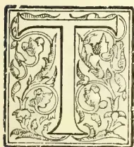

HE subject of our biographical it notice and portrait in this month's *Tropical Agriculturist* (to be ready in a few days) is the well-known “Patriarch of Dolosbage” where

he has resided on his own property for a long series of years. A more venerable or more esteemed pioneer planter there does not exist in or out of Ceylon, at this moment. We have known Mr. John Stephens for a great many years and have always esteemed him as a most careful and upright man of business and a truly industrious planter. Long may he continue to flourish in retirement, enjoying his well-earned *otium cum dignitate*.

Mr. Stephens was born on England on the 26th August 1816; so that he has now attained the truly patriarchal age of well-nigh 83 years; but, it may be said, in the language of Scripture, that “his eye is not dim nor his natural force abated.” Mr. Stephens was in his 25th year when he was first engaged in England to proceed to Ceylon in the service of Messrs. Ackland, Boyd & Co., the largest Colombo firm in cinnamon, coffee, &c.,

during the “thirties” and “forties.” Mr. Stephens voyaged to Ceylon in the well-known clipper sailing vessel “Symmetry,” Capt. Abel Mackwood, brother of the founders of the firm of Messrs. Mackwood & Co. (Caps. Wm. and Francis Mackwood, well-known and esteemed in the Ceylon trade in the early days.) The arrival in Colombo took place on 26th July 1841, so that our friend, if he survives till that date in 1899, will have rounded off no fewer than 58 years' residence in the island. There were four other young men as passengers for Ceylon in the “Symmetry,” namely, Messrs. Preston, Hicks (a Surveyor) and W. H. Walters. The first two joined the majority long ago; but Mr. Walters lived to be himself an esteemed patriarch among proprietary Ceylon planters, and regularly once a year were greetings exchanged between Hewaheta (Gonavy) and Dolosbage (The Diggings) as the two fellow-voyagers by the “Symmetry” advanced towards old age. Mr. Walters was, however, the first to go, his death occurring about two years ago. Mr. Stephens' first appointment was to the still well-known cinnamon plantation of Goluapokuna, Kadirana, in the Negombo district. He was at the time almost the only white man—or

701------------------------------------------------

672THE TROPICAL AGRICULTURIST.[APRIL 1, 1899.

certainly planter—in the district. Mr. Stephens learned how to deal with cinnamon and to manage his Sinhalese labourers from a Mudaliyar who could talk a little English. The young and active Englishman, however, soon mastered “the situation”; and in the course of the next two or three years he had several additional plantations placed in his charge with a corresponding increase of salary. In this way Mr. Stephens began to save money—there was not much temptation or opportunity to spend in those early days—and to make judicious investments of the same; so that he soon became recognised as a planter with some capital. In 1849, Mr. Stephens married a daughter of Mr. Rudd, senior, who with his sons, had rapidly developed several coffee estates during the “forties” and built up a prosperous firm in Colombo. Mrs. Stephens still survives in wonderfully good health and the “golden wedding” celebration of her husband and herself is due this year. Their family of six sons and two daughters all survive, most of the sons being well-known Ceylon planters; while the daughters both married to local planters, Mr. H. F. Dunbar (lately deceased) and Mr. Charles Laing of Dolosbage.

But Mr. Stephens was not the first of his family to visit Ceylon: he had a brother who came out in 1839, and who engaged in coffee planting in the Central Province, and was well-known to all by the sobriquet of “Stumps.” Mr. John Stephens frequently visited “Stumps”, and after a time determined to invest in coffee land. In 1854, Mr. John Stephens made his first investment in Crown land, situated five miles from Gampola, and began to open coffee, putting a Superintendent in charge. In that year his brother “Stumps” died. Another brother was Thomas who came out after John, but died whilst on his way to England. To the purchase of Cooroondoowatta, Mr. John Stephens soon added that of two other blocks of land, which he formed into three coffee plantations, namely, Cooroondoowatta, Diggings and Somerset. In 1856, Mr. Stephens finally left the Negombo district and took up his residence on his Dolosbage properties and there, with the exception of certain visits home, he has remained ever since. Coffee proved very remunerative in the latter half of the “fifties” and in 1859 Mr. Stephens left with his young family for England; but he himself returned after

eight months' absence. His next trip home was in 1863, when he had a spell of well-earned rest for three years, returning in January 1866, but only to inspect his estates. He left again in March of that year; but returned in 1868 to settle down once more and for 31 years now he has not left the Colony.

Handsome offers for the purchase of his estates were made to Mr. Stephens in the “seventies,” when, although the coffee-leaf fungus prevailed, no one believed it was other than temporary and coffee “boomed.” Among others, Mr. H. S. Saunders and the late Mr. St. George Carey tried to tempt Mr. Stephens to sell; but he declined—unfortunately for himself, perhaps. Instead, Mr. Stephens passed right through the coffee crisis when, although he cultivated well and manured highly, no remunerative return could be got from coffee fields. Mr. Stephens had been noted from the beginning as a liberal cultivator, his stock of cattle being one of the largest maintained in Ceylon by any one individual estate proprietor. So that it could not be said in his case that he took all out of the soil and put nothing back, or that the leaf fungus disease came through impoverished bushes. Still Mr. Stephens found himself in the early “eighties” with clean title-deeds for his properties; but with almost no value attaching to them—and indeed, the Banks could not be got to advance even a temporary loan, so low had the credit of “coffee” and “cinchona” fallen. We well recall a visit paid to the *Observer* Office in which this experience was related. Tea had, however, begun to come to the front in Yakkessa and Dolosbage and in 1864, Mr. Stephens leased 200 acres of one of his properties to three practical men, Messrs. Jas. Allan, J. Aymer and the late Geo. Kyd, who at once planted tea and benefited by the new product. This lease falls in with the end of the present year. In addition Mr. Stephens planted up 200 acres with tea on his own account; so that he will very soon have 400 acres of fine tea, for his very competent Manager (his son Mr. Arthur J. Stephens) to deal with. We ought to have mentioned that some years back Mr. Stephens sold his Somerset property to Mr. W. J. Robson who has developed it into a fine tea plantation now known as Evalgolla.

Mr. John Stephens has thus had during his island career, experience of four staple pro-

702------------------------------------------------

APRIL 1, 1899.]THE TROPICAL AGRICULTURIST.673

ducts of the island in cinnamon, coconuts, coffee and tea, not to mention cinchona, and probably a little of cacao and rubber. During his long tropical residence, Mr. Stephens has enjoyed splendid health, never having been once seriously ill during his 58 years of connection with Ceylon—a fact which he attributes to his temperate habits, love of steady work, and regular hours, always making it a strict rule to have his meals at fixed times, no matter how pressing his occupation with cinnamon or coffee in crop time. Even now, in his 83rd year, our patriarchal friend takes his walks regularly when the weather is fine; and he still reads and writes without the use of glasses; while "R.H.F.", during his Dolosbage visit, found the patriarch could still play a capital game of chess. Mr. Stephens' only complaint, so far, is that he cannot hear so well as formerly. What a magnificent advertisement have we in our Dolosbage patriarch for the climate of Ceylon, to send round to Life Insurance Offices! Long may our worthy old friend (and his partner) continue to adorn the long-established Dolosbage home, and to show planters of the present generation how they should live and work in order to earn the privilege of a good and healthy old age. Our hope is that in Mr. Stephens, we or a successor may yet hail the first CENTENARIAN AMONG THE PLANTING PIONEERS OF THIS CROWN COLONY OF CEYLON. So mote it be!

### THE "LANTANA BUG."

(*Orthezia insignis*, Douglas.)

CIRCULAR FROM ROYAL BOTANIC GARDENS CEYLON: JANUARY 1899.

#### HISTORY OF THE PEST IN CEYLON.

It is now more than five years since this insect was first noticed in Ceylon. In January, 1793 specimens were received from the late Dr. Trimen, then Director of the Royal Botanic Gardens, Peradeniya. Dr. Trimen, in forwarding the insects, wrote:—"We are afflicted by an abominable pest now in the gardens, which I do not recollect to have seen before. It bids fair to be the worst thing of the sort I have had here, and attacks especially *Acanthaceæ*, which includes our showiest shrubs. I never saw any pest here that increased so rapidly; the garden is quite disfigured by it." In the following April Dr. Trimen wrote that after cutting down and burning all the affected bushes they had seen nothing of the pest for some time; but that, at the time of writing, it had reappeared and was rapidly increasing. The next report from the Gardens was not until September, 1891, when the pest was said to be very bad and covering everything. About the same time a very large brood of the male insects suddenly appeared in the Gardens; and in this same year it was observed that the pest had extended its range outside the Gardens and had established itself firmly upon *Lantana* in the neighbourhood.

Thinking that the time had now come to warn the planting community of the danger, an illus-

trated article on the insect was published in the "Tropical Agriculturist" for January, 1895.

Though the pest has been steadily increasing in strength and extending its range, it does not appear to have attracted any general attention or created any alarm until early in the present year, by which time it had spread within a radius of about 20 miles around Kandy. The question then arose as to whether the insect would attack any of our cultivated products. It has since been observed, in one or two localities, upon tea plants growing in the immediate neighbourhood of infested *Lantana* bushes.

#### PRESENT RANGE OF THE PEST IN CEYLON.

Though at first confined to the Kandy District, the pest has now spread to other parts. To the north-east it has been recorded from Rangalla. It extends southwards throughout the Gampola and Nawalapitiya districts. An outbreak has been observed in Pundalu-oya. The Director of the Botanic Gardens reports the occurrence of the insect on the Badulla side of the country. No doubt if careful observations were made all over the Island, the pest would be found to have a still, wider range.

#### DISTRIBUTION IN OTHER COUNTRIES.

The original home of *Orthezia insignis* is still rather doubtful. It has been reported from various countries. The insect was first described from specimens collected in the plant houses at the Royal Botanical Gardens, Kew, where it found a congenial home. It must have been received there from some other country. Dr. Morris, late Assistant Director of the Gardens, considered that they owed its introduction to British Guiana. It occurs in the West Indies (Trinidad, Jamaica, and Antigua being specially mentioned) and in various districts of Mexico. In South America it has been recorded from British Guiana. In the United States it has become a common greenhouse pest. Quite recently Mr. C. P. Lounsbury has drawn attention to its appearance in South Africa (Cape Town, Natal, Port Elizabeth, and East London are mentioned as localities), where it is a troublesome pest both in greenhouses and gardens. It is said to have been known in Natal for the last five years; and specimens—supposed to date back ten years—exist in the South African Museum, labelled "Durban, Natal."

#### DESCRIPTION OF THE PEST.

As with most scale-insect pests, the resulting injury is more conspicuous than in the insect itself. In the present instance, though most travellers on our railway have observed the unhealthy appearance of the *Lantana* on the side of the track,—with its leaves blackened by the sooty fungus that accompanies the pest,—very few of them have any idea of the actual form and appearance of the bug that is responsible for this effect. A closer examination of the diseased bushes would show that all the younger shoots and branches are thickly covered with what they would probably describe as a "mealy bug." This species, however, differs from the ordinary "mealy bug," in the firm—almost shelly—nature of the waxy appendages, and in the fact that a large part of the back of the insect is exposed.

It will be as well to describe first the adult female, as this is the most conspicuous stage and the one in which the *Orthezia* may be most easily recognized. The insect itself is of a dull olive-green or olive-brown colour, with a fringe of short stout opaque-white waxy processes, and a double row of similar projections down the middle of the back. But the most striking feature is the long white cylindrical appendage springing from the extremity of the body. This the ovisac, and contains the numerous eggs. When fully developed this ovisac is four times as long as the body of the insect. It tapers very slightly, is fluted above and smooth below, and has an upward curve to the extremity, where there is an opening for the exit of the young larvae. The legs and antennæ of the insect are well developed and project beyond the margins of the body. The mouth parts consist of a conical tubercle springing from

703------------------------------------------------

674THE TROPICAL AGRICULTURIST.[APRIL 1, 1899.

between the bases of the first pair of legs, and from its extremity the long hair-like sucking tube can be extended into the tissues of the plant. The length of the insect and ovisac together is very little short of a quarter of an inch.

The half-grown female is in all respects similar in external appearance to the adult insect, except for the absence of the ovisac. It is therefore a much less conspicuous insect, and measures only about one twenty-fourth part of an inch in diameter.

The young larva again does not differ very much from the half-grown insect, except in point of size. It is however of a paler colour, and the marginal, fringe is only very slightly developed.

The eggs, which are carried within the ovisac packed in a cottony material, are at first almost white. They soon deepen to yellow, then orange, and, just before the emergence of the larva, become of a greenish tint.

The male insect, after the first moult, is readily distinguishable from the other sex. It becomes more elongate and, instead of secreting compact waxy processes, envelops itself in a loose woolly secretion. Rudimentary wings begin to appear towards the end of this stage. The pupal (or nymphal) stage is only distinguished by the presence of rather longer wing pads, and in the greater length of the antennæ, which are then folded back along the sides of the body, extending nearly to its extremity. The pupa has long, well-developed legs which it can use when disturbed, though it usually remains quiescent beneath its woolly covering.

The adult male is a very graceful little insect, of a totally different appearance to the female. It is of a slaty grey colour, with very long slender antennæ, a single pair of grayish wings, and a tuft of long white silky filaments at the end of the body. The eyes are black and divided into numerous facets. It has no mouth, and consequently takes no food in this stage, having laid in a sufficient store during the larval period.

#### LIFE HISTORY AND HABITS.

There appears to be a constant succession of broods. I have examined infected plants at all times of the year, and have always found the insects in all stages, from the newly hatched larva to the adult female. I have kept individual females under observation. After the first commencement of the formation of the ovisac a period of three weeks elapses before the emergence of the first larva, after which the young insects hatch out at the rate of about five a day for a period of six weeks or more; by which time the parent is exhausted and dies, and the earliest hatched larvae are mature and commence ovipositing on their own account. The length of life of a single insect is therefore about fifteen weeks; but as it commences to produce larvae at the ninth week, there may be five generations in the course of the year.

This fecundity is more or less independent of the attentions of the male insects, which appear only at irregular intervals. It is doubtful whether a generation of males is produced even once a year. It is remarkable that the true male of *Orthezia insignis* has been recorded only from Ceylon. Supposed males have been described and figured both in England and America; but in both these cases the male of a totally different insect has been erroneously associated with this female. Since the appearance of the pest in Ceylon two male broods only have come under my personal observation—in July, 1894, and May, 1898. On both these occasions the male insects occurred in enormous numbers, hovering in the air like gnats, the silky tufts on their tails glistening in the sunlight. In May of the present year (1898) myriads of these little flies might be seen floating in the air in certain parts of "Lady Horton's Walk" and other roads about Kandy.

It is the female that is responsible for the chief damage, as she continues to pump up sap from the plant during the whole period of her existence. Unlike most scale-bugs, the *Orthezia* is quite an

active insect and able to change its position at will. It prefers the young shoots to the older stems, and moves upward with the growth of the plant.

#### FOOD PLANTS.

Although the *Orthezia* is popularly known in Ceylon as "the Lantana Bug," this is by no means the only plant which it affects. It is more particularly a garden pest, and it was upon the ornamental shrubs and plants in the Peradeniya Gardens that it first attracted attention. Its adoption of the Lantana plant is quite an acquired habit.

It was early noticed that *Orthezia* had a special taste for certain natural orders of plants, *Acanthaceæ*, *Rubiaceæ*, and *Verbenaceæ* being particularly appreciated by the insect. Since its residence with us it has very largely increased its list of food plants. It would be difficult to give a full catalogue, but the following plants have been noted:—

*Acanthaceæ*:—Crossandra, Justicia, Thunbergia, Mœnia, Strobilanthes.

*Rubiaceæ*:—Cinchona, "Coffee" (Arabian and Liberian), Gardenia, Hamelia, Ixora, and many common weeds.

*Verbenaceæ*:—Verbena citriodora ("Scented Verbena"), Lantana, Stachytarpheta, Duranta.

*Compositæ*:—Tithonia ("Wild Sunflower"), Chrysanthemum, Achillea, Vernonia, Ageratum ("Goat-weed"), and many common weeds.

*Solanaceæ*:—Habrothamnus, Capsicum, "Tomato."

*Labiatæ*:—Colens, Salvia.

*Rutaceæ*:—"Orange" and various kinds of Citrus.

*Leguminosæ*:—Clitoria.

*Caprifoliaceæ*:—Lonicera ("Honeysuckle").

*Bignoniaceæ*:—Tecoma.

*Rosaceæ*:—"Strawberry."

*Amaranthaceæ*:—Iresine.

*Ternstromiaceæ*:—"Tea."

*Convolvulaceæ*:—Ipomea.

*Lythraceæ*:—Cuphea.

The above names are chiefly those of ornamental shrubs, garden plants, and common weeds. We have, so far, no very serious reports of injury to any of our more important economic plants. It will be noticed that both the tea and the coffee plant figure on the list. Of the latter I have seen abandoned plants in waste land thickly colonized by the bug. Superintendents of coffee estates should be on their guard against the introduction of this pest.

The Tea plant fortunately does not appear to be a favourite food of the *Orthezia*, though, failing more favoured plants, it can subsist and breed on our staple product, and the subsequent generations might very readily acquire the taste for Ceylon tea. The danger arises from the enormous and rapid reproductive powers of the insect. When it finds a congenial food plant—such as Lantana—it multiplies till every shoot is thickly tenanted, and the later broods are simply crowded off and compelled to seek fresh pastures. The several instances of the establishment of the pest upon tea have manifestly arisen in this manner.

#### REMEDIAL MEASURES.

The *Orthezia* is one of, if not the most resistant of all scale-bugs towards insecticides. It is therefore a useful subject upon which to test various treatments. An insecticide that will kill *Orthezia* can be almost guaranteed against any scale pest. It is remarkable that the half-grown insects will often survive treatment that has successfully destroyed the younger and older individuals.

In the case of isolated trees attacked by this pest, the gas treatment is really the most effective and complete. This consists in covering the tree with a tent or sheet of some closely woven material, beneath which hydrocyanic acid gas is generated. The deadly gas will penetrate to every part of the tree and reach every single insect. I have recently ascertained by experiment that an extra strength of the gas with a shorter exposure (than usually prescribed) is the most certainly fatal to the insects.

704------------------------------------------------

APRIL 1, 1899.]THE TROPICAL AGRICULTURIST.675

and the least injurious to the plants. The gas treatment however, though really very simple, requires considerable care in application and is subject to certain dangers. It cannot therefore be recommended for general use without previous demonstration by a trained operator.

Spraying is the next best measure. But however thoroughly this work may be done, a certain proportion of the insects is bound to escape, and the process must be repeated at intervals until the pest has finally disappeared. I have found that mixtures of which soap is the principal component are more efficacious against *Orthezia* than any other form of insecticide. Besides killing the insect, the soapy matter blocks the aperture of the ovisac, and so prevents the emergence of the young larvæ. Kerosine-soap-emulsion is a useful and inexpensive mixture, but requires careful preparation. The formula is:—

<table>
<tr>
<td>Kerosine</td>
<td>...</td>
<td>2 gallons</td>
</tr>
<tr>
<td>Common Soap</td>
<td>...</td>
<td><math>\frac{1}{2}</math> lb.</td>
</tr>
<tr>
<td>Water</td>
<td>...</td>
<td>1 gallon</td>
</tr>
</table>

Dissolve the soap in water heated to boiling. Add the kerosine to the hot mixture, and churn till it forms a thick cream on cooling. The churning is the most important part of the process. If this is not done thoroughly, the oil separates out on cooling, and will not then mix with water. A properly compounded emulsion may be subsequently diluted to any extent. The churning may be effected either by stirring vigorously with a bunch of twigs or the liquid may be repeatedly drawn up and expelled through a garden syringe. To test the mixture, put a drop on to a piece of glass. If it adheres without separating into oil globules, the process is complete. For application, dilute with nine or ten times the bulk of water. Kerosine emulsion should not be applied during sunshine, or serious injury to the plants may result.

Strawson's "Red Spider Insecticide" and McDougall's "Insecticide Wash" are very convenient forms of soap mixtures, and are both very effective against *Orthezia* in the proportion of  $1\frac{1}{2}$  lb. of the mixture to 4 gallons of water.

The insects will remain attached to the plant for a long time (sometimes two or three weeks) after they are dead. An examination with a hand lens is necessary to determine whether the application has been successful or not. If the legs remain rigid and do not move when the insect is disturbed, it may be presumed to be dead.

After spraying it will be advisable—where possible—to prune the bush and burn the prunings.

Where the pest has become widely distributed—as on *Lantana* in waste land,—any treatment of the above nature will be quite impracticable. In such a case all we can do is to endeavour to keep it in check by periodically cutting back and burning the *Lantana* and other weeds that lodge the insect. In districts where *Orthezia* is prevalent all boundaries should be kept carefully cleared back. If *Lantana* is allowed to encroach upon the tea, the latter is bound to become affected sooner or later.

#### NATURAL ENEMIES.

Natural enemies may possibly exist in the native country of *Orthezia insignis*. But, so far, the career of the pest in Ceylon has been unchecked by any such causes. Birds do not feed upon it, and I have not found a single insect parasite—external or internal—preying upon it. I have tried to induce various species of lady-birds to eat this insect, but they have one and all absolutely refused—preferring to die of starvation.

A writer in the "Kew Bulletin" (June-July, 1895) quotes from the "Timehri" (a Demerara Journal) in which Mr. R. Ward gives some account of the habits of the *Orthezia* (in Demerara?). He says: "Although common, it is not nearly so destructive or troublesome as many of its allies. In the young state it is very abundant; after it becomes fully developed it is more easily preyed upon by its natural enemies, which play an im-

portant part in limiting its ravages. In this respect no insects are more assiduous than the grubs of the different species of *Coccinella* (lady-birds), *Syrphus*, the various *Hemerobidae*, of which the different species of *Chrysopa* act a chief part." It would be interesting to know if Mr. Ward is speaking of his personal observation of the natural enemies of the *Orthezia*, or whether he is alluding in general terms to the acknowledged work of such natural enemies.

#### MODE OF DISTRIBUTION.

The young larvæ of all scale-insect are very easily transported from one place to another. They are minute and active, and can exist for several days without food. They may crawl on to the feet of birds, or even on to larger insects that may be resting on the bug-infested plant, and may be conveyed in this manner to a considerable distance before being dislodged. They may be brushed off the plant and carried away on the clothing of passers by.

The rough cumbles used by Tamil coolies are particularly liable to carry the infection. Wandering cattle are also unconscious distributors of the pest. The young insects are so light that they may be transported by wind. The conspicuous way in which the pest is spreading along the sides of the railway track points to the supposition that they are carried along by the draught of passing trains. Running water is another fertile source of distribution. An infested plant growing on the banks of a stream or river is sure to shed some of the insect in the water. Individuals may be floated down for miles before effecting a landing.

The interchange of garden plants is also a great source of danger. It was in this way that the pest obtained a footing in Ceylon.

#### BIBLIOGRAPHY.

References to *Orthezia insignis* may be found in the following papers and publications:—

1. (1) Journal of the Quekett Microscopical Club, Ser. II., Vol. III., No. 20 (Dec. 1887), p. 169, *et seq.*; 2 plates. "Notes on a Species of *Orthezia* found in Kew Gardens," by Edward T. Browne.
2. (2) Entomologists' Monthly Magazine (Jan., 1888), p. 169, with several figures (A Description of the a species, by Mr. J. W. Douglas).
3. (3) Thirty-Second Annual Report of the Massachusetts Agricultural College, for 1894. "A New Green-house Pest," by C. P. Lounsbury.
4. (In the three papers quoted above, the male of a species of *Dactylopius* is erroneously described and figured as that of *O. insignis*.)
5. (4) Annual Report on the Royal Botanic Gardens Peradeniya, for 1893, by Dr. H. Trimen. (Mention of injury by the pest.)
6. (5) Indian Museum Notes, Vol. III., No. III, (1894), p. 103. "A New Coccid from Ceylon," by G. B. Buckton, F.R.S. (*O. nacreæ* is here a synonym of *O. insignis*.)
7. (6) Tropical Agriculturist (Jan., 1895), p. 437; 1 plate. "An Important Insect Enemy," by Mr. E. E. Green, F.E.S. (Giving a description of the pest and its ravages in Ceylon.) [Afterwards reprinted in pamphlet form.]
8. (7) Timehri, Vol. III., New Series (1889), p. 308, with figures. (Reference to the occurrence of the insect at Kew, by Mr. S. J. McIntyre.)
9. (8) Timehri, Vol. IV. (1890), p. 304. (An account of the Habits of the *Orthezia*, by Mr. R. Ward.)
10. (9) Kew Bulletin (June-July, 1895), p. 162. (Reference to the pest at Kew and elsewhere.)
11. (10) Entomologists' Monthly Magazine (June, 1895), p. 137. "On the Male of *Orthezia insignis*," by Mr. J. W. Douglas, F.E.S.
12. (11) Annals and Magazine of Natural History, Vol. XVI. (July, 1895). "On some Coccids obtained by Mr. C. A. Barber in the Island of Antigua, W.I.," by Professor T.D.A. Cockerell.
13. (12) Bulletin of the United States Department of Agriculture, Division of Entomology. Technical Series No. 1 (1896), pp. 10, 21, 23. "On some Mexican and Japanese Injurious Insects," by Professor T. D. A. Cockerell.

705------------------------------------------------

676THE TROPICAL AGRICULTURIST.[APRIL 1, 1899.]

(13) Insect Life. Vol. V. (1892-93): Page 89, "*Orthezia insignis* as a Garden pest," by Professor T. D. A. Cockerell; page 121, "Notes on Plant Faunæ," by Professor T. D. A. Cockerell; pages 159, 247, "Food Plants of some Jamaican Coccids," by Professor T. D. A. Cockerell.

(14) Bulletin of the Cape of Good Hope Department of Agriculture, Nos. 6 and 12 (1898). "Another introduced Scale Pest," by C. P. Lounsbury. (Reprinted from Agricultural Journal, March 31 and June 23, 1898.)

E. ERNEST GREEN.

Honorary Government Entomologist.

Pundalu-oya, December 12, 1898.

## CULTIVATION OF ARECA-NUT IN THE GODAVARI DISTRICT.

[A PAPER READ BEFORE THE AGRICULTURAL STUDENTS ASSOCIATION, MADRAS COLLEGE OF AGRICULTURE, SAIDAPET, BY STUDENT DUVVURI BALA-KRISHNA MURTI, OF GODAVARI.]

Gentlemen,—In the whole district of Godavari areca-nut plantation are met with only in one taluq, which forms the delta of the Godavari, namely the Amalapur taluq. A part of this taluq, known as Kona Seema, is exclusively devoted to plantations of various kinds. It is on this account many Europeans call this part, "The Garden of Lombardy." Only a limited portion of this Seema is under areca-nut, and the rest is under coconut, plantations, etc. The total area under areca-nut alone does not exceed six thousand acres. All these plantations are situated around Ambajipeta within a radius of 12 miles. This is the most paying cultivation in the district. A man owing a garden of three acres is considered to be a rich man. Even in settling marriages among Brahmins in Seema, the first question asked by the parents of the bride is whether the bridegrooms' family owns an areca-nut garden.

2. The areca-nut palm is a well-known native of tropical climates. There are two varieties of this palm, one producing bigger nuts than the other. It is only the small variety that is found in this taluq, and to it only that the whole of this paper refers. The maximum height of this tree is from fifty to sixty feet. The stem is quite cylindrical and perfectly vertical, having a light greenish white colour. The diameter of a full grown healthy tree is 10 inches at the base, 8 inches in the middle, and 4 inches at the top, and the tree bears about 18 green leaves at the top.

3. The soil best suited to this palm is red loam, rich in organic matter. On this soil the plant is healthy and the yield is heavy. There are also plantations on other soils, as clay loam, sandy loam, and black soils, the last being the most unsuited for the plant. On all soils other than the red loam the yield is comparatively less, and the plant is not so vigorous.

4. *Preparation of Land.*—A plot of land of about three acres is selected. It is generally oblong in shape, facing north-east and south-west. In the middle of these three acres, about one acre is left for the future areca-nut plantation, and the surrounding two acres are placed under coconut. On the exterior border of the coconut plantation a row of good selected mango seedlings is planted on a raised bund, while on the interior border oranges, limes, battavians, pomegranate and such like plants are grown. On the north-east and south-west, sides exposed to the monsoonic winds, five rows of coconuts are planted, while three such rows only are planted on each of the other two sides not so exposed. The earth is removed to a depth of 9 inches. The arrangement of these plants is such as to break the force of the wind, the plants in one row alternating with those in the next.

NORTH-EAST.

Mangoes.

Mangoes.

SOUTH-WEST.

The rows of coconut are eight yards from one another, and the plants in the rows are also the same distance apart. At the inter-section of the diagonals between four coconut trees forming a quadrilateral, a jack tree is placed. In addition to these a few grafted mangoes are also found. Thus the coconut plantation all around with all the miscellaneous items forms a protective wall against the strongest monsoonic winds.

Ten or twelve years are allowed to pass before the interior is occupied by areca-nut. During the first eight or ten years pulses, especially gram, are grown in the central part, and in the two years immediately preceding the permanent transplanting of the areca plants, a plantain tope is started for the purpose of affording shelter to the young areca plants during the four years succeeding the permanent transplantation. Sun-hemp is also grown during these years in the interspaces between the plantains, and ploughed in as green Manure. In the centre of the area selected for the plantation there is also a well, generally 12 to 15 feet in diameter, with a water-level from 10 to 12 feet from the surface.

5. *The Raising of Seedlings.*—Under this heading comes the selection of seed nuts. Fruits for seedlings are generally selected from trees over 50 years old, which have ceased to bear well. These trees have generally one or two clusters, each having not more than forty or fifty fruits. These fruits are taken when they are fully ripe and dried for 15 or 20 days in shade when they are ready for sowing. The chief reason for selecting fruits for seedlings from old trees is to ensure timely sprouting and steady growth of the future plant. The scientific explanation for this practice is not known, but it has been decisively proved both by observation and experiment to be a complete success.

As to the raising of seedlings, a plot four feet square is selected on an elevated place under shade, pit thus prepared is filled with sand up to 6 inches; on this the seed-nuts are arranged in rows, the proper time for this operation being November.

706------------------------------------------------

APRIL 1, 1899.]THE TROPICAL AGRICULTURIST.677

And on the top a mixture of finely powdered sand and Godavari silt, in the proportion of two to one, is sprinkled, forming a layer half an inch thick over them. In this plot, four feet square, something like 2,000 seeds are placed. (The cost of 2,000 seeds is at the most Rs. 5.) The bed is watered daily both in the morning and evening, and covered with dried leaves. At the end of a month some seeds begin to germinate, and the sprouting is all over before the expiry of the second month. They are allowed to grow in the bed for four or five months till they attain a height of six to eight inches when they are ready for temporary transplanting.

6. *Temporary Transplanting.*—For this purpose another bed is prepared a month or two prior to the operation, which should be done in June, by thoroughly tilling and heavily manuring. The manure generally applied is a compost of the excrements of sheep and goats. Five or six days before the temporary transplanting, the bed is levelled and pits are dug half-a-yard distant. Each pit is four inches square and six inches deep. Then the seedlings are removed from the nursery and planted in these pits. They are watered well, especially in the first month. The whole bed is shaded by means of a pandal of one yard in height above the ground. The pandal is removed at the expiry of the first summer, when the plants are about half a yard high. Then the bed is well hoed (with hand hoes) and another application of manure is given. In the months of May and June, the bed is watered by lifting water from a well, as in all other months water is available in canals which irrigate the lands by gravitation. Even in these two hottest months a watering once a week will suffice for the plants being very thick and close together, the moisture is retained well throughout the week. Thus proper precautions being taken, the plants will be ready for permanent transplanting at the end of the third and fourth years, by which time the plants leave a stem of nearly one and a-half to two feet.

7. *Permanent Transplanting.*—In the land prepared for permanent transplanting, in the manner described in para. 5, pits are dug nine to ten feet distant. The pits are one foot cube, and are dug in symmetrically parallel rows very close to the plantains already occupying the ground. The plants from the second nursery are then taken, fixed in these pits permanently, and the earth round these plants is well consolidated, and for one week they are watered both in the morning and evening. Generally they are planted in the month of July, so that they may have the advantage of the south west monsoon. If there be no rain they are watered once in two days and the stems are well covered with country date leaves. So far the operation of the first year.

In the succeeding years the operations consist only of ploughing and watering in summer. The covering of the stems is removed in the third year. Practically no manure but green manure is applied. At the end of this year the plantains are all removed excepting those in the central strip marked in the diagram. It is only in the fourth year that the stems are exposed to the sun.

8. *Stages of Growth.*—Four to five years after the permanent transplanting the majority of the plants attain a height of eight or ten feet when they begin to flower. For two or three years after the first flowering a very satisfactory yield cannot be expected. In the majority of cases from the tenth year of permanent transplanting a steady and good yield is given. Thus it takes not less than twelve years from the growing of the seed to get a good yield. Proper care being taken for watering and manuring, the plantation gives a uniform yield for forty years, when the plants are forty to fifty feet high. The maximum life of the palm is said to be 75 years, but I have not been able to see plants over sixty-five years old.

9. *Replanting.*—In the generality of cases, in the fortieth year of the permanent transplanting, another set of area plants is planted, the new plants being

placed at a distance of a half a yard from the old ones. When this new Plantation is in flower the old trees are removed. I have seen a plantation thus renewed for the sixth time.

10. *Manure.*—The practice is invariably to pen sheep and goats in the garden. We have to pay one rupee for every 300 animals folded for one night in the garden. Usually we spend as much as fifty rupees for this item; this is the only manure as far as I know. At a lecture on Agriculture, I learnt that white castor cake might be applied to the area-nuts, whereupon I tried the cake successively for three years on 20 trees, as my people did not permit me to apply it to the whole garden. The effect of it was that the trees went on growing very luxuriantly, but with no good yield. Even now these are the only trees in my garden which are the tallest and least yielding.

11. *Watering.*—The garden is watered only in the months of May and June by lifting water from a well, but in all other months the anicut water is used, for which an annual tax of ten rupees per acre has to be paid. Those who cannot get anicut water have to irrigate the gardens by lifting water from Sivaratri (March) to Karkataka Sankramanam (July) for about 5 months. In these months they should be watered daily in the morning. In the months of May and June, on such days as are excessively hot, watering twice a day is essential. By one single mhothe, working six hours a day, the whole plantation can be watered.

12. *Miscellaneous Crops.*—A fairly good sum is realised by growing vegetables in the garden. These are generally brinjals, snake gourds, bitter gourds, ribbed gourds, and melons. Once in three years in half of the land under area-nut, root crops like ginger are put in.

13. *Harvest.*—The harvest season is generally in the months of August, September, and the first half of October. The mode of collecting the mature clusters is very interesting; the clusters of old trees are cut by a man who remains on the stem of a stout tree in the middle, with a long bamboo having an instrument resembling a reaping-hook at the top. In plantations of thirty to forty years old, a boy of fourteen or fifteen goes to the top of a tree, plucks out one or two fruits from a bunch, peels it with his teeth to see if the bunch is ready for being plucked. If it is ready, he removes the bunch and throws it down. (These bunches thus removed are gathered by boys especially employed for the purpose.) Then he bends the tree on which he has climbed and gives it a to-and-fro motion until he gets hold of the next tree, which he first clasps with his hands, and then draws his feet to the same from the other. Thus the tedious business of climbing each and every tree from bottom to top is overcome. The passage from one tree to another in this way is very easy, as the trees bend without difficulty. In this way two boys can go round the whole garden in four hours. After removing the clusters the fruits are separated from the peduncles by beating them against the stem of a tree. The next operation is to remove the outer bark of the fruits. For this purpose there are experts who can do it with the greatest ease. There are certain women who can remove the outer covers of the fruits most skillfully, and can decorticate in one day about sixty Madras measures of fruit, which yield about 25 Madras measures of the decorticated nuts (one Madras measure equals 120 rupees in weight). They are paid at the rate of one pie for every measure of decorticated nuts. These nuts are again cut in the middle into, two for which the rate is two annas for every twenty-five measures of the nuts cut. The nuts thus cut are boiled in earthen pots having a capacity of 16 measures with two measures of water and a little chunam (lime) for about two hours over a fire of cowdung cakes. As soon as a red froth appears over the nuts in the pot, it is removed and the nuts are dried in the sun on palmyra mats. But on rainy days they are dried on a raised platform specially constructed with bamboo over a fire pre-

707------------------------------------------------

678

THE TROPICAL AGRICULTURIST.

[APRIL 1, 1899.

pared out of coconut shells. The manufacture of the nuts is generally done only by merchants, as almost all the owners of the gardens lease out the produce year after year.

14. *Uses.*—The nuts locally produced are not much used in the district, but are exported chiefly to Hyderabad, where they appear to fetch a very high price in the market on account of their greater astringency. The majority of people in the district use less astringent nuts. The uses of the stem of a very old tree are manifold. The stems are used as reapers, cross beams for thatched houses, and in many other ways. The bottom portion of an old stem is used for making instruments for splitting the fibrous covering of coconuts. The expanded portion at the base of the petiole is used for dining plates, cups, fans and for several other purposes, and the leaves are used for brooms.

15. *Diseases.*—This palm is subject to, principally, the attack of white-ants, which eat away the root, and thus cause much damage to the trees. The chief cause of this is the location of a plantation on a sandy soil or sandy loam which is naturally poor. This can be cured by careful watering and manuring.

16. *Yield.*—Under this heading I include the yield of all the different plants in the plantation; as has already been stated, all these plantations are mixed ones. The average yearly yield of the areca-nut alone is about Rs. 250 per acre.

The figures given below refer to my own garden :

<table border="0">
<thead>
<tr>
<th></th>
<th>RECEIPTS FOR 1898.</th>
<th>Rs.</th>
</tr>
</thead>
<tbody>
<tr>
<td>Areca-nut .. .. .</td>
<td>..</td>
<td>275</td>
</tr>
<tr>
<td>Coconuts, 12,000, at Rs 25 per 1,000 ..</td>
<td>..</td>
<td>300</td>
</tr>
<tr>
<td>Mangoes and jack .. .. .</td>
<td>..</td>
<td>100</td>
</tr>
<tr>
<td>Plantains .. .. .</td>
<td>..</td>
<td>40</td>
</tr>
<tr>
<td>Vegetables .. .. .</td>
<td>..</td>
<td>25</td>
</tr>
<tr>
<td>Limes, oranges, &amp;c. &amp;c. ..</td>
<td>..</td>
<td>25</td>
</tr>
<tr>
<td></td>
<td><b>Total Rs. ..</b></td>
<td><b>765</b></td>
</tr>
</tbody>
</table>

<table border="0">
<thead>
<tr>
<th></th>
<th>EXPENDITURE FOR 1898.</th>
<th>Rs.</th>
</tr>
</thead>
<tbody>
<tr>
<td>Cost of feeding one pair of bulls ..</td>
<td>..</td>
<td>120</td>
</tr>
<tr>
<td>Wages for 2 coolies for the whole year at Rs. 30 each .. .. .</td>
<td>..</td>
<td>60</td>
</tr>
<tr>
<td>Manure .. .. .</td>
<td>..</td>
<td>50</td>
</tr>
<tr>
<td>Water cess for 3 acres .. .. .</td>
<td>..</td>
<td>30</td>
</tr>
<tr>
<td>Interest on capital of Rs. 600 for starting the plantation, at 10 per cent } ..</td>
<td>..</td>
<td>60</td>
</tr>
<tr>
<td>Sundries .. .. .</td>
<td>..</td>
<td>25</td>
</tr>
<tr>
<td></td>
<td><b>Total Rs. ..</b></td>
<td><b>345</b></td>
</tr>
</tbody>
</table>

<table border="0">
<tbody>
<tr>
<td>Annual net income on three acres, Rs. 420</td>
<td>Rs.</td>
<td></td>
</tr>
<tr>
<td>Average gross receipts for the last eight years from three acres .. .. .</td>
<td>..</td>
<td>675</td>
</tr>
<tr>
<td>Average expense for the same .. .. .</td>
<td>..</td>
<td>300</td>
</tr>
<tr>
<td>Average net income for the same .. .. .</td>
<td>..</td>
<td>375</td>
</tr>
<tr>
<td>Average net income per acre .. .. .</td>
<td>..</td>
<td>125</td>
</tr>
<tr>
<td>No plantation in the district pays more than Rs. 125 per acre yearly consecutively for forty years.</td>
<td></td>
<td></td>
</tr>
</tbody>
</table>

<table border="0">
<thead>
<tr>
<th></th>
<th>THE COST OF PLANTATION.</th>
<th>Rs.</th>
</tr>
</thead>
<tbody>
<tr>
<td>150 coconut plants at Rs 80 per 100 ..</td>
<td>..</td>
<td>120</td>
</tr>
<tr>
<td>600 areca-nut seedlings ready for permanent transplanting at Rs. 20 per 100 ..</td>
<td>..</td>
<td>120</td>
</tr>
<tr>
<td>One pair of cattle .. .. .</td>
<td>..</td>
<td>150</td>
</tr>
<tr>
<td>Cost of sinking a well .. .. .</td>
<td>..</td>
<td>150</td>
</tr>
<tr>
<td>Miscellaneous .. .. .</td>
<td>..</td>
<td>60</td>
</tr>
<tr>
<td></td>
<td><b>Total Rs. ..</b></td>
<td><b>600</b></td>
</tr>
</tbody>
</table>

*Indian Agriculturist.*

COFFEE PROSPECTS.—Messrs. I. A. Rucker & Bencraft writing on Thursday evening, March 16th, say :—As regards values everything looks excessively cheap, and there can be little doubt that as soon as a basis is established we shall have a very large business in mild coffees,

CACAO AND SUGAR IN TRINIDAD.—Sir Cathbert Quilter and Sir Neville Lubbock, on 27th January last, met a first meeting of the local Chamber of Commerce and Agricultural Society in the Council Chamber. H.E. the Governor—Sir H. E. H. Jerningham—as President of the latter Society presided and spoke. In the course of his address Sir Neville Lubbock said :—

He was very hopeful that as regards cocoa the prosperity would continue for many years to come. He was afraid that the time was bound to come when cocoa would have a bad time, but at the present moment it looked as if that time was somewhat remote.

And again :—

They had a magnificent soil and climate, second to none in the world; they had also the advantage of being very close to that large Continent, and it appeared to him that all they were lacking was a population commensurate with their acreage and their great capabilities. When they looked back for something like a generation they saw that a great advance had been made in that direction already, but when he considered that their population was still only some 280,000 and the country could probably carry with ease two millions, it was obvious to him that there was very great room for population, and he thought an increase of population would be of very great advantage to this island. He hoped the efforts made in the past and which had been so far successful would be continued in the future. He was sure they ought to encourage population to come here in every way they could. With regard to cocoa and sugar, from what he knew and had heard, it appeared that the development of those industries had already outrun the available labour supply.

Mr. Hewatson, President of the Chamber of Commerce, said :—

Everyone must be convinced that central factories would be the only salvation for those colonies where muscovada sugar was still produced, but while he agreed that the abolition of bounties was not likely to bring about any material rise in the price of sugar, it had always been his opinion that the abolition of bounties was necessary to remove the uncertainty of the sugar trade and in some measure restore the credit of the industry, so that nothing could be done, and until the bounties were abolished central factories, in any part of the West Indies would never restore the sugar industry. (Hear, hear). He hoped Sir Thomas Lipton would be advised that the abolition of the bounties must be the first thing before capital was employed for the purpose.

In conclusion, the Governor said :—

They must not be carried away by the idea that this was an official meeting—Not at all, we knew your good works and we are modest enough to recognise your own modesty not to speak of that work though we might do it; but we have come here simply as a body of interested persons in the welfare of Trinidad, to welcome two men who have already understood the necessity of home help—people who are living at home, to help us there in the way that we are trying to help ourselves here, to give utterance to our wishes, in fact, to give life to those inmost desires which we cannot give life to and which Parliament can give, and if you can induce other members of Parliament to come during this season, in yachts, and in numbers, we shall all be here so as to get a majority in favour of the West Indies in what I do not hesitate to say is a just and truthful and an honest demand.—The Governor concluded by asking them to extend their welcome to a very distinguished guest he had the honour to have in his house, viz., the Administrator of St. Lucia. Mr. King-Harm had not been in good health and understanding that Trinidad was the Eden and the Paradise of the West Indies, had come to pay a visit to his old Governor.

708------------------------------------------------

APRIL 1, 1899.]THE TROPICAL AGRICULTURIST.679TRIMEN'S "FLORA OF CEYLON."\*

In noticing the fourth part of this valuable work, we cannot help taking over Sir Joseph Hooker's preface in full, so explanatory is it of the plan of the Flora and the contents of the present volume, as well as of the fifth part which is to follow and the complete Index which is to be supplied:—

PREFACE TO PART IV.

Being instructed by the Government of Ceylon with the completion of Dr. Trimen's Hand-book of the Ceylon Flora (left unfinished through the lamented death of the author), I have to render an account of the materials at my disposal for the above purpose.

Premising that the three Parts already published comprise three-fifths of the contemplated work, I have towards its completion—

1. 1. The Natural Order *Euphorbiaceæ* (by Dr. Trimen), nearly ready for press (about 140 species).
2. 2. A list of the genera and species of all the Orders from after *Euphorbiaceæ* to *Cyperaceæ* inclusive, in the sequence in which Dr. Trimen intended to describe them (*i.e.*, in strict accordance with the Flora of British India), together with such synonyms and references as he thought necessary, habitats, native names (few), and occasional notes. For *Gramineæ*, which are to conclude the work, he left no materials whatever.
3. 3. That portion of the Peradeniya Herbarium which comprises the plants not published in Parts I.-III.; and of the collection of drawings pertaining thereto.
4. 4. The Ceylon collections in the Kew Herbarium, which are much richer than those in that of Peradeniya.
5. 5. The remaining 25 of the 100 quarto lithographed and coloured Plates that accompany this work. These 25 will appear with the present Part.

Thus it appears that my share in the authorship of the Hand-book, as originally contemplated by Dr. Trimen, will be confined to passing his account of the *Euphorbiaceæ* through the press, and to supplying descriptions of all the succeeding Orders, together with a complete account of *Gramineæ*, adding occasional notes on the genera and species where I think it expedient to do so.

In addition to the above, I propose to give in Part V. (1), a key to the Natural Orders of Ceylon Flowering plants, without which the work cannot be of practical use to any but experienced botanists; (2), brief biographical notices, by G. Boulger, Esq., F.L.S., of the botanists who have done most for the advancement of the Sinhalese Flora; (3), two very instructive Maps, of the Rainfall and of the Forest Areas of Ceylon, issued by the Surveyor-General of the Colony, to whom I am greatly indebted for sanctioning this use of them.

Regarding Indexes, it will be observed that a complete Index of the Latin, Sinhalese, and Tamil names of the plants described in Parts I. and II. is appended to Part II. Part III. is not indexed. As I propose to append to Part V. a complete Index to the whole work, I have confined the Index to Parts III. and IV. to generic names.

It remains to add to the above explanations that, in following Dr. Trimen's footsteps, I shall adhere as far as possible to the plan he has adopted, in respect of one point in which I have an observation to make.

\* A Hand-book to the Flora of Ceylon containing descriptions of all the species of Flowering Plants indigenous to the island, and Notes on their History, Distribution and Uses. By Henry Trimen, M.B. (Lond.), F.R.S., Director of the Royal Botanic Gardens, Ceylon. Contained by Sir J. D. Hooker, G.C.S.J., C.B., F.R.S. With an Atlas of Plates illustrating some of the more interesting species. Part IV.: *Euphorbiaceæ*—*Naiades*. With Plates LXXVI—C. Published under the authority of the Government of Ceylon. London: Dulan & Co., 37 Soho Square, W., 1898.

It refers to the following passage in the Introduction to Part I., p. v.: 'In the definitions of the Orders and Genera, it must be distinctly understood that the distinguishing characters here given for each group do not include the whole of those which belong to it, but such only as are shown by the species found in Ceylon.' Had the Flora of Ceylon been exhaustively explored, this curtailment of the characters of the Orders and Genera would not interfere with the value of the work for its limited purpose, but such, I feel satisfied, is not the case. There are still large areas of the Forest region which await the visits of keen collectors, and there are not a few common (some amongst the very commonest\*) plants of the plains of India that have not as yet been collected in Ceylon.

September, 1898. J. D. HOOKER.

Sir Joseph's concluding paragraph is particularly noticeable, shewing, that in his opinion, the Flora of Ceylon is by no means exhaustively explored, but that there are wide areas of our Forest region still to be dealt with by careful botanical collectors. It is also surprising to learn that some of the commonest plants in Southern India have not yet been found in Ceylon, notwithstanding the constant intercourse through cooly immigrants, traders, &c. Of course, the plants may be here, though not as yet identified. Most of the names of past botanists and collectors have been given to plants they discovered, and so we are constantly reminded, in the Flora, of Burman, Thunbreg, Rottler, Moon, Gardener, Col. and Mrs. Walker, Major Forbes, Champion, James Macrae (Superintendent of Peradeniya Gardens 1827-30—who is described as "an active collector, especially of orchids"), J. G. Watson (Superintendent of Peradeniya Gardens from 1832 to 1838), Dr. Thwaites, Nietner, Kelaart, O. Brodie, Glennie, W. Ferguson, Beckett, Wall, Nevill, Pole, Mackenzie, D. Morris, W. Smith and Dr. Trimen himself. Among collectors still in our midst are Messrs. W. H. Wright, Nock, Alwis, Braine, F. Lewis and E. E. Green; but in view of Sir Joseph's remark there is clearly room for many more apart from Mr. Willis, his Assistant, Mr. Parkin, and Curator, Mr. Macmillan. It would be well if some of the educated permanent residents at outstations and in outlying districts gave their attention to the botany of their neighbourhood and after some study they might be able to add their contributions to future editions of the "Flora of Ceylon."

We now proceed to afford some idea of the volume before us. It opens with the Natural Order "*Euphorbiaceæ*"—herbs, shrubs or trees with often milky juice, and of these 43 generic names with their subsidiary species are described, the same covering 78 pages. Sir Joseph Hooker's explanatory note introductory to this order is of special interest (and we may here mention that while the bulk of the work belongs to Dr. Trimen, the large number of notes signed "J.D.H." shews the great interest taken, and the varied amount of labour given, by the final editor):—

Chiefly a tropical Order, one of the largest of flowering plants, and one of the six largest of the

\* Of this a conspicuous example is *Polypodium plebeium*, Br., a weed extending from Africa to Australia; the tropical representative of the European *P. ariculare*, and perhaps the commonest of Indian dicotyledonous plants. Especially abundant in the Madras Peninsula.

85

709------------------------------------------------

680THE TROPICAL AGRICULTURIST.[APRIL 1, 1869.

Ceylon flora. Of genera not indigenous in the island, but widely cultivated, or more or less naturalised, are the scarlet-bracted *Poinsettia pulcherrima*, of Mexico; the Tallow tree of China, *Excoecaria schifera*; the American *Manihot utilisima*, yielding Cassava and Tapioca, together with the three recently introduced American Indian rubber producing plants, *Herea brasiliensis*, the Para rubber, *Manihot Glaziovii*, the Ceara Rubber, and *Castilloa elastica*, the Mexican Rubber.—J.D.H.

The only plant of the order (Euphorbiaceæ) we feel called on to notice is that named after Mr. Macrae\* "*Macraea myrtifolia*," a species of *Phyllanthus myrtifolius*, thus described as to where found, &c. :—

Moist region by streams, 1,000—2,000 ft.; rare. Near Kandy; Umaoya; Dolosbage. Fl. April, Sept., &c. purplish-red or greenish.

Endemic.—A very ornamental shrub when covered with the multitude of small pendulous flowers.

The next order is Urticaceæ, or the nettle tribe, though some have also milky juice, the explanatory note by Dr. Trimen being :—

A very large, chiefly tropical family, to which belongs the common nettle. The stems of many yield a valuable fibre, especially the Pacific Island *Broussonetia*, from the inner bark of which tappa cloth is made. Ceylon, though containing more than half (27) of the number of genera of *Urticaceæ* occurring in British India (45), is poor comparatively in species. Of these there are nearly 300 in British India, but only about 68 in Ceylon.

The genera and species cover some 40 pages, 14 of these being occupied with the various members of *Ficus*, some 21 genera in all, to which interesting notes are appended in each case; for example, "*Ficus bengalensis* :—

Lowcountry to 2,000 ft., especially in the dry region, but always, I think, planted. Fl. December. Fr. dark red. The well-known 'Banyan' of Europeans, in which the tendency to form aerial roots from the branches which become additional stems is carried to its greatest extent. There are several fine specimens in Ceylon, as at Jaffna, Negombo, &c., and in Hook. Journ. Bot. iii. (1841) at t. 13 is a drawing by Major Forbes of a tree near Matale; but it does not seem to be indigenous. It is said to be native in the sub-Himalayan forests and the lower slopes of the hills of S. India.

"*Ficus tomentosa*" :—

Rocky places and old buildings in the dry region; rather rare. Nilgala; Mihitale; Polonnaruwa; Bin-tenne; Trincomalee. Fl. July-September; Fr. grey, *Roxb.* Also in India. Abundant in the ruins of Polonnaruwa, which it has done much to destroy. Specimens in Herb. Perad. have l. ovate to orbicular, quite glabrous above, finely puberulous beneath.

"*Ficus altissima*—var. *Fergusonii*" :—

Moist lowcountry to 3,000 ft.; common. Fl. Aug.-November. Fr. orange-red, as large as a cherry. This var. endemic; the type and other vars. in India, Burma, Andaman Is., Malaya. I am not clear as to whether the type occurs wild in Ceylon, though it is given in Fl. B. Ind. There are trees in the Botanic Gardens, and I think I have seen it by the Mahaweli below Kandy. Dr. King erroneously spells W. Ferguson's name with double "s", after whom he names this tree.

"*F. Trimeni*" :—

Lowcountry to 2,000 ft.; rather rare. Peradeniya; Kadugannawa; Ekiirankumbura, Uva. Fl. April-May, July-Aug. Fr. orange-yellow or red when ripe, not dotted. Also in Western Peninsular India. A magnificent specimen of this species, with the branches covering a circle of about 200 ft. in diameter, is a

well-known feature of the Peradeniya Gardens. It grew at first epiphytically on a Jack-tree, which it destroyed and supplanted.

"*Ficus nervosa*" :—

Moist region up to 5,000 ft.; rather rare. Henerat. goda, abundant; Hantane; Hunangiriya; Maturata. Fl. August, December. India, Burma, China, Malaya. The Ceylon tree is var. *minor*, King, and differs from the continental type in its smaller leaves, with fewer lateral veins, and globose recepts.

*F. religiosa*, L., Bo, S., Arachu, T. (C.P. 2672), is a commonly planted tree, and invariably found by every Buddhist temple, but is nowhere wild. The sacred tree at Anuradhapura, brought from Magadha, in India, in n.º. 288, and carefully tended and guarded ever since, is not improbably the original source of all the trees in Ceylon. It is wild in the sub-Himalayan forests only. There are specimens in Hermann's Herb. (see Mus. Zeyl. 42, and Fl. Zeyl. n. 372).

*F. asperissima*" :—

Moist region up to 3,000 ft.; common. Fl. (?) Fr. orange-yellow, or pale yellow with orange spots. Also in Peninsular India. The young leaves are sometimes deeply incised. This is the 'Furniture leaf' of the English, and is generally in use for polishing, as sand-paper in Europe.

"*F. Thwaitesii*" :—

Climbing over rocks and trees in the moist region up to 5,000 ft.; rather common. Colombo; Hantane; Allogula; Matale; Dolosbage; Hunangiriya; Morawak Korale. Fl. March, September. Fr. pale pinkish-yellow or nearly white. Endemic. The slender creeping rooting stems look very unlike the free fruiting branches, and are the *F. diversiformis*, Mig. (C.P. 2217). This is the earliest name for the species, but it was given merely to the barren stems.

Of another species, "*Celtis Cinnamomea*," a very fine coloured figure is given in one of the plates, and we read :—

Moist region, 2,500 ft.; rather common. Fl. Feb., March; greenish. E. Bengal, Burma, Malaya Archipelago. The name *cinnamomea* refers to the character of the leaves; Thwaites' name, *dysodorylon*, to the very disgusting smell of the fresh wood especially, when wet, of which the Sinhalese name is descriptive. Thwaites' (*Travels*, iv. 284) says it was called 'Strunt-hout' by the Dutch, and employ as an alternative medicine internally and externalised in kin affections. The wood in chips is sold in the bazaar as a medicine under the name 'Pinari,' and is exported to Bombay where it is employed as a fumigatory against evil spirits.

In the same order is included the genus "*Artocarpus*" with its variety "*A. Nobilis*," the Del or Bedi-del of the Sinhalese of which we are told :—

Moist low country up to 2,000 ft.; common. Fl. June. Endemic. The outer shells of the seeds roasted are good eating. The wood is in great request for cabinet-making, and fishing boats are made out of its hollowed trunks.

And also the more famous "*A. integrifolia*," the well-known Jak-tree, "*Kos*" of Sinhalese, "*Pila*" in Tamil :—

*Artocarpus integrifolia*, L. f., is the well-known Jak tree, *Kos*, S., *Pila*, T., universally cultivated in the lowcountry for its fruit, but nowhere wild in Ceylon. It is stated, in Fl. B. Ind. v. 541, to have been found, wild by Beddome in the forests of the western Ghats of India, but it is not included in King's Monograph of the Indian species, who had not this information in time. I have no knowledge as to the time of its introduction to Ceylon, but no doubt it was at a very distant period; curiously, Hermann has not any specimen or drawing. There are good figures in Rheede, Hort. Malab. iii. tt. 26—28, Gaertn. Fruct. i. tt. 71, 72 (*Sitodium cauliflorum*), and Bot. Mag. t. 2833-4. It is C.P. 2233. The timber is excellent.—Trimen.

\* Superintendent of Peradeniya Gardens, 1827-30

710------------------------------------------------

APRIL 1, 1899.]THE TROPICAL AGRICULTURIST.681

The next order—"Ceratomyllaceæ"—is disposed of in a page, and we read:—

An Order of doubtful affinity; peculiar in Natal, with the many-leaved plumule of *Nelumbium*. The numerous described species may prove to be all forms of one or two widely distributed water-plants.

While under the only genus and species "Ceratomyllum verticillatum" we read:—

Submerged in water in tanks, lakes, and ponds in the low country; common, especially in the dry region. Throughout the Eastern Tropics.

'Sir J. Hooker is probably correct in referring this to the cosmopolitan species *C. demersum*, L. Our Ceylon form is that figured in Wight, Ic. 1948, f. 3, as *C. tuberculatum*, Cham.—*Trimen*.

We have no species of *Gnetaceæ* nor any *Conifereæ* in Ceylon. Of the latter Order a single species, *Podocarpus latifolia*, Wall., occurs in the hills of S. India, but the Peninsula is otherwise devoid of Conifers.

We next have "Cycadeæ" with only two species, and of one "C. Rumphii" we are told:—

Moist region below 1,000 ft.; very rare and doubtfully native. Near Galle, 1853 (Ferguson); near Hewesse, Pasdum Korale (Thwaites). Fl. (?).

Burma, Andaman and Nicobar Is., Malaya, New Guinea, N. Australia.

This is probably not indigenous; it is much grown in Colombo gardens, but I have never seen a male plant there,\* nor have I been able to obtain one from Peradeniya, where there are many female plants.

Next come "Hydrocharideæ"—fresh or salt-water herbs with undivided, submerged, or floating leaves,—occupying seven pages, and to one species "Halophila ovata" we have the following interesting note:—

Shallow sea water on the coast in the dry region; rather common. Negombo; Chilaw; Kalpitiya; Jaffna; Aripo; Trincomalie; Batticaloa; Mannar. Fl. July-September.

Shores of Red Sea, Indian Ocean, China, Malay Is., Pacific Is., Australia.

The leaves of this pretty little marine plant vary in form and greatly in size; in the type the blade is oval-oblong, about 1½ inch long, but it is as often almost rotund, or sometimes linear-strap-shaped, and then not more than ¾ inch long. This last very small form, from Jaffna and Trincomalie, may be called var. *minor* (= *Lemnopsis minor*, Zoll.), but there are intermediates. The brackish-water form is thought by Nevill to have narrower leaves than the ordinary marine one (see Taprobanian, ii. 67).—*Trimen*.

*H. stipulacea*, Aschers., is marked by Ascherson on his map in Peterm. Geog. Mitth. 1871, t. 13, as if in Ceylon. I have seen no specimens.—*Trimen*.

Amongst the specimens marked *H. ovata* in Herb. Peraden. there are some collected by H. Nevill, in six-fathom water off Chilaw, April 1881, of what appears to me to be a very different species, with very pale green, oblong, petioled leaves, covered on both surfaces with a fine pubescence, and with ciliate margins. The petioles have no dilatation of the base. The fr. enclosed in its spathesissessile, about ½ in. long, and resembles that of *H. ovata*.—J. D. H.

"Burmuniaceæ" are disposed of in three pages, being "annual, erect, saprophytic herbs."

#### CEYLON ORCHIDS.

Then follows the interesting and important order of the Orchids, "Orchidæ," which require some 103 pages, for of it we are told:—

The third largest Order of flowering plants in number of species in Ceylon, ranking between

*Gramineæ* and *Cyperaceæ* and the third largest also in number of genera. In percentage of endemic species it is the fifth of all the larger Orders, nearly half the species being endemic. On the other hand, it is remarkable for the paucity of endemic genera, of which there are only three out of the whole number (61). In the arrangement of the genera, I have adhered as closely as I could to the 'Genera Plantarum' and 'Fl. Brit. Ind.' The principal deviation from these works is the placing of *Phreatia* in *Vandeæ*, in which I am supported by Dr. King. I have also restored two imperfectly known genera of Thwaites, *Octarrhena* and *Alvisia*. By far the greater number of species of Orchids have been described for this work from Herbarium specimens solely, or, if aided by published or unpublished figures, these are too often unaccompanied by good analyses. Consequently, not a few of those descriptions will require rectification or amplification from living specimens. An illustrated work on the Orchids of Ceylon, with careful analyses, like Sir G. King's Orchids of the Sikkim Himalaya, would be a great boon to botanists and amateurs. Of the 160 species described in this work, only 97 have been figured, few of them from Ceylon specimens, most in inaccessible works, and not a few very imperfectly.

We much fear that it would be difficult now to find all of the 160 Ceylon species in their native habitat. The law recently passed, prohibiting indiscriminate collecting and exports, was not a day too soon. We have heard of one export-collector who left few or no orchids of any value in his favorite collecting ground. It is difficult to avoid quoting too many references to the many attractive orchids. One of the most delightful, and which has been in full flower in gardens in Nuwara Eliya (on Naseby particularly) this year, is "*Dendrobium aureum*" or "*heterocarpum*"—the 'primrose orchid' of which we are told:—

Upper montane zone above 6,000 ft.; common. Fl. Jan.-April; pale or dull primrose yellow, the lip with two orange-purple blotches on the disk; or all orange-coloured but the apex; or (in var. *palidum*) nearly white, with the blotches pale orange.

Himalaya, Khasia, and Nilgiri Mts., Burma, Java, Philippine Is.

The so-called 'Primrose Orchid' of Nuwara Eliya, from the sweet faint scent and colour of the flowers. The name, *heterocarpum*, seems to have no application to this species, but has two years' priority over *aureum*.

But the noblest of Ceylon orchids is that discovered by Dr. Thwaites and called after Lady MacCarthy, "*Dendrobium Macarthæ*"—"*Wesak-mal*" (May-flower) of the Sinhalese and of which a number of specimens used to grow on trees in Mr. Pate's garden, Flower Road, no doubt brought down by coach from Ratnapura. The description runs:—

Forests in the moist region below 2,000 ft.; rare. Ambagamuwa; Sabaragamuwa Prov. in many places; Hewesse. Fl. May-July, during the heavy south-west rains; clear violet-pink, the lip paler but veined and bordered with deep pink and with a large purple blotch on the disk; rarely all white, with a faint purple stain on lip.

#### Endemic.

Certainly the handsomest of Ceylon Orchids, and of late years so much collected for export as to have become very scarce in places which formerly produced abundance. The Sinhalese name means 'My-flower,' from its time of flowering.

\* Ferguson sent male fl. to Thwaites in 1855.

711------------------------------------------------

682THE TROPICAL AGRICULTURIST.[APRIL 1, 1899.

Of three other orchids fine plates accompany this volume, namely, "Bulbophyllum elegans":—

Montane zone 3-6,000 ft.; rather rare. Ambagamuwa; Hantane, abundant; Maskeliya. Fl. Feb.-May; dull purple tinged with green, lip orange with purple dots. Endemic. A singular plant, not without beauty. "Cœlogyne odoratissima":—

Upper montane zone; common. Fl. Dec., Jan.; white, with a yellow stain on the lip. Also on the Nilgiri Mts., S. India.

The name *odoratissima* is scarcely warranted by the very faint scent of the pretty flowers. Neither of the figures quoted, which represent the Nilgiri plant, are characteristic for ours, which has much larger flowers, less acute sep. and pet. and very crowded globose pseudobulbs. And "Cymbidium ensifolium":—

Montane zone in open places to 5,500 ft.; rather common. Hantane; Kondagula; Bogawantawawa, abundant. Fl. December, April; sweet-scented, sep. and pet. dull citron yellow, veined with pink, lip pale yellow, stained and spotted with dark pink.

In Sikkim, Khasia, China, and Japan.

In Fl. Brit. Ind., Lindley's *C. hematodes* is referred to *C. cyperifolium*, Wall., and it is assumed that its author was mistaken in giving Ceylon (Macrae) as its locality. But, notwithstanding a few discrepancies in the description, I think our common plant is really intended. I have seen no good published figure; it should; perhaps, be kept distinct from *C. ensifolium* as a species.—*Trimen*.

There are two drawings of this plant in Herb. Peraden., one (PLATE XC. of this work) with oblong obtuse pale sep. and pet., with fine pink interrupted veins, lip white, spotted with blood red, mid lobe orbicular, and 4 small nearly globose pollini, one of each pair much smaller than the other. The other drawing has ovate-lanceolate subacute pale straw-coloured sep. and pet., with 5 short red veins at the base of each, a straw-coloured lip, with red spots, and ovate mid lobe; the pollinia are 4, large, ovoid, and all equal. It is marked, in Thwaites's writing, '*C. hematodes*, Lindl. C. P. 3694.'—J. D. H. While of another "*Acanthophippium bicolor* we read:—

Shady woods in moist low country to 2,000 ft.; rare. Hantane; Gampola, abundant. Fl. March, April; bright yellow, the ends of the sepals and petals deep purplish-red. Endemic. Discovered by J. G. Watson, Superintendent of Peradeniya Gardens, 1832-38.

And yet again we have "*Eulophia sanguinea*":—

Moist region to 4,000 ft.; rare. Hantane; Moneragala, Uva (Wall); Haputale (Wright); Mirigama (Wright). Fl. Jan.-April; sep. and pet. dull purplish-red, as is the whole infl.; lip paler, pinkish-green, with dark purple wings and a green spur. E. Himalayas and Khasia. The plant is quite leafless at the time of flowering.

A specimen that flowered at Kew, and is figured in the Botanical Magazine, had the sep. and pet. reddish-brown, inclining to purple, the lip nearly white, suffused with pink towards the margin and on the side lobes, and with two purple spots on the disk.—J. D. H.

We must notice that one genus of orchids "Josephia" is thus referred to:—

Named in honour of Dr. (now Sir) Joseph Dalton Hooker, Director of Kew Gardens, 1865-85, and author of the 'Fl. Brit. India,' and many other standard books on botany.—*Trimen*. It has two representatives in Ceylon:—

*J. lanceolata*, Lower montane zone, 3,500 ft.; common. Fl. Aug.-Nov.; white, tinged with purple, column purple. Also in S. India,

Wight (citing Jerdon) says that the fl. are annually reproduced on the same inflorescence. The resemblance of the inflorescence to that of a *Statice* is striking.

*J. latifolia*, Ramboda (Nock). Fl. Aug.; apparently deeper coloured than in *J. lanceolata*.

But we must reluctantly leave the orchids and come next to "Scitamineæ"—herbs usually perennial to which the plantains, cardamoms and ginger belong—occupying 28 pages in the book, and from which we quote:—

*Elettaria Cardamomum*, Forests in the moist region up to 3,000 ft.; rather common. Fl. (t); lip white, streaked with violet.

There is no specimen or drawing Hermann's Herb. The Ceylon variety is maintained in as species by Horaninow (Prod. Sect. 31).

The type form of *E. Cardamomum* is called 'Rata-ensal' here, and comes originally from Malabar. It is largely cultivated on estates in parts of the montane zone. Figured in Benth. and Trim. Med. Pl. t. 267. Rheede, Hort. Mal. xi. t. 4. 5.

A careful comparison of growing specimens satisfies me that the plants producing respectively the round and the long Cardamoms of commerce are not distinct species. In every essential particular the structure is similar in the two plants, the only difference being that var. *a*, which produces the round Cardamom, is a little taller, with rather narrower and less firm leaves, and that its fr. is more aromatic as well as different in form. The seeds of both varieties are used by the Sinhalese to chew with their betel, and as medicines.—*Thwaites's Enum.* 1. c.

Also about plantains and bananas:—

*Musa paradisaca*. By rocky steep streams in the moist region, 1-3,000 ft.; common. Fl. Also in E. Himalaya and Malaya. Fruit eaten in times of famine.

Linnaeus's two species, *M. paradisaca* and *M. sapientum*, have no distinguishing botanical characters; both refer to cultivated plants. I use the former, as being the one to which he refers all the Ceylon and Indian synonymy, though *M. sapientum* seems generally preferred by modern botanists. We have but one wild species, and it may well be the origin of the numerous seedless forms in cultivation, distinguished by differences in shape and colour of their fruit. Hermann gives the names of 13 kinds grown in his time, and Moon records no less than 50, of which 5 are considered to be wild by him. The distinction between 'Plantains' and 'Bananas' is not made in Ceylon, and the latter word is not used here. Baker (Ann. Bott. vii. 215), following Moon, refers the wild Ceylon plant to *M. troglodytarum*, L., but I have seen nothing here with an erect inflorescence.—*Trimen*.

In the W. Indies and elsewhere, the name Plantain is used to designate the larger, coarser fruits used for cooking, that of Banana for the sweet sorts. Mr. Morris informs me that the plants of each are always distinguishable by the bracts of the male fls., those of the Banana being deciduous, those of the Plantain being persistent; as well shown in Ehret, i.e. Pl. Sel. tt. 18-20 and tt. 21-23. See also Kew Bullet. 1894, p. 254.—J. D. H.

Next are "Hamodoraceæ"—perennial herbs with a short rootstock and fibrous roots—of which only two genera are given, one being "Sansevieria Zeylanica," the well-known fibre-yielding plant. Then we have "Amaryllideæ"—rootstock bulbous or tuberous—with only a few representatives of not much interest.—"Taccaceæ" has only one repre-

712------------------------------------------------

APRIL 1, 1899.]THE TROPICAL AGRICULTURIST.683

sentative, "Tacca pinnatifida, the "Garandikidar" of the Sinhalese, of which we read:—

Dry region, rather rare, in grassy open places. Bintenne (Gardner); Trincomalie (Glenie); Batticaloa (Thwaites); Jaffna; Nilgala, abundant. Fl. March; green, tinged with purple. Also in India, Malaya, Pacific, Is., Australia. The leaves are remarkably similar to those of an *Amorphophallus*. The rootstock is intensely bitter when raw. It is full of starch, which, when prepared, is of excellent culinary properties. The plant is extensively cultivated in some parts of India and in other tropical countries.

Next come "Dioscoreaceæ," the best-known of which, perhaps, is "Dioscorea Sativa" (Panu-kondol of Sinhalese) for which Sir Joseph Hooker gives an interesting note:—

Low country to 2,000 ft.; very common. Fl. Aug., Sept.; yellowish white. Throughout India, wild and cultivated.

Roots, according to Thwaites, employed to attract fish to certain spots where they can be easily caught. For this purpose, pieces are daily, for some time, thrown into the water. I have cited Hermann, Burmann, and Linn. Fl. Zeyl. from *D. sativa*, but the fruit not being figured or described in these works renders their identification doubtful. Thwaites, in a note, mentions *D. sativa*, L., as a cultivated plant in Ceylon, with the name kattoo-kookoolala (katu-kukalala, *Trinen*), supposing it to be a different species from his *D. bulbifera*. As Dr. Trimen, in a note upon his and Thwaites's *bulbifera*, says that the roots are not eaten, it would appear that this may be the wild uneatable state of the cultivated plant. The attention of Ceylon botanists should be given to this subject.—J. D. H.

"Roxburghiaceæ" with one genus is followed by "Liliaceæ" covering 13 pages and then follow "Preterediaceæ," "Xyrideæ," "Comelinaceæ" (fully represented), "Flagellariaceæ" and "Juncaceæ," when we come to the "Palms," which occupy some 19 pages.

Of the *Arec*a we are told that it is nowhere wild in Ceylon, and that though common throughout tropical Asia, it is not now possible to tell where it originated. Of the *Kitul* (*Caryota urens*), on the other hand, Trimen reports:—

Though encouraged and protected, I believe this to be a real native here. Yields toddy copiously. The sago-like pith forms a valuable article of food, and a coarse sugar is made from the toddy. The wood, which is silicious, is useful for building purposes. Leaves yield the kitul fibre of commerce.

Of "Phoenix Zeylanica," common on our Southern Coast, we are told:—

The stem of *P. zeylanica* sometimes attains 20 ft. in height, and is often characteristic of the scenery after burning off the scrubby surrounding growth for chena-cultivation. Mats and boxes are made of the leaves. The sweet pulp of the fruit is eaten.

A fine plate is given of this palm. Then we have the Talipot "Corypha umbraculifera," the "Tala" of the Sinhalese, with a note as follows:—

Moist region below 2,000 ft.; rather common. Fl. Nov.-Jan. Also in Malabar. This must be a native palm, but I have never seen it in original jungle. Of the vast number of seedlings which come up near the parent tree, very few arrive at maturity, the young leaves being continually cut. Beddome remarks that he has never seen it wild in S. India.

The largest and most imposing of Eastern Palms when about 40 years old. The

young fruit, pounded, is used for stupefying fish. The leaves form mats, fans, and umbrellas, and are also used for writing upon. A bread is made of the pounded soft interior of the trunk. The seed have the hardness of ivory, and are known as Bayarbatu nuts; they are used as beads in Ceylon, and in the manufacture of buttons in Europe.

Next we notice the Palmyra, "Borassus flabelliformis," also called "Tal" by the Sinhalese and "Panai" by the Tamils. [We recall the puzzled look of a veteran botanist to whom we sat next at a dinner of the Linnean Society some years ago when we mentioned the "Palmyra"; nor could he at all identify it in his mind's eye, until we mentioned "Borassus," when he recalled it perfectly—he had been in the West, but not in the East, Indies.] The note is as follows:—

Dry region, especially in the desert sandy tracts near the coast; very common, but always planted. Fl. March, April.

Cultivated in India, Burma, Malaya, apparently wild in Trop. Africa. This is usually known as the Palmyra, the Portuguese 'Palmeira' slightly altered in spelling. It is grown in vast groves, like the coconut, in the north of Ceylon, especially in Jaffna district, as is noticed by Rumph. (l. c. 48).

For a very full account of the uses of this palm in Ceylon, reference may be made to 'The Palmyra Palm,' by W. Ferguson, printed at Colombo in 1850 (reprinted 1888).

*Cocos nucifera*, universally cultivated throughout the low country, especially near or on the sea-coast, but not wild.

We must also quote the note to the coconut, and express our satisfaction that four times over the name is spelt properly, while, alas! in the above note under palmyra, it is given 'cocoa-nut,' 'cocoa' being unfortunately spoken of as the product of cacao:—

Cultivated throughout the Tropics, the origin not known. [Indigenous according to Kurz, in the Cocos and Andaman Is.,—J. D. H.]

Several varieties are recognised by growers. 'Tembili' has the endosperm pink in colour, and is called the 'King Coconut.' A very small-fruited dwarf sort *C. nana*, Griff. goes by the name of the 'Maldivé' Coconut.†

Next we come to a series of orders with a limited number of representatives, such as "Pandanaceæ," "Typhaceæ," "Araceæ"—one genera of which has four species named after Ceylon botanists:—"Cryptocoiyne Thwaitesii," "C. Nevillii," "C. Walkerii" and "C. Beckettii."—Then follow in a dozen pages, the orders "Lennaceæ," "Triurideæ," "Alismaceæ," and "Naiadeæ." The Index which follows gives the Natural Orders and Generic Names in Parts III and IV.

Finally, we may mention that the publishers state that the fifth and last volume of this valuable work,—alas that Dr. Trimen should not have lived to see it all through the press!—will be ready by Midsummer 1899, and as Sir Joseph Hooker mentioned in the preface quoted above it will contain, besides the

† From the Portuguese name Coco or Coquo, given to the fruit from a fancied resemblance to a monkey's face.

† Not to be confounded with the *Cocos maldivica* of the old writers, which was the fruit of *Lodoicea Seychellarum*, the "Double Coconut" or "Coco-de-mer" (a palm peculiar to the Seychelles Is.), carried by the ocean currents and often cast on the shores of the Maldives.

713------------------------------------------------

684THE TROPICAL AGRICULTURIST.[APRIL 1, 1899.

conclusion of the Flora, a key to the Natural Orders of Ceylon Flowering Plants, brief biographical notices of Ceylon botanists and two plans of Rainfall and Forests. The Colony—as well as the botanical world—will then owe a debt of gratitude to the memory of the lamented Dr. Trimen and to Sir Joseph Hooker for so kindly continuing and completing the Flora of Ceylon.

#### COFFEE POSSIBILITIES OF PORTO RICO.

Assistant Secretary of War Meiklejohn has made public an abstract of a report made a short time ago by W. Korda to General Brooke. The report refers to a recent visit made by Mr. Korda through some of the cane and coffee districts of Porto Rico, and contains much of commercial interest. Mr. Korda was commissioned to make the trip by the Association of Agriculturists and Manufacturers of Porto Rico, for the purpose of ascertaining the state of affairs in the coffee regions, and, in behalf of the Association, to inform the United States Government, in case it were deemed advisable or necessary, of the general condition of the country. The itinerary made by Mr. Korda was through the vast and rich coffee districts of Ciales, Jayuya.

He says that every foot of this ground gives forth some fruit or profit. The ground which is not covered by coffee, or cocoa trees produces plantains, bananas, tobacco, corn, peas, sweet potatoes, etc. Pure running water is met with everywhere. The coffee crop being then gathered was abundant, and promised to reach 15,000,000 pounds.—*American Grocer*, Feb. 1.

#### TEA IN AUSTRALIA.

Melbourne, Feb. 18.

TEAS.—Some heavy business has been done in China descriptions, one or two importers clearing available stocks. Sales of 2,700 half-chests from 5½d to 6d for heavy, and from 5¼d to 7¼d for light weights. Ceylon and Indian in good demand, and prices are firm.—*Lead. r.*

From Melbourne *Age* we quote:—

TEAS.—The uncertainty referred to in our Saturday's issue still exists in this market, no notification having as yet been received from the Customs authorities as to what course they intend to follow with the tea salvaged from the late fire, which must have been contaminated by smoke as well as damaged by water. Until this has been settled the trade are not likely to come into the market for any great quantity. Holders, however, are firm, and business today has been done at advances. Sales include 35½ half-chests of both heavy and light weight Panyong at 0½d per lb above last week's opening rates; 250 quarters of Panyong bnds also sold at a higher price, and 130 chests of Ceylon up to 11½d.

PLANTS OF COMMERCE CLASSIFIED.—It is an interesting thing to know, says *Science News*, that 4,200 species of plants are gathered and used for commercial purposes in Europe. Of these 420 have a perfume that is pleasing, and enter largely into the manufacture of scents, soaps and sachets. There are more species of white flowers gathered than of any other colour—1,124. Of these 187 have an agreeable scent, an extraordinarily large proportion. Next in order come yellow blossoms, with 95,171 of them being perfumed. Red flowers number 823, of which 84 are scented. The blue flowers are of 594 varieties, 34 of which are perfumed, and the violet blossoms number 308, 13 of which are pleasantly odoriferous.—*Western Druggist*.

#### THE CHIEF FOODS OF THE NATIONS.

Mr. G. R. Waldron, in *McClure's* for November, gives an illustrated and comparative statement of the foods used by the principal peoples. Some of his statistics may be summarised thus:—

##### MAIN CROPS: BUSHELS PER ANNUM.

POTATO: 4,000 millions.  
INDIAN CORN: 2,600 millions.  
WHEAT: 2,500 millions.  
RYE: 1,300 millions.  
BARLEY: 750 millions.

##### MAIN FOODS: QUANTITIES PER HEAD PER ANNUM

Potato (pounds): Ireland, 1,467; Germany, 1,300; Netherlands, 840; Norway and Sweden, 740; France, 700; Austria-Hungary, 663; and Canada, 600.

Wheat (pounds): France, 467; Canada, 300; Italy, 307; Great Britain, 250; United States, 240; Netherlands, 240; Austria-Hungary, 230; Germany, 180; Russia, 93; Japan, 22.

Flesh Meat (pounds): United States, 147; United Kingdom, 100; Norway, 80; France, 77; Spain, 70; Germany, 64; Sweden and Switzerland, 62; Belgium, 61; Austria-Hungary, 60; Russia, Portugal, Netherlands, 50; Italy, 24.

Sugar (pounds): Great Britain, 80; United States, 73; France, 25; Germany, 18; Sweden, 20; Austria-Hungary, 15; Spain, 7.

Tobacco (ounces): Belgium, 110; Switzerland, 80; Netherlands, 51; Germany, 48; United States, 43.

Tea (ounces): United Kingdom, 88; Australia, 88; Canada, 70; United States, 24; Russia, 9.

Coffee (ounces): Netherlands, 370; Denmark, 247; Belgium, 176; United States, 155; Switzerland, 112; Germany, 78; France, 53; Austria-Hungary, 32; Italy, 17; Great Britain, 11; Spain, 9; Russia, 3.

Beer (gallons): United Kingdom 30; Germany, 27; Denmark, 24; United States, 15; Switzerland, 14; Netherlands, 8; Sweden and Norway, 7; France, 6; Canada, 4.

Wine (gallons): Spain, 35; France, 20; Italy, 24; Austria-Hungary, 3; Germany and Russia about 1 gal.; United Kingdom and United States, 2 quarts; Canada, less than 1 pint.

#### COCONUT PLANTING, &c., IN SAMOA.

MR. BURCKHARDT.—You made reference to this gentleman a short while ago. He is the Managing Director of a very large Banking, Mercantile and Agricultural concern in Samoa and Tonga Islands. The Company owns 80,000 acres of land and has placed about 10,000 acres chiefly under coconuts. They had a few hundred acres under coffee, which being affected with *Hemileia* was promptly cut down and burnt. The soil is said to be very rich and volcanic and the climate moist and hot. Nuts are not picked off the trees as here, but are allowed to fall and are then gathered. The plantations are divided rectangularly by roads. Donkeys, bred on the plantations, remove the nuts in crates fixed to their sides to the roads, whence they are removed by bullock carts to the stores. The extension of cultivation is limited by want of labor. The labor is "black boys" imported from the Solomon Islands. They are under agreement for three years and are paid the equivalent of R1 a day and grub. At the end of their term of service they return to their homes and are more often than not eaten up by their fellows as a compliment to their sleek condition! Copra is manufactured by means of hot air. In this they are ahead of us. As the climate in Samoa is wet, it was found impossible to make good copra in the open. With praiseworthy enterprise, experiment after experiment was made to dry by means of hot air at an expenditure of thousands of pounds sterling. The present system is con-

714------------------------------------------------

APRIL 1, 1899.]THE TROPICAL AGRICULTURIST.685

sidered as near perfection as possible and has raised the value of copra in all the markets having dealings with the Company.

Cattle and horses too are bred on the plantations. The former are used for draught purposes and the latter for the use of the Superintendents and Overseers to get about the plantations. Surplus stock is sold. With 2,000 head of cattle it is found impossible to keep down the rank growth of grass and weeds.

Samoa is said to be a very gay place. Too gay according to our visitor for honest, hard-work. A dinner once a week and picnics on Sundays are the rule. On special occasions there are other functions. Besides this, the entertainment of guests goes on mainly to the detriment of the interests of the Company. The employees are chiefly German, but other nationalities are not overlooked. Mr. Bureckhardt thinks he will fill the next vacancy in his plantations from Ceylon. I feel sure if the importation be of the right sort, he will lead the way in tropical agriculture.—Cor.

#### THE POPULARISING OF INDIAN TEAS.

It is a matter for surprise that, whereas with almost every alimentary product retailed by grocers, and every medicine dealt out by chemists, the greatest attention is paid to presenting it to the public in as attractive a form as possible, no regard whatever, save in a very few exceptional cases, is shown to "appearances" in respect to tea. Take a case for illustration, out of many, that of Crosse and Blackwell. Their name is so old, and their reputation so good, that it might well be thought that it was quite unnecessary for them, as so very old established a firm, to divert from their old usages and system, merely to please the public. Yet, what is found? Whereas, of old, their goods were put on the market in a primitive exterior ugliness, they are *now* presented in quite an attractive form.

Let some enterprising syndicate, or firm, pack the lower, but good, qualities of teas in small one, two, three, etc., ounce packets with similar labels to attract the attention of the bazar crowd, and great would be the sale of the teas offered in the *modis* shops. The subject of the sale of teas to the natives in this country is too large a one to be entered upon here: suffice it to say, that previous failures do not by any means betoken that there is no outlet. There is a door ajar, and the very force of circumstances will compel all connected with, and interested in, the industry, to open wide the same before many more years are debited to the past. England and America are ensamples of what can be done in the way of popularising goods of all classes. Tea merchants and traders in this country have but to follow suit with their product to ensure a most remunerative trade. The peoples of this country are becoming yearly greater and greater tea drinkers. The enterprise to cater for them, in the way it should be done, at present wanting.—*The Planter*

CULTIVATION OF CHILLIES.—Mr. A. C. Simpson has been impressing on his "brother" planters in B. C. Africa, the advantage of cultivating chillies. He writes:—

I have exported chillies for several years and I believe I am the only exporter. This year I have sent home 16 bags. I have got up to 47s 6d per cwt. same as Japan chillies fetch. I send you sample of chillies sent home, which fetched the above price, and were considered a first rate chillie, grown in suitable soil and well cured. I have 8 acres in bearing.

In Ceylon we import chillies among "curry stuffs" to a considerable extent; but the figures are not separately given:—

<table>
<thead>
<tr>
<th></th>
<th>1897</th>
<th></th>
</tr>
</thead>
<tbody>
<tr>
<td>Curry stuffs .. ..</td>
<td>121,945 cwt.</td>
<td>R1,569,120</td>
</tr>
<tr>
<td>Vegetable dried .. ..</td>
<td>83 pkgs.</td>
<td>R661</td>
</tr>
<tr>
<td>Raw .. ..</td>
<td>111 "</td>
<td>R389</td>
</tr>
</tbody>
</table>

There can be no reason why the larger part of the curry stuffs should not be provided locally.

#### RAILWAYS AND PLANTING IN BRAZIL.

(By an ex-Ceylon Planter.)

(To the Editor, *Ceylon Observer*.)

Rio de Janeiro, Jan. 14, 1899.

SIR,—I have not time to go into a long description of Brazilian Railways: this I have touched on several times in former correspondence. What the people of Ceylon are interested in at present is the question of gauge and the adaptability of narrow lines to hilly countries.

There are

##### THREE RAILWAY GAUGES IN BRAZIL.

Like a great many new countries it began with a wide gauge. The first one opened about 40 years ago, on the opposite side of the bay of Rio de Janeiro, to join on to a macadamised road which had been made by a Company, to cross the Serra de Mar, and go into the interior of Minas Geraes, was six feet. This was reduced some years ago to a metre gauge to join on to a Railway on the ratchet system, on the same gauge which goes to Petropolis and beyond, in the State of Rio.

Petropolis is the place on the top of the Serra de Mar, where the well-to-do people of Rio go to reside in the hot months. Wealthy businessmen go and come every day; the journey including the time on steamer crossing the bay, occupies two and a quarter hours.

The existing wide gauges are five feet three inches. There is first the Central Government Railway, which starts from the city of Rio de Janeiro and goes across the Serra de Mar, with its 13 tunnels North-West across the Serra de Montqueira into the centre of the State of Minas; *secondly* the Sao Paulo Railway starting from Santos, crossing the Serra de Mar by five inclines with stationary engines and a wire rope, goes North-West through the State of Sao Paulo; *thirdly*, a few Government lines in the Northern states of which I have not the particulars.

The feeder lines to the two first mentioned are on the metre gauge, and were constructed by local Companies. On the metre gauge there are some 800 miles in the Sao Paulo and South of Minas, which go through coffee producing districts. The produce and passengers, which have to find their way to the tea port of Santos, have to be transhipped on to the wide five feet three inches gauge of the S. Paulo Railway Company. The metre gauge branches from the Central Railway in the States of Rio and Minas, are still more extensive. One of them has grown to such importance as to find independent ways of its own to reach the sea port of Rio de Janeiro. The Leopoldina Railway Company, taken over a year ago by a British Company, has nearly a thousand miles on the metre gauge and has a terminus on the opposite side of the bay from the city of Rio.

The one I mean to bring to your notice is on the two feet six inches—or 76 centimetre—gauge the same as is proposed for the Kelani Valley. This is the West of Minas Railway. The Company is a national one; was formed in 1898 on a concession from the State Government of Minas, to construct and work a Railway on the two feet six inches gauge from Sao del Rey, to a point most convenient on the Central Government Railway. The point chosen to connect with the latter was Sitire, a short distance from Barbacena—the famous sanatorium—just after the central has crossed the famous Montqueira mountains. The distance from Rio to Sitire is 364 kilometres (about 230 miles). This was opened in 1882, the distance being about 120 kilo or nearly 80 miles from Sitire to S. Joao del Rey.

Extensions were afterwards made by the same Company and on the same gauge (2½ feet.)

One of the extensions went South-west to where the head waters of the river Parana are navigable. These waters enter the ocean at the river Plate, but are not navigable all the way from Lavras—the terminus of the narrow gauge line—to the river Plate. Large stretches of it do not admit of even native canoes—dug out—being used, but it in many parts is navigable for long distances which serve for local transport. Another of the extensions goes to the head

715------------------------------------------------

686THE TROPICAL AGRICULTURIST.[APRIL 1, 1899.]

waters of the Rio San Francisco which empties into the ocean about 1,500 miles north of Rio de Janeiro. This is the river which Burton called the Mississippi of Brazil, he having sailed down it from the upper waters to its mouth some thirty years ago, and written a very interesting book on his travels called the "Highlands of Brazil." The whole length of this railway in operation on the two feet six gauge including branches, is 684 kilometres, or about 430 miles. Like others of the small lines which commenced as feeders to the main Central line, it has its ambition to reach the coast by an independent line of its own. Four years ago it obtained a concession to construct a line from Lavras, the terminus of one of its extensions mentioned above, to Angra dos Reis, a well sheltered sea-port eighty miles south of Rio de Janeiro, and has some 60 or 70 kilometers working, and the remainder in construction. At the same time it received a concession to construct a line from the terminus of the other extension (to Rio San Francisco) to Catatao, a city in the state of Gozaz on the high plateau on which are the head waters of all the south American river systems, east of the Andes, and where it is intended in some future day to make the capital of Brazil.

The two last-mentioned concessions are on

#### THE METRE GAUGE

—an example of a trunk line being on the narrow two feet six gauge and its extensions on the wider three feet three-and-half. These concessions were given subject to a law made by the new Republican Government guaranteeing interest up to a certain large amount on Railways on the metre gauge, and the cost of construction, or rather the Government guarantee, was not to exceed thirty contos de reis (30,000,000) per kilometre. I travelled over

#### THE TWO-FEET-SIX LINE

about three years ago. Starting from Rio at five in the morning, the train of the Central Railway arrived at Sitire at half past two in the afternoon. From the platform of the Central to that of the West of Minas one had to pass through a large waiting room, along the same level. The train on the narrow gauge seemed diminutive after coming off the one on the five feet three gauge, the wheels being smaller and the platforms of the carriages seemed very low. Entering the first-class saloon carriage (all carriages in Brazil of whatever class are on the saloon system) one was struck with the comfort and neatness presented. The saloon was certainly not so wide as the Central Railway saloons, but the passage down the centre from end to end was ample. The seats had reversible backs, were seated for two on one side of the passage, and one on the other. At the centre of the carriage, the central passage gave a slight bend, thus making half the length on one side double, and half single seats. The lavatory, like on the other lines, was at the end. Second-class was also on a similar plan but with plain wooden seats instead of cane. All were on the bogie system, good carriages as well, and all were fitted with Westinghouse brake.

The locomotive was of the American type, four wheels coupled with a two-wheeled bogie in front and a tender; weight of engine and boiler looked like 15 tons; rails seemed 35 to 40 lb. per yard, but these technical details I shall give from official figures up to date before I close this. After giving time for lunch at a pleasant refreshment-room between the platforms of the two railways, the train started for Sao Joao del Rey at 3 p.m. The way goes about due West. For the first hour we passed through beautiful natural pasture lands, on which were browsing large herds of cattle, which help to supply the city of Rio de Janeiro with fresh milk, and good beef. The afternoon was beautifully cool and pleasant. It is doubtful if at this altitude—the top of the Montiquira range—there is ever what may be called a hot-day. As the train goes along at forty kilometres an hour—as steady and with as little oscillation as was experienced on the five feet three, we almost forget to notice that a small stream of clear water runs in the same direction on our right. This stream gradually grows larger, gets joined by other streams from the North and from the South.

Now and then the railway line leaves this stream to go along the side of a deep ravine—descending all the time, sometimes the gradient looks like one in fifty—and we see on the other side of the ravine but far below the railroad winding its way towards the central stream. The curves where the line crosses the bottom of the ravines are small, not over two and-a-half chains. As we go on the same sort of thing is repeated, a ridge is rounded and another ravine is entered. As we proceed the scenery goes in grandeur. As the central stream gets larger, on emerging from some of these ravines, we hear a roaring of waters and before we get to the ridge which has to be rounded, our eyes are delighted with the sight of beautiful waterfalls. The same is repeated several times before we reach Sao Joao del Rey. Before darkness set in the stream has grown to a river, the ground gets less undulating and we follow the left bank of the river until close to the town of Sao Joao del Rey, at which place the train arrives at a quarter past seven at night. Although the formation width is small, the line is very solidly built, culverts are all of stone and lime; of the same materials are the railway stations and workmen's houses—easily worked granite and lime-stone are found in the cuttings. Telegraph posts are made of old rails, on which are two wires. Fencing is of barbed wire with posts made of old rails, sleepers are of good native hard wood of which any quantity can be procured alongside the railway line. A few of iron and steel-girder bridges are crossed but of small span. The one near the city is a solid built structure on the British lattice girder style.

An official report was presented to the Government some three months ago, on the

#### WEST OF MINAS RAILWAY.

The Government being much interested in this Railway owing to a loan raised some two years ago on Debentures which the Government guaranteed for the purpose of being used on the extensions on the metre gauge, to which I have alluded above. I shall here use the figures of the official report, so far as they extend only towards the part on the two feet six inch gauge, 684 kilometres, to confirm or correct what I have mentioned above.

**Gradients.**—The maximum gradient is 2 per cent. or 1 in 50.

**Curves.**—The minimum curves are limited to 75 metres radius, or two and three quarter chains, but at same time it is mentioned that some of the curves on the first section over 72 metres radius—or two chains 60 links.

**Rails.**—Rails now used are steel weighing 25 kilos per metre—or 50 lb per yard—but what was first in use were 18 kilos per metre—or 36 lb per yard. Very few of these remain at present on the line, unless on the level parts, and soon all will be substituted for the heavier material. The rail is of the "Vignol" small type (flat bottom) with fish plates at the junctions, and fastened to the sleepers with dog spikes.

**Locomotives.**—These are all American built. The locomotive first used were 13 tons, then 18 tons and now 30 tons weight. These latter are of the "Mogul," and "Consolidation" type. They are said to pull 200 tons of paying freight, but report does not say on what gradient. The report says further on, that these locomotives draw 44 wagons—38 loaded with a paying weight of 230 tons—on a gradient on one and so much more per cent, at a speed of 45 kilometres—say 30 miles per hour, one may say, on a gradient of one in a hundred. You will note that along with the heavy locomotives they have had to substitute heavier rails. This enables them to do all the goods traffic—say a maximum of 200 tons paying load for each train,—with one goods train each way per day; and the fact is that there is one passenger train and one goods train each way per day.

**PASSENGER CARRIAGES.**—Passenger carriages are all of the saloon type with entrance from either end—very long, and supported on four wheeled bogies at each end. The first class carriages, and many of the second-class, as well as the first-made goods wagons, are all of British make. Lately second class carri

716------------------------------------------------

APRIL 1, 1899.]THE TROPICAL AGRICULTURIST.687

ages and goods and cattle trucks have been made in the company's workshops, the ironwork being imported from Europe, and the Westinghouse brakes—with which all engines carriages and goods wagons are fitted—from U S of America.

There are workshops at San Joao del Rey and at the terminus of the two extensions. Those at the latter are needed to keep in repair, in addition to the railway stock, the flotilla of stern-wheel steamers and barges belonging to the Company, which ply on the Rio Parana (or Rio Grande as it is called there) and the Rio Sao Francisco. In these localities timber of first-class quality is cheap, and labour both skilled and ordinary is abundant and cheap; prepared iron work is imported duty free. It is astonishing what can be turned out by the native workmen when the supervision is European. It is such a long time since I was in Ceylon, I do not remember well how the trains there are made up; but I fancy like all railways worked with British capital and trains, they stuck a long time to the close compartment carriages with doors opening direct on to the platform of the railway station, the same as the British Company's here. In the tropics where one likes the air *even but not* to circulate freely around one, and as a part of pass-time to view all the movements about one, be they of animate or inanimate objects, nothing is like the long open saloon carriage, and here in Brazil one sees nothing else, and a journey on a railway reminds one more of a voyage on a steam boat (without the sea-sickness) than the wearisome rolling in a close stage coach, which the old British system reminds one of. It has been a subject of regret to me as a Britisher, ever since I came to Brazil, that all the railway locomotives one sees here are of North American (U. S.) make. One may see saloon carriages, goods wagons and cattle trucks, together with rails, water-tanks, turntables, travelling cranes, and weighing machines, not to mention iron roofs, lattice bridges, gas works and electric installations of British make; but for the railway locomotive, the American seems to stand supreme. If British locomotive builders are aware of this, why do they not try, by *imitation* or *improvement*, to supplant the American? Material and skilled labour are cheaper in Great Britain than in the United States, and the name or reputation of all other British made goods stands high above that of any other nationality, and customers on this side prefer to have dealings with the British merchant. I am slow to believe that there is either too much demand for the British pattern locomotive, and that the makers have not time to change their models, or that there is an old conservative obstinacy existing on their part; but I am rather inclined to imagine that the subject has not given them much thought. It is an important matter all the same, for even railways in this country, supported by British capital, continue to order the American locomotive.

Some years ago the

#### GOVERNMENT CENTRAL RAILWAY

had many British-made locomotives and one now and then comes across a "Stephenson" made twenty-five or thirty years ago, and on the Sao Paulo Railway, owned by a British Company, all are of British make, but the heavy work on that railway is done by stationary engines and wire rope. On other Sao Paulo railways there are a few also of British make, but the work there is easy—the wire rope having to do all the *serra* or mountainous work. In that state in the far interior where the Mogyana railway extends to the mountainous region of Minas, one finds the American locomotive doing all the heavy work.

It is with great reserve, and also with great respect to the opinions of Colonial Consulting Engineers, and Colonial Crown Agents, that I, as an outsider, express the opinion that a great deal of paper and ink, and what is of more importance—valuable time has been lost to the Colony on the question of *gauge*. Personally the metre-gauge is a very convenient one in my opinion. The great thing is to get your Railway on any gauge. The data I have given above of the West

of Mina Railway prove that—with a two-feet-six gauge, with gradients not more than one in fifty, curves under two and three quarter chains radius, rails steel of 50 lb. per yard, locomotives of thirty tons, bridges made to support such weight—a train of two hundred tons paying weight can be run each way per day—that is calculating only one train each way—and more can easily be run if required and that is as much as any of the branch lines in Ceylon will be required to work for some years to come.

With reference to the "Mogul" and "Consolidation" types of locomotives mentioned above—taken from the Government Engineer's Report—I may mention that the "Mogul" is on the old single cylinder, single pressure style, and the "Consolidation" is an improvement on Webb's compound cylinder, double pressure system of locomotive. There are a few of the latter on the Central Railway—five-feet-three gauge—but I doubt if they have many on the West of Mina's two-feet-six gauge.

#### GENERAL NEWS.

From Railway matters to general news the transition is easy. Coffee No. 7—the Brazilian middling type—is 6½ cts. per lb. in New York; and I write it, with the sentiment of one revealing a secret, the arrivals of coffee at the sea port towns are not diminishing in quantity, nor the stocks in consuming countries are not getting smaller. The weather is all that the incoming crop is in need of—occasional hot days with evening thunder showers.

With the New Year comes new taxes to enable the Government to meet its promises made in London in July last. First in importance is an increase on all customs duties to be paid in gold—ten per cent.: this need not be paid in sovereigns but a receipt from a Bank will be sufficient. Opposition by the Mercantile community is given to this, for goods which arrived in the harbour before Dec. 31, had not been despatched at the Customs House. There is also great delay in despatching at the Customs House; goods have to lie in lighters in the C. H. docks for some time, before all the forms can be got through to enable the consignee to get possession.

Articles of common consumption are taxed in the form of stamps, but those of national and those of foreign production, such as boots and shoes, tinned provisions, wines, spirits and liquors, also all prepared medicines either of national or foreign preparation. In fact, everything one buys now has a stamp. Tobacco was taxed before and it is now quadrupled, but: this is only for manufactured tobacco: the poor man's in roll or in leaf is free, and the grower pays nothing. The consumers do not object, for the difference in price is small; but a few agitators try to get up meetings which generally end in failure.

Exchange has not improved, nor will it do so until we hear of the destruction of some of the paper money so long talked of, but slow in coming.

The new President still continues to please every body. The members of Senate and Camara in Deputados have all left for their homes, and all is quiet. Yellow fever has up till now kept away, although we are never at any time without an occasional case.

A. SCOTT BLACKLAW.

RAILWAYS AND PLANTING IN BRAZIL.—In the above, will be found one of Mr. Scott-Blacklaw's long and interesting letters. This time he deals with Railways on three gauges in Brazil: 5 ft. 3 in., 3 ft. 3 in., and 2 feet 6 inches—and in respect of each we have useful information; while the letter winds up with the latest general news. If Mr. Blacklaw were able to visit the estates in which Ceylon men are interested, he would have much to tell us of a novel character to our readers.

86

717------------------------------------------------

688THE TROPICAL AGRICULTURIST.[APRIL 1, 1899.]GERMAN STOCKS OF BARK AND QUININE.

Let us begin by saying that our figures are obtained from Government sources, and the German Government is generally credited with being as precise in its records as any Government. The statistics do not simply take the purchases of buyers in Amsterdam and agents in London and add the two together; they take cognisance from within Germany of all cinchona bark coming over the borders and of all quinine passing out of the territory, and this is what they say when collated properly:—

<table border="1">
<thead>
<tr>
<th rowspan="2"></th>
<th colspan="2">Cinchona Bark.</th>
<th colspan="4">"Quinine and Quinine Salts."</th>
</tr>
<tr>
<th>Imports. Tons.</th>
<th>Exports. Tons.</th>
<th>Net Imports. Tons.</th>
<th>Exports. Tons.</th>
<th>Imports. Tons.</th>
<th>Net Exports. Tons.</th>
</tr>
</thead>
<tbody>
<tr>
<td>1889-94</td>
<td>29,882</td>
<td>500</td>
<td>29,382</td>
<td>1,017</td>
<td>46</td>
<td>971</td>
</tr>
<tr>
<td>1895</td>
<td>2,024</td>
<td>121</td>
<td>1,903</td>
<td>159</td>
<td>6</td>
<td>153</td>
</tr>
<tr>
<td>1896</td>
<td>3,466</td>
<td>131</td>
<td>3,335</td>
<td>196</td>
<td>4</td>
<td>192</td>
</tr>
<tr>
<td>1897</td>
<td>4,205</td>
<td>89</td>
<td>4,116</td>
<td>251</td>
<td>5</td>
<td>246</td>
</tr>
<tr>
<td>1898*</td>
<td>3,536</td>
<td>94</td>
<td>3,442</td>
<td>201</td>
<td>8½</td>
<td>197½</td>
</tr>
</tbody>
</table>

Total 43,113 935 42,178 1,824 64½ 1,759½

We thus arrive at a net import of bark of 42,178 tons, and a net export of quinine, &c. of 1,760 tons. The bulk of the bark imported into England and exported to Germany has been for a number of years East Indian officinalis, Ceylon succirubra, and African succirubra. If we take the total alkaloidal content of the first and the total alkaloidal content of the second and third (which amount together for the last five or six years to nearly as much as the first) we shall see a close approach to the alkaloidal figure of the Java bark. Ledger bark contains a rich percentage of quinine, but it contains precious little of anything else. "Red" bark, on the other hand, contains little quinine, but fetches up considerably with other alkaloid. We have before us some long strings of official analyses (which will be succinctly summarised later) of Java succirubra where, whilst the percentage equivalent of quinine sulphate it contains runs something like this: 2.85 1.61, 1.84, 1.84, 2.85, 2.08, 1.81, 2.25, 2.15, &c., that of the total alkaloid goes 6.40, 6.51, 5.73, 5.73, 6.40, 6.95, 5.58, 6.20 and so on. One does not expect Ceylon bark to come up to this, but in the case of officinalis the East Indian bark of even 20 years was shown (in an examination) of 20 samples by De Vrij to give results which we average at six per cent of total alkaloids. So that in this rough reckoning we are getting towards a more even percentage than some of our commercial readers anticipated. It is a case in which they can be assisted by the records of chemical investigation, but this must be conducted much more carefully than has been done here. However, we have said sufficient to show that the figures for the "quinine" exports of Germany are not impossibly high. It is well to remember in these things that if theories and facts conflict, it must be the lot of the theories to be abandoned.—*B. and C. Druggist*.

\* Of the 3,536 tons imported in 1898, 1,021 tons came from the United Kingdom, 2,170 tons from the Netherlands, 292 tons from the Dutch Indies, and 5 tons from Peru.

TEA PLANTING IN CEYLON.

To begin with, the tea industry is not what it was, owing chiefly to high exchange, low prices at Mincing Lane, over production and lack of new markets. As regards the actual work of Superintendents of tea estates, we may say that manual labour on the part of Europeans is practically unknown, chiefly for climatic reasons, but at the same time the duties are by no means light, and are at times somewhat irksome. Touching on salaries paid to Superintendents we consider that in the majority of cases they are grossly inadequate, especially in the case of beginners. For instance, a fellow coming out here would in all probability have to pay a large premium, say from £100 to £200 a year for the privilege of learning tea planting, after which, having learnt his work he may, or may not, get a billet, carrying with it the enormous salary of from R80 to R100 a month. His initiation would take from six months to a year, and he would probably draw the above salary for another year, after which, provided of course that he is a hard worker, he would probably get a rise of salary, and after some years might in time obtain a fairly comfortable position. The gist of the whole matter is, that owing to the wretched pittance called by courtesy a salary—on which beginners commence, he is unable to make both ends meet for some years, and the result is that a great many fellows are so disheartened with their prospects, that they give it up as a failure. Apart from this, there are already far too many Europeans in the island for the number of billets, and several Companies are retrenching by reducing their European staff, and replacing them by native conductors at half the salary, and who are able to live upon curry and rice. On the other hand, the life out here is very jolly indeed, and one meets the very best of fellows; in fact the Ceylon planter is famed for his hospitality, and if one could only make both ends meet on first commencing, there would be little to complain of. We have not written this letter for the purpose of running down Ceylon, as we like the Colony and the life very much, but rather to warn College fellows that though the life here is comparatively easy it isn't necessarily the "soft snap" some fellows think it to be. The men to do well here are hard working, steady and easy tempered men. Concluding, we urge any College fellows, who are thinking as a livelihood, to consider gravely all the facts of the case before coming here. Wishing all prosperity to yourselves and the old College, where we both spent some of the happiest days of our lives, &c."—From a young Ceylon planter in the *Colonial College Magazine*, for December 1898.

"THE AGRICULTURAL GAZETTE" of New South Wales for January 1899 has the following contents:—Farmyard Manure; Improvement of the New South Wales Live Stock; Insect and Fungus Disease of Fruit Trees and their Remedies; Some Exotic Grasses; Useful Australian Plants; Some Native Australian Fodder Plants; Botanical Notes; Injurious Drugs; Explanations of Some Scientific Terms met with in Agricultural Literature; Tick Fever; The Common White Butterfly; The Hatching Season of 1898; Lactic Acid Ferment; Bees and How to Manage Them; Bee Calendar for February; Farm Notes for February—North Rivers; Riverina District; Hawkesbury District; Orchard Notes; Practical Vegetable and Flower Growing; General Notes.

718------------------------------------------------

APRIL 1, 1899.]THE TROPICAL AGRICULTURIST.689CINCHONA BARK AND QUININE:MARKET CONDITIONS AND  
PROSPECTS;ENCOURAGEMENT TO CEYLON  
PLANTERS.

Messrs. C. M. and C. Woodhouse of Mincing Lane have published an unusually interesting annual report on "bark and quinine"—at one time products of great importance in Ceylon. The Report opens with a table shewing the wonderful contrast in the imports and value of bark between 1878 and 1898. In the first-named year every pound of bark imported into the United Kingdom was worth more than 2s per lb. Last year, the average value was about 4½ per lb. The highest price ever paid for bark in the London market was in 1877 when renewed *Officialis* from the Nilgiris fetched 15s 8d per lb. We may add that the highest price got for Ceylon bark was for *Officialis* quill from Loolecondera, which realized 10s 2d per lb.; from Bogawatte, over 400 lb. *Officialis* root bark (eight years old) realized 10s per lb. Howard's quinine at this time was 15s per oz. In 1897, the price fell to 10d an ounce. The cause of the great fall is divided between the discovery of *Cuprea* bark and the enormous export (15 million lb.) from Ceylon in 1886. India never exported more than four million lb. Of more importance is it to learn about the present condition and prospects and Messrs. Woodhouse shew that the statistical position is exceedingly strong. This is proved by the fact that whereas in 1893-95 there was left eight million lb. of bark in the United Kingdom and Holland for the quinine manufacturers after deducting exports, in 1896-98, there were only 234,000 lb. In fact the exports from Holland last year greatly exceeded the imports and consumption has more than overtaken production.

On Java alone do quinine manufacturers now depend for the supply of their wants in bark; but there is no evidence that Java can meet an increased demand and India and Ceylon count for very little, and so apparently do South America; while Africa is expected to be a large consumer of quinine rather than a producer of bark.

It is quite clear that the price of bark as well as of quinine must rise during the next few years. There is, therefore, very much encouragement for Ceylon planters to plant cinchona (from fresh seed got from India or Java) on every available part of their properties, likely to be suitable. We would especially recommend planters in the Uva and Northern districts to follow this counsel; but, indeed, we know, as a fact, that it has already been acted on to a considerable extent and that, quietly but surely, Ceylon proprietors have been adding cinchona as far as they could to their products within the past twelve months. May a due reward meet their enterprise is our very sincere wish and hope for them.

PLANTING NOTES.

MESSRS. FINLAY, MUIR & Co. have tried the experiment on one of their tea gardens, Rungamutti, in the Doohars, of having a large electric plant fitted up for electric tea drying. It is purely an experimental departure, and the result of the trial of this new method will be looked for with great interest by all concerned in this industry.—*The Western Star*.

THE CHEMISTRY OF MATE TEA.—Polenske and Busse have examined a number of commercial samples of this tea, and find that the percentage of caffeine varies from .5 to .88 per cent. Of great interest is the discovery that small quantities of vanillin are almost always present. This substance has never, we believe, been found in any of the caffeine containing plants before.—*British and Colonial Druggist*, Feb. 24.

DISCOVERY OF MICA IN ZULULAND.—The *Natal Advertiser* is responsible for the statement that Mr. Dike has discovered some really fine mica in Zululand. The samples, says our contemporary, are almost pure and quite transparent. The discovery was made in the *Kandhla* district. Ground to the extent of 1,800 square yards has been secured, and of this large area, mica, about six feet wide, can be traced in about 1,200 yards.

ARTIFICIAL PEARLS.—An artificial pearl doesn't sound very valuable, but when you are base enough to make the oyster himself secrete it the case is rather different. Art stimulates nature in many directions, and the latest example in the proposal of Signor Comba, a distinguished Italian naturalist, to cultivate the pearl oyster on the Calabrian coast. Signor Comba, it appears, has been for nearly forty years experimenting with pearl oysters. He treats them with his process (a process of heating), and they proceed to make pearls. From eleven oysters he has taken thirty-nine pearls. It is proposed to acquire 10,000 pearl oysters, of which 500 will be set aside for breeding purposes. Making all necessary allowances, it is expected these will give annually 5,620 tons of mother-of-pearl, which, even were it all of the third quality, and worth but 1,500 fr. a ton, would yet bring in a sum total of 7,530,000 fr. To this may be added the worth of the pearls, which might be produced artificially from the 9,500 oysters not used for breeding. The Signor is floating a company with a capital of two million lire.—*Pastime*.

CURIOUS TREE-GROWTH.—On the invitation of one of the partners, we, (*Indian Gardening*), paid a visit to Messrs. Monteith and Co.'s Tannery at Ballygunj Calcutta, the other morning to inspect an extraordinary tree of the common "Pipul" (*Ficus religiosa*) growing in the tannery grounds. About 25 years ago a wooden gateway arrangement was put up, that is, two upright posts and a third connecting the two at the top. A bird seems to have dropped a seed of this *Ficus* on one of the upright posts, which germinated, and sent down its roots along the post; and, growing for 25 years, it has amalgamated the posts with its own trunk. While making this growth, the tree threw out a lateral branch along the horizontal beam, and, on reaching the other post, threw out an aerial root, which descended down the other upright, and has now absorbed the post into its second trunk, as it were. The tree is very healthy, and is likely to grow into a great size. In time the dry wood of the uprights will become entirely absorbed into the tree, and there will be nothing left to show how it originated.—*Pioneer*.

719------------------------------------------------

690THE TROPICAL AGRICULTURIST.[APRIL 1, 1899.CINCHONA BARK AND QUININE.REPORT FOR 1898.

Few articles of commerce have ever been depreciated so much in value in consequence of over-production as have cinchona bark and quinine.

The following statistics, taken from the Board of Trade Returns, give some idea of the extent of the fall in values:—

<table border="1">
<thead>
<tr>
<th></th>
<th>Imported into U. K.</th>
<th>Valued at</th>
</tr>
<tr>
<th></th>
<th>lb.</th>
<th>£</th>
</tr>
</thead>
<tbody>
<tr>
<td>1878 ..</td>
<td>6,131,552</td>
<td>659,228</td>
</tr>
<tr>
<td>1881 ..</td>
<td>14,024,304</td>
<td>1,812,501</td>
</tr>
<tr>
<td>1886 ..</td>
<td>16,281,104</td>
<td>801,353</td>
</tr>
<tr>
<td>1891 ..</td>
<td>11,933,712</td>
<td>250,697</td>
</tr>
<tr>
<td>1896 ..</td>
<td>3,952,592</td>
<td>61,578</td>
</tr>
<tr>
<td>1898 ..</td>
<td>5,143,040</td>
<td>98,132</td>
</tr>
</tbody>
</table>

The above figures are manifestly only approximate, as whilst the supplies in 1879 mainly consisted of Columbian barks with an analysis of rather under 2 per cent of quinine, the Ceylon and East India barks were considerably richer, and contained an average 2 to 3 per cent., whilst the average percentage in Java barks has of late been over 5 per cent.

Mr. Clements Markham, in his book on Peruvian bark, states that the sources of supply of bark to the London market from all parts of the world from June, 1879, to June 1880, were:—

<table border="1">
<thead>
<tr>
<th></th>
<th>lb.</th>
</tr>
</thead>
<tbody>
<tr>
<td>From Columbia ..</td>
<td>6,002,000</td>
</tr>
<tr>
<td>Do India and Ceylon ..</td>
<td>1,172,000</td>
</tr>
<tr>
<td>Do South America (except Columbia) ..</td>
<td>959,000</td>
</tr>
<tr>
<td>Do *Java ..</td>
<td>70,000</td>
</tr>
<tr>
<td>Do Jamaica ..</td>
<td>about 21,000</td>
</tr>
<tr>
<td></td>
<td>8,224,000</td>
</tr>
</tbody>
</table>

\* To the Amsterdam market.

In addition about 1,000,000 lb. South American were shipped direct to the United States.

The highest price ever paid for Bark in the London market was in 1877, when some renewed Officialins Bark from the Nilgiri Plantations was sold at 15s 6d per lb.; supposing this parcel to have contained 6 per cent of Crystallised Sulphate of Quinine, the value of the unit would have been at that time over 2s 6d per lb.! as late, however, as the year 1880 considerable quantities of Bark were sold about 2s per unit per lb. From that time the market has been steadily declining until the lowest point was reached in January, 1897, when the Public Sales in Holland sold at an average unit of 2.12 cents per  $\frac{1}{2}$ -kilo (equivalent to under  $\frac{1}{2}$ d per lb.) In 1877 "*Howard's*" Quinine (in bottles) was sold at 15s per oz.; on the 31st December, 1878, their quotation was 12s 6d per oz., on 31st December, 1886, 2s 6d per oz., falling by degrees, in sympathy with Bark, till the lowest point was touched in 1897, when business was done at 10d per oz.; at this time sales of German Quinine (best marks) were made at  $7\frac{1}{2}$ d to 8d per oz.—the lowest price on record.

The cause of this great depreciation in value is not far to seek; in 1880 the discovery of Cuprea Bark from the United States of Columbia, large quantities of which were imported in the years 1880 to 1885, gave the first shock to the market, but it was the enormous supplies shipped from Ceylon (these in the year 1886 reached their maximum of 15,000,000 lb. which, after first destroying the South American trade, brought prices down so low that it was no longer profitable to ship, and in most of the Ceylon Estates the Bark was uprooted and Tea was planted instead. The exports from British India have never reached more than 4,000,000 lb., and here as in Ceylon planters have generally (except on a few estates in the Travancore district) given up its cultivation. Java, however, owing to the superior quality of its Bark, has been able to hold its own, and exports have steadily increased until now it has practically the control of the market.

The present statistical position is we think a strong one, the Imports and Exports of bark in United Kingdom and Holland for the three years 1896-98 compare with the previous three years as follows:—

<table border="1">
<thead>
<tr>
<th></th>
<th>1896-98.</th>
<th>1893-95.</th>
</tr>
<tr>
<th>Imports</th>
<th>Eng lb.</th>
<th>Eng. lb.</th>
</tr>
</thead>
<tbody>
<tr>
<td>into U. K. ..</td>
<td>11,853,000</td>
<td>18,723,000</td>
</tr>
<tr>
<td>„ Holland ..</td>
<td>31,649,000</td>
<td>28,599,000</td>
</tr>
<tr>
<td>Total ..</td>
<td>43,502,000</td>
<td>47,622,000</td>
</tr>
<tr>
<th>Exports</th>
<td></td>
<td></td>
</tr>
<tr>
<td>from U. K. ..</td>
<td>8,777,000</td>
<td>18,029,000</td>
</tr>
<tr>
<td>„ Holland ..</td>
<td>31,491,000</td>
<td>21,555,000</td>
</tr>
<tr>
<td></td>
<td>43,268,000</td>
<td>39,584,000</td>
</tr>
</tbody>
</table>

<table border="1">
<tbody>
<tr>
<td>Left for English and Amsterdam quinine Manufacturers and for replenishing Stocks</td>
<td>234,000</td>
<td>8,088,000</td>
</tr>
</tbody>
</table>

thus showing that, even with the increased supplies received in 1898, consumption has of late practically overtaken production. (It is worthy of note that the Exports from Holland during 1896-98 exceeded the Imports by nearly 3,000,000 lb.) This probability is further confirmed by the statistics of quinine; thus we find the Exports of quinine and quinine salts from Germany during the same periods were:—

<table border="1">
<thead>
<tr>
<th></th>
<th>1896-98.</th>
<th>1893-95.</th>
</tr>
<tr>
<th></th>
<th>oz.</th>
<th>oz.</th>
</tr>
</thead>
<tbody>
<tr>
<td>Total ..</td>
<td>22,900,000</td>
<td>15,306,000</td>
</tr>
</tbody>
</table>

As regards the prospects of supplies in the future, we have seen that shipments from Java, if maintained as at present, are barely sufficient for consumption, even when supplemented as they were last year by larger imports from British India and Bolivia. But advices from India state there is very little bark left there, and shipments will show a large falling-off in future.

Quinine is more or less a war article, and is a necessity for troops fighting in the tropics or in marshy districts. With the enterprise shown of late years by most nations in securing colonies in Africa, &c., and whilst the sudden opening up of China by railways, &c., it seems probable that the consumption of quinine is more likely to increase than to diminish, and should any extraordinary demand arise, it is difficult to see where supplies of bark are to come from unless Java planters continued to extend their plantations on a large scale at a time when the market was most depressed, which we think is hardly probable. Of course, any great rise in prices would induce planters all over the world to grow Bark, but it would be some years before any large supplies would be available, and in the meantime prices might be forced up considerably.

The market has been for the last year or so in a sensitive state; in 1897 a slight falling off in shipments from Java caused a rise in the value of the unit from under  $\frac{1}{2}$ d per lb. to  $1\frac{1}{2}$ d per lb., and though prices have since declined to about 1d per unit, the circumstance of a small Dutch sale being advertised for 16th inst., coupled with advice of moderate shipments from Java for January, have brought speculators into the market for Quinine, and prices have advanced about 20 per cent, from 10d per ounce to 1s 0 $\frac{1}{2}$ d per ounce.

To sum up, it appears that consumption has at last overtaken production, and increased shipments from Java will be required to supply manufacturers and make up for the expected deficiency from British India and Ceylon, and in any case we fancy the days of Quinine selling below 1s per oz. are numbered, and we think it is safe to prophesy that the average value of the unit during the next three years will be above the average of 1896-1898.

C. M. & C. WOODHOUSE.

30, Mincing Lane, 9th Feb., 1899.

720------------------------------------------------

APRIL 1, 1899.]THE TROPICAL AGRICULTURIST.691CINCHONA ANALYSIS AND THE GERMAN FACTORIES.

It was, perhaps, somewhat rash on our part to undertake the terrible amount of research that has been necessary to say with anything like confidence what is a fair average percentage of alkaloidal content in the bark which has entered Germany during the last few years. Even after comparing extensive series of analyses that have been made officially in Java and British India, and availing ourselves of the kind assistance of Mr. David Howard, we feel that our figures ought to be placed before readers with explanations of the way they have been arrived at, so that they shall not bear an appearance of absolute precision. Commercial men, however, will be satisfied by a very brief statement of these, and as our object has been mainly to show that although confessedly the 5 per cent *quinine* average we allowed in the bark imported into Germany was too high, it was not so much too high an *alkaloidal* figure as to throw doubt on the official Government figures of the imports of bark and exports of quinine.

We threw out a suggestion last week that several correspondents had been misled through ignoring altogether the content of alkaloid in bark other than quinine. On the other hand, the laboratory man might make a mistake in the other direction by looking upon the whole of the alkaloid in the bark as so much merchantable product. To avoid both mistakes, we have employed in our inquiries, and also in what follows, the term "available alkaloid" to express all that can be extracted from the bark and sold. This will, as a practical result, almost resolve itself into calculating the amount of quinine and cinchonidine in the bark, and that, though subjected to checks by us, is very nearly the principle followed in our calculations.

The matter then stands thus: We sent to Germany and Holland in 1893-8 (inclusive) about 7,360 tons out of a total of 21,121 tons that Germany received altogether, most of the rest of her imports being from Java, through Holland, or direct. The bark we sent her had amongst it about 3,706 tons of Indian, 2,465 tons of Ceylon, 602 tons of African, 235 tons of Javanese, and 370 tons of South American, assuming that we sent her supplies of these barks in the same proportion as we received them. Now, if trustworthy analyses of a comprehensive character of all these barks had been published, it would be comparatively easy to calculate how much available alkaloid Germany has obtained through England: and the Java bark content presents little difficulty in this way. But we have to gather our figures for the "English" bark from all sorts of sources. Taking the East Indian as one that has been subjected to independent analyses of a fairly extensive character, and neglecting such of these as are abnormal, we note that Hooper in 1894-95 speaks of bark which had a quinine sulphate yield of 3.94 per cent and a content besides 0.71 per cent cinchonidine, 13 per cent quiniudine, and 52 cinchonine as being of the average composition of official bark. Again, the average quinine sulphate yield of all crown bark ground up at one of the Government factories in India during 1889-97 was 3.6 per cent. We have spoken of the yield partly because—and this is important to note—the factory results agreed well with the laboratory analyses. These analyses give much higher content than what was obtained, for instance, by Messrs. Boehringer and Sehne from East Indian bark a few years previously (1883-1889 and 1890). But they cover years which we are now noting, and are of a comprehensive character.

Following the same plan with red bark, we note that Hooper, in 56 specimens, found in average of 1.40 per cent quinine (*not* sulphate), 2.25 per cent cinchonidine, 1.92 per cent cinchonine. A corresponding analysis of crown bark gave 2.93 per cent of quinine (*not* sulphate), and 1.50 of cinchonidine besides other alkaloids. Red bark, whether from Java, Ceylon, India, or Africa, does not differ much. In the case of the South American

barks, the percentage nowadays is not important as a commercial problem, but Germany has taken large amounts of quinine from cultivated *calisaya* bark during the last ten years, and she has found it to average pretty well  $4\frac{1}{2}$  per cent of quinine sulphate, containing little else.

These figures and others which we have in our possession lead us to think that if we allow  $4\frac{1}{2}$  per cent as an amount of "available alkaloid" in the bark Germany has obtained from England during the last six years,  $5\frac{1}{2}$  per cent of quinine sulphate in all the bark she has obtained elsewhere, and in addition to the latter  $2\frac{1}{2}$  per cent of cinchonidine from the red bark she has obtained from Java (and not through us), we shall form a fair estimate of the total available alkaloid that Germany has purchased during that period. This would give a purchase of 1,113 tons of alkaloid. The average for the six years was 1,082 tons, leaving about 31 tons (and the residue of former years) for home consumption during these six years, and for stock at the end of 1898.—*British and Colonial Druggist*.

POOR MAURITIUS: A comparison between Mauritius production in 1892 and 1897.—The *Cernea*, in a recent article, discussing one of the arguments adduced by the Secretary of State in justification of the refusal of Her Majesty's Government to guarantee a Loan of £500,000 to the Colony, observes that Mauritius is at the present time more in need of the Imperial assistance than she was in 1892 when she received generous help from the mother country. In support of this contention, our contemporary proceeds to quote figures to give particulars. In 1892, after the terrible hurricane that swept over the Island and spread ruin and desolation on all sides, the total production of sugar amounted to lb. 180,000,000 which was sold at an average price of R12 per 100 lb. yielding therefore a revenue of R21,600,000. In 1897, although the crop was a larger one, reaching lb 240,000,000, the value received was R19,200,000 only of R 2,400,000 less than in 1892 the explanation for the difference being that while the average price fetched R12 per 100 lb in 1892 the average rate at which we sold our sugar in 1897 was R8 per 100 lb. Furthermore, on account of the famine in India causing a rise in the rice market, the planters and the colony in general had to spend more money on that commodity. It is estimated that on that head alone, the loss to Mauritius could not have been less than R4,000,000. If we add to this amount the R2,00,000 for decline in value, the total loss to the colony would reach the high figure of 6,400,000 on a gross receipt of R19,200,000, leaving a net profit of R15,200,000 as compared with that of R21,600,000 in 1892. So that in 1897, Mauritius was less rich by R6,400,000 than in 1892. Yet in the latter year, Her Majesty's Government thought it imperative to give their guarantee for a loan of £600,000, while in 1897, when the circumstances of the Colony, taken as a whole, have been aggravated, we are told that to obtain the support of the mother country, it is not really essential that we should demonstrate our actual distress, but that we should show that it has come about in a sudden and unexpected manner. Mr. Chamberlain seems to have been held personally responsible in some quarters for the rejection of the request of the Chamber of Agriculture. This is unfair to him. An ordinary loan contracted by a Crown Colony requires, it is true, the approval of the Secretary of State for the Colonies who acts on his own personal authority in the matter, but a loan with the guarantee of Great Britain requires the concurrence of the Cabinet and the assent of the Imperial Parliament.

721------------------------------------------------

692THE TROPICAL AGRICULTURIST.[APRIL 1, 1899.PRODUCE AND PLANTING.

**CHEERING.**—The Calcutta correspondent of the *Times* cables Messrs. Thomas's annual tea report, in proof of the revival of trade since Christmas. This report shows that the exports from Calcutta exceed last season's by over 4,000,000 lb. There is an increase of 75 per cent. to America, 101 per cent. to Bombay, and 60 per cent. to Continental, Black Sea, and sundry ports. The only decrease shown in the export to Australia, but the 10 per cent. defect from India is supplied by Ceylon. The future outlook is considered most hopeful, many orders remaining unfilled at the close of the season. Foreign consumption is steadily expanding. The present state of the currency conditions has checked extensions which might have caused over-production. The sterling price of tea fell to the lowest recorded level in September, but prices since rose one anna per lb. The trade with America has been greatly facilitated owing to the establishment of a direct monthly steamer service to New York. Whole leaf kinds up to about 8d per lb. were more particularly in request, and there showed an advance of  $\frac{1}{2}$ d to  $\frac{3}{4}$ d per lb. on previous quotations, while very little was sold under 6 $\frac{1}{2}$ d, and it is not improbable that values of these descriptions will still further improve, the quantity advertised to come forward next week being again very limited. Medium broken pekoes, although in good request, remain unchanged, but the finest sorts were in active demand at somewhat higher rates.

**CHEEZY TEA.**—There is a letter in the *Grocer* from Messrs. Brooke, Bond and Co., Limited, calling attention to the increasing proportion of "cheesy tea" from India and Ceylon. They say "the most disagreeable, malodorous taint, strongly reminiscent of rancid cheese, is due to sappy, immature timber of unsuitable type being used in the manufacture of tea-chests on the Indian and Ceylon plantations." As showing the prevalence of the evil Messrs. Brooke Bond append a detailed list of 418 packages which have been rejected for "cheesiness" by their own warehouse inspectors during a period of only three weeks. As the list of gardens and other particulars are given we reproduce these details in order that those interested may acquaint themselves with the indictment made against their tea. The following are the details given by Messrs. Brooke, Bond, and Co.:

JANUARY, 1899.

CEYLON.

<table>
<tbody>
<tr>
<td>2nd</td>
<td>Debutagama</td>
<td>..</td>
<td>3938/49</td>
<td>..</td>
<td>Very cheesy</td>
</tr>
<tr>
<td>3rd</td>
<td>Debutagama</td>
<td>..</td>
<td>3950/6</td>
<td>..</td>
<td>All cheesy</td>
</tr>
<tr>
<td>4th</td>
<td>Katooloya</td>
<td>..</td>
<td>211/15</td>
<td>..</td>
<td>All cheesy</td>
</tr>
<tr>
<td>11th</td>
<td>K A W</td>
<td>..</td>
<td>181/9</td>
<td>..</td>
<td>All cheesy</td>
</tr>
<tr>
<td>11th</td>
<td>Eulgama</td>
<td>..</td>
<td>922/30</td>
<td>..</td>
<td>All cheesy</td>
</tr>
<tr>
<td>11th</td>
<td>K A W</td>
<td>..</td>
<td>19/201</td>
<td>..</td>
<td>Mostly cheesy</td>
</tr>
<tr>
<td>19th</td>
<td>Eulgama</td>
<td>..</td>
<td>941/6</td>
<td>..</td>
<td>All cheesy</td>
</tr>
<tr>
<td>19th</td>
<td>Katooloya</td>
<td>..</td>
<td>{ 87/97 }</td>
<td>..</td>
<td>All cheesy</td>
</tr>
<tr>
<td></td>
<td></td>
<td>..</td>
<td>{ 98/100 }</td>
<td>..</td>
<td></td>
</tr>
<tr>
<td>20 h</td>
<td>Eulgama</td>
<td>..</td>
<td>931/40</td>
<td>..</td>
<td>All cheesy</td>
</tr>
</tbody>
</table>

"To us," says Messrs. Brooke, Bond, and Co., "who have experts ever on the watch for any defective package, and who most carefully examine every one of all the thousands of chests which come into our warehouses every week, there is no possibility of a bad tea being passed into a blend; but in the case of the grocer buyer, who still follows the old fashioned plan of buying unblended teas, there is grave danger of a more or less tainted package, or part of a package, being unsuspectingly included in a home-made mixture. Such an accident would probably contaminate a whole blend, and, by afterwards disguising and driving away consuming customers, might cause a grocer grievous loss without, perhaps, his ever realising the reason. There are two principal practicable remedies. The planters must more carefully select and dry all timbers from which they make chests; and all teas, whether previously 'bulked' abroad or not, must be 'bulked' in London, all the containing chests as well as all the contained

teas being systematically and carefully examined by experts.

COFFEE PROSPECTS.

Messrs. Crossman and Bro., of New York, estimate the probable yield of Brazil coffee in 1899-1900 at not less than 10,000,000 bags. Other estimates are much lower, and therefore there is not much reliance to be placed on the forecast. Stocks of coffee, however, continue to accumulate, and liberal supplies may be expected from India, Jamaica, Costa Rica and elsewhere. There is not much chance for a rise in prices unless something quite unforeseen occurs.—*H. and C. Mail*, Feb. 4.

CEYLON PROVINCIAL ESTATES CO., LTD.

The Directors beg to present their Report for the year ended 31st December, 1898, together with the annual statement of the Company's accounts.

The tea crop amounted to 430,951 lb. against an estimate of 425,000 lb. for the year, which may be regarded a satisfactory result, seeing that the season was not altogether a favourable one for the growth of leaf.

The total profit for the year was R76,871.16. The cost of producing the tea and bringing it to market works out at 26.10 cents per lb. against 29.25 cents last year, and the expenditure includes a sum equal to  $1\frac{1}{2}$  cents a lb. for manning operations.

The average nett selling price of the teas, on the other hand, shows a falling off from 1897, the rates being 42.73 cents and 45 $\frac{1}{2}$  cents per lb. respectively.

The clear profit resulting from the season's working, after providing for interest on Mortgages, &c., amounts to R60,661.19, out of which an interim dividend of 3 per cent has been paid to the share holders, and the Directors now recommend the payment of a final dividend of  $4\frac{1}{2}$  per cent on the paid-up capital, making 7 $\frac{1}{2}$  per cent for the year.

The interim and closing dividends together account for a sum of R49,950 and after providing for Directors fees, it is proposed to apply the surplus in part payment of the expenditure which has been incurred during the year on permanent works not chargeable to revenue. This expenditure amounts to R28,183.76, and includes the cost of completing the factory on Browalow and nearly all the necessary outlay in connection with the new works on Adneven, together with the upkeep of land not yet in bearing on the two estates.

Both properties are now well provided with all necessary appliances and accommodation for the present crops, and not much further outlay will be required to deal with the increased output of tea which may be expected when the young fields have reached maturity.

The estimates of expenditure for 1899 are again based on a crop of 425,000 lb. of made tea, there being hardly any young land coming in, and the f.o.b. rate works out at 27.35 cents a lb., including the cost of manning 150 acres of tea.

The following is a definition of the Company's properties as at the end of 1898:

<table>
<thead>
<tr>
<th></th>
<th>Glassangh.</th>
<th>Brownlow.</th>
<th>Total.</th>
</tr>
<tr>
<th></th>
<th>acres.</th>
<th>acres.</th>
<th>acres.</th>
</tr>
</thead>
<tbody>
<tr>
<td>Tea in full bearing</td>
<td>.. 426</td>
<td>.. 400</td>
<td>.. 826</td>
</tr>
<tr>
<td>Tea in partial bearing</td>
<td>.. 34</td>
<td>.. —</td>
<td>.. 34</td>
</tr>
<tr>
<td>" planted in 1895</td>
<td>.. 14</td>
<td>.. —</td>
<td>.. 14</td>
</tr>
<tr>
<td>" planted in 1896</td>
<td>.. 14</td>
<td>.. 50</td>
<td>.. 64</td>
</tr>
<tr>
<td>" planted in 1897</td>
<td>.. 4</td>
<td>.. 30</td>
<td>.. 34</td>
</tr>
<tr>
<td>" planted this season</td>
<td>.. 4</td>
<td>.. —</td>
<td>.. 4</td>
</tr>
<tr>
<td>Total tea</td>
<td>496</td>
<td>480</td>
<td>976</td>
</tr>
<tr>
<td>Forest</td>
<td>.. 15</td>
<td>.. 32</td>
<td>.. 47</td>
</tr>
<tr>
<td>Waste and Stream</td>
<td>.. 19</td>
<td>.. 64</td>
<td>.. 83</td>
</tr>
<tr>
<td>Grass</td>
<td>.. 2</td>
<td>.. 8</td>
<td>.. 10</td>
</tr>
<tr>
<td>Total</td>
<td>532</td>
<td>584</td>
<td>1116</td>
</tr>
</tbody>
</table>

Mr. F. L. Clements retires from the Board on this occasion in terms of the Articles of Association, and being eligible offers himself for re-election.

The appointment of an Auditor for 1899 will rest with the meeting.

722------------------------------------------------

APRIL 1, 1899.]THE TROPICAL AGRICULTURIST.693HORREKELLY ESTATE COMPANY.

The report was as follows:—

The Directors have pleasure in submitting the accounts of the Company for the year ending 31st December, 1898, shewing, after writing off R4,405.80 for depreciation on buildings, plant and machinery, a profit of R23,873.14, which, with the balance of R916.38 brought forward from 1897, and the sum of R58.62 unclaimed balances appropriated, gives a total of R24,848.14 available for distribution.

The Directors recommend that a dividend at the rate of 6 per cent on the capital of the Company be declared. This will absorb R24,000, and leave a balance of R848.14 to be carried forward to 1899.

The crop secured has been a fairly satisfactory one. The mortgage balance of R5,000 has been paid, and the property is now free of encumbrances.

The working of the estate for the years 1896, 1897 and 1898 compares as follows (the item of interest being excluded):—

<table border="1">
<thead>
<tr>
<th></th>
<th>1896.</th>
<th>1897.</th>
<th>1898.</th>
</tr>
</thead>
<tbody>
<tr>
<td>Expenditure on Estate and in Colombo office</td>
<td>R30,463.23</td>
<td>32,066.69</td>
<td>37,014.35</td>
</tr>
<tr>
<td>Number of Coconuts produced</td>
<td>1,548,091</td>
<td>1,400,835</td>
<td>1,437.85</td>
</tr>
<tr>
<td>Quantity of Coir Fibre made</td>
<td>Ballots 23,859</td>
<td>20,563</td>
<td>35,474.</td>
</tr>
<tr>
<td colspan="4">Two Directors—Messrs. C. E. H. Symons and F. C. Loss—retire by rotation, and are eligible for re-election.</td>
</tr>
<tr>
<td colspan="4">The shareholders have to appoint an Auditor for 1899.</td>
</tr>
<tr>
<td colspan="4">The Directors consider the current year's prospects favourable,</td>
</tr>
</tbody>
</table>

NEW CINCHONA BARK.

At a recent meeting of the Zurich Pharmaceutical Association Professor C. Hartwich brought before the meeting three new kinds of cinchona bark. Two of these were from South America, and both were supposed to be of the old Calisaya variety, but one of them only was of that class and the other was the cinchona of Cochamba. The barks were very poor in alkaloids, the first containing  $\frac{1}{2}$  per cent and the second 1.8 percent, and neither gave the thalicoquin in reaction, so that they were free from quinine. Both differ from the flat Calisaya in structure. Although they seem to belong to the yellow barks, the light colour supporting this theory, they most closely resemble Maracaibo bark.—*Chemist and Druggist*, Feb. 25.

A SUBSTITUTE FOR CATECHU.

Cay-da, a species of mangrove growing in French Cochinchina, which is used by the inhabitants of Annam as a dye, has been recommended by M. Picquet, of Saigon, as a substitute for catechu. Experiments with cay-da have been successful, and the production of the dye in French China is to be encouraged. Catechu to the value of 1,492,625f. was imported in into France in the first six months of 1896.—From *Chemist and Druggist* for February.

VANILLA FOR GERMANY.

Dr. W. Busse states in a German official publication (quoted in *Pharm. Centralh.*, January 5) that the results obtained in the cultivation of vanilla in German East Africa leave no doubt that this colony is well adapted for it. The experiments made in Cameroon district give equally favourable prospects. East African vanilla holds its own with the best Bourbon kind, and at no distant time it is believed that the supply from the German Protectorate will cover the German demand.—*Chemist and Druggist*, Feb. 25.

THE KANAN DEVAN PLANTERS' ASSOCIATION.

The following are the Minutes of the Quarterly General Meeting held at Manale, on the 16th ultimo:—

Present.—Messrs. H E Tollemache, T W Schmid, A J Fox, A W John, R Hedges, A Cameron, J A Hunter, C Burn Murdoch, Nicol Thomson; J S Sealy (Honorary Member), Baron von Rosenberg (Chairman), H M Knight (by proxy, Baron von Rosenberg.)

MR. A H SHARP'S RETIREMENT.—Proposed by Baron von Rosenberg, "that this Association expresses its regret at the resignation of Mr. A H Sharp, its Honorary Secretary for nearly 10 years, on his leaving the district. That it records its grateful appreciation of his unvarying and successful services to the Association—that it resolves to commemorate this appreciation by presenting him with a Silver Punch Bowl, to bear the following inscription—'Presented by the members of the K D P A, to Mr. A H Sharp, Honorary Secretary of the K D P A, during nearly 10 years, February 18th, 1899.'" Seconded by Mr. T W Schmid and carried by acclamation.

CHAIRMAN.—Proposed by Mr. Thomson that the question of a Chairman vice Baron von Rosenberg be held over till next meeting in May. Seconded by Mr. R Hedges and carried.

HONORARY SECRETARY.—Mr. C Burn Murdoch was elected Honorary Secretary *pro tem*, till May, and accepted conditional to the Association clerk, who knows the work being allowed him. Proposed by Mr. Hunter, that should it not be possible to arrange for the clerk to do Company's work as well as the Association work, the Association will pay his entire salary for the three months. Seconded by Mr. Cameron and carried.

K. D. P. A. AGENCIES.—Proposed by Mr. S A Hunter, that from 1st April, 1899, the services of the K. D. P. A. Agents at Ammayanaikanur and Boday be dispensed with by the Association. It is suggested that from 1st April Agents shall be arranged for separately by the K D H Produce Company and by individual planters, but, if possible, that the same Agent at Ammayanaikanur should be retained by all parties, and that their accounts be sent in separately. Seconded by Mr. R. Hedges and carried.

Proposed by Mr. J. A. Hunter, that this meeting do confirm the action of the President in paying the Association R1,000 on behalf of the outside members for the land and buildings belonging to the K. D. P. A. at Boday, and that steps be taken to put the purchasers in possession. Seconded by Mr. Nicol Thomson and carried.

Proposed by Mr. R Hedges, that an entry in the account of R500 advance to cart contractor by Messrs. Finlay, Muir & Co., be eliminated therefrom. Seconded by Mr. T W Schmid and carried.

SURPLUS FUNDS.—Proposed by Baron von Rosenberg, that as the Association accounts show a considerable surplus, and passing members having reported that the sum of R700 voted will be quite insufficient for repairing the Boday Mettoo Ghaut, a further sum of R1,000 be voted for this purpose. Seconded by Mr. J A Hunter and carried.

Proposed by Baron von Rosenberg, that any further surplus funds, after the Mettoo Ghaut Road has been put in order, be expended in taking over the three Tanalam houses between Boday and Devikulam at half cost price. Seconded by Mr. J A Hunter and carried.

LABOUR ACT.—Proposed by Baron von Rosenberg, that the Association supports Mr. Romilly's letter and the points called attention to therein—extradition into Native States is to be of the first importance to us, it should be made as direct and simple as possible, and the cumbrous roundabout procedure in force in criminal cases avoided—a Labour Act would be of little or no use to us unless extradition is also given. Seconded by Mr. J. A. Hunter and carried.

723------------------------------------------------

694THE TROPICAL AGRICULTURIST.[APRIL 1, 1899.]THE NAHAVILLA ESTATES CO., LTD.

The Directors beg to present their Report together with a statement of accounts for the fifteen months ended 31st December 1898.

The Shareholders were duly advised that for convenience of working it had been decided to extend the season from the 30th September last to the 31st December, and the agricultural year from now onwards will date from the 1st of January.

The Tea crop secured for the fifteen months amounted to 362,856 lb. and the Coffee crop for the same period represented a total of 956 bushels of parchment.

The working for the fifteen months after deducting a sum of R4,747.40 for lost Coast advances, shew a profit of R20,312.56. The nett surplus after providing for interest on mortgages and other charges amounts to R16,744.39, equal to about 4 per cent on the paid up Capital of the Company, but seeing that there will be further expenditure to meet under head of Buildings and Machinery, and that there is also the upkeep of a large acreage of young Tea to provide for, which is as yet giving no returns, the Directors would recommend that this balance be carried forward to the New Year.

It will be seen that better prices have been obtained for the Ury, Mahapahagalla and Galella Teas than last year, and since the completion of the Nahavilla Factory, this Estate Teas have also improved.

The expenditure on Galella, through unavoidable causes was exceptionally high, and prices were very low for the first part of the season. Lately they have shewn considerable improvement, and as the expenditure for 1899, including cost of manufacture at Ella-mulla Factory is estimated at 34 cents per lb., a fair profit should result this year.

The Shareholders will have been prepared, from what was said in the last report for some loss under head of Advances, and the Directors do not conceal the fact that there are further sums which may have to be written off, but the Superintendents will do their best to recover outstanding.

The estimates for the new year point to a total tea crop of 345,000 lb. and 1,360 bushels of coffee. There will be no cinchona bark, the trees having all been coppiced this year. These estimates of produce are considered to be well within the limits of reasonable expectation, and if prices are maintained prospects point to a fairly good profit on the season's work.

The following is a definition of the Company's Estates as at 31st December, 1898.

<table border="1">
<thead>
<tr>
<th></th>
<th>Naha-villa</th>
<th>Ury</th>
<th>Maha-pahagalla</th>
<th>Galella</th>
<th>Total</th>
</tr>
<tr>
<th></th>
<th>£.</th>
<th>£.</th>
<th>£.</th>
<th>£.</th>
<th>£.</th>
</tr>
</thead>
<tbody>
<tr>
<td>Tea in full bearing</td>
<td>251</td>
<td>209</td>
<td>195</td>
<td>294</td>
<td>949</td>
</tr>
<tr>
<td>Tea in partial bearing</td>
<td>47</td>
<td>101</td>
<td>22</td>
<td>—</td>
<td>170</td>
</tr>
<tr>
<td>Tea not in bearing and being planted</td>
<td>75</td>
<td>217</td>
<td>35</td>
<td>6</td>
<td>333</td>
</tr>
<tr>
<td>Coffee</td>
<td>112</td>
<td>41</td>
<td>—</td>
<td>—</td>
<td>153</td>
</tr>
<tr>
<td>Forest</td>
<td>45</td>
<td>66</td>
<td>5</td>
<td>72</td>
<td>188</td>
</tr>
<tr>
<td>Grass, Fuel, Trees and Patana</td>
<td>71</td>
<td>132</td>
<td>84</td>
<td>244</td>
<td>531</td>
</tr>
<tr>
<td></td>
<td>601</td>
<td>766</td>
<td>341</td>
<td>616</td>
<td>2324</td>
</tr>
</tbody>
</table>

A detailed plan shews the acreage of tea in bearing on Galella to be 294 instead of 313 acres as per last statement.

Mr. E. S. Grigson, on his return to the Island resumed his seat on the Board of Directors, and upon Mr. Mason leaving for England, the vacancy thus created was filled by the appointment of Mr. Gordon Pyper.

Mr. Orchard now retires by rotation, and being eligible offers himself for re-election.

The appointment of an Auditor will rest with the meeting.—By order, GEORGE STEWART & Co., Agents and Secretaries.

Colombo, Feb. 24th 1899.

THE ROEBERRY TEA COMPANY.

THE REPORT of the directors was submitted as follows:—  
Directors:—Percy Bois, Esq., W. H. Figg, Esq. and George Alston, Esq.

<table border="1">
<thead>
<tr>
<th></th>
<th>ACREAGE:</th>
<th></th>
</tr>
</thead>
<tbody>
<tr>
<td>Tea in bearing</td>
<td>542</td>
<td>acres</td>
</tr>
<tr>
<td>" planted 1896</td>
<td>127½</td>
<td>"</td>
</tr>
<tr>
<td>" " 1897</td>
<td>50</td>
<td>"</td>
</tr>
<tr>
<td>Cardamoms planted in 1897...</td>
<td>709½</td>
<td>"</td>
</tr>
<tr>
<td></td>
<td>4</td>
<td>"</td>
</tr>
</tbody>
</table>

713½ acres in cultivation.

The Directors have now to submit their Third Annual Report and Accounts, being those for the year ending 31st December, 1898. The yield of Tea during the period has been 180,390 lb., costing 30.94 cts. per lb., as against 35.81 cts. last year, and realizing 39.94, as against 38.50 cts. for the same period.

On a reference to the accounts, it will be seen that the sum at credit of Profit and Loss Account, including the sum brought forward from last year, is 9,113.65, after allowing for Depreciation on Buildings and Machinery, and out of this sum the Directors recommend that a dividend at the rate of 3 per cent per annum be declared, absorbing R9,000.00, leaving a sum of R113.65, to be carried forward to the current year.

Owing to very unfavourable weather during the latter portion of the year, the crop fell considerably short of the estimate which was 200,000 lb., and the result of the year's working is consequently not so satisfactory as was at one time anticipated.

The estimate for the current year is 200,000 lb. of Tea as against an expenditure of R58,390.00.

Mr. W. Sandys-Thomas visited the estates on the 21st December last, and found everything generally in a satisfactory condition.

The retiring Director is Mr. Percy Bois, who is eligible for re-election.

The appointment of an Auditor for the current year rests with the meeting.—By order of the Directors.

BOIS BROTHERS & Co., Agents and Secretaries. Colombo, 2nd March, 1899.

PALMERSTON TEA COMPANY.THE REPORT.

The report of the directors was then submitted as follows:—

Directors:—Percy Bois, Esq., W. Sandys-Thomas, Esq., G. C. Alston, Esq.

<table border="1">
<thead>
<tr>
<th>Acreage:—</th>
<th>Tea in bearing</th>
<th>451 acres</th>
</tr>
</thead>
<tbody>
<tr>
<td>do coming into bearing</td>
<td>8</td>
<td>do</td>
</tr>
<tr>
<td>do not in bearing</td>
<td>4</td>
<td>do</td>
</tr>
<tr>
<td>Jungle and timber</td>
<td>26</td>
<td>do</td>
</tr>
<tr>
<td>Grass, &amp;c</td>
<td>4</td>
<td>do</td>
</tr>
</tbody>
</table>

Total 493 acres

The Directors have now to submit their third annual report and account, being those for the year ending 31st December last. The yield of the tea during the period has been 198,941 lb costing 29.55 as against 32.18 last year, and realising 46.12 per lb as against 50.69.

As will be seen from the accounts, the net profit for the year amount to R22,237.73 after writing off the sum of R5,768.22 for depreciation on buildings and machinery. An interim dividend of 2 per cent was paid on the 10th Sept. 1898 absorbing R8,200, and the directors recommend that a final dividend of 3 per cent be declared, making a total of 5 per cent for the year and leaving a sum of R1,787.73, to be carried forward.

Mr. W. Sandys-Thomas visited the estates in January and found everything generally in a satisfactory condition.

In terms of the Articles of Association, Mr. G. C. Alston now retires from the Board, but is eligible for re-election.

The appointment of an auditor for the current year rests with the meeting.—By order of the Directors.

BOIS BROTHERS & Co., Agents and Secretaries.

724------------------------------------------------

APRIL 1, 1899.]THE TROPICAL AGRICULTURIST.695

### THE INDIAN TEA ASSOCIATION (LONDON).

The following is an abstract of the proceedings of a meeting of the Committee held on Tuesday last:—

Present:—Messrs. D Cruickshank (in the chair), A Bryans, G W Christison, R Lyell, J Riddell, A G Stanton, J N Stuart, W H Verner, and C W Wallace. The minutes of the last meeting, held on Tuesday, Feb. 9th 1899, were read by the secretary and confirmed.

Correspondence with Calcutta and New York, which had been previously circulated to the members, was laid upon the table.

The draft interim report of the American and Foreign Tea Committee was submitted, and after discussion was approved, and it was decided to issue the same, together with Mr. Blechyndeu's report. It was also decided to issue a circular asking for support for the proposed new levy to be made in Calcutta on the same lines as before, but on the understanding that the funds shall be employed to push Indian teas in any part of the world, and not in the United States only.

**CONDITIONS OF SALE AT PUBLIC AUCTION.**—It was resolved that Messrs. A Bryans, J N Stuart, and W H Verner be appointed a sub-committee to deal with the matter in accordance with the previous resolution and views of the General Committee.

**STOCKS OF TEA.**—Read letter of 2th inst., from Mr. A G Stanton, enclosing letter from Mr. John McEwan, of McMeekin and Co., on this subject. The secretary was instructed to ask the Tea Brokers' Association to try and obtain information on the point from the warehouses. Telegrams from New York, dated 16th and 21st inst., were read and noted.

A financial statement, showing the position of the Indian Tea Fund at date, was laid on the table.

ERNEST TYE, Secretary.

—*H and C Mail*, Feb. 4th.

### PLANTING NOTES.

**PEARL OYSTERS AND SHELLS.**—A seasonable article on "Mother-o'-Pearl trade" will be found in our daily and *Tropical Agriculturist*. The trade in "shells" is evidently reviving. Some years ago, he castaway she is of the pearl oysters at Aripu were collected and shipped to Colombo and thence to Europe at the instance of a local firm. But later on, the trade was stopped as unprofitable. Unfortunately there are no shells to gather on our coast now, until we have another pearl fishery and of the prospects of this Capt. Donnau will shortly tell us.

**TEA IN INDIA.**—It must be pleasing news to all holders of tea stocks—says the Calcutta Correspondent of the *Pioneer*—that there has been a sharp improvement in the value of tea in London. Type tea, which was selling three months ago at 5½d. per lb. is now quoted 7¼d. Seeing that the crop of the past year has all gone forward, there is every reason to believe that this price will be maintained, if not advanced upon, for the first two or three months' shipments of the coming crop. I need not to say that the current price would admit of even a backward garden working to a fair profit. The weather so far has been excellent for tea, and the season will be an unusually early one in most districts. Past experience of early seasons warrants us in looking forward to profitable returns, as the bushes are not checked by cold weather as is the case when the season commences late. Like other stocks, tea shares have been influenced by the plague announcement. But as gardens cannot be affected to any extent by the presence of plague in Calcutta, there is no reason for a decline on this ground.

**THE CAMPHOR SITUATION** is said by the *Drug Reporter* of New York (January 30th) to be getting stronger. We quote the following:— Elsewhere in this issue of the Reporter we enumerate some statistics in regard to camphor. They show that the exports from Japan during the four years 1888-1891 averaged about 45,000 piculs per year, and that there was no increase from 1892 to 1896. In 1897 the amount exported was only 21,400 piculs, and while the figures for the whole of 1898 are not yet to hand, they will probably not exceed 19,000 piculs. The exports from Formosa during the season, July to June are:

<table>
<tbody>
<tr>
<td>1894-95.....</td>
<td>95,300 cases</td>
</tr>
<tr>
<td>1895-96.....</td>
<td>30,900 "</td>
</tr>
<tr>
<td>1896-97.....</td>
<td>29,500 "</td>
</tr>
<tr>
<td>1897-98.....</td>
<td>17,850 "</td>
</tr>
</tbody>
</table>

The stock in Hong Kong, which at one time during 1898 was estimated at 11,000 cases, is now said to be but 2,000 cases. All of which tends to justify a bullish feeling as to values.

**THE SEYCHELLES: THE GURAMI FISH; VANILLA AND DEVELOPMENT WITH TRADE.**—We call attention to a very interesting letter from Mr. Harold Baty of the Seychelles in another column, giving useful information in regard to the gurami fish which we are so anxious to see introduced around Colombo if not higher up in the island. Mr. Baty is good enough to send us a small box of plants, on the leaf of which gurami is said to feed and we have to thank him for this attention as well as for the promise of some specimens of the fish on a future occasion. We have also to thank the B.I.S.N. Company and the Commander of the ss. "Lawada" for their attention in this matter. As regards Vanilla and progress generally, Mr. Baty gives very timely counsel; for, the latest news we had was to the effect that any young man with £1,000 capital should rush off to the Seychelles. That there has been marked progress in development since 1895, the trade figures clearly show; but when the limited area of available land is considered and the tiny size of the islands altogether, we think any intending settler or investor would do well to profit by Mr. Baty's kind offer and apply to him for further information before making for the Seychelles.

**THE CEYLON TEA CROPS IN THE FUTURE.**—The Manager of Abbotsford (Mr. John Fraser) in reference to our remark that many people considered 130 million lb. would prove about the maximum attainable, writes:—"Don't you think it quite possible if we ever again get a normally wet season that our tea exports may jump 10 to 20 millions? I do; so don't allow the "Thirty Committee" to go to sleep, as we still want fresh fields and markets new." It would be a novel experience for the *Observer* to be accused of depreciating tea prospects and crops; but we suspect planters in flourishing high districts do not know all that is going on in the lower divisions and in old coffee districts. Still, not only has the Thirty Committee to continue its campaign until a certain footing is got on the Continent of Europe as well as of America; but as we have said before, India tea planters have to be warned not to go extending the planting tea of under the idea that Ceylon is getting played out. There is still a good deal of young tea about in the island to make up for certain deficiencies in some quarters from blight &c.—while it is satisfactory to know that London is not likely to be troubled with a larger supply from Colombo, even if our total crop did exceed 130 million lb. in the future.

87

725------------------------------------------------

696THE TROPICAL AGRICULTURIST.[APRIL 1, 1899.]MR. R. H. ELLIOT AND THE CURRENCY QUESTION.

We fear Mr. Elliot—for whose letter (see page 711)—will be too late to appear before the Currency Commission, as his intention, when he wrote to us, was to remain in Cairo until about April 24th. However, he had been in correspondence with the Committee, and it is possible that a written statement may be accepted from a gentleman who occupies a peculiarly representative position in reference to the planters of Mysore and of Southern India generally. It is evident that Mr. Elliot is very sound and strong in his views on the side of the producing interests; and we sincerely trust his opinions will be carefully considered by the Committee.

As regards the abandonment of poor, non-paying tea and coffee fields, Mr. Elliot will be interested to learn the reason given by an experienced Ceylon Manager for, in some cases, retaining fields in cultivation which yield little or no profit, namely that they afford work for coolies who must be kept ready for the rush of flush which comes over paying fields in the best months of the year. So long as the poor fields pay expenses, they make it easier to keep and work a large labour force.

THE VOGAN TEA COMPANY.THE REPORT.

The Directors have pleasure in submitting their Report and Accounts for the year ended 31st December, 1898, which they trust the Shareholders will consider satisfactory.

The total crop secured for the year was as follows:—

<table>
<tbody>
<tr>
<td>Vogan ..</td>
<td>227,848 lb</td>
<td>as against</td>
<td>223,825 lb</td>
<td>in 1897</td>
</tr>
<tr>
<td>Iddagodde..</td>
<td>125,989 "</td>
<td>"</td>
<td>105,849 "</td>
<td>"</td>
</tr>
<tr>
<td>Bought Leaf</td>
<td>30,929 "</td>
<td>"</td>
<td>8,208 "</td>
<td>"</td>
</tr>
<tr>
<td>Stamford Hill &amp; Barkindale</td>
<td>100,712 "</td>
<td>"</td>
<td>95,860 "</td>
<td>"</td>
</tr>
<tr>
<td></td>
<td>485,478 "</td>
<td>"</td>
<td>433,742 "</td>
<td>"</td>
</tr>
</tbody>
</table>

Considering how short the crop has been on the majority of Estates in the island, it is satisfactory to note that there is a total increase (exclusive of bought leaf) over Estimates of 14,549 lb from the Company's properties.

On actual estate account Vogan and Iddagodde have given 23,837 lb over estimate, whilst Barkindale and Stamford Hill shew a short-fall of 9,288 lb.

Iddagodde again shews a most encouraging improvement, and has given 630 lb per acre off the tea in bearing, or nearly double what it was giving when the Company bought it three years ago.

For the purpose of comparison, the following figures shewing the cost and average of the Company's Tea in Colombo (including bought leaf) for the past two years will be found interesting and may be considered very satisfactory:—

<table>
<thead>
<tr>
<th rowspan="2">Estate.</th>
<th>Cost 1897.</th>
<th>or without Manure</th>
<th>Cost 1898.</th>
<th>or without Manure</th>
<th>Nett Average, 1897.</th>
<th>Nett Average, 1898.</th>
</tr>
<tr>
<th>cts.</th>
<th>cts.</th>
<th>cts.</th>
<th>cts.</th>
<th>cts.</th>
<th>cts.</th>
</tr>
</thead>
<tbody>
<tr>
<td>Vogan and Iddagodde</td>
<td>22.97</td>
<td>20.45</td>
<td>20.22</td>
<td>19.21</td>
<td>37.85</td>
<td>34.0</td>
</tr>
<tr>
<td>Stamford Hill &amp; Barkindale</td>
<td>32.26</td>
<td>27.67</td>
<td>25.58</td>
<td>22.60</td>
<td>44.99</td>
<td>43.9</td>
</tr>
</tbody>
</table>

During the year under review, it was found necessary to increase the Factory accommodation on Vogan twelve months earlier than was anticipated, and also to erect a new Roller and Sirocco, and this necessitated, including the cost of upkeep of young tea, and the payment of a balance to complete the buildings on Stamford Hill, an expenditure on Capital Account of R25,571.70.

No further extensions to Factories or Machinery are anticipated for some time to come, but probably when the 1896 and 1897 clearings on Vogan and Iddagodde come into bearing, a small addition to the Vogan Factory will be required.

Extraordinary general meetings of Shareholders were held on the 12th and 26th of November, and 17th December last, when the Directors were authorised to spend a sum of R5,000 in prospecting for Plumbago. Up to the end of December, R3,425 had been spent on this account, which has been carried to a suspense account in the meantime, pending the completion of negotiations which are being carried on for the leasing of the Pit, and which it is hoped may be brought to a satisfactory conclusion ere long.

After paying interest on debentures, namely R6,676.35, the amount at credit of profit and loss is R60,496.96, which is equal to 8.40 per cent on the Capital of the Company.

The Directors recommended that this sum be apportioned as follows:—

<table>
<thead>
<tr>
<th></th>
<th>R</th>
<th>c.</th>
</tr>
</thead>
<tbody>
<tr>
<td>By the payment of a dividend of 5 per cent for the year</td>
<td>36,000</td>
<td>00</td>
</tr>
<tr>
<td>By the payment of a Bonus to the Vogan Superintendent ..</td>
<td>750</td>
<td>00</td>
</tr>
<tr>
<td>By the payment of a Bonus to the Stamford Hill and Barkindale Superintendent ..</td>
<td>500</td>
<td>00</td>
</tr>
<tr>
<td>By placing to Depreciation Account</td>
<td>10,358</td>
<td>71</td>
</tr>
<tr>
<td>By Placing to Reserve Fund ..</td>
<td>12,500</td>
<td>00</td>
</tr>
<tr>
<td>By carrying forward to the next Account ..</td>
<td>393</td>
<td>25</td>
</tr>
<tr>
<td></td>
<td>R60,496</td>
<td>96</td>
</tr>
</tbody>
</table>

Mr. Tisdall, Superintendent of Vogan estate, has been allowed three months' leave to proceed to Australia for the benefit of his health, which broke down, on full pay for the first and half pay for the other two months.

The estimate of crop for 1899 is as follows:—

<table>
<thead>
<tr>
<th></th>
<th>lb.</th>
</tr>
</thead>
<tbody>
<tr>
<td>Vogan and Iddagodde ..</td>
<td>375,000</td>
</tr>
<tr>
<td>Stamford Hill and Barkindale ..</td>
<td>100,000</td>
</tr>
</tbody>
</table>

The acreages of Company's properties is as follows:—

<table>
<tbody>
<tr>
<td>Vogan and Iddagodde.</td>
<td></td>
<td></td>
<td></td>
</tr>
<tr>
<td>Tea in full bearing ..</td>
<td>Acre</td>
<td>590</td>
<td>3 23</td>
</tr>
<tr>
<td>Do do partial bearing ..</td>
<td>"</td>
<td>78</td>
<td>2 50</td>
</tr>
<tr>
<td>Do not in bearing ..</td>
<td>"</td>
<td>113</td>
<td>0 10</td>
</tr>
<tr>
<td>Stamford Hill and Barkindale.</td>
<td></td>
<td></td>
<td></td>
</tr>
<tr>
<td>Tea in full bearing ..</td>
<td>"</td>
<td>220</td>
<td>0 00</td>
</tr>
<tr>
<td>Total in tea, Acres..</td>
<td></td>
<td>1,008</td>
<td>2 23</td>
</tr>
<tr>
<td>Vogan and Iddagodde, Jungle, &amp;c. ..</td>
<td></td>
<td>540</td>
<td>2 10</td>
</tr>
</tbody>
</table>

Total Acreage .. 1,549 0 33

In terms of the articles of Association, Mr. G E Woodman retires from the Board of Directors, but being eligible offers himself for re-election.

It will also be necessary to appoint an Auditor for 1899.—By order of the Board of Directors.

FRUIT.—Has anyone ever gone carefully into a calculation of the profits of shipping fruit from Brazil to Europe? Pineapples are now so cheap, that they could not fail to yield a profit. And the production seems to be increasing! Surely the mail steamers would be only too willing to fit up cold-air chambers for fruit, were responsible parties to undertake shipping the fruit.—*Rio News*.

726------------------------------------------------

APRIL 1, 1899.]THE TROPICAL AGRICULTURIST.697THE INDIAN TEA CROP.

It will have been seen from figures quoted yesterday that Messrs Baines & Co., of Calcutta, give the actual total of the Indian crop for 1898-9 at 152,900,233 lb., against the estimate of 158,681,312 lb. But we take it there may be some slight further correction of the figures. Still, it is evident that the deficiency is over 5 millions on the estimate or much the same as in the case of the original Ceylon estimate.

Since writing the above, a later report has come to hand from Messrs. Baines & Co., dated 9th March, of so interesting a nature that we give prominence to nearly all its contents:—

TEA.

The close of another season, gives us an opportunity of reviewing its principal features, the general results at Home and in New Markets, and of surveying the prospects for the coming year.

When the crop estimate was published in May last year, the total outturn was put down at 158½ millions, of which 140½ millions was allotted to the U.K. and 18½ millions for other markets. The estimate was carefully compiled by the Tea Association, from returns furnished by the Growers, and although it was generally pointed out at the time of issue, that, owing to long continued drought in Cachar and Sylhet, the figures were somewhat over sanguine for these districts no one could, at that time, foresee that the actual result would be 4 millions short of estimate from these two districts as well as 1½ millions short from Assam. The Committee of the Tea Association recognizing the difficulty that growers have to face in estimating their crop so far ahead, with the uncertainty of climate to contend against, have wisely decided for the future to issue the actual outturn at stated periods and so avoid as far as possible, unduly influencing the Home Market with threatened over-supplies.

Last May when the season opened the outlook was indeed a gloomy one, stocks of Indian Tea in London were about 6 millions in excess of previous years, and with an estimated increase of 7 millions for the home market, prices could hardly be expected to show any rise from the already low basis they had reached; owing, however, to increased consumption at home, due, without doubt, to the cheapness of the article, and to the expansion of the American and Foreign Trade, prospects for the coming May are far brighter, and the position more encouraging. At the end of February, stocks in London are 4½ millions below last year, viz.: 59½ millions against 64 millions, while deliveries show an increase of nearly 12 millions, over the corresponding nine months of the previous year. Looking ahead to next July, if deliveries continue on the basis of last season, the stock may be expected to be considerably below that of last year, or barely 2 months' consumption, while it would not be over sanguine to expect a larger quantity to be taken, by the already expanding trade to outside markets.

<table border="1">
<thead>
<tr>
<th colspan="2">Calcutta actual figures of crop.</th>
<th>1898.</th>
<th>1897</th>
</tr>
</thead>
<tbody>
<tr>
<td colspan="2">Export to U.K. (estimated)</td>
<td>135,000,000*</td>
<td>133,782,962*</td>
</tr>
<tr>
<td>Australia</td>
<td>..</td>
<td>6,500,000</td>
<td>6,802,579</td>
</tr>
<tr>
<td>America</td>
<td>..</td>
<td>3,270,000</td>
<td>2,086,369</td>
</tr>
<tr>
<td>Asia</td>
<td>..</td>
<td>7,000,000</td>
<td>3,601,532</td>
</tr>
<tr>
<td>Foreign Europe</td>
<td>..</td>
<td>1,200,000</td>
<td>797,313</td>
</tr>
<tr>
<td>Total</td>
<td>..</td>
<td>152,970,000</td>
<td>147,070,755</td>
</tr>
</tbody>
</table>

<table border="1">
<thead>
<tr>
<th colspan="2">*Re-exported to other countries to end January 1899</th>
<th>1898</th>
<th>1897</th>
</tr>
</thead>
<tbody>
<tr>
<td>Do</td>
<td>do</td>
<td>5,315,000</td>
<td>3,364,000</td>
</tr>
</tbody>
</table>

AUSTRALIA.—Our trade with this country has been somewhat disappointing, showing as it does no increase on last year, while Ceylon has exported 15,126,891 lb. against 13,253,456 lb. in 1897. No doubt the superior freight facilities which Ceylon enjoys has something to do with this, there being 4 or 5 lines calling weekly at Colombo, while we can only boast of one steamer a month! Besides the freight question, many gardens, notably Darjeeling, have preferred to sell in London in spite of the growing enquiry for flavoury kinds in this market. During the past season many orders could not be executed for want of supplies, at a time when Darjeeling Pekoe Souchongs were obtainable in London at 5½d and 6d.

AMERICA.—Has shown a growing appreciation of our Teas, and one of the largest wholesale houses in London is pushing the Trade there with great effect, and the grower should avail himself of the orders which are sent to this market, and not be only dependant upon the export from London.

ASIA.—Has shown the biggest increase in consumption of any outside market, which has been gratefully welcome to those Cachar and Sylhet growers, who have sold in Calcutta, for the bulk of this export has been Pekoes from these districts, with which, throughout the Season, the London market was fully stocked, and which were plentifully obtainable at 5½d. to 6d. there, against 5-6 to 6-6 annas in Calcutta. The class of Pekoe in favour in the Asian Trade, is a well twisted, black, even leaf, with fair tip, free from broken and small, and all Cachar and Sylhet Gardens should carefully note this. Well made strong chests, not ¾ chests, are required, as the Teas have long transport on camel, which none but strongest boxes will bear.

FOREIGN EUROPE.—Orders continue to increase steadily from Germany, Constantinople and other European markets, and there is a growing preference in those centres to obtain their supplies from the country of growth. With regular lines running direct, buyers are saved time and freight by operating in this market, a fact not to be lost sight of by the producer.

THE CROP.

ASSAM.—Early samples were generally equal to average, and some very attractive invoices were sold in July, which gave hopes of a fine quality crop, but unfavourably weather experienced during July and August proved fatal to this, and the verdict on this district's teas must be hardly up to average.

DARJEELING.—The first flush was disappointing but some very fine teas were manufactured from the second one, and these were fully appreciated, and their value further enhanced on the home market, when telegraphic advice of the great falling off in quality, reached London about the end of August. It has been most thoroughly admitted by the Trade, that the crop from Darjeeling has been a poor one, a fact further emphasised when we consider that Pekoe Souchongs from this district were selling in London during the months of November-December down to 5½d. or fully 2d. per pound below their value, if really useful quality.

DOOARS.—In the early part of the season were rather wanting in cup, but improved as the season advanced, when some really useful teas came to market. The quality towards the end of the season was distinctly good, and was somewhat eagerly taken owing to the general absence of flavoury kinds from other districts. On the whole, the crop from this district was fully up to average.

CACHAR AND SYLHET.—The season made a very poor start, severe drought completely checking growth and the bushes never quite recovered its effect, although Sylhet made a wonderful crop, considering the very unfavourable weather up to the middle of July. Under these circumstances the quality of the Teas from these districts was much below average, but improved in the second half of the season. The low range of prices particularly affected these districts, Pekoes being plentiful throughout the year from 6d down 5½d.

727------------------------------------------------

698THE TROPICAL AGRICULTURIST.[APRIL 1, 1899.

**FACTORY BULKING.**—At a time when every saving in expenses is of vital importance to growers, the necessity of most careful bulking cannot be too fully impressed upon them, and it stands to reason that the cheapest and best place for bulking is the Factory, because labour is cheaper, facilities are handy for packing tea quickly while it is fresh, unnecessary delay and exposure are avoided, and a saving  $\frac{3}{4}$ d. per pound in London charges is made. It cannot be denied that many fine parcels of tea lose flavour through lying all day on a warehouse floor, exposed to the air, while the treatment in re-packing leaves much to be desired. Again, where teas are sold "to arrive," on forward samples, which is a growing custom in the American Trade, it is of the first importance that the whole of the break should be of one dead level quality, which cannot be obtained without careful bulking on the factory.

In Australia and foreign markets, where large warehouses do not exist, and bulking cannot therefore be carried out, the break is represented by 2 or 3 chests, from which buyers draw samples, and upon these samples purchase the teas, and owing to unequal quality, frequent allowances and rejections have now to be made, which would otherwise be avoided.

During the past season a few parcels came before us where the difference in quality in teas, invoiced as one break, was as much as 8d. per lb.!!

**EQUALITY IN TARES, AND WELL MADE PACKAGES,** are matters which should have the attention of every manager.

The consumer attaches great importance to getting his Teas in well made strong boxes, and although there has been great improvement in recent years, there are still many gardens from which Teas are sent down in weak chests, made of bad wood, causing loss in weight, and consequent claims. Where a garden once gets a name for bad packages, buyers will fight shy of the mark in the future. This year badly seasoned wood has resulted in frequent cases of "cheesy" taint upon Cachar and Sylhet Invoices, losing to the grower often 1d. per lb. in value.

The weight of Tea in chest should not exceed 100 to 110 lb. of broken leaf, and 80 to 90 lb. whole leaf, while Dusts should never exceed 100 lb. nett, in order to avoid loss in weight.

**ASSORTMENT.**—There is plenty of room for greater attention to this part of the manufacturing process, and the fewer the qualities made the better, for a garden producing fair medium Teas; four qualities are quite sufficient, this specially applies to small gardens, whose Managers should try to cut down, as much as possible, the number of grades in their assortment; it is better to have two full sized breaks of Pekoe and Pekoe Souchong, than 4 or 5 qualities in small breaks. Where small breaks are unavoidable, it would pay to pack, and keep them until a sufficient amount of Tea of each grade to make a full break, is manufactured, then bulk the whole.

Good appearance in make should be aimed at as America and Asia select Teas of this description,—large, rough, bold leaf should be avoided, if this class of leaf is being taken from the bushes, owing to quick growth, and the flush getting out of hand, it is better to have it equalised in the breaker, thereby saving the wholesale houses and blenders, the trouble of cutting it for themselves, a well equalised leafy Broken Pekoe Souchong, or small Pekoe Souchong, free from dusty broken, sells much better, and is a far more useful Tea, than a bold leaf.

Invoices should comprise breaks of not less than 20 full chests, 30 half chests or 50 boxes, which are the minimum breaks sampled by the Trade, (and it is as well to have a few extra chests, in event of damage reducing the size of the break) for in these days, when the weekly auctions of Indian Tea frequently amount to 50,000 packages, small breaks meet with very little attention, and are sold on a separate day, when large buyers scarcely think it worth while to attend the sale.

Our advice to growers therefore must be to pay the closest attention to improvement of quality, and to avoid sending forward any produce which, from inferiority of quality, or undesirable packing, will damage the reputa-

tion of the article. There is no doubt that careful supervision on these matters will bear fruit in due course.

With the extensions of 1896-98 shortly coming into full bearing, there is no probability of short supplies, nor are prices likely to show any great rise, from the level they have reached in the past 3 years, nevertheless the industry is in a healthy condition and consumption is growing, and there is no reason, with careful attention, to any disfavour and expenditure, why the Tea Trade in India should not continue on a safe remunerative basis.

In conclusion, we wish our many constituents a prosperous year in 1899. Weather reports from the Districts are generally satisfactory.

#### CEARA RUBBER.

Relative to the extraction of rubber from the ceara rubber (*Manihot Glaziovii*), Mr. Hooper shows by the results of the experiments that the scheme of preparing rubber from the dry bark of this introduced tree is impracticable. He adds:—

"I have since made a microscopical examination of the inner bark with the result that while the laticiferous vessels or caucichous ducts are not absent, they are scantily distributed in the bark and are undeveloped and in some cases empty. While the cultivation of the ceara rubber trees has been fully established in Southern India, it is a matter for regret that the climatic conditions or soil are not suitable for encouraging the secretion of rubber in the trees to make their introduction a commercial success."

**PRECIOUS STONES.**—In a review of a new edition of "Streeter", the *Speaker* says:—Perhaps the first thing which most people need to know about precious stones is that if mounted stones are heedlessly jumbled together and allowed to rub against each other, the diamonds in the ornaments will inevitably scratch some of the other stones, and thus disfigure them more or less seriously. Doubtless, in some cases, stones thus marked have been treated by indiscreet executors as valueless imitations, and sold for an old song. The next practical item of information which lovers of jewels should acquire is that while technically "perfect" stones are never met with, nearly a tenth of the stones which are brought into commerce are really of fine quality. No lady is much the worse for not knowing that the true ruby is a corundum, nor will she become much the richer in useful information by learning that it is strictly "a variety of crystallised alumina"; but if she is capable of judging between a spinel ruby and a true ruby, no very arduous task, she may find the little accomplishment profitable as well as rare. Some of the most interesting of the notes which Mr. Streeter has put together are those upon the present condition and prospects of the sources of the supply of precious stones. It is pleasant to the British jeweller to hear that the Chrysoberyl (the true) Cat's Eye, perhaps the most curious, and certainly not the least beautiful, of precious stones, comes principally from Ceylon. Mr. Streeter expresses what is evidently a sincere belief in the possibilities of the ruby mines of Burma, and gives an account of the connection which he formerly had with the enterprise of developing them. An important chapter upon "African Diamonds" contains statistics of produce, as well as geographical information; it seems that some recently-discovered mines in Griqualand West yield well-crystallised stones of remarkable whiteness. It is quite possible that British Guiana is among the "coming" diamond-producing lands; should she prove to be so, the effect upon West-Indian sociology may be startling.

728------------------------------------------------

APRIL 1, 1899.]THE TROPICAL AGRICULTURIST.699TEA IN JAVA.

We have received a series of statistical tables bearing on the importation and sale of Java and other teas in Holland. In the first place, we are told that last year 5,287,230 half-kilogrammes of Java tea were sold at an average of 32½ cents of a guilder (2s) per half-kilogramme. This is equal to 5,823,114 lb. avoirdupois and an average of 7½d per lb. As regards deliveries in 1898, the figures are 70,572 chests with 8,569 chests in stock at end of year. Of China tea the deliveries were 2,705 chests; stocks 1,979 chests. Of British India and Ceylon tea there were only 43 chests delivered and 15 in stock. It is a great matter, however, that Java tea should be so fully absorbed in the Netherlands and the adjacent division of West Germany. No tea from Java should come to the London market with so good a field to exploit, as that eastward of Amsterdam and Rotterdam.

INDIA-RUBBER:NOTES ON THE EXPERIMENTAL  
TAPPING OF RUBBER-TREES  
IN THE CHARDUAR PLAN-  
TATION, ASSAM.

Experiments in tapping 21 selected trees in compartments two and three of the Charduar rubber plantation during the years 1896-97, and 1897-98 the results of which are shown in detail in Appendix VI of the Assam Forest Report for 1897-98, gave a yield of 24 seers in 1896-97, and of 24 seers in 1897-98. The trees experimented one have been lightly tapped, and show no signs whatever of having suffered in any way; there appears to me, therefore, to be no reason to suppose that other trees in the plantation of similar age, the oldest experimented on being over 20 years and the youngest 17 years, would be damaged if subjected to similar light tappings.

The compartments that contain trees not less than 17 years of age, that is, in which vacancies were finally filled up over 17 years ago, are Nos. 1, 2, 3, and 4. These compartments cover 318 acres, and contain 5,221 trees, as ascertained by actual counting; of these alternate trees (say, 2,600) were over-tapped for three successive years in 1889, 1890, and 1891, with a view to killing them out, as the trees had been planted too close together to admit of proper development of their crowns, on which the full growth of a tree depends. It was found, however, that no amount of tapping affected the continued growth of the tree, and the opening out of the roots showed that all the trees in these compartments had become fairly anastomosed, or, in other words, that the plantation had become practically one huge tree.

The question now for consideration is whether the systematic light tapping of all the trees in the compartments Nos. 1, 2, 3, and 4 should be carried out every year, under the personal supervision of the Divisional Forest Officer and his Divisional Forest staff as an experiment, and with the view to Government's obtaining some present return for the expenditure incurred in forming the plantation. This expenditure from 1873-74, when work on the plantation commenced, up to 30th June 1898, amounts to R1,67,627, or R75-3 per acre for the 2,218 acres that had been planted up to that date, including 518 acres that were disforested in 1896-97 for tea cultivation.

The present value, taking it to be the cost debitable to the existing plantation, may be accepted as:—

<table>
<tr>
<td>Total cost incurred up to 30th June 1898</td>
<td>R</td>
<td>R</td>
</tr>
<tr>
<td><i>Deduct—</i></td>
<td></td>
<td>1,67,627</td>
</tr>
</table>

Value to be recovered for rubber-trees on 518 (sic.) acres disforested, fixed by the Government of India at R39 per acre on 432·87 acres actually established ... 18,832

Expenditure that may be written off as incurred on the experimental stage *i.e.*, on learning how to plant rubber successfully, taken to be cost up to 1880-81 and partly up to 1882-83, up to which years almost all previous plants had to be replaced.. 34,000

Sales of rubber, seed, and seedlings, 1897-98 ... 1,050

<table>
<tr>
<td>Balance</td>
<td>...</td>
<td>53,882</td>
</tr>
<tr>
<td></td>
<td>...</td>
<td>1,13,745</td>
</tr>
</table>

which on 1,700 acres of plantation existing on 30th June 1898, equals R67 per acre. With the experience gained, it is estimated that future extensions will cost a maximum of R40 per acre.

Tapping lightly all the trees in compartments Nos. 1 to 4, including the 2,600 that it was attempted to kill out and the 21 that have been experimentally tapped during each of the last two years, may, it is expected at a low estimate, give the following results:—

Two thousand and six hundred un-tapped trees may be expected to yield annually an average of 1 seer per tree ... 65 0

Two thousand six hundred and twenty-one tapped trees at ½ seer per tree ... 32 30

<table>
<tr>
<td>Total</td>
<td>...</td>
<td>97 30</td>
</tr>
</table>

say, 8,000 lb., the cost of collecting which will be 8 annas per lb., or R4,000.

The value in London of the samples sent from the plantation tappings in 1896-97, through the Reporter on Economic Products to the Government of India, was 2s 8d. per lb. The report on the value of samples (24 seers) sent to that officer, the result of tappings in 1897-98, has not yet been received.

Mr. W. H. B. Lawes, Superintendent, Bashwanta Tea Company, has kindly placed the following information at my disposal regarding the result of tappings of 121 rubber trees that were planted about the coolie lines of Dikorai garden, some 17 to 20 years ago, and have not been looked after, having been cut about from time to time by the coolies. These trees were lightly tapped by tappers supplied by the Deputy Conservator of Forests, Darrang Division, and rubber was shipped to London early in 1898.

<table>
<tr>
<td>Rubber obtained by tapping</td>
<td>...</td>
<td>180 lb.</td>
</tr>
<tr>
<td>Rubber sold in London</td>
<td>...</td>
<td>170 ,,</td>
</tr>
</table>

Consigned in London to Messrs. George Williamson and Company; realised in London on 170 lb. at 3s. 3d. per lb. £27-12-6 (say) ... 415 8

<table>
<tr>
<td><i>Deduct—</i></td>
<td>R</td>
<td>As.</td>
</tr>
<tr>
<td>Cost of tapping</td>
<td>90</td>
<td>0</td>
</tr>
</table>

<table>
<tr>
<td>Freight to Calcutta, R1 per maund (say) ... 2 8</td>
</tr>
</table>

<table>
<tr>
<td>Freight, Calcutta to London, and other charges. £2-2-6 (say) 3 annas per lb. on 180 lb. ... 32 0</td>
</tr>
</table>

<table>
<tr>
<td>Profit</td>
<td>...</td>
<td>124 8</td>
</tr>
</table>

<table>
<tr>
<td>or R2-6-0 per tree.</td>
<td>...</td>
<td>291 0</td>
</tr>
</table>

From the above data and statistics it may be assumed that, taking the sale value of the rubber in London at 2s. 8d. per lb. as reported by the Reporter on Economic Products, the financial

729------------------------------------------------

700THE TROPICAL AGRICULTURIST.[APRIL 1, 1899.

results of the annual experimental tappings proposed may be safely estimated as follows:—

<table>
<tr>
<td>Sale value of 8,000 lb. rubber in London at 2s. 8d. per lb., at 1s. 4d. per rupee</td>
<td>16,000</td>
</tr>
<tr>
<td>Deduct:</td>
<td>R</td>
</tr>
<tr>
<td>Cost of tapping 8,000 lb. at 8 annas per lb.</td>
<td>4,000</td>
</tr>
<tr>
<td>Freight to Calcutta at R1 per maund, say</td>
<td>98</td>
</tr>
<tr>
<td>Freight, Calcutta to London, and other charges at 3 annas per lb.</td>
<td>1,500</td>
</tr>
<tr>
<td></td>
<td>5,598</td>
</tr>
</table>

Profit ... 10,402

which equals about R2 per tree, or on 318 (sic.) acres, R32-11-4 per acre, and on cost per acre over nearly 50 per cent.

I have been somewhat diffident at putting forward proposals for systematic tappings for fear of eventual evil results on the capital value of the plantation as a property in which a considerable amount of Government money has been expended. I think, however, that, *given proper personal supervision by the Divisional Forest Officer and his staff*, the time has come when at least the experiment should be tried on the most mature area of 318 acres out of the 1,700 acres that have been planted up, and I therefore advocate, after having visited the plantation again, that action should be taken in this direction during the present tapping season.

A. L. HOME,  
Conservator of Forests, Assam.

Dated Camp Tezpur, the 10th November, 1898.  
—Indian Forester.

## GANGAWATTE ESTATES CO.

### REPORT OF THE DIRECTORS.

DIRECTORS.—T G Hayes, Esq., S H Hayes, Esq., W Anderson, Esq.

ACREAGE.—Tea in full bearing 335 acres; Tea planted in 1898 10 acres; Grass and Ravines 10 acres.  
—Total 355.

The Directors beg to submit their second annual report and accounts being those for the year ended 31st December last.

They have to report with regret a short fall on the estimated crop of tea, though it is no unusual circumstance this year.

The crop from the Gangawatte division was sold in green leaf and that from Bitterne was manufactured partly at Rickarton factory and partly at Gangawatte, which work commenced in July last.

The Bitterne crop analyses were as follows:—  
41,348 lb. made at Rickarton and sold in London at the equivalent of 36-06c. net. 23,605 lb. made at Gangawatte and sold in Colombo averaged 38-55c net.

Computing the outturn of Gangawatte leaf at the same rate as that given by Bitterne, the total crop amounted to 140,445 lb. Tea against an estimate of 150,000 lb which realized R55,598-55, or an average of cts. 39-58 per lb.

On reference to the accounts it will be seen that the profit on the season's working amounts to R19,209-65 subject to miscellaneous expenses, interest on mortgage, secretariat and auditor's fees.

Out of the available balance an interim dividend of 5 per cent on the capital has been paid absorbing R8,925, and the directors now recommend the payment of a final dividend of three per cent, leaving a balance of R1,715-91 which after meeting directors' fees, they propose should be carried forward to the New Year.

The estimate of crop for 1899 is 150,000 lb. against an expenditure of R38,992.

Mr. T G Hayes reports that the properties are in good order.

In terms of the articles of association, Mr. T G Hayes retires from the office of director, and being eligible offers himself for re-election.

An auditor for next year will have to be appointed by the meeting.

By order of the directors.

GEO. STEWART & Co., Agents and Secretaries.

## COCONUT PLANTING AND COPRA CURING.

Mr. BURKHARDT has been referred to more than once in your columns. He, as Managing Director of a large agricultural concern, came over to the Island chiefly to compare notes of coconut and cacao cultivation with ours; of coconut estates he visited I believe, Mr. W. H. Wright's, Mr. Scott's at Kuruwegala, and Horrekelle and Siringsapathy estates. It is a pity arrangements could not have been made for his meeting the veterans W. B. Lamont and W. Jardine. He would have gained many a useful wrinkle from these very experienced gentlemen.

### COCONUT PLANTING AND COPRA CURING.

Owing to labour difficulties cultivation is very restricted on the vast plantations owned by the wealthy Company our visitor represents. However experiments have been made with different manures on small plots and the results in crops have been carefully compiled. First place is given to superphosphate and sal ammoniac as yielding the best results. Very disappointing results have followed the application of kainit and it has been tabooed.

IN COPRA CURING we have much to learn. It is a standing reproach to the Europeans and intelligent Natives engaged in Coconut Cultivation that they have not risen above the primitive methods pursued by the natives, may be, since the dawn of coconut cultivation. To my knowledge many attempts at improved methods have been made and could not have been brought to a successful issue owing to funds not having been placed at the command of the experimenters who were merely Superintendents. It is reported that on Siringsapathy Mr. Burkhardt would have had an opportunity of witnessing copra curing by means of hot air, for which a patent is to be obtained. Hot air for copra curing is what is used on the estates our visitor is interested. It is the result of a long series of costly experiments. Air is heated in a chamber by means of a furnace and pipes coiling vertically. From apertures in the wall hot air is directed under a series of trays on which coconuts cut into bits is placed. The moisture expelled from the coconut finds an exit through chimneys in the roof. I myself hit upon what I think is a far simple method, three or four years ago and submitted it for approval. Want of funds has prevented my carrying out my plan. I borrowed the idea from the hot rooms used originally in desiccating coconuts. My idea is simply to place platforms, or by preference trays, over other hot beds. One advantage of drying always by hot air is that the quality of the copra will be uniform all the year through. Besides, the work will be cleaner and there will be no loss from thefts by human beings, crows, dogs and jackals.

## THE CEYLON TEA AND COCONUT ESTATES CO., LTD.

### REPORT OF THE DIRECTORS.

ACREAGE: Tea.—In partial bearing, 293 acres (planted in 1895, 146 acres; and in 1896, 147 acres) not in bearing, 137 acres. Coconuts, 553 acres. Rubber, 35 acres; Grass, Forest and Chena, 218 acres; Cinnamon, 21 acres, Total 1,257 acres.

The Directors have pleasure in submitting to the shareholders the accounts for the past year.

TEA DIVISION.—The total crop of tea harvested in 1898 was 32,371 lb., which realised a nett average price of 37-34 cts. per pound.

COCONUT DIVISION.—The total crop of coconuts gathered during 1898 was, including 52,640 nuts brought forward from 1897, 641,186 nuts, of which 1,531 nuts were sold on estate, at an average of R50

730------------------------------------------------

APRIL 1, 1899.]THE TROPICAL AGRICULTURIST.701

per 1,000 nuts, and the remainder were made into coprah, of which 493 candies were sold at an average of R44.76 per candy, as compared with 246 candies in 1897, which realised a nett average price of R39.40 per candy.

After making the usual provisions for depreciation of Buildings and Machinery, the result of the year's working shows a loss of R3,549.82.

Mr. F. Capper retires from the Board of Directors, but is eligible for re-election.

The appointment of an Auditor for the current year will rest with the meeting.

### THE UNION ESTATES COMPANY OF CEYLON, LIMITED.

#### REPORT OF THE DIRECTORS.

Directors:—Messrs. G H Alston, W D Gibbon, W H Figg; Estate Inspector:—Mr. W D Gibbon; Estate Superintendent:—Hayes Group; Mr. T MacLachlan; Dea Ella: Mr. J Vanderslott.

#### ACREAGE

<table border="1">
<thead>
<tr>
<th></th>
<th>Tea in full bearing.</th>
<th>Tea not in bearing.</th>
<th>Cocoa.</th>
<th>Cardamoms.</th>
<th>Total Cultivated.</th>
<th>Grass, Jungle &amp; Waste land.</th>
<th>Total.</th>
</tr>
</thead>
<tbody>
<tr>
<td>Hayes Group</td>
<td>517</td>
<td>11</td>
<td>—</td>
<td>25</td>
<td>553</td>
<td>1,658</td>
<td>2,211</td>
</tr>
<tr>
<td>Dea Ella</td>
<td>235</td>
<td>13</td>
<td>91</td>
<td>—</td>
<td>339</td>
<td>147</td>
<td>486</td>
</tr>
<tr>
<td></td>
<td>752</td>
<td>24</td>
<td>91</td>
<td>25</td>
<td>892</td>
<td>1,805</td>
<td>2,697</td>
</tr>
</tbody>
</table>

The Directors have now to submit to the Shareholders the accounts of the Company for the past year.

The Tea crop amounted to 308,025 lb. against an estimate of 360,000 lb., for which the average nett price realised was 34.32 cents per lb. compared with 32.64 cents in 1897, or an increase of over 1½ cents per lb.; 149 cwt. Cocoa were sold at an average of R41 per cwt., and there were small receipts by sale of Cardamoms. The shortfall in the crops must be attributed to the very dry season.

With reference to last year's report the Directors are glad to be able to announce that the road as far as Anningkande has been opened for some time and that good progress has been made with the extension to Hayes Factory, and it is anticipated that this extension will be opened for traffic in the course of the next two or three months. This will increase the value of the Company's property very greatly, and will reduce the cost of production both by cheaper transport and by enabling the estate to pack in full chests instead of half chests as at present. In spite of the transport difficulty all the new driving machinery has now been erected; a preliminary run carried out last week was satisfactory. The additional power was urgently required, as during the last year manufacture was considerably hampered by stoppages for repairing the engine.

The Capital Expenditure during the past year amounting to R29,963.28 was incurred on additions to machinery referred to above on Hayes and also on Dea Ella, in clearing and planting 25 acres Cardamoms on Hayes as decided on last year, 30 acres of Cocoa on Dea Ella, and in erection of necessary new lines on both places, and a Rice Store and extension of Factory on Hayes.

A small sum of R93.63, which has been charged to Working Account, was expended in exploring for plumbago on Hayes, and an arrangement is being made to lease the pit to a native in return for one-sixth share of the output.

The estimated crops for the current season are 327,000 lb. Tea, 166 cwt. Cocoa and 300 lb. Cardamoms on an expenditure on Working Account of R97,441.11. In addition a small profit is anticipated from purchase of outside leaf and from manufacturing Teas for other estates. On Capital Account R7,356 is estimated for completion of Machinery on Hayes and the upkeep of the new clearings on both places.

In terms of the Articles of Association Mr. G. H. Alston now retires from the office of Director, but is eligible for re-election.

The appointment of an Auditor for the current year rests with the meeting.

By order of the Directors.

WHITTALL & Co., Agents and Secretaries.

Colombo, 10th March, 1899.

### THE ESTATES COMPANY OF UVA, LIMITED.

#### REPORT OF THE DIRECTORS.

Directors:—Messrs. W D Gibbon, G H Alston, and W H Figg; Estate Inspector: Mr. W D Gibbon; Estate Superintendents: Dammeria, Mr. J B Cotton; Battawatte, Mr. W M Kelly; and Gampaha, Mr. F J Whittall.

#### ACREAGE:

<table border="1">
<thead>
<tr>
<th></th>
<th>Tea in full bearing.</th>
<th>Tea in partial bearing.</th>
<th>Tea not in bearing.</th>
<th>Total Tea.</th>
<th>Other Products.</th>
<th>Timber, Grass, Forest and Waste land.</th>
<th>Total.</th>
</tr>
</thead>
<tbody>
<tr>
<td>Dammeria</td>
<td>465</td>
<td>110</td>
<td>27</td>
<td>602</td>
<td>30</td>
<td>558</td>
<td>1190</td>
</tr>
<tr>
<td>Battawatte</td>
<td>418</td>
<td>140</td>
<td>38</td>
<td>591</td>
<td>5</td>
<td>159</td>
<td>755</td>
</tr>
<tr>
<td>Hill</td>
<td>332</td>
<td>124</td>
<td>119</td>
<td>575</td>
<td>45</td>
<td>246</td>
<td>866</td>
</tr>
<tr>
<td>Gampaha</td>
<td>192</td>
<td>374</td>
<td>154</td>
<td>1,768</td>
<td>80</td>
<td>963</td>
<td>2,511</td>
</tr>
</tbody>
</table>

The Directors herewith submit to the shareholders the accounts for the past year.

The tea crop, which was estimated at 505,000 lb. only amounted to 455,712 lb., the shortfall being altogether attributable to the unfavourable weather experienced during the last few months of the year. The coffee crop however amounted to 462 bushels as against estimate of 120 bushels, while there were also crops of 89 cwt. Cocoa, 553 lb. Cardamoms 56,632 lb. Cinchona bark, which latter was harvested from trees cut down to improve growth of the tea planted underneath. During the year 60,658 lb. tea were manufactured for other estates.

The average nett price realized for the tea sold was 39½ cents as against an average of 41 cents last year.

During the past year the acreage under tea has been increased to 1,768 acres by the planting up of 41 acres in Gampaha and 8 acres on Dammeria, while acres 8.1.37 of tea, an encroachment on Government land on Forest Hill, were purchased, and acres 4.2.32 of tea land were taken over by Government for the Madulima Road, for which the Company received compensation. During the blasting operations on the new road the old coffee store which was not insured, and at the time not being used, caught fire and was burnt down; it has been impossible to definitely ascertain the cause of the fire, though it is attributed by the Superintendent to a piece of burning fuse alighting among temporary withering tarts therein. The roofing was saved and the directors estimate the loss to the estate at R2,000, which they have written off the capital cost of the buildings. After writing off this R2,000 and making provision for depreciation of buildings and machinery, and paying the expenses incurred in connection with the mortgage referred to in the last report, the profit for the year amounted to R14,029.45, to which falls to be added the balance brought forward from 1897.

The directors recommend the payment of dividend of 2 per cent for the year, and that the balance of R9,842.10 be carried forward to the current year's accounts.

The directors are glad to be able to announce that the road to Forest Hill is practically completed and is now being made use of for transport.

The crops for the current year are estimated at 540,003 lb. tea, 210 bushels coffee, 600 lb. Cardamoms and 65 cwt. Cocoa, on an expenditure of R174,483 on the estate, while a small profit is anticipated from manufacture of 60,000 lb. Tea for another estate.

731------------------------------------------------

702THE TROPICAL AGRICULTURIST.[APRIL 1, 1899.

The expenditure estimated on capital account is Rs 19,911 for the upkeep of acreage not yet in bearing and for addition to the withering accommodation on Battewatte.

In terms of the articles of Association Mr. W. G. Gibbon retires from the Board, but is eligible for re-election.

The appointment of an Auditor for the current year will rest with the meeting.—By order of the Directors,

WHITTALL & Co., Agents and Secretaries.

### BOTANICAL NAMES.

Writes an upcountry correspondent:—"It is not a little amusing, not to say ridiculous, to read in today's local 'Times' its bold attempt at correcting botanical names. Or is it an endeavour to coin a new generic name? If the latter, why not indicate the author by affixing 'Times of Ceylon'? Otherwise surely reference to the Peradeniya authorities would leave no excuse for mistaking the familiar generic name *Agave*, which apparently is what is meant by *Agara*, the latter never being heard of until its birth today.

[The amusing part is that the botanical names referred to were quite correctly given in the *Ceylon Observer*, and bungled in being taken over.—ED. T.A.]

### REARING INDIA-RUBBER PLANTS IN DEHRA DUN.

I received about 4 lb. of Assam India-rubber seed from the Director, half of which was sown in nursery beds, which were specially prepared with one part pieces of bricks, one part charcoal and one part dried cowdung well ground, on the 23rd April, 1898. This did not germinate till the end of the first week of June, 1898, i.e., it did not germinate till the rains had commenced, although the nursery beds were well-watered and kept moist. Of the remainder of the seed, 14 lb. were sown in nursery beds on the 7th July, 1898. The first lot of the seeds sown germinated well but the seedlings being very small and not able to catch hold of the soil, were washed away when the heavy monsoon rains came. The second lots of seed began to germinate five days after sowing, but the seed was so light, that much of it was washed away. The remaining 4 lb. of the seed was sown on the 7th July, 1898, in 16 boxes and flower pots, and the boxes and flower pots were kept in the potting sheds, where they could get little light, in the School compound and fruit garden. The following was the compost in which the seed was sown in boxes and pots; one part, half-inch or smaller pieces of bricks, one part charcoal, half-inch pieces, and one part leaf mould with a little dried cowdung well ground for top dressing. The seed began to germinate five days after sowing and continued to germinate till the 15th August, 1898.

From the nursery beds I got 108 plants of India-rubber; the remainder of the plants and seeds were destroyed or washed away in the monsoon rains, though carefully protected with thatch. From the 16 boxes and pots I got about 1,600 plants, out of which about one thousand plants have been potted and basketed and about 600 plants, being very small are still in the boxes.

From the above experiment I conclude, that India-rubber seed requires for its germination that the atmosphere should be well charged with moisture, so that the dry season is unsuitable. The best time, therefore, to sow India-rubber seed at Dehra is during the early part of July;

it also germinates in August, but it is almost too late, as the whole of the seed will not be able to germinate before the atmosphere begins to cool, and also the young seedlings have not sufficient time to grow before the cold season begins. The sowing of the India-rubber seed in the open is objectionable because the rain, either directly or indirectly, when tatters are put over the nursery beds, destroys and washes away the young seedlings and seed. The best way to grow India-rubber seed is to sow the seed in boxes and large flower pots in the compost mentioned above, and place them in potting sheds or verandahs, where they can receive a little light, and never to allow the boxes and pots to get dry. The watering should be carefully managed, so that the seedlings are not rooted out and the seed is not washed away.

BIRBAL.

THE GROWTH OF THE SEEDLING. —At first a pair of cotyledonary leaves appear, which are, about one-tenth inch in diameter, orbicularovate, emarginate, dull green, minutely petioled. Above these come out a pair of opposite leaves. These are stipulate (as are also all succeeding leaves), slightly crenate, distinctly emarginate, membranous, with faint indications of areolate nerves at the sinuses of an intramarginal vein, very shining above until superseded by the next leaf; one of the two leaves is somewhat larger than the other. Above these the leaves are sub-opposite when they appear, but soon become distinctly alternate by the elongation of the stem, each succeeding one larger in size than the one next below, and much brighter especially when fully grown. The fourth leaf above the cotyledons is about 1 by 6 in., ovate, distinctly crenate, emarginate. The next two leaves, the 5th and 6th, are oblong, 2 to 3½ in. long, still emarginate, but the crenations are very shallow in the last leaf; lateral nerves 4 to 6 pairs, slightly arcuate. Then comes out the 7th leaf, all by itself, 3 by 12 in., oblong, with 6 to 8 pairs of parallel nerves and 2 to 3 intermediate ones between, no longer emarginate, but acute and almost entire, with a row of white glandular dots along the margins. This is the first leaf that reveals the identity of the plant beyond this the leaves become thicker and thicker, the 11th being about as thick as a normal India-rubber leaf. By the time the 5th leaf appears, a swelling is noticed below the root-collum, which goes on increasing in size, as is seen in Fig. 3. Neither *F. bengalensis* nor *F. religiosa* seedling has any swelling of this kind.

UPENDRANATH KANJILAL.

—Indian Forester for March.

### INDIAN TEA.

(From Baines & Co.'s Market Report.)

CALCUTTA, Feb. 23.

By the courtesy of the India Tea Association, we are enabled to give the following figures showing the actual crop for 1898:—

<table border="1">
<thead>
<tr>
<th></th>
<th>Actual Crop. lb.</th>
<th>Original Estimated. lb.</th>
</tr>
</thead>
<tbody>
<tr>
<td>Assam ..</td>
<td>62,172,660</td>
<td>63,851,592</td>
</tr>
<tr>
<td>Cachar ..</td>
<td>20,363,496</td>
<td>22,181,980</td>
</tr>
<tr>
<td>Sylhet ..</td>
<td>24,455,496</td>
<td>26,630,540</td>
</tr>
<tr>
<td>Darjeeling ..</td>
<td>7,634,467</td>
<td>8,144,520</td>
</tr>
<tr>
<td>Terai ..</td>
<td>3,424,385</td>
<td>3,101,600</td>
</tr>
<tr>
<td>Doors ..</td>
<td>25,717,446</td>
<td>25,795,480</td>
</tr>
<tr>
<td>Chittagong ..</td>
<td>887,263</td>
<td>942,000</td>
</tr>
<tr>
<td>Chota Nagpore ..</td>
<td>155,020</td>
<td>193,600</td>
</tr>
<tr>
<td>Kangra ..</td>
<td>2,070,000</td>
<td>1,800,000</td>
</tr>
<tr>
<td>Dehra Dun and Kumaon (Estimate)</td>
<td>2,000,000</td>
<td>2,000,000</td>
</tr>
<tr>
<td>Private and Native Gardens (Estimate)</td>
<td>4,000,000</td>
<td>4,000,000</td>
</tr>
<tr>
<td></td>
<td>152,900,233</td>
<td>158,681,312</td>
</tr>
</tbody>
</table>

732------------------------------------------------

APRIL 1, 1899.]THE TROPICAL AGRICULTURIST.703

## BRITISH GROWN TEA: BRIGHTER OUTLOOK.

(*The Statist*, Feb. 25.)

The heavy fall in the sterling value of the rupee which took place some years ago was, for the time being, a source of considerable profit to the tea-producing industry, enabling planters to reduce the cost of cultivation; but after a few exceptionally prosperous years a reaction set in. This was largely owing to great increase in the acreage brought into tea cultivation. The Indian famine and the almost coincident rise in the value of the rupee completely changed the situation, and increased expenses of production to such an extent that the year 1897 proved a bad one for the industry, especially as the price of tea had fallen considerably owing to the largely increased production. The results for the year 1898 have not yet been published, and will not, as a rule, be generally known until next May, or June, but prices of both Indian and Ceylon teas were low, and will probably be below 1897, although the remainder of the crop still unsold will probably realise better figures, and consequently raise the year's average to some extent. The cost of the rupee was greater than the previous year and in consequence production will be more expensive; while the price of rice was also high during the greater portion of the year. Bearing the above facts in mind, it is probable that 1898 will be in some instances as bad as 1897, although for some of the better teas grown in Assam the result will possibly be slightly better. Cachar and Sylhet have suffered severely from abnormal weather, which has not only caused a reduction in the output, but also interfered with the quality of the teas, and many gardens in these districts have therefore been obtaining very low prices. In Ceylon the crop has been short, so that results will also suffer from this cause.

Looking now beyond the 1898 season, there appears very strong reason to believe that the industry has passed through the worst part of the late crisis. Consumption of Indian and Ceylon tea in 1898 was 33 million pounds ahead of 1896, while production had only increased by 18 millions; and, more important still, there was an excess in production during 1896 of 12 millions, which had been turned to a deficit of three millions in 1898. Such a remarkable change has been brought about by a greatly increased use of British-grown teas. Not only is the home market taking more tea, but foreign and colonial markets are rapidly acquiring a taste for the teas of India and Ceylon; and whereas in 1897, 51 million pounds were used outside the United Kingdom, in 1898 the quantity had risen to about 63 millions, and there appears every reason to believe that large increases will take place in the quantity used in these outlets in future. Now that the Americans have started a line of steamers, under the United States flag, going from Calcutta and Colombo direct to New York without coming near the United Kingdom, the sympathy of American shipowners will be enlisted on the side of British-grown tea. The Russian Volunteer Fleet, which calls at Colombo, is already taking large quantities of tea to South Russia, and the fact that Russian tea purchasers have established houses in Ceylon goes far to show the probability of an increased liking for Ceylon teas in Russia. The quantity shipped from Colombo direct to Russia in 1897 was only 439,349 lb., and had risen to 2,714,003 lb. in 1898. The absorption of British-grown tea by Russia is by close observers in the trade regarded as only in its infancy. We may now turn to production. The Ceylon output last year was reduced owing to bad weather, and it is therefore probable that the following crop may be somewhat larger. With respect to Indian, the output in Cachar and Sylhet was also reduced

from the same cause as in Ceylon, and it is possible that this may not occur this year; but, considering the very large area over which tea is now grown in India and Ceylon, the weather is not likely to be suitable everywhere for the growing of large crops. So that we need not, perhaps, look for a very large increase in the 1899 crop, taken as a whole. Even though a large quantity of land was brought into cultivation some few years ago, which should now be coming into bearing, it must be borne in mind that there is reason to believe many estates have allowed some of their unprofitable tea to lapse, and that others have not had the money to carry on the cultivation which they had commenced, or even to fill up some of the vacancies which occur through plants dying out. So that, taking all these things into consideration, it is doubtful whether we shall have a very large increase in production for the present.

Looking, therefore, at the industry as a whole, the position seems to have entirely changed from what it was a year ago, and for the first time in the history of the British grown tea trade consumption appears likely to overtake production. The possibilities opened out by the new markets are very great. For years past it has been a case of educating consumers. The efforts have had little result till quite recently, but in nearly all countries which use tea largely there is reason to believe that a very large development will take place during the next few years. It must not be forgotten that the world's consumption of tea outside countries of production amounts roughly to 500 million pounds, while the total production of British-grown tea in 1898 was only 275 million pounds (3 millions less than the consumption), so that there still remains 222 million pounds of other growths which will, doubtless, eventually be further displaced by the energy of the Indian and Ceylon tea planters. The question of exchange must not altogether be forgotten, and, leaving out the policy of the Government, it would, perhaps, be the best thing for the tea-producing industry if the rupee were to be steadily maintained at its present level. The rapid rise in the rupee cost the tea industry an enormous sum of money, but it has had its effect in causing great efforts to be made to reduce expenditure in all directions, and has resulted in checking the annually increasing cultivation which had previously been taking place. Should the rupee remain stationary, it is possible that production would only slowly expand, and that prices of tea would advance to some extent. The trade has passed through what may be termed a very severe surgical operation. The painful process has saved the industry from a still more serious crisis, bound otherwise to have come upon it in the course of the next year or two; and if the value of the rupee be maintained where it is at present, it will probably produce a continuance of the sounder position into which the industry has now entered.

## INDIARUBBER FROM EUPHORBIA.

The following letter from Major C. Giberne on this subject appeared in the *Standard* on January 5th last, and is re-produced as it may be of interest. Perhaps some of our readers may know about it, and can tell us whether the statements are correct:—  
 Sir,—With reference to the leading article in the *Standard* of today on the resources of India, will you allow me to draw attention to the enormous quantity of India Rubber locked up in the jungles of India in the various species of *Euphorbia*, or "milk-bush," with which it is in parts so thickly studded? Many years ago, when in India, I ordered a box of chemicals from England, and in the course of some experiments I made, I added a little nitric acid to the strong alkaline, milk-like juice of the *Euphorbia Tirucalli*, and, to my surprise, not only neutralised

88

733------------------------------------------------

704THE TROPICAL AGRICULTURIST.[APRIL 1, 1899.

the alkali, but left floating on its surface, a piece of India Rubber. There is a considerable quantity of the *E. Tirucalli* growing in Gurzerat, and especially in the neighbourhood of Cambay, but the supply is limited. On the other hand, there are other species of milk-bush, and as the *E. Antiquorum* and *E. Nerufoilia*, the supplies of which, should they be found efficacious, are inexhaustible. I should strongly recommend that a trial be made of all these different species as to the quality of the India Rubber they severally produce. Probably, also, a cheaper acid, such as hydrochloric, would prove as efficacious as nitric acid. The milk could easily and expeditiously be extracted from the milk-bush by means of a common native sugar cane press. The only question, then, would be whether the acid should be brought to the milk, or the milk to the acid, and in the latter case, whether it should be sent in the form of a fluid or be previously dried in the sun and exported to England in the form of the gum known in commerce as Euphorbium.—From *Indian Forester* for February 1899.

#### CAMBRIDGE EXPEDITIONS IN THE FAR EAST.

An expedition, under the leadership of Mr. W. W. Skeat, left Cambridge a few days ago for Bangkok. The members of the party include Mr. Gwynne-Vaughan, of Christ's College, and Messrs. Evans and Annandale, of Oxford, and it will be reinforced at Singapore by Mr. Bedford, of King's College. The object of the expedition is, says the *Times*, to make a scientific survey of the little-known country lying south of Siam and north of the protected States of the Malay Peninsula. Mr. Skeat, who recently presented a valuable collection of ethnological specimens collected in Perak to the Cambridge Museum of Ethnology, is an official in the Government of the Straits Settlements, and the Colonial Office has granted him leave to organise and command the expedition. The increase of commerce in the Malay Peninsula and the writings of Sir Frank Swettenham, Mr. Joseph Conrad, and Mr. Hugh Clifford have recently stimulated public interest in this quarter of the world, and a thorough zoological, botanical, geological, and ethnological survey of the district is much needed.—Professor Haddon's expedition to the Torres Straits, Borneo, &c., is expected back in Cambridge towards the end of May. Recent letters indicate that it has been completely successful.—*O. Mail*, March 3.

#### AFRICAN GAME.

To all lovers of Nature, to all who desire to see some variety and interest, other than humanity provides, left to us in this swiftly narrowing world, it will be welcome news that the British and the German Governments are in consultation over the fate of the wild fauna of Africa. It is quite plain that if something is not done pretty quickly many of the most interesting species of African animals will go the way of the Quagga and the Dodo. Plains which once abounded in game of every sort are now as lifeless as Clapham Common. The elephants are diminishing in number every day, and the giraffe is now found only in the land over which until lately the Khalifa ruled. The great White Rhinoceros is believed to have become altogether extinct, and even the Lion is being speedily swept away from every African country except Somaliland. There will, doubtless, be many who will simply

rejoice over the extinction of dangerous animals, and congratulate themselves that no one is ever likely again to meet with the experience of the Dutch Governor of Cape Town, who, in the old days, was butted out of his carriage by an irritable Rhinoceros in the public street. But most of us would grive to think that all these interesting beasts should disappear. In some form or other they must be preserved by law if they are to be preserved at all, and Mr. Rhodes has already set a good example by enclosing a huge reservation for big game in the territories of the Chartered Company. Some day, we hope that several will be established, but in the meantime the most pressing necessity is to put a check upon the indiscriminate slaughter of wild beasts. This the British and German Governments ought to be able easily arrange, and if they had the assistance of the Congo Free State as well, the big game of Africa would at least be saved from absolute extinction.—*Globe*, March 3.

#### BURMA RUBIES.

(*The Financial News*)

It was on February 27th just ten years ago that the memorable siege of New court took place. The occasion was the opening of the subscription list of the Burma Ruby Mines, and so effective was the blockade in St. Swithin's-lane, so enormous was the crowd of struggling applicants, that it was only by the aid of a ladder that the head of the House of Rothschild was enabled to effect an entry through a window into his own premises. Visions of untold wealth floated before those who were fortunate enough to obtain an allotment; for it was assumed—wrongly, as it has turned out—that a concession from the Indian Government which, in return, required a rent of R400,000 per annum and one-sixth of the net profits must be extremely valuable. Indeed, although the directors were careful not to attempt any definite estimate of profits in the prospectus, they quoted from the report of the Indian Government's engineer that "although it is impossible to fix a money value to the Ruby Mines from the imperfect data at hand, yet I can confidently say that the property is a most valuable one, and capable of yielding a large amount of wealth"! With, moreover, Messrs. Rothschild and Sons as the issuing house, and a sum of £245,000 for working capital, there was every reason to anticipate a highly prosperous career for the company. Instead, however, of these roseate anticipations being realised, the shareholders have not only never had a penny of return, but have further been obliged to write down their capital from £300,000 to £180,000. Yet while the Company has been almost in *extremis* the Government has received no less than £146,000 for rent. It may be asked, of course, why the company has continued to work for the sole benefit of its landlord, and why it did not long ago throw up the sponge and decline to carry on an impossible struggle. The answer is that it is not in the nature of Englishmen to confess themselves beaten until every effort has been exhausted, and that, while larger profits were relied on from an increased output and more economical methods, it was hoped also that the Government would be induced to lower its rent and enable at least moderate dividends to be paid to those whom the Government has to thank for the receipt of £146,000.

The original rent was fixed at R400,000 for seven years from November 1st 1889, with, further, one-sixth of the net profits. As there never have been any net profits the latter provision has not affected the company so far, and the Government has not even been able to extort its full rent, because the revenue has never been sufficient. It would be thought, then, that on the expiration of the seven years' lease the Government would have recognised not alone the justice, but the necessity,

734------------------------------------------------

APRIL 1, 1899.]THE TROPICAL AGRICULTURIST.705

of reducing its claim to a reasonable sum. Unfortunately, just when the new lease was being arranged the license fees paid by the independent miners, who are allowed to work in all lands not in use by the company, had reached their highest point, amounting in 1895-96 to £28,277. Since then they have fallen to £9,976 in 1897-98, and it is highly doubtful whether they will ever again rise to the 1895-96 level. It is clear that the more the company extends its own operations—in 1897-98 it washed 823,703 loads, against 366,739 loads in the previous year—the less ground there is for the tributers, who, moreover, cannot work the deep layers of byon. Anyhow, the Government of India and the Secretary of State fixed a rent under the new lease of Rs 50,000, less 10 per cent for the cost of collection—in other words, Rs 15,000—plus one-fifth of the net profits. The Government, while reducing its rent slightly, in reality put the shareholders in no better position, because it increased its share of any net profits that might be made. The preposterous character of the new lease appeared from the results of the year ended February 28, 1898, when, after paying £20,815 to the Government, the result to the Burma Ruby Company was a loss of £8,102 on the year's working. It is true that the twelve months were subject to unprecedented calamities, owing to plague, famine, and monetary stringency. But even if the royalties from the tributers had been as large as they were in the previous year (£22,534) there would still have been but a shadowy balance of £4,000 to divide between the Company and the Government. At the meeting held last August Sir Lepel Griffin stated that he and his colleagues had strongly urged on the Government the necessity of a revision of the new lease. His proposal—which seemed an eminently fair one—was that the rent should be reduced to a maximum of Rs 2,00,000, and that if the royalties fell below that amount the company should not pay more than it received from the tributers. The Government's claim for 20 per cent. of the profits to remain as at present.

After long months of delay a reply to the representations of the Board was received a few months ago, stating that, although the Secretary of State for India was not prepared to consider any permanent revision of the terms of the company's lease, he consented, after consulting the Government of India, to remit Rs 1,00,000 from the rent of 1897 and 1898 on the condition that the company otherwise fulfilled its engagements and paid up "all rent due." Even this concession, unhandsome as it seems, is better than nothing; for the remission of Rs 1,00,000—that is £6,666 taking the rupee at 1s 4d—from the 1898 rent reduces the year's loss to about £1,500. But it is really amazing that the Government, which is always ready to talk so sympathetically of its warm desire to foster the interests of British trade all over the world, acts in such an extraordinary manner towards the capitalists whom it practically invited to invest their money in Burma. It is not as if the company were badly managed. As far as we can judge, everything has been and is being done to try and achieve success. The gross cost per load has been reduced from 29s in 1893-94 to 1s 2½d. in 1897-98; and yet further economies are being effected by the installation of an electrical plant, which is now in successful operation. It is not possible to say yet what the ultimate saving to the company will be from this installation; but a comparison of cost for winding, pumping, and lighting the central mines shows that, while it was Rs 9,969 in December, 1897, it was reduced in December, 1898, to Rs 3,074, and according to the engineer, will be further reduced to Rs 1,500 almost immediately. The falling off in the royalties is a matter beyond the company's control; but, so far as its own operations are concerned, everything seems to be done that good management can suggest. And what is the response of the Government to the toil and appeals of those who have assisted so much in the opening up of Burma? Exorbitant taxation, which has compelled shareholders to pay out of their

own pockets £146,000, although they have not had the smallest fraction of a dividend. This strikes one as an old method of encouraging trade and enterprise, and it is high time to bring it home to the Indian Government that it was mainly on the faith of the statement of its own engineer (Mr. Barrington Brown) that the public was induced to subscribe to the company.—*H. and C. Mail*, March 3.

#### FROST TEA IN THE AGRAS, DIMBULA.

March 18.—We are having extraordinary weather up here. Rainfall from 1st January to date five inches; very short last year; and now on the top of it all, the most severe frost the Agras has ever had. 1879 was bad enough, but it was not equal to what we have just experienced with the thermometer on the 8th at freezing point, and on 9th at 33° and still threatening. Almost everyone has suffered more or less, and in varying extent, from 10 to—it is reported—300 acres. Some tea has been burnt very badly.

The frost has come much later in the year than previously, and is lasting much longer. Even for the last four nights the thermometer outside stood at from 36° to 37°. How much longer is the drought going to last is an anxious question with most of us. At the same time the wonder is that the rest of the tea, not touched up by frost, looks so well and goes on flushing as it does.

#### THE "STATIST" ON BRITISH-GROWN TEA.

The *Statist* occupies a position second only to that of the *Economist* in the financial and business world of London; and there can be no doubt of the beneficial effect which an article like that which we reproduce on another page, will have on the position of our staple industry in the City of London. Already there are signs of enquiry for Shares in Tea Companies, which had been lost sight of, for many months, and a general rise in quotations may be anticipated. This, of course, is not due merely to the opinion of the *Statist*, but to the encouraging facts to which it has given prominence. For instance, we are reminded once more that India and Ceylon only produce 275 million lb. of tea; while the world outside the producing countries requires 500 million lb. In other words, there is ample room for increased crops if we can go on driving out China and Japan on the Continents of Europe and North America and throughout Australasia. On the other hand, the sixteen-penny rupee is regarded as having given a needful check to overproduction, at a time when the prices for our teas threatened to run down too low in the London market. The great matter now is to get the Americans and Russians to appreciate our Ceylon teas, and this appreciation is steadily advancing.

THE GALLE PLANTERS' ASSOCIATION may have a useful and important career before it, if all planters within the Southern Province render support by membership and attendance at meetings. Light feeding railways or tramways up to the Morawak Korale and in other directions where traffic abounds, may well form part of the Association's programme for the early future.

735------------------------------------------------

706THE TROPICAL AGRICULTURIST.[APRIL 1, 1899.THE INDIAN TEA ASSOCIATION

(LONDON.)

MR. BLECHYNDEN'S REPORT FOR THE YEAR 1898.\*

New York, January 10th, 1899.

Ernest Tye, Esq., London.

Dear Sir,—I have the honour to submit my report, for the year 1898, and, as requested, make it as brief as possible.

JOINT ACTION WITH CEYLON.

I have great pleasure in recording that our relations with the Ceylon Association continue most close and intimate, as I am satisfied that both Associations are great gainers by the arrangements we are thus both enabled to make. The interests of India and Ceylon tea in this country must remain identical for many years. Each country gains by the increased quantity of tea from either country taken off the London market.

SUBSIDIES.

During the year we have continued to make grants, or subsidies, to firms pushing India and Ceylon tea in packets, and have secured the co-operation of one or two firms to push these teas in bulk. The latter method is, in my opinion, the one which would be to our greatest advantage to foster, but it presents the disadvantage that firms cannot, under present conditions, be certain of retaining the trade they open up, as there are no means of insuring the repeat orders coming to them. It is only when the tea is packed under some copy-righted name that pioneer work can be made to pay. Loose teas of almost, sometimes exactly, the same quality can be supplied by any firm in the business; and competition is so keen that our friends find that trade, that they have been at the trouble and expense to open up, is seized upon by rivals. So far as the Association is concerned, it is of course quite immaterial, so long as the tea is sold, who finally reaps the benefit; but such experiences are very discouraging to our allies. The packet tea business is, so far as firms are concerned, much more lucrative investment. But packet teas have to be advertised to consumers, which is a very expensive matter, and though there are numerous packets in the market, there are but few firms with sufficient capital at command to make this business succeed. We have some staunch allies, and also some who are half-hearted. Others again have gone into business with energy for a short time, but have dropped off, or will do so as the stronger houses gain ground. Our object in aiding packet is not so much for what they actually sell as for the advertising they must do to have any prospect of making a business, all of which day by day familiarized the public more and more with the merits of our teas and makes them better known. The packet teas also act as standards of quality which grocers selling our teas loose must compete with.

LETTERING STORES.

We continue to letter a few stores with the words:—"India and Ceylon Teas;" but as the packet business increases, the demand for a general advertisement of this nature falls off.

DEMONSTRATIONS.

Less of this class of work is being done by us, and it will continue to grow less as we try to turn such work over to packet firms. These are equipped to supervise the details and to follow up work by direct sales. In my half-yearly report I referred to some work of this nature we had inaugurated in the Jewish quarter of the town, where a great deal of black tea is consumed. As there seemed to be good prospects of success, we had no difficulty in transferring the entire care of the matter to a firm which started a special packet to meet the local requirements. They also undertook to spend a reasonable sum, in addition to our grant, in exploiting this field. They have opened

a store for the sale of their packet, and have added the sale of coffee to their business, for, as usual, it is in the greatest demand: the profits on the latter go towards paying part of the expenses. So far the experiment is promising; but whether it succeeds or not is of no great moment, as demand for our tea is being established, and other packet tea firms are also reaping the benefit. Not knowing of our interest in this section of the town, one of our other allies mentioned, as a matter that might be of interest to us, that their sales in the Jewish quarter, which they had done nothing to foster, had suddenly got a start. It is thus indirectly we frequently benefit from the work we cause to have done.

TEA-ROOM.

I stated in my half-yearly report that the tea-room we had started in the previous year, and which we ran for twelve months, has been closed for want of success. While this room was in existence, it was of some use as an advertising medium, but was too expensive, and we closed it with regret. Since it was closed a large dry goods store in that neighbourhood has more than once been on the point of opening a similar room on its own premises, and the scheme may yet take shape. The large number of tea demonstrations given in dry good stores by firms we are in close contact with, is probably one of the main obstacles to the success of independent ventures of this kind.

ADVERTISING.

During the year we have narrowed down the number of magazines we use for advertising purpose, and now use only those where our advertisement appears absolutely next to reading matter. We have for some time discontinued the use of magazines, otherwise excellent in all respects, style, circulation, &c., but which have from forty to sixty pages of advertisement matter in which any single advertisement is buried out of sight.

The newspaper advertising we do is much on the same lines as heretofore; but although it comes under the head of advertising, it might frequently be more appropriately charged under grants. The reason for this is that when firms are pushing their teas vigorously in any given town, they ask us to advertise India and Ceylon tea there. We take our usual space, and advertise the teas generally. They then take a small space immediately under our advertisements, extolling the merits of their special brand of India and Ceylon tea, and thus gain the benefits of our advertisement as well as their own, getting also the advantage of the reduced rates we can secure as large advertisers. In some places we have several firms following our advertisements in this manner. We are not using a single paper in which one or more packet firms are not following us. Our advertisement of course makes the words India and Ceylon prominent; and by this means we not only advertise these teas generally, but those firms wanting to benefit by our advertisement have to use the same words on their packets and in their advertisement, instead of merely pushing the packets under the name of the brand.

We have continued to issue a large quantity of advertising matter in the shape of cards, pamphlets, &c. As has been previously described, this matter has always space reserved whereon the name of a brand or firm can be printed. We distribute all our printed matter through large firms, and they in turn distribute through stores. By this method the expense of distribution is brought down to a nominal figure. Were we to attempt to distribute independently and directly, the cost of stamping, addressing envelopes, &c., would greatly reduce the amount of work we could do, and would exceed the cost of printing. As the space reserved on the printed matter can be filled in with the name of the grocer as well as that of the brand, all parties have equal interest in getting it into circulation, and we can be satisfied that there is no waste. We have been fortunate so far in being able to prepare subjects which have proved popular and are in great demand. We could get them out by millions, instead of thousands, with equal ease and to great advantage if funds permitted.

\* We are indebted to the London correspondent of our evening contemporary for this Report.—ED. T.A.

736------------------------------------------------

APRIL 1, 1899.]THE TROPICAL AGRICULTURIST.707UNFERMENTED TEAS.

Some samples of unfermented or Oolong teas made in India were sent to me early in the year. They were found so suitable for the market, and firms were so ready to give immediate large orders, that I have had to revise the opinion I formerly had as to the impossibility of Indian gardens preparing suitable teas of this class. I now believe that there are certain districts in India where Oolong teas of a character to command ready sale can be made, and that if such teas are produced, there is practically no limit to the business that could be done. I have dealt with this matter at length in another place, so will confine myself here to adding a warning, so that the same stumbling block which our black teas encounter every day may be avoided. I refer to the

INEQUALITY OF THE TEA TRADE.

It does not appear to matter what tea finds favour here, as soon as one lot of it is sold, and orders are ready for more of exactly the same tea, there seems an impossibility of supplying them. In filling the repeat orders the leaf or liquor, or both, differ from the original, and there is no firm in business on this market which will guarantee to duplicate any given sample of tea exactly. This is one of the most serious obstacles to the expansion of the trade. More than two years ago I urged careful consideration being given to the question of blending teas in Calcutta for this market as the one possible means of supplying a standard article. Now that there is a question of manufacturing a special tea, I feel it my duty to make this point very clear, as the success of the enterprise will depend in a great measure on supplying exactly the tea ordered—not a tea which resembles it, or which may even be thought better. The experience of what was done in the London market cannot be taken as a guide, conditions being different. If a tea (black or green) is found acceptable here, means should be found to supply that identical article. The cost of holding the tea and blending until the standard is reached will not be lost.

GENERAL.

The year 1898 will long be remembered as an exceptional one by the tea trade of America. The period under review was marked by the war with Spain which necessitated the taxation of tea as a war measure. The imposition of duty having been threatened in the previous year, and being withdrawn in the face of the objection of its undue incidence on the poor man, came as a surprise to the trade, and caught it quite unprepared. The only tea it was possible to rush in before the act became law was that in the Canadian market, whence a fair quantity was drawn. There was a sudden boom in prices and a great deal of tea changed hands, but with the imposition of duty the merchants cabled to China and Japan cancelling buying orders and a long period of great depression ensued. During the previous season the new Tea Act had become law under which certain standards of tea were selected and much inferior rubbish heretofore finding a ready market here was kept out. The action of the law had been to reduce the imports of the previous season, and the imposition of a duty of 10 cents per lb. added to the impossibility of importing cheap teas, still the retailers would not pay an enhanced price and business came to a standstill. It was then found that there were quantities of tea left over from previous seasons which had been looked upon as unsaleable, and some of which had been stored in this country over 20 years. The novel conditions placed a premium on the antique rubbish, valued previous to the passing of the duty, at say four cents per lb. It was dragged forth once more into the light of day and sold at prices ranging up to 20 cents per lb. The stocks held all over the country proved a surprise to the trade, and it is only now that they are getting exhausted. What these stocks must have been can be gathered from the fact that, although the importations of all teas into this country since the 1st of June to the 30th November were approximately 40 million lb., the amount of tea which has paid duty, or in other

words has been put upon the market, was only 12 million lb., approximately, in the same period. I am unable to quote the figures for December, inclusive, as they have not so far been published. With the trade in this condition, the sales of India and Ceylon tea have of course suffered, but less I think than those from other countries. The fact that any India and Ceylon tea has been sold speaks highly for the vitality of the demand which has been created for them. It must be borne in mind that China and Japan manufacture a distinct class of tea for sale to America alone, and which has no sale elsewhere. These teas once manufactured must come here, there being no other market for them, and once here have to be sold, even at great loss, to meet bank obligations and so on. India and Ceylon teas have other markets, and are imported only to meet actual or anticipated demand, and can be diverted to other markets. Under the circumstances, it is a matter of some surprise to me that so much business has been done in them during the last disastrous six months. There is an artificial demand for the packet Indian and Ceylon, created purely by advertising; and it is within my knowledge that the past year has been quite up to the average with the packet tea firms; indeed, some of them have done quite well, and even extended their business. Now that stocks are approaching exhaustion, I look very confidently forward to a widespread and lasting demand for tea from all parts of the country. Stocks must be renewed, and though the fear remains that the duty may be removed at any time, and will curtail orders to actual requirements, the market will gain by the steady demand this method of doing business will bring about, and will be saved the unhealthy effects of a sudden boom. Conditions point to our gaining more than our due share of business, as the crop of China and Japan is estimated to be at least six million lb. short of last year, to which has to be added the rejections, which will be at least another million lb. If my estimate of the position is at all accurate, it appears to me that an unusually large quantity will have to be drawn from other markets before new season's China and Japan come in. Before closing this report, I have to record considerable more activity on the part of the advertisers of Japan tea. With the commencement of the new year, they have, I understand, made contracts for quite an extensive scheme of advertising, some of which is already in evidence.—I am, sir, yours faithfully,

(Signed) RICHARD BLECHYNDEN.

TEA IN AMERICA.

New York, Feb. 15.

Note the very light imports for 1898 and we have sufficient reason for the very firm market. The tea duty and the Inspection Act, have combined to relieve importers of low grade tea held here for years. Recent sales cover 3,500 packages, Blacks, at full figures.

The imports of tea for the year 1898, are reported by the U. S. Bureau of Statistics for 1898, compare with those for 1897 as follows:—

<table border="1">
<thead>
<tr>
<th>From</th>
<th>Quantity lbs.</th>
<th>Value Dollars.</th>
</tr>
</thead>
<tbody>
<tr>
<td>Japan ..</td>
<td>30,923,813</td>
<td>4,403,121</td>
</tr>
<tr>
<td>China ..</td>
<td>30,591,506</td>
<td>4,065,145</td>
</tr>
<tr>
<td>United Kingdom ..</td>
<td>2,537,671</td>
<td>506,554</td>
</tr>
<tr>
<td>East Indies ..</td>
<td>1,976,968</td>
<td>298,199</td>
</tr>
<tr>
<td>British North America ..</td>
<td>1,437,772</td>
<td>226,406</td>
</tr>
<tr>
<td>Other Asia and Oceania ..</td>
<td>1,327,156</td>
<td>43,156</td>
</tr>
<tr>
<td>Other Countries ..</td>
<td>9,077</td>
<td>2,395</td>
</tr>
<tr>
<td>Total imports 1898 ..</td>
<td>68,803,963</td>
<td>9,544,976</td>
</tr>
<tr>
<td>" " 1897 ..</td>
<td>99,708,133</td>
<td>13,445,080</td>
</tr>
</tbody>
</table>

The above shows that Japan furnished 45 per cent of the total imports; China, 44 per cent.—American Grocer

737------------------------------------------------

708THE TROPICAL AGRICULTURIST.[APRIL 1, 1899.]PLANTING.

**TEA IN COORG.**—The following appears in the Report on the Administration of Coorg for the year 1897-98: "The opening of a tea plantation by a syndicate in the Sampaji Ghat, a district where coffee has completely died out, will, if successful, and it promises well, form the commencement of a fresh era of prosperity in Coorg."

**COFFEE AND COCOA IN MARTINIQUE.**—Both Liberian and the "Mocha" coffee are being cultivated extensively in Martinique, but the product will not be exported for some years to come, when the trees will come into full bearing. Cocoa has already made great progress, but similar remarks apply to it also. A premium is granted to cultivators by the Consul General.

**COORG IN 1897-98.**—In a prefatory note to the Coorg Administration Report, 1897-98, Colonel Donald Robertson, the Chief Commissioner, observes:—"The year was an eventful one in that the coffee crops upon which the prosperity of Coorg mainly depends, was, following the previous year's inferior outturn, a poor one, whilst the money market was remarkably tight; so much so, in fact, that it was difficult to obtain money on any terms."

**MR. H. O. NEWPORT.**—The *Cairns Argus* of 10th ultimo has the following note, under the head of "The New Coffee Expert":—"Mr. Howard Newport, the newly-appointed expert in coffee culture to the Government of Queensland, is at present in Cairns, and will be present at the meeting of the Chamber of Commerce, to be held next Tuesday. Mr. Newport has had considerable experience and will be able to impart a good deal of valuable information to those interested. At present Mr. Newport's plans are that he will spend about a month here, during which time he will visit Kuranda, under the guidance of Mr. Mayers, the Russell, Bloomfield, Daintree, and other districts. So far he has only seen Hambleton, and consequently cannot express any opinions. His desire is to see all the planters in the various districts. He arrived from Cooktown last Saturday, having seen all there was to see there."—*Planting Opinion*, March 18.

COFFEE DIRECT TO CONSUMERS.

Mr. Robert H. Elliot writes from Cairo to the *Madras Mail*:

All coffee producers must have read with interest that part of your report of the proceedings of the Nilgiri Planters' Association's Meeting of the 27th January which relates to the formation of a Company for selling coffee direct to consumers. My object in writing now is to suggest that this project can only be of the fullest value if the Company undertakes to supply the consumer with roasted coffee, both roasted and ground, and in the shape of unground roasted berries. After having paid much attention to the subject I am convinced that the great obstacle to the spread of the use of coffee as compared with tea is that the former is often available only in the raw state, while the latter is always ready for immediate use. I have been assured on good authority that three-fourths of our British troops in India would prefer coffee to tea if it were supplied to them roasted. The fact that the Army and Navy Co-operative Society at Bombay sells a considerable amount of roasted and ground coffee imported from England in tins, is a sufficient proof of what is required by the public in India. The Company then should supply coffee in three forms—raw, whole roasted berries, and roasted and ground. I have shown that coffee is roasted in England and exported to India, and I would suggest that some experiments should be made as to roasting coffee in India and exporting it for sale in England. As coffee could thus be supplied to the English consumer at much less cost, seeing that so many intermediaries would be cut out, I feel

sure that the numerous Co-operative Societies in Great Britain would be glad to supply their customers with our Indian produce. The best check to adulteration will be found in thus supplying coffee direct from India, as it would obviously be in a form which would make adulteration difficult, or almost impossible. At present the identity of our Indian coffee is lost the moment it is sold, and all sorts of inferior coffees are palmed off on the public as Mysore or other Indian coffees.—*Planting Opinion*, March 18.

ABBOTSLEIGH TEA COMPANY (1899), LIMITED.

Registered February 24, by Ingram and Co., 67, Lincoln's Inn-fields, with a capital of £50,000 in £10 shares. Object, to adopt and carry into effect an agreement expressed to be made between G Pargiter Fuller and N Rowsell of the one part and this company of the other part, for the purchase of the estates and assets in Ceylon of the Abbotsleigh Tea Estate Company, Limited, to develop and extend the same, and generally, to carry on in the Island of Ceylon or elsewhere the business of tea planters or growers of tea, coffee, cinchona, or other vegetable products, &c.; to acquire, for the purposes of the company, and turn to account any buildings, live stock, easements, rights, privileges, works, machinery, plant, and other property, real or personal. The signatories are:—

<table border="1">
<thead>
<tr>
<th></th>
<th>Shares.</th>
<th>Pref. Ord</th>
</tr>
</thead>
<tbody>
<tr>
<td>G P Fuller, Niston Park, Corsham, Wilts</td>
<td>1,000</td>
<td>—</td>
</tr>
<tr>
<td>E F Fuller, Abbotsleigh, Ceylon</td>
<td>—</td>
<td>500</td>
</tr>
<tr>
<td>C Harrison, 67 Lincoln's Inn-fields</td>
<td>—</td>
<td>1</td>
</tr>
<tr>
<td>N Rowsell, Abbotsleigh, Ceylon</td>
<td>—</td>
<td>500</td>
</tr>
<tr>
<td>S Hill, 85 Third-avenue, Queen's park Estate, Harrow-road, W.</td>
<td>—</td>
<td>1</td>
</tr>
<tr>
<td>W Seal, 43 Cologne-road, St. John's-hill, S.W.</td>
<td>—</td>
<td>1</td>
</tr>
<tr>
<td>C H Clothier, 6 Worcester-street, Pimlico</td>
<td>—</td>
<td>1</td>
</tr>
</tbody>
</table>

The first directors—of whom there shall be not less than two nor more than five—are G P Fuller, N Rowsell, F Fuller, and C Harrison. Qualification, £100. Remuneration to be fixed by the company.—*Financial News*, March 3.

THE YATADERIYA TEA COMPANY.

An up-country planter writes to our contemporary:—"Have you heard of the proposal by the Ceylon Tea Plantations Company to purchase Yataderiya for £35,000 sterling in cash? They first offered £30,000, half in cash and the other half in 600 C T P Co.'s ordinary shares. The Yataderiya Directors, however consider that £35,000 is too small. This at 1/4 the rupee works out at R276 per share; and the Directors consider that if the present improved prices for Yataderiya teas continue, 'there is a prospect of this year's dividend exceeding 30 per cent and approaching 40 per cent.' The latest official quotation is R275 buyers and R300 sellers. There won't be anything in the C T P Co.'s offer unless they spring another £5,000, which would make 315 per share."

**LEAF DISEASE IN COFFEE.**—A report by Mr. John Cameron on his visit to Coorg in connection with the prevention of leaf disease in coffee, can be obtained of Messrs. Higginbotham & Co., Madras, or of Messrs. E C Duff & Co., the proprietors of "*Planting Opinion*."

738------------------------------------------------

APRIL 1, 1899.]THE TROPICAL AGRICULTURIST.709

## THE AGRICULTURAL MAGAZINE FOR MARCH.

The contents we gave previously. We are glad to hear that the locust fungus, which is being used with such success in South Africa, will be shortly tried in Ceylon.

The visitor mentioned in the comparison between Ceylon and Jamaica is no doubt Mr. Astwood who lately come over from the latter Colony and spoke in the highest terms of its excellence from an agricultural point of view.

The striking difference in the distribution of the rainfall in 1897 and 1898 is shown by placing the monthly records for these two years side by side. In 1897 the rainfall was more evenly distributed, while 1898 no less than 25 in. fell in April, which though the wettest month in 1897 also had less than half the amount in that year.

## UVAKELLIE TEA COMPANY.

### THE REPORT OF THE DIRECTORS.

The directors have now the pleasure to submit their report and accounts for the year ending 31st December, 1898.

The amount of tea secured was 139,000 lb. costing 30.82 cents per lb. against 29.89 cents per lb. for 1897. On the other hand the tea after estimating that still unsold at a low figure has realized 45.10 cents per lb. as against 42 $\frac{1}{2}$  cents for the previous year.

In view of the low prices ruling for teas during the year just ended the directors think the increase of price reflects a good deal of credit on the Superintendent.

After writing off 7 $\frac{1}{2}$  per cent for depreciation on buildings and machinery the profit amounts to R17,251.41. Out of this an interim dividend of 3 per cent was paid absorbing R7,200 leaving R10,051.41 to be dealt with.

The directors recommend that this amount be disposed of as follows:—

<table>
<tbody>
<tr>
<td>That a final dividend be paid of 3 per cent (making 6 per cent for the year) absorbing .. ..</td>
<td>R 7,200 00</td>
</tr>
<tr>
<td>That a sum be carried to Reserve of .. ..</td>
<td>2,000 00</td>
</tr>
<tr>
<td>That a bonus be paid to the Superintendent of .. ..</td>
<td>350 00</td>
</tr>
<tr>
<td>and that the balance of .. ..</td>
<td>501 41</td>
</tr>
<tr>
<td>be carried forward.</td>
<td>R10,051 41</td>
</tr>
</tbody>
</table>

The estimate for the current year is 144,000 lbs. tea to cost R46,091.50

In terms of the articles of Association Mr. W. Kingsbury retires from the Board, but being eligible offers himself for re-election.

It will also be necessary to appoint an Auditor for 1899.—By order of the Board of Directors.

J. M. ROBERTSON & Co., Agents and Secretaries.

## THE KELANI TEA GARDEN COMPANY, LIMITED.

### THE REPORT OF THE DIRECTORS.

#### ACREAGE.

<table>
<thead>
<tr>
<th>282 Acres</th>
<th>Tea in full bearing</th>
</tr>
</thead>
<tbody>
<tr>
<td>52 "</td>
<td>" planted in 1896</td>
</tr>
<tr>
<td>30 "</td>
<td>" " 1897</td>
</tr>
<tr>
<td>34 "</td>
<td>" " 1898</td>
</tr>
</tbody>
</table>

<table>
<tbody>
<tr>
<td>398</td>
<td></td>
</tr>
<tr>
<td>179 "</td>
<td>Reserve</td>
</tr>
<tr>
<td>11 "</td>
<td>Ravines, Waste and Grass</td>
</tr>
<tr>
<td>158 "</td>
<td>New Purchase</td>
</tr>
</tbody>
</table>

746 Acres.

The Directors beg to submit to the Shareholders the accounts of the Company for the year ending 31st December, 1898.

The crop secured amounted to 150,510 lb. made tea, realizing R51,339.44, or an average price of cents 34.11 per lb., as against an expenditure exclusive of item under Capital Account of R37,526.09, or an average cost of cents 24.93 including R2,644.74 spent on manure.

The balance at credit of profit and loss account after allowing for depreciation on buildings and machinery is R6,301.94.

The Directors suggest that a dividend at the rate of 2 per cent per annum be declared absorbing R6,000, and that the balance R301.94 be carried forward to next account.

The estimate for the current season is 185,000 lb. made tea. A small return is expected from the 1896 clearing of 52 acres. The Directors propose during this season to open 10 acres to afford employment to the coolies during the dry months. The application of manure during the last two years has improved the constitution of the bushes, where applied, to an appreciable extent, but the abnormal weather during the last season together with the attack of helopeltis resulted in a short crop. The Directors have every confidence in the ability of the estate to produce the estimated crop under ordinary circumstances.

Mr. E. P. Willisford retires from the Board in terms of the memorandum and articles of Association, but he is eligible for re-election.

The appointment of an auditor rests with the meeting.

CARSON & Co. Agents & Secretaries.  
Colombo, March 3rd, 1899.

## PRODUCE AND PLANTING.

THE RUBBER FORESTS OF THE CONGO.—King Leopold of Belgium is fully alive to the importance of maintaining the present high output of rubber or caoutchouc in the Congo State. An important order has just been signed by the King whereby a certain number of trees or caoutchouc-bearing lianas are to be planted each year in all the forests of the domain. A new forestry staff of one inspector, six controllers, and six sub-controllers is to be organised for the purpose of seeing that the new order is fully enforced.

TEA GARDENS AS ASSETS.—At an adjourned sitting for the examination of Mr. H. M. D'Este, China and East India Merchant, of 16, St. Helen's-place, held last week, the statement of affairs showed liabilities £2,343 2s 5d of which £980 8s 5d were unsecured, and assets estimated at £796 17s 4d comprising as to £650 two tea gardens at Assam and Chittagong. On examination by Mr. E. L. Hough, Official Receiver, the bankrupt said he had also passed under the name of Esteve. He was born in this country, and his proper name was D'Este. He had assumed the name of Esteve for political reasons. In November, 1896, he commenced business at 16, St. Helen's-place, E.C., under the style of Middleton, D'Este, & Company, and had not since then used the name of Esteve. His business was chiefly in tea and mica, and when he started he had about £500 in cash, which he obtained from Mr. Edgar Morris. He had a partner until January, 1897, but he did not bring in £250, his share of the capital, as arranged. Witness was not formerly a tea broker. Since January, 1897, he had traded alone until April or May, 1898, and being then pressed for capital he discontinued the business, and had since acted as agent for others. He had embarked in certain accommodation bill transactions, but only for the purpose of putting his orders through.

—*H. and C. Mail*, March 3.

## PLANTING NOTES.

RUBBER HARVESTING.—We direct attention to an extract from the *Indian Forester*, giving details of tapping experiments; but the results so far as we can judge are nothing very wonderful—the return being estimated at not much more than R32 $\frac{1}{2}$  per acre.

739------------------------------------------------

710THE TROPICAL AGRICULTURIST.[APRIL 1, 1899.

**EUCALYPTUS GLOBULUS IN THE OPEN.**—The readers of the *Gardeners' Chronicle* should be glad of the information respecting this tree afforded by "J.A." on page 28. If a tree be killed to the ground by 18° of frost after being planted thirteen years, each must decide for himself whether it is a tree worth planting. Certainly it grows very freely and makes a fine tree in a few seasons, and then comes a hard frost and it is killed to the ground. I have only known *E. globulus* to flower in the open air in our maritime counties.—A. R. Pearce.

**THE PROSPECTS OF TEA**, for the coming season, are undoubtedly improving, says the Calcutta correspondent of the *Pioneer*. The stocks in all parts of the world are considerably lower than they have been for some time. The recent fire in Melbourne, in which half-a-million pounds weight of tea was consumed, has resulted in telegrams being received from that quarter to buy all the tea available in Calcutta. The season here being now finished, there will probably be a scarcity of Indian tea in Melbourne. Considerable comment has been made regarding certain Government figures showing that an extra 60,000 acres have been put under tea during the past year. The agents here of tea gardens are unable to discover where these large extensions have been placed. The general opinion being that not more than 20,000 acres have been laid out. Prices of tea yesterday, at the last sale of the season, were fully one anna higher. Present low-priced tea stocks are worth attention.

**TROUT IN CEYLON.**—*Land and Water* for Feb. 4th contains an article on this subject, referring specially to the annual report of the Ceylon Fishing Club by Mr. Burrows, as published in the *Overland C.O.* Regular icing, it is said, is all that is required for preserving trout ova in their transhipment; as yet it has been efficiently seen to only on a vessel of the German line. In reference to the destruction of fry by the larvae of dragon-flies, each of which, Mr. E. E. Green considered, was enough to swallow them whole, the writer says:—"The hon secretary evidently does not know that the larvae even of some of our English water insects, if carnivorous, will bite and kill trout fry, even though they are not large enough to swallow them whole." Finally, the orders sent to Messrs. Andrews for mayflies (to rouse the trout) and for a consignment of grayling are approved of, as well as the proposed importation of trout ova from New Zealand.

**RUBBER CULTIVATION IN THE MADRAS PRESIDENCY.**—With a view of extracting rubber from the powdered inner bark of the ceara rubber tree for supply to Government offices, the Madras Government directed the Agricultural Department of the Board of Revenue, last year, to place itself in communication with the Reporter on Economic Products to the Government of India. Mr. Hooper, the Officiating Reporter, is of opinion that the result of his experiments show that the scheme is impracticable. The result of the microscopical examination of the inner bark of the trees shows that while the lactiferous vessels, or caoutchouc ducts are not absent, they are scantily distributed in the bark, and are undeveloped and in some cases empty. While the cultivation of the ceara rubber trees has been fully established in the Madras Presidency, it is a matter for regret that the climatic conditions or soil are not suitable for encouraging the secretion of rubber in the trees, so as to make their introduction a commercial success.—*Madras Mail*, Feb. 27.

**MOST EXTENSIVELY USED FOOD.**—Rice, is no doubt, the most extensively used article of food the world over. Hundreds of millions of people chiefly subsist on it, and its consumption is constantly increasing. It is the principal diet of at least one-third of the human race, forming the chief food of the native populations of India, China, Japan, Madagascar, many parts of Africa, and in fact, of almost all Eastern nations. The Burmese and Siamese are the greatest consumers of it. A Malay labourer gets through 56 pounds monthly; a Burmese or Siamese 46 pounds in the same period. Although rice is such a universal article of food, it is not so nourishing as wheat or some other grains. More than nine-tenths of its substance consists of starch and water, forming more fat than muscle.—From the *Journal of the Jamaica Agricultural Society* for February.

**THE LANTANA PEST IN MYSORE.**—To Mr. John Cameron, the Superintendent of the Mysore Government Gardens, is due the establishment of "Lantana, Limited" in Bangalore. It is incorporated under a bye-law of the Bangalore city Municipality, providing that the growth of Lantana within municipal limits shall be kept under control. Mr. Cameron drew attention over a year ago to the extensive growth of Lantana Camara in Mysore, and observed that while the shrub served a useful purpose if kept in its proper place, it should only be admitted with much caution, and to a very limited extent where the soil is already fertile. It is a hardy plant, and its seeds are spread far and wide by birds. Like the Prickly-Pear, too, it takes a good deal to eradicate it. An attractive and protective plant, it makes a good bid for popularity; but the fiat has gone forth, and for the future its growth is to be limited in Bangalore. No doubt similar measures will probably be taken in other parts of Mysore, so that we may expect soon to see "Lantana, Limited," opening numerous branches, and throwing out "suckers and seedlings" as vigorously as the plant itself does.—*Planting Opinion*, cited in "*Indian Gardening*."

**TEA FREIGHTS.**—The question of freights generally has, I learn, been exercising the minds of the Committee of the Indian Tea Association (London). Under an agreement with the London Conference, shortly about to expire, rates have been paid which on comparison with the rates to London, ruling in Colombo during the period, shew an excess of nearly 50 per cent. The days have gone by when tea can stand extra charges of this kind, and it is hoped that the hard hearts of shipowners may be stirred, so that in the near future better terms may be arranged. The position in this matter, however, in Calcutta is so essentially different from that in Colombo that it is vain to hope that Indian tea-growers will ever be put on a footing of equality with their Ceylon brethren. Calcutta is a terminal port, the only vessels trading thence to London being the Conference lines who hold the trade in the hollow of their hands. Colombo, on the other hand, is the port of call of some twenty different lines, running to London from all parts of the earth, from Calcutta itself, from Burma, China, Japan (there is a constant service now of Japanese boats) and Australia. Seldom it happens that there is not ample tonnage offering for all available cargo, and often, if three or four steamers of competing lines chance to call at the same time, cargo becomes an object of extreme desire and freights drop to a minimum.—*London Cor., The Planter*, March 4th.

740------------------------------------------------

APRIL 1, 1899.]THE TROPICAL AGRICULTURIST.711

### Correspondence.

*To the Editors.*

#### INCREASED USE OF INDIAN AND CEYLON TEAS IN FOREIGN AND COLONIAL MARKETS.

13, Rood Lane, London, E.C., Feb. 24.

DEAR SIRS,—Confirming our letter of the 17th inst., we now have the pleasure to enclose you copy of our this week's Circular from which you will see that there was a considerable increase in the use of Indian and Ceylon tea in Foreign and Colonial markets during 1898, which year showed an excess of 11 million pounds over the previous year; while there has been a rise of nearly 50 per cent over the figures for 1896, the progress of these external outlets having been very remarkable since 1892. This applies especially to Ceylon tea, consumption of which during 1892 was under 10 millions, while in 1898 it rose to over 36 million pounds.

It is certainly owing to a great extent to the progress made in these outside markets that the tea industry is in a more healthy condition than it was last year, and that consumption has at last overtaken production; and if only planters can be induced to restrain their natural desire to rapidly increase cultivation, it looks as though the tea trade would be in a more prosperous position during the coming season.

We know you will thoroughly understand how best to draw attention to these figures in your valuable journal in such a way as to impress the importance of these matters upon tea planters.—We are, dear sirs, yours faithfully,

GOW, WILSON & STANTON.

#### THE SILVER CURRENCY QUESTION AND PLANTERS.

Continental Hotel, Cairo, Feb. 25th, 1899.

SIR,—I have read (in your issue of Feb. 6th) with much interest your careful examination of a Currency policy in relation to the advisability of abandoning poor tea and coffee fields. In the course of your remarks you observe that in Ceylon, "an unusual influx of labour took place during 1898 just as depression had set in, and all further extensions were stopped and orders issued for the strictest economy in all departments." And the policy, you observe, resulted in a decline in the earnings of the labourers. But what caused the depression in 1898? Certainly, it seems to me, not prices, but the fact that whereas at first no one believed that the Government would continue its Currency measure, it became evident by 1898 that the Government was determined to persevere in the suicidal policy of placing India and Ceylon in the worst possible position for competing with other silver-using countries. That prices have probably had little to do with the depression in Ceylon seems evident, if we consider that there has been much depression in Mysore leading to a similar decline in the demand for labour though fine Mysore coffee towards the close of last year was from 105 to 115 shillings a cwt.—a higher price than in the year previous. The fact certainly

seems to be that while capitalists will face great risks which arise naturally out of the circumstances, they will not face those Currency risks which are liable to be created by the notices of partially informed and practically irresponsible Indian officials who have every interest in continuing to force up the rate of exchange.

You ask whether I can give you a case of "deliberate abandonment taking place in any part of India." Certainly, and on my own property. On mentioning this to one of our leading Mysore planters some months ago, he observed "That is just what others are doing too." But this is always the case when any cultivation falls into a state of depression owing either to artificial (as in the Indian Currency cause, or the effect of the sugar bounties) or natural causes. A farmer in Scotland once said to me: "How is it that you who have spent so much of your time in India know exactly what ought to be done here to meet those bad times?" Simply because, I replied, I found that you were doing mostly what we had been often doing in India, making money on the good land and throwing it away on the bad—and that the first thing to be done was to throw the latter out of cultivation. It is good policy in any times to diminish risk by cultivating highly the good and abandoning the inferior land. To adopt any other policy in bad times, and especially in the face of a Currency which is liable to be tampered, and re-tampered with, is certainly not the safest course to pursue.—Obediently yours.

ROBERT H. ELLIOT.

#### THE POSITION OF TEA IN AMERICA.

Kandy, March 6.

SIR,—I enclose extracts received from Mr. Mackenzie from a letter in the "New York Journal of Commerce," which he says gives the position of tea accurately and should be published.—I am, sir, yours faithfully,

A PHILIP,  
Secretary, "Thirty Committee."

The causes which reduced the importations this season are, first, and most important, the sudden imposition of duty on tea, and, secondly, the passage of the Tea Act in the previous year "to prevent the importation of impure and unwholesome teas." To understand the present position of the tea trade these two factors have to be considered together. The "tea law" has undoubtedly excluded much of the rubbish which used to be imported and which was responsible to a great extent for the comparatively small amount of that article consumed in this country. The latter measure paralyzed the trade for many months, as retailers would not meet the enhanced cost of tea by a corresponding price. The two together placed a premium on the surplus stocks of bygone seasons, heretofore unsaleable, some of which had been in the country as long as twenty years. Such stuff acquired a fictitious value, as there was no other cheap tea in the market and no more could come in. The amount of this antiquated trash and the amount of stock actually held in the country has been a surprise to most of the trade and has been the only obstacle to the development of business in new teas. What these stocks must have been can be gathered from the fact that, although some 40 million pounds of tea were imported from 1st June to 1st December, 1898, but 12 million pounds were cleared, or paid duty, during that period. If the consumption of tea per capita is calculated upon this basis, it will be found very low indeed; yet no one in the business would admit that people have ceased to

89

741------------------------------------------------

712THE TROPICAL AGRICULTURIST.[APRIL 1, 1899.]

drink tea. The actual facts are now well understood. It is now known that there was from eight to nine months' supply in the country, that these are gradually being absorbed, and that until they are absorbed business will remain dull. What stocks remain in hand is shown by your correspondent, Mr. Martindale, whose letter you published on the 10th inst., and who stated that his broker had been unable to find a single jobber "in one of our largest cities who had any tea whatever to sell in large way."

All the rubbish and accumulations of previous years have been swept away, and thanks to the new "tea law" only fairly good teas will be admitted. Stocks are lower than ever and when the demand from the country begins to come in, it must continue and be a lasting one. The tea in bond is in strong hands, visible supplies are short, the crop in China and Japan of teas available for this market is at least six million pounds short of last season (which in itself was below that of previous years) and rejections have still further decreased the supply. Stocks in the London market are lower than they have been for years, as the demand for Ceylon and India teas, which constitutes the bulk of the business there, is increasing from other countries; so that everything points to a very healthy condition for the trade.

With a better class of tea supplied to consumers, consumption will increase, and if the trade is only true to its own interests there seems every prospect of an era of prosperity to those who handle this staple article in this country. X.

#### THE FLOWERING OF THE NILU:

##### INTERESTING INFORMATION.

North Cove, Bogawantalawa, March 17.

SIR,—When I wrote to you on the subject of "Nillu" flowering in Ceylon, I was writing from notes I had made in my "sporting diaries" during the past 29 years.

Mr. J. Fraser of Abbotsford has ventured to doubt the correctness of my statements and has endeavoured to put me right. He has apparently failed to grasp my application of the term "district"—I do not refer to a tea or coffee district, but to a "Nillu district"; and it Mr. Fraser would care to see the boundary of two such districts he can do so the next time he ascends Totapala on his way to fish on the Horton Plains, just above the old Ela. The boundary is straight and perfectly distinct. On the Ambawella side the Nillu—chiefly *Strobilanthes Pulcherrimus*, *S. Secensis*, *S. Calycinus* and *S. Viscosus*, is now in seed. It flowered (generally) from August to December last year 1898. It last flowered in 1886—on the Horton Plains side, of the boundary I describe, the Nillu is now from four to seven feet high. It flowered in 1893 and seeded and died in 1894. Its previous flowering and seeding was in 1881-82. It will flower again (generally) in A.D. 1905, Mr. J. Fraser and his dry cycles to the contrary notwithstanding!

Some of the Nillus, of which there are over 30 different kinds in the island, I believe, are to be found in flower every year, especially *S. Viscosus*, but not followed by universal death. Again during the year preceding the big and universal flowering many plants throw out a spray or two of flower especially by the sides of roads and notably *S. Pulcherrimus*, but this spasmodic flowering is not followed by death I think.

If Mr. Fraser wants to see another Nillu district boundary, let him walk up from Elgin to the Elk Plains via the Rajahputanas and another between the Horton Plains and North Cove Estate. I know of many more of them.

Mr. Fraser's statement that the "whole thing" depends on the weather is too absurd to be taken seriously. With regard to the height of Nillu he is pretty near the mark—this depends on soil and shelter, but its thickness of stem 8 to 10 inches!

I will give Mr. Fraser a rupee an inch for every inch of diameter over seven inches (for any single stem). I believe, I might safely say 6 inches. I have in my possession notes of the flowerings of Nillu giving dates as follows:—

1851, '57, '62, '68, '73, '81, '82, '86, '88, '93, '94, 98—the first five obtained from the late Dr. Trimen when in correspondence with him upon this subject in 1893. These dates were taken from dried specimens in his possession. By the dates I can trace back a good many of the Nillu districts. I know "duodecennally" if that is the correct term.

Some of these specimens may possibly have been collected in the year preceding the universal flowering. An unusually dry season would probably induce more blossom among the Nillus than a wet one in the year preceding its general flowering.—I am, yours &c., THOS. FARR.

#### TEA DISEASE: REPORT BY MR. CARRUTHERS.

Kandy, 18th March 1899.

From the Secretary, Planters' Association of Ceylon.

SIR,—At the request of the Committee I enclose copy of Mr. J. B. Carruthers' report on Tea Disease.—I am, sir, yours faithfully,

A. PHILIP.

#### REPORT ON TEA DISEASE.

As requested I visited — estate and examined the tea plants which were diseased. The Superintendent has observed the same phenomenon for about three years past. An area of about 40 acres contained affected bushes, but about one plant in five was the most observed on any given square ten yards. In no case had the disease killed any plants and always disappeared after pruning. I took specimens of the leaves and these I have examined microscopically.

There is just a "rust," i.e. a fungus belonging to the Uredineae, a group to which the Hemileia vastatrix of coffee and the rust of the wheat belong. This fungus can be recognized on the tea leaf by its fruit which appear to the naked eye as a reddish brown mould covering a space varying from the size of a pin's head to that of a threepenny piece—with an ordinary field lens this shows itself to consist of a number of thread-like stalks swollen at the top and bearing on the swollen portion a series (5 or more) of orange-coloured spores (Basidiospores). These spores in all probability (that is judging by what is known of the life history of allied fungi) will on falling on to another tea leaf or another portion of the same leaf produce another spot of rust.

There is also another fungus which produces a yellow or brown patch and this is covered in some cases by a series of minute black dots which are lighter when older. These small spheres contain as cospores—which places this fungus in the large group—characterised by such spores—the ascomycetes—to which the cacao canker belongs. That these are the only spores on the tea leaves or that they are alone responsible for every diseased bush I am not willing after so cursory an examination to state; but a careful search revealed no other spores produced on the leaves.

742------------------------------------------------

APRIL 1, 1899.]THE TROPICAL AGRICULTURIST.713

Both these fungi live in the leaf and as they do not re-appear in the plant after pruning, it is evident that they are confined to the leaf and therefore if the leaves are taken off and burnt the spores will be destroyed. From the fact that young leaves plucked for tea making are not rusted even on affected bushes, I should imagine that the time taken for the spores to reproduce themselves is more than ten days. The mycelium of roots of these fungi ramifies among the loose cells of the leaf and gains its nutrition from the juices of the plant—a greater strain therefore is put upon the plant in supplying food both for itself and the fungus.

There was no case in the fields I examined of a bush being so badly attacked as to cause death; a purely leaf disease very rarely produces fatal effects. If measures are taken to prevent the spores of these diseases spreading—by burning diseased leaves, there is no reason to expect that they will spread to any serious extent. A cool or gang of coolies might be specially employed to collect and burn affected leaves. It has occurred to me that any tea being left to go out of cultivation might easily foster these or other diseases and it would be well that at any rate an inspection of such intended tea should be made to ensure that it is not a "spore farm" for the rest of the island. As the report has been written after a most hasty examination I must ask to be allowed to state that I consider the statements it contains open to correction.

(Signed) J. B. CARRUTHERS.

October 14th, 1898.

### THE EFFECTS OF THE RECENT FROST NEAR AND AT NUWARA ELIYA.

Hakgala, Nuwara Eliya, March 17.

DEAR MR. EDITOR,—Being quarantined by the doctor on account of measles in the house I had not been up the road towards Nuwara Eliya until yesterday and was not aware of the extent of the damage done by the frost during the nights of 7th, 8th, and 9th inst. I have not seen anything like it in my 17 years' experience here. Between the 52nd and 53rd mile-stones (elevation being between 5,600 and 5,700 feet) I made a list of over 50 species of plants that had been more or less injured; and as it may be of interest to record these plants, as showing those that are easily affected by frost, I append the list:—

*Rubus*—"Blackberries," three species, all badly injured.

*Cynoglossum*—"Ceylon Forget-me-not," young shoots only.

*Alsophila* and *Amphicostmia* }—Tree ferns. These two kinds suffered severely.

*Osbeckia*—"Bowitiya" (S.), two species. Quite frizzled up.

*Eurya japonica*—"Wild tea." Scorched on the top.

*Strychnos*—A creeper of the same genus as *Nux Vomica*. Scorched on the top.

*Eleagnus*—"Wel-embilla" (S.). Scorched on the top.

*Todallia*—"Kudu-miris" (S.) }—Both of the orange family: *Acronchia*—"Ankundu" (S.) } scorched on the top.

*Rhodomyrtus*—The "Wild Guava." Scorched on the top.

*Pygeum*—Of the apple family. Dreadfully cut up.

*Photinia*—Of the apple family. Slightly cut up.

*Litsea*—Laurel or cinnamon family. Several species very much injured.

*Semecarpus Gardnerii*—"Badulla" (S.) This still presents a remarkable appearance. The frosted foliage has turned a yellowish white, and the leaves being very large, the injured trees can be distinctly seen dotted about the forest in the hollows and on the lower side of the hill.

*Strobilanthus*—The "Nilu" (S.). Several species have dropped all their leaves.

*Thunbergia fragrans*—The pretty white flowered creepers are all shrivelled up.

*Crotalaria semperflorens*—The yellow creeper that looks so much like a *Laburnum* has been badly burnt and there is scarcely a flower of it to be seen.

*Hedychium coronarium*—"Ela-mal" (S.) or "wild Ginger." Has been quite killed back. This is one of the first plants to feel severe weather.

*Symplocos spicata*—"Bomba" (S.) and other species, of the same genus, are served in the same way as the *Semecarpus*, named above.

*Apodytes* } Of the Order Olacineæ—have and } their tops quite blackened.  
*Mappa* }

*Meliosma arnottiana*—One of the few deciduous trees of Ceylon, and one that is quite a feature in the upcountry jungle in April, when covered with its cream-coloured blossoms, has had most of its young shoots destroyed.

Among others that were injured I noted several species of *Hedyotis*, also *Rhamnus*, *Dipsacus*, *Viburnum*, *Lobelia*, *Cassia*, *Piper*, *Microglossis*, *Polygonum*, *Chrysogonum*, *Veronica*, *Blumea*, *Alceopania*, *Celtis*, *Mesua*, *Emilia*, *Adenostemma*, *Gynura* and *Senecio*.

The following ferns were also much blackened:—*Gleichenia*, *Stenoloma*, *Pteris*, *Lastrea*, *Neprodiium*, *Blechnum*, *Asplenium*, and *Phegopteris*.

The grass along the road-side is as brown as can be—quite as bad as it is in Nuwara Eliya.

Of introduced species the Mexican sunflower, *Tithonia*, was killed to the ground. Tree Tomato and Mountain Papaw (from West Indies and Chili,) was killed to the ground. *Calla Ethiopica*—the introduced arum—suffered in the same way; and the young tips of *Eucalyptus robusta* were killed—Yours very truly, W. NOCK.

COFFEE IN JAPANESE DEPENDENCIES.—The Governor of Loochoo islands—an intelligent Japanese—is anxious to learn all about coffee growing, as the shrub already grows on one of the islands (of course introduced). A friend is sending him a copy of our "Coffee-planter's Manual" as his best instructor. We should fear the Loochoo's to be too far North for coffee at 28 deg., but if they are favoured with a warm current in the sea around them, it may make the temperature right and free from frost.—Formosa is, however, a more likely coffee country; and Mr. Kirkwood on behalf of the Japanese authorities, fully equipped himself for experiments in several of our products, when in Ceylon some months ago.

743------------------------------------------------

714THE TROPICAL AGRICULTURIST.[APRIL 1, 1899.]TEA SIFTING AND CUTTING.

In our February number we published an account of the improved tea-sifting and cutting machinery made by Messrs. Savage & Co. The sifting and cutting are carried out in one combined apparatus, the process being as follows:—As the tea drops from the hopper it passes over a set of magnets to free it from pieces of wire, nails, and other iron substances, and then falls upon a vibrating sieve, through which the siftings and small teas pass down a shoot, the larger leaves going over another sieve which allows them to pass through, but holds back any pieces of paper or wood which may have got mixed therewith. The leaves fall upon a distributor, which carries them to the cutting rollers, by means of which a uniform, neat, and attractive sample is rapidly produced. Such machines, which are made in various sizes, are generally fitted up on the floor above the mixing or blending machine.—*British Trade Journal*, March 1st.

MOTHER-OF-PEARL TRADE.

The principal mother-of-pearl fisheries are scattered about in various parts of the world, and all of them lie at a very considerable distance from the home markets; so that the freight for transport adds in no small degree to the price of mother-of-pearl, whether raw or manufactured. The best-known fisheries are those of Ceylon, Tuticorin (on the Coromandel coast), Queensland, the Torres Straits, and the Bay of Panama, and it is from these places that the bulk of the mother-of-pearl is exported.

The true pearl oyster, the "Melagrina Margaritifera," is a native of the Indian and Pacific Oceans, and is divided into two species, one with a gold-coloured border, the other of a uniform silvery colour, for which there is a much greater demand, the pure white shell being much preferred to the variegated mother-of-pearl for commercial purposes. A good shell should weigh from 3 lb. to 4 lb., and in making a contract with the divers it is usually stipulated that the shells should not weigh less than 2 lb. to 3 lb. a pair; that means, of course, the two halves which make up the whole shell. An exceptional pair, weighing 18 lb., and measuring over 1 ft. in diameter, has been gathered in the Torres Straits, but such examples are rare.

Formerly the pearl oysters were found in greater abundance, and in some places could be picked up by hand at low tide. The increasing demand, however, has put an end to this state of things, and the majority of shells are now brought up by divers from a depth of 45 ft. or 50 ft. of water. This is about the average depth for working in, although the pressure at 60 ft. or 70 ft. can be supported by a diver for a quarter of an hour, or even longer. The oysters producing the pearls of greatest value are invariably found in the deeper waters, but nowadays it is the mother-of-pearl, and not the pearls, which are the primary cause of these fisheries.

The prices obtained for mother-of-pearl vary naturally from year to year, but the following, obtained from one of the principal stations in Queensland, are taken by the *New York Commercial* as a guide:—

<table>
<thead>
<tr>
<th></th>
<th></th>
<th>Per ton.</th>
</tr>
</thead>
<tbody>
<tr>
<td>Picked quality</td>
<td>...</td>
<td>£177 10</td>
</tr>
<tr>
<td>First quality</td>
<td>...</td>
<td>125 0</td>
</tr>
<tr>
<td>Second quality</td>
<td>...</td>
<td>90 0</td>
</tr>
<tr>
<td>Third quality (inferior)</td>
<td>...</td>
<td>60 0</td>
</tr>
</tbody>
</table>

The average price realised at the Torres Straits fisheries is £125 per ton for the raw shell, or £100 per ton cleaned.

A company, according to our contemporary, is in process of formation to acquire 10,000 pearl oysters, of which 500 will be set aside for breeding purposes, on the Calabrian coast. It has been computed that the spawn produced by one of these molluscs in the

open sea contains something like 12,000,000 eggs. The majority of these are naturally lost, either because they serve as food to other animals, or because they get covered up by the sand or are carried away by the currents into places unsuited to their development. By breeding in tanks these dangers can for the most part be avoided.

It is estimated that at the end of the seventh year there would be 3,750,000 shells, and, at an average rate of three pounds per shell, this would mean 5,420 tons of mother-of-pearl, which, even were it all of the third quality, and worth but 1,500f. a ton, would yet bring in a sum total of 7,530,000f. It is possible that this enormous quantity of mother-of-pearl, brought suddenly into the market, would considerably lower the price, and therefore only half of this sum has been calculated for each tank fished every seventh year that is, one annually.—*H. & C. Mail*, March 3.

COFFEE IN NICARAGUA.

(FROM OUR CORRESPONDENT.)

Kingston, Jamaica, Feb. 27.—Private advice from Grenada, Nicaragua, state that the country is completely disorganized. The coffee is spoiling on the trees, as the labourers are drafted into the army. A war contribution of £200,000 has been levied on the inhabitants of Granada, and the export tax on coffee has been raised to \$4 per quintal.—*London Times*.

SELANGOR PLANTERS' ASSOCIATION.EXTRACT FROM ANNUAL REPORT FOR 1899.

6th Annual Report of the Planters' Association of Selangor. Owing to various causes, extensions during the past year have not been upon the same scale as in previous seasons, to new members have, however, been enrolled upon the books of the Association and the attached statistics show an increase under cultivation of 1,676 but of labourers of all nationalities a decrease of 1,166.

PLANTING PRODUCTS.—(a) COFFEE. Whilst estimates have for the most part been realized and in some cases considerably exceeded, the depression in prices has continued throughout the year, except in the months of November and December, when, no doubt owing to short deliveries, the market hardened and as much as \$25 per pikul was secured for the best No. 1; as soon, however, as the heavy pickings recommenced, values receded, and the year closed, as in 1897, with quotations in the neighbourhood of \$19 per pikul, a price at which, except in very favoured localities, it becomes a difficult matter to do much more than cover expenses. A feature of this year's transactions has been the growing disinclination on the part of planters to sell their coffee in outside markets, the prices ruling in Singapore having compared very favourably with anything obtainable elsewhere. Your Committee think that a distinct improvement in quality has been effected during the year under review, and hope that no efforts will be spared, on the part of those who have stores, to turn out a sample which will hold its own with the best produced anywhere. The maintenance of a high standard of excellence, combined with the greatest economy in production, are questions of vital importance if the coffee industry in this country is to successfully battle with the present crisis, and realizing the necessity for a much closer acquaintance than you now have with the position of affairs in the Brazils, the crops from which country exercise so omnipotent an influence upon the markets of the world, your Committee propose to make immediate arrangements for the supply of regular and reliable information as to the prospects of the coffee enterprise in that country.

744------------------------------------------------

APRIL 1, 1899.]THE TROPICAL AGRICULTURIST.715

(b) **PARA RUBBER.**—Probably no more important evidence, that planters are at last realizing the futility of risking their all on any one product, has been afforded during the past year than the energy with which large areas have been planted up with para rubber. Had it not been for the shipments of seed which were received from Ceylon, operations would have been considerably restricted, as the local supply was nothing like sufficient to meet the demand. The vitality of para seed is so dependent upon immediate planting that it was feared the long journey from Ceylon would prevent a large proportion of the seeds from germinating; happily, however, where proper precautions were taken, from 50 to 60 per cent. of plants resulted on an average from the Ceylon seed, and in consequences this product, which does so well here, and which has to all appearance so prosperous a future before it, has become established in the State with every prospect of large extensions in the coming season. The young plants are reported on all sides to be growing satisfactorily, but on most places heavy losses have been occasioned by rats, lizards, mole crickets and other pests, and the problem now to be solved is, how to best stave off such attacks until the plants are able to take care of themselves. Your Committee, therefore, hope that members will communicate to the Association particulars of any experiments that have been attended with successful results. 339,500 Para Rubber trees have been planted in Selangor during 1898.

(c) **COCONUTS.**—A large number of coconuts also have been planted by Europeans during the past year, mostly through coffee 40 feet apart, and good reports of growth are to hand, especially from the Coast districts. In the Ulu, white ants have done a great deal of damage to the young plants, in one case a clearing of over 80 acres having had to be completely replanted three times, nothing short of a liberal application of tar apparently sufficing to keep the ants at a distance. In Kuala Selangor, a well-equipped oil mill is now working, and is stated to be turning out a fine quality of oil and excellent coconut poonac. 94 800 coconuts have been planted on Selangor Estates during 1898.

(d) **RAMIE.**—On most estates in the Klang district ramie nurseries are to be found, and in Kuala Langat the "Ramie Syndicate" are experimenting and will shortly have machinery at work. In the absence of any statistics of cost of production this cultivation is, however, attracting little local attention, but widespread regret has been expressed at the untimely death of Mr. J. M. MacDonald, which occurred in Singapore in the early part of this year. Mr. MacDonald was one of the patentees of the "MacDonald Boyle" process of extracting ramie fibre from the raw stems; he was a firm believer in the great future before this product in the Malay Peninsula, and in conjunction with the Sultan of Johore was carrying on in that State an experiment of sufficient magnitude to demonstrate clearly whether the industry was one in which the public might profitably invest.

(e) **MINOR PRODUCTS.**—A considerable acreage has been brought under plantations on two estates in Klang, and it appears probable that far more attention will, in future, be paid to catch crops generally in conjunction with permanent products, than has hitherto been the case. This is a matter which your Committee consider well worthy of serious consideration. An object lesson is afforded in the customs of the people of the country, who aided by the produce from the few badly planted and badly tended fruit trees in their small gardens, manage with their wives and families not only so support existence, but in many cases to attain their ideal,—a life of absolute idleness. What is possible on a small scale for thousands of natives, even though the ultimate object be not the same, should be equally feasible on wider lines for a comparatively small community of Europeans. The successful cultivation of catch crops means a proportionate reduction in the capital cost of estates, when the permanent products begin to be remunerative, and a less severe loss to face in times of depression.

**CURRENCY.**—A request having been received from the Secretary to the Government, that your Association would give their views upon a resolution passed by the Singapore Chamber of Commerce to the effect that "Fixity of exchange with gold countries on the basis of 2s. per dollar is desirable in the general interests of the Colony" the following resolution which was carried unanimously at a general meeting of your Association on the 18th June, was forwarded in reply. "That in the opinion of this Association any action having for its object fixity of exchange is undesirable in the interest of the planting community."

**CURING ESTABLISHMENT AT KLANG.**—The want of a store to which planters could send their parchment to be peeled having been supplied by Messrs. Barrow & Co's curing establishment in Singapore, and there being apparently no disposition on the part of any of the Ceylon or other firms who were approached, to start in Klang, this project has, for the present, been abandoned. On several properties stores have been erected during the year, and it now appears probable that if estates are to join issue in connection with the curing of their coffee, it will be a matter rather of private arrangement than of any combination under the auspices of the Association.

**COCONUT TREES PRESERVATION ORDINANCE.**—At the instance of your Association the Government have introduced an ordinance which, though somewhat drastic in certain of its provisions, cannot fail, if intelligently carried out, to be of great benefit to the coconut industry. Large numbers of beetle infested trees have been cleared in the various districts, and, when too far gone, have been cut down. The ordinance provides for the prompt burial to a depth of three feet, or destruction by fire; of all such trees, but it is questionable whether sufficient attention is being paid to this important point. The notice of the Government has, however, been drawn to the matter, and your Committee would impress upon all members, whether interested in coconuts themselves or not, the necessity for at once reporting to District Officers any negligence which they may observe on the part of the native headmen, who are supposed to see that the work is properly done. The Government have been prompt in taking steps to eradicate the beetle, and it is the duty of all planters to co-operate and endeavour to get the full benefit of the assistance which has been extended to us.

**DELEGATES TO JAVA.**—With the object of comparing our methods with those in vogue on estates in Java, your Association decided upon recommending the U. P. A. to send two representatives to that country towards the end of the year, the idea was, however, given up so far as the S. P. A. was concerned upon the advice of a gentleman resident there, as savouring too much of an official arrangement.

**RETAIL SALES OF COFFEE.**—The low prices which our coffee has been fetching, without, as far as we have been able to ascertain, any appreciable corresponding advantage to the consumer, has naturally led planters to consider the possibility of supplying the public with the prepared article "direct from the plantations" and appropriating to themselves some of the profits of the middleman.

**LABOUR.**—The Government took steps during last year to stimulate the immigration of Indian labour by subsidizing the B I S S Co. and providing cheap passages; several planters availed themselves of this opportunity of getting coolies over, but the regular recruiting season was past before the system was generally understood, and during the later months of the year it is almost an impossibility to persuade coolies to leave India, as they are all getting their paddy fields ready for planting. The B I Service was only subsidized for a year and therefore the coolies who are coming in on May and June, will not benefit by the reduced rates. It is rumoured that both in Perak and Sangoi Ujong the Government have recently imported Tamil coolies, but none have come to Selangor. The price of tin has risen to such a point that little Chinese labour is available for estate work, and it is reported that even Tamils are now

745------------------------------------------------

716THE TROPICAL AGRICULTURIST.[APRIL 1, 1899.]

being employed on mines; in all probability, therefore, a scarcity of labour on estates may be expected very shortly and your Committee would recommend employers not to miss the coming recruiting season.

**THE CATERPILLAR PEST.**—Your Committee feel that their report would not be complete if they omitted, whilst it is still fresh in the minds of all, to make some reference to the awful plague of caterpillars which has attacked the Petaling Estate, and to the measures which have been adopted to get the pest under. Coming from no one knows where, myriads of these destructive insects have swept over 250 acres of the estate, entirely denuding the trees of leaves and even attacking the growing berries. Such a terrible visitation has never been experienced in Selangor before (though there is a parallel for it in Ceylon, where hundreds of acres of cinchona were eaten down about the year 1883) and it is devoutly to be hoped that nothing of the kind may ever be heard of again. The sympathy of all will be extended to the proprietors and to the manager, Mr. Rundle, in their trouble, and the thanks of the whole planting community are due to the Government, and to our Resident, Mr. Rodger, in particular, for the splendid way in which they have come to rescue; hundreds of coolies have been set down to pick off the caterpillars, numbers of butterfly nets have been provided to catch the moths, and free passages by rail have been granted to all coolies who could be sent down to help; nothing in short that could be done has been neglected, and it is to be hoped that the energetic measures which have been taken will lead to the complete eradication of the pest.

E. V. CAREY, Chairman; Tom GIBSON, Hon. Secy.

**STATISTICS OF ACREAGE under Cultivation, estimated crop and labour employed on the European estates in Selangor:—**

<table border="1">
<thead>
<tr>
<th rowspan="2">No. of Estates.</th>
<th rowspan="2">Acreage under cultivation at end of 1898.</th>
<th rowspan="2">Estimated Crop in Pikuls for 1899.</th>
<th colspan="4">Labour.</th>
<th rowspan="2">Total.</th>
</tr>
<tr>
<th>Tamil.</th>
<th>Chinese.</th>
<th>Malays and Javanese.</th>
<th>Total.</th>
</tr>
</thead>
<tbody>
<tr>
<td>70 Total for 1898</td>
<td>14,344</td>
<td>18,715</td>
<td>2,987</td>
<td>627</td>
<td>898</td>
<td>4,462</td>
<td></td>
</tr>
<tr>
<td>68 Return for 1897</td>
<td>12,689</td>
<td>13,503</td>
<td>3,235</td>
<td>1,219</td>
<td>1,094</td>
<td>5,628</td>
<td></td>
</tr>
<tr>
<td>2 Increase and Decrease in 1898</td>
<td>pl. 1,675<math>\frac{1}{2}</math></td>
<td>+5,212</td>
<td>-348</td>
<td>-622</td>
<td>-196</td>
<td>-1,169</td>
<td></td>
</tr>
</tbody>
</table>

## PLANTING IN WYNAAD: NEWS OF CEYLON PLANTERS.

Wynaad, St. Patrick's Day, 1899.

You may be interested to hear news of Ceylon Planters who have settled in the Wynaad. We now have Messrs. E. de Fonblanque, J. S. Nicolls, Stewart Robinson, A. C. Glennie, W. Q. Wright and E. N. F. Day. Mr. DE FONBLANQUE is settled on his "Perindotty" tea garden near Vayitri; he also holds an interest in "Nellanoor," which has been planted with Liberian and Arabica coffee, in addition to which over 20 acres have been opened with Hybrid Liberian-Arabian, one of the best original Hybrids, having been discovered on "Nellanoor" by the late proprietor nearly ten years ago. Apart from these two properties, Mr. de Fonblanque has acquired a block of 250 acres of bamboo land near "Perindotty," 12 acres of which are already planted with the Hybrids referred to above, and the remaining area is to be covered with the tea bush as soon as possible. He is always to the front at athletic gatherings and your champion recently won the Open Singles L. T. Handicap starting with 40.

Mr. NICOLLS resides at Culloor Vayitri, having been nominated as tea-maker and factory-superintendent on the Wynaad Tea Company's "Perrengodda" factory. He is the proprietor of the "Pootha Coolie" estate, Meppady, which is being gradually developed with tea.

Mr. STEWART ROBINSON resides on his own property, "Elton," Kalpatty. This block was purchased from Messrs. Parry & Co., Madras, and consists of some fine forest as well as of what was originally bamboo land: the latter was splendid coffee 30 years ago and yielded phenomenal crops. The forest land is being opened with Arabica and the bamboo with tea: so far both are promising.

Mr. GLENNIE is tea-maker and factory-manager on the "Eiramacullee" estate, Meppady. Teas from this garden have always realised excellent prices in home market.

Mr. W. Q. WRIGHT, who is related to Mr. Parry of Ceylon, is living on "Sentinel Rock" estate, Vellera Mulla, and is opening the fine forest land there with coffee.

Mr. E. H. F. DAY purchased the "Neli Munda" estate, Meppady, from the Wynaad Tea Company last year, and resides on the property, where he is rooting out the fine old coffee and substituting tea. One way or another, Ceylon Planters are already owners of over 2,500 acres of land in South Wynaad.

We had nearly 1.50 cent rain in South Wynaad last month and several showers have been recorded in the past fortnight, but at present the weather is fine and the coffee which looks better than it has done for many years, is wintering well, the past season's crops of Arabica have been the best known for nearly ten years. Tea is looking very promising: great faith in its future is evinced by the extensions visible on all sides, while the prices realized for South Wynaad teas during the past five or six months have been most encouraging.

**THE SALT BUSH** which is being cultivated in the Botanical Gardens is now bearing seed in abundance. The first seed of this plant was brought from Australia. The plant is known as the *Atriplex semibaccala*, and was introduced here by General Roca two years ago. Its adoption in Argentina will be of immense service, as it grows well in the most barren parts and is splendid for fattening animals.—*Review*, Buenos Aires.

**NILGIRIS CINCHONA PLANTATIONS.**—The Budget estimates for the Government cinchona plantations, Nilgiris, for 1899-1900 have been issued. The estimated receipts amount to 1,20,000r. This forecast is based on the anticipation that only 5,000 lb of quinine and 2,500 lb of febrifuge will be sold. If, however, a market can be found for the 10,000 lb of quinine being manufactured this year, there is expected to be a considerable increase in the revenue. The estimated expenditure for the same period is 1,43,400r, or 53,500r less than the sanctioned Budget estimate and revised estimate for the current year. This is chiefly due to reductions under factory charges, as only 200,000 lb instead of 400,000 lb of bark will be purchased from private growers at an estimated cost of 43,750r, to supplement the yield of the existing plantations.—*Chemist and Druggist*, March 4.

746------------------------------------------------

APRIL 1, 1899.]THE TROPICAL AGRICULTURIST.717THE LONDON CINNAMON SALES.

The intelligence received by a recent mail confirms the impression which the telegram, announcing the general results of the first quarterly sale of cinnamon held this year in London, created. The apprehension that Spain has not yet been able to enter the lists, as one of the most active competitors for our spice, especially of the best sorts, is confirmed. The Hispano-American war during its continuance necessarily told on trade; and it has left the effete old European State so crippled, that it must be some time before it can recover from the shock and disorganisation under which it lies prostrate. In the loss of almost all its colonial possessions, it may be thought that it has parted with its chief sources of wealth. On the other hand, these Colonies have been for years centres of rebellion and bloodshed, and a constant drain on the mother country for blood and treasure. There is no reason why the energies which were dissipated in intrigue and internecine struggles should not be devoted to the more profitable arts of peace; and while Spain itself affords a by no means barren field for commerce and agriculture, its adventurous sons might prosper more under alien flags than they did in its priest-ridden and misgoverned Colonies. But recuperation must be slow in the case of a people so enervated and demoralized; and until Spain has buckled up to her new conditions, it is to be feared that her needs in Mining Lane will be moderate. We are not, therefore, surprised to learn that at the Cinnamon Sales on the 27th ult., there was but little bought on Spanish account, with a consequently slack demand and a fall in price.

Though the quantity offered, 1,649 bales, was less than the amount catalogued at the corresponding sale last year, when 1,950 bales were brought to the hammer, it must not be forgotten that that was an unusually heavy quantity for a February sale, and that the offerings, 3,901 bales, at the previous auctions in November last were also unprecedentedly large. We have been sending away increasing quantities of cinnamon for some years, rising from 1,969,905 lb. of quilled bark in 1894 to over two million lb. in every succeeding year; while in 1897 and 1898 the quantity was in excess of 2½ million lb. These unprecedentedly heavy exports of quilled cinnamon were accompanied by immense quantities of chips which did not find a place in our Export table till about 30 years ago; and although the 2,534,056 lb. of quills last year show a fall as compared with 2,674,537 lb. in 1897, the excess of chips, aggregating 1,414,165 lb., as against 1,067,051 lb. the previous year, places 1898 *facile princeps*. We have thus sent away nearly four million lb. of our spice, while 20 years ago two million lb. used to be reckoned over-production. It tells not a little for the growing popularity of the spice, and the new uses found for it, that this immense increase in our output has not led to a heavier fall in prices. Indeed, there has been a recovery in prices within the last ten or twelve years, and a rate of 15·5d for the Firsts

of the best brands is not to be despised. But it must not be forgotten that the quantity of fine bark offering was exceptionally small, and it is the finest qualities which have suffered most from the paucity of orders from Spain. Even coarse qualities met with a slackened demand, and the acceptance of lower prices did not ensure the clearing of much more than one-third of the catalogue. Our repeated warnings, that prices cannot be maintained with the growing output, have thus been justified; but they have not reached those who have been extending their plantations. These are small native land-owners of the Southern Province, who are said to be attracting the skilled workers of the Western Province by heavy advances, matching those against which tea estates are now banding together. It is to be hoped the fall in prices will induce caution in those whom newspaper warnings fail to reach, as cinnamon differs from tea in not being an article of diet—a necessary of life in fact—and a further drop may mean serious embarrassment to an industry which had just begun to recover its former position.

Here is what one of the leading London firms in the cinnamon trade reports:—

London, 28th Feb. 1899.

CINNAMON.—The first auctions of the year were held yesterday when 1,649 bales Ceylon offered against 1,950 bales catalogued at same period last year. There was but little buying on Spanish account, and the sales went off with a very flat tone, about 650 only being sold at a general decline of ¾d to 1d per lb. Of really fine and good quill the record quantity of 41 bales A. S. C. P. offered, none of the regular brands F. S. W. S., only were F. S. K., J. D. S. R. etc., is being represented. Of the small quantity of fine quill, part sold slowly, mostly at 1d per lb. decline. Firsts ranged from 8¾d to 1s 5d; Seconds, 7d to 1s 4d; Thirds, 7d to 1s 2d and Fourths 5d to 8d per lb. 87 bales Tellicherry bought in. Chips were in dull demand. Of 1,121 bags offered, 100 bags only were cleared at 3¾d to 3½d per lb.

Stock of Ceylon 5,239 bales against

<table>
<thead>
<tr>
<th>1898</th>
<th>1897</th>
<th>1896</th>
</tr>
</thead>
<tbody>
<tr>
<td>4,193</td>
<td>2,790</td>
<td>4,727 Bales,</td>
</tr>
</tbody>
</table>

The next auctions will be held on 29th May

PLANTING IN SELANGOR, STRAITS SETTLEMENTS.—Mr. E. V. Carey, Chairman, and Mr. Tom Gibson, Secretary—both old Ceylon planters—with their Committee, deserve credit for the full and useful annual Report they have just issued. We extract all the practical portions elsewhere and we notice with pleasure the attention given to Para Rubber, Coconuts (rightly spelt). Plantains and other minor products, by way of supplementing their coffee which has fallen on evil days. It is too soon to speculate about the financial success of rubber planting, and we much fear that Mr. MacDonald's lamented death will interfere with a decisive answer to the same question in respect of Rattie fibre. It is refreshing to note the keen interest taken by the officials in exterminating coconut beetles and caterpillar pests; a little of the same zeal displayed by officials of all ranks in Ceylon would do a vast amount of good. How many semi-abandoned native gardens in our low-country are allowed to become nurseries for beetles and other pests?

747------------------------------------------------

718THE TROPICAL AGRICULTURIST.[APRIL 1, 1859.THE TEA INDUSTRY AND MANURE.

MR. JOHN HUGHES, of Mark Lane, writes to us under date, London, March 3rd:—

“In common with many others I am looking out for some report from Mr. Bamber in reference to an improved manufacture of tea or a new system of manuring.

“To my mind judicious manuring is specially important, because with poor leaf it must be impossible to make good tea; but good leaf may be spoilt in the manufacture.

“I have been very busy with soil analyses lately and much more manure is being sent out from England than formerly. As the numerous Tea Companies have their offices in London, the shipment can be arranged at once and a complete manure sent out in small bags which can be forwarded direct on to the estate, and afterwards carried out on to the field without the trouble and extra cost of casks and subsequent bagging up for transport upcountry.”

We heard lately that Mr. Kelway-Bamber had expressed a favourable opinion of certain of the manures supplied for tea by Mr. A. Baur. We scarcely think that the time has yet come for a full Report: let Mr. Bamber complete his experiments and investigations first. By the way his book “On the Chemistry and Manufacture of Tea” is out of print; and no doubt the next edition will embody the latest results of his observations in Ceylon.

—◆—

CACAO: EXPERIMENTS IN THE  
FERMENTATION OR SWEATING  
OF “COCOAS” IN GRENADA.

As it is generally believed by the planters of Grenada that the less cocoa is sweated or fermented the greater is the resulting weight of dry cocoa, the Hon. D. S. De Freitas of that island conducted some experiments with a view of ascertaining whether this belief was well-founded or not. His results point to the fact that no appreciable difference is observable, and being desirous of confirming such an important result, he has suggested that some of the planters of Trinidad should be invited to conduct some further experiments with a view of settling the point. The Managing Committee of the Grenada Agricultural Society accordingly invited the Hon. Mr. De Freitas to draw up a plan of the experiments and directed them to be printed and distributed. This he has done, suggesting that owners and managers of drying houses in which artificial heat is used should be especially invited to try the following experiments. Five separate lots of cocoa, each containing 200lb of cocoa freshly removed from the pods, are to be treated in the following way:—

Lot No. 1.—(a) That it be fermented for three days—72 hours; (b) that it be “shifted” and weighed after 34 hours’ fermentation; (c) that after 72 hours’ fermentation it be put out to dry: when it is perfectly dry it should be carefully weighed; (d) that it will be found convenient to begin this experiment in the morning.

Lot No. 2.—(a) That it be fermented for four days—96 hours; (b) that it be weighed and “shifted” after 48 hours’ fermentation; (c) that after 96 hours’ fermentation it be put out to dry: when it is perfectly

dry it should be carefully weighed; (d) that it will be found convenient to begin this experiment in the morning.

Lot No. 3.—(a) That it be fermented for five days—120 hours; (b) that it be weighed and “shifted” after 56 hours’ fermentation; (c) that after 120 hours’ fermentation it be put out to dry: when it is perfectly dry it should be carefully weighed; (d) that it will be found convenient to begin this experiment in the morning.

Lot No. 4.—(a) That it be fermented for six days—144 hours; (b) that it be weighed and “shifted” twice, namely, after 48 hours and again after 96 hours’ fermentation; (c) that after 144 hours’ fermentation it be put out to dry: when it is perfectly dry it should be carefully weighed; (d) the morning will be found a convenient time to begin this experiment.

Lot No. 5.—(a) That it be fermented for seven days—168 hours; (b) that it be weighed and “shifted” twice, namely, after 48 hours’ fermentation and again after 120 hours’ fermentation; (c) that after 168 hours’ fermentation it be put out to dry: when it is perfectly dry it should be carefully weighed; (d) the morning will be found a convenient time to begin this experiment.

In carrying out these experiments it is essential that each lot should be uniformly treated or no confidence can be placed in the data arrived at. For example, if one lot is trampled, every succeeding lot must also be trampled. With a view of arriving at some verified data bearing upon the important question of heat in fermentation it would be valuable to use a thermometer twice a day (8 a.m. and 4 p.m.) to test the heat of the cocoa in each of the five experimental lots, and that on every occasion the reading of the thermometer and the time when it is taken should be carefully recorded. Lastly, it is also desirable that each experimenter should keep a sample of each lot of dried cocoa.—We shall watch with interest for reports of these experiments, both from Grenada and Trinidad.

—◆—

A WORD TO CEYLON TEA PLANTERS.

(From an ex-Ceylon Resident.)

LONDON, March 3.

I think it would be a wise thing for you to do at the present moment, if you were to try and dissuade Ceylon tea planters from being led to commit suicide, by those who are interested in having cheap teas for blending purposes. The sudden burst of sunshine that has broken through the gloom which has for the last two years hung over a considerable area of the tea districts, may well turn the heads of lowcountry planters and induce them to endeavour to compensate themselves for their past disappointments, by making hay whilst the sun shines.

There are rumours current in Mincing Lane and its neighbourhood, that recommendations and orders from the big tea planting distributors (which is the new name for retailers) have gone out to pluck coarser, with the view of increasing the yield of common tea, whilst prices are high. You know very well that nothing could be more disastrous to the tea industry than for planters to increase the production in this way.

It is the falling-off of supplies to England, owing to the expansion of exports to other countries, that has caused the sudden change in the prospects of bewailing tea planters. The bug-bear of over-production has vanished,

748------------------------------------------------

APRIL 1, 1899.]THE TROPICAL AGRICULTURIST.719

but it may soon be raised again if they carry out the advice given to them by the blenders and increase the exports artificially over the estimate. If they do so, they will lose all the benefits they derive from the sacrifices they have made and are making to increase consumption in other countries.

The recent advance in prices of common tea does not fall on consumers, but it seriously affects the pockets of the distributors who advertise the finest tea the world produces under cost price.

I need scarcely tell you that when the finer qualities advanced some time ago, distributors, who, owing to severe competition, cannot raise their prices, were forced to put less fine tea in their blends and more common. In this way they worked off the surplus stocks of the lower grades to such an extent as to lead them to think they might be cornered in them. They then rushed into the market and bought all that could be obtained at an advance of a penny per pound. Whether this advance is of long or short duration, depends upon the action of planters during the next two or three months, when the big flushes generally take place. If they send home a large increase in the quantity of pekoe souchongs, down will go the price to 5d per pound. If they tell their tempters to get behind them, there is a very fair prospect of the Ceylon tea industry having a good long innings of prosperity.

For the last few months I have been preaching to all who would listen to me, that the slap in the face the Indian and Ceylon tea planters got last year or two, was the best thing that could have happened for their permanent interests. It put a stop to the extensive increases in Indian planting at one time contemplated and compelled planters, especially in Ceylon, to reduce the cost of production to the lowest point. They have been so far successful that at least three-fourths of the tea grown in Ceylon do not cost more than 25 cents per pound f.o.b. or at 16d exchange 4d per lb. With a considerable knowledge of the circumstances of every tea-producing country, I do not hesitate to say that no country in the world can produce tea below that figure. Therefore, in any future struggle for existence, it need not be Ceylon that will go to the wall, if the planters do not lose their heads.

## THE HORREKELLY CO., LTD.

### THE COCONUT INDUSTRY IN CEYLON.

We had noted for comment the Report of this old Company which declared a dividend of six per cent recently not because there was anything striking or unusual in the Report, but because the Horrekelly is one of the few Joint Stock Companies—as it was, perhaps, the first—which cultivate coconuts alone, and its position is therefore, of some interest. A dividend of six per cent in these hard times is not to be despised; but after all that has been said about the remunerativeness of coconuts, the dividend seems insignificant as compared with those which some Tea Companies declare, and have declared even in years of low

prices and high exchange. The explanation probably is that Horrekelly cannot be reckoned among the crack coconut estates of the Island, though entitled to a place among the good average ones. Then, when the Company was floated, it was generally looked upon as, at least partially, a benevolent scheme to relieve an old colonist, who had fallen on evil times, of the incubus of debt that was weighing on him; and the price paid for the estate to Mr. David Wilson, was considered by many too high. Possibly it was according to the prices ruling 20 to 25 years ago; but the cultivated acreage of 800 works out R500 per acre for a capital of R400,000; and that does not seem to be too high for coconuts in bearing, though the balance-sheet shows the sale of a block of five acres at R300 an acre. We suppose there are substantial buildings on the property, including machinery for the manufacture of coir and fibre.

On looking up the Reports for the last three years—we presume the system has been followed in earlier Reports which we have not at hand to refer to—we find that the land is separately valued at R306,400, or less than R400 per acre—the buildings and permanent works being separately valued among assets, and the plant and machinery separately. As each Report places before the Shareholders, a statistical retrospect of the two previous years, we have before us the output of the estate, consisting of coconuts and coir fibre, for the past five years; and it is interesting to note the variation in crops and the manufacture of fibre. The following is the statement we work out:—

<table border="1">
<thead>
<tr>
<th></th>
<th>Coconuts.</th>
<th>Ballots.</th>
<th>Expenditure.</th>
</tr>
<tr>
<th></th>
<th>No.</th>
<th>Coir Fibre.</th>
<th>R.</th>
</tr>
</thead>
<tbody>
<tr>
<td>1894 ..</td>
<td>1,002,237</td>
<td>40,245</td>
<td>33,243</td>
</tr>
<tr>
<td>1895 ..</td>
<td>1,332,965</td>
<td>25,703</td>
<td>32,747</td>
</tr>
<tr>
<td>1896 ..</td>
<td>1,548,081</td>
<td>23,859</td>
<td>30,463</td>
</tr>
<tr>
<td>1897 ..</td>
<td>1,400,835</td>
<td>28,553</td>
<td>32,066</td>
</tr>
<tr>
<td>1898 ..</td>
<td>1,437,885</td>
<td>35,474</td>
<td>37,014</td>
</tr>
</tbody>
</table>

It will be observed that there is a difference of as much as 50 per cent between the lowest and highest crops of the past five years—surely a most extraordinary divergence, not to be matched in a product like tea, though possible it may in our old staple coffee. It illustrates the dependence of coconuts on rainfall and the influence of good cultivation. The year when a little over a million nuts was harvested was a very droughty year, and our correspondents are already comparing the present year with that one; and we find that the Report for 1896, in referring to the crop with which it deals as a large one—it is the largest in the table we have prepared—specially claims for manure credit for the result. "It gives ample testimony," are the words, "to the value of manure which is now being applied systematically, and on an increased scale, thus justifying the enhanced expenditure sanctioned under this head by the Directors." And certainly the crops for the two following years, though short of that for 1896, do not show the great variation noticeable in the earlier years. The out-turn of fibre, we presume, depends on the demand. Last year shows the second largest output of fibre, as it does the second largest crop of nuts, of the years under notice.

90

749------------------------------------------------

720THE TROPICAL AGRICULTURIST.[APRIL 1, 1899.

Turning to income and expenditure for the same period, we find that a small crop does not necessarily mean less expenditure. Not only does the cost of turning out coir tell, but also when all the crop has to be turned into copra, the expenditure naturally rises. Thus, 1896, the year of largest crop, shows the smallest expenditure because, as the Report for that year tells us, the crop "was sold as nuts, and not made into copra as hitherto." That year further yielded the highest income, owing to the satisfactory prices obtained for nuts, and enabled the Directors to declare the highest dividend of the past six years. The List issued by the Shareholders' Association shows the Dividends since 1893 to have been 6, 5, 7, 10, 5 and 6 per cent; so that though there have been no sensational dividends, the Shareholders have had a fair return for their money. We are not aware that a higher dividend than ten per cent has ever been declared; but the regularity of dividends, and the figures we have quoted in estimating the value of the property, explain the value of shares in the market, and point to good management in the office and on the estate.

#### RAINFALL IN PLANTING DISTRICTS.

We continue to get numerous reports from the planting districts. The following authentic figures of Rainfall for four separate divisions, are of interest:—

<table border="1">
<thead>
<tr>
<th rowspan="2">District.</th>
<th colspan="2">Jan. 1899.</th>
<th colspan="2">Jan. av. Feb. 1899</th>
<th colspan="2">Febav.</th>
</tr>
<tr>
<th>Inches.</th>
<th>Days.</th>
<th>Inches.</th>
<th>Days.</th>
<th>Inches.</th>
<th>Days.</th>
</tr>
</thead>
<tbody>
<tr>
<td>Central Province and Uva ..</td>
<td>9.05</td>
<td>13</td>
<td>4.08</td>
<td>8</td>
<td>0.27</td>
<td>1</td>
</tr>
<tr>
<td>Kelani Valley ..</td>
<td>5.72</td>
<td>8</td>
<td>3.65</td>
<td>6</td>
<td>2</td>
<td>2.43</td>
</tr>
<tr>
<td>Ratnapura and Rakwana ..</td>
<td>5.49</td>
<td>12</td>
<td>6.16</td>
<td>9</td>
<td>4.84</td>
<td>6</td>
</tr>
<tr>
<td>Maskeliya ..</td>
<td>5.05</td>
<td>6</td>
<td>3.89</td>
<td>7</td>
<td>1.53</td>
<td>4</td>
</tr>
</tbody>
</table>

There has been generally an excess of rainfall in the early part of Jan., and a large deficit in Feb. this year, except perhaps in the Ratnapura District, and even there the distribution of rainfall is not so general as in average years.

#### THE PROLONGED DROUGHT.

It is not alone in the lowcountry that the cry for rain is being raised. Here is what an Inspector of Estates has to say on the subject:—

"We are having a drought with a vengeance. I don't think I ever remember so long a period without *any* rain, and yet there is not much red rust to be seen, nor are other pests and blights very prevalent, though there is a constant and very suspicious *fall of leaf* which may not be altogether due to the dry weather. I understand that on all the higher estates in Uva the flushes are *good*, but on the lower places there is very little doing."

The present drought in Colombo may be said to extend from 10th February as only 8 cents of an inch of rain has fallen since that date. Practically there has been no rain in Colombo for 40 days—an unusual but not unprecedented period; for, from our "Handbook" we see that in Jan.-Feb, 1894,

there was a spell of 55 days in Colombo without rain.—At two thousand feet up we hear from a Manager today, that he had only 14 cents in February and none up to date in March—unprecedented!

#### CINCHONA CULTURE IN CEYLON.

This is how an experienced planter follows up what we have recently written about the advisableness of trying cinchona again in the Ceylon hill districts, importing fresh seed from India or Java for the purpose:—

"Cinchona seems likely to attract attention again, now that quinine is on the rise and letters from home speak confidently of the future. So if cinchona *can* be grown again in Ceylon, there is a chance for some of us. The question is, *can* it? One seldom or ever sees a healthy self-sown seedling now-a-days which looks as if the parent stock were mostly diseased, but perhaps imported seed might give good results. Some time ago I spoke to Mr. Carruthers about the canker in cinchona and asked him if it was due to a fungus. He said he thought very likely it was, and begged me to let him have some bark to examine. I could not come across any suitable specimens just at the moment; but sent him some after his return to England, and am shortly expecting to hear the result of his investigations."

#### TEA IN NORTH AMERICA.

The figures for the importation of tea into the United States from different countries in 1898, are given in our daily and *Tropical Agriculturist*; and it will be observed that the total amounts to less than 60 millions, against nearly 100 millions in 1897. Of course, the latter import was inflated in advance of the war duty; just as the incomings last year were much less than usual from the same cause. Japan and China last year account for 61½ million lb., leaving only 7,300,000 lb. for all other teas.

In this connection we call attention to the interesting Report furnished by the Indian Tea Commissioner on his work for last year, and given in our daily and *Tropical Agriculturist*. Notwithstanding many drawbacks Mr. Blech-ynden is very hopeful as to the future of British-grown teas in America. At the same time, it will evidently be a severe struggle to drive out our competitors; for, as is pointed out, the China and Japan teas sent across the Pacific or Atlantic as the case may be, have no other market to go to, and such teas if once landed in America, must be sold even at a loss. May it not be, however, that the tea-growers will cultivate less and use their crops at home when they find that there is no remunerative market? On the other hand, Mr. Blech-ynden has come more and more to believe in judicious advertising in America, and this after all is the best way in which to spend the money of Indian and Ceylon tea planters. Tea rooms and demonstrations and grants are at best temporary: nothing lasts like advertising. As to green teas, here is what

750------------------------------------------------

APRIL 1, 1899.]THE TROPICAL AGRICULTURIST.721

Mr. Blechynden writes, and it is worth repeating :—

Some samples of unfermented or Oolong teas made in India were sent to me early in the year. They were found so suitable for the market, and firms were so ready to give immediate large orders, that I have had to revise the opinion I formerly had as to the impossibility of Indian gardens preparing suitable teas of this class. I now believe that there are certain districts in India where Oolong teas of a character to command ready sale can be made, and that if such teas are produced, there is practically no limit to the business that could be done.

If, as is stated by a contemporary, Mr. Blechynden's own work in America is to cease at the end of April, it will be a question whether our "Thirty Committee" should not ask the Indian planters to contribute to the expenses of Mr. Mackenzie; because, as their own Agent says, anything done to promote the use of Ceylon tea in America benefits the Indian planters as well.

### ARRIVAL OF TROUT OVA IN CEYLON.

The third consignment of trout ova for the Nuwara Eliya hatchery received this year arrived last month by the ss. "Prinz Heinrich." It will be remembered that of the first lot, which arrived in January, a good many were found dead and most of those that were alive were prevented from coming to fruition by heavy rain, which occurred at that time. The second lot came about a month ago and half of these was destroyed by some varnish dropping on them, but of the live ones it is satisfactory to know that 6,000 young fish have been reared. Hitherto the ova sent out has been that of the brown trout, but on the last occasion they are those of the rainbow variety and have been sent out from the Surrey Trout Farm, Critchmore, Haslemere, the place which has supplied the other ova sent from England. As the case in which they are placed was closed and would not be opened until Nuwara Eliya was reached, it was impossible to know in what condition the ova were. They were placed in the cool room of the ship and have had ice applied to them at regular intervals during the voyage. Mr. Elhart, who came down for the purpose, had the receptacle, in which the ova is placed, put in an ice case supplied by the New Colombo Ice Co., taken to the Terminus and placed on a cattle truck on which they will travelled up by the night train. During the journey they were to be replenished with ice by Mr. Elhart at the station at which the express stops and the following day were to be placed in the hatchment at Nuwara Eliya. It should be stated that the ova number 10,000 and after they are hatched, which will take about a month, half will be placed in the stew ponds at Nuwara Eliya and sent to Mr. Wilson-Wood, Drayton, Kotagala. This is the last lot to be received during the present season as the hatching time is nearly over, neither the hot weather nor the rainy season which is to follow being favourable for hatching.

ROYAL GARDENS, KEW "BULLETIN" of miscellaneous information. Appendix I.—1899. Contents :—List of Seeds of Hardy Herbaceous Plants and of Trees and Shrubs.

### Ceylon Rainfall.

THE P. W. D. METEOROLOGICAL OBSERVATIONS FOR Feby. 1899.—We append this Monthly Return of rain from which it will be seen that the highest fall was at Urubokka in the Southern Province, 7.95 inches, and the lowest at Irrakkamam in the Eastern Province 0.08 inches.

#### WESTERN PROVINCE.

<table>
<tr>
<td>Negombo, Mr. Bucknall</td>
<td></td>
<td>Matara (15) Mr. Smith</td>
<td>1.25</td>
</tr>
<tr>
<td>(8) Nil</td>
<td></td>
<td>Dandeniya, (157) do</td>
<td>2.21</td>
</tr>
<tr>
<td>Kalutara, Mr. Gregson (36) Nil</td>
<td></td>
<td>Urubokka, (890) do</td>
<td>7.95</td>
</tr>
<tr>
<td>Labugama, Mr. Bartholomeusz</td>
<td></td>
<td>Elagala, Not received (121)</td>
<td>—</td>
</tr>
<tr>
<td>(369) 4.45</td>
<td></td>
<td>Tangalla, (94) Not received</td>
<td>—</td>
</tr>
<tr>
<td>Henarattgoda, Mr. Silva</td>
<td></td>
<td>Mamadola, Not received</td>
<td></td>
</tr>
<tr>
<td>(33) 2.18</td>
<td></td>
<td>(56) ...</td>
<td>—</td>
</tr>
</table>

#### EASTERN PROVINCE.

<table>
<tr>
<td>Katugastota, Mr. Rowland</td>
<td></td>
<td>Irrakkamam, Mr.</td>
<td></td>
</tr>
<tr>
<td>(1,500) Nil</td>
<td></td>
<td>Edge (42) ...</td>
<td>0.0</td>
</tr>
<tr>
<td>New Valley, (Dikoya) Mr.</td>
<td></td>
<td>Devilana, Mr.</td>
<td></td>
</tr>
<tr>
<td>Ward (3,708) 1.24</td>
<td></td>
<td>Vanderstraaten (136) Nil</td>
<td></td>
</tr>
<tr>
<td>Helboda, (Pussellawa) Mr.</td>
<td></td>
<td>Sagamata, Mr. Edge</td>
<td></td>
</tr>
<tr>
<td>Gcsset (3,300) 0.10</td>
<td></td>
<td>(40) ...</td>
<td>Nil</td>
</tr>
<tr>
<td>Yarrow Estate, ... Not</td>
<td></td>
<td>Ambare, do (85)</td>
<td>0.1</td>
</tr>
<tr>
<td>received (3,400) ...</td>
<td></td>
<td>Kanthalai, Mr. Carte</td>
<td></td>
</tr>
<tr>
<td>Peradeniya Mr.</td>
<td></td>
<td>(150) ...</td>
<td>0.30</td>
</tr>
<tr>
<td>MacMillan (1,540) 0.23</td>
<td></td>
<td>Allai, Mr. Carte (95)</td>
<td>0.50</td>
</tr>
<tr>
<td>Duckwari, Mr. Spence</td>
<td></td>
<td>Rukam, Mr. Vanderstraaten</td>
<td></td>
</tr>
<tr>
<td>(3,300) 0.91</td>
<td></td>
<td>(120) ...</td>
<td>Nil</td>
</tr>
<tr>
<td>Caledonia, Not received</td>
<td></td>
<td>Periyakulam, Mr.</td>
<td></td>
</tr>
<tr>
<td>(4,273) ...</td>
<td></td>
<td>Carte (20) ...</td>
<td>2.98</td>
</tr>
<tr>
<td>Pussellawa, Mr.</td>
<td></td>
<td>Chadaiyantalawa, Mr.</td>
<td></td>
</tr>
<tr>
<td>Powell (3,000) 0.40</td>
<td></td>
<td>Edge (57) ...</td>
<td>Nil</td>
</tr>
<tr>
<td>Hakgala, Mr.</td>
<td></td>
<td>Kalmunai, do (12)</td>
<td>Nil</td>
</tr>
<tr>
<td>Nock (5,581) 1.34</td>
<td></td>
<td>Rotewewa, do (30)</td>
<td>0.15</td>
</tr>
<tr>
<td>S. Wanarajah Estate, Not</td>
<td></td>
<td>Lahugala, do (70)</td>
<td>Nil</td>
</tr>
<tr>
<td>received (3,700) ...</td>
<td></td>
<td>Naulla, do (30)</td>
<td>Nil</td>
</tr>
<tr>
<td>St. Andrew's (Maskeliya,)</td>
<td></td>
<td>Andankulam, Mr.</td>
<td></td>
</tr>
<tr>
<td>Not received (4,200) ...</td>
<td></td>
<td>Carte (41) ...</td>
<td>0.33</td>
</tr>
<tr>
<td>Padupola, Mr. Ward ...</td>
<td></td>
<td>Manalpuddy, Mr.</td>
<td></td>
</tr>
<tr>
<td>(1,636) 5.63</td>
<td></td>
<td>Vanderstraaten (21)</td>
<td>0.50</td>
</tr>
<tr>
<td>Mylapitiya, Not received</td>
<td></td>
<td>Maha-Oya-Tank,</td>
<td></td>
</tr>
<tr>
<td>(1,707) ...</td>
<td></td>
<td>Mr. Vanderstraaten</td>
<td></td>
</tr>
<tr>
<td></td>
<td></td>
<td>(190) ...</td>
<td>Nil</td>
</tr>
</table>

#### NORTHERN PROVINCE.

<table>
<tr>
<td>Mullaittivu, Mr. Sanmukam</td>
<td></td>
<td>N. W. PROVINCE.</td>
<td></td>
</tr>
<tr>
<td>(12) 0.10</td>
<td></td>
<td>Magalawewa, Mr. Cooperayan</td>
<td></td>
</tr>
<tr>
<td>Jaffna, Mr. Macdonnell (8) 0.52</td>
<td></td>
<td>(178) ...</td>
<td>Nil</td>
</tr>
<tr>
<td>Mankulam, (N. Road) Mr.</td>
<td></td>
<td>Maha Uswewa tank, Mr.</td>
<td></td>
</tr>
<tr>
<td>Walker (167) 1.08</td>
<td></td>
<td>Crabb (160) ...</td>
<td>0.37</td>
</tr>
<tr>
<td>Elephant Pass, Mr.</td>
<td></td>
<td>Teneptiya, Mr.</td>
<td></td>
</tr>
<tr>
<td>MacBride (7) Nil</td>
<td></td>
<td>Simmons (8) ...</td>
<td>Nil</td>
</tr>
<tr>
<td>Vangalachettykulam, Mr.</td>
<td></td>
<td>Batalagoda, Mr. Parker</td>
<td></td>
</tr>
<tr>
<td>Corloff (179) 0.6</td>
<td></td>
<td>...</td>
<td>Nil</td>
</tr>
</table>

#### N. C. PROVINCE.

<table>
<tr>
<td>Point Pedro, Not received</td>
<td></td>
<td>Kalawewa, (268) Not received</td>
<td></td>
</tr>
<tr>
<td>(24) ...</td>
<td></td>
<td>Maradankadawala, Mr.</td>
<td></td>
</tr>
<tr>
<td>Jaffna College, Mr. Cooke</td>
<td></td>
<td>Carson (443) ...</td>
<td>0.56</td>
</tr>
<tr>
<td>(9) ... Nil</td>
<td></td>
<td>Mihintale, Mr. Silva</td>
<td></td>
</tr>
<tr>
<td>Kayts, Mr. Woutersz</td>
<td></td>
<td>(354) ...</td>
<td></td>
</tr>
<tr>
<td>(8) 0.55</td>
<td></td>
<td>Horowapotana, Mr.</td>
<td></td>
</tr>
<tr>
<td>Kankesanturai, Mr.</td>
<td></td>
<td>Silva (217) ...</td>
<td>Nil</td>
</tr>
<tr>
<td>Adams (10) 0.20</td>
<td></td>
<td>Madawachchiya, Mr.</td>
<td></td>
</tr>
<tr>
<td>Pallai, Mr. MacBride</td>
<td></td>
<td>Silva (285) ...</td>
<td>Nil</td>
</tr>
<tr>
<td>(24) 0.30</td>
<td></td>
<td>Topare, (200) Mr.</td>
<td></td>
</tr>
<tr>
<td>Murikandy, (North-Central</td>
<td></td>
<td>Jayawardana ...</td>
<td>0.42</td>
</tr>
<tr>
<td>Road) Mr. MacBride — Nil</td>
<td></td>
<td></td>
<td></td>
</tr>
<tr>
<td>Nedunkeni, Mr. Saumukam</td>
<td></td>
<td></td>
<td></td>
</tr>
<tr>
<td>(122) 0.74</td>
<td></td>
<td></td>
<td></td>
</tr>
</table>

#### UVA PROVINCE.

<table>
<tr>
<td>Chavakachcheri, Mr.</td>
<td></td>
<td>Bandarawela, Mr.</td>
<td></td>
</tr>
<tr>
<td>MacBride (16) Nil</td>
<td></td>
<td>Tocke (3,900) ...</td>
<td>0.40</td>
</tr>
<tr>
<td>Udupiddi, Mr. Hastings</td>
<td></td>
<td>Haldummulla, Mr. Viramuttu (3,160) ...</td>
<td>1.25</td>
</tr>
<tr>
<td>(35) ... Nil</td>
<td></td>
<td>Kumbukan, (448)</td>
<td></td>
</tr>
<tr>
<td>Marichchukaddi, (14)</td>
<td></td>
<td>Mr. Emerson ...</td>
<td>1.06</td>
</tr>
<tr>
<td>Mr. Thamotharampillay 0.55</td>
<td></td>
<td>Koslanda, Mr. Emerson</td>
<td></td>
</tr>
<tr>
<td>Murungan, Mr.</td>
<td></td>
<td>...</td>
<td>0.24</td>
</tr>
<tr>
<td>Heriff 0.10</td>
<td></td>
<td>Tanamalwila, Mr.</td>
<td></td>
</tr>
<tr>
<td>Vavoula, Mr. Walker</td>
<td></td>
<td>Gunawardana (550)</td>
<td>2.90</td>
</tr>
<tr>
<td>(318) Nil</td>
<td></td>
<td></td>
<td></td>
</tr>
</table>

#### SOUTHERN PROVINCE.

<table>
<tr>
<td>Ella Vella (262) Mr. Smith</td>
<td>4.6</td>
<td>SABARAGAMUWA.</td>
<td></td>
</tr>
<tr>
<td>Kekanadura, (150) do Nil</td>
<td></td>
<td>Ambanptiya, Mr.</td>
<td></td>
</tr>
<tr>
<td>Denagama, (286) do 5.78</td>
<td></td>
<td>Awardit (729) ...</td>
<td>0.32</td>
</tr>
<tr>
<td>Udukiriwila Mr. Lourcnsz</td>
<td></td>
<td>Pelumulla, Mr. Clarke</td>
<td></td>
</tr>
<tr>
<td>(235) 4.69</td>
<td></td>
<td>(408) ...</td>
<td>4.65</td>
</tr>
<tr>
<td>Kirama, Not received (260)</td>
<td></td>
<td>Kolonna Korale (Hulanaya) (263) Not Received</td>
<td>—</td>
</tr>
<tr>
<td>Hall-ola (200) Mr. Smith 2.40</td>
<td></td>
<td>Avisawella, Mr. Jeffery</td>
<td></td>
</tr>
<tr>
<td>Tissamaharama, Not</td>
<td></td>
<td>(105) ...</td>
<td>4.60</td>
</tr>
<tr>
<td>received (75) ...</td>
<td></td>
<td></td>
<td></td>
</tr>
</table>

751------------------------------------------------

722THE TROPICAL AGRICULTURIST.[APRIL 1, 1899.BUDDING THE MANGO.

The *Journal of the Jamaica Agricultural Society* for October remarks:—"Budding the mango has been generally considered an impossibility, but this is a mistake, because it is done by experts in Florida, and it can be done by others when understood. The secret lies in taking the buds from about the middle of the growing shoot where they are well developed, and yet not too tender—where the colour of the bark is just turning from green to purple—and at a time just prior to a vigorous stage of growth in the tree to be budded. The shield method has been used, but the ring or plate style would be better."

CURE OF MANGE IN HORSES.

Mr. W. Mewes, farmer at Emu Vale, writes re cure of mange in horses:—"I was troubled greatly with mange in my horses the summer before last, I applied the following simple remedy, and got rid of the pest completely in five or six weeks. I waited, before writing to you, to see if the disease was going to reappear this summer. It has not done so, hence I can vouch for the remedy. Recipe: Strain the water in which potatoes has been boiled into a bucket, and allow it to cool. Mop the affected parts at midday and evening copiously with this potato water. Three times each day will hasten the cure. The mange will disappear before six weeks. We gladly welcome any remedy which has proved itself effectual, but would advise those who think they have found a certain cure for this annoying disease to follow the example of Mr. Mewes, and wait for developments before announcing an infallible remedy.—From *Queensland Agricultural Journal* for February 1899.

LIFE IN JAMAICA.A CHAT WITH A COFFEE PLANTER.

"Yes, I have been out now a considerable time," remarked Mr. —, in answer to my question. I was out for a saunter on the hills, and had suddenly dropped into a coffee plantation, and also across the chief. Curiosity in the first place had attracted my attention to the coffee-growers' haunts; and, secondly, being very partial to a good cup of that splendid beverage, I felt a considerable interest in the plant and its production and preparation for the table. I was fortunate in finding so ready and willing an informant as Mr. — proved to be.

On leaving the drying-shed we wound our way by a narrow stony path up a steep hill-side, plentifully sprinkled with low bushes about the size of gooseberry trees, with broad dark green leaves, and well covered with little oblong-shaped berries, in most cases bright green, whilst several were ripe cherry colour.

"Well, you see," said my guide, in answer to my query on the plentifulness of the coffee berry, "the higher one gets the cooler it is, and the cooler it is the later the crop of berries. Now, we have all sorts of land here—lowland plains, and hills, and even mountainous heights, and when the bloom is on the highland plantations the fruit is being gathered in the lowlands."

I was caught napping once or twice—well, I may say, inattentive, my attention being taken by the beautiful fertile mountain slopes, varied by pretty copes, and playful little waterfalls, whilst hundreds of large stones covered with various hues mosses relieved the monotony of flat places, which constantly met one's eye during our walk.

"Yes, it's a beautiful country," remarked Mr. —, "and most productive, too. Out here east we get mostly oranges, bananas, lemons, and such like; whilst down west yonder, on the lower

ground, sugar cane is vastly produced. It doesn't pay, though, as it perhaps should. The bounties and one thing and another make the foreign sugars come at a lower rate into English markets. Out here even it is landed from German and French refineries."

We had by this time climbed to a prominent height, from where a considerable distance could be seen beyond the bright sparkling waters of the harbour below, and a good birds-eye view was obtained of Port Royal, at the end of a long strip of sand bank, with fever-stricken Kingston at the other in the near distance, at the immediate foot of the hill. After returning I was glad to sit and make a rough sketch on two to rest.

The branches of the coffee plant have different names. The principal is named the primary, the next—a branch of the first—the secondary, and so on, and when picking the berry it has been noticed that those growing on branches nearest the main stalk are larger and of more value than the fruit of the outlying stems.

The plantation calls for the greatest attention, every tree requiring pruning once a year at least, and the ground has to be hoed and kept clear of deteriorating weeds very often. This, in addition to the labour of picking and cleansing the berry, and afterwards sorting and packing for shipment, means an outlay of a good round sum before roasting and grinding can begin. Therefore, when the coffee is ready for the table, it has caused employment for very many hands, and has been a big expense.

In Jamaica the industry is not at present so great as formerly. Many stations have closed and are closing, on account of the cutting down of market prices. My informant graphically demonstrated this fact by a wave of his hand. Pointing up the mountain side, he said, "Within my memory this hill has been so thickly covered as to cut out a sight of the slope; now we have only these few plants at the base."

The cleansing process of the berry proved very interesting. The berry grows in a thick skin, and the valuable part is again enclosed in a thin brown husk. The two coverings are got rid of by two processes. First, the whole bean is passed through a machine, which crushes the berry slightly, and throws it into a trough of water, where it stays for some two days. A curious thing here happens. For the most part the berries sink to the bottom after being in water a little time, and those that do not sink are put aside as not being of the same value as the heavier ones. This done, the whole heap is spread out to dry in big square yards with concrete flooring. The greatest care must now be exercised, as, should a heavy shower of rain come on whilst drying, the subsequent flavour of the coffee is interfered with; so a weather prophet is almost necessary at this juncture. After carefully drying, the water-wheel is again brought into play. This wheel works two machines. The first we have noticed; the next is a kind of a mortar, into which the beans are put, and a big wooden wheel, copper edged, slightly crushes the berries and causes the thin husk to peel off, when it is blown away by a large fan kept in motion by the same water-wheel. From this machine the beans come in a fit state to be roasted. Previously, however, they are generally classified in different sizes, such as Nos. 1, 2, 3. For this purpose a long cylindrical measure of wire-netting is used. The whole of the beans are passed down the measure, and come out at the other end through the holes which "sizes" them.

If the berry has been kept for some eighteen months after thus prepared, it adds to its flavour, and hence its value. The Jamaican climate is not suitable to the produce of the finest brands of coffee, but a good aromatic berry is cultivated, —*Leeds Mercury*.

752------------------------------------------------

APRIL 1, 1899.]THE TROPICAL AGRICULTURIST.723COFFEE IN COORG.

From the Administration Report on Coorg which has just reached us from the authorities, we quote as follows:—

The total area of coffee land was 1,08,611 acres against 1,09,385 in the previous year. This area includes a great extent of land which, though originally under coffee, is now allowed to remain waste by its owners as not suited for coffee. It also contains a considerable extent of cardamom lands. The area of assessed coffee lands held by European and Native owners respectively is as follows:—

<table>
<thead>
<tr>
<th></th>
<th>No.</th>
<th>Acres.</th>
</tr>
</thead>
<tbody>
<tr>
<td>European Estates ..</td>
<td>356</td>
<td>31,752</td>
</tr>
<tr>
<td>Native Estates ..</td>
<td>15,223</td>
<td>76,859</td>
</tr>
</tbody>
</table>

Total .. 15,579 1,08,611

The coffee crop during the year was about 2,500 tons against 2,030 tons in 1896-97. A poor crop and for native coffee a very low market told severely on this industry, and not a few of the smaller planters were ruined, while others unable to obtain funds with which to work their estates were obliged to neglect their cultivation; and gardens once neglected even for one year are most difficult to get again into good order.

ANKANDE ESTATE COMPANY.

The general meeting of this Company was held today in the offices of Messrs. Baker & Hall when the following report was submitted and adopted:—

Report of the Directors to 31st December, 1898.  
Directors:—John Aymer, Esq., Chairman, John F. Baker, Esq., H. Creasy, Esq.

<table>
<thead>
<tr>
<th></th>
<th>ACREAGE.</th>
</tr>
</thead>
<tbody>
<tr>
<td>Tea ..</td>
<td>175 acres</td>
</tr>
<tr>
<td>Cocoa and Liberian Coffee ..</td>
<td>106 "</td>
</tr>
<tr>
<td>Cardamoms ..</td>
<td>95 "</td>
</tr>
<tr>
<td>Jungle ..</td>
<td>232 "</td>
</tr>
</tbody>
</table>

Total 609 acres.

The total crops harvested during the year were as follows:—

38,450 lb. Tea and 4,814 lb. Green Leaf  
4,113 lb. Cardamoms  
136 3-15 cwt. Cocoa

a small quantity of minor products (sold for R6,295)—the whole realising the nett sum of R24,519-85.

Interest on the loan of £1,500 stg. has been paid to 31st December last and depreciation on buildings at 10 per cent absorbing R34-21 has been written off. It will be seen that the additions to capital account amount to R5,069-26, and the balance at credit of Profit and Loss it is proposed to carry forward.

The Glenury & Alwood Estates have fulfilled expectations, but the deficiency of Crop of Ankande which gave lb. 69,987 of made Tea during 1897, against lb. 38,450 for 1898 is much to be deplored. The Visiting Agent reports that the Estates promise well for 1899. Mr. John F. Baker retires from the Board, and being about to leave the Island for a considerable period does not offer himself for re-election. The Shareholders will have to appoint a successor. The appointment of an Auditor for 1899 will rest with the meeting.—By order of the Directors.

BAKER & HALL Agents and Secretaries.

Colombo, 15th March, 1899.

MINOR PRODUCTS REPORT.

CINCHONA.—At the second London auctions of the year, held on Tuesday, nine brokers offered supplies amounting to 2,668 packages, (1,911 in January) made up as follows:—

<table>
<thead>
<tr>
<th></th>
<th>Packages offered.</th>
<th>Packages.</th>
</tr>
</thead>
<tbody>
<tr>
<td>Fast Indian cinchona.</td>
<td>1,296 of which 828 were sold</td>
<td></td>
</tr>
<tr>
<td>Ceylon cinchona ..</td>
<td>442 do 334 do</td>
<td></td>
</tr>
<tr>
<td>Java cinchona ..</td>
<td>420 do 420 do</td>
<td></td>
</tr>
<tr>
<td>African cinchona ..</td>
<td>235 do 235 do</td>
<td></td>
</tr>
<tr>
<td>Cuprea cinchona ..</td>
<td>140 do 54 do</td>
<td></td>
</tr>
<tr>
<td>Bolivian-Calisaya cinchona ..</td>
<td>42 do 42 do</td>
<td></td>
</tr>
<tr>
<td>Cartagena cinchona ..</td>
<td>26 do 26 do</td>
<td></td>
</tr>
<tr>
<td></td>
<td>2,601</td>
<td>1,939</td>
</tr>
</tbody>
</table>

There was a good competition, and the prices obtained were about ten per cent above the recent Amsterdam sales. The average unit was 1½d to 1¾d per lb against 15 16d to 1d at the last London sale. Cinchonidine-yielding barks realised in some instances much higher prices than those paid in Amsterdam, and 1¾d may be put down at the unit for good Succirubra.

VANILLA.—At auction today 1,262 tins were offered, and practically all sold at about unchanged rates for the finer qualities; medium grades being 1s to 1s 6d dearer. Home buyers again purchased most of the supplies.

The bulk consisted of Seychelles, fair to good black beans, which brought, according to quality: 27s 6d per lb for 8½ to 9 inches; 8¼ inches 26s 6d; 8 to 8¼ inches 26s; 8 inches 25s 6d; 7½ to 8 inches 24s to 25s; 7¼ inches 22s 6d to 24s 6d; 7 to 8 inches 23s to 23s 6d; 7 inches 22s 6d to 23s 6d; 6½ to 7 inches 19s to 23s; 6¼ inches 20s 6d to 22s; 6 to 7 inches 21s 6d to 22s 6d; (split), 18s; 6 to 6½ inches 19s to 22s 6d; 6 inches 20s 6d to 22s; 5½ to 6 inches 18s to 22s 6d; 5¼ inch 20s to 21s; 4½ to 5 inches 19s; 4¼ inches 18s to 20s; 3½ to 4½ inches, 15s to 18s; foxy 12s to 18s per lb.

Mauritius.—7¼ to 8 inches, 21s to 24s 6d; 7 to 7½ inches, 21s to 23s 6d; 6 to 6¼ inches 19s to 22s 6d; 6 inches 22s; 5½ to 6 inches 21s 6d.

Tahiti.—Eleven tins of bold and full flavoured beans offered, and 1 sold publicly at 10s 6d per lb; the remainder of the parcel being bought in at 11s 6d, but no doubt sold privately afterwards.—*Chemist and Druggist*, March 4.

TROUT OVA FOR CEYLON.—Mr. W. E. David, son as Secretary for the Ceylon Fishing Club sends us a very interesting letter reporting the progress made in supplying trout fry to different streams upstream from the ova received in January. We hope the result may be successful. The February consignment is so far doing well in ponds. What is said about rainbow trout ova is very interesting, and the experiment is sure to be carefully watched.

TEA DISEASE. REPORT BY MR. CARRUTHERS.—We certainly do not attach much importance to the Report which Mr. Carruthers has sent to the Planters' Association on this subject. It is altogether inadequate, and not worthy of himself or his subject. In the first place it would be interesting to know if he has read and studied Dr. George Watt's *magnum opus* on "Tea and its Pests"—because, if not, he can have no proper idea of how fungoid troubles prevail in Assam, while there is good evidence for believing that the same pests infest certain districts in Ceylon. They can be fought and beaten in tea, as they never could in coffee; but all the same, as Mr. Carruthers indeed confesses, a more prolonged and careful investigation is needed before an adequate and useful Report can be furnished.

"THE QUEENSLAND AGRICULTURAL JOURNAL,"—Vol. IV., Part 2. We give the following from the contents for Feb:—Agriculture—Wheats at Hermitage State Farm; Wheat and Maize in the Central Districts; Market Gardening, No. 3; Jadoo Fibre; Tobacco—Cigar Leaf-curing Barn; Tobacco Under Cover; Bush Work; Dairying; Viticulture—Vineyard Notes; Tropical Industries—Theobroma Cacao; Managing of Tropical Plants—Coffee; Ground Coffee; Coffee in Brazil; Ramie Fibre; Rhea; Forestry—Tests of Western Australian Timbers; Pisciculture—The Gourami.

753------------------------------------------------

724THE TROPICAL AGRICULTURIST. [APRIL 1, 1899.THE CEYLON RICE IMPORT TRADE.

We can recall the time, thirty to forty years ago, when a local European House maintained a special agent at Chittagong to purchase and ship rice to Colombo. But very recently, the still surviving head of this defunct firm declared that the business was far from being an encouraging one, that the profits, if any, were very limited; and he reiterated a belief which has existed for a generation back in this city, that the rice trade was one to leave to the Chetties. The Chetty monopoly in the rice import trade of Colombo, has, in fact, existed for upwards of thirty years, with the fewest possible interruptions. Last year a great cry was raised over the prospect of Burma rice coming in to redress the balance and to reduce the Chetty's prices for Indian rice; but we have not heard so much for some time now of the economic advantages of rice from Rangoon, and we believe it is acknowledged that it cannot, generally, compete with rice from Bengal or—when there is an abundant crop—from Southern India. But our readers—and our planting readers especially—will be glad to learn that for some time now, Colombo has enjoyed the novelty of an active, substantial and successful rice import business on a considerable scale through the agency of a European House. This is due to the enterprise of the well-known firm of Messrs. Grunberg Bros., Merchants and Agents, of 28 Dalhousie Square, Calcutta, with branches in Paris and at Singapore, and who, with great experience of the rice trade of Bengal, have—fortunately as we think for the planters and public of Ceylon—decided to open a branch house in Colombo under the care of Mr. James Shrager. We had heard, incidentally, for a number of weeks back, of the stir created in Chetty and even steamer circles, by the advent of a mercantile firm with a thorough acquaintance with the rice trade of India, commanding every facility for the purchase and shipment of rice from Bengal and with such a strong financial backing in capital as must ensure the success of a local Agency when once definitively determined on. The interview reported by our representative below, fully bears out these expectations and gives good reason for anticipating that we are entering on a new era in respect of the Rice Import trade. Already, we believe, prices have been favourably affected; and we may well hope that with abundant crops prevailing in India, we are to have a good "rice" year during 1899 for the estate coolies, for our urban population and other consumers in Ceylon. It is well-known that we are determined opponents of the present import duty on rice, and that we believe it is a tax certain to be abolished before the new century has been long with us. When that day arrives,—when there is absolute "free trade" in rice—we may be sure that the fullest benefit resulting from the change will be secured by the public. Hitherto it has been said that the Chetties would appropriate the equivalent of the duty and keep up prices of rice with impunity! With such competition as now exists, it is not likely

we shall hear any more of objections of this kind to the abolition of the Ceylon import duty on rice, the staple food of the people.

THE CALCUTTA RICE TRADE.INTERVIEW WITH A EUROPEAN DEALER.

Calcutta, though not the largest among the sources of the rice-supply sent to Ceylon, holds a position of great importance both from the high quality of the grain and the great extent of the consignments received there. Hitherto, the trade with Calcutta, as with South India, has been entirely controlled by the ubiquitous hard-dealing Chetty. European dealers have tried time and again to run an opposition trade, but invariably the chetty-ring has proved too strong for the would-be benefactors of the European community and they have had to retire from a profitless business. Now, however, the well-known Calcutta firm of Grunberg Bros., which has recently opened a branch in Colombo, seem to be making considerable headway. Hearing that Mr. I. Shrager, the senior partner of the Calcutta firm was over in Ceylon on a brief business visit, a representative of the *Observer* called upon him lately with the object of eliciting information on certain points in connection with the Calcutta rice trade.

We found Mr. Shrager in the upstairs office of Messrs. Grunberg Bros. in Canal Street, towards the end of his last day's work in Colombo before proceeding to the hills. He expressed willingness to answer any questions we might put, as far as circumstances made it fitting.

"Has the plague," we asked, "been largely interfering with the rice trade from Calcutta?"

"Yes, it has," said Mr. Shrager, "in this way. Several steamers whose final destination lay far beyond Colombo, and which called at that port, have been refusing to ship cargo for Colombo, because of the time lost on the voyage. Now that the Indian capital has become a plague-infected port, their homeward journey is delayed by four days if they have cargo to unship at Colombo, for the voyage takes six days, and the boat has to remain in quarantine till 10 days have elapsed from the time of leaving Calcutta. Moreover they are afraid of not being able to fill up with fresh cargo the space emptied here owing to the temporary local disinclination to send cargo to England in Calcutta boats."

"Does the danger of infection by the rice itself have a detrimental effect upon the local markets for Calcutta rice?"

"Not at all. As soon as ever rice arrives at Calcutta from the districts it is immediately bought up for export,—so large is the demand."

"Your exports from Calcutta are not sent by any means solely to the Ceylon market?"

"Oh no! The same qualities that are taken for Ceylon are exported from Calcutta to a great many places and as far off as the West Indies and South African Ports. Of course Ceylon is the largest market. The exports to Colombo from Calcutta alone, during January and February of this year, were about 865,000 bushels."

754------------------------------------------------

APRIL 1, 1899.]THE TROPICAL AGRICULTURIST.725

"If plague subsides in Calcutta the rice trade likely to be much developed."

"So far there has been no falling-off in the exports of rice from Calcutta owing to plague. The crop in India this year is a very bumper one, and the exports from Calcutta should if anything increase, particularly as the Burmah and Siam crops are considerably below that of last year."

"Do the native dealers compete much?"

"Amongst themselves there is practically no competition. It is to their own interests not to compete with each other, particularly in Ceylon, as they have hitherto had control as a class of the entire rice-trade; they have always taken their price from the head Chetties who set it as high as they dare, varying it nevertheless according to the tone of the market from day to day. Now that we have come, however, they have been forced to realise that their circumstances are at last altered by competition."

"What was the origin of your starting business here?"

"It was at the latter end of last year that my partner, Mr. C. Shrager, had his attention drawn to the Ceylon rice trade; and on looking into it—sending for samples with their prices and comparing these samples and prices with those current at Calcutta and those at which we could supply the same rice—he found that the Chetties were really having a lively time of it, fixing their own exorbitant rates and realising immense profits, without any competition at all. We were at the same time given to understand that, if we came and succeeded, as European dealers we should be supplying a long-felt want in the island, although we were at the same time informed that we would find very formidable rivals in the Chetties."

"How do you find the local competition now? Has your coming here affected the prices charged?"

"Distinctly. The Chetties shewed very strong feeling at first and hinted to the steamer agents that they had retaliatory measures in view and would boycott the boats that our rice was carried in. But that feeling has subsided and already their prices have come down considerably."

"Which do you consider is likely to be the more economical supply—South India or Bengal?"

"Bengal, taking everything into account. The steamer rates from Calcutta are really lower because the competition is greater. Far more steamers go to and from there than ever call at Madras. The resources of Bengal, too, in rice-growing are fully equal, if not superior, to those of Southern India."

Here Mr. Shrager rose to show us some samples of rice from the two regions just referred to. We asked if there was any method of testing the quality of the rice, as in tea-tasting, by some decoction therefrom or by tasting it in a boiled condition.

Mr. Shrager said that such methods were never used, the accustomed eye being able to tell both its quality and its native place from mere inspection. Placing samples of Calcutta and Madras rice side by side, as Mr. Shrager did for us, even the uninitiated could not fail to see that the more northerly grain was the whiter, purer, and richer, the Madras species being, though darker, much more

transparent. Burmah rice was also brought out and its resemblance to that of Bengal, although it was much better cleaned, appeared to be wonderfully close. The sight of it naturally led to the question:

"Can Burmah rice compete with that of Calcutta?"

"With a normal crop, it ought to, most certainly. We have ourselves imported a lot from Rangoon, but the chief buyers say that they have never succeeded in getting the majority of their coolies to like the Rangoon rice. Either the coolies didn't find it so good for them or they were more accustomed to the other kinds. Similar feeling was evidenced in India in the famine before last; starving though the natives were, many of them refused to touch Rangoon rice. In the last famine, however, they were more ready to accept whatever was provided, and a large quantity of Rangoon rice was disposed of in India,—several hundred thousand tons. In Ceylon, I am of opinion that there is not so general and genuine a dislike of Rangoon rice among the coolies as reports would lead one to believe. Complaints as to the kind of rice supplied are brought by the head kangani to the planter and he takes them as such. But many of these complaints are invented. Kanganies get the coolies to say they dislike the rice supplied; it is to the interest of the former to present such objections. They are for the most part either hand-in-hand with the Chetties, or under their thumb. But, considering only the quality of the rice itself, there is absolutely no reason why it should not be largely imported. It would be just as well, too, for Ceylon to develop this source of supply, as far as possible, for if plague increases in Calcutta the difficulties in drawing rice from that port will grow in proportion."

"You have other branches of business than at Calcutta?"

"Yes, beside this one at Colombo, we have branches at Singapore and at Paris."

Here we bade Mr. Shrager good day, but as he came with us to the stairs we recalled one point which had half surprised us.

"You spoke just now of the Chetties proposing to boycott the steamers which carried your rice. If they made this threat, what prevented them from carrying it out?"

"Well, they didn't actually go so far as to propose the measure. They only hinted at the possibility of their taking that step, and we in consequence found some difficulty in engaging tonnage. Since my arrival, however, we have received advice from Calcutta that agents are now willing to book our rice to Colombo, and we do not now anticipate any further trouble on this score."

"You return to India soon?"

"Yes; in a week. I came chiefly in connection with this move of the local dealers." "And you have been here—" "One week; I go upcountry tomorrow, for the last few days of my trip."

We had heard that no business to which the Messrs. Shrager had put their hands had ever yet failed, and our conversation and brief personal contact with the senior, left us with the impression that this record was not to be broken.

755------------------------------------------------

726THE TROPICAL AGRICULTURIST.[APRIL 1, 1899.THE AMERICAN TEA TRADEMR. R. F. PINEO'S VIEWS.

Mr. R. F. Pineo, who arrived by the N. L. S. "R. z Heinrich" a few days ago. Shortly after one of our representatives had a conversation with him at the Galle Face Hotel regarding the progress of Ceylon tea in America. The increase he said had been very slow. In the first place the average of tea consumed in the States was only about a pound and a third per annum per head, whereas coffee was taken in much larger quantities than it was in 1852, the English people.

THE EFFECT OF THE WAR

In answer to a question as to the effect the war had on Ceylon tea, Mr. Pineo said that a heavy duty was put on tea instead of nothing as was formerly the case, whereas coffee was exempted. The effect of this was that the large dealers bought up large quantities, previous to the imposition of the duty in July last and did not go to the market again till recently when their accumulated stock had been exhausted. "Did this lessen the amount of tea generally sold?" asked our reporter?—Mr. Pineo thought it was about the same as usual and would show no decrease in Ceylon.

CHINA AND JAPAN.

The bulk of the tea sold was from China and Japan, and the latter country was working very energetically to increase its sale by advertising in the papers with great success. Ceylon tea was however finding its way amongst the people. Ceylon tea was often blended with the China and Japan teas. The traders were very reluctant to let Ceylon become popular amongst the people considering that the profits on China and Japan were greater than on Ceylon. The idea was that one pound of our staple product displaced two and a half pounds of China and Japan tea as it went so much further and so here the trade suffered a loss. The profit on Ceylon was as half as great in the aggregate as China and Japan teas.

THE PRESS.

A great deal had been said in the American press, but the papers had as a whole taken very little interest in the subject and he had tried to work through the press by advertising largely. It was Mr. Mackenzie who had initiated the advertisement about Lady Curzon liking Indian and Ceylon tea and it evidently pleased the Yankees.

The tendency was now to make the American feel very friendly towards England. Everywhere he had been, the feeling had entirely changed. Formerly the American press never allowed an opportunity to escape of talking against England, but now in the same way they always praised her up. The American tariff was a great blot on their Government, but so long as the Government of the country changed every four years there seemed to be uncertainty of its being done away with. The control of politics more or less seemed to be in the grasp of the great monopolists and railway and other corporations.

Our reporter asked Mr. Pineo what he thought was the result of the Tea Campaign in America. He replied they had every reason to wish to keep the American market open which could only be done by wise methods and expending a good deal of money. Of course, Mr. Pineo said: I mean a judicious use of money. You do not want to spend money right and left, for you might as well threw it into the sea. Mr. Pineo said I think the method pursued by Mr. Mackenzie at the time he commenced was the best

that could have been devised, but I think now that he has gained experience of the American market and the American people something better could be done by him. What that better, was Mr. Pineo did not suggest. The trade in the United States hated the idea of Ceylon tea getting a firm footing in the market and would do all they can to prevent it. On the other hand in Canada indifference was expressed. In both the States and Canada the trade want a low priced tea to sell at a high one, so that the people did not get the quality they should for the money. The part where tea was most used in Canada was the maritime province, where they drink 6 lb. per head per annum, a favourable contrast to the States. In the latter country Ceylon tea was consumed the most in the Central and Eastern States. In the South coffee reigned supreme and in the Western and Pacific States the trades was in the hands of China and Japan.

A "KEEPING" TEA WANTED.

In conclusion Mr. Pineo said what was wanted was that Ceylon should improve the quality of the tea especially with regard to its property and keeping powers as Ceylon tea went off very quickly. He had visited the most celebrated of the Japan districts and he must say the methods used for keeping the properties might be learned with advantage in Ceylon.

Mr. Pineo is about to join one of the firms in Colombo with a view to buying tea and shipping direct to Canada.

CEYLON TEA IN RUSSIA.

Mr. S. J. Tokmakoff, who is in charge of the newly opened local branch of Messrs. Tokmakoff, Molotkoff & Co., Russian tea buyers, who do business in Foochow, Kin-kiang, Tientsin, Moscow and Kinchta, has been interviewed by a representative of our contemporary to whom he said that in Russia they did not drink pure Ceylon tea because it was not sufficiently soft in flavour. Ceylon tea, however, was used for blending with China's. Tea which came to Russia over the European frontier and by sea was dutiable to the extent of 21 gold roubles of 2s 6d each on every *poed* of 40 lb., a Russian pound being equal to 1.1 English lb. The duty on caravan teas was only 13 gold roubles upon the same amount of tea. A much higher rate—about 30 to 40 per cent—was charged for railway freight of tea brought to Odessa by all vessels other than Russian, and this affected all tea alike. He was now buying entirely for the Russian market, but would buy for any other country if he got orders. He was also prepared to do business in other products. Darjeeling teas were very much liked because of their soft flavour, but the consumption of Indian tea was not advancing so fast as that of Ceylon.

Black tea made into bricks was always drunk in Siberia. The bricks were made by machinery out of "fannings" and dust. Green tea was also made into blocks, the old green leaves being used.

Mostly cheap and medium teas, from 6d to 8d, were in demand. They did not like a large leaf. They were rather dissatisfied with Ceylon packages. They liked paper between the lead and the tea. Lead was very bad. The lead got broken, and the tare was very heavy. Momi wood was too heavy.

756------------------------------------------------

TO PLANTERS AND OTHERS.

# SEEDS AND PLANTS

OF

## COMMERCIAL PRODUCTS.

**Hevea Brasiliensis** (Para Rubber).—Seeds and Plants supplied, immediate delivery, quantity limited, good arrival guaranteed, packed to stand 4 to 6 months' transit well, five hundred plants in each Wardian case.

Out of a supply of Para Rubber seed collected in July, 1897, and preserved by us, a quantity was forwarded to Hammond Island in December of the same year, and the gentleman who ordered the seeds in ordering a further supply wrote us on the 30th April, 1898 :—“All the seeds done well, and now some of the plants from them are 18 inches high.” This seed was put in nursery eight months after gathering.

A Mercantile firm who ordered 30,000 Para Rubber plants in 60 Wardian cases, 500 plants in each, wrote 5th April, 1898 :—“I note that you accept delivery of 60 cases. We shall probably require further supply of seeds and plants.”

*For price, instructions and particulars, see our Circular No. 30, post free on application.*

**Manihot Glaziovii** (Ceara Rubber).—Fresh seeds available all the year round for shipment at any time, guaranteed to stand good 8 to 12 months.

*For price, instructions and particulars, see our Circular No. 31, post free on application.*

**Castilloa Elastica** (Panama or Central American Rubber).—Seeds and Plants supplied

*See our Circular No. 32 for price, instructions and particulars, post free on application.*

**Urceola Esculenta** (Burma Rubber).—A creeper Seed and Plants.

**Landolphia Kirkii** (African Rubber).—A creeper Seed and Plants.

**Seeds and Plants** of Cinnamon, Nutmeg, Clove, Kolanut and different varieties of Coffee, Cacao, Tea, Coca, Fibre, Medicinal and Fruit trees, Shade and Timber trees, also Palms Bulbs and Orchids, &c.

Professor MacOwan writes :—

MESSRS. WILLIAM BROS.

DEPARTMENT OF AGRICULTURE,  
CAPE TOWN, 27TH JULY, 1898.

GENTLEMEN,—I have this morning received your letter of 21st June covering parcel of Catalogues. It will give me pleasure to fulfil your wishes in regard to their distribution among likely purchasers.

You will be glad to learn that we have very good reports of the success of the semi-tropical things sent by you to the little Eastern Coast-strip of this Colony, particularly about the mouth of the Buffalo Ram at East London. Pine Apples are now grown there far superior to the stuff sent half ripe by sea from Natal.

Always yours faithfully,

(Signed) P. MACOWAN,

Government Botanist

**Our enlarged Descriptive Price List of Tropical Seeds and Plants of Commercial Products for 1899-1900 now in the press, post free on application.**

*Agents in London* :—MESSRS. P. W. WOOLLEY & Co., 33, Basinghall Street.

*Agent in Colombo, Ceylon* :—E. B. CREASY, Esq.

*Telegraphic Address* :

WILLIAM, VEYANGODA, CEYLON.  
A.I. and A.B.C. Codes used.

J. P. WILLIAM & BROTHERS,  
Tropical Seed Merchants,  
HENARATGODA, CEYLON

91

757------------------------------------------------

728THE TROPICAL AGRICULTURIST.[APRIL 1, 1899.CEYLON TEA IN 1898.

This mail brings us the annual Report of Messrs. Wilson, Smithett & Co., entitled "Ceylon Tea Memoranda for 1898." Pending its publication in full, we may call attention to some of its more salient features and we are glad to see that these are so favourable to the prospects of our planting community. For instance, at the outset, this well-known Mincing Lane Firm with their large experience, express the belief "that the bed-rock of value has at length been struck, and that we may look forward in the future to a greater stability of the market and to less nervous apprehension with regard to over-supply. A period seems to have arrived when production is not likely to increase to a greater extent than the expansion in the new markets will be able to provide for." It had been previously shown that the average price for Ceylon tea in 1898 was practically the same as in 1897. On garden account, the teas sold worked out an average of 7.78d last year, against 7.83d in 1897 and 8.21d in 1896. "Home consumption" of Ceylon tea in the United Kingdom fell shortly 3 million lb., due entirely to restricted shipments from Colombo to London. On the other hand the re-exports last year amounted to 11.7 per cent of the total deliveries against 10.1 per cent in 1897; but the great expansion, of course, took place in the direct trade from Ceylon to other countries than Great Britain. As to the *quality* during 1898, the report is that it was fully up to the average; while during last autumn a really high level was reached for a large proportion of the offerings. As to "small breaks" of tea the limits continue to be defined as 18 chests, 24 half-chests and 40 boxes. In the summary of estate sales, the first estate mentioned is Diyagama with 1,119,500 lb. the average being so high as 9½d against 9¼d for 1,115,000 lb. in 1897. This report arrives very appropriately, just as the able and experienced resident Manager of Diyagama, Mr. Dick-Lauder, is about to return home on well-earned furlough. To have shipped the largest record quantity of tea for any estate and to have secured so high an average is no small testimony to the great value of the property and to the admirable management in both field and factory. Next we have Galaha with 1,003,000 lb. at an average of 7d against 9¾d last year, averaging 7¼d in 1897. Of estates shipping over 500,000 lb., the lead is taken by Hauteville with 592,000 lb. at 10d.—the same average as 1897. St. Leonards has the highest average 11¾d for 522,500 lb. For 350,000 lb. and over we get Bandarapola first with 366,500 lb. averaging 6¼d against 6d for 391,000 lb. in 1897. Talawakelle has the highest average (10¾d) for 400,000 lb. Above 200,000 lb. we get Abbotsleigh with

251,000 lb. and an average of 10d; while Ragalla takes the lead with 233,500 lb. averaging 11¾d against 229,500 lb. averaging 9¾d in 1897. Above 100,000 lb., comes Abbotsford with 188,000 lb., and an average of 9¾d; the lead being taken by Concordia with 185,500 lb. averaging 11¾d. Above 50,000 lb., Abergeldie comes with 86,500 lb. averaging 7d, the lead being with Silverkandy for 87,500 lb. and an average of 1s 1d. Above 20,000 lb., the lead is taken by Pedro and Holbrook, both with an average of 11d, the former selling 30,000 lb., and the latter 20,000 lb. of tea. The return for Districts is given as follows:—

Estimated relative Yield and Average Price realised for the different Ceylon Tea Districts, compiled from the Public Auctions held in London between January 1st and December 31st, 1898:—

<table border="1">
<thead>
<tr>
<th rowspan="2"></th>
<th rowspan="2">lb.</th>
<th colspan="2">Average Price</th>
</tr>
<tr>
<th>per lb.</th>
<th>per lb.</th>
</tr>
</thead>
<tbody>
<tr>
<td>Nuwara Eliya, Matu-</td>
<td></td>
<td>1898.</td>
<td>1897.</td>
</tr>
<tr>
<td>ratta and Udapus-</td>
<td>about</td>
<td>about</td>
<td>about</td>
</tr>
<tr>
<td>sellawa ...</td>
<td>3,500,000</td>
<td>10¾d</td>
<td>10d</td>
</tr>
<tr>
<td>Dimbula ...</td>
<td>18,000,000</td>
<td>9d</td>
<td>9d</td>
</tr>
<tr>
<td>Bogawantalwa ...</td>
<td>3,500,000</td>
<td>8¾d</td>
<td>9d</td>
</tr>
<tr>
<td>Dikoya ...</td>
<td>5,000,000</td>
<td>8¾d</td>
<td>8¾d</td>
</tr>
<tr>
<td>Haputale ...</td>
<td>2,500,000</td>
<td>8¾d</td>
<td>—</td>
</tr>
<tr>
<td>Uva ...</td>
<td>5,000,000</td>
<td>8d</td>
<td>8d</td>
</tr>
<tr>
<td>Maskeliya ...</td>
<td>4,000,000</td>
<td>7¾d</td>
<td>7¾d</td>
</tr>
<tr>
<td>Hewaheta ...</td>
<td>1,500,000</td>
<td>7¾d</td>
<td>7¾d</td>
</tr>
<tr>
<td>Pusselawa, Kotmale,</td>
<td></td>
<td></td>
<td></td>
</tr>
<tr>
<td>Pundaloya &amp; Ram-</td>
<td></td>
<td></td>
<td></td>
</tr>
<tr>
<td>boda ...</td>
<td>8,500,000</td>
<td>7¾d</td>
<td>7¾d</td>
</tr>
<tr>
<td>Ambegamuwa and</td>
<td></td>
<td></td>
<td></td>
</tr>
<tr>
<td>Lower Dikoya ...</td>
<td>3,000,000</td>
<td>7¾d</td>
<td>7¾d</td>
</tr>
<tr>
<td>Nilambe and Han-</td>
<td></td>
<td></td>
<td></td>
</tr>
<tr>
<td>tane ...</td>
<td>4,000,000</td>
<td>7¾d</td>
<td>7¾d</td>
</tr>
<tr>
<td>Sabaragamuwa ...</td>
<td>2,500,000</td>
<td>7d</td>
<td>7¾d</td>
</tr>
<tr>
<td>Knuckles, Kalle-</td>
<td></td>
<td></td>
<td></td>
</tr>
<tr>
<td>bokka, Rangale, &amp;c.</td>
<td>4,500,000</td>
<td>7d</td>
<td>7d</td>
</tr>
<tr>
<td>Matale and Hunas-</td>
<td></td>
<td></td>
<td></td>
</tr>
<tr>
<td>geria ...</td>
<td>4,000,000</td>
<td>7d</td>
<td>7d</td>
</tr>
<tr>
<td>Kadugannawa and</td>
<td></td>
<td></td>
<td></td>
</tr>
<tr>
<td>Alagala ...</td>
<td>1,500,000</td>
<td>6¾d</td>
<td>7d</td>
</tr>
<tr>
<td>Kalutara ...</td>
<td>3,000,000</td>
<td>6¾d</td>
<td>6¾d</td>
</tr>
<tr>
<td>Dolosbagie and</td>
<td></td>
<td></td>
<td></td>
</tr>
<tr>
<td>Yackdessa ...</td>
<td>5,000,000</td>
<td>6¾d</td>
<td>d</td>
</tr>
<tr>
<td>Kelani Valley ...</td>
<td>8,000,000</td>
<td>6¾d</td>
<td>6¾d</td>
</tr>
</tbody>
</table>

N.B.—Untraceable marks to the extent of about 2,000,000 lb. averaging 7d per lb. are not included in the above estimate

"COFFEE-PLANTING AND SELF-HELP" is the title of a letter from Mr. W. R. Rowland of "Lamquart, Port Dickson" to the *Singapore Free Press*, in which he mentions disadvantages of Malayan planters:—

1.—Having to try our coffee more thoroughly before sending it to Singapore than to Port Dickson.

2.—Having to pay from Port Dickson to Singapore some 40 per cent more for freight on parchment and water.

3.—Having no chance of making a profit on such an establishment and reduce working-cost considerably later on, as would be if we had one on the Estate or if this co-operative mill were started.

And urges the establishment of a coffee-curing store at Port Dickson:—

If we cure our coffee in Port Dickson, there is an end to it, but if we send it to Singapore to be milled, whatever amount of care we may bestow upon it, it will take a long time before establishing there a known mark—if ever—and probably others, who take much less care with their stuff, will earn the fruits of our toils.

758------------------------------------------------

APRIL 1, 1899.]THE TROPICAL AGRICULTURIST.729WEST AFRICAN RUBBER.THE "KICKXIA AFRICANA."

THE THREATENED DESTRUCTION OF A VALUABLE INDUSTRY.

(By an Occasional Correspondent.)

*Kickxia Africana* is the botanical name of a rubber-yielding tree, erroneously known to many, even in West Africa, as the Lagos Rubber Tree, although its commercial utility was first recognised on the Gold Coast, where it was regarded as an important source of trade long before energetic little Lagos rubbed its half-opened, sleepy commercial eyes, and fortunately for itself rediscovered it when the cycling craze set the world a wheel and created a demand for rubber which has always overlapped the supply and will always continue to do so, considering the number of dormant industries involving its use that will leap into activity and outpace any additional supply.

I am almost tempted to digress into describing the marvels of the West African bush, where trees yielding rubber, incredibly long bark fibre valuable timber, gums, and various sorts of oil, &c., flourish side by side with others carrying lurking death in their wood, bark, flowers, leaves, and fruit—all joined together, as it were, in weird comradeship by interlacing creepers, including the world-famed *Strophanthus*, whose seeds are almost worth their weight in gold.

It is, I think, generally admitted that the coagulated milk of the *Kickxia* forms the principal rubber supply of West Africa. The economic value of this supply has progressed by leaps and bounds for a few years in each of our East African Colonies, Protectorates, &c., and declined as rapidly after reaching an unexpected climax that has puzzled colonial officials, particularly those immediately connected with revenue and financial departments. The diminution in the output has been brought about not by the diversion of this particular branch of trade industry to French or German spheres of commercial, competitive activity, but by

IGNORANT, WASTEFUL, AND DEPLORABLY SUICIDAL METHOD adopted by the Aborigines in tapping the milk from the lactiferous inner bark in such a destructive way, and at such unreasonable times, that thousands of trees have died from exhaustion, deprivation of the chance of bark healing and recuperation by unseasonable tapping, and unnecessarily deep scorings through the barks into the wood of the tree, rendering it an invitingly easy prey to a destructive grub or maggot with a predilection for the wood of the *Kickxia*, and a prolific fecundity that is simply astounding. Whether the maggot is the progeny of a beetle in an entomologically transitional state like the coffee borer, palm weevil, &c., I have not determined from lack of opportunity for scrupulous observation; but that it attacks the exposed wood of the *Kickxia*, with fatal results is a certainty, preventable by judicious tapping, as I shall subsequently show.

Besides the supply from the *Kickxia*,

RUBBER IS ALSO OBTAINED FROM THREE SPECIES OF VINE,

principally *Landolphia*, forming, however, only a sixth or seventh of the total rubber output of West Africa. Three kinds of *Ficus* also yield a commercially unimportant supply of what is called paste rubber. This is capable, however, of vast improvement, while in a milky state, by the use of the proper coagulating fluid. The rubber from the vines and *Ficus* being comparatively unimportant, I shall confine my descriptive attention to the *Kickxia*, which is, must be, and is easily capable of being, not only the prop but the buttress of the fast declining West African Rubber Trade Industry. It is, moreover, an easily cultivable plantation rubber, and, being indigenous, possesses reproductive advantages it would be fatuously suicidal to overlook. There are certainly excellent species like the four kinds of *Hevea* of Brazil, the *Castilloa Elastica* of South America and Mexico, and the *Ficus Elastica* of Assam and India that imbue hopes of prosperous alternatives, but, alas,

delusive hopes, because the seeds lose their vitality with such disappointing rapidity. Hence what is really urgently needed in West Africa is an indigenous, easily propagable rubber that will give bushmen the minimum of trouble in planting and growing from seed in the bush to continually supply substitutes, growing and mature, to replace trees killed by destructive tapping.

It will thus be seen that the aboriginal bushman, the tapping producer, cannot be depended upon to conserve *Kickxia* from the destructive effects of bad tapping. It will be conclusively seen under the heading *Seed* that the *Kickxia* is easily and inexpensively propagable, although the peculiarity of its comparative isolation seems to militate against the fact.

Dr. Stapf's amplification of Bentham's description under the heading *Apocynaceae* in the "Flora of Tropical of Africa," is in the main, accurate. The lithographed illustration of a pair of follicles forming a supplement to the Kew Bulletin No. 106, for October, 1895, is slightly misleading. The follicles I have plucked from the tree are on an average 8 inches long and planoconvex. They split open when perfectly mature in a straight line, equidistant from the longitudinal ridges, on the plane face.

SEED.

The *Kickxia* flowers in the dry or Harmattan season, simultaneously shedding its seed from mature follicles developed from the previous year's flowering. Having often donned climbing spurs and a circumferential supporting rope, I have climbed the *Kickxia*, remaining amongst the branches for hours watching the seed fall. This they cannot possibly do till the follicle has entirely split from base to tip; even then they float down singly to the rhythmic movement of the tree's gigantic arms in the breeze, leaving the pod first in the centre. The follicles are tightly packed with seed pointing tipwards, the reversed silky hairs attached with the basalawn pointing in the same direction. On a slightly breezy day I have seen thousands parachute down—none perpendicularly; all point downwards with the basalawn and supporting silky hairs keeping the seed in an upright position for some time, as if nature desired the radicle point to penetrate the soil. Unfortunately this interesting provision of nature to assist germination is counteracted in the dense bush by preventing under-growth and the equally deterring carpet of leaves, on which the seed invariably alights to quickly rot or abortively germinate; out of soil, assisted by the warm, humid, equable temperature of the dense bush. This being so, it is quite evident that hardly one seed in many million has even the soupcup of a chance of germinating to some purpose. For these reasons the *Kickxia* grows in singular isolation like all trees in dense forests with winged, light, delicate seed. Its capacity for reproduction, however, is great, and easily convertible into an accomplished fact if follicles were collected from trees, the seed taken from them and planted in the bush. If the different Colonial and Protectorate Governments of West Africa would only encourage the gathering of the seed, which is simple enough, and persuade the natives to give them the ghost of a chance of germinating in soil in the bush. I am fully persuaded that within seven years from the initiation of this precautionary measure, they will have

RE-CREATED A RUBBER INDUSTRY

that will not only prove a reliably constant source of reactive revenue, but will soon out rival the everlasting palm oil and palm kernels that have reached and declined from the zenith of remuneration owing to cheaper substitutes and the volition of industry requiring their reduced use to Belgium, Germany, and America.

The Gold Coast colony, with tracks, paths, and roads into the interior, has special facilities for coming in contact with rubber-gathering bushmen, and being handicapped for want of waterways, bulky produce like palm-oil and palm-kernels are with extreme difficulty conveyed to the coast. Rubber, on the contrary, is extremely valuable for bulk, and easily transportable, and short of present or prospec-

759------------------------------------------------

730THE TROPICAL AGRICULTURIST.[APRIL 1, 1899.

tive demand must form the keystone of the industrial arch of this colony—a suggestive arch, pregnant with pathetic meaning; an arch whose stones have been cemented together by the life blood of Englishmen who have sweated in the world's valley of Death pursuing various careers in trade and in Government service. It is to be hoped that this colony in particular will be successful and avail itself of the hopeful prospect of inducing bushmen to sow the seed of the *Kickxia*, which flourishes in the interior. The process is simplicity itself, as it involves only clearing the bed of leaves, loosening the soil for a foot in circumference to the depth of a couple of inches, and dropping two or three seeds on the loosened bed. The seed will germinate rapidly, the seedling grow quickly, and take care of itself in the bush.

The seeds, if carefully kept, preserve their vitality for a considerable time, thus possessing an incalculable advantage over the short-lived seed of other good rubbers, particularly for plantation purposes. Being only six to seven inches long and delicately spindled, they pack into a conveniently small compass, rendering it possible to send tens of thousands by parcel post ridiculously cheap. I know for a fact that the soil and climatic conditions are eminently favourable in the Straits Settlements and over vast areas in Ceylon, Lower Burmah, Assam, and other places in India, it is possible to utilise the services of splendidly-trained, efficiently-equipped, and thoroughly-organised forest departments.

#### SOIL.

The *Kickxia* thrives best in a sandy clay, with a subsoil of clay. I have seen it flourishing in stiff clay, but with feeders only partially buried. Of course, under the latter condition the damp, dark shade of the bush is necessary. In quite a number of clearings in West Africa I have seen it growing luxuriantly as a sapling in loose, friable, sandy loam, although I must admit it had a tendency to be rather branchy, remediable, however, by judicious pruning. I should say the ideal soil for a plantation would be a loose sandy clay, with more sand than clay, and a subsoil of clay, so that during the warm dry season the latter would act as a reservoir, supplying requisite moisture by capillary attraction.

#### PRUNING.

In the bush, the growing sapling sheds its primaries till it practically overtops the closely surrounding forest growth, 70 and often 80 feet from its base. At this elevation I have seen quite a number of trees throw out their gigantic arms. Nature, more by surroundings than by heredity, if I may say so, seems to prune it in the bush in her own incomparable way to ensure a splendid trunk surface for tapping. When it grows in the open, artificial pruning becomes necessary. As the desideratum is to have a good trunk height or tapable surface, unnecessary primaries should be pruned away close to the stem, leaving a sufficient number with concomitant leafage to form new wood. The *Kickxia* is also capable of being stumped, even when pretty old. Should the tree be hopelessly irregular, stumping should be resorted to, but only in the rainy season, when its roots, with the assistance of moisture, adequately help in the preservation of old and the formation of new wood. All but the best sucker or shoot should be pruned away, care being taken to tar the exposed wood, to prevent the destructive incursion of the grub or maggot.

#### TAPPING.

Assuming that the tree has reached maturity, systematic tapping is necessary or rather essential to get a reliable annual supply of rubber; the best way to do this is to make a longitudinal conducting channel up the trunk from the base. It must be recollected that this is only a conducting channel to capture the milk from oblique, transverse scorings in the bark. The scorings into the bark resemble the letter V, forming angles where they meet the conducting channel of approximately 45°. Rectangular scorings would facilitate the milk flowing down the trunk irregularly instead of all into the conducting channel and straight down the trunk into the receptacle placed at the base of the tree to collect the milk for co-

agulation. It stands to reason that the oblique transverse scorings and conducting channel should be respectively continuous, otherwise there would be a diversion and consequent waste of milk flowing away at the points where they are disjointed. For this reason a *machete*, even in the hands of a skilful European craftsman, would be almost useless, leading to independent cuts and not continuous scorings, considering that the operator must be in an unstable, wobbly position, like Mahomed's mythical coffin. Anyway, he must be above *terra firma* where his *machetes* or knife strokes cannot produce continuous and continuous scorings, but must necessarily be disjointed and fluky. The inner bark should never be cut deeper than a quarter of an inch, as this is amply sufficient to drain away enough milk from the tree and facilitate the healing of the bark which may be safely accelerated by the application of what I may call with every apology to the medical profession, an antiseptic plaster, composed of one part of quicklime, two parts wood-ashes, and five parts clay. This not only excludes the oxygenic, deteriorative action of the atmosphere, but, what is more important, precludes the depredatory entry of the dreaded grub or maggot. If this system be adopted an annual supply is certain, and the conservation of the tree ensured. Moreover, the oblique scorings could be made less than a foot apart, without in any way retarding the complete recovery of the bark or hindering recuperation, which would be so rapid as to enable the tree being tapped again the following year. It is advisable, however, that the scorings should be fully a foot apart, tapping being done a month or so after the commencement of the rainy season. This would leave a good wet period for rapid, healthy convalescence, and complete recovery before the advent of the ensuing dry season.

#### YIELD.

The *Kickxia*, when treated judiciously, yields between three-quarters and a pound of rubber for every year of its age—that is, a tree twelve years old could be safely depended upon to yield nine pounds of rubber.

#### VALUE.

A pound of *Kickxia* rubber, properly coagulated, should realise at least 2s 9d. auctioned in open market in London. The milk, when procured clean and allowed to coagulate itself, realises 2s. a pound. Trade rubber, adulterated by the bushmen to mendaciously increase its weight, and soaked in water, by traders for the same reason, fluctuates in value from 1s. 6d. to 1s. 9d. a pound. When the proper coagulating fluid is used coagulation is more homogeneous, so to say, that the result a compactly welded mass of rubber, with no air chambers and holes full of uncoagulated milk. By soaking the bales or cakes as they are brought to his factory in water the trade generally converts the uncoagulated milk into a putrid smelling liquid.

I am positive it is well worth the while of all West African Governments to interest themselves in the easy bush culture of the *Kickxia*, as trees are being destroyed very rapidly by unavoidable, deplorable, primitive tapping, which cannot possibly be avoided, as I have shown, but can be remedied as indicated by providing growing substitutes to replace fast dying trees. Moreover, the manner of replacement is simplicity itself. I strongly advise sticking to the *Kickxia* in West Africa. It must be borne in mind that seven eighths of the rubber exported comes from the *Kickxia*, the growth of which it is imperative to encourage as a means of reviving a remunerative and, consequently, revenue yielding branch of trade.—*Commercial Intelligence*, Feb. 25.

FOR HEADACHE.—At the last meeting of the Paris Therapeutical Society, M Gallois mentioned that he had obtained good results by treating headache by bicarbonate of soda, taken at meal times in water, the proportion being a tea-spoonful of bicarbonate to a quart of water.—*Chemist and Druggist*, March 11.

760------------------------------------------------

APRIL 1, 1899.]THE TROPICAL AGRICULTURIST.731PRODUCE AND PLANTING.

**TEA DRINKING IN RUSSIA.**—While perhaps the greatest tea-drinking nation in the world is still under the spell of the Chinese grower, the planters of India and Ceylon cannot say that there are no mere markets for them to conquer. Possibly it is prejudice, or may be it is simple cussedness, but the Russians will have China tea, and a writer in the *Anglo-Russian* tells us that the chances are they will continue in their obstinate course for a long time, although that remains to be seen. This writer, however, tells us something of the habits of the Russian, who, he says, drinks enormous quantities of tea, sufficient to frighten the Englishman. The poor Russian, he says, uses he so-called "brick" tea. This is the cheapest sort, being mixed with the stems, and compressed by some adhesive gum into dry-cakes of various sizes, resembling in its appearance "plug" tobacco. This tea, which would probably prove poisonous to anyone else, is consumed by the Russian working man at the average rate of about 20 stakans (or tumblers) a day, the Russian stakan being quite equal to five of the little thimbles of cups used in England at afternoon teas. Indeed, a Russian won't be satisfied until "sedmoi pot proshibyot," or "the seventh perspiration breaks out," according to the popular saying. Taking into consideration that black, sour or bitter, brick-like bread, raw onions, garlic, dried leather-like fish, and strongly salted herrings are usually the chief articles of food of the people at large, one must not wonder at the enormous quantity of hot tea needed to still a Russian's thirst and help on his digestion. The inferior sort of tea is, besides, very cheap, but, of course, it is not the "brick" tea as used by the poor moujik that enjoys a world-wide reputation, but that in use among the middle and upper classes. In such households tea at the price of 5s or 6s per pound (0.90 of the English pound avoirdupois) is quite an ordinary thing, while in wealthier families 10s to 12s per pound is frequently paid. There are choice sorts of teas which are sold even at twenty roubles per pound, but of these only a few leaves are used to add an extra delicious aroma to the ordinary tea. Thus the high quality of the tea itself, brought overland and most carefully packed, is the chief reason of its superiority over the teas in use in Western Europe. But apart from the tea itself, the Russian method of preparing it goes a long way to contribute to the fine taste of the beverage. In this process the famous "samovar" plays the principal part, and a word or two of explanation will not be amiss.

**THE PASSING OF THE CLOUD.**—The following from the *Grocer* about the rice in prices of Indian teas is encouraging: "Periods of abnormal cheapness," says the trade organ, "are not infrequently followed by intervals of exceptional dearliness, and such is the experience of those in the Indian tea trade just now. Several seasons of abundant and increasing crops following close upon one another had, up to the end of last year, so flattened the market that prices were forced down to an extremely low point—so low, indeed, as to make it almost impossible to produce tea at a remunerative figure—and many of the companies in India, considerable distances apart, were, as growers or importers of tea, beginning to find the industry an unprofitable one so far as they were concerned. The wholesale dealers were also said to be losing money in the article by holding larger stocks than were supposed to be necessary, and buying brokers had more parcels on hand than they seemed to have any prospect of turning over at a profit. This was the state of affairs up to the close for the Christmas holidays, and nobody had the courage to initiate an upward move in prices, which would have paid them handsomely for their trouble.

**INCREASING CONSUMPTION.**—"Everything was left to chance, and it was the opinion of the majority of the trade that, because Indian tea had been exceedingly cheap, it was going to continue so for an indefinite term. Meanwhile," says the *Grocer*, "there were certain forces in operation which were calcu-

lated to bring about quite opposite results, and chief among these was the expanding use of the article, not only in this country, but in places abroad. British-grown tea is evidently an especial favourite with most classes of consumers, its merits in yielding a good, strong liquor in cup, and likewise in possessing a peculiar pungency of flavour, ensuring for it a ready reception wherever it is introduced; and every year a widening out of the consumption has been seen. Marked as this was last year, when 133,430,350 lb. Indian tea were consumed in the United Kingdom, in opposition to 124,534,194 lb. in 1897, it has been even more so since; and during the past two months the London clearances alone of the same kind of tea for home use and exportation have been augmented by 2,191,200 lb., the total mounting up to 24,847,200 lb., in contrast with 22,656,000 lb. in 1898. Whilst this expansion in the deliveries for general purposes has been going on, all surplus stocks in the hands of holders have been gradually worked off, and the stock of Indian tea here, which at the end of February, 1898 embraced 64,080,300 lb., against only 55,424,700 lb. in 1897, was by the 1st instant shrunk to 59,460,000 lb. It therefore now shows a deficiency of 4,620,300 lb., instead of an excess of 8,655,600 lb. as it did a twelve-month ago.

**AN IMPROVED OUTLOOK.**—The recent advance in prices for common sorts—equalling from the lowest point 1½d to 2d per lb on all Indian teas below 8d—has naturally caused quite a commotion amongst the blenders and purveyors of packet teas, which are a great speciality with the trade; and so increasingly difficult has it become to execute orders since the commencement of the year that purchasers in urgent need of stock have been compelled to enter the market for Ceylon and China descriptions, to pick up there such kinds as might suit them as substitutes for the familiar and useful varieties of Indian growths. Nor is there any alternative to this mode of dealing, which must be more or less cramped while the available supplies in first hands are diminishing, without the least prospect of an increase until the opening of a new season, and that is a long way off at present. The rise in prices, not having been brought about by over-speculation, is a perfectly genuine one, and it is because most parties are convinced of the soundness of its position that they incline to the opinion, says the *Grocer*, that the recent advance in Indian tea is likely to be well maintained.—*H and C Mail*, March 10.

**"THE INDIAN FORESTER."**—In the February number of this little periodical Mr. J. S. Gamble, who is retiring from the editorship, writes:—"The editorship of the *Indian Forester* is no sinecure: there have been times when I have had great difficulty in making up a number and, had it not then been for willing help afforded, especially by the Forest Officers in Dehra, it might have been impossible to keep up the regular monthly sequence. To all these Forest Officers, therefore, at the Forest School and in neighbouring Circles, I wish to tender my very best thanks; and there are others at a distance in India and away in Europe to whom acknowledgments are also due. It is a pity that the number of contributors is, after all, so small; if only officers, who can do it, would write for the Magazine, it would be possible to increase the amount of original and decrease the amount of official and extracted matter. I am occasionally told that such and such subjects are too trivial to write about, but this is a mistake; for there is nothing in the daily experience of an officer in one part of India that may not be of interest to his brother officers in other regions. The *Indian Forester* was started at the Commerce at Allahabad in 1874, at which I was myself present, so that I can claim an uninterrupted connection with the Magazine for 24 years, during 10 years of which period I have acted as Editor. In giving up the editorship, I give up a work which has interested me much; but I hope still to maintain some sort of connection with it, though I shall be no longer in India.—*Pioneer*.

761------------------------------------------------

732

THE TROPICAL AGRICULTURIST.

[APRIL 1, 1899.

SHARE LIST.

ISSUED BY THE  
COLOMBO SHARE BROKERS' ASSOCIATION.

CEYLON PRODUCE COMPANIES.

<table border="1">
<thead>
<tr>
<th>Name of Company.</th>
<th>Amount paid per share.</th>
<th>Buyers.</th>
<th>Sellers.</th>
</tr>
</thead>
<tbody>
<tr><td>Agra Ouyah Estates Co., Ltd.</td><td>500</td><td>..</td><td>975</td></tr>
<tr><td>Ceylon Tea and Coconut Estates</td><td>500</td><td>..</td><td>500</td></tr>
<tr><td>Castlercaugh Tea Co., Ltd.</td><td>100</td><td>80</td><td>—</td></tr>
<tr><td>Ceylon Hills Estates Co., Ltd.</td><td>100</td><td>..</td><td>30</td></tr>
<tr><td>Ceylon Provincial Estates Co.</td><td>500</td><td>..</td><td>450</td></tr>
<tr><td>Claremont Estates Co., Ltd.</td><td>100</td><td>..</td><td>—</td></tr>
<tr><td>Clunes Tea Co., Ltd.</td><td>100</td><td>90</td><td>100</td></tr>
<tr><td>Clyde Estates Co., Ltd.</td><td>100</td><td>..</td><td>—</td></tr>
<tr><td>Delgolla Estates Co., Ltd.</td><td>400</td><td>..</td><td>170</td></tr>
<tr><td>Doomoo Tea Co., of Ceylon, Ltd.</td><td>100</td><td>..</td><td>60*</td></tr>
<tr><td>Drayton Estate Co., Ltd.</td><td>100</td><td>..</td><td>100 nom.</td></tr>
<tr><td>Eadella Estate Co., Ltd.</td><td>—</td><td>..</td><td>..</td></tr>
<tr><td>Ella Tea Co., of Ceylon, Ltd.</td><td>100</td><td>42.50</td><td>—</td></tr>
<tr><td>Estates Co., of Uva, Ltd.</td><td>500</td><td>270</td><td>—</td></tr>
<tr><td>Gangawatta</td><td>100</td><td>..</td><td>—</td></tr>
<tr><td>Glasgow Estate Co., Ltd.</td><td>500</td><td>975</td><td>—</td></tr>
<tr><td>Great Western Tea Co., of Ceylon, Ltd.</td><td>500</td><td>..</td><td>675*</td></tr>
<tr><td>Hapugshalande Tea Estate Co Ltd.</td><td>300</td><td>..</td><td>275</td></tr>
<tr><td>High Forests Estates Co Ltd</td><td>500</td><td>500</td><td>—</td></tr>
<tr><td>Do part paid</td><td>350</td><td>350</td><td>—</td></tr>
<tr><td>Horekelly Estates Co., Ltd.</td><td>100</td><td>..</td><td>90</td></tr>
<tr><td>Kalutara Co., Ltd.</td><td>500</td><td>400</td><td>400</td></tr>
<tr><td>Kandy Hills Co., Ltd.</td><td>100</td><td>15</td><td>20</td></tr>
<tr><td>Kanapediwatte Ltd.</td><td>100</td><td>..</td><td>90*</td></tr>
<tr><td>Kelani Tea Garden Co., Ltd.</td><td>100</td><td>..</td><td>70*</td></tr>
<tr><td>Kirklees Estate Co., Ltd.</td><td>100</td><td>..</td><td>140</td></tr>
<tr><td>Knivesmire Estates Co., Ltd.</td><td>100</td><td>..</td><td>70*</td></tr>
<tr><td>Maha Uva Estates Co., Ltd</td><td>500</td><td>..</td><td>600</td></tr>
<tr><td>Mocha Tea Co., of Ceylon, Ltd.</td><td>500</td><td>..</td><td>650</td></tr>
<tr><td>Nahavilla Estate Co., Ltd.</td><td>500</td><td>450</td><td>—</td></tr>
<tr><td>Nyussaland Coffee Co. Ltd.</td><td>100</td><td>..</td><td>90 nom.</td></tr>
<tr><td>Ottery Estate Co., Ltd.</td><td>100</td><td>110</td><td>—</td></tr>
<tr><td>Palmerston Tea Co., Ltd.</td><td>500</td><td>..</td><td>450</td></tr>
<tr><td>Penrhos Estates Co., Ltd.</td><td>100</td><td>80</td><td>80*</td></tr>
<tr><td>Pine Hill Estate Co., Ltd.</td><td>60</td><td>55</td><td>—</td></tr>
<tr><td>Putupaula Tea Co., Ltd.</td><td>100</td><td>..</td><td>100 nom</td></tr>
<tr><td>Ratwatte Cocea Co., Ltd.</td><td>500</td><td>..</td><td>350</td></tr>
<tr><td>Rayigam Tea Co., Ltd.</td><td>100</td><td>..</td><td>10</td></tr>
<tr><td>Roeberry Tea Co., Ltd.</td><td>100</td><td>..</td><td>52½</td></tr>
<tr><td>Ruanwella Tea Co., Ltd.</td><td>100</td><td>55</td><td>55*</td></tr>
<tr><td>St. Heliers Tea Co., Ltd.</td><td>50</td><td>500</td><td>—</td></tr>
<tr><td>Talgaswela Tea Co., Ltd.</td><td>100</td><td>..</td><td>27½</td></tr>
<tr><td>Do 7 per cent. Prefs.</td><td>100</td><td>..</td><td>99</td></tr>
<tr><td>Tonacombe Estate Co., Ltd.</td><td>500</td><td>400</td><td>450</td></tr>
<tr><td>Udabage Estate Co., Ltd.</td><td>100</td><td>..</td><td>65 nom.</td></tr>
<tr><td>Udugama Tea &amp; Timber Co., Ltd.</td><td>50</td><td>..</td><td>10</td></tr>
<tr><td>Union Estate Co., Ltd.</td><td>500</td><td>200</td><td>—</td></tr>
<tr><td>Upper Maskeliya Estate Co., Ltd.</td><td>500</td><td>..</td><td>475</td></tr>
<tr><td>Uvakellie Tea Co., of Ceylon, Ltd.</td><td>100</td><td>..</td><td>70</td></tr>
<tr><td>Vogan Tea Co., Ltd.</td><td>100</td><td>85</td><td>85</td></tr>
<tr><td>Wanarajah Tea Co., Ltd.</td><td>500</td><td>..</td><td>1100</td></tr>
<tr><td>Yataderiya Tea Co., Ltd.</td><td>100</td><td>325</td><td>350</td></tr>
</tbody>
</table>

CEYLON COMMERCIAL COMPANIES.

<table border="1">
<tbody>
<tr><td>Adam's Peak Hotel Co., Ltd.</td><td>100</td><td>..</td><td>77½</td></tr>
<tr><td>Bristol Hotel Co., Ltd.</td><td>100</td><td>..</td><td>77½</td></tr>
<tr><td>Do 7 per cent Debts.</td><td>100</td><td>101</td><td>—</td></tr>
<tr><td>Ceylon Gen. Steam Navgt. Co., Ltd.</td><td>100</td><td>175</td><td>—</td></tr>
<tr><td>Ceylon Spinning and Weaving, Co. Ltd.</td><td>100</td><td>..</td><td>10</td></tr>
<tr><td>Do 7 o/o Debts.</td><td>100</td><td>..</td><td>90</td></tr>
<tr><td>Colombo Apothecaries Co., Ltd</td><td>100</td><td>..</td><td>127½</td></tr>
<tr><td>Colombo Assembly Rooms Co., Ltd.</td><td>20</td><td>..</td><td>12.50</td></tr>
<tr><td>Do pref.</td><td>20</td><td>..</td><td>17</td></tr>
<tr><td>Colombo Fort Land and Building Co., Ltd.</td><td>100</td><td>60</td><td>—</td></tr>
<tr><td>Colombo Hotels Company</td><td>100</td><td>255</td><td>—</td></tr>
<tr><td>Galle Face Hotel Co., Ltd.</td><td>100</td><td>160</td><td>—</td></tr>
<tr><td>Kandy Hotels Co., Ltd.</td><td>100</td><td>60</td><td>—</td></tr>
<tr><td>Kandy Stations Hotels Co.</td><td>100</td><td>..</td><td>—</td></tr>
<tr><td>Mount Lavinia Hotels Co., Ltd.</td><td>500</td><td>..</td><td>400</td></tr>
<tr><td>New Colombo Ice Co., Ltd.</td><td>100</td><td>..</td><td>155</td></tr>
<tr><td>Nuwara Eliya Hotels Co., Ltd.</td><td>100</td><td>..</td><td>25</td></tr>
<tr><td>Public Hall Co., Ltd.</td><td>20</td><td>15</td><td>—</td></tr>
<tr><td>Petroleum Storage Co.</td><td>100</td><td>..</td><td>—</td></tr>
<tr><td>Do 10 % pref.</td><td>100</td><td>..</td><td>—</td></tr>
<tr><td>Wharf and Warehouse Co., Ltd.</td><td>40</td><td>77.50</td><td>77.50*</td></tr>
</tbody>
</table>

LONDON COMPANIES.

<table border="1">
<thead>
<tr>
<th>Name of Company.</th>
<th>Amount paid per share.</th>
<th>Buyers.</th>
<th>Sellers.</th>
</tr>
</thead>
<tbody>
<tr><td>Alliance Tea Co., of Ceylon, Ltd.</td><td>10</td><td>..</td><td>—</td></tr>
<tr><td>Associated Estates Co., of Ceylon Ltd.</td><td>10</td><td>..</td><td>6½</td></tr>
<tr><td>Do. 6 per cent pref.</td><td>10</td><td>..</td><td>10—10½</td></tr>
<tr><td>Ceylon Proprietary Co.</td><td>1</td><td>..</td><td>12½</td></tr>
<tr><td>Ceylon Tea Plantation Co., Ltd.</td><td>10</td><td>..</td><td>20½</td></tr>
<tr><td>Dimbula Valley Co., Ltd.</td><td>5</td><td>..</td><td>4½—5½</td></tr>
<tr><td>Eastern Produce and Estates Co., Ltd.</td><td>5</td><td>..</td><td>5½—6½</td></tr>
<tr><td>Ederapolla Tea Co., Ltd.</td><td>10</td><td>..</td><td>8½</td></tr>
<tr><td>Imperial Tea Estates Ltd.</td><td>10</td><td>..</td><td>0½</td></tr>
<tr><td>Kelani Valley Tea Asson., Ltd.</td><td>5</td><td>..</td><td>6—7</td></tr>
<tr><td>Kintyre Estates Co., Ltd.</td><td>10</td><td>..</td><td>8—9</td></tr>
<tr><td>Lanka Plantation Co., Ltd.</td><td>10</td><td>..</td><td>4½</td></tr>
<tr><td>Nahalma Estates Co., Ltd.</td><td>1</td><td>..</td><td>½—1</td></tr>
<tr><td>New Dimbula Co., Ltd. A</td><td>10</td><td>..</td><td>22—23</td></tr>
<tr><td>Do B</td><td>10</td><td>..</td><td>20—21</td></tr>
<tr><td>Do C</td><td>10</td><td>..</td><td>15—20</td></tr>
<tr><td>Nuwara Eliya Tea Est. Co., Ltd</td><td>10</td><td>..</td><td>9½</td></tr>
<tr><td>Ouyah Coffee Co., Ltd.</td><td>10</td><td>..</td><td>6—8</td></tr>
<tr><td>Ragalla Tea Estates Co., Ltd.</td><td>10</td><td>..</td><td>10½</td></tr>
<tr><td>Scottish Ceylon Tea Co., Ltd.</td><td>10</td><td>..</td><td>14—16</td></tr>
<tr><td>Spring Valley Tea Co., Ltd.</td><td>10</td><td>..</td><td>70 nom.</td></tr>
<tr><td>Standard Tea Co., Ltd.</td><td>..</td><td>..</td><td>12½</td></tr>
<tr><td>Yatiyantota Ceylon Tea Co., Ltd.</td><td>10</td><td>..</td><td>0½—10</td></tr>
<tr><td>Yatiyantota pref. 6 o/o.</td><td>10</td><td>..</td><td>..</td></tr>
</tbody>
</table>

BY ORDER OF THE COMMITTEE  
Colombo, 7th April, 1899.

RAINFALL RETURN FOR COLOMBO.

(Supplied by the Surveyor-General.)

<table border="1">
<thead>
<tr>
<th></th>
<th>1890.</th>
<th>1891.</th>
<th>1892.</th>
<th>1893.</th>
<th>1894.</th>
<th>1895.</th>
<th>1896.</th>
<th>1897.</th>
<th>1898.</th>
<th>Av. of 50 yrs.</th>
</tr>
<tr>
<th></th>
<th>Inch.</th>
<th>Inch.</th>
<th>Inch.</th>
<th>Inch.</th>
<th>Inch.</th>
<th>Inch.</th>
<th>Inch.</th>
<th>Inch.</th>
<th>Inch.</th>
<th>Inch.</th>
</tr>
</thead>
<tbody>
<tr><td>January</td><td>0.81</td><td>1.45</td><td>7.89</td><td>5.42</td><td>6.02</td><td>6.00</td><td>2.92</td><td>3.81</td><td>2.32</td><td>3.09</td></tr>
<tr><td>February</td><td>4.36</td><td>2.81</td><td>5.82</td><td>2.36</td><td>1.92</td><td>0.85</td><td>0.35</td><td>1.03</td><td>1.08</td><td>2.78</td></tr>
<tr><td>March</td><td>..</td><td>9.43</td><td>1.02</td><td>6.15</td><td>6.44</td><td>1.84</td><td>5.64</td><td>8.06</td><td>4.21</td><td>4.92</td></tr>
<tr><td>April</td><td>..</td><td>14.27</td><td>13.92</td><td>20.39</td><td>12.51</td><td>9.34</td><td>5.93</td><td>10.97</td><td>22.81</td><td>11.47</td></tr>
<tr><td>May</td><td>..</td><td>6.48</td><td>17.65</td><td>3.00</td><td>11.01</td><td>11.32</td><td>8.37</td><td>10.14</td><td>10.94</td><td>8.34</td></tr>
<tr><td>June</td><td>..</td><td>1.87</td><td>9.79</td><td>6.02</td><td>11.10</td><td>11.32</td><td>6.24</td><td>6.16</td><td>6.16</td><td>6.16</td></tr>
<tr><td>July</td><td>..</td><td>8.32</td><td>4.59</td><td>1.10</td><td>2.20</td><td>1.72</td><td>2.85</td><td>5.24</td><td>0.97</td><td>3.77</td></tr>
<tr><td>August</td><td>..</td><td>0.73</td><td>1.65</td><td>1.36</td><td>1.01</td><td>3.86</td><td>0.72</td><td>6.35</td><td>0.97</td><td>3.77</td></tr>
<tr><td>September</td><td>..</td><td>1.50</td><td>4.42</td><td>1.14</td><td>1.39</td><td>0.78</td><td>4.09</td><td>10.99</td><td>4.58</td><td>6.13</td></tr>
<tr><td>October</td><td>..</td><td>18.33</td><td>36.23</td><td>12.24</td><td>6.59</td><td>20.81</td><td>80.86</td><td>10.78</td><td>4.71</td><td>14.57</td></tr>
<tr><td>November.</td><td>..</td><td>12.92</td><td>18.37</td><td>5.38</td><td>18.10</td><td>14.93</td><td>5.83</td><td>19.81</td><td>17.43</td><td>12.80</td></tr>
<tr><td>December..</td><td>..</td><td>8.47</td><td>7.66</td><td>0.36</td><td>.13</td><td>3.25</td><td>9.44</td><td>11.76</td><td>8.90</td><td>6.45</td></tr>
<tr><td>Total..</td><td>..</td><td>72.50</td><td>119.08</td><td>60.43</td><td>99.67</td><td>77.46</td><td>92.23</td><td>101.06</td><td>92.7</td><td>11.70</td></tr>
</tbody>
</table>

\* From 1st to 4th April 0.16 inch that is equal to 9.50 a.m. 5th April.  
ED. C.O.

THE MADRAS AGRI-HORTICULTURAL SOCIETY.  
—We have received a copy of the proceedings of the Agri-Horticultural Society of Madras in the period from October to December last, dealing with sisal hemp, Victoria plants for Peradeniya, economical products for the Imperial Institute, camphor plants, etc. Out of four Victoria plants sent to Peradeniya, it was stated in a letter from Mr. Macmillan, that two were alive, which he considered a pretty good result in view of the perishable nature of the plants especially when out of water. He hoped to save these two from the ravages of tortoises and fishes.

762------------------------------------------------

APRIL 1, 1899.]

THE TROPICAL AGRICULTURIST.

733

**COLOMBO PRICE CURRENT.**

(Furnished by the Chamber of Commerce.)

Colombo, March 28th, 1899

**EXCHANGE ON LONDON:—**Closing Rates *Bank Selling Rates*:—On demand 1/4 to 1/4 1-32; 4 months' sight 1/4 1-32 to 1-16; 6 months' sight 1/4 1-16 to 3-32.

**Bank Buying Rates:—**Credits 3 months' sight 1/4 3-16; 6 months' sight 1/4 9-32; Dockets 3 months' sight 1/4 7-32; 6 months' sight 1/4 5-16.

**Indian Bank Minimum Rates 7 %**  
Local Rates 2 o/o to 3 o/o Higher.

**COFFEE:—**

**Plantation Estate Parchment on the spot per bushel**  
R13.00

**Plantation Estate Coffee, f.o.b on the spot per cwt**  
R72.50

**Liberian Parchment on the spot per bus. none**  
**Native Coffee f.o.b per cwt. R43.00**

**TEA:—**Average Prices ruling during the week—**Broken Pekoe per lb. 47c. Pekoe per lb. 41c. Pekoe Sou-chong per lb. 38c. Broken Mixed and Dust, per lb. 29c.**—Averages of Week's sale.

**CINCHONA BARK:—**Per unit of Sulphate of Quinine per lb 08c. 1 to 4 o/o

**CARDAMOMS:—**Per lb R1.75

**COCONUT OIL:—**Mill oil per cwt. none

**Dealers' oil per cwt. R14.62½; Coconut oil in ordinary packages f.o.b. per ton R330.00 Nominal.**

**COPRA:—**Per candy of 560 lb. R45.00

**COCONUT CAKE:—**(Poonac) f.o.b. (Mill) per ton, R30.00

**Cocoa unpicked & undried, per cwt. R48.50**

**Picked & Dried f. o. b. per ton R53.00**

**CORN YARN:—**Nos. 1 to 8 Kogalla R17.25

Colombo R16.00

**CINNAMON:—**Nos. 1 & 2 only f.o.b. 62c.

Do Ordinary Assortment, per lb 53c.

**EBONY:—**Per ton. no sales

**PLUMBAGO:—**Large Lumps per ton, R700

Ordinary Lumps per ton, R650

Chips per ton, R500 Dust per ton, R300

**RICE:—**Soolye per bag, { R 7.50 to 8.25

" per bushel, { R 2.85 to 3.10

**Pegu & Calcutta Calunda per bushel. R3.15 to 3.25**

Coast Calunda per bushel, R3.25 to R3.37

**Mutusamba per bushel R3.30 to 3.87**

**Kadapa and Kuruwe, per bushel none.**

**Rangoon, raw 3 bushel bag R. 9.50 to R10.00.**

**Coast Kara per bushel none.**

**Soolai Kara per bushel R 2.75 to 2.80**

**THE LOCAL MARKET.**

(By Mr. James Gibson, Bullie St., Fort.)

Colombo, April 5th, 1899.

**Estate Parchment:—**per bushel R8.00 to 13.00

**Chetty do do R7.50 to 8.00**

**Native Coffee } per cwt. R35.00 to 40.00**

do F. O. B } do R4.50

**Liberian coffee:—**per bush R4.50

do cleaned coffee:—per cwt R20.00

**Cocoa unpicked:—**per cwt R42.00 to 44.00

cleaned do R46.00 to 49.00

**Cardamoms Malabar per lb. R1.10 to 1.30**

do Mysore do R1.75 to 1.90

**Rice Market List**

Soolai per bag of 164 lb. nett R7.50 to 8.25

Slate or 1st quality:—per bushel R3.05 to 3.10

Soolai 2 & 3rd. do do R2.85 to 2.93

**Coast Calunda R3.25 to 3.37**

**Coast Kara R3.15 to 3.37**

**Kazala R2.75 to 2.80**

**Mutusamba Ordinary R3.30 to 3.87**

**Rangoon Rice per bag R9.50 to 10.00**

**Cinnamon. per lb No 1 to 4 R00.53½**

do do 1 to 2 R 00.60

do Chips per candy R87.50

**Coconuts Ordinary per thousand R35.00 to 38.00**

do Selected do R36.00 to 40.00

**Coconut Oil per cwt R14.62½ to 14.75**

do do F. O. B. per ton R292.50 to R295.00

**Copra per candy**

Kalpitiya do R44.75 to 45.75

Marawila do R44.00

Carri Copra do R40.00 to 41.00

**Gingelly Poonac per ton R57.50 to 90.00**

**Coconut Chekku do R45.50 to 90.00**

do Mill (retail) do R80.00 to 85.00

<table border="1">
<tr>
<td>Cotton Seed</td>
<td>do</td>
<td>R67.50 to 70.00</td>
</tr>
<tr>
<td>Satinwood per cubic feet.</td>
<td>R2.00 to 2.25</td>
<td></td>
</tr>
<tr>
<td>do Flowered do</td>
<td>R5.00 to 6.00</td>
<td></td>
</tr>
<tr>
<td>Halmilla do</td>
<td>R1.90</td>
<td></td>
</tr>
<tr>
<td>Palu do</td>
<td>R1.60 to 1.12</td>
<td></td>
</tr>
<tr>
<td>Ebony per ton</td>
<td>R75 to 175.00</td>
<td></td>
</tr>
<tr>
<td>Kitul fibre per cwt</td>
<td>R30.00 to 32.00</td>
<td></td>
</tr>
<tr>
<td>Palmyra do do</td>
<td>R6.00 to 2.00</td>
<td></td>
</tr>
<tr>
<td>Jaffna Black Clean per cwt</td>
<td>none</td>
<td></td>
</tr>
<tr>
<td>do mixed do</td>
<td>R11.50 to 13.50</td>
<td></td>
</tr>
<tr>
<td>Indian do</td>
<td>R8.00 to 13.50</td>
<td></td>
</tr>
<tr>
<td>do Cleaned do</td>
<td>R9.00 to 17.50</td>
<td></td>
</tr>
<tr>
<td>Sapanwood per ton</td>
<td>R50.00</td>
<td></td>
</tr>
<tr>
<td>Kerosine oil American per case</td>
<td>R6 25 to 6 50</td>
<td></td>
</tr>
<tr>
<td>do bulk Russian per tin</td>
<td>R2.85 to 2.90</td>
<td></td>
</tr>
<tr>
<td>do Sumatra per Cases, none</td>
<td></td>
<td></td>
</tr>
<tr>
<td>Nux Vomica per cwt</td>
<td>R2.00 to 3.50</td>
<td></td>
</tr>
<tr>
<td>Croton Seed per cwt</td>
<td>R38.00 to 40.00</td>
<td></td>
</tr>
<tr>
<td>Kapok cleaned f.o.b do cwt</td>
<td>R24.00 to 25.00</td>
<td></td>
</tr>
<tr>
<td>do uncleaned do</td>
<td>R3.00 to 9.00</td>
<td></td>
</tr>
<tr>
<td>Plumbago per ton, according to grade</td>
<td>Large lumps R 00.00 to 700.00 do R.60.00 to 650.00 Chips R150.00 to 500.00 Dust R50.00 to 300.00</td>
<td></td>
</tr>
</table>

**CEYLON EXPORTS AND DISTRIBUTION 1898-99:**

<table border="1">
<thead>
<tr>
<th rowspan="2">COUNTRIES.</th>
<th colspan="2">Tea.</th>
<th colspan="2">Coffee-cwt.</th>
<th colspan="2">Cinchona Branch &amp; Trunk lb.</th>
<th colspan="2">Cocoa/Cocos</th>
<th colspan="2">Cinnamon.</th>
<th colspan="2">Cocoa/Oil.</th>
</tr>
<tr>
<th>1898 lbs.</th>
<th>1899 lbs.</th>
<th>Plan-tation</th>
<th>Total.</th>
<th>1898 lbs.</th>
<th>1899 lbs.</th>
<th>lbs.</th>
<th>lls.</th>
<th>Bales</th>
<th>Chips lbs.</th>
<th>1898 cwts.</th>
<th>1899 cwts.</th>
</tr>
</thead>
<tbody>
<tr>
<td>To U. K.</td>
<td>1940736</td>
<td>2124537</td>
<td>3064</td>
<td>3064</td>
<td>121250</td>
<td>131990</td>
<td>17798</td>
<td>121913</td>
<td>107651</td>
<td>296731</td>
<td>23553</td>
<td>18644</td>
</tr>
<tr>
<td>Austria</td>
<td>741</td>
<td>8315</td>
<td>1</td>
<td>1</td>
<td>33</td>
<td>33</td>
<td>130</td>
<td>130</td>
<td>32000</td>
<td>33096</td>
<td>851</td>
<td>1301</td>
</tr>
<tr>
<td>Belgium</td>
<td>3643</td>
<td>4610</td>
<td>43</td>
<td>43</td>
<td>33</td>
<td>33</td>
<td>3</td>
<td>3</td>
<td>1066</td>
<td>1750</td>
<td>..</td>
<td>..</td>
</tr>
<tr>
<td>France</td>
<td>36436</td>
<td>36436</td>
<td>165</td>
<td>165</td>
<td>..</td>
<td>..</td>
<td>..</td>
<td>..</td>
<td>62800</td>
<td>165468</td>
<td>..</td>
<td>..</td>
</tr>
<tr>
<td>Germany</td>
<td>59401</td>
<td>59401</td>
<td>..</td>
<td>..</td>
<td>..</td>
<td>..</td>
<td>..</td>
<td>..</td>
<td>..</td>
<td>..</td>
<td>..</td>
<td>..</td>
</tr>
<tr>
<td>Holland</td>
<td>..</td>
<td>..</td>
<td>..</td>
<td>..</td>
<td>..</td>
<td>..</td>
<td>..</td>
<td>..</td>
<td>23800</td>
<td>2400</td>
<td>205</td>
<td>..</td>
</tr>
<tr>
<td>Italy</td>
<td>4440</td>
<td>750</td>
<td>..</td>
<td>..</td>
<td>..</td>
<td>..</td>
<td>..</td>
<td>..</td>
<td>60900</td>
<td>..</td>
<td>..</td>
<td>..</td>
</tr>
<tr>
<td>Russia</td>
<td>44959</td>
<td>31581</td>
<td>..</td>
<td>..</td>
<td>..</td>
<td>..</td>
<td>..</td>
<td>..</td>
<td>..</td>
<td>..</td>
<td>..</td>
<td>..</td>
</tr>
<tr>
<td>Spain</td>
<td>5228</td>
<td>10150</td>
<td>..</td>
<td>..</td>
<td>..</td>
<td>..</td>
<td>..</td>
<td>..</td>
<td>..</td>
<td>..</td>
<td>..</td>
<td>..</td>
</tr>
<tr>
<td>Sweden</td>
<td>7228</td>
<td>11589</td>
<td>..</td>
<td>..</td>
<td>..</td>
<td>..</td>
<td>..</td>
<td>..</td>
<td>..</td>
<td>..</td>
<td>..</td>
<td>..</td>
</tr>
<tr>
<td>Turkey</td>
<td>5994</td>
<td>7326</td>
<td>..</td>
<td>..</td>
<td>..</td>
<td>..</td>
<td>..</td>
<td>..</td>
<td>..</td>
<td>..</td>
<td>..</td>
<td>..</td>
</tr>
<tr>
<td>India</td>
<td>142517</td>
<td>96917</td>
<td>1</td>
<td>1</td>
<td>..</td>
<td>..</td>
<td>..</td>
<td>..</td>
<td>..</td>
<td>..</td>
<td>..</td>
<td>..</td>
</tr>
<tr>
<td>Australia</td>
<td>3379287</td>
<td>3215519</td>
<td>8</td>
<td>8</td>
<td>25797</td>
<td>29448</td>
<td>20</td>
<td>21793</td>
<td>2700</td>
<td>12320</td>
<td>8785</td>
<td>19006</td>
</tr>
<tr>
<td>America</td>
<td>611656</td>
<td>263807</td>
<td>814</td>
<td>814</td>
<td>..</td>
<td>..</td>
<td>448</td>
<td>1513</td>
<td>20600</td>
<td>..</td>
<td>251</td>
<td>239</td>
</tr>
<tr>
<td>Africa</td>
<td>130814</td>
<td>130814</td>
<td>..</td>
<td>..</td>
<td>..</td>
<td>..</td>
<td>..</td>
<td>..</td>
<td>..</td>
<td>..</td>
<td>22348</td>
<td>10694</td>
</tr>
<tr>
<td>China</td>
<td>227948</td>
<td>241395</td>
<td>..</td>
<td>..</td>
<td>..</td>
<td>..</td>
<td>..</td>
<td>..</td>
<td>..</td>
<td>..</td>
<td>..</td>
<td>..</td>
</tr>
<tr>
<td>Singapore</td>
<td>10385</td>
<td>8667</td>
<td>19</td>
<td>19</td>
<td>..</td>
<td>..</td>
<td>..</td>
<td>..</td>
<td>..</td>
<td>..</td>
<td>2194</td>
<td>475</td>
</tr>
<tr>
<td>Mauritius</td>
<td>6890</td>
<td>..</td>
<td>..</td>
<td>..</td>
<td>..</td>
<td>..</td>
<td>..</td>
<td>..</td>
<td>..</td>
<td>..</td>
<td>17412</td>
<td>26315</td>
</tr>
<tr>
<td>Malta</td>
<td>47332</td>
<td>19421</td>
<td>..</td>
<td>..</td>
<td>..</td>
<td>..</td>
<td>..</td>
<td>..</td>
<td>..</td>
<td>..</td>
<td>..</td>
<td>..</td>
</tr>
<tr>
<td>Total export from 1st Jan. to 21st Mar 1899</td>
<td>24425711</td>
<td>25674480</td>
<td>4309</td>
<td>4309</td>
<td>150080</td>
<td>167533</td>
<td>18393</td>
<td>158361</td>
<td>331217</td>
<td>555345</td>
<td>76499</td>
<td>7808</td>
</tr>
</tbody>
</table>

763------------------------------------------------

<!-- stage4: ACCEPT_TABLE vsplitV/V_003:101+102+103+104+105 -->

734THE TROPICAL AGRICULTURIST.[APRIL 1, 1899.]MARKET RATES FOR OLD AND NEW PRODUCTS.*(From Lewis & Peat's Fortnightly Prices Current, London, February 22nd, 1899.)*

QUALITY.

QUOTATIONS.

QUALITY.

QUOTATIONS.

<table border="1">
<tbody>
<tr>
<td><b>ALOES</b>, Socotrine cwt.</td>
<td>Fair to fine</td>
<td>41s a 100s</td>
</tr>
<tr>
<td>Zanzibar &amp; Hepatic "</td>
<td>Common to good</td>
<td>11s a 50s</td>
</tr>
<tr>
<td><b>BEES' WAX</b>,</td>
<td></td>
<td></td>
</tr>
<tr>
<td>Zanzibar &amp; ( White "</td>
<td>Good to fine</td>
<td>£7 2/6 a £7</td>
</tr>
<tr>
<td>Bombay ( Yellow "</td>
<td>Fair "</td>
<td>£6 5s a £1 7s</td>
</tr>
<tr>
<td>Madagascar "</td>
<td>Dark to good polish</td>
<td>£6 5s a £1 10s</td>
</tr>
<tr>
<td><b>CAMPHOR</b>, China "</td>
<td>Fair average quality</td>
<td>132s 6d a 135s</td>
</tr>
<tr>
<td>Japan "</td>
<td>" "</td>
<td>140s</td>
</tr>
<tr>
<td><b>CARDAMOMS</b>, Malabar lb</td>
<td>Clipped, bold, bright, fine</td>
<td>2s 9d a 3s</td>
</tr>
<tr>
<td></td>
<td>Middling, stalky &amp; lean</td>
<td>2s a 2s 3d</td>
</tr>
<tr>
<td>Ceylon. - Mysore "</td>
<td>Fair to fine plump</td>
<td>2s 9d a 4s 4d</td>
</tr>
<tr>
<td></td>
<td>See 1s</td>
<td>2s 8d a 3s</td>
</tr>
<tr>
<td>" Tellicherry, "</td>
<td>Good to fine</td>
<td>2s 11d a 3s</td>
</tr>
<tr>
<td></td>
<td>Brownish</td>
<td>2s 6d</td>
</tr>
<tr>
<td>" Long "</td>
<td>Shelly to good</td>
<td>2s 6d a 3s 9d</td>
</tr>
<tr>
<td>" Mangalore "</td>
<td>Med brown to good bold</td>
<td>3s 9d a 4s 5d</td>
</tr>
<tr>
<td><b>CASTOR OIL</b>, Calcutta "</td>
<td>1sts and 2nds</td>
<td>3 1/2 d a 4 d</td>
</tr>
<tr>
<td>Madras "</td>
<td></td>
<td>3 1/2 d a 3 1/4 d</td>
</tr>
<tr>
<td><b>CHILLIES</b>, Zanzibar cwt.</td>
<td>Dull to fine bright</td>
<td>30s a 40s</td>
</tr>
<tr>
<td><b>CINCHONA BARK</b>.—</td>
<td></td>
<td></td>
</tr>
<tr>
<td>Ceylon lb.</td>
<td>Ledgeriana Chips</td>
<td>3 1/2 d a 5d</td>
</tr>
<tr>
<td></td>
<td>Crown, Renewed</td>
<td>1 1/2 d a 8d</td>
</tr>
<tr>
<td></td>
<td>Org. Stem</td>
<td>1 1/2 d a 6 1/2 d</td>
</tr>
<tr>
<td></td>
<td>Red Org. Stem</td>
<td>3d a 4 1/2 d</td>
</tr>
<tr>
<td></td>
<td>Renewed</td>
<td>3 1/2 d a 5 1/2 d</td>
</tr>
<tr>
<td><b>CINNAMON</b>, Ceylon 1sts</td>
<td>Ordinary to fine quill</td>
<td>10d a 1s 6d</td>
</tr>
<tr>
<td>per lb. 2nds</td>
<td>" "</td>
<td>8 1/2 d a 1s 4d</td>
</tr>
<tr>
<td>3rds</td>
<td>" "</td>
<td>8d a 1s 3d</td>
</tr>
<tr>
<td>4ths</td>
<td>" "</td>
<td>7 1/2 d a 11d</td>
</tr>
<tr>
<td>Chips</td>
<td>" "</td>
<td>3 1/2 d a 4 1/2 d</td>
</tr>
<tr>
<td><b>CLOVES</b>, Penang lb.</td>
<td>Dull to fine bright bold</td>
<td>4 1/2 d a 1s</td>
</tr>
<tr>
<td>Amboyna "</td>
<td>Dull to fine</td>
<td>4d a 5 1/2 d</td>
</tr>
<tr>
<td>Zanzibar (</td>
<td>Good and fine bright</td>
<td>3 1/2 d a 4d</td>
</tr>
<tr>
<td>and Pemba (</td>
<td>Common dull to fair</td>
<td>3 1/2 d a 5 1/2 d</td>
</tr>
<tr>
<td>Stems "</td>
<td>Fair</td>
<td>2d</td>
</tr>
<tr>
<td><b>COCULUS INDICUS</b> cwt.</td>
<td>Fair</td>
<td>9s</td>
</tr>
<tr>
<td><b>COFFEE</b></td>
<td></td>
<td></td>
</tr>
<tr>
<td>Ceylon Plantation "</td>
<td>Bold to fine bold colour</td>
<td>110s a 120s</td>
</tr>
<tr>
<td></td>
<td>Middling to fine mid</td>
<td>103s a 108s</td>
</tr>
</tbody>
</table>

<table border="1">
<tbody>
<tr>
<td>Native</td>
<td>Low mid. and low grown</td>
<td>90s a 100s</td>
</tr>
<tr>
<td>Liberian</td>
<td>Smalls</td>
<td>58s a 82s</td>
</tr>
<tr>
<td>COCO A, Ceylon</td>
<td>Good ordinary</td>
<td>35s a 80s</td>
</tr>
<tr>
<td></td>
<td>Small to bold</td>
<td>23s a 37s</td>
</tr>
<tr>
<td></td>
<td>Bold to fine bold</td>
<td>74s a 82s</td>
</tr>
<tr>
<td></td>
<td>Medium and fair</td>
<td>70s a 73s</td>
</tr>
<tr>
<td></td>
<td>Triage to ordinary</td>
<td>50s a 67s</td>
</tr>
<tr>
<td>COLOMBO ROOF</td>
<td>Ordinary to good</td>
<td>11s a 19s</td>
</tr>
<tr>
<td>COIR ROPE, Ceylon ton</td>
<td></td>
<td>nominal</td>
</tr>
<tr>
<td></td>
<td>Ordinary to fair</td>
<td>£10 a £16</td>
</tr>
<tr>
<td>FIBRE, Brush</td>
<td>Ord. to fine long straight</td>
<td>£10 a £21</td>
</tr>
<tr>
<td></td>
<td>Ordinary to good clean</td>
<td>£15 a £21</td>
</tr>
<tr>
<td></td>
<td>Common to fine</td>
<td>£7 a £9</td>
</tr>
<tr>
<td>COIR YARN, Ceylon</td>
<td>Common to superior</td>
<td>£12 a £25 10s</td>
</tr>
<tr>
<td></td>
<td>.. .. very fine</td>
<td>£12 a £</td>
</tr>
<tr>
<td></td>
<td>Roping, fair to good</td>
<td>£10 10s a 15</td>
</tr>
<tr>
<td>CROTON SEEDS, sift. cwt.</td>
<td>Dull to fair</td>
<td>55s a 70s</td>
</tr>
<tr>
<td>CUPCH</td>
<td>Fair to fine dry</td>
<td>9s 3d 3d</td>
</tr>
<tr>
<td>GINGER, Bengal, rough</td>
<td>Fair</td>
<td>22s</td>
</tr>
<tr>
<td></td>
<td>Good to fine bold</td>
<td>80s a 85s</td>
</tr>
<tr>
<td></td>
<td>Small and medium</td>
<td>34s a 60s</td>
</tr>
<tr>
<td></td>
<td>Common to fine bold</td>
<td>23s a 23s</td>
</tr>
<tr>
<td></td>
<td>Small and D's</td>
<td>17s 6d a 22s</td>
</tr>
<tr>
<td></td>
<td>Unsplit</td>
<td>19s a 21s</td>
</tr>
<tr>
<td>JAPAN</td>
<td>Sm. blocky to fine clean</td>
<td>20s a 45s</td>
</tr>
<tr>
<td>GUM AMMONIACUM</td>
<td>Picked fine pale in sorts</td>
<td>£10 7s 6d a £15</td>
</tr>
<tr>
<td>ANIMI, Zanzibar</td>
<td>Part yellow and mixed</td>
<td>£8 2/6 a £10 10s</td>
</tr>
<tr>
<td></td>
<td>Bean and Pea size ditto</td>
<td>70s a £7 12/6</td>
</tr>
<tr>
<td></td>
<td>Amber and dk. red bold</td>
<td>£5 10s a £7 10s</td>
</tr>
<tr>
<td></td>
<td>Med. &amp; bold glassy sorts</td>
<td>30s a 100s</td>
</tr>
<tr>
<td></td>
<td>Fair to good palish ...</td>
<td>£4 8s a £3</td>
</tr>
<tr>
<td></td>
<td>.. .. red</td>
<td>£4 5s a £9</td>
</tr>
<tr>
<td>MADAGASCAR</td>
<td>Ordinary to good pale</td>
<td>40s a 55s</td>
</tr>
<tr>
<td>ARABIC E. I. &amp; Aden</td>
<td>Pickings to fine pale ...</td>
<td>67s 6d a 85s</td>
</tr>
<tr>
<td></td>
<td>Good and fine pale ...</td>
<td>12s 6d a 40s</td>
</tr>
<tr>
<td></td>
<td>Reddish to pale selected</td>
<td>52s 6d a 57s 6d</td>
</tr>
<tr>
<td></td>
<td>Dark to fine pale ...</td>
<td>30s a 40s</td>
</tr>
<tr>
<td></td>
<td>Clean fr. to gd. almonds</td>
<td>27s 6d a 35s</td>
</tr>
<tr>
<td>ASSAFETIDA</td>
<td>Ord. stony and blocky</td>
<td>37s a 80s</td>
</tr>
<tr>
<td></td>
<td>Fine bright</td>
<td>25s a 36s</td>
</tr>
<tr>
<td>ALNO</td>
<td>Fair to fine pale</td>
<td>8s</td>
</tr>
<tr>
<td>MYRRH, picked</td>
<td>Middling to good</td>
<td>65s a 75s</td>
</tr>
<tr>
<td></td>
<td>Good to fine white</td>
<td>33s a 55s</td>
</tr>
<tr>
<td></td>
<td>Middling to fair</td>
<td>34s a 60s</td>
</tr>
<tr>
<td>OLIBANUM, daop</td>
<td>Low to good pale</td>
<td>20s a 31s 6d</td>
</tr>
<tr>
<td></td>
<td>Slightly foul to fine</td>
<td>11s a 12s 6d</td>
</tr>
<tr>
<td></td>
<td>Good to fine</td>
<td>9s 6d a 14s</td>
</tr>
<tr>
<td>INDIARUBBER, Assam lb</td>
<td>Common to foul &amp; mxd.</td>
<td>2s 9d a 3s 3d</td>
</tr>
<tr>
<td></td>
<td>Fair to good clean ...</td>
<td>1s 3/4d a 2s</td>
</tr>
<tr>
<td></td>
<td>Common to fine</td>
<td>2s 9d a 3s</td>
</tr>
<tr>
<td>Rangoon</td>
<td></td>
<td>1s a 2s 4d</td>
</tr>
</tbody>
</table>

QUALITY

QUOTATIONS.

<table border="1">
<tbody>
<tr>
<td rowspan="10">
<b>INDIARUBBER, (Contd).</b> 
                    Java, Sing. &amp; Penang lb. 
                    0s 
                    3d 
                    Mozambique 
                    Madagascar 
                    INDIGO, E.I.
                </td>
<td rowspan="10">
                    Foul to good clean 
                    Good to fine Ball 
                    Ordinary to fair Ball 
                    Low sandy Ball 
                    Sausage, fair to good 
                    Liver and livery Ball 
                    Fr. to fine pinky &amp; white 
                    Fair to good black 
                    Niggers, low to good 
                    Bengal-- 
                    Shipping mid to gd violet 
                    Consuming mid. to gd. 
                    Ordinary to mid. 
                    Mid. to good Kurpah 
                    Low to ordinary 
                    Mid. to good Madras 
                    Pale reddish to fine 
                    Ordinary to fair 
                    Pickings 
                    Dark to fine pale UG 
                    Fair Coast 
                    Jubbepore 
                    Bhimlies 
                    Rhajpore, &amp;c. 
                    Calcutta 
                    64's to 57's 
                    110's to 65's 
                    161's to 130's
                </td>
<td>
                    81 a 2s 9½d 
                    3s 3d a 3s 8½d 
                    2s 3d a 3s 
                    1s 4d a 1s 6d 
                    3s 4½d a 3s 8d 
                    2s 9d a 3s 3d 
                    3s 4d a 3s 5½d 
                    2s a 2s 6d 
                    1s 4d a 2s 10½d
                </td>
</tr>
<tr>
<td>
                    3s 6d a 4s 6d 
                    2s 10d a 3s 4d 
                    2s a 2s 8d 
                    1s 10d a 2s 8d 
                    1s 4d a 1s 8d 
                    1s 9d a 2s 8d 
                    2s a 3s 
                    1s 6d a 1s 11d 
                    1s 2d a 1s 4d 
                    6s a 6s 6d 
                    6s 
                    4s 9d a 9s 6d 
                    4s 9d a 10s 
                    4s 3d a 9s 
                    4s 6d a 7s 
                    2s 5d a 2s 7d 
                    1s 1d a 2s 4d 
                    6d a 11d 
                    12s a 18s 
                    4s a 5s 6d 
                    8s a 10s 
                    5s 6d 
                    6s
                </td>
</tr>
<tr>
<td>
                    MACE, Bombay &amp; Penang 
                    per lb.
                </td>
</tr>
<tr>
<td>
                    MYRABOLANES, } cwt 
                    Madras } 
                    Bombay ,,
                </td>
</tr>
<tr>
<td>
                    Bengal ,,
                </td>
</tr>
<tr>
<td>
                    NUTMEGS— lb. 
                    Bombay &amp; Penang ,,
                </td>
</tr>
<tr>
<td>
                    NUTS, ARECA cwt. 
                    NUX VO IICA, Bombay 
                    per cwt. Madras
                </td>
</tr>
<tr>
<td>
                    OIL OF ANISEED lb
                </td>
</tr>
</tbody>
</table>

<table border="1">
<tbody>
<tr>
<td>CASSIA</td>
<td>„</td>
<td>According to analysis</td>
<td>2s 11d a 5s 6d</td>
</tr>
<tr>
<td>LEMONGRASS</td>
<td>„</td>
<td>Good flavour &amp; colour</td>
<td>3s a 3½d</td>
</tr>
<tr>
<td>NUTMEG</td>
<td>„</td>
<td>bingy to white</td>
<td>3d a 3½d</td>
</tr>
<tr>
<td>CINNAMON</td>
<td>„</td>
<td>Ordinary to fair sweet</td>
<td>3½d a 4s 6d</td>
</tr>
<tr>
<td>CITRONELLE</td>
<td>„</td>
<td>Bright &amp; good flavour</td>
<td>11½d a 1s 0½d</td>
</tr>
<tr>
<td>ORCHELLA WEED—cwt</td>
<td></td>
<td></td>
<td></td>
</tr>
<tr>
<td>    Ceylon</td>
<td>„</td>
<td>Mid. to fine not woody ..</td>
<td>10s a 12s 6d</td>
</tr>
<tr>
<td>    Zanzibar.</td>
<td>„</td>
<td>Picked clean flat leaf ...</td>
<td>10s a 15s</td>
</tr>
<tr>
<td></td>
<td></td>
<td>    „ wiry Mozambique</td>
<td>10s a 11s</td>
</tr>
<tr>
<td>PEPPER (Black) lb.</td>
<td></td>
<td></td>
<td></td>
</tr>
<tr>
<td>    Alleppe &amp; Tellicherry</td>
<td>„</td>
<td>Fair to bold heavy ...</td>
<td>5½d a 5½d</td>
</tr>
<tr>
<td>    Singapore</td>
<td>„</td>
<td>Fair</td>
<td>5½d</td>
</tr>
<tr>
<td>    Acheen &amp; W. C. Penang</td>
<td>„</td>
<td>Dull to fine ...</td>
<td>4½d a 5d</td>
</tr>
<tr>
<td>PLUMBAGO, lump cwt.</td>
<td></td>
<td>Fair to fine bright bold</td>
<td>30s a 40s</td>
</tr>
<tr>
<td></td>
<td></td>
<td>Middling to good small</td>
<td>15s a 20s</td>
</tr>
<tr>
<td>    chips</td>
<td>„</td>
<td>Dull to fine bright</td>
<td>10s a 21s</td>
</tr>
<tr>
<td>    dust</td>
<td>„</td>
<td>Ordinary to fine bright</td>
<td>5s 6d a 12s 6d</td>
</tr>
<tr>
<td>SAFFLOWER</td>
<td>„</td>
<td>Good to fine pinky ...</td>
<td>80s a 85s</td>
</tr>
<tr>
<td></td>
<td></td>
<td>Middling to fair ...</td>
<td>60s a 70s</td>
</tr>
<tr>
<td></td>
<td></td>
<td>Inferior and pickings ..</td>
<td>50s a 55s</td>
</tr>
<tr>
<td>SANDAL WOOD—</td>
<td></td>
<td></td>
<td></td>
</tr>
<tr>
<td>    Bombay, Logs ton.</td>
<td></td>
<td>Fair to fine flavour ..</td>
<td>£20 a £35</td>
</tr>
<tr>
<td>        Chips „</td>
<td></td>
<td>... ..</td>
<td>5s a £3</td>
</tr>
<tr>
<td>    Madras, Logs „</td>
<td></td>
<td>Fair to good flavour ..</td>
<td>£30 a £50</td>
</tr>
<tr>
<td>        Chips „</td>
<td></td>
<td>Inferior to fine ..</td>
<td>£4 a £8</td>
</tr>
<tr>
<td>SAPANWOOD Bombay,,</td>
<td></td>
<td>Lean to good ..</td>
<td>£4 a £5</td>
</tr>
<tr>
<td>    Madras „</td>
<td></td>
<td>Good average ..</td>
<td>£4 a £5 new</td>
</tr>
<tr>
<td>    Manila „</td>
<td></td>
<td>Rough &amp; rooty to good</td>
<td>£4 10s a £5 15s</td>
</tr>
<tr>
<td>    Siam „</td>
<td></td>
<td>bold smooth ..</td>
<td>£6 a £7</td>
</tr>
<tr>
<td>SEEDLAC cwt.</td>
<td></td>
<td>Ord. dusty to gd. soluble</td>
<td>55s a 62s 6d</td>
</tr>
<tr>
<td>SENNA, Tinnevelly lb</td>
<td></td>
<td>Good bold green</td>
<td>4½d a 6½d</td>
</tr>
<tr>
<td></td>
<td></td>
<td>Fair middling medium</td>
<td>3d a 3½d</td>
</tr>
<tr>
<td></td>
<td></td>
<td>Common dark and small</td>
<td>2d a 2½d</td>
</tr>
<tr>
<td>SHELLS, M. o'PEARL—</td>
<td></td>
<td></td>
<td></td>
</tr>
<tr>
<td>    Bombay cwt.</td>
<td></td>
<td>Bold and A's</td>
<td rowspan="3">{ £4 5s a £5 12/6d</td>
</tr>
<tr>
<td></td>
<td></td>
<td>D's and B's</td>
</tr>
<tr>
<td></td>
<td></td>
<td>Small</td>
</tr>
<tr>
<td>    Mussel</td>
<td>„</td>
<td>Small to bold</td>
<td>£1 8s a £3</td>
</tr>
<tr>
<td>TAMARINDS, Calcutta..</td>
<td></td>
<td>Mid. to fine bl'k not stony</td>
<td>12s 6d a 11s 6d</td>
</tr>
<tr>
<td>    per cwt. Madras</td>
<td></td>
<td>Stony and inferior ..</td>
<td>4s a 6s</td>
</tr>
<tr>
<td>TORTOISESHELL—</td>
<td></td>
<td></td>
<td></td>
</tr>
<tr>
<td>    Zanzibar &amp; Bombay lb.</td>
<td></td>
<td>Small to bold dark</td>
<td rowspan="2">{ 14s a 19s</td>
</tr>
<tr>
<td></td>
<td></td>
<td>mottle part heavy</td>
</tr>
<tr>
<td>TURMERIC, Bengal cwt.</td>
<td></td>
<td>Fair</td>
<td>19s</td>
</tr>
<tr>
<td>    Madras „</td>
<td></td>
<td>Finger fair to fine bold</td>
<td rowspan="2">{ 30s a 32s</td>
</tr>
<tr>
<td></td>
<td></td>
<td>bright</td>
</tr>
<tr>
<td>        Do.</td>
<td>„</td>
<td>Bulbs</td>
<td>20s</td>
</tr>
<tr>
<td>    Cochin „</td>
<td></td>
<td>Finger</td>
<td>18s a 20s</td>
</tr>
<tr>
<td></td>
<td></td>
<td>Bulbs</td>
<td>9s a 11s</td>
</tr>
<tr>
<td>VANILLOES—</td>
<td>lb.</td>
<td></td>
<td></td>
</tr>
<tr>
<td>    Mauritius and</td>
<td>1sts</td>
<td>Gd. crystallized 3½ a 9 in.</td>
<td>14s 6d a 24s</td>
</tr>
<tr>
<td>    Bourbon</td>
<td>2nds</td>
<td>Foxy &amp; reddish 4½ a s</td>
<td>12s a 14s</td>
</tr>
<tr>
<td>    Seychelles</td>
<td>3rds</td>
<td>Lean and inferior</td>
<td>7s a 10s</td>
</tr>
<tr>
<td>VERMILION lb.</td>
<td></td>
<td>Fine, pure, bright</td>
<td>2s a 2s 1d</td>
</tr>
<tr>
<td>VAX, Japan, squares cwt</td>
<td></td>
<td>Good white hard</td>
<td>32s 6d</td>
</tr>
</tbody>
</table>

764------------------------------------------------

# THE AGRICULTURAL MAGAZINE, COLOMBO.

*Added as a Supplement Monthly to the "TROPICAL AGRICULTURIST."*

The following pages include the Contents of the *Agricultural Magazine* for April:—

Vol. X.]

APRIL, 1899.

[No. 10.

## LOCUST DISEASE FUNGUS.

We are glad to announce that the locust disease fungus referred to in our last issue has arrived, and we trust that the use of it will prove as successful as it has done in Cape Colony.

The following notes referring to the fungus and its use have been published by Dr. Edington:—

Highly satisfactory results have hitherto been obtained, and it is particularly requested that all persons using the fungus will report the result of their experiments to this Institute.

During dry weather it is difficult to get the disease to spread, and hence it is advisable to use it in moist or wet weather, and to make the infestation of the swarms just before sunset.

### DIRECTIONS FOR PREPARING THE FUNGUS PREVIOUS TO USE.

Open a tube and take out the contents entire, add it to two teaspoonfuls of sugar, and rub the whole together with a spoon or flat knife so as to break up the material and mix it thoroughly. Then dissolve this in three-quarters of a tumblerful of water, which has previously been boiled and allowed to cool. Float in this a few pieces of cork, which have been previously steeped in boiling water and cooled.

Now cover the tumbler with a piece of paper, and let it stand during the day in a warm corner of the house. In the evening the following methods are to be used:—

### METHOD OF DISTRIBUTION.

1. (1.) Catch some locusts, and after dipping them into the fungus, let them go into the swarm again.
2. (2.) Smear patches of damp ground, where the locusts alight to feed, with the fungus.
3. (3.) Confine some locusts in a box which contains some favourite food moistened with the fungus, and, after the food has been eaten, return the locusts to the swarm.

ALEXANDER EDINGTON, M.B.,  
*Director.*

Bacteriological Institute, Graham's Town,  
November 7th, 1898.

## RAINFALL TAKEN AT THE SCHOOL OF AGRICULTURE DURING THE MONTH OF FEBRUARY, 1899.

<table style="width: 100%; border-collapse: collapse;">
<tbody>
<tr>
<td>1</td><td>Wednesday...</td><td>02</td><td>17</td><td>Friday</td><td>...</td><td>Nil</td>
</tr>
<tr>
<td>2</td><td>Thursday</td><td>...</td><td>Nil</td><td>18</td><td>Saturday</td><td>...</td><td>Nil</td>
</tr>
<tr>
<td>3</td><td>Friday</td><td>...</td><td>Nil</td><td>19</td><td>Sunday</td><td>...</td><td>Nil</td>
</tr>
<tr>
<td>4</td><td>Saturday</td><td>...</td><td>Nil</td><td>20</td><td>Monday</td><td>...</td><td>Nil</td>
</tr>
<tr>
<td>5</td><td>Sunday</td><td>...</td><td>Nil</td><td>21</td><td>Tuesday</td><td>...</td><td>Nil</td>
</tr>
<tr>
<td>6</td><td>Monday</td><td>...</td><td>Nil</td><td>22</td><td>Wednesday</td><td>...</td><td>Nil</td>
</tr>
<tr>
<td>7</td><td>Tuesday</td><td>...</td><td>1.6</td><td>23</td><td>Thursday</td><td>...</td><td>Nil</td>
</tr>
<tr>
<td>8</td><td>Wednesday</td><td>...</td><td>23</td><td>24</td><td>Friday</td><td>...</td><td>Nil</td>
</tr>
<tr>
<td>9</td><td>Thursday</td><td>...</td><td>23</td><td>25</td><td>Saturday</td><td>...</td><td>Nil</td>
</tr>
<tr>
<td>10</td><td>Friday</td><td>...</td><td>6</td><td>26</td><td>Sunday</td><td>...</td><td>Nil</td>
</tr>
<tr>
<td>11</td><td>Saturday</td><td>...</td><td>Nil</td><td>27</td><td>Monday</td><td>...</td><td>Nil</td>
</tr>
<tr>
<td>12</td><td>Sunday</td><td>...</td><td>Nil</td><td>28</td><td>Tuesday</td><td>...</td><td>Nil</td>
</tr>
<tr>
<td>13</td><td>Monday</td><td>...</td><td>Nil</td><td>1</td><td>Wednesday</td><td>...</td><td>Nil</td>
</tr>
<tr>
<td>14</td><td>Tuesday</td><td>...</td><td>Nil</td><td></td><td></td><td></td><td></td>
</tr>
<tr>
<td>15</td><td>Wednesday</td><td>...</td><td>Nil</td><td></td><td></td><td></td><td></td>
</tr>
<tr>
<td>16</td><td>Thursday</td><td>...</td><td>Nil</td><td></td><td></td><td></td><td></td>
</tr>
<tr>
<td colspan="6"></td><td>Total...</td><td>2.66</td>
</tr>
</tbody>
</table>

Greatest amount of rainfall in any 24 hours on the 7th inst. 1.6 inches.

Mean rainfall for the month .95 in.

Recorded by Mr. J. A. G. RODRIGO.

765------------------------------------------------

736Supplement to the "Tropical Agriculturist."[APRIL 1, 1899.OCCASIONAL NOTES.

In reply to a letter asking for information regarding a rubber extractor which was referred to by one of our contemporaries as being shown in Trinidad, we have been favoured with the following reply:—"The Rubber Extractor shown in Trinidad was made by me on the base of a 'Cream Separator' and adopted upon an improved principle to that of Mr. Biffen. I cannot send you a description of the machine, but you will be able probably to see quotations for it or a similar one upon the market shortly by a London firm. I have now a process of preparing Castillon rubber by another method which will be put upon the market shortly. I will advise you in both cases where you can procure the machines and when."

We make no apology for taking over the instructions on trout breeding from the *Cape Agricultural Journal*, in view of the active interest now being taken in this matter.

We have at the request of Mr. John Ferguson taken charge of the plants (familiar enough in Ceylon) consigned from the Seychelles as the food of young gourami, and they are now established round the pond in the School of Agriculture grounds. We are expecting to have some of the fish to stock the pond, and trust before long to be able to make a favourable report with reference to the experiment.

The report on the Poona Dairy is always interesting to us, from the fact that it served as a model for the Ceylon Government Dairy; and Mr. Molisson never fails to give us useful hints in his report which we publish on another page.

The February number of the *Queensland Agricultural Journal* quotes the letters of Mr. S. M. Fowler and "C. D." contributed to the *Ceylon Observer* with reference to Gourami fish.

We learn that Mr. O'Connor, who called here on his way from Europe, after conveying specimens of the Queensland *Ceratodus* to London and Paris, has introduced gourami from Java. Some seventy specimens were taken over and placed in suitable lagoons and waterholes.

THE BRAHMANI BULLS OF INDIA.

There is a good deal of confusion existing abroad, to judge from frequent references in the press to the "Sacred trotting oxen of Ceylon," between the sacred bulls of India and the trotting bullocks of this Island, and we are therefore glad to find a clear account of the former given by Dr. Voelcker in his report on Indian Agriculture. The Brahmani bulls, which are dedicated to Siva or some other deity, are let loose when still young, on the occasions of funeral ceremonies, or in fulfillment of a vow. They are picked cattle, and, being sacred, are allowed to roam wherever they please, no one being permitted to kill them. The custom is still maintained, and in some parts there are too many Brahmani bulls. Sometimes

considerable dissension exists regarding the bulls, and frequent trouble between Hindoos and Muhammadans arise on this account. In many parts, however, the Brahmani bull is quite extinct, this being due chiefly to the decrease in free pasturing area, and to the decline of faith in the old religious beliefs.

The Brahmani bull, where he exists, is almost always a fine creature, fed on the best of everything. All that a cultivator may do is to drive the bull off his own field, though it may be only for it to go on to his neighbour's. The old Hindoo system of breeding is carried on by means of these sacred bulls, but so well does the animal fare that it is frequently asserted against him that he gets too fat and lazy to pursue his proper calling, and that the cows get served by the half-starved bulls of their own herds instead. Nevertheless, it is very certain that were it not for the Brahmani bull, many villages would be very badly off.

In some parts, as already mentioned, (Behar for instance) the bulls are too numerous, and cause serious damage to the crops of the indigo planters. Though they do not eat the shrub itself, they tread it down while searching for the grass that grows under its shade but nowhere else. Much expense has accordingly been incurred by planters in putting ditches and hedges round their indigo fields.

When the bulls get too numerous Municipalities often seize them and work them in town carts. This proceeding, so long as the bulls are not killed or sold, is quietly acquiesced in.

In the North-West Provinces considerable trouble has been caused by the depredations of cattle-stealers and Muhammadan butchers. The Muhammadans, being meat-eaters, have not much reverence for the Brahmani bull, and it is said that numbers of these cattle are stolen for the purpose of being slaughtered, and that their flesh is sold.

Dr. Voelcker complains of a decision of Mr. Justice Straight, in which he (the Judge) declared the Brahmani bull to be "no one's property," inasmuch as it could not be said to belong to any particular owner. The bull is thus deprived of the protection of ownership, and becomes more than ever the prey of the cattle stealers and butchers, while the villagers are deprived of the means of getting their cows served. "Surely," says Dr. Voelcker, "such a decision cannot be allowed to stand. That men should be allowed to steal and realize money by the sale of the flesh of stolen animals, and then escape punishment on the ground that the animals are 'no one's property,' seems manifestly unjust, and in the interests of the agricultural communities, the practice should not be permitted to continue."

We doubt not, however, that the Judge's decision is correctly based on the law of property, and there is of course the other side of the story, viz., that there is no possibility of recovering any compensation for the damage wrought by animals that have no rightful owners. Some compromise can surely be arrived at by which the benefits accruing to the agriculturist from Brahmani bulls can be secured, while at the same time the damage which they are capable of causing might be prevented.

766------------------------------------------------

APRIL 1, 1899.]Supplement to the "Tropical Agriculturist."737CATTLE NOTES.

In Guzerat (Bombay Presidency) the he-calf is simply starved off by withholding milk from him. In other parts he is driven away to the forests to become the prey of wild beasts. In Bengal he is often tied up in the forest and left, without food, either to starve or to be devoured. And yet the people who do this are those who do not allow an animal to be killed outright even if it were in extreme suffering.

The cow, as being a sacred animal to the Hindoos, is only rarely worked in India, and only by Muhammadans. This is the case at Serajgunge (Eastern Bengal), the Muhammadans regularly using cows for ploughing, but the Hindoos not. The same reverence is not always extended to the she-buffalo as to the cow. At Belgaum, when the buffalo cows do not calve, they are sent to the plough or to work the wells.

The udder of the cow is divided into two chambers by a membrane which runs in the same direction as the backbone. So complete is the division resulting from the presence of this membrane that the milk from one chamber cannot pass into the other. For this reason it is advisable that the milker should operate, say on the front and hind teats on the side next to him, and having emptied one chamber of the cow's vessel, should proceed with the other. This is not, however, the general practice. It is customary to operate on the teats of different chambers simultaneously on the ground that the method of procedure preserves the natural state of the udder whereas such a contention is quite contrary to facts.

Here again is one of those absurd paragraphs quoted by the *Farm and Dairy* of February 11th, 1899, relative to the so-called "sacred running oxen of Ceylon," wherein the diminutive breed peculiar to Southern India, the trotting bullocks of Ceylon and the Brahmani bulls (referred to in another part of this issue) are so hopelessly confused:—The newest breeds of cattle coming to the Dexter Keries, that were landed with the first batch of Government imported dairy cattle, are the Cingalese cattle. They are known to zoologists as the "sacred running oxen." They are the dwarfs of the whole ox family, the largest specimen of the species never exceeding 30 in. in height. One which is living, and is believed to be about 10 years of age, is only 22 in. high and weighs 109½ lb. In Ceylon they are used for quick trips across the country with express matter and other light loads; it is said that four of them can pull a driver of a two-wheeled cart and a 200 lb. load of miscellaneous matter 60 or 70 miles a day. They keep up a constant swinging trot or run, and have been known to travel 100 miles in a day and night without either food or water. No one knows anything concerning the origin of this peculiar breed of miniature cattle. They have been known on the island of Ceylon and in other Buddhist countries for more than 1000 years.

We have before referred the various methods of dehorning cattle, but having received fresh enquiries, we repeat a description of the most

effective process:—Stick caustic potash is the medicine. The earlier the application is made in the life of the calf, the better. The hair should be clipped from the skin, and the little horn moistened with water, to which a few drops of ammonia have been added to dissolve the oily secretion of the skin, so that the potash will adhere to the surface of the horn. Take care not to moisten the skin, except on the horn where the potash is to be applied. One end of the stick of caustic potash is dipped in water until it is slightly softened. It is then rubbed on the horn. This operation is to be repeated from five to eight times, until the surface of the horn becomes a little sensitive. If done carefully, a slight scab forms over the surface of the budding horn. No inflammation or suppuration of any account need follow.

MORE ABOUT MILK.  
(Continued.)

Before one can intelligently search for the cause of the taint in milk, he must have some idea as to the character of the same. A tainted condition arising from any source injures the quality of the product, but the effect of a taint is largely determined by its character.

Taints may be classified into two groups depending upon their origin—

1. 1. Those produced by bacterial fermentations in the milk;
2. 2. Those caused by the absorption of odours directly from the animal, or after milk is drawn.

In the minds of most dairymen, the latter class has been considered the more important, and the effect of the first group has not been adequately recognised. As a matter of fact, a large number of taints, that affect the quality of milk, are induced by bacterial growth than otherwise. The danger that comes from this class is, that it is caused by a living organism, and, therefore, may be widely distributed unawares. A physical taint is unable to reproduce itself, so that a mixture of tainted milk with a larger quantity of normal milk serves to diminish the intensity of the taint.

The manner in which the respective taints are produced enables one to detect the difference. If produced by germ origin, a well-marked taint in any milk can be propagated from one batch of milk to another, by transferring a small quantity and placing it under conditions that favour bacterial growth. Particularly is this true, if the inoculated milk is first heated to destroy pre-existing bacteria. If it has been directly absorbed from some external source, it cannot be transferred in this way.

Then, again, if a taint is produced by biological causes, it will not, ordinarily, appear until some time after the milk is drawn; for, as a rule, bacteria gain access to the milk subsequent to its withdrawal, and a certain period of incubation must elapse before the taint-producing organism can increase in sufficient numbers to produce the obnoxious odour or flavour. If the defective condition of the milk is due to direct absorption from the animal, as is the case where the food contains volatile odour-producing substances, then it will be noted immediately after milking. Aeration of the milk is often recommended in such cases, but

767------------------------------------------------

738Supplement to the "Tropical Agriculturist."[APRIL 1, 1899.

sometimes the odour is so persistent that this fails to eliminate it.

Milk may acquire a taint some time after milking; and still it may be due to direct absorption. If it should happen to be placed in a room with odour-yielding substances, it can easily acquire it in a cold condition. Such belated absorption might be considered as due to germ origin, unless the conditions were carefully determined.

It is a current belief that milk does not take up odours so long as it is warmer than the surrounding air, and on this ground the practice of leaving the milk in the cowshed for a longer or shorter period of time is sometimes defended, more especially if the cans are arranged so as to preclude the possibility of the introduction of dust and dirt. This belief is not infrequently formulated in this way:—Milk evolves odours when warmer, and absorbs them when colder, than the surrounding air.

Recent experiments made by the writer seem to indicate that such a general conclusion cannot be experimentally verified. Exposure of hot and cold milk to an atmosphere charged with various vapours and odours, such as manure, urine, ensilage, and different volatile substances, showed that almost without exception both hot and cold milk absorbed distinctive odours in the course of a few hours to such an extent that they could readily be detected. Moreover, the intensity of the odour was almost invariably more pronounced in the warm than the cold sample, although precautions were taken to have the temperature of both samples alike at time of judging.

This belief, that warm milk does not readily absorb odours, is contrary to the housewife's experience who allows warm milk or warm food to cool before putting it into the refrigerator. Being warmer than the surrounding air, it absorbs more readily the odours arising from fruit, vegetables, or other food substances, than would be the case if it was first cooled down. Such a condition is not due to the retention of the "animal odours," but direct absorption from without.

The practical bearing of this is that milk should not be kept in contact with air that is saturated with undesirable or marked odours. Even an exposure for a half-hour has sometimes been found sufficient to impregnate the milk with the odour of decomposing manure. The straining of the milk in the cowshed, and then its immediate removal, may not give time for the absorption of odours in a marked degree, but it should be borne in mind that the conditions at that time are the most favourable for rapid absorption of any odours, and that in milk that is being produced in the best possible manner even such an exposure is not to be recommended.

The presence of bacteria interferes not only with the keeping quality of the milk, but affects the sanitary conditions of the same. Bacteria are also intimately connected with the production of disease that the mere mention of the word calls up to the minds of many dread visions of epidemics. That all bacteria should thus be considered as enemies of man is entirely erroneous, for, in many cases, they are decidedly beneficial, and particularly is this true with reference to those forms found in the milk. The mere fact that milk invariably con-

tains hundreds of thousands, if not millions, of bacteria per cc. need not in itself cause alarm. Mere numbers of bacteria are no just criterion as to the hygienic value of milk. Of course, just to the extent that bacterial life can be reduced in milk, just to that extent are the decomposition changes retarded, but milk or its by-products, skim milk or buttermilk, may contain scores of millions of germs and still be perfectly wholesome from a hygienic point of view.

The bacteria that exert a deleterious influence on human health are not necessarily those that are distinctively disease-producing,—i.e., pathogenic bacteria; for, in many cases, sickness is caused by the ingestion of milk that is contaminated by putrefactive organisms.

---

#### WILD INDIGO AS FOOD.

---

The *Agricultural Ledger*, No. 197, 1898, deals with the Wild Indigos as a source of food in times of scarcity.

The fact that the grain afforded by certain species of *Indigofera* is eaten in years of scarcity is not new. The grains are known to have been consumed during the Deccan famine of 1877-78, and were described in a paper read by Dr. W. Gray before the Bombay Medical and Physical Society so long ago as 1882. The seeds were ground to flour, and either alone or mixed with cereals they were made into cakes which are very palatable. They were occasionally eaten raw but were found to produce ill-effects; when properly cooked, however, they afforded a nourishing food which had all the characteristics of pulse.

From a letter addressed early this year to the Survey Commissioner and Director Land Records and Agriculture, Bombay, it appears that during 1897, a year of great scarcity in India, a considerable number of people of Malsiras and Pandhapur, in the Bombay Presidency, were subsisting on these grains. The following were the varieties so used: *Indigofera cordifolia*, *I. glandulosa*, and *I. linifolia*.

Analyses of these grains had been made by Prof. Lyon, Chemical Examiner of Bombay, in 1882, but Prof. Church, who is conducting a series of analyses on India Food grains on a special plan of his own—in which he brings out very prominently the nutrient ratio for comparative purposes—has again subjected them to a Chemical examination at the Imperial Institute.

Of the three species of wild Indigo mentioned above and examined by Prof. Church, the only one indigenous to Ceylon is *I. lisifolia* which inhabits the dry country. In India the flour of the grain with the husk removed by pounding is made into bread. This bread has a somewhat bitter taste, and is therefore eaten with vegetables or hot condiments. To make the bread palatable the flour of millets is mixed with the Indigo. The bread should not be made of the whole grain without pounding, as it is said to produce a swelling of the mouth or body when thus eaten.

768------------------------------------------------

APRIL 1, 1899.]Supplement to the "Tropical Agriculturist."739

Prof. Church reports on the seeds of *I. linifolia*  
as follows:—

<table>
<tr>
<td>Water</td>
<td>...</td>
<td>...</td>
<td>...</td>
<td>9.3</td>
</tr>
<tr>
<td>Albuminoids (from total nitrogen)</td>
<td>...</td>
<td>...</td>
<td>...</td>
<td>30.3</td>
</tr>
<tr>
<td>Soluble carbohydrates (by difference)</td>
<td>...</td>
<td>...</td>
<td>...</td>
<td>43.4</td>
</tr>
<tr>
<td>Oil</td>
<td>...</td>
<td>...</td>
<td>...</td>
<td>3.0</td>
</tr>
<tr>
<td>Fibre</td>
<td>...</td>
<td>...</td>
<td>...</td>
<td>6.5</td>
</tr>
<tr>
<td>Ash</td>
<td>...</td>
<td>...</td>
<td>...</td>
<td>3.5</td>
</tr>
</table>

The nutritive ratio is 1:1.47

The nutritive value is 8.4

The phenol method showed 32.2 per cent of albuminoids.

## TROUT BREEDING AND STOCKING OF STREAMS.

The annexed memorandum drawn up by the officer in charge of the Government Trout Hatchery at Jonker's Hoek, giving instructions for the hatching of trout in a simple and inexpensive manner, and the transport of fry and stocking of streams &c., is published for the information and guidance of persons interested in Trout acclimatization in Colonial waters.

### WATERS SUITABLE FOR TROUT.

The trout being an inhabitant of fresh waters may be placed in perennial rivers, or in lakes and dams of clear waters, and into which a stream of clear water is always running, or which may be fed by bottom springs. Trout will not succeed in waters that become stagnant and muddy at times, or in rivers that dry up in summer. In dams and lakes water plants are of great advantage, both as food producers and also as a benefit to fish; plants absorb carbon\* and give out oxygen, while fish absorb oxygen and give out carbon\*, so by placing the two together we are taking advantage of nature's agencies and also materially assisting in keeping the water clearer and wholesome to the fish during the hot summer months. When planting trout in a river or pond a little knowledge of the habits of the fish at the spawning season will be of great benefit. When trout are ready to deposit their spawns they repair up stream as far as they can get, even leaving the river and going up small side streams and rivulets with hardly enough water to cover them. Having chosen a suitable bed of gravel and loose stones, they commence by digging out a bed for their eggs; this is done by scraping out the gravel and small stones with their fins and tail, thus causing an eddy in which they deposit their spawn. The eddy prevents the spawn from being washed away by the stream until they are covered by the parent fish as they work, and also materially assists in the fertilization of the ova. As soon as the trout have completed spawning they return to their old haunts, leaving the eggs to take care of themselves. Here again we have a provision of nature for the protection of the ova; for by placing the eggs in so small a stream they are safe from any larger fish that would otherwise prey on them when hatching out, and they are also safe from being washed away by heavy rains, as might be the case were they left in the

larger river. Therefore it is necessary for us to assist nature by placing eyed ova and the young fish in similar places as would be chosen by the parent fish themselves, and there leave them to their own resources.

### TRANSPORT OF YOUNG FISH.

When transporting fry any distance to a river or lake it is necessary that there should be as little delay on the journey as possible; nothing ought to be left to chance, but all arrangements should be made beforehand. One hour's delay may prove fatal to the fish, when all trouble and expense would count for nothing. When travelling, the fry are safe under ordinary circumstances, as the water in splashing about inside the carriers mixes with the air, thereby supplying the fish with oxygen which is necessary for their existence; but when left standing still for any time the air in the water becomes exhausted and the fish will die not for want of water but for want of air. In cases where they have to stand for an hour or more some person must attend to them, and on any sign of any of the fish turning sick and coming near the top, they may be revived by taking one side of the carboy and lifting it up and down for a short time, this causes the water inside to splash about and take in a fresh supply of air. A few simple rules may be laid down for guidance, such as:—

Keep the water as cool as possible, travel quickly, don't let the sun shine on the carboys and carriers if it can be avoided; don't cover the top closely, but allow as much air to get inside as possible; a wet blanket put around the carboy or carrier on a warm day is a great assistance in keeping the water cool.

When arriving at the stream into which the fry are to be put (a suitable place having been previously selected for them) the first thing to be done is to ascertain if the temperature of the water in the carriers is the same as the water in the stream; if so, then the fish may safely be turned out. But should it happen that the waters vary in temperature, then the water in the carriers must first be brought to the same degree as the stream, for should the fish be turned suddenly into water ten degrees higher or lower the chance is that it may kill most of them. The desired result may be obtained in the following manner: first, fill the carriers up with water from the stream, pouring in steadily, then pour off say half (taking care none of the fry escape) and fill up again; repeat if necessary, or until the water in the carboy is the same degree of temperature as the stream. The fry may then be turned out into a clean bucket, sink the bucket in the stream, and quietly turn it over, when all the fish will come out.

[Here follows a diagram of a "Trout Hatchery" which is not reproduced.]

The first and most important consideration for a trout hatchery is to obtain a good supply of suitable water for the purpose. All waters are not suitable; spring water is often too cold, and even allowing that it may answer very well for incubating the ova, is not always good for rearing young trout, as it sometimes contains mineral matter of different sorts.

A very good test of water is to ascertain if it contains a good supply of insect life, for where insect life abounds trout will generally succeed,

\* No, doubt a misprint for carbonic acid—Ed. A.M.

769------------------------------------------------

740Supplement to the "Tropical Agriculturist."[APRIL 1, 1899.DIRECTIONS FOR PACKING OVA.

Have at hand a clean basin or bucket about two-thirds full of water from the stream, to place the ova in. Carefully open the box containing the ova, take off the packing on top, lift out the cloth containing the eggs and gently place it in the basin of water, let go two sides of the cloth and pull it gently away; the eggs will then float off and sink to the bottom.

HATCHING THE EGGS.

Almost any place may be used for the purpose of hatching eyed ova, as long as a suitable supply of good water is obtainable and proper means taken to guard against its being turned off at any time, or the hatching beds flooded by heavy rains. In the latter case it is best to have the hatchery placed some way from the stream and the water led on in pipes, or even through an open furrow, and so arranged by having a properly made sluice to regulate the supply that only a certain amount of water can pass.

When the ova are laid down in the stream itself, a small stream with a low temperature should be selected; the smaller the stream the better as long as it does not run dry in summer. Select a place in this stream having a nice bed of coarse gravel with a run of water three or four inches deep. The gravel must not be too fine—say from the size of a pea upwards—and may be stirred over and levelled with a garden rake before putting the ova down. The eggs should be gently poured out of the basin, adding water until all have passed out. No further attention is needed beyond keeping off birds, crabs, frogs, &c., as much as possible.

When it is not found expedient to hatch the ova in the stream itself very good results can be obtained without the expense of building a hatchery, by leading out the water as stated and simply erecting hatching beds at a suitable spot. The beds may be dug out or wooden hatching boxes may be used; the boxes are the best as they are better under control and easier kept clean. Eyed ova could then be laid down in them and the boxes covered with lids made to fit, to keep out all crabs, birds, &c., and also to keep it dark inside, which is better for the young fry.

The boxes might be made say fourteen or fifteen feet long, two feet broad and nine inches deep, the outlets so made as to allow raising or lowering the depth of the water in the box at will. A box of that size will be quite capable of hatching say 15,000 fry. The sides of the boxes should be made of inch and a half plank, the bottoms of inch and eighth flooring, tongued and grooved. All wood-work inside the boxes would require to be well charred with a red hot iron before using, and the outside painted, or if buried in the ground may be given a coat of tar and pitch.

TREATMENT OF FRY ON AND AFTER HATCHING.

As soon as the fry hatch out in the boxes all the bad eggs must be picked up, also all the shells from which the little fish have escaped, or they will tend to foul the water. The best method is to take out the plug so as to cause a stronger current through the box, when all the shells, etc., will float against the screen, the plug must be replaced before too much water is run off and also without disturbing the young fry.

The shells, etc., may then be taken out with a siphon into a basin or bucket; should a few fry escape through the tubs into the basin then the shells, etc., must be poured steadily out and care taken that none of the fry escape. Water must be added until all is out, when the fry left in the basin may be put back into the hatching box, putting them in near the head of the box where the water enters, as it is best to keep them away from the screen as much as possible.

As soon as the fry hatch out it will be found that they will pack near the head of the box, there they must not be disturbed other than by an occasional look to see that they are all right, and the lid must be kept close to keep them dark. The top half of the box only requires to be covered (the lid may be removed as soon as they are about to commence to feed.) As long as they keep packed together they do not require to be fed, as they have their food for the time being in the sack attached to their body, but as soon as it is all absorbed they will begin to feed and look out for food. That will be about three weeks after hatching. They will then scatter and head up the stream on the look out for what they can get. They may then be given a little food unless they be turned out into the stream, which may be the most satisfactory as they require a lot of care and attention in feeding.

In turning them out a good plan is to take out the screen and let them escape of their own free will, that is to say, if they are intended for the stream on which they have been hatched and into which the water from the hatching boxes is flowing; but if they are to be divided among a number of places then they may be caught with a fine net made of muslin or some other suitable material, put into carriers, and taken to their destination.

HATCHERY.

Should it be thought that a hatchery will answer best, then a house for the purpose may be put up. It may be made of wood, iron or stone, but the floor is best made of concrete. In size it may be made to suit circumstances; a place say sixteen feet by twelve broad inside will be capable of hatching at least sixty thousand fry.

The hatching boxes may be made any size to suit the building or the maker's fancy; for a building 16 feet by 12 feet, boxes 12 feet long, 18 inches broad and six or seven inches deep would suit very well, for they could be placed as shown in the drawing attached and leave about three feet space at the end to get round them. The hatching boxes may be raised on tressles about two feet high or to suit the operator, it is then easier to work them. The boxes will require to be fitted with a screen to keep the fish from escaping, also a plug-hole and plug for running the water off when cleaning the boxes out, and must be placed between the screen and the end of the box.

The water may be led into the hatchery through earthenware pipes, or even a charred wooded spout, but iron pipes must not be used as they are liable to rust and thereby harm the fish.

[A plan of filter frame and section of filter box are here given.]

FILTER.

The water will first require to be filtered before

770------------------------------------------------

APRIL 1, 1899.]Supplement to the "Tropical Agriculturist."741

using in the boxes, not that a little sediment or mud will harm the fish, in fact it does good rather than harm, as it helps to kill any impurities that may arise in the boxes, but to guard against the danger of any enemy to the fry getting among them, such as crabs, frogs, and insect larvae. A box fitted with frames to slide in grooves, and the frames filled with coconut fibre, makes a good filter for the purpose, and requires very little cleaning. The filter may be placed inside the hatchery if space will permit, and the water led from it into the distributing box to supply the hatching boxes. An overflow ought to be made in a suitable place in the distributing box but higher than the outlets to the hatching boxes so as to keep it from overflowing and running into the boxes.

JOHN C. SCOTT.

Jonker's Hoek.

---

#### MR. MOLLISON'S REPORT ON THE POONA DAIRY.

---

The financial results shown in the appended balance sheet are disappointing. The net cost works out R831. It will be noticed, however, that the valuation of livestock at the end of the year shows a decrease of R1,840. Under ordinary conditions there ought to have been an increase, because though there should be a liberal deduction for depreciation in the value of the older animals, it should be more than counterbalanced by a corresponding increase in the value of the young stock owing to the natural increase of the herd and improvement during the year in value of growing animals. There were 187 animals in the herd at the end of the year as compared with 192 at the beginning: 35 animals were sold, chiefly old worn-out cows and buffaloes and young bull calves. The older animals had necessarily to be valued at a lower figure than in the previous year, because owing to an outbreak of foot-and-mouth disease many of the milch cattle, and in particular the buffaloes, had gone dry when they became affected with disease. There was then an unduly large proportion of the animals dry at the end of the year, receipts for the year being R1,800 less than in previous year. Among older animals there were no deaths attributable to the disease, but pregnant animals aborted in some instances and many young calves died. Affected animals were segregated as the disease appeared, and their treatment, especially in the case of heavy buffaloes, gave much trouble. They had to be thrown daily, so that their feet could be examined, washed and dressed. The milk of the affected animals was of course not issued. The difficulties connected with segregation were considerable. It was found hard to determine, in the early stage of the disease, whether or not particular animals were affected. Slight salivation without any rise in temperature was the first noticeable sign. But such might occur in a perfectly healthy animal. If, however, an affected salivating animal was not at once removed, the saliva or other excretions apparently proved a ready source of contagion to adjacent animals in the stalls. The contagion was chiefly from animal to adjacent animal in the stalls, and this notwithstanding the fact that the whole of the healthy or apparently healthy were at pasture during the day.

The stalls, feeding boxes, gear, &c. were thoroughly disinfected with phenyle twice daily. Every care was taken regarding segregation of animals and attendants, yet fully one-third of the herd became affected.

The Dairy produce from 77 animals in milk was sold for R15,242. These animals yielded a fair profit. But the upkeep of the young stock had also to be met, and this expense is always heavy. The cost of concentrated food consequent upon scarcity in the year of famine was considerably above the average during the greater portion of the year. The value of concentrated food and fodder bought, the rent of grass land, and haymaking expenses amounted to R12,570. The fodder on hand at the end of the year amounted to R2,876. The difference represents the value of food consumed by the whole herd during the year. The costliness of the upkeep of the young stock has been referred to. This is a contingency that cannot be avoided. The majority of Indian cows, and specially Indian buffaloes will not yield their milk freely unless the calf is allowed to suckle or is tied near the dam at milking time. I am aware that some authorities dispute this conclusion.

The calves of docile tempered Aden cattle might possibly be advantageously weaned at birth, also of cows and buffaloes with feeble maternal instincts, particularly if the practice is started when a particular animal produces a first calf. Taking one animal with another, I think it is best to follow the indigenous method and allow the calves to suckle. If this, however, is allowed, the owner is in the unenviable position of knowing that the calf will consume, before it is weaned, many times its own value in milk. This is especially true of the buffalo calves. Their value, when a year old, rarely exceeds R5. Even in the case of the buffalo calves and the young stock from cows if hand fed with any degree of liberality from birth, the cost of upkeep exceeds their value considerably, particularly if sold as yearlings or two years old. This statement holds good in any purely agricultural district, and the question may be asked how can cattle breeders afford to breed cattle at all. The answer is where the cattle breeding is practised to any extent and followed on systematic lines, extensive grazing lands exist and other suitable facilities and conditions. The extensive tracts of grass land west of Ahamadabad along the Ran of Cutch, the Gir hills of Kathiawar and the Satpuda ranges in Holker's territories are notable examples. In each case well-known pure breeds of cattle are raised at purely nominal cost. The annual grazing charges never exceed a rupee for a full-grown animal, and usually range from 4 annas to 12 according to age.

In our cattle-breeding operations we have taken up a certain line, viz., breeding for milk. In this connection it is necessary that our young stock shall be maintained in continuously thriving condition as they grow, and in consequence their cost of upkeep will be considerable and necessarily much higher in the Poona district or in any other agricultural district than would be the case in cattle-breeding districts proper. When, therefore, the profitable part of our stock—the animals in milk—get out of profit through contagious disease of a serious nature, the balance is likely to appear on

771------------------------------------------------

742Supplement to the "Tropical Agriculturist."[APRIL 1, 1899.

the wrong side of the accounts. There is always a risk of contagion, because cattle disease and its spread is uncontrolled. The danger to private owners is infection of healthy cattle and consequent loss. The danger to the public is perhaps more serious, because the sale of milk from diseased cattle is also uncontrolled. Fortunately, however, in the case of a cow, and especially in the case of a buffalo, milk secretion stops if fever becomes high and illness severe.

We have a full reserve supply of fodder on hand, and at the end of each monsoon a supply sufficient for a full year will always be in stock. In former reports the objects aimed at in our cattle-breeding operations have been fully discussed. The primary object is breeding for milk, and in doing so the indigenous breeds under trial are maintained pure. Inherent characteristics of pure breeds, which have taken probably centuries to stamp, are deformed by cross-breeding, and in consequence I do not believe in the practice. There is good enough pure breed material in the country, if properly selected, and I have pleasure in being able to point now to young animals bred on the farm which give great promise of being specially good milkers. We lost by rinderpest three years ago nearly all the first produce from cows mated at the farm, otherwise our operations would have made better progress. Sind cattle will, I believe, prove our most satisfactory milk breed, although they have shown one failing in the Deccan, which, if inherited by offspring, would be rather disastrous.

The cows at parturition are peculiarly susceptible of inflammation of the udder, and in the case of deep milkers, no remedial precautions that can be taken is quite effective. Imported animals are more susceptible than heifers or cows bred on the farm, and perhaps in stock bred in the Deccan the trouble may disappear. The direct cause, I believe, to be the change from the dry naturally drained alluvial soils and rainless climate of Sind to the chill damp climate and the cold floors of bires in the Deccan, particularly in the monsoon.

The dairy supplies milk and butter to the Commissariat Department for soldiers in hospitals at ordinary rates and to the public at rates fixed purposely higher than in private dairies. Improved method and the manipulation of improved dairy machinery are taught to natives. Those who come to learn have to work. The trade in butter, and other dairy produce made by improved methods, is now in India enormous, and the Bombay Agricultural Department can take credit for initiating this trade.

The services of farm bulls are given gratis for all healthy cows and freely taken advantage of.

Full information regarding the management of dairy cattle in India and regarding milk and milk products will be found in two pamphlets, which I have written for the *Agricultural Ledger* series, and full descriptions of the various breeds of cattle of the Presidency and of the conditions under which these breeds are bred will shortly be published, illustrated by photographs of numerous typical specimens.

DAIRY HERD, 1897-1898.

<table border="1">
<thead>
<tr>
<th rowspan="2">DESCRIPTION.</th>
<th rowspan="2">Strength on the 1st April, 1897.</th>
<th colspan="3">INCREASE.</th>
<th colspan="4">DECREASE.</th>
<th rowspan="2">Strength on the 1st of April, 1898.</th>
<th colspan="2">VALUATION.</th>
<th rowspan="2">Increase or Decrease during 1897-1898.</th>
</tr>
<tr>
<th>Purchased or transferred.</th>
<th>Born.</th>
<th>Total.</th>
<th>Sold.</th>
<th>Died.</th>
<th>Transferred.</th>
<th>Total.</th>
<th>1897.</th>
<th>1898.</th>
</tr>
</thead>
<tbody>
<tr>
<td><i>Cows.</i></td>
<td></td>
<td></td>
<td></td>
<td></td>
<td></td>
<td></td>
<td></td>
<td></td>
<td></td>
<td></td>
<td></td>
<td></td>
</tr>
<tr>
<td>Stud Bulls</td>
<td>7</td>
<td>..</td>
<td>...</td>
<td>...</td>
<td>...</td>
<td>...</td>
<td>1</td>
<td>1</td>
<td>6</td>
<td>405</td>
<td>435</td>
<td>+30</td>
</tr>
<tr>
<td>Cows</td>
<td>33</td>
<td>3</td>
<td>...</td>
<td>3</td>
<td>2</td>
<td>...</td>
<td>3</td>
<td>5</td>
<td>31</td>
<td>1915</td>
<td>1550</td>
<td>-365</td>
</tr>
<tr>
<td>Heifers</td>
<td>7</td>
<td>12</td>
<td>...</td>
<td>12</td>
<td>...</td>
<td>...</td>
<td>1</td>
<td>1</td>
<td>18</td>
<td>260</td>
<td>570</td>
<td>+310</td>
</tr>
<tr>
<td>Cow Calves</td>
<td>19</td>
<td>...</td>
<td>8</td>
<td>8</td>
<td>3</td>
<td>6</td>
<td>11</td>
<td>20</td>
<td>7</td>
<td>240</td>
<td>70</td>
<td>-170</td>
</tr>
<tr>
<td>Bull "</td>
<td>26</td>
<td>...</td>
<td>10</td>
<td>10</td>
<td>17</td>
<td>6</td>
<td>...</td>
<td>23</td>
<td>13</td>
<td>345</td>
<td>260</td>
<td>-85</td>
</tr>
<tr>
<td>Total...</td>
<td>92</td>
<td>15</td>
<td>18</td>
<td>33</td>
<td>22</td>
<td>12</td>
<td>16</td>
<td>50</td>
<td>75</td>
<td>3165</td>
<td>2885</td>
<td>-280</td>
</tr>
<tr>
<td><i>Buffaloes.</i></td>
<td></td>
<td></td>
<td></td>
<td></td>
<td></td>
<td></td>
<td></td>
<td></td>
<td></td>
<td></td>
<td></td>
<td></td>
</tr>
<tr>
<td>Bull Buffaloes</td>
<td>3</td>
<td>...</td>
<td>...</td>
<td>...</td>
<td>...</td>
<td>1</td>
<td>...</td>
<td>1</td>
<td>2</td>
<td>170</td>
<td>150</td>
<td>-20</td>
</tr>
<tr>
<td>She "</td>
<td>47</td>
<td>6</td>
<td>...</td>
<td>6</td>
<td>5</td>
<td>2</td>
<td>...</td>
<td>7</td>
<td>46</td>
<td>4060</td>
<td>2300</td>
<td>-1760</td>
</tr>
<tr>
<td>Heifers</td>
<td>16</td>
<td>5</td>
<td>...</td>
<td>5</td>
<td>...</td>
<td>1</td>
<td>...</td>
<td>1</td>
<td>20</td>
<td>613</td>
<td>500</td>
<td>-113</td>
</tr>
<tr>
<td>She Buffaloe Calves</td>
<td>25</td>
<td>1</td>
<td>9</td>
<td>10</td>
<td>...</td>
<td>2</td>
<td>5</td>
<td>7</td>
<td>28</td>
<td>227</td>
<td>460</td>
<td>+233</td>
</tr>
<tr>
<td>Bull "</td>
<td>9</td>
<td>5</td>
<td>16</td>
<td>21</td>
<td>8</td>
<td>6</td>
<td>...</td>
<td>14</td>
<td>16</td>
<td>80</td>
<td>80</td>
<td>+50</td>
</tr>
<tr>
<td>Total...</td>
<td>100</td>
<td>17</td>
<td>25</td>
<td>42</td>
<td>13</td>
<td>12</td>
<td>5</td>
<td>30</td>
<td>112</td>
<td>5100</td>
<td>3490</td>
<td>-1610</td>
</tr>
<tr>
<td>Dairy Cart Horses</td>
<td>2</td>
<td>...</td>
<td>...</td>
<td>...</td>
<td>...</td>
<td>...</td>
<td>...</td>
<td>...</td>
<td>2</td>
<td>150</td>
<td>200</td>
<td>+50</td>
</tr>
</tbody>
</table>

772------------------------------------------------

APRIL 1, 1899.]Supplement to the "Tropical Agriculturist."743BALANCE SHEET OF THE POONA DAIRY FOR 1897-1898.

<table border="1">
<thead>
<tr>
<th>RECEIPTS.</th>
<th>Rs.</th>
<th>as.</th>
<th>p.</th>
<th>EXPENDITURE.</th>
<th>Rs.</th>
<th>as.</th>
<th>p.</th>
</tr>
</thead>
<tbody>
<tr>
<td>To Sale of Milk and Butter, the Produce of Farm Cattle</td>
<td>15,241</td>
<td>15</td>
<td>5</td>
<td>By Overseer's Pay</td>
<td>180</td>
<td>0</td>
<td>0</td>
</tr>
<tr>
<td>„ Sale of Milk tins and jars</td>
<td>9</td>
<td>8</td>
<td>0</td>
<td>„ Herder's</td>
<td>216</td>
<td>0</td>
<td>0</td>
</tr>
<tr>
<td>„ „ Livestock</td>
<td>430</td>
<td>11</td>
<td>5</td>
<td>Concentrated Food</td>
<td>7,033</td>
<td>4</td>
<td>4</td>
</tr>
<tr>
<td>„ „ Manure</td>
<td>260</td>
<td>12</td>
<td>0</td>
<td>Fodder bought</td>
<td>3,168</td>
<td>11</td>
<td>0</td>
</tr>
<tr>
<td>„ Butter on hand 31st Mar., 1898</td>
<td>54</td>
<td>7</td>
<td>6</td>
<td>Rent of Grass Lands</td>
<td>740</td>
<td>0</td>
<td>0</td>
</tr>
<tr>
<td>„ Fodder</td>
<td>2,875</td>
<td>12</td>
<td>3</td>
<td>Haymaking Expenses</td>
<td>1,627</td>
<td>3</td>
<td>11</td>
</tr>
<tr>
<td>„ Balance (net cost)</td>
<td>830</td>
<td>12</td>
<td>3</td>
<td>Labour</td>
<td>2,565</td>
<td>13</td>
<td>1</td>
</tr>
<tr>
<td></td>
<td>R19,703</td>
<td>14</td>
<td>10</td>
<td>Water Rate</td>
<td>36</td>
<td>0</td>
<td>0</td>
</tr>
<tr>
<td></td>
<td></td>
<td></td>
<td></td>
<td>Cost of Repairs and Incidental Outlay</td>
<td>1,928</td>
<td>7</td>
<td>6</td>
</tr>
<tr>
<td></td>
<td></td>
<td></td>
<td></td>
<td>Purchase of Dairy Utensils</td>
<td>222</td>
<td>4</td>
<td>0</td>
</tr>
<tr>
<td></td>
<td></td>
<td></td>
<td></td>
<td>„ Livestock</td>
<td>77</td>
<td>1</td>
<td>0</td>
</tr>
<tr>
<td></td>
<td></td>
<td></td>
<td></td>
<td>Butter on hand on 31st March, 1897</td>
<td>69</td>
<td>2</td>
<td>0</td>
</tr>
<tr>
<td></td>
<td></td>
<td></td>
<td></td>
<td>Decrease in Value of Livestock</td>
<td>1,840</td>
<td>0</td>
<td>0</td>
</tr>
<tr>
<td></td>
<td></td>
<td></td>
<td></td>
<td></td>
<td>19,703</td>
<td>14</td>
<td>10</td>
</tr>
</tbody>
</table>

INDIARUBBER FROM EUPHORBIA.

Major C. Giberne writing to the *Standard* says:—  
“Will you allow me to draw attention to the enormous quantity of Indiarubber locked up in the jungles of India in the various species of *Euphorbia* or “milk-bush,” with which it is in parts so thickly studded?”

“Many years ago when in India I ordered a box of chemicals from England, and in the course of some experiments I made, I added a little nitric acid to the strong alkaline milk juice of *Euphorbia tirucalli*, and to my surprise not only neutralised the alkali, but left floating on the surface a piece of Indiarubber. There is a considerable quantity of *E. tirucalli* growing in Guzerat and especially in the neighbourhood of Bombay, but the supply is limited. On the other hand there are other species of milk-bush such as *E. antiquorum* and *E. nerifolia*, the supplies of which, should they be found efficacious, are inexhaustible.

“I should strongly recommend that a trial be made of all these different species as to the quality of the Indiarubber they generally produce. Probably also a cheaper acid, such as hydrochloric, would prove efficacious as nitric acid. The milk could easily be extracted from the milk-bush by means of a common native sugar-cane press. The only question then would be whether the acid should be brought to the milk or the milk to the acid, and, in the latter case, whether it should be sent in the form of a fluid or be previously dried in the sun and exported to England in the form of the gum known in commerce as Euphorbium.”

*E. tirucalli*, *E. antiquorum*, and *E. nerifolia* are also well-known in Ceylon, and are familiar as “nawa-handi,” “patuk” and “daluk” respectively. It remains to be proved, however, that the latex from these plants is capable of yielding commercial rubber. Dr. Watt mentions the fact that many *Euphorbiae* yield a gum or gutta-percha-like substance, but does not say anything at all as to its economic value.

GENERAL ITEMS.

In a recommendation by Dr. W. Schlich, C.I.E., Principal Professor of Forestry at Cooper's Hill, which has just been circulated by the Government of India, that eminent authority on Forestry refers to a visit paid by him with his students to Vieraheim in Hesse-Darmstadt, where they saw the regeneration of oak and Scotch pine in combination with the rearing of field crops, which has been carried on in these forests during the last 80 years with remarkable success. He recommends this as an object lesson to Indian Foresters, particularly to those in Burmah, where teak cultivation under somewhat similar conditions is carried on.

A Frenchman (Mons. Cossins) is said to have invented and patented a new process for sterilising all fermenting liquids. He places the liquid to be operated on in a closed vessel, and subjects it to a stream of oxygen proportionate to the quantity of fluid. Milk can thus be kept for any length of time after the sterilizing process. To make champagne milk, which also keeps any length of time, and is a most delicious and refreshing drink, sugar and an aromatic essence are added to the milk, which also receives a quantity of carbonic acid gas in a closed vessel.

Not many people are aware that the onion contains a principle which acts on the nerves in a manner similar to the action of opium. Unfortunately, the persistent odour of the vegetable makes sensitive persons disinclined to use them, at all events in a raw state. Now, an onion taken at night, is one of the best sleep-inducers. The element above mentioned has the effect of calming the nerves, and consequently of putting the brain to rest.

Mr. Cowley, Manager of the Kamerunga State Nursery, Cairns, sees no reason why Cacao should

773------------------------------------------------

744Supplement to the "Tropical Agriculturist."[APRIL 1, 1899.

not be grown in Queensland, which seems to provide the conditions suitable to the cultivation of almost every agricultural product! Cacao has indeed been grown already as an experiment, and Mr. Cowley says that one thing has been ascertained as a result of the trial in his nursery, and that is, that "it should be left unpruned," and that it is as well to let nature have her own way in Queensland. He will be interested to learn that after many years' experience in Ceylon the same decision has been arrived at as regards the cacao tree. Messrs. De. Moleyn are said to be planting a considerable area with cacao in the Russell district of North Queensland.

It is tantalising—says *Planting Opinion*—to think of what the consumption of coffee might be but for the adulteration that is practised. Prof. Cochran of the Department of Agriculture at Washington has made examinations of a large number of samples of sound coffee with the following results:—

1. 1. Composed of bran, cracked wheat, and a little caramel; chiefly wheat-bran sweetened and roasted.
2. 2. Sample beans about the same relation to coffee as wheat screenings do to wheat.
3. 3. Roasted sweetened wheat 75 per cent, coffee 25 per cent.
4. 4. Composed of roasted and rather finely broken grains of wheat and barley.
5. 5. Sample is composed chiefly of wheat bran.
6. 6. Coffee about 64 per cent, pea hulls 13 per cent, chicory 23 per cent.
7. 7. Sample is roasted rye.
8. 8. Sample is roasted barley.
9. 9. Sample is composed of wheat, chicory, coffee, and peas coarsely ground.
10. 10. Composed of peas about 69 per cent, grains 29 per cent, and chicory about 2 per cent.
11. 11. Sample is composed of bran, cracked wheat, chaff and caramel.
12. 12. Sample is composed of wheat, chicory, coffee and peas, all coarsely ground.

Of all the samples examined but four were found to be composed of pure coffee, and of these three were pronounced to be of "very inferior quality."

The Jamaica Agricultural Society's Journal remarks that though the budding of the mango is generally considered impossible, it has been done by experts in Florida, and can be done by others when understood. The secret lies in taking the bud from about the middle of the growing shoot where they are well developed, and yet not too tender—where the colour of the bark is just turning from green to purple—and at a time just prior to a vigorous stage of growth in the tree to be budded. The shield method has been used; but the ring plate style is recommended as being better.

The following recipes for preserving and pickling tomatoes given by the *N.S.W. Agricultural Gazette* should prove acceptable to housekeepers:—

**Green Tomato Pickle.**—Wash and cut out the stems of green tomatoes; and place in layers with salt sprinkled between them. Let them remain in the vessel two days, then drain; and put in jars or wide-mouthed bottles with a few chillies, bruised ginger, whole pepper, cloves, and onions, and fill up with the best vinegar. Then place the jar in a cool oven in a saucepan of water, which must boil until the tomatoes are cooked tender, but not done too soft.

**Tomato Pickle.**—Scald the tomatoes, remove the skin; boil spice, whole pepper, a little garlic in the vinegar; pour on tomatoes while hot; put in pickle-bottles, seal securely. This pickle is improved by keeping.

**Tomato Chutney.**—4 lbs. of tomatoes, scalded and peeled; 1 lb. of very sharp apples peeled and cored, 6 oz. of stoned raisins, 6 oz. currants, a little lemon peel, 4 lb. of brown sugar, 2 oz. chillies, 2 oz. bruised ginger, 1 oz. garlic, 3 oz. onions, a large stick of horse-radish grated, and a small bunch of mint. Chop all these ingredients coarsely. Mix all together with one pint of vinegar, put on lime-juice. Put into a saucepan to simmer by the side of the fire until clear. The chutney should be syrupy, but not too liquid, and all the ingredients should be tender but not cooked to a pulp.

**Tomato Sauce.**—6 lb. of tomatoes, 1 lb. onions,  $\frac{1}{2}$  oz. ground ginger,  $\frac{1}{2}$  oz. cloves, 2 oz. salt, cayenne to suit taste. Boil slowly for four hours. Strain through a colander; add sugar to taste; boil to a proper consistency.

**Red Tomato Jam.**—Scald the fruit and remove the skins; put the fruit into a preserving pan (enamel); sprinkle sugar over the fruit, let it stand twelve hours; boil up the fruit, add more sugar, making fruit and sugar equal; boil quickly, stir carefully. Try a little on a plate; if sufficiently boiled it will set and have a glaze. All tomatoes, when made into jam, require some flavouring to take away the vegetable flavour which they have. There are so many excellent fruit essences, such as lemon, strawberry, jargonel, &c., that this matter may be left to the cook's discretion.

**Yellow Tomato Conserve.**—Scald the fruit that the skin may be removed. This is an important item when preparing tomatoes, either for culinary purpose or jam-making. Sprinkle sugar over the fruit; let it stand for a few hours (to set the fruit), then add more sugar, and boil rapidly, keeping it carefully skimmed. Any fruit-flavouring can be added, with a little acid, such as lemon-juice. It is thought by some that three-quarters of a pound of sugar is enough for most fruits; my experience is that equal parts is best.

774------------------------------------------------

# \* The TROPICAL AGRICULTURIST \*

## ◇ MONTHLY. ◇

Vol. XVIII.

COLOMBO, MAY 1st, 1899.

No. 11.

### REPORT ON COFFEE LEAF DISEASE IN COORG.

[INCLUDING DESCRIPTION OF COORG; CULTIVATION OF COFFEE—SHADE, WEEDING, MANURES,—SEED, VARIETIES, HYBRIDISING.]

BY MR. JOHN CAMERON, F.L.S.\*

ARRIVAL IN COORG.

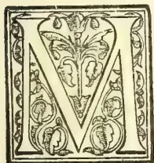

Y arrival in the province on the 15th November was happily timed, as the N. E. monsoon had just subsided, and the country was, therefore, seen to the best advantage.

Coffee was also in its prime, crop beginning to ripen in the drier and more exposed parts of the planting zone.

Mr. Parsons, Honorary Secretary of the Coorg Planters' Association, who had kindly made all arrangements for my tour, met me at the Pollibetta Club, and accompanied me to his fine residence at "Beechlands," which subsequently became the base of operations in South Coorg, or what is locally known as the "Bamboo" district.

During the following fifteen days of inspection and touring, I must have passed through 50 miles of fine coffee in full bearing, most of it in the "Bamboo" being in one continuous stretch.

The crop this season is also considered well above the average. It is needless to say that this was an unique and impressive sight such as one does not forget. A sight such as the former rulers of Coorg had never dreamed of!

It is also my first experience of the kind, as on former occasions when visiting planting districts in Manjarabad, South Wynaad and the Nilgiri Hills the coffee was not in crop.

#### PHYSICAL ASPECT OF THE COUNTRY.

Coorg is a hilly plateau girt on the west and south by the western ghats, the highest boundary peaks being Subrahmanya in the North (5,548 feet), Tadiandamol in the west (5,682 feet), and the Brah-

magiris in the south (4,500 feet). It is situated between north latitude 11° 55' and 12° 50', and east longitude 75° 25' and 76° 14', covering an area of 1,585 square miles. Mercara, the capital of the province, occupies a commanding site at an elevation of 3,800 feet. The view from the spot called "Rajah's Seat" is one of the finest I have ever seen. The average elevation of the upper plateau is 3,500, but gently sloping towards the eastern frontier, where the elevation in some places does not exceed 2,700 feet. Minor mountains and hills intersect the whole country beautifully, and are mostly clothed with interesting trees of varying tint. In most parts of the "Bamboo" one feels rather over-shadowed by trees; but commanding situations, as at the Pollibette Club, Mr. James Gerard's Bungalow, and Elk Hill, afford fine views of this part of the country.

In North Coorg, the finest views observed are at Peremboo Coolly, Mr. Salisbury Trelawney's charming place, Mercara, and Hallery, where I was the guest of Mr. and Mrs. Sprott and had the pleasure of meeting Mr. Frank Mangles, one of the most successful pioneers of planting in North Coorg.

The principal rivers and streams have an easterly course and flow right across the peninsula into the Bay of Bengal. These are the Kaveri,—rising on the Brahmagiri Range at a sacred spot called Tala-Kaveri, or head of the river,—Hemavate and Lakshamanathertha. The Barapole is the principal river flowing to the western coast. Mountain streams are abundant and rapid during the monsoon season, but at other times they are not so apparent, and the planters mostly complain of the difficulty they experience in watering flower gardens around their bungalows during the dry season.

But this is of course due to the bungalows being mostly situated on high ground, where there is less malaria to contend with. The little alpine province of Coorg is justly described as one of the prettiest spots in India.

#### GEOLOGICAL FORMATION.

The geological formation is eminently favourable to the creation of good soils. This is due both to the mineral constitution of the indigenous rocks and of their age and mechanism. In nearly every part of the country one sees an abundant outcrop of dis-

\* Reprinted from "Planting Opinion," March 13, 1899.

775------------------------------------------------

746THE TROPICAL AGRICULTURIST.[MAY 1, 1899.

integrated rock in all stages of decay, and in coffee lands this valuable material is intimately incorporated with the tilth. It is, in my humble opinion, the backbone of both the soil and the planting industry. Would the latter have progressed for 40 years without this wealth of nutrient matter to support it?

The prevailing rocks consist of gneiss, syenite, and limestone; and a reddish-coloured laterite is plentiful in many localities. The minerals from which a fertile soil is usually formed are strongly in evidence, e. g., felspar (in several forms), mica, hornblende, and possibly augite. Such being the case, I conclude that the inorganic portion of the soil is mostly made up of varying proportions of these mineral ingredients. Of organic constituents, humus is the largest natural deposit. But in the planting districts the general use of special manure has tended to greatly alter the nature of the soil. It will thus be seen that the planter possesses all the crude elements for forming fertile soil of an enduring character, and judging from the successful cultivation of one exhaustive crop for periods of 30 to 40 years, the nutrient ingredients of this natural soil must be available in proper proportion, although, in all probability they have not been expended lavishly. In this soil, I therefore think, the Coorg planter possesses a very sound investment. Those crumbling rocks will go on liberating (in some proportion to the pressure put upon them) nutrient material for thousands of years.

#### FLORA AND FAUNA.

Botanically, the whole country is most interesting. But to do justice to this section of natural history required time and equipment for which I was not prepared on this occasion. A list of such known plants as were observed *en route* is appended\* to this paper, as also of specimens collected when there was an opportunity. Most attention was given to the arborescent flora, as bearing more directly on the special work in hand. Except in a few isolated instances, the trees in Coorg do not equal the splendid arborescent growth one sees in Manjarabad and other parts of the Mysore Malnad. But this is partly explained when it is remembered that extensive jungles of bamboo (hence the local designation) have been to a great extent replaced by secondary growth. Colonel Welch refers to the extensive and almost impenetrable growth of bamboo in his "Military Reminiscences," 1790-1829. The virgin forest has also been felled to a great extent to make room for special and exotic trees (see ndary planting) now favoured for shading and otherwise promoting the growth of coffee. But except for the arborescent growth, with a few orchids and parasites found upon it, the strictly industrial tract is not of great interest to the botanist. For profitable field work he prefers the primeval forest, the Devarakad riverside and Cadanga, where the indigenous flora is more rampant. The latter position consists of primitive embankments or ancient lines of defence which are found at short intervals all over the country. Weeds of an exclusive kind were observed on several of these mounds, and are possibly due to a difference in the physical or mechanical condition of the soil. A wild or indigenous species of coffee is found in North Coorg. It was first brought to my notice by Mr. Wood, of "Ahtur" estate, who kindly procured me several specimens of the plant in fruit. The only indigenous species hitherto found in the south are *Coffea travancorensis*, W. & A., and *C. Wightiana*, W. & A., the latter being perhaps only a variety of the former. I consider this the most important find during the tour. But the most attractive plant seen in quantity, in North Coorg, is the beautiful *Barleria Gibsoni*. The flora of the Sampaghat is of a ravishing description, and it is difficult to decide whether wealth of vegetation or beauty of scenery is the most attractive in this glorious spot. Of the fauna I practically saw nothing during my tour. Some of the birds of plumage are

exceedingly attractive, and some are very destructive to the coffee. Of the latter class the green barbet, *Thraupis viridis*, is one of the worst. Bees are plentiful and a giant tree having many tiers of honey-combs suspended from its upper limbs is indeed a novel sight. I am told that it is difficult to induce jungle experts (Kurumbars or Kaders) to collect honey from isolated trees owing to the limited means for beating a hasty retreat if necessity should require it.

#### SOUTH COORG.

Formerly this region was the home of the bamboo, where it was the admiration of every traveller. But it is now the home of coffee, extending over a continuous area of many square miles. In no other part of India does one find so much coffee cultivated within a limited area. With the exception of a few intervening Devarakads (temple lands) the bulk of the cultivation may be described as an unbroken tract.

Wherever one looks, hillside and valley is an unbroken sheet of shining green with thickly clustered berry, the whole being shaded by stately trees. Throughout the tract there is a close similarity in the nature of the shade, or over-growth, as also in the estate roads and boundaries; so that a stranger has difficulty in finding his way about. The "Bamboo" is much the largest planting district in the province, and possesses about 70 estates belonging to Europeans. In extent these gardens vary from 80 to nearly 500 acres, but in some cases they are not fully planted in coffee. The fact of their being joined on to each other as already stated, offers facilities for the easy spread of leaf disease and similar pests. The district differs from North Coorg in being 500 feet lower, with mostly an eastern or southern aspect. It is also warmer, somewhat drier, and more uniformly shaded throughout. The soil is rocky near the surface in some parts, while in others there are deep deposits of clay. As a rule the estates are very neatly kept, some of them being demarcated by thriving hedges of the shoe-flower, *Hibiscus rosa sinensis*. Pretty bungalows crest the lower hills, with flowers and other signs of social life about them.

#### NORTH COORG.

Here the country is of a bolder and wider type, with mostly evergreen forest at intervals. Coffee estates are fewer in number and more isolated; not in one continuous stretch as in the "Bamboo". It is a more exposed region and the rainfall is comparatively heavy. The natural soil appears to be excellent, and old coffee locks well upon it. I was astonished at the steepness of the land in some parts, but withal in good growth and bearing. The scenery in North Coorg is delightful. Owing to the heavier rainfall and colder aspect, estates are not so heavily shaded as in the south. Taking them all round, the crops were heavier here than in the "Bamboo." There were also fewer complaints of the ravages of the borer, an insect which prefers to bark in the southern sun. The mean annual rainfall for the whole province is 123 inches; but the distribution is unequal, being always heaviest on the west side of the country. In some parts of the "Bamboo" it does not exceed 50 inches.

With the foregoing attempt to show how the Coorg planter is situated in regard to climate, soil, and environment, I shall now proceed to discuss more in detail, some of the vital questions bearing on the future prosperity of the planting industry.

#### SHADING.

What constitutes the best shade to coffee is still a keenly contested point among planters, and while one warmly recommends the indigenous "Biti"—*Dalbergia latifolia*, another rejects this tree, and, for example, wholly places his trust in the exotic "Silver-Oak," *Grevillea robusta*. But for reasons which shall be explained farther on, it is preferable, in my opinion, to employ a selection of trees to shade an estate; and most planters have adopted this plan either from necessity or choice. The trees mostly favoured for shading coffee are of two classes

\* [Will be published later.]

776------------------------------------------------

MAY 1, 1894]THE TROPICAL AGRICULTURIST.747

*e. g.*, the indigenous and exotic. Their names are as follows:—

<table border="0">
<thead>
<tr>
<th colspan="3">INDIGENOUS.</th>
</tr>
</thead>
<tbody>
<tr>
<td><i>Ficus Glomerata</i></td>
<td>...</td>
<td><i>Atti.</i></td>
</tr>
<tr>
<td><i>Dalbergia latifolia</i></td>
<td>...</td>
<td><i>Biti.</i></td>
</tr>
<tr>
<td><i>Erythrina indica</i></td>
<td>...</td>
<td><i>Palwan.</i></td>
</tr>
<tr>
<td><i>Pterocarpus marsupium</i></td>
<td>...</td>
<td><i>Honne.</i></td>
</tr>
<tr>
<td><i>Lagerstroemia lanceolata</i></td>
<td>...</td>
<td><i>Nandi.</i></td>
</tr>
<tr>
<td><i>Terminalia belerica</i></td>
<td>...</td>
<td><i>Tare.</i></td>
</tr>
<tr>
<td><i>Acrocarpus fraxinifolius</i></td>
<td>...</td>
<td><i>Honclige.</i></td>
</tr>
<tr>
<td><i>Cedrela toona</i></td>
<td>...</td>
<td><i>Noge.</i></td>
</tr>
<tr>
<td><i>Ficus bengalensis</i></td>
<td>...</td>
<td><i>Alada.</i></td>
</tr>
<tr>
<td>" tuberculata</td>
<td>...</td>
<td></td>
</tr>
<tr>
<td>" Mysorensis</td>
<td>...</td>
<td><i>Goni.</i></td>
</tr>
<tr>
<td>" Tjakela</td>
<td>...</td>
<td><i>Cup basuri.</i></td>
</tr>
<tr>
<td>" Tsiela</td>
<td>...</td>
<td><i>Bili basuri.</i></td>
</tr>
<tr>
<td>" <i>Asperima</i> (Inferior)</td>
<td>...</td>
<td><i>Gargatti.</i></td>
</tr>
<tr>
<td><i>Albizia odoratissima</i></td>
<td>...</td>
<td><i>Bilvara.</i></td>
</tr>
<tr>
<td><i>Artocarpus integrifolia</i></td>
<td>...</td>
<td><i>Halasu.</i></td>
</tr>
<tr>
<td>" <i>hirsuta</i></td>
<td>...</td>
<td><i>Kad halasu.</i></td>
</tr>
<tr>
<td><i>Antiaris toxicaria</i></td>
<td>...</td>
<td></td>
</tr>
<tr>
<td colspan="3">Also some undetermined species.</td>
</tr>
<tr>
<th colspan="3">Exotic.</th>
</tr>
<tr>
<td><i>Erythrina lithosperma</i></td>
<td colspan="2"><i>Mostly young.</i></td>
</tr>
<tr>
<td><i>Albizia moluccana</i></td>
<td colspan="2"></td>
</tr>
<tr>
<td><i>Grevillea robusta</i></td>
<td colspan="2"></td>
</tr>
<tr>
<td><i>Cinchona succirubra</i></td>
<td colspan="2"><i>Not classed as shade</i></td>
</tr>
<tr>
<td><i>Pithecolobium saman</i></td>
<td colspan="2"></td>
</tr>
</tbody>
</table>

The correct amount of shade to be maintained on an estate is another matter for which a fixed rule cannot be laid down, as it must of necessity vary according to circumstances. In situations where the rainfall is heavy or regular, soil good, and aspect cool, the shading should be comparatively light. But in the greater part of the "Bamboo" these conditions are somewhat reversed, and particularly in those parts where the soil is light, stony, and sunburnt, it is essential to have heavier shade. In furnishing this protection, however, care has to be taken not to remove an undue proportion of plant food from the staple cultivation, and in places where young shade trees are thickly planted there is the danger of doing this. During the early years of growth, trees of this class draw nearly their whole nourishment from the surface soil, and at all ages the surface roots of trees will contend for a share of its abundant food.

It is true that most saplings will soon establish their leading roots in the subsoil at depths far beyond the reach of the coffee bush, and as they increase in size, this tendency to draw nourishment from the substratum increases until in many fully developed forest trees surface rooting is reduced to a minimum. All other conditions being favourable, it is deep-rooting trees of this class that should be preferred to shade coffee. The only exceptions would be in the case of fig trees, which (probably from their quasi-parasitic nature) do not appear to exhaust the soil to the same extent as other shaders, and leguminous trees, which assist nitrification in the surface soils. On some of the estates visited, sapling trees ranging in age from five to fifteen years were so closely cultivated that the growth of timber almost appeared to be the primary object. On others, having a more advanced growth, the trees had been considerably thinned, while the remainder had been "lopped up," *e. g.*, pruned from the base upwards, so that the actual shade was far above the coffee. This again conveyed an idea of arboriculture, the trunks being so numerous and bare. Of course, the object aimed at of admitting air and light in this way is perfectly sound, but the fact remains that a plantation of young trees is rapidly consuming food which by right belongs to the coffee.

Where the initial mistake has been made of removing the indigenous deep-rooted shade—and it is pretty universal—replanting has been compulsory, as no one now thinks of growing coffee successfully without shade.

But in addition to losing much valuable time in secondary planting, it will be felt that the land is called upon to do double service. This, however, is not the only disadvantage arising from the sudden exposure of forest soil long nurtured under shade.

Such treatment causes a revulsion in the chemical action of the soil, and under strong sun-light the valuable process of nitrification is arrested. Possibly this may account for the infertility of long-abandoned coffee lands. It is, therefore, clearly to the planter's interest not to bare the land entirely, but rather by careful selection to retain and make use of the forest trees already in possession. The finest shade, with the least exhaustion to the soil, is provided by deep-rooted umbrageous trees growing at 60, 80, and even 100 feet apart. Specimens of this description are sufficiently abundant in the virgin forest, and planters should always utilise them when making new clearings. It is under shade of this sort, with perhaps a little secondary planting here and there to fill up gaps, where one sees the finest coffee. "Devaracadoo" in the south and "Hallery" in the north, may be quoted as good examples of mixed shade. These fine trees not only indicate the fertile nature of the soil but they also protect and manure it, while reserving the upper stratum for the growth of coffee.

They also drain the subsoil, and extract mineral solutions from the latter, which are indirectly conveyed to the surface soil in the fallen leaf and decayed roots. It is in this reciprocation of mineral food constituents that the use of a variety of good shade trees, in preference to a few, is chiefly commendable. But variety is also needed to produce the light and shade which is so necessary to effect the best results in growing coffee. When in the months of June and July the sun is often obscured for weeks together and the trees are dripping with superabundant water, it stands to reason that dense shade would do harm. Then, again, when tender growth is progressing during the hottest months of the year more shade would be necessary. In other words conditions vary, as should also the amount of shade on a coffee estate. Different trees cast their leaves at different times of the year, hence the admission of light in a somewhat varying quantity. The greatest amount of exposure should extend from November, when the berry is ripening, until the flowering period, when the young fruit is set; the object being to insure the thorough ripening of the young wood. Naturally this is what happens, as with the cessation of rain, fall of the leaf is hastened and the coffee bush becomes more exposed to the ripening influence of sun-light. I observed that the "Palwan"—*Erythrina indica*—is a favourite shade-tree with many planters, and is looked upon as a fertiliser of the soil. The evergreen species, *Erythrina lithosperma*, is also under trial, although in some cases it is not true to name, being thorny and a doubtful evergreen. *Dalbergia sissoo*, Roxb., is a new shade tree which I have recommended for planting in stony land.

Seed can be supplied in quantity from Bangalore, where the tree flourishes.

#### CULTIVATION OF COFFEE.

It is not my intention to write a treatise on the cultivation of coffee, as every planter is sufficiently skilled in the routine of his particular work, while many are clever experts in the whole industry. But there are certain details of an important nature, bearing on the results of cultivation, on which the opinion of an outsider might be of some value.

Lands selected for the cultivation of coffee are usually of three classes, *e. g.*, virgin forest, *Kumri* and *kanave*; and they are always the best of their kind, due allowance being made for other necessary conditions, such as rainfall, aspect and shelter from prevailing winds. But forest soil is the best, as also the most enduring under shade. When fully exposed by the entire removal of shade, land of the latter class exhibits extraordinary fertility for a time, but under the influence of full sun-light it gradually becomes less fertile, and coffee eventually dies out. This is due to what might be called adverse circumstances, as for ages, the soil had been accustomed to a wholly different course of treatment for which it was specially adapted. By its absorptive and retentive nature, a deep vegetable mould is peculiarly fitted for the dual support of forest trees and coffee,

777------------------------------------------------

748THE TROPICAL AGRICULTURIST.[MAY 1, 1899.

rom which products there is an unceasing demand or moisture. But with the removal of this natural drainage (absorption by growth) the soil becomes wet, cold, and unfertile: while the influence of intense light induces denitrification and hence a state of at least partial sterility. It will thus be seen that shaded and exposed lands are differently constituted and that the one cannot be merged into the other without causing intermediate disadvantages to the cultivator. The planter now realises that entire felling is the biggest mistake he has made; but he attributes the cause and, perhaps rightly, more to the absence of shade than to a depreciation of the soil. In planting up abandoned coffee-land the growth is often slow and unsatisfactory, even when supported by liberal tillage and manuring: also in putting in "supplies" the reaction caused by undue exposure is sometimes felt. These difficulties I mostly attribute to a want of tone in the soil, caused by the absence of sufficient shade. Secondary plantings of coffee seldom do much until the shade is well up, when, it will be observed the natural condition of the soil becomes re-established.

When an estate is planted, and during the first few years of its existence, the tillage of the whole land should be deep and thorough. The more the land is opened and aerated at this period the better, as at a later stage of growth when the bushes nearly meet there is both less opportunity and less necessity for deep tillage, should the land be well drained. To recommend draining the side of a steep hill may sound paradoxical, but during my travels I observed such land evidently in need of drainage. Then, where it is not very steep, especially in low-lying ground, a proper system of drainage is a most important factor in the sweetening of the soil.

Rhumus is not only very absorbent of water, but it also retains it like a sponge.

Wherever there is sufficient foothold for soil of this description, plants will obtain moisture and grow readily, a fact which is strikingly exemplified by the steep cultivation at "Abiall" and other estates in North Coorg. But while the drainage system is intended to remove surplus moisture, care must be taken not to increase "wash" on the upper slopes. On a few estates I observed that open drains, a foot or more in depth and only a few feet apart (sufficient to accommodate one row of coffee bushes), were perpendicularly aligned from top to bottom of the slope. Unless the land is very heavy—a stiff clay—I should consider this practice open to question. Drains eighteen inches deep, following a gently sloping contour across the face of the slope, would be better and would to a great extent intercept wash. The proper distance apart would wholly depend on the nature of the soil.

But as far as can be judged, twelve and eighteen feet are reasonable distances for heavy and intermediate soils. Stagnant water in the soil is a most hurtful thing, and should be removed at any cost.

"Renovation pits," or holes made at intervals for the deposit of weeds, are supposed by some to facilitate drainage. But this is a doubtful function, as the pits have no collateral outlet and soon become clogged with weeds and forest refuse. I should be inclined to call them *brood-heds* for the propagation of fungoid diseases. At any rate they should not be allowed to supersede a proper drainage system when it is required. Many fig trees possess the advantage of being openers of the soil, a fact which would easily account for the luxuriant growth of coffee under them. The woody lateral roots of these trees form vacuities and tunnels which readily admit liberal currents of oxygen for many yards around each trunk. This now brings me to the all-important question of digging in a plantation. Thorough tillage up to a given limit has already been advocated, and it is also admitted unconditionally that a moderately open tilth is beneficial at all times. But there are other conditions to be taken into account, and I hope to show presently that in the matter of digging, the planter has to decide between two evils. These are (1) the destruction of coffee roots and (2) the closing

up of the soil to some extent. The coffee bush is naturally a surface feeder, a position of root-growth which is further strengthened by subdued light and the prevailing practice of manuring on the surface, or very near to it. On productive estates I observed that fine meshes of young roots pervaded the upper soil everywhere, and I contend that the periodical removal of these feeders by injudicious *mamati*-digging would do the estate an incalculable amount of harm. Certainly much more than would be done by leaving the land undisturbed for a season. For routine tillage on an established tote, the *mamati* should be entirely discarded in favour of the fork; which opens the soil lightly without cutting many surface roots. A good argument advanced in support of *mamati*-digging is its efficiency in removing the encroaching roots of trees, which would otherwise take possession of the land. In reply to this, I must refer the reader to what has been written about deep-rooting trees being preferred to all others where coffee is largely grown. When surface-rooting trees are retained for shade (unless they possess special merits, as it has been shewn may be the case) the evil cannot be remedied by surface digging without injuring the coffee, as it is unlikely that in using a *mamati* the ordinary cooly would take the trouble, even if he possessed the skill, to discriminate between the young roots of trees and the roots of coffee. It is rather by the thoroughness of preliminary operations, effectual drainage, and occasional surface forking that the planter can hope to oxygenize his land and thereby maintain its fertility and sweetness. But I can fully sympathise with those who are pestered by the surface roots of voracious trees, and if some implement could be invented to draw these out without doing much damage to the coffee roots, it would be a good thing. Lopping off the principal root-limbs and leaving them with their ramifications to rot in the land is not a bad practice. Care must be taken, however, not to kill the tree or needful shade would be lost.

It may here be asked why so much importance is attached to coffee roots being near the surface. The answer is, that all fruit-bearing plants should have their roots well under the influence of light and heat to insure the best results in the production of fruit. This is all the more necessary in the case of coffee, where the soil is thickly covered by a mantle of vegetation. The food stuffs required for the formation of fruit are not usually procurable in the subsoil, hence the advantage of shallow cultivation. Surface rooting is therefore desirable, although, to support vegetative growth during periods of drought, it is necessary to encourage fairly deep-rooting development also. But in this connection the admission of light, and regulation of growth, is controlled to some extent by careful pruning. I say "careful" advisedly, as the system of pruning which I have seen on some estates (not on the occasion of this tour) leaves much to be desired. It is a truism that bad pruning is worse than none, while hacking and reckless mutilation is often followed by troublesome diseases, such as rotting and canker. The object in pruning coffee is to equalise and encourage the growth of healthy bearing-wood. Anything not capable of giving crop, unless indirectly leading to the formation of crop-bearing shoots, should be removed by clean cutting. If this is done with care, shortly after picking, the soil, bush, and planter will each benefit by the operation. The organic and inorganic substances which combine to form plant food are well known to the intelligent cultivator. What he is more concerned about is whether these substances are present in proportionate quantity and soluble form, as if they are not, the soil will be unproductive. The mere fact that certain constituents are found in a soil is no criterion of its fertility. And when it is remembered that mechanically, chemically, and biologically, soils are subject to ever varying conditions, this is not to be wondered at. Uncertainty as to the natural capabilities of the soil has led to much investigation, and the truths

778------------------------------------------------

MAY 1, 1899.]THE TROPICAL AGRICULTURIST.749

revealed by agricultural research in recent years are not only very encouraging but of the highest importance to the cultivator. He now understands how the defects in a soil can be remedied at the least cost. Indeed a bad soil can soon be converted into a good one.

It has already been stated that the Coorg soils are naturally good, therefore the planting industry was commenced on favourable terms; and bumper crops, obtained without much cultivation, were the order of the day for many years. But as time went on the shrub became less productive, and coffee pests of sorts commenced to attack the cultivation. It was then realized that the natural soil was becoming deficient in something which only heavy manuring could restore, and henceforward, manuring estates became a necessity. What the planter is chiefly interested in at the present day is how to restore to the land, in the cheapest and most efficient form, what his crops remove from it.

Agricultural chemists tell us that only *three* principal substances need be applied in the form of artificial manures. These are *nitrogen*, *phosphoric acid* and *potash*.

#### WEEDING.

The incursion of weeds on cultivated land has always been looked upon as thriftless husbandry, and generally speaking, we should take that view of it in coffee cultivation also, as the demand made upon the land by tree and coffee roots is already more than it can bear. But the primness of a flower-garden is not required on the estate, and in some exposed soils of a stony nature I instinctively felt that a light covering of weeds would have done good by cooling the over-heated surface. The prevailing weed in the plantations is *Blumea Wightiana*, DC. (Kan "Gabbu Soppu"). It is an annual herb of rapid growth, and abounds everywhere in two varieties, determined by white and purple flowers respectively. Considerable expense is incurred annually in the destruction of weeds, but the outlay is compensated to some extent by the green manure which is thus secured to the soil.

If weeds of annual duration, such as *Blumea*, have their tops cut off before flowering, they will do no harm to the coffee and comparatively little to the soil. I was favourably impressed by the clean cultivation which mostly prevails all over Coorg.

#### MANURES.

##### Valuation of Manures.

The manurial substances at the planter's disposal are of several kinds and may be roughly classed as follows:—

(a) Manures having both a direct and indirect action on the soil:—

- Cattle manure of all sorts.
- Green manure of all sorts.
- Sewage.
- Composts.
- Humus top-dressing.
- Bones, when largely applied.
- Guano do.

(b) Such as act indirectly:—

- Lime.
- Marl.
- Chalk.
- Gypsum.
- Salt.

Lime is of the highest importance to coffee land, as in addition to acting beneficially on humus, it is the salifiable base for the process of nitrification.

(c) Manures having a direct and comparatively quick action:—Bone-meals, dissolved, and in sulphuric acid; Guano, including fish guano, and flesh guano such as Mr. Petrie Hay prepares at Hunsur.

- Oilcake—Poonac, castor, honge, etc.
- Nitrate of Soda.
- Superphosphates.
- Sulphate of Ammonia.
- Sulphate of Potash.
- Muriate of Potash.
- Mineral Phosphates.
- Kainit.

A most valuable fertiliser of this class, recently discovered in the debris of steel factories in Europe, is *basic slag*.

Of the abovenamed manures I shall now attempt briefly, to show which are most valuable in providing *nitrogen*, *phosphoric acid* and *potash*, leaving the cultivator to use his own discretion in a final selection. But manure in name and the substance in reality are often quite different things, and in the case of portable manures at least, I would strongly advise careful analysis.

##### Nitrogenous Manures.

Nitrogen in its different forms may be said to be present in everything. But for purposes of cultivation we mostly require it in the forms of *nitric acid* and *ammonia*, of which there is often a deficiency in impoverished or over-cultivated soils. It is, therefore, in the application of substances rich in nitrates and nitrites that we are likely to maintain this indispensable constituent in a form suitable to the growth of plants. The fixation of free nitrogen from the air through the combined action of leguminous plants and bacteria is a recent discovery of great value to the agriculturist. Nitrogen abounds in humus, and is found in varying quantity in all decaying organic substances.

The artificial manures which contain it in the largest proportion are nitrate of soda, sulphate of ammonia, Peruvian guano, bones, fish and flesh guanos and oilcakes.

All these are now used on coffee estates.

##### Phosphate Manures.

Next in importance to nitrogen, as a soil constituent, comes phosphoric acid. But as the latter enters largely into the composition of the coffee bean it is really of almost first importance to the planter. It is fortunate, therefore, that the crumbling rocks of Coorg are well charged with this useful acid, apatite, carbonate of lime, and the decaying felspars being the usual basis for it. Bare, arid tracts with occasional stunted vegetation indicate its scarcity, as plants are unable to grow without it. Coprolites abound in it. In nature, Phosphoric acid is mostly insoluble, occurring as phosphates of lime, alumina, and iron, etc. For convenient restoration to the land we have numerous artificial manures, such as guano, bones, basic slag and all the mineral phosphates. But for quick effect on growth the soluble superphosphates are the best, especially the double superphosphates manufactured at Wetzlar in Germany.

##### Potash Manures.

Although not so important to growth and reproduction as the preceding constituents, still, potash is an indispensable factor in the raising of crops. It is naturally abundant in old rocks—especially felspar—in decaying vegetable matter and in the salt-water of the ocean. It is the principal ingredient of the ash when a plant is burnt. Mr. Spott, of Hullery, burns the noxious *Lantana Camara*, to utilize its potash on the estate. In a country situated as Coorg is, one would think that Potash would never be wanting: dense vegetation, sea influence, and crumbling felspar rocks being natural conditions. Still, the application of this mineral by artificial means has proved highly beneficial, and it can only be surmised that the natural product is in some way slow or defective in action. Sulphate and muriate (chloride) of potash are the two artificial forms in which this mineral is quickly restored to the soil. Dried blood is also good for the same purpose.

##### Application of Manures.

Having now classified the important manures under their respective headings, it is necessary to say a few words regarding their application to different kinds of land. Soils poor in organic matter are usually the most benefited by the application of nitrogenous manures. But some of the latter, such as nitrates, ammonia salts, and a few organic forms of nitrogen act so quickly on the soil that they should only be applied as top-dressings at the time the crop most

779------------------------------------------------

750THE TROPICAL AGRICULTURIST.[MAY 1, 1899.

requires them. Of this class, nitrate of soda is the most volatile. But bones, guanos of sorts, and oilcake are of slow action, and should be applied some months before they are actually required as food to the plant. Powerful fertilisers, as nitrate of soda and sulphate of ammonia, should always be applied in limited quantity, and, if possible, on two occasions during the growing season. Nitrate of soda is of most value in a comparatively dry season, heavy rain having the tendency to wash it down into the sub-soil.

Sandy soils are usually improved by the application of potash. Damp heavy soils, as also such as are rich in organic matter (humus), should have phosphatic manures in preference to all others.

Manures of a quickly soluble nature are best suited to a dry climate, while those of slow decomposition are just the reverse. Mineral phosphates and basic slag require time to ferment in the soil, and should, therefore, be applied several months before they require to be in action.

Superphosphate on the other hand acts speedily, and should be applied as a light top-dressing at two or three intervals during the period of active growth. It will thus be seen that special fertilisers can only benefit crops while active growth is progressing, and when the soil is sufficiently moist to induce chemical action. In the case of nitrate manures the same conditions are necessary to enable the micro-organisms in the soil and roots to work satisfactorily in the production of nitric acid, through the wonderful process called nitrification. It is now known that a fertile soil teems with bacteria, as also the roots of many trees, shrubs, and herbs of the natural order *Leguminosae*.

#### Indigenous Manures.

It was pleasing to hear that a few manorial products of the country are growing in favour. These are, in addition to oil-cake, which is universally and deservedly popular, lime, fish, guano, from the Malabar coast, and a substance which I shall call *flesh guano*, prepared by Mr. Petrie Hay at the Hunsur works. It consists of the dried fleshy material which is separated from greenish bones in going through the mill, and as now prepared by Mr. Hay forms a rich compost. If this manure could be prepared on a large scale, and in a somewhat different manner, it would be in great demand as an organic fertiliser. In this connection it may be asked if the millions of carcasses (cattle and horses, etc.), annually put away in our ure places could not be applied to a more useful purpose? Being rich in nitrogen and phosphorus, the fish guano of the western coast should be liberally used on estates.

The lime procurable about Hunsur, and in some parts of Coorg itself, is supposed to be of questionable quality for manorial purposes. But this is a matter which chemical analysis would easily decide. In all probability it is better in some quarries than in others. There are two classes of land in Coorg which could be vastly improved by a liberal use of lime. These are the inert forest tracts and clay deposits. The mechanical and chemical action of lime on these rich soils would, in my opinion, be of the greatest value to the planter. Of course, phosphates in the shape of bone-meal or otherwise, would, to some extent, have the same effect, but they are more expensive and have practically no mechanical action on the soil. Although not a direct food giver, it must be remembered that good lime is a great manufacturer of plant food.

The free admixture of decaying rocky material, containing felspars, etc., is another means of improving the mechanical condition of heavy soils. Indian cattle manure is much poorer in quality than the farmyard dung of western countries, where much pains are taken to make and preserve the latter. But where cattle are folded and littered on the estate, the manure is of better quality. The bracken fern, *Pteris aquilina*, which contains a good percentage of alkaline matter in its constitution, is an excellent material for littering cattle. The location of this herb is said to indicate the presence of a calcareous soil. It is strange that soils of this class are often improved by a light topdressing of chalk and gypsum. In dealing with soils of different sorts, it is necessary to apply such manures as are best adapted to each condition, and the

quantity to be applied has to be regulated on the same principle.

Practical experience is much the safest guide, and it is not difficult to conduct such experiments on a small scale in different classes of land.

#### NURSERIES AND SEED SELECTION.

Preliminary operations on the estate require much care, forethought, and energy; none more so than the selection of sites and formation of nurseries where the young coffee is to be successfully reared. It goes without saying that nursery land should be of the best quality, while specially prepared composts are necessary to provide soluble food for the little seedlings. But this in itself can only maintain and nourish young life. Mere curable operations cannot prevent or remedy constitutional defects arising from external causes. Thus, although the situation, aspect, and soil of a nursery may be everything that can be desired, it does not follow that the seedlings raised in it are always the best of their kind. For constitutional vigour we have to study race, pedigree, and the quality of individual seeds. This constitutes what is called "selection" of the latter, and when carefully practised is usually the means of improving races or strains of cultivated plants. It is true, purity of strain is sustained by isolation so long as a plant retains its pristine vigour, but it has been observed in the case of many industrial plants that isolation accompanied by much seed bearing has gradually led to degeneracy and loss of constitutional vigour. To prevent this the seed-bearer should not be allowed to produce more than a limited number of seeds, while the nourishment given should be in proportion to the important work such a plant has to perform. In coffee, seed-bearing can easily be regulated by removing 50 to 80 per cent. of the flower buds, leaving such as are favourably situated on the lower half of the primary.

But without taking special measures, a first picking of the finest beans from all over the estate will also be found useful for the propagation of nursery stock. And if such pickings are exchanged with planters situated in different localities, the results are likely to be better still. In nurseries and seed-farms in Europe, the raising and selection of seed form a special department of work to which the greatest attention is paid. Small seeds are carefully examined under the microscope, so that only the very best may be chosen for sowing. Thus by eliminating the inferior and encouraging the cultivation of the best at one's disposal, an improved strain of plants will be gradually formed.

#### VARIETIES OF COFFEE SEEN IN COORG.

The species observed were only three in number, e.g.

1. 1. *Coffea Wightiana*, W. & A., Indigenous.
2. 2. " *Liberica*, Hiern., West Africa.
3. 3. " *Arabica*, Linn. Abyssinia.

No. 1 is somewhat sparsely found in North Coorg, and is never admitted into cultivation, I believe. It is whippy-looking shrub 3-5 feet, leaves thinner, smaller, and more pointed than in *C. arabica*. The reddish-purple berry is also small, but contains two miniature beans of perfect form. There were very few berries on the specimens kindly gathered for me by Mr. Wood. The flower was not seen, but I am told it is much smaller than the flower of *C. arabica*. Of No. 2 Mr. Parsons possesses two, if not three, varieties at Beechlands, the most important being the one known as "Johore-Liberian." On this estate the cultivation of Liberians has been pursued for many years, and I had the pleasure of seeing a large number of fine specimens both in flower and fruit. There are also some seedlings in the nurseries with a distinctly hybrid look about them. Indeed it will be a wonder if natural hybrids are not freely produced on this estate before long. Mr. Parsons also deserves credit for the experiments he has made with grafted coffee. Although results in the latter are not great, the persistence in experiments shows the proper spirit of enterprise.

No. 3 affords the staple coffee of the province, as it does of South India generally. There are several

780------------------------------------------------

MAY 1, 1899.]THE TROPICAL AGRICULTURIST.751

well-marked varieties in cultivation known by the local names of "Coorg," "Chick," "Nalknad" and "Golden drop." Another variety, intermediate between "Chick" and "Coorg" evidently a natural cross, is abundant on the Hellery estate, where it was pointed out to me by Messrs. Mangles and Spott.

Specimens of the "Golden drop" coffee, were seen at Mr. John Logan's place in South Coorg and also at Santagerry in North Coorg, where Mr. H. F. Davy is Superintendent. Instead of being red when ripe, the cherry in this variety is of a bright golden colour. But the most important variation in coffee is that which improves the size, colour, weight, and quality of the bean, conditions which the planter is no doubt on the alert to discover. It is not likely, however, that much improvement in this direction will occur without greatly enhanced vigour in the plant. In other words, the present strain of coffee should be improved by artificial fertilisation.

#### CROSSING AND HYBRIDISING.

In my last report on the Lal Bagh, at Bangalore, I have written as follows on the subject of hybrid coffee:—

"The possession of hybrid plants on several estates in Southern India now appears to be an undisputed fact. These new forms are reported to combine, more or less, the characteristics of *Coffea Liberica* and *Coffea arabica*, and are only found in localities where the two species have been cultivated and propagated together. They have not been introduced by the planters as new varieties, and were unknown prior to the introduction of the West African species, *Coffea Liberica*. It is therefore reasonably inferred that these intermediate plants are true hybrids. The most remarkable thing about them is their immunity from coffee-leaf disease, a condition which can only be attributed to enhanced vitality in the constitution of the hybrid. This is a discovery of much importance to the planter, and will encourage him to pursue the operation of crossing on methodical lines, with a view to raising improved strains of seed, as has already been done in most of the chief products of agriculture and horticulture in Europe. What should be aimed at now is the systematic crossing and re-crossing of different species and well marked varieties until a really good hybrid or cross is produced. With this object, a small coffee-plot has been planted in the Lal Bagh. It consists of 135 bushes in two species and one variety as named in the margin. Most of the plants were of a good size

<table border="0">
<tr>
<td><i>Coffea Liberica</i> (Liberian)</td>
<td rowspan="2">} when put down, and</td>
</tr>
<tr>
<td>" <i>Arabica</i> (Arabian).</td>
<td rowspan="2">} it is almost certain</td>
</tr>
<tr>
<td>" <i>Arabica</i> (var. Maragogipe)</td>
<td rowspan="2">} that a few of the</td>
</tr>
<tr>
<td colspan="2">Liberian and Maragogipe specimens will flower early next year, when crossing operations will be commenced.</td>
</tr>
</table>

"On the occasion of the Planters' Conference at Bangalore last August, the writer had the honor of being invited to attend the discussion on "Scientific Investigation," when the opportunity was taken before the representative planters of Southern India to advocate the advantages of crossing and hybridising coffee with a view to invigorating growth and increasing productiveness.

<table border="0">
<tr>
<td>"The same advice has been given in official correspondence with planters,</td>
<td rowspan="5">} and the institution is generally doing what it can to promote the welfare of the planting industry. Hybrids, or supposed hybrids, have been reported from the marginally noted estates."</td>
</tr>
<tr>
<td>Oossoor Estate, Manjarabad</td>
</tr>
<tr>
<td>Ubban</td>
</tr>
<tr>
<td>Koppa " Kadur Dis.</td>
</tr>
<tr>
<td>Panora Peak S. Wynaad</td>
</tr>
<tr>
<td>Kalpatti do</td>
<td rowspan="2">} do</td>
</tr>
<tr>
<td>Beechlands S. Coorg</td>
</tr>
</table>

It is now some years since the operations of crossing and hybridising were first advocated by me and as time advances, I feel more convinced that in these operations, carefully conducted, we possess a potent means of reawakening worn-out estates. Without a rotation of crop it stands to reason that coffee will become less productive, unless some radical change is brought about to modify or alter its condition. Change of constitution in a plant really

means change of action on the soil as well, and where the effete plant must eventually languish, even under the best of treatment, the newly born one will flourish. Coffee planting is a special industry which cannot conveniently or profitably be rotated with other crops; therefore, to keep the plant going for an indefinite period we must change its nature a little, so as to be in harmony with its environment. Judging from the foregoing remarks, and from what has actually taken place on estates where *Coffea Liberica* is established with the older species, there is no doubt but the shrubs, in both cases, are predisposed to cross fertilisation. That important point being settled it now remains to discuss how a good hybrid or cross is most likely to be produced. This I have already done when lecturing at Mercara and Polibetta, but it will refresh the planters' memory to reproduce the more salient points here, while the information given under Appendix 1 affords the *modus operandi* of the work in some detail. A definition of the terms "cross" and "hybrid" will be found in the same place. As far as I am aware (but this is open to correction), no artificial cross or hybrid has yet been produced in the genus *Coffea*. At any rate not in this country, and the new or varying forms referred to above are all nature-crosses.

But artificial crossing, done with a definite object, has been productive of many useful and beautiful plants in Europe. Indeed it may be said that horticulture (and agriculture) is to a great extent revolutionised by this means. It is therefore not a fad, but a potent reality in the improvement of both economic and ornamental plants. In crossing, the object chiefly aimed at is to reproduce the desirable qualities of two distinct individuals, of different kinds, in the body of one individual. It is not always easy to do this, but it can be and has been done extensively; and is well worth trying as a perfectly feasible means of improving an important and growing industry such as coffee-planting. A hybrid produced from two distinct species is called a "primary hybrid," and succeeding generations, if intercrossed, may become secondary and tertiary hybrids, etc.

When the characters of both parents are pretty evenly blended in the hybrid, the latter may be called the "mean" of the former. But it often happens that the prevailing characters are more approximate to one parent than to the other, in which case we have what is known as a "goneoclinic hybrid." Another way of producing the latter is to cross a hybrid with one of the parent stocks. Ternary hybrids are the indirect offspring of three different species.

It is in the production of the two latter forms (goneoclinic and ternary) that the greatest achievements in hybridisation have been made.

The hybrids naturally produced at Oossoor seem to possess the vegetative vigour of the maternal parent, *Coffea Liberica*, but are deficient in the productive quality of the paternal plant, *Coffea arabica*. To remedy this defect, a cross should now be tried between the latter and the hybrid, as the pollen of *C. arabica* would possibly be more potent in the second degree. In nature there are numerous and beautiful inventions to facilitate the crossing of flowers, but in a paper of this scope it is inexpedient to attempt more than a brief reference to what transpires in the short-lived coffee flower. The latter is structurally hermaphrodite, but not functionally so in every case, as I have observed small insects crawling over the mature stigma before the anthers had dehisced, having pollen from other flowers attached to their legs. I cannot say to what extent this provision is made for cross-fertilisation, but as the flowers open progressively for 24 hours and are visited by swarms of insects at the time of opening and during the receptive period, it is probable that a large percentage of the whole are cross-fertilised.

The active life of the individual flower is of short duration, and possibly within the first hour of its existence it has been fertilised, cross-fertilised or sterilised. It belongs to the entomophilous class of

781------------------------------------------------

752THE TROPICAL AGRICULTURIST.[MAY 1, 1899.

flowers which are pollinated through the agency of insects, such as small bees, midges, beetles, small moths, and weevils, etc. Dull cloudy days with a lowering of temperature are unfavourable to fertilisation, hence a bright warm day is desirable when the blossom is out.

#### REVERSION OF HYBRIDS.

This is a matter which troubles the planter a good deal, and possibly causes him to pause before undertaking a series of precarious experiments which involve much time and may lead to nothing in the end. It may, therefore, be said at once that established hybrids of similar strain (slight variations being of little account) do not revert to the parental stock if they are not pollinated by the latter. To maintain purity of strain in a hybrid is simply a matter of protection. Trivial crossing between members of a select group of hybrids—all being very nearly related—is perhaps beneficial on the whole and cannot easily be prevented.

Then, when a really suitable hybrid has been produced, the proper course is isolation from all other varieties of coffee, with a view to inbreeding and seed production. I hope I have made this sufficiently clear, as on these final precautions must rest the success of the whole operations of crossing.

#### INARCHING.

This form of grafting, like the other, retards vegetative growth and promotes the development of fruit.

The coffee-grafts at Bangalore behave in exactly the same way as mango-grafts; *e.g.*, plant stunted and spreading, fruit large, and not so plentiful as in the seedling. *C. arabica* on *C. Liberica* is the only combination of any value at head-quarters. Seedlings from the latter have been distributed for trial, and are being cultivated under my own observation. It is possible that some constitutional vigour may be gained from a mechanical connection of this kind, especially where the grafts are interbred. In other respects I do not think that grafted coffee is of much practical value. Some beans exhibited from the inarched bushes here were admired for their size and colour. The operation is chiefly useful in dwarfing vegetative growth, causing early fruiting, and reproducing the true qualities of particular kinds of plants.

(To be concluded.)

### RUBBER IN INDIA.

That the exploitation of the rubber vines in Africa will lead to serious denudation, once the cupidity of the tribes dwelling in and around the forests in which they are found is excited, seems a foregone conclusion; and unless measures are taken to plant and strictly conserve large areas, this valuable gum promises to become extinct, or procurable only at well-nigh prohibitive prices. We know that efforts are being made to provide supplies for the future, but as erroneous ideas prevail as to the age at which the plant can be tapped, no appreciable quantities are likely to be forthcoming for at least 16 or 20 years, unless in the meantime the received impressions we allude to, are dissipated. On the subject of yearly extraction of rubber, proof of its feasibility has been adduced several times within the last few years; but yet the time is not far distant when the dearth of indispensable material will force attention to this matter. We wish to discuss at present whether our frontier officers, (such as Mr. Needham and others) having influence with hill tribes like the Dufflas, Akas, Abors and Mishmias, in whose countries large reserves of *ficus elastica* are known to exist, could not persuade these people, to adapt a more sensible and less destructive method of collecting the gum than they have hitherto practised. Immense damage has been done by Marwaris and general traders in inciting the tribes to bleed

the vines to death; but savage and unreflecting as the hill men are, the chiefs at least are open to conviction; and were it pointed out to them that they were sacrificing the future to the present, it is possible the forests high up the Boreili, Subansiri, Dehing and similar streams might be saved from destruction, while furnishing moderate supplies of the gum, and slips for propagation, until at least our own planting was deemed of mature enough age to be tapped according to sensible methods. We are encouraged to make this proposition by calling to mind a confab we had with an intelligent Lushai who accompanied Messrs. Savage and Lorraine on their visit to Calcutta some three years since. The attempt is worth making in the interests of the people themselves, for though, with the sole exception of the Abors, the tribes have been taught the futility of raiding our territory, there is no saying what they may do when all means of peaceful trading in their forest produce is exhausted and themselves reduced to something akin to desitution. For some years previous to 1861 the men of Sookpilall's clan, holding the country round about our outposts at Aijal, were peaceably enough inclined, as they could swap their lac and rubber to Beparis for the requirements the Bengali and Manipuri traders took up, and had these friendly relations been cultivated, as Lieutenant R. Stewart then suggested, we should have secured at least the good-will of this clan any rate.

Unfortunately the Bengal Government decided to leave these people severely alone, and the unscrupulous men of the plains, with their overreaching tricks and covert threats, roused suspicion, bringing about the raids of 1861-62. But the mischief had been done, and the exhausted vines to the south of the present site of Sookpilall's villages testify to the efforts of hounding on the people to "kill the goose, etc." Not only this, but cupidity once aroused led to the practice of adulterating the true gum with the sap of any tree or creeper from which any milk-like juice could be extracted; a falling-off in the quantity of Lushai rubber took place, leading to disputes, and rejection of much that was brought down by the Bepari traders. This was the real origin of the rows with the clan mentioned. The missionaries and officers of the scattered garrisons in the North Lushai hills have, we may say, civilised these men, and it is time now that every effort should be made to lead them on to make the most of the produce their mountains can yield. There is still a number of vines, though sadly hacked about, in the terai and ravines lying between the Lungai and Tipu, along the south of Sylhet and Cachar, that would furnish saplings enough to plant many hundreds of acres, and the country is opened out sufficiently for our forest officers to exercise the supervision requisite to prevent premature bleeding. The valleys of the Upper Chinwin and Hukong, as also those extending across the basin of the Irrawadi up to the Chinese border, are rich in *ficus*, if it is sought for in the densely-wooded terais; and though any very strict conservation of the plant here presents some difficulty, while facilities for smuggling are abundant, saplings for planting can be had in such quantities that the Burma Government would be well advised to take the matter in hand in view of securing a handsome revenue a few years hence. With the prevalent ideas, tea planters, unless they contemplate handing their estates down to posterity, are not very likely to undertake the cultivation, but companies, who are not supposed to die or retire, should plant, and even young men opening tea or other plantations on their own account would derive a much larger income from two hundred acres of *ficus* laid down at the same time, on their retirement thirty years hence, than from the present staple of Assam according to European lights. Though we cannot now enter minutely into the proper method of rearing rubber from slips, we may mention that a good deal of misconception on the subject exists, and the expense is trivial, being but a tithe of what is supposed.—*The Planter*.

782------------------------------------------------

MAY 1, 1899.]THE TROPICAL AGRICULTURIST.753ALOE FIBRE AND A DECORTICATING MACHINE.

Our readers are aware that at the instance of a Syndicate of local gentlemen who have taken up the matter, a "Silburn's Patent Decorticating Machine," to deal with Aloe Fibre, has been constructed at the Colombo Iron Works. It has given much trouble to the machinists and the gentlemen more immediately concerned; but it is hoped that all is now smooth, and lately an exhibition of the machine at work was conducted by the patentee at Mr. Alex. Stevenson's Fibre Mills, Mattakkuliya. The reason for going to Mattakkuliya was the need of a good water supply. The Government has very readily met the wishes of the pioneers in a new industry—which may be of importance to the Colony,—by granting free carriage of aloe leaves by rail from Hatton, Kotagala, &c., and altogether as much as 87 tons, we believe, have been received. This quantity should certainly afford a fair trial and give a sample of fibre that can be practically tested in the London market. The machine is an insignificant one to look at, the whole being enclosed in a small case; but if it does what the patentee claims, appearance does not matter. The advantages claimed are:—

"That the Machine will extract the whole of the fibre contained by the leaf. That the Fibre is extracted without any breakage whatever. That the Machine will decorticate one ton of Aloe leaves per hour, which can be increased proportionately with the width of the Machine. That the Machine will supply a long felt want in the island, and will make the cultivation of Aloe a sure commercial success."

Mauritius has a considerable export trade in aloe fibre, but we do not think it is very profitable to the producers. It remains to be seen if Silburn's machine will make a wider margin of profit to be secured in Ceylon and elsewhere.

NOTES FROM THE CENTRAL PROVINCE.

March 25.

I suppose the little monsoon will be on us more early than usual this year after the drought and frost. So far the showers are very partial. Kandy requires a lot more rain.

Oh! bother Tewson's case. We are all sick of it and the same of Talwatte. The "Standard's" idea of a statue for the Kandyan murdered martyr is too funny. Where does murder come in the case? At the worst the Tommies were hastening home to barracks, and Mr. Talwatte blocked the way. One of them gave him a clout on the head with a hockey stick, and it happened to alight on a most wonderfully thin-sculled native gentleman. He died from its effects; but there was no premeditation in the matter, and all the wonderful letters from eye-witnesses that are sent in now, are only pabulum to get more damages and sympathy from Government and the gullible native community.

The proper step for the P.A. to do in the matter of Henniker Heaton is to pray Her Majesty to bestow on him a baronetcy. He is more worthy of that title than the general dealer and blender of tea, Lipton, who scored a knighthood.

British North Borneo is to the front. They could not issue fresh shares when the old shares were at a discount. Now that they have touched par and even a premium, this issue of shares can be effectively placed. British North Borneo only wants developing to be one of the finest jewels of the Empire.

Why were you down on Carruthers for his report on gray fungus, in the Kelani Valley? He tells you that the time at his disposal was too short to give more than a very general Report.

[Which we think, had better be reserved and not given at all, for the reason that the matter required more careful study and attention than Mr. Carruthers could have given to it. We were jealous for the Cryptogamist's own reputation in the matter, knowing the good work he had done for cacao.—ED. T.A.]

COLOMBO COMMERCIAL COMPANY, LIMITED.

London, 7th March, 1899.

Directors:—Alfred Brown, Chairman, Leon Famin, J G Wardrop, P C Oswald. Secretary:—J Alec Roberts 5, Dowgate Hill, Offices London, E C.

Report.—To be presented to the Fourth Ordinary General Meeting of the Company, on Thursday, 16th day of March, 1899, at 12 o'clock noon.

The Directors have pleasure in placing before shareholders statements shewing favourable results for the past year, viz. :—

Profit and loss account for the year ending 30th Sept. 1898.

Balance Sheet made up to 30th Sept. 1898.

It will be seen from the profit and loss account that after debiting all charges, interest on debentures, &c., the profit for the year amounted to .. £9,716 1 1

A balance was brought forward from last year of .. 510 14 6

Making the total at credit of profit and loss .. £10,226 15 7

From this there has been transferred to exchange reserve against capital expenditure .. 2,232 5 5

Leaving available for dividend, &c., a sum of .. £7,994 10 2

Interim dividends of three per cent on the preference capital and 2½ per cent on the ordinary capital were paid on the 15th Sept. 1898, and the directors recommend that the following dividends be now declared, viz.: three per cent on the preference capital, making six per cent for the year, and 5½ per cent on the ordinary capital, making eight per cent for the year, the latter free of income tax.

After payment of the above dividends there will remain a balance of £1,303 8s 2d, which the directors propose should be carried forward to next year.

The liquid assets in Ceylon appear in the Company's accounts at the same exchange as in last year's balance-sheet, viz. :—1s 1d per rupee, the present value of the rupee being about 1s 4d.

Exchange reserve against capital expenditure now stands at £26,000, inclusive of the sum of £2,232 5s 5d transferred in the present accounts.

The directors regret to report the death of their esteemed Colleague, Mr. Norman Stewart, and they have filled up this vacancy on the Board by the appointment of Mr. J G Wardrop.

Mr. L Famin, a member of the Board, retires from office on this occasion, and, being eligible, offers himself for re-election.

Messrs. Deloitte, Deger, Griffiths & Co., the auditors, also offer themselves for re-election.

94

783------------------------------------------------

754THE TROPICAL AGRICULTURIST.[MAY 1, 1893.NORTH CENTRAL CEYLON:THE SCOPE FOR NEW OR EXTENDED INDUSTRIES.

The approach of the "railway era" gives a new interest, if not importance, to the North-Central division of this island. The province itself contains 4,002 square miles or almost the same extent as our largest or Eastern Province which includes 4,037 miles—both divisions comprising well-nigh one-third of the whole area of Ceylon. In the four thousand odd square miles in our North-Central division, last census gave but 75,333 of a population—in the proportions of 41,545 males and 33,988 females—or at the rate of 19 to the square mile. Anuradhapura, the capital and terminus of the section of railway already sanctioned, had in 1891 a population of 2,508. To enable a comparison to be made with territory nearer Colombo, we may mention that the district of Kegalla, which is also to be favoured with Railway extension, had in 1891, on the 624 square miles within its bounds, 150,627 persons or double the total scattered over the North-Central Province. There is therefore, immense room for occupation and settlement in the territory entrusted to the administrative care of Mr. Evan Byrde whose Report for last year has just been published. Let us see what encouragement can be gathered from its contents for capitalists and settlers to go up and possess the land, now in advance of the railway, when the terms per acre are exceedingly low and favourable; or later on—five or six years hence—when doubtless rates will have increased more in proportion to those prevailing nearer Colombo. Let us premise by stating that we have never doubted the fertility and advantages of a great deal of the country in the immediate neighbourhood of Anuradhapura. We excepted ten miles south of that town as well as ten miles north of Kurunegala from the criticism we have uniformly advanced and still support, against the sixty miles of intermediate territory, a great deal of it in the Wanni Hatpattu or wilderness division. To get to the richer land beyond, our route would have been along the populous coast division from Colombo Northwards, and then turning inland from Puttalam to Anuradhapura, so following the natural course with which the great coconut planting industry has hitherto extended in Ceylon—from the coast gradually inland. But let that pass. The point has yet to be practically settled whether much of the North Central Province will do to grow coconut palms profitably, on account of the scarcity of rainfall. We are quite clear that very little, if anything can be done along the railway route, until the neighbourhood of Anuradhapura is reached. There the coco-palm has been planted to a limited extent within recent years and Mr. Ievers had favourable reports to give of the condition and prospects of the industry. Mr. Byrde gives a table of rainfall for five years showing a maximum of 67½ inches last year and a minimum of 46 in 1894, the average being close on 55 inches and wonderfully well distributed, no month (save February in one year) showing an absence of rain; while the

heaviest falls up to 11½, 10 and 10½ inches are in October, November, December. For most of the Province, as indeed for all the arid region of the North and East of Ceylon, the palmyra palm should prove far more suitable than the coconut, and we have often regretted that the system of toll or "rajakariya" suggested by the late Mr. Kilner wellnigh 40 years ago, was never established, namely that every traveller along the North road between Dambula and Elephant Pass should, *pro bono publico*, carry with him and plant at least one palmyra palm nut. By this time, no doubt, an avenue of such palms would be in process of growth. We hear a good deal said at present of the field for growing aloes and other fibre plants, that will be presented along the Northern railway. But we much fear that for so succulent, fleshy a plant as aloes, the rainfall generally will be found deficient. There is more likelihood of cotton succeeding; but is the price now offered for cotton grown on the strong black soil of Tinnevelly sufficiently remunerative to justify extension? Wherever irrigation is available, there is no doubt of the encouragement to grow rice and it is something to learn from Mr. Byrde that a sufficient supply was last year produced at least for the people in the rural parts of his province, though not enough for the town. On small plots of good soil with the means of watering, we shall see tobacco gardens multiply, and there will be an extension of cultivation in vegetables and fruit for local requirements if not for export. So far as we can judge, however, the only agricultural industries on a large scale that would seem to suit the province are paddy where irrigation can be made available; and palmyra palms which do well with a limited rainfall; and, in some favoured parts, a certain area of coconut palms. No doubt in time other industries may be developed. We are now writing of the early future in the light of Mr. Byrde's Report. One of the first questions for a capitalist will be, of course, as to labour supply; and labour, we fear, is not available locally to any extent. In one part, Mr. Byrde tells us how his attempt to get "villagers to make village gardens below their tanks has proved a failure. I offered the land free, also seeds, which I am constantly distributing, but all to no purpose." Such villagers are not likely to be tempted to work for strangers; nor do we anticipate that the capitalist will be able to tempt many Jaffnese to the neighbourhood of Anuradhapura. The patient, industrious, money-making, immigrant coolie must be looked to, for any hard work in the region referred to, which may be set a-going through the influence of capital; and no doubt the proximity to this own country should be an attraction. At the same time the work of pioneering and turning over new land is often an unhealthy one, and special care would have to be taken against an outbreak of fever in the case of a large gang. But, in this respect, a good deal of experience will be gained—let us trust at not too heavy a cost—during railway construction between Kurunegala and Anuradhapura. Meantime, we should be

784------------------------------------------------

MAY 1, 1899.]THE TROPICAL AGRICULTURIST.755

glad to learn for what purpose—besides paddy, palmyras and possibly in more favoured parts coconuts—land can be expected to be taken up in lots exceeding a hundred acres, within the bounds of the North-Central Province, or to begin with, alongside the Railway line between Kurunegala and Anuradhapura?

#### PEPPER-CULTIVATION IN ASSAM.

The Assam Government has recently issued a note on the cultivation of black pepper in that province, with the idea of inducing the people to cultivate it extensively as a commercial product. At the present time it is only produced in sufficient quantities to supply local requirements. The pepper-vine in Assam, it appears, is generally reared on betelnut trees, and the average yield of a single vine is said to be about three seers (40 seers = 2½ lb.) of cured pepper. An acre of betel-nut plantation holds about 500 trees.—*Chemist and Druggist*, March 11.

#### RUBBER AND THE CONGO.

A telegram from our Brussels Correspondent today indicates that fresh effort is being made to develop the natural resources of the Congo State. The suitability of its soil and climate for the growth of trees producing caoutchouc, or india-rubber, has often been insisted upon by travellers during the last few years, and systematic efforts are to be made to foster the industry. The King of the Belgians has just signed a Decree prescribing that a certain number of the trees yielding rubber are to be planted every year in the forests in all parts of his Domain. It goes on to establish a staff of inspectors and other officers to look after the culture. In a climate favourable to the rapid growth of rank vegetation, and among a "happy-go-lucky" folk like the native races, the young trees would have a poor chance, and those which reached maturity would be destroyed by the reckless collection of their produce. To cut them down causes least trouble and gives the largest immediate supply of rubber, but it is killing the goose which lays the golden eggs; a proceeding which seems to commend itself to the savage mind, and is not always without attraction even to the partially civilised intelligence. The crop of rubber, if we may use that phrase, is obtained by tapping the tree, and there are right and wrong ways or seasons for this process; so that the officials are not likely to find their posts a sinecure. Forty pounds of the juice, it is said, can be taken from a tree during the period of its yield, so that in a few years the output from the Congo State ought to be largely augmented. India-rubber is not obtained from a single tree. In Central Africa alone it is to be found in more than one species; in India it comes from the *Ficus elastica*, a tree allied to the banyan, and known in our greenhouses as the india-rubber plant; while the most noted variety, from Brazil, is got from a tree called siphonia, which is related to the spurges. Probably the last-named kind will be selected for systematic cultivation, for of late years several experiments have been made to acclimatise the Brazil or Para india-rubber tree in other countries.—*London Standard*, Feb. 28.

#### EIGHTY YEARS AGO AND NOW.

The following table gives a comparison of approximate prices in England in 1819 and 1899:—

<table border="1">
<thead>
<tr>
<th></th>
<th>s.</th>
<th>d.</th>
<th>s.</th>
<th>d.</th>
</tr>
</thead>
<tbody>
<tr>
<td>Tobacco, per lb.</td>
<td>6</td>
<td>—</td>
<td>5</td>
<td>—</td>
</tr>
<tr>
<td>Tea, in canister per lb.</td>
<td>7</td>
<td>4</td>
<td>1</td>
<td>8</td>
</tr>
<tr>
<td>Sugar, moist</td>
<td>do</td>
<td>—</td>
<td>10</td>
<td>—</td>
</tr>
<tr>
<td>Do lump</td>
<td>do</td>
<td>—</td>
<td>1</td>
<td>—</td>
</tr>
<tr>
<td>Cheese</td>
<td>do</td>
<td>—</td>
<td>10</td>
<td>—</td>
</tr>
<tr>
<td>Salt</td>
<td>do</td>
<td>—</td>
<td>5½</td>
<td>—</td>
</tr>
<tr>
<td>Candles</td>
<td>do</td>
<td>—</td>
<td>11</td>
<td>—</td>
</tr>
<tr>
<td>Soap, yellow, per cwt.</td>
<td>11</td>
<td>6</td>
<td>2</td>
<td>6</td>
</tr>
</tbody>
</table>

The figures point their own moral.—*Planting Opinion*, March 25.

#### THE TORTOISESHELL TRADE.

Last week's *Nature* contains an article on the trade in tortoiseshell. It is largely based upon trade-circulars of Messrs. Lewis & Peat. The article deals with the origin of the shells, the quantities annually consumed, the different varieties, and the price obtained for them. Great Britain, France, Japan, China, and the United States are the principal consumers of this commodity, of which enormous quantities are consumed annually, but it is believed by this authority that there is no real danger of the reptile being exterminated. The uses of tortoiseshell are also referred to. It is worked practically in the same manner as horn, and is exceedingly amenable to steam, heat, and pressure; indeed, it seems to be more easily moulded than horn, because the dust and scrapings are collected, steamed, and remoulded into solid pieces, from which articles may afterwards be turned or carved.—*Chemist and Druggist*, March 11.

THE CHINA TEA SEASON FOR 1898-9 may be considered to be closed and here is the result:—

#### TEA.

CANTON, 2nd March.—The market is closed, and there is nothing further to be shipped.

#### EXPORT OF TEA FROM CHINA TO UNITED KINGDOM AND CONTINENT.

<table border="1">
<thead>
<tr>
<th></th>
<th>1898-99.</th>
<th>1897-98.</th>
</tr>
<tr>
<th></th>
<th>lb.</th>
<th>lb.</th>
</tr>
</thead>
<tbody>
<tr>
<td>Hankow and Shanghai ..</td>
<td>12,230,663</td>
<td>15,099,727</td>
</tr>
<tr>
<td>Foochow ..</td>
<td>12,545,346</td>
<td>12,160,708</td>
</tr>
<tr>
<td>Amoy ..</td>
<td>688,318</td>
<td>685,651</td>
</tr>
<tr>
<td>Canton ..</td>
<td>5,149,722</td>
<td>5,889,288</td>
</tr>
<tr>
<td></td>
<td>30,614,049</td>
<td>33,836,374</td>
</tr>
</tbody>
</table>

#### EXPORT OF TEA FROM CHINA TO UNITED STATES AND CANADA.

<table border="1">
<thead>
<tr>
<th></th>
<th>1898-99.</th>
<th>1897-98</th>
</tr>
<tr>
<th></th>
<th>lb.</th>
<th>lb.</th>
</tr>
</thead>
<tbody>
<tr>
<td>Shanghai ..</td>
<td>16,621,547</td>
<td>20,836,000</td>
</tr>
<tr>
<td>Amoy ..</td>
<td>15,036,413</td>
<td>15,861,506</td>
</tr>
<tr>
<td>Foochow ..</td>
<td>7,297,412</td>
<td>7,126,264</td>
</tr>
<tr>
<td></td>
<td>33,956,372</td>
<td>43,523,770</td>
</tr>
</tbody>
</table>

#### EXPORT OF TEA FROM CHINA TO ODESSA.

<table border="1">
<thead>
<tr>
<th></th>
<th>1898-99.</th>
<th>1897-98.</th>
</tr>
<tr>
<th></th>
<th>lb.</th>
<th>lb.</th>
</tr>
</thead>
<tbody>
<tr>
<td>Shanghai and Hankow ..</td>
<td>22,783,272</td>
<td>19,462,293</td>
</tr>
</tbody>
</table>

#### EXPORT OF TEA FROM JAPAN TO UNITED STATES AND CANADA.

<table border="1">
<thead>
<tr>
<th></th>
<th>1898-99.</th>
<th>1897-98.</th>
</tr>
<tr>
<th></th>
<th>lb.</th>
<th>lb.</th>
</tr>
</thead>
<tbody>
<tr>
<td>Yokohama ..</td>
<td>25,517,085</td>
<td>26,414,353</td>
</tr>
<tr>
<td>Kobe ..</td>
<td>13,658,363</td>
<td>15,602,288</td>
</tr>
<tr>
<td></td>
<td>39,176,448</td>
<td>42,016,641</td>
</tr>
</tbody>
</table>

785------------------------------------------------

756THE TROPICAL AGRICULTURIST.[MAY 1, 1899.]NORTH-CENTRAL PROVINCE OF CEYLON.

(FROM ADMINISTRATION REPORT FOR 1898.)

FOOD SUPPLY.

Rice, the main food supply of the inhabitants, was grown in sufficient quantity to meet the requirements of the people. Imported rice is not much used except by Tamil coolies and in the town of Anuradhapura. Its price varies according to the distance from Matale. The price of locally-grown rice varies slightly in the different palatas of the Province. Curry stuffs, onions, coconuts and kitul and coconut jaggery are imported from Matale, palmirah jaggery from Jaffna, salt from Puttalam, and some dried fish. The greater part of the dried fish comes from Mannar and Trincomalee. Kurnegala supplies the larger number of coconuts. Fruit and vegetables were not so scarce as during the previous year. The town market was generally well supplied. The cultivation of plantains is on the increase throughout the Province. The annual show of garden products was held in the "Pilgrim's Rest," which was kindly placed at my disposal by Mr. N. S. Fernando of Colombo. I feel satisfied that these shows are doing good, and stimulating the people to more activity in the growth of vegetables and fruit. At the close of the show vegetable seeds from the Tissa gardens were distributed free to all who cared to have them. During the year supplies of seed were issued to the chiefs for distribution among villagers; this besides the distributions I made when on circuit. Nearly every village school has its garden now and I have full hopes that the early training of the young will have good results. The cultivation of coconuts is not increasing as I should like to see it, though there is ample land fit and available in different parts of the Province. The advent of the railway will no doubt be the means of bringing outsiders into the Province, who will I feel sure purchase land for this cultivation.

IRRIGATION.

The only large work in course of construction is the restoration of Maha Iluppallama tank in the Eppawala korale of Nuwaragama palata, one mile to the south of the Talawa-Ilalagama minor road and between Ipologama and Eppawala. This work has not progressed satisfactorily, owing to the difficulty experienced by the Public Works Department in procuring labour. The people are quite prepared to purchase all the irrigable land below the tank, and I feel sure that its restoration will prove to be a remunerative work. Nuwarawewa Yoda-ela.—The restoration of this ela is progressing, Minneriya Tank.—The Irrigation Engineer, Mr. Eves, is on the spot working under the Director of Public Works and Mr. Parker. This work is taken out of the hands of the Provincial Irrigation Board. The sluices were fully opened, after a deal of trouble, to enable the work to progress, but in December the tank filled considerably, and the work is delayed. The Kalawewa Yoda-ela has again given a lot of trouble in consequence of large quantities of silt. A special Irrigation Engineer, Mr. Nunn, was busy on this work for about six months taking sections and levels. For over two months the ela was allowed to run dry for the purpose of clearing, as it was found that the water would not flow into the Anuradhapura tanks. After the clearing the water reached Anuradhapura in nine days, travelling at the rate of six miles per day. For want of water at the Tissawewa high-level sluice and in Basawakkulam tank part of the paddy crop failed. Village Tanks.—In the northern division there are 723 village tanks under supervision. Of this number, 325 are completed tanks and 396 are half and one-fourth completed, and two are new tanks. Three tanks were added to the completed list during 1898. Exclusive of old Crown tanks given for restoration, the quantity of earthwork done in village tanks during the year amounted to 221,255 cubic yards. This includes work for 1898 and arrears of previous years. Compared

with 1897 there was an increase of earthwork to the extent of 41,774 cubic yards; this is very satisfactory. Sixty village tanks were sluiced during the year with cement pipe sluices (Murray's): 44 of these were four-inch, 16 six-inch, and 1 a nine-inch sluice. Many more have still to be sluiced, and these will receive attention next year. Fifty-three Crown tanks are being restored under permit, and I am glad to be able to record that the earthwork done on these tanks exceeds that done in 1897 by 8,112 cubic yards. Very few tanks were breached during the wet weather, and this I attribute in a great measure to the more even distribution of rainfall during the year. There were no heavy floods in November and December, as is usually the case in this Province. The votes allowed for upkeep of tanks were expended in repairs to (iron and cement) sluices and in repairs to spills. There can be no doubt that the restoration of the village tanks is helping immensely to improve the condition of the people. The water supply is better and purer, more paddy is grown, and the people are better off than they were even a few years ago. Parangi is not so common. As I stated in my report last year, I consider the restoration of village tanks to be far more important than the undertaking of large new works in a Province so sparsely populated as the North-Central Province. When the population increases and outsiders apply for land, it will be time enough to consider the restoration of some of the fine old tanks that are now in jungle all over this vast Province. For the present I prefer to improve the condition of the existing population.

NEW AREAS OF CULTIVATION.

During the year 241 lots of Crown land were sold, comprising an extent of 1,278 acres. Much of this land has been cultivated with paddy. It is seldom that any high land is applied for and purchased, but towards the latter end of the year there were several inquiries for land suitable for coconut cultivation from capitalists outside the Province, and I was informed that with the advent of the railway many applications would come in for coconut as well as for paddy land. I hope so, for there is abundance of good land available. The people of the Province are too poor to purchase more than a few acres at a time below their village tanks. I have received an application from some Jaffnese to purchase 1,000 acres of irrigable land below Sangilikandadarawa, a breached and abandoned old tank, on condition that the Government restore the tank. The restoration of this tank is under the consideration of the Provincial Irrigation Board. My attempt to get villagers to make village gardens below their tanks has proved a failure. I offered the land free, also seeds, which I am constantly distributing, but all to no purpose.

BOTANICAL AND EXPERIMENTAL GARDENS.

The gardens were well kept, and were visited by Mr. Willis from Peradeniya. Nearly 1,000 fruit and shade trees were distributed for planting round Government buildings, dispensaries, gansabhawas, as well as amongst villagers. A large number of plants were given for the general cemetery. A plant of the *Victoria regia* was sent from Peradeniya Gardens, and within six months it had eight blossoms. Tissa vegetable garden has done well in the way of producing a large quantity of seed, which I have had distributed all over the Province. The fig trees continue to do well.

GAME.

Thirty-six game licenses were issued, as against fifty-four during the preceding year. Twenty-five licenses to capture buffaloes were issued. In most of these cases the animals are village cattle, unbranded and unregistered, and quite wild. No licenses to shoot buffaloes were issued. No licenses were issued to capture elephants; there were two licenses to shoot issued. In four cases rogue elephants were proclaimed and rewards offered. Skins are not brought to the Kachcheri, as traders

786------------------------------------------------

MAY 1, 1899.]THE TROPICAL AGRICULTURIST.757

offer a larger price for them than the amount of the reward offered by Government. Any illicit shooting of game that takes place is merely for the sake of the meat as food, and I have not heard of any gang-shooting whatever. There were prosecutions in three cases, two for illicit capturing of buffaloes and one for game, and all resulted in convictions.

#### ARCHEOLOGY.

Excavations were continued at Thuparama and Elala's tomb, just outside the town, and at Puliyanakulam on the Jaffna road. Under an extra vote the Archaeological Commissioner was entrusted with the clearing of jungle round the ruins outside the town, and good work was done.

#### TEA IN RUSSIA.

Tea "Farmer" is no doubt well justified in writing as he does, in criticism of the statements we quoted the other day from the "*Home and Colonial Mail*." If the Russian people throughout the Empire were the greatest tea drinkers in the world, not 92 million lb. (according to Mr. T. N. Christie's official figures) or 140 million lb. (according to the Shanghai Committee's return); but well over 900 million lb. of tea would be required to meet their requirements! This is taking the population of the Russian Empire at 130,000,000 and the Australian rate of consumption at 7lb. a head; whereas it is evident that the Russians do not average at the highest estimate, much above 1lb. a head. How then explain the statements of visitors to Russia that their friends there seem to be drinking tea all day long and that tea is the chief drink of Russian families. We think the explanation is (as "Farmer" surmises) found in the fact that tea is far too dear to be afforded by the poorer classes—by the bulk of the people away from the large towns, or even by the ordinary workmen and labourers in the towns. The higher and middle classes may be drinking tea all day long to an average of 7lb. a head; but then that would mean only some 20 millions of people out of the total of 130 millions. However, in accordance with our correspondent's suggestion, we hope to give the opinions of the Russian tea buyers in Colombo, on the points raised.

#### COLOMBO AND TEA BLENDING.

"COLOMBO AS A GREAT TEA-BLENDING PORT AND THE CONSEQUENT ADVANTAGE TO LOCAL PRODUCERS"—forms the theme of the paper by our old friend "W.F.L." to which we give prominence below today. In a private letter our correspondent emphasizes his little sermon as follows:—"There is a lot of Ceylon and Indian tea which goes home and is practically taken over by the buyers without any competition whatever. A few months ago it was common teas; now it is medium. The danger in the London market is that what with big dealers like Lipton, Mazawatte and Peak Winch Bros. and a few other, competition may cease altogether. Ceylon would find a better abiding market for teas of these descriptions if it went in for blending, besides be able to compete with London in the rest of Europe." Now, in nearly all that he says on this subject, "W.F.L." must know that he was long ago forestalled in the editorial columns

of the *Observer*. We urged the abolition of the existing iniquitous local import duty on tea many years ago, and pointed out how it practically shut out Travancore—an outlying district of Ceylon—from the Colombo market and port. We urged the great advantage of making Colombo the principal tea depôt in Asiatic waters, so that teas could be blended on the spot to suit all markets and shipped direct whether to Australia, North America or the Continent of Europe. Leading planters took an opposite view, dreading an influx of cheap China and Java teas which would be afterwards shipped hence under marks, claiming to be Ceylon's. In rejoinder, we showed first that Ceylon, as it was, is even now responsible for some of the poorest and cheapest (as well as for some of the best and dearest) teas that go into the London market; that nothing prevents local tea dealers shipping the veriest trash as Ceylon-grown teas and that in the present day no teas were bought on their name or mark, without expert testing, so that there was not the least chance of the value of good Ceylon teas being affected. "W. F. L." now shows how, on the contrary, it is to the direct interest of our tea planters to encourage blending operations at this port of Colombo,—how one result would be to create greater competition for local teas, and to fit our teas for direct export to the various European markets. We leave his admonitions to the careful consideration of those most concerned. We think the time has come to appoint Sub-Committees (or a joint Sub-Committee) of the Chamber of Commerce and Planters' Association, to enquire and report on the subject, namely, as to whether it is, or is not, to the advantage of the Ceylon tea producer to maintain the present import duty on other teas at this port, and prevent Colombo becoming a great tea blending depôt, as well as market, and port of direct shipment to all tea-consuming countries:—

#### CEYLON BLENDED TEAS.

(Communicated.)

With relation to teas, if there is one accepted fact more than another, it is that the British consumer has a preference for blended teas. The custom of the blender is to buy a certain quantity of various qualities and out of them to make a drinkable tea, for price, at the smallest cost to himself. This has resulted in the smaller country blender and dealer being almost thrown out of the market and the consequent larger London man acquiring an undue influence on the London market, and this looks as though it might go on until he has a monopoly altogether. Then, what will be the use of a Public Sales Auction mart? It will become simply "a knock out."

Surely it is time that the question of bonded warehouses and blending teas in Ceylon should be considered. There are buyers and there would be more, for they know what would re-sell best. Excepting perhaps some Chinas and some Darjilings, most Ceylon teas, more than others, can be drunk alone; yet few will be prepared to admit that any, even including the above, are so attractive as when judiciously blended; and thus think

787------------------------------------------------

758THE TROPICAL AGRICULTURIST.[MAY 1, 1899.]

the blender and consumer: so it is no use bringing abstract ideas against practical conclusions.

Some years ago I proposed a scheme for introducing Ceylon teas into America and impressed my opinions fully on the necessity of the American dealer supplying blended teas to consumers. There is not the slightest doubt but that this is the line to be adopted. Americans have not hitherto proved themselves willing to drink either Ceylon or Indian tea, pure and simple; and this has been expressed by many writers, including our Commissioner, over and over again. I fear, however, Ceylon has lost the chance now of selling blended teas to America, if it ever possessed it, although other new countries are still assailable.

There are strong pungent flavoury teas grown in India, which if blended in inconsiderable proportions with many Ceylon light teas, would raise their values in the Colombo market, and besides make them more acceptable in other countries. In other words a judicious use of Indians would help the extension of four-fifths of the Ceylon-grown article. I do not say that Indians are superior to Ceylons: such would be treason, even if I thought it, which I do not; but I will, however, say that not using the geographical position of Colombo for this purpose, is neglecting one of the great advantages that the island possesses.

At present there are regular buyers in the Ceylon market and a fresh incentive would be established by those who, by blending a small proportion of foreign teas with Ceylons, would raise the value of those special kinds for which everyone would be pleased to meet with a better demand and price, resulting in obtaining help where most needed and producing qualities practically suited to the wants of the whole universe. At present Ceylon in adhering to sell not exactly what the buyers require, is injuring herself.

I doubt if requirements would be shipped from Calcutta or China to Colombo, cheaper than to London; so that the object in introducing would not be for the benefit of those countries, but to make the most of Ceylon teas. Neither is the importation likely to be overdone, as it would cost too much.

The consumption of tea is doubtless spreading over Europe; so if the merchants of Colombo could only adapt their samples to the wants of Southern Europe, saying nothing of the Persian Gulf and Egypt, a grand future is before them for the blended article. No country in the long-run could compete with them in the East. It does not much matter how the Ceylon planter is willing to view the question:—blending, if not done in Ceylon, will be done elsewhere; and if in Colombo the extra cost of extra shipment, carriage and landing will handicap the imported tea to such a degree that the object will be to use as little foreign, and as much locally-grown, as the blend will stand, and this always in a growing degree; so that in the long-run Ceylon teas will be most benefitted. Besides, from what I have seen, I believe it could be much better done in Ceylon than in London and as I have said its position seems to have been naturally

chosen expressly for the purpose. Indeed it is a great pity, that from the first, when Ceylon emerged into the world as a tea-growing country, it did not also start a universal market.

As I see blended teas winning their way everywhere, I write in no interest otherwise than that of a tea-grower, in whose basket most of my eggs are lying. As time goes on, Ceylon will be brought in closer competition with Assam, and perhaps Java; so I consider it is now acting unwisely in not using its best means of making the most of every chest of tea shipped from its shores. That is, no effort should be lost in making the tea attractive, and not have it cast aside as wanting, and so knocked down to the buyer almost at his own price. Nothing, I believe, would benefit the Ceylon grower more than shipping blended teas into London; as it might bring back the smaller buyers into competition with the larger who are gradually and effectually dominating the market. Again, probably four-fifths of the Ceylon tea shipped would be placed more attractive, if wisely blended with suitable teas of other growths, and which in time would find their own markets and help to prevent the heavy drops in prices experienced during the last two years.

Prices are now looking up again; yet, after my past experience, I am inclined to think that, if growers are most careful when times are good, they will have less to rue, when they go down again. W. F. L.

#### COFFEE AND SHADE-TREES; AND TEA AND SHADE-TREES.

We have been seeking the opinion of our "Honorary Entomologist," Mr. E. E. Green, on the very full Report just furnished by Mr. Cameron, F.L.S., to the planters of Coorg on their coffee and its enemies, particularly *hemileia vastatrix*. The practical point was whether we should reproduce the whole of the Report in our monthly periodical. Mr. Green is good enough to write:—

"It is a most interesting Report and is certainly worth a place in the *T.A.* The remarks on the use of shade trees are of particular interest to Ceylon planters. I believe that we should have more coffee remaining in Ceylon if partial shade of the right sort had been more systematically employed. And I think that most planters are beginning to realize that a light shade will be equally a necessity for tea, if it is to go on indefinitely. Mr. Cameron points out that one of the most important properties of partial shade is the conservation of fertility in the soil. Speaking of forest soil, Mr. Cameron writes:—When fully exposed by the entire removal of shade, land of the latter class exhibits extraordinary fertility for a time; but under the influence of full sun-light it gradually becomes less fertile. The influence of intense light induces denitrification and hence a state of at least partial sterility.

"My own idea of the right kind of shelter for tea is a light shade—such as given by a judicious admixture of *Erythrina* (Dadap), *Albizia molluccana* and *Grevillea*—high up; the stems bare up to at least 30 feet—pre-

788------------------------------------------------

MAY 1, 1899.]THE TROPICAL AGRICULTURIST.759

ferably 40; and the branches first meeting at that height, leaving plenty of air space below, with an evenly diffused chequered shade.

"Mr. Cameron's suggestions on the hybridization of coffee are of great importance to coffee planters. Some of the natural hybrids seem to show a marked immunity from leaf-disease. The pity is, that systematic work in this direction was not commenced on the first appearance of leaf-disease."

We shall take Mr. Green's advice and reprint the Report in full; and in regard to the value of light shade for tea we have been getting a great deal of evidence lately from different quarters and especially from some of the lower and medium districts. Mr. Maitland-Kirwan is as strong as to the value of grevillea trees in Elkaduwa as Mr. Cantlay is in respect of the same in his fields in Dimbula.

#### JAVA QUININE.

A meeting of the shareholders of the Java Bandoeng Quinine-works was held there on January 23rd, Baron van Heeckeren (director of the company) occupying the chair. The first point of the agenda, the election of a director, was quickly disposed of, after which the terms of dismissal of Mr. H. J. van Prehn were considered. Until Dec. 14th last the management of the company had been vested in Mr. Van Prehn as technical director, jointly with the commercial director, Barron van Heeckeren, but on that date, at a general meeting, Mr. van Prehn was removed and the office of technical director abolished. A committee of shareholders was appointed to report on the subject, and it was now proposed:—

1. 1. That the dismissal of Mr. van Prehn should take effect from December 14th last.
2. 2. That the conditions of his dismissal should be definitely settled only after the balance-sheet had been dealt with.

The articles of association required alteration in accordance with the committee's report, and after an amendment increasing the maximum number of directors on the board from four to five had been adopted the whole proposal was carried unanimously. As, however, pending the approval of the alteration of the articles of association by the Government, the office of technical director, vacated by Mr. van Prehn, had to be filled temporarily, the meeting appointed to this post Mr. Smith Sybinga, who had acted since Mr. van Prehn's removal.—*Chemist and Druggist*, March 11.

#### THE COTTON INDUSTRY IN INDIA.

The Annual Report of the Bombay Mill-owners' Association contains some interesting figures, exhibiting the continued development of cotton mills and their outturn, notwithstanding all that is written of bad times and diminishing profits, and notwithstanding the terrible ravages of Plague. The figures further justify Lord Curzon's lecture to Bengal, in replying to one of the many addresses which he used as occasions for enforcing much-needed lessons, when he drew attention to the little that was being done for trade, and industries and agriculture by the Bengalis, as compared with other races, and notably as compared with the people of Bombay. It will be seen from the

following that Bombay can claim fully one-half of what is credited to all India under every head:—

<table border="1">
<thead>
<tr>
<th></th>
<th>No. of Mills.</th>
<th>Spindles.</th>
<th>Looms.</th>
<th>Consumption of Cotton bales.</th>
<th>Hands employed.</th>
</tr>
</thead>
<tbody>
<tr>
<td colspan="6" style="text-align: center;"><i>For Bombay :</i></td>
</tr>
<tr>
<td>1897</td>
<td>75</td>
<td>2,187,425</td>
<td>21,287</td>
<td>702,756</td>
<td>69,530</td>
</tr>
<tr>
<td>1898</td>
<td>82</td>
<td>2,226,932</td>
<td>21,379</td>
<td>817,323</td>
<td>70,723</td>
</tr>
<tr>
<td colspan="6" style="text-align: center;"><i>For all India :</i></td>
</tr>
<tr>
<td>1897</td>
<td>173</td>
<td>4,065,618</td>
<td>37,584</td>
<td>1,300,936</td>
<td>1,44,335</td>
</tr>
<tr>
<td>1898</td>
<td>185</td>
<td>4,259,720</td>
<td>33,913</td>
<td>1,481,323</td>
<td>1,48,964</td>
</tr>
</tbody>
</table>

The outlook cannot, however, be said to be very hopeful, seeing how greatly restricted is the demand for exports. In yarns there was an increase of 76,254 bales, or about 21 per cent; but there was a material decrease in piece-goods—the shipments in 1898 to China alone having fallen-off by about 1½ million yards or over 56 per cent; while Japan (which is starting mills of her own) took no goods from Bombay! But, curiously enough, the imports from the United Kingdom to China and Japan of piece goods and yarn combined, show an increase of 9.68 per cent as compared with 1897. Competition must therefore be very keen. No doubt the influence of such conditions has told on our own Spinning and Weaving Company apart from restricted capital to start with. We would fain hope, however, that the local Mills may not cease work, but that they may prosper in the hands of a richer Company (or enterprising wealthy individual) not only because of the numbers to whom they give employment, but because their presence should ensure some attention to cotton-growing, in one or other division of the Northern districts to be traversed by the Railway.

#### TEA IN RUSSIA.

In accordance with our correspondent's suggestion yesterday we interviewed the Russian tea-buyers, Messrs. Tokmakoff and Stcherbatchoff, of the firms of Tokmakoff, Molotkoff & Co. and Stcherbatchoff, Tchokoff & Co. with the following result:—

The price of the very cheapest brick tea in Russia is, we learnt, about 2s a brick, which consists of from 2½ to 3 lb., so that the average price per lb. of the cheapest tea drunk in Russia would be little more than 8d. But, Mr. Tokmakoff informed us, brick tea is very little drunk in European Russia. There were, also, two kinds of brick tea known in the Russian dominions, the black and the green. The green brick tea, unlike the black, was never employed to make an afternoon beverage. When a decoction was made from it, it was always mixed up with a quantity of (to us unheard of) ingredients and transformed into a thick soup; milk, fat, fallow, and mutton chips were, said Mr. Stcherbatchoff, often thrown in and the resulting fluid was only used at meals—like ordinary soup.

On enquiry as to what classes in Russia drank tea we heard that the working men in the towns drank it whenever procurable, the drink being very popular, but no leaf teas

789------------------------------------------------

760THE TROPICAL AGRICULTURIST.MAY 1, 1899.

were obtainable under 2s a pound. The peasants in the country very seldom tasted it, the beverage being beyond their means. Several millions of the poorer people in Russia had never heard of tea to this day and would not understand its use if it were distributed to them gratis. Amongst the middle and well-to-do classes, however, the consumption was very large.

"What would be the average per head amongst those who can afford tea?"

"Ah! Russia is a large place," was the reply, "and it would be difficult to ask every man if he had drunk any tea during the year. But, yes, it is a sad thing that the Russian Government do not publish such full statistics as you have here and in London. All the figures, nearly that we get about the imports of tea into Russia come from London."

Was tea-drinking likely to spread, we asked, in view of M. de Witte's (Finance Minister) policy of repressing the drinking shops. Most certainly it would, was the answer we received. The "policy" in question was the buying up of all liquor shops by the Government, and this immense piece of work had now been very nearly completed, only a few liquor shops remaining in private hands. Liquor had consequently become far dearer than previously, and, amongst the beverages to which the people would have recourse, tea held a prominent place. But it was not this so much as the decrease of duty that would increase the sale of tea in Russia, for so few could now afford to buy it.

The duty at Odessa and the other ports was 86 kopeks per pound, i.e., about 1s 10d—100 kopeks going to the silver rouble, which is about 2s.; on the frontier the duty was just under 1s. 1d. The smaller duty here being to encourage the transport of tea from China overland, and the consequent opening up of Siberia. When the Siberian railway is complete, however, the duty will be raised, in all probability considerably above 1s. 1d. as the railway rates will be cheaper than the present overland means of transport.

On asking how other tea than that from China reached Russia we were told that none, or very little indeed, came overland from Italy or across via Germany from London. Direct shipments of Ceylon and Indian tea were made to Odessa, but the quantity bought in the London market and taken round by the Baltic was about twice as much as that shipped direct from the East. The total consumption of Ceylon and Indian teas in Russia was now about 10 million lb. per annum.

Another item, interesting to learn, was that originally there was no duty in the Northern ports of the Russian Empire and that tea was actually sent from Hankow to London and thence round the North Cape to the Gulf of Obi, whence it was quietly brought into North Russia and sold cheaper than what was brought over the frontier. The tea was sent to London first and transshipped there in the months of June and July, these being the only months in which the most northerly sea on the route would be navigable. But in due time the Government found out this little game and stepped in and stopped it. Amongst the last con-

signments which might have got into Russia without duty was one of 14,000 lb. on board the ill-fated P. & O. steamer "Aden," but the wreck of that vessel prevented its ever reaching its destination.

In conclusion we learnt that the Russian Volunteer Fleet which conveys tea to Odessa, while also acting as troop-transports, is to be increased by several new large vessels, one of the biggest being a sister-ship to the big three-funnelled "Moscowa" which was in the harbour the other day at the time of the Regatta, as seen in Messrs. Platte's photographs. With native vessels like these the Russians will more freely convey teas to Russia; and from all we could learn, though the Russian nation as a whole are yet far from being reckoned as the greatest tea-drinkers in the world; yet amongst the better classes the beverage is highly appreciated and wherever Russians can afford to indulge it the taste grows upon them with no small rapidity. The outlook, therefore, for tea, as far as the Russian market is concerned, may even now be considered bright and full of promise.

#### COLOMBO TEA TRADERS' ASSOCIATION.

In another column we give the report of the Committee of this Association for the past year, showing a credit balance of R1019 71. Gratifying reference is made to the increased quantity of tea sold locally, and the growing demand from American and Russian markets. We sincerely join in the hope expressed by the Committee that sellers on the local market will endeavour to obviate the complaints received from Australia and other places as to the bad condition of packages owing to excessive quantities of tea having been put in them. We are also glad to know that the three pounds' sampling allowance has worked satisfactorily. There has been an increase in the membership of the Association which we trust will continue to grow in usefulness.

TEA IN THE NORTHERN DISTRICTS.—After all we have heard about tea going back in some quarters, it is extremely satisfactory to have such good reports of the splendid appearance and yield of tea on such good old plantations as are comprised in the Elkadua group and in the Kelebokka valley. Galheria, Oonoonegalla and Madulke are said to be a picture of the vigoorns tea.

TASMANIAN FRUIT.—Messrs. Anderson, Anderson & Co., of the Orient Steamship Co., inform us that they have received a telegram to the effect that the quantity of Apples shipped in the "Cuzco" is 11,000 cases, and in the "Britannia" 10,000 cases. This quantity includes Apples from Australian ports as well as from Hobart. Vendors here will appreciate the value of this communication. The "Cuzco" is due to arrive on April 1.—*Gardener's Chronicle*.

AGRICULTURAL EDUCATION.—It may be mentioned that missionaries and persons going out to the German tropical colonies are instructed in botany and plant-raising at the Central Experimental Station in Berlin. Though this idea was made in Germany it is an excellent one. Such enlightenment and instruction is what the natives in all colonial centres stand greatly in need of, and it might be taken over by Britishers with advantage.—*Journal of the J. A. Society*.

790------------------------------------------------

MAY 1, 1899.]THE TROPICAL AGRICULTURIST.761CAMPHOR.

The position of this article remains strong, but it is felt that we are approaching the end of the advance. At this time of the year purchases for domestic purposes are generally made, but since camphor became of technical importance, much of it being used in the manufacture of celluloid, a new basis is supplied for calculations. The utility of celluloid is increasing day by day, and nothing so far has been found to take the place of the ten per cent or so of camphor which it contains. There has been little speculation in the heavy purchases made recently; camphor-refiners bought well, and the advance is commensurate with supply and demand. The subjoined figures show the statistical position in London for January-February and stocks on February 23th in the respective years:—

<table>
<thead>
<tr>
<th></th>
<th>1899.</th>
<th>1898.</th>
<th>1897.</th>
<th>1896.</th>
<th>1895.</th>
</tr>
</thead>
<tbody>
<tr>
<td>Imports ...</td>
<td>775</td>
<td>134</td>
<td>1,934</td>
<td>447</td>
<td>530</td>
</tr>
<tr>
<td>Deliveries...</td>
<td>1,701</td>
<td>368</td>
<td>1,991</td>
<td>3,045</td>
<td>451</td>
</tr>
<tr>
<td>Stocks ...</td>
<td>4,968</td>
<td>11,204</td>
<td>11,874</td>
<td>13,674</td>
<td>4,379</td>
</tr>
</tbody>
</table>

The stock is, therefore, much lower now than it has been for five years.—*Chemist and Druggist*, March, 11.

A RUBBER PECULIAR TO COLUMBIA.

In a recent official report, the British Consul at Tolima, Columbia, makes the following reference to a tree which is little known as a producer of rubber. If the rubber is really of good quality, it may in time prove of importance, owing to its adaptability to high elevations, which, as a rule, is not true of rubber trees. The report says: "A very important species of rubber is indigenous, and I am inclined to think peculiar, to Tolima. Unlike other important kinds of rubber, it grows at high elevations, namely, at from 6,000 to 8,000 feet above sea level. Several thousand bales of it were exported a dozen years ago. But as the tree was only locally distributed, the source of supply was soon exhausted. The authorities at Kew have named this plant *Sapium biglandulosum*, a species which is also said to be found in British Guiana, where, however, it seems to be of no value as a rubber producer. In connection with the cinchona plantations \* \* \* \* a plantation of this rubber was made about ten years ago. The trees grew with remarkable rapidity, with trunks a foot in diameter in six years; but this plantation shared the same fate as the cinchonas—that is, it was abandoned years ago because the cinchona was abandoned. With renewed attention, however, this plantation may still be made important.—*Indian Planters' Gazette*.

THE FUTURE OF CEYLON TEA.  
THE RISK OF HEAVY CHINA EXPORTS.

(By an ex-Ceylon Merchant.)

London, March 16.

As long as the lower grades of common Indian or Ceylon tea could be bought in London at fivepence per pound, there was not much chance of the market being inundated with increased import of common China congou, because this price would not pay exporters from China, even with the protection afforded to them, by the effect of the closing of the Indian mints. But with pekoe souchongs at 7d per pound, the matter assumes a very different aspect, and it is to be feared that larger shipments may be made from China next June, July and August. The only thing that will prevent them, is the fear of the certain loss that would occur, if such shipments were made.

Prices in China will doubtless open high in May next, and when they arrive here they will

bring down prices to their old level. Unfortunately the British speculator seldom benefits by past experience; old ones die off, or have retired from the trade, but a new set always springs up to take their place. A friend in the China trade, told me yesterday, he was going to send out an order for common congou by the next mail. I asked him if he had lost his senses, or had more money than he knew what to do with, for in the latter case I could comfortably help him to get rid of it. When I pointed out to him that present prices of common tea could only be maintained by being scarce, and any large increase from China would lead to disaster, he made up his mind not to send the order.

Indian and Ceylon planters will this year have to watch the China exports closely. As I told you in my last letter, the advance has not affected home consumption; the retail prices cannot be raised; but there is no doubt, it is interfering with the continental and American demand, and may extend to the Australian colonies. It has been somewhat too rapid. Common teas will I think more than hold their own until July, when the market will have before it the unknown Indian and China supplies. Every endeavour will be made to push forward shipments to catch the high prices now current whilst they last; it will be a case of "devil take the hindmost."

If no great increase takes place in next season's China exports to England, then I think the Indian and Ceylon Tea Industry has a good future before it, because though Foreign and Colonial consumption may not expand, at the same rate as during last year, it will not be diminished by an advance of only a penny per pound on the average.

CALABRIAN MOTHER-OF-PEARL  
INDUSTRY:

An interesting report was received at the Foreign Office on 7th January last from H. M. Vice-Consul at Taranto, giving an account of the new mother-of-pearl industry on the Calabrian coast.

The prices obtained for mother-of-pearl vary from year to year, but the average price realised at the Torres Straits fisheries is £125 per ton for the raw shell. The only place, so far, where the pearl oysters are cultivated, is Queensland; at all the other fisheries the shells are collected from the banks formed by the natural oyster. Queensland, however, is far distant from the chief markets for mother-of-pearl, London, Hamburg, and Trieste, and it was this fact that gave rise to the idea of cultivating the pearl oyster in European waters.

A series of interesting experiments was commenced by Signor Comba, in 1860, and continued by him from time to time till 1884, when he was director of the aquarium of the National Exhibition at Turin. These experiments proved definitely that pearls can be produced by a certain process of treatment, and also that the cultivation might be conducted on a large scale on the Calabrian coast.

In a pamphlet on the subject, Signor Comba says that "Having proved that they are reproductive in a domesticated state, that is in small aquariums, we can be certain that in large basins they will reproduce with better results. The facility with which these oysters throw out their byssus allows them to be transferred from the breeding tanks to the coast, where the natural banks would be made, without any danger of their dying. As the spawn is not exposed in the tanks to currents or to the danger of destruction by fishes, it would be easy to form large

95

791------------------------------------------------

762THE TROPICAL AGRICULTURIST.[MAY 1, 1899.

banks in a very short space of time, the value of which would always be increasing."

It has been decided that the south coast of Calabria is the fittest locality for the laying down of the beds, and the Italian Government has conceded the necessary waters, and done much to encourage this new industry. It is proposed to acquire 10,000 pearl oysters (*Meleagrina margaritifera*), of which 500 will be set aside for breeding purposes. It has been computed that the spawn produced by one of these molluscs in the open sea contains about 12,000,000 eggs. The majority of these are lost, either because they serve as food to other animals, or because they get covered up by the sand, or are carried away by the currents into places unsuited to their development. By breeding in tanks these dangers can, for the most part, be avoided, and certainly a twentieth part can be saved, which would give an average of 600,000 eggs for every shell, and a sum total of 3,000,000,000 eggs for the 500 oysters set apart for breeding. But, allowing that of these only a twentieth part develop, in the second year the total would be 15,000,000. Again, if only half of these survive all the natural and chance risks to which they may be exposed, still 7,500,000 would be laid down on the banks in the open sea. At the end of the seventh year, say 50 per cent. are fished up; this would give 3,750,000 shells, and, at an average of 3 lb. per shell, would realise 5,020 tons of mother-of-pearl, which, even of third-rate quality, and worth but 1,500 fr. (£60) a ton, would yet bring in a sum of 7,530,000 fr. (£305,200).

It is possible that this enormous quantity of mother-of-pearl brought suddenly into the market would considerably lower the price, and in the estimates only half this amount, 3,765,000 fr. (£152,600) has been calculated for each bank fished every seventh year, that is one annually, seven being laid down. To this may be added the worth of the pearls which might be found naturally, or produced artificially.

It would not, however, be necessary to wait seven years before any return could be obtained for money invested, the reproduction being so great that at the end of the third year it would be possible, without damaging the banks, to take up shells of 8 to 10 centimetres in diameter, which are well suited for the manufacture of buttons, and could be sold at 1,500 fr. (£60) per ton. It would also be easy to prepare a sufficient quantity of the 9,500 oysters not used for breeding, so that they would produce pearls by the end of the third year.

As the productiveness of the banks would increase yearly, there is no doubt that by the seventh year, when it would reach its height, the receipts from the sale would have sufficed to leave a very fair margin of profit, in addition to redeeming the capital and paying off the interest.

The Vice-Consul concludes his report by observing that, as at present the chief market for mother-of-pearl is London, and as the larger part of this trade is in British hands, this scheme for bringing the sources of a valuable commodity nearer to the home market is not without interest. "It seems, too, that this might, upon inquiry, turn out possibly to be a very favourable opening of the British capital.—*Imperial Institute*.

**MOTHS.**—An Indian newspaper says that clothing seen with a mixture of oils of clove, cinnamon and cedar will not be attacked by larvae of any kind.—*B. and C. Drugist*.

**THE COFFEE ESTATES IN SELANGOR** that have suffered most from caterpillars are those in which the plants are raised from Pengerang seed. Mr. Bailey is reported to have a theory that there is something peculiarly sweet or attractive in trees raised from that seed.—*S. F. Press*.

## PRODUCE AND PLANTING.

**TELLING US ALL ABOUT IT.**—Just as planters and importers were congratulating themselves that things were looking up in the tea market their hopes are suddenly dashed by the revelation of one who, with a fine gift for seeing round the corner, tells us all about the workings of the market, and reveals the future in a flash of inspiration. Describing himself with sweet simplicity as "Merchant," a correspondent of the *Grocer* lets himself go as follows. He says: "In regard to the advance in Indian tea, I believe that the market is getting excited in regard to the shortness of supply in Indian tea, under a somewhat mistaken notion. I notice in your last Saturday's issue you give the quantity of teas sent direct to America, Australia, &c. for the last two months, and for the same two months in previous years, and whereas last year there was practically no increase over the previous year, this year there is a tremendous increase, amounting to millions of pounds of tea, which I am informed is entirely due to a direct line of ships having commenced this year, for the first time to those countries, whereas in previous years those countries were supplied chiefly from the London market. The result is, therefore, that there will not be so much tea required from our London stock as was required in former years. My opinion, therefore, is that if the blenders and other buyers will buy from hand to mouth, the prices will not go up—indeed, I believe they will come down. I hear, also, on conclusive information, that a number of brokers bought largely on their own account, and that they are tying their best to drum into the blenders the alleged fact of shortness of stock, whereas, as I have shown above, it is chiefly caused by tea being sent direct to countries, instead of their being supplied, as in former years, through London." How the wicked brokers here referred to must squirm as they read "Merchant's" terrible indictment.

**IN ADVANCE.**—We notice that certain London tea-brokers have been asked to give their opinion as to the probable effect of a reduction in or the total abolition of the tea duty, as though the Chancellor of the Exchequer were eagerly awaiting this expression of opinion before taking action. It is, of course, very interesting to learn the view of experienced brokers on this subject, but it seems just now rather a waste of force. While Sir Michael Hicks Beach is engaged with plans for raising the wind rather than removing or reducing duties he is less likely to give attention to the views of members of the tea trade about the duty question than he would if the matter were under serious consideration. All the same, it is useful to know that Messrs. Thompson think that if "the tax were removed, probably the number of distributors might be increased, with the result that for the time at least demand would be brisk and clearances large, which would deplete stocks to the benefit of importers; but it is by no means certain that a large permanent increase in consumption would follow, and that looking at the question broadly, they incline to the opinion (not generally held) that abolition of duty would turn the scale in favour of the best as against the cheapest tea—thus directly encouraging the production of the finer kinds in Ceylon—but importers would not expect to obtain more than a part of the total remission, and that only for a time." Messrs. Wilson Smithett & Co. express the view that "the home consumption of Ceylon tea would, in all probability, receive some stimulus, in common with that of other growths, from a reduction or total abolition of the duty; any alteration would, we think, affect every growth alike, with this exception, that inasmuch as the present fixed duty imposes a relatively heavier tax on low-priced tea, any reduction or total abolition of duty would give considerable impetus to the exportation of common tea from China, which would, in that case, become once more an important factor in the trade, and interfere considerably with Ceylon and Indian tea in the market for low-grade tea for "price." The

792------------------------------------------------

MAY 1, 1899.]THE TROPICAL AGRICULTURIST.763

total abolition of the duty and the consequent absence of proper Customs supervision would also greatly facilitate the importation of worthless or adulterated leaf, which has hitherto not been allowed to be entered for home consumption." This may savour of discussing the nature of the jelly to be eaten with the hare before the latter is caught, but these opinions may have some weight one of these days when the tea duty becomes a burning question.—*H. & C. Mail*, March 17.

### THE AGRA TEA COMPANY OF CEYLON, LIMITED.

The following is the report of the directors:—  
DIRECTORS:—Major E. F. Tranchell, Joseph Fraser, Esq., John K. Symonds, Esq.

The Directors have the pleasure of submitting their Report on the transactions of the Company for the year ending 31st December, 1898.

The acreage of the Company's property was given in the last report.

The estimated crop for 1898 was 155,000; but owing to the unfavourable weather that prevailed all over the planting districts, the outturn was only 151,887 lb., showing a shortage of 3,113 lb. This crop realized R68,244, or 45 cents per lb. The total expenditure on Sackarawatte, as shown in the accompanying accounts, was R42,060.17, or 27½ cents per lb.

The net profits on the working of Sackarawatte Estate amounted to R27,348.83, which represents over 6½ per cent on the value of that property, as shown in the balance sheet.

The balance, after writing off the balance of preliminary expenses, interest on mortgage, etc. is R14,111.03; but as the expenditure on Kalkudah Estate has not been provided for the Directors propose to carry this forward to next year's accounts.

The profits of the Company being much hampered by the expenditure on Kalkudah Estate, the Directors recommend that the vendors be requested to take back the property for the price paid by the Company plus the amount expended on it with interest at 4 per cent on the latter.

The Directors propose to borrow the equivalent of £1,000 sterling at 8 per cent interest to pay the Standard Life Assurance Company for the release of the mortgage held by that Company over Kalkudah Estate. The interest on the loan to be paid half-yearly.

The Visiting Agent reports that the tea property has been kept in very good order, and the new cart-road and bungalow and the improvements to the Factory have been completed.

In terms of the Articles of Association, Mr Joseph Fraser retires from the Board of Directors but is eligible for re-election.

The appointment of an Auditor rests with the meeting. By order of the Board of Directors,

J. P. GREEN & Co.,  
Agents & Secretaries.

### NAHALMA TEA ESTATE.

The report of the directors of the Nahalma Tea Estate Company, Limited, for the year ending December 31st states that they regret it results in a debit to profit and loss account, at December 31st, 1898, after providing for general expenses, directors' and auditors' fees' interest on Debentures, etc., of £143, leaving a deficit of that amount to be carried forward against next year. The directors, in handing their report for 1898, regret that it is so unfavourable. The crop obtained was 234,917 lb, as against an estimate of 260,000 lb. This disastrous result is mainly attributable to a blight of helopeltis (helopeltis antonia) ("mosquito blight," "tea bug" of India), which prevailed during the closing months of the year. The average cost per lb. was 5.49d, and realised 5.91d per lb, as against the cost in 1897 of 5.27d per lb, and an average

sale price of 6.04d per lb. The increased rate of cost is due to shortness of crop and to the higher rate of Exchange, which averaged 1s 4½d in 1898, as against 1s 3½d in 1897, 1s 27-16d in 1896, and 1s 1 29-64d in 1895. The prevalence of the blight has also tended to lower quality. The directors are assured by Mr. William Forsythe, the director resident in Ceylon, that the superintendent is taking energetic steps to overcome the helopeltis acting upon the advice of Mr. E. Ernest Green the Ceylon Honorary Government Entomologist who visited the estate in December last, and pointed out the best method of dealing with the insects in their embryonic stages. For the information of the shareholders, the directors asked Mr. J. P. Anderson (an independent shareholder resident in the Kelani Valley, Ceylon) to visit and report upon the estate. This he did on January 20th last, and remarks generally as follows:—Nahalma Estate is not well situated as regards transport facilities, being six miles from the nearest cartroad. For three miles out of six the transport has to be done on coolies' heads, the remaining three miles being done by boat. The estate, when I visited, was much troubled with helopeltis, 175 acres being very bad indeed, and the pest appearing rather badly on 119 acres, which were coming into flush after pruning. The rest of the estate was fairly free, but Mr. Duncan informs me that the only field which this insect has never touched is the 30 acre field, the remaining fields all having suffered more or less. To this pest I attribute the loss in crop and the high expenditure incurred last year. When the pest is at all bad, the flush, as it appears, is attacked, and instead of plucking a healthy shoot, one has to be content with a wretched shrivelled thing, more like a cinder than a tea shoot. In this way the crop is lost, the expenditure is increased, and the tea made cannot possibly be as good as that made from healthy leaf. To put the damage done in figures, Nahalma Estate should I consider, give 650 lb. tea per acre. The tea should, easily be put f.o.b. for 24 cents, and should certainly fetch the Kelani Valley average, which will be about 32 cents net for 1898. This on 446 acres tea would mean a profit of R23,000, or say, £1,540, a sum sufficient to pay both Debenture and Ordinary shareholders well. Mr. Green (Hon. Consulting Entomologist to the Ceylon Government) visited Nahalma Estate in December, and his report is daily expected by Mr. Duncan. In the meantime his suggestions are being carefully carried out, and I have not the slightest doubt that Mr. Duncan (now that he knows the habits of the insect) will very materially reduce, if not entirely eradicate the pest. The latest advices from the estate are more hopeful, and had it not been for the blight the results for the year would have been more favourable. The acreage of the company's properties on December 31st last remained unaltered, at: Tea in full bearing, 446; jungle, 246; 692 acres. The crop for 1899 is estimated at 260,000 lb, to cost 24 cents per lb. f.o.b. Colombo. During the year the improvement of the coolie lines has been continued at an outlay of R3,145, which has been charged to current expenses. The estate is now, with the exception of one set, equipped with permanent coolie lines. Two of the company's Debentures have been redeemed during the financial year ending December 31st. The chairman, Mr. Arthur Marshall, the director retiring by rotation, being eligible, offers himself for re-election. Messrs. Fox, Sissons and Co., auditors to the company, offer themselves for re-election.—*Bullionist*, March 16,

793------------------------------------------------

764THE TROPICAL AGRICULTURIST.[MAY 1, 1899.BLENDED TEAS.

(Communicated.)

A few months ago one of the chief subjects before the British public was the volume of the exports of their manufactures; and which statistics, in spite of all the promises of Cobden and his party, are proved without doubt to be rapidly decreasing. Instead of becoming the manufacturers of the world, the world is gradually becoming the manufacturers of Great Britain. This may be somewhat strongly put, but as a matter of fact, if Britain loses as much of its foreign trade in the next fifteen years, as it has in the past, the accomplishment will be proved beyond doubt. The investigations this has occasioned, have resulted in a somewhat unanimous opinion that the British producer is too prone to supply what *he chooses*; while the chief aim of the German and foreigner is to supply what the *customer wants*. Time was when such discrimination of goods and produce did not exist—when sound and strong calico and drinkable tea and coffee would be taken without comment. Whether through the art movement or from what cause—everybody has become a man of taste; for now differentiation is extreme. Everything is required to the closest degree of individual fancy; consequently, the wholesale British deliveries are complained of, and the more painstaking and patient foreigner is gradually but certainly making himself felt.

I have always maintained that America should be Ceylon and India's chief objective, and that black and not green teas should be poured in, although we are told America only asks for the latter.

My reason for this one exception to my main contention, is that America is practically a coffee and not a tea drinking country; and that we can never expect its people to become tea drinkers—in *green* teas alone. These are all very well in their way, but they will never induce people to leave off drinking coffee and take to tea. Judicious blends with their own teas, will in time overcome the partiality for green; and as black predominates the coffee drinkers will come in. Such has been the experience elsewhere, and what happens elsewhere will most likely happen again in America. The blending art is a wonderful means of persuasion as to what is best; and it also produces drinkable tea, to the public taste, at the lowest price, even though we grumble there at to our hearts' content; yet the consumer is the man we have to please; and as I have before stated, *he will have what he likes and not what we want*. He has distinctly evinced a preference for blended teas, so there is an end of the matter as far as we are concerned.

It is practically impossible to send any continuous standard of tea from any one estate in Ceylon or India, without the aid of blending. The character of tea made would be different in the South-west, to what it would be in the North-east, monsoon; pruning, tipping, exceedingly wet or exceedingly dry weather would prevent equal standards being maintained. These causes are accountable for many of the shipwrecked hopes and aspirations of many tea planters who have imagined they have discovered a special, direct and permanent market for their own

particular gardens' produce in the Mauritius, the Cape, Australia, New Zealand or elsewhere. The demand doubtless continued until it came into competition with the blended article, when it had to give way to something more stable in character and so more acceptable.

It must not be considered that I, individually, am advocating blended against pure teas. The little "I" has little to do with the matter; for poor "I" drink perhaps six lb. of tea a year; while those who will have the *blend* drink perhaps nearly 400 millions. Personally, I am prepared to say I prefer a judicious blend myself, although I am prepared to admit that I have seen some awful mixtures; yet as a rule the consumer prefers the blend, the British isles first and now Russia and America without doubt are of the same opinion. The question now resolves itself into whether in the face of all the evidence, the growers in Ceylon are determined to stand by their resolve and not allow Ceylon to take its chance of becoming the centre of the world's tea industry? If it desires to become this, the sooner it removes the restrictions upon blending teas, the better. It should give every inducement for Colombo to become in the East, what London is in the West, a centre of the tea-trade. It could blend better, pack better and do all far cheaper than could be accomplished in London; but all obstacles should be removed, even to the abolition of Customs duties on the importation of foreign teas. This would enable many estates near Colombo where teas are grown, not of the highest price, to do a little judicious flavouring on their own account.

A SEASON FOR MANURING.

We hear on all sides of the wonderful effects of judicious manuring, more especially in respect of tea grown on old coffee fields as well as in regard to coconut palms in the lowcountry. The old veteran palm planter, "W.B.L.", long ago declared that no plant was more greedy of manure, or responded more readily to its application, than the coco-palm. For every rupee judiciously spent in fertilizers, he calculated that under ordinary circumstances, the return ought to be tenfold. So, in respect of tea. The way in which fields yielding under 300 lb. of made tea per acre have been worked up to a substantial yield, and the bushes invigorated, in some of our older districts, forms a striking testimony to the value of experimental if not scientific manuring. We are promised, for publication, some "facts and figures" giving actual results in this connection, which cannot fail to be of interest. Meantime, it is evident that the present season is going to be a busy one in the market for manures.

THE YATADERIYA COMPANY.—We are interested to learn in connection with the recent paragraph in the *Observer* re an offer made to the Directors for the purchase of Yataderiya, that a considerable spring has been made on the original price offered; but that the Company's Directors do not see their way to consider anything under £50,000 sterling—or over R400 per share.

794------------------------------------------------

MAY 1, 1899.]THE TROPICAL AGRICULTURIST.765PRUNING DOWN OF TEA CHARGES.

The following circular has been issued by the Tea and Produce Committee:—

The profit on tea cultivation having reached such a narrow margin, it has become imperative on the grower to curtail every item of expenditure on the garden to the very lowest limit; and many forms of allowances, which were common in better times, have of necessity been abolished.

It has now become necessary that the grower should extend this pruning down of charges to those on his teas after reaching the London Market.

The allowance of 1-lb draft per chest or half-chest to the buyer is considered by the grower an unwarrantable charge on his teas and one that should be abolished.

The reason for this allowance is founded on the assumption that the dealer and grocer loses weight in sampling and in the turn of the scale when retailing the teas. Importers, however, are convinced that sufficient allowance is given in the Customs weights to cover any such loss.

By the system of weighing by H. M. Customs, the weight is always in the buyer's favour, and this advantage varies from as much as 1-13th oz. to 5 oz. per package, and may safely be taken to average  $\frac{1}{2}$  lb. per package.

When in September, 1890, H. M. Customs issued an order that, in future, teas were to be weighed to the  $\frac{1}{2}$  lb., the order was withdrawn on the strong representation made by the dealers and grocers that the turn in the scale of the Customs weighing was essential; otherwise they would sustain considerable loss.

The late Sir Francis Peek (Chairman of the meeting held in London to protest against the order of Government) in referring to the system of weighing by the Customs said:—"If it were not for the turn of the scale given in favour of the buyer, it would result in a loss to him."

The growers have no wish to do away with this system of weighing or to deprive the buyer of his present advantage, although, at  $\frac{1}{2}$  lb. per package, it means the grower has to provide 1,360,000 lb. of tea for which he receives no payment.

The 1-lb. draft, however, is a distinct bonus to the dealer or grocer which the grower can no longer afford, owing to the difficulty of producing tea at a profit.

Last year there were imported into London:—

<table>
<thead>
<tr>
<th></th>
<th>Chests.</th>
<th><math>\frac{1}{2}</math> chests.</th>
</tr>
</thead>
<tbody>
<tr>
<td>From India ...</td>
<td>1,286,998</td>
<td>285,664</td>
</tr>
<tr>
<td>„ Ceylon ..</td>
<td>831,406</td>
<td>316,090</td>
</tr>
<tr>
<td></td>
<td>2,118,404</td>
<td>601,754</td>
</tr>
</tbody>
</table>

and the allowance from draft alone amounted to 2,720,000 lb. of tea which, at a cost of 8d and 2d profit, equals a bonus of £113,000 per annum to the trade. Inclusive of the turn in the scale, given by the Customs, the growers, therefore, have to provide 4,080,000 lb. per annum which are not paid for.

India and Ceylon supplied last year 560,000 chests of Tea to Countries other than Great Britain, on which no rebate in weight was allowed, and it seems, therefore, preposterous that this allowance should continue to be given in England.

In 1890, all draft allowance on cured provisions and cheese was abolished, and the same has been the case with bark and other articles.

It may further be pointed out that, even if it could be shown that there was any sufficient reason why an importer in selling 100 lb. of tea should be paid for only 99 lb. = 1 per cent. reduction, there can be none in penalizing him 2 per cent. when his teas are put into a 50-lb. chest.

**CINNAMON OIL.**—For the week ending February 14th 2,600 oz. only of both bark and leaf oil was shipped from Ceylon, and all to Hamburg. —*Chemist and Druggist*, March 11.

TEA IN JAVA.

One of the principal Java products—namely, tea—enjoys a continual progress, which is shown by the figures of the recently issued statistics of the past year. The consumption of Java tea in this country increases considerably and in connection with it the cultivation on Java is extended. This fact is the more satisfactory, as the prospects a few years ago were far from being favourable. In 1883 Mr. N. P. van den Berg wrote: the tea cultivation is gradually decreasing and even the best estates will not be able to stand the fearful competition of British India, where the working occurs under the most favourable circumstances. After some elapse of time, Java tea will have to give up competition and the Dutch market is lost for the article. Its existence remained questionable for a few years more, so that even the export duty was abolished; but after 1893 better times arrived. The production increased and the Dutch market received a larger share of it. From 1895 to 1898 the imports on this market increased from 48,000 to 68,000 chests (nearly 42 per cent), the home consumption from 27,500 to 36,500 chests (nearly 33 per cent), the export from 24,000 to 35,000 chests (nearly 46 per cent)—a very satisfactory progress. However, more should have been obtained if the cultivation had been effected on a larger scale. At present new estates are worked in the Preanger districts, the produce of which may be expected shortly, but all is done in a too moderate manner. A ten times larger extension of ground should be brought into cultivation. The Preanger district seems specially fit for the tea plant, and doubt is expressed whether the soil, climate, &c., are suitable as well, but a survey is desirable. A great fortune would be obtained if a larger surface could be obtained. Tea is less dependent upon weather and wind than coffee, and yields a better profit for the native population. The native tea plantations in the district of Soekaboemi are constantly extended, and in the last colonial report the desire is expressed that further steps may be made in this direction.—*L. and C. Express*, March 17.

THEOBROMA CACAO.

BY E. COWLEY.

Manager, Kamerunga, State Nursery, Cairns.

Not a great deal is known about cocoa in Queensland, for little has been grown in the colony. That it can be grown was evinced at the last Cairns Show, when some pods of the fruit were displayed, the same being grown at the State Nursery, Kamerung. What indeed, could not Queensland grow? Perhaps the mangosteen and the durian\* would puzzle them, but cocoa has been exhibited before now in a Cairns Show. A few years ago the Messrs. Swallow Bros., of Hambleton, showed a pod which puzzled many persons. However, the Messrs. De Moloyn are planting a considerable area in the Russell district, where probably the plant has the chance of thriving better than in any other part of the colony. It would seem that a humid climate is essential to this plant, and this Russell River climate, accord-

\* Three varieties of mangosteen have been discovered in Queensland—the latest from Cairns. The durian will also flourish where the Jak fruit thrives as it does in Queensland.—*Ed. Q. A. J.*

795------------------------------------------------

766THE TROPICAL AGRICULTURIST.[MAY 1, 1899.]

ing to our Hydrographic Engineer, is the premier of Queensland. Up to the present time it has not been proved that cocoa beans grown in Northern Queensland are fertile, but trials will be made by seeds grown at the State Nursery (Kamerunga) during next year. The rainfall there is on the average about one hundred inches a year, but at times, drought extends to thirty days. This, of course, is most unsuitable for cocoa plant. It would seem that there are at least nine varieties of this plant, from Mexico, New Granada, Guiana, &c.

But Mexico, as far as can be gathered, is the cocoa country. Many varieties of things are made from the cocoa bean, including spirituous liquors, &c., which have been shown at various international exhibitions. Simmonds tells us: "When Cortez and the Spaniards entered the vast kingdom of Moctezuma they found the use of cocoa and chocolate as a beverage very common. The Emperor, however, alone drank it flavoured with vanilla from a golden cup. Simmonds also says:—"Cocoa or chocolate is without exception, of all domestic drinks, the most alimentary; and the Spaniards esteem it so necessary to the health and support of the body, that it is considered the severest punishment to withhold it even from criminals—nay, to be unable to procure chocolate is deemed the greatest misfortune in life."

It would seem that coffee-drinkers such as the Americans overtake the Spanish cocoa-drinkers, notwithstanding what Simmonds says. We all esteem cocoa as a beverage, and the various cocoa manufacturer in Europe vie with each other in making it up into almost innumerable shapes and forms.

That the pods can be grown in Queensland has been proved, but will their production be of economical value? Certainly there is no reason why every planter or farmer in North Queensland should not have a few trees in his garden or orchard. It is probable that some seed will be available at Kamerunga next year. One thing has been ascertained at that nursery about *Theobroma Cocoa*. It should be left unpruned. Trees that have been pruned have not, up to the present, borne fruit, whatever they may do hereafter. The overseer thought some of his plants looked unsightly, and cut away a quantity of branches. The result was that an extraordinary number of branches sprang out from the primary branches and stem, and have yielded no fruit, nor do they seem likely to do so; so, perhaps, it would as well to allow Nature to have her own way in Queensland and probably experience will teach.

It would be, of course, little short of folly for persons to go in expressly for cocoa-growing at the present stage. The Messrs De Moleyn will demonstrate, probably, which is the best part for the cultivation of this plant in North Queensland. Individuals may well await the result of their trial. It is probable that the area of land between the Johnstone and Mulgrave Rivers, which has the largest rainfall in the colony, will be most suitable for the trial. It is understood that the Sandeman Syndicate Company, as the Messrs. De Moleyn, are doing their best in this strip.—From *Q. A. Journal* for February.

#### BARK AND QUININE.

During the past five weeks, fully one-and-a-half million ounces of quinine have been bought and sold in London. Five or six buyers have been concerned in the speculation, and they have bought and sold "spot" and "forward" stuff. May-June delivery has been the favourite, but even November-December has been bought at 1s 4½d per ounce. These half-dozen speculators set themselves against the wisdom of all the sellers when they estimate that quinine is bound to be dearer at the end of the year than it is now. It is admitted all round that they are well advised, and the advice in some cases has been so excellent that some after making their bit have quietly retired. Something like £250 profit a day

has been made during the past month by sellers; what buyers will make remains to be seen. We have endeavoured to make it quite clear in our market reports that the quinine boom is fictitious in its scope. Two German brands of quinine alone have been greatly involved in the boom. Speculators have a fancy for these—why they cannot tell; but since so much of the "quinine" exists on paper only, one is as good as another for speculative purposes, provided the speculators agree to recognize specific articles. It is interesting to note the immediate effects of the speculation upon production. In the first place, there is no doubt whatever that the German makers have been buying every scrap of bark they can lay their hands on, and they want it urgently, which means that they have orders for quinine to fill. Professionally they do not supply speculators, and actually speculation stimulates production. That seems undeniable. But how much stimulus? The quinine landed in London last month amounted to 112,176 oz, against speculative sales of over a million, some of which were "forward." The January-February importations and stocks at the end of February) of quinine sulphate for the last five years are as follows in lb. :—

<table border="1">
<thead>
<tr>
<th></th>
<th>1899</th>
<th>1898</th>
<th>1897</th>
<th>1896</th>
<th>1895</th>
</tr>
</thead>
<tbody>
<tr>
<td>Imports</td>
<td>15,402</td>
<td>10,811</td>
<td>4,556</td>
<td>5,293</td>
<td>2,750</td>
</tr>
<tr>
<td>Stocks</td>
<td>105,766</td>
<td>87,502</td>
<td>122,648</td>
<td>163,063</td>
<td>209,483</td>
</tr>
</tbody>
</table>

These figures show that there is enough stock in London to meet the transactions of speculators, which, though totalling a million and a half ounces, do not leave much in excess of half a million to be provided. A good deal of old quinine has changed hands. Various suggestions are put forward to strengthen the position, such as the statement that America will be buying soon; America is always buying, and could not afford to do otherwise seeing that she is the largest and steadiest consumer. The substantial justification of a rise in quinine is the fall in bark imports, which are very low, the Board of Trade figures for the past three years being :—

<table border="1">
<thead>
<tr>
<th></th>
<th>1899</th>
<th>1898</th>
<th>1897</th>
</tr>
</thead>
<tbody>
<tr>
<td>Imported</td>
<td>..4,186</td>
<td>10,493</td>
<td>2,984 cwt.</td>
</tr>
<tr>
<td>Exported</td>
<td>..4,754</td>
<td>2,503</td>
<td>799 ..</td>
</tr>
</tbody>
</table>

These export figures substantiate our statement regarding exceptional German purchases this year, which have been as four to one by our other foreign buyers.—*Chemist and Druggist*, March 11.

FORESTRY, RAINFALL AND CULTIVATION.—One of the most sensible Reports on this subject we have read for a long time is by Mr. Horner and addressed to Mr. Giffard, Chairman of the Hawaiian Planters' Association Forestry Committee, contained in the local monthly periodical. We must reproduce it in full in the *Tropical Agriculturist*; but meantime we may mention that Mr. Horner is sound in saying that rains produce forests rather than forests the rains or even the increasing of rainfall. Forests conserve moisture and springs are the result, and forests are an undoubted blessing to man. Worms, we are told, are the great enemies of forest trees in Hawaii: and hundreds of acres of koa forest have been killed out by them in 10 or 12 years. Fire is very destructive. In selling land for coffee culture in Hawaii, the Government reserve a strip of forest 150 to 200 feet wide to the windward of every 50 or 100 acres lot of land for cultivation. Land for new forests is proposed to be taken up to the extent of 50,000 acres.

796------------------------------------------------

MAY 1, 1899.]THE TROPICAL AGRICULTURIST.767CEYLON TEA IN AMERICA.

WE give prominence to the following circular letter from Mr. Pineo to the tea planters of the island interested in the disposal of their Cess Fund:—

IN RE MR. MACKENZIE'S MISSION.TO THE TEA PLANTERS OF CEYLON.

Gentlemen,—

In some quarters it is rumoured that this gentleman's efforts are deemed unsatisfactory, and that, in consequence, the campaign in the United States should be discontinued!

In prosecuting your claims for recognition in the markets of the United States, you have already made two fatal blunders; and it is your bounden duty to avoid making another. Who among you is in a position to measure, or to accurately forecast, the results of his efforts? Do you fully realise the stupendous opposition, difficulties, and prejudices that he has encountered and contended with? Are you thoroughly familiar with American methods and the difficulties attendant upon introducing a product that is not wanted by the trade? Have you ever considered the position of the wholesale dealer in tea, in his relation to your staple? Has he not got an established business that gives him fair returns; and, would it not be suicidal to relinquish or change it, in order to handle and create a demand for an article that there is no sale for?

Have you succeeded in educating the Russians up to that point where they like and will have your tea? Whose business is it to impart this education?

Look at these questions in a spirit of fairness and equity, and then say—on whose shoulders the burden of making your staple known and creating a demand for it must rest? Has your experience of advertising, as it is conducted in the United States, been of a character that will enable you to determine its success or failure, or when to discontinue it; or the best methods to adopt in pursuing it? Do you know what the experience of the American successful advertiser has taught him, and what he now completely, wholly, and thoroughly believes in? Are you able to determine the result of a discontinuance of the campaign in the United States?

The foregoing may, in your estimation, possibly, be worthy of consideration?

My reason for coming before you—once more—is to have you pause in order to weigh the matter in all its bearings, and, before coming to a determination to discontinue Mr. Mackenzie's mission, to consider what effect such a measure would have on the *future* prospects of Ceylon tea in the United States of America.—I remain now, as I ever have been, your humble, faithful servant,

R. E. PINEO.

We should have liked Mr. Pineo to have indulged rather less in general statement and to have afforded a little more practical information on a subject with which he must be familiar. As it stands we do not know that his letter will be of much help to the tea planters or to the "Thirty Committee." What we should like to know is whether Mr. Pineo thinks that private subsidies to certain American tea firms should be continued beyond the present year, even in return for advertising vouchers, while other large tea firms—such as Tetley's—do their advertising both of Ceylon and Indian teas without troubling the Cess Fund? Secondly, has the time not come for entering into direct advertising contracts in favour of Ceylon teas only and framing such notices so as to benefit all who may choose to hold such teas? It is on

points such as these that we should like to have information at this time. If the policy of private and partial subsidies is to be continued, we can quite see that the "Thirty Committee" must continue to have its Agent or Commissioner on the spot, to transact the necessary business and to watch over its interests; but if the expenditure were now confined to advertising contracts in the best available media, we think it possible that, after a series of these were concluded, stamped and delivered, the "Thirty Committee" could thereafter do its own business with America. We have, however, for ourselves, arrived at no positive conclusion on the subject. We want "more light"; but we confess that Mr. Pineo does not do much to enlighten us in his letter today. Perhaps the first practical step should be to ask Mr. Mackenzie himself for a special Report on "the situation" as he regards it, now that his colleague Mr. Blechynden seems to be retiring. In this Report the Commissioner would no doubt give a sketch of the policy he would propose for the immediate future and his reasons for its adoption or continuance. No one in Ceylon, we believe, has meditated a change in present arrangements before the end of 1899.

MR. A. E. WRIGHT BACK FROM THE STRAITS.

MR. A. E. WRIGHT returned by the ss. "Caledonien" recently, after a month's absence, during which he visited Singapore, and thence passed to Kwala Lampur and Kwala Selangor, in which latter district he left his son (Mr. Alfred C. Wright) in charge of his Tilok Pei estate, a coconut and rubber plantation. There are half-a-dozen planters (including Messrs. Tanner and Tollemache) there engaged in coffee, coconuts and rubber, the district being about a mile from the sea (always cool) on flat land, with rich soil. Coffee prospects are not brilliant and a good deal has been abandoned even by Ceylon men; but coconuts are very promising. A Coconut Oil Factory has been started; but, so far, enough of palms are not in bearing to keep it in full work. The growth of the coco-palm in some of the native gardens is very fine, as might be expected from the exceptionally rich soil and abundance of moisture.

TEA CONSUMPTION IN RUSSIA.

ABOUT the middle of last year we showed, on the authority of a Shanghai Trade Committee's Report, that Russia (in Europe and Asia) must altogether be importing (and consuming) 140 million lb. of tea in place of the 92 million lb. (of consumption) given officially to Mr. T. N. Christie when he visited Russia. In a local paper "Times" we have the following paragraph:—

RUSSIA'S ANNUAL TEA IMPORT.

SAID TO AMOUNT TO 140,000,000 POUNDS.

By the courtesy of Messrs. Stcherbachoff Tchokoff & Co., we are now in a position to give the amount of the Russian tea imports for the past three years, as set forth in the *Chiney Verstuch*, a weekly market paper published in St. Petersburg. Excluding brick tea, the amounts were given us as follows:—1898, 54,000,000 lbs.; 1897, 50,000,000

797------------------------------------------------

768THE TROPICAL AGRICULTURIST.[MAY 1, 1899.]

lbs. ; and 1896, 52,000,000 lbs. The amount of brick tea, our representative was told, was at the very lowest computation an equivalent quantity to the amounts given above, and it has been freely stated among Russian merchants that the aggregate amount of tea coming into Russia for the last two or three years was as much as 140,000,000 lbs. per annum. The whole of the tea entering the country had to pay duty, the brick tea going into Siberia being charged at Irkutsk at the rate of 7/6 for 36 lbs. ; upon black tea through the Marine Customs a duty of 1/10 per lb. was imposed ; and upon overland teas 1/ or 1/1 per lb., according to exchange ; while for green teas the amount charged was something similar to that for overland teas, but the exact figure our informants could not at the time tell to mind.

This induces us to publish the following letter which we addressed to the Chairman of a Shanghai Tea Committee in September last ; but to which we have never had a reply, possibly through his absence in Europe. The letter carries its own explanation :—

Colombo, Sept. 12, 1898.

DEAR SIR,—I venture to address you as Chairman of the Sub-Committee that reported on "Tea" in January 1897, to ask for information, or your opinion,—if you will be so kind as to give it—on a question that has arisen out of your Report and Statistics. A Ceylon planter, Mr. T. N. Christie, visited Russia and from official information gave the total Consumption of tea in the Empire as "52 million lb. leaf teas and 40 million of brick and slab teas"—a total of 92 million lb. teas

In your Shanghai Report, I find that the Exports of China Tea to Russia in 1896 aggregate 132,567,866 lb. (55,618,666 lb. green and leaf tea and 76,949,200 lb. brick tea,) I ventured to infer that in place of 92 million lbs., Russia—between the Pacific and Germany and Thibet and the Arctic Ocean,—consumed nearer 140 million lb of all kinds of tea, including re-exports from London and some Ceylon and Indian. But Mr. Christie thinks not—that his figures cover all the consumption and that the excess of the China Exports in 1896 must represent re-exports. The difference really concerns the 37 million lb. excess of brick tea and since you could not mean that quantity of tea to go from one part of China to another, while Russia covers or protects nearly all the other territory served through Kiachta, using "brick tea," I am puzzled to think to what countries, re-exports can take place? Thibet must be served, I infer, by a south-west route from China, and not through Kiachta? Does Corea use brick tea and get it through Kiachta? Or what light can you kindly throw on the question? The Russian Consul here (Capt. de Frisch\*) was of opinion that a good deal of the brick tea was allowed to enter Russia by certain routes paying little or no duty, which the Government were anxious to develop, and that that fact might account for much of the excess. I send with this letter two copies of *Ceylon Observer* marked, and copy of Mr. Christie's Report on Tea in Russia ; and I need scarcely say the favour of any information can give will be much appreciated by,—Yours truly,

EDITOR, *Ceylon Observer*,

M. C. DAVIES KAURI AND JARAH CO.,  
LD., OF KARRIDALE, WESTERN  
AUSTRALIA.

This important and wealthy Company, which is now represented here by Messrs. Buchanan & Co., will in a short time, we expect, hold a very prominent position in our midst through the introduction of large quantities of timber. We understand that several ships are now due and on arrival the timber will be stored at "Lake View", Messrs. Buchanan & Co.'s recent purchase at Kew Point. The Government is taking up a large quantity of the consignment and we are certain that, when once the durability of the wood is known, the demand for it will be considerable. We passed through the Jarrah Forests of Western Australia in 1875.

PLANTING NOTES.

MADRAS CEMENT.—Why should not Ceylon be able to manufacture her own cement? An Indian contemporary reports that some time ago the Madras Government determined to try Madras cement against English cements of the highest quality sent out by the Secretary of State. After prolonged tests and trials, a circular has been issued to the D.P.W. to the effect that "the tests of cement made by the Consulting Architects show that Madras cement has attained a sufficiently high standard to be commonly used in the Department. Its use in the Department is, therefore, sanctioned and recommended."

IN SAMOA COCOA grows very freely, and yields abundant results with but little attention. There seems very good prospects for small capitalists going to this part of the world, who have about £500 to £2,000 making a fair income by the cultivation of cocoa. Of course it is necessary to have a knowledge of tropical planting at the start, so that those ignorant in this respect should obtain knowledge from those in Samoa who are experienced before planting on their own account. The cocoa tree does not begin to pay until the third or fourth year, and is in full bearing after the fifth year, and continues to yield, for there is practically no age limit to the bearing of the cocoa tree. —*Produce World*.

INDIAN MUSEUM NOTES.—Volume IV.—No. 3.—We have to acknowledge receipt of the latest of these useful issues. The contents are as follows :—

1. 1. Original Communications—(i) Description of two new species of *Tineina* from Bengal by the Right Honorable Lord Walsingham, M.A., F.R.S., etc. ; (ii) On the possible utilization of the Calcutta Green Bug as food for Birds, etc. : by F. Finns, B.A., F.Z.S. ; (iii) Description of three new species of Indian Coleoptera of the family Curculionidae : by Mons. J. Desbrochers des Loges ; (iv) Some comparative trials of Insecticide pumps in relation to the treatments of Tea blights, and experiment in the treatment of red-spider : by W. J. Fleet.
2. 2. Notes on insect pests from the Entomological Section, Indian Museum : by E. Barlow—(i) Tea Pests ; (ii) Insects destructive to cereals and crops ; (iii) Insects destructive to fruit-trees ; (iv) Forest Pests ; (v) Determination of miscellaneous insect pests ; (vi) Reports of results of remedies, etc., tried during the years 1895-96.
3. 3. Reprints and Miscellaneous Notes—(i) Description of three species of Indian Aleurodidæ : by W. M. Meskell, reprint ; (ii) The Bot-fly of the Indian Elephant, reprint ; (iii) Food of Wood-peckers of the United States.

798------------------------------------------------

MAY 1, 1899.]

THE TROPICAL AGRICULTURIST.

769

MANURING TEA :  
PRACTICAL EXPERIMENTS AND RESULTS.

We mentioned the other day that a planter had promised us some figures in reference to practical experiments in manuring, which he had sent in to Messrs. Freudenberg & Co. Our application to the latter has been courteously attended to, as may be seen from the letter and return appended. These carry to a great extent their own explanation, more especially as Mr. Joseph Fraser has himself summed up the main results. We see that all the experiments, save one, shewed a profitable return even on the first year's crop; but a second year's crop must be realized before a fair conclusion can be arrived at as to the most economical and most durable as well as profitable application. At present we suppose plot No. 8 stands at the head of the list so far as profit per acre is concerned, but then we are told the tea bushes shew a falling-off in vigour. The tea bushes on numbers 5 and 7 are very vigorous; but the returns in profit per acre are considerably less. Still, we have to wait and learn which will do best during the current year without any further fertilizer. As regards the essential ingredients applied, there seems to be an utter absence of consistency, not simply as regards "Potash" as pointed out by Messrs. Freudenberg & Co.; but also in regard to Nitrogen and Phosphoric Acid which are most unequally supplied to the several plots without the higher quantities at all corresponding to the higher returns. But here again, safe deductions can only be made when Mr. Joseph Fraser furnishes his next Report, twelve months hence. The inclusion of such returns in our *Tropical Agriculturist* are of immense importance to the whole "planting" world for instruction as well as for future ready reference. Meantime here is the letter of Messrs. Freudenberg & Co. embodying the Report and figures remarked on above:—

To the Editor "Ceylon Observer."

Colombo, April 5.

DEAR SIR,—Replying to your memo. of yesterday, we take pleasure in handing you enclosed, the statistics asked for, to which Mr. Fraser made at the time the following additional remarks:—

"With the exception of field No. 2, they have all paid for the manure and most show an excellent profit besides. The results in yield next year will show more accurately which will give the best paying results per acre for a two yearly application—what is the best *now* may not by any means show the best results at the end of the two years.

"The suppression of one essential ingredient in 2, 3 and 4 shows clearly their relative importance. Nitrogen being the dominant element, Potash the next and Phosphoric acid the last, which agrees with my previous experiments.

"The Basic Slag through its free lime helped in several instances apparently to bring the nitrifying organisms into play and helped to render the inert nitrogen available for plants. Next year's results will further test this point. So far, as appearance of the bushes is concerned, they look best in the following order 5, 7, 10 and 6.

9 shows most fungoid-affected leaves and a falling-off in the vigor and succulence of the flushes and 8 shows a falling-off to a more limited extent. This may be owing to the lack of available nitrogen during the dry weather."

These experiments are exceedingly instructive. Some of the results are difficult to reconcile as for instance plots 6 and 8 with a maximum and a minimum supply of potash, but the following year may throw more light on the subject.—We are, dear sir, yours faithfully,

FREUDENBERG & Co.

<table border="1">
<thead>
<tr>
<th rowspan="2">No. of FIELDS.</th>
<th rowspan="2">Particulars of Manure applied per acre.</th>
<th colspan="12">MANURE EXPERIMENTS FROM 18TH FEB., 1898, TO 13TH FEB., 1899.</th>
</tr>
<tr>
<th>1</th>
<th>2</th>
<th>3</th>
<th>4</th>
<th>5</th>
<th>6</th>
<th>7</th>
<th>8</th>
<th>9</th>
<th>10</th>
<th></th>
<th></th>
</tr>
</thead>
<tbody>
<tr>
<td></td>
<td>No Manure.</td>
<td></td>
<td>400 Blood meal. 200 Basic slag.</td>
<td>200 Basic slag. 150 Sul. of potash.</td>
<td>400 Blood meal. 150 Sul. of potash.</td>
<td>250 Basic slag. 400 Blood meal. 150 Sul. of potash.</td>
<td>200 Blood meal. 250 Basic slag. 200 Sul. of potash.</td>
<td>400 W. Castor Cake. 400 Fish. 100 Sul. of Ammo 100 Nitrate of Potash.</td>
<td>800 Castor Cake. 200 Basic slag.</td>
<td>800 Castor Cake. 200 Bone meal.</td>
<td>1,120 Extra Dissolved Guano.</td>
<td></td>
<td></td>
</tr>
<tr>
<td></td>
<td>Tea secured lbs. per acre</td>
<td>706,752</td>
<td>888,608</td>
<td>855,243</td>
<td>954,738</td>
<td>1,034,774</td>
<td>1,079,449</td>
<td>1,023,006</td>
<td>1,090,505</td>
<td>961,516</td>
<td>1,206,105</td>
<td></td>
<td></td>
</tr>
<tr>
<td></td>
<td>Increased yield over unmanured plant</td>
<td>..</td>
<td>182</td>
<td>148</td>
<td>248</td>
<td>348</td>
<td>373</td>
<td>316</td>
<td>384</td>
<td>255</td>
<td>499</td>
<td></td>
<td></td>
</tr>
<tr>
<td></td>
<td>Cost of plucking and manufacture to f.o.b. 12½ cts.</td>
<td>..</td>
<td>23.20</td>
<td>18.87</td>
<td>31.62</td>
<td>44.37</td>
<td>47.56</td>
<td>40.29</td>
<td>48.96</td>
<td>32.51</td>
<td>63.62</td>
<td>351.00</td>
<td></td>
</tr>
<tr>
<td></td>
<td>Cost of manure and application ..</td>
<td>..</td>
<td>99.19</td>
<td>97.24</td>
<td>45.55</td>
<td>53.91</td>
<td>45.81</td>
<td>53.75</td>
<td>42.44</td>
<td>42.92</td>
<td>98.50</td>
<td>449.31</td>
<td></td>
</tr>
<tr>
<td></td>
<td>Total Cost of Increased yield ..</td>
<td>..</td>
<td>62.39</td>
<td>46.11</td>
<td>77.17</td>
<td>98.28</td>
<td>93.37</td>
<td>94.04</td>
<td>91.40</td>
<td>75.43</td>
<td>162.12</td>
<td>800.31</td>
<td></td>
</tr>
<tr>
<td></td>
<td>Amount realized for increased yield 39.76</td>
<td>..</td>
<td>61.45</td>
<td>49.97</td>
<td>83.74</td>
<td>117.51</td>
<td>125.95</td>
<td>106.70</td>
<td>129.66</td>
<td>86.10</td>
<td>168.49</td>
<td>929.57</td>
<td></td>
</tr>
<tr>
<td></td>
<td>Profit per acre over the unmanured area ..</td>
<td>..</td>
<td>..</td>
<td>..</td>
<td>..</td>
<td>..</td>
<td>..</td>
<td>..</td>
<td>..</td>
<td>..</td>
<td>..</td>
<td>..</td>
<td>..</td>
</tr>
<tr>
<td></td>
<td>Lbs. per acre of essential ingredients in the manure applied.</td>
<td>..</td>
<td>..</td>
<td>3.86</td>
<td>6.57</td>
<td>19.23</td>
<td>32.58</td>
<td>12.66</td>
<td>38.26</td>
<td>10.67</td>
<td>6.37</td>
<td>129.26</td>
<td></td>
</tr>
<tr>
<td></td>
<td></td>
<td></td>
<td></td>
<td>Nit. 75</td>
<td>44.80</td>
<td>44.80</td>
<td>22.40</td>
<td>79.60</td>
<td>50</td>
<td>56</td>
<td>134.40</td>
<td></td>
<td></td>
</tr>
<tr>
<td></td>
<td></td>
<td></td>
<td></td>
<td>Phos. Acid. 34</td>
<td>75</td>
<td>75</td>
<td>100</td>
<td>48</td>
<td>10</td>
<td>10</td>
<td>22.10</td>
<td></td>
<td></td>
</tr>
<tr>
<td></td>
<td></td>
<td></td>
<td></td>
<td></td>
<td>Nil.</td>
<td>Nil.</td>
<td>42.50</td>
<td>27.16</td>
<td>52</td>
<td>66</td>
<td>56</td>
<td></td>
<td></td>
</tr>
</tbody>
</table>

96

799------------------------------------------------

770THE TROPICAL AGRICULTURIST.[MAY 1, 1899.

### COCONUT OIL FOR THE AMERICAN MARKET:

#### A NEW RIVAL TO CEYLON AND COCHIN OIL—IN CUBAN OIL?

The latest New York "Oil Market Review" has an article on the probability of Cuba supplying the United States, among other things, with a sufficiency of coconut oil to render the country independent of shipments from the East Indies. It is acknowledged that some time must elapse before the shipments from Cuba are regular or important. This is how the New York paper looks at the matter:—

During the early part of 1898 the shipments from various Cuban ports to New York were small, but with the close of war operations with Spain, or since November last, they have been on the increase. While it is true the shipments all told look insignificant, they being only about 350 tons, still they are sufficient to cause the trade to ask themselves what is to be the future of this new enterprise, and how it will affect the conditions of a trade which has heretofore been supplied from Ceylon and Cochin. While it is true the lots of Cuban oil which have come to hand have been of poor quality and by some in the trade considered only as a "poor specimen of axle grease," still large Western soapmakers considered it good enough and of sufficient importance to recently clean up the market of the stock on hand at a price equal to about 5 cents per pound.

One reason why the Cuban shipments have been curtailed has been not only the cost of producing the oil, but the poor shipping facilities existing there. But with the islands under our control new lines of transportation, both by water and land, will be established, and it will not be long before the Western soapmaker will be able to purchase his supplies delivered on a through bill of lading at his works. Just as his neighbor, a corn oil manufacturer is enabled to sell his product delivered in Germany or England, cheaper than he can deliver a carload to a consumer on the seaboard. This is also true today of cocoanut oil, either brought by steamers direct from the coast or via England. The future development of this new enterprise will be watched with interest not only by the consumers of coconut oils, but by those in other lines of trade, who have been contemplating a similar step in their various interests with the recently acquired possessions in both the East and Cuba, and its adjacent islands. Since writing the above there have been sales of 600 tons Cuban oil for March—May delivery at 5½ cents. With the adjustment of affairs in the Philippines that country will also become an important factor, as the quality of the oil produced there is much superior to the Cuban. Already negotiations are pending with San Francisco parties for round lots for forward delivery at that port for distribution in this country.

Then, again, Florida is likely to come to the front as a producer of coconuts rather than oranges; for, we read:—

While on a recent trip down the east coast of Florida we were impressed by the large quantities of coconut trees, loaded with fruit, and the question naturally arose why have not these nuts been utilized. When one who was familiar with the situation was asked the question, he at once wanted to know "our occupation." When however, we gave him an "Irishman's answer," and at once began to display such an amount of ignorance about the uses of coconut oil as to really surprise ourselves, we soon found out that steps had already been taken to ascertain the cost of a plant for the production of coconut oil, and the prospective demand for this grade of oil. At the same time a large delegation of Ohio merchants stopped off at this point in Florida on their way to Cuba to spy out the land and see what the prospects were for locating factories and

other business enterprises in our newly acquired possessions. Among them were two gentlemen who were going to look into the matter of making coconut oil, it having been of sufficient importance to attract the attention of Western consumers. While we admit the manufacture of this article is in its infancy and it may be several years yet before it will be satisfactorily produced, yet with the large available capital seeking investment by either Western or Eastern capitalists, and the improvements which are being made in machinery and the opening up of these islands to travel and commence it is only a question of time when this article will be an important factor in the co-optrade of this country.

The great comfort to the coconut planter is that he has so many markets to look to—and so many different products available in his nuts.

### THE PITAKANDE TEA CO. OF CEYLON, LIMITED.

#### THE REPORT.

Directors:—Messrs. Joseph Fraser, (Chairman), Edward C. Mitchell and Robert Morison.

Solicitors to the Company:—Messrs. F. J. & R. F. De Saram.

#### ACREAGE:

<table>
<tbody>
<tr>
<td>Tea in full bearing ..</td>
<td>500 acres</td>
</tr>
<tr>
<td>Tea in partial bearing ..</td>
<td>260 "</td>
</tr>
<tr>
<td>Tea not in bearing ..</td>
<td>240 "</td>
</tr>
<tr>
<td></td>
<td>1,000 acres</td>
</tr>
<tr>
<td>Cardamoms in bearing..</td>
<td>44 "</td>
</tr>
<tr>
<td>Cocoa in bearing ..</td>
<td>100 "</td>
</tr>
<tr>
<td>Fuel Trees ..</td>
<td>40 "</td>
</tr>
<tr>
<td>Forest ..</td>
<td>20 "</td>
</tr>
<tr>
<td>Grass Land ..</td>
<td>207 "</td>
</tr>
<tr>
<td>Waste Land, Buildings, &amp;c.</td>
<td>30 "</td>
</tr>
<tr>
<td>Total area ..</td>
<td>1,441 "</td>
</tr>
</tbody>
</table>

The Directors beg to submit their Report for the year ended 31st December, 1893.

The total crop of tea secured was 409,953 lb at a cost of cts 26.4149 per lb or cts 24.20 per lb f.o.b. when allowance is made for manure in stock charged against 1893.

An interim dividend of nine per cent on the capital of the Company, viz., Rs20,000 as it stood in September, 1893, has already been paid, and taking the unsold 53,270 lb tea at the estimated value of 34 cts. per lb there remains a further balance of Rs7,449.05, of which it is now proposed to carry Rs7,000 to the Reserve Fund, making this account Rs27,000 at the end of December, 1893, and to carry forward to next year's accounts the balance Rs440.05.

It will be seen from the accounts that the expenditure of 1893 includes an invoice of manure amounting to Rs1,897.87, which manure will be applied in 1899. It has further to be mentioned that, in the year under review, the expenditure on 260 acres of young tea, and the manuring of 110 acres of similar tea which has as yet given little return, have been included in the current expenditure. During the year, 9,953 lb. Tea over the estimated quantity were secured, and cocoa and cardamoms came fully up to expectations. The 500 acres of tea in full bearing gave 676 lb made tea per acre in spite of very adverse circumstances during the latter half of the year.

In October, 1893, the capital of the Company was increased by 50 shares of Rs500 each to rank for dividend on the working of the properties from 1st January, 1899, the whole of which were taken up by the present shareholders. In February, 1893, the Directors appointed Messrs. Buchanan & Co. as Agents and Secretaries of the Company. In terms of the Articles of Association, Mr. Edward C. Mitchell retires from the Board of Directors, but being eligible offers himself for re-election. The appointment of an Auditor for the current year rests with the Meeting. By order of the Directors.

BUCHANAN & CO., agents & secretaries,

800------------------------------------------------

MAY 1, 1899.]THE TROPICAL AGRICULTURIST.771PEARLS: NATURAL AND ARTIFICIAL.

M. Dastre contributes to the first February number of the *Revue des Deux Mondes* a very interesting paper on the production of fine pearls both by natural and artificial means.

We have lately been interested in the announcement that a syndicate in London were placing upon the market considerable quantities of pigeon-blood rubies which were products of the laboratory and not of the mine, and now it seems that as far back as last November the French Academy of Sciences received a report on the experiments of a M. Boutan in making artificial pearls. The curious part of it is that in spite of the advances made in biology we are still ignorant of the precise manner in which the natural pearl is produced inside the oyster, and our imitations of nature must therefore be empirical and consequently not always trustworthy. There is no need to follow M. Dastre in his investigations into the ancient repute of the pearl as a gem. It is enough to say that the principal fisheries of pearls are those of Ceylon, the Coromandel Coast, those which have existed from time immemorial in the Persian Gulf, and those of the Red Sea, the Antilles, and Australia. M. Dastre contrasts the intelligence of the Indian Government, which carefully regulates the fisheries within its control and draws from them an important revenue, with the entire neglect by France of her fisheries in the Gambier and the Tuamotu Islands.

It is interesting to note that M. Dastre does not expect much danger to the market value of the natural pearl from the competition of the artificial one. The artificial cultivation of the pearl oyster appears to be a matter of considerable difficulty, which is always likely to handicap the artificial pearl in competition with the spoils of the pearl divers. By artificial pearl is meant, of course, some foreign body introduced into the oyster and clothed by it in the course of years with the mother-pearl covering with which the creature also covers its shell. The objection to introducing this foreign body into the oyster is that the result is not so fine as the pearls which are produced by natural means by the oyster itself. Curiously enough, in the last century a Swedish naturalist attempted to produce the real article by irritating the oyster, but though a merchant of Gothenburg bought his scheme for a large sum, he seems never to have carried it out. The Chinese, who are not celebrated as a nation for humanity, introduce into the unfortunate oyster all kinds of irregularly shaped foreign bodies, such as little dragons and idols, which must irritate the creature much more than a perfectly rounded object. As for the experiments of M. Boutan, their object was apparently not commercial but scientific. In conclusion, M. Dastre gives some interesting figures as to the value of famous pearls. It seems that the modern collections of pearls do not really rival the magnificence of those possessed by the wives of famous Romans, and nothing, M. Dastre thinks, could compare with the magnificence of one necklace possessed by Lollia Paulina.

CACAO PODS' DISEASE.

The following Report from scientific men in Trinidad will be of interest to cacao planters in Ceylon. It should be carefully compared by them with the Report of Mr. Carruthers on the same subject as they will find it reproduced in their file of the *Tropical Agriculturist*. It will be observed that the Trinidad investigators make light of cacao disease and generally blame Mr. Carruthers for giving it undue importance! This is simply absurd; for, the fungus in Ceylon had done most serious damage in certain districts and among the weaker cacao; but probably

Messrs. Marryat, Carmody and Hart merely mean that undue importance has been given to the cacao pod disease?

REPORT OF THE CACAO COMMITTEE ON "CACAO POD DISEASE."

(Laid before the Agricultural Society, Trinidad, 14th March, 1899.)

At the meeting of the 14th February after discussion on the so-called "Cacao pod disease," the Committee appointed a Sub-Committee to make a Report, dealing with the various facts brought out in the discussion, and to invite further information from members of the Society.

The opinion of the Sub-Committee is as follows:—

1. That the malady is due to a fungus, the precise species of which is being investigated at Kew, but that pending a longer term of observation and of a series of experiments, it would be premature to make too positive assertions, as to its origin and growth. 2. Experienced planters state that they have in certain seasons, known the pods to be similarly affected any time during the past 25 years. Much depends on the nature of the soil. November and December are the worst months, especially if cold, wet, and a northerly wind follow a hot Indian summer. With the dry weather the fungus disappears. 3. There is no evidence to show that the Cacao tree itself is in any way affected by the malady of the pods and to all appearance a perfectly healthy tree may be laden with diseased pods. The fungus has not been observed to penetrate to damage the bark, even when a diseased pod is lying against the trunk. 4. The experiments which the Government Botanist has found time to make, unfortunately only on a limited scale, prove conclusively:—a. That a sound pod inoculated from a diseased pod, readily takes the malady and becomes rotten in a week to ten days. b. That pods in the immediate neighbourhood of the inoculated pods, though purposely wounded with a knife, were not affected. It has yet to be proved that the malady is infectious. 5. It having been shown that a wounded pod readily accepts inoculation, it is obvious that the fungus may be carried and spread by rats, bats, squirrels, wood-peckers, insects, etc., which attack the pod.

6. Assuming this to be possible, the origin and the home of the malady may not be far to seek. The Government Botanist in visiting an estate by request, noticed within a narrow radius of the "breaking" grounds, a greater number of black pods, than in other parts of the cultivation.

7. In some cacao countries (Surinam and Central America), the practice of breaking the pods in the field itself, and of allowing the shells and refuse to remain and rot on the ground as in Trinidad, is unheard of. The pods are picked and carted to the "works," then broken, and the refuse placed on the manure heap and properly treated. To ask the planter in the hilly districts to adopt this system, would be too great a tax on the labour and stock at his disposal, but pending further investigation, and as a matter of precaution, it is recommended that the following procedure be adopted:—(1) Where burning is not practicable, to cover all refuse with soil and bury it, or otherwise completely destroy it. (2.) Or the "broken" pods may be chopped up small and covered with quick or temper lime. This in time would form a safe and valuable manure. (3.) All pods showing signs of attack should be carefully collected and destroyed. The probable home and nursing ground of the fungus would thus be destroyed.

8. In conclusion the Sub-Committee is inclined to think that an undue importance has been attached in certain quarters to the question of disease amongst Cacao, which would never have arisen but for the publication of Mr. Carruthers' Report on Ceylon cacao disease.

Complaints of the same character have arisen in Trinidad from time to time for many years past, but so far as can be ascertained no serious loss has occurred; but the question having

801------------------------------------------------

772THE TROPICAL AGRICULTURIST.[MAY 1, 1899.]

been raised, the committee is of opinion that it should not be allowed to drop until thoroughly investigated.

It is highly probable that conditions of season have a great influence on diseases of the nature above discussed, and that given more favourable conditions, no more will be heard next year of "Cacao disease"; but bearing in mind that prevention is better than cure, the Cocoa planter will do well to put himself in the position of the prudent householder, who when rumours of fever are in the air, looks to his sanitary arrangements and sees that his surroundings are kept sweet and clean.

A. P. MARRYAT, Chairman.

F. CARMODY, F.I.C., F.C.S., Govt.

J. H. HART. Analyst.

P.S.—It will materially assist the committee if members whose crops during the past three months have suffered from "black pods," will put in writing their experience, coupled with suggestions, and forward them to the Secretary Mr. E. Tripp.

### THE CULTIVATION OF COCONUT TREES AT ZANZIBAR.

#### REMARKABLE YIELD OF NUTS AT MANGAPWANI.

Mr. J. T. Last, F.R.G.S., of Mangapwani, Commissioner of Slavery, reports, that from 350 coconut trees he is getting 7,250 nuts at one gathering; an average of 29 nuts, which at 4 gatherings a year gives an annual yield of over 80 nuts per tree. Twelve months ago these trees gave about 2,300 at a gathering, which is less than 30 nuts per tree per year. What is more remarkable is that from one tree he got 106 nuts (at one picking); from another 100 nuts; from two others 91 each, and that from 7 trees he obtained 644 nuts at one gathering, an average of 92 nuts per tree in 3 months. This has occurred during an exceptionally dry season. Mr. Last attributes these yields to the fact of his having dug the ground round each tree to a radius of 6 feet from the stem, increasing the distance a little each time over, leaving a shallow trench at the circumference to catch the water. We cannot offer the planters of Zanzibar better advice than to go and do likewise. Let us figure out the money value of this increase. The increase, represented by the difference between 2,300 and 7,250 is (roughly) 5,000 nuts which at R22 per 1,000 is worth R110, equal to R410 per annum. Some allowance should perhaps be made for the fact that the September crop is usually a much smaller one, though on the other hand the coming March or April gathering is as a rule large, when the Mangapwani trees may be expected to yield 9,000 nuts. The cost of cultivating the trees (digging, not merely weeding) is insignificant. Two men working together will do 20 trees per diem, which at 20 pice each man comes to 2 pice per tree. Give them 2 pice per tree and they would probably do more than 20 trees. At less than 1 pice each the trees can be mulched with grass to keep the sun off the newly upturned soil and check the evaporation of moisture:—Say 3 pice a tree altogether. If the trees are gone over twice a year the annual cost comes to 6 pice; that is about R33 for 350 trees, leaving a net profit of about R407, or nearly R1½ per tree.

Digging round the trees aerates the soil, increases its capillary attraction, and promotes nitrification. It is the same thing as stoking the fire which burns brighter as fresh particles are exposed to the air. The manufacture or 'burning' of plant food in the soil cannot proceed without air any more than the fire can burn without a draught.

A correspondent of the *Tropical Agriculturist* wrote as follows in April of last year:—

This short paragraph contains much that is worth reflecting upon. The pendant branches, as they clasp the trunk, are another of nature's provisions for protecting the tree

from the baneful effects of the sun. In one respect we have the advantage of the writer in that we have plenty of weeds available for litter. The Zanzibar planters cannot be said to be victims of æsthetic prejudices in the matter of weeds. But of cattle manure there is little or none though many cartloads of horse manure from the town stables are daily emptied into the sea. Goat manure is more plentiful and equally good, while at Latham island there are large deposits of guano that could be utilized. Lime, again, is a valuable manural ingredient. Dr. J. Augustus Voelker, consulting chemist to the Royal Agricultural Society of England, to whom samples of Zanzibar soils were submitted for analysis, wrote of Lime (see the annual Report of the Agricultural Department, 1897):—"I am quite certain that value of Lime on the land has been underrated, and that in many cases it will be found to give valuable results." Lime and guano must however be used cautiously, as they would injure the trees if too liberally applied.—*Shamba*, Jan. and Feb.

### MR. E. E. GREEN, HONORARY ENTOMOLOGIST.

This gentleman will be much missed even during the five or six months' absence from the island, which is to limit his holiday. Mr. Green has so completely identified himself with the interests of his brother planters and he so well combines scientific knowledge with practical experience that he is the *beau idéal* of a scientist-planter; while in his own special department of Entomology, Mr. Green's attainments are acknowledged all over the world. There never, in our opinion, was a more fortunate appointment for the Colony—for the agricultural interests of the natives as well as of the European planters—than that of Mr. E. E. Green as "Honorary Entomologist."

It is very interesting to learn that after all, the consignment of lady-bird beetles which the Entomologist at Cape Colony sent by letter-post (in a biggish case!) was not altogether useless. Mr. Green found in the moss three or four beetles and a couple of *larvæ* alive and two beetles and one larva continued to flourish under his care—the chief food being the "green bug," though aphes generally will do—until now there are 16 lady birds and several larvæ which Mr. Green is leaving in the well-qualified and interested care of Mr. Jowitt of Haputale until his return. We trust that before the end of the year a regular campaign against the enemies (green bug chiefly) of the little coffee left to us, may be opened.

Mr. Green has tried in vain so far to find a remedy for,—or efficient enemy to,—"Lantana bug" which has developed so much of late and which ought to be checked, lest unknown evils arise. He thinks that probably the latest introduction by Mr. Kœble, which has proved so effective against "fluted scale" in oranges, might do. This has now been introduced into Portugal; and we would urge that, on his way back, Mr. Green should be commissioned by Government to visit Portugal and secure a consignment for Ceylon. Of even more practical importance with reference to the future of Mr. Green's work in Ceylon would be a brief visit to the United States—the country, before all others, in which the application of science to agriculture in all departments, is studied and utilised. We

802------------------------------------------------

MAY 1, 1899.]THE TROPICAL AGRICULTURIST.773

trust Governor Ridgeway may empower Mr. Green to visit Washington and consult with Dr. Howard, the leading Entomologist, with whom he has already been in correspondence. Much benefit to future work in Ceylon might well be anticipated. In any case we hope Mr. Green may have a pleasant and profitable holiday and return invigorated to enter on his special duties out here.

### DRYING CLOVES IN PEMBA.

[TO THE EDITOR OF THE SHAMBA.]

FRIEND'S INDUSTRIAL MISSION, PEMBA ZANZIBAR

Oct. 27, 1898.

DEAR SIR,—I am just in receipt of yours of the 15th inst. After various experiments in drying cloves under glass and otherwise, I am of opinion that, for the present we shall do best to try and improve the present system without introducing any radical changes which the average planter would not be able to carry out. The old method of drying our cloves in the open sunshine is not far wrong; but some improvements are needed all through the process. Greater care must be taken in the gathering of the buds to get them as near the pink of perfection as possible, and not to damage the trees. In the 'stalking' constant watching is needed to see that all stalks, leaves and sticks are removed. This work is usually done in the evening, and the buds are then left in baskets or heaps until morning by which time they have become heated and brown. I believe this is a great mistake; those which get heated are apt to become dark coloured in drying, they should be spread out thinly on mats during the night. To issue good cloves planters need better stores which should be roomy, clean, light and airy; the present dark hovels are fatal to the production of good samples. Large open sheds adjoining the stores are also much needed, so that when a shower comes on the cloves can quickly be put under cover when they will have air and be spread out to prevent heating and discolouring. Wherever possible a large concrete floor should be provided instead of the bare ground to spread the mats on; as the damp ground in showery weather injures both the mats and the cloves. Even if all these things are done, and a good sample produced it is liable to be ruined before it reaches Zanzibar. So long as cloves have to be exported in dhow they will get wet and damaged. Exporters are compelled to use dhow and run the risk of damaging the cloves. It is scarcely likely that the bulk of the year's crop can be got as good as small experimental samples which have been dried entirely under European supervision. Much of the crop has of necessity to be dried under native management. This year there will be many small cloves and some over ripe ones amongst the bulk, as, owing to the drought the bunches contain cloves in all three stages of development. Some simple machine needs constructing to screen out sand and small fragments of stalks, and to blow out dust and bits of leaves before the cloves are finally bagged for exportation.—Yours, etc.,

THEODORE BURTT.

We agree with Mr. Burtt in thinking that the Arab method of heaping up green cloves is injurious. In rainy weather, when drying cannot proceed, these heaps remain in the go-downs for several days, growing daily larger, till a high state of fermentation is set up. These cloves will subsequently turn black. The desirable rich brown colour can be secured only if the clove buds are spread out as they are brought in, and never allowed to be heaped. Colour however depends as much, if not more, upon the picking than upon the drying, and unless the buds are picked in the proper pink condition no amount of subsequent management will produce a good sample.—*Shamba*, February,

### PLANTING IN NORTH TRAVANCORE.

(From our Correspondent.)

April 1899.

Grand rains after the long spell of drought we have had, the little driblets during the month of January, February and March, only amounting to 0.28 of an inch: How is this for a drought? On 31st March we had a nice shower; on 1st April a grand down-pour; and today, Sunday, another nice wetting rain, commencing at dark and still going on as I now write at 9 p.m. I note by the *Observer* that Ceylon has also passed through a severe spell of dry weather; but I do not think so severe as the above, and still our tea does not seem to have suffered very much. In not one instance, have I seen a dead bush. Our soils are deeper perhaps, and the tea roots get away down further into the damp sub-soil. On some of the lower-lying estates, the bushes had pretty well closed up; but away higher up on the hills, the shoots continued to come until the last, and I have no doubt would have gone on sometime longer. But these rains were very welcome nevertheless, and have cooled the air, and made it much more bearable for man and beast.

A noteworthy feature of the dry season was the number and variety of

#### WILD ANIMALS

which were evidently driven down from the higher hills in quest of water,—elephants and quantities of sambur foot-prints being found all over the estates, along roads, through tea, upsetting nursery pandals and passing, in some instances, within 150 yards of bungalows; but all evidently making for the much-prized water. The hills all about I need hardly say are all of the colour of dirty dusty roads, except those which had been set fire to, and they are still black as the old boy himself. The rains, however, will be the means of making these to be clothed with a coat of emerald hue, and so provide good grazing for the numerous animals about. The streams had gone down to a very low ebb, and in fact, a great many of the smaller ones had gone dry altogether; dust driven by the wind, and ashes from numerous clearings which had been lately burnt off have been rampant for weeks past:—

Away before, and give a whirlwind room,  
Or I will blow you up like dust! Avaunt;  
Madness but meanly represents my toil  
Eternal Discord!  
Fury! Revenge! Disdain and indignation  
Tear my swol'n breast, make way for fire and  
tempest.  
My brain is burst, debate and reason quenched;  
The storm is up, and my hot bleeding heart  
Splits with the rack, while passions like the wind,  
Rise up to Heav'n, and put out all the stars.

Clearing work being the order of the day, we are all busy in this quarter. Coolies are fairly plentiful, and quite sufficient for all requirements at present; glad to see tea has taken a turn for the better again. Long may it remain and bring more grist to the mill, although a good many companies have done no that bad considering the hard times.

K. D.

TEA BLIGHT.—It is reassuring to learn from Mr. E. E. Green that, so far as he has seen, only one of the "blights," described by Dr. George Watts as affecting tea in Assam, is to be found in Ceylon.

803------------------------------------------------

774THE TROPICAL AGRICULTURIST.[MAY 1, 1899.QUININE EXCITED.SOLD AND RESOLD AT FEVERISH RATES.

Quinine has had a rollicking week of business, "forging a head like Pattison's whisky," said a 'Change frequenter the other day, but "forging" suggests too much effort for the progress of the alkaloid, and the connecting of Pattison's with quinine has an unfortunate inappropriateness. Quinine has sold and re-sold at feverish rates in the second-hand market, and is now on the border of 1s 6d an ounce. More noteworthy even is the fact that the German combination of makers have put up their price to pretty nearly the same figure, and, of course, the chief English manufacturers have advanced, maintaining a dignified reserve as to how much they sell and whom they sell to.

This is the result of eight weeks' influence on the situation that existed when quinine was 10½d., and we were anticipating the advance that is now a fact. No wonder timid spectators of the rush are shaking their heads and prophesying a slump. Still, there is plenty of confidence in others, and these—we must say, generally the best-informed in the subject—that we shall have quinine worth 2s. before the year is out. Even the more cautious ones, who, nevertheless, are not afraid to look facts in the face, ask one another whether we are not rapidly approaching a very serious scarcity in the supply of bark.

Of course, these thoughtful observers do not say this because of the speculation. That is really a result, not a cause of such reflections. Speculation, like it is always doing, is anticipating future events. All this buying and selling of quinine that has been going on during the last two months is merely the constant turning over of the same parcels of the article. The consumptive demand is stagnant compared with this speculative activity. All the same, the latter rests for its justification ultimately on the principle that second-hand quinine could always go into consumption at, say, 2d. per oz. below the makers' price, and a second-hand price of 1s. 6d. on this basis is really only warrantable on the supposition that makers will, shortly, either not be able to sell at all or will have to sell at 2d. above that. Hence all this selling and re-selling in view of future upward movement. No one would buy quinine to-day in the second-hand market for immediate consumption, for a better bargain could be made with makers.

But there is the usual danger in this speculation that it may go too far; that the second-hand price may anticipate too much; or that it may go so fast that a reaction will set in and the weakness of nervous holders will cause the market to collapse at a time when it has got too far ahead of natural effects, which, if they could be awaited, would support it. And it is to answer the question whether the speculation has gone too far now that some are eagerly watching the reports as to shipments of bark, and asking, as we have said, whether all these signs of great future shortage are to be trusted.

We ask ourselves the same question, and we can only say that unless some extraordinary artificial arrangement is at work in Java there is only an affirmative answer to be given. If we turn round to all the possible places from which bark can be got we see none that is so situated as to be able to supply the market if Java falls short. That ought to be too obvious to need stating. But people talk in an absurd way about this, that, and the other country being able to bring forward bark if the price goes much higher. Can India put forth more than she did last year, when she came up to her highest year's production, and effected—nothing? She did not put bark down a fraction. Can Africa do anything, seeing that she has made the mistake of others and given all her attention to a comparatively little-needed bark, because it is easy to cultivate?

Of Bolivian cultivation there was hope once; but even here there has been disappointment, and of, South America generally it may be said that bark must very considerably advance before it will be induced to collect again. We have little trustworthy information as to its stores, and so will leave alone the question how far it is exhausted. In the matter of remuneration for collection, it must be remembered that men often, once having started a business, continue it long after it reaches that point at which it is barely profitable to begin it, and the price that made bark collectors and exporters in America desist will have to be materially increased before they begin again. Those who know at what figure South American bark did not pay to collect will also know that we can go on putting up bark a great deal more before collectors will organise those arduous journeys that are required to obtain South American bark.

Ceylon is not worth thinking of, but so desperate are some in their desire to take a pessimistic view of bark, and so singular are others, that the most easily negligible factor in the situation is one on which we must spend most words. We have given our contemporaries the lead in the proper direction on this subject, but to get them to go in the right way seems futile judging by the hopeless tangle into which one of them gets itself. To talk seriously about Ceylon in the situation was, we thought, only possible in such a case as that of an acquaintance on 'Change who gravely asked us the other day if we had noticed that Ceylon had exported in the first week of February as much bark as in the whole of January. When he was gently taken in hand he explained that he did not get the Java figures—only the Ceylon! However, good was done in his case, and even something has been effected in the case of the contemporary, for we have at last managed to make it see that the German purchases and sales are the key of the situation; but this lesson has taken so long to penetrate that the learner has forgotten whence he received it.

There is left Java herself. Here it is most difficult to get at anything like an accurate figure for the possible output at present. We do know, though, that after a year of large shipments at prices lower than the present, Java is only sending small supplies to the European market, and what it is sending is better bark. The natural conclusion is that it has not got more bark to send, and this is true, unless, to come back to our earlier statement, the Java planters have been induced to do what they have never been induced to do before—i.e., keep bark back when they are getting good pay for it. We do not say such a thing is impossible, and after the recent visit of the planters' emissary, an arrangement of this kind might seem likely, but we doubt very much its having been made, and, in the absence of other information, look upon the present circumstances as leading fast to a scarcity that has never been known in the bark market.—*British and Colonial Druggist*.

MANURING TEA.—We are interested in learning that the experience of Mr. Melville White fully confirms that of Mr. Joseph Fraser as reported yesterday. Mr. Geo. Greig, in Maskeliya and Dimbula, has also confirmatory evidence. Mr. W. D. Bosanquet again reports that experiments made by him during the past three years bear out the conclusions arrived at, especially as to Potash being an important element. Potash and Phosphoric acid he has found quite inert without Nitrogen, and Nitrogen most effective when combined with a considerable proportion of Potash and Phosphoric Acid—more especially the former.—*C. O.*, April 7.

804------------------------------------------------

MAY 1, 1899.]THE TROPICAL AGRICULTURIST.775NATAL TEA INDUSTRY A GRATIFYING REPORT.

It will be remembered that the tea taken to the Grahamstown Exhibition by Mr. Hindson of the firm of W. R. Hindson & Co., Clifton Tea Estates, Nonoti, met with remarkable success, there being a very heavy demand for it at the various kiosks and other places frequented by visitors to the exhibition, while large orders for supplies for the Cape have since been received.

It is gratifying to learn that, as the result of samples of exhibition teas sent to London for valuation and report, Messrs. R. M. Holborn & Sons, one of the oldest-established and largest firms of tea merchants in Mincing Lane, have forwarded most satisfactory reports. One of the members of the Mincing Lane firm reports as follows:—"I have now carefully tasted the samples of Natal teas. They are certainly a long way the best specimens we have yet seen." The firm's detailed report is as follows:—

"We have pleasure in sending our present market valuations, also our descriptions of samples of Natal tea received from you, and now return your canisters by post.

No. 7.—Tippy, leafy broken Pekoe, very brisk and good quality; value 8d. to 8½d.

No. 19.—Well made, grey leaf Pekoe, excellent quality, with bright infusion, and very pungent; value, 10d.

No. 10.—Orange Pekoe, golden tipped and well twisted leaf, bright infusion, fine quality, pungent liquor; value, 1s. to 1s. 1d.

No. 9.—Broken Orange Pekoe, bright, golden-tip, fine pungent liquor, with bright infusion; value, 1s. 4d.

When it is stated that at the date of these reports Indian teas were only averaging 9d. per lb. and Ceylons 8d. in public sales, and that Messrs. Hindson's teas were valued against all going, it will be recognised that the valuations are eminently encouraging. It has been asked from time to time whether in Natal we cannot obtain high-class teas approximately to some of the fancy kinds that were exhibited at the last Durban July Show. It will be seen by the foregoing that teas of as good a quality as can be desired are to be obtained in the Colony, and particularly if people will pay for these better qualities prices analogous to those they pay for the best imported article. The fact is that Natalians have been favoured in having tea grown at their own doors and supplied at a very cheap rate, and have perhaps grown accustomed to using lower grade teas because of their cheapness; whereas if they paid, say, 2s. 6d. per lb., which is not so much as is asked for some of the best imported blends, they would get a superior tea, and one grown within the Colony. It is, at any rate, satisfactory to find our tea-growers not only paying attention to the quality of their teas, but offering them to the public in an attractive style. Such a canister as the sample we have before us can scarcely fail to commend itself to purchasers. It may be mentioned that the tea can also be obtained in lead packets and in boxes.—*Natal Mercury*, March 10.

MINOR PRODUCTS REPORT.

CROTON SEED.—Offered 48 packages. Sold 0. The buying-in price was 60s to 70s.

COCA LEAVES.—Offered 11 packages. Sold 6. No South American leaves were sold. Ceylon leaves sold at 11d for good bold green of Truxillo character, and 8½d for bold brown.

CINCHONA BARK.—Offered 93 packages. Sold 74. South American Calisaya bark sold at from 6d to 9d for small strips and chips. Guayauit Succirubra sold at 2d to 4d. Bold Maracaibo chips fetched 1½d to 3½d.

CINNAMON.—Ceylon chips sold in auction this week at 3½d.—*B. & C. Druggist*, March 17.

ANNATTO SEED.—No business was done publicly, although abundant supplies were offered; 3½d per lb. was the limit placed on good bright Madras.

KOLA NUTS.—Small African quarters sold at 1½d per lb for poor West Indian 2½d was refused; and 5d was the limit for washed.

CITRONELLA OIL.—Business has been done privately at 11½d per lb (in drums) c.i.f. The exports from Ceylon, from January 1st to February 21st were 114,141 lb.

LEMONGRASS OIL.—Unchanged at 2½d per oz.

VANILLA.—Only oddments were offered, and the business done was unimportant. Tahiti, good chocolate, realised 10s 6d per lb for 4 to 6 inch, and 4½d to 6½ inch. Seychelles, good 7½ inch 22s; and mixed lengths 16s 6d per lb.—*Chemist and Druggist*, March 18.

KEELING AND CHRISTMAS ISLANDS.

Acting-Governor Sir J. A. Swettenham has just sent to Mr. Chamberlain an interesting report on the Cocos-Keeling and Christmas Islands, whose "King," Mr. Ross, was recently in London. The population of Cocos is now 595. The copra exported in 1897-8 amounted to 826½ tons, valued at nearly £13 per ton. The general neglect of theoretical education is counterbalanced to some extent by the anxiety of the boys to go through the practical training of the workshops. Religion is regarded with almost as much indifference as education, the people being satisfied with one annual attendance at the mosque. A really calm day is almost unknown. The valuable beds of phosphate on Christmas Island remain practically undeveloped, but Sir J. A. Swettenham expresses the hope that Mr. Ross's visit to England will settle the policy of the company concerned, and enable the phosphate industry to be developed within a reasonable time.—*Daily Chronicle*, March 17.

PLANTING NOTES.

EIGHT CAMPHOR SEEDLINGS were planted on experimentally in the Mysore Government gardens a couple of years ago, and the superintendent, in his recent reports, notes with satisfaction, that the growth, under full exposure to the sun, has been vigorous. The largest specimen is 3 1-2 feet, with a branching diameter of about 3 feet. Such rapid growth, he remarks, would soon establish a young plantation of this useful tree.—*Bombay Gazette*.

INDIGO.—Messrs. J. Thomas and Co.'s Price Current, dated Calcutta, 6th April, says:—"The crop in Lower Bengal is well reported on. Rain is rather wanted in Purneah. In Behar sowings have been completed. Caterpillars have shown themselves in most places but no material damage has been done by them. Some of the latest sowings have suffered from the west winds, but the crop on the whole is a good one so far. In Benares sowings are progressing under favourable circumstances."—*Pioneer*.

"STRAY LEAVES FROM INDIAN FORESTS" is the opening part of what it is hoped will quickly become a volume of important dimensions and interesting contents. It contains notes on the deodar, the sal, the shisham and the khair by well-known forest officers. All forest officers are requested to contribute articles dealing with the life-history of any particular species of tree, results of methods of treatment of forests, and any subject relating to forestry in India. It is intended that the work shall consist of records of actual knowledge rather than theoretical discussions. The work is published under the authority of the Inspector-General of Forests to whom contributions should be sent.—*Pioneer*.

805------------------------------------------------

776THE TROPICAL AGRICULTURIST.[MAY 1, 1899.]

MR. T. N. CHRISTIE.  
A FAREWELL INTERVIEW.

Before this well-known Ceylon planter and estate proprietor left by the ss. "Staffordshire" recently we had a brief interview with him, asking several questions of general interest to the planting community of which he has for many years been a distinguished and valuable member. The answers to our enquiries we here briefly summarise.

Mr. Christie's general impression of THE TEA IN THE DISTRICTS he saw was that it was eminently satisfactory, and far more so than somewhat recent reports and prices would have led people to anticipate. He did not, beside this, notice anything special, and certainly he had seen nothing in any way likely to affect for the worse the prospect of the tea crop for the current year. As to

MANURING,

of course, Mr. Christie said, no general rule can be laid down. In some cases it is worthwhile, in others decidedly not. If you are going to get only 6d to 6½d for your teas, you will be running the minimum cost of production very close and by the extra outlay on manure you will injure or destroy the very slight margin of profit that might have been yours. But if your prices are bound to run higher than that you can afford to manure plentifully and be pretty certain that some result will be seen in enhanced prices. He had noticed the "blister and grey blights" upon the tea in several places, but neither was likely to do any serious harm or to spread with the fatal power or even the rapidity of a disease, like *Hemileia* for instance.

The

LABOUR SUPPLY

in Ceylon he considered would never be found superabundant to a degree that would in time check the immigration of coolies from the neighbouring peninsula. Of

FUEL

too, he thought there would always be a good supply. Nothing had struck him more in this last visit than the marvellous celerity of growth (since he was last in Ceylon) in the trees that had been planted with a view to fuel supply. The timber in the country was likely to last, well,—as long as it was wanted. The

ROADS

in the planting districts, too, he found to be everywhere in very good order.

As to

THE SALE OF TEA IN RUSSIA

and on the Continent generally, Mr. Christie was highly pleased, and here and there astonished, with the immense progress made. He had read our recent interview with the local tea-buyers (appearing in our issue of March 30th), and found nothing therein to contradict or even supplement. On the subject of tea in America Mr. Christie was not very communicative, but could scarcely assert that Ceylon ought just yet to give up its campaign, costly though it was.

AS TO OTHER PRODUCTS

he found CACAO doing well, and the cacao disease he considered far from serious; it could not be compared to that of coffee for

danger and destructiveness. CARDAMOMS, too, were making good progress, but numbers of acres he saw had been planted in soil entirely unsuitable for it. Cardamoms needed the richest soil, virgin forest soil, at a fair elevation, under good continuous shade, and *not* in a very damp situation—at any rate as regarded the lie of the ground they grew in.

For the proposed

AGRICULTURAL DEPARTMENT

Mr. Christie had no great praise or encouragement to offer; such departments were seldom worth their cost and the trouble expended. And he would certainly not have all revenue cadets pass through Cirencester Collège. They would come out here knowing far too much for their position, and with an utterly insufficient quantity of practical experience to balance it.\*

As to the abolition of the

RICE DUTY

he thought it very desirable, were it possible to substitute an equitable and easily collected tax in its place.† At present he had seen no suitable substitute suggested. The Land Tax he could not by any means approve.

HIGH PRICES FOR COMMON TEAS,

which of late have become likely to continue. Mr. Christie thought would undoubtedly encourage larger imports of China tea into the United Kingdom this year; but he did not consider the effect would be so marked in the home as in the continental markets. In conclusion Mr. Christie expressed strong condemnation of the abolition of the

IMPORT DUTY ON TEA.

As we stated two days ago, it would, he felt sure, encourage the importation of Indian and China teas by unscrupulous dealers in Colombo, who after keeping it awhile in their godowns, would ship it off without compunction, and without unpacking it even, as Ceylon tea. Even if Ceylon does sell some of the commonest teas now, the influx of other common teas in the manner described would go far to blind the public to the good name our Colony has also possessed hitherto for exporting some of the finest tea to be tasted anywhere. As to macking Colombo a general blending depôt, he did not know of any marked advantages contained in the proposal, if the tea-duty were not abolished. But against that abolition, Mr. Christie remains, like most of his planting brethren, immovably firm.

Apropos of the

PLANTING COMMISSION

at the Paris Exhibition, we learnt in reply to a question we put to him, that our departed visitor had no intention of serving on it if he were asked. Mr. Christie hopes to return to Ceylon in twelve months' time, probably visiting the Paris Exhibition *en route*. We look forward to his next trip hither and to whatever he may have to tell us, either by way of change or confirmation of his views, with anticipation of a pleasurable kind.

\* In Java, the result of the system is, we believe, that a more sympathetic interest is taken in all the native and other branches of agriculture.—Ed. T.A.

† Or to keep down expenditure to Rs2,000,000, the rate of two years ago?—Ed. T.A.

806------------------------------------------------

TO PLANTERS AND OTHERS.

# SEEDS AND PLANTS

OF

## COMMERCIAL PRODUCTS.

**Hevea Brasiliensis** (Para Rubber).—Seeds and Plants supplied, immediate delivery, quantity limited, good arrival guaranteed, packed to stand 4 to 6 months' transit well, five hundred plants in each Wardian case.

Out of a supply of Para Rubber seed collected in July, 1897, and preserved by us, a quantity was forwarded to Hammond Island in December of the same year, and the gentleman who ordered the seeds in ordering a further supply wrote us on the 30th April, 1898:—"All the seeds done well, and now some of the plants from them are 18 inches high." This seed was put in nursery eight months after gathering.

A Mercantile firm who ordered 30,000 Para Rubber plants in 60 Wardian cases, 500 plants in each, wrote 5th April, 1898:—"I note that you accept delivery of 60 cases. We shall probably require further supply of seeds and plants."

*For price, instructions and particulars, see our Circular No. 30, post free on application.*

**Manihot Glaziovii** (Ceara Rubber).—Fresh seeds available all the year round for shipment at any time, guaranteed to stand good 8 to 12 months.

*For price, instructions and particulars, see our Circular No. 31, post free on application.*

**Castilloa Elastica** (Panama or Central American Rubber).—Seeds and Plants supplied

*See our Circular No. 32 for price, instructions and particulars, post free on application.*

**Urceola Esculenta** (Burma Rubber).—A creeper Seed and Plants.

**Landolphia Kirkii** (African Rubber).—A creeper Seed and Plants.

**Seeds and Plants** of Cinnamon, Nutmeg, Clove, Kolanut and different varieties of Coffee, Cacao, Tea, Coca, Fibre, Medicinal and Fruit trees, Shade and Timber trees, also Palms Bulbs and Orchids, &c.

Professor MacOwan writes:—

DEPARTMENT OF AGRICULTURE,

MESSRS. WILLIAM BROS., CAPE TOWN, 27TH JULY, 1898.

GENTLEMEN,—I have this morning received your letter of 21st June covering parcel of Catalogues. It will give me pleasure to fulfil your wishes in regard to their distribution among likely purchasers.

You will be glad to learn that we have very good reports of the success of the semi-tropical things sent by you to the little Eastern Coast-strip of this Colony, particularly about the mouth of the Buffalo Rum at East London. Pine Apples are now grown there far superior to the stuff sent half ripe by sea from Natal.

Always yours faithfully,

(Signed) P. MACOWAN,

Government Botanist.

**Our enlarged Descriptive Price List of Tropical Seeds and Plants of Commercial Products for 1899-1900 now in the press, post free on application.**

*Agents in London:—*MESSRS. P. W. WOOLLEY & Co., 33, Basinghall Street.

*Agent in Colombo, Ceylon:—*E. B. CREASY, Esq.

*Telegraphic Address:*

WILLIAM, VEYANGODA, CEYLON.  
A.I. and A.B.C. Codes used.

J. P. WILLIAM & BROTHERS,  
Tropical Seed Merchants,  
HENARATGODA, CEYLON.

97

807------------------------------------------------

778THE TROPICAL AGRICULTURIST.MAY 1, 1899.MALABAR-WYNAAD NOTES.

WYNAAD, April 1.—Liberian coffee will be in blossom on the 3rd or 4th instant, Arabica following three days later, and the hybrids in between. The good rains we have had should give a great start to old and young coffee, force old tea into a flush, and prove the salvation of young tea clearings, where such down pours were wanted, especially as there is every indication of the showery weather continuing. Upon most coffee estates pruning has been completed, and surplus labour discharged, but upon tea gardens all available hands have been retained.—*M. Mail*, April 7.

DRAYTON ESTATES CO.THE DIRECTORS' REPORT

was as follows:—

Directors:—Messrs. V. A. Julius, A. R. Wilson Wood and H. Whitham.

The Directors beg to submit the Annual Balance Sheet and Profit and Loss Account for the year ending 31st December 1898.

After providing for depreciation of buildings and machinery the balance of profit available is R52,667.57. The Directors propose that a dividend of seven per cent be declared, making, with the interim dividend of four per cent, eleven per cent for the year, and that the balance R2,617.57 be carried forward to next year's account.

The crop of Tea secured from the Company's Estates was:—

<table>
<thead>
<tr>
<th></th>
<th>lb.</th>
<th></th>
<th>lb.</th>
</tr>
</thead>
<tbody>
<tr>
<td>Drayton ..</td>
<td>402,770</td>
<td>Increase...</td>
<td>68,432</td>
</tr>
<tr>
<td>Yuillefield ..</td>
<td>77,024</td>
<td>Decrease...</td>
<td>1,296</td>
</tr>
<tr>
<td>Cwm ..</td>
<td>31,792</td>
<td>do. ....</td>
<td>680</td>
</tr>
<tr>
<td>Total...</td>
<td>511,586</td>
<td>as against</td>
<td>460,000</td>
</tr>
</tbody>
</table>

estimated. The following comparative statement may be of interest to the Shareholders.

<table>
<thead>
<tr>
<th></th>
<th>Acreage.</th>
<th>Yield per Acre.</th>
<th>Acreage Pruned.</th>
<th>Acreage Manured.</th>
</tr>
</thead>
<tbody>
<tr>
<td>Drayton ..</td>
<td>722</td>
<td>565</td>
<td>305</td>
<td>306</td>
</tr>
<tr>
<td>Yuillefield..</td>
<td>207</td>
<td>384</td>
<td>117</td>
<td>37</td>
</tr>
<tr>
<td>Cwm ..</td>
<td>90</td>
<td>342</td>
<td>42</td>
<td>—</td>
</tr>
</tbody>
</table>

<table>
<thead>
<tr>
<th></th>
<th>Cost F.O.B. Exclusive of Manure.</th>
<th>Cost F.O.B. Inclusive of Manure.</th>
<th>Price per lb.</th>
<th>Profit per lb.</th>
</tr>
</thead>
<tbody>
<tr>
<td>Drayton ..22-23</td>
<td></td>
<td>27.07</td>
<td>46.43</td>
<td>19.36</td>
</tr>
<tr>
<td>Yuillefield..28-29</td>
<td></td>
<td>30.13</td>
<td>46.06</td>
<td>15.93</td>
</tr>
<tr>
<td>Cwm ..24-28</td>
<td></td>
<td>24.98</td>
<td>46.43</td>
<td>21.45</td>
</tr>
</tbody>
</table>

Expenditure for 1898 includes the sum of R20,886.70, cost of manuring 343 acres at R62.25 per acre as follows:—

<table>
<thead>
<tr>
<th></th>
<th>Acres.</th>
</tr>
</thead>
<tbody>
<tr>
<td>With Artificial ..</td>
<td>268</td>
</tr>
<tr>
<td>With Bulk ..</td>
<td>35</td>
</tr>
<tr>
<td>Burying and Lining Prunings ..</td>
<td>40</td>
</tr>
<tr>
<td>Total..</td>
<td>343</td>
</tr>
</tbody>
</table>

The estimate provided for 200 acres to cost R64.87 per acre.

The total cost of 511,586 lb. Tea, including above and Cwm rent, but exclusive of depreciation, was cts. 28.30 per lb., as against estimated 460,000 to cost cts. 27. Excess is explained by cts. 4.06 being spent on manuring as against cts. 2.41, estimated, so there is an actual saving of cts. 1.65 per lb. on other items.

Estimating that the tea unsold will fetch 48 cts. per lb., the nett value of the whole crop will be cts. 46.37 as against cts. 45.05 last season, showing a profit of cts. 18.07 per lb. as against a profit of cts. 16.85 in 1897.

On Drayton the sum of R10,002.83 was spent on capital account, this includes putting wooden tats in one floor of factory, new sorting room and packer, new set 14 rooms lines, and iron roofing for 20 rooms,

a large new cattle shed, and opening up 8 acres of forest land in grass.

In view of largely increased yield on Drayton and the fact that neither the Turbine nor Engine are capable of driving more machinery, it has been decided to erect a small factory on Drayton division, capable of turning out from 12,000 to 15,000 lb tea per month.

The estimated cost of above is R20,000, and it is hoped that with more room a better class tea may be turned out, as present accommodation was insufficient to manufacture all the leaf in November and December. Some 20,000 lb. was sold at cts. 4 per lb., purchaser plucking the leaf.

The Company's properties consist of:—

<table>
<tbody>
<tr>
<td>Tea in bearing ..</td>
<td>769</td>
<td>Acres.</td>
</tr>
<tr>
<td>Grass Land ..</td>
<td>26</td>
<td>"</td>
</tr>
<tr>
<td>Timber ..</td>
<td>10</td>
<td>"</td>
</tr>
<tr>
<td>Forest ..</td>
<td>9</td>
<td>"</td>
</tr>
<tr>
<td>Waste Roads, &amp;c. ..</td>
<td>60</td>
<td>"</td>
</tr>
</tbody>
</table>

<table>
<tbody>
<tr>
<td>YUILLEFIELD—</td>
<td></td>
<td></td>
</tr>
<tr>
<td>Tea in bearing ..</td>
<td>218</td>
<td>"</td>
</tr>
<tr>
<td>Forest and Timber ..</td>
<td>7</td>
<td>"</td>
</tr>
<tr>
<td>Waste ..</td>
<td>8</td>
<td>"</td>
</tr>
</tbody>
</table>

Total...1,116 Acres.

<table>
<tbody>
<tr>
<td>THE ESTIMATED CROP FOR 1899</td>
<td></td>
</tr>
<tr>
<td>Drayton ..</td>
<td>440,000 lbs.</td>
</tr>
<tr>
<td>Yuillefield ..</td>
<td>90,000 "</td>
</tr>
<tr>
<td>Cwm ..</td>
<td>30,000 "</td>
</tr>
</tbody>
</table>

Total.. 560,000 lbs. at an estimated cost of cents 27.50 per lb.

Estimate includes R17,800 = cts. 8 per lb. for manuring 330 acres with Artificial, 40 acres with Bulk, and Prunings being buried and lined on 70 acres, making a total to be manured of 440 acres.

In terms of the Articles of Association Mr. A. R. Wilson-Wood retires from the Board by rotation, and, being eligible, offers himself for re-election as a Director.

The Shareholders will be requested to appoint an Auditor for the current year.

By order of the Board of Directors,

HARRY WHITHAM, Secretary.

Colombo, March 18th, 1899.

TALAWAKELLE ESTATES COMPANY, LTD.

The following report was presented at the first ordinary annual general meeting of the Company held at the office of the Company on Tuesday, 28th March noon:—

The Directors have the pleasure to submit the balance sheet and accounts of the Company for the year ending 31st December 1898, duly audited.

The mortgage of £21,500, which was being arranged when the Prospectus was issued, was executed on 21st February. It bears interest at the rate of 5 per cent. per annum, and the principal is repayable in 14 annual instalments, the first of which £1,500 was paid on the 31st December last, and charged against the profit of the year.

The high rate of exchange averaging 1s. 4.3-16d per rupee increased the cost of production. Owing however to the satisfactory prices obtained for the tea, the profit for the year compares favourably with that of the three years preceding, and is equal to over 12 per cent. on the cost price of the estates, after charging some £500 spent on factory extension and new machinery against revenue.

The total yield was 421,284 lb. Tea plucked off 802 acres, being at the rate of 525 lb. per acre, costing about 27½ cents or say 4½d per lb., free on

808------------------------------------------------

MAY 1, 1899.]

THE TROPICAL AGRICULTURIST.

779

board Colombo. The gross average price of the 418,565 lb. sold in London was 10.57d per lb.

The Profit for the year inclusive of Interest, and after providing for General Expenses, &c., amounts to ... £7,691 9 5

Interest due Vendors and on the mortgage, less Income Tax, has been paid, amounting to ... 1,047 9 2

The first instalment of the mortgage of £21,500 has been paid, viz. ... 1,500 0 0

Dividend on the 6 per cent. Preference Shares for the year, less Income Tax ... 319 0 0

In Interim Dividend of 4 per cent., free of Income Tax, on the Ordinary Shares was paid on the 30th September... 1,482 16 0  
*It is Proposed—*

To write off the whole of the Preliminary Expenses ... 193 0 6

To pay a Final Dividend of 6 per cent. on the Ordinary Shares, free of Income Tax, making 10 per cent. for the year, which will require... 2,224 4 0

And to carry forward (out of which Income Tax has to be paid) the balance of ... 924 19 9  
\_\_\_\_\_ £7,691 9 5

The Directors desire to place on record their appreciation of the efficient management of the Estates by their Superintendent and his Staff.

The Director who retires on this occasion is Mr. Charles Murray Robertson, who, being eligible, offers himself for re-election. Mr. John Smith, the Auditor, also retires, and offers himself for re-election.

ROBERTSON, BOIS & Co., Agents & Secretaries.  
12, Fenchurch Street, London, E.C.

SCHEDULE OF THE COMPANY'S ESTATES.

<table border="1">
<thead>
<tr>
<th>Estates.</th>
<th>Tea in bearing.</th>
<th>Forest and Timber.</th>
<th>Grass Land and Buildings, &amp;c.</th>
<th>Approximate Total Acres.</th>
</tr>
</thead>
<tbody>
<tr>
<td>Talawakelle..</td>
<td>302</td>
<td>76</td>
<td>24</td>
<td>402</td>
</tr>
<tr>
<td>Nanuoya ..</td>
<td>250</td>
<td>3</td>
<td>9</td>
<td>262</td>
</tr>
<tr>
<td>Katookelle ..</td>
<td>250</td>
<td>30</td>
<td>8</td>
<td>288</td>
</tr>
<tr>
<td>Totals ...</td>
<td>802</td>
<td>109</td>
<td>41</td>
<td>952</td>
</tr>
</tbody>
</table>

PUNDALUOYA TEA COMPANY OF CEYLON, LIMITED.

REPORT.—To be presented at the Second Ordinary Annual General Meeting of the Company to be held at the Office of the Company Thursday, 30th March.

1. The Directors now submit their Report for the year ending 31st December, 1898, together with the Balance Sheet and Accounts of the Company made up to that date and duly audited.

2. The tea crop amounted to 627,986 lb., of which 627,740 lb. shipped to London realised a gross average of 9.27d. per lb. This crop, although exceeding that of the previous year by some 4,000 lb., is considerably less than was expected at the commencement of the year, a result due to unfavourable weather in the first six months.

The cost of the production in rupee currency is less than in 1897, but in consequence of a higher average rate of exchange the sterling cost of production is slightly greater.

3. During the year 106 acres of land have been planted with Tea, and a further 30 to 35 acres have been opened and partly prepared for planting in the rainy season of 1899, while Tea Nurseries have been laid down for future extensions. The cost of this has been charged to Capital Account, as well as the cost of new machinery.

4. The following statement gives details which may be of interest:—

<table border="1">
<thead>
<tr>
<th>Season.</th>
<th>Acreage Plucked.</th>
<th>Total Tea Crop.</th>
<th>Yield per Acre.</th>
<th>Cost of Crop per lb. f.o.b. Colombo.</th>
<th>Gross Average price obtained per lb. Tea.</th>
<th>Average rate of Exchange per Rupee.</th>
<th>Dividend on Ordinary Shares.</th>
</tr>
<tr>
<th></th>
<th>acres</th>
<th>lb.</th>
<th>lb.</th>
<th>d.</th>
<th>d.</th>
<th>s. d.</th>
<th>%</th>
</tr>
</thead>
<tbody>
<tr>
<td>1898</td>
<td>1,640</td>
<td>627,886</td>
<td>383</td>
<td>5.29</td>
<td>9.27</td>
<td>1 4 3-16</td>
<td>6 %</td>
</tr>
<tr>
<td>1897</td>
<td>1,640</td>
<td>623,699</td>
<td>380</td>
<td>5.22</td>
<td>9.52</td>
<td>1 3 3</td>
<td>6 %</td>
</tr>
</tbody>
</table>

5. The profit for the year inclusive of Interest and after providing for General Expenses, &c., amounted to £7,419 12 4  
To which has to be added the Balance from last year of making Total of... 340 16 7  
... £7,760 8 11

The Directors have already paid out this, Interest for the year upon the Mortgage, less Income Tax ... £441 17 4  
Dividend for the year upon the 6 percent. Preference Shares, less Income Tax 1,914 0 0  
Income Tax 317 10 8

And they propose to deal with the Balance as follows:—  
To pay a Dividend of 6 per cent., free of income Tax, on the Ordinary Shares, requiring 3,960 0 0  
To Transfer to Reserve for Depreciation and General Purposes (increasing this Account to £2,500) ... 1,000 0 0  
And to carry forward the Balance of 127 0 11  
\_\_\_\_\_ £7,760 8 11

6. The Director who retires on this occasion is Mr. Charles Murray Robertson, who, being eligible, offers himself for re-election.

7. Mr. John Smith, the Auditor, also retires and offers himself for re-election.

By order of the Board,  
ROBERTSON BOIS & Co., Agents and Secretaries.  
12, Fenchurch Street, London E.C.  
22nd March, 1899.

809------------------------------------------------

780THE TROPICAL AGRICULTURIST.[MAY 1, 1899.]

SCHEDULE OF THE COMPANY'S ESTATES, ON 31ST  
DECEMBER, 1898.

<table border="1">
<thead>
<tr>
<th>Estate.</th>
<th>Tea in full and partial bearing.</th>
<th>Tea not in bearing.</th>
<th>Forest and Patna Land.</th>
<th>Fuel and Timber Plantations.</th>
<th>Grass Land Buildings and Waste.</th>
<th>Total.</th>
</tr>
</thead>
<tbody>
<tr>
<td>Sheen ..</td>
<td>482</td>
<td>138</td>
<td>178*</td>
<td>45</td>
<td>52</td>
<td>895 acres</td>
</tr>
<tr>
<td>Pundaloya ..</td>
<td>452</td>
<td>48</td>
<td>17</td>
<td>24</td>
<td>93</td>
<td>634 "</td>
</tr>
<tr>
<td>Wootton ..</td>
<td>306</td>
<td>4</td>
<td>—</td>
<td>40</td>
<td>28</td>
<td>378 "</td>
</tr>
<tr>
<td>Deeside ..</td>
<td>400</td>
<td>—</td>
<td>10</td>
<td>—</td>
<td>26</td>
<td>436 "</td>
</tr>
<tr>
<td>Total ..</td>
<td>1,640</td>
<td>191</td>
<td>205</td>
<td>109</td>
<td>199</td>
<td>2,343 acres</td>
</tr>
</tbody>
</table>

STRAITS SUGAR INDUSTRY.

To "The Straits Sugar Company, Limited," which has recently been formed, already one of the company's new estates (Gedong) has begun to assume a definite shape. A large area of jungle has been cleared; canals and drains have been dug; and cane planting has commenced. Mr. Stothard is opening up a large block of land in Lower Perak, lately conceded to the new company by the Perak government. In addition to cultivating canes on the company's behalf, Mr. Stothard is prepared to give out land, free of rent, to any cultivators who are able to show that the land handed over to them will be planted up in canes within a reasonable time. Advances will be made by the company as work progresses, the company buying the canes, when ripe, at a fixed price, and deducting the advances from the proceeds.

THE TRAVANCORE TEA ESTATES  
COMPANY, LIMITED.

The annual ordinary meeting of the shareholders of the Travancore Tea Estates Company, Limited, was held at the offices of the company, 20, Eastcheap, yesterday (Thursday).

In the absence of the Chairman of the Company the chair was occupied by Mr. H. K. Rutherford.

The Secretary read the notice convening the meeting.

The Chairman, in moving the adoption of the report and accounts, said:—I happen to be in the chair today by the unavoidable absence of Mr. McKenzie, the chairman of the company, who is at present in America in connection with the joint enterprise of India and Ceylon in pushing British-grown teas in that country. Another of our colleagues, Mr. Talbot, is absent in Ceylon where he had an opportunity of meeting our Estates manager, Mr. Knight, and going into various matters connected with the management. Mr. David Reid's absence, I regret to say, is due to the fashionable complaint of influenza. My duty today does not demand of me any lengthened statement of the position of the company, as the reports and accounts explain that position very clearly. Perhaps it would be well to take the accounts first. You

will note in the balance-sheet the capital issued is £70,000, or £14,500 more than it stood at a year ago. That difference arises from the 10s per share called up on the 21,000 ordinary shares amounting to £10,500, and an issue of £2,000 in ordinary shares and 2,000 in preference shares amounting to £4,000, as payment for part of Pambanar Estate. There is next a sum of £1,150 15s 1d placed to reserve which, as you will doubtless remember, represents the profits earned between the date from which we took over the properties and the date of registration of the company, and which sum was not legally available for dividend. Bills payable and sundry creditors amount to £38,443 3s 9d. The proportion of this sum which is chargeable to capital account as the bills fall due is provided for by issuing debentures against the same, and up to the present time we have issued £25,000 of debentures. On the other side of the account you will note the cost of estates amount to £91,016, and this is £31,635 more than last year—a very large sum, but necessary for the land we have opened up. This sum is made up of £11,400 for payments for land, £15,553 for new clearings and upkeep of land not in bearing, and £4,682 for buildings and machinery. In the profit and loss account you will observe the profit on sales was £2,031 or £314 less than the previous account, but which you will remember was for a period of fifteen months, so the profit is practically about the same. You will note the directors again give their services free, and that the London expenditure is remarkable for its moderation. The balance of profit is £2,358 2s 8d, which admits of the full preference dividend being paid, and leaves a balance of £241 2s 8d to be brought forward to next year. Now we cannot pretend to say this is a very satisfactory result, but when you take into consideration that the fall in the price of our tea of 3d per lb. and the higher rate of exchange has curtailed our profits some £1,500, you will perhaps agree we have been fortunate in coming out as well as we do in probably one of the worst years the British-grown tea industry has had. The crop was unsatisfactory in quality and yield, but we see hopeful signs of better results in the current year in both of these particulars. You will note we have planted up nearly 1,300 acres with tea, which is a great deal to accomplish in one season and great credit is due to our manager Mr. Knight and his staff for the work they have been able to get through, and which we are led to believe is good work and that the clearings promise to be successful. Now with regard to our debentures, we told you at last meeting we were contemplating such an issue and I am happy to state we have been able to carry this matter through. The debentures are for a total issue of £50,000 of which we hope only £44,000 will be required. They are repayable at par on January 1st 1904, and are only being issued as we require the money. When this issue is completed the estates with factories, will have cost us about £32 per acre which is a reasonable price. As to the future we are of course, mainly dependent on the selling price of tea, and if this continues to keep about its present level which is considerably higher than last year—1d or 1½d per lb.—I have no fear whatever but that the other important factors of yield and cheap production will not be found wanting. We can only ask the ordinary shareholders to exercise patience until the estates come into bearing, when we trust the hopes of your directors may be realised. I shall be very pleased to give any further information

\* 30 to 35 acres cleared and partly prepared for Tea Planting.

810------------------------------------------------

MAY 1, 1899.]THE TROPICAL AGRICULTURIST.781

that any shareholder may desire to ask and now beg to move the following resolution :—

“That the report and accounts be adopted.”

The proposal was seconded by Mr. H. Tod and carried unanimously.

Mr. White then moved the re-election of the auditors Messrs. Harper Brothers, which was seconded by Mr. Dangerfield and carried unanimously. The meeting concluded with a vote of thanks to the chairman, directors and managers.—*H. and C. Mail*, March 22.

## TEA IN GREAT BRITAIN.

### IS THE DUTY TO BE INCREASED?

This will be definitely known on April 13, when Sir Michael Hicks-Beach places the Budget before the House of Commons, but the following remarks taken from the columns of the *Yorkshire Post*, a leading provincial conservative paper, seem to point to the possibility :—

We are now within a fortnight of the end of the financial year. The *Statist* thinks that the revenue will much exceed the estimate which Sir Michael Hicks-Beach placed upon it last April, and that the Chancellor of the Exchequer will be justified in anticipating a still larger yield in the coming year. Trade no doubt continues good, the foreign and colonial outlook is better politically and commercially. If only our expenditure could be held in check the path of the Minister of Finance would be rosy. But that will not be possible. We are already committed to an expenditure which cannot be met by the existing standard of taxation, however buoyant may be the sources of revenue. Assuming that we may reckon on an income of £109,000,000—which would probably be something like a million more than that of the present year—there must be a deficit in prospect of at least three millions, for the estimated expenditure is not less than £112,000,000. We are still in the dark as to how this margin is to be met. The grocery trade is, we observe, somewhat agitated over the possibility of some of its staple commodities being affected by fresh taxation. Most of the controversy seems to circle round the item of sugar, but an Edinburgh firm of tea merchants has had its eye upon the warning we offered ten days ago that the charms of tea might well attract the attention of Sir Michael Hicks-Beach, and has embodied it in a circular which it is issuing to its customers on the subject. The *Grocer* also takes note of the contingency, and counsels the trade to be on the alert and make provision against the evil day. It is unnecessary to say that we pretend to no specific knowledge of what is likely to happen. What we said on the subject was said in the way of argument that if fresh taxation is necessary it should come in the form of an indirect charge such as would fall equitably on all classes, and that there is no reason why the reduction made in the tea duty a few years ago should be regarded as permanent under all circumstances. No doubt there is a larger party in favour of a restoration of the sugar duties, and of course there is behind this feeling a desire to hit the bounty-fed sugar and to assist the West Indian planters. But if the Government selected sugar for revenue raising they would scarcely place the tax on the basis of a countervailing duty on bounty-fed sugar. They would be raising two thorny questions at once instead of one. The objection to reviving the duty on sugar at all is that sugar has become the raw material for a very important industry in this country, one that is vastly greater and more widespread as a source of employment than that of the refineries, which were injured by the influx of cheap sugar from the bounty-giving countries.

#### NO SUCH OBJECTION

applies to the duty on tea. It is a mere article of domestic consumption, and if we could afford to pay a sixpenny duty on tea a few years ago we can

better afford to pay it now, when the cost of producing it is lower and the wages of every class are higher than they were then.

It is whispered (says another London Correspondent) in well informed City circles that the Government, instead of announcing increased taxation in the forth-coming Budget, will propose a loan, to be called the “War-ship Loan,” with the object of paying for the necessary naval increase. Particulars, it is understood, have not yet been definitely concluded; but the amount will, of course, be for some millions, and the interest probably  $2\frac{1}{2}$  per cent.

**SOUTH AFRICAN FRUIT.**—Says the *Spectator* : Cape growers are not handicapped, as are those in the West Indies, by want of adequate steam service or easily reached markets. The huge increment of wealth in the gold-fields has caused passenger lines to increase their steamers in number, size, and accommodation. These steamers, meant to carry those enriched by the goldfields, or those who in hope of being rich are careless of expenditure, are the ideal vessels for fruit transport,—speedy, roomy, and furnished with ample cold storage. Yet Cape fruit, except the little black grapes, is very dear. It is still a costly luxury, not a popular delicacy. The Japanese plums grown in South Africa were this week selling at a shilling a piece in Covent Garden, Cape peaches were eighteenpence each, and pears eightpence. The quality of all three kinds was perfect, but they could only be regarded as specimen fruit. While the crop remains dear and uncertain it is not strange that little Cape fruit is yet imported, compared with the demand. The blame lies entirely at the doors of the growers themselves. Their Government is endeavouring to awaken Afrikaner opinion on the subject. They need teaching that only the best fruit is wanted here, that this must be carefully sorted, beautifully packed, so that in the package the fruit looks like a piece of decoration, or, at least, as fresh as when plucked, and that then the English public will pay a good price for it. At present the farmers are mostly too ignorant and indolent to do this. The fruit, as the Government botanist complains, is thrown into kerosene tins, or any chance receptacle, and sent off to be hawked about the local towns instead of being properly graded and sold in Europe and America. They should be taught the methods of California. Unlike the Cape, California has no near markets, as at Cape Town and Johannesburg. The shortest journey is to Chicago, two thousand five hundred miles by rail, which costs £10 for every ton of fruit. New York is three thousand five hundred miles distant, yet tens of thousands of tons are sent by rail to each city. They also ship their fruit another three thousand miles by sea from New York to England, making six thousand five hundred miles in all; and they make this pay, though their season is the same as our own. If California had the season of the Cape, and could get its peach and grape crops into our market in the winter and spring, it would double its industry. But the organisation of the Californian growers is perfect. The Fruit Growers' Union, in “acre shares” so that the smallest and the largest owners are members, collects the fruit, despatches it, and finds a market. The Cape growers have only to study the Californian system of business and modern modes of culture, and Nature will complete an industry as valuable as the goldfields and more lasting.

811------------------------------------------------

782THE TROPICAL AGRICULTURIST.[MAY 1, 1899.TEA IN AMERICA.

NEW YORK, March 8.

The following United States Treasury circular refers to Foochow and Amoy teas:—

TREASURY DEPARTMENT, Feb. 27, 1899.

*To Collectors and other officers of the Customs:—*

In accordance with the recommendation of the board of tea experts, Department's regulations under the tea Act of March 2, 1897 (Synopsis 17895 and 18933), are supplemented as follows:

All Foochow and Amoy teas will hereafter be compared with both the Foochow and Amoy standards, and, if found equal in drawing quality and infused leaf to either, the tea may be admitted. It should be understood, however, that the tea need not be of the same character as to drawing qualities as either standard, so long as it is equal in general sweetness.

This rule will be followed until the adoption of new standards to be prepared by the present board of tea experts.—Respectfully yours,

W. B. HOWELL, Assistant Secy.

The 1 test London Circular, February 24, reports a strong demand for tea under about 8d, which advanced  $\frac{1}{4}$  to 8d per pound. The average price of Ceylon for the week was 8'66d, against 7'23d, same week in 1898. Indian tea sold, averaged 9'42d, against 8'15d in 1898.

PHILADELPHIA, March 4, 1899.

Editor, American Grocer:

Sir,—Since the effects of the blizzard have passed away it is gratifying to note the very large number of inquiries that are being received from all over the country for "teas for price," but particularly so from the West and South. From the tenor of the letters we note that interior supplies of teas must be very low indeed, as the requests for a prompt mailing of samples suggest that fact very plainly. Country greens and Foochows, with here and there an inquiry for Japans, are mostly in demand. Dealers here expect a very lively trade from now until the middle of April, when it is believed that no teas of any kind, green or black, will be obtainable under 25 cents.

THOMAS MARTINDALE.

Some of the worst rubbish that ever bore the name of tea is being sold in a jobbing way at 22 cents per pound; one dealer says it's poison. The Tea Act has made a fine market for all the trash and accumulations of years. Good low-priced tea is in light supply and very firm. The character of the market will be developed at the regular monthly auction sale, at noon today, held by the Montgomery Auction Company and comprising 9,601 packages, viz: 503 half-chests Moyune; 50 boxes Pingsuey; 97 half-chests Japan, basket-fired and Sundried; 493 packages Congon, a varied assortment, including small boxes; 193 packages India and Ceylon Pekoe; 1,099 half-chests and boxes Amoy; 529 half-chests Foochow.

INDIAN TEA.

Although we are not one of those who advocate "whistling ere we are out of the wood," it must be conceded that both the tea and indigo seasons are commencing under more than usually favourable auspices. Not only are stocks of both being depleted in the home markets, but purchasers here are diverting no inconsiderable quantity direct to foreign centres of consumption, or, at any rate, of distribution. Direct shipments of tea from Ceylon to America and Russia, coupled with the expansion of the Gulf trade *via* Bombay, ought to have a hardening tendency on London prices that should more than compensate for the possibility of exchange coming up another halfpenny. Still the markets need careful watching, and we hope our remarks as to the undesirability of sending forward coarse teas, at all events in the early part of the season will not be unheeded.

As yet we regret being unable to record that any unanimous decision has been arrived at on this point and would urge upon the heads of the agency houses the advisability of coming to some mutual understanding with as little delay as possible for already there are opinions expressed in the districts of beating last year's outturn in quantity, this intention being also apparent in the estimates placed before the shareholders at several recent meetings. Almost all anticipate an excess over the past year, and the early storms seem to justify the realization of such. With reference to Ceylon's crop, there would appear little difficulty in disposing of it to advantage, as for some unexplained reason our competitor's teas have acquired a greater popularity in the Colonies and Canada than our own, and much the same may be said as to the Russian demand.—*Indian Planters' Gazette*.

COOLIES AND TEA PLANTING IN ASSAM.

The number of adult coolies per 100 acres of tea in Assam is now nearly double what it was sixteen years ago, the actual number now employed per 100 acres being 129. Planters as a rule are now well aware that a strong labour force ensures the health and contentment of their coolies, as well as thoroughness of cultivation, and they have profited by the facility of recruitment during the last two or three years to secure this. There is also a considerable increase in the land cultivated by time-expired coolies. Sixteen years ago only 4,584 acres were held by ex tea garden coolies, and there is now nearly 70,000 acres under such cultivation; even this figure does not adequately represent the land held by emigrants, as in the Assam Valley many coolies rent land from the gardens on which they are employed, or from Assamese ryots, while the land rented from the zemindars of Sylhet and the mirasdars of Cachar amounts to many thousands of acres.—*Indian Planters' Gazette*.

CARDAMOMS.—The long list of sales in London of Ceylon cardamoms, published by us lately shews the growing importance of this industry. We notice that the exports up to 23rd March last compare as follows:—

<table>
<tbody>
<tr>
<td>1st January-28th March 1899</td>
<td>158,361 lb.</td>
</tr>
<tr>
<td>" " 1898</td>
<td>134,116 "</td>
</tr>
</tbody>
</table>

Mr. T. N. Christie has something to say about cardamoms in an interview which will be found fully reported on page 776.

MESSRS. I. A. RUCKER & BENCRAFT report on coffee March 23rd:—"Since the commencement of December last little progress has been made in the relative position of receipts. Then we were 1,500,000 bags behind, and were talking of an 8,000,000 crop, today we are 1,650,000 bags behind, and are looking for a crop of 8,750,000 bags. Last year at this time values of Rio and Santos were about what they are today. Exchange was however 6 $\frac{1}{2}$ d and went decidedly lower, today it is 7d, and expected to go higher. The sentiment of the market is languid, because in the notable absence of estimates the worst is anticipated. Two factors however, continue, which some day will alter things, viz., the steadily increasing consumption, and the steadily decreasing inclination to produce. Term absolutely unchanged on the week, cost and freight steady, but more inclination to sell forward shipments."

812------------------------------------------------

MAY 1, 1899.]THE TROPICAL AGRICULTURIST.783PRODUCE AND PLANTING.

**KEEPING UP THEIR SPIRITS.**—A few months ago most of the newspapers were very pessimistic on the subject of tea. The industry was in a bad way, and tea planting had been altogether overdone. There is a different tone observable now, and the "Leeds Mercury," a journal which claims credit for being cheerful on the subject of the outlook when other papers were very gloomy, congratulate investors on the brighter outlook. It says: "A few months ago, when the outlook in the Indian and Ceylon tea trade was popularly regarded as extremely black, we sought to infuse a more hopeful spirit amongst investors in tea shares. Up to that time it was the fashion to refer to the high rate of exchange as an influence that was likely to work havoc with this particular industry, but we pointed out that it had its advantage, inasmuch as it was calculated to restrict over-production, which was, from our point of view one of the main causes of the trouble that had overtaken the trade. Since then the situation has greatly improved. The consumption of Indian tea has once more reached a record level, having for 1898 exceeded the production exported from India and Ceylon by no less than 2,594,000lb. The excess of the exports over the world's consumption ranged during the three years 1895-6-7 from about 6,000,000lb. up to 7,000,000lb. The last occasion on which consumption was ahead of the export from countries of production was in 1894, when the excess amounted to 4,945,000 lb. In regard to prices of Indian tea, the average obtained on garden account for the past week was 9-27d., in comparison with 8-20d for the corresponding week last year. The average since June 1 to date was 8-70d. as compared with 8-77d, while as regards Ceylon tea, the average was 8-30d, as compared with 7-63d. Looking broadly at the position, it is obvious that the maintenance of a high rate of exchange is not inconsistent with a marked improvement in the trade, and we should say that the future has about it many elements of an encouraging nature. We look for an improved state of the share market, and think that investors on the look-out for shares likely to undergo enhancement in price could do worse than give their attention to these specialties, confining their purchases for the most part to preference shares. Prices are well above the level at which they stood when we last dealt with this question, and there is little reason to doubt that they are destined to advance still further."

**THE TEA TRADE OF THE UNITED STATES.**—The effect of the tea duty imposed last year in the United States to meet war expenses, a duty by the way which is not expected to be removed until 1,900, has been to reduce importations to the lowest point. Importations for warehousing have not fallen off, but the withdrawals for consumption upon which duty is actually paid have been much less. An American paper gives the following figures, giving the comparison in the importation of tea in 1897 and 1898, and showing the countries from which tea is shipped to the United States: France in 1897 sent 209 lb. and in 1898, 333 lb.; Germany in 1897, 39,093 lb., and in 1898, 586 lb.; Italy in 1897, 367 lb., in 1898 640 lb.; Netherlands in 1897, 20,143 lb., in 1898 280 lb.; Russia, on Baltic and White Seas, in 1897, 600 lb. in 1898, 270 lb., the United Kingdom in 1897 sent 6,217,726 lb., and in 1898, 2,971,116 lb.; Nova Scotia in 1897, 90,531 lb., in 1898, 27,128 lb.; Ontario, Quebec, &c., in 1897 sent 2,155,758 lb., and in 1898, 1,305,817 lb.; British Columbia in 1897, 1,051 lb., in 1898, 168,336 lb.; China in 1897 sent 53,524,546 lb., and in 1898, 39,754,756 lb.; India (and including, presumably, Ceylon) sent 2,117,433 in 1897, and 2,237,897 lb. in 1898; Japan in 1897 sent 45,465,161 lb. in 1897, and 22,798,308 lb. in 1898. About 4000,000lb. of tea were sent from Hong Kong in 1897, but only 189,972 lb. in 1898.

**WONDERFUL.**—Excessive tea drinking, some medical authorities have stated drives people mad, especially in Ireland, but in New York it is coffee that works

the mischief. The noted specialist, Doctor Elton, tells us that American women of the middle classes remain too much indoors, drink extravagantly of coffee, and brood too much over their inability to compete with the wealthy women whose doings are advertised in the daily Press. This is the great cause of insanity. It is but fair that coffee should have a turn just by way of a change. It will be time that sugar had an innings soon.

**RUBBISH MASQUERADING AS TEA.**—Five hundred and eighty two half-chests of stuff called tea (about 30,000 lb.), which recently arrived at the Albert Docks, and were seized by the sanitary authorities of the Port of London, were brought to the West Ham Police Station on Tuesday and submitted to Mr Gillespie, one of the magistrates. The tea which was said to have been submerged in Marseilles Harbour, looked like a mixture of mouldy manure and black and green mud, and Mr Spadaccini, one of the food inspectors, asked that it might be destroyed. Dr. Collingridge, the medical officer of health, in supporting the application, said he had made experiments and found that though the tea was so bad it could be "faked" and put on the market in such a condition as to deceive the purchaser. Mr Gillespie ordered the whole consignment to be destroyed under the supervision of Customs officers.

**A BIG CHEQUE FOR DUTY.**—Lipton, Limited, have paid Her Majesty's Customs a sum of £76,847 9s 1d, representing a clearance of over 2,000 tons of tea, a quantity equal to the average weekly consumption throughout the whole of the United Kingdom.

**CINNAMON AS A CURE FOR INFLUENZA.**—Cinnamon should be in increasing demand. Dr. Carne Ross, in the current number of "The British Medical Journal," claims to have discovered a cure for influenza. His remedy is simple. All that one has to do, according to Dr. Carne Ross, is to dose oneself with cinnamon as soon as one feels the grip of the microbe. The doses have to be repeated at intervals, first of half an hour and then of an hour, until the temperature becomes normal, and the patient must stay indoors for twenty-four hours afterwards. By that time, Dr. Carne Ross believes, the disease will have disappeared. This is not the first time that cinnamon has been suggested as a specific for influenza. But its properties seem now to have been tested with unusual thoroughness, during a period of five years, and the result has made the investigator an enthusiastic believer in its value.—*H. and C. Mail*, March 24.

**WOOD PRESERVATION.**—A process of seasoning wood which, it is stated, will in about a fortnight render timber as well seasoned as is accomplished in five years by storage in the usual way has recently been attracting attention. According to "Nature," an effort is being made to introduce the method, which is known as the Nodon-Brettonnean method, into this country. The system consists in placing the timber to be seasoned in a large tank and immersing all but an inch or two in a solution containing ten per cent. of borax, five of resin, and three-quarter per cent. of carbonate of soda. The lead plate upon which it rests is connected with the positive pole of a dynamo, the negative pole being attached to a similar plate, arranged on its upper surface so as to give good electrical contact, and the circuit is completed through the wood. It is stated that under the influence of the current the sap appears to rise to the surface of the bath, while the aseptic borax and resin solution takes its place in the pores of the wood. This part of the process requires from five to eight hours for its completion, and then the wood is removed and dried either by artificial or natural means. In the latter case about a fortnight's exposure in summer weather will complete the process.—*Daily Chronicle*, March 17.

813------------------------------------------------

784THE TROPICAL AGRICULTURIST.[MAY 1, 1899.]PORTMORE TEA COMPANY OF CEYLON,  
LIMITED.

Offices.—24, Rood Lane, London, E.C.; Directors.—R. C. Bowie, L. M. Torin, W. Herbert Anderson; Secretaries—Shand Haldane & Co.; Manager in Ceylon.—R. C. Grant.

The Directors have the pleasure to submit the General balance Sheet and Profit and Loss Account for the year ending 31st December 1898, duly audited.

<table>
<thead>
<tr>
<th></th>
<th>£ s. d.</th>
<th>£ s. d.</th>
</tr>
</thead>
<tbody>
<tr>
<td>The net amount at Credit of Profit and Loss Account after providing for General Expenses, Income Tax, &amp;c., and writing off New Clearing Account £238 10s. 1d.</td>
<td></td>
<td>5,167 8 5</td>
</tr>
<tr>
<td>An Interim Dividend of 5 per cent. was paid 19th August, 1898, amounting to</td>
<td>2,000 0 0</td>
<td></td>
</tr>
<tr>
<td>It is proposed to pay a final Dividend of 7 per cent. (making 12 per cent. in all, free of Income Tax) which will absorb</td>
<td>2,800 0 0</td>
<td></td>
</tr>
<tr>
<td>And to carry forward to next year a Balance of</td>
<td>367 5 8</td>
<td></td>
</tr>
<tr>
<td></td>
<td></td>
<td>£5,167 5 8</td>
</tr>
</tbody>
</table>

In presenting their second Annual Report, the Directors have pleasure in recommending a dividend of twelve per cent.

The yield of tea has been 241,686 lb. being at the rate of 509 lb. per acre, the cost of production has been £4,349 8s. 8d. being at the rate of 4d. 319 per pound and the crop has netted £9,878 8s. 5d., being 9d. 80 per pound equal to a profit of 13.82 per cent. on the capital of the Company.

The average rate of exchange for year has been 1s. 4 5-64d. against 1s. 3 29-64d. during 1897.

The latest reports from the Manager in Ceylon describe the estates, buildings, and machinery as all being in good order and the estimates of crop and expenditure for the current year give promise of continued satisfactory results.

The Directors desire to express their unqualified satisfaction with the manner in which the Manager and the Superintendent of the estates in Ceylon have discharged their duties during the year.

By Order of the Board,

SHAND HALDANE & Co., Secretaries.

PLANTING NOTES.

QUININE SPECULATION has gone ahead strong this week, and cinchona is also in a similar position.—*Chemist and Druggist*.

PEARLS AND MOTHER-OF-PEARL.—Everything connected with this subject is of interest in Ceylon; for who does not anticipate the day when lucrative Pearl Fisheries will be resumed off our North-West Coast, and when not only the pearls but the shells will become an object of merchandise and trade?

THE "NILU:" ITS DISTRICTS, HABITS, FLOWERING, &c.—We direct attention to another interesting letter from Mr. Thomas Farr who did so much to help Dr. Trimen in describing the "Nilus" in his "Ceylon Flora." Mr. Farr mentions there are perhaps 30 different kinds in the island. Dr. Trimen gives the names of 28 species and considers all but three to be endemic; but he thinks there may be other local species undetermined from not having been met with in flower.

COCONUT PLANTING IN THE STRAITS.—Here is news of progress in Lower Perak in the local *Gazette* of March 10th:—Two Chinese planters from Province Wellesley applied on behalf of themselves and their brothers for 1,920 acres of land, at Bagan Datoh in this district, for coconut planting, on similar terms to those given to a recent European applicant in the same locality. One hundred and forty-six Tamil immigrants arrived here on the 30th in the steamer "Perse."

CEYLON TEA IN FOREIGN AND COLONIAL MARKETS.—It is certainly a little self-denying on the part of the well-known Rood Lane firm of Tea Brokers to express their great satisfaction—see their letter elsewhere—at the process which has taken away so much tea from the London Market during 1893—a process which is bound to go on during 1899, making Colombo a more and more important tea market for the supply of Australasia, America, Africa, the rest of Asia, Russia and the rest of the Continent of Europe direct, to the great advantage of our tea industry.

SEASON REPORT.—The following is an abstract of Season Report for the month of February for the Galle District:—Paddy: mahar harvest has been reaped, and preparations are being made for the sowings of yala. Miscellaneous: the supply of vegetables is poor. Coconut crop fair; price varies from R3 to R4. Prices of staple food: rice, R3 to R4 per bushel; paddy, R1.50 to R2 per bushel; kurakkan, R2 per bushel; and amu, R150 per bushel. Health satisfactory; a few cases of chickenpox and dysentery prevailed during the month. Rainfall: 2.21 in.

CEYLON TEA COMPANY DIVIDENDS.—Our Special Telegram from London affords information as to the dividends declared by a number of Sterling Tea Companies in their annual Reports just published. No one mentioned can be considered to make a brilliant appearance, the 6 per cent given by the Pundaluooya Company being the highest. The Yatiyantota Company has, however, doubled its dividend of 1898 which was only 2 per cent; but some others of the Companies have done much worse. On the other hand the 5 per cent interim dividend of the flourishing New Dimbula Company is 1 per cent more than it was a year ago.

EUCALYPTUS GLOBULUS IN SCOTLAND.—Having read several letters in the *Gardeners' Chronicle* about these trees, my experience in the open here may be of interest. Some fifteen years ago a plant of *Eucalyptus Globulus* was put out against a south wall of this house. The plant has thriven since, and now covers the entire wall, the top of the tree having been cut off many years ago to encourage the branches to spread. In 1894 this plant flowered freely. I gathered the seed in 1896, and sowed it in February, 1897. Almost every seed came up, and these are now splendid young plants, all of which I intend planting out when two years old. In the autumn of 1897 I planted in the woods two young *E. Globulus*, about 7 feet high, both these have grown rapidly, one making a growth of 9 feet 4 inches during the past summer. This plant is growing in a very wet peaty soil; the measurement was taken on September 30, and is accurate. Seventeen degrees of frost was registered here in November last, but neither plant was in the least affected, Logan, Mullof Galloway, N.B.

814------------------------------------------------

MAY 1, 1899.]THE TROPICAL AGRICULTURIST.785TEA IN AMERICA.

New York, February 22nd.

The new tea law goes further than the exclusion of impure or adulterated tea, and makes a quality standard. The result has been a general improvement of quality, but the question has been raised, and not without reason, that it is beyond the province of the United States Government to establish standards of quality. Naturally, some will ask, if the United States Government fixes a quality standard for tea, why not for sardines, spices, or coffee, of which some very inferior and trashy lots are imported? The chairman of the Board of Tea Experts, Mr. Phelan, in a letter to the Assistant Secretary of the Treasury, makes answer to this and says:—

The reason for the incorporation of "quality" in the present law is because of the failure of the original tea law on account of not having "quality" established as a test. Under the old law "quality" was not mentioned, but the tea examiners were instructed to exclude teas which had "an adulterated, spurious or exhausted leaf, or such an admixture of chemicals or deleterious substances as to render them unfit for use."

After ten years' trial it was proved conclusively that no two tea men could agree on what was adulterated, spurious or exhausted leaf, or what constituted what was unfit for use. This law resulted in two evils—first, wild inconsistency and constant injustice; and second, the gradual admission of anything that had the appearance of tea, until the country became deluged with the trash of the world to such an extent that the very existence of tea as an article of consumption became jeopardized.

To remedy all this and establish the most certain guide known to tea men the term "quality" was, with great care, incorporated in the new law as the only test which could be used with a minimum amount of uncertainty and inconsistency.

Mr. Phelan attributes the reduced imports to former importations of trash. This is true in part, but another cause is the narrowing of the difference between the relative cost of tea and coffee. One pound of tea at 50c, would make six gallons of infusion, costing 8 $\frac{1}{2}$ c per gallon; while one pound of coffee at 15c, would make two gallons of infusion, costing 8 $\frac{1}{2}$ c, and if the coffee cost only 9 or 10c per pound, the infusion would cost only 4 $\frac{1}{2}$ @ 5c per gallon, while a 35c tea would make the beverage cost about 6c per gallon. If, however, a Ceylon or India tea is used, one gallon of infusion will cost from 5@ 8c per gallon, making it a cheaper beverage than if Japan or China sorts are used, as one pound makes 10 to 16 gallons of infusion. The decline in the cost of coffee makes it relatively the cheaper beverage and that, in part, accounts for the increased imports of coffee since 1896, and the decreased imports of tea. The net imports of the two articles compare as follows:

<table>
<thead>
<tr>
<th></th>
<th>1896.</th>
<th>1898.</th>
</tr>
</thead>
<tbody>
<tr>
<td>Tea.....</td>
<td>83,549,331</td>
<td>66,290,691</td>
</tr>
<tr>
<td>Coffee .....</td>
<td>621,429,664</td>
<td>781,028,847</td>
</tr>
</tbody>
</table>

Trashy coffee is freely imported, but it does not seem to reduce consumption. Regarding the workings of the tea law, Mr. Phelan says:

After only one season and a half we have had almost all the evils of fifty years abolished from the trade and the country. The millions of pounds of decayed and spurious leaves with which we were inundated have been at last eliminated, as well as all the trashy and worthless flavors which have been so unfit for use as almost to drive tea out of consumption. This has been accomplished without any advance of price, excepting on the very trash which it was desirable to exclude. Until a recent advance, on account of the imposition of a duty which deterred importation, all the teas which had any substantial merit were sold at a lower price than ever before in the history of the tea trade. Good flavored Oolongs are procurable in large quantities for 14c. per pound

in bond, and good sweet young Hysons at 13 $\frac{1}{2}$ c. per pound, the same quality of Congous (English breakfast) at 14c. per pound, and Japans from 15 to 16c. per pound. There is hardly an impure leaf in the entire importations of teas to America during the present season, and we go on record as receiving the finest crop of teas, not only in our own history, but in the history of any other nation.

The consumer has been thoroughly and absolutely protected without increase in price for fair quality, excepting by the recent duty imposed by Congress. The representation, therefore, made in the brief that great injustice has been done to the poor man is entirely at variance with the universally acknowledged facts.

In this connection we republish the statement from last week's market report, showing the importations of tea in 1898, and the sources of supply, as follows:—(Already given.)

The above shows that Japan furnished 45 per cent of the total imports; China, 44 $\frac{1}{4}$  per cent.

Before the 10c per pound duty, a very good tea was retailed at 20@ 25c per pound furnishing a wholesome and palatable beverage at 3 $\frac{1}{2}$ c @ 4 $\frac{1}{2}$ c per gallon, but now coffee is the cheaper drink, for which and beer the American people seem to have a decided preference. The value of the 1898 imports of tea was \$9,608,252, against imports of coffee valued at \$62,674,241.

Demand quiet, but the market is strongly held on all medium and low-grade teas.—*American Grocer*, Feb. 22.

THE INDIAN TEA ASSOCIATION  
(LONDON.)

The following is the interim report of the American and Foreign Tea Committee:—

The committee now have the pleasure to lay before the members, as is usual at this time of the year, a review of the work undertaken during the period that has elapsed since the annual meeting, which was held in July last.

The subscriptions to the fund raised for exploiting new markets during the year amounted to £1,02,031 collected in Calcutta as compared with 1,02,029 in 1897 and 1,03,674 in 1896. The planters in Southern India have, as before, contributed liberally to the fund, and a subscription of £200 from a London subscriber was again received last year.

A war tax of ten cents per lb of tea imported was imposed last year by the United States Government towards meeting the cost of hostilities with Spain. This has had the effect for the time of seriously curtailing the importation of all tea, and has been a great hindrance to business. On the other hand, it has served as a useful advertisement, enabling attention to be called to the economy effected by using British-grown teas in performance to those of other countries.

It is gratifying to learn that the prospects of India and Ceylon tea are much brighter in consequence of the strictness with which the law excluding poor tea is enforced in America. This falls heavily on the low class tea of other countries, although the recent sharp rise in the value of common tea must have a tendency for a time to check the expansion of the trade.

The committee refer members to the accompanying report received from Mr. Blechynden, under date New York, January 10th, in which he reviews the work for the year 1898. The Commissioners for India and Ceylon have been continued to co-operate to the mutual advantage of both associations.

Fewer demonstrations have been organised during the year, as this work is been done by packet firms and others engaged in selling tea, but more money has been spent in subsidies and grants to those doing the work of educating the public and pushing our teas

98

815------------------------------------------------

786THE TROPICAL AGRICULTURIST.[MAY 1, 1899.]

Advertisements have continued to be inserted in principal papers, and are followed by those of houses dealing in British-grown tea.

The committee call attention to Mr. Blechynden's remarks in his report on unfermented or Oolong tea, for which a demand exists, although it must be borne in mind that this is a distant class of tea for consumption in America alone, and failing a sale there, cannot be diverted to other markets.

The committee have to thank Messrs. Gow, Wilson and Stanton for the following figures, which show concisely the progress made in the use of India and Ceylon tea in North America:—

India and Ceylon tea taken by the United States and Canada each of the last seven years:—

<table border="1">
<thead>
<tr>
<th></th>
<th>1898.</th>
<th>1897.</th>
<th>1896.</th>
</tr>
<tr>
<th></th>
<th>lb.</th>
<th>lb.</th>
<th>lb.</th>
</tr>
</thead>
<tbody>
<tr>
<td>Indian ..</td>
<td>5,972,000 ..</td>
<td>5,663,000 ..</td>
<td>5,259,000</td>
</tr>
<tr>
<td>Ceylon ..</td>
<td>7,637,000 ..</td>
<td>5,699,000 ..</td>
<td>4,365,000</td>
</tr>
<tr>
<td>Total ..</td>
<td>13,609,000 ..</td>
<td>11,362,000 ..</td>
<td>9,624,000</td>
</tr>
<tr>
<th></th>
<th>1895.</th>
<th>1894.</th>
<th>1893.</th>
<th>1892.</th>
</tr>
<tr>
<th></th>
<th>lb.</th>
<th>lb.</th>
<th>lb.</th>
<th>lb.</th>
</tr>
<tr>
<td>Indian 4,072,000 ..</td>
<td>2,428,000 ..</td>
<td>2,111,000 ..</td>
<td>1,586,000</td>
<td></td>
</tr>
<tr>
<td>Ceylon 3,745,000 ..</td>
<td>2,295,000 ..</td>
<td>1,871,000 ..</td>
<td>1,490,000</td>
<td></td>
</tr>
</tbody>
</table>

Totals 7,817,000 .. 4,723,000 .. 3,982,000 .. 3,076,000

The above figures show that a trade has now been established which may be expected to continue to increase. Your committee are of opinion that the work Mr. Blechynden has been engaged in during the last five years, since his return to America in May, 1894, has been productive of much benefit to the industry and has been well performed, but there are now so many well-established and powerful agencies at work in the United States and Canada, whose interest it is to push British-grown tea, both by means of travellers and by the distribution of samples through the post and otherwise, that the committee consider the further expansion of the trade may safely be left in their hands, and that it is not necessary for the Association to continue a special agency for the purpose. Any further assistance that may be required should, your committee think, take the form of subsidies.

Your committee hope to give more attention in future to the other new markets for our teas that are opening out on the Continent, particularly in Russia and France, and especially in connection with the forthcoming Paris Exhibition in 1900, where it is hoped that a good impression may be made by the arrangements that are in contemplation for serving Indian tea in connection with the building for Indian Imperial exhibits. It is expected that 36 millions of persons will visit Paris next year.

Funds will be needed for these purposes and for assisting in the work of pushing the sale of our teas in France, Russia, Germany, Turkey, South Africa, or elsewhere.

Your committee therefore recommend that a levy be raised in Calcutta on the same lines as before, but on the understanding that the funds shall be employed to push Indian teas in any part of the world and not in the United States only.

A Bryans, G W Christison, D Cruickshank, R Lyell, J Riddell, A J Stanton, J N Stuart, W H Verner, C W Wallace, Members of the Committee.—  
*H. and C. Mail*, March 10.

## ANOTHER TEA CIRCULAR.

### DISTRICT INQUIRY AS TO FACILITIES FOR MAKING GOOD TEA.

In continuation of the Circulars we had previously issued, and which had resulted in the collection of a mass of most useful information from a variety of sources, which we published for the benefit specially of our planting readers, we sent out a series of questions of more general import bearing on tea toward the end of last year. The results we are able only now to make public,

owing to the pressure of subjects demanding attention during the few months, in connection with the Legislative Sessions, Planters' Meetings, Railway controversy, and other matters of interest which have arisen from day to day. Nor do we regret the delay that has occurred in dealing with the information supplied by our obliging correspondents; for although it may at first sight seem as if the improvement in tea prices renders some of the cautions and hints embodied in the answers rather out of date, it is really not so. We may hope that the advance in prices has come to stay; but there is no guarantee that such will be the case; and political and economic developments entirely outside the island may upset our calculations. Indeed, what has been the chief factor which has contributed to the crisis through which tea recently passed, and from which it cannot be said to have yet wholly emerged? It has been the rise in exchange, brought about by Indian legislation which we were helpless to control, or even to delay. So it may prove in the future. Outside circumstances, entirely beyond our knowledge or guidance, might once again induce a crisis, more or less sudden, and more or less prolonged.

Quite apart, however, from such considerations and from unpleasant surprises, we have a continual war to wage with our rivals. Our efforts must not be relaxed to oust China and Japan from the best markets; and we can accomplish that only by establishing and maintaining the superiority of our teas. That, of course, can be done only by conscientious attention to details; while there are few estates, and certainly no districts, which can declare perfect contentment with prices, yield, quality, and profits. In this view, even in our present good humour, and in our present satisfaction with the outlook, the following questions cannot be considered wholly out-of-place:—

What are any drawbacks to making better teas than the average now turned out, in your neighbourhood? Is the jât generally good? or inferior? Is the soil generally poor on estates in your division? Are any estates worn out? Would manuring improve the tea and be profitable, in your opinion? Are factories on the whole deficient in withering room? Are factories on the whole deficient in machinery? or in motive power? Is the labour force sufficient to secure regular cultivation and careful plucking? Has the pruning been too severe, or too frequent? Or has the pruning been too long neglected? Any general remarks on your neighbourhood and its suitableness for tea?

We must content ourselves today with the answers which have come from the two rather out-of-the-way districts of Rakwana and Morawaka, whose possibilities in respect of tea are far different from what they were with coffee which practically depended on one blossoming season—a prolonged drought scorching all the blossom, and too much rain resulting in its running into leaf. And often the memory of past failures hangs over a place, as it sticks to a man; for Rakwana, in holding the London Market (the combination of big buyers, we presume) to be the chief drawback to the manufacture of better tea, declares its average out-turn "good stuff," and that, at the price it fetches, it is simply given away, not sold! The jât is

816------------------------------------------------

MAY 1, 1899.]THE TROPICAL AGRICULTURIST.787

generally fair, excluding small patches of China, and although the soil is not of the best, some of the old estates being worn out, it responds to cultivation, while the shuck fields are little by little struck off. It is cheering to learn, in view of recent experiments and our consistent advocacy of manures, that manuring both improves the tea and is profitable. There is no complaint about factories, the labour supply is ample, medium pruning is the rule; and only the Kelani Valley Railway with its branch to Ratnapura, is wanted to give the old, and rather inaccessible district a spurt, and attract settlers by its climate, and its capabilities, not alone for tea, but also for cocoa, coconuts, and even coffee, if transport difficulties are overcome.

The tale from Morawaka is not so cheery; for although its factories are deficient neither in machinery, nor in motive power, they are not generally provided with sufficient withering space. The pruning, while not severe has to be pretty frequent to force paying flushes, and that must tell on the bush. Though the district has a sufficient labour force, and is well suited for tea, it is handicapped by land badly opened with insufficient drainage, and planted with poor jats to the extent of quite one-half. In these circumstances, the tea turned out is naturally poor, and although confidence is expressed in manure, as a means of improving both the quality and the yield, the plea is put forward that the cost would swallow up the profits "at present prices." But prices have improved since October; and we trust that the outcome of experiments now undertaken, will demonstrate the remunerativeness of manuring even when prices are lower; for though there is splendid soil in parts of Morawaka, it cannot be said to be generally rich.

#### IN BRITISH EAST AFRICA.

##### NEWS OF MR. A. WHYTE.

We have intelligence of Mr. Alex. Whyte, so well remembered in Ceylon and who is Naturalist and Botanist to the British Central African State, but who has this time been on a special mission to British East Africa, travelling from the Coast up to Uganda. Mr. Whyte's letter to a friend in Ceylon is from "Kampala or Menyo, capital of Uganda," but without date. He was well and hearty when he wrote and full of interest in the natural resources of the country. He had had a very tedious journey up, occupying over four months, owing to the great scarcity of porters. This, however, enabled Mr. Whyte to look round all the Government stations, and to form some idea of their capabilities, as he has to report on the same to the Foreign Office. He has been freely collecting seeds and dried plants on his journey—many of the seeds being from magnificent timber trees. Some may come to Ceylon. He is anxious to introduce economic plants into Uganda, always barring coffee (at least from Ceylon), though he remarks that Uganda is a good coffee country and that he is trying to get the natives to cultivate rice on a large scale to save the importing of Indian rice. Coffee so far is

only cultivated in small patches by the natives who raise it not from seed, but from twigs, both ends of which are stuck in the ground! This must mean a rich soil and forcing climate; and, indeed, Uganda is not far off the original habitat of coffee, which is supposed to be Abyssinia or in the region south of it. Mr. Whyte concludes by saying how much he prizes the *Tropical Agriculturist* which he receives regularly.

#### MANURING TEA AND RECENT EXPERIMENTS.

Mr. Joseph Fraser writes, in correction of an error which we noticed and corrected immediately after our daily issue; but it is well to put Mr. Fraser's remarks with his additional observations on record:—"In your remarks on the Pitakande manuring experiments, I find an error has crept in, which might be corrected, before the inclusion of the returns in the *Tropical Agriculturist*. You say 'so with No. 6 which comes next in profit, but has most fungoid affected leaves.' The paragraph in my letter from which you evidently drew this inference, should be 'so far as appearance of the bushes is concerned, they look best in the following order 5, 7, 10 and 6, while 9 shows most fungoid affected leaves and a falling off in the vigor, and succulence of the flushes, and 8 shows a falling off to a more limited extent.' Six therefore comes 4th in order, as regards appearance and vigour of the bushes, and was little affected by fungoid or insect pests. Nine and 8 were the two plots that suffered most in this respect. The healthy condition of the bushes judging by the foregoing is largely the outcome of a liberal supply of available nitrogen and potash, and this is confirmed by the fields I have systematically manured on similar lines for the past 6 to 10 years.

"I have for the past 4 years had clear indications that by indirect means, the organic matter in the soil may be so acted on, and aid the nitrifying organisms in their work of rendering inert nitrogen active, that the cost of manuring so far as the direct application of nitrogenous manures is concerned, is greatly reduced, but in this case the supply of organic matter will have to be kept up, while a liberal supply of potash and a more limited quantity of phosphoric acid will in most cases, have to be added to the soil."

BOOKS ON TEA AND TEA PESTS.—A leading colonist, after reading both books, writes:—

"Dr. Watt's book and Kelway-Bamber's are very interesting reading, and ought to be in the possession of such bodies as the Planter's Association and the Chamber of Commerce, as well as of all those who largely control the cultivation of tea in the island."

THE EXPERIMENT WITH ALOES.—A correspondent writes that "it would be of interest to know what the result of the recent experiment in extracting fibre from Aloes was—what the cost was, the proportion of fibre to the weight of leaves operated on, and local valuation of the fibre. Of course, the final valuation and decision depend on London." We hope shortly to give some information on this subject.

817------------------------------------------------

788THE TROPICAL AGRICULTURIST.[MAY 1, 1899.

### THE FOOCHOW TEA IMPROVEMENT COMPANY.

The *foochow Echo* says:—The news of the winding up of the Foochow Tea Improvement Company comes as a great disappointment to us all. Any hope that remained of a possible revival of the trade rested on the chance of our being able to meet the demand in London and other markets for machine-made teas, and now that has to be abandoned we are left with the gloomiest of prospects. The wish being father to the thought there are those who argue that the end is not yet, that there is nothing more certain to happen than the unexpected, that we need not despair. Who knows, they ask, that Indian and Ceylon will be able to meet the rapidly-increasing consumption of tea all over the world? Are there not such things as drought and blight, without referring to the arbitrary Indian exchange? Will not the Chinese see soon how greatly it would be to their advantage as an economic measure, to do away with, or at any rate lessen, the heavy duty, liken and squeezes which have been killing the trade? These thoughts will be read by most of us as the dreams of despair. Nothing remains but to make the best of what is still left us and await the course of events; but in the meantime our thanks are due to the Tea Improvement Company for the time and money they have expended in their endeavour to revive our languishing trade.

### ELECTRICITY AND AGRICULTURE.

Science as applied to the operations of Agriculture has for many years engaged the attention of enthusiastic experimentalists, and in many cases the results of applied sciences have been little short of marvellous. The idea of the application of electricity to growing crops is not by any means new. We have ourselves achieved good results by using it in connection with a crop of potatoes. The *California Fruit Grower*, writing on the subject, says:—

Perhaps the most extensive and correlative experiments on the relation of electricity to plants growing were those of Dr. Selim Lemstrom, a physicist in the University of Helsingfors, Finland. He became convinced that the rapid growth of plants in the short summers of Finland and Spitzbergen was due to the highly electrified atmosphere. Laboratory experiments were so successful that in the summer of 1885 a field trial was made with barley. Part of the field was covered with parallel wires, about a yard apart, which were secured to insulators on low posts at the margin of the field. At distances of eighteen or twenty inches each wire was supplied with metal points, through which a current could discharge into the air. The whole was connected with a Holtz electric machine, and the current was supplied from six to ten o'clock in the morning and from five to nine o'clock in the evening, from the middle of June until the first of September. The barley was well up when the experiment began, and at harvest time it was found that the yield of this portion of the field was thirty-five per cent greater than the other; also that the quality was correspondingly improved. The following year the experiment was repeated upon a more extensive scale. In this case garden vegetables were the plants tested, and white beets, red beets, potatoes, radishes, parsnips, leeks, celeriac, turnips and rutabagas gave increased yields in the order named varying from 107 per cent. to one per cent. On the other hand, carrots and kohlrabi showed losses of five per cent and cabbages cereals and potatoes gave per cent. Further experiments with of forty-three results that were considered very favourable.

At least one instance may be cited in which electricity has been used commercially. Near Boston a large grower has put the electric light to work in forcing lettuce so that a gain of at least two weeks on three crops is secured. Two lamps are hung above the house, and their effect is apparent for at least 100 feet.

### COOPER, COOPER, AND JOHNSON, LTD. A PROMISING INDUSTRIAL INVESTMENT: THEIR CEYLON ESTATES

The sharp rise which has recently taken place in the price of common teas, and the improvement in the general outlook of the trade, have caused considerable attention to be paid by investors to the shares in companies owning estates in Ceylon and India. The ordinary and preference shares in the above-named company seem to us to be unduly depressed and well deserving the attention of investors, combining, as the company does, two essential factors, viz., producing and distributing businesses. The company was formed to take over the old-established and well-known businesses of Messrs. Cooper, Cooper, and Company, Limited, and the Manchester and London businesses of Messrs. Johnson, Dodds, and Company, the profits of the latter being guaranteed by the vendors at a minimum rate of £5,000 per annum for three years. In addition to these businesses, the company took over as going concerns the well-known estates of the Ceylon and Oriental Estates Company, Limited, and the Pallikellie Ceylon Estates Company, Limited, and numerous tea and cocoa estates owned by private owners. The board is composed of sound business men, and we are officially informed that Mr. E. H. Hancock, one of the directors, is now in Ceylon inspecting and supervising the management of the company's estates. The important rise that has occurred in the price of common teas, and which is now affecting teas of a higher range of value, must necessarily have an important bearing on the earning capacity of the company, having regard to their valuable tea and cocoa estates in Ceylon. The special settlement in the company's shares and debentures has been fixed for April 6, and an official quotation will be applied for in due course. We look for a considerable increase in the price of the shares from the present unreasonably depressed level, which is 15s to 16s for the £1 fully-paid ordinary, and 18s to 19s for the £1 fully-paid six per cent preference, the five per cent. first mortgage debenture stock being at the same time quoted about 95. The company have paid the interim interest to December 31 last on the preference and debenture capitals. The estates of this company in Ceylon are both important and extensive. They comprise 19,670 acres, of which 6,860 acres are already in cultivation in tea, 3,543 in cocoa, and 177 in coffee.—*Sunday Times*, March 26.

### TEA GOSSIP.

The most important feature of late in the tea world is the issue of Mr. Blechynden's report on the Indian Tea Propaganda in America. On the whole it cannot be doubted that the movement is in first-class hands there, and the only point to be deplored is the want of push behind the American explorers.

We have waited until the conclusion of Mr. Apjohn's experiments in tea bulking locally to note our opinion. We call them "experiments" advisedly, for it was patent from the first that the machine would not completely or nearly effect the desired object. The machine as it stands does not effect the object proposed because of the absence of any arrangement for thoroughly incorporating the teas during their passage through the funnel. How to do this without cutting the leaf is the problem and a pretty stiff one; and when this is overcome the question remains how the tea is to be exposed to the humid air of Calcutta without taking injury. Special dry chambers will certainly have to be devised to get over the latter difficulty.

With regard to the question of uniformity of tea supply we attribute the great success of packet teas everywhere to this feature. Undoubtedly the great advertising firms deserve their success to their care in ensuring uniformity.

Most districts are reporting prospects of a prosperous year to come. We fear that in most instances the prospects have only in regard the actual quantity

818------------------------------------------------

MAY 1, 1899.]THE TROPICAL AGRICULTURIST.789

to be manufactured irrespective of quality or price to be obtained.

*Capital* has been going for the *Rhoni Tea Co.*, now in liquidation, in its own lovable style. We do not know if any good is to be done by the "screamer" style of writing against a company which is admittedly down and is now trying only to pull a few rupees out of the wreck for its shareholders by the sale of its property; but at the same time we do not commit ourselves to saying that the object of the paragraph was to do good to any one. The garden will be sold to the highest bidder by Messrs. Mackenzie Lyall & Co., on the 16th instant. The total grant is 4,830 acres of which 1,470 is under tea. Estimate for ensuing season 6,000 maunds.

We may here note an attempt that is to be made by Mr. Russell Pymm, brother of the well-known book-maker, to push Darjeeling teas as such in London.—*Indian Sportsman*, April 8.

## PRODUCE AND PLANTING.

TEA AND COFFEE IN AMERICA.—Although the people of the United States are not large consumers of tea, the representatives of the Indian and Ceylon tea-planters have yet considerable scope for activity, for China last year supplied 44.4 per cent. of the total imports of tea into the United States. Perhaps when the art of judicious blending with China is thoroughly understood, and the advantages from the point of view of purity which Indian and Ceylon tea possess, as compared with China, make a deeper impress upon public opinion, business will develop more rapidly. The Americans are, on the whole, coffee drinkers, and the consumption of coffee was never larger than at present, although less than 4.4 per cent. comes from India and Ceylon. The United States Government's official record of Imports for the calendar year 1898 show gross imports of 804,250,988 lb.; exports, 23,231,141 lb.; leaving net imports of 781,019,847 lb., against 787,561,585 lb. in 1897, 621,429,664 lb. in 1896. This shows an average annual net import for three years, which practically represents consumption, of 730,003,632 lb., or over ten pounds per capita. Of the total imports of coffee 75.6 per cent came from Brazil, 20 per cent. from the West Indies and other South American countries (except Brazil).

THE "MAGNIFICENT TEA INDUSTRY."—This pamphlet while attacking the policy of the Indian Government, puts the Indian tea planter on the back. It says: It would be far better for the Indian Government to spend part of its present surplus in teaching its subjects how to grow an improved stock of sugar cane and how to extract and manufacture the sugar by scientific methods. It is by means of scientific cultivation and scientific manufacture that the magnificent tea industry of India has been built up, and by the same means India could quickly create a sugar industry that no other country could rival. Instead of helping in the development of such an industry Lord George Hamilton proposes to throw India back upon methods of sugar production that were already ancient when the Honourable East India Company first received its charter from Queen Elizabeth.

PLANTING PROSPECTS IN NEW GUINEA.—At a meeting of the Royal Colonial Institute, held on Tuesday night at the Hotel Metropole, Sir H. W. Norman presiding, a paper was read by Sir W. McGregor (late Lieut.-Governor of British New Guinea) on the prospects of the Colony. Sir William said that peace and tranquillity had been established over large areas of the country, and that some of these extensive stretches of land could be utilised for industrial purposes. As regarded cultivation, perhaps the most promising undertaking would be the development of rubber-producing trees and vines. There are several trees and plants indigenous to the country that produced a high-class article in this line. The area of land that could be utilised for this purpose was extensive. The land suitable for growing sugar cane was not likely to be turned to account in the present condition of the sugar market

though the sugar cane in a great many varieties was indigenous to the country. There were numerous hills and mountain slopes suitable for the production of tea, coffee, and articles of that kind. With a rainfall of about 37 in. in the central district to 120 in. in some others; and with altitudes from sea level to 13,000 ft.; and with almost all sorts of soil, it was manifest that in a colony lying between five and eleven degrees south of the equator a very great variety of articles could be grown. Land had been offered at cheap rates, but with small results.—*H. and C. Mail*, March 30.

CEYLON TEA ON THE CONTINENT: MR. ROGIVUE'S WORK.—A letter of the highest interest to the planting community written by Mr. Bremer, and forwarded to us by Mr. Philip, has reached us and will be found on another page. It describes the widely spreading work of Mr. Rogivue in Switzerland in making known the excellencies of Ceylon tea to the intelligent Swiss. Glasgow companies are not wont to do things by halves, and the account given of how Mr. Rogivue distributes circulars and sample packets and is enabled to advertise without stint, and of the numerous fresh orders that reach him every day (*e.g.* through someone having tasted his teas at a friend's house), carry their own lesson with them. Some time ago we recommended that an illustrated pamphlet, with a sample packet of tea, if freely distributed, would greatly further the increase of tea sales in Germany. Circulars, (no doubt illustrated) and sample packets are the method pursued with marked success by Mr. Rogivue, and the letter from Mr. Bremer, from the shores of Lake Geneva, tells us that Messrs. Jas. Finlay & Co., the Glasgow agents of his Company, are anxious he should similarly establish agencies in Germany. The greater portion of the strongly commercial race of Switzers are of German origin and speak the German tongue, and if the methods of Mr. Rogivue have proved so vastly successful amongst these citizens of the Swiss republic there is every reason why the same success should be won for our teas throughout the German Empire. The "Thirty Committee," in the fuller light that has been thrown upon the harvest-bearing work accomplished by Mr. Rogivue, should henceforth deal out with no lavish hand the monetary aid necessary for pushing our island teas in the land of the Teuton with all skill, thoroughness, and despatch. Mr. Rogivue has even gone so far as to supply neat little tea-pots to the Russian consumers, and we have no doubt that the same course would prove a great "draw" in Germany where crockery of a tasteful, if curious, sort meets with high appreciation. The main point to be pressed upon the Thirty Committee is that small doles, poured out trickle by trickle, will accomplish less than half what the same sums dealt out in a lump, liberally and without delay, would perform in a rapid and immediate campaign. There is, in our opinion, no country in Europe so ready for our teas, or where their popularisation could proceed with such rapidity, as hitherto half-neglected Germany. If a reduction in other markets is necessary for the development of this most promising one, it ought, it is pretty generally agreed, to be made in the American States, though not in Canada. But whether such curtailment is desired or not, in all respects the Teutonic people should have more money spent upon them in the generous promulgation of one most beneficent gospel from this Island:—"Drink Ceylon tea!"

819------------------------------------------------

496THE TROPICAL AGRICULTURIST.[MAY 1, 1899.THE VOGAN CO. AND PLUMBAGO MINING.DRAFT AGREEMENT

referred to :—

Colombo, 24th March, 1899.

Heads of Agreement provisionally arranged between Mr. W. Kingsbury for the Vogan Tea Company of Ceylon, Ltd., and Messrs. Peto for the Morgan Crucible Company, Ltd.

1. The Vogan Tea Company of Ceylon, Ltd., to grant to the Morgan Crucible Company, Ltd., the sole right to seek for and mine Plumbago for a period coterminous with their own leases or for 21 years if they own the freehold on all lands held or owned by them in Ceylon containing or believed to contain Plumbago or necessary for access thereto.

2. The Morgan Crucible Company, Ltd. to pay the Vogan Tea Company of Ceylon, Ltd., for land required for spoil heaps, dressing floors, cooly lines or other purposes connected with the raising of, or rendering marketable any Plumbago from their estates at the following rates per acre or part of an acre—at a rate per acre :—

For land under cultivation .. R900 per acre.

For land suitable for cultivation .. R200 per acre,

such land to revert to the Vogan Tea Company of Ceylon, Ltd., at the termination of the Mining Lease or renewed lease, and to pay an annual rent for land not suitable for cultivation at the rate of Re.1 per acre.

3.—a. The Morgan Crucible Company, Limited, to refund to the Vogan Tea Company, Limited, the net amount they are out of pocket at this date in respect of their plumbago mining.

b.—The Morgan Crucible Company, Limited, to pay to the Vogan Tea Company of Ceylon, Limited, a Royalty per ton half yearly on the actual out-turn of cleaned plumbago, lump, chip, and dust, on the values of same determined by Messrs. Aitken Spence & Co., at the following rates :—

2½ per cent on the value below R200 per ton.

5 per cent on the value from R200 and below R300 per ton.

7½ per cent on the value from R300 and below R500 per ton.

10 per cent on the value from R500 and above.

4.—The Morgan Crucible Company, Limited, to have the right of determining this agreement and any leases under it, and of removing all plant and machinery and buildings and all mine timbering, on giving three months notice in writing.

5.—The Morgan Crucible Company, Limited, to have the right of renewing this agreement for a further period of 21 years from its expiration on the same terms, on giving three months' notice.

6. The Morgan Crucible Company, Ltd. to have the right to assign this Agreement and all leases under it at will—but in the event of the Vogan Tea Company of Ceylon, Ltd., not approving of the Assignee, the Morgan Crucible Company, Ltd., to be responsible for the performance of the covenants of the Agreement.

7. The Morgan Crucible Company, Ltd., are not bound to continue working continuously, but in the event of their ceasing to mine for any period they to leave all pit-shafts, etc. securely fenced in.

8. The Morgan Crucible Company, Ltd., are to keep accounts showing, and furnish the Vogan Tea Company of Ceylon, Ltd., with particulars of the tonnage raised.

9. If the Royalty remains unpaid and is in arrear for six months, then the lessors have the right of re-entry and re-possession of the Mine.

10. At the expiration of the lease or renewed lease the Morgan Crucible Company, Ltd., are to leave all pits, shafts, etc., securely fenced.

11. The Morgan Crucible Company, Ltd., are not at liberty to sink any shaft within 300 feet of the Vogan Tea Company of Ceylon, Ltd. as Factory or Bungalows,

12. The Morgan Crucible Co., Ltd., are to contribute towards the upkeep of estate roads in proportion to the damage done by their traffic.

13.—The Morgan Crucible Company, Limited, to have the right to purchase from the Vogan Tea Company of Ceylon, Limited, and the Vogan Tea Company of Ceylon, Limited, to agree to sell to the Morgan Crucible Company, Limited, any timber they may require for mining, or purposes connected therewith, at the same price as the Vogan Tea Company of Ceylon, Limited, can obtain for sale of similar timber to other people in the neighbourhood.

14.—The Morgan Crucible Company, Limited, to have the right to divert any surface water with the object of preventing its damaging their works.

To appropriate and use for any purpose any water not now required by the Vogan Tea Company of Ceylon, Limited, subject to usual Ceylon riparian rights.

To construct any culvert required for the discharge of waste water, or to use any culvert constructed by the Vogan Tea Company of Ceylon, Limited, for this purpose.

But the Morgan Crucible Company, Limited, are liable for any damage done to any culvert or otherwise by the discharge of waste water or for any damage proved to be done to other parties by the diversion or consumption of water by them.

15.—If any other minerals are found, Royalty to be paid by the Morgan Crucible Company, Limited, who are to have the sole right to work them, in accordance with the scale provided in the Mining Rules of the Madras Presidency.

16.—Usual arbitration clause.

CHAIRMAN'S SPEECH.

The chairman said that when the directors asked the permission of the shareholders to spend R5,000 in prospecting for plumbago they did so because they had private information that the mining of this mineral in Ceylon was attracting the attention of European Capitalists. R5,000 was not a very large sum for a company like theirs to run the risk of losing, and as they had proved that plumbago did exist on Iddagoda, he thought they had enhanced the value of their property at a very low cost. He mentioned this because some of the shareholders seemed to think that the proposal of the directors to spend this money was a speculative. He thought, however, the directors had very good grounds for hoping to be able to lease their mining rights, and they had much more chance of doing so if they went in for a certain amount of prospecting on their own account, so advertising themselves rather than let others approach them. On the 12th February they had an interview with Messrs. Peto of the Morgan Crucible Co., who made the following offer subject to certain contingencies which he need not refer to there :—

The Tea Co. to grant us the right to seek for and mine plumbago for a period coterminous with their own lease or for 21 years if they own the freehold of all lands held or owned by them in Ceylon containing or believed to contain plumbago or necessary for access thereto.

(2) We to pay an annual rent for land required for dressing floors or other purposes connected with the raising of, or rendering marketable, any plumbago from their estates at the following rates per acre or part of an acre. For land under cultivation R—for land suitable for cultivation R—and for land unsuitable for cultivation R1 plus actual damage to growing crops. Timber at valuation. We to purchase any land required for spoil at the following rates—under cultivation R—and not suitable for cultivation R—.

(3) On signing the agreement we will either (a) refund the Tea Company the net amount they are out of pocket to date in respect of expenditure on plumbago mining and pay them a royalty of R5 per

820------------------------------------------------

MAY 1, 1899.]THE TROPICAL AGRICULTURIST.791

ton on all plumbago we raise when cleaned, or (b) we pay a royalty of R20 per ton on the plumbago we raise when cleaned. We to have the right to determine this agreement and any leases under it, and to remove all plant and machinery whether fixed or not on giving three months' notice in writing. In the event of their electing (a) we also to have the right to remove any shaft timbering. (i). The usual arbitration clause.

This letter was left in abeyance till the 22nd March when Mr. Peto wrote a letter to him saying that they would make their conditional offer absolute. On receipt of that letter he went and interviewed Mr. Peto and told him that they did not think the amount of the royalty offered was high enough and afterwards the firm wrote making another offer which was embodied in clause 3 of the draft agreement (which had been sent to the shareholders) which was more favourable to the Company. The other terms would be on the basis of the original draft proposal of 12th February. Now although the directors did not approve of all the conditions of this draft agreement they agreed to bring them before the shareholders who could decide for themselves whether to accept them or not. The clauses that he more particularly objected to included clause 5. The original proposal was that the lease should be one of 21 years but there was no mention then that the Crucible Company should have the option of renewal. He certainly thought that a lease of practically 42 years was much too long. Then as regarded No. 7 he was of opinion that if the lessees did not mine, say for six or twelve months they should be bound to cancel the lease because the Company would not be getting any royalty and the fact of their having leased their mining rights might prejudice any chance they might have of selling this estates if they wished to do so. He also suggested that the proposed concession should be limited to the Kalutara property. If they were to mine on the Dikoya estates the Company would have a good deal of difficulty in working economically because the properties were so small, being only about 80 and 140 acres respectively. This they would not agreed at all; they said they preferred to have the whole thing. Well the matter really resolved itself into this—were they willing to write off the amount spent which came to R4,748-27 and reject the offer made on the chance of getting better terms elsewhere, or would they lease their mining rights, getting the money they were out of pocket and any royalty that might accrue. Personally he as a shareholder was against leasing their rights on these terms. As a director he should like to see every shareholder satisfied. There was a great many shareholders who at the beginning were against spending this money and if there was any way they could get back the money it would be satisfactory.

Mr. ALDERSON asked what was the value per ton up to date.

The CHAIRMAN said it had gone up as they sank the pit. The first two tons realised R209.31, which was about R104 a ton, the second two tons realised R322, which was about R160 a ton, and then they sold just over five tons for R1,282, which was about R260 a ton.

Mr. ALDERSON asked what was the average.

The CHAIRMAN replied that it was about R213 and explained that the value had gone up the further down they got the pit, which was now about 91ft. The last must have been very good stuff.

Mr. ALDERSON thought the offer that had been made extremely low.

The CHAIRMAN said that was what they wanted to get the opinion of the shareholders about. He got the best terms he could and he felt bound to bring the matter before the shareholders, for those who made the offer said—Are you going to work this mine or are you going to entertain our proposal? If you are not going to entertain our proposal tell us at once.

Mr. WALTHER:—You have proved you have got a plumbago-bearing property and improved the value of it.

Mr. ALDERSON:—I think an offer has been made by some native or other.

The CHAIRMAN:—That was a long time ago.

Mr. ALDERSON:—Any native would give one-eighth and R10 royalty.

The CHAIRMAN:—Personally I am against leasing to natives, because I do not believe that we would get what they would promise.

Mr. ALDERSON:—A check could be put upon them.

The CHAIRMAN said they went burrowing all over the place and of course they would not pay the money back.

Mr. ALDERSON said that if they granted a lease for 21 years at the rates offered they would be simply throwing away the property. The terms suggested tied them down fearfully.

Mr. F. W. BOIS thought it would be a vast mistake if they leased the property on the terms offered. If they analysed them the terms were not very much after all. Plumbago was either there or it was not there. If it was there he thought they should feel very foolish if on such low terms, they gave up all the rights of mining plumbago that they now held. If it was not there they only recovered the R5,000, which he thought had been well spent, but in return for that R5,000 they gave a lease for 42 years and the right of going all over their property sinking shafts and doing other damage for what he did not consider adequate payment. The condition about supplying timber might also hamper them very much and altogether he thought this was a purely one-sided bargain. He was not here when the resolution was passed to allow the Directors to spend this R5,000, but had he been he should have entirely approved of it. He thought the money had been very well spent. They now knew that plumbago was there and probably to a large extent. He would not advocate that the Company should spend more money but there was no reason to believe that they would lose anything by holding off. In all probability experiments with a proper system of mining would be made in Ceylon, and they could very reasonably write off this R5,000 which was very little seeing that they had ascertained that they had plumbago on their property, and wait to see what was accomplished, and they could take advantage of anything that might accrue.

Mr. ALDERSON approved of all that Mr. Bois had said and he should like to see the meeting follow his advice and allow the matter to stand over. He knew the district well and they had a valuable property there and it would be a great mistake to give the concession on the terms proposed.

Mr. BOIS said he would propose that the proposed agreement be not accepted.

Mr. JULIUS said, before they got to the actual vote, he thought there was a misapprehension with regard to that matter. A great many proxies had come down with no instruc-

821------------------------------------------------

792THE TROPICAL AGRICULTURIST.[MAY 1, 1869.]

tions as to how they were to be used. The impression seemed to be among the outside public that the draft was approved and had only to be brought forward by the Directors to be passed. That was not so at all. That meeting was simply to take the sense of the shareholders on the matter. If they came to voting then the Directors would be in a rather awkward position in holding proxies without knowing how they were to be used. As a Director he would say that he did not approve of that agreement as it stood, and besides the points that their attention had been called to there were various other matters, as the limiting of amount of land and the number of shafts to be put in. Then there was nothing there as to the damage done to the surface by mining. They said the shaft should not be within a certain distance of their buildings, but there was nothing to prevent the purchasing Company from tunneling under their buildings if they wished to, and that would have to be dealt with. A shareholder spoke to him about some other small matters with regard to that, and if the question was then to be whether the agreement was to be or not to be signed, he thought that it would be well to postpone the meeting, and get direct instructions from the shareholders as to what they wished to do. There were only a few shareholders present, but a large number of proxies, which if used could swamp the meeting in either direction. As for himself he was quite prepared to agree with the shareholders that the agreement should not be accepted.

Mr. BOIS thought if there was any feeling that the matter should not be decided at once, it might be better to adjourn the meeting and reconsider the question.

The CHAIRMAN explained that he would not know what to do with a number of the proxies if it came to a vote. As far as he was concerned he would vote against accepting the offer, but preferred not to have the onus of the proxies on his shareholders.

Mr. W. E. MITCHELL enquired if the agreement was subject to revision or would it have to stand if they accepted it as it was. He thought there were a lot of clauses that required to be looked into, one being how the value of the plumbago should be determined.

The CHAIRMAN said the question was whether the shareholders were in favour of leasing their rights upon certain terms or whether they were not. He would not think of accepting the offer as it was. Those, however, were the best terms they could get, and they as Directors were bound to bring them before the meeting. Various things were discussed that the Directors did not approve of, but the Company making the offer insisted upon them. They might refuse the whole thing, but if they wished to lease it, they could authorise the Directors if they liked to enter into communication with the lessees and lease their mining rights on that basis with any modifications they might think necessary, or else they could reject the whole thing.

Mr. ALDERSON:—I think we ought to defer the whole thing, and put this offer aside and wait. There are sure to be some better offers in future.

The CHAIRMAN remarked that he had in quite a private way been asked by a friend in London upon what terms the Vogan Company would lease their mining rights, but he did not wish to raise people's hopes by stating that.

Mr. ALDERSON said they ought to be able to raise their own hopes and get much better terms for their rights.

Mr. BOIS mentioned, although he did not wish to compare gold mines in any way with plumbago mines, that in South Africa gold mines and land were sold for a mere song, and afterwards turned out most valuable mines, and he believed that might be the case with plumbago. Mrs. Obeyesekere was working a mine which her husband worked from 20 to 25 years ago.

Mr. ALDERSON pointed out that the Kalutara district was full of plumbago, and mines were being opened up all over the place, and getting good returns from them.

Mr. BOIS:—We should be very foolish if we give up our rights for the sake of recovering a few thousand rupees.

Mr. ALDERSON fully endorsed these remarks.

Mr. BOIS then proposed the following resolution:—"That this meeting be adjourned for a period of six months, and that the Directors then lay before the shareholders any offer they may have received in the meantime for the leasing or working of plumbago." Mr. Bois added that that resolution was a practical rejection of the agreement, and was simply to bring the matter again before a general meeting for them to decide.

Mr. ALDERSON: remarked that it was a very slow matter to get tenders for a lease of that description.

Mr. BOIS: It only means that if we get anything at the end of six months we can bring it up again.

Mr. ALDERSON: Why not have an indefinite period?

Mr. BOIS: Said the shareholders would like a certain time. He would rather postpone it for an indefinite time unless they received a good offer.

Mr. ALDERSON: There is no doubt there is valuable property there.

Mr. W. E. MITCHELL: thought they were rejecting that offer too hurriedly. It was not such a bad offer after all. R25 per ton of the plumbago taken cut he did not think was so bad.

The CHAIRMAN: Upon what basis are you taking plumbago?

Mr. W. E. MITCHELL: R250 per ton.

Mr. WOODMAN: thought they ought to reckon on getting R300 per ton average as they were now well below the surface. He thought that a very good offer and a very fair return. No native would take over the mine because it was flooded, and if they refused the offer they might be passing over what would not be repeated. He admitted there were one or two weak points in the agreement, but at the same time it was not at all bad, and they secured themselves for the money that had been expended.

Mr. ALDERSON: This the first offer made?

Mr. WOODMAN:—Yes.

Mr. ALDERSON:—Then there is no hurry.

Mr. WOODMAN:—They are trying to hurry us.

Mr. W. E. MITCHELL:—It is very good if we can get a modification of some of the terms; if not, we ought to refuse the offer.

Mr. ALDERSON:—I entirely disagree to the whole thing.

Mr. BOIS expressed the opinion that too much importance was attached to the offer. The people to whom they gave the concession would probably do nothing at all. He thought they would get the concession and then put it up for sale in the London Market, and get a good price for what they obtained for a mere song. Then a company

822------------------------------------------------

MAY 1, 1899.]THE TROPICAL AGRICULTURIST.793

would probably be floated and which would go all over the estates they had concessions over, and cut them up in all directions to ascertain if there was plumbago in paying quantities. That was what would happen to their estates for the simple return of £5,000. If they found no plumbago they would have their estates cut about and get no royalty at all; if it did pay it meant that plumbago existed in such paying quantity that the returns to the Vogan Company would be totally inadequate.

Mr. ALDERSON agreed.

Mr. W. E. MITCHELL :—Do the Directors think there is any chance of having the agreement modified?

The CHAIRMAN said he tried to alter the conditions, but they absolutely refused to do so. They certainly refused to bind themselves to work the thing at all, and would not agree to a 21 years' lease, as they said they would have to stop working after 16 years. Their reply to his (the Chairman's) arguments was that it was usual in mining concessions, and therefore they preferred to have it. The conditions might be modified. (To Mr. Mitchell) Do you propose an amendment?

Mr. W. E. MITCHELL :—No, I do not propose any amendment.

Mr. JULIUS suggested that the Crucible Company would be written to pointing out one or two reasons why their offer could not be accepted as it stood, and that they could renew their offer after being modified.

Mr. W. E. MITCHELL :—I don't think I should drop all negotiations.

Mr. JULIUS said unless certain modifications were made he thought the offer should be declined. The damage done to the surface by mining should be provided for, and also that there should be no renewal of the lease after twenty-one years, and in the event of their not using the mine for a period—say for six or twelve months—to forfeit their rights, and also to send to them prices realised and details of the tonnage raised. Then in clause 14, in the second paragraph, it is said "To appropriate and use for any purpose any water not now required by Vogan Company," and the word "now" must come out.

Mr. ALDERSON also suggested some alterations in the 13th and 5th clauses with regard to the sale and purchase of timber and the rights of the lessees to renew the agreement after 21 years.

Mr. JULIUS considered that there should be no renewal after 21 years, as that was much too long even if they took the agreement into consideration.

Mr. ALDERSON observed that plumbago was a very fluctuating product, and there was a chance of its becoming more valuable in future than it was at present.

The CHAIRMAN said if no one had any amendment, he would put Mr. Bois' proposition to the meeting. After reading the motion again.

Mr. ALDERSON asked :—That does not bind us to anything, does it?

Mr. JULIUS :—No.

Mr. ALDERSON :—Then I shall be glad to second it.

The resolution was carried *nem con.* Considerable further discussion, however, ensued on the subject, those present conversing in little groups.

Mr. ALDERSON enquired if they thought it would pay for the Vogan Company to work

99

the plumbago in charge of a European with a knowledge of mining. The cost of water and timber would be absolutely nothing.

The CHAIRMAN :—Without pumping machinery?

Mr. ALDERSON :—Natives would take the water out in no time. How many veins tapped or cut through have you already?

The CHAIRMAN :—Five or six.

Mr. ALDERSON :—What size were they?

The CHAIRMAN :—The last had been started at two-and-a-half inches and then the springs came in.

Mr. ALDERSON :—Does it really promise well?

The CHAIRMAN :—The native miners seem very keen.

Mr. ALDERSON :—What about the quality?

The CHAIRMAN :—It is not of the very best, but I have a lump of plumbago in my office weighing 42 lb.—pure plumbago.

Mr. ALDERSON :—That ought to be good enough.

The lump of plumbago referred to by the Chairman was then brought into the room and came under the interested inspection of those present, and after some further discussion of an informal character the meeting concluded after lasting nearly an hour.

**CACAO DISEASE IN TRINIDAD.**—Mr. Hart has kindly given us a full answer, it will be found elsewhere, to the questions we asked him in view of the criticisms of Mr. Carruthers' report, by a well-known planter, in our issue of January 21st. From all he says, and his words deserve close attention, we gather that the attack of the disease is periodic, during the moist season chiefly, and not of so serious a character as to cause general alarm, if only judicious measures are taken. Chief among these is the burning, burying; or otherwise completely destroying all infected pods and pods opened for abstracting beans; for it is in these that the spores which are responsible for the disease most readily germinate.

**COFFEE PLANTING IN SUMATRA.**—Upon this subject some interesting (periodical) notes by W.T.M.K. appear on page 802. It is amusing to read the German coffee planter's comment on the recent present of Ceylon tea to the German Emperor. "German soldiers" he says "will never drink tea." Probably this planter refers to the tea with which he has perhaps been acquainted in Germany, the ordinary decoction brought to one at the hotels under the name of tea. This we have tasted, and found it not only weak, but offensively weak, and offensive as well; we can well believe that German soldiers would refuse to touch it. But once the finer article makes its way in German homes, we are sure this Tenton colonist will one day need to retract his words. But, as to coffee; Serdang seems to be a veritable paradise for the Liberian coffee grower as Mr. M.K.'s report will testify. Yet no colony likes to consider itself really prosperous, as our correspondent's half-recreminal remarks on the Ceylon planters outcries will show. It is also found difficult to obtain cacao seed; Ceylon seed is mistrusted, and from elsewhere it spoils in transport. It is gratifying to find that the Northern Railway Agitation has been followed with relish beyond the seas, for here in Ceylon we were thoroughly sick of it, and feel relieved at its cessation.

823------------------------------------------------

794

THE TROPICAL AGRICULTURIST.

[MAY 1, 1899.

NUTS AS FOOD IN FRANCE.

Through the centre of France, from the Bay of Biscay to Switzerland, there are large plantations, almost forests, of chestnut trees. The poor people through the autumn and winter, often make two meals daily from chestnuts. The ordinary way of cooking them is to remove outside shell and blanch them. The blanching is done by throwing the nuts into boiling water, and with a *briquette* rubbing them around the kettle until the inside skin peels off. The *briquette* is composed of two square pieces of wood, 24 to 36 inches long, the angles of which are notched about one foot up; they are joined like shears with a rivet. After the blanching process, a wet cloth is placed in an earthen pot, which is almost filled with raw chestnuts; they are covered with a second wet cloth, and put on the fire to steam. They are eaten with salt and milk. Hot steamed chestnuts are carried round the city streets in baskets or pails; the majority of the working people, who usually have no fire early in the morning, eat them for their breakfast, with or without milk. These nuts are often used as a vegetable, and are exceedingly popular, being found on the tables of the well-to-do and wealthy. They are served not only boiled, but roasted, steamed, pured, and as dressings for poultry or meats. Chestnuts are made into bread by the mountain peasantry. After the nuts have been blanched they are dried and ground. From this flour a sweet, heavy flat cake is made. It resembles the oaten cakes so popular among Scotch peasants. The United States commercial agent at Limoges says that when these nuts are stored they are very apt to heat and ferment, and great care must be taken to prevent this: they are placed in cool, airy bins, so that the air can readily pass through the pile and perfect ventilation be obtained. The walnut tree is very generally grown all over France, but more especially in the central and eastern departments. Walnuts, as an article of food, are losing ground in France because of their scarcity. The trees have been in great demand for timber and furniture-making: nevertheless there are certain sections of the country in which these nuts form a regular article of diet. The peasants eat them with bread that has oftentimes been rubbed with garlic. The hygienic effects are considered good, replacing meat to a large extent. These nuts are also used to make oil. It is much cheaper, and similar in taste to that pressed in olives, and is employed to adulterate the latter. The prisoners in certain prisons are, says the commercial agent, engaged in cracking walnuts and picking out the kernels, which are pressed into oil. Almonds are largely exported from France. The climate of the middle and southern departments of the country are most favourably adapted to the growth of this fruit. In the summer, the almond, while the shell and husk are soft, green and tender, is sold by the dozen or hundred in the markets, at from one farthing to two pence half-penny per dozen, according to the condition of the crop. The meat is white and creamy. As an article of food they are not used as extensively as chestnuts and walnuts. Almond oil is employed for various purposes. Apricot stones are often ground with almonds to adulterate the oil. Confectioners and bakers consume large quantities of these nuts in making different kinds of cakes and sweetmeats. Hazelnut trees are only grown for their fruit, and although they will flourish in nearly all the departments, the nuts are considered a luxury, and are always high-prized. Hazelnuts are eaten green, like almonds, in the summer, when they are sold at more reasonable rates. The exportation from France is unimportant. The peanut so common in the United States, is very rarely eaten roasted in France, and nearly all that enter the ports are imported from Spain, Italy and Africa. The variety is small and uninviting, and very high in price. The taste for these nuts, as a food, is said to be growing. Many tons of pea-nuts are imported from the west coast of Africa, India and the Malayan Archipelago, and are sold in Marseilles and other centres. These are principally bought for the oil which is extracted from them. Pea-nut oil is used for cooking

purposes, and as an adulterant and substitute for olive oil. Many physicians in different parts of Europe have been making experiments as to the nutritive and medicinal qualities of all kinds of nuts, and have advanced views favouring their use as food, under certain conditions, for special diseases. Nuts contain a special kind of salt, especially adopted for lubricating and softening the muscles. Some practitioners claim that elderly people would be benefited by a more extensive nut diet. The only evil to be overcome is that the nuts should be thoroughly macerated.—*Journal of the Society of Arts*, Mar. 24.

TRAVANCORE TEA SALES.

Average 9-66d. March 30th.

<table border="1">
<thead>
<tr>
<th rowspan="2">Garden.</th>
<th rowspan="2">Total. Aver.</th>
<th colspan="2">Bro. or Pek. Flowery.</th>
<th colspan="2">Pekoe and Unsorted.</th>
<th colspan="2">Broken Pekoe.</th>
<th colspan="2">Pekoe Sou.</th>
<th colspan="2">Broken and Souchongs.</th>
<th colspan="2">Fannings, Dust, and Various.</th>
</tr>
<tr>
<th>Price.</th>
<th>Quantity.</th>
<th>Price.</th>
<th>Quantity.</th>
<th>Price.</th>
<th>Quantity.</th>
<th>Price.</th>
<th>Quantity.</th>
<th>Price.</th>
<th>Quantity.</th>
<th>Price.</th>
<th>Quantity.</th>
</tr>
</thead>
<tbody>
<tr>
<td>Travancore</td>
<td>814 p</td>
<td>8-66</td>
<td>15</td>
<td>9</td>
<td>38</td>
<td>84</td>
<td>24</td>
<td>84</td>
<td>14</td>
<td>84</td>
<td>143c</td>
<td>573</td>
<td></td>
</tr>
<tr>
<td>Arnakal</td>
<td>107 p</td>
<td>84</td>
<td>30 p</td>
<td>7</td>
<td>7</td>
<td>73</td>
<td>8</td>
<td>73</td>
<td>1</td>
<td>73</td>
<td>5 p</td>
<td>663</td>
<td></td>
</tr>
<tr>
<td>Carady Goody</td>
<td>48 p</td>
<td>73</td>
<td>—</td>
<td>9</td>
<td>9</td>
<td>84</td>
<td>—</td>
<td>84</td>
<td>—</td>
<td>84</td>
<td>1</td>
<td>63</td>
<td></td>
</tr>
<tr>
<td>Fairfield</td>
<td>21</td>
<td>8</td>
<td>80</td>
<td>22</td>
<td>22</td>
<td>84</td>
<td>—</td>
<td>84</td>
<td>—</td>
<td>84</td>
<td>18</td>
<td>84</td>
<td></td>
</tr>
<tr>
<td>Glenmary</td>
<td>120</td>
<td>84</td>
<td>—</td>
<td>46</td>
<td>29</td>
<td>84</td>
<td>57</td>
<td>84</td>
<td>—</td>
<td>84</td>
<td>—</td>
<td>—</td>
<td>8</td>
</tr>
<tr>
<td>Ishfield T Co. Ishfield</td>
<td>75</td>
<td>84</td>
<td>—</td>
<td>29</td>
<td>36</td>
<td>84</td>
<td>114</td>
<td>31</td>
<td>—</td>
<td>84</td>
<td>—</td>
<td>—</td>
<td>—</td>
</tr>
<tr>
<td>Kanan Dev Hill A</td>
<td>1173c</td>
<td>84</td>
<td>—</td>
<td>75</td>
<td>30</td>
<td>84</td>
<td>—</td>
<td>31</td>
<td>—</td>
<td>84</td>
<td>—</td>
<td>—</td>
<td>—</td>
</tr>
<tr>
<td>"</td>
<td>1423c</td>
<td>84</td>
<td>—</td>
<td>75</td>
<td>30</td>
<td>84</td>
<td>—</td>
<td>31</td>
<td>—</td>
<td>84</td>
<td>—</td>
<td>—</td>
<td>—</td>
</tr>
<tr>
<td>Penshurab</td>
<td>138</td>
<td>84</td>
<td>72</td>
<td>839</td>
<td>12</td>
<td>84</td>
<td>—</td>
<td>2</td>
<td>—</td>
<td>84</td>
<td>—</td>
<td>—</td>
<td>—</td>
</tr>
<tr>
<td>Travan T Cey. Pam</td>
<td>46 p</td>
<td>84</td>
<td>7</td>
<td>94</td>
<td>—</td>
<td>84</td>
<td>—</td>
<td>—</td>
<td>—</td>
<td>84</td>
<td>—</td>
<td>—</td>
<td>64</td>
</tr>
</tbody>
</table>

SALE OF A COFFEE ESTATE IN THE WYNAAD.

On Tuesday, May 16th, Messrs. Oakes & Co., Limited, will sell by public auction at the Exchange Hall, Broadway, Madras, Woodlands estate, a valuable coffee estate free from encumbrance situated at Kulpetta in the Wynaads, Southern India.

824------------------------------------------------

MAY 1, 1899.]THE TROPICAL AGRICULTURIST.795Correspondence

To the Editor

TEA-DRINKING IN RUSSIA.

March 28.

SIR,—See that article in the *H. & C. Mail* of March 10 about tea-drinking in Russia? When are you—as the first authority on Tropical Agriculture as well as Trade Statistics—going to prick this bladder about the greatest tea-drinking nation in the world being Russia? You must know better than most people that, if Russia consumed three pounds a head against seven pounds per head in Australia, and nearly six in the United Kingdom, there would not be enough tea grown to go round. And yet there is not the slightest protest on the part of the local or any other press when we are periodically treated (generally in the pages of the singularly ill-informed *H. & C. Mail*) to this sort of thing:—“The Russian drinks enormous quantities of tea sufficient to frighten any Englishman,” or “The Russian working man takes 20 tumblers of tea a day.” I suppose these mis-statements are too gigantic to be tackled, and therefore they are let pass. And the “Samovar” is responsible for a good deal of misinformation one gets about Russian tea drinking. As a matter of fact the “Samovar” is about as common in the house of the ordinary Russian peasant or Monjik, as a claret jug is in the cottage of a Suffolk farm labourer.

Surely the actual figures can be got and published as regards consumption per head in Russia. We all want the Russians to take our tea, but with the present duty on it, it is absurd to suppose that the Russian working man (about the poorest in the world) can treat himself to much of it, if any. Very strange it is with a lot of slack writing there is about tea. Anything seems good enough or wrong enough to set down. For example the London Correspondent of the local “Times” can describe a race—a cricket match—a garden party, or a play, or anything that he has not seen and knows nothing about quite as well as the average London Reporter. But when he gets on to Tea, about which he is supposed to really know a bit, this is the sort of thing he treats us to (quoting from his letter of March 10, 1899):—“It would have been well if some of the optimistic writers and others, who are so ready to hit an article when it is down, to see the scramble for the lots.”

With the number of Russian buyers now in Colombo, it would surely not be difficult to get some correct information as to what classes in Russia drink tea, and how much they consume. Put your clever “Cyclist” on to them.—Yours obediently

FARMER.

THE BLENDING OF TEA IN COLOMBO.

DEAR SIR,—I have always been under the impression that “the blending of tea” was a speciality indulged in only by experts; but now it would appear from “W.F.L.”s laboured remarks that even I may settle down in Colombo, connect with Labugama and blend tea for the million.

It sounds so sweetly simple and remunerative, I have the greatest difficulty in restraining myself from embarking in it forthwith.

Reason, however, comes to the rescue and asks is it true, or is it not, that all big blenders get samples of water from the particular district they purpose exploiting and blend accordingly? Is Labugama, the lake and those delightfully green canals in Colombo equal to such varying requirements? I trow not, as any novice knows some teas taste ever so much nicer when made with certain water than they do elsewhere and therein lies the secret of blending.

Is Colombo a suitable place to keep and expose tea in for any length of time.

Most certainly not, and here is my reason for saying so. A few months ago a small portion of a break of tea got slightly wet on the way to Colombo, and I consequently had the whole lot examined and partly re-fired there and the result was  $\frac{3}{4}$ d per lb. less for that lot than for anything for some time before or afterwards. London report: “These teas have a rather dull smell which we fear may detract from their value, &c.”

A recent lot which lay in Colombo for about a fortnight owing to lack of freight, was reported on thus:—“The firing is fairly satisfactory though they do not smell quite as fresh as many teas we have received from this estate and the result is just  $\frac{3}{4}$ d per lb. less than for the following lot sold in the same sale.”

In neither case was the Broker aware of anything unusual having happened to the tea; so evidently some folks know the rudiments of their business which is more than I can give “W. F. L.” credit for.

If Colombo is to become the hub of the universe in tea, special warehouses will have to be constructed for its manipulation as at present I would sooner see my teas bulked in London than blended in Colombo and that is saying a good deal.—Yours faithfully,

OLD FOGIE.

[We have no doubt that if Colombo were made a free port for teas, the construction of special warehouses or the alteration of existing stores would follow. Our correspondent forgets that there are tea experts already among Colombo buyers and that a good deal of blending is already done, no doubt to the satisfaction of Australian buyers and consumers and to the profit of the blenders.—ED. T.A.]

CEYLON TEA IN AMERICA.THE PACIFIC ROUTE ADVOCATED.

Kandy, April 7.

SIR,—Under separate cover I send to your address an American Newspaper with some columns in regard to a Mr. Tissera, who, I think, proceeded to Chicago as one of Sir John Grinlinton's staff, which may not have been seen by you.—I am, sir, yours faithfully,

A. PHILIP

The article referred to begins by referring to the arrival in Seattle (Washington) of “a quiet business-like foreigner,” who “it is not improbable may prove a potent factor in the unfolding of that great volume of Transpacific Commerce of which the world is now beginning to concede that Seattle to

825------------------------------------------------

796THE TROPICAL AGRICULTURIST.[MAY 1, 1899.

is one of the accredited heirs. This gentleman is Vincent L. Tissera, head of the firm of V. L. Tissera & Co., one of the largest tea importing houses of America. The object of his visit here is, in brief, to see whether the growing tea trade between Ceylon and India as exporters and the United States as importers cannot be diverted to the Pacific instead of the Atlantic Coast. At present most of the tea sent to America from those countries goes by way of Liverpool and thence across the Atlantic to New York or Montreal. There are other East Indian products which Mr. Tissera thinks should also reach this country by way of the Pacific Coast, and he is profoundly impressed with the conviction that return trade could easily be built up in American products, especially in the line of machinery and mechanical products of all kinds. He is also positive in his conviction that this interchange of trade, if it can be effected will seek Puget Sound as its natural entrepot, and the Seattle will inevitably become the centre of it." This practically sets forth the news of Mr. Tissera which occupy about three columns in the contemporary from which we are quoting, accompanied by a portrait of this Ceylonese abroad.

#### THE SANDALWOOD PLANT. SEA VIEW ESTATE.

Veyangoda, April 14.

DEAR SIR,—The Sandalwood (Santalum Album) plants, planted out at this and Kola Estates 2½ years ago in the open, in red gravel and sand (mixed) soils are now five to six feet high. The plants will not thrive at damp situations; green or dried leaves of jungle trees answer well as manure. Cowdung or any other manure is injurious to the tree. When weeding care should be taken not to disturb the roots. If the roots were injured the tree perishes. Plants may be raised in ordinary nurseries without using any manure or seed and may be planted at stake in favourable weather. I enclose a few seeds for your inspection.—Yours faithfully,

J. P. WILLIAM.

[We are obliged to our correspondent for the seeds sent. "The tree," says Dr. Trimen, in his Handbook to the Flora of Ceylon, "is a native of Central Peninsular India, and known in Ceylon as a cultivated tree only; it was introduced here in 1850."—Ed. T.A.]

#### CEYLON TEA ON THE CONTINENT. MR. ROGIVUE'S WORK.

Kandy, April 14th 1899.

SIR,—I herein enclose extract of a letter from Mr. Bremer, to Mr. J. P. Ryan in reference to Mr. Rogivue's work on the Continent as likely to be interesting.—Yours faithfully,

A. PHILIP,

Secretary, "Thirty Committee."

#### Extract.

Hotel Beau-Rivage, Ouchy, Lauanne.

March 25th, 1899.

You asked me the other day at Milan to let you know how Rogivue was getting on. He is now in Switzerland establishing agencies for Jas. Finlay & Co. and they want him to do the same in Germany. He sells and advertises Ceylon Tea chiefly and there can be no doubt that the conversion of his business into a Company, with a man like Sir John Muir as Chairman, has enabled him to push our teas far more successfully than he was able to do when working on his account. He now has capital at his command and money is not stinted for advertising. His whole time is taken up in travelling between Moscow, Constantinople, Switzerland, and London, in all of which places M. Rogivue's & Co. have established themselves. I enclose some circulars, &c., to show you what is being done. Thousands of sample packets,

circulars, &c., are sent out. I had no idea that he had done so much for Ceylon until we went into details, and there is no doubt he is deserving of every support which the Thirty Committee can give him. Of course he is making a good thing for himself, but his opportunities for making our teas known are now so many that the more we can help him, the more we shall help on ourselves. I have been travelling about the country with him, and have seen how he is able to push business. His teas are A1, and are so superior to what the people have been accustomed to get that every day brings in fresh orders, from people who have tasted the tea at some friend's house. In Russia he has spent a lot of money in sending out thousands of elegant little teapots, marked Ceylon Tea and with directions for making, also thousands of photographic cards, and this year thousands of very attractive-looking and useful tea caddies are going out. He is quite enthusiastic over it. It is most gratifying to find such enthusiasm. Rogivue told me that the money he had received from the Tea Fund was a mere nothing compared with what he had spent in advertising. If he applies for assistance in Switzerland I hope his application will be granted, as I am sure the money will be well spent. There are all sorts of people pushing Tea here, but they are mostly if not all agents for London blending houses and do not make such a speciality of Ceylon as Rogivue does.

#### CACAO DISEASE.

SIR,—I note the questions asked in your issue of January 21st, 1899. Recent reports from Kew on specimens sent home by this Department, show that a species of *Peronospora* (so named provisionally) is the origin of a "pod disease" which appears to be of similar character to that recently studied by Mr. Carruthers in Ceylon. This fungus was found by me some three days previous to the receipt of Mr. Carruthers' report on pods sent up to the Gardens for examination. Further specimens are to be examined later with the view of obtaining full particulars of the life history of the organism.

The disease is readily reproduced by inoculation on healthy pods.

Planters state that they have observed this disease for many years past, and that it only becomes prominently present during moist seasons.

I have observed that the disease is much more prevalent in localities where the broken pods are allowed to rot upon the ground without being either covered or buried. I have recommended burying, burning, or otherwise completely destroying all infected pods, and all fresh pods opened for the abstraction of the beans.

So far I have only observed the disease upon material which contains living tissue. It however germinates upon the freshly opened pods which soon rot and are then taken possession of by saprophytic fungi, which soon destroy all trace of the parasitic forms.

It appears, so far as can be ascertained at present, to affect all varieties of *Theobroma* alike; but I think that it is likely to affect the weaker growing varieties far more seriously than the robust and stronger kinds.

Mr. Massie suggests that the fungus can hardly exist on the pods alone, but must find for itself a congenial habitat elsewhere, and a search for any likely host is strongly recommended so that the power of the enemy may be well understood.

So far the attack in Trinidad is not considered by planters to be of a serious character, except perhaps in places where the trees and general cultivation have been much neglected.

J. H. HART, F.L.S.

826------------------------------------------------

MAY 1, 1899.]THE TROPICAL AGRICULTURIST.797

## THE VOGAN COMPANY AND PLUMBAGO MINING.

Colombo, April 19.

SIR,—Referring to the following remark made by one of the Vogan shareholders at the meeting of that Company held on 17th April, viz. :—

“Too much importance was attached to the offer. The people to whom they gave the concession would probably do nothing at all. He thought they would get the concession and then put it up for sale in the London market and get a good price for what they obtained for a mere song.”

We, as representatives of the Morgan Crucible Co., Ltd., in Ceylon (since the Chairman of the Vogan Co. did not at the time see fit to contradict it) beg to state that the remark was absolutely and entirely without fact or foundation.—Yours faithfully,

p.p. AITKEN, SPENCE & Co.,  
A. S. BERWICK.

## MANURING COCONUTS.

Colombo, April 19.

DEAR SIR,—As promised we now beg to enclose copy of Mr. Beven's interim report on manuring coconuts, carried on Franklands Estate, Veyangoda.—We are, dear sir, yours faithfully,

FREUDENBERG & CO.

### REPORT ON THE APPLICATION OF ARTIFICIAL MANURES ON FRANKLANDS ESTATE, VEYANGODA.

The manures applied for a series of years are cattle manure and bone meal; sulphate of ammonia, Thomas' phosphate powder (Basic Slag) and Kainit were used side by side with them, so that the fields might be compared both in appearance and in results.

The two first plots experimented on contain trees which have been in bearing for several years and have been regularly manured every other year. The third and fourth plots contain only a few trees just coming into bearing, the rest being too young to bear, and most of them have had cattle tied under them for the first time; the droppings of two cattle tied under each tree for ten days being dug in 2 or 3 lb. bone meal. The trees in plots 1 and 2 have cattle manure brought from the roadside applied to them :—

PLOT No. 1.—This plot I divided into four blocks, viz., A containing 32 trees, B 33 trees, C 23 trees, and D 35 trees. Of these A was manured with 8 basket cattle manure and 3 lb. bone dust per tree; B with 2 lb. Thomas' Phosphate and 6 lb. kainit per tree, C with cattle manure and bones and D with 4 lb. kainit and  $\frac{1}{2}$  lb. sulphate of ammonia per tree. The soil in A and B is somewhat clayey and in C and D gravelly. The general appearance of the trees is much the same. The manures were applied in November and December 1897, since when I have kept a record of the number of nuts plucked in each block.

<table border="1">
<thead>
<tr>
<th></th>
<th>Dec. 1897.</th>
<th>Feb. 1898.</th>
<th>April 1898.</th>
<th>June 1898.</th>
<th>Aug. 1898.</th>
<th>Oct. 1898.</th>
<th>Dec. 1898.</th>
<th>Feb. 1899.</th>
<th>per tree.</th>
</tr>
</thead>
<tbody>
<tr>
<td>A</td>
<td>75</td>
<td>92</td>
<td>168</td>
<td>240</td>
<td>3 8</td>
<td>189</td>
<td>75</td>
<td>62 1150</td>
<td>36 2</td>
</tr>
<tr>
<td>B</td>
<td>132</td>
<td>1 7</td>
<td>190</td>
<td>386</td>
<td>446</td>
<td>191</td>
<td>153</td>
<td>108 1723</td>
<td>52 2</td>
</tr>
<tr>
<td>C</td>
<td>91</td>
<td>107</td>
<td>204</td>
<td>310</td>
<td>386</td>
<td>172</td>
<td>135</td>
<td>97 1502</td>
<td>47 0</td>
</tr>
<tr>
<td>D</td>
<td>122</td>
<td>96</td>
<td>274</td>
<td>412</td>
<td>572</td>
<td>216</td>
<td>171</td>
<td>80 1973</td>
<td>38 4</td>
</tr>
</tbody>
</table>

The trees are plucked six times a year, the first plucking being in April, the beginning of the financial year. The disappointing crop in February is, I believe

wholly unconnected with the manure, and is due partly to the season, but chiefly to the unusually heavy crops of June and August.

I give below the total amount plucked for the year ending April, and the crops plucked for the two previous years, when cattle manure and bone was applied.

<table border="1">
<thead>
<tr>
<th>April 1896-97.</th>
<th>April 1897-98.</th>
<th>April 1898-99.</th>
</tr>
</thead>
<tbody>
<tr>
<td>5,340</td>
<td>5,466</td>
<td>5,525</td>
</tr>
</tbody>
</table>

Considering that it is just over a year since the manures were applied, four or six months must yet elapse before I can determine whether the trees have responded, with regard to their bearing capacity.

No. 2.—Is a block cut up into two (a) gravelly soil containing 72 trees, manured with  $7\frac{1}{2}$  lb. castor cake,  $1\frac{1}{2}$  lb. Thomas' Phosphate and 4 lb. Kainit per tree in November '97 (b) light blackish soil containing 75 trees manured with 2 lb. Thomas' Phosphate, 1 lb. sulphate of ammonia and 1 lb. sulphate of potash also in November 1897. The nuts plucked in each is.

<table border="1">
<thead>
<tr>
<th>Dec. '97.</th>
<th>Feb. '98.</th>
<th>April.</th>
<th>June.</th>
<th>Aug.</th>
<th>Oct.</th>
<th>Dec. '98.</th>
<th>Feb. '99.</th>
<th></th>
</tr>
</thead>
<tbody>
<tr>
<td>a 136</td>
<td>175</td>
<td>280</td>
<td>623</td>
<td>750</td>
<td>315</td>
<td>187</td>
<td>99</td>
<td>2,565 35.6 per tree.</td>
</tr>
<tr>
<td>b 356</td>
<td>342</td>
<td>525</td>
<td>900</td>
<td>10 20</td>
<td>483</td>
<td>434</td>
<td>236</td>
<td>4,296 57.2 "</td>
</tr>
</tbody>
</table>

Below I give a similar comparison as the above, in lot No. 1.

<table border="1">
<thead>
<tr>
<th>April 1896-97</th>
<th>April 1897-98</th>
<th>April 1898-99</th>
</tr>
</thead>
<tbody>
<tr>
<td>4394</td>
<td>5944</td>
<td>5832</td>
</tr>
</tbody>
</table>

The trees in both the above fields are about 20 years old.

No. 3.—Consists of 48 trees, coming into bearing, on the slope of a hill of fairly stiff soil. The trees were manured in Dec. '97 with 1 lb. Thomas' Phosphate,  $\frac{1}{2}$  lb. Sulphate of ammonia, and 1 lb. sulphate of potash. No separate record was kept of the nuts plucked, owing to no separate record having been kept before, only a few of the trees are in bearing. With regard to the general appearance of the trees, of which I made a note at the time of manuring there seems to be no difference compared with those immediately surrounding which were manured with cattle droppings and bones.

No. 4.—Is another block of 56 trees, which I marked out and to which was applied 2 lb. kainit, 1 lb. Thomas phosphate and  $\frac{1}{2}$  lb. sulphate of ammonia in December '97. The soil is a fairly stiff brown. The same remarks as I made at No. 3, apply to this.

No. 5.—I have also applied 2 lb. kainit with cattle manure and bones to other fields but can trace no improvement so far.

THE RICE TRADE.—European competition seems to be steadily increasing in the rice trade, and that is in favour of lower prices. An Indian contemporary reports that European merchants have been the largest buyers of paddy this year in Akyab; and literally nothing is being exported to India. The *Akkan News* states that this time last year there were 25 native crafts in the port loading with paddy, whereas now there are only 6 European steamers. Paddy has risen very considerably in consequence. Probably, the time is not so far distant when the market rate of paddy in most places in Burmah will not differ vastly from the ruling rates in Rangoon. Prices of paddy ruling lower in Rangoon than in the districts, the cultivators are holding back their supplies hoping for a rise in the market rate. There is an unusual absence of shipping from the port, showing how well calculated and carefully considered has been the fixing of the present rates and the manoeuvres generally of the merchants and shippers, who, however, cannot put back the Europe demand much longer.

827------------------------------------------------

798THE TROPICAL AGRICULTURIST.[MAY 1, 1899.PANAWAL TEA COMPANY, LTD.

Report of the Directors of the Panawal Tea Company, Limited, to be presented to the shareholders at the seventh annual general meeting to be held on Tuesday, 11th April 1899, at the office of the Company, 39, Victoria Street, Westminster, S.W., at 3 o'clock in the afternoon.

The Directors beg to submit the general balance sheet and profit and loss account for the year ending 31st December 1898, duly audited—

<table>
<thead>
<tr>
<th></th>
<th>£</th>
<th>s</th>
<th>d</th>
<th>£</th>
<th>s</th>
<th>d</th>
</tr>
</thead>
<tbody>
<tr>
<td>The net amount at credit of profit and loss account, including balance brought forward at 31st December 1897, after providing for general expenses, Directors' and auditors' fees</td>
<td></td>
<td></td>
<td></td>
<td>1,803</td>
<td>2</td>
<td>10</td>
</tr>
<tr>
<td>It is proposed to pay a dividend of 4 per cent on the ordinary shares for the year ending 31st December 1898, absorbing</td>
<td>680</td>
<td>0</td>
<td>0</td>
<td></td>
<td></td>
<td></td>
</tr>
<tr>
<td>Dividends on the 7 per cent cumulative preference shares were paid for 1898 in full, amounting to</td>
<td>371</td>
<td>0</td>
<td>0</td>
<td></td>
<td></td>
<td></td>
</tr>
<tr>
<td>It is proposed to add to a special reserve fund against loss on coolie advances a sum of</td>
<td>250</td>
<td>0</td>
<td>0</td>
<td></td>
<td></td>
<td></td>
</tr>
<tr>
<td>To set aside in reduction of capital expenditure on estates</td>
<td>500</td>
<td>0</td>
<td>0</td>
<td></td>
<td></td>
<td></td>
</tr>
<tr>
<td>Leaving a balance to be carried forward to next season of</td>
<td>2</td>
<td>2</td>
<td>10</td>
<td></td>
<td></td>
<td></td>
</tr>
<tr>
<td></td>
<td><b>£1,803</b></td>
<td><b>2</b></td>
<td><b>10</b></td>
<td><b>£1,803</b></td>
<td><b>2</b></td>
<td><b>10</b></td>
</tr>
</tbody>
</table>

The Directors are of opinion that the result of the year's working may be considered satisfactory, having in view the further rise in exchange, and the very low prices appertaining to the earlier months of the season.

No alteration in the acreage of the Company's properties has taken place during the last twelve months. It may be given as—

<table>
<thead>
<tr>
<th></th>
<th>On 31st December last.</th>
</tr>
</thead>
<tbody>
<tr>
<td>Tea in full bearing</td>
<td>577</td>
</tr>
<tr>
<td>Do. under two years old</td>
<td>13</td>
</tr>
<tr>
<td>Total under cultivation</td>
<td>590</td>
</tr>
<tr>
<td>Jungle</td>
<td>341½</td>
</tr>
<tr>
<td></td>
<td>931½ Acres</td>
</tr>
</tbody>
</table>

The Visiting Agent inspected these properties on 25th and 26th January last, and reports that he found them in capital order.

During the year the whole of the coolie lines have been re-roofed with iron, and additional withering accommodation, etc., has been provided at a cost of £548 2s 4d. It is proposed to write off £500 of this out of the year's profits, thus reducing the cost of the estates on the Company's books to £20,228 14s 6d.

Having in view the unsatisfactory state of labour in the past, the Directors recommend that the sum of £250 be placed to a special reserve fund against loss on coolie advances. The present state of labour is more satisfactory, there

being a large enough force on the estate for present requirements.

The average rate of exchange for the year was 1s 4 1-16d against 1s 3 11-32d in the previous year.

The crop obtained for 1898 was 293,933 lb., as against an estimate of 300,000 (and a yield of 258,309 lb. in 1897), and realized an average of 6 31d per lb. against 5 76d per lb. in 1897.

The cost of tea f.o.b. in Colombo was about 23.63 cents per lb. and laid down in London 4 82d, after payment of London charges, expenses, income tax, &c., as against 27 cents and 5 17d respectively in the previous year.

Mr. John Holgate Batten, the Director retiring by rotation, being eligible, offers himself for re-election.

Messrs. Fox, Sissons & Co., Auditors to the Company, offer themselves for re-election.—By order of the Board,

J. HOLGATE BATTEN, Secretary.

London, 28th March, 1899.

BATTALGALLA ESTATE COMPANY, LTD.NINTH ANNUAL REPORT TO THE SHAREHOLDERS.

The directors in presenting their report on the Company's business for the past year, are glad to be able to advise an improvement in the average price obtained for tea during the year, but the higher working expenses, due to the high rate of exchange ruling, continue to be a serious tax upon the industry.

The quantity manufactured has not differed much from the previous year, being 222,414 lb., against 226,191 lb. in 1897. The average selling price in London has been 9 13d, against 8 30d in the previous year, the average selling price in Colombo was 32 cent, against 31 cent in 1897.

London sales amounted to 184,055 lb., realizing net £6,153 15s 1d, and Colombo sales 37,430 lb., realizing £12,016 10. The compares with 163,670 lb., realizing £4,934 13s 10d, and 60,120 lb., realizing £18,729 8s, sold in 1897 in London and Colombo respectively.

Exchange has again ruled higher, the average drawing rate for the year having been 1/4 9-22nds, against 1/3 15 32nds in 1897.

A further amount of about £1,200 has been expended on the new Withering House, which is now completed, and is proving a most satisfactory addition for conducting the Company's business. No further outlay on capital account is now expected.

The securities of the Tea Corporation, Limited, owned by the Company, have been sold, and a small excess on previous valuation has been credited to profit and loss account.

An interim dividend of 5 per cent on the shares, free of income tax was paid in October last, and after writing off £233 11s 6d from machinery account the Directors have £956 17s 4d at credit of profit and loss account left to deal with. They propose to pay a further dividend of 5 per cent, free of income tax, absorbing £750, and to carry forward £206 17s 4d.

In accordance with the articles of Association, Mr. Adolf Zimmern retires from the Board by rotation, and, being eligible, offers himself for re-election.

The Directors have again been most ably seconded by their Superintendent on the estate, Mr. G. C. R. Norman, and by their Colombo agents, Messrs. E. Benham & Co., to whom the best thanks of the shareholders are due.

828------------------------------------------------

MAY 1, 1899.]THE TROPICAL AGRICULTURIST.799AUGUSTA TEA ESTATES COMPANY, LTD.SECOND ANNUAL REPORT.

The Directors beg to submit the audited accounts for the year closing 31st December, 1898 :—

The accounts show a profit of £173 2s 6d after paying fixed charges and writing £58 13s off preliminary expenses account; out of this amount the preference dividend for the year has been paid, amounting to £162 18s, and leaves a small balance to carry forward of £10 4s 6d.

The quantity of tea manufactured during the year has been 101,211 lb., of which 91,780 lb. have been sold in London at an average price of 6 7/1d per lb., and 9,431 lb. in Colombo, chiefly dust, at an average of 17 cent per lb.

The average rate of exchange has been 1/4 5-16ths, and the average cost of production 26 90 cent, or 4 1/2d per lb. f.o.b. in Colombo.

The outturn from the garden has been less than estimated by about 9,000 lb., owing to the partial failure of both monsoons. With favourable weather this year the Directors expect 110,000 lb. from the estate, which should give a more satisfactory return to the Company. Since the commencement of the new year there has been a substantial rise in the price of common and medium tea, which, if continued, will considerably increase the profits.

By the articles of Association Mr. H. A. Hancock retires by rotation from the Board, and, being eligible, offers himself for re-election.

The Auditors again offer themselves for re-election.

C. A. REISS, T. J. LAWRANCE, Directors.

BURNSIDE TEA CO. OF CEYLON.REPORT OF THE BOARD OF DIRECTORS

To be presented to the shareholders at their third annual ordinary meeting, to be held at the office of the Company, 15, Philpot Lane, London, E.C., on Monday, 10th April 1899, at 2 o'clock p.m.

The Directors beg to submit to the shareholders the report and accounts of the Company for the year ending 31st December 1898.

The past year in Ceylon has not been a good one for planters, drought having been experienced in the first half, and too much rain in the latter, and although as regards the estates in the Kanganala District the rainfall for the year was about the average, it was not well distributed.

The total crop secured from the four estates during the year was 356,453 lb made tea against an estimate of 330,000 lb, and 116 1/2 maunds of tea seed and 202 lb of cardamoms, against respective estimates of 150 maunds of the former and 300 lb of the latter product.

The estate comprising the Burnside group (Burnside, Wattagalla, and Heeloya) are 8,308 lb short estimate, and Midlothian is responsible for the balance of short fall, viz., 15,237 lb, a result due, in the Superintendent's opinion, to the very unfavourable season experienced.

The average price realized for all the Company's tea was 6 3/4d per lb, and the directors have been disappointed with the comparatively low prices realised for Midlothian tea.

The average rate of exchange was 1s 4 15-16d per rupee as against 1s 3 21-32d last year.

Owing to the poor prices realized during the first half of 1898, coupled with the short fall in crop, the profit earned on the year's working after paying debenture interest, etc., amounts to only £395 4s 1d which, with £27 9s 7d brought forward from last account leaves £422 13s 8d to be now

dealt with. The directors propose to pay a dividend of 2 per cent for the year (free of income tax) absorbing £352, leaving £70 13s 8d to be carried forward to next account.

In accordance with the Articles of Association, Sir George A. Pilkington retires from the Board, and being eligible offers himself for re-election.

Messrs. Cape and Dalgleish, C.A., also offer themselves for re-election as auditors.—By order of the Board,

LYALL, ANDERSON & Co.,  
Agents and Secretaries.

EDERAPOLLA TEA COMPANY OF CEYLON, LIMITED.REPORT OF THE BOARD OF DIRECTORS.

To be presented to the shareholders at their third ordinary general meeting, to be held at the office of the Company, 16, Philpot Lane, London, E.C., on Tuesday, 11th April, 1899, at 2 p.m.

The directors beg to submit to the shareholders the report and accounts of the Company for the year ending 31st December, 1898.

The total crop secured from the three estates was 447,026 lb made tea against an estimate of 478,000 lb being a shortfall of 30,974 lb a result principally due to the unfavourable season experienced.

The average yield for the three estates was 524 lb per acre, the average price realised 6 3/4d per lb and the average rate of exchange was 1/4 1/4 against 1/3 37/64 per rupee for the previous year.

In his report on the estates, dated 28th December last, the visiting agent speaks very favourably of the young tea planted as follows:—

<table>
<tr>
<td>87 1/2</td>
<td>acres in 1896</td>
</tr>
<tr>
<td>51 1/4</td>
<td>" " 1897</td>
</tr>
<tr>
<td>41 1/2</td>
<td>" " 1898</td>
</tr>
</table>

and anticipates that during the last six months of the present year a good deal of leaf will be secured from the two earlier plantings.

On Ardross, plumbago has been discovered, and under a working arrangement with a native, mining is being carried on successfully; so far about four tons have been secured, a sample of which has been very favourably reported on by a London expert, but at present the output is being sold locally.

Mr. Bett having occasion to visit Ceylon, has gone carefully over the Company's estates, and his report on their condition and prospects has given satisfaction to his co-directors, who are also glad to have from him a strong confirmation of the favourable opinion expressed by Messrs. Porter and Smith, with regard to St. Helen Estate, and which appeared in last year's report.

The nett profit for the year amounts to £2,068 4s 4d. which with £13 13s 3d brought forward from last account, leaves £2,081 17s 7d to be now dealt with, and this it is proposed to appropriate as follows:—

<table>
<tr>
<td>Amount as above ...</td>
<td>£2,081 17 7</td>
</tr>
<tr>
<td>Dividend of 5 per cent (free of income tax), absorbing ... ..</td>
<td>£1,275 0 0</td>
</tr>
<tr>
<td>To write off for de- preciation on build- ings and machinery</td>
<td>450 0 0</td>
</tr>
<tr>
<td>To place to reserve account (making it £1,000) .. ..</td>
<td>300 0 0</td>
</tr>
<tr>
<td></td>
<td>2,025 0 0</td>
</tr>
<tr>
<td>Leaving a balance to carry forward of</td>
<td>£56 17 7</td>
</tr>
</table>

829------------------------------------------------

800THE TROPICAL AGRICULTURIST.[MAY 1, 1899.]

In accordance with the articles of Association, Mr. J. M. MacMartin retires from the Board, and being eligible, offers himself for re-election.

Messrs. Cape and Dalgleish, C.A., also offer themselves for re-election as Auditors.

G. W. PAINE, Chairman.

### KELANI VALLEY TEA ASSOCIATION, LIMITED.

#### REPORT OF THE BOARD OF DIRECTORS.

To be presented to the shareholders at their thirteenth ordinary general meeting, to be held at the Office of the Company, on Moray, 10th April, 1899, at 12 noon.

The Directors beg to submit to the shareholders the report and accounts of the Company for the year ending 31st December, 1898.

During the year the £2,500 debentures referred to in the last report were issued for five years; £5,400, which matured on the 1st July, were renewed for a further period of three years, and of £5,350, which matured on the 1st January last, £2,000 were renewed for three years and £3,350 for five years, all at five per cent interest per annum.

The total crop secured from the four estates amounted to 578,169 lb. against an estimate of 651,000 lb., and 53,854 lb. less than the 1897 crop, a result due almost entirely to climatic causes. The Company's Visiting Agent reports as follows, under date 28th December last:—

"Shortage of crop on each of the places is very disappointing, but it will be satisfactory to you to know that it is not from the want of care on the part of the Superintendents, or from any shortage of labour, or in fact from any cause that was preventable."

The average price realized for the whole crop was 6½ per lb., being the same as last year, and the average rate of exchange was 1s 4-19 64d against 1s 31-16d for the previous year.

Making the Water course for the New Joint Factory for Wereagalla and Parusella estates has proved more expensive than anticipated, but when completed and Water Power applied, the saving effected from its use should compensate for the cost; and with accommodation fully sufficient for every purpose in the New Factory, and ample Water Power, a great improvement is confidently looked for in the quality of the teas from these two estates.

On this occasion the Directors have written 5 per cent off the cost of buildings and machinery as on 1st January, 1898, and the amount, £384 4s, appears in the accounts.

The Company's acreage now stands as follows:—

<table border="1">
<thead>
<tr>
<th></th>
<th>Tea in full bearing.</th>
<th>Partial bearing.</th>
<th>Clearings.</th>
<th>Jungle, Scrub, &amp;c.</th>
<th>Total Acres.</th>
</tr>
</thead>
<tbody>
<tr>
<td>Degalessa</td>
<td>555</td>
<td>54</td>
<td>72</td>
<td>319</td>
<td>1,000</td>
</tr>
<tr>
<td>Dover</td>
<td>70½</td>
<td>—</td>
<td>—</td>
<td>—</td>
<td>70½</td>
</tr>
<tr>
<td>Wereagalla</td>
<td>232</td>
<td>—</td>
<td>10</td>
<td>127</td>
<td>369</td>
</tr>
<tr>
<td>Parusella</td>
<td>210</td>
<td>32</td>
<td>—</td>
<td>33</td>
<td>275</td>
</tr>
<tr>
<td></td>
<td>1,067½</td>
<td>86</td>
<td>82</td>
<td>479</td>
<td>1,714½</td>
</tr>
</tbody>
</table>

The net profit for the year, after deducting the above sum of £384 4s written off for depreciation, amounts to £1,094 14s 10d, which with £184 12s 9d brought forward from last account

leaves £1,279 7s 7d to be now dealt with, and this it is proposed to appropriate as follows:—

<table border="1">
<thead>
<tr>
<th></th>
<th>£</th>
<th>s.</th>
<th>d.</th>
</tr>
</thead>
<tbody>
<tr>
<td>Amount as above</td>
<td>1,279</td>
<td>7</td>
<td>7</td>
</tr>
<tr>
<td>Dividend of 5 per cent for the year (free of Income Tax) on £18,765</td>
<td>938</td>
<td>5</td>
<td>0</td>
</tr>
</tbody>
</table>

Leaving a balance to carry forward of £341 2 7

In accordance with the articles of Association, Mr. L. F. Davies retires from the Board, and, being eligible, offers himself for re-election.

Mr. J. B. Laurie, C.A., offers himself for re-election as Auditor.

G. W. PAINE, Chairman.

### YATIYANTOTA CEYLON TEA COMPANY, LIMITED.

The report of the directors for the year ended December 31st last states that the weather during 1898 was not generally favourable, and, in common with most estates in Ceylon, the crops secured from the company's properties fell short of expectation formed at the commencement of the year. The plucking area, in full and partial bearing, on all the estates was 2,240 acres, and from this area the crops amounted to 1,135,794 lb. In addition, 8,628 lb. tea were made from purchased leaf, giving a total crop, as shown in the profit and loss account, of 1,144,422 lb. Of this quantity 665,413 lb. were sold in Colombo, and the balance of 479,009 lb. was shipped to London; the net average realised for the whole being 5 35d per pound. Including purchased leaf, the average cost f.o.b. (or delivered to buyers in Colombo) 3-62d per pound, on an average rate of exchange of 1s 4-5-64d per rupee. The fields which came into bearing in 1898—viz., 208 acres—did not yield more than sufficient crop to meet the outlay incurred in working them, and the profit of the year was practically obtained from the 3,032 acres in full bearing, being little more than two-thirds of the cultivated area represented by the subscribed capital. With the younger fields steadily approaching maturity larger crops may confidently be expected. The coast advances outstanding on December 31st last amounted to R49,690, as against R78,024 on same date in the previous year. Of the difference, R24,431 was recovered in cash, and the balance of R3,903, which proved irrecoverable, has been written off to debit of the current year's working expenditure. The directors consider that the Ceylon management are to be commended for the appreciable reduction in the amount of these advances, notwithstanding the loss referred to, which latter, however, has been fully covered by profit on rice issues, amounting during the year to R5,418, which profit has been deducted from working expenditure. The net profit for the year amounts to £7,666 to which has to be added balance from 1897 account, £140, together £7,806. Dividends at 6 per cent. per annum on the preference shares have been paid, leaving now to be dealt with £5,379. The directors propose a dividend of 4 per cent., free of income-tax, on the ordinary capital, writing off cost of properties, including depreciation for two years (1897 and 1898) of machinery and buildings £1,000, and carrying forward £779. During the year a sum of £5,047 was expended on the development of the properties. Since the commencement of the current year an appre-

830------------------------------------------------

MAY 1, 1899.]THE TROPICAL AGRICULTURIST.801

ciable increase has taken place in the market value of the class of tea produced by this company, and although the advance came too late to have any marked effect on last year's results, it affords good reason for expecting an improved average price for the current season's crops, while the cost of production is unlikely to exceed that of last year. The directors are also glad to say that a modification has been made in the agency charges, to the advantage of the company, and for which thanks are due to the Colombo agents. The further issue of £8,000 in preference shares was fully subscribed and paid for during the past year; dividends thereon have been paid from the dates when the shares were allotted.—*H. & C. Mail*, March 31.

### BANDARAPOLA CEYLON COMPANY, LIMITED.

#### REPORT OF THE BOARD OF DIRECTORS.

To be presented to the shareholders at their sixth annual ordinary meeting, to be held at the Office of the Company, on Tuesday, 11th April, at 11 o'clock a.m.

The Directors have now the pleasure to submit to the shareholders the accounts and balance sheet for the year ending 31st December, 1898.

The net profits for the year after payment of Debenture Interest and all other charges amount to £1,488 3 0d, to which has to be added £66 3s 8d brought forward from 1897, giving a total sum to be now dealt with of ... £1,554 6 8

<table>
<tr>
<td>Out of this it is proposed to pay a Dividend for the year of 5 per cent (free of income Tax), absorbing</td>
<td>£1,050 0 0</td>
</tr>
<tr>
<td>And to write off for depreciation on Buildings and Machinery</td>
<td>450 0 0</td>
</tr>
<tr>
<td>Leaving a balance to carry forward of</td>
<td>1,500 0 0</td>
</tr>
<tr>
<td></td>
<td>£54 6 8</td>
</tr>
</table>

During the past season the crops secured amounted to 395,270 lb. tea, and 195 cwt. 0 qr. 1 lb. cocoa, against 407,250 lb. tea, and 181 cwt. 0 qr. 14 lb. cocoa in 1897, showing a comparative decrease of 11,980 lb. on the former product, and an increase of 13 cwt 3 qr. 15 lb. on the latter.

The average return from all the tea in full and partial bearing was 540 lb. per acre, the old tea on Bandarapola giving 745 lb. and that first planted on Muendeniya 772 lb. per acre. These figures show a falling off from 1897 returns, but on the other hand, the average price realised for the Company's tea shows a fractional advance being 6 155d per lb. against 6 008d for the previous year.

In view of the unfavourable season through which we have passed, the severe droughts with which the Company's property has had to contend, and the low range of prices which obtained in the Tea Market during the greater part of 1898, the Directors do not look upon the results as altogether unsatisfactory, but given favourable weather, the prospects for current year are considered promising.

The policy of systematically manuring the Company's property is being continued, and during 1898 a total of 168 acres were treated, at a cost of about £500 which is included in the year's expenditure.

100

A few little lots of land, about 20 acres in all, have been acquired during the year on favourable terms, and the acreage according to latest returns is now as follows:—

<table>
<thead>
<tr>
<th></th>
<th style="text-align: right;">Acres.</th>
</tr>
</thead>
<tbody>
<tr>
<td>Tea in full bearing .. ..</td>
<td style="text-align: right;">478</td>
</tr>
<tr>
<td>Tea in partial bearing... ..</td>
<td style="text-align: right;">254</td>
</tr>
<tr>
<td>Tea not in bearing ... ..</td>
<td style="text-align: right;">50</td>
</tr>
<tr>
<td>Cocoa in full and partial bearing... ..</td>
<td style="text-align: right;">226</td>
</tr>
<tr>
<td>Grass ... ..</td>
<td style="text-align: right;">12</td>
</tr>
<tr>
<td>Total cultivated area .. ..</td>
<td style="text-align: right;">1,020</td>
</tr>
<tr>
<td>Reserve, Jungle, &amp;c. ... ..</td>
<td style="text-align: right;">520</td>
</tr>
<tr>
<td>Total Estate .. ..</td>
<td style="text-align: right;">1,540</td>
</tr>
</tbody>
</table>

The Board avail themselves of this opportunity to again express their appreciation of the efficient manner in which the Company's property is managed by Mr. James Anderson.

Since last accounts were issued, debentures at 5 per cent to the extent of £2,500 have been placed at  $\frac{1}{2}$  per cent premium, secured on the uncalled capital of the last issued 500 shares, and the small amount of premium received, £12 10s, has been added to Reserve Fund, bringing that account up to £1,525. £9,000 Debentures also matured for payment on 1st January last, and these have been renewed at 5 per cent £2,100 for a period of three years and £6,900 for five years.

In accordance with the articles of Association Mr. Hugh Fraser retires from the Board, and being eligible, offers himself for re-election.

Mr. John Dalgleish, C.A., also offers himself for re-election as Auditor.

G. W. PAINE, Chairman.

### NEW DIMBULA COMPANY.

The following is from the *Investors' Guardian*, of March 25th:—

NEW DIMBULA COMPANY, LTD. (61,124).—Registered March 16th, with capital £100,000, in £1 shares to acquire the business of the New Dimbula Company, Ltd., (incorporated in 1895), and to carry on in Ceylon and elsewhere the business of planters, growers and exporters of tea, coffee, cocoa, and cinchona. The subscribers are: Shares.

<table>
<tr>
<td>W. S. Bennett, Tower House, Slough, tea planter ..</td>
<td>1</td>
</tr>
<tr>
<td>Henry Brooks, St. Peter's Chambers, Cornhill, E.C. merchant ..</td>
<td>1</td>
</tr>
<tr>
<td>Herbert Brooks, St. Peter's Chambers, Cornhill, E.C. merchant ..</td>
<td>1</td>
</tr>
<tr>
<td>H. T. Brooks, St. Peter's Chambers, Cornhill, E.C. merchant ..</td>
<td>1</td>
</tr>
<tr>
<td>W. Jordan, The Acacias, Loughboro' Road, Brixton, merchant ..</td>
<td>1</td>
</tr>
<tr>
<td>A. Crabbe, 52 Gracechurch Street, E.C., merchant ..</td>
<td>1</td>
</tr>
<tr>
<td>E. T. Wise, Hillgrove, Altire Road, Croydon, clk ..</td>
<td>1</td>
</tr>
</table>

The numbers of directors is not to be less than three nor more than seven; the first are the directors of the old company; qualification £300; remuneration £500 per annual dividend. Registered office, 52 Gracechurch Street, E.C.

ALOE FIBRES IN MAURIUS.—The market is firm. We have to record the sales of 160 bales first quality at R300 per ton of 1000 kilos. We quote nominally: 1st quality R300 to R305 per ton; 2nd quality R165 to R170 per ton.—*Commercial Gazette*.

CINCHONA BARK.—We hear of 400,000 lb. of six per cent cinchona bark being sent off from one property in Southern India. This, at present prices, should bring a very satisfactory return.

831------------------------------------------------

802THE TROPICAL AGRICULTURIST.[MAY 1. 1899.]

### RE-EXPORTS OF INDIAN AND CEYLON TEA.

The table included by Messrs. Gow, Wilson & Stanton in their last circular is of special interest. It shows that the total of Indian teas re-exported from Great Britain has risen from about  $3\frac{1}{2}$  million lb. in 1894 to 7,846,500 lb. in 1898; while those of Ceylon's in same period have risen from 5,166,620 lb. to 11,523,186 lb. Germany is our best customer; but it is supposed that the bulk of 3,577,526 lb. of Ceylon tea sent thither, passed through to Russia, a country which also took direct no less than 1,605,701 lb. We suspect, too, that a good deal should be credited to "Austria" for Karlsbad, where 40,000 people for the six months of the season drink a good deal of tea imported through Hamburg. It is noteworthy that Germany and Russia together took nearly double (certainly 75 per cent more than) United States and Canada. France's import (89,207 lb.) is quite insignificant; and Belgium, with no duty, ought to do better than 108,000 lb. The people of Chili and of South Africa seem fond of Ceylon (and Indian) teas to judge by the figures, as also those of Newfoundland, Denmark and the Channel Islands. But certainly Russia and Germany—with Northern Europe generally—would seem now to be the fields most deserving of attention, though, of course, the American campaign has to be persevered with.

### COFFEE PLANTING: NOTES FROM SERDANG O. K. SUMATRA.

April 6.

I sent the Weekly *Ceylon Observer* with the telegraphic account of Mr. Ryan's reception by His Imperial Majesty to a German coffee planter in this district, who is vice-President of the Serdang Koffie Planters' Vereining (i.e., P.A.), and this is his reply:—"Many thanks for your note and the *Ceylon Observer*. No fear, the German soldiers will never drink Ceylon tea, as they are accustomed to coffee. Nevertheless, the idea of the Ceylon planters was grand, and should be followed by us Serdang planters." Referring to the accounts of frost in Nuwara Eliya and the Agras, he says, "I hope that they will get 28° Fahrenheit in Brazil in their coffee, confound them!"

The long continuance of low prices is hitting hard some few here who rushed into coffee when the prices were most inflated, trusting to be able to borrow later on. Alas! no money is to be found for coffee at present prices. Some of the most careful who went in before the period of inflation, made calculations which were prepared to stand a fall in price to \$20 per picul, though they never really anticipated having to face the music set in such a minor key. These looked upon the affair as an investment, and are consequently rubbing along, though not yet making fortunes! A few, however, with small capital, went in purely and simply on the spree, and that of the wildest; and the corners of their mouths are considerably turned down just now. However, these prices cannot last for ever. One thing here is assured, and

that is crops. Thanks to the soil, these come "whether or no," and the seasons do not affect Liberian to nearly the same extent that they do its more aristocratic brother. The original 20 year old trees have this year borne enormously. Five to six catties clean coffee per tree, which is equal to 64 to eight lb., and one old giant is estimated to have yielded no less than 15 catties. Pro-di-gious!

There has recently been a considerable revival of tobacco in Serdang. One Company is planting both products on a very extensive scale, while others who are planting coffee only, are leasing portions of their lands to tobacco planters, and are getting very favourable terms for them, too.

One or two are turning their thoughts to cacao; but so far nothing practical has been done in this direction. One difficulty is where to get seed from? Ceylon is pest-infected, and the risk of seed spoiling in transit is a considerable one. On Tandjong Merawa, a tobacco estate, are some cacao trees, the seed of which was got from Ceylon, 15 or 16 years ago. The cacao was abandoned, and is now, I am told, growing luxuriantly and bearing heavily in the jungle. But nobody knows whether it is the right sort or not!

W. T. M'K.

### SIR T. LIPTON'S SUGAR SCHEME.

It was reported from Barbados the other day that the committee of the Agricultural Society had recommended the rejection of Sir Thomas Lipton's offer to purchase canes at 10s per ton for a central factory, to cost £130,000, and to manufacture only £5,000 worth of sugar, the committee being of opinion that there was nothing in the scheme for them.

Sir Thomas Lipton informs us that there must be some misunderstanding, either in the report or on the part of the committee, because his representative has not made any actual offer to the planters of Barbados. Sir Thomas's experts are still in the West Indies making inquiries, and any offer will, of course, depend on the commercial aspect of the matter as it appears to Sir Thomas when he receives the full reports, which are yet by no means complete.

But his impression is that in the end the matter will come out all right, and he may be able to make an offer to planters on a co-operative basis.

Obviously there is some misunderstanding in the report that Sir Thomas Lipton proposed to manufacture only £5,000 worth of sugar. In the event of his taking up the question of central factories in Barbados, it would be, we are informed, with a view of dealing with a matter of something like three quarters of a million pounds' worth of sugar. —*Daily Mail*, April 14.

TEA-PLUCKING TENDENCIES. A well-known V.A. writes:—"I hear the tendency now is to pluck more coarsely." Is this the result of any fear lest, by plucking too fine, the home market for the better Ceylon teas may be weakened, in consequence of larger purchases of cheap China and Indian teas being made. The latest news to hand, on the contrary, describes the bidding for the higher grades as being very vigorous, and, as our London Correspondent tells us, the brokers seem to be looking forward to a season of high prices.

832------------------------------------------------

MAY 1, 1899.]THE TROPICAL AGRICULTURIST.803Correspondence.

To the Editor.

CEYLON TEA IN AMERICA.

Toronto, March 21st, 1899.

DEAR SIR,—We are enclosing herewith an article which appeared yesterday morning in one of our daily papers. It will perhaps be of interest to your readers.—Yours truly,

P. C. LARKIN.

TEA AND THE PREFERENTIAL TARIFF.

It is reported that the Government has in view the placing of a tax on tea to meet the deficiency caused by the recent postal reductions. If such is its intention, advantage should be taken of the opportunity to discourage the use of the adulterated and poisonous teas that are dumped on the Canadian market. There is a lot of trash known as tea that should be absolutely prohibited from entering the country. This low grade stuff is the cause of sallow complexion and nervousness in the people who use it. We have no hesitation in saying that it is the exciting cause of many cases of insanity. The farmers seem to use a good deal of it and with bad effects. Whether the Government places a duty on tea or not, it should protect the people from these poisonous teas. They come principally from China and Japan, being prepared by people who are uncleanly, ignorant and devoid of all ideas of sanitation. In order to discourage importations from China and Japan, it would not be a bad idea to extend the preferential tariff, as applied to Great Britain, to such parts of the empire as produce tea, that is if a duty of any kind is to be imposed on tea. The tea plantations of Ceylon and India are under the control of Englishmen, who use machinery to prepare the tea, while in China and Japan the work is done by the bare feet and hands of the natives. A preferential duty would kill two birds with the one stone—encourage trade within the empire and discourage the use of an article that is sending many people to the asylum.

TEA FOR THE QUARTER.

London, E.C., April 6.

DEARSIRS,—We are not issuing a tea circular this week as no public sales have been held in London, but as the month's figures have been published since our last circular was sent out, we enclose copy of the figures with a few remarks upon them which we think may interest you.

The increased deliveries of Indian tea are very encouraging, while the reduction in the stock is very marked. The smaller Ceylon deliveries during the past few months are doubtless accounted for by the somewhat higher prices which ruled for the lower grades of these teas during the greater portion of the season.

We feel sure that you will be interested to receive the enclosed copy of figures, and we are, dear sir, yours faithfully,

GOW, WILSON & STANTON.

Deliveries of Indian tea during March were nearly one million and a half pounds above March last year. This brings up the increase in deliveries of Indian tea for the first ten months of the season to 13½ millions ahead of the corresponding period last season; while the stock is 6½ millions below that at the end of March 1898. Smaller Ceylon deliveries

are doubtless accounted for by the higher relative prices at which the lower grades of this growth were selling during a large portion of the season; but it is satisfactory to notice that the stock is practically the same as a year ago.

Movements (in lbs.) of Indian and Ceylon Tea from:—

<table border="1">
<thead>
<tr>
<th></th>
<th colspan="2">1st June 1898 to 31st March 1899.</th>
<th colspan="2">1st June 1897 to 31st March 1898.</th>
</tr>
<tr>
<th></th>
<th>Indian.</th>
<th>Ceylon.</th>
<th>Indian.</th>
<th>Ceylon.</th>
</tr>
</thead>
<tbody>
<tr>
<td>Imports ..</td>
<td>134,212,606</td>
<td>77,266,270</td>
<td>133,359,215</td>
<td>78,782,754</td>
</tr>
<tr>
<td>Deliveries ..</td>
<td>119,856,559</td>
<td>76,153,798</td>
<td>106,572,938</td>
<td>80,661,592</td>
</tr>
</tbody>
</table>

MANURING EXPERIMENTS.

Colombo, 21st April, 1899.

DEAR SIR,—Mr. Joseph Fraser sends us today the analysis of a fair sample of the average soil of the experimental plots which, he writes, might be inserted alongside the manuring experiment figures, first published in the *Observer* of the 6th inst., and since in the *Tropical Agriculturist*.

The following is a copy of the analysis mentioned above:—

The results represented the composition of the fine earth of the soil viz., that portion which passes through a sieve having 40 meshes to the linear inch.

<table border="1">
<thead>
<tr>
<th></th>
<th>Per cent.</th>
</tr>
</thead>
<tbody>
<tr>
<td>Water lost at 212° Fahr.</td>
<td>5.550</td>
</tr>
<tr>
<td>*Organic and volatile matters ..</td>
<td>11.900</td>
</tr>
<tr>
<td>Soluble in standard hydrochloric acid oxides of iron ..</td>
<td>11.720</td>
</tr>
<tr>
<td>Alumina and Manganese oxide ..</td>
<td>16.127</td>
</tr>
<tr>
<td>Lime ..</td>
<td>.461</td>
</tr>
<tr>
<td>Magnesia ..</td>
<td>.690</td>
</tr>
<tr>
<td>Potash ..</td>
<td>.245</td>
</tr>
<tr>
<td>Phosphoric Acid ..</td>
<td>.153</td>
</tr>
<tr>
<td>Insoluble silicates and undetermined matters ..</td>
<td>53.154</td>
</tr>
<tr>
<td>Total ..</td>
<td>100.000</td>
</tr>
<tr>
<td>*Containing Nitrogen ..</td>
<td>.135</td>
</tr>
</tbody>
</table>

The soil is well supplied with lime, potash, phosphoric acid and magnesia. There is a fair amount of nitrogen, but this is relatively the most deficient element of plant food present; and from the analysis we would expect this soil to be more responsive to the nitrogenous elements in manures than to the potash and phosphoric acid. The air-dried soil contains a high percentage of water, viz., 5.55 per cent. or in a drier condition of the atmosphere 4.20 per cent. The high percentage of alumina accounts for the soil being thus retentive of moisture.

(Signed) M. COCHRAN, F.C.S.  
City Analyst

—We are, dear sir, yours faithfully,

FREUDENBERG & CO.

CEYLON TEA IN AMERICA.

Kandy, April 21st, 1899.

SIR,—I enclose copy of a letter received by Mr. Lane from Mr. Wm. Mackenzie, dated New York, March 20th, reporting generally on the state of the tea trade in America,—I am, sir, yours faithfully,

A. PHILIP.  
Secretary "Thirty Committee."

New York, March 20.

DEAR LANE,—I wrote to you three days ago, to catch Saturday's mail. This may possibly catch the same mail from London to Ceylon.

I have just heard the surplus Revenue in Canada is likely to be so large that no new duties will be imposed. But until the Revenue Bill comes up, nothing definite will be known.

Discriminative against China-Japan meets with no approval from the Home Government, who have to take a wide and general view of the Empire's affairs.

833------------------------------------------------

804THE TROPICAL AGRICULTURIST.[MAY 1, 1899.

See the enclosed cutting. (Given below.—Ed. C.O.)

It is astonishing how the dealers here are sticking out against the rise in the London tea market for lower grades.

The importers had Calcutta and Colombo teas on hand—bought before the rise which began two months ago. These teas have been arriving during the last three weeks basing their prices on the recent rise, the Importers have been loudly boasting that they would not sell under present London values. But one after another has been selling his teas one-half per cent, under London value to please the trade, and steal his neighbour's customers.

The trade has for years been getting China blacks (Congous) at 6d. and under, and last year got our P. Souchong at 3½d to 5½d. With another year of low prices, we would, I think, have entirely killed the China blacks. But the rise has driven importers to enquire for these again.

During my trip to the West, I had chiefly in view, an enquiry into the success or otherwise of the demonstrations scheme I started last November-December re Pittsburg, Detroit, Buffalo and Boston. I had been getting weekly returns of those sales since we began demonstrating. I sent you some of those before leaving, England. I was shown those of past four weeks all exhibiting a steady increase.

<table border="1">
<thead>
<tr>
<th></th>
<th>Feb. 18th</th>
<th>Feb. 25th</th>
<th>March 4th</th>
<th>March 11th</th>
</tr>
</thead>
<tbody>
<tr>
<td>Detroit</td>
<td>702 lb.</td>
<td>673 lb.</td>
<td>584 lb.</td>
<td>711 lb.</td>
</tr>
<tr>
<td>Buffalo</td>
<td>617</td>
<td>737</td>
<td>749</td>
<td>804</td>
</tr>
<tr>
<td>Pittsburg</td>
<td>649</td>
<td>773</td>
<td>617</td>
<td>934</td>
</tr>
<tr>
<td>Boston*</td>
<td>460</td>
<td>1,210</td>
<td>1,440</td>
<td>1,685</td>
</tr>
<tr>
<td></td>
<td>2,428</td>
<td>3,393</td>
<td>3,390</td>
<td>4,334</td>
</tr>
</tbody>
</table>

\* A snow-storm stopped deliveries.

Those demonstrations were in connection with—tea. He had previous to last October been pushing his tea in those cities some for 12 months, some for two years. He at first met with great encouragement, as the grocers took small quantities 5 to 20 lb. on the strength of his promise to advertise the tea. This he did splendidly, and at a great expense, spending in Boston alone £20 to £30 a week in the best papers. His sales however gradually fell off—but perhaps because his advertising roused U.S. firms to make a push with similar teas. Grocers returned his teas instead of paying for them—he became disheartened, and was gradually reducing his advertising. I was afraid he would retire from the States, in which case his U.S. rivals would revert to their first loves. Chinas and Japans. I proposed substituting demonstrations for advertising and offered to contribute: so far the success has exceeded expectations and when I put it to his Managers in all four cities, "whether they would have advertising or continue the demonstrations," they with one accord answered "Let us have both, but if one must go, let it be the 'advertising.'"

One of the travellers selling the tea in Boston said, what I have often urged:—"I have been selling those teas since—started in Boston. I failed miserably with the advertising. I have succeeded splendidly since the demonstrations were started. Every packet bought from advertisements, makes enemies, because of the way the tea is made.

The demonstrators show the people how to make it—and make friends for us."

I have been interrupted by several callers. Mr. Blechynden has returned. It is not quite certain yet what the Indian Committee are to do. I shall not know till I see them in London, which I hope to do within a fortnight.

The last week for which I gave you the sales here (we are having demonstrations) ended March 11th. For week ending 18th, I have, so far, had the return from Boston only—it is the largest on our record, 1,740 lb.

About Chicago, and the West, I have much to say; but must postpone it. All goes well, however, so far as the packet business is concerned, but bulk teas are too dear in London for the market, as it is, low grades may take.

**Greens.**—In Mr. Blechynden's report to his committee he says about *unfermented teas*:—"Some samples of these Oolong teas made in India, were sent me early this year. They were found so suitable for the market, and firms were so ready to give immediate large orders, that I have had to revise my opinion. I now believe that there are certain districts in India, where Oolong teas of a character to command a ready sale can be made, and if such teas are produced there is practically no limit to the business that could be done" &c.

Those Indian greens I mentioned in my letter of 14th were packed up at once. Unfortunately there were only a few hundred cases, whereas thousands could be sold. These could be sold easily, whereas our blacks for price are unsaleable being too dear.

An Importer bought some Ceylon greens lately. He has twice told me the people to whom he sold them, could not get rid of them—as they were good and pretty, but different from the kinds used here. These people have now wired to him to reserve for them any other similar Ceylon greens he could get. —Yours truly, (Signed) Wm. MacKenzie.

## PLANTING NOTES.

**BRAZIL COFFEE NOTES.**—The committee of coffee factors of Rio de Janeiro, in its report presented on last Friday, maintains its previous estimate of 3,000,000 bags for the crop of 1899-1900. The committee says that the crop, as well as the trees, has been injured by drought, but that it is not yet possible to estimate the amount of damage thus caused. It is expected that the early maturing of the coffee will cause an increase of 20 per cent. in the receipts at Rio de Janeiro before the 30th of June.—*Lito News*, March 28.

**HOOKER'S "ICONES PLANTARUM."** Part IV. of the sixth volume (March 1899), of Hooker's *Icones*, edited for the Bentham Trustees by Sir W. T. Thistlethwaite-Dyer, contains illustrations of several plants of botanical interest. Among them various species of the Euphorbiaceous genus *Hevea* are given. The floral details of some of these are singularly like some of the Malvales or Sterculiads. *Odontospermum pygmaum*, t. 2583, is a desert Composite, shrivelling in dry weather, but expanding when the rain comes, hence it has been (with others) called the Rose of Jericho. Mr. Hemslay contributes further details relating to the extraordinary Pandanad named by him *Sararanga sinuosa*. —*Gardeners' Chronicle*, April 1.

**CEYLON TEA AT MANILA.**—At the close of some interesting notes on affairs at the Philippines forwarded to us by a resident, at Manila, we learn that there is likely to be a considerable opening for the sale of Ceylon tea at the Philippine capital. At present it is quite unknown there. The price at present paid there for China tea is 2½ dollars, or rather over 4s a pound. With the increasing traffic which passes through Colombo on its way to Manila there should be no difficulty for the transport of the article, and the sooner an experiment is made at Manila, the more likely is the Ceylon product to get a footing too firm to suffer appreciably by any continuing importations of China teas. Although the troops are reported to be discontented and eager to return home, there is little doubt that once the islands are subdued a considerable number of colonists will pass over from America to settle in these fertile colonies. In this connection we may mention we have received some daily notes from a private on board the U.S. transport "Sheridan" from which we hope shortly to publish extracts.

834------------------------------------------------

MAY 1, 1899.]THE TROPICAL AGRICULTURIST.805

## THE VELLIKELLIE TEA COMPANY OF CEYLON, LIMITED.

### REPORT:—

To be presented at the second ordinary general meeting of the Vellikellie Tea Company of Ceylon, Limited, held at the Offices of the Company, 12, Fenchurch Street, London, E.C. :—

Your Directors have the pleasure of submitting their Report and Balance Sheet for the six months ending 31st December, 1898, in accordance with the announcement made in their last Report, that such special closure of Accounts would be effected, in order that the Season's working may henceforth run from January to December of each year.

The result of the working is not very favourable but as much so as could be anticipated from the weather conditions.

The yield of the Estates has been 90,539 lb. of which 85,145 lb. have been shipped to London, and sold at a gross average of 10.08 per lb.

The crop for 1899 is estimated at 210,000 lb.

Exchange has averaged 1/4 13.64 per rupee.

The Working Account discloses a surplus of receipts (£919 17s 11d), which, after the addition of the balance brought forward (£47 8s 6d) and the deduction of dividend on Preference Shares (£142 10s 0d), leaves sufficient for the payment of a Dividend of 2 per cent free of income tax, on Ordinary Shares (£705), and a balance to be carried forward of £119 16s 5d in respect of preliminary expenses, income tax, etc.

Mr. G. A. Dick, at present in Ceylon, expresses himself as thoroughly pleased with the local management of the Company's property and affairs, and considers that the present season opens with better prospects of financial success.

Mr. Edgar Bois retires from the Board on this occasion, and, being eligible, offers himself for re-election.

Mr. J. Hamilton Alston, the Auditor, also offers himself for re-election.

## THE TEA INDUSTRY IN INDIA.

### A FAVOURABLE FORECAST.

Messrs. Carritt & Co.'s Indian Tea Market Review, for the season 1898-99, says:—

Prospects for the ensuing season are brighter, and there are indications of a more prosperous year before the trade. The present strong position will doubtless become accentuated by the end of May, and statistically the outlook is exceptionally encouraging.

The low scale of prices has enabled distributors to handle tea freely and force consumption, and the extraordinary increase in home deliveries is the most satisfactory feature in the year's work. That so large a portion of the crop should, under such abnormal conditions as existed during the past year, have been dealt with before any recovery in prices took place in London, is instructive, and it is to be hoped that the measure of strength now acquired by producers will not be disturbed.

The statistical position would seem to invite a freer supply, which in many cases would mean a coarser system of plucking and a consequent lowering of quality; under such conditions the outlook is not favourable. The past year's crop was by no means a full one and with the increased yield during the current season from considerable extensions coming into bearing, there should, under normal conditions of weather, be quite sufficient tea to meet home requirements, and also the increasing demands for outside markets. With a large and inferior quality crop, lower prices must be looked for and any recovery in value (signs of which are now seen) cannot be maintained.—*Pioneer*.

## THE AMERICAN TEA MARKET FUND. THE PROPOSED WITHDRAWAL OF INDIA OPPOSED.

The Chairman of the Assam Branch, Indian Tea Association, has issued a Memorandum on the above subject as follows:—

"I am of the opinion that the Assam Branch of the Indian Tea Association should strengthen the hands of the Calcutta Tea Association by taking this matter up, and should protest in the strongest terms possible against discontinuing the American Market Fund at present, or taking any of its funds towards introducing tea into other countries. In Messrs. Thomas & Co.'s report, dated 17th February, the following is stated: "America, increase 75 per cent. Exports from 1st April 1898 to 6th February 1899.—America, 2,459,964 lb.; Exports from 1st April 1897 to 6th February 1898, 1,397,005 lb."

"While agreeing with Messrs. Thomas & Co.'s remarks in the all importance of every one interested in the tea industry losing no opportunity of supporting the efforts that are being made to stimulate the demand for Indian tea in every habitable portion of the globe, still I think it would be premature to take any of the funds now given towards pushing tea in America and to apply them to other countries until a plan of campaign is clearly made out.

"Mr. Blechynden has done (contrary to the expectations of many) exceedingly good work for us in America, and to act on the supposition that his work is over, or even nearly so, would I feel convinced, be hazardous in the extreme, not only weakening our hold in America, but risking the support we now obtain.

"Let Mr. Blechynden's opinion be asked how far we can relax our hold in America, and should he support the London Association; then let a well-thought-out plan be arranged for the introduction of tea into other countries and, if necessary, further subscriptions asked for.

"Those who have already come forward in a liberal way to support the introduction of tea into new markets have, without doubt, succeeded in a way the most sanguine could hardly have anticipated; and it can scarcely be imagined that concerns which have so far withheld their support can any longer waver or fail to come forward (though late) to the assistance of those who have borne the brunt of the fight."

J. BUCKINGHAM.

## PLANTING NOTES.

CINNAMON AND CINCHONA.—At the London cinchona monthly sales there were 1,200 lb. The general tone is easier, and the price 1½d per unit. In regard to cinnamon the tone is firm; quill buyers offer 8¾d per lb; sellers ask 9d per lb. and chip buyers are giving 31 per pound.

COCONUT PLANTING BY EUROPEANS IN THE EASTERN PROVINCE.—The 390 odd acres, at Urany, in Pottuvil, bought last year by Messrs. J E Carey and H M Alley, of Maskeliya, have been planted with coconuts, and the land at Pottuvil, bought by Mr. A J Browne, is under plantation. A portion of 1,000 odd acres, at Tirukkovil and Komar, purchased by Mr. Browne, will be cleared and planted this year. Messrs. S C Northcote and A Jemmet Browne went in for about 250 acres at Tirukkovil some time ago. It is calculated that about 2,500 acres have been purchased during the last few years by Europeans, the principal purchasers being Messrs. R H S Scott and W R Tatham, of Dikoya, A J Browne, now of Batticaloa; J E Carey, and H M Alley.—*Batticaloa Cor., Local "Times."*

835------------------------------------------------

806

THE TROPICAL AGRICULTURIST.

[MAY 1, 1899.

**SHARE LIST.**

**LONDON COMPANIES.**

**ISSUED BY THE COLONIAL BROKERS' ASSOCIATION.**

**CEYLON PRODUCE COMPANIES.**

<table border="1">
<thead>
<tr>
<th>Name of Company.</th>
<th>Amount paid per share.</th>
<th>Buyers.</th>
<th>Sellers.</th>
</tr>
</thead>
<tbody>
<tr><td>Agra Ouyah Estates Co., Ltd.</td><td>500</td><td>..</td><td>975</td></tr>
<tr><td>Ceylon Tea and Coconut Estates</td><td>500</td><td>..</td><td>500 n1</td></tr>
<tr><td>Castlereagh Tea Co., Ltd.</td><td>100</td><td>..</td><td>100*</td></tr>
<tr><td>Ceylon Hills Estates Co., Ltd.</td><td>100</td><td>..</td><td>30</td></tr>
<tr><td>Ceylon Provincial Estates Co., Ltd.</td><td>600</td><td>5 6</td><td>..</td></tr>
<tr><td>Claremont Estates Co., Ltd.</td><td>105</td><td>15</td><td>20</td></tr>
<tr><td>Cunee Tea Co., Ltd.</td><td>100</td><td>15*</td><td>110</td></tr>
<tr><td>Clyde Estates Co., Ltd.</td><td>500</td><td>..</td><td>50</td></tr>
<tr><td>Delgolla Estates Co., Ltd.</td><td>400</td><td>..</td><td>151</td></tr>
<tr><td>Doomoo Tea Co., of Ceylon. Ltd.</td><td>100</td><td>..</td><td>70</td></tr>
<tr><td>Drayton Estate Co., Ltd.</td><td>100</td><td>..</td><td>160 n1</td></tr>
<tr><td>Eadella Estate Co., Ltd.</td><td>..</td><td>..</td><td>..</td></tr>
<tr><td>Eila Tea Co., of Ceylon, Ltd.</td><td>100</td><td>55</td><td>75</td></tr>
<tr><td>Estates Co., of Uva, Ltd.</td><td>0</td><td>350</td><td>80*</td></tr>
<tr><td>Gungawatta</td><td>100</td><td>..</td><td>..</td></tr>
<tr><td>Glasgow Estate Co., Ltd.</td><td>500</td><td>..</td><td>975</td></tr>
<tr><td>Great Western Tea Co., of Ceylon, Ltd.</td><td>300</td><td>675</td><td>..</td></tr>
<tr><td>Hapugahaland Tea Estate Co Ltd.</td><td>200</td><td>..</td><td>275</td></tr>
<tr><td>High Forests Estates Co Ltd</td><td>500</td><td>550</td><td>550</td></tr>
<tr><td>Do part paid</td><td>350</td><td>..</td><td>..</td></tr>
<tr><td>Horekelly Estates Co., Ltd.</td><td>100</td><td>..</td><td>91</td></tr>
<tr><td>Kalutara Co., Ltd.</td><td>500</td><td>..</td><td>425</td></tr>
<tr><td>Kandy Hills Co., Ltd.</td><td>100</td><td>21</td><td>..</td></tr>
<tr><td>Kunapediwatte Ltd.</td><td>100</td><td>..</td><td>100</td></tr>
<tr><td>Kelani Tea Garden Co., Ltd.</td><td>100</td><td>..</td><td>65</td></tr>
<tr><td>Kirklees Estates Co., Ltd.</td><td>100</td><td>140</td><td>145</td></tr>
<tr><td>Knivesmire Estates Co., Ltd.</td><td>100</td><td>77*</td><td>..</td></tr>
<tr><td>Muha Uva Estates Co., Ltd.</td><td>500</td><td>..</td><td>625</td></tr>
<tr><td>Mocha Tea Co., of Ceylon, Ltd.</td><td>500</td><td>650</td><td>..</td></tr>
<tr><td>Nahavilla Estate Co., Ltd.</td><td>500</td><td>..</td><td>500*</td></tr>
<tr><td>Nyassaland Coffee Co., Ltd.</td><td>100</td><td>..</td><td>90 n1</td></tr>
<tr><td>Ottery Estate Co., Ltd.</td><td>100</td><td>110</td><td>..</td></tr>
<tr><td>Palmerston Tea Co., Ltd.</td><td>500</td><td>..</td><td>425</td></tr>
<tr><td>Penrhos Estates Co., Ltd.</td><td>100</td><td>95</td><td>100</td></tr>
<tr><td>Pine Hill Estate Co., Ltd.</td><td>60</td><td>35</td><td>..</td></tr>
<tr><td>Putupaula Tea Co., Ltd.</td><td>100</td><td>..</td><td>100 n1</td></tr>
<tr><td>Ratwatte Cocoa Co., Ltd.</td><td>500</td><td>350</td><td>500</td></tr>
<tr><td>Rayigam Tea Co., Ltd.</td><td>100</td><td>55</td><td>60</td></tr>
<tr><td>Roeberry Tea Co., Ltd.</td><td>100</td><td>55</td><td>60</td></tr>
<tr><td>Ruanwella Tea Co., Ltd.</td><td>100</td><td>..</td><td>75</td></tr>
<tr><td>St. Heliers Tea Co., Ltd.</td><td>50</td><td>500</td><td>..</td></tr>
<tr><td>Talgaswela Tea Co., Ltd.</td><td>100</td><td>..</td><td>3250*</td></tr>
<tr><td>Do 7 per cent. Prefs.</td><td>100</td><td>..</td><td>90</td></tr>
<tr><td>Tonacombe Estate Co., Ltd.</td><td>500</td><td>..</td><td>450</td></tr>
<tr><td>Udabage Estate Co., Ltd.</td><td>100</td><td>..</td><td>65 n1</td></tr>
<tr><td>Udugama Tea &amp; Timber Co., Ltd.</td><td>50</td><td>..</td><td>10</td></tr>
<tr><td>Union Estate Co., Ltd.</td><td>500</td><td>220</td><td>..</td></tr>
<tr><td>Upper Maskeliya Estate Co., Ltd.</td><td>500</td><td>..</td><td>500*</td></tr>
<tr><td>Uyakellie Tea Co., of Ceylon, Ltd.</td><td>100</td><td>72</td><td>..</td></tr>
<tr><td>Vogan Tea Co., Ltd.</td><td>100</td><td>..</td><td>925*</td></tr>
<tr><td>Wanarajah Tea Co., Ltd.</td><td>500</td><td>1100</td><td>1150</td></tr>
<tr><td>Yataderiya Tea Co., Ltd.</td><td>100</td><td>375</td><td>400</td></tr>
<tr><td colspan="4"><b>CEYLON COMMERCIAL COMPANIES</b></td></tr>
<tr><td>Adam's Peak Hotel Co., Ltd.</td><td>100</td><td>..</td><td>7750</td></tr>
<tr><td>Bristol Hotel Co., Ltd.</td><td>100</td><td>..</td><td>85*</td></tr>
<tr><td>Do 7 per cent Debts.</td><td>100</td><td>101</td><td>..</td></tr>
<tr><td>Ceylon Gen. Steam Navgt. Co., Ltd.</td><td>100</td><td>190</td><td>..</td></tr>
<tr><td>Ceylon Spinning and Weaving, Co. Ltd.</td><td>100</td><td>..</td><td>..</td></tr>
<tr><td>Do 7 o/o Debts.</td><td>100</td><td>..</td><td>..</td></tr>
<tr><td>Colombo Apothecaries Co., Ltd.</td><td>100</td><td>120 xd</td><td>..</td></tr>
<tr><td>Colombo Assembly Rooms Co., Ltd.</td><td>20</td><td>..</td><td>125</td></tr>
<tr><td>Do prefs.</td><td>20</td><td>..</td><td>17</td></tr>
<tr><td>Colombo Fort Land and Building Co., Ltd.</td><td>100</td><td>..</td><td>70</td></tr>
<tr><td>Colombo Hotels Company</td><td>100</td><td>280</td><td>290</td></tr>
<tr><td>Galle Face Hotel Co., Ltd.</td><td>100</td><td>175*</td><td>..</td></tr>
<tr><td>Kandy Hotels Co., Ltd.</td><td>100</td><td>70</td><td>75*</td></tr>
<tr><td>Kandy Stations Hotels Co.</td><td>100</td><td>..</td><td>..</td></tr>
<tr><td>Mount Lavinia Hotels Co., Ltd.</td><td>500</td><td>..</td><td>400</td></tr>
<tr><td>New Colombo Ice Co., Ltd.</td><td>100</td><td>160*</td><td>..</td></tr>
<tr><td>Nuwara Eliya Hotels Co., Ltd.</td><td>100</td><td>25</td><td>35</td></tr>
<tr><td>Public Hall Co., Ltd.</td><td>20</td><td>15</td><td>..</td></tr>
<tr><td>Petroleum Storage Co.</td><td>100</td><td>..</td><td>..</td></tr>
<tr><td>Do 10% pref.</td><td>100</td><td>35</td><td>40</td></tr>
<tr><td>Wharf and Warehouse Co., Ltd.</td><td>40</td><td>80</td><td>..</td></tr>
</tbody>
</table>

\* Transactions.

**RAINFALL RETURN FOR COLOMBO.**

(Supplied by the Surveyor-General.)

<table border="1">
<thead>
<tr>
<th>1890.</th>
<th>1891.</th>
<th>1892.</th>
<th>1893.</th>
<th>1894.</th>
<th>1895.</th>
<th>1896.</th>
<th>1897.</th>
<th>1898.</th>
<th>Av. of 20 yrs.</th>
<th>1899.</th>
</tr>
<tr>
<th>Inch.</th>
<th>Inch.</th>
<th>Inch.</th>
<th>Inch.</th>
<th>Inch.</th>
<th>Inch.</th>
<th>Inch.</th>
<th>Inch.</th>
<th>Inch.</th>
<th>Inch.</th>
<th>Inch.</th>
</tr>
</thead>
<tbody>
<tr><td>January</td><td>0.81</td><td>1.85</td><td>0.63</td><td>0.90</td><td>0.92</td><td>0.92</td><td>0.92</td><td>0.92</td><td>0.92</td><td>0.92</td></tr>
<tr><td>February</td><td>0.80</td><td>0.81</td><td>0.93</td><td>0.81</td><td>0.92</td><td>0.92</td><td>0.92</td><td>0.92</td><td>0.92</td><td>0.92</td></tr>
<tr><td>March</td><td>0.80</td><td>0.81</td><td>0.93</td><td>0.81</td><td>0.92</td><td>0.92</td><td>0.92</td><td>0.92</td><td>0.92</td><td>0.92</td></tr>
<tr><td>April</td><td>0.80</td><td>0.81</td><td>0.93</td><td>0.81</td><td>0.92</td><td>0.92</td><td>0.92</td><td>0.92</td><td>0.92</td><td>0.92</td></tr>
<tr><td>May</td><td>0.80</td><td>0.81</td><td>0.93</td><td>0.81</td><td>0.92</td><td>0.92</td><td>0.92</td><td>0.92</td><td>0.92</td><td>0.92</td></tr>
<tr><td>June</td><td>0.80</td><td>0.81</td><td>0.93</td><td>0.81</td><td>0.92</td><td>0.92</td><td>0.92</td><td>0.92</td><td>0.92</td><td>0.92</td></tr>
<tr><td>July</td><td>0.80</td><td>0.81</td><td>0.93</td><td>0.81</td><td>0.92</td><td>0.92</td><td>0.92</td><td>0.92</td><td>0.92</td><td>0.92</td></tr>
<tr><td>August</td><td>0.80</td><td>0.81</td><td>0.93</td><td>0.81</td><td>0.92</td><td>0.92</td><td>0.92</td><td>0.92</td><td>0.92</td><td>0.92</td></tr>
<tr><td>September</td><td>0.80</td><td>0.81</td><td>0.93</td><td>0.81</td><td>0.92</td><td>0.92</td><td>0.92</td><td>0.92</td><td>0.92</td><td>0.92</td></tr>
<tr><td>October</td><td>0.80</td><td>0.81</td><td>0.93</td><td>0.81</td><td>0.92</td><td>0.92</td><td>0.92</td><td>0.92</td><td>0.92</td><td>0.92</td></tr>
<tr><td>November</td><td>0.80</td><td>0.81</td><td>0.93</td><td>0.81</td><td>0.92</td><td>0.92</td><td>0.92</td><td>0.92</td><td>0.92</td><td>0.92</td></tr>
<tr><td>December</td><td>0.80</td><td>0.81</td><td>0.93</td><td>0.81</td><td>0.92</td><td>0.92</td><td>0.92</td><td>0.92</td><td>0.92</td><td>0.92</td></tr>
<tr><td>Total..</td><td>72.80</td><td>119.03</td><td>89.67</td><td>77.46</td><td>92.23</td><td>101.06</td><td>92.7</td><td>108.11</td><td>88.82</td><td>17.41</td></tr>
</tbody>
</table>

\* From 1st to 2nd May 0.03 inch that is up to 9.30 a.m., 3rd May :-  
ED. C.O.

**RUBBER MACHINES.**—With regard to machines for the preparation of rubber from the raw state, of which few if any are, we believe, at present in use in Ceylon, it is of interest to learn that the local School of Agriculture are to receive a supply in the course of a few weeks from Messrs Thomas Christy and Co. the well known experts of Lime Street, E. C. A large quantity are being made, the machine having been carefully tested in several rubber countries. The price will be somewhere about £7, the exact figure not having been fixed yet.

\* Transact

836------------------------------------------------

MAY 1, 1899 ]

THE TROPICAL AGRICULTURIST.

807

**COLOMBO PRICE CURRENT.**

(Furnished by the Chamber of Commerce.)

Colombo, May 2nd, 1899

**EXCHANGE ON LONDON:—**Closing Rates *Bank Selling Rates*:—On demand 1/4; 4 months' sight 1/4 1-32; 6 months' sight 1/4 1-16.

**Bank Buying Rates:—**Credits 3 months' sight 1/4 5-32 to 3-16; 6 months' sight 1/4 1/2 to 9-32; Docts 3 months' sight 1/4 3-16 to 7-32; 6 months' sight 1/4 9-32 to 5-16  
Indian Bank Minimum Rates 6 %  
Local Rates: 1 to 2 o/o Higher.

**COFFEE:—**

Plantation Estate Parchment on the spot per bus—  
R13.00

Plantation Estate Coffee, f.o.b on the spot per cwt  
R74.00

Liberian Parchment on the spot per bus—none

Native Coffee f.o.b per cwt. R44.50

**TEA:—**Average Prices ruling during the week—Broken Pekoe per lb. 45c. Pekoe per lb. 40c. Pekoe Sou-chong per lb. 38c. Broken Mixed and Dust, per lb. 28c.—Averages of Week's sale.

**CINCHONA BARK:—**Per unit of Sulphate of Quinine per lb 7 1/2c. 1 o/o to 4 o/o

**CARDAMOMS:—**Per lb R1.75

**COCONUT OIL:—**Mill oil per cwt. none.

Dealers' oil per cwt. R14.37; Coconut oil in ordinary packages f.o.b. per ton R325.00

**COPRA:—**Per candy of 560 lb. R45.00

**COCONUT CAKE:—**(Poonac) f.o.b. (Mill) per ton, R77.50

Cocoa unpicked & undried, per cwt. R48.00

Picked & Dried f. o. b. per cwt R52.

**COIR YARN:—**Nos. 1 to 8 { Kozalla R17.25 { Unchanged  
Colombo R16.00

**CINNAMON:—**Nos. 1 & 2 only f.o.b. 60c.

Do Ordinary Assortment, per lb 52c.

**EBONY:—**Per ton.—none

**PLUMBAGO:—**Large Lumps per ton, R750

Ordinary Lumps per ton, R700

Chips per ton, R550 Dust per ton, R350

**RICE:—**Soolye per bag, { R 7.50 to 8.20

„ per bushel, { R 2.85 to 3.10

Pegu & Calcutta Calunda per bushel, R2.95 to 3.10

Coast Calunda per bushel, R3.20 to R3.40

Mutusamba per bushel R3.30 to 3.75

Kadapa and Kuruwe, per bushel—none.

Rangoon, raw 3 bushel bag R 9.37 to R10.00.

Coast Kara per bushel R 3 10 to 3.35

Soolai Kara per bushel R 2.75 to 2.80

**THE LOCAL MARKET**

(By Mr. James Gibson, Bailie St., Fort.)

Colombo, May 2nd, 1899.

Estate Parchment:—per bushel R10.00 to 12.00

Chetty do do R7.00 to 9.00

Native Coffee } per cwt. 20.00 to R31.00

do F. O. B. } do

Liberian coffee:—per bush R3.50 to 4.00

do cleaned coffee:—per cwt R18.00 to 20.00

Cocoa unpicked:—per cwt R44.00 to 49.00

cleaned do R46.00 to 52.00

Cardamoms Malabar per lb. R1.25 to 1.30

do Mysore do R1.50 to 1.65

**Rice Market List**

Soolai per bag of 164 lb. nett R7.50 to 8.20

Slate or 1st quality:—per bushel R3.00 to 3.10

Soolai 2 & 3rd. do do do R2.85 to 2.95

Coast Calunda R3.20 to 3.40

Coast Kara R3.10 to 3.35

Kazala R2.75 to 2.80

Mutusamba Ordinary R3.30 to 3.75

Rangoon Rice per bag R9.37 to 10.00

Cinnamon. per lb No 1 to 4.00; 49 to 00.51

do do 1 to 2 R0.56 to 00.60

do Chips per candy R90.00

Coconuts Ordinary per thousand R35.00 to 38.00

do Selected do R36.00 to 39.00

Coconut Oil per cwt R14.25 to 14.50

do do F. O. B. per ton R285.00 to R290.00

Copra per candy

Kalpiiya do R4.00

Marawila do R43.00 to 43.50

Cari Copra do R40.00 to 41.50

Gingelly Poonac per ton R90.00 to 92.50

oconut Chekku do R80.00 to 82.50

<table border="1">
<tr>
<td>do Mill (retail)</td>
<td>do</td>
<td>R73.00 to 80.00</td>
</tr>
<tr>
<td>Cotton Seed</td>
<td>do</td>
<td>R65.00 to 67.50</td>
</tr>
<tr>
<td>Satinwood per cubic feet</td>
<td>do</td>
<td>R2.00 to 2.25</td>
</tr>
<tr>
<td>do Flowered</td>
<td>do</td>
<td>R5.00 to 6.00</td>
</tr>
<tr>
<td>Halmilla</td>
<td>do</td>
<td>R1.90</td>
</tr>
<tr>
<td>Palu</td>
<td>do</td>
<td>R1.00 to 1.12</td>
</tr>
<tr>
<td>Ebony per ton</td>
<td>do</td>
<td>R75.00 to 175.00</td>
</tr>
<tr>
<td>Kitul fibre per cwt</td>
<td>do</td>
<td>R30.00</td>
</tr>
<tr>
<td>Palmyra do</td>
<td>do</td>
<td>R4.50 to 17.50</td>
</tr>
<tr>
<td>Jaffna Black Clean per cwt</td>
<td>none</td>
<td></td>
</tr>
<tr>
<td>do mixed</td>
<td>do</td>
<td>R11.00 to 12.50</td>
</tr>
<tr>
<td>Indian</td>
<td>do</td>
<td>R8.00 to 13.50</td>
</tr>
<tr>
<td>do Cleaned</td>
<td>do</td>
<td>R8.00 to 17.50</td>
</tr>
<tr>
<td>Sapanwood per ton</td>
<td>do</td>
<td>R50.00</td>
</tr>
<tr>
<td>Kerosine oil American per case</td>
<td>R6.25 to 6.50</td>
<td></td>
</tr>
<tr>
<td>do bulk Russian per tin</td>
<td>R2.75 to 2.85</td>
<td></td>
</tr>
<tr>
<td>do Sumatra per Cases, none</td>
<td></td>
<td></td>
</tr>
<tr>
<td>Nux Vomica per cwt</td>
<td>R2.00 to 3.50</td>
<td></td>
</tr>
<tr>
<td>Croton Seed per cwt</td>
<td>R38.00 to 40.00</td>
<td></td>
</tr>
<tr>
<td>Kapok cleaned f.o.b. do cwt</td>
<td>R24.00 to 25.00</td>
<td></td>
</tr>
<tr>
<td>do uncleaned</td>
<td>do</td>
<td>R8.00 to 9.00</td>
</tr>
<tr>
<td>Plumbago per ton, according to grade</td>
<td></td>
<td>Large lumps R 00.00 to 700.00 do R 00.00 to 650.00 Chips R15.00 to 500.00 Dust R 50.00 to 300.00</td>
</tr>
</table>

**CEYLON EXPORTS AND DISTRIBUTION. 1898-99:**

<table border="1">
<thead>
<tr>
<th rowspan="2">COUNTRY.</th>
<th colspan="2">1898</th>
<th colspan="2">1899</th>
<th colspan="2">1898</th>
<th colspan="2">1899</th>
<th colspan="2">1898</th>
<th colspan="2">1899</th>
</tr>
<tr>
<th>lbs.</th>
<th>cts.</th>
<th>lbs.</th>
<th>cts.</th>
<th>lbs.</th>
<th>cts.</th>
<th>lbs.</th>
<th>cts.</th>
<th>lbs.</th>
<th>cts.</th>
<th>lbs.</th>
<th>cts.</th>
</tr>
</thead>
<tbody>
<tr>
<td>To U. K.</td>
<td>287468</td>
<td></td>
<td>3006576</td>
<td></td>
<td>3921</td>
<td></td>
<td>3920</td>
<td></td>
<td>215088</td>
<td></td>
<td>205660</td>
<td></td>
</tr>
<tr>
<td>Austria</td>
<td>1041</td>
<td></td>
<td>7000</td>
<td></td>
<td>1</td>
<td></td>
<td>1</td>
<td></td>
<td>131</td>
<td></td>
<td>53</td>
<td></td>
</tr>
<tr>
<td>Belgium</td>
<td>8183</td>
<td></td>
<td>5710</td>
<td></td>
<td>51</td>
<td></td>
<td>51</td>
<td></td>
<td>3345</td>
<td></td>
<td></td>
<td></td>
</tr>
<tr>
<td>France</td>
<td>43810</td>
<td></td>
<td>3359</td>
<td></td>
<td>165</td>
<td></td>
<td>165</td>
<td></td>
<td></td>
<td></td>
<td></td>
<td></td>
</tr>
<tr>
<td>Germany</td>
<td>122209</td>
<td></td>
<td>120510</td>
<td></td>
<td>3</td>
<td></td>
<td>3</td>
<td></td>
<td></td>
<td></td>
<td></td>
<td></td>
</tr>
<tr>
<td>Holland</td>
<td></td>
<td></td>
<td>5676</td>
<td></td>
<td></td>
<td></td>
<td></td>
<td></td>
<td></td>
<td></td>
<td></td>
<td></td>
</tr>
<tr>
<td>Italy</td>
<td></td>
<td></td>
<td>2314</td>
<td></td>
<td></td>
<td></td>
<td></td>
<td></td>
<td></td>
<td></td>
<td></td>
<td></td>
</tr>
<tr>
<td>Russia</td>
<td></td>
<td></td>
<td>496194</td>
<td></td>
<td></td>
<td></td>
<td></td>
<td></td>
<td></td>
<td></td>
<td></td>
<td></td>
</tr>
<tr>
<td>Spain</td>
<td></td>
<td></td>
<td>625040</td>
<td></td>
<td></td>
<td></td>
<td></td>
<td></td>
<td></td>
<td></td>
<td></td>
<td></td>
</tr>
<tr>
<td>Sweden</td>
<td></td>
<td></td>
<td>5300</td>
<td></td>
<td></td>
<td></td>
<td></td>
<td></td>
<td></td>
<td></td>
<td></td>
<td></td>
</tr>
<tr>
<td>Turkey</td>
<td></td>
<td></td>
<td>12005</td>
<td></td>
<td></td>
<td></td>
<td></td>
<td></td>
<td></td>
<td></td>
<td></td>
<td></td>
</tr>
<tr>
<td>India</td>
<td></td>
<td></td>
<td>8494</td>
<td></td>
<td></td>
<td></td>
<td></td>
<td></td>
<td></td>
<td></td>
<td></td>
<td></td>
</tr>
<tr>
<td>Australia</td>
<td></td>
<td></td>
<td>150.58</td>
<td></td>
<td></td>
<td></td>
<td></td>
<td></td>
<td></td>
<td></td>
<td></td>
<td></td>
</tr>
<tr>
<td>America</td>
<td></td>
<td></td>
<td>186.02</td>
<td></td>
<td></td>
<td></td>
<td></td>
<td></td>
<td></td>
<td></td>
<td></td>
<td></td>
</tr>
<tr>
<td>Africa</td>
<td></td>
<td></td>
<td>465.391</td>
<td></td>
<td></td>
<td></td>
<td></td>
<td></td>
<td></td>
<td></td>
<td></td>
<td></td>
</tr>
<tr>
<td>China</td>
<td></td>
<td></td>
<td>563405</td>
<td></td>
<td></td>
<td></td>
<td></td>
<td></td>
<td></td>
<td></td>
<td></td>
<td></td>
</tr>
<tr>
<td>Singapore</td>
<td></td>
<td></td>
<td>89044</td>
<td></td>
<td></td>
<td></td>
<td></td>
<td></td>
<td></td>
<td></td>
<td></td>
<td></td>
</tr>
<tr>
<td>Nauritus</td>
<td></td>
<td></td>
<td>322906</td>
<td></td>
<td></td>
<td></td>
<td></td>
<td></td>
<td></td>
<td></td>
<td></td>
<td></td>
</tr>
<tr>
<td>Malta</td>
<td></td>
<td></td>
<td>133.5</td>
<td></td>
<td></td>
<td></td>
<td></td>
<td></td>
<td></td>
<td></td>
<td></td>
<td></td>
</tr>
<tr>
<td></td>
<td></td>
<td></td>
<td>12290</td>
<td></td>
<td></td>
<td></td>
<td></td>
<td></td>
<td></td>
<td></td>
<td></td>
<td></td>
</tr>
<tr>
<td></td>
<td></td>
<td></td>
<td>6.571</td>
<td></td>
<td></td>
<td></td>
<td></td>
<td></td>
<td></td>
<td></td>
<td></td>
<td></td>
</tr>
<tr>
<td></td>
<td></td>
<td></td>
<td>478.7</td>
<td></td>
<td></td>
<td></td>
<td></td>
<td></td>
<td></td>
<td></td>
<td></td>
<td></td>
</tr>
<tr>
<td>Total export from 1st Jan to 2nd May, 1899.</td>
<td>353.1047</td>
<td></td>
<td>30065813</td>
<td></td>
<td>6773</td>
<td></td>
<td>5773</td>
<td></td>
<td>284371</td>
<td></td>
<td>251937</td>
<td></td>
</tr>
</tbody>
</table>

837------------------------------------------------

<!-- stage4: ACCEPT_TABLE vsplitV/V_003:111+112+113+114+115 -->

808THE TROPICAL AGRICULTURIST.[MAY 1, 1899.]MARKET RATES FOR OLD AND NEW PRODUCTS.*(From Lewis & Peat's Fortnightly Prices Current, London, March 22nd, 1899.)*

<table border="1">
<thead>
<tr>
<th></th>
<th>QUALITY.</th>
<th>QUOTATIONS.</th>
</tr>
</thead>
<tbody>
<tr>
<td><b>ALOES</b>, Socotrine cwt.</td>
<td>Fair to fine dry ..</td>
<td>44s a 100s</td>
</tr>
<tr>
<td>Zanzibar &amp; Hepatic ,,</td>
<td>Common to good ..</td>
<td>11s a 80s</td>
</tr>
<tr>
<td><b>BEES' WAX</b>,</td>
<td></td>
<td></td>
</tr>
<tr>
<td>Zanzibar &amp; } White ,,</td>
<td>Good to fine</td>
<td>£7 2/6 a £7 10s</td>
</tr>
<tr>
<td>Bombay } Yellow ,,</td>
<td>Fair ,,</td>
<td>£6 5s a £3 7s 6d</td>
</tr>
<tr>
<td>Madagascar ,,</td>
<td>Dark to good palish</td>
<td>£3 5s a £3 10s</td>
</tr>
<tr>
<td><b>CAMPHOR</b>, China ,,</td>
<td>Fair average quality</td>
<td>137s 6d a 135s</td>
</tr>
<tr>
<td>Japan ,,</td>
<td>..</td>
<td>140s</td>
</tr>
<tr>
<td><b>CARDAMOMS</b>, Malabar lb</td>
<td>Clipped, bold, bright, fine</td>
<td>2s 9d a 3s</td>
</tr>
<tr>
<td>Ceylon.—Mysore ,,</td>
<td>Middling stalky &amp; lean</td>
<td>2s a 2s 3d</td>
</tr>
<tr>
<td>.. Tellicherry,,</td>
<td>Fair to fine plump ..</td>
<td>2s 9d a 4s 4d</td>
</tr>
<tr>
<td>.. Long ,,</td>
<td>Seeds ..</td>
<td>2s 6d a 3s</td>
</tr>
<tr>
<td>.. Mangalore,,</td>
<td>Good to fine ..</td>
<td>2s 11d a 3s</td>
</tr>
<tr>
<td><b>CASTOR OIL</b>, Calcutta,,</td>
<td>Brownish ..</td>
<td>2s 6d</td>
</tr>
<tr>
<td>Madras,,</td>
<td>Shelly to good ..</td>
<td>2s 6d a 3s 9d</td>
</tr>
<tr>
<td><b>CHILLIES</b>, Zanzibar cwt.</td>
<td>Med brown to good bold</td>
<td>3s 9d a 4s 5d</td>
</tr>
<tr>
<td><b>CINCHONA BARK</b>.—</td>
<td>1sts and 2nds ..</td>
<td>3½d a 4½d</td>
</tr>
<tr>
<td>Ceylon lb.</td>
<td>..</td>
<td>3½d a 3½d</td>
</tr>
<tr>
<td></td>
<td>Dull to fine bright</td>
<td>30s a 40s</td>
</tr>
<tr>
<td></td>
<td>Ledgeriana Chips</td>
<td>3½d a 5d</td>
</tr>
<tr>
<td></td>
<td>Crown, Renewed</td>
<td>1½d a 8d</td>
</tr>
<tr>
<td></td>
<td>Org. Stem</td>
<td>4½d a 6½d</td>
</tr>
<tr>
<td></td>
<td>Red Org. Stem</td>
<td>3d a 4½d</td>
</tr>
<tr>
<td></td>
<td>Renewed</td>
<td>3½d a 5½d</td>
</tr>
<tr>
<td><b>CINNAMON</b>, Ceylon 1st</td>
<td>Ordinary to fine quill</td>
<td>9d a 1s 6d</td>
</tr>
<tr>
<td>per lb. 2nds</td>
<td>..</td>
<td>3d a 1s 4d</td>
</tr>
<tr>
<td>3rds</td>
<td>..</td>
<td>7½d a 1s 3d</td>
</tr>
<tr>
<td>4ths</td>
<td>..</td>
<td>7d a 11d</td>
</tr>
<tr>
<td>Cups</td>
<td>..</td>
<td>3d a 4½d</td>
</tr>
<tr>
<td><b>CLOVES</b>, Penang lb.</td>
<td>..</td>
<td>4½d a 10d</td>
</tr>
<tr>
<td>Amboyna ..</td>
<td>Dull to fine</td>
<td>4d a 5½d</td>
</tr>
<tr>
<td>Zanzibar } Good and fine bright</td>
<td>Common dull to fair</td>
<td>3½d a 4d</td>
</tr>
<tr>
<td>and Pemba } Fair</td>
<td>..</td>
<td>3½d a 29-16d</td>
</tr>
<tr>
<td>Stems ..</td>
<td>..</td>
<td>2d</td>
</tr>
<tr>
<td><b>COCULUS INDICUS</b> cwt.</td>
<td>Fair</td>
<td>9s</td>
</tr>
<tr>
<td><b>COFFEE</b></td>
<td></td>
<td></td>
</tr>
<tr>
<td>Ceylon Plantation ,,</td>
<td>Bold to fine bold colory</td>
<td>110s a 120s</td>
</tr>
<tr>
<td></td>
<td>Middling to fine mid</td>
<td>103s a 108s</td>
</tr>
<tr>
<td></td>
<td>Low mid. and low grown</td>
<td>90s a 100s</td>
</tr>
</tbody>
</table>

<table border="1">
<tbody>
<tr>
<td>Native</td>
<td>”</td>
<td>Smalls</td>
<td>58s a 82s</td>
</tr>
<tr>
<td>Liberian</td>
<td>”</td>
<td>Good ordinary</td>
<td>35s a 80s</td>
</tr>
<tr>
<td><b>COCOA, Ceylon</b></td>
<td>”</td>
<td>Small to bold</td>
<td>28s a 37s</td>
</tr>
<tr>
<td></td>
<td></td>
<td>Bold to fine bold</td>
<td>74s a 82s</td>
</tr>
<tr>
<td></td>
<td></td>
<td>Medium and fair</td>
<td>70s a 73s</td>
</tr>
<tr>
<td></td>
<td></td>
<td>Triage to ordinary</td>
<td>50s a 67s</td>
</tr>
<tr>
<td><b>COLOMBO ROOF</b></td>
<td>”</td>
<td>Ordinary to good</td>
<td>11s a 19s 6d</td>
</tr>
<tr>
<td><b>COIR ROPE, Ceylon</b></td>
<td>ton</td>
<td></td>
<td>nominal</td>
</tr>
<tr>
<td></td>
<td>Cochin</td>
<td>Ordinary to fair</td>
<td>£10 a £16</td>
</tr>
<tr>
<td><b>FIBRE, Brush</b></td>
<td>”</td>
<td>Ord. to fine long straight</td>
<td>£10 a £21</td>
</tr>
<tr>
<td></td>
<td>Cochin</td>
<td>Ordinary to good clean</td>
<td>£15 a £21</td>
</tr>
<tr>
<td></td>
<td>Stuffing</td>
<td>Common to fine</td>
<td>£7 a £9</td>
</tr>
<tr>
<td><b>COIR YARN, Ceylon</b></td>
<td>”</td>
<td>Common to superior</td>
<td>£12 a £26 10s</td>
</tr>
<tr>
<td></td>
<td>Cochin</td>
<td>” ” very fine</td>
<td>£12 a £34</td>
</tr>
<tr>
<td></td>
<td>do.</td>
<td>Roping, fair to good</td>
<td>£10 10s a £15</td>
</tr>
<tr>
<td><b>CROTON SEEDS, s.f. cwt.</b></td>
<td></td>
<td>Dull to fair</td>
<td>55s a 70s</td>
</tr>
<tr>
<td><b>CUTCH</b></td>
<td>”</td>
<td>Fair to fine dry</td>
<td>9s 3d a 32s 6d</td>
</tr>
<tr>
<td><b>GINGER, Bengal, rough</b></td>
<td>”</td>
<td>Fair</td>
<td>22s</td>
</tr>
<tr>
<td></td>
<td>Calicut, Cut A</td>
<td>Good to fine bold</td>
<td>75s a 80s</td>
</tr>
<tr>
<td></td>
<td>B &amp; C</td>
<td>Small and medium</td>
<td>30s a 52s 6d</td>
</tr>
<tr>
<td></td>
<td>Cochin Rough</td>
<td>Common to fine bold</td>
<td>23s a 28s</td>
</tr>
<tr>
<td></td>
<td></td>
<td>Small and D's</td>
<td>17s a 22s</td>
</tr>
<tr>
<td></td>
<td>Japan</td>
<td>Unsplit</td>
<td>18s a 20s</td>
</tr>
<tr>
<td><b>GUM AMMONIACUM</b></td>
<td>”</td>
<td>Sm. blocky to fine clean</td>
<td>20s a 45s</td>
</tr>
<tr>
<td><b>ANIMI, Zanzibar</b></td>
<td>”</td>
<td>Picked fine pale in sorts</td>
<td>£10 7s 6d a £15</td>
</tr>
<tr>
<td></td>
<td></td>
<td>Part yellow and mixed</td>
<td>£8 2/6 a £10 10s</td>
</tr>
<tr>
<td></td>
<td></td>
<td>Bean and Pea size ditto</td>
<td>70s a £8 12/6</td>
</tr>
<tr>
<td></td>
<td></td>
<td>Amber and dk. red bold</td>
<td>£5 10s a £7 10s</td>
</tr>
<tr>
<td></td>
<td></td>
<td>Med. &amp; bold glassy sorts</td>
<td>80s a 100s</td>
</tr>
<tr>
<td><b>Madagascar</b></td>
<td>”</td>
<td>Fair to good palish ...</td>
<td>£4 8s a £3</td>
</tr>
<tr>
<td></td>
<td></td>
<td>” ” red ...</td>
<td>£4 5s a £9</td>
</tr>
<tr>
<td><b>ARABIC E. I. &amp; Aden</b></td>
<td>”</td>
<td>Ordinary to good pale</td>
<td>40s a 55s</td>
</tr>
<tr>
<td></td>
<td>Turkey sorts</td>
<td></td>
<td>67s 6d a 85s</td>
</tr>
<tr>
<td></td>
<td>Ghatti</td>
<td>Pickings to fine pale ...</td>
<td>12s 6d a 40s</td>
</tr>
<tr>
<td></td>
<td>Kurrachee</td>
<td>Good and fine pale ...</td>
<td>52s 6d a 57s 6d</td>
</tr>
<tr>
<td></td>
<td></td>
<td>Reddish to pale selected</td>
<td>30s a 40s</td>
</tr>
<tr>
<td></td>
<td>Madras</td>
<td>Dark to fine pale ...</td>
<td>27s 6d a 35s</td>
</tr>
<tr>
<td><b>ASSAFETIDA</b></td>
<td>”</td>
<td>Clean fr to gd. almonds</td>
<td>37s a 80s</td>
</tr>
<tr>
<td></td>
<td></td>
<td>Ord. stony and blocky</td>
<td>25s a 33s</td>
</tr>
<tr>
<td><b>ALANO</b></td>
<td>”</td>
<td>Fine bright</td>
<td>7s</td>
</tr>
<tr>
<td><b>MYRRH, picked</b></td>
<td>”</td>
<td>Fair to fine pale</td>
<td>65s a 75s</td>
</tr>
<tr>
<td></td>
<td>Aden sorts</td>
<td>Middling to good</td>
<td>33s a 55s</td>
</tr>
<tr>
<td><b>OLIBANU d. drop</b></td>
<td>”</td>
<td>Good to fine white</td>
<td>33s a 60s</td>
</tr>
<tr>
<td></td>
<td></td>
<td>Middling to fair</td>
<td>20s a 31s 6d</td>
</tr>
<tr>
<td></td>
<td>pickings</td>
<td>Low to good pale</td>
<td>16s a 20s</td>
</tr>
<tr>
<td></td>
<td>siftings</td>
<td>Slightly foul to fine</td>
<td>16s 6d a 18s</td>
</tr>
<tr>
<td><b>INDIARUBBER, Assam lb</b></td>
<td>”</td>
<td>Good to fine</td>
<td>2s 9d a 3s 3d</td>
</tr>
<tr>
<td></td>
<td></td>
<td>Common to foul &amp; mxd.</td>
<td>1s 3/4d a 2s</td>
</tr>
<tr>
<td><b>Rangoon</b></td>
<td></td>
<td>Fair to good clean ...</td>
<td>2s 9d a 3s</td>
</tr>
<tr>
<td></td>
<td></td>
<td>Common to fine</td>
<td>1s a 2s 4d</td>
</tr>
</tbody>
</table>

QUALITY

QUOTATIONS

INDIARUBBER, (Contd).  
Java, Sing. & Penang lb.

<table border="0">
<tr>
<td>Foul to good clean ..</td>
<td>8d a 3s 4d</td>
</tr>
<tr>
<td>Good to fine Ball</td>
<td>7s 3d a 3s 8½d</td>
</tr>
<tr>
<td>Ordinary to fair Ball</td>
<td>2s 3d a 3s</td>
</tr>
<tr>
<td>Low sandy Ball</td>
<td>1s 4d a 1s 6d</td>
</tr>
<tr>
<td>Sausage, fair to good</td>
<td>3s 4½d a 3s 8d</td>
</tr>
<tr>
<td>Liver and livery Ball</td>
<td>2s 9d a 3s 3d</td>
</tr>
<tr>
<td>Fr to fine pinky &amp; white</td>
<td>3s 4d a 3s 5½d</td>
</tr>
<tr>
<td>Fair to good black</td>
<td>2s a 2s 6d</td>
</tr>
<tr>
<td>Niggers, low to good</td>
<td>1s 4d a 2s 10½d</td>
</tr>
</table>

Mozambique  
Madagascar  
INDIGO, E.I.

<table border="0">
<tr>
<td>Bengal--</td>
<td></td>
</tr>
<tr>
<td>Shipping mid to gd violet</td>
<td>3s 6d a 4s 6d</td>
</tr>
<tr>
<td>Consuming mid. to gd.</td>
<td>2s 10d a 3s 4d</td>
</tr>
<tr>
<td>Ordinary to mid.</td>
<td>2s a 2s 8d</td>
</tr>
<tr>
<td>Mid. to good Kurpah</td>
<td>1s 10d a 2s 8d</td>
</tr>
<tr>
<td>Low to ordinary</td>
<td>1s 4d a 1s 8d</td>
</tr>
<tr>
<td>Mid. to good Madras</td>
<td>1s 9d a 2s 8d</td>
</tr>
</table>

MACE, Bombay & Penang  
per lb.

<table border="0">
<tr>
<td>Pale reddish to fine</td>
<td>2s a 2s</td>
</tr>
<tr>
<td>Ordinary to fair</td>
<td>1s 6d a 1s 11d</td>
</tr>
<tr>
<td>Pickings</td>
<td>1s 2d a 1s 3d</td>
</tr>
</table>

MYRABOLANES, } cwt  
Madras }  
Bombay , ,

<table border="0">
<tr>
<td>Dark to fine pale UG</td>
<td>6s a 6s 6d</td>
</tr>
<tr>
<td>Fair Coast</td>
<td>6s</td>
</tr>
<tr>
<td>Jubbeypore</td>
<td>4s 9d a 9s 6d</td>
</tr>
<tr>
<td>Bhimlies</td>
<td>4s 9d a 10s</td>
</tr>
<tr>
<td>Rhajpore, &amp;c.</td>
<td>4s 3d a 9s</td>
</tr>
<tr>
<td>Calcutta</td>
<td>4s 6d a 7s</td>
</tr>
</table>

NUTMEGS— lb.  
Bombay & Penang , ,

<table border="0">
<tr>
<td>64's to 57's</td>
<td>2s 5d a 2s 7d</td>
</tr>
<tr>
<td>110's to 65's</td>
<td>1s 1d a 2s 4d</td>
</tr>
<tr>
<td>160's to 130's</td>
<td>6d a 11d</td>
</tr>
</table>

NUTS, ARECA cwt.  
NUX VO JICA Bombay  
per cwt. Madras

<table border="0">
<tr>
<td>Ordinary to fair resh</td>
<td>12s a 18s</td>
</tr>
<tr>
<td>Ordinary to middling</td>
<td>4s a 5s 6d</td>
</tr>
<tr>
<td>Fair to good bold fresh</td>
<td>8s a 10s</td>
</tr>
<tr>
<td>Small ordinary and fair</td>
<td>5s 6d</td>
</tr>
</table>

<table border="1">
<tbody>
<tr>
<td>OIL OF ANISEED</td>
<td>lb</td>
<td>Fair merchantable</td>
<td>6s</td>
</tr>
<tr>
<td>CASSIA</td>
<td>"</td>
<td>According to analysis</td>
<td>3s 11d a 5s 6d</td>
</tr>
<tr>
<td>LEMONGRASS</td>
<td>"</td>
<td>Good flavour &amp; colour</td>
<td>2½d a 3½d</td>
</tr>
<tr>
<td>NUTMEG</td>
<td>"</td>
<td>Dingy to white</td>
<td>3d a 3½d</td>
</tr>
<tr>
<td>CINNAMON</td>
<td>"</td>
<td>Ordinary to fair sweet</td>
<td>3½d a 1s 6d</td>
</tr>
<tr>
<td>CITRONELLE</td>
<td>"</td>
<td>Bright &amp; good flavour</td>
<td>11½d a 1s 0½d</td>
</tr>
<tr>
<td>ORCHELLA WEED—cwt</td>
<td></td>
<td></td>
<td></td>
</tr>
<tr>
<td>    Ceylon</td>
<td>"</td>
<td>Mid. to fine not woody</td>
<td>10s a 12s 6d</td>
</tr>
<tr>
<td>    Zanzibar.</td>
<td>"</td>
<td>Picked clean flat leaf</td>
<td>10s a 15s</td>
</tr>
<tr>
<td></td>
<td></td>
<td>    " wiry Mozambique</td>
<td>10s a 11s</td>
</tr>
<tr>
<td>PEPPER (Black) lb.</td>
<td></td>
<td></td>
<td></td>
</tr>
<tr>
<td>    Alleppe &amp; Tellicherry</td>
<td></td>
<td>Fair to bold heavy</td>
<td>5d a 5½d</td>
</tr>
<tr>
<td>    Singapore</td>
<td></td>
<td>Fair</td>
<td>5 3-16d</td>
</tr>
<tr>
<td>    Acheen &amp; W. C. Penang</td>
<td></td>
<td>Dull to fine</td>
<td>4½d a 5d</td>
</tr>
<tr>
<td>PLUMBAGO, lump cwt.</td>
<td></td>
<td>Fair to fine bright bold</td>
<td>30s a 40s</td>
</tr>
<tr>
<td></td>
<td></td>
<td>Middling to good small</td>
<td>15s a 20s</td>
</tr>
<tr>
<td>    chips</td>
<td>"</td>
<td>Dull to fine bright</td>
<td>10s a 21s</td>
</tr>
<tr>
<td>    dust</td>
<td>"</td>
<td>Ordinary to fine bright</td>
<td>5s 6d a 12s 6d</td>
</tr>
<tr>
<td>SAFFLOWER</td>
<td>"</td>
<td>Good to fine pinky</td>
<td>80s a 85s</td>
</tr>
<tr>
<td></td>
<td></td>
<td>Middling to fair</td>
<td>60s a 70s</td>
</tr>
<tr>
<td></td>
<td></td>
<td>Inferior and pickings</td>
<td>50s a 55s</td>
</tr>
<tr>
<td>SANDAL WOOD—</td>
<td></td>
<td></td>
<td></td>
</tr>
<tr>
<td>    Bombay, Logs ton.</td>
<td></td>
<td>Fair to fine flavour</td>
<td>£20 a £35</td>
</tr>
<tr>
<td>    Chips</td>
<td>"</td>
<td>...</td>
<td>5s a £3</td>
</tr>
<tr>
<td>    Madras, Logs</td>
<td>"</td>
<td>Fair to good flavour</td>
<td>£30 a £50</td>
</tr>
<tr>
<td>    Chips</td>
<td>"</td>
<td>Inferior to fine</td>
<td>64 a £8</td>
</tr>
<tr>
<td>SAPANWOOD Bombay,</td>
<td>"</td>
<td>Lean to good</td>
<td>£4 a £5</td>
</tr>
<tr>
<td>    Madras</td>
<td>"</td>
<td>Good average</td>
<td>£4 a £5 nom</td>
</tr>
<tr>
<td>    Manila</td>
<td>"</td>
<td>Rough &amp; rooty to good</td>
<td>£4 10s a £5 15s</td>
</tr>
<tr>
<td>    Siam</td>
<td>"</td>
<td>bold smooth</td>
<td>£6 a £7</td>
</tr>
<tr>
<td>SEEDLAC cwt.</td>
<td></td>
<td>Ord. dusty to gd. soluble</td>
<td>55s a 69s</td>
</tr>
<tr>
<td>SENNA, Tinnevelly lb</td>
<td></td>
<td>Good to fine bold green</td>
<td>4½d a 6½d</td>
</tr>
<tr>
<td></td>
<td></td>
<td>Fair middling medium</td>
<td>3d a 3½d</td>
</tr>
<tr>
<td></td>
<td></td>
<td>Common dark and small</td>
<td>2d a 2½d</td>
</tr>
<tr>
<td>SHELLS, M. o'PEARL—</td>
<td></td>
<td></td>
<td></td>
</tr>
<tr>
<td>    Bombay cwt.</td>
<td></td>
<td>Bold and A's</td>
<td rowspan="3">{ £4 5s a £6</td>
</tr>
<tr>
<td></td>
<td></td>
<td>D's and B's</td>
</tr>
<tr>
<td></td>
<td></td>
<td>Small</td>
</tr>
<tr>
<td>    Mussel</td>
<td>"</td>
<td>Small to bold</td>
<td>£1 8s a £3 7/6</td>
</tr>
<tr>
<td>TAMARINDS, Calcutta</td>
<td></td>
<td>Mid. to fine bl'k not stony</td>
<td>15s a 16s</td>
</tr>
<tr>
<td>    per cwt Madras</td>
<td></td>
<td>Stony and inferior</td>
<td>10s</td>
</tr>
<tr>
<td>TORTOISE SHELL—</td>
<td></td>
<td></td>
<td></td>
</tr>
<tr>
<td>    Zanzibar &amp; Bombay lb.</td>
<td></td>
<td>Small to bold dark</td>
<td rowspan="2">{ 15s a 22s</td>
</tr>
<tr>
<td></td>
<td></td>
<td>mottle part heavy</td>
</tr>
<tr>
<td>TURMERIC, Bengal cwt.</td>
<td></td>
<td>Fair</td>
<td>19s</td>
</tr>
<tr>
<td>    Madras</td>
<td>"</td>
<td>Finger fair to fine bold</td>
<td></td>
</tr>
<tr>
<td></td>
<td></td>
<td>bright</td>
<td>40s</td>
</tr>
<tr>
<td>    Do.</td>
<td>"</td>
<td>Bulbs</td>
<td>20s</td>
</tr>
<tr>
<td>    Cochin</td>
<td>"</td>
<td>Finger</td>
<td>18s a 20s</td>
</tr>
<tr>
<td></td>
<td></td>
<td>Bulbs</td>
<td>9s a 11s</td>
</tr>
<tr>
<td>VANILLOES—</td>
<td>lb.</td>
<td></td>
<td></td>
</tr>
<tr>
<td>    Mauritius and</td>
<td>1sts</td>
<td>Gd. crystallized 3½ a 9 in.</td>
<td>14s 6d a 24s</td>
</tr>
<tr>
<td>    Bourbon</td>
<td>2nds</td>
<td>Foxy &amp; reddish 4½ a 8</td>
<td>12s a 14s</td>
</tr>
<tr>
<td>    Seychelles</td>
<td>3rds</td>
<td>Lean and inferior</td>
<td>7s a 10s</td>
</tr>
<tr>
<td>VERMILION lb.</td>
<td></td>
<td>Fine, pure, bright</td>
<td>2s a 2s 1d</td>
</tr>
<tr>
<td>WAX, Japan, squares cwt</td>
<td></td>
<td>Good white hard</td>
<td>33s</td>
</tr>
</tbody>
</table>

838------------------------------------------------

THE TROPICAL AGRICULTURIST.808a

**ROYAL BOTANIC GARDENS CEYLON.**  
REPORT FOR 1898.\*

**TEA AND ITS ENEMIES; COFFEE VARIETIES AT PERADENIYA; CACAO; RUBBER PROSPECTS WITH PATENT PREPARING MACHINERY.**

The Administration Report of the Director for last year is swelled to an unusual size, mainly through the appearance for the first time of long and valuable extracts from the Report of the Honorary Entomologist indicating. As Mr. Willis puts it, "an immense amount of work during the year" got through by Mr. E. E. Green for the benefit of his brother tea planters as well as of the "paddy" and other native cultivators, and of the cacao, cardamom and coconut planters. What is said about the enemies of tea, in caterpillar, borer, helopeltis, tea mite, &c., will be carefully considered by those concerned as also the section on "the introduction of beneficial insects." On the whole, however, the enemies noticed by Mr. Green are eminently conquerable if we may say so, and are chiefly confined to limited spaces or districts. More seriously important is the "gray blight" of Assam, a fungus which has been giving some cause for anxiety in a few of the lower and older districts. Every planter concerned should possess a copy of Dr. George Watt's monumental work on the subject of these tea blights and study the chapters specially devoted to them; and we think it would be advisable for the Planters' Associations in the districts at all troubled, to arrange some sort of concerted action for dealing with the pest when it appears. The lower and older districts are specially supposed to be liable; but we heard of the appearance last year of the blight on a plantation at 4,000 feet elevation and we have been puzzled as to the exact force of the following expression of opinion by an experienced planter in a letter written early in April:—"The low-country and medium-elevation estates are now scoring and the high-elevation estates have now to take a back-seat with frost and leaf-disease: I wonder if the bushes that are not pruned for two or three years and the leaf constantly nipped off are not more liable to fungoid disease than tea bushes pruned every eighteen months with the rest such treatment gives them." Now this seems to imply that high estates are more troubled than those lower down and of this fact—if fact it be—we ourselves (and evidently Mr. Willis and Mr. Green) have had no proof. Indeed a short time ago we forwarded to Mr. Green, from the neighbourhood of Nuwara Eliya, a specimen of what was supposed to be *Helopeltis*; but he assured us it was nothing of the kind and that he did not think the insect would be found troubling tea so high. We are aware of tea being a good deal troubled around the sanatorium this season through the effects of frost, and it is possible this result has been confounded with 'fungoid disease'? Mr. Willis adduces a good reason why 'abandoned' tea should be destroyed—at any rate we should say, burnt to the ground, though, judging from Assam, the

vitality of the shrub is by no means then extinguished, a few months seeing a new stem and crown of vegetation—so hardy is tea. In that fact lies the great difference between it and coffee, and therein we have a reason for reassuring planters in the midst of insect or fungoid enemies or rumours of enemies. We may experience a tendency to magnify the importance of such matters in Ceylon after our great trial during the coffee era, and there is certainly good reason why the planter should be on the watch and why he should fortify himself with all that science and careful investigation and experiment can make available to him.

Mr. Willis is hopeful that, as the result of Mr. Kelway-Bamber's exhaustive study, the methods of tea manufacture will be improved and become less haphazard than is at present the case. We get some interesting information in respect to varieties of coffee now growing at the Peradeniya Gardens; but nothing is said as to whether the plants are even, so far, free of *hemileia vastatrix*? Hitherto—that is since 1870—any new varieties of coffee tried in any part of Ceylon, manifested the yellow fungus almost as soon as the first branches with their leaves were formed. If such is not now the case, would it not indicate that the dreaded coffee fungus is dying out in the island?—Mr. Willis does justice to the work done by Mr. Carruthers for cacao, and shows that henceforth the treatment of the pest and the substitution, where possible, of the hardy kind rest with the planters themselves. The next matter of importance treated is India-rubber and we are told that not more than 10,000 acres of land really favourable to the cultivation of Para rubber are to be found in Ceylon. This, we should hope, is not only a moderate, but an unduly low estimate, if we take what should be available in the Western, Southern and Sabaragamuwa Provinces. But as Mr. Willis shows, all speculations as to the best rubber-yielding tree to plant and the best situation to occupy, must now be held in suspense until the full effect of the new patent method of separating caoutchouc from the latex or milk, is realized. Rubber-yielding trees, which have hitherto been despised as yielding a poor quality, may, under the new treatment, prove profitable and young trees and stems may possibly give returns without waiting for well-developed trees. If this prove to be the case, we may expect a rush into rubber planting after the fashion of that into cinchona in the early "eighties." Meantime there will be enquiry for seed of the "Castilloa elastica"—the rubber-tree of Central America *par excellence*—even more perhaps than for those of Para or Hevea; and what may we ask of the almost forgotten "Ceara" rubber tree which grew like a weed when the industry was first tried in Ceylon—may it not under the revolution which patent machinery is to create, come to the front again? Mr. Parkins' experiments are not yet closed; but the results will be looked for with interest.—Here we must pause for to-day in our reference to the Report, from which we shall quote fully in an early issue, so as to give Mr. Willis's concise, and often suggestive, as well as practically useful, remarks in regard to Minor Products, &c.

\* See Supplement to this issue.

839------------------------------------------------

<!-- stage4: SHOWTHROUGH tess-mirror:16/1/rot2 -->

840------------------------------------------------

THE  
AGRICULTURAL MAGAZINE,  
COLOMBO.

*Added as a Supplement Monthly to the "TROPICAL AGRICULTURIST."*

The following pages include the Contents of the *Agricultural Magazine* for May:—

Vol. X.]

MAY, 1899.

[No. 11.

NEW DEVELOPMENTS IN THE  
COCONUT INDUSTRY.

**W**E have had the privilege of being consulted by a party who has been going very fully and energetically into the methods of extracting oil from the coconut, and has brought to bear much practical experience of a technical nature on the question, with a view to discovering a means of producing a finer article on a commercial scale. It is well known that special methods can be, and are, used for preparing special samples of fine oil for exhibition purposes, but such methods, or rather devices, are quite outside commercial possibilities.

Not very long ago the *Ceylon Observer* opened its columns to the discussion of the question of the superiority of Cochin over Ceylon coconut oil, and the reasons for this fact. As a result a good deal of interesting correspondence was forthcoming, in the course of which much useful information regarding the preparation of coconut oil was brought to light. The conclusion of the whole matter, however, pointed to the fact that there was no secret in the preparation of the best oil in the market, and that the sun-drying of the copra, coupled with careful manipulation in the orthodox fashion, accounted for the difference in the quality of the rival oils.

Now, a dry heat and a meagre rainfall are not within the command of the coconut planter who

would turn his nuts into copra, while, some how, (we will not stay to enquire why) drying the kernels by means of dessicators has not come to be fancied in copra making as in the manufacture of "dessicated coconut."

It has remained, however, for the party above referred to, after an expenditure of much time—not to say capital—to solve the problem of producing, on a commercial scale, the finest possible quality of oil by an altogether new process. Naturally, a prolonged and careful study of this question has brought other new facts to light as side issues, for instance the purification of oils generally, and the preparation of what for the present are called "Extracts" from oil seeds, and particularly the coconut. Again, we would state that the tedious device of straining and filtering adopted in the clarification of exhibition oils, forms no part of the purification method referred to, while the new "Extracts" are as promising as they are startling in their novelty. And the great point about all these processes is that they can be carried on rapidly and on the widest commercial bases, with the production of the purest articles—perfectly free, be it said, from chemical taint.

These statements as to the quality of the products are not merely founded on the *ipse dixit* of the inventor, nor are they the views of an interested or favourably prejudiced critic, but are based on reports of chemical experts and dealers in London. The keenest interest has been evinced in this new development of the coconut industry, and business negotiations are just now in active progress. We have been permitted to say this much and no

841------------------------------------------------

810Supplement to the "Tropical Agriculturist."[MAY 1, 1899.]

more, till definite arrangements have been made to launch the new industry, which is already engaging the attention of more than one capitalist outside the island, and we will only add that we heartily congratulate the promoter of this business which should help to further strengthen the position of the coconut planters of the Colony.

Mr. Thomas Christy of Lime Street reports that he will shortly place a large stock of approved Rubber machines on the market, the approximate price of a machine being £7. Some of these will no doubt very shortly reach Ceylon, and help to settle the vexed question of what form of rubber would be most easily grown and remuneratively cultivated in the Colony.

RAINFALL TAKEN AT THE SCHOOL OF AGRICULTURE DURING THE MONTH OF MARCH, 1899.

<table>
<tbody>
<tr>
<td>1</td><td>Wednesday</td><td>..</td><td>Nil</td>
<td>18</td><td>Saturday</td><td>..</td><td>Nil</td>
</tr>
<tr>
<td>2</td><td>Thursday</td><td>..</td><td>Nil</td>
<td>19</td><td>Sunday</td><td>..</td><td>Nil</td>
</tr>
<tr>
<td>3</td><td>Friday</td><td>..</td><td>Nil</td>
<td>20</td><td>Monday</td><td>..</td><td>Nil</td>
</tr>
<tr>
<td>4</td><td>Saturday</td><td>..</td><td>Nil</td>
<td>21</td><td>Tuesday</td><td>..</td><td>Nil</td>
</tr>
<tr>
<td>5</td><td>Sunday</td><td>..</td><td>Nil</td>
<td>22</td><td>Wednesday</td><td>..</td><td>Nil</td>
</tr>
<tr>
<td>6</td><td>Monday</td><td>..</td><td>Nil</td>
<td>23</td><td>Thursday</td><td>..</td><td>Nil</td>
</tr>
<tr>
<td>7</td><td>Tuesday</td><td>..</td><td>Nil</td>
<td>24</td><td>Friday</td><td>..</td><td>Nil</td>
</tr>
<tr>
<td>8</td><td>Wednesday</td><td>..</td><td>Nil</td>
<td>25</td><td>Saturday</td><td>..</td><td>.50</td>
</tr>
<tr>
<td>9</td><td>Thursday</td><td>..</td><td>Nil</td>
<td>26</td><td>Sunday</td><td>..</td><td>.15</td>
</tr>
<tr>
<td>10</td><td>Friday</td><td>..</td><td>Nil</td>
<td>27</td><td>Monday</td><td>..</td><td>.05</td>
</tr>
<tr>
<td>11</td><td>Saturday</td><td>..</td><td>Nil</td>
<td>28</td><td>Tuesday</td><td>..</td><td>.29</td>
</tr>
<tr>
<td>12</td><td>Sunday</td><td>..</td><td>Nil</td>
<td>29</td><td>Wednesday</td><td>..</td><td>.74</td>
</tr>
<tr>
<td>13</td><td>Monday</td><td>..</td><td>Nil</td>
<td>30</td><td>Thursday</td><td>..</td><td>Nil</td>
</tr>
<tr>
<td>14</td><td>Tuesday</td><td>..</td><td>Nil</td>
<td>31</td><td>Friday</td><td>..</td><td>Nil</td>
</tr>
<tr>
<td>15</td><td>Wednesday</td><td>..</td><td>Nil</td>
<td>1</td><td>Saturday</td><td>..</td><td>.28</td>
</tr>
<tr>
<td>16</td><td>Thursday</td><td>..</td><td>Nil</td>
<td></td><td></td><td></td><td></td>
</tr>
<tr>
<td>17</td><td>Friday</td><td>..</td><td>Nil</td>
<td></td><td></td><td></td><td></td>
</tr>
<tr>
<td colspan="4"></td>
<td colspan="4">Total..1.78</td>
</tr>
</tbody>
</table>

Greatest amount of rainfall in any 24 hours on the 29th inst. .74 inches.

Mean rainfall for the month .05 in.

Recorded by Mr. J. A. G. RODRIGO.

OCCASIONAL NOTES.

Catalogues of the Colombo Agri-Horticultural Show to be held in July next can be had on application to the Honorary Secretary, School of Agriculture, Colombo.

The following are the Agricultural Exhibits required for the Ceylon Court in the Paris Exhibition 1900.—Group VII. Agriculture (classes 35-42) in the Paris Exhibition official catalogue. Class 39. Vegetable Food Products: Rice, Tea, Coffee, Cacao, Cardamoms, Vanilla, Pepper, Cinchona, Sugar, Cinnamon. Class 41. Non-edible Agricultural Products: Rubber, Ramie, Aloe and Fibre, Coir, Palmyrah, Kitul, Coconut Oil, Citronella Oil, Cinnamon Oil, Lemon Grass Oil, non-cultivated oils (such as Kekuna, Mi, Domba, &c.) and Tobacco. Of these the Planters' Association of Ceylon has undertaken to collect the whole of class 39, except Rice, Sugar and Cinnamon, and also Rubber, while the Chamber of Commerce has undertaken to supply Sugar and Cinnamon as well as the whole of class 41, excepting Rubber, non-cultivated Oils, and Tobacco. Rice has been assigned to the Government Agents, Western, Eastern and Southern Provinces; Tobacco to the Government Agents, Northern, Eastern and North-Western Provinces; Sugar also to the Government Agent, Southern Province; Non-cultivated oils to the Conservator of Forests and the Government Agent, North-Central Province.

Mr. E. Elliott, of Walaawe Estate, Ambalautota, reports having received from Queensland three descriptions of paddy seed—one of which is put down to yield  $1\frac{1}{2}$  to 3 tons per acre (75 to 100 bushels).

Mr. S. D. Mahawallatenne, Ratemahatmeya of Balangoda, is establishing an extensive garden, both for flowers and fruits, in which he is trying different imported varieties of fruit with a view to finding out those which will thrive in his district. Naturally, the experiment is costing a good deal, but Mr. Mahawallatenne will have the satisfaction of feeling that he is engaged in a most laudable work, which should go a great way towards making his district conspicuously progressive, as well as to confer a permanent benefit on the inhabitants. Balangoda possesses good soil and a climate that should suit many temperate plants.

AGRICULTURAL EDUCATION.

Just at this stage when the question of an Agricultural Department and the reorganising of Agricultural Education in the Island is occupying the attention of a Commission, the following extract from Dr. Voelcker's report on the improvement of Indian Agriculture is much to the point:—

"The question next arises: granted that there is a need of men more agriculturally trained, what inducements are there to be given to them to pursue the study of agriculture? If young men go to other employments because there are no openings for them in agriculture, how are these openings to be made? Only by giving as good "prizes" for agriculture as for the Bar or for Government employ. The Land Revenue Administration needs a regular supply of men to fill posts in it. Land Revenue Inspectors are required whose business is with the people in their agricultural relations, and who have to do with the soil and the crops. Surely those best fitted are the ones who have had an agricultural training, and the administration of matters connected with the land will be best carried out by the men who understand agriculture best. In England a land steward is not a man who is taken out of a bank, or who has done no more than take a high university degree in classics or mathematics. So should it be with Land Revenue Inspectors; they should be men who have passed through the agricultural classes, or through institutions that give a training in agriculture. In the course of my tour I met many Inspectors whose mind seemed to be quite a blank on the subject of agriculture; in other parts, as in some districts of the Central Provinces, I found them to take a decided interest in agriculture. These latter were men who had passed through Mr. Fuller's Agricultural Class,

842------------------------------------------------

MAY 1, 1899.]Supplement to the "Tropical Agriculturist."811

In Bombay it is now provided that all candidates for the staff of Inspectors of Village Records must qualify by passing a course in agriculture. I cannot put these views into better general terms than those adopted in the following two Resolutions adopted at the Simla Agricultural Conference:—

Resolution VI.—It is highly desirable that the claims of men trained in Scientific Agriculture to appointments in the Revenue and Cognate Departments should be as freely recognised as those of men trained in Law, Arts and Engineering.

Resolution VII.—That where appointments in the Revenue and Cognate Departments are made on the results of competitive examinations, Scientific Agriculture should be included as an optional or necessary subject in the examination course."

These remarks of Dr. Voelcker have, to our mind, a most important bearing on the question at issue in Ceylon.

It is common enough to hear the remark that the School of Agriculture is a failure. And why? The answer, we think, is because the Government do not recognise the factors which are necessary for the success of the school. One important factor has been indicated in the passage extracted from Dr. Voelcker's report, namely, that Government should utilize the agents which have been provided by them for the spread of agricultural knowledge among the masses, and to help the cultivators in the rural districts.

In this connection we might quote from a letter received from a Tamil gentleman, referring to the circumstances of the Tamil districts. "Headmen, such as Irrigation Vannias, Pattu Vannias in the Eastern Province, and Maniagars and Adigars in the Northern Province should be drawn from among those who have had a training in agriculture. I say this with good reason, since everything connected with paddy cultivation is under the control of these officers. How well a trained man could serve in such appointments will be seen when I refer to the duties of such headmen.

The headman, as a responsible officer, has to convene meetings of cultivators and discuss with them such questions as the extent of land which could be irrigated, the kind of paddy to be sown, the method of sowing to be adopted, and other agricultural details of a practical nature. In short, he is the authorised guardian of paddy cultivation. Where else could a man with an agricultural training better prove his utility than in such a situation, invested with authority sufficient to influence and control the cultivators in their practical operations. Why, the power for good he will be able to exert will be immense."

These remarks are on all fours with those of Dr. Voelcker, though written with reference to Ceylon.

There are some who would say, the idea is sound enough, but the School of Agriculture does not turn out men suitable for such appointments. And the reason is because the students at present at the school are drawn from a class that have no hopes of attaining such positions. Given the prospects, and the proper class of men will be attracted.

There is one other point we would wish to refer to before abandoning this subject for the present, and that is the importance of widening

the scope of the practical side of an agricultural training (now totally lost sight of) by, among other methods, taking the students about to see in actual practice the work which they have been taught theoretically or by small object lessons, and to appreciate the defects and excellences of agriculture in practice. This is a detail which is acknowledged to be of the first importance in a technical training, and forms part of the course in all agricultural schools and colleges, whether in the West or the East—with Ceylon alas! as a solitary exception.

But we have written enough for the present, and we conclude with the hope that such important points as we have touched upon in this article will not be lost sight of by the Commission at present sitting.

### THE JAK TREE.

We are indebted to the Hon'ble W. T. A. Edwards, M.P., of Mauritius, for a copy of the annual report on the work carried on at the Station Agronomique in that Colony during the year 1897. The report is very full and interesting, and we would acknowledge its receipt with many thanks. Most interesting to us, however, are the chemical analyses of many vegetable products familiar enough in this Colony, and for the present we shall refer to the notes on the Jak Tree (*Artocarpus integrifolia*). The tree is referred to as an excellent shelter against wind, a vigorous grower and supplying valuable timber for carpenter's work. The leaves are spoken of as good food for cattle, while the fruit is used both as food for human beings and for cattle. The seed and fleshy, sweetish "pods" are edible, but the remainder of the fruit—that is almost half the total weight—consisting of the envelope properly so called, and the core, is excellent food for cattle and swine. Each fruit weighs from 10 to 20 kilos: the tree is therefore highly productive.

The entire fruit yields a proportion of

<table>
<tr>
<td>Rind and core</td>
<td>...</td>
<td>...</td>
<td>54.5</td>
</tr>
<tr>
<td>Pods</td>
<td>...</td>
<td>...</td>
<td>13.0</td>
</tr>
<tr>
<td>Seeds</td>
<td>...</td>
<td>...</td>
<td>32.5</td>
</tr>
</table>

Fruit complete 100.0

The composition in 100 parts is given as follows.—

<table>
<thead>
<tr>
<th></th>
<th>Envelope.</th>
<th>Seed.</th>
<th>Pods</th>
</tr>
</thead>
<tbody>
<tr>
<td>Water</td>
<td>82.30</td>
<td>52.40</td>
<td>73.50</td>
</tr>
<tr>
<td>Mineral matter</td>
<td>0.97</td>
<td>1.28</td>
<td>1.18</td>
</tr>
<tr>
<td>Cellulose</td>
<td>2.07</td>
<td>2.99</td>
<td>0.61</td>
</tr>
<tr>
<td>Fat</td>
<td>0.49</td>
<td>0.15</td>
<td>0.08</td>
</tr>
<tr>
<td>Non-Nitrogenous substances*</td>
<td>13.04</td>
<td>37.41</td>
<td>23.49</td>
</tr>
<tr>
<td>Nitrogenous...</td>
<td>1.18</td>
<td>5.77</td>
<td>1.19</td>
</tr>
<tr>
<td></td>
<td>100.00</td>
<td>100.00</td>
<td>100.00</td>
</tr>
<tr>
<td>* Containing Saccharine matter</td>
<td>5.72</td>
<td>...</td>
<td>18.51</td>
</tr>
</tbody>
</table>

843------------------------------------------------

812Supplement to the "Tropical Agriculturist."[MAY 1, 1899.

Or in 100 parts of the entire fruit:

<table border="1">
<thead>
<tr>
<th></th>
<th>Envelope.</th>
<th>Seed.</th>
<th>Pode.</th>
<th>Entire Fruit.</th>
</tr>
</thead>
<tbody>
<tr>
<td>Water ...</td>
<td>44.85</td>
<td>6.81</td>
<td>23.89</td>
<td>75.00</td>
</tr>
<tr>
<td>Mineral matter ...</td>
<td>0.53</td>
<td>0.17</td>
<td>0.38</td>
<td>1.08</td>
</tr>
<tr>
<td>Cellulose ...</td>
<td>1.13</td>
<td>0.39</td>
<td>0.20</td>
<td>1.72</td>
</tr>
<tr>
<td>Fat ...</td>
<td>0.27</td>
<td>0.02</td>
<td>0.01</td>
<td>0.30</td>
</tr>
<tr>
<td>Non-Nitrogenous substances *</td>
<td>7.10</td>
<td>4.86</td>
<td>7.63</td>
<td>19.60</td>
</tr>
<tr>
<td>Nitrogenous</td>
<td>0.62</td>
<td>0.75</td>
<td>0.39</td>
<td>1.75</td>
</tr>
<tr>
<td></td>
<td>54.50</td>
<td>13.00</td>
<td>32.50</td>
<td>100.00</td>
</tr>
<tr>
<td>* Containing Sugar</td>
<td>3.12</td>
<td>...</td>
<td>6.02</td>
<td>9.14</td>
</tr>
</tbody>
</table>

#### BORACIC ACID AS A PRESERVATIVE.

Boracic acid is the chief ingredient in most of the patent preparations which are sold under various trade names for preserving milk and butter. A little boracic acid added to milk goes a great way to keep the milk sweet, an important consideration in tropical countries where milk turns so quickly. The souring of milk is due to the generation of lactic acid brought about by the action of a ferment which converts the milk sugar or lactose in milk into lactic acid. When the acid reaches a certain proportion the milk begins to curdle. The same change could of course be brought about artificially by adding other acids such as citric acid in the form of lemon juice. In cheese-making the curdling of milk is a necessary process, and is induced by the addition of rennet, an extract generally got from the fourth stomach of the calf or the stomach of the pig, and containing hydrochloric acid, an ingredient of the gastric juice. Boracic acid, or boric acid as it is more commonly called, is an antiseptic which prevents the action of ferments in a medium such as milk when added to it. The chief merit of boracic acid is that it is a comparatively harmless substance as compared for instance with salicylic acid, which possesses the same antiseptic properties. Still, it is not to be supposed that it can be used in unlimited quantities, and for that reason it is reasonable that some check should be placed on its use as a preservative. In this connection we might quote from the *Adelaide Observer* a reference to the excessive use of boracic acid in the preservation of butter, while the maximum quantity permitted is also indicated: "The Minister of Agriculture, the Hon'ble R. Butler, has received from the Agent-General, Mr. E. Benny Young, Manager of the London depot, an account of the prosecution of a grocer in Birmingham for selling butter from Adelaide containing too large a percentage of boracic acid. The report states that the two boxes purchased were part of a consignment of 25,143 packages from Adelaide in the steamship "India." The butter as tested was found to contain 1 per cent. of boracic acid, equal to 70 grains to the pound. A fine of 40s. was imposed. The Minister wishes attention drawn to this case, as it is of the greatest importance to the Australian butter trade, and he also points out that the total quantity shipped from Adelaide by the "India" was 76 cases, or less than 2 tons, and that there is no

proof that the two cases tested were of South Australian manufacture. On the other hand, it is extremely improbable that out of the 25,143 cases on board, the two cases tested would belong to the 76 cases from South Australia. The Minister sent on the information to the Dairy Expert, Mr. Thomson, for report, and he replied as follows:—"Concerning the use of preservatives for butter and dairy produce, this I have emphatically condemned in my lectures throughout the dairying districts of the colony, and also in articles written on dairy subjects. Many eminent authorities recognise their use as beneficial to health, but the maximum quantity advised for butter preservation rarely exceeds 0.6 per cent. The butter-testing lately conducted at the Government Depot gave satisfactory evidence that preservatives are not essential to the keeping qualities of well-washed and carefully-manufactured butter. When butter is thoroughly freed from buttermilk, preservatives can be entirely dispensed with. If the system of pasteurization were adopted, the general quality of butter would be increased considerably, and little cause would remain to encourage makers to add boracic acid or any other preservative."

Taking 1 per cent. of boracic acid as equivalent to 70 grains to the pound, 0.6 per cent (the amount which, it is recommended, should not be exceeded) would be equivalent to 42 grains to the pound.

Taking the same proportionate weights and milk equal to 2½ lbs. per quart, the maximum amount for milk would be as nearly as possible 52 grains per pint (20 oz.). Those who are in the habit of using boracic acid for preventing milk from turning sour quickly would do well to note this fact which is based on expert opinion.

#### PREPARATION OF ANATTO IN THE WEST INDIES.

The preparation of anatto is very simple. The freshly-gathered seeds are put in a tub and boiling water is poured over them, the mass being frequently stirred so as to wash off the waxy testa from the seeds. After some days the mass is passed through a sieve to separate the seeds which should come away free from the dye. The liquid is then left for a week to ferment and to allow the dye to settle at the bottom of the vessel and the clear water is drawn off. The deposited dye is next put into shallow pans in order that the excess of moisture may be evaporated in the shade. When the substance is of the consistency of putty, it may be made into rolls of two or three pounds weight and wrapped in banana leaves, and it then becomes the flag or roll anatto which is exported in great quantity from Brazil. It may, however, be allowed to become drier by a longer exposure in the shallow pans, and then it can be moulded into square cakes weighing eight or ten pounds each and also wrapped in banana leaves. The cakes are usually packed for export in casks containing five hundredweights. Cake anatto is brown externally, but the inside is of a reddish or yellow colour; and in this form it fetches the highest price in the market. The cakes should be thoroughly dry before they are packed to prevent deterioration by their becoming mouldy after they are shipped.

844------------------------------------------------

MAY 1, 1899.]

Supplement to the "Tropical Agriculturist."

813

In the French Colony of Guadeloupe where anatto (called by the French "roucou") is extensively cultivated, a different mode of preparation is adopted. The seeds are thoroughly crushed between rollers so that they come out as fine powder intimately mixed with the dye. The product is then put into water, and when it has subsided to the bottom, the surface water is run off, and the paste is boiled for four or five hours. It is afterwards put into boxes pierced at the bottom with holes that are covered with a cloth so as to prevent the paste running through. A board is placed on the top of the paste, and weighted down so as to press out the excess of moisture through the bottom holes. The paste is then packed in cakes in layers separated by banana leaves, and this is done so as to retain moisture and to prevent fermentation. If the paste be too dry water is sometimes poured into the cask, for unless the anatto be kept moist it will deteriorate in value. The product, of course, contains only a proportion of the dye mixed with the powdered seeds, and it is, therefore, not nearly so valuable as the pure cake anatto. The finer the dye is sent to the markets the higher will be the prices obtained for it; and, unless a fine article be prepared, it is better to ship the dried seeds from which the dye is extracted in England and the United States.

[For the above interesting description we are indebted to Dr. Nicholls.

We would point out an apparent contradiction in the above account, for while we read in one place that anatto cakes should be thoroughly dry to prevent them losing their value by becoming mouldy, in another place we are told that unless the anatto be kept moist it will deteriorate in value.

In Ceylon anatto cultivation has been practically abandoned, but the name which is always associated with the product is that of Mr. A. Van Starrex of Crystal Hill, Matale. Mr. Van Starrex is no doubt quite familiar with the different processes of preparation referred to above, and we believe he has worked out a new one for himself, which to judge from his persistency in anatto manufacture and his excellent exhibits at the last Fruit and Flower Show in Colombo is doubtless as remunerative as it is successful. We understand that his *modus operandi* is not so simple as either of the methods above described, and involves many mechanical and chemical details, with the result that a highly finished article is produced. We have seen no account of Mr. Van Starrex's system of anatto extraction and preparation for the market, and if it is no secret we shall be most pleased to have a description of it—in continuation of the above notes—for publication in these pages.

According to Dr. Nicholls ten pounds of seed will give at least a pound of the cake.

The dye is used for colouring butter and cheese, and also for dyeing calico, silk, wool, skin, feathers, ivory, bone and the like. It produces a fast colour of a fine tint, and it is sometimes used to give a deeper shade to simple yellow dyes. A red as well as a yellow dye can be obtained from it. We read in the January number of the Queensland Journal that Aniline is being used in butter-colouring—a practice which is of course most objectionable and has been strongly condemned by Chemists.

The following method of detecting the presence of aniline has been published as a warning against the practice:—

"Pour a few drops of the butter-colour upon a white china plate and over-pour these with a few drops of pure concentrated sulphuric acid. If the butter colour is vegetable colour (orlean or orlean seed) there appears a dark bluish-green colour, which gradually goes over the greenish yellow. If it contains aniline eller tar colour there will appear a red margin or red spots which gradually spread themselves over the whole.—Ed. A.M.]

THE FORTHCOMING AGRI-HORTICULTURAL SOCIETY'S EXHIBITION.

The Catalogue of this Exhibition, fixed to take place in Colombo on the 21st and 22nd July next, is now out. A glance shows that the Exhibition is to be on a much more ambitious scale than the successful Fruit and Flower Show held in June last year, but that is no reason why it should not be quite as successful. The Chairman (the Hon. Mr. F. R. Ellis, Government Agent, Western Province) is taking the greatest interest in the movement, and this is sufficient guarantee that no pains will be spared to make the Exhibition a success.

The following are the sections and classes as given in the Catalogue: Section I. Class A. Flowering Plants in pots. Class B. Cut Flowers in boxes, stands or glasses. Class C. Foliage Plants in pots. Class D. Ferns in pots. Section II. Class A. Fruits. Class B. Vegetables. Class C. Vegetable Products. Section III. Food Products. Section IV. Class A. Cattle. Class B. Poultry &c. Class V. Dairy Produce. Section VI. Arts and Manufactures. We give below the items of Agricultural interest for which prizes are offered:—

<table border="0">
<tr>
<td>Best Jaffna Mangoes (twelve)</td>
<td>...Silver Medal</td>
</tr>
<tr>
<td>Best collection of Mangoes (six of each variety)</td>
<td>... do.</td>
</tr>
<tr>
<td>Best Oranges (twelve)</td>
<td>... do.</td>
</tr>
<tr>
<td>Best Mandarin Oranges (twelve)</td>
<td>... do.</td>
</tr>
<tr>
<td>Best Lemons (twelve)</td>
<td>... do.</td>
</tr>
<tr>
<td>Best Citrons (six)</td>
<td>... do.</td>
</tr>
<tr>
<td>Best Limes (twelve)</td>
<td>... do.</td>
</tr>
<tr>
<td>Best Pummelos (six)</td>
<td>... do.</td>
</tr>
<tr>
<td>Best Mauritius Pineapples (three)</td>
<td>... do.</td>
</tr>
<tr>
<td>Best West Indian Pineapples (three)</td>
<td>... do.</td>
</tr>
<tr>
<td>Best Custard Apples (six)</td>
<td>... do.</td>
</tr>
<tr>
<td>Best Mangosteens (twelve)</td>
<td>... do.</td>
</tr>
<tr>
<td>Best Papaws (three)</td>
<td>... do.</td>
</tr>
<tr>
<td>Best bunch eating Plantains</td>
<td>... do.</td>
</tr>
<tr>
<td>Best bunch cooking Plantains</td>
<td>... do.</td>
</tr>
<tr>
<td>Best bunch of Grapes</td>
<td>... do.</td>
</tr>
<tr>
<td>Best Cherimoyas (six)</td>
<td>... do.</td>
</tr>
<tr>
<td>Best English Fruits grown in Ceylon</td>
<td>... do.</td>
</tr>
<tr>
<td>Best Sapodillas (six)</td>
<td>... do.</td>
</tr>
<tr>
<td>Best collection of Jambu (twelve of each variety)</td>
<td>... do.</td>
</tr>
<tr>
<td>Best Nam-Nams (twelve)</td>
<td>... do.</td>
</tr>
<tr>
<td>Best collection of the following:— Gauva, Uguresa, Lovi-Lovi, Masan, Nelli (twenty five of each)</td>
<td>... do.</td>
</tr>
<tr>
<td>Best Rambutans (hundred)</td>
<td>... do.</td>
</tr>
<tr>
<td>Best collection of imported Fruit</td>
<td>... do.</td>
</tr>
<tr>
<td>Special Prize for the best collection of Ceylon-grown Fruit not more or less than twelve kinds...</td>
<td>... Gold Medal</td>
</tr>
</table>

845------------------------------------------------

814Supplement to the "Tropical Agricultural."[MAY 1, 1899.

<table border="0">
<tbody>
<tr>
<td>Best collection of Native Vegetables (12 distinct kinds)</td>
<td>1st Prize</td>
<td>...Silver Medal</td>
</tr>
<tr>
<td></td>
<td>2nd "</td>
<td>...Certificate</td>
</tr>
<tr>
<td>Best collection of Exotic Vegetables (12 distinct kinds)</td>
<td>1st Prize</td>
<td>...Silver Medal</td>
</tr>
<tr>
<td></td>
<td>2nd "</td>
<td>...Certificate</td>
</tr>
<tr>
<td>Beans (Exotic, 4 varieties, 25 of each)</td>
<td>...</td>
<td>Silver Medal</td>
</tr>
<tr>
<td>Beans (Native, 4 varieties, 25 of each)</td>
<td>...</td>
<td>do.</td>
</tr>
<tr>
<td>Yams (6 edible varieties, 2 of each)</td>
<td>...</td>
<td>do.</td>
</tr>
<tr>
<td>Gourds and Pumpkins (6 kinds, 2 of each)</td>
<td>...</td>
<td>do.</td>
</tr>
<tr>
<td>Tomatoes (12 best)</td>
<td>...</td>
<td>do.</td>
</tr>
<tr>
<td>Lettuces (3 cabage, 3 cos)</td>
<td>...</td>
<td>do.</td>
</tr>
<tr>
<td>Potatoes (dish of 9 tubers)</td>
<td>1st Prize</td>
<td>...do.</td>
</tr>
<tr>
<td></td>
<td>2nd "</td>
<td>...Certificate</td>
</tr>
<tr>
<td>Sweet Potatoes (12 tubers)</td>
<td>...</td>
<td>Silver Medal</td>
</tr>
<tr>
<td>Chillies (6 varieties, 12 of each)</td>
<td>...</td>
<td>do.</td>
</tr>
<tr>
<td>Cucumbers (best pair)</td>
<td>...</td>
<td>do.</td>
</tr>
<tr>
<td>Ceylon-grown Onions (5 lb.)</td>
<td>...</td>
<td>do.</td>
</tr>
<tr>
<td>Breadfruits (6)</td>
<td>...</td>
<td>do.</td>
</tr>
<tr>
<td>Jak (largest single fruit)</td>
<td>...</td>
<td>do.</td>
</tr>
<tr>
<td>Jak (single fruit of best quality)</td>
<td>...</td>
<td>do.</td>
</tr>
<tr>
<td>Brinjals (12)</td>
<td>...</td>
<td>do.</td>
</tr>
<tr>
<td>Collection of Leaves of Native Plants used as Food</td>
<td>...</td>
<td>do.</td>
</tr>
<tr>
<td>Turnips (12)</td>
<td>...</td>
<td>do.</td>
</tr>
<tr>
<td>Carrots (12)</td>
<td>...</td>
<td>do.</td>
</tr>
<tr>
<td>Beetroots (12)</td>
<td>...</td>
<td>do.</td>
</tr>
<tr>
<td>Celery (3 sticks)</td>
<td>...</td>
<td>do.</td>
</tr>
<tr>
<td>Cauliflowers (3 heads)</td>
<td>...</td>
<td>do.</td>
</tr>
<tr>
<td>Cabbages (3 heads)</td>
<td>...</td>
<td>do.</td>
</tr>
<tr>
<td>Cabbage (heaviest head)</td>
<td>...</td>
<td>do.</td>
</tr>
<tr>
<td>Peas (best dish)</td>
<td>...</td>
<td>do.</td>
</tr>
<tr>
<td>Rhubarb (6 sticks)</td>
<td>...</td>
<td>do.</td>
</tr>
<tr>
<td>Cho-cho (3)</td>
<td>...</td>
<td>do.</td>
</tr>
<tr>
<td>Collection of Exotic Seasoning Herbs</td>
<td>...</td>
<td>do.</td>
</tr>
<tr>
<td>Collection of English Vegetables grown below 1,500 ft. elevation</td>
<td>...</td>
<td>do.</td>
</tr>
<tr>
<td>Coconut Oil (2 gallons)</td>
<td>1st Prize</td>
<td>...Gold Medal</td>
</tr>
<tr>
<td></td>
<td>2nd "</td>
<td>...Silver Medal</td>
</tr>
<tr>
<td>Kekuna Oil (<math>\frac{1}{2}</math> gallon)</td>
<td>...</td>
<td>do.</td>
</tr>
<tr>
<td>Lemon and Citronella Grass Oils (1 bottle of each)</td>
<td>...</td>
<td>do.</td>
</tr>
<tr>
<td>Cinnamon Leaf and Bark Oils (1 bottle of each)</td>
<td>...</td>
<td>do.</td>
</tr>
<tr>
<td>Best general collection of Oils (2 oz. of each)</td>
<td>...</td>
<td>do.</td>
</tr>
<tr>
<td>Best general collection of Gums and Resins</td>
<td>...</td>
<td>do.</td>
</tr>
<tr>
<td>Coir Fibre (1 lb.)</td>
<td>...</td>
<td>do.</td>
</tr>
<tr>
<td>Kitul Fibre (1 lb.)</td>
<td>...</td>
<td>do.</td>
</tr>
<tr>
<td>Palmyrah Fibre (1 lb.)</td>
<td>...</td>
<td>do.</td>
</tr>
<tr>
<td>Collection of Native Fibres (<math>\frac{1}{4}</math> lb. of each)</td>
<td>...</td>
<td>do.</td>
</tr>
<tr>
<td>Ceylon-made Cigars from Country Tobacco (25)</td>
<td>...</td>
<td>do.</td>
</tr>
<tr>
<td>Best sample Ceylon Anatto</td>
<td>...</td>
<td>do.</td>
</tr>
<tr>
<td>Best commercial sample of Rubber (<math>\frac{1}{2}</math> lb.)</td>
<td>...</td>
<td>do.</td>
</tr>
<tr>
<td>Best collection of products of the Coconut Palm</td>
<td>...</td>
<td>do.</td>
</tr>
<tr>
<td>Commercial sample of Coconuts (12)</td>
<td>...</td>
<td>do.</td>
</tr>
<tr>
<td>Collection of Coconuts (space 100 square ft.)</td>
<td>...</td>
<td>do.</td>
</tr>
<tr>
<td>Arcanuts, commercial sample (25)</td>
<td>...</td>
<td>do.</td>
</tr>
<tr>
<td>Best sample of Paddy (<math>\frac{1}{2}</math> bushel)</td>
<td>...</td>
<td>do.</td>
</tr>
<tr>
<td>Best collection of different varieties of Paddy</td>
<td>...</td>
<td>Gold Medal</td>
</tr>
<tr>
<td>Best collection of the following Grains:—Kurakkan, Mineri, Amr, Tanahal, Muneta (1 measure of each)</td>
<td>...</td>
<td>Silver Medal</td>
</tr>
<tr>
<td>Indian Corn (2 measures)</td>
<td>...</td>
<td>do.</td>
</tr>
<tr>
<td>Sugarcane (6 sticks)</td>
<td>...</td>
<td>do.</td>
</tr>
<tr>
<td>Ginger (5 lb.)</td>
<td>...</td>
<td>do.</td>
</tr>
<tr>
<td>Betel (100 leaves)</td>
<td>...</td>
<td>do.</td>
</tr>
</tbody>
</table>

<table border="0">
<tbody>
<tr>
<td>Nutmegs with Aril (2 doz.)</td>
<td>...</td>
<td>do.</td>
</tr>
<tr>
<td>Vanilla (1 lb.)</td>
<td>...</td>
<td>do.</td>
</tr>
<tr>
<td>Pepper (5 lb.)</td>
<td>...</td>
<td>do.</td>
</tr>
<tr>
<td>Arrowroot (5 lb.)</td>
<td>...</td>
<td>do.</td>
</tr>
<tr>
<td>Cardamoms (5 lb.)</td>
<td>...</td>
<td>do.</td>
</tr>
<tr>
<td>Cinnamon (25 lb.)</td>
<td>...</td>
<td>Gold Medal</td>
</tr>
<tr>
<td>Cacao (10 lb.)</td>
<td>...</td>
<td>do.</td>
</tr>
<tr>
<td>Arabian Coffee (5 lb.)</td>
<td>...</td>
<td>Silver Medal</td>
</tr>
<tr>
<td>Liberian Coffee (5 lb.)</td>
<td>...</td>
<td>do.</td>
</tr>
<tr>
<td>Tea grown above 1,500 ft. (10 lb.)</td>
<td>...</td>
<td>do.</td>
</tr>
<tr>
<td>Tea grown below 1,500 ft. (10 lb.)</td>
<td>...</td>
<td>Gold Medal</td>
</tr>
<tr>
<td>Best Bull of Indian breed</td>
<td>...</td>
<td>do.</td>
</tr>
<tr>
<td>Best cross-bred Native Bull</td>
<td>...</td>
<td>Gold Medal</td>
</tr>
<tr>
<td>Best Cow of Indian breed</td>
<td>...</td>
<td>Silver Medal</td>
</tr>
<tr>
<td>Best Cow (cross-bred English)</td>
<td>...</td>
<td>do.</td>
</tr>
<tr>
<td>Best Buffalo (Bull)</td>
<td>...</td>
<td>do.</td>
</tr>
<tr>
<td>Best Bull of Native breed</td>
<td>...</td>
<td>Gold Medal</td>
</tr>
<tr>
<td>Cage of Native or Indian Fowls reared in Ceylon (2 pairs)</td>
<td>...</td>
<td>Silver Medal</td>
</tr>
<tr>
<td>Cage of Fowls of Foreign breed reared in Ceylon (2 pairs)</td>
<td>...</td>
<td>do.</td>
</tr>
<tr>
<td>Best cage of Turkeys reared in Ceylon (1 pair)</td>
<td>...</td>
<td>do.</td>
</tr>
<tr>
<td>Best cage of Geese reared in Ceylon (1 pair)</td>
<td>...</td>
<td>do.</td>
</tr>
<tr>
<td>Best cage of Ducks reared in Ceylon (1 pair)</td>
<td>...</td>
<td>do.</td>
</tr>
<tr>
<td>Best cage of six Fowls reared in villages by Sinhalese, Tamils, or Moormen</td>
<td>...</td>
<td>do.</td>
</tr>
<tr>
<td>Best cage of Pigeons reared in Ceylon (2 pairs)</td>
<td>...</td>
<td>do.</td>
</tr>
<tr>
<td>Best collection of Ceylon Birds</td>
<td>...</td>
<td>do.</td>
</tr>
<tr>
<td>Best pen of Poultry in the Show</td>
<td>...</td>
<td>Gold Medal</td>
</tr>
<tr>
<td>Sample of Milk (<math>\frac{1}{2}</math> gallon)</td>
<td>...</td>
<td>Silver Medal</td>
</tr>
<tr>
<td>Sample of Cream (1 pint)</td>
<td>...</td>
<td>do.</td>
</tr>
<tr>
<td>Sample of Butter (1 lb.)</td>
<td>...</td>
<td>do.</td>
</tr>
<tr>
<td>Basket of Fowls' Eggs (1 doz.)</td>
<td>...</td>
<td>do.</td>
</tr>
<tr>
<td>Basket of Ducks' Eggs (1 doz.)</td>
<td>...</td>
<td>do.</td>
</tr>
<tr>
<td>Basket of Turkeys' Eggs (1 doz.)</td>
<td>...</td>
<td>do.</td>
</tr>
</tbody>
</table>

With reference to the cattle class it is notified that only animals born and bred in Ceylon can compete. This is as it should be.

Another element which should go a great way to make the Exhibition a success is the fact that the Paris Exhibition Committee are likely to offer special prizes for competition in class in which exhibits wanted for the Paris Exhibition 1900, occur. While writing on this subject we will quote the following from the Agricultural Journal of the Cape referring to the educational aspect of Shows:—

It is usually understood that Agricultural Shows are held for a twofold purpose, each of which is of *equal* importance; the first object being the encouragement and stimulus given to the improvement of farm stock and produce, and the second to form an object lesson for supplying suggestive information to practical farmers. The collection of exhibits affords an opportunity for seeing the best specimens of the stock and produce of the country, for making comparisons between different breeds of stock or kinds of farm produce, and also between exhibits in the same classes; and this in numbers and variety in a way not otherwise obtainable by the large majority of farmers. In addition to their own observation and conclusions, visitors have the advantage of seeing the verdicts and awards of judges. Believing in the great importance of this, the educational side of the Show, we feel every facility should be given, and all the necessary arrangement made that visitors should be fully informed what every exhibit is, what it is there for, as to its classification and the prize it competes for, and to whom it belongs.

846------------------------------------------------

MAY 1, 1899.]Supplement to the "Tropical Agriculturist."815

Exhibits should be labelled and a card be either attached to each, or so placed as to indicate which animal or article is referred to. This card or ticket should contain the information above suggested as to description and competition, and if the awards are made, the name of the owner too. Cards could have a top line in small print telling the name and date of the Show, and all the rest of its space left for the name, class, &c., to be written in good fair round hand, so that he who runs may read.

#### INDIAN CORN.

Maize or Indian Corn, the characteristic cereal of North America, is, next to cotton, the most valuable crop grown in the United States. It is admitted free of duty into Canada, and is also largely grown in the Dominion for consumption, in its green state, as a vegetable; indeed, with the possible exception of tomatoes and, of course, potatoes, "canned corn" is the most extensively used vegetable in both countries. The Canadian Government is, at the present moment, making efforts to create a trade for it in the United Kingdom, where many people are quite unaware of its dietetic value. Should maize once come into favour as a food, a considerable home industry might arise, as the climate is considered to be quite suitable for its growth. As will be noted later, great quantities of maize are utilised for the production of glucose, employed very largely in the brewing and confectionery industry. At present the trade is almost entirely in the hands of an American Trust, which, during the recent war with Spain, shipped large consignments of glucose to the United Kingdom *via* Canada. The attention of the High Commissioner having been called to this fact, he authorised the Cutator of the Canadian Section of the Imperial Institute, and others, to inquire into the extent of the trade, with the result that a comprehensive report was sent to Ottawa on the subject, and during his recent visit to that city, Lord Strathcona himself brought the whole question before the Department of Trade and Commerce, in the interests of Canadian industry. A bulletin recently issued by the United States Department of Agriculture, dealing at length with the composition and economic applications of maize, is of value in this connection. The following is a brief abstract: "In the United States, Maize or Indian corn not only serves as one of the chief articles of food, but is also the source of a large alcohol industry. The stalks which, a few years ago, were considered waste product, have been found to possess valuable properties as a cattle food. The pith is very suitable as a lining for cattleships, and as its peculiar structure allows of ready nitration, and the resulting compounds are said to be more stable than the corresponding cotton-derivatives, maize-pith has special advantages for preparation of pyroxylin-varnishes, gun-cotton, and high-explosives.

#### COMPOSITION.

Typical American maize has, approximately, the following composition:

<table>
<tbody>
<tr>
<td>Weight of 100 kernels</td>
<td>... 38 grammes.</td>
</tr>
<tr>
<td>Moisture</td>
<td>... 10-75 per cent.</td>
</tr>
<tr>
<td>Proteids</td>
<td>... 10-00 "</td>
</tr>
<tr>
<td>Oil</td>
<td>... 4-25 "</td>
</tr>
<tr>
<td>Crude fibre</td>
<td>... 1-75 "</td>
</tr>
<tr>
<td>Ash</td>
<td>... 1-50 "</td>
</tr>
<tr>
<td>Carbohydrates (other than fibre)</td>
<td>71-75 "</td>
</tr>
</tbody>
</table>

Although certain varieties of "early maturing" maize or "sweet" maize intended for table use, when partially ripe, contain considerably larger quantities of both sugar and oil than do the ordinary ones, it appears from the many analyses which have been made in the Departmental laboratories, that maize is one of the most invariable of the cereals, maintaining, under very different climatic conditions, a remarkable uniform composition, and varying chiefly in the size, colour and physical characteristics of the individual kernels.

#### THE MILLING OF MAIZE.

The flour made from Indian corn is known as "corn meal." The simplest and one of the most prevalent methods of preparing it was to grind the kernels between stones, and use the whole meal coarsely sifted. In the Southern States this process is still largely employed. A finer grade of the corn meal is prepared by first grinding in the above manner, and then bolting to remove the greater part of the bran. Unfortunately, the meal thus prepared is very hygroscopic, and, as the germ contains a large proportion of the oil, the product is apt to become rancid and mouldy. Improved processes have hence been introduced during the last few years, and the following description is fairly applicable to the majority of them.

The grain is first broken, and the germ loosened in a "degerminator." The germ and the hull are then separated by means of boling cloths and currents of air, and the remaining corn is ground between corrugated iron rollers. The resulting meal is again submitted to boling and purification by currents of air, and the refined product is known as 'granular' meal. The waste matter (hull, germ, flinty portions of the corn, etc.) amounts to about 30 to 35 per cent. The use of artificial heat during the processes ensures better results, and the meal keeps longer. Notwithstanding the improved methods of preparation, this 'granular' meal has not found favour in the Southern States.

Apart from the methods of manufacture, there are two distinct kinds of corn-meal distinguished by their colour, namely, the white and the yellow. These colours are due to the original tint of the corn, and there is probably but little difference in nutritive value and palatableness of the two varieties.

#### RELATIVE NUTRITIVE PROPERTIES OF WHEAT AND MAIZE.

Although so extensively used in America, there is a widespread opinion in Europe that the products of Indian corn are less digestible and less nutritious than those of wheat. This opinion, it appears, has no justification, either from the chemical composition of the two classes of bodies, or recorded digestive and nutritive experiments. A study of the analytical data of the whole grain shows that, in so far as actual nutrients are concerned, maize is fully equal to wheat. The ash content of maize being small, there is no doubt that there is a slight deficiency in the mineral food, employed for the nourishment of the body, but as the cereals contain an excess of mineral matter above the requirements of the body, this slight deficiency may be disregarded. In its percentage of fat, Indian corn easily takes precedence over all other cereals with the single exception of

847------------------------------------------------

816Supplement to the "Tropical Agriculturist."[MAY 1, 1899.

hulled oats, while of digestible carbohydrates (such as starch, sugar, dextrin, etc.), it possesses a higher proportion than hulled oats, almost the same as wheat, and slightly less than rye or barley. With the exception of oats, Indian corn contains nearly the same quantity of proteid matters as the other leading cereals.

In this connection it is interesting to note that manual labour in the southern part of the United States is performed almost exclusively on a diet of Indian corn bread and fat pork.

It is suggested by the Department of Agriculture that the systematic cultivation of especially selected seeds should be commenced at once with a view to increasing the percentage of proteid as the ratio of nitrogenous to other digestible constituents is, at present, rather low.

#### MAIZE OIL.

In the manufacture of starch and glucose, and of some varieties of maize meal, the germ of the grain, which contains the larger proportion of oil, is extracted. From this germ an oil of considerable economic value is expressed, while the residue forms a nutritious food material, fully equal to that obtained by the expression of the oil from ordinary oil seeds. Maize oil is easily purified, and forms a light amber-coloured transparent liquid, without rancidity and of a pleasant taste. It has been used to some extent as a salad oil, and also as a lubricant, and having good burning properties as an illuminant. The coarser varieties of the oil are used in soap manufacture. The commercial value is stated to be fully equal to that of cotton seed oil.

#### COMPOSITION AND PROPERTIES OF THE STALKS.

Until a few years ago the stalks of maize were considered of little value for feeding or other purposes, although the blades of the stalks have been used as a cattle-food from the earliest times. The proportions of the different parts of maize stover are:

<table>
<tr>
<td>Leaves and husks</td>
<td>...</td>
<td>...</td>
<td>65.2 per cent.</td>
</tr>
<tr>
<td>Stalk without pith</td>
<td>...</td>
<td>...</td>
<td>24.5 "</td>
</tr>
<tr>
<td>Pith</td>
<td>...</td>
<td>...</td>
<td>10.3 "</td>
</tr>
</table>

The average chemical composition of the air-dried stover is as follows:

<table>
<tr>
<td>Moisture</td>
<td>...</td>
<td>...</td>
<td>9.80 per cent.</td>
</tr>
<tr>
<td>Proteids</td>
<td>...</td>
<td>...</td>
<td>4.51 "</td>
</tr>
<tr>
<td>Ether extract (oil etc.)</td>
<td>...</td>
<td>...</td>
<td>2.37 "</td>
</tr>
<tr>
<td>Crude fibre</td>
<td>...</td>
<td>...</td>
<td>28.29 "</td>
</tr>
<tr>
<td>Ash</td>
<td>...</td>
<td>...</td>
<td>4.50 "</td>
</tr>
<tr>
<td>Carbohydrates (other than crude fibre)</td>
<td>...</td>
<td>...</td>
<td>40.33 "</td>
</tr>
</table>

Maize stover, in one form and another, is now being largely used as fodder, and in some districts its use excludes even that of clover and timothy hay. The stover is usually finely shredded, as this not only increases the quantity which becomes available for food, but also leaves the manure in a better condition for spreading on the field. The pith is also removed from the stalks, as it is much less digestible.

#### MANUFACTURE OF STARCH AND GLUCOSE.

The bulk of the starch used in the United States is made from Indian corn, there being only small quantities made from potatoes and cassava. The yield of starch is good, about 60 to 65 per cent. being available. In its preparation the grains are first softened in hot water, and then crushed to a

fine pulp between stones or rollers. The pulp is now transferred to shakers, lined with flue cloth, and the starch washed through the meshes by means of a current of water; it is allowed to settle, and the supernatant liquid having been poured off, the moist blocks are removed and allowed to dry. When the product is required for cooking purposes it undergoes further purification.

The manufacture of grape sugar or glucose from maize starch is now an extensive industry in the United States, about 40,000,000 bushels of corn being used annually. The product known commercially as grape sugar is solid, and is employed as a substitute for malt in the brewing of beer and ale. Another product known as glucose, is a thick colourless syrup, which is used in the preparation of table syrups as well as for confectionery, and for adulterating molasses and honey.

#### MANUFACTURE OF WHISKY AND ALCOHOL.

It is estimated that more whisky is now made in the United States, from Indian corn, than from all other grains combined. The product is generally known as "Bourbon," to distinguish it from rye whisky. The process of manufacture is analogous to that used in the preparation of whisky from other cereals. The starch is converted into fermentable sugars by diastatic action, and the resulting mash fermented and distilled. A considerable quantity of alcohols belonging to the "fusel oil" series is produced, but these may be removed by allowing the whisky to mature a sufficiently long time. The distillation of alcohol consumes about 15,000,000 bushels of Indian corn annually.

The glutinous and other residues from the manufacture of starch glucose and alcohol were formerly regarded as waste material, but it has been found that, after careful drying, they furnish a cattle food, the nutritive value of which is fully equal to that of "Brewers' grains."

#### THE TRINIDAD GOVERNMENT FARMS.

The Annual Report on this institution for 1898 has reached us, as we go to press, and we give below a short extract from it referring to the working of the Dairy, reserving further notes for another issue:—

The quantity of milk produced was somewhat less than the previous year: this was due to the young polled cattle being allowed more to keep up their growth. Though the quantity of milk dispatched to the medical institutions was less, the yield from the same number of cows as milked last year (55) has increased from a daily quantity of 360 quarts to 386 quarts this year, and from a yield per cow of about 5 quarts to exactly 7 quarts at the present time. This increase is due to good feeding and better milking. As the Farm lands have been very much reduced and therefore cannot carry an increased herd, it is satisfactory to know that with good management our cows can be induced to respond to such treatment, and that a comparatively small herd well handled will give as good and perhaps better results than a large herd which is apt to get beyond profitable control with the class of labour at command.

The cost of production of the milk was 3½ cents per quart, ¼ cent lower than last year and 1¼ cent

848------------------------------------------------

MAY 1, 1899.]Supplement to the "Tropical Agriculturist"817

lower than the previous year. As the Farm is now well equipped with dead stock and the land in good order, the cost of production will, it is anticipated, show a further decline this year. As it is the cost is below that of condensed milk, and what is vitally important is, that the Hospitals have at command a full supply of pure milk, a material aid in the treatment of tropical diseases.

21,864 quarts of milk was sent to San Fernando Hospital, an increase of 4,160 quarts over the previous year. At the contract rate 6½d. the milk supplied would have cost the Government £592; charged at the cost of production this institution saved £410.

The milch herd number 91 cows, all in profitable condition, and 26 heifers, these will come in later on the year to augment the herd, or for sale in calf as suggested in the Report for 1897. The health of the herd has been as usual excellent, anything like disease is unknown. In calfhood there must be losses from various causes known and unknown. During the year 82 calves were born and 8 died, a rate of 10 per cent.

The losses to record have occurred from the following causes:—

- 8 Calves from Scour, Dysentery, Strongylus, &c.
- 1 Ox from injury.
- 1 Cow do.
- 1 " from Hæmorrhage after calving.

Three calves were born dead. One cow had to be forcibly delivered. This and another case occurred within 24 hours. I noted at the time that the weather was most unseasonable, it was on the 21st March, our driest period. On that day which was hot and oppressive there was showers, with thunder and a slight shock of earthquake. This abnormal weather had no doubt an influence on the cows, which were pure bred zebus and always highly sensitive when near calving.

The average quality of the Farm milk has maintained its high standard and kept pace with the extra amount produced. Below is shown the average composition of milk from eight leading Continental countries, the minimum quality permitted by the Society of Public Analysts, and the analysis of the average milk of the Farm taken morning and evening:—

<table border="0">
<thead>
<tr>
<th colspan="4">CONTINENTAL MILK.—</th>
</tr>
<tr>
<th>Fat.</th>
<th>Solids not fat.</th>
<th>Total solids.</th>
<th>Moisture.</th>
</tr>
</thead>
<tbody>
<tr>
<td>3.73</td>
<td>9.19</td>
<td>12.92</td>
<td>87.48</td>
</tr>
<tr>
<th colspan="4">SOCIETY PUBLIC ANALYSTS.—</th>
</tr>
<tr>
<td>3.00</td>
<td>8.50</td>
<td>11.50</td>
<td>88.50</td>
</tr>
<tr>
<th colspan="4">FARM MILK.—Morning</th>
</tr>
<tr>
<td>6.00</td>
<td>9.38</td>
<td>15.38</td>
<td>84.62</td>
</tr>
<tr>
<th colspan="4">FARM MILK.—Evening</th>
</tr>
<tr>
<td>5.20</td>
<td>9.36</td>
<td>14.56</td>
<td>85.44</td>
</tr>
<tr>
<td colspan="4">Average % Cream 10%.</td>
</tr>
<tr>
<td>"</td>
<td>Sp. Gr.</td>
<td>10.28.</td>
<td></td>
</tr>
</tbody>
</table>

P. CARMODY,  
Govt. Analyst.

Feeding has continued much the same as in previous years, viz., 8 lbs. per head: generally costing 6d. per day. This year it has been slightly higher due to war freights on consignments from America. But taking the output of milk at 7 quarts per diem, worth at the current rate 3s. would leave a wide margin of profit and from the food value of the milk it is clearly shown that it pays to feed. The artificial food is varied occasionally

to prevent satiety, but coconut meal is the basis of the ration, and as it is obtained fresh from the milk and containing a somewhat large percentage of oil, it has a beneficial effect upon the milk. If the coconut is suddenly withdrawn from the feed the cows will not look at it, and on trials with individual animals it has taken days for them to become accustomed to the change, with very evident detriment to their milk yield.

The experiments in feeding have been confined to ascertaining how the milk yield is affected by feeding the ration dry or in a thick drink. On the first change from wet to dry there was a decided loss of milk, but as the cows became accustomed to the change they returned to their average yield. The result of the experiment is in favour of the mash over dry feeding—it is convenient and less wasteful and from observation it has a decidedly favourable influence on the milk yield.

#### GENERAL ITEMS.

The following is taken from Dr. Voelcker's annual report for 1898 to the Royal Agricultural Society of England, under the head of Analyses of Feeding Stuffs:—The husk or "parchment" skin of the coffee berry which envelopes the berry after the fleshy pericarp has been removed by the washing and macerating process to which the fruit is subjected on the estates where the coffee is grown, and which in turn is removed by hand before the coffee is roasted, has hitherto been rightly looked upon as useless for feeding purposes. Lately, however, it appears to have been introduced as a convenient component of certain of those frequently very "doubtful" articles known as "compound" or "feeding" cakes. I have also had before me an instance of the direct sale of the material by itself as a feeding substance. The composition is represented by the following analysis:—

<table border="0">
<tbody>
<tr>
<td>Moisture</td>
<td>...</td>
<td>...</td>
<td>...</td>
<td>10.78</td>
</tr>
<tr>
<td>Oil</td>
<td>...</td>
<td>...</td>
<td>...</td>
<td>.90</td>
</tr>
<tr>
<td>* Nitrogenous constituents</td>
<td>...</td>
<td>...</td>
<td>...</td>
<td>3.88</td>
</tr>
<tr>
<td>Digestible fibre, &amp;c.</td>
<td>...</td>
<td>...</td>
<td>...</td>
<td>25.71</td>
</tr>
<tr>
<td>Woody fibre</td>
<td>...</td>
<td>...</td>
<td>...</td>
<td>57.63</td>
</tr>
<tr>
<td>Mineral matter (ash)</td>
<td>...</td>
<td>...</td>
<td>...</td>
<td>1.10</td>
</tr>
<tr>
<td colspan="4"></td>
<td style="border-top: 1px solid black;">100.00</td>
</tr>
<tr>
<td colspan="4">* Containing Nitrogen</td>
<td>.62</td>
</tr>
</tbody>
</table>

It is sold at 20s. per ton, but is quite worthless and unsuitable for feeding purposes. The microscopical appearance, presented by coffee-husks are distinctive, and somewhat resemble those of earth-nut.

In an article on Duck Farming in an Australian exchange, we read with reference to muscovies that they are a comparatively distinct species, and the progeny of a cross between them and the more common kinds has been found decidedly unfertile. They are also said not to mate with other ducks if left to their own choice, keeping to their own kind in all respects. Their native country is South America, and are found in great numbers in the Amazon Valley. The drakes are said to

849------------------------------------------------

818Supplement to the "Tropical Agriculturist."[MAY 1, 1899.

reach 10, 11 and 12 lbs, in weight, while the ducks turn the scale at 6, 7 and  $7\frac{1}{2}$  lbs. Growing quickly and maturing early they are fit to kill as early as eight weeks old. The females are described as good sitters producing large broods, nevertheless they are great scavengers and require plenty of food—being particularly partial to meat. They will go the length of eating up each others' young to satisfy their appetite. The drakes are much given to fighting, and as a result become very rugged after a time. Muscovies are not great layers, but will keep it up off and on all the year though if allowed to hatch their own young. Five eggs often go to weigh a pound. It is thought that they cannot be improved upon for table use by crossing with other breeds, and are better kept to themselves and bred as naturally as possible. If not killed young for the table the flesh has an unpleasant musky flavour.

A correspondent writing to *The Dairy* makes out that there are certain unknown virtues in Castor-oil, which go to make it a most useful agent in the improvement of the milking capacity of the herd. He describes how he brought a Jersey cow milking in only three teats, and these were covered with warts. The fourth teat was quite dry, and about half the size of the others, and that quarter of the udder shrunk to less than half its proper size. He goes on to say: "In two months I had milk coming from the blind teat, and every wart gone; in twelve months I had her udder as perfectly shaped as was ever seen. Breed had not been able to resist bad treatment in this case, but responded to good feeding and good handling in a most surprising manner. The practical lesson from this is, don't cast a well-made milker because she has gone wrong through bad treatment. Try good feeding, and rub castor oil into the udder after every milking. No one can imagine the effect of castor oil on the mammary glands unless they have tried it. Once having made your good milker, remember she is a machine that requires constant and most careful looking after, just like any other machine that has to be kept running at high pressure. Having got your machine in the best of order, turning out a good reliable article, don't sell it to anyone that is not willing to pay according to quality."

At the Cape they have a bill for checking the spread of insect pests and plant diseases, and for preventing the introduction of the same from abroad by means of imported fruit, plants, &c. Some time ago we heard of a proposal to enforce quarantine measures in the case of plants imported into the Island and for fumigating all such before allowing them to pass into the interior, but there has been no practical issue so far. The report of the Government Entomologist of the Cape of Good Hope for 1897 contains the terms of the bill referred to above and the regulations based thereon, as well as an illustrated description of the treatment of infected and imported vegetable produce.

It was stated some time ago that Australian leather was rejected by the military authorities of Great Britain as not being sufficiently tanned to

meet the requirements of the home Government, and that the English-made leather throughout showed a marked superiority over the colonial article. There is no doubt that some inferior Australian leather is from time to time placed on the English markets, but it is hardly fair to judge all the colonial leather with this as the standard. It is evident that the superiority in quality is in a great measure due to the process of tanning, the oak-tanned hides and skins, for instance, being considered far better adapted for purposes of trade than that cured and preserved by means of wattle bark. Within a fairly recent date it has been the privilege of a Queensland firm of leather manufacturers to open up a new departure in the art of tanning, which for effectiveness and durability is said to be one of the most valuable patents in the trade. The patent is the property of Messrs. Dyball & Co., Limited, Toowong, near Brisbane, and is known as the gum process, the eucalyptus gum having proved an excellent tanning medium, and completes the work of tanning in about half the time ordinarily required. The leather samples are of excellent quality, and work up well, while the sole leather, for hardness and solidity, is considered by many expert boot and shoe manufacturers throughout the colonies as equal to anything that could be possibly procured from the old country. The process seems particularly adapted to the tanning of fur skins, the texture of the leather being very close, and the fur showing no tendency to fall out. Mr. Dyball is preparing an exhibit for the Greater Britain Exhibition, and is also getting up samples of buff and piano leather, which, we are informed, is a new departure for the colonies. Operations at present are not on an extensive scale, but development in this direction is only a question of time. This process has been patented in all the colonies, the registered office of the company is at Adelaide-street, Brisbane, and the Secretary, Mr. J. Stevenson, will be pleased to answer any inquiries.

In referring to the different methods of preserving eggs we made mention of water-glass as among the best preservative media. What this substance is is not generally known. Water-glass is silicate of soda. It is easily dissolved in water and is used for a great many purposes. For egg preservation, boil 10 gallons of water to kill all germs. When the water is cold, add to it a gallon of soda silicate or water-glass and pour over the eggs until they are immersed in the fluid. The cost of the silicate of soda is 10s. per cwt. in Europe, and 9d. per lb. for small quantities here.

Quite lately we were referred to by a gentleman who was full of the idea of starting trawling operations, on the most modern lines, in Ceylon. We find from a most interesting publication we have received—the annual report of the Marine Biologist at the Cape, which covers 148 pages—that the fishing industry has there been placed on an organized basis, and that the trawling experiments which have been initiated by the Government have given most encouraging results. Now that attention is being directed to Inland fisheries, it is opportune that the subject of Marine fisheries should be also taken in hand.

850------------------------------------------------

A faint, circular embossed seal or stamp is centered on the page. The seal appears to have a decorative border and some internal text or a crest, but the details are too faded to be clearly discerned. It is positioned in the middle of the page, slightly below the center.

851------------------------------------------------

**JOHN CAPPER.**

*Photo and Half-Tone Block by W. L. H. Skeen & Co., Colombo and Kandy.*

852------------------------------------------------

<!-- stage4: ACCEPT r2J/J_003:57 -->

# \* The TROPICAL AGRICULTURIST \*

◇ MONTHLY. ◇

COLOMBO, JUNE 1901, 1899.

No. 12.

## "PIONEERS OF THE PLANTING ENTERPRISE IN CEYLON."

### JOHN CAPPER:

PLANTER JOURNALIST 1837-1886\*.

price of Ceylon. But it was not till our visit to England in 1896 that we could command the needful information to make our biographical notice an adequate one. Mr. Capper himself had shortly before taken a special interest in our proposal, and at our request, readily wrote out some dozen pages of "Recollections" of his early days in Ceylon: but these had to be skinned already for the subject of the present article.

\* When I promised to send for publication some of my Ceylon experiences I was in good health: since that date I have been afflicted with paralysis affecting my muscular and cerebral powers. Please therefore kindly edit those remarks and omit or modify any which appear to need revision—this for my sake, with your wishes for your future health and prosperity.—L. Capper.

Mr. Capper was then in his 82nd year. Later in February and June 1896 we had friendly notes from him (besides an interview) with reference to securing a sufficiently good photograph, from which to prepare an illustration for our *Tropical Agriculturist*. The one eventually used was a copy of that placed in the Ceylon (London) Association album and had been taken by Walery of Regent Street some years previously.

To turn now to the subject of what has become our Memoir: Mr. John Capper was born in 1814 of an East Anglian, and we believe Nonconformist, family, though he himself became an Anglican Low Churchman. After a good plain education, he took to journalism early in life, and when only 20 years of age was engaged in the office of a weekly paper called the "Mining and Steam Navigation Gazette" of which he became Sub-Editor, and he continued his connection with the press, until he started for Ceylon in 1837. This same year witnessed the arrival here, of his future rival in Ceylon Journalism, A. M. Ferguson, who was two years Mr. Capper's junior in age. Mr. Capper came out as Assistant to the firm of Ackland and Boyd, then fast developing into the leading Planting and Mercantile House in Colombo. Mr. Ackland was an able, able-bodied man who took a keen interest

in the Ceylon colony, but he continued to act as Agent at Ceylon until 1891.

853------------------------------------------------

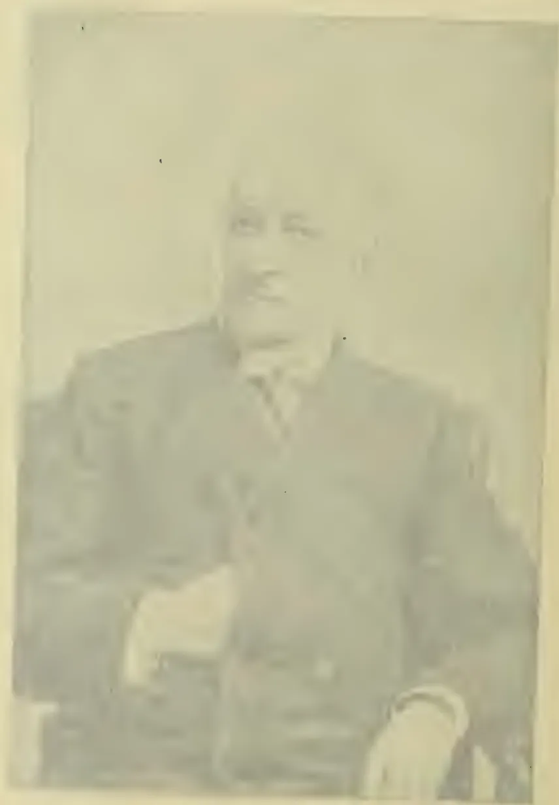A sepia-toned portrait of a middle-aged man with a receding hairline. He is wearing a dark suit jacket over a light-colored shirt and a patterned tie. He is seated, with his hands resting on his lap. The portrait is set within a rectangular frame with a double-line border. The background of the portrait is a plain, light color.

WILLIAM W. WRIGHT

President of the American Association of Retired Persons

Washington, D.C.

854------------------------------------------------

# \* The TROPICAL AGRICULTURIST \*

∞ MONTHLY. ∞

Vol. XVIII.

COLOMBO, JUNE 1st, 1899.

No. 12.

## "PIONEERS OF THE PLANTING ENTERPRISE IN CEYLON."

(Third Series.)

### JOHN CAPPER:

MERCHANT, PLANTER, JOURNALIST, 1837-1886\*.

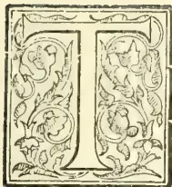

THE name of Mr. John Capper as an old and notable Colonist, was placed in one of the early lists of "pioneers" to be enrolled in our annals of the Planting and Commercial as well as Journalistic Enterprise of Ceylon. But it was not till our visit to England in 1896 that we could command the needful information to make our biographical notice an adequate one. Mr. Capper himself had shortly before taken a special interest in our proposal, and at our request, readily wrote out some dozen pages of "Recollections" of his early days in Ceylon; but these had to be closed abruptly for the reason given in a pathetic little note which accompanied the manuscript, and which we venture to reproduce as follows:—

"MEMO: to J. FERGUSON, Esq.  
London, December 25th, 1895.

"When I promised to send for publication some of my Ceylon experiences I was in good health: since that date I have been afflicted with paralysis affecting my muscular and cerebral powers. Please therefore kindly edit these remarks and omit or modify any which appear to need revision—this for my sake. With best wishes for your future health and prosperity.—J. CAPPER."

Mr. Capper was then in his 82nd year. Later in February and June 1896 we had friendly notes from him (besides an interview) with reference to securing a sufficiently good photograph, from which to prepare an illustration for our *Tropical Agriculturist*. The one eventually used was a copy of that placed in the Ceylon (London) Association album and had been taken by Walery of Regent Street some years previously.

To turn now to the subject of what has become our Memoir: Mr. John Capper was born in 1814 of an East Anglian, and we believe Nonconformist, family, though he himself became an Anglican Low Churchman. After a good plain education, he took to journalism early in life, and when only 20 years of age was engaged in the office of a weekly paper called the "Mining and Steam Navigation Gazette" of which he became Sub-Editor, and he continued his connection with the press, until he started for Ceylon in 1837. This same year witnessed the arrival here, of his future rival in Ceylon Journalism, A. M. Ferguson, who was two years Mr. Capper's junior in age. Mr. Capper came out as Assistant to the firm of Ackland and Boyd, then fast developing into the leading Planting and Mercantile House in Colombo. Mr. Ackland was an able, all-round man who took a keen interest

\* Although 1856 was the year in which Mr. Capper finally quitted Ceylon; yet he continued to act as London Correspondent for his firm's paper, the "Times of Ceylon," until 1894.

855------------------------------------------------

820THE TROPICAL AGRICULTURIST.[JUNE 1, 1899.

in public as well as in commercial and planting affairs. Mr. Boyd (or a relative, Capt. Boyd?) is credited with having made the first shipment, of coconut oil from Ceylon. We may mention in passing, that Robert Boyd Tytler also came out in this same year 1837, in the service of Messrs. Ackland & Boyd, in order to introduce the West Indian system of coffee cultivation into Dumbara and other districts, he (Mr. Tytler) having served an apprenticeship in Jamaica.

To return to the subject of our Memoir, we may now let Mr. Capper speak for himself in the following very interesting autobiographical narrative:—

“When I landed in the Island in 1837, the coffee industry was just coming to the front; whilst sugar was scarcely an article of daily concern. I had little or nothing to do with either one or the other; and my first business on behalf of the then well-known firm of Ackland and Boyd was the care of the firm’s books. Two years later, however, my services were brought into requisition for the supervision of some extensive Cinnamon properties at Kadirana, near Negombo, totalling in the aggregate some 3,000 acres. If I knew nothing of the cultivation of this spice, I was but in a similar plight to others, and I managed to expend largely in coolies’ wages.”

“At Kadirana I resided about five years, and eventually took charge of the firm’s Oil Mills in Colombo, and besides took the supervision of their general Export business into the intricacies of which somehow I managed to obtain an insight. Later on I was on trial as a junior partner taking charge of the entire Export business of the firm. In 1848 a crisis in the affairs of nearly all Ceylon business houses gave a check to my career; the firm had to suspend payment, and after two years spent in the service of the then Shipping Company of the place, I took my departure for England on the “Alice Maud.” In 1851 I was appointed to represent the Island at the Great Exhibition in Hyde Park, but with a sorry show of Ceylon Industries.

“My means were now recruited by writing for Dickens in his new venture *Household Words*, in the pages of which I continued to furnish chapters of Eastern life more or less successfully. I, about the same time, also undertook the Sub-Editorship of the *Globe*, to which I was appointed by Colonel Torrens, the then proprietor: this how-

ever was not my first venture at London Journalism, as I had in 1834 assisted in launching the first paper devoted to Mining and Railway matters, the *Mining and Steam Navigation Gazette*, which proved a success. I, at the same time, had worked on the staff of the *Spectator* under Rintoul, the founder of that journal.

“In 1852 whilst on the *Globe*, I wrote and brought out an octavo volume profusely illustrated—“The Three Presidencies of India”—which was a marked success, the East India Company’s Charter being just then under discussion. At this time, too, I began writing for the stage and successfully, but my work in that direction was so opposed to the wishes of my family, the stage being regarded as a rather discredited connection, and soon afterwards my labors were devoted to quite another channel by my departure for India, where, having succeeded in greatly improving the then little known jute fibre, I proceeded to Calcutta and started Steam Spinning and Weaving Mills at Serampore. I set in motion the first jute-weaving machinery, which promised a fortune in the near future, for whilst thousands of tons of jute cuttings lay about the yards of jute shippers, who were glad to get rid of the incumbrance at the rate of six-pence per maund of 80 lb., it was worked into yarn worth ten times that amount. An enormous trade soon sprung up; but, alas! our dreams of fortune were scattered to the winds by the Indian Mutiny, which just then broke out and cut off our supplies of the raw material. Of course, those who, having capital in abundance and could afford to bide their time, were content to wait for the collapse of the Mutiny; but this was not my case, and making over the concern to my partner Ackland, I bade adieu to Calcutta and once more sought the familiar shores of Ceylon, where another phase of my chequered career met me. This was in 1858; and as it happened I found the *Ceylon Times* on its last legs, and at once set to work to negotiate for its purchase from the nominal proprietors, Messrs. Wilson, Ritchie & Co. It signified nothing that I was without capital; but I had, what was in those days, nearly as good, any amount of credit; for the competition amongst the banks, for business of almost any kind, was extreme.

“Those were golden days for the needy speculator, and of this latter class there was no lack; as one Kandy Manager said:—‘Plenty of stiff pleases the head Johnnies, and it looks well on paper.’ But, alas! they had rather too much ‘stiff’ in the end. It was an unhealthy state of banking business when your appu’s name on a pro-note was as good as that of any European and sometimes better!—when estates could be bought on credit for the utmost amount which friendly Estate Agents chose to place against them and no questions asked; and when they were paid for by the convenient medium of ‘stiff.’ It is true that half of the Central Province would have remained under forest had these conditions been otherwise, and well do I remember the saying of one go-ahead young planter declaring that he was so deeply in debt to his Agents that he had no alternative but to buy another estate which he found no difficulty in having appraised for sale at something like thirty per cent. above its actual value. In those days estate valuers were frequently very obliging!

“There were at that time many royal roads to fortunes; amongst them were the charges levied by Colombo Agents on the preparation and shipment of Coffee. The consolidated amount was

\* “In order to illustrate the fallacy of the old-fashioned belief that the indigenous industries of a tropical country can be most successfully worked by natives, I may state that when I took over charge of the Kadirana Cinnamon Gardens I was warned that Europeans were ignorant of the mysteries of spice cultivation, and when I selected an experimental block of ten acres of cinnamon land by no means the best on the estate for high cultivation, and began putting the pruning knife into the bushes, ruin to their production was predicted. The actual result was that in four years I brought up the yearly produce from three-fourths of a bale to nine bales an acre, with the result that the London Agents forbade any further work on that system on the place, as it would flood the market and tend to lower the price of the spice.”—J.C.

856------------------------------------------------

JUNE 1, 1899.]THE TROPICAL AGRICULTURIST.821

usually 8s. per cwt., out of which there was a royal slice for the shippers. It may not be amiss to mention in this place the reply of a well-known Colombo retail trader who, when he was told that the officers' mess of a certain regiment was about to embark for England, coolly replied that they owed him just a thousand pounds sterling, but that he should not trouble them for the amount as they had always treated him in a most gentlemanly manner and he would behave towards them in a similar fashion, a declaration which evoked from a well-known joker of that period, 'What a world it is, Mr. Venn!'—a saying which since passed into a proverb.

"The following years were memorable ones, long remembered from the sad and eventful changes which overturned many a hitherto prosperous planter. Leaf-disease and financial disaster each worked their share of havoc in nearly every district. In the course of ten years the face of the country was changed from smiling prosperity to a deepening gloom which gradually spread from one district to another until all wore similar features. These were not times one cares to recall to memory: one would fain try to forget them. Happily there were bright spots in that gloomy picture which modified the saddening recollection of what one would fain pass over. In cheery contrast to the misery to be found on every side were the redeeming features of calm self-denial and courageous endeavour of scores of young planters who had to look upon actual poverty and semi-starvation, the results of the insolvency of their proprietors. Many an instance occurred of assistant managers of estates being indebted to native dealers in rice and fish in the bazaars for their daily rations and occasionally for clothing. I have not forgotten how liberally some of the Chetties of Uva and Dimbula joined in raising funds towards enabling destitute planters to leave the island for more favoured lands in the south.

"As one of the incidents illustrating the change of tenor of Ceylon planting life I can call to mind how at a festive gathering in the Dimbula Hall one of the guests posted up a fictitious Reuter's Telegram from London advising Plantation Coffee as up to 100s, which he caused to be exhibited by way of a joke. This elicited roars of laughter, but the figure was actually realised early in the following year. I have in mind also words of warning uttered by one of the speakers at the same meeting cautioning his fellow-planters against extravagant expenditure, for that a time *might come* when times would be so sadly changed that estates would probably be so sadly depreciated in value as to be sold for the value of the iron roofing on their stores, a prediction which I lived to see realised.

"But I pause in my notes of recollections which might be extended over many sides of a newspaper sheet. Having jotted down such notes as occur to me at a time when my powers of memory are no longer what they were, I close my jottings asking readers to bear in mind the fact that, thankful for the share of health and strength left me, I rejoice to know that a large measure of prosperity is vouchsafed to those I leave in the island which has witnessed so many vicissitudes of fortune in the past."

It must be confessed that there is not much that is autobiographical in the above paper, after 1858; but the sketch afforded of the vicissitudes in coffee and afterwards cinchona planting, carries

with it the history of the Colony and of nearly every European, whether planter, merchant or journalist. Our own arrival in the island dates from 1861 in the midst of what were still the "good old times" when we had to content ourselves with a fortnightly mail from Europe; when a foreign telegram—Reuter not having then appeared—was a rarity; when the island was well supplied with a daily newspaper through the *Observer* publishing on Monday and Thursday, the *Times* on Tuesday and Friday, and the *Examiner* on Wednesday and Saturday. Easy-going days these were in the Fort of Colombo, when Mr. E. J. Darley and other "old hands" did their banking as well as office business all in "white" with short white jackets—now relegated to the dinner table; when a black hat or boots, (or a pair of gloves) under any circumstances (save a funeral), were the occasion of derisive comment; when everybody knew everybody else, and the gathering on Galle Face of an evening approached a good deal to that of one big family, and the illness of any one member disturbed the entire, but very limited community of ladies, and provoked offers of nursing and aid from all sides; when, moreover, the spirit of competition (outside the newspapers) was still very much in abeyance, so that it was thought unfair to compete at a land sale with the man who had taken the trouble to prospect for any particular lot and to cause it to be put up for sale; and when, for instance, we have personally known a Baillie Street merchant rush in to stop the press and get an advertisement altered, because he did not want to announce his quarter casks of Madeira as for sale until his neighbours, Mackwoods & Co., had disposed of all their stock, and he had just learned from "Frank Smith" that some still remained on hand! Those were the days of sailing ships, when a steamer, save Captain Donnan's little "Pearl", was scarcely ever seen in Colombo roadstead, and when the commanders of barques took many weeks at their ease in our port, to discharge and take in cargo. The first interruption to these quiet, old times,—certainly the first public excitement we can recall—arose out of the American civil war, when Tinnevelly cotton (largely dealt in by Colombo merchants) rapidly rose in 1862-3, from 2½d to 1s 6d and more per lb., and Messrs. Darley, C. Shand, A. Gibson and J. C. Fowlie made rapid "fortunes" and retired. Those were the years too of one of the most somnolent governments that ever administered affairs in British Ceylon: Sir Charles MacCarthy was a polished scholar and speaker, but averse to travel or hard work; his Colonial Secretary, Mr. Wm. Charles Gibson, was bent on hoarding revenue; and so Mr. Cardwell as Secretary

857------------------------------------------------

822THE TROPICAL AGRICULTURIST.[JUNE 1, 1899.

of State swept down and took large appropriations of surplus balances for the military chest. The merchants in 1863-4 had found it impossible to get one of their number to accept a seat in the Legislative Council, and so finally recommended the Editor of the local "Times" as an ex-merchant; and thus Mr. Capper was one of the unofficial phalanx which under the leadership of Mr. George Wall (then Planting M.L.C.) resigned during the temporary administration of Major-General O'Brien who had succeeded Sir Charles MacCarthy. Afterwards, under Sir Hercules Robinson, Mr. Capper served as paid Secretary of a Cattle Commission, he having got out a nephew, Mr. Keppel Jones, to help with the paper. After this Mr. Capper aided another nephew in starting and carrying on the "Kandy Herald," an abortive effort which speedily died down. He also contributed to the short-lived comic journal "Muniandi," if indeed he did not edit it at one time. To this same period of unsettlement and of many "irons in the fire," belongs Mr. Capper's origination of a Cart Transport Scheme for Uva, in which he was specially supported by the late Mr. Thomas Hudson (of J. I. Strachan & Co.) This was managed by his son, Mr. Charles Capper, and was afterwards taken over by Mr. Lucius C. Glenny when he commenced his Haldummulla and Ratnapura stores. In 1870 the Duke of Edinburgh visited Ceylon, and Mr. Capper acted as Correspondent for the *London Times* and afterwards published an illustrated volume on His Royal Highness's visit. In 1874 Mr. Capper parted with the local "Times" to a Limited Company formed by Mr. Dunlop, Manager of the Oriental Bank, and from this year dates the "Times of Ceylon" which had for its first Editor Mr. Allardyce from Bombay, afterwards Reader to the publishing house of Blackwoods. In 1882, the Company having collapsed, the newspaper and printing property reverted to Mr. Capper (who had returned from home) and his two sons who made the Firm "Capper & Sons." Mr. John Capper (after a brief engagement as representative of Ceylon at the Calcutta Exhibition in 1884) finally retired to London in that year; but, although then in his 71st year, he could not be idle, and so he took up the rôle of London Correspondent, continuing in that post for fully ten years more. Indeed after he gave over this special work to younger hands, we found him early in 1896 still interested as Editor of a small monthly periodical published in London for the benefit of West Indian planters. Even after 63 years of continuous work with his pen, the veteran journalist could not refrain from doing something in his old capacity, and we believe his interest in public news continued unabated

until the end came on March 31st, 1898, when MR. JOHN CAPPER had attained the good old age of 85 years. Mr. Capper was twice married: first, to a sister of Mr. Ackland of the firm he first joined in Ceylon, by whom he had two sons and two daughters—all of whom, save one daughter, predeceased their father. By his second wife (Miss Baylis, aunt of Dr. Baylis long in Kellebokka) there were three sons.

We are conscious of affording but a meagre sketch of the career of one who served his day and generation well, and whose connection with Ceylon during about forty years of continuous residence, was marked by much useful work. Our foregoing record is by no means complete; for as "Honorary Secretary to the Ceylon Branch of the Royal Asiatic Society," Mr. Capper (as we publicly testified at a meeting some years ago) rendered for many years very valuable service, keeping the Branch alive in fact, when it would otherwise have possibly become defunct. Then, too, there is a phase of his literary career we have omitted to notice above, namely, in his contributions to Dickens' "Household Words" and this we may best do by quoting from a notice of Mr. Capper in the local "Examiner" at the time of his death:—

He will best be remembered as the writer of those breezy sketches, which found a permanent lodgement eventually in *Old Ceylon*. Who that has read his sketch of "Our Old Clerk"—a figure taken from life when the writer was an assistant at Ackland Boyd's, and the object of the sketch was the Chief Clerk of the firm with his strict business habits, unswerving integrity, unassuming ways, and yet shrewd dealings—but will acknowledge that the writer possessed powers of observation beyond the ordinary—the ordinary standard that is generally concentrated in the one word keen? Then, "Philip of Brassfounder Street"—a faithful sketch of the Kanakpillas of the olden days: and the Chetty with his elastic ideas, first as to the free use by him of the Firm's postage stamps, and his indignant and dignified planking down of his purse when he was reminded that stamps could not be supplied for nothing—all these sketches and more of mercantile life in the metropolis in days gone by may be read in the little volume we have referred to. Nor in it are scenes of up-country life. Of the particular sketches of planting life in the work we are referring to, we cannot speak with certainty—we have all along been depending upon memory. But there is one bit—"The Kandyane Captive," we think is its title—which for the simple narration of an incident—real or fancied—in connection with the Kandy dynasty, may fairly lay claim to a place among not the least of our prose idylls.

Our portrait gallery of the Pioneer Colonists of Ceylon would certainly have been incomplete if it had not included one whose career we have thus imperfectly indicated and to whose work and memory we have endeavoured to do justice, in the varied capacities of planter, merchant, but especially of littérateur and journalist, all of which appertained to MR. JOHN CAPPER.—*Requiescat in pace.*

858------------------------------------------------

JUNE 1, 1899.]THE TROPICAL AGRICULTURIST.823

## REPORT ON COFFEE LEAF DISEASE IN COORG.

[INCLUDING DESCRIPTION OF COORG; CULTIVATION OF COFFEE—SHADE, WEEDING, MANURES,—SEED, VARIEBIES, HYBRIDISING.]  
BY MR. JOHN CAMERON F.L.S.

(Concluded from page 752).

### COFFEE PESTS.

"We should be happy that it is an industry that involves a certain amount of trouble. Otherwise it would be taken out of our hands altogether." Such is the pithy and hopeful remark made by an able and experienced planter on the occasion of the last Conference of the United Planters' Association at Bangalore. A statement of this sort indicates the true energy which underlies all the actions of British enterprise.

In the latter case obstacles are of little moment, and may be of real advantage in keeping out the faint-hearted. The same spirit prevails in Coorg, although borer, leaf-rot, leaf-disease, bug and other pests have each done their best to diminish the planters, profits—uncertain crops and foreign competition being a further tax on his patience. Leaf-disease, which is most dreaded, was not very prevalent or any of the estates visited. *Hemileia Vastatrix*, the fungoid parasite which causes leaf disease, by partially or wholly disorganising the functions of the leaf, made its appearances in Coorg in the early seventies after committing great havoc in the planting districts of Ceylon. The peculiarity of the fungus is that it persistently follows the coffee bush all over the country and is more or less prevalent wherever coffee is grown. A virulent attack on the experimental plot in the Gardens (Lal Bagh), has just been temporarily checked by burning every infected leaf and coating the ground with a thick layer of quicklime.

Combustion, whether active or passive, is the natural enemy of fungoid organisms; and when Mr. Marshall Ward recommended burning everything that could be burnt with safety on the estate, he gave good advice. During the pruning and wood-ripening season, tons of leaves and twigs could be disposed of in this way, although it is admitted that a coffee zone such as the "Bamboo" provides but little space for kindling fires. It is the annual recurrence of the scourge which makes it so disastrous, and anything that would harass it or deprive it of nourishment at critical periods would have the effect of saving the host to a large extent.

Spraying operations were observed at Hallery, where Mr. Spott thinks he has gained some advantage over the fungus. The mixture in use is 3 lbs. sulphate of copper and the same quantity of lime dissolved in 25 gallons of water.

The Californian remedies for fungoid and other pests are given at the close of this paragraph.

### The Life-history of

*Hemileia Vastatrix* was thoroughly worked out by Mr. Marshall Ward in 1881, and readers cannot do better than refer to his scientific reports, written for the Ceylon Government on the subject about that time.

The Director of Kew Gardens gave it as his opinion, in 1892, that *Hemileia Vastatrix* is a species endemic to the Island of Ceylon. This great authority further adds,—"Like thousands of other microscopic leaf fungus, it probably maintained its existence in an un conspicuous manner in some native Rubiaceous plant (i. e., belonging to the same family as the coffee). It was probably only by a kind of accident that about 1869 it found a suitable host in cultivated coffee, and thus was enabled to develop itself on a scale which speedily made it a scourge." Since the latter date, when first observed, the parasite has followed its host unremittingly to every coffee region of the old world. Change of food would possibly arrest its progress sooner than anything. Slight constitutional change in the host might bring this about, and the process of hybridising would be of much value if it secured even

partial immunity to the coffee plant from the attack of *Hemileia*. That such a thing is possible has already been proved by the rising of certain varieties of potato which are wholly immune from *Phytophthora infestans*, the most hurtful fungoid parasite of that esculent.

### THE BORER.

The next pest to be briefly considered is the borer (*Xylotrechus quadrupes*), which is indigenous to the country. In fact, there are several borers, and the remedies here recommended will apply to them all. It is only in the more exposed parts of South Coorg that the ravages of these insects are much felt, and even there the conditions are far more hopeful than they were thirty years ago. At that time the wholesale destruction of forest trees, accompanied by undue exposure and indifferent cultivation, aggravated the attack and was the indirect cause of enormous loss to the planter. But it is now understood that sufficient shade and moisture, supplemented by good tillage, are conditions inimical to the spread of borer. The rush for extension which prevailed a few years ago, when prices went up, must be held responsible to a large extent for the maintenance, if not increase, of coffee pests. A large area (in fragments here and there) of unsuitable land was placed under cultivation, and by a process of forcing in some cases and comparative neglect in others it was hoped to increase the average outturn of bean. But a cycle of dry seasons shortly followed, and the new openings were mostly found to be infested with leaf disease and borer, which rapidly spread to healthy tracts that had not suffered before to the same extent. The occupation of such lands by coffee is therefore a standing danger to the whole local industry. I can imagine nothing more disheartening to a really good planter than to have neighbours who will act recklessly in the selection and treatment of land, to the jeopardy of the whole community. In addition to depth of soil, moisture, and shade, the presence of numbers of insectivorous birds is recommended for the extinction of borer. Of these, woodpeckers, jays, thrushes, mynas, hoopoes, sparrows, larks, jungle fowl, the crow pheasant and many others are insect eaters. When the larva can be got at, which is not very frequently, the direct application of neem oil is the surest remedy. If poured into the holes and tunnels caused by the insect, it will either bring out the latter quickly or cause its death inside. In this connection I may mention that neem oilcake, which is manufactured at Hunsur, might have a remedial effect if applied to land affected by borer. Rubbing the coffee stem at intervals with the oil would be a good practice.

### LEAF ROT.

*Pellicularia Koleroga*, or "leaf-rot," is an epiphytal fungus which envelops the coffee leaf during the monsoon and subsequently kills it. Continuous or heavy rainfall, density of shade, drip, and stagnation of drainage, are the causes of this fungoid growth. A modification of the above conditions with the use of fire to destroy all affected leaves, and the application of flowers of sulphur in the early stages of attack are the best known remedies. Bordeaux mixture and other fungicides should also be tried. For the eradication of bug and scale insects, the importation of a useful species of lady-bird is under trial. The brown scale-insect,\* *Dactylopius adonidum*, is prevalent on many of the jungle trees, where it is farmed by ants for the secretion known as "honey dew." It is usually accompanied by the black fungus *Trisporum Gardneri*, Berk. Kerosine emulsion is a good remedy for these pests.

### REMEDIES FOR PLANT DISEASES.

Extract from Spraying Calendar, Central Experiment Farm, Ottawa.

\*The 'Brown scale insect' is *Lecanium coffee Dactylopius adonidum* is the so-called 'Mealy bug'—Ed. T.A.

859------------------------------------------------

826aTHE TROPICAL AGRICULTURIST.[JUNE 1, 1899.

prevailing variety on the estate. This is all right where the prevailing strain is good. But where the product for which a plant is cultivated shows signs of exhaustion, or has become deficient in quality or quantity, the strain is said to have "run-down," and in all such cases too much individualism in reproduction is undesirable. It is in all probability to prevent this running down of strain or breed that nature insists on cross-fertilization.

*Coffea arabica*, or Arabian coffee, of which there are several well-defined local varieties known by such names as "Chick," Coorg and "Nalknad," has been almost exclusively cultivated in this country from the time the industry was started, and it is only within recent years that one or two new varieties and species have been introduced and cultivated on the estates. This fact will explain the absence of hybrids over such an extensive area, there being no material to make hybrids from. Yet, within the past few years, some hybrids have made their appearance, shortly following the introduction of Liberian coffee, a distinctly new species. And, barring the fact that two distinct species have been placed in juxtaposition to each other, the hybrids are the work of nature. But in the instances referred to, man must get the credit of having materially helped nature by providing a new species for the latter to work upon.

If he would, therefore, do more in this direction, the chances are that worn-out strains of coffee would soon be replaced by better kinds.

This leads me on to the suggestion that approved varieties and new species of coffee should be freely introduced from other countries. The field for experiment would then be much widened, as planters would have sufficient material to work upon.

The cultivated forms of coffee in different parts of the world are already so far advanced of the indigenous or wild bush that it would probably be mere waste of effort to bring the latter into experiments, the object of which is to secure further improvement in productiveness and quality. Collections of species and varieties should, therefore, be confined, in the first instance at least, to well-known *jats* already in cultivation. These I shall leave the planter, being the best judge, to select for himself. Now supposing that some enterprising planter has already secured such a collection of coffee-bearing plants, how is he to dispose of them to the best advantage?

This is a question that I shall endeavour to answer in my next.

With one or two new species of coffee at one's disposal, and a like number of distinctly marked varieties, such as the "Maragogipe," which is an introduced variety (from Brazil) of *Coffea arabica*, an experimental plot could be started on the following lines:—

(a) Situation, as regards aspect, soil, water and shade, to be the best the estate can afford. Occasional irrigation will possibly be required to induce the different bushes to blossom together, so that the possession of a perennial water-supply would be a convenience.

(b) The crossing-plot need not exceed one-eighth or at greatest one-fourth of an acre in extent, while it is possible that equal results may be obtained by working systematically on a few bushes.

(c) In planting up the crossing-plot, an equal number of healthy seedlings of the estate coffee should be thoroughly mixed with the new kinds, so that winged insects may have full play on the whole. But in addition to the general and haphazard operations performed by the insects, a few bushes should be carefully isolated for hand-fertilization. For the latter purpose a few skeleton frames covered with fine muslin would be a sufficient protection, if placed over the bushes before the flowers opened. Plant in a square plot at 6 × 6 feet, so that air may circulate around the bushes freely. The preliminary details which I have emphasised under the sub-headings *a*, *b* and *c* will keep the planter employed for at least two years, or to be strictly accurate, until a maiden crop of flowers is produced in the crossing-plot.

Then, at this latter stage, the work of fertilization will actually begin, should several distinct kinds of coffee flower simultaneously. Unprotected bushes will be pollinated through the agency of insects chiefly, while the protected ones will be self-pollinated, should no precautions be taken to prevent it. Where bushes are intended for hand-fertilization, it will be necessary in the early stages of reproductive growth to rub off a great many of the young flower buds, so that the inflorescence of an individual may be reduced to a manageable number of flowers. For that matter, the flowers could be reduced to what is borne on a single primary, or to a few clusters of the same. The necessity for this apparently ruthless treatment is contained in the fact that, during the short time the stigma is receptive of foreign pollen, the fertilizer could only pollinate a limited number of flowers with any degree of certainty. It is, therefore, wiser to make sure of getting a few goods crosses than to attempt a larger number indiscriminately. Let us now suppose that the operation is about to take place. Having provided himself

with the marginally noted requisites, and selected a protected bush to become the seed-bearer, the fertiliser places himself under the protective frame and eagerly watches for the opening of the first flower. Directly the flower opens (usually early in the morning), there will be seen, slightly projecting from its delicate-white throat (tube of the corolla) a bifid or two-horned stigma supported by 5-7 arrow-headed another on short stalks. At time of opening, the stigma, which is seen well in advance of the anthers, glistens with a sticky substance which holds fast any powdery matter, such as pollen, that may fall on to it. What the fertilizer has to do at this stage is to dust a little foreign pollen on to it by means of his camel's-hair brush. This done, he instantly, and deftly as possible, cuts away the 5-7 anthers behind the stigma. But as the anthers are usually closed at this early period, they could perhaps do no harm if they were left. Everything would depend on the behaviour, so to speak, of the stigma towards the new pollen by which it has been fertilized.

The process as described above has to be done with every flower until the primary or clusters of flowers reserved for crossing have been exhausted. A register is then made of the parentage on both sides, and after a day or two the bush is liberated from its protecting covering.

I have examined many coffee flowers at the moment of opening, in most cases the stigma projects in advance of the anthers and the style lengthens rapidly. By this means the spreading horns of the stigma afford a good platform for small bees and other insects to rest upon when searching for honey. Then fitting from one stigma to another they deposit quantities of pollen, which readily adheres to their hairy limbs. Crossing operations being completed, the next step would be to select a suitable piece of land for the cultivation and trial of seedlings raised from the crossing-plot. It is in this final stage of the experiment that the exact result of cross-fertilization would become apparent, and not before.

But the operator needs to possess patience, for among 10,000 seedlings cultivated there may not be one showing real improvement in every respect. With our limited experience in crossing, it is uncertain what would happen, although there is reason to believe that cross-fertilization would induce beneficial variation in the growth and production of coffee. The land required for testing seedlings of mixed parentage should be of the best quality, and the cultivation should be on a liberal scale also. Area is a matter for the planter himself to decide, as it depends wholly on the extent of his operations. I do not, however, advocate large areas for mere experimental work. When the seedlings give their

860------------------------------------------------

JUNE 1, 1899.]THE TROPICAL AGRICULTURIST.8263

maiden crop, it will be seen approximately what merits they possess from a productive point of view. But other merits, which may be roughly termed constitutional, will only become apparent after a lapse of time and under different modes of treatment.

I can readily imagine that a judicious selection of the fittest would prove a most difficult task, even to an expert.

The operations discussed from the beginning until now, when the second generation has borne its first crop of fruit, covers a period of about six years. This is a long time, and some men would doubtless say "is the trouble worth the candle? especially as there is nothing to prove that much good would come out of it." In answer to such a remark, I am pretty firmly convinced that good would come out of it and have already planted up a small crossing-plot with the view of raising hybrids. The plot consists "of 130 bushes, and includes *C. arabica*, *C. liberica* and the variety—Maragogipe." A few of the bushes are already well advanced in growth, so that the first batch of crossed seedlings may fruit within five years from date. But when matured bushes can be cross-fertilized this season, the results might be known within four years, which is not very long for a planter to wait. My object, so far, has been to explain the *modus operandi* of fertilization rather than to discuss side-issues bearing on its application to the genus *Coffee*. But now, I may refer briefly to argumentative views on the latter question. As the coffee bush possesses a hermaphrodite flower, it may be held by some that crossing is neither possible nor desirable. But it does not follow that a flower is self-pollinated because it contains both sexes. In numerous hermaphrodite flowers the sexes attain maturity at different periods, and in all such cases self-pollination is effectually prevented. That dichogamy prevails to some extent in the coffee-flower is certain, as I have often observed stigmas in the receptive stage when the anthers had not dehiscence. I am unable to say, however, if this is a general condition, or if it only happens in occasional flowers. A flower may thus be structurally hermaphrodite and functionally unisexual. Then, the sweet-scented coffee-flower offers great attraction to insects, which is a pretty sure sign that the dispersion of pollen is favoured by Nature. Indeed, the condition of the pollen is such as would adhere readily to the hairy limbs of insects. It is not of the fine powdery kind (so-called dust of flowers) that would be suspended in the air or lightly carried by the wind.

Considered, therefore, from a morphological standpoint there is little doubt but the genus *Coffee* is subject to cross-fertilization, and that its flowers are entomophilous. Lastly, I wish to dispel the idea that established coffee can be influenced one way or the other by operations of crossing, the results of which are only discovered in a subsequent generation.

But it is highly necessary that the planter should strictly conserve his testing-ground, and not allow any unknown seed to be utilised for estate purposes. The golden rule in the testing or experimental ground is to destroy all inferior forms as quickly as possible.

New strains of seeds reserved for trial could be treated separately until such time as their merits are fully established. This is all I have to say on the fertilization of the coffee flower at present.

#### MR. CAMERON'S REPORT ON COFFEE IN

"COORG."

We have been requested to give publicity to the following correspondence between Mr. Alex. M. Neilson, F.C.S., of Coimbatore, and Mr. John Cameron, F.L.S., of the Government Gardens, Bangalore:—

I.—From Mr. Neilson to Mr. Cameron.

COIMBATORE, 25th March 1899.

Dear Sir,—I have read your Report on Coffee Cultivation in Coorg with much interest. There are some statements, however, under the heading "Mannures," which, I think, require explanation. You do not mention Saltpetre at all though it is one of the chief sources of Nitrogen and the principal artificial sources of Potash to most South Indian Coffee. In European

Works on Agriculture it is scarcely mentioned as its price precludes its use where Nitrate of Soda and Sulphate and Muriate of Potash are cheaper. In this country, where it occurs naturally, it is a much cheaper and more important manure than either of these three. Then you do not include Dried Blood in your list of Nitrogenous Mannures, but mention it as a source of Potash. This is no doubt a slip, as Dried Blood contains only about one 1 per cent. of Potash and 12-14 per cent. of Nitrogen, which is the ingredient which gives it its value. I should like to know, also, on what experimental fact the statement is based that "for quick effect on growth the soluble superphosphates are the best, especially the double superphosphate manufactured at Wetzlar in Germany. Are double supers better than an equivalent quantity of the ordinary kind, and in what way are those manufactured at Wetzlar superior to the numerous other makes? I can understand that in cases when the cost of transport is very heavy the double supers might prove more economical, but only in very exceptional cases as the unit price of the phosphate is very much higher than in the ordinary kind. I have thought it better that these things should be pointed out to yourself personally, rather than through the newspapers; and this is my apology for addressing you.

II.—From Mr. Cameron to Mr. Neilson.

BANGALORE, 7th April 1899.

Dear Sir,—Owing to my absence at Mysore, I regret that your letter of the 25th ultimo has not been answered promptly. I have to thank you for drawing attention to the weak points in my statements about manure. Saltpetre was inadvertently overlooked, although I was under the impression that nitrate of potash had been recommended and entered in the list. Dried Blood is of course wrongly placed, being a nitrogenous fertilizer. I have not heard that German superphosphates are in use in this country, but they are highly spoken of by continental cultivators, and I am going to try them here on coffee and other plants. Being specially prepared for export to distant countries, they are worthy of trial. But I can understand that their use on a large scale might seriously affect local interests—a phase of the question which did not occur to me until I had read your letter. I may tell you, in conclusion, that my report to the planters of Coorg has no pretension to be exhaustive, and that sound criticism may be of more value, if made known to the planters, than the report itself.

Yours faithfully, (Sd.) J. CAMERON,

#### SEEDING OF THE GREAT BAMBOO (BAMBUSA ARUNDINACEA).

Some account of the seeding of this plant in its native country may not be out of place at the present time, when the cultivation of the hardier kinds of Bamboo in Great Britain is receiving such general attention, creating, as it were, another link of sympathy between the nations of the East and West, bringing to the minds of former travellers familiar and graceful objects in the landscapes of foreign climes, and to the untravelled some idea of the graceful beauty of one of the most interesting and wonderful genera of plants. It would almost appear that there is nothing in this life unaccompanied with some disappointing drawback, and the more exquisite "a thing of beauty" it first appears, the more crushing the subsequent disappointment.

In the case of the genus under notice, the drawback undoubtedly is the death of the plant after producing seed, this effort of reproduction being, I believe, in most if not all the species, fatal to the existence of the parent plant.

The seeding and subsequent death of at least some of the hardier kinds of Bamboo in Britain may, perhaps, be familiar enough to some people, but it may be doubted if it has fallen to the lot of many English men to have witnessed the phenomena on a large scale in the native country of the Bamboo. It was my lot early in life to see this mysterious act of Nature in relation to the huge forests of *Bambusa arundinacea* covering hundreds of square miles of country in Malabar and Coorg, in Southern India, and reaching far into the adjoining province of Mysore. It was at the close of the year 1862

861------------------------------------------------

826cTHE TROPICAL AGRICULTURIST.[JUNE 1, 1899.

that I took up my residence in an upland district of Malabar, where the slopes of the Western Ghauts were clothed with gigantic evergreen forests and from their base stretching for several miles into the Mysore territory, grew a veritable forest of Bamboo, intermixed with Teak and other deciduous and hard-wooded trees, the Bamboo predominating.

My primary object is to give some account of the seeding of the Bamboo, I yet cannot help writing a few words on the beauty and grandeur of this forest as I first beheld it, and before "decay's defacing fingers" had wrought desolation. Viewed as a whole from an eminence, nothing could well surpass the splendour of this vast area of waving plumes rising to a height of 60 to 70 feet; and individually the clumps as seen more or less isolated on the grassy laterite knolls, were of surpassing beauty. From March until nearly Christmas, the Bamboo is clothed with leaves of a pale delicate green, after which they begin to fall, and the jungle for a month or two is shorn to a great extent of its attractiveness. But there is extra beauty in the young leaves as they begin to appear in response to the first showers of spring. I shall never forget a ride I took on my first arrival in the country along a road leading from Malabar into Mysore, and cut right through the heart of the Bamboo-jungle, and when the trees had on their best attire. The huge clumps stood almost at regular intervals close by the road on either side, the culms bending over and forming a complete archway of greenery for miles. This was the grandest triumphal archway I ever beheld, and when the subsequent seeding and destruction came, one could hardly help lamenting the inexorable laws of Nature.

Very soon after my arrival in Malabar, I heard rumours that the Bamboo forests of Travancore to the south were in seed, and in the following season our turn came, and then that of Coorg to the north. So that this strange frutescence would appear to have taken place in sections, beginning at the most southern point of India, and travelling northwards year by year.

When the seed became fully ripe, the culms were quite divested of leaves, and bent down with the heavy load of oat-like seeds—a magnificent harvest, it is true, but one which only occurs twice in a century, and which is then accompanied with the annihilation of the parent plants.

When the seed became quite ripe, it fell to the ground, which was quickly covered with what had a wonderfully close resemblance to Oats. This fall was the signal to the jungle tribes to lay up a store of the grain to serve them during the ensuing monsoon, and groups of men and women were to be seen all over the forests gathering and deftly winnowing the seeds, whilst pea-fowl, jungle-fowl, partridge, and others of the feathered tribe, were not slow in taking advantage of the bountiful supply of food, and waxed fat and lazy, and so became an easy prey to the Fowler's gun. Long, however, before a tithe of the rich store could be consumed the season of jungle-fires began, and added by the thick coating of leaves on the ground, completely licked the Bamboo forests from end to end, to all appearance converting into charcoal every seed that had dropped from the trees, extinguishing every hope that the land would ever again resume its former appearance. Nature, however, had her own secret way of preservation, and as time went on, tiny little Bamboo seedlings began to appear, which year by year increased in strength till, in 1877, or fifteen years from the time of seeding of the forests, the country had all but resumed its former grandeur.

No description of mine could possibly convey an adequate idea of the scene of desolation the country presented after the death of the Bamboos over the whole extent of this magnificent forest, which was transferred suddenly from a scene of surpassing splendour into one of dust and ashes. The monsoon, which had brought revivifying power to the leafless Bamboos for the bygone fifty years, and bid them again and again burst into leaf and beauty, at last failed in its appeal to the "dull cold ear of death."

The succeeding hot season began its drying process on the dead culms, preparing them for the fires which were destined eventually to clear the country of every vestige of the old forest. It was several years, however,

before this process was completed, and here again rested a marvel, viz., how the young seedlings escaped with life and increased in stature through the years of heat and smoke.

For several seasons in succession the country was filled with smoke from the combustion of the dead and dry culms from about January to April which made it very unpleasant to the lives of the Coffee-planters and others. There was kept up night and day also a succession of loud reports from the ignition of the plant-up gases between the joints of the huge culms.

I do not know, but I sometimes doubt if there is any example in the vegetable kingdom which can boast of a more rapid growth in a given space of time than the culms of a fully-developed plant of *Bambusa arundinacea* in its native clime. The clumps send up a yearly supply of culms, which begin to appear in February, and by the end of July they have reached a height of from 60 to 70 feet, and are well furnished with lateral branches from top to bottom, with a diameter, close to the ground, of some 8 or 9 inches. The culms, as they issue from the ground, are furnished with a curious protective capping of brown-coloured sheaths, which they retain till they reach a considerable height, and the points are out of danger—an admirable protective process of nature.

With reference to the longevity of the Bamboo, I took considerable pains to arrive at the approximate truth. I questioned and cross-questioned on many occasions the jungle tribes, who had their homes in the seclusion of these Bamboo wilds, and who, previous to the advent of the Coffee-planting industry, hardly ever left but lived on the produce from their small clearings, edible roots dug with pointed stakes from the woods, honey, and the fruits of the chase. One tribe was called Jain Cooumbers, or, in plain English, honey men, or honey collectors. They are a lively race of people, with a wonderful amount of intelligence, and withal a rare appreciation, among natives, of fun and humour. I singled out several of the elder and most intelligent of this interesting tribe for my inquisition, and arrived at the conclusion that fifty years, or thereabouts, was the limit to the life of *Bambusa arundinacea*. There were several other species of Bamboo in the district, which, curiously enough, seeded simultaneously with *B. arundinacea*.

The uses to which the larger Bamboo is put in Malabar and other provinces of Southern India are too numerous to mention, and it would be difficult to imagine what the natives would do without it.

The Bamboo in Malabar is found almost from the sea level up to an elevation of something over 3,000 feet so that its range is considerable, and although it is generally described as a stove-plant in England, it might, I think, flourish in a house with less heat than that usually assigned to a stove, and might possibly, without hurt from an interesting object in the subtropical garden during a warm summer. To make the canes more lasting, and, in some measure prevent the ravages of the white ant, the natives of Malabar adopt the practice of soaking them in water for some months before putting them to use.

The belief, or rather superstition, obtaining in some parts of England with regard to the influence of the moon on vegetation is also found amongst the natives of Malabar, and no native will cut a tree or a Bamboo for his own use during the wane of the moon.

For some reason unexplained these Bamboo forests of Malabar are very unhealthy, alike to European and native. Ague and fever prevail, more especially during the showery weather of spring, and immediately after the end of the south-west monsoon, when the, ground begins to dry, or, as the natives put it "during the making of mud and the making of dust." The natives sometimes attribute the prevalence of malarial fever in these jungles to the quality of the water, and I have frequently known a gang of coolies fresh from the Mysore stop at a Coffee plantation and taste the water, and then pass on to the next plantation.

If I am correct in thinking that the life of *Bambusa arundinacea* is limited to fifty years, those forests in Malabar which I saw in seed and then perish, will again come to maturity about the year 1913, when will be witnessed a very curious phenomenon in the vegetable kingdom.—J. LOWRIE.—*Gardeners' Chronicle*.

862------------------------------------------------

JUNE 1, 1899.]THE TROPICAL AGRICULTURIST.827FACILITIES FOR MAKING GOOD TEA.

In continuation of the notes and comments dealing with the above subject, on we shall next take up two sets of replies to our circular, received from the Kelani Valley, which regard the situation from different stand points. And that is one of the advantages of eliciting information, by means of circulars, from men who are engaged in the same vocation, but who work necessarily under conditions more or less different. One of our planting friends congratulates himself that the old fancied draw backs to making good tea are being overcome, and that better tea is now being made on a majority of estates; another deals with the drawbacks as still potent factors. The two he gives prominence to are the scramble for quantity, and the attempt to cut down expenditure as much as possible. The inflated rupee compels the strictest economy, and the planter must show a saving on the cost per lb. of tea laid down. By sacrificing quality he attains this end; and if quantity yields a very slight profit, he excepts the inevitable, but at the cost of the estate's name in the market. If the craze for quantity has not altogether subsided, we doubt if ever before in the history of the enterprise there has been a greater trust in quality than during the past few months; and perhaps the wave has spread into the Kelani Valley too, since the answers to our circular were penned.

As regards jât, both writers hold it to be poor on most old estates, while land more recently opened up had the benefit of the best jats. Neither is prepared to class the prevailing jats as inferior; but merely medium; but even so, we fancy, both quality and yield must be affected by the failure to secure the best types of indigenous and hybrids. On the other hand, these were scarce and difficult to get at the out set of the enterprise; and in tea, as in other things, it is experience that teaches. In soil, too, the lower parts of the district are wanting, with alaterite and white quartz stratum. Though the higher parts are much better, there is no rich deep loam to speak of, most of the good soil being shallow, and many estates have a sub-stratum of slab rock. In these circumstances, we should say careful drainage for the conservation of soil and manuring for its improvement, are of prime importance, even though no estates can yet be spoken of as worn out. It is with a field here and a field there that abandonment begins, and with timely attention, a venture which might otherwise prove unremunerative may be made to yield what may be called a living return. One of the papers before us is most emphatic that manuring is profitable and improves the tea, and it records the heavy application of manures during the past two years on some estates with the best results; while the other is more cautious. It admits the improvement of tea by manuring, but doubts whether, the results are generally remunerative—the fear being expressed that, if a continued downward tendency in prices render expenditure on manures impossible, the last state of the estate would be worse than

103

the first! We trust such apprehension is out of place now—at any rate average estates—and that the ruling prices will justify and repay the liberal treatment of bushes. Except in small privately-owned places, there is, according to one report, sufficiency of withering room and well-equipped machinery, but the other refuses to regard accommodation which cannot cope with a week of rainy weather as adequate. As leaf must be plucked when it is fit, and manufacturing cannot wait, it is always better to err on the safe side, and a factory which cannot provide for a rush must be deemed deficient. The second report puts it in this way:—

“I consider a factory should have a roller to take 350 lb. withered leaf for every 100,000 lb. of made tea, so a factory making 500,000 lb. tea should have five of these, and driers in proportion. Very few factories in the island have, at least I do not know many, and in this district I do not know one factory.”

In motive power, however, both reports agree there is no deficiency to mention, and such as there is being yearly lessened.

Both reports speak of a more than sufficiency of labour—and that is not an unmixed blessing. Superabundant labour means short time, and that, however comforting to the worker temporarily, means less pay, with all the trouble incidental to it. There is, happily, a concensus of opinion that the day of too severe pruning is past. The lessons of experience have not been lost; and light pruning, at intervals of 14 to 18 months, now commands confidence as suited to the Kelani Valley at any rate, and is practised on most estates. It is cheering to learn that, though the Valley does not profess to turn out Darjilings, or to match Udapusselawa and Nuwara Eliya, it beats them in yield, in pungency, and in transport facilities; while it is happy in its labour, and only wants a 14d. rupee to be content all round, even while looking to Lipton as its best customer! With more supervision, too, said to be directed to manufacture than aforetime, and with the Railway in view, there is no reason why old planters and young should not hold up their heads proudly in the great young district.

AMBALANGODA DISTRICTS NOTES.

April, 23.

WEATHER.

Fine weather set in again on the 25th inst., after most useful showers which came on every day for over a fortnight. The rains freshened up everything and have not only made the tea bushes flush vigorously, but put renewed life into all the various products cultivated in these districts—coconuts cinnamon, sugar-cane, arecanuts, &c., &c.

Sinhalese pluckers have at last put in an appearance after their somewhat prolonged new year's junketings, much to the relief of mind of many an estate manager about here, visions of the garden covered with bushes yards high, having been prominent as the flush sprung up so rapidly. As usual the wenchies all demanded a new year's gift each in cash on coming to work again. Is this custom peculiar to the low country Sinhalese, or does it prevail too among the Kandyans?

863------------------------------------------------

828THE TROPICAL AGRICULTURIST.[JUNE 1, 1899.

Artizans have also returned to work, but are a more than a trifle listless and needless to say stony-broke.

#### ACREAGE.

There will not be much added to the acreage under tea in this portion of the province this monsoon, small clearings at Elpitiya and Baddegama being the only ones mentioned; while a few acres of moist and will go into Para Rubber. Of course one must not forget the whole half acre the enterprising directors of the Talgaswella Company have decided to put into Vanilla, as mentioned recently in the *Observer*.

#### THE TEA CROP.

So far the tea crop on most places is larger than for the same four months of last year, except on some of the estates near Mapalagama where it is said to be short; but the drought there was more severe than at Baddegama and Elpitiya and the celebrated "lake" on Talgaswella is reported, though probably an exaggeration, to have evaporated down to a chunk of mud before the rains restored it.

#### SUGAR.

It is a current idea upcountry that the only place that sugar-cane is grown and sugar manufactured at in Ceylon, is Baddegama estate. A trip by boat up the Ginganga river from Galle would dissipate this notion; for miles up one sees flourishing cane fields on both banks. The fields are not continuous, but show up constantly behind the fringe of coconut trees, with every mile, or two mile where sugar and treacle are made. What becomes of all this sugar?

#### SNIFE.

Two good bags of snipe were made during the past week in the Karandeniya fields by a local planter, but these will be about the last of the season, and it is a little surprising it should wind up so well, as birds have not been particularly plentiful in the Karandeniya-Elpitiya fields this year.

### KELANI VALLEY.

NEW FACTORY FOR THE KELANI VALLEY TEA ASSOCIATION, LTD. (WEREAGOLLA ESTATE).

This has been erected on land specially required for the site and to provide for the development of the water power, on the opposite side of the Weoya river to the original factory and estate.

It will now serve for the manufacture of tea from Parusella estate also, and which is about two miles distant by cart-road direct. A substantial suspension bridge is being erected over the river in place of the ordinary ferry-boat, so that all communication and leaf transport will be independent of floods. The factory is of iron, 45 feet by 120 feet, with teak windows and weather boarding. There are two upper floors for withering purposes, with a special entrance for green leaf from the outside. The ground floor is lofty, well-lighted and ventilated.

Power is transmitted to the various machines by a line-shaft extending the full length of the building and passing into the power-house which adjoins the main building at its end and in which is stationed the engine and boiler and also the counter-shaft connected with the turbine. The turbine is of the vortex type (30 h.p.) and stands just below the level of the power-house and near the river. Water is obtained

at a point about one-third of a mile above the Factory by building masonry across the river, the supply being regulated by means of a sluice, and conveyed through pipes and open spouting to a settling tank, which connects by pipe with the turbine direct.

The construction of the dam has been a very difficult work, and in the upper portions of the watercourse many tons of rock have been removed by blasting.

Work was commenced at the middle of March last year and the factory was running under steam power by December, the water power being completed and started on the 20th inst. All the machinery available from the two factories has been thoroughly put in order and they with the new ones added provide ample manufacturing capacity. The Superintendent, Mr. A. H. Wyness, has had a very arduous task in connection with the dam and watercourse and it is satisfactory to know that a heavy flood immediately following its completion has not damaged it in any way. The ironwork of the Factory was supplied by Messrs. Main, the woodwork and complete erection by Messrs. Walker Sons & Co., Colombo, the water power being devised and generally carried out under the supervision of Mr. Holland Porter of the latter firm. The Directors have now a commodious factory, well-situated for transport, and supplied with duplicate power, water-power being available throughout the year, and it is hoped they may reap the benefits arising therefrom to the full.

### CENTRAL TRAVANCORE PLANTERS ASSOCIATION

From the report of the Secretary of this Association for the past year we extract the following:—

**FINANCE.**—Our expenditure for the year amounted to Rs 2880-1-4 inclusive of our donation of Rs 1,000 to the American Market Fund, as well as Rs 200 to the expenses of our delegate to Trevandrum, an item which does not often occur. The year closed with a credit of balance of Rs 790.

**MEDICAL FUND.**—Owing to the depression from which our industry is suffering, we found ourselves unable to maintain so costly a Fund; the Fund was accordingly wound up, the Travancore Tea Estates Co. taking over the dispensaries and who make a charge for medicines, etc., to outsiders making use of the dispensaries. H.H. Government was approached on the subject of appointing a fully qualified medical man to the District and acceded to our request by appointing Dr. Joseph, to whom we guarantee a sum of not less than Rs 100 per month, in addition to his grade pay as remuneration for the extra work entailed on him in visiting members of this Association.

**ROADS AND BRIDGES.**—This is a subject which engages no small amount of our attention every year. I think we must all agree, however, that roads have of late improved, but much still remains to be done. At the same time I fail to understand why large quantities of metal have been broken if it is not to be spread. For months past it has been almost impossible. I may even say dangerous, for a horse to pass a cart or for two carts to pass one another on certain roads, more especially on the Carady Goody Hill, a road none too wide in itself to admit of any portion of its width being blocked by heaps of broken metal. With regard to the bridges in the District, I do not think that I have ever seen them in a more dilapidated and unsafe condition than they are at present, and I trust the Chief Engineer will lose no time in putting them in thorough order before the approach of the monsoon.

864------------------------------------------------

JUNE 1, 1899.]THE TROPICAL AGRICULTURIST.829

**RAILWAYS.**—A light tramway line is shortly to be constructed from Ammavayanakanur to Uttamapolium and will eventually be extended to Kuravanoth. If rates for goods over this line are sufficiently low, and when taken into consideration with the cheaper steamer freights always to be obtained at Tuticorin, no doubt some estates, more especially those on the eastern side of the District, will send their tea to Tuticorin for shipment rather than as at present to Cochin. The promoters of the line expect considerable progress will have been made in its construction by the end of the current year.

**OBITUARY.**—We have to deplore the death of one of the oldest members of this Association, Mr. J. Burrows, who passed away early in the year. Deceased was on the point of leaving for England when death overtook him.

**GAME LAWS.**—Mr. Holder at the meeting of the association drew the attention of the meeting to the way in which big game of both sexes was being exterminated and numbers of persons now to be seen prowling around the confines of the estates with guns intent on butchery. Only recently a cooly had been shot by some person unknown who had been trespassing on the Woodlands Estate. In fact, it was becoming positively dangerous on some estates to walk along the roads even in broad day-light. He therefore proposed and Mr. Laurie seconded the following Resolutions which were carried unanimously:—

1. "That members of this Association do view with alarm the manner in which game is being exterminated in the District, and do agree to do their utmost to prevent the possession of guns by coolies and kanganies on their respective estates and in every way to try and protect the game surrounding them."

2. "That the Dewan be requested to confer the powers, as laid down in Section 4 of the Travancore Game Preservation Regulation, on all members of the Committee of this Association."

"It was further resolved 'that members' attention be drawn to Section 3 of the Travancore Game Preservation Regulation.'"

### THE EXPERIENCE OF CEYLON AND SOUTH INDIAN PLANTERS.

A correspondent writes:—Looking through the columns of *Planting Opinion* (issue of the 1st inst.) the heading "Tea from Seed to Cup," attracted my attention. Your contemporary has arranged with a *South Indian Planter* (the italics are mine), to write a special series of papers on tea cultivation and manufacture, giving practical hints that will serve the beginner and enable him to start tea planting with the teachings of experience before him. What struck me was the announcement that the papers were to be written by a *South Indian Planter*. Considering that North-Eastern Indian and Ceylon planters are far more experienced men than their confreres in the South of India, specially as regards manufacture, would it not have been more to the point if we had been informed that some expert from our part of India, or from Ceylon, had engaged to write a series of practical articles for the benefit of his less experienced brethren in the South of India. Although tea was started in Southern India at the same time as it was in Assam and North-Western India, the Industry may, in comparison to the latter, be said, to be still in its infancy in the former. I look forward with interest to see how my Southern brother will teach "the young idea how to shoot," especially regarding manufacture.—*Planter*. April 15.

### CINGALESE CATTLE AND GOVERNMENT FARM IN TRINIDAD.

We direct attention to the interesting letter sent to us by Mr. Meaden, the Manager of the Trinidad Government Farm, in reference to the cattle selected by Dr. Sturgess and sent from Ceylon, via Calcutta, to Trinidad. It is too soon yet, it will be observed, to say that the experiment is a success; but so far all has gone well and we trust Mr. Meaden will have a good account to give by-and-by. The Government Farm on which he reports is entirely devoted to "stock," and the title of the "Council Paper No. 10 of 1899," now before us, is "Annual Report of the Superintendent of Pastures for 1898." Both the Farm and the Pastures seem to be worked at a profit: the former shown in the sale of £572 worth of stock and of the supply to hospitals of about 130,000 quarts of milk produced at so low a cost as 3 $\frac{1}{2}$  cents per quart. In the case of "Pastures," the fees leave a balance to the good of £230. A balance-sheet for the whole establishment tells us that the value of stock is £3,775; the cost of Farm £6,160. The total revenue for 1898 equalled £3,114 (counting the milk at 4d a quart, less than is paid for inferior milk to Colombo milk-sellers) and the total expenditure in salaries, wages, feeding stock, &c., expense of stallions, purchase of pure-bred poultry, &c., £2,001—showing a net profit of £1,113. Clearly Mr. C. W. Meaden deserves great credit for so good a result. The stock under his care on 1st January, 1899, included dairy stock 224; zebus 21—total 245. Stud:—one stallion, 14 brood mares, 16 young stock—total 33. Poultry:—Wyandottes 14; white Minorcas 9; Crève Cours 3; Creole 12—total 38. Here are extracts of interest and of practical value with reference to local "Dairy" experiments. Mr. Meaden states:—

The milch herd numbers 91 cows, all in profitable condition, and 26 heifers; these will come in later on in the year to augment the herd, or for sale in calf as suggested in the Report for 1897. The health of the herd has been, as usual, excellent, anything like disease is unknown. In calfhood there must be losses from various causes known and unknown. During the year 82 calves were born and 8 died, a rate of 10 per cent.

The average quality of the Farm milk has maintained its high standard and kept pace with the extra amount produced. Below is shown the average composition of milk from 8 leading Continental countries, the minimum quality permitted by the Society of Public Analysts, and the analysis of the average milk of the Farm taken morning and evening:—

<table border="1">
<thead>
<tr>
<th></th>
<th>Fat</th>
<th>Solids not fat</th>
<th>Total solids</th>
<th>Moisture</th>
</tr>
</thead>
<tbody>
<tr>
<td>Continental Milk.</td>
<td>3.73.</td>
<td>9.19.</td>
<td>12.92.</td>
<td>87.48.</td>
</tr>
<tr>
<td>Society public Analysts.</td>
<td>3.</td>
<td>8.50.</td>
<td>11.50.</td>
<td>88.50.</td>
</tr>
<tr>
<td>Farm Milk.—Morning</td>
<td>6.00</td>
<td>9.38.</td>
<td>15.38.</td>
<td>84.62.</td>
</tr>
<tr>
<td>Evening</td>
<td>5.20</td>
<td>9.36.</td>
<td>14.56.</td>
<td>85.44.</td>
</tr>
<tr>
<td>Average per cent.</td>
<td colspan="4">Cream 10.</td>
</tr>
<tr>
<td>" Sp. Gr.</td>
<td colspan="4">10.28.</td>
</tr>
</tbody>
</table>

P. CARMODY, Govt. Analyst.

During the year experiments in butter-making have been carried on. The chief obstacle to success is the difficulty in bringing the moisture contained in the butter down to the legal limit, viz., 12 per cent. When it is considered that the melting point of butter is 87 degrees and that our temperature nearly always approaches this during

865------------------------------------------------

830THE TROPICAL AGRICULTURIST[JUNE 1, 1899.]

the day it is quite clear that there is a difficulty in effectual working. The milk yields as much butter as the English average, the colour, flavour, grain and consistency is good and an excellent article has been produced with the exception of the amount of moisture. However, Professor Carmody, the Government Analyst, has kindly given me his assistance and no doubt success will follow. A Dairy has been fitted up with Separator, Churn, Delaiteuse, Thermometers, &c., all that is necessary to carry out experiments in a complete manner.

The benefit conferred not only on Trinidad, but on the West Indies generally, by this Farm experiment, is clearly seen in our next extract:—

At the annual December sale 58 head of stock were offered. The prices obtained were in advance of the last sale and generally were satisfactory. The animals were all in excellent order and well shown. The pen and boxes were littered down and the place on the sale day looked in business-like order. The attendance was good and the bidding fairly brisk. Jamaica were buyers of the pure bred bulls. I am informed that the stock bred from these bulls in that Colony are 100 per cent in advance in price upon the ordinary Creole stock. Two new features of the sale were the cross bred red Poll stock, and pure bred poultry. The bulls of the above cross realized £12 per head, a reasonably good price for a first attempt and for little more than yearlings. The two heifers went for £3 5s. each. The poultry—White Minorcas and silver Wyandottes sold for 9s per head and the regret was that there was not more of them. Demerara for the first time were purchasers of stock and as they got some excellent cross bred bulls, it is to be hoped that they will prove satisfactory and induce the purchasers and others to visit us again. The following were offered and the prices realized were:—

<table border="1">
<thead>
<tr>
<th></th>
<th></th>
<th>Per Head.</th>
</tr>
</thead>
<tbody>
<tr>
<td>6 Milch Cows and 2 in-calf Heifers</td>
<td>$179 00=</td>
<td>22 37</td>
</tr>
<tr>
<td>19 <math>\frac{1}{2}</math> bred Zebu Heifers 1-2 years old</td>
<td>273 50=</td>
<td>14 40</td>
</tr>
<tr>
<td>2 Cross bred red Poll heifers</td>
<td>30 00=</td>
<td>15 00</td>
</tr>
<tr>
<td>1 Pure bred Zebu Heifer</td>
<td>36 00=</td>
<td>36 00</td>
</tr>
<tr>
<td>4 Bulls</td>
<td>569 00=</td>
<td>142 25</td>
</tr>
<tr>
<td>7 <math>\frac{1}{2}</math> and <math>\frac{3}{4}</math> bred Zebu</td>
<td>217 00=</td>
<td>30 10</td>
</tr>
<tr>
<td>3 Cross bred red Poll Bulls</td>
<td>174 00=</td>
<td>58 00</td>
</tr>
<tr>
<td>14 <math>\frac{1}{2}</math> bred Zebu Oxen 3-4 years old</td>
<td>964 00=</td>
<td>69 00</td>
</tr>
<tr>
<td></td>
<td>82,442 50</td>
<td>42 11</td>
</tr>
<tr>
<td></td>
<td>Average.</td>
<td></td>
</tr>
<tr>
<td>1 Trio white Minorca Fowls</td>
<td>5 75</td>
<td>5 75</td>
</tr>
<tr>
<td>6 Silver Wyandotte</td>
<td>12 35</td>
<td>2 06</td>
</tr>
</tbody>
</table>

As regards "breeding," we have information which ought to be of value not only to local officials concerned, but to many of our planters who go in freely for stock, both in the hill and lowcountry. Mr. Meaden reports:—

It may safely be asserted that the animal most suited to the climate of Trinidad is the Zebu (E. I. Cattle). They have great size and are very healthy, produce fine stock and without detriment to the milking qualities unless bred too close. They are irritable and difficult to handle and move from the place they are accustomed to; this is the chief objection to them. The red Poll was introduced to breed a more docile class and one that would in a greater measure than the Zebu become beef beasts. The result of crossing the red Poll with our mixed breed of cows has given satisfactory results so far. Altogether 32 calves were born to him, 13 bull and 19 heifer calves, with only the loss of one. Four bull calves were sold as unthrifty to the butcher. Five head were sold at the annual sale leaving six bulls and 16 heifers for augmenting the herd or future sale. Those reserved have shown ex-

cellent growth under ordinary treatment. They are hardy and healthy and have given no trouble. In the event of the heifers being brought into the herd they will be sent to a pure Zebu bull; this cross it is anticipated will give stock suitable for work or the butcher, and will be superior milkers, docile and with reduced horns. The red Poll bull cost £65, of his stock £46 worth was sold during the year, and stock to the value of £113 based on the prices realized remains on hand. This within two years may be considered satisfactory. Outside of the immediate profit, the result of importing this bull will be the foundation of a type new to the Colony which will have many advantages, one of which is that they will be practically hornless, a great point where a number of animals are herded together.

The Guernsey bull imported as a calf has grown well and given no trouble and is now quite acclimatized, and his case proves that it is good policy to import from temperate climates all animals as young as possible, though the delay may be tedious. This bull will be put to  $\frac{1}{2}$  and  $\frac{3}{4}$  bred Zebu heifers from the best milch cows. This cross though smaller perhaps than the above will, it is anticipated, result in deep rich milkers. It is early to speak of this because another year must elapse before service can commence. However, the above is the line it is proposed to go upon in improvement.

We next come to "Poultry"—a department of almost universal interest to Ceylon residents both Native and European, if they would only take the trouble to learn how to improve their "poultry-keeping." Mr. Meaden tells us that,—

Three varieties of poultry were imported from England in June. The breeds were:—No. 1—White Minorcas. No. 2—Silver Wyandottes. No. 3—Creve Cours. They came to hand in bad order infested with vermin, and four hens of No. 3 were in the last stage of disease and these succumbed in a very short time. A good deal of this mischief was due to faulty in packing. They were placed upon peat litter which speedily became filthy; it would have been better to have left this out and turned the hose upon them each day if the decks were washed. The different breeds are enclosed in separate runs, well shaded. They each in turn have a run about the stables and guinea grass plots during the day, and in this way gain most of their living. Nos. 1 and 2 have kept in excellent health, but have lost some of the leading characteristics of their breeds. The Minorcas, six hens, laid nine dozen eggs from June to November, then moulted. They have now recommenced laying. The Wyandottes, six hens, laid 14 dozen eggs, but did not become broody, and only lightly moulted. Speaking from a fairly extensive knowledge of different breeds of poultry here, I think that the Wyandottes are one of the best and most useful breeds ever introduced, and no better fowl could be desired. The two Creve Cour hens laid two dozen eggs, all unfertile. Now these fowls have become accustomed to the climate, better result will be recorded. A few pullets have been added to Nos. 1 and 2, and will be further increased so as to reduce the price of the eggs and distribute them cheaply amongst the peasantry. Minorca cockrels bred here, at six months old, weigh 4  $\frac{1}{2}$  lbs., pullets 3 lbs., their eggs six to the pound. Wyandotte cockrels at the same age weigh 5 lbs., pullets 4 lbs., and their eggs nine to the pound. As regards "pastures," it is evident that special attention is given and there ought to be valuable lessons to stock-owners in a land with so poor a natural pasture as Ceylon has. For instance, we are told:—

To make up for the loss of pasture handed over to the Botanic Department, the land between the

866------------------------------------------------

JUNE 1, 1899.]THE TROPICAL AGRICULTURIST.831

rifle range and the river was cutlassed, burnt and roots grabbed out, and about 4,000 feet of open drains was dug. It will take some time and expense to bring this land into sound grazing. A piece of land at the rear of the range, about five acres, was also cleared of bush, fenced and had live hedging placed to the wires. Guinea grass and other grasses were planted, but the land is poor and will only afford rough accommodation for oxen and perhaps occasionally for horses. The calves' pasture received a dressing of bone ash two cwt. per acre. The *Euphorbia* hedges were trimmed and looked exceedingly well. The only expenditure for the Farm fences will be the annual trimming of them. A lot of old standing grass was mown and had a little artificial feed added, this was fed to the oxen during the driest period, they did not seem to relish it much, and beyond the good done by mowing the pasture it would not pay as a feed. Some of the old grass was burnt standing, but no good result appeared from this (a few ticks may have been destroyed) and if more expensive it is better to mow than burn. An additional acre of Guinea grass was planted to provide fodder for stabled horses. The Guinea corn was also extended. I still find this a most useful fodder for young cattle. Guinea grass, the finest fodder in the West Indies, grows most luxuriantly in a wild uncultivated state. The analysis of a sample collected in the scrub is as follows:—

<table>
<tr>
<td>Moisture</td>
<td>16.88</td>
</tr>
<tr>
<td>Albumentous Compounds</td>
<td>8.448</td>
</tr>
<tr>
<td>Carbonaceous principles, woody fibre</td>
<td>58.752</td>
</tr>
<tr>
<td>Mineral matter</td>
<td>15.72</td>
</tr>
<tr>
<td></td>
<td>100.00</td>
</tr>
</table>

A note accompanying the above from the acting Government Analyst remarked that: "From the analytical data guinea grass is infinitely superior to ordinary pasture or Bahama grass, but had about the same value of manured pasture grass or English clover."

Trinidad, like Ceylon, depends largely on a foreign supply of meat; and we read:—

Our meat supply comes from Venezuela and the market is worth £50,000 per annum. A recent advance in price and the stoppage of exporting heifers indicates that their stock is running low. This fact ought to be another inducement to invest in stock-raising in Tobago. A paper was submitted to the Agricultural Society, entitled "Breeding for Beef." This gave an account of the commencement of an experiment to test whether beasts suitable for the butcher can be reared on our natural pasture grasses within a reasonable length of time and of sufficient good size. Without repeating too much, three young bulls were selected, cross red Polls. No. 1 at 12 months weighed 570 lbs. No. 2 at 7 months weighed 435 lbs., and No. 3 at 14 months weighed 465 lbs. Up to this age their daily gain equalled weights recorded by the Smithfield Club. Until the time they were weaned they had the greater part of the cow's milk, with Guinea grass and Guinea corn fodder at night and were stabled. After weighing, Nos. 1 and 3 were turned out with the oxen to take their chance with them. No. 1 speedily ran down and became infested with ticks and had to be brought in for a couple of weeks, he is now out again and doing well. No. 3 has given no trouble. No. 2 gets 24 artificial feed per day. These bulls will be weighed when another year expires, and go to the butcher. Their carcasses will be examined to ascertain the quality of the meat, &c. Something definite will then be ascertained as to the prospect and value of raising cattle for the butcher, and whether under ordinary conditions we can compete with imported cattle,

Finally, we come to "the stud" and here is a check to prosperity; for Mr. Meaden tells us:—

The history of the stud for the year is not a pleasant one to relate, on the two principal points, viz., the demand for the stallion's services and the foaling; failure and disappointment has to be recorded. A new departure was made in disposing of the horses, as indicated in last year's report, by offering at auction such as were for disposal. This being the first attempt in this direction some anxiety was felt as to the result, but what were good realized satisfactory prices, and further the sale indicated the right class of horse to breed and what would most likely find a demand. The three young mares realized £28 per head, about the current value for this class of horse. The price obtained for the seven young horses averaged £30 per head. The cost to rear them to 3 6-12th months old amounted to £17 each, leaving a profit of £13, an excellent average as times go. From the time they were weaned until commencement of breaking they had a feed each morning consisting of two parts crushed oats, two parts middlings, one part Indian corn, in all about 4 lb. costing 3d. per day. On this feed and always at pasture they have shown good growth, and the fact of their being disposed of at so early an age is sufficient proof of this. An exercising and driving ground was laid out levelled and gravelled. A dog cart and harness was purchased. These are home made and show excellent work. The horse stock stood as follows on the 31st December:— One thorough bred Stallion, nine in-foal mares, one Gelding, five years old, eight rising three year old colts and fillies, 10 rising two year old colts and fillies, two yearling colts, and was valued at £1,100.

We make no apology to our readers for the many extracts we make from Mr. Meaden's useful Report; for what intelligent family in Ceylon is not interested, more or less, in the improvement of cattle and poultry—in the supply of better milk and beef; of less skinny fowls and better eggs?

## PRODUCE AND PLANTING.

THE "FREE BREAKFAST TABLE."—This pretty expression of political sentiment is lost sight of for the present, the increased national outlay relegating it to the back ground. Indeed, speculative opinion is engaged just now in discussing the prospect of a re-imposition of duty in some cases, and an increase rather than a reduction on those articles of produce on which the duty is comparatively slight. Tobacco importers are preparing for a possible rise in duty, and the clearances of tobacco from bond have been enormous. The possibility of a tax on sugar is discussed in some quarters, while the idea that tea so far from being relieved of any of its present burden should be made to contribute a still higher sum to the Exchequer is not regarded as an altogether remote contingency. Chancellors have receptive minds, and if the consumer bears his burden patiently, it is very unlikely even in a fat year that the Chancellor of the Exchequer will do anything to lessen, say, the duty on tea, so long as he can with confidence affirm that members of the tea trade are not in favour of any change. The question is, do those who express this view represent the real interest of the trade? and upon this doubtless, there will be a considerable difference of opinion also.

A MECHANICAL TEA BULKER.—We notice that Mr. H. J. Apjohn, chief engineer to the Port Commissioners at Calcutta, recently gave a demonstration of his plan for the mechanical bulking of tea and repacking. From the comments in the "Indian Planters' Gazette" we gather that the representatives of the tea industry who were present were not very favourably impressed.

867------------------------------------------------

832THE TROPICAL AGRICULTURIST.[JUNE 1, 1895.]

**BOGUS TEA.**—We referred in a recent issue to the destruction by the Customs authorities of some bogus tea. According to the "Grocer," one of the "latest discoveries of the public analysts is that the Customs authorities are growing careless in the matter of the tea imported into our ports. There have been two prosecutions within the past few months for an alleged excess of foreign matter in samples of tea, but both of these were dismissed, and now there is another prosecution proceeding in which a small country grocer is being made to bear the expense of a scientific discussion as to how far the Customs authorities are doing their duty in examining tea." As the "Grocer" points out, it is a great hardship that retail grocers should have to bear the brunt of this battle.

**ENTERPRISE.**—Ceylon tea proprietors and their representatives do not weary in the task of advertising the merits of Ceylon tea. The idea of sending samples appropriately packed to the Austrian and German Emperors is one capable of further development. All the remaining crowned heads of Europe might be treated in the same generous way, and doubtless the industry would ultimately benefit. The plan adopted in Ceylon of bringing the produce of the island to the front on every possible occasion must tell in the long run. It has been successful hitherto, and will, if persisted in, work wonders.—*H. and C. Mail*, April 7.

### CARRITT & CO.'S INDIAN TEA MARKET REVIEW SEASON, 1898-99.

April, 1899.

The season closed on the 31st ultimo, with an export to the U. K. of 135½ millions compared with 133½ millions the previous year.

The quality of the crop taken as a whole has been of average standard. It has been largely composed of ordinary medium grades, and the proportion of high class tea has been small.

Early in the season Cachar and Sylhet suffered severely from prolonged drought; outturns at one time were seriously behind last year, and the indifferent quality of the early teas resulted from the same cause. A favorable spell of weather, however, set in with the rainy season, and prospects were improved both in respect of quality and yield, but generally speaking outturns had fallen so far behind that Managers found it impossible to overcome the deficiency; much of the lost ground was eventually recovered, but the crop fell far short of estimates.

Assam has experienced fairly favorable weather throughout the season; the character of the crop has been of a useful description with a very limited proportion above the ordinary average standard of quality.

Similar conditions have prevailed in the Doora; at one period of the season the outturn was appreciably ahead of last year, but an early setting in of the cold weather curtailed yield, and manufacture concluded somewhat sooner than usual. Some good teas were seen at the beginning and close of the season, but during the intermediate period, with some few exceptions, arrivals somewhat largely consisted of thin liquoring kinds.

Weather has not been altogether favorable in Darjeeling. The second flush produced some excellent teas, but continued and heavy downpours during the rainy season made it impossible to turn out anything but different quality from the leaf available. With improved weather, better quality followed, and some attractive flavor teas were made towards the close.

Other districts call for no special remark, their quality being of the usual description. The Terai, with the exception of a few of the best gardens, has practically passed into the hands of natives.

The markets have remained fairly steady throughout the year; beyond the usual irregularities consistent with a large trade, no violent fluctuation in prices has occurred, but the establishment of scale a lower

of value for all but finest descriptions, and the difficulty in moving tea outside this sphere in spite of an exceptionally strong statistical position, have been the disappointing features of the season.

The result of the last year's working has again been unsatisfactory to growers. The chief causes are to be found in the sameness of quality of a very large proportion of the crop, the unequal distribution of supply, the concentration of buying power in the London market and high exchange.

Climatic conditions have not been altogether favorable, and existing circumstances have made it difficult to raise the standard of quality, which, as a rule, can only be done at the expense of outturn. The consistently low level of value, increased deliveries at home, together with the certainty of a crop practically the same weight as last year, and the uncertainty of a proportionately better price being obtainable, opposed the idea of curtailing outturn with a view to improving quality. The character of the crop, which has largely consisted of ordinary medium quality, has not tended to bring about any appreciable advance in sterling values, though, apart from other features of the trade, it should have been sufficiently good to maintain last year's level.

Owing to improved facilities of transport, and also to accelerated services, the crop has reached the market quicker than usual; no adverse influences have temporarily impeded transit or have tended to check the rapid forwarding of supplies. Climatic causes, however, have had some bearing on the adjustment of supplies; and although regarded at the time in the most serious light, have really proved to be of some help to the industry—while favorable to yield in some districts they have at the same time occasioned a severe check to outturn in others, and excess on the one hand has been counterbalanced by deficiency on the other—no relief however has been afforded the London market, which for several months during the season receives a supply altogether out of proportion to demand.

The effect of a congested supply, and the want of a more equitable distribution of the crop on the home market, has been more than ever emphasized this year. Improved means of carriage have been largely availed of (mainly on account of economy in finance), and tea has been rushed forward at headlong rate regardless of the inevitable fate awaiting it in London. A more convincing proof of the need of a better regulation of supply cannot be wanted than this year's working affords; even the law of supply and demand has been suspended by the persistent pouring in of shipments, and any tendency to improved prices has been immediately stifled.

The altered condition of the trade, and the concentration of buying power in the hands of the comparatively few large London houses, make it all the more necessary to feed the markets judiciously, and the absence of this precaution has never been brought home to the seller so acutely as in the past year. The continually depressed market at home, and the difficulty in moving up sterling value, in spite of an exceptional position, are in a great measure directly attributable to this drawback, and so long as the annual flooding process supervenes no healthy recovery in values appears probable; they may slightly improve during the months of diminished supply, but only to be forced down again when the weight of tea comes forward.

That some effective scheme for ensuring a more uniform supply throughout the year than now exists would prove of enormous benefit to the industry is undoubted, but the difficulties to be overcome appear insurmountable; it would necessitate a strong combination of producing interests, and restricted dealings would probably be unacceptable to many. But prices have been forced down to such a low level, and the margin of profit to the grower, where it has not disappeared altogether, is so small and uncertain, that any active measures with this object in view should receive every consideration. Reference to the appended "Movements of Tea" will be interesting in this connection.

868------------------------------------------------

JUNE 1, 1899.]THE TROPICAL AGRICULTURIST.333

Fine teas have maintained their value throughout the season, and have realised full prices whenever brought forward, indicating that there has been no falling-off in the appreciation of really good tea.

The distinction made by the home trade between good to fine tea and tea barely reaching that standard has been severely reflected in prices; the difference in value has become more accentuated, and Darjeeling gardens have been the chief sufferers. When teas from this district fall short of good to fine quality (which is as a rule unavoidable in respect of "first flush" and "rains" manufacture) they drop into the plane of ordinary classes, and become difficult to move; they fare badly in London in competition with Ceylons, and unlike Calcutta, with its various outlets, there are, comparatively, no special demands for Darjeelings of intermediate quality to look to for support.

The distribution of the crop from Calcutta, as compared with last year, has been as follows:—

<table border="1">
<thead>
<tr>
<th></th>
<th>1898-99.</th>
<th>1897-98.</th>
</tr>
</thead>
<tbody>
<tr>
<td>To United Kingdom</td>
<td>135½ millions.</td>
<td>133½ millions.</td>
</tr>
<tr>
<td>" Colonies</td>
<td>6½ "</td>
<td>6½ "</td>
</tr>
<tr>
<td>" America</td>
<td>3½ "</td>
<td>2 "</td>
</tr>
<tr>
<td>" Bombay, Persian Gulf, Black Sea ports, Con- tinent &amp; other markets</td>
<td>8½ "</td>
<td>4½ "</td>
</tr>
</tbody>
</table>

The above figures may be considered eminently satisfactory, showing as they do, healthy competition and a substantially extended business between Calcutta and new outlets for Indian tea. The quantity drawn from Calcutta sales to meet these demands has amounted to 17½ millions, or about 36½ per cent. of the total offerings, and contrasted with last year's work in this direction the details are as follows:—

<table border="1">
<thead>
<tr>
<th></th>
<th>1898-99.</th>
<th>1897-98.</th>
</tr>
</thead>
<tbody>
<tr>
<td>Total quantity sold in Calcutta</td>
<td>49 millions</td>
<td>46 millions</td>
</tr>
<tr>
<td>Percentage of the above exported to the Colonies</td>
<td>13 %</td>
<td>14½ %</td>
</tr>
<tr>
<td>" " " America</td>
<td>6½ %</td>
<td>4½ %</td>
</tr>
<tr>
<td>" " " Bombay, &amp;c.</td>
<td>17 %</td>
<td>9½ %</td>
</tr>
</tbody>
</table>

The satisfactory increase in trade with America and Bombay can in a great measure be attributed to the fact that a somewhat more liberal supply of teas suitable to their particular requirements have been offered in the Calcutta market.

As foreshadowed in our review last year, these markets have readily responded to the opportunities given them, and it is encouraging to know that the endeavours made to stimulate these demands have been so successful. It is a clear indication of probabilities, and should offer producers a strong inducement to feed these valuable outlets more freely, as they are capable of rapid extension and can generally pay a better price than obtainable in London for similar descriptions.

The benefits of such a policy are manifold: London would be relieved to some extent of a class of tea which is yearly becoming more unsuited to the home trade, and which has consequently shrunk in value considerably; the demands for new markets which are, in a great measure, the salvation of the industry and are gradually but surely extending in Calcutta, would be nurtured, and the grower, in doing this, would derive advantage in price. Our trade with America, Canada and Russia is surprisingly small when contrasted with an annual consumption of 150 to 200 millions, but Indian tea has secured a footing, and considerable progress may be confidently expected in these directions, provided the proper channels are used to encourage it.

The strength of these demands, and the imperative-ness of drawing supplies from Calcutta, were clearly demonstrated during the early months of the season. Hitherto operations had been almost exclusively confined to Cachars and Sylhets, but owing to severe drought, supplies were much curtailed; the volume of business however was not affected, buyers freely substituting the produce of other districts. Neigherry and Travancore teas, of which none appear on this market, would be taken

freely, and it is a matter well worth the consideration of growers in those centres if it would not benefit them, suitable as their teas are for the various foreign markets, to sell in Calcutta.

The market has felt the want of a better selection of high class tea; no fine, and very few really good Assams have been seen during the season, the bulk of the offerings having been of the ordinary description. The same may be said of Darjeelings, though a few attractive second flush teas were shown.

The growing scarcity of the higher grades in the market acts as a serious check to the progress of our trade with Australia and New Zealand particularly, and to this is partially attributable the disappointing export figures to these ports. In the case of Darjeelings, paucity of supplies has been specially observable, and importers in those centres do not disguise the fact, that owing to the difficulty and delay experienced in finding their requirements in Calcutta, they have often been compelled to substitute Ceylon growths.

A feature of considerable importance as affecting the price of tea in Calcutta is the appreciable quantity now being purchased for direct shipment to the large distributing houses in Great Britain. From the commencement of the season up to the middle of January last Calcutta sales have totalled about 43 millions, of which 15 millions have been absorbed by outside markets, leaving 28 millions for London. Allowing for transit, the corresponding period in which this tea would be placed on the London market extends from the beginning or July until the end of February. During this interval sales in Mincing Lane of Calcutta bought teas have totalled 25 millions against 28 millions actually shipped. The appreciable balance may be regarded as going to the distributor direct and to America. Such teas are therefore never seen on the London market; heavy warehouse and other charges are consequently avoided, and the buyer is therefore in a position to pay the producer a better price proportionate to the charges he saves.

The question of exchange has attracted considerable attention during the year. Producers have viewed the prospect of a fixed rate of 1s 4d with dismay, and it would seem that they have good reason for regarding the future with no little concern.

The immediate effect of an appreciated rupee has been to severely handicap the industry, so much so that many concerns that could have existed on a natural exchange, or even at a compromised rate, have been obliged to give up the struggle, as no compensating advantage has been secured in sterling values, the movement being in the opposite direction. Difficulties in arranging finance, which may in some measure be attributed to the same cause, have also hampered the industry, and the work of opening out new markets, although it has made considerable progress, has nevertheless been cramped. Advanced exchange has been reflected in a higher cost of production, and as it is a matter of price alone that can enable us to compete in new countries of consumption, the natural progress of our trade in this direction is in danger of being materially checked.

It has been argued that the state of over-production has been reached, and that a fixed exchange of 1s 4d would be the means of checking supply and restoring a healthy position. So far figures show that we are some distance off this deadlock; excess supply has appeared *temporarily* during the rush of shipments, but home deliveries for the past twelve months have outstripped receipts to the extent of 7 millions, and stocks on this date are over 6½ millions less than last year.

Prospects for the ensuing season are brighter, and there are indications of a more prosperous year before the trade. The present strong position will doubtless become accentuated by the end of May, and statistically the outlook is exceptionally encouraging.

The low scale of prices has enabled distributors to handle tea freely and force consumption, and the extraordinary increase in home deliveries is the most satisfactory feature in the year's work. That so large

869------------------------------------------------

834THE TROPICAL AGRICULTURIST.[JUNE 1, 1899.

a portion of the crop should, under such abnormal conditions as existed during the past year, have been dealt with before any recovery in prices took place in London, is instructive, and it is to be hoped that the measure of strength now acquired by producers will not be disturbed.

The statistical position would seem to invite a freer supply, which in many cases would mean a coarser system of plucking and a consequent lowering of quality; under such conditions the outlook is not favorable. The past year's crop was by no means a full one, and with the increased yield during the current season from considerable extensions coming into bearing, there should, under normal conditions of weather, be quite sufficient tea to meet home requirements and also the increasing demands for outside markets. With a large and inferior quality crop, lower prices must be looked for, and any recovery in value (signs of which are now seen) cannot be maintained.

As regards manufacture, the foregoing remarks may be some guide in deciding upon the best course to pursue. In the districts Planters have been fully alive to the situation, and every effort on their part will doubtless be continued to attain the best results.

#### SELANGOR PLANTERS' ASSOCIATION. LABOUR SUPPLY

From the official minutes of the annual general meeting held in the Victoria Hotel, Kuala Lumpur, on Saturday, 25th February, we take the following:—

Mr. Carey, (Chairman) proposed the following resolution viz:—"That in view of the increasing demand for Tamil labour in this State, it is desirable than an understanding should be arrived at amongst employers with respect to the employment of labourers from other estates, and this Association is of opinion that members should individually guarantee to knowingly employ no cooly or gang of coolies from another estate without the express consent and good will of their previous employers. In order that fair play may be assured in every case and that the liberty of the coolies may not be unreasonably curtailed all employers shall have the right of appeal to the Committee of this Association, whose decision shall be final and failure on the part of any member to comply with the Committee's ruling should be at once attended by the prompt expulsion of such offending member from the roll of the Association. In case, where coolies who have been a cause of trouble to their previous employer, have been engaged in good faith and in ignorance of the facts on another estate, the Committee shall deal with each such case upon its merits and their decision as to the course to be followed shall be final, and neglect on the part of members concerned to comply with their ruling shall be attended by expulsion from the Association; special emergency meetings of the Committee to deal with these questions will be held upon members advising the Honorary Secretary of their desire to have a settlement of such disputes arrived at." Mr. Carey said it was of vital importance that there should be combination amongst the planters so as to be masters of the coolies or the coolies would be masters of the planters. In Ceylon great trouble had arisen through coolies moving about without reasonable restrictions and in consequence advances had gone up by leaps and bounds until it had become a serious matter indeed for proprietors. In Ceylon kanganiés left estates unless they got anything they wanted and if Selangore Planters were not careful they would find themselves in the same position. Under the present system a cooly can legally give a month's notice and leave the estate and another planter would take him on, but planting etiquette was stronger than law and this resolution would prevent coolies from acting in a manner which was unfair to their employers. The coolies' interests however must also be safeguarded and in the case of a very unhealthy estate, they should be

allowed to leave if such was their wish. Boycotts and unreasonable restrictions were obviated by the second part of the resolution, for it gave the right of appeal to the Committee, men in whom presumably the Association had confidence and who would see that no injustice was done. The labour question was a most serious one, but treated on the lines of the resolution, there would be no friction. There was no earthly reason why a planter should say he was dependent upon his neighbour for labour, yet anyone who opposed that resolution practically did say so. There was every reason for believing that Government would meet the planters fairly in this matter and if coolies left a planter without sufficient cause no Government Department would employ them.

Mr. C Meikle in seconding the resolution said that similar a proposition had been discussed some years ago and that the effect of that discussion had been wonderful. The coolies understood from it that Europeans would stand by each other and the passing of this resolution would have the effect of making the coolies contented and would be a guarantee that a planter would get a return for his outlay in bringing our labour from the coast. He hoped the resolution would be passed unanimously. Mr. W W Bailey said he agreed with all that had been said and approved of the resolution, but he would go further and would like to see every planter present guarantee to import a certain number of coolies from the coast. Now that many estates were coming into crop it was found a great difficulty to keep coolies where heavy pickings were in force as they preferred such works as weeding, &c., which was easier. He was prepared to guarantee to take four times as many coolies as he now had on Lowlands and if the other planters would do the same Government would be impressed with the importance of granting reduced fares.

Mr. Gibson said that certain representations had been made through the U P A to the R G with a view to having the present cheap-ticket system extended, for another year, and he believed that such would be done. The passing of this resolution would necessitate the importation of coolies from the coast as local supply would virtually cease.

Mr. Carey sympathised with what had been said but pointed out that it was impossible for planters to say off-hand how many coolies they wanted. Competition with each other would cause a rise in the price of labour, but the resolution did not mean competition. A definite statement as to the number of coolies each planter would import was very necessary, but it was impossible to make such a statement then.

The resolution on being put to the meeting was carried unanimously.

Mr. Carey proposed the following resolution viz:—"That the Government be accorded a hearty vote of thanks for their prompt action in rendering assistance to the Superintendent of Petaling Estate by sending down large gangs of coolies to help him in clearing his coffee of caterpillars, and also for temporarily remitting the export duty on coffee," and said he could only characterise the action of Government as magnificent.

Mr. Bailey in seconding the resolution said that, but for the grand assistance of Government, and that from other Estates, not only Petaling but many other Estates would have been absolutely exterminated, and he took that opportunity of publicly thanking Messrs. Mitchell and Poulett for their assistance.

The resolution was unanimously carried with acclamation.

The meeting then proceeded to ballot for a Chairman and Secretary for the new year with the result that Mr. Carey was elected Chairman and Mr. Gibson, Hon. Sec. practically unanimously.

WILLIAM S. ARMSTRONG, who owns a rubber plantation in Nicaragua, writing from Natalbany, La, invites correspondence from persons wishing to purchase rubber tree seeds.—*India Rubber World*.

870------------------------------------------------

JUNE 1, 1899.]THE TROPICAL AGRICULTURIST.835DELGOLLA ESTATE COMPANY.

The Directors have now to present to the Shareholders their report for the season ending 28th February, 1899, together with the annual statement of the Company's accounts for the same period.

THE ISABEL ESTATE.—The decision of the shareholders to part with this property was carried out as directed, with the results shown in the balance sheet.

The effect of the diminished cocoa crop has been to make the balance of the working account somewhat less satisfactory than was anticipated at the time the estimates were framed, but the expectations of crop so early in the year have always to be founded more or less upon mere conjecture so many months prior even to the blossoming season and the apparent capabilities of the trees are entirely modified by any vicissitude of the season later on, and although only 250 cwts. of cocoa were estimated as against 403½ cwts. gathered the previous year on Delgolla, only 211¾ cwts. were secured, and the quality of much of it exceeding poor, the weather being unpropitious and the tree suffering therefrom considerably.

COCONUTS.—There were 240,500 nuts gathered on Delgolla against an estimate of 250,000. The previous year's crop was 200,265 against an estimated 150,000, and although this season's crop falls short of its estimate by 9,500 nuts, it nevertheless shows an increase of about 20 per cent above last year's yield and steady progress.

INCREASED AREA OF COCONUTS.—Of additional land brought into cultivation there is 133.3. 4 and the old lands have been thoroughly supplied .. .. 409.1.29

making a total area now under coconuts .. 543.0.33 and the Visiting Agent reports the supplying a success.

COCOA SUPPLIES.—A larger area than estimated has been fully supplied, viz., 158a. 3r. 14p. and is not altogether the complete success that the coconut supplies have been as the season has not been so favourable, but the work has to be gone over every season until the land is fully occupied as intended.

DIRECTORS.—Mr. Frank M. Laurie retires from the Board by rotation.

AUDITOR.—The election of Auditor rests with the meeting.

CEYLON TEA PLANTATIONS COMPANY, LIMITED.

Directors.—H. K. Rutherford, (Chairman and Managing Director); Henry Tod, David Reid, G. A. Talbot; Secretary, Sir Wm. Johnston, Bart.; Manager in Ceylon, H. V. Masefield; Office, 20, Eastcheap, London, E.C.

Report of the Directors to be submitted at the Twelfth Annual Ordinary General Meeting of Shareholders, fixed to be held at the Office of the Company, on Wednesday, 26th April.

The Directors have the pleasure to submit the General Balance Sheet and Profit and Loss Account for the year ending 31st December, 1898, duly audited.

The net amount at credit of Profit £ s. d. and Loss Account, including Balance brought forward at 31st December, 1897, and after providing for General Expenses, Directors' Fees, Income Tax, &c. is .. .. 44,502 15 1

An Interim Dividend of 7 per cent. on the Ordinary Shares was paid 28th October, 1898, amounting to .. 11,716 12

It is proposed to pay a final Dividend of 8 per cent. on the Ordinary Shares (making 15 per cent. in all, free of Income Tax) which will absorb 13,390 8 0

104

Dividends on the 7 per cent. Preference Shares were paid for 1898 (less Income Tax), amounting to .. 5,486 16 0  
It is proposed to add to Reserve Fund 5,000 0 0  
It is proposed to write off for Depreciation .. 5,000 0 0  
And to carry forward to next year a balance of .. 3,908 19 1

£44,502 15 1

Owing to climatic influences the Ceylon tea crop of 1898 fell considerably short of estimates, and the yield from the Company's Estates was 7½ per cent. under that of the previous year. This, coupled with a further rise in the rate of Exchange, somewhat diminished the profits for the year.

The Directors, however, are in a position to recommend the usual dividend of 15 per cent. on the Ordinary Shares, this being the twelfth consecutive year of a like distribution.

It is proposed to write off for depreciation the sum of £5,000, and to add £5,000 to the Reserve Fund, which will then amount to £95,000, and to carry forward £3,908 19s 1d.

The yield of Tea was 460 lb. per acre as against 495 lb. the previous year.

The crop for 1898 was as under:—

Estate Tea, 3,714,316 lb.; Bought Leaf Tea, 355,571 lb.; Tea manufactured for others, 1,005,294 lb.; Total, 5,075,181 lb.

The gross price realized for the Company's Teas sold in London was 8.24d as against 7.85d per lb. in 1897, and the average rate of exchange 1s 4 3-16d compared with 1s 3 13-32d the previous year.

The crop of Coconuts fell somewhat short of anticipation, due to a partial failure of the blossom, and the working of the Hunupitiya Mills resulted in a loss, owing principally to unfortunate delays with the installation of the oil machinery, and the low price obtained for dessicated coconuts.

The following is a statement of the crops for the last three years.

<table>
<tbody>
<tr>
<td>Years 1896</td>
<td>875,570 Coconuts.</td>
</tr>
<tr>
<td>1897</td>
<td>1,209,980</td>
</tr>
<tr>
<td>1898</td>
<td>1,180,520</td>
</tr>
</tbody>
</table>

The Board have again great pleasure in acknowledging their appreciation of the services of the staff both in Ceylon and London.

Under the Articles of Association Mr. H. K. Rutherford vacates his seat on the Board, but, being eligible, offers himself for re-election. The Auditors, Messrs. Harper Brothers, Chartered Accountants, also retire from office, and offer themselves for re-election.—By order of the Board, WM. JOHNSTON, Secretary.

PEANUT BUTTER.—It is reported in an American journal that a new factory has just been put in operation in the City of Kokomo, Indiana, for the manufacture of butter from peanuts. At the present price of the nuts the butter can be sold at 15 cents per pound. The process of manufacture is no secret. The nuts, after the hulls are removed, are carefully handpicked and faulty kernels removed. They are then roasted in a large rotary oven. Again, they are gone over by hand for the removal of scorched grains. The nuts are then put through a mill and ground as fine as the finest flour the natural oil in the grains giving it the appearance and consistency of putty as it leaves the mill, except that it is more of an orange colour. By the addition of water the butter is complete, no other ingredient—not even salt—being used. It never grows rancid, and keeps in any climate. If this butter is all that it is said to be, it would seem that sooner or later the ordinary dairies will have to cease business, but much must be allowed for American enthusiasm in heralding this new butter substitute.—*Chem. Trade Journal*.

871------------------------------------------------

836THE TROPICAL AGRICULTURIST.[JUNE 1, 1899.]CEYLON TEA IN AMERICA.

By latest accounts from London, our Tea Commissioner had just returned from America. He thinks our Ceylon teas are too dear now for America, the rise of 2d following on 5d duty, being more than a people who care so little for black tea, want to digest. Coffee—their national drink—they can have almost for nothing. On the other hand, men have been scouring the American cities for tea to be shipped to London! Some teas rejected by the United States Inspectors lately, were bought for 2½d in New York, shipped to London, and sold for 6¼d. They were rubbishy "China blacks."—We append an article on the proposed differential duty in Canada. Several papers are agitating for it; but we learn that the agitation is a "worked-up" one, not the natural outburst which would betoken a strongly felt grievance. Still let us hope it may succeed. But the Canadian blenders and packet-people who have made our trade with the "Dominion," will feel this rise very bitterly. Unless they organize, they cannot raise the price of their packets. The article from the *Toronto World* is as follows:—

TEA AND THE PREFERENTIAL TARIFF.

It is reported that the Government has in view the placing of a tax on tea to meet the deficiency caused by the recent postal reductions. If such is its intention, advantage should be taken of the opportunity to discourage the use of the adulterated and poisonous teas that are dumped on the Canadian market. There is a lot of trash known as tea that should be absolutely prohibited from entering the country. This low grade stuff is the cause of sallow complexion and nervousness in the people who use it. We have no hesitation in saying that it is the exciting cause of many cases of insanity. The farmers seem to use a good deal of it and with bad effects. Whether the Government places a duty on tea or not, it should protect the people from these poisonous teas. They come principally from China and Japan, being prepared by people who are uncleanly, ignorant and devoid of all ideas of sanitation. In order to discourage importations from China and Japan, it would not be a bad idea to extend the preferential tariff, as applied to Great Britain, to such parts of the empire as produce tea, that is if a duty of any kind is to be imposed on tea. The tea plantations of Ceylon and India are under the control of Englishmen, who use machinery to prepare the tea, while in China and Japan the work is done by the bare feet and hands of the natives. A preferential duty would kill two birds with the one stone—encourage trade within the empire and discourage the use of an article that is sending many people to the asylum.

NORTH MYSORE PLANTERS' ASSOCIATION.

At the last annual general meeting of this Association a report was submitted showing that the accounts were in a satisfactory condition. The income derived from subscriptions amounted to R1,593-11-0. The expenditure was R1,483-8-6 and there was now a total credit balance of R2,013 of which R1,600 was allotted to the Reserve fund. Crops had been good, but any satisfaction felt on that account, was fully counterbalanced by the poor prices their coffee was now realising. The plague had been very severe in several districts of the Province and had interfered with the completion of various public works, particularly in connection with means of communication. The Imperial Government had sanctioned the ap-

pointment of Dr. Adolf Lehmann as Agricultural Chemist to the Mysore Government for a period of five years. No cases of coffee stealing had this year been brought to the notice of the Association, in spite of the fact, that placards offering a reward of R100 for information leading to the conviction of receivers of stolen coffee were posted in the principal villages of the district; the absence of claims for the rewards did not, it was feared, mean that coffee stealing had in any way abated.

Mr. O SCOT-KIRVING was elected President for the year. A letter was read from Mr. G R Oliver re the buying and selling of coffee advocating the use of English weights as a standard, stating that at present the Mangalore maund is 28½ lb. English, and a candy 576 lb. instead of a maund of 28 lb. and a candy of 560 lb. It is true that the native lb. is 40 rupees weight and the English 39 rupees in weight, but even then the difference is not calculated correctly, and as it is presumed that English weighing machines are used by all planters and firms it is an anomaly that native weights should be used. Resolved that the Honorary Secretary address the South Mysore Planters' Association, and in the event of their agreeing to co-operate, that all Caring Agents be addressed on the subject.

ADDRESS BY THE AGRICULTURAL CHEMIST.

Dr. Lehmann then said:—I thank you for the honour you have done me, in inviting me to be present at this Meeting, and I wish to take this opportunity of expressing to you, and to all the other planters, it has been my privilege to meet, my gratitude for the hearty welcome which you and they have given me. It would be useless to mention to you the objects of my visit to this State, but I ought to say that my present tour is only a preliminary one, and simply for the purpose of becoming acquainted with some of your difficulties. As I have been barely two months in India I am in a large measure unacquainted with your climate, and have examined your soil, with a mammoth only. I know practically nothing of the peculiarities of the coffee tree, and have not had the opportunity of making a single experiment, it would be presumptuous on my part to speak to you, on any of the subjects which lie nearest to your hearts. I should however like to ask for your support and co-operation in the work which the Mysore Government has asked me to undertake. The Laboratory work will suggest methods or in other cases, test results, but a part of the work will have to be carried out on experimental plots, or on your plantations. I hope that some experimental plots will be established, yet the great difference in climatic and other conditions in the State, make the experiments conducted on your own estates, other things being equal, of greatest value to you. I should be glad therefore if you would undertake some experiments for yourselves, and I shall of course give you all the assistance that lies in my power. The subject of fertilisers is one that has been much spoken of: as you know, plants are composed of compounds of various elements, some of which are essential, or necessary for the growth of the plant; others are simply accidental or taken up because they happened to be present in the soil. The plant is not dependent on the latter. It could grow, if they were not present, but if any of the former were missing the plant could not grow. I doubt if there being any soil in the Mysore in which one of those essential elements is absolutely absent, still there are probably Districts in which plants suffer, because their roots are not able to obtain as large a supply of one or other of these constituents as is necessary for the perfect growth of the plant. It suffers from partial starvation. As you are aware, this starvation is generally due to the absence of available compounds of either potash, phosphoric acid, or nitrogen, one or more of these compounds, or possibly some other compound like lime may be lacking, or in other words, the particular plant, to be grown may be unable to assimilate a sufficient quantity, for there is a difference in plants as well as a difference in soils—some plants for example, can readily assimilate from a particular soil all the potash they require, while

872------------------------------------------------

JUNE 1, 1899.]THE TROPICAL AGRICULTURIST.837

another crop, on the same soil, would readily respond to a potash fertiliser. For a crop, the peculiarities of which are well-known, an analysis of a soil may suggest the particular fertiliser which would give best results: but a chemical analysis is by no means absolutely necessary for finding out the requirements of the soil you can easily do this on your estates. "The proof of the pudding is in the eating." If a crop is benefited by a certain simple fertiliser it is evident that the soil was lacking in that particular plant food in so far as this particular crop was concerned; but in order to ascertain whether a fertiliser has had a beneficial effect or otherwise we must leave a part of a uniform piece of land, treated in every other respect in the same manner, unfertilised. To my mind an advisable way of conducting these fertilising experiments would be to select as uniform a piece of coffee (uniform shade-soil-coffee, etc.), as possible, to apply to a narrow strip, say 20 or 40 feet running straight down the hill, a certain fertiliser leaving a similar strip next to this unfertilized, follow this by a strip to which another fertiliser has been applied. Every strip to which a fertiliser has been applied will thus be separated, by a similar strip, of unmanured soil, which will serve as a standard for comparison. I shall not take up your time with any further remarks on this subject but hope you will do me the honour of writing to me when you have time. The extent and the object of the experiment will have to determine the particular fertilisers used, and the rotation in which they are applied. I should esteem it an honour if you would permit me to consult with you whenever you contemplate making an experiment, however small it may be. While speaking of fertilisers, permit me to say that the more evenly and the more intimately it is mixed with the soil (other things being equal), the better the results are likely to be. Of course you know that certain fertilisers, such as sulphate of ammonia and lime ought not to be mixed together as it would result in the loss of ammonia; and that salt-petre ought never to be applied either just before or during the monsoons, as a heavy shower of rain would cause it to be washed away. But I am not yet in a position to say what would be the best time of the year to apply it, this might vary for different seasons and localities, and would depend to some extent on whether the coffee requires a period of rest during the hot weather or not. On the subject of digging, mulching, and green manuring, I hope to have something further to say later on. If my first impressions are true it would be well to try and allow the leaves to remain on the surface as long as possible. But I must not occupy your time any further as I hope to have the privilege of attending some of your future meetings.

After a vote of thanks to Dr. Lehmann for his most interesting address, and the usual vote of thanks to the Chairman and Honorary Secretary, the meeting broke up.

#### CEYLON TEA IN AMERICA AND RUSSIA.

We have received a number of specimens of the advertising of Ceylon and Indian Teas in the American press. Most, if not all, of these are very admirably conceived and in design and letterpress reflect credit on Mr. Mackenzie and Mr. Blechynden. Our correspondent, in forwarding the specimens, writes from New York, March 17th, as follows:—

"Some of the enclosed might interest you. The advertisements are more to the Grocery trade, on the position of the market. Teas are now being shipped from here to London. Any rubbish, provided it is cheap enough, is the tenor of the orders from London!

"What has become of shipments to Russia? Up to the middle of Feb. the *Observer* shows none! If the

rise in lower grade has already stopped the Russian trade, it can be of use to Ceylon, only when teas are below the cost of profitable production. Perhaps Russian buyers are holding back for a vessel of their Volunteer Fleet."

Our correspondent will see that Russia did much better in March and that the comparison of shipments to Russia at the latest date the Chamber's return is as follows:—

<table>
<tr>
<td>January to April 18, 1899</td>
<td>..</td>
<td>599,796lb.</td>
</tr>
<tr>
<td>January to April 18, 1898</td>
<td>..</td>
<td>315,381lb.</td>
</tr>
</table>

Increase .. 284,415lb.

To America, the increase is very satisfactory:—

<table>
<tr>
<td>January to April 18, 1899</td>
<td>..</td>
<td>613,399lb.</td>
</tr>
<tr>
<td>January to April 18, 1898</td>
<td>..</td>
<td>559,137lb.</td>
</tr>
</table>

Increase .. 54,262lb.

#### INDIAN TEA AND COFFEE AT THE PARIS EXHIBITION.

The following communication from the Government of India to the Madras Government has been passed on to the United Planters' Association of Southern India for remark:— "Copy of letter from the Secretary to the Government of India, Department of Revenue and Agriculture Commercial Exhibitions), Circular No. 15-1-11, dated 25th March, 1899. "In accordance with the terms of the Resolution of the Government of India, dated 2nd March, 1899, the Rules and Regulations relating to the British Indian and Ceylon Section of the Paris Exhibition, 1900, have been published in the *Gazette of India* and the *Gazette of Local Governments and Administrations*. In the meantime the question of how the space provided in the Indian Imperial Court which is shown in the plan attached to the Rules and Regulations can be best utilised in the interests of India has been under consideration. The Government of India have decided to contribute to the Exhibition representative collections of forest produce and minerals. But after providing for these collections a certain amount of space will remain, and the Government of India consider that this cannot be better utilised than as a means of assisting the tea and coffee industries to an adequate and effective exhibition of their produce. It is proposed therefore to grant, free of charge, to the Indian Tea Association, and also to Coffee Planters' Associations in case the latter should desire it, such space as is available in the Imperial Court and to assist in the decoration of the Court in a suitable manner. I am further to request that intimation of the Government of India's intention may be given to the Planters' Associations of Madras, and that it may be suggested to those bodies that should they desire to avail themselves of the offer of exhibition space, the arrangement of details might most conveniently be entrusted to a Central Committee working in London, and representing and financed by the several Associations. If this suggestion be adopted, the Central Committee might organise a coffee-room in co-operation with the tea-room of the Indian Tea Association. As the time for completing arrangements is short, I am to request that no time may be lost in ascertaining the views of the Associations concerned."

873------------------------------------------------

838THE TROPICAL AGRICULTURIST.[JUNE 1, 1899.NOTES FROM NORTH TRAVANCORE.

April 24.

WEATHER.

The weather still continues wet although not unduly so. As a rule, we have fine mornings, clouding up about the middle of the day with mist, and sometimes rain in the early afternoons, but more generally, late at night. The cold weather we had in the early months of the year, with frosty mornings, have entirely gone and instead we are having fine, mild, growing weather, suiting everything to perfection. The months of April and May, I should say, are the two best and pleasantest months of the whole year so far as my experience goes, and the lull before the storm of the S.W. monsoon, which generally reaches this quarter early in June: then is the season of the year for rain coats, overalls, and water-tight boots, some not even despising the far-famed "Sairey Gamp" when it is possible to hold it up. The strong S.W. winds, however, often prevent this, but still the S.G. is not a thing to be despised, although some people, I know, think it effeminate to be seen in tow with the so-called old lady; lang may she wag aboon the grun! The rains remind me of a story of a Ceylon S.D., a true son of the North of Scotland, who came out to tea-planting in the N.E. monsoon in an estate where it happened he was fixed, and having to send in his Weekly Report of how things were progressing in the estate, he was greatly troubled with what he called the "Weet." The coolies couldn't work very weel on account of the "weet," the weeding was behind hand on account of the "weet," he couldn't get a drink on account of the "weet"! and so on, and so on, to the end of the report, and ending up by his getting nicknamed "the weet."

WORK ON ESTATES.

Every one seems busy in this quarter just now with new clearing work, pushing on to get things ready for the planting season, which will shortly be at hand. So far things seem to be pretty well forward, but there is still a lot to do in the way of roading, draining, &c., &c., before the planting actually commences. I hear that Factories are also in full-swing, lots of leaf coming in, and the bushes looking very fit. The coffee crops, so far as I hear, seem to have been good, heavy crops in fact on most places, and no doubt these showers, which we have had during the month, will have done the trees an immense deal of good; prospects in coffee for coming season, I am not in a position to report on as yet, only having seen certain coffee estates in the distance. The appearance, however, seems to portend to be good, if the dark green colour of the trees is any indication to go by, no leaf disease or green bug seemingly about, or at least I have heard of none, of either disease. Long may these pests stay away.

POSTAL COMPLAINTS.

I often notice complaints made about the delay at Post Offices in Ceylon, delay in getting letters, &c., &c., but how is the following for a record? A Post Office money order for only a small sum, was despatched from Munaar on 22nd of March, and did not reach the party for which it was intended until 13th April, both these dates being on the receipt received the other day. Thus it takes 23 days as you will see to send money from the above-mentioned Post Office to a Post Office in Ceylon. I think this will be hard to beat; no one could be surprised to hear of people

sending small sums through some other channel and not much wonder? Let others grumble; you good folks in Ceylon, I dont think are so badly off after all. Labour seems plentiful enough everywhere about, and coolies healthy as a rule, "pneumonia" being about the only disease amongst the labourers at present and this only amongst newly arrived bachelors coming up from the low country to the upper regions. This, however, is always the case, but it is never bad, only a death here and there being reported. When once they get settled down and acclimatised, they seem to like the climate well enough, and certainly no one can say it is unhealthy. The death-rate amongst coolies, I should say, is very low, compared with many districts in Ceylon, and less even than the Ceylon average. I may be wrong, but that is my impression from what I have seen, and also what I have heard about these districts. I am not speaking of South Travancore.

ELEPHANTS.

The elephants still keep up their playful gambling amongst the tea estates around about: they seem to be very inquisitive at times, and any new land mark about, in the shape of a newly made road, or drain, or weeds hole, where fresh earth has been brought to the surface, is duly examined and reported on. These reports, however, are not sent in as a rule, so it is difficult for anyone to say what their judgments are, but I have no doubt they are very satisfactory to themselves, for they seem to go their regular rounds at stated intervals; but on the whole, they do not do much damage, and show that there are always some of those denizens of the forest to the fore; long may they be say I.

CYCLING.

It would be worth while for some true son of the cycle to take a tour through these districts. The scenery he would find grand, almost beyond description. The roads, however, are a trifle out of order and might be against the trip; but these are always improving, and in time, we hope to have as good roads as the hill districts of Ceylon; in time, I say,—a few years more or less,—but "Rome was not built in a day," so neither are cartroads, tramways, nor railways, but some day we expect to have them all and then, oh! well I won't say what will happen; but any Ceylon man curious enough to come over and see for himself, can give a true and faithful report and see that that report is duly printed and published (not like the elephant's reports) and held up to the light of day for every good and true planter, (and others for that matter) to see—so mote it B.

CARDAMOMS.—Another large arrival has come in since our last. In Ceylon Mysore kind the usual jobbing business has been done. For Malabar there is more inquiry, qualities worth between 2s. 2d. and 2s. 4d. being especially wanted.—*B. and C. Druggist.*

CINCHONA BARK.—The London warehousestock is now about 1,100 packages below that at the end of the last year. It is smaller than it has ever been before in the last seven years at the corresponding date. The arrivals up to March 31st were 4,108 packages, which is only reduced on by 1897 of the last seven years. The deliveries are 5,220 packages, which is about the average of the same years. The Java shipments are given elsewhere.—*B. and C. Druggist.*

874------------------------------------------------

JUNE 1, 1899.]THE TROPICAL AGRICULTURIST.839

CEYLON TEAS IN HIGH DISTRICTS.  
ARE THEY FALLING OFF IN QUALITY?  
THE TEA PROSPECT.

The following extracts from the letter of a practical and experienced tea planter in a comparatively high district, are well worth careful consideration at the hands of all interested. Writing on April 26th, our friend says:—

We are getting plenty of rain now, and the tea is flushing heavily, so much so that I am afraid the quality will be much poorer, and prices will drop. Crops for the first quarter of the year have, in this quarter, been very disappointing, I am afraid. We had the long and severe drought, and very bad attacks of red rust on some fields, and then on the nights of the 7th and 8th March, the frost destroyed the flush on hundreds of acres in the District affected. The worst portions are only now beginning to recover from the effects, and I should be afraid to say how much tea has been lost from this cause alone. I only hope prices will continue good to make up for short yields. Some time ago I had a letter from Mr. —, in which he says:—"In London I had a talk with the manager of a tea-dealing firm who have confined themselves all along to pure Ceylon tea, and he told me that Ceylon tea had fallen off so much from its strength of past years, that he thought, if they were to keep their customers, they must resort, as he said many firms have done, to fortifying the Ceylon with the stronger teas from India. This is very serious news, coming from a man of long experience in dealing with Ceylon teas, and who has no object to serve except to keep up the quality of his teas and so retain his customers. I was assured that all the large dealers in Ceylon teas had taken to mixing them with Indian, that there are hardly any now that deal out pure Ceylon teas. I should like to hear what you have got to say as to the quality of the tea of 1898, as compared with the teas of some years back. Have they in your experience fallen off as much as what I heard would lead one to suppose?"

Now, what do you think? I don't think teas, well and carefully made, have fallen off in strength, though I have often thought the liquors are not so rich and thick as they used to be in the earlier days of Ceylon tea. Until the last year or two, it was the fashion to ferment lightly or not at all, and probably teas made in that way "went off" very quickly, and had little good left in them by the time they got to the teapot, but I think there is not much of the light fermentation now. I know that I improved my teas considerably, with satisfactory results in London prices, by taking the advice of Colombo Brokers to ferment much longer than I was doing.

There can be no doubt of the superior teas which virgin soil gave (and gives) for a few years in Ceylon: the question now is, can planters by manuring or cultivation, or improvement in manufacture, make up for a certain falling-off in strength and flavour as estates get older? This is part of the problem now being tackled by Mr. Kelway-Bamber. It is also being partially investigated (at least so far as manuring is concerned) by many practical managers who are using the manures of Messrs. Freudenberg & Co., the Colombo Commercial Company, Limited, Mr. A. Baur and others. But, as our correspondent shows, more has to be studied than renovating or renewing the soil.

There can be no doubt of the widespread injury done by frost in certain parts of the higher districts during the present unusual season; and we believe some Visiting Agents have been misled into attributing to "blight" what is solely due to an excep-

tional snap of frost—an attack, however, which does no harm to the bush, save to give it a rest and to send it to work with fresh vigour in flushing. The consolation for Ceylon planters affected in this or other ways and behind with crop as compared with last year, or with their estimates, is that short supplies must mean a continuance of good or better prices; for we cannot believe in a revival of the China tea trade with the United Kingdom.

SALE OF THE LATE MR. TOM GRAYS'  
ESTATES IN LONDON.

BUNYAN AND OVOCIA SOLD TO  
SIR T. J. LIPTON (2 LIPTON  
LIMITED) FOR £25,000.

We heartily congratulate Sir T. J. Lipton, or as we suppose, "Lipton Limited" on the bargain now made. From the advertisement of the estates which appeared in our issue of the 20th March we quote as follows:—

"The estates contain about 563 acres of excellent tea soil of which 533 acres are under cultivation, the remainder being planted with fuel trees or waste land. There are two charming bungalows with flower and fruit gardens, stabling and all accessories. The buildings are in good repair, ample for present and future purposes and comprise: Two large factories, tea-makers' houses and other premises with valuable plant and machinery, having capital water power for driving purposes. There are also live and dead stock and a very efficient labour force. The plantations are in excellent order, well worked in every aspect. The bushes being in good condition, of a very useful working Hybrid and the tea finds a ready market, both in London and Colombo, at rates considerably above the average. The estates could be most advantageously worked as one property which would considerably reduce the cost in every respect, thus tending to greatly increase the profits and they will be sold together as a going concern with possession upon completion of the purchase."

We are aware that the late Mr. Tom Gray derived as much as £2,500 a year profit for many years from the estates, and occasionally as in 1895-6, as much as £3,500; and both Bunyan and Ovoca are still flourishing estates, and the price paid—under £45 per acre—is very moderate.

DR. JOHNSON AND TEA-DRINKING.

Mr. Thomas Auld, a recognised writer in "Notes and Queries," recently contributed the following note to that paper:—

The theory regarding the size of the teacups which Dr. Johnson so frequently evacuated is to me new and very interesting; but I incline to think that the doctor's twenty-four (or twenty-five cups, according to Mr. Marchall's interesting reference) would have amounted to much more than a pint and a half of liquid, of which any one might dispose in the course of an evening without much effort. It is, I believe, evident that Dr. Johnson rather prided himself on his feasts as a tea-drinker. We all remember the famous passage in which (in answer to Jonas Hanway's attack on tea) he describes himself as a "hardened and shameless tea-drinker." Then we have the evidence regarding the capacious teapot which held two quarts (was it?). Then, again, we have the verses which he playfully addressed to Miss Reynolds when

875------------------------------------------------

840THE TROPICAL AGRICULTURIST.[JUNE 1, 1899.

that lady was supplying him with the "cup which cheers," in which he tells her:—

Thou can'st not make the tea so fast  
As I can gult it down.

Dr. Johnson's record as a tea drinker must stand. I should suppose each cup contained about one-third of a pint. Twenty-four cups would thus represent four quarts. This was the quantum for an entire evening, and Dr. Johnson's evening often lasted (*more Hibernico*) till four next morning. Say he began to talk and drink tea at ten, and continued for six hours, there is nothing so remarkable in the quantity. Many beer-drinkers in any of our large towns could dispose of as much liquor in an even shorter time. It is also worthy of note that Dr. Johnson was a very large man, that he talked much and perspired freely.

#### ELECTRICAL TRANSMISSION OF WATER POWER.

Having in view the increasing scarcity of firewood in the island of Ceylon, and the fact that, away from the railway, oil is too expensive, it is pretty evident that, sooner or later, some other means of obtaining the necessary power for the driving of machinery will have to be devolved. A decided step in this direction has been made by Messrs. Whittall & Co., who, at the commencement of this month, laid down at Hayes estate, in the Morowak Korale, the property of the Union Estate Company, an installation for the electrical transmission of water power for the factory, and have met, we are glad to learn, with unqualified success. It is the first instance of successful electrical transmission on any estate in Ceylon, though it has been attempted elsewhere, and is a good example in a small way of what can be done in this direction.

The difficulty on Hayes estate has been that, though there is water power, it is below any spot on which a factory could have been built and so the cheapest of all powers could not be utilised direct. An idea was mooted, therefore, some years ago on the same estate, to utilize a wire rope transmission; but as the result of a visit by Mr. Garratt (engineer to Messrs. Whittall & Co.), it was clearly seen that electrical transmission would be far cheaper, and certainly more simple, than any other system. The factory at Hayes is rather a large one for the district, and the power is transmitted from a point one-third of a mile distant from the estate. The total fall of water utilized is 250 feet, and, without going into too technical details, it will interest planters to learn that with only 18½ brake or actual horse-power at the Pelton wheel, the following machinery was driven, all doing work and the rollers hard rolling:—One Brown's Roller; 1 thirty-two inch Rapid Roller; 1 Economic Roller; 1 Downdraft Sirocco; 1 No. 3 Desiccator; 1 Venetian Dryer, a Roll-breaker and a made-tea sifter.

The conducting line is overhead, and consists of two bare copper wire, supported on proclain insulators, similar to those used by the telegraphs. In the factory, of course, rubber insulated cables are used. The running of the plant is entirely in the hands of the ordinary cooly, and the working appears exceedingly simple; in fact, all the attendant at the Pelton wheel and generator-house has to do is to keep the wheel running at one constant speed, which is indicated by a tachometer or revolution indicator. As long as this is done, the motor in the factory also runs at practically a constant speed.

Throughout the island there are numbers of steamers, small and large, which are fairly constant all the year round, and could very easily be turned to good account. The Hayes installation is wonderfully simple; in fact, no transmission could possibly be more simple than that from one generator to one motor. When transmitting to several points and sub-dividing the power, however, a different system has to be used, and becomes, perhaps, a little more complicated, although, as a matter of fact, there is absolutely no difficulty in transmitting from one large stream to any number of factories within a reasonable distance—say, a radius of five miles.

It is admitted that the use of coal is practically out of the question. Oil engines are satisfactory and economical in districts near the railway. But, on the other hand, nothing can compete with free water power. With this new system there is no smoke, noise or heat and Messrs. Whittall & Co., who are responsible for the laying of the plant, as well as Mr. Garratt, under whose personal supervision it was erected, are extremely satisfied with their venture. We are assured that in the system as designed there are absolutely no electrical dangers. We shall be glad to hear of the further success of the undertaking.

#### THE EASTERN PRODUCE AND ESTATES COMPANY, LIMITED.

DIRECTORS.—Ralph A. Cameron, Managing Director, Norman W. Grieve, C. J. Lindsay, Nicholson, David Reid, Christopher B. Smith, Edward Wahab, Douglas R. Smith, Secretary.

Report to be presented at the twelfth ordinary general meeting, to be held at Winchester House, Old Broad Street, at 12 o'clock noon, on the 27th April, 1899.

The Directors submit Report and balance sheet for the year ending 31st December, 1898.

The profit for the year is £32,526 7s 1d, which added to £10,878 18s 3d, balance from last account amounts to .. .. £43,405 5 4

From this has to be deducted:—

<table>
<tbody>
<tr>
<td>Interest on Debentures ..</td>
<td>£4,612 10 0</td>
</tr>
<tr>
<td>Debentures for £7,500 drawn and paid off, with bonus of 5 per cent, on 31st Dec., 1898 ..</td>
<td>7,875 0 0</td>
</tr>
<tr>
<td>Interim dividend of 2½ per cent on preferred and ordinary share capital, paid 4th Nov., 1898 ..</td>
<td>7,497 4 0</td>
</tr>
<tr>
<td></td>
<td><u>19,984 14 0</u></td>
</tr>
</tbody>
</table>

leaving a balance of .. .. 23,420 11 4  
which it is proposed to appropriate as follows:—

<table>
<tbody>
<tr>
<td>Final Dividend on the Preferred Shares of 2½ per cent., making 5 per cent. for the year, and on the Ordinary Shares of 4½ per cent., making 7 per cent. for the year .. ..</td>
<td>13,440 1 6</td>
</tr>
<tr>
<td>Balance to be carried forward as provision for retirement of Debentures in the current year .. ..</td>
<td>9,980 9 10</td>
</tr>
<tr>
<td></td>
<td><u>£23,420 11 4</u></td>
</tr>
</tbody>
</table>

As shown in the Schedule below, the Company, on 31st December last, had 10,867 acres under Tea cultivation, of which 9,771 were over four years old.

The yield of tea in 1898 was 3,643,000 lb., being about 6 per cent short of the estimate, owing to deficiency in the rainfall. The average gross sale price was 7-32d.

876------------------------------------------------

JUNE 1, 1899.]THE TROPICAL AGRICULTURIST.841

The cost of production was enhanced by a further rise of nearly 1d in the value of the rupee, the average rate of exchange for the year being 1s 4-13/64.

In accordance with the Articles of Association, two of the Directors, Mr. Ralph A. Cameron and Mr. C. J. Lindsay Nicholson, retire from office, and, being eligible, offer themselves for re-election.

The retiring Auditors, Messrs. Welton, Jones & Co. offer themselves for re-election.

C. J. L. NICHOLSON, Chairman.

41, Eastcheap, E.C., 12th April, 1899.

SCHEDULE OF THE COMPANY'S ESTATES AT 31st DEC., 1898.

Arapolakande, Asgeria and Bulatwatte, Colonna, Condegalla, Doombagastalawa, Dromoland, Hope, Inrugalla and Berrewella, Kirrimettia, Kumaradola, Kumbukkan, Labookellie, Meddecoombara, Norwood, Rothschild, Sogama, Vellai Oya and Dandukelawa, Wevekkellie.

<table>
<thead>
<tr>
<th></th>
<th style="text-align: right;">acres.</th>
</tr>
</thead>
<tbody>
<tr>
<td>Under Tea .. .. .</td>
<td style="text-align: right;">10,867</td>
</tr>
<tr>
<td>" Cocoa .. .. .</td>
<td style="text-align: right;">634</td>
</tr>
<tr>
<td>" Coffee, Cardamoms &amp; Sundries .. .. .</td>
<td style="text-align: right;">367</td>
</tr>
<tr>
<td>" Forest grass and uncultivated land .. .. .</td>
<td style="text-align: right;">4,631</td>
</tr>
<tr>
<td style="text-align: right;">Total</td>
<td style="text-align: right;">16,499</td>
</tr>
</tbody>
</table>

## TWO IMPORTANT CEYLON TEA COMPANIES.

The annual Report of the Ceylon Tea Plantations Company, Limited, is always an instructive document. Not that there is much variety in the prosperous account, the Directors regularly render. For twelve years this premier Ceylon Tea Company has declared a dividend of 15 per cent on its ordinary shares—an almost unprecedented record—while building up a Reserve Fund which now amounts to £95,000 or considerably more than one-third of the capital issued. Last year was a poor one for crops in tea as also in coconuts, and yet there is no diminution in dividend, in the addition to reserve fund, or in the writing off for depreciation, while nearly £4,000 are carried forward. All this speaks well for the good management of the Company. The tea in bearing aggregates 8,067 acres; not in bearing 496 acres; while of coconuts the bearing trees cover 728 acres and those not in bearing 1,424 acres. This Company has, therefore, by no means reached the limits of its planting crops. The number of coconuts gathered in 1898 was 1,180,520; before many years this number should be increased to four millions, if not more, from the land already planted.

Another Company, whose Report is before us today, is that of the Nuwara Eliya Tea Estates Co., Ltd.—a Report which, as the local Agents Messrs. Leechman & Co. have learned by wire, was duly adopted by the general meeting of shareholders on 24th April. Notwithstanding several drawbacks, this Company has had a fairly prosperous year, the dividend being 6 per cent, which is satisfactory considering the difference in exchange. The Company is distinguished for its superior tea, the average price realized being so high as 9-21d. per lb., although the yield from tea in bearing was as heavy as 545 lb. per acre. The most profitable return was from Concordia estate and equalled £11 6s. 8d. per acre, a yield of 546 lb. per acre and of 10-30d. per lb. being realized. On the other hand, Naseby, which used to give the highest profit has fallen off to £3 5s. 1d. per acre! This, however, is greatly owing to the Factory being under reconstruction during

the greater part of 1898, so interfering with manufacture; while the tea bushes in many parts suffered severely from frost. No doubt further drainage and tree-planting will be undertaken to endeavour to mitigate the effects, or pervert the attacks, of frost in the future.

## FACILITIES FOR MAKING GOOD TEA IN CEYLON:—III.

THE two replies to our Tea Circular from the Northern Districts are very brief, though they are to the point. From Matale East, the sole drawback to the manufacture of better tea than at present is said to be that "it is not in the leaf." That is a tale we have heard from more than one old district; and if soil constituents have anything to do with the character of the crop produced, the complaint is but reasonable. What better remedy than judiciously selected manure for giving strength and flavour to tea? And our friend would seem to agree in this verdict; for, although he pronounces the jât of the tea generally good, and the soil also good in his locality yet; he thinks that manuring would improve the tea and be profitable as well. It is here that the aid of the scientist should come in, to determine what the deficiencies of the soil are, and what special manures are required to give flavour and character to the tea. From the Panwila and Wattagama side, the drought of last year is mentioned as one of the (temporary) drawbacks to the turning out of better tea; while previous chenaing of the land—not an uncommon experience, we fancy, in the older districts round which villages cluster—and full exposure to the South West monsoon, are among the permanent obstacles. Another possible reason, is said to be the lack of appliances for cool fermentation. There, too, there is no complaint about the jât, though in the older places, it is a little mixed. The soil cannot claim to be virgin, except in rare instances, and it varies a good deal from iron-stone and red loamy clays to clays, quartzes, gravels, gritty cabooks, micaceous talc and plumbago lands. The variety of the soil points to the need of differently constituted manures to meet deficiencies; and we are glad to find our correspondent express him self emphatically in favour of manuring, as justified by all analogy, seeing how, a short while ago, persistent attempts were made in some quarters, if not to under-rate manuring, at any rate to regard it as a practice whose advantages had yet to be proved.

In regard to Factories, the latter report speaks of them as not generally deficient in withering room, in machinery, or motive power; while the former report notes deficiency in withering room, whenever there is a rush after a spell of dry weather. Without adequate withering room, good tea can thus be turned out only when average pluckings are in progress; and that means a variable standard which must be prejudicial to the estate marks. The labour force is said to be adequate in both districts; but that has been the experience almost throughout the planting districts for some time past. While Matale East has naught

877------------------------------------------------

842THE TROPICAL AGRICULTURIST.[JUNE 1, 1899.

to say against pruning as practised, the sister District records distinctly severe pruning in some cases, with an evident belief in its efficacy under certain circumstances. We are told that "heroic pruning requires as great skill as heroic surgery, and very careful tipping after"; but, we fancy, that it is only under very exceptional conditions that severe pruning is now practised?

Both districts claim to be admirably suited for tea; and the claim is proved by the crops, which average 500 to 650 lb. an acre; but quality is not on a par with quantity. In regard to that no surprise need be felt, as elevation and climate are important factors in flavour; and it is satisfactory to learn, not only that buyers get better value than they ever did before in the history of tea—the remarks were penned six months ago—but also that greater care is generally exercised in manufacture than ever previously. If the prices of medium teas do not show an advance, it is because there is less competition for them in the market.

### THE TEA TRADE.

The Indian and Ceylon tea industries have for several years past suffered from gradually increasing production, cultivation having gone ahead more rapidly than consumption. Although both

#### INDIAN AND CEYLON PLANTERS

have done their best to open up new outlets for their produce, it was found impossible to develop these sufficiently rapidly to keep pace with production. The natural result was accumulating stocks and lower markets. The last two seasons therefore proved very bad for producers, as a consequence both of higher costs and lower prices. The check thus caused has now borne its natural consequence. Since the beginning of this year, by which time the heaviest quantities of Indian teas had been sold, a very sharp recovery has taken place in the market for commoner grades of both Indian and Ceylon teas. These have advanced between 40 and 50 per cent. from the lowest prices at which they were selling in November and December last. This has been brought about by the increase in demand, and by a shorter supply than was expected from both India and Ceylon. For months past the trade in England had been suffering from the extremely heavy stocks, especially of Indian tea; but the deliveries of Indian tea in London for the present season, of which nine months have already passed, have been 12 millions ahead of the same period last season, resulting in a dearth of the lower grades, and contributing to the improvement in prices. The conditions under which the tea trade is carried on at home have been changing materially during the last few years, through the importation into the trade of large "blending" houses, who have made it their business to blend the teas for the retailer and supply him with mixtures suitable for his special trade, thus saving the grocer the necessity of purchasing a stock of different kinds of tea in order to keep up his own blends. The natural sequel has been to obviate the need for a large stock of tea in the grocer's own warehouse, such stock being now held by a few blenders instead of by a large number of small grocers. In other words, it has enabled the country retailer to do an equally large business upon a less amount of stock, so that the buyers are more dependent upon arrivals to supply their wants. Consequently the pulse of the country responds much more quickly to any shortage in supplies, and it is doubtless partially owing to consumption increasing that the sharp advance in quotations has taken place.

**CROPS RECEIVED.**—As far as can be ascertained, not only is the stock of British-grown tea in London decidedly short, especially that of Indian teas, but

the duty-paid total held by retailers in their own shops appears to be distinctly less than was the case some time previously, so that retailers are compelled to buy, whatever may be the condition of the market, as they have apparently very little of their own stores to fall back upon. Almost all the season's crop has arrived from India, and there will be very little to receive from this quarter until August next. The quantity to

#### COME IN FROM CEYLON

is likely to be less than last year, as so much is being taken away for new markets; while the new season's tea from China will not arrive until about July. Consequently there is not much to draw upon besides the existing stocks—mainly held in London—and the 8 or 9 millions a month which may come from Ceylon; so that everything points to a continuance during the next few months of the strong demand at present existing, and there does not appear to be any reason to suppose there will be a set-back in prices. It must also be remembered that many of the wholesale houses sold large portions of their stocks at a profit as soon as the rise set in, and their only opportunity of replacing these has been by purchasing at higher prices; so that the usual practice on the part of holders of tea, of reducing their stock about this time of year, will not take place, they having already parted with a large portion of their surplus. This still further militates against the probability of any fall in prices, and appears likely to strengthen competition amongst buyers rather than otherwise.

**MARKET OUTLOOK.**—The immediate prospects of the trade, therefore, appear to be that prices will be sustained at the present level, at any rate until the arrival of the new Indian crop, which cannot reach here in quantity until late in August next. Of course, the question of prices for the coming season will mainly depend upon such increases in production as may take place in India and Ceylon. There is little doubt that the enhanced prices of the last few months will induce cultivators to send home all the tea they can produce; but (although it is early to form any estimate of the coming crop) there does not appear to be any reason to suppose that the increase over last year will be excessive. Indeed, many properties have suffered so severely from the depression of the last two years that it is doubtful whether they can find the means to increase their production at present; hence it seems probable that prices will remain during the next few years upon a higher level than has been the case; that the downward course, which has been going on for many years past, is at last arrested; and that a somewhat higher average will be obtained for the next few years' crops, with more profitable results to cultivators. Indeed, had prices continued to recede, large areas of tea plantations would doubtless have gone out of cultivation, many estates being quite unable to make ends meet at the disastrous prices of 1898. The general condition of the industry, therefore, appears to have at last become much more healthy, and if only production is kept within reasonable bounds there is little fear but that results of tea growing will continue to be profitable, particularly if the efforts of Indian and Ceylon planters to open up new markets are continued with the same spirit as has been the case during the last few years. There is strong reason for believing that many foreign and colonial markets will largely increase their consumption of British-grown tea, and if due advantage be taken of these fields for enterprise, the industry appears likely soon to revert to the prosperous condition experienced some four or five years ago.—*Statist April*

**INDIA RUBBER IN GOA.**—The Goa papers announce that Captain Moraes has discovered in the wilds of the Portuguese territory of Goa a tree which yields India rubber in considerable quantities. The tree is described as *Randalfia*, and it is stated that the Portuguese authorities are about to encourage its cultivation on a large scale.—*Indian Engineering*.

878------------------------------------------------

JUNE 1, 1899.]

THE TROPICAL AGRICULTURIST.

843

CEYLON TEA PLANTATIONS COMPANY, LIMITED.

(To accompany Directors' Report on page 835.)

STATEMENT SHOWING RESULTS OF WORKING FOR THE 12 YEARS ENDING 31ST DECEMBER, 1898.

<table border="1">
<thead>
<tr>
<th rowspan="2">Year.</th>
<th rowspan="2">Acres in bearing.</th>
<th rowspan="2">Yield per acre.</th>
<th rowspan="2">Rate of exchange per Rs.</th>
<th rowspan="2">Sale of Tea in London.</th>
<th rowspan="2">Estate Tea.</th>
<th rowspan="2">Bought Leaf Tea.</th>
<th rowspan="2">Tea manufactured for others.</th>
<th rowspan="2">Total.</th>
<th colspan="2">CAPITAL ISSUED.</th>
<th rowspan="2">Net Profits.</th>
<th colspan="2">Additions to Reserve.</th>
<th colspan="3">DEPRECIATION.</th>
<th rowspan="2">Total.</th>
<th colspan="2">Dividends.</th>
</tr>
<tr>
<th>Ordinary.</th>
<th>Preference.</th>
<th>£</th>
<th>s.</th>
<th>d.</th>
<th>£</th>
<th>s.</th>
<th>d.</th>
<th>From Profits.</th>
<th>From Premiums on Shares issued.</th>
<th>Ordinary.</th>
<th>Preference.</th>
</tr>
</thead>
<tbody>
<tr>
<td>1887</td>
<td>1,251</td>
<td>403</td>
<td>1/5 14-52</td>
<td>13-00</td>
<td>504,380</td>
<td>84,368</td>
<td>1b.</td>
<td>598,779</td>
<td>75,090</td>
<td>13,257</td>
<td>18</td>
<td>3</td>
<td>...</td>
<td>...</td>
<td>...</td>
<td>...</td>
<td>...</td>
<td>...</td>
<td>15</td>
</tr>
<tr>
<td>1888</td>
<td>1,405</td>
<td>394</td>
<td>1/4 28-32</td>
<td>10-50</td>
<td>554,235</td>
<td>193,208</td>
<td>1b.</td>
<td>850,359</td>
<td>76,190</td>
<td>...</td>
<td>110</td>
<td>...</td>
<td>...</td>
<td>...</td>
<td>...</td>
<td>...</td>
<td>...</td>
<td>...</td>
<td>15</td>
</tr>
<tr>
<td>1889</td>
<td>2,775</td>
<td>388</td>
<td>1/4 28-32</td>
<td>11-00</td>
<td>937,402</td>
<td>799,779</td>
<td>1b.</td>
<td>2,014,334</td>
<td>122,640</td>
<td>23,370</td>
<td>14</td>
<td>8</td>
<td>3,000</td>
<td>0</td>
<td>0</td>
<td>...</td>
<td>...</td>
<td>...</td>
<td>15</td>
</tr>
<tr>
<td>1890</td>
<td>3,917</td>
<td>387</td>
<td>1/6 24-32</td>
<td>11-00</td>
<td>1,503,407</td>
<td>598,427</td>
<td>1b.</td>
<td>2,999,766</td>
<td>143,970</td>
<td>30,000</td>
<td>31,002</td>
<td>3</td>
<td>5,725</td>
<td>0</td>
<td>0</td>
<td>...</td>
<td>...</td>
<td>...</td>
<td>15</td>
</tr>
<tr>
<td>1891</td>
<td>5,168</td>
<td>414</td>
<td>1/5 19-32</td>
<td>9-27</td>
<td>2,086,291</td>
<td>886,565</td>
<td>1b.</td>
<td>3,838,237</td>
<td>166,331</td>
<td>...</td>
<td>...</td>
<td>...</td>
<td>...</td>
<td>...</td>
<td>...</td>
<td>...</td>
<td>...</td>
<td>...</td>
<td>15</td>
</tr>
<tr>
<td>1892</td>
<td>6,584</td>
<td>376</td>
<td>1/3 20-32</td>
<td>9-38</td>
<td>2,481,938</td>
<td>796,766</td>
<td>1b.</td>
<td>4,291,501</td>
<td>146,539</td>
<td>70,000</td>
<td>31,233</td>
<td>3</td>
<td>5,493</td>
<td>8</td>
<td>0</td>
<td>...</td>
<td>...</td>
<td>...</td>
<td>15</td>
</tr>
<tr>
<td>1893</td>
<td>7,157</td>
<td>419</td>
<td>1/3 8-32</td>
<td>8-84</td>
<td>3,009,055</td>
<td>539,615</td>
<td>1b.</td>
<td>4,866,699</td>
<td>147,140</td>
<td>73,440</td>
<td>37,146</td>
<td>111</td>
<td>10,781</td>
<td>12</td>
<td>0</td>
<td>...</td>
<td>...</td>
<td>...</td>
<td>15</td>
</tr>
<tr>
<td>1894</td>
<td>7,879</td>
<td>372</td>
<td>1/1 18-32</td>
<td>8-83</td>
<td>3,971,987</td>
<td>616,692</td>
<td>1b.</td>
<td>4,825,498</td>
<td>167,380</td>
<td>81,080</td>
<td>48,693</td>
<td>1</td>
<td>15,000</td>
<td>0</td>
<td>0</td>
<td>...</td>
<td>...</td>
<td>...</td>
<td>15</td>
</tr>
<tr>
<td>1895</td>
<td>8,073</td>
<td>437</td>
<td>1/1 15-32</td>
<td>8-09</td>
<td>3,590,737</td>
<td>663,603</td>
<td>1b.</td>
<td>5,306,904</td>
<td>167,380</td>
<td>81,080</td>
<td>51,926</td>
<td>10</td>
<td>20,000</td>
<td>0</td>
<td>0</td>
<td>...</td>
<td>...</td>
<td>...</td>
<td>15</td>
</tr>
<tr>
<td>1896</td>
<td>7,998</td>
<td>470</td>
<td>1/2 37-64</td>
<td>8-14</td>
<td>3,763,167</td>
<td>505,846</td>
<td>1b.</td>
<td>5,433,996</td>
<td>167,380</td>
<td>81,080</td>
<td>48,956</td>
<td>10</td>
<td>15,000</td>
<td>0</td>
<td>0</td>
<td>...</td>
<td>...</td>
<td>...</td>
<td>15</td>
</tr>
<tr>
<td>1897</td>
<td>8,067</td>
<td>495</td>
<td>1/3 13-32</td>
<td>7-85</td>
<td>4,000,516</td>
<td>503,846</td>
<td>1b.</td>
<td>5,524,143</td>
<td>167,380</td>
<td>81,080</td>
<td>42,199</td>
<td>3</td>
<td>5,000</td>
<td>0</td>
<td>0</td>
<td>...</td>
<td>...</td>
<td>...</td>
<td>15</td>
</tr>
<tr>
<td>1898</td>
<td>8,067</td>
<td>469</td>
<td>1/4 3-16</td>
<td>8-24</td>
<td>3,714,316</td>
<td>355,571</td>
<td>1b.</td>
<td>5,075,181</td>
<td>167,380</td>
<td>81,080</td>
<td>41,381</td>
<td>4</td>
<td>5,000</td>
<td>0</td>
<td>0</td>
<td>...</td>
<td>...</td>
<td>...</td>
<td>15</td>
</tr>
</tbody>
</table>

THE MAZAWATTE TEA COMPANY.

An issue of 14,000 five per cent. cumulative £5 preference shares is announced by the directors of this company. These shares form part of 20,000 in all, by the creation of which the capital of the company is raised to £650,000, viz., £300,000 in preference and £350,000 in ordinary shares. The former of £5, and the latter of £1. It is stated in the prospects that the money now to be raised will be devoted to new factories and warehouses, by the help of which the company's business will be concentrated and economies effected. The plea is good, but in any case the profits are so large and the business expands so remarkably that ample security exists for the dividends on the whole preference capital. Were it all issued it would require only £15,000 per annum, and the average profits for the past three years have exceeded £51,000. A. J. W.—*Daily Chronicle*, April 13.

THE EDERAPOLLA TEA COMPANY OF CEYLON, LIMITED.

At the third annual ordinary meeting of the Ederapolla Tea Company of Ceylon, Limited, it was:—

Proposed by Mr. Paine, seconded by Mr. MacMartin, "That a dividend of 5 per cent. (free of income-tax) for the year 1898 be declared and paid forthwith."

Proposed by Mr. Paine, seconded by Mr. Bett, "That Mr. J. M. MacMartin be re-elected a director."

Proposed by Mr. Campbell, seconded by Mr. James F. Anderson, "That Messrs. Cape and Dalgleish be re-elected as auditors for the current year."

Proposed by Mr. Paine, seconded, by Mr. Bett, "That a vote of thanks be given to the Ceylon and London staffs for their efficient working of the company's estates and business."

A vote of thanks was given to the Chairman and Director.—*H. & C. Mail*, April 14.

HAWAIIAN COFFEE PLANTERS are very much disturbed at the prospect of the disease affecting coffee in Venezuela and certain parts of Central America, getting into their estates. The *Planters' Monthly* says:—"In several of the districts of Central America, where it is now, many of the estates have been rendered almost worthless. This seems to be a different disease from that which destroyed the coffee industry in Ceylon." The disease is caused from two small parasitic fungi, namely, *Stilbum flavidum* and *Sphaerella coffeicola*.

THE ORANGE CROP OF FLORIDA, which was destroyed a few years ago by the frost, will this year be nearly one-half what it formerly was. The orange trees were, as it were, swept out of sight in one night, and the labour of years was demolished. The young orange trees, since planted, are now fairly developing, and from this time on will increase in bearing capacity until the average will be reached again. The disaster to the orange trees, however, has proved to be a boon to that State. The cultivation of other fruits, as well as of early vegetables, has now become established, so that hereafter the failure of one crop will not mean the failure of all.—*Planters' Monthly*.

105

879------------------------------------------------

844

THE TROPICAL AGRICULTURIST.

[JUNE 1, 1899.

A BATCH OF CEYLON TEA COMPANIES' RESULTS.

The reports of the smaller Ceylon tea companies so far published emphasise the fluctuating character of the enterprise. Yield, quality, and price appear to vary in the most bewildering fashion, and it is evident that holders of shares in companies of this class must demand a high return upon their money, in order to face the vicissitudes that befall the industry. The following table gives their experience in regard to crop and price obtained:—

<table border="1">
<thead>
<tr>
<th rowspan="2"></th>
<th colspan="2">Manure Acrage.</th>
<th rowspan="2">Crop. 1897.</th>
<th colspan="2">Price per lb.</th>
</tr>
<tr>
<th>1897.</th>
<th>1898.</th>
<th>1893.</th>
<th>1897. d.</th>
<th>1898. d.</th>
</tr>
</thead>
<tbody>
<tr>
<td>Bandarapola</td>
<td>416</td>
<td>478</td>
<td>407,250</td>
<td>395,270</td>
<td>6 6</td>
</tr>
<tr>
<td>Burnside</td>
<td>1,034</td>
<td>*</td>
<td>327,145</td>
<td>356,451</td>
<td>6 0</td>
</tr>
<tr>
<td>Edarapolla</td>
<td>821</td>
<td>853</td>
<td>401,105</td>
<td>417,016</td>
<td>5 6</td>
</tr>
<tr>
<td>Kelani Valley</td>
<td>1,200</td>
<td>1,210</td>
<td>632,913</td>
<td>578,109</td>
<td>6 6</td>
</tr>
<tr>
<td>Nahalma</td>
<td>446</td>
<td>446</td>
<td>245,336</td>
<td>284,917</td>
<td>6 9</td>
</tr>
<tr>
<td>Panawal</td>
<td>577</td>
<td>577</td>
<td>258,304</td>
<td>293,913</td>
<td>6 6</td>
</tr>
<tr>
<td>Portmore</td>
<td>472</td>
<td>474</td>
<td>228,603</td>
<td>241,656</td>
<td>10 9</td>
</tr>
<tr>
<td>Yatiyantota</td>
<td>2,032</td>
<td>2,249</td>
<td>1,014,291</td>
<td>1,135,791</td>
<td>5 6</td>
</tr>
</tbody>
</table>

In these results there appears no sort of uniformity, for one company has a larger crop, and another a smaller. This company has to sell its out-turn at a great diminution in price, while for that other the average is decidedly higher. No doubt the marked variations arise partly from the smallness of the concerns, as there are so few acres over which to spread the result. The larger companies, with a cultivated area ten times as great as some of those enumerated below, are able to bring out more regular results, as no doubt the change of yield and quality in one group of fields is often counterbalanced by opposite variations on the part of another group. Profits have fluctuated even more widely than other results, but on the whole the year must be considered a poor one for the companies. Dividends have tended to decline rather than improve, and the declines, where they have occurred, are usually more important than the additions to the dividends. The record in this respect is set forth in the subjoined table:—

<table border="1">
<thead>
<tr>
<th rowspan="2"></th>
<th>Net Profits.</th>
<th colspan="2">Sums put to Depreciation, per cent.</th>
<th colspan="2">Dividend</th>
</tr>
<tr>
<th>1897.</th>
<th>1898.</th>
<th>1897.</th>
<th>1893.</th>
<th>1897.</th>
</tr>
<tr>
<th></th>
<th>£</th>
<th>£</th>
<th>%</th>
<th>%</th>
<th>%</th>
</tr>
</thead>
<tbody>
<tr>
<td>Bandarapola</td>
<td>1,956</td>
<td>1,488</td>
<td>69</td>
<td>432</td>
<td>10 5</td>
</tr>
<tr>
<td>Burnside</td>
<td>2,447</td>
<td>305</td>
<td>59</td>
<td>41</td>
<td>7 2</td>
</tr>
<tr>
<td>Edarapolla</td>
<td>1,123</td>
<td>2,063</td>
<td>18</td>
<td>733</td>
<td>5 5</td>
</tr>
<tr>
<td>Kelani Valley</td>
<td>3,178</td>
<td>1,478</td>
<td>721</td>
<td>511</td>
<td>10 5</td>
</tr>
<tr>
<td>Nahalma</td>
<td>207</td>
<td>147</td>
<td>86</td>
<td>—</td>
<td>2</td>
</tr>
<tr>
<td>Panawal</td>
<td>669</td>
<td>1,814</td>
<td>101</td>
<td>750</td>
<td>2 4</td>
</tr>
<tr>
<td>Portmore</td>
<td>4,916</td>
<td>5,405</td>
<td>116</td>
<td>459</td>
<td>12 12</td>
</tr>
<tr>
<td>Yatiyantota</td>
<td>3,799</td>
<td>7,666</td>
<td>211</td>
<td>1,639</td>
<td>2 4</td>
</tr>
</tbody>
</table>

The poor showing of the Nahalma Company is altogether exceptional, being the result of a bad out-break of disease amongst the plants. Efforts are being put forth to exterminate the troublesome insect that causes the mischief, but apparently the immediate future is not very hopeful. The result for Burnside is an experience of a new company, that earned a fair profit for the first eighteen months of its career, and then returns only a minute dividend to its shareholders. The Kelani Valley claims that the diminution in profit was entirely the result of the season, which led to a small crop. It is gratifying to find that this company put a fair sum to reserve in spite of the considerable reduction in its distribution. The companies that fared better than in 1897 have likewise been careful to add to their accumula-

tions, which seems to point to the conclusion that they have taken warning from the experience of the past, and are no longer content to go skating upon their ice. If only the same care had been exercised in the past, the last two years might have been faced with comparative ease. As it is, if dividends are increased in the future, some time will be required to efface the remembrance of what has recently occurred.—*Investors' Review*, April 7.

THE NUWARA ELIYA TEA ESTATES COMPANY, LIMITED.

Directors.—C. A. W. Cameron, H. St. J. Oscar Thompson, Alexander Thomson, Wharram Megginson; Managing Agents and Secretaries, Frith-Sands & Co., Winchester House, E.C.; Ceylon Agents, Leechman & Co., Colombo.

Report of the Directors to be presented to the third annual general meeting of Shareholders to be held on Monday, the 24th day of April:—

The Directors beg to submit to the Shareholders the Balance Sheet and Profit and Loss Account for the year ending 31st December, 1898.

The Surplus shown is £17,700 17s 10d, from which falls to be deducted Debenture Interest amounting to £1,800, leaving a balance of £15,900 17s 10d. An Interim Dividend, free of Income Tax was paid in October, 1898, of £6,000, being at the rate of 6 per cent. per annum. It is now proposed to pay a final dividend free of Income Tax, at the same rate, making 6 per cent. for the year, which will absorb a further sum of £6,000.

Of the Balance £3,909 17s 10d, it is proposed to add £300 the Sinking Fund, against the premium of £2,162 15s 2d. paid for Leases, bringing the total up to £900. To place the sum of £2,000 to the credit of Estates Purchase Account, including depreciation to 31st December, 1898, and to carry forward the balance of £1,600 of £17s 10d.

The Crop of Tea from the Company's Estates amounted to 1,153,480 lbs. which realised an average nett price of 9.21d. per lb.

The average Exchange for the year was 1s 4.3-16th d.—against 1s 3.15-32nd d. in 1897. The cost of production of the Tea crop and placing on Steamer at Colombo was 5.30d. per lb. which includes the rent of the Leased lands.

During the year, for the purpose of more economical working, Kenmare Estate has been amalgamated partly with Park and partly with Portswood; Lovers' Leap has been incorporated with Pedro; and Hillside with Concordia. The following Table shows results of the working of the Estates for last year.

<table border="1">
<thead>
<tr>
<th>Estates.</th>
<th>Acreage in bearing in 1898.</th>
<th>Par.</th>
<th>Tea Crop.</th>
<th>Average yield per bearing acre.</th>
<th>Nett price realized per lb. Tea.</th>
<th>Profit per bearing acre.</th>
</tr>
<tr>
<th></th>
<th></th>
<th>Full. lbs.</th>
<th>lbs.</th>
<th>lb.</th>
<th>d.</th>
<th>£ s d</th>
</tr>
</thead>
<tbody>
<tr>
<td>Park</td>
<td>242</td>
<td>22</td>
<td>144,764</td>
<td>548</td>
<td>9.70</td>
<td>11 2 11</td>
</tr>
<tr>
<td>Portswood</td>
<td>300</td>
<td>—</td>
<td>175,854</td>
<td>586</td>
<td>8.30</td>
<td>9 7 4</td>
</tr>
<tr>
<td>Naseby</td>
<td>125</td>
<td>66</td>
<td>80,096</td>
<td>419</td>
<td>8.27</td>
<td>3 5 1</td>
</tr>
<tr>
<td>Pedro</td>
<td>345</td>
<td>104</td>
<td>213,791</td>
<td>479</td>
<td>8.94</td>
<td>7 6 7</td>
</tr>
<tr>
<td>Concordia</td>
<td>217</td>
<td>121</td>
<td>184,689</td>
<td>546</td>
<td>10.30</td>
<td>11 6 8</td>
</tr>
<tr>
<td>Court Lodge</td>
<td>302</td>
<td>66</td>
<td>155,072</td>
<td>421</td>
<td>9.52</td>
<td>6 19 3</td>
</tr>
<tr>
<td>Hethersett</td>
<td>367</td>
<td>25</td>
<td>199,214</td>
<td>508</td>
<td>8.63</td>
<td>7 4 6</td>
</tr>
<tr>
<td></td>
<td>1,893</td>
<td>404</td>
<td>1,153,480</td>
<td>501 lb</td>
<td>9.21d</td>
<td>£8 7 6</td>
</tr>
</tbody>
</table>

The yield from tea in full bearing was 545 lb. per acre, and from that in partial bearing 292 lb. which the Directors consider highly satisfactory, the weather having been unfavourable for a great part of the season. The disappointing results from Naseby are due to the Estate having suffered more severely from frost than the other properties, thus reducing the crop very consider-

\* Not stated.

a Balance forward reduced to this extent.

b Debit balance.

c For eighteen months.

880------------------------------------------------

JUNE 1, 1899.]THE TROPICAL AGRICULTURIST.845

ably, while the reconstruction of the Factory seriously interfered, during 9 months of the year, with the manufacture of good tea.

The expenditure on Capital account of £3,790 17s 2d includes the reconstruction of Naseby Factory; building an extension to the Withering House on Pedro; and erecting on different estates 103 new line rooms of a permanent character, besides the necessary cost of Nurseries and supplying new tea.

The present acreage of the Company's Estates is constituted as follows:—

<table>
<thead>
<tr>
<th></th>
<th style="text-align: right;">Acres.</th>
<th style="text-align: right;">Acres.</th>
</tr>
</thead>
<tbody>
<tr>
<td>Tea in full bearing</td>
<td style="text-align: right;">1,861</td>
<td></td>
</tr>
<tr>
<td>" " leased lands</td>
<td style="text-align: right;">90</td>
<td></td>
</tr>
<tr>
<td>" partial bearing</td>
<td style="text-align: right;">384</td>
<td></td>
</tr>
<tr>
<td>" " leased lands</td>
<td style="text-align: right;">8</td>
<td></td>
</tr>
<tr>
<td>" not yet in bearing</td>
<td style="text-align: right;">264</td>
<td></td>
</tr>
</tbody>
</table>

Total land under cultivation with Tea 2,607  
Jungle, Patna and Scrub, and Fuel Trees, &c. 440

3,047

The total acreage under Tea differs by 25 acres from that given in the last Report which is accounted for by the inclusion of acres projected clearings which have not been opened, and by 20 acres of inferior tea land having been planted up with Fuel trees this year.

The thanks of the Company are due to the Colombo Agents for a modification in their scale of charges to the advantage of the Company, which has been accepted by the Directors.

The Directors retiring are Mr. Alexander Thomson and Mr. W. Megginson, who being eligible, offer themselves for re-election.

C. A. W. CAMERON, Chairman.

London, 12th April.

## AGRICULTURE AND THE CONGESTED "EAST INDIANS" OF BURMA.

(By a practical man.)

SIR,—There is in Rangoon, Burma, a large congested population of East Indians (officially termed "Eurasians" although natives and the class themselves invariably use the term "East Indian.") Many are born in Burma, but large numbers come to it from India, mostly from Madras presidency, in search of employment, Burma, to these latter, being a kind of El Dorado until they get to it. They are as a class not physically robust, but in a warm climate are capable of considerable endurance and when judiciously handled are willing enough workers. All of them have at least the usual smattering of education, are intelligent and of more or less European ambitions. The most active and capable I have found to be those from the Madras presidency—mixed European and Tamil or of old Portuguese descent.

These East Indians, from their peculiar position and the force of circumstances, are, nine-tenths of them, in a state bordering a chronic starvation; only the bountifulness of the nature and the cheapness with which body and soul may be held together, keep them from hopeless starvation. They have no trade or profession as a rule, and the majority of them live by odd jobs as clerks, petition-writers and hangers-on at the Customs and wharves where they may find casual work at tallying, &c.

Even among those few who learn a trade, as for instance Engineering, many drift into the mass of hangers-on either because they are outclassed by Europeans (it is not plain why this should be in a tropical country) or because natives can be found to work for less and have no social ambitions.

I have had an almost unique experience of 10 years of these East Indians, having in Burma employed many hundreds of them, watched their characteristics and can therefore estimate their capabilities. They are nobody's children—the Government exercises its paternal solicitude only for the pure native—and in a country where the social conditions are so peculiar these people are allowed to drift outside the pale

of both European and native. Yet from my knowledge of them, I have confidence that given considerate and judicious treatment, were they put to agricultural work, they would do well, and though there might be difficulty at first in getting them to move from their familiar haunts that could be overcome, more easily with the Rangoon East Indians since they, for the most part, have already travelled long distances from their native places. It may seem strange that in Burma, the one province in India where population is wanted, suitable lands of which there are vast unoccupied acres—for such product as coffee, tea, ginger and even cacao—are not taken up. But it is the fact that the Government places all restrictions it can in the way of these lands being taken up by Europeans under the plea and policy of preserving Burma for the Burmans; although the Burman entirely confines himself to growing the rice of the deltas and has not the necessary energy (the Burmese are the most easy-going of races) or intelligence to grow coffee, tea, or any product requiring forethought, skill and patience. Thus the door is practically closed in Burma to other than rice which, from the nature of its growth, will always be in the hands of the native agriculturist. Were the policy of the Government not so, there would indeed be a splendid field in Burma wherein to make the experiment with the congested East Indians. For with European initiative, money and management, I have not personally a doubt but that he would succeed as a worker in a coffee, tea, cacao or ginger plantation and be content with no more remuneration that would be given to imported native labour from India. I have mentioned the two latter (cacao and ginger) because the conditions for their successful cultivation exist in Burma also, although, with the exception of ginger, cacao is quite untried.

It is the custom to generalise the East Indian as a casual and unstable worker and that his innate conceit would stand in the way of his becoming an "agricultural labourer" for long. As to his instability that is more or less forced upon him by his untoward circumstances. He has no feeling of security in his position (he does not know the moment he may be supplanted by a native) and is therefore restless and continually on the look out for something else to do. His conceit is a weakness which would disappear by contact with more manly occupation and in the tropics where nature is dominant, the wooing of her is far less a labor than in austere climates. It is really in the tropics a passionate instinct which must be latent also in the East Indian were he given the chance to develop it.

A step in this direction has already been taken in Burma by the American Methodist Mission who, owning some land at Thandaung, near Toungoo, some 2,500 feet up in the Pegu Yomahs, have transferred their school for orphan Burman and Eurasian lads there and have planted some 30 acres or so with coffee, the work being entirely done by the lads under the supervision of one of the Mission who has himself a knowledge of agriculture. When the coffee plants are in bearing, the Mission is to be self-supporting. This is excellent and practical work and the Americans are to be congratulated on either hoodwinking or ignoring the Government of Burma in so far that the latter have not yet contested their right to use the land, which they owned before, for this purpose or imposed impossible stipulations as it has hitherto done on planting ventures, so smothering them at their birth.

I have seen with regret and shame this enforced idleness—literally transforming them into vagrants—of many hundreds of intelligent, willing and sober East Indians in a country thinly populated and with rich lands, lying unused and waste, that I cannot but feel there is somehow a serious wrong committed in allowing this to be. It is all very well to say that the Government help those who help themselves and that this class of people are helpless. The artificial social conditions which obtain are the result of our presence and rule and it is under these unnatural conditions that the East Indian has been produced

881------------------------------------------------

846THE TROPICAL AGRICULTURIST.[JUNE 1, 1899.

and made helpless. He is our creation. Yet we have provided no place on the scale for him that is tolerable. We have in fact ignored his self-respect thinking he should be content with the crumbs that fall from his master's table and yet even of these crumbs very few are allowed to come his way. Then we speak of his lack of will and "grit" as if these qualities could survive where there is no room for self-respect. Our English iciness and lack of sympathetic imagination are not only a barrier between the natives and ourselves, they also chill and paralyze the East Indian so that we never get the best out of him. That he is capable of sustained hard work, I have reason to know and that under happier circumstances his little weaknesses would give way to more manly qualities I have little doubt. The cultivation of the soil would bring him back to those natural conditions from which his soul is estranged by a generation of town loafing and rouse in him the instinct of possession in the land which after all is as much, or should be as much his as, the natives.

The nucleus of a healthy population of East Indians might therefore be formed in Burma, the one province in India so greatly in need of intelligent labor and the only one also where no native population need be ousted as it has vast unoccupied lands where tea and coffee would certainly grow well and such bye-products as cacao, ginger, vanilla and almost all kinds of tropical fruits could also be successfully cultivated judging by conditions of soil and climate.

But first of all the inert and self-satisfied Government of Burma must be educated beyond the Civil Service ideas of Government in which it is swathed and the planting class are the men to do that.

R. B.

#### RUBBER: NOTES FROM PARA.

It is estimated that in Amazonas state this year the budget will show a surplus of 10,000,000 milreis (= \$5,460,000 at par of exchange), due chiefly to the extensive trade in rubber which centers at Manaus. An "Export duty of 20 odd per cent. on rubber," says the *Rio News*, "is a mine of wealth for the Amazon states in these times, and is better than coffee or any other product."

Dr. Vicente Miranda, a civil engineer, is writing for *A Provincia do Pará* an interesting series of articles on the little known islands of Mexiana and Caviana, which lie beyond the island of Marajo. The length of Mexiana, the smaller, is estimated at 32 miles and the width at 14 miles. The forests along the coasts of these islands, as well as on the margins of innumerable small streams, are declared to be particularly rich in rubber. Navigation around these islands has been discovered only recently to be entirely safe.

The cost of living in Para is very high. Imagine paying \$3000 (about 50 cents at present exchange) for a pint of milk or 24\$000 (or \$4) for the laundrying of a gentleman's white suit! GRAO PARA. Para, Brazil, March 3, 1899.

#### STILL ANOTHER SOURCE OF RUBBER.

The secretary and managing director of the Musa River Plantation Co., Limited, who are operating at Samarai, New Guinea, writes to the *India Rubber World* that the *Ficus elastica* (the rubber tree of Assam) is indigenous to that part of the island, and that until they see reason to plant a better species—if there is a better one for that region—they will devote their attention to this tree and its product. This enterprise is the result of explorations made by Dr. Cecil Vaughan, an Englishman, who visited New Guinea as early as 1884.

In his "Cantor" lectures of India-rubber, Dr. Morris says of rubber from New Guinea, which lies east of Borneo and is separated by a distance of only 120 miles from the northern-most

point of North Australia. He quotes from various authorities evidence of the existence of rubber on that island. The exports of New Guinea rubber in 1896-97 were estimated at 60,000 pounds, of the value of £7,000. The price quoted in London, July 1, 1898, was 2d. 8d. to 2s. 10d. per pound.

Not long ago Australian newspapers printed news from Cooktown, New Guinea, mentioning that two parties were working for India-rubber near Mambare, also on the coast, pending the arrival of supplies and carriers for use inland.

#### OUR MINERAL WEALTH.

It is quite evident that the great attention now directed to the one mineral of commercial importance hitherto developed in Ceylon, namely plumbago, is likely to lead to investigations in respect of a good many other minerals. At the same time, it is a great shame that the island is still without a Geological and Mineralogical survey to guide enquirers. There are extant a number of many papers referring to isolated districts and explorations, but a systematic reliable enquiry and survey have yet to be realized; and it would be well if Governor Ridgeway saw to the appointment of a competent Geologist, before returning from England.

There are now several Mining Engineers in the island and they are naturally curious about our Mineralogy. Plumbago is, no doubt, the immediate cause of their presence; but it is impossible they should confine their attention or interest to that mineral alone. One gentleman has already been making enquiries as to the means available for fitting up an Assay Office and whether there was any such to be found in Colombo. Our correspondent has been a professional Assayer and Metallurgist for a number of years; and last year he made a trip to Ceylon. He has been chiefly engaged since, in the south of the island, and has discovered, *inter alia*, that many of our conglomerates carry gold, and he has also—while reporting on plumbago—sampled a number of rocks containing gold, as well as some others of the rarer metals. Of course, it is true that gold is about the most widely disseminated of all metals and traces of it in Ceylon have been found again and again, both in the hill and low country; while the native names of several villages and districts indicate where the Sinhalese have, from time immemorial, found the precious metal. Ruanwella, Rangala, Ramboda, to name only three, are points widely apart—west, north and south of Kandy; but a good deal of "washing" "blasting" and mining in the early "eighties"—when coffee was expiring—gave no payable or satisfactory results. It is quite possible, however, that we had not the needful scientific or practical knowledge to direct these experiments; and that the time is approaching when we may see other mineral industries, besides that in plumbago and the native digging for gems (recently supplemented by a European experiment with a patent gem-separating machine), established in our midst. The Mining Engineer and Assayer, whom we have already quoted, thinks he has discovered a mineral-bearing zone crossing the island, and he has already secured evidences of thirty metals existing

882------------------------------------------------

JUNE 1, 1899.]THE TROPICAL AGRICULTURIST.847

within that zone. He mentions "Wolfram"—Tungsten metal—as one which is valuable and ought to be developed. All this is very interesting, although merely indicative of how much we have yet to learn of the Mineralogy as well as Geology of Ceylon.

Has any one of our Mining Engineers exploring from the Kalutara district into the Province of Sabaragamuwa come across large deposits of iron ore? We ask, because Dr. Gygax's "fifteen miles" of iron ore of a very pure quality in Sabaragamuwa or its neighbourhood,—reported over fifty years ago—has to be rediscovered; and we were assured a few years ago in London that if it existed anywhere near the Kaluganga, it would at once command the attention of English capitalists in the iron ore trade. In connection with the required Geological Survey of Ceylon, the following paragraph from a London daily is both interesting and significant:—

"For more than a year now the Egyptian Government has been carrying on an important geological survey in the mountains along by the Red Sea and in the Sinai Peninsula. English geologists are engaged in the work, and their duty is to investigate the mineral possibilities of the country, report on matters of archaeological interests, draw new maps, &c. The places they explore have not, in some cases, been visited for perhaps 2,000 years, and they are finding many evidences of mineral wealth, including old emerald mines."

Now, if "English geologists" can be got to do the work of the Egyptian Government, surely Sir West. Ridgeway need have no difficulty in securing a competent man to begin the Geological Survey of Ceylon?

### STOCK BREEDING AT DELFT. HISTORY AND PROGRESS OF THE EXPERIMENT.

INTERVIEW WITH DR. G. W. STURGESS.

In view of the approaching departure on leave of Dr. G. W. Sturges, the well-known Government Veterinary Surgeon, and the interest that is naturally excited by the Government scheme of

STOCK-BREEDING IN THE NORTH,

we were kindly afforded an interview with the gentleman mentioned, who shares with Mr. Ivers, of the Northern Province, the responsibility for the success of the work at Delft as at present carried on.

After we had asked a few preliminary questions, Dr. Sturges expressed his readiness to tell in its sequence the story of the experiment. His narrative included the answers to our interrogatory remarks and dealt with the subject with such fulness that little further questioning was wanted. Hence we shall quote the Doctor's words without material alteration.

"At the beginning of the century there was at Delft a breed of ponies which supplied the native cavalry in some degree. This breed has since been

CONTINUALLY DETERIORATING,

and, not receiving proper attention and care, the ponies dwindled down until at length they reached their present small size. There used originally to be a very large establishment,—a resident's bungalow, compound and court-house, and a regular breeding system was

carried on. But for some reason or other these were allowed to run down, until the ponies were gradually crushed out of the grazing grounds by cattle and at last had very great difficulty in getting nourishment. Since then it has been the custom to run across to Delft once or twice a year, catch a few ponies and sell them at Jaffna.

"When Mr. Ivers was appointed Government Agent for the Northern Province, he took note of the then existing state of things, and said that the best things to do—the only humane alternatives—in fact—would be either to

AMELIORATE THEIR LOT

or to do away with the thing altogether. That was how the interest came to be taken in the matter. Mr. Ivers decided to try and improve them, seeing that they were very useful ponies. Mrs. Ivers took as much interest as her husband—possibly, indeed, even more—in the proposed step.

"There were 60 or 70 mares on the island. From these we weeded out the least suitable and sold them, and the others we branded with a regular series of a numbers and entered in a stock-book. The Delft stallions were removed, and

AN ARAB WAS PURCHASED

and placed on the island so that now the stud comprises 60 mares, and one stallion "Raeburn."

"During the first year or two there were considerable losses amongst the young stock, especially among the foals. And very great difficulty was experienced in finding out the cause to which these losses were due. The discovery of that was important because it depended upon the kind of stock one reared whether the experiment was to be a success or not. It has been found that the principal

CAUSE OF DEATH

amongst the young foals is the great general debility and blood disease due to the ravages of ticks. If this can be prevented of course it will materially add to the success of the breed. There is every reason to hope that it will.

"At the close of the year the young yearlings are removed to another island,

IRENETIVU

where there is better pasture—about 30 miles away. About ten or twelve are taken at the end of every year. On Irenetivu there are now 33 young horses, colts and fillies, all fit and well and very nice ponies indeed.

"When I was there this year we took about 12 fresh ones and put them on the island. Thirteen of the big colts now on Irenetivu have been operated upon and will be ready for sale in about two years. These will be the first, but there are several other colts by "Raeburn" which look like making very good little horses.

In connection with "Raeburn" it may be mentioned that two foals by this sire have been racing at home this year. QUEEN OF THE ISLES, a filly, ran last month in the Ashley Plate at Newmarket, and RAMELTON LASSIE, a colt, in the Newmarket Biennial Stakes a day or two later,—though both went without success.

"It is a mistaken idea to suppose that the Delft ponies are really the little animal that is seen about the country.

883------------------------------------------------

848THE TROPICAL AGRICULTURIST.[JUNE 1, 1899.THE REAL DELFT PONY

is more like a little Arab, the improved ones being especially so. That there has been a considerable improvement in the breed is shown by the fact that the average price at the sales in Jaffna has gone up from R60 to R150. None, however, of the Delft colts by Raeburn have been sold yet.

THE PASTURE

on Irenetivu is excellent, the grass (*doub*) being up to the ankles. Irenetivu is a much smaller island than Delft, being only two or three miles across. The land on Irenetivu moreover, is entirely open. The ponies are quite quiet, and if any of them have to undergo treatment they are driven into a kraal and dealt with. They are by no means hard to manage.

"All the foals are branded, and the dates of this, and of their birth are entered in the stud-book kept for the purpose—so that the ages of all are known. It is to be hoped there will be a few for sale in a year, or a year and a half. If anyone wishes to obtain a Delft pony they should apply in good time to Mr. Ievers who will send one, or give them the offer of one, as soon as he has them for sale. They are very useful little animals for travelling and for driving."

"Not for racing?" we enquired. "Oh no! they were never intended to be used as race-horses."

"It is a pity," Dr. Sturgess went on, "that these ponies should have been neglected, and left to keep themselves alive under such hard conditions as they have hitherto endured. The present Government Agent's idea was either to ameliorate their lot or to do away with them altogether. Seeing that they have responded so readily to a little care, it was found worthwhile to go on with the experiment. The island of Delft and its cattle and horses have always been Government property, but the latter were formerly left to live as best they could. The Delfthorses were running about promiscuously without any attempt at selection, or anything else to improve the breed; and liberty was given them to roam over the whole island. Nothing was ever done except to catch a few occasionally and take them to Jaffna, where they were sold and the proceeds added to the Government revenue."

Asked as to

THE SIZE OF DELFT

Dr. Sturgess said it was about 12 miles long, by about two broad. The island, too, was traversed along the middle by one dividing wall, which in turn was crossed by parallel walls across the breadth of the island, thus forming a number of enclosures of which 60 or 70 acres are devoted to the horse-rearing. Delft is about 30 miles from the mainland at the nearest point, and the passage across in a dhoney, said Dr. Sturgess, "takes five or six hours when the weather is favourable, but on rougher occasions it has taken me as much as twenty-fours and more." There are very few trees on the island, which is mostly covered with the thick *doub* grass, its growth being especially rich towards the centre of the isle.

In conclusion we asked if any Delft stallions would be introduced into studs in the pro-

vinces as in the case of cattle. To this Dr. Sturgess replied that at present there was no intention of doing so, and he thought it unlikely that Government would ever take that step.

CATTLE BREEDING AT DELFT.

Before leaving and thereby bringing to a close a very pleasant interview, we were favoured with further information respecting similar measures that were being taken to improve the Delft breed of cattle.

"There have been" said the Government Surgeon, "several ideas mooted with reference to the improvement of Delft cattle. One suggestion I made was the establishment of stud bulls at each Kachcheri in the island."

Here Dr. Sturgess looked up the Administration Report for 1897 in which his suggestion had appeared. There it was stated that "good bulls, suitable for native cows, which might be obtained from the Government dairy, should be kept, one at each Kachcheri, in charge of some person appointed by the Government Agent; probably the Kachcheri Mudaliyar would take charge and interest himself in the matter. The cows served should be subject to his approval, as being cows that were likely to breed strong healthy stock. Some encouragement might also be given to breeders to rear the offspring properly, and this might well take the form of a small money prize once a year—for the best-reared one-year-old animal of each sex."

"This was in 1897, and I drew up a number of rules to be observed in keeping the bull, and having reference also to the cows that he was to be allowed to serve. A small fee for each cow would cover the cost of keeping a cow. These rules are now under consideration. Another suggestion was that instead of holding a sale of the calves bred at the Government Dairy in Colombo, they should be sent to outstations for sale. Kurunegala was the first place selected, as it was easy of access. But owing to the outbreak of the pest, it was not thought advisable to send them. Next, they were sent to Galle.

"That was in March, and there (at Galle) they were a success. They averaged R58 at each sale, six being sent. They will hereafter be sent to other Kachcheris—some, indeed, are going to the Northern Province this year. There will, however, be

A SALE IN COLOMBO

on the 15th of this month—at the Government Dairy. By one or other of the means above suggested, it is hoped to provide some really good cattle for the island."

In every way the Government Agent for the Northern Province and the Government Veterinary Surgeon deserve the greatest credit for the care and attention with which the stock breeding experiments are being carried on under their auspices. Dr. Sturgess leaves Ceylon this day week by the P. & O. ss. "Australia," by which steamer he will be making his first trip home for a holiday since his arrival in Ceylon five years ago. The period of his present leave is three months.

"About your 4th or 5th (Delft) visit from now, I suppose you will be journeying

884------------------------------------------------

JUNE 1, 1899.]THE TROPICAL AGRICULTURIST.849TO JAFFNA BY RAIL?"

we remarked in rising to depart.

"I'm sure I hope so," said the Doctor. "But it will be an awfully monotonous journey, will it not?" "No doubt, but being no sailor anything is better than that trip by steamer; beside it the dhoney crossing is comparatively pleasant. However, both these must be repeated a few times before the Northern Railway is ready. I shall be returning here in time for my annual second visit to Delft before the end of the year."

---

 FACILITIES FOR MAKING GOOD TEA :—IV.

We purpose dealing today with three replies to our circular, which reached us some time ago, from Nawalapitiya and Dolosbage. On the subject of drawbacks to making better tea than the average now turned out in the district, one correspondent knows of no drawback, as finer plucking than ever before now obtains, and has resulted in the outturn of better teas. A second, whose experience has evidently not been so progressive demands finer plucking, and more withering accommodation, especially where leaf is bought for manufacture; and in this he is supported by the third, who holds bad plucking, and bad withering (especially between 15th March and 30th June approximately) when leaf comes in with a rush, as responsible for much; while he also mentions scanty supervision. As regards *jât*, one report considers it good, as a whole—a good hybrid with some indigenous—saving perhaps, about 500 acres in little patches which are inferior China. "Generally good," says the second, while the third declares *jât* very poor on some estates, and on many no more than fair; only portions of a few estates being planted with good indigenous. The verdict on soil, too, similarly varies—from poor generally, to about an equal division of land suitable for tea, and poor chena and patna which, perhaps, had better have been left alone. Another classes one-half as poor worn-out soil which once grew coffee, and the other half very fair soil. On virgin land tea continues to flourish, and promises to be a permanency; while worn-out places must have been worked at a loss, or scarcely gave any profit, when low prices ruled. On the effect of Manuring in improving the tea, all three correspondents are agreed; but while one holds that, to be profitable, it must be carried on regularly in alternate years to prevent a falling-off of the bushes; the other two question the remunerativeness of manuring except on good land, which would respond readily to treatment. We can quite understand that there must be a certain extent of land past mending, except at a prohibitive cost; but is there not a tendency to help on the really good fields—perhaps to force them on unduly—and to plead the smallness of profits against expenditure on backward fields which nevertheless, might respond to regular cultivation? If it is not so, perhaps it is the way some writers put it which causes misapprehension—as when they say, manuring would be desirable, but prices are against its profitable adoption.

Most factories are considered fully equipped; but with the important reservation that more withering room is needed during wet weather and when there is a rush of leaf. How can tea be even in quality if the withering is imperfect at certain seasons? But then there is "a good time coming" (according to engineers now experimenting with a patent machine) when the process of withering may be dispensed with! The 'patent' has, however, yet to be practically proved. In machinery, there seems to be no deficiency, except in a few places which adhere to primitive methods. The consensus of opinion as regards a sufficiency, and even a superabundance, of labour, is most striking, after years of grumbling, and heavy advances, and fear of scarcity. Already there would appear to be a turn in the tide; for what with the reaction after the drought, and the South India cooly crimping scare, Planters in some districts have begun to be uneasy. Severe pruning is still an evil, and its practice on worn-out estates to induce flush, is justly condemned; but its day is rapidly passing away. Generally, both rainfall and soil are suitable for tea, and the District should be able to hold its own if only the patches which should never have been planted up, be abandoned; but it cannot be expected that the tea produced should be of the flavour and class of the higher growths. Such is the general verdict and we see no reason why Ambagamuwa and Dolosbage should not maintain a fair reputation for good medium tea and yield satisfactory returns to the prudent, observant planter.

---

 NOTES OF A TRIP TO PUTTALAM.

(By a planter.)

 What an unbroken stretch of  
 SPLENDID COCONUT PANTATIONS

one passes through between Toppu and Madampe. It is such as delights the heart and pleases the eye of the coconut planter. The soil is a red, friable, sandy loam, which seems peculiar to this part of the country. The trees are all bearing splendidly and the branches are borne down with the heavily-bearing bunches. Drooping branches are a peculiarity of the trees here and have been a subject of adverse comment. But drooping branches are one thing and branches and bunches which are almost broken and limp against the trunk are another. The one is a peculiarity; the other a sign of inherent, constitutional weakness. I have a theory as to this peculiarity in the growth of the coconut tree and to the yellowish color of the fronds. I have an idea that although the color of the soil betokens the presence of iron in it, it is either poor in iron or has iron in a not readily available or injurious form. Iron plays as important a part in vegetable as in animal physiology. The green coloring matter of leaves is regulated by the available supply of iron or of iron in a non-injurious form. I had an opportunity not very long ago of observing coconut trees grow on a cabook soil with plenty of available iron in it and was struck by the dark green color of the leaves and of the vigorous growth of the trees.

885------------------------------------------------

850THE TROPICAL AGRICULTURIST.[JUNE 1, 1899.

It may surprise some people unacquainted with this splendid coconut district to be told that the average price of an acre of bearing coconuts is R1,000, and that an acre of good coconuts with a favorable situation and in heavy bearing fetches R1,250 and even more. After this to be told that want is a stranger here will not be surprising. One sees signs of comfort and even affluence along the whole route. Large, substantial houses that would do credit to a township are met with, upstairs houses are not uncommon, and the houses that are being now built are being roofed with Mangalore tiles. In what other district in the island can this be exceeded or even equalled. Add to this that the land-holders move about in gaily painted travelling carts of a kind peculiar to this part of the district and with splendid trotting bulls and the picture of affluence is complete. A word of description of the carts. They have very light frames for the bodies and are covered over with cadjans. The standards of the sides are painted with blue and red alternately. The wheels and the pole are of bright red, and the inside is lined two or three feet high with oil-cloth cushions.

#### RUBBER FROM YEAR-OLD TREES.

The most interesting point under discussion in relation to rubber planting in the British West Indies is a series of experiments now being carried on in London and Trinidad, by which it is proposed to secure rubber from year-old trees of the *Castiloea elastica*. It has been found that seed sown broadcast over a prepared field will yield an abundant crop of young trees, which at about a year old can be cut and sent to a factory where, with ordinary machinery operating a simple process, eight per cent of fine rubber can be extracted from the young shoots. This can be done in the laboratory. It is claimed that the process is a simple one, that but little machinery is necessary, and that in future the world's rubber supply will be secured from an annual crop of young trees sown on cultivated estates, and not from remote forests as at present. A series of experiments has shown that the young tree contains about eight per cent of rubber, which would at present prices return an estimated profit of 200 dollars to 400 dollars per acre. The extraction of rubber from young shoots has been accomplished chemically in the laboratory, but whether it can be applied to the economic production of rubber on a large scale remains to be seen.—From *Q. A. Journal* for April.

#### PLANTING NOTES.

**LIQUID AIR AS AN EXPLOSIVE.**—The Technical Committee of the Austrian War Office have made experiments in a quarry with liquid air as an explosive. The results are stated to be extraordinary.—*British and Colonial Druggist*, April 21.

**STOCK-BREEDING AT DELFT.**—The interview reported elsewhere shows how greatly indebted the Colony is to the Government Agent of the Northern Province for the special interest taken in what Dr. Sturgess now regards as a successful enterprise. There is no doubt great room for the improvement of "stock"—cattle especially—in every province of the island, and we trust the day is not far distant when systematic attention will be generally given to the matter.

**VENESTA TEA CHESTS.**—Mr. Penny, of Venesta fame, has returned from a trip to Assam and after a visit to the Kelani Valley, he purposed leaving for Europe about the 17th ultimo. He has shown us an improved "Venesta," the obnoxious clamps being superseded in a way that enables the chest to be easily opened and closed again. There are also improvements in respect of the rivetting along the sides. Certainly the "Venesta" we inspected looked a very neat, desirable tea chest.

"THE AGRICULTURAL GAZETTE" of New South Wales. Volume X. Part 4. Contents for April 1899:—An Ostrich Farm in Embryo; Bees and How to Manage Them; Cultivation of Onions and Rape in the United States; The Grain Drill and Horse Hoe; Some Edible Trees and Shrubs of the West Bogan; Insect Pests; The Mutton Export Trade; The Effects of Sorghum; Native Food Plants, Part II; Dairy Bacteriology; Pigs at the Hawkesbury Agricultural College; Bee Calendar; Farm Notes; Orchard Notes; Practical Vegetable and Flower Growing; General Notes; Replies to Correspondents; Lists of Shows; Label for Specimens.

**THE FUTURE PLANTER.**—Should the European tropical agriculturist receive any preliminary grounding in the first principles of agriculture previous to his setting sail for the scene of his future operations? This is a question which, by keeping continually cropping up, points to its significance. The question: what class of men produce the best planter? may be entirely set aside. Given a good constitution and a fair education, and sufficiently civilized to possess an average conscience, with will power strong enough in the majority of emergencies to pay due heed to its promptings, is the sort of average man most likely to make a successful planter.—*Indian Planter's Gazette*, April 22.

**PLUMBAGO MINING AND THE VOGAN TEA CO.**—In connection with the letter on this subject appearing on page 797 we may further add that we learn the Morgan Crucible Co. have absolutely and unconditionally withdrawn the offer they made for the mining rights of the Vogan Tea Co. The latter might indeed consider themselves fortunate if such an offer were renewed. It was apparently made to them to help the Directors out of a hole, the object of the Morgan Crucible Co. being to encourage plumbago mining in every way possible. As they are the largest consumers of plumbago in the world, it is but natural they should wish to go in for *bona fide* mining themselves, not "Company-mongering" as we understand a Vogan shareholder politely suggested.

**FRUIT FROM THE CAPE.**—The officials of the Union Steamship Company inform us of the arrival of the ships "Hawarden Castle" and "German." The former brought 725 boxes of Grapes, 7 of Plums, and 36 of Quinces; total, 768 boxes. The Grapes were all rather wet, and realized low prices; some were altogether poor and bad, and sold for a nominal figure. The Quinces arrived in good condition, but no market could be found for them, so they were sold to private individuals. The Plums were small, and in good condition, realising fair prices. The "German" brought 420 boxes of Grapes and 107 of these were placed on the market, 40 boxes realising fair prices, being in good condition; 67 boxes were very bad, and sold for a mere nothing; 303 boxes were consigned to private individuals.—*Ibid.*

886------------------------------------------------

JUNE 1, 1899.]THE TROPICAL AGRICULTURIST.851UNITED PLANTERS' ASSOCIATION OF THE FEDERATED MALAY STATES.

From the report of this Association for 1898-99 we take the following:—

**EXPERIMENTAL GARDENS.**—This matter has had attention, but only lately has sufficient information become available to enable your Committee to pursue this subject. They are now advocating the formation of an Agricultural Department for the benefit of the Federated Malay States.

**THE RATES OF PAY IN P W D SELANGOR AND COST OF IMPORTING IMMIGRANTS BY THE PERAK STATE RAILWAY** have been the subject of correspondence during the 14 months under review. It cannot fail to be a matter of congratulation to the members of this Association, that the State Railway Department, Perak, and the State of Negri Sembilan have imported labour for their requirements, and the results have in both instances been reported as satisfactory. Your outgoing Committee call your attention to the desirability of this Association continuing to press upon the various Governments and Sanitary Boards the urgency and equity of their importing labour in proportion to their public work requirements.

**SCHEMES FOR RAISING THE STANDARD OF MALAY PLANTATION COFFEE.**—This matter has received close attention during the year. No authentic data of large quantities of coffee produced elsewhere, of the Liberian variety, having fetched higher prices have become available to your Committee. There appears to be little doubt that the flavour of well matured Malay Peninsula Coffee entitles it to a front rank, and that the development of a demand for it will have to be a matter for individual enterprise, much having already been done and is being done to this end.

**THE CHEAP TICKET SYSTEM.**—It is a matter for congratulation, that this system has been extended for another 12 months, and it is to be hoped that it will be availed of by the planters and the Government to increase the labour supply. The system has proved simple, efficient, and satisfactory, more particularly towards the end of 1898, since when it was better understood, and the thanks of many members of this Association are due to Dr. Hardaker, the Emigration agent at Negapatam, for the trouble he has taken to explain to many immigrants and emigrants how they can comply with all regulations and yet be entirely free in their coming and going.

The thanks of the Planting Community are due to the High Commissioner, the Resident-General, and the Residents for the system of free immigration now prevailing in the Federated Malay States, alike to the advantage of employers and employed, and which may be said now to be working satisfactorily.

MINOR PRODUCTS REPORT.

**CINCHONA.**—In auction good Huanoco crown bark, sound, sold at 7d to 11d per lb; good Loxa 10d; damages 7d and 8½d; Huanoco and Loxa, part mixed 6d to 7d; and thin Guayaquil 4d to 6½d per lb. The stock in first hand on April 12th in Amsterdam, consisted of 2,433 packages Government and 3,741 packages private bark, including the quantity which will be offered in the next auctions, viz., 1,272 packages druggist's bark, 3,364 manufacturing and 3 East Indian.

The arrivals in Amsterdam from Java last week amounted to 992 packages. As indicating the spirit with which Java March shipments are regarded in Amsterdam, we note that a leading broker there remarks:—"The Java planters should profit by their recent experience, and remember that, while with a little management the value of their product will increase considerably, injudicious shipments of bark are bound to cause a slump in the market."

**Coca LEAVE.**—Broken Truxillo sold without reserve at 9½d, another lot at 10d and Ceylon at 6d per lb. Privately Huanocos are scarce, and 1s 4½d per lb. is wanted.

106

**CROTON SEED.**—Fair bright Ceylon sold at 55s to 56s, subject.

**VANILLA.**—Only a small supply was offered, consisting of Seychelles, Mauritius, and Tahiti beans, and the rates paid for fine beans were 1s to 2s dearer. The following prices were paid:—Seychelles: fine bold beans, 8 to 8½ inch 25s to 27s 6d; 7 to 7½ inch 23s to 24s; 6 to 6½ inch 21s to 22s 6d; 5 to 5½ inch 17s to 21s 6d and various sizes, slightly, mouldy, 8s to 8s 3d. Mauritius: 8 to 8½ inch 28s; 7½ to 8 inch, 25s to 26s; 7 to 7½ inch, 24s to 24s 6d; 6 to 6½ inch, 23s to 24s; 5 to 5½ inch, 23s; and 3½ to 5 inch, 23s. Tahiti were practically all bought in.—*Chemist and Druggist*, April 15.

INDUSTRIES IN THE EASTERN PROVINCE.

(1) The manufacture of cloth is an old industry in this district, but the cotton from which it is made is all imported now, instead of being locally grown as before. The usual kind made for trade is the ordinary "comboy" in all sizes and colours, and is much sought after for its strength and lasting qualities. A ready market is found for it at Colombo, Galle, and some upcountry towns. I find there are in the villages of Koddaimunai, Koddakkallar, Kattankudi, and Palamunai, over 500 compounds or gardens, each containing from four to twelve looms. The industry is deserving of some encouragement by the reduction of duty on imported cotton thread, as the staple article is very little grown in Ceylon now.

(2) Fish-curing.—Some encouragement has been given to this industry by the sale of salt for curing purposes at the reduced rate of a rupee a hundred-weight. Annexed is a return of the quantity of fish caught and cured along the five miles of coast in the neighbourhood of Kalkuda, where the experiment is tried. It is yet too early to judge of results, but the concession is already attracting more fishermen to that locality; and there is some difficulty in settling conflicting claims to fishing rights.

I have not yet succeeded in inducing some one to try the tinning process. Perhaps the want of experience and knowledge is the chief difficulty, but this could easily be overcome by engaging the services of a trained curer for a short time until local men picked up the work.

Statement of fish cured in Kalkuda, Punnakkuda, and Pasikkuda, for shipment to outstations, during the year 1898, out of salt issued at R1 per cwt.

<table>
<thead>
<tr>
<th>Name of Company</th>
<th>Quantity cured.</th>
</tr>
</thead>
<tbody>
<tr>
<td>S T Fernando ..</td>
<td>cwt. lb.</td>
</tr>
<tr>
<td>C P Fernando ..</td>
<td>711 35</td>
</tr>
<tr>
<td>Meera Muhaiyatin ..</td>
<td>632 00</td>
</tr>
<tr>
<td>A E Byrde ..</td>
<td>39 28</td>
</tr>
<tr>
<td></td>
<td>38 28</td>
</tr>
<tr>
<td>Total ..</td>
<td>1,420 91</td>
</tr>
</tbody>
</table>

(3) The paddy-husking industry carried on at the new factory gives every promise of success. All the rice is sent upcountry, and so great is the demand that it is contemplated to enlarge the premises and add new machinery with a view of increasing the supply. The original intention was to husk local paddy only but the sharp rise in prices in unfavourable seasons has induced the manager to turn to other countries for his supplies. When local crops are good and prices low, he will buy up all that is available, but when the reverse is the case foreign paddy is to be imported. With easy and cheap sea transport, the Batticaloa Mill should receive support from all the paddy-growing districts along the sea-coast. Hambantota has set the example by sending 800 bushels of paddy, which was pronounced excellent, being large in grain and easily husked. It was grown in fields under the Walawe Irrigation Works.

(4) PADDY CULTIVATION IN BINTENNA.—As already stated endeavours are being made to induce the scattered Sinhalese population of this district to take up paddy cultivation more than they have hitherto

887------------------------------------------------

852THE TROPICAL AGRICULTURIST.[JUNE 1, 1899.]

done. With this object in view, three village tanks were constructed some years ago by Government, and a fourth—the old abandoned one of Tampichchiya—is now being surveyed with the object of having it restored. Mr. West's attempt to centralise the Veddah population in a part of Bintenna will also be of much service towards this object, for as soon as they show any inclination to settle down to fixed occupation a tank and lands will be given to them to work upon, and no doubt the example will be followed by others.

(Signed) C. A. MURRAY, Acting Govt. Agent.  
Batticaloa, February 27, 1899.

### THE SOUTH WANARAJAH TEA ESTATES, LIMITED.

The annual general meeting of the shareholders of the South Wanarajah Tea Estates, Limited, was held at the offices of the company, 30, Mineing Lane, E.C., on Thursday, the 13th inst.

The chair was occupied by Mr. M. P. Evans.

The Secretary having read the notice convening the meeting, the CHAIRMAN said: The report and balance-sheet have been duly circulated, and I trust you have found them not only satisfactory, but clear in all respects. I presume you will take them as read, but before moving their adoption I will endeavour to give you some information as to the business of the company during the past twelve months, which, I am able to say, has been fairly prosperous, notwithstanding an adverse commencement. At our meeting last year I mentioned that we were suffering from a depressed tea market, and that the price of Ceylon tea had fallen to the lowest point ever recorded; this state of things continued until August, when a recovery took place in the market value of all kinds of tea, which still, I am glad to say, continues; the common and medium kinds being at present about 2d to 3d per pound above the lowest prices previously ruling. The finer kinds have also participated in the advance, but not to the same extent. When prices began to rise a large portion of our crop was fortunately unsold, and we were thus enabled to take advantage of the more healthy condition of the market. The crops, as estimated for the year, were 445,000 lb of tea, and the actual amount sold was 444,384 lb, including about 60,000 lb of bought leaf. The gross selling price has averaged 6-81d per lb, as against 6-51d per lb last year. As regards future crops, it must be borne in mind that we have 64 acres of young tea yet to come to maturity, and also that much of the older tea has been plucked sparingly, in order to get it well established; and it is very satisfactory to notice that our managing director advises that the estates are in good order, and the bushes in good heart, so we may, in the natural course, expect an increase of crop during the next two years, with a corresponding decrease in the cost of production. Contrary to expectation, the rate of exchange has been nearly 3d higher than last year—the average rate for our bills being 1s 4-17d per rupee. A small loss in our rice accounts last year has been changed into a small profit for this year, and to date this account continues to show a profit, but the fresh outbreak of plague in Calcutta having placed that port in quarantine, it is possible that prices of rice may rule higher for a time. The sum outstanding for advances to coolies has been reduced by £200 this year, and the amounts now put under this heading are small, and all the ad-

vances are recoverable and considered safe. You will have seen by the report that the Blackburn Factory has been completed, the total cost being £1,910, as against the managing director's estimate of £2,000. The most recent type of machinery has been supplied, and by latest reports everything was working satisfactorily. You will also notice the special expenditure of £650 for the purchase of the field of tea adjoining the above factory, which was fully referred to in our last year's report. The rest of our outlay on capital account does not exceed £350, which money has been spent on the up-keep of non-bearing land, and erection of new coolie lines, &c. By looking at the report you will find that we are enabled to write off £2-50 for depreciation, and a further £200 from the preliminary expenses, carrying the small balance to reserve after providing for the dividend, bringing the reserve up to £220, which we see every prospect of adding to considerably by the present season's trading. Our teas are selling at satisfactory rates, and in connection with the future of the Ceylon tea industry it is encouraging to notice the greatly increased demand for the tea from the colonies and specially from Russia, to which country have been shipped from Ceylon direct during the past twelve months 2,714,000 lb., against 439,350 lb., the corresponding period of the previous year, and the shipments from London to Russia during last year were 6,675,087 lb., against 6,272,596 lb. in 1897. I now beg to move that the report and statement of accounts for the year ending December 31st, 1898, now presented, be received and adopted, and that the dividend of 5 per cent. per annum be paid on the ordinary shares of the Company registered on the 4th inst, the same to be paid on and after the 15th inst.

The motion was then seconded by Mr. H. A. Hancock.

Mr. Chapman called attention to the balance of the amount for preliminary expenses, and in reply the Chairman stated this would be charged in the current year's account.

The Chairman then put the motion for the adoption of the report and the payment of the dividend of 5 per cent on the ordinary shares, which was carried unanimously.

On the motion of Mr. Evans, seconded by Mr. Dunn, Mr. Hancock was re-elected to a seat on the board.

On the proposal of Mr. Chapman, seconded by Mr. Alexander, Messrs. Fuller, Wise, and Fisher were reappointed auditors.

The Chairman moved a vote of thanks to Mr. Tatham, the managing director, and the staff abroad, for their services during the past year, which was seconded by Mr. Lawrance, who spoke in complimentary terms of work performed abroad, and adopted unanimously.

The proceedings closed with a vote of thanks to the Chairman.—*H. & C. Mail*, April 21.

THE QUININE SPECULATION has been going the wrong way for speculators this past week, says *Chemist and Druggist* of April 22, as the Java bark shipments are good.

GEMS BOK AND OSTRICHES are so numerous in Bushmanland at present that farmers and others are complaining of the damage done by them to veld and water, where it has rained. That they have multiplied and increased at a marvellous rate within the last few years is a fact generally recognised.

888------------------------------------------------

JUNE 1, 1899.]THE TROPICAL AGRICULTURIST.853COCONUT PLANTING.

Mr. J. J. O'Dowd, of Batticaloa, speaks very favourably of the coconut planting enterprise in Tirukovil, in which several capitalists have recently invested. Mr. Carey will, it is said, shortly go in for some more acres of the reserves of the well-known Ouchterlony group of estates. Mr. Troller, who arrived at Batticaloa last week by steamer, will be stationed at Tirukovil, as the superintendent of Mr. R. H. S. Scott's plantations.—*Cor.*

POONAGALLA VALLEY CEYLON COMPANY, LIMITED.

REPORT OF THE BOARD OF DIRECTORS.—Presented to the Shareholders at their Third Annual Ordinary Meeting, to be held at the Office of the Company, 16, Philpot Lane, London, E.C., on Tuesday, the 2nd May.

The Directors have the pleasure to submit to the Shareholders the Report and Accounts of the Company for the year ending 31st December, 1898.

The net profit for the year after providing for Debenture Interest and other charges, amounts to £820 2s 1d, which, with £44 3s 2d brought forward from last account, gives £864 11s 3d to be dealt with, and this it is proposed to appropriate as follows:—

<table>
<thead>
<tr>
<th></th>
<th>£</th>
<th>s.</th>
<th>d.</th>
</tr>
</thead>
<tbody>
<tr>
<td>Amount as above...</td>
<td>864</td>
<td>11</td>
<td>3</td>
</tr>
<tr>
<td>Dividend of 4 per cent. (free of Income Tax) for the year, absorbing</td>
<td>700</td>
<td>0</td>
<td>0</td>
</tr>
</tbody>
</table>

Leaving a balance to carry forward of £164 11 3

The total Tea Crop secured amounted to 261,164 lb. made Tea, against an estimate of 270,000 lb., showing a shortfall of 8,836 lb. but compared with 1897 there is an excess of 2,962 lb.

The following figures afford further comparison between the season now closed and the preceding year.

<table>
<thead>
<tr>
<th></th>
<th>1898.</th>
<th>1897.</th>
</tr>
</thead>
<tbody>
<tr>
<td>Total Tea Crop secured</td>
<td>261,164 lb</td>
<td>258,202 lb.</td>
</tr>
<tr>
<td>Total Coffee Crop secured (parchment)</td>
<td>724 bushels</td>
<td>153½ bushels</td>
</tr>
<tr>
<td>Average Price realised for Tea</td>
<td>8.182d per lb.</td>
<td>7.579d per lb.</td>
</tr>
<tr>
<td>Average rate of Exchange</td>
<td>1s 4 9.32d</td>
<td>1s 3 37.64d</td>
</tr>
</tbody>
</table>

The Directors have to record with much regret the death of Mr. James Bisset, who has been the Manager of the Estates since the Company was inaugurated. The vacancy thus caused has been filled, on the strong recommendation of their adviser in Ceylon, by the appointment of Mr. R. G. Coombe, lately of Chrystlers Farm Estate, and the Board feel confident, from what they know, and have heard, of that gentleman, that the appointment will prove to be a satisfactory one in every way.

For the more advantageous working of the Estates your Directors decided to make the Factory at Poonagalla a Central one for dealing with the total crop, and extensive additions have been, and are being, carried out, which will make the Factory there practically a new one capable of dealing with 400,000 lb. of Tea.

The position of the Factory close to the new Kitulkelle Road and Bridge, which are being constructed by the Government, with the assistance of assessments from the seven adjoining Estates, will effect an appreciable saving in Transport Charges, and this saving will be further increased by the reduction now accorded in Railway Rates.

In accordance with the Articles of Association Mr. R. Porter retires from the Board, and, being eligible, offers himself for re-election.

Messrs. Cape and Dalglish, C.A., also offer themselves for re-election as Auditors for the current year.

By Order of the Board, LYALL, ANDERSON & Co., Agents and Secretaries.

16, Philpot Lane, London, E.C.

20th April, 1899.

IMPERIAL CEYLON TEA ESTATES, LTD.  
REPORT OF THE DIRECTORS.

To be submitted at the annual ordinary general meeting of Shareholders, to be held at the Company's offices, 9, Fenchurch Avenue, London, E.C., on Wednesday, the 26th April, 1899, at 11.30 a.m.

The Directors now beg to submit the balance sheet and profit and loss account for the year ending 31st December, 1898.

The nett profit, after payment of Debenture and other interest for the year, amounts to

£3,955 2 5

To which has to be added the balance brought forward from 1897 ...

123 2 1

£4,078 4 6

This the Directors propose to deal with as follows:—

1. (1) In writing off balance of preliminary expenses... £136 0 0
2. (2) In writing off from cost of properties as depreciation of Machinery &c. ... 300 0 0
3. (3) In payment of a dividend of 4 per cent (free of income tax) on the paid-up share capital of the Company... 3,600 0 0
4. (4) In carrying forward to next year the balance of ... 42 4 6

£4,078 4 6

The following Table gives the Acreage and Results of the Tea Estates for the year:

<table>
<thead>
<tr>
<th rowspan="2">Estate.</th>
<th rowspan="2">Acreage in bearing</th>
<th rowspan="2">Tea Crop. lb.</th>
<th rowspan="2">Cost per lb. (including manur.)</th>
<th rowspan="2">Nett Price realised per lb. in pence.</th>
<th colspan="2">Profit.</th>
</tr>
<tr>
<th>£</th>
<th>s. d.</th>
</tr>
</thead>
<tbody>
<tr>
<td>Binoya</td>
<td>441</td>
<td>169,151</td>
<td>31.80</td>
<td>6.74</td>
<td>1,081</td>
<td>2 4</td>
</tr>
<tr>
<td>Edinburgh</td>
<td>306</td>
<td>168,439</td>
<td>27.55</td>
<td>7.47</td>
<td>2,602</td>
<td>9 2</td>
</tr>
<tr>
<td>Friedland</td>
<td>158</td>
<td>60,685</td>
<td>28.59</td>
<td>7.18</td>
<td>629</td>
<td>0 7</td>
</tr>
<tr>
<td>Motting-ham</td>
<td>212</td>
<td>102,368</td>
<td>29.98</td>
<td>6.27</td>
<td>531</td>
<td>18 0</td>
</tr>
<tr>
<td>St. Vigeans</td>
<td>185</td>
<td>68,713</td>
<td>29.42</td>
<td>7.54</td>
<td>814</td>
<td>10 5</td>
</tr>
<tr>
<td></td>
<td>1,302</td>
<td>569,356</td>
<td>29.59</td>
<td>7.01</td>
<td>5,639</td>
<td>0 6</td>
</tr>
</tbody>
</table>

Although the weather during the year was unfavourable, the total crops secured exceeded those of the previous year. The only estate showing a falling off in yield was Binoya, but the very satisfactory prices secured for these teas, having regard to the Tea Market and to the situation of the property, in a measure compensate for the short yield, and consequent higher cost of production. The Edinburgh teas were made at a disadvantage in the old factory throughout the year, the new factory only being competed in time to deal with the 1899 crop.

The capital expenditure on tea clearings was incurred in respect to 260 acres not yielding crop and in planting 85 acres new land on Edinburgh and Binoya Estates. The outlay on new buildings and machinery principally represents the cost of providing Edinburgh with a new factory and water-power installation capable of dealing with the steadily increasing crops from this property.

889------------------------------------------------

854THE TROPICAL AGRICULTURIST.[JUNE 1, 1899.

The proceeds of the Nonpareil crop of 1,009 bushels Coffee, 8,141 lb. Estate Tea, and 3,056 lb. Tea from Purchased Leaf were insufficient to meet the expenditure on general cultivation, but the advices from Ceylon indicate there is every reason to expect that this year the Estate will be at least self-supporting. At the time this property was acquired there were 400 acres in cultivation in coffee and tea. On the advice of the Company's Ceylon Management, and after due consideration, the Directors have decided for the present only to retain the best of the land already planted in tea, the extent of these fields being 245 acres.

The following is a Statement of the Acreage of the Company's Properties as on 1st January, 1899:—

<table border="1">
<thead>
<tr>
<th></th>
<th>Tea in full bearing.</th>
<th>Tea in partial bearing.</th>
<th>Tea in not bearing.</th>
<th>Cof. bearing.</th>
<th>Forest &amp; Waste.</th>
<th>Total Acreage.</th>
</tr>
</thead>
<tbody>
<tr>
<td>Binoya ..</td>
<td>441</td>
<td>—</td>
<td>85</td>
<td>—</td>
<td>403</td>
<td>929</td>
</tr>
<tr>
<td>St. Vigeans ..</td>
<td>185</td>
<td>—</td>
<td>—</td>
<td>—</td>
<td>—</td>
<td>185</td>
</tr>
<tr>
<td>Mottingham ..</td>
<td>212</td>
<td>—</td>
<td>9</td>
<td>—</td>
<td>87</td>
<td>258</td>
</tr>
<tr>
<td>Edinburgh ..</td>
<td>306</td>
<td>56</td>
<td>25</td>
<td>—</td>
<td>50</td>
<td>437</td>
</tr>
<tr>
<td>Friedland ..</td>
<td>161</td>
<td>—</td>
<td>—</td>
<td>—</td>
<td>2</td>
<td>163</td>
</tr>
<tr>
<td>Nonpareil ..</td>
<td>—</td>
<td>36</td>
<td>209</td>
<td>77</td>
<td>227</td>
<td>549</td>
</tr>
<tr>
<td></td>
<td>1,305</td>
<td>92</td>
<td>328</td>
<td>77</td>
<td>719</td>
<td>2,521</td>
</tr>
</tbody>
</table>

In their last report the Directors referred to an intended issue of £10,000 of six per cent. Debentures, but only £5,000 have so far been issued.

The Directors are pleased to report that the Colombo Agents have voluntarily made a modification in their scale of charges, as from the commencement of the 1898 season, to the advantage of the Shareholders.

In accordance with the Articles of Association, Mr. Alex. Thomson retires from the Board at this Meeting, and, being eligible, offers himself for re-election.

During the past year the Directors have had the advantage of Mr. W. Megginson's advice and assistance in connection with the general working of the Company's Estates, and the Directors now propose that he shall join the Board as an additional Director, it not being intended, for the present, that this appointment shall increase the fees paid to the Directorate.—By Order of the Board, W. H. BARTLETT, Secretary.

London, 17th April, 1899.

### THE STANDARD TEA COMPANY OF CEYLON, LIMITED.

Eighth report of the Directors to the shareholders, to be submitted at the general meeting, to be held on Wednesday, 26th April, 1899, at noon, at the offices of the Company.

The Directors submit statement of accounts to 31st December, 1898.

The profit and loss account shows a profit on the working of the estates in Ceylon of £11,343 19s 2d, which with amount brought forward from last year, less interest and home charges, shows a sum of £10,569 11s 10d. available for division.

In August, 1898, the Directors, under the powers entrusted to them, distributed an interim dividend for the six months ending 30th June, 1898, of 5 per cent (10 per cent per annum), absorbing £2,975.

They now recommend a dividend at the rate of 10 per cent (making 15 per cent for the year) absorbing £5,950; the placing £1,000 against depreciation; and the carrying forward to the next year £644 11s 10d.

Coffee has contributed to the results some £1,000 less than last year. The crop was 115 cwt.; it realised about £500.

The average Exchange for the Company as drawers in Colombo was 1/4 5-32, against 1/3 15-32 in 1896 and 1/2 19-32 in 1896. The difference in 1898, compared with 1897, unfavourably affected the accounts to the extent of about £900.

Finest tea were lower in price this last season, our Uda Pussellawa Teas were 3/1 per lb. nett lower. The Maskeliya Teas realised the same price per lb. as in 1897.

Coneygar is now worked with and as part of St. Leonards.

The St. Leonards factory has been enlarged several times. The yield, however, from the Uda Pussellawa places has nearly overtaken its capabilities; and there is further increase to be faced. The Directors, therefore, have sanctioned the erection of a factory on Gordon, to deal with the produce of that estate and Tulloes. With this relief St. Leonards factory should be sufficient for some time for all that at present seems likely to be demanded of it.

To pay for the new factory and pay off some of the floating debt, the Directors seek authority to issue some of the unissued shares as preference shares. As shown in the notice on the face of this report a formal resolution will be submitted to the meeting.

The Company's properties at the close of 1898 were 3,465 acres, with 1,714 acres of tea considered in full bearing, viz:—

<table border="1">
<thead>
<tr>
<th></th>
<th>Acreage.</th>
<th>Acres tea bearing.</th>
</tr>
</thead>
<tbody>
<tr>
<td>In Uda Pussellawa—St. Leonards and Coneygar...</td>
<td>901</td>
<td>399</td>
</tr>
<tr>
<td>Liddesdale ...</td>
<td>814</td>
<td>140</td>
</tr>
<tr>
<td>Eskdale ...</td>
<td>240</td>
<td>208</td>
</tr>
<tr>
<td>Gordon ...</td>
<td>386</td>
<td>154</td>
</tr>
<tr>
<td>Tulloes ...</td>
<td>419</td>
<td>193</td>
</tr>
<tr>
<td>In Upper Maskeliya—Gouravilla and Upper Cruden...</td>
<td>705</td>
<td>614</td>
</tr>
</tbody>
</table>

There are also 536 acres tea in partial bearing, and some 237 acres in addition planted with tea.

On St. Leonards, Liddesdale and Gordon estates there is still some coffee interspersed through the tea.

Mr. William Rollo, the Director who retires by rotation, being eligible, offers himself for re-election.—By order,

A. TRAFFORD BROOKE, Secretary.

### SOUTH MYSORE PLANTERS ASSOCIATION.

The annual general meeting of the above Association was held at Saklaspur, on the 30th ultimo., present:—Messrs. F. Lonsdale Allen, R. A. Anderson, Graham Anderson, C.I.E., J. E. Butcher, W. L. Crawford, J. G. Crawford, Thomas Hunt, W. Lawder, C. Lake, A. R. Park (President), E. M. Playfair, S. Sladden, and R. Taylor. Visitors.—Messrs. Barclay and Roffey. The Vice-President (Mr. Playfair) read

#### THE ANNUAL REPORT,

of which following are extracts:—

It is my pleasant duty to report that the somewhat gloomy forebodings expressed early in the year have not been realised, and that the season, on the whole, has been a moderately good one. The advices of sales of East India that have reached us indicate a depressed state of the market, which, owing to the increasing production in different parts of the world, seems likely to continue for some time. The cardamom crop was above aver-

890------------------------------------------------

JUNE 1, 1899.]THE TROPICAL AGRICULTURIST.855

age; but prices were lower, ruling from Rs50 to Rs60 per maund. Leaf disease has been less prevalent than for some years past. Crop prospects for the coming year are favourable, and the rain which fell in February has not on the whole been prejudicial.

**AGRICULTURAL CHEMIST.**—The outcome of the various discussions that have taken place, as far as Mysore is concerned, is the appointment of Dr. Lehmann, the Dewan exhibiting in the matter his accustomed liberal-mindedness. All those who are interested in agriculture cannot fail to be gratified at the appointment of so highly qualified a Chemist.

**U. P. A. S. I.**—I refer you to the "Proceedings" for full particulars of the business of the year. Since their publication two matters of interest have been the subject of correspondence:—(1) *The Classification of Coffee*. As Reuters now quote Mysore, as well as other qualities, our wishes in this respect have been met, and as regards uniform sizing, it appears that the meshes in use are as nearly similarly as the variations in size and shape of beans will admit. (2) *Co-operation*. This idea is a natural result of bad seasons, low prices, and high exchange. Whether practical or not, is worthy of consideration, but if any scheme should take shape, it seems to me it would be wise at first to limit its operations to distribution, or say to promoting the sale of our produce in India, England or elsewhere.

#### SPEECHES, &c.

Mr. Graham Anderson, C.I.E., said:—I feel sure that every planter in Southern India is rejoiced to find that after nearly 30 years of negotiations the Government of India has been fully impressed with the justice of all that has been represented after studying the elaborate report of the Southern India Planters' Enquiry Commission. In due course the various Planting Associations of Mysore will doubtless have opportunities afforded of studying drafts of the improved legislative arrangements which are to be substituted for the unsatisfactory and unintelligible laws which have hitherto existed and which have frustrated the objects for which their provisions were specially extended to the Planting Districts, by encouraging unscrupulous individuals to become dexterously dishonest. We in Mysore are specially gratified to learn that the beneficial influences calculated to result from the peculiarly favourable position of the Mysore Province, which is entirely surrounded by the territories of the Paramount Power, will in the future cease to be neutralised by the absence of equitable and reciprocal facilities for the execution of warrants and extradition. We feel sure that sympathetic consideration will be bestowed on all arrangements which will be made for this Province in which the conditions under which industries are conducted differ considerably from those existing in Ceylon, Assam and other Planting Districts. We may feel perfectly confident that, in consultation with the Durbar, the Government of Madras will not experience any insurmountable difficulty in arranging for the maintenance of cheap, prompt and efficient justice as between man and man, be he employer or employee, and that with the clearly defined object of restraining unscrupulous individuals nothing will be permitted which he distasteful to those who have constant congenial employment always to offer, or which will in any way unduly sacrifice the freedom and best interests of hundreds of thousands of the labouring peasantry upon whose welfare and work the developments of industrial success entirely depends.

A vote of thanks to the retiring Honorary Secretary was proposed by Mr. R. A. Anderson and unanimously carried. He said:—"We are about to say good-bye for a time to Mr. Harris, our Honorary Secretary, who leaves shortly to enjoy a well-merited holiday in England. Mr. Harris has performed the duties of Honorary Secretary of our Association for several years

past, and has won the esteem, regard and gratitude of our community for his devotion to his work, his proverbial courtesy and the untiring energy with which he has maintained the usefulness of this Association. During his term of office he has had to deal with many most difficult subjects, and whether we remember his speeches or peruse his written communications, we cannot fail to admire him as a most tactful and painstaking man of business in every way worthy of the unqualified confidence which he has always enjoyed.

#### NEW OFFICERS.

Mr. Park was elected President and Mr. Playfair Honorary Secretary.—*M. Mail*.

#### HIGHLAND TEA COMPANY OF CEYLON.

The report of the directors for the year ended December 31 last states that the net profits for the year amount to £1,879, to which has to be added £75 brought forward from last accounts, giving a total to be dealt with of £1,955. An interim dividend of 2½ per cent. was paid in September, and it is now proposed to pay a final dividend of 3 per cent. (free of income-tax), making 5½ per cent. for the year, and to write off new clearings £125, leaving a balance to carry forward of £70. The directors regret that, owing to various factors, climatic and otherwise, the profits for the year show a falling-off from those earned for the previous season. The total tea secured from the company's properties, including a small quantity of brought leaf on Chrystler's Farm, amounted to 212,415 lb., against 220,205 lb. in 1897, showing a shortfall of 7,790 lb. Glenorchy Estate, owing to abnormal weather, has given a very disappointing return, the decrease on that property alone amounting to 14,155 lb. Chrystler's Farm crop, on the other hand, shows an excess over that of last year. The average yield per bearing acre was 352 lb., against 335 lb. for the previous twelve months. The tea sold in London realised an average price of 9d per lb., against 8 669d, for the previous year, and the rate of exchange was ls. 4 5-16l., against ls. 3 21 32d.—*H. & C. Mail*, April 21.

#### ALLIANCE TEA COMPANY, LIMITED.

##### REPORT OF THE DIRECTORS.

The following report was submitted at the annual ordinary general meeting of the shareholders, held at the Company's Office, 9, Finchurch Avenue, London, E.C., on Thursday, 27th April:—

The Directors have pleasure in submitting the balance sheet and profit and loss account for the year ending 31st December, 1898.

<table>
<tr>
<td>The Nett Profit, after payment of De-</td>
<td></td>
<td></td>
</tr>
<tr>
<td>benture and other Interest for the</td>
<td></td>
<td></td>
</tr>
<tr>
<td>year, amounts .. ..</td>
<td>£5,207</td>
<td>11 2</td>
</tr>
<tr>
<td>To which has been added the Balance</td>
<td></td>
<td></td>
</tr>
<tr>
<td>brought forward from 1897 .. ..</td>
<td>161</td>
<td>2 3</td>
</tr>
</table>

<table>
<tr>
<td></td>
<td>£5,368</td>
<td>13 5</td>
</tr>
<tr>
<td>An Interim Dividend of 3 per cent. was</td>
<td></td>
<td></td>
</tr>
<tr>
<td>paid on the 29th September, 1898,</td>
<td></td>
<td></td>
</tr>
<tr>
<td>absorbing .. ..</td>
<td>1,957</td>
<td>16 0</td>
</tr>
</table>

And the Directors now propose to deal with the balance as follows:—

<table>
<tr>
<td>(1) In writing off from cost of Proprietors of Depreciation of Machinery, &amp;c.</td>
<td>300</td>
<td>0 0</td>
</tr>
<tr>
<td>(2) In payment of a final Dividend (free of income tax) of 4 per cent. (making 7 per cent. for the year) ..</td>
<td>2,610</td>
<td>8 0</td>
</tr>
<tr>
<td>(3) In carrying forward to next year the balance of .. ..</td>
<td>500</td>
<td>9 5</td>
</tr>
<tr>
<td></td>
<td>£5,368</td>
<td>13 5</td>
</tr>
</table>

891------------------------------------------------

856THE TROPICAL AGRICULTURIST.[JUNE 1, 1899.]

The result of the year's working is a distinct improvement upon the previous season, notwithstanding the unfavourable weather and the comparatively low level of prices prevailing during the year.

The item of £659 2s 8d for manuring brought forward from 1897 and the whole expenditure under this heading incurred in 1898 have been debited in last year's profit and loss account.

The following table gives the acreage and results of the year:—

<table border="1">
<thead>
<tr>
<th rowspan="2">Estate</th>
<th colspan="2">Average in bearing.</th>
<th rowspan="2">Tea Crop lb.</th>
<th rowspan="2">Cost per lb. in cts. (including manuring)</th>
<th rowspan="2">Nett Price realised per lb. in pence.</th>
<th colspan="3">Working Profit.</th>
</tr>
<tr>
<th>Full.</th>
<th>Partial.</th>
<th>£</th>
<th>s.</th>
<th>d.</th>
</tr>
</thead>
<tbody>
<tr>
<td>Aberdeen</td>
<td>387</td>
<td>—</td>
<td>123,749</td>
<td>32 39</td>
<td>5 13</td>
<td>—</td>
<td>—</td>
<td>—</td>
</tr>
<tr>
<td>Calsaya</td>
<td>342</td>
<td>—</td>
<td>153,505</td>
<td>29 00</td>
<td>7 54</td>
<td>1,638</td>
<td>12</td>
<td>10</td>
</tr>
<tr>
<td>Dunkeld</td>
<td>322</td>
<td>50</td>
<td>144,926</td>
<td>31 32</td>
<td>6 59</td>
<td>812</td>
<td>10</td>
<td>3</td>
</tr>
<tr>
<td>Luccombe</td>
<td>717</td>
<td>—</td>
<td>265,397</td>
<td>32 81</td>
<td>5 83</td>
<td>423</td>
<td>9</td>
<td>2</td>
</tr>
<tr>
<td>Thornfield and Glen eagles</td>
<td>455</td>
<td>15</td>
<td>230,884</td>
<td>29 00</td>
<td>8 82</td>
<td>3,877</td>
<td>17</td>
<td>7</td>
</tr>
<tr>
<td>Uda Radella</td>
<td>840</td>
<td>40</td>
<td>180,716</td>
<td>27 76</td>
<td>7 52</td>
<td>2,428</td>
<td>5</td>
<td>1</td>
</tr>
<tr>
<td></td>
<td>2,563</td>
<td>105</td>
<td>1,104,168</td>
<td>80 40</td>
<td>7 00</td>
<td>9,230</td>
<td>14</td>
<td>11</td>
</tr>
</tbody>
</table>

There was a loss on the Aberdeen working amounting to £168 16s 11d making the actual working profit £9,061 18s 0d. It has been decided to abandon 40 acres of the poorest tea land at Aberdeen, and by this means it is expected that the acreage retained under cultivation will give better results in the future.

The following is a Statement of the Acreage of the Company's properties as on 1st January, 1899.

<table border="1">
<thead>
<tr>
<th></th>
<th>Tea in full bearing.</th>
<th>Tea in partial bearing.</th>
<th>Tea not in bearing.</th>
<th>Clearings.</th>
<th>Forest, Waste, &amp;c.</th>
<th>Total Acreage.</th>
</tr>
</thead>
<tbody>
<tr>
<td>Aberdeen</td>
<td>317</td>
<td>—</td>
<td>14</td>
<td>—</td>
<td>119</td>
<td>480</td>
</tr>
<tr>
<td>Calsaya</td>
<td>342</td>
<td>—</td>
<td>—</td>
<td>23</td>
<td>22</td>
<td>387</td>
</tr>
<tr>
<td>Dunkeld</td>
<td>492</td>
<td>36</td>
<td>—</td>
<td>—</td>
<td>75</td>
<td>603</td>
</tr>
<tr>
<td>Luccombe</td>
<td>530</td>
<td>—</td>
<td>—</td>
<td>—</td>
<td>200</td>
<td>750</td>
</tr>
<tr>
<td>Thornfield and Glen eagles</td>
<td>457</td>
<td>—</td>
<td>7</td>
<td>—</td>
<td>45</td>
<td>512</td>
</tr>
<tr>
<td>Uda Radella</td>
<td>380</td>
<td>40</td>
<td>—</td>
<td>52</td>
<td>83</td>
<td>555</td>
</tr>
<tr>
<td>Kehelgama</td>
<td>—</td>
<td>—</td>
<td>—</td>
<td>—</td>
<td>322</td>
<td>322</td>
</tr>
<tr>
<td></td>
<td>2,568</td>
<td>76</td>
<td>21</td>
<td>75</td>
<td>869</td>
<td>3,609</td>
</tr>
</tbody>
</table>

The Elstree leaf, which had previously been treated at Luccombe, is now dealt with at Dunkeld, and in the above Statement the acreage of Elstree has been deduced from Luccombe and included in Dunkeld.

The capital expenditure shown in the accounts has been chiefly in respect to the rebuilding and extension of the Uda Radella Factory.

In their last report the Directors referred to an issue of £10,000 of 6 per cent Debentures, but of these only £8,900 have been issued.

The Directors are pleased to report that the Colombo Agents have voluntarily made a modification in their scale of charges, as from the commencement of the 1898 season, to the advantage of the shareholders.

In regard to the prospects of the current season the teas so far produced are deriving the benefit of the appreciable advance in market values both here and in Colombo, whilst there are reasonable expectations of the yield of the Company's Estates being maintained at about the quantity produced last year.

## THE TEA MARKET.

In the tea market prices have ruled very strong, often at an advance of 1d per lb. In the Budget speech of the Chancellor of the Exchequer he is made to say there are short supplies of British grown tea! China tea prospects improve while the run is maintained on the lower grades. The blending firms who make low-priced tea their chief outlet have been caught with running contracts on low terms. — *L. & C. Express*, April 14.

## TEA BLIGHTS AND PEST.

TO THE EDITOR OF THE "ENGLISHMAN."

Sir,—Incidentally to the valuable report by Dr. George Watt, and partly published in your issue of the 16th instant, there are under the heading of the paragraph "Prevention better than cure," statements, which, however correct they may have been in 1895, are now at variance with the actual facts. Dr. Watt states "that a much famed insecticide has been tried, has proved a failure, and therefore nothing further need be thought of."

Last year exhaustive experiments were carried out in Cachar by the representatives of the Chiswick Soap Company, of Chiswick London, W., with great success; and this has resulted in an extensive use of the Chiswick Soap Company's compound by fifty-two concerns in that and other districts. It has been a generally expressed belief that the prevention of mosquito blight is an utter impossibility, but practical demonstrations show that the destruction wrought on tea bushes by this pest can be successfully prevented, if careful spraying of the bushes in Jan. or Feb.,—and at any time thereafter that the blight may appear,—is carried out.

Patches of tea suffering from red spider, white thread, green fly, blight and all other similar pests may be cleared by one or two applications, and at a small cost.

It was not until 1895-96 that the compound was tried, and the experiments since carried out privately in various gardens, by many who at the outset thoroughly disbelieved in its efficacy, have proved without a shadow of doubt, that many maunds of valuable tea may be saved at a reasonable outlay. The results of the experiments made by planters prove quite the contrary to Dr. Watt's statement, that "remarkably little value can be placed in insecticides," and it is open to anyone who is dubious on this point to thoroughly prove for himself that the ravages of tea pests may be prevented, and that the greatest benefits may accrue from the judicious and thorough use of the compound. Confident that the spraying of large areas of pest-ridden bushes, with properly prepared insecticides, was possible, and that positive relief could be given, the makers of this compound spent £1,000 last year in successfully demonstrating this fact, and they are now prepared to consider the question of providing material for any large tract of tea requiring treatment, for an equitable share in the value of manufactured tea saved.

Dr. Watt's hints and suggestions, as to combination and methodical research as to the habits and developments of tea pests are excellent, and to the point. In the meantime, mosquito blight and other pests flourish, and any relief that can be given at a moderate cost should be welcomed by planters.

THOS. R. PARTT.

"A SLUMP IN QUININE" is the expressive heading in trade journals by a recent mail, and it is evident that bark and quinine owners are in luck's way. We hear of one Nilgherry estate owner who, early in March, sold his bark to the Madras Government Factory at the rate to rule on 1st April. On 29th March the price went up 100 per cent. and so the lucky proprietor has scored, more particularly as there has been a fall since.

892------------------------------------------------

JUNE 1, 1899.]THE TROPICAL AGRICULTURIST.857TEA IN AUSTRALIA.

Melbourne, April 15.

Market very firm and advancing. An active demand for all descriptions of China teas; sales of common Congous and Panyongs totalling 1,500 half-chests at 5½d to 6¼d, and 400 half-chests of finer grades; 300 quarters of buds taken at 7¼d to 7¾d. Ceylons very scarce; sales of 900 chests at 7¼d to 8d for medium, and from 10d to 1s 1d for fine. Indians are meeting with a good inquiry; sales of 400 chests at 8d to 10d.—*Leader*.

PRODUCE AND PLANTING.

PRODUCE AND THE BUDGET.—So far as produce is concerned there are no surprises in the Budget. The reference to tea, coffee, and cocoa was brief, and was as follows. The Chancellor of the Exchequer said: With regard to the minor items of Customs, coffee for once shows an increase. I am told that this is due to the increasing number of excellent temperance refreshment rooms in London, where coffee is a favourite beverage. The use of cocoa also, I am happy to say, has increased by 14 per cent, and it may comfort my hon. and gallant friend the member for Central Sheffield, who I know is a patron of cocoa, to be informed that a much larger proportion of the cocoa used in this country was of British manufacture than in the previous year. Tea shows an increase of £62,000, but I shall have to be cautious in my estimate of tea for the coming year, for I am sorry to say that tea has lately risen in price; I am told, 2d in the pound, due to the fact that Indian and Ceylon tea is becoming very popular in Russia, the United States, and our great colonies; and consequently there is a shorter supply in this country. No one seems to have noticed the increase in the price of tea, but a good deal would have been said about it if it had been due to an increase of taxation. It may interest the committee to be informed of a curious circumstance in regard to the receipts from tea. There is a singular rivalry now going on between certain great houses in the tea trade as to the amount of the cheques which each of them shall give for individual clearances of tea, and the result is sometimes greatly to discompose the receipts from tea in one quarter of the year, or even in different years when compared with one another. The Customs were actually asked the other day to allow the inclusion in one of these cheques of the duty on tea afloat and not yet arrived in this country. I need hardly say that we promptly put a stop to the suggestion, which if allowed, would have entirely disorganised the proper keeping of our accounts from year to year."

MISSING AN OPPORTUNITY.—We notice that "Merchant," in the columns of a contemporary, calls attention to a neglected opportunity. He says: "In consequence of the advance in duty on tea by the United States Government to pay for war taxes, there is an enormous quantity of tea lying in bond in New York—probably six times the usual amount. How is it that some of our blenders or other speculators have not secured some of this?" We hope importers will not tumble over one another in their haste to take advantage of this chance.—*H. & C. Mail*, April 14.

THE POSITION OF INDIAN TEA.—It is satisfactory to find trade opinion optimistic on the subject of the present position of Indian tea. Commenting on the particulars of output of the crops of Indian tea for 1898-99, which shows a total production of 153,000,000 lb. the largest ever known, the *Grocer* says: "The increase over the entire crops in 1897-98 and 1898-97 was, in round numbers, between 4,618,030 lb. and 4,683,000 lb. whilst as compared with 135,479,000 lb. in 1895-96, and 127,127,000 lb. in 1894-95, the aggregate quantity of Indian tea raised this season was many millions of pounds heavier than in those years. From the very outset, when the crop was origi-

nally estimated at fully 153,000,000 lb. the yield of tea in British India for 1898-99 has been regarded as of unexampled extent and at one time a lower range of prices than ever was expected to rule in consequence. In this hope, however, the trade have been greatly disappointed, for besides increasing demands for consumption at home, there have been developments and wider outlets for shippers in other quarters, which have been large enough to absorb the whole of the surplus supply above shown; and since the end of December last the market has, without interruption, maintained a strong rising tendency."

TEA PLANTING IN NATAL.—The United States Consul-General at Cape Town is so interested in the tea cultivation of Natal, he describes for the benefit of his countrymen the process of cultivation and manufacture in that colony. We give it in his own words and we leave Indian and Ceylon planters to solve the question whether their brethren in South Africa are up to date in their methods. The picking season in Natal generally commences early in September and goes on till about the end of the following May. The months of June, July and August are taken up with digging and manufacturing the land, and pruning the plants. The tea is picked by the coolies, mule carts in different gangs collecting the leaf. Men and women are employed in the picking process. The tea leaf is taken down to the factory, where it is "weighed in." When that is done, it is spread out thinly on frames covered with hessian, for the purpose of "withering," in a temperature of 80 to 90 degrees. In the course of twelve hours, the leaf has become perfectly soft. The leaf is then passed through shoots into the machine room, where it is "rolled." When the rolling is finished, the sappy, juicy mass is sent down into the cooling chamber where it is spread out and submitted to the action of the air at a temperature of from 60 deg. to 70 deg. The rolled leaf is then passed to drying trays, on which it is spread out thinly and submitted to a temperature of about 250 deg. the excessive heat staying fermentation, and taking all moisture out of the leaf. The now manufactured article is sent on to the sorting department, where the different grades of Golden Pekoe, Flowery Pekoe, Pekoe Souchong, Souchong, and dust are separated by machinery, which consists of a huge, revolving screen cylinder, the meshes gradually getting larger towards the outer end, so that the dust falls from the separating machine first, and the Souchong last. The smallest leaves on the twig, says the Vice Consul, when picked, make the finest tea. The tea is then put into airtight bins where it is allowed to remain from two or three months to mature. After this it goes to the packing department, where it is put into packets or boxes for the trade.

ARTIFICIAL RUBBER.—Many attempts to make artificial rubber by oxidizing linseed oil and other vegetable matters with strong acids have not proved quite successful. A Chicago glucose company are now trying to make it from the refuse material of their factory. This rubber made from the oil of Indian corn is of a brown colour, but its fault, thus far, is that it does not resist heat so well as genuine rubber.—*H. and C. Mail*, April 21.

"RAINFALL AND FERTILITY" is the subject of a very interesting letter from Mr. John Hughes given elsewhere. It has been long recognised here that the desirable rain for tea comes in gentle, light-falling showers which are richer in nitrogen and do not create wash. At the same time tropical rains are altogether richer in nitrogen than is the rainfall in temperate regions. It would be extremely interesting to compile returns for an average Ceylon estate, similar to those framed for Rothamsted; but twenty years is a long period to cover.

893------------------------------------------------

858THE TROPICAL AGRICULTURIST.[JUNE 1, 1899.]

**A BOTANICAL EXPERIMENT.**—The following experiment may be of interest to lovers of botany, and will partially explain the two colours (mauve and white) found in the cuckoo flower (*Cardamine pretensis*). Two strong plants were carefully removed from the ground and potted. One was allowed to grow in the open and the other placed under cover, the only light allowed being that which passed through an amber coloured glass. In less than three days the bloom under the amber glass had assumed a distinct mauve colour, whilst that left in the open was white, or nearly so.—*Quarterly Therapeutic Review*.

**INDIA AND CEYLON TEA.**—We lately published a letter from Messrs. Gow, Wilson & Stanton in which figures were given regarding the movement of Indian and Ceylon tea from 1st June 1898 to 31st March 1899, compared with the corresponding period of the previous year, and a general statement made in reference to the deliveries during last month. A similar letter had been sent to the Secretary of the Planters' Association, who has today placed it at our disposal. The only details in addition to those we have already published are the following:—

Movements (in lb.) of India and Ceylon tea during

<table border="1">
<thead>
<tr>
<th></th>
<th colspan="2">March 1899</th>
<th colspan="2">March 1898</th>
</tr>
<tr>
<th></th>
<th>India</th>
<th>Ceylon</th>
<th>India</th>
<th>Ceylon</th>
</tr>
</thead>
<tbody>
<tr>
<td>Imports</td>
<td>6,039,152</td>
<td>8,190,084</td>
<td>6,688,567</td>
<td>7,874,642</td>
</tr>
<tr>
<td>Deliveries</td>
<td>13,149,228</td>
<td>7,310,692</td>
<td>11,717,357</td>
<td>8,095,842</td>
</tr>
<tr>
<td>Stock</td>
<td>52,399,835</td>
<td>18,105,766</td>
<td>59,051,489</td>
<td>18,074,314</td>
</tr>
</tbody>
</table>

**CEYLON TEA DIRECT FROM THE GARDENS, GUARANTEED ABSOLUTELY PURE.**—Mr. Charles Knight, of Kingston, near Taunton, who has been a Planter in Ceylon for 20 years, wishes to start a business in the Tea Trade and to give the community the benefit of it by selling tea direct from the grower and at a lower figure than it is now sold, for by the experience he has had, he knows the best months when the best teas are made. Since his return home he has had over several lots and is pleased to find they have been appreciated by his customers, and, acting upon their recommendations, he has pleasure in announcing that he is open to receive orders from anyone in the neighbourhood. Any order, either large or small, he will be glad to receive, and will get it packed in the Factory in Ceylon as customers may require, each grade packed separately in chests or small boxes, for he is confident that the mixing of teas should only be done in the teapot. Note the address—Kingston, near Taunton.—[Copy of advertisement in English paper.]

**WEATHER FORECASTS IN AMERICA**—have become of great practical value. Prince Kropotkin tells us in the *Nineteenth Century* that last winter, when a cold wave and a blizzard were expected in the West, 650 points in twelve ranching States, as also all the railway and steamboat stations, and thousands of private persons were warned from the Chicago weather bureau. Immediately most ranchers took their flocks of sheep under shelter (200,000 head of sheep and cattle in one single small spot), and masses of both sheep and cattle were saved from an almost certain destruction by an awful blizzard. In April last most valuable crops of strawberries were saved in the same way. The strawberries were covered with straw, or artificial clouds were made. The meteorological service has so much won the confidence of the population that last year it was very seriously urged by the Press to issue forecasts of 'increase of crime,' it being known that such an increase really takes place during some sorts of hot weather.

"**THE INDIAN FORESTER.**"—Edited by H. C. Hill, Conservator of Forests and Director of the Forest School, Dehra Dun. Contents No. 4—April, 1899:—Braud's Prize Fund; Photographs of Cutch-boilers' Camp; Remarks on Forest concessions in Oudh and in general; Tannin Extracts; Correspondence; More information about Bamboo, T F Boudillon; Forestry in New South Wales, Colonial; Tussar Silk culture, T F Catania; Gestation of the Elephant, C. B. S.; Longicorn Beetle on Mulberry trees P. H. C.; Official Papers and Intelligence; Appendix Series and "Stray Leaves from Indian Forests"; Forest Revenues—1898-99; Paris Exhibition; Retirement of Mr. J S Gamble, M.A., F.L.S., from the Forest Service; Reviews. Shikar, travel, etc.; Extracts, Notes and Queries.

"**THE QUEENSLAND AGRICULTURAL JOURNAL.**"—Vol. IV. Part 4. Contents for April 1899:—Agriculture: Market Gardening—The Vegetable Garden; Imported Agricultural Produce; The Expansion of Agriculture; Ensilage; Agricultural Education in the United States; Profit in Wheat Farming; Dairying; The Orchard; Fruit Culture in Queensland; Fruit Fly Experiment; The Export of Fruit; The Problem of Fruit Preservation; Botany: Contributions to the Flora of Queensland; Plants Reputed Poisonous to Stock; Popular Botany: Our Botanic Gardens, No. 9; Tropical Industries: Queensland Coffee; Coffee Notes; Coffee-leaf Disease; Coffee in 1898; Manure for Coffee; Manuring of Tropical Plants—Corn; Ramie Cultivation; Sugar in the West Indies; Animal Pathology; Forestry; General Notes.

**SEEDS AND "THE DEVELOPMENT OF CURRENCY IN THE FAR EAST."**—Col. Temple has a currency paper in the *Asiatic Quarterly Review* in which we read:—

I must begin by stating that all the existing Troy weights and currencies in India and the Far East are based on one, and sometimes on both, of two seeds, which are known to Europeans as the seeds of the *Abrus precatorius* and the *Adenanthera pavonina*. I must ask that these two names be borne in mind, and I will call them in my arguments the *abrus* and the *adenanthera*. The *abrus* is a lovely little creeper yielding a small bright red seed with a black spot on it. The *adenanthera* is a great deciduous pod-bearing tree, having a bright red seed. Conventionally the *adenanthera* seed is double of the *abrus* seed. Now as will be presently seen, our subject literally bristles with every kind of difficulty, and here, at the very beginning, is the first. The weights represented by the two seeds have everywhere and in all times been mixed up. The terms for the *abrus* and its conventional representatives have been applied to the *adenanthera*, and vice versa, both by native writers and European translators and reporters. As a result of the same kind of confusion of mind, whole systems of currency have been borrowed from outside by half-civilized and ill-informed rulers and Governments, and brought arbitrarily into existence, starting on the wrong foot, as it were. The unlimited muddle thus arising may be easily imagined, and so, too, may the amount of investigation necessary to unravel the resultant tangle. Based on the conventional *abrus* seed, there were in ancient, or at any rate in old, i.e., in undiluted Hindu, India, two concurrent Troy scales, which, for the present purpose, I will call the literary and the popular scales. For the present purpose also, and for the sake of clearness, I will call the *abrus* seed of convention in the literary scale by one of its many ancient names, *raktikā*, and in the popular scale by one of its many modern names, *ratī*. In the Indian Troy scales, then, the lower denominations represented in each case the *abrus* seed, but the upper denominations differed greatly, i.e., in the literary scale there were 320 *raktikās* to the *pala*, and in the popular scale there were 96 *ratīs* to the *tōlā*.

894------------------------------------------------

TO ALL PARTS OF ASIA, AFRICA, AMERICA AND OCEANIA.

# Seeds & Plants of Commercial Products.

**Hevea Brasiliensis** (Para Rubber).—Orders being booked for the coming crop available in August and September. This is the only crop of seeds in the year. All orders should reach us before the end of July to avoid disappointment, as we have to make arrangements in time; guaranteed to arrive in good order at destination. We have already booked a large number of orders. A Sumatra Planter writes, dating 9th March, 1899:—"I consent to the price of £———per thousand. I herewith order 50,000 upon condition that you guarantee at least 33 % seeds germinating." Plants can be forwarded all the year round in Wardian cases. Price and particulars as per our Circular No. 30.

**Ficus Elastica** (Assam and Java Rubber).—Seeds supplied by the pound with instructions; price according to quantity. This tree grows equally well in high and low land, in forest and grass land, its cultivation being extended largely by the Indian Government.

**Manihot Glaziovii** (Ceara or Manicoba Rubber).—Fresh seeds available all the year round; price as per our Circular No. 31. It is superior to Mangiberia rubber and second to Para rubber.

**Castilloa Elastica** (Panama or Central American Rubber).—Seeds and Plants supplied; price and particulars as per our Circular No. 32.

**Urceola Esculenta** (Burma Rubber) and **Landolphia Kirkii** (Mozambique Rubber).—Seeds and plants, both are creepers.

**Cinchona Seeds.**—Different varieties.

**Hybridised Maragogipe Coffee.**—A large-beaned superior variety of Coffee in demand; seeds.

**Santalum Album** (Sandlewood).—The cultivation and felling of the tree is entirely under Government monopoly in India, Sandlewoods to the value of over £100,000 being annually exported to various countries from India. The cultivation of this useful tree is now receiving increased attention in other countries; seeds and plants.

**Eucalyptus Marginata** (Jarra).—Large quantities of this most valuable timber are being annually exported from Australia to London and various parts of the world for street paving and other purposes. Price of seeds on application. 7,846 pieces of Jarra timber has already arrived for Ceylon use.

**Seeds and Plants** of Cinnamon, Nutmeg, Clove, Kolanut, Pepper, Cardamom, Vanilla, Arabian, Liberian and Maragogipe Coffee, Cacao, Tea, Coca, Fibre, Medicinal and Fruit Trees, Shade and Timber Trees, also Palms, Bulbs, Orchids, &c.

Our enlarged Descriptive Price List of Tropical Seeds and Plants of Commercial Products for Foreign Countries for 1899-1900 are now being forwarded to applicants in different parts of the world.

"SOUTH AFRICA."—The great authority on South African affairs of 25th March, 1899, says:—"An interesting Catalogue reaches us from the East. It is issued by William Brothers, Tropical Seed Merchants, of Henaratgoda, Ceylon, and schedules all the useful and beautiful plants which will thrive in tropical and semi-tropical regions. We fancy Messrs. Williams should do good business, for now that the great Powers have grabbed all the waste places of the earth, they must turn to and prove that they were worth the grabbing. We recommend the great Powers and Concessionaries under them to go to William Brothers."

A leading Planter writes from *New Hebrides* under date 17th January, 1899:—"I shall like a few more of your Catalogues to distribute through these Islands, as I feel sure many would place themselves in communication with you, did they know where to write for Seeds and Plants."

---

**Our New Descriptive Price List of Seeds and Plants of Fruit Trees now being prepared and will be ready shortly.**

---

*Agents in London:*—MESSRS. P. W. WOOLLEY & Co., 33, Basinghall Street.

*Agent in Colombo, Ceylon:*—E. B. CREASY, Esq.

*Telegraphic Address:*

**J. P. WILLIAM & BROTHERS,**

WILLIAM, VEYANGODA, CEYLON.

*Tropical Seed Merchants,*

Lieber's, A.I. and A.B.C. Codes used.

**HENARATGODA, CEYLON.**

107

895------------------------------------------------

860THE TROPICAL AGRICULTURIST.[JUNE 1, 1899.]Correspondence.

To the Editor.

CINGALESE CATTLE IN TRINIDAD.

Government Farm, Trinidad, B.W.I.,

16th March, 1899.

DEAR SIR,—I beg to offer you the annual report on the working of this farm for the past year. The year proved a fairly good one.

With regard to our importation of Cingalese cattle from your colony, the animals arrived in good condition after their long journey. The little cows are curiosities, but the bull is a sturdy fellow and if we can rear oxen up to his standard, they will find a ready demand here. Sir H. Jerningham's object in bringing out this breed was to have a class of animal that would be the poor man's beast. We have any number of donkeys and small mules, yet there should be a place for these cattle as beasts of burden and fulfil the requirements of the peasant proprietors.

Cow-farming is progressing by leaps and bounds and these small oxen should be especially useful for such work, also for cacao estate work where they could pass freely under the trees without injuring them; there are many openings for them in various employments and those who have seen them and are competent to judge think that they have come to stay. Any way the experiment is worthy of a trial.—Yours truly,

C. W. MEADEN, Manager.

THE "NILU" PLANT AND "JUNGLE CROW."

Vavuniya, April 26, 1899.

DEAR SIR,—As regards the flowering seasons of the "Nilu" family, in the Northern Province, the species found is *Stenosiphonium Russellianum*. When I came here in 1895, there were no signs of it; in 1896 there were young plants; in February 1897 it flowered and died down; in 1898 there were young plants and it has flowered again this year, in Feb.-March, and is practically dead now. This shews that this species flowers every other year. It had evidently flowered and died down in 1895, before I came here.

As regards your note in *T.A.* for March about jungle crows, you have mixed up the true crow, of the forest, *corvus culminatus*, with the jungle crow, a cuckoo. I have seen them building a nest, but never seen the eggs. There are two species in Ceylon, one found all over the island up to a moderate height and the other one peculiar to the Adam's Peak wilderness and similar forests. The latter is figured in Legge. I regret I am unable to give you the scientific name, but this information may be of use.—Yours truly,

H. P. C. ARMITAGE.

P.S.—The "nilu" above referred to attains a height of from 5 to 7 feet, and is chiefly found in poor forest growing over a sub-soil of conglomerate iron (pan).

H. P. C. A.

[A large number of *Acanthacea* are called "nilu" by the natives, but *Strobilanthus* is the genus usually understood by the name. The *Stenosiphonium Russellianum*, Mr. Armitage mentions, is the Bu-nilu, according to Dr. Trimen's flora. It is the next genus to *Strobilanthus* and from Dr. Trimen's remarks we should have thought it flowered every December; but Mr. Armitage indicates that it flowers once in two years. The specimens Mr. Armitage sends us are very poor with no leaves nor flowers, but we have no doubt it is the "Bu-nilu." This reminds us to quote a hill correspondent that "Mr. Farr was quite right about the "nilu" districts in the higher regions and their flowering in masses periodically. I saw, last year, almost a straight line dividing one district from another. This was dividing the Horton Plains "side of Totapolla from this side."—As regards the crows, does Mr. Armitage mean that Legge whom we quoted is wrong? Legge gives the varieties of the "black crow" as follows as far as his knowledge extended:—

CORONE MACRORHYNCHA.

(The Black Crow.)

*Corvus macrorhynchus*, Wagler, Syst. Av. *Corvus*, 3 (1827); Hume, Stray Feath. 1877, p. 461; id. ibid. (B. of Tenasserim) 1873, p. 600.

*Corvus levaillantii*, Less Traité, p. 328 (1831); Holdsw. P.Z.S. 1872, p. 469; Hume, Nests and Eggs, ii. p. 411; id. Str. Feath. 1874, p. 243; Ball, ibid. p. 418; Hume, ibid. 1875, p. 143.

*Corvus culminatus*, Gray, Cat. Mamm. &c. Nepal Coll. Hodgs. p. 102 (nec Sykes) (1844); Blyth, Cat. B. Mus. A. S. B. p. 89 (1849); Kelaart, Prodromus, Cat. p. 124 (1852); Layard, Ann. & Mag. Nat. Hist. xiii. p. 213 (1854); Horsf. & Moore, Cat. B. Mus. E. I. C. ii. p. 533, in pt. (1856); Jerdon, B. of Ind. ii. p. 295 (1863); Legge, Ibis, 1874, p. 23, et 1875, p. 393.

*Corvus sinensis*, Moore, Cat. B. Mus. E. I. Co. ii. p. 556 (1856).

*Corone levaillantii* (in pt.), Sharpe, Cat. Birds, iii. p. 39 (1877).

*The Indian Corby, The Bow-billed Corby, The Indian Raven* (of some) in India.

*The Carrion or Jungle-Crow* in Ceylon.

*Dhar*, Hind. in the north; *Dheri-kouca*, Hind. in the south; *Dad-kag*, Beng.; *Kaki*, Telugu; *Ulak*, Bhotias.

*Kaka* or *Goyegamma kaka*, lit. "High-caste Crow," Sinhalese; *Kaka*, Ceylonese Tamils.

[We learned from Mr. Nock the other day that he has several "jungle crows" pretty nearly always in the Hakgala Gardens and he thinks they must nest there, though he has never seen one to be certain. He is now to keep a watch and will report result. No doubt a great deal remains to be verified and corrected in respect of Ornithology since Legge's time.—ED. T.A.]

RAINFALL AND FERTILITY.

SIR,—That fertility is largely associated with the rainfall is fully recognised: but that excessive rainfall causes a loss of fertility is perhaps not so fully recognised.

At Rothamsted for upwards of 20 years a most complete system of collecting and recording the rainfall, as well as the drainage water passing through 20 inches of arable land, has been established, and the results afford valuable practical information,

896------------------------------------------------

JUNE 1, 1899.]THE TROPICAL AGRICULTURIST.861

The amount of nitrogen found in this drainage water has been carefully determined and calculated into the equivalent of nitrate of soda and the results have been tabulated as follows:—

AVERAGE RESULTS OF THE RAINFALL AND DRAINAGE AT ROTHAMSTED FOR 20 YEARS, 1877-78 to 1896-97.

<table border="1">
<thead>
<tr>
<th></th>
<th>Rainfall, 1-1000th Acre Gange.</th>
<th>Drainage.</th>
<th>Retained in Soil or Evaporated.</th>
<th>Nitrogen lost per Acre reckoned as Nitrate of Soda.</th>
</tr>
<tr>
<th></th>
<th>Inches.</th>
<th>Inches.</th>
<th>Inches.</th>
<th>lb.</th>
</tr>
</thead>
<tbody>
<tr>
<td>September</td>
<td>2.63</td>
<td>1.04</td>
<td>1.59</td>
<td>25.0</td>
</tr>
<tr>
<td>October</td>
<td>3.33</td>
<td>2.07</td>
<td>1.31</td>
<td>40.7</td>
</tr>
<tr>
<td>November</td>
<td>3.14</td>
<td>2.41</td>
<td>0.73</td>
<td>4.3</td>
</tr>
<tr>
<td>December</td>
<td>2.42</td>
<td>1.95</td>
<td>0.47</td>
<td>23.5</td>
</tr>
<tr>
<td>January</td>
<td>2.04</td>
<td>1.67</td>
<td>0.37</td>
<td>16.4</td>
</tr>
<tr>
<td>February</td>
<td>1.95</td>
<td>1.55</td>
<td>0.40</td>
<td>15.7</td>
</tr>
<tr>
<td>March</td>
<td>1.88</td>
<td>1.00</td>
<td>0.83</td>
<td>9.4</td>
</tr>
<tr>
<td>April</td>
<td>4.89</td>
<td>.52</td>
<td>1.37</td>
<td>6.3</td>
</tr>
<tr>
<td>May</td>
<td>2.17</td>
<td>.58</td>
<td>1.59</td>
<td>7.2</td>
</tr>
<tr>
<td>June</td>
<td>2.33</td>
<td>.61</td>
<td>1.72</td>
<td>7.9</td>
</tr>
<tr>
<td>July</td>
<td>2.80</td>
<td>.73</td>
<td>2.07</td>
<td>13.3</td>
</tr>
<tr>
<td>August</td>
<td>2.91</td>
<td>.87</td>
<td>2.07</td>
<td>18.4</td>
</tr>
<tr>
<td>Harvest year</td>
<td>29.57</td>
<td>15.00</td>
<td>14.57</td>
<td>224.1</td>
</tr>
</tbody>
</table>

It will be noticed that the losses of nitrogen during the winter months from September to February, average 161.6 lb. nitrate of soda, or 72.1 per cent of the entire average losses of the year.

From these figures it will be understood that after continuous rainfall the soil becomes temporarily impoverished, and consequently in need of readily available plant food.

These remarks will have special application to a climate like that of Ceylon where there is a heavy annual rainfall, and to plantations like those of tea, coffee, and cacao, which are kept constantly under cultivation and free from weeds.

JOHN HUGHES, F.I.C.

Analytical Laboratory,

73, Mark Lane, London, E.C., April 21, 1899.

## SUNSPOTS, CYCLES AND THE MONSOON.

In his paper on "recent science" in the *Nineteenth Century*, Prince Kropotkin writes:—

It is now certain that the number and the size of the dark spots which we see on the surface of the sun are in some way connected with the weather which we have on the earth. Charles Meldrum, Sir Norman Lockyer, the Indian meteorologists, and especially Dr. W. Köppen in his great work, have proved that there is a certain periodicity in the temperature, the rainfall, the number of cyclones, &c., which corresponds to the eleven years' periodicity (11.1 years) in the number of sunspots. However, the amount of variation which may be due to this cause is so small in comparison with the non-periodical irregularities of weather that it is often masked and obliterated by them. Moreover—to say nothing of the connection which exists between the sun-spots' period and the magnetoical forces in our atmosphere—the whole matter, as has been shown by Polis, is more complicated than it seemed to be at first sight. It appears that when the sunspots are at a minimum, mild winters and hot summers prevail, while cold winters and cool summers seem

to characterise the maximum periods of the sunspots; while Mr. A. McDowall points out that not only the seasons and fractions of the year, but different days as well, must be treated separately in all discussions upon the influence of the sunspots' periods. Years of sunspots' maxima are, in his opinion, years when the monthly and daily extremes of temperature are greater as a rule. In short, our weather is undoubtedly influenced by the eleven years' periodical variation of the Sun's radiation which is indicated by the sunspots. But this influence is only now studied in such detail as to be taken into consideration in weather predictions. Another weather period, which perhaps has not yet been taken sufficient notice of, is the thirty-five years' period discovered by the Swiss professor, Ed. Brückner. A number of other periodicities of weather is also under consideration. Such are the 19 years' period so forcibly advocated by H. C. Russel for Australia, and corresponding to the well-known period of 235 lunar months; the seven years' period discovered in America by Murphy, and three shorter periods of 424, 412, and 11.9 indicated by Lamprecht; the 26.7 days' periodicity in pressure and temperature noticed by Professor Bigelow, which would correspond to the period of rotation of the sun; the 5½ days' period detected at the Blue Hill Observatory; and so on. And finally there are the cold waves spreading every year in May, and the no less than six cold and three warm periods recurring every year in Europe, and indicated years ago by the veteran Scotch meteorologist, Mr. Buchan. The first-long period forecasts were made in India, on the basis of a few empirical sequences suggested by Henry F. Blanford. The whole life of India depends upon the timely beginning of the rainy season, its perseverance and its timely end. Consequently, it was a vital question to be able to foretell the coming and the general character of the monsoon which brings rains with it. This was begun by H. F. Blanford, and in the hands of his successor, Mr. Elliot, the seasonal forecasts, which are now issued semi-annually, become every year more rational and trustworthy. In India, owing to its tropical position, the seasonal changes of weather, which depend upon the general circulation of the atmosphere, are far more important than the irregular non-periodical changes upon which weather depends in Europe; and this circumstance facilitates the task of the forecaster. Still it took years of study before the various causes influencing the monsoons became known; but now the Indian meteorologists can foretell, as a rule, in the first week of June when the rainy south-west monsoon is expected to come, what will be its probable strength and general character, and what is the probability of that break in the rains in July and August which is so important for the crops. They also foretell the general character of the winter monsoon, but they find it difficult to prophesy when the rainy season will come to an end, although its early termination, being fatal to some crops, may result in a famine.

## WATERFALLS FOR SALE,

To the Editor of the *Spectator*.

Sir,—Members of the Bergens Polytekniske Forening would be very thankful for advice from you whom to address or where to write in London for sale of waterfalls for industrial use. We can offer powers of 100—500—1,000 up to *circa* 8,000 horse-power. Awaiting your good news, I am, sir, &c.

Bergen, April 10th. R. FALKENBERG.

[The above letter is so curious an example of the coming importance of waterfalls to producers of industrial power that we place it before our readers. We fear, however, that there are as yet no regular waterfall brokers to be found in London.—ED. *Spectator*.]

897------------------------------------------------

862THE TROPICAL AGRICULTURIST.[JUNE 1, 1899]"ROBERT FORTUNE, PLANT COLLECTOR."

Is the title given to a short notice of a very remarkable man in one of the home magazines by this mail. Robert Fortune, born in Berwickshire, began life as a gardener's apprentice, but he rose to a responsible post in the service of the Horticultural Society of London and by its Directors he was sent out in 1842 to China as a botanical collector. Subsequently he made two further voyages to the Far East in the service of the East India Company. He travelled all along the coast of China and at some points penetrated into the interior at the risk of his life. Still narrower were his several escapes from pirates in visiting Chusan, the Philippines and Japan 40 to 50 years ago. But Fortune never spared himself in the cause of science and commercial enterprise. He was the first to introduce the China tea plant into India (hence the Assam-Hybrid) and to arrange for the manufacture of the leaf. He brought altogether as many as 200 species and varieties of new plants to Europe from the Far East, most of which are now such established favourites in English and Indian gardens that their origin is overlooked. Under the dripping rocks of the ravines in the rocky islet of Hongkong, Fortune found *Chiretta sinensis* with its elegant foxglove lilac flowers; on the hills he came across the yellow orchid *Spathoglottis fortunei*. From Chusan he got the beautiful *Wistaria sinensis*; and from Shanghai for the first time he sent home *Cryptomeria Japonica* or Japan cedar, so well-known now in some of our higher districts in Ceylon. Another great find at Shanghai was *Anemone Japonica* which he discovered in full flower. From Soochow he took away a fine new double yellow rose and *Gardenia florida fortunei* with large white blossoms like a camellia. In January 1845, Mr. Fortune visited the Philippines and got a large supply of the beautiful orchid *Phalaenopsis amabilis*. In 1848, while after tea (as described in his "Tea Districts of China and India") Mr. Fortune discovered the beautiful weeping cypress tree (*Cupressus funebris*), and the charming *Berberis japonica*. His visit to Japan in 1860 was productive of a great gathering of new plants:—the glorious *Thujopsis dolabrata*, the handsome evergreen *Asmanthus aquifolius*, the queen of primroses, *Primula japonica*, the fine oak *Quercus sinensis*, the lovely *Lilium auratum*, etc., etc. One specimen of *Wistaria* seen in Japan measured 7 feet in circumference at 3 feet from the ground, and covered a space of trellis-work 60 by 102 feet. One of the racemes of blooms was 42 inches in length with thousands of long drooping lilac racemes! But we must stop. There is no man who has left a broader mark on English gardening than Robert Fortune. He lived in the neighbourhood of London till 1880, so that he saw the Indian tea industry well established, though that of Ceylon had only entered on a very elementary stage. Nevertheless, here as in India, the name of Robert Fortune, "the plant collector," should always be regarded with respect and admiration.

GAME AND ITS PRESERVATION IN CEYLON.THE WORKING OF THE ORDINANCE.

The question of game and the working of the Game Ordinance is one which has lately been much before the public, and numerous remedies, more or less wild, have been suggested. I do not for a moment admit that game is any scarcer now than it was ten or twenty years ago. Of course with the advance of cultivation game is driven further and further into the forests, and sportsmen have to go further afield in search of game: but the natural reproduction keeps pace with the slaughter, and I entertain no fear of the "extermination" that is so much talked of. In my opinion, the remedy for "indiscriminate slaughter" is a simple one; and the existing law gives sufficient protection. I do not consider that the Game Ordinances requires any amendment, nor do I suggest such drastic remedies as an annual tax on guns or special taxes on foreigners. I think the principle of the new Forest Department arrangements may be followed, and the remedy should be found in the Forest Ordinance No. 10 of 1885. Following the principle of the new forest arrangements, I would divide the Island into reserves (which in the case of game would become *preserves*) and non-reserves, and the divisions might be made coterminous with the forest circles. Thus, the great yala division of the Hambantota District would be one preserve corresponding with the South-east Circle of the Forest Department. The reserved forests of the Batticaloa District would form a second preserve, and the west and south of the Trincomalee District with a large slice out of the North-Central Province, corresponding with the North-east Circle of the Forest Department, would be another preserve, and so on. Another would be formed in the hill districts to include the forests and patanas of the Horton Plains, the Elk Plains, and the Pedro range. The first step to be taken would be to get these areas proclaimed as "reserved forests" under the Ordinance No. 10 of 1835, and as soon as they have been proclaimed special rules can be framed by the Government Agent under clause 26 (d). All lands outside these reserves would be treated as comparatively valueless and would be worked under the existing Game Law, while the reserves would be worked under the special rules. As regards the special rules, I divide them into two classes, one for the hill reserves and the other for low-country. In the former I would prohibit all shooting, in the latter all hunting with dogs; and the following rough draft might be adopted as a basis for the rules:—

*Hill Reserves.*—(1) No person shall within the reserved forests named in the schedule annexed carry a gun under any pretext whatever. Any person found carrying a gun shall be liable to a fine of Rs50, and the gun shall be confiscated.

(2) No person shall take any dog, or allow any dog to be taken or to stray, within the reserved forests named in the schedule annexed, and it shall be lawful for any Forest Officer or ranger forthwith to destroy any dog which he may find straying in such reserved forest, and the owner, if he can be found, shall be liable to a fine of Rs50.

Provided that it shall be lawful for the Government Agent or Assistant Government Agent to issue licenses for any registered pack of bounds to hunt within the said reserved forests on payment of a sum of Rs250 for a pack not exceeding ten couples, and a further sum of Rs20 for each additional couple,

898------------------------------------------------

JUNE 1, 1899.]THE TROPICAL AGRICULTURIST.863

(3) The owner of any pack of hounds shall register the same at the commencement of each season, giving a full description of every hound comprising the pack, and shall from time to time register any changes in, or addition to, the pack.

*Low-country Reserves.*—(1) No person shall carry a gun within the reserved forests described in the schedule annexed unless he shall have taken out a license under clause (3).

Any person found carrying a gun without such license shall be liable to a fine of R50 and the gun shall be confiscated.

(2) No person shall, under any pretext whatever take or allow to be taken or to stray, any dog within the reserved forests described in the schedule annexed.

Any dog found within a reserved forest, whether accompanied or not by its owner, may be forthwith destroyed by any Forest Officer or ranger, and the owner shall be liable to a fine not exceeding R50.

(3) The Government Agent or Assistant Government Agent of the district within which any such reserve is situated, in whole or in part, may issue licenses to shoot game within such reserve on payment of the following fees:—

(a) To any resident of the district, a license for the whole season, R100.

(b) To non-residents—A license for one week, R100; for one month, R200; for the season, R500.

These regulations would not provide a "sanctuary" but a "preserve," which would in my opinion be just as good as a sanctuary. They would practically keep out the ordinary villager, who would be content with shooting outside the preserves, and they would effectually keep out the wandering game-butcher. Most of the game of the district would soon flock into the preserves, and no sportsman would object to pay the higher scale of fees for the improved shooting that would result. The fees should be devoted to increasing the staff of forest rangers, who would be engaged equally in protecting the timber and preserving the game. In this connection I may mention that during the season November 1, 1897, to May 31, 1898, I issued 70 game licenses, of which 21 were to Europeans and 49 to natives, and for the period November 1 to December 31, 1898, I issued 44 licenses, of which 16 were to Europeans and 28 to natives.—*Mr. Lushington's Administration Report for 1898.*

## TEA IN AMERICA IN EUROPE.

### MR. AYDEN'S EXPERIENCE.

Mr. Ayden who, we reported, had returned to Ceylon lately, has been away for a year, six months of which he spent travelling about advocating the interests of Ceylon Tea. He spent about three months in doing the principal cities of the United States and Canada, and took the same time to travel across Europe to Russia, going as far as St. Petersburg. "Yes," he replied to a question about the condition of the Ceylon product in the American tea market, "our teas are

### CERTAINLY GAINING GROUND

as against Japan and China teas." He agreed that the "Thirty Committee" were doing well in advertising as was done at present, and could not suggest any better method, and he was not in favour of subsidising certain firms to push the article as was recommended in certain quarters.

"Are you in favour of introducing green teas into the country as advocated by Mr. Mackenzie?" asked our reporter. "Yes, I think there is a fine opening for Ceylon green teas. Of course they will have to compete with China and Japan

greens, but I think that is only a matter of time, especially if the planter makes the tea."

### THE AMERICANS WANT.

A certain amount of black tea would always be used, but it was only a small percentage of the total consumption, the principal teas being the greens and oolongs.

They had been greatly handicapped by the duty imposed at the time of the war of 10 cents. (5d) per lb while coffee went free. It made tea so much more expensive than coffee, which had a tendency to become cheaper. That the latter was

### THE NATIONAL BEVERAGE

was seen in the fact that coffee was consumed last year at the rate of 11 lb. per head of the population as against under 1 lb. of tea. Tea was drunk very much more in Canada than in the States, even amongst the French-speaking people, who, however, live in the same way and have much the same habits as their English-speaking neighbours. He thought in America the trade were favourably inclined towards Ceylon tea, though they used it in blending with China and Japan teas. Our tea can be obtained by itself in the principal cities, but it was difficult to get pure Ceylon tea in the smaller towns, though they had some

### VERY EXCELLENT BLENDS.

Apart from the pushing of tea Mr. Ayden had time to look round and was struck with the go-a-headness of the people. Even this was to the advantage of Ceylon, for if once they could be got to take up our teas they would go for it for all it was worth as they do with every other things they go in for.

Mr. Ayden's next journey was from London through Holland, Germany, Austria and Central Russia as far as St. Petersburg. Asked which country was the greatest tea-consuming one, he replied without hesitation Russia, adding that there was a great future for our teas there. Ceylon tea was used there to blend with China teas in order to

### INCREASE THE STRENGTH.

With regard to the tea duty in that country he did not think there was much chance of getting it reduced. It was very heavy, being about 1/8 per lb. and he mentioned that he had to pay three roubles for a lb. of pure Ceylon tea or 6/ in English money.

With respect to the other countries visited, tea was

### NOT A BIG ARTICLE

and was not much consumed, though here again Ceylon tea was becoming more liked than China and Japan and the prospects were favourable. The trader had no difficulty in selling tea, as it is shipped, direct to Hamburg, Bremen, and other Continental Ports.

## THE COTTON TRADE :

### A NEW ERA IN EGYPT—COTTON MILLS AND FREE TRADE.

PERHAPS in no branch of trade do conditions change so fast and so materially as in the cotton trade. Fortunes have been made in it in times of war, and have also been lost again before the said wars have closed. In the piping times of peace, too, wealth has been amassed by some, and losses made by others. A day or a week may make all the difference between profit and loss, as not a few Colombo merchants

899------------------------------------------------

864THE TROPICAL AGRICULTURIST.[JUNE 1, 1899.

and residents found during the American war. We have known a shipload of Tinnevelly cotton sold six times over between Tuticorin and London, and a telegraphic code providing for the price—at the time 2½d per lb.—running up to a shilling, rendered useless, because the American blockade had raised the value to eighteen pence a pound! Then, see, how profits from cotton goods have dwindled in Lancashire and in Bombay in recent years; while even here, the experience of our solitary Cotton Mills, started under the brightest auspices, proves how swiftly new conditions may arise and upset the calculations of the shrewdest heads in the community. To commence with, the capital subscribed was insufficient; but so confident were the promoters of a large and quick turnover with local sales and a steady demand for yarn from the Far East, that work was started with the assurance that no inconvenience would result from insufficient capital which, it was further felt would be only a temporary trouble as the shares would be taken up as soon as the Mills began to work. The slack and diminishing demand for yarn from China and Japan, which countries ere long began starting their own Mills; the uncertainty and variation of local wants; the depression in the tea industry; the tightness of the money market, jointly and severally brought about conditions with which our first and only Spinning and Weaving Company found itself unable to contend, and it had to transfer its interests to others whose business connections with India hold out a promise of success which, we trust, will be abundantly realized.

We refer to the subject just now, through having come across information lately which points to a further impending revolution in the cotton trade. Egyptian cotton has had a high reputation in the markets of the world for a number of years, both for staple and for strength; and the fertility of the Nile Valley and the cheapness of labour gave Egypt an immense advantage over all other competitors. But, hitherto, it is only for the production of the raw material that the land of the Pharoah's has been famed. Now, a new order of things is imminent; and Egypt will soon enter the lists as a manufacturer. Already we learn from an Indian exchange, that Bombay piece goods have found their way to Khartoum, and, as the Soudan gets more and more settled, naturally the demand for cotton goods will grow, especially under the free trade principles just announced by the Sirdar. Indeed, it is the expectation of commercial advantages of this nature which has been one of the inspiring forces for the reconquest of the Soudan and the proclamation of British sovereignty together with Egyptian. But Egypt is not content that distant industrial centres should have the monopoly of manufacture for her wants and for those of the newly acquired or reconquered territory. A strong tendency is shown by Egyptian capitalists to find other investments for their money besides,—that is, in addition to,—land. Industrial and commercial concerns are attracting more attention than they used to, and the Government has been approached with a view to

the establishment of Cotton Mills. Certain economic considerations have, however, to be dealt with before any decided steps can be taken. Egyptian cotton pays an export duty of 1 per cent, and when it returns in the shape of yarn and piece goods an import duty of 8 per cent is levied. Is this source of revenue to be abandoned in furtherance of Cobdenite principles? If so, what taxes should be levied to compensate for the loss? And is the Soudan to have a different fiscal policy? The effect of maintaining the import duty in Egypt would be practically to exclude foreign, that is British competition. That is not a form of protection which will suit the British taxpayer; nor is it for the ruin of his own industries that he has been clamorous for the extension of British influence in Africa, from Egypt to the Cape. There is the alternative of an excise on Egyptian goods equivalent to the import duty. It will thus be seen that revenue, economic and commercial considerations come into play; and until they have been weighed and decided on, the investor will hesitate and the astute British representative in Egypt will determine nothing. But the progress of commercial and industrial undertakings cannot be altogether stayed even by such considerations as have been stated. They may only be delayed, and that only for a short time. The Egyptian Government will have to declare its policy; and once investors begin establishing Mills, a fresh impetus will be given to cotton cultivation. The contemplation of the possibilities which open to view need cause no anxiety; for, concurrently with the entry of new competitors in the field of manufacture, will develop new demands from races and peoples growing in numbers and civilization under just and humane laws. These are among the greatest and most pleasing triumphs of peace; and the day of wars and contention has prevailed long enough to serve the arts of peace.

#### THE CLOSE OF THE CHINA TEA SEASON.

We may hope shortly to hear how the new China Tea Season has opened during the early days of May; but meantime we are free to take the following as the complete figures for Export season 1898-99, as compared with the previous year, for China and Japan teas:—

#### EXPORT OF TEA FROM CHINA TO UNITED KINGDOM AND CONTINENT.

<table>
<thead>
<tr>
<th></th>
<th>1898-99.</th>
<th>1897-98.</th>
</tr>
<tr>
<th></th>
<th>lb.</th>
<th>lb.</th>
</tr>
</thead>
<tbody>
<tr>
<td>Hankow and Shanghai..</td>
<td>12,283,930</td>
<td>15,292,448</td>
</tr>
<tr>
<td>Poochow ..</td>
<td>12,682,534</td>
<td>12,160,708</td>
</tr>
<tr>
<td>Amoy ..</td>
<td>688,318</td>
<td>685,651</td>
</tr>
<tr>
<td>Canton ..</td>
<td>5,105,660</td>
<td>5,993,839</td>
</tr>
<tr>
<td></td>
<td>30,760,442</td>
<td>34,132,646</td>
</tr>
</tbody>
</table>

#### EXPORT OF TEA FROM CHINA TO UNITED STATES AND CANADA.

<table>
<thead>
<tr>
<th></th>
<th>1898-99.</th>
<th>1897-98.</th>
</tr>
<tr>
<th></th>
<th>lb.</th>
<th>lb.</th>
</tr>
</thead>
<tbody>
<tr>
<td>Shanghai ..</td>
<td>16,621,547</td>
<td>20,836,000</td>
</tr>
<tr>
<td>Amoy ..</td>
<td>15,036,413</td>
<td>15,861,506</td>
</tr>
<tr>
<td>Poochow ..</td>
<td>9,178,280</td>
<td>7,740,345</td>
</tr>
<tr>
<td></td>
<td>40,836,240</td>
<td>44,437,851</td>
</tr>
</tbody>
</table>

900------------------------------------------------

JUNE 1, 1894.]THE TROPICAL AGRICULTURIST.865EXPORT OF TEA FROM CHINA TO ODESSA.

<table>
<thead>
<tr>
<th></th>
<th>1898-99.</th>
<th>1897-98.</th>
</tr>
<tr>
<th></th>
<th>lb.</th>
<th>lb.</th>
</tr>
</thead>
<tbody>
<tr>
<td>Shanghai and Hankow...</td>
<td>22,733,272</td>
<td>19,462,591</td>
</tr>
</tbody>
</table>

EXPORT OF TEA FROM JAPAN TO UNITED STATES AND CANADA.

<table>
<thead>
<tr>
<th></th>
<th>1898-99.</th>
<th>1897-98.</th>
</tr>
<tr>
<th></th>
<th>lb.</th>
<th>lb.</th>
</tr>
</thead>
<tbody>
<tr>
<td>Yokohama ..</td>
<td>25,944,170</td>
<td>26,826,182</td>
</tr>
<tr>
<td>Kobe ..</td>
<td>13,948,634</td>
<td>16,732,118</td>
</tr>
<tr>
<td></td>
<td>39,890,804</td>
<td>43,558,300</td>
</tr>
</tbody>
</table>

It will be observed there is a comparative decrease all round, save in the case of shipments from China for Odessa which are 3,300,000 lb. in excess of those in 1897-8.

THE INDIAN CURRENCY COMMITTEE.EXTRACTS FROM THE EVIDENCE.

MR. W. J. THOMPSON, JUNIOR:—

THE LOSSES OF TEA COMPANIES.

You are aware that the dividends paid by the tea companies this season have been materially less than they were last year and in previous years?—Yes.

Arising mainly from what cause?—Increased cost of production.

One of the leading elements in that is the difference in exchange; that is to say, suppose your agents in Calcutta sell a 90 days' sight bill upon a London bank to lay down funds to pay the coolies' wages, if they sell the bill at 1s 4d in the one case, whereas if the Government of India had not in this arbitrary way fixed the rate at 1s 4d, they could have sold the bill at 1s 2d, that would have made a considerable difference?—Yes.

And probably have turned the loss on the last season into a profit? It would have made a considerable difference, of course.

What difference do you estimate there would be between a 1s 4d rate and a 1s 2d rate, on the wages of the coolies per lb of tea? I believe it would amount to about five-eighths of a penny per pound.

That effect is felt very much more severely, is it not, in Ceylon than in India, because the entire industry of the island of Ceylon now, since the coffee failed, is tea?—Yes, that is the great industry of the island.

The great industry of the island hangs now upon tea?—Yes.

THE FUTURE OF CEYLON.

Suppose the tea industry should fail, as coffee has failed, what becomes of the island?—I will leave you to deal with that question, I do not like to think of it.

How is the Government to carry on the administration of the Colony?—I am not the Governor.

These are questions, I think, that it behoves us a little to look at. I hear the Ceylon tea planters putting questions of that nature, and I daresay you have heard the same?—Yes, but is it not a little hard to put the question to a poor tea-broker?

You are a tea planter to a small extent, but you are not in the same position as some of the poor tea planters are?—No, and I never was in that position from the other point of view either.

SOME TRADE CURIOSITIES.

(Sir F Mowatt.) In the yearly prices which you gave us of the teas, I observe some curious variations. In 1892-93 I think you said that India was selling at 11d., Ceylon at 9d., and China at 8½d?—Yes.

The next year it fell to 9½d in India, 8½d in Ceylon, and 8d in China?—Yes.

The next year it rose again to 10½d, 8½d, and there was a little fall in the case of China to 7½d?—Yes.

Is there any explanation of that beyond the ordinary rates of supply and demand?—Probably not. We had one very fine year from Assam—a sort of climatic influence came over Assam and gave us a very large quantity of high priced teas. I think that was the year when the price rose to 10½d.

AN INCREASE OF BRITISH-GROWN TEAS POSSIBLE.

On the whole, from your experience of the trade, do you anticipate that the supply of Indian and Ceylon teas will tend to increase?—Yes, I am certainly of that opinion.

(Sir D. Barbour) In the figures you gave of the prices, I noticed that, in the earlier years, Ceylon tea fetched a much higher price than Indian and now it is lower. What is the explanation of that?—In the earlier years there was only a small quantity and it was of finer quality than now—at first, too, it was a novelty.

I think you said that there had been some over-production in recent years?—Well, there has been quite enough.

You suggested that if there had been 5 per cent. less tea, the price would have been ten per cent. higher?—Yes.

So that the tea planters would have gained?—in that way; but it is impossible to stop protection.

But suggest those figure—5 per cent. less tea would mean 10 per cent more in price? Yes, our stock is so small, that a reduction of 12 millions in it would cause an advance in price. That is what amount to.

You also said that the rise of exchange would diminish the profits?—That is a *sequitur*, I think.

And that would diminish, to some extent, the rate of production?—I think it would eventually have that effect. It has with some people I know.

According to your figures, it a rise in the rate of exchange caused a 5 per cent. reduction of production, there ought to be some gain to the planter from a rise in the London price?—That is so, taking these figures, but tea, as you know, takes five or six years before it is in full bearing. That is why you cannot stop production.

But the arrangement would be this; that a fall of exchange might so increase production as to lead to over production, and be followed afterwards by a reaction?—Quite possibly.

Where if there was a exchange, you would, at any rate, get rid of one cause of fluctuation and uncertainty?—Yes.

You said that the tea plant in India and Ceylon is altogether different from the tea plant in China?—Yes.

And gave a letter tea?—Yes.

That also gives an advantage to the Indian and Ceylon planters?—Yes, but the first gardens in India were laid out with the China plant, and now nobody would dream of sowing the China plant.

901------------------------------------------------

866THE TROPICAL AGRICULTURIST[JUNE 1, 1899.

We know that the China is an old country, and tea has grown on the same land there for a large number of years, so that it is possible that the soil may become exhausted; whereas in Assam and the Dooars, you have virgin soil. That would make a difference, would it not?—I do not think so, because the original gardens where the China seed was planted were also on virgin soil.

I do not say what the difference would amount to, but there would be that additional difference?—Of course, it is a newer soil undoubtedly.

And, therefore, a better soil?—There is no doubt.

#### PLANTING IN B. C. AFRICA:

##### COFFEE IN MLANGI.

(By an ex-Ceylon Planter.)

In the middle of our cold season the thermometer during the night goes as low as 43 and 59 deg. and during the day seldom above 65 deg. The cold commences with the middle of our crop season, July; but unfortunately the drought during the blossoming months left us little to trouble about. So no one was very busy, for the study is to keep down expenditure.

##### COFFEE

here is not the success I anticipated. This country is subject to periodical droughts during the blossoming months, September, October and November, accompanied with hot winds from the plains between the sea and here, which do a tremendous amount of damage to coffee; besides burning up the blossoms and set crop. It scorches the trees to such a degree that it takes about two years for them to recover: not only is the wood killed, but the very trees, especially young ones (one or two years old) are so much damaged that they never recover, being burned right into the ground. The result of those scorachings is that canker sets in, the trees are bark bound, the sap cells become diseased and black and empty beans become in course of years so numerous that the only visible remedy is the cutting down to the ground. This no doubt accounts for the stumping of old coffee, which has been done in this country by planters from time to time. After stumping a good sound crop is obtained again, the same as the maiden crops usually are:

The necessity for

##### SHADE

is now recognised and most planters in the country are going in for it by either planting local trees or imported ones. I must say I prefer the latter, at least those that have been proved good coffee shade trees such as the dadap, albizzia moluccana, &c.; but the difficulty is in getting seed imported as it is only procurable from the East where leaf-disease is so prevalent. We have some excellent shade trees in the country, but they don't grow so fast as the dadap and others familiar to me in Ceylon.

I never saw coffee on the Uva-side or anywhere else in Ceylon

##### BLOSSOM

the same as it does here: 10 to 15 spike in a cluster is the usual number. So you need not wonder at 8 cwt. an acre being secured from the primaries as a maiden crop, which is quite common, if a favourable season is got; but older coffee gets weakened by repeated droughts, and supposing it gets favourable weather during the blossoming season, the berries drop off even when the

size of peas, the same as they used to do in Ceylon through the effects of leaf-disease. This does not occur, however, where there is any shade, even that of an individual tree or two suffices to save the crop. Our climate is, I suppose, as suitable as any in the world (and our soil in most districts is exceptionally good) for the successful cultivation of coffee, were it not for those occasional dry seasons, so disastrous to the health and vigour of the coffee tree.

I am strongly of opinion that the best and most successful way to treat coffee here and ensure the best results is to allow it to run up into

##### NATIVE COFFEE

or at least till it reaches six feet the same as is done in Java, so that the crop would be matured higher off the ground and the cover effected by the lofty trees would keep the ground cool. At present cultivating, as we do, our trees, well handled and pruned leaving little wood, are forced too much, beyond their strength, blossoming to the tune of a ton per acre, which they are unable to stand, when the thermometer registers 96 deg. and 98 deg. in the shade and the ground does not, during the night, lose the heat of the day before, being quite warm in the morning. No dew falls as a rule during this time (October and November our best blossoming months). Owing to the country bush-grass burning night and day at this time of the year, the air is fearfully dry. The objection might be raised to allowing coffee to run up to 10 or 15 feet, viz. wind (the trees' greatest enemy). I know most districts in Ceylon, some where I've seen the coffee pulled up by the roots by wind and others where you had to get off your horse and hold on to the grass by your teeth, and others where bullock bandies were blown off the road, with 1½ ton loads in them; and yet coffee with staking when young stood it all and paid well. We have no such wind here, coffee is never staked, and does not need it, in any of the districts I have seen. I am quite convinced that low topping, especially in green wood, does a fair amount of harm to our coffee and this is usually done to try and secure a big maiden crop. I myself tried it and nearly killed some beautiful young coffee: in fact it has never recovered the shock it got, with a dry season to boot.

We are now in

##### TELEGRAPHIC COMMUNICATION

with the old country and it is expected that we shall have a railway from the coast before long. The Portuguese Government is to build a line from Quilimane to Chiromo: the line has been surveyed and the funds voted for the construction of this line which is very necessary to connect with our mountain line into the Shire Highlands as the river from Chinde (our coast port) to Chiromo and Katungas is a very unsatisfactory means of transport, as the water is very low for half of the year, rendering it almost un-navigable for the smallest draft steamers constructed. It is just as bad as your Kelani and Kaluganga are in the dry season.

Our projected

##### RAILWAY

from Chiromo into the Highlands and from thence to lake Nyassa has been twice surveyed over by Mr. McCrombe on account of the African Lakes Company and a party of Engineers are now at work between Blantyre and the lake on account of Government. So this line which is an absolute necessity for the future development of the

902------------------------------------------------

JUNE 1, 1899.]THE TROPICAL AGRICULTURIST.867

country is bound to be constructed soon, and when (as it is well-known) Mr. Rhodes and his Beira-Mashonaland Railway Company are interested in the line to tap the B.S.A. Company territory North of the Zambezi, and beyond this protectorate, is a sure guarantee of a railway being built from Chiromo through the planting districts, which show no engineering difficulties, at no very distant date.

Our present means of transport are very unsatisfactory and traffic gets congested every dry season and thousands of labourers are employed for transport when they might be utilized for agricultural purposes.

Missionaries and trading Companies are determined to have the railway carried right to their very door in Blantyre, irrespective of the future requirements or the development of other parts of the country.

#### TEA

is a success here: it grows fast and flushes well all the year round, with the exception of about two months, and the quality, flavour and strength compare fairly well with Ceylon's medium elevation tea. Not to trust to my own opinion, I sent a flush to an experienced Ceylon planter to make and taste and he pronounced it as excellent tea and a good marketable article. I have planted up a few acres and intend to extend, although there is a fear of over-production and lower prices. Our cheap labour (2d per diem) will enable us to compete with Ceylon and India, if not China.

The tea introduced into the country by the Blantyre Mission (which most old planters have got a few bushes of) is not of a superior jât; but I have seen many worse in Ceylon, and it seems to suit our climate well, which is the great thing.

This country seems to be the home of the

#### TOBACCO

plant and should become a great competitor of Cuba, Manila, and other countries if acreage and soil is to be considered.

Ceylon seems to be in a bad way, what with low prices for tea, and exchange unfavourable. I am sure a lot of old worn-out coffee lands, which would hardly grow weeds in my day, and I see are now (by recognised names) flourishing tea properties, cannot yield many hundred pounds per acre, 300 or 400, which I presume is required to make them pay expenditure alone, leaving out of the question profit or even interest on capital invested. You must go in for quality and keep up your good name for purity. A friend of mine, latley, wrote to a friend in Ceylon for some tea and the stuff sent was so beastly bad that he could not drink it, and had to buy J. T. Morton's Darjeeling tea from a local shop-keeper.

This stuff makes me think that the old appu dodge, which I often saw in my kitchen, of drying master's tea leaves out of the tea pot over the kitchen fire, is still going on: for sale to whom I don't know for I never took the trouble to enquire; but it might be worth while the "Thirty Committees" of finding out what becomes of the Ceylon's cook's dried tea leaves.

P.S.—Duraven, Mlangi, 15th March, 1899. We have had a very good year, and a decent crop is maturing on the trees nearly everywhere and people and prospects are looking much brighter than they were when I wrote the above letter.

#### THE VANILLA BEAN IN MEXICO.

The State of Vera Cruz has been considered the home of the vanilla, but recent developments show that vanilla can be cultivated in the State of Tobacco and on the Isthmus of Tehuantepec. The true home of the vanilla, where it flourishes the best in its wild state, is a narrow strip about 30 miles wide, 5 miles from the coast, and 90 miles long. The upper end of this strip is about 50 miles south of Tampico, and extends along the coast 90 miles towards the city of Vera Cruz, the bottoms along the Tuxpan, Casonez, and Nautla rivers, and the creeks contiguous, constitute the richer parts. Here the cultivated varieties yield most without artificial fecundation, either on account of the number of wild bees in the locality or by self-pollenation, which some claim as impossible. The United States Consul at Tuxpan says that

#### ARTIFICIAL FECUNDATION

must be practised in order to produce the beans in commercial quantities. The vanilla plant is a vine of a bright green colour, with a smooth, waxy, transparent bark. It has a thick, waxy-looking leaf, light green in colour, 6 to 9 inches long,  $1\frac{1}{2}$  to 2 inches wide, and sharply pointed. The vine reaches out tendrils which cling tightly to its tree support, but do not, as some believe, draw nourishment from the tree. The best time to set out the vines, or rather cuttings, is in April or May. The cuttings are the vines divided into lengths, usually  $2\frac{1}{2}$  to 3 feet long. Some of these can be cut in two according to the number of joints. Two to three joints are sufficient to put under the ground, with the same number of joints above ground. The joints are easy to propagate, in fact they are hard to kill if kept from being bruised. A cutting can be kept in the house on a dry shelf, and will live for months with scarcely any apparent change. In making a vanilla plantation much depends upon the selection of location. The first thing is to have the plantation where the pilfering of the beans while ripening can be prevented. A vanilla plantation need not be large; a few acres, with care and proper fecundation, will soon produce excellent results from a monetary point of view. Patient care and attention at the proper time is the chief secret of success.

#### THE VINE REQUIRES RICH SOIL,

heat, ventilation, shade, and moisture. Rich pockets of land along the creeks and river bottoms are best. A profusion of wild vines of all kinds growing into a jungle, with abundant loose soil affording ventilation at the roots, is the best proof of the adaptability of the land. The land should be free from sand on account of the drought, and free from clay, which would cause the vines to rot during the rainy season. There should be plenty of small trees, at the feet of which the vines can be planted. Trees which have smooth bark, and which never shed their bark or leaves, and grow to be no longer than 2 to 4 inches in diameter and from 7 to 10 feet high, are best for this purpose. Usually a variety of such grow on all wild lands, and any of them are good if the trunk of the tree be smooth, with plenty of sap. A small orange tree affords a good trunk for vanilla to grow to. If, while clearing the land, there be not enough of such trees found already growing, to plant the desired number of vines (there should be from 1,500 to 2,000 vines to the acre) enough should be planted, selecting the kinds that make the most rapid growth, which exist in abundance, and are destroyed by the thousands in nearly every new clearing of land. The ground should be kept clean from weeds. All undergrowth should be thrown around the vines to decay and serve as manure for the roots. The ground around the roots should not be disturbed. One or two vines should be planted to each tree, and tied at first to the trunk with some flat, flexible band, such as strips of coconut leaves or plantain fibre. Round cord should not be used, as it is liable to cut and injure the green, succulent stem of the vine. Livestock are never permitted on a vanilla plantation. The stems and roots of the vine are disturbed as little as possible.

903------------------------------------------------

868THE TROPICAL AGRICULTURIST.[JUNE 1, 1890.THE VINE NEEDS NO CUTTING OR PRUNING,

and all other wild vines are cut out and kept from choking the vanilla vines. The trees should be topped to prevent too high a growth, so that the flowers can be reached from the ground. Light and ventilation beneath, shade from the sun above, rest and plenty of moisture—but free from standing surface water—are the prime requisites for the growth of vanilla vines. One peculiarity of the vine is that after three or four years planting, the stem will rot off at the roots, and continue to rot three to four feet up the vine, while the top looks green and flourishing. In the meantime, from above where it is going to rot, it shoots out fine little rootlets like threads, and continues them to the ground. So delicate are these threads running along the trunk of the tree, and so prominent the rotted-off end of the stem, that it gives the vine the appearance of living independent of the earth, thus giving rise to the theory that it is an air plant. It will sustain itself in a severed state, but to make material growth and fruitage it must connect itself with mother earth. The new vine will commence bearing the third year from planting, and full crops may be expected the fifth year. A vine will bear from 15 to 45 beans a year. Some vines have been known to produce as much as 65 beans at one time. Twenty beans to a vine is a good average. Rarely do those who grow the beans cure and market their crops. Some buy the green beans and make a business of curing and exporting them. Consul Jones says that judging from the way they all get rich at the business, and the difference between the price at which they buy the green bean and the price at which they sell the cured, there must be more profit in the curing than in the growing. Still, in view of the price of vanilla, and the demand for it all over the world, there are large profits for both parties. Wild lands suitable for vanilla can be bought for £1 to £2 per acre. There are vanilla-producing plantations in the vicinity of Papantla that could not be bought

FOR £100 PER ACRE.

Various estimates have been furnished as to the cost per acre of converting wild lands into vanilla-producing plantations. Approximately, £17 an acre is correct, which is very moderate for so profitable a plant. The greater part of the vanilla in the district of Tuxpan is grown about Papantla, much of which is exported from Vera Cruz, it being easier to reach Vera Cruz by water than Tuxpan by land. The two busy seasons of the year are during the pollination months—March, April and May, and the gathering months—November, December, and part of January. During the balance of the year the plantation should have absolute rest, other than keeping down the weeds and undergrowth. Many of the beans are gathered in October, sometimes before they reach their growth, by those who see an opportunity of gathering them unknown to the owner, or by the owner, for fear of losing them, because he has not his vines where he can watch them. Beans gathered too soon are woody and inferior in quality, lacking the oil that furnishes the flavour. Good ripe beans lose but little of their weight while curing; 5 lb. of green beans will weigh 4½ lb. when cured. The quality and flavour are increased by allowing them to mature and by the proper curing. The curing is principally done by Spaniards who have followed this business. The process adopted is slow and laborious. The secret is to evaporate the water while retaining the oil, and to take care not to injure the flower. Vanilla is principally exported from Mexico to the United States—about £400,000 worth annually.—*Journal of the Society of Arts*, April 21.

CINCHONA: A RETROSPECT AND A PROSPECT.

There is no need to tell regular readers of the *B. & C.D.* that cinchona bark and quinine are now at one of the most interesting periods of their history since the introduction of the former to Europe in 1640 and the discovery of the latter about 1820. For the

benefit of those, however, who have missed the opportunity of following recent developments in these drugs a few succinct notes on these will be worth giving, and we may at the same time add something new in the shape of information as to the course of events in the future.

The situation of the moment is this. Quinine has seen a period of active speculation, during which its price in the "second-hand" market (that is in the buying and selling of German quinine in London that mainly takes place in Mincing Lane and between parties none of which are makers) has gone up to 1s 4½d per ounce, and since reduced to 1s 4d. This advance was anticipated in the *B. & C.D.* of January 27th, at which time quinine was exciting no attention, and was only worth 10½d per ounce. The natural cause of such an advance was, according to our articles of that and subsequent dates, the short supplies of bark that continental makers of quinine possessed, in spite of the huge shipments from the producing countries in 1898.

The course of events that has led up to this state of affairs is remarkable. South America, the home of the cinchonas, has for some years been almost a negligible source of supply for cinchona bark. Since the cultivation of the cinchona trees was taken up in Java, India, and Ceylon, prices have declined so much as to discourage the exporters and collectors in South America from pursuing their labours. India and Ceylon, once started on the cultivation, rapidly grew, the latter especially extending its output so quickly as to cause most venturesome prophecies of its future. But prices became too low even for it, and Java, which was longer in getting on its feet, when it did stand took a firmer footing, and so has been able to endure the cutting down of prices. The Dutch in this island laid hold of the best kind of tree, and then made tremendous strides in securing the bark market, which was thus transferred from London to Amsterdam. Ceylon planters at last found prices so unremunerative that they began uprooting trees, and turning their attention to other things. India reached her height in 1889, and has since then been going down fast, her planters also being disgusted with the reward of their outlay. And all this time Java has not only managed to hold on but to grow.

While all this has been going on the consumption of quinine has been enlarging. The reduction of the price of bark was to a large extent the result of a combination of the quinine manufacturers. At length the worm turned; the bark importers in Amsterdam made a stand, and supported by the strength of the market that had now been attained (through the fact that Java exports had not grown enough to make up for the loss from India and Ceylon and the increased consumption) they secured a slight advance in the price of bark. This encouraged India and Ceylon to ferret out all their stores, and ship as much as they could. Hence it came about that in 1898 there was more quinine in bark form shipped from the growing countries than ever there has been before. Yet, today, stocks of bark in the public warehouses of Amsterdam and London are lower than they have been for years. So that the observant ask, What is to become of the price of quinine? Where is the bark to come from? And that is a subject for another paragraph.

If it be true that India and Ceylon last year put forth as big an effort as they are capable of, then we cannot look to them for increased supplies unless they begin again to extend plantations, and the crop from these would not be ready for five years at least. Java appears (though the statement here is more doubtful) to be in the same condition. It looks then as if we must turn our attention to the original source of bark once more. And here we are dealing with a mysterious factor. No one can speak except hazily about the supplies America holds. Judging by the history of past years, it would seem that we must depend on Columbia for most of the natural South American bark. And it will not pay Columbia to start collecting again until bark is much dearer than

904------------------------------------------------

JUNE 1, 1899.]THE TROPICAL AGRICULTURIST.869

it is at present. A planter we have seen, who has a very lengthy acquaintance with the chief producing districts, considers that a unit of 4d would have to be reached before it would pay to collect even the richer barks. This means that, whereas now the unit is 2½d., i.e., that 1-100th lb. of quinine costs whilst in the bark 2½d., the same amount would have to be worth 4d. If this were so, quinine (in bark) would be worth, to manufacturers, 2s 1d per ounce, and worth, to the wholesale dealers, about 2s 6d per ounce. If Java, India, Ceylon and Africa cannot produce enough to meet the demand until five or six years have elapsed and the expert's view given above is correct, then there is nothing for it but to pay the price we have named.

And that is a prospect worth studying: Perhaps it will tempt some of our readers to sigh for the planters' existence, in which longing they may be strengthened by the photographs reproduced in connection with this article. These all represent views in Java, either of plantations or of the planters' bungalows. But they have had their bad times—these planters—and it is to be hoped their opportunity is coming at last.

The next question is, Will they make use of their chance? They can scarcely help doing so if they do not behave with the utmost folly. In that unlikely possibility, however, that we had in mind when we spoke just now of Java's apparent condition—the possibility that is, that it has not been sending over as much bark as it can by normal collection, there may arise a forced collection under the impression that present prices are worth this; and if the quinine makers, aided by this, do manage to press the price down a little the importers may give way further. But this would be extraordinary folly on the part of the bark growers and importers, and not in accordance with their recent conduct. If they show only the smallest amount of firmness they can let makers see that the recent manoeuvre which the latter made is transparent and refuse to be drawn into working the game of the latter.—*British and Colonial Druggist*.

---

#### TO DESTROY ANTS.

To cleanse a cupboard infested with ants, all the shelves should be washed with carbolic acid and water, or carbolic soap. If the scent of the carbolic is offensive, as it is offensive to some persons, use the following:—A large lump of ammonia dissolved in hot water, and cold added. The proportion is ammonia the size of a hen's egg to a quart of water. Brush the shelves well over with it. The ants will soon leave, as they greatly dislike the scent of ammonia.—*Queensland Agricultural Journal*.

---

#### MINOR PRODUCTS REPORT.

**CINCHONA.**—As announced last week, the Amsterdam auctions on May 4th will be very small, and, supplementing the particulars there given, we may state that the total weight of the 4,639 packages (consisting of 253 bales and 82 cases Government culture and 3,748 bales and 556 cases private bark) is 396,541 kilos., divided as follows:—Lederiana, 28,924 kilos., succirubra, 5,681 kilos. Of the private bark (weighing 361,936 kilos.) 268,179 kilos. are Lederiana, 76,985 succirubra, 16,252 hybrid, 300 Calisaya, and 217 kilos. officinalis.

**COCOA BUTTER.**—The auctions to be held in Amsterdam on May 2nd will consist of 70 tons Van Houten's, 3 tons Hamer, and 2½ tons Helm brand, while at London on the same day 85 tons Cadbury will be offered.

**QUININE** has passed through a dull week, and prices in second-hand have declined fully 2d per oz. At the close of last week business was done to the extent of some 70,000 oz., including spot or May delivery at 1s 4½d to 1s 4d, and June 1s 4½d to 1s 5d, but mostly August at 1s 4d to 1s 6d. On Saturday the

market was further depressed, in consequence of the good report from Java regarding the bark shipment, half of April being returned at 585,000 Dutch lb. This week opened dull at easier prices, the small business done on Monday comprising spot at 1s 4d and May delivery at 1s 3½d to 1s 4d. On Tuesday there was a further decline to 1s 3d spot or May delivery, but little business was done. There was a "bear" rumour on Change on Tuesday that makers had reduced their price to 1s 3d, but it proved to be without foundation. Yesterday the speculative market improved somewhat, and 1s 4d was paid for August, and there were no willing sellers of spot stuff at 1s 3½d until the close, when 1s 3d was the price for prompt or May. Today the market is flat and unchanged. The week's turnover is about 200,000 oz. There is considerable doubt as to what the makers' next move will be. Much depends upon how the bark sales go in London next week and in Amsterdam in May. It is not expected that the present unit will be maintained, but the holders of cinchona now hold the key of the situation.

In their periodical report Messrs. Gehe & Co. have something to say regarding the speculative movement and appreciation in the value of quinine. We quote from their remarks, not so much owing to their originality, but as showing that the opinions are similar to those that obtain in England and America:—"The upward tendency has arisen from a justifiable view, but it must be borne in mind that we may have strayed all too far away from really firm ground. Present circumstances are not new, but have, on the contrary, very often arisen. In every crisis a time arrives, when an outside attack causes a psychological change, but it has always happened that when it was hoped the price-position had reached its height, fate caused another downfall. This is to a certain extent due to natural circumstances, as a higher rate of production leads to more of the material being introduced into the markets, which again lowers its worth. Last year the prices of quinine were raised from the low position into which they had fallen in 1897, and it would be a great pity if, through want of due care were allowed to be dragged down again.—*Chemist & Druggist*, April 22.

---

#### CEYLON TEA COMPANIES.

We have been favoured with a special report of the proceedings at the meeting of the Standard Tea Estates Co. under the presidency of Mr. Alex. Brooke. No Company has been more carefully guided from its inception than this one; while no other reflects more credit on its Directors, Agents and Managers. The anxiety not to imperil the high reputation of the Company is well shown in the discussion on the issue of Preference Shares and by the narrow division that followed. We can only say that the interests of the shareholders are in safe hands.

Mr. Rutherford, as Chairman of the Ceylon Tea Plantations Co., made a very full and instructive statement at the annual meeting. The question of manuring is being considered in all its bearings. But of most value is what we are told about the coconut investments: how that the only plantation in bearing is paying 6½ per cent, and that a return of £2 profit per acre will equal fully 7 per cent on the capital outlay. This is very satisfactory. Mr. Talbot had not much that was new to say; but his report is eminently reassuring after all the talk of blight up and down country at this end.

Mr. A. F. Souter made the proceedings a little lively at the Imperial Co.'s meeting,

905------------------------------------------------

870THE TROPICAL AGRICULTURIST.[JUNE 1, 1899.

and succeeded in obtaining a good deal of additional information, which, however, in our opinion, went to show that Directors, Agents and Managers are working with the utmost economy. Mr. Souter was also the sole critic at the Nuwara Eliya meeting; but the full information afforded, evidently satisfied the shareholders, and a resolution towards further economy found no seconder.

### COPRA MARKET.

Colombo, May 15.—Arrivals of copra are still poor; consequently prices are keeping up.

There is a great demand for nuts.

Prices of copra today are as follows:—Cart copra, R41 to R43 per candy; Marawila copra, R44.50 to R45.50; estate copra, R45.50 to R46; Calpentyn copra, R46.50.

### CEYLON PROPRIETARY TEA ESTATES COMPANY, LIMITED.

Report of the Directors submitted at the second annual ordinary general meeting of shareholders held at the Office of the Company, on Tuesday, 9th May.

The Directors herewith submit the General Balance Sheet and Profit and Loss Account for the year ending 31st December, 1898, duly audited.

<table border="0">
<thead>
<tr>
<th></th>
<th>£</th>
<th>s</th>
<th>d</th>
</tr>
</thead>
<tbody>
<tr>
<td>The net amount at Credit of Profit and Loss Account after writing off balance of the Preliminary Expenses, providing for General Expenses, Income Tax, &amp;c., is</td>
<td>5,244</td>
<td>10</td>
<td>4</td>
</tr>
<tr>
<td>Debenture Interest paid to 30th Sept., 1898 (<i>less</i> Income Tax) amounts to</td>
<td>..</td>
<td>..</td>
<td>..</td>
</tr>
<tr>
<td>    <i>Less</i> from last account</td>
<td>..</td>
<td>181</td>
<td>5</td>
</tr>
<tr>
<td>Three months' Debenture Interest to 31st December, 1898 (<i>less</i> Income Tax) amounts to</td>
<td>..</td>
<td>181</td>
<td>5</td>
</tr>
<tr>
<td>Preference Dividends paid for 1898 (<i>less</i> Income tax) amounts to</td>
<td>..</td>
<td>1,262</td>
<td>16</td>
</tr>
<tr>
<td>Interim Dividend of 2 per cent. on the Ordinary Shares paid 31st October, 1898, amounts to</td>
<td>..</td>
<td>1,567</td>
<td>12</td>
</tr>
<tr>
<td>It is proposed to pay a final Dividend of 2 per cent. on the Ordinary Shares (making 4 per cent. in all, free of Income Tax), which will absorb</td>
<td>..</td>
<td>1,567</td>
<td>12</td>
</tr>
<tr>
<td>And to carry forward to next year a balance of</td>
<td>..</td>
<td>121</td>
<td>10</td>
</tr>
<tr>
<td></td>
<td>£5,244</td>
<td>10</td>
<td>4</td>
</tr>
</tbody>
</table>

The past year has been an exceptionally bad one for the Ceylon Tea industry generally, and the Directors regret to say this Company suffered in common with others.

A further rise in the rate of Exchange, together with a diminished crop, owing to unseasonable weather, curtailed the profits for the year.

The crop of tea from the Company's Estates was 837,351 lb., 94,370 lb. were manufactured for others, and 38,530 lb. from bought leaf; the total output amounting to 990,251 lb.

The yield of tea was 407 lb. per acre, the gross price realised in London was 7.15d per lb., and including that sold in Ceylon 6.94d per lb. against 6.90d last year, and the average rate of Exchange 1/4 15-64ths against 1/3 15-32nds.

The following is a statement of the acreages of the Company's Estates:—

<table border="1">
<thead>
<tr>
<th>Estates.</th>
<th>District.</th>
<th>Tea in bearing.</th>
<th>Tea not in bearing.</th>
<th>Jungle Scrub, &amp;c.</th>
<th>Total.</th>
</tr>
<tr>
<th></th>
<th></th>
<th>Acre.</th>
<th>Acre.</th>
<th>Acre.</th>
<th>Acre.</th>
</tr>
</thead>
<tbody>
<tr>
<td>Beaumont</td>
<td>Pussellawa</td>
<td>823</td>
<td>81</td>
<td>383</td>
<td>1,297</td>
</tr>
<tr>
<td>Forres</td>
<td>Maskeliya</td>
<td>356</td>
<td>...</td>
<td>82</td>
<td>388</td>
</tr>
<tr>
<td>Troy</td>
<td>Kelani Valley</td>
<td>336</td>
<td>40</td>
<td>105</td>
<td>471</td>
</tr>
<tr>
<td>Summerville</td>
<td>Dikoya</td>
<td>190</td>
<td>...</td>
<td>52</td>
<td>242</td>
</tr>
<tr>
<td>Radella</td>
<td>Dimbula</td>
<td>410</td>
<td>180</td>
<td>180</td>
<td>670</td>
</tr>
<tr>
<td colspan="2">Total acreages ...</td>
<td>2,105</td>
<td>251</td>
<td>702</td>
<td>3,058</td>
</tr>
</tbody>
</table>

Additions have been made to the Tea Machinery in the Forres, Troy and Beaumont Factories and 120 acres have been planted with tea during the year.

The Chairman paid a visit to all the properties of the Company in February last, and is able to report that they are in a good and improving state of cultivation.

### SCOTTISH CEYLON TEA COMPANY, LIMITED.

INCORPORATED UNDER THE COMPANIES ACTS, 1862 TO 1886.

#### REPORT OF THE BOARD OF DIRECTORS.

Presented to the Shareholders at their tenth annual ordinary meeting, held at the office of the Company, on Wednesday, 10th May, at noon.

The Directors have pleasure in submitting to the Shareholders the Accounts and Balance-sheet for the year ending 31st December, 1898.

<table border="0">
<tbody>
<tr>
<td>The net profits for the year amount to £4,234 11s 8d., which, with £951 12s 11ds., brought forward from last Accounts, gives a total sum to be dealt with of</td>
<td>£ 5,186</td>
<td>s. 4</td>
<td>d. 7</td>
</tr>
<tr>
<td>An Interim Dividend on the Ordinary Shares of 3½ per cent (free of Income Tax) paid in September, 1898, amounted to</td>
<td>..</td>
<td>1,435</td>
<td>0</td>
</tr>
<tr>
<td>Dividends on the 7 per cent Preference Shares have also been paid, absorbing</td>
<td>..</td>
<td>630</td>
<td>0</td>
</tr>
<tr>
<td>It is now proposed to pay a Final Dividend on the Ordinary Shares of 6½ per cent (free of Income Tax), making 10 per cent for the year</td>
<td>..</td>
<td>2,665</td>
<td>0</td>
</tr>
<tr>
<td></td>
<td>..</td>
<td>4,730</td>
<td>0</td>
</tr>
</tbody>
</table>

Leaving a balance to carry forward to next accounts of £456 4 7

The Directors regret that the results shew a further slight falling off as compared with previous years, due to a continued high level of Exchange and a lower range of prices in the tea market during the past year.

The average rate of exchange was 1s. 4¼d. per Rupee, against 1s. 3 13-32nd d. for 1897, and the average prices realized in the London and Colombo markets respectively were 7.869d. and 32 cents against 7.956d. and 35½ cents for the previous year.

The total crops secured from the Company's properties amounted to 758,999 lb., which, though 17,001 lb., short of estimates, shew an increase of 50,466 lb. as compared with 1897 figures, and but for the deficiency in the rainfall, the crops should have been well over estimates.

In addition to the above, 208,716 lb., of tea have been manufactured for others, making a total output from the Company's Factories during the year of 967,715 lb.

The Directors have not thought it necessary on this occasion to write off anything for depreciation on buildings and machinery, as the Ceylon Manager's valuations of these as on the 31st December last are considerably in excess of the costs at which they now stand in the Company's books.

906------------------------------------------------

JUNE 1, 1899.]THE TROPICAL AGRICULTURIST.871

The Company's acreage remains unaltered at 1,963 acres, including 1,720 acres planted in tea. The periodical reports from Ceylon continue to be of a satisfactory nature, and, given favourable weather, it is hoped that the results of the current season's working will shew an improvement on those for the past year.

The Directors have again to express their appreciation of the services of the Company's staff, both in Ceylon and London.

### RANGALLA TEA COMPANY OF CEYLON LIMITED.

Report of the Directors for the year ending 31st December submitted at the annual general meeting of shareholders held at the offices of the Company on Monday, 8th May, at 11-30 a.m.

The Directors beg to submit the balance sheet and profit and loss account to 31st December 1898, duly audited.

<table border="0">
<tr>
<td>The balance brought forward from last year, after payment of final dividend for 1897, amounted to</td>
<td>..</td>
<td>£106</td>
<td>0</td>
<td>1</td>
</tr>
<tr>
<td>To which has to be added the profit for 1898</td>
<td>..</td>
<td>412</td>
<td>1</td>
<td>2</td>
</tr>
<tr>
<td></td>
<td></td>
<td>£518</td>
<td>1</td>
<td>3</td>
</tr>
</table>

Which it is proposed to deal with as follows:—  
By writing off from cost of properties, as depreciation of machinery, &c. .. £300 0 0  
And carrying forward the balance of .. 218 1 3

£518 1 3

The unfavourable result is due to a falling-off in the yield of both tea and cardamoms, caused by unseasonable weather, and to the lower level of prices ruling on the tea market during 1898.

The tea crop amounted to 206,620 lb. and the cardamoms to 4,026 lb., as against the original estimates of 240,000 lb. and 5,000 lb. respectively.

The sales of tea show a net average price per lb. of 6-31 pence, being equal to, say, 39 cents per lb. Exchange for the Company's drafts during the year has averaged 1s 4-7-16d, as against the exchange for 1897 of 1s 3-35-64d.

The following table gives the acreage of the estates for the last five years:—

<table border="1">
<thead>
<tr>
<th></th>
<th>1894.</th>
<th>1895.</th>
<th>1896.</th>
<th>1897.</th>
<th>1898.</th>
</tr>
</thead>
<tbody>
<tr>
<td>Tea in bearing ..</td>
<td>558</td>
<td>591½</td>
<td>591½</td>
<td>591½</td>
<td>591½</td>
</tr>
<tr>
<td>" , partial bearing ..</td>
<td>—</td>
<td>—</td>
<td>63</td>
<td>63</td>
<td>90</td>
</tr>
<tr>
<td>" , not in bearing ..</td>
<td>135</td>
<td>112½</td>
<td>61½</td>
<td>61½</td>
<td>34½</td>
</tr>
<tr>
<td>Cardamoms ..</td>
<td>63</td>
<td>65½</td>
<td>56</td>
<td>56</td>
<td>56</td>
</tr>
<tr>
<td>" , not in bearing ..</td>
<td>—</td>
<td>—</td>
<td>—</td>
<td>—</td>
<td>10</td>
</tr>
<tr>
<td>Grass and Fuel Timber</td>
<td>15</td>
<td>25</td>
<td>25</td>
<td>25</td>
<td>25</td>
</tr>
<tr>
<td>Forest and Waste Land</td>
<td>470</td>
<td>446½</td>
<td>444</td>
<td>444</td>
<td>434</td>
</tr>
</tbody>
</table>

1,241 1,241 1,241 1,241 1,241

The following is a statement of the tea and cardamom crops, with the yield of tea per acre for the same period:—

#### TEA AND CARDAMOM CROPS.

<table border="1">
<thead>
<tr>
<th></th>
<th>Tea.</th>
<th>Cardamoms.</th>
<th>Yield of Tea per Acre.</th>
</tr>
</thead>
<tbody>
<tr>
<td>1894 ..</td>
<td>160,963 lb.</td>
<td>3,786 lb.</td>
<td>300 lb.</td>
</tr>
<tr>
<td>1895 ..</td>
<td>201,631 "</td>
<td>2,172 "</td>
<td>340 "</td>
</tr>
<tr>
<td>1896 ..</td>
<td>228,360 "</td>
<td>4,842 "</td>
<td>380 "</td>
</tr>
<tr>
<td>1897 ..</td>
<td>212,555 "</td>
<td>8,291 "</td>
<td>360 "</td>
</tr>
<tr>
<td>1898 ..</td>
<td>206,620 "</td>
<td>4,026 "</td>
<td>349 "</td>
</tr>
</tbody>
</table>

During the year an additional expenditure of £1,081 has been incurred on capital account, but from this must be deducted £66 8s 9d realized by the sale of tea plants.

The prospects for the current year are more encouraging, the estimated yield being 210,000 lb. of made tea, and 5,000 lb. dry cardamoms, and according to recent advices received from Ceylon the yield for the first three months of the present year was 10,000 lb. made tea in excess of the corresponding period last season. The prices being realized at present for the Company's teas are also much above the average of last year, owing to the improvement in the market.

### RAGALLA TEA ESTATES, LIMITED.

REGISTERED OFFICES.—30, Mincing Lane, London.

DIRECTORS.—Charles Edward Strachan, Colombo, and 6, Balfour Place, Mayfair, W. (chairman); Charles Hannen, 25, Maida Hill West W.; and Matthew Pennefather Evans, 30, Mincing Lane, E C.

SECRETARIES.—M. P. Evans & Co.

Report of the Directors to be submitted to the Shareholders at the Ordinary General Meeting, to be held at 30, Mincing Lane, E.C., on Friday, 5th May, 1899, at 12 o'clock noon.

The Directors beg to submit their Report, and also Statement of Accounts duly audited, for the year ending 30th June last:—

<table border="0">
<tr>
<td>Showing a net Profit for the Season of ..</td>
<td>£.</td>
<td>s.</td>
<td>d.</td>
</tr>
<tr>
<td>Add the balance of last Account ..</td>
<td>2,153</td>
<td>19</td>
<td>8</td>
</tr>
<tr>
<td></td>
<td>10</td>
<td>15</td>
<td>1</td>
</tr>
</table>

The Total is .. 2,164 14

Out of which the following Dividends have been paid:—

<table border="0">
<tr>
<td>1898, 1st January—Preference Shares ..</td>
<td>£1,050</td>
<td>0</td>
<td>0</td>
</tr>
<tr>
<td>1898, 1st July—Preference Shares ..</td>
<td>1,050</td>
<td>0</td>
<td>0</td>
</tr>
<tr>
<td></td>
<td>2,100</td>
<td>0</td>
<td>0</td>
</tr>
</table>

Leaving a Balance to carry forward of 64 14 9

The issue of this Report has been delayed by the desire of the Directors to place before the Shareholders the enclosed Report on the Company's properties, recently received from Mr. W. Lumsden Strachan—a large Ordinary Shareholder in the Company—who has just returned from Ceylon, and who, at the request of the Board, made an exhaustive inspection of the Company's properties. [Will be given tomorrow.]

The Report shows that the Estates have been maintained in the highest state of cultivation, and that the future prospects of the Company are most favourable.

During the year the crops realized in London were:—

Tea, 367,715 lb., at a gross average of 9-96½ per lb.  
Coffee, 95 cwt. 2 qrs. 23 lb., at a gross average of 91s 8d per cwt.

The following are the acreages of the Company's Estates:—

<table border="1">
<thead>
<tr>
<th rowspan="2"></th>
<th colspan="4">Forest</th>
<th rowspan="2">Total.</th>
</tr>
<tr>
<th>Tea.</th>
<th>Coffee.</th>
<th>Timber.</th>
<th>Patna etc.</th>
</tr>
<tr>
<th></th>
<th>Acres.</th>
<th>Acres.</th>
<th>Acres.</th>
<th>Acres.</th>
<th>Acres.</th>
</tr>
</thead>
<tbody>
<tr>
<td>Ragalla ..</td>
<td>712</td>
<td>—</td>
<td>157</td>
<td>129</td>
<td>989</td>
</tr>
<tr>
<td>Halgran Oya..</td>
<td>195</td>
<td>—</td>
<td>23</td>
<td>183</td>
<td>401</td>
</tr>
<tr>
<td>Kelburne ..</td>
<td>772</td>
<td>10</td>
<td>135</td>
<td>64</td>
<td>981</td>
</tr>
<tr>
<td></td>
<td>1,679</td>
<td>10</td>
<td>315</td>
<td>367</td>
<td>2,371</td>
</tr>
</tbody>
</table>

In common with many others, these Estates suffered severely from the excessive drought, and the Directors much regret that, owing to the short crops and the higher cost of cultivation, brought about by the advance in exchange, the average for the season being 1s 3-9d per rupee, the profits of the Company have seriously fallen below the estimates, and that no Dividend has been earned on the Ordinary Shares.

PLANTING IN BRITISH CENTRAL AFRICA.—We direct attention to a chatty and instructive letter from an ex-Ceylon planter now busy over coffee and tea in Nyassaland. He is very candid in his report as regards our old staple; and we should suppose there was more in tea if a local market could be found, including that of Mashonaland and indeed all the way to the Cape. Of course, if proper factories are built and preparation carefully attended to, there will no doubt be shipments to Europe; but it will take some years before these can be appreciable.

907------------------------------------------------

872THE TROPICAL AGRICULTURIST.[JUNE 1, 1899.COCONUT PLANTING IN CEYLON.

(From Mr. Rutherford's speech at the Ceylon Tea Plantations Company, Limited.)

Our issued capital of £248,460 is equivalent to a capital value of £23 per acre for all the planted land in tea and coconuts, allowing £1 per acre for the value of cultivated lands. The advances to coolies last year stood at £13,008, and are now at £11,201, which is a step in the right direction, and had the crop been a larger one there would have been more work for our labour force, and consequently with more wages they would have been in a better position to repay their advances. The investments at cost are £29,045, an increase of £215 over the previous year, and if these securities were realised they would yield a considerable profit on the cost price. The coconut estates and mills now stand at £51,491, or £4,270 above what they were the previous year. The sales of tea amounted to £122,385, or £8,236 less than the year before, but the expenditure in Ceylon was less by almost exactly a like amount commissions and interest this year amount to the considerable sum of £5,357, and I may point out that a good share of the profits so earned comes from our having a reserve fund, enabling us to earn interest and also commissions from sources other than the commission charged on the company's own sales of produce. I do not think I need say anything more with regard to the figures in the accounts, than merely to state that the net profit of £41,381 is only £818 under that of last year. Reverting back to that portion of our reserve invested in coconut estates and mills, as we show very little profit under this head, some of you may be of the opinion the investment is not a particularly good one. To make our position perfectly clear to you. I must explain that of the £51,494 so invested, £28,000 is in young coconut estates, which cannot be expected to give any return until the trees begin to bear in four or five years' time. £19,400 is the price of Sirangapathe Estate, the only place we have in bearing, and which has given us a return of 6½ per cent. per annum from the day we bought it. It is not yet in full bearing, and we look for better results with age. The balance of £3,800 represents the cost of our Hunupitiya Mills, which during this, the first full year of their working has unfortunately resulted in a loss of £848. The chief reason our manager gives for this is that the engineers who had the erection of the oil machinery were unable to get it to work and no oil was produced in 1898. Added to that, the price of desiccated coconuts fell so low that we lost on our manufacture of this article. We have every confidence, however, that the mills will pay a good return on their cost, and that the loss for the first year's working is more or less incidental to fresh ventures of this nature. We have had estimates made which show that our capital outlay to bring our planted lands into bearing coconut lands (inclusive of cost of mills) will amount to £57,000, and a profit of £2 per acre would yield fully 7 per cent. on that capital sum. The acreage we have in bearing has yielded an average profit of £2 16s per acre (and that is not in full bearing), so that we would like you to understand our belief in the future of that portion of our reserve investment is in no way weakened by the unfavourable result of last year. To return to our larger interests in tea.

TEA PLANTING IN CEYLON.

It would seem that at length the continued and combined efforts of Ceylon and India in finding new markets for their teas have had the desired effect of increasing the demand in various countries of the world, and to turn the scale in favour of the producer. There is every reason to hope that as extensive clearings of land for tea have practically ceased, at any rate in Ceylon, supplies for the future will be well within reasonable limits of the demand, and that prices will be maintained at a fair level of profit to the producer. This company has practically exhausted its reserve land for opening out in tea, and we have been asked by some shareholders in that case why we do not purchase forest lands, and add to our acreage in cultivation. Our reply is that the Ceylon Government have closed the door to the acquisition by planters of any remaining forest land at high elevations, and that the production of low-grade teas in the poorer jungle lands still remaining in the low country of Ceylon is not sufficiently attractive for a company like this to venture into. As you are aware, we have been carefully noting the effects of manuring, and I think had we not cultivated our bushes as well as we have done, we would not be now enjoying the good results we are. We began manuring in a tentative fashion in 1893, and have during the last three years spent an average annual sum of £4,400 on this item. It is our endeavour to bring the estates, if not up to a higher yielding capacity, at any rate to do all we can to keep them from going back in productiveness, and this, naturally, can only be done by a more liberal system of cultivation. Where we have carried out manuring persistently and systematically it has undoubtedly resulted in a greater profit per acre, and sustained the bushes in a more vigorous condition than they otherwise would have been. Manuring a fourth of our acreage yearly would entail an outlay of nearly £7,000 per annum, and should we come to the conclusion this extended policy of manuring is necessary to increase, or even maintain, our profits, we shall not hesitate to incur the extra expenditure under this heading.

*Mr. Talbot's view.*

We may reasonably hope that we can equalise our crops if we can cultivate sufficiently. As regards the results of our manuring, the treatment we have adopted for the last two years in some of our estates has been entirely successful. It has repaid outlay. Having come to that decision with regard to our cultivation, I can speak with confidence as to the future of this Company, for in my visits to Ceylon I saw a good deal of tea planted in exhausted lands which were not so treated and which in unfavourable weather was of necessity unremunerative. You gentlemen in the tea market know the advance being made in Ceylon tea. In Colombo, I know that some influential Russian buyers had started to take up large quantities of tea, and now that we know our output from the reasons I have given is likely to increase, I think the company is in a much better position than it was before. With regard to the working of the estates, I dare say you will remember in the early part of last year there was a great demand for economy. We made good provision for the plucking and manufacture of tea with the result

908------------------------------------------------

JUNE 1, 1899.]THE TROPICAL AGRICULTURIST.873

that during the past year we have got a better range of prices. Those in charge of the estates deserve our congratulations, for they have kept up their quality and prices at a critical time. Next, as regards the labour supply. This has become almost a standing dish with us. The labour supply in Ceylon is now in a position that I have never known it before. At the beginning of this year it was unnecessary to send any money to India for the recruiting of coolies. The labour supply being more than sufficient, we have every reason to think that our liability for advances will go down. I may say that during the past year there was a certain amount of hardship among the coolies, the supply of labour being greater than was required for the work. The coolies said they would rather stay on if they might be allowed to work half-time. That means a good deal of trouble to the superintendents, and I think we may congratulate ourselves they kept the labour force in good order without our making any further advances.

#### NILGIRI GAME AND FISH PRESERVATION ASSOCIATION.

##### CLOSE SEASON—TROUT FISHING.

OOTACAMUND, May 10.—At a meeting of this Association, on Wednesday, the following elections were announced to have taken place:—Lieut.-General Sir George Wolseley, Major Fanshawe, Major Bagnall, Mr. S G Roberts, and Mr. A S Crum. Of these, Lieut.-General Sir George Wolseley, Major Bagnall, Mr. S G Roberts, and Major Fanshawe were asked to serve on the Committee.

Captain Swan has been obliged to resign charge of the trout cultural operations, and Major Bagnall has kindly consented to relieve him. A batch of rainbow trout is now on its way from England.

With regard to the extension of the close season to the reserved forests in South-East Wynaad, the following notice has been issued by the Collector and recorded with satisfaction by the Association:—"Under the authority vested in him by Rule 7 of the Rules framed under Sections 21 and (7) of the Madras Forest Act, and published in the *Fort St. George Gazette* by notification No. 40, dated January 10th, 1894 (*vide* also District *Gazette* Supplement for March, 1894), the Collector hereby notifies that the close season for large and small game in the reserved and rented forests of South-East Wynaad shall begin on the 31st October for large game, and on the 19th September, 1899, for small game, and that thereafter the close season for both large and small game in the forests aforesaid shall be the same as in other parts of the district.

The cases referred to in Resolutions IV and V of the last Committee meeting, viz., the accidental shooting of small game by two license-holders have been settled.

A meeting of the Sub-Committee had already been held for deciding whether and when the fishing for trout should be opened in the Pykara river, Kundah river, and Emerald Valley river. There were present:—Captain N G Beadnell, Mr. M. Clementson, Captain C T Swan, Mr. W L Edmiston, and Mr. F J Hill.

It was resolved that fishing for trout under the following restrictions be thrown open to all game license-holders for the months of March, April, and May, 1899:—(1) The only lure to be used to be artificial fly; (2) No gaff to be used, but a landing net; (3) All fish under 12 inches to be returned to the water; (4) All fish found to be in spawn to be also returned to the water, and it was earnestly requested that a record of all fish caught be sent to the Honorary Secretary, Nilgiri Game Association.

In this connection the following note has been received by the Honorary Secretary from Major Bagnall:—"If there is any probability of a meeting of the Game Association soon, I would like to bring the following questions before them:—(1) Whether trout fishing should not be opened everywhere, except-

ing in Burnfoot Lake. If the trout are fairly fished for with fly and local limits to size laid down, there is no fear of too many being caught; in fact, my chief object in raising this question is the preservation of the fish, as the watchers will work much more keenly if they know sahibs are about. (2) Whether there should not be a license for fishing *only* at a reduced price (say R15). (3) If we really are to preserve trout, the fly only should be allowed in those streams which are known to have a fair stock of trout."

On Wednesday it was resolved "That fishing for trout be thrown open to all game license-holders of the season 1898-99 up to the end of August, 1899, with the exception of the following water:—(1) Burnfoot Laks; (2) the tributary of the Avalanche stream that flows past the Avalanche bungalow; (3) the headwaters of the Bowani River; (4) that the fishing be free to the above-named license-holders up to the time specified in the foregoing Resolution, subject to the conditions proposed by the Sub-Committee.

The Committee hopes that with the record of fish caught the name of the flies with which they have been taken will be sent to the Honorary Secretary. —*M. Mail*, May 12.

#### TEA CORPORATION, LIMITED.

The following circular has been issued to the Shareholders of this Company:—

It will be within the recollection of those of you who were present at the adjourned general meeting, that a strong view was expressed by some Shareholders, in which your Directors acquiesced, that a short *résumé* of the working of the Company's Estates should be circulated, as soon as the Directors considered themselves in a position to make a statement. They have pleasure in forwarding you this Report, which shows the working of the Company's Estates, as far as possible, up to date.

They wish, however, emphatically to point out that the following figures must not be taken as an indication of the result of the Company's working for the whole year, as the expenditure for the first half-year (which includes the cost of the greater part of the manuring for the year) is much heavier than for the succeeding six months, while the larger portion of the crop is produced and sold during the latter portion of the year.

The amount of tea produced from 1st July to 31st December last was about 530,000 lb., at an average cost of 3½ cents per lb. Over 580,000 lb., have been sold in London and Ceylon up to the end of March, at an average of rather over 6d per lb. nett. Since the beginning of the year, the price of common tea has advanced considerably, and the sales of the Company's tea during February and March averaged 6½d per lb. nett.

It is, however, important for the Shareholders to bear in mind, that the Manager's estimate of the tea output is liable to fluctuation owing to climatic conditions; this will be appreciated by those Shareholders who may possibly be investors in similar Companies, where market and climatic conditions sometimes unavoidably upset the most carefully drawn conclusions. At the same time your Directors are pleased to say that the Manager advises them that the recent drought is now at an end, and that rain having fallen in every district, heavy flushes can be expected during April and May.

The rise in the price of tea above referred to is a matter for congratulation; it is naturally impossible to form a definite opinion as to whether it will be maintained, but the statistical position of the Tea Market generally, and the largely increased demand for Ceylon teas, undoubtedly point to a higher range of values being maintained than that which has ruled during the past two years.

909------------------------------------------------

874THE TROPICAL AGRICULTURIST.[JUNE 1, 1899.

The estimated output of tea from your estates (which estimate has been carefully compiled by Mr. Tatham, the Company's Manager in Ceylon) is 1,300,000 lb., which should show, from tea alone, a very satisfactory income, without taking into account any profits arising from Plumbago, Cocoa, Tea Seed, etc.

As regard the question of Plumbago, which was referred to at the meeting, this matter is having the careful consideration of your Directors; they are now awaiting more definite statements from the Manager, who has already been approached by certain persons with a view of leasing or purchasing the mining rights. Nothing, however, will be done without the approval of the London Board, who have in mind that, if necessary, expert evidence should be obtained as to the value of this Plumbago Deposit.

By Order of the Board,

E. T. BARTLETT,

Secretary.

15, Bishopsgate Street Within,

London, E.C., 22nd April, 1899.

#### COFFEE AND COCOA IN SAN DOMINGO.

The mountain regions of San Domingo, says Robert S. Hill, in his admirable work, "Cuba and Porto Rico," like those of Haiti, Cuba, and Jamaica, are especially suited to the culture of coffee. The annual yield is about a million and a half pounds. The area of uncultivated lands suitable for coffee in this island probably exceeds that of all of the rest of the Antilles.

Cocoa is extensively cultivated, much foreign capital having been invested in it within recent years, and the production having multiplied five-fold within the past decade.—*American Grocer*, April 12.

#### PLANTING NOTES.

**GREEN TEAS.**—It will be seen from an interview reported elsewhere, that Mr. Ayden favours the preparation of Ceylon green teas for the American market.

A NEW VENTILATING FAN is in working order at the Sirocco Factory (Davidsen & Co., Ltd.), and its results are certainly extraordinary. A little 30' diameter Fan puts through over 10,500 cub. feet of air per minute when driving at only 380 revolutions per minute, and the power required to drive it was only  $\frac{1}{2}$  H.P.—its work is therefore 2-3rds of 1,000,000 cub. feet per hour.

**"CROSSMAN ON COFFEE."**—It is evident from the April circular of W H Crossman and Brother (says the *American Grocer*) that they are firm believers in a continuation of cheap coffee, and that prices must go considerably lower before overproduction will be checked. The present Brazil crop is placed at 5,500,000 bags of Santos and 3,500,000 bags Rio, making a total of 9,000,000 bags. The next crop, it is believed, will exceed that of 1898-99, but this is regarded immaterial, as "the fourth consecutive large crop in excess of the requirements of consumption will mean a continuation of very low prices. With three large crops in Rio and Santos aggregating 23,000,000 bags, and a fourth (claimed to be a "record breaker") to follow, it is no longer a question how much coffee is on the trees; it is a question how much coffee is in the warehouses, the surplus production of the last three seasons."

**DARJEELING TEA.**—Recent advice from Darjeeling—says the *Indian Planters' Gazette*, April 29th—state that tea prospects are looking up in the surrounding district, the late heavy rain being good for the bushes. Most gardens are going in for very fine quality in the manufacture of tea. Planters consider that the season is opening favourably.

**"THE VANILLA BEAN IN MEXICO"**—is the subject of an interesting paper from the Society of Arts Journal, which we reproduce in our daily and *Tropical Agriculturist*. All interested in this spice, the cultivation of which in Ceylon has lately been on the increase, should carefully study the brief article referred to. Vanilla plantations in Mexico, we see, are valued up to £100 per acre.

**A FAVORITE FODDER.**—We have heard "Alfalfa" or "Lucerne" (*Medicago sativa*) much praised by Mr. Nock of Hakgala, who has had a good deal of experience of fodders. The following is from a recent number of the *Rural Californian*:—

Alfalfa is better than a bank account, for it never fails or goes into the hands of a receiver. It is weather proof, for the cold does not injure and heat makes it grow all the better. A winter flood will not drown it, and a fire will not kill it. As a borer it is equal to an artesian well; it loves water and bores to reach it. When growing there is no stopping it. Begin cutting a 20-acre field, and when your last load of hay is handled at one end of the field it is ready to cut again at the other end. For filling a milk can, an alfalfa-fed cow is equal to a handy pump. Cattle love it, hogs fatten upon it, and a hungry horse wants nothing else. If your land will grow alfalfa, you have the drop on dry weather. Once started on your land, alfalfa will stay by you like Canada thistles or a first-class mortgage, but only to make you wealthier and happy. Evidences of the profitability of alfalfa on irrigated land in the semi-arid regions multiply from year to year.

**OIL MOTORS.**—Our London Correspondent ("B.P.") sends us the following:—"Everybody in Ceylon knows Mr. Jackson, of Tea Machinery fame, by name at least. I was interested to hear of a recent tour he took with Mrs. Jackson and two friends from Aberdeen to London in a motor car, driven by oil. The party travelled the distance of over six hundred miles in seven days, and their itinerary was as follows: left Aberdeen on the 17th April, reached Edinburgh the same evening, left Edinburgh at 10 a.m. 18th, reached Newcastle in the evening. Left Newcastle at 10 a.m. on the 19th and reached York in the evening; left York at 11 a.m. on the 20th and reached Gainsborough in the evening. Spent the following day there, and started once more on 22nd, reaching Huntingdon the same evening. Left Huntingdon at 11-30 a.m. next day, and arrived in London at 3 p.m. Forty gallons of oil, costing 1s a gallon, were used in the journey which for four passengers reckons up to 10s a passenger for over 600 miles. Mr. Jackson's conclusions as to the different kinds of power to be used comes to something like this. In towns where it can be easily obtained electricity would work best for private carriages and vehicles, and steam for busses, but in long country journeys "oil will be found to answer best being capable of storage to last some distances;" enough oil can be carried to do for 200 miles in such a motor car as he used, which held four people."

910------------------------------------------------

JUNE 1, 1899.]THE TROPICAL AGRICULTURIST.875FACILITIES FOR MAKING GOOD TEA—V.

We would group the replies received from Pussellawa, Kotagala (Lower Dimbula) and Watawala (Lower Dikoya) together for the sake of convenience, though the districts are neither adjacent nor characterised by the same conditions. Pussellawa seems pessimistic in its enumeration of the drawbacks to making better tea than at present—"jât, soil, climate, want of sufficient withering space, excessive pruning, bought leaf from native gardens, carelessness and indifference." A heavy catalogue truly! And yet we are told that, although the jât on the older plantations is inferior and mixed, on recently planted estates the jât is excellent; and that the soil is not generally poor, though, of course, not so good as in some of the younger districts. In the matter of jât and soil, Pussellawa is thus no worse off than other old districts which grew coffee and cinchona before the era of tea; but yet our friend declares that manuring would not be profitable, and would be only helpful in bringing up the poor portions to average yield. Does that mean that no financial benefit follows from placing the poor fields on a level with the good ones? And if the poor can thus be benefited, may not the better fields respond to manuring with larger crops? In withering room, factories are said, on the whole, to be deficient, but not in machinery, though there are exceptions, nor in motive power. Labour is abundant, or at least was when the report was made. Pruning has been far too severe in many cases, though not, perhaps, too frequent; it has, however, seldom been too long neglected. In dry seasons the tea in the higher fields does best; but when the rains set in, the lower elevations have the advantage.

From Kotagala, as from most other places from which we have heard, the chief drawback to making better tea is regarded as a deficiency in the soil; but we are very hopeful that agricultural chemistry will both indicate the character of the deficiency and suggest the remedy. We shall soon see what Mr. Kelway Bamber has to say on the subject. Of jât, we learn that there is good, indifferent, bad and very bad—a splendid range in sooth!—and the same description is applied to the soil. On wind-blown and steep ridges, estates are approaching the worn-out stage; and although faith is expressed in manure, as calculated to improve the bushes and possibly help the tea, its profitability is regarded as contingent on cost of transport, &c. As regards factories, there is no great deficiency in withering room; nor are they wanting in machinery or motive power. Labour has been not only abundant, but even over-abundant for some time past; but, of late, we suspect, the supply has scarcely been in excess of the demand. Pruning has not been too severe except in a few cases, nor has it been too long neglected, at any rate, recently. And, it is comforting to learn, notwithstanding the growls about jât and soil that the district is, on the whole, very suitable for tea!

The only drawback experienced in Watawala in improving the character of the tea manufactured there, is connected with "cli-

matic disadvantages," by which we understand the inability to equal the flavour of the highest districts, rather than excess of sun or rain for proper manufacture. In jât, though some of the bushes are very poor, others are good, making the district as a whole a very fair medium. The soil is generally "lightish"; and if the tea districts be divisible into three classes, Watawala prefers a claim to be reckoned in the second for soil—few, if any, of the estates being worn out. It is consistent with this verdict that faith is expressed in manures, as both improving and profitable, save on the very poorest fields. The average estate should, therefore, derive benefit from manures and find their application remunerative. There is no deficiency, whether in withering room, motive power, or machinery, in the factories, and the labour supply is adequate. Severe pruning is not practised, but average bushes will not run long without pruning—22 months being a fair limit. In some cases the bushes have been allowed to grow too high and beyond the sustaining power of the soil; but the yield is fair, the climate being wet, although soil and climate are against the attainment of the best flavour.

CEYLON TEA COMPANIES' REPORTS.

Several Reports, published by us, remain to be noticed. There is not much noteworthy in respect of the "Proprietary Tea Estates Company;" but why do some reports give the cost of the tea harvested, and others not? Several Companies tell us the gross price realized; but nothing is said as to cost f.o.b. or otherwise. The "Proprietary" has 2,105 acres of tea in bearing and 251 young, distributed over five districts so representative as Pussellawa, Kelani Valley, Dimbula, Dikoya and Maskeliya. The dividend for last year was 4 per cent. The Scottish Tea Company, as already mentioned, gives 10 per cent altogether for 1898: it owns close on 2,000 acres of tea, all in Dikoya, Lower Dikoya and Maskeliya districts. The Rangalla Company is in the unfortunate position of giving no dividend whatever, owing to a falling-off in the yield of both tea and cardamoms last year, the latter especially giving less than half the crop of 1897. Prospects for 1899 here, as in most Reports, are given as encouraging. We now come to the Ragalla Tea Estates, Ltd., which is also unable to show any dividend to its ordinary shareholders—a very remarkable fact, considering the high reputation of Udapussellawa estates (Ragalla and Halgranoya) as well as of Kelburne in Haputale. Possibly, too much was paid for the latter as one reason for the disappointment about dividends. However, a special Report has been furnished on these properties (which we give on page 870 by Mr. W. L. Strachan and he is very hopeful (as a large shareholder himself) that there are better times and crops to come. We are much surprised that Ragalla should be cropping at not much over 300 lb. an acre, and this is the more striking as one flat gives over 1,000 lb. an acre. But Mr. Strachan anticipates a steady increase until 600 lb. an acre

109

911------------------------------------------------

876THE TROPICAL AGRICULTURIST.[JUNE 1, 1899.

all over is reached. For Kelburne a crop of well under 300 lb. an acre was only got for 1898; but for the current year the estimate is about 400 lb. an acre at a cost f.o.b. of 33.07 cents per lb. Finally, the Tea Corporation, Limited, issues a special circular as to prospects which is of a decidedly satisfactory character, even if the plumbago anticipations come to nothing.

#### CEYLON TEA AT PARIS EXHIBITION; AND ON THE CONTINENT OF EUROPE.

MR. RENTON is a fortunate Colonist: for, not only is he to have the Planting Commissionership to the Exhibition, but a fee of £500 for the duties to be performed. After the Exhibition closes, his three years' engagement as Commissioner for the Continent on £1,000 a year will commence. All this we gather from the proceedings of the "Thirty Committee" given elsewhere in full. Apparently the Commissioner is to treat with Messrs. Lipton, Limited, about some proposal for advertising Ceylon teas or produce? Meantime, it will be seen that the independent efforts to promote Ceylon tea in Russia, Germany, &c., are by no means slackening, but that due encouragement continues to be given. All this should bear fruit.

#### THE MINERAL WEALTH OF CEYLON.

##### THE VIEWS OF AN EXPERT.

Mr. C L Boyd, a gold expert, is now on a visit to his brother, Mr. Bolton Boyd, of Agars Land, and he has taken the opportunity to inquire into the mineral wealth of Ceylon. What was wanted, he said, to one of our representatives, was to find gold in the low grade condition, on the same principle as the Mysore mines are, which are among the best paying concerns in the world. In those mines they had a homogeneous rock in which was found the precious metal and the value per ton would figure the same throughout the vein. The ore in this low grade condition is valued at 10s per ton and upwards, and was much better security than those flash mines where nuggets were found. These would run to thousands of pounds per ton intermittently, but one could never be sure that he would continue to find them. Mr. Boyd has just returned from Matara and in answer to a query whether he had found gold there he answered:—Yes, sir, I have most decidedly."

##### TEA AND METALS.

Mr. Boyd said that what helped the growth of tea were the metallic constituents in the ground and in other tea countries such as China and Japan they found iron. Ferric oxide was a very important factor in the growth of tea. "You have it there," said Mr. Boyd, pointing to the red road outside the hotel "and it is in the tea districts in larger quantities."

In Ceylon they had limonite (iron) which ran up to 52 to 60 per cent of metallic iron and he had found 71.62 per cent of oxide of iron deposited in the ground. Mr. Boyd reported satisfactorily of the plumbago in the Matara district. That place was on the centre of the

##### MINERAL BELT OF CEYLON,

a great belt which ran north 20 degrees east.

Mr. Boyd visits Nuwara Eliya for the purpose of reporting on plumbago, mica and iron, and hopes, when he returns, to have something favourable to tell. He mentioned that he had opened negotiations with people in Liverpool with a view to getting out the necessary machinery for a stamping mill on the reef he has discovered. He would suggest that Government should start a Geological Department with experts at the head to make a survey of the country, seeing the value minerals would be through the royalty they would bring in. He prophesied that in a short time people would flock into the country after gold.

#### TIMBER SEASONING BY ELECTRICITY.

We extract the following from the *Engineer*:—During the last few years considerable attention has been given to the invention of new processes for treating timber. The latest aspirant to fame is a process and apparatus which claims to give to timber properties which time alone has so far been able to produce. It is a French idea, and has, we are informed, met with considerable success in Paris, where works have been established to treat timber on a large scale. The Nodon-Bretonnean process involves the expulsion of the sap and its replacement by a solid matter, insoluble and aseptic. This is effected by placing the material to be treated in a vat containing a lukewarm solution made of borax, ten per cent; resin five per cent; and .75 per cent of carbonate of soda. While in this bath, an electric current of about 100 volts pressure is caused to pass through the timber. The current set up what is termed electro-capillary attraction, and drives out the sap by the introduction of the solution. This treatment lasts from six to eight hours generally, after which the wood is subjected to a further treatment of a few hours' duration in a warm bath to allow of thorough permeation of the entire section. It is then removed and dried under cover by air currents, a process which is said to take from fourteen days to a couple of months, according to the density and thickness of the material. The inventors claim that not only is a considerable saving in time and expense in the drying of timber effected by this process, but that certain classes of wood, such as maritime pine, which have not hitherto been readily saleable owing to the large amount of moisture they contain, can by its use be readily deprived of the sap. The expenditure of electric current is said to be 600 watts per cubic metre per hour for five hours. The Electric Timber Seasoning Company, Victoria Street, Westminster, is introducing the system into this country, and a model apparatus has been fitted up at the works of Messrs. Johnson and Philips, Charlton Junction.

THE GALAHA TEA ESTATES COMPANY is to be congratulated on the very satisfactory nature of the report made on its estates. The Vedehettes, Kitoolamoola and Galaha have been familiar to us since the early "sixties" and we had no idea they were going to do so well in tea; while the news of a cart road all the way from Oda-wella to Kitoolamoola—superseding the bridle path which at one point was the scene of one of the most atrocious murders ever committed in Ceylon—recalls "days of old" and of more than one ride across the Hantane range and patanas. But it is of tea, we have to speak. Crops of over 400 lb. and rising to 600 and even 700 lbs. per acre, must be considered very good. What is told of the Factory is of interest and specially so what we learn about wire-shoots and economic working.

912------------------------------------------------

JUNE 1, 1899.]THE TROPICAL AGRICULTURIST.877

GALAHA CEYLON TEA ESTATES AND  
AGENCY COMPANY.

ANNUAL REPORT AND BALANCE SHEET.

Although the balance at credit of profit and loss would have provided for further dividend of two per cent on the ordinary shares, the Directors decided to retain that amount, carrying part to reserve, and the rest to the next account.

The tea crops, including bought leaf, amounted to 1,422,297 lb., which sold at a net average of 6.11d per lb., and the cardamom crops to 35,724 lb., which realised 2s 5½d per lb., net. The Directors had expected better results, but, owing to the failure of the south-west monsoon, the crops obtained were slightly under the estimates, and the average price of the tea was affected by the unusually low rates ruling in the market during part of the time. The rate of exchange for the Company's drafts on London averaged 1s 3¾d per rupee. It will be noticed that the amount at debit for advances to coolies has been reduced by £1,500 since the date of the last account.

It has been necessary during the period covered by the report to spend a considerable sum on capital outlay for the extension of the Factory, the purchase of further machinery, the erection of additional coolie lines and other buildings, and the upkeep of non-bearing land, but the requirements for capital this year will not, it is believed, exceed £1,000, which will be chiefly used for the development of land recently brought into cultivation.

The Directors desire to call attention to the enclosed report on the properties by their colleague, Mr. W. Lumssen Strachan, who has just returned from Ceylon, and it will be satisfactory to the shareholders to learn that the estates are in the highest state of cultivation, and capable of yielding very large outturns in the future. The crops for this year are estimated by the Colombo Manager as follows:—

<table>
<tr>
<td></td>
<td>lb.</td>
</tr>
<tr>
<td>Tea .. .. .</td>
<td>1,084,950</td>
</tr>
<tr>
<td>Cardamoms .. .. .</td>
<td>24,400</td>
</tr>
</table>

And in a recent letter he writes that generally speaking, the Company's estates have not suffered from the late drought, consequently large yields may be expected, and looking to the higher range of prices now ruling for Ceylon teas on the London market, it is confidently believed that the next report will show a large increase in the profits, and thus enable the Directors to add considerably to the Reserve Fund, it being their policy to strengthen the Company's position by building up a substantial Reserve.

The Directors are pleased to report that up to date the sales of this season's teas amounting to 94,320 lb. have averaged 7.14d net per lb. against the estimate of 6d net per lb.

MR. W. LUMSDEN STRACHAN'S REPORT.

February, 1899.

**NORTH VEDEHETTE.**—The fields both above and below the cart road have filled out, and cover the ground much better than they ever did before. These fields make up 56 acres, and last year gave a crop of 354 lb. an acre. For the six months ending 30th December last 216 lb. were secured. A clearing of 18 acres has been opened above the cart road, and as this land is steep, and much wind blown, I think that though the soil is good, the greater part should be thickly planted with fuel trees, and regarded as timber land. The fuel can very easily be carted to the factory door. Another clearing of seven acres close by is more sheltered.

**WEST VEDEHETTE.**—This division now consists of 68 acres of old tea, and 59 of clearings, or 127 acres in all. All the old tea is now being pruned, and the crop will therefore come in during the latter part of the season. The old tea gave 450 lb. an acre last year, and 380 for the half term ending December, both of which crops were quite satisfactory. For this season 450 lb. are estimated. The new clearing has

good soil, and the lay of land is very suitable for the cultivation of tea, and when in bearing the field will give 500 to 600 lb. an acre. Owing to a bad planting season a large number of the plants died; these have since been thoroughly supplied, and the lines are now regular; but for estimating purposes, the clearing should be regarded as being only one year old. There are still some 50 acres of fine land on this estate, which can some day, if desired, be planted with tea.

**EAST VEDEHETTE.**—Here also the tea is looking well. Last year the property gave 421 lb. an acre, and for the present season 405 are expected. I mention, and will continue to mention, the crops, as this will give the best idea of what the places are capable of doing in the future. A clearing of 35 acres below the estate cart-road was opened three years ago. The forest was of good size, but when the land was cleared the soil was found to be light and quartz, and I think that it would be good policy to plant the whole field with fuel trees. The timber can easily be sent across the valley to the Government cart-road, as was done with the forest trees when the land was first cleared. The new bungalow is a substantial one, and the lines are all in good order. Labour force is sufficient, and the estate is clean. The cardamoms of which there is 54 acres, are all looking very well. Last year the crop fell short of the estimate owing to the dry season. This year 80,000 lb. green, or 16,000 lb. dry, are estimated and as there is already a good show of racemes the estimate should be secured, if the south-west rains do not again fail, which is hardly probable. The caddies yield R60 a month, and if more were built a larger revenue would be derived from this source. The Government thinks of moving the Deltota post office to this spot, and if this be done it would at once increase its importance and raise the rents.

**KITOOLO-MOOLA.**—Owing to the rocky nature of the ground the tea has been longer than usual in coming on and forming a good spread. Even at the time of my last visit the bushes did not cover the ground fully, but now the estate presents an even appearance, and the yield is satisfactory. I find that from the total acreage of 342 acres a crop of 438 lb. was secured in the twelve months ending 30th June last. The estimate for the current season is 118,750 lb. or 347 lb. all over. The smaller crop is due to the fact that some 200 acres are this year to be pruned down. Roads and drains are all in order. The old bridle-path from Udawella has been enlarged and made into a cart road, and this is of great advantage to the group of estates, in so far as it makes them so much more accessible from Kandy. The cost of the work was R2,400, of which the District Road Committee contributed R1,500 and the estates up the valley and private people the rest. The cost to our estates was only some R100, and I think Mr. Carey is to be praised both for the way in which he raised the money and for the way the work has been done. The cardamoms, though now some sixteen years old, still continue to crop well, and this year a yield of about 160 lb. an acre is expected. Where the shoots have got thin a replanting might with advantage be done. The timber clearing above the Kandy Road continues to make steady progress.

**GALAHA AND DUNALLY.**—There is a marked improvement in the 175 acres of tea, which for so long a time was disappointing. All the young tea—13, 5, 47 acres, &c.—still continues to give large crops, but the 17 acres is showing a slight falling off. The fields on the Kitoola Moola side also continue to look and yield well, and the 22 acres at the top are a picture of luxuriance. This tea yielded last season 739 lb. an acre. The 125 acres (three-year-old tea) on Dunally has not grown quite as quickly as I should have expected from the nature of the soil, which is rich and deep, but the fields are an even cover, and will yield in the current season 200 lb. an acre. Altogether there are 353 acres of clearings on Dunally and Galaha, all coming on well except about 20 acres on the top of the former estate, which I

913------------------------------------------------

878THE TROPICAL AGRICULTURIST.[JUNE 1, 1899.

think better adapted for fuel trees. These clearings will next year add considerably to the crop of the estates. The grevillias are too thick on parts of Galaha, and with advantage to the tea, and without any risk of letting in wind, some of the belts might be thinned, and many of the roadside trees cut down. By so doing, perhaps a thousand yards of timber will be obtained for factory use. Labour is more than sufficient, and buildings are in good order. The 38 acres of cardamoms are looking well, and this season 6,000 lb. dry are estimated. It has been arranged to plant up 164 acres of timber land with this product. This is certainly a wise move, for the land is now being weeded, and after the bulbs are once put into the ground there will be no further expenditure, except a nominal sum for supplying the vacancies. Mr. H Carey tells me that on a neighbouring estate, about two miles away on the same range of hills, the cardamoms so planted under shade of the fuel trees are growing most satisfactorily. Since water was spouted to Galaha from Kitoola-Moola, and from the top of Amblamana there has been a marked improvement in the health of the labour force, and the head kangany tells me the Estate is now much more popular with the coolies.

**MAOUSA KELLE - MADDEGAMA.**—These estates have 260 acres under tea of which Maddegama has 60 acres. This tea gives a poor yield, as the land is very steep and rocky. All the fields on Maousa Kelle, on the Ulawatte side, are looking very well, and it is from them that the bulk of the crop is obtained. Labour is plentiful, and advances stand at R619 only.

**GOOROOKELLE AND KIRRIWANE.**—This fine block of property has 878 acres under tea, of which 690 are in full bearing, 31 three years old, 38 two years, and 113 acres one year. All the recently-planted tea, that is, tea planted in new soil, has grown very well, and forms a fine cover, and tea on old coffee land is also giving good crops. With ordinary seasons, the estate will give 600 lb. all over, including the old coffee land, or say a crop of 525,000 lb. Weeding is done for 90 cents an acre. All the buildings are permanent, except one set of lines, and will only require ordinary repairs in the future. No capital outlay will be required therefore, except for upkeep of the young land till it comes into bearing. Crops is put on board at 25½ cents, including 8 cents for manufacture, and 1 cent for transport of leaf over the tramway. Advances stand at R15,187 for 842 coolies, and will be reduced later on when full time is being worked. The rainfall last year was only 80.26 inches on 186 days, which accounts for the crop being so short of the estimate, Mr. White lightly forked the pruned branches into the ground over a considerable area, and the system has answered so well that I think it should in future be made a rule. In this somewhat dry climate the soil thus treated retains its moisture for a longer period, and the bushes have responded to the cultivation. There is some good land still available for tea, and when and if desired, another 60—80 acres could be opened.

**FACTORY.**—This is in excellent order throughout, and machinery is working well. At no great cost the weir and watercourse could be raised about 20 feet, and this would give 15 H.P. additional power. The tramway continues to run smoothly, and Mr. Hall is now able to repair the wheels in the factory. The whole group of estates is generally in the highest state of cultivation, and in thoroughly good order. A considerable acreage has been manured yearly, and each season this while be continued. A complete system of wire shoots is now established to transport the leaf to the factory, and I think the estates are being worked in a thoroughly economical way. So long as the properties are kept up in their present condition it is difficult to see where a saving can be made. The crop estimates for the present season have been framed on a moderate basis, and, given the usual rains at the ordinary times, they will be secured. In the coming and succeeding seasons, as the 672 acres of young tea come into bearing, we shall get larger crops.

## CEYLON TEA IN AUSTRALIA AND NEW ZEALAND.

### VIEWS OF A NEW ZEALAND BUYER.

In the course of an interview with a representative of the local "Times" Mr. Graham Cripps of Messrs. Scoular and Company, Dunedin, who was on a visit to Ceylon, was asked if he could give any reason for the falling off in the exports of tea direct from Colombo to New Zealand, the figures for 1897 being 2,228,137 lb. as against 2,133,584 lb. in 1896.

"A large amount of tea," said Mr. Cripps, "is at present purchased in the Melbourne and Sydney markets, and shipped direct to New Zealand; the advantage to the buyer being that he can see before hand what he is going to buy and avoids running the risk of receiving badly matched tea from the Colombo dealer, who is sometimes more anxious to carry out an order than to properly match the tea."

"But are not the prices in Melbourne and Sydney a little dearer?"

"That depends on the market. Of course, when the market is weak, we take advantage of it."

"With regard to China teas, they are clean out of our markets, or next door to it. Whilst formerly we used to bring down full shipments of Chinas, now 50 half chests last us two years."

Mr. Cripps pointed out that it was extremely unfortunate that Ceylon teas keep so badly as compared with Indian.

"We are anxious to push Ceylon teas; he remarked, "but our experience is that Indian teas keep so very much better. We might have stuff in our stores for some time, and then we send it out to the country storekeeper, who keeps it in his stores for another two or three months, with the result that the tea is flat before it reaches the consumer. We have to correct this by using much more Indian teas than we should otherwise. It is generally found, however, that the consumer prefers Ceylon to Indian teas. So you will see that the dealer runs a considerable amount of risk in stocking Ceylon teas very largely, owing to the fact that they go off, whereas Indians do not, and thus the business is far more hand to mouth in character than it would be.

"How do the retail prices of Australia and New Zealand compare?"

"The retail prices in New Zealand are much better than those in Australia. In the latter it is 1s, 1s 3d, and occasionally 1s 6d, but with us the prices are 1s 9d, 2s and 2s 4d, though the bulk is sold at 2s, the duty being 4d."

"Do you think the consumption of Ceylon tea is likely to increase?"

"Yes, I believe the consumption of Ceylon tea will increase. There is not a big population to work upon, but the consumption is something over 5 lb. per head."

"Are New Zealanders as big tea drinkers as the Australians?"

"Not quite. You see Australia has a hotter climate, and they drink much more tea there."

"What do you think, roughly, is the relative difference in consumption between Ceylon and Indian teas?"

"The proportion, I think, is Ceylon 3 lb. and Indian 2 lb."

"What kind of tea is in most demand?"  
"I think the people prefer a full-flavoured and heavy tea, especially in the South."

In concluding the interview, Mr. Cripps expressed the opinion that Colombo tea firms were a bit behind in regard to the attractiveness of the labels placed upon the tea packages sent down to Australia and New Zealand. Very often, he said, smartly packed tea with attractive labels, something indicative of the place from whence it comes, induces the public to purchase.

Mr. Cripps had taken a trip to Kandy and Nuwara Eliya, and was delighted with the lovely scenery of the hill country.

914------------------------------------------------

JUNE 1, 1899.]THE TROPICAL AGRICULTURIST.879PLANTING NOTES.

**THE BRITISH TEA DUTY.**—It will be interesting to see what the General Committee of the Indian Tea Association say to the opinion of the Mincing Lane Brokers, that the total abolition of the tea duty would probably lead to an increased import of cheap China teas. Of course, the discussion is academic at present; for, there is no chance of abolition for several years, although a reduction from 4d to 2½d—to which no one would take exception—may be granted in an early Budget, especially if Mr. Stead's "Truce of God" is carried as the result of the sitting of the Peace Congress.

"COCONUT TREES in quantity do not help a landscape much," writes Henry Drummond about the South Pacific islands, as quoted in his life by Dr. Geo. A. Smith. "It is *one* against the sky that stirs your soul with the wonder of its grace and beauty. But any kind of tree will beat them as foliage. The form is not fine; shadows are wanting. There is a stiff, metallic look, and the green is dingy and tarnished with decaying fronds, the shreds of fibrous cloth, and even the bunches of brown which hold the coconuts." It is curious how exactly this view corresponds with that of the poet, Miss Jewsbury, when, after a visit to Ceylon, she wrote:—

"Those coco palms not fair in woods,  
But singly seen and seen afar,  
When sunset pours its yellow floods,  
A column and its crown a star!"

**CENTRAL AFRICAN TEA** may in the near future become a feature in the Mincing Lane. The following from the *British Central African Times* is significant:—"Mr. Moir has favoured us with a sample of his tea, grown and cured on the Lauderdale estate. Not being professional tea-tasters we can't give an authoritative opinion on its merits, but the sample appeared to us to be of very good quality and made an excellent cup of tea. Judging from the rainfall of Mlanje, and the samples which both Mr. Moir and Mr. Brown have succeeded in producing, we should say that tea could be grown very successfully in the Mlanje district. It is, however, a risky culture at the present time, overproduction in Ceylon and India having brought down the price considerably. As an article of local consumption, however, there is an opening for one or two estates just as there is for sugar. We believe, Mr. Moir has disposed of all the crop he had to the local residents at Mlanje."

**INDIGO.**—*The Oil Paint and Drug Reporter* of New York, discussing the question of artificial indigo, remarks:—Whether the natural article will eventually be superseded by its synthetical competitor is a question that only the future will answer. The artificial product has already established itself, and it cannot be denied that its consumption is increasing. The acreage in India planted with indigo last year was 235,519 acres. In 1897, 376,899 acres were sown, and in 1896 as much as 436,601 acres. The crops were of corresponding amounts. This shows that the output of natural indigo has declined during the last three years. What 1899 will bring forth in regard to this question remains to be seen. Those interested in the industry in India are alive to the situation, and, knowing the powerful competitor they now have in the synthetical indigo, are bending every effort to hold their own; but, as in every other article which the soil produces, the crops of indigo are irregular in quantity and uncertain in quality, and this fact will greatly handicap the champions of the natural article in their fight against artificial indigo, the supply of which is uniform in quality and inexhaustible in quantity, and can be regulated to suit prevailing conditions.

**PLANTING IN REUNION.**—The readers of our monthly periodical in this French Dependency are very eager to deal with a number of tropical products after the latest approved and scientific fashion. Among other enquiries, one lately reached us as to why in our "Coconut Planter's Manual" and "Cochran's Manual of Chemical Analyses" no fuller analysis of Copra was given. The answer is afforded in the letter from Mr. Cochran, which we publish elsewhere, and which practically supplies all that is needed.

**DRY ROT**—The May Part of *Building World* contains an article on "Dry Rot in Timber and its Prevention." Amongst other recipes the writer says:—Substances, such as paint or tar, that imprison moisture within wood or prevent its free evaporation, should never be used on damp or badly seasoned timber. Painting the ends of beams, joists, and all timbers touching the walls, with creosote has been found to be very effective in keeping out damp. It coagulates the cell contents, thus giving solidity to young cells; it absorbs oxygen from the cells; it resinifies within the cells, and so excludes air and moisture; and it acts as a poison to fungus. Several other preservatives against damp and dry rot have been suggested, the best being, perhaps, jodelite and carbolineum *avenarius*. These preparations are applied hot, with a brush in the same manner as ordinary paint, and it is claimed for them that owing to their powerful penetrating properties they drive out all moisture, and make the wood impervious to damp. Timber of large scantling is sometimes, while appearing perfectly sound, quite rotten internally, where strings of mycelium permeate the core. It is wise, therefore, to have all large timber sawn in two parts, which can then be reversed and bolted together, care being taken to insert strips of wood between the pieces so as to form an air space. As a further precaution, the inside face of each piece might be painted with creosote, jodelite, carbolineum, or corrosive sublimate dissolved in alcohol.

**A CORNER IN TEA.**—We (*Indian Planters' Gazette*) doubt very much, notwithstanding all that has been said on the subject, whether such a thing as a "corner" in tea could be carried out. Interests are too many and conflicting, and too well divided to allow of this. It is true, Lipton, Limited, holds a pretty commanding position on the market, yet we doubt if his opposition or support could alter the market a halfpenny either way. We may take it, judging from exports, that Messrs. Finlay, Muir & Co. hold even a stronger position, in relation to other agency houses in India, than Lipton, Limited, does in London and yet we would be very sorry to see them trying on a "corner," for they would soon find their level. We note in Messrs. Carritt & Co.'s annual review of the tea market a reference to this combination of buying interests; but we believe more attention is being paid to this than it is worth. The natural law of supply and demand continues to rule the roast, and was never better exemplified than in 1898 and 1899. Overproduction in 1898 drove prices down to starvation point; in 1899 scarcity is driving them up. If the strong combination of buying interests exists, as is supposed, why has it not stepped in just now and said: "No; we won't buy at these prices!" Some other cause, we are of opinion, must be found to account for the abnormal depression of 1898. Whatever it was (and we do not presume to say what it was), it had a very depressing effect, and will be long remembered.

915------------------------------------------------

880

THE TROPICAL AGRICULTURIST.

[JUNE 1, 1899.

**SHARE LIST.**

ISSUED BY THE

**COLOMBO SHARE BROKERS' ASSOCIATION.**

**CEYLON PRODUCE COMPANIES.**

<table border="1">
<thead>
<tr>
<th rowspan="2">Name of Company.</th>
<th colspan="2">Amount</th>
<th rowspan="2">Buyers.</th>
<th rowspan="2">Sellers.</th>
</tr>
<tr>
<th>paid</th>
<th>per share.</th>
</tr>
</thead>
<tbody>
<tr><td>Agra Ouvah Estates Co., Ltd.</td><td>600</td><td>—</td><td>950</td><td></td></tr>
<tr><td>Ceylon Tea and Coconut Estates</td><td>500</td><td>—</td><td>500 n1</td><td></td></tr>
<tr><td>Castlercagh Tea Co., Ltd.</td><td>100</td><td>—</td><td>90</td><td></td></tr>
<tr><td>Ceylon Hills Estates Co., Ltd.</td><td>150</td><td>—</td><td>30</td><td></td></tr>
<tr><td>Ceylon Provincial Estates Co.</td><td>500</td><td>—</td><td>510</td><td></td></tr>
<tr><td>Claremont Estates Co., Ltd.</td><td>100</td><td>15</td><td>..</td><td></td></tr>
<tr><td>Clunes Tea Co., Ltd.</td><td>100</td><td>—</td><td>100</td><td></td></tr>
<tr><td>Clyde Estates Co., Ltd.</td><td>100</td><td>—</td><td>90</td><td></td></tr>
<tr><td>Delgolla Estates Co., Ltd.</td><td>400</td><td>—</td><td>150</td><td></td></tr>
<tr><td>Doomoo Tea Co., of Ceylon, Ltd.</td><td>100</td><td>—</td><td>70</td><td></td></tr>
<tr><td>Drayton Estate Co., Ltd.</td><td>100</td><td>—</td><td>160 n1</td><td></td></tr>
<tr><td>Eila Tea Co., of Ceylon, Ltd.</td><td>100</td><td>50</td><td>—</td><td></td></tr>
<tr><td>Estates Co., of Uva, Ltd.</td><td>500</td><td>—</td><td>350</td><td></td></tr>
<tr><td>Gangawatta</td><td>500</td><td>..</td><td>—</td><td></td></tr>
<tr><td>Glasgow Estate Co., Ltd.</td><td>500</td><td>950</td><td>975</td><td></td></tr>
<tr><td>Great Western Tea Co., of Ceylon, Ltd.</td><td>500</td><td>—</td><td>675</td><td></td></tr>
<tr><td>Hapugahalande Tea Estate Co Ltd.</td><td>200</td><td>—</td><td>275</td><td></td></tr>
<tr><td>High Forests Estates Co Ltd</td><td>600</td><td>550*</td><td>—</td><td></td></tr>
<tr><td>Do part paid</td><td>350</td><td>..</td><td>—</td><td></td></tr>
<tr><td>Horekelly Estates Co., Ltd.</td><td>100</td><td>—</td><td>90</td><td></td></tr>
<tr><td>Kalutara Co., Ltd.</td><td>500</td><td>..</td><td>425</td><td></td></tr>
<tr><td>Kandyan Hills Co., Ltd.</td><td>100</td><td>35</td><td>—</td><td></td></tr>
<tr><td>Kanapediwatte Ltd.</td><td>100</td><td>..</td><td>90</td><td></td></tr>
<tr><td>Kelani Tea Garden Co., Ltd.</td><td>100</td><td>..</td><td>65</td><td></td></tr>
<tr><td>Kirklees Estates Co., Ltd.</td><td>100</td><td>140</td><td>145</td><td></td></tr>
<tr><td>Knavesmire Estates Co., Ltd.</td><td>100</td><td>..</td><td>77 50</td><td></td></tr>
<tr><td>Maha Uva Estates Co., Ltd.</td><td>500</td><td>—</td><td>575</td><td></td></tr>
<tr><td>Mocha Tea Co., of Ceylon, Ltd.</td><td>500</td><td>675</td><td>—</td><td></td></tr>
<tr><td>Nahavilla Estate Co., Ltd.</td><td>500</td><td>—</td><td>500</td><td></td></tr>
<tr><td>Nyussaland Coffee Co. Ltd.</td><td>100</td><td>..</td><td>90 n1</td><td></td></tr>
<tr><td>Ottery Estate Co., Ltd.</td><td>100</td><td>110</td><td>—</td><td></td></tr>
<tr><td>Palmerston Tea Co., Ltd.</td><td>500</td><td>..</td><td>425</td><td></td></tr>
<tr><td>Penrhos Estates Co., Ltd.</td><td>100</td><td>..</td><td>100</td><td></td></tr>
<tr><td>Pine Hill Estate Co., Ltd.</td><td>60</td><td>..</td><td>50</td><td></td></tr>
<tr><td>Putupaula Tea Co., Ltd.</td><td>100</td><td>..</td><td>100 n1</td><td></td></tr>
<tr><td>Ratwatte Cocoa Co., Ltd.</td><td>500</td><td>350</td><td>500</td><td></td></tr>
<tr><td>Raygam Tea Co., Ltd.</td><td>100</td><td>—</td><td>55</td><td></td></tr>
<tr><td>Roeberry Tea Co., Ltd.</td><td>100</td><td>55</td><td>60</td><td></td></tr>
<tr><td>Ruanwella Tea Co., Ltd.</td><td>100</td><td>..</td><td>75</td><td></td></tr>
<tr><td>St. Heliers Tea Co., Ltd.</td><td>50</td><td>505</td><td>—</td><td></td></tr>
<tr><td>Talgawela Tea Co., Ltd.</td><td>100</td><td>—</td><td>32 50</td><td></td></tr>
<tr><td>Do 7 per cent. Prefs.</td><td>100</td><td>70</td><td>..</td><td></td></tr>
<tr><td>Tonacombe Estate Co., Ltd.</td><td>500</td><td>—</td><td>450</td><td></td></tr>
<tr><td>Udabage Estate Co., Ltd.</td><td>100</td><td>..</td><td>65 n1</td><td></td></tr>
<tr><td>Tdugama Tea &amp; Timber Co., Ltd.</td><td>50</td><td>..</td><td>10</td><td></td></tr>
<tr><td>Union Estate Co., Ltd.</td><td>500</td><td>300</td><td>—</td><td></td></tr>
<tr><td>Upper Maskeliya Estate Co., Ltd.</td><td>500</td><td>..</td><td>505</td><td></td></tr>
<tr><td>Dyakellie Tea Co., of Ceylon, Ltd.</td><td>100</td><td>—</td><td>72 50</td><td></td></tr>
<tr><td>Vogan Tea Co., Ltd.</td><td>100</td><td>—</td><td>85</td><td></td></tr>
<tr><td>Wanarajah Tea Co., Ltd.</td><td>500</td><td>1100</td><td>1150</td><td></td></tr>
<tr><td>Yataderiya Tea Co., Ltd.</td><td>100</td><td>—</td><td>400</td><td></td></tr>
</tbody>
</table>

**CEYLON COMMERCIAL COMPANIES.**

<table border="1">
<tbody>
<tr><td>Adam's Peak Hotel Co., Ltd.</td><td>100</td><td>..</td><td>65 50</td><td></td></tr>
<tr><td>Bristol Hotel Co., Ltd.</td><td>150</td><td>..</td><td>87 50*</td><td></td></tr>
<tr><td>Do 7 per cent. Dsmts.</td><td>100</td><td>102 50</td><td>—</td><td></td></tr>
<tr><td>Ceylon Gen. Steam Navgt. Co., Ltd.</td><td>100</td><td>195</td><td>—</td><td></td></tr>
<tr><td>Colombo Apothecaries Co., Ltd</td><td>100</td><td>125</td><td>125*</td><td></td></tr>
<tr><td>Colombo Assembly Rooms Co., Ltd.</td><td>20</td><td>..</td><td>12 50</td><td></td></tr>
<tr><td>Do pref.</td><td>20</td><td>..</td><td>17</td><td></td></tr>
<tr><td>Colombo Fort Land and Building Co., Ltd.</td><td>100</td><td>77 50</td><td>..</td><td></td></tr>
<tr><td>Colombo Hotels Company</td><td>100</td><td>—</td><td>285*</td><td></td></tr>
<tr><td>Galle Face Hotel Co., Ltd.</td><td>100</td><td>—</td><td>175*</td><td></td></tr>
<tr><td>Kandy Hotels Co., Ltd.</td><td>100</td><td>75 xd</td><td>—</td><td></td></tr>
<tr><td>Kandy Stations Hotels Co.</td><td>100</td><td>..</td><td>40</td><td></td></tr>
<tr><td>Mount Lavinia Hotels Co., Ltd.</td><td>500</td><td>..</td><td>400</td><td></td></tr>
<tr><td>New Colombo Ice Co., Ltd.</td><td>100</td><td>..</td><td>162*</td><td></td></tr>
<tr><td>Nuwara Eliya Hotels Co., Ltd.</td><td>100</td><td>30</td><td>35</td><td></td></tr>
<tr><td>Public Hall Co., Ltd.</td><td>20</td><td>15</td><td>—</td><td></td></tr>
<tr><td>Petroleum Storage Co.</td><td>100</td><td>35</td><td>40</td><td></td></tr>
<tr><td>Do 10 % pref.</td><td>100</td><td>..</td><td>..</td><td></td></tr>
<tr><td>Wharf and Warehouse Co., Ltd.</td><td>40</td><td>82 50</td><td>—</td><td></td></tr>
</tbody>
</table>

**LONDON COMPANIES.**

<table border="1">
<thead>
<tr>
<th rowspan="2">Name of Company.</th>
<th rowspan="2">Amount paid per share.</th>
<th colspan="2">Amount</th>
</tr>
<tr>
<th>paid</th>
<th>Buyers. Sellers.</th>
</tr>
</thead>
<tbody>
<tr><td>Alliance Tea Co., of Ceylon, Ltd.</td><td>10</td><td>8 1/2</td><td>9</td></tr>
<tr><td>Associated Estates Co., of Ceylon Ltd.</td><td>10</td><td>..</td><td>6 1/2</td></tr>
<tr><td>Do. 6 per cent. pref.</td><td>10</td><td>..</td><td>10—10 1/2</td></tr>
<tr><td>Ceylon Proprietary Co.</td><td>1</td><td>..</td><td>12 6 15</td></tr>
<tr><td>Ceylon Tea Plantation Co., Ltd.</td><td>10</td><td>..</td><td>20 1/2</td></tr>
<tr><td>Dimbula Valley Co., Ltd.</td><td>5</td><td>..</td><td>6 6 1/2</td></tr>
<tr><td>Do pref.</td><td>5</td><td>..</td><td>5 1/2—6 1/2</td></tr>
<tr><td>Eastern Produce and Estates Co., Ltd.</td><td>5</td><td>..</td><td>6 1/2</td></tr>
<tr><td>Edenapolla Tea Co., Ltd.</td><td>10</td><td>..</td><td>8 9</td></tr>
<tr><td>Imperial Tea Estates Ltd.</td><td>10</td><td>..</td><td>6 1/2</td></tr>
<tr><td>Kelani Valley Tea Asson., Ltd.</td><td>5</td><td>..</td><td>5 6</td></tr>
<tr><td>Kintyre Estates Co., Ltd.</td><td>10</td><td>..</td><td>8 1/2</td></tr>
<tr><td>Lanka Plantation Co., Ltd.</td><td>10</td><td>4 1/2</td><td>..</td></tr>
<tr><td>Nahalma Estates Co., Ltd.</td><td>1</td><td>..</td><td>1</td></tr>
<tr><td>New Dimbula Co., Ltd. A</td><td>10</td><td>..</td><td>22 23</td></tr>
<tr><td>Do B</td><td>10</td><td>..</td><td>20 21</td></tr>
<tr><td>Do C</td><td>10</td><td>..</td><td>15—20</td></tr>
<tr><td>Nuwara Eliya Tea Est. Co., Ltd.</td><td>10</td><td>..</td><td>10 1/2</td></tr>
<tr><td>Ouvah Coffee Co., Ltd.</td><td>10</td><td>..</td><td>5 1/2—6 1/2</td></tr>
<tr><td>Ragalla Tea Estates Co., Ltd.</td><td>10</td><td>..</td><td>10 1/2</td></tr>
<tr><td>Scottish Ceylon Tea Co., Ltd.</td><td>10</td><td>..</td><td>15</td></tr>
<tr><td>Spring Valley Tea Co., Ltd.</td><td>10</td><td>..</td><td>5—6 nom.</td></tr>
<tr><td>Standard Tea Co., Ltd.</td><td>6</td><td>..</td><td>12 1/2—13</td></tr>
<tr><td>Yatiyantota Ceylon Tea Co., Ltd.</td><td>10</td><td>..</td><td>7 1/2</td></tr>
<tr><td>Yatiyantota pref. 6 o/o</td><td>10</td><td>..</td><td>9 1/2—10</td></tr>
</tbody>
</table>

BY ORDER OF THE COMMITTEE.

Colombo, 26th May, 1899.

**RAINFALL RETURN FOR COLOMBO.**  
(Supplied by the Surveyor-General.)

<table border="1">
<thead>
<tr>
<th rowspan="2">Month.</th>
<th colspan="2">1890.</th>
<th colspan="2">1891.</th>
<th colspan="2">1892.</th>
<th colspan="2">1893.</th>
<th colspan="2">1894.</th>
<th colspan="2">1895.</th>
<th colspan="2">1896.</th>
<th colspan="2">1897.</th>
<th colspan="2">1898.</th>
<th colspan="2">1899.</th>
</tr>
<tr>
<th>Inch.</th>
<th>Inch.</th>
<th>Inch.</th>
<th>Inch.</th>
<th>Inch.</th>
<th>Inch.</th>
<th>Inch.</th>
<th>Inch.</th>
<th>Inch.</th>
<th>Inch.</th>
<th>Inch.</th>
<th>Inch.</th>
<th>Inch.</th>
<th>Inch.</th>
<th>Inch.</th>
<th>Inch.</th>
<th>Inch.</th>
<th>Inch.</th>
<th>Inch.</th>
<th>Inch.</th>
</tr>
</thead>
<tbody>
<tr><td>January</td><td>0 81</td><td>1 45</td><td>1 45</td><td>7 39</td><td>5 42</td><td>0 62</td><td>5 00</td><td>2 92</td><td>3 81</td><td>2 32</td><td>3 09</td><td>6 08</td><td>2 32</td><td>3 09</td><td>6 08</td><td>2 32</td><td>3 09</td><td>6 08</td><td>2 32</td><td>3 09</td></tr>
<tr><td>February</td><td>4 36</td><td>2 81</td><td>5 34</td><td>5 32</td><td>2 36</td><td>0 52</td><td>0 81</td><td>0 35</td><td>1 08</td><td>1 98</td><td>1 90</td><td>2 78</td><td>4 21</td><td>4 92</td><td>0 88</td><td>1 00</td><td>2 78</td><td>4 21</td><td>4 92</td><td>0 88</td></tr>
<tr><td>March</td><td>5 34</td><td>5 03</td><td>14 27</td><td>17 05</td><td>12 51</td><td>9 34</td><td>5 03</td><td>9 34</td><td>5 03</td><td>22 81</td><td>11 47</td><td>6 66</td><td>11 47</td><td>6 66</td><td>11 47</td><td>6 66</td><td>11 47</td><td>6 66</td><td>11 47</td><td>6 66</td></tr>
<tr><td>April</td><td>6 48</td><td>9 79</td><td>6 48</td><td>13 22</td><td>10 32</td><td>8 00</td><td>10 09</td><td>8 37</td><td>10 14</td><td>5 80</td><td>11 57</td><td>6 99</td><td>11 57</td><td>6 99</td><td>11 57</td><td>6 99</td><td>11 57</td><td>6 99</td><td>11 57</td><td>6 99</td></tr>
<tr><td>May</td><td>1 87</td><td>3 32</td><td>1 87</td><td>3 32</td><td>1 87</td><td>3 32</td><td>1 87</td><td>3 32</td><td>1 87</td><td>10 94</td><td>8 34</td><td>6 99</td><td>10 94</td><td>8 34</td><td>6 99</td><td>10 94</td><td>8 34</td><td>6 99</td><td>10 94</td><td>8 34</td></tr>
<tr><td>June</td><td>0 73</td><td>4 59</td><td>0 73</td><td>4 59</td><td>0 73</td><td>4 59</td><td>0 73</td><td>4 59</td><td>0 73</td><td>6 15</td><td>4 49</td><td>3 77</td><td>6 15</td><td>4 49</td><td>3 77</td><td>6 15</td><td>4 49</td><td>3 77</td><td>6 15</td><td>4 49</td></tr>
<tr><td>July</td><td>0 73</td><td>1 65</td><td>0 73</td><td>1 65</td><td>0 73</td><td>1 65</td><td>0 73</td><td>1 65</td><td>0 73</td><td>9 09</td><td>6 90</td><td>5 13</td><td>9 09</td><td>6 90</td><td>5 13</td><td>9 09</td><td>6 90</td><td>5 13</td><td>9 09</td><td>6 90</td></tr>
<tr><td>August</td><td>1 50</td><td>4 42</td><td>1 50</td><td>4 42</td><td>1 50</td><td>4 42</td><td>1 50</td><td>4 42</td><td>1 50</td><td>11 66</td><td>14 57</td><td>12 80</td><td>11 66</td><td>14 57</td><td>12 80</td><td>11 66</td><td>14 57</td><td>12 80</td><td>11 66</td><td>14 57</td></tr>
<tr><td>September</td><td>13 33</td><td>35 35</td><td>13 33</td><td>35 35</td><td>13 33</td><td>35 35</td><td>13 33</td><td>35 35</td><td>13 33</td><td>11 76</td><td>8 89</td><td>6 45</td><td>11 76</td><td>8 89</td><td>6 45</td><td>11 76</td><td>8 89</td><td>6 45</td><td>11 76</td><td>8 89</td></tr>
<tr><td>October</td><td>12 32</td><td>18 37</td><td>12 32</td><td>18 37</td><td>12 32</td><td>18 37</td><td>12 32</td><td>18 37</td><td>12 32</td><td>11 76</td><td>8 89</td><td>6 45</td><td>11 76</td><td>8 89</td><td>6 45</td><td>11 76</td><td>8 89</td><td>6 45</td><td>11 76</td><td>8 89</td></tr>
<tr><td>November</td><td>..</td><td>..</td><td>..</td><td>..</td><td>..</td><td>..</td><td>..</td><td>..</td><td>..</td><td>..</td><td>..</td><td>..</td><td>..</td><td>..</td><td>..</td><td>..</td><td>..</td><td>..</td><td>..</td><td>..</td></tr>
<tr><td>December</td><td>..</td><td>..</td><td>..</td><td>..</td><td>..</td><td>..</td><td>..</td><td>..</td><td>..</td><td>..</td><td>..</td><td>..</td><td>..</td><td>..</td><td>..</td><td>..</td><td>..</td><td>..</td><td>..</td><td>..</td></tr>
<tr><td>Total</td><td>72 50</td><td>119 03</td><td>60 83</td><td>89 67</td><td>77 46</td><td>92 23</td><td>101 06</td><td>82 7</td><td>103 11</td><td>88 82</td><td>23 90</td><td>..</td><td>88 82</td><td>23 90</td><td>..</td><td>88 82</td><td>23 90</td><td>..</td><td>88 82</td><td>23 90</td></tr>
</tbody>
</table>

\* From 1st to 16th May 6 69 inches that is up to 9 30 a.m., 17th May:—  
ED. C.O.

OUR EXPORTS.—2,300,308 lb. tea, 37 cwt cocoa, 17,526 cwt. coconut oil, 250 cwt. coffee, 43,319 lb. cinchona, 4,492 lb. cardamoms, 20,000 lb. cinnamon bales, and 33,600 lb. cinnamon chips—sum up the exports in the chief of Ceylon products, in the Chamber of Commerce table this week Tea exports are altogether 43,836,320 lb. being 221,005 lb. more than at the same date last year; and to the United Kingdom the comparison shows an increase of 170,640 lb.

\* Transactions.

916------------------------------------------------

JUNE 1, 1899.]

THE TROPICAL AGRICULTURIST.

881

**COLOMBO PRICE CURRENT.**

(Furnished by the Chamber of Commerce.)

Colombo, May 23rd, 1899

EXCHANGE ON LONDON:—Closing Rates: *Bank Selling Rates*:—On demand 1/3 31-32 4 months' sight 1/4; 6 months' sight 1/4 1-32.

*Bank Buying Rates*:—Credits 3 months' sight 1/4  $\frac{1}{2}$  to 5 32; 6 months' sight 1/4 7-32 to  $\frac{1}{2}$ ; Dockets 3 months' sight 1/4 5 32 to 3-16; 6 months' sight 1/4  $\frac{1}{2}$  to 9-32.

Indian Bank Minimum Rates 6%

Local Rates: 1 to 2 o/o Higher.

**COFFEE:—**

Plantation Estate Parchment on the spot per bus—R13.00

Plantation Estate Coffee, f.o.b on the spot per cwt R74.00

Liberian Parchment on the spot per bus—none  
Native Coffee f.o.b per cwt. R44.50

TEA:—Average Prices ruling during the week—Broken Pekoe per lb. 40s. Pekoe per lb. 35s. Pek Sou-chong per lb. 32s. Broken Mixed and Dust per 27c.—Averages of Week's sale.

CINCHONA BARK:—Per unit of Sulphate of ninine per lb 7 $\frac{1}{2}$ c. 1 o/o to 4 o/o

CARDANOMS:—Per lb R1.80

COCONUT OIL:—Mill oil per cwt. none.

Dealers' oil per cwt. R14.25; Coconut oil in ordinary packages f.o.b. per ton R320.00 Nominal.

COPRA:—Per candy of 560 lb. R46.00

COCONUT CAKE:—(Poonac) f.o.b. (Mill) per ton, R77.50

Cocoa unpicked & undried, per cwt. R44.00

Picked & Dried f. o. b. per cwt R52.00

COIR YARN:—Nos. 1 to 8 { Kogalla R17.25  
Colombo R16.00

CINNAMON:—Nos. 1 & 2 only f.o.b. 62c.

Do Ordinary Assortment, per lb 52c.

EBONY:—Per ton, none.

PLUMBAGO:—Large Lumps per ton, R800

Ordinary Lumps per ton, R750

Chips per ton, R650 Dust per ton, R400

RICE:—Soolye per bag, { R 7.25 to 7.62

" per bushel, { R 2.80 to 3.05

Pegu & Calcutta Calunda per bushel. R2.94 to 3.12

Coast Calunda per bushel, R3.25 to R3.37

Mutusamba per bushel R3.37 to 3.87

Kadapa and Kurawe, per bushel—none.

Rangoon, raw 3 bushel bag R 9.37 to R10.00.

Coast Kara per bushel R3.00 to 3.12

Soolai Kara per bushel R2.75 to 2.80

**THE LOCAL MARKET.**

(By Mr. James Gibson, Barllie St., Fort.)  
Colombo, May 23rd, 1899.

Estate Parchment:—per bushel R10.00 to 12.00

Chetty do do R3.00 to 9.00

Native Coffee } per cwt. 30.00 to R32.50  
do F. O. B }

Liberian coffee:—per bush R1.50 to 3.50

do cleaned coffee:—per cwt R18.50 to 20.00

Cocoa unpicked:—per cwt R44.00

cleaned do R46.00

Cardanoms Malabar per lb. R1.10

do Mysore do R1.95 to 2.10

Rice Market List

Soolai per bag of 164 lb. nett R7.25 to 7.62

Slate or 1st quality:—per bushel R2.93 to 3.05

Soolai 2 & 3rd. do do R2.80 to 2.93

Coast Calunda R3.25 to 3.37

Coast Kara R3.00 to 3.12

Kuzula R2.75 to 2.80

Mutusamba Ordinary R3.37 to 3.87

Rangoon Rice per bag R9.37 to 10.00

Cinnamon. per lb No 1 to 4.00.50

do do 1 to 2 R0.73 to 0.05

do Chips per candy R90.00

Coconuts Ordinary per thousand R35.00 to 37.50

do Selected do R36.00 to 33.50

Coconut Oil per cwt R14.25 to 14.37 $\frac{1}{2}$

do do F. O. B. per ton R235.00 to R237.50

Copra per candy

Kalpitiya do R40.00 to 40.50

Marawila do R41.00 to 45.00

Cart Copra do R42.00

Gingelly Poonac per ton R90.00 to 92.50

<table border="1">
<tr>
<td>Coconut</td>
<td>Chekku</td>
<td>do</td>
<td>R82.50 to 85.00</td>
</tr>
<tr>
<td></td>
<td>do Mill (retail)</td>
<td>do</td>
<td>R80.00</td>
</tr>
<tr>
<td>Cotton Seed</td>
<td>do</td>
<td>do</td>
<td>R65.00 to 67.50</td>
</tr>
<tr>
<td>Satinwood</td>
<td>per cubic feet</td>
<td>do</td>
<td>R2.00 to 2.25</td>
</tr>
<tr>
<td></td>
<td>do Flowered</td>
<td>do</td>
<td>R5.00 to 6.00</td>
</tr>
<tr>
<td>Halmilla</td>
<td>do</td>
<td>do</td>
<td>R1.90</td>
</tr>
<tr>
<td>Palu</td>
<td>do</td>
<td>do</td>
<td>R1.60 to 1.12</td>
</tr>
<tr>
<td>Ebony</td>
<td>per ton</td>
<td>do</td>
<td>R75.00 to 175.00</td>
</tr>
<tr>
<td>Kitul fibre</td>
<td>per cwt</td>
<td>do</td>
<td>R30.00</td>
</tr>
<tr>
<td>Palmyra</td>
<td>do</td>
<td>do</td>
<td>R5.00 to 17.50</td>
</tr>
</table>

<table border="1">
<tr>
<td>Jaffna Black Clean</td>
<td>per cwt</td>
<td>none</td>
</tr>
<tr>
<td>do mixed</td>
<td>do</td>
<td>R11.00 to 12.50</td>
</tr>
<tr>
<td>Indian</td>
<td>do</td>
<td>R8.50 to 13.50</td>
</tr>
<tr>
<td>do Cleaned</td>
<td>do</td>
<td>R9.50 to 17.50</td>
</tr>
<tr>
<td>Sapanwood</td>
<td>per ton</td>
<td>R45.00 to 52.50</td>
</tr>
</table>

<table border="1">
<tr>
<td>Kerosine oil</td>
<td>American per case</td>
<td>R6.25 to 6.50</td>
</tr>
<tr>
<td></td>
<td>do bulk Russian per ti</td>
<td>R2.75 to 2.85</td>
</tr>
<tr>
<td></td>
<td>do Sumatra per Cases</td>
<td>none</td>
</tr>
<tr>
<td>Nux Vomica</td>
<td>per cwt</td>
<td>R2.00 to 3.50</td>
</tr>
<tr>
<td>Croton Seed</td>
<td>per cwt</td>
<td>R38.00 to 40.00</td>
</tr>
<tr>
<td>Kapok</td>
<td>cleaned f.o.b. do cwt</td>
<td>R24.00 to 25.00</td>
</tr>
<tr>
<td></td>
<td>do unpicked do</td>
<td>R3.00 to 9.00</td>
</tr>
</table>

<table border="1">
<tr>
<td>Plumbago</td>
<td>per ton, according to grade</td>
<td>Large lumps R450.00 to 800.00 do R350.00 to 750.00 Chips R200.00 to 600.00 Dust R100.00 to 400.00</td>
</tr>
</table>

**CEYLON EXPORTS AND DISTRIBUTION. 1898-99:**

<table border="1">
<thead>
<tr>
<th rowspan="2">Comms</th>
<th rowspan="2">Cocoa</th>
<th colspan="2">Cinchona Branch &amp; Trunk lb.</th>
<th rowspan="2">Coffee—cwt.</th>
<th rowspan="2">Tea.</th>
<th rowspan="2">COUNTRIES.</th>
</tr>
<tr>
<th>1898 lbs.</th>
<th>1899 lbs.</th>
</tr>
</thead>
<tbody>
<tr>
<td rowspan="2">Chinnam.</td>
<td rowspan="2">Chips lbs.</td>
<td>397.228</td>
<td>310.06</td>
<td rowspan="2">4081</td>
<td rowspan="2">1898 lbs.</td>
<td rowspan="2">Austria</td>
</tr>
<tr>
<td>170992</td>
<td>81.10</td>
<td>35183268</td>
<td>1726</td>
</tr>
<tr>
<td rowspan="2">Cocoa</td>
<td rowspan="2">lbs.</td>
<td>1697.32</td>
<td>58</td>
<td rowspan="2">4081</td>
<td rowspan="2">1898 lbs.</td>
<td rowspan="2">Belgium</td>
</tr>
<tr>
<td>19887</td>
<td>131</td>
<td>5710</td>
<td>81.3</td>
</tr>
<tr>
<td rowspan="2">Cinchona</td>
<td rowspan="2">lbs.</td>
<td>219288</td>
<td>3345</td>
<td rowspan="2">4081</td>
<td rowspan="2">1898 lbs.</td>
<td rowspan="2">France</td>
</tr>
<tr>
<td>242602</td>
<td>33</td>
<td>18226</td>
<td>61871</td>
</tr>
<tr>
<td rowspan="2">Cinchona</td>
<td rowspan="2">lbs.</td>
<td>242602</td>
<td>33</td>
<td rowspan="2">4081</td>
<td rowspan="2">1898 lbs.</td>
<td rowspan="2">Germany</td>
</tr>
<tr>
<td>242602</td>
<td>33</td>
<td>150942</td>
<td>160942</td>
</tr>
<tr>
<td rowspan="2">Cinchona</td>
<td rowspan="2">lbs.</td>
<td>242602</td>
<td>33</td>
<td rowspan="2">4081</td>
<td rowspan="2">1898 lbs.</td>
<td rowspan="2">Holland</td>
</tr>
<tr>
<td>242602</td>
<td>33</td>
<td>5076</td>
<td>5279</td>
</tr>
<tr>
<td rowspan="2">Cinchona</td>
<td rowspan="2">lbs.</td>
<td>242602</td>
<td>33</td>
<td rowspan="2">4081</td>
<td rowspan="2">1898 lbs.</td>
<td rowspan="2">Italy</td>
</tr>
<tr>
<td>242602</td>
<td>33</td>
<td>2349</td>
<td>1175730</td>
</tr>
<tr>
<td rowspan="2">Cinchona</td>
<td rowspan="2">lbs.</td>
<td>242602</td>
<td>33</td>
<td rowspan="2">4081</td>
<td rowspan="2">1898 lbs.</td>
<td rowspan="2">Russia</td>
</tr>
<tr>
<td>242602</td>
<td>33</td>
<td>8</td>
<td>946982</td>
</tr>
<tr>
<td rowspan="2">Cinchona</td>
<td rowspan="2">lbs.</td>
<td>242602</td>
<td>33</td>
<td rowspan="2">4081</td>
<td rowspan="2">1898 lbs.</td>
<td rowspan="2">Spain</td>
</tr>
<tr>
<td>242602</td>
<td>33</td>
<td>1</td>
<td>12150</td>
</tr>
<tr>
<td rowspan="2">Cinchona</td>
<td rowspan="2">lbs.</td>
<td>242602</td>
<td>33</td>
<td rowspan="2">4081</td>
<td rowspan="2">1898 lbs.</td>
<td rowspan="2">Sweden</td>
</tr>
<tr>
<td>242602</td>
<td>33</td>
<td>1</td>
<td>14208</td>
</tr>
<tr>
<td rowspan="2">Cinchona</td>
<td rowspan="2">lbs.</td>
<td>242602</td>
<td>33</td>
<td rowspan="2">4081</td>
<td rowspan="2">1898 lbs.</td>
<td rowspan="2">Turkey</td>
</tr>
<tr>
<td>242602</td>
<td>33</td>
<td>44</td>
<td>10322</td>
</tr>
<tr>
<td rowspan="2">Cinchona</td>
<td rowspan="2">lbs.</td>
<td>242602</td>
<td>33</td>
<td rowspan="2">4081</td>
<td rowspan="2">1898 lbs.</td>
<td rowspan="2">India</td>
</tr>
<tr>
<td>242602</td>
<td>33</td>
<td>1587</td>
<td>173965</td>
</tr>
<tr>
<td rowspan="2">Cinchona</td>
<td rowspan="2">lbs.</td>
<td>242602</td>
<td>33</td>
<td rowspan="2">4081</td>
<td rowspan="2">1898 lbs.</td>
<td rowspan="2">Australia</td>
</tr>
<tr>
<td>242602</td>
<td>33</td>
<td>292</td>
<td>5555702</td>
</tr>
<tr>
<td rowspan="2">Cinchona</td>
<td rowspan="2">lbs.</td>
<td>242602</td>
<td>33</td>
<td rowspan="2">4081</td>
<td rowspan="2">1898 lbs.</td>
<td rowspan="2">America</td>
</tr>
<tr>
<td>242602</td>
<td>33</td>
<td>21</td>
<td>92942</td>
</tr>
<tr>
<td rowspan="2">Cinchona</td>
<td rowspan="2">lbs.</td>
<td>242602</td>
<td>33</td>
<td rowspan="2">4081</td>
<td rowspan="2">1898 lbs.</td>
<td rowspan="2">Africa</td>
</tr>
<tr>
<td>242602</td>
<td>33</td>
<td>77</td>
<td>7145.41</td>
</tr>
<tr>
<td rowspan="2">Cinchona</td>
<td rowspan="2">lbs.</td>
<td>242602</td>
<td>33</td>
<td rowspan="2">4081</td>
<td rowspan="2">1898 lbs.</td>
<td rowspan="2">China</td>
</tr>
<tr>
<td>242602</td>
<td>33</td>
<td>77</td>
<td>35094</td>
</tr>
<tr>
<td rowspan="2">Cinchona</td>
<td rowspan="2">lbs.</td>
<td>242602</td>
<td>33</td>
<td rowspan="2">4081</td>
<td rowspan="2">1898 lbs.</td>
<td rowspan="2">Singapore</td>
</tr>
<tr>
<td>242602</td>
<td>33</td>
<td>..</td>
<td>26575</td>
</tr>
<tr>
<td rowspan="2">Cinchona</td>
<td rowspan="2">lbs.</td>
<td>242602</td>
<td>33</td>
<td rowspan="2">4081</td>
<td rowspan="2">1898 lbs.</td>
<td rowspan="2">Mauritius</td>
</tr>
<tr>
<td>242602</td>
<td>33</td>
<td>..</td>
<td>12390</td>
</tr>
<tr>
<td rowspan="2">Cinchona</td>
<td rowspan="2">lbs.</td>
<td>242602</td>
<td>33</td>
<td rowspan="2">4081</td>
<td rowspan="2">1898 lbs.</td>
<td rowspan="2">Malta</td>
</tr>
<tr>
<td>242602</td>
<td>33</td>
<td>..</td>
<td>70907</td>
</tr>
<tr>
<td colspan="2"></td>
<td>288571</td>
<td>288571</td>
<td>6344</td>
<td>43536.29</td>
<td>Total export from 1st Jan to 23rd May, 1899</td>
</tr>
</tbody>
</table>

917------------------------------------------------

<!-- stage4: ACCEPT_TABLE vsplitV/V_003:116+117+118+119+120 -->

882THE TROPICAL AGRICULTURIST.[JUNE 1, 1899.]**MARKET RATES FOR OLD AND NEW PRODUCTS.**

(From *Lewis & Peat's Fortnightly Prices Current*, London, April 19th, 1899.)

<table border="1">
<thead>
<tr>
<th></th>
<th></th>
<th>QUALITY.</th>
<th>QUOTATIONS</th>
</tr>
</thead>
<tbody>
<tr>
<td><b>ALOES, Socotrine</b></td>
<td>cwt.</td>
<td>Fair to fine dry ..</td>
<td>4s a 100s</td>
</tr>
<tr>
<td>Zanzibar &amp; Hepatic ,,</td>
<td></td>
<td>Common to good ..</td>
<td>11s a 80s</td>
</tr>
<tr>
<td><b>BEES' WAX,</b></td>
<td>,,</td>
<td>Good to fine</td>
<td>£7 a £7 10s</td>
</tr>
<tr>
<td>Zanzibar &amp; { White ,,</td>
<td></td>
<td>Fair ,,</td>
<td>£5 15s a £3 7s</td>
</tr>
<tr>
<td>Bombay { Yellow ,,</td>
<td></td>
<td>Dark to good palish</td>
<td>£6 5s a £3 10s</td>
</tr>
<tr>
<td>Madagascar ,,</td>
<td></td>
<td>Fair average quality</td>
<td>137s 6d a 135s</td>
</tr>
<tr>
<td><b>CAMPHOR, China</b></td>
<td>,,</td>
<td>,,</td>
<td>140s</td>
</tr>
<tr>
<td>Japan ,,</td>
<td></td>
<td>Clipped, bold, bright, fine</td>
<td>2s 9d a 3s</td>
</tr>
<tr>
<td><b>CARDAMOMS, Malabar lb</b></td>
<td></td>
<td>Middling, stalky &amp; lean</td>
<td>2s a 2s 3d</td>
</tr>
<tr>
<td>Ceylon.—Mysore ,,</td>
<td></td>
<td>Fair to fine plump ..</td>
<td>3s a 3s 10d</td>
</tr>
<tr>
<td>,, Tellicherry,,</td>
<td></td>
<td>See ls ..</td>
<td>2s 4d a 2s 7d</td>
</tr>
<tr>
<td>,, Long ,,</td>
<td></td>
<td>Good to fine ..</td>
<td>2s 11d a 3s</td>
</tr>
<tr>
<td>,, Mangalore,,</td>
<td></td>
<td>Brownish ..</td>
<td>2s 6d</td>
</tr>
<tr>
<td><b>CASTÖR OIL, Calcutta,,</b></td>
<td></td>
<td>Shelly to good ..</td>
<td>3s a 3s 9d</td>
</tr>
<tr>
<td>Madras ,,</td>
<td></td>
<td>Med brown to good bold</td>
<td>3s 4d a 4s</td>
</tr>
<tr>
<td><b>CHILLIES, Zanzibar cwt.</b></td>
<td></td>
<td>1sts and 2nds ..</td>
<td>3½d a 4½d</td>
</tr>
<tr>
<td><b>CINCHONA BARK.—</b></td>
<td></td>
<td>..</td>
<td>3½d a 3¾d</td>
</tr>
<tr>
<td>Ceylon lb.</td>
<td></td>
<td>Dull to fine bright ..</td>
<td>29s 6d a 40s</td>
</tr>
<tr>
<td>Ledgeriana Chips</td>
<td></td>
<td></td>
<td>11½d a 1¼d</td>
</tr>
<tr>
<td>Crown, Renewed</td>
<td></td>
<td></td>
<td>7d a 11¾d</td>
</tr>
<tr>
<td>Org. Stem</td>
<td></td>
<td></td>
<td>6½d</td>
</tr>
<tr>
<td>Red Org. Stem</td>
<td></td>
<td></td>
<td>4d a 5½d</td>
</tr>
<tr>
<td>Renewed</td>
<td></td>
<td></td>
<td>6½d a 11¾d</td>
</tr>
<tr>
<td><b>INNAMON, Ceylon 1sts</b></td>
<td></td>
<td>Ordinary to fine quill</td>
<td>9d a 1s 6d</td>
</tr>
<tr>
<td>per lb. 2nds</td>
<td></td>
<td>,, ,,</td>
<td>8d a 1s 4d</td>
</tr>
<tr>
<td>3rds</td>
<td></td>
<td>,, ,,</td>
<td>7½d a 1s 3d</td>
</tr>
<tr>
<td>4ths</td>
<td></td>
<td>,, ,,</td>
<td>7d a 11d</td>
</tr>
<tr>
<td>Chips</td>
<td></td>
<td>,, ,,</td>
<td>3d a 4½d</td>
</tr>
<tr>
<td><b>CLOVES, Penang lb.</b></td>
<td></td>
<td>Dull to fine bright bold</td>
<td>4½d a 10d</td>
</tr>
<tr>
<td>Amboyna ..</td>
<td></td>
<td>Dull to fine</td>
<td>4d a 5½d</td>
</tr>
<tr>
<td>Zanzibar { Good and fine bright</td>
<td></td>
<td></td>
<td>3½d a 4½d</td>
</tr>
<tr>
<td>and Pemba } Common dull to fair</td>
<td></td>
<td></td>
<td>3½d a 3 7-16d</td>
</tr>
</tbody>
</table>

<table border="1">
<tbody>
<tr>
<td>Stems</td>
<td>..</td>
<td>Fair</td>
<td>2d</td>
</tr>
<tr>
<td>COCU' US INDICUS cwt.</td>
<td></td>
<td>Fair</td>
<td>9s</td>
</tr>
<tr>
<td><b>COFFEE</b></td>
<td></td>
<td></td>
<td></td>
</tr>
<tr>
<td>Ceylon Plantation ,,</td>
<td></td>
<td>Bold to fine bold colory</td>
<td>110s a 120s</td>
</tr>
<tr>
<td></td>
<td></td>
<td>Middling to fine mid .</td>
<td>103s a 108s</td>
</tr>
<tr>
<td></td>
<td></td>
<td>Low mid. and low grown</td>
<td>90s a 100s</td>
</tr>
<tr>
<td></td>
<td></td>
<td>Smalls</td>
<td>58s a 82s</td>
</tr>
<tr>
<td>Native ,,</td>
<td></td>
<td>Good ordinary</td>
<td>30s a 70s</td>
</tr>
<tr>
<td>Liberian ,,</td>
<td></td>
<td>Small to bold</td>
<td>28s a 37s</td>
</tr>
<tr>
<td><b>COCOA, Ceylon</b> ,,</td>
<td></td>
<td>Bold to fine bold</td>
<td>74s a 82s</td>
</tr>
<tr>
<td></td>
<td></td>
<td>Medium and fair</td>
<td>70s a 73s</td>
</tr>
<tr>
<td></td>
<td></td>
<td>Triage to ordinary</td>
<td>50s a 67s</td>
</tr>
<tr>
<td>COLOMBO ROOT ,,</td>
<td></td>
<td>Ordinary to good</td>
<td>11s a 19s 6d</td>
</tr>
<tr>
<td>COIR ROPE, Ceylon ton</td>
<td></td>
<td></td>
<td>nominal</td>
</tr>
<tr>
<td>Cochin ,,</td>
<td></td>
<td>Ordinary to fair</td>
<td>£10 a £16</td>
</tr>
<tr>
<td><b>FIBRE, Brush</b> ,,</td>
<td></td>
<td>Ord. to fine long straight</td>
<td>£10 a £21</td>
</tr>
<tr>
<td>Cochin ,,</td>
<td></td>
<td>Ordinary to good clean</td>
<td>£15 a £21</td>
</tr>
<tr>
<td>Stuffing ,,</td>
<td></td>
<td>Common to fine</td>
<td>£7 a £9</td>
</tr>
<tr>
<td><b>COIR YARN, Ceylon</b> ,,</td>
<td></td>
<td>Common to superior</td>
<td>£12 a £26 10s</td>
</tr>
<tr>
<td>Cochin ,,</td>
<td></td>
<td>.. .. very fine</td>
<td>£12 a £34</td>
</tr>
<tr>
<td>do. ,,</td>
<td></td>
<td>Roping, fair to good</td>
<td>£10 10s a 11s</td>
</tr>
<tr>
<td><b>CROTON SEEDS, sift. cwt.</b></td>
<td></td>
<td>Dull to fair</td>
<td>55s a 70s</td>
</tr>
<tr>
<td><b>CUTCH</b> ,,</td>
<td></td>
<td>Fair to fine dry</td>
<td>25s a 32s 6d</td>
</tr>
<tr>
<td><b>GINGER, Bengal, rough</b> ,,</td>
<td></td>
<td>Fair</td>
<td>21s</td>
</tr>
<tr>
<td>Calicut, Cut A ,,</td>
<td></td>
<td>Good to fine bold</td>
<td>70s a 75s</td>
</tr>
<tr>
<td>B &amp; C ,,</td>
<td></td>
<td>Small and medium</td>
<td>30s a 55s</td>
</tr>
<tr>
<td>Cochin Rough ,,</td>
<td></td>
<td>Common to fine bold</td>
<td>21s a 26s</td>
</tr>
<tr>
<td></td>
<td></td>
<td>Small and D's</td>
<td>17s a 20s</td>
</tr>
<tr>
<td>Japan ,,</td>
<td></td>
<td>Unsolit</td>
<td>18s</td>
</tr>
<tr>
<td><b>GUM AMMONIACUM</b> ,,</td>
<td></td>
<td>Sm. blocky to fine clean</td>
<td>20s a 45s</td>
</tr>
<tr>
<td><b>ANIMI, Zanzibar</b> ,,</td>
<td></td>
<td>Picked fine pale in sorts</td>
<td>£10 7s 6d a ..</td>
</tr>
<tr>
<td></td>
<td></td>
<td>Part yellow and mixed</td>
<td>£8 2/6 a £10</td>
</tr>
<tr>
<td></td>
<td></td>
<td>Bean and Pea size ditto</td>
<td>70s a £8 12/6</td>
</tr>
<tr>
<td></td>
<td></td>
<td>Amber and dk. red bold</td>
<td>£5 10s a £7</td>
</tr>
<tr>
<td></td>
<td></td>
<td>Med. &amp; bold glassy sorts</td>
<td>80s a 100s</td>
</tr>
<tr>
<td>Madagascar ,,</td>
<td></td>
<td>Fair to good palish ..</td>
<td>£4 8s a £8</td>
</tr>
<tr>
<td></td>
<td></td>
<td>.. .. red ..</td>
<td>£4 5s a £9</td>
</tr>
<tr>
<td><b>ARABIC E. I. &amp; Ad. n</b> ,,</td>
<td></td>
<td>Ordinary to good pale</td>
<td>40s a 55s</td>
</tr>
<tr>
<td>Turkey sorts ,,</td>
<td></td>
<td></td>
<td>70s a 85s</td>
</tr>
<tr>
<td>Ghatti ,,</td>
<td></td>
<td>Pickings to fine pale ..</td>
<td>12s 6d a 35s</td>
</tr>
<tr>
<td>Kurrachee ,,</td>
<td></td>
<td>Good and fine pale ..</td>
<td>52s 6d a 55s</td>
</tr>
<tr>
<td></td>
<td></td>
<td>Reddish to pale selected</td>
<td>30s a 40s</td>
</tr>
<tr>
<td>Madras ,,</td>
<td></td>
<td>Dark to fine pale ..</td>
<td>27s 6d a 35s</td>
</tr>
<tr>
<td><b>ASSAFETIDA</b> ,,</td>
<td></td>
<td>Clean fr to gd. almonds</td>
<td>37s a 80s</td>
</tr>
<tr>
<td></td>
<td></td>
<td>Ord. stony and blocky</td>
<td>25s a 36s</td>
</tr>
<tr>
<td><b>ALNO</b> ,,</td>
<td></td>
<td>Fine bright</td>
<td>7s</td>
</tr>
<tr>
<td><b>MYRRH, picked</b> ,,</td>
<td></td>
<td>Fair to fine pale</td>
<td>65s a 75s</td>
</tr>
<tr>
<td>Aden sorts ,,</td>
<td></td>
<td>Middling to good</td>
<td>33s a 55s</td>
</tr>
<tr>
<td><b>OLIBANUM, drop</b> ,,</td>
<td></td>
<td>Good to fine white</td>
<td>36s a 50s</td>
</tr>
<tr>
<td></td>
<td></td>
<td>Middling to fair</td>
<td>25s a 35s</td>
</tr>
<tr>
<td>pickings ,,</td>
<td></td>
<td>Low to good pale</td>
<td>16s a 20s</td>
</tr>
<tr>
<td>siftings ,,</td>
<td></td>
<td>Slightly foul to fine</td>
<td>16s 6d a 18s</td>
</tr>
<tr>
<td><b>INDIARUBBER, Assam lb</b></td>
<td></td>
<td>Good to fine</td>
<td>2s 9d a 3s 3d</td>
</tr>
<tr>
<td></td>
<td></td>
<td>Common to foul &amp; mxd.</td>
<td>1s 6d a 2s 9d</td>
</tr>
<tr>
<td>Rangoon</td>
<td></td>
<td>Fair to good clean ..</td>
<td>2s 9d a 3s 2d</td>
</tr>
<tr>
<td></td>
<td></td>
<td>Common to fine</td>
<td>1s a 2s 4d</td>
</tr>
</tbody>
</table>

QUALITY

QUOTATIONS

INDIARUBBER, (Contd).  
Java, Sing. & Penang lb.

Mozambique

Madagascar

INDIGO, E.I.

MACE, Bombay & Penang  
per lb.

MYRABOLANES, } cwt  
Madras }  
Bombay , ,

Bengal , ,

NUTMEGS— lb.  
Bombay & Penang , ,

NUTS, ARECA cwt.  
NUX VOMICA, Bombay  
per cwt. Madras

OIL OF ANISEED lb

CASSIA

LEMONGRASS

NUTMEG

CINNAMON

CITRONELLE

ORCHELLA WEED—cwt

Ceylon

Zanzibar.

Foul to good clean

Good to fine Ball

Ordinary to fair Ball

Low sandy Ball

Sausage, fair to good

Liver and livery Ball

Fr. to fine pinky & white

Fair to good black

Niggers, low to good

Bengal--

Shipping mid to gd violet

Consuming mid. to gd.

Ordinary to mid.

Mid. to good Kurpah

Low to ordinary

Mid. to good Madras

Pale reddish to fine

Ordinary to fair

Pickings

Dark to fine pale UG

Fair Coast

Jubblepore

Bhimlies

Rhajpore, &c.

Calcutta

64's to 57's

110's to 65's

160's to 130's

Ordinary to fair resh

Ordinary to middling

Fair to good bold fresh

Small ordinary and fair

Fair merchantable

According to analysis

Good flavour & colour

Dingy to white

Ordinary to fair sweet

Bright & good flavour

8d a 3s 4d

3s 5d a 3s 8½d

2s 3d a 3s 2d

1s 4d a 1s 9d

3s 4½d a 3s 8d

2s 9d a 3s 3d

3s 4d a 3s 5½d

2s a 7s 7½d

1s 4d a 2s 10½d

3s 2d a 4s 6d

3s a 3s 8d

2s 2d a 2s 10d

1s 10d a 2s 8d

1s 8d a 1s 9d

1s 7d a 2s 6d

2s a 3s

1s 5d a 1s 11d

1s 1d a 1s 3d

6s a 6s 6d

6s

4s 9d a 9s 6d

4s 9d a 10s

4s 3d a 9s

4s 6d a 7s

2s 4d a 2s 6d

1s 1d a 2s 3d

6d a 11d

12s a 18s

1s a 5s 6d

8s a 10s

5s 6d

6s

3s 11d a 5s 6d

2½d a 2½d

3d a 3½d

3½d a 1s 6d

11½d a 1s 0½d

Mid. to fine not woody

10s a 12s 6d

Picked clean flat leaf

10s a 15s

wiry Mozambique

10s a 11s

<table border="1">
<tbody>
<tr>
<td>PEPPER - (Black) lb.</td>
<td>Fair to bold heavy ..</td>
<td>5d a 5½d</td>
</tr>
<tr>
<td>Alleppe &amp; Tellicherry</td>
<td>Fair .. ..</td>
<td>5½d</td>
</tr>
<tr>
<td>Singapore ..</td>
<td>Dull to fine ..</td>
<td>4½d a 5d</td>
</tr>
<tr>
<td>Acheen &amp; W. C. Penang</td>
<td>Fair to fine bright bold</td>
<td>30s a 40s</td>
</tr>
<tr>
<td>PLUMBAGO, lump cwt.</td>
<td>Middling to good small</td>
<td>15s a 20s</td>
</tr>
<tr>
<td>chips ..</td>
<td>Dull to fine bright</td>
<td>10s a 21s</td>
</tr>
<tr>
<td>dust ..</td>
<td>Ordinary to fine bright</td>
<td>5s 6d a 12s 6d</td>
</tr>
<tr>
<td>SAFFLOWER ..</td>
<td>Good to fine pinky ..</td>
<td>80s a 85s</td>
</tr>
<tr>
<td></td>
<td>Middling to fair ..</td>
<td>60s a 70s</td>
</tr>
<tr>
<td></td>
<td>Inferior and pickings ..</td>
<td>50s a 55s</td>
</tr>
<tr>
<td>SANDAL WOOD—</td>
<td></td>
<td></td>
</tr>
<tr>
<td>Bombay, Logs ton.</td>
<td>Fair to fine flavour ..</td>
<td>£20 a £35</td>
</tr>
<tr>
<td>Chips ..</td>
<td>... ..</td>
<td>5s a £3</td>
</tr>
<tr>
<td>Madras, Logs ..</td>
<td>Fair to good flavour ..</td>
<td>£30 a £50</td>
</tr>
<tr>
<td>Chips ..</td>
<td>Inferior to fine ..</td>
<td>£4 a £8</td>
</tr>
<tr>
<td>SAPANWOOD Bombay,,</td>
<td>Lean to good ..</td>
<td>£4 a £5</td>
</tr>
<tr>
<td>Madras ,,</td>
<td>Good average ..</td>
<td>£4 a £5 nom</td>
</tr>
<tr>
<td>Manila ,,</td>
<td>Rough &amp; rooty to good</td>
<td>£4 10s a £5 15s</td>
</tr>
<tr>
<td>Siam ,,</td>
<td>bold smooth ..</td>
<td>£6 a £7</td>
</tr>
<tr>
<td>SEEDLAC cwt.</td>
<td>Ord. dusty to gd. soluble</td>
<td>55s a 60s</td>
</tr>
<tr>
<td>SENNA, Tinnevelly lb</td>
<td>Good to fine bold green</td>
<td>4½d a 6½d</td>
</tr>
<tr>
<td></td>
<td>Fair middling medium</td>
<td>3d a 3½d</td>
</tr>
<tr>
<td></td>
<td>Common dark and small</td>
<td>2d a 2½d</td>
</tr>
<tr>
<td>SHELLS, M. o'PEARL—</td>
<td></td>
<td></td>
</tr>
<tr>
<td>Bombay cwt.</td>
<td>Bold and A's</td>
<td rowspan="3">{</td>
</tr>
<tr>
<td></td>
<td>D's and B's</td>
<td>£4 5s a £6</td>
</tr>
<tr>
<td></td>
<td>Small ..</td>
<td></td>
</tr>
<tr>
<td>Mussel ..</td>
<td>Small to bold ..</td>
<td>£1 8s a £3 7/6</td>
</tr>
<tr>
<td>TAMARINDS, Calcutta ..</td>
<td>Mid. to fine bl'k not stony</td>
<td>15s a 16s</td>
</tr>
<tr>
<td>per cwt. Madras</td>
<td>Stony and inferior ..</td>
<td>10s</td>
</tr>
<tr>
<td>TORTOISESHELL—</td>
<td></td>
<td></td>
</tr>
<tr>
<td>Zanzibar &amp; Bombay lb.</td>
<td>Small to bold dark</td>
<td rowspan="2">{</td>
</tr>
<tr>
<td></td>
<td>mottle part heavy</td>
<td>15s a 22s</td>
</tr>
<tr>
<td>TURMERIC, Bengal cwt.</td>
<td>Fair ..</td>
<td>19s</td>
</tr>
<tr>
<td>Madras ,,</td>
<td>Finger fair to fine bold</td>
<td rowspan="2">30s a 35s</td>
</tr>
<tr>
<td></td>
<td>bright</td>
</tr>
<tr>
<td>Do. ,,</td>
<td>Bulbs ..</td>
<td>20s</td>
</tr>
<tr>
<td>Cochin ,,</td>
<td>Finger ..</td>
<td>18s a 21s</td>
</tr>
<tr>
<td></td>
<td>Bulbs ..</td>
<td>9s a 11s</td>
</tr>
<tr>
<td>VANILLOES— lb.</td>
<td></td>
<td></td>
</tr>
<tr>
<td>Mauritius and } 1sts</td>
<td>Gd. crsallized 3½ a 9 in.</td>
<td>14s 6d a 28s</td>
</tr>
<tr>
<td>Bourbon ... } 2nds</td>
<td>Foxy &amp; reddish 4½ a 8</td>
<td>14s a 18s</td>
</tr>
<tr>
<td>Seychelles 3rds</td>
<td>Lean and inferior ..</td>
<td>10s a 13s</td>
</tr>
<tr>
<td>VERMILION lb.</td>
<td>Fine, pure, brigt ..</td>
<td>2s a 2s 1d</td>
</tr>
<tr>
<td>WAX, Japan, squares cwt</td>
<td>Good white hard ..</td>
<td>32s</td>
</tr>
</tbody>
</table>

918------------------------------------------------

# THE AGRICULTURAL MAGAZINE, COLOMBO.

*Added as a Supplement Monthly to the "TROPICAL AGRICULTURIST."*

The following pages include the Contents of the *Agricultural Magazine* for June:—

Vol. X.]

JUNE, 1899.

[No. 12.]

SEASON REPORTS FOR APRIL, 1899.

*ESTERN Province.*—Paddy. Yala cultivation, delayed by the drought, is now going on. There are prospects of a good harvest. Rainfall light. No reports of cattle disease.

*Central Province.*—Paddy. Maha harvest over cultivation for Yala going on. Crop prospects good. Rainfall ample. Health of cattle good.

*Northern Province.*—Paddy. The rains have been taken advantage of to prepare fields for ensuing harvest. Rainfall in Jaffna 5.65 in. Health of cattle good, except in Vattappalai, where murrain is reported to have broken out.

*Southern Province.*—Paddy. Yala sowing over; cultivation of a considerable area prevented by drought. Rainfall in Galle 8.59 in. No reports of cattle disease.

*Eastern Province.*—Paddy. Some crops in Batticaloa district damaged by caterpillars. Rainfall 2.32 in. in Batticaloa, 5.29 in Trincomalee.

*Province of Uva.*—Paddy. Maha crops in blossom. Floods of April caused sore damage to paddy. Rain during the early part of the month only. Health of cattle good.

*Province of Sabaragamuwa.*—Yala fields being ploughed or sown; prospects good. Rainfall at Ruanwella 17.61 in. Cattle disease prevails in Pohorabawa in Kuruwiti Korale.

*North-Western Province.*—Paddy. Yala cultivation in progress; prospects good except in places where drought prevails. Cattle murrain still prevails in parts of the Province.

## USEFUL FIBRE PLANTS OF THE WORLD.

We have been favoured by the United States Department of Agriculture with a copy of an exhaustive work on the above subject. It is entitled "A Descriptive Catalogue of Useful Fibre Plants of the World, including Structural and Economic Classification" by Charles Richard Dodge; The name of the author is a sufficient guarantee of the accuracy of the information contained in the 361 pages of which the work consists, for Mr. Dodge's reputation as a specialist in fibres is world-wide. The Report is illustrated by means of 13 plates and 103 figures.

For the present we will only quote Mr. Dodge's "Letter of Transmittal" as an introduction to the work, from which we shall quote from time to time such useful information as should prove of value to our readers:—

To the Secretary for Agriculture

Sir,—I have the honour to submit herewith the manuscript of a descriptive catalogue of 1,018 species of useful fibres of the world. No similar work has appeared in any country with so full descriptive lists of the commercial and native fibres of the people of the globe, the compilation embodying notes, observations, and re-

919------------------------------------------------

884Supplement to the "Tropical Agriculturist."[JUNE 1, 1899.

search by the author during a period of over twenty-five years. During the preparation of the work for publication the author has had the assistance of fibre experts, botanists, and others in many lands, and it is thought the volume will prove a valuable contribution not only to the literature of economic industries but to ethno-botany as well.

The demand made upon the department for information regarding every phase of the fibre industry shows the extent of the industrial interest in fibres and their manufacture, while the popular interest in this subject is evinced by the constant applications received by the department from teachers in our colleges and schools for fibre specimens and literature. To these two classes especially the work will prove most useful, and at the same time it is hoped that it may be of assistance to those writers upon industrial topics who from lack of authoritative information regarding new fibres have sometimes been led into error and mis-statement. The alphabetical arrangement of the titles, which include both the common and botanical names of the fibre plants described, afford a ready means of referring to any described species.

In the portions relating to the study and uses of fibres and on fibre identification the technology of fibre work is presented in the hope that more attention may be given to this work by American students, as it opens up a broad field of practical research.

CHAS. RICHARD DODGE,

*Special Agent in charge of Fibre Investigation.*  
Hon. J. STERLING MORTON, *Secretary.*

---

#### OCCASIONAL NOTES.

---

On another page we give a résumé of an instructive article on Ostrich Farming. It would be interesting to have further particulars regarding the breeding of these profitable birds (which we shall endeavour to procure), such as the nature of the climate &c. suitable to them, as there may be a possibility of their thriving in the dry arid areas towards the north of the Island, where natural drawbacks and remote situation make successful agriculture an impossibility.

There is some difference of opinion about the form in which food should be to dairy cows given *i.e.*, whether dry or in a semi-liquid state. In the last report on the Trinidad Government Farm we read: "The result of experiment is in favour of the mash over dry feeding—it is convenient and less wasteful, and from observation it has a decidedly favourable influence on the milk yield."

The following analysis of Guinea grass by the Government analyst of Trinidad appears in the last report on the Trinidad Government Farm, with a note by the chemist, who says: "From the analytical data Guinea grass is infinitely superior to ordinary pasture or Bahama grass, but

has about the same value as manured pasture grass or English clover."

<table>
<tr>
<td>Moisture ..</td>
<td>16.88</td>
</tr>
<tr>
<td>Albuminous compounds ..</td>
<td>8.448</td>
</tr>
<tr>
<td>Carbonaceous principles, woody fibre ..</td>
<td>58.752</td>
</tr>
<tr>
<td>Mineral matter ..</td>
<td>15.72</td>
</tr>
<tr>
<td></td>
<td>
100.00
</td>
</tr>
</table>

We are glad to learn that Veterinary Surgeon Chinniah (an old student of the School of Agriculture) has made a successful start in practice, and that his inoculation treatment for rinderpest has been attended with good results. We feel certain that with the energy and love for his profession which Mr. Chinniah possesses, he will soon gain eminence in his profession.

Mr Sturgess, Government Veterinary Surgeon has left for England on short leave, and Mr. E. T. Hoole is acting for him.

We heartily congratulate Mr. H. D. Lewis, late Headmaster of the School of Agriculture, at present Inspector of Schools, Central Province, on the honour that has been conferred on him by H.E. the Lieut.-Governor, who has been pleased to appoint him a Mulhandiram. Mr. Lewis is an enthusiastic agriculturist who has not forgotten the instruction of the native cultivation in agriculture in his journeyings to and from as an Inspector of Schools. If for no other reason he deserves the honour for the good work he has done in this direction.

A sale of stock drafted from the Government Dairy Herd took place on the 15th May when excellent prices were realised. These sales are becoming very popular, and we are glad to find the Government revenue officers among the purchasers. Before long the influence of the Government Dairy will be markedly seen in the improvement of cattle in various parts of the Island.

The first plants of the *Nancimum* sweet potato (previously referred to as having been introduced from America) were lifted after about four months' growth, and the results were very promising. One vine which was placed in a more favourable situation than the others gave 4½ lbs. of tubers of good average size. A large number of plants will now be secured, some of which will be available for distribution. Our thanks are due to Mr. George Warr who presented the original plants to the School.

The Agri-Horticultural Show fixed to take place in Colombo on July 21st and 22nd promises to be a most successful function. The Government Agent of the Western Province (the Hon. Mr. F. R. Ellis) has taken much trouble to enlist the sympathies of the Headmen of the Province, through whose influence alone the rural population—who should greatly benefit by these Shows—can be expected to take an interest in the exhibition.

920------------------------------------------------

JUNE 1, 1899.]Supplement to the "Tropical Agriculturist."885

RAINFALL TAKEN AT THE SCHOOL OF  
AGRICULTURE DURING THE MONTH  
OF APRIL, 1899.

<table border="1">
<tbody>
<tr>
<td>1</td>
<td>Saturday</td>
<td>..</td>
<td>28</td>
<td>18</td>
<td>Tuesday</td>
<td>..</td>
<td>21</td>
</tr>
<tr>
<td>2</td>
<td>Sunday</td>
<td>..</td>
<td>Nil</td>
<td>19</td>
<td>Wednesday</td>
<td>..</td>
<td>27</td>
</tr>
<tr>
<td>3</td>
<td>Monday</td>
<td>..</td>
<td>05</td>
<td>20</td>
<td>Thursday</td>
<td>..</td>
<td>75</td>
</tr>
<tr>
<td>4</td>
<td>Tuesday</td>
<td>..</td>
<td>Nil</td>
<td>21</td>
<td>Friday</td>
<td>..</td>
<td>Nil</td>
</tr>
<tr>
<td>5</td>
<td>Wednesday</td>
<td>..</td>
<td>1.05</td>
<td>22</td>
<td>Saturday</td>
<td>..</td>
<td>Nil</td>
</tr>
<tr>
<td>6</td>
<td>Thursday</td>
<td>..</td>
<td>1.68</td>
<td>23</td>
<td>Sunday</td>
<td>..</td>
<td>Nil</td>
</tr>
<tr>
<td>7</td>
<td>Friday</td>
<td>..</td>
<td>22</td>
<td>24</td>
<td>Monday</td>
<td>..</td>
<td>Nil</td>
</tr>
<tr>
<td>8</td>
<td>Saturday</td>
<td>..</td>
<td>2.74</td>
<td>25</td>
<td>Tuesday</td>
<td>..</td>
<td>15</td>
</tr>
<tr>
<td>9</td>
<td>Sunday</td>
<td>..</td>
<td>16</td>
<td>26</td>
<td>Wednesday</td>
<td>..</td>
<td>Nil</td>
</tr>
<tr>
<td>10</td>
<td>Monday</td>
<td>..</td>
<td>Nil</td>
<td>27</td>
<td>Thursday</td>
<td>..</td>
<td>Nil</td>
</tr>
<tr>
<td>11</td>
<td>Tuesday</td>
<td>..</td>
<td>1.47</td>
<td>28</td>
<td>Friday</td>
<td>..</td>
<td>Nil</td>
</tr>
<tr>
<td>12</td>
<td>Wednesday</td>
<td>..</td>
<td>40</td>
<td>29</td>
<td>Saturday</td>
<td>..</td>
<td>Nil</td>
</tr>
<tr>
<td>13</td>
<td>Thursday</td>
<td>..</td>
<td>Nil</td>
<td>30</td>
<td>Sunday</td>
<td>..</td>
<td>Nil</td>
</tr>
<tr>
<td>14</td>
<td>Friday</td>
<td>..</td>
<td>17</td>
<td>1</td>
<td>Monday</td>
<td>..</td>
<td>Nil</td>
</tr>
<tr>
<td>15</td>
<td>Saturday</td>
<td>..</td>
<td>10</td>
<td></td>
<td></td>
<td></td>
<td></td>
</tr>
<tr>
<td>16</td>
<td>Sunday</td>
<td>..</td>
<td>10</td>
<td></td>
<td></td>
<td></td>
<td></td>
</tr>
<tr>
<td>17</td>
<td>Monday</td>
<td>..</td>
<td>1.47</td>
<td></td>
<td></td>
<td></td>
<td>Total..9.99</td>
</tr>
</tbody>
</table>

Greatest amount of rainfall in any 24 hours on the 8th inst. 2.74 inches.

Mean rainfall for the month .33 in.

Recorded by Mr. J. A. G. RODRIGO.

VETERINARY NOTES FROM THE VILLAGES.

The *vedarala* who heats cattle is, like the *vedarala*, who heats human beings a prominent figure in rural society. Sometimes the same person who treats men practises the healing of the lower animals, as is the custom in certain parts of Central Europe; but very often we meet with distinct cattle *vedaralas*.

2. The classification and nomenclature of diseases, according to the native method, are rather peculiar. They are based chiefly according to their symptoms, and the same disease may go by different names when different symptoms are prominent. The village method of treating cattle is also more empirical than rational.

3. Nevertheless, some of the remedies prescribed by the *vederalas* are very efficacious, and they are mostly vegetable drugs which may be procured fresh from the neighbouring jungles, or bought in the bazaar for a trifling sum of money. Mineral substances sold in the bazaars, such as the various crude salts, are also prescribed.

4. The *vederalas* have for their guidance and information certain old *ola* books which may have been handed down to them by some ancestor who was famous in the healing art. Reference is also made to Sinhalese and Tamil printed books, such as the "*Gawaratnaya*," by the present generation of *harak vederalas*.

5. It was not without some surprise that I saw this well-known work on cattle diseases in the hands of a young cattle *vederala* in one of the remote villages of the North-Central Province. He evinced an anxiety to know some of the more modern and scientific phases of the Veterinary art, and asked me for information on a good many points, on which I was only too glad to impart instruction to him, seeing his anxiety to obtain it.

6. The "*Gawaratnaya*" is a Sinhalese book on cattle diseases by one Mr. Perera, and may be looked upon as a sort of connecting link between

the ancient and modern systems of treating the diseases of cattle. It is divided into several parts, some of which are in prose and some in poetry. While on the one hand it contains many *manthrams* or incantations and appeals addressed to demons, on the other it also contains several useful vegetable remedies for some of the commonest diseases of cattle. One part of it treats of certain brand-marks to be placed on different parts of the body for different cattle diseases. Most of these marks are phantastic in form, and it is difficult to trace the connection between them and the diseases they are calculated to cure. The closing part of the book treats of the use of some of the well-known disinfectants, such as carbolic acid and phenyle, in connection with rinderpest and other contagious diseases.

7. Odd though such a book would be as to the nature of its contents, it is still useful to a certain extent, and, as already stated, contains several valuable prescriptions. It also represents the ideas prevalent among half-educated natives about the diseases of cattle and their treatment.

8. As in most other matters connected with the native villager, superstition has found its way into this subject of cattle diseases. Just a few days ago I was surprised to find that a virulent form of rinderpest, which had been prevailing on an estate in the neighbourhood of Horana, was seriously spoken of as the work of a demon called *Palthora*, and firing a gun occasionally was prescribed as a method of preventing the disease. Even the native conductor on the estate professes to believe this, and the suddenness with which several animals succumbed to the disease was given as the foundation for this belief.

It is, however, known to science that rinderpest not unfrequently assumes a very virulent form at the commencement of an outbreak causing death without even leaving sufficient time for the infected animals to develop the symptoms of the disease fully. Latterly, however, the disease assumes a comparatively milder form, and the symptoms of the disease are more fully evident, as was the case with the cattle on the estate referred to.

9. A scientific knowledge of the various diseases which are more commonly prevalent among village cattle, imported in a simple manner, would go a great way towards dispelling the delusive and superstitious popular ideas about them, and will tend to save the lives of a great many cattle.

10. The little pamphlet called "*Notes for Cattle-Owners*," recently published by Government is very welcome when looked upon from this point of view. Vernacular copies of this work are now found in possession of most of the headmen of the villages, and are bound to do a great deal of good. Two of the most common diseases, viz., rinderpest and foot-and-mouth disease have been dealt with in this pamphlet. It is highly desirable that the good work thus begun should be continued, and that information about other common diseases, both contagious and non-contagious, such as *kandamalai*, or malignant sore throat, hoven, &c., should be placed within reach of cattle owners in the villages of the backward provinces.

E. T. H.

(To be continued.)

921------------------------------------------------

886

Supplement to the "Tropical Agriculturist."

[JUNE 1, 1894.

VETERINARY NOTE.

On March 17th last, I received a call from Dikoya, where it was reported that four animals out of a herd of draught cattle had succumbed to some unknown disease. On proceeding to the spot I found among the sick one animal that was said to be recovering and also the carcass of another that had lately died. In addition to the general symptoms of ill-health, I noticed a copious flow of tears and partial blindness. The affected animals were suffering from acute inflammation of the eye-membrane (conjunctivæ), and this I immediately traced to the presence of free ammonia. The cattle were kept in a place without proper ventilation, and where there were catch-pits to hold the urine which was undergoing fermentation. In attempting to manipulate a dislocated shoulder of a bull in the same herd, I found the irritation of the ammonia so objectionable, that I had to hurry over the operation. I may mention that the high temperature and the heat of the sun greatly aid the evolution of free ammonia from the fermenting urine.

The owners of the stock were pretty confident that they had some contagious form of disease to deal with, but I answered them that this was not the case, and ordered that the cattle-shed should be thoroughly cleaned out, the floor well washed and spread over with dry earth. After this the "plague was stayed." I attributed the ultimate cause of death to exhaustion due to starvation. Not merely were the eye membranes affected, but also the nasal and pharyngeal membranes, and hence the total refusal of food. The non-recurrence of the disease I attributed to the cleansing of the sheds, the use of dry earth to absorb any standing urine, and also to the fact that the rainy weather which followed helped to cool the atmosphere, improve the surroundings, and make the condition of the cattle altogether more comfortable.

D. CHINNAH, Veterinary Surgeon.

THE MANURING OF RICE.

The following plant food ingredients have been found to be removed from one acre of paddy:—

<table border="0">
<tr>
<td>By an average crop of</td>
<td>Phosphoric</td>
<td></td>
</tr>
<tr>
<td>2,676 lb. grains</td>
<td rowspan="3">{</td>
<td>Potash. acid. Nitrogen.</td>
</tr>
<tr>
<td>2,676 ,, straw</td>
<td>281 lb. 16.3 lb. 26.2 lb.</td>
</tr>
<tr>
<td>446 ,, chaff</td>
<td></td>
</tr>
</table>

<table border="0">
<tr>
<td>By a good crop of</td>
<td></td>
</tr>
<tr>
<td>4,014 lb. grains</td>
<td rowspan="3">{</td>
</tr>
<tr>
<td>4,460 ,, straw</td>
<td>45.7 lb. 24.9 lb. 39.2 lb.</td>
</tr>
<tr>
<td>624 ,, chaff</td>
<td></td>
</tr>
</table>

Very thorough investigations have been conducted by Prof. Kellner and others in Japan, as to the fertiliser requirements of water rice. In order to determine the exhaustion of nitrogen, phosphoric acid, and potash in the soil, a fertiliser trial was inaugurated, in which each plot received the following quantities of fertilisers to the acre:—

<table border="0">
<tr>
<td>Plot 1 No fertiliser.</td>
<td>Phosphoric acid.</td>
<td>Potash.</td>
<td>Nitrogen.</td>
</tr>
<tr>
<td>" 2</td>
<td>89 lb.</td>
<td>89 lb.</td>
<td></td>
</tr>
<tr>
<td>" 3</td>
<td></td>
<td>89 "</td>
<td>89</td>
</tr>
<tr>
<td>" 4</td>
<td>89 "</td>
<td></td>
<td>89</td>
</tr>
<tr>
<td>" 5</td>
<td>89 "</td>
<td>89 "</td>
<td>89</td>
</tr>
</table>

Nitrogen was applied in the form of sulphate of ammonia, phosphoric acid in the form of double

superphosphate, and potash in the form of carbonate. The development of the plants corresponded to that of the previous years; the plants which had received a complete fertiliser grew best of all, showing a normal green colour; next came the plants to which no potash had been applied. The plants to which no nitrogen had been given were of a light-green colour. Phosphoric acid seems to have a very beneficial effect upon the growth of the plant, for the plants which had not received phosphoric acid differed but little from the unfertilised plants; they were of a dark-green colour, but very small. The average yields from three check plots (the size of the plots is unfortunately not given) were as follows:—

<table border="1">
<thead>
<tr>
<th rowspan="2"></th>
<th colspan="3">(Yields given in ounces.)</th>
</tr>
<tr>
<th>Full</th>
<th>Empty</th>
<th>Total.</th>
</tr>
<tr>
<th></th>
<th>Straw.</th>
<th>grains.</th>
<th>grains.</th>
</tr>
</thead>
<tbody>
<tr>
<td>No fertiliser</td>
<td>10.2</td>
<td>7.5</td>
<td>0.1</td>
<td>17.8</td>
</tr>
<tr>
<td>Without nitrogen</td>
<td>16.8</td>
<td>12.0</td>
<td>0.2</td>
<td>29.0</td>
</tr>
<tr>
<td>Without phosphoric acid</td>
<td>13.1</td>
<td>9.5</td>
<td>0.2</td>
<td>22.8</td>
</tr>
<tr>
<td>Without potash</td>
<td>22.2</td>
<td>14.6</td>
<td>0.4</td>
<td>37.2</td>
</tr>
<tr>
<td>Complete fertiliser</td>
<td>27.5</td>
<td>20.3</td>
<td>0.3</td>
<td>48.1</td>
</tr>
</tbody>
</table>

FERTILISING EXPERIMENT WITH RICE.  
By Professor Tito Poggi on the Vendramin Farm (Po Valley.)

<table border="1">
<thead>
<tr>
<th rowspan="2">No. of Plot.</th>
<th colspan="4">Fertilisers applied per Acre.</th>
<th colspan="4">Yields per Acre in the 1st year.</th>
<th colspan="4">Yields per Acre in the 2nd year.</th>
<th rowspan="2">Profit or Loss from yields of both years after deducting cost of fertiliser.</th>
</tr>
<tr>
<th>Plaster.</th>
<th>Acid Phosphate.</th>
<th>Sulphate of Ammonia.</th>
<th>Nitrate of Soda.</th>
<th>Muriate of Potash.</th>
<th>Cost of Fertiliser.</th>
<th>Rice Grains.</th>
<th>Chaff and Straw.</th>
<th>Value of Increase of Yield.</th>
<th>Rice Grains.</th>
<th>Chaff and Straw.</th>
<th>Value of Increase of Yield.</th>
</tr>
<tr>
<th></th>
<th>lb.</th>
<th>lb.</th>
<th>lb.</th>
<th>lb.</th>
<th>lb.</th>
<th>M.</th>
<th>lb.</th>
<th>lb.</th>
<th>M.</th>
<th>lb.</th>
<th>lb.</th>
<th>M.</th>
<th>M.</th>
</tr>
</thead>
<tbody>
<tr>
<td>1</td>
<td>...</td>
<td>...</td>
<td>...</td>
<td>...</td>
<td>...</td>
<td>23.96</td>
<td>1046.1</td>
<td>1608.5</td>
<td>42.54</td>
<td>1338.0</td>
<td>946.5</td>
<td>92.02</td>
<td>...</td>
</tr>
<tr>
<td>2</td>
<td>...</td>
<td>...</td>
<td>1.3</td>
<td>...</td>
<td>...</td>
<td>18.13</td>
<td>954.4</td>
<td>1824.1</td>
<td>27.65</td>
<td>1641.3</td>
<td>990.0</td>
<td>24.61</td>
<td>+ 8.61</td>
</tr>
<tr>
<td>3</td>
<td>353</td>
<td>55</td>
<td>...</td>
<td>...</td>
<td>...</td>
<td>24.32</td>
<td>1639.4</td>
<td>1793.9</td>
<td>52.22</td>
<td>1611.0</td>
<td>1186.4</td>
<td>25.25</td>
<td>plus 49.02</td>
</tr>
<tr>
<td>4</td>
<td>336</td>
<td>656</td>
<td>178</td>
<td>...</td>
<td>80</td>
<td>16.90</td>
<td>1427.2</td>
<td>1760.2</td>
<td>6.22</td>
<td>1685.0</td>
<td>1213.1</td>
<td>9.71</td>
<td>plus 24.41</td>
</tr>
<tr>
<td>5</td>
<td>346</td>
<td>...</td>
<td>...</td>
<td>...</td>
<td>...</td>
<td>24.32</td>
<td>1639.4</td>
<td>1760.2</td>
<td>44.48</td>
<td>1655.0</td>
<td>892.9</td>
<td>...</td>
<td>plus 16.39</td>
</tr>
<tr>
<td>6</td>
<td>356</td>
<td>356</td>
<td>178</td>
<td>...</td>
<td>...</td>
<td>49.56</td>
<td>1659.1</td>
<td>1955.5</td>
<td>50.96</td>
<td>1632.4</td>
<td>1141.8</td>
<td>21.37</td>
<td>plus 21.17</td>
</tr>
<tr>
<td>7</td>
<td>356</td>
<td>356</td>
<td>178</td>
<td>...</td>
<td>...</td>
<td>52.45</td>
<td>1748.3</td>
<td>2364.2</td>
<td>78.10</td>
<td>1736.0</td>
<td>1141.8</td>
<td>25.90</td>
<td>plus 27.00</td>
</tr>
<tr>
<td>8</td>
<td>356</td>
<td>356</td>
<td>173</td>
<td>...</td>
<td>49</td>
<td>53.42</td>
<td>2135.0</td>
<td>219.8</td>
<td>89.39</td>
<td>1905.6</td>
<td>1645.7</td>
<td>28.17</td>
<td>plus 53.88</td>
</tr>
<tr>
<td>9</td>
<td>...</td>
<td>...</td>
<td>...</td>
<td>246</td>
<td>89</td>
<td>...</td>
<td>1647.6</td>
<td>2114.0</td>
<td>...</td>
<td>...</td>
<td>1110.6</td>
<td>19.43</td>
<td>plus 2.40</td>
</tr>
</tbody>
</table>

922------------------------------------------------

JUNE 1, 1899.]Supplement to the "Tropical Agriculturist."887

The highest yield was obtained where all three of the plant-food ingredients had been applied, and on these plots a very good after-effect was produced in the second year. Phosphoric acid proved very beneficial, especially upon the yield of grain.

Professor Poggi, Rovigo, makes the following recommendations for the quantities of fertilising materials to be applied per acre:—

<table>
<thead>
<tr>
<th></th>
<th>For New Fields.</th>
<th>For Exhausted Fields.</th>
</tr>
</thead>
<tbody>
<tr>
<td>Sulphate of ammonia ...</td>
<td>89.0 lb.</td>
<td>178 lb.</td>
</tr>
<tr>
<td>Acid phosphate (16 per cent.) ...</td>
<td>222.5 „</td>
<td>356 „</td>
</tr>
<tr>
<td>Muriate of potash ...</td>
<td>44.5 „</td>
<td>89 „</td>
</tr>
</tbody>
</table>

267 to 356 lb. plaster or slaked lime should be applied to soils deficient in lime. In case of light soils, the quantity of muriate of potash applied per annum should not be less than 89 lb.

However, too much potash should not be applied to water rice, as this ingredient produces a luxurious formation of straw at the expense of the yield of grain. American rice-planters always recommend large quantities of potash for upland rice, holding that this is necessary to obtain a heavy yield of grain.

Mr. C. K. McQuarrie, of De Funiak Springs, Florida, holds that the presence of empty husks of upland rice is due to a deficiency of potash.

---

#### OSTRICH FARMING.

---

The April number of the *N. S. W. Gazette* contains an interesting account of an ostrich farm in embryo in that Colony, which is owned by a Mr. Barracluff, a feather manufacturer (plumiere) by profession. The writer (Mr. W. S. Campbell) mentions that when he first saw the birds (nine in number), they were comfortably sprawling and squatting about, basking in the sun, on the sand, which seemed hot enough to wast their great bare thighs. The enclosure in which they are confined is about quarter of an acre in extent, fenced in with a high fence, and contained but few trees. In a smaller enclosure is a large shed for use in time of heavy gales.

The ostriches are fed on bran, carrots, green stuff, &c., and behind the shed is what is known as a boneyard, where broken bits of bone, of which the birds are said to consume an incredible quantity, are provided.

Mr. Barracluff owns eleven acres of land, and thinks by properly managing his birds that he can increase his stock considerably and breed young birds for stocking another farm. He has great faith in ostrich-farming becoming a profitable industry in the Colony, provided the necessary attention be given to the birds, for they should not be allowed to roam about on large areas, but be kept in small paddocks and changed about frequently from one paddock to another. He considers that want of care in this respect has caused ostrich farming at the Cape to become far less profitable than it should be there, and that the ostrich feathers have deteriorated in quality owing to continuous in breeding.

In New Zealand and South Australia ostriches are kept in considerable numbers, and succeed as well as they do in their native countries.

The birds imported by Mr. Barracluff are just two years old and may be considered almost chickens, but it is found that already their feathers are of excellent quality, and what is of considerable importance, they have no "spandora" feathers, or feathers with imperfect tips described as "airy tips," and already feathers from these birds have been made use of to adorn hats. The feathers now on the birds are really equal in quality to three-year-old feathers. The feathers are in reality not pulled from the wings, but are cut, and in course of time the butts fall out, so that the birds suffer no pain whatever.

Mr. Barracluff is of opinion that feathers could be produced in New South Wales far cheaper than they could be imported, and the quality would be much better than half those imported. He is very much pleased with the beautiful appearance and texture of the feathers now growing on the birds. He has been engaged "manufacturing" feathers in New South Wales for about fifteen years. The term "manufacturing" really means the making up of feathers into commercial articles, and this involves various processes and much delicate labour. When one is informed that some of the hats worn by ladies cost as much as £8 each in ostrich feathers, and that some fans cost as much, it can be understood how ostrich farming pays; and it is stated that there is an increasing demand for feathers in the fashionable world, with the probability that in the near future the huge gardens of gaily-coloured flowers that are carried about our ladies' hats will give place to the more graceful plumes of the ostrich.

Ostrich feathers, in the trade, are known as first white, second white, and third white, prime; first, second, and third feminas; best long black, medium black, and short black; long and short drabs; long and medium byock; white bows or tail feathers; femina bows; speckled and grey black butts; and moss and floss of all the above ranges.

An ostrich produces annually twenty white feathers on each wing, as well as four grey feathers, thirty-six white and twenty-four black on the tail, and many feathers on the body which are made use of. The annual produce from each bird that has been well and properly cared for, and not knocked about, should be worth £10 to £15. Mr. Barracluff thinks that if the ostrich industry is taken up in New South Wales, the prospects of a trade to London are promising, provided the feathers are good and properly classed, for the differences in quality and weight are enormous; and it frequently occurs in the feather trade (as in other trade-) that the very best ones always seem to shake up to the top, the inferior ones hiding themselves in the middle of the packages. This has a depressing effect on buyers, who become suspicious, and the consequence is low prices.

There is a good deal of misapprehension about the dangers of ostrich farming. The birds are quiet enough except during the nesting season when a good deal of caution has to be observed in handling the birds.

923------------------------------------------------

888Supplement to the "Tropical Agriculturist."[JUNE 1, 1899.

### PTEROCARPUS MARSUPIUM.

This tree known as the Indian Kino Tree and in Ceylon as Gammalu has of late come into some prominence owing to its peculiar and much-admired wood. It is closely related to the Indian tree which yields the well-known Paduk wood (*P. Indicus*).

Dr. Watt thus describes the wood: "Sapwood small; heartwood brown with darker streaks, very hard, durable; seasons well, and takes a fine polish, it is full of red gum resin and stains yellow when damp; weight 47 lbs. to 52 lbs. per cubic foot. It is much used for door and window frames, posts and beams, furniture, agricultural implements, cart and boat building; and has also been employed for sleepers. Twenty-five sleepers which had been laid down seven to eight years on the Mysore State Railway were found to comprise nine good, eleven still serviceable, and five bad; sleepers of this timber have also been used on the Holkar and Neemuch and other lines (Gamble).

Dr. Trimen in his Flora refers to the tree thus: "Lowcountry, chiefly in the dry and intermediate regions up to 3,000 ft., rather common; in the moist region on open grassy land, rarer; common about Nawalapitiya. Flowers July to September, bright yellow. A dark red gum-resin exudes from the bark, and is used as a medicine and for outward application. Affords a fine timber, very hard, heavy, dark reddish brown, durable, containing a red resin."

The leaves are pronounced an excellent fodder, and are in great request among cattle-keepers in India.

The gum yielded by this species is the Kino of European Materia Medica.

Dr. Morris referring to Gammalu in his list of Ceylon Plants says: A large and beautiful tree when in flower. It is widely diffused and yields one of the most abundant and useful timbers, also a valuable gum kino.

The *Indian Forester* in a reference to a list of timber trees of the Central Province of Ceylon says: "Our old friend 'Bijasal' reappears under the Ceylon name of 'Gammalu,' with the curious remark that Mr. E. M. Hay of Nawalapitiya is the only planter in the Central Province that knows its value."

Since then the wood of Gammalu has been much sought after, and we learn that Sir J. J. Grilinton took some blocks of it to Chicago where it was much admired.

### COCONUT OIL AND COPRA.

The section devoted to Coconuts in the Kelani Valley Commissioner's report contains without doubt some valuable information on the subject, but our attention has been drawn to certain averages which are apparently contradictory, e.g., that 1,000 nuts is a safe average of the number required to produce one candy (560 lbs. or 5 cwt.) of copra, and copra contains  $\frac{3}{4}$  oil and  $\frac{1}{4}$  poonac; while 36 nuts is a safe average to calculate for a gallon of oil. And further that according to the usual calculation 2 nuts = 1 lb. copra. Now adopting these figures, as our correspondents points out, we arrive at curious results. On the basis that 1,000 nuts

will give a candy of copra, we find that 3,000 nuts should give 15 cwt. copra, and that this ought to produce 10 cwt. oil and 5 cwt. poonac. But then 15 cwt. copra = 1,680 lbs., which, at two nuts to the lb. would require 3,360 nuts for its production. Again, if 36 nuts are required for one gallon oil, the number required for 10 cwts. (125 gallons) would be 4,500 nuts: So that we thus have as a result of the calculation based on the above averages the unsatisfactory result that 10 cwt. of oil would require 8,000, or 3,360, or 4,500 nuts oil.

Another calculation gives an acre yielding 3,000 nuts as producing only 6 cwt. oil and 8 cwt. poonac, which is put down as equivalent to (not 9 cwt. but) 14 $\frac{1}{2}$  to 15 cwt. copra. But how is the difference accounted for? Putting aside these figures for the present, we should like to know what test is adopted in the trade for ascertaining the percentage of oil in purchased copra, or is it merely judged "by the eye?"

Turning to Mr. Cochran's Manual of Chemical Analysis, we find that the percentage of oil in copra may vary from 63 to 70 per cent, and the moisture from 2 to 7 per cent. If there is no means of judging of these variations in a practical way, and if copra is bought by weight, there is surely ample opportunity for finessing on the part of sellers.

### VILLEBRUNIA INTEGRIFOLIA: A RIVAL TO RHEA.

This tree, which has apparently no vernacular name, is described by Dr. Trimen as occurring in the moist region, 2-5,000 ft., as being rather common in Hantane, Alagalla, Nitre-Cave District and Haputale. It flowers in January and September. In India the tree is known as Ban Rhea or wild Rhea, and has of late come under notice as producing an excellent fibre. It has previously been treated of in the *Agricultural Ledger*, No. 15 of 1898, but is the subject of a special bulletin just issued by the Indian Government.

The bulletin contains a valuable report on the fibre by Prof. Wyndham Dunstane, F.R.S., which confirms the exceedingly favourable views already expressed regarding Villebrunia as a commercial fibre. "Its superiority over Rhea," says Dr. Watt, "both in regard to strength and texture, as well as composition, cannot but be considered as a most important result, and one which should commend it to the favourable attention of all persons interested in Rhea cultivation. As a catch crop to the tea industry it has perhaps no rival, certainly no equal. The fact that this fibre can be cleaned simply by retting the ribbons of bark (after the fashion of jute) is perhaps of even more interest than its exceptionally high merit as a textile. Expensive decorticating and gumming machinery are thereby rendered unnecessary. It is thus possible that the fibre could be turned out at a price that would not only undersell Rhea, but, for certain purposes, compete with flax, if not with jute itself. At all events the cultivation and separation of a crudely cleaned fibre of great merit might easily enough be accomplished by even the poorest agriculturist. While Rhea must of necessity command capital and enterprise, Ban Rhea can be developed by the peasant."

924------------------------------------------------

JUNE 1, 1899.]Supplement to the "Tropical Agriculturist."889

In a letter to Sir Frederick Abel, Director of the Imperial Institute, Dr. Watt wrote last year: "Villebrunia can be grown on all waste lands; it is a very fine fibre, and perhaps as strong, if not stronger than China grass. . . . All that has to be done is to strip the ribbons off the stems. The plant produces shoots 20 feet long; the bark strips off easily, but no doubt machinery could be readily designed to produce a cleaner and partly bleached raw fibre. The most important thing about this fibre is that it could be produced at one-third the price of Rhea. I trust, with all these facts before you, that you may see your way to co-operate with me in the effort to give to India a perfectly new commercial fibre."

We give below the report by Prof. Dunstane, Director of the Scientific Department of the Imperial Institute on *Villebrunia integrifolia*:—"An examination of Ban Rhea fibre was particularly asked by Dr. Watt in his letter dated 28th April, 1898. Unfortunately the untreated bark was sent for examination, consisting of the bark peeled from the plant—containing the bark fibres in strips from 3 to 5 feet in length. The only course to adopt was to imitate as closely as possible the retting process adopted on an industrial scale, which the almost complete absence of gum rendered possible. Two samples of fibre were received. A small quantity of each was placed in dishes covered with water, and allowed to stand for about three weeks, after which time one of the samples was sufficiently soft for the fibre to be removed. This was carefully combed and picked, and by this means almost 10 grains of a nearly clean brown fibre in long silky threads were procured. The fibre thus treated was then submitted to the usual examination with the following results:—

<table border="1">
<thead>
<tr>
<th></th>
<th>Ban Rhea.</th>
<th><i>Bahmeria nivea</i>.</th>
</tr>
</thead>
<tbody>
<tr>
<td>Moisture, per cent</td>
<td>10.93</td>
<td>9.0</td>
</tr>
<tr>
<td>Ash, per cent</td>
<td>3.52</td>
<td>2.9</td>
</tr>
<tr>
<td>Hydrolysis (a), loss per cent</td>
<td>8.22</td>
<td>13.0</td>
</tr>
<tr>
<td>Hydrolysis (b), loss per cent</td>
<td>15.82</td>
<td>24.0</td>
</tr>
<tr>
<td>Mercerising, loss per cent</td>
<td>8.05</td>
<td>11.0</td>
</tr>
<tr>
<td>Acid, purification, loss per cent</td>
<td>5.09</td>
<td>6.5</td>
</tr>
<tr>
<td>Nitration, gain per cent</td>
<td>56.88</td>
<td>25.0</td>
</tr>
<tr>
<td>Cellulose, per cent</td>
<td>80.04</td>
<td>80.3</td>
</tr>
<tr>
<td>Length of ultimate fibre</td>
<td>40mm.</td>
<td>40—200mms and upwards.</td>
</tr>
</tbody>
</table>

"It is interesting to compare these numbers with those obtained in the examination of the fibre of *Bahmeria nivea* (commonly known as 'Rhea' or 'China-grass') made by Messrs. Cross and Beven. Dr. Watt has pointed out that these two fibres are certainly distinct; the Ban Rhea may be the more important of the two owing to its growing wild on waste land, to its containing little or no gum, and also because it furnishes a silky fibre at least as strong as China-grass, with which, indeed, it, and not *Bahmeria nivea*, may prove to be identical. A comparison of the results of the examination of these two fibres clearly brings out the superiority of the Ban Rhea, especially in regard to its smaller loss by hydrolysis and its higher nitration number. At the same time it must be remembered that the process adopted in treating this fibre in the Laboratory only very roughly approximates to that which would be used on a large scale.

"Portions of the original samples have been submitted to a fibre expert, who reports that they can be readily treated by a special and simple process which has recently been devised. Further information as to this process can be supplied if this aspect of the matter is thought to be of importance.

"In any case a sample of the properly retted and prepared fibre should be sent for chemical examination."

## AN ENTERPRISING INDIAN AGRICULTURIST

The idea of dairies proper is generally associated in the European mind with Europe, at least—in the English mind with the brightest and prettiest portions of the pasture lands of the home-country. Few would have expected to find in such a place as Grant Road Bridge, Bombay, a dairy which might rival in cleanliness, nicety of arrangement, and completeness of appliance any establishment of the kind, no matter where it be situated. Yet such there is, and its progress under the direction of Mr. N. H. Patuck appears to have been wonderful. That gentleman showed a number of visitors interested in dairy work the process of milk sterilisation, and pasteurisation and it is not too much to say that it could not have been more perfectly accomplished. Every detail from the cleaning and sterilising of the tins to the final corking—or, more properly speaking, air-tight closing—of the bottles was carefully and scientifically carried out. Then by means of a De Laval separator (one of the cleverest appliances of its kind), the heavy cream particles were divided from the milk, passed on to the churn, and made into excellent butter. In these days when nearly every young lady at home is a more or less accomplished butter-maker, and the knowledge of farming is spread through the length and breadth of the land by means of technical education, everyone knows about dairies, and what science has done for their perfection. It is unnecessary, therefore, to describe in detail that most modern one, over which Mr. Patuck presides. Suffice it to say that it is shortly to be transported upcountry, where the milk is better and cheaper, and from whence people in the city will be provided with absolutely safe milk—what until very recently has been a non-existent in the East. Under the circumstances Mr. Patuck himself is of the greatest interest, especially in view of the knowledge of Indian agriculture of which he is possessed.

Born in Bombay, this gentleman, after going through university course and passing his B.A., went up to the School of Agriculture at Madras—the only available one at the time. He came through all his examinations, and ended first in the first class. Several Native Princes at once offered him appointments, and among these the late Maharaja Holker, who was an enthusiastic agriculturist, in Central India. Mr. Patuck engaged himself to the latter, and for ten years continued in the Prince's service, the arrangement being that a salary of R200 a month should be given with a half share in profits.

"That must have been a very good thing," was remarked by one who overhead Mr. Patuck, in answer to inquiries narrating his history.

925------------------------------------------------

890Supplement to the "Tropical Agriculturist."[JUNE 1, 1899.]

"Well no," was the answer. "So far as the profits were concerned, there never were any. His Highness supplied European implements, and all manner of improvements were made, but these, in addition to the cost of labour, ate up all surplus results, and the conclusion I came to was that the system of labour employment was wrong. The people might have been worked in the way they work to pay Government rent."

"And that is?"—"Well, the ryots are very poor. They know nothing of leaving land to lie fallow or the variation of crops. They live as far as possible on what the ground brings forth, and during the time they can grow no crop in particular, they bring up opium to pay the rent. They count their labour as nothing, and the labour of their oxen, which during the monsoon would otherwise be idle, as a necessary exercise. So the crop in the market is sold very low, and none can compete. It was after making all manner of calculations that I realised the possibility of making agriculture pay in this way. Provide the people with good implements, good seed and manure, help them with information, and work the business on rent lines."

"How did you drift into dairy work?"

"That was a considerable time afterwards. When in Central India, the Central India Agency took great interest in my experiments, the results of which were entered in the blue-books. So I came to be known in England, where they had started a big company for the cultivation of opium in Africa. Their secretary was sent to me, and my services were engaged for the new undertaking. I took seventy-five opium manipulators and cultivators with me, and started off on the course which Livingstone took by the River Quaua to Mopia, where the work lay. I was there for some time, and desired to work the crops in the same way that experience told me the Indian crops ought to have been worked. But the secretary disagreed, and after six months I came away. We should have made the natives the cultivators, giving them tools, helping them to sink wells and then buying the crops from them."

"How did the company get on afterwards?"

"It turned its attention from opium to sugar, but what finally became of it I do not know."

"And you, yourself?" "I being of a roving turn of mind went off to see how European agriculture compared with agriculture in India, and since that time I have been on several occasions to the West. The first time I went I got out at Suez to study Egyptian methods. I found Nature most favourable to luxurious crops, the land being enriched by the Nile inundations. They used rude implements similar to those to be found in this country, but got better results with the exception perhaps of the districts watered immediately by the Ganges and other such rivers. On to Russia I went, thence through Servia and Roumania to Italy, France, Norway, Sweden and England. As I went on I found greater and greater improvements. Italy I found somewhat primitive, and the cultivators in method seemed to resemble the Indians."

"And what inference did you draw as regards India from your observations?"

"This. The people being very very poor here, they cannot afford to purchase implements as are used successfully in more advanced countries, and they would need to be educated up to such implements if they had them. It would be dangerous to give ryots improved implements without teaching them properly."

"And why?" "Why? Well in the first place you use, say, in England a plough that turns a good deep furrow. Here in India they only scratch the ground, and bit by bit the subsoil comes up. It would be disastrous to bring it up from any depth, because while there is plenty of nourishment in the earth, it is only effective after being sun-locked and that process takes time. To plough in India to good purpose would mean giving three inches deep the first year, four the next, and five the next, so the process is gradual." "But European implements could surely be adopted to the work?"

"Yes, I have adopted them so that they can be regulated. In very small sums I have lent these implements with excellent results—the native could never buy. I look forward to seeing a time when the system of lending will be increased, and, generally speaking, the ryots are freed from the hands of the Vannias. That could be a good day for India, and the sooner it is recognized the better. Yes, most certainly I would advocate Government if possible being the lenders of implements as they are the providers of wells; Government, too, might provide manure. Indian soil is never manured, and in due time the crops grow less, because the land is always being impoverished."

"Manure is one of the most expensive of four items?"

"Yes, manure is wasted, absurdly wasted. Rain comes from the clouds to the earth, through the earth to the rivers, through the rivers to the sea, and from the sea to the clouds once more. So should be returned the food grown on the land. When I was in Central India there was great trouble about what was to be done with the night soil. I took it, deodorized it, mixed it with lime and spread it on the land with excellent results. This is what should be done all over. It is a natural sequence, and necessary—second only to irrigation. You cannot take away from the land and give nothing in return."

Then Mr. Patuck went on to explain how he, in his various trips to Europe brought back useful agriculture machines. Six years ago butter was imported to Bombay from Denmark, now Bombay exports butter to China, Africa and Japan. Hermetically sealed in cases, he thinks the day may come when India butter may compete with Danish and English and European markets. Meanwhile, he applies himself to the study of Indian dairy work and agriculture, and trusts his country may benefit.

We are indebted for the above interview to *Tea Indian Agricultural*. Mr. Patrick's career offers an admirable example—and one worthy of emulation—of what Entapure can do for the Agriculturist—Ed. A. & J.

926------------------------------------------------

JUNE 1, 1899.]Supplement to the "Tropical Agriculturist."891

### VICHKA SEED—A FAMINE FOOD.

This is the product of a plant botanically known as *Cyanotis axillaris* and commonly called the Spider wort. It was found during the month of January, 1898, that a considerable number of people in the Bombay Presidency were subsisting on this and other wild food grains, and this suggested the examination of the seeds of *Cyanotis axillaris*.

The seeds are prepared for food by being ground and cooked into a large quantity of water. When sufficiently boiled it is allowed to cool, and suet and jaggery are added to taste.

Attention was first called to the grain in a paper read by Dr. W. Grey before the Medical and Physical Society of Bombay in 1882. Last year a sample was sent to Prof. Church, F.R.S., who is conducting an examination of Indian food stuffs at the Imperial Institute on a special plan of his own in which for comparative purposes he brings out very prominently the nutrient ratio.

We give below the Report made by Prof. Church:—

This annual, which belongs to the N.O. Commelinaceæ, is common in many parts of India. Though anything but promising in appearance it has been used as food in times of famine. The seeds are spongy and light; 100 weigh only 4 grains. The sample received was largely charged with earthy matter which it was impracticable to remove entirely.

These percentages were obtained:—

<table>
<tbody>
<tr>
<td>Water</td>
<td>-</td>
<td>-</td>
<td>-</td>
<td>-</td>
<td>11.5</td>
</tr>
<tr>
<td>Albuminoids (from total nitrogen)</td>
<td>-</td>
<td>-</td>
<td>-</td>
<td>-</td>
<td>13.9</td>
</tr>
<tr>
<td>Starch, etc. (by difference)</td>
<td>-</td>
<td>-</td>
<td>-</td>
<td>-</td>
<td>64.1</td>
</tr>
<tr>
<td>Oil</td>
<td>-</td>
<td>-</td>
<td>-</td>
<td>-</td>
<td>0.5</td>
</tr>
<tr>
<td>Fibre</td>
<td>-</td>
<td>-</td>
<td>-</td>
<td>-</td>
<td>3.1</td>
</tr>
<tr>
<td>Ash (includes some sand)</td>
<td>-</td>
<td>-</td>
<td>-</td>
<td>-</td>
<td>6.9</td>
</tr>
</tbody>
</table>

The nutrient-ratio is here 1:4.6, the nutrient value 79. By the phenol method 12.22 per cent. of albuminoids was shown.

After all these poor-looking seeds possess a good nutrient-ratio and a fair alimentary value.

### NEW TREATMENT FOR MILK FEVER IN COWS.

The disease which is known as milk fever parturient paralysis, or dropping, after calving, has a very obscure pathology, although the circumstances in which it occurs are very well known. It must also be confessed that it is a very fatal disease, and although in this country several different methods of treatment have been warmly recommended, the mortality has always remained high when calculated on the results obtained in a large number of cases treated by different veterinary surgeons. In consequence of this comparative failure of remedial measures, a good many owners have adopted the practice of simply having every cow attacked with milk fever slaughtered for butchers' purposes as soon as the animal loses consciousness. It therefore appears to be desirable to call attention here to a new method of treatment, which, it seems impossible to doubt, leaves every other far behind in point of success.

The new method of treatment was first practised by Schmidt, a Danish veterinary surgeon, who was led to employ it tentatively because of his conception of the nature of the disease. He believed that the symptoms of milk fever are the result of the absorption into the general circulation of a poisonous substance which is formed within the udder itself during the first few days of lactation, the source of this poison being the cells which, prior to calving, occupy the ultimate recesses of the mammary gland, and which are normally cast off and passed out with the milk first secreted. The primary seat of the disease being, according to this conception, the udder itself, it occurred to Schmidt to try the effect of treatment which would immediately influence the secreting epithelium of the gland. With this object he injected a warm solution of iodide of potassium in water into each of the quarters (previously milked) and then kneaded and rubbed the udder in order to force the liquid into the ultimate glandular recesses. At the date of publication of his original paper on the subject, Schmidt had applied this treatment to fifty cases of milk fever, and had obtained 46 recoveries. Since then the treatment has had an extensive trial in Denmark, with results almost as gratifying as those obtained by Schmidt himself. Moreover, the method has already been employed in a good many cases in Germany and this country, with results that appear to be much more satisfactory than those previously obtained by other methods.

As in the case of most other therapeutic efforts, it is very important that the treatment should be begun early, but it is admitted that death has resulted in cases of milk fever treated by Schmidt's method even within 12 hours after the onset of the attack. It may perhaps be reckoned a defect in the method that it is hardly one which the layman can take in hand, since it demands special instruments and great care that these and the liquid injected into the udder are free from bacteria, the introduction of which would be very apt to set up inflammation of the gland. When proper care is taken there are no serious after-effects, the milk secretion soon becoming normal in quantity and quality. Should further experience of Schmidt's treatment justify the high opinion of it generally entertained by those who have already tried it, a rather serious source of loss to those engaged in milk production will have been in great measure removed.

### GENERAL ITEMS.

Sugar, as is well known to most people, is not obtained solely from the sugarcane and beetroots, but from sources which would appear the most unlikely to yield any edible product. Take coal tar, for instance, from which so many beautiful dyes are obtained, and we believe also an exquisite scent. From the foul-smelling tar a very sweet sugar is obtained. In fact, so excessive are the sweetening properties of coal-tar sugar, that a quantity sufficient only to thinly cover a threepenny piece will suffice to sweeten a large cup of tea. Maple sugar is largely produced in North America from

927------------------------------------------------

892Supplement to the "Tropical Agriculturist."[JUNE 1, 1899.

the maple-tree. In that country, *Chicago Produce* says that at Marengo, Ill., sugar is made from the whey from the cheese vats. This whey is forced into large boilers, and after boiling for some time it is run into evaporating pans, where the boiling is continued until a thick syrup is left. After standing a certain length of time it is again boiled, when the sugar forms. The sugar is worked over till thoroughly drained, and is then packed in barrels for the refinery. It now resembles the ordinary brown sugar of commerce. The secret of refining is known only to two persons. When the product emerges from the refinery it is snow white. A new factory has just been completed at Marengo. It requires 5,000 lb. of milk to produce one barrel of sugar, which sells at 40 cents (1s. 8d.) per lb. There are thus at least four commercial products resulting from the manipulation of milk—viz., butter; cheese, cream, and sugar, besides which there are waste products which are utilised by farmers in feeding stock.

The following is a recipe for Banana or Plantain Jelly, which we have tried and found excellent: Peel the fruit, cut into slices, add three cups of water to each pound, and boil for one hour or till quite soft enough to admit of being strained through a net. After stirring add the sugar (which should be the same weight as the fruit when peeled and cut up) and some acid to taste. Boil all for at least an hour, when the jelly will assume a nice colour and consistency.

The extension of the coffee-growing industry in Queensland, especially in the Northern portion of the colony, having drawn the attention of the Department of Agriculture to the necessity for instructing planters, present and prospective, in the best methods of conducting planting and curing operations, the services of Mr. Howard Newport have been engaged. Mr. Newport is a coffee-planter of eleven years' experience in India, where he successfully managed a plantation at Melrose, Yercand, in the Madras Presidency. He also visited Ceylon, where he applied himself to the study of coffee culture in that island. He is at present visiting all the districts where coffee is being grown, and will advise planters on the best methods to be adopted in all branches of the industry in order to ensure success.

Dr. F. E. Brown, in a late issue of the *Leesburg Commercial* (U.S.A.) gives a cure for the bite of rattlesnakes, which he says he has used successfully in his practice. We reproduce in full his letter, which may at some time prove of value to some of our readers:—Seeing in your paper a notice of the death of a lady from the effect of the bite of a rattlesnake, it occurred to me that it would be the proper thing to do to give you my experience with the tincture of iodine in these cases. I have treated thirteen cases of snake-bites in my practice with simply marvellous results—even restoring to life and health when the patient was supposed to be dying. My first case occurred many years ago. A little child, say three or four years old, was brought to me with two ugly gashes on the instep by a fair-sized rattler. I suppose I saw the child about an hour after the bite, with limbs badly swollen and in great pain. I applied iodine to the wound, and gave the child drop doses every ten minutes for an hour, then every half-hour until decided improvement. The child took 10 to 15 drops in all. Next morning the father reported child perfectly recovered and playing around as usual. My last case was about one year ago. A lad about fifteen years old, whilst reaching under some boards for hen-eggs, was bitten on his right hand by a large rattler. He was brought to me with hand and arm enormously swollen, and scarcely able to stand on his feet. I pursued precisely the same treatment as in my first case, except that I doubled the dose. He took in all perhaps 25 drops of the iodine. He recovered rapidly with no outward results. Some of my cases were much more remarkable than these; each one recovering quickly with no suppuration of the wounds or other outward results. It is equally efficacious in the treatment of dumb beasts. A neighbour of mine had a cow bitten, which when found was unable to stand. I supplied the owner with iodine, and advised him to go back and drop 10 drops upon her tongue every ten minutes for an hour, then every hour for a time. He did so, but came back in an hour or so and reported that it was too late, as the cow was nearly dead. In the morning he went back to see what had become of his cow, and to his surprise found her up and feeding. Her recovery was rapid.

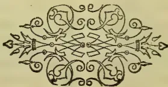

928------------------------------------------------

# LITERARY REGISTER SUPPLEMENT.

[Under this heading, in future, we mean to give a four page "Supplement" with our *Tropical Agriculturist*, from time to time as there is matter of sufficient value, so to be preserved.]

---

OCTOBER, 1898.

---

## Prof. W. Geiger on the Etymology of Ceylon.

PROF. Wilhelm Geiger, of Erlangen, has issued another of his essays on the dialects of Ceylon, namely "*Etymologie des Singhalesischen*." In this Prof. Geiger shows the connection of some 1,700 Sinhalese vocables with Sanskrit, Pali, Prakrit, and other Indian dialects. Scholars will doubtless dispute some of the etymologies here given; but the largest number are indisputably correct, and prove beyond doubt that Sinhalese must be regarded as an Aryan dialect. Dr. Geiger's further essays on Sinhalese, &c., will be looked for eagerly by scholars in Ceylon especially. D. F.

---

## Javanese Exiles to Ceylon in the 18th Century.

SIR,—In the lives of the Governors-General of the Dutch Indies, we find a reference to one Pangoran Depati Anom, Prince of Java, who was captured by the Dutch in 1708. The reference is as follows:

"After the Prince had remained about a month at Batavia, the Government resolved to send him to Ceylon. Punto Gale (Galle) was selected as his residence and he had a body guard of one Ensign, one Sergeant and 24 soldiers together with a monthly allowance of 250 rixdollars, besides rice and other necessaries for the support of himself, three sons, 19 wives and 52 people forming his suite. At this place this unlucky Prince ended his days"

About the year 1748 according to the same work, a Prince of Bantam by name Pangerang Gusty was banished to Ceylon.

Is there no record or tradition among the Mohamedans of Ceylon about these Princes.— Yours truly, GALLICUS

[And what about their descendants?—ED.]

---

## Palk's Bay and Straits.

DEAR SIR,—In a review of Vol. 25 of the *Archæological Survey of India* which recently appeared in your columns, reference is made to

a statement contained in it that Palk's Strait "commemorates the name of a Dutch Governor," and it is suggested that Governor Valek may perhaps be meant.

This volume has for its compiler Mr. Alexander Rea, Superintendent of the *Archæological Survey, Madras*.

A prophet, verily, has no honour in his own country; but it is rather curious to find an official of the Madras Government whose special business is antiquarian and historical investigations, apparently unaware that there was a Governor of Madras named Robert Palk, whose administration lasted from 1763 to 1767, and that the Strait and Bay are called after him (see "*Names and their Histories*" by Isaac Taylor).

X.

---

No. II.

Bangalore, June 9.

SIR,—In an issue of your journal, published after the middle of last month, there appears a letter by "X" commenting on a statement in Mr. Rea's "*Monumental Remains of the Dutch E.I. Company in Madras*," that Palk's Bay or Strait commemorates the name of a Dutch Governor. On referring to Mr. Rea's authority for the quotation (*Madras Manual of the administration*, Vol. 1, p. 2, 1885), I clearly read, that "the name of the Palk's Strait commemorates a Dutch Governor." Now, as this work—by Dr. Maclean, a late member of the Madras Civil Service—was described by another former and learned Governor,—not necessarily Dutch—Sir M. E. Grant Duff, as a monumental one, highly creditable to its author, besides being an official publication; and, as moreover, the quoted statement has not hitherto—so far as I know—been contradicted, even by "X," during the seventeen years that have elapsed since it has been published, there seems some reasons for its repetition. Who is this authority, that he and his statements should be eclipsed by that quoted by "X" and why has "X" delayed to take action all these years? It may be, that as stated in p. 648, vol. III, of the same Manual, published in 1893—Palk's Bay was "named by the Dutch after Governor Palk," but the error, a clerical one, no doubt, apparently rests with the quoted authority. Let, not, however, those feeble attempts to detract from the fame of the immortal

929------------------------------------------------

( 6 )

and hitherto unnoticed Palk, disturb his peaceful slumbers or those of his champions. Peace be to his ashes, and otherwise R. I. P.

[“R. I. P.” we think is rather unreasonable in criticising, in place of thanking “X” for coming forward when he did to give the public correct information.—ED.]

### No. III.

SIR,—Regarding the correspondence in your columns as to the origin of the above name, permit me to say, in reply to “X,” that there are many instances of the transformation of names much less similar than “Palk” and “Valck.” In the vernacular, the former would be the pronunciation of the latter name, just as “office” becomes “opice.” Even in connection with Madras, to which your correspondent has referred, as a place where local great names may have a chance of survival, a curious example may be quoted. A bridge was once called after a local high official of the name of Hamilton. The native pronunciation of this good old Scotch name is “Amattan.” Now there is a Tamil word “Ambattan,” meaning a Barber. In time the bridge became, and is at present known as the Ambattan or Barber’s bridge. Therefore, the Barber’s bridge commemorates a former official of the name of Hamilton. The connection is scarcely obvious without an explanation: and yet this startlingly barbarous transformation has been effected within a century! I may also perhaps be permitted to say, that it is possible for one to have heard and known of the previous existence of Governor Palk, of his having been a President of the Council of Fort St. George, and of his name being and having been for a time used as a designation for a certain Strait, and yet at the same time suggest a doubt as to the correctness of the latter. Had the Dutch remained masters of the country, we should doubtless have heard much more of Valck than of Palk. At the time when these worthies reigned, the Dutch were the ruling European power on both sides of the Strait. The western bounding Indian districts, and Ceylon itself, only came finally into the power of the British, long after the departure of the English Governor Palk. It seems curious therefore, that at a time of bitter competition between the two Powers, when the British had but a precarious footing in the locality, the Dutch should have thus favoured one of their English rivals; or, that the latter should have been able to appropriate to themselves by name, a piece of sea dominated by the opposing power. It appears more probable, that the English, afterwards taking advantage of the similarity in name—or perhaps unaware of the previous existence of Valck—appropriated the honour in favour of their countryman. It may be of interest to state that the Tamil name of the strait is Pakkukuda kadal. R. I. P.

### No. IV.

SIR,—To what a strait has Governor Palk been reduced when a member of the Service to which he once belonged passes him over without remark, and makes a present of what was apparently his only chance of immortality (on this earth at least, to his Dutch neighbour and contemporary!

It is clear from the letter of “R. I. P.” in your issue of the 17th inst. that it is Dr. Maclean and not Mr. Rea, who is responsible for the error. This however, merely adds force to my illustration of the saying about the prophet and his own country; for now it appears that not one, but two, Madras officials were ignorant of the fact that there was a Governor of Madras last century, named Palk. This circumstance also shows how soon even a Governor may be forgotten,

and that he may not escape oblivion even though he has given his name to a strait and a bay. Had it been a street or a square in Madras, his chances of remembrance would perhaps have been better, though in Colombo one or two former rulers of the Colony have recently been deprived even of that chance.

I still venture to call Dr. Maclean’s derivation of the name an error. I am not aware whether he gives any reasons for it; but some strong reasons would seem to be necessary to get over the awkward fact, first that the Dutch Governor’s name was not Palk, but Falck or Valck and that it is hardly likely that within a century the name of the Strait would have altered from the one to the other, and secondly, that there was a Governor of Madras last century whose name does not require any alteration to make it suit the derivation. Why go in search of a Dutch Governor whose name requires such alteration when there was an English Governor on the spot, so to speak, whose name requires none.

These seem to me strong enough reasons for preferring the latter, and sufficient even without any authority until stronger reasons are shown to the contrary. “R. I. P.” however wants to know who my authority is, and why Dr. Maclean’s statement should be “eclipsed” by his. Dr. Isaac Taylor, whom I quoted as my authority but whom apparently “R. I. P.” has never heard of, is the author of “Words and Places” and is, I believe, looked upon as something of an authority on this subject. He is possibly as well known in the literary and philological world as Dr. Maclean “late member of the Madras Civil Service.”

“R. I. P.”’s other argument is irresistible. He asks triumphantly “why has “X” delayed to take action all these (seventeen) years?” It has not occurred to him that although Dr. Maclean’s Manual has been praised by such a learned Governor as Sir M. E. Grant-Duff, even that has not been sufficient to make it a text-book among the English residents of Ceylon. Their study is but little upon “District Manuals of Administration.” Our libraries do not keep this one, apparently because there is no more demand for it than there is for our local productions of the same sort. It was only upon the appearance of Mr. Rea’s monumental work, which gave some promise of permanency, (*aeae perennius*) to the 17-year old error, that it was possible for “X” to “take action,” for the simple reason that he had never heard of the error before.

It is curious that the two rival candidates for the honour were for a year or two contemporaries in office, Governor Palk of Madras ruling from 1763 to 1767 and Governor Falck of Ceylon from 1765 to 1785. X.

### No. V.

WE are pleased to have the following decisive note from Sir. M. E. Grant-Duff. Writing from Lexden Park, Colchester, on the 2nd September, he says:—

“I find from the best possible authority that there is no doubt whatever that Governor Palk gave his name to Palk’s Straits. There seems reason to believe that the name was suggested by Rennell who seems to have surveyed the Straits and their neighbourhood as a very young man when he first came to India after leaving the Navy in which he began life.”

930------------------------------------------------

( 7 )

## "Monumental Remains of the Dutch East India Company in the Presidency of Madras:"

BY ALEXANDER REA,

Archæological Survey of India: (New Imperial Series, vol. 25.)

THE following is a very interesting work to us in Ceylon. In chapters i. and ii. the writer gives a history of the origin and decline of the trade of the Company in the East. It is stated that in 1672, Philip Baldoes, a Dutch Missionary from Ceylon visited Masulipatnam. The reference is clearly to Philip Baldaeus. The year referred to is the date of the publication, at Amsterdam, of his work on Ceylon and the Malabar coast, and the correct date would therefore have been earlier. The references from this work are loosely translated, the writer evidently not having the original work in Dutch before him, but a translation. Chapter iii. treats of the 18th century. The origin of the numerous Portuguese names found among the Sinhalese is incidentally discussed and it is stated that Palk's Strait "commemorates the name of a Dutch Governor." The reference is perhaps to Governor Valek.

Chapter iv. treats of the most interesting part of the work, the monumental remains, especially the tombstones, of which many sketches, with coats of arms, appear. The translations of some are faulty. Plate ii. contains the epitaph of Johannes Kruyf *Predikant* who died 23rd April, 1664, at Negapatnam. This is not translated. Baldaeus, whose friend he was, refers to him in his work at pages 118 and 155 giving a letter, dated 13th October, 1662, written by Kruyf about the massacre of the Rev. Hambroeck at Formosa. At p. 155 Baldaeus states that Kruyf died in the island of *Tajovan* but the fact remains that his tomb is in Negapatnam.

Elizabeth de Pape is said, on her tomb, to have been the first Dutch lady buried in Negapatnam, evidently the daughter of Rev. Nathaniel de Pape referred to by Baldaeus at page 155. Some of the tombstones are interesting to the Dutch descendants in Ceylon. Abraham Dornieux, whose descendants made alliances with many of the leading families during the Dutch period was married according to plate VI to Margareta Maartensz, the eldest daughter of Jan Maartensz van Suchtelen and his wife Gertruida Pietersz. The van Suchtelen family seems, at this period, to have adopted the surname Maartensz. Capt. Pieter Huybertsz of Rotterdam (plate XXI) lies buried at Pulicat. Plate XXV refers to one Sara Lindeborn, daughter of Hercules Lindeborn "Captain of the Burghers in Colombo," The epitaph in plate XXIX is that of Abraham Mendis "free merchant" born in the city Oetcotta. Plate XXXVII refers to Petronella Jacoba Leembruggen of Colombo the wife of Nicolaas Tadama, chief of Pulicat. She was the daughter of Henricus Leembruggen, the chief of the cinnamon department in Ceylon. At Sadras there lie buried (plate XLIII) Barent Clebout "Chief Captain and Major of the Ceylon military forces" and Reynier Jacobsz de Vos, his wife, Catherina Maria Davidsz, and children. Reynier Jacobsz, was the son of Reynier de Vos Dissave of Matara, who afterwards in 1694 was Admiral of the Return Fleet under whose flag the Rev. Francois Valentyn (the great historian of the Dutch East Indies)

performed his first voyage "home." There is also the epitaph of Esther Classina (plate LIV) wife of Mr. Jacob Pieter de Neys chief of Sadras, At Tuticoreen there lie buried Francina Lydia Giffening, the wife of F. C. van Spall (plate LIX.) and Pieter Hollebeck, who was born in Pulicat (Plate LV). The above are a few of the tombstones which I have selected as being of the greatest interest to those in Ceylon. Plate XII contains the following:—

"In the year 1777 and on the orders of the honourable and ruling governor Reynier van Vlissingen this pagoda was rebuilt."

It is a pity that all the epitaphs are not translated and that the references, in such a work, should be to translations and not to the original Dutch sources. The coats of arms are not discussed from a genealogical and heraldic point of view, although there is much scope for such a treatment of them. The writer says by way of quotation that at Masulipatnam even "the grave stone of an obscure *schipper* or sea captain, probably not of degree to bear coat armour has an effigy of the deceased, with a three cornered hat and long coat familiar in old illustrations." There is no sketch of this tombstone given. It is probably because the *schipper* was not of degree to bear coat armour that he had to rest satisfied with his effigy, three cornered hat and long coat, unless the writer considers that these constituted his coat of arms.

Part III treats of Indo-Dutch Coinage and plate LXIII contains sketches of 45 coins.

V.

---

## Mr. Horatio John Suckling:

AUTHOR OF "CEYLON: BY AN OFFICER,  
LATE OF THE CEYLON RIFLES."

Croydon, June 29.

WHEN, in 1876, there was published in London, in two volumes, a work entitled "Ceylon: A General Description of the Island, Historical, Physical, Statistical. Containing the most recent information. By an Officer, late of the Ceylon Rifles," there was much speculation regarding the identity of the author, which was concealed under the initials "H.S." at the end of the preface. Many were the guesses; but none, I believe, was right. In 1893, however, I sent a note to the *Monthly Literary Register*, stating that in a list of works on Ceylon appended to "Palms and Pearls," by Alan Walters (London, 1892), there was the following: "Suckling, Capt. H. 'Ceylon Ancient and Modern,' Lond., 1876." I pointed out that this evidently referred to the work by "an officer" &c.; and asked if the identification were correct. No reply to my query appeared; but a little later I sent another note to the M.L.R. regarding a little book by "H.S." entitled "Anti-Darwin," issued in 1886 and again in 1887. Since then I have often desired an opportunity of meeting the writer; and this opportunity I have had today, when I called on Mr. Suckling at his residence. I had expected to find him rather advanced in years; but was surprised to find him still in the prime of life, though it is over forty years since he left Ceylon. [He is not a "Captain," by the way: his brother Horace was Captain in the 90th Perthshire in Ceylon in 1837; and he himself was an ensign in that regiment in Ceylon in 1844, though

931------------------------------------------------

( 18 )

then employed in the R.E. Dept. Afterwards he joined the Ceylon Rifles.] I asked Mr. Suckling why he had not put his name on the title-page of his book; and he replied that he preferred not to, as on account of his having left Ceylon so long before, critics might be prejudiced against it. I remarked to him that he seemed to have been an omnivorous reader; and he replied that he had a gift for languages, and also the faculty of extracting the cream from books by skimming them. I was sorry to learn from him that he had made nothing by his book; partly owing to the fact that soon after its publication Messrs. Chapman and Hall gave up business. Mr. Suckling added that he thought it would have been better if he had confined himself to a commentary on Tennent's works, instead of writing a full description of Ceylon. His book, he admitted, contained many errors; and he showed me a copy of it he has in sheets with a very large number of corrections, which would make it practically a new work. He has not been able to find a publisher for this revised edition; and speaks of leaving it to the British Museum Library. I mentioned his little work "Anti-Darwin"; and he told me that he had printed it himself, having a supply of types. He was kind enough to present me with a copy of the revised edition. Mr. Suckling is evidently a strong anti-Darwinian; and he showed me a number of newspaper cuttings on the subject. He was interested in hearing of the changes that have taken place in Ceylon since his time; and he vigorously denounced "Lipton" and other tea dealers as ruining Ceylon tea by their low prices. Mr. Suckling seemed gratified by my visit, saying that it was a rare thing for him to see anyone from Ceylon. D. F.

### Interesting Discoveries in the Fort Ramparts, Colombo.

A correspondent writes:—"The local papers have lately announced that the coolies who were excavating under the foundation of Mr. Kyle's old offices adjoining the Wharf premises have discovered human bones, old cannon and shells, and a slab of rock upon which is engraved a shield with a semi-defaced device upon it, surmounted by a Maltese cross, with the year 1501 on the side of the rock.

"What has been unearthed is a large boulder (not a slab of rock) on the face of which the shield and cross are engraved. This boulder must have been in its present position when the engraving was made on it, and at its foot must have been buried some distinguished Portuguese nobleman. During the occupation of the island by the Dutch, the ground on which the boulder stands must have been filled up and buildings erected on it, so that after remaining for over two centuries underground, the boulder has again seen the light of day.

"It is not easy to understand how the year 1501 came to be engraved on the rock when it is borne in mind that the Portuguese formed settlements on the West and South of the island only in the year 1505! It may not be generally known that the first Catholic chapel in Colombo

was built by the Portuguese near the spot where the boulder was found, and that the sur-heaten shore was used for the sepulture of the dead. The first Primate of the Church, João de Montaro, was buried there.

"The chapel at Galle Buck having become dilapidated, a new chapel was built on what is now known as the Racquet Court, the ground around it being used for the burial of the dead. This chapel was in course of time dismantled and a large and handsome church built on Wolfendahl hill, which was known as—A igreja de nossa noyna de Guadalupe (The Church of our Lady of Guadalupe), but when the Dutch Church which was standing on the site of the present Gordon Gardens was dismantled, the Catholic church was moved to Kotahena and the present Dutch church built on the site of the Roman Catholic church."

Mr. De Vos of Galle writes:—"On a comparison of sketches of the Portuguese arms and of the discovered stone, I should say that the stone bears the arms of Portugal. 1501 (or 1501) should not however be rashly taken for 1501. It may stand for I.S.O.L.,—*Jesus Salveator Orientalium Indicarum* or some such religious motto, which the Portuguese were so fond of adopting. The matter requires further looking into. If the stone is cleaned and a correct sketch or photograph taken of it, perhaps something can be made of it. I hope it will be removed to the Museum.

### The Portuguese Court-of-Arms.

SIR,—In the Sessional Papers, Ceylon, 1891 (Antiquarian Research, Kégalla), there is found an illustration of a stone slab bearing the Royal Arms of Portugal, found at Menikkadawara. In my last letter to you, I described the escutcheons as placed cross-wise in the shield on the rock in the Colombo Fort. I find that these charges are not cross, but saltire-wise, on the Kégalle stone, and it may well be (as I made no sketch of it) that they are similarly placed in the arms on the Colombo rock.

Mr. Bell in his report cites Comeons' (Lusiad Canto III. 53, 54) description of the arms of Portugal. The words of Comeons are as follows:—

#### LIII.

Aqui pinta no branco escudo usano,  
Que agora esta victoria certifica,  
Cinco escudos azues esclarecidos  
Em signal destes cinco Reis vencidos.

#### LIV.

E nestes cinco escudos pinta os trinta  
Dinheiros, porque Deos fora vendido  
Escrivendo a memoria em varia tinta  
Daquele, de quem foi favorecido:  
Em cada hum dos cinco cinco pinta:  
Porque assi fica o numero cumprido  
Contando duas vezes o do meio  
Dos cinco azues, que em cruz pintando veio.

Now, according to this description of Comeons, the escutcheons (azure) were depicted cross-wise (*que em cruz pintando veio*). It is strange therefore that they should be saltire-wise on the Kégalla slab—a heraldic blunder which perhaps some of your correspondents will be able to explain.—  
Yours truly,  
F. DE VOS.

932------------------------------------------------

# LITERARY REGISTER SUPPLEMENT.

[Under this heading, in future, we mean to give a four page "Supplement" with our *Tropical Agriculturist*, from time to time as there is matter of sufficient value, so to be preserved.]

---

MARCH, 1899.

---

## The Archæological Survey of Ceylon.

(*Report presented to the Ceylon Legislative Council, Jan. 19th 1899.*)

The Committee were instructed by Your Excellency to consider—as they understand the terms—the whole question of the Archæological Survey of Ceylon, in particular "the system which should be adopted and the extent to which it should be pursued."

To these two points—the system and the extent—the Committee have directed their recommendations. They have found it necessary to base their recommendations as to the system to be pursued on an examination of the system hitherto adopted and an estimate of the results thus far attained. As to the extent to which it should be carried, two distinct questions have arisen—that of the scale of the work from year to year and that of its probable duration.

They hope to be excused if, in explaining the grounds of their conclusions, they have necessarily included the statement of many things with which Your Excellency is perfectly familiar.

### SYSTEM HITHERTO ADOPTED.

By the original instructions given by Sir A. Gordon in 1890, the work consists of two parts, survey and excavation. Under the former head Mr. Bell includes as "Circuit work" exploring, examining mapping, and describing the ancient sites and making copies of ancient inscriptions outside main centres of operation (Mr. Bell's letter to Colonial Secretary of March 20 1897, paragraph 6).

The method of working has been to search systematically certain areas—a whole Province for instance—with sufficient thoroughness to ascertain exhaustively what monuments or ruins it contains; then to explore in detail\* any smaller areas which have been found to contain ruins of importance; finally thoroughly to dig up the surface in the actual site of monuments, to remove the soil by which they may be covered, and in some cases—to replace fallen blocks and re-arrange or "reset" the structure.

Restoration has not, in any case, been attempted. To the "Circuit Work," Mr. Bell has devoted, as a rule, about four months of each year, (chiefly the dry months, which in the North Central Province are August, September and October,) while excavation has been carried on under his immediate supervision during about eight months. For the management

\* This was done in Anuradhapura by driving parallel lines through the forest within defined areas, at intervals of from 40 to 60 ft. (First Progress Report.)

of the labour force he has had from time to time European Assistants; but these being poorly paid, never remained long, and since 1895 he has had none. For two years (1891—92) he had the general assistance of Mr. De Zilva Wickramasinghe, who is now in England. But the work has not hitherto been divided; nothing considerable has been undertaken but what Mr. Bell himself could personally superintend. He has employed three skilled draughtsmen and a skilled overseer for surveys and for the mechanical work connected with copying inscriptions, and has himself undertaken the necessary photography. "Progress Reports" have been issued from time to time\* which have been printed as Sessional Papers, with lithographs of buildings and works of art, plans and elevations, carvings, &c. All inscriptions found have been copied, and a good many have been published with translations in the Reports.

### RESULTS.

The Committee think that the system which has been thus described has been proved by its results to be a good system, and further, that the results hitherto obtained are a good return for the labour and money expended. In Anuradhapura there have been brought into such clear light, as now to be easily studied in detail by any visitor, monuments of ancient art and historical records which must otherwise have remained either altogether unseen or quite unintelligible. Those in Sigiriya, though less accessible, are of similar, and in some respects of unique, interest.

The monuments thus brought to light consist chiefly of very ancient buildings, in many instances ranged in streets or grouped in sacred enclosures round the dagabas or domed relic-chambers characteristic of Buddhism—buildings often adorned with elaborate and varied carvings, besides statues and inscribed pillars, slabs, and panels. These monuments are not only such as to astonish the tourist by their extent and mass, or delight him by their picturesqueness, but such as to add very appreciably to our knowledge of the past history of the Island, of the institutions of Buddhism, and of the phases of art. The value of this information is not merely that which would attach to the isolated records of the antiquities of a small island, but is to be estimated in its bearing on the results of similar researches in India with which, alike in history, in religious institutions, and in art, the relations of Ceylon have been close and continuous.

\* Report on the Kegalla District (Province of Sabaragamuwa); First, Second, Third, Fourth, Fifth, Sixth and Seventh Reports on Anuradhapura and the North-Central Province; and Interim Reports (three) on operations at Sigiriya (Central Province) 1895, 1896, 1897.

933------------------------------------------------

( 10 )PROSECUTION OF THE SURVEY RECOMMENDED.

The Committee therefore recommend the vigorous prosecution of the Archaeological Survey of Ceylon on the system of exploration and excavation hitherto pursued, with only such modifications as are necessary to increase its efficiency.

LIMITS OF EFFICIENCY.

Believing as they do that the success hitherto attained has been mainly due to the rare union in Mr. Bell of the necessary qualifications—scholarship, power of organisation, and physical strength—and to his unflagging devotion to the work the Committee do not recommend any development of the undertaking beyond what can be directly supervised by Mr. Bell.

A LABOUR ASSISTANT NEEDED.

Efficiency has been hitherto needlessly limited by Mr. Bell's having to give much of his attention to the business of engaging, directing, and checking the working parties. To relieve him of this, and to enable him to employ a larger force of workmen, the Committee recommend the addition to the staff of a Labour Assistant (European), who would undertake the immediate direction, under Mr. Bell's orders, of the working parties.

MR. WICKRAMASINGHE.

It was last year Mr. Bell's wish to obtain the services of Mr. D. M. de Z. Wickramasinghe as Assistant Commissioner, to assist him upon the spot in all parts of the work, and the Committee recommended that provision should be made for this; but it has not been carried into effect, and it seems now to be the opinion, both of Mr. Bell and of Mr. Wickramasinghe, that it is better to employ Mr. Wickramasinghe only for the literary treatment of inscriptions and to leave him in London, where he has special facilities for the task and may hope for the aid of European scholars.

EPIGRAPHY.

Into the question of what Mr. Bell calls "Epigraphia Zeylanica," the publication in full with facsimiles and translations of a large selection of the inscriptions, the Committee have not been able to enter far. Mr. Bell considers this branch of his work extremely important, and he urges that it ought here, as in India, to be carried out *pari passu* with the work of survey and excavation. About the probable expense opinions differ widely. Upon the whole, the Committee are disposed to advise the undertaking, provided that the expense can be kept within the limits of the vote. In giving this advice they are influenced by the authority of the similar Indian Survey, and, even more, by the fact that the services of three men, believed to be well qualified for the work—Mr. Bell, Gunasekara Mudaliyar, and Mr. Wickramasinghe—are just now available.

The Committee adopt therefore Mr. Bell's later suggestion, and recommend that Mr. Wickramasinghe be appointed to do the epigraphical work in London and that Gunasekara Mudaliyar be instructed to verify or revise Mr. Wickramasinghe's conclusions.

PROVISION FOR EMPLOYMENT OF MORE WORKMEN.

Should Mr. Bell, with his hands thus strengthened, be found to be in a position to enter upon more extended and fuller exploration than is now the case, he should, in the opinion of the Committee, receive a more liberal vote, and they recommend that any actual increase of the vote that may be granted should be strictly devoted to this purpose—the employment of increased labour force.

LIMIT OF EXPENSE.

The Committee do not, however, think that the more liberal vote need for the present exceed R35,000 or 36,000 a year, and should in no circumstances exceed R40,000 a year, exclusive of the salary and allowance of Mr. Bell. In the Estimates of Expenditure the vote for "Archæological Purposes" is shown as a lump sum. This, the Committee think should be divided the items for general archaeological purposes being shown separately from the item to cover

salary and allowance of the Archaeological Commissioner.

PRESERVATION OF MONUMENTS.

Before leaving this part of their subject, the Committee would strongly recommend that, where the work of exploration or excavation on any site is completed, it should not be allowed, through want of care, to lapse into jungle, but that provision should be made for its careful preservation.

AN APPROXIMATE ESTIMATE OF DURATION NOT IMPOSSIBLE.

Addressing themselves now to the question of the length of time which a complete survey of Ceylon on this system may occupy, the Committee observe that it is possible to speak beforehand with some confidence upon the question whether important monuments are likely to be found in any particular district or place in Ceylon—possible for the following reason; the historical works of the country (the "Mahawansa," Rajawaliya," and "Rajaratnakara," with some smaller local histories) specify with much detail—for those periods which they treat at length—the royal cities, sacred edifices, works of irrigation, and even roads, resthouses, and roadside pillars which were erected or restored in those periods. The monuments which have been discovered are, without any important exception found to be in such places and of such sort as the histories might have prepared us to expect; in fact, nothing has been more remarkable about these discoveries than the degree in which they have confirmed the native histories, and since the historians give us reason to believe that the periods which they pass over briefly were periods of decadence or of disturbance, in which no works of magnitude were undertaken, it is possible to say with justifiable confidence that the discovery of important monuments beyond those which they mention is very improbable.

PROBABLE CENTRES OF DISCOVERY.

From the study of the histories it appears—as the Committee are informed—that Anuradhapura and Polonnaruwa were by far the most important seats of civilizations during the periods when the Sinhalese civilisation and the royal power were at their highest; that Sigiriya was the scene of great works, for a short period; that Tissamaharama was for centuries the capital of the kingdom of Ruhuna, in the south-east of the Island; and that at later dates Yapahuwa, Dambadeniya and other places were seats of Government of minor importance. It is with the first three of these that the Archaeological Survey has already been chiefly engaged, and for the reasons just given, the Committee are convinced that it is not to be inferred from the length of time spent upon these three sites that the survey of the rest of Ceylon will involve anything like a proportionate outlay of time and money. They further observe that in the case of several of the places which were once important, cultivation and private property make the method of excavation quite inapplicable; such are the cases of Kurunegala, Gampola, and Kotte; while the method would be only partially applicable in such places as Hanguranketa or Dambadeniya. It is only in Polonnaruwa, Tissamaharama, and Yapahuwa—of the royal sites—that any work at all like that done at Anuradhapura could be carried out. In view of these considerations, the Committee are prepared to accept, as founded upon sound data and pretty sure to be approximately correct, estimates of time which has been put before them.

PROBABLE NUMBER OF YEARS.

Mr. Bell reckons as necessary for the rest of what is to be done in Anuradhapura and Mihintale six years (of about eight months' work each), and to Polonnaruwa he assigns four. No other single place, except Tissamaharama, is thought likely to take any very considerable time. And Mr. Bell's earlier estimate for Tissamaharama may be much reduced in view, of the opinion of Mr. Parker, who has himself already partially explored it. But without at all insisting on the details of the estimate, the Committee conclude on the whole, from what they have learnt from Mr.

934------------------------------------------------

( 11 )

Bell and Mr. Parker and from the progress made hitherto, that the Archæological Survey of Ceylon, is carried on under such conditions as at present, may be completed within a period of from fifteen to twenty years.

NO PROVISION AT PRESENT RECOMMENDED FOR A  
SUCCESSOR TO MR. BELL.

If it is asked how will this survey be carried on if Mr. Bell, before fifteen or twenty years are passed, is unable or unwilling to remain in it, to that question the Committee are not prepared to give an answer. Mr. Bell has recommended (in his letter of July, 1898) the appointment now of an Assistant Archæological Commissioner, who, as well as both helping him now and acting for him in case of absence, should be trained to be hereafter his successor. He suggests that a junior member of the Civil Service should be selected for this post.

For reasons into which they need not fully enter, this has not appeared to the Committee a practicable course. They do not think that an Assistant Commissioner will be needed to help Mr. Bell, if their recommendations as to the Labour Assistant and the Epigraphist are adopted; and they do not think it practical to look, in so limited a list of names as that of the younger Civil Servants, for one who would have both the qualifications and the inclination essential for such an office. They would prefer to hope that Mr. Bell may be able for many years to direct the work; and that if he has to leave it, some one may be found, by seeking if necessary in a wider field, to take his place. Should some interruption of the work inevitably take place at such a time, it is not a work which would be ruined, though it could not but suffer somewhat, by temporary intermission.

The Committee conclude by expressing their conviction that Your Excellency's Government may be congratulated on the results which the survey has thus far attained, and their hope that it will be efficiently carried forward.

F. T. HOBSON, Major-General.      W. T. TAYLOR.  
R. S. COLOMBO.                              FRANK MODDER.  
Colombo, September 25th, 1898.

(A Review from the Journal of the Royal Institute  
of British Architects, Nov. 12.)

ARCHÆOLOGICAL SURVEY OF CEYLON.

REPORTS X, XII, XIII, XIX. BY H. C. P. BELL,  
C.C.S., ARCHÆOLOGICAL COMMISSIONER,  
COLOMBO, 1893-1896.

Report xix. has been already noticed in these pages,\* and also some of Mr. Bell's earlier Reports.† These Reports are amply illustrated with maps, plans, sections, and reproductions from photographs; the reproductions, although of a very rude and primitive kind, yet convey a distinct enough idea of the architectural forms. Mr. Bell still continues his explorations at Anuradhapura. As this place may not be very familiar to most readers, it will perhaps be as well to repeat that it was the ancient capital of Ceylon, and that it enjoyed that dignity for about a thousand years—that is, from about 500 B.C. till about 500 A.D. During that period the "Island of Gems" was in a flourishing state, and the resources being plentiful, large numbers of architectural structures were produced. These included palaces, monasteries, and dagabas, the last mentioned monuments, perhaps with the exception of Boro Boddor in Java, and one at Mengum in Burmah, being the largest of the kind in the East. The remains of the old city,

which covered many miles of ground, now lie under an accumulation of soil and forest growth, the increase of centuries, during which the place has been deserted. All this has to be removed before anything becomes visible to the explorer, and still more has to be dug out in order to realise what has been found. Sometimes, during the monsoon, the ground is a swamp; and when there is no rain, the soil becomes hard as iron, when digging is all but impossible. In the midst of these difficulties Mr. Bell has been "pegging away," and doing good work, but although he has cleared out a good many sites, it cannot be said that he has come upon much that is new. The type of each kind of structure had become so firmly fixed, that any fresh find seems to be only a repetition of the one that had been explored before.

This will explain how it chances there is very little that is new to record. Ancient roads have been traced and these help so far in working out the original plan of Anuradhapura; more copper plaques with inscriptions have also been come upon and these Mr. Bell considers will be not only valuable for the palæography of Ceylon, but in addition they will give a sure period from which the dates backwards and forwards of architectural remains can now be more safely worked out.

In his *Indian and Eastern Architecture*, p. 219, Fergusson gives the plan of a temple at Aiwulli, and at p. 221, the plan of a temple at Pittadkul; these were first discovered and drawn by Dr. Burgess. Fergusson naturally attached considerable importance to them from their resemblance to the Chaitya halls of the Buddhists, from which he thought they were derived. If the plan of Vihare, No. 2, at Pankuliya, in Mr. Bell's Report, xiii, pl. xvi., is looked at, and also Vihara, No. 2, at the Vijayarama monastery in Report x., pl. xii., the resemblance in them to the plans of Dr. Burgess appears to be very close; the Pankuliya example and the Pittadkul temple might be described as almost identical. The walls in both cases are rectangular, and both have the same *pradakshina* or circumambulating path. The Ceylon structure is what the local phraseology calls a *pilima-ge*, or "image-house"; it contained a seated figure of Buddha, and does not appear to have been developed from a Chaitya hall. Still, the type may have been derived from the South of India for Aiwulli is supposed to date from the seventh century A.D., and the buildings at Pankuliya are as late as perhaps the ninth or tenth century. Still, if the Buddhists had "image-houses" in Ceylon, it is highly probable that they had similar houses or temples of that character in India, and that possibility raises a slight shade of doubt about Fergusson's theory of origin for the Aiwulli and Pittadkul temples. I do not consider that he was far wrong, but we had better wait for further discoveries in order to be certain of the exact conditions of the development.

Writers on Indian archæology apply the word "Vihara" exclusively to the places where the Buddhist monks dwelt, to distinguish such structures from Chaitya halls or Stupas; but in Ceylon the same word—although slightly different in spelling—Vihare, is applied to a *pilima-ge* or image-house, which is a temple and not a residence. Wishing to know exactly what this word means, I wrote to Professor Rhys Davids, whose high proficiency as a Sanskrit authority is so well known, and I here give the answer he has kindly favoured me with, as it may be of value to others.

\* Journal, 16th February 1893.  
† Journal, 27th August 1891; 29th September 1892 and 15th February 1894.

■ Report xii. p 16

935------------------------------------------------

( 12 )

"In the old texts—the Pitaka texts—*viḥara* always means a *cell*. It comes from *viḥarati*, 'to dwell, to remain,' and means a cell, or hut, because the Bhikshu, dwelt, remained there. In Ceylon, however, and I believe also in Burmah, the word was extended to the whole of a religious site, so that *dagaba*, image-house, and cells, all together, form a *viḥara*. It is not known when this use of the word began; probably very late, tenth or twelfth century A.D."

From this it will be evident that this Sanskrit word when used in Sinhalese archaeology must be understood in a different sense from what it is in India. Already we have a case of the same kind—what is known in India as a "Stupa" is always called a *dagaba* in Ceylon. *Parivena*, according to Mr. Bell's glossary, is the Ceylon word for a monk's residence; or *Pansala*, from *pan*, a "leaf," and *sala*, a "hall," or "house:" this last word is well enough known in India, for it was used to express the leafy bower to which a Brahman retired when he reached a certain age, so that he might, in his last years prepare himself in this world for absorption into the next.

Mr. Bell has some remarks\* on the succession of animals which occur on the moonstones—moonstones, it may be explained, are large semicircular slabs at the foot of steps leading to *dagabas* or image-houses; the animals are the elephant, lion, horse, and bull; sometimes the *hansa* or goose figures among them. This succession of animals appears also occasionally in Brahmanical architecture. In reviewing Mr. Smither's work on Anuradhapura, I pointed out that they were found in tiers or large mouldings round the base of the temple at Hullabid; also, that they were known in Buddhist architecture, from Fa Hian's description of the great rock-cut monastery in the Dekhan. Mr. Bell is no doubt right in his identification of these animals with those of the sacred Anotatta-vila lake. Lake Manasarovar, which is equally sacred with the Brahmanas, and is probably the same as Anotatta-vila, has the four animals, and they are the sources, or mouths, from which flow four rivers—the Indus, Satlej, Brahmaputra, and the Ghogra. It may also be accepted, as Mr. Bell suggests, that these four animals represented the four quarters, or the cardinal points. The Brahmanic mythology has four gods of the quarters; in Egypt, the Four Genii of Amenta originated from the four quarters; and the four cheru-

bic forms were, in the Christian church, given the four evangelists; the reason for the four gospels being, according to Irenæus, that there were "four zones" in the world, and "four principal winds," which means the cardinal points. These four creatures, which bear some resemblance in the instances just given, may have had their first origin in the four quarters of the Zodiac, which is perhaps the most probable guess, but we may have to wait for further knowledge from cuneiform, or even the earlier Akkadian inscriptions, before anything like certainty can be assumed on the subject.

Report xiii, in addition to some details about Anuradhpura, contains an account of "circuit work," or a tour in the North-Central Province, which gives us glimpses of the old *bunds* or dams for storing water; their number and great size explains the ample fertility which Ceylon at one time enjoyed when it was a prosperous country. As we may say it was the Nile, from the fertility it produced, that built the pyramids and the vast temples of Egypt, so it was these large artificial lakes that supported a great city like Anuradhapura, and constructed the extensive monasteries and huge *dagabas* whose very magnitude almost defy Mr. Bell and his limited means to explore them. Amongst these reservoirs the Padaviyavewa had amongst its titles that of *Maha Sagara* or "The Great Sea," and its size may be roughly guessed when it is stated that the embankment which retained its waters was about three miles in length. This embankment, and others almost as large, have long ago had breaches in them, and the ground has been left in the condition of an unhealthy swamp, the abode of fevers and wild beasts.

WILLIAM SIMPSON.

\*CEYLON ARCHAEOLOGICAL SURVEY.—We (Editor L.R.) have to call attention to the capable, well-informed Review by Mr. Wm. Simpson of Mr. H. C. P. Bell's Reports on his Archaeological work. The review appears in the "Journal of the Royal Institute of British Architects" and makes interesting reading. We are surprised, however, that Mr. Simpson in his enumeration of stupendous remains in Burma and Java as well as in Ceylon, makes no reference to those of Cambodia. Mr. Simpson's speculation over the resemblance between certain temples in India and Viharas in Ceylon is interesting. Perhaps Mr. Bell may have something to say on several questions raised in the review.

\* Journal, 1895, Vol. II. p. 456.

936------------------------------------------------

# LITERARY REGISTER SUPPLEMENT:

AND CEYLON

## “NOTES AND QUERIES.”

[Under this heading, in future, we mean to give a four or eight page “Supplement” with our *Tropical Agriculturist*, from quarter to quarter, according as there is matter of sufficient value, so to be preserved.]

---

JUNE, 1899.

---

### THE ROYAL ASIATIC SOCIETY.

#### THE CEYLON BRANCH

##### ANNUAL MEETING.

The annual general meeting of the members of the Ceylon Branch of the Royal Asiatic Society was held on the 23rd Feb. at the Library of the Colombo Museum, the Bishop of Colombo, President of the Society, occupying the chair. The others present were:—Messrs. Ph. Freudenberg, F. H. Price, Captain Rutherford, Messss. E. Booth, G. H. Suhren, J. and R. H. Ferguson, Dr. Saravanamuttu, Messrs. C. Driberg, S. C. Rudra, G. C. Warr, F. Tissaverasinghe, Ph. Morgappah, A. E. Buultjens, R. G. Anthonisz, J. A. Henderson, F. Crosbie Roles (Hony. Treasurer), and J. Harward and Gerard A. Joseph, Hony. Secretaries.

The minutes of the previous meeting were read by Mr. HARWARD, and confirmed. Mr. Harward next read

##### THE ANNUAL REPORT.

(See summary and extracts below.)

On the motion of Mr. FREUDENBERG seconded by Mr. HENDERSON, the report was adopted.

##### OFFICE-BEARERS.

The following were elected office-bearers for the current year, on the motion of Mr. PRICE (who referred to the good services already rendered by most of the gentlemen in the list) seconded by Mr. C. DRIEBERG.

PRESIDENT.—The Bishop of Colombo.

VICE-PRESIDENTS.—The Hon. Mr. Justice Lawrie and Mr. Staniforth Green.

COUNCIL.—Mr. W. P. Ranasinghe, Dr. W. G. VanDort, Mr. E. S. W. Senathi Rajah, Mr. C. M. Fernando, Mr. A. Haly, Mr. P. Freudenberg, Mr. J. Ferguson, Mr. P. Coomaraswamy, Mr. F. H. Modder, Mr. F. M. Mackwood, Mr. J. P. Lewis, and Mr. H. White.

HONY. TREASURER.—Mr. F. Crosbie Roles.

HONY. SECRETARIES.—Mr. H. C. P. Bell, Mr. J. Harward, and Mr. Gerard A. Joseph.

The CHAIRMAN returned thanks and referred to the good work done by the Treasurer in

the disagreeable task of getting in arrears due by certain members, and also to the great interest taken by the Secretaries, not the least by him who is at a distance. He felt that one improvement would be the election of another President (cries of No, no.) by which means a presidential address might be secured. In such Societies elsewhere, an annual address of the kind was the rule, but then there was a change in the chair every year. However, as they had re-elected him, he would do what he could for the Society with the aid of the Council and office-bearers. (Applause).

##### PORTUGAL'S MARK OF POSSESSION AT COLOMBO.

Mr. G. A. JOSEPH, Secretary, then read the Correspondence which had taken place in the local press and otherwise over the discovery of a Portuguese coat-of-arms with date 1501 inscribed on a rock at the site of the old Breakwater Office in the Fort of Colombo. One of the most apposite extracts is as follows:—

Extract G. 1505 A.D.—And therefore Don Lourence asked some people of the country (*Colombo*) to come, and with their consent he set up a Padrao of stone on a boulder, and on it he ordered to inscribe a device to show that he had come there and discovered that I-land. Since Hercules cannot boast to himself with regard to the Padraoes of his discovery; Gonzalo Gonzalves, who was the engineer of the work, had in this matter so great glory, since he placed his own name at the foot of it. And so Gonzalo Gonzalves became more truly the architect of that column than Hercules of the many which the Greeks attribute to him in their writing. (Dec. I., lib. X., chap. V., p. 425.)

In the discussion which followed, the Bishop, Messrs. Harward, Buultjens, and Price, &c., took part.—Mr. Harward inclines to the view of Mr. de Vos of Galle that the cross and lettering (not figures or date) were added to the boulder long after the coat-of-arms. Mr. Buultjens strongly supported the view that the date (1501) belonged to the coat-of-arms. Mr. Price had inspected the stone and considered that different workmanship probably at different

937------------------------------------------------

( 14 )

times was represented in the coat-of-arms, as against the cross and date. The Bishop suggested that it was possible a clever workman might have worked at the coat-of-arms and an inferior one at the date, and that further investigation should be directed to comparing other Portuguese figures of that particular era with those on this boulder and noting whether they were shaped in the same way.

A vote of thanks to THE BISHOP for presiding was moved by Mr. FERGUSON, who passed a high eulogium on the invaluable services Dr. Copleston had rendered to the local Society as President, and that as it was impossible to make bricks without straw, it rested with the members to hand in more, and interesting, papers, in order to find materials for an annual review or address. (Carried with acclamation).

The BISHOP, in acknowledging, mentioned that the Secretaries had had a number of Papers lately sent to them, so that there was material in hand for one or two interesting meetings.

#### ANNUAL REPORT.

The Report mentions some five Papers read during the year; gives the names of 11 new members; of six members resigned; and of five whose names have been removed from the roll; Mr. H. C. P. Bell has been elected an honorary member; three have become life members. The roll now includes 190 members, including 20 life and 10 honorary members. The Council record with regret the deaths of Messrs. Bremner, Lewis Brown, Dr. Pinto, J. Perera and J. Lemphers. The Library had 309 volumes added during the year. The Archaeological Commissioner is to continue his annual brief summary of the work done for the Journal of the Society. The accounts shew a balance of R1,418.14 in hand. We quote as follows;—

The Council desire to once more draw the attention of the Government regarding inadequate accommodation. Additional room is urgently required and the necessity for the enlargement of the building (more especially as regards the Library) has been strongly represented to Government by the Museum Committee. The insufficiency for book room has existed for some years now and attention has been called to this fact and the Government has admitted the need. The difficulty of finding room for the current accessions to the Library become daily greater. A confident expectation is entertained that the long deferred Museum Extension will be shortly undertaken which will alone meet the emergency and relieve the congestion apparent everywhere in the Library.

The Council regret that this number will not contain the continuation of the Archaeological Commissioner's Interim Reports on Sigiriya, which have formed so interesting a feature in the recent numbers of the Journal. This has been deferred by the Commissioner so as to include in it an account of his final operations, which are being carried on during the present year.

The study of the Archaeology of Ceylon is one of the most important of the objects of this Society and it was mainly due to the activity of this Society that the Government of Ceylon decided to prosecute Archaeological research systematically by appointing an Archaeological Commissioner. A brief annual summary of the work kindly furnished by the Commissioner has for some years formed an important feature in the Society's Annual Report. The Commissioner has now been called upon to furnish the Government with an annual Administration Report. We are glad, however, to state that this will not prevent him from furnishing the Society with the usual

annual summary, the publication of which in our Journal gives some information with regard to the progress of the Commissioner's work to many readers who would be unlikely to see the Administration Report.

#### ARCHÆOLOGY.

The following is the summary furnished by the Archaeological Commissioner of the work done during the year 1898:—

The Archaeological Commissioner favours the Council with the following synopsis of work done by the Archaeological Survey during 1898.

**ANURADHAPURA.**—Comparatively little progress was made at Anuradhapura last year, owing to the absence of the Archaeological Commissioner, and his labour-force, at Sigiriya for seven months. Excavations were continued between Ruanveli and Thuparama, and at the "Elala Sohona" mound. On the Y road, a solitary ruin of brick and mortar was dug. It proves to be an ancient Tamil *kevil*.

**SIGIRIYA.**—The usual season of four months was prolonged to August, in order to virtually close the operations of the Archaeological Survey at Sigiriya.

The *maluwa*, or uppermost terrace, at the foot of the present ladders on the north of the rock, was thoroughly laid bare—disclosing the *claws* of the once colossal brick and stucco *lion*, through whose jaws and body the covered stair-case (*massephelachum*) was carried upwards to the summit. The *Mahawanso* explanation of the name *Sihagiri* or "Lion-rock," is thus fully justified.\* To the west of the rock, the terraces lying between the Northern and Southern staircases leading to the gallery, were very completely excavated as well as the caves beneath the boulders scattered round the "Audience Hall rock."

The floor, and inner wall, of the unique gallery itself have been strongly repaired, to secure them, as far as practicable, against further wear; and the South stairs—the only possible approach now-a-days—partially rebuilt for greater security.

The Government has decided to conserve the whole area formerly covered by the ancient *Sigiri-Musara*; and the jungle will be kept down annually.

#### CIRCUIT.

No regular circuit work was attempted in 1898.

**CLEARING OF JUNGLE AT ANURADHAPURA.**—The Government, recognising the importance of further opening out the jungle-round ruins of Anuradhapura, sanctioned in 1898, an extra vote of R2,000 for the purpose. With this sum, and a moiety of the annual grant, the Archaeological Commissioner was enabled to clear, and burn, 500 acres and upwards of jungle outside the town. A similar vote has been allowed for the current year.

**RE-ORGANISATION OF THE ARCHEOLOGICAL SURVEY.**—Upon the recommendations of a Commission appointed by His Excellency the Governor which have been approved, the Archaeological Survey will be materially strengthened from 1899.

A Labour Assistant has, at length, been given to the Commissioner, relieving him of most of the outdoor and mechanical work which has hitherto unduly taxed his time for research, and delayed the publication of Progress Reports.

In addition, Messrs. D. M. De Z. Wickramasinghe and B. Gunasekara, Mudaliyar have been appointed to assist Mr. Bell in the Epigraphical branch of the Survey. A commencement is to be made at once with the long-contemplated "Epigraphia Zeylanica," or standard work of reference on the ancient lithic record of the Island.

### THE COLOMBO MUSEUM.

#### REPORT OF THE DIRECTOR FOR 1898.

**NUMBER OF VISITORS.**—The number of visitors for the year amounted to 111,190.

**CONDITION OF THE BUILDING.**—In my last report I stated that the building required re-plaiting; it naturally requires it now still more, and the woodwork is getting into a very bad state.

\* Mahawanso, XXXIX, 3..

938------------------------------------------------

( 15 )

**FURNITURE.**—The Committee ordered two semi-but-tress cases for the east gallery and one insect case. They have also had the copies of the Polonnaruwa frescoes framed. His excellency the Governor also ordered two notice boards to be affixed to the outside gates. All the cases have been re-fitted with new screws and sockets.

**PUBLICATIONS.**—The printing of the List of Moths is not yet finished, but I hope it will be completed early next year. The new List of Birds has been passed by the Committee.

**ON THE USE OF FORMAL IN PRESERVING ZOOLOGICAL SPECIMENS.**—In my report for 1896, whilst dwelling upon the great utility of formal, I did not mention its great fault; which however, it shares with alcohol and all other preservative media I have ever tried, viz., its bleaching property. This is specially exhibited in the Crustacea, which really cannot be preserved in it for exhibition purposes, as their colours entirely disappear. I tried to check this action by using it in conjunction with various salts, and to a certain extent they neutralize it, but not sufficiently. Pure glycerine can alone be trusted to keep colour, because it excludes air and water. These are the destroyers of animal colour, not light. If these can be excluded, light seems to have scarcely any action. A star-fish *Oreastes turitus*, Lamk was placed in a three-per-cent solution of formal saturated with common salt. Its magnificent colour was perfectly preserved for about eighteen months; when it faded suddenly in a few days, and there is now scarcely a trace of it. Another specimen of the same species that has been many years in glycerine has the colour slightly deepened but is not otherwise changed. Epsom salt (sulphate of magnesia) acts in very different ways; it is better for Crustacea than common salt, but the colour is not permanently preserved. It has however a most remarkable property; the fugitive blues, greens, and violets of such Wrasses as *Gomphosus* are perfectly preserved by it for at least a year. A specimen of *Gomphosus corallus* is exhibited which shows no signs of change; it is in three per cent formal in which Epsom salt has been dissolved till it assumes the specific gravity of milk. It does not preserve the colours of other fish; in fact quite the contrary, it is very destructive to them. It seems a good preservative for reptiles. Common salt with formal has entirely supplanted the use of gum and glycerine or carbolicized oil for fish to be mounted in glycerine. The solution is saturated with salt and the fish placed in it for not more than eighteen hours, as after that discolouration proceeds with great rapidity; they are then mounted in glycerine. This is an extremely cheap and cleanly process. Travelers might, however, prefer the following:—To whatever measure is used to make the three per cent. formal, mix the same measure of saturated solution of bichromate of potash with it. A few ounces of bichromate do the work of several pounds of salt; at the same time it has the disadvantage of oxidizing the glycerine, and unless great care is taken in washing out the superfluous salt a great waste of glycerine will be incurred. Formal is the only thing that prevents the growth of fungus in solutions of glycerine. I am experimenting on half glycerine and water as a mounting solution. Of all mediums that is the most beautiful. It is not so refractive as pure glycerine, whilst it is much brighter than water and far more so than spirit; and of course there is no evaporation to speak of. It is also easier to protect the specimens from the dehydrating power of glycerine, which renders good mounts in this substance so difficult to prepare; but I fear it will not prove trustworthy with regard to colour, as there is so much water in it. Only a very little formal is required, about one hundred drops to half a gallon. The specimens must be prepared by some process, such as salt or bichromate of potash before being placed in it, otherwise they become distorted.

**BIRDS.**—The arrival of the fourth volume of the "Fauna of British India" has enabled me to complete the re-naming and re-arrangement of the bird collection. Our cases will not allow of the large

waders being arranged in exact accordance with this work, and I have been most unwillingly obliged to place the flamingoes after the Pygopodes instead of before the Anseres. They are however large and conspicuous birds, and I trust that students will suffer little inconvenience from their displacement. Two large boxes have been placed in the taxidermist's room for the reception of the large duplicates, such as pelicans and flamingoes. The whole of the duplicates have been carefully re-labelled and re-numbered according to the new catalogue. A great number of the old exhibited specimens have been replaced by new, and I have also commenced renewing the duplicates, and shall continue to do so as quickly as the finances allow.

Whilst reviewing the duplicate collection, I took the opportunity of making a careful study of our skuas, which had never been properly determined.

**REPTILES.**—Mr. Swayne has presented a number of much-needed duplicates.

Mr. Todd kindly lent me the skin of the cobra that he shot at Jaffna, 7 feet 9 inches long. I was in hopes that it might prove to be the skin of an *Ophiophagus*, but it is an undoubted *Naja tripudians*, although by far the largest ever recorded. A good set of *Calotes hiocephalus* was obtained at Gammaduwa; the collection only contained one bad specimen previously. A good specimen has also been obtained of the very rare *Acontias layardi*.

**FROGS.**—A duplicate of the specimen entered as D was obtained at Kandy. I hope to be able to send it to the British Museum next year with one or two other undetermined specimens. Mr. Swayne presented a fine example of the very rare *Rana gracilis*, also what I consider a variety of *Rana corrugata* but which may prove to be a new species.

**FISH.**—Two very interesting specimens have been obtained this year, one a *Balistes*; quite unlike anything I can find described in the Museum Library and also a fish belonging or allied to the genus *Acanthochimus*. This is an Australian group, one species of which has been discovered off Madras. This is certainly not the Madras species.

**MOLLUSCA.**—Mr. Collett still continues his presentations of named land shells. No new sea shells have been added to the collection. A duplicate of our fine sepia exhibited in the north-east gallery was forwarded to the Horniman Museum. Mr. Slade kindly took it to the British Museum to be identified, but it appears to be quite unknown. The *Opisthobranchiate*, so abundant on the Beruwala reef but which has never been found anywhere else on our coast, is *Thethys pulmonica* Gould. No specimens appear to exist in the national collection.

The Longicornes and flower beetles had to be removed to allow of re-papering the case. I took this opportunity of going through the whole collection with what books we have whilst they were lying in my office. The Longicornes were reported on in 1896, and I grieve to say that I have nothing to add since. I can do nothing with the Chrysomelidæ. Those that are named were named from Jacoby's figures; but this is only a short paper relating to Mr. Lewis's collection. Boheman's "Cassididæ" is a hopeless work, and the literature of these beetles and their allies comprises two other large monographs, both unillustrated and consequently equally useless. Of course I am not speaking of the classifications proposed in such works, or of the determination of the principal groups and of the genera. Such things must be left to specialists; and our library must be supplied with Boheman, Suffrians, and others, in order to enable the Director to verify already named specimens and for reference in case any student wish to take up the study of these families. I mention this subject here apropos of "Das Thierreich," which is merely a re-publication (revised undoubtedly) of these thousands of useless descriptions. If the German naturalists had started a republication of the best figures of every species hitherto figured, and figured all the described species that have never been figured, we should have had a really useful work

939------------------------------------------------

( 16 )

which would have preserved to posterity the likeness of numberless species that are rapidly becoming extinct.

**MOTHS.**—I have to thank Messrs. F M Mackwood, E E Green, and J Pole for their kind assistance in naming the moths and for numerous valuable donations. A large number have also been purchased.

**RHYNCHOTA.**—The species of *Ricania* forwarded to Professor Melichar have been returned. They were all correctly named, so that we have obtained no fresh information.

**ORTHOPTERA.**—Three species of locusts new to the collection have been collected.

**OTHER INVERTEBRATES.**—The following names have been received from the Horniman Museum, beside the Sepia and Sea Here mentioned previously:—*Echinoidea*.—The two beautiful sea urchins so abundant in Weligama Bay, but which I cannot find anywhere else, are *Toxopneustes pileolus*, Agass, and *T. maculatus*, Bell.

**HOLOTHURIOIDEA.**—Our extraordinarily abundant sea cucumber found everywhere is doubtfully referred to *Actinopyga miliaris*, Bell.

**FORAMINIFERA.**—The late Mr. H B Brady, F.R.S., presented the museum some years ago with a small collection of Foraminifera mounted by himself. They were all obtained in two fathoms off Kalpitiya. The collection is of importance, as not only were they identified by the greatest authority on the subject, but all the species are figured in the "Challenger Monograph."

**CEYLON PRODUCTS.**—The following are the additions during the last twelve months:—(a long list.)

**WEIGHTS AND MEASURES.**—A most interesting collection of Kuruni Measures has been presented by the Government Agent of the Western Province.

**ARMS.**—The above numbers are not consecutive with last year's report, as a new register is being prepared. A good deal of difficulty has been experienced in this work. The metal work, for instance, is more than half packed away and had to be unearthed from various quarters; consequently some of the objects were very difficult to identify and some had lost their numbers altogether. I fear the collection of kuruni measures which are mostly very perishable, will ultimately be lost or become much damaged and indeterminate, although I have taken the greatest care in numbering and packing them. The Maldivian collection is by no means improving. Objects not exhibited are certain to deteriorate, as the Museum was constructed from a purely local point of view, and there is no proper accommodation for duplicate collections other than Natural History specimens. Another Ceylon Products Room, the same size as the present, could be filled at once.

**ANTIQUITIES.**—I have mentioned above that the Committee decided to have Mr. A. C. Murray's tracings of frescoes at Polonnaruwa painted and exhibited. They were painted by Miss G. Vandort under that gentleman's personal supervision and framed and hung by Mr. A. W. Andree.

They are from the Demala Maha Saya, and represent the following subjects:—

The birth of Padmavati in a lotus flower, from the south wall.

The god Indra sketching the hare on the moon Main hall, south wall. No. 1 bay, middle panel.

Indra listening to Gootila's music. The same No. 2 bay, lower panel. The upper part of Gootila's body is obliterated.

Buddha personating a deaf and dumb mendicant, who dies and is ordered to be buried by the king; on the arrival of the body at the grave, Buddha revives as a prince, and points out to the sexton the folly of digging his grave. North wall, No. 4 bay.

#### EXPENDITURE.

The cost of the Colombo Museum was as follows:—  
Total R24,042 83.  
A. HALY, Director.  
Colombo, February, 1899.

## REPORT OF THE SECRETARY AND LIBRARIAN FOR 1898.

**ACCOMMODATION.**—How to provide for present and future needs in the matter of accommodation, is a question which should engage the immediate attention of the Government. The insufficiency of book room in the Institution has existed and has been pointed out in preceding reports on the Library during the last eight years. The necessity for the enlargement of the building, more especially in connection with the Library, has been strongly represented by the Committee to Government.

It seems superfluous, after what has been written by me on this question of accommodation, to say more on the subject, so I shall merely direct attention and refer to what has been set forth at length in my previous reports. The want of room is every year intensified and interferes with the progress and developments of the Library. It is to be hoped that the question of providing room for the legitimate needs and expansion of the Library will engage the Government's early attention.

#### BOOKS ISSUED FOR READING.

The number of works issued to readers from the shelves was 981, as against 930 in 1897, the books chiefly consulted were works on Zoology, Darwinism, Ceylon, Buddhism, Dictionaries, Encyclopaedias, and other books of reference.

#### ACCESSIONS.

The past year has not been remarkable for any acquisitions of special value. Some books on Zoology and on Ceylon and some books of general reference were added to the collection.

The number of volumes added to the Museum Library was 152.

#### BOOKS ON CEYLON.

A Dutch Manuscript on Elephants in Ceylon, by Cornelis Taay van Wezel, acting "Gezaghebber" of the "Commandment" of Galle also "L and-drost" and "Hoofd" over the lands of Matara, 1713 A.D. Presented by O. Collett, Esq., F.R.M.S.

[This work was considered sufficiently interesting to be translated for the Ceylon Branch of the Royal Asiatic Society, and is published in the Journal of the Society for 1898.]

Original document of the Capitulation of Trincomalee, 26th August, 1795. Presented by Mr. Gerard A. Joseph. Au Loin: Impressions Hindoos (containing an account of Ceylon).

Translations of the Entomological Society of London containing a chapter entitled "On a Visit to Ceylon and the relation of Ceylonese Beetles to the Vegetation there," by George Lewis).

Letchimey: a Tale of O'd Ceylon.

A Narrative of Events which have recently occurred in the Island of Ceylon, written by a gentleman on the spot. London, 1815.

Charters, &c., containing—

(1) The Charter or Letters Patent establishing the Supreme Court of Judicature in the Island of Ceylon and the High Court of Appeal in the said Island. London, 1801.

(2) The Charter or Letters Patent for making certain alterations in the Supreme Court of Judicature in the Island of Ceylon and in the High Court of Appeal in the said Island, and for abolishing the Provincial Courts and re-establishing the Courts of Landraad in the said Island. London, 1810.

(3) The Charter or Letters Patent for making further alterations in the Supreme Court of Judicature in the Island of Ceylon and in the mode of administering Justice in the said Settlements. Colombo, 1812.

Cases heard and determined in Appeal by the Supreme Court of the Island of Ceylon from December, 1846, to August, 1847, by Alex. Murray, Solicitor-at-Law. Colombo, 1848.

940------------------------------------------------

( 17 )

The following interesting articles bearing on Ceylon have been extracted from the Journals of the Royal Asiatic Society of Great Britain and have been bound and placed on the shelves:—

Description of the various classes of Vessels constructed and employed by the Natives of the Coasts of Coromandel, Malabar, and the Island of Ceylon, for their Coasting Navigation. By John Edye, Esq., late Master Shipwright of His Majesty's Naval Yard at Trincomalee, now in the Department of the Surveyor of the Navy. Communicated by the late Major-General Sir John Malcolm, G.C.B., K.L.S., M.R.A.S. (Journal, R.A.S., Vol. I, No. 1. London, 1834).

Notice of the Tabernacle or Car employed by the Hindus on the Island of Ceylon to carry the image of the god in their religious processions, with some remarks on the Analogies which may be traced in the worship of the Assyrians and other ancient Nations of the East, as compared with that of the Hindus. By the Rev. Joseph Roberts, C.M.R.A.S. (Journal, R.A.S., Vol. I, No. 1. London, 1833).

References to Ceylon (Transactions, R.A.S., Vol. III. London, 1835).

A Letter from Lieutenant-Colonel William Macbean George Colebrooke, of the Royal Artillery, F.R.S., M.R.A.S., transmitting three facsimiles of inscriptions discovered on the Island of Ceylon (Transactions, R.A.S., Vol. III. London, 1835).

Some Remarks upon the Ancient City of Anurajapura or Anuradhapura and the Hill Temple of Mihintale, in the Island of Ceylon, by Captain I.J. Chapman, of the Royal Artillery (Transactions, R.A.S., Vol. III. London, 1835).

Account of Pearl Fisheries of the North-West Coast of the Island of Ceylon. By Captain James Stuart, Master Attendant at Colombo. Communicated by Lieutenant-Colonel William M. G. Colebrooke, of the Royal Artillery, F.R.S., M.R.A.S. (Transactions, R.A.S., Vol. III. London, 1835).

A Sketch of the Constitution of the Kandyan Kingdom. By the late Sir John D'Oyly. Communicated by Sir A. Johnston, Vice-President, R.A.S., F.R.S.

Account of a Flag representing the introduction of the Caste of Chalias or Cinnamon-peelers into Ceylon. By Sir Alexander Johnston, Vice-President, R.A.S., F.R.S. (Transactions, R.A.S., Vol. III. London, 1835).

OLD MANUSCRIPTS.—194 manuscripts were consulted in the Library. The "Janavansaya" was transcribed from the copy in the Library. Buddhist priests have made good use of the Library during the year.

Owing to the large number of additions made to the Oriental Library of Manuscripts (since the issue of the last catalogue in March, 1892), I had a fresh catalogue compiled by Mr. H. M. Gunasekera, the Assistant to the Librarian. This catalogue gives all additions received up to date, and also gives descriptions of the contents of the manuscripts. The previous catalogue was very imperfect, and was more in the nature of a mere list of works. The new catalogue has been sent to the printer, and will I hope be issued soon. In connection with the compiling of this catalogue, the collection of manuscripts was thoroughly verified and the condition of the manuscripts reported upon by the Assistant to the Librarian.

Kottagoda Saranapalatissa presented the "Kachchayana," also known as "Sandhikappa." The work, though a common one, is useful. It is a grammar of Magadhi (or Pali) language. It is believed to be the oldest Pali grammar extant.

Maha Mudaliyar de Zoysa, in his "Catalogue of Pali, Sinhalese and Sanscrit Manuscripts in the Temple Libraries of Ceylon," says of this work:—

Tradition ascribes its authorship to Maha Kachchadana Thera, an eminent contemporary disciple of Buddha, but this is not now generally believed and the authorship of the work is still a moot point in the grammatical literature of the Pali language. It has several Tikas, Anutikas, glossaries, paraphrases, &c. written by various authors in Ceylon, Burmah, and Siam, which will be noticed in their proper places. Some commentators state that the Sutras, or aphorisms, were composed by Maha Kachchayana,

and the examples by Brahmadatta. But little or nothing is known of these authors. The late Hon. Mr. James Alwis published the "Akhyata Kappa," or chapter on verbs, with an English translation, introduction, and notes. An edition of it was published in Germany by Dr. Kuhn, and a complete edition with a free translation by M. E. Senart.

#### CATALOGUING.

The second supplement to the catalogue was completed and laid before the Committee in manuscript and forwarded to the printer. The supplement contains an entry of all books received into the Colombo Museum Library since December 31, 1895, up to July, 1898. The method of construction is after the style adopted by me in previous catalogues, i.e., in the form of a dictionary catalogue (entries being made under author, subject, and title, with necessary cross references).

#### READERS.

The number of readers last year (i.e. of registered visits to the Library) was 764, as against 730 in 1897 and 570 in 1896. 82 tickets were issued to readers, including 35 renewals of old tickets and 47 new tickets. A party of young ladies has been visiting the Library for the purpose of studying zoology. The class is a private one, and is held under the superintendence of Mrs. Copleston. Several zoological works have been consulted and some studied.

#### CONCLUSION.

In the Museum Library every endeavour has been made to make the contents of the Library as accessible as possible to readers by the compilation of catalogues on approved and scientific principles. With the subject-catalogue of Part II (now being compiled) the entire collection of books and their contents will have been thoroughly indexed and catalogued. It now remains for readers to show interest and sympathy in the work of the Library by making use of it.

Libraries of all public institutions flourished and serve the purposes for which they are created in proportion to the active sympathy and intelligent interest of those who support and use them. In this lies much of the secret of their potency for good.

GERARD A. JOSEPH,

Secretary and Librarian

### MR. RAMANATHAN AS A RELIGIOUS INSTRUCTOR.

[The following is copied verbatim from the Madras Standard. As to the versatility of our Solicitor-General there would seem to be no limit: but what this last phase of his teaching exactly indicates, we are at a loss to understand.—Ed. C.O.]

The "Gospel of Jesus according to St. Matthew as interpreted to R. L. Harrison by the light of the godly experience of 'Sri Parananda'" is the title of a recent book published by Messrs. Kegan Paul, Trench, Trubner & Co., of London. There is nothing attractive in the title of the book and many of our readers who are not Christians may not be tempted to read a book of this nature. But the book is of absorbing interest to us and deserves to be well-known in Southern India and Ceylon. The public do not know who 'R. L. Harrison' is nor who 'Sri Parananda' is. The former name may be that of a man or woman and the latter is not known except that it illustrates the modern rage for names similar to that of Vivekananda. But the 'Gospel of Jesus' is interesting to us as a book which embodies the truths of Christianity as explained

941------------------------------------------------

( 185 )

and interpreted to an Australian Theosophist by a well-known Hindu of Ceylon. 'R. L. Harrison' is a lady who is a native of Australia and who was for some time in Ceylon. She had given up Christianity and taken to Theosophy and was a confirmed Theosophist. 'Sri Parananda' is the assumed name of the Hon. Mr. Ramanathan, Attorney-General of Ceylon who is a Hindu of Hindus. The book before us contains in the shape of notes the teachings of the Hon. Mr. Ramanathan. Our readers will now see that the instructor is the Hon. Mr. Ramanathan of Ceylon and the person instructed is Miss R. L. Harrison of Australia. How long this instruction has been going on we cannot say; but we believe the main portion of the notes contained in the book were written on board the "Ballaraat" by Miss Harrison at the dictation of Mr. Ramanathan when they went to London for the Jubilee. In her preface to the book Miss R. L. Harrison acknowledges that "every word of the notes at the foot of the text fell from the lips of my beloved Teacher" and she adds prayerfully "may his commentary establish in Christ and God all who have thoughtfully read, discussed and doubted, and at last mourned and hungered for Truth!" The Hon. Mr. Ramanathan found in Matthew's record of the teaching and life of Christ a very close coincidence with Hindu Philosophy, especially that of the yoga system. The truth that he taught Miss Harrison may be summarised in his own words as follows:—"The great truth is that Jesus was not an idle dreamer nor a vain theoriser, but a man of the deepest spiritual experience, a true teacher of the kingdom of God, a veritable light into the world, whose doctrine *must* be recognised by all other men of spiritual experience as leading to the sanctification or healing of the spirit and thus to the attainment of God ..... The true exponents of Jesus have little to do with history, but everything with doctrine, and you will find that the teachings of Jesus, so far as they are recorded in the holy books, stand on the firm ground of *actual* experience and are verifiable by those who by native disposition and previous culture are sympathetic enough to persevere in all earnestness and faith in the way ordained by those who have become sanctified in spirit."

#### A JOURNEY IN WESTERN THIBET.

"J. A. D.," in the second of a series of letters on the above subject, contributed to the *Times of India*, refers as follows to a conversation with the Bishop of Colombo, who, of course, one of the leading authorities on Buddhism since the appearance of his very adequate and learned book:—

"During a visit to Ceylon the writer had a most interesting talk on the subject with the Bishop of Colombo, Dr. Copleston, the author of an interesting work on Buddhism. He seemed to think that the tendency of Sinhalese Buddhism is to endeavour to go back to the original tenents and practices of the early teachers of the faith, and to imitate the orthodoxy of the Thibetan Lamas. He mentioned the revival of the practice of contemplation, that striking characteristic of many Thibetan monks, who prefers to spend hours and days in contempla-

tion of divine things, lost to all sense of material things, and even to the physical discomfort of remaining in the same position for a long time. Several modern Buddhist writers have advocated the unity of Buddhism, but it is not likely that the Buddhist of Southern Asia would pay allegiance to the hierarchy of Lhasa, which would seem the only possible solution of the problem. Northern Buddhism has itself been modified by Hindu influences such as Siva worship, but such influences have been local rather than general in their effect."

#### AN ENTHUSIASTIC FRENCH ADMIRER OF CEYLON

M. EMILE BRUYAS, a French gentleman of means, visited Ceylon with his wife at the beginning of 1897; utilised the two months of his stay in the island to the best advantage; and on his return to his native land wrote his impressions of what he had seen, and had them printed, accompanied by reproductions of photographs taken by himself or (in a few cases) by local photographers. His book\* is beautifully printed, and the photographic reproductions are often charming, showing that M. Bruyas has the eye of an artist. An unusual feature is that the sheets are not even stitched, but placed loose in a stiff cover: so that each possessor of a copy can have it bound as he pleases. Of the two hundred and fifty copies printed (all numbered) only fifty are for sale, the rest, we suppose, having been presented by the author to his friends, libraries, &c. He deserves the thanks of the island for his liberality; for he has certainly done his best to induce others to follow his example. To his book he prefixes a map (reduced from the one published at the *Ceylon Observer* Office) showing the route followed by him in the island. In his brief preface, M. Bruyas points out how easily and comparatively cheaply a trip to, and a short stay in, Ceylon can be made; and he strongly advises his compatriots to book through Cook's agency, the advantages of which he experienced more than once when in difficulties in our island. He concludes his preface thus:—

"All the steamers stop at Colombo of necessity, to take in coal, inferior Australian coal, but there is no choice; and if Colombo refused coal, all these magnificent steamers would become floating waifs; without any act of hostility, simply by refusing coal, the English could annul all foreign navigation in the Indian Ocean, and there would be no means of going to look for it elsewhere. Singapore and Aden are also English depôts, and it is not the coal of Djibouti or Kébao that would save the situation. Note that a coal depôt must be strongly protected, provided with lighters, and a multitude of coolies to carry out the supply quickly. Whence it results that it is absurd to have colonies when one is not certain of being able always to be in communication with them, and that it is prudent to think of organising them so that they can, if the necessity arise, be self-sufficient in everything."

\*Emile Bruyas *Deux Mois à Ceylan*, Colombo, Kandy, Nurrelya, Badulla, Ratnapoura, Le Musée de Colombo, L'Île Ramescheram, Annuradhapoura, Chronique et Statistique. Illustré de cent cinquante Reproductions dans le texte. —Lyon, 1898.

942------------------------------------------------

( 19 )

In the first chapter the author records his impressions of Colombo and its suburbs, including Mount Lavinia. Almost everything he saw seems to have struck him favourably, one of the few exceptions being the black European umbrella so commonly carried by the natives, which he denounces as out of harmony with the surroundings. He falls into a curious error in describing the Roman Catholic cathedral as "the most important and most ancient monument in Colombo, constructed by the Portuguese, who forgot to finish it." He also says that the visitor to the Kelani temple goes by the southern high road; apparently the temple at Wellawatta is meant. The goat's-foot ipomoea at Mount Lavinia attracted his attention, and he says he saw it nowhere else. Were Mr. William Ferguson living, Galle Face beach would doubtless still blaze with this blossom. The chapter ends with a description of the gems of Ceylon and the methods adopted by the wily dealers to entice strangers to buy.

In the next chapter, M. Bruyas describes his journey to Kandy by the railway which he strangely terms *narrow*. His opinion of our mountain scenery may be gauged by the following quotation:—"It was one of the most beautiful spectacles that one could have viewed. Although a great mountaineer, a *habitué* of the Alps, acquainted with the Pyrenees and the Tyrol, I declare that the line to Kandy and further on that to Nurrelya filled me with enthusiasm: it is still mountains, but the light is completely different." In Kandy M. Bruyas was fortunate enough to witness a perahera and to view the sacred tooth relic; he had a very poor opinion of the latter and its surroundings. The temple of the tooth, he says, was designed by a Portuguese architect, though he does not quote his authority; and he mistook the United Service Library for a Buddhist library. The Peradeniya Gardens did not equal his expectations; and of the plants that he took thence not one grew at Nice. He was interested in witnessing the manufacture of tea on an estate in Dumbara, where he also saw coffee and cacao growing. Regarding Ceylon tea M. Bruyas says:—

The tea of Ceylon is marvellously good and, moreover, one can feel sure that it is clean. When one has seen tea manufactured in China, one is highly disgusted: the steel tables that roll it are, in China, the dirty hands of unclean people, and there may fall into the material that is being manufactured all sorts of bodies as foreign as they are little appetising. In England the Ceylon tea has taken well, and they would like to make the conquest of America. The black spot is Japan, which is also going to set up factories, and during my voyage to Ceylon the arrival of two Japanese, whom the newspapers designated "Japanese tea spy" [*sic*], had put the country in commotion. I was forgetting the chief thing: in Ceylon, tea can only be cultivated from five hundred metres of altitude to eighteen hundred. The sea air does not suit it at all, and the first condition of this culture is to have very cheap labour; all those beauties who picked the little leaves with their little hands, in spite of their jewels, are paid about fifty centimes, a day, on which they sustain themselves, buy bracelets and economise, and are much happier than the work-women of Paris who earn three francs. I believe the tea would

sell very well in France, but it is quite useless to try.

In Kandy our author was present at a gymkhana (or a *gymnacka*, as he calls it), and was amused by an impromptu dance at the Queen's Hotel. He was pleased to meet a French planter from Mauritius, settled on an estate near Gampola, who engaged him to send out young Frenchmen to learn tea planting.

Leaving Kandy, M. Bruyas went by train and coach to Nuwara Eliya (or, as he prefers to spell it, Nurrelya), where he was struck with the "*Gracilea* or *Gravilea*" (*sic*) trees. A Russian couple arrived at the hotel at the same time as M. and Mme. Bruyas, and left next morning: "and that is called travelling" comments our author, who adds: "As for myself, I spent four days at Nurrelya without regretting them." He also asks why the fever-stricken officials of Indo-China and Tonking should not come to Nuwara Eliya for a change since their government has not found means to create a health resort for them in Indo-China or even in France. He ascended Pedro, saw no view, but found a reminder of France in a sardine tin. He throws unjustifiable doubt on the veracity of M. Cotteau, who states that when he ascended Pedro some years before he found fresh traces of wild elephants. We had a similar experience. At Hakgala gardens M. Bruyas was conducted with mystery to see a tree that bore fruit occasionally—the common hog-plum! From Nuwara Eliya our author drove to Badulla; and he speaks highly of the Ceylon resthouses, and adds, Why there are not similar institutions in France? From Badulla M. and Mme. Bruyas drove via Bandarawela and Haputale to Balangoda and Ratnapura,—a route easier to descend than ascend, though Murray stupidly recommends the latter, says M. Bruyas. The grand scenery duly impressed the travellers; but the last part of their journey was rendered unpleasant by the illness of the driver's runner, who had an attack of what seemed to be cholera. However, ere arriving at Ratnapura he had recovered. The Maha Saman Devale was visited; and with reference to the Portuguese mural tablet M. Bruyas somewhat flippantly observes: "One does not know which to pity more, the beloved native, or the knight who bakes in his armour under the sun of Ratnapura." In the city of gems the travellers witnessed gem digging and polishing and bought some specimens. From Ratnapura to Kalutara the journey was made by boat down the Kaluganga; and so Colombo was once more reached.

In the next chapter M. Bruyas describes some of the contents of the Colombo Museum, situated "in the midst of the Cynamous-Park."

Starting off once more, M. and Mme. Bruyas went by the "Lady Gordon" south-about, calling at the various ports, and having an unpleasant experience at Trincomalee, where, in consequence of our author's taking a kodak snap-shot within the fort he was nearly arrested as a spy, and believes that he was "shadowed" afterwards. At Point Pedro our travellers disembarked

943------------------------------------------------

( 20 )

and drove across the peninsula to Jaffna, where the steamer was caught, and at Paamben, the object of their journey, the temple of Rameswaram, was reached. This was seen under great difficulties; and when our author and his better-half returned on board, they were quite exhausted with fatigue, heat, hunger and thirst. However, they would not have missed the sight for anything. On returning to Colombo M. Bruyas made arrangements at once for a visit to Anuradhapura, and went up to Kandy once more, staying there a couple of days to allow of the Governor's return from the "buried cities." At the Queen's Hotel our author came across some files of the Paris *Figaro* and *Vie Parisienne*, a perusal of which gave him no pleasure, but proved to him what utter rubbish forms the staple of the French press. His strictures are decidedly candid!

The next chapter is devoted to Anuradhapura, with which M. Bruyas was delighted; but he regretted the absence of Mr. Bell, not only because of the information he could have received from him, but also because he would have liked to testify to him his admiration of the results obtained with limited means. In his summary of Ceylon history there are some errors; but his remarks on the architecture and details of the ruins are of great interest. He comes to the conclusion that the dagoba is of Ceylon origin; and that any existing in India must be copies. Dambulla was visited on the return journey; and Sigiri was seen from afar. In Kandy and Colombo, thanks to abundance of money and the needs of some Kandyan family, M. Bruyas seems to have made a good collection of antique jewelry and objects of art. Alas, that Ceylon should be the poorer for these!

A short chapter contains a translation from the Mahavausa of the description of the founding of the Ruwanweli dagoba; and the last chapter gives various statistics from our Handbook and a list of some of our planting manuals, &c.,—all this forming the text of some remarks disparaging to France by way of contrast. There is plain speaking:—

All these little books cost two rupees, and from their title alone one feels how practical they are and what help they must afford to the new arrival, who besides is never isolated; he comes because he has relations or friends already settled, with whom he makes a stay, and undergoes an education while waiting until he has bought a suitable piece of land. And it is thus that prosperous colonies are made, that: young people, who, in Europe, would have vegetated for ever in narrow circumstances, are impelled towards a fair competence or even a fortune.

But it is not laborers, peasants that must be directed to the equatorial colonies: the white man cannot there carry on usefully manual labor.

It is the man having a little capital insufficient for the expensive life of Europe who will become the creator of an agricultural cultivation of large returns which will quickly give him a life of ease and freedom. Still he must be helped, protected; he must not have to create his industry from A to Z, he must profit by the experience made by his predecessors. He

must also be able to transport his produce and sell it and reinvest his profits.

When, then, on arriving at New Caledonia, [or Tongking, or Guyana, or Madagascar, or simply in Algeria or Tunis, will our colonist find both a collection of practical and useful Manuals, and a Guide like the *Ceylon Directory*, which I have just run through. He would have a third of his success assured. But, for heaven's sake, do not let the practical manuals be compiled by members of the Institute or employees of the Minister for the Colonies, who have never gone beyond the fortifications of Paris; the best thing would be to translate the little English books, but that is too simple, no one would think of it.

We notice one amusing error, where our author is describing the contents of the Colombo newspapers: he says that they advertise "mummy boxes which are painted boxes for tea!" The *Tropical Agriculturist* is referred to as "une revue très importante."

The return voyage to Marseilles is briefly sketched; and M. Bruyas concludes as follows:—

I shall be only too happy if these few pages should decide some intelligent Frenchman to quit the too well-known winter stations, in order to make the journey that I have just described, which allows of many additions.

One is so persuaded that France is the leading country in the world, that it is not bad to see a little the effect that one produces from a distance. Everywhere one is certain to enjoy a civilized comfort, and not to catch any illness requiring on one's return years of care. The expense is very moderate: there is no roulette on the route; for two, during three months, paying all that can be paid, I estimate it at less than twelve thousand francs; of course, purchases are separate.

All the ancient trinkets that adorn this work I brought with me, and I believe that a collector could still find some with a little patience, which is an additional attraction for tourists.

It would be of great interest to study this renaissance of Buddhism, of which the Theosophical Societies of Ceylon form the advance-guard; perhaps a great intellectual event is preparing over there, and I do not doubt that the French thinker, philosopher or literary man who wishes to learn would be heartily welcomed and put in possession of all the new ideas, which have absolutely nothing occult and scarcely anything religious about them.

Much happier shall I be, if my information should decide some willing young man to go and try the occupation of planter, either in Ceylon or in a French colony where, it is to be hoped, some day perhaps a colonist will cease to be considered as a disagreeable animal (to the officials), whom it is allowed to worry on every occasion.

For myself, if I had no matter what to plant, I should go to Ceylon by preference. I frequently read and re-read the *Ramayana* on the *Polynesian*; I am a little intoxicated with that beautiful poem so picturesque in its descriptions; it seems to me impossible that Sita and Rama exist only in the brain of the poet, and I am quite disposed to return to Ceylon, to visit all the ruins and search for traces of the expedition of Rama in quest of Sita with the charming form and graceful as a creeper in bloom in the month of May.

944------------------------------------------------

Supplement to the "Ceylon Observer," April 25, 1899.

## THE ROYAL BOTANIC GARDENS, CEYLON.

### EXTRACTS FROM THE REPORT OF THE DIRECTOR FOR 1898.

#### CHANGES AND MOVEMENTS IN THE STAFF.

THE vote for skilled assistance has been expended in obtaining the services of Mr. J. Parkin, M.A., of Trinity College, Cambridge, who has been employed since March 20 of this year in investigations upon the chemistry of indiarubber (see below) and other subjects bearing upon the agricultural industries of the Colony. Mr. A. Perera, late second upper gardener, has been appointed to the new post of Foreman of Experimental Grounds at Peradeniya; the post he formerly occupied has been given to Mr. D. T. de Alwis, and the vacancy caused by the promotion of the latter has been filled by the appointment of Mr. T. W. de Alwis as third upper gardener.

#### GENERAL CONDITION OF THE GARDENS.

An increase of ten per cent. having been made in the vote for labour at Peradeniya and Hakgala Gardens (to be spent upon experimental work), the general condition of these gardens has been much improved, and a number of new experimental plots of economic plants have been laid out. A number of alterations have been made in the former with the view of improving the general appearance and picturesqueness of the garden, which is now decidedly increased. Many improvements have also been carried out in the branch gardens.

#### PERADENIYA GARDEN.

The general condition of this garden, both as regards its beauty and utility, has been much improved during the past year, and reflects much credit upon the Curator, Mr. Macmillan.

From his report I make the following extracts:—

*Planting and Cultivation.*—An unusually large number of new and unique plants has been planted out in localities in accordance with their natural families or uses. A great number, some of considerable size, were lifted and replanted in more suitable places. The latter operation has been attended with wonderful success, considering the unusual deficiency of the rainfall in August and the lack of any special implements. Fresh clumps of bamboo have been planted along the riverside, and old and decayed ones have been thinned out or removed. A new avenue of royal palms (*Oreodaca regia*) has, after careful preparation of the ground, been planted along the northern portion of the Main Central drive, from the Great Circle, for a distance of 310 yards; in after years this should form a splendid avenue, twice as long as the one at present existing, which is becoming somewhat dilapidated.

The collection of crotons referred to in last year's report has been lifted and transferred to the steep path leading from the conservatory to the fernery. A collection of caladiums has been formed and planted along the shady borders of Liana drive, and a collection of ornamental Scitamineæ has been planted along the paved path leading from this drive to the entrance.

The portion of the garden referred to above, containing the conservatory and octagon house, and which it is intended to call the flower garden in future, has been made much more interesting and beautiful by the clearing away of ungainly growths, the levelling and clearing of the ground, the removal of termites' nests and dominant weeds, and the formation of new flower beds. New "orchid-flowered" cannas introduced from Italy, dwarf caladiums, dahlias, and others, make an effective display here and are much admired. The trelliswork arbours have all been removed to more effective positions, and on each is being trained one kind of climber only, instead of several as formerly was done.

The fernery, which had lost much of its beauty by becoming overgrown and crowded with tree roots, has been completely renovated and considerably extended, superfluous trees being removed, the beds being thoroughly dug and raised, the old soil partly replaced and manured, and the surface covered with small and large pieces of cabook, which counteracts the effect of drip from overhanging trees and prevents too rapid evaporation of moisture. A large variety of ferns, ground orchids, and other shade-loving plants have been replanted in the beds, new and wider paths made and paved with cobble stones, and flights of steps built where required. The fernery has thus been rendered more accessible and interesting to visitors, and of more value to the gardens.

The rockery has been overhauled in a similar way to the fernery, and the path and flight of steps have been brought into line with the walk through the nutmeg grove.

Perseverance with the lake has been rewarded with more success this year, and gives reason to hope that it may ultimately be made a very ornamental sheet of water. The tortoises continue to do much damage to the water lilies, and destroyed three plants of *Victoria regia*. A path has been made round the lake, and a seat placed on the north side.

The following plants flowered here for the first time in 1898, viz., *Aristolochia sereata*, *Bourneria succulenta*, *Calpurnia lasiogyna*, *Cola acuminata*, *Cynometra polyandra*, *Fagra fragrans*, *Grammatophyllum speciosum*, *Hedychium angustifolium*, *Hydrolea spinosa*, *Hymenopyramis bracteata*, *Ilex punctata*, *Nandina domestica*, *Pentaraphia longiflora*, *Polygala butyracea*, *Pometia* sp.

945------------------------------------------------

( 2 )HAKGALA GARDEN.

Mr. Nock has, as always, kept this garden in beautiful condition in spite of the drawbacks of a very insufficient supply of water. During the drought in the latter part of the south-west monsoon the garden had to be watered with water carried a long distance.

*Tree Ferns.*—A second consignment of six *Alsophila crinita* was despatched to Kew in April, and arrived safely.

*Manure.*—Early in the year Mr. H. D. Solomonson, of Hilversum, Holland, generously presented us with ten bags of Ohlendorf's Peruvian guano (two kinds) for trial. It was applied generally to the plants in the beds and borders, pot plants, and the plot of lucerne. The results were remarkably good both as regards immediate increased growth and the rich colouring of the foliage and flowers, and I can confidently recommend this manure for horticultural work. The cattle have continued to give a large and useful supply; a shed for this is needed, as manure stacked in the open soon loses its value.

*Visitors.*—The number was 1,880 as against 1,776 last year. The largest number in any one month was 297 in April; the smallest, 74 in August.

*Weather.*—Taking it altogether, the weather during the year has been very trying for this garden. It has been remarkable for the longest and severest drought for the last sixteen years. The four months May, June, July, and August were all considerably below the average. The rainfall during August, as will be seen from the details below, was only .61 in. The drought, being accompanied by brisk, drying winds, killed out a large number of plants, and having no permanent supply of water we were put to great straits, especially during the latter part of August, when water had to be carted and carried from the river at Sita Eliya, a distance of over a mile.

On the other hand, the latter part of the year was very wet and dull. No less than 44.57 in. of rain fell between the 23rd September and 31st December (or on 99 days), there being only sixteen rainless days during that time. This was as disastrous to the young plants as the drought was before, especially in December, with its twenty-seven rainy and sunless days, which caused large quantities of plants to damp off. The wettest months were April, October, and December. The quantity of rain falling in these three months was 40.64 in., which is only 4.27 in. short of that which fell during the other nine months of the year. The three driest months were February, July, and August, which together only gave 5.67 in., February and August giving only 1.35 in. (in 59 days).

The total rainfall for the year was 89.55 in. on 213 days, against the average of 91.29 in. on 208 days for fifteen years.

The highest temperature in the sun's rays was 133.0 on 12th April against 138.0 on 23rd April last year. The mean amount of cloud was 6.7, exactly that of last year. The cloudiest month was November with a mean of 8.5 against August last year with a mean of 8.2. The brightest month was March with a mean of 3.1, against February last year with 4.8.

HENARATGODA GARDEN.

This garden has been kept in fair order during the year. The visitors' shed with a small working room attached has been erected. The number of experimental plots has been increased. It is intended to take this garden in hand during 1899, and completely overhaul it and its contents.

*Experimental Cultivations.*—The experiments on rubber tapping have been continued. New plots of various kinds of economic plants have been laid out.

*Visitors.*—The number was 222, against 323 last year.

*Weather.*—The year was wetter than usual, but August was very dry. Total, 132.75 in. on 193 days, against 118.61 on 191 days in 1898.

The average fall for the eight years 1891-98 is 100.93 in. on 161 days.

ANURADHAPURA GARDEN.

This garden has been kept in fair order during the year, but has suffered much from the severe drought, there being but little water in the tanks.

*Economic Plants.*—The varieties of Egyptian cotton sent from Peradeniya are doing well, and have seeded freely. This district seems well suited to the growth of cotton, but unfortunately there is no market for the produce, owing to the distance from the coast and the collapse of the Ceylon Spinning and Weaving Company. Sago does well in swampy places. Guaiacum grows luxuriantly, producing seed in abundance. The camphor plants are growing well, and some that are partly shaded are over 12 ft. high. When the water supply is more certain and railway communication opens up access to the markets of the south, there are many plants, fruits, &c., that should prove very successful in energetic hands.

*Ornamental Plants.*—The *Victoria regia* has been successfully grown and flowered in the pond. *Brownea grandiceps* has produced seed.

*Show.*—A fruit and flower show was held by the Government Agent in April, and gave encouraging evidence that many fruits and vegetables, &c., are now cultivated in this Province that were formerly unknown there.

BADULLA GARDEN.

This has been kept in fair order. A small guide to its contents was published as one of the "Circulars," with a view to making known the variety of useful plants it contains which have proved suited to the climate, and which are worthy of further trial by Uva residents. The present

946------------------------------------------------

( 3 )

Conductor will retire on 31st January, 1899, and it is intended to make some alterations in the garden and method of working.

Difficulties were experienced with the water supply in the early part of the year, but it has been more satisfactory since. The garden has been kept weeded and clean, and the usual routine work carried on.

The durian tree flowered well, and bore a number of moderately good fruit. Para rubber seeded well in January. The new fodder plant, *Polygala butyracea*, flowered well, but we have not enough of it as yet to try its value as fodder. The other new fodder, the Florida beggar weed, *Desmodium tortuosum*, is doing very well.

#### NOTES ON ECONOMIC AND ORNAMENTAL PLANTS.

The following report deals with those plants which are important in cultivation in the Colony, or are undergoing trial in experimental plots in the different Botanic Gardens:—

*Tea*.—The total export is once again larger than in any preceding year, being 119,769,071 lb. against 116,054,567 lb. last year. Exchange has been very steady at about 1s. 4d., and prices have been low, but with a tendency to rise later in the year.

The extension of this cultivation has now practically ceased, but large areas planted during the last few years continue to come into bearing, so that for some time yet the total output will probably slowly increase. One of the most promising features of the past year has been the large increase in the export to countries other than the United Kingdom, America taking 2,180,188 lb., against 830,873 lb. in 1897, and Russia 2,714,003 lb., against 439,349 lb., whilst the export to other countries has also increased very much. Australia now takes the large amount of 15,126,891 lb. The net result of this has been an actual decrease of the export to the United Kingdom by 2,796,226 lb., which should help to improve the prices obtained.

The cultivation as a whole has been favoured by the absence of disease, but signs are not wanting that this immunity is gradually coming to an end, and that, like all other cultivated and wild plants, tea will have to contend with enemies both of insect and fungous nature, whose ravages will be rendered more easy and destructive than is the case with wild plants or the smaller crops by the great expanses of land which are covered with tea to the exclusion of other plants. During the past year unusual drought in the early months and a partial failure of the south-west monsoon have decreased the yield of tea considerably. A number of insect enemies have done damage (see Mr. Green's report below), and the "gray blight" fungus of Assam, which is one of the most troublesome pests with which the Assam planters have to deal, has been more injurious than usual. It has been in the Island for many years, and is chiefly prevalent in the Yakkessa, Kotmale, and Pussellawa districts, though cases of its occurrence have been noticed in many others. The disease seems to spread more readily at low elevations. Though at present comparatively unimportant, this may become a very serious pest if planters are not upon their guard against its first appearance, and do not take care to eradicate it as far as possible when noticed. Other fungi have at times been noticed upon the tea, but none very commonly.

A few small estates of tea, &c., have of late been allowed to go out of cultivation, and this raises a question of much importance to the planting community. Unlike coffee, tea when abandoned does not die out, and consequently these estates form places in which both fungi and insects can, so to speak, develop a taste for tea which they may not have had before, and from which they may afterwards spread, to the great detriment of cultivated tea elsewhere. Wherever practicable, abandoned tea, &c., should be destroyed.

The chemistry of tea cultivation and manufacture is now being made the subject of exhaustive study by Mr. M. Kelway Bamber, the expert engaged by the Planters' Association, and it is hoped that the methods of manufacture will be improved in consequence and become less haphazard than is at present the case.

*Coffee*.—The export again fell largely, being only 13,313 cwt., as against 19,383 cwt. in 1897, and 86,009 cwt. in 1890. Native as well as plantation coffee has shared in this fall.

A number of varieties of Arabian coffee have been received from the Java Botanic Gardens, and are now growing at Peradeniya. Plants of the hybrid (Liberian-Arabian) are also doing well, but of course it will be some considerable time before we can obtain any crop from them.

*Cacao*.—The export has again risen from 34,503 cwt. to 36,982, in spite of the ravages of the cacao canker, which has been a troublesome pest during the year. The life-history of this fungus has been very thoroughly investigated during the year by Mr. J. B. Carruthers, the expert engaged by the Planters' Association. His observations and conclusions, with recommendations for treatment of the disease, have been published in pamphlet form by the Association. The treatment of the pest now rests with planters of cacao themselves, and there seems no reason to apprehend very serious danger to this cultivation, if proper pains be taken to attack the disease promptly wherever it may appear. As was predicted, the planting of the hardier *Forastero* varieties is extending, and the older varieties are being steadily replaced by them.

947------------------------------------------------

( 4 )

*Coca.*—The experiment plots of *Erythroxylon Coca* have been extended during the year, but there has been no demand for plants or seeds, except from South India.

*Kola.*—The trees in the experimental plot at Peradeniya, planted in 1891, have flowered in 1898 for the first time. The climate here does not seem to suit them.

*Cardamoms.*—The export of this product has slightly fallen, being 531,473 lb. against 532,830 in 1897. The cultivation has been a very profitable one in some districts, and the area devoted to it is being rapidly extended in the northern districts of the Central Province. A caterpillar pest which has done some damage is described in Mr. Green's report.

*Other Spices.*—The total exports of cinnamon continue to increase; that of chips has risen from 1,067,051 lb. in 1897 to 1,414,165 in 1898. Vanilla continues to be planted in small quantities. Of nutmegs, cloves, pepper, betel-pepper, ginger, &c., all of which are on trial in the gardens, there is nothing of special interest to report here.

*Cocoanuts.*—The cultivation of this palm continues to spread, and that largely in European hands. The export of most of the products of this palm has continued to increase: that of oil is 435,933 cwt., against 409,600 in 1897; that of copperah has risen from 106,601 cwt. to 506,277, chiefly in consequence of increased consumption in Russia; and all other products have also risen, excepting the nuts, only 12,027,714 being exported against 13,610,508 last year. The ravages of the cocoanut beetle are dealt with in the Entomologist's report.

*Other Palms.*—The export of palmyra fibre has risen largely to 41,522 cwt., the largest quantity on record. The plants of sago palm (*Metroxylon*) at Peradeniya and Anuradhapura have continued to do well, and a few are available for distribution to those who may care to experiment with this palm, which needs a swampy soil.

*India Rubber.*—A great deal of attention has been given to this product during the year. Mr. J. Parkin has spent the bulk of his time since March 20 in the laboratory here, carrying out chemical and physiological investigations into the processes of tapping and coagulation, &c. A tour was made in March to the Ratnapura and Kalutara Districts to see the plantations of Para rubber made by the Forest Department and on various estates. These trees are growing very well on the whole, and some have yielded very good rubber in promising quantity. The trees in the gardens have done well, and yielded a large quantity of seed, much of which was sold by auction at an average price of about Rs. 27 per 1,000. A large quantity of seed was also sold from private estates.

Early in the year a circular was published dealing with the cultivation, tapping, and probable yield of Para rubber. The climate and soil necessary were pointed out, and the land really well suited to this tree in Ceylon was estimated at 10,000 acres, chiefly situated in the Ratnapura and Kalutara Districts. In view of what is stated below, and of the fact that many persons are planting the tree at comparatively high levels or in otherwise unfavourable localities, I take this opportunity of calling renewed attention to the above estimate. Unless some much improved method of cultivation is discovered, or the price of rubber rises even higher than it now is, the chance of a profitable return in unfavourable localities is small. The tree itself grows as well in Ceylon as in its native home, Brazil; but the yield of rubber is very much less, and is less even than that obtained from similar trees in Java and the Straits. It should therefore not be planted in any but the most favourable localities available.

The whole question of what tree to plant has however been re-opened, when, so far as Ceylon was concerned, it might have been thought settled in favour of the *Hevea*. By the aid of machinery it is now possible to separate the pure or nearly pure caoutchouc from the latex or milk of any rubber-yielding tree, and the rubber so prepared has apparently the same quality, whatever tree it may have come from, and at the same time is very much purer than any natural rubber, even the best Para. When rubber thus prepared comes upon the market in quantity, the probable result will be that for some time it will obtain higher prices than any ever before obtained, but soon the price will fall to that now obtained for the best natural rubber, and the latter will fetch only a lower price. When the *Hevea* is tapped as has hitherto been done in Ceylon, there is always a large proportion of the latex which dries on the tree, owing to its extremely syrupy nature. This yields a scrap rubber, which at present fetches a good price, and it was upon this price that the estimate of pecuniary return given in the Circular was based. The price of this however, as has just been pointed out, will almost certainly fall. The rubber milk that collects in the tins or shells used in the tapping can of course be treated by machinery, and will fetch a high price, but the average price will not be improved owing to the poor value of the scrap rubber, which cannot be thus dealt with, and may even be lower than the estimate given. The whole question therefore stands in need of revision.

Further than this, the use of the machinery equalizes the quality of the rubber derived from different trees, and now it is no longer important to choose the tree which gives the best natural rubber, but rather that tree which yields the most rubber. There can be little doubt that the tree which gives the best return in this way will, for most districts of south-west Ceylon, be found to be *Castilloa*.

948------------------------------------------------

( 5 )

In view of the importance of the conclusions thus briefly indicated, it is proposed to publish details in the course of the next few months. The machine methods of preparing rubber have been patented. Mr. Parkin has also elaborated methods of preparation which are simple and inexpensive, and yield very good results. It is unfortunate that there is so little *Castillia* in the Island that it is almost impossible to make a really fair test of the yield in different localities.

Both the new methods of treatment of milk above-mentioned lend themselves well to the obtaining of rubber from young stems, and experiments are in progress to test whether the cutting of young plants when eighteen months old or less will give a good yield; if this prove to be the case, it will of course obviate the present necessity and risk of waiting ten years for a return on the capital invested. Those who have large quantities of seed might well try broadcast sowing, or close planting of seedlings for cutting at a year or eighteen months old.

*Guttapercha*.—This year the trees of *Payena Leerii*, which give the "gatah sundek" of commerce, have flowered well, and we have a fair number of young plants available for trial. Owing to the slow growth and small yield, this tree is however not very suitable for private cultivation.

*Rhea* or *Ramie*.—The experimental plots of this product have been extended, but owing to the short time that they have been cultivated it is too early yet to draw any conclusions as to the yield per acre. The plant grows excellently well here, but needs much manure. The whole question has been gone into in a very thorough manner in a recent issue of the "Indian Agricultural Ledger," in which Dr. G. Watt pronounces on the whole against rhea as a probable successful and profitable export cultivation for India. Many of the reasons upon which he bases this conclusion are also applicable to the case of Ceylon. So long as the price offered for ribbons is so small, rhea is not very likely to prove a profitable cultivation in Ceylon.

*Other Fibres*.—Palmyra fibre has been mentioned above. Kitul fibre has been exported during the year to the extent of 3,794 cwt., the largest export on record. *Sansevieria* (bow string hemp), Sisal hemp, Mauritius hemp, and others are on trial in the gardens. A special number of the "Kew Bulletin" has lately been issued, containing a reprint of all the important papers on fibres that have appeared at different times in that Journal.

*Cinchona*.—The export has risen to 975,784 lb., against 653,346 in 1897, and 1,309,560 in 1896. Prices have somewhat improved, and though it would be perhaps unwise to recommend any extension of the cultivation, there seems some prospect of a return from those trees already in cultivation being obtained for some years to come.

*Camphor*.—There has been little application for this plant during the year, and considering the long period which must elapse before any return can be got, and the simple chemical constitution of this substance, this is hardly to be wondered at. It appears probable however that solid camphor can be obtained from the twigs and leaves, and as the tree coppices well like cinnamon this may prove a profitable method of cultivation, unless the present high price of the drug falls. Some prunings from the trees at Hakgala were sent to Mr. S. A. Owen, who obtained solid camphor from them by distillation at the rate of 15 lb. to the ton (*Ceylon Observer*, April 7, 1898).

*Other Drugs*.—Plots of ipecacuanha have been planted out, but we do not have much success with this plant, which seems to need some very special conditions of soil or climate which we have not yet been able to discover and reproduce. We have a lot of plants available for any one who will undertake an experiment with them.

A recent number of the *Agricultural Ledger* calls attention to the use in some parts of India of the seeds of the Totila (*Oroxylum indicum*) as a remedy in cattle ringworm and similar diseases. The tree is common in Ceylon, where its bark is used medicinally, and it may therefore be well to call attention to the paper above-mentioned.

*Rice*.—The chief point of interest in this cultivation which has come within the purview of this Department has been the outbreak of "weevil," dealt with in the next chapter.

*Tobacco*.—The decline in this cultivation of recent years has attracted attention, and it is intended to take up the whole question in detail during next year, if possible.

*Grape-vines*.—The vine is being tried with fair success in the garden at Anuradhapura, but the grapes suffer from the attacks of squirrels and other animals.

*Citronella Grass*.—The export of oil was the largest on record, amounting to 1,365,917 lb. A very full and interesting report upon this industry has been published in the semi-annual report of Messrs. Schimmel & Co. of Leipzig last October. It includes descriptions and figures of the processes and the machinery in use, and a map of the estates.

*Other Oils*.—Cocoanut oil has been mentioned above. The export of cinnamon oil has somewhat increased. Plants of different kinds of olives have been obtained from Italy and will be tried in some of the dry parts of the hills in 1899. A small demand, which may increase, has sprung up for kekuna oil (the oil from the seed of the candle-nut tree, *Aleurites triloba*).

*Tanning Plants*.—Gambier continues to grow fairly well at Henaratgoda, but no experiments have yet been made with it. A portion of the canadigre plot at Hakgala was dug this year. It

949------------------------------------------------

( 6 )

yielded at the rate of nearly  $9\frac{1}{2}$  tons per acre. A quantity of the roots was dried and sliced, and was forwarded to England for report.

*Fruit.*—A large number of different kinds of papaws have been planted at Peradeniya, chiefly for the purpose of trying experiments upon the yield of pepsin. Pineapples continue to do well at Henaratgoda, and it is much to be regretted that when such magnificent fruit can be so easily and cheaply grown here, no attempt has been made to place it upon the home market, whether fresh or in tins. No other country can produce such large pines as those mentioned, and their flavour is excellent.

The oranges in the North-Central Province have suffered much from an obscure disease that manifests itself by gummy exudations from the bark, the parts above the gummy place dying off. Many of the best trees in the Anuradhapura District have fallen victims to this disease.

The fine varieties of mango in the south garden have begun to flower, but no fruits were obtained this year.

The European fruit trees at Hakgala have fared very badly this year, sixty of them dying during the severe drought. One of the plants of "Alucha yellow plum" raised from cuttings received from Saharanpur in 1895 fruited this year. This is a very promising plum; the flavour is good, and the colour a fine lemon yellow. The largest fruit was  $5\frac{1}{2}$  inches in circumference.

*Fodder Plants.*—A small bed of the tree lucerne, *Genista prolifera*, was planted at Hakgala in July. It looks healthy and grows well, but is not likely to rival the true lucerne. The lucerne, *Medicago sativa*, has done very well at Hakgala this year. A small plot was cut over close to the ground on 5th February and dressed with Oldendorf's Peruvian guano. It grew in six weeks to a height of 24 to 45 inches, and gave a yield at the rate of  $6\frac{1}{2}$  tons of green fodder per acre, or over 50 tons per year—a splendid yield.

The much-talked-of Florida velvet bean, *Mucuna pruriens*, var. *utilis*, does not thrive at all well at Hakgala, but does better in the more low-lying gardens.

*Polygonum sacalinense*, the sachaline is quite a failure at Hakgala, the plants merely existing.

The soy bean, *Glycine hispida*, was tried in Hakgala garden. Seed was sown in February, and grew very well indeed, but the monsoon, coming on just as they were ripening up, damaged them very much. The seed collected from these was sown in July, and began to grow well, but in August all the plants were eaten by some animal, presumably mouse-deer.

*Carludovica palmata.*—This plant was mentioned in the last report. A small plot of it has been laid out at Peradeniya, and during the year specimens of the leaves were prepared for plaiting as described in the written accounts of the manufacture in America. We were not however able to prepare specimens so good as those made in America and preserved at Kew.

*Ornamental Plants.*—The fine new varieties of cannas planted at Peradeniya have flowered well, and have been a great success. *Victoria regia* has been flowered successfully both at Peradeniya and at Anuradhapura. A fine specimen of the talipot palm flowered in the nursery at Peradeniya. Seeds have for the first time been obtained of the pretty Malayan palm, *Cyrtostachys renda*, which has red leaf sheaths; the specimens of it at Peradeniya are much admired and inquiries are often made for young plants, which we shall in future be able to meet to some extent.

#### REPORT OF THE HONORARY ENTOMOLOGIST.

Mr. Green has done an immense amount of work during the year; from his full report I make the following extracts:—

Owing to the drought up-country in the early months of the year and to the comparative failure of the south-west monsoon, there has been a marked increase in damage from insect pests of all kinds during 1898. Numerous complaints have been received of widespread injury from various insects that have hitherto attracted little attention. The more important insects of the year are noticed below.

*Orthesia insignis*, Dougl. (the lantana bug).—Considerable attention was drawn to this insect by its rapid increase throughout the Kandy District and along the railway. Besides the unsightly effect of the unhealthy and blackened vegetation, it was feared that the pest might spread on to the tea. That such fears were not altogether groundless was proved by the receipt from the Rangalla district of tea shoots thickly infested with *Orthesia*. Two small fields surrounded by chena scrub and native gardens were said to be attacked; but it is hoped that the strong measures taken have successfully checked its further extension on the tea. Fortunately tea does not appear to be a congenial food plant, and so far has only been attacked where the bug has been crowded off the lantana or other infested shrubs. The danger lies in the possibility of the insect acquiring a taste for the tea plant when it has once obtained a foothold there. On this account it is strongly advised that wide boundaries should be cleared back wherever lantana scrub or chena impinges upon tea fields in infested districts. It is most desirable too that measures should be taken to check the extension of the pest in waste lands. This is best effected by firing the scrub twice a year, if it can be safely done. At present the pest is principally confined within a radius of twenty miles round Kandy; but if unchecked, it may be expected to range over the whole Island within the next few years. A full account of its life history, with recommendations for its treatment, is now in the press as the next "circular" to be issued.

*Paddy Pests.*—In May and June considerable alarm was caused to cultivators of and dealers in paddy by the sudden increase of "weevil" among the stored grain, resulting in considerable loss of grain and depreciation of the value of the remainder. At the height of the panic paddy was sold in some places at the ruinous rate of 25 cents a

950------------------------------------------------

( 7 )

bushel. An examination of many samples and a personal investigation of granaries showed that several different insects were concerned in the injury. The common rice weevil (*Calandra oryzae*) was largely represented; but the greatest damage was caused by the enormous numbers of another small beetle which proves to be the almost cosmopolitan species *Rhizopertha pusilla*, Fab., a well-known grain pest. The following beetles were also present in smaller numbers:—*Tribolium castaneum*, Herbt., *Lophocateris grani*, Allibert, *Alphitobius piceus*, Oliv., and *Tenebroides mauritanicus*. Besides the beetles, large numbers of a minute Tineid moth were present in all the granaries. It is probable that this insect is responsible for a large portion of the damage. Grains of paddy containing the larvæ and pupæ of the moth were observed, and from samples of damaged paddy that have been kept under observation for the last six months relays of the moth have continued to emerge, proving that they are breeding freely in the grain.

The cause of this sudden increase of injurious insects in the stored grain has not been definitely determined. It is well known that heating or fermentation, from insufficient drying, is a productive source of "weevil." Observations on the habits of the insects in confinement seemed to prove that they are unable to penetrate the husk of sound well-dried paddy, though defective grains were quickly attacked. Reports from the various districts on the circumstances prevailing at the time of harvest were rather conflicting. In several instances it was admitted that the grain had not been well dried, owing to heavy rain at harvest time. In other cases no such adverse circumstance occurred, and the grain was said to have been treated in the same way as in previous seasons. Happily the prevention and cure of the disease is comparatively simple, and was successfully put into practice. It consists in the inclusion of a certain amount of naphthalene powder with the grain in the granary; this substance keeps away insects from the grain and drives out those already in it. Six ounces are sufficient for 500 bushels of paddy. Circular No. 6 of this Department was issued in June, dealing with the pest and the method of treatment.

*Helopeltis Antonii*.—The so-called mosquito blight has been very prevalent in some of the low-country districts (Kelani Valley, Kalutara, Udagama), resulting in a great falling off of tea crop on affected estates. A visit was made to two of the infected districts, and the local conditions investigated. When the pest is at its height during the later months of the year there is an almost complete loss of leaf on badly attacked fields. The insects are present in enormous numbers. Children employed to catch them were, on one estate, bringing in from 200 to 400 insects each per day, without producing any apparent decrease in the number. This pest seems an exception to the rule that dry weather favours the spread of insect pests. During the dry months of January, February, and March the blight is practically non-existent. The insects commence to reappear with the April rains, and rapidly increase. This is the time to attack the pest. Every effort should be made to kill these survivors before they have had time to propagate. The eggs are laid in the young tea shoots, almost invariably at some point above the "initial leaf." The young insect emerges in 10 to 12 days' time. It follows therefore that a rigid system of plucking close down to the initial leaf, at intervals of 8 to 9 days, and the burning of the plucked shoots, must result in the destruction of a very large proportion of the eggs, and must tend to greatly check the increase of the pest. Our knowledge of the life cycle of *Helopeltis* is not yet complete, and will be made the subject of future investigations. Nothing is yet definitely known of the habits of the insects during the resting season. It is supposed that most of them die off as soon as the dry season approaches. A certain proportion, however, must hibernate and reappear in the spring, or resting eggs may be deposited and remain unhatched for several months. The determination of this point is most important.

Several other plant-sucking *Hemiptera* have been sent to me as attacking tea. They are brought in by the coolies employed to catch the *Helopeltis*. Considerable doubt exists as to the actual damage done by them. The commonest, and one somewhat closely allied to *Helopeltis*, is *Capsus rama*, Kirby, a greenish insect with transparent wings. It is often present in very large numbers on the blighted tea, and it embeds its eggs in the young shoots in a similar manner to the *Helopeltis*; but when kept in captivity no punctures were observed upon the tea shoots included with the insects.

Specimens of the common rice-sapper, *Leptocoris acuta*, Thunberg, were received from the Udagama district with the information that they also were being captured in large numbers on the tea together with *Helopeltis*. This bug also refuses to feed upon tea in captivity. The presence of these insects on the tea requires explanation, and will necessitate careful observations on the spot.

*The Spotted Locust, Phymateus punctatus* Fabr.—A serious visitation of these insects occurred in several districts during the year. Damage was reported from the Badulla, Matale, Kadugannawa, Kurunegala, and Negombo Districts, chiefly to cocoanut and areca palms. Shade trees on cocoa estates were also defoliated. Investigations of the pest were made upon the spot, and a circular (No. 9) was published in December giving a full account of the insect and recommendations for treatment of infested estates. If these are carefully attended to, there seems no reason to anticipate any very serious spread of this pest.

*The Cocoanut Caterpillar*.—The small caterpillars that were reported to be ravaging cocoanut estates in the Eastern Province towards the end of 1897 have apparently not returned this year. The Government Agent, Batticaloa, in a report to the Colonial Secretary dated January 13, 1898, writes:—"From inquiries made, and on referring to some old diaries, I find that the pest has been known to exist for the past thirty years, sometimes breaking out with great virulence, and at other times disappearing altogether, but impairing the productiveness of the trees for a year or two after."

This caterpillar, which has not yet been scientifically identified, is gregarious, and feeds upon the under surface of the cocoanut fronds, consuming all the green parts, and leaving only the colourless upper cuticle of the leaf. It even attacks the immature nuts, and causes an unhealthy exudation of gummy matter. The insects conceal themselves from view by the construction of galleries composed of silk mixed with comminuted fragments of the leaf. The caterpillar itself is quite small, scarcely more than half an inch in length. The head and next two segments of the body are shining black, the remaining parts being cream-coloured with minute brownish specks. It eventually develops into a small grey moth, the front wings specked with black.

To prevent the recurrence of widespread damage, action should be taken at the earliest re-appearance of the pest. The affected leaves should be cut off while the insects are still upon them, and burnt. It is a mistake to wait till the leaves fall off of themselves, for by that time the caterpillars have completed their transformations or gone to younger leaves. It is the custom of cocoanut planters to fumigate affected estates by burning rubbish on the windward side, so as to drive the smoke through the trees. It is doubtful if the treatment would have much effect as a cure, but it would be of considerable advantage as a preventive measure.

951------------------------------------------------

( 8 )

The Shot-hole Borer, *Xyleborus fornicatus*, Eichoff, has been the subject of much correspondence throughout the year. Reports of injury to tea plants by this insect have been received from Watagoda, Nawalapitiya, Dolosbage, Kandy, and Deltota districts. Its presence is noticeable chiefly at the time of pruning, when the cut surfaces of the affected stems look as if riddled by small shot. On following out these holes they are found to ramify down through the stems, and to contain numerous dark-brown beetles and their whitish, maggot-like larvæ. This beetle (admirably figured in "Indian Museum Notes," iv., 2) belongs to the family *Scolytidæ*. The insects of this family mostly attack dead or dying wood, but in the present instance they attack trees that are to all appearance perfectly healthy. Attack does not usually result in the death of the tree, nor in free-growing bushes does it produce any very marked result. The presence of these numerous galleries, however, must tend to produce decay by admitting water and other insects; infected trees also may very likely feel the effect of drought sooner, and this will mean a loss of flush. It is said that these insects cultivate a food fungus in their galleries (Hubbard, U.S. Dept. of Agr. Div. of Ent., Bull. 7) as is done by the termites and some ants. The burning of prunings in affected fields will help to check the pest, and the cut surfaces of the stems may be painted with some such greasy mixture as "Raupenleim," which will suffocate many of the insects in their galleries.

Numerous reports have been received of extensive defoliation of tea plants by the caterpillars of *Heterusia cingala*, Moore. They are said to appear in thousands and to eat every leaf of the trees. It should be clearly understood that all these excessive plagues of caterpillars are preceded by smaller broods which, from their affecting perhaps one or two bushes only, are overlooked or considered to be of no importance. If this early brood had been promptly destroyed, the later extensive injury would have been avoided.

The caterpillar of *Heterusia cingala* is a fleshy-looking insect of a dull brick red colour, about an inch long, broad, and thickset. The back and sides are set with small conical tubercles with a few short inconspicuous hairs. When full-grown it spins a compact straw-coloured cocoon in a folded leaf, and in from two to three weeks emerges as a bright-coloured moth that might be readily mistaken for a butterfly. The moth has a wing expanse of  $2\frac{1}{4}$  inches. The fore-wings are dark metallic, blackish green, with an irregular white band and some whitish spots. The hind wings are black with a broad primrose yellow zone across the middle, the black parts veined with metallic blue. The extremity and base of the abdomen are rich peacock blue, the median are a bright yellow. Some moths kept under observation shed their small oblong yellowish eggs loose on the bottom of the box in which they were confined. But as the moth has a prominent ovipositor it is probable that under natural conditions the eggs would be deposited either in crevices of the ground or of the bark of the trees. *Heterusia cingala* is an indigenous species, peculiar to Ceylon. Its caterpillar is subject to the attacks of a parasitic fly, *Exorista heterusia*, belonging to the family *Tachinidæ* which fortunately checks any very extensive increase of the pest. Of over 100 caterpillars sent to me from one estate scarcely 10 produced moths, the balance having been destroyed by these flies. The collection and destruction of the caterpillars by hand is the only practical treatment. A very badly affected field might be pruned down and the prunings burnt upon the spot.

Other leaf-feeding caterpillars of the tea plant that have been prominent during the year are :—

*Orgyia postica*, Wlk., a small hairy caterpillar with brushlike tufts, projecting forwards on each side of the head similar tuft on the tail, two shorter tufts on each side, and four very compact tufts on the back. The female moth is wingless—merely a bag of eggs which she deposits on the surface of her cocoon. The male moth is a sober-coloured insect with brown wings marbled in darker shades. As all the eggs—and they are very numerous—are deposited on one spot, the resulting brood of caterpillars is at first confined to one bush. This is the time to attack them, and they can easily be exterminated before they have wandered further afield and started fresh broods.

The Tea Tortrix, *Homous fasciculina*, Wlk.—This insect is always present to a small extent on the tea. The larvæ is a small greenish caterpillar that spins a few leaves together and feeds within them. Under ordinary circumstances it does no appreciable harm, but occasionally it unaccountably increases and makes itself obnoxiously conspicuous by spoiling the whole flush over acres of tea. The outbreak is usually of short duration, seldom extending beyond the period of one flush. In every instance that has come under my observation the sudden increase of the pest is as suddenly checked by an epidemic of a fungus disease that practically exterminates the caterpillars. The moth of this caterpillar is a small fawn-coloured insect, which when at rest is rendered very inconspicuous by its resemblance to the fallen bract of a plant.

The leaf roller, *Gracilaria theivora*, Wlsm, is a very minute moth with a correspondingly minute caterpillar. Its small size may be realized from the fact that during the first half of its existence it lives and feeds quite comfortably as a miner between the two surfaces of a young tea leaf. Later, it twists up a leaf into a purse-like receptacle in which it completes its growth. This insect is common, and is usually of no economic importance. This year, for the first time, I have had reports of considerable injury caused by it. It increased to an extraordinary extent in the early months of the year. This was no doubt due partly to the prolonged drought. During the rainy weather the leafy receptacles formed by the caterpillars become filled with water and their inhabitants drowned. The collection and destruction of the doubled-up leaves in which the caterpillars reside is the only practical treatment. If the pluckers were instructed always to remove such leaves, there would be little fear of any sudden increase of the pest.

The yellow Tea-mite, *Tarsonymus* sp., has also shown unusual activity this year. This species is very commonly present on individual trees, but in September and October, probably owing to the failure of the south-west monsoon, complaints were numerous of extensive blights caused by this mite. The animal itself is microscopically small. It affects the young leaves only, differing in this respect from the other tea mites, such as "red spider," which confine themselves to the mature leaves. The symptoms of the blight are a hardening of the young leaves, with a brownish scaly appearance on the under surface, especially on each side of the midrib, with, very often, the semblance of a supplementary rib on each side of the true one. The shoots become hard and small, and eventually the bush stops flushing. Leaves that have been attacked never fully recover, but always bear a roughened pitted look. The mites are always found on the newest growth, moving upwards as the leaves get older. Close plucking is therefore a logical mode of treatment, and in the event of bad attacks spraying can be resorted to. Many other species of *Tarsonymus* are destructive pests in other countries.

Specimens of a large termite of an undetermined species, but quite distinct from the ordinary "white ant," have been received from various districts (Watagoda, Madulkele, Nawalapitiya) and reported as damaging living tea bushes. The insects make their entrance through the taproot, and completely hollow out the main stems. The tree survives

952------------------------------------------------

( 9 )

for some time, so that the injury is not observed till too late, and suddenly collapses when dry weather sets in. The damage done is reported to be very considerable. Until the life-history of this particular species has been worked out it will be difficult to suggest any radical cure. Nothing is known of the nesting habits of the insect. As the termites probably travel for long distances underground, they are difficult to follow up. If the nest could be found and destroyed, the pest could soon be got under. A case of serious damage to tea seedlings by *Nematode* worms has been brought to my notice. The worms were said to have partially destroyed a good nursery of plants by eating off all the fine roots together with the bark of the taproot and young stems. The plants blacken and die off, and when pulled up are found to be entirely devoid of roots. I found the remains of the taproot and the cotyledons to be swarming with the young threadworms. If this disease should become prevalent it would be very difficult to raise seedling plants. Whenever signs of the worms appear the ground should be treated with one of the alkaline manures, *e.g.*, nitrate of soda or of potash, preferably the former. These keep away worms and similar pests and are beneficial to the plants. Diseased seedlings should not be planted out.

Cardamoms have suffered heavily from the caterpillars of a small blue butterfly, *Lampides elpis*, Godart. In my own experience as much as 25 per cent. of the fruit has been damaged. The caterpillar itself is very hard to find, but its work is only too apparent. A round hole is bored in the side of the unripe fruit, and its contents completely eaten out. One caterpillar will consume four or five fruits in a night. This pest is a difficult one to attack; the grub-like caterpillars are so inconspicuous and hide themselves so effectually during the day that they cannot be collected, and the butterfly must be attacked instead.

Another small butterfly, *Cyaniris lavendularis*, Moore, has attracted attention at Peradeniya, where its caterpillar has completely ruined the appearance of nearly every plant of the *Cycas* family in the Botanic Garden.

Many other more or less injurious insects have been received and reported on. Caterpillars of some unknown moth were said to be damaging Mauritius grass near Colombo. The rice-sapper was prevalent on paddy in the Galagedara district. The larvæ of several Psychidæ—popularly known as bagworms or caddis—have been troublesome in the Gampola and Kalutara districts. "White grub" (cockchafer larvæ) were reported to have destroyed several acres of Guinea grass in Dolosbage. A large *Aphis*, determined by Mr. G. B. Buckton, F.R.S., to be a new species, and named by him *Lachnus pyri*, appeared in large numbers on cultivated pear trees in Nuwara Eliya.

The question of quarantining and fumigating imported plants and fruits has been under consideration, and experiments have been made with a view of determining the best methods of treatment for such cases. The risk of importing dangerous scale and other insects is considerable; the green bug of coffee and the lantana bug are both importations. Satisfactory results have been obtained by fumigation with hydrocyanic acid gas, and by the use of the gas in a more concentrated condition than usual in such work, and for a shorter period, the injury caused to delicate plants has been avoided.

*Introduction of Beneficial Insects.*—A consignment of lady-bird beetles of the species *Exochomus nigromaculatus*, has been received through the kindness of Mr. C. P. Lounsbury, Government Entomologist, Cape Colony. To avoid unnecessary delay the box was sent by post, taking four weeks in transit. Only five beetles and four larvæ (evidently born during the journey) were found alive when the package reached me. The rest were dead, perhaps owing to having been captured when adult. The insects were carefully packed in moss, with a supply of food in the shape of cochineal insects, which being restricted to the prickly pear were not liable to become a pest here. The surviving beetles were transferred to glass jars, and provided with local scale insects as food (*Palvinaria psidii*, *Dactylopius citri*, and *Lecanium viride*, the green bug) upon which they commenced to feed freely. They were also tried with *Orthetia*, but steadily refused it. They have since been fed exclusively on green bug, upon which they have thrived very well, and have produced young ones which have been reared to maturity upon the same food. I consider the result of the experiment to be most encouraging, as proving the possibility of obtaining living beetles without the great expense and equal uncertainty of sending a special commissioner for their collection and transport. By securing a brood of beetles immediately after their arrival at the adult state, or while still in the pupal stage, the chance of their surviving the journey will be greater. Repeated small consignments would be more certain than a few large ones. The few survivors from the Cape consignment have now more than quadrupled their number, and fresh larvæ are appearing daily. When sufficient have been obtained specimens will be distributed for liberation in the coffee districts, but it is important to keep a good stock for breeding purposes. There has unfortunately been considerable loss owing to the cannibal propensities of the insects. I now find it advisable to have small jars with a limited number in each, and to provide plenty of cover in the shape of dead leaves or moss into which the insects can retreat when moulting, at which period they are most liable to the attacks of their neighbours. Adult beetles and larvæ must not be kept together, for the same reason. The eggs are concealed among the rubbish, and the larvæ also conceal themselves, so that when it is necessary to clean out a jar the rubbish must be kept under observation for a month, during which time many larvæ will make their appearance.

An exchange consignment of local lady-birds (*Chilocorus circumdatus*) was despatched by post to the Cape, but being delayed on the way, and not arriving for six weeks, the insects were all dead on arrival.

In a recent letter to the United Planters' Association of South India Mr. Lounsbury wisely cautions the planters not to expect too much from the colonization of foreign lady-birds, &c., pointing out that even when the introduction has been successful, local circumstances may tend to minimise the result. Climatic influences may be unsuitable. We are still quite in the experimental stage of the work, and must expect many failures, but the possible benefit is worth the cost of repeated failures. The work of Mr. Koebel in California and Hawaii shows what may be done in this direction. When we have to deal with large areas artificial treatment is usually impracticable, and we must fall back upon natural remedies.

#### LABORATORY.

The laboratory room in the Museum building has been very full during the year, and the want of space has been acutely felt. Mr. Parkin has occupied one bench from March 20 to the end of the year. Dr. Max Fleischer, now of Buitenzorg, worked here from February 2 to 24 and collected mosses in many parts of the Island. Mr. J. B. Carruthers occupied a bench at intervals for the investigation of the cacao fungus and other mycological studies. Mr. A. K. Coomaraswamy, of University College,

953------------------------------------------------

( 10 )

London, commenced work here on November 17, and other visitors have also made use of the laboratory for small periods. Besides the investigation of many points in economic botany, the Director has been occupied during the year in a thorough revision of the Ceylon and Indian *Podostemaceæ*, a little studied order of plants of much botanical interest. Mr. Parkin has made a very extended study of the coagulation of latex, chiefly in rubber-yielding plants, and has also worked at some other problems in Physiological botany.

The completion of the late Dr. Trimen's "Flora of Ceylon" has been vigorously pushed on by Sir J. D. Hooker, and towards the end of the year the fourth volume, containing the remainder of the Dicotyledons and the Monocotyledons to the end of *Eriocauloneæ*, was published, as well as the last series of 25 plates. The final volume is well in hand and will contain the *Cyperaceæ* and the Grasses.

#### RECEIPTS FROM SALES.

The receipts of the year were:—

<table border="1">
<thead>
<tr>
<th rowspan="2"></th>
<th colspan="2">Sales.</th>
<th rowspan="2">Purchasers.</th>
</tr>
<tr>
<th>Rs.</th>
<th>c.</th>
</tr>
</thead>
<tbody>
<tr>
<td>At Peradeniya ... ..</td>
<td>1,694</td>
<td>64</td>
<td>277</td>
</tr>
<tr>
<td>Hakgala ... ..</td>
<td>475</td>
<td>5</td>
<td>77</td>
</tr>
<tr>
<td>Henaratgoda ... ..</td>
<td>2,292</td>
<td>85</td>
<td>118</td>
</tr>
<tr>
<td>Anuradhapura ... ..</td>
<td>29</td>
<td>49</td>
<td>29</td>
</tr>
<tr>
<td>Badulla ... ..</td>
<td>76</td>
<td>9</td>
<td>19</td>
</tr>
<tr>
<td>Total ... ..</td>
<td>4,568</td>
<td>12</td>
<td>520</td>
</tr>
</tbody>
</table>

The total given in the revenue returns for 1898 is Rs. 4,433.78; this is due to the amount received in December, 1897, being credited to revenue for January 1898, whilst that received in December, 1898 is credited for 1899.

The estimated value of plants and seeds supplied gratis is Rs. 1,531.76.

The high price of Para rubber seed has swelled the receipts considerably. Other economic plants have also been sold in some considerable quantity.

#### EXPENDITURE.

The total cost of the Department for the year 1898 has been Rs. 52,713.44, and special vote towards Mr. J. B. Carruthers' expenses, £150.

JOHN C. WILLIS,

Director.

Peradeniya, January 25, 1899.

954------------------------------------------------

# THE EFFECTS OF HIGH EXCHANGE AND INCREASED PRODUCTION ON THE TEA INDUSTRIES OF INDIA AND CEYLON.

13, ROOD LANE,  
LONDON, E.C.

DEAR SIRS,

The diagram we give below shows how prejudicially the rise in Exchange during the last two years has affected the Tea industries of India and Ceylon

We also bring out a few points on this subject for the consideration of those affected, in the hope of inducing them to use every endeavour to have what is practically a differential tax on British-grown Tea removed.

For many years we have impressed upon producers the necessity of forcing their product into new markets as the only means of counteracting the effects of increased production, and on the last page of this Circular we give another diagram showing to what extent the efforts made in this direction have succeeded.

We are, DEAR SIRS, Yours faithfully,

August 3rd, 1898.

GOW, WILSON & STANTON.

**Diagram showing the fall in the average price of British-grown Tea; also the variations in the value of the Rupee and the approximate return in Rupees to the Tea planter at the various rates of Exchange.**

<table border="1">
<thead>
<tr>
<th>Year</th>
<th>1886</th>
<th>1887</th>
<th>1888</th>
<th>1889</th>
<th>1890</th>
<th>1891</th>
<th>1892</th>
<th>1893</th>
<th>1894</th>
<th>1895</th>
<th>1896</th>
<th>1897</th>
</tr>
</thead>
<tbody>
<tr>
<td><b>RUPEE EXCHANGE</b></td>
<td>1/5 3/4</td>
<td>1/5 1/2</td>
<td>1/4 3/4</td>
<td>1/4 3/4</td>
<td>1/6 3/4 <i>Passing of the Sherman Act</i></td>
<td>1/5 1/2</td>
<td>1/3 1/2</td>
<td>1/3</td>
<td>1/1 5/8</td>
<td>1/1 5/8</td>
<td>1/2 1/2</td>
<td>1/3 1/2</td>
</tr>
<tr>
<td><b>LONDON AVERAGE PRICE (STERLING)</b></td>
<td>11</td>
<td>10 1/2</td>
<td>10 1/2</td>
<td>10 1/2</td>
<td>10 1/2</td>
<td>10 1/2</td>
<td>9 3/4</td>
<td>9 1/4</td>
<td>9 1/4</td>
<td>8 3/4</td>
<td>8 3/4</td>
<td>8 1/2</td>
</tr>
<tr>
<td><b>EQUIVALENT (RUPEES)</b></td>
<td>A. P. 9. 6. 59 Cents</td>
<td>9</td>
<td>8 1/2</td>
<td>8 1/2</td>
<td>A. P. 7. 8</td>
<td>8 1/2</td>
<td>53 Cents</td>
<td>A. P. 8. 4</td>
<td>8 1/2</td>
<td>A. P. 8. 8</td>
<td>48 Cents</td>
<td>A. P. 7. 3</td>
</tr>
</tbody>
</table>

— The black line shows the annual average value in sterling of the rupee.  
 — The green line shows the annual London average price of British-grown Tea.  
 — The red line shows the approximate rupee equivalent of the London price at the various rates of exchange, after allowing for freight, London warehouse expenses, &c., which are paid for in sterling.

955------------------------------------------------

2

On broad lines it may be said that Tea is produced in silver currency and paid for in gold currency. In other words, a certain very large percentage of the price obtained for the article has to be converted into rupees, in which the producing expenses are paid.

The higher the gold value of the rupee, the fewer rupees will the seller of Indian and Ceylon produce get for his sterling price, for when the rupee is worth 1s 4d the pound sterling exchanges for only 15 rupees, while it exchanges for 20 when the rupee is worth only 1s.

The Industries are now of such vast magnitude that a rise of 1d. in the exchange means a difference of more than £400,000 sterling to the producers.

The artificial value recently given to the rupee by the closing of the mints by the Government of India, handicaps the growers of India and Ceylon in their competition with their rivals in other Tea producing countries whose currency is ruled by natural laws.

Referring to the Diagram—The line showing the gold value of the rupee calls for little remark. The rupee fell steadily from 1886 to 1888. There was a very slight recovery in 1889, and a rapid rise in 1890, which was due to the passing of the Sherman Act by the United States Congress in that year. A heavy fall took place in 1891, and continued until 1895, when the rupee went as low as 1s 1 $\frac{5}{8}$ d for the average of the year. Then, at last, the closing of the mints began to tell, and the gold value of the rupee rose gradually to 1s 2 $\frac{1}{2}$ d in 1896, and 1s 3 $\frac{1}{2}$ d in 1897.

The real interest of the chart lies in the red line showing the silver equivalent of the London average price of the Tea, and from this it will be seen how great an injury has been inflicted on these industries by the closing of the Indian mints.

For a few years previous to 1896 the producer had been able to combat the almost persistent fall in the London average price of Indian and Ceylon Tea by the decline in the value of the rupee, and notwithstanding a fall of nearly 20% in the London market price, he received an increased number of rupees for his produce.

Since 1895, the planter has not only had to face still lower markets, but has received a less number of rupees, for his local expenditure, in proportion to the rise in exchange which has taken place; and although the fall in the London price was only about 6%, the fall in the remitting power amounted to a figure approaching 20%.

What is true of Tea is, of course, true of all Indian produce. Everything that has to be raised in India and Ceylon and sold abroad is injuriously affected in precisely the same way as Tea. China is not handicapped in this way, for the Chinese Government has not yet either adopted the gold standard, or employed methods for giving a fictitious value to the dollar. Silver in China, therefore, is regulated by natural laws, and hence we find industry is rapidly prospering in places, where the benefits of European administration are experienced.

Practically, India at the present time, when the rupee is but a little under 1s 4d of our money, gets only about 15 rupees for the sovereign for which she sells a commodity. Whereas a piece of silver, if current in China, of exactly the same weight and fineness as the Indian rupee, would be worth only 10 $\frac{1}{2}$ d. Consequently the sovereign obtained, let us say, for China Tea exchanges for 22 $\frac{5}{7}$  silver pieces exactly equivalent to the rupee in weight and fineness. The difference between 15 and 22 $\frac{5}{7}$  is about 50%. In other words, the gold which the Chinese trader obtains in Europe by the sale of his goods, returns in silver coin about 50% in excess of what it does in India and Ceylon.

Hitherto, fortunately for Indian traders, the Chinese have not been able to avail themselves of the advantage they have over their Indian competitors. But the whole of Europe is now scrambling not only for railway, banking, and other concessions, but for territorial possessions and for trading privileges. Is it not possible that, before long, European skill and capital will be applied to the creation in China of the industries which have made such strides of late in India?

956------------------------------------------------

3

Already machinery has been sent out, with instructions to endeavour to improve the quality of China Tea, and to make it more resemble the better qualities of Indian and Ceylon Tea, and we take the following extract from the Consular Report just issued on the "Trade of Shanghai for the year 1897."

"An interesting incident in the past season was the experimental use at Wenchow of a Machine Roller, which proved beyond doubt that the most ordinary China Tea is capable of astonishing improvements if treated by modern methods. Wenchow Tea made by the old native process is of the most inferior description, but by being carefully made and machine rolled a very fair drinkable Tea resulted."

We ourselves hold that it is no more possible to make China Tea resemble Indian and Ceylon Tea than to make Darjeeling-flavoured Tea in Sylhet, or Dimbula-flavoured Tea in the Galle District. We have no liking for the China-produced article, but that is no reason why the point of the above extract should not be watched, as the displacement of China Tea in the past has been largely due to its inferior quality.

China is a larger country than India—has varieties of soil and climate. It is difficult, therefore, to say what article cannot be produced. Suppose that, just as India created a Tea industry in competition with China, China should now, under European guidance, create a jute and an indigo and a grain industry. What would become of all those industries in India, handicapped as they are by a currency which gives the Chinese competitor so great an advantage.

In a short time China will be provided with better means of communication with the rest of the world. If European skill and capital are applied, not only to producing all the things which China is capable of growing, but also to the manufacturing, say, of cotton, what will become of the competing industries in India, and what will be the effect, not only upon the mass of the population, but upon the revenues? A great depression of the industries, it need hardly be said, would very seriously reduce the tax-paying capabilities of all persons engaged in them.

The question of exchange is thus a most vital one for the Tea Producer of India and Ceylon, and when agitating for his grievances to be remedied he should draw attention to the vast amount of good that the industries have done in the past by opening up what would otherwise be waste land, and thus giving employment to about 1,000,000 of natives. He should point out the fact that the £35,000,000, which are estimated as having been laid out, was attracted on the belief that the enterprise would never be unfairly handicapped by the Government of the country; and that during the last year further extensions of cultivation have been greatly curtailed by the distrust created in the management of the monetary affairs of the country.

The Indian and Ceylon Tea producer does not, however, feel the whole of the disadvantage in which he is placed against his rivals by the disparity in the silver exchange, as China Tea has to bear certain internal and export duties; besides which there is some slight loss in converting "silver" into "copper cash," in which part of the producing charges are paid in that country.

**NEW MARKETS.**—It is beyond question that the fall in the average price of Tea is due primarily to the fact of supplies being in excess of demand. Owing to the amount of land planted during the last three or four years that will be coming into bearing, this state of things may continue for a time. Thus the only course open to producers is to turn their attention to new outlets. Before going further into this point let us see what has been done in the past.

957------------------------------------------------

4

**Diagram showing the amount of Indian and Ceylon Teas produced in each year; also the amount consumed in the United Kingdom and taken by other countries.**

![A stacked bar chart showing the production of Indian and Ceylon teas (grey), home consumption (green), and consumption by other countries (red) from 1890 to 1897. The y-axis represents millions of pounds (lbs) from 0 to 280. The x-axis shows the years 1890 through 1897. Each year has two bars: one for production and one for consumption. The production bars are stacked with grey (Indian/Ceylon) and green (Home) segments, with a red segment for other countries. The consumption bars are stacked with green (Home) and red (Other countries) segments. Data values are labeled within the segments.](4924175d60b127aa9358c574e1c5e487_2_img.webp)

<table border="1">
<thead>
<tr>
<th>Year</th>
<th>Production (Millions lbs)</th>
<th>Home Consumption (Millions lbs)</th>
<th>Other Countries Consumption (Millions lbs)</th>
</tr>
</thead>
<tbody>
<tr>
<td>1890</td>
<td>152 (Grey) + 136½ (Green) + 14 (Red) = 202½</td>
<td>136½ (Green) + 14 (Red) = 150½</td>
<td>14</td>
</tr>
<tr>
<td>1891</td>
<td>187½ (Grey) + 150 (Green) + 19 (Red) = 256½</td>
<td>150 (Green) + 19 (Red) = 169</td>
<td>19</td>
</tr>
<tr>
<td>1892</td>
<td>185 (Grey) + 172½ (Green) + 19½ (Red) = 277½</td>
<td>172½ (Green) + 19½ (Red) = 192</td>
<td>19½</td>
</tr>
<tr>
<td>1893</td>
<td>210 (Grey) + 172½ (Green) + 27 (Red) = 407½</td>
<td>172½ (Green) + 27 (Red) = 200</td>
<td>27</td>
</tr>
<tr>
<td>1894</td>
<td>212 (Grey) + 188½ (Green) + 29 (Red) = 429½</td>
<td>188½ (Green) + 29 (Red) = 217½</td>
<td>29</td>
</tr>
<tr>
<td>1895</td>
<td>233½ (Grey) + 190½ (Green) + 37 (Red) = 467½</td>
<td>190½ (Green) + 37 (Red) = 227½</td>
<td>37</td>
</tr>
<tr>
<td>1896</td>
<td>256½ (Grey) + 203 (Green) + 42½ (Red) = 502½</td>
<td>203 (Green) + 42½ (Red) = 245½</td>
<td>42½</td>
</tr>
<tr>
<td>1897</td>
<td>264½ (Grey) + 210 (Green) + 51½ (Red) = 526½</td>
<td>210 (Green) + 51½ (Red) = 261½</td>
<td>51½</td>
</tr>
</tbody>
</table>

— The grey columns show the Indian and Ceylon Crops in each year.  
 — The green columns show the Home Consumption.  
 — The red columns show the quantities taken by countries outside Great Britain.

The above diagram shows that with the aid of outside markets increasing supplies have been dealt with. The annual increases, amounting in the aggregate to over 100 millions pounds during the period embraced by the diagram, have been absorbed by the displacement of China or the increased use of Tea in this country and abroad.

The actual increase in the use of British grown Tea is distinctly satisfactory so far as it goes, but in face of further increases in supplies, and the small margin of profit left to the producer, the demand will have to be made to continue, if possible, without further concessions in prices. Both the Indian and Ceylon Tea Associations are doing good work in opening up new markets, but they will require more support from the Planters, as their difficulties are increasing instead of diminishing. The chief difficulty is again the fictitious value at which the wage-paying rupee is kept. It is in the endeavour to open up the important markets of Russia and America, representing some 150,000,000 to 200,000,000 lbs. of tea annually, that the difference in Exchange tells so severely in favor of the China article. The sympathies of the consumers of Tea in the United Kingdom have naturally been with their own kith and kin producing the article in their own Colonies; but there is no such sympathy with British-grown Tea in many other countries. Consequently, in foreign markets Ceylon and Indian Teas have to rely entirely on their merits.

We have in many previous circulars pointed out where new markets are to be obtained, and in conclusion we desire to impress upon all interested in producing British-grown Tea the necessity of keeping up the quality of their produce, and substantially helping the movements made towards the extension of new markets.

958------------------------------------------------

Supplement to this day's issue.

# EXPORTS OF CEYLON PRODUCE FROM COLOMBO AND GALLE DURING THE PAST TEN YEARS.

COMPILED AS FROM 1ST JANUARY TO 31ST DECEMBER IN EACH YEAR.

<table border="1">
<thead>
<tr>
<th rowspan="2"></th>
<th colspan="3">COFFEE, CWT.</th>
<th rowspan="2">Branch &amp; Trunk lb.</th>
<th rowspan="2">TEA lb.</th>
<th rowspan="2">Cocoa Cwt.</th>
<th rowspan="2">Cardamoms lb.</th>
<th colspan="2">CINNAMON.</th>
<th rowspan="2">Coco-nut Oil Cwt.</th>
<th rowspan="2">Copra. Cwt.</th>
<th rowspan="2">Desic-cated Coconut lb.</th>
<th rowspan="2">Coconut Po. nac. Cwt.</th>
<th rowspan="2">Coconuts.</th>
<th rowspan="2">Plumbago Cwt.</th>
<th colspan="3">COIR CWT.</th>
<th rowspan="2">Ebony Cwt.</th>
<th rowspan="2">Deer Horns Cwt.</th>
<th rowspan="2">Sapan-wood Cwt.</th>
<th rowspan="2">Pmyra Fibre Cwt.</th>
<th rowspan="2">Kitul Fibre Cwt.</th>
<th rowspan="2">Citron-ella Oil lb.</th>
<th rowspan="2">Cinnamon Oil oz.</th>
</tr>
<tr>
<th>Plan-tation.</th>
<th>Native.</th>
<th>Total.</th>
<th>Bales lb.</th>
<th>Chips lb.</th>
<th>Kope.</th>
<th>Yarn.</th>
<th>Fibre.</th>
</tr>
</thead>
<tbody>
<tr>
<td>Total Exports from 1st Jan. to 31st Dec. 1898</td>
<td>13,173</td>
<td>140</td>
<td>13,313</td>
<td>975,784</td>
<td>119,769,071</td>
<td>36,982</td>
<td>531,473</td>
<td>2,534,056</td>
<td>1,414,165</td>
<td>435,933</td>
<td>506,277</td>
<td>13,040,534</td>
<td>216,620</td>
<td>12,027,714</td>
<td>473,075</td>
<td>12,333</td>
<td>75,819</td>
<td>95,779</td>
<td>3,875</td>
<td>..</td>
<td>5,258</td>
<td>41,522</td>
<td>3,794</td>
<td>1,365,917</td>
<td>183,312</td>
</tr>
<tr>
<td>Do. do. do. 1897</td>
<td>19,012</td>
<td>371</td>
<td>19,383</td>
<td>653,346</td>
<td>116,054,567</td>
<td>34,50</td>
<td>532,830</td>
<td>2,674,537</td>
<td>1,067,051</td>
<td>409,600</td>
<td>106,601</td>
<td>12,054,452</td>
<td>192,479</td>
<td>13,610,503</td>
<td>357,257</td>
<td>11,732</td>
<td>91,460</td>
<td>74,470</td>
<td>3,380</td>
<td>..</td>
<td>5,742</td>
<td>16,793</td>
<td>1,981</td>
<td>1,183,867</td>
<td>181,536</td>
</tr>
<tr>
<td>Do. do. do. 1896</td>
<td>21,852</td>
<td>865</td>
<td>22,717</td>
<td>1,309,560</td>
<td>108,141,412</td>
<td>31,368</td>
<td>452,595</td>
<td>2,223,865</td>
<td>808,502</td>
<td>343,797</td>
<td>50,049</td>
<td>10,603,598</td>
<td>138,358</td>
<td>13,858,881</td>
<td>340,491</td>
<td>10,343</td>
<td>68,328</td>
<td>56,516</td>
<td>6,664</td>
<td>..</td>
<td>9,560</td>
<td>18,757</td>
<td>2,071</td>
<td>11,32,141</td>
<td>132,037</td>
</tr>
<tr>
<td>Do. do. do. 1895</td>
<td>60,029</td>
<td>3,991</td>
<td>63,920</td>
<td>921,085</td>
<td>97,939,871</td>
<td>27,420</td>
<td>374,635</td>
<td>2,169,527</td>
<td>920,136</td>
<td>384,140</td>
<td>30,765</td>
<td>8,551,073</td>
<td>174,175</td>
<td>10,800,712</td>
<td>334,921</td>
<td>12,082</td>
<td>90,112</td>
<td>77,226</td>
<td>7,240</td>
<td>..</td>
<td>8,327</td>
<td>26,565</td>
<td>3,530</td>
<td>1,182,255</td>
<td>78,587</td>
</tr>
<tr>
<td>Do. do. do. 1894</td>
<td>31,553</td>
<td>652</td>
<td>32,205</td>
<td>2,497,616</td>
<td>84,591,714</td>
<td>21,110</td>
<td>306,317</td>
<td>1,969,905</td>
<td>657,726</td>
<td>487,571</td>
<td>30,642</td>
<td>5,722,202</td>
<td>165,156</td>
<td>8,292,693</td>
<td>339,521</td>
<td>14,416</td>
<td>91,746</td>
<td>77,735</td>
<td>8,393</td>
<td>457</td>
<td>5,191</td>
<td>22,557</td>
<td>2,277</td>
<td>938,471</td>
<td>88,150</td>
</tr>
<tr>
<td>Do. do. do. 1893</td>
<td>52,539</td>
<td>2,651</td>
<td>55,190</td>
<td>3,571,325</td>
<td>84,406,063</td>
<td>30,658</td>
<td>428,210</td>
<td>1,995,257</td>
<td>667,115</td>
<td>389,712</td>
<td>44,923</td>
<td>6,414,908</td>
<td>188,538</td>
<td>11,079,028</td>
<td>337,605</td>
<td>7,819</td>
<td>84,331</td>
<td>56,404</td>
<td>6,381</td>
<td>349</td>
<td>6,678</td>
<td>35,004</td>
<td>2,417</td>
<td>668,530</td>
<td>140,334</td>
</tr>
<tr>
<td>Do. do. do. 1892</td>
<td>40,604</td>
<td>2,539</td>
<td>43,143</td>
<td>6,793,320</td>
<td>71,153,657</td>
<td>17,327</td>
<td>372,510</td>
<td>1,947,538</td>
<td>615,155</td>
<td>550,977</td>
<td>134,590</td>
<td>3,849,724</td>
<td>204,166</td>
<td>9,717,386</td>
<td>426,761</td>
<td>7,895</td>
<td>101,375</td>
<td>13,445</td>
<td>5,934</td>
<td>720</td>
<td>10,704</td>
<td>†</td>
<td>2,491</td>
<td>844,502</td>
<td>106,303</td>
</tr>
<tr>
<td>Do. do. do. 1891</td>
<td>81,225</td>
<td>5,467</td>
<td>86,692</td>
<td>5,679,339</td>
<td>68,274,420</td>
<td>20,532</td>
<td>422,109</td>
<td>2,309,774</td>
<td>588,264</td>
<td>409,521</td>
<td>45,660</td>
<td>416,330</td>
<td>192,210</td>
<td>6,699,403</td>
<td>400,268</td>
<td>10,576</td>
<td>90,699</td>
<td>37,897</td>
<td>3,539</td>
<td>1,735</td>
<td>2,577</td>
<td>..</td>
<td>1,899</td>
<td>703,974</td>
<td>122,835</td>
</tr>
<tr>
<td>Do. do. do. 1890</td>
<td>82,005</td>
<td>4,004</td>
<td>86,009</td>
<td>8,728,836</td>
<td>46,901,554</td>
<td>15,981</td>
<td>387,940</td>
<td>1,894,514</td>
<td>441,447</td>
<td>382,690</td>
<td>129,502</td>
<td>*</td>
<td>145,028</td>
<td>11,907,969</td>
<td>385,754</td>
<td>9,379</td>
<td>75,030</td>
<td>35,967</td>
<td>9,373</td>
<td>2,288</td>
<td>1,259</td>
<td>..</td>
<td>2,387</td>
<td>909,942</td>
<td>108,787</td>
</tr>
<tr>
<td>Do. do. do. 1889</td>
<td>83,300</td>
<td>4,782</td>
<td>88,082</td>
<td>9,283,729</td>
<td>34,048,065</td>
<td>19,054</td>
<td>361,224</td>
<td>2,010,096</td>
<td>562,543</td>
<td>358,576</td>
<td>38,384</td>
<td>..</td>
<td>138,237</td>
<td>5,004,541</td>
<td>475,516</td>
<td>9,778</td>
<td>82,183</td>
<td>31,356</td>
<td>3,572</td>
<td>1,968</td>
<td>1,080</td>
<td>..</td>
<td>2,771</td>
<td>641,465</td>
<td>100,284</td>
</tr>
</tbody>
</table>

\* No records previous to 1891. † No records previous to 1892.

## DISTRIBUTION FOR 1897 AND 1898.

<table border="1">
<thead>
<tr>
<th rowspan="2">COUNTRIES.</th>
<th colspan="3">Coffee : Cwt.</th>
<th colspan="2">Cinchona.</th>
<th colspan="2">Tea</th>
<th rowspan="2">Cocoa Cwt.</th>
<th rowspan="2">Cardamoms lb.</th>
<th colspan="2">Cinnamon.</th>
<th colspan="2">Coconut Oil.</th>
<th rowspan="2">Copra. Cwt.</th>
<th rowspan="2">Desiccated Coconut lb.</th>
<th rowspan="2">Poonac. Cwt.</th>
<th rowspan="2">Coconuts. No.</th>
<th colspan="2">Plumbago.</th>
<th colspan="3">Coir : Cwt.</th>
<th rowspan="2">Ebony Cwt.</th>
<th rowspan="2">Sapan-wood Cwt.</th>
<th rowspan="2">Pmyra Fibre Cwt.</th>
<th rowspan="2">Kitul Fibre Cwt.</th>
<th rowspan="2">Citron-ella Oil lb.</th>
<th rowspan="2">Cinnamon Oil oz.</th>
</tr>
<tr>
<th>Plan-tation</th>
<th>Native.</th>
<th>Total.</th>
<th>1898 Branch &amp; Trunk lb.</th>
<th>1897 Branch &amp; Trunk lb.</th>
<th>1898 lb.</th>
<th>1897 lb.</th>
<th>Bales lb.</th>
<th>Chips lb.</th>
<th>1898 Cwt.</th>
<th>1897 Cwt.</th>
<th>1898 Cwt.</th>
<th>1897 Cwt.</th>
<th>Rope.</th>
<th>Yarn.</th>
<th>Fibre.</th>
</tr>
</thead>
<tbody>
<tr>
<td>To U.K. ...</td>
<td>9195</td>
<td>..</td>
<td>9195</td>
<td>712468</td>
<td>352963</td>
<td>96138833</td>
<td>98930059</td>
<td>35253</td>
<td>337054</td>
<td>954729</td>
<td>402385</td>
<td>123316</td>
<td>72004</td>
<td>51067</td>
<td>9490084</td>
<td>27325</td>
<td>9866289</td>
<td>160500</td>
<td>159675</td>
<td>99</td>
<td>60963</td>
<td>66107</td>
<td>3413</td>
<td>2269</td>
<td>31558</td>
<td>3784</td>
<td>696869</td>
<td>105774</td>
</tr>
<tr>
<td>„ Austria ...</td>
<td>222</td>
<td>..</td>
<td>222</td>
<td>..</td>
<td>..</td>
<td>14873</td>
<td>19883</td>
<td>..</td>
<td>..</td>
<td>12500</td>
<td>123704</td>
<td>11282</td>
<td>8717</td>
<td>2056</td>
<td>119980</td>
<td>..</td>
<td>7500</td>
<td>201</td>
<td>..</td>
<td>..</td>
<td>469</td>
<td>132</td>
<td>..</td>
<td>2152</td>
<td>..</td>
<td>..</td>
<td>..</td>
<td>..</td>
</tr>
<tr>
<td>„ Belgium ...</td>
<td>195</td>
<td>..</td>
<td>195</td>
<td>4421</td>
<td>..</td>
<td>13590</td>
<td>11010</td>
<td>250</td>
<td>..</td>
<td>75360</td>
<td>62376</td>
<td>903</td>
<td>1133</td>
<td>92270</td>
<td>60600</td>
<td>79463</td>
<td>6840</td>
<td>52749</td>
<td>40295</td>
<td>..</td>
<td>42</td>
<td>10223</td>
<td>462</td>
<td>..</td>
<td>2625</td>
<td>10</td>
<td>..</td>
<td>..</td>
</tr>
<tr>
<td>„ France ...</td>
<td>401</td>
<td>..</td>
<td>401</td>
<td>28228</td>
<td>624</td>
<td>10001</td>
<td>91066</td>
<td>..</td>
<td>224</td>
<td>53700</td>
<td>60536</td>
<td>4209</td>
<td>..</td>
<td>80791</td>
<td>2600</td>
<td>..</td>
<td>..</td>
<td>612</td>
<td>411</td>
<td>..</td>
<td>1176</td>
<td>328</td>
<td>..</td>
<td>..</td>
<td>199</td>
<td>..</td>
<td>3440</td>
<td>..</td>
</tr>
<tr>
<td>„ Germany ...</td>
<td>174</td>
<td>..</td>
<td>174</td>
<td>..</td>
<td>4132</td>
<td>352252</td>
<td>256584</td>
<td>463</td>
<td>92940</td>
<td>776740</td>
<td>442716</td>
<td>9003</td>
<td>5754</td>
<td>84197</td>
<td>595300</td>
<td>109832</td>
<td>697285</td>
<td>64142</td>
<td>63518</td>
<td>..</td>
<td>2019</td>
<td>11939</td>
<td>..</td>
<td>817</td>
<td>6292</td>
<td>..</td>
<td>22883</td>
<td>76475</td>
</tr>
<tr>
<td>„ Holland ...</td>
<td>39</td>
<td>..</td>
<td>39</td>
<td>..</td>
<td>..</td>
<td>26351</td>
<td>19775</td>
<td>96</td>
<td>..</td>
<td>10000</td>
<td>22400</td>
<td>..</td>
<td>..</td>
<td>4502</td>
<td>70420</td>
<td>..</td>
<td>130950</td>
<td>4100</td>
<td>1885</td>
<td>..</td>
<td>180</td>
<td>152</td>
<td>..</td>
<td>..</td>
<td>809</td>
<td>..</td>
<td>..</td>
<td>..</td>
</tr>
<tr>
<td>„ Italy ...</td>
<td>2</td>
<td>..</td>
<td>2</td>
<td>21035</td>
<td>3132</td>
<td>6730</td>
<td>6121</td>
<td>..</td>
<td>..</td>
<td>112900</td>
<td>120960</td>
<td>603</td>
<td>310</td>
<td>1801</td>
<td>..</td>
<td>..</td>
<td>4380</td>
<td>..</td>
<td>145</td>
<td>..</td>
<td>1625</td>
<td>..</td>
<td>..</td>
<td>..</td>
<td>..</td>
<td>..</td>
<td>..</td>
<td>..</td>
</tr>
<tr>
<td>„ Russia ...</td>
<td>43</td>
<td>..</td>
<td>43</td>
<td>..</td>
<td>..</td>
<td>2714003</td>
<td>439349</td>
<td>..</td>
<td>..</td>
<td>..</td>
<td>..</td>
<td>..</td>
<td>..</td>
<td>..</td>
<td>..</td>
<td>..</td>
<td>60000</td>
<td>994</td>
<td>..</td>
<td>..</td>
<td>..</td>
<td>..</td>
<td>..</td>
<td>..</td>
<td>..</td>
<td>..</td>
<td>..</td>
<td>..</td>
</tr>
<tr>
<td>„ Spain ...</td>
<td>..</td>
<td>..</td>
<td>..</td>
<td>..</td>
<td>..</td>
<td>44650</td>
<td>28070</td>
<td>..</td>
<td>..</td>
<td>..</td>
<td>..</td>
<td>5</td>
<td>299</td>
<td>143688</td>
<td>..</td>
<td>..</td>
<td>..</td>
<td>..</td>
<td>..</td>
<td>..</td>
<td>..</td>
<td>..</td>
<td>..</td>
<td>..</td>
<td>..</td>
<td>..</td>
<td>..</td>
<td>..</td>
</tr>
<tr>
<td>„ Sweden ...</td>
<td>1</td>
<td>..</td>
<td>1</td>
<td>..</td>
<td>..</td>
<td>..</td>
<td>..</td>
<td>..</td>
<td>..</td>
<td>140000</td>
<td>16800</td>
<td>..</td>
<td>..</td>
<td>..</td>
<td>..</td>
<td>..</td>
<td>..</td>
<td>..</td>
<td>..</td>
<td>..</td>
<td>..</td>
<td>..</td>
<td>..</td>
<td>..</td>
<td>..</td>
<td>..</td>
<td>..</td>
<td>..</td>
</tr>
<tr>
<td>„ Turkey ...</td>
<td>..</td>
<td>..</td>
<td>..</td>
<td>..</td>
<td>..</td>
<td>..</td>
<td>..</td>
<td>..</td>
<td>5040</td>
<td>..</td>
<td>..</td>
<td>..</td>
<td>..</td>
<td>..</td>
<td>..</td>
<td>..</td>
<td>..</td>
<td>..</td>
<td>..</td>
<td>..</td>
<td>..</td>
<td>..</td>
<td>..</td>
<td>..</td>
<td>..</td>
<td>..</td>
<td>..</td>
<td>..</td>
</tr>
<tr>
<td>„ India ...</td>
<td>..</td>
<td>..</td>
<td>..</td>
<td>..</td>
<td>..</td>
<td>73974</td>
<td>1296</td>
<td>..</td>
<td>..</td>
<td>..</td>
<td>..</td>
<td>..</td>
<td>..</td>
<td>303</td>
<td>14006</td>
<td>..</td>
<td>..</td>
<td>..</td>
<td>..</td>
<td>..</td>
<td>..</td>
<td>..</td>
<td>..</td>
<td>..</td>
<td>..</td>
<td>..</td>
<td>..</td>
<td>..</td>
</tr>
<tr>
<td>„ Australia ...</td>
<td>98</td>
<td>..</td>
<td>98</td>
<td>..</td>
<td>..</td>
<td>1091559</td>
<td>986765</td>
<td>5</td>
<td>77701</td>
<td>..</td>
<td>..</td>
<td>..</td>
<td>..</td>
<td>..</td>
<td>..</td>
<td>..</td>
<td>..</td>
<td>..</td>
<td>..</td>
<td>..</td>
<td>..</td>
<td>..</td>
<td>..</td>
<td>..</td>
<td>..</td>
<td>..</td>
<td>..</td>
<td>..</td>
</tr>
<tr>
<td>„ America ...</td>
<td>2271</td>
<td>140</td>
<td>2411</td>
<td>..</td>
<td>..</td>
<td>151263</td>
<td>13258456</td>
<td>30</td>
<td>336</td>
<td>7600</td>
<td>17360</td>
<td>125687</td>
<td>166233</td>
<td>3093</td>
<td>896</td>
<td>..</td>
<td>405000</td>
<td>523</td>
<td>684</td>
<td>645</td>
<td>5793</td>
<td>106</td>
<td>..</td>
<td>20</td>
<td>..</td>
<td>..</td>
<td>10100</td>
<td>..</td>
</tr>
<tr>
<td>„ Africa ...</td>
<td>195</td>
<td>..</td>
<td>195</td>
<td>186819</td>
<td>263142</td>
<td>2180188</td>
<td>830873</td>
<td>392</td>
<td>10657</td>
<td>264687</td>
<td>144816</td>
<td>65800</td>
<td>88060</td>
<td>..</td>
<td>511897</td>
<td>..</td>
<td>1050</td>
<td>976</td>
<td>1051</td>
<td>..</td>
<td>136</td>
<td>5798</td>
<td>..</td>
<td>..</td>
<td>39</td>
<td>..</td>
<td>10633</td>
<td>..</td>
</tr>
<tr>
<td>„ China ...</td>
<td>40</td>
<td>..</td>
<td>40</td>
<td>724</td>
<td>..</td>
<td>372242</td>
<td>265480</td>
<td>..</td>
<td>4246</td>
<td>..</td>
<td>..</td>
<td>..</td>
<td>..</td>
<td>..</td>
<td>18413</td>
<td>..</td>
<td>50050</td>
<td>187719</td>
<td>88810</td>
<td>..</td>
<td>2152</td>
<td>227</td>
<td>..</td>
<td>..</td>
<td>..</td>
<td>..</td>
<td>618999</td>
<td>..</td>
</tr>
<tr>
<td>„ Sin'pore ...</td>
<td>247</td>
<td>..</td>
<td>247</td>
<td>22089</td>
<td>29353</td>
<td>1185145</td>
<td>690162</td>
<td>200</td>
<td>1920</td>
<td>125000</td>
<td>..</td>
<td>..</td>
<td>..</td>
<td>..</td>
<td>18512</td>
<td>..</td>
<td>79837</td>
<td>..</td>
<td>..</td>
<td>..</td>
<td>..</td>
<td>..</td>
<td>..</td>
<td>..</td>
<td>..</td>
<td>..</td>
<td>240</td>
<td>1063</td>
</tr>
<tr>
<td>„ Mauritius ...</td>
<td>50</td>
<td>..</td>
<td>50</td>
<td>..</td>
<td>..</td>
<td>5967</td>
<td>47191</td>
<td>293</td>
<td>800</td>
<td>400</td>
<td>..</td>
<td>2691</td>
<td>487</td>
<td>6</td>
<td>..</td>
<td>..</td>
<td>..</td>
<td>..</td>
<td>28</td>
<td>369</td>
<td>..</td>
<td>450</td>
<td>..</td>
<td>..</td>
<td>..</td>
<td>..</td>
<td>2249</td>
<td>..</td>
</tr>
<tr>
<td>„ Mal'ia ...</td>
<td>..</td>
<td>..</td>
<td>..</td>
<td>..</td>
<td>..</td>
<td>33299</td>
<td>11790</td>
<td>..</td>
<td>..</td>
<td>..</td>
<td>..</td>
<td>91893</td>
<td>64058</td>
<td>..</td>
<td>..</td>
<td>..</td>
<td>..</td>
<td>..</td>
<td>20</td>
<td>..</td>
<td>11589</td>
<td>1214</td>
<td>221</td>
<td>..</td>
<td>..</td>
<td>..</td>
<td>504</td>
<td>..</td>
</tr>
<tr>
<td>..</td>
<td>..</td>
<td>..</td>
<td>..</td>
<td>..</td>
<td>..</td>
<td>196852</td>
<td>96262</td>
<td>..</td>
<td>..</td>
<td>..</td>
<td>..</td>
<td>..</td>
<td>..</td>
<td>..</td>
<td>..</td>
<td>..</td>
<td>..</td>
<td>..</td>
<td>..</td>
<td>..</td>
<td>..</td>
<td>..</td>
<td>..</td>
<td>..</td>
<td>..</td>
<td>..</td>
<td>..</td>
<td>..</td>
</tr>
<tr>
<td>Total Exports from 1st Jan to 31st Dec. 1898.</td>
<td>13173</td>
<td>140</td>
<td>13313</td>
<td>975784</td>
<td>653346</td>
<td>119769071</td>
<td>116054567</td>
<td>36982</td>
<td>531473</td>
<td>2534056</td>
<td>1414165</td>
<td>435933</td>
<td>409600</td>
<td>506277</td>
<td>13040534</td>
<td>216620</td>
<td>12027714</td>
<td>473075</td>
<td>357257</td>
<td>12333</td>
<td>75819</td>
<td>95779</td>
<td>3875</td>
<td>5258</td>
<td>41522</td>
<td>3794</td>
<td>1365917</td>
<td>183312</td>
</tr>
</tbody>
</table>

959------------------------------------------------

<!-- stage4: FAINT old-images-only -->

[Faint page: no legible print of its own could be verified; text withheld (stage 4 review list)]

960------------------------------------------------

<!-- stage4: UNRESOLVED  -->

[Page not transcribed: OCR unreliable (stage 4 review list)]

961------------------------------------------------

<!-- stage4: ACCEPT_CAP r4H/H_001:20+21 -->

# GEO. WHITE & Co.'s TEA REPORT FOR 1898.

## TEA IN CEYLON AND JAVA.

**GEO. WHITE & CO.'S ANNUAL INDIA, CEYLON AND JAVA TEA REPORT.**  
LONDON, 31, FENCHURCH STREET, E.C.

23rd March, 1899.

The fear of excessive supplies from the producing countries had a detrimental influence on the market during the first half of the season now drawing to a close, while the quiet state of trade generally prevalent in the United Kingdom and also on the Continent did not encourage buyers to stock beyond immediate requirements. To the end of 1898 it became gradually apparent that owing to various causes a the amount of the leaf forthcoming would not be more than could be easily dealt with, and a reaction set in a welcome rise in the value of all lower grades which had been much depressed taking place. This has been further accentuated in the past month, so that many Companies will be enabled to show a better result than was at one time anticipated.

### INDIA.

In their original estimate, the Indian Tea Association of Calcutta computed the crop of 1898 at about 1581 million lbs. of which 1404 million lbs. would be available for Great Britain. As time progressed however it seemed likely that these figures would not be realised, principally due to the unpropitious weather experienced in some districts, notably Achar and Sylhet, where want of rain was experienced, and also to larger consignments from Calcutta to Bombay, America etc. Early in September the probable quantity for this country was reduced to 1367 million lbs., while telegrams to the 15th inst. gave the entries for export from Calcutta to the United Kingdom as 1,000,000 lbs. and 1,000,000 lbs. with the total of 134 million lbs. despatched in 1897-8. If, therefore, the imports from South India (say 34 million lbs.) be taken as about counter-balancing the "overside" shipments to other countries, and which are not accounted for in the London Returns, only about one and a quarter million lbs. will come here for actual use in excess of that received during the previous season. Although with few exceptions quality of first was not generally very attractive, considerable improvement was shown later on in Darjeeling & Assams, from which districts many choice invoices were received throughout, the latter perhaps sending more unit only good Teas. The two produced some very saleable parcels, particularly after the first two or three months. Cachars and Sylhets in the early part suffered from effects of continued dry weather but afterwards they were of a very able character. Kangras for the most part were disappointing, while a large proportion of the South India growths at first lacked strength, but recent arrivals have been full in cup.

During the summer and early autumn prices for common to fair grades of Pekoe Souchongs and Pekoes were about at the lowest point recorded, the former selling down to 5d per lb. and the latter 5½d per lb. This had the effect of drawing the attention of Continental buyers to them and they competed with the home dealers more largely than hitherto for parcels suitable to their needs, so that deliveries showed a steadily increasing trade, those from the London Bonded Warehouses for the eight months from 1st July, 1898, being 96,365,000 lbs., versus 85,837,000 lbs., while the stock at the end of February stood at 59,460,000 lbs., against 64,080,000 lbs., on the same date of 1898.

From 1st July, 1898, to the close of last month the average for 948,000 packages sold in London on garden account was 8½d per lb. opposed to 8½d per lb. for 927,000 packages, and 9½d per lb. for 890,000 packages in the corresponding intervals of 1897-8 and 1896-7. High rates of exchange all through the season, unfavorable weather for manufacture and drought in some parts, further handicapped the industry, so that the upward turn in the market lately was an immense relief in many quarters.

### CEYLON.

The 1898 crop was on the whole of a useful description and about up to the average. There was at times an absence of really fine invoices and in some months the majority of the Teas were wanting in fullness of liquor though flavour was very desirable in others, most marked in October. Partly on account of the low quotations current for common to fair Indian leaf Teas, (Ceylons of a similar kind were abnormally cheap here during last summer, fair Pekoe Souchongs bringing 5½d per lb., and Pekoes 5½d per lb., and subsequently these low prices induced buyers both at home and abroad to take them more freely. Deliveries were unsatisfactory in contrast to those of the preceding year, being for the twelve months 93,489,000 lbs., whereas in 1897 they were 95,172,000 lbs. Owing in some

measure however to the larger clearances from Colombo to other markets than Great Britain, especially Australia and Russia, there was a shortage for this country. Shipments being 96,399,000 lbs. versus 98,298,000 lbs. in 1897. The entire output from the Island for 1898 was 1204 million lbs. contrasted with 116 million lbs. in 1897, and 108 million lbs. in 1896, so that the increase in the exports to various ports outside the United Kingdom represents 7 million lbs., which is an important feature.

For the twelve months the following passed through the London Auctice Room:—  
1898—1,108,000 pkgs. (Average 7½d per lb.)  
1897—1,138,000 pkgs. (Average barely 8d per lb.)  
1896—1,049,000 pkgs. (Average 8½d per lb.)

The slightly smaller amount disposed of here (attributable to the reasons mentioned above) therefore produced nearly the same result as in 1897, but planters had still to reckon with an adverse rate of exchange, while freights as a rule were also against them.

### JAVA.

Importations were rather larger, the public sales from 1st July, 1898, to the 28th ult. including 30,200 packages averaging 7½d per lb., whereas in the two previous seasons they comprised 24,900 packages bringing 6½d per lb. and 25,460 packages 7d per lb. respectively. It is evident that much care was bestowed on manufacture, the style of leaf being generally good, while often very attractive parcels were received from some Estates. No doubt the benefit arising from the use of seed from India and Ceylon is becoming more manifest, and the Teas are consequently occupying a higher position on this market than formerly.

### EXPORT FROM THE UNITED KINGDOM.

The totals of all Tea exported from the United Kingdom during the past eight months, as compared with the two previous years, is as follows:—

July 1st 1898 to end of February 1899:—  
July 1st 1897 to end of February 1898:—  
July 1st 1896 to end of February 1897:—

<table border="1">
<thead>
<tr>
<th>India.</th>
<th>Ceylon.</th>
<th>Total British</th>
<th>China.</th>
<th>Java.</th>
</tr>
<tr>
<th>lbs.</th>
<th>lbs.</th>
<th>Grown.</th>
<th>lbs.</th>
<th>lbs.</th>
</tr>
</thead>
<tbody>
<tr>
<td>1898-9 6,900,000</td>
<td>7,385,000</td>
<td>13,464,000</td>
<td>9,769,000</td>
<td>652,100</td>
</tr>
<tr>
<td>1897-8 5,872,000</td>
<td>6,555,000</td>
<td>10,427,000</td>
<td>12,344,000</td>
<td>601,000</td>
</tr>
<tr>
<td>1896-7 3,855,000</td>
<td>6,111,000</td>
<td>9,966,000</td>
<td>13,954,000</td>
<td>685,000</td>
</tr>
<tr>
<td colspan="5">and the distribution for three consecutive years, as taken from statistics furnished by H.M. Customs was as under, from which it is evident that this branch of the industry is still developing.</td>
</tr>
<tr>
<th>Continent of Europe.</th>
<th>United States.</th>
<th>Canada.</th>
<th>Other Countries.</th>
<th>Total.</th>
</tr>
<tr>
<th>lbs.</th>
<th>lbs.</th>
<th>lbs.</th>
<th>lbs.</th>
<th>lbs.</th>
</tr>
<tr>
<td>India 1898 4,410,000</td>
<td>760,000</td>
<td>1,574,000</td>
<td>1,200,000</td>
<td>7,846,000</td>
</tr>
<tr>
<td>Ceylon .. 6,578,000</td>
<td>1,500,000</td>
<td>2,075,000</td>
<td>498,000</td>
<td>11,152,000</td>
</tr>
<tr>
<td>Java, &amp;c. .. 650,000</td>
<td>1,300,000</td>
<td>123,000</td>
<td>243,000</td>
<td>1,170,000</td>
</tr>
<tr>
<td>China .. 9,112,000</td>
<td>1,251,000</td>
<td>1,123,000</td>
<td>4,821,000</td>
<td>15,757,000</td>
</tr>
<tr>
<td>Totals 50,800,000</td>
<td>5,190,000</td>
<td>4,814,000</td>
<td>7,450,000</td>
<td>58,344,000</td>
</tr>
</tbody>
</table>

<table border="1">
<tbody>
<tr>
<td>India 1897 2,935,000</td>
<td>635,000</td>
<td>1,733,000</td>
<td>915,000</td>
<td>6,508,000</td>
</tr>
<tr>
<td>Ceylon .. 6,277,000</td>
<td>1,225,000</td>
<td>1,290,000</td>
<td>1,110,000</td>
<td>10,504,000</td>
</tr>
<tr>
<td>Java, &amp;c. .. 731,000</td>
<td>56,000</td>
<td>11,000</td>
<td>170,000</td>
<td>945,000</td>
</tr>
<tr>
<td>China .. 12,139,000</td>
<td>2,200,000</td>
<td>1,368,000</td>
<td>4,045,000</td>
<td>19,569,000</td>
</tr>
<tr>
<td>Totals 22,660,000</td>
<td>4,251,000</td>
<td>3,708,000</td>
<td>5,443,000</td>
<td>38,346,000</td>
</tr>
</tbody>
</table>

The following is a Comparative Table, showing QUINQUENNIAL IMPORTS OF TEA into the Port of London from 1875 to 1895 and for each Season subsequently:—

<table border="1">
<thead>
<tr>
<th></th>
<th>India.</th>
<th>Ceylon.</th>
<th>Total</th>
</tr>
<tr>
<th></th>
<th>lbs.</th>
<th>lbs.</th>
<th>Grown.</th>
</tr>
</thead>
<tbody>
<tr>
<td>Season 1875-76</td>
<td>25,500,000</td>
<td>200</td>
<td>25,500,000</td>
</tr>
<tr>
<td>" 1880-81</td>
<td>45,250,000</td>
<td>278,000</td>
<td>45,528,000</td>
</tr>
<tr>
<td>" 1885-85</td>
<td>67,250,000</td>
<td>5,361,000</td>
<td>72,611,000</td>
</tr>
<tr>
<td>" 1890-91</td>
<td>100,984,000</td>
<td>50,191,000</td>
<td>151,175,000</td>
</tr>
<tr>
<td>" 1895-95</td>
<td>118,782,000</td>
<td>83,206,000</td>
<td>201,988,000</td>
</tr>
<tr>
<td>" 1896-97</td>
<td>131,655,000</td>
<td>92,623,000</td>
<td>224,278,000</td>
</tr>
<tr>
<td>" 1897-98</td>
<td>131,615,000</td>
<td>92,618,000</td>
<td>224,233,000</td>
</tr>
<tr>
<td>" 1898-99</td>
<td>136,000,000</td>
<td>94,000,000</td>
<td>230,000,000</td>
</tr>
<tr>
<td>Partly Estimated</td>
<td></td>
<td></td>
<td></td>
</tr>
<tr>
<td>Imports into London:</td>
<td></td>
<td></td>
<td>Total British grown &amp; China Imm. etc.</td>
</tr>
<tr>
<td>Season 1875-76</td>
<td>149,000,000</td>
<td>174,500,200</td>
<td></td>
</tr>
<tr>
<td>" 1880-81</td>
<td>161,500,000</td>
<td>210,028,000</td>
<td></td>
</tr>
<tr>
<td>" 1885-86</td>
<td>143,000,000</td>
<td>215,611,000</td>
<td></td>
</tr>
<tr>
<td>" 1890-91</td>
<td>69,749,000</td>
<td>220,917,000</td>
<td></td>
</tr>
<tr>
<td>" 1895-96</td>
<td>40,859,000</td>
<td>242,217,000</td>
<td></td>
</tr>
<tr>
<td>" 1896-97</td>
<td>33,339,000</td>
<td>257,691,000</td>
<td></td>
</tr>
<tr>
<td>" 1897-98</td>
<td>32,866,000</td>
<td>259,619,000</td>
<td></td>
</tr>
<tr>
<td>" 1898-99</td>
<td>28,000,000</td>
<td>259,000,000</td>
<td></td>
</tr>
<tr>
<td>Partly Estimated</td>
<td></td>
<td></td>
<td></td>
</tr>
<tr>
<td>Duty, until 30th April, 1899, 6d. per lb., afterwards 4d. per lb.</td>
<td></td>
<td></td>
<td></td>
</tr>
<tr>
<td>N.B.—"Overside" transhipments for the Continent, America, Canada, &amp;c., via London, and direct</td>
<td></td>
<td></td>
<td></td>
</tr>
</tbody>
</table>

shipments to other ports of the United Kingdom, are not included in the above. Prior to season 1855-1886 the Ceylon figures represent *total exports* from Colombo, the proportion sent from there to foreign ports before that date being unimportant. Arrivals from Java are omitted, as they vary in different years being regulated according to the state of the markets which take them.

The undermentioned figures give the Exports to other Ports than Great Britain, from Calcutta and Colombo, by which it will be seen that an important development is taking place in this branch of the Trade which is already having the effect of preventing this market from being flooded with supplies and tending to establish prices on a higher level generally to the benefit of the producer.

<table border="1">
<thead>
<tr>
<th>Arrivals from Calcutta &amp; Asia.</th>
<th>Asia.</th>
<th>America.</th>
<th>Europe.</th>
<th>Total.</th>
</tr>
<tr>
<th>lbs.</th>
<th>lbs.</th>
<th>lbs.</th>
<th>lbs.</th>
<th>lbs.</th>
</tr>
</thead>
<tbody>
<tr>
<td>1898-9 8,107,000</td>
<td>8,790,000</td>
<td>3,274,000</td>
<td>1,147,000</td>
<td>17,350,000</td>
</tr>
<tr>
<td>1897-8 6,788,000</td>
<td>3,335,000</td>
<td>2,050,000</td>
<td>797,000</td>
<td>12,350,000</td>
</tr>
<tr>
<td>1896-7 6,062,000</td>
<td>4,722,000</td>
<td>1,977,000</td>
<td>437,000</td>
<td>12,611,000</td>
</tr>
</tbody>
</table>

Shipments from Colombo 11 months:—  
1898 15,421,000 2,620,000 2,190,000 3,580,000 23,800,000  
1897 13,333,000 4,400,000 2,310,000 2,820,000 16,350,000  
1896 11,807,000 1,800,000 2,190,000 2,190,000 14,320,000

The Board of Trade returns (which embrace statistics from all the Bond & Warehouses in the United Kingdom) for the past three calendar years were:—

<table border="1">
<thead>
<tr>
<th>Home consumption.</th>
<th>Export.</th>
<th>To all Dulleries.</th>
<th>Bonded Stock, Dec. 31.</th>
</tr>
<tr>
<th>lbs.</th>
<th>lbs.</th>
<th>lbs.</th>
<th>lbs.</th>
</tr>
</thead>
<tbody>
<tr>
<td>1898 235,414,000</td>
<td>35,341,000</td>
<td>271,757,000</td>
<td>101,780,000</td>
</tr>
<tr>
<td>1897 231,404,000</td>
<td>35,462,000</td>
<td>267,942,000</td>
<td>101,877,000</td>
</tr>
<tr>
<td>1896 227,845,000</td>
<td>34,200,000</td>
<td>261,645,000</td>
<td>103,990,000</td>
</tr>
</tbody>
</table>

The above denote a satisfactory though gradual extension in the use of the article at home and notwithstanding that the total exported from here remains stationary as compared with last year, there has been a falling off of about 4 million lbs. in China to the benefit of British-Grown Tea.

Although when writing at this time in 1898 we estimated total supplies from all sources would reach 275 million lbs., the amount available for United Kingdom was, as already shown, sensibly curtailed, on account of unfavourable weather both in India and Ceylon, and also of the increased Trade carried on with other countries direct from Calcutta and Colombo, and being barely sufficient for current requirements the Bonded Stock has had to be drawn upon, so that by the 30th June next the statistical position should be unusually strong.

From the several producing countries we may expect to receive the following quantities, which should be absorbed without difficulty:—

<table border="1">
<tbody>
<tr>
<td>In India (including the Madras Presidency) ..</td>
<td>.. 112,000,000 lbs.</td>
</tr>
<tr>
<td>Ceylon ..</td>
<td>.. 97,000,000 "</td>
</tr>
<tr>
<td>Java ..</td>
<td>.. 6,000,000 "</td>
</tr>
<tr>
<td>Leaving China to forsooth ..</td>
<td>.. 30,000,000 "</td>
</tr>
<tr>
<td>Totals</td>
<td>275,000,000 lbs.</td>
</tr>
</tbody>
</table>

**PROSPECTS.**  
Chiefly owing to increased deliveries of Indian, and a falling off in the supply of Ceylon, stocks are likely to be abnormally low by the end of June, and prospects for the coming season look favourable from a producer's point of view; but it must be borne in mind, and venture to give it as a word of caution to planters both in India and Ceylon, that encouraged by the enhanced prices of common grades since the turn of the year they must not all go in for coarse plucking, otherwise there will be an undue proportion of that class, which will not only glut the market, but lead to a still lower average than was current for some periods in 1893. Besides, China may be induced to send more to the United Kingdom than in the past twelve months.

With regard to the future, there is at present little information as to the supplies we may expect from India during 1899, though a moderate increase may be looked for, while from Ceylon estimates point to their being smaller, brought about chiefly by larger direct shipments to Australia, America, Asia, Russia, &c., &c., occasioned by increased facilities for conveyance. In all probability therefore, from both countries together, the important quantity of say 40 to 45 million lbs. will be diverted from this centre. That the general position should be thus strengthened must be very gratifying to those who, for a long while and under many difficulties, have been labouring to foster the use of British-Grown Tea in other quarters than Great Britain, and the success already achieved will, no doubt, stimulate them to fresh efforts.

It is to be hoped that with smaller receipts we may see a corresponding appreciation in values, over supply has been the same in the London Market for some years, and it would be exhilarating to many if a change "came o'er the scene" and a higher range of prices should be permanently established.

### MANUFACTURE.

In the majority of instances this appears to have received little attention from planters and on the whole, the green leaf seems to have been carefully whithered and well rosted. There were indications however, at times that the firing in the "driers" had been executed too quickly and at an excessive temperature thus destroying the flavour of the leaf operated upon and imparting an odour foreign to Tea. To this some at tribute the so-called "cheesiness," which has given much trouble to sellers and dissatisfied buyers more or less throughout the season, particularly in the earlier months. That it was caused by the use of unsuitable wool could not always be the case, as many of the complaints have arisen with regard to parcels in metal packages.

### CULTIVATION.

On some Estates where both yield and quality have fallen off, apparently from deterioration of the soil, it has been proved by experience that the planting of "Sau" trees has had a beneficial effect, as they

do not give too much shade and are said to impart nitrogen in considerable extent to their surroundings. It might be well to try this on gardens requiring such treatment, whether in India or Ceylon, as an alternative or artificial manures not easily procurable.

### LUCKING.

It is probable that the high rates now ruling for Teas under 8d per lb. will induce the picking of large quantities of inferior leaf, at all events until requirements have been overtaken, so that the proportions of fine will be small. Some of the Darjeeling and a few of the Assam concerns, as well as those in the high districts of Ceylon where large flushes cannot be obtained, may however do better by going in for choice quality, for which there is always a demand.

### SIZE OF BREAKS.

No alteration has been made in the limits for large breaks since last year which stand as under, viz:—  
India 20 Chests, 30 Half-Chests, 50 Boxes. Ceylon 18 Chests, 24 Half-Chests, 40 Boxes. Lots of lesser size are sold separately at the close of the auctions.

### ASSORTMENT.

Fair sized breaks have in most instances come to hand from India during the past season, and consequently there have not been so many complaints from buyers of the succession of small invoices from the same Estate despatched at short intervals. Many Ceylon Garden Managers, however, have apparently not found it practicable to make the different lines of marketable size though no doubt in course of time this will be remedied.

The following continues to be a desirable to adopt, say:—A Broken Pekoe, of 30 chests or more; a good Pekoe of 50 chests or over; a Pekoe Souchong of 70 chests or upwards, with a break of Broken Tea or Pekoe Pannings. Parcels containing dust are not readily saleable and therefore this should be sifted out and packed by itself, for which purpose some of the patent packages now in vogue might be utilized so as to avoid leakage on the voyage resulting on the loss of weight which often occurs with country-made chests. The exception to the foregoing is when a tippy Broken Orange Pekoe or Orange Pekoe can be made, as these when really fine usually command high figures, whether from India or Ceylon. Should the quantity of leaf available for this not suffice for a full-sized break in Chests it might be packed in Half-Chests.

N.B.—In view of the necessity of economical handling of Teas we have compiled a few hints as regards packages, bulking, &c., war-house charges and weighing, and these matters are dealt with in our "Notes for the Tea Factory" published separately, copies of which we shall be happy to furnish to those concerned in the cultivation of the article. There is no change to record in the London Warehouse charges, but the cost of Customs attendance for re-weighing, which has always been an additional item, has been discontinued.

## MONTHLY AVERAGES OBTAINED IN LONDON FOR GARDEN INVOICES, FROM THE DIFFERENT DISTRICTS OF INDIA, ALSO FOR CEYLONS AND JAVAS, FROM 1ST JULY TO END OF FEBRUARY, FOR SEASONS 1898-99, 1897-98 AND 1896-97.

<table border="1">
<thead>
<tr>
<th></th>
<th colspan="2">JULY.</th>
<th colspan="2">AUGUST.</th>
<th colspan="2">SEPTEMBER.</th>
<th colspan="2">OCTOBER.</th>
<th colspan="2">NOVEMBER.</th>
<th colspan="2">DECEMBER.</th>
<th colspan="2">JANUARY.</th>
<th colspan="2">FEBRUARY.</th>
<th colspan="2">TOTAL LONDON AVERAGES FOR 8 MONTHS.</th>
</tr>
<tr>
<th></th>
<th>Pkgs.</th>
<th>Av.</th>
<th>Pkgs.</th>
<th>Av.</th>
<th>Pkgs.</th>
<th>Av.</th>
<th>Pkgs.</th>
<th>Av.</th>
<th>Pkgs.</th>
<th>Av.</th>
<th>Pkgs.</th>
<th>Av.</th>
<th>Pkgs.</th>
<th>Av.</th>
<th>Pkgs.</th>
<th>Av.</th>
<th>Pkgs.</th>
<th>Av.</th>
</tr>
</thead>
<tbody>
<tr>
<td>Assam</td>
<td>1898-9 1897-8 1896-7</td>
<td>9559 0/9 10666 0/10 10557 0/10</td>
<td>48607 0/10 361 4 1/2 48479 1/0</td>
<td>1074 0/10 0/5</td>
<td>74402 0/10 61638 0/10 66025 0/11</td>
<td>0/10 0/10 0/6</td>
<td>88077 0/10 5150 0/10 64894 0/10</td>
<td>0/10 0/10 0/10</td>
<td>75115 0/9 81940 0/9 7577 0/9</td>
<td>0/9 0/9 0/9</td>
<td>42967 0/9 52108 0/9 47442 0/9</td>
<td>0/9 0/9 0/9</td>
<td>87410 0/9 87685 0/9 77442 0/9</td>
<td>0/9 0/9 0/9</td>
<td>55640 0/10 45711 0/10 61614 0/11</td>
<td>0/10 0/10 0/11</td>
<td>480877 0/10 446952 0/10 418827 0/10</td>
</tr>
<tr>
<td>Cachar and Sylhet</td>
<td>1898-9 1897-8 1896-7</td>
<td>1955 0/6 1980 0/6 9555 0/7</td>
<td>15196 0/5 184 5 0/7 24682 0/7</td>
<td>0/5 0/7 0/7</td>
<td>20659 0/6 37848 0/6 24923 0/8</td>
<td>0/6 0/6 0/8</td>
<td>38277 0/6 36667 0/7 270 1 0/7</td>
<td>0/6 0/7 0/7</td>
<td>34397 0/6 41465 0/7 48569 0/7</td>
<td>0/6 0/7 0/7</td>
<td>26742 0/6 27581 0/7 22533 0/7</td>
<td>0/6 0/7 0/7</td>
<td>44817 0/7 30242 0/7 38171 0/7</td>
<td>0/7 0/7 0/7</td>
<td>222406 0/6 247810 0/7 3171 0/7</td>
<td>0/6 0/7 0/7</td>
</tr>
<tr>
<td>Darjeeling</td>
<td>1898-9 1897-8 1896-7</td>
<td>5671 0/8 6136 0/9 4110 0/11</td>
<td>10239 0/11 8286 0/11 7871 0/10</td>
<td>0/11 0/11 0/10</td>
<td>14595 0/10 16395 0/10 12126 0/11</td>
<td>0/10 0/10 0/11</td>
<td>12193 0/10 12925 0/10 12810 0/11</td>
<td>0/10 0/10 0/11</td>
<td>12755 0/11 11489 0/11 12810 0/11</td>
<td>0/11 0/11 0/11</td>
<td>8 75 0/9 11829 0/10 78 2 0/11</td>
<td>0/9 0/10 0/11</td>
<td>9102 0/10 11829 0/10 78 2 0/11</td>
<td>0/10 0/10 0/11</td>
<td>7542 0/11 6080 0/10 6371 1/1</td>
<td>0/11 0/10 0/11</td>
</tr>
<tr>
<td>Donars</td>
<td>1898-9 1897-8 1896-7</td>
<td>3231 0/7 4912 0/7 2 56 0/8</td>
<td>12959 0/7 8909 0/7 13143 0/7</td>
<td>0/7 0/7 0/7</td>
<td>18157 0/7 2 33 0/7 13917 0/8</td>
<td>0/7 0/7 0/8</td>
<td>19235 0/7 17112 0/7 17742 0/7</td>
<td>0/7 0/7 0/7</td>
<td>18929 0/7 11509 0/7 2229 0/7</td>
<td>0/7 0/7 0/7</td>
<td>9489 0/7 13501 0/7 10661 0/7</td>
<td>0/7 0/7 0/7</td>
<td>23227 0/7 22969 0/7 12778 0/7</td>
<td>0/7 0/7 0/7</td>
<td>21281 0/8 16957 0/7 13054 0/7</td>
<td>0/8 0/7 0/7</td>
</tr>
<tr>
<td>Kangra Valley</td>
<td>1898-9 1897-8 1896-7</td>
<td>531 0/6 367 0/6 594 0/6</td>
<td>702 0/6 1135 0/7 403 0/7</td>
<td>0/6 0/7 0/7</td>
<td>1631 0/7 1580 0/7 876 0/7</td>
<td>0/7 0/7 0/7</td>
<td>1196 0/6 1580 0/7 482 0/6</td>
<td>0/6 0/7 0/6</td>
<td>427 0/7 449 0/7 880 0/7</td>
<td>0/7 0/7 0/7</td>
<td>243 0/7 155 0/6 328 0/7</td>
<td>0/7 0/6 0/7</td>
<td>279 0/7 154 0/6 5 4 0/7</td>
<td>0/7 0/6 0/7</td>
<td>363 0/6 529 0/6 443 0/7</td>
<td>0/6 0/6 0/7</td>
</tr>
<tr>
<td>Travancore &amp; S. India</td>
<td>1898-9 1897-8 1896-7</td>
<td>3597 0/6 5310 0/6 2983 0/6</td>
<td>3664 0/6 5181 0/6 1867 0/6</td>
<td>0/6 0/6 0/6</td>
<td>3349 0/6 1611 0/6 2364 0/7</td>
<td>0/6 0/6 0/7</td>
<td>5767 0/6 3011 0/7 4593 0/6</td>
<td>0/6 0/7 0/6</td>
<td>460 0/6 3452 0/6 112 0/7</td>
<td>0/6 0/6 0/7</td>
<td>3450 0/6 3201 0/6 6538 0/6</td>
<td>0/6 0/6 0/6</td>
<td>5574 0/7 5648 0/6 5410 0/7</td>
<td>0/7 0/6 0/7</td>
<td>4010 0/7 1054 0/6 3629 0/7</td>
<td>0/7 0/6 0/7</td>
</tr>
<tr>
<td>Total India</td>
<td>1898-9 1897-8 1896-7</td>
<td>24544 0/8 338 1/8 30738 0/9</td>
<td>91837 0/9 73 80 0/10 9 445 0/10</td>
<td>0/9 0/10 0/10</td>
<td>12193 0/9 14 733 0/10 12132 0/10</td>
<td>0/9 0/10 0/10</td>
<td>11614 0/9 1 57 4 0/10 1 63 8 0/10</td>
<td>0/9 0/10 0/10</td>
<td>14595 0/8 15 304 0/8 80672 0/8</td>
<td>0/8 0/8 0/8</td>
<td>8712 0/8 14 567 0/8 14 657 0/8</td>
<td>0/8 0/8 0/8</td>
<td>16955 0/8 10 457 0/8 13 730 0/8</td>
<td>0/8 0/8 0/8</td>
<td>12953 0/8 10 423 0/8 12 87 0/8</td>
<td>0/8 0/8 0/8</td>
</tr>
<tr>
<td>Total Ceylon</td>
<td>1898-9 1897-8 1896-7</td>
<td>106100 0/7 120400 0/7 92690 0/7</td>
<td>128800 0/7 130000 0/7 82900 0/8</td>
<td>0/7 0/7 0/8</td>
<td>86 000 0/8 99600 0/8 89600 0/8</td>
<td>0/8 0/8 0/8</td>
<td>7 500 0/8 750 00 0/8 80100 0/8</td>
<td>0/8 0/8 0/8</td>
<td>6 900 0/8 8 000 0/8 67200 0/8</td>
<td>0/8 0/8 0/8</td>
<td>15000 0/8 5 600 0/8 86 00 0/8</td>
<td>0/8 0/8 0/8</td>
<td>10000 0/8 90100 0/8 95500 0/8</td>
<td>0/8 0/8 0/8</td>
<td>73300 0/8 100100 0/8 84500 0/8</td>
<td>0/8 0/8 0/8</td>
</tr>
<tr>
<td>Total Java</td>
<td>1898-9 1897-8 1896-7</td>
<td>2500 0/7 4600 0/6 5800 0/7</td>
<td>2400 0/7 3600 0/7 2100 0/7</td>
<td>0/7 0/7 0/7</td>
<td>5 000 0/7 2700 0/7 5300 0/7</td>
<td>0/7 0/7 0/7</td>
<td>3100 0/7 2100 0/7 2800 0/6</td>
<td>0/7 0/7 0/6</td>
<td>2200 0/7 3500 0/7 1600 0/7</td>
<td>0/7 0/7 0/7</td>
<td>3500 0/7 3500 0/7 1700 0/7</td>
<td>0/7 0/7 0/7</td>
<td>3900 0/7 2600 0/6 1700 0/7</td>
<td>0/7 0/6 0/7</td>
<td>6100 0/7 2800 0/6 4500 0/6</td>
<td>0/7 0/6 0/6</td>
</tr>
</tbody>
</table>

MONTHLY AVERAGES OBTAINED IN LONDON FOR TEAS FROM DIFFERENT DISTRICTS IN CEYLON DURING 1898.

<table border="1">
<thead>
<tr>
<th rowspan="2">DISTRICTS.</th>
<th colspan="12">Months.</th>
<th rowspan="2">Total pchs.</th>
<th rowspan="2">Average for 12 months.</th>
</tr>
<tr>
<th>January</th>
<th>February</th>
<th>March</th>
<th>April</th>
<th>May</th>
<th>June</th>
<th>July</th>
<th>August</th>
<th>September</th>
<th>October</th>
<th>November</th>
<th>December</th>
</tr>
</thead>
<tbody>
<tr>
<td>1—Oda Pussellawa, Nuwara Eliya, New Galway, Dimbula and Lindula</td>
<td>9 1/2</td>
<td>8 1/2</td>
<td>8 1/2</td>
<td>9 1/2</td>
<td>9 1/2</td>
<td>9 1/2</td>
<td>8 1/2</td>
<td>9 1/2</td>
<td>10</td>
<td>10 1/2</td>
<td>9 1/2</td>
<td>9 1/2</td>
<td>230,813</td>
<td>9 1/2</td>
</tr>
<tr>
<td>2—Makeliya, Dickoya and Bogawantalawa</td>
<td>9</td>
<td>8 1/2</td>
<td>8</td>
<td>8 1/2</td>
<td>8 1/2</td>
<td>8</td>
<td>8</td>
<td>8 1/2</td>
<td>9 1/2</td>
<td>9 1/2</td>
<td>9 1/2</td>
<td>8 1/2</td>
<td>108,999</td>
<td>8 1/2</td>
</tr>
<tr>
<td>3—Lower Dickoya, Ambegamuwa, Kotmalie, Yakkessa and Dolosbagie</td>
<td>7 1/2</td>
<td>6 1/2</td>
<td>6 1/2</td>
<td>7</td>
<td>6 1/2</td>
<td>6 1/2</td>
<td>6 1/2</td>
<td>6 1/2</td>
<td>7 1/2</td>
<td>7 1/2</td>
<td>7 1/2</td>
<td>7 1/2</td>
<td>103,729</td>
<td>7</td>
</tr>
<tr>
<td>4—Pussilawa, Rambodde, Pundalaya &amp; Kadugannawa</td>
<td>7 1/2</td>
<td>7</td>
<td>6 1/2</td>
<td>7</td>
<td>7 1/2</td>
<td>7 1/2</td>
<td>7</td>
<td>7 1/2</td>
<td>7 1/2</td>
<td>8</td>
<td>8</td>
<td>7 1/2</td>
<td>95,115</td>
<td>7 1/2</td>
</tr>
<tr>
<td>5—Hantane, Nilambe, Hengaheta (U. &amp; L.) Matu-rata, Dumbura, Rangala, Nitre Cave, and Madamahanewera</td>
<td>8</td>
<td>7 1/2</td>
<td>6 1/2</td>
<td>7 1/2</td>
<td>7 1/2</td>
<td>7 1/2</td>
<td>6 1/2</td>
<td>7 1/2</td>
<td>8 1/2</td>
<td>8 1/2</td>
<td>7 1/2</td>
<td>7 1/2</td>
<td>80,322</td>
<td>7 1/2</td>
</tr>
<tr>
<td>6—Kellebokka, Knuckles, Hunageria &amp; Panwila</td>
<td>7 1/2</td>
<td>7</td>
<td>6 1/2</td>
<td>6 1/2</td>
<td>6 1/2</td>
<td>6 1/2</td>
<td>6 1/2</td>
<td>6 1/2</td>
<td>7</td>
<td>7 1/2</td>
<td>7 1/2</td>
<td>7 1/2</td>
<td>47,568</td>
<td>7</td>
</tr>
<tr>
<td>7—Matale East and West</td>
<td>6 1/2</td>
<td>6 1/2</td>
<td>6 1/2</td>
<td>6 1/2</td>
<td>6 1/2</td>
<td>6 1/2</td>
<td>6 1/2</td>
<td>6 1/2</td>
<td>7</td>
<td>7 1/2</td>
<td>7 1/2</td>
<td>6 1/2</td>
<td>39,293</td>
<td>6 1/2</td>
</tr>
<tr>
<td>8—Kurunegala, Polgahawela, Kegalie &amp; Henaratgoda</td>
<td>6</td>
<td>6</td>
<td>5 1/2</td>
<td>5 1/2</td>
<td>5 1/2</td>
<td>5 1/2</td>
<td>6</td>
<td>6</td>
<td>6 1/2</td>
<td>6 1/2</td>
<td>6 1/2</td>
<td>6 1/2</td>
<td>1,117</td>
<td>6 1/2</td>
</tr>
<tr>
<td>9—Kelani Valley, Avisawella, Yattiantota Kittool-galla and Lower Dolosbagie</td>
<td>6 1/2</td>
<td>6 1/2</td>
<td>6</td>
<td>6 1/2</td>
<td>6 1/2</td>
<td>6 1/2</td>
<td>6 1/2</td>
<td>6 1/2</td>
<td>6 1/2</td>
<td>6 1/2</td>
<td>7</td>
<td>7</td>
<td>89,157</td>
<td>6 1/2</td>
</tr>
<tr>
<td>10—Kuruwita, Ratnapura, Rakwana, Balangoda and Kukulu Korale</td>
<td>7 1/2</td>
<td>7 1/2</td>
<td>6 1/2</td>
<td>6 1/2</td>
<td>6 1/2</td>
<td>6 1/2</td>
<td>6 1/2</td>
<td>6 1/2</td>
<td>7 1/2</td>
<td>6 1/2</td>
<td>7 1/2</td>
<td>6 1/2</td>
<td>15,057</td>
<td>6 1/2</td>
</tr>
<tr>
<td>11—Kalutara and Bentota</td>
<td>7</td>
<td>6 1/2</td>
<td>6 1/2</td>
<td>6 1/2</td>
<td>6 1/2</td>
<td>6 1/2</td>
<td>6 1/2</td>
<td>6 1/2</td>
<td>6 1/2</td>
<td>7 1/2</td>
<td>7 1/2</td>
<td>7 1/2</td>
<td>28,420</td>
<td>6 1/2</td>
</tr>
<tr>
<td>12—Udagama, Morawak Korale</td>
<td>7 1/2</td>
<td>7 1/2</td>
<td>6 1/2</td>
<td>7 1/2</td>
<td>7</td>
<td>7</td>
<td>6 1/2</td>
<td>6 1/2</td>
<td>7 1/2</td>
<td>8</td>
<td>9</td>
<td>7 1/2</td>
<td>7,271</td>
<td>7 1/2</td>
</tr>
<tr>
<td>13—Haputale, Badulla, and Madulsiima &amp; Passara</td>
<td>8 1/2</td>
<td>7 1/2</td>
<td>7 1/2</td>
<td>7 1/2</td>
<td>7 1/2</td>
<td>8</td>
<td>7 1/2</td>
<td>8 1/2</td>
<td>9</td>
<td>9 1/2</td>
<td>8 1/2</td>
<td>8</td>
<td>86,495</td>
<td>8 1/2</td>
</tr>
</tbody>
</table>

COMPARATIVE TABLE SHEWING THE CALCUTTA, COLOMBO AND LONDON, MONTHLY PUBLIC SALES FOR 1898-99 AND 1897-98.

<table border="1">
<thead>
<tr>
<th rowspan="3">Month.</th>
<th colspan="4">CALCUTTA AND COLOMBO PUBLIC SALES.</th>
<th colspan="4">LONDON PUBLIC SALES.</th>
</tr>
<tr>
<th colspan="2">1898-99.</th>
<th colspan="2">1897-98.</th>
<th colspan="2">1898-99.</th>
<th colspan="2">1897-98.</th>
</tr>
<tr>
<th>Cal-cutta.</th>
<th>Col-o-mbo.</th>
<th>Cal-cutta.</th>
<th>Col-o-mbo.</th>
<th>India.</th>
<th>Co-lon.</th>
<th>Java.</th>
<th>India.</th>
</tr>
<tr>
<th></th>
<th>Pkgs.</th>
<th>Pkgs.</th>
<th>Pkgs.</th>
<th>Pkgs.</th>
<th>Pkgs.</th>
<th>Pkgs.</th>
<th>Pkgs.</th>
<th>Pkgs.</th>
<th>Pkgs.</th>
</tr>
</thead>
<tbody>
<tr>
<td>May</td>
<td>7084</td>
<td>4555</td>
<td>8440</td>
<td>51478</td>
<td>80063 28169</td>
<td>92348</td>
<td>3791</td>
<td>6428 old season's 538 new season's 1156</td>
<td>116193</td>
</tr>
<tr>
<td>June</td>
<td>32306</td>
<td>56184</td>
<td>25521</td>
<td>51244</td>
<td>84614 New season's 4124 Old season's 3932</td>
<td>99587</td>
<td>3353</td>
<td>5353 old season's 5781 new season's 5424</td>
<td>115001</td>
</tr>
<tr>
<td>July</td>
<td>63217</td>
<td>47884</td>
<td>74214</td>
<td>38129</td>
<td></td>
<td>106100</td>
<td>2548</td>
<td>chiefly new season's</td>
<td>120922</td>
</tr>
<tr>
<td>Aug.</td>
<td>87987</td>
<td>45019</td>
<td>81939</td>
<td>32257</td>
<td>121011</td>
<td>128827</td>
<td>2444</td>
<td>106343</td>
<td>180622</td>
</tr>
<tr>
<td>Sept.</td>
<td>88837</td>
<td>36127</td>
<td>90906</td>
<td>32077</td>
<td>108814</td>
<td>86590</td>
<td>5657</td>
<td>195110</td>
<td>89570</td>
</tr>
<tr>
<td>Oct.</td>
<td>60999</td>
<td>35516</td>
<td>63459</td>
<td>35110</td>
<td>928911</td>
<td>75518</td>
<td>409</td>
<td>187330</td>
<td>75062</td>
</tr>
<tr>
<td>Nov.</td>
<td>93162</td>
<td>4121</td>
<td>80041</td>
<td>38361</td>
<td>196693</td>
<td>73914</td>
<td>2213</td>
<td>212932</td>
<td>82896</td>
</tr>
<tr>
<td>Dec.</td>
<td>5522</td>
<td>35159</td>
<td>60779</td>
<td>41923</td>
<td>108782</td>
<td>51483</td>
<td>3273</td>
<td>126313</td>
<td>55572</td>
</tr>
<tr>
<td>Jan.</td>
<td>55780</td>
<td>4656</td>
<td>48558</td>
<td>55978</td>
<td>221114</td>
<td>110637</td>
<td>3914</td>
<td>230655</td>
<td>90412</td>
</tr>
<tr>
<td>Feb.</td>
<td>17842</td>
<td>30885</td>
<td>22843</td>
<td>27436</td>
<td>169275</td>
<td>73347</td>
<td>6083</td>
<td>134516</td>
<td>100068</td>
</tr>
<tr>
<td>March</td>
<td>5500</td>
<td>80000 Esti-mated</td>
<td>37824</td>
<td></td>
<td>1383614</td>
<td>897389</td>
<td>57375</td>
<td>134465 129611</td>
<td>976318</td>
</tr>
<tr>
<td>April</td>
<td></td>
<td>Market closed.</td>
<td>38243</td>
<td></td>
<td></td>
<td></td>
<td></td>
<td>74294</td>
<td>124900</td>
</tr>
<tr>
<td>Totals</td>
<td>568836</td>
<td>499706</td>
<td>551630</td>
<td>485120</td>
<td>Pkgs.</td>
<td>Pkgs.</td>
<td>Pkgs.</td>
<td>1535400</td>
<td>1181363</td>
</tr>
<tr>
<td></td>
<td>Pkgs.</td>
<td>Pkgs.</td>
<td>Pkgs.</td>
<td>Pkgs.</td>
<td>Pkgs.</td>
<td>Pkgs.</td>
<td>Pkgs.</td>
<td>Pkgs.</td>
<td>Pkgs.</td>
</tr>
</tbody>
</table>

COMPARATIVE TABLE OF MOVEMENTS OF TEA FOR THE PAST THREE SEASONS. India. China (including Japan.)

<table border="1">
<thead>
<tr>
<th colspan="4">IMPORTS.</th>
<th colspan="4">DELIVERIES.</th>
<th colspan="4">STOCK AT END OF EACH MONTH.</th>
<th colspan="4">IMPORTS.</th>
<th colspan="4">DELIVERIES.</th>
<th colspan="4">STOCK AT END OF EACH MONTH.</th>
</tr>
<tr>
<th>1899.</th>
<th>1898.</th>
<th>1897.</th>
<th>1896.</th>
<th>1899.</th>
<th>1898.</th>
<th>1897.</th>
<th>1896.</th>
<th>1899.</th>
<th>1898.</th>
<th>1897.</th>
<th>1896.</th>
<th>1899.</th>
<th>1898.</th>
<th>1897.</th>
<th>1896.</th>
<th>1899.</th>
<th>1898.</th>
<th>1897.</th>
<th>1896.</th>
<th>1899.</th>
<th>1898.</th>
<th>1897.</th>
<th>1896.</th>
</tr>
</thead>
<tbody>
<tr>
<td>July</td>
<td>6,147,000</td>
<td>5,815,000</td>
<td>6,311,000</td>
<td></td>
<td>9,067,000</td>
<td>9,491,000</td>
<td>8,237,000</td>
<td></td>
<td>25,233,000</td>
<td>21,631,000</td>
<td>18,314,000</td>
<td>July</td>
<td>5,723,000</td>
<td>6,851,000</td>
<td>6,600,000</td>
<td></td>
<td>9,556,000</td>
<td>2,671,000</td>
<td>3,091,000</td>
<td></td>
<td>13,279,000</td>
<td>14,887,000</td>
<td>20,345,000</td>
</tr>
<tr>
<td>Aug.</td>
<td>13,351,000</td>
<td>12,181,000</td>
<td>12,619,000</td>
<td></td>
<td>10,378,000</td>
<td>8,312,000</td>
<td>8,155,000</td>
<td></td>
<td>28,208,000</td>
<td>25,802,000</td>
<td>22,308,000</td>
<td>Aug.</td>
<td>5,062,000</td>
<td>5,559,000</td>
<td>8,336,000</td>
<td></td>
<td>2,934,000</td>
<td>3,046,000</td>
<td>3,407,000</td>
<td></td>
<td>15,437,000</td>
<td>17,400,000</td>
<td>25,274,000</td>
</tr>
<tr>
<td>Sept.</td>
<td>19,280,000</td>
<td>21,185,000</td>
<td>19,437,000</td>
<td></td>
<td>11,354,000</td>
<td>10,161,000</td>
<td>9,913,000</td>
<td></td>
<td>36,059,000</td>
<td>36,776,000</td>
<td>32,327,000</td>
<td>Sept.</td>
<td>3,650,000</td>
<td>2,193,000</td>
<td>3,900,000</td>
<td></td>
<td>2,536,000</td>
<td>2,683,000</td>
<td>3,278,000</td>
<td></td>
<td>16,527,000</td>
<td>16,912,000</td>
<td>25,900,000</td>
</tr>
<tr>
<td>Oct.</td>
<td>22,072,000</td>
<td>19,880,000</td>
<td>24,707,000</td>
<td></td>
<td>13,185,000</td>
<td>11,543,000</td>
<td>11,986,000</td>
<td></td>
<td>44,947,000</td>
<td>45,123,000</td>
<td>43,049,000</td>
<td>Oct.</td>
<td>3,105,000</td>
<td>3,663,000</td>
<td>3,855,000</td>
<td></td>
<td>2,741,000</td>
<td>2,869,000</td>
<td>4,153,000</td>
<td></td>
<td>16,891,000</td>
<td>17,705,000</td>
<td>25,602,000</td>
</tr>
<tr>
<td>Nov.</td>
<td>22,795,000</td>
<td>19,173,000</td>
<td>15,094,000</td>
<td></td>
<td>18,856,000</td>
<td>12,325,000</td>
<td>12,539,000</td>
<td></td>
<td>58,881,000</td>
<td>51,972,000</td>
<td>47,203,000</td>
<td>Nov.</td>
<td>2,412,000</td>
<td>4,160,000</td>
<td>4,147,000</td>
<td></td>
<td>2,615,000</td>
<td>2,845,000</td>
<td>3,809,000</td>
<td></td>
<td>16,688,000</td>
<td>19,030,000</td>
<td>25,939,000</td>
</tr>
<tr>
<td>Dec.</td>
<td>20,214,000</td>
<td>21,061,000</td>
<td>18,525,000</td>
<td></td>
<td>12,778,000</td>
<td>11,369,000</td>
<td>11,585,000</td>
<td></td>
<td>61,319,000</td>
<td>61,673,000</td>
<td>54,145,000</td>
<td>Dec.</td>
<td>3,018,000</td>
<td>2,702,000</td>
<td>2,792,000</td>
<td></td>
<td>2,224,000</td>
<td>2,597,000</td>
<td>3,184,000</td>
<td></td>
<td>17,483,000</td>
<td>19,196,000</td>
<td>25,548,000</td>
</tr>
<tr>
<td>Six Months</td>
<td>103,784,000</td>
<td>99,515,000</td>
<td>96,324,000</td>
<td></td>
<td>71,515,000</td>
<td>69,181,000</td>
<td>62,420,000</td>
<td></td>
<td></td>
<td></td>
<td></td>
<td>Six Months</td>
<td>22,976,000</td>
<td>25,199,000</td>
<td>29,630,000</td>
<td></td>
<td>15,605,000</td>
<td>16,711,000</td>
<td>20,917,000</td>
<td></td>
<td></td>
<td></td>
<td></td>
</tr>
<tr>
<td>1000.</td>
<td>1899.</td>
<td>1898.</td>
<td>1897.</td>
<td>1900.</td>
<td>1899.</td>
<td>1898.</td>
<td>1897.</td>
<td>1900.</td>
<td>1899.</td>
<td>1898.</td>
<td>1897.</td>
<td>1900.</td>
<td>1899.</td>
<td>1898.</td>
<td>1897.</td>
<td>1900.</td>
<td>1899.</td>
<td>1898.</td>
<td>1897.</td>
<td>1900.</td>
<td>1899.</td>
<td>1898.</td>
<td>1897.</td>
</tr>
<tr>
<td>Jan.</td>
<td>13,264,000</td>
<td>15,391,000</td>
<td>14,095,000</td>
<td></td>
<td>12,916,000</td>
<td>11,593,000</td>
<td>12,136,000</td>
<td></td>
<td>61,667,000</td>
<td>65,471,000</td>
<td>56,103,000</td>
<td>Jan.</td>
<td>2,408,000</td>
<td>3,634,000</td>
<td>1,252,000</td>
<td></td>
<td>2,323,000</td>
<td>3,080,000</td>
<td>3,626,000</td>
<td></td>
<td>17,568,000</td>
<td>19,751,000</td>
<td>23,174,000</td>
</tr>
<tr>
<td>Feb.</td>
<td>9,724,000</td>
<td>9,672,000</td>
<td>10,302,000</td>
<td></td>
<td>11,931,000</td>
<td>11,063,000</td>
<td>10,981,000</td>
<td></td>
<td>59,460,000</td>
<td>61,080,000</td>
<td>55,425,000</td>
<td>Feb.</td>
<td>346,000</td>
<td>1,327,000</td>
<td>1,166,000</td>
<td></td>
<td>2,354,000</td>
<td>2,007,000</td>
<td>3,351,000</td>
<td></td>
<td>15,569,000</td>
<td>18,17</td>
<td>20,959,000</td>
</tr>
<tr>
<td>Mar.</td>
<td></td>
<td>6,688,000</td>
<td>7,059,000</td>
<td></td>
<td></td>
<td>11,717,000</td>
<td>11,195,000</td>
<td></td>
<td></td>
<td>59,051,000</td>
<td>51,259,000</td>
<td>Mar.</td>
<td></td>
<td>1,284,000</td>
<td>490,000</td>
<td></td>
<td></td>
<td>2,701,000</td>
<td>3,035,000</td>
<td></td>
<td>16,754,000</td>
<td>18,344,000</td>
<td></td>
</tr>
<tr>
<td>April</td>
<td></td>
<td>1,561,000</td>
<td>1,298,000</td>
<td></td>
<td></td>
<td>11,155,000</td>
<td>9,613,000</td>
<td></td>
<td></td>
<td>49,455,000</td>
<td>42,973,000</td>
<td>April</td>
<td></td>
<td>202,000</td>
<td>93,000</td>
<td></td>
<td></td>
<td>2,670,000</td>
<td>2,458,000</td>
<td></td>
<td>14,285,000</td>
<td>16,079,000</td>
<td></td>
</tr>
<tr>
<td>May</td>
<td></td>
<td>427,000</td>
<td>494,000</td>
<td></td>
<td></td>
<td>11,671,000</td>
<td>11,232,000</td>
<td></td>
<td></td>
<td>38,213,000</td>
<td>32,335,000</td>
<td>May</td>
<td></td>
<td>191,000</td>
<td>416,000</td>
<td></td>
<td></td>
<td>2,352,000</td>
<td>3,492,000</td>
<td></td>
<td>12,124,000</td>
<td>13,003,000</td>
<td></td>
</tr>
<tr>
<td>June</td>
<td></td>
<td>1,351,000</td>
<td>2,093,000</td>
<td></td>
<td></td>
<td>10,372,000</td>
<td>9,018,000</td>
<td></td>
<td></td>
<td>29,134,000</td>
<td>25,310,000</td>
<td>June</td>
<td></td>
<td>529,000</td>
<td>286,000</td>
<td></td>
<td></td>
<td>2,269,000</td>
<td>2,682,000</td>
<td></td>
<td>10,384,000</td>
<td>10,707,000</td>
<td></td>
</tr>
<tr>
<td>Six Months</td>
<td></td>
<td>35,020,000</td>
<td>35,541,000</td>
<td></td>
<td></td>
<td>67,571,000</td>
<td>64,175,000</td>
<td></td>
<td></td>
<td></td>
<td></td>
<td>Six Months</td>
<td></td>
<td>7,167,000</td>
<td>3,703,000</td>
<td></td>
<td></td>
<td>15,979,000</td>
<td>18,644,000</td>
<td></td>
<td></td>
<td></td>
<td></td>
</tr>
<tr>
<td>Twelve Months</td>
<td></td>
<td>131,635,000</td>
<td>131,665,000</td>
<td></td>
<td></td>
<td>30,752,000</td>
<td>26,595,000</td>
<td></td>
<td></td>
<td></td>
<td></td>
<td>Twelve Months</td>
<td></td>
<td>32,366,000</td>
<td>33,333,000</td>
<td></td>
<td></td>
<td>32,600,000</td>
<td>39,561,000</td>
<td></td>
<td></td>
<td></td>
<td></td>
</tr>
</tbody>
</table>

Ceylon.

<table border="1">
<thead>
<tr>
<th colspan="4">IMPORTS.</th>
<th colspan="4">DELIVERIES.</th>
<th colspan="4">STOCK AT END OF EACH MONTH.</th>
</tr>
<tr>
<th>1899.</th>
<th>1898.</th>
<th>1897.</th>
<th>1896.</th>
<th>1899.</th>
<th>1898.</th>
<th>1897.</th>
<th>1896.</th>
<th>1899.</th>
<th>1898.</th>
<th>1897.</th>
<th>1896.</th>
</tr>
</thead>
<tbody>
<tr>
<td>July</td>
<td>9,425,000</td>
<td>10,381,000</td>
<td>10,345,000</td>
<td></td>
<td>7,980,000</td>
<td>8,963,000</td>
<td>8,212,000</td>
<td></td>
<td>20,616,000</td>
<td>24,212,000</td>
<td>23,516,000</td>
</tr>
<tr>
<td>Aug.</td>
<td>9,020,000</td>
<td>8,354,000</td>
<td>6,900,000</td>
<td></td>
<td>8,356,000</td>
<td>8,350,000</td>
<td>8,016,000</td>
<td></td>
<td>21,532,000</td>
<td>24,716,000</td>
<td>22,400,000</td>
</tr>
<tr>
<td>Sept.</td>
<td>6,610,000</td>
<td>6,867,000</td>
<td>6,315,000</td>
<td></td>
<td>8,469,000</td>
<td>8,937,000</td>
<td>7,384,000</td>
<td></td>
<td>19,703,000</td>
<td>22,646,000</td>
<td>20,831,000</td>
</tr>
<tr>
<td>Oct.</td>
<td>6,951,000</td>
<td>5,520,000</td>
<td>5,370,000</td>
<td></td>
<td>8,432,000</td>
<td>8,518,000</td>
<td>8,113,000</td>
<td></td>
<td>18,222,000</td>
<td>19,640,000</td>
<td>18,039,000</td>
</tr>
<tr>
<td>Nov.</td>
<td>6,309,000</td>
<td>5,061,000</td>
<td>7,019,000</td>
<td></td>
<td>7,779,000</td>
<td>8,270,000</td>
<td>7,144,000</td>
<td></td>
<td>17,052,000</td>
<td>16,979,000</td>
<td>17,958,000</td>
</tr>
<tr>
<td>Dec.</td>
<td>6,991,000</td>
<td>6,937,000</td>
<td>7,857,000</td>
<td></td>
<td>6,732,000</td>
<td>7,237,000</td>
<td>6,990,000</td>
<td></td>
<td>19,224,000</td>
<td>16,629,000</td>
<td>18,355,000</td>
</tr>
<tr>
<td>Six months</td>
<td>45,811,000</td>
<td>44,160,000</td>
<td>43,336,000</td>
<td></td>
<td>47,775,000</td>
<td>51,325,000</td>
<td>48,364,000</td>
<td></td>
<td></td>
<td></td>
<td></td>
</tr>
<tr>
<td>1900.</td>
<td>1899.</td>
<td>1898.</td>
<td>1897.</td>
<td>1900.</td>
<td>1899.</td>
<td>1898.</td>
<td>1897.</td>
<td>1900.</td>
<td>1899.</td>
<td>1898.</td>
<td>1897.</td>
</tr>
<tr>
<td>Jan.</td>
<td>7,350,000</td>
<td>8,189,000</td>
<td>7,037,000</td>
<td></td>
<td>6,784,000</td>
<td>7,601,000</td>
<td>7,375,000</td>
<td></td>
<td>17,840,000</td>
<td>17,518,000</td>
<td>18,017,000</td>
</tr>
<tr>
<td>Feb.</td>
<td>6,118,000</td>
<td>7,350,000</td>
<td>8,038,000</td>
<td></td>
<td>6,732,000</td>
<td>6,872,000</td>
<td>6,076,000</td>
<td></td>
<td>17,226,000</td>
<td>18,290,000</td>
<td>19,019,000</td>
</tr>
<tr>
<td>Mar.</td>
<td></td>
<td>8,785,000</td>
<td>6,501,000</td>
<td></td>
<td></td>
<td>8,050,000</td>
<td>7,032,000</td>
<td></td>
<td></td>
<td>18,073,000</td>
<td>18,517,000</td>
</tr>
<tr>
<td>April</td>
<td></td>
<td>6,209,000</td>
<td>8,860,000</td>
<td></td>
<td></td>
<td>7,003,000</td>
<td>6,676,000</td>
<td></td>
<td></td>
<td>18,769,000</td>
<td>20,781,000</td>
</tr>
<tr>
<td>May</td>
<td></td>
<td>6,507,000</td>
<td>8,142,000</td>
<td></td>
<td></td>
<td>8,038,000</td>
<td>8,920,000</td>
<td></td>
<td></td>
<td>17,231,000</td>
<td>19,959,000</td>
</tr>
<tr>
<td>June</td>
<td></td>
<td>9,777,000</td>
<td>10,769,000</td>
<td></td>
<td></td>
<td>7,599,000</td>
<td>7,869,000</td>
<td></td>
<td></td>
<td>19,408,000</td>
<td>21,794,000</td>
</tr>
<tr>
<td>Six months</td>
<td></td>
<td>48,488,000</td>
<td>49,287,000</td>
<td></td>
<td></td>
<td>45,709,000</td>
<td>44,848,000</td>
<td></td>
<td></td>
<td></td>
<td></td>
</tr>
<tr>
<td>Twelve months</td>
<td></td>
<td>92,649,000</td>
<td>92,623,000</td>
<td></td>
<td></td>
<td>86,094,000</td>
<td>91,212,000</td>
<td></td>
<td></td>
<td></td>
<td></td>
</tr>
</tbody>
</table>

Java.

<table border="1">
<thead>
<tr>
<th colspan="4">IMPORTS.</th>
<th colspan="4">DELIVERIES.</th>
<th colspan="4">STOCK AT END OF EACH MONTH.</th>
</tr>
<tr>
<th>1899.</th>
<th>1898.</th>
<th>1897.</th>
<th>1896.</th>
<th>1899.</th>
<th>1898.</th>
<th>1897.</th>
<th>1896.</th>
<th>1899.</th>
<th>1898.</th>
<th>1897.</th>
<th>1896.</th>
</tr>
</thead>
<tbody>
<tr>
<td>July</td>
<td>286,000</td>
<td>293,000</td>
<td>415,000</td>
<td></td>
<td>240,000</td>
<td>382,000</td>
<td>461,000</td>
<td></td>
<td>672,000</td>
<td>783,000</td>
<td>1,136,000</td>
</tr>
<tr>
<td>Aug.</td>
<td>260,000</td>
<td>277,000</td>
<td>257,000</td>
<td></td>
<td>281,000</td>
<td>361,000</td>
<td>482,000</td>
<td></td>
<td>671,000</td>
<td>699,000</td>
<td>910,000</td>
</tr>
<tr>
<td>Sept.</td>
<td>420,000</td>
<td>325,000</td>
<td>329,000</td>
<td></td>
<td>383,000</td>
<td>372,000</td>
<td>436,000</td>
<td></td>
<td>702,000</td>
<td>652,000</td>
<td>801,000</td>
</tr>
<tr>
<td>Oct.</td>
<td>190,000</td>
<td>123,000</td>
<td>164,000</td>
<td></td>
<td>299,000</td>
<td>278,000</td>
<td>370,000</td>
<td></td>
<td>593,000</td>
<td>486,000</td>
<td>599,000</td>
</tr>
<tr>
<td>Nov.</td>
<td>263,000</td>
<td>339,000</td>
<td>132,000</td>
<td></td>
<td>279,000</td>
<td>225,000</td>
<td>244,000</td>
<td></td>
<td>584,000</td>
<td>597,000</td>
<td>485,000</td>
</tr>
<tr>
<td>Dec.</td>
<td>187,000</td>
<td>235,000</td>
<td>131,000</td>
<td></td>
<td>225,000</td>
<td>294,000</td>
<td>108,000</td>
<td></td>
<td>536,000</td>
<td>595,000</td>
<td>448,000</td>
</tr>
<tr>
<td>Six months</td>
<td>1,606,000</td>
<td>1,501,000</td>
<td>1,428,000</td>
<td></td>
<td>1,697,000</td>
<td>1,855,000</td>
<td>2,102,000</td>
<td></td>
<td></td>
<td></td>
<td></td>
</tr>
<tr>
<td>1900.</td>
<td>1899.</td>
<td>1898.</td>
<td>1897.</td>
<td>1899.</td>
<td>1898.</td>
<td>1897.</td>
<td>1896.</td>
<td>1899.</td>
<td>1898.</td>
<td>1897.</td>
<td>1896.</td>
</tr>
<tr>
<td>Jan.</td>
<td>381,000</td>
<td>245,000</td>
<td>203,000</td>
<td></td>
<td>253,000</td>
<td>249,000</td>
<td>137,000</td>
<td></td>
<td>663,000</td>
<td>591,000</td>
<td>575,000</td>
</tr>
<tr>
<td>Feb.</td>
<td>333,000</td>
<td>151,000</td>
<td>254,000</td>
<td></td>
<td>277,000</td>
<td>346,000</td>
<td>159,000</td>
<td></td>
<td>718,000</td>
<td>530,000</td>
<td>669,000</td>
</tr>
<tr>
<td>Mar.</td>
<td></td>
<td>461,000</td>
<td>320,000</td>
<td></td>
<td></td>
<td>293,000</td>
<td>218,000</td>
<td></td>
<td></td>
<td>701,000</td>
<td>779,000</td>
</tr>
<tr>
<td>April</td>
<td></td>
<td>839,000</td>
<td>421,000</td>
<td></td>
<td></td>
<td>293,000</td>
<td>255,000</td>
<td></td>
<td></td>
<td>747,000</td>
<td>936,000</td>
</tr>
<tr>
<td>May</td>
<td></td>
<td>287,000</td>
<td>199,000</td>
<td></td>
<td></td>
<td>339,000</td>
<td>384,000</td>
<td></td>
<td></td>
<td>697,000</td>
<td>753,000</td>
</tr>
<tr>
<td>June</td>
<td></td>
<td>239,000</td>
<td>449,000</td>
<td></td>
<td></td>
<td>280,000</td>
<td>330,000</td>
<td></td>
<td></td>
<td>665,000</td>
<td>871,000</td>
</tr>
<tr>
<td>Six months</td>
<td></td>
<td>1,765,000</td>
<td>1,908,000</td>
<td></td>
<td></td>
<td>1,697,000</td>
<td>1,483,000</td>
<td></td>
<td></td>
<td></td>
<td></td>
</tr>
<tr>
<td>Twelve months</td>
<td></td>
<td>3,356,000</td>
<td>3,334,000</td>
<td></td>
<td></td>
<td>3,502,000</td>
<td>3,645,000</td>
<td></td>
<td></td>
<td></td>
<td></td>
</tr>
</tbody>
</table>

Total deliveries of India from 1st January to 31st December, 1898, were 139,039,000 lb., or at the rate of 11,591,000 lb. per month.  
 (including Exports 7,856,000 lb.)  
 " " " 1897 127,356,000 " " " 10,613,000  
 " " " 1896 121,651,000 " " " 10,387,000  
 Total deliveries of Ceylon from 1st January to 31st December, 1898, were 93,487,000 lb., or at the rate of 7,791,000 lb. per month.  
 (including Exports 11,592,000 lb.)  
 " " " 1897 95,173,000 " " " 7,931,000  
 " " " 1896 85,451,000 " " " 7,121,000

Total deliveries of China and Japan from 1st January to 31st December, 1898, were 31,581,000 lb., or at the rate of 2,632,000 lb. per month.  
 (including Exports 15,782,000 lb.)  
 " " " 1897 35,855,000 " " " 2,946,000  
 " " " 1896 39,759,000 " " " 3,318,000

HOME CONSUMPTION.

<table border="1">
<thead>
<tr>
<th>From 1st January to 31st December, 1898.</th>
<th>From 1st January to 31st December, 1897.</th>
</tr>
</thead>
<tbody>
<tr>
<td>Total deliveries of India or Home Consumption 131,234,000 lb., or at the rate of 10,936,000 lb. per month.</td>
<td>121,859,000 lb., or at the rate of 10,155,000 lb. per month.</td>
</tr>
<tr>
<td>Total deliveries of Ceylon for Home Consumption 81,965,000 " " " " 6,831,000 " " " " 84,071,000 " " " " 7,056,000 " " " "</td>
<td></td>
</tr>
<tr>
<td>Total deliveries of British Ground Tea for Home Consumption 213,199,600 " " " " 17,767,000 " " " " 206,530,000 " " " " 17,211,000 " " " "</td>
<td></td>
</tr>
</tbody>
</table>

HOME CONSUMPTION.

<table border="1">
<thead>
<tr>
<th>From 1st January to 31st December, 1898.</th>
<th>From 1st January to 31st December, 1897.</th>
</tr>
</thead>
<tbody>
<tr>
<td>Total deliveries of China and Japan Tea for Home Consumption 16,798,000 lb., or at the rate of 1,316,000 lb. per month.</td>
<td>15,763,000 lb., or at the rate of 1,313,000 lb. per month.</td>
</tr>
</tbody>
</table>

N.B. The above figures do not apply to the whole of the United Kingdom, but to the London bonded warehouses only.

GEO. WHITE & CO., TEA BROKERS. 31, PENCHESTER STREET, E.C.

Printed and published by A. M. & J. FERGUSON.

962------------------------------------------------

Supplement to the "Tropical Agriculturist."

## COFFEE AND PEPPER EXPORTS FROM SOUTHERN INDIA, 1897-98.

*To the Editor "Ceylon Observer,"*

Dear Sir,—I have the pleasure to furnish you with my Annual Statement of Exports of Coffee and Pepper for the year ending 30th June 1898, the total figures of which approximately represent what the crops of these products in India for the year in question amounted to. As usual, I further show the distribution of shipments to foreign ports, and have added the figures relating to exports for the three previous years for the purpose of comparison.

**COFFEE.**—I pointed out last year that the crop of 1896-97 was remarkable as being the smallest exported from India for many years. I regret now to have to add that it is no longer a record year, the crop for the past year showing a further falling-off of some cwt. 8,585. I am glad to say that estimates for the coming year would appear to point to the fact that we may expect a considerable improvement when dealing with the figures of the coming crop. Of the quantity shipped this past year, cwt. 121,517 may be regarded as Plantation, and the balance cwt. 81,658 as Native Coffee, showing an actual increase in Plantation Coffee as compared to the previous year of cwt. 4,335, and a falling-off in Native Coffee of cwt. 12,920. The value of Plantation Coffee this past year was R64,40,401 and of Native Coffee R35,92,952, calculated at R53 and R44 per cwt. respectively, which I consider an average value for the year, allowing for the difference in prices obtained for the produce of the several districts in which the crops were grown. The total value of past year's crop may therefore be taken at R1,00,33,353 as against that of the previous year, which I estimated at R1,35,48,478, but as already shown, last year's crop compared unfavorably in quantity with that of the previous year, and in addition the Coffee Market was weaker to the extent of an average of some R15 per cwt.

**PEPPER.**—The total exports of this spice amounted to cwt. 1,25,231, or some forty-four per cent less than what was shipped last year, the value of which at an average of R24 per cwt. amounts to R30,05,544. The price of pepper averaged R6-8 per cwt. over that of the previous year, and the bulk of the business was done with Calcutta. I do not think that last year's actual crop was shorter than the previous one, but there was not the usual quantity of the old crop in stock at the commencement of the year, owing to very large shipments to Europe that were made in the previous year.

I am, dear sir, yours faithfully,

RALPH TATHAM, Agent to Arbuthnot & Co.

Tellicherry, 1898.

### MESSRS. ARBUTHNOT & COMPANY'S ANNUAL STATEMENT OF EXPORTS OF COFFEE AND PEPPER FROM SOUTHERN INDIA DURING THE SEASON ENDING 30TH JUNE 1898.

<table border="1">
<thead>
<tr>
<th rowspan="3">To</th>
<th colspan="4">Mangalore.</th>
<th colspan="2">Cannanore.</th>
<th colspan="4">Tellicherry.</th>
<th colspan="2">Badagara.</th>
<th colspan="4">Calicut.</th>
<th colspan="4">Beypore.</th>
<th colspan="4">Cochin.</th>
<th colspan="2">Alleppy.</th>
<th colspan="2">Quilon.</th>
<th colspan="2">Colachel.</th>
<th colspan="2">Tuticorin.</th>
<th colspan="2">Madras.</th>
<th colspan="2">TOTALS.</th>
</tr>
<tr>
<th colspan="4">Coffee.</th>
<th rowspan="2">Pepper</th>
<th rowspan="2">Coffee</th>
<th colspan="4">Coffee.</th>
<th rowspan="2">Pepper</th>
<th rowspan="2">Coffee</th>
<th rowspan="2">Pepper</th>
<th colspan="4">Coffee.</th>
<th rowspan="2">Pepper</th>
<th rowspan="2">Coffee</th>
<th rowspan="2">Pepper</th>
<th colspan="4">Coffee.</th>
<th rowspan="2">Pepper</th>
<th rowspan="2">Coffee</th>
<th rowspan="2">Pepper</th>
<th rowspan="2">Coffee</th>
<th rowspan="2">Pepper</th>
<th rowspan="2">Coffee</th>
<th rowspan="2">Pepper</th>
</tr>
<tr>
<th>Plant.</th>
<th>Nat.</th>
<th>Total</th>
<th>Per. per.</th>
<th>Plant.</th>
<th>Nat.</th>
<th>Total</th>
<th>Per. per.</th>
<th>Plant.</th>
<th>Nat.</th>
<th>Total</th>
<th>Per. per.</th>
<th>Plant.</th>
<th>Nat.</th>
<th>Total</th>
<th>Per. per.</th>
<th>Plant.</th>
<th>Nat.</th>
<th>Total</th>
<th>Per. per.</th>
<th>Plant.</th>
<th>Nat.</th>
<th>Total</th>
<th>Per. per.</th>
<th>Plant.</th>
<th>Nat.</th>
<th>Total</th>
<th>Per. per.</th>
</tr>
</thead>
<tbody>
<tr>
<td>London Cwt.</td>
<td>32,224</td>
<td>50</td>
<td>32,274</td>
<td>75</td>
<td>...</td>
<td>...</td>
<td>14,082</td>
<td>...</td>
<td>14,082</td>
<td>2,608</td>
<td>...</td>
<td>...</td>
<td>21,606</td>
<td>...</td>
<td>21,606</td>
<td>1626</td>
<td>22,759</td>
<td>...</td>
<td>22,759</td>
<td>...</td>
<td>471</td>
<td>...</td>
<td>471</td>
<td>800</td>
<td>...</td>
<td>154</td>
<td>93</td>
<td>...</td>
<td>...</td>
<td>...</td>
<td>400</td>
<td>...</td>
<td>15,424</td>
<td>...</td>
<td>107,109</td>
<td>5,263</td>
</tr>
<tr>
<td>Liverpool "</td>
<td>...</td>
<td>...</td>
<td>...</td>
<td>...</td>
<td>...</td>
<td>...</td>
<td>...</td>
<td>...</td>
<td>...</td>
<td>...</td>
<td>...</td>
<td>...</td>
<td>13</td>
<td>...</td>
<td>13</td>
<td>...</td>
<td>...</td>
<td>...</td>
<td>...</td>
<td>...</td>
<td>...</td>
<td>...</td>
<td>...</td>
<td>...</td>
<td>...</td>
<td>...</td>
<td>...</td>
<td>...</td>
<td>...</td>
<td>...</td>
<td>...</td>
<td>...</td>
<td>13</td>
<td>...</td>
</tr>
<tr>
<td>Marseilles "</td>
<td>...</td>
<td>9,066</td>
<td>9,066</td>
<td>...</td>
<td>...</td>
<td>...</td>
<td>646</td>
<td>2,525</td>
<td>3,171</td>
<td>200</td>
<td>...</td>
<td>...</td>
<td>70</td>
<td>252</td>
<td>322</td>
<td>...</td>
<td>...</td>
<td>...</td>
<td>...</td>
<td>...</td>
<td>...</td>
<td>...</td>
<td>...</td>
<td>...</td>
<td>...</td>
<td>...</td>
<td>...</td>
<td>...</td>
<td>...</td>
<td>...</td>
<td>...</td>
<td>1,030</td>
<td>...</td>
<td>13,589</td>
<td>200</td>
</tr>
<tr>
<td>Havre "</td>
<td>...</td>
<td>23,733</td>
<td>23,733</td>
<td>...</td>
<td>...</td>
<td>...</td>
<td>3,284</td>
<td>23,736</td>
<td>27,020</td>
<td>1,251</td>
<td>...</td>
<td>...</td>
<td>2088</td>
<td>3,001</td>
<td>5,089</td>
<td>...</td>
<td>33</td>
<td>...</td>
<td>33</td>
<td>...</td>
<td>...</td>
<td>...</td>
<td>...</td>
<td>...</td>
<td>...</td>
<td>...</td>
<td>...</td>
<td>...</td>
<td>...</td>
<td>...</td>
<td>...</td>
<td>...</td>
<td>55,875</td>
<td>1,251</td>
</tr>
<tr>
<td>Bordeaux "</td>
<td>...</td>
<td>...</td>
<td>...</td>
<td>...</td>
<td>...</td>
<td>...</td>
<td>...</td>
<td>...</td>
<td>...</td>
<td>...</td>
<td>...</td>
<td>...</td>
<td>...</td>
<td>...</td>
<td>...</td>
<td>...</td>
<td>...</td>
<td>...</td>
<td>...</td>
<td>...</td>
<td>...</td>
<td>...</td>
<td>...</td>
<td>...</td>
<td>...</td>
<td>...</td>
<td>...</td>
<td>...</td>
<td>...</td>
<td>...</td>
<td>...</td>
<td>198</td>
<td>...</td>
<td>198</td>
<td>...</td>
</tr>
<tr>
<td>Amsterdam "</td>
<td>...</td>
<td>...</td>
<td>...</td>
<td>...</td>
<td>...</td>
<td>...</td>
<td>...</td>
<td>...</td>
<td>...</td>
<td>...</td>
<td>...</td>
<td>...</td>
<td>...</td>
<td>...</td>
<td>...</td>
<td>250</td>
<td>...</td>
<td>...</td>
<td>...</td>
<td>...</td>
<td>...</td>
<td>...</td>
<td>...</td>
<td>...</td>
<td>...</td>
<td>...</td>
<td>...</td>
<td>...</td>
<td>...</td>
<td>...</td>
<td>...</td>
<td>...</td>
<td>...</td>
<td>250</td>
<td>...</td>
</tr>
<tr>
<td>Trieste "</td>
<td>344</td>
<td>92</td>
<td>436</td>
<td>...</td>
<td>...</td>
<td>...</td>
<td>2,477</td>
<td>100</td>
<td>2,577</td>
<td>1,100</td>
<td>...</td>
<td>...</td>
<td>1,855</td>
<td>1</td>
<td>1856</td>
<td>200</td>
<td>425</td>
<td>...</td>
<td>425</td>
<td>...</td>
<td>...</td>
<td>...</td>
<td>...</td>
<td>...</td>
<td>...</td>
<td>...</td>
<td>...</td>
<td>...</td>
<td>...</td>
<td>...</td>
<td>...</td>
<td>...</td>
<td>5,294</td>
<td>1,300</td>
</tr>
<tr>
<td>Genoa "</td>
<td>...</td>
<td>...</td>
<td>...</td>
<td>...</td>
<td>...</td>
<td>...</td>
<td>...</td>
<td>...</td>
<td>...</td>
<td>1,400</td>
<td>...</td>
<td>...</td>
<td>...</td>
<td>...</td>
<td>...</td>
<td>650</td>
<td>...</td>
<td>...</td>
<td>...</td>
<td>...</td>
<td>...</td>
<td>...</td>
<td>...</td>
<td>...</td>
<td>...</td>
<td>...</td>
<td>...</td>
<td>...</td>
<td>...</td>
<td>...</td>
<td>...</td>
<td>...</td>
<td>...</td>
<td>2,050</td>
<td>...</td>
</tr>
<tr>
<td>Leghorn "</td>
<td>...</td>
<td>...</td>
<td>...</td>
<td>...</td>
<td>...</td>
<td>...</td>
<td>...</td>
<td>...</td>
<td>...</td>
<td>400</td>
<td>...</td>
<td>...</td>
<td>...</td>
<td>...</td>
<td>...</td>
<td>100</td>
<td>...</td>
<td>...</td>
<td>...</td>
<td>...</td>
<td>...</td>
<td>...</td>
<td>...</td>
<td>...</td>
<td>...</td>
<td>...</td>
<td>...</td>
<td>...</td>
<td>...</td>
<td>...</td>
<td>...</td>
<td>...</td>
<td>...</td>
<td>500</td>
<td>...</td>
</tr>
<tr>
<td>Ancona "</td>
<td>...</td>
<td>...</td>
<td>...</td>
<td>...</td>
<td>...</td>
<td>...</td>
<td>...</td>
<td>...</td>
<td>...</td>
<td>700</td>
<td>...</td>
<td>...</td>
<td>...</td>
<td>...</td>
<td>...</td>
<td>200</td>
<td>...</td>
<td>...</td>
<td>...</td>
<td>...</td>
<td>...</td>
<td>...</td>
<td>...</td>
<td>...</td>
<td>...</td>
<td>...</td>
<td>...</td>
<td>...</td>
<td>...</td>
<td>...</td>
<td>...</td>
<td>...</td>
<td>...</td>
<td>900</td>
<td>...</td>
</tr>
<tr>
<td>New York "</td>
<td>...</td>
<td>...</td>
<td>...</td>
<td>...</td>
<td>...</td>
<td>...</td>
<td>...</td>
<td>...</td>
<td>...</td>
<td>...</td>
<td>...</td>
<td>...</td>
<td>...</td>
<td>...</td>
<td>...</td>
<td>50</td>
<td>...</td>
<td>...</td>
<td>...</td>
<td>...</td>
<td>...</td>
<td>...</td>
<td>...</td>
<td>...</td>
<td>...</td>
<td>...</td>
<td>...</td>
<td>...</td>
<td>...</td>
<td>...</td>
<td>...</td>
<td>...</td>
<td>...</td>
<td>50</td>
<td>...</td>
</tr>
<tr>
<td>Naples "</td>
<td>...</td>
<td>...</td>
<td>...</td>
<td>...</td>
<td>...</td>
<td>...</td>
<td>...</td>
<td>...</td>
<td>...</td>
<td>300</td>
<td>...</td>
<td>...</td>
<td>...</td>
<td>...</td>
<td>...</td>
<td>500</td>
<td>...</td>
<td>...</td>
<td>...</td>
<td>...</td>
<td>...</td>
<td>...</td>
<td>...</td>
<td>...</td>
<td>...</td>
<td>...</td>
<td>...</td>
<td>...</td>
<td>...</td>
<td>...</td>
<td>...</td>
<td>...</td>
<td>...</td>
<td>800</td>
<td>...</td>
</tr>
<tr>
<td>Venice "</td>
<td>...</td>
<td>...</td>
<td>...</td>
<td>...</td>
<td>...</td>
<td>...</td>
<td>...</td>
<td>...</td>
<td>...</td>
<td>101</td>
<td>...</td>
<td>...</td>
<td>...</td>
<td>...</td>
<td>...</td>
<td>...</td>
<td>...</td>
<td>...</td>
<td>...</td>
<td>...</td>
<td>...</td>
<td>...</td>
<td>...</td>
<td>...</td>
<td>...</td>
<td>...</td>
<td>...</td>
<td>...</td>
<td>...</td>
<td>...</td>
<td>...</td>
<td>...</td>
<td>...</td>
<td>101</td>
<td>...</td>
</tr>
<tr>
<td>Hamburg "</td>
<td>305</td>
<td>1,090</td>
<td>1,395</td>
<td>...</td>
<td>...</td>
<td>...</td>
<td>903</td>
<td>...</td>
<td>903</td>
<td>3,475</td>
<td>...</td>
<td>...</td>
<td>363</td>
<td>...</td>
<td>363</td>
<td>2</td>
<td>...</td>
<td>...</td>
<td>...</td>
<td>...</td>
<td>...</td>
<td>...</td>
<td>...</td>
<td>...</td>
<td>...</td>
<td>...</td>
<td>...</td>
<td>...</td>
<td>...</td>
<td>...</td>
<td>...</td>
<td>2,661</td>
<td>3,477</td>
</tr>
<tr>
<td>Antwerp "</td>
<td>...</td>
<td>1,605</td>
<td>1,605</td>
<td>...</td>
<td>...</td>
<td>...</td>
<td>...</td>
<td>3,722</td>
<td>3,722</td>
<td>100</td>
<td>...</td>
<td>...</td>
<td>...</td>
<td>...</td>
<td>...</td>
<td>...</td>
<td>...</td>
<td>...</td>
<td>...</td>
<td>...</td>
<td>...</td>
<td>...</td>
<td>...</td>
<td>...</td>
<td>...</td>
<td>...</td>
<td>...</td>
<td>...</td>
<td>...</td>
<td>...</td>
<td>...</td>
<td>5,327</td>
<td>100</td>
</tr>
<tr>
<td>Adelaide "</td>
<td>...</td>
<td>...</td>
<td>...</td>
<td>...</td>
<td>...</td>
<td>...</td>
<td>50</td>
<td>...</td>
<td>50</td>
<td>...</td>
<td>...</td>
<td>...</td>
<td>...</td>
<td>...</td>
<td>...</td>
<td>...</td>
<td>...</td>
<td>...</td>
<td>...</td>
<td>...</td>
<td>...</td>
<td>...</td>
<td>...</td>
<td>...</td>
<td>...</td>
<td>...</td>
<td>...</td>
<td>...</td>
<td>...</td>
<td>...</td>
<td>...</td>
<td>70</td>
<td>...</td>
</tr>
<tr>
<td>Sydney "</td>
<td>...</td>
<td>...</td>
<td>...</td>
<td>...</td>
<td>...</td>
<td>...</td>
<td>195</td>
<td>...</td>
<td>195</td>
<td>...</td>
<td>...</td>
<td>...</td>
<td>100</td>
<td>...</td>
<td>100</td>
<td>...</td>
<td>...</td>
<td>...</td>
<td>...</td>
<td>...</td>
<td>...</td>
<td>...</td>
<td>...</td>
<td>...</td>
<td>...</td>
<td>...</td>
<td>...</td>
<td>...</td>
<td>...</td>
<td>...</td>
<td>...</td>
<td>...</td>
<td>295</td>
<td>...</td>
</tr>
<tr>
<td>Melbourne "</td>
<td>...</td>
<td>...</td>
<td>...</td>
<td>...</td>
<td>...</td>
<td>...</td>
<td>873</td>
<td>...</td>
<td>873</td>
<td>...</td>
<td>...</td>
<td>...</td>
<td>309</td>
<td>...</td>
<td>309</td>
<td>...</td>
<td>...</td>
<td>...</td>
<td>...</td>
<td>...</td>
<td>...</td>
<td>...</td>
<td>...</td>
<td>...</td>
<td>...</td>
<td>...</td>
<td>...</td>
<td>...</td>
<td>...</td>
<td>...</td>
<td>...</td>
<td>...</td>
<td>1,182</td>
<td>...</td>
</tr>
<tr>
<td>Suez "</td>
<td>...</td>
<td>...</td>
<td>...</td>
<td>...</td>
<td>...</td>
<td>...</td>
<td>...</td>
<td>...</td>
<td>...</td>
<td>263</td>
<td>...</td>
<td>...</td>
<td>...</td>
<td>...</td>
<td>...</td>
<td>...</td>
<td>...</td>
<td>...</td>
<td>...</td>
<td>...</td>
<td>...</td>
<td>...</td>
<td>...</td>
<td>...</td>
<td>...</td>
<td>...</td>
<td>...</td>
<td>...</td>
<td>...</td>
<td>...</td>
<td>...</td>
<td>...</td>
<td>401</td>
<td>...</td>
<td>664</td>
</tr>
<tr>
<td>Turkish African, Arabian, and Persian Gulf Ports,,</td>
<td>...</td>
<td>2,647</td>
<td>2,647</td>
<td>288</td>
<td>...</td>
<td>16</td>
<td>...</td>
<td>21</td>
<td>21</td>
<td>412</td>
<td>...</td>
<td>...</td>
<td>...</td>
<td>168</td>
<td>168</td>
<td>747</td>
<td>...</td>
<td>...</td>
<td>...</td>
<td>...</td>
<td>...</td>
<td>...</td>
<td>...</td>
<td>...</td>
<td>...</td>
<td>...</td>
<td>44</td>
<td>...</td>
<td>...</td>
<td>...</td>
<td>...</td>
<td>1</td>
<td>22</td>
<td>2,837</td>
<td>1,529</td>
</tr>
<tr>
<td>Bombay &amp; other Indian Ports,,</td>
<td>53</td>
<td>8,476</td>
<td>8,529</td>
<td>2431</td>
<td>...</td>
<td>27,207</td>
<td>68</td>
<td>2,809</td>
<td>2,877</td>
<td>34,558</td>
<td>...</td>
<td>6,355</td>
<td>7,672</td>
<td>4,104</td>
<td>11,776</td>
<td>10,322</td>
<td>889</td>
<td>874</td>
<td>1,763</td>
<td>...</td>
<td>309</td>
<td>43</td>
<td>352</td>
<td>7,669</td>
<td>...</td>
<td>23,358</td>
<td>...</td>
<td>...</td>
<td>...</td>
<td>...</td>
<td>2,423</td>
<td>...</td>
<td>...</td>
<td>27,720</td>
<td>111,900</td>
</tr>
<tr>
<td>Ceylon</td>
<td>...</td>
<td>...</td>
<td>...</td>
<td>13</td>
<td>...</td>
<td>...</td>
<td>...</td>
<td>93</td>
<td>93</td>
<td>...</td>
<td>...</td>
<td>...</td>
<td>...</td>
<td>275</td>
<td>278</td>
<td>52</td>
<td>75</td>
<td>...</td>
<td>75</td>
<td>...</td>
<td>...</td>
<td>...</td>
<td>...</td>
<td>...</td>
<td>...</td>
<td>...</td>
<td>15</td>
<td>...</td>
<td>232</td>
<td>...</td>
<td>...</td>
<td>1,984</td>
<td>643</td>
<td>23</td>
<td>32</td>
<td>2,453</td>
<td>1,187</td>
</tr>
<tr>
<td><b>Cwt.</b></td>
<td>32,926</td>
<td>46,759</td>
<td>79,685</td>
<td>2807</td>
<td>...</td>
<td>27,223</td>
<td>22,578</td>
<td>33,006</td>
<td>55,584</td>
<td>46,868</td>
<td>...</td>
<td>6,355</td>
<td>34,076</td>
<td>7,804</td>
<td>41,880</td>
<td>14,699</td>
<td>24,181</td>
<td>874</td>
<td>25,055</td>
<td>...</td>
<td>780</td>
<td>43</td>
<td>823</td>
<td>8,469</td>
<td>...</td>
<td>23,571</td>
<td>93</td>
<td>232</td>
<td>...</td>
<td>...</td>
<td>4,807</td>
<td>843</td>
<td>16,696</td>
<td>455</td>
<td>224,623</td>
<td>131,522</td>
</tr>
<tr>
<td><b>Less Imports</b></td>
<td>...</td>
<td>...</td>
<td>...</td>
<td>...</td>
<td>...</td>
<td>...</td>
<td>8,506</td>
<td>12,301</td>
<td>20,807</td>
<td>5,236</td>
<td>...</td>
<td>...</td>
<td>435</td>
<td>192</td>
<td>627</td>
<td>1,055</td>
<td>...</td>
<td>14</td>
<td>14</td>
<td>...</td>
<td>...</td>
<td>...</td>
<td>...</td>
<td>...</td>
<td>...</td>
<td>...</td>
<td>...</td>
<td>...</td>
<td>...</td>
<td>...</td>
<td>...</td>
<td>...</td>
<td>21,448</td>
<td>6,291</td>
</tr>
<tr>
<td>1897-98</td>
<td>32,926</td>
<td>46,759</td>
<td>79,685</td>
<td>2807</td>
<td>...</td>
<td>27,223</td>
<td>14,072</td>
<td>20,705</td>
<td>34,777</td>
<td>41,632</td>
<td>...</td>
<td>6,355</td>
<td>33,641</td>
<td>7,612</td>
<td>41,253</td>
<td>13,644</td>
<td>24,181</td>
<td>874</td>
<td>25,041</td>
<td>...</td>
<td>780</td>
<td>43</td>
<td>823</td>
<td>8,469</td>
<td>...</td>
<td>23,571</td>
<td>93</td>
<td>232</td>
<td>...</td>
<td>...</td>
<td>4,807</td>
<td>843</td>
<td>16,696</td>
<td>455</td>
<td>203,175</td>
<td>125,231</td>
</tr>
<tr>
<td>1896-97</td>
<td>26,939</td>
<td>56,411</td>
<td>83,350</td>
<td>2257</td>
<td>...</td>
<td>32,178</td>
<td>13,795</td>
<td>24,149</td>
<td>37,944</td>
<td>69,518</td>
<td>...</td>
<td>20,623</td>
<td>31,643</td>
<td>4,851</td>
<td>36,494</td>
<td>19,026</td>
<td>25,644</td>
<td>1,905</td>
<td>27,549</td>
<td>20</td>
<td>708</td>
<td>266</td>
<td>974</td>
<td>22,715</td>
<td>62</td>
<td>35,580</td>
<td>45</td>
<td>104</td>
<td>...</td>
<td>...</td>
<td>6,456</td>
<td>255</td>
<td>18,883</td>
<td>47</td>
<td>211,760</td>
<td>222,383</td>
</tr>
<tr>
<td>1895-96</td>
<td>47,206</td>
<td>81,169</td>
<td>1,28,375</td>
<td>2671</td>
<td>...</td>
<td>26,366</td>
<td>23,424</td>
<td>33,656</td>
<td>57,080</td>
<td>52,623</td>
<td>...</td>
<td>7,919</td>
<td>39,663</td>
<td>9,595</td>
<td>49,258</td>
<td>18,696</td>
<td>22,282</td>
<td>546</td>
<td>22,828</td>
<td>5</td>
<td>756</td>
<td>158</td>
<td>914</td>
<td>12,970</td>
<td>195</td>
<td>35,750</td>
<td>930</td>
<td>580</td>
<td>...</td>
<td>62</td>
<td>10,094</td>
<td>207</td>
<td>87,743</td>
<td>62</td>
<td>307,417</td>
<td>157,911</td>
</tr>
<tr>
<td>1894-95</td>
<td>41,370</td>
<td>70,979</td>
<td>1,12,349</td>
<td>1610</td>
<td>2</td>
<td>28,806</td>
<td>20,688</td>
<td>13,808</td>
<td>34,496</td>
<td>46,178</td>
<td>...</td>
<td>5,867</td>
<td>50,422</td>
<td>4,483</td>
<td>54,905</td>
<td>6,527</td>
<td>28,586</td>
<td>1,015</td>
<td>29,604</td>
<td>2</td>
<td>684</td>
<td>21</td>
<td>895</td>
<td>12,071</td>
<td>822</td>
<td>49,741</td>
<td>886</td>
<td>325</td>
<td>...</td>
<td>...</td>
<td>13,773</td>
<td>281</td>
<td>43,889</td>
<td>31</td>
<td>291,621</td>
<td>151,430</td>
</tr>
</tbody>
</table>

963------------------------------------------------

<!-- stage4: FAINT old-images-only -->

[Faint page: no legible print of its own could be verified; text withheld (stage 4 review list)]

964------------------------------------------------

# TEA, COFFEE, CINCHONA, COCOA, AND CARDAMOM SALES.

**NO. 22.**

COLOMBO, JUNE 13, 1893.

PRICE:—12½ cents each 3 copies  
30 cents; 6 copies ½ rupee.

## COLOMBO SALES OF TEA.

### LARGE LOTS.

#### [Messrs. A. H. Thompson & Co.—

<table border="0">
<thead>
<tr>
<th colspan="6" style="text-align: center;">114,827 lb.]</th>
</tr>
<tr>
<th></th>
<th>Lot</th>
<th>Box.</th>
<th>Pkgs.</th>
<th>Name.</th>
<th>lb.</th>
</tr>
</thead>
<tbody>
<tr><td>1</td><td>Ettie</td><td>1</td><td>13 ch</td><td>bro pek</td><td>1365 23 bid</td></tr>
<tr><td>2</td><td></td><td>2</td><td>11 do</td><td>pek</td><td>1100 23</td></tr>
<tr><td>3</td><td></td><td>3</td><td>12 do</td><td>pek sou</td><td>1160 19</td></tr>
<tr><td>4</td><td>Memorakande</td><td>4</td><td>31 hf-ch</td><td>dust</td><td>2480 15</td></tr>
<tr><td>13</td><td>Myraganga</td><td>13</td><td>29 ch</td><td>or pek</td><td>2465 33 bid</td></tr>
<tr><td>14</td><td></td><td>14</td><td>72 do</td><td>bro pek</td><td>6840 33</td></tr>
<tr><td>15</td><td></td><td>15</td><td>28 do</td><td>bro or pek</td><td>2940 36</td></tr>
<tr><td>16</td><td></td><td>16</td><td>53 do</td><td>pek</td><td>4240 29</td></tr>
<tr><td>17</td><td></td><td>17</td><td>28 do</td><td>pek sou</td><td>1960 26</td></tr>
<tr><td>18</td><td></td><td>18</td><td>66 do</td><td>bro pek</td><td>6270 30</td></tr>
<tr><td>20</td><td>Sutton</td><td>20</td><td>33 ch</td><td>pek sou</td><td>2772 31</td></tr>
<tr><td>22</td><td>Battalgalla</td><td>22</td><td>18 ch</td><td>pek sou</td><td>1800 34</td></tr>
<tr><td>25</td><td>Maluk Oya</td><td>25</td><td>30 hf-ch</td><td>pek</td><td>1650 35</td></tr>
<tr><td>29</td><td>Chetnole</td><td>29</td><td>45 ch</td><td>bro pek</td><td>4950 36 bid</td></tr>
<tr><td>30</td><td></td><td>30</td><td>49 do</td><td>pek</td><td>4900 31</td></tr>
<tr><td>31</td><td></td><td>31</td><td>11 do</td><td>pek sou</td><td>1045 28</td></tr>
<tr><td>35</td><td>Lynsted</td><td>35</td><td>30 hf-ch</td><td>bro or pek</td><td>1800 56</td></tr>
<tr><td>36</td><td></td><td>36</td><td>34 do</td><td>or pek</td><td>1700 37 bid</td></tr>
<tr><td>37</td><td></td><td>37</td><td>27 do</td><td>bro pek</td><td>1620 47 bid</td></tr>
<tr><td>38</td><td></td><td>38</td><td>44 do</td><td>pek</td><td>2200 36 bid</td></tr>
<tr><td>39</td><td>Heregama</td><td>39</td><td>13 ch</td><td>bro pek fans</td><td>1560 20</td></tr>
<tr><td>40</td><td></td><td>40</td><td>14 do</td><td>dust</td><td>1960 11</td></tr>
<tr><td>42</td><td>Agar's Land</td><td>42</td><td>54 hf-ch</td><td>bro pek</td><td>1870 40 bid</td></tr>
<tr><td>43</td><td></td><td>43</td><td>30 do</td><td>pek</td><td>1500 32 bid</td></tr>
<tr><td>44</td><td></td><td>44</td><td>16 do</td><td>pek sou</td><td>800 26 bid</td></tr>
<tr><td>45</td><td>Doragalla</td><td>45</td><td>10 hf-ch</td><td>pek fans</td><td>750 15</td></tr>
<tr><td>46</td><td>Miltonvale</td><td>46</td><td>9 ch</td><td>bro pek</td><td>920 26</td></tr>
<tr><td>47</td><td></td><td>47</td><td>11 do</td><td>pek</td><td>1045 25</td></tr>
<tr><td>48</td><td></td><td>48</td><td>13 do</td><td>pek sou</td><td>1010 24</td></tr>
<tr><td>53</td><td>Lavant</td><td>53</td><td>26 ch</td><td>bro or pek</td><td>2470 32 bid</td></tr>
<tr><td>54</td><td></td><td>54</td><td>22 do</td><td>or pek</td><td>1760 32 bid</td></tr>
<tr><td>55</td><td></td><td>55</td><td>41 do</td><td>pek</td><td>3075 27</td></tr>
<tr><td>56</td><td></td><td>56</td><td>36 ch</td><td>pek sou</td><td>3060 24 bid</td></tr>
<tr><td>57</td><td></td><td>57</td><td>7 do</td><td>dust</td><td>910 11 bid</td></tr>
<tr><td>58</td><td>L</td><td>58</td><td>10 ch</td><td>bro pek</td><td>1000 25 bid</td></tr>
<tr><td>59</td><td></td><td>59</td><td>11 do</td><td>pek</td><td>990 26 bid</td></tr>
<tr><td>63</td><td>Vathalana</td><td>63</td><td>23 ch</td><td>or pek No. 2</td><td>1955 30 bid</td></tr>
<tr><td>64</td><td>V, in estate mark</td><td>64</td><td>9 ch</td><td>pek</td><td>855 27 bid</td></tr>
<tr><td>65</td><td></td><td>65</td><td>12 do</td><td>pek sou</td><td>1140 25</td></tr>
<tr><td>66</td><td></td><td>66</td><td>15 do</td><td>bro tea</td><td>1500 14 bid</td></tr>
<tr><td>67</td><td>R, in estate mark</td><td>67</td><td>13 ch</td><td>pek</td><td>1105 19 bid</td></tr>
<tr><td>73</td><td>Mandara Newara</td><td>73</td><td>53 hf-ch</td><td>bro pek</td><td>3180 50</td></tr>
<tr><td>74</td><td></td><td>74</td><td>37 do</td><td>pek</td><td>2035 38</td></tr>
<tr><td>75</td><td></td><td>75</td><td>31 do</td><td>pek sou</td><td>1705 34</td></tr>
</tbody>
</table>

#### [Mr. E. John.—210,218 lb.]

<table border="0">
<thead>
<tr>
<th></th>
<th>Lot.</th>
<th>Box.</th>
<th>Pkgs.</th>
<th>Name.</th>
<th>lb.</th>
<th>c.</th>
</tr>
</thead>
<tbody>
<tr><td>2</td><td>A</td><td>746</td><td>8 ch</td><td>pekoe</td><td>720</td><td>26</td></tr>
<tr><td>5</td><td>Riseland</td><td>755</td><td>8 do</td><td>pekoe</td><td>720</td><td>26</td></tr>
<tr><td>8</td><td>Vincit</td><td>764</td><td>12 do</td><td>bro pek</td><td>1200</td><td>33</td></tr>
<tr><td>9</td><td></td><td>767</td><td>10 do</td><td>pekoe</td><td>1000</td><td>25</td></tr>
<tr><td>11</td><td>Woodstock</td><td>773</td><td>9 do</td><td>bro or pek</td><td>855</td><td>42</td></tr>
<tr><td>12</td><td></td><td>776</td><td>14 do</td><td>pekoe A</td><td>1064</td><td>33</td></tr>
<tr><td>13</td><td></td><td>779</td><td>15 do</td><td>pekoe B</td><td>1320</td><td>30</td></tr>
<tr><td>14</td><td>Ottery</td><td>782</td><td>9 do</td><td>bro pek</td><td>900</td><td>48 bid</td></tr>
<tr><td>15</td><td></td><td>785</td><td>11 do</td><td>or pek</td><td>990</td><td>40</td></tr>
<tr><td>16</td><td></td><td>788</td><td>20 do</td><td>pekoe</td><td>1800</td><td>35</td></tr>
<tr><td>9</td><td>Eila</td><td>797</td><td>19 do</td><td>bro or pek</td><td>1710</td><td>32</td></tr>
<tr><td>20</td><td></td><td>800</td><td>45 do</td><td>bro pek</td><td>4050</td><td>32 bid</td></tr>
<tr><td>21</td><td></td><td>803</td><td>29 do</td><td>pekoe</td><td>2320</td><td>29</td></tr>
<tr><td>22</td><td>Kanangama</td><td>806</td><td>36 do</td><td>bro pek</td><td>3600</td><td>32 bid</td></tr>
<tr><td>23</td><td></td><td>809</td><td>41 do</td><td>pekoe</td><td>3485</td><td>27 bid</td></tr>
<tr><td>24</td><td></td><td>812</td><td>27 do</td><td>pek sou</td><td>2295</td><td>24</td></tr>
<tr><td>25</td><td>Agra Ouvah</td><td>815</td><td>54 hf-ch</td><td>bro or pek</td><td>3510</td><td>60</td></tr>
<tr><td>26</td><td></td><td>818</td><td>25 do</td><td>or pek</td><td>1375</td><td>51</td></tr>
<tr><td>27</td><td></td><td>821</td><td>10 do</td><td>pekoe</td><td>950</td><td>45</td></tr>
<tr><td>28</td><td>Glasgow</td><td>824</td><td>40 ch</td><td>bro or pek</td><td>3400</td><td>50</td></tr>
<tr><td>29</td><td></td><td>827</td><td>14 do</td><td>or pek</td><td>4910</td><td>46</td></tr>
<tr><td>30</td><td></td><td>830</td><td>15 do</td><td>pekoe</td><td>1500</td><td>39</td></tr>
<tr><td>31</td><td>Bowhill</td><td>833</td><td>21 do</td><td>bro pek</td><td>2100</td><td>34</td></tr>
<tr><td>32</td><td></td><td>836</td><td>17 do</td><td>pekoe</td><td>1700</td><td>28</td></tr>
<tr><td>33</td><td>Galella</td><td>839</td><td>23 do</td><td>bro pek</td><td>2415</td><td>44</td></tr>
<tr><td>34</td><td></td><td>842</td><td>18 do</td><td>pekoe</td><td>1620</td><td>37</td></tr>
<tr><td>35</td><td></td><td>845</td><td>11 do</td><td>pek sou</td><td>1100</td><td>34</td></tr>
<tr><td>36</td><td>E K</td><td>848</td><td>11 hf-ch</td><td>fans</td><td>850</td><td>12</td></tr>
<tr><td>54</td><td>Mocha</td><td>902</td><td>21 ch</td><td>bro or pek</td><td>2205</td><td>51 bid</td></tr>
<tr><td>55</td><td></td><td>905</td><td>22 do</td><td>or pek</td><td>1980</td><td>44</td></tr>
<tr><td>56</td><td></td><td>908</td><td>23 do</td><td>pek sou</td><td>1840</td><td>35</td></tr>
<tr><td>57</td><td>Anchor, in est. mark</td><td>911</td><td>27 do</td><td>bro or pek</td><td>2700</td><td>55</td></tr>
</tbody>
</table>

<table border="0">
<thead>
<tr>
<th></th>
<th>Lot</th>
<th>Box.</th>
<th>Pkgs.</th>
<th>Name.</th>
<th>lb.</th>
<th>c.</th>
</tr>
</thead>
<tbody>
<tr><td>58</td><td></td><td>914</td><td>12 ch</td><td>or pek</td><td>1020</td><td>39</td></tr>
<tr><td>59</td><td></td><td>917</td><td>22 do</td><td>pekoe</td><td>1960</td><td>37</td></tr>
<tr><td>61</td><td>St. John's</td><td>923</td><td>26 hf-ch</td><td>bro or pek</td><td>1455</td><td>65</td></tr>
<tr><td>62</td><td></td><td>926</td><td>28 do</td><td>or pek</td><td>1344</td><td>53</td></tr>
<tr><td>63</td><td></td><td>929</td><td>26 do</td><td>pekoe</td><td>1300</td><td>43</td></tr>
<tr><td>64</td><td></td><td>932</td><td>24 do</td><td>pek sou</td><td>1152</td><td>40</td></tr>
<tr><td>65</td><td></td><td>935</td><td>17 do</td><td>pek fans</td><td>1083</td><td>34</td></tr>
<tr><td>69</td><td>Eila</td><td>947</td><td>16 ch</td><td>pek sou No.1</td><td>1360</td><td>27</td></tr>
<tr><td>70</td><td></td><td>950</td><td>23 do</td><td>pek sou</td><td>1840</td><td>24 bid</td></tr>
<tr><td>71</td><td></td><td>953</td><td>24 do</td><td>sou</td><td>1920</td><td>23</td></tr>
<tr><td>72</td><td>SW</td><td>956</td><td>27 do</td><td>dust</td><td>2700</td><td>15</td></tr>
<tr><td>76</td><td></td><td>968</td><td>21 do</td><td>pekoe</td><td>1890</td><td>31 bid</td></tr>
<tr><td>77</td><td></td><td>971</td><td>11 do</td><td>bro mix</td><td>1265</td><td>25</td></tr>
<tr><td>81</td><td>E N</td><td>983</td><td>16 do</td><td>pek sou No.2</td><td>1610</td><td>27</td></tr>
<tr><td>85</td><td>N B</td><td>995</td><td>16 hf-ch</td><td>dust</td><td>1280</td><td>15 bid</td></tr>
<tr><td>86</td><td>A R</td><td>998</td><td>11 ch</td><td>bro tea</td><td>1210</td><td>24</td></tr>
<tr><td>87</td><td></td><td>1</td><td>9 hf-ch</td><td>dust</td><td>765</td><td>12</td></tr>
<tr><td>88</td><td>Yapame</td><td>4</td><td>50 ch</td><td>bro pek</td><td>5000</td><td>37</td></tr>
<tr><td>89</td><td></td><td>7</td><td>31 do</td><td>pekoe</td><td>3160</td><td>32</td></tr>
<tr><td>90</td><td></td><td>10</td><td>25 do</td><td>pek sou</td><td>2250</td><td>23</td></tr>
<tr><td>94</td><td>Gonavy</td><td>22</td><td>11 hf-ch</td><td>fans</td><td>715</td><td>26</td></tr>
<tr><td>95</td><td></td><td>25</td><td>9 do</td><td>dust</td><td>765</td><td>14</td></tr>
<tr><td>97</td><td>Ganavala</td><td>31</td><td>32 do</td><td>or pek</td><td>1760</td><td>21 bid</td></tr>
<tr><td>98</td><td></td><td>34</td><td>10 ch</td><td>pek sou</td><td>950</td><td>22</td></tr>
<tr><td>99</td><td></td><td>37</td><td>9 do</td><td>p-k fans</td><td>1350</td><td>22</td></tr>
<tr><td>100</td><td>N S B Y</td><td>40</td><td>18 do</td><td>pekoe</td><td>1800</td><td>44</td></tr>
<tr><td>101</td><td>M</td><td>43</td><td>13 do</td><td>pek sou</td><td>1040</td><td>23</td></tr>
<tr><td>103</td><td>E</td><td>49</td><td>9 do</td><td>pekoe</td><td>900</td><td>16</td></tr>
<tr><td>113</td><td>Keenagaha Ella</td><td>79</td><td>11 do</td><td>bro pek</td><td>1265</td><td>27 bid</td></tr>
<tr><td>114</td><td></td><td>82</td><td>14 do</td><td>or pek</td><td>1330</td><td>35 bid</td></tr>
<tr><td>115</td><td></td><td>85</td><td>15 do</td><td>pekoe</td><td>1275</td><td>30</td></tr>
<tr><td>118</td><td>Charemont</td><td>94</td><td>33 hf-ch</td><td>bro or pek</td><td>1815</td><td>36</td></tr>
<tr><td>119</td><td></td><td>97</td><td>14 ch</td><td>pe oe</td><td>1190</td><td>29</td></tr>
<tr><td>124</td><td>Maskeliya</td><td>112</td><td>33 do</td><td>bro or pek</td><td>3300</td><td>46</td></tr>
<tr><td>125</td><td></td><td>115</td><td>30 do</td><td>or pek</td><td>3000</td><td>33 bid</td></tr>
<tr><td>126</td><td></td><td>118</td><td>17 do</td><td>pekoe</td><td>1700</td><td>33</td></tr>
<tr><td>127</td><td></td><td>121</td><td>12 do</td><td>pek sou</td><td>1200</td><td>33</td></tr>
<tr><td>128</td><td></td><td>124</td><td>20 hf-ch</td><td>fans</td><td>1010</td><td>30</td></tr>
<tr><td>130</td><td>Kotuagedera</td><td>130</td><td>15 ch</td><td>bro pek</td><td>1500</td><td>31 bid</td></tr>
<tr><td>131</td><td>Chapelton</td><td>133</td><td>9 ch</td><td>dust</td><td>774</td><td>12</td></tr>
<tr><td>132</td><td></td><td>136</td><td>11 ch</td><td>bro mix</td><td>880</td><td>25</td></tr>
<tr><td>133</td><td>Eila</td><td>139</td><td>16 do</td><td>dust</td><td>1920</td><td>13 bid</td></tr>
<tr><td>134</td><td>Pollakanda</td><td>142</td><td>13 do</td><td>pek sou</td><td>1040</td><td>23 bid</td></tr>
<tr><td>135</td><td>Evalgolla</td><td>145</td><td>13 do</td><td>bro pek</td><td>1300</td><td>31</td></tr>
<tr><td>136</td><td></td><td>148</td><td>9 do</td><td>pekoe</td><td>765</td><td>26</td></tr>
<tr><td>139</td><td>Glentilt</td><td>157</td><td>29 do</td><td>bro pek</td><td>2900</td><td>49</td></tr>
<tr><td>140</td><td></td><td>160</td><td>15 do</td><td>pekoe</td><td>1500</td><td>39</td></tr>
<tr><td>141</td><td></td><td>163</td><td>19 hf-ch</td><td>fans</td><td>1280</td><td>23</td></tr>
<tr><td>142</td><td>Brownlow</td><td>166</td><td>7 ch</td><td>bro pek fans</td><td>840</td><td>37</td></tr>
<tr><td>143</td><td>Ormidale</td><td>169</td><td>61 hf-ch</td><td>pekoe</td><td>3050</td><td>41</td></tr>
<tr><td>144</td><td>B D</td><td>172</td><td>48 ch</td><td>pekoe</td><td>4320</td><td>28</td></tr>
<tr><td>147</td><td>Troup</td><td>175</td><td>40 do</td><td>or pek</td><td>4000</td><td>48 bid</td></tr>
<tr><td>146</td><td></td><td>178</td><td>46 do</td><td>pekoe</td><td>4140</td><td>37 bid</td></tr>
<tr><td>147</td><td></td><td>181</td><td>17 hf ch</td><td>pek dust</td><td>1530</td><td>14</td></tr>
<tr><td>148</td><td>Birnam</td><td>184</td><td>13 ch</td><td>pek dust</td><td>910</td><td>29</td></tr>
<tr><td>150</td><td>A D L</td><td>190</td><td>28 hf-ch</td><td>pek sou</td><td>1665</td><td>33 bid</td></tr>
<tr><td>151</td><td>Murraythwaite</td><td>193</td><td>13 ch</td><td>bro pek</td><td>1235</td><td>38</td></tr>
<tr><td>152</td><td></td><td>196</td><td>13 do</td><td>pekoe</td><td>1105</td><td>28</td></tr>
<tr><td>153</td><td></td><td>199</td><td>13 do</td><td>pek sou</td><td>1040</td><td>24</td></tr>
<tr><td>156</td><td>Maha Eliya</td><td>208</td><td>17 hf-ch</td><td>bro pek fans</td><td>1445</td><td>15 bid</td></tr>
</tbody>
</table>

#### [Messrs. Somerville & Co.—232,001]

<table border="0">
<thead>
<tr>
<th></th>
<th>Lot.</th>
<th>Box.</th>
<th>Pkgs.</th>
<th>Name.</th>
<th>lb.</th>
<th>c.</th>
</tr>
</thead>
<tbody>
<tr><td>1</td><td>Salawe</td><td>141</td><td>37 ch</td><td>pek sou</td><td>3745</td><td>21</td></tr>
<tr><td>3</td><td></td><td>143</td><td>5 do</td><td>dust</td><td>740</td><td>10 bid</td></tr>
<tr><td>5</td><td>Ambalawa</td><td>145</td><td>27 hf-ch</td><td>pek</td><td>1215</td><td>26 bid</td></tr>
<tr><td>6</td><td></td><td>146</td><td>25 do</td><td>pek sou</td><td>1000</td><td>25</td></tr>
<tr><td>7</td><td>San Cio</td><td>147</td><td>30 hf-ch</td><td>bro mix</td><td>1200</td><td>10 bid</td></tr>
<tr><td>13</td><td>Ivies</td><td>153</td><td>30 hf-ch</td><td>fans</td><td>1500</td><td>14 bid</td></tr>
<tr><td>14</td><td></td><td>154</td><td>16 do</td><td>dust</td><td>1280</td><td>12</td></tr>
<tr><td>15</td><td>Ketadola</td><td>155</td><td>7 ch</td><td>bro pek</td><td>700</td><td>33</td></tr>
<tr><td>19</td><td>Koorooloogalla</td><td>159</td><td>43 ch</td><td>pek</td><td>3870</td><td>27 bid</td></tr>
<tr><td>20</td><td>Nugawella</td><td>160</td><td>23 hf-ch</td><td>or pek</td><td>1265</td><td>19</td></tr>
<tr><td>21</td><td></td><td>161</td><td>19 do</td><td>bro or pek</td><td>1235</td><td>33</td></tr>
<tr><td>22</td><td></td><td>162</td><td>47 do</td><td>pek</td><td>2350</td><td>31</td></tr>
<tr><td>25</td><td>Hooluganga</td><td>165</td><td>10 ch</td><td>bro pek</td><td>1100</td><td>30</td></tr>
<tr><td>28</td><td>Warakamura</td><td>168</td><td>17 ch</td><td>or pek</td><td>1710</td><td>30 bid</td></tr>
<tr><td>30</td><td></td><td>170</td><td>18 ch</td><td>pek</td><td>1710</td><td>26</td></tr>
<tr><td>31</td><td></td><td>171</td><td>15 do</td><td>sou</td><td>1350</td><td>23</td></tr>
<tr><td>44</td><td>D</td><td>184</td><td>11 do</td><td>pek sou</td><td>1045</td><td>23</td></tr>
<tr><td>46</td><td>Marigold</td><td>186</td><td>77 hf-ch</td><td>bro pek</td><td>4465</td><td>35</td></tr>
<tr><td>47</td><td></td><td>187</td><td>50 do</td><td>pek</td><td>2500</td><td>30</td></tr>
<tr><td>48</td><td></td><td>188</td><td>44 do</td><td>pek sou</td><td>1930</td><td>27</td></tr>
<tr><td>50</td><td></td><td>190</td><td>14 do</td><td>bro pek fans</td><td>980</td><td>27</td></tr>
<tr><td>51</td><td>Bogahagoda-watte</td><td>151</td><td>22 hf-ch</td><td>bro pek</td><td>1144</td><td>27 bid</td></tr>
<tr><td>52</td><td></td><td>192</td><td>17 ch</td><td>pek</td><td>1530</td><td>25</td></tr>
<tr><td>53</td><td></td><td>193</td><td>15 do</td><td>pek sou</td><td>1350</td><td>23</td></tr>
</tbody>
</table>

965------------------------------------------------

2

CEYLON PRODUCE SALES LIST.

<table border="1">
<thead>
<tr>
<th>Lot.</th>
<th>Box.</th>
<th>Pkgs.</th>
<th>Name.</th>
<th>lb.</th>
<th>c.</th>
</tr>
</thead>
<tbody>
<tr><td>54</td><td>Neuchatel</td><td>194 59 ch</td><td>bro pek</td><td>59.0</td><td>81 bid</td></tr>
<tr><td>55</td><td></td><td>195 17 do</td><td>pek</td><td>1448</td><td>29 bid</td></tr>
<tr><td>56</td><td></td><td>196 16 do</td><td>pek sou</td><td>1360</td><td>27</td></tr>
<tr><td>57</td><td></td><td>197 6 do</td><td>dust</td><td>900</td><td>13</td></tr>
<tr><td>58</td><td>Pitadenia</td><td>198 24 hf-ch</td><td>bro pek</td><td>1440</td><td>28 bid</td></tr>
<tr><td>59</td><td></td><td>199 24 do</td><td>pek</td><td>1080</td><td>28 bid</td></tr>
<tr><td>67</td><td>Narangada</td><td>207 16 ch</td><td>bro pek</td><td>1000</td><td>32 bid</td></tr>
<tr><td>68</td><td></td><td>208 32 do</td><td>pek</td><td>8040</td><td>28 bid</td></tr>
<tr><td>69</td><td></td><td>209 37 ch</td><td>pek sou</td><td>8330</td><td>25</td></tr>
<tr><td>72</td><td>Harangalla</td><td>212 21 ch</td><td>bro pek</td><td>2100</td><td>35</td></tr>
<tr><td>73</td><td></td><td>213 35 do</td><td>pek</td><td>3150</td><td>29 bid</td></tr>
<tr><td>74</td><td></td><td>214 12 do</td><td>sou</td><td>1080</td><td>25</td></tr>
<tr><td>77</td><td>Bollagalla</td><td>217 26 ch</td><td>bro pek</td><td>3420</td><td>33 bid</td></tr>
<tr><td>78</td><td></td><td>218 18 do</td><td>pek</td><td>1440</td><td>32</td></tr>
<tr><td>79</td><td></td><td>219 18 do</td><td>pek sou</td><td>1710</td><td>27</td></tr>
<tr><td>80</td><td>Maddegedera</td><td>220 45 ch</td><td>bro pek</td><td>4860</td><td>31 bid</td></tr>
<tr><td>81</td><td></td><td>221 24 do</td><td>pek</td><td>9280</td><td>29</td></tr>
<tr><td>82</td><td></td><td>222 18 do</td><td>pek sou</td><td>1550</td><td>26</td></tr>
<tr><td>83</td><td>Glenalla</td><td>223 49 ch</td><td>bro pek</td><td>4900</td><td>32 bid</td></tr>
<tr><td>84</td><td></td><td>224 49 do</td><td>pek</td><td>3000</td><td>26 bid</td></tr>
<tr><td>85</td><td></td><td>225 17 do</td><td>pek sou</td><td>1530</td><td>24 bid</td></tr>
<tr><td>87</td><td>H</td><td>227 10 ch</td><td>sou</td><td>850</td><td>13</td></tr>
<tr><td>92</td><td>Forest Hill</td><td>232 26 ch</td><td>bro pek</td><td>2782</td><td>33 bid</td></tr>
<tr><td>93</td><td></td><td>233 39 do</td><td>pek</td><td>3276</td><td>38 bid</td></tr>
<tr><td>94</td><td>Mousagalla</td><td>234 7 ch</td><td>bro or pek</td><td>770</td><td>25 bid</td></tr>
<tr><td>95</td><td></td><td>235 27 do</td><td>bro pek</td><td>2700</td><td>31 bid</td></tr>
<tr><td>96</td><td></td><td>236 22 do</td><td>pek</td><td>1870</td><td>29</td></tr>
<tr><td>97</td><td></td><td>237 32 do</td><td>pek sou</td><td>2830</td><td>25</td></tr>
<tr><td>98</td><td>Koladeniya</td><td>238 31 ch</td><td>bro pek</td><td>3100</td><td>28 bid</td></tr>
<tr><td>99</td><td></td><td>239 25 do</td><td>pek</td><td>9256</td><td>25 bid</td></tr>
<tr><td>100</td><td></td><td>240 9 do</td><td>pek sou</td><td>810</td><td>25</td></tr>
<tr><td>101</td><td>Ukuwela</td><td>241 29 ch</td><td>bro pek</td><td>2900</td><td>28</td></tr>
<tr><td>102</td><td></td><td>242 21 do</td><td>bro pek</td><td>2100</td><td>28</td></tr>
<tr><td>103</td><td></td><td>243 22 do</td><td>pek</td><td>2200</td><td>25 bid</td></tr>
<tr><td>104</td><td></td><td>244 18 do</td><td>pek</td><td>1600</td><td>26</td></tr>
<tr><td>105</td><td>Kew</td><td>245 23 hf-ch</td><td>bro or pek</td><td>1288</td><td>46 bid</td></tr>
<tr><td>106</td><td></td><td>246 25 do</td><td>or pek</td><td>1260</td><td>49</td></tr>
<tr><td>707</td><td></td><td>247 35 ch</td><td>pek</td><td>3220</td><td>36</td></tr>
<tr><td>101</td><td></td><td>248 32 do</td><td>pek sou</td><td>3040</td><td>33</td></tr>
<tr><td>111</td><td>Mossville</td><td>251 32 ch</td><td>bro pek fans</td><td>3520</td><td>20 bid</td></tr>
<tr><td>112</td><td></td><td>252 10 hf-ch</td><td>dust</td><td>850</td><td>12</td></tr>
<tr><td>113</td><td>Glentaaffe</td><td>253 86 ch</td><td>pek dust</td><td>2830</td><td>12</td></tr>
<tr><td>114</td><td>G T</td><td>254 31 ch</td><td>bro tea</td><td>3100</td><td>12</td></tr>
<tr><td>120</td><td>Walahanduwa</td><td>260 48 ch</td><td>bro pek</td><td>4800</td><td>34</td></tr>
<tr><td>121</td><td></td><td>261 26 do</td><td>pek</td><td>2340</td><td>30</td></tr>
<tr><td>124</td><td>F P A</td><td>264 8 ch</td><td>pek</td><td>760</td><td>23</td></tr>
<tr><td>125</td><td></td><td>265 8 do</td><td>fans</td><td>880</td><td>27</td></tr>
<tr><td>126</td><td>Yarrow</td><td>266 43 hf ch</td><td>bro pek</td><td>2408</td><td>34</td></tr>
<tr><td>127</td><td></td><td>267 60 do</td><td>pek</td><td>3000</td><td>31</td></tr>
<tr><td>128</td><td>Hemingford</td><td>268 22 ch</td><td>sou</td><td>1320</td><td>23</td></tr>
<tr><td>129</td><td>New Valley</td><td>269 18 ch</td><td>bro pek</td><td>1980</td><td>50</td></tr>
<tr><td>130</td><td></td><td>270 19 do</td><td>or pek</td><td>1900</td><td>40 bid</td></tr>
<tr><td>131</td><td></td><td>271 20 do</td><td>or pek</td><td>2000</td><td>22 bid</td></tr>
<tr><td>132</td><td></td><td>272 30 do</td><td>pek</td><td>3000</td><td>32 bid</td></tr>
<tr><td>133</td><td></td><td>273 29 do</td><td>pek</td><td>2900</td><td>80 bid</td></tr>
<tr><td>134</td><td></td><td>274 19 do</td><td>pek sou</td><td>1710</td><td>35</td></tr>
<tr><td>136</td><td>N I T</td><td>276 9 ch</td><td>unas</td><td>855</td><td>18</td></tr>
<tr><td>137</td><td>Blinkbonnie</td><td>277 48 hf-ch</td><td>bro pek</td><td>2640</td><td>45</td></tr>
<tr><td>138</td><td></td><td>278 30 do</td><td>pek</td><td>1500</td><td>37</td></tr>
<tr><td>139</td><td></td><td>279 38 do</td><td>pek sou</td><td>1710</td><td>34</td></tr>
<tr><td>141</td><td>Labugama</td><td>281 37 hf-ch</td><td>bro pek</td><td>1665</td><td>36</td></tr>
<tr><td>142</td><td></td><td>282 19 ch</td><td>pek</td><td>1615</td><td>25 bid</td></tr>
<tr><td>143</td><td></td><td>283 23 do</td><td>pek sou</td><td>1840</td><td>21 bid</td></tr>
<tr><td>145</td><td>Sirinewasa</td><td>285 14 ch</td><td>bro pek</td><td>1470</td><td>40</td></tr>
<tr><td>146</td><td></td><td>286 21 do</td><td>pek</td><td>1995</td><td>29</td></tr>
<tr><td>147</td><td></td><td>287 28 do</td><td>pek sou</td><td>2380</td><td>26</td></tr>
<tr><td>159</td><td>Ambalawa</td><td>290 25 hf-ch</td><td>pek</td><td>1125</td><td>28</td></tr>
<tr><td>160</td><td></td><td>300 14 do</td><td>pek fans</td><td>700</td><td>25</td></tr>
<tr><td>161</td><td></td><td>301 24 do</td><td>pek sou</td><td>960</td><td>25</td></tr>
<tr><td>164</td><td>W G P</td><td>304 15 hf-ch</td><td>pek sou</td><td>750</td><td>28</td></tr>
<tr><td>166</td><td>Honiton</td><td>306 9 ch</td><td>bro or pek</td><td>945</td><td>37</td></tr>
<tr><td>167</td><td></td><td>307 14 do</td><td>bro pek</td><td>1260</td><td>39</td></tr>
<tr><td>168</td><td></td><td>308 19 do</td><td>pek</td><td>1520</td><td>29</td></tr>
<tr><td>169</td><td></td><td>309 12 do</td><td>pek sou</td><td>1020</td><td>28</td></tr>
</tbody>
</table>

<table border="1">
<thead>
<tr>
<th>Lot.</th>
<th>Box.</th>
<th>Pkgs.</th>
<th>Name.</th>
<th>lb.</th>
<th>c.</th>
</tr>
</thead>
<tbody>
<tr><td>34</td><td>Errollwood</td><td>889 11 ch</td><td>or pek</td><td>884</td><td>48</td></tr>
<tr><td>25</td><td></td><td>892 12 do</td><td>pek</td><td>908</td><td>85 bid</td></tr>
<tr><td>36</td><td></td><td>895 15 hf ch</td><td>or pek fans</td><td>285</td><td>35</td></tr>
<tr><td>37</td><td>K W D</td><td>898 13 hf-ch</td><td>bro pek fans</td><td>900</td><td>25</td></tr>
<tr><td>38</td><td>Monkswood</td><td>901 20 hf-ch</td><td>bro or pek</td><td>1000</td><td>65</td></tr>
<tr><td>39</td><td></td><td>904 20 do</td><td>or pek</td><td>1000</td><td>63</td></tr>
<tr><td>40</td><td></td><td>907 37 do</td><td>pek</td><td>5145</td><td>47</td></tr>
<tr><td>41</td><td></td><td>910 17 do</td><td>pek sou</td><td>1530</td><td>40</td></tr>
<tr><td>42</td><td></td><td>913 17 do</td><td>bro pek fan</td><td>1020</td><td>10</td></tr>
<tr><td>44</td><td>S T C</td><td>919 20 ch</td><td>bro pek</td><td>2000</td><td>90</td></tr>
<tr><td>45</td><td></td><td>923 20 do</td><td>pek</td><td>1070</td><td>27</td></tr>
<tr><td>46</td><td></td><td>925 21 do</td><td>pek sou</td><td>1700</td><td>15</td></tr>
<tr><td>48</td><td></td><td>931 10 hf-ch</td><td>dust</td><td>750</td><td>16</td></tr>
<tr><td>49</td><td>Mahalla</td><td>934 21 ch</td><td>bro pek</td><td>2400</td><td>32</td></tr>
<tr><td>50</td><td></td><td>937 19 do</td><td>pek</td><td>1000</td><td>26</td></tr>
<tr><td>51</td><td></td><td>940 13 do</td><td>pek sou</td><td>1300</td><td>28</td></tr>
<tr><td>55</td><td>St. Heliers</td><td>952 33 hf-ch</td><td>bro or pek</td><td>1782</td><td>37 bid</td></tr>
<tr><td>56</td><td></td><td>956 21 ch</td><td>pek</td><td>1800</td><td>31</td></tr>
<tr><td>59</td><td>A M B</td><td>964 16 ch</td><td>bro pek fans</td><td>1472</td><td>13</td></tr>
<tr><td>61</td><td></td><td>970 21 do</td><td>fans</td><td>2520</td><td>14</td></tr>
<tr><td>62</td><td></td><td>973 12 do</td><td>red leaf</td><td>1056</td><td>10</td></tr>
<tr><td>63</td><td>Talgaswela</td><td>976 30 ch</td><td>bro pek</td><td>2850</td><td>34</td></tr>
<tr><td>64</td><td></td><td>979 37 do</td><td>pek</td><td>3330</td><td>28</td></tr>
<tr><td>65</td><td></td><td>982 22 do</td><td>pek sou</td><td>1920</td><td>25</td></tr>
<tr><td>66</td><td></td><td>985 7 do</td><td>bro pek</td><td></td><td></td></tr>
<tr><td></td><td></td><td></td><td>No. 2</td><td>770</td><td>26</td></tr>
<tr><td>67</td><td>Passara Group</td><td>988 30 ch</td><td>bro pek</td><td>2700</td><td>40 bid</td></tr>
<tr><td>68</td><td></td><td>991 11 do</td><td>bro or pek</td><td>1110</td><td>48</td></tr>
<tr><td>69</td><td></td><td>994 42 do</td><td>pek</td><td>3780</td><td>31</td></tr>
<tr><td>70</td><td>Condegalla</td><td>997 28 do</td><td>pek sou</td><td>2520</td><td>28</td></tr>
<tr><td>76</td><td></td><td>1016 10 do</td><td>pek</td><td>930</td><td>36</td></tr>
<tr><td>79</td><td>Maragalla</td><td>1021 8 ch</td><td>or pek</td><td>800</td><td>38</td></tr>
<tr><td>81</td><td></td><td>1030 8 do</td><td>pek</td><td>720</td><td>29</td></tr>
<tr><td>83</td><td>Dromoland</td><td>1033 7 ch</td><td>bro pek</td><td>735</td><td>22</td></tr>
<tr><td>86</td><td>Sembawatte</td><td>1045 82 ch</td><td>bro or pek</td><td>3200</td><td>35</td></tr>
<tr><td>87</td><td></td><td>1048 19 do</td><td>or pek</td><td>1615</td><td>32</td></tr>
<tr><td>88</td><td></td><td>1051 00 do</td><td>pek</td><td>2020</td><td>28</td></tr>
<tr><td>89</td><td></td><td>1054 29 do</td><td>pek sou</td><td>1955</td><td>25</td></tr>
<tr><td>93</td><td>Doomba</td><td>1066 12 ch</td><td>sou</td><td>1060</td><td>32</td></tr>
<tr><td>94</td><td></td><td>1069 11 hf-ch</td><td>fans</td><td>715</td><td>30</td></tr>
<tr><td>95</td><td></td><td>1072 10 do</td><td>dust</td><td>750</td><td>15</td></tr>
<tr><td>96</td><td>Kabragalla</td><td>1075 62 hf-ch</td><td>bro pek</td><td>2410</td><td>33 bid</td></tr>
<tr><td>97</td><td></td><td>1078 57 do</td><td>pek sou</td><td>2850</td><td>20 bid</td></tr>
<tr><td>98</td><td></td><td>1081 30 do</td><td>pek sou</td><td>1500</td><td>28 bid</td></tr>
<tr><td>99</td><td>S V, in estate</td><td></td><td></td><td></td><td></td></tr>
<tr><td></td><td>mark</td><td>1084 8 ch</td><td>dust</td><td>900</td><td>12</td></tr>
<tr><td>100</td><td></td><td>1087 7 do</td><td>pek fans</td><td>840</td><td>24</td></tr>
<tr><td>102</td><td>Arapolakan-</td><td></td><td></td><td></td><td></td></tr>
<tr><td></td><td>de</td><td>1093 91 ch</td><td>bro pek</td><td>8190</td><td>36 bid</td></tr>
<tr><td>103</td><td></td><td>1096 75 do</td><td>pek</td><td>6000</td><td>29</td></tr>
<tr><td>104</td><td></td><td>1099 10 do</td><td>pek sou</td><td>900</td><td>27</td></tr>
<tr><td>106</td><td>Scrubs</td><td>1105 14 ch</td><td>bro or pek</td><td>1330</td><td>61 bid</td></tr>
<tr><td>107</td><td></td><td>1103 20 do</td><td>bro pek</td><td>2000</td><td>50 bid</td></tr>
<tr><td>108</td><td></td><td>1111 19 do</td><td>pek</td><td>1615</td><td>40 bid</td></tr>
<tr><td>109</td><td></td><td>1114 12 do</td><td>pek sou</td><td>1020</td><td>35 bid</td></tr>
<tr><td>119</td><td></td><td>1117 8 do</td><td>bro or pek</td><td></td><td></td></tr>
<tr><td></td><td></td><td></td><td>fans</td><td>800</td><td>31</td></tr>
<tr><td>112</td><td>Torwood</td><td>1123 22 ch</td><td>bro pek</td><td>2000</td><td>27</td></tr>
<tr><td>113</td><td></td><td>1126 62 do</td><td>or pek</td><td>4680</td><td>80</td></tr>
<tr><td>114</td><td></td><td>1129 32 do</td><td>p-k</td><td>2083</td><td>27</td></tr>
<tr><td>115</td><td></td><td>1133 27 do</td><td>pek sou</td><td>2214</td><td>25</td></tr>
<tr><td>117</td><td></td><td>1138 7 do</td><td>dust</td><td>875</td><td>16</td></tr>
<tr><td>118</td><td>Broadoak</td><td>1141 25 hf-ch</td><td>bro or pek</td><td>1250</td><td>44</td></tr>
<tr><td>119</td><td></td><td>1144 37 do</td><td>or pek</td><td>1850</td><td>36</td></tr>
<tr><td>120</td><td></td><td>1147 55 do</td><td>pek</td><td>2750</td><td>30</td></tr>
<tr><td>121</td><td></td><td>1150 38 do</td><td>pek sou</td><td>1520</td><td>28</td></tr>
<tr><td>129</td><td>Bandara-</td><td></td><td></td><td></td><td></td></tr>
<tr><td></td><td>wella</td><td>1174 25 ch</td><td>or pek</td><td>2330</td><td>40 bid</td></tr>
<tr><td>130</td><td></td><td>1177 30 do</td><td>pek</td><td>2400</td><td>29 bid</td></tr>
<tr><td>131</td><td></td><td>1180 14 do</td><td>pek sou</td><td>1120</td><td>28</td></tr>
<tr><td>132</td><td></td><td>1183 16 do</td><td>sou</td><td>1440</td><td>23</td></tr>
<tr><td>134</td><td>Hopton</td><td>1189 8 ch</td><td>dust</td><td>800</td><td>11</td></tr>
<tr><td>140</td><td>A B</td><td>1207 25 ch</td><td>pek sou</td><td>1875</td><td>26</td></tr>
<tr><td>141</td><td></td><td>1210 33 do</td><td>bro pek fan</td><td>2970</td><td>18</td></tr>
<tr><td>142</td><td>Bargany</td><td>1218 46 hf-ch</td><td>bro pek</td><td>2530</td><td>39</td></tr>
<tr><td>143</td><td></td><td>1216 13 ch</td><td>pek</td><td>1020</td><td>50</td></tr>
<tr><td>144</td><td></td><td>1219 11 do</td><td>pek sou</td><td>935</td><td>27</td></tr>
<tr><td>147</td><td>Ganapalla</td><td>1228 30 ch</td><td>or pek</td><td>2880</td><td>30 bid</td></tr>
<tr><td>148</td><td></td><td>1231 36 do</td><td>bro or pek</td><td>3528</td><td>31</td></tr>
<tr><td>149</td><td></td><td>1234 53 do</td><td>pek</td><td>4558</td><td>26</td></tr>
<tr><td>150</td><td></td><td>1237 35 do</td><td>pek sou</td><td>2000</td><td>24</td></tr>
<tr><td>151</td><td></td><td>1240 6 do</td><td>bro pek fans</td><td>750</td><td>25</td></tr>
<tr><td>152</td><td>Maha Uva</td><td>1243 16 hf-ch</td><td>bro or pek</td><td>1040</td><td>49</td></tr>
<tr><td>153</td><td></td><td>1246 47 do</td><td>or pek</td><td>2820</td><td>29</td></tr>
<tr><td>154</td><td></td><td>1249 38 ch</td><td>pek</td><td>3120</td><td>37</td></tr>
<tr><td>155</td><td></td><td>1252 17 do</td><td>pek sou</td><td>1360</td><td>33</td></tr>
<tr><td>158</td><td>Battawatte</td><td>1261 29 ch</td><td>bro pek</td><td>2000</td><td>35</td></tr>
<tr><td>159</td><td></td><td>1264 25 do</td><td>pek</td><td>2500</td><td>36</td></tr>
<tr><td>168</td><td>Hayes</td><td>1291 20 hf-ch</td><td>pek No. 2</td><td>1000</td><td>31</td></tr>
<tr><td>169</td><td></td><td>1294 25 do</td><td>pek sou</td><td>1125</td><td>30</td></tr>
<tr><td>170</td><td></td><td>1297 25 do</td><td>sou</td><td>1125</td><td>28</td></tr>
<tr><td>171</td><td></td><td>1300 13 do</td><td>bro pek fans</td><td>715</td><td>34</td></tr>
<tr><td>174</td><td>High Forest</td><td>1309 48 do</td><td>bro or pek</td><td>2380</td><td>46</td></tr>
<tr><td>175</td><td></td><td>1312 52 do</td><td>or pek</td><td>2704</td><td>41</td></tr>
<tr><td>176</td><td>Ruanwella</td><td>1315 24 ch</td><td>bro pek</td><td>2220</td><td>35 bid</td></tr>
<tr><td>177</td><td></td><td>1318 39 do</td><td>pek</td><td>3510</td><td>29</td></tr>
<tr><td>178</td><td></td><td>1321 10 do</td><td>pek sou</td><td>900</td><td>15</td></tr>
<tr><td>185</td><td>Vellaioya</td><td>1342 11 ch</td><td>pek sou</td><td>990</td><td>29</td></tr>
</tbody>
</table>

[Messrs. Forbes & Walker.—]

542,106 lb.

<table border="1">
<thead>
<tr>
<th>Lot.</th>
<th>Box.</th>
<th>Pkgs.</th>
<th>Name.</th>
<th>b.</th>
<th>c.</th>
</tr>
</thead>
<tbody>
<tr><td>3</td><td>S V, Malig-</td><td></td><td></td><td></td><td></td></tr>
<tr><td></td><td>tenne</td><td>796 25 ch</td><td>bro pek</td><td>3375</td><td>27</td></tr>
<tr><td>4</td><td></td><td>799 23 do</td><td>pek</td><td>2070</td><td>24</td></tr>
<tr><td>11</td><td>Great Valley</td><td></td><td></td><td></td><td></td></tr>
<tr><td></td><td>Ceylon, in est.</td><td></td><td></td><td></td><td></td></tr>
<tr><td></td><td>mark</td><td>820 21 hf-ch</td><td>bro pek</td><td>1155</td><td>44</td></tr>
<tr><td>12</td><td></td><td>823 25 do</td><td>or pek</td><td>1250</td><td>35</td></tr>
<tr><td>13</td><td></td><td>826 36 do</td><td>pek</td><td>3240</td><td>32</td></tr>
<tr><td>14</td><td></td><td>829 19 do</td><td>pek sou</td><td>1710</td><td>30</td></tr>
<tr><td>15</td><td>Kotagaloya</td><td>832 24 ch</td><td>pek</td><td>2040</td><td>32</td></tr>
<tr><td>18</td><td>S W T</td><td>841 10 ch</td><td>pek fans</td><td>1100</td><td>25</td></tr>
<tr><td>19</td><td></td><td>844 5 do</td><td>dust</td><td>750</td><td>14</td></tr>
<tr><td>20</td><td></td><td>847 10 do</td><td>congou</td><td>1000</td><td>23</td></tr>
<tr><td>28</td><td>S R T, in eft.</td><td></td><td></td><td></td><td></td></tr>
<tr><td></td><td>mark</td><td>871 8 ch</td><td>pek</td><td>735</td><td>23</td></tr>
<tr><td>29</td><td></td><td>874 15 do</td><td>bro pek</td><td>1575</td><td>22 bid</td></tr>
<tr><td>30</td><td></td><td>877 7 do</td><td>pek fans</td><td>950</td><td>14</td></tr>
</tbody>
</table>

966------------------------------------------------

CEYLON PRODUCE SALES LIST.

3

<table border="1">
<thead>
<tr>
<th>Lot.</th>
<th>Box,</th>
<th>Pkgs.</th>
<th>Name.</th>
<th>lb.</th>
<th>c.</th>
</tr>
</thead>
<tbody>
<tr><td>189</td><td>Norwood</td><td>1354 15</td><td>ch fans</td><td>1895</td><td>22</td></tr>
<tr><td>190</td><td></td><td>1357 11</td><td>do dust</td><td>1775</td><td>12</td></tr>
<tr><td>195</td><td>Dunkeld</td><td>1372 8</td><td>ch pek sou</td><td>760</td><td>30</td></tr>
<tr><td>196</td><td></td><td>1375 12</td><td>do nek fan</td><td>840</td><td>24</td></tr>
<tr><td>197</td><td></td><td>1378 8</td><td>do dust</td><td>720</td><td>13</td></tr>
<tr><td>199</td><td>Stamford Hill</td><td>1384 32</td><td>hf-ch flowery or pek</td><td>1600</td><td>50 bid</td></tr>
<tr><td>200</td><td></td><td>1387 25</td><td>ch or pek</td><td>2125</td><td>36 bid</td></tr>
<tr><td>201</td><td></td><td>1390 20</td><td>do pek</td><td>1700</td><td>33 bid</td></tr>
<tr><td>203</td><td>Ascot</td><td>1396 14</td><td>ch bro pek</td><td>1260</td><td>36</td></tr>
<tr><td>204</td><td></td><td>1399 18</td><td>do pek</td><td>1440</td><td>23</td></tr>
<tr><td>205</td><td></td><td>1402 8</td><td>do pek sou</td><td>720</td><td>6</td></tr>
<tr><td>213</td><td>Middleton</td><td>1426 18</td><td>hf-ch bro or pek</td><td>990</td><td>60 bid</td></tr>
<tr><td>214</td><td></td><td>1429 20</td><td>ch or pek</td><td>2000</td><td>43 bid</td></tr>
<tr><td>215</td><td></td><td>1432 33</td><td>do or pek</td><td>3300</td><td>45 bid</td></tr>
<tr><td>216</td><td></td><td>1435 12</td><td>do pekoe</td><td>1080</td><td>43</td></tr>
<tr><td>215</td><td></td><td>1441 17</td><td>do bro pek</td><td>1360</td><td>34</td></tr>
<tr><td>222</td><td>Caperton</td><td>1453 8</td><td>do dust</td><td>1280</td><td>10</td></tr>
<tr><td>223</td><td>Holton</td><td>1456 14</td><td>do bro pek</td><td>1235</td><td>33</td></tr>
<tr><td>228</td><td>Inrogalla</td><td>1471 22</td><td>do bro pek</td><td>2200</td><td>38</td></tr>
<tr><td>229</td><td></td><td>1474 59</td><td>do pekoe</td><td>3315</td><td>32</td></tr>
<tr><td>231</td><td>Buena Vista</td><td>1480 9</td><td>do dust</td><td>1435</td><td>11</td></tr>
<tr><td>232</td><td>M V</td><td>1483 9</td><td>do dust</td><td>1350</td><td>12</td></tr>
<tr><td>234</td><td>Beverley</td><td>1489 28</td><td>hf-ch bro pek</td><td>1540</td><td>45</td></tr>
<tr><td>235</td><td></td><td>1492 21</td><td>do bro pk No 1</td><td>1155</td><td>42</td></tr>
<tr><td>239</td><td></td><td>1504 18</td><td>do pek sou</td><td>900</td><td>27</td></tr>
<tr><td>240</td><td>A L L</td><td>1507 26</td><td>ch pek</td><td>2340</td><td>24</td></tr>
<tr><td>241</td><td>Kirksville</td><td>1510 8</td><td>do dust</td><td>1280</td><td>11</td></tr>
<tr><td>242</td><td>Ouvahwelle</td><td>1513 28</td><td>hf-ch bro or pek</td><td>1400</td><td>56 bid</td></tr>
<tr><td>243</td><td></td><td>1516 20</td><td>ch pek</td><td>1710</td><td>35 bid</td></tr>
<tr><td>244</td><td></td><td>1519 12</td><td>do pek sou</td><td>1020</td><td>32 bid</td></tr>
<tr><td>245</td><td>Agra Kell</td><td>1522 36</td><td>do bro pek</td><td>3800</td><td>41 bid</td></tr>
<tr><td>246</td><td>Upper Forest</td><td>1525 18</td><td>do pek</td><td>1800</td><td>40 bid</td></tr>
<tr><td>248</td><td>Harrington</td><td>1531 18</td><td>do or pek</td><td>1800</td><td>43</td></tr>
<tr><td>249</td><td></td><td>1534 16</td><td>do pek</td><td>1600</td><td>35</td></tr>
<tr><td>252</td><td>Marlborough</td><td>1543 17</td><td>do bro or pek</td><td>1870</td><td>42</td></tr>
<tr><td>253</td><td></td><td>1546 18</td><td>do or pek</td><td>1800</td><td>35</td></tr>
<tr><td>254</td><td></td><td>1549 19</td><td>do pek</td><td>1805</td><td>33</td></tr>
<tr><td>256</td><td>Essex</td><td>1555 15</td><td>do pek</td><td>1440</td><td>8</td></tr>
<tr><td>257</td><td></td><td>1558 9</td><td>do pek fans</td><td>1080</td><td>22</td></tr>
<tr><td>260</td><td>Oxford</td><td>1567 27</td><td>do or pek</td><td>2205</td><td>30 bid</td></tr>
<tr><td>261</td><td>Poonevale</td><td>1570 22</td><td>do bro pek</td><td>2090</td><td>35</td></tr>
<tr><td>265</td><td>Lauderdale</td><td>1582 30</td><td>do congou</td><td>2850</td><td>22</td></tr>
<tr><td>266</td><td></td><td>1585 26</td><td>do bro pek fans</td><td>2860</td><td>24</td></tr>
<tr><td>267</td><td></td><td>1588 7</td><td>do dust</td><td>910</td><td>14</td></tr>
<tr><td>263</td><td>Cottaganga</td><td>1591 9</td><td>do fans</td><td>990</td><td>22</td></tr>
<tr><td>273</td><td>Pantiya</td><td>1606 10</td><td>do dust</td><td>1400</td><td>13</td></tr>
<tr><td>275</td><td>Bandara Eliya</td><td>1612 57</td><td>hf-ch or pek</td><td>2679</td><td>30 bid</td></tr>
<tr><td>276</td><td></td><td>1615 26</td><td>do pekoe</td><td>2002</td><td>29 bid</td></tr>
<tr><td>277</td><td></td><td>1618 22</td><td>do pek sou</td><td>1650</td><td>27</td></tr>
<tr><td>278</td><td></td><td>1621 120</td><td>do bro or pek</td><td>6840</td><td>43</td></tr>
<tr><td>279</td><td></td><td>1624 8</td><td>do dust</td><td>720</td><td>14</td></tr>
<tr><td>281</td><td>Knavesmire</td><td>1630 16</td><td>ch or pek</td><td>1280</td><td>28</td></tr>
<tr><td>282</td><td></td><td>1633 40</td><td>do bro pek</td><td>4000</td><td>37</td></tr>
<tr><td>283</td><td></td><td>1636 32</td><td>do pek</td><td>2720</td><td>28</td></tr>
<tr><td>284</td><td></td><td>1639 13</td><td>do sou</td><td>975</td><td>25</td></tr>
<tr><td>289</td><td>Deaculla</td><td>1654 50</td><td>hf-ch bro pek</td><td>2750</td><td>46</td></tr>
<tr><td>290</td><td></td><td>1657 40</td><td>ch pek</td><td>2800</td><td>32 bid</td></tr>
<tr><td>291</td><td></td><td>1660 15</td><td>do bro sou</td><td>1050</td><td>28</td></tr>
<tr><td>292</td><td>M</td><td>1633 13</td><td>do bro pek</td><td>1430</td><td>40 bid</td></tr>
<tr><td>293</td><td></td><td>1666 19</td><td>do pek</td><td>1710</td><td>30 bid</td></tr>
<tr><td>295</td><td></td><td>1672 5</td><td>do dust</td><td>800</td><td>12</td></tr>
<tr><td>302</td><td>C R D</td><td>1693 7</td><td>do bro pek fan</td><td>700</td><td>30</td></tr>
<tr><td>304</td><td>E</td><td>1699 22</td><td>hf-ch fans</td><td>1650</td><td>12 bid</td></tr>
<tr><td>305</td><td>Ascot</td><td>1702 26</td><td>ch bro pek</td><td>2340</td><td>34 bid</td></tr>
<tr><td>306</td><td>B D W G</td><td>1705 24</td><td>hf-ch bro pek</td><td>1200</td><td>33</td></tr>
<tr><td>307</td><td></td><td>1708 24</td><td>do pek</td><td>1050</td><td>31</td></tr>
<tr><td>308</td><td>Farnham</td><td>1711 35</td><td>do pekoe</td><td>1925</td><td>32</td></tr>
<tr><td>309</td><td>Chesterford</td><td>1714 52</td><td>ch bro pek</td><td>5200</td><td>43</td></tr>
<tr><td>310</td><td></td><td>1717 45</td><td>do pekoe</td><td>4500</td><td>30</td></tr>
<tr><td>311</td><td></td><td>1720 46</td><td>do pekoe sou</td><td>4600</td><td>27</td></tr>
<tr><td>312</td><td></td><td>1723 8</td><td>do fans</td><td>720</td><td>28</td></tr>
<tr><td>320</td><td>Geragama</td><td>1747 23</td><td>do bro pek</td><td>2800</td><td>32</td></tr>
<tr><td>321</td><td>G P M in est. mark</td><td>1750 55</td><td>hf-ch bro or pek</td><td>3300</td><td>48</td></tr>
<tr><td>322</td><td></td><td>1753 59</td><td>do or pek</td><td>3304</td><td>41 bid</td></tr>
<tr><td>323</td><td></td><td>1756 64</td><td>do pek</td><td>3328</td><td>35 bid</td></tr>
<tr><td>324</td><td></td><td>1759 85</td><td>do pek sou</td><td>4576</td><td>32</td></tr>
<tr><td>325</td><td></td><td>1762 14</td><td>do fans</td><td>1120</td><td>26</td></tr>
<tr><td>326</td><td>Dunbar</td><td>1765 15</td><td>ch pek</td><td>1125</td><td>32</td></tr>
<tr><td>327</td><td>D in est. mark</td><td>1768 23</td><td>hf-ch bro or pek</td><td>1380</td><td>26</td></tr>
<tr><td>331</td><td>Ismalle</td><td>1780 15</td><td>ch or pek</td><td>1350</td><td>28 bid</td></tr>
<tr><td>332</td><td></td><td>1783 10</td><td>do bro or pek</td><td>1070</td><td>28 bid</td></tr>
<tr><td>333</td><td></td><td>1786 21</td><td>do pek</td><td>1680</td><td>26</td></tr>
<tr><td>334</td><td></td><td>1789 19</td><td>do pek sou</td><td>1520</td><td>24</td></tr>
<tr><td>335</td><td></td><td>1792 21</td><td>do sou</td><td>1785</td><td>23</td></tr>
<tr><td>336</td><td>Walpita</td><td>1795 12</td><td>hf-ch bro pek</td><td>780</td><td>34</td></tr>
<tr><td>337</td><td></td><td>1798 9</td><td>ch pek</td><td>855</td><td>28</td></tr>
<tr><td>338</td><td></td><td>1801 13</td><td>do pek sou</td><td>1105</td><td>26</td></tr>
<tr><td>339</td><td>Columbia</td><td>1804 89</td><td>hf-ch bro pek</td><td>2145</td><td>52</td></tr>
<tr><td>340</td><td></td><td>1807 38</td><td>do pek</td><td>190</td><td>38 bid</td></tr>
<tr><td>341</td><td></td><td>1810 23</td><td>do pek sou</td><td>1104</td><td>32 bid</td></tr>
<tr><td>342</td><td>B L O in est. mark</td><td>1813 12</td><td>do br or pk fans</td><td>540</td><td>24 bid</td></tr>
<tr><td>343</td><td>Gallawatte</td><td>1816 12</td><td>ch pek sou</td><td>1080</td><td>28</td></tr>
</tbody>
</table>

<table border="1">
<thead>
<tr>
<th>Loc.</th>
<th>Box,</th>
<th>Pkgs.</th>
<th>Name.</th>
<th>lb.</th>
<th>c.</th>
</tr>
</thead>
<tbody>
<tr><td>346</td><td>C P H Galle, in est. mark</td><td>1825 16</td><td>hf-ch pek sou</td><td>800</td><td>23</td></tr>
<tr><td>354</td><td>Penrhos</td><td>1849 31</td><td>do or pek</td><td>1500</td><td>47</td></tr>
<tr><td>355</td><td></td><td>1852 31</td><td>do bro pek</td><td>1736</td><td>48</td></tr>
<tr><td>356</td><td></td><td>1855 53</td><td>ch pek</td><td>4505</td><td>54</td></tr>
<tr><td>357</td><td></td><td>1858 10</td><td>do bro sou</td><td>800</td><td>19</td></tr>
<tr><td>362</td><td>Kirklees</td><td>1873 20</td><td>do pek sou</td><td>1600</td><td>25</td></tr>
<tr><td>367</td><td>Northbrook</td><td>1888 47</td><td>do bro or pek</td><td>2520</td><td>35 bid</td></tr>
<tr><td>368</td><td>Ravenhoe</td><td>1891 66</td><td>do bro or pek</td><td>3615</td><td>32 bid</td></tr>
<tr><td>375</td><td>Thedden</td><td>1912 16</td><td>do pek</td><td>1440</td><td>31 bid</td></tr>
<tr><td>376</td><td>Coombewood</td><td>1915 20</td><td>do pek sou</td><td>1800</td><td>29</td></tr>
<tr><td>396</td><td>Pantiya</td><td>1975 11</td><td>ch bro pek</td><td>1100</td><td>35 bid</td></tr>
<tr><td>397</td><td></td><td>1978 12</td><td>do pek</td><td>1080</td><td>29 bid</td></tr>
<tr><td>398</td><td></td><td>1981 13</td><td>do pek sou</td><td>1040</td><td>26</td></tr>
<tr><td>399</td><td>Clyde</td><td>1984 40</td><td>do pek</td><td>3600</td><td>27</td></tr>
<tr><td>400</td><td>K P W</td><td>1987 27</td><td>hf-ch or pek</td><td>1620</td><td>32 bid</td></tr>
<tr><td>401</td><td></td><td>1990 27</td><td>do bro pek</td><td>1485</td><td>34</td></tr>
<tr><td>402</td><td></td><td>1993 68</td><td>do pekoe</td><td>3460</td><td>28</td></tr>
<tr><td>404</td><td>Clyde</td><td>1999 22</td><td>ch bro pek</td><td>2690</td><td>41</td></tr>
<tr><td>405</td><td></td><td>2002 28</td><td>do pek</td><td>2520</td><td>27</td></tr>
<tr><td>406</td><td></td><td>2005 13</td><td>do pek sou</td><td>1170</td><td>24</td></tr>
</tbody>
</table>

SMALL LOTS.

[Messrs. A. H. Thompson & Co.]

<table border="1">
<thead>
<tr>
<th>Lot.</th>
<th>Box.</th>
<th>Pkgs.</th>
<th>Name.</th>
<th>lb.</th>
<th>c.</th>
</tr>
</thead>
<tbody>
<tr><td>9</td><td>Loomont</td><td>9 1</td><td>hf-ch bro pek</td><td>51</td><td>21</td></tr>
<tr><td>10</td><td></td><td>10 1</td><td>do pek</td><td>52</td><td>16</td></tr>
<tr><td>11</td><td></td><td>11 1</td><td>do pek sou</td><td>53</td><td>12</td></tr>
<tr><td>12</td><td></td><td>12 2</td><td>do bro tea</td><td>125</td><td>7 bi</td></tr>
<tr><td>19</td><td>Preston</td><td>19 3</td><td>pkg bro mix</td><td>130</td><td>9 bid</td></tr>
<tr><td>21</td><td>Sutton</td><td>21 8</td><td>hf-ch pek dust</td><td>560</td><td>21</td></tr>
<tr><td>23</td><td>Battalgalla</td><td>23 3</td><td>ch congou</td><td>300</td><td>22</td></tr>
<tr><td>24</td><td></td><td>24 8</td><td>do fans</td><td>640</td><td>20</td></tr>
<tr><td>28</td><td>O'Kande</td><td>28 5</td><td>ch mix</td><td>450</td><td>23</td></tr>
<tr><td>32</td><td>Chetnole</td><td>32 4</td><td>ch sou</td><td>860</td><td>18</td></tr>
<tr><td>33</td><td></td><td>33 5</td><td>hf-ch dust</td><td>375</td><td>13</td></tr>
<tr><td>34</td><td>Halwatura</td><td>34 1</td><td>ch bro pek</td><td>105</td><td>33</td></tr>
<tr><td></td><td></td><td></td><td>acme chest</td><td></td><td></td></tr>
<tr><td>41</td><td>Henegama</td><td>41 4</td><td>ch bro mix</td><td>450</td><td>15</td></tr>
<tr><td>49</td><td>Miltonvale</td><td>47 7</td><td>ch dust</td><td>580</td><td>12</td></tr>
<tr><td>60</td><td>L</td><td>60 2</td><td>ch sou</td><td>200</td><td>17 bid</td></tr>
<tr><td>61</td><td>Badalpitiya</td><td>61 5</td><td>ch pek</td><td>445</td><td>18 bid</td></tr>
<tr><td>62</td><td></td><td>62 3</td><td>do bro mix</td><td>240</td><td>10 bid</td></tr>
<tr><td>69</td><td>P</td><td>69 8</td><td>ch br or pek</td><td>520</td><td>24</td></tr>
<tr><td>70</td><td></td><td>70 4</td><td>hf-ch bro pek fan</td><td>292</td><td>15</td></tr>
<tr><td>71</td><td>H</td><td>71 4</td><td>ch sou</td><td>523</td><td>12</td></tr>
<tr><td>76</td><td>L</td><td>76 1</td><td>do dust</td><td>130</td><td>8 bid</td></tr>
</tbody>
</table>

Mr. E. John.

<table border="1">
<thead>
<tr>
<th>Lot.</th>
<th>Box.</th>
<th>Pkgs.</th>
<th>Name.</th>
<th>lb.</th>
<th>c.</th>
</tr>
</thead>
<tbody>
<tr><td>1</td><td>A</td><td>743 2</td><td>ch bro pek</td><td>200</td><td>32</td></tr>
<tr><td>3</td><td></td><td>749 7</td><td>do pek sou</td><td>656</td><td>25</td></tr>
<tr><td>4</td><td>Riseland</td><td>752 7</td><td>do bro pek</td><td>665</td><td>31</td></tr>
<tr><td>6</td><td></td><td>758 7</td><td>do pek sou</td><td>639</td><td>24</td></tr>
<tr><td>7</td><td></td><td>761 2</td><td>do fans</td><td>200</td><td>13</td></tr>
<tr><td>10</td><td>Vincit</td><td>770 1</td><td>do bro pek fans</td><td>121</td><td>26</td></tr>
<tr><td>17</td><td>Ottery</td><td>791 2</td><td>do sou</td><td>150</td><td>28</td></tr>
<tr><td>37</td><td>S A</td><td>851 1</td><td>do dust</td><td>120</td><td>8</td></tr>
<tr><td>38</td><td></td><td>854 2</td><td>do red leaf</td><td>160</td><td>7</td></tr>
<tr><td>39</td><td>G A</td><td>857 4</td><td>hf-ch dust</td><td>320</td><td>14</td></tr>
<tr><td>40</td><td></td><td>860 7</td><td>do bro pek fans</td><td>420</td><td>25</td></tr>
<tr><td>41</td><td></td><td>863 1</td><td>do red leaf</td><td>90</td><td>19</td></tr>
<tr><td>60</td><td>Anchor, in est. mark,</td><td>920 7</td><td>hf-ch pek sou</td><td>315</td><td>30</td></tr>
<tr><td>78</td><td>S W</td><td>974 2</td><td>ch fans</td><td>230</td><td>24</td></tr>
<tr><td>79</td><td>E N</td><td>977 3</td><td>do pekoe</td><td>360</td><td>26</td></tr>
<tr><td>80</td><td></td><td>980 5</td><td>do bro pek</td><td>330</td><td>32</td></tr>
<tr><td>82</td><td></td><td>986 7</td><td>hf ch bro mix</td><td>395</td><td>16</td></tr>
<tr><td>83</td><td>R L</td><td>990 5</td><td>do pk fans</td><td>360</td><td>18</td></tr>
<tr><td>84</td><td></td><td>992 2</td><td>do dust</td><td>180</td><td>12</td></tr>
<tr><td>91</td><td>Yapame</td><td>1013 1</td><td>ch bro mix</td><td>100</td><td>7</td></tr>
<tr><td>92</td><td></td><td>1016 3</td><td>do dust</td><td>408</td><td>8</td></tr>
<tr><td>93</td><td></td><td>1019 6</td><td>do fans</td><td>672</td><td>24</td></tr>
<tr><td>96</td><td>Gonavy</td><td>28 4</td><td>do congou</td><td>320</td><td>25</td></tr>
<tr><td>102</td><td>E</td><td>46 5</td><td>do bro pek</td><td>525</td><td>34</td></tr>
<tr><td>104</td><td></td><td>52 1</td><td>do mixed</td><td>106</td><td>8</td></tr>
<tr><td>105</td><td>M</td><td>55 1</td><td>do bro pek</td><td>81</td><td>34</td></tr>
<tr><td>106</td><td></td><td>58 1</td><td>do</td><td></td><td></td></tr>
<tr><td></td><td></td><td></td><td>1 hf-ch pekoe</td><td>150</td><td>24</td></tr>
<tr><td>107</td><td></td><td>61 1</td><td>ch pek sou</td><td>65</td><td>20</td></tr>
<tr><td>108</td><td>Marguerita</td><td>64 7</td><td>hf-ch or pek</td><td>359</td><td>46</td></tr>
<tr><td>109</td><td></td><td>67 5</td><td>do bro or pek</td><td>280</td><td>57</td></tr>
<tr><td>110</td><td></td><td>70 10</td><td>do pekoe</td><td>450</td><td>37</td></tr>
<tr><td>111</td><td></td><td>73 3</td><td>do fans</td><td>210</td><td>34</td></tr>
<tr><td>112</td><td></td><td>76 1</td><td>do dust</td><td>90</td><td>13</td></tr>
<tr><td>116</td><td>Keenagaha Ella</td><td>83 6</td><td>ch pek sou</td><td>510</td><td>25</td></tr>
<tr><td>117</td><td></td><td>91 6</td><td>do sou</td><td>540</td><td>23</td></tr>
</tbody>
</table>

967------------------------------------------------

4

CEYLON PRODUCE SALES LIST.

<table border="1">
<thead>
<tr>
<th>Lot.</th>
<th>Box.</th>
<th>Pkgs.</th>
<th>Name.</th>
<th>lb.</th>
<th>c.</th>
</tr>
</thead>
<tbody>
<tr>
<td>120 Claremont</td>
<td>100</td>
<td>3 ch</td>
<td>pek sou</td>
<td>255</td>
<td>10</td>
</tr>
<tr>
<td>121</td>
<td>103</td>
<td>1 bag</td>
<td>bro tea</td>
<td>77</td>
<td>5</td>
</tr>
<tr>
<td>129 Maskeliya</td>
<td>127</td>
<td>6 hf-ch</td>
<td>dust</td>
<td>540</td>
<td>13</td>
</tr>
<tr>
<td>137 Evalgolla</td>
<td>151</td>
<td>6 ch</td>
<td>pek sou</td>
<td>510</td>
<td>20</td>
</tr>
<tr>
<td>138</td>
<td>154</td>
<td>2 hf-ch</td>
<td>dust</td>
<td>160</td>
<td>12</td>
</tr>
<tr>
<td>149 D</td>
<td>187</td>
<td>4 ch</td>
<td>pek sou</td>
<td>425</td>
<td>23</td>
</tr>
<tr>
<td>154 Murraythwaite</td>
<td>202</td>
<td>1 do</td>
<td>dust</td>
<td>150</td>
<td>8</td>
</tr>
<tr>
<td>155</td>
<td>205</td>
<td>5 hf-ch</td>
<td>fans</td>
<td>325</td>
<td>20</td>
</tr>
</tbody>
</table>

**Messrs. Somerville & Co.]**

<table border="1">
<thead>
<tr>
<th>Lot.</th>
<th>Box.</th>
<th>pkgs.</th>
<th>Name</th>
<th>lb.</th>
<th>c.</th>
</tr>
</thead>
<tbody>
<tr>
<td>2 Salawe</td>
<td>142</td>
<td>2 ch</td>
<td>bro mix</td>
<td>206</td>
<td>10</td>
</tr>
<tr>
<td>4</td>
<td>144</td>
<td>3 do</td>
<td>unas</td>
<td>234</td>
<td>13</td>
</tr>
<tr>
<td>12 Ivies</td>
<td>152</td>
<td>11 hf-ch</td>
<td>sou</td>
<td>495</td>
<td>23</td>
</tr>
<tr>
<td>16 Ketadola</td>
<td>156</td>
<td>6 ch</td>
<td>pek</td>
<td>570</td>
<td>26</td>
</tr>
<tr>
<td>17</td>
<td>157</td>
<td>6 do</td>
<td>pek sou</td>
<td>570</td>
<td>23</td>
</tr>
<tr>
<td>13</td>
<td>158</td>
<td>2 do</td>
<td>sou</td>
<td>180</td>
<td>19</td>
</tr>
<tr>
<td>23 Nugawella</td>
<td>163</td>
<td>4 ch</td>
<td>pek sou</td>
<td>340</td>
<td>27</td>
</tr>
<tr>
<td>24</td>
<td>164</td>
<td>4 hf-ch</td>
<td>dust</td>
<td>340</td>
<td>13</td>
</tr>
<tr>
<td>26 Hoolugunga</td>
<td>166</td>
<td>5 ch</td>
<td>pek</td>
<td>500</td>
<td>28</td>
</tr>
<tr>
<td>27</td>
<td>167</td>
<td>3 do</td>
<td>pek sou</td>
<td>300</td>
<td>25</td>
</tr>
<tr>
<td>29 Warakamure</td>
<td>169</td>
<td>2 ch</td>
<td>bro pek</td>
<td>210</td>
<td>27</td>
</tr>
<tr>
<td>32</td>
<td>172</td>
<td>3 hf-ch</td>
<td>fans</td>
<td>210</td>
<td>16</td>
</tr>
<tr>
<td>33</td>
<td>173</td>
<td>1 ch</td>
<td>dust</td>
<td>90</td>
<td>12</td>
</tr>
<tr>
<td>42 D</td>
<td>182</td>
<td>5 ch</td>
<td>bro pek</td>
<td>550</td>
<td>33</td>
</tr>
<tr>
<td>43</td>
<td>183</td>
<td>3 do</td>
<td>pek</td>
<td>318</td>
<td>23</td>
</tr>
<tr>
<td>45</td>
<td>185</td>
<td>4 ch</td>
<td>unas</td>
<td>410</td>
<td>23</td>
</tr>
<tr>
<td>49 M-rigold</td>
<td>159</td>
<td>15 hf-ch</td>
<td>sou</td>
<td>660</td>
<td>25</td>
</tr>
<tr>
<td>60 Pitadenia</td>
<td>200</td>
<td>8 hf-ch</td>
<td>pek sou</td>
<td>360</td>
<td>23</td>
</tr>
<tr>
<td>61</td>
<td>201</td>
<td>2 do</td>
<td>sou</td>
<td>80</td>
<td>19</td>
</tr>
<tr>
<td>62</td>
<td>202</td>
<td>1 ch</td>
<td>dust</td>
<td>85</td>
<td>13</td>
</tr>
<tr>
<td>70 Narangoda</td>
<td>210</td>
<td>6 ch</td>
<td>dust</td>
<td>480</td>
<td>13</td>
</tr>
<tr>
<td>71</td>
<td>211</td>
<td>5 do</td>
<td>fans</td>
<td>375</td>
<td>25</td>
</tr>
<tr>
<td>75 Harangalla</td>
<td>215</td>
<td>3 ch</td>
<td>dust</td>
<td>300</td>
<td>13</td>
</tr>
<tr>
<td>76</td>
<td>216</td>
<td>4 do</td>
<td>fans</td>
<td>420</td>
<td>33</td>
</tr>
<tr>
<td>86 Glenalla</td>
<td>226</td>
<td>3 hf-ch</td>
<td>dust</td>
<td>240</td>
<td>12</td>
</tr>
<tr>
<td>88 H</td>
<td>228</td>
<td>3 ch</td>
<td>sou No.</td>
<td>235</td>
<td>8</td>
</tr>
<tr>
<td>89</td>
<td>229</td>
<td>4 do</td>
<td>fans</td>
<td>380</td>
<td>23</td>
</tr>
<tr>
<td>90</td>
<td>230</td>
<td>1 do</td>
<td>bro mix</td>
<td>80</td>
<td>8</td>
</tr>
<tr>
<td>91</td>
<td>231</td>
<td>2 hf-ch</td>
<td>dust</td>
<td>170</td>
<td>12</td>
</tr>
<tr>
<td>109 Kew</td>
<td>249</td>
<td>7 hf-ch</td>
<td>bro pek fans</td>
<td>455</td>
<td>30</td>
</tr>
<tr>
<td>110</td>
<td>250</td>
<td>4 do</td>
<td>dust</td>
<td>340</td>
<td>14</td>
</tr>
<tr>
<td>122 Walahan-duwa</td>
<td>262</td>
<td>4 ch</td>
<td>pek sou</td>
<td>360</td>
<td>23</td>
</tr>
<tr>
<td>123 F P A</td>
<td>263</td>
<td>6 ch</td>
<td>bro pek</td>
<td>600</td>
<td>30</td>
</tr>
<tr>
<td>135 N I T</td>
<td>275</td>
<td>5 ch</td>
<td>unas No. 1</td>
<td>500</td>
<td>20</td>
</tr>
<tr>
<td>140 Blinkbonnie</td>
<td>280</td>
<td>6 hf-ch</td>
<td>dust</td>
<td>450</td>
<td>12</td>
</tr>
<tr>
<td>144 Labugama</td>
<td>284</td>
<td>2 ch</td>
<td>fans</td>
<td>240</td>
<td>24</td>
</tr>
<tr>
<td>148 Sirinewasa</td>
<td>288</td>
<td>3 ch</td>
<td>bro pek fans</td>
<td>300</td>
<td>23</td>
</tr>
<tr>
<td>149</td>
<td>289</td>
<td>1 do</td>
<td>dust</td>
<td>150</td>
<td>11</td>
</tr>
<tr>
<td>150 H J S</td>
<td>290</td>
<td>7 hf-ch</td>
<td>bro pek</td>
<td>420</td>
<td>24</td>
</tr>
<tr>
<td>151</td>
<td>291</td>
<td>8 do</td>
<td>pek</td>
<td>430</td>
<td>31</td>
</tr>
<tr>
<td>152</td>
<td>292</td>
<td>8 do</td>
<td>pek sou</td>
<td>480</td>
<td>26</td>
</tr>
<tr>
<td>162 W G P</td>
<td>302</td>
<td>5 hf-ch</td>
<td>bro pek</td>
<td>300</td>
<td>39</td>
</tr>
<tr>
<td>163</td>
<td>303</td>
<td>9 do</td>
<td>pek</td>
<td>450</td>
<td>32</td>
</tr>
<tr>
<td>165</td>
<td>305</td>
<td>5 do</td>
<td>fans</td>
<td>275</td>
<td>21</td>
</tr>
<tr>
<td>170 Honiton</td>
<td>310</td>
<td>2 ch</td>
<td>dust</td>
<td>300</td>
<td>12</td>
</tr>
<tr>
<td>171</td>
<td>311</td>
<td>1 do</td>
<td>fans</td>
<td>85</td>
<td>15</td>
</tr>
<tr>
<td>172</td>
<td>312</td>
<td>2 do</td>
<td>pek No. 2</td>
<td>154</td>
<td>27</td>
</tr>
<tr>
<td>173 Penrith</td>
<td>313</td>
<td>4 ch</td>
<td>dust</td>
<td>600</td>
<td>11</td>
</tr>
<tr>
<td>174</td>
<td>314</td>
<td>2 do</td>
<td>fans</td>
<td>170</td>
<td>15</td>
</tr>
<tr>
<td>175</td>
<td>315</td>
<td>2 do</td>
<td>bro pek No. 2</td>
<td>220</td>
<td>30 bid</td>
</tr>
<tr>
<td>176 Oolapane</td>
<td>316</td>
<td>6 hf-ch</td>
<td>dust</td>
<td>480</td>
<td>12</td>
</tr>
</tbody>
</table>

**[Messrs. Forbes & Walker.]**

<table border="1">
<thead>
<tr>
<th>Lot.</th>
<th>Box.</th>
<th>Pkts.</th>
<th>Name.</th>
<th>lb.</th>
<th>c.</th>
</tr>
</thead>
<tbody>
<tr>
<td>5 S V Malig-tenne</td>
<td>802</td>
<td>5 ch</td>
<td>pek sou</td>
<td>475</td>
<td>20</td>
</tr>
<tr>
<td>6</td>
<td>805</td>
<td>3 do</td>
<td>dust</td>
<td>332</td>
<td>11</td>
</tr>
<tr>
<td>7 Horagaskelle</td>
<td>808</td>
<td>5 hf-ch</td>
<td>bro pek</td>
<td>310</td>
<td>29</td>
</tr>
<tr>
<td>8</td>
<td>811</td>
<td>5 do</td>
<td>pek</td>
<td>263</td>
<td>25</td>
</tr>
<tr>
<td>9</td>
<td>814</td>
<td>10 do</td>
<td>pek sou</td>
<td>562</td>
<td>22</td>
</tr>
<tr>
<td>10</td>
<td>817</td>
<td>2 do</td>
<td>bro mix</td>
<td>128</td>
<td>9</td>
</tr>
<tr>
<td>16 Kotagaloya</td>
<td>835</td>
<td>3 ch</td>
<td>pek sou</td>
<td>240</td>
<td>23</td>
</tr>
<tr>
<td>17</td>
<td>838</td>
<td>1 do</td>
<td>sou</td>
<td>80</td>
<td>21</td>
</tr>
<tr>
<td>31 Kakiriskande</td>
<td>880</td>
<td>2 ch</td>
<td></td>
<td></td>
<td></td>
</tr>
<tr>
<td></td>
<td></td>
<td>1 hf-ch</td>
<td>bro pek</td>
<td>264</td>
<td>36</td>
</tr>
<tr>
<td>32</td>
<td>883</td>
<td>3 ch</td>
<td>pek</td>
<td>321</td>
<td>23</td>
</tr>
<tr>
<td>33</td>
<td>886</td>
<td>4 do</td>
<td>pek sou</td>
<td>400</td>
<td>20</td>
</tr>
<tr>
<td>43 K W D, in estate mark</td>
<td>926</td>
<td>6 hf-ch</td>
<td>dust</td>
<td>432</td>
<td>16</td>
</tr>
<tr>
<td>47 S T C</td>
<td>928</td>
<td>6 ch</td>
<td>bro sou</td>
<td>450</td>
<td>16</td>
</tr>
<tr>
<td>52 Mahalla</td>
<td>943</td>
<td>2 ch</td>
<td>pek No. 2</td>
<td>200</td>
<td>22</td>
</tr>
<tr>
<td>53</td>
<td>946</td>
<td>2 do</td>
<td>fans</td>
<td>200</td>
<td>7</td>
</tr>
<tr>
<td>54</td>
<td>949</td>
<td>2 hf-ch</td>
<td>dust</td>
<td>160</td>
<td>7</td>
</tr>
<tr>
<td>57 St. Heliers</td>
<td>958</td>
<td>ch</td>
<td>pek sou</td>
<td>360</td>
<td>27</td>
</tr>
</tbody>
</table>

<table border="1">
<thead>
<tr>
<th>Lot.</th>
<th>Box.</th>
<th>Pkgs.</th>
<th>Name.</th>
<th>lb.</th>
<th>c.</th>
</tr>
</thead>
<tbody>
<tr>
<td>68</td>
<td>931</td>
<td>7 hf-ch</td>
<td>dust</td>
<td>518</td>
<td>13</td>
</tr>
<tr>
<td>69 A M B</td>
<td>967</td>
<td>5 ch</td>
<td>bro tea</td>
<td>410</td>
<td>12</td>
</tr>
<tr>
<td>71 Passara Group</td>
<td>1000</td>
<td>5 ch</td>
<td>bro mix</td>
<td>450</td>
<td>25</td>
</tr>
<tr>
<td></td>
<td>1003</td>
<td>6 do</td>
<td>dust</td>
<td>600</td>
<td>16</td>
</tr>
<tr>
<td>73 Condegalla</td>
<td>1006</td>
<td>2 ch</td>
<td>bro or pek</td>
<td>320</td>
<td>30</td>
</tr>
<tr>
<td>74</td>
<td>1009</td>
<td>5 do</td>
<td>or pek</td>
<td>50</td>
<td>43</td>
</tr>
<tr>
<td>75</td>
<td>1012</td>
<td>1 do</td>
<td>do</td>
<td>90</td>
<td>43</td>
</tr>
<tr>
<td>77</td>
<td>1013</td>
<td>1 do</td>
<td>pek</td>
<td>74</td>
<td>31</td>
</tr>
<tr>
<td>78 Maragalla</td>
<td>1021</td>
<td>3 ch</td>
<td>bro or pek</td>
<td>336</td>
<td>31</td>
</tr>
<tr>
<td>80</td>
<td>1027</td>
<td>4 do</td>
<td>pek</td>
<td>350</td>
<td>29</td>
</tr>
<tr>
<td>82</td>
<td>1033</td>
<td>5 do</td>
<td>pek sou</td>
<td>430</td>
<td>24</td>
</tr>
<tr>
<td>84 Dromoland</td>
<td>1039</td>
<td>8 ch</td>
<td>pek</td>
<td>624</td>
<td>23</td>
</tr>
<tr>
<td>85</td>
<td>1042</td>
<td>4 do</td>
<td>pek sou</td>
<td>372</td>
<td>25</td>
</tr>
<tr>
<td>90 Sembawatte</td>
<td>1057</td>
<td>4 ch</td>
<td>dust</td>
<td>640</td>
<td>13</td>
</tr>
<tr>
<td>91 Dooniba</td>
<td>1060</td>
<td>9 hf-ch</td>
<td>or pek</td>
<td>495</td>
<td>30</td>
</tr>
<tr>
<td>92</td>
<td>1063</td>
<td>7 ch</td>
<td>pek</td>
<td>630</td>
<td>25</td>
</tr>
<tr>
<td>101 S V, in estate mark</td>
<td>1090</td>
<td>6 ch</td>
<td>unas</td>
<td>690</td>
<td>21</td>
</tr>
<tr>
<td>105 Arapolakan-de</td>
<td>1102</td>
<td>3 ch</td>
<td>dust</td>
<td>330</td>
<td>11</td>
</tr>
<tr>
<td>111 B O</td>
<td>1130</td>
<td>8 hf-ch</td>
<td>dust</td>
<td>225</td>
<td>14</td>
</tr>
<tr>
<td>116 Torwood</td>
<td>1135</td>
<td>4 ch</td>
<td>sou</td>
<td>330</td>
<td>23</td>
</tr>
<tr>
<td>123 Coldstream</td>
<td>1166</td>
<td>1 hf-ch</td>
<td>bro or pek</td>
<td>87</td>
<td>31</td>
</tr>
<tr>
<td>124</td>
<td>1169</td>
<td>1 ch</td>
<td>pek</td>
<td>74</td>
<td>28</td>
</tr>
<tr>
<td>125</td>
<td>1162</td>
<td>1 do</td>
<td>pek sou</td>
<td>82</td>
<td>22</td>
</tr>
<tr>
<td>126</td>
<td>1165</td>
<td>1 hf-ch</td>
<td>dust</td>
<td>60</td>
<td>15</td>
</tr>
<tr>
<td>127</td>
<td>1163</td>
<td>1 box</td>
<td>bro tea</td>
<td>30</td>
<td>5</td>
</tr>
<tr>
<td>128 New Anga-mana</td>
<td>1171</td>
<td>10 hf-ch</td>
<td>bro pek</td>
<td>550</td>
<td>33</td>
</tr>
<tr>
<td>133 Hopton</td>
<td>1186</td>
<td>5 ch</td>
<td>congou</td>
<td>420</td>
<td>25</td>
</tr>
<tr>
<td>139 Igalkande</td>
<td>1204</td>
<td>4 ch</td>
<td>pek</td>
<td>366</td>
<td>27</td>
</tr>
<tr>
<td>145 K</td>
<td>1222</td>
<td>1 ch</td>
<td>sou</td>
<td>100</td>
<td>30</td>
</tr>
<tr>
<td>146</td>
<td>1225</td>
<td>1 do</td>
<td>dust</td>
<td>170</td>
<td>10</td>
</tr>
<tr>
<td>156 Maha Uva</td>
<td>1255</td>
<td>1 hf ch</td>
<td>pek fans</td>
<td>56</td>
<td>21</td>
</tr>
<tr>
<td>157</td>
<td>1258</td>
<td>3 d.</td>
<td>dust</td>
<td>270</td>
<td>13</td>
</tr>
<tr>
<td>160 Fattawatte</td>
<td>1267</td>
<td>6 ch</td>
<td>pek sou</td>
<td>600</td>
<td>28</td>
</tr>
<tr>
<td>179 Ruunwella</td>
<td>121</td>
<td>4 ch</td>
<td>bro pek fans</td>
<td>440</td>
<td>25</td>
</tr>
<tr>
<td>180</td>
<td>1327</td>
<td>6 do</td>
<td>dust</td>
<td>450</td>
<td>17</td>
</tr>
<tr>
<td>181 Forbes</td>
<td>1330</td>
<td>1 ch</td>
<td>bro pek</td>
<td>97</td>
<td>30</td>
</tr>
<tr>
<td>182 V O A</td>
<td>1333</td>
<td>1 ch</td>
<td>pek</td>
<td>91</td>
<td>23</td>
</tr>
<tr>
<td>133 Waverley</td>
<td>1336</td>
<td>1 ch</td>
<td>bro or pek</td>
<td>97</td>
<td>30</td>
</tr>
<tr>
<td>184</td>
<td>1339</td>
<td>1 do</td>
<td>bro pek</td>
<td>102</td>
<td>41</td>
</tr>
<tr>
<td>186 Norwood</td>
<td>1345</td>
<td>4 ch</td>
<td>bro pek</td>
<td>432</td>
<td>30</td>
</tr>
<tr>
<td>187</td>
<td>1348</td>
<td>6 do</td>
<td>pek</td>
<td>450</td>
<td>27</td>
</tr>
<tr>
<td>188</td>
<td>1351</td>
<td>5 do</td>
<td>pek sou</td>
<td>607</td>
<td>23</td>
</tr>
<tr>
<td>191</td>
<td>1360</td>
<td>1 do</td>
<td>bro tea</td>
<td>95</td>
<td>7</td>
</tr>
<tr>
<td>198 St. Andrews</td>
<td>1381</td>
<td>4 hf-ch</td>
<td>dust</td>
<td>280</td>
<td>12</td>
</tr>
<tr>
<td>202 Ascot</td>
<td>1393</td>
<td>4 ch</td>
<td>bro or pek</td>
<td>400</td>
<td>35</td>
</tr>
<tr>
<td>206</td>
<td>1405</td>
<td>3 do</td>
<td>pek fans</td>
<td>360</td>
<td>26</td>
</tr>
<tr>
<td>219 L N S in est.</td>
<td>1444</td>
<td>1 hf-ch</td>
<td>bro pek</td>
<td>37</td>
<td>26</td>
</tr>
<tr>
<td></td>
<td>1447</td>
<td>1 ch</td>
<td>pe sou</td>
<td>92</td>
<td>22</td>
</tr>
<tr>
<td>221</td>
<td>1450</td>
<td>1 hf-ch</td>
<td>dust</td>
<td>47</td>
<td>11</td>
</tr>
<tr>
<td>224 Holton</td>
<td>1459</td>
<td>7 ch</td>
<td>pek</td>
<td>570</td>
<td>29</td>
</tr>
<tr>
<td></td>
<td>1462</td>
<td>2 do</td>
<td>pek sou</td>
<td>190</td>
<td>27</td>
</tr>
<tr>
<td>226</td>
<td>1465</td>
<td>2 do</td>
<td>dust</td>
<td>150</td>
<td>12</td>
</tr>
<tr>
<td>227</td>
<td>1468</td>
<td>1 do</td>
<td>red leaf</td>
<td>110</td>
<td>10</td>
</tr>
<tr>
<td>230 Ingrogalla</td>
<td>1477</td>
<td>5 do</td>
<td>pek sou</td>
<td>425</td>
<td>23</td>
</tr>
<tr>
<td>233 Beverley</td>
<td>1480</td>
<td>30 hf-ch</td>
<td>bro or pek</td>
<td>540</td>
<td>51</td>
</tr>
<tr>
<td>236</td>
<td>1495</td>
<td>6 do</td>
<td>bro pk No. 2</td>
<td>320</td>
<td>40</td>
</tr>
<tr>
<td>237</td>
<td>1498</td>
<td>10 do</td>
<td>pek</td>
<td>500</td>
<td>30</td>
</tr>
<tr>
<td>238</td>
<td>1501</td>
<td>10 do</td>
<td>pek No. 1</td>
<td>500</td>
<td>30</td>
</tr>
<tr>
<td>247 Harrington</td>
<td>1522</td>
<td>8 do</td>
<td>bro or pek</td>
<td>520</td>
<td>45</td>
</tr>
<tr>
<td>250</td>
<td>1537</td>
<td>2 ch</td>
<td>pek sou</td>
<td>180</td>
<td>23</td>
</tr>
<tr>
<td>251 Norwood</td>
<td>1540</td>
<td>1 do</td>
<td>bro tea</td>
<td>107</td>
<td>10</td>
</tr>
<tr>
<td>255 Marl'orough</td>
<td>1552</td>
<td>3 do</td>
<td>bro pek</td>
<td>320</td>
<td>26</td>
</tr>
<tr>
<td>258 Essex</td>
<td>1561</td>
<td>2 do</td>
<td>pek dust</td>
<td>280</td>
<td>14</td>
</tr>
<tr>
<td>259</td>
<td>1564</td>
<td>3 do</td>
<td>dust</td>
<td>480</td>
<td>7</td>
</tr>
<tr>
<td>262 Sunnycroft</td>
<td>1573</td>
<td>3 do</td>
<td>pek sou</td>
<td>300</td>
<td>27</td>
</tr>
<tr>
<td>263</td>
<td>1576</td>
<td>1 do</td>
<td>congou</td>
<td>100</td>
<td>25</td>
</tr>
<tr>
<td>264</td>
<td>1579</td>
<td>3 do</td>
<td>dust</td>
<td>450</td>
<td>9</td>
</tr>
<tr>
<td>269 Cottaganga</td>
<td>1594</td>
<td>8 hf ch</td>
<td>dust</td>
<td>640</td>
<td>14</td>
</tr>
<tr>
<td>270 K B</td>
<td>1597</td>
<td>1 ch</td>
<td>fans</td>
<td>130</td>
<td>14</td>
</tr>
<tr>
<td>271</td>
<td>1600</td>
<td>3 do</td>
<td>dust</td>
<td>450</td>
<td>8</td>
</tr>
<tr>
<td>272 Pantiya</td>
<td>1603</td>
<td>5 do</td>
<td>red leaf</td>
<td>500</td>
<td>9</td>
</tr>
<tr>
<td>274 R A W</td>
<td>1609</td>
<td>1 hf-ch</td>
<td>dust</td>
<td>85</td>
<td>16</td>
</tr>
<tr>
<td>280 Bandara Eliya</td>
<td>1627</td>
<td>9 ch</td>
<td>bro pk fans</td>
<td>630</td>
<td>26</td>
</tr>
<tr>
<td>285 Knavesmire</td>
<td>1642</td>
<td>1 hf-ch</td>
<td>dust</td>
<td>85</td>
<td>12</td>
</tr>
<tr>
<td>286</td>
<td>1645</td>
<td>2 ch</td>
<td></td>
<td></td>
<td></td>
</tr>
<tr>
<td></td>
<td></td>
<td>1 hf-ch</td>
<td>fans</td>
<td>305</td>
<td>25</td>
</tr>
<tr>
<td>287</td>
<td>1648</td>
<td>2 ch</td>
<td>sou</td>
<td>170</td>
<td>22</td>
</tr>
<tr>
<td>288 M M M</td>
<td>1651</td>
<td>5 do</td>
<td>bro mixed</td>
<td>525</td>
<td>13</td>
</tr>
<tr>
<td>294 M</td>
<td>1669</td>
<td>4 do</td>
<td>pek sou</td>
<td>360</td>
<td>27</td>
</tr>
<tr>
<td>303 C R D</td>
<td>1696</td>
<td>4 do</td>
<td>dust</td>
<td>400</td>
<td>12</td>
</tr>
<tr>
<td>313 Chesterford</td>
<td>1726</td>
<td>6 do</td>
<td>congou</td>
<td>540</td>
<td>24</td>
</tr>
<tr>
<td>314</td>
<td>1729</td>
<td>3 do</td>
<td>bro tea</td>
<td>300</td>
<td>12</td>
</tr>
<tr>
<td>315</td>
<td>1732</td>
<td>8 hf-ch</td>
<td>dust</td>
<td>60</td>
<td>0</td>
</tr>
<tr>
<td>323 D in est. mark</td>
<td>1771</td>
<td>7 do</td>
<td>sou</td>
<td>350</td>
<td>12</td>
</tr>
<tr>
<td>329</td>
<td>1774</td>
<td>8 do</td>
<td>fans</td>
<td>480</td>
<td>10</td>
</tr>
<tr>
<td>330</td>
<td>1777</td>
<td>11 do</td>
<td>dust</td>
<td>660</td>
<td>7</td>
</tr>
<tr>
<td>344 C P H Galle, in est. mark</td>
<td>1819</td>
<td>7 hf-ch</td>
<td>bro pek</td>
<td>420</td>
<td>31</td>
</tr>
<tr>
<td>345</td>
<td>1822</td>
<td>12 do</td>
<td>pek</td>
<td>600</td>
<td>26</td>
</tr>
<tr>
<td>347</td>
<td>1823</td>
<td>2 do</td>
<td>congou</td>
<td>100</td>
<td>16</td>
</tr>
</tbody>
</table>

968------------------------------------------------

CEYLON PRODUCE SALES LIST.5

<table border="1">
<thead>
<tr>
<th>Lot.</th>
<th>Box.</th>
<th>Pkgs.</th>
<th>Name.</th>
<th>lb.</th>
<th>c.</th>
</tr>
</thead>
<tbody>
<tr>
<td>358</td>
<td>Penrhos</td>
<td>1861</td>
<td>6 hf-ch dust</td>
<td>480</td>
<td>17</td>
</tr>
<tr>
<td>359</td>
<td>Bittacy</td>
<td>1864</td>
<td>2 ch pek sou</td>
<td>190</td>
<td>25</td>
</tr>
<tr>
<td>360</td>
<td></td>
<td>1867</td>
<td>4 hf-ch dust</td>
<td>340</td>
<td>13</td>
</tr>
<tr>
<td>361</td>
<td>Lebanon Group</td>
<td>1870</td>
<td>1 do bro pek</td>
<td>51</td>
<td>34</td>
</tr>
<tr>
<td>363</td>
<td>Chapelton</td>
<td>1876</td>
<td>1 ch dust</td>
<td>95</td>
<td>10</td>
</tr>
<tr>
<td>364</td>
<td>Clunes</td>
<td>1879</td>
<td>4 hf-ch bro or pek</td>
<td>240</td>
<td>32</td>
</tr>
<tr>
<td>365</td>
<td>Haputale</td>
<td>1882</td>
<td>3 ch pek sou</td>
<td>240</td>
<td>29</td>
</tr>
<tr>
<td>366</td>
<td>Bismark</td>
<td>1885</td>
<td>4 do pek sou</td>
<td>320</td>
<td>27</td>
</tr>
<tr>
<td>369</td>
<td>S F in est mark</td>
<td>1894</td>
<td>3 hf-ch bro pek</td>
<td>165</td>
<td>25</td>
</tr>
<tr>
<td>370</td>
<td></td>
<td>1897</td>
<td>6 do pek sou</td>
<td>280</td>
<td>16</td>
</tr>
<tr>
<td>371</td>
<td></td>
<td>1900</td>
<td>1 ch dust</td>
<td>103</td>
<td>8</td>
</tr>
<tr>
<td>372</td>
<td>C B in est mark</td>
<td>1903</td>
<td>1 hf-ch pek</td>
<td>60</td>
<td>20</td>
</tr>
<tr>
<td>373</td>
<td></td>
<td>1906</td>
<td>1 do red leaf</td>
<td>32</td>
<td>9</td>
</tr>
<tr>
<td>374</td>
<td></td>
<td>1909</td>
<td>1 do dust</td>
<td>90</td>
<td>10</td>
</tr>
<tr>
<td>393</td>
<td>A G Y</td>
<td>1966</td>
<td>2 do bro mix</td>
<td>166</td>
<td>11</td>
</tr>
<tr>
<td>394</td>
<td></td>
<td>1969</td>
<td>1 do red leaf</td>
<td>18</td>
<td>5</td>
</tr>
<tr>
<td>395</td>
<td></td>
<td>1972</td>
<td>3 hf-ch dust</td>
<td>180</td>
<td>10</td>
</tr>
<tr>
<td>403</td>
<td>K P W</td>
<td>1996</td>
<td>2 do dust</td>
<td>80</td>
<td>12</td>
</tr>
<tr>
<td>407</td>
<td>Clyde</td>
<td>2005</td>
<td>5 ch fans</td>
<td>500</td>
<td>26</td>
</tr>
<tr>
<td>408</td>
<td>F A W</td>
<td>2011</td>
<td>3 hf-ch bro mix</td>
<td>270</td>
<td>13</td>
</tr>
</tbody>
</table>

CEYLON COFFEE SAELS IN LONDON.

(From our Commercial Correspondent.)

MINCING LANE May 20.

"Asia"—Wiharagalla, 1c 102s; PB, 1b 98s; WHG in estate mark, P, 1c 35s; WHG, 1t 41s.

CEYLON COCOA SALES IN LONDON.

"Clan Mackay"—SA, estate cocoa, O, 11 69s; KK in estate mark, estate cocoa, 113 68s; MAKM in estate mark, estate cocoa, 49 68s bid; 1 MAK, 46 67s; MAK, 9 61s 6d; HGA, 20 66s; CN, 16 62s 6d; KMK in estate mark, bid 14 59s 6d.

"Clan Cameron"—HGA in estate mark, 20 68s.

"Wanderer"—OBEC in estate mark, Kondesale, OF, 38 71s 6d; JF, 9 68s; O, 6 69s 6d; I, 2 62s 6d; D, 7 67s 6d; OBEC in estate mark, 20 71s. Mahaberia, O, 18 69s; 2, 14 51s, OF, 9 69s 6d; FF, 2 62s 6d.

"Sumatra"—OBEC in estate mark, Kondesale, D, 19 68s.

"Victoria"—Keenakelle, A, 52 64s, out at 69s; KKB, 28 61s; C, 12 52s 6d; T, 1 48s. Pathregalla, A, 20 48s 6d, out at 51s; 13 69s 6d; T, 3 58s 6d.

"Clan Grant"—A, No. 1, Dynevor, 22 69s 6d; No. 2 B, 9 63s; No. 1, 11 68s 6d; No. 2, 5 63s; D, No. 3, 3 68s

"Victoria"—Maragalla, AR, 7 68s; A, 20 69s 6d; 14 54s; T, 1 69s.

"Logician"—Goonambil, A, 66 69s.

OBSERVER PRINTING WORKS.

969------------------------------------------------

<!-- stage4: FAINT old-images-only -->

[Faint page: no legible print of its own could be verified; text withheld (stage 4 review list)]

970------------------------------------------------

# TEA, COFFEE, CINCHONA, COCOA, AND CARDAMOM SALES.

**NO. 23.**

COLOMBO, JUNE 20, 1898.

{ PRICE:—12½ cents each 3 copies  
30 cents; 6 copies ½ rupee.

## COLOMBO SALES OF TEA.

### LARGE LOTS.

[Messrs. A. H. Thompson & Co.—

86,088 lb.]

<table border="1">
<thead>
<tr>
<th>Lot.</th>
<th>Box.</th>
<th>Pkgs.</th>
<th>Name.</th>
<th>b.</th>
<th>c.</th>
</tr>
</thead>
<tbody>
<tr><td>1</td><td>Harrow</td><td>1 51</td><td>hf-ch bro pek</td><td>2550</td><td>46</td></tr>
<tr><td>2</td><td></td><td>2 48</td><td>ch pek</td><td>4800</td><td>33 bid</td></tr>
<tr><td>3</td><td></td><td>3 11</td><td>do pek sou</td><td>1100</td><td>29 bid</td></tr>
<tr><td>5</td><td>Rambodde</td><td>5 17</td><td>hf-ch bro pek</td><td>935</td><td>42 bid</td></tr>
<tr><td>6</td><td></td><td>6 18</td><td>do pek</td><td>900</td><td>34 bid</td></tr>
<tr><td>9</td><td>Amblakande</td><td>9 11</td><td>ch bro pek</td><td>1160</td><td>37 bid</td></tr>
<tr><td>10</td><td></td><td>10 21</td><td>do pek</td><td>1680</td><td>31 bid</td></tr>
<tr><td>11</td><td></td><td>11 14</td><td>do pek sou</td><td>1120</td><td>27</td></tr>
<tr><td>15</td><td>Cotswold</td><td>15 14</td><td>hf-ch bro or pek</td><td>910</td><td>38</td></tr>
<tr><td>16</td><td></td><td>16 15</td><td>do or pek</td><td>1425</td><td>37</td></tr>
<tr><td>17</td><td></td><td>17 12</td><td>do pek</td><td>1020</td><td>31</td></tr>
<tr><td>18</td><td>Vogan</td><td>18 36</td><td>ch or pek</td><td>3240</td><td>29 bid</td></tr>
<tr><td>19</td><td></td><td>19 30</td><td>do bro pek</td><td>3000</td><td>45</td></tr>
<tr><td>20</td><td></td><td>20 25</td><td>do pek</td><td>2125</td><td>30</td></tr>
<tr><td>21</td><td></td><td>21 24</td><td>do pek sou</td><td>2010</td><td>25 bid</td></tr>
<tr><td>25</td><td>E</td><td>25 13</td><td>ch bro pek</td><td>1365</td><td>19 bid</td></tr>
<tr><td>26</td><td>Battalgalla</td><td>26 10</td><td>ch pek sou</td><td>1000</td><td>34 bid</td></tr>
<tr><td>29</td><td>Agar's Land</td><td>29 34</td><td>hf-ch bro pek</td><td>1870</td><td>40</td></tr>
<tr><td>30</td><td></td><td>30 30</td><td>do pek</td><td>1500</td><td>29</td></tr>
<tr><td>31</td><td></td><td>31 31</td><td>do pek sou</td><td>800</td><td>26</td></tr>
<tr><td>32</td><td>Chetnole</td><td>32 45</td><td>ch bro pek</td><td>4950</td><td>36</td></tr>
<tr><td>33</td><td></td><td>33 23</td><td>do or pek</td><td>1955</td><td>28 bid</td></tr>
<tr><td>34</td><td></td><td>34 9</td><td>do pek</td><td>855</td><td>26 bid</td></tr>
<tr><td>35</td><td></td><td>35 13</td><td>do pek</td><td>1105</td><td>25</td></tr>
<tr><td>36</td><td>St. Leonards on Sea</td><td>36 11</td><td>ch bro pek</td><td>1045</td><td>33 bid</td></tr>
<tr><td>37</td><td></td><td>37 13</td><td>do pek</td><td>975</td><td>25</td></tr>
<tr><td>38</td><td></td><td>38 10</td><td>do pek sou</td><td>850</td><td>22</td></tr>
<tr><td>40</td><td>Doragalla, In-voice No. 23</td><td>40 47</td><td>ch bro pek</td><td>4700</td><td>35</td></tr>
<tr><td>41</td><td></td><td>41 57</td><td>do pek</td><td>4845</td><td>28</td></tr>
<tr><td>42</td><td></td><td>42 19</td><td>do pek sou</td><td>1520</td><td>25</td></tr>
<tr><td>44</td><td></td><td>44 12</td><td>do pek fans</td><td>900</td><td>11</td></tr>
<tr><td>48</td><td>Henegama</td><td>48 12</td><td>ch bro pek fans</td><td>1500</td><td>18</td></tr>
<tr><td>49</td><td>Doragala, In-voice No. 24</td><td>49 27</td><td>ch bro pek</td><td>2970</td><td>38</td></tr>
<tr><td>50</td><td></td><td>50 28</td><td>do pek</td><td>2310</td><td>31</td></tr>
<tr><td>51</td><td></td><td>51 15</td><td>do pek sou</td><td>1350</td><td>28</td></tr>
<tr><td>53</td><td>Mapitigama</td><td>53 45</td><td>hf-ch bro pek</td><td>2250</td><td>36</td></tr>
<tr><td>54</td><td></td><td>54 14</td><td>ch pek</td><td>1120</td><td>30</td></tr>
<tr><td>55</td><td></td><td>55 12</td><td>do pek sou</td><td>900</td><td>26 bid</td></tr>
<tr><td>56</td><td></td><td>56 21</td><td>do bro pek fans</td><td>1260</td><td>27</td></tr>
<tr><td>59</td><td>Lavant</td><td>59 26</td><td>ch bro or pek</td><td>2470</td><td>32 bid</td></tr>
<tr><td>60</td><td></td><td>60 22</td><td>do or pek</td><td>1760</td><td>30 bid</td></tr>
<tr><td>61</td><td></td><td>61 41</td><td>do pek</td><td>3075</td><td>27 bid</td></tr>
</tbody>
</table>

[Mr. E. John.—243,873 lb.]

<table border="1">
<thead>
<tr>
<th>Lot.</th>
<th>Box.</th>
<th>Pkgs.</th>
<th>Name.</th>
<th>lb.</th>
<th>c.</th>
</tr>
</thead>
<tbody>
<tr><td>1</td><td>SK</td><td>211 15</td><td>ch bro pek</td><td>1500</td><td>26 bid</td></tr>
<tr><td>2</td><td></td><td>214 20</td><td>do pekoe</td><td>2000</td><td>20 bid</td></tr>
<tr><td>3</td><td></td><td>217 13</td><td>do pek sou</td><td>1300</td><td>19 bid</td></tr>
<tr><td>9</td><td>W</td><td>235 16</td><td>hf-ch pek fans</td><td>1120</td><td>19 bid</td></tr>
<tr><td>10</td><td>Pati Rajah</td><td>238 10</td><td>ch bro pek</td><td>1000</td><td>37</td></tr>
<tr><td>11</td><td></td><td>241 10</td><td>do pekoe</td><td>750</td><td>28</td></tr>
<tr><td>15</td><td>Oonoogaloya</td><td>253 24</td><td>do bro pek</td><td>2400</td><td>43</td></tr>
<tr><td>16</td><td></td><td>256 18</td><td>do pekoe</td><td>1440</td><td>30</td></tr>
<tr><td>17</td><td></td><td>259 14</td><td>do pek sou</td><td>1260</td><td>28</td></tr>
<tr><td>18</td><td></td><td>262 10</td><td>do dust</td><td>1400</td><td>13</td></tr>
<tr><td>19</td><td>Poilakanda</td><td>265 29</td><td>hf-ch bro pek</td><td>1740</td><td>35 bid</td></tr>
<tr><td>20</td><td></td><td>268 39</td><td>do pekoe</td><td>3510</td><td>28</td></tr>
<tr><td>21</td><td></td><td>271 17</td><td>ch pek sou</td><td>1360</td><td>24</td></tr>
<tr><td>22</td><td>Kituldeniya</td><td>274 14</td><td>do bro pek</td><td>1414</td><td>30</td></tr>
<tr><td>23</td><td></td><td>277 7</td><td>do bro pek No. 2</td><td>707</td><td>31</td></tr>
<tr><td>24</td><td></td><td>280 13</td><td>do pekoe</td><td>1105</td><td>28</td></tr>
<tr><td>25</td><td></td><td>283 17</td><td>do pek sou</td><td>1445</td><td>25</td></tr>
<tr><td>29</td><td>Coslanda</td><td>295 35</td><td>hf-ch bro pek</td><td>2100</td><td>42</td></tr>
<tr><td>30</td><td></td><td>298 24</td><td>ch pekoe</td><td>2160</td><td>31</td></tr>
<tr><td>33</td><td>Ravenswood</td><td>307 20</td><td>hf-ch bro or pek</td><td>1400</td><td>30 bid</td></tr>
<tr><td>34</td><td></td><td>310 24</td><td>ch bro pek</td><td>2520</td><td>32 bid</td></tr>
<tr><td>35</td><td></td><td>313 23</td><td>do pekoe</td><td>2300</td><td>28 bid</td></tr>
<tr><td>38</td><td>Ratwatte</td><td>322 18</td><td>do bro pek</td><td>1800</td><td>32 bid</td></tr>
<tr><td>39</td><td></td><td>325 17</td><td>do pekoe</td><td>1580</td><td>29</td></tr>
<tr><td>40</td><td></td><td>328 20</td><td>do pek sou</td><td>1600</td><td>25</td></tr>
<tr><td>41</td><td>Whyddon</td><td>331 32</td><td>do bro pek</td><td>3200</td><td>43 bid</td></tr>
<tr><td>42</td><td></td><td>334 30</td><td>do pekoe</td><td>2250</td><td>33 bid</td></tr>
<tr><td>43</td><td></td><td>337 20</td><td>do pek sou</td><td>1800</td><td>32</td></tr>
<tr><td>44</td><td>P</td><td>340 16</td><td>hf-ch pek fans</td><td>1120</td><td>14 bid</td></tr>
<tr><td>45</td><td>A A</td><td>343 22</td><td>ch bro pek</td><td>2000</td><td>36</td></tr>
<tr><td>46</td><td>Suriakande</td><td>346 35</td><td>hf-ch bro pek</td><td>1375</td><td>46</td></tr>
<tr><td>47</td><td></td><td>349 29</td><td>do or pek</td><td>1450</td><td>44</td></tr>
<tr><td>48</td><td></td><td>352 43</td><td>do pekoe</td><td>4085</td><td>34 bid</td></tr>
<tr><td>49</td><td></td><td>355 10</td><td>do pek sou</td><td>900</td><td>30 bid</td></tr>
<tr><td>50</td><td></td><td>358 15</td><td>hf-ch bro pek fans</td><td>1050</td><td>26</td></tr>
</tbody>
</table>

<table border="1">
<thead>
<tr>
<th>Lot.</th>
<th>Box.</th>
<th>Pkts.</th>
<th>Name.</th>
<th>lb.</th>
<th>c.</th>
</tr>
</thead>
<tbody>
<tr><td>51</td><td>Shawlands</td><td>361 25</td><td>ch bro pek</td><td>2500</td><td>34 bid</td></tr>
<tr><td>52</td><td></td><td>364 31</td><td>do pekoe</td><td>2700</td><td>28 bid</td></tr>
<tr><td>56</td><td>Kosgahawella</td><td>367 18</td><td>do pek sou</td><td>1620</td><td>27</td></tr>
<tr><td>58</td><td>Uda</td><td>376 10</td><td>do pekoe</td><td>1000</td><td>20 bid</td></tr>
<tr><td>63</td><td></td><td>397 13</td><td>hf-ch bro pek</td><td>715</td><td>22</td></tr>
<tr><td>64</td><td></td><td>400 13</td><td>ch pekoe</td><td>1105</td><td>24</td></tr>
<tr><td>65</td><td></td><td>403 16</td><td>hf-ch dust</td><td>1360</td><td>10</td></tr>
<tr><td>66</td><td>Koslanda</td><td>406 35</td><td>do bro pek</td><td>2100</td><td>42</td></tr>
<tr><td>67</td><td></td><td>409 24</td><td>ch pekoe</td><td>2160</td><td>31</td></tr>
<tr><td>70</td><td>Cleveland</td><td>418 11</td><td>hf-ch bro or pek</td><td>715</td><td>48</td></tr>
<tr><td>71</td><td></td><td>421 13</td><td>do or pek</td><td>715</td><td>46 bid</td></tr>
<tr><td>72</td><td></td><td>424 14</td><td>ch pekoe</td><td>1260</td><td>40</td></tr>
<tr><td>73</td><td></td><td>427 11</td><td>do pek sou</td><td>935</td><td>33</td></tr>
<tr><td>75</td><td>Templestowe</td><td>433 28</td><td>do or pek</td><td>2660</td><td>39 bid</td></tr>
<tr><td>76</td><td></td><td>436 55</td><td>do pekoe</td><td>4400</td><td>30 bid</td></tr>
<tr><td>77</td><td></td><td>439 14</td><td>do pek sou</td><td>1120</td><td>28 bid</td></tr>
<tr><td>78</td><td>Lameliere</td><td>442 61</td><td>hf-ch bro pek</td><td>3355</td><td>44</td></tr>
<tr><td>79</td><td></td><td>445 25</td><td>ch pekoe</td><td>2250</td><td>33 bid</td></tr>
<tr><td>80</td><td></td><td>448 18</td><td>do pek sou</td><td>1584</td><td>31</td></tr>
<tr><td>82</td><td>Ottery</td><td>454 7</td><td>do bro or pek</td><td>700</td><td>51</td></tr>
<tr><td>83</td><td></td><td>457 8</td><td>do or pek</td><td>720</td><td>37 bid</td></tr>
<tr><td>84</td><td></td><td>460 16</td><td>do pekoe</td><td>1440</td><td>32 bid</td></tr>
<tr><td>87</td><td>B D</td><td>469 20</td><td>hf-ch bro pek</td><td>1200</td><td>32</td></tr>
<tr><td>88</td><td>Poilakanda</td><td>472 21</td><td>do bro pek fans</td><td>1605</td><td>14 bid</td></tr>
<tr><td>89</td><td>T T T T, in est. mark</td><td>475 10</td><td>ch dust</td><td>1500</td><td>10</td></tr>
<tr><td>90</td><td>S, in est mark</td><td>478 14</td><td>hf-ch dust</td><td>1120</td><td>12</td></tr>
<tr><td>91</td><td></td><td>481 9</td><td>ch bro mix</td><td>810</td><td>23</td></tr>
<tr><td>93</td><td>Kotuagedera</td><td>487 22</td><td>do bro pek</td><td>2200</td><td>30 bid</td></tr>
<tr><td>94</td><td>M N</td><td>490 8</td><td>do pek sou No. 2</td><td>800</td><td>29</td></tr>
<tr><td>95</td><td>E N</td><td>493 19</td><td>do pek sou No. 2</td><td>1900</td><td>26</td></tr>
<tr><td>96</td><td>L G D, in est. mark</td><td>496 10</td><td>do pek dust</td><td>1500</td><td>11</td></tr>
<tr><td>97</td><td>Lameliere</td><td>499 61</td><td>hf-ch bro pek</td><td>3355</td><td>40 bid</td></tr>
<tr><td>98</td><td></td><td>502 25</td><td>ch pekoe</td><td>2250</td><td>33 bid</td></tr>
<tr><td>99</td><td></td><td>505 18</td><td>do pek sou</td><td>1584</td><td>30</td></tr>
<tr><td>103</td><td>Horton Plains</td><td>517 42</td><td>hf-ch bro pek</td><td>2310</td><td>40</td></tr>
<tr><td>104</td><td></td><td>520 32</td><td>ch pekoe</td><td>2560</td><td>31</td></tr>
<tr><td>105</td><td></td><td>523 12</td><td>do pek sou</td><td>960</td><td>27</td></tr>
<tr><td>108</td><td>Maryland</td><td>532 7</td><td>do bro pek</td><td>735</td><td>32</td></tr>
<tr><td>109</td><td></td><td>535 7</td><td>do pekoe</td><td>700</td><td>25</td></tr>
<tr><td>110</td><td>Ridgmount</td><td>538 16</td><td>do pek sou</td><td>1296</td><td>24</td></tr>
<tr><td>111</td><td>Marakona</td><td>541 18</td><td>do pek sou</td><td>1620</td><td>23</td></tr>
<tr><td>112</td><td></td><td>544 8</td><td>do dust</td><td>1160</td><td>13</td></tr>
<tr><td>114</td><td>Yakka</td><td>550 19</td><td>do bro pek</td><td>2166</td><td>25 bid</td></tr>
<tr><td>115</td><td></td><td>553 22</td><td>do pekoe</td><td>1804</td><td>24</td></tr>
<tr><td>116</td><td></td><td>556 25</td><td>do pek sou</td><td>1650</td><td>23</td></tr>
<tr><td>117</td><td></td><td>559 8</td><td>hf-ch dust</td><td>720</td><td>12</td></tr>
<tr><td>119</td><td>Claremont</td><td>565 28</td><td>do bro or pek</td><td>1540</td><td>35 bid</td></tr>
<tr><td>120</td><td></td><td>568 11</td><td>ch pekoe</td><td>935</td><td>20</td></tr>
<tr><td>121</td><td></td><td>571 13</td><td>do pek sou</td><td>1105</td><td>26</td></tr>
<tr><td>128</td><td>X Y Z</td><td>592 11</td><td>do bro pek dust</td><td>1720</td><td>9 bid</td></tr>
<tr><td>136</td><td>Glentilt</td><td>616 33</td><td>do bro pek</td><td>3360</td><td>50</td></tr>
<tr><td>137</td><td></td><td>619 15</td><td>do pekoe</td><td>1500</td><td>38</td></tr>
<tr><td>138</td><td>Glasgow</td><td>632 26</td><td>do bro or pek</td><td>2880</td><td>58</td></tr>
<tr><td>139</td><td></td><td>635 13</td><td>do or pek</td><td>845</td><td>45</td></tr>
<tr><td>140</td><td></td><td>638 15</td><td>do pekoe</td><td>1500</td><td>39</td></tr>
<tr><td>141</td><td>Agra Ouvah</td><td>631 51</td><td>hf-ch bro or pek</td><td>3315</td><td>59</td></tr>
<tr><td>142</td><td></td><td>634 22</td><td>do or pek</td><td>1210</td><td>48</td></tr>
<tr><td>143</td><td></td><td>640 10</td><td>ch pek sou</td><td>900</td><td>35</td></tr>
<tr><td>145</td><td></td><td>643 25</td><td>do pek fans</td><td>2225</td><td>27</td></tr>
<tr><td>147</td><td>Ferndale</td><td>649 10</td><td>do bro or pek</td><td>1000</td><td>44</td></tr>
<tr><td>148</td><td></td><td>652 17</td><td>do or pek</td><td>1640</td><td>33</td></tr>
<tr><td>149</td><td></td><td>655 35</td><td>do pekoe</td><td>3150</td><td>29</td></tr>
<tr><td>151</td><td>Eadella</td><td>661 32</td><td>do bro pek</td><td>3200</td><td>32</td></tr>
<tr><td>152</td><td></td><td>664 31</td><td>do pekoe</td><td>2790</td><td>27</td></tr>
<tr><td>153</td><td></td><td>667 12</td><td>do pek sou</td><td>900</td><td>25</td></tr>
<tr><td>154</td><td>Agra Ouvah</td><td>670 52</td><td>hf-ch bro or pek</td><td>3380</td><td>61</td></tr>
<tr><td>155</td><td></td><td>673 21</td><td>do or pek</td><td>1155</td><td>49</td></tr>
<tr><td>156</td><td></td><td>676 8</td><td>ch pekoe</td><td>760</td><td>44</td></tr>
<tr><td>157</td><td>Shannon</td><td>679 13</td><td>hf-ch bro pek</td><td>1016</td><td>38 bid</td></tr>
<tr><td>158</td><td></td><td>682 11</td><td>ch pekoe</td><td>1100</td><td>29 bid</td></tr>
<tr><td>159</td><td></td><td>685 9</td><td>do pek sou</td><td>810</td><td>27</td></tr>
<tr><td>160</td><td>K W</td><td>688 8</td><td>do or pek</td><td>1311</td><td>21</td></tr>
<tr><td>161</td><td></td><td>691 2</td><td>ch pek sou</td><td>1455</td><td>15 bid</td></tr>
<tr><td>162</td><td></td><td>694 8</td><td>ch bro pek dust</td><td>1200</td><td>12</td></tr>
<tr><td>164</td><td>B D</td><td>701 46</td><td>hf-ch bro pek</td><td>2760</td><td>30 bid</td></tr>
<tr><td>165</td><td></td><td>703 22</td><td>ch pek sou</td><td>1760</td><td>24</td></tr>
<tr><td>167</td><td></td><td>709 10</td><td>do dust</td><td>900</td><td>8 bid</td></tr>
<tr><td>168</td><td>Keenagaha</td><td>712 11</td><td>do or pek</td><td>1320</td><td>35 bid</td></tr>
<tr><td>169</td><td>Napier</td><td>715 9</td><td>hf-ch dust</td><td>702</td><td>17 bid</td></tr>
<tr><td>176</td><td>W</td><td>736 13</td><td>ch sou</td><td>1195</td><td>30</td></tr>
<tr><td>177</td><td>Moralhela</td><td>739 4</td><td>do bro pek</td><td>4136</td><td>35 bid</td></tr>
<tr><td>178</td><td></td><td>742 18</td><td>do or pek</td><td>1620</td><td>30</td></tr>
<tr><td>179</td><td></td><td>745 15</td><td>do pekoe</td><td>1350</td><td>27</td></tr>
<tr><td>180</td><td></td><td>748 14</td><td>do bro or pek</td><td>1400</td><td>29</td></tr>
<tr><td>183</td><td>H W</td><td>757 10</td><td>do pekoe</td><td>820</td><td>22 bid</td></tr>
</tbody>
</table>

971------------------------------------------------

2

CEYLON PRODUCE SALES LIST.

[Messrs. Somerville & Co.—198,146]

<table border="1">
<thead>
<tr>
<th>Lot.</th>
<th>Box.</th>
<th>Pkgs.</th>
<th>Name.</th>
<th>lb.</th>
<th>c.</th>
</tr>
</thead>
<tbody>
<tr><td>6</td><td>R C T F</td><td>326 16</td><td>ch bro pek</td><td>1520</td><td>36</td></tr>
<tr><td></td><td></td><td>327 14</td><td>do or pek</td><td>1180</td><td>26</td></tr>
<tr><td>8</td><td></td><td>328 12</td><td>do pek</td><td>1080</td><td>23</td></tr>
<tr><td>9</td><td></td><td>329 23</td><td>do pek sou</td><td>1840</td><td>20</td></tr>
<tr><td>12</td><td>N</td><td>332 15</td><td>ch bro pek</td><td>1620</td><td>35</td></tr>
<tr><td></td><td></td><td>333 17</td><td>do pek</td><td>1530</td><td>29</td></tr>
<tr><td>16</td><td>Kosgahahena</td><td>336 17</td><td>hf ch pek</td><td>850</td><td>25</td></tr>
<tr><td>19</td><td>Hanagama</td><td>339 27</td><td>ch bro pek</td><td>2970</td><td>23</td></tr>
<tr><td>20</td><td></td><td>340 34</td><td>do pek</td><td>3400</td><td>28</td></tr>
<tr><td>23</td><td></td><td>343 7</td><td>do fans</td><td>840</td><td>19</td></tr>
<tr><td>24</td><td>Oakley</td><td>344 27</td><td>ch bro pek</td><td>2700</td><td>32 bid</td></tr>
<tr><td>25</td><td></td><td>345 16</td><td>do pek</td><td>1600</td><td>27 bid</td></tr>
<tr><td>28</td><td>Hooluganga</td><td>348 23</td><td>ch bro pek</td><td>2530</td><td>32</td></tr>
<tr><td>29</td><td></td><td>349 16</td><td>do pek</td><td>1600</td><td>27</td></tr>
<tr><td>30</td><td></td><td>350 8</td><td>do pek sou</td><td>800</td><td>24</td></tr>
<tr><td>32</td><td>Galphels</td><td>352 14</td><td>hf-ch bro pek</td><td>770</td><td>26</td></tr>
<tr><td>33</td><td></td><td>353 20</td><td>do pek</td><td>900</td><td>11</td></tr>
<tr><td>36</td><td>Cmar</td><td>356 29</td><td>hf-ch bro pek</td><td>1695</td><td>33</td></tr>
<tr><td>37</td><td></td><td>357 12</td><td>ch pek</td><td>1200</td><td>26 bid</td></tr>
<tr><td>39</td><td>Hangranoya</td><td>359 18</td><td>ch bro pek</td><td>1800</td><td>44</td></tr>
<tr><td>40</td><td></td><td>360 24</td><td>do pek</td><td>3100</td><td>31</td></tr>
<tr><td>41</td><td></td><td>361 9</td><td>do pek sou</td><td>855</td><td>26</td></tr>
<tr><td>43</td><td>Lonach</td><td>363 40</td><td>hf-ch bro pek</td><td>2200</td><td>33 bid</td></tr>
<tr><td>44</td><td></td><td>364 33</td><td>ch pek</td><td>3040</td><td>28 bid</td></tr>
<tr><td>45</td><td></td><td>365 20</td><td>do pek sou</td><td>1600</td><td>25</td></tr>
<tr><td>46</td><td>Ravenscraig</td><td>366 20</td><td>hf-ch bro pek</td><td>1000</td><td>36</td></tr>
<tr><td>47</td><td></td><td>367 14</td><td>ch or pek</td><td>1260</td><td>32 bid</td></tr>
<tr><td>48</td><td></td><td>368 31</td><td>do pek</td><td>2035</td><td>27</td></tr>
<tr><td>56</td><td>Minna</td><td>376 22</td><td>hf-ch bro pek</td><td>1430</td><td>45</td></tr>
<tr><td>57</td><td></td><td>377 31</td><td>ch pek</td><td>2790</td><td>34</td></tr>
<tr><td>58</td><td></td><td>378 31</td><td>do pek sou</td><td>2790</td><td>28</td></tr>
<tr><td>62</td><td>Rothes</td><td>382 15</td><td>hf-ch pek</td><td>840</td><td>36</td></tr>
<tr><td>66</td><td>R, in estate mark</td><td>386 9</td><td>ch pek sou</td><td>810</td><td>22</td></tr>
<tr><td>70</td><td>Ferrby</td><td>390 32</td><td>hf-ch bro pek</td><td>1440</td><td>46</td></tr>
<tr><td>71</td><td></td><td>391 32</td><td>ch pek</td><td>2720</td><td>30</td></tr>
<tr><td>72</td><td></td><td>392 19</td><td>do pek sou</td><td>1425</td><td>25</td></tr>
<tr><td>76</td><td>Depedene</td><td>395 66</td><td>hf-ch bro pek</td><td>3830</td><td>34 bid</td></tr>
<tr><td>76</td><td></td><td>395 47</td><td>do pek</td><td>2350</td><td>28</td></tr>
<tr><td>77</td><td></td><td>397 31</td><td>do pek sou</td><td>1705</td><td>25</td></tr>
<tr><td>79</td><td>Hatdowa</td><td>399 27</td><td>ch bro pek</td><td>2835</td><td>33</td></tr>
<tr><td>80</td><td></td><td>400 20</td><td>do pek</td><td>1700</td><td>27</td></tr>
<tr><td>81</td><td></td><td>1 17</td><td>do pek sou</td><td>1360</td><td>23</td></tr>
<tr><td>83</td><td>Dikmukulana</td><td>3 50</td><td>hf-ch pek sou</td><td>2500</td><td>26</td></tr>
<tr><td>84</td><td>Wilpita</td><td>4 10</td><td>ch bro pek</td><td>1006</td><td>32</td></tr>
<tr><td>85</td><td></td><td>5 15</td><td>do pek</td><td>1425</td><td>24</td></tr>
<tr><td>91</td><td>Killin, in estate mark</td><td>11 17</td><td>hf-ch bro pek</td><td>935</td><td>33</td></tr>
<tr><td>92</td><td></td><td>12 18</td><td>ch pek</td><td>1530</td><td>26 bid</td></tr>
<tr><td>93</td><td></td><td>13 10</td><td>do pek sou</td><td>800</td><td>23</td></tr>
<tr><td>96</td><td>Pendleton</td><td>16 13</td><td>hf-ch bro pek</td><td>1008</td><td>26 bid</td></tr>
<tr><td>97</td><td></td><td>17 31</td><td>do bro pek</td><td>1550</td><td>23</td></tr>
<tr><td>100</td><td>Koorooloogalla</td><td>20 37</td><td>ch bro pek</td><td>3700</td><td>33</td></tr>
<tr><td>101</td><td></td><td>21 17</td><td>do pek sou</td><td>1530</td><td>25</td></tr>
<tr><td>103</td><td></td><td>23 5</td><td>do dust</td><td>700</td><td>12</td></tr>
<tr><td>107</td><td>G P</td><td>27 29</td><td>ch pek</td><td>2464</td><td>26 bid</td></tr>
<tr><td>108</td><td></td><td>28 19</td><td>do pek sou</td><td>1425</td><td>24</td></tr>
<tr><td>111</td><td>We. atenne</td><td>31 8</td><td>ch bro pek</td><td>720</td><td>31</td></tr>
<tr><td>112</td><td></td><td>32 16</td><td>do pek</td><td>1280</td><td>26 bid</td></tr>
<tr><td>113</td><td></td><td>33 21</td><td>do pek sou</td><td>1890</td><td>23</td></tr>
<tr><td>124</td><td>Ravenoya</td><td>44 22</td><td>hf-ch pek</td><td>1012</td><td>28</td></tr>
<tr><td>127</td><td>Harangalla</td><td>47 23</td><td>ch bro pek</td><td>2500</td><td>26 bid</td></tr>
<tr><td>128</td><td></td><td>48 35</td><td>do pek</td><td>3150</td><td>28 bid</td></tr>
<tr><td>132</td><td>Dalhousie</td><td>52 15</td><td>hf-ch bro or pek</td><td>825</td><td>40 bid</td></tr>
<tr><td>138</td><td>Hanagama</td><td>58 23</td><td>ch bro pek</td><td>2530</td><td>32</td></tr>
<tr><td>139</td><td></td><td>59 31</td><td>do pek</td><td>3255</td><td>27</td></tr>
<tr><td>147</td><td>Citrus</td><td>67 14</td><td>ch bro pek</td><td>1400</td><td>32</td></tr>
<tr><td>148</td><td></td><td>68 22</td><td>do pek</td><td>1980</td><td>25</td></tr>
<tr><td>150</td><td></td><td>70 8</td><td>do fans</td><td>800</td><td>20</td></tr>
<tr><td>153</td><td>S L G</td><td>73 15</td><td>hf-ch dust</td><td>1350</td><td>8 bid</td></tr>
<tr><td>154</td><td></td><td>74 20</td><td>do sou</td><td>1000</td><td>21</td></tr>
<tr><td>156</td><td>Blompark</td><td>76 32</td><td>hf-ch pek</td><td>1600</td><td>25</td></tr>
<tr><td>161</td><td>Allakolla</td><td>81 50</td><td>ch bro pek</td><td>5000</td><td>32 bid</td></tr>
<tr><td>162</td><td></td><td>82 18</td><td>do pek</td><td>2240</td><td>27 bid</td></tr>
<tr><td>166</td><td>Warakamura</td><td>86 18</td><td>ch pek</td><td>1710</td><td>25</td></tr>
<tr><td>167</td><td>I P</td><td>87 40</td><td>ch pek sou</td><td>840</td><td>24</td></tr>
<tr><td>168</td><td></td><td>88 45</td><td>hf-ch dust</td><td>3780</td><td>13</td></tr>
<tr><td>169</td><td>Annandale</td><td>89 21</td><td>hf-ch pek</td><td>1113</td><td>47</td></tr>
<tr><td>170</td><td></td><td>90 13</td><td>do bro pek</td><td>806</td><td>42</td></tr>
<tr><td>171</td><td></td><td>91 20</td><td>do pek sou</td><td>1040</td><td>33</td></tr>
<tr><td>174</td><td>C F, in estate mark</td><td>94 8</td><td>ch pek</td><td>720</td><td>24</td></tr>
<tr><td>178</td><td>Frogmore</td><td>98 12</td><td>ch or pek</td><td>960</td><td>36</td></tr>
<tr><td>179</td><td></td><td>99 21</td><td>hf-ch bro pek</td><td>1155</td><td>46 bid</td></tr>
<tr><td>184</td><td>Rayigam</td><td>104 29</td><td>ch bro pek</td><td>2900</td><td>35</td></tr>
<tr><td>185</td><td></td><td>105 45</td><td>do pek</td><td>4050</td><td>28 bid</td></tr>
<tr><td>186</td><td></td><td>106 19</td><td>do pek sou</td><td>1520</td><td>25</td></tr>
<tr><td>191</td><td>Galdola</td><td>111 7</td><td>ch bro pek</td><td>700</td><td>35</td></tr>
<tr><td>192</td><td></td><td>112 11</td><td>do pek</td><td>1045</td><td>28</td></tr>
</tbody>
</table>

[Messrs. Forbes & Walker.—]

540,117 lb.

<table border="1">
<thead>
<tr>
<th>Lot.</th>
<th>Box.</th>
<th>Pkgs.</th>
<th>Name.</th>
<th>lb.</th>
<th>c.</th>
</tr>
</thead>
<tbody>
<tr>
<td>4</td>
<td>J S, in estate mark</td>
<td>2023 12</td>
<td>hf-ch pek fans</td>
<td>1008</td>
<td>15</td>
</tr>
</tbody>
</table>

<table border="1">
<thead>
<tr>
<th>Lot.</th>
<th>Box.</th>
<th>Pkgs.</th>
<th>Name.</th>
<th>lb.</th>
<th>c.</th>
</tr>
</thead>
<tbody>
<tr><td>5</td><td>W, in estate mark</td><td>2026 7</td><td>ch pek</td><td>700</td><td>28</td></tr>
<tr><td>10</td><td>Ettapolla</td><td>2041 16</td><td>hf-ch bro pek</td><td>895</td><td>29</td></tr>
<tr><td>15</td><td>Kirindi and Woodhaype</td><td>2056 18</td><td>ch bro pek</td><td>18 8</td><td>37</td></tr>
<tr><td></td><td></td><td>2059 8</td><td>do do No. 2</td><td>808</td><td>29</td></tr>
<tr><td>17</td><td></td><td>2062 13</td><td>do pek</td><td>1630</td><td>29</td></tr>
<tr><td>18</td><td></td><td>2065 23</td><td>do pek sou</td><td>1965</td><td>27</td></tr>
<tr><td>23</td><td>T Ville</td><td>2000 14</td><td>ch pek</td><td>1120</td><td>23</td></tr>
<tr><td>24</td><td></td><td>2083 8</td><td>do pek sou</td><td>780</td><td>22</td></tr>
<tr><td>25</td><td></td><td>2084 8</td><td>do congon</td><td>720</td><td>22</td></tr>
<tr><td>26</td><td>Ingurugalla</td><td>2089 7</td><td>ch bro pek</td><td>700</td><td>39</td></tr>
<tr><td>27</td><td></td><td>2092 13</td><td>do pek</td><td>1105</td><td>31</td></tr>
<tr><td>31</td><td>Primrose Hill</td><td>2104 10</td><td>ch pek</td><td>850</td><td>27</td></tr>
<tr><td>36</td><td>Halloowella</td><td>2119 9</td><td>ch pek sou</td><td>765</td><td>24</td></tr>
<tr><td>38</td><td>C S G</td><td>2125 59</td><td>hf-ch bro pek</td><td>2050</td><td>49</td></tr>
<tr><td>39</td><td></td><td>2128 32</td><td>ch pek</td><td>4100</td><td>32 bid</td></tr>
<tr><td>40</td><td></td><td>2131 19</td><td>do bro sou</td><td>1580</td><td>31</td></tr>
<tr><td>42</td><td></td><td>2137 12</td><td>hf-ch fans</td><td>720</td><td>31</td></tr>
<tr><td>43</td><td>Pedro</td><td>2140 105</td><td>hf-ch bro or pek</td><td>6300</td><td>56 bid</td></tr>
<tr><td>44</td><td></td><td>2142 29</td><td>ch or pek</td><td>2465</td><td>49 bid</td></tr>
<tr><td>45</td><td></td><td>2146 32</td><td>do p-k</td><td>3040</td><td>42 bid</td></tr>
<tr><td>46</td><td></td><td>2149 37</td><td>do pek sou</td><td>2931</td><td>41</td></tr>
<tr><td>47</td><td></td><td>2152 37</td><td>hf-ch fans</td><td>2940</td><td>29</td></tr>
<tr><td>48</td><td>Iunbar</td><td>2155 26</td><td>hf-ch bro or pek</td><td>1243</td><td>41</td></tr>
<tr><td>49</td><td></td><td>2156 17</td><td>do or pek</td><td>765</td><td>36</td></tr>
<tr><td>50</td><td></td><td>2161 9</td><td>ch bro pek</td><td>900</td><td>29</td></tr>
<tr><td>51</td><td></td><td>2164 27</td><td>do pek</td><td>5025</td><td>31</td></tr>
<tr><td>52</td><td></td><td>2167 10</td><td>do pek sou</td><td>850</td><td>27</td></tr>
<tr><td>62</td><td>L Y E</td><td>2197 11</td><td>ch bro pek</td><td>1045</td><td>29</td></tr>
<tr><td>63</td><td></td><td>2200 13</td><td>do pek</td><td>1170</td><td>23</td></tr>
<tr><td>66</td><td>Agraoya</td><td>2209 15</td><td>ch bro pek</td><td>1500</td><td>42 bid</td></tr>
<tr><td>67</td><td></td><td>2212 15</td><td>do pek</td><td>1350</td><td>33</td></tr>
<tr><td>69</td><td></td><td>2218 15</td><td>do fans</td><td>1030</td><td>29</td></tr>
<tr><td>70</td><td></td><td>2221 18</td><td>do or pek</td><td>1170</td><td>37</td></tr>
<tr><td>71</td><td>Gallawatte</td><td>2224 17</td><td>ch bro pek</td><td>1615</td><td>30</td></tr>
<tr><td>72</td><td></td><td>2227 27</td><td>do pek</td><td>2295</td><td>31</td></tr>
<tr><td>73</td><td></td><td>2230 12</td><td>do sou</td><td>1020</td><td>25</td></tr>
<tr><td>83</td><td>Thebe</td><td>2231 15</td><td>ch or pek</td><td>1710</td><td>35</td></tr>
<tr><td>84</td><td></td><td>2232 13</td><td>do pek</td><td>1930</td><td>32</td></tr>
<tr><td>86</td><td>f, in estate mark</td><td>19 14</td><td>ch bro pek</td><td>1094</td><td>3</td></tr>
<tr><td>88</td><td></td><td>25 16</td><td>do pek</td><td>1616</td><td>23</td></tr>
<tr><td>89</td><td></td><td>28 11</td><td>do pek sou</td><td>1001</td><td>23</td></tr>
<tr><td>92</td><td></td><td>37 14</td><td>do sou</td><td>1344</td><td>24</td></tr>
<tr><td>94</td><td></td><td>43 20</td><td>ch dust</td><td>1600</td><td>14</td></tr>
<tr><td>96</td><td>Kitulgalla</td><td>49 15</td><td>do or pek</td><td>1500</td><td>36</td></tr>
<tr><td>97</td><td></td><td>52 16</td><td>do pek</td><td>1280</td><td>32</td></tr>
<tr><td>100</td><td>Dammeria</td><td>61 15</td><td>ch bro or pek</td><td>1400</td><td>39</td></tr>
<tr><td>101</td><td></td><td>64 11</td><td>do bro pek</td><td>1100</td><td>40</td></tr>
<tr><td>102</td><td></td><td>67 11</td><td>do do</td><td>1100</td><td>42</td></tr>
<tr><td>103</td><td></td><td>70 44</td><td>do pek</td><td>3860</td><td>32</td></tr>
<tr><td>104</td><td></td><td>73 11</td><td>do pek sou</td><td>920</td><td>29</td></tr>
<tr><td>105</td><td>D M</td><td>76 7</td><td>unas</td><td>770</td><td>28</td></tr>
<tr><td>107</td><td>High Forest</td><td>84 59</td><td>hf-ch bro or pek</td><td>3540</td><td>47</td></tr>
<tr><td>108</td><td></td><td>85 36</td><td>do pek</td><td>18 6</td><td>39</td></tr>
<tr><td>109</td><td>High Forest</td><td>88 43</td><td>hf ch bro or pek</td><td>2530</td><td>47</td></tr>
<tr><td>110</td><td></td><td>91 43</td><td>do or pek</td><td>2238</td><td></td></tr>
<tr><td>111</td><td></td><td>94 47</td><td>do pek sou</td><td>2256</td><td>37</td></tr>
<tr><td>112</td><td>Tynawr</td><td>97 30</td><td>hf-ch pek</td><td>1350</td><td>33 bid</td></tr>
<tr><td>113</td><td></td><td>100 35</td><td>do pek sou</td><td>1400</td><td>33</td></tr>
<tr><td>114</td><td></td><td>103 17</td><td>do dust</td><td>1275</td><td>13</td></tr>
<tr><td>115</td><td>B W D</td><td>106 18</td><td>hf-ch bro pek fans</td><td>1360</td><td>22</td></tr>
<tr><td>116</td><td>Anningkande</td><td>119 12</td><td>ch bro pek</td><td>1320</td><td>41</td></tr>
<tr><td>117</td><td></td><td>112 12</td><td>do pek</td><td>1200</td><td>32</td></tr>
<tr><td>118</td><td>Erracht</td><td>115 16</td><td>hf-ch pek fans</td><td>1280</td><td>30</td></tr>
<tr><td>122</td><td>Weoya</td><td>127 28</td><td>ch fans</td><td>2800</td><td>26</td></tr>
<tr><td>123</td><td>Middleton</td><td>130 24</td><td>ch or pek</td><td>2400</td><td>45 bid</td></tr>
<tr><td>124</td><td></td><td>133 14</td><td>do pek</td><td>1190</td><td>37 bid</td></tr>
<tr><td>125</td><td></td><td>136 17</td><td>hf-ch dust</td><td>1360</td><td>17</td></tr>
<tr><td>126</td><td>M</td><td>139 12</td><td>ch bro pek</td><td>1380</td><td>40 bid</td></tr>
<tr><td>127</td><td>Great Valley Ceylon, in est. mark</td><td>143 43</td><td>hf-ch bro pek</td><td>2365</td><td>42</td></tr>
<tr><td></td><td></td><td>145 29</td><td>do pek sou</td><td>2610</td><td>34</td></tr>
<tr><td>128</td><td></td><td>148 18</td><td>do pek sou</td><td>1820</td><td>27</td></tr>
<tr><td>129</td><td></td><td>160 17</td><td>ch pek sou</td><td>1530</td><td>25</td></tr>
<tr><td>133</td><td>G</td><td>163 11</td><td>do sou</td><td>890</td><td>21</td></tr>
<tr><td>134</td><td></td><td>172 34</td><td>hf-ch bro or pek</td><td>1586</td><td>40</td></tr>
<tr><td>137</td><td>St. Heliers</td><td>175 19</td><td>ch pek</td><td>1710</td><td>32</td></tr>
<tr><td>141</td><td>Hughenden</td><td>184 16</td><td>ch bro pek</td><td>1440</td><td>44</td></tr>
<tr><td>142</td><td></td><td>187 23</td><td>do pek</td><td>1760</td><td>32</td></tr>
<tr><td>143</td><td></td><td>191 9</td><td>do pek sou</td><td>720</td><td>26</td></tr>
<tr><td>147</td><td>Macaldenia</td><td>202 27</td><td>hf-ch bro pek</td><td>1485</td><td>44</td></tr>
<tr><td>148</td><td></td><td>205 25</td><td>do pek</td><td>1220</td><td>37</td></tr>
<tr><td>150</td><td></td><td>211 14</td><td>ch pek sou</td><td>1400</td><td>30</td></tr>
<tr><td>152</td><td></td><td>217 14</td><td>hf-ch fans</td><td>840</td><td>33</td></tr>
<tr><td>154</td><td>Roeberry</td><td>223 18</td><td>ch bro or pek</td><td>1620</td><td>41</td></tr>
<tr><td>155</td><td></td><td>226 34</td><td>do bro pek</td><td>3400</td><td>40</td></tr>
<tr><td>156</td><td></td><td>229 22</td><td>do pek</td><td>1592</td><td>51</td></tr>
<tr><td>157</td><td></td><td>232 49</td><td>do pek sou</td><td>3920</td><td>26 bid</td></tr>
<tr><td>158</td><td></td><td>235 13</td><td>do fans</td><td>1300</td><td>22</td></tr>
<tr><td>159</td><td>East Holy-rood</td><td>238 28</td><td>ch pek sou</td><td>2060</td><td>31</td></tr>
<tr><td>160</td><td></td><td>241 21</td><td>hf-ch fans</td><td>1785</td><td>15</td></tr>
<tr><td>162</td><td>Kabragalla</td><td>247 9</td><td>hf-ch dust</td><td>720</td><td>12</td></tr>
<tr><td>164</td><td>S S S</td><td>253 11</td><td>ch p-k</td><td>1001</td><td>29</td></tr>
</tbody>
</table>

972------------------------------------------------

CEYLON PRODUCE SALES LIST.

3

<table border="1">
<thead>
<tr>
<th>Lot</th>
<th>Box.</th>
<th>Pkgs.</th>
<th>Name.</th>
<th>lb.</th>
<th>c.</th>
</tr>
</thead>
<tbody>
<tr><td>165</td><td>Oxford</td><td>256</td><td>34 ch</td><td>bro or pek</td><td>3570 33</td></tr>
<tr><td>166</td><td></td><td>259</td><td>6 do</td><td>or pek</td><td>3060 30 bid</td></tr>
<tr><td>167</td><td></td><td>262</td><td>31 do</td><td>pek</td><td>2480 27</td></tr>
<tr><td>168</td><td></td><td>267</td><td>32 do</td><td>pek sou</td><td>2100 25</td></tr>
<tr><td>171</td><td>Lochiel</td><td>274</td><td>29 hf-ch</td><td>bro or pek</td><td>2145 52</td></tr>
<tr><td>172</td><td></td><td>277</td><td>33 ch</td><td>bro pek</td><td>3465 41 bid</td></tr>
<tr><td>173</td><td></td><td>280</td><td>75 do</td><td>pek</td><td>6395 33 bid</td></tr>
<tr><td>174</td><td></td><td>283</td><td>13 do</td><td>pek sou</td><td>1440 30</td></tr>
<tr><td>176</td><td>Ingurugalla</td><td>269</td><td>11 ch</td><td>bro tea</td><td>1200 17</td></tr>
<tr><td>178</td><td>Castlereagh</td><td>235</td><td>30 ch</td><td>bro pek</td><td>3900 38</td></tr>
<tr><td>179</td><td></td><td>208</td><td>37 do</td><td>or pek</td><td>3145 34</td></tr>
<tr><td>180</td><td></td><td>301</td><td>37 do</td><td>pek</td><td>3145 31</td></tr>
<tr><td>184</td><td>A, in estate mark</td><td>313</td><td>14 hf-ch</td><td>sou</td><td>776 14 bid</td></tr>
<tr><td>185</td><td></td><td>316</td><td>7 ch</td><td>dust</td><td>930 13 bid</td></tr>
<tr><td>186</td><td>S, in estate mark</td><td>319</td><td>9 ch</td><td>pek</td><td>765 27</td></tr>
<tr><td>187</td><td></td><td>322</td><td>39 hf-ch</td><td>dust</td><td>3705 13</td></tr>
<tr><td>188</td><td></td><td>325</td><td>32 do</td><td>fans</td><td>2240 20</td></tr>
<tr><td>189</td><td>Strathspey</td><td>328</td><td>28 hf-ch</td><td>or pek</td><td>140C 47</td></tr>
<tr><td>190</td><td></td><td>331</td><td>20 do</td><td>pek</td><td>1000 42</td></tr>
<tr><td>191</td><td></td><td>334</td><td>25 do</td><td>pek sou</td><td>1325 34 bid</td></tr>
<tr><td>192</td><td>Clarendon</td><td>337</td><td>54 hf-ch</td><td>bro pek</td><td>3240 36 bid</td></tr>
<tr><td>193</td><td></td><td>340</td><td>34 ch</td><td>pek</td><td>3230 23 bid</td></tr>
<tr><td>194</td><td></td><td>343</td><td>28 do</td><td>pek sou</td><td>2300 25 bid</td></tr>
<tr><td>196</td><td></td><td>349</td><td>17 hf-ch</td><td>bro pek fan</td><td>1990 27</td></tr>
<tr><td>197</td><td></td><td>352</td><td>12 do</td><td>dust</td><td>960 13</td></tr>
<tr><td>198</td><td>Meddetenne</td><td>355</td><td>42 hf-ch</td><td>bro pek</td><td>2310 37</td></tr>
<tr><td>199</td><td></td><td>358</td><td>19 ch</td><td>pek</td><td>1805 32</td></tr>
<tr><td>200</td><td></td><td>361</td><td>14 do</td><td>pek sou</td><td>1260 27</td></tr>
<tr><td>201</td><td></td><td>364</td><td>10 hf-ch</td><td>bro pek dust</td><td>800 14</td></tr>
<tr><td>202</td><td>Deaculla</td><td>367</td><td>23 hf-ch</td><td>bro pek</td><td>1265 47</td></tr>
<tr><td>203</td><td></td><td>370</td><td>23 do</td><td>pek</td><td>1610 34</td></tr>
<tr><td>204</td><td></td><td>373</td><td>13 do</td><td>or pek</td><td>1050 30</td></tr>
<tr><td>205</td><td>Malvern</td><td>376</td><td>20 hf ch</td><td>bro pek</td><td>1160 46</td></tr>
<tr><td>206</td><td></td><td>379</td><td>20 do</td><td>pek</td><td>1400 34</td></tr>
<tr><td>207</td><td>New Peacock</td><td>382</td><td>23 do</td><td>pek sou</td><td>1840 25</td></tr>
<tr><td>209</td><td></td><td>388</td><td>25 do</td><td>rek fan</td><td>1575 16</td></tr>
<tr><td>210</td><td>Freds Ruhe</td><td>391</td><td>33 ch</td><td>bro pek</td><td>3300 35</td></tr>
<tr><td>211</td><td></td><td>394</td><td>37 do</td><td>pek</td><td>3330 23</td></tr>
<tr><td>212</td><td></td><td>397</td><td>33 do</td><td>pek sou</td><td>2970 25</td></tr>
<tr><td>213</td><td></td><td>400</td><td>10 do</td><td>bro mixed</td><td>900 21</td></tr>
<tr><td>214</td><td>W A</td><td>403</td><td>14 do</td><td>pek sou</td><td>1260 21</td></tr>
<tr><td>216</td><td>Kalkande</td><td>409</td><td>24 hf-ch</td><td>bro or pek</td><td>1200 37</td></tr>
<tr><td>217</td><td></td><td>412</td><td>26 do</td><td>or pek</td><td>1300 33</td></tr>
<tr><td>218</td><td></td><td>415</td><td>61 do</td><td>pekoe</td><td>2050 29</td></tr>
<tr><td>219</td><td></td><td>418</td><td>32 do</td><td>pek sou</td><td>1600 25</td></tr>
<tr><td>220</td><td></td><td>421</td><td>21 do</td><td>sou</td><td>1050 22</td></tr>
<tr><td>224</td><td>C</td><td>433</td><td>22 ch</td><td>sou</td><td>2090 25</td></tr>
<tr><td>225</td><td>Marlborough</td><td>436</td><td>67 hf-ch</td><td>bro or pek</td><td>3685 41</td></tr>
<tr><td>226</td><td></td><td>439</td><td>21 ch</td><td>or pek</td><td>2100 39</td></tr>
<tr><td>227</td><td></td><td>442</td><td>22 do</td><td>pek</td><td>2310 32</td></tr>
<tr><td>228</td><td></td><td>445</td><td>5 do</td><td>bro pek dust</td><td>750 13</td></tr>
<tr><td>229</td><td>Putupaula</td><td>448</td><td>20 do</td><td>bro pek</td><td>1860 38</td></tr>
<tr><td>230</td><td></td><td>451</td><td>36 do</td><td>bro pek</td><td>3240 36</td></tr>
<tr><td>231</td><td></td><td>454</td><td>14 do</td><td>bro or pek</td><td>1540 35</td></tr>
<tr><td>232</td><td></td><td>457</td><td>48 do</td><td>pek</td><td>3840 29</td></tr>
<tr><td>233</td><td></td><td>460</td><td>25 do</td><td>pek sou</td><td>1875 26</td></tr>
<tr><td>234</td><td>Knavesmire</td><td>463</td><td>20 do</td><td>or pek</td><td>1700 30</td></tr>
<tr><td>235</td><td></td><td>466</td><td>19 do</td><td>bro pek</td><td>2900 36</td></tr>
<tr><td>236</td><td></td><td>469</td><td>39 do</td><td>pek</td><td>2250 29</td></tr>
<tr><td>237</td><td></td><td>472</td><td>39 do</td><td>pek sou</td><td>2100 29</td></tr>
<tr><td>238</td><td>D</td><td>475</td><td>11 do</td><td>bro mix</td><td>970 21</td></tr>
<tr><td>239</td><td></td><td>478</td><td>16 do</td><td>dust</td><td>1760 9 bid</td></tr>
<tr><td>240</td><td></td><td>481</td><td>20 do</td><td>fans</td><td>2150 29</td></tr>
<tr><td>242</td><td>Polatagama</td><td>487</td><td>28 do</td><td>bro pek</td><td>2806 47</td></tr>
<tr><td>243</td><td></td><td>490</td><td>13 do</td><td>pek sou</td><td>1540 26</td></tr>
<tr><td>244</td><td></td><td>493</td><td>8 do</td><td>fans</td><td>800 29</td></tr>
<tr><td>245</td><td></td><td>496</td><td>7 do</td><td>dust</td><td>1050 13</td></tr>
<tr><td>251</td><td>Clunes</td><td>514</td><td>19 hf-ch</td><td>bro or pek</td><td>1740 32</td></tr>
<tr><td>252</td><td></td><td>517</td><td>15 do</td><td>bro pek</td><td>1740 38</td></tr>
<tr><td>253</td><td></td><td>520</td><td>11 ch</td><td>pek</td><td>3485 28</td></tr>
<tr><td>254</td><td></td><td>523</td><td>12 do</td><td>pek sou</td><td>1080 25</td></tr>
<tr><td>255</td><td>Dunkeld</td><td>526</td><td>69 hf-ch</td><td>bro or pek</td><td>3960 45</td></tr>
<tr><td>256</td><td></td><td>529</td><td>15 ch</td><td>or pek</td><td>1425 39</td></tr>
<tr><td>257</td><td></td><td>532</td><td>20 do</td><td>pek</td><td>2700 35</td></tr>
<tr><td>258</td><td>Hayes</td><td>535</td><td>40 hf-ch</td><td>pekoe</td><td>2060 35</td></tr>
<tr><td>259</td><td></td><td>538</td><td>20 do</td><td>pek No. 2</td><td>1000 34</td></tr>
<tr><td>260</td><td></td><td>541</td><td>20 do</td><td>rek sou</td><td>900 29</td></tr>
<tr><td>261</td><td></td><td>544</td><td>20 do</td><td>sou</td><td>900 26</td></tr>
<tr><td>262</td><td>Dea Ella</td><td>547</td><td>40 hf-ch</td><td>bro pek</td><td>2000 35</td></tr>
<tr><td>263</td><td></td><td>550</td><td>22 do</td><td>pekoe</td><td>1600 29</td></tr>
<tr><td>264</td><td></td><td>553</td><td>16 do</td><td>pek sou</td><td>720 24</td></tr>
<tr><td>265</td><td>Pallegodde</td><td>556</td><td>65 ch</td><td>bro or pek</td><td>6500 31</td></tr>
<tr><td>266</td><td></td><td>559</td><td>35 do</td><td>bro pek</td><td>3515 33 bid</td></tr>
<tr><td>267</td><td></td><td>562</td><td>29 do</td><td>pek</td><td>3120 36</td></tr>
<tr><td>268</td><td></td><td>565</td><td>46 do</td><td>pek sou</td><td>3910 24</td></tr>
<tr><td>269</td><td>Massena</td><td>568</td><td>20 hf-ch</td><td>bro pek</td><td>1500 44</td></tr>
<tr><td>270</td><td></td><td>571</td><td>23 do</td><td>pek</td><td>1150 26</td></tr>
<tr><td>271</td><td></td><td>574</td><td>29 do</td><td>pek sou</td><td>1600 24</td></tr>
<tr><td>272</td><td>Letchemy</td><td>577</td><td>25 do</td><td>dust</td><td>2125 12</td></tr>
<tr><td>274</td><td>Galkadua</td><td>583</td><td>15 ch</td><td>bro pek</td><td>1500 38</td></tr>
<tr><td>275</td><td></td><td>586</td><td>21 do</td><td>pek</td><td>1750 27</td></tr>
<tr><td>276</td><td></td><td>589</td><td>16 do</td><td>pek sou</td><td>1300 23</td></tr>
<tr><td>283</td><td>Aberdeen</td><td>610</td><td>34 ch</td><td>bro pek</td><td>3090 50 bid</td></tr>
<tr><td>284</td><td></td><td>613</td><td>34 do</td><td>pek</td><td>2750 27</td></tr>
<tr><td>285</td><td></td><td>616</td><td>27 do</td><td>pek sou</td><td>1590 24</td></tr>
</tbody>
</table>

<table border="1">
<thead>
<tr>
<th>Lot.</th>
<th>Box.</th>
<th>Pkgs.</th>
<th>Name.</th>
<th>lb.</th>
<th>c.</th>
</tr>
</thead>
<tbody>
<tr><td>286</td><td>S</td><td>619</td><td>21 ch</td><td>fans</td><td>2625 36</td></tr>
<tr><td>287</td><td></td><td>622</td><td>17 do</td><td>pekoe sou</td><td>1360 34</td></tr>
<tr><td>288</td><td></td><td>625</td><td>31 hf-ch</td><td>dust</td><td>2790 21</td></tr>
<tr><td>290</td><td>I V</td><td>628</td><td>28 do</td><td>dust</td><td>2520 8 bid</td></tr>
<tr><td>291</td><td>Talgaswela</td><td>631</td><td>13 ch</td><td>bro pek</td><td>1710 40</td></tr>
<tr><td>292</td><td></td><td>637</td><td>18 do</td><td>pek</td><td>1620 28</td></tr>
<tr><td>293</td><td></td><td>640</td><td>11 do</td><td>pek sou</td><td>990 26</td></tr>
<tr><td>295</td><td>Uva</td><td>646</td><td>20 do</td><td>or pek</td><td>2000 32 bid</td></tr>
<tr><td>296</td><td></td><td>649</td><td>27 do</td><td>pek</td><td>2700 29</td></tr>
<tr><td>300</td><td>Lillawatte</td><td>661</td><td>26 do</td><td>pek sou</td><td>2470 34</td></tr>
<tr><td>302</td><td></td><td>667</td><td>7 do</td><td>dust</td><td>1050 10</td></tr>
<tr><td>303</td><td>Ellamulle</td><td>670</td><td>13 do</td><td>bro pek</td><td>1540 46</td></tr>
<tr><td>304</td><td></td><td>673</td><td>14 do</td><td>pek</td><td>1260 39</td></tr>
<tr><td>305</td><td></td><td>676</td><td>12 do</td><td>pek sou</td><td>1200 26</td></tr>
<tr><td>306</td><td>Anningkande</td><td>679</td><td>14 do</td><td>bro pek</td><td>1540 37 bid</td></tr>
<tr><td>307</td><td></td><td>682</td><td>13 do</td><td>pekoe</td><td>1300 31</td></tr>
<tr><td>309</td><td>Ellaoya</td><td>685</td><td>22 do</td><td>bro pek</td><td>2112 39</td></tr>
<tr><td>310</td><td></td><td>688</td><td>30 do</td><td>or pek</td><td>2550 33</td></tr>
<tr><td>311</td><td></td><td>691</td><td>24 do</td><td>pek sou</td><td>2160 28</td></tr>
<tr><td>312</td><td>Weyungawatte</td><td>694</td><td>17 do</td><td>pek fans</td><td>1176 27</td></tr>
<tr><td>313</td><td></td><td>697</td><td>21 hf-ch</td><td>bro or pek</td><td>1320 38</td></tr>
<tr><td>314</td><td></td><td>700</td><td>30 ch</td><td>or pek</td><td>2700 30 bid</td></tr>
<tr><td>314</td><td></td><td>703</td><td>29 do</td><td>pekoe</td><td>2610 38</td></tr>
<tr><td>315</td><td></td><td>706</td><td>17 do</td><td>pek sou</td><td>1360 27</td></tr>
<tr><td>323</td><td>Ireby</td><td>730</td><td>50 hf-ch</td><td>bro pek</td><td>3000 47</td></tr>
<tr><td>324</td><td></td><td>733</td><td>39 do</td><td>pek</td><td>1950 39</td></tr>
<tr><td>325</td><td></td><td>736</td><td>1 ch</td><td>pek sou</td><td>990 35</td></tr>
<tr><td>330</td><td>Geragama</td><td>751</td><td>19 do</td><td>bro pek</td><td>1960 34 bid</td></tr>
<tr><td>331</td><td></td><td>754</td><td>39 do</td><td>pek</td><td>3510 27</td></tr>
<tr><td>332</td><td></td><td>757</td><td>13 do</td><td>pek sou</td><td>1170 25</td></tr>
<tr><td>333</td><td>Warattenne</td><td>760</td><td>16 do</td><td>bro pek</td><td>1600 33</td></tr>
<tr><td>334</td><td></td><td>763</td><td>16 do</td><td>pek</td><td>1440 26</td></tr>
<tr><td>336</td><td></td><td>769</td><td>9 do</td><td>fans</td><td>720 14</td></tr>
<tr><td>337</td><td>Scrubs</td><td>772</td><td>14 do</td><td>bro pek</td><td>1330 55 bid</td></tr>
<tr><td>338</td><td></td><td>775</td><td>20 do</td><td>bro pek</td><td>2000 45 bid</td></tr>
<tr><td>339</td><td></td><td>778</td><td>19 do</td><td>pek</td><td>1615 30 bid</td></tr>
<tr><td>340</td><td></td><td>781</td><td>12 do</td><td>pek sou</td><td>1020 30 bid</td></tr>
<tr><td>341</td><td>Glencoise</td><td>784</td><td>33 do</td><td>bro pek</td><td>3135 32</td></tr>
<tr><td>342</td><td></td><td>787</td><td>17 do</td><td>bro or pek</td><td>1700 44</td></tr>
<tr><td>343</td><td></td><td>790</td><td>27 do</td><td>pek</td><td>2160 28</td></tr>
<tr><td>352</td><td>Parsloes</td><td>817</td><td>23 do</td><td>bro pek</td><td>2200 38</td></tr>
<tr><td>353</td><td></td><td>820</td><td>15 do</td><td>pek</td><td>1500 33</td></tr>
<tr><td>354</td><td></td><td>823</td><td>12 do</td><td>pek sou</td><td>1200 30</td></tr>
<tr><td>361</td><td>Moragalla</td><td>844</td><td>11 do</td><td>bro pek</td><td>1000 38</td></tr>
<tr><td>362</td><td></td><td>847</td><td>10 do</td><td>or pek</td><td>920 33</td></tr>
<tr><td>363</td><td></td><td>850</td><td>22 do</td><td>pek</td><td>1760 32</td></tr>
<tr><td>364</td><td></td><td>853</td><td>11 do</td><td>pek sou</td><td>880 29</td></tr>
<tr><td>367</td><td>Errol wood</td><td>862</td><td>12 do</td><td>pek</td><td>960 35</td></tr>
<tr><td>368</td><td>Lonach</td><td>865</td><td>27 do</td><td>pek</td><td>2160 27 bid</td></tr>
<tr><td>369</td><td>M</td><td>863</td><td>12 do</td><td>bro pek</td><td>1320 35 bid</td></tr>
<tr><td>370</td><td></td><td>871</td><td>19 do</td><td>pek</td><td>1710 32</td></tr>
<tr><td>371</td><td>Ascot</td><td>874</td><td>36 do</td><td>bro pek</td><td>2340 36</td></tr>
<tr><td>372</td><td>Columbia</td><td>877</td><td>30 hf-ch</td><td>bro pek</td><td>1650 54</td></tr>
<tr><td>373</td><td></td><td>880</td><td>24 do</td><td>pek</td><td>1104 39</td></tr>
</tbody>
</table>

SMALL LOTS.

[Messrs. A. H. Thompson & Co.]

<table border="1">
<thead>
<tr>
<th>Lot.</th>
<th>Box.</th>
<th>Pkgs.</th>
<th>Name.</th>
<th>lb.</th>
<th>c.</th>
</tr>
</thead>
<tbody>
<tr><td>4</td><td>Harrow</td><td>4 6 ch</td><td>sou</td><td>600</td><td>25</td></tr>
<tr><td>7</td><td>Rambodde</td><td>7 13 hf-ch</td><td>pek sou</td><td>650</td><td>27</td></tr>
<tr><td>8</td><td></td><td>8 6 do</td><td>fans</td><td>420</td><td>29 bid</td></tr>
<tr><td>12</td><td>Ambalakande</td><td>12 1 ch</td><td>bro pek dust</td><td>120</td><td>14</td></tr>
<tr><td>13</td><td>R, in estate mark</td><td>13 3 hf-ch</td><td>unas</td><td>126</td><td>11 bid</td></tr>
<tr><td>14</td><td></td><td>14 1 do</td><td>dust</td><td>82</td><td>10</td></tr>
<tr><td>22</td><td>C</td><td>22 2 ch</td><td>unas</td><td>102</td><td>8</td></tr>
<tr><td>23</td><td></td><td>23 2 do</td><td>pek dust</td><td>150</td><td>8</td></tr>
<tr><td>24</td><td></td><td>24 2 do</td><td>dust</td><td>184</td><td>6</td></tr>
<tr><td>27</td><td>Battalgalla</td><td>27 2 ch</td><td>congou</td><td>200</td><td>23</td></tr>
<tr><td>28</td><td></td><td>28 3 do</td><td>fans</td><td>240</td><td>15</td></tr>
<tr><td>29</td><td>St. Leonards on Sea</td><td>29 3 ch</td><td>bro pek fan</td><td>165</td><td>15</td></tr>
<tr><td>43</td><td>Doragalla, In-voice No. 23</td><td>43 1 ch</td><td>bro mix</td><td>45</td><td>10</td></tr>
<tr><td>45</td><td>Wewelwatte</td><td>45 7 hf-ch</td><td>bro or pek</td><td>385</td><td>32</td></tr>
<tr><td>46</td><td></td><td>46 6 do</td><td>dust</td><td>378</td><td>11 bid</td></tr>
<tr><td>47</td><td></td><td>47 3 do</td><td>unas</td><td>140</td><td>17</td></tr>
<tr><td>52</td><td>Doragalla In-voice No. 24</td><td>52 2 ch</td><td>bro mix</td><td>250</td><td>25</td></tr>
<tr><td>57</td><td>Mapitigama</td><td>57 2 ch</td><td>congou</td><td>176</td><td>19</td></tr>
<tr><td>58</td><td></td><td>58 5 hf-ch</td><td>dust</td><td>475</td><td>15</td></tr>
<tr><td>62</td><td>Badalpitiya</td><td>62 3 ch</td><td>bro mix</td><td>240</td><td>16</td></tr>
<tr><td>66</td><td>Kotua</td><td>66 2 ch</td><td>sou</td><td>200</td><td>15</td></tr>
<tr><td>67</td><td></td><td>67 1 do</td><td>dust</td><td>130</td><td>9</td></tr>
</tbody>
</table>

Mr. E. John.

<table border="1">
<thead>
<tr>
<th>Lot.</th>
<th>Box</th>
<th>Pkgs.</th>
<th>Name.</th>
<th>lb.</th>
<th>c.</th>
</tr>
</thead>
<tbody>
<tr><td>4</td><td>S K</td><td>220</td><td>4 ch</td><td>bro pek fans</td><td>520 12</td></tr>
<tr><td>5</td><td></td><td>223</td><td>3 do</td><td>congou</td><td>360 18</td></tr>
<tr><td>6</td><td></td><td>226</td><td>3 do</td><td>red leaf No. 1</td><td>300 9</td></tr>
<tr><td>7</td><td></td><td>229</td><td>5 do</td><td>red leaf No. 2</td><td>440 8</td></tr>
</tbody>
</table>

973------------------------------------------------

4CEYLON PRODUCE SALES LIST.

<table border="1">
<thead>
<tr>
<th>Lot.</th>
<th>Box.</th>
<th>Pkgs.</th>
<th>Name.</th>
<th>lb.</th>
<th>c.</th>
</tr>
</thead>
<tbody>
<tr><td>8</td><td>232</td><td>1 hf-ch</td><td>bro pek No. 2</td><td>87</td><td>24</td></tr>
<tr><td>26 Kituldeniya</td><td>286</td><td>2 ch</td><td>sou</td><td>160</td><td>23</td></tr>
<tr><td>27</td><td>259</td><td>2 hf-ch</td><td>dust</td><td>160</td><td>11</td></tr>
<tr><td>28</td><td>292</td><td>1 do</td><td>red leaf</td><td>59</td><td>5</td></tr>
<tr><td>31 Coslanda</td><td>301</td><td>2 ch</td><td>pek sou</td><td>200</td><td>25</td></tr>
<tr><td>32</td><td>304</td><td>1 hf-ch</td><td>fans</td><td>70</td><td>22</td></tr>
<tr><td>36 Ravenswood</td><td>316</td><td>2 ch</td><td>sou</td><td>200</td><td>24</td></tr>
<tr><td>37</td><td>319</td><td>1 hf-ch</td><td>dust</td><td>95</td><td>9 bid</td></tr>
<tr><td>54 Shawlands</td><td>370</td><td>2 ch</td><td>fans</td><td>200</td><td>22</td></tr>
<tr><td>55</td><td>373</td><td>3 do</td><td>dust</td><td>300</td><td>10</td></tr>
<tr><td>57 Kosgahawella</td><td>379</td><td>2 do</td><td>pek sou</td><td>200</td><td>21</td></tr>
<tr><td>68 Koslanda</td><td>412</td><td>2 do</td><td>pek sou</td><td>200</td><td>25</td></tr>
<tr><td>69</td><td>415</td><td>1 hf-ch</td><td>fans</td><td>70</td><td>20</td></tr>
<tr><td>74 Claveland</td><td>430</td><td>5 do</td><td>bro pek fans</td><td>300</td><td>29</td></tr>
<tr><td>81 Lameliere</td><td>451</td><td>7 do</td><td>pek fans</td><td>560</td><td>17</td></tr>
<tr><td>85 Ottery</td><td>463</td><td>2 ch</td><td>sou</td><td>194</td><td>25</td></tr>
<tr><td>86</td><td>466</td><td>2 do</td><td>dust</td><td>302</td><td>17</td></tr>
<tr><td>92 Galloola</td><td>484</td><td>2 do</td><td>dust</td><td>200</td><td>13</td></tr>
<tr><td>100 Lameliere</td><td>508</td><td>7 hf-ch</td><td>pek fans</td><td>560</td><td>21</td></tr>
<tr><td>101 Tillicoultry</td><td>511</td><td>4 ch</td><td>or pek</td><td>451</td><td>22 bid</td></tr>
<tr><td>106 Horton Plains</td><td>526</td><td>9 hf-ch</td><td>fans</td><td>585</td><td>24</td></tr>
<tr><td>107</td><td>529</td><td>5 do</td><td>dust</td><td>400</td><td>11</td></tr>
<tr><td>113 The Farm</td><td>547</td><td>5 hf-ch</td><td>dust</td><td>425</td><td>12</td></tr>
<tr><td>118 E</td><td>562</td><td>6 ch</td><td>pek sou</td><td>600</td><td>22</td></tr>
<tr><td>122 Evalgolla</td><td>574</td><td>5 ch</td><td>bro pek</td><td>500</td><td>30</td></tr>
<tr><td>123</td><td>577</td><td>3 do</td><td>pekoe</td><td>255</td><td>27</td></tr>
<tr><td>124</td><td>580</td><td>3 do</td><td>pek sou</td><td>255</td><td>23</td></tr>
<tr><td>125</td><td>583</td><td>1 hf-ch</td><td>dust</td><td>80</td><td>12</td></tr>
<tr><td>126 S, in est. mark</td><td>586</td><td>4 eh</td><td>pekoe</td><td>400</td><td>23</td></tr>
<tr><td>127</td><td>589</td><td>6 do</td><td>bro or pek</td><td>630</td><td>30</td></tr>
<tr><td>143 Agra Ouvah</td><td>637</td><td>7 do</td><td>pekoe</td><td>665</td><td>38</td></tr>
<tr><td>148</td><td>648</td><td>6 do</td><td>dust</td><td>600</td><td>13</td></tr>
<tr><td>150 Ferndale</td><td>658</td><td>2 do</td><td>pek sou</td><td>150</td><td>23</td></tr>
<tr><td>163 K W</td><td>697</td><td>2 do</td><td>dust</td><td>320</td><td>10</td></tr>
<tr><td>166 E D</td><td>706</td><td>9 hf-ch</td><td>bro pek fans</td><td>630</td><td>18</td></tr>
<tr><td>174 N</td><td>730</td><td>7 do</td><td>dust</td><td>525</td><td>18</td></tr>
<tr><td>181 Mornhela</td><td>751</td><td>3 ch</td><td>dust</td><td>224</td><td>11</td></tr>
<tr><td>182 H W</td><td>754</td><td>3 do</td><td>bro pek A</td><td>359</td><td>34</td></tr>
<tr><td>184</td><td>960</td><td>3 do</td><td>sou</td><td>252</td><td>22</td></tr>
</tbody>
</table>

Messrs. Somerville & Co.]

<table border="1">
<thead>
<tr>
<th>Lot.</th>
<th>Box.</th>
<th>Pkgs.</th>
<th>Name.</th>
<th>lb.</th>
<th>c.</th>
</tr>
</thead>
<tbody>
<tr><td>1 Tiddydale</td><td>321</td><td>4 ch</td><td>bro pek fans</td><td>400</td><td>22</td></tr>
<tr><td>2</td><td>322</td><td>4 do</td><td>pek fans</td><td>360</td><td>14</td></tr>
<tr><td>3</td><td>323</td><td>2 do</td><td>sou</td><td>170</td><td>15</td></tr>
<tr><td>4</td><td>324</td><td>4 do</td><td>unas</td><td>260</td><td>14</td></tr>
<tr><td>5</td><td>325</td><td>2 do</td><td>bro tea</td><td>180</td><td>12</td></tr>
<tr><td>10 R C T F, in estate mark</td><td>330</td><td>5 ch</td><td>fans</td><td>500</td><td>15</td></tr>
<tr><td>11</td><td>331</td><td>2 do</td><td>dust</td><td>300</td><td>10</td></tr>
<tr><td>14 N</td><td>334</td><td>6 ch</td><td>pek sou</td><td>480</td><td>25</td></tr>
<tr><td>15 Kosgahahena</td><td>335</td><td>9 hf-ch</td><td>bro pek</td><td>540</td><td>33</td></tr>
<tr><td>17</td><td>337</td><td>8 do</td><td>pek sou</td><td>400</td><td>24</td></tr>
<tr><td>18</td><td>338</td><td>3 do</td><td>sou</td><td>150</td><td>20</td></tr>
<tr><td>21 Hangama</td><td>341</td><td>6 ch</td><td>pek sou</td><td>558</td><td>22</td></tr>
<tr><td>22</td><td>342</td><td>1 do</td><td>sou</td><td>100</td><td>17</td></tr>
<tr><td>26 Oakley</td><td>346</td><td>6 ch</td><td>pek sou</td><td>600</td><td>23</td></tr>
<tr><td>27</td><td>347</td><td>2 do</td><td>dust</td><td>200</td><td>15</td></tr>
<tr><td>31 Hooluganga</td><td>351</td><td>1 hf-ch</td><td>dust</td><td>81</td><td>11</td></tr>
<tr><td>34 Galphele</td><td>354</td><td>11 hf-ch</td><td>pek sou</td><td>495</td><td>26</td></tr>
<tr><td>35</td><td>355</td><td>2 do</td><td>dust</td><td>160</td><td>12</td></tr>
<tr><td>38 Comar</td><td>358</td><td>3 hf-ch</td><td>dust</td><td>255</td><td>11</td></tr>
<tr><td>42 Hanganoya</td><td>362</td><td>6 ch</td><td>sou</td><td>570</td><td>23</td></tr>
<tr><td>49 Ravenscraig</td><td>369</td><td>8 ch</td><td>pek sou</td><td>640</td><td>23</td></tr>
<tr><td>50</td><td>370</td><td>5 hf-ch</td><td>dust</td><td>470</td><td>13</td></tr>
<tr><td>59 Minna</td><td>379</td><td>5 hf-ch</td><td>dust</td><td>550</td><td>12</td></tr>
<tr><td>60</td><td>380</td><td>3 ch</td><td>bro mix</td><td>270</td><td>12</td></tr>
<tr><td>61 Rothes</td><td>381</td><td>10 hf-ch</td><td>bro pek</td><td>650</td><td>52</td></tr>
<tr><td>63</td><td>383</td><td>12 do</td><td>pek sou</td><td>600</td><td>32</td></tr>
<tr><td>64</td><td>384</td><td>4 do</td><td>con</td><td>180</td><td>25</td></tr>
<tr><td>65</td><td>385</td><td>2 do</td><td>dust</td><td>160</td><td>12</td></tr>
<tr><td>67 R, in estate mark</td><td>387</td><td>7 ch</td><td>sou</td><td>560</td><td>20</td></tr>
<tr><td>68</td><td>388</td><td>1 do</td><td>red leaf</td><td>91</td><td>6</td></tr>
<tr><td>69 Ferry</td><td>389</td><td>11 hf-ch</td><td>bro or pek</td><td>605</td><td>33 bid</td></tr>
<tr><td>73</td><td>393</td><td>1 ch</td><td>sou</td><td>90</td><td>19</td></tr>
<tr><td>74</td><td>394</td><td>3 hf-ch</td><td>dust</td><td>225</td><td>11</td></tr>
<tr><td>78 Depedene</td><td>398</td><td>3 hf-ch</td><td>dust</td><td>240</td><td>23</td></tr>
<tr><td>82 Hatdowa</td><td>401</td><td>1 ch</td><td>dust</td><td>105</td><td>10</td></tr>
<tr><td>86 Wilpita</td><td>404</td><td>4 ch</td><td>pek sou</td><td>340</td><td>24</td></tr>
<tr><td>87</td><td>407</td><td>4 do</td><td>con</td><td>320</td><td>19</td></tr>
<tr><td>88</td><td>410</td><td>1 do</td><td>dust</td><td>150</td><td>10</td></tr>
<tr><td>94 K, in estate mark</td><td>414</td><td>4 ch</td><td>bro mix</td><td>308</td><td>12</td></tr>
<tr><td>95</td><td>415</td><td>2 hf ch</td><td>dust</td><td>162</td><td>9</td></tr>
</tbody>
</table>

[Messrs. Forbes & Walker.]

<table border="1">
<thead>
<tr>
<th>Lot.</th>
<th>Box.</th>
<th>Pkts.</th>
<th>Name.</th>
<th>lb.</th>
<th>c.</th>
</tr>
</thead>
<tbody>
<tr><td>1 B B B, in estate mark</td><td>2014</td><td>2 ch</td><td>dust</td><td>150</td><td>10</td></tr>
<tr><td>2</td><td>2017</td><td>3 do</td><td>pek fans</td><td>225</td><td>17</td></tr>
<tr><td>6 W, in estate mark</td><td>2029</td><td>1 ch</td><td>pek sou</td><td>140</td><td>25</td></tr>
</tbody>
</table>

<table border="1">
<thead>
<tr>
<th>Lot.</th>
<th>Box.</th>
<th>Pkgs.</th>
<th>Name.</th>
<th>lb.</th>
<th>c.</th>
</tr>
</thead>
<tbody>
<tr><td>7</td><td>2032</td><td>2 do</td><td>dust</td><td>170</td><td>10</td></tr>
<tr><td>8</td><td>2035</td><td>2 ch</td><td>bro mix</td><td>190</td><td>12</td></tr>
<tr><td>9 Ettapolla</td><td>2038</td><td>3 hf-ch</td><td>bro or pek</td><td>162</td><td>32</td></tr>
<tr><td>11</td><td>2044</td><td>8 do</td><td>pek</td><td>400</td><td>27</td></tr>
<tr><td>12</td><td>2047</td><td>3 do</td><td>pek sou</td><td>158</td><td>23</td></tr>
<tr><td>13</td><td>2050</td><td>1 ch</td><td>pek fans</td><td>95</td><td>19</td></tr>
<tr><td>14</td><td>2053</td><td>1 hf-ch</td><td>dust</td><td>72</td><td>10</td></tr>
<tr><td>19 Kirindi and Woodthorpe</td><td>2068</td><td>3 ch</td><td>sou</td><td>200</td><td>23</td></tr>
<tr><td>20</td><td>2071</td><td>3 do</td><td>dust</td><td>245</td><td>12</td></tr>
<tr><td>21 T Ville</td><td>2074</td><td>5 ch</td><td>bro or pek</td><td>500</td><td>36</td></tr>
<tr><td>22</td><td>2077</td><td>5 do</td><td>or pek</td><td>450</td><td>36</td></tr>
<tr><td>28 I N G, in estate mark</td><td>2095</td><td>2 ch</td><td>dust</td><td>240</td><td>18</td></tr>
<tr><td>29</td><td>2098</td><td>2 do</td><td>pek fans</td><td>200</td><td>17</td></tr>
<tr><td>30 Primrose Hill</td><td>2101</td><td>12 hf ch</td><td>bro pek</td><td>600</td><td>37</td></tr>
<tr><td>32</td><td>2107</td><td>8 ch</td><td>pek sou</td><td>600</td><td>24</td></tr>
<tr><td>33</td><td>2110</td><td>1 do</td><td>red leaf</td><td>58</td><td>12</td></tr>
<tr><td>34 Halloowella</td><td>2113</td><td>6 ch</td><td>or pek</td><td>600</td><td>35</td></tr>
<tr><td>35</td><td>2116</td><td>7 do</td><td>pek</td><td>546</td><td>25</td></tr>
<tr><td>37</td><td>2122</td><td>4 do</td><td>fans</td><td>445</td><td>24</td></tr>
<tr><td>41 C S G</td><td>2134</td><td>7 hf-ch</td><td>dust</td><td>500</td><td>16</td></tr>
<tr><td>53 D B R</td><td>2170</td><td>6 hf-ch</td><td>dust</td><td>450</td><td>12</td></tr>
<tr><td>54</td><td>2173</td><td>7 ch</td><td>bro mix</td><td>574</td><td>19</td></tr>
<tr><td>55 K H L</td><td>2176</td><td>3 ch</td><td>pek fans</td><td>490</td><td>17</td></tr>
<tr><td>56</td><td>2179</td><td>1 do</td><td>bro mix</td><td>80</td><td>12</td></tr>
<tr><td>57</td><td>2182</td><td>2 do</td><td>dust</td><td>350</td><td>11</td></tr>
<tr><td>61 Doteloya</td><td>2194</td><td>7 ch</td><td>red leaf</td><td>630</td><td>29</td></tr>
<tr><td>64 L Y E</td><td>2203</td><td>3 ch</td><td>pek sou</td><td>270</td><td>28</td></tr>
<tr><td>65</td><td>2206</td><td>1 do</td><td>dust</td><td>100</td><td>10</td></tr>
<tr><td>63 Agraoya</td><td>2215</td><td>7 ch</td><td>pek sou</td><td>630</td><td>27</td></tr>
<tr><td>85 L G F, in estate mark</td><td>2232</td><td>3 box</td><td>bro or pek</td><td>640</td><td>46</td></tr>
<tr><td>87</td><td>2233</td><td>13 hf-ch</td><td>pek No. 1</td><td>585</td><td>32</td></tr>
<tr><td>90</td><td>2234</td><td>8 do</td><td>fans</td><td>480</td><td>23</td></tr>
<tr><td>91</td><td>2235</td><td>3 do</td><td>dust</td><td>240</td><td>13</td></tr>
<tr><td>93</td><td>2236</td><td>13 do</td><td>sou</td><td>96</td><td>30</td></tr>
<tr><td>95 Kitulgala</td><td>2237</td><td>10 ch</td><td>bro or pek</td><td>600</td><td>30</td></tr>
<tr><td>98</td><td>2238</td><td>2 do</td><td>pek sou</td><td>160</td><td>26</td></tr>
<tr><td>99</td><td>2239</td><td>1 do</td><td>dust</td><td>130</td><td>13</td></tr>
<tr><td>106 D M</td><td>2240</td><td>3 ch</td><td>dust</td><td>300</td><td>10</td></tr>
<tr><td>130 Great Valley Ceylon, in est. mark</td><td>2241</td><td>5 ch</td><td>fans</td><td>500</td><td>25</td></tr>
<tr><td>131</td><td>2242</td><td>2 do</td><td>sou</td><td>170</td><td>13</td></tr>
<tr><td>132</td><td>2243</td><td>8 do</td><td>dust</td><td>650</td><td>13</td></tr>
<tr><td>135 G</td><td>2244</td><td>3 ch</td><td>bro pek fans</td><td>360</td><td>20</td></tr>
<tr><td>136</td><td>2245</td><td>2 do</td><td>pek dust</td><td>290</td><td>10</td></tr>
<tr><td>140 Hughenden</td><td>2246</td><td>7 ch</td><td>bro or pek</td><td>630</td><td>44</td></tr>
<tr><td>144 T B, in estate mark</td><td>2247</td><td>2 ch</td><td>dust</td><td>180</td><td>7</td></tr>
<tr><td>145</td><td>2248</td><td>3 do</td><td>fans</td><td>270</td><td>15</td></tr>
<tr><td>146</td><td>2249</td><td>1 do</td><td>congou</td><td>80</td><td>16</td></tr>
<tr><td>149 Macaldenia</td><td>2250</td><td>7 ch</td><td>pek</td><td>695</td><td>35</td></tr>
<tr><td>151</td><td>2251</td><td>1 do</td><td>sou</td><td>100</td><td>27</td></tr>
<tr><td>153</td><td>2252</td><td>3 hf-ch</td><td>dust</td><td>240</td><td>14</td></tr>
<tr><td>161 East Holy-wood</td><td>2253</td><td>3 hf-ch</td><td>bro mix</td><td>156</td><td>17</td></tr>
<tr><td>163 S S S</td><td>2254</td><td>5 ch</td><td>bro pek</td><td>530</td><td>33</td></tr>
<tr><td>169 Oxford</td><td>2255</td><td>6 hf-ch</td><td>dust</td><td>425</td><td>12</td></tr>
<tr><td>170 L G A</td><td>2256</td><td>4 ch</td><td>bro mix</td><td>400</td><td>14</td></tr>
<tr><td>175 Lochiel</td><td>2257</td><td>4 ch</td><td>dust</td><td>600</td><td>12</td></tr>
<tr><td>177 Ingurugalla</td><td>2258</td><td>5 ch</td><td>red leaf</td><td>450</td><td>18</td></tr>
<tr><td>181 Castlereagh</td><td>2259</td><td>8 ch</td><td>pek sou</td><td>640</td><td>26</td></tr>
<tr><td>182</td><td>2260</td><td>9 hf-ch</td><td>fans</td><td>630</td><td>25</td></tr>
<tr><td>183</td><td>2261</td><td>4 do</td><td>dust</td><td>320</td><td>12</td></tr>
<tr><td>195 Clarendon</td><td>2262</td><td>6 ch</td><td>sou</td><td>480</td><td>22</td></tr>
<tr><td>208 New Peacock</td><td>2263</td><td>4 hf-ch</td><td>bro mix</td><td>200</td><td>13</td></tr>
<tr><td>215 W A</td><td>2264</td><td>2 ch</td><td>bro mixed</td><td>220</td><td>13</td></tr>
<tr><td>221 Kalkande</td><td>2265</td><td>5 hf-ch</td><td>dust</td><td>400</td><td>14</td></tr>
<tr><td>222</td><td>2266</td><td>5 do</td><td>bro tea</td><td>250</td><td>12</td></tr>
<tr><td>223 Tavalamtenne</td><td>2267</td><td>1 do</td><td>dust</td><td>149</td><td>12</td></tr>
<tr><td>241 D</td><td>2268</td><td>7 ch</td><td>red leaf</td><td>630</td><td>10</td></tr>
<tr><td>273 Galkadua</td><td>2269</td><td>5 do</td><td>bro or pek</td><td>500</td><td>38</td></tr>
<tr><td>277</td><td>2270</td><td>1 do</td><td>dust</td><td>107</td><td>7</td></tr>
<tr><td>278 L</td><td>2271</td><td>5 do</td><td>fans No. 2</td><td>650</td><td>19</td></tr>
<tr><td>291 Talgaswela</td><td>2272</td><td>4 do</td><td>bro pk No. 2</td><td>440</td><td>31</td></tr>
<tr><td>294</td><td>2273</td><td>3 do</td><td>dust</td><td>360</td><td>15 bid</td></tr>
<tr><td>297 Uva</td><td>2274</td><td>3 do</td><td>pek sou</td><td>300</td><td>24</td></tr>
<tr><td>298</td><td>2275</td><td>3 do</td><td>sou</td><td>270</td><td>23</td></tr>
<tr><td>299</td><td>2276</td><td>2 hf-ch</td><td>dust</td><td>200</td><td>10</td></tr>
<tr><td>301 Lillawatte</td><td>2277</td><td>8 ch</td><td>bro mix</td><td>640</td><td>21</td></tr>
<tr><td>316 Weyungawatte</td><td>2278</td><td>5 hf-ch</td><td>dust</td><td>400</td><td>14</td></tr>
<tr><td>326 Ookoowatte</td><td>2279</td><td>1 ch</td><td>bro mixed</td><td>100</td><td>25</td></tr>
<tr><td>327</td><td>2280</td><td>2 do</td><td>sou</td><td>180</td><td>23</td></tr>
<tr><td>328</td><td>2281</td><td>3 hf ch</td><td>dust</td><td>240</td><td>10</td></tr>
<tr><td>329</td><td>2282</td><td>8 do</td><td>pek fans</td><td>560</td><td>16</td></tr>
<tr><td>335 Warattenne</td><td>2283</td><td>6 ch</td><td>pek sou</td><td>540</td><td>23</td></tr>
<tr><td>344 Glencorse</td><td>2284</td><td>7 do</td><td>pek sou</td><td>560</td><td>25</td></tr>
<tr><td>345</td><td>2285</td><td>8 do</td><td>pek sou</td><td>600</td><td>24</td></tr>
<tr><td>346</td><td>2286</td><td>1 do</td><td>bro tea</td><td>115</td><td>31</td></tr>
<tr><td>347</td><td>2287</td><td>2 do</td><td>pek fans</td><td>250</td><td>23</td></tr>
<tr><td>348</td><td>2288</td><td>1 do</td><td>dust</td><td>172</td><td>9</td></tr>
<tr><td>365 Moragalla</td><td>2289</td><td>4 hf-ch</td><td>dust</td><td>312</td><td>14</td></tr>
<tr><td>366 U S A</td><td>2290</td><td>2 ch</td><td>dust</td><td>162</td><td>10</td></tr>
<tr><td>374 Columbia</td><td>2291</td><td>6 do</td><td>dust</td><td>510</td><td>19</td></tr>
</tbody>
</table>

OBSERVER PRINTING WORKS.

974------------------------------------------------

# TEA, COFFEE, CINCHONA, COCOA, AND CARDAMOM SALES.

NO. 24.

COLOMBO, JUNE 27, 1898.

{ PRICE:—12½ cents each 3 copies  
30 cents; 6 copies ½ rupee.

## COLOMBO SALES OF TEA.

### LARGE LOTS.

#### [Messrs. A. H. Thompson & Co.—

104,910 lb.]

<table border="1">
<thead>
<tr>
<th>Lo</th>
<th>Box.</th>
<th>Pkgs.</th>
<th>Name.</th>
<th>b.</th>
<th>c.</th>
</tr>
</thead>
<tbody>
<tr>
<td>10</td>
<td>14</td>
<td>ch</td>
<td>bro pek</td>
<td>1400</td>
<td>47</td>
</tr>
<tr>
<td>11</td>
<td>11</td>
<td>28</td>
<td>do pek</td>
<td>2380</td>
<td>30</td>
</tr>
<tr>
<td>12</td>
<td>12</td>
<td>10</td>
<td>do pek sou</td>
<td>850</td>
<td>25</td>
</tr>
<tr>
<td>13</td>
<td>13</td>
<td>9</td>
<td>do do No. 2</td>
<td>720</td>
<td>23</td>
</tr>
<tr>
<td>14</td>
<td>37</td>
<td>hf-ch</td>
<td>bro pek fans</td>
<td>2405</td>
<td>35</td>
</tr>
<tr>
<td>15</td>
<td>15</td>
<td>13</td>
<td>do dust</td>
<td>1530</td>
<td>16</td>
</tr>
<tr>
<td>16</td>
<td>16</td>
<td>7</td>
<td>do bro mix</td>
<td>735</td>
<td>16</td>
</tr>
<tr>
<td>17</td>
<td>17</td>
<td>14</td>
<td>ch bro pek</td>
<td>770</td>
<td>46</td>
</tr>
<tr>
<td>18</td>
<td>18</td>
<td>20</td>
<td>do or pek</td>
<td>1100</td>
<td>42</td>
</tr>
<tr>
<td>19</td>
<td>19</td>
<td>30</td>
<td>do pek</td>
<td>1500</td>
<td>50 bid</td>
</tr>
<tr>
<td>23</td>
<td>23</td>
<td>8</td>
<td>ch bro pek</td>
<td>800</td>
<td>4</td>
</tr>
<tr>
<td>26</td>
<td>24</td>
<td>hf-ch</td>
<td>bro or pek</td>
<td>1272</td>
<td>38 bid</td>
</tr>
<tr>
<td>27</td>
<td>27</td>
<td>13</td>
<td>ch or pek</td>
<td>1105</td>
<td>31 bid</td>
</tr>
<tr>
<td>28</td>
<td>28</td>
<td>31</td>
<td>do pek</td>
<td>2450</td>
<td>29 bid</td>
</tr>
<tr>
<td>29</td>
<td>29</td>
<td>12</td>
<td>do pek sou</td>
<td>960</td>
<td>24 bid</td>
</tr>
<tr>
<td>31</td>
<td>37</td>
<td>hf-ch</td>
<td>bro pek</td>
<td>1550</td>
<td>34</td>
</tr>
<tr>
<td>32</td>
<td>32</td>
<td>26</td>
<td>do pek</td>
<td>1000</td>
<td>26 bid</td>
</tr>
<tr>
<td>37</td>
<td>37</td>
<td>27</td>
<td>ch bro or pek</td>
<td>2565</td>
<td>31 bid</td>
</tr>
<tr>
<td>38</td>
<td>38</td>
<td>19</td>
<td>do or pek</td>
<td>1520</td>
<td>34 bid</td>
</tr>
<tr>
<td>39</td>
<td>39</td>
<td>34</td>
<td>do pek</td>
<td>2550</td>
<td>26 bid</td>
</tr>
<tr>
<td>40</td>
<td>40</td>
<td>27</td>
<td>do pek sou</td>
<td>2100</td>
<td>25</td>
</tr>
<tr>
<td>41</td>
<td>41</td>
<td>16</td>
<td>do sou</td>
<td>1280</td>
<td>23</td>
</tr>
<tr>
<td>45</td>
<td>45</td>
<td>8</td>
<td>do dust</td>
<td>100</td>
<td>11</td>
</tr>
<tr>
<td>49</td>
<td>62</td>
<td>hf-ch</td>
<td>or pek</td>
<td>2914</td>
<td>34</td>
</tr>
<tr>
<td>50</td>
<td>50</td>
<td>120</td>
<td>do bro or pek</td>
<td>6840</td>
<td>35 bid</td>
</tr>
<tr>
<td>51</td>
<td>51</td>
<td>33</td>
<td>do pek</td>
<td>2541</td>
<td>31</td>
</tr>
<tr>
<td>52</td>
<td>52</td>
<td>36</td>
<td>do pek sou</td>
<td>2700</td>
<td>28</td>
</tr>
<tr>
<td>54</td>
<td>54</td>
<td>9</td>
<td>do dust</td>
<td>810</td>
<td>11</td>
</tr>
<tr>
<td>59</td>
<td>59</td>
<td>15</td>
<td>hf ch bro pek</td>
<td>750</td>
<td>41 bid</td>
</tr>
<tr>
<td>60</td>
<td>60</td>
<td>8</td>
<td>ch pek</td>
<td>800</td>
<td>30 bid</td>
</tr>
<tr>
<td>65</td>
<td>65</td>
<td>43</td>
<td>ch pek</td>
<td>4800</td>
<td>30 bid</td>
</tr>
<tr>
<td>66</td>
<td>66</td>
<td>11</td>
<td>do pek sou</td>
<td>1100</td>
<td>27</td>
</tr>
<tr>
<td>67</td>
<td>67</td>
<td>21</td>
<td>ch bro or pek</td>
<td>1890</td>
<td>33</td>
</tr>
<tr>
<td>68</td>
<td>68</td>
<td>16</td>
<td>do or pek</td>
<td>1360</td>
<td>33 bid</td>
</tr>
<tr>
<td>69</td>
<td>69</td>
<td>28</td>
<td>do pek</td>
<td>2100</td>
<td>27 bid</td>
</tr>
<tr>
<td>74</td>
<td>74</td>
<td>54</td>
<td>hf-ch or pek</td>
<td>1700</td>
<td>38</td>
</tr>
<tr>
<td>80</td>
<td>80</td>
<td>14</td>
<td>ch bro pek</td>
<td>1400</td>
<td>36 bid</td>
</tr>
<tr>
<td>81</td>
<td>81</td>
<td>19</td>
<td>do pek</td>
<td>1520</td>
<td>29</td>
</tr>
<tr>
<td>82</td>
<td>82</td>
<td>14</td>
<td>do pek sou</td>
<td>1120</td>
<td>26</td>
</tr>
</tbody>
</table>

#### [Messrs. Somerville & Co.—153,457.]

<table border="1">
<thead>
<tr>
<th>Lot.</th>
<th>Box.</th>
<th>Pkgs.</th>
<th>Name.</th>
<th>lb.</th>
<th>c.</th>
</tr>
</thead>
<tbody>
<tr>
<td>5</td>
<td>G M A</td>
<td>125</td>
<td>9</td>
<td>ch fans</td>
<td>738</td>
<td>17</td>
</tr>
<tr>
<td>9</td>
<td>D Tyspane</td>
<td>123</td>
<td>26</td>
<td>ch bro pek</td>
<td>2600</td>
<td>35</td>
</tr>
<tr>
<td>10</td>
<td></td>
<td>120</td>
<td>59</td>
<td>do pek</td>
<td>4720</td>
<td>26 bid</td>
</tr>
<tr>
<td>11</td>
<td></td>
<td>131</td>
<td>12</td>
<td>do pek sou</td>
<td>960</td>
<td>25</td>
</tr>
<tr>
<td>13</td>
<td>St. Catherine</td>
<td>122</td>
<td>38</td>
<td>hf ch bro or pek</td>
<td>1903</td>
<td>36</td>
</tr>
<tr>
<td>14</td>
<td></td>
<td>124</td>
<td>13</td>
<td>ch pek</td>
<td>1425</td>
<td>29</td>
</tr>
<tr>
<td>20</td>
<td>Meetiagoda</td>
<td>110</td>
<td>6</td>
<td>ch bro pek</td>
<td>800</td>
<td>37</td>
</tr>
<tr>
<td>21</td>
<td></td>
<td>114</td>
<td>4</td>
<td>ch hf-ch pek</td>
<td>850</td>
<td>12</td>
</tr>
<tr>
<td>25</td>
<td>Gingranoya</td>
<td>125</td>
<td>11</td>
<td>hf-ch dust</td>
<td>996</td>
<td>27</td>
</tr>
<tr>
<td>26</td>
<td>Lonach</td>
<td>126</td>
<td>31</td>
<td>hf-ch bro pek</td>
<td>1765</td>
<td>35 bid</td>
</tr>
<tr>
<td>27</td>
<td></td>
<td>127</td>
<td>39</td>
<td>ch pek</td>
<td>345</td>
<td>27 bid</td>
</tr>
<tr>
<td>28</td>
<td></td>
<td>128</td>
<td>17</td>
<td>do pek sou</td>
<td>1360</td>
<td>25</td>
</tr>
<tr>
<td>29</td>
<td>Kew</td>
<td>129</td>
<td>20</td>
<td>hf-ch bro or pek</td>
<td>1120</td>
<td>47 bid</td>
</tr>
<tr>
<td>30</td>
<td></td>
<td>130</td>
<td>22</td>
<td>do or pek</td>
<td>1100</td>
<td>52</td>
</tr>
<tr>
<td>31</td>
<td></td>
<td>131</td>
<td>27</td>
<td>ch pek</td>
<td>2484</td>
<td>35 bid</td>
</tr>
<tr>
<td>32</td>
<td></td>
<td>132</td>
<td>22</td>
<td>do pek sou</td>
<td>2190</td>
<td>29 bid</td>
</tr>
<tr>
<td>35</td>
<td>Forest Hill</td>
<td>133</td>
<td>7</td>
<td>ch bro tea</td>
<td>700</td>
<td>19</td>
</tr>
<tr>
<td>36</td>
<td></td>
<td>134</td>
<td>23</td>
<td>ch pek</td>
<td>1969</td>
<td>29 bid</td>
</tr>
<tr>
<td>37</td>
<td></td>
<td>135</td>
<td>12</td>
<td>do pek sou</td>
<td>876</td>
<td>25 bid</td>
</tr>
<tr>
<td>38</td>
<td></td>
<td>136</td>
<td>15</td>
<td>do sou</td>
<td>1245</td>
<td>24</td>
</tr>
<tr>
<td>40</td>
<td>Atherton</td>
<td>137</td>
<td>18</td>
<td>hf-ch bro pek</td>
<td>728</td>
<td>39</td>
</tr>
<tr>
<td>41</td>
<td></td>
<td>138</td>
<td>5</td>
<td>ch pek</td>
<td>1350</td>
<td>29</td>
</tr>
<tr>
<td>44</td>
<td>Ritni, in estate mark</td>
<td>139</td>
<td>6</td>
<td>hf-ch or pek</td>
<td>864</td>
<td>50</td>
</tr>
<tr>
<td>47</td>
<td></td>
<td>140</td>
<td>28</td>
<td>do pek sou</td>
<td>1664</td>
<td>30</td>
</tr>
<tr>
<td>49</td>
<td>Nugawella</td>
<td>141</td>
<td>39</td>
<td>hf-ch or pek</td>
<td>2145</td>
<td>37</td>
</tr>
<tr>
<td>50</td>
<td></td>
<td>142</td>
<td>17</td>
<td>do bro or pek</td>
<td>1105</td>
<td>32</td>
</tr>
<tr>
<td>51</td>
<td></td>
<td>143</td>
<td>56</td>
<td>do pek</td>
<td>2860</td>
<td>29</td>
</tr>
<tr>
<td>52</td>
<td></td>
<td>144</td>
<td>12</td>
<td>ch pek sou</td>
<td>1020</td>
<td>26</td>
</tr>
<tr>
<td>54</td>
<td>G W</td>
<td>145</td>
<td>20</td>
<td>do pek sou</td>
<td>1500</td>
<td>23</td>
</tr>
<tr>
<td>60</td>
<td>Dikmukalana</td>
<td>146</td>
<td>15</td>
<td>hf-ch pek</td>
<td>750</td>
<td>29 bid</td>
</tr>
<tr>
<td>61</td>
<td></td>
<td>147</td>
<td>14</td>
<td>do pek sou</td>
<td>700</td>
<td>25</td>
</tr>
<tr>
<td>62</td>
<td></td>
<td>148</td>
<td>22</td>
<td>do or pek fans</td>
<td>1210</td>
<td>31</td>
</tr>
</tbody>
</table>

<table border="1">
<thead>
<tr>
<th>Lot.</th>
<th>Box.</th>
<th>Pkgs.</th>
<th>Name.</th>
<th>lb.</th>
<th>c.</th>
</tr>
</thead>
<tbody>
<tr>
<td>64</td>
<td>E D P Verona</td>
<td>184</td>
<td>24</td>
<td>hf-ch bro pek</td>
<td>1320</td>
<td>29 bid</td>
</tr>
<tr>
<td>65</td>
<td></td>
<td>185</td>
<td>20</td>
<td>do pek</td>
<td>1000</td>
<td>25</td>
</tr>
<tr>
<td>69</td>
<td>Tiddydale</td>
<td>189</td>
<td>11</td>
<td>ch pek</td>
<td>935</td>
<td>25</td>
</tr>
<tr>
<td>70</td>
<td></td>
<td>190</td>
<td>13</td>
<td>do pek sou</td>
<td>1105</td>
<td>25</td>
</tr>
<tr>
<td>76</td>
<td>Harangalla</td>
<td>196</td>
<td>12</td>
<td>ch bro pek</td>
<td>1200</td>
<td>37 bid</td>
</tr>
<tr>
<td>77</td>
<td></td>
<td>197</td>
<td>25</td>
<td>do pek</td>
<td>2250</td>
<td>29 bid</td>
</tr>
<tr>
<td>78</td>
<td></td>
<td>198</td>
<td>10</td>
<td>do pek sou</td>
<td>900</td>
<td>25 bid</td>
</tr>
<tr>
<td>79</td>
<td></td>
<td>199</td>
<td>7</td>
<td>do dust</td>
<td>910</td>
<td>17</td>
</tr>
<tr>
<td>80</td>
<td>Ambala</td>
<td>200</td>
<td>24</td>
<td>hf-ch bro pek</td>
<td>1200</td>
<td>33</td>
</tr>
<tr>
<td>81</td>
<td></td>
<td>201</td>
<td>25</td>
<td>do pek</td>
<td>1100</td>
<td>28</td>
</tr>
<tr>
<td>82</td>
<td>Deniyaya</td>
<td>202</td>
<td>32</td>
<td>ch bro pek</td>
<td>3360</td>
<td>36 bid</td>
</tr>
<tr>
<td>83</td>
<td></td>
<td>203</td>
<td>17</td>
<td>do pek</td>
<td>1700</td>
<td>28 bid</td>
</tr>
<tr>
<td>84</td>
<td></td>
<td>204</td>
<td>14</td>
<td>do pek sou</td>
<td>1260</td>
<td>26</td>
</tr>
<tr>
<td>85</td>
<td>Monrovia</td>
<td>205</td>
<td>17</td>
<td>ch bro pek</td>
<td>1700</td>
<td>31</td>
</tr>
<tr>
<td>86</td>
<td></td>
<td>206</td>
<td>47</td>
<td>do pek</td>
<td>4230</td>
<td>26</td>
</tr>
<tr>
<td>87</td>
<td></td>
<td>207</td>
<td>9</td>
<td>do pek sou</td>
<td>810</td>
<td>24</td>
</tr>
<tr>
<td>98</td>
<td>Annandale</td>
<td>218</td>
<td>12</td>
<td>hf-ch dust</td>
<td>924</td>
<td>15</td>
</tr>
<tr>
<td>100</td>
<td>W V T</td>
<td>220</td>
<td>8</td>
<td>ch or pek</td>
<td>736</td>
<td>34 bid</td>
</tr>
<tr>
<td>101</td>
<td></td>
<td>221</td>
<td>8</td>
<td>do bro pek</td>
<td>912</td>
<td>35</td>
</tr>
<tr>
<td>102</td>
<td></td>
<td>222</td>
<td>22</td>
<td>do pek</td>
<td>2200</td>
<td>26 bid</td>
</tr>
<tr>
<td>105</td>
<td>Neboda</td>
<td>225</td>
<td>7</td>
<td>ch bro or pek</td>
<td>770</td>
<td>28 bid</td>
</tr>
<tr>
<td>106</td>
<td></td>
<td>226</td>
<td>28</td>
<td>do bro pek</td>
<td>2800</td>
<td>34 bid</td>
</tr>
<tr>
<td>107</td>
<td></td>
<td>227</td>
<td>29</td>
<td>do pek</td>
<td>2900</td>
<td>27 bid</td>
</tr>
<tr>
<td>108</td>
<td></td>
<td>228</td>
<td>27</td>
<td>do pek sou</td>
<td>2700</td>
<td>25</td>
</tr>
<tr>
<td>111</td>
<td>Eilandhu</td>
<td>231</td>
<td>11</td>
<td>ch bro pek</td>
<td>1100</td>
<td>32</td>
</tr>
<tr>
<td>112</td>
<td></td>
<td>232</td>
<td>14</td>
<td>do pek</td>
<td>1330</td>
<td>23</td>
</tr>
<tr>
<td>113</td>
<td>Hatton</td>
<td>233</td>
<td>39</td>
<td>hf-ch bro pek</td>
<td>2262</td>
<td>44 bid</td>
</tr>
<tr>
<td>114</td>
<td></td>
<td>234</td>
<td>41</td>
<td>ch pek</td>
<td>3185</td>
<td>39 bid</td>
</tr>
<tr>
<td>115</td>
<td></td>
<td>235</td>
<td>29</td>
<td>do pek sou</td>
<td>2320</td>
<td>27</td>
</tr>
<tr>
<td>122</td>
<td>G A Ceylon</td>
<td>242</td>
<td>13</td>
<td>hf-ch dust</td>
<td>1040</td>
<td>11</td>
</tr>
<tr>
<td>123</td>
<td>Annandale</td>
<td>243</td>
<td>16</td>
<td>hf-ch bro or pek</td>
<td>839</td>
<td>67</td>
</tr>
<tr>
<td>124</td>
<td></td>
<td>244</td>
<td>21</td>
<td>do or pek</td>
<td>1012</td>
<td>57</td>
</tr>
<tr>
<td>125</td>
<td></td>
<td>245</td>
<td>18</td>
<td>do pek</td>
<td>900</td>
<td>43</td>
</tr>
<tr>
<td>133</td>
<td>Lyndhurst</td>
<td>253</td>
<td>42</td>
<td>hf-ch bro pek</td>
<td>2310</td>
<td>34 bid</td>
</tr>
<tr>
<td>134</td>
<td></td>
<td>254</td>
<td>37</td>
<td>do pek</td>
<td>4350</td>
<td>25 bid</td>
</tr>
<tr>
<td>135</td>
<td></td>
<td>255</td>
<td>36</td>
<td>do pek sou</td>
<td>1670</td>
<td>25</td>
</tr>
<tr>
<td>138</td>
<td>Kudaganga</td>
<td>258</td>
<td>29</td>
<td>do pek</td>
<td>2755</td>
<td>24</td>
</tr>
<tr>
<td>139</td>
<td></td>
<td>259</td>
<td>12</td>
<td>do pek sou</td>
<td>1030</td>
<td>24</td>
</tr>
<tr>
<td>141</td>
<td>Kelani</td>
<td>261</td>
<td>40</td>
<td>ch bro pek</td>
<td>3200</td>
<td>35 bid</td>
</tr>
<tr>
<td>142</td>
<td></td>
<td>262</td>
<td>18</td>
<td>do bro or pek</td>
<td>1830</td>
<td>35</td>
</tr>
<tr>
<td>143</td>
<td></td>
<td>263</td>
<td>35</td>
<td>do pek</td>
<td>3150</td>
<td>27 bid</td>
</tr>
<tr>
<td>144</td>
<td></td>
<td>264</td>
<td>25</td>
<td>do pek sou</td>
<td>2250</td>
<td>26</td>
</tr>
</tbody>
</table>

#### [Messrs. Forbes & Walker.—

544,878 lb.]

<table border="1">
<thead>
<tr>
<th>Lot.</th>
<th>Box.</th>
<th>Pkgs.</th>
<th>Name.</th>
<th>lb.</th>
<th>c.</th>
</tr>
</thead>
<tbody>
<tr>
<td>2</td>
<td>C H</td>
<td>889</td>
<td>8</td>
<td>ch red leaf</td>
<td>720</td>
<td>8</td>
</tr>
<tr>
<td>3</td>
<td>Rockside</td>
<td>892</td>
<td>20</td>
<td>ch bro pek</td>
<td>2200</td>
<td>38 bid</td>
</tr>
<tr>
<td>4</td>
<td></td>
<td>895</td>
<td>20</td>
<td>do pek</td>
<td>2000</td>
<td>36 bid</td>
</tr>
<tr>
<td>10</td>
<td>M V</td>
<td>913</td>
<td>10</td>
<td>ch or pek</td>
<td>900</td>
<td>26</td>
</tr>
<tr>
<td>11</td>
<td></td>
<td>916</td>
<td>15</td>
<td>do p-k</td>
<td>1200</td>
<td>24</td>
</tr>
<tr>
<td>14</td>
<td>Thedden</td>
<td>925</td>
<td>10</td>
<td>ch bro or pek</td>
<td>1150</td>
<td>27</td>
</tr>
<tr>
<td>15</td>
<td></td>
<td>928</td>
<td>27</td>
<td>do bro pek</td>
<td>2700</td>
<td>33</td>
</tr>
<tr>
<td>16</td>
<td></td>
<td>931</td>
<td>24</td>
<td>do pek</td>
<td>2280</td>
<td>32</td>
</tr>
<tr>
<td>17</td>
<td></td>
<td>934</td>
<td>9</td>
<td>do pek sou</td>
<td>765</td>
<td>25</td>
</tr>
<tr>
<td>19</td>
<td>Par-loses</td>
<td>940</td>
<td>19</td>
<td>ch bro pek</td>
<td>1900</td>
<td>39</td>
</tr>
<tr>
<td>20</td>
<td></td>
<td>943</td>
<td>16</td>
<td>do pek</td>
<td>1600</td>
<td>31</td>
</tr>
<tr>
<td>21</td>
<td></td>
<td>946</td>
<td>14</td>
<td>do pek sou</td>
<td>1400</td>
<td>29</td>
</tr>
<tr>
<td>25</td>
<td>Killarney</td>
<td>958</td>
<td>34</td>
<td>hf-ch bro or pek</td>
<td>2010</td>
<td>54</td>
</tr>
<tr>
<td>26</td>
<td></td>
<td>961</td>
<td>15</td>
<td>ch or pek</td>
<td>1620</td>
<td>45</td>
</tr>
<tr>
<td>27</td>
<td></td>
<td>964</td>
<td>20</td>
<td>do pek</td>
<td>2350</td>
<td>41</td>
</tr>
<tr>
<td>28</td>
<td></td>
<td>967</td>
<td>18</td>
<td>hf-ch fans</td>
<td>1260</td>
<td>31</td>
</tr>
<tr>
<td>29</td>
<td>Gampaha</td>
<td>970</td>
<td>24</td>
<td>ch or pek</td>
<td>1600</td>
<td>48</td>
</tr>
<tr>
<td>30</td>
<td></td>
<td>973</td>
<td>19</td>
<td>do bro or pek</td>
<td>2000</td>
<td>55</td>
</tr>
<tr>
<td>31</td>
<td></td>
<td>976</td>
<td>10</td>
<td>do bro pek</td>
<td>1100</td>
<td>51</td>
</tr>
<tr>
<td>32</td>
<td></td>
<td>979</td>
<td>11</td>
<td>do pek</td>
<td>935</td>
<td>41</td>
</tr>
<tr>
<td>33</td>
<td></td>
<td>982</td>
<td>15</td>
<td>do pek sou</td>
<td>1350</td>
<td>37</td>
</tr>
<tr>
<td>34</td>
<td>Malvern</td>
<td>985</td>
<td>26</td>
<td>hf-ch bro pek</td>
<td>1430</td>
<td>47</td>
</tr>
<tr>
<td>35</td>
<td></td>
<td>988</td>
<td>30</td>
<td>do pek</td>
<td>2100</td>
<td>29 bid</td>
</tr>
<tr>
<td>36</td>
<td>Devonford</td>
<td>991</td>
<td>39</td>
<td>hf-ch bro or pek</td>
<td>245</td>
<td>31 bid</td>
</tr>
<tr>
<td>37</td>
<td></td>
<td>994</td>
<td>11</td>
<td>do or pek</td>
<td>1045</td>
<td>67 bid</td>
</tr>
<tr>
<td>41</td>
<td>Agraoya</td>
<td>1006</td>
<td>13</td>
<td>ch bro pek</td>
<td>1190</td>
<td>43 bid</td>
</tr>
<tr>
<td>42</td>
<td></td>
<td>1009</td>
<td>13</td>
<td>do pek</td>
<td>1160</td>
<td>33</td>
</tr>
<tr>
<td>43</td>
<td></td>
<td>1012</td>
<td>12</td>
<td>do or pek</td>
<td>1080</td>
<td>38 bid</td>
</tr>
<tr>
<td>44</td>
<td>Rowley</td>
<td>1015</td>
<td>39</td>
<td>hf-ch bro pek</td>
<td>1950</td>
<td>44 bid</td>
</tr>
<tr>
<td>45</td>
<td></td>
<td>1018</td>
<td>60</td>
<td>do pek</td>
<td>3040</td>
<td>33 bid</td>
</tr>
<tr>
<td>48</td>
<td>Ambalangoda</td>
<td>1027</td>
<td>7</td>
<td>ch or pek</td>
<td>700</td>
<td>36</td>
</tr>
<tr>
<td>49</td>
<td></td>
<td>1030</td>
<td>18</td>
<td>do pek</td>
<td>1620</td>
<td>30</td>
</tr>
<tr>
<td>50</td>
<td></td>
<td>1033</td>
<td>8</td>
<td>do pek sou</td>
<td>800</td>
<td>28</td>
</tr>
<tr>
<td>59</td>
<td>Passara Group</td>
<td>1060</td>
<td>16</td>
<td>ch bro or pek</td>
<td>1600</td>
<td>44</td>
</tr>
<tr>
<td>60</td>
<td></td>
<td>1063</td>
<td>15</td>
<td>do or pek</td>
<td>1500</td>
<td>38 bid</td>
</tr>
<tr>
<td>61</td>
<td></td>
<td>1066</td>
<td>37</td>
<td>do pek</td>
<td>3300</td>
<td>30</td>
</tr>
<tr>
<td>62</td>
<td></td>
<td>1069</td>
<td>18</td>
<td>do pek sou</td>
<td>1800</td>
<td>28</td>
</tr>
<tr>
<td>65</td>
<td>Olahitagoda</td>
<td>1078</td>
<td>12</td>
<td>hf-ch bro pek</td>
<td>720</td>
<td>30</td>
</tr>
<tr>
<td>66</td>
<td></td>
<td>1081</td>
<td>17</td>
<td>do pek</td>
<td>850</td>
<td>28</td>
</tr>
<tr>
<td>67</td>
<td></td>
<td>1084</td>
<td>16</td>
<td>do pek sou</td>
<td>832</td>
<td>25</td>
</tr>
<tr>
<td>70</td>
<td>Monkswood</td>
<td>1093</td>
<td>52</td>
<td>hf-ch bro or pek</td>
<td>2600</td>
<td>81</td>
</tr>
</tbody>
</table>

975------------------------------------------------

2

CEYLON PRODUCE SALES LIST.

<table border="1">
<thead>
<tr>
<th>Lot</th>
<th>Box.</th>
<th>Pkgs.</th>
<th>Name.</th>
<th>lb.</th>
<th>c.</th>
</tr>
</thead>
<tbody>
<tr><td>71</td><td>1096</td><td>34 hf-ch</td><td>or pek</td><td>1700</td><td>65</td></tr>
<tr><td>72</td><td>1099</td><td>28 do</td><td>pek</td><td>2380</td><td>44 bid</td></tr>
<tr><td>73</td><td>1102</td><td>19 ch</td><td>pek sou</td><td>1710</td><td>37</td></tr>
<tr><td>74</td><td>1105</td><td>12 do</td><td>or pek fans</td><td>720</td><td>40</td></tr>
<tr><td>75</td><td>1108</td><td>12 hf-ch</td><td>dust</td><td>900</td><td>18</td></tr>
<tr><td>79</td><td>Farnham</td><td>1120</td><td>22 do</td><td>bro or pek</td><td>1320 52 bid</td></tr>
<tr><td>80</td><td></td><td>1123</td><td>22 do</td><td>or pek</td><td>1100 46</td></tr>
<tr><td>81</td><td></td><td>1126</td><td>27 do</td><td>pek</td><td>1485 33 bid</td></tr>
<tr><td>82</td><td></td><td>1129</td><td>23 do</td><td>pek sou</td><td>1150 30</td></tr>
<tr><td>89</td><td>New Anga-</td><td></td><td></td><td></td><td></td></tr>
<tr><td></td><td>mana.</td><td>1150</td><td>14 hf-ch</td><td>bro pek</td><td>773 33</td></tr>
<tr><td>90</td><td></td><td>1153</td><td>16 do</td><td>pek</td><td>803 28</td></tr>
<tr><td>101</td><td>T Ville</td><td>1186</td><td>14 ch</td><td>pek</td><td>1110 26</td></tr>
<tr><td>104</td><td>Fairlawn</td><td>1195</td><td>30 hf-ch</td><td>bro pek</td><td>1500 56</td></tr>
<tr><td>105</td><td></td><td>1198</td><td>37 do</td><td>or pek</td><td>1665 42</td></tr>
<tr><td>106</td><td></td><td>1201</td><td>24 ch</td><td>pek</td><td>2040 35</td></tr>
<tr><td>109</td><td>Dewalakan-</td><td></td><td></td><td></td><td></td></tr>
<tr><td></td><td>de</td><td>1210</td><td>13 hf-ch</td><td>dust</td><td>1040 13</td></tr>
<tr><td>111</td><td>Dromoland</td><td>1216</td><td>20 ch</td><td>bro pek</td><td>2100 36</td></tr>
<tr><td>112</td><td></td><td>1219</td><td>23 do</td><td>pek</td><td>2300 23</td></tr>
<tr><td>113</td><td></td><td>1222</td><td>13 do</td><td>pek sou</td><td>1170 25</td></tr>
<tr><td>125</td><td>O I</td><td>1258</td><td>10 ch</td><td>dust</td><td>1600 12</td></tr>
<tr><td>129</td><td>Peacock Hill</td><td>1270</td><td>10 hf-ch</td><td>nek fan</td><td>750 15</td></tr>
<tr><td>141</td><td>Bargany</td><td>1306</td><td>9 ch</td><td>dust</td><td>810 14</td></tr>
<tr><td>143</td><td>Ganapalla</td><td>1312</td><td>28 ch</td><td>or pek</td><td>2688 29</td></tr>
<tr><td>144</td><td></td><td>1315</td><td>31 do</td><td>bro or pek</td><td>3058 29</td></tr>
<tr><td>145</td><td></td><td>1318</td><td>42 do</td><td>pek</td><td>3612 25 bid</td></tr>
<tr><td>146</td><td></td><td>1321</td><td>28 do</td><td>pek sou</td><td>2290 24</td></tr>
<tr><td>147</td><td></td><td>1324</td><td>6 do</td><td>bro pek fans</td><td>710 25</td></tr>
<tr><td>148</td><td>Weoya</td><td>1327</td><td>62 ch</td><td>pek sou</td><td>4340 25</td></tr>
<tr><td>149</td><td></td><td>1330</td><td>10 do</td><td>fans</td><td>1000 29</td></tr>
<tr><td>150</td><td></td><td>1333</td><td>12 do</td><td>dust</td><td>1680 14</td></tr>
<tr><td>151</td><td>Maha Uva</td><td>1336</td><td>16 hf-ch</td><td>bro or pek</td><td>1235 51</td></tr>
<tr><td>152</td><td></td><td>1339</td><td>59 do</td><td>or pek</td><td>3540 42</td></tr>
<tr><td>153</td><td></td><td>1342</td><td>45 ch</td><td>pek</td><td>4050 82 bid</td></tr>
<tr><td>154</td><td></td><td>1345</td><td>19 do</td><td>pek sou</td><td>1520 25</td></tr>
<tr><td>158</td><td>Battawatte</td><td>1357</td><td>35 ch</td><td>bro pek</td><td>3500 44</td></tr>
<tr><td>159</td><td></td><td>1360</td><td>35 do</td><td>pek</td><td>3500 33</td></tr>
<tr><td>160</td><td></td><td>1363</td><td>10 do</td><td>pek sou</td><td>1000 27</td></tr>
<tr><td>161</td><td>Dammeria</td><td>1366</td><td>12 ch</td><td>bro or pek</td><td>1440 45</td></tr>
<tr><td>162</td><td></td><td>1369</td><td>12 do</td><td>bro pek</td><td>1200 44</td></tr>
<tr><td>163</td><td></td><td>1372</td><td>35 do</td><td>pek</td><td>3150 33</td></tr>
<tr><td>164</td><td></td><td>1375</td><td>8 do</td><td>pek sou</td><td>720 29</td></tr>
<tr><td>165</td><td>D M</td><td>1378</td><td>9 ch</td><td>unas</td><td>900 27</td></tr>
<tr><td>167</td><td>Erracht</td><td>1384</td><td>12 do</td><td>bro or pek</td><td>1200 41</td></tr>
<tr><td>168</td><td></td><td>1387</td><td>21 do</td><td>bro pek</td><td>1680 46</td></tr>
<tr><td>169</td><td></td><td>1390</td><td>43 do</td><td>pek</td><td>3225 23</td></tr>
<tr><td>170</td><td></td><td>1393</td><td>13 do</td><td>pek sou</td><td>1040 25</td></tr>
<tr><td>171</td><td></td><td>1396</td><td>12 do</td><td>pek fans</td><td>960 27</td></tr>
<tr><td>172</td><td>Kirklees</td><td>1399</td><td>44 hf-ch</td><td>bro or per</td><td>2640 41</td></tr>
<tr><td>173</td><td></td><td>1402</td><td>27 ch</td><td>or pek</td><td>2430 42</td></tr>
<tr><td>174</td><td></td><td>1405</td><td>22 do</td><td>do</td><td>2200 38</td></tr>
<tr><td>175</td><td></td><td>1408</td><td>44 do</td><td>pek</td><td>3740 31</td></tr>
<tr><td>176</td><td></td><td>1411</td><td>28 do</td><td>pek sou</td><td>2240 27</td></tr>
<tr><td>177</td><td>Ruanwella</td><td>1414</td><td>22 ch</td><td>bro pek</td><td>2090 42</td></tr>
<tr><td>178</td><td></td><td>1417</td><td>32 do</td><td>pek</td><td>2880 23</td></tr>
<tr><td>179</td><td></td><td>1420</td><td>10 do</td><td>pek sou</td><td>900 24</td></tr>
<tr><td>182</td><td>High Forest</td><td>1429</td><td>31 hf-ch</td><td>br or pek</td><td>1860 48</td></tr>
<tr><td>183</td><td></td><td>1434</td><td>39 do</td><td>pek</td><td>1989 43</td></tr>
<tr><td>184</td><td>Naseby</td><td>1435</td><td>26 do</td><td>bro pek</td><td>1508 57</td></tr>
<tr><td>185</td><td></td><td>1438</td><td>42 do</td><td>pek</td><td>2100 47</td></tr>
<tr><td>186</td><td></td><td>1441</td><td>17 do</td><td>pek sou</td><td>901 37</td></tr>
<tr><td>187</td><td></td><td>1444</td><td>9 do</td><td>dust</td><td>705 27</td></tr>
<tr><td>188</td><td>Middleton</td><td>1447</td><td>24 do</td><td>bro or pek</td><td>1320 65 bid</td></tr>
<tr><td>189</td><td></td><td>1450</td><td>16 ch</td><td>or pek</td><td>1600 50</td></tr>
<tr><td>190</td><td></td><td>1453</td><td>24 do</td><td>or pek</td><td>2400 48 bdi</td></tr>
<tr><td>191</td><td></td><td>1456</td><td>14 do</td><td>pekoe</td><td>1190 38</td></tr>
<tr><td>192</td><td></td><td>1459</td><td>13 do</td><td>pek sou</td><td>1170 31</td></tr>
<tr><td>193</td><td>M</td><td>1462</td><td>12 do</td><td>bro pek</td><td>1850 41 bid</td></tr>
<tr><td>194</td><td>Strathspey</td><td>1465</td><td>13 hf-ch</td><td>bro pek</td><td>780 34 bid</td></tr>
<tr><td>196</td><td>Woodslee</td><td>1471</td><td>30 ch</td><td>unast</td><td>1650 26</td></tr>
<tr><td>197</td><td>P'Kande</td><td>1474</td><td>10 do</td><td>bro pek</td><td>1000 84</td></tr>
<tr><td>198</td><td></td><td>1477</td><td>20 do</td><td>pek</td><td>1700 26</td></tr>
<tr><td>199</td><td></td><td>1480</td><td>9 do</td><td>pek sou</td><td>765 26</td></tr>
<tr><td>200</td><td>Scrubs</td><td>1483</td><td>17 do</td><td>bro or pek</td><td>1615 53 bid</td></tr>
<tr><td>201</td><td></td><td>1486</td><td>32 do</td><td>bro pek</td><td>3200 42 bid</td></tr>
<tr><td>202</td><td></td><td>1489</td><td>20 do</td><td>pek</td><td>1600 35 bid</td></tr>
<tr><td>203</td><td></td><td>1492</td><td>18 do</td><td>pek sou</td><td>1530 30 bid</td></tr>
<tr><td>204</td><td>Claverton</td><td>1495</td><td>28 hf-ch</td><td>bro or pek</td><td>1400 51</td></tr>
<tr><td>205</td><td></td><td>1498</td><td>18 do</td><td>or pek</td><td>900 45</td></tr>
<tr><td>206</td><td></td><td>1501</td><td>40 ch</td><td>pek</td><td>4000 29 bid</td></tr>
<tr><td>207</td><td></td><td>1504</td><td>44 do</td><td>pek</td><td>4400 29 bid</td></tr>
<tr><td>208</td><td></td><td>1507</td><td>43 do</td><td>pek sou</td><td>4300 27</td></tr>
<tr><td>209</td><td>C N</td><td>1510</td><td>15 do</td><td>bro tea</td><td>1500 19</td></tr>
<tr><td>216</td><td>Knavesmire</td><td>1531</td><td>13 do</td><td>or pek</td><td>1105 30</td></tr>
<tr><td>217</td><td></td><td>1534</td><td>27 do</td><td>bro pek</td><td>2700 35 bid</td></tr>
<tr><td>218</td><td></td><td>1537</td><td>20 do</td><td>pek</td><td>1600 28</td></tr>
<tr><td>219</td><td></td><td>1540</td><td>24 do</td><td>pek sou</td><td>1680 26</td></tr>
<tr><td>220</td><td>W V R A</td><td>1543</td><td>9 do</td><td>mix tea</td><td>1080 25</td></tr>
<tr><td>223</td><td>Waitalawa</td><td>1552</td><td>64 hf ch</td><td>bro pek</td><td>3200 46</td></tr>
<tr><td>224</td><td></td><td>1555</td><td>100 do</td><td>pek</td><td>5000 33</td></tr>
<tr><td>225</td><td>Uva</td><td>1558</td><td>20 ch</td><td>or pek</td><td>2000 34 bdi</td></tr>
<tr><td>226</td><td>Queensland</td><td>1561</td><td>19 do</td><td></td><td></td></tr>
<tr><td></td><td></td><td>23 hf-ch</td><td>bro pek</td><td>3050</td><td>44</td></tr>
<tr><td>227</td><td></td><td>1564</td><td>16 ch</td><td>or pek</td><td>1280 42</td></tr>
<tr><td>228</td><td></td><td>1567</td><td>52 do</td><td>pekoe</td><td>4420 32 bid</td></tr>
<tr><td>229</td><td></td><td>1570</td><td>12 do</td><td>pek sou</td><td>1080 29</td></tr>
</tbody>
</table>

<table border="1">
<thead>
<tr>
<th>Lot.</th>
<th>Box.</th>
<th>Pkts.</th>
<th>Name.</th>
<th>lb.</th>
<th>c.</th>
</tr>
</thead>
<tbody>
<tr><td>230</td><td>1673</td><td>11 ch</td><td>unast</td><td>890</td><td>26</td></tr>
<tr><td>234</td><td>B D W G</td><td>1685</td><td>34 hf-ch</td><td>1360</td><td>26</td></tr>
<tr><td>239</td><td>P</td><td>1600</td><td>20 ch</td><td>bro pek fans</td><td>1400 20</td></tr>
<tr><td>240</td><td>X X</td><td>1603</td><td>11 do</td><td>bro pek</td><td>1720 11</td></tr>
<tr><td>242</td><td>Stafford</td><td>1619</td><td>21 do</td><td>bro pek</td><td>2310 46</td></tr>
<tr><td>243</td><td></td><td>1612</td><td>19 do</td><td>pek</td><td>1710 37</td></tr>
<tr><td>247</td><td>C S A</td><td>1624</td><td>19 do</td><td>pek sou</td><td>1550 31</td></tr>
<tr><td>246</td><td>Glencorse</td><td>1627</td><td>15 do</td><td>pek</td><td>1200 29</td></tr>
<tr><td>249</td><td>Ashton</td><td>1630</td><td>16 hf-ch</td><td>bro pek</td><td>1170 24</td></tr>
<tr><td>250</td><td>Bandara Eliya</td><td>1633</td><td>19 do</td><td>bro or pek</td><td>905 40 bid</td></tr>
<tr><td>251</td><td></td><td>1636</td><td>102 do</td><td>or pek</td><td>4794 22 bid</td></tr>
<tr><td>252</td><td></td><td>1639</td><td>48 do</td><td>pek</td><td>3036 29 bid</td></tr>
<tr><td>253</td><td></td><td>1642</td><td>56 do</td><td>pek sou</td><td>4550 26 bid</td></tr>
<tr><td>254</td><td></td><td>1645</td><td>10 do</td><td>bro pek fans</td><td>700 26</td></tr>
<tr><td>255</td><td></td><td>1648</td><td>9 do</td><td>dust</td><td>810 11</td></tr>
<tr><td>259</td><td>Nahalma</td><td>1660</td><td>32 ch</td><td>sou</td><td>808 24</td></tr>
<tr><td>260</td><td></td><td>1663</td><td>15 hf-ch</td><td>dust</td><td>1125 13</td></tr>
<tr><td>261</td><td>Ellsworth</td><td>1666</td><td>19 do</td><td>bro pek</td><td>1255 25</td></tr>
<tr><td>262</td><td>Ambewella</td><td>1669</td><td>37 do</td><td>bro pek</td><td>1620 39</td></tr>
<tr><td>263</td><td></td><td>1672</td><td>20 do</td><td>pekoe</td><td>1100 31</td></tr>
<tr><td>267</td><td>Emelina</td><td>1684</td><td>25 ch</td><td>bro or pek</td><td>2500 42</td></tr>
<tr><td>268</td><td></td><td>1687</td><td>34 do</td><td>or pek</td><td>2400 31</td></tr>
<tr><td>269</td><td></td><td>1690</td><td>12 do</td><td>pekoe</td><td>1200 30</td></tr>
<tr><td>271</td><td>Chesterford</td><td>1696</td><td>36 do</td><td>bro pek</td><td>3600 45</td></tr>
<tr><td>272</td><td></td><td>1699</td><td>33 do</td><td>pek</td><td>3300 29 bid</td></tr>
<tr><td>273</td><td></td><td>1702</td><td>25 do</td><td>pek sou</td><td>2500 26</td></tr>
<tr><td>277</td><td>Dunbar</td><td>1714</td><td>33 hf-ch</td><td>bro or pek</td><td>1584 40</td></tr>
<tr><td>278</td><td></td><td>1717</td><td>19 ch</td><td>pek</td><td>1425 30</td></tr>
<tr><td>283</td><td>Kincora</td><td>1732</td><td>12 do</td><td>bro pek fans</td><td>1320 37</td></tr>
<tr><td>287</td><td>Downside</td><td>1744</td><td>24 hf-ch</td><td>bro pek</td><td>900 39</td></tr>
<tr><td>292</td><td>K Bedde</td><td>1759</td><td>25 ch</td><td>fans</td><td>2250 39</td></tr>
<tr><td>296</td><td>Arapolakande</td><td>1771</td><td>70 do</td><td>bro pek</td><td>6300 40</td></tr>
<tr><td>297</td><td></td><td>1774</td><td>52 do</td><td>pek</td><td>4160 29</td></tr>
<tr><td>300</td><td>Torwood</td><td>1783</td><td>20 do</td><td>bro pek</td><td>3000 37</td></tr>
<tr><td>301</td><td></td><td>1786</td><td>51 do</td><td>or pek</td><td>4590 29</td></tr>
<tr><td>302</td><td></td><td>1789</td><td>20 do</td><td>pek</td><td>1680 27</td></tr>
<tr><td>303</td><td></td><td>1792</td><td>18 do</td><td>pek sou</td><td>1512 25</td></tr>
<tr><td>307</td><td>Lochiel</td><td>1804</td><td>33 do</td><td>bro pek</td><td>3165 41</td></tr>
<tr><td>317</td><td>Doranakande</td><td>1834</td><td>13 do</td><td>bro pek</td><td>1170 36</td></tr>
<tr><td>320</td><td>Glengariffe</td><td>1843</td><td>32 hf-ch</td><td>bro pek</td><td>696 47</td></tr>
<tr><td>321</td><td></td><td>1846</td><td>41 do</td><td>or pek</td><td>2050 44</td></tr>
<tr><td>322</td><td></td><td>1849</td><td>14 ch</td><td>pek</td><td>1470 34</td></tr>
<tr><td>325</td><td></td><td>1858</td><td>11 hf-ch</td><td>dust</td><td>890 15</td></tr>
<tr><td>328</td><td>Ingrogalla</td><td>1867</td><td>11 ch</td><td>bro pek</td><td>1190 37 bid</td></tr>
<tr><td>329</td><td></td><td>1870</td><td>17 do</td><td>pek</td><td>1445 31</td></tr>
<tr><td>335</td><td>Errollwood</td><td>1883</td><td>33 hf-ch</td><td>bro or pek</td><td>1453 50</td></tr>
<tr><td>336</td><td></td><td>1891</td><td>15 ch</td><td>pekoe</td><td>1200 26</td></tr>
<tr><td>337</td><td></td><td>1894</td><td>9 do</td><td>pek sou</td><td>810 32</td></tr>
<tr><td>340</td><td>Penrhos</td><td>1903</td><td>21 hf-ch</td><td>or pek</td><td>1050 45</td></tr>
<tr><td>341</td><td></td><td>1906</td><td>20 do</td><td>bro pek</td><td>1120 49</td></tr>
<tr><td>342</td><td></td><td>1909</td><td>49 ch</td><td>pek</td><td>4165 31 bid</td></tr>
<tr><td>343</td><td></td><td>1912</td><td>9 do</td><td>pek sou</td><td>730 27</td></tr>
</tbody>
</table>

[Mr. E. John.—199,123 lb.]

<table border="1">
<thead>
<tr>
<th>Lot.</th>
<th>Box.</th>
<th>Pkgs.</th>
<th>Name.</th>
<th>lb.</th>
<th>c.</th>
</tr>
</thead>
<tbody>
<tr><td>1</td><td>Theresia</td><td>963</td><td>26 hf-ch</td><td>bro pek fans</td><td>1500 43</td></tr>
<tr><td>4</td><td>Morata</td><td>972</td><td>12 ch</td><td>pek fans</td><td>750 15 bid</td></tr>
<tr><td>5</td><td>Natuwakelle</td><td>975</td><td>13 do</td><td>bro pek</td><td>1300 32</td></tr>
<tr><td>6</td><td></td><td>978</td><td>15 do</td><td>pekoe</td><td>1350 27</td></tr>
<tr><td>7</td><td></td><td>981</td><td>16 do</td><td>pek sou</td><td>1350 24</td></tr>
<tr><td>8</td><td>A A</td><td>984</td><td>12 do</td><td>bro pek</td><td>1140 35 bid</td></tr>
<tr><td>9</td><td></td><td>987</td><td>18 do</td><td>pekoe</td><td>1620 37</td></tr>
<tr><td>10</td><td></td><td>990</td><td>12 do</td><td>pek sou</td><td>990 36</td></tr>
<tr><td>12</td><td>Mossend</td><td>996</td><td>15 do</td><td>bro or pek</td><td>1725 52</td></tr>
<tr><td>13</td><td></td><td>999</td><td>50 do</td><td>or pek</td><td>3450 40 bid</td></tr>
<tr><td>14</td><td></td><td>2</td><td>9 do</td><td>pekoe</td><td>810 37</td></tr>
<tr><td>16</td><td>Bokotua</td><td>8</td><td>19 hf-ch</td><td>bro pek</td><td>1595 40</td></tr>
<tr><td>17</td><td></td><td>11</td><td>8 ch</td><td>or pek</td><td>720 40</td></tr>
<tr><td>21</td><td>Kanangama</td><td>23</td><td>34 do</td><td>bro pek</td><td>3235 33 bid</td></tr>
<tr><td>22</td><td></td><td>26</td><td>36 do</td><td>pekoe</td><td>3060 25 bid</td></tr>
<tr><td>23</td><td></td><td>29</td><td>29 do</td><td>pek sou</td><td>2520 24</td></tr>
<tr><td>24</td><td></td><td>32</td><td>30 do</td><td>bro pek fans</td><td>3000 25</td></tr>
<tr><td>25</td><td></td><td>35</td><td>13 do</td><td>fans</td><td>1040 13 bid</td></tr>
<tr><td>26</td><td></td><td>38</td><td>5 do</td><td>dust</td><td>700 11</td></tr>
<tr><td>28</td><td>Mocha</td><td>44</td><td>21 do</td><td>bro or pek</td><td>2100 54</td></tr>
<tr><td>29</td><td></td><td>47</td><td>22 do</td><td>or pek</td><td>1950 45</td></tr>
<tr><td>30</td><td></td><td>50</td><td>22 do</td><td>pekoe</td><td>1980 38</td></tr>
<tr><td>31</td><td></td><td>53</td><td>20 do</td><td>fans</td><td>1500 24</td></tr>
<tr><td>35</td><td>P H P, in est.</td><td></td><td></td><td></td><td></td></tr>
<tr><td></td><td>mark</td><td>65</td><td>18 do</td><td>bro or pek</td><td>1980 40 bid</td></tr>
<tr><td>36</td><td></td><td>68</td><td>24 do</td><td>or pek</td><td>2160 35 bid</td></tr>
<tr><td>37</td><td></td><td>71</td><td>32 do</td><td>pekoe</td><td>2560 30</td></tr>
<tr><td>38</td><td></td><td>74</td><td>8 do</td><td>fans</td><td>960 29</td></tr>
<tr><td>41</td><td>Ottery</td><td>83</td><td>7 do</td><td>bro or pek</td><td>700 52</td></tr>
<tr><td>42</td><td></td><td>86</td><td>9 do</td><td>or pek</td><td>810 33</td></tr>
<tr><td>43</td><td></td><td>89</td><td>16 do</td><td>pekoe</td><td>1440 32 bid</td></tr>
<tr><td>45</td><td>Agra Ouvah</td><td>95</td><td>57 hf-ch</td><td>bro or pek</td><td>3705 61</td></tr>
<tr><td>46</td><td></td><td>98</td><td>24 do</td><td>or pek</td><td>1320 52</td></tr>
<tr><td>47</td><td></td><td>101</td><td>8 ch</td><td>pekoe</td><td>760 47</td></tr>
<tr><td>49</td><td>Rondura</td><td>107</td><td>13 do</td><td>bro pek</td><td>1360 35</td></tr>
<tr><td>50</td><td></td><td>110</td><td>22 do</td><td>pekoe</td><td>1980 27</td></tr>
<tr><td>51</td><td></td><td>113</td><td>22 do</td><td>pek sou</td><td>1980 24</td></tr>
<tr><td>53</td><td>Brownlow</td><td>119</td><td>25 hf-ch</td><td>bro or pek</td><td>1375 49</td></tr>
<tr><td>54</td><td></td><td>122</td><td>26 do</td><td>or pek</td><td>1430 38 bid</td></tr>
</tbody>
</table>

976------------------------------------------------

CEYLON PRODUCE SALES LIST.

3

<table border="1">
<thead>
<tr>
<th>Lot.</th>
<th>Box.</th>
<th>Pkgs.</th>
<th>Name.</th>
<th>lb.</th>
<th>c.</th>
</tr>
</thead>
<tbody>
<tr><td>55</td><td>125</td><td>30 ch</td><td>pekoe</td><td>2850</td><td>37</td></tr>
<tr><td>56</td><td>128</td><td>19 do</td><td>pek sou</td><td>1653</td><td>32</td></tr>
<tr><td>57</td><td>131</td><td>11 do</td><td>bro pek fans</td><td>1265</td><td>39</td></tr>
<tr><td>58</td><td>134</td><td>9 hf-ch</td><td>dust</td><td>720</td><td>15</td></tr>
<tr><td>64 H</td><td>152</td><td>9 ch</td><td>sou</td><td>720</td><td>19</td></tr>
<tr><td>68 Acrawatte</td><td>164</td><td>16 do</td><td>or pek</td><td>1440</td><td>40 bid</td></tr>
<tr><td>69</td><td>167</td><td>22 hf-ch</td><td>bro pek</td><td>1320</td><td>42</td></tr>
<tr><td>70</td><td>170</td><td>25 ch</td><td>pekoe</td><td>2250</td><td>32</td></tr>
<tr><td>71</td><td>173</td><td>8 do</td><td>pek sou</td><td>800</td><td>30</td></tr>
<tr><td>72 Shawlands</td><td>176</td><td>49 do</td><td>bro pek</td><td>4900</td><td>35 bid</td></tr>
<tr><td>73</td><td>179</td><td>47 do</td><td>pekoe</td><td>4230</td><td>27 bid</td></tr>
<tr><td>74</td><td>182</td><td>29 do</td><td>pek sou</td><td>2610</td><td>26</td></tr>
<tr><td>77 St. John's</td><td>191</td><td>30 hf-ch</td><td>bro or pek</td><td>1800</td><td>65</td></tr>
<tr><td>78</td><td>194</td><td>25 do</td><td>or pek</td><td>1250</td><td>58</td></tr>
<tr><td>79</td><td>197</td><td>26 do</td><td>pekoe</td><td>1404</td><td>48</td></tr>
<tr><td>80 H F</td><td>200</td><td>12 ch</td><td>pekoe</td><td>1200</td><td>40</td></tr>
<tr><td>81 Digdola</td><td>203</td><td>8 do</td><td>bro or pek</td><td>800</td><td>37</td></tr>
<tr><td>82</td><td>206</td><td>12 do</td><td>pekoe</td><td>1140</td><td>26 bid</td></tr>
<tr><td>83</td><td>209</td><td>7 do</td><td>pek sou</td><td>700</td><td>24</td></tr>
<tr><td>84</td><td>212</td><td>5 do</td><td>dust</td><td>700</td><td>14</td></tr>
<tr><td>85 Glendagalla</td><td>215</td><td>22 do</td><td>pek sou</td><td>2200</td><td>35</td></tr>
<tr><td>86 Polakanda</td><td>218</td><td>36 do</td><td>pe. oe</td><td>3240</td><td>27 bid</td></tr>
<tr><td>87 Keenagaha Ella</td><td>221</td><td>19 do</td><td>bro or pek</td><td>1995</td><td>43</td></tr>
<tr><td>88</td><td>224</td><td>18 do</td><td>pekoe</td><td>1620</td><td>31</td></tr>
<tr><td>93 S W</td><td>229</td><td>13 do</td><td>bro mix</td><td>1495</td><td>23 bid</td></tr>
<tr><td>94 Galella</td><td>242</td><td>25 do</td><td>bro pek</td><td>2500</td><td>43</td></tr>
<tr><td>95</td><td>245</td><td>19 do</td><td>pekoe</td><td>1710</td><td>38</td></tr>
<tr><td>96</td><td>248</td><td>15 do</td><td>pek sou</td><td>1500</td><td>34</td></tr>
<tr><td>97 Yapame</td><td>251</td><td>26 do</td><td>bro pek</td><td>2860</td><td>37 bid</td></tr>
<tr><td>98</td><td>254</td><td>21 do</td><td>pekoe</td><td>2100</td><td>30 bid</td></tr>
<tr><td>99</td><td>257</td><td>18 do</td><td>pek sou</td><td>1800</td><td>28</td></tr>
<tr><td>100 C</td><td>260</td><td>18 do</td><td>pek No. 1</td><td>1620</td><td>23</td></tr>
<tr><td>101</td><td>263</td><td>7 do</td><td>dust</td><td>1050</td><td>9</td></tr>
<tr><td>102 Shawlands</td><td>266</td><td>17 do</td><td>pek sou</td><td>1530</td><td>26 bid</td></tr>
<tr><td>103 Lameliere</td><td>269</td><td>23 do</td><td>pekoe</td><td>2250</td><td>33 bid</td></tr>
<tr><td>107 S</td><td>281</td><td>61 do</td><td>bro pek</td><td>5490</td><td>29 bid</td></tr>
<tr><td>108</td><td>284</td><td>29 do</td><td>pekoe</td><td>2610</td><td>73</td></tr>
<tr><td>109</td><td>287</td><td>45 do</td><td>bro pek fans</td><td>4305</td><td>13 bid</td></tr>
<tr><td>110</td><td>290</td><td>8 do</td><td>dust</td><td>1200</td><td>8 bid</td></tr>
<tr><td>111 Maminadola</td><td>293</td><td>27 do</td><td>bro pek</td><td>2700</td><td>32 bid</td></tr>
<tr><td>112</td><td>296</td><td>27 do</td><td>pekoe</td><td>2430</td><td>24 bid</td></tr>
<tr><td>115 Templestowe</td><td>305</td><td>55 do</td><td>pekoe</td><td>4400</td><td>31 bid</td></tr>
<tr><td>116 Ferndale</td><td>308</td><td>17 do</td><td>bro or pek</td><td>1700</td><td>39 bid</td></tr>
<tr><td>117</td><td>311</td><td>19 do</td><td>or pek</td><td>1909</td><td>35</td></tr>
<tr><td>118</td><td>313</td><td>26 do</td><td>pekoe</td><td>2600</td><td>33 bid</td></tr>
<tr><td>120 Shannon</td><td>320</td><td>18 do</td><td>bro pek</td><td>1064</td><td>38 bid</td></tr>
<tr><td>121</td><td>323</td><td>11 do</td><td>pekoe</td><td>1100</td><td>23 bid</td></tr>
<tr><td>122 B D</td><td>326</td><td>10 hf-ch</td><td>dust</td><td>900</td><td>10</td></tr>
<tr><td>123 Ratwatte</td><td>329</td><td>18 ch</td><td>bro pek</td><td>1800</td><td>30 bid</td></tr>
<tr><td>124 M R</td><td>332</td><td>23 hf-ch</td><td>fans</td><td>1610</td><td>27</td></tr>
<tr><td>125 Derby</td><td>335</td><td>18 do</td><td>bro pek</td><td>990</td><td>38</td></tr>
<tr><td>129 Polakanda</td><td>347</td><td>29 do</td><td>bro pek</td><td>1740</td><td>37</td></tr>
<tr><td>130</td><td>350</td><td>32 ch</td><td>pekoe</td><td>2880</td><td>26 bid</td></tr>
<tr><td>131</td><td>353</td><td>15 do</td><td>pek sou</td><td>1200</td><td>24</td></tr>
<tr><td>136 B L</td><td>363</td><td>23 hf-ch</td><td>sou</td><td>1665</td><td>23</td></tr>
<tr><td>137 Murraythwaite</td><td>371</td><td>13 ch</td><td>bro pek</td><td>1235</td><td>39</td></tr>
<tr><td>138</td><td>374</td><td>14 do</td><td>pekoe</td><td>1190</td><td>27 bid</td></tr>
<tr><td>139 Glentilt</td><td>377</td><td>29 do</td><td>bro pek</td><td>29 0</td><td>52</td></tr>
<tr><td>140</td><td>380</td><td>13 do</td><td>pekoe</td><td>1300</td><td>40</td></tr>
<tr><td>141 Ottery</td><td>383</td><td>34 do</td><td>or pek</td><td>3060</td><td>37 bid</td></tr>
</tbody>
</table>

SMALL LOTS.

[Messrs. A. H. Thompson & Co.]

<table border="1">
<thead>
<tr>
<th>Lot.</th>
<th>Box.</th>
<th>Pkgs.</th>
<th>Name.</th>
<th>lb.</th>
<th>c.</th>
</tr>
</thead>
<tbody>
<tr><td>20 Dalukoya</td><td>20</td><td>4 ch</td><td>dust</td><td>240</td><td>19</td></tr>
<tr><td>21 Ratnattenne</td><td>21</td><td>1 ch</td><td>bro pek</td><td>90</td><td>30</td></tr>
<tr><td>22</td><td>22</td><td>1 do</td><td>pek</td><td>90</td><td>22</td></tr>
<tr><td>24 Vogan</td><td>24</td><td>7 ch</td><td>pek</td><td>630</td><td>29</td></tr>
<tr><td>25</td><td>25</td><td>6 do</td><td>pek sou</td><td>540</td><td>25</td></tr>
<tr><td>30 Old Madde-</td><td>30</td><td>9 hf-ch</td><td>pek fans</td><td>585</td><td>20</td></tr>
<tr><td>gama</td><td>33</td><td>5 hf-ch</td><td>pek sou</td><td>225</td><td>24</td></tr>
<tr><td>33 Belgodde</td><td>34</td><td>3 do</td><td>dust</td><td>120</td><td>16</td></tr>
<tr><td>35</td><td>35</td><td>1 do</td><td>bro mix</td><td>50</td><td>26</td></tr>
<tr><td>42 Ekkie Oya</td><td>42</td><td>4 ch</td><td>dust</td><td>520</td><td>11</td></tr>
<tr><td>43 Relugas</td><td>43</td><td>3 ch</td><td>sou</td><td>255</td><td>24</td></tr>
<tr><td>44</td><td>44</td><td>2 do</td><td>red leaf</td><td>160</td><td>10</td></tr>
<tr><td>53 Sapitiyagoda</td><td>53</td><td>9 hf-ch</td><td>bro pek fan</td><td>630</td><td>23 bid</td></tr>
<tr><td>61 Harrow</td><td>61</td><td>2 ch</td><td>pek sou</td><td>200</td><td>25</td></tr>
<tr><td>62</td><td>62</td><td>2 do</td><td>sou</td><td>200</td><td>23</td></tr>
<tr><td>63</td><td>63</td><td>2 do</td><td>dust</td><td>170</td><td>15</td></tr>
<tr><td>64</td><td>64</td><td>3 do</td><td>unas</td><td>140</td><td>28</td></tr>
<tr><td>70 Polpitiya</td><td>70</td><td>8 ch</td><td>pek sou</td><td>600</td><td>25</td></tr>
<tr><td>71</td><td>71</td><td>7 do</td><td>pek fans</td><td>665</td><td>23</td></tr>
<tr><td>72 Warwick</td><td>72</td><td>12 hf-ch</td><td>pek sou</td><td>660</td><td>34</td></tr>
<tr><td>73</td><td>73</td><td>2 do</td><td>dust</td><td>240</td><td>14</td></tr>
<tr><td>75 Wewelwatte</td><td>75</td><td>1 hf-ch</td><td>bro pek</td><td>55</td><td>39</td></tr>
<tr><td>76 X X</td><td>76</td><td>4 ch</td><td>bro pek</td><td>380</td><td>30</td></tr>
<tr><td>77</td><td>77</td><td>3 do</td><td>pek</td><td>259</td><td>26</td></tr>
<tr><td>78</td><td>78</td><td>1 do</td><td>pek sou</td><td>61</td><td>23</td></tr>
<tr><td>79 X</td><td>79</td><td>1 ch</td><td>pek</td><td>71</td><td>24</td></tr>
<tr><td>83 LO Y, in estate</td><td>83</td><td>1 ch</td><td>bro pek</td><td>85</td><td>22</td></tr>
<tr><td>mark</td><td></td><td></td><td></td><td></td><td></td></tr>
</tbody>
</table>

<table border="1">
<thead>
<tr>
<th>Lot.</th>
<th>Box.</th>
<th>Pkgs.</th>
<th>Name.</th>
<th>lb.</th>
<th>c.</th>
</tr>
</thead>
<tbody>
<tr><td>84</td><td>84</td><td>1 ch</td><td>pek</td><td>51</td><td>20</td></tr>
<tr><td>85</td><td>85</td><td>1 hf-ch</td><td>pek sou</td><td>68</td><td>14</td></tr>
<tr><td>86</td><td>86</td><td>1 do</td><td>dust</td><td>42</td><td>10</td></tr>
<tr><td>87 Rasagalla</td><td>87</td><td>1 ch</td><td></td><td></td><td></td></tr>
<tr><td></td><td></td><td>1 hf-ch</td><td>pek sou</td><td>152</td><td>21</td></tr>
<tr><td>88</td><td>88</td><td>4 do</td><td>dust</td><td>304</td><td>14</td></tr>
</tbody>
</table>

Mr. E. John.

<table border="1">
<thead>
<tr>
<th>Lot.</th>
<th>Box</th>
<th>Pkgs.</th>
<th>Name.</th>
<th>lb.</th>
<th>c.</th>
</tr>
</thead>
<tbody>
<tr><td>2</td><td>966</td><td>4 hf-ch</td><td>dust</td><td>320</td><td>17</td></tr>
<tr><td>3</td><td>969</td><td>2 do</td><td>sou</td><td>90</td><td>27</td></tr>
<tr><td>11 A A</td><td>993</td><td>2 ch</td><td>dust</td><td>200</td><td>12</td></tr>
<tr><td>15 Mossend</td><td>5</td><td>2 do</td><td>dust</td><td>268</td><td>15</td></tr>
<tr><td>18 Bokotua</td><td>14</td><td>4 do</td><td>pekoe</td><td>320</td><td>29</td></tr>
<tr><td>19</td><td>17</td><td>2 do</td><td>pek sou</td><td>140</td><td>26</td></tr>
<tr><td>20</td><td>20</td><td>1 do</td><td></td><td></td><td></td></tr>
<tr><td></td><td></td><td>2 hf-ch</td><td>pek dust</td><td>290</td><td>15</td></tr>
<tr><td>27 Kanangama</td><td>41</td><td>4 ch</td><td>congou</td><td>320</td><td>21</td></tr>
<tr><td>32 Gonavy</td><td>56</td><td>4 h-ch</td><td>fans</td><td>260</td><td>24</td></tr>
<tr><td>33</td><td>59</td><td>3 do</td><td>dust</td><td>255</td><td>12</td></tr>
<tr><td>34</td><td>62</td><td>2 do</td><td>congou</td><td>160</td><td>23</td></tr>
<tr><td>39 P H P, in est.</td><td>77</td><td>2 ch</td><td>dust</td><td>240</td><td>11</td></tr>
<tr><td>mark</td><td>80</td><td>2 do</td><td>bro mix</td><td>210</td><td>23</td></tr>
<tr><td>40</td><td>92</td><td>2 do</td><td>sou</td><td>180</td><td>25</td></tr>
<tr><td>44 Ottery</td><td>104</td><td>7 do</td><td>or pek</td><td>630</td><td>40</td></tr>
<tr><td>48 Rondura</td><td>116</td><td>2 do</td><td>dust</td><td>260</td><td>12</td></tr>
<tr><td>52</td><td>155</td><td>3 do</td><td>dust</td><td>430</td><td>10</td></tr>
<tr><td>65 H</td><td>158</td><td>2 hf-ch</td><td>dust</td><td>208</td><td>12</td></tr>
<tr><td>66 K P</td><td>161</td><td>4 do</td><td>fans</td><td>328</td><td>16</td></tr>
<tr><td>67</td><td>185</td><td>3 ch</td><td>fans</td><td>300</td><td>24</td></tr>
<tr><td>75 Shawlands</td><td>188</td><td>3 do</td><td>dust</td><td>300</td><td>10</td></tr>
<tr><td>76</td><td>227</td><td>6 do</td><td>pek sou</td><td>540</td><td>26</td></tr>
<tr><td>89 Keenagaha Ella</td><td>230</td><td>5 do</td><td>sou</td><td>450</td><td>22</td></tr>
<tr><td>90</td><td>233</td><td>8 do</td><td>fans</td><td>520</td><td>25</td></tr>
<tr><td>91</td><td>236</td><td>4 do</td><td>pek No. 2</td><td>380</td><td>24</td></tr>
<tr><td>113 Maminadola</td><td>299</td><td>5 do</td><td>pek sou</td><td>450</td><td>22</td></tr>
<tr><td>114</td><td>302</td><td>3 do</td><td>dust</td><td>475</td><td>12</td></tr>
<tr><td>119 Ferndale</td><td>316</td><td>7 do</td><td>pek sou</td><td>630</td><td>26</td></tr>
<tr><td>126 Derby</td><td>328</td><td>12 hf-ch</td><td>pekoe</td><td>660</td><td>28</td></tr>
<tr><td>127</td><td>341</td><td>8 do</td><td>pek sou</td><td>440</td><td>25</td></tr>
<tr><td>128</td><td>344</td><td>2 do</td><td>bro pek fans</td><td>102</td><td>25</td></tr>
<tr><td>132 Talakanda</td><td>356</td><td>1 ch</td><td>bro pek</td><td>110</td><td>29</td></tr>
<tr><td>133</td><td>359</td><td>2 do</td><td>pekoe</td><td>200</td><td>24 bid</td></tr>
<tr><td>134</td><td>362</td><td>1 do</td><td></td><td></td><td></td></tr>
<tr><td></td><td></td><td>1 hf-ch</td><td>pek sou</td><td>153</td><td>20</td></tr>
<tr><td>135</td><td>365</td><td>1 ch</td><td>dust</td><td>100</td><td>11</td></tr>
</tbody>
</table>

[Messrs. Forbes & Walker.]

<table border="1">
<thead>
<tr>
<th>Lot.</th>
<th>Box.</th>
<th>Pkts.</th>
<th>Name.</th>
<th>lb</th>
<th>c.</th>
</tr>
</thead>
<tbody>
<tr><td>1 I K V</td><td>886</td><td>1 ch</td><td>bro mix</td><td>112</td><td>22</td></tr>
<tr><td>5 Karawkettia</td><td>898</td><td>2 ch</td><td>bro pek</td><td>213</td><td>38</td></tr>
<tr><td>6</td><td>901</td><td>2 do</td><td>pek</td><td>206</td><td>34</td></tr>
<tr><td>7</td><td>904</td><td>3 do</td><td>pek sou</td><td>305</td><td>24</td></tr>
<tr><td>8</td><td>907</td><td>1 do</td><td>congou</td><td>88</td><td>21</td></tr>
<tr><td>9 M V</td><td>910</td><td>4 hf-ch</td><td>bro or pek</td><td>200</td><td>34</td></tr>
<tr><td>12</td><td>919</td><td>3 ch</td><td>pek sou</td><td>255</td><td>23</td></tr>
<tr><td>13</td><td>922</td><td>2 hf-ch</td><td>br pek fans</td><td>120</td><td>16</td></tr>
<tr><td>18 Thedden</td><td>937</td><td>2 ch</td><td>dust</td><td>300</td><td>10</td></tr>
<tr><td>22 Parsloes</td><td>949</td><td>2 ch</td><td>bro pek fans</td><td>200</td><td>28</td></tr>
<tr><td>23</td><td>952</td><td>3 do</td><td>sou</td><td>300</td><td>24</td></tr>
<tr><td>24</td><td>955</td><td>2 do</td><td>dust</td><td>234</td><td>13</td></tr>
<tr><td>46 Rowley</td><td>1021</td><td>13 hf-ch</td><td>fans</td><td>650</td><td>37</td></tr>
<tr><td>47 Amblangod-</td><td>1024</td><td>6 ch</td><td>bro or pek</td><td>600</td><td>43</td></tr>
<tr><td>da</td><td>1036</td><td>1 do</td><td>congou</td><td>90</td><td>23</td></tr>
<tr><td>51</td><td>1039</td><td>2 do</td><td>dust</td><td>200</td><td>11</td></tr>
<tr><td>52</td><td></td><td></td><td></td><td></td><td></td></tr>
<tr><td>63 Passara</td><td>1072</td><td>3 ch</td><td>congou</td><td>270</td><td>25</td></tr>
<tr><td>Group</td><td>1075</td><td>3 do</td><td>dust</td><td>300</td><td>12</td></tr>
<tr><td>64</td><td>1087</td><td>3 hf-ch</td><td>dust</td><td>270</td><td>12</td></tr>
<tr><td>68 Olahitagoda</td><td>1090</td><td>5 ch</td><td>bro mix</td><td>325</td><td>36</td></tr>
<tr><td>69 Broughton</td><td>1111</td><td>8 hf ch</td><td>or pek</td><td>416</td><td>33</td></tr>
<tr><td>76 K M</td><td>1114</td><td>5 ch</td><td>pek</td><td>450</td><td>29</td></tr>
<tr><td>77</td><td>1117</td><td>2 do</td><td>pek sou</td><td>180</td><td>25</td></tr>
<tr><td>78</td><td>1132</td><td>2 hf-ch</td><td>fans</td><td>150</td><td>21</td></tr>
<tr><td>83 Farnham</td><td>1135</td><td>1 do</td><td>dust</td><td>75</td><td>12</td></tr>
<tr><td>84</td><td>1138</td><td>1 ch</td><td>bro pek</td><td>114</td><td>49</td></tr>
<tr><td>85 Hopewell</td><td>1141</td><td>1 hf-ch</td><td>pek</td><td>53</td><td>32</td></tr>
<tr><td>86</td><td>1144</td><td>1 ch</td><td>pek sou</td><td>101</td><td>23</td></tr>
<tr><td>87</td><td>1147</td><td>2 do</td><td>congou</td><td>179</td><td>21</td></tr>
<tr><td>88</td><td></td><td></td><td></td><td></td><td></td></tr>
<tr><td>91 New Anga-</td><td>1156</td><td>9 hf-ch</td><td>pek No. 2</td><td>453</td><td>26</td></tr>
<tr><td>mana</td><td>1159</td><td>1 do</td><td>pek sou</td><td>503</td><td>26</td></tr>
<tr><td>92</td><td>1162</td><td>1 ch</td><td>bro pek dust</td><td>81</td><td>15</td></tr>
<tr><td>93</td><td>1165</td><td>6 do</td><td>bro pek</td><td>600</td><td>36</td></tr>
<tr><td>Daphne</td><td>1168</td><td>6 do</td><td>pek</td><td>570</td><td>25</td></tr>
<tr><td>94</td><td>1171</td><td>3 do</td><td>pek sou</td><td>270</td><td>23</td></tr>
<tr><td>95</td><td>1174</td><td>3 hf-ch</td><td></td><td></td><td></td></tr>
<tr><td>96</td><td></td><td>1 ch</td><td>congou</td><td>240</td><td>19</td></tr>
<tr><td>97</td><td>1177</td><td>2 ch</td><td>fans</td><td>200</td><td>15</td></tr>
</tbody>
</table>

977------------------------------------------------

4

CEYLON PRODUCE SALES LIST.

<table border="1">
<thead>
<tr>
<th>Lot.</th>
<th>Box.</th>
<th>Pkgs.</th>
<th>Name.</th>
<th>lb.</th>
<th>c.</th>
</tr>
</thead>
<tbody>
<tr><td>99</td><td>T Ville</td><td>1180 3</td><td>ch bro or pek</td><td>300</td><td>36</td></tr>
<tr><td>100</td><td></td><td>1183 4</td><td>do or pek</td><td>360</td><td>37</td></tr>
<tr><td>102</td><td></td><td>1189 6</td><td>do pek son</td><td>540</td><td>23</td></tr>
<tr><td>103</td><td></td><td>1192 7</td><td>do cor gou</td><td>630</td><td>23</td></tr>
<tr><td>107</td><td>Fairlawn</td><td>1204 15</td><td>hf-ch pek son</td><td>675</td><td>30</td></tr>
<tr><td>108</td><td></td><td>1207 4</td><td>do dust</td><td>340</td><td>16</td></tr>
<tr><td>110</td><td>Wewalakan-de</td><td>1213 3</td><td>ch bro tea</td><td>210</td><td>21</td></tr>
<tr><td>114</td><td>Dromoland</td><td>1225 4</td><td>ch bro pek fans</td><td>520</td><td>25</td></tr>
<tr><td>115</td><td>WS</td><td>1228 2</td><td>ch bro or pek</td><td>290</td><td>16</td></tr>
<tr><td>116</td><td></td><td>1231 1</td><td>do or pek</td><td>80</td><td>30</td></tr>
<tr><td>117</td><td></td><td>1234 1</td><td>hf-ch pek</td><td>45</td><td>25</td></tr>
<tr><td>118</td><td></td><td>1237 1</td><td>ch bro pek fans</td><td>105</td><td>16</td></tr>
<tr><td>119</td><td></td><td>1240 1</td><td>do dust</td><td>160</td><td>12</td></tr>
<tr><td>120</td><td></td><td>1243 1</td><td>do red leaf</td><td>100</td><td>12</td></tr>
<tr><td>121</td><td>O I</td><td>1246 4</td><td>ch bro or pek</td><td>520</td><td>17</td></tr>
<tr><td>122</td><td></td><td>1249 2</td><td>hf-ch pek</td><td>90</td><td>26</td></tr>
<tr><td>123</td><td></td><td>1252 1</td><td>ch pek son</td><td>80</td><td>22</td></tr>
<tr><td>124</td><td></td><td>1255 1</td><td>do bro pek fans</td><td>105</td><td>17</td></tr>
<tr><td>126</td><td></td><td>1261 1</td><td>do red leaf</td><td>100</td><td>12</td></tr>
<tr><td>127</td><td>Peacock Hill</td><td>1264 4</td><td>ch pek</td><td>340</td><td>23</td></tr>
<tr><td>128</td><td></td><td>1267 12</td><td>hf-ch bro mix</td><td>540</td><td>21</td></tr>
<tr><td>130</td><td>K W</td><td>1273 3</td><td>hf-ch bro or pek</td><td>150</td><td>45</td></tr>
<tr><td>131</td><td></td><td>1276 3</td><td>do bro tea</td><td>150</td><td>24</td></tr>
<tr><td>132</td><td></td><td>1279 4</td><td>do dust</td><td>320</td><td>14</td></tr>
<tr><td>133</td><td>Y</td><td>1282 3</td><td>ch bro tea</td><td>300</td><td>19</td></tr>
<tr><td>139</td><td>St Andrew</td><td>1300 2</td><td>hf-ch dust</td><td>190</td><td>12</td></tr>
<tr><td>140</td><td>Bargany</td><td>1303 2</td><td>ch red leaf</td><td>180</td><td>12</td></tr>
<tr><td>142</td><td></td><td>1309 4</td><td>hf-ch bro pek fans</td><td>280</td><td>25</td></tr>
<tr><td>155</td><td>Maha Uva</td><td>1348 1</td><td>ch pek fans</td><td>75</td><td>25</td></tr>
<tr><td>156</td><td></td><td>1351 4</td><td>do dust</td><td>360</td><td>14</td></tr>
<tr><td>157</td><td></td><td>1354 1</td><td>do congou</td><td>90</td><td>20</td></tr>
<tr><td>166</td><td>D M</td><td>1381 2</td><td>ch dust</td><td>200</td><td>12</td></tr>
<tr><td>180</td><td>Ruanwella</td><td>1423 3</td><td>ch bro pek fans</td><td>330</td><td>32</td></tr>
<tr><td>181</td><td></td><td>1426 5</td><td>do dust</td><td>400</td><td>13</td></tr>
<tr><td>195</td><td>G O in estate mark</td><td>1468 11</td><td>hf-ch sou</td><td>449</td><td>24</td></tr>
<tr><td>210</td><td>Kelvin</td><td>1513 7</td><td>do dust</td><td>490</td><td>12</td></tr>
<tr><td>211</td><td></td><td>1516 4</td><td>ch red leaf</td><td>360</td><td>16</td></tr>
<tr><td>212</td><td></td><td>1519 5</td><td>do bro mix</td><td>450</td><td>20</td></tr>
<tr><td>221</td><td>W V R A</td><td>1546 3</td><td>do dust</td><td>420</td><td>12</td></tr>
<tr><td>222</td><td></td><td>1549 4</td><td>do congou</td><td>320</td><td>24</td></tr>
<tr><td>231</td><td>B D W G</td><td>1576 12</td><td>hf-ch bro or pek</td><td>660</td><td>47</td></tr>
<tr><td>232</td><td></td><td>1579 11</td><td>do bro pek</td><td>605</td><td>45</td></tr>
<tr><td>233</td><td></td><td>1582 15</td><td>do pek son</td><td>600</td><td>24</td></tr>
<tr><td>235</td><td></td><td>1588 5</td><td>do dust</td><td>425</td><td>22</td></tr>
<tr><td>236</td><td></td><td>1591 3</td><td>do dust</td><td>255</td><td>19</td></tr>
<tr><td>237</td><td>B F B</td><td>1594 1</td><td>do bro pek</td><td>43</td><td>30</td></tr>
<tr><td>238</td><td></td><td>1597 4</td><td>do unast</td><td>188</td><td>21</td></tr>
<tr><td>244</td><td>Stafford</td><td>1615 4</td><td>ch pek son</td><td>360</td><td>32</td></tr>
<tr><td>245</td><td></td><td>1618 1</td><td>do dust</td><td>150</td><td>16</td></tr>
<tr><td>246</td><td>Erracht</td><td>1621 8</td><td>do bro pek fans</td><td>630</td><td>25</td></tr>
<tr><td>256</td><td>Sunnycroft</td><td>1651 4</td><td>do pek son</td><td>400</td><td>25</td></tr>
<tr><td>257</td><td></td><td>1654 1</td><td>do congou</td><td>100</td><td>25</td></tr>
<tr><td>258</td><td></td><td>1657 4</td><td>do dust</td><td>600</td><td>14</td></tr>
<tr><td>264</td><td>Ambewella</td><td>1675 10</td><td>hf-ch pek son</td><td>550</td><td>30</td></tr>
<tr><td>265</td><td></td><td>1678 1</td><td>do sou</td><td>55</td><td>24</td></tr>
<tr><td>266</td><td></td><td>1681 3</td><td>do dust</td><td>240</td><td>15</td></tr>
<tr><td>270</td><td>Emelina</td><td>1693 3</td><td>ch dust</td><td>450</td><td>14</td></tr>
<tr><td>284</td><td>Kincora</td><td>1735 3</td><td>do unast</td><td>309</td><td>23</td></tr>
<tr><td>285</td><td></td><td>1738 2</td><td>do red leaf</td><td>176</td><td>12</td></tr>
<tr><td>286</td><td></td><td>1741 3</td><td>ch pek son</td><td>300</td><td>24</td></tr>
<tr><td>288</td><td>Downside</td><td>1747 19</td><td>hf-ch pek</td><td>650</td><td>30</td></tr>
<tr><td>289</td><td></td><td>1750 6</td><td>do pek son</td><td>300</td><td>26</td></tr>
<tr><td>290</td><td></td><td>1753 1</td><td>do congou</td><td>50</td><td>21</td></tr>
<tr><td>291</td><td></td><td>1756 2</td><td>do dust</td><td>150</td><td>18</td></tr>
<tr><td>298</td><td>Arapolakande</td><td>1777 7</td><td>ch pek son</td><td>630</td><td>25 bid</td></tr>
<tr><td>299</td><td></td><td>1780 4</td><td>do dust</td><td>440</td><td>12</td></tr>
<tr><td>304</td><td>Tangaktelle</td><td>1795 1</td><td>do pek</td><td>85</td><td>35</td></tr>
<tr><td>305</td><td>Forres</td><td>1798 1</td><td>do bro pek</td><td>110</td><td>37</td></tr>
<tr><td>3 6</td><td>Hope</td><td>1801 1</td><td>do fans</td><td>68</td><td>14</td></tr>
<tr><td>313</td><td>Danmeria</td><td>1822 5</td><td>do dust</td><td>500</td><td>14</td></tr>
<tr><td>314</td><td>K-Ivin</td><td>1825 2</td><td>do bro mix</td><td>150</td><td>20</td></tr>
<tr><td>315</td><td>S E</td><td>1828 6</td><td>hf-ch bro pek</td><td>330</td><td>37</td></tr>
<tr><td>316</td><td></td><td>1831 7</td><td>do pekoe</td><td>350</td><td>27</td></tr>
<tr><td>318</td><td>Doranakande</td><td>1837 7</td><td>ch pek</td><td>630</td><td>28</td></tr>
<tr><td>319</td><td></td><td>1840 7</td><td>do pek son</td><td>595</td><td>24</td></tr>
<tr><td>323</td><td>Glengariffe</td><td>1852 8</td><td>do pek son</td><td>640</td><td>32</td></tr>
<tr><td>324</td><td></td><td>1855 8</td><td>hf-ch bro or pek</td><td>496</td><td>36</td></tr>
<tr><td>326</td><td>Uduvera</td><td>1861 6</td><td>ch pek</td><td>510</td><td>20</td></tr>
<tr><td>327</td><td></td><td>1864 4</td><td>do souchong</td><td>300</td><td>12</td></tr>
<tr><td>344</td><td>Penrhos</td><td>1915 7</td><td>hf-ch dust</td><td>560</td><td>15</td></tr>
</tbody>
</table>

[Messrs. Somerville & Co.]

<table border="1">
<thead>
<tr>
<th>Lot.</th>
<th>Box.</th>
<th>Pkgs.</th>
<th>Name</th>
<th>lb.</th>
<th>c.</th>
</tr>
</thead>
<tbody>
<tr><td>1</td><td>Clontarf</td><td>121 3</td><td>ch dust</td><td>420</td><td>12</td></tr>
<tr><td>2</td><td>Benveula</td><td>122 2</td><td>ch dust</td><td>300</td><td>12</td></tr>
<tr><td>3</td><td>G M A</td><td>123 1</td><td>hf-ch bro mix</td><td>54</td><td>16</td></tr>
<tr><td>6</td><td>Hatale</td><td>126 2</td><td>ch fans</td><td>330</td><td>14</td></tr>
<tr><td>7</td><td></td><td>127 4</td><td>do dust</td><td>600</td><td>13</td></tr>
<tr><td>8</td><td>D Tyspane</td><td>128 6</td><td>ch bro pek No. 1</td><td>660</td><td>26</td></tr>
<tr><td>12</td><td></td><td>132 6</td><td>hf ch dust</td><td>450</td><td>18</td></tr>
<tr><td>15</td><td>St. Catherine</td><td>135 2</td><td>ch pek No. 2</td><td>210</td><td>23</td></tr>
<tr><td>16</td><td></td><td>136 10</td><td>do pek son</td><td>650</td><td>24</td></tr>
<tr><td>17</td><td></td><td>137 7</td><td>hf-ch dust</td><td>560</td><td>13</td></tr>
</tbody>
</table>

<table border="1">
<thead>
<tr>
<th>Lot.</th>
<th>Box.</th>
<th>Pkgs.</th>
<th>Name.</th>
<th>lb.</th>
<th>c.</th>
</tr>
</thead>
<tbody>
<tr><td>18</td><td>San Clo</td><td>138 9</td><td>hf-ch dust</td><td>450</td><td>14</td></tr>
<tr><td>19</td><td></td><td>139 11</td><td>do bro mix</td><td>440</td><td>19</td></tr>
<tr><td>22</td><td>Meetiagoda</td><td>142 1</td><td>ch pek son</td><td>245</td><td>21</td></tr>
<tr><td></td><td></td><td>2 hf-ch</td><td></td><td></td><td></td></tr>
<tr><td>23</td><td></td><td>143 1</td><td>do bro dust</td><td>70</td><td>12</td></tr>
<tr><td>24</td><td></td><td>144 1</td><td>ch red leaf</td><td>100</td><td>12</td></tr>
<tr><td>33</td><td>Kew</td><td>153 6</td><td>hf-ch bro pek fans</td><td>330</td><td>27</td></tr>
<tr><td>34</td><td></td><td>154 4</td><td>do dust</td><td>340</td><td>12</td></tr>
<tr><td>35</td><td></td><td>155 7</td><td>ch bro tea</td><td>700</td><td>19</td></tr>
<tr><td>39</td><td>Forest Hill</td><td>159 6</td><td>hf-ch fans</td><td>420</td><td>22</td></tr>
<tr><td>42</td><td>Atherton</td><td>162 7</td><td>ch pek son</td><td>595</td><td>25</td></tr>
<tr><td>43</td><td></td><td>163 1</td><td>do dust</td><td>121</td><td>14</td></tr>
<tr><td>45</td><td>Ritni, in estate mark</td><td>165 1</td><td>hf-ch bro pek</td><td>360</td><td>35</td></tr>
<tr><td>46</td><td></td><td>166 14</td><td>hf-ch pek</td><td>630</td><td>32</td></tr>
<tr><td>48</td><td></td><td>168 2</td><td>do son</td><td>90</td><td>24</td></tr>
<tr><td>53</td><td>Nugawella</td><td>173 6</td><td>hf-ch dust</td><td>510</td><td>13</td></tr>
<tr><td>55</td><td>G W</td><td>175 1</td><td>ch red leaf</td><td>85</td><td>11</td></tr>
<tr><td>56</td><td></td><td>176 8</td><td>hf-ch fans</td><td>450</td><td>24</td></tr>
<tr><td>57</td><td></td><td>177 8</td><td>do dust</td><td>600</td><td>12</td></tr>
<tr><td>58</td><td>Dikmukalana</td><td>178 4</td><td>hf-ch bro pek</td><td>200</td><td>40</td></tr>
<tr><td>59</td><td></td><td>179 10</td><td>do or pek</td><td>500</td><td>25</td></tr>
<tr><td>63</td><td></td><td>183 3</td><td>do dust</td><td>150</td><td>33</td></tr>
<tr><td>66</td><td>E D P</td><td>186 6</td><td>hf-ch pek son</td><td>270</td><td>34</td></tr>
<tr><td>67</td><td>Tiddydale</td><td>187 3</td><td>ch pek son</td><td>300</td><td>33</td></tr>
<tr><td>68</td><td></td><td>188 2</td><td>do pek No. 1</td><td>150</td><td>30</td></tr>
<tr><td>71</td><td></td><td>191 1</td><td>ch bro pek fans</td><td>100</td><td>19</td></tr>
<tr><td>72</td><td></td><td>192 2</td><td>do bro tea</td><td>170</td><td>21</td></tr>
<tr><td>88</td><td>Monrovia</td><td>208 4</td><td>hf-ch pek dust</td><td>520</td><td>12</td></tr>
<tr><td>89</td><td></td><td>209 2</td><td>ch red leaf</td><td>260</td><td>10</td></tr>
<tr><td></td><td></td><td>1 hf-ch</td><td></td><td></td><td></td></tr>
<tr><td>90</td><td>Kahatapalla</td><td>210 4</td><td>ch bro pek</td><td>300</td><td>37</td></tr>
<tr><td>91</td><td></td><td>211 4</td><td>do pek</td><td>300</td><td>26</td></tr>
<tr><td>92</td><td></td><td>212 2</td><td>do pek son</td><td>180</td><td>22</td></tr>
<tr><td>98</td><td>Galdola</td><td>213 2</td><td>ch bro pek</td><td>180</td><td>35</td></tr>
<tr><td>94</td><td></td><td>214 3</td><td>do pek</td><td>285</td><td>23</td></tr>
<tr><td>95</td><td></td><td>215 2</td><td>do pek son</td><td>210</td><td>21</td></tr>
<tr><td>96</td><td></td><td>216 4</td><td>do unast</td><td>380</td><td>22</td></tr>
<tr><td>97</td><td></td><td>217 1</td><td>do pek dust</td><td>135</td><td>12</td></tr>
<tr><td>99</td><td>Monte Christo</td><td>219 6</td><td>ch pek son</td><td>540</td><td>23</td></tr>
<tr><td>103</td><td>W VT</td><td>223 2</td><td>ch dust</td><td>200</td><td>15</td></tr>
<tr><td>104</td><td></td><td>224 2</td><td>do bro pek son</td><td>212</td><td>24</td></tr>
<tr><td>109</td><td>Neboda</td><td>229 5</td><td>ch dust</td><td>400</td><td>15</td></tr>
<tr><td>110</td><td></td><td>230 1</td><td>do bro</td><td>100</td><td>12</td></tr>
<tr><td>116</td><td>H</td><td>236 2</td><td>hf-ch dust</td><td>240</td><td>14</td></tr>
<tr><td>117</td><td></td><td>237 5</td><td>do bro tea</td><td>250</td><td>15</td></tr>
<tr><td>118</td><td>S</td><td>238 5</td><td>hf-ch dust</td><td>400</td><td>14</td></tr>
<tr><td>119</td><td></td><td>239 8</td><td>do bro tea</td><td>400</td><td>19</td></tr>
<tr><td>120</td><td>A</td><td>240 3</td><td>hf-ch dust</td><td>240</td><td>14</td></tr>
<tr><td>121</td><td></td><td>241 5</td><td>do bro tea</td><td>250</td><td>16</td></tr>
<tr><td>131</td><td>Baigodde</td><td>251 7</td><td>ch pek No. 2</td><td>644</td><td>52 bid</td></tr>
<tr><td>132</td><td></td><td>252 3</td><td>do fans</td><td>237</td><td>17</td></tr>
<tr><td>136</td><td>Lyndhurst</td><td>256 4</td><td>hf-ch dust</td><td>310</td><td>12</td></tr>
<tr><td>140</td><td>Kudaganga</td><td>260 4</td><td>ch dust</td><td>560</td><td>15</td></tr>
</tbody>
</table>

CEYLON COCOA SALES IN LONDON.

(From our Commercial Correspondent.)

MINCING LANE May 27.

"Clan Grant"—KAS&Co., 166 70s 6d; 1 sea dam. 63s.  
 "Priam"—KAS&Co., 1 swpgs. 64s.  
 "Cheshire"—Hylton, OO, 23 72s; 3 sea dam. 67s. O, 4 65s 6d.  
 "Clan Macintyre"—HGA in estate mark, 96 70s 6d bid; C, 16 70s; 18 70s 6d; 12 70s; 20 70s 6d; 191 70s. HGA in estate mark, estate cocoa, 10 69s; 14 70s 6d; 14 70s. Good-view estate, 92 71s. HGA in estate mark, 103 69s out, at 70s 6d bid; 20 70 6d; 96 70s; 7 70s.  
 "Lancashire"—KK in estate mark, estate cocoa, 227 70s sold; 90 69s; 1 MAK, estate cocoa, 115 70s.  
 "Clan Forbes"—1 MAK, estate cocoa, 6 out; 92 70s out.  
 "Mombassa"—Gangarwooa, A, 89 71s; B, 11 65s.  
 "Clan Robertson"—Marakoni, 38 70s 6d; 3 36s.  
 "City of Edinburgh"—Batagolla, A, 17 70s; B, 12 67s; C, 9 47s.  
 "Victoria"—Alloowiharie, A, 20 73s; 47 67s; C, 8 65s.  
 Dickeria, A, 9 72s B, 2 66s 6d.  
 "Orofava"—Alloowiharie, 129 73s.  
 "Logician"—New Peradeniya, 5 63s 6d.

CEYLON COFFEE SAELS IN LONDON.

(From our Commercial Correspondent.)

MINCING LANE, June 3, 1898

"Valetta"—Thotulagalla, size 1, 1c 1b 108s; size 2, 3c 97s; size 3, 1b 50s; 3 80s.

978------------------------------------------------

# TEA, COFFEE, CINCHONA, COCOA, AND CARDAMOM SALES.

NO. 25.

COLOMBO, JULY 4, 1898.

{ PRICE:—12½ cents each 3 copies  
30 cents; 6 copies ¾ rupee.

## COLOMBO SALES OF TEA.

### LARGE LOTS.

#### [Messrs. A. H. Thomson & Co.—

68,604 lb.]

<table border="1">
<thead>
<tr>
<th>Lot</th>
<th>Box.</th>
<th>Pkgs.</th>
<th>Name.</th>
<th>b.</th>
<th>c.</th>
</tr>
</thead>
<tbody>
<tr><td>1</td><td>Myraganga</td><td>1 38</td><td>ch or pek</td><td>3230</td><td>34 bid</td></tr>
<tr><td>2</td><td></td><td>2 45</td><td>do bro pek</td><td>4275</td><td>30 bid</td></tr>
<tr><td>3</td><td></td><td>3 46</td><td>do pek</td><td>3650</td><td>28 bid</td></tr>
<tr><td>4</td><td></td><td>4 19</td><td>do pek sou</td><td>1330</td><td>25 bid</td></tr>
<tr><td>6</td><td></td><td>6 12</td><td>hf-ch pek fans</td><td>780</td><td>16 bid</td></tr>
<tr><td>13</td><td>Vogan</td><td>13 31</td><td>ch bro pek</td><td>2790</td><td>47</td></tr>
<tr><td>14</td><td></td><td>14 31</td><td>do pek</td><td>2635</td><td>31</td></tr>
<tr><td>15</td><td></td><td>15 23</td><td>do pek sou</td><td>1840</td><td>27</td></tr>
<tr><td>23</td><td>Henegama</td><td>23 19</td><td>ch bro pek fans</td><td>2375</td><td>25</td></tr>
<tr><td>24</td><td></td><td>24 13</td><td>do dust</td><td>1950</td><td>13</td></tr>
<tr><td>25</td><td>Halwatura</td><td>25 20</td><td>hf-ch dust</td><td>1700</td><td>10 bid</td></tr>
<tr><td>28</td><td>Unugalla</td><td>28 11</td><td>ch pek</td><td>1045</td><td>35</td></tr>
<tr><td>31</td><td>Hornsey</td><td>31 25</td><td>ch or pek</td><td>2750</td><td>47 bid</td></tr>
<tr><td>32</td><td></td><td>32 18</td><td>do pek</td><td>1800</td><td>39 bid</td></tr>
<tr><td>33</td><td>Doragalla</td><td>33 12</td><td>ch bro pek</td><td>1200</td><td>40</td></tr>
<tr><td>34</td><td></td><td>34 13</td><td>do pek</td><td>1170</td><td>32</td></tr>
<tr><td>41</td><td>H</td><td>41 56</td><td>ch pek</td><td>5600</td><td>30</td></tr>
<tr><td>42</td><td>E</td><td>42 34</td><td>ch pek</td><td>2550</td><td>26 bid</td></tr>
<tr><td>44</td><td>Manickwatte</td><td>44 23</td><td>hf-ch or pek</td><td>1150</td><td>41</td></tr>
<tr><td>45</td><td></td><td>45 26</td><td>do pek</td><td>208</td><td>29 bid</td></tr>
<tr><td>46</td><td></td><td>46 9</td><td>do pek sou</td><td>765</td><td>26 bid</td></tr>
<tr><td>47</td><td></td><td>47 16</td><td>do bro or pek</td><td>1008</td><td>42</td></tr>
<tr><td>49</td><td>Ugieside</td><td>49 15</td><td>ch dust</td><td>1200</td><td>11</td></tr>
<tr><td>50</td><td></td><td>50 12</td><td>do bro mix</td><td>1260</td><td>14</td></tr>
<tr><td>52</td><td>St. Leonards on Sea</td><td>52 9</td><td>ch bro pek</td><td>810</td><td>38</td></tr>
<tr><td>53</td><td></td><td>53 10</td><td>do pek</td><td>855</td><td>28</td></tr>
</tbody>
</table>

#### [Messrs. Somerville & Co.—158,475.]

<table border="1">
<thead>
<tr>
<th>Lot.</th>
<th>Box.</th>
<th>pkgs.</th>
<th>Name.</th>
<th>lb.</th>
<th>c.</th>
</tr>
</thead>
<tbody>
<tr><td>5</td><td>Gingranoya</td><td>275 7</td><td>ch pek son</td><td>700</td><td>27</td></tr>
<tr><td>11</td><td>Kouigala</td><td>281 16</td><td>ch bro pek</td><td>1795</td><td>24 bid</td></tr>
<tr><td>12</td><td></td><td>282 13</td><td>do pek</td><td>1365</td><td>21 bid</td></tr>
<tr><td>18</td><td>Maligatenne</td><td>288 9</td><td>ch bro son</td><td>744</td><td>18</td></tr>
<tr><td>23</td><td>Glanrhos</td><td>293 6</td><td>ch dust</td><td>900</td><td>9</td></tr>
<tr><td>24</td><td>Ukuwella</td><td>294 35</td><td>ch bro pek</td><td>3500</td><td>33</td></tr>
<tr><td>25</td><td></td><td>295 20</td><td>do pek</td><td>2000</td><td>28</td></tr>
<tr><td>26</td><td></td><td>296 8</td><td>do pek sou</td><td>800</td><td>23</td></tr>
<tr><td>28</td><td>Comar</td><td>298 31</td><td>hf-ch bro pek</td><td>1705</td><td>34</td></tr>
<tr><td>29</td><td></td><td>299 11</td><td>ch pek</td><td>1100</td><td>26 bid</td></tr>
<tr><td>31</td><td>Moragalla</td><td>301 13</td><td>ch bro pek</td><td>1300</td><td>35</td></tr>
<tr><td>32</td><td></td><td>302 20</td><td>do pek</td><td>2000</td><td>27</td></tr>
<tr><td>33</td><td></td><td>303 16</td><td>do pek sou</td><td>1600</td><td>24</td></tr>
<tr><td>40</td><td>Minna</td><td>310 43</td><td>hf-ch bro pek</td><td>3795</td><td>47</td></tr>
<tr><td>41</td><td></td><td>311 62</td><td>ch pek</td><td>5580</td><td>35</td></tr>
<tr><td>42</td><td></td><td>312 22</td><td>do pek sou</td><td>1980</td><td>29</td></tr>
<tr><td>43</td><td>Razeen</td><td>313 18</td><td>hf-ch bro pek</td><td>1044</td><td>44</td></tr>
<tr><td>44</td><td></td><td>314 27</td><td>do pek</td><td>1485</td><td>33</td></tr>
<tr><td>45</td><td></td><td>315 20</td><td>do pek sou</td><td>1000</td><td>27</td></tr>
<tr><td>49</td><td>Charlie Hill</td><td>319 15</td><td>hf-ch pek</td><td>750</td><td>27</td></tr>
<tr><td>50</td><td></td><td>320 23</td><td>do pek sou</td><td>900</td><td>25</td></tr>
<tr><td>54</td><td>L'Kelle</td><td>324 19</td><td>ch pek sou</td><td>1520</td><td>32 bid</td></tr>
<tr><td>55</td><td>Hapugasmulle</td><td>325 10</td><td>ch bro pek</td><td>1100</td><td>38</td></tr>
<tr><td>56</td><td></td><td>326 12</td><td>do pek</td><td>1140</td><td>28</td></tr>
<tr><td>60</td><td>Harangalla</td><td>330 29</td><td>ch bro pek</td><td>2903</td><td>38 bid</td></tr>
<tr><td>61</td><td></td><td>331 27</td><td>do pek</td><td>3330</td><td>29 bid</td></tr>
<tr><td>62</td><td>Yarrow</td><td>332 42</td><td>hf-ch bro pek</td><td>2352</td><td>37</td></tr>
<tr><td>63</td><td></td><td>333 53</td><td>do pek</td><td>2650</td><td>28 bid</td></tr>
<tr><td>66</td><td>Mousakande</td><td>336 18</td><td>ch bro pek</td><td>1908</td><td>37 bid</td></tr>
<tr><td>67</td><td></td><td>337 22</td><td>do pek</td><td>2720</td><td>29 bid</td></tr>
<tr><td>68</td><td></td><td>338 14</td><td>do pek sou</td><td>1050</td><td>26</td></tr>
<tr><td>70</td><td></td><td>340 10</td><td>hf-ch fans</td><td>700</td><td>21</td></tr>
<tr><td>73</td><td>Dikmukalana</td><td>343 15</td><td>hf-ch pek</td><td>750</td><td>30</td></tr>
<tr><td>75</td><td>G Watte</td><td>345 8</td><td>ch or pek</td><td>800</td><td>30</td></tr>
<tr><td>76</td><td></td><td>346 16</td><td>do pek</td><td>1140</td><td>23</td></tr>
<tr><td>79</td><td>Orion</td><td>349 12</td><td>ch bro pek</td><td>1320</td><td>42</td></tr>
<tr><td>81</td><td></td><td>351 8</td><td>do fans</td><td>880</td><td>25</td></tr>
<tr><td>84</td><td>Rayigam</td><td>354 23</td><td>ch bro pek</td><td>2300</td><td>39</td></tr>
<tr><td>85</td><td></td><td>355 32</td><td>do pek</td><td>2880</td><td>33</td></tr>
<tr><td>86</td><td></td><td>356 23</td><td>do pek sou</td><td>1840</td><td>27</td></tr>
<tr><td>87</td><td>Elchico</td><td>357 98</td><td>hf-ch bro pek</td><td>4900</td><td>31 bid</td></tr>
<tr><td>88</td><td></td><td>358 50</td><td>do pek</td><td>2500</td><td>28 bid</td></tr>
<tr><td>91</td><td>Neboda</td><td>361 28</td><td>ch bro pek</td><td>2800</td><td>37</td></tr>
<tr><td>92</td><td></td><td>362 29</td><td>do pek</td><td>2900</td><td>28</td></tr>
<tr><td>93</td><td>Horagoda</td><td>363 21</td><td>ch bro pek</td><td>2100</td><td>39</td></tr>
<tr><td>94</td><td></td><td>364 24</td><td>do pek</td><td>2040</td><td>36</td></tr>
<tr><td>95</td><td></td><td>365 14</td><td>do pek sou</td><td>1190</td><td>27</td></tr>
<tr><td>102</td><td>Arduthie</td><td>372 15</td><td>hf-ch bro pek</td><td>750</td><td>36</td></tr>
<tr><td>103</td><td>Maddegedera</td><td>373 48</td><td>ch bro pek</td><td>4800</td><td>24</td></tr>
<tr><td>104</td><td>Carney</td><td>374 28</td><td>hf ch bro pek</td><td>1400</td><td>37</td></tr>
<tr><td>105</td><td></td><td>375 42</td><td>hf-ch pek</td><td>1890</td><td>28</td></tr>
<tr><td>106</td><td></td><td>376 56</td><td>do pek sou</td><td>1800</td><td>25</td></tr>
</tbody>
</table>

<table border="1">
<thead>
<tr>
<th>Lot.</th>
<th>Box.</th>
<th>Pkgs.</th>
<th>Name.</th>
<th>bl.</th>
<th>c.</th>
</tr>
</thead>
<tbody>
<tr><td>110</td><td>Ilukettia</td><td>380 25</td><td>hf-ch bro pek</td><td>1400</td><td>33</td></tr>
<tr><td>111</td><td></td><td>381 15</td><td>do pek</td><td>840</td><td>24 bid</td></tr>
<tr><td>112</td><td></td><td>382 2</td><td>ch pek sou</td><td>790</td><td>23</td></tr>
<tr><td></td><td></td><td>12 hf-ch</td><td></td><td></td><td></td></tr>
<tr><td>116</td><td>D Tyspane</td><td>386 50</td><td>ch pek</td><td>4720</td><td>28</td></tr>
<tr><td>119</td><td>Hatton</td><td>389 39</td><td>hf-ch bro pek</td><td>2262</td><td>45</td></tr>
<tr><td>120</td><td></td><td>390 41</td><td>ch pek</td><td>3485</td><td>39 bid</td></tr>
<tr><td>121</td><td>Deniyaya</td><td>391 45</td><td>ch bro pek</td><td>4500</td><td>41</td></tr>
<tr><td>122</td><td></td><td>392 13</td><td>do pek</td><td>1235</td><td>33</td></tr>
<tr><td>123</td><td></td><td>393 12</td><td>do pek sou</td><td>1080</td><td>28</td></tr>
<tr><td>124</td><td>Berragalla</td><td>394 12</td><td>hf-ch dust</td><td>1000</td><td>14</td></tr>
<tr><td>126</td><td>Hatdowa</td><td>396 23</td><td>ch bro pek</td><td>2300</td><td>36 bid</td></tr>
<tr><td>127</td><td></td><td>397 19</td><td>do pek</td><td>1520</td><td>27</td></tr>
<tr><td>128</td><td></td><td>398 30</td><td>do pek sou</td><td>2550</td><td>25</td></tr>
<tr><td>132</td><td>Ravenscraig</td><td>2 12</td><td>hf-ch or pek</td><td>1080</td><td>38</td></tr>
<tr><td>134</td><td></td><td>4 34</td><td>do pek</td><td>1700</td><td>29 bid</td></tr>
</tbody>
</table>

#### [Mr. E. John.—151,596 lb.]

<table border="1">
<thead>
<tr>
<th>Lot.</th>
<th>Box.</th>
<th>Pkgs.</th>
<th>Name.</th>
<th>lb.</th>
<th>c.</th>
</tr>
</thead>
<tbody>
<tr><td>1</td><td>Manangoda</td><td>386 11</td><td>ch bro pek</td><td>1100</td><td>34</td></tr>
<tr><td>2</td><td></td><td>389 11</td><td>do pekoe</td><td>1190</td><td>25</td></tr>
<tr><td>11</td><td>Vincit</td><td>416 7</td><td>do pekoe</td><td>700</td><td>25</td></tr>
<tr><td>12</td><td></td><td>419 13</td><td>do pek sou</td><td>1300</td><td>23</td></tr>
<tr><td>15</td><td>S</td><td>428 60</td><td>hf-ch bro pek</td><td>3000</td><td>26 bid</td></tr>
<tr><td>16</td><td></td><td>431 64</td><td>do pekoe</td><td>2880</td><td>22 bid</td></tr>
<tr><td>18</td><td>Dicnopittia</td><td>437 30</td><td>ch bro p k</td><td>300</td><td>40 bid</td></tr>
<tr><td>19</td><td></td><td>440 32</td><td>do pekoe</td><td>3200</td><td>33</td></tr>
<tr><td>20</td><td></td><td>443 15</td><td>hf-ch fans</td><td>975</td><td>29</td></tr>
<tr><td>21</td><td>R L</td><td>446 9</td><td>ch bro pek</td><td>900</td><td>41</td></tr>
<tr><td>22</td><td></td><td>449 12</td><td>uo pekoe</td><td>1090</td><td>31</td></tr>
<tr><td>26</td><td>Troup</td><td>461 14</td><td>do sou</td><td>1000</td><td>29</td></tr>
<tr><td>28</td><td>Kotuagedera</td><td>467 10</td><td>do bro pek</td><td>1000</td><td>34</td></tr>
<tr><td>29</td><td></td><td>470 12</td><td>do pekoe</td><td>1140</td><td>26</td></tr>
<tr><td>31</td><td>R, in est. mark</td><td>476 21</td><td>do or pek</td><td>2110</td><td>31 bid</td></tr>
<tr><td>32</td><td></td><td>479 35</td><td>do pekoe</td><td>3330</td><td>28</td></tr>
<tr><td>33</td><td></td><td>482 42</td><td>do pek sou</td><td>3780</td><td>25</td></tr>
<tr><td>34</td><td>B D</td><td>485 20</td><td>hf-ch bro pek</td><td>1200</td><td>36</td></tr>
<tr><td>35</td><td></td><td>488 20</td><td>ch pekoe</td><td>1800</td><td>28</td></tr>
<tr><td>39</td><td>W</td><td>500 14</td><td>do dust</td><td>1960</td><td>11</td></tr>
<tr><td>40</td><td>Koslanda</td><td>503 16</td><td>hf-ch bro pek</td><td>960</td><td>38 bid</td></tr>
<tr><td>41</td><td></td><td>506 11</td><td>do pekoe</td><td>990</td><td>28 bid</td></tr>
<tr><td>44</td><td>Glasgow</td><td>515 45</td><td>ch bro or pek</td><td>3600</td><td>54</td></tr>
<tr><td>45</td><td></td><td>518 13</td><td>do or pek</td><td>845</td><td>48</td></tr>
<tr><td>46</td><td></td><td>521 16</td><td>do pekoe</td><td>1520</td><td>40</td></tr>
<tr><td>47</td><td>Agra Ouvah</td><td>524 59</td><td>hf-ch bro or pek</td><td>3535</td><td>65</td></tr>
<tr><td>48</td><td></td><td>527 24</td><td>do or pek</td><td>1320</td><td>63</td></tr>
<tr><td>49</td><td></td><td>530 9</td><td>ch pekoe</td><td>855</td><td>46</td></tr>
<tr><td>51</td><td>Marguerita</td><td>536 15</td><td>hf-ch bro or pek</td><td>750</td><td>49</td></tr>
<tr><td>53</td><td></td><td>542 33</td><td>do pek sou</td><td>1320</td><td>30 bid</td></tr>
<tr><td>57</td><td>S U A</td><td>554 16</td><td>ch red leaf</td><td>1440</td><td>14</td></tr>
<tr><td>60</td><td>Orange Field</td><td>563 11</td><td>do bro pek</td><td>1000</td><td>28 bid</td></tr>
<tr><td>61</td><td></td><td>566 15</td><td>do pekoe</td><td>1500</td><td>26</td></tr>
<tr><td>64</td><td>H L Z</td><td>575 8</td><td>do pekoe</td><td>1620</td><td>23 bid</td></tr>
<tr><td>66</td><td>E N</td><td>581 8</td><td>do bro pek</td><td>830</td><td>31 bid</td></tr>
<tr><td>67</td><td></td><td>584 22</td><td>do pek sou No.2</td><td>2200</td><td>27</td></tr>
<tr><td>68</td><td>M C</td><td>587 7</td><td>do bro pek</td><td>700</td><td>51</td></tr>
<tr><td>69</td><td></td><td>590 13</td><td>hf-ch fans</td><td>910</td><td>29</td></tr>
<tr><td>70</td><td></td><td>593 13</td><td>do dust</td><td>1040</td><td>16</td></tr>
<tr><td>71</td><td>Little Valley</td><td>596 40</td><td>ch bro pek</td><td>3500</td><td>42</td></tr>
<tr><td>72</td><td></td><td>599 42</td><td>do pekoe</td><td>3150</td><td>33 bid</td></tr>
<tr><td>73</td><td></td><td>602 13</td><td>do pek sou</td><td>1040</td><td>28</td></tr>
<tr><td>75</td><td>Anchor, in est. mark</td><td>608 27</td><td>do bro or pek</td><td>2700</td><td>52</td></tr>
<tr><td>76</td><td></td><td>611 18</td><td>do pekoe</td><td>1620</td><td>42</td></tr>
<tr><td>77</td><td></td><td>614 16</td><td>do pek sou</td><td>1360</td><td>37</td></tr>
<tr><td>78</td><td>Koslanda</td><td>617 16</td><td>hf-ch bro pek</td><td>930</td><td>38</td></tr>
<tr><td>79</td><td></td><td>620 11</td><td>ch pekoe</td><td>990</td><td>28</td></tr>
<tr><td>82</td><td>Templestowe</td><td>629 27</td><td>do or pek</td><td>2430</td><td>43 bid</td></tr>
<tr><td>83</td><td></td><td>632 49</td><td>do pekoe</td><td>3920</td><td>30</td></tr>
<tr><td>84</td><td></td><td>635 10</td><td>do or pek fans</td><td>1000</td><td>38</td></tr>
<tr><td>86</td><td>Mocha</td><td>641 27</td><td>do bro or pek</td><td>2835</td><td>55</td></tr>
<tr><td>87</td><td></td><td>644 24</td><td>do or pek</td><td>2160</td><td>47</td></tr>
<tr><td>88</td><td></td><td>647 22</td><td>do pek sou</td><td>1760</td><td>36</td></tr>
<tr><td>89</td><td>Gampola</td><td>650 18</td><td>do sou</td><td>1350</td><td>23 bid</td></tr>
<tr><td>90</td><td></td><td>653 16</td><td>do pek fans</td><td>1250</td><td>14</td></tr>
<tr><td>91</td><td>Chapelton</td><td>656 18</td><td>do bro mix</td><td>1440</td><td>24</td></tr>
<tr><td>92</td><td>Hattangalla</td><td>659 21</td><td>do bro pek</td><td>1890</td><td>36</td></tr>
<tr><td>93</td><td></td><td>662 26</td><td>do pekoe</td><td>2080</td><td>27</td></tr>
<tr><td>96</td><td>Meeriakellie</td><td>671 25</td><td>do pekoe</td><td>2250</td><td>35 bid</td></tr>
<tr><td>97</td><td>Elemane</td><td>674 25</td><td>do bro pek</td><td>2500</td><td>40</td></tr>
<tr><td>98</td><td></td><td>677 23</td><td>do pekoe</td><td>2520</td><td>32 bid</td></tr>
<tr><td>99</td><td></td><td>680 13</td><td>do pek sou</td><td>1170</td><td>28</td></tr>
<tr><td>101</td><td>Shannou</td><td>686 16</td><td>hf-ch bro pek</td><td>896</td><td>42</td></tr>
<tr><td>102</td><td></td><td>689 11</td><td>ch pekoe</td><td>1100</td><td>31</td></tr>
<tr><td>106</td><td>Bandarakelle</td><td>701 16</td><td>hf-ch dust</td><td>1200</td><td>12 bid</td></tr>
<tr><td>108</td><td>Meeriattenne</td><td>707 15</td><td>do or pek</td><td>840</td><td>51</td></tr>
<tr><td>109</td><td></td><td>710 29</td><td>do pekoe</td><td>1450</td><td>34</td></tr>
<tr><td>113</td><td>B K</td><td>722 15</td><td>do dust</td><td>1135</td><td>13 bid</td></tr>
<tr><td>114</td><td>Nagoda</td><td>725 26</td><td>ch pekoe</td><td>2360</td><td>23</td></tr>
</tbody>
</table>

979------------------------------------------------

2

CEYLON PRODUCE SALES LIST.

<table border="1">
<thead>
<tr>
<th>Lot.</th>
<th>Box.</th>
<th>Pkgs.</th>
<th>Name.</th>
<th>lb.</th>
<th>c.</th>
</tr>
</thead>
<tbody>
<tr>
<td>115</td>
<td>728</td>
<td>19 do</td>
<td>pek sou</td>
<td>6515</td>
<td>20</td>
</tr>
<tr>
<td>116</td>
<td>731</td>
<td>20 hf-ch</td>
<td>bro pek fans</td>
<td>1700</td>
<td>14</td>
</tr>
<tr>
<td>119 P</td>
<td>740</td>
<td>8 ch</td>
<td>pekoe</td>
<td>800</td>
<td>24</td>
</tr>
<tr>
<td>120 Cleveland</td>
<td>744</td>
<td>11 do</td>
<td>pekoe</td>
<td>990</td>
<td>34 bid</td>
</tr>
<tr>
<td>127 Sinna Dua</td>
<td>774</td>
<td>28 hf-ch</td>
<td>bro pek</td>
<td>1380</td>
<td>43</td>
</tr>
<tr>
<td>128</td>
<td>777</td>
<td>12 do</td>
<td>pekoe</td>
<td>1056</td>
<td>32</td>
</tr>
<tr>
<td>129</td>
<td>780</td>
<td>11 do</td>
<td>pek sou</td>
<td>825</td>
<td>28</td>
</tr>
</tbody>
</table>

**[Messrs. Forbes & Walker.—**  
408,726 lb.]

<table border="1">
<thead>
<tr>
<th>Lot.</th>
<th>Box.</th>
<th>Pkgs.</th>
<th>Name.</th>
<th>lb.</th>
<th>c.</th>
</tr>
</thead>
<tbody>
<tr>
<td>15 Munukattia</td>
<td></td>
<td></td>
<td></td>
<td></td>
<td></td>
</tr>
<tr>
<td></td>
<td></td>
<td></td>
<td>Ceylon in est.</td>
<td></td>
<td></td>
</tr>
<tr>
<td></td>
<td></td>
<td></td>
<td>mark</td>
<td></td>
<td></td>
</tr>
<tr>
<td>16</td>
<td>1960</td>
<td>46 hf-ch</td>
<td>bro or pek</td>
<td>2530</td>
<td>44</td>
</tr>
<tr>
<td>17</td>
<td>1963</td>
<td>17 ch</td>
<td>pek</td>
<td>1530</td>
<td>33</td>
</tr>
<tr>
<td>19 Harrington</td>
<td>1966</td>
<td>17 do</td>
<td>pek sou</td>
<td>1530</td>
<td>30</td>
</tr>
<tr>
<td>20</td>
<td>1972</td>
<td>20 ch</td>
<td>or pek</td>
<td>2000</td>
<td>44</td>
</tr>
<tr>
<td>21 Erismere</td>
<td>1975</td>
<td>13 do</td>
<td>pek</td>
<td>1300</td>
<td>35</td>
</tr>
<tr>
<td>22</td>
<td>1978</td>
<td>37 ch</td>
<td>bro pek</td>
<td>3700</td>
<td>49 bid</td>
</tr>
<tr>
<td>23</td>
<td>1981</td>
<td>60 do</td>
<td>pek</td>
<td>4920</td>
<td>39 bid</td>
</tr>
<tr>
<td>25</td>
<td>1984</td>
<td>21 do</td>
<td>pek sou</td>
<td>1922</td>
<td>33 bid</td>
</tr>
<tr>
<td>28 Tymawr</td>
<td>1990</td>
<td>8 do</td>
<td>pek No. 2</td>
<td>728</td>
<td>28 bid</td>
</tr>
<tr>
<td>29</td>
<td>1999</td>
<td>38 hf-ch</td>
<td>or pek</td>
<td>1710</td>
<td>47 bid</td>
</tr>
<tr>
<td>30</td>
<td>2002</td>
<td>28 do</td>
<td>bro pek</td>
<td>1150</td>
<td>55 bid</td>
</tr>
<tr>
<td>31</td>
<td>2005</td>
<td>30 do</td>
<td>pekoe</td>
<td>1350</td>
<td>35 bid</td>
</tr>
<tr>
<td>32 Ella Oya</td>
<td>2008</td>
<td>30 do</td>
<td>do</td>
<td>1350</td>
<td>35 bid</td>
</tr>
<tr>
<td>33</td>
<td>2011</td>
<td>10 ch</td>
<td>bro pek</td>
<td>1000</td>
<td>40</td>
</tr>
<tr>
<td>34</td>
<td>2014</td>
<td>12 do</td>
<td>or pek</td>
<td>1032</td>
<td>36</td>
</tr>
<tr>
<td>39 Gallawatte</td>
<td>2017</td>
<td>12 do</td>
<td>pek sou</td>
<td>1080</td>
<td>28 bid</td>
</tr>
<tr>
<td>40</td>
<td>2032</td>
<td>17 ch</td>
<td>bro pek</td>
<td>1815</td>
<td>40 bid</td>
</tr>
<tr>
<td>41</td>
<td>2035</td>
<td>25 do</td>
<td>pek</td>
<td>2125</td>
<td>35 bid</td>
</tr>
<tr>
<td>42 Torrington P</td>
<td>2038</td>
<td>14 do</td>
<td>pek sou</td>
<td>1260</td>
<td>29 bid</td>
</tr>
<tr>
<td>43</td>
<td>2041</td>
<td>36 ch</td>
<td>or pek</td>
<td>3060</td>
<td>39 bid</td>
</tr>
<tr>
<td>44</td>
<td>2044</td>
<td>64 do</td>
<td>bro pek</td>
<td>6030</td>
<td>34 bid</td>
</tr>
<tr>
<td>45</td>
<td>2047</td>
<td>35 do</td>
<td>bro or pek</td>
<td>3675</td>
<td>39 bid</td>
</tr>
<tr>
<td>46</td>
<td>2050</td>
<td>40 do</td>
<td>pek</td>
<td>3200</td>
<td>28 bid</td>
</tr>
<tr>
<td>47</td>
<td>2053</td>
<td>50 oo</td>
<td>pek sou</td>
<td>1400</td>
<td>26 bid</td>
</tr>
<tr>
<td>48 Rockside</td>
<td>2056</td>
<td>20 hf-ch</td>
<td>pek fans</td>
<td>1380</td>
<td>2</td>
</tr>
<tr>
<td>49</td>
<td>2059</td>
<td>24 ch</td>
<td>bro pek</td>
<td>3080</td>
<td>31</td>
</tr>
<tr>
<td>50</td>
<td>2062</td>
<td>14 do</td>
<td>pek</td>
<td>1400</td>
<td>27</td>
</tr>
<tr>
<td>53</td>
<td>2065</td>
<td>12 do</td>
<td>pek sou</td>
<td>1200</td>
<td>25</td>
</tr>
<tr>
<td>54</td>
<td>2074</td>
<td>5 do</td>
<td>dust</td>
<td>750</td>
<td>12</td>
</tr>
<tr>
<td>55 K P W</td>
<td>2077</td>
<td>7 do</td>
<td>bro pek fans</td>
<td>910</td>
<td>24</td>
</tr>
<tr>
<td>56</td>
<td>2080</td>
<td>50 hf-ch</td>
<td>or pek</td>
<td>3000</td>
<td>39</td>
</tr>
<tr>
<td>57</td>
<td>2083</td>
<td>29 do</td>
<td>bro pek</td>
<td>1595</td>
<td>33</td>
</tr>
<tr>
<td>58</td>
<td>2086</td>
<td>78 do</td>
<td>pek</td>
<td>3900</td>
<td>29</td>
</tr>
<tr>
<td>60 Stamford Hill</td>
<td>2089</td>
<td>44 do</td>
<td>pek sou</td>
<td>2200</td>
<td>25</td>
</tr>
<tr>
<td>61</td>
<td>2095</td>
<td>32 hf-ch</td>
<td>flowery or pek</td>
<td>1600</td>
<td>58</td>
</tr>
<tr>
<td>62</td>
<td>2098</td>
<td>22 ch</td>
<td>or pek</td>
<td>1870</td>
<td>38</td>
</tr>
<tr>
<td>63 Irex</td>
<td>2101</td>
<td>15 do</td>
<td>pek</td>
<td>1275</td>
<td>32</td>
</tr>
<tr>
<td>64</td>
<td>2104</td>
<td>31 ch</td>
<td>bro pek</td>
<td>2100</td>
<td>34 bid</td>
</tr>
<tr>
<td>65 G</td>
<td>2107</td>
<td>15 do</td>
<td>pek</td>
<td>1500</td>
<td>28</td>
</tr>
<tr>
<td>68</td>
<td>2119</td>
<td>15 ch</td>
<td>pek sou</td>
<td>1550</td>
<td>25</td>
</tr>
<tr>
<td>69</td>
<td>2122</td>
<td>15 do</td>
<td>sou</td>
<td>1200</td>
<td>22</td>
</tr>
<tr>
<td>72 Tanacombe</td>
<td>2131</td>
<td>23 ch</td>
<td>or pek</td>
<td>2300</td>
<td>42</td>
</tr>
<tr>
<td>73</td>
<td>2134</td>
<td>30 do</td>
<td>bro pek</td>
<td>3900</td>
<td>51</td>
</tr>
<tr>
<td>74</td>
<td>2137</td>
<td>61 do</td>
<td>pek</td>
<td>6000</td>
<td>35</td>
</tr>
<tr>
<td>75</td>
<td>2140</td>
<td>9 do</td>
<td>pek sou</td>
<td>810</td>
<td>29</td>
</tr>
<tr>
<td>76</td>
<td>2143</td>
<td>15 do</td>
<td>dust</td>
<td>1350</td>
<td>17</td>
</tr>
<tr>
<td>77 Kennington</td>
<td>2146</td>
<td>22 ch</td>
<td>fans</td>
<td>2090</td>
<td>25</td>
</tr>
<tr>
<td>78</td>
<td>2149</td>
<td>12 do</td>
<td>u-e-as</td>
<td>1140</td>
<td>20</td>
</tr>
<tr>
<td>79</td>
<td>2152</td>
<td>12 hf-ch</td>
<td>dust</td>
<td>960</td>
<td>13</td>
</tr>
<tr>
<td>81 Ismalle</td>
<td>2155</td>
<td>9 ch</td>
<td>sou</td>
<td>720</td>
<td>24</td>
</tr>
<tr>
<td>82</td>
<td>2161</td>
<td>9 do</td>
<td>fans</td>
<td>1170</td>
<td>23</td>
</tr>
<tr>
<td>86 Dehiowita</td>
<td>2173</td>
<td>17 ch</td>
<td>sou</td>
<td>1615</td>
<td>24</td>
</tr>
<tr>
<td>87 Lauderdale</td>
<td>2176</td>
<td>15 ch</td>
<td>congou</td>
<td>1425</td>
<td>24</td>
</tr>
<tr>
<td>88</td>
<td>2179</td>
<td>13 do</td>
<td>bro pek fan</td>
<td>1430</td>
<td>24</td>
</tr>
<tr>
<td>90 Springwood</td>
<td>2185</td>
<td>13 ch</td>
<td>nek fans</td>
<td>1495</td>
<td>23</td>
</tr>
<tr>
<td>93 D</td>
<td>2194</td>
<td>31 ch</td>
<td>pek sou</td>
<td>2490</td>
<td>25</td>
</tr>
<tr>
<td>94 Geragama</td>
<td>2197</td>
<td>16 ch</td>
<td>bro pek</td>
<td>1600</td>
<td>39</td>
</tr>
<tr>
<td>95</td>
<td>2200</td>
<td>14 do</td>
<td>pek</td>
<td>1260</td>
<td>31</td>
</tr>
<tr>
<td>97 M V</td>
<td>2206</td>
<td>10 ch</td>
<td>fans</td>
<td>1150</td>
<td>25</td>
</tr>
<tr>
<td>123 Parsloes</td>
<td>2213</td>
<td>20 ch</td>
<td>bro pek</td>
<td>2000</td>
<td>41</td>
</tr>
<tr>
<td>124</td>
<td>2217</td>
<td>17 do</td>
<td>pek</td>
<td>1700</td>
<td>34</td>
</tr>
<tr>
<td>125</td>
<td>2220</td>
<td>15 do</td>
<td>pek sou</td>
<td>1500</td>
<td>31</td>
</tr>
<tr>
<td>129 Carfax</td>
<td>2223</td>
<td>27 ch</td>
<td>bro or pek</td>
<td>1870</td>
<td>44</td>
</tr>
<tr>
<td>130</td>
<td>2226</td>
<td>31 do</td>
<td>or pek</td>
<td>3100</td>
<td>38</td>
</tr>
<tr>
<td>132</td>
<td>2229</td>
<td>19 do</td>
<td>pek</td>
<td>1805</td>
<td>33</td>
</tr>
<tr>
<td>133 Bargain</td>
<td>2232</td>
<td>37 hf-ch</td>
<td>bro pek</td>
<td>2035</td>
<td>41</td>
</tr>
<tr>
<td>134</td>
<td>2235</td>
<td>11 ch</td>
<td>pek</td>
<td>990</td>
<td>34</td>
</tr>
<tr>
<td>136 Aberdeen</td>
<td>2238</td>
<td>25 ch</td>
<td>bro pek</td>
<td>2210</td>
<td>33</td>
</tr>
<tr>
<td>127</td>
<td>2241</td>
<td>30 do</td>
<td>pek</td>
<td>2250</td>
<td>28</td>
</tr>
<tr>
<td>138</td>
<td>2244</td>
<td>21 do</td>
<td>pek sou</td>
<td>1470</td>
<td>26</td>
</tr>
<tr>
<td>139</td>
<td>2247</td>
<td>7 do</td>
<td>bro pek fans</td>
<td>700</td>
<td>23</td>
</tr>
<tr>
<td>140 Knavesmire</td>
<td>2250</td>
<td>13 ch</td>
<td>or pek</td>
<td>1105</td>
<td>31</td>
</tr>
<tr>
<td>141</td>
<td>2253</td>
<td>26 do</td>
<td>bro pek</td>
<td>2600</td>
<td>36</td>
</tr>
<tr>
<td>142</td>
<td>2256</td>
<td>19 do</td>
<td>pek</td>
<td>1520</td>
<td>28</td>
</tr>
<tr>
<td>143</td>
<td>2259</td>
<td>16 do</td>
<td>pek sou</td>
<td>1120</td>
<td>26</td>
</tr>
<tr>
<td>145</td>
<td>2262</td>
<td>7 do</td>
<td>fans</td>
<td>840</td>
<td>23</td>
</tr>
<tr>
<td>146 Macaldeniya</td>
<td>2265</td>
<td>26 hf-ch</td>
<td></td>
<td></td>
<td></td>
</tr>
<tr>
<td></td>
<td>1 ch</td>
<td>bro pek</td>
<td>1425</td>
<td>48</td>
<td></td>
</tr>
</tbody>
</table>

<table border="1">
<thead>
<tr>
<th>Lot.</th>
<th>Box.</th>
<th>Pkgs.</th>
<th>Name.</th>
<th>lb.</th>
<th>c.</th>
</tr>
</thead>
<tbody>
<tr>
<td>147</td>
<td>106</td>
<td>21 hf-ch</td>
<td>pek</td>
<td>1050</td>
<td>37</td>
</tr>
<tr>
<td>148</td>
<td>109</td>
<td>11 ch</td>
<td>1 hf-ch</td>
<td></td>
<td></td>
</tr>
<tr>
<td>153 Patiagama</td>
<td>124</td>
<td>30 ch</td>
<td>bro or pek</td>
<td>1150</td>
<td>35</td>
</tr>
<tr>
<td>154</td>
<td>127</td>
<td>10 do</td>
<td>or pek</td>
<td>3000</td>
<td>36</td>
</tr>
<tr>
<td>155</td>
<td>130</td>
<td>58 do</td>
<td>pek</td>
<td>250</td>
<td>33</td>
</tr>
<tr>
<td>158 Roeberry</td>
<td>139</td>
<td>45 ch</td>
<td>bro pek</td>
<td>4500</td>
<td>41</td>
</tr>
<tr>
<td>159</td>
<td>142</td>
<td>26 do</td>
<td>or pek</td>
<td>2340</td>
<td>38</td>
</tr>
<tr>
<td>160</td>
<td>145</td>
<td>34 do</td>
<td>pek</td>
<td>2924</td>
<td>32</td>
</tr>
<tr>
<td>161</td>
<td>148</td>
<td>21 do</td>
<td>pek sou</td>
<td>1800</td>
<td>39</td>
</tr>
<tr>
<td>162</td>
<td>151</td>
<td>9 do</td>
<td>fans</td>
<td>900</td>
<td>24</td>
</tr>
<tr>
<td>163 St. Hellers</td>
<td>154</td>
<td>10 hf-ch</td>
<td>bro or pek</td>
<td>1028</td>
<td>43</td>
</tr>
<tr>
<td>164</td>
<td>157</td>
<td>9 ch</td>
<td>pek</td>
<td>810</td>
<td>32</td>
</tr>
<tr>
<td>174 Weoya</td>
<td>157</td>
<td>35 ch</td>
<td>bro pek</td>
<td>3150</td>
<td>44</td>
</tr>
<tr>
<td>175</td>
<td>190</td>
<td>22 do</td>
<td>pek</td>
<td>1760</td>
<td>29</td>
</tr>
<tr>
<td>176</td>
<td>193</td>
<td>26 do</td>
<td>pek sou</td>
<td>1930</td>
<td>26</td>
</tr>
<tr>
<td>177</td>
<td>196</td>
<td>24 do</td>
<td>bro pek fans</td>
<td>2400</td>
<td>31</td>
</tr>
<tr>
<td>178 Pallegodde</td>
<td>199</td>
<td>42 ch</td>
<td>bro or pek</td>
<td>4200</td>
<td>35</td>
</tr>
<tr>
<td>179</td>
<td>202</td>
<td>24 do</td>
<td>bro pek</td>
<td>3230</td>
<td>39 bid</td>
</tr>
<tr>
<td>180</td>
<td>205</td>
<td>83 do</td>
<td>pek</td>
<td>2640</td>
<td>30</td>
</tr>
<tr>
<td>181</td>
<td>208</td>
<td>35 do</td>
<td>pek sou</td>
<td>2975</td>
<td>37</td>
</tr>
<tr>
<td>182</td>
<td>211</td>
<td>13 do</td>
<td>unast</td>
<td>1040</td>
<td>17</td>
</tr>
<tr>
<td>183</td>
<td>214</td>
<td>25 do</td>
<td>sou</td>
<td>2250</td>
<td>21</td>
</tr>
<tr>
<td>184</td>
<td>217</td>
<td>43 do</td>
<td>dust</td>
<td>2870</td>
<td>14</td>
</tr>
<tr>
<td>188 M</td>
<td>229</td>
<td>13 hf-ch</td>
<td>pek fans</td>
<td>843</td>
<td>39</td>
</tr>
<tr>
<td>189 Forest Hill</td>
<td>232</td>
<td>14 do</td>
<td>fans</td>
<td>976</td>
<td>18 bid</td>
</tr>
<tr>
<td>190 Mudayawa</td>
<td>235</td>
<td>27 do</td>
<td>fans</td>
<td>2565</td>
<td>21</td>
</tr>
<tr>
<td>193 Mahalla</td>
<td>244</td>
<td>8 ch</td>
<td>bro pek</td>
<td>800</td>
<td>28</td>
</tr>
<tr>
<td>197 N</td>
<td>256</td>
<td>15 do</td>
<td>fans</td>
<td>1895</td>
<td>24</td>
</tr>
<tr>
<td>198 C</td>
<td>259</td>
<td>7 do</td>
<td>dust</td>
<td>1050</td>
<td>12</td>
</tr>
<tr>
<td>199 Weoya</td>
<td>262</td>
<td>17 do</td>
<td>dust</td>
<td>2280</td>
<td>12</td>
</tr>
<tr>
<td>200 G B</td>
<td>265</td>
<td>29 hf-ch</td>
<td>dust</td>
<td>1450</td>
<td>14</td>
</tr>
<tr>
<td>201 A</td>
<td>268</td>
<td>29 ch</td>
<td>dust</td>
<td>2320</td>
<td>12</td>
</tr>
<tr>
<td>202 Castlereagh</td>
<td>271</td>
<td>26 do</td>
<td>bro pek</td>
<td>2600</td>
<td>42</td>
</tr>
<tr>
<td>203</td>
<td>274</td>
<td>23 do</td>
<td>or pek</td>
<td>1855</td>
<td>39</td>
</tr>
<tr>
<td>204</td>
<td>277</td>
<td>51 do</td>
<td>pek</td>
<td>1785</td>
<td>32</td>
</tr>
<tr>
<td>208 Marlborough</td>
<td>289</td>
<td>15 do</td>
<td>bro or pek</td>
<td>1850</td>
<td>43</td>
</tr>
<tr>
<td>209</td>
<td>292</td>
<td>10 do</td>
<td>or pek</td>
<td>1000</td>
<td>44</td>
</tr>
<tr>
<td>210</td>
<td>295</td>
<td>16 do</td>
<td>pek</td>
<td>1530</td>
<td>35</td>
</tr>
<tr>
<td>214 Essex</td>
<td>307</td>
<td>38 hf-ch</td>
<td>bro or pek</td>
<td>2090</td>
<td>47</td>
</tr>
<tr>
<td>215</td>
<td>310</td>
<td>13 ch</td>
<td>or pek</td>
<td>1300</td>
<td>39</td>
</tr>
<tr>
<td>216</td>
<td>313</td>
<td>12 do</td>
<td>pekoe</td>
<td>1200</td>
<td>35</td>
</tr>
<tr>
<td>223 Moraliya</td>
<td>334</td>
<td>16 do</td>
<td>fans</td>
<td>1590</td>
<td>22</td>
</tr>
<tr>
<td>224</td>
<td>337</td>
<td>10 do</td>
<td>unast</td>
<td>950</td>
<td>20</td>
</tr>
<tr>
<td>226 Kirmiettia</td>
<td>345</td>
<td>15 do</td>
<td>unast</td>
<td>1350</td>
<td>21 bid</td>
</tr>
<tr>
<td>230 C in est. mark</td>
<td>355</td>
<td>7 do</td>
<td>bro tea</td>
<td>700</td>
<td>22</td>
</tr>
<tr>
<td>232 A G</td>
<td>361</td>
<td>12 do</td>
<td>bro tea</td>
<td>1480</td>
<td>23</td>
</tr>
<tr>
<td>235 S S S</td>
<td>370</td>
<td>9 do</td>
<td>bro tea</td>
<td>828</td>
<td>21</td>
</tr>
<tr>
<td>242 Debatagama</td>
<td>391</td>
<td>5 do</td>
<td>dust</td>
<td>700</td>
<td>8</td>
</tr>
<tr>
<td>246 Sunnycroft</td>
<td>403</td>
<td>7 do</td>
<td>pek sou</td>
<td>700</td>
<td>26</td>
</tr>
<tr>
<td>249 Deaculla</td>
<td>412</td>
<td>32 hf-ch</td>
<td>bro pek</td>
<td>1700</td>
<td>47</td>
</tr>
<tr>
<td>250</td>
<td>415</td>
<td>81 do</td>
<td>pek</td>
<td>2170</td>
<td>32</td>
</tr>
<tr>
<td>256 Scrubs</td>
<td>433</td>
<td>32 ch</td>
<td>bro pek</td>
<td>3200</td>
<td>43</td>
</tr>
<tr>
<td>257</td>
<td>436</td>
<td>20 do</td>
<td>pek</td>
<td>1600</td>
<td>34 bid</td>
</tr>
<tr>
<td>259 Ragalla</td>
<td>442</td>
<td>11 do</td>
<td>fans</td>
<td>1430</td>
<td>33</td>
</tr>
<tr>
<td>260</td>
<td>445</td>
<td>5 do</td>
<td>dust</td>
<td>750</td>
<td>14</td>
</tr>
<tr>
<td>261 Clyde</td>
<td>448</td>
<td>12 do</td>
<td>bro pek</td>
<td>1140</td>
<td>42</td>
</tr>
<tr>
<td>262</td>
<td>451</td>
<td>13 do</td>
<td>pek</td>
<td>1170</td>
<td>26</td>
</tr>
<tr>
<td>263</td>
<td>454</td>
<td>10 do</td>
<td>pek sou</td>
<td>900</td>
<td>26</td>
</tr>
<tr>
<td>266 Passara Group</td>
<td>463</td>
<td>15 do</td>
<td>or pek</td>
<td>1500</td>
<td>41</td>
</tr>
<tr>
<td>268 Richmond</td>
<td>469</td>
<td>14 do</td>
<td>pek</td>
<td>700</td>
<td>55 bid</td>
</tr>
<tr>
<td>270 Stisted</td>
<td>475</td>
<td>43 hf-ch</td>
<td>bro or pek</td>
<td>2705</td>
<td>43</td>
</tr>
<tr>
<td>271</td>
<td>478</td>
<td>28 do</td>
<td>bro pek</td>
<td>1540</td>
<td>38</td>
</tr>
<tr>
<td>272</td>
<td>481</td>
<td>14 do</td>
<td>pekoe</td>
<td>940</td>
<td>33</td>
</tr>
<tr>
<td>273</td>
<td>484</td>
<td>23 do</td>
<td>pek sou</td>
<td>1540</td>
<td>28</td>
</tr>
<tr>
<td>277 B D W P</td>
<td>496</td>
<td>125 hf-ch</td>
<td>bro pek</td>
<td>6250</td>
<td>35</td>
</tr>
<tr>
<td>282 Monkswood</td>
<td>511</td>
<td>26 ch</td>
<td>pek</td>
<td>1700</td>
<td>46</td>
</tr>
<tr>
<td>283</td>
<td>514</td>
<td>12 do</td>
<td>pek sou</td>
<td>1020</td>
<td>40 bid</td>
</tr>
<tr>
<td>284</td>
<td>517</td>
<td>28 do</td>
<td>pek</td>
<td>2380</td>
<td>45</td>
</tr>
<tr>
<td>285</td>
<td>520</td>
<td>19 do</td>
<td>pek sou</td>
<td>1710</td>
<td>38 bid</td>
</tr>
<tr>
<td>286 D in est. mark</td>
<td>523</td>
<td>16 hf-ch</td>
<td>bro or pek</td>
<td>960</td>
<td>27</td>
</tr>
<tr>
<td>288 Claverton</td>
<td>529</td>
<td>40 ch</td>
<td>pek</td>
<td>4000</td>
<td>28 bid</td>
</tr>
<tr>
<td>289</td>
<td>532</td>
<td>44 do</td>
<td>pek</td>
<td>4400</td>
<td>28 bid</td>
</tr>
<tr>
<td>293 Bloomfield</td>
<td>544</td>
<td>66 ch</td>
<td>bro pek</td>
<td>6160</td>
<td>45 bid</td>
</tr>
<tr>
<td>294</td>
<td>547</td>
<td>41 do</td>
<td>pek</td>
<td>4100</td>
<td>34</td>
</tr>
<tr>
<td>295</td>
<td>550</td>
<td>17 do</td>
<td>pek sou</td>
<td>1700</td>
<td>31</td>
</tr>
<tr>
<td>296</td>
<td>553</td>
<td>14 do</td>
<td>pek No. 1</td>
<td>1540</td>
<td>29</td>
</tr>
<tr>
<td>297</td>
<td>556</td>
<td>9 do</td>
<td>pek No. 2</td>
<td>900</td>
<td>26</td>
</tr>
<tr>
<td>298</td>
<td>559</td>
<td>20 do</td>
<td>pek fans</td>
<td>1600</td>
<td>18</td>
</tr>
<tr>
<td>300 S M</td>
<td>565</td>
<td>7 do</td>
<td>dust</td>
<td>1008</td>
<td>8</td>
</tr>
<tr>
<td>306 Putupaula</td>
<td>583</td>
<td>34 do</td>
<td>bro pek</td>
<td>3060</td>
<td>37 bid</td>
</tr>
<tr>
<td>307</td>
<td>586</td>
<td>78 hf-ch</td>
<td>pek</td>
<td>3510</td>
<td>30</td>
</tr>
<tr>
<td>308</td>
<td>589</td>
<td>29 ch</td>
<td>pek sou</td>
<td>217</td>
<td>26</td>
</tr>
<tr>
<td>309</td>
<td>592</td>
<td>15 do</td>
<td>dust</td>
<td>1200</td>
<td>14</td>
</tr>
</tbody>
</table>

**SMALL LOTS.**

**[Messrs. A. H. Thompson & Co.]**

<table border="1">
<thead>
<tr>
<th>Lot.</th>
<th>Box.</th>
<th>Pkgs.</th>
<th>Name.</th>
<th>lb.</th>
<th>c.</th>
</tr>
</thead>
<tbody>
<tr>
<td>5 Myragama</td>
<td>5</td>
<td>2 ch</td>
<td>red leaf</td>
<td>200</td>
<td>13</td>
</tr>
<tr>
<td>7 Weweywatte</td>
<td>7</td>
<td>4 hf-ch</td>
<td>bro pek</td>
<td>240</td>
<td>36</td>
</tr>
<tr>
<td>8</td>
<td>8</td>
<td>8 do</td>
<td>pek</td>
<td>400</td>
<td>26</td>
</tr>
</tbody>
</table>

980------------------------------------------------

CEYLON PRODUCE SALES LIST.

3

<table border="1">
<thead>
<tr>
<th>Lot.</th>
<th>Box.</th>
<th>Pkgs.</th>
<th>Name.</th>
<th>lb.</th>
<th>c.</th>
</tr>
</thead>
<tbody>
<tr>
<td>9</td>
<td>Ahamud</td>
<td>9 14 hf ch</td>
<td>bro pek</td>
<td>650</td>
<td>35</td>
</tr>
<tr>
<td>10</td>
<td></td>
<td>10 10 do</td>
<td>pek</td>
<td>500</td>
<td>27</td>
</tr>
<tr>
<td>11</td>
<td></td>
<td>11 1C do</td>
<td>pek sou</td>
<td>460</td>
<td>24</td>
</tr>
<tr>
<td>12</td>
<td></td>
<td>12 1 do</td>
<td>fans</td>
<td>65</td>
<td>12</td>
</tr>
<tr>
<td>16</td>
<td>Vogan</td>
<td>16 2 ch</td>
<td>pek sou No. 2</td>
<td>160</td>
<td>25</td>
</tr>
<tr>
<td>22</td>
<td>Woodend</td>
<td>22 3 ch</td>
<td>dust</td>
<td>420</td>
<td>10</td>
</tr>
<tr>
<td>26</td>
<td>Mandara</td>
<td></td>
<td></td>
<td></td>
<td></td>
</tr>
<tr>
<td></td>
<td>Nuwara</td>
<td>26 8 hf-ch</td>
<td>dust</td>
<td>640</td>
<td>14</td>
</tr>
<tr>
<td>27</td>
<td>Unugalla</td>
<td>27 5 ch</td>
<td>bro pek</td>
<td>515</td>
<td>45</td>
</tr>
<tr>
<td>29</td>
<td></td>
<td>29 6 do</td>
<td>pek sou</td>
<td>492</td>
<td>28</td>
</tr>
<tr>
<td>30</td>
<td></td>
<td>30 1 do</td>
<td>dust</td>
<td>89</td>
<td>14</td>
</tr>
<tr>
<td>35</td>
<td>Doragalla</td>
<td>35 4 ch</td>
<td>pek sou</td>
<td>360</td>
<td>25</td>
</tr>
<tr>
<td>36</td>
<td></td>
<td>36 1 do</td>
<td>bro or pek fans</td>
<td>135</td>
<td>26</td>
</tr>
<tr>
<td>37</td>
<td>S</td>
<td>37 5 pkg.</td>
<td>pek</td>
<td>137</td>
<td>26</td>
</tr>
<tr>
<td>38</td>
<td></td>
<td>38 3 do</td>
<td>pek sou</td>
<td>203</td>
<td>24</td>
</tr>
<tr>
<td>39</td>
<td></td>
<td>39 1 do</td>
<td>dust</td>
<td>83</td>
<td>11</td>
</tr>
<tr>
<td>40</td>
<td>Maha Uva</td>
<td>40 6 ch</td>
<td>pek</td>
<td>450</td>
<td>35</td>
</tr>
<tr>
<td>43</td>
<td>B A C D, in est. mark</td>
<td>43 2 ch</td>
<td>pek</td>
<td>180</td>
<td>28</td>
</tr>
<tr>
<td>48</td>
<td>Manickwatte</td>
<td>48 2 hf-ch</td>
<td>dust</td>
<td>180</td>
<td>12</td>
</tr>
<tr>
<td>54</td>
<td>St. Leonards on Sea</td>
<td>54 7 hf-ch</td>
<td>dust</td>
<td>572</td>
<td>14</td>
</tr>
</tbody>
</table>

[Messrs. Somerville & Co.]

<table border="1">
<thead>
<tr>
<th>Lot.</th>
<th>Box.</th>
<th>Pkgs.</th>
<th>Name.</th>
<th>lb.</th>
<th>c.</th>
</tr>
</thead>
<tbody>
<tr>
<td>1</td>
<td>G O</td>
<td>271 4 hf-ch</td>
<td>bro mix.</td>
<td>240</td>
<td>29</td>
</tr>
<tr>
<td>13</td>
<td>Kotigala</td>
<td>233 6 ch</td>
<td>pek sou</td>
<td>665</td>
<td>17</td>
</tr>
<tr>
<td>14</td>
<td></td>
<td>284 2 do</td>
<td>dust</td>
<td>330</td>
<td>11</td>
</tr>
<tr>
<td>15</td>
<td>Maligatenne</td>
<td>255 4 ch</td>
<td>bro pek</td>
<td>41C</td>
<td>32</td>
</tr>
<tr>
<td>16</td>
<td></td>
<td>266 5 do</td>
<td>pek</td>
<td>470</td>
<td>25</td>
</tr>
<tr>
<td>17</td>
<td></td>
<td>287 8 do</td>
<td>pek sou</td>
<td>675</td>
<td>22</td>
</tr>
<tr>
<td>19</td>
<td></td>
<td>289 1 do</td>
<td>dust</td>
<td>133</td>
<td>12</td>
</tr>
<tr>
<td>20</td>
<td>P</td>
<td>290 4 ch</td>
<td>unas</td>
<td>380</td>
<td>23</td>
</tr>
<tr>
<td>21</td>
<td>Penrith</td>
<td>291 4 ch</td>
<td>dust</td>
<td>620</td>
<td>13</td>
</tr>
<tr>
<td>22</td>
<td>Glanrhos</td>
<td>292 3 ch</td>
<td>sou</td>
<td>225</td>
<td>23</td>
</tr>
<tr>
<td>27</td>
<td>Ukuwella</td>
<td>927 1 hf ch</td>
<td>bro pek fans</td>
<td>70</td>
<td>19</td>
</tr>
<tr>
<td>30</td>
<td>Comar</td>
<td>300 5 ch</td>
<td>pek sou</td>
<td>550</td>
<td>23</td>
</tr>
<tr>
<td>34</td>
<td>Moragalla</td>
<td>304 1 ch</td>
<td>dust</td>
<td>123</td>
<td>11</td>
</tr>
<tr>
<td>46</td>
<td>Razeen</td>
<td>316 2 hf-ch</td>
<td>fans</td>
<td>150</td>
<td>19</td>
</tr>
<tr>
<td>47</td>
<td></td>
<td>317 1 do</td>
<td>dust</td>
<td>75</td>
<td>12</td>
</tr>
<tr>
<td>48</td>
<td>Charlie Hill</td>
<td>318 13 hf-ch</td>
<td>bro pek</td>
<td>650</td>
<td>36</td>
</tr>
<tr>
<td>51</td>
<td></td>
<td>321 3 do</td>
<td>pek No. 2</td>
<td>150</td>
<td>25</td>
</tr>
<tr>
<td>52</td>
<td></td>
<td>322 9 do</td>
<td>bro pek fans</td>
<td>540</td>
<td>25</td>
</tr>
<tr>
<td>53</td>
<td></td>
<td>323 3 do</td>
<td>red leaf</td>
<td>180</td>
<td>14</td>
</tr>
<tr>
<td>57</td>
<td>Hapugas-mulle</td>
<td>327 6 ch</td>
<td>sou</td>
<td>570</td>
<td>24</td>
</tr>
<tr>
<td>58</td>
<td></td>
<td>328 1 do</td>
<td>fans</td>
<td>125</td>
<td>24</td>
</tr>
<tr>
<td>59</td>
<td></td>
<td>329 1 do</td>
<td>dust</td>
<td>153</td>
<td>11</td>
</tr>
<tr>
<td>64</td>
<td>C F, in estate mark</td>
<td>334 2 ch</td>
<td>bro pek</td>
<td>210</td>
<td>34</td>
</tr>
<tr>
<td>65</td>
<td></td>
<td>335 2 do</td>
<td>pek</td>
<td>180</td>
<td>26</td>
</tr>
<tr>
<td>71</td>
<td>Dalhousie</td>
<td>341 9 hf-ch</td>
<td>or pek</td>
<td>405</td>
<td>32</td>
</tr>
<tr>
<td>72</td>
<td></td>
<td>342 7 do</td>
<td>pek</td>
<td>350</td>
<td>30</td>
</tr>
<tr>
<td>74</td>
<td>G Watte</td>
<td>344 3 ch</td>
<td>bro pek</td>
<td>590</td>
<td>36</td>
</tr>
<tr>
<td></td>
<td></td>
<td>13 box</td>
<td></td>
<td></td>
<td></td>
</tr>
<tr>
<td>77</td>
<td></td>
<td>347 2 ch</td>
<td>pek sou</td>
<td>190</td>
<td>23</td>
</tr>
<tr>
<td>78</td>
<td></td>
<td>348 2 do</td>
<td>fans</td>
<td>220</td>
<td>23</td>
</tr>
<tr>
<td>80</td>
<td>Orion</td>
<td>350 7 do</td>
<td>pek sou</td>
<td>665</td>
<td>25</td>
</tr>
<tr>
<td>82</td>
<td>Monte Chris-to</td>
<td>352 4 ch</td>
<td>dust</td>
<td>600</td>
<td>13</td>
</tr>
<tr>
<td>83</td>
<td></td>
<td>353 4 do</td>
<td>fans</td>
<td>400</td>
<td>23</td>
</tr>
<tr>
<td>89</td>
<td>Elchico</td>
<td>359 6 hf-ch</td>
<td>dust</td>
<td>450</td>
<td>13</td>
</tr>
<tr>
<td>90</td>
<td></td>
<td>360 2 do</td>
<td>con</td>
<td>110</td>
<td>23</td>
</tr>
<tr>
<td>96</td>
<td>Horagoda</td>
<td>366 3 ch</td>
<td>fans</td>
<td>315</td>
<td>27</td>
</tr>
<tr>
<td>97</td>
<td></td>
<td>367 2 ch</td>
<td>dust</td>
<td>370</td>
<td>18</td>
</tr>
<tr>
<td>98</td>
<td></td>
<td>368 8 dc</td>
<td>con</td>
<td>640</td>
<td>24</td>
</tr>
<tr>
<td>99</td>
<td>Logan</td>
<td>369 2 ch</td>
<td>dust</td>
<td>300</td>
<td>10</td>
</tr>
<tr>
<td>100</td>
<td></td>
<td>370 1 do</td>
<td>fans</td>
<td>110</td>
<td>23</td>
</tr>
<tr>
<td>101</td>
<td></td>
<td>371 4 do</td>
<td>pek</td>
<td>360</td>
<td>29</td>
</tr>
<tr>
<td>107</td>
<td>Carney</td>
<td>377 5 hf-ch</td>
<td>bro pek fans</td>
<td>250</td>
<td>24</td>
</tr>
<tr>
<td>108</td>
<td></td>
<td>378 2 do</td>
<td>dust</td>
<td>100</td>
<td>12</td>
</tr>
<tr>
<td>109</td>
<td></td>
<td>379 7 do</td>
<td>sou</td>
<td>350</td>
<td>23</td>
</tr>
<tr>
<td>113</td>
<td>C S</td>
<td>383 1 ch</td>
<td>sou</td>
<td>90</td>
<td>21</td>
</tr>
<tr>
<td>114</td>
<td></td>
<td>384 1 do</td>
<td>bro tea</td>
<td>104</td>
<td>19</td>
</tr>
<tr>
<td>115</td>
<td></td>
<td>385 1 do</td>
<td>dust</td>
<td>108</td>
<td>11</td>
</tr>
<tr>
<td>125</td>
<td>Berragalla</td>
<td>395 5 hf-ch</td>
<td>fans</td>
<td>325</td>
<td>24</td>
</tr>
<tr>
<td>129</td>
<td>Hatdowa</td>
<td>399 1 ch</td>
<td>fans</td>
<td>125</td>
<td>23</td>
</tr>
<tr>
<td>130</td>
<td></td>
<td>400 2 do</td>
<td>dust</td>
<td>300</td>
<td>11</td>
</tr>
<tr>
<td>131</td>
<td>Hatdowa</td>
<td>1 2 ch</td>
<td>unas</td>
<td>180</td>
<td>23</td>
</tr>
<tr>
<td>132</td>
<td>Ravenscraig</td>
<td>3 10 hf-ch</td>
<td>bro pek</td>
<td>500</td>
<td>46</td>
</tr>
<tr>
<td>135</td>
<td></td>
<td>5 4 ch</td>
<td>pek sou</td>
<td>320</td>
<td>25</td>
</tr>
</tbody>
</table>

[Mr. E. John.]

<table border="1">
<thead>
<tr>
<th>Lot.</th>
<th>Box</th>
<th>Pkgs.</th>
<th>Name.</th>
<th>lb.</th>
<th>c.</th>
</tr>
</thead>
<tbody>
<tr>
<td>3</td>
<td>Manangoda</td>
<td>392 5 ch</td>
<td>sou</td>
<td>475</td>
<td>23</td>
</tr>
<tr>
<td>4</td>
<td></td>
<td>395 1 do</td>
<td>bro mix</td>
<td>100</td>
<td>21</td>
</tr>
<tr>
<td>5</td>
<td></td>
<td>398 2 do</td>
<td>red leaf</td>
<td>186</td>
<td>11</td>
</tr>
<tr>
<td>6</td>
<td></td>
<td>401 1 do</td>
<td>dust</td>
<td>150</td>
<td>11</td>
</tr>
<tr>
<td>7</td>
<td>Kandaloya</td>
<td>404 11 hf-ch</td>
<td>sou</td>
<td>440</td>
<td>25</td>
</tr>
</tbody>
</table>

<table border="1">
<thead>
<tr>
<th>Lot</th>
<th>Box.</th>
<th>Pkgs.</th>
<th>Name.</th>
<th>lb.</th>
<th>c.</th>
</tr>
</thead>
<tbody>
<tr>
<td>8</td>
<td></td>
<td>407 5 hf-ch</td>
<td>fans</td>
<td>250</td>
<td>24</td>
</tr>
<tr>
<td>9</td>
<td></td>
<td>410 12 do</td>
<td>dust</td>
<td>600</td>
<td>12</td>
</tr>
<tr>
<td>10</td>
<td>Vincit</td>
<td>413 6 ch</td>
<td>bro pek</td>
<td>600</td>
<td>36</td>
</tr>
<tr>
<td>13</td>
<td></td>
<td>422 1 do</td>
<td>pek fans</td>
<td>118</td>
<td>24</td>
</tr>
<tr>
<td>14</td>
<td></td>
<td>425 1 do</td>
<td>dust</td>
<td>136</td>
<td>11</td>
</tr>
<tr>
<td>17</td>
<td>S</td>
<td>434 13 hf-ch</td>
<td>bro pek fans</td>
<td>650</td>
<td>27</td>
</tr>
<tr>
<td>23</td>
<td>R L</td>
<td>452 6 ch</td>
<td>pek sou</td>
<td>480</td>
<td>27</td>
</tr>
<tr>
<td>24</td>
<td></td>
<td>455 3 hf-ch</td>
<td>fans</td>
<td>210</td>
<td>27</td>
</tr>
<tr>
<td>25</td>
<td></td>
<td>458 2 do</td>
<td>dust</td>
<td>180</td>
<td>14</td>
</tr>
<tr>
<td>27</td>
<td>Troup</td>
<td>464 4 ch</td>
<td>bro mix</td>
<td>400</td>
<td>14</td>
</tr>
<tr>
<td>30</td>
<td>Kotuagedera</td>
<td>473 4 do</td>
<td>pek sou</td>
<td>380</td>
<td>24</td>
</tr>
<tr>
<td>36</td>
<td>W K</td>
<td>491 3 do</td>
<td>pekoe</td>
<td>270</td>
<td>29</td>
</tr>
<tr>
<td>37</td>
<td></td>
<td>494 1 do</td>
<td></td>
<td></td>
<td></td>
</tr>
<tr>
<td></td>
<td></td>
<td>2 qr-ch</td>
<td>bro mix</td>
<td>153</td>
<td>21</td>
</tr>
<tr>
<td>38</td>
<td></td>
<td>2 ch</td>
<td>dust</td>
<td>300</td>
<td>17</td>
</tr>
<tr>
<td>42</td>
<td>Kcslanda</td>
<td>509 1 hf-ch</td>
<td>pek sou</td>
<td>50</td>
<td>25</td>
</tr>
<tr>
<td>43</td>
<td></td>
<td>512 1 do</td>
<td>fans</td>
<td>70</td>
<td>23</td>
</tr>
<tr>
<td>50</td>
<td>Anamallai</td>
<td>533 3 do</td>
<td>dust</td>
<td>255</td>
<td>11</td>
</tr>
<tr>
<td>52</td>
<td>Marguerita</td>
<td>539 13 do</td>
<td>pekoe</td>
<td>585</td>
<td>40</td>
</tr>
<tr>
<td>54</td>
<td>S U A</td>
<td>545 7 do</td>
<td>bro pek</td>
<td>350</td>
<td>37</td>
</tr>
<tr>
<td>55</td>
<td></td>
<td>548 8 do</td>
<td>fans</td>
<td>560</td>
<td>17</td>
</tr>
<tr>
<td>56</td>
<td></td>
<td>551 6 ch</td>
<td>pek sou</td>
<td>510</td>
<td>19</td>
</tr>
<tr>
<td>58</td>
<td>Hunugalla</td>
<td>557 1 do</td>
<td>pek sou</td>
<td>70</td>
<td>23</td>
</tr>
<tr>
<td>59</td>
<td></td>
<td>560 3 do</td>
<td>dust</td>
<td>420</td>
<td>12</td>
</tr>
<tr>
<td>62</td>
<td>Orange Field</td>
<td>569 2 do</td>
<td>pek sou</td>
<td>210</td>
<td>23</td>
</tr>
<tr>
<td>63</td>
<td></td>
<td>572 2 do</td>
<td>pek fans</td>
<td>200</td>
<td>16</td>
</tr>
<tr>
<td>65</td>
<td>E N</td>
<td>578 4 do</td>
<td>pekoe</td>
<td>400</td>
<td>27</td>
</tr>
<tr>
<td>74</td>
<td>Little Valley</td>
<td>605 3 do</td>
<td>dust</td>
<td>360</td>
<td>21</td>
</tr>
<tr>
<td>80</td>
<td>Koslanda</td>
<td>623 1 hf-ch</td>
<td>pek sou</td>
<td>50</td>
<td>27</td>
</tr>
<tr>
<td>81</td>
<td></td>
<td>626 1 do</td>
<td>fans</td>
<td>70</td>
<td>23</td>
</tr>
<tr>
<td>85</td>
<td>Tempestowe</td>
<td>698 7 ch</td>
<td>dust</td>
<td>560</td>
<td>14</td>
</tr>
<tr>
<td>94</td>
<td>Hattangalla</td>
<td>665 7 do</td>
<td>pek sou</td>
<td>630</td>
<td>24</td>
</tr>
<tr>
<td>95</td>
<td></td>
<td>668 3 do</td>
<td>dust</td>
<td>330</td>
<td>12</td>
</tr>
<tr>
<td>100</td>
<td>Elemane</td>
<td>683 2 do</td>
<td>fans</td>
<td>200</td>
<td>14</td>
</tr>
<tr>
<td>103</td>
<td>Shannon</td>
<td>692 6 do</td>
<td>pek sou</td>
<td>540</td>
<td>28</td>
</tr>
<tr>
<td>104</td>
<td></td>
<td>695 7 do</td>
<td>sou</td>
<td>560</td>
<td>24</td>
</tr>
<tr>
<td>105</td>
<td></td>
<td>698 3 do</td>
<td>dust</td>
<td>450</td>
<td>15</td>
</tr>
<tr>
<td>110</td>
<td>Meeriatenne</td>
<td>713 6 hf-ch</td>
<td>sou</td>
<td>270</td>
<td>28</td>
</tr>
<tr>
<td>111</td>
<td></td>
<td>716 2 do</td>
<td>uuas</td>
<td>90</td>
<td>26</td>
</tr>
<tr>
<td>112</td>
<td>Dooroomadella</td>
<td>719 4 do</td>
<td>dust</td>
<td>320</td>
<td>16</td>
</tr>
<tr>
<td>118</td>
<td>P</td>
<td>737 9 do</td>
<td>bro pek</td>
<td>350</td>
<td>33</td>
</tr>
<tr>
<td>121</td>
<td>K, in est. mark</td>
<td>756 6 do</td>
<td>or pek</td>
<td>300</td>
<td>33 bid</td>
</tr>
<tr>
<td>122</td>
<td></td>
<td>759 3 ch</td>
<td>pekoe</td>
<td>240</td>
<td>30</td>
</tr>
<tr>
<td>123</td>
<td></td>
<td>762 4 do</td>
<td>pek sou</td>
<td>300</td>
<td>26</td>
</tr>
<tr>
<td>124</td>
<td></td>
<td>765 12 hf-ch</td>
<td>bro or pek</td>
<td>684</td>
<td>37</td>
</tr>
<tr>
<td>125</td>
<td></td>
<td>768 1 do</td>
<td>dust</td>
<td>80</td>
<td>12</td>
</tr>
<tr>
<td>126</td>
<td></td>
<td>771 1 do</td>
<td>bro pek fans</td>
<td>70</td>
<td>27</td>
</tr>
<tr>
<td>130</td>
<td>Sinna Dua</td>
<td>783 2 do</td>
<td>dust</td>
<td>180</td>
<td>10</td>
</tr>
</tbody>
</table>

[Messrs. Forbes & Walker.]

<table border="1">
<thead>
<tr>
<th>Lot.</th>
<th>Box.</th>
<th>Pkts.</th>
<th>Name.</th>
<th>lb</th>
<th>c.</th>
</tr>
</thead>
<tbody>
<tr>
<td>11</td>
<td>D G T</td>
<td>1018 4 ch</td>
<td>bro pek</td>
<td>440</td>
<td>35</td>
</tr>
<tr>
<td>12</td>
<td></td>
<td>1051 6 do</td>
<td>pek</td>
<td>638</td>
<td>39</td>
</tr>
<tr>
<td>13</td>
<td></td>
<td>1954 1 do</td>
<td>pek sou</td>
<td>100</td>
<td>26</td>
</tr>
<tr>
<td>14</td>
<td></td>
<td>1957 1 hf-ch</td>
<td>bro pek fans</td>
<td>83</td>
<td>14</td>
</tr>
<tr>
<td>18</td>
<td>Harrington</td>
<td>1969 9 hf-ch</td>
<td>bro or pek</td>
<td>585</td>
<td>53</td>
</tr>
<tr>
<td>24</td>
<td>Erismere</td>
<td>1987 9 hf-ch</td>
<td>pek fans</td>
<td>531</td>
<td>33 bid</td>
</tr>
<tr>
<td>26</td>
<td></td>
<td>1993 6 do</td>
<td>dust</td>
<td>456</td>
<td>15</td>
</tr>
<tr>
<td>27</td>
<td></td>
<td>1996 2 do</td>
<td>congou</td>
<td>164</td>
<td>24</td>
</tr>
<tr>
<td></td>
<td></td>
<td>2020 1 ch</td>
<td>bro mix</td>
<td>703</td>
<td>10</td>
</tr>
<tr>
<td>36</td>
<td></td>
<td>2023 2 do</td>
<td>bro pek fans</td>
<td>203</td>
<td>33</td>
</tr>
<tr>
<td>37</td>
<td></td>
<td>2026 2 do</td>
<td>dust</td>
<td>203</td>
<td>12</td>
</tr>
<tr>
<td>38</td>
<td></td>
<td>2029 1 do</td>
<td>red leaf</td>
<td>100</td>
<td>14</td>
</tr>
<tr>
<td>51</td>
<td>Rockside</td>
<td>2068 5 ch</td>
<td>sou</td>
<td>500</td>
<td>24</td>
</tr>
<tr>
<td>52</td>
<td></td>
<td>2071 3 do</td>
<td>bro mix</td>
<td>300</td>
<td>21</td>
</tr>
<tr>
<td>59</td>
<td>K P W</td>
<td>2092 9 hf-ch</td>
<td>dust</td>
<td>160</td>
<td>14</td>
</tr>
<tr>
<td>65</td>
<td>Ilex</td>
<td>2110 5 do</td>
<td>pek sou</td>
<td>500</td>
<td>24</td>
</tr>
<tr>
<td>66</td>
<td></td>
<td>2113 2 do</td>
<td>dust</td>
<td>200</td>
<td>12</td>
</tr>
<tr>
<td>67</td>
<td></td>
<td>2116 1 do</td>
<td>red leaf</td>
<td>70</td>
<td>11</td>
</tr>
<tr>
<td>70</td>
<td>G</td>
<td>2125 3 ch</td>
<td>pek dust</td>
<td>435</td>
<td>12</td>
</tr>
<tr>
<td>71</td>
<td></td>
<td>2128 1 do</td>
<td>bro tea</td>
<td>120</td>
<td>15</td>
</tr>
<tr>
<td>81</td>
<td>Isralle</td>
<td>2158 6 hf-ch</td>
<td>dust</td>
<td>51C</td>
<td>15</td>
</tr>
<tr>
<td>83</td>
<td>Dehiowita</td>
<td>2164 5 ch</td>
<td>bro pek</td>
<td>500</td>
<td>34</td>
</tr>
<tr>
<td>84</td>
<td></td>
<td>2187 6 do</td>
<td>pek</td>
<td>540</td>
<td>36</td>
</tr>
<tr>
<td>85</td>
<td></td>
<td>2170 3 do</td>
<td>pek sou</td>
<td>285</td>
<td>23</td>
</tr>
<tr>
<td>89</td>
<td>Lauderdale</td>
<td>2182 2 ch</td>
<td>dust</td>
<td>260</td>
<td>13</td>
</tr>
<tr>
<td>91</td>
<td>Nahaveena</td>
<td>2188 5 ch</td>
<td>dust</td>
<td>375</td>
<td>12</td>
</tr>
<tr>
<td>92</td>
<td></td>
<td>2191 2 do</td>
<td>congou</td>
<td>110</td>
<td>14</td>
</tr>
<tr>
<td>96</td>
<td>Geragama</td>
<td>2203 7 ch</td>
<td>fans</td>
<td>560</td>
<td>16</td>
</tr>
<tr>
<td>108</td>
<td>Danpitiya, Mukalana</td>
<td>2239 3 hf-ch</td>
<td>or pek No. 1</td>
<td>1141</td>
<td>34</td>
</tr>
<tr>
<td>109</td>
<td></td>
<td>2242 1 do</td>
<td>pek mix</td>
<td>1 31</td>
<td>12</td>
</tr>
<tr>
<td>110</td>
<td></td>
<td>2245 2 do</td>
<td>do</td>
<td>2 85</td>
<td>19</td>
</tr>
<tr>
<td>111</td>
<td></td>
<td>2248 2 do</td>
<td>bro pek mix No. 2</td>
<td>80</td>
<td>20</td>
</tr>
<tr>
<td>112</td>
<td>Mattakelle</td>
<td>1 4 ch</td>
<td>bro pek</td>
<td>446</td>
<td>40</td>
</tr>
<tr>
<td>113</td>
<td></td>
<td>4 7 do</td>
<td>pek</td>
<td>600</td>
<td>39</td>
</tr>
<tr>
<td>114</td>
<td></td>
<td>7 2 do</td>
<td>pek sou</td>
<td>162</td>
<td>29</td>
</tr>
<tr>
<td>115</td>
<td>O O O</td>
<td>10 5 ch</td>
<td>pek sou</td>
<td>500</td>
<td>24</td>
</tr>
<tr>
<td>116</td>
<td>S V G, Maligatenne</td>
<td>13 7 ch</td>
<td>bro pek</td>
<td>670</td>
<td>33</td>
</tr>
<tr>
<td>117</td>
<td></td>
<td>16 6 do</td>
<td>pek</td>
<td>544</td>
<td>28</td>
</tr>
<tr>
<td>118</td>
<td></td>
<td>19 3 do</td>
<td>pek sou</td>
<td>222</td>
<td>24</td>
</tr>
</tbody>
</table>

981------------------------------------------------

4CEYLON PRODUCE SALES LIST.

<table border="1">
<thead>
<tr>
<th>Loc.</th>
<th>Box.</th>
<th>Pkgs.</th>
<th>Name.</th>
<th>lb.</th>
<th>c.</th>
</tr>
</thead>
<tbody>
<tr><td>126</td><td>Parsloes</td><td>43 6 ch</td><td>sou</td><td>600</td><td>26</td></tr>
<tr><td>127</td><td></td><td>46 4 do</td><td>dust</td><td>460</td><td>13</td></tr>
<tr><td>128</td><td></td><td>49 4 do</td><td>fans</td><td>440</td><td>31</td></tr>
<tr><td>131</td><td>Carfax</td><td>58 6 ch</td><td>bro pek</td><td>660</td><td>37</td></tr>
<tr><td>135</td><td>Bargany</td><td>70 8 ch</td><td>pek sou</td><td>680</td><td>29</td></tr>
<tr><td>144</td><td>Knavesmire</td><td>97 6 ch</td><td>dust</td><td>510</td><td>12</td></tr>
<tr><td>149</td><td>Macaldeniya</td><td>112 11 hf-ch</td><td>fans</td><td>660</td><td>42</td></tr>
<tr><td>150</td><td></td><td>115 1 ch</td><td>sou</td><td>110</td><td>26</td></tr>
<tr><td>151</td><td></td><td>118 1 do</td><td>bro tea</td><td>120</td><td>28</td></tr>
<tr><td>152</td><td></td><td>121 3 hf-ch</td><td>dust</td><td>255</td><td>15</td></tr>
<tr><td>156</td><td>Patiagama</td><td>133 4 ch</td><td>pek sou</td><td>380</td><td>24</td></tr>
<tr><td>157</td><td></td><td>136 1 do</td><td>dust</td><td>150</td><td>11</td></tr>
<tr><td>157</td><td>M</td><td>226 5 ch</td><td>or pek</td><td>450</td><td>47</td></tr>
<tr><td>191</td><td>A B</td><td>238 6 hf-ch</td><td>sou</td><td>376</td><td>14</td></tr>
<tr><td>192</td><td></td><td>241 8 do</td><td>sou</td><td>440</td><td>14</td></tr>
<tr><td>194</td><td>Mahalla</td><td>247 6 ch</td><td>pek</td><td>600</td><td>25</td></tr>
<tr><td>195</td><td></td><td>250 4 do</td><td>pek sou</td><td>400</td><td>24</td></tr>
<tr><td>196</td><td>K W D in est. mark</td><td>253 4 hf-ch</td><td>br or pek fans</td><td>288</td><td>26</td></tr>
<tr><td>205</td><td>Castlereagh</td><td>280 4 ch</td><td>pek sou</td><td>320</td><td>28</td></tr>
<tr><td>206</td><td></td><td>283 8 hf-ch</td><td>fans</td><td>560</td><td>28</td></tr>
<tr><td>207</td><td></td><td>286 4 do</td><td>dust</td><td>320</td><td>12</td></tr>
<tr><td>211</td><td>Marlborough</td><td>298 3 ch</td><td>bro pek</td><td>330</td><td>38</td></tr>
<tr><td>212</td><td></td><td>301 3 do</td><td>pek sou</td><td>300</td><td>25</td></tr>
<tr><td>213</td><td></td><td>304 1 do</td><td>dust</td><td>160</td><td>16</td></tr>
<tr><td>217</td><td>Rothschild</td><td>316 6 do</td><td>or pek</td><td>546</td><td>40</td></tr>
<tr><td>225</td><td>Moralioya</td><td>340 6 hf-ch</td><td>dust</td><td>480</td><td>11</td></tr>
<tr><td>227</td><td>Inrugalla</td><td>346 2 ch</td><td>bro tea</td><td>240</td><td>14</td></tr>
<tr><td>228</td><td></td><td>349 2 do</td><td>red leaf</td><td>180</td><td>14</td></tr>
<tr><td>229</td><td>Labookellie</td><td>352 5 do</td><td>bro pek fans</td><td>455</td><td>11</td></tr>
<tr><td>231</td><td>Poonagalla</td><td>358 1 do</td><td>red leaf</td><td>95</td><td>15</td></tr>
<tr><td>233</td><td>A G</td><td>364 4 do</td><td>dust</td><td>554</td><td>23</td></tr>
<tr><td>234</td><td>S S S</td><td>367 4 do</td><td>red leaf</td><td>360</td><td>14</td></tr>
<tr><td>236</td><td>Kirrimettia</td><td>373 1 do</td><td>bro or pek</td><td>70</td><td>32</td></tr>
<tr><td>243</td><td>Allerton</td><td>394 2 ch</td><td>bro pek dust</td><td>240</td><td>12</td></tr>
<tr><td>244</td><td></td><td>397 1 do</td><td>pek dust</td><td>120</td><td>11</td></tr>
<tr><td>245</td><td></td><td>400 1 do</td><td>con gou</td><td>80</td><td>21</td></tr>
<tr><td>247</td><td>Sunnycroft</td><td>406 4 do</td><td>con gou</td><td>400</td><td>24</td></tr>
<tr><td>248</td><td></td><td>409 4 do</td><td>dust</td><td>600</td><td>12</td></tr>
<tr><td>251</td><td>Tonacombe</td><td>418 1 do</td><td>pek No. 2</td><td>100</td><td>32</td></tr>
<tr><td>252</td><td>A C E in est. mark</td><td>421 3 do</td><td>bro pek</td><td>300</td><td>37</td></tr>
<tr><td>253</td><td></td><td>424 5 hf-ch</td><td>pekoe</td><td>250</td><td>30</td></tr>
<tr><td>254</td><td></td><td>427 7 do</td><td>pek sou</td><td>350</td><td>27</td></tr>
<tr><td>255</td><td></td><td>430 4 ch</td><td>pek sou No. 2</td><td>400</td><td>24</td></tr>
<tr><td>258</td><td>Ragalla</td><td>439 2 do</td><td>bro mix</td><td>200</td><td>17</td></tr>
<tr><td>264</td><td>Clyde</td><td>457 3 do</td><td>bro or pek</td><td>390</td><td>37</td></tr>
<tr><td>265</td><td></td><td>460 5 do</td><td>fans</td><td>500</td><td>24</td></tr>
<tr><td>267</td><td>Richmond</td><td>466 9 do</td><td>bro pek</td><td>630</td><td>64</td></tr>
<tr><td>269</td><td></td><td>472 2 do</td><td>pek sou</td><td>100</td><td>38</td></tr>
<tr><td>274</td><td>Stisted</td><td>487 3 hf-ch</td><td>dust</td><td>255</td><td>16</td></tr>
<tr><td>278</td><td>W &amp; W M</td><td>499 2 ch</td><td>bro pek</td><td>220</td><td>64</td></tr>
<tr><td>279</td><td></td><td>502 3 do</td><td>pek</td><td>270</td><td>46</td></tr>
<tr><td>280</td><td>W &amp; W A</td><td>505 1 do</td><td>pek</td><td>90</td><td>30</td></tr>
<tr><td>281</td><td>W &amp; W K</td><td>508 1 do</td><td>pek</td><td>100</td><td>34</td></tr>
<tr><td>287</td><td>D in est. mark</td><td>526 9 hf-ch</td><td>sou</td><td>450</td><td>21</td></tr>
<tr><td>290</td><td>B F B</td><td>535 1 do</td><td>bro pek</td><td>43</td><td>32</td></tr>
<tr><td>291</td><td></td><td>538 2 do</td><td>unast</td><td>102</td><td>21</td></tr>
<tr><td>292</td><td>B D W P</td><td>541 8 do</td><td>dust</td><td>640</td><td>15</td></tr>
<tr><td>299</td><td>L</td><td>562 1 ch</td><td>dust</td><td>110</td><td>11</td></tr>
<tr><td>301</td><td>B D</td><td>568 4 do</td><td>dust</td><td>558</td><td>11</td></tr>
<tr><td>302</td><td>M S</td><td>571 4 do</td><td></td><td></td><td></td></tr>
<tr><td>303</td><td>W R</td><td>574 1 hf-ch</td><td>dust</td><td>640</td><td>10</td></tr>
<tr><td>304</td><td>Z</td><td>577 1 hf-ch</td><td>dust</td><td>150</td><td>12</td></tr>
<tr><td>305</td><td>W W</td><td>580 1 ch</td><td>dust</td><td>120</td><td>12</td></tr>
<tr><td></td><td></td><td>580 1 do</td><td>bro pek</td><td>115</td><td>32</td></tr>
</tbody>
</table>

CEYLON COCOA SALES IN LONDON.

(From our Commercial Correspondent.)

MINCING LANE, June 10, 1898

"Valetta"—Yattawatte, 1, 39 78s; 2, 8 65s 6d; Y, 1, 771s sold.  
 "Historian"—HGA, in estate mark, 13 72s, out at 74s; 47 72s.  
 "Logician"—KK in estate mark, 90 72s; K in estate mark, 61 74s; MAKM in estate mark, estate cocoa, 18 72s; KKM in estate mark, 56 61s. HGA in estate mark, 20 60s 6d; CT, 20 66s; CN, 7 05s.  
 "Clan Ogilvy"—5 sea dam. 62s; AKM in estate mark, estate cocoa, 20 71s 6d; 22 72s; 4 sea dam rpked. 62s. MAK in estate mark, 10 66s; 1 sea dam. and rpked. 62s.  
 "Clan Cameron"—HGA in estate mark, 20 69s; 2 68s 6d.

CEYLON CINNAMON SALES IN LONDON.

"Priam"—PBM, 3 10d; 1, 3 10d; 2, 2 9d.  
 "Clan Stuart"—PBM, 1, 7 10d; 2, 2 9d; 1 sea dam, 8 1/2d; 3, 1 8d  
 "Clan Ogilvy"—PBM, 4 5 1/2d.  
 "Clan Grant"—PBM, 1 3d; 1 sea dam. 2 1/2d.  
 "Clan McLeod"—S, 24 7 1/2d, PBM, 5 9d; 1 6 1/2d; S in estate mark, 5 9d.  
 "Clan Forbes"—AES Ekkelle, 2 10d; 5 8 1/2d; 2 8d; 2 7d.  
 "Clan Fraser"—1 out.  
 "Wanderer"—ASFD, 6 1s 3d. Kaderane Plantation, 6 1s 2d; 6 1s 1d; 16 1s, 2 8d; 1 7d.  
 "Clan Mackay"—CPJ in estate mark, 12 9d; 6 8 1/2d; 6 9d; 6 8 1/2d; 6 9d; 8 8 1/2d; 6 8 1/2d.  
 "Clan McLeod"—M, 2 9d; 3 9 1/2d; 6 9 1/2d; 22 9d; 7 7 1/2d; 4 quillings 1s 6d; 3 1s 3d; 3 1s 1d; 2 1s; 1 9d; 2 8d.  
 "Clan Grant"—MLM, 2 9d; 6 8 1/2d; 6 7 1/2d; 10 6 1/2d; 2 5d.  
 "Clan Robertson"—1 9d; 3 8d; 5 7 1/2d; 7 6 1/2d.  
 "Clan Macdonald"—MLM, 5 7 1/2d.  
 "Pak Ling"—ALDiggooa, 6 7 1/2d; 6 7d; 10 6 1/2d.  
 "Shropshire"—LLilagalla, 29 7 1/2d; 6 7d; 6 6 1/2d.  
 "Historian"—DMA&Co., 20 3d; 4 9d.  
 "Wanderer"—ASDF, 1 10d.  
 "Clan Grant"—I in estate mark, 15 9 1/2d.  
 "Wanderer"—ASDF, 1 10d.  
 "Clan Grant"—I in estate mark, 15 9 1/2d; 2 10d; 7 8d; 7 8d; 3 5d; 2 7 1/2d.  
 "Shropshire"—3 2 1/2d.  
 "Clan McIntre"—MAKR, Kaderane Plantations, 4 1s; 5 11d; 14 11d; 10 9 1/2d; 5 9 1/2d; 4 8d; 4 8d.  
 "Clan Ogilvy"—AP&Co., 1 9d; 4 8d; 4 7d; 1 6 1/2d.  
 "Clan Ogilvy"—AP&Co. in estate mark, 16 3 1/2d; 15 3 1/2d.  
 "Priam"—1 1s; 6 10 1/2d; 2 10 1/2d; 10 9 1/2d; 7 8 1/2d; 1 1s; 3 10 1/2d; 6 9d; 2 8d; 1 1s; 4 10d; 4 9d; 1 8d; 2 10d; 2 9 1/2d 1 8d; 1 1s; 2 10 1/2d; 1 9d; 14 8 1/2d.  
 "Kanagawa Maru" OCL, 6 bales; 9 out.  
 "Clan McLean"—A&Co.Ekkelle, 6 1s; 6 1s.  
 "Derbyshire"—8 1s 10d; 6 1s 6d; 6 1s 5d; 4 1s 4d; 6 1s 3d; 6 1s; 3 8 1/2d; 7 9d.  
 "Wanderer"—6 1s 4d; 6 1s 3d; 6 1s 2d; 6 1s 1d; 2 1s; 1 9d; 1 1s 4d; 3 1s 3d; 4 1s 3d; 3 1s 2d; 1s 1d; 1s; 1 sea dam.; 5 1s 2d; 6 1s 1d; 4 1s; 6 10d; 6 9d; 3 7 1/2d; 1 8 1/2d; 1 1s 1d; 2 1s, 1s 10 1/2d; 4 9d; 3 7 1/2d; 1 8 1/2d; 9 8 1/2d.

OBSERVER PRINTING WORKS.

982------------------------------------------------

# TEA, COFFEE, CINCHONA, COCOA, AND CARDAMOM SALES.

**NO. 26.**

COLOMBO, JULY 11, 1898.

PRICE:—12½ cents each 3 copies  
30 cents; 6 copies ¾ rupee.

## COLOMBO SALES OF TEA.

### LARGE LOTS.

#### Messrs. A. H. Thompson & Co.—

48,627 lb.]

<table border="1">
<thead>
<tr>
<th>Lot</th>
<th>Box.</th>
<th>Pkgs.</th>
<th>Name.</th>
<th>lb.</th>
<th>c.</th>
</tr>
</thead>
<tbody>
<tr><td>10</td><td>Rambuk</td><td>10</td><td>30 ch bro pek</td><td>3150</td><td>37</td></tr>
<tr><td>11</td><td></td><td>11</td><td>20 do pek</td><td>1600</td><td>29</td></tr>
<tr><td>12</td><td>C D G</td><td>18</td><td>25 hf-ch dust</td><td>1750</td><td>15</td></tr>
<tr><td>19</td><td>Memorakande</td><td>19</td><td>20 ch dust</td><td>1600</td><td>13 bid</td></tr>
<tr><td>20</td><td>Woodend</td><td>20</td><td>7 ch dust</td><td>950</td><td>12</td></tr>
<tr><td>21</td><td>M</td><td>21</td><td>26 ch pek</td><td>1080</td><td>28 bid</td></tr>
<tr><td>22</td><td></td><td>22</td><td>19 do pek sou</td><td>1330</td><td>26</td></tr>
<tr><td>23</td><td>Doragalla</td><td>23</td><td>35 ch bro pek</td><td>3500</td><td>40</td></tr>
<tr><td>24</td><td></td><td>24</td><td>44 do pek</td><td>3740</td><td>29 bid</td></tr>
<tr><td>25</td><td></td><td>25</td><td>10 do pek sou</td><td>800</td><td>27</td></tr>
<tr><td>26</td><td>Warwick</td><td>26</td><td>34 hf-ch bro pek</td><td>2040</td><td>48 bid</td></tr>
<tr><td>27</td><td></td><td>27</td><td>24 do pek</td><td>1320</td><td>40 bid</td></tr>
<tr><td>30</td><td>Halwatura</td><td>30</td><td>20 hf-ch dust</td><td>1700</td><td>10</td></tr>
<tr><td>31</td><td>Old Madde-gama</td><td>31</td><td>13 ch or pek</td><td>1105</td><td>31 bid</td></tr>
<tr><td>32</td><td></td><td>32</td><td>31 do pek</td><td>2480</td><td>28 bid</td></tr>
<tr><td>33</td><td></td><td>33</td><td>12 do pek sou</td><td>960</td><td>26</td></tr>
<tr><td>34</td><td>Harrow</td><td>34</td><td>19 hf-ch bro pek</td><td>1140</td><td>45</td></tr>
<tr><td>35</td><td></td><td>35</td><td>24 ch pek</td><td>2640</td><td>32 bid</td></tr>
<tr><td>39</td><td>Old Madde-gama</td><td>39</td><td>24 hf-ch bro or pek</td><td>1272</td><td>38 bid</td></tr>
</tbody>
</table>

#### [Mr. E. John.—110,365 lb.]

<table border="1">
<thead>
<tr>
<th>Lot.</th>
<th>Box.</th>
<th>Pkgs.</th>
<th>Name.</th>
<th>lb.</th>
<th>c.</th>
</tr>
</thead>
<tbody>
<tr><td>1</td><td>E N</td><td>786</td><td>21 ch pek sou</td><td>No. 2 2100</td><td>27</td></tr>
<tr><td>2</td><td></td><td>789</td><td>13 hf-ch bro mix</td><td>1.05</td><td>17</td></tr>
<tr><td>3</td><td>Brownlow</td><td>792</td><td>24 do bro or pek</td><td>1248</td><td>51 bid</td></tr>
<tr><td>4</td><td></td><td>795</td><td>30 do or pek</td><td>1560</td><td>44 bid</td></tr>
<tr><td>5</td><td></td><td>798</td><td>27 ch pekoe</td><td>2484</td><td>36 bid</td></tr>
<tr><td>6</td><td></td><td>801</td><td>18 do pek sou</td><td>1530</td><td>31 bid</td></tr>
<tr><td>7</td><td></td><td>801a</td><td>9 do bro pek fans</td><td>990</td><td>41</td></tr>
<tr><td>8</td><td></td><td>804</td><td>6 do pek fans</td><td>702</td><td>32</td></tr>
<tr><td>17</td><td>Shannon</td><td>831</td><td>18 do bro pek</td><td>1064</td><td>44</td></tr>
<tr><td>18</td><td></td><td>834</td><td>11 do pekoe</td><td>1100</td><td>29 bid</td></tr>
<tr><td>27</td><td>St John's</td><td>861</td><td>30 hf-ch bro or pek</td><td>1800</td><td>76</td></tr>
<tr><td>28</td><td></td><td>864</td><td>35 do or pek</td><td>1250</td><td>57</td></tr>
<tr><td>29</td><td></td><td>867</td><td>24 do pekoe</td><td>1248</td><td>45</td></tr>
<tr><td>30</td><td></td><td>870</td><td>26 do pek sou</td><td>1300</td><td>38</td></tr>
<tr><td>31</td><td>Agra Ouvah</td><td>876</td><td>52 do bro or pek</td><td>3380</td><td>67</td></tr>
<tr><td>32</td><td></td><td>879</td><td>21 do or pek</td><td>1155</td><td>56</td></tr>
<tr><td>33</td><td></td><td>882</td><td>8 ch pekoe</td><td>760</td><td>49</td></tr>
<tr><td>34</td><td>Rondura</td><td>885</td><td>9 do or pek</td><td>810</td><td>41</td></tr>
<tr><td>35</td><td></td><td>888</td><td>27 do bro pek</td><td>2700</td><td>37 bid</td></tr>
<tr><td>36</td><td></td><td>891</td><td>22 do pekoe</td><td>1950</td><td>28 bid</td></tr>
<tr><td>37</td><td></td><td>894</td><td>13 do pek sou</td><td>1170</td><td>26</td></tr>
<tr><td>39</td><td>Glasgow</td><td>900</td><td>50 do bro or pek</td><td>4250</td><td>53 bid</td></tr>
<tr><td>40</td><td></td><td>903</td><td>15 do or pek</td><td>975</td><td>51</td></tr>
<tr><td>41</td><td></td><td>906</td><td>10 do pekoe</td><td>1000</td><td>40</td></tr>
<tr><td>42</td><td>P H P, in est. mark</td><td>909</td><td>18 do bro or pek</td><td>1950</td><td>37 bid</td></tr>
<tr><td>43</td><td></td><td>912</td><td>24 do or pek</td><td>2160</td><td>28 bid</td></tr>
<tr><td>44</td><td>Claremont</td><td>915</td><td>34 hf-ch bro or pek</td><td>1870</td><td>38</td></tr>
<tr><td>45</td><td></td><td>918</td><td>14 ch pekoe</td><td>1100</td><td>29</td></tr>
<tr><td>47</td><td>Marguerita</td><td>924</td><td>22 hf-ch bro or pek</td><td>1232</td><td>38 bid</td></tr>
<tr><td>48</td><td></td><td>927</td><td>29 do pekoe</td><td>1218</td><td>33 bid</td></tr>
<tr><td>49</td><td></td><td>930</td><td>36 do pek sou</td><td>1440</td><td>29 bid</td></tr>
<tr><td>50</td><td>Yakka</td><td>933</td><td>11 ch bro pek</td><td>1254</td><td>20</td></tr>
<tr><td>51</td><td></td><td>936</td><td>49 do bro pek</td><td>3283</td><td>30</td></tr>
<tr><td>52</td><td></td><td>939</td><td>25 do pekoe</td><td>2500</td><td>27</td></tr>
<tr><td>53</td><td></td><td>942</td><td>33 do pekoe</td><td>1716</td><td>27</td></tr>
<tr><td>54</td><td></td><td>945</td><td>31 do pek sou</td><td>2666</td><td>24</td></tr>
<tr><td>56</td><td></td><td>951</td><td>14 do dust</td><td>1280</td><td>12</td></tr>
<tr><td>67</td><td>M S</td><td>984</td><td>20 hf-ch pekoe</td><td>1000</td><td>26</td></tr>
<tr><td>68</td><td></td><td>987</td><td>10 ch pek sou</td><td>950</td><td>24</td></tr>
<tr><td>69</td><td>Suriakande</td><td>990</td><td>9 do pek sou</td><td>810</td><td>34 bid</td></tr>
<tr><td>7</td><td>B E</td><td>996</td><td>13 do pek sou</td><td>1170</td><td>28</td></tr>
<tr><td>73</td><td>Cleveland</td><td>2</td><td>10 do pek sou</td><td>850</td><td>32 bid</td></tr>
<tr><td>74</td><td>Eadella</td><td>5</td><td>28 do bro pek</td><td>2500</td><td>63 bid</td></tr>
<tr><td>75</td><td></td><td>8</td><td>24 do pekoe</td><td>2160</td><td>28</td></tr>
<tr><td>78</td><td>Ferndale</td><td>17</td><td>12 do or pek</td><td>1050</td><td>33</td></tr>
<tr><td>79</td><td></td><td>20</td><td>12 do pekoe</td><td>1050</td><td>30</td></tr>
</tbody>
</table>

#### [Messrs. Somerville & Co.—159,105.]

<table border="1">
<thead>
<tr>
<th>Lot.</th>
<th>Box.</th>
<th>Pkgs.</th>
<th>Name.</th>
<th>lb.</th>
<th>c.</th>
</tr>
</thead>
<tbody>
<tr><td>3</td><td>Invery</td><td>13</td><td>28 hf-ch bro pek</td><td>1624</td><td>56 bid</td></tr>
<tr><td>4</td><td></td><td>14</td><td>36 ch pek</td><td>3456</td><td>37 bid</td></tr>
<tr><td>5</td><td></td><td>15</td><td>20 do pek sou</td><td>2610</td><td>29 bid</td></tr>
</tbody>
</table>

<table border="1">
<thead>
<tr>
<th>Lot.</th>
<th>Box.</th>
<th>Pkgs.</th>
<th>Name.</th>
<th>lb.</th>
<th>c.</th>
</tr>
</thead>
<tbody>
<tr><td>7</td><td>Neuchatel</td><td>17</td><td>43 ch bro pek</td><td>4300</td><td>37</td></tr>
<tr><td>8</td><td></td><td>18</td><td>12 do pek</td><td>1020</td><td>30</td></tr>
<tr><td>9</td><td></td><td>19</td><td>10 do pek sou</td><td>850</td><td>26</td></tr>
<tr><td>12</td><td>Minna</td><td>23</td><td>18 hf-ch bro pek</td><td>1680</td><td>45 bid</td></tr>
<tr><td>13</td><td></td><td>24</td><td>19 ch pek</td><td>1710</td><td>36</td></tr>
<tr><td>20</td><td>Koorooloogalla</td><td>30</td><td>25 ch bro pek</td><td>2500</td><td>35 bid</td></tr>
<tr><td>21</td><td></td><td>31</td><td>22 do pek</td><td>1930</td><td>23 bid</td></tr>
<tr><td>23</td><td>Earlston</td><td>33</td><td>13 hf-ch dust</td><td>1040</td><td>13</td></tr>
<tr><td>25</td><td>Killin, is estate mark</td><td>35</td><td>27 hf-ch bro pek</td><td>1350</td><td>36</td></tr>
<tr><td>27</td><td></td><td>37</td><td>12 ch pek sou</td><td>960</td><td>25</td></tr>
<tr><td>28</td><td>Warakamure</td><td>38</td><td>10 ch or pek</td><td>1000</td><td>35 bid</td></tr>
<tr><td>30</td><td></td><td>40</td><td>20 do pek</td><td>1940</td><td>25</td></tr>
<tr><td>31</td><td></td><td>41</td><td>16 do sou</td><td>1440</td><td>23 bid</td></tr>
<tr><td>33</td><td>Citrus</td><td>43</td><td>8 ch pek</td><td>800</td><td>33</td></tr>
<tr><td>34</td><td></td><td>44</td><td>11 do pek</td><td>990</td><td>27</td></tr>
<tr><td>40</td><td>Hangranoya</td><td>50</td><td>27 ch bro pek</td><td>2700</td><td>43</td></tr>
<tr><td>41</td><td></td><td>51</td><td>25 do pek</td><td>2500</td><td>29 bid</td></tr>
<tr><td>42</td><td></td><td>52</td><td>9 do pek sou</td><td>855</td><td>26</td></tr>
<tr><td>46</td><td>Marigold</td><td>56</td><td>63 hf-ch bro pek</td><td>3780</td><td>36</td></tr>
<tr><td>47</td><td></td><td>57</td><td>70 do pek</td><td>3780</td><td>28 bid</td></tr>
<tr><td>48</td><td></td><td>58</td><td>46 do pek sou</td><td>2392</td><td>27 bid</td></tr>
<tr><td>49</td><td></td><td>59</td><td>15 do sou</td><td>720</td><td>26</td></tr>
<tr><td>50</td><td>Ranasinghapatna</td><td>60</td><td>61 hf-ch or pek</td><td>3050</td><td>33 bid</td></tr>
<tr><td>51</td><td></td><td>61</td><td>32 ch pek</td><td>2624</td><td>28 bid</td></tr>
<tr><td>52</td><td></td><td>62</td><td>47 do pek sou</td><td>3525</td><td>27 bid</td></tr>
<tr><td>53</td><td></td><td>63</td><td>91 hf-ch bro or pek</td><td>5187</td><td>39</td></tr>
<tr><td>56</td><td>Oakley</td><td>66</td><td>25 ch bro pek</td><td>2000</td><td>34</td></tr>
<tr><td>57</td><td></td><td>67</td><td>18 ch pek</td><td>1800</td><td>28 bid</td></tr>
<tr><td>58</td><td></td><td>68</td><td>7 do pek sou</td><td>700</td><td>26</td></tr>
<tr><td>61</td><td>Kew</td><td>71</td><td>21 hf-ch bro or pek</td><td>1176</td><td>62 bid</td></tr>
<tr><td>62</td><td></td><td>72</td><td>20 do or pek</td><td>1000</td><td>58 bid</td></tr>
<tr><td>63</td><td></td><td>73</td><td>27 ch pek</td><td>2184</td><td>39 bid</td></tr>
<tr><td>64</td><td></td><td>74</td><td>21 do pek sou</td><td>1995</td><td>32 bid</td></tr>
<tr><td>65</td><td>Ukuwella</td><td>76</td><td>34 ch bro pek</td><td>3400</td><td>33 bid</td></tr>
<tr><td>67</td><td></td><td>77</td><td>18 do pek</td><td>1800</td><td>27</td></tr>
<tr><td>68</td><td></td><td>78</td><td>8 do pek sou</td><td>800</td><td>25</td></tr>
<tr><td>70</td><td>Bogahagodawatte</td><td>80</td><td>20 hf-ch bro pek</td><td>1000</td><td>36</td></tr>
<tr><td>71</td><td></td><td>81</td><td>22 do pek</td><td>1100</td><td>28</td></tr>
<tr><td>72</td><td></td><td>82</td><td>21 do pek sou</td><td>1050</td><td>25</td></tr>
<tr><td>81</td><td>Ingeriya</td><td>91</td><td>43 hf-ch bro pek</td><td>2150</td><td>35</td></tr>
<tr><td>82</td><td></td><td>92</td><td>32 do pek</td><td>1536</td><td>30</td></tr>
<tr><td>83</td><td></td><td>93</td><td>56 do pek sou</td><td>1656</td><td>25</td></tr>
<tr><td>87</td><td>G B</td><td>97</td><td>30 hf-ch dust</td><td>1500</td><td>14</td></tr>
<tr><td>88</td><td>I P</td><td>98</td><td>31 ch pek sou</td><td>2635</td><td>25</td></tr>
<tr><td>89</td><td></td><td>99</td><td>12 hf-ch dust</td><td>1320</td><td>14</td></tr>
<tr><td>90</td><td>Ambalawa</td><td>100</td><td>22 hf-ch bro pek</td><td>1100</td><td>36</td></tr>
<tr><td>91</td><td></td><td>101</td><td>30 do pek</td><td>1350</td><td>28 bid</td></tr>
<tr><td>92</td><td></td><td>102</td><td>20 do pek sou</td><td>1200</td><td>25</td></tr>
<tr><td>93</td><td>Forest Hill</td><td>103</td><td>12 ch pek sou</td><td>876</td><td>25 bid</td></tr>
<tr><td>94</td><td>Annandale</td><td>104</td><td>24 hf-ch pek sou</td><td>1272</td><td>34 bid</td></tr>
<tr><td>95</td><td>New Valley</td><td>105</td><td>21 ch bro or pek</td><td>2310</td><td>50</td></tr>
<tr><td>96</td><td></td><td>106</td><td>18 do or pek</td><td>1500</td><td>38 bid</td></tr>
<tr><td>97</td><td></td><td>107</td><td>20 do or pek</td><td>1995</td><td>35 bid</td></tr>
<tr><td>98</td><td></td><td>108</td><td>21 do pek</td><td>2160</td><td>34</td></tr>
<tr><td>99</td><td></td><td>109</td><td>15 do pek sou</td><td>1350</td><td>33</td></tr>
<tr><td>100</td><td>N I T</td><td>110</td><td>8 ch unas</td><td>760</td><td>24</td></tr>
<tr><td>107</td><td>Siriniwasa</td><td>117</td><td>22 ch bro pek</td><td>2310</td><td>40</td></tr>
<tr><td>108</td><td></td><td>118</td><td>23 do pek</td><td>2500</td><td>28</td></tr>
<tr><td>109</td><td></td><td>119</td><td>25 do pek sou</td><td>2250</td><td>26</td></tr>
<tr><td>112</td><td>Harangalla</td><td>122</td><td>20 ch bro pek</td><td>2000</td><td>42</td></tr>
<tr><td>113</td><td></td><td>123</td><td>27 do pek</td><td>2480</td><td>25 bid</td></tr>
<tr><td>114</td><td></td><td>124</td><td>10 do sou</td><td>960</td><td>26</td></tr>
<tr><td>115</td><td></td><td>125</td><td>6 do dust</td><td>780</td><td>18</td></tr>
<tr><td>116</td><td>Honiton</td><td>126</td><td>10 ch bro or pek</td><td>1650</td><td>38</td></tr>
<tr><td>117</td><td></td><td>127</td><td>14 do bro pek</td><td>1260</td><td>44</td></tr>
<tr><td>118</td><td></td><td>128</td><td>18 do pek</td><td>1850</td><td>31</td></tr>
<tr><td>119</td><td></td><td>129</td><td>15 do pek</td><td>1275</td><td>27</td></tr>
<tr><td>121</td><td>Labugama</td><td>131</td><td>20 hf-ch bro pek</td><td>1000</td><td>43</td></tr>
<tr><td>132</td><td></td><td>132</td><td>15 ch pek</td><td>1275</td><td>27</td></tr>
<tr><td>133</td><td></td><td>133</td><td>20 do pek sou</td><td>1600</td><td>25</td></tr>
<tr><td>127</td><td>Salawe</td><td>137</td><td>8 ch bro pek</td><td>880</td><td>43</td></tr>
<tr><td>129</td><td></td><td>139</td><td>11 do pek</td><td>1045</td><td>29</td></tr>
<tr><td>130</td><td></td><td>140</td><td>19 do pek sou</td><td>1710</td><td>26</td></tr>
<tr><td>138</td><td>W V T</td><td>148</td><td>13 ch pek</td><td>1300</td><td>30</td></tr>
</tbody>
</table>

#### [Messrs. Forbes & Waker.—]

524,465 lb.

<table border="1">
<thead>
<tr>
<th>Lot.</th>
<th>Box.</th>
<th>Pkgs.</th>
<th>Name.</th>
<th>lb.</th>
<th>c.</th>
</tr>
</thead>
<tbody>
<tr><td>1</td><td>Woodslee</td><td>694</td><td>20 ch unas</td><td>1100</td><td>25</td></tr>
<tr><td>3</td><td>G K</td><td>610</td><td>15 ch dust</td><td>200</td><td>9</td></tr>
<tr><td>4</td><td>Palawatte</td><td>613</td><td>25 ch bro pek</td><td>2500</td><td>37</td></tr>
<tr><td>5</td><td></td><td>618</td><td>10 do pek</td><td>1000</td><td>26</td></tr>
<tr><td>7</td><td>Andaradeniya</td><td>622</td><td>9 ch bro pek</td><td>900</td><td>37</td></tr>
</tbody>
</table>

983------------------------------------------------

2CEYLON PRODUCE SALES LIST.

<table border="1">
<thead>
<tr>
<th>Lot</th>
<th>Box.</th>
<th>Pkgs.</th>
<th>Name.</th>
<th>lb.</th>
<th>c.</th>
<th>Lot.</th>
<th>Box.</th>
<th>Pkgs.</th>
<th>Name.</th>
<th>lb.</th>
<th>c.</th>
</tr>
</thead>
<tbody>
<tr>
<td>12</td>
<td>Rockside</td>
<td>637 20 ch</td>
<td>bro pek</td>
<td>2230</td>
<td>39</td>
<td>200</td>
<td>Strathspey</td>
<td>1201 22 hf-ch</td>
<td>or pek</td>
<td>1107</td>
<td>53</td>
</tr>
<tr>
<td>13</td>
<td></td>
<td>640 20 do</td>
<td>pek</td>
<td>2000</td>
<td>34 bid</td>
<td>201</td>
<td></td>
<td>1204 16 do</td>
<td>pek</td>
<td>700</td>
<td>42</td>
</tr>
<tr>
<td>14</td>
<td>Oonoonawella</td>
<td>643 20 ch</td>
<td>bro or pek</td>
<td>1300</td>
<td>52 bid</td>
<td>202</td>
<td></td>
<td>1207 15 do</td>
<td>pek sou</td>
<td>825</td>
<td>35</td>
</tr>
<tr>
<td>15</td>
<td>Kabragalla</td>
<td>646 9 hf-ch</td>
<td>pek fans</td>
<td>720</td>
<td>15</td>
<td>209</td>
<td>Mahalla</td>
<td>1228 8 ch</td>
<td>bro pek</td>
<td>80</td>
<td>32</td>
</tr>
<tr>
<td>16</td>
<td>Agrakelly</td>
<td>649 25 ch</td>
<td>pek</td>
<td>2000</td>
<td>35 bid</td>
<td>210</td>
<td></td>
<td>1231 8 do</td>
<td>pek</td>
<td>600</td>
<td>26</td>
</tr>
<tr>
<td>17</td>
<td>Beverley</td>
<td>652 40 box</td>
<td>bro or pek</td>
<td>720</td>
<td>53</td>
<td>212</td>
<td>Middleton</td>
<td>1237 25 hf-ch</td>
<td>bro or pek</td>
<td>1540</td>
<td>74</td>
</tr>
<tr>
<td>18</td>
<td></td>
<td>655 84 hf-ch</td>
<td>bro pek</td>
<td>4630</td>
<td>40</td>
<td>213</td>
<td></td>
<td>1240 10 ch</td>
<td>or pek</td>
<td>1000</td>
<td></td>
</tr>
<tr>
<td>19</td>
<td></td>
<td>653 32 do</td>
<td>pek</td>
<td>1600</td>
<td>31</td>
<td>214</td>
<td></td>
<td>1243 14 do</td>
<td>pek</td>
<td>1365</td>
<td>42</td>
</tr>
<tr>
<td>23</td>
<td>G. schen</td>
<td>670 23 hf-ch</td>
<td>bro pek</td>
<td>1265</td>
<td>40</td>
<td>218</td>
<td>A L L</td>
<td>1255 11 ch</td>
<td>bro pek</td>
<td>1030</td>
<td>32</td>
</tr>
<tr>
<td>28</td>
<td>Great Valley</td>
<td></td>
<td></td>
<td></td>
<td></td>
<td>219</td>
<td></td>
<td>1258 18 do</td>
<td>pek</td>
<td>1020</td>
<td>24</td>
</tr>
<tr>
<td></td>
<td>Ceylon in est.</td>
<td></td>
<td></td>
<td></td>
<td></td>
<td>220</td>
<td></td>
<td>1261 15 do</td>
<td>pek sou</td>
<td>1500</td>
<td>23</td>
</tr>
<tr>
<td></td>
<td>mark</td>
<td>685 45 hf-ch</td>
<td>bro pek</td>
<td>2475</td>
<td>45</td>
<td>223</td>
<td>Talgaswella</td>
<td>1270 42 ch</td>
<td>bro pek</td>
<td>4275</td>
<td>38</td>
</tr>
<tr>
<td>29</td>
<td></td>
<td>638 12 do</td>
<td>or pek</td>
<td>1080</td>
<td>37</td>
<td>224</td>
<td></td>
<td>1273 17 do</td>
<td>pek</td>
<td>1530</td>
<td>30</td>
</tr>
<tr>
<td>30</td>
<td></td>
<td>691 25 do</td>
<td>pek</td>
<td>2250</td>
<td>33</td>
<td>225</td>
<td></td>
<td>1276 18 do</td>
<td>pek sou</td>
<td>1030</td>
<td>26</td>
</tr>
<tr>
<td>31</td>
<td></td>
<td>691 18 do</td>
<td>pek sou</td>
<td>1620</td>
<td>29</td>
<td>226</td>
<td>Cottaganga</td>
<td>1279 9 ch</td>
<td>fans</td>
<td>900</td>
<td>24</td>
</tr>
<tr>
<td>32</td>
<td>Columbia</td>
<td>697 27 hf-ch</td>
<td>bro pek</td>
<td>1458</td>
<td>51</td>
<td>232</td>
<td>Torwood</td>
<td>1297 19 do</td>
<td>bro pek</td>
<td>1786</td>
<td>41</td>
</tr>
<tr>
<td>33</td>
<td></td>
<td>700 24 do</td>
<td>pek</td>
<td>1152</td>
<td>46</td>
<td>233</td>
<td></td>
<td>1300 31 do</td>
<td>or pek</td>
<td>2798</td>
<td>31 bid</td>
</tr>
<tr>
<td>40</td>
<td>Agra Elbed-</td>
<td></td>
<td></td>
<td></td>
<td></td>
<td>234</td>
<td></td>
<td>1303 18 do</td>
<td>pekoe</td>
<td>1440</td>
<td>29</td>
</tr>
<tr>
<td></td>
<td>de</td>
<td>721 61 hf-ch</td>
<td>bro or pek</td>
<td>3050</td>
<td>46</td>
<td>235</td>
<td></td>
<td>1306 21 do</td>
<td>pek sou</td>
<td>1080</td>
<td>25</td>
</tr>
<tr>
<td>41</td>
<td></td>
<td>724 48 do</td>
<td>pek</td>
<td>2208</td>
<td>36</td>
<td>238</td>
<td>Arapolakande</td>
<td>1316 72 do</td>
<td>bro pek</td>
<td>6180</td>
<td>39 bid</td>
</tr>
<tr>
<td>44</td>
<td>Glencorse</td>
<td>733 22 ch</td>
<td>bro pek</td>
<td>1930</td>
<td>39</td>
<td>239</td>
<td></td>
<td>1318 55 do</td>
<td>pek</td>
<td>4100</td>
<td>31</td>
</tr>
<tr>
<td>45</td>
<td></td>
<td>736 11 do</td>
<td>bro or pek</td>
<td>1100</td>
<td>47</td>
<td>240</td>
<td></td>
<td>1321 8 do</td>
<td>pek sou</td>
<td>730</td>
<td>26</td>
</tr>
<tr>
<td>46</td>
<td></td>
<td>739 18 do</td>
<td>pek</td>
<td>1440</td>
<td>29</td>
<td>244</td>
<td>Ambragalla</td>
<td>1333 93 hf-ch</td>
<td>or pek</td>
<td>4850</td>
<td>32 bid</td>
</tr>
<tr>
<td>47</td>
<td></td>
<td>742 13 do</td>
<td>pek sou</td>
<td>975</td>
<td>25</td>
<td>245</td>
<td></td>
<td>1336 46 do</td>
<td>pek</td>
<td>3772</td>
<td>29 bid</td>
</tr>
<tr>
<td>56</td>
<td>Galapitakan-</td>
<td></td>
<td></td>
<td></td>
<td></td>
<td>246</td>
<td></td>
<td>1339 74 do</td>
<td>pek sou</td>
<td>5550</td>
<td>27 bid</td>
</tr>
<tr>
<td></td>
<td>de</td>
<td>769 19 ch</td>
<td>bro pek</td>
<td>1995</td>
<td>51</td>
<td>247</td>
<td></td>
<td>1342 130 do</td>
<td>bro or pek</td>
<td>7410</td>
<td>39 bid</td>
</tr>
<tr>
<td>57</td>
<td></td>
<td>772 32 do</td>
<td>pek</td>
<td>3200</td>
<td>34</td>
<td>248</td>
<td></td>
<td>1345 8 do</td>
<td>dust</td>
<td>720</td>
<td>13</td>
</tr>
<tr>
<td>58</td>
<td></td>
<td>775 7 do</td>
<td>pek sou</td>
<td>700</td>
<td>27</td>
<td>249</td>
<td></td>
<td>1348 11 do</td>
<td>bro pek fans</td>
<td>770</td>
<td>27</td>
</tr>
<tr>
<td>63</td>
<td>Fairlawn</td>
<td>790 30 hf ch</td>
<td>bro pek</td>
<td>1500</td>
<td>60</td>
<td>251</td>
<td>Devenford</td>
<td>1354 19 do</td>
<td>bro or pek</td>
<td>1045</td>
<td>83</td>
</tr>
<tr>
<td>64</td>
<td></td>
<td>793 30 do</td>
<td>or pek</td>
<td>1350</td>
<td>46</td>
<td>252</td>
<td></td>
<td>1357 15 do</td>
<td>pek</td>
<td>1275</td>
<td>65</td>
</tr>
<tr>
<td>65</td>
<td></td>
<td>796 16 ch</td>
<td>pek</td>
<td>1360</td>
<td>37</td>
<td>265</td>
<td>Ella Oya</td>
<td>1396 10 ch</td>
<td>bro pek</td>
<td>1000</td>
<td>39</td>
</tr>
<tr>
<td>68</td>
<td>Memora Oya</td>
<td>805 19 hf-ch</td>
<td>bro pek</td>
<td>760</td>
<td>31</td>
<td>266</td>
<td></td>
<td>1399 13 do</td>
<td>or pek</td>
<td>1118</td>
<td>36</td>
</tr>
<tr>
<td>69</td>
<td></td>
<td>808 43 do</td>
<td>pek</td>
<td>1720</td>
<td>26</td>
<td>268</td>
<td>E</td>
<td>1405 17 do</td>
<td>pek sou</td>
<td>1445</td>
<td>26</td>
</tr>
<tr>
<td>72</td>
<td></td>
<td>817 17 hf ch</td>
<td>bro or pek</td>
<td>765</td>
<td>38 bid</td>
<td>269</td>
<td>Puspone</td>
<td>1408 35 do</td>
<td>bro pek</td>
<td>8010</td>
<td>29 bid</td>
</tr>
<tr>
<td>73</td>
<td></td>
<td>820 9 ch</td>
<td>pek</td>
<td>720</td>
<td>29 bid</td>
<td>270</td>
<td></td>
<td>1411 45 do</td>
<td>pekoe</td>
<td>3660</td>
<td>25</td>
</tr>
<tr>
<td>75</td>
<td></td>
<td>826 14 do</td>
<td>dust</td>
<td>980</td>
<td>12</td>
<td>273</td>
<td>Metegama</td>
<td>1420 9 hf-ch</td>
<td>pek dust</td>
<td>830</td>
<td>11</td>
</tr>
<tr>
<td>76</td>
<td>Rowley</td>
<td>829 27 hf-ch</td>
<td>bro pek</td>
<td>1350</td>
<td>53 bid</td>
<td>274</td>
<td>Polatagama</td>
<td>1423 20 ch</td>
<td>bro pek</td>
<td>1900</td>
<td>42</td>
</tr>
<tr>
<td>77</td>
<td></td>
<td>832 24 co</td>
<td>pek</td>
<td>1200</td>
<td>39</td>
<td>275</td>
<td></td>
<td>1426 19 do</td>
<td>or pek</td>
<td>1530</td>
<td>33</td>
</tr>
<tr>
<td>78</td>
<td>Clunes</td>
<td>835 41 hf-ch</td>
<td>bro or pek</td>
<td>2460</td>
<td>36</td>
<td>276</td>
<td></td>
<td>1429 22 do</td>
<td>pek</td>
<td>1700</td>
<td>29</td>
</tr>
<tr>
<td>79</td>
<td></td>
<td>838 61 do</td>
<td>bro pek</td>
<td>3050</td>
<td>39</td>
<td>277</td>
<td>Maha Uva</td>
<td>1432 27 do</td>
<td>pek sou</td>
<td>2025</td>
<td>26</td>
</tr>
<tr>
<td>80</td>
<td></td>
<td>841 44 ch</td>
<td>pek</td>
<td>3740</td>
<td>31</td>
<td>278</td>
<td></td>
<td>1435 20 hf-ch</td>
<td>bro or pek</td>
<td>1300</td>
<td>56</td>
</tr>
<tr>
<td>81</td>
<td></td>
<td>844 10 do</td>
<td>pek sou</td>
<td>900</td>
<td>25</td>
<td>279</td>
<td></td>
<td>1438 59 do</td>
<td>or pek</td>
<td>3540</td>
<td>44</td>
</tr>
<tr>
<td>84</td>
<td>Hayes</td>
<td>853 24 hf-ch</td>
<td>bro pek</td>
<td>1200</td>
<td>47</td>
<td>280</td>
<td></td>
<td>1441 43 ch</td>
<td>pek</td>
<td>3870</td>
<td>31 bid</td>
</tr>
<tr>
<td>86</td>
<td></td>
<td>859 18 do</td>
<td>pek</td>
<td>900</td>
<td>35</td>
<td>281</td>
<td></td>
<td>1444 45 do</td>
<td>pek</td>
<td>4050</td>
<td>33</td>
</tr>
<tr>
<td>98</td>
<td>Scrubs</td>
<td>895 14 ch</td>
<td>bro or pek</td>
<td>1330</td>
<td>58</td>
<td>282</td>
<td></td>
<td>1447 21 do</td>
<td>pek sou</td>
<td>1080</td>
<td>32</td>
</tr>
<tr>
<td>99</td>
<td></td>
<td>898 20 do</td>
<td>bro pek</td>
<td>2000</td>
<td>46</td>
<td>288</td>
<td>Dammeria</td>
<td>1465 11 do</td>
<td>bro or pek</td>
<td>1720</td>
<td>45</td>
</tr>
<tr>
<td>100</td>
<td></td>
<td>901 19 do</td>
<td>pek</td>
<td>1615</td>
<td>35 bid</td>
<td>289</td>
<td></td>
<td>1468 12 do</td>
<td>bro pek</td>
<td>1200</td>
<td>42</td>
</tr>
<tr>
<td>101</td>
<td></td>
<td>904 12 do</td>
<td>pek sou</td>
<td>1020</td>
<td>34</td>
<td>290</td>
<td></td>
<td>1471 45 do</td>
<td>pek</td>
<td>4050</td>
<td>32</td>
</tr>
<tr>
<td>102</td>
<td>Sembawatte</td>
<td>907 14 ch</td>
<td>bro or pek</td>
<td>1470</td>
<td>32 bid</td>
<td>291</td>
<td></td>
<td>1474 12 do</td>
<td>pek sou</td>
<td>1080</td>
<td>30</td>
</tr>
<tr>
<td>104</td>
<td></td>
<td>913 26 do</td>
<td>pek</td>
<td>1820</td>
<td>29</td>
<td>294</td>
<td>Kirklees</td>
<td>1483 18 do</td>
<td>pek fans</td>
<td>2160</td>
<td>28</td>
</tr>
<tr>
<td>105</td>
<td></td>
<td>916 13 do</td>
<td>pek sou</td>
<td>845</td>
<td>25</td>
<td>296</td>
<td></td>
<td>1489 24 do</td>
<td>dust</td>
<td>2160</td>
<td>15</td>
</tr>
<tr>
<td>107</td>
<td>L B K</td>
<td>922 20 ch</td>
<td>dust</td>
<td>3000</td>
<td>13</td>
<td>297</td>
<td>High Forest</td>
<td>1492 56 hf-ch</td>
<td>bro or pek</td>
<td>3360</td>
<td>45 bid</td>
</tr>
<tr>
<td>108</td>
<td></td>
<td>925 21 do</td>
<td>sou</td>
<td>2100</td>
<td>17</td>
<td>298</td>
<td></td>
<td>1495 40 do</td>
<td>or pek</td>
<td>2040</td>
<td>41 bid</td>
</tr>
<tr>
<td>109</td>
<td>Scrubs</td>
<td>923 14 ch</td>
<td>bro or pek</td>
<td>1330</td>
<td>57</td>
<td>299</td>
<td>Gampha</td>
<td>1498 34 ch</td>
<td>bro or pek</td>
<td>3470</td>
<td>48</td>
</tr>
<tr>
<td>110</td>
<td></td>
<td>931 25 do</td>
<td>bro pek</td>
<td>2500</td>
<td>42</td>
<td>300</td>
<td></td>
<td>1501 44 do</td>
<td>or pek</td>
<td>3980</td>
<td>49</td>
</tr>
<tr>
<td>111</td>
<td></td>
<td>934 15 do</td>
<td>pek</td>
<td>1200</td>
<td>35</td>
<td>301</td>
<td></td>
<td>1504 10 do</td>
<td>pek sou</td>
<td>900</td>
<td>37</td>
</tr>
<tr>
<td>112</td>
<td></td>
<td>937 22 do</td>
<td>pek sou</td>
<td>1870</td>
<td>31</td>
<td>302</td>
<td></td>
<td>1507 27 do</td>
<td>bro pek</td>
<td>2565</td>
<td>38</td>
</tr>
<tr>
<td>113</td>
<td>Weyunga-</td>
<td></td>
<td></td>
<td></td>
<td></td>
<td>303</td>
<td></td>
<td>1510 31 do</td>
<td>pek</td>
<td>2970</td>
<td>29</td>
</tr>
<tr>
<td></td>
<td>watte</td>
<td>940 24 hf-ch</td>
<td>bro or pek</td>
<td>1320</td>
<td>39</td>
<td>304</td>
<td></td>
<td>1513 11 do</td>
<td>pek sou</td>
<td>920</td>
<td>26</td>
</tr>
<tr>
<td>114</td>
<td></td>
<td>943 33 ch</td>
<td>or pek</td>
<td>2970</td>
<td>32</td>
<td>307</td>
<td>Pallegodde</td>
<td>1522 29 ch</td>
<td>bro or pek</td>
<td>3900</td>
<td>34</td>
</tr>
<tr>
<td>115</td>
<td></td>
<td>946 25 do</td>
<td>pek</td>
<td>2125</td>
<td>29</td>
<td>308</td>
<td></td>
<td>1525 24 do</td>
<td>bro pek</td>
<td>2280</td>
<td>38</td>
</tr>
<tr>
<td>120</td>
<td>Doonevale</td>
<td>931 20 ch</td>
<td>bro pek</td>
<td>1900</td>
<td>39</td>
<td>309</td>
<td></td>
<td>1528 34 do</td>
<td>bro pek</td>
<td>3230</td>
<td>36 bid</td>
</tr>
<tr>
<td>121</td>
<td></td>
<td>964 34 do</td>
<td>pek</td>
<td>2720</td>
<td>28</td>
<td>310</td>
<td></td>
<td>1531 30 do</td>
<td>pek</td>
<td>2400</td>
<td>28</td>
</tr>
<tr>
<td>125</td>
<td>Beausejour</td>
<td>976 16 ch</td>
<td>bro pek</td>
<td>1620</td>
<td>39</td>
<td>311</td>
<td></td>
<td>1534 27 do</td>
<td>pek sou</td>
<td>2295</td>
<td>26</td>
</tr>
<tr>
<td>126</td>
<td></td>
<td>979 26 do</td>
<td>pek</td>
<td>2030</td>
<td>28</td>
<td>312</td>
<td>Naseby</td>
<td>1537 20 hf-ch</td>
<td>bro pek</td>
<td>1200</td>
<td>61</td>
</tr>
<tr>
<td>136</td>
<td>L, in estate</td>
<td></td>
<td></td>
<td></td>
<td></td>
<td>313</td>
<td></td>
<td>1540 20 do</td>
<td>pek</td>
<td>1100</td>
<td>45</td>
</tr>
<tr>
<td></td>
<td>mark</td>
<td>1009 21 ch</td>
<td>bro tea</td>
<td>2100</td>
<td>22</td>
<td>319</td>
<td>Geragama</td>
<td>1558 19 do</td>
<td>bro pek</td>
<td>1900</td>
<td>41</td>
</tr>
<tr>
<td>137</td>
<td>Carlabeck</td>
<td>1012 12 ch</td>
<td>pek sou</td>
<td>1200</td>
<td>30</td>
<td>320</td>
<td></td>
<td>1561 17 ch</td>
<td>pek</td>
<td>1530</td>
<td>31</td>
</tr>
<tr>
<td>147</td>
<td>Morankande</td>
<td>1042 28 ch</td>
<td>bro pek</td>
<td>2660</td>
<td>33</td>
<td>321</td>
<td>Warattenne</td>
<td>1564 19 do</td>
<td>bro pek</td>
<td>1900</td>
<td>40</td>
</tr>
<tr>
<td>48</td>
<td></td>
<td>1045 30 do</td>
<td>pek</td>
<td>2880</td>
<td>28</td>
<td>322</td>
<td></td>
<td>1567 16 do</td>
<td>pek</td>
<td>1360</td>
<td>29</td>
</tr>
<tr>
<td>149</td>
<td></td>
<td>1048 33 do</td>
<td>pek sou</td>
<td>3505</td>
<td>26</td>
<td>323</td>
<td>Chesterford</td>
<td>1570 48 do</td>
<td>bro pek</td>
<td>4800</td>
<td>42</td>
</tr>
<tr>
<td>153</td>
<td>Massena</td>
<td>1060 42 hf-ch</td>
<td>bro pek</td>
<td>2100</td>
<td>41</td>
<td>324</td>
<td></td>
<td>1573 34 do</td>
<td>pek</td>
<td>3400</td>
<td>31</td>
</tr>
<tr>
<td>154</td>
<td></td>
<td>1063 24 do</td>
<td>pek</td>
<td>1200</td>
<td>28</td>
<td>325</td>
<td></td>
<td>1576 26 do</td>
<td>pek sou</td>
<td>2600</td>
<td>27</td>
</tr>
<tr>
<td>155</td>
<td></td>
<td>1066 22 do</td>
<td>pek sou</td>
<td>1100</td>
<td>24</td>
<td>326</td>
<td></td>
<td>1579 12 do</td>
<td>fans</td>
<td>1080</td>
<td>31</td>
</tr>
<tr>
<td>156</td>
<td>Bittacy</td>
<td>1069 8 ch</td>
<td>bro pek</td>
<td>840</td>
<td>38</td>
<td>328</td>
<td>Erlnsne</td>
<td>1585 16 hf-ch</td>
<td>dust</td>
<td>1200</td>
<td>13</td>
</tr>
<tr>
<td>165</td>
<td>Craigmore</td>
<td>1093 50 hf-ch</td>
<td>bro pek</td>
<td>2330</td>
<td>36 bid</td>
<td>329</td>
<td></td>
<td>1588 8 ch</td>
<td>pek No. 2</td>
<td>728</td>
<td>29</td>
</tr>
<tr>
<td>166</td>
<td></td>
<td>1099 30 ch</td>
<td>or pek</td>
<td>2310</td>
<td>32</td>
<td>330</td>
<td>Claverton</td>
<td>1591 32 hf-ch</td>
<td>bro or pek</td>
<td>1600</td>
<td>57 bid</td>
</tr>
<tr>
<td>167</td>
<td></td>
<td>1102 38 do</td>
<td>pek No. 1</td>
<td>2926</td>
<td>31 bid</td>
<td>331</td>
<td></td>
<td>1594 23 do</td>
<td>or pek</td>
<td>1150</td>
<td>49</td>
</tr>
<tr>
<td>168</td>
<td></td>
<td>1105 30 do</td>
<td>do ,, 2</td>
<td>2250</td>
<td>27 bid</td>
<td>332</td>
<td>C N</td>
<td>1597 41 ch</td>
<td>pek</td>
<td>4100</td>
<td>28 bid</td>
</tr>
<tr>
<td>169</td>
<td>R - H, in est.</td>
<td></td>
<td></td>
<td></td>
<td></td>
<td>333</td>
<td></td>
<td>1600 7 do</td>
<td>bro tea</td>
<td>700</td>
<td>19</td>
</tr>
<tr>
<td></td>
<td>mark</td>
<td>1108 32 hf-ch</td>
<td>bro pek</td>
<td>1625</td>
<td>33</td>
<td>334</td>
<td>Kotagaloya</td>
<td>1603 11 do</td>
<td>pek</td>
<td>925</td>
<td>30 bid</td>
</tr>
<tr>
<td>172</td>
<td></td>
<td>1117 16 ch</td>
<td>pek sou</td>
<td>1440</td>
<td>26 bid</td>
<td>336</td>
<td>Ingrodalla</td>
<td>1609 12 do</td>
<td>bro pek</td>
<td>1200</td>
<td>46</td>
</tr>
<tr>
<td>173</td>
<td>Roeberry</td>
<td>1120 10 ch</td>
<td>bro pek</td>
<td>1050</td>
<td>46</td>
<td>337</td>
<td></td>
<td>1612 19 do</td>
<td>pekoe</td>
<td>1615</td>
<td>33</td>
</tr>
<tr>
<td>174</td>
<td></td>
<td>1123 26 do</td>
<td>or pek</td>
<td>2444</td>
<td>40</td>
<td>341</td>
<td>Mansfield</td>
<td>1624 43 hf-ch</td>
<td>bro pek</td>
<td>2580</td>
<td>42 bid</td>
</tr>
<tr>
<td>175</td>
<td></td>
<td>1126 13 do</td>
<td>pek</td>
<td>1118</td>
<td>34</td>
<td>342</td>
<td></td>
<td>1627 26 ch</td>
<td>pek</td>
<td>1800</td>
<td>37</td>
</tr>
<tr>
<td>176</td>
<td></td>
<td>1129 44 do</td>
<td>pek sou</td>
<td>3960</td>
<td>30</td>
<td>343</td>
<td>Erracht</td>
<td>1630 11 do</td>
<td>bro or pek</td>
<td>1100</td>
<td>47</td>
</tr>
<tr>
<td>179</td>
<td>St. Heliers</td>
<td>1138 28 hf-ch</td>
<td>bro or pek</td>
<td>1512</td>
<td>44</td>
<td>344</td>
<td></td>
<td>1633 25 do</td>
<td>bro pek</td>
<td>2000</td>
<td>41</td>
</tr>
<tr>
<td>180</td>
<td></td>
<td>1141 19 ch</td>
<td>pek</td>
<td>1710</td>
<td>31</td>
<td>345</td>
<td></td>
<td>1636 36 do</td>
<td>pek</td>
<td>2700</td>
<td>30</td>
</tr>
<tr>
<td>181</td>
<td>Queensland</td>
<td>1144 18 do</td>
<td>bro pek</td>
<td>1800</td>
<td>49</td>
<td>346</td>
<td></td>
<td>1639 12 do</td>
<td>pk sou No. 1</td>
<td>930</td>
<td>27</td>
</tr>
<tr>
<td>182</td>
<td></td>
<td>1147 11 do</td>
<td>or pek</td>
<td>880</td>
<td>44</td>
<td>347</td>
<td></td>
<td>1642 13 do</td>
<td>pk sou No. 2</td>
<td>1040</td>
<td>25</td>
</tr>
<tr>
<td>183</td>
<td></td>
<td>1150 27 do</td>
<td>pek</td>
<td>2295</td>
<td>37</td>
<td>348</td>
<td></td>
<td>1645 18 do</td>
<td>bro pk fans</td>
<td>1710</td>
<td>33</td>
</tr>
<tr>
<td>185</td>
<td>Hughenden</td>
<td>1156 18 ch</td>
<td>bro pek</td>
<td>1620</td>
<td>44</td>
<td>349</td>
<td></td>
<td>1648 12 do</td>
<td>pek fans</td>
<td>960</td>
<td>27</td>
</tr>
<tr>
<td>186</td>
<td></td>
<td>1159 24 do</td>
<td>pek</td>
<td>1920</td>
<td>32 bid</td>
<td>350</td>
<td>Uva</td>
<td>1651 18 do</td>
<td>or pek</td>
<td>1860</td>
<td>36</td>
</tr>
<tr>
<td>187</td>
<td></td>
<td>1162 9 do</td>
<td>pek sou</td>
<td>720</td>
<td>28</td>
<td>351</td>
<td></td>
<td>1654 28 do</td>
<td>pek</td>
<td>2300</td>
<td>28</td>
</tr>
<tr>
<td>190</td>
<td>Nugagalla</td>
<td>1171 25 hf-ch</td>
<td>bro pek</td>
<td>1250</td>
<td>50</td>
<td>355</td>
<td>G P M in est.</td>
<td></td>
<td></td>
<td></td>
<td></td>
</tr>
<tr>
<td>191</td>
<td></td>
<td>1174 69 do</td>
<td>pek</td>
<td>3450</td>
<td>31 bid</td>
<td></td>
<td>mark</td>
<td>1666 15 hf ch</td>
<td>bro or pek</td>
<td>3000</td>
<td>48</td>
</tr>
<tr>
<td>199</td>
<td>X X X</td>
<td>1198 12 do</td>
<td>dust</td>
<td>1080</td>
<td>7 bid</td>
<td>356</td>
<td></td>
<td>1669 44 do</td>
<td>or pek</td>
<td>2420</td>
<td>46</td>
</tr>
</tbody>
</table>

984------------------------------------------------

CEYLON PRODUCE SALES LIST.3

<table border="1">
<thead>
<tr>
<th>Lot.</th>
<th>Box.</th>
<th>Pkgs.</th>
<th>Name.</th>
<th>lb.</th>
<th>c.</th>
</tr>
</thead>
<tbody>
<tr><td>357</td><td>1672</td><td>47 do</td><td>pekoe</td><td>2632</td><td>38</td></tr>
<tr><td>358</td><td>1675</td><td>82 do</td><td>pek sou</td><td>4592</td><td>31 bid</td></tr>
<tr><td>359</td><td>1678</td><td>15 do</td><td>pek fans</td><td>1155</td><td>26</td></tr>
<tr><td>371</td><td>Anningkande</td><td>1714 10 do</td><td>bro pek</td><td>1100</td><td>41 bid</td></tr>
<tr><td>372</td><td></td><td>1717 12 do</td><td>or pek sou</td><td>1200</td><td>28</td></tr>
<tr><td>373</td><td>Matale</td><td>1720 51 hf-ch</td><td>bro pek</td><td>3060</td><td>36 bid</td></tr>
<tr><td>374</td><td></td><td>1723 22 do</td><td>pek</td><td>1950</td><td>28 bid</td></tr>
<tr><td>375</td><td></td><td>1726 12 do</td><td>pek sou</td><td>1080</td><td>28</td></tr>
<tr><td>384</td><td>Pedro</td><td>1753 25 hf-ch</td><td>bro or pek</td><td>1509</td><td>53 bid</td></tr>
<tr><td>385</td><td></td><td>1756 11 ch</td><td>pek sou</td><td>990</td><td>40</td></tr>
<tr><td>386</td><td></td><td>1759 16 hf-ch</td><td>fans</td><td>1280</td><td>32</td></tr>
<tr><td>387</td><td>Torrington</td><td>1762 17 ch</td><td>or pek</td><td>1445</td><td>33 bid</td></tr>
<tr><td>388</td><td></td><td>1765 44 do</td><td>bro pek</td><td>4189</td><td>34 bid</td></tr>
<tr><td>389</td><td></td><td>1768 18 do</td><td>bro or pek</td><td>1890</td><td>41 bid</td></tr>
<tr><td>390</td><td></td><td>1771 30 do</td><td>pek</td><td>2400</td><td>28 bid</td></tr>
<tr><td>391</td><td></td><td>1774 14 hf-ch</td><td>pek sou</td><td>980</td><td>26 bid</td></tr>
<tr><td>395</td><td>Marlborough</td><td>1785 36 do</td><td>bro or pek</td><td>1980</td><td>47</td></tr>
<tr><td>396</td><td></td><td>1789 12 ch</td><td>or pek</td><td>1200</td><td>41</td></tr>
<tr><td>397</td><td></td><td>1792 13 do</td><td>pek</td><td>1300</td><td>33</td></tr>
</tbody>
</table>

SMALL LOTS.[Messrs. A. H. Thompson & Co.]

<table border="1">
<thead>
<tr>
<th>Lot.</th>
<th>Box.</th>
<th>Pkgs.</th>
<th>Name.</th>
<th>lb.</th>
<th>c.</th>
</tr>
</thead>
<tbody>
<tr><td>12</td><td>Rambuk</td><td>12 13 hf-ch</td><td>pek sou</td><td>520</td><td>24</td></tr>
<tr><td>13</td><td></td><td>13 2 do</td><td>sou</td><td>80</td><td>20</td></tr>
<tr><td>14</td><td></td><td>14 2 do</td><td>dust</td><td>170</td><td>12</td></tr>
<tr><td>28</td><td>Warwick</td><td>28 10 hf-ch</td><td>pek sou</td><td>550</td><td>29 bid</td></tr>
<tr><td>29</td><td></td><td>29 4 do</td><td>dust</td><td>320</td><td>14</td></tr>
<tr><td>36</td><td>Harrow</td><td>36 3 ch</td><td>pek sou</td><td>270</td><td>27</td></tr>
<tr><td>37</td><td></td><td>37 1 do</td><td>sou</td><td>90</td><td>26</td></tr>
<tr><td>38</td><td></td><td>38 1 do</td><td>dust</td><td>90</td><td>12</td></tr>
</tbody>
</table>

[Mr. E. John.]

<table border="1">
<thead>
<tr>
<th>Lot.</th>
<th>Box</th>
<th>Pkgs.</th>
<th>Name.</th>
<th>lb.</th>
<th>c.</th>
</tr>
</thead>
<tbody>
<tr><td>19</td><td>Shannon</td><td>837 7 ch</td><td>sou</td><td>560</td><td>25</td></tr>
<tr><td>38</td><td>Rondura</td><td>897 2 do</td><td>dust</td><td>260</td><td>12</td></tr>
<tr><td>46</td><td>Claremont</td><td>921 3 hf-ch</td><td>dust</td><td>240</td><td>13</td></tr>
<tr><td>55</td><td>Yakka</td><td>948 6 ch</td><td>bro tea</td><td>660</td><td>22</td></tr>
<tr><td>57</td><td>E</td><td>954 3 do</td><td>bro pek</td><td>315</td><td>38</td></tr>
<tr><td>58</td><td></td><td>957 6 do</td><td>pekoe</td><td>609</td><td>27</td></tr>
<tr><td>59</td><td></td><td>960 2 do</td><td>sou</td><td>176</td><td>23</td></tr>
<tr><td>60</td><td></td><td>963 1 do</td><td></td><td></td><td></td></tr>
<tr><td>61</td><td></td><td>966 1 hf-ch</td><td>unas</td><td>150</td><td>23</td></tr>
<tr><td>62</td><td>M</td><td>969 1 ch</td><td>mixed</td><td>55</td><td>14</td></tr>
<tr><td>63</td><td></td><td>972 1 do</td><td>bro pek</td><td>91</td><td>36</td></tr>
<tr><td>66</td><td>MS</td><td>981 5 do</td><td>bro pek</td><td>500</td><td>17 bid</td></tr>
<tr><td>72</td><td>Ballagalla Ella</td><td>999 3 hf-ch</td><td>dust</td><td>270</td><td>14</td></tr>
<tr><td>76</td><td>Eadella</td><td>11 7 ch</td><td>pek sou</td><td>560</td><td>25</td></tr>
<tr><td>77</td><td>Albion</td><td>14 1 do</td><td>bro tea</td><td>94</td><td>14</td></tr>
<tr><td>80</td><td>Ferndale</td><td>23 3 do</td><td>dust</td><td>360</td><td>14</td></tr>
</tbody>
</table>

[Messrs. Somerville & Co.]

<table border="1">
<thead>
<tr>
<th>Lot.</th>
<th>Box.</th>
<th>Pkgs.</th>
<th>Name.</th>
<th>lb.</th>
<th>c.</th>
</tr>
</thead>
<tbody>
<tr><td>1</td><td>B G, in estate mark</td><td>11 2 hf-ch</td><td>dust</td><td>204</td><td>12</td></tr>
<tr><td>2</td><td></td><td>12 3 do</td><td>fans</td><td>240</td><td>15</td></tr>
<tr><td>6</td><td>Invery</td><td>16 4 hf-ch</td><td>bro mix</td><td>320</td><td>10</td></tr>
<tr><td>10</td><td>Neuchatel</td><td>20 4 ch</td><td>dust</td><td>600</td><td>15</td></tr>
<tr><td>11</td><td></td><td>21 1 do</td><td>fans</td><td>120</td><td>18</td></tr>
<tr><td>14</td><td>Minna</td><td>25 5 ch</td><td>pek sou</td><td>459</td><td>25</td></tr>
<tr><td>22</td><td>Koorooloo-galla</td><td>32 3 ch</td><td>bro pek fans</td><td>330</td><td>31</td></tr>
<tr><td>24</td><td>Earlston</td><td>34 4 ch</td><td>con</td><td>340</td><td>24</td></tr>
<tr><td>26</td><td>Killin, in estate mark</td><td>36 5 ch</td><td>pek</td><td>425</td><td>26</td></tr>
<tr><td>29</td><td>Warakamure</td><td>39 4 ch</td><td>bro or pek</td><td>500</td><td>33</td></tr>
<tr><td>32</td><td></td><td>42 1 hf-ch</td><td>dust</td><td>90</td><td>12</td></tr>
<tr><td>35</td><td>Citrus</td><td>45 3 ch</td><td>pek sou</td><td>300</td><td>21</td></tr>
<tr><td>36</td><td>R, in estate mark</td><td>46 5 hf-ch</td><td>pek sou</td><td>240</td><td>22</td></tr>
<tr><td>37</td><td></td><td>47 2 do</td><td>sou</td><td>100</td><td>20</td></tr>
<tr><td>38</td><td></td><td>48 1 do</td><td>dust</td><td>72</td><td>12</td></tr>
<tr><td>39</td><td></td><td>49 1 do</td><td>red leaf</td><td>28</td><td>11</td></tr>
<tr><td>43</td><td>Hangranoya</td><td>53 7 ch</td><td>sou</td><td>665</td><td>23</td></tr>
<tr><td>44</td><td>Z, in estate mark</td><td>54 1 ch</td><td>bro pek</td><td>147</td><td>31</td></tr>
<tr><td>45</td><td></td><td>55 2 do</td><td>pek</td><td>108</td><td>26</td></tr>
<tr><td>54</td><td>Ranasingha-patna</td><td>64 5 hf-ch</td><td>dust</td><td>450</td><td>13</td></tr>
<tr><td>55</td><td></td><td>65 7 do</td><td>bro pek fans</td><td>490</td><td>25</td></tr>
<tr><td>59</td><td>Oakley</td><td>69 1 ch</td><td>dust</td><td>100</td><td>14</td></tr>
<tr><td>60</td><td></td><td>70 1 do</td><td>red leaf</td><td>100</td><td>13</td></tr>
<tr><td>65</td><td>Kew</td><td>75 6 hf ch</td><td>bro pek fans</td><td>290</td><td>25</td></tr>
</tbody>
</table>

<table border="1">
<thead>
<tr>
<th>Lot.</th>
<th>Box.</th>
<th>Pkgs.</th>
<th>Name.</th>
<th>lb.</th>
<th>c.</th>
</tr>
</thead>
<tbody>
<tr><td>69</td><td>Ukuwella</td><td>79 2 hf-ch</td><td>bro fans pek</td><td>140</td><td>19</td></tr>
<tr><td>84</td><td>D B G</td><td>94 6 ch</td><td>bro mix</td><td>600</td><td>18</td></tr>
<tr><td>85</td><td></td><td>95 6 do</td><td>fans</td><td>600</td><td>18</td></tr>
<tr><td>86</td><td></td><td>96 6 hf-ch</td><td>dust</td><td>450</td><td>13</td></tr>
<tr><td>101</td><td>Dedugalla</td><td>111 5 ch</td><td>bro mix</td><td>425</td><td>20</td></tr>
<tr><td>102</td><td></td><td>112 6 hf-ch</td><td>dust</td><td>510</td><td>13</td></tr>
<tr><td>103</td><td></td><td>113 8 do</td><td>fans</td><td>520</td><td>18</td></tr>
<tr><td>104</td><td>F, in estate mark</td><td>114 5 ch</td><td>sou</td><td>505</td><td>26</td></tr>
<tr><td>105</td><td></td><td>115 3 do</td><td>dust</td><td>510</td><td>12</td></tr>
<tr><td>106</td><td>Cholankande</td><td>116 6 ch</td><td>fans</td><td>690</td><td>23</td></tr>
<tr><td>110</td><td>Siriniwasa</td><td>120 3 ch</td><td>bro pek fans</td><td>300</td><td>24</td></tr>
<tr><td>111</td><td></td><td>121 2 do</td><td>dust</td><td>310</td><td>14</td></tr>
<tr><td>120</td><td></td><td>130 2 do</td><td>dust</td><td>320</td><td>14</td></tr>
<tr><td>124</td><td>Labugama</td><td>134 2 ch</td><td>bro pek fans</td><td>240</td><td>26</td></tr>
<tr><td>125</td><td>A, in estate mark</td><td>135 1 hf-ch</td><td>bro pek</td><td>59</td><td>28</td></tr>
<tr><td>126</td><td></td><td>136 1 do</td><td>pek</td><td>50</td><td>26</td></tr>
<tr><td>126a</td><td></td><td>136a 1 ch</td><td>pek sou</td><td>80</td><td>21</td></tr>
<tr><td>128</td><td>Salawe</td><td>138 5 ch</td><td>bro pek No. 2</td><td>590</td><td>33</td></tr>
<tr><td>131</td><td></td><td>141 2 do</td><td>dust</td><td>230</td><td>15</td></tr>
<tr><td>132</td><td>H T, in estate mark</td><td>142 3 hf-ch</td><td>bro pek</td><td>170</td><td>30</td></tr>
<tr><td>133</td><td></td><td>143 3 do</td><td>pek</td><td>160</td><td>28</td></tr>
<tr><td>134</td><td></td><td>144 3 ch</td><td>pek sou</td><td>300</td><td>25</td></tr>
<tr><td>135</td><td></td><td>145 2 do</td><td>dust</td><td>250</td><td>12</td></tr>
<tr><td>136</td><td>W V T</td><td>146 7 ch</td><td>or pek</td><td>644</td><td>34</td></tr>
<tr><td>137</td><td></td><td>147 5 do</td><td>bro pek</td><td>570</td><td>40</td></tr>
<tr><td>139</td><td></td><td>149 2 do</td><td>dust</td><td>260</td><td>13</td></tr>
<tr><td>140</td><td></td><td>150 2 do</td><td>bro pek sou</td><td>212</td><td>25</td></tr>
<tr><td>141</td><td>Silver Velley L D S</td><td>151 2 hf-ch</td><td>bro pak</td><td>112</td><td>29</td></tr>
<tr><td>142</td><td></td><td>152 3 do</td><td>pek</td><td>155</td><td>25</td></tr>
<tr><td>143</td><td></td><td>153 2 do</td><td>pek sou</td><td>100</td><td>22</td></tr>
<tr><td>144</td><td></td><td>154 1 do</td><td>dust</td><td>56</td><td>12</td></tr>
</tbody>
</table>

[Messrs. Forbes & Walker.]

<table border="1">
<thead>
<tr>
<th>Lot.</th>
<th>Box.</th>
<th>Pkts.</th>
<th>Name.</th>
<th>lb</th>
<th>c.</th>
</tr>
</thead>
<tbody>
<tr><td>2</td><td>G K</td><td>607 7 ch</td><td>bro mix</td><td>630</td><td>23</td></tr>
<tr><td>6</td><td>Palawatte</td><td>619 6 ch</td><td>pek sou</td><td>540</td><td>25</td></tr>
<tr><td>8</td><td>Andaradeniya</td><td>625 3 ch</td><td>pek</td><td>291</td><td>27</td></tr>
<tr><td>9</td><td></td><td>628 4 hf-ch</td><td>pek sou</td><td>200</td><td>26</td></tr>
<tr><td>10</td><td></td><td>631 2 do</td><td>sou</td><td>120</td><td>25</td></tr>
<tr><td>11</td><td></td><td>634 3 do</td><td>dust</td><td>200</td><td>13</td></tr>
<tr><td>20</td><td>Beverley</td><td>661 11 hf-ch</td><td>pek sou No. 1</td><td>550</td><td>25</td></tr>
<tr><td>21</td><td></td><td>664 5 do</td><td>do</td><td>250</td><td>21</td></tr>
<tr><td>22</td><td></td><td>667 6 do</td><td>pek dust</td><td>450</td><td>15</td></tr>
<tr><td>24</td><td>Goschen</td><td>673 10 hf-ch</td><td>pek</td><td>500</td><td>31</td></tr>
<tr><td>25</td><td></td><td>676 10 do</td><td>bro or pek</td><td>580</td><td>55</td></tr>
<tr><td>26</td><td>B A</td><td>679 3 hf-ch</td><td>bro mix</td><td>180</td><td>12</td></tr>
<tr><td>27</td><td></td><td>682 5 do</td><td>dust</td><td>450</td><td>12</td></tr>
<tr><td>34</td><td>Columbia</td><td>703 11 hf-ch</td><td>pek sou</td><td>495</td><td>33</td></tr>
<tr><td>35</td><td></td><td>706 2 do</td><td>dust</td><td>170</td><td>20</td></tr>
<tr><td>42</td><td>Agra El-bedde</td><td>727 12 hf ch</td><td>pek sou</td><td>516</td><td>32</td></tr>
<tr><td>43</td><td></td><td>730 5 do</td><td>dust</td><td>330</td><td>15</td></tr>
<tr><td>49</td><td>Glencorse</td><td>745 1 ch</td><td>bro tea</td><td>110</td><td>30</td></tr>
<tr><td>50</td><td></td><td>748 1 do</td><td>pek fans</td><td>120</td><td>21</td></tr>
<tr><td>59</td><td>Galapitakande</td><td>751 1 do</td><td>dust</td><td>170</td><td>11</td></tr>
<tr><td>66</td><td>Fairlawn</td><td>778 3 hf-ch</td><td>dust</td><td>270</td><td>13</td></tr>
<tr><td>67</td><td></td><td>799 11 hf-ch</td><td>pek sou</td><td>495</td><td>30</td></tr>
<tr><td>70</td><td>Meemora Oya</td><td>802 3 do</td><td>dust</td><td>255</td><td>17</td></tr>
<tr><td>71</td><td></td><td>811 7 hf-ch</td><td>sou</td><td>280</td><td>24</td></tr>
<tr><td>74</td><td>E</td><td>814 3 do</td><td>dust</td><td>195</td><td>13</td></tr>
<tr><td>82</td><td>Chures</td><td>833 1 ch</td><td>bro tea</td><td>110</td><td>11</td></tr>
<tr><td>83</td><td>Hayes</td><td>847 5 hf-ch</td><td>dust</td><td>450</td><td>12</td></tr>
<tr><td>85</td><td></td><td>850 10 hf-ch</td><td>bro or per</td><td>550</td><td>50</td></tr>
<tr><td>87</td><td></td><td>856 10 do</td><td>or pek</td><td>500</td><td>43</td></tr>
<tr><td>92</td><td>O F, in estate mark</td><td>862 12 do</td><td>bro or pek fans</td><td>600</td><td>36</td></tr>
<tr><td>93</td><td></td><td>877 4 ch</td><td>bro pek</td><td>432</td><td>31</td></tr>
<tr><td>94</td><td></td><td>880 6 do</td><td></td><td></td><td></td></tr>
<tr><td>95</td><td></td><td>883 1 hf ch</td><td>pek</td><td>585</td><td>23</td></tr>
<tr><td>96</td><td>N B in estate mark</td><td>886 1 ch</td><td>pek sou</td><td>112</td><td>21</td></tr>
<tr><td>97</td><td>L D</td><td>886 1 do</td><td>pek dust</td><td>173</td><td>11</td></tr>
<tr><td>103</td><td>Sembawatte</td><td>889 3 ch</td><td>dust</td><td>364</td><td>14</td></tr>
<tr><td>106</td><td></td><td>892 5 ch</td><td>dust</td><td>660</td><td>8</td></tr>
<tr><td>116</td><td>Weyunguwatte</td><td>910 8 ch</td><td>or pek</td><td>680</td><td>33</td></tr>
<tr><td>117</td><td></td><td>919 2 do</td><td>dust</td><td>170</td><td>13</td></tr>
<tr><td>118</td><td>W W</td><td>949 8 ch</td><td>pek sou</td><td>640</td><td>27</td></tr>
<tr><td>119</td><td></td><td>952 4 hf-ch</td><td>fans</td><td>320</td><td>14</td></tr>
<tr><td>122</td><td>Doonevale</td><td>955 5 ch</td><td>bro mix</td><td>500</td><td>15</td></tr>
<tr><td>123</td><td></td><td>958 5 hf-ch</td><td>dust</td><td>375</td><td>6</td></tr>
<tr><td>124</td><td></td><td>967 6 ch</td><td>pek sou</td><td>510</td><td>25</td></tr>
<tr><td>127</td><td>Beausejour</td><td>970 1 do</td><td>fans</td><td>120</td><td>15</td></tr>
<tr><td>128</td><td></td><td>973 1 do</td><td>dust</td><td>150</td><td>11</td></tr>
<tr><td>129</td><td></td><td>982 4 ch</td><td>pek sou</td><td>340</td><td>25</td></tr>
<tr><td>138</td><td>Carlabeck</td><td>985 1 do</td><td>fans</td><td>120</td><td>17</td></tr>
<tr><td></td><td></td><td>988 1 do</td><td>dust</td><td>150</td><td>11</td></tr>
<tr><td></td><td></td><td>1015 5 hf-ch</td><td>bro pek fans</td><td>410</td><td>23</td></tr>
</tbody>
</table>

985------------------------------------------------

4CEYLON PRODUCE SALES LIST.

<table border="1">
<thead>
<tr>
<th>Lot.</th>
<th>Box.</th>
<th>Pkgs.</th>
<th>Name.</th>
<th>lb.</th>
<th>c.</th>
</tr>
</thead>
<tbody>
<tr>
<td>139 C B</td>
<td>1018</td>
<td>3 ch</td>
<td>pek sou</td>
<td>309</td>
<td>27</td>
</tr>
<tr>
<td>140 Dewalakan-</td>
<td></td>
<td></td>
<td></td>
<td></td>
<td></td>
</tr>
<tr>
<td></td>
<td>1021</td>
<td>2 ch</td>
<td>or pek</td>
<td>184</td>
<td>37</td>
</tr>
<tr>
<td>141</td>
<td>1024</td>
<td>1 do</td>
<td>pek</td>
<td>77</td>
<td>28</td>
</tr>
<tr>
<td>142</td>
<td>1027</td>
<td>1 do</td>
<td>pek sou</td>
<td>84</td>
<td>25</td>
</tr>
<tr>
<td>150 Morankande</td>
<td>1051</td>
<td>8 hf-ch</td>
<td>bro pek fans</td>
<td>640</td>
<td>28</td>
</tr>
<tr>
<td>151</td>
<td>1054</td>
<td>3 do</td>
<td>pek fans</td>
<td>219</td>
<td>20</td>
</tr>
<tr>
<td>152</td>
<td>1057</td>
<td>1 ch</td>
<td>red leaf</td>
<td>120</td>
<td>11</td>
</tr>
<tr>
<td>157 Bittacy</td>
<td>1072</td>
<td>1 ch</td>
<td></td>
<td></td>
<td></td>
</tr>
<tr>
<td></td>
<td>1075</td>
<td>1 hf-ch</td>
<td>sou</td>
<td>170</td>
<td>24</td>
</tr>
<tr>
<td>158</td>
<td>1075</td>
<td>2 do</td>
<td>dust</td>
<td>160</td>
<td>14</td>
</tr>
<tr>
<td>159 Udapolla</td>
<td>1078</td>
<td>3 box</td>
<td>bro pek</td>
<td>88</td>
<td>45</td>
</tr>
<tr>
<td>160</td>
<td>1081</td>
<td>1 do</td>
<td>pek</td>
<td>16</td>
<td>33</td>
</tr>
<tr>
<td>161</td>
<td>1084</td>
<td>3 do</td>
<td>pek sou</td>
<td>32</td>
<td>24</td>
</tr>
<tr>
<td>162</td>
<td>1087</td>
<td>3 do</td>
<td>fans</td>
<td>41</td>
<td>29</td>
</tr>
<tr>
<td>163</td>
<td>1090</td>
<td>1 do</td>
<td>dust</td>
<td>22</td>
<td>15</td>
</tr>
<tr>
<td>164</td>
<td>1093</td>
<td>3 do</td>
<td>red leaf</td>
<td>44</td>
<td>11</td>
</tr>
<tr>
<td>170 B-H, in est.</td>
<td></td>
<td></td>
<td></td>
<td></td>
<td></td>
</tr>
<tr>
<td>mark</td>
<td>1111</td>
<td>30 box</td>
<td>or pek</td>
<td>150</td>
<td>43</td>
</tr>
<tr>
<td>171</td>
<td>1114</td>
<td>16 do</td>
<td>pek</td>
<td>80</td>
<td>37</td>
</tr>
<tr>
<td>177 Roeberry</td>
<td>1132</td>
<td>4 ch</td>
<td>sou</td>
<td>380</td>
<td>23</td>
</tr>
<tr>
<td>178</td>
<td>1135</td>
<td>3 do</td>
<td>fans</td>
<td>300</td>
<td>23</td>
</tr>
<tr>
<td>184 Queensland</td>
<td>1153</td>
<td>3 ch</td>
<td>bro pek fans</td>
<td>354</td>
<td>30</td>
</tr>
<tr>
<td>188 Hughenden</td>
<td>1165</td>
<td>2 ch</td>
<td>fans</td>
<td>150</td>
<td>26</td>
</tr>
<tr>
<td>189</td>
<td>1168</td>
<td>1 do</td>
<td>congou</td>
<td>80</td>
<td>23</td>
</tr>
<tr>
<td>192 Nugagalla</td>
<td>1177</td>
<td>8 hf-ch</td>
<td>pek sou</td>
<td>400</td>
<td>27</td>
</tr>
<tr>
<td>203 Hurstpier-</td>
<td></td>
<td></td>
<td></td>
<td></td>
<td></td>
</tr>
<tr>
<td>Point</td>
<td>1210</td>
<td>5 ch</td>
<td>bro pek</td>
<td>400</td>
<td>33</td>
</tr>
<tr>
<td>204</td>
<td>1213</td>
<td>1 do</td>
<td>or pek</td>
<td>80</td>
<td>39</td>
</tr>
<tr>
<td>205</td>
<td>1216</td>
<td>7 do</td>
<td>pek</td>
<td>560</td>
<td>24</td>
</tr>
<tr>
<td>206</td>
<td>1219</td>
<td>4 do</td>
<td>pek sou</td>
<td>320</td>
<td>21</td>
</tr>
<tr>
<td>207</td>
<td>1222</td>
<td>1 do</td>
<td>bro pek dust</td>
<td>105</td>
<td>16</td>
</tr>
<tr>
<td>208</td>
<td>1225</td>
<td>1 do</td>
<td>dust</td>
<td>100</td>
<td>12</td>
</tr>
<tr>
<td>211 Mahala</td>
<td>1234</td>
<td>5 ch</td>
<td>pek sou</td>
<td>500</td>
<td>23</td>
</tr>
<tr>
<td>215 Kaduruwan-</td>
<td></td>
<td></td>
<td></td>
<td></td>
<td></td>
</tr>
<tr>
<td>dola</td>
<td>1246</td>
<td>1 ch</td>
<td>bro pek</td>
<td>90</td>
<td>37</td>
</tr>
<tr>
<td>216</td>
<td>1249</td>
<td>1 ch</td>
<td>pek</td>
<td>90</td>
<td>25</td>
</tr>
<tr>
<td>217</td>
<td>1252</td>
<td>1 ch</td>
<td>pek sou</td>
<td>90</td>
<td>22</td>
</tr>
<tr>
<td>221 A L I</td>
<td>1264</td>
<td>4 ch</td>
<td>dust</td>
<td>480</td>
<td>11</td>
</tr>
<tr>
<td>222</td>
<td>1267</td>
<td>1 ch</td>
<td>congou</td>
<td>80</td>
<td>23</td>
</tr>
<tr>
<td>227 Cottaganga</td>
<td>1282</td>
<td>5 ch</td>
<td>dust</td>
<td>650</td>
<td>14</td>
</tr>
<tr>
<td>228 K B</td>
<td>1285</td>
<td>2 do</td>
<td>fans</td>
<td>200</td>
<td>21</td>
</tr>
<tr>
<td>229</td>
<td>1288</td>
<td>4 do</td>
<td>dust</td>
<td>400</td>
<td>18</td>
</tr>
<tr>
<td>230 K A W in est.</td>
<td></td>
<td></td>
<td></td>
<td></td>
<td></td>
</tr>
<tr>
<td>mark</td>
<td>1291</td>
<td>6 do</td>
<td>fans</td>
<td>600</td>
<td>25</td>
</tr>
<tr>
<td>231</td>
<td>1294</td>
<td>3 hf-ch</td>
<td>dust</td>
<td>255</td>
<td>13</td>
</tr>
<tr>
<td>236 Torwood</td>
<td>1309</td>
<td>4 ch</td>
<td>bro pek fans</td>
<td>480</td>
<td>25</td>
</tr>
<tr>
<td>237</td>
<td>1312</td>
<td>4 do</td>
<td>dust</td>
<td>496</td>
<td>12</td>
</tr>
<tr>
<td>241 Arapolakande</td>
<td>1324</td>
<td>3 do</td>
<td>dust</td>
<td>330</td>
<td>12</td>
</tr>
<tr>
<td>242 T</td>
<td>1327</td>
<td>3 do</td>
<td>bro pek</td>
<td>300</td>
<td>31</td>
</tr>
<tr>
<td>243</td>
<td>1330</td>
<td>5 do</td>
<td>pek</td>
<td>430</td>
<td>26</td>
</tr>
<tr>
<td>250 B E</td>
<td>1351</td>
<td>7 do</td>
<td>bro pek fans</td>
<td>630</td>
<td>23 bid</td>
</tr>
<tr>
<td>253 D F D</td>
<td>1360</td>
<td>3 hf-ch</td>
<td>bro pek</td>
<td>180</td>
<td>40</td>
</tr>
<tr>
<td>254</td>
<td>1363</td>
<td>3 ch</td>
<td>or pek</td>
<td>240</td>
<td>41</td>
</tr>
<tr>
<td>255</td>
<td>1366</td>
<td>6 do</td>
<td>pek sou</td>
<td>450</td>
<td>26</td>
</tr>
<tr>
<td>256</td>
<td>1389</td>
<td>9 hf-ch</td>
<td>dust</td>
<td>630</td>
<td>23</td>
</tr>
<tr>
<td>267 Erlsmere</td>
<td>1402</td>
<td>9 ch</td>
<td>pek fans</td>
<td>531</td>
<td>31 bid</td>
</tr>
<tr>
<td>271 Puspone</td>
<td>1414</td>
<td>1 do</td>
<td>sou</td>
<td>70</td>
<td>24</td>
</tr>
<tr>
<td>272</td>
<td>1417</td>
<td>2 do</td>
<td>dust</td>
<td>230</td>
<td>13</td>
</tr>
<tr>
<td>283 Maha Uva</td>
<td>1450</td>
<td>4 do</td>
<td>dust</td>
<td>360</td>
<td>14</td>
</tr>
<tr>
<td>284</td>
<td>1453</td>
<td>1 do</td>
<td>pek fans</td>
<td>80</td>
<td>25</td>
</tr>
<tr>
<td>284 D M</td>
<td>1477</td>
<td>6 do</td>
<td>unast</td>
<td>603</td>
<td>31</td>
</tr>
<tr>
<td>292</td>
<td>1480</td>
<td>2 do</td>
<td>dust</td>
<td>200</td>
<td>13</td>
</tr>
<tr>
<td>293 Kirklees</td>
<td>1486</td>
<td>2 do</td>
<td>congou</td>
<td>190</td>
<td>23</td>
</tr>
<tr>
<td>305</td>
<td>1516</td>
<td>3 do</td>
<td>br pek fans</td>
<td>330</td>
<td>31</td>
</tr>
<tr>
<td>306</td>
<td>1519</td>
<td>5 do</td>
<td>dust</td>
<td>400</td>
<td>14</td>
</tr>
<tr>
<td>327 Chesterford</td>
<td>1532</td>
<td>5 ch</td>
<td>congou</td>
<td>450</td>
<td>25</td>
</tr>
<tr>
<td>335 Kotagaloya</td>
<td>1606</td>
<td>3 do</td>
<td>pek sou</td>
<td>240</td>
<td>25</td>
</tr>
<tr>
<td>333 Ingrugalla</td>
<td>1615</td>
<td>5 do</td>
<td>pek sou</td>
<td>425</td>
<td>26</td>
</tr>
</tbody>
</table>

<table border="1">
<thead>
<tr>
<th>Lot.</th>
<th>Box.</th>
<th>Pkgs.</th>
<th>Name.</th>
<th>lb.</th>
<th>c.</th>
</tr>
</thead>
<tbody>
<tr>
<td>339 Watawala</td>
<td>1618</td>
<td>3 do</td>
<td>pek fans</td>
<td>575</td>
<td>16</td>
</tr>
<tr>
<td>340</td>
<td>1621</td>
<td>2 do</td>
<td>dust</td>
<td>280</td>
<td>11</td>
</tr>
<tr>
<td>352 Uva</td>
<td>1657</td>
<td>4 do</td>
<td>pek sou</td>
<td>400</td>
<td>25</td>
</tr>
<tr>
<td>353</td>
<td>1660</td>
<td>2 do</td>
<td>souchong</td>
<td>200</td>
<td>24</td>
</tr>
<tr>
<td>354</td>
<td>1663</td>
<td>2 hf-ch</td>
<td>dust</td>
<td>200</td>
<td>12</td>
</tr>
<tr>
<td>360 B D</td>
<td>1681</td>
<td>3 ch</td>
<td>red leaf</td>
<td>240</td>
<td>13</td>
</tr>
<tr>
<td>376 Matale</td>
<td>1720</td>
<td>3 hf-ch</td>
<td>fans</td>
<td>210</td>
<td>23</td>
</tr>
<tr>
<td>377</td>
<td>1732</td>
<td>5 do</td>
<td>dust</td>
<td>400</td>
<td>14</td>
</tr>
<tr>
<td>392 Torrington P</td>
<td>1777</td>
<td>6 ch</td>
<td>bro tea</td>
<td>480</td>
<td>13</td>
</tr>
<tr>
<td>393</td>
<td>1780</td>
<td>6 hf-ch</td>
<td>dust</td>
<td>480</td>
<td>12</td>
</tr>
<tr>
<td>394</td>
<td>1783</td>
<td>8 do</td>
<td>pek fans</td>
<td>520</td>
<td>23</td>
</tr>
</tbody>
</table>

CEYLON COFFEE SALES IN LONDON.

(From our Commercial Correspondent).

MINCING LANE, June 10, 1898

"Valetta,"—Roehampton, O, 1c 112s sold; 1, 2c 102s; 2, 1b 56s; P, 1 101.

MINCING LANE June. 17.

"Dictator"—Craig, London O, 2c 1b 105s; 1, 1c 92s 2, 1b 58s; P, 1b 100s.

CEYLON COCOA SALES IN LONDON.

"Clan Grant"—J, 113 69s out; 14 74s out; 3 sea dam. and repacked 68s 6d sold, HGA in estate mark, 10 73s.

"Wanderer"—MAKM in estate mark, 86 74s out; 26 68s out.

"Clan Campbell"—Ross, 1, 51 74s; T, 26 69s; 2, 5 67s 6d; 3, 15 63s. Kepitigalla, 4 72s 6d; 20 70s; 56 68s 6d.

"Valetta"—MKAK, 30 73s 6d.

"Clan Cameron"—Warrakettia, F 1, 15 72s 6d.

"Clan Fraser"—CMM, 4 73s 6d; B, 2 66s; F, 72s 6d.

CEYLON CARDAMOM SALES IN LONDON.

"Clan Robertson"—HGA in estate mark, 2 2s 3d. Malabar, 2 2s 6d out; 2 2s 5d out.

"Clan Grant"—J in estate mark, Mysore, 2 2s 6d out; MLM in estate mark, Mysore, 2 2s 3d bid.

"Logician"—Esperanza, 4 2s 9d.

"Statesman"—Galaha, AA, 8 2s 9d. Elkadua, 1, 4 2s 3d; 6 2s 4d.

"Lancashire"—Madulkelle, Mysore, C, 6 2s.

"Bullionist"—4 2s 8d.

"City of Cambridge"—AL, Mysore, 1, 3 3s.

"Glaucus"—M, 2 2s 10d; 2 3s.

"Clan Robertson"—K, Mysore, 4 3s 6d; 2 3s 2d; A, 2 2s 6d.

"Tosa Maru"—Dehigalla, seeds 4 3s.

"Historian"—AL 1, 2 2s 11d; AL 3, 1 2s 2d.

"Clan McIntyre"—AL, 2 2s 5d.

"Clan Forbes"—AL, 3 3s 2d.

"Tosa Maru"—Tonacombe, 5 3s 4d out.

OBSERVER PRINTING WORKS.

986------------------------------------------------

# TEA, COFFEE, CINCHONA, COCOA, AND CARDAMOM SALES.

**NO. 27.**

COLOMBO, JULY 18, 1898.

} PRICE:—12½ cents each 3 copies  
30 cents; 6 copies ½ rupee.

## COLOMBO SALES OF TEA.

### LARGE LOTS.

#### [Thompson and Villiers.]

65,616 lb.]

<table border="1">
<thead>
<tr>
<th>Lot.</th>
<th>Box.</th>
<th>Pkgs.</th>
<th>Name.</th>
<th>lb.</th>
<th>c.</th>
</tr>
</thead>
<tbody>
<tr><td>1</td><td>Ettie</td><td>1 10</td><td>ch bro pek</td><td>1050</td><td>29</td></tr>
<tr><td>2</td><td></td><td>2 10</td><td>do pek</td><td>1000</td><td>25</td></tr>
<tr><td>6</td><td>Amblakande</td><td>6 10</td><td>ch bro pek</td><td>1000</td><td>40</td></tr>
<tr><td>7</td><td></td><td>7 15</td><td>do pek</td><td>1200</td><td>30</td></tr>
<tr><td>8</td><td></td><td>8 10</td><td>do pek sou</td><td>800</td><td>27</td></tr>
<tr><td>9</td><td>Gower</td><td>9 15</td><td>ch bro pek</td><td>1275</td><td>27</td></tr>
<tr><td>10</td><td></td><td>10 9</td><td>do pek</td><td>720</td><td>30</td></tr>
<tr><td>11</td><td>Balgownie</td><td>11 15</td><td>ch dust</td><td>1500</td><td>10</td></tr>
<tr><td>18</td><td>Bambarakelly &amp; Dell</td><td>18 25</td><td>do bro or pek</td><td>1875</td><td>39</td></tr>
<tr><td>19</td><td></td><td>19 20</td><td>do dust</td><td>1700</td><td>14</td></tr>
<tr><td>21</td><td>Hornsey</td><td>21 11</td><td>do pek sou</td><td>1100</td><td>31 bid</td></tr>
<tr><td>3</td><td></td><td>23 13</td><td>do fans</td><td>1040</td><td>16</td></tr>
<tr><td>24</td><td>Glassaugh</td><td>24 13</td><td>hf-ch pekoe</td><td>715</td><td>37 bid</td></tr>
<tr><td>26</td><td>Ettie</td><td>26 13</td><td>ch bro pek</td><td>1365</td><td>27</td></tr>
<tr><td>28</td><td>Chetnole</td><td>28 15</td><td>hf-ch pek sou</td><td>1425</td><td>27</td></tr>
<tr><td>29</td><td></td><td>29 9</td><td>do sou</td><td>810</td><td>25</td></tr>
<tr><td>31</td><td>Warwick</td><td>31 24</td><td>do pek</td><td>1320</td><td>40 bid</td></tr>
<tr><td>33</td><td>K. T.</td><td>33 10</td><td>do sou</td><td>1070</td><td>14</td></tr>
<tr><td>34</td><td></td><td>34 10</td><td>do No. 1 dust</td><td>900</td><td>9 bid</td></tr>
<tr><td>43</td><td>Vogan</td><td>43 24</td><td>do bro pek</td><td>2280</td><td>43</td></tr>
<tr><td>44</td><td></td><td>44 25</td><td>do pek</td><td>2125</td><td>33</td></tr>
<tr><td>45</td><td></td><td>45 20</td><td>do pek sou</td><td>1700</td><td>29</td></tr>
<tr><td>47</td><td></td><td>47 8</td><td>do bro pek</td><td>760</td><td>42</td></tr>
<tr><td>49</td><td></td><td>49 9</td><td>do pek sou</td><td>765</td><td>28</td></tr>
<tr><td>55</td><td>Doragalla</td><td>55 24</td><td>ch bro pek</td><td>2400</td><td>42</td></tr>
<tr><td>56</td><td></td><td>56 27</td><td>do pek</td><td>2295</td><td>34</td></tr>
<tr><td>57</td><td></td><td>57 15</td><td>do pek sou</td><td>1200</td><td>28</td></tr>
<tr><td>58</td><td></td><td>58 16</td><td>do pek fans</td><td>1200</td><td>15</td></tr>
</tbody>
</table>

#### [Messrs. Somerville & Co.—182,929.]

<table border="1">
<thead>
<tr>
<th>Lot.</th>
<th>Box.</th>
<th>Pkgs.</th>
<th>Name.</th>
<th>lb.</th>
<th>c.</th>
</tr>
</thead>
<tbody>
<tr><td>1</td><td>Hemingford</td><td>161 16</td><td>ch sou</td><td>1280</td><td>24</td></tr>
<tr><td>2</td><td></td><td>162 10</td><td>do pek fans</td><td>850</td><td>26</td></tr>
<tr><td>3</td><td></td><td>163 27</td><td>hf-ch fans</td><td>2025</td><td>17</td></tr>
<tr><td>21</td><td>Bidbury</td><td>181 20</td><td>ch bro pek</td><td>2000</td><td>41</td></tr>
<tr><td>22</td><td></td><td>182 17</td><td>do pek</td><td>1760</td><td>33</td></tr>
<tr><td>26</td><td>houghleigh</td><td>186 10</td><td>ch bro or pek</td><td>1000</td><td>40</td></tr>
<tr><td>27</td><td></td><td>187 10</td><td>do or pek</td><td>825</td><td>36</td></tr>
<tr><td>28</td><td></td><td>183 10</td><td>do pek</td><td>880</td><td>33</td></tr>
<tr><td>32</td><td>Lonach</td><td>192 27</td><td>hf-ch bro pek</td><td>1485</td><td>40</td></tr>
<tr><td>33</td><td></td><td>193 20</td><td>ch pek</td><td>1900</td><td>30</td></tr>
<tr><td>34</td><td></td><td>194 15</td><td>do pek sou</td><td>1200</td><td>27</td></tr>
<tr><td>35</td><td>Hill</td><td>195 14</td><td>ch bro pek</td><td>1498</td><td>33</td></tr>
<tr><td>36</td><td></td><td>196 16</td><td>do pek</td><td>1375</td><td>30</td></tr>
<tr><td>40</td><td>H</td><td>200 6</td><td>ch fans</td><td>780</td><td>20</td></tr>
<tr><td></td><td></td><td>3</td><td>hf-ch</td><td></td><td></td></tr>
<tr><td>43</td><td>Hooluganga</td><td>203 10</td><td>ch bro pek</td><td>1000</td><td>34</td></tr>
<tr><td>46</td><td>Lower Dickoya</td><td>206 20</td><td>hf-ch bro pek</td><td>1100</td><td>37</td></tr>
<tr><td>47</td><td></td><td>207 8</td><td>ch pek</td><td>800</td><td>28</td></tr>
<tr><td>51</td><td>Atherton</td><td>211 20</td><td>hf-ch pek</td><td>1000</td><td>30</td></tr>
<tr><td>54</td><td>Nugawella</td><td>214 49</td><td>hf-ch or pek</td><td>295</td><td>39</td></tr>
<tr><td>55</td><td></td><td>215 20</td><td>do tro or pek</td><td>1200</td><td>35</td></tr>
<tr><td>56</td><td></td><td>216 66</td><td>do pek</td><td>3300</td><td>30</td></tr>
<tr><td>56</td><td>Sirisanda</td><td>225 5</td><td>do dust</td><td>757</td><td>12</td></tr>
<tr><td>65</td><td></td><td>226 42</td><td>hf-ch bro pek</td><td>2100</td><td>38 bid</td></tr>
<tr><td>66</td><td>Ferriby</td><td>227 27</td><td>ch pek</td><td>2430</td><td>29</td></tr>
<tr><td>67</td><td></td><td>228 12</td><td>do pek sou</td><td>900</td><td>27</td></tr>
<tr><td>68</td><td></td><td>233 8</td><td>ch pek</td><td>770</td><td>26</td></tr>
<tr><td>73</td><td>Maligattenne</td><td>234 11</td><td>ch pek sou</td><td>995</td><td>25</td></tr>
<tr><td>74</td><td></td><td>235 9</td><td>do tro sou</td><td>858</td><td>18</td></tr>
<tr><td>75</td><td></td><td>238 18</td><td>ch pek</td><td>1584</td><td>28 bid</td></tr>
<tr><td>78</td><td>Forest Hill</td><td>240 16</td><td>hf-ch pek</td><td>800</td><td>26</td></tr>
<tr><td>80</td><td>Paradise</td><td>241 17</td><td>ch pek sou</td><td>1615</td><td>25</td></tr>
<tr><td>81</td><td></td><td>248 10</td><td>ch pek</td><td>950</td><td>27</td></tr>
<tr><td>88</td><td>California</td><td>252 16</td><td>ch pek</td><td>1600</td><td>26</td></tr>
<tr><td>92</td><td>Mahagoda</td><td>253 32</td><td>ch bro pek</td><td>3200</td><td>32 bid</td></tr>
<tr><td>93</td><td>Ukuwela</td><td>254 17</td><td>do pek</td><td>1700</td><td>29</td></tr>
<tr><td>94</td><td></td><td>255 7</td><td>do pek sou</td><td>700</td><td>26</td></tr>
<tr><td>95</td><td></td><td>258 51</td><td>hf-ch bro pek</td><td>2805</td><td>49 bid</td></tr>
<tr><td>98</td><td>Blinkbonnie</td><td>259 46</td><td>do pek</td><td>2300</td><td>39</td></tr>
<tr><td>99</td><td></td><td>260 17</td><td>ch pek sou</td><td>1445</td><td>33</td></tr>
<tr><td>100</td><td></td><td>265 14</td><td>do bro pek</td><td>1400</td><td>28</td></tr>
<tr><td>105</td><td>Kudaganga</td><td>266 26</td><td>do pek</td><td>2470</td><td>25</td></tr>
<tr><td>106</td><td></td><td>267 11</td><td>do pek sou</td><td>490</td><td>23</td></tr>
<tr><td>107</td><td></td><td>268 15</td><td>hf-ch bro pek</td><td>750</td><td>25 bid</td></tr>
<tr><td>110</td><td>Neuchatel</td><td>270 25</td><td>ch bro pek</td><td>2500</td><td>37</td></tr>
<tr><td>111</td><td></td><td>271 11</td><td>do pek</td><td>935</td><td>33</td></tr>
<tr><td>112</td><td></td><td>272 20</td><td>do pek sou</td><td>1700</td><td>28</td></tr>
<tr><td>113</td><td>Walahandua</td><td>273 36</td><td>ch bro pek</td><td>3000</td><td>35</td></tr>
</tbody>
</table>

<table border="1">
<thead>
<tr>
<th>Lot.</th>
<th>Box.</th>
<th>Pkgs.</th>
<th>Name.</th>
<th>lb.</th>
<th>c.</th>
</tr>
</thead>
<tbody>
<tr><td>114</td><td></td><td>274 17</td><td>ch pek</td><td>1530</td><td>30</td></tr>
<tr><td>118</td><td>Wallasmulle</td><td>278 6</td><td>do fans</td><td>750</td><td>24</td></tr>
<tr><td>125</td><td>G A Ceylon</td><td>285 12</td><td>ch sou</td><td>840</td><td>24</td></tr>
<tr><td>132</td><td>Morningside</td><td>292 31</td><td>ch bro pek</td><td>3100</td><td>37</td></tr>
<tr><td>133</td><td></td><td>293 20</td><td>do pek</td><td>2000</td><td>28 bid</td></tr>
<tr><td>134</td><td></td><td>294 15</td><td>do con</td><td>1425</td><td>24 bid</td></tr>
<tr><td>135</td><td></td><td>295 7</td><td>do bro pek fan</td><td>770</td><td>26</td></tr>
<tr><td>138</td><td>W G P</td><td>299 26</td><td>hf-ch pek sou</td><td>1300</td><td>26</td></tr>
<tr><td>143</td><td>New Valley</td><td>303 11</td><td>ch bro or pek</td><td>1263</td><td>45</td></tr>
<tr><td></td><td></td><td>1</td><td>hf-ch</td><td></td><td></td></tr>
<tr><td>144</td><td></td><td>304 8</td><td>ch or pek</td><td>730</td><td>39</td></tr>
<tr><td>145</td><td></td><td>305 11</td><td>do pek</td><td>1100</td><td>36</td></tr>
<tr><td>146</td><td></td><td>306 10</td><td>do pek sou</td><td>890</td><td>34</td></tr>
<tr><td>149</td><td>Annandale</td><td>309 21</td><td>hf-ch or pek</td><td>1092</td><td>55</td></tr>
<tr><td>150</td><td></td><td>310 18</td><td>do pek</td><td>900</td><td>41</td></tr>
<tr><td>151</td><td></td><td>311 13</td><td>do tro pek</td><td>806</td><td>47</td></tr>
<tr><td>153</td><td>Rayigam</td><td>315 16</td><td>ch bro pek</td><td>1680</td><td>37</td></tr>
<tr><td>154</td><td></td><td>314 12</td><td>do or pek</td><td>1056</td><td>37</td></tr>
<tr><td>155</td><td></td><td>315 35</td><td>do pek</td><td>3150</td><td>30</td></tr>
<tr><td>156</td><td></td><td>316 23</td><td>do pek sou</td><td>2070</td><td>23</td></tr>
<tr><td>157</td><td>Ovaca A I</td><td>317 11</td><td>ch pek fans</td><td>1470</td><td>30</td></tr>
<tr><td>174</td><td>Oakley</td><td>324 18</td><td>ch pek</td><td>1500</td><td>28 bid</td></tr>
<tr><td>175</td><td>R C T F</td><td>335 36</td><td>do bro pek</td><td>3240</td><td>36</td></tr>
<tr><td>176</td><td></td><td>336 20</td><td>do pek</td><td>1700</td><td>37</td></tr>
<tr><td>177</td><td></td><td>337 16</td><td>do pek sou</td><td>1280</td><td>25</td></tr>
<tr><td>201</td><td>Neboda</td><td>361 8</td><td>ch bro or pek</td><td>850</td><td>39 bid</td></tr>
<tr><td>202</td><td></td><td>362 42</td><td>do bro pek</td><td>4200</td><td>35 bid</td></tr>
<tr><td>203</td><td></td><td>363 38</td><td>do pek</td><td>3800</td><td>29</td></tr>
<tr><td>204</td><td></td><td>364 34</td><td>do pek sou</td><td>3400</td><td>35</td></tr>
<tr><td>206</td><td>Mosville</td><td>366 16</td><td>ch bro pek fan</td><td>1760</td><td>30</td></tr>
<tr><td>210</td><td></td><td>370 12</td><td>hf-ch dust</td><td>1020</td><td>13</td></tr>
</tbody>
</table>

#### [Mr. E. John.—209,081 lb.]

<table border="1">
<thead>
<tr>
<th>Lot.</th>
<th>Box.</th>
<th>Pkgs.</th>
<th>Name.</th>
<th>lb.</th>
<th>c.</th>
</tr>
</thead>
<tbody>
<tr><td>3</td><td>Derby</td><td>32 15</td><td>hf-ch bro pek</td><td>825</td><td>34 bid</td></tr>
<tr><td>9</td><td>Morahela</td><td>50 28</td><td>ch bro pek</td><td>2632</td><td>38</td></tr>
<tr><td>10</td><td></td><td>53 10</td><td>do bro or pek</td><td>1060</td><td>34</td></tr>
<tr><td>11</td><td></td><td>56 18</td><td>do or pek</td><td>1620</td><td>32</td></tr>
<tr><td>12</td><td></td><td>59 8</td><td>do pekoe</td><td>720</td><td>29</td></tr>
<tr><td>16</td><td>Oonoogaloya</td><td>71 37</td><td>do bro pek</td><td>3700</td><td>42</td></tr>
<tr><td>17</td><td></td><td>74 30</td><td>do pekoe</td><td>2400</td><td>32</td></tr>
<tr><td>18</td><td></td><td>77 8</td><td>do pek sou</td><td>720</td><td>27</td></tr>
<tr><td>19</td><td></td><td>80 27</td><td>do fans</td><td>3240</td><td>29</td></tr>
<tr><td>20</td><td>Mee-iacotta</td><td>83 13</td><td>do pek sou</td><td>1170</td><td>30 bid</td></tr>
<tr><td>21</td><td></td><td>86 8</td><td>do sou</td><td>720</td><td>27</td></tr>
<tr><td>22</td><td>E K</td><td>89 12</td><td>hf-ch fans</td><td>960</td><td>12</td></tr>
<tr><td>24</td><td>N K</td><td>95 15</td><td>do dust</td><td>1200</td><td>15</td></tr>
<tr><td>25</td><td>N B</td><td>98 9</td><td>ch unas</td><td>900</td><td>29</td></tr>
<tr><td>26</td><td>Koslande</td><td>101 21</td><td>hf-ch bro pek</td><td>1260</td><td>40 bid</td></tr>
<tr><td>27</td><td></td><td>104 17</td><td>ch pekoe</td><td>1530</td><td>29 bid</td></tr>
<tr><td>30</td><td>Lameliere</td><td>113 42</td><td>hf-ch bro pek</td><td>2520</td><td>47</td></tr>
<tr><td>31</td><td></td><td>117 20</td><td>ch pekoe</td><td>1900</td><td>31 bid</td></tr>
<tr><td>32</td><td></td><td>120 12</td><td>do pek sou</td><td>1080</td><td>29</td></tr>
<tr><td>34</td><td>Templestowe</td><td>126 22</td><td>do bro or pek</td><td>1980</td><td>46 bid</td></tr>
<tr><td>35</td><td></td><td>129 40</td><td>do pekoe</td><td>3200</td><td>33</td></tr>
<tr><td>36</td><td></td><td>132 12</td><td>do pek sou</td><td>1950</td><td>28</td></tr>
<tr><td>37</td><td>R L</td><td>135 9</td><td>hf-ch dust</td><td>810</td><td>14 bid</td></tr>
<tr><td>39</td><td>G A</td><td>141 12</td><td>do bro pek fans</td><td>720</td><td>27</td></tr>
<tr><td>41</td><td>Kotuagedera</td><td>147 28</td><td>ch bro pek</td><td>2500</td><td>34</td></tr>
<tr><td>42</td><td></td><td>150 18</td><td>do pekoe</td><td>1620</td><td>36 bid</td></tr>
<tr><td>44</td><td>Koslande</td><td>156 21</td><td>hf-ch bro pek</td><td>1263</td><td>39 bid</td></tr>
<tr><td>45</td><td></td><td>159 17</td><td>ch pekoe</td><td>1530</td><td>31</td></tr>
<tr><td>48</td><td>D, in est. mark</td><td>168 8</td><td>do bro pek</td><td>805</td><td>35</td></tr>
<tr><td>49</td><td></td><td>171 12</td><td>do pekoe</td><td>1080</td><td>28</td></tr>
<tr><td>54</td><td>Horton Plains</td><td>186 38</td><td>hf-ch bro pek</td><td>2090</td><td>44</td></tr>
<tr><td>55</td><td></td><td>189 30</td><td>ch pekoe</td><td>2400</td><td>31 bid</td></tr>
<tr><td>56</td><td></td><td>192 13</td><td>do pek sou</td><td>975</td><td>28</td></tr>
<tr><td>66</td><td>Claremont</td><td>222 30</td><td>hf-ch bro or pek</td><td>1650</td><td>39</td></tr>
<tr><td>67</td><td></td><td>225 14</td><td>ch pekoe</td><td>1190</td><td>29</td></tr>
<tr><td>63</td><td>Agra Ouvah</td><td>228 49</td><td>hf-ch bro or pek</td><td>3185</td><td>67</td></tr>
<tr><td>69</td><td></td><td>231 21</td><td>do or pek</td><td>1155</td><td>35</td></tr>
<tr><td>74</td><td>Glasgow</td><td>246 11</td><td>ch pek sou</td><td>1210</td><td>35</td></tr>
<tr><td>75</td><td></td><td>249 17</td><td>do or pek fans</td><td>1700</td><td>22</td></tr>
<tr><td>76</td><td>E T</td><td>252 12</td><td>do dust</td><td>1080</td><td>9 bid</td></tr>
<tr><td>77</td><td></td><td>255 10</td><td>do bro mix</td><td>1100</td><td>20</td></tr>
<tr><td>82</td><td>E N</td><td>270 31</td><td>do pek sou No. 2</td><td>3100</td><td>27</td></tr>
<tr><td>97</td><td>Poialakanda</td><td>315 49</td><td>hf-ch bro pek</td><td>2910</td><td>38</td></tr>
<tr><td>98</td><td></td><td>318 52</td><td>ch pekoe</td><td>4680</td><td>28</td></tr>
<tr><td>99</td><td></td><td>321 27</td><td>do pek sou</td><td>2950</td><td>25</td></tr>
<tr><td>100</td><td></td><td>324 25</td><td>hf-ch bro pek fans</td><td>1970</td><td>26</td></tr>
<tr><td>101</td><td>Glentilt</td><td>327 65</td><td>ch bro pek</td><td>6500</td><td>48 bid</td></tr>
<tr><td>102</td><td></td><td>330 30</td><td>do pekoe</td><td>5000</td><td>35 bid</td></tr>
<tr><td>103</td><td></td><td>333 9</td><td>do pek sou</td><td>810</td><td>33</td></tr>
<tr><td>104</td><td></td><td>336 18</td><td>do fans</td><td>1410</td><td>21</td></tr>
<tr><td>106</td><td>Cleveland</td><td>342 19</td><td>hf-ch bro or pek</td><td>988</td><td>52</td></tr>
<tr><td>107</td><td></td><td>345 11</td><td>do pekoe</td><td>1045</td><td>39</td></tr>
<tr><td>108</td><td></td><td>348 11</td><td>ch pek sou</td><td>935</td><td>37</td></tr>
<tr><td>112</td><td>Whyddon</td><td>360 15</td><td>do bro pek</td><td>1575</td><td>45</td></tr>
</tbody>
</table>

987------------------------------------------------

2

CEYLON PRODUCE SALES LIST.

<table border="1">
<thead>
<tr>
<th>Lot</th>
<th>Box.</th>
<th>Pkgs.</th>
<th>Name.</th>
<th>b.</th>
<th>c.</th>
</tr>
</thead>
<tbody>
<tr><td>113</td><td>363</td><td>20 ch</td><td>or pek</td><td>1860</td><td>49</td></tr>
<tr><td>114</td><td>366</td><td>18 do</td><td>pekoe</td><td>1728</td><td>37</td></tr>
<tr><td>115</td><td>369</td><td>41 do</td><td>pek sou</td><td>3690</td><td>30 bid</td></tr>
<tr><td>117</td><td>375</td><td>5 do</td><td>dust</td><td>750</td><td>18</td></tr>
<tr><td>124 Murraythwaite</td><td>396</td><td>17 do</td><td>bro pek</td><td>1615</td><td>39</td></tr>
<tr><td>125</td><td>399</td><td>16 do</td><td>pekoe</td><td>1360</td><td>29</td></tr>
<tr><td>126</td><td>402</td><td>10 do</td><td>pek sou</td><td>800</td><td>26</td></tr>
<tr><td>129 M H</td><td>411</td><td>8 do</td><td>bro pek</td><td>800</td><td>29 bid</td></tr>
<tr><td>130</td><td>414</td><td>8 do</td><td>pekoe</td><td>800</td><td>27 bid</td></tr>
<tr><td>144 Oxton</td><td>456</td><td>26 hf-ch</td><td>pek dust</td><td>2190</td><td>12 bid</td></tr>
<tr><td>145</td><td>459</td><td>20 do</td><td>dust</td><td>1800</td><td>11</td></tr>
<tr><td>150 M'Tenne</td><td>474</td><td>7 ch</td><td>dust</td><td>1225</td><td>10</td></tr>
<tr><td>151 Mount Temple</td><td>477</td><td>24 do</td><td>sou</td><td>1440</td><td>24</td></tr>
<tr><td>152 B D</td><td>480</td><td>20 hf-ch</td><td>bro pek</td><td>1200</td><td>36 bid</td></tr>
<tr><td>153</td><td>483</td><td>20 ch</td><td>pekoe</td><td>1800</td><td>27</td></tr>
<tr><td>161 Lameliere</td><td>507</td><td>42 hf-ch</td><td>bro pek</td><td>2520</td><td>42 bid</td></tr>
<tr><td>162</td><td>510</td><td>20 ch</td><td>pekoe</td><td>1900</td><td>3 bid</td></tr>
<tr><td>163</td><td>513</td><td>12 do</td><td>pek sou</td><td>1050</td><td>29</td></tr>
<tr><td>165 Manangoda</td><td>519</td><td>9 do</td><td>bro or pek</td><td>1215</td><td>36</td></tr>
<tr><td>166</td><td>522</td><td>24 do</td><td>bro pek</td><td>3580</td><td>32 bid</td></tr>
<tr><td>167</td><td>525</td><td>10 do</td><td>pekoe</td><td>1045</td><td>29</td></tr>
<tr><td>168</td><td>528</td><td>27 do</td><td>sou</td><td>2565</td><td>18</td></tr>
<tr><td>170</td><td>534</td><td>21 do</td><td>bro pek fans</td><td>2730</td><td>17</td></tr>
<tr><td>173 C</td><td>513</td><td>7 do</td><td>dust</td><td>1050</td><td>8 bid</td></tr>
<tr><td>178 T S</td><td>558</td><td>6 do</td><td>dust</td><td>900</td><td>8 bid</td></tr>
<tr><td>180 L</td><td>564</td><td>18 do</td><td>pekoe</td><td>1620</td><td>24</td></tr>
</tbody>
</table>

[Messrs. Forbes & Waker.—]

436,465 lb.

<table border="1">
<thead>
<tr>
<th>Lot</th>
<th>Box.</th>
<th>Pkgs.</th>
<th>Name</th>
<th>lb.</th>
<th>c.</th>
</tr>
</thead>
<tbody>
<tr><td>1 B in est. mark</td><td>1795</td><td>16 ch</td><td>sou</td><td>1440</td><td>27</td></tr>
<tr><td>2</td><td>1998</td><td>6 do</td><td>dust</td><td>900</td><td>18</td></tr>
<tr><td>3 Elfindale</td><td>1801</td><td>23 hf-ch</td><td>pek fans</td><td>1265</td><td>23</td></tr>
<tr><td>4</td><td>1804</td><td>14 ch</td><td>fans</td><td>1260</td><td>24</td></tr>
<tr><td>5</td><td>1807</td><td>13 do</td><td>dust</td><td>715</td><td>12</td></tr>
<tr><td>13 Doranakande</td><td>1831</td><td>11 do</td><td>bro pek</td><td>1100</td><td>38</td></tr>
<tr><td>19 Aberfoyle</td><td>1849</td><td>21 ch</td><td>bro pek</td><td>2100</td><td>37</td></tr>
<tr><td>20</td><td>1852</td><td>25 do</td><td>pekoe</td><td>2500</td><td>27</td></tr>
<tr><td>25 Amblangodde</td><td>1867</td><td>11 do</td><td>or pek</td><td>1100</td><td>44 bid</td></tr>
<tr><td>26</td><td>1870</td><td>11 do</td><td>pek No. 1</td><td>990</td><td>38 bid</td></tr>
<tr><td>27</td><td>1873</td><td>13 do</td><td>pek</td><td>1170</td><td>36</td></tr>
<tr><td>32 R W W in est mark</td><td>1888</td><td>15 do</td><td>unast</td><td>1800</td><td>34</td></tr>
<tr><td>35 K</td><td>1897</td><td>13 hf-ch</td><td>bro pek</td><td>715</td><td>26</td></tr>
<tr><td>36</td><td>1900</td><td>11 ch</td><td>pekoe</td><td>990</td><td>26</td></tr>
<tr><td>37</td><td>1903</td><td>13 do</td><td>sou</td><td>1105</td><td>22</td></tr>
<tr><td>28</td><td>1906</td><td>8 do</td><td>dust</td><td>1120</td><td>11 bid</td></tr>
<tr><td>39 Ascot</td><td>1909</td><td>33 do</td><td>bro pek</td><td>2970</td><td>38 bid</td></tr>
<tr><td>40</td><td>1912</td><td>12 do</td><td>or pek</td><td>1200</td><td>39 bid</td></tr>
<tr><td>41</td><td>1915</td><td>33 do</td><td>pekoe</td><td>2640</td><td>28 bid</td></tr>
<tr><td>42</td><td>1918</td><td>11 do</td><td>pek sou</td><td>990</td><td>25</td></tr>
<tr><td>43</td><td>1921</td><td>10 do</td><td>pek fans</td><td>1200</td><td>29</td></tr>
<tr><td>45 Kitulgalla</td><td>1927</td><td>15 hf-ch</td><td>or pek</td><td>750</td><td>37</td></tr>
<tr><td>46</td><td>1930</td><td>11 ch</td><td>pek</td><td>850</td><td>30</td></tr>
<tr><td>49 Errollwood</td><td>1939</td><td>12 do</td><td>or pek</td><td>960</td><td>40 bid</td></tr>
<tr><td>50</td><td>1942</td><td>14 do</td><td>pek</td><td>1120</td><td>40 bid</td></tr>
<tr><td>51</td><td>1945</td><td>9 do</td><td>pek sou</td><td>810</td><td>34 bid</td></tr>
<tr><td>52 Anningkande</td><td>1948</td><td>14 do</td><td>bro pek</td><td>1540</td><td>66</td></tr>
<tr><td>53</td><td>1951</td><td>10 do</td><td>br pek No. 2</td><td>1100</td><td>39 bid</td></tr>
<tr><td>54</td><td>1954</td><td>13 do</td><td>pek</td><td>1300</td><td>32 bid</td></tr>
<tr><td>56 Middleton</td><td>1960</td><td>30 do</td><td>or pek</td><td>3000</td><td>55</td></tr>
<tr><td>57</td><td>1963</td><td>15 do</td><td>pek</td><td>1350</td><td>47</td></tr>
<tr><td>58</td><td>1966</td><td>13 do</td><td>pek sou</td><td>1105</td><td>39</td></tr>
<tr><td>59</td><td>1969</td><td>13 hf-ch</td><td>dust</td><td>960</td><td>17</td></tr>
<tr><td>60 Springwood</td><td>1972</td><td>8 ch</td><td>dust</td><td>1200</td><td>14</td></tr>
<tr><td>1</td><td>1975</td><td>22 do</td><td>congou</td><td>2200</td><td>29</td></tr>
<tr><td>63 Harrington</td><td>1981</td><td>18 do</td><td>or pek</td><td>1800</td><td>48</td></tr>
<tr><td>64</td><td>1984</td><td>13 do</td><td>pek</td><td>1300</td><td>36</td></tr>
<tr><td>65 Holton</td><td>1987</td><td>22 do</td><td>bro pek</td><td>2090</td><td>40</td></tr>
<tr><td>6</td><td>1990</td><td>9 do</td><td>pek</td><td>720</td><td>32</td></tr>
<tr><td>69 Dunbar</td><td>1999</td><td>35 hf-ch</td><td>bro or pek</td><td>1680</td><td>46</td></tr>
<tr><td>70</td><td>2002</td><td>27 do</td><td>or pek</td><td>1080</td><td>38</td></tr>
<tr><td>72</td><td>2008</td><td>23 ch</td><td>pek</td><td>1840</td><td>30</td></tr>
<tr><td>77 G</td><td>2023</td><td>21 do</td><td>pek sou</td><td>1890</td><td>26</td></tr>
<tr><td>79 Tonacombe</td><td>2029</td><td>24 do</td><td>or pek</td><td>2400</td><td>46</td></tr>
<tr><td>80</td><td>2032</td><td>25 do</td><td>bro pek</td><td>2750</td><td>52</td></tr>
<tr><td>81</td><td>2035</td><td>62 do</td><td>pek</td><td>6200</td><td>37</td></tr>
<tr><td>82</td><td>2038</td><td>13 do</td><td>pek sou</td><td>1170</td><td>34</td></tr>
<tr><td>83 Clyde</td><td>2041</td><td>38 do</td><td>bro pek</td><td>3610</td><td>39</td></tr>
<tr><td>84</td><td>2044</td><td>38 do</td><td>pek</td><td>3040</td><td>28</td></tr>
<tr><td>85</td><td>2047</td><td>12 do</td><td>pek sou</td><td>1080</td><td>27</td></tr>
<tr><td>99 Ingurugalla</td><td>2089</td><td>7 ch</td><td>bro tea</td><td>840</td><td>20</td></tr>
<tr><td>105 Ettapolla</td><td>2107</td><td>18 hf-ch</td><td>bro pek</td><td>1008</td><td>34</td></tr>
<tr><td>109 Newpeacock</td><td>2119</td><td>17 ch</td><td>pek sou</td><td>1360</td><td>25</td></tr>
<tr><td>110</td><td>2122</td><td>21 do</td><td>pek fans</td><td>1575</td><td>24</td></tr>
<tr><td>111 W F in est. mark</td><td>2125</td><td>14 do</td><td>congou</td><td>1260</td><td>23</td></tr>
<tr><td>115 Aberdeen</td><td>2137</td><td>33 do</td><td>bro pek</td><td>2970</td><td>37</td></tr>
<tr><td>116</td><td>2140</td><td>40 do</td><td>pekoe</td><td>3000</td><td>29</td></tr>
<tr><td>117</td><td>2143</td><td>21 do</td><td>pek sou</td><td>1512</td><td>25</td></tr>
<tr><td>118</td><td>2146</td><td>12 hf ch</td><td>bro pek fans</td><td>780</td><td>27</td></tr>
<tr><td>122 Castlereagh</td><td>2158</td><td>21 ch</td><td>bro pek</td><td>2100</td><td>47</td></tr>
<tr><td>123</td><td>2161</td><td>24 do</td><td>or pek</td><td>2040</td><td>45</td></tr>
<tr><td>124</td><td>2164</td><td>20 do</td><td>pek</td><td>2320</td><td>33</td></tr>
</tbody>
</table>

<table border="1">
<thead>
<tr>
<th>Lot</th>
<th>Box.</th>
<th>Pkgs.</th>
<th>Name</th>
<th>lb.</th>
<th>c.</th>
</tr>
</thead>
<tbody>
<tr><td>126</td><td>2170</td><td>10 hf-ch</td><td>fans</td><td>700</td><td>29</td></tr>
<tr><td>128 Dunedin</td><td>2176</td><td>26 do</td><td>bro or pek</td><td>1480</td><td>45</td></tr>
<tr><td>129</td><td>2179</td><td>25 do</td><td>bro pek</td><td>1125</td><td>34</td></tr>
<tr><td>130</td><td>2182</td><td>38 ch</td><td>pek</td><td>2850</td><td>29 bid</td></tr>
<tr><td>131</td><td>2185</td><td>23 do</td><td>pek sou</td><td>1840</td><td>27</td></tr>
<tr><td>134</td><td>2194</td><td>9 hf-ch</td><td>dust</td><td>730</td><td>14</td></tr>
<tr><td>137 Blairgowrie</td><td>2203</td><td>12 ch</td><td>bro pek</td><td>1248</td><td>32</td></tr>
<tr><td>138</td><td>2206</td><td>9 do</td><td>pek</td><td>855</td><td>27</td></tr>
<tr><td>141 Broadoak</td><td>2215</td><td>20 hf-ch</td><td>bro or pek</td><td>1000</td><td>54</td></tr>
<tr><td>142</td><td>2218</td><td>26 do</td><td>or pek</td><td>1300</td><td>37</td></tr>
<tr><td>143</td><td>2221</td><td>31 do</td><td>pek</td><td>1550</td><td>36</td></tr>
<tr><td>144</td><td>2224</td><td>22 do</td><td>pek sou</td><td>850</td><td>28</td></tr>
<tr><td>145 B O</td><td>2227</td><td>40 do</td><td>sou</td><td>2000</td><td>22</td></tr>
<tr><td>146 Sadamulla</td><td>2236</td><td>10 ch</td><td>bro pek</td><td>1000</td><td>35</td></tr>
<tr><td>149</td><td>2239</td><td>12 do</td><td>pek</td><td>1200</td><td>26</td></tr>
<tr><td>152 High Forest</td><td>2248</td><td>66 hf-ch</td><td>bro or pek</td><td>3980</td><td>52</td></tr>
<tr><td>153</td><td>1</td><td>33 do</td><td>or pek</td><td>1683</td><td>62</td></tr>
<tr><td>154</td><td>4</td><td>20 do</td><td>pek dust</td><td>1680</td><td>20</td></tr>
<tr><td>155 Dea Ella</td><td>7</td><td>62 do</td><td>bro pek</td><td>3100</td><td>26</td></tr>
<tr><td>156</td><td>10</td><td>44 do</td><td>pekoe</td><td>2200</td><td>27</td></tr>
<tr><td>157</td><td>13</td><td>16 do</td><td>pek sou</td><td>780</td><td>25</td></tr>
<tr><td>158 Polatagama</td><td>16</td><td>30 ch</td><td>or pek</td><td>2400</td><td>36</td></tr>
<tr><td>159</td><td>19</td><td>24 do</td><td>pekoe</td><td>1800</td><td>29</td></tr>
<tr><td>160</td><td>22</td><td>16 do</td><td>pek son</td><td>1200</td><td>29</td></tr>
<tr><td>161</td><td>25</td><td>32 do</td><td>bro pek</td><td>3040</td><td>41 bid</td></tr>
<tr><td>162</td><td>28</td><td>15 do</td><td>or pek No. 2</td><td>1200</td><td>36</td></tr>
<tr><td>163</td><td>31</td><td>16 do</td><td>pek No. 2</td><td>1200</td><td>30</td></tr>
<tr><td>164</td><td>34</td><td>9 do</td><td>fans</td><td>810</td><td>29</td></tr>
<tr><td>165</td><td>37</td><td>7 do</td><td>dust</td><td>1050</td><td>14</td></tr>
<tr><td>166 Maha Uva</td><td>40</td><td>12 do</td><td>bro or pek</td><td>780</td><td>51</td></tr>
<tr><td>167</td><td>43</td><td>32 do</td><td>or pek</td><td>1920</td><td>43</td></tr>
<tr><td>168</td><td>46</td><td>25 do</td><td>pekoe</td><td>2250</td><td>36</td></tr>
<tr><td>169</td><td>49</td><td>12 do</td><td>pek sou</td><td>980</td><td>34</td></tr>
<tr><td>170 Battawatte</td><td>52</td><td>25 ch</td><td>bro pek</td><td>2500</td><td>44 bid</td></tr>
<tr><td>171</td><td>55</td><td>27 do</td><td>pekoe</td><td>2700</td><td>34</td></tr>
<tr><td>172</td><td>58</td><td>8 do</td><td>pek sou</td><td>800</td><td>29</td></tr>
<tr><td>173 Hayes</td><td>61</td><td>20 hf-ch</td><td>bro or pek</td><td>1000</td><td>57</td></tr>
<tr><td>174</td><td>64</td><td>30 ch</td><td>bro pek</td><td>1650</td><td>47</td></tr>
<tr><td>175</td><td>67</td><td>40 do</td><td>pekoe</td><td>2000</td><td>36</td></tr>
<tr><td>176</td><td>70</td><td>25 do</td><td>pek sou</td><td>1250</td><td>31</td></tr>
<tr><td>181 High Forest</td><td>85</td><td>60 hf-ch</td><td>bro or pek</td><td>3000</td><td>52</td></tr>
<tr><td>182</td><td>88</td><td>52 do</td><td>pekoe</td><td>2548</td><td>46</td></tr>
<tr><td>183 Cabarawatte</td><td>91</td><td>16 ch</td><td>1 hf-ch</td><td>2610</td><td>18</td></tr>
<tr><td>192 Freds Ruhe</td><td>118</td><td>34 ch</td><td>bro pek</td><td>3400</td><td>37</td></tr>
<tr><td>193</td><td>121</td><td>34 do</td><td>pekoe</td><td>3080</td><td>23</td></tr>
<tr><td>194</td><td>124</td><td>25 do</td><td>pek sou</td><td>2250</td><td>27</td></tr>
<tr><td>195</td><td>127</td><td>12 do</td><td>bro mix</td><td>1080</td><td>24</td></tr>
<tr><td>198 Tonacombe</td><td>136</td><td>9 do</td><td>pek sou</td><td>810</td><td>28</td></tr>
<tr><td>200 S S J, in estate mark</td><td>142</td><td>16 hf-ch</td><td>pekoe</td><td>548</td><td>25</td></tr>
<tr><td>204 Stisted</td><td>154</td><td>22 do</td><td>bro or pek</td><td>1430</td><td>45</td></tr>
<tr><td>205 Craigmore</td><td>157</td><td>50 do</td><td>bro pek</td><td>2350</td><td>36</td></tr>
<tr><td>206</td><td>160</td><td>30 ch</td><td>pek No. 2</td><td>2250</td><td>26</td></tr>
<tr><td>211 Deaculla</td><td>175</td><td>47 hf-ch</td><td>bro pek</td><td>2585</td><td>49</td></tr>
<tr><td>212</td><td>178</td><td>34 ch</td><td>pekoe</td><td>2380</td><td>34</td></tr>
<tr><td>213</td><td>181</td><td>18 do</td><td>pek sou</td><td>1260</td><td>29</td></tr>
<tr><td>214 Tymawr</td><td>184</td><td>32 hf-ch</td><td>pekoe</td><td>1440</td><td>42</td></tr>
<tr><td>215</td><td>187</td><td>37 do</td><td>pek sou</td><td>1480</td><td>33 bid</td></tr>
<tr><td>216</td><td>190</td><td>23 do</td><td>fans</td><td>1850</td><td>24</td></tr>
<tr><td>217 F</td><td>193</td><td>10 ch</td><td>br pk fans</td><td>1200</td><td>22</td></tr>
<tr><td>218 Ella Oya</td><td>196</td><td>16 do</td><td>bro pek</td><td>1600</td><td>40 bid</td></tr>
<tr><td>219</td><td>199</td><td>14 do</td><td>or pek</td><td>1204</td><td>37 bid</td></tr>
<tr><td>220</td><td>202</td><td>17 do</td><td>pekoe</td><td>1860</td><td>31</td></tr>
<tr><td>221</td><td>205</td><td>19 do</td><td>pek sou</td><td>1710</td><td>27</td></tr>
<tr><td>222</td><td>208</td><td>19 hf ch</td><td>fans</td><td>1292</td><td>28</td></tr>
<tr><td>223</td><td>211</td><td>13 do</td><td>dust</td><td>1248</td><td>8 bid</td></tr>
<tr><td>225 R C W, in estate mark</td><td>217</td><td>25 hf-ch</td><td>pek fans</td><td>1375</td><td>20</td></tr>
<tr><td>226 Monkwood</td><td>220</td><td>12 ch</td><td>pek sou</td><td>1020</td><td>38 bid</td></tr>
<tr><td>227</td><td>223</td><td>19 do</td><td>pek sou</td><td>1710</td><td>38 bid</td></tr>
<tr><td>228 Errollwood</td><td>226</td><td>17 hf-ch</td><td>bro or pek</td><td>765</td><td>40</td></tr>
<tr><td>229</td><td>229</td><td>9 do</td><td>pekoe</td><td>720</td><td>32</td></tr>
<tr><td>231 Rowley</td><td>235</td><td>57 do</td><td>bro pek</td><td>1350</td><td>53 bid</td></tr>
<tr><td>232 Weyungawatte</td><td>238</td><td>21 do</td><td>bro or pek</td><td>1260</td><td>49</td></tr>
<tr><td>233</td><td>241</td><td>24 ch</td><td>or pek</td><td>2160</td><td>33</td></tr>
<tr><td>234</td><td>244</td><td>18 do</td><td>pekoe</td><td>1530</td><td>29</td></tr>
<tr><td>237 Yox ord</td><td>253</td><td>34 do</td><td>pek sou</td><td>2550</td><td>30</td></tr>
<tr><td>238</td><td>256</td><td>18 hf-ch</td><td>fans</td><td>1350</td><td>35</td></tr>
<tr><td>239</td><td>259</td><td>11 do</td><td>dust</td><td>1045</td><td>16</td></tr>
<tr><td>244 Knavesmire</td><td>274</td><td>17 do</td><td>br or pek</td><td>1530</td><td>39</td></tr>
<tr><td>245</td><td>277</td><td>9 do</td><td>or pek</td><td>765</td><td>33</td></tr>
<tr><td>246</td><td>280</td><td>20 do</td><td>bro pek</td><td>2000</td><td>39</td></tr>
<tr><td>247</td><td>283</td><td>38 do</td><td>pekoe</td><td>3040</td><td>29</td></tr>
<tr><td>248</td><td>286</td><td>22 do</td><td>pek sou</td><td>1540</td><td>26</td></tr>
<tr><td>249 Matale</td><td>289</td><td>51 hf-ch</td><td>bro pek</td><td>3060</td><td>36</td></tr>
<tr><td>250</td><td>292</td><td>22 do</td><td>pekoe</td><td>1980</td><td>32</td></tr>
<tr><td>251 Kotagaloya</td><td>295</td><td>11 ch</td><td>pekoe</td><td>935</td><td>33</td></tr>
<tr><td>252 Patagama</td><td>298</td><td>7 do</td><td>bro or pek</td><td>700</td><td>48</td></tr>
<tr><td>254</td><td>304</td><td>26 do</td><td>pekoe</td><td>2210</td><td>24</td></tr>
<tr><td>274 Lillawatte</td><td>304</td><td>20 do</td><td>pek sou</td><td>1900</td><td>24</td></tr>
<tr><td>276 Ireby</td><td>370</td><td>52 hf-ch</td><td>bro pek</td><td>3120</td><td>51</td></tr>
<tr><td>277</td><td>373</td><td>40 do</td><td>pek</td><td>2000</td><td>38</td></tr>
<tr><td>281 Nonpareil</td><td>385</td><td>15 do</td><td>bro pek</td><td>900</td><td>58</td></tr>
<tr><td>289 Ookoowatte</td><td>409</td><td>9 ch</td><td>bro pek</td><td>900</td><td>39</td></tr>
<tr><td>291</td><td>415</td><td>10 do</td><td>pek</td><td>900</td><td>33</td></tr>
<tr><td>292</td><td>418</td><td>9 do</td><td>pek sou</td><td>810</td><td>28</td></tr>
</tbody>
</table>

988------------------------------------------------

CEYLON PRODUCE SALES LIST.

3

<table border="1">
<thead>
<tr>
<th>Lot.</th>
<th>Box.</th>
<th>pkgs.</th>
<th>Name</th>
<th>lb.</th>
<th>c.</th>
</tr>
</thead>
<tbody>
<tr><td>297</td><td>433</td><td>10 ch</td><td>pek fans</td><td>700</td><td>24</td></tr>
<tr><td>314 Udapolla</td><td>484</td><td>25 do</td><td>bro pek</td><td>2500</td><td>37</td></tr>
<tr><td>315</td><td>487</td><td>28 do</td><td>pek</td><td>2660</td><td>29</td></tr>
<tr><td>316</td><td>490</td><td>21 do</td><td>pek sou</td><td>1890</td><td>27</td></tr>
<tr><td>328 Pembagama</td><td>526</td><td>21 hf-ch</td><td>bro pk fans</td><td>1575</td><td>30</td></tr>
<tr><td>329</td><td>529</td><td>16 ch</td><td>pek fans</td><td>1280</td><td>26</td></tr>
<tr><td>332 V O A</td><td>538</td><td>6 do</td><td>bro pek</td><td>708</td><td>7</td></tr>
<tr><td>336 U S A</td><td>610</td><td>11 do</td><td>dust</td><td>1430</td><td>11</td></tr>
<tr><td>372 Scrubs</td><td>658</td><td>12 do</td><td>bro or pek</td><td>1140</td><td>63</td></tr>
<tr><td>373</td><td>661</td><td>15 do</td><td>bro pek</td><td>1500</td><td>43</td></tr>
<tr><td>375</td><td>667</td><td>12 do</td><td>pek sou</td><td>10 0</td><td>35</td></tr>
<tr><td>381 Putupaula</td><td>655</td><td>16 do</td><td>bro or pek</td><td>1760</td><td>38</td></tr>
<tr><td>392</td><td>688</td><td>31 do</td><td>bro pek</td><td>2790</td><td>33</td></tr>
<tr><td>383</td><td>691</td><td>42 do</td><td>pek</td><td>3360</td><td>30</td></tr>
<tr><td>384</td><td>694</td><td>12 do</td><td>pek sou</td><td>990</td><td>28</td></tr>
</tbody>
</table>

**SMALL LOTS.**

**[Thompson and Villiers.]**

<table border="1">
<thead>
<tr>
<th>Lot</th>
<th>Box.</th>
<th>Pkgs.</th>
<th>Name</th>
<th>lb.</th>
<th>c.</th>
</tr>
</thead>
<tbody>
<tr><td>8 Ettie</td><td>3 7</td><td>ch</td><td>pek sou</td><td>665</td><td>22</td></tr>
<tr><td>4</td><td>4 2</td><td>do</td><td>mixed</td><td>190</td><td>19</td></tr>
<tr><td>5</td><td>5 2</td><td>do</td><td>dust</td><td>300</td><td>11</td></tr>
<tr><td>22 Hornsey</td><td>22 2</td><td>ch</td><td>congou</td><td>170</td><td>23</td></tr>
<tr><td>25 Gonamatava</td><td>25 1</td><td>do</td><td>bro pek</td><td>125</td><td>37 bid</td></tr>
<tr><td>27 O'Kane</td><td>27 2</td><td>do</td><td>bro mix</td><td>224</td><td>13</td></tr>
<tr><td>30 Chetnole</td><td>30 5</td><td>hf-ch</td><td>dust</td><td>575</td><td>12</td></tr>
<tr><td>39 Loughton</td><td>39 6</td><td>ch</td><td>sou</td><td>450</td><td>22 bid</td></tr>
<tr><td>40 D</td><td>40 1</td><td>hf-ch</td><td>bro pek</td><td>60</td><td>27 bid</td></tr>
<tr><td>42 U K U</td><td>42 2</td><td>do</td><td>dust</td><td>158</td><td>11</td></tr>
<tr><td>46 Vogan</td><td>46 5</td><td>do</td><td>pk sou No. 2</td><td>400</td><td>25</td></tr>
<tr><td>48</td><td>48 8</td><td>do</td><td>pek</td><td>650</td><td>30</td></tr>
<tr><td>50</td><td>50 3</td><td>do</td><td>pek fans</td><td>875</td><td>16</td></tr>
<tr><td>59 Doragalla</td><td>59 3</td><td>ch</td><td>pek B</td><td>255</td><td>31</td></tr>
<tr><td>60</td><td>69 5</td><td>hf-ch</td><td>bro mixed</td><td>225</td><td>13</td></tr>
</tbody>
</table>

**[Mr. E. John.]**

<table border="1">
<thead>
<tr>
<th>Lot.</th>
<th>Box</th>
<th>Pkgs.</th>
<th>Name.</th>
<th>lb.</th>
<th>c.</th>
</tr>
</thead>
<tbody>
<tr><td>1 K</td><td>26</td><td>2 ch</td><td>dust</td><td>330</td><td>8 bid</td></tr>
<tr><td>2 C</td><td>29</td><td>1 do</td><td>dust</td><td>108</td><td>8 bid</td></tr>
<tr><td>4 Derby</td><td>35</td><td>10 hf-ch</td><td>pekoe</td><td>520</td><td>29</td></tr>
<tr><td>5</td><td>38</td><td>6 do</td><td>pek sou</td><td>330</td><td>27</td></tr>
<tr><td>6</td><td>41</td><td>2 do</td><td>bro pek fans</td><td>122</td><td>29</td></tr>
<tr><td>7 St Edwards</td><td>44</td><td>2 do</td><td>dust</td><td>140</td><td>16</td></tr>
<tr><td>8</td><td>47</td><td>6 do</td><td>bro mix</td><td>350</td><td>15</td></tr>
<tr><td>23 N K</td><td>92</td><td>4 ch</td><td>sou</td><td>320</td><td>21</td></tr>
<tr><td>28 Koslande</td><td>107</td><td>2 do</td><td>pek sou</td><td>180</td><td>27</td></tr>
<tr><td>29</td><td>110</td><td>1 hf-ch</td><td>fans</td><td>60</td><td>20</td></tr>
<tr><td>33 Lameliere</td><td>123</td><td>6 do</td><td>pek fans</td><td>480</td><td>26</td></tr>
<tr><td>38 G A</td><td>138</td><td>5 do</td><td>dust</td><td>375</td><td>14</td></tr>
<tr><td>40</td><td>144</td><td>3 ch</td><td>red leaf</td><td>243</td><td>18</td></tr>
<tr><td>43 Kotuagedera</td><td>153</td><td>4 do</td><td>bro pek fans</td><td>580</td><td>16</td></tr>
<tr><td>46 Koslande</td><td>162</td><td>2 do</td><td>rek sou</td><td>180</td><td>26</td></tr>
<tr><td>47</td><td>165</td><td>1 hf-ch</td><td>fans</td><td>60</td><td>21</td></tr>
<tr><td>50 D, in est. mark</td><td>174</td><td>4 ch</td><td>pek sou</td><td>360</td><td>25</td></tr>
<tr><td>51</td><td>177</td><td>1 hf-ch</td><td>dust</td><td>160</td><td>12</td></tr>
<tr><td>57 Horton Plains</td><td>195</td><td>2 do</td><td>bro pek No. 2</td><td>130</td><td>30</td></tr>
<tr><td>58</td><td>198</td><td>3 do</td><td>fans</td><td>195</td><td>24</td></tr>
<tr><td>59</td><td>201</td><td>2 do</td><td>dust</td><td>170</td><td>12</td></tr>
<tr><td>60</td><td>204</td><td>1 ch</td><td>unas</td><td>105</td><td>26</td></tr>
<tr><td>7 Agra Ouvah</td><td>234</td><td>7 do</td><td>pekoe</td><td>665</td><td>48</td></tr>
<tr><td>50 H</td><td>264</td><td>5 do</td><td>sou</td><td>409</td><td>20</td></tr>
<tr><td>81</td><td>267</td><td>3 do</td><td>dust</td><td>480</td><td>9</td></tr>
<tr><td>105 Cleveland</td><td>339</td><td>14 hf-ch</td><td>or pek</td><td>630</td><td>50</td></tr>
<tr><td>109</td><td>351</td><td>3 ch</td><td>bro tea</td><td>241</td><td>16</td></tr>
<tr><td>110</td><td>354</td><td>6 hf-ch</td><td>dust</td><td>468</td><td>15</td></tr>
<tr><td>111</td><td>357</td><td>6 do</td><td>bro pek fans</td><td>360</td><td>35</td></tr>
<tr><td>116 Whyddon</td><td>372</td><td>1 ch</td><td>pek fans</td><td>123</td><td>27</td></tr>
<tr><td>127 Murraythwaite</td><td>405</td><td>1 do</td><td>dust</td><td>150</td><td>9</td></tr>
<tr><td>128</td><td>408</td><td>4 hf-ch</td><td>bro pek fans</td><td>260</td><td>25</td></tr>
<tr><td>135 S A</td><td>429</td><td>1 ch</td><td>dust</td><td>123</td><td>9</td></tr>
<tr><td>136</td><td>432</td><td>1 hf-ch</td><td>red leaf</td><td>58</td><td>9</td></tr>
<tr><td>160 The Farm</td><td>504</td><td>4 ch</td><td>dust</td><td>340</td><td>12</td></tr>
<tr><td>164 Lameliere</td><td>516</td><td>6 hf-ch</td><td>pek fans</td><td>480</td><td>25</td></tr>
<tr><td>171 Manangeda</td><td>537</td><td>3 ch</td><td>bro pek dust</td><td>255</td><td>22</td></tr>
<tr><td>172 H</td><td>540</td><td>3 do</td><td>dust</td><td>480</td><td>10</td></tr>
<tr><td>174 T S</td><td>546</td><td>5 do</td><td>pek sou</td><td>500</td><td>25</td></tr>
<tr><td>175</td><td>549</td><td>2 do</td><td>fans</td><td>242</td><td>8 bid</td></tr>
<tr><td>176</td><td>552</td><td>1 do</td><td>red leaf</td><td>100</td><td>14</td></tr>
<tr><td>177</td><td>555</td><td>1 do</td><td>congou</td><td>76</td><td>20</td></tr>
<tr><td>181 X Z</td><td>567</td><td>1 do</td><td>pek sou</td><td>150</td><td>23</td></tr>
<tr><td></td><td></td><td>1 hf-ch</td><td>pek sou</td><td></td><td></td></tr>
</tbody>
</table>

**[Messrs. Somerville & Co.]**

<table border="1">
<thead>
<tr>
<th>Lot.</th>
<th>Box.</th>
<th>pkgs.</th>
<th>Name.</th>
<th>lb.</th>
<th>c.</th>
</tr>
</thead>
<tbody>
<tr><td>9 Woulkande</td><td>169</td><td>5 ch</td><td>b k</td><td>348</td><td>35</td></tr>
<tr><td></td><td></td><td>1 hf-ch</td><td></td><td></td><td></td></tr>
</tbody>
</table>

<table border="1">
<thead>
<tr>
<th>Lot</th>
<th>Box.</th>
<th>Pkgs.</th>
<th>Name.</th>
<th>lb.</th>
<th>c.</th>
</tr>
</thead>
<tbody>
<tr><td>10</td><td>170</td><td>5 ch</td><td>k</td><td>493</td><td>26</td></tr>
<tr><td>11</td><td>171</td><td>2 do</td><td>pek sou</td><td>203</td><td>22</td></tr>
<tr><td>12</td><td>172</td><td>2 do</td><td>bro mix</td><td>250</td><td>15</td></tr>
<tr><td></td><td></td><td>1 hf-ch</td><td></td><td></td><td></td></tr>
<tr><td>13</td><td>173</td><td>1 do</td><td>dust</td><td>82</td><td>10</td></tr>
<tr><td>14 P E M</td><td>174</td><td>4 ch</td><td>bro pek fans</td><td>400</td><td>23</td></tr>
<tr><td>15</td><td>175</td><td>3 do</td><td>tro mix</td><td>255</td><td>13</td></tr>
<tr><td>16</td><td>176</td><td>3 do</td><td>dust</td><td>405</td><td>12</td></tr>
<tr><td>17 Wevatenne</td><td>177</td><td>6 hf-ch</td><td>bro pek</td><td>360</td><td>35</td></tr>
<tr><td>18</td><td>178</td><td>6 do</td><td>pek</td><td>312</td><td>29</td></tr>
<tr><td>19</td><td>179</td><td>3 ch</td><td>pek sou</td><td>275</td><td>24</td></tr>
<tr><td>20</td><td>180</td><td>1 do</td><td>con</td><td>84</td><td>20</td></tr>
<tr><td>23 Bidbury</td><td>183</td><td>5 ch</td><td>pek sou</td><td>4 0</td><td>27</td></tr>
<tr><td>24</td><td>184</td><td>3 do</td><td>dust</td><td>420</td><td>12</td></tr>
<tr><td>25</td><td>185</td><td>2 do</td><td>red leaf</td><td>200</td><td>15</td></tr>
<tr><td>37 Forest Hill</td><td>197</td><td>6 ch</td><td>pek sou</td><td>498</td><td>26</td></tr>
<tr><td>38</td><td>198</td><td>5 hf-ch</td><td>fans</td><td>370</td><td>22</td></tr>
<tr><td>39 H</td><td>199</td><td>4 ch</td><td>sou</td><td>320</td><td>20</td></tr>
<tr><td>41</td><td>201</td><td>4 hf-ch</td><td>dust</td><td>340</td><td>12</td></tr>
<tr><td>42</td><td>202</td><td>2 ch</td><td>bro mix</td><td>275</td><td>14</td></tr>
<tr><td></td><td></td><td>1 hf-ch</td><td></td><td></td><td></td></tr>
<tr><td>44 Hooluganga</td><td>204</td><td>6 ch</td><td>pek</td><td>600</td><td>30</td></tr>
<tr><td>45</td><td>205</td><td>4 do</td><td>pek sou</td><td>400</td><td>27</td></tr>
<tr><td>48 Lower Dickoya</td><td>208</td><td>3 hf-ch</td><td>dust</td><td>255</td><td>12</td></tr>
<tr><td>49 A B C, in estate mark</td><td>209</td><td>5 sack</td><td>red leaf</td><td>290</td><td>12</td></tr>
<tr><td>50 Atherton</td><td>210</td><td>9 hf-ch</td><td>bro pek</td><td>504</td><td>44</td></tr>
<tr><td>52</td><td>212</td><td>7 do</td><td>pek sou</td><td>336</td><td>27</td></tr>
<tr><td>53</td><td>213</td><td>1 do</td><td>dust</td><td>80</td><td>12</td></tr>
<tr><td>57 Nugawella</td><td>217</td><td>5 ch</td><td>pek sou</td><td>425</td><td>26</td></tr>
<tr><td>58</td><td>218</td><td>6 hf-ch</td><td>dust</td><td>510</td><td>12</td></tr>
<tr><td>59</td><td>219</td><td>4 ch</td><td>bro mix</td><td>340</td><td>16</td></tr>
<tr><td>60 Sirisanda</td><td>220</td><td>3 do</td><td>bro pek fans</td><td>265</td><td>27</td></tr>
<tr><td>61</td><td>221</td><td>1 do</td><td>pek fans</td><td>82</td><td>25</td></tr>
<tr><td>62</td><td>222</td><td>1 do</td><td>fans</td><td>75</td><td>23</td></tr>
<tr><td>63</td><td>223</td><td>1 do</td><td>bro tea</td><td>81</td><td>21</td></tr>
<tr><td>64</td><td>224</td><td>1 do</td><td>unas</td><td>71</td><td>13</td></tr>
<tr><td>69 Ferriby</td><td>229</td><td>1 ch</td><td>sou</td><td>91</td><td>25</td></tr>
<tr><td>70</td><td>230</td><td>8 hf-ch</td><td>fans</td><td>410</td><td>21</td></tr>
<tr><td>71</td><td>231</td><td>5 do</td><td>dust</td><td>375</td><td>12</td></tr>
<tr><td>72 Maligatenne</td><td>232</td><td>5 ch</td><td>bro pek</td><td>500</td><td>30</td></tr>
<tr><td>76</td><td>236</td><td>1 do</td><td>dust</td><td>118</td><td>14</td></tr>
<tr><td>77 P</td><td>237</td><td>6 ch</td><td>unas</td><td>620</td><td>18</td></tr>
<tr><td>79 Paradise</td><td>239</td><td>10 hf-ch</td><td>bro pek</td><td>600</td><td>38</td></tr>
<tr><td>82</td><td>242</td><td>2 do</td><td>dust</td><td></td><td>12</td></tr>
<tr><td>83 P, in estate mark</td><td>243</td><td>4 ch</td><td>sou</td><td>380</td><td>20</td></tr>
<tr><td>84</td><td>244</td><td>2 do</td><td>fans</td><td>240</td><td>17</td></tr>
<tr><td>85</td><td>245</td><td>4 do</td><td>red leaf</td><td>400</td><td>14</td></tr>
<tr><td>86</td><td>246</td><td>1 hf-ch</td><td>dust</td><td>75</td><td>10</td></tr>
<tr><td>California</td><td>247</td><td>10 hf-ch</td><td>bro pek</td><td>500</td><td>37</td></tr>
<tr><td>89</td><td>249</td><td>3 ch</td><td>pek sou</td><td>296</td><td>20</td></tr>
<tr><td>90</td><td>250</td><td>2 do</td><td>fans</td><td>200</td><td>14</td></tr>
<tr><td>91 Mahagoda</td><td>251</td><td>6 ch</td><td>bro pek</td><td>660</td><td>32</td></tr>
<tr><td>96 Ukuwella</td><td>256</td><td>2 hf-ch</td><td>bro pek fans</td><td>140</td><td>20</td></tr>
<tr><td>97</td><td>257</td><td>1 do</td><td>dust</td><td>50</td><td>11</td></tr>
<tr><td>101 Blinkbonnie</td><td>261</td><td>4 ch</td><td>dust</td><td>206</td><td>14</td></tr>
<tr><td>104 Dalhousie</td><td>264</td><td>9 hf-ch</td><td>or pek</td><td>405</td><td>34</td></tr>
<tr><td>119 H</td><td>269</td><td>2 ch</td><td>sou</td><td>196</td><td>21</td></tr>
<tr><td>115 Walahandua</td><td>275</td><td>3 ch</td><td>pek sou</td><td>270</td><td>24</td></tr>
<tr><td>116 Wallasmulle</td><td>276</td><td>5 ch</td><td>bro pek</td><td>560</td><td>30</td></tr>
<tr><td>117</td><td>277</td><td>7 do</td><td>pek</td><td>630</td><td>38</td></tr>
<tr><td>119</td><td>279</td><td>3 do</td><td>bro mix</td><td>300</td><td>15</td></tr>
<tr><td>120 Rothes</td><td>280</td><td>4 hf-ch</td><td>con</td><td>180</td><td>25</td></tr>
<tr><td>126 G A Ceylon</td><td>286</td><td>1 ch</td><td>fans</td><td>146</td><td>20</td></tr>
<tr><td></td><td></td><td>1 hf-ch</td><td></td><td></td><td></td></tr>
<tr><td>127 S A K</td><td>287</td><td>8 ch</td><td>bro mix</td><td>624</td><td>19</td></tr>
<tr><td>128</td><td>288</td><td>1 hf-ch</td><td>bro pek</td><td>56</td><td>31</td></tr>
<tr><td>129</td><td>289</td><td>6 do</td><td>bro pek</td><td>367</td><td>38</td></tr>
<tr><td></td><td></td><td>1 box</td><td></td><td></td><td></td></tr>
<tr><td>130</td><td>290</td><td>2 hf-ch</td><td>pek</td><td>13</td><td>3</td></tr>
<tr><td></td><td></td><td>1 box</td><td></td><td></td><td></td></tr>
<tr><td>131</td><td>271</td><td>1 hf-ch</td><td>pek sou</td><td>47</td><td>20</td></tr>
<tr><td>136 Mornngside</td><td>296</td><td>1 ch</td><td>dust</td><td>130</td><td>12</td></tr>
<tr><td>137 W G P</td><td>297</td><td>8 hf-ch</td><td>bro pek</td><td>440</td><td>38</td></tr>
<tr><td>138</td><td>298</td><td>12 do</td><td>pek</td><td>600</td><td>20</td></tr>
<tr><td>140</td><td>300</td><td>13 do</td><td>con</td><td>676</td><td>22</td></tr>
<tr><td>141</td><td>301</td><td>13 do</td><td>fans</td><td>650</td><td>23</td></tr>
<tr><td>142</td><td>302</td><td>5 do</td><td>dust</td><td>390</td><td>13</td></tr>
<tr><td>147 N I T</td><td>307</td><td>3 ch</td><td>unas No. 1</td><td>390</td><td>17</td></tr>
<tr><td>148</td><td>308</td><td>6 do</td><td>unas</td><td>660</td><td>20</td></tr>
<tr><td>152 Annandale</td><td>312</td><td>10 hf-ch</td><td>sou</td><td>500</td><td>28</td></tr>
<tr><td>158 Ovoca A I</td><td>313</td><td>6 ch</td><td>dust</td><td>610</td><td>12</td></tr>
<tr><td>159 W V T</td><td>319</td><td>1 ch</td><td>or pek</td><td>92</td><td>19</td></tr>
<tr><td>160</td><td>320</td><td>1 do</td><td>bro pek</td><td>114</td><td>37</td></tr>
<tr><td>161</td><td>321</td><td>3 do</td><td>pek</td><td>300</td><td>25</td></tr>
<tr><td>162</td><td>322</td><td>1 do</td><td>dust</td><td>130</td><td>11</td></tr>
<tr><td>163</td><td>323</td><td>1 do</td><td>bro pek sou</td><td>106</td><td>23</td></tr>
<tr><td>164 Batgodde</td><td>324</td><td>1 ch</td><td>dust</td><td>96</td><td>12</td></tr>
<tr><td>169 S W J</td><td>329</td><td>3 do</td><td>bro pek fans</td><td>295</td><td>24</td></tr>
<tr><td>170</td><td>330</td><td>3 do</td><td>sou</td><td>240</td><td>23</td></tr>
<tr><td>171</td><td>331</td><td>2 do</td><td>unas</td><td>180</td><td>20</td></tr>
<tr><td>172</td><td>332</td><td>4 do</td><td>red leaf</td><td>380</td><td>15</td></tr>
<tr><td>173</td><td>333</td><td>2 do</td><td>dust</td><td>250</td><td>12</td></tr>
<tr><td>178 R C T F</td><td>338</td><td>3 ch</td><td>fans</td><td>285</td><td>24</td></tr>
<tr><td>182 Yarrow</td><td>342</td><td>1 hf-ch</td><td>pek</td><td>50</td><td>29</td></tr>
<tr><td>205 Neboda</td><td>365</td><td>6 ch</td><td>dust</td><td>480</td><td>19</td></tr>
<tr><td>207 Mossville</td><td>367</td><td>2 ch</td><td>sou</td><td>200</td><td>23</td></tr>
</tbody>
</table>

989------------------------------------------------

4CEYLON PRODUCE SALES LIST.

<table border="1">
<thead>
<tr>
<th>Lot.</th>
<th>Box.</th>
<th>Pkgs.</th>
<th>Name.</th>
<th>lb.</th>
<th>c.</th>
</tr>
</thead>
<tbody>
<tr>
<td>208</td>
<td>263</td>
<td>5 ch</td>
<td>pek fans</td>
<td>550</td>
<td>25</td>
</tr>
<tr>
<td>209</td>
<td>369</td>
<td>5 do</td>
<td>red leaf</td>
<td>450</td>
<td>14</td>
</tr>
</tbody>
</table>

[Messrs. Forbes & Walker.]

<table border="1">
<thead>
<tr>
<th>Lot.</th>
<th>Box.</th>
<th>Pkts.</th>
<th>Name.</th>
<th>lb.</th>
<th>c.</th>
</tr>
</thead>
<tbody>
<tr>
<td>8</td>
<td>Dangkande</td>
<td>1816</td>
<td>4 hf-ch dust</td>
<td>300</td>
<td>12</td>
</tr>
<tr>
<td>14</td>
<td>Doranakande</td>
<td>1834</td>
<td>4 ch pek</td>
<td>360</td>
<td>23</td>
</tr>
<tr>
<td>15</td>
<td></td>
<td>1837</td>
<td>4 do pek sou</td>
<td>360</td>
<td>24</td>
</tr>
<tr>
<td>16</td>
<td></td>
<td>1840</td>
<td>2 hf-ch dust</td>
<td>160</td>
<td>12</td>
</tr>
<tr>
<td>17</td>
<td></td>
<td>1843</td>
<td>2 ch bro mixed</td>
<td>208</td>
<td>31</td>
</tr>
<tr>
<td>18</td>
<td></td>
<td>1846</td>
<td>3 do bro pek fans</td>
<td>360</td>
<td>30</td>
</tr>
<tr>
<td>21</td>
<td>Aberfoyle</td>
<td>1855</td>
<td>6 hf-ch pek fans</td>
<td>690</td>
<td>27</td>
</tr>
<tr>
<td>22</td>
<td></td>
<td>1853</td>
<td>2 do dust</td>
<td>300</td>
<td>13</td>
</tr>
<tr>
<td>23</td>
<td></td>
<td>1861</td>
<td>6 do congou</td>
<td>600</td>
<td>23</td>
</tr>
<tr>
<td>24</td>
<td>Amblangodde</td>
<td>1864</td>
<td>5 do bro or pek</td>
<td>500</td>
<td>50</td>
</tr>
<tr>
<td>28</td>
<td></td>
<td>1873</td>
<td>6 do pek sou</td>
<td>600</td>
<td>30</td>
</tr>
<tr>
<td>29</td>
<td></td>
<td>1879</td>
<td>3 do congou</td>
<td>270</td>
<td>28</td>
</tr>
<tr>
<td>30</td>
<td></td>
<td>1882</td>
<td>1 do fans</td>
<td>100</td>
<td>27</td>
</tr>
<tr>
<td>31</td>
<td></td>
<td>1885</td>
<td>3 do dust</td>
<td>300</td>
<td>10</td>
</tr>
<tr>
<td>33</td>
<td>R W W in est. mark</td>
<td>1891</td>
<td>6 hf-ch fans</td>
<td>380</td>
<td>25</td>
</tr>
<tr>
<td>34</td>
<td></td>
<td>1894</td>
<td>5 do dust</td>
<td>400</td>
<td>9</td>
</tr>
<tr>
<td>44</td>
<td>Kitulgalla</td>
<td>1924</td>
<td>7 do bro or pek</td>
<td>420</td>
<td>30</td>
</tr>
<tr>
<td>47</td>
<td></td>
<td>1933</td>
<td>2 ch pek sou</td>
<td>160</td>
<td>26</td>
</tr>
<tr>
<td>48</td>
<td></td>
<td>1936</td>
<td>1 do dust</td>
<td>125</td>
<td>12</td>
</tr>
<tr>
<td>55</td>
<td>Middleton</td>
<td>1957</td>
<td>11 hf-ch bro or pek</td>
<td>605</td>
<td>72</td>
</tr>
<tr>
<td>62</td>
<td>Harrington</td>
<td>1978</td>
<td>6 do bro or pek</td>
<td>336</td>
<td>66</td>
</tr>
<tr>
<td>67</td>
<td>Holton</td>
<td>1993</td>
<td>4 ch pek sou</td>
<td>380</td>
<td>28</td>
</tr>
<tr>
<td>68</td>
<td></td>
<td>1996</td>
<td>3 do dust</td>
<td>225</td>
<td>14</td>
</tr>
<tr>
<td>71</td>
<td>Dunbar</td>
<td>2005</td>
<td>12 hf-ch bro pek</td>
<td>624</td>
<td>28</td>
</tr>
<tr>
<td>73</td>
<td></td>
<td>2011</td>
<td>7 ch pek sou</td>
<td>595</td>
<td>26</td>
</tr>
<tr>
<td>74</td>
<td>D. B. R.</td>
<td>2014</td>
<td>4 hf-ch bro or pek</td>
<td>192</td>
<td>39</td>
</tr>
<tr>
<td>75</td>
<td></td>
<td>2017</td>
<td>3 do dust</td>
<td>240</td>
<td>11</td>
</tr>
<tr>
<td>76</td>
<td></td>
<td>2020</td>
<td>3 ch bro mix</td>
<td>246</td>
<td>23</td>
</tr>
<tr>
<td>78</td>
<td>G</td>
<td>2026</td>
<td>2 do pek dust</td>
<td>280</td>
<td>11</td>
</tr>
<tr>
<td>86</td>
<td>Clyde</td>
<td>2050</td>
<td>3 do dust</td>
<td>420</td>
<td>12</td>
</tr>
<tr>
<td>87</td>
<td></td>
<td>2053</td>
<td>5 do fans</td>
<td>500</td>
<td>29</td>
</tr>
<tr>
<td>100</td>
<td>Ingurugalla</td>
<td>2092</td>
<td>4 ch red leaf</td>
<td>360</td>
<td>15</td>
</tr>
<tr>
<td>106</td>
<td>Ettapolla</td>
<td>2110</td>
<td>7 hf-ch pek</td>
<td>350</td>
<td>27</td>
</tr>
<tr>
<td>107</td>
<td></td>
<td>2113</td>
<td>2 do pek sou</td>
<td>100</td>
<td>25</td>
</tr>
<tr>
<td>108</td>
<td></td>
<td>2116</td>
<td>1 do dust</td>
<td>60</td>
<td>12</td>
</tr>
<tr>
<td>112</td>
<td>W F in est. mark</td>
<td>2128</td>
<td>5 ch pek ans</td>
<td>450</td>
<td>25</td>
</tr>
<tr>
<td>113</td>
<td>K</td>
<td>2131</td>
<td>1 do dust</td>
<td>170</td>
<td>11</td>
</tr>
<tr>
<td>114</td>
<td></td>
<td>2134</td>
<td>1 do souchong</td>
<td>100</td>
<td>22</td>
</tr>
<tr>
<td>119</td>
<td>Sunnycroft</td>
<td>2149</td>
<td>5 do pek sou</td>
<td>500</td>
<td>26</td>
</tr>
<tr>
<td>120</td>
<td></td>
<td>2152</td>
<td>3 do congou</td>
<td>300</td>
<td>25</td>
</tr>
<tr>
<td>121</td>
<td></td>
<td>2155</td>
<td>3 do dust</td>
<td>450</td>
<td>12</td>
</tr>
<tr>
<td>125</td>
<td>Castlereagh</td>
<td>2167</td>
<td>7 do pek sou</td>
<td>560</td>
<td>29</td>
</tr>
<tr>
<td>127</td>
<td></td>
<td>2173</td>
<td>4 hf-ch dust</td>
<td>320</td>
<td>13</td>
</tr>
<tr>
<td>132</td>
<td>Dunedin</td>
<td>2188</td>
<td>4 ch or pek fans</td>
<td>340</td>
<td>36</td>
</tr>
<tr>
<td>133</td>
<td></td>
<td>2191</td>
<td>5 hf-ch bro or pek fans</td>
<td>350</td>
<td>26</td>
</tr>
<tr>
<td>135</td>
<td>D</td>
<td>2197</td>
<td>2 ch bro tea</td>
<td>180</td>
<td>23</td>
</tr>
<tr>
<td>136</td>
<td></td>
<td>2200</td>
<td>2 do sou</td>
<td>140</td>
<td>25</td>
</tr>
<tr>
<td>139</td>
<td>Blairgowrie</td>
<td>2209</td>
<td>3 do red leaf</td>
<td>285</td>
<td>14</td>
</tr>
<tr>
<td>140</td>
<td></td>
<td>2212</td>
<td>3 do dust</td>
<td>480</td>
<td>10</td>
</tr>
<tr>
<td>146</td>
<td>B O</td>
<td>2220</td>
<td>4 hf-ch dust</td>
<td>320</td>
<td>11</td>
</tr>
<tr>
<td>147</td>
<td>C in est. mark</td>
<td>2233</td>
<td>4 do bro tea</td>
<td>693</td>
<td>16</td>
</tr>
<tr>
<td>184</td>
<td>K W</td>
<td>94</td>
<td>3 hf-ch bro tea</td>
<td>150</td>
<td>24</td>
</tr>
<tr>
<td>185</td>
<td>Sunnycroft</td>
<td>97</td>
<td>4 ch pek sou</td>
<td>400</td>
<td>27</td>
</tr>
<tr>
<td>186</td>
<td>A</td>
<td>100</td>
<td>7 hf-ch bro pek</td>
<td>385</td>
<td>22</td>
</tr>
<tr>
<td>187</td>
<td></td>
<td>103</td>
<td>5 ch pekoe</td>
<td>500</td>
<td>17</td>
</tr>
<tr>
<td>188</td>
<td></td>
<td>106</td>
<td>8 hf-ch bro pek fans</td>
<td>456</td>
<td>20</td>
</tr>
<tr>
<td>189</td>
<td></td>
<td>109</td>
<td>6 do br pe dt No 1</td>
<td>510</td>
<td>12</td>
</tr>
<tr>
<td>190</td>
<td></td>
<td>112</td>
<td>2 ch sou</td>
<td>229</td>
<td>20</td>
</tr>
<tr>
<td>191</td>
<td></td>
<td>115</td>
<td>4 ch pek fans</td>
<td>380</td>
<td>16</td>
</tr>
<tr>
<td>196</td>
<td>W A</td>
<td>150</td>
<td>4 do bro mixed</td>
<td>440</td>
<td>21</td>
</tr>
<tr>
<td>197</td>
<td>Haputale</td>
<td>133</td>
<td>3 do pekoe</td>
<td>240</td>
<td>30</td>
</tr>
<tr>
<td>199</td>
<td>S S G, in est. mark</td>
<td>139</td>
<td>11 hf-ch bro pek</td>
<td>605</td>
<td>36</td>
</tr>
<tr>
<td>201</td>
<td></td>
<td>145</td>
<td>6 do pek sou</td>
<td>318</td>
<td>23</td>
</tr>
<tr>
<td>202</td>
<td></td>
<td>148</td>
<td>3 do sou</td>
<td>150</td>
<td>21</td>
</tr>
<tr>
<td>203</td>
<td></td>
<td>151</td>
<td>2 do pek fans</td>
<td>110</td>
<td>25</td>
</tr>
<tr>
<td>207</td>
<td>C R, D</td>
<td>163</td>
<td>3 ch dust</td>
<td>300</td>
<td>13</td>
</tr>
<tr>
<td>208</td>
<td></td>
<td>166</td>
<td>1 do lr pek fans</td>
<td>103</td>
<td>23</td>
</tr>
<tr>
<td>209</td>
<td>B D W, P</td>
<td>169</td>
<td>11 hf-ch br pk No. 2</td>
<td>550</td>
<td>23</td>
</tr>
</tbody>
</table>

<table border="1">
<thead>
<tr>
<th>Lot.</th>
<th>Box.</th>
<th>Pkgs.</th>
<th>Name.</th>
<th>lb.</th>
<th>c.</th>
</tr>
</thead>
<tbody>
<tr>
<td>210</td>
<td>172</td>
<td>2 do</td>
<td>pk sou No. 2</td>
<td>100</td>
<td>19</td>
</tr>
<tr>
<td>224</td>
<td>214</td>
<td>6 bugs</td>
<td>bro mix</td>
<td>420</td>
<td>11</td>
</tr>
<tr>
<td>230</td>
<td>232</td>
<td>9 hf-ch</td>
<td>pek fans</td>
<td>551</td>
<td>31 bid</td>
</tr>
<tr>
<td>235</td>
<td></td>
<td></td>
<td>Weyunga-watte</td>
<td></td>
<td></td>
</tr>
<tr>
<td>236</td>
<td>247</td>
<td>5 ch</td>
<td>pek sou</td>
<td>475</td>
<td>27</td>
</tr>
<tr>
<td>253</td>
<td>250</td>
<td>7 hf-ch</td>
<td>fans</td>
<td>525</td>
<td>14</td>
</tr>
<tr>
<td>253</td>
<td>301</td>
<td>7 ch</td>
<td>or pek</td>
<td>630</td>
<td>46</td>
</tr>
<tr>
<td>255</td>
<td>307</td>
<td>2 do</td>
<td>pek sou</td>
<td>200</td>
<td>29</td>
</tr>
<tr>
<td>256</td>
<td>310</td>
<td>1 do</td>
<td>fa s</td>
<td>190</td>
<td>24</td>
</tr>
<tr>
<td>262</td>
<td>328</td>
<td>1 do</td>
<td>bro pek</td>
<td>100</td>
<td>31</td>
</tr>
<tr>
<td>263</td>
<td>331</td>
<td>5 do</td>
<td>pekoe</td>
<td>255</td>
<td>25</td>
</tr>
<tr>
<td>264</td>
<td>334</td>
<td>1 do</td>
<td>bro mix</td>
<td>90</td>
<td>19</td>
</tr>
<tr>
<td>265</td>
<td>337</td>
<td>3 do</td>
<td>fans</td>
<td>300</td>
<td>10</td>
</tr>
<tr>
<td>271</td>
<td>355</td>
<td>5 ch</td>
<td>pek sou</td>
<td>500</td>
<td>27</td>
</tr>
<tr>
<td>272</td>
<td>358</td>
<td>2 do</td>
<td>congou</td>
<td>200</td>
<td>26</td>
</tr>
<tr>
<td>273</td>
<td>361</td>
<td>3 do</td>
<td>dust</td>
<td>450</td>
<td>11</td>
</tr>
<tr>
<td>275</td>
<td>367</td>
<td>8 do</td>
<td>bro mixed</td>
<td>610</td>
<td>19</td>
</tr>
<tr>
<td>279</td>
<td>379</td>
<td>8 hf-ch</td>
<td>dust</td>
<td>640</td>
<td>18</td>
</tr>
<tr>
<td>280</td>
<td>382</td>
<td>6 do</td>
<td>fannings</td>
<td>490</td>
<td>26</td>
</tr>
<tr>
<td>282</td>
<td>388</td>
<td>13 do</td>
<td>pek</td>
<td>650</td>
<td>25</td>
</tr>
<tr>
<td>283</td>
<td>391</td>
<td>10 do</td>
<td>pek sou</td>
<td>460</td>
<td>28</td>
</tr>
<tr>
<td>284</td>
<td>394</td>
<td>1 do</td>
<td>bro pek fans</td>
<td>48</td>
<td>32</td>
</tr>
<tr>
<td>290</td>
<td>412</td>
<td>3 ch</td>
<td>or pek</td>
<td>270</td>
<td>34</td>
</tr>
<tr>
<td>293</td>
<td>421</td>
<td>2 hf-ch</td>
<td>pek fans</td>
<td>140</td>
<td>16</td>
</tr>
<tr>
<td>294</td>
<td>424</td>
<td>1 do</td>
<td>dust</td>
<td>60</td>
<td>10</td>
</tr>
<tr>
<td>295</td>
<td>427</td>
<td>1 ch</td>
<td>sou</td>
<td>90</td>
<td>28</td>
</tr>
<tr>
<td>296</td>
<td>430</td>
<td>3 hf-ch</td>
<td>dust</td>
<td>270</td>
<td>12</td>
</tr>
<tr>
<td>317</td>
<td>493</td>
<td>5 ch</td>
<td>dust</td>
<td>440</td>
<td>13</td>
</tr>
<tr>
<td>318</td>
<td>496</td>
<td>1 do</td>
<td>fans</td>
<td>75</td>
<td>20</td>
</tr>
<tr>
<td>330</td>
<td>582</td>
<td>8 hf-ch</td>
<td>bro mixed</td>
<td>135</td>
<td>14</td>
</tr>
<tr>
<td>331</td>
<td>535</td>
<td>3 ch</td>
<td>pek fans</td>
<td>325</td>
<td>19</td>
</tr>
<tr>
<td>331a</td>
<td></td>
<td></td>
<td></td>
<td>225</td>
<td>8</td>
</tr>
<tr>
<td>333</td>
<td>541</td>
<td>8 hf-ch</td>
<td>bro pek</td>
<td>440</td>
<td>37</td>
</tr>
<tr>
<td>334</td>
<td>544</td>
<td>6 do</td>
<td>pek</td>
<td>300</td>
<td>31</td>
</tr>
<tr>
<td>335</td>
<td>547</td>
<td>6 do</td>
<td>pek sou</td>
<td>270</td>
<td>25</td>
</tr>
<tr>
<td>336</td>
<td>550</td>
<td>1 do</td>
<td>congou</td>
<td>40</td>
<td>21</td>
</tr>
<tr>
<td>337</td>
<td>553</td>
<td>1 do</td>
<td>red leaf</td>
<td>40</td>
<td>19</td>
</tr>
<tr>
<td>338</td>
<td>556</td>
<td>3 do</td>
<td>bro pek</td>
<td>170</td>
<td>37</td>
</tr>
<tr>
<td>339</td>
<td>559</td>
<td>3 do</td>
<td>pek</td>
<td>150</td>
<td>31</td>
</tr>
<tr>
<td>340</td>
<td>562</td>
<td>3 do</td>
<td>souchong</td>
<td>160</td>
<td>26</td>
</tr>
<tr>
<td>341</td>
<td>565</td>
<td>1 do</td>
<td>fannings</td>
<td>60</td>
<td>25</td>
</tr>
<tr>
<td>342</td>
<td>569</td>
<td>1 do</td>
<td>bro mixed</td>
<td>50</td>
<td>21</td>
</tr>
<tr>
<td>353</td>
<td></td>
<td></td>
<td>L N S, in est. mark</td>
<td></td>
<td></td>
</tr>
<tr>
<td>354</td>
<td>601</td>
<td>1 hf-ch</td>
<td>bro pek</td>
<td>38</td>
<td>34</td>
</tr>
<tr>
<td>355</td>
<td>604</td>
<td>2 do</td>
<td>pek sou</td>
<td>190</td>
<td>26</td>
</tr>
<tr>
<td>357</td>
<td>607</td>
<td>1 hf-ch</td>
<td>dust</td>
<td>50</td>
<td>13</td>
</tr>
<tr>
<td>357</td>
<td>613</td>
<td>1 ch</td>
<td>fans</td>
<td>95</td>
<td>16</td>
</tr>
<tr>
<td>358</td>
<td>616</td>
<td>6 do</td>
<td>bro pek</td>
<td>500</td>
<td>51</td>
</tr>
<tr>
<td>359</td>
<td>619</td>
<td>5 do</td>
<td>pek</td>
<td>600</td>
<td>27</td>
</tr>
<tr>
<td>360</td>
<td>622</td>
<td>2 do</td>
<td>pek sou</td>
<td>180</td>
<td>25</td>
</tr>
<tr>
<td>361</td>
<td>625</td>
<td>1 do</td>
<td>dust</td>
<td>125</td>
<td>11</td>
</tr>
<tr>
<td>374</td>
<td>644</td>
<td>8 ch</td>
<td>pek</td>
<td>640</td>
<td>41</td>
</tr>
</tbody>
</table>

CEYLON COFFEE SALES IN LONDON.

(From our Commercial Correspondent).

MINCING LANE, June 24, 1898

26 casks 3 barrels 2 bags Plantation Ceylon "Shropshire" no bid.

"Mallisia"—no bid.

"Java"—no bid.

CEYLON COCOA SALES IN LONDON.

"Clan Cameron"—Sanguhar, 3 71s 6d; 1 67s.

"Clan Graham"—Rajawella cocoa, 34 75s.

"Clan Chisholm"—Warriapolla, 20 75s 6d out at 78s; 100 73s; 55 7s; 21 68s; 39 65s; 4 65s; 1 s d 2c 60s; 66 77s. 5 s d 2c 69s; 10 67s; 12 63s 6d. Rockhill, AA, 38 72s 6d; A, 3 73s B, 12 61s; C, 3 61s 6d. Maouava, AA, 2 72s 6d; A, 3 56s 6d; B, 6 60s 6d; Y, 16 74s; 1 61s 6d. DWPS in estate mark, 20 75s bid; 2, 4 60s; 2 sea dgd. bulked 65s sold.

OBSERVER PRINTING WORKS.

990------------------------------------------------

# TEA, COFFEE, CINCHONA, COCOA, AND CARDAMOM SALES.

**NO. 28.**

COLOMBO, JULY 25, 1898.

PRICE:—12½ cents each 3 copies  
30 cents; 6 copies ½ rupee.

## COLOMBO SALES OF TEA.

### LARGE LOTS.

#### [Thompson and Villiers.]

85,412 lb.]

<table border="0">
<tr>
<td>4</td>
<td>Cotswold</td>
<td>4</td>
<td>9 ch</td>
<td>pek sou</td>
<td>855</td>
<td>25</td>
</tr>
<tr>
<td>6</td>
<td>St. Leenards on Sea</td>
<td>6</td>
<td>23 ch</td>
<td>bro pek</td>
<td>2070</td>
<td>36</td>
</tr>
<tr>
<td>7</td>
<td></td>
<td>7</td>
<td>13 do</td>
<td>pek</td>
<td>1105</td>
<td>28</td>
</tr>
<tr>
<td>11</td>
<td>Sapitiyagodde</td>
<td>11</td>
<td>59 hf-ch</td>
<td>or pek</td>
<td>2773</td>
<td>36</td>
</tr>
<tr>
<td>12</td>
<td></td>
<td>12</td>
<td>30 do</td>
<td>pek</td>
<td>2460</td>
<td>33</td>
</tr>
<tr>
<td>13</td>
<td></td>
<td>13</td>
<td>34 do</td>
<td>pek sou</td>
<td>2550</td>
<td>30</td>
</tr>
<tr>
<td>14</td>
<td></td>
<td>14</td>
<td>91 do</td>
<td>bro or pek</td>
<td>5187</td>
<td>40 bid</td>
</tr>
<tr>
<td>15</td>
<td></td>
<td>15</td>
<td>6 do</td>
<td>dust</td>
<td>1820</td>
<td>14</td>
</tr>
<tr>
<td>17</td>
<td>B'Kellie</td>
<td>17</td>
<td>13 ch</td>
<td>pek</td>
<td>1190</td>
<td>37 bid</td>
</tr>
<tr>
<td>18</td>
<td>Q and F in est. mark</td>
<td>18</td>
<td>9 ch</td>
<td>pek</td>
<td>855</td>
<td>38</td>
</tr>
<tr>
<td>19</td>
<td>Vathalana</td>
<td>19</td>
<td>12 hf-ch</td>
<td>dust</td>
<td>900</td>
<td>11</td>
</tr>
<tr>
<td>23</td>
<td>Lavant</td>
<td>23</td>
<td>12 ch</td>
<td>or pek</td>
<td>1020</td>
<td>33 bid</td>
</tr>
<tr>
<td>24</td>
<td></td>
<td>24</td>
<td>23 do</td>
<td>bro pek</td>
<td>2185</td>
<td>37</td>
</tr>
<tr>
<td>25</td>
<td></td>
<td>25</td>
<td>15 do</td>
<td>pek</td>
<td>1125</td>
<td>31</td>
</tr>
<tr>
<td>26</td>
<td></td>
<td>26</td>
<td>17 do</td>
<td>pek sou</td>
<td>1360</td>
<td>27</td>
</tr>
<tr>
<td>27</td>
<td>Nunea</td>
<td>27</td>
<td>30 ch</td>
<td>or pek</td>
<td>2550</td>
<td>31 bid</td>
</tr>
<tr>
<td>28</td>
<td>Dahlea</td>
<td>28</td>
<td>9 ch</td>
<td>bro pek</td>
<td>855</td>
<td>35</td>
</tr>
<tr>
<td>29</td>
<td>T P M, in est. mark</td>
<td>29</td>
<td>30 ch</td>
<td>or pek</td>
<td>2550</td>
<td>31 bid</td>
</tr>
<tr>
<td>30</td>
<td>Dalukoya</td>
<td>30</td>
<td>13 hf-ch</td>
<td>bro or pek</td>
<td>780</td>
<td>47 bid</td>
</tr>
<tr>
<td>31</td>
<td></td>
<td>31</td>
<td>16 do</td>
<td>or pek</td>
<td>880</td>
<td>34 bid</td>
</tr>
<tr>
<td>32</td>
<td></td>
<td>32</td>
<td>17 do</td>
<td>pek</td>
<td>935</td>
<td>32 bid</td>
</tr>
<tr>
<td>34</td>
<td>Old Maddegama</td>
<td>34</td>
<td>23 ch</td>
<td>bro or pek</td>
<td>1725</td>
<td>40 bid</td>
</tr>
<tr>
<td>35</td>
<td></td>
<td>35</td>
<td>19 do</td>
<td>or pek</td>
<td>1235</td>
<td>34 bid</td>
</tr>
<tr>
<td>36</td>
<td></td>
<td>36</td>
<td>34 do</td>
<td>pek</td>
<td>2550</td>
<td>30</td>
</tr>
<tr>
<td>37</td>
<td></td>
<td>37</td>
<td>12 do</td>
<td>pek sou</td>
<td>900</td>
<td>26 bid</td>
</tr>
<tr>
<td>40</td>
<td>Ossington, Involce</td>
<td>40</td>
<td>20 ch</td>
<td>bro pek</td>
<td>2000</td>
<td>34</td>
</tr>
<tr>
<td>41</td>
<td></td>
<td>41</td>
<td>27 do</td>
<td>pek</td>
<td>2700</td>
<td>28</td>
</tr>
<tr>
<td>42</td>
<td></td>
<td>42</td>
<td>23 do</td>
<td>pek sou</td>
<td>2070</td>
<td>25</td>
</tr>
<tr>
<td>47</td>
<td>Polpitiya</td>
<td>47</td>
<td>18 ch</td>
<td>bro or pek</td>
<td>1710</td>
<td>36</td>
</tr>
<tr>
<td>48</td>
<td></td>
<td>48</td>
<td>13 do</td>
<td>or pek</td>
<td>1105</td>
<td>35</td>
</tr>
<tr>
<td>49</td>
<td></td>
<td>49</td>
<td>20 do</td>
<td>pek</td>
<td>1600</td>
<td>30</td>
</tr>
<tr>
<td>54</td>
<td>Warwick</td>
<td>54</td>
<td>34 hf-ch</td>
<td>bro pek</td>
<td>2040</td>
<td>52 bid</td>
</tr>
<tr>
<td>55</td>
<td></td>
<td>55</td>
<td>48 do</td>
<td>pek</td>
<td>2640</td>
<td>45</td>
</tr>
<tr>
<td>58</td>
<td>Henegama</td>
<td>58</td>
<td>15 ch</td>
<td>bro pek fans</td>
<td>1950</td>
<td>25</td>
</tr>
<tr>
<td>59</td>
<td></td>
<td>59</td>
<td>5 do</td>
<td>dust</td>
<td>750</td>
<td>12</td>
</tr>
<tr>
<td>62</td>
<td>Doragalla</td>
<td>62</td>
<td>16 do</td>
<td>1 hf-ch</td>
<td>bro pek</td>
<td>1615</td>
<td>42</td>
</tr>
<tr>
<td>64</td>
<td></td>
<td>64</td>
<td>19 ch</td>
<td>pek</td>
<td>1710</td>
<td>33</td>
</tr>
<tr>
<td>65</td>
<td></td>
<td>65</td>
<td>17 hf-ch</td>
<td>pek sou</td>
<td>1530</td>
<td>29</td>
</tr>
<tr>
<td>68</td>
<td>Manickwatte</td>
<td>68</td>
<td>25 hf-ch</td>
<td>or pek</td>
<td>1250</td>
<td>34 bid</td>
</tr>
<tr>
<td>69</td>
<td></td>
<td>69</td>
<td>40 ch</td>
<td>pek</td>
<td>3200</td>
<td>30</td>
</tr>
<tr>
<td>70</td>
<td></td>
<td>70</td>
<td>14 ch</td>
<td>pek sou</td>
<td>1120</td>
<td>27</td>
</tr>
<tr>
<td>71</td>
<td></td>
<td>71</td>
<td>31 hf-ch</td>
<td>bro or pek</td>
<td>1953</td>
<td>35 bid</td>
</tr>
<tr>
<td>74</td>
<td>Dunnottar</td>
<td>74</td>
<td>6 ch</td>
<td>dust</td>
<td>780</td>
<td>10 bid</td>
</tr>
<tr>
<td>77</td>
<td>Relugas</td>
<td>77</td>
<td>7 ch</td>
<td>dust</td>
<td>756</td>
<td>9 bid</td>
</tr>
</table>

#### [Mr. E. John.—271,429 lb.]

<table border="0">
<thead>
<tr>
<th>Lot.</th>
<th>Box.</th>
<th>Pkgs.</th>
<th>Name.</th>
<th>lb.</th>
<th>c.</th>
</tr>
</thead>
<tbody>
<tr>
<td>2</td>
<td>Y K</td>
<td>573</td>
<td>8 ch</td>
<td>dust</td>
<td>1280</td>
<td>10</td>
</tr>
<tr>
<td>6</td>
<td>N</td>
<td>585</td>
<td>11 hf-ch</td>
<td>dust</td>
<td>825</td>
<td>12</td>
</tr>
<tr>
<td>8</td>
<td>Yapame</td>
<td>591</td>
<td>32 ch</td>
<td>bro pek</td>
<td>8520</td>
<td>44</td>
</tr>
<tr>
<td>19</td>
<td></td>
<td>594</td>
<td>26 do</td>
<td>pekoe</td>
<td>2600</td>
<td>33</td>
</tr>
<tr>
<td>10</td>
<td></td>
<td>597</td>
<td>26 do</td>
<td>pek sou</td>
<td>2340</td>
<td>50</td>
</tr>
<tr>
<td>11</td>
<td>Doonhinda</td>
<td>600</td>
<td>17 do</td>
<td>bro pek</td>
<td>1870</td>
<td>48</td>
</tr>
<tr>
<td>12</td>
<td></td>
<td>603</td>
<td>24 do</td>
<td>pekoe</td>
<td>2400</td>
<td>42</td>
</tr>
<tr>
<td>17</td>
<td>G B</td>
<td>618</td>
<td>13 hf-ch</td>
<td>fans</td>
<td>1040</td>
<td>36</td>
</tr>
<tr>
<td>20</td>
<td>H C</td>
<td>627</td>
<td>14 ch</td>
<td>dust</td>
<td>2100</td>
<td>12</td>
</tr>
<tr>
<td>22</td>
<td>S, in est. mark</td>
<td>633</td>
<td>13 do</td>
<td>dust</td>
<td>1560</td>
<td>11</td>
</tr>
<tr>
<td>23</td>
<td></td>
<td>636</td>
<td>7 do</td>
<td>fans</td>
<td>840</td>
<td>28</td>
</tr>
<tr>
<td>24</td>
<td></td>
<td>639</td>
<td>15 do</td>
<td>sou</td>
<td>1275</td>
<td>26</td>
</tr>
<tr>
<td>25</td>
<td></td>
<td>642</td>
<td>14 do</td>
<td>bro mix</td>
<td>1260</td>
<td>18</td>
</tr>
<tr>
<td>27</td>
<td>Vincit</td>
<td>648</td>
<td>17 do</td>
<td>bro pek</td>
<td>1700</td>
<td>36</td>
</tr>
<tr>
<td>28</td>
<td></td>
<td>651</td>
<td>15 do</td>
<td>pekoe</td>
<td>1500</td>
<td>25</td>
</tr>
<tr>
<td>29</td>
<td></td>
<td>654</td>
<td>9 do</td>
<td>pek sou</td>
<td>900</td>
<td>26</td>
</tr>
<tr>
<td>30</td>
<td>A A</td>
<td>657</td>
<td>13 do</td>
<td>bro pek</td>
<td>1710</td>
<td>39</td>
</tr>
<tr>
<td>31</td>
<td></td>
<td>660</td>
<td>30 do</td>
<td>pekoe</td>
<td>2700</td>
<td>31</td>
</tr>
<tr>
<td>32</td>
<td></td>
<td>663</td>
<td>15 do</td>
<td>pek sou</td>
<td>1200</td>
<td>28</td>
</tr>
<tr>
<td>36</td>
<td>Theresia</td>
<td>675</td>
<td>22 hf-ch</td>
<td>bro pek fans</td>
<td>1320</td>
<td>46</td>
</tr>
<tr>
<td>41</td>
<td>Bennevis</td>
<td>690</td>
<td>32 do</td>
<td>flowy or pek</td>
<td>1600</td>
<td>60</td>
</tr>
<tr>
<td>42</td>
<td></td>
<td>693</td>
<td>26 ch</td>
<td>or pek</td>
<td>2210</td>
<td>38</td>
</tr>
<tr>
<td>43</td>
<td></td>
<td>696</td>
<td>19 do</td>
<td>pekoe</td>
<td>1615</td>
<td>33</td>
</tr>
<tr>
<td>44</td>
<td></td>
<td>699</td>
<td>13 do</td>
<td>pek dust</td>
<td>1105</td>
<td>18</td>
</tr>
<tr>
<td>46</td>
<td>Agra Ouvah</td>
<td>705</td>
<td>17 do</td>
<td>pek fans</td>
<td>1445</td>
<td>31</td>
</tr>
<tr>
<td>48</td>
<td>Mossend</td>
<td>711</td>
<td>8 do</td>
<td>bro or pek</td>
<td>824</td>
<td>46 bid</td>
</tr>
<tr>
<td>50</td>
<td></td>
<td>717</td>
<td>20 do</td>
<td>or pek</td>
<td>1900</td>
<td>45 bid</td>
</tr>
<tr>
<td>65</td>
<td>Maskeliya</td>
<td>762</td>
<td>23 do</td>
<td>bro or pek</td>
<td>2300</td>
<td>54</td>
</tr>
<tr>
<td>66</td>
<td></td>
<td>765</td>
<td>37 do</td>
<td>or pek</td>
<td>3700</td>
<td>35 bid</td>
</tr>
<tr>
<td>67</td>
<td></td>
<td>768</td>
<td>18 do</td>
<td>pekoe</td>
<td>1800</td>
<td>33</td>
</tr>
</tbody>
</table>

<table border="0">
<thead>
<tr>
<th>Lot</th>
<th>Box.</th>
<th>Pkgs.</th>
<th>Name.</th>
<th>b.</th>
<th>c.</th>
</tr>
</thead>
<tbody>
<tr>
<td>68</td>
<td>771</td>
<td>12 ch</td>
<td>pek sou</td>
<td>1200</td>
<td>30</td>
</tr>
<tr>
<td>70</td>
<td>777</td>
<td>23 hf-ch</td>
<td>bro pek fans</td>
<td>1150</td>
<td>24</td>
</tr>
<tr>
<td>71</td>
<td>Mount Everest</td>
<td>780</td>
<td>29 do</td>
<td>bro pek</td>
<td>1595</td>
<td>50</td>
</tr>
<tr>
<td>72</td>
<td></td>
<td>783</td>
<td>34 do</td>
<td>or pek</td>
<td>1700</td>
<td>45</td>
</tr>
<tr>
<td>73</td>
<td></td>
<td>786</td>
<td>46 ch</td>
<td>pekoe</td>
<td>4370</td>
<td>37</td>
</tr>
<tr>
<td>74</td>
<td></td>
<td>789</td>
<td>28 do</td>
<td>pek sou</td>
<td>2520</td>
<td>34</td>
</tr>
<tr>
<td>75</td>
<td></td>
<td>792</td>
<td>31 hf-ch</td>
<td>bro pek fans</td>
<td>2170</td>
<td>32</td>
</tr>
<tr>
<td>77</td>
<td>Wawemolle</td>
<td>798</td>
<td>25 do</td>
<td>bro or pek</td>
<td>1500</td>
<td>45 bid</td>
</tr>
<tr>
<td>78</td>
<td></td>
<td>801</td>
<td>40 do</td>
<td>or pek</td>
<td>2200</td>
<td>42 bid</td>
</tr>
<tr>
<td>79</td>
<td></td>
<td>804</td>
<td>50 do</td>
<td>pekoe</td>
<td>2600</td>
<td>34 bid</td>
</tr>
<tr>
<td>80</td>
<td>Mocha</td>
<td>807</td>
<td>28 ch</td>
<td>bro or pek</td>
<td>2910</td>
<td>53 bid</td>
</tr>
<tr>
<td>81</td>
<td></td>
<td>810</td>
<td>27 do</td>
<td>or pek</td>
<td>2430</td>
<td>45 bid</td>
</tr>
<tr>
<td>82</td>
<td></td>
<td>813</td>
<td>21 do</td>
<td>pekoe</td>
<td>1785</td>
<td>40</td>
</tr>
<tr>
<td>83</td>
<td></td>
<td>816</td>
<td>13 do</td>
<td>pek sou</td>
<td>1040</td>
<td>39</td>
</tr>
<tr>
<td>84</td>
<td></td>
<td>819</td>
<td>22 do</td>
<td>fans</td>
<td>1760</td>
<td>29</td>
</tr>
<tr>
<td>85</td>
<td></td>
<td>822</td>
<td>14 do</td>
<td>sou</td>
<td>1190</td>
<td>27</td>
</tr>
<tr>
<td>91</td>
<td>Rondura</td>
<td>840</td>
<td>15 do</td>
<td>bro pek</td>
<td>1500</td>
<td>39</td>
</tr>
<tr>
<td>92</td>
<td></td>
<td>843</td>
<td>9 do</td>
<td>pek e</td>
<td>810</td>
<td>29 bid</td>
</tr>
<tr>
<td>93</td>
<td></td>
<td>846</td>
<td>17 do</td>
<td>pek sou</td>
<td>1530</td>
<td>26</td>
</tr>
<tr>
<td>95</td>
<td>Glasgow</td>
<td>852</td>
<td>50 do</td>
<td>bro or pek</td>
<td>4000</td>
<td>52</td>
</tr>
<tr>
<td>96</td>
<td></td>
<td>855</td>
<td>16 hf-ch</td>
<td>or pek</td>
<td>1040</td>
<td>48</td>
</tr>
<tr>
<td>97</td>
<td></td>
<td>858</td>
<td>13 ch</td>
<td>pekoe</td>
<td>1235</td>
<td>38</td>
</tr>
<tr>
<td>98</td>
<td>Agra Ouvah</td>
<td>861</td>
<td>53 hf-ch</td>
<td>bro or pek</td>
<td>3445</td>
<td>64 bid</td>
</tr>
<tr>
<td>99</td>
<td></td>
<td>864</td>
<td>24 do</td>
<td>or pek</td>
<td>1320</td>
<td>51 bid</td>
</tr>
<tr>
<td>100</td>
<td></td>
<td>867</td>
<td>8 ch</td>
<td>pekoe</td>
<td>760</td>
<td>47</td>
</tr>
<tr>
<td>106</td>
<td>R</td>
<td>885</td>
<td>12 do</td>
<td>dust</td>
<td>1320</td>
<td>9</td>
</tr>
<tr>
<td>107</td>
<td></td>
<td>888</td>
<td>8 do</td>
<td>congou</td>
<td>720</td>
<td>25</td>
</tr>
<tr>
<td>110</td>
<td>T G</td>
<td>897</td>
<td>11 hf-ch</td>
<td>dust</td>
<td>825</td>
<td>11</td>
</tr>
<tr>
<td>112</td>
<td>M G</td>
<td>903</td>
<td>14 do</td>
<td>bro pek sou</td>
<td>700</td>
<td>32</td>
</tr>
<tr>
<td>113</td>
<td></td>
<td>906</td>
<td>9 ch</td>
<td>bro tea</td>
<td>1305</td>
<td>52 bid</td>
</tr>
<tr>
<td>127</td>
<td>S T V</td>
<td>948</td>
<td>1 do</td>
<td>bro pek</td>
<td>1210</td>
<td>27 bid</td>
</tr>
<tr>
<td>130</td>
<td></td>
<td>957</td>
<td>19 hf-ch</td>
<td>bro pek</td>
<td>950</td>
<td>27</td>
</tr>
<tr>
<td>131</td>
<td></td>
<td>960</td>
<td>15 ch</td>
<td>pek sou</td>
<td>1200</td>
<td>26</td>
</tr>
<tr>
<td>133</td>
<td>N P</td>
<td>966</td>
<td>13 hf-ch</td>
<td>dust</td>
<td>1170</td>
<td>14</td>
</tr>
<tr>
<td>135</td>
<td>Galella</td>
<td>972</td>
<td>31 ch</td>
<td>bro pek</td>
<td>3100</td>
<td>43</td>
</tr>
<tr>
<td>136</td>
<td></td>
<td>975</td>
<td>23 do</td>
<td>pekoe</td>
<td>2070</td>
<td>36</td>
</tr>
<tr>
<td>137</td>
<td></td>
<td>978</td>
<td>14 do</td>
<td>pek sou</td>
<td>1400</td>
<td>31</td>
</tr>
<tr>
<td>138</td>
<td>Chapelton</td>
<td>981</td>
<td>9 hf-ch</td>
<td>dust</td>
<td>774</td>
<td>14</td>
</tr>
<tr>
<td>139</td>
<td></td>
<td>984</td>
<td>15 ch</td>
<td>bro mix</td>
<td>1200</td>
<td>27</td>
</tr>
<tr>
<td>141</td>
<td>W B B</td>
<td>990</td>
<td>24 hf-ch</td>
<td>dust</td>
<td>2325</td>
<td>9</td>
</tr>
<tr>
<td>142</td>
<td></td>
<td>993</td>
<td>25 ch</td>
<td>bro mix</td>
<td>2625</td>
<td>20</td>
</tr>
<tr>
<td>143</td>
<td>Nahavilla</td>
<td>996</td>
<td>42 do</td>
<td>bro or pek</td>
<td>2310</td>
<td>43 bid</td>
</tr>
<tr>
<td>144</td>
<td></td>
<td>999</td>
<td>50 hf-ch</td>
<td>bro pek</td>
<td>2500</td>
<td>32 bid</td>
</tr>
<tr>
<td>145</td>
<td></td>
<td>2</td>
<td>22 ch</td>
<td>pekoe</td>
<td>2200</td>
<td>32</td>
</tr>
<tr>
<td>146</td>
<td>Kotuagedera</td>
<td>5</td>
<td>16 do</td>
<td>bro pek</td>
<td>1600</td>
<td>33</td>
</tr>
<tr>
<td>147</td>
<td></td>
<td>8</td>
<td>11 do</td>
<td>pekoe</td>
<td>1045</td>
<td>28</td>
</tr>
<tr>
<td>151</td>
<td>Bittacy</td>
<td>20</td>
<td>16 do</td>
<td>bro pek</td>
<td>1600</td>
<td>44</td>
</tr>
<tr>
<td>152</td>
<td></td>
<td>23</td>
<td>19 do</td>
<td>pekoe</td>
<td>1710</td>
<td>38</td>
</tr>
<tr>
<td>156</td>
<td>H F</td>
<td>35</td>
<td>10 do</td>
<td>pekoe</td>
<td>850</td>
<td>35 bid</td>
</tr>
<tr>
<td>157</td>
<td>H G</td>
<td>38</td>
<td>15 do</td>
<td>or pek fans</td>
<td>1800</td>
<td>24 bid</td>
</tr>
<tr>
<td>159</td>
<td>Ridgmount</td>
<td>44</td>
<td>10 do</td>
<td>1 hf-ch</td>
<td>pek sou</td>
<td>860</td>
<td>24</td>
</tr>
<tr>
<td>167</td>
<td>Marakona</td>
<td>68</td>
<td>15 ch</td>
<td>pek sou</td>
<td>1350</td>
<td>24</td>
</tr>
<tr>
<td>168</td>
<td></td>
<td>71</td>
<td>6 do</td>
<td>dust</td>
<td>840</td>
<td>15</td>
</tr>
<tr>
<td>170</td>
<td>Ferndale</td>
<td>77</td>
<td>15 do</td>
<td>bro or pek</td>
<td>1500</td>
<td>44</td>
</tr>
<tr>
<td>171</td>
<td></td>
<td>80</td>
<td>10 do</td>
<td>or pek</td>
<td>1000</td>
<td>39</td>
</tr>
<tr>
<td>172</td>
<td></td>
<td>83</td>
<td>11 do</td>
<td>pekoe</td>
<td>990</td>
<td>32</td>
</tr>
<tr>
<td>173</td>
<td>Maryland</td>
<td>86</td>
<td>10 do</td>
<td>bro pek</td>
<td>1050</td>
<td>34</td>
</tr>
<tr>
<td>174</td>
<td></td>
<td>89</td>
<td>10 do</td>
<td>pekoe</td>
<td>1000</td>
<td>27</td>
</tr>
<tr>
<td>196</td>
<td>Sinna Dua</td>
<td>155</td>
<td>22 hf-ch</td>
<td>bro pek</td>
<td>1320</td>
<td>40</td>
</tr>
<tr>
<td>197</td>
<td></td>
<td>158</td>
<td>10 ch</td>
<td>pekoe</td>
<td>880</td>
<td>33</td>
</tr>
<tr>
<td>200</td>
<td>St. John's</td>
<td>167</td>
<td>33 hf-ch</td>
<td>bro or pek</td>
<td>1980</td>
<td>75</td>
</tr>
<tr>
<td>201</td>
<td></td>
<td>170</td>
<td>26 do</td>
<td>or pek</td>
<td>1300</td>
<td>59</td>
</tr>
<tr>
<td>202</td>
<td></td>
<td>173</td>
<td>25 do</td>
<td>pekoe</td>
<td>1300</td>
<td>48</td>
</tr>
<tr>
<td>203</td>
<td></td>
<td>176</td>
<td>22 do</td>
<td>pek fans</td>
<td>1495</td>
<td>44</td>
</tr>
<tr>
<td>204</td>
<td>Anchor, in est. mark</td>
<td>179</td>
<td>41 ch</td>
<td>bro or pek</td>
<td>4100</td>
<td>44 bid</td>
</tr>
<tr>
<td>205</td>
<td></td>
<td>182</td>
<td>26 do</td>
<td>pekoe</td>
<td>2340</td>
<td>40</td>
</tr>
<tr>
<td>206</td>
<td></td>
<td>185</td>
<td>18 do</td>
<td>pek sou</td>
<td>1530</td>
<td>34</td>
</tr>
<tr>
<td>207</td>
<td>B K</td>
<td>188</td>
<td>14 hf-ch</td>
<td>dust</td>
<td>1330</td>
<td>15</td>
</tr>
<tr>
<td>211</td>
<td>C</td>
<td>200</td>
<td>11 ch</td>
<td>dust</td>
<td>1540</td>
<td>9</td>
</tr>
<tr>
<td>220</td>
<td>M R</td>
<td>227</td>
<td>9 hf-ch</td>
<td>dust</td>
<td>810</td>
<td>16</td>
</tr>
<tr>
<td>223</td>
<td>Bannawella</td>
<td>236</td>
<td>30 ch</td>
<td>pekoe</td>
<td>2400</td>
<td>32 bid</td>
</tr>
<tr>
<td>226</td>
<td>Eadella</td>
<td>245</td>
<td>29 do</td>
<td>bro pek</td>
<td>2900</td>
<td>34</td>
</tr>
<tr>
<td>227</td>
<td></td>
<td>248</td>
<td>22 do</td>
<td>pekoe</td>
<td>2340</td>
<td>28 bid</td>
</tr>
<tr>
<td>229</td>
<td>Manangoba</td>
<td>254</td>
<td>12 do</td>
<td>bro or pek</td>
<td>810</td>
<td>35</td>
</tr>
<tr>
<td>230</td>
<td></td>
<td>257</td>
<td>24 do</td>
<td>bro pek</td>
<td>3530</td>
<td>28 bid</td>
</tr>
<tr>
<td>231</td>
<td></td>
<td>260</td>
<td>1 do</td>
<td>pekoe</td>
<td>891</td>
<td>27</td>
</tr>
<tr>
<td>232</td>
<td></td>
<td>263</td>
<td>45 do</td>
<td>pek sou</td>
<td>4950</td>
<td>23</td>
</tr>
<tr>
<td>233</td>
<td></td>
<td>266</td>
<td>36 do</td>
<td>sou</td>
<td>3586</td>
<td>14</td>
</tr>
<tr>
<td>234</td>
<td></td>
<td>269</td>
<td>7 do</td>
<td>dust</td>
<td>1050</td>
<td>10</td>
</tr>
<tr>
<td>235</td>
<td>N B</td>
<td>272</td>
<td>16 hf-ch</td>
<td>dust</td>
<td>1280</td>
<td>16</td>
</tr>
<tr>
<td>236</td>
<td>A R</td>
<td>275</td>
<td>8 ch</td>
<td>bro tea</td>
<td>880</td>
<td>33</td>
</tr>
<tr>
<td>237</td>
<td></td>
<td>278</td>
<td>10 hf-ch</td>
<td>dust</td>
<td>850</td>
<td>12</td>
</tr>
<tr>
<td>239</td>
<td>B D</td>
<td>284</td>
<td>27 ch</td>
<td>pekoe</td>
<td>2430</td>
<td>28</td>
</tr>
<tr>
<td>240</td>
<td></td>
<td>287</td>
<td>35 do</td>
<td>pek</td>
<td>2800</td>
<td>26</td>
</tr>
</tbody>
</table>

#### [Messrs. Somerville & Co.—174,439.]

<table border="0">
<thead>
<tr>
<th>Lot.</th>
<th>Box.</th>
<th>Pkgs.</th>
<th>Name.</th>
<th>lb.</th>
<th>c.</th>
</tr>
</thead>
<tbody>
<tr>
<td>8</td>
<td>Mossville</td>
<td>378</td>
<td>20 ch</td>
<td>bro pek fans</td>
<td>2,210</td>
<td>31</td>
</tr>
</tbody>
</table>

991------------------------------------------------

2

CEYLON PRODUCE SALES LIST.

<table border="1">
<thead>
<tr>
<th>Lot.</th>
<th>Box.</th>
<th>Pkgs.</th>
<th>Name.</th>
<th>lb.</th>
<th>c.</th>
</tr>
</thead>
<tbody>
<tr>
<td>14 F F, in e tate mark</td>
<td>384</td>
<td>17 hf-ch</td>
<td>bro pek</td>
<td>952</td>
<td>35</td>
</tr>
<tr>
<td>19 Glenahmond</td>
<td>389</td>
<td>15 ch</td>
<td>bro pek</td>
<td>1500</td>
<td>35 bid</td>
</tr>
<tr>
<td>20</td>
<td>380</td>
<td>16 do</td>
<td>pek</td>
<td>1360</td>
<td>29 bid</td>
</tr>
<tr>
<td>24 Warakamure</td>
<td>394</td>
<td>27 ch</td>
<td>or pek</td>
<td>2700</td>
<td>30</td>
</tr>
<tr>
<td>26</td>
<td>396</td>
<td>26 do</td>
<td>pek</td>
<td>2470</td>
<td>28</td>
</tr>
<tr>
<td>27</td>
<td>397</td>
<td>16 do</td>
<td>sou</td>
<td>1440</td>
<td>25</td>
</tr>
<tr>
<td>29</td>
<td>399</td>
<td>15 hf-ch</td>
<td>bro pek</td>
<td>840</td>
<td>28 bid</td>
</tr>
<tr>
<td>31</td>
<td>1</td>
<td>19 do</td>
<td>pek sou</td>
<td>950</td>
<td>21</td>
</tr>
<tr>
<td>34 Galphele</td>
<td>4</td>
<td>27 hf-ch</td>
<td>bro pek</td>
<td>1485</td>
<td>38</td>
</tr>
<tr>
<td>35</td>
<td>5</td>
<td>33 do</td>
<td>pek</td>
<td>1485</td>
<td>32</td>
</tr>
<tr>
<td>36</td>
<td>6</td>
<td>19 do</td>
<td>pek sou</td>
<td>855</td>
<td>29</td>
</tr>
<tr>
<td>37 Mousa Eliya</td>
<td>7</td>
<td>26 ch</td>
<td>bro pek</td>
<td>2600</td>
<td>36</td>
</tr>
<tr>
<td>38</td>
<td>8</td>
<td>11 do</td>
<td>pek</td>
<td>935</td>
<td>30</td>
</tr>
<tr>
<td>39</td>
<td>9</td>
<td>15 do</td>
<td>pek sou</td>
<td>1350</td>
<td>26</td>
</tr>
<tr>
<td>40 Harangalla</td>
<td>10</td>
<td>15 do</td>
<td>bro pek</td>
<td>1560</td>
<td>40 bid</td>
</tr>
<tr>
<td>41</td>
<td>11</td>
<td>27 do</td>
<td>pek</td>
<td>2340</td>
<td>32</td>
</tr>
<tr>
<td>44 Woodthorpe</td>
<td>14</td>
<td>11 ch</td>
<td>bro pek</td>
<td>1111</td>
<td>49</td>
</tr>
<tr>
<td>45</td>
<td>15</td>
<td>13 do</td>
<td>pek</td>
<td>1105</td>
<td>32</td>
</tr>
<tr>
<td>46</td>
<td>16</td>
<td>10 do</td>
<td>pek sou</td>
<td>810</td>
<td>29</td>
</tr>
<tr>
<td>50 St. Catherine</td>
<td>20</td>
<td>26 hf-ch</td>
<td>bro or pek</td>
<td>1375</td>
<td>39</td>
</tr>
<tr>
<td>51</td>
<td>21</td>
<td>11 ch</td>
<td>pek</td>
<td>847</td>
<td>32</td>
</tr>
<tr>
<td>55 Ravenscraig</td>
<td>25</td>
<td>17 hf-ch</td>
<td>bro pek</td>
<td>935</td>
<td>38</td>
</tr>
<tr>
<td>56</td>
<td>26</td>
<td>6 ch</td>
<td>or pek</td>
<td>1740</td>
<td>35 bid</td>
</tr>
<tr>
<td>57</td>
<td>30</td>
<td>15 ch</td>
<td>pek</td>
<td>1425</td>
<td>30</td>
</tr>
<tr>
<td>67 Hatton</td>
<td>37</td>
<td>30 hf-ch</td>
<td>bro pek</td>
<td>1740</td>
<td>49</td>
</tr>
<tr>
<td>68</td>
<td>38</td>
<td>34 ch</td>
<td>pek</td>
<td>2590</td>
<td>33</td>
</tr>
<tr>
<td>69</td>
<td>39</td>
<td>24 do</td>
<td>pek sou</td>
<td>1902</td>
<td>23</td>
</tr>
<tr>
<td>76 Minna</td>
<td>46</td>
<td>29 hf-ch</td>
<td>bro or pek</td>
<td>1855</td>
<td>49</td>
</tr>
<tr>
<td>77</td>
<td>47</td>
<td>28 ch</td>
<td>or pek</td>
<td>2520</td>
<td>41</td>
</tr>
<tr>
<td>78</td>
<td>48</td>
<td>14 do</td>
<td>pek</td>
<td>1260</td>
<td>37</td>
</tr>
<tr>
<td>83 Hangranoya</td>
<td>53</td>
<td>9 ch</td>
<td>fans</td>
<td>1125</td>
<td>23</td>
</tr>
<tr>
<td>84</td>
<td>54</td>
<td>8 do</td>
<td>dust</td>
<td>1200</td>
<td>12</td>
</tr>
<tr>
<td>85 Ketadola</td>
<td>55</td>
<td>7 ch</td>
<td>bro pek</td>
<td>700</td>
<td>35</td>
</tr>
<tr>
<td>90 Koladeniya</td>
<td>60</td>
<td>26 do</td>
<td>tro pek</td>
<td>2600</td>
<td>32</td>
</tr>
<tr>
<td>91</td>
<td>61</td>
<td>21 do</td>
<td>pek</td>
<td>1890</td>
<td>29</td>
</tr>
<tr>
<td>103 G A Ceylon</td>
<td>73</td>
<td>14 hf-ch</td>
<td>bro mix</td>
<td>1064</td>
<td>14</td>
</tr>
<tr>
<td>114 Nyanza</td>
<td>84</td>
<td>7 ch</td>
<td>dust</td>
<td>700</td>
<td>15</td>
</tr>
<tr>
<td>115 N</td>
<td>85</td>
<td>37 hf-ch</td>
<td>bro pek</td>
<td>1850</td>
<td>35 bid</td>
</tr>
<tr>
<td>116</td>
<td>86</td>
<td>20 ch</td>
<td>pek</td>
<td>1800</td>
<td>28 bid</td>
</tr>
<tr>
<td>117</td>
<td>87</td>
<td>14 do</td>
<td>pek scu</td>
<td>1000</td>
<td>27</td>
</tr>
<tr>
<td>125 Hanagama</td>
<td>95</td>
<td>21 ch</td>
<td>bro pek</td>
<td>1995</td>
<td>33</td>
</tr>
<tr>
<td>126</td>
<td>96</td>
<td>19 do</td>
<td>pek</td>
<td>1900</td>
<td>29</td>
</tr>
<tr>
<td>129 Ambalawa</td>
<td>99</td>
<td>26 hf-ch</td>
<td>pek</td>
<td>1170</td>
<td>31</td>
</tr>
<tr>
<td>130</td>
<td>100</td>
<td>29 do</td>
<td>pek sou</td>
<td>1160</td>
<td>28</td>
</tr>
<tr>
<td>131 H G L</td>
<td>101</td>
<td>8 ch</td>
<td>sou</td>
<td>800</td>
<td>20</td>
</tr>
<tr>
<td>132</td>
<td>102</td>
<td>10 do</td>
<td>dust</td>
<td>1400</td>
<td>12</td>
</tr>
<tr>
<td>133 Arduthie</td>
<td>103</td>
<td>16 hf-ch</td>
<td>bro pek</td>
<td>860</td>
<td>35 bid</td>
</tr>
<tr>
<td>134</td>
<td>104</td>
<td>14 do</td>
<td>pek</td>
<td>700</td>
<td>31 bid</td>
</tr>
<tr>
<td>138 Peak side</td>
<td>108</td>
<td>32 hf-ch</td>
<td>bro pek</td>
<td>1760</td>
<td>44</td>
</tr>
<tr>
<td>139</td>
<td>109</td>
<td>18 do</td>
<td>or pek</td>
<td>810</td>
<td>43</td>
</tr>
<tr>
<td>141</td>
<td>111</td>
<td>21 do</td>
<td>pek No. 2</td>
<td>1050</td>
<td>32</td>
</tr>
<tr>
<td>149 Horagoda</td>
<td>119</td>
<td>19 ch</td>
<td>bro pek</td>
<td>1805</td>
<td>39</td>
</tr>
<tr>
<td>150</td>
<td>120</td>
<td>26 do</td>
<td>pek</td>
<td>2680</td>
<td>31</td>
</tr>
<tr>
<td>151</td>
<td>121</td>
<td>16 do</td>
<td>pek sou</td>
<td>1280</td>
<td>28</td>
</tr>
<tr>
<td>155 Ranasingha-patna</td>
<td>125</td>
<td>34 hf-ch</td>
<td>or pek</td>
<td>1700</td>
<td>33</td>
</tr>
<tr>
<td>156</td>
<td>126</td>
<td>61 do</td>
<td>or pek</td>
<td>2050</td>
<td>34</td>
</tr>
<tr>
<td>157</td>
<td>127</td>
<td>32 do</td>
<td>pek</td>
<td>2624</td>
<td>31 bid</td>
</tr>
<tr>
<td>158 Bloomville</td>
<td>128</td>
<td>22 ch</td>
<td>sou</td>
<td>2200</td>
<td>23</td>
</tr>
<tr>
<td>161 I</td>
<td>131</td>
<td>8 ch</td>
<td>red leaf</td>
<td>800</td>
<td>14</td>
</tr>
<tr>
<td>166 M D G</td>
<td>136</td>
<td>20 hf-ch</td>
<td>pek</td>
<td>1080</td>
<td>31</td>
</tr>
<tr>
<td>167 Deniyaya</td>
<td>137</td>
<td>48 ch</td>
<td>bro pek</td>
<td>4800</td>
<td>40</td>
</tr>
<tr>
<td>168</td>
<td>138</td>
<td>15 do</td>
<td>pek</td>
<td>1425</td>
<td>33</td>
</tr>
<tr>
<td>169</td>
<td>139</td>
<td>12 do</td>
<td>pek sou</td>
<td>1080</td>
<td>29</td>
</tr>
<tr>
<td>170 B A T</td>
<td>140</td>
<td>8 hf-ch</td>
<td>dust</td>
<td>790</td>
<td>9</td>
</tr>
<tr>
<td>173 I P</td>
<td>143</td>
<td>40 ch</td>
<td>pek sou</td>
<td>3600</td>
<td>26</td>
</tr>
<tr>
<td>174</td>
<td>144</td>
<td>12 hf-ch</td>
<td>dust</td>
<td>991</td>
<td>12</td>
</tr>
<tr>
<td>175 G B</td>
<td>145</td>
<td>18 hf-ch</td>
<td>dust</td>
<td>900</td>
<td>13</td>
</tr>
<tr>
<td>176 Rayigam</td>
<td>146</td>
<td>38 hf-ch</td>
<td>dust</td>
<td>3040</td>
<td>12</td>
</tr>
<tr>
<td>189 Tyspane</td>
<td>159</td>
<td>13 hf-ch</td>
<td>dust</td>
<td>975</td>
<td>12</td>
</tr>
<tr>
<td>190 Yarrow</td>
<td>160</td>
<td>60 hf-ch</td>
<td>bro pek</td>
<td>3360</td>
<td>38</td>
</tr>
<tr>
<td>191</td>
<td>161</td>
<td>69 do</td>
<td>pek</td>
<td>3450</td>
<td>31</td>
</tr>
<tr>
<td>206 Bloom Park</td>
<td>176</td>
<td>14 hf-ch</td>
<td>pek</td>
<td>700</td>
<td>26</td>
</tr>
</tbody>
</table>

<table border="1">
<thead>
<tr>
<th>Loc.</th>
<th>Box.</th>
<th>Pkgs.</th>
<th>Name.</th>
<th>lb.</th>
<th>c.</th>
</tr>
</thead>
<tbody>
<tr>
<td>44 Kirindi</td>
<td>826</td>
<td>17 ch</td>
<td>bro pek</td>
<td>1717</td>
<td>38</td>
</tr>
<tr>
<td>45</td>
<td>829</td>
<td>20 do</td>
<td>pek</td>
<td>1700</td>
<td>33</td>
</tr>
<tr>
<td>46</td>
<td>832</td>
<td>16 do</td>
<td>pek sou</td>
<td>1294</td>
<td>29</td>
</tr>
<tr>
<td>50 Farnham</td>
<td>844</td>
<td>30 hf-ch</td>
<td>bro pek</td>
<td>1800</td>
<td>50</td>
</tr>
<tr>
<td>51</td>
<td>847</td>
<td>24 do</td>
<td>p-koe</td>
<td>1820</td>
<td>36</td>
</tr>
<tr>
<td>52</td>
<td>850</td>
<td>90 do</td>
<td>pek sou</td>
<td>1000</td>
<td>30</td>
</tr>
<tr>
<td>64 Anningkande</td>
<td>886</td>
<td>10 hf-ch</td>
<td>dust</td>
<td>750</td>
<td>19</td>
</tr>
<tr>
<td>67 Gallawatte</td>
<td>895</td>
<td>27 ch</td>
<td>bro pek</td>
<td>2565</td>
<td>42</td>
</tr>
<tr>
<td>68</td>
<td>898</td>
<td>38 do</td>
<td>pekoe</td>
<td>3230</td>
<td>34</td>
</tr>
<tr>
<td>69</td>
<td>901</td>
<td>12 do</td>
<td>pek sou</td>
<td>1020</td>
<td>29</td>
</tr>
<tr>
<td>71</td>
<td>907</td>
<td>18 hf-ch</td>
<td>pek f ns</td>
<td>1260</td>
<td>29</td>
</tr>
<tr>
<td>74 Lyegrove</td>
<td>916</td>
<td>9 ch</td>
<td>bro pek</td>
<td>855</td>
<td>41</td>
</tr>
<tr>
<td>75</td>
<td>919</td>
<td>10 do</td>
<td>pekoe</td>
<td>900</td>
<td>33</td>
</tr>
<tr>
<td>78 Rockside</td>
<td>928</td>
<td>25 ch</td>
<td>bro pek</td>
<td>2025</td>
<td>38</td>
</tr>
<tr>
<td>79</td>
<td>931</td>
<td>16 do</td>
<td>pekoe</td>
<td>1500</td>
<td>30</td>
</tr>
<tr>
<td>80</td>
<td>934</td>
<td>9 do</td>
<td>pek sou</td>
<td>900</td>
<td>28</td>
</tr>
<tr>
<td>83</td>
<td>943</td>
<td>8 do</td>
<td>dust</td>
<td>1200</td>
<td>17</td>
</tr>
<tr>
<td>84</td>
<td>946</td>
<td>8 do</td>
<td>bro pek fans</td>
<td>960</td>
<td>30</td>
</tr>
<tr>
<td>87 A in estate mark</td>
<td>955</td>
<td>7 ch</td>
<td>bro pek</td>
<td>770</td>
<td>33</td>
</tr>
<tr>
<td>88</td>
<td>958</td>
<td>12 do</td>
<td>pekoe</td>
<td>1320</td>
<td>31</td>
</tr>
<tr>
<td>91 Great Valley Ceylon in est. mark</td>
<td>967</td>
<td>50 hf-ch</td>
<td>bro pek</td>
<td>2750</td>
<td>47</td>
</tr>
<tr>
<td>92</td>
<td>970</td>
<td>17 ch</td>
<td>or pek</td>
<td>1530</td>
<td>34</td>
</tr>
<tr>
<td>93</td>
<td>973</td>
<td>26 do</td>
<td>pek</td>
<td>2340</td>
<td>33</td>
</tr>
<tr>
<td>94</td>
<td>976</td>
<td>20 do</td>
<td>pek sou</td>
<td>1800</td>
<td>29</td>
</tr>
<tr>
<td>96</td>
<td>982</td>
<td>7 do</td>
<td>pek fans</td>
<td>700</td>
<td>28</td>
</tr>
<tr>
<td>97</td>
<td>985</td>
<td>11 do</td>
<td>dust</td>
<td>985</td>
<td>17</td>
</tr>
<tr>
<td>98 Kosgalla</td>
<td>988</td>
<td>33 hf-ch</td>
<td>bro pek</td>
<td>1650</td>
<td>35</td>
</tr>
<tr>
<td>99</td>
<td>991</td>
<td>22 do</td>
<td>pekoe</td>
<td>990</td>
<td>27</td>
</tr>
<tr>
<td>100</td>
<td>994</td>
<td>16 do</td>
<td>pek sou</td>
<td>800</td>
<td>25</td>
</tr>
<tr>
<td>103 Kosgalla</td>
<td>1003</td>
<td>32 hf-ch</td>
<td>bro pek</td>
<td>1100</td>
<td>35</td>
</tr>
<tr>
<td>106 Glencorse</td>
<td>1012</td>
<td>29 ch</td>
<td>bro pek</td>
<td>2610</td>
<td>36</td>
</tr>
<tr>
<td>107</td>
<td>1015</td>
<td>13 do</td>
<td>br or pek</td>
<td>1800</td>
<td>47</td>
</tr>
<tr>
<td>108</td>
<td>1018</td>
<td>22 do</td>
<td>pekoe</td>
<td>1760</td>
<td>30</td>
</tr>
<tr>
<td>109</td>
<td>1021</td>
<td>14 do</td>
<td>pek sou</td>
<td>1050</td>
<td>28</td>
</tr>
<tr>
<td>113</td>
<td>1033</td>
<td>12 ch</td>
<td>pekoe</td>
<td>1140</td>
<td>33</td>
</tr>
<tr>
<td>116 Mahalla</td>
<td>1042</td>
<td>9 ch</td>
<td>bro pek</td>
<td>900</td>
<td>31</td>
</tr>
<tr>
<td>117</td>
<td>1045</td>
<td>7 do</td>
<td>pek</td>
<td>700</td>
<td>26</td>
</tr>
<tr>
<td>129 Agra Oya</td>
<td>1081</td>
<td>23 ch</td>
<td>bro pek</td>
<td>2300</td>
<td>43</td>
</tr>
<tr>
<td>130</td>
<td>1084</td>
<td>21 do</td>
<td>pekoe</td>
<td>1890</td>
<td>33</td>
</tr>
<tr>
<td>131</td>
<td>1087</td>
<td>13 do</td>
<td>pek sou</td>
<td>1170</td>
<td>23</td>
</tr>
<tr>
<td>133</td>
<td>1093</td>
<td>14 do</td>
<td>dust</td>
<td>1120</td>
<td>19</td>
</tr>
<tr>
<td>135</td>
<td>1099</td>
<td>21 do</td>
<td>or pek</td>
<td>1785</td>
<td>37 bid</td>
</tr>
<tr>
<td>136 Meddetenne</td>
<td>1102</td>
<td>39 hf-ch</td>
<td>bro pek</td>
<td>2145</td>
<td>42</td>
</tr>
<tr>
<td>137</td>
<td>1105</td>
<td>16 ch</td>
<td>pekoe</td>
<td>1520</td>
<td>31</td>
</tr>
<tr>
<td>138</td>
<td>1108</td>
<td>15 do</td>
<td>pek sou</td>
<td>1350</td>
<td>28</td>
</tr>
<tr>
<td>139</td>
<td>1111</td>
<td>15 hf-ch</td>
<td>bro pk fans</td>
<td>975</td>
<td>33</td>
</tr>
<tr>
<td>142 Kakiriskandc</td>
<td>1120</td>
<td>9 do</td>
<td>pek sou</td>
<td>900</td>
<td>27</td>
</tr>
<tr>
<td>144 M V</td>
<td>1126</td>
<td>10 ch</td>
<td>dust</td>
<td>1500</td>
<td>15</td>
</tr>
<tr>
<td>145 Kirklees</td>
<td>1129</td>
<td>31 ch</td>
<td>bro or pek</td>
<td>1860</td>
<td>46 bid</td>
</tr>
<tr>
<td>146</td>
<td>1132</td>
<td>21 do</td>
<td>or pek</td>
<td>1995</td>
<td>47 bid</td>
</tr>
<tr>
<td>147</td>
<td>1135</td>
<td>32 do</td>
<td>pek</td>
<td>1980</td>
<td>37</td>
</tr>
<tr>
<td>148</td>
<td>1138</td>
<td>21 do</td>
<td>pek sou</td>
<td>1680</td>
<td>31</td>
</tr>
<tr>
<td>149 Hayes</td>
<td>1141</td>
<td>20 hf-ch</td>
<td>pek No. 2</td>
<td>1000</td>
<td>35</td>
</tr>
<tr>
<td>150</td>
<td>1144</td>
<td>20 do</td>
<td>pek sou</td>
<td>1000</td>
<td>31</td>
</tr>
<tr>
<td>151</td>
<td>1147</td>
<td>21 do</td>
<td>sou</td>
<td>1000</td>
<td>30</td>
</tr>
<tr>
<td>157 Battawatte</td>
<td>1165</td>
<td>32 ch</td>
<td>bro pek</td>
<td>3200</td>
<td>42 bid</td>
</tr>
<tr>
<td>158</td>
<td>1168</td>
<td>28 do</td>
<td>pekoe</td>
<td>2800</td>
<td>34</td>
</tr>
<tr>
<td>159</td>
<td>1171</td>
<td>10 do</td>
<td>pek sou</td>
<td>1000</td>
<td>28</td>
</tr>
<tr>
<td>160 Erracht</td>
<td>1174</td>
<td>7 ch</td>
<td>bro or pek</td>
<td>700</td>
<td>42</td>
</tr>
<tr>
<td>161</td>
<td>1177</td>
<td>17 do</td>
<td>bro pek</td>
<td>1360</td>
<td>46 bid</td>
</tr>
<tr>
<td>162</td>
<td>1180</td>
<td>30 do</td>
<td>pek</td>
<td>2250</td>
<td>31</td>
</tr>
<tr>
<td>175 Galapitakande</td>
<td>1219</td>
<td>19 ch</td>
<td>bro pek</td>
<td>1995</td>
<td>52</td>
</tr>
<tr>
<td>176</td>
<td>1222</td>
<td>29 do</td>
<td>pek</td>
<td>2900</td>
<td>36</td>
</tr>
<tr>
<td>177</td>
<td>1225</td>
<td>7 do</td>
<td>pek sou</td>
<td>700</td>
<td>29</td>
</tr>
<tr>
<td>192 Lochiel</td>
<td>1270</td>
<td>18 hf-ch</td>
<td>bro or pek</td>
<td>990</td>
<td>58</td>
</tr>
<tr>
<td>193</td>
<td>1273</td>
<td>26 ch</td>
<td>bro pek</td>
<td>2730</td>
<td>42 bid</td>
</tr>
<tr>
<td>194</td>
<td>1276</td>
<td>55 do</td>
<td>pekoe</td>
<td>4400</td>
<td>34 bid</td>
</tr>
<tr>
<td>195</td>
<td>1279</td>
<td>27 do</td>
<td>pek sou</td>
<td>2025</td>
<td>27 bid</td>
</tr>
<tr>
<td>197 St. Heliers</td>
<td>1285</td>
<td>18 hf-ch</td>
<td>bro or pek</td>
<td>980</td>
<td>44</td>
</tr>
<tr>
<td>198</td>
<td>1288</td>
<td>10 ch</td>
<td>pek</td>
<td>900</td>
<td>33</td>
</tr>
<tr>
<td>199</td>
<td>1291</td>
<td>9 do</td>
<td>1 hf-ch</td>
<td>844</td>
<td>28</td>
</tr>
<tr>
<td>204 Theberton</td>
<td>1306</td>
<td>13 ch</td>
<td>bro pek</td>
<td>1300</td>
<td>37 bid</td>
</tr>
<tr>
<td>205</td>
<td>1309</td>
<td>21 do</td>
<td>or pek</td>
<td>1890</td>
<td>40</td>
</tr>
<tr>
<td>206</td>
<td>1312</td>
<td>28 do</td>
<td>pek</td>
<td>2520</td>
<td>33</td>
</tr>
<tr>
<td>211 Meemora Oya</td>
<td>1327</td>
<td>27 hf-ch</td>
<td>pekoe</td>
<td>1080</td>
<td>30</td>
</tr>
<tr>
<td>214 Glengariffe</td>
<td>1336</td>
<td>27 do</td>
<td>bro pek</td>
<td>1431</td>
<td>47</td>
</tr>
<tr>
<td>215</td>
<td>1339</td>
<td>35 do</td>
<td>or pek</td>
<td>1750</td>
<td>43</td>
</tr>
<tr>
<td>216</td>
<td>1342</td>
<td>14 ch</td>
<td>pek</td>
<td>1470</td>
<td>34</td>
</tr>
<tr>
<td>217</td>
<td>1345</td>
<td>10 do</td>
<td>pek sou</td>
<td>850</td>
<td>32</td>
</tr>
<tr>
<td>219</td>
<td>1351</td>
<td>10 hf-ch</td>
<td>dust</td>
<td>800</td>
<td>21</td>
</tr>
<tr>
<td>228</td>
<td>1373</td>
<td>14 do</td>
<td>or pek</td>
<td>700</td>
<td>38 bid</td>
</tr>
<tr>
<td>229</td>
<td>1381</td>
<td>28 do</td>
<td>bro pek</td>
<td>1820</td>
<td>42 bid</td>
</tr>
<tr>
<td>230</td>
<td>1384</td>
<td>14 do</td>
<td>pekoe</td>
<td>770</td>
<td>34</td>
</tr>
<tr>
<td>234 M V</td>
<td>1396</td>
<td>14 do</td>
<td>or pek</td>
<td>1330</td>
<td>34</td>
</tr>
<tr>
<td>235</td>
<td>1399</td>
<td>17 do</td>
<td>pek</td>
<td>1360</td>
<td>27</td>
</tr>
<tr>
<td>244 M T</td>
<td>1426</td>
<td>13 do</td>
<td>bro pek</td>
<td>1430</td>
<td>40 bid</td>
</tr>
<tr>
<td>245</td>
<td>1429</td>
<td>15 do</td>
<td>pekoe</td>
<td>1350</td>
<td>30 bid</td>
</tr>
<tr>
<td>247 Northcove</td>
<td>1455</td>
<td>9 hf-ch</td>
<td>dust No. 1</td>
<td>810</td>
<td>17</td>
</tr>
<tr>
<td>253 New Anga-mana</td>
<td>1453</td>
<td>14 ch</td>
<td>bro pek</td>
<td>770</td>
<td>34</td>
</tr>
<tr>
<td>255</td>
<td>1459</td>
<td>14 hf-ch</td>
<td>pek sou</td>
<td>700</td>
<td>26</td>
</tr>
<tr>
<td>60 Marlborough</td>
<td>1474</td>
<td>59 hf-ch</td>
<td>bro or pek</td>
<td>3245</td>
<td>43</td>
</tr>
</tbody>
</table>

[Messrs. Forbes & Waker.—]

590,724 lb.

<table border="1">
<thead>
<tr>
<th>Lot</th>
<th>Box.</th>
<th>Pkgs.</th>
<th>Name</th>
<th>lb.</th>
<th>c.</th>
</tr>
</thead>
<tbody>
<tr>
<td>10 Bismark</td>
<td>724</td>
<td>6 ch</td>
<td>dust</td>
<td>900</td>
<td>14</td>
</tr>
<tr>
<td>17 G O, in estate mark</td>
<td>745</td>
<td>29 hf-ch</td>
<td>sou</td>
<td>1175</td>
<td>27</td>
</tr>
<tr>
<td>23 W N</td>
<td>763</td>
<td>10 ch</td>
<td>bro tea</td>
<td>950</td>
<td>12</td>
</tr>
<tr>
<td>24 C S G</td>
<td>766</td>
<td>47 hf-ch</td>
<td>bro pek</td>
<td>2350</td>
<td>47</td>
</tr>
<tr>
<td>25</td>
<td>769</td>
<td>41 ch</td>
<td>pek</td>
<td>3280</td>
<td>36</td>
</tr>
<tr>
<td>26</td>
<td>772</td>
<td>14 do</td>
<td>pek sou</td>
<td>1120</td>
<td>29</td>
</tr>
<tr>
<td>29 Pedro</td>
<td>781</td>
<td>11 ch</td>
<td>pek sou</td>
<td>1100</td>
<td>40</td>
</tr>
<tr>
<td>31 A M B</td>
<td>787</td>
<td>14 ch</td>
<td>fans</td>
<td>1652</td>
<td>16</td>
</tr>
<tr>
<td>33</td>
<td>793</td>
<td>39 do</td>
<td>bro pek sou</td>
<td>3510</td>
<td>18</td>
</tr>
<tr>
<td>34</td>
<td>796</td>
<td>26 do</td>
<td>dust</td>
<td>3068</td>
<td>15</td>
</tr>
<tr>
<td>35 Clarendon</td>
<td>799</td>
<td>56 hf-ch</td>
<td>bro pek</td>
<td>3360</td>
<td>40 bid</td>
</tr>
<tr>
<td>36</td>
<td>802</td>
<td>44 ch</td>
<td>pek</td>
<td>4180</td>
<td>33</td>
</tr>
<tr>
<td>37</td>
<td>805</td>
<td>21 do</td>
<td>pek sou</td>
<td>2100</td>
<td>29</td>
</tr>
<tr>
<td>38</td>
<td>808</td>
<td>13 hf ch</td>
<td>bro pek fans</td>
<td>910</td>
<td>26</td>
</tr>
</tbody>
</table>

992------------------------------------------------

CEYLON PRODUCE SALES LIST.

3

<table border="1">
<thead>
<tr>
<th>Lot.</th>
<th>Box.</th>
<th>Pkgs.</th>
<th>Name.</th>
<th>lb.</th>
<th>c.</th>
</tr>
</thead>
<tbody>
<tr><td>261</td><td>1477</td><td>22 ch</td><td>or pek</td><td>2090</td><td>42 bid</td></tr>
<tr><td>262</td><td>1480</td><td>25 do</td><td>pek</td><td>2500</td><td>34</td></tr>
<tr><td>264</td><td>1488</td><td>45 do</td><td>bro or pek</td><td>4725</td><td>33</td></tr>
<tr><td>265</td><td>1489</td><td>65 do</td><td>or pek</td><td>5525</td><td>33</td></tr>
<tr><td>266</td><td>1492</td><td>32 do</td><td>pek</td><td>2560</td><td>31</td></tr>
<tr><td>267</td><td>1495</td><td>17 do</td><td>pek sou</td><td>1275</td><td>27</td></tr>
<tr><td>268</td><td>1498</td><td>13 hf-ch</td><td>dust</td><td>1105</td><td>11</td></tr>
<tr><td>269</td><td>1501</td><td>43 ch</td><td>bro pek</td><td>3784</td><td>38</td></tr>
<tr><td>270</td><td>1504</td><td>34 do</td><td>pek</td><td>2584</td><td>29</td></tr>
<tr><td>271</td><td>1507</td><td>28 do</td><td>pek sou</td><td>2072</td><td>26</td></tr>
<tr><td>277</td><td>1525</td><td>9 do</td><td>bro tea</td><td>1008</td><td>12</td></tr>
<tr><td>281</td><td>1537</td><td>13 do</td><td>bro pek</td><td>1290</td><td>58</td></tr>
<tr><td>282</td><td>1540</td><td>21 do</td><td>pek</td><td>1755</td><td>39</td></tr>
<tr><td>283</td><td>1543</td><td>11 ch</td><td>pek sou</td><td>990</td><td>37</td></tr>
<tr><td>284</td><td>1546</td><td>9 do</td><td></td><td></td><td></td></tr>
<tr><td>286</td><td>1552</td><td>10 ch</td><td>dust</td><td>1430</td><td>19 bid</td></tr>
<tr><td>287</td><td>1555</td><td>8 do</td><td>bro or pek</td><td>900</td><td>58</td></tr>
<tr><td>288</td><td>1558</td><td>10 do</td><td>bro pek</td><td>720</td><td>43</td></tr>
<tr><td>291</td><td>1567</td><td>20 hf-ch</td><td>pek</td><td>800</td><td>33</td></tr>
<tr><td>292</td><td>1570</td><td>14 do</td><td>bro pek</td><td>1095</td><td>47</td></tr>
<tr><td>293</td><td>1573</td><td>20 ch</td><td>pek sou</td><td>700</td><td>37</td></tr>
<tr><td>297</td><td>1585</td><td>14 do</td><td>bro pek</td><td>1000</td><td>35</td></tr>
<tr><td>298</td><td>1588</td><td>13 do</td><td>bro pek</td><td>1540</td><td>62</td></tr>
<tr><td>301</td><td>1597</td><td>7 do</td><td>pek</td><td>1170</td><td>47</td></tr>
<tr><td>302</td><td>1600</td><td>22 do</td><td>bro pek</td><td>735</td><td>45</td></tr>
<tr><td>303</td><td>1603</td><td>21 do</td><td>or pek</td><td>2068</td><td>43</td></tr>
<tr><td>304</td><td>1606</td><td>20 do</td><td>pekoe</td><td>1806</td><td>37</td></tr>
<tr><td>306</td><td>1612</td><td>9 do</td><td>pek sou</td><td>1800</td><td>33</td></tr>
<tr><td>311</td><td>1637</td><td>21 do</td><td>fans</td><td>900</td><td>22</td></tr>
<tr><td>312</td><td>1650</td><td>26 do</td><td>bro pek</td><td>2100</td><td>36</td></tr>
<tr><td>313</td><td>1653</td><td>19 do</td><td>pek</td><td>2210</td><td>29</td></tr>
<tr><td>317</td><td>1645</td><td>30 hf-ch</td><td>pek sou</td><td>1615</td><td>27</td></tr>
<tr><td>318</td><td>1648</td><td>10 ch</td><td>bro pek</td><td>1650</td><td>44</td></tr>
<tr><td>321</td><td>1657</td><td>9 do</td><td>pek</td><td>900</td><td>34</td></tr>
<tr><td>322</td><td>1660</td><td>26 do</td><td>dust</td><td>1080</td><td>15</td></tr>
<tr><td>323</td><td>1663</td><td>27 do</td><td>bro or pek</td><td>2860</td><td>43 bid</td></tr>
<tr><td>324</td><td>1666</td><td>26 do</td><td>or pek</td><td>2700</td><td>37 bid</td></tr>
<tr><td>325</td><td>1669</td><td>108 hf-ch</td><td>pek</td><td>2470</td><td>33</td></tr>
<tr><td>326</td><td>1672</td><td>37 do</td><td>bro or pek</td><td>6480</td><td>47</td></tr>
<tr><td>327</td><td>1675</td><td>43 ch</td><td>or pek</td><td>2035</td><td>40</td></tr>
<tr><td>328</td><td>1678</td><td>10 hf-ch</td><td>pek</td><td>3870</td><td>35</td></tr>
<tr><td>332</td><td>1690</td><td>19 ch</td><td>dust</td><td>900</td><td>16</td></tr>
<tr><td>333</td><td>1693</td><td>51 do</td><td>pek sou</td><td>1425</td><td>29</td></tr>
<tr><td>334</td><td>1696</td><td>20 do</td><td>bro pek</td><td>2790</td><td>38 bi</td></tr>
<tr><td>335</td><td>1699</td><td>20 do</td><td>pek</td><td>1600</td><td>30</td></tr>
<tr><td>336</td><td>1699</td><td>41 do</td><td>pek sou</td><td>2870</td><td>27</td></tr>
<tr><td>338</td><td>1702</td><td>8 do</td><td>bro pek fans</td><td>800</td><td>29</td></tr>
<tr><td>339</td><td>1708</td><td>16 do</td><td>dust</td><td>2240</td><td>15</td></tr>
<tr><td>340</td><td>1711</td><td>15 do</td><td>bro or pek</td><td>1800</td><td>42 bid</td></tr>
<tr><td>341</td><td>1714</td><td>17 do</td><td>bro pek</td><td>1700</td><td>35</td></tr>
<tr><td>342</td><td>1717</td><td>34 do</td><td>pek</td><td>3060</td><td>32</td></tr>
<tr><td>343</td><td>1720</td><td>18 do</td><td>pek sou</td><td>1620</td><td>31</td></tr>
<tr><td>345</td><td>1723</td><td>10 do</td><td>unast</td><td>1000</td><td>32</td></tr>
<tr><td>346</td><td>1723</td><td>34 do</td><td>bro pek</td><td>3200</td><td>43</td></tr>
<tr><td>347</td><td>1735</td><td>7 do</td><td>pek</td><td>3260</td><td>38</td></tr>
<tr><td>352</td><td>1735</td><td>7 do</td><td>pek sou</td><td>700</td><td>23</td></tr>
<tr><td>353</td><td>1750</td><td>26 ch</td><td>bro pek</td><td>2470</td><td>39</td></tr>
<tr><td>354</td><td>1753</td><td>40 do</td><td>pek</td><td>3600</td><td>31</td></tr>
<tr><td>357</td><td>1756</td><td>12 do</td><td>pek sou</td><td>1080</td><td>27</td></tr>
<tr><td>358</td><td>1765</td><td>38 do</td><td>bro or pek</td><td>3800</td><td>34</td></tr>
<tr><td>359</td><td>1768</td><td>29 do</td><td>bro pek</td><td>2610</td><td>40</td></tr>
<tr><td>360</td><td>1771</td><td>32 do</td><td>p-k</td><td>2560</td><td>30</td></tr>
<tr><td>361</td><td>1774</td><td>32 do</td><td>pek sou</td><td>2560</td><td>27</td></tr>
<tr><td>362</td><td>1777</td><td>10 do</td><td>sou</td><td>900</td><td>24</td></tr>
<tr><td>368</td><td>1780</td><td>16 hf-ch</td><td>dust</td><td>1440</td><td>13</td></tr>
<tr><td>380</td><td>1795</td><td>6 ch</td><td>fans</td><td>750</td><td>28 bid</td></tr>
<tr><td>381</td><td>1834</td><td>26 do</td><td>bro or pek</td><td>1430</td><td>45 bid</td></tr>
<tr><td>382</td><td>1837</td><td>25 do</td><td>bro pek</td><td>1125</td><td>35 bid</td></tr>
<tr><td>383</td><td>1840</td><td>19 do</td><td>or pek</td><td>1520</td><td>33</td></tr>
<tr><td>384</td><td>1843</td><td>28 do</td><td>pek</td><td>2100</td><td>30</td></tr>
<tr><td>385</td><td>1846</td><td>10 do</td><td>pek sou</td><td>850</td><td>28</td></tr>
<tr><td>387</td><td>1849</td><td>12 do</td><td>bro pek fans</td><td>900</td><td>23</td></tr>
<tr><td>388</td><td>1855</td><td>18 do</td><td>bro pek</td><td>1800</td><td>38 bid</td></tr>
<tr><td>389</td><td>1858</td><td>40 do</td><td>pek</td><td>3480</td><td>31 bid</td></tr>
<tr><td>390</td><td>1861</td><td>18 do</td><td>pek sou</td><td>1296</td><td>27</td></tr>
<tr><td>393</td><td>1864</td><td>18 do</td><td>sou</td><td>1386</td><td>25</td></tr>
<tr><td>397</td><td>1873</td><td>25 hf ch</td><td>bro pek</td><td>1875</td><td>42</td></tr>
<tr><td>398</td><td>1885</td><td>24 ch</td><td>bro pek</td><td>2280</td><td>41 bid</td></tr>
<tr><td>399</td><td>1885</td><td>25 do</td><td>pek</td><td>2125</td><td>30 bid</td></tr>
<tr><td>400</td><td>1891</td><td>20 do</td><td>pek sou</td><td>1700</td><td>27</td></tr>
<tr><td>401</td><td>1894</td><td>26 do</td><td>dust</td><td>2080</td><td>12</td></tr>
<tr><td>402</td><td>1897</td><td>10 do</td><td>bro pek fans</td><td>1000</td><td>18</td></tr>
<tr><td>403</td><td>1900</td><td>12 do</td><td>br pek fans</td><td>1200</td><td>18</td></tr>
<tr><td>404</td><td>1903</td><td>45 hf-ch</td><td>or pek</td><td>2250</td><td>34</td></tr>
<tr><td>405</td><td>1906</td><td>23 do</td><td>pek</td><td>1886</td><td>32</td></tr>
<tr><td>406</td><td>1909</td><td>39 do</td><td>pek sou</td><td>2925</td><td>29</td></tr>
<tr><td>407</td><td>1912</td><td>57 do</td><td>bro or pek</td><td>3249</td><td>39</td></tr>
<tr><td>408</td><td>1915</td><td>11 do</td><td>dust</td><td>990</td><td>11</td></tr>
<tr><td>409</td><td>1921</td><td>60 ch</td><td>bro pek</td><td>6000</td><td>40</td></tr>
<tr><td>410</td><td>1924</td><td>48 do</td><td>pek</td><td>4800</td><td>32</td></tr>
<tr><td>411</td><td>1927</td><td>41 do</td><td>pek sou</td><td>4100</td><td>29</td></tr>
<tr><td>416</td><td>1942</td><td>17 do</td><td>bro pek</td><td>1730</td><td>38</td></tr>
<tr><td>417</td><td>1945</td><td>16 do</td><td>pek</td><td>1440</td><td>31</td></tr>
<tr><td>418</td><td>1948</td><td>9 do</td><td>fans</td><td>720</td><td>13</td></tr>
<tr><td>420</td><td>1951</td><td>35 do</td><td>bro pek</td><td>3500</td><td>42</td></tr>
<tr><td>242</td><td>1954</td><td>34 hf-ch</td><td>pek</td><td>1700</td><td>38</td></tr>
<tr><td></td><td>1960</td><td>23 do</td><td>or pek</td><td>943</td><td>42 bid</td></tr>
</tbody>
</table>

<table border="1">
<thead>
<tr>
<th>Lot.</th>
<th>Box.</th>
<th>Pkgs.</th>
<th>Name.</th>
<th>lb.</th>
<th>c.</th>
</tr>
</thead>
<tbody>
<tr><td>423</td><td>Faidlawn</td><td>1963 10 ch</td><td>bro mix</td><td>900</td><td>13</td></tr>
<tr><td>425</td><td>Amtlangodda</td><td>1969 11 do</td><td>or pek</td><td>1700</td><td>43 bid</td></tr>
<tr><td>426</td><td></td><td>1972 11 do</td><td>pek No. 1</td><td>990</td><td>36 bid</td></tr>
<tr><td>427</td><td>Auningkande</td><td>1975 10 do</td><td>br pek No 2</td><td>1100</td><td>38 bid</td></tr>
<tr><td>428</td><td></td><td>1978 13 do</td><td>pek</td><td>1300</td><td>32</td></tr>
<tr><td>433</td><td>Flla Oya</td><td>1993 14 do</td><td>or pek</td><td>1204</td><td>33</td></tr>
<tr><td>434</td><td>Queensland</td><td>1996 9 do</td><td>unassorted</td><td>855</td><td>25</td></tr>
<tr><td>437</td><td>Walpita</td><td>2005 11 hf-ch</td><td>bro pek</td><td>715</td><td>38</td></tr>
<tr><td>438</td><td></td><td>2008 9 ch</td><td>pek</td><td>855</td><td>33</td></tr>
<tr><td>439</td><td></td><td>2011 10 do</td><td>pek sou</td><td>850</td><td>29</td></tr>
<tr><td>441</td><td>Inrogalla</td><td>2017 12 do</td><td>bro pek</td><td>1200</td><td>41</td></tr>
<tr><td>442</td><td></td><td>2020 18 do</td><td>pek</td><td>1530</td><td>33</td></tr>
<tr><td>443</td><td>Munukattia</td><td></td><td></td><td></td><td></td></tr>
<tr><td>444</td><td>Ceylon in es-</td><td>2023 46 hf-ch</td><td>or pek</td><td>2530</td><td>45</td></tr>
<tr><td></td><td>tate mark</td><td>2026 16 ch</td><td>pek</td><td>1440</td><td>34</td></tr>
<tr><td>445</td><td></td><td>2029 15 do</td><td>pek sou</td><td>1350</td><td>32</td></tr>
<tr><td>448</td><td>Lauderdale</td><td>2038 40 do</td><td>bro pek</td><td>4000</td><td>37</td></tr>
<tr><td>449</td><td></td><td>2041 25 do</td><td>pek</td><td>2500</td><td>28</td></tr>
<tr><td>450</td><td></td><td>2044 29 do</td><td>congou</td><td>275</td><td>25</td></tr>
<tr><td>451</td><td></td><td>2047 21 do</td><td>bro pek fan</td><td>2310</td><td>28</td></tr>
<tr><td>53</td><td>Doranakande</td><td>2053 10 do</td><td>bro pek</td><td>1000</td><td>35</td></tr>
<tr><td>45</td><td></td><td>2056 8 do</td><td>pek</td><td>720</td><td>28</td></tr>
<tr><td>460</td><td>Polatagama</td><td>2074 40 do</td><td>bro pek</td><td>3600</td><td>40</td></tr>
<tr><td>461</td><td></td><td>2077 12 do</td><td>pek</td><td>1020</td><td>34</td></tr>
<tr><td>462</td><td></td><td>2080 22 do</td><td>pek sou</td><td>1650</td><td>28</td></tr>
<tr><td>463</td><td></td><td>2083 8 do</td><td>souchong</td><td>560</td><td>25</td></tr>
<tr><td>469</td><td>Middleton</td><td>2101 10 do</td><td>or pek</td><td>1000</td><td>52</td></tr>
</tbody>
</table>

SMALL LOTS.

[Thompson and Villiers.]

<table border="1">
<thead>
<tr>
<th>Lot</th>
<th>Box.</th>
<th>Pkgs.</th>
<th>Name</th>
<th>lb.</th>
<th>c.</th>
</tr>
</thead>
<tbody>
<tr><td>1</td><td>Cotswold</td><td>1 4 hf ch</td><td>bro or pek</td><td>260</td><td>37</td></tr>
<tr><td>2</td><td></td><td>2 5 ch</td><td>or pek</td><td>475</td><td>37</td></tr>
<tr><td>3</td><td></td><td>3 4 do</td><td>pek</td><td>340</td><td>50</td></tr>
<tr><td>5</td><td></td><td>5 3 do</td><td>dust</td><td>240</td><td>12</td></tr>
<tr><td>8</td><td>G G G</td><td>8 1 ch</td><td>bro pek sou</td><td>96</td><td>11</td></tr>
<tr><td>9</td><td></td><td>9 5 do</td><td>sou</td><td>450</td><td>16</td></tr>
<tr><td>10</td><td>Kandapolla</td><td>10 4 hf-ch</td><td>flowery or</td><td></td><td></td></tr>
<tr><td></td><td></td><td></td><td>pek</td><td>204</td><td>withd'n.</td></tr>
<tr><td>16</td><td>Sapitiyagodde</td><td>16 7 hf-ch</td><td>bro pek fans</td><td>490</td><td>26</td></tr>
<tr><td>20</td><td>Loomont</td><td>20 4 hf-ch</td><td>bro pek</td><td>226</td><td>33</td></tr>
<tr><td>21</td><td></td><td>21 1 do</td><td>pek</td><td>53</td><td>26</td></tr>
<tr><td>22</td><td></td><td>22 1 do</td><td>fans</td><td>50</td><td>17</td></tr>
<tr><td>33</td><td>Ratnatanae</td><td>23 10 hf-ch</td><td>pek sou</td><td>500</td><td>26 bid</td></tr>
<tr><td>38</td><td>Old Madde-</td><td></td><td></td><td></td><td></td></tr>
<tr><td></td><td>gama</td><td>38 4 ch</td><td>pek fans</td><td>340</td><td>26</td></tr>
<tr><td>39</td><td></td><td>39 2 do</td><td>dust</td><td>200</td><td>14</td></tr>
<tr><td>43</td><td>Ossington, In-</td><td>43 3 ch</td><td>bro pek fans</td><td>350</td><td>22</td></tr>
<tr><td></td><td>voice No. 6</td><td>44 1 do</td><td>pek fans</td><td>124</td><td>14</td></tr>
<tr><td>45</td><td></td><td>45 2 do</td><td>bro mix</td><td>200</td><td>16</td></tr>
<tr><td>46</td><td></td><td>46 2 do</td><td>dust</td><td>300</td><td>11</td></tr>
<tr><td>50</td><td>Polpitiya</td><td>50 8 ch</td><td>pek sou</td><td>640</td><td>26</td></tr>
<tr><td>51</td><td></td><td>51 6 do</td><td>pek fans</td><td>570</td><td>25</td></tr>
<tr><td>52</td><td></td><td>52 4 do</td><td>bro mix</td><td>320</td><td>24</td></tr>
<tr><td>53</td><td></td><td>53 4 do</td><td>dust</td><td>560</td><td>12</td></tr>
<tr><td>56</td><td>Warwick</td><td>56 7 hf-ch</td><td>pek sou</td><td>385</td><td>29 bid</td></tr>
<tr><td>57</td><td></td><td>57 3 do</td><td>dust</td><td>240</td><td>15</td></tr>
<tr><td>60</td><td>Henegama</td><td>60 4 ch</td><td>bro mix</td><td>460</td><td>28</td></tr>
<tr><td>61</td><td>Doragalla</td><td>61 9 hf-ch</td><td>or pek</td><td>495</td><td>45</td></tr>
<tr><td>66</td><td></td><td>66 8 do</td><td>fans</td><td>560</td><td>27</td></tr>
<tr><td>57</td><td></td><td>67 3 do</td><td>bro mix</td><td>183</td><td>16 bid</td></tr>
<tr><td>72</td><td>Manickwatte</td><td>72 1 hf-ch</td><td>dust</td><td>270</td><td>11 bid</td></tr>
<tr><td>75</td><td>Relugas</td><td>75 4 ch</td><td>sou</td><td>320</td><td>24</td></tr>
<tr><td>76</td><td></td><td>76 2 hf-ch</td><td>red leaf</td><td>92</td><td>14</td></tr>
</tbody>
</table>

[Messrs. Forbes & Walker.]

<table border="1">
<thead>
<tr>
<th>Lot</th>
<th>Box.</th>
<th>Pkts.</th>
<th>Name.</th>
<th>lb</th>
<th>c.</th>
</tr>
</thead>
<tbody>
<tr><td>1</td><td>Tennehena</td><td>697 1 ch</td><td>bro pek</td><td>97</td><td>36</td></tr>
<tr><td>2</td><td></td><td>700 1 do</td><td></td><td></td><td></td></tr>
<tr><td>4</td><td>Karowakettia</td><td>706 1 hf-ch</td><td>pek</td><td>53</td><td>26</td></tr>
<tr><td>5</td><td></td><td>709 2 ch</td><td>bro pek</td><td>208</td><td>38</td></tr>
<tr><td>6</td><td></td><td>712 4 do</td><td>pek</td><td>405</td><td>28</td></tr>
<tr><td>7</td><td>Kotagaloya</td><td>715 1 do</td><td>una</td><td>116</td><td>30</td></tr>
<tr><td>8</td><td></td><td>715 4 ch</td><td>pekoe</td><td>340</td><td>34</td></tr>
<tr><td>9</td><td></td><td>718 1 do</td><td>pek sou</td><td>80</td><td>29</td></tr>
<tr><td>18</td><td>Bismark</td><td>721 6 ch</td><td>pek sou</td><td>510</td><td>31</td></tr>
<tr><td>19</td><td>Deviturai</td><td>743 1 ch</td><td>pek sou</td><td>74</td><td>26</td></tr>
<tr><td></td><td>Kaduruwan-</td><td></td><td></td><td></td><td></td></tr>
<tr><td></td><td>dola</td><td>751 1 ch</td><td>bro pek</td><td>110</td><td>37</td></tr>
<tr><td>20</td><td></td><td>754 1 do</td><td>pek</td><td>95</td><td>33</td></tr>
<tr><td>21</td><td></td><td>757 1 do</td><td>pek sou</td><td>85</td><td>26</td></tr>
<tr><td>22</td><td>W N</td><td>760 4 ch</td><td>fans</td><td>600</td><td>11</td></tr>
<tr><td>27</td><td>C S G</td><td>775 6 hf ch</td><td>dust</td><td>480</td><td>17</td></tr>
<tr><td>28</td><td></td><td>778 11 do</td><td>fans</td><td>660</td><td>32</td></tr>
<tr><td>30</td><td>A M</td><td>784 5 ch</td><td>bro tea</td><td>415</td><td>16</td></tr>
<tr><td>32</td><td></td><td>790 7 do</td><td>red leaf</td><td>630</td><td>16</td></tr>
<tr><td>68</td><td>Clarendon</td><td>811 6 hf-ch</td><td>pek dust</td><td>480</td><td>14</td></tr>
</tbody>
</table>

993------------------------------------------------

4

CEYLON PRODUCE SALES LIST.

<table border="1">
<thead>
<tr>
<th>Lot.</th>
<th>Box.</th>
<th>Pkgs.</th>
<th>Name.</th>
<th>lb.</th>
<th>c.</th>
</tr>
</thead>
<tbody>
<tr><td>40</td><td>Primrose Hill</td><td>814 6 ch</td><td>bro pek</td><td>606</td><td>38 bid</td></tr>
<tr><td>41</td><td></td><td>817 7 do</td><td>pek</td><td>595</td><td>33</td></tr>
<tr><td>42</td><td></td><td>820 5 ch</td><td>pek sou</td><td>405</td><td>28</td></tr>
<tr><td>43</td><td></td><td>823 1 do</td><td>sou</td><td>69</td><td>25</td></tr>
<tr><td>47</td><td>Kirindi</td><td>835 4 ch</td><td>sou</td><td>300</td><td>25</td></tr>
<tr><td>48</td><td></td><td>838 1 do</td><td>dust</td><td>80</td><td>13</td></tr>
<tr><td>49</td><td></td><td>841 1 do</td><td>red leaf</td><td>62</td><td>14</td></tr>
<tr><td>53</td><td>Farnham</td><td>853 5 hf-ch</td><td>fans</td><td>375</td><td>20</td></tr>
<tr><td>54</td><td></td><td>856 1 do</td><td>dust</td><td>75</td><td>13</td></tr>
<tr><td>61</td><td>K M</td><td>877 3 hf-ch</td><td>or pek</td><td>165</td><td>44</td></tr>
<tr><td>62</td><td></td><td>880 4 ch</td><td>pek</td><td>380</td><td>38</td></tr>
<tr><td>63</td><td></td><td>883 2 do</td><td>pek sou</td><td>170</td><td>32</td></tr>
<tr><td>65</td><td>K W D, in estate</td><td></td><td></td><td></td><td></td></tr>
<tr><td></td><td>mark</td><td>889 4 ch</td><td>dust</td><td>420</td><td>25</td></tr>
<tr><td>66</td><td></td><td>892 1 do</td><td>bro tea</td><td>103</td><td>28</td></tr>
<tr><td>70</td><td>Gallawatte</td><td>904 5 ch</td><td>sou</td><td>425</td><td>26</td></tr>
<tr><td>72</td><td></td><td>910 5 do</td><td>bro pe fans</td><td>425</td><td>28 bid</td></tr>
<tr><td>73</td><td></td><td>913 6 hf-ch</td><td>dust</td><td>510</td><td>12</td></tr>
<tr><td>76</td><td>Lyegrove</td><td>922 4 ch</td><td>pek sou</td><td>360</td><td>28</td></tr>
<tr><td>77</td><td></td><td>925 2 do</td><td>dust</td><td>150</td><td>15</td></tr>
<tr><td>81</td><td>Rockside</td><td>937 5 ch</td><td>sou</td><td>500</td><td>24</td></tr>
<tr><td>82</td><td></td><td>940 2 do</td><td>bro mixed</td><td>200</td><td>17</td></tr>
<tr><td>85</td><td>Avoca</td><td>949 2 ch</td><td>pek sou</td><td>220</td><td>36</td></tr>
<tr><td>86</td><td></td><td>952 3 hf-ch</td><td>bro pek fans</td><td>240</td><td>23</td></tr>
<tr><td>89</td><td>A, in estate</td><td></td><td></td><td></td><td></td></tr>
<tr><td></td><td>mark</td><td>961 1 ch</td><td>pek sou</td><td>110</td><td>27</td></tr>
<tr><td>90</td><td></td><td>964 1 hf-ch</td><td>bro pek fans</td><td>80</td><td>19</td></tr>
<tr><td>95</td><td>Great Valley</td><td></td><td></td><td></td><td></td></tr>
<tr><td></td><td>Ceylon, in est.</td><td></td><td></td><td></td><td></td></tr>
<tr><td></td><td>mark</td><td>979 2 ch</td><td>sou</td><td>170</td><td>26</td></tr>
<tr><td>101</td><td>Kosgalla</td><td>997 5 hf-ch</td><td>or pek</td><td>250</td><td>40</td></tr>
<tr><td>102</td><td></td><td>1000 3 do</td><td>br pek fans</td><td>130</td><td>16</td></tr>
<tr><td>104</td><td>Kosgalla</td><td>1006 13 hf-ch</td><td>pek</td><td>585</td><td>27</td></tr>
<tr><td>105</td><td></td><td>1009 12 do</td><td>pek sou</td><td>600</td><td>25</td></tr>
<tr><td>110</td><td>Glencorse</td><td>1024 2 ch</td><td>pek fans</td><td>260</td><td>24</td></tr>
<tr><td>111</td><td></td><td>1027 2 do</td><td>bro tea</td><td>230</td><td>32</td></tr>
<tr><td>112</td><td></td><td>1030 1 do</td><td>dust</td><td>170</td><td>10</td></tr>
<tr><td>114</td><td>Thedden</td><td>1036 4 ch</td><td>pek sou</td><td>320</td><td>25</td></tr>
<tr><td>115</td><td></td><td>1039 2 do</td><td>dust</td><td>300</td><td>11</td></tr>
<tr><td>118</td><td>Mahalla</td><td>1048 5 ch</td><td>pek sou</td><td>500</td><td>25</td></tr>
<tr><td>119</td><td></td><td>1051 2 hf-ch</td><td>dust</td><td>150</td><td>13</td></tr>
<tr><td>120</td><td>E S D</td><td>1054 1 ch</td><td>pek No. 2</td><td>100</td><td>16</td></tr>
<tr><td>121</td><td></td><td>1057 1 do</td><td>fans</td><td>100</td><td>9</td></tr>
<tr><td>122</td><td></td><td>1060 3 hf-ch</td><td>dust</td><td>225</td><td>10</td></tr>
<tr><td>123</td><td></td><td>1063 1 do</td><td>congou</td><td>50</td><td>14</td></tr>
<tr><td>132</td><td>Agra Oya</td><td>1090 7 ch</td><td>bro mixed</td><td>630</td><td>25</td></tr>
<tr><td>134</td><td></td><td>1096 8 do</td><td>fans</td><td>560</td><td>27</td></tr>
<tr><td>140</td><td>Kakiriskande</td><td></td><td></td><td></td><td></td></tr>
<tr><td></td><td></td><td>1114 2 ch</td><td>bro pek</td><td>204</td><td>40</td></tr>
<tr><td>141</td><td></td><td>1117 6 do</td><td>pek</td><td>660</td><td>35</td></tr>
<tr><td>143</td><td>M V</td><td>1123 4 ch</td><td>fans</td><td>460</td><td>26</td></tr>
<tr><td>152</td><td>Hayes</td><td>1150 11 hf-ch</td><td>pek fans</td><td>605</td><td>36</td></tr>
<tr><td>163</td><td>Erracht</td><td>1183 6 ch</td><td>pek sou No. 1</td><td>480</td><td>27</td></tr>
<tr><td>164</td><td></td><td>1186 8 do</td><td>pek sou No. 2</td><td>608</td><td>26</td></tr>
<tr><td>165</td><td></td><td>1189 6 do</td><td>bro pek fans</td><td>600</td><td>32</td></tr>
<tr><td>166</td><td></td><td>1192 5 do</td><td>pek fans</td><td>680</td><td>25</td></tr>
<tr><td>167</td><td></td><td>1195 4 do</td><td>bro pek dust</td><td>500</td><td>23</td></tr>
<tr><td>168</td><td></td><td>1198 4 do</td><td>pek dust</td><td>624</td><td>11</td></tr>
<tr><td>178</td><td>Galapitakande</td><td></td><td></td><td></td><td></td></tr>
<tr><td></td><td></td><td>1228 2 hf-ch</td><td>dust</td><td>180</td><td>11</td></tr>
<tr><td>179</td><td>Kalkande</td><td>1231 2 hf-ch</td><td>unas</td><td>100</td><td>27</td></tr>
<tr><td>196</td><td>Lochiel</td><td>1282 4 ch</td><td>dust</td><td>600</td><td>14</td></tr>
<tr><td>200</td><td>St. Heliers</td><td>1294 3 do</td><td>dust</td><td>247</td><td>13</td></tr>
<tr><td>201</td><td></td><td>1297 5 do</td><td>dust</td><td>450</td><td>14</td></tr>
<tr><td>202</td><td>Amblangodda</td><td>1300 1 do</td><td>pek</td><td>90</td><td>30</td></tr>
<tr><td>208</td><td>Osborne</td><td>1308 1 do</td><td>pek sou</td><td>89</td><td>20</td></tr>
<tr><td>207</td><td>Theberton</td><td>1315 5 do</td><td>fans</td><td>500</td><td>24</td></tr>
<tr><td>208</td><td></td><td>1318 4 do</td><td>bro mixed</td><td>400</td><td>21</td></tr>
<tr><td>209</td><td></td><td>1321 5 do</td><td>dust</td><td>500</td><td>12</td></tr>
<tr><td>210</td><td>Meemora Oya</td><td>1324 12 hf-ch</td><td>bro pek</td><td>480</td><td>37</td></tr>
<tr><td>212</td><td></td><td>1330 11 do</td><td>sou</td><td>440</td><td>21</td></tr>
<tr><td>213</td><td></td><td>1333 1 do</td><td>dust</td><td>65</td><td>15</td></tr>
<tr><td>218</td><td>Glengariffe</td><td>1348 7 do</td><td>bro or pek</td><td>455</td><td>31</td></tr>
<tr><td>220</td><td>Wattakelly</td><td>1354 4 do</td><td>dust</td><td>220</td><td>14</td></tr>
<tr><td>221</td><td></td><td>1357 1 ch</td><td>congou</td><td>110</td><td>14</td></tr>
<tr><td>231</td><td>Coifu</td><td>1357 8 hf-ch</td><td>pek sou</td><td>400</td><td>27</td></tr>
<tr><td>232</td><td></td><td>1390 1 do</td><td>dust</td><td>65</td><td>11</td></tr>
<tr><td>233</td><td></td><td>1393 4 do</td><td>fans</td><td>260</td><td>16</td></tr>
<tr><td>236</td><td>M V</td><td>1402 5 do</td><td>pek sou</td><td>400</td><td>20</td></tr>
<tr><td>237</td><td></td><td>1405 2 do</td><td>bro pek fans</td><td>170</td><td>16</td></tr>
<tr><td>242</td><td>Pambagama</td><td>1420 1 ch</td><td>fans</td><td>110</td><td>14</td></tr>
<tr><td>243</td><td></td><td>1423 1 do</td><td>dust</td><td>90</td><td>23</td></tr>
<tr><td>246</td><td>M T</td><td>1432 2 do</td><td>pek sou</td><td>180</td><td>29</td></tr>
<tr><td>248</td><td>Northcove</td><td>1438 2 hf-ch</td><td>dust No. 2</td><td>180</td><td>10</td></tr>
<tr><td>249</td><td></td><td>1441 3 ch</td><td>pek sou</td><td>285</td><td>26</td></tr>
<tr><td>250</td><td></td><td>1444 7 do</td><td>sou</td><td>560</td><td>15</td></tr>
<tr><td>254</td><td>New Angamana</td><td>1456 11 hf-ch</td><td>pek</td><td>550</td><td>30</td></tr>
<tr><td>263</td><td>Marlborough</td><td>1483 3 ch</td><td>bro pek dust</td><td>411</td><td>14</td></tr>
<tr><td>272</td><td>Dromoland</td><td>1510 5 do</td><td>bro pek fans</td><td>650</td><td>28</td></tr>
<tr><td>273</td><td></td><td>1513 2 do</td><td>dust</td><td>320</td><td>14</td></tr>
<tr><td>274</td><td>L G A</td><td>1516 3 do</td><td>bro mix</td><td>300</td><td>19</td></tr>
<tr><td>275</td><td></td><td>1519 2 hf-ch</td><td>bro pek</td><td>100</td><td>36</td></tr>
<tr><td>276</td><td></td><td>1522 1 do</td><td>pekoe</td><td>50</td><td>31</td></tr>
<tr><td>278</td><td>A G</td><td>1528 2 ch</td><td>dust</td><td>272</td><td>22</td></tr>
<tr><td>279</td><td></td><td>1531 6 do</td><td>bro tea</td><td>540</td><td>25</td></tr>
<tr><td>280</td><td>Queensand</td><td>1534 7 do</td><td>dust</td><td></td><td></td></tr>
<tr><td>284</td><td></td><td>1537 1 hf-ch</td><td>bro or pe</td><td>604</td><td>45</td></tr>
<tr><td>85</td><td></td><td>1549 1 ch</td><td>fans</td><td>15</td><td>24</td></tr>
</tbody>
</table>

<table border="1">
<thead>
<tr>
<th>Lot</th>
<th>Box.</th>
<th>Pkgs.</th>
<th>Name.</th>
<th>lb.</th>
</tr>
</thead>
<tbody>
<tr><td>289</td><td>Hughenden</td><td>1561 5 do</td><td>pek sou</td><td>480</td></tr>
<tr><td>290</td><td></td><td>1564 2 do</td><td>dust</td><td>190</td></tr>
<tr><td>294</td><td>Macaldenia</td><td>1576 1 do</td><td>sou</td><td>100</td></tr>
<tr><td>295</td><td></td><td>1579 6 hf-ch</td><td>fans</td><td>400</td></tr>
<tr><td>296</td><td></td><td>1582 3 do</td><td>dust</td><td>255</td></tr>
<tr><td>299</td><td>Stafford</td><td>1591 4 do</td><td>pek sou</td><td>300</td></tr>
<tr><td>300</td><td></td><td>1594 1 do</td><td>fans</td><td>150</td></tr>
<tr><td>305</td><td>Roeberry</td><td>1609 3 ch</td><td>sou</td><td>285</td></tr>
<tr><td>310</td><td>Galkadua</td><td>1624 5 do</td><td>bro or pek</td><td>500</td></tr>
<tr><td>314</td><td></td><td>1638 1 do</td><td>dust</td><td>128</td></tr>
<tr><td>315</td><td></td><td>1639 1 do</td><td>congou</td><td>94</td></tr>
<tr><td>316</td><td></td><td>1642 1 do</td><td>fans</td><td>90</td></tr>
<tr><td>319</td><td>Bargany</td><td>1651 8 do</td><td>pek sou</td><td>680</td></tr>
<tr><td>320</td><td>B L</td><td>1654 3 do</td><td>pek sou</td><td>270</td></tr>
<tr><td>329</td><td>Dunkeld</td><td>1681 6 do</td><td>pek sou</td><td>570</td></tr>
<tr><td>330</td><td></td><td>1684 7 hf-ch</td><td>pek fans</td><td>490</td></tr>
<tr><td>331</td><td></td><td>1687 5 do</td><td>red leaf</td><td>560</td></tr>
<tr><td>337</td><td>Weoya</td><td>1705 4 ch</td><td>fans</td><td>400</td></tr>
<tr><td>344</td><td>D M</td><td>1726 2 do</td><td>dust</td><td>200</td></tr>
<tr><td>355</td><td>Ruanwella</td><td>1759 4 do</td><td>bro pek fans</td><td>440</td></tr>
<tr><td>356</td><td></td><td>1762 6 do</td><td>dust</td><td>480</td></tr>
<tr><td>363</td><td>K B</td><td>1783 1 do</td><td>red leaf</td><td>90</td></tr>
<tr><td>364</td><td></td><td>1786 2 hf-ch</td><td>fans</td><td>150</td></tr>
<tr><td>365</td><td></td><td>1789 5 do</td><td>dust</td><td>375</td></tr>
<tr><td>366</td><td>Pingarawa</td><td>1792 7 do</td><td>dust</td><td>630</td></tr>
<tr><td>367</td><td>Ragalla</td><td>1795 1 ch</td><td>bro mix</td><td>100</td></tr>
<tr><td>369</td><td></td><td>1801 4 do</td><td>dust</td><td>600</td></tr>
<tr><td>370</td><td>Kelvin</td><td>1804 4 do</td><td>red leaf</td><td>360</td></tr>
<tr><td>371</td><td>Allerton</td><td>1807 1 do</td><td>bro pek dust</td><td>120</td></tr>
<tr><td>372</td><td></td><td>1810 2 do</td><td>pek dust</td><td>240</td></tr>
<tr><td>373</td><td>B</td><td>1813 8 do</td><td>bro pek</td><td>315</td></tr>
<tr><td>374</td><td></td><td>1816 1 do</td><td>pek</td><td>90</td></tr>
<tr><td>375</td><td>H</td><td>1819 3 do</td><td>bro pek</td><td>300</td></tr>
<tr><td>376</td><td></td><td>1832 1 do</td><td>pek</td><td>91</td></tr>
<tr><td>377</td><td>R A W</td><td>1825 1 do</td><td>sou</td><td>90</td></tr>
<tr><td>378</td><td></td><td>1828 5 do</td><td>fans</td><td>525</td></tr>
<tr><td>379</td><td></td><td>1831 6 hf-ch</td><td>dust</td><td>425</td></tr>
<tr><td>386</td><td>V in est mark</td><td>1852 10 do</td><td>pek sou</td><td>360</td></tr>
<tr><td>391</td><td>Ewhurst</td><td>1867 7 do</td><td>fans</td><td>546</td></tr>
<tr><td>392</td><td>Goschin</td><td>1870 10 do</td><td>bro or pek</td><td>580</td></tr>
<tr><td>394</td><td></td><td>1876 11 do</td><td>pek</td><td>550</td></tr>
<tr><td>395</td><td></td><td>1879 12 do</td><td>pek sou</td><td>609</td></tr>
<tr><td>396</td><td></td><td>1882 5 do</td><td>pek dust</td><td>375</td></tr>
<tr><td>408</td><td>Ambragalla</td><td>1918 5 do</td><td>bro pek fans</td><td>350</td></tr>
<tr><td>412</td><td>Chesterford</td><td>1930 6 ch</td><td>fans</td><td>540</td></tr>
<tr><td>413</td><td></td><td>1933 4 do</td><td>congou</td><td>360</td></tr>
<tr><td>414</td><td></td><td>1936 2 do</td><td>bro tea</td><td>200</td></tr>
<tr><td>415</td><td></td><td>1939 7 hf-ch</td><td>dust</td><td>560</td></tr>
<tr><td>421</td><td>Erismere</td><td>1957 6 do</td><td>dust</td><td>492</td></tr>
<tr><td>424</td><td>G.</td><td>1966 4 do</td><td>pek fans</td><td>300</td></tr>
<tr><td>435</td><td>Queensland</td><td>1999 2 ch</td><td>red leaf</td><td>180</td></tr>
<tr><td>436</td><td>Tillyrie</td><td>2002 1 do</td><td>pek</td><td>85</td></tr>
<tr><td>440</td><td>F. A. W.</td><td>2014 1 do</td><td>mixed</td><td>95</td></tr>
<tr><td>446</td><td>Munukattia</td><td></td><td></td><td></td></tr>
<tr><td></td><td>Ceylon in estate mark</td><td>2032 5 ch</td><td>sou</td><td>450</td></tr>
<tr><td>447</td><td></td><td>2035 8 hf-ch</td><td>dust</td><td>640</td></tr>
<tr><td>452</td><td>Lauderdale</td><td>2050 5 ch</td><td>dust</td><td>650</td></tr>
<tr><td>455</td><td>Doranakande</td><td>2059 7 do</td><td>pek sou</td><td>630</td></tr>
<tr><td>456</td><td>Uragala</td><td>2062 9 hf-ch</td><td>bro tea</td><td>450</td></tr>
<tr><td>457</td><td></td><td>2065 7 do</td><td>pek</td><td>350</td></tr>
<tr><td>458</td><td></td><td>2068 4 do</td><td>pek sou</td><td>200</td></tr>
<tr><td>459</td><td></td><td>2071 1 do</td><td>dust</td><td>70</td></tr>
<tr><td>464</td><td>Polatagama</td><td>2076 5 ch</td><td>fans</td><td>500</td></tr>
<tr><td>477</td><td>NewGalwayM.</td><td>2125 9 do</td><td>bro pek</td><td>540</td></tr>
<tr><td>478</td><td></td><td>2128 8 do</td><td>pek</td><td>440</td></tr>
<tr><td>479</td><td></td><td>2131 1 hf-ch</td><td>pek sou</td><td>60</td></tr>
<tr><td>480</td><td>NewGalway J</td><td>2134 5 do</td><td>bro pek</td><td>300</td></tr>
<tr><td>481</td><td></td><td>2137 8 do</td><td>pek</td><td>440</td></tr>
</tbody>
</table>

[Mr. E. John.]

<table border="1">
<thead>
<tr>
<th>Lot.</th>
<th>Box</th>
<th>Pkgs.</th>
<th>Name.</th>
<th>lb.</th>
<th>c.</th>
</tr>
</thead>
<tbody>
<tr><td>1</td><td>Y K</td><td>570 6 ch</td><td>sou</td><td>480</td><td>20</td></tr>
<tr><td>3</td><td>M N</td><td>576 3 do</td><td>pek sou No. 2</td><td>300</td><td>30</td></tr>
<tr><td>4</td><td></td><td>579 6 hf-ch</td><td>dust</td><td>600</td><td>11</td></tr>
<tr><td>5</td><td></td><td>582 1 ch</td><td>bro tea</td><td>90</td><td>13</td></tr>
<tr><td>7</td><td>N</td><td>588 1 do</td><td>pek sou</td><td>85</td><td>25</td></tr>
<tr><td>13</td><td>Doonhinda</td><td>606 4 do</td><td>pek sou</td><td>400</td><td>39</td></tr>
<tr><td>14</td><td></td><td>609 1 do</td><td>fans</td><td>110</td><td>22</td></tr>
<tr><td>15</td><td></td><td>612 2 do</td><td>dust</td><td>165</td><td>17</td></tr>
<tr><td>16</td><td>G B</td><td>615 6 hf-ch</td><td>dust</td><td>480</td><td>13</td></tr>
<tr><td>18</td><td></td><td>621 9 ch</td><td>sou</td><td>675</td><td>28</td></tr>
<tr><td>19</td><td></td><td>624 6 do</td><td>bro mix</td><td>480</td><td>9</td></tr>
<tr><td>21</td><td>H C</td><td>630 3 do</td><td>congou</td><td>300</td><td>23</td></tr>
<tr><td>26</td><td>S, in est. mark</td><td>645 3 do</td><td>unas</td><td>150</td><td>26</td></tr>
<tr><td>33</td><td>A A</td><td>663 2 do</td><td>dust</td><td>178</td><td>12</td></tr>
<tr><td>34</td><td></td><td>669 4 do</td><td>fans</td><td>320</td><td>12</td></tr>
<tr><td>35</td><td></td><td>672 2 do</td><td>red leaf</td><td>139</td><td>13</td></tr>
<tr><td>37</td><td>Theresia</td><td>678 4 hf-ch</td><td>dust</td><td>328</td><td>15</td></tr>
<tr><td>38</td><td></td><td>681 1 ch</td><td>bro mix</td><td>80</td><td>33</td></tr>
<tr><td>59</td><td></td><td>684 1 do</td><td>sou</td><td>80</td><td>31</td></tr>
<tr><td>40</td><td></td><td>687 1 do</td><td>congou</td><td>70</td><td>27</td></tr>
<tr><td>45</td><td>Agra Ouvah</td><td>702 7 do</td><td>pek sou</td><td>630</td><td>38</td></tr>
<tr><td>47</td><td></td><td>708 3 do</td><td>dust</td><td>300</td><td>15</td></tr>
<tr><td>49</td><td>Mossend</td><td>714 6 do</td><td>bro pek</td><td>618</td><td>40 bid</td></tr>
</tbody>
</table>

994------------------------------------------------

CEYLON PRODUCE SALES LIST.

5

<table border="1">
<thead>
<tr>
<th>Lot.</th>
<th>Box.</th>
<th>Pkgs.</th>
<th>Name.</th>
<th>lb.</th>
<th>c.</th>
</tr>
</thead>
<tbody>
<tr><td>51</td><td>720</td><td>6 ch</td><td>pe'oe</td><td>540</td><td>36</td></tr>
<tr><td>52</td><td>723</td><td>1 do</td><td>pek sou</td><td>101</td><td>28</td></tr>
<tr><td>53</td><td>726</td><td>1 do</td><td>dust</td><td>135</td><td>14</td></tr>
<tr><td>54 M W</td><td>729</td><td>1 do</td><td>bro or pek</td><td>90</td><td>70</td></tr>
<tr><td>55</td><td>732</td><td>1 do</td><td>or pek</td><td>75</td><td>47</td></tr>
<tr><td>56</td><td>735</td><td>1 do</td><td>bro pek</td><td>67</td><td>31</td></tr>
<tr><td>57</td><td>738</td><td>1 do</td><td>dust</td><td>174</td><td>8</td></tr>
<tr><td>58</td><td>741</td><td>1 do</td><td>bro mix</td><td>242</td><td>23</td></tr>
<tr><td>59 Anamallai</td><td>744</td><td>2 hf-ch</td><td>dust</td><td>170</td><td>11</td></tr>
<tr><td>60 Yakka</td><td>747</td><td>2 ch</td><td>bro pek</td><td>220</td><td>27</td></tr>
<tr><td>61</td><td>750</td><td>6 do</td><td>pekoe</td><td>510</td><td>24</td></tr>
<tr><td>62</td><td>753</td><td>5 do</td><td>pek sou</td><td>385</td><td>25</td></tr>
<tr><td>63</td><td>756</td><td>2 hf-ch</td><td>pek sou</td><td>80</td><td>24</td></tr>
<tr><td>64</td><td>759</td><td>3 do</td><td>dust</td><td>264</td><td>13</td></tr>
<tr><td>69 Maskeliya</td><td>774</td><td>5 ch</td><td>sou</td><td>500</td><td>27</td></tr>
<tr><td>76 Mount Everest</td><td>795</td><td>2 hf-ch</td><td>dust</td><td>200</td><td>11</td></tr>
<tr><td>90 Rondura</td><td>837</td><td>5 ch</td><td>or pek</td><td>450</td><td>37 bid</td></tr>
<tr><td>94</td><td>849</td><td>1 do</td><td>dust</td><td>140</td><td>10</td></tr>
<tr><td>101 Gonavy</td><td>870</td><td>7 hf-ch</td><td>fans</td><td>490</td><td>25</td></tr>
<tr><td>102</td><td>873</td><td>6 do</td><td>dust</td><td>510</td><td>13</td></tr>
<tr><td>103</td><td>876</td><td>5 ch</td><td>congou</td><td>425</td><td>25</td></tr>
<tr><td>104 N K</td><td>879</td><td>7 do</td><td>sou</td><td>561</td><td>27</td></tr>
<tr><td>105</td><td>882</td><td>4 hf-ch</td><td>dust</td><td>320</td><td>14</td></tr>
<tr><td>108 Loughton</td><td>891</td><td>9 hf-ch</td><td>pek dust</td><td>450</td><td>14</td></tr>
<tr><td>109</td><td>894</td><td>6 do</td><td>sou</td><td>300</td><td>23</td></tr>
<tr><td>111 T G</td><td>900</td><td>5 ch</td><td>bro mix</td><td>600</td><td>19</td></tr>
<tr><td>114 M G</td><td>909</td><td>3 do</td><td>red leaf</td><td>240</td><td>14</td></tr>
<tr><td>115 M C</td><td>912</td><td>3 do</td><td>sou</td><td>270</td><td>25</td></tr>
<tr><td>116</td><td>915</td><td>8 hf-ch</td><td>dust</td><td>610</td><td>13</td></tr>
<tr><td>117</td><td>918</td><td>9 do</td><td>pek fans</td><td>630</td><td>31</td></tr>
<tr><td>118</td><td>921</td><td>3 ch</td><td>red leaf</td><td>255</td><td>13</td></tr>
<tr><td>119 Meeriattenne</td><td>924</td><td>4 hf-ch</td><td>or pek</td><td>224</td><td>42 bid</td></tr>
<tr><td>120</td><td>927</td><td>7 do</td><td>pekoe</td><td>350</td><td>34</td></tr>
<tr><td>121</td><td>930</td><td>3 do</td><td>sou</td><td>135</td><td>29</td></tr>
<tr><td>122</td><td>933</td><td>2 do</td><td>unas No 1</td><td>112</td><td>28</td></tr>
<tr><td>123</td><td>936</td><td>4 do</td><td>unas No. 2</td><td>180</td><td>28</td></tr>
<tr><td>124 Ythanside</td><td>939</td><td>5 ch</td><td>red leaf</td><td>450</td><td>14</td></tr>
<tr><td>125 uduganga</td><td>942</td><td>5 boxes</td><td>unas</td><td>125</td><td>30</td></tr>
<tr><td>126</td><td>945</td><td>1 box</td><td>sou</td><td>25</td><td>25</td></tr>
<tr><td>128 S T V</td><td>951</td><td>3 ch</td><td>pekoe</td><td>240</td><td>27</td></tr>
<tr><td>129</td><td>954</td><td>7 hf-ch</td><td>dust</td><td>566</td><td>12</td></tr>
<tr><td>132</td><td>953</td><td>1 do</td><td>dust</td><td>80</td><td>11</td></tr>
<tr><td>134 N C</td><td>969</td><td>3 ch</td><td>red leaf</td><td>425</td><td>18</td></tr>
<tr><td>140 Galloola</td><td>987</td><td>3 do</td><td>dust</td><td>301</td><td>14</td></tr>
<tr><td>148 H</td><td>11</td><td>2 do</td><td>sou</td><td>164</td><td>14</td></tr>
<tr><td>149</td><td>14</td><td>1 do</td><td>bro mix</td><td>102</td><td>10</td></tr>
<tr><td>150</td><td>17</td><td>1 do</td><td>dust</td><td>150</td><td>10</td></tr>
<tr><td>153 Bittacy</td><td>26</td><td>1 do</td><td>pek sou</td><td>77</td><td>16</td></tr>
<tr><td>154</td><td>29</td><td>1 hf-ch</td><td>sou</td><td>67</td><td>36</td></tr>
<tr><td>155</td><td>31</td><td>2 do</td><td>dust</td><td>170</td><td>12</td></tr>
<tr><td>158 Ridgmount</td><td>41</td><td>1 ch</td><td>bro pek</td><td>157</td><td>28</td></tr>
<tr><td>160</td><td>47</td><td>8 ch</td><td>fans</td><td>560</td><td>16</td></tr>
<tr><td>161</td><td>50</td><td>8 do</td><td>dust</td><td>640</td><td>12</td></tr>
<tr><td>169 Marakona</td><td>74</td><td>1 do</td><td>red leaf</td><td>70</td><td>12</td></tr>
<tr><td>192 Karagawella</td><td>143</td><td>6 ch</td><td>pek</td><td>516</td><td>33</td></tr>
<tr><td>193</td><td>146</td><td>2 do</td><td>bro pek</td><td>210</td><td>40 bid</td></tr>
<tr><td>194</td><td>149</td><td>7 do</td><td>or pek</td><td>633</td><td>36 bid</td></tr>
<tr><td>195</td><td>152</td><td>7 do</td><td>pek sou</td><td>630</td><td>35</td></tr>
<tr><td>193 Si na Dua</td><td>161</td><td>8 do</td><td>pek sou</td><td>600</td><td>28</td></tr>
<tr><td>199</td><td>164</td><td>1 hf-ch</td><td>dust</td><td>90</td><td>11</td></tr>
<tr><td>208 F L</td><td>194</td><td>3 ch</td><td>congou</td><td>211</td><td>23</td></tr>
<tr><td>209</td><td>194</td><td>1 do</td><td>red leaf</td><td>88</td><td>14</td></tr>
<tr><td>210</td><td>197</td><td>1 hf-ch</td><td>dust</td><td>91</td><td>14</td></tr>
<tr><td>211 C</td><td>203</td><td>4 ch</td><td>pek No. 1</td><td>420</td><td>26</td></tr>
<tr><td>213 R L</td><td>205</td><td>7 do</td><td>pek fans</td><td>490</td><td>25</td></tr>
<tr><td>214</td><td>209</td><td>1 do</td><td>dust</td><td>90</td><td>12</td></tr>
<tr><td>215</td><td>212</td><td>1 do</td><td>red leaf</td><td>80</td><td>13</td></tr>
<tr><td>216 M R</td><td>215</td><td>6 do</td><td>bro pek</td><td>360</td><td>35</td></tr>
<tr><td>217</td><td>218</td><td>3 ch</td><td>pek</td><td>30</td><td>29</td></tr>
<tr><td>218</td><td>221</td><td>1 do</td><td>pek sou</td><td>110</td><td>24</td></tr>
<tr><td>219</td><td>224</td><td>2 do</td><td>unas</td><td>220</td><td>26</td></tr>
<tr><td>221</td><td>230</td><td>9 hf ch</td><td>fans</td><td>630</td><td>31</td></tr>
<tr><td>222</td><td>233</td><td>1 do</td><td>red leaf</td><td>100</td><td>18</td></tr>
<tr><td>224 G V in est. mark</td><td>239</td><td>11 hf-ch</td><td>bro pek</td><td>50</td><td>24 bid</td></tr>
<tr><td>228 Eadella</td><td>251</td><td>8 ch</td><td>pek sou</td><td>640</td><td>26</td></tr>
<tr><td>238 X Y Z</td><td>281</td><td>3 hf-ch</td><td>dust</td><td>283</td><td>8</td></tr>
<tr><td>241 B D</td><td>290</td><td>2 do</td><td>dust</td><td>180</td><td>8</td></tr>
<tr><td>242</td><td>294</td><td>3 do</td><td>bro pek fans</td><td>210</td><td>21</td></tr>
<tr><td>242 H F</td><td>296</td><td>1 ch</td><td>dust</td><td>100</td><td>11 bid</td></tr>
</tbody>
</table>

[Messrs. Somerville & Co.]

<table border="1">
<thead>
<tr>
<th>Lot.</th>
<th>Box.</th>
<th>Pkgs.</th>
<th>Name.</th>
<th>lb.</th>
<th>c.</th>
</tr>
</thead>
<tbody>
<tr><td>1 Penith</td><td>371</td><td>2 ch</td><td>dust</td><td>320</td><td>12</td></tr>
<tr><td>2</td><td>372</td><td>1 do</td><td>fans</td><td>95</td><td>18</td></tr>
<tr><td>3</td><td>373</td><td>1 do</td><td>bro tea</td><td>85</td><td>15</td></tr>
<tr><td>4 B V A</td><td>374</td><td>4 hf-ch</td><td>bro pek</td><td>220</td><td>25</td></tr>
<tr><td>5</td><td>375</td><td>2 ch</td><td>pek</td><td>150</td><td>24</td></tr>
<tr><td>6</td><td>376</td><td>2 do</td><td>pek sou</td><td>180</td><td>18</td></tr>
<tr><td>7</td><td>377</td><td>3 do</td><td>dust</td><td>450</td><td>12</td></tr>
<tr><td>9 Mossville</td><td>379</td><td>8 hf-ch</td><td>dust</td><td>681</td><td>13</td></tr>
</tbody>
</table>

<table border="1">
<thead>
<tr>
<th>Lot</th>
<th>Box.</th>
<th>Pkgs.</th>
<th>Name</th>
<th>lb.</th>
<th>c.</th>
</tr>
</thead>
<tbody>
<tr><td>10 M G A</td><td>350</td><td>1 hf-ch</td><td>fans</td><td>65</td><td>23</td></tr>
<tr><td>11</td><td>381</td><td>1 do</td><td>bro tea</td><td>64</td><td>14</td></tr>
<tr><td>12</td><td>382</td><td>2 do</td><td>dust</td><td>140</td><td>12</td></tr>
<tr><td>15 F F, in estate mark</td><td>385</td><td>9 hf-ch</td><td>pek</td><td>486</td><td>29</td></tr>
<tr><td>16</td><td>386</td><td>5 do</td><td>pek sou</td><td>230</td><td>26</td></tr>
<tr><td>17</td><td>387</td><td>3 do</td><td>bro pek fans</td><td>180</td><td>22</td></tr>
<tr><td>18</td><td>388</td><td>2 do</td><td>dust</td><td>180</td><td>9</td></tr>
<tr><td>21 Glenalmond</td><td>391</td><td>8 ch</td><td>pek sou</td><td>680</td><td>25</td></tr>
<tr><td>22</td><td>392</td><td>1 do</td><td>dust</td><td>100</td><td>12</td></tr>
<tr><td>23</td><td>393</td><td>1 do</td><td>fans</td><td>100</td><td>17</td></tr>
<tr><td>25 Warakamure</td><td>395</td><td>6 ch</td><td>bro or pek</td><td>690</td><td>30</td></tr>
<tr><td>28</td><td>393</td><td>2 hf-ch</td><td>dust</td><td>180</td><td>11</td></tr>
<tr><td>30 Pendleton</td><td>400</td><td>12 hf-ch</td><td>pek</td><td>600</td><td>24</td></tr>
<tr><td>32</td><td>403</td><td>3 do</td><td>pek fans</td><td>168</td><td>19</td></tr>
<tr><td>33</td><td>403</td><td>3 do</td><td>dust</td><td>240</td><td>12</td></tr>
<tr><td>42 Harangalla</td><td>12</td><td>4 ch</td><td>dust</td><td>520</td><td>13</td></tr>
<tr><td>43</td><td>13</td><td>4 do</td><td>sou</td><td>360</td><td>16</td></tr>
<tr><td>47 Woodthorpe</td><td>17</td><td>2 ch</td><td>sou</td><td>150</td><td>25</td></tr>
<tr><td>48</td><td>18</td><td>1 hf-ch</td><td>dust</td><td>80</td><td>25</td></tr>
<tr><td>49</td><td>19</td><td>1 do</td><td>red leaf</td><td>39</td><td>14</td></tr>
<tr><td>52 St. Catherine</td><td>22</td><td>7 ch</td><td>pek sou</td><td>455</td><td>26</td></tr>
<tr><td>53</td><td>23</td><td>1 hf-ch</td><td>fans</td><td>69</td><td>21</td></tr>
<tr><td>54</td><td>24</td><td>2 do</td><td>dust</td><td>160</td><td>14</td></tr>
<tr><td>58 Ravenscraig</td><td>23</td><td>2 ch</td><td>pek sou</td><td>160</td><td>24</td></tr>
<tr><td>59</td><td>29</td><td>5 hf-ch</td><td>dust</td><td>400</td><td>14</td></tr>
<tr><td>70 H</td><td>40</td><td>3 hf-ch</td><td>dust</td><td>240</td><td>13</td></tr>
<tr><td>71</td><td>41</td><td>3 do</td><td>bro tea</td><td>150</td><td>17</td></tr>
<tr><td>72 S</td><td>42</td><td>4 hf-ch</td><td>dust</td><td>320</td><td>13</td></tr>
<tr><td>73</td><td>43</td><td>5 do</td><td>bro tea</td><td>250</td><td>17</td></tr>
<tr><td>74 A</td><td>44</td><td>3 hf-ch</td><td>dust</td><td>240</td><td>13</td></tr>
<tr><td>75</td><td>45</td><td>4 do</td><td>bro tea</td><td>200</td><td>17</td></tr>
<tr><td>79 Illukettia</td><td>49</td><td>40 box</td><td>bro pek</td><td>260</td><td>36 bid</td></tr>
<tr><td>80 J D M</td><td>50</td><td>5 hf-ch</td><td>bro pek</td><td>250</td><td>36</td></tr>
<tr><td>81</td><td>51</td><td>5 do</td><td>pek</td><td>250</td><td>27</td></tr>
<tr><td>82</td><td>51</td><td>2 do</td><td>pek sou</td><td>100</td><td>24</td></tr>
<tr><td>86 Ketadola</td><td>56</td><td>5 ch</td><td>pek</td><td>500</td><td>28</td></tr>
<tr><td>87</td><td>57</td><td>6 do</td><td>pek sou</td><td>540</td><td>25</td></tr>
<tr><td>88</td><td>58</td><td>2 dc</td><td>sou</td><td>180</td><td>24</td></tr>
<tr><td>89</td><td>59</td><td>1 do</td><td>dust</td><td>125</td><td>9</td></tr>
<tr><td>93 Koladeniya</td><td>62</td><td>7 ch</td><td>pek sou</td><td>630</td><td>25</td></tr>
<tr><td>93</td><td>61</td><td>1 do</td><td>dust</td><td>150</td><td>11</td></tr>
<tr><td>94 U K</td><td>64</td><td>4 ch</td><td>bro tea</td><td>371</td><td>14</td></tr>
<tr><td>102 G A Ceylon</td><td>72</td><td>1 hf-ch</td><td>dust</td><td>76</td><td>9</td></tr>
<tr><td>112 G, in estate mark</td><td>82</td><td>2 ch</td><td>pek sou</td><td>179</td><td>23</td></tr>
<tr><td>113 Nyanza</td><td>83</td><td>1 ch</td><td>bro pek sou</td><td>100</td><td>17</td></tr>
<tr><td>123 N N</td><td>93</td><td>5 ch</td><td>pek fans</td><td>600</td><td>18 bid</td></tr>
<tr><td>124</td><td>94</td><td>3 do</td><td>dust</td><td>510</td><td>13</td></tr>
<tr><td>127 Hanagama</td><td>97</td><td>5 ch</td><td>pek sou</td><td>450</td><td>24</td></tr>
<tr><td>128</td><td>98</td><td>3 do</td><td>fans</td><td>330</td><td>18</td></tr>
<tr><td>135 Arduthie</td><td>105</td><td>10 hf ch</td><td>pek sou</td><td>500</td><td>27</td></tr>
<tr><td>136</td><td>106</td><td>5 do</td><td>bro pek sou</td><td>250</td><td>22</td></tr>
<tr><td>137</td><td>107</td><td>5 do</td><td>dust</td><td>450</td><td>12</td></tr>
<tr><td>140 Peak Side</td><td>110</td><td>12 hf-ch</td><td>pek No. 1</td><td>540</td><td>36</td></tr>
<tr><td>142</td><td>112</td><td>10 do</td><td>pek sou</td><td>450</td><td>28</td></tr>
<tr><td>143</td><td>113</td><td>4 do</td><td>bro pek fans</td><td>240</td><td>33 bid</td></tr>
<tr><td>144</td><td>114</td><td>5 do</td><td>dust</td><td>375</td><td>13</td></tr>
<tr><td>152 Horagoda</td><td>123</td><td>3 ch</td><td>fans</td><td>276</td><td>26</td></tr>
<tr><td>153</td><td>123</td><td>4 do</td><td>dust</td><td>576</td><td>16</td></tr>
<tr><td>154</td><td>124</td><td>4 do</td><td>con</td><td>344</td><td>25</td></tr>
<tr><td>159</td><td>129</td><td>4 hf-ch</td><td>dust</td><td>360</td><td>12</td></tr>
<tr><td>160</td><td>130</td><td>3 ch</td><td>factory dust</td><td>300</td><td>10</td></tr>
<tr><td>162 Patulpana</td><td>132</td><td>8 hf-ch</td><td>bro pek</td><td>440</td><td>33</td></tr>
<tr><td>163</td><td>133</td><td>7 do</td><td>pek</td><td>350</td><td>28</td></tr>
<tr><td>164</td><td>134</td><td>7 do</td><td>pek sou</td><td>350</td><td>25</td></tr>
<tr><td>165 T T T T, in estate mark</td><td>135</td><td>6 ch</td><td>dust</td><td>650</td><td>10</td></tr>
<tr><td>171 N P</td><td>141</td><td>9 hf-ch</td><td>pek fan</td><td>665</td><td>13 bid</td></tr>
<tr><td>172 D</td><td>143</td><td>6 hf-ch</td><td>dust</td><td>540</td><td>12</td></tr>
<tr><td>177 F A, in estate mark</td><td>147</td><td>2 hf-ch</td><td>dust</td><td>158</td><td>14</td></tr>
<tr><td>175 Diyanikelle</td><td>148</td><td>3 ch</td><td>unas</td><td>315</td><td>29</td></tr>
<tr><td>179</td><td>149</td><td>7 hf-ch</td><td>dust</td><td>630</td><td>14</td></tr>
<tr><td>181 W V T</td><td>151</td><td>4 hf-ch</td><td>bro tea</td><td>220</td><td>26</td></tr>
<tr><td>182 Castlemilk</td><td>162</td><td>5 ch</td><td>bro mix</td><td>400</td><td>14</td></tr>
<tr><td>183 Raxawa</td><td>153</td><td>1 hf-ch</td><td>bro pek</td><td>60</td><td>15</td></tr>
<tr><td>184</td><td>154</td><td>7 do</td><td>dust</td><td>560</td><td>38</td></tr>
<tr><td>185</td><td>155</td><td>3 do</td><td>sou</td><td>135</td><td>12</td></tr>
<tr><td>186 G T</td><td>156</td><td>1 ch</td><td>pek sou</td><td>90</td><td>20</td></tr>
<tr><td>187</td><td>157</td><td>4 do</td><td>dust</td><td>527</td><td>23</td></tr>
<tr><td>188 Tyspane</td><td>158</td><td>6 hf ch</td><td>bro mix</td><td>450</td><td>11</td></tr>
<tr><td>195 Cholankande</td><td>165</td><td>1 ch</td><td>pek</td><td>89</td><td>26</td></tr>
<tr><td>196</td><td>166</td><td>1 do</td><td>pek sou</td><td>790</td><td>23</td></tr>
<tr><td>197</td><td>167</td><td>3 do</td><td>fans</td><td>285</td><td>20</td></tr>
<tr><td>198</td><td>168</td><td>3 do</td><td>dust</td><td>382</td><td>12</td></tr>
<tr><td>199 C F</td><td>169</td><td>1 ch</td><td>bro pek</td><td>100</td><td>25</td></tr>
<tr><td>200</td><td>170</td><td>7 do</td><td>pek</td><td>630</td><td>33</td></tr>
<tr><td>201</td><td>171</td><td>1 do</td><td>pek sou</td><td>90</td><td>25</td></tr>
<tr><td>202</td><td>172</td><td>3 do</td><td>bro tea</td><td>360</td><td>14</td></tr>
<tr><td>203</td><td>173</td><td>5 do</td><td>dust</td><td>450</td><td>13</td></tr>
<tr><td>204 Gangwarily</td><td>174</td><td>1 ch</td><td>pek</td><td>80</td><td>27</td></tr>
<tr><td>205 Bloom Park</td><td>175</td><td>7 hf-ch</td><td>bro pek</td><td>350</td><td>35</td></tr>
<tr><td>207</td><td>177</td><td>2 do</td><td>fans</td><td>100</td><td>14</td></tr>
<tr><td>208</td><td>179</td><td>1 do</td><td>dust</td><td>50</td><td>12</td></tr>
</tbody>
</table>

OBSERVER PRINTING WORKS.

995------------------------------------------------

<!-- stage4: FAINT old-images-only -->

[Faint page: no legible print of its own could be verified; text withheld (stage 4 review list)]

This image is a scan of a blank page. The paper has a light beige or cream-colored tint. There are several small, dark specks scattered across the surface, which appear to be dust or scanning artifacts. No text, lines, or other markings are present on the page.

996------------------------------------------------

# TEA, COFFEE, CINCHONA, COCOA, AND CARDAMOM SALES.

**NO. 29.**

COLOMBO, AUGUST 1, 1898.

PRICE:—12½ cents each 3 copies  
30 cents; 6 copies ½ rupee.

## COLOMBO SALES OF TEA.

### LARGE LOTS.

#### [Thompson and Villiers.]

71,747 lb.]

<table border="1">
<thead>
<tr>
<th>Lot.</th>
<th>Box.</th>
<th>Pkgs.</th>
<th>Name.</th>
<th>lb.</th>
<th>c.</th>
</tr>
</thead>
<tbody>
<tr>
<td>1</td>
<td>Mapitigama</td>
<td>1 66</td>
<td>hf-ch bro pek</td>
<td>3300</td>
<td>33</td>
</tr>
<tr>
<td>2</td>
<td></td>
<td>2 21</td>
<td>ch pek</td>
<td>1880</td>
<td>58</td>
</tr>
<tr>
<td>3</td>
<td></td>
<td>3 25</td>
<td>do pek sou</td>
<td>1750</td>
<td>27</td>
</tr>
<tr>
<td>6</td>
<td>Ettie</td>
<td>6 16</td>
<td>ch bro pek</td>
<td>1680</td>
<td>29 bid</td>
</tr>
<tr>
<td>7</td>
<td></td>
<td>7 11</td>
<td>do pek</td>
<td>1100</td>
<td>27</td>
</tr>
<tr>
<td>9</td>
<td>T</td>
<td>9 10</td>
<td>ch sou</td>
<td>1070</td>
<td>15</td>
</tr>
<tr>
<td>10</td>
<td></td>
<td>10 10</td>
<td>do dust No. 1</td>
<td>900</td>
<td>9</td>
</tr>
<tr>
<td>11</td>
<td>Battalgalla</td>
<td>11 79</td>
<td>ch pek sou</td>
<td>1900</td>
<td>33</td>
</tr>
<tr>
<td>13</td>
<td>Hornsey</td>
<td>13 10</td>
<td>ch pek sou</td>
<td>1000</td>
<td>34</td>
</tr>
<tr>
<td>19</td>
<td>W</td>
<td>19 34</td>
<td>hf ch bro pek</td>
<td>2040</td>
<td>51</td>
</tr>
<tr>
<td>20</td>
<td></td>
<td>20 60</td>
<td>ch or pek</td>
<td>5100</td>
<td>32 bid</td>
</tr>
<tr>
<td>25</td>
<td>Wewelwatte</td>
<td>25 37</td>
<td>hf-ch bro pek</td>
<td>2035</td>
<td>38</td>
</tr>
<tr>
<td>26</td>
<td></td>
<td>26 29</td>
<td>do pek</td>
<td>1450</td>
<td>32</td>
</tr>
<tr>
<td>27</td>
<td></td>
<td>27 28</td>
<td>do pek sou</td>
<td>1400</td>
<td>29</td>
</tr>
<tr>
<td>29</td>
<td>Lynsted</td>
<td>29 32</td>
<td>hf-ch pek sou</td>
<td>1600</td>
<td>38</td>
</tr>
<tr>
<td>35</td>
<td>Dunnottar</td>
<td>35 6</td>
<td>ch dust</td>
<td>780</td>
<td>12</td>
</tr>
<tr>
<td>36</td>
<td>Relngas</td>
<td>36 7</td>
<td>ch dust</td>
<td>756</td>
<td>9</td>
</tr>
<tr>
<td>40</td>
<td>W R K</td>
<td>40 10</td>
<td>ch pek</td>
<td>850</td>
<td>37 bid</td>
</tr>
<tr>
<td>42</td>
<td>Myraganga, P T</td>
<td>42 19</td>
<td>ch bro pek</td>
<td>1995</td>
<td>29 bid</td>
</tr>
<tr>
<td>43</td>
<td>Harrow</td>
<td>43 27</td>
<td>hf ch bro pek</td>
<td>1620</td>
<td>45</td>
</tr>
<tr>
<td>44</td>
<td></td>
<td>44 26</td>
<td>ch pek</td>
<td>2600</td>
<td>34</td>
</tr>
<tr>
<td>45</td>
<td></td>
<td>45 14</td>
<td>do pek sou</td>
<td>1400</td>
<td>29</td>
</tr>
<tr>
<td>51</td>
<td>Vogan</td>
<td>51 43</td>
<td>ch b-o pek</td>
<td>4085</td>
<td>44</td>
</tr>
<tr>
<td>52</td>
<td></td>
<td>52 47</td>
<td>do pek</td>
<td>5995</td>
<td>32</td>
</tr>
<tr>
<td>53</td>
<td></td>
<td>53 33</td>
<td>do pek sou</td>
<td>2505</td>
<td>29</td>
</tr>
<tr>
<td>55</td>
<td>Cooroondo- watte</td>
<td>55 20</td>
<td>hf-ch bro pek</td>
<td>1000</td>
<td>41 bid</td>
</tr>
<tr>
<td>56</td>
<td></td>
<td>56 110</td>
<td>do pek</td>
<td>5500</td>
<td>29 bid</td>
</tr>
<tr>
<td>58</td>
<td>M</td>
<td>58 30</td>
<td>ch or pek</td>
<td>3000</td>
<td>52 bid</td>
</tr>
</tbody>
</table>

#### [Messrs. Somerville & Co.—156,059.]

<table border="1">
<thead>
<tr>
<th>Lot.</th>
<th>Box.</th>
<th>pkgs.</th>
<th>Name.</th>
<th>lb.</th>
<th>c.</th>
</tr>
</thead>
<tbody>
<tr>
<td>9</td>
<td>Allakolla</td>
<td>189 6</td>
<td>ch dust</td>
<td>720</td>
<td>14</td>
</tr>
<tr>
<td>12</td>
<td>Selegama</td>
<td>192 42</td>
<td>hf-ch bro pek</td>
<td>2510</td>
<td>36</td>
</tr>
<tr>
<td>13</td>
<td></td>
<td>193 100</td>
<td>do pek</td>
<td>5000</td>
<td>29</td>
</tr>
<tr>
<td>14</td>
<td></td>
<td>194 23</td>
<td>do pek sou</td>
<td>1150</td>
<td>27</td>
</tr>
<tr>
<td>16</td>
<td></td>
<td>196 11</td>
<td>do dust</td>
<td>932</td>
<td>9</td>
</tr>
<tr>
<td>18</td>
<td></td>
<td>198 20</td>
<td>do red leaf</td>
<td>1093</td>
<td>15</td>
</tr>
<tr>
<td>23</td>
<td>S F D</td>
<td>203 15</td>
<td>hf-ch con</td>
<td>760</td>
<td>25</td>
</tr>
<tr>
<td>24</td>
<td>Hemingford</td>
<td>204 16</td>
<td>ch sou</td>
<td>1280</td>
<td>27</td>
</tr>
<tr>
<td>25</td>
<td></td>
<td>205 22</td>
<td>do fans</td>
<td>1650</td>
<td>24</td>
</tr>
<tr>
<td>26</td>
<td></td>
<td>206 10</td>
<td>do pek fans</td>
<td>850</td>
<td>22</td>
</tr>
<tr>
<td>27</td>
<td>Mousa Eliya</td>
<td>207 20</td>
<td>ch bro pek</td>
<td>2200</td>
<td>43</td>
</tr>
<tr>
<td>28</td>
<td></td>
<td>208 13</td>
<td>do or pek</td>
<td>1170</td>
<td>33</td>
</tr>
<tr>
<td>29</td>
<td></td>
<td>209 19</td>
<td>do pek</td>
<td>1900</td>
<td>30</td>
</tr>
<tr>
<td>36</td>
<td>Tyspane</td>
<td>216 13</td>
<td>hf-ch dust</td>
<td>975</td>
<td>20</td>
</tr>
<tr>
<td>37</td>
<td>Eilandhu</td>
<td>217 10</td>
<td>ch bro pek</td>
<td>1000</td>
<td>38</td>
</tr>
<tr>
<td>38</td>
<td></td>
<td>218 10</td>
<td>do pek</td>
<td>950</td>
<td>29</td>
</tr>
<tr>
<td>41</td>
<td>N N</td>
<td>221 29</td>
<td>hf-ch dust</td>
<td>2552</td>
<td>15</td>
</tr>
<tr>
<td>42</td>
<td>Koorooloo- galla</td>
<td>222 22</td>
<td>ch bro pek</td>
<td>2200</td>
<td>59</td>
</tr>
<tr>
<td>43</td>
<td></td>
<td>223 20</td>
<td>do pek</td>
<td>1800</td>
<td>31</td>
</tr>
<tr>
<td>44</td>
<td></td>
<td>224 24</td>
<td>do pek sou</td>
<td>2280</td>
<td>29</td>
</tr>
<tr>
<td>46</td>
<td>Warakamure</td>
<td>226 17</td>
<td>do or pek</td>
<td>1700</td>
<td>32</td>
</tr>
<tr>
<td>48</td>
<td></td>
<td>228 17</td>
<td>do pek</td>
<td>1615</td>
<td>25</td>
</tr>
<tr>
<td>49</td>
<td></td>
<td>229 9</td>
<td>do sou</td>
<td>810</td>
<td>25</td>
</tr>
<tr>
<td>51</td>
<td>Killin, in estate</td>
<td>231 31</td>
<td>hf-ch bro pek</td>
<td>1550</td>
<td>35</td>
</tr>
<tr>
<td>52</td>
<td></td>
<td>232 11</td>
<td>ch pek</td>
<td>935</td>
<td>29</td>
</tr>
<tr>
<td>53</td>
<td></td>
<td>233 15</td>
<td>do pek sou</td>
<td>1200</td>
<td>27</td>
</tr>
<tr>
<td>57</td>
<td>Citrus</td>
<td>237 9</td>
<td>ch bro pek</td>
<td>900</td>
<td>34</td>
</tr>
<tr>
<td>58</td>
<td></td>
<td>238 12</td>
<td>do pek</td>
<td>1080</td>
<td>29</td>
</tr>
<tr>
<td>60</td>
<td></td>
<td>240 8</td>
<td>do fans</td>
<td>800</td>
<td>26</td>
</tr>
<tr>
<td>64</td>
<td>Ukuwela</td>
<td>244 42</td>
<td>ch bro pek</td>
<td>4200</td>
<td>29 bid</td>
</tr>
<tr>
<td>65</td>
<td></td>
<td>245 24</td>
<td>do pek</td>
<td>2400</td>
<td>28</td>
</tr>
<tr>
<td>66</td>
<td></td>
<td>246 12</td>
<td>do pek sou</td>
<td>1210</td>
<td>26</td>
</tr>
<tr>
<td>68</td>
<td>Hangranoya</td>
<td>248 20</td>
<td>ch bro pek</td>
<td>2000</td>
<td>40 bid</td>
</tr>
<tr>
<td>69</td>
<td></td>
<td>249 25</td>
<td>do pek</td>
<td>2500</td>
<td>30</td>
</tr>
<tr>
<td>73</td>
<td>Tiddydale</td>
<td>253 10</td>
<td>do pek</td>
<td>900</td>
<td>28</td>
</tr>
<tr>
<td>74</td>
<td></td>
<td>254 11</td>
<td>do pek sou</td>
<td>990</td>
<td>27</td>
</tr>
<tr>
<td>77</td>
<td>Lyndhurst</td>
<td>257 47</td>
<td>hf-ch bro pek</td>
<td>2585</td>
<td>38</td>
</tr>
<tr>
<td>78</td>
<td></td>
<td>258 97</td>
<td>hf-ch pek</td>
<td>4365</td>
<td>30</td>
</tr>
<tr>
<td>79</td>
<td></td>
<td>259 39</td>
<td>do pek sou</td>
<td>1755</td>
<td>28</td>
</tr>
<tr>
<td>81</td>
<td>Depedene</td>
<td>261 119</td>
<td>hf-ch bro pek</td>
<td>6545</td>
<td>37</td>
</tr>
<tr>
<td>82</td>
<td></td>
<td>262 99</td>
<td>do pek</td>
<td>4950</td>
<td>31</td>
</tr>
<tr>
<td>83</td>
<td></td>
<td>263 65</td>
<td>do pek sou</td>
<td>3575</td>
<td>27</td>
</tr>
<tr>
<td>85</td>
<td>Koladeniya</td>
<td>265 9</td>
<td>ch bro pek</td>
<td>900</td>
<td>33</td>
</tr>
<tr>
<td>86</td>
<td></td>
<td>266 8</td>
<td>do pek</td>
<td>710</td>
<td>29</td>
</tr>
</tbody>
</table>

<table border="1">
<thead>
<tr>
<th>Lot.</th>
<th>Box.</th>
<th>Pkgs.</th>
<th>Name.</th>
<th>b.</th>
<th>c.</th>
</tr>
</thead>
<tbody>
<tr>
<td>89</td>
<td>Dartry B</td>
<td>269 14</td>
<td>ch pek sou</td>
<td>1260</td>
<td>27</td>
</tr>
<tr>
<td>90</td>
<td></td>
<td>270 16</td>
<td>hf-ch dust</td>
<td>1360</td>
<td>13</td>
</tr>
<tr>
<td>92</td>
<td>Mont Blanc</td>
<td>272 42</td>
<td>ch pek sou</td>
<td>3780</td>
<td>27</td>
</tr>
<tr>
<td>93</td>
<td>Harangalla</td>
<td>273 18</td>
<td>ch bro pek</td>
<td>1800</td>
<td>41 bid</td>
</tr>
<tr>
<td>95</td>
<td>Matabage</td>
<td>275 20</td>
<td>ch pek dust</td>
<td>1600</td>
<td>13</td>
</tr>
<tr>
<td>96</td>
<td>Dumbara</td>
<td>276 19</td>
<td>ch pek sou</td>
<td>1900</td>
<td>27 bid</td>
</tr>
<tr>
<td>98</td>
<td>Caxton</td>
<td>278 17</td>
<td>ch pek sou</td>
<td>1445</td>
<td>29 bid</td>
</tr>
<tr>
<td>99</td>
<td>Monrovia</td>
<td>279 22</td>
<td>ch bro pek</td>
<td>2260</td>
<td>30 bid</td>
</tr>
<tr>
<td>100</td>
<td></td>
<td>280 23</td>
<td>do pek</td>
<td>2520</td>
<td>27 bid</td>
</tr>
<tr>
<td>104</td>
<td>Eriatenne</td>
<td>284 23</td>
<td>ch pek</td>
<td>1840</td>
<td>31</td>
</tr>
<tr>
<td>105</td>
<td>Kanapidawella</td>
<td>285 20</td>
<td>hf-ch dust</td>
<td>1400</td>
<td>19</td>
</tr>
<tr>
<td>106</td>
<td>Arubalawa</td>
<td>286 17</td>
<td>hf-ch bro pek</td>
<td>850</td>
<td>36</td>
</tr>
<tr>
<td>108</td>
<td>Marandale</td>
<td>288 10</td>
<td>ch pek</td>
<td>900</td>
<td>32 bid</td>
</tr>
<tr>
<td>109</td>
<td>Annandale</td>
<td>289 17</td>
<td>hf-ch pek sou</td>
<td>834</td>
<td>39</td>
</tr>
<tr>
<td>124</td>
<td>G and D</td>
<td>304 11</td>
<td>ch dust</td>
<td>860</td>
<td>13</td>
</tr>
<tr>
<td>125</td>
<td>Comillah</td>
<td>305 14</td>
<td>hf-ch bro pek</td>
<td>840</td>
<td>35</td>
</tr>
<tr>
<td>129</td>
<td>Sirimiwasa</td>
<td>309 21</td>
<td>ch bro pek</td>
<td>2100</td>
<td>36 bid</td>
</tr>
<tr>
<td>130</td>
<td></td>
<td>310 23</td>
<td>do pek</td>
<td>2185</td>
<td>31</td>
</tr>
<tr>
<td>131</td>
<td></td>
<td>311 26</td>
<td>do pek sou</td>
<td>2210</td>
<td>27</td>
</tr>
</tbody>
</table>

#### [Mr. E. John.—233,580 lb.]

<table border="1">
<thead>
<tr>
<th>Lot.</th>
<th>Box.</th>
<th>Pkgs.</th>
<th>Name.</th>
<th>lb.</th>
<th>c.</th>
</tr>
</thead>
<tbody>
<tr>
<td>4</td>
<td>Kandaloya</td>
<td>308 14</td>
<td>hf-ch dust</td>
<td>700</td>
<td>13</td>
</tr>
<tr>
<td>6</td>
<td>A</td>
<td>314 7</td>
<td>ch pekoe</td>
<td>700</td>
<td>37</td>
</tr>
<tr>
<td>7</td>
<td></td>
<td>317 10</td>
<td>do pek sou</td>
<td>1000</td>
<td>27</td>
</tr>
<tr>
<td>9</td>
<td>Manangoda</td>
<td>323 21</td>
<td>hf-ch bro pek</td>
<td>1155</td>
<td>33</td>
</tr>
<tr>
<td>10</td>
<td></td>
<td>326 23</td>
<td>do pekoe</td>
<td>1150</td>
<td>27</td>
</tr>
<tr>
<td>14</td>
<td>S U A</td>
<td>338 18</td>
<td>ch sou</td>
<td>1530</td>
<td>26</td>
</tr>
<tr>
<td>15</td>
<td></td>
<td>341 11</td>
<td>do fans</td>
<td>715</td>
<td>25</td>
</tr>
<tr>
<td>17</td>
<td></td>
<td>347 7</td>
<td>do red leaf</td>
<td>770</td>
<td>12</td>
</tr>
<tr>
<td>18</td>
<td></td>
<td>350 9</td>
<td>do dust</td>
<td>855</td>
<td>12</td>
</tr>
<tr>
<td>19</td>
<td>Keenagaha Ella</td>
<td>353 45</td>
<td>do bro or pek</td>
<td>4725</td>
<td>40</td>
</tr>
<tr>
<td>20</td>
<td></td>
<td>356 27</td>
<td>do pekoe</td>
<td>3330</td>
<td>32</td>
</tr>
<tr>
<td>21</td>
<td></td>
<td>359 11</td>
<td>do pek sou</td>
<td>935</td>
<td>29</td>
</tr>
<tr>
<td>22</td>
<td></td>
<td>362 9</td>
<td>do sou</td>
<td>855</td>
<td>27</td>
</tr>
<tr>
<td>23</td>
<td></td>
<td>365 13</td>
<td>hf-ch fans</td>
<td>910</td>
<td>30</td>
</tr>
<tr>
<td>26</td>
<td>Evalgolla</td>
<td>374 14</td>
<td>do bro pek</td>
<td>700</td>
<td>43</td>
</tr>
<tr>
<td>27</td>
<td></td>
<td>377 52</td>
<td>do pekoe</td>
<td>2600</td>
<td>28 bid</td>
</tr>
<tr>
<td>30</td>
<td>Knightsdale</td>
<td>386 15</td>
<td>do 1 hf-ch bro pek</td>
<td>1314</td>
<td>36</td>
</tr>
<tr>
<td>31</td>
<td></td>
<td>389 47</td>
<td>ch pekoe</td>
<td>3995</td>
<td>29 bid</td>
</tr>
<tr>
<td>32</td>
<td></td>
<td>392 27</td>
<td>do pek sou</td>
<td>1993</td>
<td>27 bid</td>
</tr>
<tr>
<td>36</td>
<td>Shannon</td>
<td>404 25</td>
<td>hf-ch bro pek</td>
<td>1400</td>
<td>48</td>
</tr>
<tr>
<td>37</td>
<td></td>
<td>407 13</td>
<td>ch pekoe</td>
<td>1300</td>
<td>33</td>
</tr>
<tr>
<td>38</td>
<td></td>
<td>410 10</td>
<td>do pek sou</td>
<td>900</td>
<td>31</td>
</tr>
<tr>
<td>42</td>
<td>Pati Rajah</td>
<td>422 22</td>
<td>do bro pek</td>
<td>2200</td>
<td>36</td>
</tr>
<tr>
<td>43</td>
<td></td>
<td>425 42</td>
<td>do pekoe</td>
<td>3150</td>
<td>27</td>
</tr>
<tr>
<td>44</td>
<td>Digdola</td>
<td>428 20</td>
<td>do bro or pek</td>
<td>1800</td>
<td>36 bid</td>
</tr>
<tr>
<td>45</td>
<td></td>
<td>431 12</td>
<td>do or pek</td>
<td>1030</td>
<td>29 bid</td>
</tr>
<tr>
<td>46</td>
<td></td>
<td>434 14</td>
<td>do pekoe</td>
<td>1260</td>
<td>28</td>
</tr>
<tr>
<td>47</td>
<td></td>
<td>437 12</td>
<td>do pek sou</td>
<td>1080</td>
<td>11</td>
</tr>
<tr>
<td>48</td>
<td>Ella</td>
<td>440 37</td>
<td>do bro or pek</td>
<td>3330</td>
<td>33 bid</td>
</tr>
<tr>
<td>49</td>
<td></td>
<td>443 82</td>
<td>do bro pek</td>
<td>6970</td>
<td>34</td>
</tr>
<tr>
<td>50</td>
<td></td>
<td>446 50</td>
<td>do pekoe</td>
<td>3500</td>
<td>30</td>
</tr>
<tr>
<td>51</td>
<td></td>
<td>449 41</td>
<td>do pek sou No. 1</td>
<td>3485</td>
<td>29</td>
</tr>
<tr>
<td>52</td>
<td>Laxapana</td>
<td>452 23</td>
<td>hf-ch pek fans &amp; dust</td>
<td>2070</td>
<td>14</td>
</tr>
<tr>
<td>53</td>
<td>Koslande</td>
<td>455 19</td>
<td>do bro pek</td>
<td>1140</td>
<td>44</td>
</tr>
<tr>
<td>54</td>
<td></td>
<td>458 12</td>
<td>ch pekoe</td>
<td>1080</td>
<td>35</td>
</tr>
<tr>
<td>60</td>
<td>Uda</td>
<td>476 19</td>
<td>hf-ch dust</td>
<td>1615</td>
<td>18</td>
</tr>
<tr>
<td>61</td>
<td>Kanangama</td>
<td>479 49</td>
<td>ch bro pek</td>
<td>4655</td>
<td>33 bid</td>
</tr>
<tr>
<td>62</td>
<td></td>
<td>482 44</td>
<td>do pekoe</td>
<td>3740</td>
<td>28 bid</td>
</tr>
<tr>
<td>63</td>
<td></td>
<td>435 24</td>
<td>do pek sou</td>
<td>2040</td>
<td>26</td>
</tr>
<tr>
<td>64</td>
<td></td>
<td>488 23</td>
<td>do bro pek fans</td>
<td>2800</td>
<td>31</td>
</tr>
<tr>
<td>65</td>
<td></td>
<td>491 17</td>
<td>do fans</td>
<td>1445</td>
<td>23</td>
</tr>
<tr>
<td>67</td>
<td>Glentilt</td>
<td>497 34</td>
<td>do bro pek</td>
<td>3400</td>
<td>54</td>
</tr>
<tr>
<td>68</td>
<td></td>
<td>500 14</td>
<td>do pekoe</td>
<td>1400</td>
<td>41</td>
</tr>
<tr>
<td>69</td>
<td>Ella</td>
<td>503 91</td>
<td>do pek sou</td>
<td>6825</td>
<td>27</td>
</tr>
<tr>
<td>70</td>
<td></td>
<td>506 30</td>
<td>do sou</td>
<td>2250</td>
<td>25</td>
</tr>
<tr>
<td>72</td>
<td>Acrawatte</td>
<td>512 12</td>
<td>do or pek</td>
<td>1050</td>
<td>44</td>
</tr>
<tr>
<td>73</td>
<td></td>
<td>515 23</td>
<td>hf-ch bro pek</td>
<td>1495</td>
<td>44</td>
</tr>
<tr>
<td>74</td>
<td></td>
<td>518 15</td>
<td>ch pekoe</td>
<td>1350</td>
<td>35</td>
</tr>
<tr>
<td>75</td>
<td></td>
<td>521 22</td>
<td>do pek sou</td>
<td>2200</td>
<td>21</td>
</tr>
<tr>
<td>82</td>
<td>N P O</td>
<td>542 17</td>
<td>hf-ch dust</td>
<td>1275</td>
<td>14</td>
</tr>
<tr>
<td>83</td>
<td></td>
<td>545 8</td>
<td>ch 1 hf-ch bro mix</td>
<td>1062</td>
<td>12</td>
</tr>
<tr>
<td>84</td>
<td>H H</td>
<td>548 5</td>
<td>ch dust</td>
<td>750</td>
<td>11</td>
</tr>
<tr>
<td>87</td>
<td>Brownlow</td>
<td>557 34</td>
<td>do bro or pek</td>
<td>3400</td>
<td>56</td>
</tr>
<tr>
<td>88</td>
<td></td>
<td>560 19</td>
<td>do or pek</td>
<td>1865</td>
<td>38</td>
</tr>
<tr>
<td>89</td>
<td></td>
<td>563 21</td>
<td>do pekoe</td>
<td>1899</td>
<td>36</td>
</tr>
<tr>
<td>90</td>
<td></td>
<td>566 15</td>
<td>do pek sou</td>
<td>1275</td>
<td>32</td>
</tr>
<tr>
<td>91</td>
<td></td>
<td>569 7</td>
<td>do bro pek fans</td>
<td>805</td>
<td>43</td>
</tr>
<tr>
<td>92</td>
<td></td>
<td>572 9</td>
<td>hf-ch dust</td>
<td>720</td>
<td>19</td>
</tr>
<tr>
<td>93</td>
<td>Galella</td>
<td>575 14</td>
<td>ch pek dust</td>
<td>1690</td>
<td>19</td>
</tr>
<tr>
<td>95</td>
<td>K T</td>
<td>581 41</td>
<td>hf-ch pek fans</td>
<td>2785</td>
<td>27</td>
</tr>
<tr>
<td>97</td>
<td>Dickapittia</td>
<td>587 23</td>
<td>ch bro pek</td>
<td>2300</td>
<td>41</td>
</tr>
<tr>
<td>98</td>
<td></td>
<td>590 28</td>
<td>do pekoe</td>
<td>2800</td>
<td>30</td>
</tr>
<tr>
<td>99</td>
<td></td>
<td>593 8</td>
<td>do pek sou</td>
<td>800</td>
<td>30</td>
</tr>
<tr>
<td>105</td>
<td>Kotuagedera</td>
<td>611 10</td>
<td>do bro pek</td>
<td>1000</td>
<td>31 bid</td>
</tr>
</tbody>
</table>

997------------------------------------------------

2

CEYLON PRODUCE SALES LIST.

<table border="1">
<thead>
<tr>
<th>Loc.</th>
<th>Box.</th>
<th>Pkgs.</th>
<th>Name.</th>
<th>lb.</th>
<th>c.</th>
</tr>
</thead>
<tbody>
<tr><td>113</td><td>Ferndale</td><td>635 11 ch</td><td>pek sou</td><td>990</td><td>29</td></tr>
<tr><td>115</td><td>Mahacudu</td><td>641 40 do</td><td>pek sou</td><td>3600</td><td>31</td></tr>
<tr><td>118</td><td></td><td>644 19 do</td><td>pek fans</td><td>2520</td><td>35</td></tr>
<tr><td>117</td><td></td><td>647 7 do</td><td>pek dust</td><td>1070</td><td>19</td></tr>
<tr><td>119</td><td>Ankande</td><td>653 21 do</td><td>bro pek</td><td>1995</td><td>32 bid</td></tr>
<tr><td>120</td><td></td><td>656 28 do</td><td>pekoe</td><td>2100</td><td>27</td></tr>
<tr><td>121</td><td></td><td>659 33 do</td><td>pek sou</td><td>2760</td><td>26</td></tr>
<tr><td>122</td><td></td><td>662 11 do</td><td>sou</td><td>880</td><td>24</td></tr>
<tr><td>127</td><td>M V</td><td>677 11 do</td><td>pek sou</td><td>1100</td><td>25</td></tr>
<tr><td>131</td><td>Agra Ouvah</td><td>689 49 hf-ch</td><td>bro or pek</td><td>3185</td><td>64</td></tr>
<tr><td>132</td><td></td><td>692 21 do</td><td>or pek</td><td>1155</td><td>60</td></tr>
<tr><td>133</td><td></td><td>695 8 ch</td><td>pekoe</td><td>760</td><td>47</td></tr>
<tr><td>134</td><td>Glasgow</td><td>698 44 do</td><td>bro or pek</td><td>3520</td><td>54</td></tr>
<tr><td>135</td><td></td><td>701 20 do</td><td>or pek</td><td>1200</td><td>47</td></tr>
<tr><td>136</td><td></td><td>704 16 do</td><td>pekoe</td><td>1520</td><td>58</td></tr>
<tr><td>137</td><td>Yapame</td><td>707 21 do</td><td>bro pek</td><td>2100</td><td>43</td></tr>
<tr><td>138</td><td></td><td>710 29 do</td><td>pekoe</td><td>2900</td><td>36</td></tr>
<tr><td>139</td><td></td><td>713 14 do</td><td>pek sou</td><td>1260</td><td>32</td></tr>
<tr><td>140</td><td></td><td>716 6 do</td><td>fans</td><td>780</td><td>27</td></tr>
<tr><td>147</td><td>Iona</td><td>737 10 do</td><td>bro or pek</td><td>1200</td><td>50 bid</td></tr>
<tr><td>148</td><td></td><td>740 14 do</td><td>bro pek</td><td>1540</td><td>47 bid</td></tr>
<tr><td>149</td><td></td><td>743 19 do</td><td>pekoe</td><td>1700</td><td>35 bid</td></tr>
<tr><td>155</td><td>Mount Temple</td><td>761 43 do</td><td>sou</td><td>236</td><td>25</td></tr>
<tr><td>156</td><td></td><td>764 19 hf-ch</td><td>pek fans</td><td>1520</td><td>20</td></tr>
<tr><td>166</td><td>Ballagalla Ella</td><td>794 28 do</td><td>bro pek</td><td>1820</td><td>48 bid</td></tr>
<tr><td>167</td><td></td><td>797 16 do</td><td>pekoe</td><td>960</td><td>36</td></tr>
<tr><td>170</td><td>Chapelton</td><td>806 11 ch</td><td>bro mix</td><td>880</td><td>26</td></tr>
<tr><td>171</td><td>Koslande</td><td>809 19 hf-ch</td><td>bro pek</td><td>1140</td><td>44</td></tr>
<tr><td>172</td><td></td><td>812 12 ch</td><td>pekoe</td><td>1080</td><td>35</td></tr>
<tr><td>176</td><td>Oonogaloya</td><td>824 27 do</td><td>bro pek</td><td>2700</td><td>43</td></tr>
<tr><td>178</td><td>B</td><td>830 13 hf-ch</td><td>pekoe</td><td>715</td><td>28</td></tr>
<tr><td>179</td><td></td><td>832 19 ch</td><td>pek sou</td><td>1895</td><td>18</td></tr>
<tr><td>180</td><td>B S</td><td>836 14 do</td><td>pekoe</td><td>1394</td><td>26</td></tr>
<tr><td>183</td><td>Agra Ouvah</td><td>845 26 hf-ch</td><td>bro or pek</td><td>1690</td><td>63 bid</td></tr>
<tr><td>184</td><td>Kadien Lena</td><td>848 25 do</td><td>bro pek dust</td><td>2000</td><td>25</td></tr>
<tr><td>185</td><td></td><td>851 22 do</td><td>pek dust</td><td>1370</td><td>14</td></tr>
<tr><td>186</td><td></td><td>854 21 ch</td><td>congou</td><td>2100</td><td>24</td></tr>
<tr><td>187</td><td>Murraythwaite</td><td>857 13 do</td><td>bro pek</td><td>1235</td><td>36 bid</td></tr>
<tr><td>188</td><td></td><td>860 13 do</td><td>pekoe</td><td>1105</td><td>29</td></tr>
</tbody>
</table>

<table border="1">
<thead>
<tr>
<th>Lot.</th>
<th>Box.</th>
<th>Pkgs.</th>
<th>Name.</th>
<th>lb.</th>
<th>c.</th>
</tr>
</thead>
<tbody>
<tr><td>101</td><td>Penrhos</td><td>202 22 hf-ch</td><td>or pek</td><td>1976</td><td>46</td></tr>
<tr><td>102</td><td></td><td>205 26 do</td><td>bro pek</td><td>1456</td><td>54</td></tr>
<tr><td>103</td><td></td><td>208 35 ch</td><td>pek</td><td>2975</td><td>34</td></tr>
<tr><td>106</td><td>K P W</td><td>217 50 hf-ch</td><td>or pek</td><td>3000</td><td>43</td></tr>
<tr><td>107</td><td></td><td>220 30 do</td><td>bro pek</td><td>1660</td><td>34</td></tr>
<tr><td>108</td><td></td><td>221 72 do</td><td>pekoe</td><td>3096</td><td>28</td></tr>
<tr><td>109</td><td></td><td>226 54 do</td><td>pek sou</td><td>2700</td><td>26</td></tr>
<tr><td>111</td><td>G K</td><td>232 9 ch</td><td>bro mix</td><td>810</td><td>17</td></tr>
<tr><td>112</td><td></td><td>235 16 do</td><td>dust</td><td>2240</td><td>7</td></tr>
<tr><td>114</td><td>Nugagalla</td><td>241 28 hf-ch</td><td>bro pek</td><td>1400</td><td>52</td></tr>
<tr><td>115</td><td></td><td>244 58 do</td><td>pek</td><td>2990</td><td>32</td></tr>
<tr><td>118</td><td>Upper Forest</td><td>253 16 ch</td><td>pek</td><td>1690</td><td>35 bid</td></tr>
<tr><td>119</td><td>Agrakelly</td><td>256 25 hf-ch</td><td>pekoe</td><td>1260</td><td>41</td></tr>
<tr><td>118</td><td>Moralioya</td><td>283 10 ch</td><td>fans</td><td>960</td><td>50</td></tr>
<tr><td>129</td><td></td><td>286 18 do</td><td>unas</td><td>1710</td><td>23</td></tr>
<tr><td>131</td><td>Kabragalla</td><td>292 54 hf-ch</td><td>bro tea</td><td>2700</td><td>14</td></tr>
<tr><td>132</td><td>West Holy- road</td><td>295 9 hf-ch</td><td>fans</td><td>720</td><td>31</td></tr>
<tr><td>136</td><td>Sembawatte</td><td>307 32 ch</td><td>bro or pek</td><td>3200</td><td>34</td></tr>
<tr><td>137</td><td></td><td>310 14 do</td><td>or pek</td><td>1120</td><td>33</td></tr>
<tr><td>138</td><td></td><td>313 32 do</td><td>pekoe</td><td>2240</td><td>29 bid</td></tr>
<tr><td>139</td><td></td><td>316 22 do</td><td>pek sou</td><td>1320</td><td>26</td></tr>
<tr><td>141</td><td>Kennington</td><td>322 14 ch</td><td>fans</td><td>1330</td><td>27</td></tr>
<tr><td>142</td><td></td><td>325 13 do</td><td>unas</td><td>1235</td><td>35</td></tr>
<tr><td>143</td><td></td><td>328 19 do</td><td>dust</td><td>860</td><td>14</td></tr>
<tr><td>145</td><td>Blaigowrie</td><td>334 17 ch</td><td>pek sou</td><td>1700</td><td>32</td></tr>
<tr><td>147</td><td>Marlborough</td><td>340 42 hf-ch</td><td>bro or pek</td><td>2208</td><td>48 bid</td></tr>
<tr><td>148</td><td></td><td>343 17 ch</td><td>or pek</td><td>1615</td><td>43</td></tr>
<tr><td>149</td><td></td><td>346 21 do</td><td>pekoe</td><td>2100</td><td>34</td></tr>
<tr><td>150</td><td>Arapolakan- de</td><td>349 11 ch</td><td>bro or pek</td><td>1045</td><td>42</td></tr>
<tr><td>151</td><td></td><td>352 72 do</td><td>bro pek</td><td>6480</td><td>47</td></tr>
<tr><td>152</td><td></td><td>355 63 do</td><td>pekoe</td><td>5040</td><td>32</td></tr>
<tr><td>153</td><td></td><td>358 10 do</td><td>pek sou</td><td>900</td><td>29</td></tr>
<tr><td>156</td><td>Mudumana</td><td>367 15 ch</td><td>bro tea</td><td>1200</td><td>24</td></tr>
<tr><td>157</td><td></td><td>370 11 hf-ch</td><td>dust</td><td>880</td><td>14</td></tr>
<tr><td>163</td><td>Poyston</td><td>383 13 ch</td><td>pek</td><td>1170</td><td>28</td></tr>
<tr><td>163</td><td>Passara Group</td><td>397 17 ch</td><td>bro or pek</td><td>1700</td><td>51</td></tr>
<tr><td>167</td><td></td><td>400 16 do</td><td>or pek</td><td>1600</td><td>46</td></tr>
<tr><td>168</td><td></td><td>403 10 do</td><td>pek No. 1</td><td>930</td><td>35</td></tr>
<tr><td>169</td><td></td><td>406 49 do</td><td>pek</td><td>4410</td><td>33 bid</td></tr>
<tr><td>179</td><td>Woodlee</td><td>436 20 ch</td><td>unas</td><td>1100</td><td>26</td></tr>
<tr><td>180</td><td>Marankanle</td><td>439 16 ch</td><td>bro pek</td><td>1440</td><td>39</td></tr>
<tr><td>181</td><td></td><td>442 14 do</td><td>pekoe</td><td>1120</td><td>25 bi</td></tr>
<tr><td>182</td><td></td><td>445 18 do</td><td>pek sou</td><td>1710</td><td>27</td></tr>
<tr><td>186</td><td>Maha Uva</td><td>457 14 hf-ch</td><td>bro or pek</td><td>910</td><td>51</td></tr>
<tr><td>187</td><td></td><td>460 39 do</td><td>or pek</td><td>2340</td><td>46</td></tr>
<tr><td>188</td><td></td><td>463 30 ch</td><td>pek</td><td>2775</td><td>39</td></tr>
<tr><td>183</td><td></td><td>466 14 do</td><td>pek sou</td><td>1190</td><td>36</td></tr>
<tr><td>197</td><td>C</td><td>390 15 ch</td><td>sou</td><td>1425</td><td>26</td></tr>
<tr><td>198</td><td>Pantiya</td><td>493 8 ch</td><td>dust</td><td>1120</td><td>12</td></tr>
<tr><td>200</td><td>Fairlawn</td><td>499 31 hf-ch</td><td>bro pek</td><td>1700</td><td>61</td></tr>
<tr><td>201</td><td></td><td>502 34 do</td><td>or pek</td><td>1530</td><td>41 bid</td></tr>
<tr><td>202</td><td></td><td>505 13 do</td><td>pekoe</td><td>1178</td><td>37</td></tr>
<tr><td>205</td><td>L B K</td><td>514 13 ch</td><td>sou</td><td>1360</td><td>15</td></tr>
<tr><td>207</td><td>Springwood</td><td>520 12 do</td><td>pek fans</td><td>1380</td><td>20</td></tr>
<tr><td>209</td><td></td><td>526 15 do</td><td>congou</td><td>1500</td><td>25</td></tr>
<tr><td>210</td><td>K in est. mark</td><td>529 40 do</td><td>bro mix</td><td>4000</td><td>23</td></tr>
<tr><td>211</td><td>Craigmore</td><td>532 19 do</td><td>or pek</td><td>1520</td><td>34</td></tr>
<tr><td>212</td><td>K</td><td>535 13 hf-ch</td><td>bro pek</td><td>715</td><td>25</td></tr>
<tr><td>213</td><td>L</td><td>538 18 ch</td><td>pek</td><td>1620</td><td>24</td></tr>
<tr><td>214</td><td>A</td><td>541 24 do</td><td>red leaf</td><td>2160</td><td>10</td></tr>
<tr><td>216</td><td>Knavesmire</td><td>547 25 do</td><td>bro pek</td><td>2500</td><td>40</td></tr>
<tr><td>217</td><td></td><td>550 43 do</td><td>pek</td><td>3440</td><td>30</td></tr>
<tr><td>218</td><td></td><td>553 22 do</td><td>pek sou</td><td>1540</td><td>28</td></tr>
<tr><td>219</td><td>Waitalawa</td><td>556 48 hf-ch</td><td>bro pek</td><td>2400</td><td>49</td></tr>
<tr><td>220</td><td></td><td>559 61 do</td><td>pek</td><td>3050</td><td>34</td></tr>
<tr><td>221</td><td></td><td>562 34 do</td><td>pek sou</td><td>1700</td><td>29</td></tr>
<tr><td>222</td><td></td><td>565 12 do</td><td>dust</td><td>1020</td><td>18</td></tr>
<tr><td>224</td><td>Olahitagoda</td><td>571 13 do</td><td>bro pek</td><td>1980</td><td>36</td></tr>
<tr><td>225</td><td></td><td>574 26 do</td><td>pek</td><td>1300</td><td>34</td></tr>
<tr><td>229</td><td>Castlereagh</td><td>586 14 ch</td><td>bro pek</td><td>1400</td><td>48 bid</td></tr>
<tr><td>230</td><td></td><td>589 14 do</td><td>or pek</td><td>1120</td><td>40 bid</td></tr>
<tr><td>231</td><td></td><td>592 20 do</td><td>pek</td><td>1600</td><td>34</td></tr>
<tr><td>235</td><td>Torrington P</td><td>604 79 do</td><td>bro pek</td><td>7305</td><td>35</td></tr>
<tr><td>236</td><td></td><td>607 21 do</td><td>bro or pek</td><td>2100</td><td>41</td></tr>
<tr><td>237</td><td></td><td>610 63 do</td><td>pek</td><td>5040</td><td>32</td></tr>
<tr><td>238</td><td></td><td>613 57 do</td><td>pek sou</td><td>3380</td><td>29</td></tr>
<tr><td>239</td><td></td><td>616 41 do</td><td>pek fans</td><td>2665</td><td>34</td></tr>
<tr><td>248</td><td>Warattenne</td><td>643 16 do</td><td>bro pek</td><td>1600</td><td>36</td></tr>
<tr><td>249</td><td></td><td>646 14 do</td><td>pek</td><td>1190</td><td>29</td></tr>
<tr><td>251</td><td>Theberton</td><td>651 11 do</td><td>bro pek</td><td>1133</td><td>53</td></tr>
<tr><td>252</td><td></td><td>655 21 do</td><td>pek</td><td>1995</td><td>36</td></tr>
<tr><td>255</td><td>Hopton</td><td>664 7 do</td><td>bro or pek</td><td>700</td><td>48</td></tr>
<tr><td>256</td><td></td><td>667 10 do</td><td>or pek</td><td>1000</td><td>42</td></tr>
<tr><td>257</td><td></td><td>670 15 do</td><td>pek No. 1</td><td>1350</td><td>35</td></tr>
<tr><td>258</td><td></td><td>673 17 do</td><td>pek</td><td>1530</td><td>33</td></tr>
<tr><td>270</td><td>Stisted</td><td>709 64 do</td><td>bro pek</td><td>4160</td><td>40 bid</td></tr>
<tr><td>271</td><td></td><td>712 31 do</td><td>or pek</td><td>1750</td><td>40 bid</td></tr>
<tr><td>272</td><td></td><td>715 28 do</td><td>p-k</td><td>1680</td><td>34</td></tr>
<tr><td>273</td><td></td><td>718 50 do</td><td>pek sou</td><td>2750</td><td>29</td></tr>
<tr><td>275</td><td>Deaculla</td><td>724 30 hf-ch</td><td>bro pek</td><td>1650</td><td>48 bid</td></tr>
<tr><td>276</td><td></td><td>727 37 ch</td><td>pek</td><td>2350</td><td>35 bid</td></tr>
<tr><td>279</td><td>Malvern</td><td>736 22 hf-ch</td><td>bro pek</td><td>1210</td><td>30</td></tr>
<tr><td>283</td><td>Devenford</td><td>748 20 hf-ch</td><td>bro or pek</td><td>1100</td><td>81 bid</td></tr>
<tr><td>284</td><td></td><td>751 13 ch</td><td>or pek</td><td>1170</td><td>47</td></tr>
<tr><td>286</td><td>W V R A</td><td>757 5 do</td><td>dust</td><td>750</td><td></td></tr>
</tbody>
</table>

[Messrs. Forbes & Waker.—]

431,024 lb.

<table border="1">
<thead>
<tr>
<th>Lot</th>
<th>Box.</th>
<th>Pkgs.</th>
<th>Name</th>
<th>lb.</th>
<th>c.</th>
</tr>
</thead>
<tbody>
<tr><td>3</td><td>C H</td><td>2158 10 ch</td><td>red leaf</td><td>950</td><td>15</td></tr>
<tr><td>4</td><td>Karabusna- wa</td><td>2161 14 hf-ch</td><td>bro pek</td><td>1400</td><td>36</td></tr>
<tr><td>5</td><td></td><td>2164 14 do</td><td>pek</td><td>700</td><td>28 bid</td></tr>
<tr><td>8</td><td>N</td><td>2173 32 ch</td><td>bro mix</td><td>4160</td><td>15</td></tr>
<tr><td>10</td><td>Strathspey</td><td>2179 18 hf-ch</td><td>or pek</td><td>900</td><td>53</td></tr>
<tr><td>12</td><td>G K D</td><td>2185 9 ch</td><td>or pek</td><td>945</td><td>38</td></tr>
<tr><td>14</td><td></td><td>2191 16 do</td><td>pek</td><td>1440</td><td>30</td></tr>
<tr><td>15</td><td></td><td>2194 12 do</td><td>pek sou</td><td>960</td><td>28</td></tr>
<tr><td>28</td><td>Puspone</td><td>2233 27 ch</td><td>bro pek</td><td>2700</td><td>36</td></tr>
<tr><td>29</td><td></td><td>2236 29 do</td><td>pekoe</td><td>2610</td><td>30</td></tr>
<tr><td>32</td><td>Trewardena</td><td>2245 9 ch</td><td>bro pek</td><td>900</td><td>33</td></tr>
<tr><td>33</td><td></td><td>2248 13 do</td><td>pek</td><td>1220</td><td>23</td></tr>
<tr><td>48</td><td>G</td><td>43 15 ch</td><td>pek sou</td><td>1275</td><td>25</td></tr>
<tr><td>49</td><td></td><td>46 12 do</td><td>sou</td><td>1080</td><td>24</td></tr>
<tr><td>52</td><td>Tonacombe</td><td>55 20 ch</td><td>or pek</td><td>2000</td><td>55</td></tr>
<tr><td>53</td><td></td><td>58 22 do</td><td>bro pek</td><td>2420</td><td>61</td></tr>
<tr><td>54</td><td></td><td>61 61 do</td><td>pek</td><td>6100</td><td>38 bid</td></tr>
<tr><td>55</td><td></td><td>64 17 do</td><td>pek sou</td><td>1530</td><td>35</td></tr>
<tr><td>56</td><td></td><td>67 10 hf-ch</td><td>dust</td><td>900</td><td>16</td></tr>
<tr><td>57</td><td>Killarney</td><td>70 32 hf-ch</td><td>bro or pek</td><td>1760</td><td>47</td></tr>
<tr><td>58</td><td></td><td>73 12 ch</td><td>or pek</td><td>1020</td><td>45 bid</td></tr>
<tr><td>59</td><td></td><td>76 22 do</td><td>pek</td><td>1370</td><td>36</td></tr>
<tr><td>60</td><td></td><td>79 16 hf-ch</td><td>fans</td><td>1120</td><td>32</td></tr>
<tr><td>64</td><td>Gampaha</td><td>91 12 ch</td><td>fans</td><td>1080</td><td>23</td></tr>
<tr><td>65</td><td>High Forest</td><td>94 47 hf-ch</td><td>bro or pek</td><td>2726</td><td>52 bid</td></tr>
<tr><td>66</td><td></td><td>97 51 do</td><td>or pek</td><td>2499</td><td>49 bid</td></tr>
<tr><td>67</td><td></td><td>100 43 do</td><td>pek sou</td><td>2064</td><td>40</td></tr>
<tr><td>68</td><td>Clunes</td><td>103 40 hf-ch</td><td>bro or pek</td><td>2400</td><td>36 bid</td></tr>
<tr><td>69</td><td></td><td>106 45 do</td><td>bro pek</td><td>2250</td><td>36 bid</td></tr>
<tr><td>70</td><td></td><td>109 60 ch</td><td>pekoe</td><td>5100</td><td>28 bid</td></tr>
<tr><td>71</td><td></td><td>112 15 do</td><td>pek sou</td><td>1350</td><td>26</td></tr>
<tr><td>72</td><td>Errollwood</td><td>115 48 hf-ch</td><td>bro or pek</td><td>2160</td><td>46 bid</td></tr>
<tr><td>73</td><td></td><td>118 14 ch</td><td>pek</td><td>1120</td><td>33 bid</td></tr>
<tr><td>74</td><td></td><td>121 14 do</td><td>pek</td><td>1120</td><td>33 bid</td></tr>
<tr><td>75</td><td></td><td>124 9 do</td><td>pek sou</td><td>810</td><td>30</td></tr>
<tr><td>76</td><td>Middleton</td><td>127 19 hf-ch</td><td>bro or pek</td><td>1045</td><td>70</td></tr>
<tr><td>77</td><td></td><td>130 20 do</td><td>or pek</td><td>2000</td><td>58</td></tr>
<tr><td>79</td><td></td><td>136 11 do</td><td>pek</td><td>1045</td><td>46</td></tr>
<tr><td>80</td><td>Clyde</td><td>139 32 ch</td><td>bro pek</td><td>3040</td><td>43</td></tr>
<tr><td>81</td><td></td><td>142 35 do</td><td>pekoe</td><td>2300</td><td>31</td></tr>
<tr><td>82</td><td></td><td>145 12 do</td><td>pek sou</td><td>1080</td><td>28</td></tr>
<tr><td>86</td><td></td><td>157 10 do</td><td>fans</td><td>1000</td><td>29</td></tr>
<tr><td>87</td><td>Irex</td><td>160 30 ch</td><td>bro pek</td><td>3000</td><td>36</td></tr>
<tr><td>88</td><td></td><td>163 21 do</td><td>p-keo</td><td>2100</td><td>30</td></tr>
<tr><td>89</td><td></td><td>165 7 do</td><td>pek sou</td><td>700</td><td>27</td></tr>
<tr><td>91</td><td>Holton</td><td>172 22 ch</td><td>bro pek</td><td>2090</td><td>34</td></tr>
<tr><td>94</td><td>Du-bar</td><td>181 24 hf-ch</td><td>bro or pek</td><td>1080</td><td>46</td></tr>
<tr><td>95</td><td></td><td>184 18 do</td><td>or pek</td><td>720</td><td>42</td></tr>
<tr><td>96</td><td></td><td>187 14 do</td><td>bro pek</td><td>700</td><td>38</td></tr>
<tr><td>97</td><td></td><td>190 18 ch</td><td>pekoe</td><td>1350</td><td>31 bid</td></tr>
</tbody>
</table>

998------------------------------------------------

CEYLON PRODUCE SALES LIST.

3

<table border="1">
<thead>
<tr>
<th></th>
<th>Box.</th>
<th>Pkgs.</th>
<th>Name.</th>
<th>lb.</th>
<th>c.</th>
</tr>
</thead>
<tbody>
<tr>
<td>287 Opalgalla</td>
<td>760</td>
<td>23 ch</td>
<td>dust</td>
<td>1656</td>
<td>13</td>
</tr>
<tr>
<td>288 K</td>
<td>763</td>
<td>8 do</td>
<td>dust</td>
<td>1120</td>
<td>12</td>
</tr>
<tr>
<td>289 C. L. in estate mark</td>
<td>766</td>
<td>19 do</td>
<td>fans</td>
<td>2090</td>
<td>25</td>
</tr>
<tr>
<td>290</td>
<td>769</td>
<td>8 do</td>
<td>sou</td>
<td>800</td>
<td>26</td>
</tr>
<tr>
<td>298 Scrubs</td>
<td>793</td>
<td>7 do</td>
<td>dust</td>
<td>700</td>
<td>14</td>
</tr>
<tr>
<td>299 Carlabeck</td>
<td>796</td>
<td>9 do</td>
<td>pek sou</td>
<td>864</td>
<td>40</td>
</tr>
<tr>
<td>301 P</td>
<td>802</td>
<td>17 do</td>
<td>sou</td>
<td>1785</td>
<td>24</td>
</tr>
<tr>
<td>302</td>
<td>805</td>
<td>8 do</td>
<td>dust</td>
<td>1160</td>
<td>14 bid</td>
</tr>
<tr>
<td>303</td>
<td>808</td>
<td>4 do</td>
<td>dust No 2</td>
<td>700</td>
<td>9</td>
</tr>
<tr>
<td>374</td>
<td>811</td>
<td>8 do</td>
<td>pek fans</td>
<td>880</td>
<td>25</td>
</tr>
<tr>
<td>305 Battawatte</td>
<td>814</td>
<td>23 do</td>
<td>bro pek</td>
<td>2450</td>
<td>42</td>
</tr>
<tr>
<td>306</td>
<td>817</td>
<td>32 do</td>
<td>bro pek</td>
<td>3200</td>
<td>42</td>
</tr>
<tr>
<td>307</td>
<td>820</td>
<td>34 do</td>
<td>pek</td>
<td>3060</td>
<td>34</td>
</tr>
<tr>
<td>308</td>
<td>823</td>
<td>13 do</td>
<td>pek sou</td>
<td>1170</td>
<td>29</td>
</tr>
<tr>
<td>312 Erracht</td>
<td>835</td>
<td>8 do</td>
<td>bro or pek</td>
<td>800</td>
<td>42</td>
</tr>
<tr>
<td>313</td>
<td>838</td>
<td>18 do</td>
<td>bro pek</td>
<td>1350</td>
<td>38</td>
</tr>
<tr>
<td>314</td>
<td>841</td>
<td>34 do</td>
<td>pekoe</td>
<td>2550</td>
<td>31</td>
</tr>
<tr>
<td>315</td>
<td>844</td>
<td>12 do</td>
<td>pek sou</td>
<td>900</td>
<td>29</td>
</tr>
<tr>
<td>318 Uduwera</td>
<td>853</td>
<td>5 do</td>
<td>dust</td>
<td>750</td>
<td>13</td>
</tr>
<tr>
<td>319 Putupaula</td>
<td>856</td>
<td>38 do</td>
<td>bro pek</td>
<td>3420</td>
<td>35 bid</td>
</tr>
<tr>
<td>320</td>
<td>859</td>
<td>33 do</td>
<td>pek</td>
<td>2640</td>
<td>29 bid</td>
</tr>
<tr>
<td>321</td>
<td>862</td>
<td>24 do</td>
<td>pek sou</td>
<td>1500</td>
<td>26</td>
</tr>
<tr>
<td>333 Carfax</td>
<td>898</td>
<td>27 do</td>
<td>or pek</td>
<td>2700</td>
<td>37 bid</td>
</tr>
<tr>
<td>340 Marlborough</td>
<td>919</td>
<td>22 do</td>
<td>or pek</td>
<td>2090</td>
<td>40 bid</td>
</tr>
<tr>
<td>341 Clyde</td>
<td>922</td>
<td>17 do</td>
<td>bro pek</td>
<td>1615</td>
<td>38 bid</td>
</tr>
<tr>
<td>342</td>
<td>925</td>
<td>32 do</td>
<td>pek</td>
<td>2560</td>
<td>32</td>
</tr>
<tr>
<td>345</td>
<td>934</td>
<td>9 do</td>
<td>fans</td>
<td>900</td>
<td>27</td>
</tr>
<tr>
<td>346 R E</td>
<td>937</td>
<td>10 do</td>
<td>bro pek fans</td>
<td>1000</td>
<td>23</td>
</tr>
<tr>
<td>347 A M S</td>
<td>940</td>
<td>8 do</td>
<td>bro pek fans</td>
<td>800</td>
<td>22</td>
</tr>
<tr>
<td>348 Columbia</td>
<td>943</td>
<td>24 hf-ch</td>
<td>bro pek</td>
<td>1870</td>
<td>50 bid</td>
</tr>
<tr>
<td>349</td>
<td>946</td>
<td>58 do</td>
<td>pekoe</td>
<td>1344</td>
<td>41 bid</td>
</tr>
<tr>
<td>350 Lochiel</td>
<td>949</td>
<td>14 do</td>
<td>bro or pek</td>
<td>770</td>
<td>55</td>
</tr>
<tr>
<td>351</td>
<td>952</td>
<td>21 do</td>
<td>bro/pek</td>
<td>1050</td>
<td>45</td>
</tr>
<tr>
<td>352</td>
<td>955</td>
<td>25 ch</td>
<td>pek</td>
<td>2000</td>
<td>34 bid</td>
</tr>
</tbody>
</table>

SMALL LOTS.

[Thompson and Villiers.]

<table border="1">
<thead>
<tr>
<th>Lot</th>
<th>Box.</th>
<th>Pkgs.</th>
<th>Name</th>
<th>lb.</th>
<th>c.</th>
</tr>
</thead>
<tbody>
<tr>
<td>4 Mapitigama</td>
<td>4</td>
<td>10 hf-ch</td>
<td>fans</td>
<td>600</td>
<td>28</td>
</tr>
<tr>
<td>5</td>
<td>5</td>
<td>2 do</td>
<td>dust</td>
<td>170</td>
<td>15</td>
</tr>
<tr>
<td>8 Ettie</td>
<td>8</td>
<td>6 ch</td>
<td>pek sou</td>
<td>570</td>
<td>25</td>
</tr>
<tr>
<td>12 Battalgalla</td>
<td>12</td>
<td>8 ch</td>
<td>fans</td>
<td>640</td>
<td>16</td>
</tr>
<tr>
<td>14 Hornsey</td>
<td>14</td>
<td>4 ch</td>
<td>f ns</td>
<td>320</td>
<td>15</td>
</tr>
<tr>
<td>15 Preston</td>
<td>15</td>
<td>2 hf ch</td>
<td>unas</td>
<td>120</td>
<td>27</td>
</tr>
<tr>
<td>16 D</td>
<td>16</td>
<td>4 ch</td>
<td>sou</td>
<td>360</td>
<td>16</td>
</tr>
<tr>
<td>17 K, in in est. mark</td>
<td>17</td>
<td>3 ch</td>
<td>bro pek No. 1</td>
<td>242</td>
<td>35</td>
</tr>
<tr>
<td>18</td>
<td>18</td>
<td>12 hf-ch</td>
<td>do</td>
<td>573</td>
<td>23</td>
</tr>
<tr>
<td>21 L O T, in estate mark</td>
<td>21</td>
<td>2 hf-ch</td>
<td>bro pek</td>
<td>80</td>
<td>32</td>
</tr>
<tr>
<td>22</td>
<td>22</td>
<td>1 ch</td>
<td>pek</td>
<td>61</td>
<td>27</td>
</tr>
<tr>
<td>23</td>
<td>23</td>
<td>2 hf-ch</td>
<td>pek sou</td>
<td>100</td>
<td>23</td>
</tr>
<tr>
<td>24</td>
<td>24</td>
<td>1 ch</td>
<td>dust</td>
<td>91</td>
<td>11</td>
</tr>
<tr>
<td>28 Mandara Newera</td>
<td>28</td>
<td>5 hf-ch</td>
<td>dust</td>
<td>460</td>
<td>15</td>
</tr>
<tr>
<td>39 Woodend</td>
<td>39</td>
<td>3 ch</td>
<td>dust</td>
<td>420</td>
<td>10</td>
</tr>
<tr>
<td>41 W R K</td>
<td>41</td>
<td>1 do</td>
<td>pek dust</td>
<td>137</td>
<td>10</td>
</tr>
<tr>
<td>46 Doragalla</td>
<td>46</td>
<td>3 hf-ch</td>
<td>bro mix</td>
<td>183</td>
<td>14</td>
</tr>
<tr>
<td>47 Loomont</td>
<td>47</td>
<td>1 hf-ch</td>
<td>bro pek</td>
<td>52</td>
<td>34</td>
</tr>
<tr>
<td>48</td>
<td>48</td>
<td>2 do</td>
<td>pekoe</td>
<td>105</td>
<td>28</td>
</tr>
<tr>
<td>49</td>
<td>49</td>
<td>1 do</td>
<td>red leaf</td>
<td>52</td>
<td>14</td>
</tr>
<tr>
<td>50</td>
<td>50</td>
<td>1 do</td>
<td>dust</td>
<td>58</td>
<td>10</td>
</tr>
<tr>
<td>54 Vogan</td>
<td>54</td>
<td>3 ch</td>
<td>pek fans</td>
<td>375</td>
<td>23</td>
</tr>
</tbody>
</table>

[Mr. E. John.]

<table border="1">
<thead>
<tr>
<th>Lot.</th>
<th>Box</th>
<th>Pkgs.</th>
<th>Name.</th>
<th>lb.</th>
<th>c.</th>
</tr>
</thead>
<tbody>
<tr>
<td>1 D B, in est. mark</td>
<td>299</td>
<td>1 ch</td>
<td>congou</td>
<td>84</td>
<td>15</td>
</tr>
<tr>
<td>2 Kandiloya</td>
<td>302</td>
<td>5 hf-ch</td>
<td>sou</td>
<td>200</td>
<td>28</td>
</tr>
<tr>
<td>3</td>
<td>305</td>
<td>10 do</td>
<td>fans</td>
<td>500</td>
<td>26</td>
</tr>
<tr>
<td>5 A</td>
<td>311</td>
<td>2 ch</td>
<td>bro pek</td>
<td>210</td>
<td>35</td>
</tr>
<tr>
<td>8</td>
<td>320</td>
<td>2 hf-ch</td>
<td>dust</td>
<td>170</td>
<td>12</td>
</tr>
<tr>
<td>11 Manangeda</td>
<td>329</td>
<td>5 ch</td>
<td>s u</td>
<td>550</td>
<td>24</td>
</tr>
<tr>
<td>12 O</td>
<td>332</td>
<td>4 do</td>
<td>bro mix</td>
<td>250</td>
<td>21</td>
</tr>
<tr>
<td>13</td>
<td>335</td>
<td>1 ch</td>
<td>red leaf</td>
<td>95</td>
<td>14</td>
</tr>
<tr>
<td>16 S U A</td>
<td>344</td>
<td>4 do</td>
<td>sou No. 2</td>
<td>340</td>
<td>23</td>
</tr>
<tr>
<td>24 Keenagaha Ella</td>
<td>368</td>
<td>2 hf-ch</td>
<td>dust</td>
<td>150</td>
<td>12</td>
</tr>
<tr>
<td>25</td>
<td>371</td>
<td>1 do</td>
<td>pek No. 2</td>
<td>55</td>
<td>27</td>
</tr>
<tr>
<td>28 Evalgolla</td>
<td>380</td>
<td>6 do</td>
<td>sou</td>
<td>300</td>
<td>25</td>
</tr>
<tr>
<td>29</td>
<td>383</td>
<td>2 do</td>
<td>dust</td>
<td>160</td>
<td>12</td>
</tr>
<tr>
<td>33 Knightsdale</td>
<td>395</td>
<td>4 do</td>
<td>dust</td>
<td>340</td>
<td>12</td>
</tr>
<tr>
<td>34</td>
<td>398</td>
<td>3 ch</td>
<td>1 hf-ch</td>
<td>398</td>
<td>26</td>
</tr>
<tr>
<td>35</td>
<td>401</td>
<td>2 ch</td>
<td>bro mix</td>
<td>139</td>
<td>17</td>
</tr>
<tr>
<td>39 Shannon</td>
<td>413</td>
<td>5 do</td>
<td>sou</td>
<td>400</td>
<td>29</td>
</tr>
<tr>
<td>40</td>
<td>416</td>
<td>2 do</td>
<td>dust</td>
<td>300</td>
<td>17</td>
</tr>
<tr>
<td>41</td>
<td>419</td>
<td>2 do</td>
<td>unas</td>
<td>158</td>
<td>25</td>
</tr>
</tbody>
</table>

<table border="1">
<thead>
<tr>
<th>Lot.</th>
<th>Box.</th>
<th>Pkgs.</th>
<th>Name.</th>
<th>lb.</th>
<th>c.</th>
</tr>
</thead>
<tbody>
<tr>
<td>55 Koslande</td>
<td>461</td>
<td>2 ch</td>
<td>1 hf ch</td>
<td>250</td>
<td>23</td>
</tr>
<tr>
<td>56</td>
<td>464</td>
<td>1 ch</td>
<td>pek sou</td>
<td>11C</td>
<td>31</td>
</tr>
<tr>
<td>57</td>
<td>467</td>
<td>1 hf-ch</td>
<td>dust</td>
<td>80</td>
<td>13</td>
</tr>
<tr>
<td>58 Uda</td>
<td>470</td>
<td>8 do</td>
<td>bro pek</td>
<td>492</td>
<td>24</td>
</tr>
<tr>
<td>59</td>
<td>473</td>
<td>7 ch</td>
<td>pekoe</td>
<td>595</td>
<td>26</td>
</tr>
<tr>
<td>63 Kanangama</td>
<td>494</td>
<td>8 hf-ch</td>
<td>dust</td>
<td>640</td>
<td>12</td>
</tr>
<tr>
<td>71 P T</td>
<td>509</td>
<td>1 do</td>
<td>bro pek</td>
<td>55</td>
<td>44</td>
</tr>
<tr>
<td>76 Acrawatte</td>
<td>524</td>
<td>1 do</td>
<td>pek dust</td>
<td>55</td>
<td>15</td>
</tr>
<tr>
<td>77 Rajawella</td>
<td>527</td>
<td>4 ch</td>
<td>dust</td>
<td>340</td>
<td>13</td>
</tr>
<tr>
<td>78</td>
<td>530</td>
<td>3 do</td>
<td>fans</td>
<td>336</td>
<td>25</td>
</tr>
<tr>
<td>79</td>
<td>533</td>
<td>1 do</td>
<td>unas</td>
<td>80</td>
<td>27</td>
</tr>
<tr>
<td>80</td>
<td>536</td>
<td>1 hf-ch</td>
<td>bro mix</td>
<td>106</td>
<td>14</td>
</tr>
<tr>
<td>85 H H</td>
<td>551</td>
<td>1 ch</td>
<td>congou</td>
<td>160</td>
<td>23</td>
</tr>
<tr>
<td>86</td>
<td>554</td>
<td>1 do</td>
<td>bro mix</td>
<td>110</td>
<td>13</td>
</tr>
<tr>
<td>94 K T</td>
<td>578</td>
<td>6 hf-ch</td>
<td>dust</td>
<td>540</td>
<td>11</td>
</tr>
<tr>
<td>96 Dickapittia</td>
<td>584</td>
<td>1 ch</td>
<td>bro mix</td>
<td>80</td>
<td>26</td>
</tr>
<tr>
<td>100</td>
<td>596</td>
<td>7 hf-ch</td>
<td>dust</td>
<td>560</td>
<td>13</td>
</tr>
<tr>
<td>101</td>
<td>599</td>
<td>10 do</td>
<td>fans</td>
<td>650</td>
<td>30</td>
</tr>
<tr>
<td>102</td>
<td>602</td>
<td>3 ch</td>
<td>sou</td>
<td>255</td>
<td>25</td>
</tr>
<tr>
<td>103 Loughton</td>
<td>605</td>
<td>5 hf-ch</td>
<td>pekoe</td>
<td>260</td>
<td>31</td>
</tr>
<tr>
<td>104</td>
<td>608</td>
<td>2 do</td>
<td>pek sou</td>
<td>88</td>
<td>21</td>
</tr>
<tr>
<td>106 Kotuagedera</td>
<td>614</td>
<td>5 ch</td>
<td>pekoe</td>
<td>475</td>
<td>28</td>
</tr>
<tr>
<td>114 Ferndale</td>
<td>638</td>
<td>3 do</td>
<td>dust</td>
<td>375</td>
<td>15</td>
</tr>
<tr>
<td>118 Mahacudu</td>
<td>650</td>
<td>3 do</td>
<td>dust</td>
<td>513</td>
<td>16</td>
</tr>
<tr>
<td>123 Ankande</td>
<td>665</td>
<td>5 hf-ch</td>
<td>dust</td>
<td>400</td>
<td>13</td>
</tr>
<tr>
<td>124</td>
<td>668</td>
<td>1 ch</td>
<td>unas</td>
<td>108</td>
<td>28</td>
</tr>
<tr>
<td>125 M V</td>
<td>671</td>
<td>4 hf-ch</td>
<td>bro pek</td>
<td>220</td>
<td>33</td>
</tr>
<tr>
<td>126</td>
<td>674</td>
<td>4 ch</td>
<td>pekoe</td>
<td>400</td>
<td>28</td>
</tr>
<tr>
<td>128</td>
<td>680</td>
<td>5 hf-ch</td>
<td>pek fans</td>
<td>400</td>
<td>15 bid</td>
</tr>
<tr>
<td>129</td>
<td>683</td>
<td>2 do</td>
<td>pek dust</td>
<td>160</td>
<td>14</td>
</tr>
<tr>
<td>130</td>
<td>686</td>
<td>4 do</td>
<td>congou</td>
<td>203</td>
<td>18</td>
</tr>
<tr>
<td>141 Yapame</td>
<td>719</td>
<td>4 ch</td>
<td>dust</td>
<td>624</td>
<td>12</td>
</tr>
<tr>
<td>150 Iona</td>
<td>746</td>
<td>5 do</td>
<td>pek sou</td>
<td>450</td>
<td>27</td>
</tr>
<tr>
<td>151</td>
<td>749</td>
<td>1 do</td>
<td>dust</td>
<td>150</td>
<td>12</td>
</tr>
<tr>
<td>152 Rcseneath</td>
<td>752</td>
<td>3 do</td>
<td>red leaf</td>
<td>270</td>
<td>13</td>
</tr>
<tr>
<td>153</td>
<td>755</td>
<td>2 hf-ch</td>
<td>dust</td>
<td>200</td>
<td>12</td>
</tr>
<tr>
<td>154 Mount Temple</td>
<td>758</td>
<td>5 ch</td>
<td>pekoe</td>
<td>400</td>
<td>28</td>
</tr>
<tr>
<td>162 Ravenswood</td>
<td>782</td>
<td>1 do</td>
<td>bro pek</td>
<td>160</td>
<td>30</td>
</tr>
<tr>
<td>163</td>
<td>785</td>
<td>1 hf-ch</td>
<td>1 ch</td>
<td>148</td>
<td>30</td>
</tr>
<tr>
<td>164</td>
<td>788</td>
<td>1 hf-ch</td>
<td>pekoe</td>
<td>30</td>
<td>27</td>
</tr>
<tr>
<td>165</td>
<td>791</td>
<td>1 do</td>
<td>rek sou</td>
<td>47</td>
<td>10</td>
</tr>
<tr>
<td>168 Ballagalla Ella</td>
<td>800</td>
<td>4 ch</td>
<td>pek sou</td>
<td>369</td>
<td>29</td>
</tr>
<tr>
<td>169</td>
<td>803</td>
<td>2 hf-ch</td>
<td>dust</td>
<td>180</td>
<td>16</td>
</tr>
<tr>
<td>173 Koslande</td>
<td>815</td>
<td>3 do</td>
<td>pek sou</td>
<td>250</td>
<td>29</td>
</tr>
<tr>
<td>174</td>
<td>818</td>
<td>1 ch</td>
<td>fans</td>
<td>110</td>
<td>28</td>
</tr>
<tr>
<td>175</td>
<td>821</td>
<td>1 hf-ch</td>
<td>dust</td>
<td>80</td>
<td>13</td>
</tr>
<tr>
<td>177 Oonoogaloya</td>
<td>827</td>
<td>8 ch</td>
<td>pekoe</td>
<td>640</td>
<td>30</td>
</tr>
<tr>
<td>181 Acrawatte</td>
<td>839</td>
<td>1 do</td>
<td>sou</td>
<td>100</td>
<td>26</td>
</tr>
<tr>
<td>182 P</td>
<td>842</td>
<td>6 hf-ch</td>
<td>pek No. 1</td>
<td>300</td>
<td>30</td>
</tr>
</tbody>
</table>

[Messrs. Somerville & Co.]

<table border="1">
<thead>
<tr>
<th>Lot.</th>
<th>Box.</th>
<th>pkgs.</th>
<th>Name.</th>
<th>lb.</th>
<th>c.</th>
</tr>
</thead>
<tbody>
<tr>
<td>10 Allakolla</td>
<td>190</td>
<td>2 ch</td>
<td>sou</td>
<td>200</td>
<td>20</td>
</tr>
<tr>
<td>11</td>
<td>191</td>
<td>3 do</td>
<td>red leaf</td>
<td>300</td>
<td>14</td>
</tr>
<tr>
<td>15 Selegama</td>
<td>195</td>
<td>3 hf-ch</td>
<td>fans</td>
<td>172</td>
<td>17</td>
</tr>
<tr>
<td>17</td>
<td>197</td>
<td>11 do</td>
<td>sou</td>
<td>605</td>
<td>22</td>
</tr>
<tr>
<td>21 S F D</td>
<td>201</td>
<td>5 hf-ch</td>
<td>fans</td>
<td>305</td>
<td>22</td>
</tr>
<tr>
<td>22</td>
<td>202</td>
<td>6 do</td>
<td>dust</td>
<td>468</td>
<td>12</td>
</tr>
<tr>
<td>30 Mousa Eliya</td>
<td>210</td>
<td>5 ch</td>
<td>sou</td>
<td>500</td>
<td>25</td>
</tr>
<tr>
<td>31 D A L</td>
<td>211</td>
<td>6 ch</td>
<td>pek</td>
<td>570</td>
<td>27</td>
</tr>
<tr>
<td>32</td>
<td>212</td>
<td>1 do</td>
<td>pek fans</td>
<td>115</td>
<td>20</td>
</tr>
<tr>
<td>33</td>
<td>213</td>
<td>1 do</td>
<td>dust</td>
<td>150</td>
<td>14</td>
</tr>
<tr>
<td>34</td>
<td>214</td>
<td>1 do</td>
<td>cou</td>
<td>100</td>
<td>19</td>
</tr>
<tr>
<td>35 Tyspane</td>
<td>215</td>
<td>6 ch</td>
<td>bro mix</td>
<td>450</td>
<td>14</td>
</tr>
<tr>
<td>39 Moodgama</td>
<td>219</td>
<td>6 hf-ch</td>
<td>red leaf</td>
<td>318</td>
<td>13</td>
</tr>
<tr>
<td>40 M N</td>
<td>220</td>
<td>7 ch</td>
<td>bro mix</td>
<td>672</td>
<td>14</td>
</tr>
<tr>
<td>45 Koorooloogalla</td>
<td>295</td>
<td>3 ch</td>
<td>bro pek fans</td>
<td>339</td>
<td>30</td>
</tr>
<tr>
<td>47 Warakamure</td>
<td>227</td>
<td>3 ch</td>
<td>bro or pek</td>
<td>345</td>
<td>38</td>
</tr>
<tr>
<td>50</td>
<td>230</td>
<td>2 hf-ch</td>
<td>dust</td>
<td>170</td>
<td>11</td>
</tr>
<tr>
<td>51 K, in estate mark</td>
<td>234</td>
<td>4 ch</td>
<td>bro mix</td>
<td>340</td>
<td>15</td>
</tr>
<tr>
<td>55</td>
<td>235</td>
<td>4 hf-ch</td>
<td>dust</td>
<td>320</td>
<td>14</td>
</tr>
<tr>
<td>56 Oolapane</td>
<td>236</td>
<td>4 hf-ch</td>
<td>dust</td>
<td>320</td>
<td>12</td>
</tr>
<tr>
<td>59 Citrus</td>
<td>239</td>
<td>4 ch</td>
<td>pek sou</td>
<td>371</td>
<td>24</td>
</tr>
<tr>
<td>61</td>
<td>241</td>
<td>3 do</td>
<td>dust</td>
<td>450</td>
<td>13</td>
</tr>
<tr>
<td>62 H A</td>
<td>242</td>
<td>1 do</td>
<td>fans</td>
<td>190</td>
<td>12</td>
</tr>
<tr>
<td>63</td>
<td>243</td>
<td>1 hf-ch</td>
<td>bro tea</td>
<td>60</td>
<td>10</td>
</tr>
<tr>
<td>67 Ukuwela</td>
<td>247</td>
<td>1 hf-ch</td>
<td>bro pek fans</td>
<td>70</td>
<td>17</td>
</tr>
<tr>
<td>70 Hangrancya</td>
<td>250</td>
<td>7 ch</td>
<td>pek sou</td>
<td>685</td>
<td>28</td>
</tr>
<tr>
<td>71</td>
<td>251</td>
<td>6 do</td>
<td>sou</td>
<td>570</td>
<td>23</td>
</tr>
<tr>
<td>72 Tiddale</td>
<td>232</td>
<td>5 ch</td>
<td>bro pek</td>
<td>500</td>
<td>35</td>
</tr>
<tr>
<td>75</td>
<td>255</td>
<td>3 do</td>
<td>fans</td>
<td>240</td>
<td>18</td>
</tr>
<tr>
<td>76</td>
<td>256</td>
<td>1 do</td>
<td>unas</td>
<td>100</td>
<td>21</td>
</tr>
<tr>
<td>80 Lyndhurst</td>
<td>260</td>
<td>3 hf-ch</td>
<td>dust</td>
<td>270</td>
<td>14</td>
</tr>
<tr>
<td>84 Depedene</td>
<td>264</td>
<td>5 hf-ch</td>
<td>dust</td>
<td>400</td>
<td>16</td>
</tr>
<tr>
<td>87 Kola leniya</td>
<td>267</td>
<td>3 ch</td>
<td>pek sou</td>
<td>270</td>
<td>26</td>
</tr>
<tr>
<td>88</td>
<td>268</td>
<td>1 do</td>
<td>dust</td>
<td>108</td>
<td>11</td>
</tr>
</tbody>
</table>

999------------------------------------------------

4

CEYLON PRODUCE SALES LIST.

<table border="1">
<thead>
<tr>
<th>Lot</th>
<th>Box.</th>
<th>Pkgs.</th>
<th>Name</th>
<th>lb.</th>
<th>c.</th>
</tr>
</thead>
<tbody>
<tr><td>91</td><td>Dartry B</td><td>271 5</td><td>ch bro tea</td><td>475</td><td>28</td></tr>
<tr><td>97</td><td>Caxton</td><td>277 7</td><td>hf-ch or pek</td><td>350</td><td>36</td></tr>
<tr><td>101</td><td>Monrovia</td><td>281 6</td><td>ch pek sou</td><td>540</td><td>26</td></tr>
<tr><td>102</td><td></td><td>282 1</td><td>do bro tea</td><td>100</td><td>14</td></tr>
<tr><td>103</td><td></td><td>283 3</td><td>hf-ch dust</td><td>240</td><td>14</td></tr>
<tr><td>107</td><td>Ambalawa</td><td>287 13</td><td>hf-ch pek fans</td><td>650</td><td>26</td></tr>
<tr><td>110</td><td>Dedugalla</td><td>290 4</td><td>ch bro tea</td><td>340</td><td>21</td></tr>
<tr><td>111</td><td></td><td>291 4</td><td>hf-ch dust</td><td>340</td><td>12</td></tr>
<tr><td>112</td><td></td><td>292 5</td><td>do fans</td><td>325</td><td>19</td></tr>
<tr><td>113</td><td>Batgodde</td><td>293 2</td><td>ch pek</td><td>187</td><td>31</td></tr>
<tr><td>114</td><td></td><td>294 1</td><td>hf ch pek No. 2</td><td>51</td><td>30</td></tr>
<tr><td>115</td><td>Goonainbil</td><td>295 1</td><td>hf-ch or pek</td><td>73</td><td>33</td></tr>
<tr><td>116</td><td></td><td>296 1</td><td>ch pek</td><td>83</td><td>28</td></tr>
<tr><td>117</td><td></td><td>297 1</td><td>hf-ch pek sou</td><td>54</td><td>27</td></tr>
<tr><td>118</td><td></td><td>298 1</td><td>do dust</td><td>51</td><td>12</td></tr>
<tr><td>119</td><td></td><td>299 1</td><td>do fans</td><td>77</td><td>25</td></tr>
<tr><td>120</td><td></td><td>300 1</td><td>do bro mix</td><td>72</td><td>16</td></tr>
<tr><td>121</td><td>G Watte</td><td>301 3</td><td>ch pek sou</td><td>288</td><td>25</td></tr>
<tr><td>122</td><td></td><td>302 3</td><td>do fans</td><td>356</td><td>24</td></tr>
<tr><td>123</td><td></td><td>303 4</td><td>hf-ch dust</td><td>340</td><td>12</td></tr>
<tr><td>126</td><td>Comillah</td><td>306 4</td><td>ch pek</td><td>400</td><td>29</td></tr>
<tr><td>127</td><td></td><td>307 3</td><td>do pek sou</td><td>350</td><td>23</td></tr>
<tr><td>128</td><td></td><td>308 1</td><td>hf-ch dust</td><td>50</td><td>12</td></tr>
<tr><td>132</td><td>Siriniwasa</td><td>312 4</td><td>ch fans</td><td>400</td><td>26</td></tr>
<tr><td>133</td><td></td><td>313 3</td><td>do dust</td><td>450</td><td>12</td></tr>
<tr><td>156</td><td>DB R, in es-</td><td>336 2</td><td>hf-ch bro pek</td><td>103</td><td>32</td></tr>
<tr><td>157</td><td>tate mark</td><td>337 2</td><td>ch pek</td><td>155</td><td>23</td></tr>
<tr><td>158</td><td></td><td>338 1</td><td>ch dust</td><td>104</td><td>11</td></tr>
</tbody>
</table>

[Messrs. Forbes & Walker.]

<table border="1">
<thead>
<tr>
<th>Lot.</th>
<th>Box.</th>
<th>Pkts.</th>
<th>Name.</th>
<th>lb</th>
<th>c.</th>
</tr>
</thead>
<tbody>
<tr><td>1</td><td>Deviturai</td><td>2152 5</td><td>hf-ch sou</td><td>375</td><td>25</td></tr>
<tr><td>2</td><td>I K V</td><td>2155 2</td><td>ch bro mix</td><td>224</td><td>22</td></tr>
<tr><td>6</td><td>Karabusnawa</td><td>2167 5</td><td>hf-ch pek sou</td><td>250</td><td>26</td></tr>
<tr><td>7</td><td></td><td>2170 4</td><td>do sou</td><td>200</td><td>25</td></tr>
<tr><td>9</td><td>N</td><td>2176 7</td><td>ch unas</td><td>630</td><td>27</td></tr>
<tr><td>11</td><td>Strathspey</td><td>2182 7</td><td>hf-ch sou</td><td>336</td><td>27</td></tr>
<tr><td>13</td><td>G K D</td><td>2188 5</td><td>ch bro pek</td><td>600</td><td>31</td></tr>
<tr><td>16</td><td>New Anga-</td><td>2197 4</td><td>hf-ch sou</td><td>240</td><td>19</td></tr>
<tr><td>17</td><td>mana</td><td>2200 6</td><td>do bro tea</td><td>325</td><td>16</td></tr>
<tr><td>18</td><td></td><td>2203 1</td><td>do congou</td><td>48</td><td>22</td></tr>
<tr><td>19</td><td></td><td>2208 4</td><td>do dust</td><td>287</td><td>13</td></tr>
<tr><td>30</td><td>Puspone</td><td>2239 1</td><td>ch sou</td><td>65</td><td>26</td></tr>
<tr><td>31</td><td></td><td>2242 2</td><td>do dust</td><td>290</td><td>13</td></tr>
<tr><td>34</td><td>Trewardene</td><td>1 3</td><td>ch pek sou</td><td>218</td><td>23</td></tr>
<tr><td>35</td><td></td><td>4 3</td><td>do pek fans</td><td>300</td><td>22</td></tr>
<tr><td>36</td><td></td><td>7 3</td><td>do dust</td><td>268</td><td>13</td></tr>
<tr><td>37</td><td></td><td>10 4</td><td>do bro mixed</td><td>416</td><td>13</td></tr>
<tr><td>38</td><td>Fetteresso</td><td>13 2</td><td>ch sou</td><td>160</td><td>25</td></tr>
<tr><td>39</td><td>Sunnycroft</td><td>16 5</td><td>ch pek sou</td><td>500</td><td>27</td></tr>
<tr><td>40</td><td></td><td>19 3</td><td>do congou</td><td>300</td><td>26</td></tr>
<tr><td>41</td><td></td><td>22 3</td><td>do dust</td><td>450</td><td>10</td></tr>
<tr><td>50</td><td>G</td><td>49 3</td><td>ch pek dust</td><td>405</td><td>12</td></tr>
<tr><td>51</td><td></td><td>52 3</td><td>do bro tea</td><td>294</td><td>18</td></tr>
<tr><td>83</td><td>Clyde</td><td>148 2</td><td>ch dust</td><td>280</td><td>13</td></tr>
<tr><td>84</td><td></td><td>151 2</td><td>do bro or pek</td><td>250</td><td>40</td></tr>
<tr><td>85</td><td></td><td>154 5</td><td>do bro pek No 2</td><td>450</td><td>36</td></tr>
<tr><td>90</td><td>Irex</td><td>169 2</td><td>ch dust</td><td>260</td><td>14</td></tr>
<tr><td>92</td><td>Holton</td><td>175 8</td><td>ch pek</td><td>640</td><td>28</td></tr>
<tr><td>93</td><td></td><td>178 3</td><td>do pek sou</td><td>285</td><td>28</td></tr>
<tr><td>98</td><td>Dunbar</td><td>193 4</td><td>ch pek sou</td><td>340</td><td>27</td></tr>
<tr><td>99</td><td>DB R</td><td>196 2</td><td>hf-ch dust</td><td>150</td><td>12</td></tr>
<tr><td>100</td><td></td><td>199 1</td><td>ch bro mixed</td><td>75</td><td>23</td></tr>
<tr><td>104</td><td>Penrhos</td><td>211 5</td><td>ch pek sou</td><td>400</td><td>28</td></tr>
<tr><td>105</td><td></td><td>214 6</td><td>hf-ch dust</td><td>480</td><td>17</td></tr>
<tr><td>110</td><td>K P W</td><td>229 2</td><td>hf-ch dust</td><td>160</td><td>12</td></tr>
<tr><td>113</td><td>Y</td><td>238 7</td><td>ch bro tea</td><td>665</td><td>21</td></tr>
<tr><td>116</td><td>Nugagalla</td><td>247 12</td><td>hf-ch pek</td><td>600</td><td>32</td></tr>
<tr><td>117</td><td></td><td>250 1</td><td>do pek sou</td><td>50</td><td>27</td></tr>
<tr><td>130</td><td>Morialoya</td><td>259 8</td><td>hf-ch dust</td><td>640</td><td>12</td></tr>
<tr><td>133</td><td>West Holy-</td><td>298 4</td><td>ch dust</td><td>440</td><td>15</td></tr>
<tr><td>140</td><td>Sembawatte</td><td>319 1</td><td>ch dust</td><td>150</td><td>11</td></tr>
<tr><td>144</td><td>Blairgowrie</td><td>331 5</td><td>ch or pek</td><td>515</td><td>37</td></tr>
<tr><td>146</td><td></td><td>337 3</td><td>do pek fans</td><td>375</td><td>25</td></tr>
<tr><td>154</td><td>Arapolakan-</td><td>361 3</td><td>ch dust</td><td>330</td><td>12</td></tr>
<tr><td>155</td><td>V O A</td><td>364 3</td><td>ch bro or pek</td><td></td><td></td></tr>
<tr><td></td><td></td><td></td><td>fans</td><td>375</td><td>28</td></tr>
<tr><td>158</td><td>Deviturai</td><td>373 3</td><td>ch dust</td><td>365</td><td>14</td></tr>
<tr><td>159</td><td>P M</td><td>376 1</td><td>hf-ch bro pek</td><td>55</td><td>26</td></tr>
<tr><td>160</td><td></td><td>379 1</td><td>do pek</td><td>69</td><td>24</td></tr>
<tr><td>161</td><td></td><td>382 2</td><td>do red leaf</td><td>156</td><td>14</td></tr>
<tr><td>162</td><td></td><td>385 1</td><td>do fans</td><td>70</td><td>18</td></tr>
<tr><td>164</td><td>Poyston</td><td>391 3</td><td>ch congou</td><td>300</td><td>23</td></tr>
<tr><td>165</td><td></td><td>394 2</td><td>do dust</td><td>300</td><td>11</td></tr>
</tbody>
</table>

<table border="1">
<thead>
<tr>
<th>Lot</th>
<th>Box.</th>
<th>pkgs.</th>
<th>Name.</th>
<th>lb</th>
<th></th>
</tr>
</thead>
<tbody>
<tr><td>170</td><td>Passara</td><td></td><td></td><td></td><td></td></tr>
<tr><td></td><td>Group</td><td>409 4</td><td>ch pek sou</td><td>400</td><td>28</td></tr>
<tr><td>171</td><td></td><td>412 3</td><td>do congou</td><td>270</td><td>27</td></tr>
<tr><td>172</td><td></td><td>415 1</td><td>do fans</td><td>100</td><td>28</td></tr>
<tr><td>173</td><td></td><td>418 6</td><td>do dust</td><td>600</td><td>13</td></tr>
<tr><td>174</td><td>Aberfoyle</td><td>421 4</td><td>ch bro pek</td><td>460</td><td>34</td></tr>
<tr><td>175</td><td></td><td>424 6</td><td>do pek</td><td>670</td><td>28</td></tr>
<tr><td>176</td><td></td><td>427 1</td><td>do pek fans</td><td>115</td><td>25</td></tr>
<tr><td>177</td><td></td><td>430 1</td><td>do dust</td><td>150</td><td>14</td></tr>
<tr><td>178</td><td></td><td>433 3</td><td>do congou</td><td>300</td><td>20</td></tr>
<tr><td>183</td><td>Morankande</td><td>448 4</td><td>ch bro pek fans</td><td>264</td><td>38</td></tr>
<tr><td>184</td><td></td><td>451 5</td><td>do bro pek dust</td><td>375</td><td>28</td></tr>
<tr><td>185</td><td></td><td>454 2</td><td>do pek fans</td><td>144</td><td>18</td></tr>
<tr><td>190</td><td>Maha Uva</td><td>469 1</td><td>ch pek fans</td><td>80</td><td>24</td></tr>
<tr><td>191</td><td></td><td>472 5</td><td>do dust</td><td>450</td><td>18</td></tr>
<tr><td>199</td><td>Pantiya</td><td>496 2</td><td>ch red leaf</td><td>200</td><td>16</td></tr>
<tr><td>203</td><td>Fairlawn</td><td>503 14</td><td>hf-ch pek sou</td><td>630</td><td>35</td></tr>
<tr><td>204</td><td></td><td>511 3</td><td>do dust</td><td>255</td><td>17</td></tr>
<tr><td>205a</td><td>L B K</td><td>1 ch</td><td>sou</td><td>100</td><td>10</td></tr>
<tr><td>206</td><td></td><td>517 4</td><td>do dust</td><td>600</td><td>14</td></tr>
<tr><td>208</td><td>Springwood</td><td>523 4</td><td>ch dust</td><td>600</td><td>13</td></tr>
<tr><td>215</td><td>G</td><td>544 4</td><td>hf-ch pek fans</td><td>200</td><td>15</td></tr>
<tr><td>223</td><td>Broughton</td><td>568 6</td><td>do bro mix</td><td>390</td><td>34</td></tr>
<tr><td>228</td><td>Olaitagoda</td><td>577 10</td><td>do pek sou</td><td>530</td><td>26</td></tr>
<tr><td>227</td><td></td><td>580 1</td><td>do fans</td><td>60</td><td>12</td></tr>
<tr><td>228</td><td></td><td>583 6</td><td>do dust</td><td>540</td><td>12</td></tr>
<tr><td>232</td><td>Castlereagh</td><td>595 7</td><td>ch pek sou</td><td>560</td><td>30</td></tr>
<tr><td>233</td><td></td><td>598 4</td><td>hf-ch fans</td><td>280</td><td>33</td></tr>
<tr><td>234</td><td></td><td>601 2</td><td>do dust</td><td>160</td><td>13</td></tr>
<tr><td>240</td><td>Forres</td><td>619 1</td><td>ch bro pek</td><td>92</td><td>38</td></tr>
<tr><td>241</td><td></td><td>622 1</td><td>do pek</td><td>160</td><td>28</td></tr>
<tr><td>247</td><td>E</td><td>640 3</td><td>do pek</td><td>291</td><td>29</td></tr>
<tr><td>250</td><td>Warattenne</td><td>649 5</td><td>do pek sou</td><td>425</td><td>27</td></tr>
<tr><td>253</td><td>Theberton</td><td>658 8</td><td>do pek sou</td><td>616</td><td>30</td></tr>
<tr><td>254</td><td></td><td>661 2</td><td>hf-ch dust</td><td>180</td><td>14</td></tr>
<tr><td>259</td><td>Hopton</td><td>676 7</td><td>ch pek sou</td><td>630</td><td>31</td></tr>
<tr><td>260</td><td></td><td>679 1</td><td>do congou</td><td>90</td><td>26</td></tr>
<tr><td>261</td><td></td><td>682 1</td><td>do fans</td><td>100</td><td>28</td></tr>
<tr><td>262</td><td></td><td>685 2</td><td>do dust</td><td>200</td><td>12</td></tr>
<tr><td>268</td><td>Ellamulle</td><td>703 2</td><td>do sou</td><td>200</td><td>25</td></tr>
<tr><td>269</td><td></td><td>706 1</td><td>do bro tea</td><td>70</td><td>10 bid</td></tr>
<tr><td>274</td><td>Stisted</td><td>721 4</td><td>hf-ch dust</td><td>320</td><td>12</td></tr>
<tr><td>277</td><td>Deaculla</td><td>730 9</td><td>ch pek sou</td><td>680</td><td>27</td></tr>
<tr><td>278</td><td></td><td>733 8</td><td>hf-ch dust</td><td>640</td><td>14</td></tr>
<tr><td>282</td><td>Malvern</td><td>745 7</td><td>do dust</td><td>560</td><td>14</td></tr>
<tr><td>291</td><td>C I in est. mark</td><td>772 5</td><td>ch red leaf</td><td>450</td><td>17</td></tr>
<tr><td>297</td><td>Scrubs</td><td>790 5</td><td>do bro or pek fan</td><td>500</td><td>25</td></tr>
<tr><td>300</td><td>Carlabeck</td><td>799 5</td><td>hf-ch bro pek fans</td><td>410</td><td>22</td></tr>
<tr><td>316</td><td>Uduwera</td><td>847 6</td><td>ch pek</td><td>540</td><td>18</td></tr>
<tr><td>317</td><td></td><td>850 4</td><td>do sou</td><td>280</td><td>13</td></tr>
<tr><td>322</td><td>Dehigoda</td><td>865 4</td><td>hf ch 2 ch</td><td></td><td></td></tr>
<tr><td></td><td></td><td></td><td>bro pek</td><td>400</td><td>30</td></tr>
<tr><td>323</td><td>Napier</td><td>868 4</td><td>hf-ch dust</td><td>320</td><td>17</td></tr>
<tr><td>324</td><td>K W W</td><td>871 1</td><td>ch or pek</td><td>90</td><td>36</td></tr>
<tr><td>327</td><td>Dunbar</td><td>880 12</td><td>do bro pek</td><td>624</td><td>30 bid</td></tr>
<tr><td>331</td><td>W</td><td>892 3</td><td>hf-ch bro pek</td><td>150</td><td>31</td></tr>
<tr><td>332</td><td></td><td>895 3</td><td>do bro pek</td><td>165</td><td>31</td></tr>
<tr><td>343</td><td>Clyde</td><td>928 6</td><td>ch pek sou</td><td>540</td><td>26</td></tr>
<tr><td>344</td><td></td><td>931 1</td><td>do bro or pek</td><td>125</td><td>33</td></tr>
<tr><td>353</td><td>Lochiel</td><td>958 7</td><td>do pek sou</td><td>525</td><td>28</td></tr>
<tr><td>354</td><td></td><td>961 1</td><td>do dust</td><td>145</td><td>14</td></tr>
</tbody>
</table>

CEYLON COFFEE SALES IN LONDON.

(From our Commercial Correspondent.)

MINCING LANE July 8.

21 casks 2 barrels 7 bags Plantation Ceylon Coffee.

"Formosa"—at Colombo, Large size Gonamotava, pile 1 sale lot 1 w. lot 1 5 casks sold at 112s 6d; s. l 2 w. l. 2 l, 1 barrel 117s.

Size 1, ditto, p. 2 s. l 3 w. l. 3, 5 casks 106s 6d.  
 Size 2, ditto, p. 3 s. l. 5 w. l. 5, 1 tierce 58s.  
 P B, ditto, p. 4 s. l. 6 w. l. 6, 1 cask 123s.  
 P, ditto, p. 5 s. l. 7 w. l. 7, 1, 1 barrel 110s 6d.  
 T, ditto, p. 6 s. l. 8 w. l. 8, 2 casks 42s 6d.  
 Gon motava, s. l. 9x w. l. 9, 6 bags ovtkrs. 106s 6d.  
 T, ditto, s. l. 10x w. l. 10, 1 bag ovtkrs. 21s.  
 "Menelaus"—Morar, p. 18 s. l. 1 w. l. 18, 1 tierce 102s sold.  
 Ditto 2, p. 19 s. l. 2 w. l. 19, 1 cask 90s.  
 Ditto 3, p. 20 s. l. 3, w. l. 20, 1 barrel 47s.  
 Ditto PB, p. 21 s. l. 4 w. l. 21, 1 94s.  
 Ditto MRT in estate mark, p. 22 s. l. 5 w. l. 22, 1 25s.  
 Ditto MR, p. 23 s. l. 6 w. l. 23, 1 25s.  
 Ditto PB, p. 24 s. l. 7 w. l. 24, 1 25s.  
 Ditto MRP in estate mark, p. 25 s. l. 8 w. l. 25, 1 25s.

1000------------------------------------------------

CEYLON PRODUCE SALES LIST.5CEYLON COCOA SALES IN LONDON.

"Shropshire"—Rosebery mark, 19 bags 72s; 2, 1 bag 64s; Tea 1 bag 50s  
 "Duke of Devonshire"—Alloowiharie mark, 1 bag 66s; 2 bags 63s. Strathisla, 4 bags 69s; 1 bag 72s.  
 "Clan Robertson"—NM in estate mark, 1 bag sweep 69s.  
 "Lancashire"—Kepitigalla, 7 bags 69s. Bandarapola, 10 bags 71s; 1 bag 55s.  
 "Clan Chisholm"—NDPS in estate mark, 44 bags 72s 6d.  
 "Teucer"—Morankande, 1 bag 69s; 27 bags 70s 6d; 1 bag 69s  
 "Clan Chisholm"—Palli, 3 bags 77s out; 2 bags 67s sold.  
 "Clan McLeod"—FGS&Co., 1 bag 71s.  
 "Clan Fraser"—Bandarapola, Ceylon Co., Ld, 10 bags 71s; T, 1 55s.  
 "Clan Cameron"—MAKM in estate mark, out, at 70s best bid.  
 "Clan McLeod"—MAKM in estate mark, ditto.  
 "Clan McAlister"—Palli, out at 77s 6d, best bid 74s 6d.

CEYLON CARDAMOM SALES IN LONDON.

"Menelaus"—Duckwari, A1, 2 cases 2s 10d; B1, 7c 3s 4d; C1, 9c 3s 1d; D1, 2c 2s 6d; 1c 2s 5d; seeds 5c 2s 10d.

"Glaucus"—Vicerton, A, 1c 3s; B, 2c 2s 8d; C, 1c 2s 4d.  
 "Menelaus"—L in estate mark, Kobo, Mysore, O, 1c 1p 3s; 1, 7 cases 2s 9d; 2, 3c 2s 4d; 3, 1c 2s 2d; 3, 1c 2s 3d; S, 2c 2s; 2 cases 1s 11d.  
 "Clan Drummond"—2c 2s 9d.  
 "Clan Robertson"—Mysore, K in estate mark, OO, 2c 2s 7d; c 2s 3d.  
 "Menelaus"—Delpotonoya, 2, 3s 3d; 5c 3s; 2c 2s 6d; 1c 2s 8d; 4c 2s 7d; 1c 2s 3d; 1c 2s 1d; 3c 2s 6d. Galaha, 1c 3s 2d; 6c 2s 10d; 4c 2s 10d; A, 2c 2s 8d; 2c 2s 11d; B, 4c 2s 5d; 2c 2s 6d; C, 2c 2s; 4c 2s; 1c 2s 2d; 1 seeds 2s 10d. Altwood, 3c 2s 9d; 1c 2s 6d; 1c 2s 3d; 1c 2s 9d; 3c 2s 6d; 1c 2s 3d; 1c 1s 11d.  
 "Clan Mackay"—AL 1, AL 3, 2c 2s 2d.  
 "Cheshire"—Nichi la Oya, 1c 2s 11d.  
 "Priam"—Warriagalla, C, 2c 2s 2d.  
 "State man"—Elkadna, B&S, 2c 2s 1d. OBEC, Naranghena in estate mark, 1c 2s 2d.  
 "Orotava"—Cottaganga, 2c 1s 11d.  
 "Clan Chisholm"—Katooloya, EX, 2c 3s 2d; 14c 2s 11d; A, 2c 2s 9d; 2c 2s 9d; B, 6c 2s 5d; C, 11c 1s 11d; D, 1c 2s 10d. Gallantenne, AA, 2c 3s 9d; A, 7c 3s 4d; B, 1c 2s 11d; C 3c 2s 9d; D, 4c 2s 4d; 5c 2s 5d.  
 "Menelaus"—OBEC in estate mark, Naranghena, AAA, 2c 2s 8d; 2c 2s 8d; AA, 2c 2s 4d; 2c 2s 5d; 4c 2s 5d; A, 1c 2s 4d; 2c 2s 2d; B, 12c 1s 10d; E, 1c 2s 8d. OBEC, Dang-kande, 2c 2s 6d; 2c 2s 2d.

OBSERVER PRINTING WORKS.

1001------------------------------------------------

<!-- stage4: FAINT old-images-only -->

[Faint page: no legible print of its own could be verified; text withheld (stage 4 review list)]

This image is a scan of a blank page. The paper has a light beige or cream-colored tint. There are a few very small, faint dark spots scattered across the surface, which appear to be scanning artifacts or minor imperfections in the paper. No text, lines, or other markings are present.

1002------------------------------------------------

# TEA, COFFEE, CINCHONA, COCOA, AND CARDAMOM SALES.

30

COLOMBO, AUGUST 8, 1898.

{ PRICE:—12½ cents each 3 copies  
30 cents; 6 copies ½ rupee.

## COLOMBO SALES OF TEA.

### LARGE LOTS.

#### [Thompson and Villiers.]

57,533 lb.]

<table border="1">
<thead>
<tr>
<th>Lot.</th>
<th>Box.</th>
<th>Pkgs.</th>
<th>Name.</th>
<th>lb.</th>
<th>c.</th>
</tr>
</thead>
<tbody>
<tr>
<td>4</td>
<td>St. Leonard's on Sea</td>
<td>4 9 ch</td>
<td>pek sou</td>
<td>720</td>
<td>26</td>
</tr>
<tr>
<td>8</td>
<td>R, in estate mark</td>
<td>8 31 hf-ch</td>
<td>bro pek</td>
<td>1705</td>
<td>45</td>
</tr>
<tr>
<td>9</td>
<td></td>
<td>9 33 do</td>
<td>pek</td>
<td>1650</td>
<td>34</td>
</tr>
<tr>
<td>10</td>
<td></td>
<td>10 16 do</td>
<td>pek sou</td>
<td>840</td>
<td>29</td>
</tr>
<tr>
<td>11</td>
<td></td>
<td>11 12 do</td>
<td>fans</td>
<td>840</td>
<td>28</td>
</tr>
<tr>
<td>13</td>
<td>Battalgalla</td>
<td>13 10 ch</td>
<td>pek sou</td>
<td>1000</td>
<td>33</td>
</tr>
<tr>
<td>15</td>
<td>Sapitiyagodde</td>
<td>15 63 hf-ch</td>
<td>or pek</td>
<td>2961</td>
<td>37</td>
</tr>
<tr>
<td>16</td>
<td></td>
<td>16 26 do</td>
<td>pek</td>
<td>2132</td>
<td>33</td>
</tr>
<tr>
<td>17</td>
<td></td>
<td>17 24 do</td>
<td>pek sou</td>
<td>1800</td>
<td>30</td>
</tr>
<tr>
<td>18</td>
<td></td>
<td>18 69 do</td>
<td>bro or pek</td>
<td>3933</td>
<td>42</td>
</tr>
<tr>
<td>21</td>
<td>B'Kellie</td>
<td>21 10 ch</td>
<td>pek</td>
<td>850</td>
<td>39</td>
</tr>
<tr>
<td>26</td>
<td>Henegama</td>
<td>26 11 ch</td>
<td>bro pek fans</td>
<td>1430</td>
<td>28</td>
</tr>
<tr>
<td>28</td>
<td></td>
<td>28 5 do</td>
<td>dust</td>
<td>750</td>
<td>12</td>
</tr>
<tr>
<td>29</td>
<td>Doragalla</td>
<td>29 10 ch</td>
<td>bro pek</td>
<td>1000</td>
<td>49</td>
</tr>
<tr>
<td>30</td>
<td></td>
<td>30 15 do</td>
<td>pek</td>
<td>1275</td>
<td>34</td>
</tr>
<tr>
<td>33</td>
<td>Belgodde</td>
<td>33 24 hf-ch</td>
<td>bro pek</td>
<td>1200</td>
<td>36</td>
</tr>
<tr>
<td>34</td>
<td></td>
<td>34 16 do</td>
<td>pek</td>
<td>800</td>
<td>29</td>
</tr>
<tr>
<td>35</td>
<td>Kathri</td>
<td>35 11 ch</td>
<td>1 hf-ch</td>
<td>1150</td>
<td>28</td>
</tr>
<tr>
<td>36</td>
<td></td>
<td>36 18 ch</td>
<td>pek</td>
<td>1620</td>
<td>27</td>
</tr>
<tr>
<td>39</td>
<td>Ugieside</td>
<td>39 7 ch</td>
<td>bro mix</td>
<td>770</td>
<td>15</td>
</tr>
<tr>
<td>41</td>
<td>Poengalla</td>
<td>41 90 do</td>
<td>bro pek</td>
<td>9000</td>
<td>36 bid</td>
</tr>
<tr>
<td>42</td>
<td></td>
<td>42 31 do</td>
<td>pek</td>
<td>2945</td>
<td>28 bid</td>
</tr>
<tr>
<td>44</td>
<td>L</td>
<td>44 28 hf-ch</td>
<td>pek dust</td>
<td>2880</td>
<td>10</td>
</tr>
<tr>
<td>45</td>
<td>M. Kande</td>
<td>45 12 ch</td>
<td>pek fans</td>
<td>1380</td>
<td>16 bid</td>
</tr>
<tr>
<td>46</td>
<td>S S</td>
<td>46 25 hf-ch</td>
<td>pek dust</td>
<td>2125</td>
<td>9 bid</td>
</tr>
<tr>
<td>48</td>
<td>Cooroondowatte</td>
<td>48 15 hf ch</td>
<td>dust</td>
<td>1200</td>
<td>14</td>
</tr>
</tbody>
</table>

#### [Mr. E. John.—125,939 lb.]

<table border="1">
<thead>
<tr>
<th>Lot.</th>
<th>Box.</th>
<th>Pkgs.</th>
<th>Name.</th>
<th>lb.</th>
<th>c.</th>
</tr>
</thead>
<tbody>
<tr>
<td>6</td>
<td>Caranden</td>
<td>878 9 ch</td>
<td>1 hf-ch</td>
<td>1064</td>
<td>36 bid</td>
</tr>
<tr>
<td>7</td>
<td>Eadella</td>
<td>881 10 ch</td>
<td>bro pek</td>
<td>1000</td>
<td>59</td>
</tr>
<tr>
<td>8</td>
<td></td>
<td>884 22 do</td>
<td>pekoe</td>
<td>1980</td>
<td>28</td>
</tr>
<tr>
<td>10</td>
<td></td>
<td>890 12 do</td>
<td>fans</td>
<td>1440</td>
<td>24</td>
</tr>
<tr>
<td>11</td>
<td></td>
<td>893 9 do</td>
<td>dust</td>
<td>720</td>
<td>13</td>
</tr>
<tr>
<td>12</td>
<td>Little Valley</td>
<td>896 50 do</td>
<td>bro pek</td>
<td>2700</td>
<td>42</td>
</tr>
<tr>
<td>13</td>
<td></td>
<td>899 27 do</td>
<td>pekoe</td>
<td>2775</td>
<td>32</td>
</tr>
<tr>
<td>14</td>
<td></td>
<td>902 10 do</td>
<td>pek sou</td>
<td>800</td>
<td>29</td>
</tr>
<tr>
<td>16</td>
<td>Nahavilla</td>
<td>908 25 hf-ch</td>
<td>bro or pek</td>
<td>1375</td>
<td>50</td>
</tr>
<tr>
<td>18</td>
<td></td>
<td>914 15 do</td>
<td>or pek</td>
<td>750</td>
<td>43</td>
</tr>
<tr>
<td>19</td>
<td></td>
<td>917 14 ch</td>
<td>pekoe</td>
<td>1600</td>
<td>45</td>
</tr>
<tr>
<td>20</td>
<td>Y K</td>
<td>930 8 do</td>
<td>dust</td>
<td>1250</td>
<td>10</td>
</tr>
<tr>
<td>21</td>
<td>Agra Ouvah</td>
<td>923 43 hf-ch</td>
<td>bro or pek</td>
<td>2795</td>
<td>64</td>
</tr>
<tr>
<td>32</td>
<td></td>
<td>926 19 do</td>
<td>or pek</td>
<td>988</td>
<td>53</td>
</tr>
<tr>
<td>24</td>
<td>Poilkanda</td>
<td>932 32 do</td>
<td>bro pek</td>
<td>1930</td>
<td>39</td>
</tr>
<tr>
<td>25</td>
<td></td>
<td>935 37 ch</td>
<td>pekoe</td>
<td>330</td>
<td>31</td>
</tr>
<tr>
<td>26</td>
<td></td>
<td>938 16 do</td>
<td>pek sou</td>
<td>1280</td>
<td>28</td>
</tr>
<tr>
<td>31</td>
<td>St. John's</td>
<td>956 37 hf-ch</td>
<td>bro or pek</td>
<td>2220</td>
<td>81</td>
</tr>
<tr>
<td>32</td>
<td></td>
<td>959 26 do</td>
<td>or pek</td>
<td>1500</td>
<td>65</td>
</tr>
<tr>
<td>33</td>
<td></td>
<td>962 28 do</td>
<td>pekoe</td>
<td>1512</td>
<td>49</td>
</tr>
<tr>
<td>34</td>
<td></td>
<td>965 28 do</td>
<td>pek sou</td>
<td>1400</td>
<td>43</td>
</tr>
<tr>
<td>35</td>
<td>Mocha</td>
<td>968 30 ch</td>
<td>bro or pek</td>
<td>2100</td>
<td>57</td>
</tr>
<tr>
<td>36</td>
<td></td>
<td>971 14 do</td>
<td>or pek</td>
<td>1200</td>
<td>51</td>
</tr>
<tr>
<td>37</td>
<td></td>
<td>974 17 do</td>
<td>pekoe</td>
<td>1530</td>
<td>44</td>
</tr>
<tr>
<td>38</td>
<td></td>
<td>977 10 do</td>
<td>pek sou</td>
<td>800</td>
<td>37</td>
</tr>
<tr>
<td>46</td>
<td>Templestowe</td>
<td>1 22 do</td>
<td>bro or pek</td>
<td>1950</td>
<td>46 bid</td>
</tr>
<tr>
<td>47</td>
<td></td>
<td>3 48 do</td>
<td>pekoe</td>
<td>3840</td>
<td>35</td>
</tr>
<tr>
<td>48</td>
<td></td>
<td>6 14 do</td>
<td>bro or pek fans</td>
<td>1540</td>
<td>37</td>
</tr>
<tr>
<td>49</td>
<td>Ampetteyakande</td>
<td>9 50 hf-ch</td>
<td>dust</td>
<td>2400</td>
<td>16</td>
</tr>
<tr>
<td>51</td>
<td>E</td>
<td>15 15 ch</td>
<td>unas</td>
<td>1350</td>
<td>15</td>
</tr>
<tr>
<td>59</td>
<td>Horton Plains</td>
<td>39 25 hf-ch</td>
<td>bro pek</td>
<td>1375</td>
<td>45</td>
</tr>
<tr>
<td>60</td>
<td></td>
<td>42 29 ch</td>
<td>pekoe</td>
<td>2465</td>
<td>34</td>
</tr>
<tr>
<td>61</td>
<td></td>
<td>45 17 do</td>
<td>pek sou</td>
<td>1275</td>
<td>31</td>
</tr>
<tr>
<td>65</td>
<td>Claremont</td>
<td>57 31 do</td>
<td>bro or pek</td>
<td>1705</td>
<td>38 bid</td>
</tr>
<tr>
<td>66</td>
<td></td>
<td>60 10 do</td>
<td>pekoe</td>
<td>930</td>
<td>31</td>
</tr>
<tr>
<td>67</td>
<td></td>
<td>63 11 do</td>
<td>pek sou</td>
<td>935</td>
<td>27</td>
</tr>
<tr>
<td>70</td>
<td>Esperanza</td>
<td>72 20 hf-ch</td>
<td>pekoe</td>
<td>920</td>
<td>32</td>
</tr>
<tr>
<td>78</td>
<td>Digdola</td>
<td>96 32 ch</td>
<td>bro or pek</td>
<td>2880</td>
<td>46</td>
</tr>
<tr>
<td>79</td>
<td></td>
<td>99 28 do</td>
<td>pekoe</td>
<td>2240</td>
<td>31</td>
</tr>
<tr>
<td>80</td>
<td></td>
<td>102 15 do</td>
<td>bro pek fans</td>
<td>1500</td>
<td>31</td>
</tr>
<tr>
<td>81</td>
<td>W H G</td>
<td>105 19 do</td>
<td>pek sou</td>
<td>1900</td>
<td>34</td>
</tr>
<tr>
<td>83</td>
<td></td>
<td>101 13 hf-ch</td>
<td>fans</td>
<td>975</td>
<td>26</td>
</tr>
<tr>
<td>84</td>
<td></td>
<td>114 13 do</td>
<td>dust</td>
<td>1105</td>
<td>14</td>
</tr>
<tr>
<td>89</td>
<td>P</td>
<td>129 17 ch</td>
<td>fans</td>
<td>1751</td>
<td>22 bid</td>
</tr>
<tr>
<td>90</td>
<td>A R A</td>
<td>132 10 do</td>
<td>bro or pek</td>
<td>1200</td>
<td>55</td>
</tr>
</tbody>
</table>

<table border="1">
<thead>
<tr>
<th>Lot.</th>
<th>Box.</th>
<th>Pkgs.</th>
<th>Name.</th>
<th>lb.</th>
<th>c.</th>
</tr>
</thead>
<tbody>
<tr>
<td>91</td>
<td>135</td>
<td>14 ch</td>
<td>bro pek</td>
<td>1540</td>
<td>39 bid</td>
</tr>
<tr>
<td>92</td>
<td>138</td>
<td>17 do</td>
<td>pekoe</td>
<td>1700</td>
<td>35</td>
</tr>
<tr>
<td>94</td>
<td>Eadella</td>
<td>144</td>
<td>15 do</td>
<td>pekoe</td>
<td>1350</td>
<td>29</td>
</tr>
<tr>
<td>96</td>
<td>Mossend</td>
<td>150</td>
<td>14 do</td>
<td>bro or pek</td>
<td>1433</td>
<td>42</td>
</tr>
<tr>
<td>97</td>
<td>Ganawella</td>
<td>153</td>
<td>30 do</td>
<td>pek sou</td>
<td>2700</td>
<td>28</td>
</tr>
<tr>
<td>100</td>
<td>Cosgahawela</td>
<td>162 7 do</td>
<td>14 hf-ch</td>
<td>pekoe</td>
<td>1540</td>
<td>24 bid</td>
</tr>
<tr>
<td>101</td>
<td></td>
<td>165 33 ch</td>
<td>pek sou</td>
<td>3680</td>
<td>16</td>
</tr>
<tr>
<td>102</td>
<td></td>
<td>168 21 do</td>
<td>bro pek fans</td>
<td>1676</td>
<td>13 bid</td>
</tr>
<tr>
<td>103</td>
<td></td>
<td>171 7 do</td>
<td>dust</td>
<td>756</td>
<td>11</td>
</tr>
<tr>
<td>104</td>
<td>N P</td>
<td>174 12 hf-ch</td>
<td>dust</td>
<td>1080</td>
<td>14</td>
</tr>
<tr>
<td>107</td>
<td>Ottery</td>
<td>183 16 ch</td>
<td>bro or pek</td>
<td>1600</td>
<td>53</td>
</tr>
<tr>
<td>108</td>
<td></td>
<td>186 42 do</td>
<td>or pek</td>
<td>3776</td>
<td>37</td>
</tr>
<tr>
<td>109</td>
<td></td>
<td>189 26 do</td>
<td>pekoe</td>
<td>2240</td>
<td>36</td>
</tr>
<tr>
<td>115</td>
<td>E</td>
<td>207 24 do</td>
<td>pekoe</td>
<td>2160</td>
<td>30</td>
</tr>
<tr>
<td>116</td>
<td></td>
<td>210 8 do</td>
<td>pek sou</td>
<td>1440</td>
<td>24</td>
</tr>
<tr>
<td>120</td>
<td>Eila</td>
<td>22 23 hf-ch</td>
<td>dust</td>
<td>1725</td>
<td>15</td>
</tr>
</tbody>
</table>

#### [Messrs. Somerville & Co.—148,486.]

<table border="1">
<thead>
<tr>
<th>Lot.</th>
<th>Box.</th>
<th>Pkgs.</th>
<th>Name.</th>
<th>lb.</th>
<th>c.</th>
</tr>
</thead>
<tbody>
<tr>
<td>5</td>
<td>G W</td>
<td>345 19 ch</td>
<td>sou</td>
<td>1426</td>
<td>26</td>
</tr>
<tr>
<td>17</td>
<td>L</td>
<td>357 15 hf-ch</td>
<td>dust</td>
<td>1200</td>
<td>13</td>
</tr>
<tr>
<td>18</td>
<td></td>
<td>358 10 ch</td>
<td>bro mix</td>
<td>950</td>
<td>15</td>
</tr>
<tr>
<td>26</td>
<td>Marigel</td>
<td>366 78 hf-ch</td>
<td>tro pek</td>
<td>4680</td>
<td>39</td>
</tr>
<tr>
<td>27</td>
<td></td>
<td>267 27 do</td>
<td>pek</td>
<td>1350</td>
<td>33</td>
</tr>
<tr>
<td>28</td>
<td></td>
<td>368 18 do</td>
<td>pek sou</td>
<td>926</td>
<td>31</td>
</tr>
<tr>
<td>29</td>
<td></td>
<td>369 38 do</td>
<td>sou</td>
<td>1748</td>
<td>30</td>
</tr>
<tr>
<td>30</td>
<td></td>
<td>370 30 do</td>
<td>bro pek fans</td>
<td>2040</td>
<td>31</td>
</tr>
<tr>
<td>32</td>
<td>Gingranoya</td>
<td>372 19 hf-ch</td>
<td>dust</td>
<td>850</td>
<td>20</td>
</tr>
<tr>
<td>47</td>
<td>Honiten</td>
<td>387 7 ch</td>
<td>bro or pek</td>
<td>735</td>
<td>39</td>
</tr>
<tr>
<td>48</td>
<td></td>
<td>388 11 do</td>
<td>bro pek</td>
<td>990</td>
<td>41</td>
</tr>
<tr>
<td>49</td>
<td></td>
<td>389 13 do</td>
<td>pek</td>
<td>1105</td>
<td>34</td>
</tr>
<tr>
<td>50</td>
<td></td>
<td>390 12 do</td>
<td>pek sou</td>
<td>1020</td>
<td>29</td>
</tr>
<tr>
<td>52</td>
<td>Kelani</td>
<td>392 64 ch</td>
<td>bro pek</td>
<td>5120</td>
<td>47</td>
</tr>
<tr>
<td>53</td>
<td></td>
<td>393 31 do</td>
<td>bro or pek</td>
<td>3100</td>
<td>41</td>
</tr>
<tr>
<td>54</td>
<td></td>
<td>394 59 do</td>
<td>pek</td>
<td>5310</td>
<td>32</td>
</tr>
<tr>
<td>55</td>
<td></td>
<td>395 17 do</td>
<td>pek sou</td>
<td>1380</td>
<td>28</td>
</tr>
<tr>
<td>56</td>
<td></td>
<td>398 42 do</td>
<td>sou</td>
<td>3780</td>
<td>27</td>
</tr>
<tr>
<td>57</td>
<td></td>
<td>397 11 do</td>
<td>dust</td>
<td>1320</td>
<td>13</td>
</tr>
<tr>
<td>61</td>
<td>Hatdowa</td>
<td>1 24 ch</td>
<td>bro pek</td>
<td>2520</td>
<td>37</td>
</tr>
<tr>
<td>62</td>
<td></td>
<td>2 22 do</td>
<td>pek</td>
<td>1760</td>
<td>39</td>
</tr>
<tr>
<td>63</td>
<td></td>
<td>3 23 do</td>
<td>pek sou</td>
<td>1840</td>
<td>28</td>
</tr>
<tr>
<td>67</td>
<td>Neuchatel</td>
<td>7 52 ch</td>
<td>bro pek</td>
<td>5200</td>
<td>43</td>
</tr>
<tr>
<td>63</td>
<td></td>
<td>8 10 do</td>
<td>pek</td>
<td>850</td>
<td>31</td>
</tr>
<tr>
<td>69</td>
<td></td>
<td>9 19 do</td>
<td>pek sou</td>
<td>1615</td>
<td>28</td>
</tr>
<tr>
<td>70</td>
<td></td>
<td>10 8 do</td>
<td>dust</td>
<td>1200</td>
<td>21</td>
</tr>
<tr>
<td>77</td>
<td>Nugawella</td>
<td>17 28 hf-ch</td>
<td>or pek</td>
<td>1540</td>
<td>45</td>
</tr>
<tr>
<td>78</td>
<td></td>
<td>18 14 do</td>
<td>bro or pek</td>
<td>913</td>
<td>33</td>
</tr>
<tr>
<td>79</td>
<td></td>
<td>19 48 do</td>
<td>pek</td>
<td>2400</td>
<td>34</td>
</tr>
<tr>
<td>82</td>
<td>Minna</td>
<td>22 23 hf-ch</td>
<td>tro or pek</td>
<td>1495</td>
<td>52</td>
</tr>
<tr>
<td>83</td>
<td></td>
<td>23 27 ch</td>
<td>or pek</td>
<td>2139</td>
<td>45</td>
</tr>
<tr>
<td>84</td>
<td></td>
<td>24 17 do</td>
<td>pek</td>
<td>1530</td>
<td>37</td>
</tr>
<tr>
<td>85</td>
<td></td>
<td>25 17 do</td>
<td>pek sou</td>
<td>1530</td>
<td>32</td>
</tr>
<tr>
<td>87</td>
<td>L Y E</td>
<td>27 12 hf-ch</td>
<td>fans</td>
<td>980</td>
<td>13</td>
</tr>
<tr>
<td>89</td>
<td>B T, in estate mark</td>
<td>29 6 ch</td>
<td>dust</td>
<td>720</td>
<td>13</td>
</tr>
<tr>
<td>90</td>
<td>Dumbara</td>
<td>30 39 ch</td>
<td>bro pek sou</td>
<td>2510</td>
<td>20</td>
</tr>
<tr>
<td>91</td>
<td>Hapugasmulle</td>
<td>31 14 ch</td>
<td>bro pek</td>
<td>1540</td>
<td>30</td>
</tr>
<tr>
<td>92</td>
<td></td>
<td>32 14 do</td>
<td>pek</td>
<td>1330</td>
<td>31</td>
</tr>
<tr>
<td>94</td>
<td>Salawe</td>
<td>34 12 ch</td>
<td>bro pek</td>
<td>1260</td>
<td>38</td>
</tr>
<tr>
<td>95</td>
<td></td>
<td>35 10 do</td>
<td>pek</td>
<td>950</td>
<td>31</td>
</tr>
<tr>
<td>96</td>
<td></td>
<td>36 25 do</td>
<td>pek sou</td>
<td>2250</td>
<td>28</td>
</tr>
<tr>
<td>109</td>
<td>Tembiligalla</td>
<td>40 18 hf-ch</td>
<td>bro pek</td>
<td>990</td>
<td>37</td>
</tr>
<tr>
<td>101</td>
<td></td>
<td>41 26 do</td>
<td>pek</td>
<td>1300</td>
<td>32</td>
</tr>
<tr>
<td>104</td>
<td>M B, in estate mark</td>
<td>44 26 ch</td>
<td>bro pek fans</td>
<td>3063</td>
<td>16 bid</td>
</tr>
<tr>
<td>105</td>
<td>Suriawatte</td>
<td>45 37 hf-ch</td>
<td>bro pek</td>
<td>2035</td>
<td>45</td>
</tr>
<tr>
<td>106</td>
<td>Ranasinghapatna</td>
<td>46 91 hf-ch</td>
<td>bro or pek</td>
<td>5187</td>
<td>40</td>
</tr>
<tr>
<td>107</td>
<td></td>
<td>47 36 ch</td>
<td>pek</td>
<td>2952</td>
<td>34</td>
</tr>
<tr>
<td>108</td>
<td></td>
<td>48 52 do</td>
<td>pek sou</td>
<td>3900</td>
<td>31</td>
</tr>
<tr>
<td>111</td>
<td>Seenekellie</td>
<td>51 23 hf-ch</td>
<td>pek sou</td>
<td>1160</td>
<td>27 bid</td>
</tr>
<tr>
<td>114</td>
<td>Oxton</td>
<td>54 26 ch</td>
<td>bro tea</td>
<td>2600</td>
<td>25</td>
</tr>
<tr>
<td>115</td>
<td>Bogahagodewatte</td>
<td>55 10 ch</td>
<td>bro pek</td>
<td>1000</td>
<td>37</td>
</tr>
<tr>
<td>116</td>
<td></td>
<td>56 8 do</td>
<td>pek</td>
<td>720</td>
<td>30</td>
</tr>
<tr>
<td>117</td>
<td></td>
<td>57 5 do</td>
<td>pek sou</td>
<td>800</td>
<td>28</td>
</tr>
<tr>
<td></td>
<td></td>
<td>7 hf-ch</td>
<td></td>
<td></td>
<td></td>
</tr>
<tr>
<td>119</td>
<td>Caxton</td>
<td>59 17 ch</td>
<td>pek sou</td>
<td>1445</td>
<td>28 bid</td>
</tr>
<tr>
<td>127</td>
<td>Dartry A</td>
<td>67 16 hf-ch</td>
<td>bro fans</td>
<td>1120</td>
<td>22</td>
</tr>
<tr>
<td>123</td>
<td></td>
<td>63 8 do</td>
<td>dust</td>
<td>720</td>
<td>13</td>
</tr>
<tr>
<td>129</td>
<td>I P</td>
<td>69 23 ch</td>
<td>pek sou</td>
<td>2070</td>
<td>13</td>
</tr>
<tr>
<td>130</td>
<td>Rayigam</td>
<td>70 18 ch</td>
<td>bro pek</td>
<td>1890</td>
<td>36</td>
</tr>
<tr>
<td>131</td>
<td></td>
<td>71 15 do</td>
<td>or pek</td>
<td>1350</td>
<td>39</td>
</tr>
<tr>
<td>132</td>
<td></td>
<td>72 50 do</td>
<td>pek</td>
<td>4500</td>
<td>31</td>
</tr>
<tr>
<td>133</td>
<td></td>
<td>73 10 do</td>
<td>pek sou</td>
<td>2540</td>
<td>28</td>
</tr>
<tr>
<td>134</td>
<td>Annadale</td>
<td>74 17 hf-ch</td>
<td>bro or pek</td>
<td>800</td>
<td>65</td>
</tr>
<tr>
<td>135</td>
<td></td>
<td>75 21 do</td>
<td>or pek</td>
<td>1050</td>
<td>52</td>
</tr>
<tr>
<td>136</td>
<td></td>
<td>76 19 do</td>
<td>pek</td>
<td>912</td>
<td>45</td>
</tr>
</tbody>
</table>

1003------------------------------------------------

2

CEYLON PRODUCE SALES LIST.

[Messrs. Forbes & Walker.—]

411,758 lb.

<table border="1">
<thead>
<tr>
<th>Lot</th>
<th>Box.</th>
<th>Pkgs.</th>
<th>Name</th>
<th>lb.</th>
<th>c.</th>
</tr>
</thead>
<tbody>
<tr><td>1</td><td>M P</td><td>984</td><td>9 ch</td><td>sou</td><td>900 25</td></tr>
<tr><td>10</td><td>A L L</td><td>991</td><td>10 ch</td><td>bro pek</td><td>1000 31</td></tr>
<tr><td>11</td><td></td><td>994</td><td>17 do</td><td>pek</td><td>1539 27</td></tr>
<tr><td>12</td><td></td><td>997</td><td>8 ch</td><td>pek sou</td><td>800 24</td></tr>
<tr><td>15</td><td>Mansfield</td><td>1006</td><td>33 hf-ch</td><td>bro pek</td><td>1950 53</td></tr>
<tr><td>16</td><td></td><td>1009</td><td>19 ch</td><td>pek</td><td>1805 45</td></tr>
<tr><td>17</td><td></td><td>1012</td><td>13 do</td><td>pek sou</td><td>1040 36</td></tr>
<tr><td>18</td><td>Glemock</td><td>1015</td><td>2 ch</td><td>bro pek</td><td>2100 38</td></tr>
<tr><td>19</td><td>Lauderdale</td><td>1018</td><td>19 ch</td><td>bro pek</td><td>1900 40</td></tr>
<tr><td>20</td><td>Maldenia</td><td>1021</td><td>7 ch</td><td>br or pek</td><td>700 49</td></tr>
<tr><td>24</td><td></td><td>1027</td><td>17 do</td><td>pek</td><td>1360 31</td></tr>
<tr><td>26</td><td>Agra Oya</td><td>1039</td><td>13 ch</td><td>bro pek</td><td>1300 45</td></tr>
<tr><td>27</td><td></td><td>1042</td><td>12 do</td><td>or pek</td><td>1080 41</td></tr>
<tr><td>28</td><td>Ella Oya</td><td>1045</td><td>14 ch</td><td>or pek</td><td>1204 38</td></tr>
<tr><td>30</td><td>Bandara-wella</td><td>1051</td><td>13 ch</td><td>bro pek</td><td>1430 44</td></tr>
<tr><td>31</td><td></td><td>1054</td><td>15 do</td><td>pek</td><td>1330 36</td></tr>
<tr><td>32</td><td>R C W, in est.</td><td>1057</td><td>11 ch</td><td>or pek</td><td>1100 46</td></tr>
<tr><td>33</td><td></td><td>1060</td><td>11 do</td><td>pekoe</td><td>990 28</td></tr>
<tr><td>34</td><td>G</td><td>1063</td><td>12 ch</td><td>pek sou</td><td>1020 27</td></tr>
<tr><td>42</td><td>Maragalla</td><td>1087</td><td>16 ch</td><td>or pek</td><td>1650 40</td></tr>
<tr><td>43</td><td></td><td>1090</td><td>9 do</td><td>bro or pek</td><td>1008 40</td></tr>
<tr><td>44</td><td></td><td>1093</td><td>27 do</td><td>pekoe</td><td>2565 32</td></tr>
<tr><td>45</td><td></td><td>1096</td><td>21 do</td><td>pek sou</td><td>1680 28</td></tr>
<tr><td>46</td><td>K'Dola</td><td>1099</td><td>10 ch</td><td>or pek</td><td>1010 38</td></tr>
<tr><td>47</td><td></td><td>1102</td><td>6 do</td><td>bro or pek</td><td>720 40</td></tr>
<tr><td>48</td><td></td><td>1105</td><td>16 do</td><td>pek</td><td>1470 52</td></tr>
<tr><td>49</td><td></td><td>1108</td><td>13 do</td><td>pek sou</td><td>1040 30</td></tr>
<tr><td>57</td><td>Longford</td><td>1132</td><td>20 hf-ch</td><td>bro pek</td><td>1000 45</td></tr>
<tr><td>58</td><td></td><td>1135</td><td>15 do</td><td>or pek</td><td>750 40</td></tr>
<tr><td>59</td><td></td><td>1138</td><td>25 do</td><td>pek</td><td>1250 36</td></tr>
<tr><td>60</td><td></td><td>1141</td><td>20 do</td><td>pek sou</td><td>1000 32</td></tr>
<tr><td>61</td><td></td><td>1144</td><td>20 do</td><td>sou</td><td>1000 30</td></tr>
<tr><td>62</td><td>Hayes</td><td>1147</td><td>25 hf-ch</td><td>bro pek</td><td>1375 46</td></tr>
<tr><td>63</td><td></td><td>1150</td><td>20 do</td><td>pek</td><td>1000 33</td></tr>
<tr><td>64</td><td></td><td>1153</td><td>20 do</td><td>pek sou</td><td>1000 32</td></tr>
<tr><td>65</td><td></td><td>1156</td><td>20 do</td><td>sou</td><td>1000 30</td></tr>
<tr><td>66</td><td></td><td>1159</td><td>12 do</td><td>bro or pek fans</td><td>720 40</td></tr>
<tr><td>67</td><td>Weoya</td><td>1162</td><td>17 ch</td><td>bro pek</td><td>1530 40</td></tr>
<tr><td>68</td><td></td><td>1165</td><td>36 do</td><td>pekoe</td><td>2700 29</td></tr>
<tr><td>69</td><td></td><td>1168</td><td>12 do</td><td>pek sou</td><td>840 27</td></tr>
<tr><td>73</td><td>D, in estate maak</td><td>1180</td><td>29 hf-ch</td><td>bro or pek</td><td>1740 36</td></tr>
<tr><td>74</td><td></td><td>1183</td><td>40 do</td><td>sou</td><td>2000 26</td></tr>
<tr><td>75</td><td></td><td>1186</td><td>13 do</td><td>dust</td><td>780 13</td></tr>
<tr><td>83</td><td>Dunbar</td><td>1210</td><td>10 hf-ch</td><td>pek</td><td>800 34</td></tr>
<tr><td>86</td><td>Strathspey</td><td>1219</td><td>17 hf-ch</td><td>pek</td><td>816 42</td></tr>
<tr><td>87</td><td></td><td>1222</td><td>16 do</td><td>pek sou</td><td>832 35</td></tr>
<tr><td>90</td><td>Great Valley, Ceylon in est.</td><td>1231</td><td>49 hf-ch</td><td>bro pek</td><td>2695 48</td></tr>
<tr><td>91</td><td></td><td>1234</td><td>13 ch</td><td>or pek</td><td>1170 36</td></tr>
<tr><td>92</td><td></td><td>1237</td><td>18 do</td><td>pekoe</td><td>1620 34</td></tr>
<tr><td>93</td><td></td><td>1240</td><td>14 do</td><td>pek sou</td><td>1260 31</td></tr>
<tr><td>94</td><td>Glencorse</td><td>1243</td><td>32 ch</td><td>bro pek</td><td>2880 40</td></tr>
<tr><td>95</td><td></td><td>1246</td><td>19 do</td><td>bro or pek</td><td>1900 50</td></tr>
<tr><td>96</td><td></td><td>1249</td><td>28 do</td><td>pekoe</td><td>2240 31</td></tr>
<tr><td>97</td><td></td><td>1252</td><td>18 do</td><td>pek sou</td><td>1350 28</td></tr>
<tr><td>101</td><td>Ganapalla</td><td>1264</td><td>21 ch</td><td>or pek</td><td>2016 35 bid</td></tr>
<tr><td>102</td><td></td><td>1267</td><td>36 do</td><td>bro or pek</td><td>2456 35</td></tr>
<tr><td>103</td><td></td><td>1270</td><td>43 do</td><td>pek</td><td>3612 30</td></tr>
<tr><td>104</td><td></td><td>1273</td><td>35 do</td><td>pek sou</td><td>2830 27</td></tr>
<tr><td>105</td><td></td><td>1276</td><td>8 do</td><td>bro pek fans</td><td>960 27</td></tr>
<tr><td>106</td><td>Aberdeen</td><td>1279</td><td>32 ch</td><td>bro pek</td><td>2380 38</td></tr>
<tr><td>107</td><td></td><td>1282</td><td>29 do</td><td>pek</td><td>2320 31</td></tr>
<tr><td>108</td><td></td><td>1285</td><td>18 do</td><td>pek sou</td><td>1260 23</td></tr>
<tr><td>110</td><td>Anningkan-de</td><td>1291</td><td>10 ch</td><td>bro pek</td><td>1100 46</td></tr>
<tr><td>111</td><td></td><td>1294</td><td>12 do</td><td>pekoe</td><td>1200 33</td></tr>
<tr><td>113</td><td>Weyunga-watte</td><td>1300</td><td>25 hf-ch</td><td>bro or pek</td><td>1500 44</td></tr>
<tr><td>114</td><td></td><td>1303</td><td>21 ch</td><td>or pek</td><td>1995 37</td></tr>
<tr><td>115</td><td></td><td>1306</td><td>24 do</td><td>pekoe</td><td>2160 32</td></tr>
<tr><td>118</td><td>Arapolakande</td><td>1315</td><td>68 ch</td><td>bro pek</td><td>6120 50</td></tr>
<tr><td>119</td><td></td><td>1318</td><td>53 do</td><td>pek</td><td>4210 33</td></tr>
<tr><td>120</td><td></td><td>1321</td><td>10 do</td><td>pek sou</td><td>900 29</td></tr>
<tr><td>122</td><td>Oxford</td><td>1327</td><td>33 ch</td><td>bro or pek</td><td>3300 37</td></tr>
<tr><td>123</td><td></td><td>1330</td><td>41 do</td><td>or pek</td><td>3280 34</td></tr>
<tr><td>124</td><td></td><td>1333</td><td>11 do</td><td>pekoe</td><td>880 31</td></tr>
<tr><td>125</td><td></td><td>1336</td><td>13 do</td><td>pek sou</td><td>975 28</td></tr>
<tr><td>126</td><td>Beausejour</td><td>1339</td><td>12 ch</td><td>bro pek</td><td>1080 36</td></tr>
<tr><td>127</td><td></td><td>1342</td><td>19 do</td><td>pek</td><td>1320 29</td></tr>
<tr><td>131</td><td>V O A</td><td>1354</td><td>9 ch</td><td>bro tea</td><td>990 14</td></tr>
<tr><td>132</td><td>Knavesmire</td><td>1357</td><td>14 ch</td><td>or pek</td><td>1260 37</td></tr>
<tr><td>133</td><td></td><td>1360</td><td>13 do</td><td>bro pek</td><td>1300 42</td></tr>
<tr><td>134</td><td></td><td>1363</td><td>52 do</td><td>pekoe</td><td>4160 30</td></tr>
<tr><td>135</td><td></td><td>1366</td><td>8 hf-ch</td><td>dust</td><td>720 14</td></tr>
<tr><td>136</td><td></td><td>1369</td><td>11 ch</td><td>fans</td><td>1155 33</td></tr>
<tr><td>137</td><td>High Forest</td><td>1372</td><td>53 hf-ch</td><td>bro or pek</td><td>3074 60</td></tr>
<tr><td>138</td><td></td><td>1375</td><td>35 do</td><td>or pek</td><td>1715 52</td></tr>
<tr><td>139</td><td></td><td>1378</td><td>40 do</td><td>pekoe</td><td>1920 47</td></tr>
</tbody>
</table>

<table border="1">
<thead>
<tr>
<th>Lot.</th>
<th>Box.</th>
<th>Pkgs.</th>
<th>Name.</th>
<th>lb.</th>
<th>c.</th>
</tr>
</thead>
<tbody>
<tr><td>140</td><td>Maha Uva</td><td>1381</td><td>11 hf-ch</td><td>bro or pek</td><td>715 58</td></tr>
<tr><td>141</td><td></td><td>1384</td><td>29 do</td><td>or pek</td><td>1740 48</td></tr>
<tr><td>142</td><td></td><td>1387</td><td>18 ch</td><td>pekoe</td><td>1710 44</td></tr>
<tr><td>144</td><td>Dammeria</td><td>1392</td><td>10 ch</td><td>bro or pek</td><td>1200 44</td></tr>
<tr><td>145</td><td></td><td>1396</td><td>19 do</td><td>bro pek</td><td>1000 49</td></tr>
<tr><td>146</td><td></td><td>1399</td><td>27 do</td><td>pekoe</td><td>2430 34</td></tr>
<tr><td>150</td><td>Dea Ella</td><td>1411</td><td>34 hf-ch</td><td>bro pek</td><td>1700 36</td></tr>
<tr><td>151</td><td></td><td>1414</td><td>20 do</td><td>pek</td><td>1450 36</td></tr>
<tr><td>152</td><td></td><td>1417</td><td>30 do</td><td>pek sou</td><td>1350 28</td></tr>
<tr><td>153</td><td>Kirklees</td><td>1420</td><td>23 hf-ch</td><td>bro or pek</td><td>1390 52</td></tr>
<tr><td>154</td><td></td><td>1423</td><td>18 ch</td><td>or pek</td><td>1710 46</td></tr>
<tr><td>155</td><td></td><td>1426</td><td>20 do</td><td>pek</td><td>2000 41</td></tr>
<tr><td>156</td><td></td><td>1429</td><td>15 ch</td><td>pek sou</td><td>1250 34</td></tr>
<tr><td>157</td><td>Pallagodda</td><td>1432</td><td>29 ch</td><td>bro or pek</td><td>2300 38</td></tr>
<tr><td>158</td><td></td><td>1435</td><td>19 do</td><td>bro pek</td><td>1710 46</td></tr>
<tr><td>159</td><td></td><td>1438</td><td>23 do</td><td>pek</td><td>1510 33</td></tr>
<tr><td>160</td><td></td><td>1441</td><td>21 do</td><td>pek sou</td><td>1785 39</td></tr>
<tr><td>161</td><td>Farnham</td><td>1444</td><td>30 ch</td><td>bro pek</td><td>1800 51</td></tr>
<tr><td>162</td><td></td><td>1447</td><td>28 hf-ch</td><td>pek</td><td>1540 37</td></tr>
<tr><td>163</td><td></td><td>1450</td><td>20 do</td><td>pek sou</td><td>1000 32</td></tr>
<tr><td>164</td><td>W'Bedde</td><td>1471</td><td>12 hf-ch</td><td>bro or pek</td><td>770 37 bid</td></tr>
<tr><td>171</td><td></td><td>1474</td><td>19 ch</td><td>pek</td><td>1710 38</td></tr>
<tr><td>172</td><td></td><td>1477</td><td>9 do</td><td>bro pe fan</td><td>745 34</td></tr>
<tr><td>173</td><td>P</td><td>1480</td><td>19 do</td><td>dust</td><td>1615 15 bid</td></tr>
<tr><td>174</td><td></td><td>1483</td><td>14 ch</td><td>bro pek fan</td><td>1330 27</td></tr>
<tr><td>175</td><td>Errollwood</td><td>1486</td><td>43 hf-ch</td><td>bro or pek</td><td>2160 45</td></tr>
<tr><td>176</td><td></td><td>1489</td><td>14 ch</td><td>pek</td><td>1120 34</td></tr>
<tr><td>177</td><td></td><td>1492</td><td>14 do</td><td>pek</td><td>1120 33</td></tr>
<tr><td>181</td><td>B D W P</td><td>1504</td><td>121 hf-ch</td><td>bro pek</td><td>6050 30 bid</td></tr>
<tr><td>192</td><td>T K</td><td>1537</td><td>13 ch</td><td>son</td><td>1165 25</td></tr>
<tr><td>195</td><td>Debatgama</td><td>1546</td><td>5 ch</td><td>dust</td><td>700 14</td></tr>
<tr><td>199</td><td>Dyakula No.</td><td>1558</td><td>19 ch</td><td>bro pek</td><td>1045 46</td></tr>
<tr><td>200</td><td></td><td>1561</td><td>20 do</td><td>pek</td><td>1400 34</td></tr>
<tr><td>201</td><td></td><td>1564</td><td>20 do</td><td>pek sou</td><td>1400 29</td></tr>
<tr><td>202</td><td>Ella Oya</td><td>1567</td><td>11 do</td><td>bro pek</td><td>1100 43</td></tr>
<tr><td>203</td><td></td><td>1570</td><td>14 do</td><td>or pek</td><td>1204 36</td></tr>
<tr><td>204</td><td></td><td>1573</td><td>12 do</td><td>pek sou</td><td>1080 28</td></tr>
<tr><td>205</td><td>Dunbar</td><td>1576</td><td>18 do</td><td>p-k</td><td>1260 32</td></tr>
<tr><td>206</td><td>Tonaconbe</td><td>1579</td><td>16 do</td><td>or pek</td><td>1600 58</td></tr>
<tr><td>207</td><td></td><td>1582</td><td>15 do</td><td>bro pek</td><td>1050 64</td></tr>
<tr><td>208</td><td></td><td>1585</td><td>25 do</td><td>pek</td><td>2500 44</td></tr>
<tr><td>209</td><td></td><td>1588</td><td>61 do</td><td>pek</td><td>6100 41</td></tr>
<tr><td>210</td><td></td><td>1591</td><td>19 do</td><td>pek sou</td><td>990 37</td></tr>
<tr><td>211</td><td>Talgaswela</td><td>1594</td><td>40 do</td><td>bro pek</td><td>3000 38</td></tr>
<tr><td>212</td><td></td><td>1597</td><td>20 do</td><td>pek</td><td>1700 32</td></tr>
<tr><td>213</td><td></td><td>1600</td><td>16 do</td><td>pek sou</td><td>1360 29</td></tr>
<tr><td>214</td><td>Marlborough</td><td>1603</td><td>42 hf-ch</td><td>bro or pek</td><td>2268 53</td></tr>
<tr><td>215</td><td></td><td>1606</td><td>22 ch</td><td>or pek</td><td>2030 45</td></tr>
<tr><td>216</td><td>Galapotagama</td><td>1609</td><td>23 hf-ch</td><td>bro pek</td><td>1150 37</td></tr>
<tr><td>217</td><td></td><td>1612</td><td>15 do</td><td>pekoe</td><td>750 29</td></tr>
<tr><td>218</td><td></td><td>1615</td><td>16 do</td><td>pek sou</td><td>800 36</td></tr>
<tr><td>219</td><td></td><td>1618</td><td>12 do</td><td>son</td><td>600 26</td></tr>
<tr><td>220</td><td>K P W</td><td>1621</td><td>30 do</td><td>or pek</td><td>1830 42</td></tr>
<tr><td>221</td><td></td><td>1624</td><td>33 do</td><td>bro pek</td><td>1815 36</td></tr>
<tr><td>222</td><td></td><td>1627</td><td>74 do</td><td>pek</td><td>3730 31</td></tr>
<tr><td>223</td><td></td><td>1630</td><td>14 do</td><td>pek sou</td><td>700 28</td></tr>
<tr><td>225</td><td>Penrhos</td><td>1636</td><td>22 do</td><td>or pek</td><td>1056 49</td></tr>
<tr><td>226</td><td></td><td>1639</td><td>36 do</td><td>bro pek</td><td>2016 55</td></tr>
<tr><td>227</td><td></td><td>1642</td><td>39 ch</td><td>pek</td><td>3315 35</td></tr>
<tr><td>228</td><td></td><td>1645</td><td>10 do</td><td>pek sou</td><td>800 31</td></tr>
<tr><td>231</td><td>Stamford Hill</td><td>1654</td><td>40 hf-ch</td><td>flowery or pek</td><td>2000 62</td></tr>
<tr><td>232</td><td></td><td>1657</td><td>28 ch</td><td>or pek</td><td>2380 40</td></tr>
<tr><td>233</td><td></td><td>1660</td><td>24 do</td><td>pek</td><td>2040 35</td></tr>
<tr><td>234</td><td></td><td>1663</td><td>22 hf-ch</td><td>dust</td><td>1570 16</td></tr>
<tr><td>235</td><td>Hunasgeriya</td><td>1666</td><td>12 ch</td><td>dust</td><td>1200</td></tr>
<tr><td>236</td><td>G P M in est.</td><td>1669</td><td>33 hf-ch</td><td>bro or pek</td><td>1848 57</td></tr>
<tr><td>237</td><td></td><td>1672</td><td>30 do</td><td>or pek</td><td>1630 54</td></tr>
<tr><td>238</td><td></td><td>1675</td><td>52 do</td><td>pek</td><td>9660 46</td></tr>
<tr><td>239</td><td></td><td>1678</td><td>38 do</td><td>pek sou</td><td>1976 36</td></tr>
<tr><td>240</td><td></td><td>1681</td><td>29 do</td><td>fans</td><td>1800 24</td></tr>
<tr><td>241</td><td>Torrington</td><td>1684</td><td>40 ch</td><td>bro pek</td><td>3800 40</td></tr>
<tr><td>242</td><td></td><td>1687</td><td>41 do</td><td>pek</td><td>3485 35</td></tr>
<tr><td>243</td><td></td><td>1690</td><td>19 do</td><td>pek sou</td><td>1425 31</td></tr>
<tr><td>244</td><td>Queensland</td><td>1693</td><td>7 do</td><td>bro pek</td><td>700 76</td></tr>
<tr><td>245</td><td></td><td>1696</td><td>10 do</td><td>or pek</td><td>900 56</td></tr>
<tr><td>246</td><td></td><td>1699</td><td>22 do</td><td>pek</td><td>1870 47</td></tr>
<tr><td>247</td><td>Hughenden</td><td>1702</td><td>14 do</td><td>bro pek</td><td>1250 46</td></tr>
<tr><td>248</td><td></td><td>1705</td><td>15 do</td><td>pek</td><td>1200 34</td></tr>
<tr><td>253</td><td>Macaldenia</td><td>1720</td><td>18 hf-ch</td><td>bro pek</td><td>1000 47</td></tr>
<tr><td>254</td><td></td><td>1723</td><td>16 do</td><td>pek</td><td>860 43</td></tr>
<tr><td>255</td><td></td><td>1726</td><td>9 ch</td><td>pek sou</td><td>950 36</td></tr>
<tr><td>258</td><td>Mentinore</td><td>1735</td><td>32 do</td><td>bro or pek</td><td>1766 37</td></tr>
<tr><td>259</td><td></td><td>1738</td><td>10 ch</td><td>pek</td><td>750 30 bid</td></tr>
<tr><td>261</td><td></td><td>1744</td><td>12 do</td><td>bro or pek fan</td><td>816 29</td></tr>
<tr><td>263</td><td>Passara Group</td><td>1750</td><td>15 do</td><td>or pek</td><td>1500 47</td></tr>
<tr><td>264</td><td>K P W</td><td>1753</td><td>30 hf-ch</td><td>bro pek</td><td>1650 37</td></tr>
<tr><td>265</td><td>R C in est.</td><td>1756</td><td>13 ch</td><td>bro pek fans</td><td>834 28 bid</td></tr>
<tr><td>266</td><td>Errollwood</td><td>1759</td><td>9 do</td><td>bro pek</td><td>810 31</td></tr>
<tr><td>267</td><td>Amblakande</td><td>1762</td><td>9 do</td><td>bro pek</td><td>900 38 bid</td></tr>
<tr><td>268</td><td></td><td>1765</td><td>15 do</td><td>pekoe</td><td>1300 32</td></tr>
<tr><td>269</td><td></td><td>1768</td><td>12 do</td><td>pek sou</td><td>960 28</td></tr>
<tr><td>270</td><td>Chesterford</td><td>1771</td><td>51 do</td><td>bro pek</td><td>5100 46</td></tr>
<tr><td>27</td><td></td><td>1774</td><td>37 do</td><td>pek</td><td>3700 34</td></tr>
</tbody>
</table>

1004------------------------------------------------

CEYLON PRODUCE SALES LIST.

3

<table border="1">
<thead>
<tr>
<th>Lot.</th>
<th>Box.</th>
<th>Pkgs.</th>
<th>Name.</th>
<th>lb.</th>
<th>c.</th>
</tr>
</thead>
<tbody>
<tr><td>272</td><td>1777</td><td>29 ch</td><td>pek sou</td><td>290</td><td>30</td></tr>
<tr><td>276</td><td>1789</td><td>15 do</td><td>bro pek</td><td>1425</td><td>43</td></tr>
<tr><td>277</td><td>1792</td><td>16 do</td><td>pek</td><td>1440</td><td>31</td></tr>
<tr><td>278</td><td>1795</td><td>11 do</td><td>pek sou</td><td>999</td><td>29</td></tr>
<tr><td>279</td><td>1798</td><td>10 do</td><td>bro pek</td><td>1000</td><td>44</td></tr>
<tr><td>280</td><td>1801</td><td>14 do</td><td>pek</td><td>1190</td><td>34</td></tr>
<tr><td>286</td><td>1819</td><td>32 do</td><td>bro pek</td><td>2816</td><td>40</td></tr>
<tr><td>287</td><td>1822</td><td>23 do</td><td>pek</td><td>2072</td><td>31</td></tr>
<tr><td>288</td><td>1825</td><td>22 do</td><td>pek sou</td><td>1628</td><td>29</td></tr>
<tr><td>302</td><td>1867</td><td>40 do</td><td>bro pek</td><td>3600</td><td>40</td></tr>
<tr><td>303</td><td>1870</td><td>40 do</td><td>or pek</td><td>3000</td><td>40</td></tr>
<tr><td>304</td><td>1873</td><td>76 do</td><td>pek</td><td>6080</td><td>32</td></tr>
<tr><td>305</td><td>1876</td><td>79 do</td><td>pek sou</td><td>5250</td><td>28</td></tr>
<tr><td>306</td><td>1879</td><td>7 do</td><td>dust</td><td>1050</td><td>16</td></tr>
<tr><td>307</td><td>1882</td><td>29 hf-ch</td><td>bro or pek</td><td>1450</td><td>34</td></tr>
<tr><td>308</td><td>1885</td><td>46 do</td><td>or pek</td><td>2070</td><td>40</td></tr>
<tr><td>309</td><td>1888</td><td>32 ch</td><td>pek</td><td>2560</td><td>29</td></tr>
<tr><td>310</td><td>1891</td><td>10 do</td><td>pek sou</td><td>809</td><td>28</td></tr>
<tr><td>312</td><td>1897</td><td>21 do</td><td>pek sou</td><td>1995</td><td>27</td></tr>
<tr><td>313</td><td>1900</td><td>9 do</td><td>bro mix</td><td>810</td><td>25</td></tr>
<tr><td>314</td><td>1903</td><td>7 do</td><td>dust</td><td>1050</td><td>12</td></tr>
<tr><td>324</td><td>1933</td><td>23 do</td><td>dust</td><td>1610</td><td>13</td></tr>
<tr><td>326</td><td>1939</td><td>28 do</td><td>pek</td><td>1344</td><td>42</td></tr>
</tbody>
</table>

SMALL LOTS.

[Thompson and Villiers.]

<table border="1">
<thead>
<tr>
<th>Lot.</th>
<th>Box.</th>
<th>Pkgs.</th>
<th>Name.</th>
<th>lb.</th>
<th>c.</th>
</tr>
</thead>
<tbody>
<tr><td>1</td><td>Radaga, G A S</td><td>1 3 hf-ch</td><td>bro pek</td><td>150</td><td>33</td></tr>
<tr><td>2</td><td></td><td>2 3 do</td><td>pekoe</td><td>150</td><td>26</td></tr>
<tr><td>3</td><td></td><td>3 3 do</td><td>pek sou</td><td>125</td><td>20</td></tr>
<tr><td>5</td><td>St. Leonards on Sea</td><td>5 6 ch</td><td>fans</td><td>360</td><td>23</td></tr>
<tr><td>6</td><td></td><td>6 3 do</td><td>bro mix</td><td>270</td><td>20</td></tr>
<tr><td>7</td><td></td><td>7 3 do</td><td>dust</td><td>255</td><td>15</td></tr>
<tr><td>12</td><td>R, in estate mark</td><td>12 1 hf ch</td><td>dust</td><td>90</td><td>14</td></tr>
<tr><td>14</td><td>Battalgalla</td><td>14 4 ch</td><td>fans</td><td>320</td><td>15</td></tr>
<tr><td>19</td><td>Sapitiyagodde</td><td>19 4 hf-ch</td><td>dust</td><td>260</td><td>14</td></tr>
<tr><td>20</td><td></td><td>20 4 do</td><td>bro pek fans</td><td>280</td><td>25</td></tr>
<tr><td>25</td><td>O'Kande</td><td>25 8 ch</td><td>dust</td><td>680</td><td>13</td></tr>
<tr><td>27</td><td>Henegama</td><td>27 2 do</td><td>bro mix</td><td>230</td><td>25</td></tr>
<tr><td>31</td><td>Doragalla</td><td>31 4 ch</td><td>pek sou</td><td>320</td><td>28</td></tr>
<tr><td>32</td><td></td><td>32 3 do</td><td>pek fans</td><td>225</td><td>19</td></tr>
<tr><td>37</td><td>Kathri</td><td>37 5 ch</td><td>pek sou</td><td>400</td><td>27</td></tr>
<tr><td>33</td><td></td><td>38 1 do</td><td>dust</td><td>87</td><td>17</td></tr>
<tr><td>40</td><td>Ugieside</td><td>40 7 ch</td><td>dust</td><td>595</td><td>13</td></tr>
<tr><td>43</td><td>Poengalla</td><td>43 6 do</td><td>dust</td><td>480</td><td>14</td></tr>
<tr><td>47</td><td>P</td><td>47 2 ch</td><td></td><td></td><td></td></tr>
<tr><td></td><td></td><td>1 hf-ch</td><td>dust</td><td>335</td><td>10</td></tr>
<tr><td>49</td><td>L</td><td>49 1 ch</td><td>dust</td><td>95</td><td>12</td></tr>
</tbody>
</table>

[Mr. E. John.]

<table border="1">
<thead>
<tr>
<th>Lot.</th>
<th>Box.</th>
<th>Pkgs.</th>
<th>Name.</th>
<th>lb.</th>
<th>c.</th>
</tr>
</thead>
<tbody>
<tr><td>1</td><td>Talakanda</td><td>863 1 hf-ch</td><td>bro pek</td><td>60</td><td>35</td></tr>
<tr><td>2</td><td></td><td>866 1 do</td><td>pekoe</td><td>50</td><td>30</td></tr>
<tr><td>3</td><td></td><td>869 1 do</td><td>pek sou</td><td>54</td><td>27</td></tr>
<tr><td>4</td><td></td><td>872 1 do</td><td>dust</td><td>42</td><td>13</td></tr>
<tr><td>5</td><td>Aldie</td><td>875 1 ch</td><td>pekoe</td><td>95</td><td>31</td></tr>
<tr><td>9</td><td>Eadella</td><td>887 8 do</td><td>pek sou</td><td>640</td><td>26</td></tr>
<tr><td>15</td><td>Little Valley</td><td>905 1 do</td><td>dust</td><td>120</td><td>20</td></tr>
<tr><td>17</td><td>Nahavilla</td><td>911 5 hf-ch</td><td>bro pek</td><td>350</td><td>37</td></tr>
<tr><td>23</td><td>Agra Ouvah</td><td>929 6 ch</td><td>pekoe</td><td>570</td><td>49</td></tr>
<tr><td>27</td><td>Koslande</td><td>941 2 do</td><td>pek sou</td><td>200</td><td>27</td></tr>
<tr><td>28</td><td>W H</td><td>944 1 hf-ch</td><td>pek sou</td><td>100</td><td>23</td></tr>
<tr><td>29</td><td></td><td>947 2 do</td><td>fans</td><td>140</td><td>28</td></tr>
<tr><td>30</td><td></td><td>950 7 do</td><td>dust</td><td>525</td><td>14</td></tr>
<tr><td>50</td><td>Ampetteyakande</td><td>12 2 ch</td><td>unas</td><td>220</td><td>23</td></tr>
<tr><td>52</td><td>K, in est. mark, Haputale</td><td>18 6 hf-ch</td><td>or pek</td><td>390</td><td>26</td></tr>
<tr><td>53</td><td></td><td>21 3 ch</td><td>pekoe</td><td>246</td><td>31</td></tr>
<tr><td>54</td><td></td><td>24 8 do</td><td>pek sou</td><td>600</td><td>32</td></tr>
<tr><td>55</td><td></td><td>27 8 hf-ch</td><td>bro or pek</td><td>456</td><td>39</td></tr>
<tr><td>56</td><td></td><td>30 12 do</td><td>bro or pek</td><td>634</td><td>39</td></tr>
<tr><td>57</td><td></td><td>33 1 do</td><td>dust</td><td>90</td><td>14</td></tr>
<tr><td>58</td><td></td><td>36 1 do</td><td>bro pek fans</td><td>70</td><td>24</td></tr>
<tr><td>62</td><td>Horton Plains</td><td>48 1 do</td><td>bro pek No. 2</td><td>55</td><td>35</td></tr>
<tr><td>63</td><td></td><td>51 2 do</td><td>fans</td><td>140</td><td>34</td></tr>
<tr><td>64</td><td></td><td>54 1 do</td><td>dust</td><td>85</td><td>14</td></tr>
<tr><td>68</td><td>Claremont</td><td>66 4 bags</td><td>red leaf</td><td>280</td><td>11</td></tr>
<tr><td>69</td><td>Esperanza</td><td>69 9 hf-ch</td><td>bro or pek</td><td>495</td><td>45</td></tr>
<tr><td>71</td><td></td><td>75 4 do</td><td>congou</td><td>134</td><td>26</td></tr>
<tr><td>72</td><td></td><td>78 1 do</td><td>dust</td><td>90</td><td>14</td></tr>
<tr><td>73</td><td>Hunugalla</td><td>81 1 do</td><td>bro pek</td><td>25</td><td>40</td></tr>
<tr><td>74</td><td></td><td>84 1 do</td><td>pekoe</td><td>35</td><td>30</td></tr>
<tr><td>75</td><td></td><td>87 3 do</td><td>sou</td><td>150</td><td>23</td></tr>
<tr><td>76</td><td></td><td>90 3 ch</td><td>dust</td><td>412</td><td>14</td></tr>
<tr><td>77</td><td></td><td>93 1 hf-ch</td><td>red leaf</td><td>40</td><td>13</td></tr>
<tr><td>82</td><td>W H G</td><td>108 4 ch</td><td>sou</td><td>400</td><td>28</td></tr>
</tbody>
</table>

<table border="1">
<thead>
<tr>
<th>Lot.</th>
<th>Box.</th>
<th>Pkgs.</th>
<th>Name.</th>
<th>lb.</th>
<th>c.</th>
</tr>
</thead>
<tbody>
<tr><td>85</td><td>Akkara Totum</td><td>117 7 ch</td><td>bro pek</td><td>630</td><td>37</td></tr>
<tr><td>86</td><td></td><td>120 7 do</td><td>pekoe</td><td>930</td><td>29</td></tr>
<tr><td>87</td><td></td><td>123 6 do</td><td>pek sou</td><td>540</td><td>26</td></tr>
<tr><td>88</td><td></td><td>126 1 do</td><td>fans</td><td>100</td><td>13</td></tr>
<tr><td>95</td><td>Eadella</td><td>147 8 do</td><td>pek sou</td><td>640</td><td>26</td></tr>
<tr><td>98</td><td>K</td><td>156 4 do</td><td>bro mix</td><td>300</td><td>15</td></tr>
<tr><td>99</td><td></td><td>159 5 hf-ch</td><td>fans</td><td>400</td><td>10</td></tr>
<tr><td>105</td><td>Troup</td><td>177 5 ch</td><td>sou</td><td>500</td><td>29</td></tr>
<tr><td>106</td><td></td><td>180 3 do</td><td>bro mix</td><td>300</td><td>21</td></tr>
<tr><td>110</td><td>Ottery</td><td>192 4 do</td><td>sou</td><td>360</td><td>27</td></tr>
<tr><td>111</td><td></td><td>195 2 do</td><td>dust</td><td>3 8</td><td>15</td></tr>
<tr><td>112</td><td>G V</td><td>198 6 hf-ch</td><td>dust</td><td>510</td><td>14</td></tr>
<tr><td>113</td><td>M V</td><td>201 4 ch</td><td>pekoe</td><td>400</td><td>29</td></tr>
<tr><td>114</td><td></td><td>204 5 hf-ch</td><td>pek fans</td><td>400</td><td>15</td></tr>
<tr><td>117</td><td>E</td><td>213 7 ch</td><td>bro mix</td><td>525</td><td>24</td></tr>
<tr><td>118</td><td></td><td>216 5 do</td><td>pek No. 1</td><td>400</td><td>30</td></tr>
<tr><td>19</td><td></td><td>219 5 do</td><td>fans</td><td>500</td><td>28</td></tr>
</tbody>
</table>

[Messrs. Somerville & Co.]

<table border="1">
<thead>
<tr>
<th>Lot.</th>
<th>Box.</th>
<th>Pkgs.</th>
<th>Name.</th>
<th>b.</th>
<th>c.</th>
</tr>
</thead>
<tbody>
<tr><td>1</td><td>H</td><td>341 6 ch</td><td>fans</td><td>600</td><td>22</td></tr>
<tr><td>2</td><td></td><td>342 3 do</td><td>sou</td><td>255</td><td>24</td></tr>
<tr><td>3</td><td></td><td>343 3 hf-ch</td><td>dust</td><td>255</td><td>14</td></tr>
<tr><td>4</td><td></td><td>344 3 ch</td><td>bro mix</td><td>341</td><td>14</td></tr>
<tr><td></td><td></td><td>1 hf-ch</td><td></td><td></td><td></td></tr>
<tr><td>6</td><td>G W</td><td>346 7 hf-ch</td><td>fans</td><td>420</td><td>24</td></tr>
<tr><td>7</td><td></td><td>347 7 do</td><td>dust</td><td>525</td><td>15</td></tr>
<tr><td>8</td><td></td><td>348 2 hf-ch</td><td>red leaf</td><td>160</td><td>14</td></tr>
<tr><td>9</td><td>G A, in estate mark</td><td>349 1 ch</td><td>bro pek</td><td>100</td><td>34</td></tr>
<tr><td>10</td><td></td><td>350 4 do</td><td>bro mix</td><td>360</td><td>18</td></tr>
<tr><td>11</td><td></td><td>351 4 do</td><td>sou</td><td>360</td><td>22</td></tr>
<tr><td>12</td><td></td><td>352 2 do</td><td>dust</td><td>280</td><td>12</td></tr>
<tr><td>13</td><td></td><td>353 3 do</td><td>red leaf</td><td>170</td><td>14</td></tr>
<tr><td>14</td><td>E M</td><td>354 2 ch</td><td>bro pek</td><td>175</td><td>35</td></tr>
<tr><td>15</td><td></td><td>355 2 do</td><td>pek</td><td>200</td><td>23</td></tr>
<tr><td>16</td><td></td><td>356 1 do</td><td>pek sou</td><td>93</td><td>25</td></tr>
<tr><td>19</td><td>Alutkelle</td><td>359 12 hf-ch</td><td>bro pek</td><td>672</td><td>33</td></tr>
<tr><td>20</td><td></td><td>360 8 do</td><td>pek</td><td>400</td><td>26</td></tr>
<tr><td>21</td><td></td><td>361 9 do</td><td>sou</td><td>405</td><td>24</td></tr>
<tr><td>22</td><td></td><td>362 2 do</td><td>fans</td><td>100</td><td>16</td></tr>
<tr><td>23</td><td></td><td>363 1 ch</td><td>dust</td><td>71</td><td>11</td></tr>
<tr><td>24</td><td></td><td>364 4 hf-ch</td><td>red leaf</td><td>192</td><td>9</td></tr>
<tr><td>25</td><td>S</td><td>365 1 ch</td><td>red leaf</td><td>70</td><td>14</td></tr>
<tr><td>31</td><td>Gingranoya</td><td>371 4 ch</td><td>pek sou</td><td>400</td><td>27</td></tr>
<tr><td>33</td><td></td><td>373 1 hf-ch</td><td>or pek</td><td>56</td><td>55</td></tr>
<tr><td>34</td><td>H J S</td><td>374 8 hf-ch</td><td>bro pek</td><td>480</td><td>38</td></tr>
<tr><td>35</td><td></td><td>375 6 do</td><td>pek</td><td>260</td><td>31</td></tr>
<tr><td>36</td><td></td><td>376 8 do</td><td>pek sou</td><td>480</td><td>27</td></tr>
<tr><td>37</td><td>Anganaketiya</td><td>377 5 hf-ch</td><td>bro pek</td><td>250</td><td>37</td></tr>
<tr><td>38</td><td></td><td>378 4 do</td><td>pek</td><td>200</td><td>23</td></tr>
<tr><td>39</td><td></td><td>379 5 do</td><td>pek sou</td><td>236</td><td>24</td></tr>
<tr><td>40</td><td></td><td>380 1 do</td><td>fans</td><td>54</td><td>15</td></tr>
<tr><td>41</td><td>Clontarf</td><td>381 3 ch</td><td>dust</td><td>360</td><td>11</td></tr>
<tr><td>42</td><td></td><td>382 5 do</td><td>pek No. 1</td><td>425</td><td>27</td></tr>
<tr><td>43</td><td>Veralupitiya</td><td>383 6 ch</td><td>fans</td><td>630</td><td>31</td></tr>
<tr><td>44</td><td></td><td>384 2 do</td><td>pek bro fans</td><td>232</td><td>26</td></tr>
<tr><td>45</td><td></td><td>385 4 do</td><td>dust</td><td>636</td><td>13</td></tr>
<tr><td>46</td><td></td><td>386 1 do</td><td>bro tea</td><td>78</td><td>14</td></tr>
<tr><td>51</td><td>Honiton</td><td>391 1 ch</td><td>dust</td><td>155</td><td>12</td></tr>
<tr><td>58</td><td>Kahatagalla</td><td>398 6 ch</td><td>bro pek</td><td>600</td><td>35</td></tr>
<tr><td>59</td><td></td><td>399 5 do</td><td>pek</td><td>450</td><td>30</td></tr>
<tr><td>60</td><td></td><td>400 1 do</td><td>pek sou</td><td>90</td><td>26</td></tr>
<tr><td>64</td><td>Hatdowa</td><td>4 1 ch</td><td>dust</td><td>160</td><td>14</td></tr>
<tr><td>65</td><td></td><td>5 1 do</td><td>fans</td><td>120</td><td>22</td></tr>
<tr><td>66</td><td></td><td>6 2 do</td><td>unas</td><td>150</td><td>27</td></tr>
<tr><td>71</td><td>Maligatenne</td><td>11 3 ch</td><td>bro pek</td><td>335</td><td>35</td></tr>
<tr><td>72</td><td></td><td>12 5 do</td><td>pek</td><td>509</td><td>26</td></tr>
<tr><td>73</td><td></td><td>13 5 do</td><td>pek sou</td><td>440</td><td>24</td></tr>
<tr><td>74</td><td></td><td>14 7 do</td><td>bro sou</td><td>665</td><td>16</td></tr>
<tr><td>75</td><td></td><td>15 1 do</td><td>dust</td><td>102</td><td>15</td></tr>
<tr><td>80</td><td>P</td><td>16 3 ch</td><td>unas</td><td>270</td><td>26</td></tr>
<tr><td>81</td><td>Nugawella</td><td>20 4 ch</td><td>pek sou</td><td>340</td><td>26</td></tr>
<tr><td>82</td><td></td><td>21 3 hf-ch</td><td>dust</td><td>255</td><td>20</td></tr>
<tr><td>86</td><td>L Y E</td><td>26 5 ch</td><td>pek fans</td><td>600</td><td>17</td></tr>
<tr><td>88</td><td>R T, in estate mark</td><td>28 5 ch</td><td>bro mix</td><td>525</td><td>26</td></tr>
<tr><td>93</td><td>Hapugasmulle</td><td>33 3 ch</td><td>sou</td><td>270</td><td>26</td></tr>
<tr><td>97</td><td>Salaawe</td><td>37 1 ch</td><td>dust</td><td>165</td><td>14</td></tr>
<tr><td>98</td><td>F B</td><td>38 8 hf-ch</td><td>bro pek fans</td><td>440</td><td>25</td></tr>
<tr><td>102</td><td>Tembiligalla</td><td>42 14 hf-ch</td><td>pek sou</td><td>630</td><td>28</td></tr>
<tr><td>103</td><td></td><td>43 2 do</td><td>dust</td><td>140</td><td>17</td></tr>
<tr><td>109</td><td>Ranasingha- patna</td><td>49 5 ch</td><td>dust</td><td>450</td><td>14</td></tr>
<tr><td>110</td><td></td><td>50 6 do</td><td>bro pek fans</td><td>426</td><td>25 bid</td></tr>
<tr><td>118</td><td>Bogahagode- watte</td><td>58 1 ch</td><td>bro pek fans</td><td>130</td><td>25</td></tr>
<tr><td>128</td><td>Dartry A</td><td>66 3 ch</td><td>bro mix</td><td>370</td><td>10</td></tr>
<tr><td>137</td><td>H T, in estate mark</td><td>77 2 hf-ch</td><td>bro pek</td><td>120</td><td>34</td></tr>
<tr><td>138</td><td></td><td>78 2 do</td><td>pek</td><td>110</td><td>25</td></tr>
<tr><td>139</td><td></td><td>79 6 do</td><td>pek sou</td><td>300</td><td>24</td></tr>
<tr><td>140</td><td></td><td>80 2 hf ch</td><td>dust</td><td>240</td><td>14</td></tr>
</tbody>
</table>

1005------------------------------------------------

4

CEYLON PRODUCE SALES LIST.

[Messrs. Forbes & Walker.]

<table border="1">
<thead>
<tr>
<th>Lot.</th>
<th>Box.</th>
<th>Pkts.</th>
<th>Name.</th>
<th>lb</th>
<th>c.</th>
</tr>
</thead>
<tbody>
<tr>
<td>2 M P</td>
<td>987</td>
<td>4 ch</td>
<td>dust</td>
<td>550</td>
<td>14</td>
</tr>
<tr>
<td>3</td>
<td>970</td>
<td>4 do</td>
<td>pek fans</td>
<td>440</td>
<td>26</td>
</tr>
<tr>
<td>4</td>
<td>973</td>
<td>2 do</td>
<td>dust No. 2</td>
<td>350</td>
<td>10</td>
</tr>
<tr>
<td>5 Hurstpier-point</td>
<td>976</td>
<td>3 ch</td>
<td>or pek</td>
<td>240</td>
<td>37</td>
</tr>
<tr>
<td>6</td>
<td>979</td>
<td>5 do</td>
<td>bro pek</td>
<td>400</td>
<td>33</td>
</tr>
<tr>
<td>7</td>
<td>982</td>
<td>7 do</td>
<td>pek</td>
<td>500</td>
<td>26</td>
</tr>
<tr>
<td>8</td>
<td>985</td>
<td>3 do</td>
<td>pek sou</td>
<td>240</td>
<td>19</td>
</tr>
<tr>
<td>9</td>
<td>988</td>
<td>2 do</td>
<td>bro pek dust</td>
<td>190</td>
<td>25</td>
</tr>
<tr>
<td>13 ALL</td>
<td>1000</td>
<td>1 ch</td>
<td>dust</td>
<td>190</td>
<td>13</td>
</tr>
<tr>
<td>14</td>
<td>1003</td>
<td>1 hf-ch</td>
<td>dust</td>
<td>190</td>
<td>13</td>
</tr>
<tr>
<td>21 Maldeniya</td>
<td>1024</td>
<td>7 do</td>
<td>congou</td>
<td>50</td>
<td>19</td>
</tr>
<tr>
<td>23</td>
<td>1030</td>
<td>7 do</td>
<td>or pek</td>
<td>595</td>
<td>38</td>
</tr>
<tr>
<td>24</td>
<td>1033</td>
<td>2 do</td>
<td>pek sou</td>
<td>595</td>
<td>27</td>
</tr>
<tr>
<td>25</td>
<td>1036</td>
<td>2 do</td>
<td>sou</td>
<td>170</td>
<td>26</td>
</tr>
<tr>
<td>35 G</td>
<td>1036</td>
<td>3 hf-ch</td>
<td>du t</td>
<td>240</td>
<td>15</td>
</tr>
<tr>
<td>36</td>
<td>1066</td>
<td>4 ch</td>
<td>sou</td>
<td>360</td>
<td>26</td>
</tr>
<tr>
<td>37</td>
<td>1069</td>
<td>2 do</td>
<td>bro pek f ns</td>
<td>180</td>
<td>23</td>
</tr>
<tr>
<td>38</td>
<td>1072</td>
<td>3 do</td>
<td>pek dust</td>
<td>390</td>
<td>13</td>
</tr>
<tr>
<td>39</td>
<td>1075</td>
<td>5 do</td>
<td>pek</td>
<td>390</td>
<td>27</td>
</tr>
<tr>
<td>40 Arslena</td>
<td>1078</td>
<td>3 do</td>
<td>pek sou</td>
<td>240</td>
<td>20</td>
</tr>
<tr>
<td>41</td>
<td>1081</td>
<td>5 ch</td>
<td>dust</td>
<td>650</td>
<td>12</td>
</tr>
<tr>
<td>55 D V</td>
<td>1084</td>
<td>2 do</td>
<td>congou</td>
<td>190</td>
<td>26</td>
</tr>
<tr>
<td>56</td>
<td>1126</td>
<td>1 ch</td>
<td>sou</td>
<td>90</td>
<td>24</td>
</tr>
<tr>
<td>76 D, in estate mark</td>
<td>1129</td>
<td>4 do</td>
<td>bro mix</td>
<td>860</td>
<td>13</td>
</tr>
<tr>
<td>77 Huanuco</td>
<td>1150</td>
<td>7 hf-ch</td>
<td>fans</td>
<td>420</td>
<td>25</td>
</tr>
<tr>
<td>78</td>
<td>1192</td>
<td>3 hf-ch</td>
<td>bro mix</td>
<td>180</td>
<td>14</td>
</tr>
<tr>
<td>79 Dunbar</td>
<td>1195</td>
<td>1 do</td>
<td>dust</td>
<td>70</td>
<td>14</td>
</tr>
<tr>
<td>80</td>
<td>1198</td>
<td>8 hf-ch</td>
<td>bro or pek</td>
<td>400</td>
<td>55</td>
</tr>
<tr>
<td>81</td>
<td>1201</td>
<td>13 do</td>
<td>or pek</td>
<td>585</td>
<td>42</td>
</tr>
<tr>
<td>82</td>
<td>1204</td>
<td>7 do</td>
<td>bro pek</td>
<td>385</td>
<td>42</td>
</tr>
<tr>
<td>84</td>
<td>1207</td>
<td>5 do</td>
<td>pek No. 1</td>
<td>210</td>
<td>85</td>
</tr>
<tr>
<td>85</td>
<td>1213</td>
<td>2 do</td>
<td>pek sou</td>
<td>160</td>
<td>28</td>
</tr>
<tr>
<td>88 Belgravia</td>
<td>1216</td>
<td>1 do</td>
<td>bro mix</td>
<td>80</td>
<td>24</td>
</tr>
<tr>
<td>89</td>
<td>1225</td>
<td>1 ch</td>
<td>bro pek</td>
<td>105</td>
<td>40 bid</td>
</tr>
<tr>
<td>93 Glencorse</td>
<td>1228</td>
<td>1 hf-ch</td>
<td>dust</td>
<td>85</td>
<td>17</td>
</tr>
<tr>
<td>99</td>
<td>1255</td>
<td>2 ch</td>
<td>pek fans</td>
<td>240</td>
<td>25</td>
</tr>
<tr>
<td>100</td>
<td>1258</td>
<td>1 do</td>
<td>bro tea</td>
<td>110</td>
<td>32</td>
</tr>
<tr>
<td>109 Aberdeen</td>
<td>1261</td>
<td>1 dc</td>
<td>dust</td>
<td>160</td>
<td>12</td>
</tr>
<tr>
<td>112 Anningkan-de</td>
<td>1288</td>
<td>6 ch</td>
<td>bro pek fans</td>
<td>600</td>
<td>25</td>
</tr>
<tr>
<td>116 Weyunga-watte</td>
<td>1297</td>
<td>1 ch</td>
<td>red leaf</td>
<td>100</td>
<td>14</td>
</tr>
<tr>
<td>117</td>
<td>1309</td>
<td>3 ch</td>
<td>pek sou</td>
<td>300</td>
<td>27</td>
</tr>
<tr>
<td>121 Arapolakan-de</td>
<td>1312</td>
<td>2 hf-ch</td>
<td>fans</td>
<td>160</td>
<td>14</td>
</tr>
<tr>
<td>123 Beausejour</td>
<td>1324</td>
<td>4 ch</td>
<td>dust</td>
<td>440</td>
<td>15</td>
</tr>
<tr>
<td>129</td>
<td>1345</td>
<td>3 ch</td>
<td>pek sou</td>
<td>255</td>
<td>25</td>
</tr>
<tr>
<td>130</td>
<td>1348</td>
<td>1 do</td>
<td>fans</td>
<td>110</td>
<td>23</td>
</tr>
<tr>
<td>143 Maha Uva</td>
<td>1361</td>
<td>1 do</td>
<td>dust</td>
<td>150</td>
<td>11</td>
</tr>
<tr>
<td>147 Pammeria</td>
<td>1390</td>
<td>6 ch</td>
<td>pek sou</td>
<td>540</td>
<td>24</td>
</tr>
<tr>
<td>148 D M</td>
<td>1402</td>
<td>7 ch</td>
<td>pek sou</td>
<td>630</td>
<td>33</td>
</tr>
<tr>
<td>149</td>
<td>1405</td>
<td>5 ch</td>
<td>unas</td>
<td>500</td>
<td>82</td>
</tr>
<tr>
<td>164 Farnham</td>
<td>1408</td>
<td>2 do</td>
<td>dust</td>
<td>200</td>
<td>13</td>
</tr>
<tr>
<td>165</td>
<td>1453</td>
<td>6 hf-ch</td>
<td>fans</td>
<td>450</td>
<td>33</td>
</tr>
<tr>
<td>166</td>
<td>1459</td>
<td>1 do</td>
<td>dust</td>
<td>75</td>
<td>16</td>
</tr>
<tr>
<td>167 Nella Oolla</td>
<td>1462</td>
<td>1 do</td>
<td>bro tea</td>
<td>65</td>
<td>16</td>
</tr>
<tr>
<td>168</td>
<td>1469</td>
<td>1 ch</td>
<td>congou</td>
<td>100</td>
<td>17</td>
</tr>
<tr>
<td>169</td>
<td>1465</td>
<td>2 do</td>
<td>dust</td>
<td>300</td>
<td>15</td>
</tr>
<tr>
<td>178 C R D</td>
<td>1468</td>
<td>1 do</td>
<td>red leaf</td>
<td>85</td>
<td>14</td>
</tr>
<tr>
<td>179</td>
<td>1495</td>
<td>1 ch</td>
<td>dust</td>
<td>100</td>
<td>14</td>
</tr>
<tr>
<td>180</td>
<td>1498</td>
<td>2 do</td>
<td>red leaf</td>
<td>180</td>
<td>13</td>
</tr>
<tr>
<td>182 B D W P</td>
<td>1501</td>
<td>1 do</td>
<td>bro mixed</td>
<td>100</td>
<td>13</td>
</tr>
<tr>
<td>183 B D W G</td>
<td>1507</td>
<td>5 hf-ch</td>
<td>dust</td>
<td>660</td>
<td>14</td>
</tr>
<tr>
<td>184 W &amp; W K</td>
<td>1510</td>
<td>5 hf-ch</td>
<td>dust</td>
<td>475</td>
<td>25</td>
</tr>
<tr>
<td>185 S E</td>
<td>1513</td>
<td>1 ch</td>
<td>pek</td>
<td>100</td>
<td>31</td>
</tr>
<tr>
<td>186</td>
<td>1516</td>
<td>5 hf-ch</td>
<td>bro pek</td>
<td>275</td>
<td>35</td>
</tr>
<tr>
<td>187</td>
<td>1519</td>
<td>6 do</td>
<td>pek</td>
<td>300</td>
<td>29</td>
</tr>
<tr>
<td>1e8</td>
<td>1522</td>
<td>2 do</td>
<td>bro pek fans</td>
<td>110</td>
<td>21</td>
</tr>
<tr>
<td></td>
<td>1525</td>
<td>3 do</td>
<td>pek fans</td>
<td>159</td>
<td>25</td>
</tr>
</tbody>
</table>

<table border="1">
<thead>
<tr>
<th>Lot</th>
<th>Box.</th>
<th>Pkgs.</th>
<th>Name</th>
<th>lb.</th>
<th>c.</th>
</tr>
</thead>
<tbody>
<tr>
<td>183 Horagas-kelle</td>
<td>1528</td>
<td>9 hf-ch</td>
<td>bro pek</td>
<td>550</td>
<td>27</td>
</tr>
<tr>
<td>190</td>
<td>1531</td>
<td>8 do</td>
<td>pek</td>
<td>422</td>
<td>30</td>
</tr>
<tr>
<td>191</td>
<td>1534</td>
<td>12 do</td>
<td>pek sou</td>
<td>656</td>
<td>27</td>
</tr>
<tr>
<td>193 R, in estate mark</td>
<td>1540</td>
<td>1 ch</td>
<td>unas</td>
<td>110</td>
<td>26</td>
</tr>
<tr>
<td>194</td>
<td>1543</td>
<td>1 hf-ch</td>
<td>dust</td>
<td>55</td>
<td>14</td>
</tr>
<tr>
<td>196 Debatgarra</td>
<td>1549</td>
<td>1 ch</td>
<td>red leaf</td>
<td>110</td>
<td>25</td>
</tr>
<tr>
<td>197 Kelvin</td>
<td>1552</td>
<td>4 ch</td>
<td>bro mixed</td>
<td>400</td>
<td>15</td>
</tr>
<tr>
<td>198</td>
<td>1555</td>
<td>3 do</td>
<td>fans</td>
<td>279</td>
<td>22</td>
</tr>
<tr>
<td>224 K P W</td>
<td>1583</td>
<td>3 hf-ch</td>
<td>dust</td>
<td>240</td>
<td>14</td>
</tr>
<tr>
<td>229 Penrhos</td>
<td>1648</td>
<td>4 ch</td>
<td>unas</td>
<td>345</td>
<td>23</td>
</tr>
<tr>
<td>230</td>
<td>1651</td>
<td>4 hf-ch</td>
<td>dust</td>
<td>308</td>
<td>16</td>
</tr>
<tr>
<td>249 Hughenden</td>
<td>1708</td>
<td>6 ch</td>
<td>pek sou</td>
<td>490</td>
<td>25</td>
</tr>
<tr>
<td>250 T B in est. mark</td>
<td>1711</td>
<td>2 do</td>
<td>fans</td>
<td>190</td>
<td>24</td>
</tr>
<tr>
<td>251</td>
<td>1714</td>
<td>2 do</td>
<td>dust</td>
<td>180</td>
<td>14</td>
</tr>
<tr>
<td>252 Macaldenia</td>
<td>1717</td>
<td>5 hf-ch</td>
<td>bro or pek</td>
<td>325</td>
<td>40</td>
</tr>
<tr>
<td>256</td>
<td>1729</td>
<td>1 do</td>
<td>sou</td>
<td>55</td>
<td>31</td>
</tr>
<tr>
<td>257</td>
<td>1732</td>
<td>2 do</td>
<td>dust</td>
<td>160</td>
<td>15</td>
</tr>
<tr>
<td>260 Mentinore</td>
<td>1741</td>
<td>5 ch</td>
<td>pek sou</td>
<td>100</td>
<td>25 bid</td>
</tr>
<tr>
<td>262</td>
<td>1747</td>
<td>1 do</td>
<td>fans</td>
<td>75</td>
<td>17</td>
</tr>
<tr>
<td>273 Chesterford</td>
<td>1780</td>
<td>4 ch</td>
<td>fans</td>
<td>300</td>
<td>30</td>
</tr>
<tr>
<td>274</td>
<td>1783</td>
<td>3 do</td>
<td>congou</td>
<td>270</td>
<td>27</td>
</tr>
<tr>
<td>275</td>
<td>1786</td>
<td>7 hf-ch</td>
<td>dust</td>
<td>560</td>
<td>14</td>
</tr>
<tr>
<td>281 Ingrogalla</td>
<td>1804</td>
<td>2 ch</td>
<td>pek sou</td>
<td>170</td>
<td>30</td>
</tr>
<tr>
<td>282</td>
<td>1807</td>
<td>3 do</td>
<td>pek fans</td>
<td>300</td>
<td>28</td>
</tr>
<tr>
<td>283</td>
<td>1810</td>
<td>4 do</td>
<td>dust</td>
<td>480</td>
<td>18</td>
</tr>
<tr>
<td>284</td>
<td>1818</td>
<td>2 do</td>
<td>sou</td>
<td>160</td>
<td>26</td>
</tr>
<tr>
<td>285</td>
<td>1816</td>
<td>1 do</td>
<td>red leaf</td>
<td>95</td>
<td>15</td>
</tr>
<tr>
<td>289 Torwood</td>
<td>1828</td>
<td>4 do</td>
<td>bro pek fans</td>
<td>464</td>
<td>34</td>
</tr>
<tr>
<td>290</td>
<td>1831</td>
<td>4 do</td>
<td>dust</td>
<td>496</td>
<td>15</td>
</tr>
<tr>
<td>298 Mayford</td>
<td>1855</td>
<td>5 hf-ch</td>
<td>bro pek</td>
<td>257</td>
<td>28</td>
</tr>
<tr>
<td>299 Wallaha</td>
<td>1858</td>
<td>2 ch</td>
<td>bro pek</td>
<td>220</td>
<td>44</td>
</tr>
<tr>
<td>311 Cluues</td>
<td>1894</td>
<td>5 hf-ch</td>
<td>dust</td>
<td>540</td>
<td>13</td>
</tr>
<tr>
<td>325 B F B</td>
<td>1936</td>
<td>5 ch</td>
<td>unas</td>
<td>450</td>
<td>22</td>
</tr>
<tr>
<td>327 H S F in est. mark</td>
<td>1942</td>
<td>3 hf-ch</td>
<td>bro pek</td>
<td>94</td>
<td>32</td>
</tr>
<tr>
<td>328</td>
<td>1945</td>
<td>2 do</td>
<td>pek sou</td>
<td>150</td>
<td>24</td>
</tr>
<tr>
<td>329</td>
<td>1948</td>
<td>1 do</td>
<td>dust</td>
<td>58</td>
<td>12</td>
</tr>
</tbody>
</table>

CEYLON COFFEE SALES IN LONDON.

(From our Commercial Correspondent.)

MINCING LANE July 15.

"Menelaus"—Niahedda, F, 1 cask 119s; 2c 1b 118s; ditto 2, 4c 108s; ditto PB, 1t 116s; ditto NBT in estate mark, 1b outkr. 100s. Gowerakellie, F, 1t 110s; ditto 1, 2c 1b 107s; ditto 2, 4c 1b 104s; ditto 3, 1t 73s; ditto PB 112s.  
 "Clan Sutherland"—Craig, OO, London, 1b 114s; ditto O, ditto, 4c 108s 6d; ditto 1, ditto, 2c 99s ditto 2 ditto, 1b 68s; ditto P, ditto, 1b 100s; ditto T, ditto, 2b 36s. Craig, O, London, 1b s. d. 51s; ditto T, ditto, 1 s. d. 16s: ditto 1 sweep 35s.  
 "Menelaus"—Mousagalle, A, 2 tierces 1 5s 6d; ditto B, 6c 109s; ditto C, 1t 74s; ditto PB, 1t 107s; ditto T, 1c 39s; WT, 1b 21s. GA Ouvah, O, 1c 110s; ditto 1, 1b 107s 6d; ditto 2, 4c 105s; ditto 3, 60s, ditto PB, 1 105s.

CEYLON COCOA SALES IN LONDON.

"Lancashire"—Hylton, OO mark, 27b 72s 6d; 11 sea dam. 69s 6d; ditto O, 6 sea dam. 67s.  
 "Menelaus"—Glen Ipin, A, 21b 72s; ditto B, 11b 64s. Elmshurst, A, 13b 72s; ditto B, 5b 62s.  
 "Duke of Devonshire"—Alleowiharie, A, 14b 72s.  
 "Craftsman"—T, 1b 62s. Kumaradola, A, 33b 72s 6d; ditto T, 1b 62s.  
 "Menelaus"—AM in estate mark, 30b 72s.

OBSERVER PRINTING WORKS.

1006------------------------------------------------

# TEA, COFFEE, CINCHONA, COCOA, AND CARDAMOM SALES.

**NO. 31**

COLOMBO, AUGUST 15, 1898.

PRICE:—12½ cents each 3 copies  
30 cents; 6 copies ½ rupee.

## COLOMBO SALES OF TEA.

### LARGE LOTS.

#### [Thompson and Villiers.

86,342 lb.]

<table border="1">
<thead>
<tr>
<th>Lot.</th>
<th>Box.</th>
<th>Pkgs.</th>
<th>Name.</th>
<th>lb.</th>
<th>c.</th>
</tr>
</thead>
<tbody>
<tr>
<td>2</td>
<td>Dooneva'e</td>
<td>3 28 ch</td>
<td>bro pek</td>
<td>2570</td>
<td>33</td>
</tr>
<tr>
<td>4</td>
<td></td>
<td>4 36 do</td>
<td>pek</td>
<td>2850</td>
<td>33</td>
</tr>
<tr>
<td>20</td>
<td>Chetnole</td>
<td>20 33 hf-ch</td>
<td>bro pek</td>
<td>1980</td>
<td>52</td>
</tr>
<tr>
<td>21</td>
<td></td>
<td>21 19 ch</td>
<td>pek</td>
<td>1900</td>
<td>33</td>
</tr>
<tr>
<td>23</td>
<td>Doragalla</td>
<td>23 21 ch</td>
<td>bro pek</td>
<td>2310</td>
<td>51</td>
</tr>
<tr>
<td>24</td>
<td></td>
<td>24 22 do</td>
<td>pek</td>
<td>1980</td>
<td>36</td>
</tr>
<tr>
<td>25</td>
<td></td>
<td>25 16 do</td>
<td>pek sou</td>
<td>1440</td>
<td>30</td>
</tr>
<tr>
<td>27</td>
<td>Agarsland</td>
<td>27 20 hf ch</td>
<td>bro or pek</td>
<td>1200</td>
<td>34</td>
</tr>
<tr>
<td>28</td>
<td></td>
<td>28 60 ch</td>
<td>bro pek</td>
<td>3300</td>
<td>52</td>
</tr>
<tr>
<td>29</td>
<td></td>
<td>29 40 do</td>
<td>pek</td>
<td>2000</td>
<td>39</td>
</tr>
<tr>
<td>30</td>
<td></td>
<td>30 4 do</td>
<td>pek sou</td>
<td>2400</td>
<td>32</td>
</tr>
<tr>
<td>31</td>
<td>Lynsted</td>
<td>31 33 hf-ch</td>
<td>bro or pek</td>
<td>1980</td>
<td>69</td>
</tr>
<tr>
<td>32</td>
<td></td>
<td>32 48 do</td>
<td>bro pek</td>
<td>2300</td>
<td>53</td>
</tr>
<tr>
<td>33</td>
<td></td>
<td>33 60 do</td>
<td>pek</td>
<td>2700</td>
<td>43</td>
</tr>
<tr>
<td>34</td>
<td>Engurakande</td>
<td>34 18 ch</td>
<td>bro pek</td>
<td>1800</td>
<td>38</td>
</tr>
<tr>
<td>35</td>
<td></td>
<td>35 20 do</td>
<td>pek</td>
<td>1800</td>
<td>31</td>
</tr>
<tr>
<td>42</td>
<td>M M</td>
<td>42 17 hf-ch</td>
<td>du-t</td>
<td>1445</td>
<td>8 bid</td>
</tr>
<tr>
<td>43</td>
<td>M K</td>
<td>43 31 ch</td>
<td>or pek</td>
<td>2635</td>
<td>34</td>
</tr>
<tr>
<td></td>
<td></td>
<td>29 do</td>
<td>or pek</td>
<td>2105</td>
<td></td>
</tr>
<tr>
<td>46</td>
<td></td>
<td>46 12 do</td>
<td>pek fans</td>
<td>1380</td>
<td>13 bid</td>
</tr>
<tr>
<td>47</td>
<td>CS S, in estate mark</td>
<td>47 17 ch</td>
<td>bro or pek</td>
<td>1190</td>
<td>45</td>
</tr>
<tr>
<td>48</td>
<td></td>
<td>48 13 do</td>
<td>or pek</td>
<td>806</td>
<td>35</td>
</tr>
<tr>
<td>49</td>
<td></td>
<td>49 28 do</td>
<td>pekoe</td>
<td>1960</td>
<td>33</td>
</tr>
<tr>
<td>50</td>
<td></td>
<td>50 12 do</td>
<td>pek sou</td>
<td>840</td>
<td>28</td>
</tr>
<tr>
<td>53</td>
<td>S K, in estate mark</td>
<td>53 25 hf-ch</td>
<td>pek dust</td>
<td>2125</td>
<td>8 bid</td>
</tr>
<tr>
<td>54</td>
<td>Orpington</td>
<td>54 29 hf ch</td>
<td>bro pek</td>
<td>1450</td>
<td>36 bid</td>
</tr>
<tr>
<td>55</td>
<td></td>
<td>55 20 do</td>
<td>pek</td>
<td>1640</td>
<td>31 bid</td>
</tr>
<tr>
<td>56</td>
<td></td>
<td>56 9 ch</td>
<td>pek sou</td>
<td>900</td>
<td>29</td>
</tr>
<tr>
<td>57</td>
<td></td>
<td>57 36 hf-ch</td>
<td>bro pek fans</td>
<td>2620</td>
<td>19 bid</td>
</tr>
<tr>
<td>58</td>
<td></td>
<td>58 18 do</td>
<td>dust</td>
<td>1620</td>
<td>10</td>
</tr>
<tr>
<td>69</td>
<td>L</td>
<td>59 28 hf-ch</td>
<td>dust</td>
<td>2389</td>
<td>9 bid</td>
</tr>
</tbody>
</table>

#### [Mr. E. John.—136,711 lb.]

<table border="1">
<thead>
<tr>
<th>Lot.</th>
<th>Box.</th>
<th>Pkgs.</th>
<th>Name.</th>
<th>lb.</th>
<th>c.</th>
</tr>
</thead>
<tbody>
<tr>
<td>11</td>
<td>Kotuagedera</td>
<td>255 18 ch</td>
<td>bro pek</td>
<td>1800</td>
<td>36</td>
</tr>
<tr>
<td>12</td>
<td></td>
<td>258 11 do</td>
<td>pekoe</td>
<td>1045</td>
<td>31</td>
</tr>
<tr>
<td>15</td>
<td>N B</td>
<td>267 7 do</td>
<td>sou</td>
<td>700</td>
<td>31</td>
</tr>
<tr>
<td>20</td>
<td>Kanangama</td>
<td>252 12 do</td>
<td>pek sou</td>
<td>960</td>
<td>26</td>
</tr>
<tr>
<td>25</td>
<td>Wavemolle</td>
<td>297 25 hf-ch</td>
<td>bro or pek</td>
<td>1500</td>
<td>52</td>
</tr>
<tr>
<td>26</td>
<td></td>
<td>300 50 do</td>
<td>pekoe</td>
<td>2600</td>
<td>40</td>
</tr>
<tr>
<td>27</td>
<td>Agra Ouvah</td>
<td>303 50 do</td>
<td>bro or pek</td>
<td>3250</td>
<td>67</td>
</tr>
<tr>
<td>28</td>
<td></td>
<td>306 22 do</td>
<td>or pek</td>
<td>1144</td>
<td>54</td>
</tr>
<tr>
<td>30</td>
<td>Glasgow</td>
<td>312 45 ch</td>
<td>bro or pek</td>
<td>3601</td>
<td>58</td>
</tr>
<tr>
<td>31</td>
<td></td>
<td>315 17 hf-ch</td>
<td>or pek</td>
<td>1165</td>
<td>52</td>
</tr>
<tr>
<td>32</td>
<td></td>
<td>318 15 ch</td>
<td>pekoe</td>
<td>1425</td>
<td>47</td>
</tr>
<tr>
<td>33</td>
<td>Rondura</td>
<td>321 9 do</td>
<td>bro or pek</td>
<td>810</td>
<td>46</td>
</tr>
<tr>
<td>34</td>
<td></td>
<td>324 34 do</td>
<td>bro pek</td>
<td>3400</td>
<td>40</td>
</tr>
<tr>
<td>35</td>
<td></td>
<td>327 20 do</td>
<td>pekoe</td>
<td>1800</td>
<td>30</td>
</tr>
<tr>
<td>36</td>
<td></td>
<td>330 12 do</td>
<td>pek sou</td>
<td>1080</td>
<td>28</td>
</tr>
<tr>
<td>39</td>
<td>Agra Ouvah</td>
<td>339 16 hf-ch</td>
<td>pek fans</td>
<td>1360</td>
<td>32</td>
</tr>
<tr>
<td>41</td>
<td>Poilakanda</td>
<td>345 27 do</td>
<td>bro pek</td>
<td>1620</td>
<td>47</td>
</tr>
<tr>
<td>42</td>
<td></td>
<td>348 26 ch</td>
<td>pekoe</td>
<td>2340</td>
<td>32</td>
</tr>
<tr>
<td>47</td>
<td>Yakka</td>
<td>363 13 do</td>
<td>pek sou</td>
<td>910</td>
<td>27</td>
</tr>
<tr>
<td>49</td>
<td>Maskeliya</td>
<td>389 12 do</td>
<td>bro or pek</td>
<td>1200</td>
<td>60</td>
</tr>
<tr>
<td>50</td>
<td></td>
<td>372 90 do</td>
<td>or pek</td>
<td>2000</td>
<td>46</td>
</tr>
<tr>
<td>51</td>
<td></td>
<td>375 10 do</td>
<td>pekoe</td>
<td>1000</td>
<td>42</td>
</tr>
<tr>
<td>54</td>
<td></td>
<td>384 8 hf-ch</td>
<td>dust</td>
<td>720</td>
<td>14</td>
</tr>
<tr>
<td>57</td>
<td>Marguerita</td>
<td>393 22 do</td>
<td>bro or pek</td>
<td>1232</td>
<td>42 bid</td>
</tr>
<tr>
<td>58</td>
<td></td>
<td>396 29 do</td>
<td>pekoe</td>
<td>1218</td>
<td>38</td>
</tr>
<tr>
<td>59</td>
<td></td>
<td>399 36 do</td>
<td>pek sou</td>
<td>1440</td>
<td>31</td>
</tr>
<tr>
<td>60</td>
<td>Galella</td>
<td>402 20 ch</td>
<td>bro pek</td>
<td>2000</td>
<td>51</td>
</tr>
<tr>
<td>61</td>
<td></td>
<td>405 15 do</td>
<td>pekoe</td>
<td>1350</td>
<td>42</td>
</tr>
<tr>
<td>62</td>
<td></td>
<td>408 8 do</td>
<td>pek sou</td>
<td>800</td>
<td>35</td>
</tr>
<tr>
<td>65</td>
<td>Shawlands</td>
<td>417 35 do</td>
<td>bro pek</td>
<td>3500</td>
<td>41 bid</td>
</tr>
<tr>
<td>66</td>
<td></td>
<td>420 45 do</td>
<td>pekoe</td>
<td>4050</td>
<td>32 bid</td>
</tr>
<tr>
<td>67</td>
<td></td>
<td>423 27 do</td>
<td>pek sou</td>
<td>2430</td>
<td>28 bid</td>
</tr>
<tr>
<td>70</td>
<td>Lameliere</td>
<td>432 47 hf-ch</td>
<td>bro or pek</td>
<td>2585</td>
<td>46 bid</td>
</tr>
<tr>
<td>86</td>
<td>Glentilt</td>
<td>480 40 ch</td>
<td>bro pek</td>
<td>4000</td>
<td>54</td>
</tr>
<tr>
<td>87</td>
<td></td>
<td>483 17 do</td>
<td>pekoe</td>
<td>1700</td>
<td>43</td>
</tr>
<tr>
<td>89</td>
<td>T U</td>
<td>486 16 do</td>
<td>red leaf</td>
<td>1376</td>
<td>14 bid</td>
</tr>
<tr>
<td>90</td>
<td>Z X, in est. mark</td>
<td>519 10 do</td>
<td>pek dust</td>
<td>1340</td>
<td>10 bid</td>
</tr>
<tr>
<td>102</td>
<td>L P</td>
<td>528 7 do</td>
<td>pek sou</td>
<td>700</td>
<td>23</td>
</tr>
<tr>
<td>113</td>
<td>Warriapolla</td>
<td>561 12 hf-ch</td>
<td>bro pek</td>
<td>720</td>
<td>46</td>
</tr>
<tr>
<td>122</td>
<td>Cosgahawella</td>
<td>588 11 do</td>
<td>bro or pek</td>
<td>700</td>
<td>32</td>
</tr>
<tr>
<td>123</td>
<td></td>
<td>591 7 ch</td>
<td>pekoe</td>
<td>700</td>
<td>25</td>
</tr>
<tr>
<td>124</td>
<td></td>
<td>594 10 do</td>
<td></td>
<td></td>
<td></td>
</tr>
<tr>
<td></td>
<td></td>
<td>55 hf-ch</td>
<td>pek sou</td>
<td>4430</td>
<td>15</td>
</tr>
<tr>
<td>125</td>
<td>T Y M</td>
<td>597 25 ch</td>
<td></td>
<td></td>
<td></td>
</tr>
</tbody>
</table>

<table border="1">
<thead>
<tr>
<th>Lot.</th>
<th>Box.</th>
<th>Pkgs.</th>
<th>Name.</th>
<th>lb.</th>
<th>c.</th>
</tr>
</thead>
<tbody>
<tr>
<td>126</td>
<td>Murraythwaite</td>
<td>600 1 hf-ch</td>
<td>pek sou</td>
<td>1905</td>
<td>30</td>
</tr>
<tr>
<td>127</td>
<td></td>
<td>603 14 ch</td>
<td>bro pek</td>
<td>1330</td>
<td>50</td>
</tr>
<tr>
<td>128</td>
<td></td>
<td>606 13 do</td>
<td>pekoe</td>
<td>1105</td>
<td>32</td>
</tr>
<tr>
<td>131</td>
<td>K G</td>
<td>615 9 do</td>
<td>pek sou</td>
<td>720</td>
<td>22</td>
</tr>
<tr>
<td></td>
<td></td>
<td>25 do</td>
<td></td>
<td></td>
<td></td>
</tr>
<tr>
<td></td>
<td></td>
<td>1 hf-ch</td>
<td>pek sou</td>
<td>2190</td>
<td>27 bid</td>
</tr>
</tbody>
</table>

#### [Messrs. Somerville & Co.—163,851.]

<table border="1">
<thead>
<tr>
<th>Lot.</th>
<th>Box.</th>
<th>Pkgs.</th>
<th>Name.</th>
<th>lb.</th>
<th>c.</th>
</tr>
</thead>
<tbody>
<tr>
<td>1</td>
<td>Glanrhos</td>
<td>81 8 ch</td>
<td>dust</td>
<td>1700</td>
<td>14</td>
</tr>
<tr>
<td>2</td>
<td></td>
<td>82 12 do</td>
<td>sou</td>
<td>1140</td>
<td>29</td>
</tr>
<tr>
<td>4</td>
<td>Galdcl</td>
<td>84 7 ch</td>
<td>bro pek</td>
<td>700</td>
<td>36</td>
</tr>
<tr>
<td>5</td>
<td></td>
<td>85 10 do</td>
<td>pek</td>
<td>1300</td>
<td>30</td>
</tr>
<tr>
<td></td>
<td></td>
<td>1 hf-ch</td>
<td></td>
<td></td>
<td></td>
</tr>
<tr>
<td>16</td>
<td>Favenscraig</td>
<td>96 19 hf-ch</td>
<td>bro pek</td>
<td>1045</td>
<td>42</td>
</tr>
<tr>
<td>17</td>
<td></td>
<td>97 11 ch</td>
<td>or pek</td>
<td>930</td>
<td>39</td>
</tr>
<tr>
<td>18</td>
<td></td>
<td>98 16 do</td>
<td>pek</td>
<td>1520</td>
<td>34</td>
</tr>
<tr>
<td>21</td>
<td>Ferriby</td>
<td>101 40 hf-ch</td>
<td>bro pek</td>
<td>1800</td>
<td>42</td>
</tr>
<tr>
<td>22</td>
<td></td>
<td>162 30 ch</td>
<td>pek</td>
<td>2550</td>
<td>33</td>
</tr>
<tr>
<td>23</td>
<td></td>
<td>103 15 do</td>
<td>pek sou</td>
<td>1125</td>
<td>29</td>
</tr>
<tr>
<td>28</td>
<td>Rangvilla</td>
<td>108 24 hf-ch</td>
<td>pek</td>
<td>1217</td>
<td>32</td>
</tr>
<tr>
<td>29</td>
<td></td>
<td>109 29 do</td>
<td>pek sou</td>
<td>1014</td>
<td>26</td>
</tr>
<tr>
<td>31</td>
<td>Charlie Hill</td>
<td>111 17 hf-ch</td>
<td>bro pek</td>
<td>850</td>
<td>36</td>
</tr>
<tr>
<td>32</td>
<td></td>
<td>112 19 do</td>
<td>pek</td>
<td>950</td>
<td>30</td>
</tr>
<tr>
<td>33</td>
<td></td>
<td>113 23 do</td>
<td>pek sou</td>
<td>1150</td>
<td>28</td>
</tr>
<tr>
<td>42</td>
<td>Pendleton</td>
<td>122 26 hf-ch</td>
<td>pek sou</td>
<td>1300</td>
<td>28</td>
</tr>
<tr>
<td>44</td>
<td>Oakley</td>
<td>124 26 ch</td>
<td>bro pek</td>
<td>2600</td>
<td>42</td>
</tr>
<tr>
<td>45</td>
<td></td>
<td>125 17 do</td>
<td>pek</td>
<td>1700</td>
<td>33</td>
</tr>
<tr>
<td>49</td>
<td>M P K</td>
<td>129 17 ch</td>
<td>pek sou</td>
<td>1445</td>
<td>28</td>
</tr>
<tr>
<td>50</td>
<td></td>
<td>130 9 hf-ch</td>
<td>dust</td>
<td>765</td>
<td>15</td>
</tr>
<tr>
<td>52</td>
<td>Yarrow</td>
<td>132 46 hf-ch</td>
<td>bro pek</td>
<td>2576</td>
<td>49</td>
</tr>
<tr>
<td>53</td>
<td></td>
<td>133 71 do</td>
<td>nek</td>
<td>3550</td>
<td>34</td>
</tr>
<tr>
<td>54</td>
<td>Wevattenne</td>
<td>134 9 ch</td>
<td>bro pek</td>
<td>810</td>
<td>37</td>
</tr>
<tr>
<td>55</td>
<td></td>
<td>135 18 do</td>
<td>pek</td>
<td>1435</td>
<td>31</td>
</tr>
<tr>
<td>56</td>
<td></td>
<td>136 24 do</td>
<td>pek sou</td>
<td>2040</td>
<td>29</td>
</tr>
<tr>
<td>57</td>
<td>Killin, in estate mark</td>
<td>137 24 hf-ch</td>
<td>bro pek</td>
<td>1700</td>
<td>38</td>
</tr>
<tr>
<td>58</td>
<td></td>
<td>138 11 ch</td>
<td>pek</td>
<td>935</td>
<td>31</td>
</tr>
<tr>
<td>59</td>
<td></td>
<td>139 13 do</td>
<td>pek sou</td>
<td>1040</td>
<td>28</td>
</tr>
<tr>
<td>65</td>
<td>Suriawatte</td>
<td>145 47 ch</td>
<td>bro or pek</td>
<td>4700</td>
<td>42</td>
</tr>
<tr>
<td>66</td>
<td></td>
<td>146 22 do</td>
<td>pek</td>
<td>2200</td>
<td>36 bid</td>
</tr>
<tr>
<td>67</td>
<td></td>
<td>147 12 hf-ch</td>
<td>bro pek fans</td>
<td>840</td>
<td>32</td>
</tr>
<tr>
<td>69</td>
<td></td>
<td>149 10 do</td>
<td>dust</td>
<td>700</td>
<td>13</td>
</tr>
<tr>
<td>70</td>
<td>L M B</td>
<td>150 37 hf-ch</td>
<td>bro pek</td>
<td>1850</td>
<td>33 bid</td>
</tr>
<tr>
<td>71</td>
<td></td>
<td>151 20 ch</td>
<td>pek</td>
<td>1800</td>
<td>31</td>
</tr>
<tr>
<td>72</td>
<td></td>
<td>152 14 do</td>
<td>sou</td>
<td>1064</td>
<td>17</td>
</tr>
<tr>
<td>77</td>
<td>Mont Blanc</td>
<td>157 31 hf-ch</td>
<td>bro or pek</td>
<td>2170</td>
<td>32 bid</td>
</tr>
<tr>
<td>79</td>
<td>Carney</td>
<td>159 42 do</td>
<td>pek</td>
<td>1890</td>
<td>32</td>
</tr>
<tr>
<td>80</td>
<td></td>
<td>160 32 do</td>
<td>pek sou</td>
<td>1600</td>
<td>28</td>
</tr>
<tr>
<td>90</td>
<td>Ritigalla</td>
<td>170 23 ch</td>
<td>bro pek</td>
<td>2660</td>
<td>30 bid</td>
</tr>
<tr>
<td>91</td>
<td>M'Tenne</td>
<td>171 12 ch</td>
<td>bro tea</td>
<td>900</td>
<td>16 bid</td>
</tr>
<tr>
<td>104</td>
<td>Tiddydale</td>
<td>184 8 do</td>
<td>pek</td>
<td>720</td>
<td>29</td>
</tr>
<tr>
<td>105</td>
<td></td>
<td>185 8 do</td>
<td>pek sou</td>
<td>750</td>
<td>28</td>
</tr>
<tr>
<td>106</td>
<td>Ingeriya</td>
<td>186 38 hf-ch</td>
<td>bro pek</td>
<td>1824</td>
<td>41</td>
</tr>
<tr>
<td>107</td>
<td></td>
<td>187 40 do</td>
<td>pek</td>
<td>1840</td>
<td>33</td>
</tr>
<tr>
<td>108</td>
<td></td>
<td>188 34 do</td>
<td>pek sou</td>
<td>1518</td>
<td>29</td>
</tr>
<tr>
<td>109</td>
<td></td>
<td>189 15 do</td>
<td>pek fans</td>
<td>900</td>
<td>33</td>
</tr>
<tr>
<td>115</td>
<td>K G</td>
<td>195 15 ch</td>
<td>pek fans</td>
<td>1275</td>
<td>20 bid</td>
</tr>
<tr>
<td>116</td>
<td>G R</td>
<td>196 16 hf-ch</td>
<td>dust</td>
<td>800</td>
<td>14</td>
</tr>
<tr>
<td>124</td>
<td>G'Watte</td>
<td>204 29 hf-ch</td>
<td>fans</td>
<td>2175</td>
<td>15 bid</td>
</tr>
<tr>
<td>134</td>
<td>R C T F, in estate mark</td>
<td>214 30 ch</td>
<td>bro pek</td>
<td>3000</td>
<td>39</td>
</tr>
<tr>
<td>135</td>
<td></td>
<td>215 21 do</td>
<td>pek</td>
<td>1890</td>
<td>30</td>
</tr>
<tr>
<td>136</td>
<td></td>
<td>216 18 do</td>
<td>pek sou</td>
<td>1440</td>
<td>28</td>
</tr>
<tr>
<td>140</td>
<td>M L</td>
<td>220 25 hf-ch</td>
<td>pek dust</td>
<td>1875</td>
<td>14 bid</td>
</tr>
<tr>
<td>142</td>
<td>Atherton</td>
<td>222 14 hf-ch</td>
<td>pek</td>
<td>700</td>
<td>35</td>
</tr>
<tr>
<td>145</td>
<td>Neboda</td>
<td>225 10 ch</td>
<td>bro or pek</td>
<td>1106</td>
<td>34 bid</td>
</tr>
<tr>
<td>146</td>
<td></td>
<td>226 47 do</td>
<td>bro pek</td>
<td>4700</td>
<td>49</td>
</tr>
<tr>
<td>147</td>
<td></td>
<td>227 40 do</td>
<td>pek</td>
<td>4000</td>
<td>33</td>
</tr>
<tr>
<td>148</td>
<td>New Valley</td>
<td>228 21 ch</td>
<td>bro or pek</td>
<td>2100</td>
<td>56</td>
</tr>
<tr>
<td>149</td>
<td></td>
<td>229 17 do</td>
<td>or pek</td>
<td>1700</td>
<td>48</td>
</tr>
<tr>
<td>150</td>
<td></td>
<td>230 19 do</td>
<td>pek</td>
<td>1900</td>
<td>42</td>
</tr>
<tr>
<td>151</td>
<td></td>
<td>231 15 do</td>
<td>pek sou</td>
<td>1350</td>
<td>35</td>
</tr>
<tr>
<td>152</td>
<td>N I T</td>
<td>232 7 ch</td>
<td>unas</td>
<td>700</td>
<td>23</td>
</tr>
<tr>
<td>156</td>
<td>Bikmukalana</td>
<td>236 34 hf-ch</td>
<td>or pek</td>
<td>1700</td>
<td>42 bid</td>
</tr>
<tr>
<td>157</td>
<td></td>
<td>237 20 do</td>
<td>pek</td>
<td>1000</td>
<td>34 bid</td>
</tr>
<tr>
<td>158</td>
<td></td>
<td>238 51 do</td>
<td>pek sou</td>
<td>2295</td>
<td>30</td>
</tr>
<tr>
<td>159</td>
<td></td>
<td>239 38 do</td>
<td>or pek fans</td>
<td>2090</td>
<td>40</td>
</tr>
<tr>
<td>160</td>
<td></td>
<td>240 21 do</td>
<td>pek fans</td>
<td>1050</td>
<td>35</td>
</tr>
</tbody>
</table>

#### [Messrs. Forbes & Walker.—

317,475 lb.]

<table border="1">
<thead>
<tr>
<th>Lot</th>
<th>Box.</th>
<th>Pkgs.</th>
<th>Name</th>
<th>lb.</th>
<th>c.</th>
</tr>
</thead>
<tbody>
<tr>
<td>1</td>
<td>O B E C, in est. mark</td>
<td></td>
<td></td>
<td></td>
<td></td>
</tr>
<tr>
<td></td>
<td>Sinnapittia</td>
<td>1951 26 ch</td>
<td>sou</td>
<td>1664</td>
<td>26</td>
</tr>
</tbody>
</table>

1007------------------------------------------------

2

CEYLON PRODUCE SALES LIST.

<table border="1">
<thead>
<tr>
<th>Lot.</th>
<th>Box.</th>
<th>Pkgs.</th>
<th>Name.</th>
<th>lb.</th>
<th>c.</th>
</tr>
</thead>
<tbody>
<tr>
<td>3 L G F, in est. mark</td>
<td>1957</td>
<td>8 ch</td>
<td>sou</td>
<td>868</td>
<td>26</td>
</tr>
<tr>
<td>4</td>
<td>1960</td>
<td>19 do</td>
<td>dust</td>
<td>1520</td>
<td>15</td>
</tr>
<tr>
<td>5 Naseby</td>
<td>1963</td>
<td>28 hf-ch</td>
<td>bro pek</td>
<td>1680</td>
<td>64 bid</td>
</tr>
<tr>
<td>6</td>
<td>1963</td>
<td>25 do</td>
<td>pek</td>
<td>1375</td>
<td>67 bid</td>
</tr>
<tr>
<td>7</td>
<td>1969</td>
<td>26 do</td>
<td>pek sou</td>
<td>1852</td>
<td>42 bid</td>
</tr>
<tr>
<td>8 Grange Garden</td>
<td>1972</td>
<td>32 ch</td>
<td>or pek</td>
<td>3520</td>
<td>44</td>
</tr>
<tr>
<td>9</td>
<td>1975</td>
<td>23 do</td>
<td>p. koe</td>
<td>280</td>
<td>33</td>
</tr>
<tr>
<td>13 Hulloowella</td>
<td>1987</td>
<td>6 ch</td>
<td>dust</td>
<td>840</td>
<td>12</td>
</tr>
<tr>
<td>17 Harrington</td>
<td>1999</td>
<td>21 ch</td>
<td>or pek</td>
<td>2100</td>
<td>55</td>
</tr>
<tr>
<td>18</td>
<td>2002</td>
<td>16 do</td>
<td>pek</td>
<td>1600</td>
<td>40</td>
</tr>
<tr>
<td>21 St. E'wards</td>
<td>2011</td>
<td>14 hf-ch</td>
<td>bro or pek</td>
<td>840</td>
<td>48</td>
</tr>
<tr>
<td>21 Gallawatte</td>
<td>2041</td>
<td>16 ch</td>
<td>bro pek</td>
<td>1520</td>
<td>46</td>
</tr>
<tr>
<td>32</td>
<td>2044</td>
<td>23 do</td>
<td>pek</td>
<td>1955</td>
<td>34</td>
</tr>
<tr>
<td>33 Ascot</td>
<td>2047</td>
<td>28 ch</td>
<td>or pek</td>
<td>2520</td>
<td>40</td>
</tr>
<tr>
<td>34</td>
<td>2050</td>
<td>12 do</td>
<td>bro pek</td>
<td>1200</td>
<td>43</td>
</tr>
<tr>
<td>35</td>
<td>2053</td>
<td>32 do</td>
<td>pek</td>
<td>2560</td>
<td>32</td>
</tr>
<tr>
<td>36</td>
<td>2056</td>
<td>9 do</td>
<td>pek sou</td>
<td>810</td>
<td>28</td>
</tr>
<tr>
<td>37</td>
<td>2059</td>
<td>9 do</td>
<td>pek fans</td>
<td>1080</td>
<td>30</td>
</tr>
<tr>
<td>38 Farnham</td>
<td>2062</td>
<td>33 hf-ch</td>
<td>bro pek</td>
<td>1980</td>
<td>53</td>
</tr>
<tr>
<td>39</td>
<td>2063</td>
<td>28 do</td>
<td>pekoe</td>
<td>1540</td>
<td>38</td>
</tr>
<tr>
<td>40</td>
<td>2068</td>
<td>20 do</td>
<td>pek sou</td>
<td>1600</td>
<td>33</td>
</tr>
<tr>
<td>43 Errollwood</td>
<td>2077</td>
<td>23 hf-ch</td>
<td>bro or pek</td>
<td>1150</td>
<td>45</td>
</tr>
<tr>
<td>44</td>
<td>2080</td>
<td>12 ch</td>
<td>pek</td>
<td>960</td>
<td>35</td>
</tr>
<tr>
<td>45</td>
<td>2083</td>
<td>8 do</td>
<td>pek sou</td>
<td>720</td>
<td>31</td>
</tr>
<tr>
<td>46 Sunnycroft</td>
<td>2086</td>
<td>7 ch</td>
<td>pek sou</td>
<td>700</td>
<td>29</td>
</tr>
<tr>
<td>50 Maragalla</td>
<td>2093</td>
<td>9 ch</td>
<td>or pek</td>
<td>945</td>
<td>45</td>
</tr>
<tr>
<td>52</td>
<td>2104</td>
<td>20 do</td>
<td>pek</td>
<td>1900</td>
<td>34</td>
</tr>
<tr>
<td>53</td>
<td>2107</td>
<td>27 do</td>
<td>pek sou</td>
<td>2295</td>
<td>32</td>
</tr>
<tr>
<td>55 New Peacock</td>
<td>2113</td>
<td>11 hf-ch</td>
<td>pek sou</td>
<td>880</td>
<td>39</td>
</tr>
<tr>
<td>60 Rockside</td>
<td>2128</td>
<td>9 hf-ch</td>
<td>dust</td>
<td>720</td>
<td>18</td>
</tr>
<tr>
<td>66 Holton</td>
<td>2146</td>
<td>14 ch</td>
<td>bro pek</td>
<td>1330</td>
<td>46</td>
</tr>
<tr>
<td>72 Massena</td>
<td>2164</td>
<td>33 hf-ch</td>
<td>bro pek</td>
<td>1650</td>
<td>50</td>
</tr>
<tr>
<td>73</td>
<td>2167</td>
<td>20 do</td>
<td>pek</td>
<td>1000</td>
<td>32</td>
</tr>
<tr>
<td>75 S</td>
<td>2173</td>
<td>8 ch</td>
<td>fans</td>
<td>1000</td>
<td>26</td>
</tr>
<tr>
<td>76</td>
<td>2176</td>
<td>20 hf-ch</td>
<td>dust</td>
<td>1800</td>
<td>16</td>
</tr>
<tr>
<td>78 Hayes</td>
<td>2182</td>
<td>20 hf-ch</td>
<td>bro pek</td>
<td>1100</td>
<td>45</td>
</tr>
<tr>
<td>79</td>
<td>2185</td>
<td>20 do</td>
<td>pek</td>
<td>1000</td>
<td>38</td>
</tr>
<tr>
<td>80</td>
<td>2188</td>
<td>19 do</td>
<td>pek sou</td>
<td>900</td>
<td>31</td>
</tr>
<tr>
<td>81</td>
<td>2191</td>
<td>20 do</td>
<td>pek sou</td>
<td>No. 2 1600</td>
<td>33</td>
</tr>
<tr>
<td>82 High Forest</td>
<td>2194</td>
<td>34 hf-ch</td>
<td>bro or pek</td>
<td>1972</td>
<td>72</td>
</tr>
<tr>
<td>83</td>
<td>2197</td>
<td>27 do</td>
<td>or pek</td>
<td>1323</td>
<td>57</td>
</tr>
<tr>
<td>84</td>
<td>2200</td>
<td>27 do</td>
<td>pek</td>
<td>1269</td>
<td>52</td>
</tr>
<tr>
<td>85 High Forest</td>
<td>2203</td>
<td>30 hf-ch</td>
<td>pek sou</td>
<td>1410</td>
<td>46</td>
</tr>
<tr>
<td>86</td>
<td>2206</td>
<td>14 do</td>
<td>pek dust</td>
<td>1176</td>
<td>30</td>
</tr>
<tr>
<td>87 Ruanwella</td>
<td>2209</td>
<td>12 ch</td>
<td>or pek</td>
<td>1050</td>
<td>43</td>
</tr>
<tr>
<td>88</td>
<td>2212</td>
<td>16 do</td>
<td>bro pek</td>
<td>1600</td>
<td>41</td>
</tr>
<tr>
<td>89</td>
<td>2215</td>
<td>23 do</td>
<td>pekoe</td>
<td>2070</td>
<td>33</td>
</tr>
<tr>
<td>90</td>
<td>2218</td>
<td>10 do</td>
<td>pek sou</td>
<td>900</td>
<td>29</td>
</tr>
<tr>
<td>92 Knavesmire</td>
<td>2224</td>
<td>18 ch</td>
<td>bro pek</td>
<td>1800</td>
<td>44</td>
</tr>
<tr>
<td>93</td>
<td>2227</td>
<td>38 do</td>
<td>pekoe</td>
<td>3230</td>
<td>32</td>
</tr>
<tr>
<td>94</td>
<td>2230</td>
<td>28 do</td>
<td>pek sou</td>
<td>2100</td>
<td>29</td>
</tr>
<tr>
<td>95 Ookoowatte No 1</td>
<td>2233</td>
<td>12 hf-ch</td>
<td>pek fans</td>
<td>840</td>
<td>28</td>
</tr>
<tr>
<td>98 Deaculla</td>
<td>2242</td>
<td>41 ch</td>
<td>bro pek</td>
<td>2250</td>
<td>54</td>
</tr>
<tr>
<td>99</td>
<td>2245</td>
<td>47 do</td>
<td>pek</td>
<td>3290</td>
<td>39</td>
</tr>
<tr>
<td>100</td>
<td>2248</td>
<td>15 do</td>
<td>pek sou</td>
<td>1050</td>
<td>25</td>
</tr>
<tr>
<td>105 Middleton</td>
<td>13</td>
<td>19 hf-ch</td>
<td>bro or pek</td>
<td>1045</td>
<td>78</td>
</tr>
<tr>
<td>106</td>
<td>16</td>
<td>11 ch</td>
<td>or pek</td>
<td>1100</td>
<td>58</td>
</tr>
<tr>
<td>107</td>
<td>19</td>
<td>8 do</td>
<td>pekoe</td>
<td>760</td>
<td>51</td>
</tr>
<tr>
<td>108</td>
<td>22</td>
<td>12 do</td>
<td>pek sou</td>
<td>1020</td>
<td>41</td>
</tr>
<tr>
<td>117 S S J, in est. mark</td>
<td>49</td>
<td>9 ch</td>
<td>pekoe</td>
<td>900</td>
<td>28</td>
</tr>
<tr>
<td>123 TVilla</td>
<td>67</td>
<td>23 ch</td>
<td>pekoe</td>
<td>1840</td>
<td>32</td>
</tr>
<tr>
<td>125</td>
<td>73</td>
<td>10 do</td>
<td>sou</td>
<td>800</td>
<td>27</td>
</tr>
<tr>
<td>129 A</td>
<td>85</td>
<td>9 hf-ch</td>
<td>bro pek dust</td>
<td>720</td>
<td>14</td>
</tr>
<tr>
<td>132 Ambragalla</td>
<td>94</td>
<td>71 hf-ch</td>
<td>or pek</td>
<td>3550</td>
<td>41</td>
</tr>
<tr>
<td>133</td>
<td>97</td>
<td>36 do</td>
<td>pekoe</td>
<td>2952</td>
<td>36</td>
</tr>
<tr>
<td>134</td>
<td>100</td>
<td>44 do</td>
<td>pek sou</td>
<td>3370</td>
<td>32</td>
</tr>
<tr>
<td>135</td>
<td>103</td>
<td>82 do</td>
<td>bro or pek</td>
<td>4674</td>
<td>44</td>
</tr>
<tr>
<td>139 Talgaswella</td>
<td>115</td>
<td>32 ch</td>
<td>bro pek</td>
<td>2880</td>
<td>40</td>
</tr>
<tr>
<td>140</td>
<td>118</td>
<td>11 do</td>
<td>do No. 2</td>
<td>1210</td>
<td>35</td>
</tr>
<tr>
<td>141</td>
<td>121</td>
<td>10 do</td>
<td>pek</td>
<td>850</td>
<td>33</td>
</tr>
<tr>
<td>142</td>
<td>124</td>
<td>10 do</td>
<td>pek sou</td>
<td>850</td>
<td>30</td>
</tr>
<tr>
<td>144 Dehigoda</td>
<td>130</td>
<td>3 ch</td>
<td>dust</td>
<td>900</td>
<td>13 bid</td>
</tr>
<tr>
<td>146 Battawatte</td>
<td>136</td>
<td>24 ch</td>
<td>bro pek</td>
<td>2640</td>
<td>48</td>
</tr>
<tr>
<td>147</td>
<td>139</td>
<td>28 do</td>
<td>pek</td>
<td>2520</td>
<td>37</td>
</tr>
<tr>
<td>148</td>
<td>142</td>
<td>11 do</td>
<td>pek sou</td>
<td>980</td>
<td>33</td>
</tr>
<tr>
<td>149 Elmwood</td>
<td>145</td>
<td>31 hf ch</td>
<td>bro or pek</td>
<td>1674</td>
<td>38</td>
</tr>
<tr>
<td>150 Goschen</td>
<td>148</td>
<td>47 hf-ch</td>
<td>bro pek</td>
<td>2585</td>
<td>48</td>
</tr>
<tr>
<td>152</td>
<td>154</td>
<td>14 do</td>
<td>pekoe</td>
<td>700</td>
<td>34</td>
</tr>
<tr>
<td>153 Patiagama</td>
<td>157</td>
<td>10 ch</td>
<td>bro or pek</td>
<td>1000</td>
<td>56</td>
</tr>
<tr>
<td>155</td>
<td>163</td>
<td>17 do</td>
<td>pek</td>
<td>1445</td>
<td>38</td>
</tr>
<tr>
<td>158 Roeberry</td>
<td>172</td>
<td>8 ch</td>
<td>bro pek</td>
<td>840</td>
<td>53</td>
</tr>
<tr>
<td>159</td>
<td>175</td>
<td>41 do</td>
<td>or pek</td>
<td>3854</td>
<td>50</td>
</tr>
<tr>
<td>160</td>
<td>178</td>
<td>31 do</td>
<td>pekoe</td>
<td>2666</td>
<td>39</td>
</tr>
<tr>
<td>161</td>
<td>181</td>
<td>32 do</td>
<td>pek sou</td>
<td>2880</td>
<td>35</td>
</tr>
<tr>
<td>162 Clyde</td>
<td>184</td>
<td>21 ch</td>
<td>bro pek</td>
<td>1995</td>
<td>44</td>
</tr>
<tr>
<td>163</td>
<td>187</td>
<td>43 do</td>
<td>pek</td>
<td>3440</td>
<td>32</td>
</tr>
<tr>
<td>164</td>
<td>190</td>
<td>13 do</td>
<td>pek sou</td>
<td>1170</td>
<td>29</td>
</tr>
<tr>
<td>167 Sunnycroft</td>
<td>199</td>
<td>8 ch</td>
<td>pek sou</td>
<td>800</td>
<td>29</td>
</tr>
<tr>
<td>171 Beechwood</td>
<td>211</td>
<td>31 hf-ch</td>
<td>bro or pek</td>
<td>1670</td>
<td>36 bid</td>
</tr>
<tr>
<td>173 Scrubs</td>
<td>217</td>
<td>15 ch</td>
<td>bro or pek</td>
<td>1140</td>
<td>60 bid</td>
</tr>
<tr>
<td>174</td>
<td>220</td>
<td>19 do</td>
<td>bro pek</td>
<td>1900</td>
<td>48 bid</td>
</tr>
</tbody>
</table>

<table border="1">
<thead>
<tr>
<th>Lot.</th>
<th>Box.</th>
<th>Pkgs.</th>
<th>Name.</th>
<th>lb.</th>
<th>c.</th>
</tr>
</thead>
<tbody>
<tr>
<td>177 Dunedin</td>
<td>229</td>
<td>23 hf-ch</td>
<td>bro or pek</td>
<td>1965</td>
<td>53</td>
</tr>
<tr>
<td>178</td>
<td>232</td>
<td>45 do</td>
<td>or pek. No 1</td>
<td>760</td>
<td>49</td>
</tr>
<tr>
<td>179</td>
<td>235</td>
<td>16 do</td>
<td>or pek</td>
<td>800</td>
<td>59</td>
</tr>
<tr>
<td>180</td>
<td>238</td>
<td>27 ch</td>
<td>pek</td>
<td>2025</td>
<td>33</td>
</tr>
<tr>
<td>181</td>
<td>241</td>
<td>39 do</td>
<td>pek sou</td>
<td>2400</td>
<td>30</td>
</tr>
<tr>
<td>184 Kirrimettia</td>
<td>250</td>
<td>15 ch</td>
<td>bro mix</td>
<td>1500</td>
<td>27</td>
</tr>
<tr>
<td>187 Ingurugalla</td>
<td>259</td>
<td>8 ch</td>
<td>bro tea</td>
<td>900</td>
<td>15</td>
</tr>
<tr>
<td>188</td>
<td>262</td>
<td>8 do</td>
<td>red leaf</td>
<td>780</td>
<td>15</td>
</tr>
<tr>
<td>191 Labookelle</td>
<td>271</td>
<td>12 ch</td>
<td>pek</td>
<td>1092</td>
<td>42</td>
</tr>
<tr>
<td>196 Castlereagh</td>
<td>285</td>
<td>11 ch</td>
<td>bro pek</td>
<td>1100</td>
<td>57</td>
</tr>
<tr>
<td>187</td>
<td>289</td>
<td>12 do</td>
<td>or pek</td>
<td>1020</td>
<td>46</td>
</tr>
<tr>
<td>192</td>
<td>292</td>
<td>16 do</td>
<td>pek</td>
<td>1280</td>
<td>36</td>
</tr>
<tr>
<td>204 Penrhcs</td>
<td>310</td>
<td>18 hf ch</td>
<td>bro pek</td>
<td>1008</td>
<td>57</td>
</tr>
<tr>
<td>205</td>
<td>313</td>
<td>46 ch</td>
<td>pek</td>
<td>1360</td>
<td>36</td>
</tr>
<tr>
<td>208 Parsloes</td>
<td>322</td>
<td>24 do</td>
<td>bro pek</td>
<td>2400</td>
<td>46</td>
</tr>
<tr>
<td>209</td>
<td>325</td>
<td>19 do</td>
<td>pekoe</td>
<td>1900</td>
<td>37</td>
</tr>
<tr>
<td>210</td>
<td>328</td>
<td>7 do</td>
<td>pek sou</td>
<td>700</td>
<td>34</td>
</tr>
<tr>
<td>215 K P W</td>
<td>343</td>
<td>27 hf-ch</td>
<td>or pek</td>
<td>1620</td>
<td>50</td>
</tr>
<tr>
<td>216</td>
<td>346</td>
<td>21 do</td>
<td>bro pek</td>
<td>1155</td>
<td>49</td>
</tr>
<tr>
<td>217</td>
<td>349</td>
<td>64 do</td>
<td>pek</td>
<td>3200</td>
<td>33</td>
</tr>
<tr>
<td>221 F A W</td>
<td>361</td>
<td>11 hf-ch</td>
<td>bro pek</td>
<td>715</td>
<td>43</td>
</tr>
<tr>
<td>223</td>
<td>367</td>
<td>9 ch</td>
<td>pek sou</td>
<td>765</td>
<td>29</td>
</tr>
<tr>
<td>226 Bandarawella</td>
<td>376</td>
<td>13 do</td>
<td>bro pek</td>
<td>1430</td>
<td>44</td>
</tr>
<tr>
<td>232 Ella Oya</td>
<td>394</td>
<td>13 do</td>
<td>or pek</td>
<td>1186</td>
<td>37 bid</td>
</tr>
<tr>
<td>234 Theberton</td>
<td>400</td>
<td>7 ch</td>
<td>bro pek</td>
<td>700</td>
<td>37</td>
</tr>
<tr>
<td>235</td>
<td>403</td>
<td>13 do</td>
<td>or pek</td>
<td>1170</td>
<td>41</td>
</tr>
<tr>
<td>236</td>
<td>406</td>
<td>17 do</td>
<td>pek</td>
<td>1580</td>
<td>33</td>
</tr>
<tr>
<td>238 Warattenne</td>
<td>412</td>
<td>8 do</td>
<td>bro mixed</td>
<td>800</td>
<td>22</td>
</tr>
<tr>
<td>239</td>
<td>415</td>
<td>14 do</td>
<td>bro pek</td>
<td>1260</td>
<td>41</td>
</tr>
<tr>
<td>240</td>
<td>418</td>
<td>16 do</td>
<td>pek</td>
<td>1369</td>
<td>31</td>
</tr>
<tr>
<td>241 Anningkande</td>
<td>421</td>
<td>9 do</td>
<td>bro pek</td>
<td>900</td>
<td>45</td>
</tr>
<tr>
<td>244 Torrington</td>
<td>430</td>
<td>28 do</td>
<td>bro pek</td>
<td>2900</td>
<td>42</td>
</tr>
<tr>
<td>245</td>
<td>433</td>
<td>26 do</td>
<td>pek</td>
<td>2132</td>
<td>34</td>
</tr>
<tr>
<td>246</td>
<td>436</td>
<td>41 hf-ch</td>
<td>bro pek fans</td>
<td>2065</td>
<td>28</td>
</tr>
<tr>
<td>247</td>
<td>439</td>
<td>23 do</td>
<td>dust</td>
<td>2070</td>
<td>19</td>
</tr>
<tr>
<td>248 Torrington P</td>
<td>442</td>
<td>27 ch</td>
<td>bro pek</td>
<td>2835</td>
<td>32</td>
</tr>
<tr>
<td>249 Marlborough</td>
<td>445</td>
<td>21 do</td>
<td>or pek</td>
<td>1995</td>
<td>44 bid</td>
</tr>
<tr>
<td>250 Carfax</td>
<td>448</td>
<td>27 do</td>
<td>or pek</td>
<td>2700</td>
<td>40</td>
</tr>
<tr>
<td>251 Arapulakande</td>
<td>451</td>
<td>72 do</td>
<td>bro pek</td>
<td>6180</td>
<td>51</td>
</tr>
<tr>
<td>252</td>
<td>454</td>
<td>54 do</td>
<td>pekoe</td>
<td>4320</td>
<td>35</td>
</tr>
<tr>
<td>253</td>
<td>457</td>
<td>9 do</td>
<td>pek sou</td>
<td>810</td>
<td>32</td>
</tr>
<tr>
<td>255 Clunes</td>
<td>463</td>
<td>44 hf-ch</td>
<td>or pek</td>
<td>1980</td>
<td>42 bid</td>
</tr>
<tr>
<td>263 Tehiowita</td>
<td>487</td>
<td>14 ch</td>
<td>congou</td>
<td>1120</td>
<td>25</td>
</tr>
<tr>
<td>264 Dunbar</td>
<td>490</td>
<td>18 do</td>
<td>pek</td>
<td>1344</td>
<td>34</td>
</tr>
<tr>
<td>271 Doranakande</td>
<td>511</td>
<td>13 ch</td>
<td>bro pek</td>
<td>1300</td>
<td>41</td>
</tr>
<tr>
<td>272</td>
<td>514</td>
<td>9 do</td>
<td>pek</td>
<td>813</td>
<td>31</td>
</tr>
<tr>
<td>283 Hornsey</td>
<td>544</td>
<td>24 do</td>
<td>or pek</td>
<td>2400</td>
<td>52</td>
</tr>
<tr>
<td>283</td>
<td>547</td>
<td>40 do</td>
<td>bro or pek</td>
<td>800</td>
<td>65</td>
</tr>
<tr>
<td>284</td>
<td>550</td>
<td>18 do</td>
<td>pek</td>
<td>1800</td>
<td>41</td>
</tr>
<tr>
<td>285 Erracht</td>
<td>553</td>
<td>20 do</td>
<td>bro pek</td>
<td>1840</td>
<td>45</td>
</tr>
<tr>
<td>286</td>
<td>556</td>
<td>23 do</td>
<td>pek</td>
<td>1840</td>
<td>35</td>
</tr>
<tr>
<td>287</td>
<td>559</td>
<td>14 do</td>
<td>pek sou</td>
<td>1120</td>
<td>29</td>
</tr>
<tr>
<td>288</td>
<td>562</td>
<td>12 do</td>
<td>bro pek fans</td>
<td>1200</td>
<td>35</td>
</tr>
<tr>
<td>289</td>
<td>565</td>
<td>11 do</td>
<td>pek fans</td>
<td>880</td>
<td>30</td>
</tr>
<tr>
<td>290 Amblakande</td>
<td>568</td>
<td>7 do</td>
<td>bro pek</td>
<td>700</td>
<td>45</td>
</tr>
<tr>
<td>291</td>
<td>571</td>
<td>14 do</td>
<td>pek</td>
<td>1100</td>
<td>33</td>
</tr>
</tbody>
</table>

SMALL LOTS.

[Thompson and Villiers.]

<table border="1">
<thead>
<tr>
<th>Lot.</th>
<th>Box.</th>
<th>Pkgs.</th>
<th>Name.</th>
<th>lb.</th>
<th>c.</th>
</tr>
</thead>
<tbody>
<tr>
<td>5 Doone Vale</td>
<td>5</td>
<td>6 ch</td>
<td>pek sou</td>
<td>510</td>
<td>28</td>
</tr>
<tr>
<td>6</td>
<td>6</td>
<td>2 do</td>
<td>fans</td>
<td>220</td>
<td>20</td>
</tr>
<tr>
<td>7</td>
<td>7</td>
<td>3 do</td>
<td>dust</td>
<td>450</td>
<td>13</td>
</tr>
<tr>
<td>8 R, in estate mark</td>
<td>8</td>
<td>3 hf-ch</td>
<td>unas</td>
<td>114</td>
<td>25</td>
</tr>
<tr>
<td>9</td>
<td>9</td>
<td>1 do</td>
<td>dust</td>
<td>82</td>
<td>14</td>
</tr>
<tr>
<td>22 Chetnole</td>
<td>22</td>
<td>5 ch</td>
<td>pek sou</td>
<td>475</td>
<td>26</td>
</tr>
<tr>
<td>26 M</td>
<td>26</td>
<td>5 bag</td>
<td>bro mixed</td>
<td>400</td>
<td>12</td>
</tr>
<tr>
<td>36 Engurukande</td>
<td>36</td>
<td>8 ch</td>
<td>pek sou</td>
<td>640</td>
<td>28</td>
</tr>
<tr>
<td>37</td>
<td>37</td>
<td>1 do</td>
<td>pek fans</td>
<td>75</td>
<td>19</td>
</tr>
<tr>
<td>38</td>
<td>38</td>
<td>4 do</td>
<td>dust</td>
<td>360</td>
<td>15</td>
</tr>
<tr>
<td>39 I W</td>
<td>39</td>
<td>7 ch</td>
<td>pek sou</td>
<td>630</td>
<td>25</td>
</tr>
<tr>
<td>40</td>
<td>40</td>
<td>5 do</td>
<td>dust</td>
<td>450</td>
<td>14</td>
</tr>
<tr>
<td>41 A A</td>
<td>41</td>
<td>3 ch</td>
<td>pek fans</td>
<td>360</td>
<td>15</td>
</tr>
<tr>
<td>51 C S S, in estate mark</td>
<td>51</td>
<td>4 ch</td>
<td>bro pek fans</td>
<td>320</td>
<td>27</td>
</tr>
<tr>
<td>52</td>
<td>52</td>
<td>4 do</td>
<td>dust</td>
<td>280</td>
<td>15</td>
</tr>
<tr>
<td>60 Ahamad</td>
<td>60</td>
<td>9 hf-ch</td>
<td>bro pek</td>
<td>450</td>
<td>35</td>
</tr>
<tr>
<td>61</td>
<td>61</td>
<td>8 do</td>
<td>pek</td>
<td>400</td>
<td>28</td>
</tr>
<tr>
<td>62</td>
<td>62</td>
<td>7 do</td>
<td>pek sou</td>
<td>350</td>
<td>26</td>
</tr>
<tr>
<td>63</td>
<td>63</td>
<td>1 do</td>
<td>fans</td>
<td>70</td>
<td>14</td>
</tr>
</tbody>
</table>

[Mr. E. John.]

<table border="1">
<thead>
<tr>
<th>Lot.</th>
<th>Box.</th>
<th>Pkgs.</th>
<th>Name.</th>
<th>lb.</th>
<th>c.</th>
</tr>
</thead>
<tbody>
<tr>
<td>1 Goravy</td>
<td>225</td>
<td>6 hf-ch</td>
<td>fans</td>
<td>420</td>
<td>26</td>
</tr>
<tr>
<td>2</td>
<td>228</td>
<td>5 do</td>
<td>dust</td>
<td>425</td>
<td>16</td>
</tr>
<tr>
<td>3</td>
<td>231</td>
<td>4 ch</td>
<td>congou</td>
<td>320</td>
<td>29</td>
</tr>
<tr>
<td>4 Maha Eliya</td>
<td>234</td>
<td>4 do</td>
<td></td>
<td></td>
<td></td>
</tr>
</tbody>
</table>

1008------------------------------------------------

CEYLON PRODUCE SALES LIST.

3

<table border="1">
<thead>
<tr>
<th>Lot.</th>
<th>Box.</th>
<th>Pkgs.</th>
<th>Name.</th>
<th>lb.</th>
<th>c.</th>
</tr>
</thead>
<tbody>
<tr><td>5</td><td>Meeriatenne</td><td>237</td><td>1 hf-ch</td><td>sou</td><td>450 22</td></tr>
<tr><td>6</td><td></td><td>240</td><td>5 do</td><td>or pek</td><td>275 42 bid</td></tr>
<tr><td>7</td><td></td><td>243</td><td>9 do</td><td>bro or pek</td><td>540 41 bid</td></tr>
<tr><td></td><td></td><td>246</td><td>2 do</td><td>pekoe</td><td>60 34</td></tr>
<tr><td></td><td></td><td>249</td><td>1 hf-ch</td><td>pek sou</td><td>188 32</td></tr>
<tr><td>9</td><td></td><td>252</td><td>1 hf-ch</td><td>pek fans</td><td>70 28</td></tr>
<tr><td>10</td><td></td><td>252</td><td>1 do</td><td>dust</td><td>85 14</td></tr>
<tr><td>13</td><td>Kotuagedera</td><td>261</td><td>6 ch</td><td>pek sou</td><td>570 28</td></tr>
<tr><td>14</td><td></td><td>264</td><td>3 do</td><td>bro pek fans</td><td>375 17</td></tr>
<tr><td>16</td><td>W H R</td><td>270</td><td>6 do</td><td>dust</td><td>600 12</td></tr>
<tr><td>17</td><td></td><td>273</td><td>5 do</td><td>tans</td><td>450 10</td></tr>
<tr><td>18</td><td>Kanangama</td><td>276</td><td>5 do</td><td>bro pek</td><td>475 36</td></tr>
<tr><td>19</td><td></td><td>279</td><td>8 do</td><td>pekoe</td><td>680 50</td></tr>
<tr><td>21</td><td></td><td>285</td><td>4 do</td><td>bro fans pek</td><td>400 20</td></tr>
<tr><td>22</td><td></td><td>288</td><td>4 do</td><td>fans</td><td>340 14</td></tr>
<tr><td>23</td><td></td><td>291</td><td>7 hf-ch</td><td>dust</td><td>560 14</td></tr>
<tr><td>24</td><td></td><td>294</td><td>2 do</td><td>congou</td><td>150 22</td></tr>
<tr><td>29</td><td>Agra Ouvah</td><td>309</td><td>6 ch</td><td>pekoe</td><td>570 44</td></tr>
<tr><td>37</td><td>Rondura</td><td>333</td><td>3 do</td><td>dust</td><td>360 14</td></tr>
<tr><td>38</td><td>Agra Ouvah</td><td>336</td><td>6 do</td><td>pek sou</td><td>510 41</td></tr>
<tr><td>40</td><td></td><td>342</td><td>2 hf-ch</td><td>dust</td><td>200 16</td></tr>
<tr><td>43</td><td>Poilakanda</td><td>351</td><td>8 ch</td><td>pek sou</td><td>630 30</td></tr>
<tr><td>44</td><td></td><td>354</td><td>5 hf-ch</td><td>fans</td><td>280 14</td></tr>
<tr><td>45</td><td>Yakka</td><td>357</td><td>3 ch</td><td>bro pek</td><td>318 32</td></tr>
<tr><td>46</td><td></td><td>360</td><td>7 do</td><td>pekoe</td><td>585 30</td></tr>
<tr><td>48</td><td></td><td>366</td><td>5 do</td><td>dust</td><td>430 14</td></tr>
<tr><td>52</td><td>Maskeliya</td><td>378</td><td>6 do</td><td>pek sou</td><td>600 35</td></tr>
<tr><td>53</td><td></td><td>381</td><td>11 hf-ch</td><td>fans</td><td>550 38</td></tr>
<tr><td>63</td><td>K P</td><td>411</td><td>4 do</td><td>dust</td><td>400 13</td></tr>
<tr><td>64</td><td></td><td>414</td><td>8 do</td><td>fans</td><td>640 18</td></tr>
<tr><td>68</td><td>Shawlands</td><td>426</td><td>3 ch</td><td>fans</td><td>360 20</td></tr>
<tr><td>69</td><td></td><td>429</td><td>5 do</td><td>dust</td><td>500 14</td></tr>
<tr><td>71</td><td>D, in est. mark</td><td>430</td><td>5 do</td><td>bro pek</td><td>500 35</td></tr>
<tr><td>72</td><td></td><td>428</td><td>7 do</td><td>pekoe</td><td>630 30</td></tr>
<tr><td>73</td><td></td><td>441</td><td>2 do</td><td>pek sou</td><td>180 26</td></tr>
<tr><td>74</td><td></td><td>444</td><td>2 do</td><td>bro mix</td><td>190 10</td></tr>
<tr><td>91</td><td>F T, in est. mark</td><td>495</td><td>3 do</td><td>pek dust</td><td>318 12</td></tr>
<tr><td>92</td><td>D X, in est. mark</td><td>498</td><td>3 do</td><td>pek dust</td><td>212 12</td></tr>
<tr><td>93</td><td>Villa</td><td>501</td><td>5 do</td><td>bro pek</td><td>450 36</td></tr>
<tr><td>94</td><td></td><td>504</td><td>7 do</td><td>pekoe</td><td>595 32</td></tr>
<tr><td>95</td><td></td><td>507</td><td>4 do</td><td>pek sou</td><td>708 28</td></tr>
<tr><td>96</td><td></td><td>510</td><td>2 do</td><td>red leaf</td><td>140 14</td></tr>
<tr><td>97</td><td></td><td>513</td><td>1 hf-ch</td><td>dust</td><td>76 14</td></tr>
<tr><td>98</td><td>A B, in est. mark</td><td>516</td><td>2 ch</td><td>pek dust</td><td>212 11</td></tr>
<tr><td>100</td><td>L P</td><td>522</td><td>2 do</td><td>bro pek</td><td>210 31</td></tr>
<tr><td>101</td><td></td><td>525</td><td>6 do</td><td>pekoe</td><td>590 27</td></tr>
<tr><td>103</td><td></td><td>531</td><td>2 do</td><td>sou</td><td>180 20</td></tr>
<tr><td>109</td><td>Suduganga</td><td>549</td><td>6 hf-ch</td><td>bro pek</td><td>360 42</td></tr>
<tr><td>110</td><td></td><td>552</td><td>5 do</td><td>pekoe</td><td>275 34</td></tr>
<tr><td>111</td><td></td><td>555</td><td>2 ch</td><td></td><td></td></tr>
<tr><td></td><td></td><td></td><td>1 hf-ch</td><td>pek sou</td><td>235 29</td></tr>
<tr><td>112</td><td></td><td>558</td><td>1 do</td><td>dust</td><td>80 18</td></tr>
<tr><td>114</td><td>Warriapolla</td><td>564</td><td>12 do</td><td>pekoe</td><td>660 34</td></tr>
<tr><td>115</td><td></td><td>567</td><td>5 ch</td><td>pek sou</td><td>450 31</td></tr>
<tr><td>116</td><td></td><td>570</td><td>1 hf-ch</td><td>dust</td><td>80 18</td></tr>
<tr><td>129</td><td>Murraythwaite</td><td>609</td><td>6 do</td><td>fans</td><td>390 28</td></tr>
<tr><td>130</td><td></td><td>612</td><td>1 do</td><td>dust</td><td>150 14</td></tr>
</tbody>
</table>

[Messrs. Somerville & Co.]

<table border="1">
<thead>
<tr>
<th>Lot.</th>
<th>Box.</th>
<th>Pkgs.</th>
<th>Name.</th>
<th>b.</th>
<th>c.</th>
</tr>
</thead>
<tbody>
<tr><td>3</td><td>Longan</td><td>83</td><td>5 ch</td><td>pek</td><td>500 25</td></tr>
<tr><td>6</td><td>Galdola</td><td>86</td><td>2 ch</td><td>pek sou</td><td>190 24</td></tr>
<tr><td>7</td><td></td><td>87</td><td>2 do</td><td>bro tea</td><td>230 16</td></tr>
<tr><td></td><td></td><td></td><td>1 hf-ch</td><td></td><td></td></tr>
<tr><td>8</td><td></td><td>88</td><td>1 ch</td><td>dust</td><td>205 13</td></tr>
<tr><td></td><td></td><td></td><td>1 hf-ch</td><td></td><td></td></tr>
<tr><td>9</td><td></td><td>89</td><td>2 do</td><td>fans</td><td>190 21</td></tr>
<tr><td>10</td><td>Paradise</td><td>90</td><td>5 ch</td><td>pek</td><td>532 32</td></tr>
<tr><td></td><td></td><td></td><td>1 hf-ch</td><td></td><td></td></tr>
<tr><td>11</td><td></td><td>91</td><td>5 ch</td><td>pek sou</td><td>475 27</td></tr>
<tr><td>12</td><td></td><td>92</td><td>2 do</td><td>fans</td><td>228 23</td></tr>
<tr><td>13</td><td></td><td>93</td><td>2 hf-ch</td><td>dust</td><td>126 14</td></tr>
<tr><td>14</td><td>P, in estate mark</td><td>94</td><td>5 ch</td><td>unas</td><td>500 26</td></tr>
<tr><td>15</td><td></td><td>95</td><td>2 do</td><td>bro mix</td><td>210 16</td></tr>
<tr><td>19</td><td>Ravenscraig</td><td>99</td><td>3 hf-ch</td><td>dust</td><td>240 16</td></tr>
<tr><td>20</td><td>S C R</td><td>100</td><td>4 ch</td><td>bro mix</td><td>360 14</td></tr>
<tr><td>24</td><td>Ferriby</td><td>104</td><td>1 ch</td><td>sou</td><td>80 28</td></tr>
<tr><td>25</td><td></td><td>105</td><td>6 hf-ch</td><td>fans</td><td>330 28</td></tr>
<tr><td>26</td><td></td><td>106</td><td>4 do</td><td>dust</td><td>300 16</td></tr>
<tr><td>27</td><td>Rangvilla</td><td>107</td><td>6 hf-ch</td><td>bro or pek</td><td>303 39</td></tr>
<tr><td>30</td><td></td><td>110</td><td>4 do</td><td>bro mix</td><td>215 29</td></tr>
<tr><td>34</td><td>Charlie Hill</td><td>114</td><td>8 hf-ch</td><td>bro pek fans</td><td>470 29</td></tr>
<tr><td>35</td><td></td><td>115</td><td>2 do</td><td>red leaf</td><td>120 13</td></tr>
<tr><td>36</td><td></td><td>116</td><td>1 do</td><td>unas</td><td>50 27</td></tr>
<tr><td>37</td><td>Hooluganga</td><td>117</td><td>6 ch</td><td>bro pek</td><td>630 34</td></tr>
<tr><td>38</td><td></td><td>118</td><td>4 do</td><td>pek</td><td>400 31</td></tr>
<tr><td>39</td><td></td><td>119</td><td>2 do</td><td>pek sou</td><td>200 28</td></tr>
<tr><td>40</td><td></td><td>120</td><td>1 hf-ch</td><td>dust</td><td>81 14</td></tr>
<tr><td>41</td><td>Pendleton</td><td>121</td><td>12 hf-ch</td><td>bro pek</td><td>672 30</td></tr>
<tr><td>43</td><td></td><td>123</td><td>2 do</td><td>fans</td><td>112 16</td></tr>
<tr><td>46</td><td>Oakley</td><td>126</td><td>6 ch</td><td>pek sou</td><td>600 28</td></tr>
<tr><td>47</td><td></td><td>127</td><td>1 ch</td><td>dust</td><td>100 17</td></tr>
<tr><td>48</td><td></td><td>128</td><td>1 do</td><td>red leaf</td><td>160 13</td></tr>
</tbody>
</table>

<table border="1">
<thead>
<tr>
<th>Lot.</th>
<th>Box</th>
<th>Pkgs.</th>
<th>Name.</th>
<th>lb.</th>
<th>c.</th>
</tr>
</thead>
<tbody>
<tr><td>51</td><td>M P K</td><td>131</td><td>3 ch</td><td>bro mix</td><td>355 13</td></tr>
<tr><td></td><td></td><td></td><td>1 hf-ch</td><td></td><td></td></tr>
<tr><td>60</td><td>K, in estate mark</td><td>140</td><td>3 ch</td><td>bro mix</td><td>270 13</td></tr>
<tr><td>61</td><td></td><td>141</td><td>2 hf-ch</td><td>dust</td><td>136 13</td></tr>
<tr><td>62</td><td>G M S</td><td>142</td><td>5 hf-ch</td><td>bro pek</td><td>323 33</td></tr>
<tr><td></td><td></td><td></td><td>1 box</td><td></td><td></td></tr>
<tr><td>63</td><td></td><td>143</td><td>2 hf-ch</td><td>pek</td><td>138 26</td></tr>
<tr><td></td><td></td><td></td><td>1 box</td><td></td><td></td></tr>
<tr><td>64</td><td></td><td>144</td><td>1 hf-ch</td><td>pek sou</td><td>55 26</td></tr>
<tr><td>68</td><td>Suriawatte</td><td>143</td><td>6 ch</td><td>bro tea</td><td>570 23</td></tr>
<tr><td>75</td><td>Carney</td><td>153</td><td>11 hf-ch</td><td>bro pek</td><td>550 40</td></tr>
<tr><td>81</td><td></td><td>161</td><td>9 do</td><td>bro pek fans</td><td>450 27</td></tr>
<tr><td>82</td><td></td><td>162</td><td>6 do</td><td>sou</td><td>360 27</td></tr>
<tr><td>83</td><td></td><td>163</td><td>3 do</td><td>dust</td><td>150 14</td></tr>
<tr><td>85</td><td>C F, in estate mark</td><td>165</td><td>1 ch</td><td>bro pek</td><td>95 34</td></tr>
<tr><td>86</td><td></td><td>166</td><td>3 do</td><td>pek</td><td>285 29</td></tr>
<tr><td>87</td><td></td><td>167</td><td>1 do</td><td>pek sou</td><td>820 8</td></tr>
<tr><td>88</td><td></td><td>168</td><td>1 do</td><td>bro tea</td><td>155 18</td></tr>
<tr><td>89</td><td></td><td>169</td><td>3 do</td><td>dust</td><td>210 18</td></tr>
<tr><td>99</td><td>California</td><td>179</td><td>6 hf-ch</td><td>bro pek</td><td>300 37</td></tr>
<tr><td>100</td><td></td><td>180</td><td>7 ch</td><td>pek</td><td>665 29</td></tr>
<tr><td>101</td><td></td><td>181</td><td>4 do</td><td>pek sou</td><td>409 28</td></tr>
<tr><td>102</td><td></td><td>182</td><td>2 do</td><td>fans</td><td>200 17</td></tr>
<tr><td>103</td><td>Tiddydale</td><td>183</td><td>6 ch</td><td>co pek</td><td>575 23</td></tr>
<tr><td>110</td><td>Ingeriya</td><td>190</td><td>3 hf-ch</td><td>dust</td><td>255 14</td></tr>
<tr><td>111</td><td>G F</td><td>191</td><td>7 ch</td><td>bro tea</td><td>690 15</td></tr>
<tr><td>112</td><td>Dedugalla</td><td>192</td><td>3 ch</td><td>bro mix</td><td>255 14</td></tr>
<tr><td>113</td><td></td><td>193</td><td>3 hf-ch</td><td>dust</td><td>255 14</td></tr>
<tr><td>114</td><td></td><td>194</td><td>7 do</td><td>fans</td><td>455 21</td></tr>
<tr><td>130</td><td>U X Z</td><td>210</td><td>1 hf-ch</td><td>bro pek</td><td>50 26</td></tr>
<tr><td>131</td><td></td><td>211</td><td>3 do</td><td>pek</td><td>145 24</td></tr>
<tr><td>132</td><td></td><td>212</td><td>3 do</td><td>pek sou</td><td>140 13</td></tr>
<tr><td>132a</td><td></td><td>212</td><td>1 do</td><td>pek sou</td><td>109 14</td></tr>
<tr><td>137</td><td>R C F T</td><td>217</td><td>1 ch</td><td>dust</td><td>155 14</td></tr>
<tr><td>138</td><td>Radaga</td><td>218</td><td>2 hf-ch</td><td>bro pek</td><td>160 34</td></tr>
<tr><td>139</td><td></td><td>219</td><td>5 do</td><td>pek</td><td>230 30</td></tr>
<tr><td>141</td><td>Atherton</td><td>221</td><td>7 hf-ch</td><td>bro pek</td><td>392 45</td></tr>
<tr><td>143</td><td></td><td>223</td><td>4 do</td><td>pek sou</td><td>192 29</td></tr>
<tr><td>144</td><td></td><td>224</td><td>1 do</td><td>dust</td><td>75 16</td></tr>
<tr><td>153</td><td>H D</td><td>233</td><td>6 ch</td><td>bro pek</td><td>600 36</td></tr>
<tr><td>154</td><td></td><td>234</td><td>3 do</td><td>pek</td><td>240 29</td></tr>
<tr><td>155</td><td></td><td>235</td><td>7 do</td><td>pek sou</td><td>560 29</td></tr>
</tbody>
</table>

[Messrs. Forbes & Walker.]

<table border="1">
<thead>
<tr>
<th>Lot.</th>
<th>Box.</th>
<th>Pkts.</th>
<th>Name.</th>
<th>lb</th>
<th>c.</th>
</tr>
</thead>
<tbody>
<tr><td>2</td><td>G</td><td>1954</td><td>3 ch</td><td>unas</td><td>255 33</td></tr>
<tr><td>10</td><td>Grange garden</td><td>1978</td><td>4 ch</td><td>pek sou</td><td>400 29</td></tr>
<tr><td></td><td></td><td>1931</td><td>4 hf-ch</td><td>dust</td><td>340 17</td></tr>
<tr><td>11</td><td></td><td>1934</td><td>5 ch</td><td>sou</td><td>425 28</td></tr>
<tr><td>12</td><td>Halloowella</td><td>1990</td><td>4 ch</td><td>fans</td><td>420 22</td></tr>
<tr><td>14</td><td></td><td>1993</td><td>2 do</td><td>red leaf</td><td>190 13</td></tr>
<tr><td>16</td><td>Harrington</td><td>1996</td><td>7 hf-ch</td><td>bro or pek</td><td>392 81</td></tr>
<tr><td>19</td><td></td><td>2005</td><td>2 do</td><td>pek sou</td><td>112 33</td></tr>
<tr><td>20</td><td></td><td>2008</td><td>2 ch</td><td>dust</td><td>300 17</td></tr>
<tr><td>24</td><td>St. Edwards</td><td>2014</td><td>7 hf-ch</td><td>or pek</td><td>385 36</td></tr>
<tr><td>23</td><td></td><td>2017</td><td>8 do</td><td>pek</td><td>440 32</td></tr>
<tr><td>24</td><td></td><td>2020</td><td>6 do</td><td>pek sou</td><td>336 31</td></tr>
<tr><td>41</td><td>Farnham</td><td>2071</td><td>7 hf-ch</td><td>bro or pek</td><td>525 36</td></tr>
<tr><td>42</td><td></td><td>2074</td><td>1 do</td><td>dust</td><td>75 14</td></tr>
<tr><td>47</td><td>Sunnycroft</td><td>2089</td><td>4 ch</td><td>congou</td><td>400 27</td></tr>
<tr><td>48</td><td></td><td>2092</td><td>3 do</td><td>dust</td><td>450 13</td></tr>
<tr><td>49</td><td>East Holy- road</td><td>2095</td><td>1 ch</td><td>bro or pek</td><td>104 42</td></tr>
<tr><td>51</td><td>Maragalla</td><td>2101</td><td>6 ch</td><td>bro or pek</td><td>672 39</td></tr>
<tr><td>54</td><td></td><td>2110</td><td>4 do</td><td>or pek fans</td><td>480 32</td></tr>
<tr><td>56</td><td>New Peacock</td><td>2116</td><td>3 hf-ch</td><td>bro mix</td><td>150 23</td></tr>
<tr><td>57</td><td></td><td>2119</td><td>9 do</td><td>pek fans</td><td>675 24</td></tr>
<tr><td>58</td><td>Rockside</td><td>2122</td><td>7 hf-ch</td><td>sou</td><td>350 31</td></tr>
<tr><td>59</td><td></td><td>2125</td><td>5 o</td><td>bro mixed</td><td>250 20</td></tr>
<tr><td>61</td><td></td><td>2131</td><td>6 do</td><td>bro pek fan</td><td>420 49</td></tr>
<tr><td>67</td><td>Holton</td><td>2149</td><td>8 ch</td><td>pek</td><td>640 32</td></tr>
<tr><td>68</td><td></td><td>2152</td><td>4 do</td><td>pek sou</td><td>380 31</td></tr>
<tr><td>69</td><td></td><td>2155</td><td>1 do</td><td>bro mix</td><td>102 27</td></tr>
<tr><td>70</td><td>H</td><td>2158</td><td>3 hf-ch</td><td>dust</td><td>240 15</td></tr>
<tr><td>71</td><td></td><td>2161</td><td>2 do</td><td>dust</td><td>160 15</td></tr>
<tr><td>74</td><td>Massena</td><td>2170</td><td>13 hf-ch</td><td>pek sou</td><td>650 28</td></tr>
<tr><td>77</td><td>B D</td><td>2179</td><td>6 ch</td><td>bro mix</td><td>600 13</td></tr>
<tr><td>91</td><td>Ruanwella</td><td>2221</td><td>5 ch</td><td>dust</td><td>400 13</td></tr>
<tr><td>96</td><td>Ookoowatte, No. 1</td><td>2236</td><td>2 hf-ch</td><td>dust</td><td>180 14</td></tr>
<tr><td>97</td><td></td><td>2239</td><td>2 ch</td><td>sou</td><td>90 26</td></tr>
<tr><td>109</td><td>Middleton</td><td>25</td><td>7 hf-ch</td><td>dust</td><td>560 26</td></tr>
<tr><td>116</td><td>S S J, in estate mark</td><td>46</td><td>11 hf-ch</td><td>bro pek</td><td>605 36</td></tr>
<tr><td>118</td><td></td><td>54</td><td>3 ch</td><td>pek sou</td><td>315 24</td></tr>
<tr><td>119</td><td></td><td>55</td><td>3 hf-ch</td><td>pek fan</td><td>165 25</td></tr>
<tr><td>120</td><td></td><td>58</td><td>2 ch</td><td>pek dust</td><td>176 14</td></tr>
<tr><td>121</td><td>T Villa</td><td>61</td><td>6 ch</td><td>bro pek</td><td>600 38</td></tr>
<tr><td>122</td><td></td><td>64</td><td>6 do</td><td>bro or pek</td><td>540 39</td></tr>
<tr><td>124</td><td></td><td>70</td><td>4 do</td><td>pek sou</td><td>360 29</td></tr>
</tbody>
</table>

1009------------------------------------------------

4

CEYLON PRODUCE SALES LIST.

<table border="1">
<thead>
<tr>
<th>Lot</th>
<th>Box.</th>
<th>Pkgs.</th>
<th>Name</th>
<th>lb.</th>
<th>c.</th>
</tr>
</thead>
<tbody>
<tr>
<td>126 A</td>
<td>76</td>
<td>5 hf-ch</td>
<td>bro pek</td>
<td>275</td>
<td>34</td>
</tr>
<tr>
<td>127</td>
<td>79</td>
<td>2 do</td>
<td>pek sou</td>
<td>180</td>
<td>25</td>
</tr>
<tr>
<td>128</td>
<td>82</td>
<td>7 do</td>
<td>bro pek fans</td>
<td>397</td>
<td>29</td>
</tr>
<tr>
<td>130</td>
<td>88</td>
<td>3 do</td>
<td>pek fans</td>
<td>177</td>
<td>16</td>
</tr>
<tr>
<td>131</td>
<td>91</td>
<td>1 do</td>
<td>red leaf</td>
<td>45</td>
<td>13</td>
</tr>
<tr>
<td>136 Ambragalla</td>
<td>106</td>
<td>5 hf-ch</td>
<td>dust</td>
<td>450</td>
<td>16</td>
</tr>
<tr>
<td>137</td>
<td>109</td>
<td>6 do</td>
<td>bro pek fans</td>
<td>420</td>
<td>28</td>
</tr>
<tr>
<td>138</td>
<td>112</td>
<td>1 ch</td>
<td>red leaf</td>
<td>100</td>
<td>13</td>
</tr>
<tr>
<td>143 Talgaswella</td>
<td>127</td>
<td>5 ch</td>
<td>dust</td>
<td>650</td>
<td>17</td>
</tr>
<tr>
<td>145 W K, in estate mark</td>
<td>133</td>
<td>1 hf ch</td>
<td>pekoe</td>
<td>56</td>
<td>34</td>
</tr>
<tr>
<td>151 Goschen</td>
<td>151</td>
<td>11 hf-ch</td>
<td>bro or pek</td>
<td>638</td>
<td>75</td>
</tr>
<tr>
<td>154 Patiagama</td>
<td>160</td>
<td>4 ch</td>
<td>or pek</td>
<td>360</td>
<td>45</td>
</tr>
<tr>
<td>156</td>
<td>166</td>
<td>2 do</td>
<td>pek sou</td>
<td>170</td>
<td>33</td>
</tr>
<tr>
<td>157</td>
<td>169</td>
<td>1 do</td>
<td>bro or pek fans</td>
<td>120</td>
<td>34</td>
</tr>
<tr>
<td>165 Clyde</td>
<td>193</td>
<td>3 ch</td>
<td>dust</td>
<td>420</td>
<td>13</td>
</tr>
<tr>
<td>166</td>
<td>196</td>
<td>3 do</td>
<td>fans</td>
<td>300</td>
<td>28</td>
</tr>
<tr>
<td>168 Sunnycroft</td>
<td>202</td>
<td>4 ch</td>
<td>congou</td>
<td>400</td>
<td>28</td>
</tr>
<tr>
<td>169</td>
<td>205</td>
<td>2 do</td>
<td>bro tea</td>
<td>260</td>
<td>13</td>
</tr>
<tr>
<td>170</td>
<td>208</td>
<td>4 dc</td>
<td>dust</td>
<td>640</td>
<td>14</td>
</tr>
<tr>
<td>172 W W</td>
<td>214</td>
<td>3 ch</td>
<td>bro pekoe</td>
<td>297</td>
<td>34</td>
</tr>
<tr>
<td>175 Scrubs</td>
<td>223</td>
<td>5 ch</td>
<td>pek</td>
<td>640</td>
<td>40</td>
</tr>
<tr>
<td>176</td>
<td>226</td>
<td>8 do</td>
<td>pek sou</td>
<td>680</td>
<td>35</td>
</tr>
<tr>
<td>182 Peacock Hill</td>
<td>244</td>
<td>1 hf-ch</td>
<td>bro mix</td>
<td>45</td>
<td>16</td>
</tr>
<tr>
<td>183</td>
<td>247</td>
<td>4 ch</td>
<td>pek fans</td>
<td>300</td>
<td>12</td>
</tr>
<tr>
<td>185 Kirrimettia</td>
<td>253</td>
<td>7 ch</td>
<td>unas</td>
<td>630</td>
<td>27</td>
</tr>
<tr>
<td>186 Condegalla</td>
<td>256</td>
<td>4 hf-ch</td>
<td>bro pek fans</td>
<td>364</td>
<td>18</td>
</tr>
<tr>
<td>189 Labookelle</td>
<td>265</td>
<td>4 ch</td>
<td>bro or pek</td>
<td>480</td>
<td>45</td>
</tr>
<tr>
<td>190</td>
<td>268</td>
<td>6 do</td>
<td>or pek</td>
<td>600</td>
<td>42</td>
</tr>
<tr>
<td>192</td>
<td>274</td>
<td>6 hf-ch</td>
<td>bro pek fans</td>
<td>546</td>
<td>20</td>
</tr>
<tr>
<td>192a</td>
<td>273a</td>
<td>6 do</td>
<td></td>
<td>546</td>
<td>10</td>
</tr>
<tr>
<td>193 L, in Estate mark</td>
<td>277</td>
<td>3 ch</td>
<td>bro tea</td>
<td>231</td>
<td>22</td>
</tr>
<tr>
<td>194 S S S</td>
<td>280</td>
<td>1 ch</td>
<td>red leaf</td>
<td>94</td>
<td>13</td>
</tr>
<tr>
<td>195</td>
<td>283</td>
<td>2 do</td>
<td>bro tea</td>
<td>186</td>
<td>27</td>
</tr>
<tr>
<td>199 Castlereagh</td>
<td>295</td>
<td>5 ch</td>
<td>pek sou</td>
<td>400</td>
<td>33</td>
</tr>
<tr>
<td>200</td>
<td>298</td>
<td>4 hf-ch</td>
<td>fans</td>
<td>280</td>
<td>33</td>
</tr>
<tr>
<td>201</td>
<td>301</td>
<td>2 do</td>
<td>dust</td>
<td>160</td>
<td>16</td>
</tr>
<tr>
<td>202 Y</td>
<td>304</td>
<td>3 ch</td>
<td>bro tea</td>
<td>300</td>
<td>23</td>
</tr>
<tr>
<td>203 Penrhos</td>
<td>307</td>
<td>14 hf-ch</td>
<td>or pek</td>
<td>672</td>
<td>56</td>
</tr>
<tr>
<td>206</td>
<td>316</td>
<td>3 ch</td>
<td>pek sou</td>
<td>240</td>
<td>31</td>
</tr>
<tr>
<td>207</td>
<td>319</td>
<td>2 hf-ch</td>
<td>dust</td>
<td>170</td>
<td>16</td>
</tr>
<tr>
<td>211 K T</td>
<td>331</td>
<td>10 do</td>
<td>bro pek fans</td>
<td>680</td>
<td>28</td>
</tr>
<tr>
<td>218 W</td>
<td>352</td>
<td>8 hf-ch</td>
<td>pek sou</td>
<td>400</td>
<td>29</td>
</tr>
<tr>
<td>219</td>
<td>355</td>
<td>1 do</td>
<td>dust</td>
<td>80</td>
<td>14</td>
</tr>
<tr>
<td>222 F A W</td>
<td>364</td>
<td>7 ch</td>
<td>pekoe</td>
<td>665</td>
<td>37</td>
</tr>
<tr>
<td>224</td>
<td>370</td>
<td>3 do</td>
<td>sou</td>
<td>270</td>
<td>25</td>
</tr>
<tr>
<td>225</td>
<td>373</td>
<td>2 hf-ch</td>
<td>fans</td>
<td>130</td>
<td>27</td>
</tr>
<tr>
<td>237 Theberton</td>
<td>409</td>
<td>5 ch</td>
<td>fans</td>
<td>500</td>
<td>29</td>
</tr>
<tr>
<td>242 B W</td>
<td>424</td>
<td>1 box</td>
<td>pek</td>
<td>27</td>
<td>30</td>
</tr>
<tr>
<td>243 C</td>
<td>427</td>
<td>1 ch</td>
<td></td>
<td></td>
<td></td>
</tr>
<tr>
<td></td>
<td></td>
<td>1 hf-ch</td>
<td>pek</td>
<td>117</td>
<td>26</td>
</tr>
<tr>
<td>254 Arapolakande</td>
<td>460</td>
<td>4 do</td>
<td>dust</td>
<td>440</td>
<td>14</td>
</tr>
<tr>
<td>256 P C H, Galle, in est. mark</td>
<td>466</td>
<td>7 do</td>
<td>bro pek</td>
<td>985</td>
<td>41</td>
</tr>
<tr>
<td>257</td>
<td>469</td>
<td>1 do</td>
<td>bro pek No. 2</td>
<td>68</td>
<td>34</td>
</tr>
<tr>
<td>258</td>
<td>472</td>
<td>7 do</td>
<td>pek</td>
<td>350</td>
<td>32</td>
</tr>
<tr>
<td>259</td>
<td>475</td>
<td>3 do</td>
<td>pek No. 2</td>
<td>150</td>
<td>29</td>
</tr>
</tbody>
</table>

<table border="1">
<tbody>
<tr>
<td>260</td>
<td>478</td>
<td>6 hf-ch</td>
<td>pek sou</td>
<td>300</td>
<td>22</td>
</tr>
<tr>
<td>261</td>
<td>481</td>
<td>2 do</td>
<td>congou</td>
<td>100</td>
<td>24</td>
</tr>
<tr>
<td>262 New Peacock</td>
<td>484</td>
<td>4 do</td>
<td>pek fans</td>
<td>360</td>
<td>12</td>
</tr>
<tr>
<td>273 Doranakande</td>
<td>517</td>
<td>6 ch</td>
<td>pek sou</td>
<td>540</td>
<td>25</td>
</tr>
<tr>
<td>274</td>
<td>520</td>
<td>3 do</td>
<td>dust</td>
<td>372</td>
<td>17</td>
</tr>
<tr>
<td>275</td>
<td>523</td>
<td>6 do</td>
<td>bro pek fans</td>
<td>600</td>
<td>23</td>
</tr>
<tr>
<td>292 Amblakande</td>
<td>574</td>
<td>5 do</td>
<td>pek sou</td>
<td>400</td>
<td>30</td>
</tr>
</tbody>
</table>

CEYLON COCOA SALES IN LONDON.

(From our Commercial Correspondent.)

MINCING LANE July 22.

"Bulli-nist"—G in estate mark, 92 bags 70s.  
 "Clan Drummond"—KKM in estate mark, 50 bags 72s.  
 STKK, Meenatchie in estate mark, 164 bags 73s; MAKM in estate mark 14 bags 72s; 21b 74s: MAK, 16b 62s.  
 "Clan Ogilvy"—MAKM in estate mark, 20 bags 70s 6d.

CEYLON CARDAMOM SALES IN LONDON.

"Clan Robertson"—Mysore K OO in estate mark, 10a 2s 3d; 2c 3s; Mysore KA in estate mark 2c 2s 3d. Tona-combe, 2, 1c 2s 10d.  
 "Menelaus"—Galaha, EX, 1c 3s 2d; 6c 2s 10d; 4c 2s 10d; ditto A, 2c 2s 3d; 2c 2s 11d; ditto B, 4c 2s 5d; 2c 2s 6d; ditto C, 4c 2s; 1c 2s 2d; ditto D, 1 seed 2s 10d. Altwood, 3c 2s 9d; 1c 2s 6d; 1c 2s 3d. Girinde Elna, 1c 2s 9d; 2c 2s 6d; 1c 2s 3d; 1c 1s 11d.  
 "Clan Sutherland"—AL 3, 2c 2s 2d.  
 "Cheshire"—Nichola Oya, 1 case 2s 11d.  
 "Priam"—Warriagalla, 2c 2s 2d.  
 "Statesman"—Elkadua, B&C, 2c 2s 1d.  
 "Lancashire"—OBEC, Naranghena, 1c 2s 2d.  
 "Orotava"—Cottaganga, 2c 1s 11d.  
 "Clan Chisholm"—Katooloya, EX, 2c 3s 2d; ditto AA, 2c 2s 11d; ditto A, 4c 2s 9d; 1c 2s 9d; ditto B, 6c 2s 5d; 2c 2s 5d; ditto C, 11c 1s 11d; ditto D, 1 seed 2s 10d. Gallantenne, AA, 2c 3s 9d; ditto A, 7c 3s 4d; ditto B, 7c 2s 11d; ditto C, 5c 2s 9d; ditto D, 4c 2s 4d; 5c 2s 5d.  
 "Menelaus"—OBEC, Naranghena, AAA, 4c 2s 8d; ditto AA, 2c 2s 4d; 2c 2s 5d; 2c 2s 5d; 2c 2s 5d; 1c 2s 4d; ditto A, 2c 2s 2d; ditto B, 12c 1s 10d; ditto E, 1 seed 2s 8d. OBEC, Dangkande, 2c 2s 6d; 2c 2s 2d. Duckwari, A 1, 2c 3s 10d; ditto B 1, 7c 3s 4d; ditto C 1, 9c 3s 1d; ditto D 1, 2c 2s 6d; 1c 2s 5d; ditto seeds, 5c 2s 10d.  
 "Glacius"—Vicarton, A, 1c 3s; ditto B, 2c 2s 8d; ditto C, 1c 2s 4d; L in estate mark, Kobo, Mysore O, 1c 1p 3s; ditto 1, 7c 2s 9d; ditto 2, 3c 2s 4d; ditto 3, 1c 2s 2d; L in estate mark, Kebo, Mysore, 3, 1c 2s 3d ditto S, 2c 2s; 2c 1s 11d.  
 "Clan Robertson"—Malabar, HCA, 4c 2s 7d.

OBSERVER PRINTING WORKS.

1010------------------------------------------------

# TEA, COFFEE, CINCHONA, COCOA, AND CARDAMOM SALES.

**NO. 32**

COLOMBO, AUGUST 22, 1898.

} PRICE:—12½ cents each 3 copies  
30 cents; 6 copies ¾ rupee.

## COLOMBO SALES OF TEA.

### LARGE LOTS.

#### [Thompson and Villiers.

89,975 lb.]

<table border="1">
<thead>
<tr>
<th>Lot.</th>
<th>Box.</th>
<th>Pkgs.</th>
<th>Name.</th>
<th>lb.</th>
<th>c.</th>
</tr>
</thead>
<tbody>
<tr><td>4</td><td>Harrow</td><td>4</td><td>18 hf-ch</td><td>bro pek</td><td>1080 55</td></tr>
<tr><td>5</td><td></td><td>5</td><td>20 ch</td><td>pek</td><td>2000 40</td></tr>
<tr><td>7</td><td>Vogan</td><td>7</td><td>44 do</td><td>bro pek</td><td>4400 51</td></tr>
<tr><td>8</td><td></td><td>8</td><td>45 do</td><td>pek</td><td>4050 37</td></tr>
<tr><td>9</td><td></td><td>9</td><td>33 do</td><td>pek sou</td><td>2805 31</td></tr>
<tr><td>13</td><td>Rambuk</td><td>13</td><td>30 hf-ch</td><td>bro pek</td><td>1650 37 bid</td></tr>
<tr><td>14</td><td></td><td>14</td><td>20 do</td><td>pek</td><td>900 32</td></tr>
<tr><td>20</td><td>Augusta</td><td>20</td><td>8 ch</td><td>dust</td><td>1200 15</td></tr>
<tr><td>23</td><td>Ganuwella</td><td>23</td><td>15 ch</td><td>pek sou</td><td>1350 withd'n</td></tr>
<tr><td>25</td><td>Glassaugh</td><td>25</td><td>15 hf-ch</td><td>pek</td><td>750 43 bid</td></tr>
<tr><td>29</td><td>Balgowlie</td><td>29</td><td>11 ch</td><td>bro pek</td><td>935 36</td></tr>
<tr><td>30</td><td></td><td>30</td><td>9 do</td><td>1 hf ch</td><td>765 30</td></tr>
<tr><td>31</td><td></td><td>31</td><td>11 ch</td><td>pek sou</td><td>880 28</td></tr>
<tr><td>34</td><td>Battalgalla</td><td>34</td><td>10 ch</td><td>pek sou</td><td>1000 33</td></tr>
<tr><td>36</td><td>Hornsey</td><td>36</td><td>10 ch</td><td>pek sou</td><td>1000 38</td></tr>
<tr><td>40</td><td>O' Kande</td><td>40</td><td>10 ch</td><td>unas</td><td>1000 30</td></tr>
<tr><td>51</td><td>Doragalla</td><td>51</td><td>23 ch</td><td>bro pek</td><td>2530 48 bid</td></tr>
<tr><td>52</td><td></td><td>52</td><td>17 do</td><td>pek</td><td>1615 35</td></tr>
<tr><td>53</td><td></td><td>53</td><td>19 do</td><td>pek sou</td><td>1520 30</td></tr>
<tr><td>56</td><td>Cotswold</td><td>56</td><td>8 ch</td><td>or pek</td><td>760 40</td></tr>
<tr><td>58</td><td>Myraganga</td><td>58</td><td>33 ch</td><td>bro pek</td><td>3135 44 bid</td></tr>
<tr><td>59</td><td></td><td>59</td><td>20 do</td><td>bro or pek</td><td>2100 44</td></tr>
<tr><td>60</td><td></td><td>60</td><td>33 do</td><td>pek</td><td>2805 36</td></tr>
<tr><td>61</td><td></td><td>61</td><td>15 do</td><td>pek sou</td><td>1125 33</td></tr>
<tr><td>63</td><td>S</td><td>63</td><td>13 hf-ch</td><td>dust</td><td>1105 10</td></tr>
<tr><td>64</td><td>Orpington</td><td>64</td><td>29 hf-ch</td><td>bro pek</td><td>1450 37</td></tr>
<tr><td>65</td><td></td><td>65</td><td>38 do</td><td>bro pek fans</td><td>2620 21</td></tr>
<tr><td>66</td><td>L</td><td>66</td><td>28 hf-ch</td><td>dust</td><td>2380 9</td></tr>
<tr><td>70</td><td>M C</td><td>70</td><td>9 ch</td><td>bro or pek</td><td>1215 36</td></tr>
<tr><td>74</td><td>M E</td><td>74</td><td>12 hf-ch</td><td>pek dust</td><td>1020 9</td></tr>
<tr><td>78</td><td>L F</td><td>78</td><td>17 do</td><td>dust</td><td>1445 9</td></tr>
<tr><td>79</td><td>Cooroondo-watte</td><td>79</td><td>23 hf-ch</td><td>bro pek</td><td>1150 46 bid</td></tr>
<tr><td>80</td><td></td><td>80</td><td>33 do</td><td>pek</td><td>1650 33</td></tr>
</tbody>
</table>

<table border="1">
<thead>
<tr>
<th>Lot</th>
<th>Box.</th>
<th>Pkgs.</th>
<th>Name</th>
<th>lb.</th>
<th>c.</th>
</tr>
</thead>
<tbody>
<tr><td>75</td><td></td><td>315</td><td>11 ch</td><td>or pek</td><td>990 38</td></tr>
<tr><td>76</td><td></td><td>316</td><td>16 do</td><td>pek</td><td>1600 34</td></tr>
<tr><td>77</td><td>Eilandhu</td><td>317</td><td>8 ch</td><td>bro pek</td><td>800 40</td></tr>
<tr><td>80</td><td>Monrovia</td><td>320</td><td>24 ch</td><td>bro pek</td><td>2400 37</td></tr>
<tr><td>81</td><td></td><td>321</td><td>23 do</td><td>pek</td><td>2070 32</td></tr>
<tr><td>85</td><td>Mcragalla</td><td>325</td><td>7 ch</td><td>bro pek</td><td>700 37 bid</td></tr>
<tr><td>86</td><td></td><td>326</td><td>12 do</td><td>pek</td><td>1200 31</td></tr>
<tr><td>87</td><td></td><td>327</td><td>10 do</td><td>pek sou</td><td>1000 28</td></tr>
<tr><td>96</td><td>X Y Z, in estate mark</td><td>336</td><td>10 ch</td><td>bro pek</td><td>1000 56</td></tr>
<tr><td>97</td><td></td><td>337</td><td>13 do</td><td>pek</td><td>1260 44</td></tr>
<tr><td>98</td><td>Walahandua</td><td>338</td><td>29 ch</td><td>bro pek</td><td>2900 38 bid</td></tr>
<tr><td>99</td><td></td><td>339</td><td>19 do</td><td>pek</td><td>1710 34</td></tr>
<tr><td>103</td><td>Wallasmulle</td><td>343</td><td>6 ch</td><td>fans</td><td>720 28</td></tr>
<tr><td>104</td><td>Caxton</td><td>344</td><td>31 ch</td><td>bro pek</td><td>3100 37 bid</td></tr>
<tr><td>105</td><td></td><td>345</td><td>10 do</td><td>pek</td><td>900 25 bid</td></tr>
<tr><td>106</td><td></td><td>346</td><td>19 hf-ch</td><td>bro pek fans</td><td>1215 23 bid</td></tr>
<tr><td>107</td><td></td><td>347</td><td>11 do</td><td>dust</td><td>990 12</td></tr>
<tr><td>108</td><td>Kudaganga</td><td>348</td><td>8 ch</td><td>bro pek</td><td>800 37</td></tr>
<tr><td>109</td><td></td><td>349</td><td>17 do</td><td>pek</td><td>1615 31</td></tr>
<tr><td>110</td><td></td><td>350</td><td>8 do</td><td>pek sou</td><td>728 28</td></tr>
<tr><td>113</td><td>Sudbury</td><td>353</td><td>22 do</td><td>bro pek</td><td>2450 42 bid</td></tr>
<tr><td>117</td><td>S F O</td><td>357</td><td>10 ch</td><td>dust</td><td>900 10 bid</td></tr>
<tr><td>118</td><td>Depedene</td><td>358</td><td>59 hf-ch</td><td>bro pek</td><td>3245 38</td></tr>
<tr><td>119</td><td></td><td>359</td><td>50 do</td><td>pek</td><td>2500 33</td></tr>
<tr><td>120</td><td></td><td>360</td><td>37 do</td><td>pek sou</td><td>2035 30</td></tr>
<tr><td>122</td><td>P P P, in estate mark</td><td>362</td><td>14 hf-ch</td><td>pek dust</td><td>1050 15</td></tr>
<tr><td>123</td><td>Meddegoda</td><td>363</td><td>48 hf-ch</td><td>bro pek</td><td>2640 37 bid</td></tr>
<tr><td>124</td><td></td><td>364</td><td>31 do</td><td>pek</td><td>1550 30 bid</td></tr>
<tr><td>127</td><td>Harangalla</td><td>367</td><td>32 ch</td><td>bro pek</td><td>3240 46</td></tr>
<tr><td>128</td><td></td><td>368</td><td>52 do</td><td>pek</td><td>4745 34</td></tr>
<tr><td>129</td><td></td><td>369</td><td>12 ch</td><td>sou</td><td>1080 29</td></tr>
<tr><td>130</td><td></td><td>370</td><td>6 do</td><td>dust</td><td>780 18</td></tr>
<tr><td>131</td><td>I P</td><td>371</td><td>23 hf-ch</td><td>dust</td><td>1909 15</td></tr>
<tr><td>134</td><td>D B G</td><td>374</td><td>15 hf-ch</td><td>dust</td><td>1200 15</td></tr>
<tr><td>137</td><td>G'Watte</td><td>377</td><td>10 ch</td><td>pek</td><td>900 31</td></tr>
<tr><td>148</td><td>Lyndhurst</td><td>388</td><td>51 hf-ch</td><td>bro pek</td><td>2805 47</td></tr>
<tr><td>149</td><td></td><td>389</td><td>70 do</td><td>pek</td><td>3150 31</td></tr>
<tr><td>150</td><td></td><td>390</td><td>22 do</td><td>pek sou</td><td>990 29</td></tr>
<tr><td>152</td><td>Labugama</td><td>392</td><td>29 hf-ch</td><td>bro pek</td><td>1450 44</td></tr>
<tr><td>153</td><td></td><td>393</td><td>22 do</td><td>pek</td><td>1870 33</td></tr>
<tr><td>154</td><td></td><td>394</td><td>22 ch</td><td>pek sou</td><td>1760 29</td></tr>
<tr><td>165</td><td>Ambakande</td><td>5</td><td>47 hf-ch</td><td>bro pek fans</td><td>3270 26 bid</td></tr>
</tbody>
</table>

#### [Messrs. Somerville & Co.—171,816.]

<table border="1">
<thead>
<tr>
<th>Lot.</th>
<th>Box.</th>
<th>Pkgs.</th>
<th>Name.</th>
<th>lb.</th>
<th>c.</th>
</tr>
</thead>
<tbody>
<tr><td>1</td><td>Woodthorpe</td><td>241</td><td>10 ch</td><td>bro pek</td><td>950 46</td></tr>
<tr><td>2</td><td></td><td>242</td><td>12 do</td><td>pek</td><td>960 45</td></tr>
<tr><td>3</td><td></td><td>243</td><td>12 do</td><td>pek sou</td><td>900 30</td></tr>
<tr><td>7</td><td>Blinkbonnie</td><td>247</td><td>25 hf-ch</td><td>bro pek</td><td>1375 53</td></tr>
<tr><td>8</td><td></td><td>248</td><td>28 do</td><td>pek</td><td>1260 42</td></tr>
<tr><td>9</td><td></td><td>249</td><td>19 do</td><td>pek sou</td><td>855 36</td></tr>
<tr><td>11</td><td>Ukuwela</td><td>251</td><td>36 ch</td><td>bro pek</td><td>3600 35</td></tr>
<tr><td>12</td><td></td><td>252</td><td>22 do</td><td>pek</td><td>2200 32</td></tr>
<tr><td>13</td><td></td><td>253</td><td>8 do</td><td>pek sou</td><td>800 23</td></tr>
<tr><td>15</td><td>Kumaragalla</td><td>255</td><td>18 hf-ch</td><td>bro pek</td><td>1080 40</td></tr>
<tr><td>16</td><td></td><td>256</td><td>14 ch</td><td>pek</td><td>1260 32</td></tr>
<tr><td>17</td><td></td><td>257</td><td>9 do</td><td>pek sou</td><td>720 29</td></tr>
<tr><td>20</td><td>Narangoda</td><td>260</td><td>28 do</td><td>bro pek</td><td>2800 43</td></tr>
<tr><td>21</td><td></td><td>261</td><td>10 do</td><td>bro pek B</td><td>1000 33</td></tr>
<tr><td>22</td><td></td><td>262</td><td>29 do</td><td>pek</td><td>2755 34</td></tr>
<tr><td>23</td><td></td><td>263</td><td>24 do</td><td>pek sou</td><td>2160 30</td></tr>
<tr><td>27</td><td>Kotigala</td><td>267</td><td>9 ch</td><td>bro pek</td><td>1020 35</td></tr>
<tr><td>30</td><td>U K</td><td>270</td><td>26 ch</td><td>bro pek</td><td>2600 35</td></tr>
<tr><td>31</td><td></td><td>271</td><td>14 ch</td><td>pek</td><td>1400 32</td></tr>
<tr><td>32</td><td></td><td>272</td><td>7 do</td><td>pek sou</td><td>700 28</td></tr>
<tr><td>34</td><td>Galphele</td><td>274</td><td>28 hf-ch</td><td>bro pek</td><td>1540 45</td></tr>
<tr><td>35</td><td></td><td>275</td><td>32 do</td><td>pek</td><td>1440 30</td></tr>
<tr><td>36</td><td></td><td>276</td><td>20 do</td><td>pek sou</td><td>900 31</td></tr>
<tr><td>39</td><td>Warakamure</td><td>279</td><td>19 ch</td><td>pek</td><td>1805 31</td></tr>
<tr><td>40</td><td></td><td>280</td><td>12 do</td><td>sou</td><td>1030 28</td></tr>
<tr><td>43</td><td>Ravenoya</td><td>283</td><td>20 hf-ch</td><td>pek</td><td>887 33</td></tr>
<tr><td>48</td><td>Bidbury</td><td>288</td><td>10 ch</td><td>bro pek</td><td>1000 49</td></tr>
<tr><td>52</td><td>Marigold</td><td>292</td><td>37 hf-ch</td><td>bro pek</td><td>2072 47</td></tr>
<tr><td>53</td><td></td><td>293</td><td>20 do</td><td>pek</td><td>1080 36</td></tr>
<tr><td>54</td><td></td><td>294</td><td>18 do</td><td>pek sou</td><td>936 35</td></tr>
<tr><td>56</td><td></td><td>296</td><td>14 do</td><td>bro pek fans</td><td>952 33</td></tr>
<tr><td>57</td><td>Jak Tree Hill</td><td>297</td><td>37 hf-ch</td><td>bro pek</td><td>2035 37</td></tr>
<tr><td>58</td><td></td><td>298</td><td>20 do</td><td>pek</td><td>1000 30</td></tr>
<tr><td>61</td><td>Dikinukalana</td><td>301</td><td>22 hf-ch</td><td>bro or pek fans</td><td>1210 34</td></tr>
<tr><td>62</td><td></td><td>302</td><td>18 do</td><td>pek sou</td><td>810 28</td></tr>
<tr><td>70</td><td>Surrey</td><td>310</td><td>49 hf-ch</td><td>bro pek</td><td>2303 35 bid</td></tr>
<tr><td>71</td><td>Ellatenne</td><td>311</td><td>35 hf-ch</td><td>bro pek</td><td>750 withd'n</td></tr>
<tr><td>72</td><td></td><td>312</td><td>15 ch</td><td>pek</td><td>1500 33</td></tr>
<tr><td>74</td><td>Mousa Eliya</td><td>314</td><td>14 ch</td><td>bro pek</td><td>1610 45</td></tr>
</tbody>
</table>

#### [Mr. E. John.—189,408 lb.]

<table border="1">
<thead>
<tr>
<th>Lot.</th>
<th>Box.</th>
<th>Pkgs.</th>
<th>Name.</th>
<th>lb.</th>
<th>c.</th>
</tr>
</thead>
<tbody>
<tr><td>6</td><td>Mount Temple</td><td>633</td><td>70 hf-ch</td><td>or pek</td><td>3500 37</td></tr>
<tr><td>7</td><td></td><td>636</td><td>51 ch</td><td>pekoe</td><td>3740 31</td></tr>
<tr><td>8</td><td>Ottery</td><td>639</td><td>18 do</td><td>bro or pek</td><td>1800 37</td></tr>
<tr><td>9</td><td></td><td>642</td><td>22 do</td><td>or pek</td><td>1870 41</td></tr>
<tr><td>10</td><td></td><td>645</td><td>19 do</td><td>or pek</td><td>1615 42</td></tr>
<tr><td>11</td><td></td><td>648</td><td>36 do</td><td>pekoe</td><td>3240 33</td></tr>
<tr><td>13</td><td>Bellongalla</td><td>654</td><td>22 hf-ch</td><td>bro pek</td><td>1828 43</td></tr>
<tr><td>14</td><td></td><td>657</td><td>18 ch</td><td>pekoe</td><td>1630 31</td></tr>
<tr><td>15</td><td></td><td>660</td><td>12 do</td><td>pek sou</td><td>960 29</td></tr>
<tr><td>18</td><td>Oonoogaloya</td><td>669</td><td>12 do</td><td>bro pek</td><td>1200 51</td></tr>
<tr><td>19</td><td></td><td>672</td><td>17 do</td><td>pekoe</td><td>1360 36</td></tr>
<tr><td>20</td><td></td><td>675</td><td>8 do</td><td>pek sou</td><td>720 31</td></tr>
<tr><td>21</td><td></td><td>678</td><td>6 do</td><td>fans</td><td>720 28</td></tr>
<tr><td>23</td><td>Mossend</td><td>684</td><td>10 do</td><td>or pek</td><td>950 47</td></tr>
<tr><td>29</td><td>Cleveland</td><td>702</td><td>13 do</td><td>pekoe</td><td>1170 43</td></tr>
<tr><td>32</td><td>Galgawatte</td><td>711</td><td>20 do</td><td>bro pek</td><td>2000 42</td></tr>
<tr><td>33</td><td></td><td>714</td><td>21 do</td><td>pekoe</td><td>2100 34</td></tr>
<tr><td>36</td><td>Brownlow</td><td>723</td><td>27 hf-ch</td><td>bro or pek</td><td>1485 64</td></tr>
<tr><td>37</td><td></td><td>726</td><td>28 do</td><td>or pek</td><td>1484 46</td></tr>
<tr><td>38</td><td></td><td>729</td><td>30 ch</td><td>pekoe</td><td>2700 42</td></tr>
<tr><td>39</td><td></td><td>732</td><td>17 do</td><td>pek sou</td><td>1530 37</td></tr>
<tr><td>40</td><td></td><td>735</td><td>6 do</td><td>bro pek fans</td><td>702 40</td></tr>
<tr><td>41</td><td>Hattangalla</td><td>738</td><td>6 do</td><td>pek fans</td><td>702 31</td></tr>
<tr><td>43</td><td></td><td>744</td><td>22 do</td><td>bro pek</td><td>1930 38 bid</td></tr>
<tr><td>44</td><td></td><td>747</td><td>20 do</td><td>pekoe</td><td>1600 31</td></tr>
<tr><td>47</td><td>Bokotua</td><td>756</td><td>12 do</td><td>bro pek</td><td>1200 42</td></tr>
<tr><td>52</td><td>P</td><td>771</td><td>17 do</td><td>fans</td><td>51 25</td></tr>
<tr><td>53</td><td>Mount Everest</td><td>774</td><td>19 hf-ch</td><td>bro pek</td><td>1045 62</td></tr>
<tr><td>54</td><td></td><td>777</td><td>20 do</td><td>or pek</td><td>1000 53</td></tr>
<tr><td>55</td><td></td><td>780</td><td>29 ch</td><td>pekoe</td><td>2755 46</td></tr>
<tr><td>56</td><td></td><td>783</td><td>11 do</td><td>pek sou</td><td>990 42</td></tr>
<tr><td>57</td><td>Agra Ouvah</td><td>786</td><td>39 hf-ch</td><td>bro or pek</td><td>2535 69</td></tr>
<tr><td>58</td><td></td><td>789</td><td>18 do</td><td>or pek</td><td>936 32</td></tr>
<tr><td>60</td><td>Glasgow</td><td>795</td><td>35 ch</td><td>bro or pek</td><td>2975 58</td></tr>
<tr><td>61</td><td></td><td>798</td><td>12 do</td><td>or pek</td><td>780 42</td></tr>
<tr><td>62</td><td></td><td>801</td><td>9 do</td><td>pekoe</td><td>855 51</td></tr>
<tr><td>63</td><td>Koslande</td><td>804</td><td>21 hf-ch</td><td>bro pek</td><td>1260 49</td></tr>
<tr><td>64</td><td></td><td>807</td><td>20 ch</td><td>pekoe</td><td>1800 39</td></tr>
<tr><td>67</td><td>Woodstock</td><td>816</td><td>9 do</td><td>or pek</td><td>774 44</td></tr>
<tr><td>88</td><td>Ridgmount</td><td>879</td><td>12 do</td><td>bro pek</td><td>1212 36</td></tr>
</tbody>
</table>

1011------------------------------------------------

2CEYLON PRODUCE SALES LIST.

<table border="1">
<thead>
<tr>
<th>Lot.</th>
<th>Box.</th>
<th>Pkgs.</th>
<th>Name.</th>
<th>lb.</th>
<th>c.</th>
</tr>
</thead>
<tbody>
<tr><td>92</td><td>Marakona</td><td>891</td><td>11 ch</td><td>pek sou</td><td>990 28</td></tr>
<tr><td>93</td><td></td><td>894</td><td>10 do</td><td>dust</td><td>1300 18</td></tr>
<tr><td>98</td><td>Orange Field</td><td>909</td><td>13 do</td><td>bro pek</td><td>1300 35</td></tr>
<tr><td>99</td><td></td><td>912</td><td>8 do</td><td>pekoe</td><td>1710 20</td></tr>
<tr><td>103</td><td>Knightsdale</td><td>924</td><td>16 do</td><td>pekoe</td><td>1354 31</td></tr>
<tr><td>108</td><td>Evalgolla</td><td>939</td><td>30 hf-ch</td><td>bro pek</td><td>1650 41</td></tr>
<tr><td>109</td><td></td><td>942</td><td>16 do</td><td>pekoe</td><td>800 32</td></tr>
<tr><td>112</td><td>Richlands</td><td>951</td><td>46 do</td><td>bro pek</td><td>2438 53</td></tr>
<tr><td>113</td><td></td><td>954</td><td>28 do</td><td>pekoe</td><td>1372 40</td></tr>
<tr><td>115</td><td>Lameliere</td><td>960</td><td>25 do</td><td>bro pek</td><td>1450 50</td></tr>
<tr><td>116</td><td></td><td>963</td><td>15 ch</td><td>pekoe</td><td>1380 37</td></tr>
<tr><td>119</td><td>St. John's</td><td>972</td><td>35 hf-ch</td><td>bro or pek</td><td>1960 88</td></tr>
<tr><td>120</td><td></td><td>975</td><td>26 do</td><td>or pek</td><td>1248 72</td></tr>
<tr><td>121</td><td></td><td>978</td><td>26 do</td><td>pekoe</td><td>1300 49</td></tr>
<tr><td>122</td><td></td><td>981</td><td>17 do</td><td>pek fans</td><td>1088 42</td></tr>
<tr><td>123</td><td>Mocha</td><td>984</td><td>28 ch</td><td>bro or pek</td><td>1890 63</td></tr>
<tr><td>124</td><td></td><td>987</td><td>10 do</td><td>or pek</td><td>900 59</td></tr>
<tr><td>125</td><td></td><td>990</td><td>15 do</td><td>pekoe</td><td>1350 50</td></tr>
<tr><td>126</td><td></td><td>993</td><td>14 do</td><td>fans</td><td>980 43</td></tr>
<tr><td>128</td><td>Koslande</td><td>999</td><td>21 hf-ch</td><td>bro pek</td><td>1260 49</td></tr>
<tr><td>129</td><td></td><td>2</td><td>20 ch</td><td>pekoe</td><td>1600 39</td></tr>
<tr><td>132</td><td>Lameliere</td><td>11</td><td>25 hf-ch</td><td>bro pek</td><td>1450 50</td></tr>
<tr><td>133</td><td></td><td>14</td><td>15 ch</td><td>pekoe</td><td>1380 37</td></tr>
<tr><td>136</td><td>Mahaduva</td><td>23</td><td>17 hf-ch</td><td>bro or pek</td><td>1020 43 bid</td></tr>
<tr><td>137</td><td></td><td>26</td><td>30 ch</td><td>or pek</td><td>2700 34 bid</td></tr>
<tr><td>138</td><td></td><td>29</td><td>18 do</td><td>pekoe</td><td>1800 31 bid</td></tr>
<tr><td>139</td><td></td><td>32</td><td>14 do</td><td>pek sou</td><td>1190 28</td></tr>
<tr><td>140</td><td></td><td>35</td><td>13 hf-ch</td><td>fans</td><td>1105 15</td></tr>
<tr><td>144</td><td>Ratwatte</td><td>47</td><td>27 ch</td><td>bro pek</td><td>2700 40 bid</td></tr>
<tr><td>145</td><td></td><td>50</td><td>23 do</td><td>pekoe</td><td>2070 33</td></tr>
<tr><td>146</td><td></td><td>53</td><td>15 do</td><td>pek sou</td><td>1200 29</td></tr>
<tr><td>148</td><td>Eringalla</td><td>59</td><td>17 do</td><td>or pek</td><td>1530 34 bid</td></tr>
<tr><td>149</td><td>Pati Rajah</td><td>62</td><td>9 do</td><td>bro pek</td><td>900 33</td></tr>
<tr><td>150</td><td></td><td>65</td><td>14 do</td><td>pekoe</td><td>1050 28</td></tr>
<tr><td>152</td><td>Eadella</td><td>71</td><td>17 do</td><td>bro pek</td><td>1700 38</td></tr>
<tr><td>153</td><td></td><td>74</td><td>19 do</td><td>pekoe</td><td>1710 31</td></tr>
<tr><td>154</td><td></td><td>77</td><td>16 do</td><td>pek sou</td><td>1280 23</td></tr>
<tr><td>155</td><td></td><td>80</td><td>25 hf-ch</td><td>fans</td><td>1025 27</td></tr>
<tr><td>156</td><td>S T V</td><td>83</td><td>19 do</td><td>bro pek</td><td>950 31 bid</td></tr>
<tr><td>162</td><td>Glenoya</td><td>101</td><td>25 ch</td><td>bro or pek</td><td>2500 39 bid</td></tr>
<tr><td>163</td><td></td><td>104</td><td>25 do</td><td>pekoe</td><td>1875 32</td></tr>
<tr><td>168</td><td>Gampai</td><td>119</td><td>16 hf-ch</td><td>or pek</td><td>900 39</td></tr>
<tr><td>169</td><td></td><td>122</td><td>9 ch</td><td>pekoe</td><td>720 35</td></tr>
<tr><td>174</td><td>Barkdale</td><td>137</td><td>24 do</td><td>bro or pek</td><td>2400 37 bid</td></tr>
<tr><td>175</td><td></td><td>140</td><td>27 do</td><td>pekoe</td><td>2025 31 bid</td></tr>
<tr><td>156</td><td>N</td><td>173</td><td>12 do</td><td>dust</td><td>1800 12</td></tr>
<tr><td>187</td><td>B</td><td>176</td><td>14 do</td><td></td><td></td></tr>
<tr><td></td><td></td><td>1</td><td>hf ch</td><td>dust</td><td>2330 12</td></tr>
<tr><td>188</td><td>Sinna Dua</td><td>179</td><td>18 ch</td><td>or pek</td><td>1670 40 bid</td></tr>
<tr><td></td><td></td><td>1</td><td>hf-ch</td><td>bro or pek</td><td>3990 45 bid</td></tr>
<tr><td>192</td><td></td><td>191</td><td>38 ch</td><td>bro pek fans</td><td>960 12 bid</td></tr>
<tr><td>194</td><td>K G</td><td>187</td><td>8 do</td><td></td><td></td></tr>
<tr><td>195</td><td>G</td><td>200</td><td>5 do</td><td>dust</td><td>700 10</td></tr>
</tbody>
</table>

[Messrs. Forbes & Walker.—

368,022 lb.

<table border="1">
<thead>
<tr>
<th>Lot</th>
<th>Box.</th>
<th>Pkgs.</th>
<th>Name</th>
<th>lb.</th>
<th>c.</th>
</tr>
</thead>
<tbody>
<tr><td>9</td><td>Freds Ruhe</td><td>628</td><td>26 ch</td><td>bro pek</td><td>2600 44</td></tr>
<tr><td>10</td><td></td><td>631</td><td>10 do</td><td>pek</td><td>1500 33</td></tr>
<tr><td>11</td><td></td><td>634</td><td>13 do</td><td>pek sou</td><td>1170 29</td></tr>
<tr><td>12</td><td></td><td>637</td><td>15 do</td><td>bro mix</td><td>1350 27</td></tr>
<tr><td>13</td><td>W A</td><td>640</td><td>10 ch</td><td>pek</td><td>900 29</td></tr>
<tr><td>15</td><td>C S G</td><td>646</td><td>34 hf-ch</td><td>bro pek</td><td>1700 47 bid</td></tr>
<tr><td>16</td><td></td><td>649</td><td>31 ch</td><td>pek</td><td>2480 38</td></tr>
<tr><td>17</td><td></td><td>652</td><td>11 do</td><td>pek sou</td><td>880 32</td></tr>
<tr><td>20</td><td>Kirindi</td><td>661</td><td>13 ch</td><td>bro pek</td><td>1235 45</td></tr>
<tr><td>21</td><td></td><td>664</td><td>16 do</td><td>pekoe</td><td>1280 36</td></tr>
<tr><td>22</td><td></td><td>667</td><td>16 do</td><td>pek sou</td><td>1200 31</td></tr>
<tr><td>26</td><td>Agra Elbedde</td><td>679</td><td>24 hf-ch</td><td>bro or pek</td><td>1024 63</td></tr>
<tr><td>27</td><td></td><td>682</td><td>29 do</td><td>bro pek</td><td>1334 54</td></tr>
<tr><td>28</td><td></td><td>685</td><td>22 do</td><td>pekoe</td><td>946 48</td></tr>
<tr><td>29</td><td></td><td>688</td><td>25 do</td><td>pek sou</td><td>1025 43</td></tr>
<tr><td>32</td><td>Kelaniya,</td><td>697</td><td>30 ch</td><td>or pek</td><td>2550 46</td></tr>
<tr><td></td><td>Maskeliya</td><td>700</td><td>25 do</td><td>pek</td><td>2500 34</td></tr>
<tr><td>33</td><td></td><td>703</td><td>23 hf-ch</td><td>bro pek</td><td>1150 59 bid</td></tr>
<tr><td>35</td><td></td><td>706</td><td>13 do</td><td>or pek</td><td>1035 46</td></tr>
<tr><td>36</td><td></td><td>709</td><td>10 ch</td><td>pek</td><td>900 41</td></tr>
<tr><td>43</td><td>P'Kande</td><td>730</td><td>11 do</td><td>bro pek</td><td>1100 45</td></tr>
<tr><td>46</td><td>Dunkeld</td><td>739</td><td>28 ch</td><td>bro or pek</td><td>3960 54</td></tr>
<tr><td>47</td><td></td><td>742</td><td>13 do</td><td>or pek</td><td>1235 40</td></tr>
<tr><td>48</td><td></td><td>745</td><td>26 do</td><td>pek</td><td>2340 37</td></tr>
<tr><td>49</td><td>Strathspey</td><td>748</td><td>22 hf-ch</td><td>or pek</td><td>1160 57</td></tr>
<tr><td>50</td><td></td><td>751</td><td>14 do</td><td>bro pek</td><td>840 46</td></tr>
<tr><td>51</td><td>Kitulgalla</td><td>754</td><td>16 hf ch</td><td>or pek</td><td>800 42</td></tr>
<tr><td>53</td><td></td><td>760</td><td>11 ch</td><td>pekoe</td><td>880 34</td></tr>
<tr><td>57</td><td>Obode</td><td>772</td><td>10 do</td><td>bro pek</td><td>1050 44</td></tr>
<tr><td>59</td><td></td><td>778</td><td>8 do</td><td>pekoe</td><td>736 36</td></tr>
<tr><td>61</td><td>Columbia</td><td>784</td><td>36 hf-ch</td><td>bro pek</td><td>1908 53</td></tr>
<tr><td>62</td><td></td><td>787</td><td>32 do</td><td>pek</td><td>1440 43</td></tr>
<tr><td>63</td><td></td><td>790</td><td>17 do</td><td>pek sou</td><td>765 34</td></tr>
<tr><td>65</td><td>Knavesmire</td><td>796</td><td>12 ch</td><td>bro or pek</td><td>1080 44</td></tr>
<tr><td>66</td><td></td><td>799</td><td>13 do</td><td>bro pek</td><td>1300 46</td></tr>
</tbody>
</table>

<table border="1">
<thead>
<tr>
<th>Lot.</th>
<th>Box.</th>
<th>Pkgs.</th>
<th>Name.</th>
<th>lb.</th>
<th>c.</th>
</tr>
</thead>
<tbody>
<tr><td>67</td><td></td><td>802</td><td>30 ch</td><td>pek</td><td>2700 35</td></tr>
<tr><td>68</td><td></td><td>805</td><td>27 do</td><td>pek sou</td><td>2025 31</td></tr>
<tr><td>69</td><td></td><td>808</td><td>7 do</td><td>fans</td><td>700 33</td></tr>
<tr><td>70</td><td>Glengariffe</td><td>811</td><td>24 hf-ch</td><td>bro pek</td><td>1272 53</td></tr>
<tr><td>71</td><td></td><td>814</td><td>32 do</td><td>or pek</td><td>1600 44</td></tr>
<tr><td>72</td><td></td><td>817</td><td>2 ch</td><td>pek</td><td>1260 39</td></tr>
<tr><td>73</td><td></td><td>820</td><td>11 do</td><td>pek sou</td><td>880 34</td></tr>
<tr><td>75</td><td></td><td>826</td><td>9 hf-ch</td><td>dust</td><td>780 16</td></tr>
<tr><td>76</td><td>Ireby</td><td>829</td><td>45 hf-ch</td><td>bro pek</td><td>2700 61</td></tr>
<tr><td>77</td><td></td><td>832</td><td>32 do</td><td>pek</td><td>1600 50</td></tr>
<tr><td>78</td><td></td><td>835</td><td>11 ch</td><td>pek sou</td><td>990 43</td></tr>
<tr><td>83</td><td>Claverton</td><td>850</td><td>12 ch</td><td>pek sou</td><td>1200 29</td></tr>
<tr><td>84</td><td></td><td>853</td><td>8 do</td><td>bro ten</td><td>800 18</td></tr>
<tr><td>96</td><td>Kennington</td><td>859</td><td>8 ch</td><td>fans</td><td>760 30</td></tr>
<tr><td>97</td><td></td><td>892</td><td>9 do</td><td>unas</td><td>855 26</td></tr>
<tr><td>98</td><td></td><td>895</td><td>11 hf-ch</td><td>dust</td><td>880 15</td></tr>
<tr><td>108</td><td>Great Valley Ceylon, in est. mark</td><td>925</td><td>47 hf-ch</td><td>bro pek</td><td>2535 52</td></tr>
<tr><td>109</td><td></td><td>928</td><td>13 ch</td><td>or pek</td><td>1170 38</td></tr>
<tr><td>110</td><td></td><td>931</td><td>15 do</td><td>pek</td><td>1620 36</td></tr>
<tr><td>111</td><td></td><td>934</td><td>14 do</td><td>pek sou</td><td>1260 34</td></tr>
<tr><td>119</td><td>Maha Uva</td><td>958</td><td>28 hf-ch</td><td>bro or pek</td><td>2120 56</td></tr>
<tr><td>120</td><td></td><td>961</td><td>37 do</td><td>or pek</td><td>3189 50</td></tr>
<tr><td>121</td><td></td><td>964</td><td>47 ch</td><td>pek</td><td>4465 45</td></tr>
<tr><td>122</td><td></td><td>967</td><td>15 ch</td><td>pek sou</td><td>1350 39</td></tr>
<tr><td>133</td><td>High Forest</td><td>1000</td><td>31 hf-ch</td><td>bro or pek</td><td>1736 65</td></tr>
<tr><td>134</td><td></td><td>1003</td><td>25 do</td><td>or pek</td><td>1225 65</td></tr>
<tr><td>135</td><td></td><td>1006</td><td>21 do</td><td>pek</td><td>937 49</td></tr>
<tr><td>136</td><td>Polatagama</td><td>1009</td><td>28 ch</td><td>bro pek</td><td>2800 43</td></tr>
<tr><td>137</td><td></td><td>1012</td><td>20 do</td><td>or pek</td><td>1600 43</td></tr>
<tr><td>138</td><td></td><td>1015</td><td>24 do</td><td>pekoe</td><td>1980 33</td></tr>
<tr><td>139</td><td></td><td>1018</td><td>38 do</td><td>pek sou</td><td>2850 29</td></tr>
<tr><td>145</td><td>Battawatte</td><td>1036</td><td>19 ch</td><td>bro pek fan</td><td>1900 32</td></tr>
<tr><td>146</td><td></td><td>1039</td><td>21 do</td><td>dust</td><td>2100 16</td></tr>
<tr><td>147</td><td>Kirklees</td><td>1042</td><td>22 hf-ch</td><td>bro or pek</td><td>1820 60</td></tr>
<tr><td>148</td><td></td><td>1045</td><td>13 ch</td><td>or pek</td><td>1300 47 bid</td></tr>
<tr><td>149</td><td></td><td>1048</td><td>18 do</td><td>pekoe</td><td>1800 43</td></tr>
<tr><td>150</td><td></td><td>1051</td><td>14 do</td><td>pek sou</td><td>1360 38</td></tr>
<tr><td>151</td><td>Bargany</td><td>1054</td><td>32 hf-ch</td><td>bro pek</td><td>1760 49</td></tr>
<tr><td>152</td><td></td><td>1057</td><td>14 ch</td><td>pek</td><td>1360 38</td></tr>
<tr><td>153</td><td></td><td>1060</td><td>10 do</td><td>pek sou</td><td>850 25</td></tr>
<tr><td>154</td><td>Killarney</td><td>1063</td><td>26 hf-ch</td><td>bro or pek</td><td>1430 56</td></tr>
<tr><td>155</td><td></td><td>1069</td><td>20 do</td><td>pek</td><td>1600 42</td></tr>
<tr><td>158</td><td></td><td>1075</td><td>11 hf-ch</td><td>fans</td><td>770 33</td></tr>
<tr><td>159</td><td>Carfax</td><td>1078</td><td>16 ch</td><td>bro or pek</td><td>1760 60</td></tr>
<tr><td>160</td><td></td><td>1081</td><td>17 do</td><td>or pek.</td><td>1700 48</td></tr>
<tr><td>161</td><td></td><td>1084</td><td>17 do</td><td>pekoe</td><td>1615 40</td></tr>
<tr><td>162</td><td>Ganapalla</td><td>1087</td><td>15 ch</td><td>or pek</td><td>1710 43</td></tr>
<tr><td>163</td><td></td><td>1090</td><td>32 do</td><td>bro or pek</td><td>2976 45</td></tr>
<tr><td>164</td><td></td><td>1093</td><td>47 do</td><td>pekoe</td><td>8760 35</td></tr>
<tr><td>165</td><td></td><td>1096</td><td>22 do</td><td>pek sou</td><td>1650 30</td></tr>
<tr><td>166</td><td></td><td>1099</td><td>7 do</td><td>bro pek fans</td><td>805 81</td></tr>
<tr><td>177</td><td>Sadamulla</td><td>1132</td><td>10 ch</td><td>bro pek</td><td>1000 34</td></tr>
<tr><td>178</td><td></td><td>1135</td><td>13 do</td><td>pek</td><td>1300 29</td></tr>
<tr><td>180</td><td>Battawatte</td><td>1141</td><td>20 do</td><td>bro pek</td><td>2000 45 bid</td></tr>
<tr><td>181</td><td>Talgaswella</td><td>1144</td><td>29 ch</td><td>bro pek</td><td>2310 44</td></tr>
<tr><td>183</td><td></td><td>1150</td><td>13 do</td><td>pek</td><td>1105 34</td></tr>
<tr><td>186</td><td>Macaldeniya</td><td>1159</td><td>15 hf-ch</td><td>bro pek</td><td>830 55</td></tr>
<tr><td>188</td><td></td><td>1165</td><td>7 ch</td><td>pek sou</td><td>750 35</td></tr>
<tr><td></td><td></td><td>1</td><td>hf-ch</td><td>bro pek</td><td>735 56</td></tr>
<tr><td>191</td><td>Roeberry</td><td>1174</td><td>7 ch</td><td>or pek</td><td>1128 56</td></tr>
<tr><td>192</td><td></td><td>1177</td><td>12 do</td><td>pek</td><td>774 45</td></tr>
<tr><td>193</td><td></td><td>1180</td><td>9 do</td><td>pek sou</td><td>1800 33</td></tr>
<tr><td>194</td><td></td><td>1183</td><td>20 do</td><td></td><td></td></tr>
<tr><td>196</td><td>Marlbo- rough</td><td>1189</td><td>39 hf-ch</td><td>bro or pek</td><td>2028 53</td></tr>
<tr><td>197</td><td></td><td>1192</td><td>10 do</td><td>or pek</td><td>950 49</td></tr>
<tr><td>198</td><td></td><td>1195</td><td>18 do</td><td>pek</td><td>1800 39</td></tr>
<tr><td>200</td><td>C O E B</td><td>1201</td><td>8 ch</td><td>dust</td><td>1200 16</td></tr>
<tr><td>201</td><td>at C, in est. mark</td><td>1204</td><td>20 ch</td><td>congou</td><td>2000 23</td></tr>
<tr><td>203</td><td>Corfu</td><td>1210</td><td>22 hf-ch</td><td>bro pek</td><td>1430 46</td></tr>
<tr><td>207</td><td>Bandara Eliya</td><td>1222</td><td>100 hf-ch</td><td>or pek</td><td>4700 41</td></tr>
<tr><td>208</td><td></td><td>1225</td><td>42 ch</td><td>pek</td><td>3444 41</td></tr>
<tr><td>209</td><td></td><td>1228</td><td>22 do</td><td>pek sou</td><td>1650 36</td></tr>
<tr><td>210</td><td></td><td>1231</td><td>108 hf-ch</td><td>bro or pek</td><td>6156 46</td></tr>
<tr><td>213</td><td>Torrington</td><td>1240</td><td>32 ch</td><td>bro pek</td><td>2380 41 bid</td></tr>
<tr><td>214</td><td></td><td>1243</td><td>41 do</td><td>pekoe</td><td>3280 37</td></tr>
<tr><td>215</td><td></td><td>1246</td><td>20 do</td><td>pek sou</td><td>1500 34</td></tr>
<tr><td>216</td><td></td><td>1249</td><td>23 hf-ch</td><td>bro pek fans</td><td>1530 24</td></tr>
<tr><td>217</td><td></td><td>1252</td><td>13 do</td><td>dust</td><td>975 16</td></tr>
<tr><td>218</td><td>Chesterford</td><td>1255</td><td>40 ch</td><td>bro pek</td><td>4300 49</td></tr>
<tr><td>219</td><td></td><td>1258</td><td>39 do</td><td>pek</td><td>3900 35</td></tr>
<tr><td>220</td><td></td><td>1261</td><td>35 do</td><td>pek sou</td><td>3300 31</td></tr>
<tr><td>221</td><td></td><td>1264</td><td>8 do</td><td>fans</td><td>720 32</td></tr>
<tr><td>223</td><td>Geragama</td><td>1270</td><td>9 do</td><td>bro or pek</td><td>945 41</td></tr>
<tr><td>224</td><td></td><td>1273</td><td>15 do</td><td>bro pek</td><td>1275 43</td></tr>
<tr><td>225</td><td></td><td>1276</td><td>21 do</td><td>pek</td><td>1785 34</td></tr>
<tr><td>226</td><td>St. Leonards</td><td>1279</td><td>17 do</td><td>bro pek</td><td>1615 33</td></tr>
<tr><td>228</td><td></td><td>1285</td><td>8 do</td><td>pek</td><td>720 28</td></tr>
<tr><td>236</td><td>Cottaganga</td><td>1309</td><td>7 do</td><td>fans</td><td>770 28</td></tr>
<tr><td>237</td><td></td><td>1312</td><td>7 do</td><td>dust</td><td>910 16</td></tr>
<tr><td>239</td><td>Annigkanda</td><td>1318</td><td>12 do</td><td>bro pek</td><td>1320 44</td></tr>
<tr><td>240</td><td></td><td>1321</td><td>13 do</td><td>pekoe</td><td>1300 36</td></tr>
<tr><td>241</td><td></td><td>1324</td><td>10 do</td><td>pek sou</td><td>1000 31</td></tr>
<tr><td>242</td><td></td><td>1327</td><td>7 do</td><td>congou</td><td>700 29</td></tr>
</tbody>
</table>

1012------------------------------------------------

CEYLON PRODUCE SALES LIST.

3

<table border="1">
<thead>
<tr>
<th>Lot</th>
<th>Box.</th>
<th>Pkgs.</th>
<th>Name</th>
<th>lb.</th>
<th>c.</th>
</tr>
</thead>
<tbody>
<tr><td>246</td><td>MT</td><td>1339</td><td>11 ch bro/pek</td><td>1210</td><td>44</td></tr>
<tr><td>247</td><td></td><td>1342</td><td>15 do pek</td><td>1350</td><td>39</td></tr>
<tr><td>257</td><td>Meemora Oya</td><td>1375</td><td>22 hf-ch pek</td><td>880</td><td>34</td></tr>
<tr><td>265</td><td>Bloomfield</td><td>1396</td><td>40 do bro pek</td><td>4400</td><td>57</td></tr>
<tr><td>266</td><td></td><td>1399</td><td>28 do pek</td><td>2800</td><td>40</td></tr>
<tr><td>267</td><td></td><td>1402</td><td>16 ch pek sou</td><td>1600</td><td>38</td></tr>
<tr><td>268</td><td></td><td>1405</td><td>9 do pek No. 1</td><td>900</td><td>32</td></tr>
<tr><td>270</td><td></td><td>1411</td><td>20 hf-ch pek fans</td><td>1600</td><td>16</td></tr>
<tr><td>271</td><td>Penrhos</td><td>1414</td><td>33 do or pek</td><td>1584</td><td>52</td></tr>
<tr><td>272</td><td></td><td>1417</td><td>41 do bro pek</td><td>2296</td><td>59</td></tr>
<tr><td>273</td><td></td><td>1420</td><td>49 ch p-k</td><td>4165</td><td>37</td></tr>
<tr><td>276</td><td>Stamford Hill</td><td>1429</td><td>41 hf-ch flo. or pek</td><td>2050</td><td>58 bid</td></tr>
<tr><td>277</td><td></td><td>1432</td><td>24 ch or pek</td><td>2040</td><td>42</td></tr>
<tr><td>278</td><td></td><td>1435</td><td>23 do pek</td><td>1955</td><td>36</td></tr>
<tr><td>279</td><td>Pa bagama</td><td>1438</td><td>17 do congou</td><td>1530</td><td>26</td></tr>
<tr><td>280</td><td></td><td>1441</td><td>10 hf-ch dust</td><td>1100</td><td>16</td></tr>
<tr><td>281</td><td>Pambagama</td><td>1444</td><td>21 do bro pek fans</td><td>1470</td><td>25</td></tr>
<tr><td>282</td><td></td><td>1447</td><td>19 ch pek sou</td><td>1710</td><td>27</td></tr>
<tr><td>283</td><td>Nahalma</td><td>1450</td><td>34 do sou</td><td>3400</td><td>27</td></tr>
<tr><td>284</td><td></td><td>1452</td><td>22 hf-ch dust</td><td>1656</td><td>17</td></tr>
<tr><td>285</td><td>Aracadia</td><td>1456</td><td>16 ch bro or pek</td><td>1600</td><td>39 bid</td></tr>
<tr><td>286</td><td></td><td>1459</td><td>18 hf-ch pek</td><td>936</td><td>34</td></tr>
<tr><td>287</td><td>Edendale</td><td>1462</td><td>23 ch bro pek</td><td>2360</td><td>37 bid</td></tr>
<tr><td>288</td><td></td><td>1465</td><td>19 hf-ch pek</td><td>950</td><td>withd'n</td></tr>
<tr><td>307</td><td>Kotagaloya</td><td>1501</td><td>9 do pek</td><td>765</td><td>18</td></tr>
<tr><td>304</td><td>D M R</td><td>1513</td><td>39 do bro pek sou</td><td>3510</td><td>withd'n</td></tr>
</tbody>
</table>

SMALL LOTS.

[Thompson and Villiers.]

<table border="1">
<thead>
<tr>
<th>Lot.</th>
<th>Box.</th>
<th>Pkgs.</th>
<th>Name.</th>
<th>lb.</th>
<th>c.</th>
</tr>
</thead>
<tbody>
<tr><td>1</td><td>Wewaywatt</td><td>1 4 ch</td><td>bro pek</td><td>400</td><td>42</td></tr>
<tr><td>2</td><td></td><td>3 6 do</td><td>pekoe</td><td>600</td><td>35</td></tr>
<tr><td>3</td><td>Harrow</td><td>3 20 hf-ch</td><td>bro or pek</td><td>400</td><td>50</td></tr>
<tr><td>10</td><td>Vogan</td><td>10 3 ch</td><td>sou</td><td>240</td><td>27</td></tr>
<tr><td>11</td><td></td><td>11 3 do</td><td>sou No. 2</td><td>255</td><td>28</td></tr>
<tr><td>12</td><td></td><td>12 4 do</td><td>pek fans</td><td>500</td><td>30</td></tr>
<tr><td>15</td><td>Rambuk</td><td>15 11 hf-ch</td><td>pek sou</td><td>440</td><td>29</td></tr>
<tr><td>16</td><td></td><td>16 4 do</td><td>sou</td><td>160</td><td>26</td></tr>
<tr><td>17</td><td></td><td>17 1 do</td><td>dust</td><td>85</td><td>16</td></tr>
<tr><td>18</td><td>ugusta</td><td>18 2 ch</td><td>sou</td><td>200</td><td>27</td></tr>
<tr><td>19</td><td></td><td>19 1 do</td><td>red leaf</td><td>100</td><td>13</td></tr>
<tr><td>24</td><td>Ganawella</td><td>24 1 ch</td><td>dust</td><td>130</td><td>13</td></tr>
<tr><td>26</td><td>C</td><td>26 1 hf-ch</td><td>dust</td><td>45</td><td>11</td></tr>
<tr><td>27</td><td>E</td><td>27 1 ch</td><td>bro pek</td><td>60</td><td>39</td></tr>
<tr><td>28</td><td>Gonamatawa</td><td>28 1 ch</td><td>bro pek</td><td>125</td><td>43</td></tr>
<tr><td>32</td><td>Balgownie</td><td>32 3 ch</td><td>sou</td><td>265</td><td>24</td></tr>
<tr><td>33</td><td></td><td>33 3 do</td><td>dust</td><td>210</td><td>17</td></tr>
<tr><td>35</td><td>Battalgalla</td><td>35 8 ch</td><td>fans</td><td>640</td><td>18</td></tr>
<tr><td>37</td><td>Hornsey</td><td>37 8 ch</td><td>fans</td><td>640</td><td>17 bid</td></tr>
<tr><td>38</td><td>Airy Hill</td><td>38 1 hf-ch</td><td>bro pek</td><td>25</td><td>28</td></tr>
<tr><td>39</td><td></td><td>39 6 do</td><td>pek</td><td>300</td><td>22</td></tr>
<tr><td>41</td><td>O' Kande</td><td>41 3 ch</td><td>dust</td><td>255</td><td>16</td></tr>
<tr><td>54</td><td>Doragalla</td><td>54 3 ch</td><td>bro mixed</td><td>345</td><td>26</td></tr>
<tr><td>55</td><td>Cotswold</td><td>55 10 ch</td><td>bro or pek</td><td>650</td><td>42</td></tr>
<tr><td>57</td><td></td><td>57 8 do</td><td>pek</td><td>680</td><td>33</td></tr>
<tr><td>62</td><td>Myraganga</td><td>62 5 hf-ch</td><td>pek fans</td><td>350</td><td>25 bid</td></tr>
<tr><td>68</td><td>L Y E</td><td>68 5 ch</td><td>dust</td><td>400</td><td>14</td></tr>
<tr><td>69</td><td>S</td><td>69 6 hf-ch</td><td>pek dust</td><td>400</td><td>15</td></tr>
<tr><td>71</td><td>M C</td><td>71 2 ch</td><td>bro mix</td><td>224</td><td>12</td></tr>
<tr><td>72</td><td></td><td>72 2 do</td><td>fans</td><td>197</td><td>13 bid</td></tr>
<tr><td>73</td><td></td><td>7 1 do</td><td>dust</td><td>159</td><td>12</td></tr>
<tr><td>75</td><td>L</td><td>75 1 ch</td><td>fans</td><td>118</td><td>15</td></tr>
<tr><td>76</td><td></td><td>76 3 do</td><td>bro mixed</td><td>330</td><td>10</td></tr>
<tr><td>77</td><td>L E</td><td>77 3 ch</td><td>fans</td><td>300</td><td>22</td></tr>
<tr><td>81</td><td>Coroondo-watte</td><td>81 3 hf-ch</td><td>dust</td><td>240</td><td>15</td></tr>
<tr><td>82</td><td>K G K</td><td>82 1 ch</td><td>bro mix</td><td>105</td><td>12</td></tr>
<tr><td>83</td><td>Woodend</td><td>83 1 ch</td><td>pek</td><td>95</td><td>31</td></tr>
<tr><td>84</td><td></td><td>84 1 do</td><td>pek sou</td><td>90</td><td>27</td></tr>
<tr><td>85</td><td>M</td><td>85 3 ch</td><td>bro pek</td><td>252</td><td>34</td></tr>
<tr><td>86</td><td></td><td>86 4 co</td><td></td><td></td><td></td></tr>
<tr><td>87</td><td></td><td>87 3 ch</td><td>pek</td><td>450</td><td>30</td></tr>
<tr><td></td><td></td><td></td><td>fans</td><td>270</td><td>10</td></tr>
</tbody>
</table>

[Messrs. Somerville & Co.]

<table border="1">
<thead>
<tr>
<th>Lot.</th>
<th>Box.</th>
<th>Pkgs.</th>
<th>Name.</th>
<th>b.</th>
<th>c.</th>
</tr>
</thead>
<tbody>
<tr><td>4</td><td>Woodthorpe</td><td>244 3 ch</td><td>sou</td><td>225</td><td>29</td></tr>
<tr><td>5</td><td></td><td>245 2 do</td><td>dust</td><td>150</td><td>15</td></tr>
<tr><td>6</td><td></td><td>246 1 hf-ch</td><td>red leaf</td><td>30</td><td>13</td></tr>
<tr><td>10</td><td>Blinkbonnie</td><td>250 1 hf-ch</td><td>dust</td><td>75</td><td>16</td></tr>
<tr><td>14</td><td>Ukuwelu</td><td>254 2 hf-ch</td><td>bro pek fans</td><td>140</td><td>22</td></tr>
<tr><td>15</td><td>Kumaragalla</td><td>258 2 hf-ch</td><td>fans</td><td>140</td><td>24</td></tr>
<tr><td>19</td><td></td><td>259 1 do</td><td>dust</td><td>90</td><td>16</td></tr>
<tr><td>24</td><td>Narangoda</td><td>264 4 ch</td><td>dust</td><td>320</td><td>16</td></tr>
<tr><td>25</td><td></td><td>265 5 do</td><td>fans</td><td>375</td><td>25</td></tr>
<tr><td>26</td><td></td><td>266 7 do</td><td>sou</td><td>560</td><td>28</td></tr>
<tr><td>28</td><td>Kotigala</td><td>268 7 ch</td><td>pek</td><td>690</td><td>28</td></tr>
<tr><td>29</td><td></td><td>269 4 do</td><td>pek sou</td><td>420</td><td>18</td></tr>
</tbody>
</table>

<table border="1">
<thead>
<tr>
<th>Lot</th>
<th>Box.</th>
<th>pkgs.</th>
<th>Name.</th>
<th>lb</th>
<th>c.</th>
</tr>
</thead>
<tbody>
<tr><td>33</td><td>U K</td><td>273 1 hf-ch</td><td>bro pek fans</td><td>70</td><td>21</td></tr>
<tr><td>37</td><td>Galphele</td><td>277 3 hf-ch</td><td>dust</td><td>240</td><td>16</td></tr>
<tr><td>38</td><td></td><td>278 1 do</td><td>sou</td><td>45</td><td>25</td></tr>
<tr><td>41</td><td>Warakamurt</td><td>281 2 hf ch</td><td>dust</td><td>170</td><td>15</td></tr>
<tr><td>42</td><td>Ravenoya</td><td>282 8 hf-ch</td><td>bro pek</td><td>480</td><td>40</td></tr>
<tr><td>44</td><td></td><td>284 11 do</td><td>pek sou</td><td>429</td><td>29</td></tr>
<tr><td>45</td><td></td><td>285 2 do</td><td>fans</td><td>110</td><td>27</td></tr>
<tr><td>46</td><td></td><td>286 3 do</td><td>dust</td><td>194</td><td>15</td></tr>
<tr><td>47</td><td></td><td>287 2 do</td><td>bro mix</td><td>81</td><td>19</td></tr>
<tr><td></td><td></td><td>1 box</td><td></td><td></td><td></td></tr>
<tr><td>49</td><td>Bidbury</td><td>289 6 ch</td><td>pek</td><td>480</td><td>34</td></tr>
<tr><td>50</td><td></td><td>290 1 do</td><td>pek sou</td><td>90</td><td>29</td></tr>
<tr><td>51</td><td></td><td>291 1 do</td><td>fans</td><td>120</td><td>25</td></tr>
<tr><td>55</td><td>Marigold</td><td>295 11 hf-ch</td><td>sou</td><td>506</td><td>30</td></tr>
<tr><td>59</td><td>Jak Tree Hill</td><td>299 7 hf-ch</td><td>pek sou</td><td>350</td><td>39</td></tr>
<tr><td>60</td><td></td><td>300 1 do</td><td>dust</td><td>70</td><td>15</td></tr>
<tr><td>63</td><td>Dikmukalana</td><td>303 7 hf-ch</td><td>sou</td><td>315</td><td>28</td></tr>
<tr><td>64</td><td>H</td><td>304 4 ch</td><td>sou</td><td>320</td><td>18</td></tr>
<tr><td>65</td><td></td><td>3 5 3 do</td><td>fans</td><td>300</td><td>20</td></tr>
<tr><td>66</td><td>Morningside</td><td>306 2 ch</td><td>bro pek</td><td>200</td><td>38</td></tr>
<tr><td>67</td><td></td><td>307 2 do</td><td>pek</td><td>200</td><td>31</td></tr>
<tr><td>68</td><td></td><td>308 1 do</td><td>con</td><td>95</td><td>26</td></tr>
<tr><td>69</td><td></td><td>3 9 1 do</td><td>fans</td><td>110</td><td>23</td></tr>
<tr><td></td><td></td><td>1 hf ch</td><td>red leaf</td><td>59</td><td>13</td></tr>
<tr><td>73</td><td>Ellatenne</td><td>313 5 ch</td><td>pek fans</td><td>600</td><td>22</td></tr>
<tr><td>78</td><td>Eilandhu</td><td>318 7 do</td><td>pek</td><td>665</td><td>32</td></tr>
<tr><td>79</td><td></td><td>319 3 do</td><td>bro tea</td><td>300</td><td>18</td></tr>
<tr><td>82</td><td>Monrovia</td><td>322 5 ch</td><td>pek sou</td><td>450</td><td>28</td></tr>
<tr><td>83</td><td>T D S A</td><td>323 2 ch</td><td>pek dust</td><td>240</td><td>15</td></tr>
<tr><td>84</td><td></td><td>324 1 ch</td><td>br mix</td><td>95</td><td>18</td></tr>
<tr><td>88</td><td>Moragalla</td><td>328 3 ch</td><td>mix dust</td><td>336</td><td>11</td></tr>
<tr><td>89</td><td>St. Catherine</td><td>329 7 ch</td><td>bro or pek</td><td>695</td><td>39</td></tr>
<tr><td></td><td></td><td>1 hf-ch</td><td></td><td></td><td></td></tr>
<tr><td>90</td><td></td><td>330 6 ch</td><td>pek</td><td>440</td><td>33</td></tr>
<tr><td>91</td><td></td><td>331 5 do</td><td>pek sou</td><td>325</td><td>28</td></tr>
<tr><td>92</td><td></td><td>332 2 hf-ch</td><td>dust</td><td>152</td><td>17</td></tr>
<tr><td>109</td><td>Walahandua</td><td>340 3 ch</td><td>pek sou</td><td>270</td><td>29</td></tr>
<tr><td>101</td><td>Wallasmulle</td><td>341 4 ch</td><td>bro pek</td><td>400</td><td>34</td></tr>
<tr><td>102</td><td></td><td>342 6 do</td><td>pek</td><td>570</td><td>30</td></tr>
<tr><td>111</td><td>Kudaganga</td><td>351 3 ch</td><td>dust</td><td>357</td><td>15</td></tr>
<tr><td>112</td><td></td><td>352 2 do</td><td>fans</td><td>208</td><td>17</td></tr>
<tr><td>121</td><td>Depedene</td><td>361 4 hf-ch</td><td>dust</td><td>320</td><td>17</td></tr>
<tr><td>125</td><td>Meddegoda</td><td>365 4 hf-ch</td><td>pek sou</td><td>500</td><td>29</td></tr>
<tr><td>126</td><td></td><td>366 1 do</td><td>dust</td><td>70</td><td>16 bid</td></tr>
<tr><td>132</td><td>D B G</td><td>372 6 ch</td><td>bro mix</td><td>600</td><td>13</td></tr>
<tr><td>133</td><td></td><td>373 1 do</td><td>fans</td><td>100</td><td>20</td></tr>
<tr><td>135</td><td>G'Watte</td><td>375 21 box</td><td>bro pek</td><td>420</td><td>37 bid</td></tr>
<tr><td>136</td><td></td><td>376 7 ch</td><td>or pek</td><td>665</td><td>35</td></tr>
<tr><td>138</td><td></td><td>378 4 do</td><td>pek sou</td><td>384</td><td>28</td></tr>
<tr><td>139</td><td></td><td>379 1 do</td><td>fans</td><td>112</td><td>25</td></tr>
<tr><td>140</td><td></td><td>380 2 hf-ch</td><td>dust</td><td>150</td><td>14</td></tr>
<tr><td>141</td><td>Orion</td><td>381 6 ch</td><td>fans</td><td>672</td><td>25</td></tr>
<tr><td>142</td><td></td><td>382 4 hf-ch</td><td>dust</td><td>300</td><td>15</td></tr>
<tr><td>143</td><td>F</td><td>383 3 ch</td><td>sou</td><td>138</td><td>30</td></tr>
<tr><td>144</td><td></td><td>384 5 hf-ch</td><td>dust</td><td>385</td><td>16</td></tr>
<tr><td>145</td><td>R. C. in estate mark</td><td>385 6 hf-ch</td><td>dust</td><td>450</td><td>15</td></tr>
<tr><td>146</td><td></td><td>386 3 do</td><td>fans</td><td>180</td><td>28</td></tr>
<tr><td>147</td><td></td><td>387 2 ch</td><td>con</td><td>170</td><td>29</td></tr>
<tr><td>151</td><td>Lyndhurst</td><td>391 2 hf-ch</td><td>dust</td><td>180</td><td>15</td></tr>
<tr><td>155</td><td>Lauagama</td><td>395 5 ch</td><td>bro pek fans</td><td>600</td><td>27 bid</td></tr>
<tr><td>156</td><td>A, in estate mark</td><td>396 1 hf-ch</td><td>bro pek</td><td>50</td><td>41</td></tr>
<tr><td>157</td><td></td><td>397 1 do</td><td>pek</td><td>40</td><td>30</td></tr>
<tr><td>158</td><td></td><td>398 1 ch</td><td>pek sou</td><td>80</td><td>27</td></tr>
<tr><td>163</td><td>Benveula</td><td>3 2 ch</td><td>pek sou</td><td>180</td><td>28</td></tr>
<tr><td>164</td><td></td><td>4 2 do</td><td>dust</td><td>260</td><td>16</td></tr>
</tbody>
</table>

[Mr. E. John.]

<table border="1">
<thead>
<tr>
<th>Lot.</th>
<th>Box.</th>
<th>pkgs.</th>
<th>Name.</th>
<th>lb.</th>
<th>c.</th>
</tr>
</thead>
<tbody>
<tr><td>1</td><td>Theresia</td><td>618 6 ch</td><td>bro pek fans</td><td>600</td><td>39</td></tr>
<tr><td>2</td><td></td><td>621 2 hf-ch</td><td>dust</td><td>160</td><td>15</td></tr>
<tr><td>3</td><td></td><td>624 2 ch</td><td>bro mix</td><td>142</td><td>33</td></tr>
<tr><td>4</td><td>S W</td><td>627 7 do</td><td>pekoe</td><td>595</td><td>36</td></tr>
<tr><td>5</td><td></td><td>630 2 do</td><td>bro mix</td><td>250</td><td>24</td></tr>
<tr><td>12</td><td>Ottery</td><td>651 2 do</td><td>dust</td><td>292</td><td>17</td></tr>
<tr><td>16</td><td>Bellongalla</td><td>663 2 hf-ch</td><td>fans</td><td>140</td><td>27</td></tr>
<tr><td>17</td><td></td><td>666 1 do</td><td>dust</td><td>90</td><td>14</td></tr>
<tr><td>22</td><td>Mossend</td><td>681 6 ch</td><td>bro or pek</td><td>618</td><td>53</td></tr>
<tr><td>24</td><td></td><td>687 4 do</td><td>pekoe</td><td>368</td><td>36</td></tr>
<tr><td>25</td><td></td><td>690 1 do</td><td>pek sou</td><td>81</td><td>30</td></tr>
<tr><td>26</td><td></td><td>693 1 do</td><td>dust</td><td>135</td><td>15</td></tr>
<tr><td>27</td><td>Cleveland</td><td>696 10 hf-ch</td><td>or pek</td><td>450</td><td>56</td></tr>
<tr><td>28</td><td></td><td>699 11 do</td><td>bro or pek</td><td>594</td><td>59</td></tr>
<tr><td>30</td><td></td><td>705 6 ch</td><td>pek sou</td><td>610</td><td>41</td></tr>
<tr><td>31</td><td></td><td>708 4 hf-ch</td><td>bro or pek fans</td><td>240</td><td>83</td></tr>
<tr><td>34</td><td>Galgawatte</td><td>717 2 ch</td><td>pek sou</td><td>200</td><td>29</td></tr>
<tr><td>35</td><td></td><td>720 2 do</td><td>bro pek dust</td><td>240</td><td>15</td></tr>
<tr><td>42</td><td>Galloola</td><td>741 3 do</td><td>dust</td><td>300</td><td>16</td></tr>
<tr><td>45</td><td>Hattangalla</td><td>750 6 do</td><td>pek sou</td><td>510</td><td>28</td></tr>
<tr><td>46</td><td></td><td>750 3 do</td><td>dust</td><td>339</td><td>15</td></tr>
<tr><td>48</td><td>Bokotua</td><td>759 7 do</td><td>or pek</td><td>620</td><td>39</td></tr>
<tr><td>49</td><td></td><td>762 3 do</td><td>pekoe</td><td>240</td><td>38</td></tr>
<tr><td>50</td><td></td><td>765 1 do</td><td>pek sou</td><td>75</td><td>33</td></tr>
<tr><td>51</td><td></td><td>768 3 hf ch</td><td>dust</td><td>223</td><td>18</td></tr>
</tbody>
</table>

1013------------------------------------------------

4

CEYLON PRODUCE SALES LIST.

<table border="1">
<thead>
<tr>
<th>Lot.</th>
<th>Box.</th>
<th>Pkgs.</th>
<th>Name.</th>
<th>lb.</th>
<th>c.</th>
</tr>
</thead>
<tbody>
<tr><td>59</td><td>Agra Ouvah</td><td>792</td><td>5 ch</td><td>pekoe</td><td>475 55</td></tr>
<tr><td>65</td><td>Koslande</td><td>810</td><td>4 do</td><td>pek sou</td><td>400 33</td></tr>
<tr><td>66</td><td></td><td>813</td><td>2 do</td><td>fans</td><td>222 29</td></tr>
<tr><td>68</td><td>Woodstock</td><td>819</td><td>6 do</td><td>pekoe</td><td>528 32 bid</td></tr>
<tr><td>69</td><td>Annamallai</td><td>822</td><td>1 hf-ch</td><td>dust</td><td>85 16</td></tr>
<tr><td>70</td><td>Farm</td><td>825</td><td>3 do</td><td>dust</td><td>255 18</td></tr>
<tr><td>89</td><td>Ridgmunt</td><td>882</td><td>8 ch</td><td>pek</td><td>688 31</td></tr>
<tr><td>90</td><td></td><td>885</td><td>4 do</td><td>pek sou</td><td>304 29</td></tr>
<tr><td>91</td><td></td><td>888</td><td>1 do</td><td>dust</td><td>100 15</td></tr>
<tr><td>94</td><td>Yakka</td><td>887</td><td>4 do</td><td>bre pek</td><td>424 35</td></tr>
<tr><td>95</td><td></td><td>900</td><td>7 do</td><td>pek</td><td>602 31</td></tr>
<tr><td>96</td><td></td><td>903</td><td>9 do</td><td>pek sou</td><td>693 29</td></tr>
<tr><td>97</td><td></td><td>906</td><td>3 do</td><td>dust</td><td>258 16</td></tr>
<tr><td>100</td><td>Orange Field</td><td>915</td><td>2 do</td><td>pek sou</td><td>200 29</td></tr>
<tr><td>101</td><td></td><td>918</td><td>2 do</td><td>pek fans</td><td>200 22</td></tr>
<tr><td>102</td><td>Knightsdale</td><td>921</td><td>8 do</td><td>bro pek</td><td>650 39</td></tr>
<tr><td>104</td><td></td><td>927</td><td>9 do</td><td>pek sou</td><td>634 29</td></tr>
<tr><td>105</td><td></td><td>930</td><td>3 hf-ch</td><td>fans</td><td>191 28</td></tr>
<tr><td>106</td><td></td><td>933</td><td>1 do</td><td>dust</td><td>73 15</td></tr>
<tr><td>107</td><td></td><td>936</td><td>1 do</td><td>bro mixed</td><td>35 24</td></tr>
<tr><td>110</td><td>Evalgolla</td><td>945</td><td>6 do</td><td>pek sou</td><td>300 29</td></tr>
<tr><td>111</td><td></td><td>948</td><td>1 do</td><td>dust</td><td>70 7</td></tr>
<tr><td>114</td><td>Richlands</td><td>957</td><td>9 do</td><td>pek sou</td><td>450 5</td></tr>
<tr><td>117</td><td>Lameliere</td><td>966</td><td>7 ch</td><td>pek sou</td><td>560 32</td></tr>
<tr><td>118</td><td></td><td>969</td><td>4 hf-ch</td><td>fans</td><td>320 27</td></tr>
<tr><td>127</td><td>Mocha</td><td>996</td><td>7 ch</td><td>pek sou</td><td>560 41</td></tr>
<tr><td>130</td><td>Koslande</td><td>5</td><td>4 ch</td><td>pek sou</td><td>400 34</td></tr>
<tr><td>131</td><td></td><td>8</td><td>2 do</td><td>pek fans</td><td>220 28</td></tr>
<tr><td>134</td><td>Lameliere</td><td>17</td><td>7 ch</td><td>pek sou</td><td>560 32</td></tr>
<tr><td>135</td><td></td><td>20</td><td>4 do</td><td>pek fans</td><td>320 27</td></tr>
<tr><td>141</td><td>H</td><td>38</td><td>5 ch</td><td>sou</td><td>350 25</td></tr>
<tr><td>142</td><td></td><td>41</td><td>3 do</td><td>dust</td><td>450 15</td></tr>
<tr><td>143</td><td></td><td>44</td><td>3 do</td><td>pek No. 1</td><td>240 29</td></tr>
<tr><td>147</td><td>N</td><td>56</td><td>6 hf-ch</td><td>dust</td><td>40 16</td></tr>
<tr><td>151</td><td>Pati Rajah</td><td>68</td><td>1 ch</td><td>dust</td><td>150 16</td></tr>
<tr><td>164</td><td>K Haputale</td><td>107</td><td>5 hf-ch</td><td>or pek</td><td>250 39</td></tr>
<tr><td>165</td><td></td><td>110</td><td>2 ch</td><td>pek</td><td>164 35 bid</td></tr>
<tr><td>166</td><td></td><td>113</td><td>2 do</td><td>pek sou</td><td>150 32</td></tr>
<tr><td>167</td><td></td><td>116</td><td>4 hf-ch</td><td>bro or pek</td><td>228 43 bid</td></tr>
<tr><td>170</td><td>Gampai</td><td>125</td><td>6 ch</td><td>pek sou</td><td>480 32</td></tr>
<tr><td>171</td><td></td><td>128</td><td>11 hf-ch</td><td>bro or pek</td><td>693 41</td></tr>
<tr><td>172</td><td></td><td>131</td><td>1 do</td><td>dust</td><td>90 15</td></tr>
<tr><td>173</td><td></td><td>134</td><td>1 ch</td><td>red leaf</td><td>100 18</td></tr>
<tr><td>176</td><td>R L</td><td>143</td><td>2 hf-ch</td><td>pek fans</td><td>136 39</td></tr>
<tr><td>177</td><td></td><td>146</td><td>1 do</td><td>dust</td><td>85 16</td></tr>
<tr><td>189</td><td>Sinna Dua</td><td>182</td><td>11 hf-ch</td><td>bro pek</td><td>660 39</td></tr>
<tr><td>190</td><td></td><td>185</td><td>6 ch</td><td>pek</td><td>528 35</td></tr>
<tr><td>191</td><td></td><td>188</td><td>4 do</td><td>pek sou</td><td>300 30</td></tr>
<tr><td>192</td><td></td><td>194</td><td>1 hf-ch</td><td>dust</td><td>90 15</td></tr>
</tbody>
</table>

[Messrs. Forbes & Walker.]

<table border="1">
<thead>
<tr>
<th>Lot.</th>
<th>Box.</th>
<th>Pkts.</th>
<th>Name.</th>
<th>lb.</th>
<th>c.</th>
</tr>
</thead>
<tbody>
<tr><td>1</td><td>Igalkande</td><td>604</td><td>5 ch</td><td>pekoe</td><td>450 35</td></tr>
<tr><td>4</td><td>New Anga-</td><td>613</td><td>5 hf-ch</td><td>bro or pek</td><td>300 38</td></tr>
<tr><td></td><td>mana</td><td>616</td><td>9 do</td><td>bro pek</td><td>490 39</td></tr>
<tr><td>5</td><td></td><td>619</td><td>9 do</td><td>pek</td><td>450 34</td></tr>
<tr><td>6</td><td></td><td>622</td><td>7 do</td><td>pek No. 2</td><td>350 32</td></tr>
<tr><td>7</td><td></td><td>625</td><td>11 do</td><td>pek sou</td><td>570 29</td></tr>
<tr><td>8</td><td></td><td>643</td><td>4 ch</td><td>bro mix</td><td>440 24</td></tr>
<tr><td>14</td><td>WA</td><td>655</td><td>4 hf-ch</td><td>dust</td><td>320 18</td></tr>
<tr><td>18</td><td>C S G</td><td>658</td><td>7 do</td><td>fans</td><td>420 35</td></tr>
<tr><td>23</td><td>Kirindi</td><td>670</td><td>4 ch</td><td>sou</td><td>300 28</td></tr>
<tr><td>24</td><td></td><td>673</td><td>2 do</td><td>dust</td><td>160 17</td></tr>
<tr><td>25</td><td></td><td>676</td><td>1 hf-ch</td><td>red leaf</td><td>37 15</td></tr>
<tr><td>30</td><td>Agra Elbedde</td><td>691</td><td>5 hf-ch</td><td>pek fans</td><td>300 35</td></tr>
<tr><td>31</td><td></td><td>694</td><td>4 do</td><td>dust</td><td>280 18</td></tr>
<tr><td>37</td><td>Fairlawn</td><td>712</td><td>12 hf-ch</td><td>pek sou</td><td>540 36</td></tr>
<tr><td>38</td><td></td><td>715</td><td>2 ch</td><td>bro mix</td><td>180 14</td></tr>
<tr><td>39</td><td></td><td>718</td><td>2 hf-ch</td><td>dust</td><td>160 20</td></tr>
<tr><td>40</td><td>New Galway</td><td>721</td><td>4 do</td><td>bro pek</td><td>240 68</td></tr>
<tr><td>41</td><td></td><td>724</td><td>7 do</td><td>pek</td><td>385 48</td></tr>
<tr><td>42</td><td></td><td>727</td><td>1 do</td><td>pek sou</td><td>50 37</td></tr>
<tr><td>44</td><td>P Kande</td><td>733</td><td>7 ch</td><td>pek</td><td>630 35</td></tr>
<tr><td>45</td><td></td><td>736</td><td>4 do</td><td>pek sou</td><td>340 29</td></tr>
<tr><td>52</td><td>Kitulgalla</td><td>757</td><td>6 hf-ch</td><td>bro pek</td><td>336 37</td></tr>
<tr><td>54</td><td></td><td>763</td><td>1 ch</td><td>pek sou</td><td>100 30</td></tr>
<tr><td>55</td><td></td><td>766</td><td>1 hf-ch</td><td>unas</td><td>48 28</td></tr>
<tr><td>56</td><td></td><td>769</td><td>2 ch</td><td>dust</td><td>24C 16</td></tr>
<tr><td>58</td><td>O'Bode</td><td>775</td><td>6 ch</td><td>or pek</td><td>570 39</td></tr>
<tr><td>60</td><td></td><td>781</td><td>4 do</td><td>pek sou</td><td>340 31</td></tr>
<tr><td>64</td><td>Columbia</td><td>793</td><td>2 hf-ch</td><td>dust</td><td>170 18</td></tr>
</tbody>
</table>

<table border="1">
<thead>
<tr>
<th>Lot.</th>
<th>Box.</th>
<th>Pkgs.</th>
<th>Name.</th>
<th>lb.</th>
<th>c.</th>
</tr>
</thead>
<tbody>
<tr><td>74</td><td>Glengariffe</td><td>823</td><td>6 hf-ch</td><td>bro or pek</td><td>360 45</td></tr>
<tr><td>79</td><td>L G A</td><td>838</td><td>4 ch</td><td>bro mix</td><td>400 26</td></tr>
<tr><td>80</td><td>Moraloya</td><td>841</td><td>4 ch</td><td>fans</td><td>280 26</td></tr>
<tr><td>81</td><td></td><td>844</td><td>7 do</td><td>unas</td><td>665 27</td></tr>
<tr><td>82</td><td></td><td>847</td><td>4 hf-ch</td><td>dust</td><td>320 16</td></tr>
<tr><td>104</td><td>P L</td><td>913</td><td>2 ch</td><td>unas</td><td>154 30</td></tr>
<tr><td>105</td><td>A G</td><td>916</td><td>3 ch</td><td>pek sou</td><td>270 30</td></tr>
<tr><td>106</td><td></td><td>919</td><td>2 do</td><td>dust</td><td>272 22</td></tr>
<tr><td>107</td><td></td><td>922</td><td>5 do</td><td>bro tea</td><td>450 29</td></tr>
<tr><td>112</td><td>Great Valley</td><td></td><td></td><td></td><td></td></tr>
<tr><td></td><td>Ceylon, in est.</td><td></td><td></td><td></td><td></td></tr>
<tr><td></td><td>mark</td><td>937</td><td>2 ch</td><td>sou</td><td>160 29</td></tr>
<tr><td>113</td><td></td><td>940</td><td>2 do</td><td>fans</td><td>200 27</td></tr>
<tr><td>114</td><td></td><td>943</td><td>5 do</td><td>dust</td><td>425 17</td></tr>
<tr><td>115</td><td>Kakiriskande</td><td>946</td><td>2 ch</td><td>bro pek</td><td>210 50</td></tr>
<tr><td>116</td><td></td><td>949</td><td>7 do</td><td>pek</td><td>677 35</td></tr>
<tr><td>117</td><td></td><td>952</td><td>5 do</td><td>pek sou</td><td>466 30</td></tr>
<tr><td>118</td><td></td><td>955</td><td>1 do</td><td>dust</td><td>106 15</td></tr>
<tr><td>123</td><td>Maha Uva</td><td>970</td><td>2 hf-ch</td><td>pek fans</td><td>170 25</td></tr>
<tr><td>124</td><td></td><td>973</td><td>7 do</td><td>dust</td><td>630 17</td></tr>
<tr><td>125</td><td></td><td>976</td><td>2 ch</td><td>congou</td><td>180 24</td></tr>
<tr><td>155</td><td>Killarney</td><td>1066</td><td>8 ch</td><td>or pek</td><td>680 50</td></tr>
<tr><td>157</td><td></td><td>1072</td><td>8 dc</td><td>pek sou</td><td>680 43</td></tr>
<tr><td>172</td><td>K W D, in est.</td><td></td><td></td><td></td><td></td></tr>
<tr><td></td><td>mark</td><td>1117</td><td>5 hf-ch</td><td>bro or pek</td><td>300 27</td></tr>
<tr><td>173</td><td>Opalgalla</td><td>1120</td><td>5 ch</td><td>dust</td><td>375 16</td></tr>
<tr><td>179</td><td>Sadamulla</td><td>1138</td><td>3 ch</td><td>pek sou</td><td>300 28</td></tr>
<tr><td>182</td><td>Talgaswella</td><td>1147</td><td>3 ch</td><td>bro pek No. 2</td><td>330 37</td></tr>
<tr><td>184</td><td></td><td>1153</td><td>8 do</td><td>pek sou</td><td>680 31</td></tr>
<tr><td>185</td><td>Macaldeniya</td><td>1156</td><td>4 hf-ch</td><td>bro or pek</td><td>260 43</td></tr>
<tr><td>187</td><td></td><td>1162</td><td>13 do</td><td>pek</td><td>650 50</td></tr>
<tr><td>189</td><td></td><td>1168</td><td>2 do</td><td>dust</td><td>170 16</td></tr>
<tr><td>190</td><td></td><td>1171</td><td>1 ch</td><td>bro tea</td><td>50 28</td></tr>
<tr><td>195</td><td>Ambragalla</td><td>1186</td><td>5 hf-ch</td><td>dust</td><td>450 16 bid</td></tr>
<tr><td>199</td><td>Marlborough</td><td>1198</td><td>2 ch</td><td>bro pek dust</td><td>230 16</td></tr>
<tr><td>202</td><td>Corfu</td><td>1207</td><td>10 hf-ch</td><td>bro or pek</td><td>550 42</td></tr>
<tr><td>204</td><td></td><td>1213</td><td>8 do</td><td>pek</td><td>440 26</td></tr>
<tr><td>205</td><td></td><td>1216</td><td>5 do</td><td>pek sou</td><td>250 21</td></tr>
<tr><td>206</td><td></td><td>1219</td><td>3 do</td><td>fans</td><td>210 18</td></tr>
<tr><td>211</td><td>Bandara Eliya</td><td>1234</td><td>7 hf-ch</td><td>dust</td><td>630 16</td></tr>
<tr><td>212</td><td></td><td>1237</td><td>8 ch</td><td>bro pek fans</td><td>560 27</td></tr>
<tr><td>227</td><td>St. Leonards</td><td>1282</td><td>7 do</td><td>or pek</td><td>560 32</td></tr>
<tr><td>227a</td><td></td><td>1282</td><td>2 do</td><td>or pek</td><td>160 34</td></tr>
<tr><td>229</td><td></td><td>1288</td><td>1 do</td><td>bro pek fans</td><td>60 24</td></tr>
<tr><td>230</td><td></td><td>1291</td><td>1 do</td><td>dust</td><td>90 15</td></tr>
<tr><td>231</td><td>S L</td><td>1294</td><td>1 ch</td><td>bro mixed</td><td>100 16</td></tr>
<tr><td>233</td><td>D D T</td><td>1300</td><td>2 do</td><td>bro mixed</td><td>190 25</td></tr>
<tr><td>224</td><td>N W E</td><td>1303</td><td>2 do</td><td>pek dust</td><td>314 14</td></tr>
<tr><td>235</td><td>Cottaganga</td><td>1306</td><td>1 do</td><td>sou</td><td>90 15</td></tr>
<tr><td>238</td><td>R A W in est.</td><td></td><td></td><td></td><td></td></tr>
<tr><td></td><td>mark</td><td>1315</td><td>4 do</td><td>pek sou</td><td>320 25</td></tr>
<tr><td>243</td><td>C R D</td><td>1330</td><td>1 do</td><td>bro mixed</td><td>100 22</td></tr>
<tr><td>244</td><td></td><td>1333</td><td>2 do</td><td>dust</td><td>200 16</td></tr>
<tr><td>245</td><td></td><td>1336</td><td>1 do</td><td>red leaf</td><td>90 13</td></tr>
<tr><td>248</td><td>M T</td><td>1345</td><td>2 do</td><td>pek sou</td><td>180 34</td></tr>
<tr><td>249</td><td></td><td>1348</td><td>4 do</td><td>dust</td><td>600 18</td></tr>
<tr><td>250</td><td></td><td>1351</td><td>1 do</td><td>congou</td><td>140 21</td></tr>
<tr><td>256</td><td>Meemora Oya</td><td>1369</td><td>10 hf-ch</td><td>bro pek</td><td>400 40</td></tr>
<tr><td>258</td><td></td><td>1375</td><td>11 do</td><td>sou</td><td>440 26</td></tr>
<tr><td>259</td><td></td><td>1378</td><td>1 do</td><td>dust</td><td>65 16</td></tr>
<tr><td>260</td><td>Tavalamtenne</td><td>1381</td><td>1 ch</td><td>dust</td><td>81 15</td></tr>
<tr><td>269</td><td>Bloomfield</td><td>1408</td><td>5 do</td><td>pek No. 2</td><td>500 29</td></tr>
<tr><td>274</td><td>Penrhos</td><td>1423</td><td>6 do</td><td>pek sou</td><td>480 32</td></tr>
<tr><td>275</td><td></td><td>1426</td><td>6 hf-ch</td><td>fans</td><td>480 23</td></tr>
<tr><td>302</td><td>A E T</td><td>1507</td><td>3 do</td><td>pek dust</td><td>315 14</td></tr>
<tr><td>303</td><td>D X P</td><td>1510</td><td>3 do</td><td>pek dust</td><td>315 13</td></tr>
</tbody>
</table>

CEYLON COCOA SALES IN LONDON.

(From our Commercial Correspondent.)

MINCING LANE July 29.

"Kanagawa Maru"—Maragalla, YA, 8 bags 75s 6d; ditto T, bags 70s. Kumaradola, A, 45b 75s 6d; ditto T, 1b 70s.

"Clan Macdonald"—MAK in estate mark, 35b 75s; MAK in estate mark, 27b 75s 6d; 38b 71s; HGA in estate mark, 77b 75s; B ditto, 6b 67s 6d.

"Clan Mackinnon"—MLM in estate mark, 85b 71s 6d; 15b 71s.

OBSERVER PRINTING WORKS.

1014------------------------------------------------

# TEA, COFFEE, CINCHONA, COCOA, AND CARDAMOM SALES.

NO. 33

COLOMBO, AUGUST 29, 1898.

} PRICE:—12½ cents each 3 copies  
30 cents; 6 copies ½ rupee.

## COLOMBO SALES OF TEA.

### LARGE LOTS.

#### [Thompson and Villiers.—

53,934 lb.]

<table border="1">
<thead>
<tr>
<th>Lot.</th>
<th>Box.</th>
<th>Pkgs.</th>
<th>Name.</th>
<th>lb.</th>
<th>c.</th>
</tr>
</thead>
<tbody>
<tr>
<td>4 B and D</td>
<td>4</td>
<td>16 ch</td>
<td>bro pek fan</td>
<td>1120</td>
<td>31</td>
</tr>
<tr>
<td>6</td>
<td>6</td>
<td>10 do</td>
<td>dust</td>
<td>850</td>
<td>16</td>
</tr>
<tr>
<td>16 Mandara Newera</td>
<td>16</td>
<td>56 hf-ch</td>
<td>bro pek</td>
<td>3360</td>
<td>51</td>
</tr>
<tr>
<td>17</td>
<td>17</td>
<td>48 do</td>
<td>pek</td>
<td>2610</td>
<td>44</td>
</tr>
<tr>
<td>18</td>
<td>15</td>
<td>45 do</td>
<td>pek sou</td>
<td>2610</td>
<td>35</td>
</tr>
<tr>
<td>19 Warwick</td>
<td>19</td>
<td>29 hf ch</td>
<td>bro or pek</td>
<td>1835</td>
<td>59</td>
</tr>
<tr>
<td>20</td>
<td>20</td>
<td>21 do</td>
<td>or pek</td>
<td>1155</td>
<td>48</td>
</tr>
<tr>
<td>21</td>
<td>21</td>
<td>26 do</td>
<td>pekoe</td>
<td>1430</td>
<td>46</td>
</tr>
<tr>
<td>24 Chetnole</td>
<td>24</td>
<td>79 hf-ch</td>
<td>bro or pek</td>
<td>4740</td>
<td>46 bid</td>
</tr>
<tr>
<td>25</td>
<td>25</td>
<td>42 ch</td>
<td>bro pek</td>
<td>2310</td>
<td>41 bid</td>
</tr>
<tr>
<td>26</td>
<td>26</td>
<td>63 do</td>
<td>pek</td>
<td>6300</td>
<td>34</td>
</tr>
<tr>
<td>27</td>
<td>27</td>
<td>23 do</td>
<td>pek sou</td>
<td>2185</td>
<td>29</td>
</tr>
<tr>
<td>28 Wewelwatte</td>
<td>28</td>
<td>20 hf ch</td>
<td>bro pek</td>
<td>1650</td>
<td>45</td>
</tr>
<tr>
<td>29</td>
<td>29</td>
<td>24 do</td>
<td>pek</td>
<td>1200</td>
<td>33 bid</td>
</tr>
<tr>
<td>30</td>
<td>30</td>
<td>23 do</td>
<td>pek sou</td>
<td>1400</td>
<td>30</td>
</tr>
<tr>
<td>31 Henegama</td>
<td>31</td>
<td>10 ch</td>
<td>bro pek fans</td>
<td>1300</td>
<td>32</td>
</tr>
<tr>
<td>33</td>
<td>33</td>
<td>5 do</td>
<td>dust</td>
<td>750</td>
<td>15</td>
</tr>
<tr>
<td>34 Rambuk</td>
<td>34</td>
<td>35 hf-ch</td>
<td>bro pek</td>
<td>1925</td>
<td>35 bid</td>
</tr>
<tr>
<td>35</td>
<td>35</td>
<td>27 do</td>
<td>pek</td>
<td>1215</td>
<td>33</td>
</tr>
</tbody>
</table>

#### [Messrs. Somerville & Co.—204,301.]

<table border="1">
<thead>
<tr>
<th>Lot.</th>
<th>Box.</th>
<th>Pkgs.</th>
<th>Name.</th>
<th>lb.</th>
<th>c.</th>
</tr>
</thead>
<tbody>
<tr>
<td>5 Hatale</td>
<td>15</td>
<td>6 ch</td>
<td>dust</td>
<td>900</td>
<td>15</td>
</tr>
<tr>
<td>10 Penrith</td>
<td>20</td>
<td>9 ch</td>
<td>dust</td>
<td>1395</td>
<td>15</td>
</tr>
<tr>
<td>11 Ambalawa</td>
<td>21</td>
<td>20 hf-ch</td>
<td>bro pek</td>
<td>1040</td>
<td>37</td>
</tr>
<tr>
<td>12</td>
<td>22</td>
<td>51 do</td>
<td>pek</td>
<td>1395</td>
<td>34</td>
</tr>
<tr>
<td>13</td>
<td>23</td>
<td>28 do</td>
<td>pek sou</td>
<td>110</td>
<td>28</td>
</tr>
<tr>
<td>14 Lonach</td>
<td>24</td>
<td>60 hf-ch</td>
<td>bro pek</td>
<td>3060</td>
<td>45</td>
</tr>
<tr>
<td>15</td>
<td>25</td>
<td>22 ch</td>
<td>pek</td>
<td>1870</td>
<td>53</td>
</tr>
<tr>
<td>16</td>
<td>26</td>
<td>17 do</td>
<td>pek sou</td>
<td>1360</td>
<td>28</td>
</tr>
<tr>
<td>17 Y S P V</td>
<td>27</td>
<td>10 hf-ch</td>
<td>dust</td>
<td>800</td>
<td>16</td>
</tr>
<tr>
<td>18 Rayigam</td>
<td>28</td>
<td>17 ch</td>
<td>bro pek</td>
<td>1785</td>
<td>46</td>
</tr>
<tr>
<td>19</td>
<td>29</td>
<td>19 do</td>
<td>or pek</td>
<td>1710</td>
<td>42</td>
</tr>
<tr>
<td>20</td>
<td>30</td>
<td>43 do</td>
<td>pek</td>
<td>3870</td>
<td>33</td>
</tr>
<tr>
<td>21</td>
<td>31</td>
<td>18 do</td>
<td>pek son</td>
<td>1584</td>
<td>30</td>
</tr>
<tr>
<td>23 Koorooloo-galla</td>
<td>33</td>
<td>20 ch</td>
<td>bro pek</td>
<td>2060</td>
<td>47</td>
</tr>
<tr>
<td>24</td>
<td>34</td>
<td>19 do</td>
<td>pek</td>
<td>1710</td>
<td>34</td>
</tr>
<tr>
<td>25</td>
<td>35</td>
<td>12 do</td>
<td>pek sou</td>
<td>1030</td>
<td>29</td>
</tr>
<tr>
<td>34 Koladeniya</td>
<td>44</td>
<td>8 ch</td>
<td>pek</td>
<td>720</td>
<td>30</td>
</tr>
<tr>
<td>36 U K</td>
<td>46</td>
<td>23 ch</td>
<td>bro pek</td>
<td>2500</td>
<td>35</td>
</tr>
<tr>
<td>37</td>
<td>47</td>
<td>19 do</td>
<td>pek</td>
<td>1900</td>
<td>31</td>
</tr>
<tr>
<td>40 Warakamure</td>
<td>50</td>
<td>19 ch</td>
<td>or pek</td>
<td>1930</td>
<td>36</td>
</tr>
<tr>
<td>41</td>
<td>51</td>
<td>8 do</td>
<td>bro or pek</td>
<td>880</td>
<td>35</td>
</tr>
<tr>
<td>42</td>
<td>52</td>
<td>13 do</td>
<td>pek</td>
<td>1235</td>
<td>31</td>
</tr>
<tr>
<td>45 Lower Dickoya</td>
<td>55</td>
<td>48 hf-ch</td>
<td>bro pek</td>
<td>2638</td>
<td>33</td>
</tr>
<tr>
<td>46</td>
<td>56</td>
<td>17 ch</td>
<td>pek</td>
<td>1700</td>
<td>30 bid</td>
</tr>
<tr>
<td>48 Hangranoya</td>
<td>53</td>
<td>19 ch</td>
<td>bro pek</td>
<td>1600</td>
<td>43</td>
</tr>
<tr>
<td>49</td>
<td>59</td>
<td>24 do</td>
<td>pek</td>
<td>2400</td>
<td>32 bid</td>
</tr>
<tr>
<td>50</td>
<td>60</td>
<td>8 do</td>
<td>pek sou</td>
<td>760</td>
<td>30</td>
</tr>
<tr>
<td>56 Minna</td>
<td>66</td>
<td>31 hf-ch</td>
<td>bro or pek</td>
<td>2015</td>
<td>57</td>
</tr>
<tr>
<td>57</td>
<td>67</td>
<td>34 ch</td>
<td>or pek</td>
<td>3060</td>
<td>45</td>
</tr>
<tr>
<td>53</td>
<td>68</td>
<td>23 do</td>
<td>pek</td>
<td>2070</td>
<td>41</td>
</tr>
<tr>
<td>59</td>
<td>69</td>
<td>17 do</td>
<td>pek sou</td>
<td>1530</td>
<td>38</td>
</tr>
<tr>
<td>68 Nugawella</td>
<td>78</td>
<td>35 hf-ch</td>
<td>or pek</td>
<td>1975</td>
<td>48</td>
</tr>
<tr>
<td>69</td>
<td>79</td>
<td>24 do</td>
<td>bro or pek</td>
<td>1560</td>
<td>40</td>
</tr>
<tr>
<td>70</td>
<td>80</td>
<td>61 do</td>
<td>pek</td>
<td>3050</td>
<td>35</td>
</tr>
<tr>
<td>77 Horagoda</td>
<td>87</td>
<td>14 ch</td>
<td>bro pek</td>
<td>1330</td>
<td>39</td>
</tr>
<tr>
<td>78</td>
<td>88</td>
<td>27 do</td>
<td>pek</td>
<td>2160</td>
<td>34</td>
</tr>
<tr>
<td>83 Bollagalla</td>
<td>93</td>
<td>43 ch</td>
<td>bro pek</td>
<td>4655</td>
<td>37 bid</td>
</tr>
<tr>
<td>84</td>
<td>94</td>
<td>38 do</td>
<td>pek</td>
<td>3040</td>
<td>33</td>
</tr>
<tr>
<td>85</td>
<td>95</td>
<td>18 do</td>
<td>pek sou</td>
<td>1710</td>
<td>29 bid</td>
</tr>
<tr>
<td>88 L</td>
<td>98</td>
<td>23 hf-ch</td>
<td>dust</td>
<td>2380</td>
<td>9 bid</td>
</tr>
<tr>
<td>89 Citrus</td>
<td>99</td>
<td>16 ch</td>
<td>bro pek</td>
<td>1900</td>
<td>39</td>
</tr>
<tr>
<td>90</td>
<td>100</td>
<td>22 do</td>
<td>pek</td>
<td>2000</td>
<td>39</td>
</tr>
<tr>
<td>92</td>
<td>102</td>
<td>7 do</td>
<td>unas</td>
<td>760</td>
<td>27</td>
</tr>
<tr>
<td>94 M E</td>
<td>104</td>
<td>12 hf-ch</td>
<td>dust</td>
<td>1020</td>
<td>12</td>
</tr>
<tr>
<td>95 Mossville</td>
<td>105</td>
<td>2 ch</td>
<td>bro pek fans</td>
<td>2420</td>
<td>32</td>
</tr>
<tr>
<td>97 Ferriby</td>
<td>107</td>
<td>31 hf-ch</td>
<td>bro pek</td>
<td>1650</td>
<td>48</td>
</tr>
<tr>
<td>98</td>
<td>108</td>
<td>32 do</td>
<td>pek</td>
<td>2720</td>
<td>34</td>
</tr>
<tr>
<td>99</td>
<td>109</td>
<td>16 do</td>
<td>pek sou</td>
<td>1209</td>
<td>29</td>
</tr>
<tr>
<td>103 L F</td>
<td>113</td>
<td>17 hf-ch</td>
<td>dust</td>
<td>1445</td>
<td>10 bid</td>
</tr>
<tr>
<td>104 Ukuwela</td>
<td>114</td>
<td>31 ch</td>
<td>bro pek</td>
<td>3190</td>
<td>36</td>
</tr>
<tr>
<td>105</td>
<td>115</td>
<td>17 do</td>
<td>pek</td>
<td>1615</td>
<td>31</td>
</tr>
<tr>
<td>106</td>
<td>116</td>
<td>7 do</td>
<td>pek sou</td>
<td>700</td>
<td>28</td>
</tr>
<tr>
<td>113 G</td>
<td>123</td>
<td>5 ch</td>
<td>dust</td>
<td>700</td>
<td>12</td>
</tr>
<tr>
<td>114 Deniyaya</td>
<td>124</td>
<td>53 ch</td>
<td>bro pek</td>
<td>530</td>
<td>49</td>
</tr>
<tr>
<td>115</td>
<td>125</td>
<td>11 do</td>
<td>pek</td>
<td>1045</td>
<td>33</td>
</tr>
<tr>
<td>116</td>
<td>126</td>
<td>14 do</td>
<td>pek sou</td>
<td>1330</td>
<td>30</td>
</tr>
<tr>
<td>117 Elchico</td>
<td>127</td>
<td>93 hf-ch</td>
<td>bro pek</td>
<td>5115</td>
<td>36 bid</td>
</tr>
</tbody>
</table>

<table border="1">
<thead>
<tr>
<th>Lot</th>
<th>Box.</th>
<th>Pkgs.</th>
<th>Name</th>
<th>lb.</th>
<th>c.</th>
</tr>
</thead>
<tbody>
<tr>
<td>118</td>
<td>128</td>
<td>53 hf-ch</td>
<td>pek</td>
<td>2650</td>
<td>32 bid</td>
</tr>
<tr>
<td>121 Armandale</td>
<td>131</td>
<td>16 do</td>
<td>pek sou</td>
<td>832</td>
<td>29</td>
</tr>
<tr>
<td>135 Siriniwasa</td>
<td>145</td>
<td>19 ch</td>
<td>bro pek</td>
<td>1900</td>
<td>47</td>
</tr>
<tr>
<td>136</td>
<td>146</td>
<td>24 do</td>
<td>pek</td>
<td>2280</td>
<td>35</td>
</tr>
<tr>
<td>137</td>
<td>147</td>
<td>22 do</td>
<td>pek sou</td>
<td>1870</td>
<td>29</td>
</tr>
<tr>
<td>144 Ranasingha-patna</td>
<td>154</td>
<td>70 hf-ch</td>
<td>or pek</td>
<td>3500</td>
<td>45</td>
</tr>
<tr>
<td>145</td>
<td>155</td>
<td>27 ch</td>
<td>pek</td>
<td>2214</td>
<td>39</td>
</tr>
<tr>
<td>146</td>
<td>156</td>
<td>20 ch</td>
<td>pek sou</td>
<td>2250</td>
<td>35</td>
</tr>
<tr>
<td>147</td>
<td>157</td>
<td>55 hf-ch</td>
<td>bro or pek</td>
<td>3135</td>
<td>46 bid</td>
</tr>
<tr>
<td>151 Sudbury</td>
<td>161</td>
<td>23 ch</td>
<td>bro pek</td>
<td>2450</td>
<td>37 bid</td>
</tr>
<tr>
<td>152 Madakelle</td>
<td>162</td>
<td>53 ch</td>
<td>bro pek</td>
<td>4422</td>
<td>39</td>
</tr>
<tr>
<td>153</td>
<td>163</td>
<td>21 do</td>
<td>pek</td>
<td>1890</td>
<td>32 bid</td>
</tr>
<tr>
<td>154</td>
<td>164</td>
<td>20 do</td>
<td>pek sou</td>
<td>1600</td>
<td>29</td>
</tr>
<tr>
<td>176 Caxton</td>
<td>166</td>
<td>31 ch</td>
<td>bro pek</td>
<td>3100</td>
<td>36 bid</td>
</tr>
<tr>
<td>183 Variatenne</td>
<td>173</td>
<td>20 ch</td>
<td>bro pek</td>
<td>2200</td>
<td>37 bid</td>
</tr>
<tr>
<td>184 Neboda</td>
<td>174</td>
<td>27 ch</td>
<td>pek sou</td>
<td>2700</td>
<td>29</td>
</tr>
<tr>
<td>166 Neuchatel</td>
<td>176</td>
<td>62 ch</td>
<td>bro pek</td>
<td>6260</td>
<td>42</td>
</tr>
<tr>
<td>167</td>
<td>177</td>
<td>13 do</td>
<td>pek</td>
<td>1105</td>
<td>34</td>
</tr>
<tr>
<td>163</td>
<td>178</td>
<td>35 do</td>
<td>pek sou</td>
<td>2975</td>
<td>39</td>
</tr>
<tr>
<td>169</td>
<td>179</td>
<td>5 do</td>
<td>dust</td>
<td>750</td>
<td>21</td>
</tr>
</tbody>
</table>

#### [Mr. E. John.—168,485 lb.]

<table border="1">
<thead>
<tr>
<th>Lot.</th>
<th>Box.</th>
<th>Pkgs.</th>
<th>Name.</th>
<th>lb.</th>
<th>c.</th>
</tr>
</thead>
<tbody>
<tr>
<td>1 P</td>
<td>203</td>
<td>16 ch</td>
<td>bro pek fans</td>
<td>2080</td>
<td>18 bid</td>
</tr>
<tr>
<td>2 Vincit</td>
<td>206</td>
<td>20 do</td>
<td>bro pek</td>
<td>1800</td>
<td>37</td>
</tr>
<tr>
<td>3</td>
<td>209</td>
<td>17 do</td>
<td>pekoe</td>
<td>1530</td>
<td>30</td>
</tr>
<tr>
<td>5 Iona</td>
<td>215</td>
<td>24 hf-ch</td>
<td>bro or pek</td>
<td>1440</td>
<td>39</td>
</tr>
<tr>
<td>6</td>
<td>218</td>
<td>13 ch</td>
<td>bro pek</td>
<td>1430</td>
<td>49</td>
</tr>
<tr>
<td>7</td>
<td>221</td>
<td>10 do</td>
<td>pekoe</td>
<td>1000</td>
<td>40</td>
</tr>
<tr>
<td>10 Mount Temple</td>
<td>230</td>
<td>24 hf-ch</td>
<td>bro or pek</td>
<td>1440</td>
<td>43</td>
</tr>
<tr>
<td>11</td>
<td>233</td>
<td>30 do</td>
<td>or pek</td>
<td>1500</td>
<td>49</td>
</tr>
<tr>
<td>13</td>
<td>239</td>
<td>33 do</td>
<td>pek sou</td>
<td>1980</td>
<td>30</td>
</tr>
<tr>
<td>14</td>
<td>242</td>
<td>14 do</td>
<td>pek fans</td>
<td>1050</td>
<td>21 bid</td>
</tr>
<tr>
<td>15 Kanangama</td>
<td>245</td>
<td>25 ch</td>
<td>bro pek</td>
<td>2375</td>
<td>36</td>
</tr>
<tr>
<td>16</td>
<td>248</td>
<td>18 do</td>
<td>pekoe</td>
<td>1620</td>
<td>31</td>
</tr>
<tr>
<td>17</td>
<td>251</td>
<td>14 do</td>
<td>bro pek fans</td>
<td>1530</td>
<td>31</td>
</tr>
<tr>
<td>20 H H</td>
<td>260</td>
<td>11 do</td>
<td>bro pek</td>
<td>1045</td>
<td>32</td>
</tr>
<tr>
<td>24 Keenagaha Ella</td>
<td>272</td>
<td>46 do</td>
<td>bro or pek</td>
<td>4830</td>
<td>44</td>
</tr>
<tr>
<td>25</td>
<td>275</td>
<td>41 do</td>
<td>pekoe</td>
<td>3690</td>
<td>36</td>
</tr>
<tr>
<td>26</td>
<td>278</td>
<td>12 do</td>
<td>pek sou</td>
<td>1020</td>
<td>34</td>
</tr>
<tr>
<td>27</td>
<td>281</td>
<td>10 do</td>
<td>sou</td>
<td>950</td>
<td>28</td>
</tr>
<tr>
<td>28</td>
<td>284</td>
<td>11 hf-ch</td>
<td>fans</td>
<td>825</td>
<td>30</td>
</tr>
<tr>
<td>30 Marguerita</td>
<td>290</td>
<td>18 do</td>
<td>bro or pek</td>
<td>1008</td>
<td>52</td>
</tr>
<tr>
<td>32</td>
<td>293</td>
<td>27 do</td>
<td>pekoe</td>
<td>1215</td>
<td>39</td>
</tr>
<tr>
<td>33</td>
<td>299</td>
<td>37 do</td>
<td>pek sou</td>
<td>1480</td>
<td>34</td>
</tr>
<tr>
<td>37 S, in est. mark</td>
<td>311</td>
<td>7 ch</td>
<td>pek fans</td>
<td>830</td>
<td>26</td>
</tr>
<tr>
<td>39 Rondura</td>
<td>317</td>
<td>10 ch</td>
<td>or pek</td>
<td>900</td>
<td>43</td>
</tr>
<tr>
<td>40</td>
<td>320</td>
<td>33 do</td>
<td>bro pek</td>
<td>3300</td>
<td>39</td>
</tr>
<tr>
<td>41</td>
<td>323</td>
<td>19 do</td>
<td>pekoe</td>
<td>1710</td>
<td>29 bid</td>
</tr>
<tr>
<td>42</td>
<td>326</td>
<td>10 do</td>
<td>pek sou</td>
<td>900</td>
<td>27</td>
</tr>
<tr>
<td>44 Agra Ouvah</td>
<td>332</td>
<td>36 hf-ch</td>
<td>bro or pek</td>
<td>2340</td>
<td>71</td>
</tr>
<tr>
<td>45</td>
<td>335</td>
<td>16 do</td>
<td>or pek</td>
<td>832</td>
<td>60</td>
</tr>
<tr>
<td>47 Glasgow</td>
<td>341</td>
<td>12 ch</td>
<td>bro pek fans</td>
<td>1300</td>
<td>29</td>
</tr>
<tr>
<td>48</td>
<td>344</td>
<td>8 do</td>
<td>pek sou</td>
<td>800</td>
<td>40</td>
</tr>
<tr>
<td>49 Kotuagedera</td>
<td>347</td>
<td>19 do</td>
<td>bro pek</td>
<td>1900</td>
<td>34 bid</td>
</tr>
<tr>
<td>50</td>
<td>350</td>
<td>12 do</td>
<td>pekoe</td>
<td>1140</td>
<td>28</td>
</tr>
<tr>
<td>51 Dickapitta</td>
<td>353</td>
<td>20 hf-ch</td>
<td>bro pek</td>
<td>3000</td>
<td>43</td>
</tr>
<tr>
<td>52</td>
<td>356</td>
<td>30 ch</td>
<td>pekoe</td>
<td>3900</td>
<td>35</td>
</tr>
<tr>
<td>58 S, in est. mark</td>
<td>359</td>
<td>11 hf-ch</td>
<td>dust</td>
<td>820</td>
<td>15</td>
</tr>
<tr>
<td>55 Ottery</td>
<td>365</td>
<td>11 ch</td>
<td>bro or pek</td>
<td>1100</td>
<td>60</td>
</tr>
<tr>
<td>56</td>
<td>368</td>
<td>14 do</td>
<td>or pek</td>
<td>1190</td>
<td>39</td>
</tr>
<tr>
<td>57</td>
<td>371</td>
<td>22 do</td>
<td>pekoe</td>
<td>1980</td>
<td>35</td>
</tr>
<tr>
<td>66 H O G</td>
<td>383</td>
<td>8 do</td>
<td>bro pek fans</td>
<td>950</td>
<td>16 bid</td>
</tr>
<tr>
<td>67 Bittacy</td>
<td>401</td>
<td>18 do</td>
<td>bro pek</td>
<td>1800</td>
<td>54</td>
</tr>
<tr>
<td>68</td>
<td>404</td>
<td>17 do</td>
<td>pekoe</td>
<td>1360</td>
<td>44</td>
</tr>
<tr>
<td>70 Ben Nevis</td>
<td>410</td>
<td>20 hf-ch</td>
<td>flowerery or pek</td>
<td>1000</td>
<td>67</td>
</tr>
<tr>
<td>71</td>
<td>413</td>
<td>12 ch</td>
<td>or pek</td>
<td>1020</td>
<td>40</td>
</tr>
<tr>
<td>72</td>
<td>416</td>
<td>12 do</td>
<td>pekoe</td>
<td>1020</td>
<td>38</td>
</tr>
<tr>
<td>74 Goomera</td>
<td>422</td>
<td>12 do</td>
<td>pek sou</td>
<td>960</td>
<td>29 bid</td>
</tr>
<tr>
<td>75 Ferndale</td>
<td>425</td>
<td>8 do</td>
<td>bro or pek</td>
<td>800</td>
<td>55</td>
</tr>
<tr>
<td>76</td>
<td>428</td>
<td>10 do</td>
<td>or pek</td>
<td>1000</td>
<td>43</td>
</tr>
<tr>
<td>77</td>
<td>431</td>
<td>18 do</td>
<td>pekoe</td>
<td>1620</td>
<td>39</td>
</tr>
<tr>
<td>80 Claremont</td>
<td>440</td>
<td>38 hf-ch</td>
<td>bro or pek</td>
<td>2090</td>
<td>41</td>
</tr>
<tr>
<td>81</td>
<td>443</td>
<td>11 ch</td>
<td>pekoe</td>
<td>980</td>
<td>32</td>
</tr>
<tr>
<td>87 Pounkande</td>
<td>461</td>
<td>16 do</td>
<td>pek sou</td>
<td>1440</td>
<td>98</td>
</tr>
<tr>
<td>88 Little Valley</td>
<td>464</td>
<td>26 do</td>
<td>bro pek</td>
<td>2340</td>
<td>45</td>
</tr>
<tr>
<td>89</td>
<td>467</td>
<td>32 do</td>
<td>pekoe</td>
<td>2400</td>
<td>37</td>
</tr>
<tr>
<td>90</td>
<td>470</td>
<td>10 do</td>
<td>pek sou</td>
<td>800</td>
<td>32</td>
</tr>
<tr>
<td>93 Taledura</td>
<td>479</td>
<td>21 do</td>
<td>pek sou</td>
<td>1830</td>
<td>28</td>
</tr>
<tr>
<td>94 Maryland</td>
<td>482</td>
<td>9 do</td>
<td>bro pek</td>
<td>945</td>
<td>36</td>
</tr>
<tr>
<td>95</td>
<td>485</td>
<td>9 do</td>
<td>pekoe</td>
<td>970</td>
<td>29</td>
</tr>
<tr>
<td>96 Saltree</td>
<td>483</td>
<td>10 do</td>
<td>or pek</td>
<td>950</td>
<td>37</td>
</tr>
<tr>
<td>97</td>
<td>491</td>
<td>37 do</td>
<td>pekoe</td>
<td>2735</td>
<td>29</td>
</tr>
<tr>
<td>93 Glentilt</td>
<td>494</td>
<td>34 do</td>
<td>bro pek</td>
<td>3100</td>
<td>60</td>
</tr>
<tr>
<td>96</td>
<td>497</td>
<td>16 do</td>
<td>pekoe</td>
<td>1600</td>
<td>45</td>
</tr>
<tr>
<td>100 Anchor, in est. mark</td>
<td>500</td>
<td>27 do</td>
<td>bro or pek</td>
<td>2700</td>
<td>53</td>
</tr>
</tbody>
</table>

1015------------------------------------------------

2

CEYLON PRODUCE SALES LIST.

<table border="1">
<thead>
<tr>
<th>Lot</th>
<th>Box.</th>
<th>Pkgs.</th>
<th>Name</th>
<th>lb.</th>
<th>c.</th>
</tr>
</thead>
<tbody>
<tr><td>101</td><td>503</td><td>19 ch</td><td>pekoe</td><td>1710</td><td>45</td></tr>
<tr><td>102</td><td>506</td><td>14 do</td><td>pek sou</td><td>1260</td><td>40</td></tr>
<tr><td>103</td><td>509</td><td>13 hf-ch</td><td>pek fans</td><td>910</td><td>33</td></tr>
<tr><td>104</td><td>512</td><td>8 do</td><td>dust</td><td>760</td><td>18</td></tr>
<tr><td>105 G K</td><td>515</td><td>12 ch</td><td></td><td></td><td></td></tr>
<tr><td></td><td></td><td>9 hf ch</td><td>bro or pek</td><td>2130</td><td>16 bid</td></tr>
<tr><td>106 Glassaugh</td><td>518</td><td>48 co</td><td>bro pek</td><td>2640</td><td>63</td></tr>
<tr><td>107</td><td>521</td><td>27 ch</td><td>pekoe</td><td>2430</td><td>46</td></tr>
<tr><td>108 Eadella</td><td>524</td><td>12 do</td><td>bro pek</td><td>1200</td><td>37 bid</td></tr>
<tr><td>109</td><td>527</td><td>13 do</td><td>pekoe</td><td>1170</td><td>31</td></tr>
<tr><td>111 Sinna Dua</td><td>533</td><td>38 do</td><td>bro or pek</td><td>3990</td><td>42 bid</td></tr>
<tr><td>113 Manangoda</td><td>539</td><td>12 co</td><td>bro pek</td><td>1200</td><td>36</td></tr>
<tr><td>114</td><td>542</td><td>13 do</td><td>pekoe</td><td>1300</td><td>28</td></tr>
<tr><td>115</td><td>545</td><td>7 do</td><td>pek sou</td><td>700</td><td>26</td></tr>
<tr><td>116 O</td><td>548</td><td>20 do</td><td>pek sou</td><td>1575</td><td>17</td></tr>
<tr><td>117</td><td>551</td><td>9 do</td><td></td><td></td><td></td></tr>
<tr><td></td><td></td><td>1 hf-ch</td><td>bro pek fans</td><td>1250</td><td>13 bid</td></tr>
<tr><td>122 Benmore</td><td>566</td><td>13 ch</td><td>bro pek</td><td>1300</td><td>37</td></tr>
<tr><td>123</td><td>569</td><td>27 do</td><td>pekoe</td><td>2025</td><td>31 bid</td></tr>
<tr><td>124 Siverton</td><td>572</td><td>16 do</td><td>bro pek</td><td>1600</td><td>38 bid</td></tr>
<tr><td>125</td><td>575</td><td>19 hf-ch</td><td>p-koe</td><td>950</td><td>22 bid</td></tr>
<tr><td>131 K</td><td>593</td><td>11 ch</td><td>pek sou</td><td>872</td><td>16 bid</td></tr>
<tr><td>132</td><td>596</td><td>23 do</td><td>red leaf</td><td>2110</td><td>14</td></tr>
<tr><td>133 Muraythwaite</td><td>599</td><td>12 do</td><td>bro pek</td><td>1140</td><td>49</td></tr>
<tr><td>134</td><td>602</td><td>12 do</td><td>pekoe</td><td>1020</td><td>34</td></tr>
<tr><td>136 Pati Rajah</td><td>603</td><td>10 do</td><td>pekoe</td><td>750</td><td>38</td></tr>
</tbody>
</table>

**[Messrs. Forbes & Walker.—**  
**400,300 lb.]**

<table border="1">
<thead>
<tr>
<th>Lot</th>
<th>Box.</th>
<th>Pkgs.</th>
<th>Name</th>
<th>lb.</th>
<th>c.</th>
</tr>
</thead>
<tbody>
<tr><td>3 I K V</td><td>1534</td><td>16 ch</td><td>pek fans</td><td>1920</td><td>20</td></tr>
<tr><td>4 G O, in estate mark</td><td>1537</td><td>40 hf-ch</td><td>sou</td><td>1682</td><td>28</td></tr>
<tr><td>5 C H, in estate mark</td><td>1540</td><td>28 hf-ch</td><td>sou</td><td>1400</td><td>27</td></tr>
<tr><td>6 C H</td><td>1543</td><td>12 ch</td><td>red leaf</td><td>1030</td><td>23</td></tr>
<tr><td>7 Kotagaloya</td><td>1546</td><td>9 ch</td><td>pek</td><td>765</td><td>37</td></tr>
<tr><td>9 Shrubs Hill</td><td>1552</td><td>25 ch</td><td>bro pek</td><td>2625</td><td>49</td></tr>
<tr><td>10</td><td>1555</td><td>20 do</td><td>pek</td><td>1700</td><td>35</td></tr>
<tr><td>11</td><td>1558</td><td>45 do</td><td>bro pek</td><td>4725</td><td>53</td></tr>
<tr><td>12</td><td>1561</td><td>24 do</td><td>pek</td><td>2040</td><td>35 bid</td></tr>
<tr><td>13</td><td>1564</td><td>27 do</td><td>pek sou</td><td>1998</td><td>31</td></tr>
<tr><td>14 Puspone</td><td>1567</td><td>19 ch</td><td>bro pek</td><td>1900</td><td>46</td></tr>
<tr><td>15</td><td>1570</td><td>22 do</td><td>p-koe</td><td>1980</td><td>35</td></tr>
<tr><td>18 Glencorse</td><td>1579</td><td>23 ch</td><td>bro pek</td><td>2070</td><td>43</td></tr>
<tr><td>19</td><td>1582</td><td>11 do</td><td>bro or pek</td><td>1045</td><td>56</td></tr>
<tr><td>20</td><td>1585</td><td>19 do</td><td>pek</td><td>1520</td><td>35</td></tr>
<tr><td>21</td><td>1588</td><td>12 do</td><td>pek sou</td><td>900</td><td>30</td></tr>
<tr><td>24 Matale</td><td>1597</td><td>50 hf-ch</td><td>bro pek</td><td>3000</td><td>44</td></tr>
<tr><td>25</td><td>1600</td><td>21 ch</td><td>pekoe</td><td>1590</td><td>36</td></tr>
<tr><td>26</td><td>1603</td><td>12 do</td><td>pek sou</td><td>1080</td><td>31</td></tr>
<tr><td>27 G B A</td><td>1606</td><td>14 ch</td><td>bro pek</td><td>1540</td><td>50</td></tr>
<tr><td>28</td><td>1609</td><td>13 do</td><td>pekoe</td><td>1300</td><td>44</td></tr>
<tr><td>31 Putupaula</td><td>1618</td><td>12 ch</td><td>bro or pek</td><td>1380</td><td>44</td></tr>
<tr><td>32</td><td>1621</td><td>46 do</td><td>bro pek</td><td>4140</td><td>41</td></tr>
<tr><td>33</td><td>1624</td><td>41 do</td><td>pek</td><td>3280</td><td>35</td></tr>
<tr><td>34</td><td>1627</td><td>29 do</td><td>pek sou</td><td>2175</td><td>28</td></tr>
<tr><td>36 Irex</td><td>1633</td><td>29 ch</td><td>bro pek</td><td>2900</td><td>40</td></tr>
<tr><td>37</td><td>1636</td><td>19 do</td><td>pek</td><td>1900</td><td>33</td></tr>
<tr><td>43 Margueritta</td><td>1654</td><td>13 ch</td><td>pek</td><td>1170</td><td>49</td></tr>
<tr><td>52 Rowley</td><td>1681</td><td>14 hf-ch</td><td>bro or pek</td><td>700</td><td>51</td></tr>
<tr><td>53</td><td>1684</td><td>21 do</td><td>bro pek</td><td>1050</td><td>50</td></tr>
<tr><td>54</td><td>1687</td><td>34 do</td><td>pekoe</td><td>1700</td><td>38</td></tr>
<tr><td>55 M B</td><td>1690</td><td>14 ch</td><td>fans</td><td>1652</td><td>18 bid</td></tr>
<tr><td>56</td><td>1693</td><td>54 hf-ch</td><td>red leaf</td><td>2700</td><td>15 bid</td></tr>
<tr><td>57 Meddetenne</td><td>1696</td><td>36 do</td><td>bro pek</td><td>1980</td><td>47</td></tr>
<tr><td>58</td><td>1699</td><td>17 ch</td><td>pek</td><td>1615</td><td>37</td></tr>
<tr><td>59</td><td>1702</td><td>13 do</td><td>pek sou</td><td>1170</td><td>30</td></tr>
<tr><td>61 B D W</td><td>1708</td><td>15 do</td><td>pek sou</td><td>1275</td><td>24 bid</td></tr>
<tr><td>62 Tymawr</td><td>1711</td><td>23 ch</td><td>pek</td><td>1035</td><td>43 bid</td></tr>
<tr><td>63</td><td>1714</td><td>27 do</td><td>pek sou</td><td>1680</td><td>36</td></tr>
<tr><td>64 N</td><td>1717</td><td>16 ch</td><td>bro tea</td><td>2080</td><td>13</td></tr>
<tr><td>65 Middleton</td><td>1720</td><td>19 hf-ch</td><td>bro or pek</td><td>1045</td><td>80</td></tr>
<tr><td>66</td><td>1723</td><td>13 ch</td><td>or pek</td><td>1300</td><td>62 bid</td></tr>
<tr><td>67</td><td>1726</td><td>11 do</td><td>pek</td><td>1045</td><td>50</td></tr>
<tr><td>68</td><td>1729</td><td>13 do</td><td>pek sou</td><td>1050</td><td>43</td></tr>
<tr><td>69 Polatagama</td><td>1732</td><td>25 do</td><td>bro pek</td><td>2500</td><td>44</td></tr>
<tr><td>70</td><td>1735</td><td>26 do</td><td>or pek</td><td>2080</td><td>43</td></tr>
<tr><td>71</td><td>1738</td><td>28 do</td><td>pekoe</td><td>2240</td><td>32</td></tr>
<tr><td>72</td><td>1741</td><td>54 do</td><td>pek sou</td><td>4050</td><td>29</td></tr>
<tr><td>74 Galkadua</td><td>1747</td><td>13 ch</td><td>bro pek</td><td>1300</td><td>41</td></tr>
<tr><td>75</td><td>1750</td><td>16 do</td><td>pek</td><td>1360</td><td>30</td></tr>
<tr><td>76</td><td>1753</td><td>11 do</td><td>pek sou</td><td>935</td><td>28</td></tr>
<tr><td>77 Hayes</td><td>1756</td><td>20 hf-ch</td><td>bro or pek</td><td>1100</td><td>57</td></tr>
<tr><td>78</td><td>1759</td><td>20 do</td><td>pekoe</td><td>1000</td><td>43</td></tr>
<tr><td>79</td><td>1762</td><td>21 do</td><td>pek sou</td><td>1000</td><td>35</td></tr>
<tr><td>80</td><td>1765</td><td>20 do</td><td>pek sou</td><td></td><td></td></tr>
<tr><td></td><td></td><td></td><td>No. 2</td><td>1300</td><td>38</td></tr>
<tr><td>82 Hayes</td><td>1771</td><td>20 hf-ch</td><td>bro pek</td><td>1100</td><td>46</td></tr>
<tr><td>83</td><td>1774</td><td>20 do</td><td>or pek</td><td>1000</td><td>45</td></tr>
<tr><td>84</td><td>1777</td><td>20 do</td><td>pekoe</td><td>1000</td><td>40</td></tr>
<tr><td>85</td><td>1780</td><td>20 do</td><td>pek sou</td><td>1000</td><td>34</td></tr>
<tr><td>86</td><td>1783</td><td>18 do</td><td>bro mix</td><td>715</td><td>28</td></tr>
<tr><td>87 Dammeria</td><td>1786</td><td>13 ch</td><td>bro or pek</td><td>1560</td><td>54</td></tr>
<tr><td>88</td><td>1789</td><td>15 do</td><td>bro pek</td><td>1500</td><td>53</td></tr>
</tbody>
</table>

<table border="1">
<thead>
<tr>
<th>Lot</th>
<th>Box.</th>
<th>Pkgs.</th>
<th>Name</th>
<th>lb.</th>
<th>c.</th>
</tr>
</thead>
<tbody>
<tr><td>89</td><td>1792</td><td>24 ch</td><td>pek</td><td>2400</td><td>44</td></tr>
<tr><td>90</td><td>1795</td><td>11 do</td><td>pek sou</td><td>1100</td><td>40</td></tr>
<tr><td>96 Hatton</td><td>1813</td><td>24 hf-ch</td><td>bro pek</td><td>1392</td><td>58 bid</td></tr>
<tr><td>97</td><td>1816</td><td>27 ch</td><td>pek</td><td>2295</td><td>36 bid</td></tr>
<tr><td>98</td><td>1819</td><td>20 do</td><td>pek sou</td><td>1600</td><td>30</td></tr>
<tr><td>101 Dunbar</td><td>1828</td><td>19 hf-ch</td><td>bro or pek</td><td>874</td><td>69</td></tr>
<tr><td>104</td><td>1837</td><td>15 ch</td><td>pek</td><td>1200</td><td>38</td></tr>
<tr><td>110 Holton</td><td>1855</td><td>10 ch</td><td>bro pek</td><td>1520</td><td>46</td></tr>
<tr><td>111</td><td>1858</td><td>9 do</td><td>pekoe</td><td>120</td><td>36</td></tr>
<tr><td>115 Munukattia</td><td></td><td></td><td></td><td></td><td></td></tr>
<tr><td></td><td></td><td></td><td>Ceylon, in est.</td><td></td><td></td></tr>
<tr><td></td><td></td><td></td><td>mark</td><td></td><td></td></tr>
<tr><td>116</td><td>1870</td><td>55 hf-ch</td><td>bro or pek</td><td>3025</td><td>52</td></tr>
<tr><td>117</td><td>1873</td><td>20 ch</td><td>pekoe</td><td>1890</td><td>38</td></tr>
<tr><td>117</td><td>1876</td><td>15 do</td><td>pek s u</td><td>1350</td><td>36</td></tr>
<tr><td>122 Longford</td><td>1891</td><td>30 hf-ch</td><td>bro pek</td><td>1500</td><td>45</td></tr>
<tr><td>123</td><td>1894</td><td>20 do</td><td>pek No. 1</td><td>1000</td><td>37</td></tr>
<tr><td>124</td><td>1897</td><td>20 do</td><td>pek No. 2</td><td>1000</td><td>35</td></tr>
<tr><td>125</td><td>1900</td><td>20 do</td><td>pek sou</td><td>900</td><td>32</td></tr>
<tr><td>126 Tonacombe</td><td>1903</td><td>17 ch</td><td>or pek</td><td>1700</td><td>57</td></tr>
<tr><td>127</td><td>1906</td><td>16 do</td><td>bro pek</td><td>1700</td><td>62</td></tr>
<tr><td>128</td><td>1909</td><td>28 do</td><td>pek</td><td>2800</td><td>45 bid</td></tr>
<tr><td>131 Galapitakan-</td><td></td><td></td><td></td><td></td><td></td></tr>
<tr><td></td><td></td><td></td><td>de</td><td></td><td></td></tr>
<tr><td>132</td><td>1918</td><td>21 ch</td><td>bro pek</td><td>1470</td><td>53</td></tr>
<tr><td>133</td><td>1921</td><td>15 hf-ch</td><td>pek</td><td>1500</td><td>44</td></tr>
<tr><td>134 G</td><td>1924</td><td>2 do</td><td>pek sou</td><td>1200</td><td>39</td></tr>
<tr><td>134</td><td>1927</td><td>10 ch</td><td>pek sou</td><td>880</td><td>39</td></tr>
<tr><td>138 Charity</td><td>1939</td><td>19 ch</td><td>bro pek</td><td>900</td><td>34 bid</td></tr>
<tr><td>139</td><td>1942</td><td>12 do</td><td>pekoe</td><td>960</td><td>27 bid</td></tr>
<tr><td>14 Dewalakande</td><td>1948</td><td>14 hf-ch</td><td>bro pek fan</td><td>1120</td><td>25</td></tr>
<tr><td>142</td><td>1951</td><td>28 do</td><td>dust</td><td>1725</td><td>15</td></tr>
<tr><td>144 Dromoland</td><td>1957</td><td>22 ch</td><td>bro pek</td><td>2099</td><td>58 bid</td></tr>
<tr><td>145</td><td>1960</td><td>20 do</td><td>pek</td><td>1800</td><td>30 bid</td></tr>
<tr><td>146</td><td>1963</td><td>18 do</td><td>pek sou</td><td>1440</td><td>28</td></tr>
<tr><td>148</td><td>1969</td><td>5 do</td><td>dust</td><td>800</td><td>10</td></tr>
<tr><td>149 Beausejour</td><td>1972</td><td>17 ch</td><td>bro pek</td><td>1530</td><td>49</td></tr>
<tr><td>150</td><td>1975</td><td>20 do</td><td>pek</td><td>1600</td><td>29</td></tr>
<tr><td>154 G K</td><td>1987</td><td>8 ch</td><td>bro mix</td><td>70</td><td>25</td></tr>
<tr><td>155</td><td>1990</td><td>13 do</td><td>dust</td><td>1820</td><td>8</td></tr>
<tr><td>160 Pedro</td><td>2005</td><td>23 hf-ch</td><td>bro or pek</td><td>1280</td><td>82</td></tr>
<tr><td>161</td><td>2003</td><td>15 ch</td><td>or pek</td><td>1500</td><td>65</td></tr>
<tr><td>162</td><td>2011</td><td>10 do</td><td>pek</td><td>1000</td><td>52</td></tr>
<tr><td>163 Naseby</td><td>2014</td><td>28 hf-ch</td><td>bro pek</td><td>1680</td><td>76</td></tr>
<tr><td>164</td><td>2017</td><td>25 do</td><td>pek</td><td>1375</td><td>56</td></tr>
<tr><td>165 Maha Uva</td><td>2020</td><td>16 hf-ch</td><td>bro or pek</td><td>1010</td><td>58</td></tr>
<tr><td>166</td><td>2023</td><td>23 do</td><td>or pek</td><td>1680</td><td>57</td></tr>
<tr><td>167</td><td>2026</td><td>23 ch</td><td>pekoe</td><td>2185</td><td>45</td></tr>
<tr><td>168</td><td>2029</td><td>9 do</td><td>pek sou</td><td>810</td><td>41</td></tr>
<tr><td>171 Battawatte</td><td>2033</td><td>22 ch</td><td>bro pek</td><td>2420</td><td>50</td></tr>
<tr><td>172</td><td>2041</td><td>30 do</td><td>pek</td><td>2700</td><td>39</td></tr>
<tr><td>173</td><td>2014</td><td>10 do</td><td>pek sou</td><td>900</td><td>36</td></tr>
<tr><td>174 High Forest</td><td>2047</td><td>24 hf-ch</td><td>bro or pek</td><td>1344</td><td>68</td></tr>
<tr><td>175</td><td>2050</td><td>17 do</td><td>or pek</td><td>833</td><td>63</td></tr>
<tr><td>176 Erracht</td><td>2053</td><td>23 ch</td><td>bro pek</td><td>2070</td><td>49</td></tr>
<tr><td>177</td><td>2056</td><td>28 do</td><td>pek</td><td>2210</td><td>33</td></tr>
<tr><td>178</td><td>2059</td><td>24 do</td><td>pek sou</td><td>1920</td><td>29</td></tr>
<tr><td>179</td><td>2062</td><td>7 do</td><td>bro pek fans</td><td>791</td><td>53</td></tr>
<tr><td>180 Pallagodde</td><td>2065</td><td>21 ch</td><td>bro or pek</td><td>2400</td><td>39</td></tr>
<tr><td>181</td><td>2063</td><td>17 do</td><td>bro pek</td><td>1530</td><td>43</td></tr>
<tr><td>182</td><td>2071</td><td>20 do</td><td>pek</td><td>1600</td><td>34</td></tr>
<tr><td>183</td><td>2074</td><td>16 do</td><td>pek sou</td><td>1360</td><td>30</td></tr>
<tr><td>184</td><td>2077</td><td>10 do</td><td>dust</td><td>850</td><td>16</td></tr>
<tr><td>190 Mahalla</td><td>2095</td><td>7 ch</td><td>bro pek</td><td>700</td><td>37</td></tr>
<tr><td>191</td><td>2098</td><td>7 do</td><td>pek</td><td>700</td><td>29</td></tr>
<tr><td>192</td><td>2101</td><td>7 do</td><td>pek sou</td><td>700</td><td>27</td></tr>
<tr><td>200 Clyde</td><td>2125</td><td>17 ch</td><td>bro pek a</td><td>1530</td><td>45</td></tr>
<tr><td>201</td><td>2128</td><td>19 do</td><td>bro pek b</td><td>1605</td><td>45</td></tr>
<tr><td>202</td><td>2131</td><td>32 do</td><td>pek</td><td>260</td><td>32</td></tr>
<tr><td>203</td><td>2134</td><td>17 do</td><td>pek sou</td><td>1530</td><td>28</td></tr>
<tr><td>205 St. Heliers</td><td>2140</td><td>34 hf ch</td><td>bro or pek</td><td>1904</td><td>49</td></tr>
<tr><td>207</td><td>2146</td><td>19 do</td><td>pekoe</td><td>1710</td><td>37</td></tr>
<tr><td>208 Theydon Bois</td><td>2149</td><td>8 ch</td><td>bro or pek</td><td>720</td><td>68</td></tr>
<tr><td>209</td><td>2152</td><td>13 do</td><td>bro pek</td><td>1170</td><td>50</td></tr>
<tr><td>210</td><td>2155</td><td>17 do</td><td>pek</td><td>1380</td><td>56</td></tr>
<tr><td>215 Queensland</td><td>2170</td><td>7 do</td><td>bro or pek</td><td>700</td><td>50</td></tr>
<tr><td>216</td><td>2173</td><td>9 do</td><td>or pek</td><td>810</td><td>50</td></tr>
<tr><td>217</td><td>2176</td><td>17 do</td><td>pek</td><td>1445</td><td>51</td></tr>
<tr><td>218</td><td>2179</td><td>8 do</td><td>pek sou</td><td>720</td><td>47</td></tr>
<tr><td>220 Stafford</td><td>2185</td><td>10 do</td><td>bro pek</td><td>1100</td><td>58</td></tr>
<tr><td>221</td><td>2188</td><td>9 do</td><td>pek</td><td>810</td><td>51</td></tr>
<tr><td>223 Sunnycroft</td><td>2194</td><td>10 do</td><td>pek sou</td><td>1000</td><td>28</td></tr>
<tr><td>227 A M B</td><td>2206</td><td>23 do</td><td>fans</td><td>2760</td><td>14</td></tr>
<tr><td>223</td><td>2209</td><td>19 do</td><td>bro pek sou</td><td>1710</td><td>21</td></tr>
<tr><td>229 T in est. mark</td><td>2212</td><td>9 hf-ch</td><td>dust</td><td>720</td><td>12 bid</td></tr>
<tr><td>230 K P W</td><td>2215</td><td>45 hf-ch</td><td>or pek</td><td>2700</td><td>44</td></tr>
<tr><td>231</td><td>2218</td><td>23 do</td><td>bro pek</td><td>1540</td><td>41</td></tr>
<tr><td>232</td><td>2221</td><td>63 do</td><td>pek</td><td>3400</td><td>33</td></tr>
<tr><td>233</td><td>2224</td><td>16 do</td><td>pek sou</td><td>800</td><td>28</td></tr>
<tr><td>235 Waitalawa</td><td>2230</td><td>33 do</td><td>bro pek</td><td>1900</td><td>53</td></tr>
<tr><td>236</td><td>2233</td><td>56 do</td><td>pek</td><td>2800</td><td>40</td></tr>
<tr><td>237 Nugagalla</td><td>2236</td><td>16 do</td><td>bro pek</td><td>800</td><td>52</td></tr>
<tr><td>238</td><td>2239</td><td>41 do</td><td>pek</td><td>2050</td><td>37</td></tr>
<tr><td>240</td><td>2245</td><td>8 do</td><td>dust</td><td>720</td><td>16</td></tr>
<tr><td>211 Hornsey</td><td>2248</td><td>26 ch</td><td>or pek</td><td>2600</td><td>56</td></tr>
<tr><td>242</td><td>1 40 boxes</td><td></td><td>bro or pek</td><td>800</td><td>66</td></tr>
<tr><td>243</td><td>4 18 ch</td><td></td><td>pek</td><td>1800</td><td>44</td></tr>
<tr><td>244 Mapitigama</td><td>7 71 hf-ch</td><td></td><td>bro pek</td><td>3550</td><td>39</td></tr>
<tr><td>245</td><td>10 22 ch</td><td></td><td>pek</td><td>1760</td><td>31</td></tr>
<tr><td>246</td><td>13 22 do</td><td></td><td>pek sou</td><td>1650</td><td>29</td></tr>
</tbody>
</table>

1016------------------------------------------------

CEYLON PRODUCE SALES LIST.

3

<table border="1">
<thead>
<tr>
<th>Lot.</th>
<th>Box.</th>
<th>Pkgs.</th>
<th>Name.</th>
<th>lb.</th>
<th>c.</th>
</tr>
</thead>
<tbody>
<tr><td>250</td><td>Scrubbs</td><td>25 9 ch</td><td>bro or pek</td><td>855</td><td>69</td></tr>
<tr><td>251</td><td></td><td>28 16 do</td><td>bro pek</td><td>1600</td><td>55</td></tr>
<tr><td>253</td><td></td><td>34 9 do</td><td>pek sou</td><td>765</td><td>38</td></tr>
<tr><td>256</td><td>Chesterford</td><td>43 31 do</td><td>bro pek</td><td>3100</td><td>49</td></tr>
<tr><td>257</td><td></td><td>46 27 do</td><td>pek</td><td>2700</td><td>34</td></tr>
<tr><td>258</td><td></td><td>49 30 do</td><td>pek sou</td><td>3000</td><td>32</td></tr>
<tr><td>262</td><td>Waratenne</td><td>61 11 do</td><td>bro or pek</td><td>1155</td><td>33</td></tr>
<tr><td>263</td><td></td><td>64 11 do</td><td>bro pek</td><td>935</td><td>38</td></tr>
<tr><td>264</td><td></td><td>67 21 do</td><td>pek</td><td>1700</td><td>31</td></tr>
<tr><td>265</td><td></td><td>70 9 do</td><td>pek sou</td><td>765</td><td>28</td></tr>
<tr><td>267</td><td>Torwood</td><td>76 17 do</td><td>or pek</td><td>1428</td><td>44</td></tr>
<tr><td>268</td><td></td><td>79 20 do</td><td>pekoe</td><td>1560</td><td>32</td></tr>
<tr><td>269</td><td></td><td>82 16 do</td><td>pek sou</td><td>1248</td><td>29</td></tr>
<tr><td>270</td><td></td><td>85 16 do</td><td>sou</td><td>1120</td><td>27</td></tr>
<tr><td>271</td><td>Weungawatte</td><td>88 23 hf-ch</td><td>bro or pek</td><td>1350</td><td>46</td></tr>
<tr><td>272</td><td></td><td>91 25 ch</td><td>bro pek</td><td>2500</td><td>58</td></tr>
<tr><td>273</td><td></td><td>94 18 do</td><td>pek</td><td>1710</td><td>33 bid</td></tr>
<tr><td>276</td><td>Blairgowrie</td><td>103 10 do</td><td>pek</td><td>1000</td><td>36</td></tr>
<tr><td>277</td><td></td><td>106 9 do</td><td>pek sou</td><td>900</td><td>32</td></tr>
<tr><td>281</td><td>Oxford</td><td>118 21 do</td><td>bro or pek</td><td>2205</td><td>38</td></tr>
<tr><td>282</td><td></td><td>121 24 do</td><td>or pek</td><td>2010</td><td>36</td></tr>
<tr><td>283</td><td></td><td>124 22 do</td><td>pek sou</td><td>1760</td><td>31</td></tr>
<tr><td>285</td><td>Castereagh</td><td>130 14 do</td><td>bro pek</td><td>1400</td><td>57</td></tr>
<tr><td>286</td><td></td><td>133 15 do</td><td>or pek</td><td>1275</td><td>47</td></tr>
<tr><td>287</td><td></td><td>136 18 do</td><td>pek</td><td>1440</td><td>36 bid</td></tr>
<tr><td>291</td><td>K F G</td><td>148 18 do</td><td>bro pek</td><td>1800</td><td>35 bid</td></tr>
<tr><td>292</td><td>Agrakel'y</td><td>151 15 do</td><td>pek</td><td>1380</td><td>37 bid</td></tr>
<tr><td>297</td><td>Talgaswela</td><td>166 19 do</td><td>bro pek</td><td>1710</td><td>41</td></tr>
<tr><td>298</td><td></td><td>169 12 do</td><td>pek</td><td>1020</td><td>34</td></tr>
<tr><td>299</td><td></td><td>172 9 do</td><td>pek sou</td><td>765</td><td>29</td></tr>
<tr><td>302</td><td>M L</td><td>181 12 do</td><td>pek</td><td>960</td><td>23</td></tr>
<tr><td>306</td><td>Elmwood</td><td>193 19 do</td><td>bro pek</td><td>1955</td><td>35 bid</td></tr>
<tr><td>307</td><td></td><td>196 8 do</td><td>pek</td><td>720</td><td>27 bid</td></tr>
<tr><td>308</td><td></td><td>199 18 hf-ch</td><td>pek sou</td><td>810</td><td>28 bid</td></tr>
<tr><td>309</td><td>Claverton</td><td>202 8 ch</td><td>bro tea</td><td>800</td><td>20</td></tr>
<tr><td>317</td><td>Devonford</td><td>226 20 hf-ch</td><td>bro or pek</td><td>1100</td><td>85</td></tr>
<tr><td>318</td><td></td><td>229 12 ch</td><td>pek</td><td>1020</td><td>65</td></tr>
<tr><td>319</td><td>Aneimudi</td><td>232 67 hf-ch</td><td>bro pek</td><td>2680</td><td>45 bid</td></tr>
<tr><td>320</td><td></td><td>235 38 do</td><td>pek</td><td>1410</td><td>34 bid</td></tr>
<tr><td>321</td><td></td><td>238 27 do</td><td>pek sou</td><td>1080</td><td>30 bid</td></tr>
<tr><td>322</td><td></td><td>241 17 do</td><td>pek fans</td><td>765</td><td>27 bid</td></tr>
<tr><td>323</td><td></td><td>244 17 do</td><td>dust</td><td>765</td><td>16 bid</td></tr>
<tr><td>327</td><td>A</td><td>256 7 ch</td><td></td><td></td><td></td></tr>
<tr><td></td><td></td><td>1 hf-ch</td><td>pek</td><td>756</td><td>27</td></tr>
<tr><td>329</td><td></td><td>9 do</td><td>red leaf</td><td>900</td><td>11</td></tr>
<tr><td>330</td><td>Woodslee</td><td>265 25 do</td><td>unast</td><td>1575</td><td>79</td></tr>
<tr><td>336</td><td>D in est. mark</td><td>283 18 do</td><td>bro or pek</td><td>1080</td><td>33</td></tr>
<tr><td>337</td><td></td><td>286 41 do</td><td>sou</td><td>9050</td><td>27</td></tr>
<tr><td>341</td><td>Peny Tan</td><td>298 11 hf-ch</td><td>dust</td><td>985</td><td>16</td></tr>
<tr><td>347</td><td>Dea Ella</td><td>316 44 hf-ch</td><td>or pek</td><td>2200</td><td>40</td></tr>
<tr><td>348</td><td></td><td>319 19 do</td><td>bro or pek</td><td>1045</td><td>39</td></tr>
<tr><td>349</td><td></td><td>322 33 do</td><td>pek</td><td>1650</td><td>32</td></tr>
<tr><td>350</td><td></td><td>325 22 do</td><td>pek sou</td><td>920</td><td>27</td></tr>
<tr><td>351</td><td></td><td>328 17 do</td><td>fans</td><td>1105</td><td>33</td></tr>
<tr><td>358</td><td>Aberdeen</td><td>334 37 ch</td><td>bro pek</td><td>3515</td><td>39 bid</td></tr>
<tr><td>354</td><td></td><td>337 23 do</td><td>pek</td><td>1840</td><td>31 bid</td></tr>
<tr><td>355</td><td></td><td>340 10 do</td><td>pek sou</td><td>800</td><td>28 bid</td></tr>
<tr><td>356</td><td></td><td>343 10 do</td><td>bro pek fans</td><td>1100</td><td>25 bid</td></tr>
</tbody>
</table>

SMALL LOTS.

[Thompson and Villiers.]

<table border="1">
<thead>
<tr>
<th>Lot.</th>
<th>Box.</th>
<th>Pkgs.</th>
<th>Name.</th>
<th>lb.</th>
<th>c.</th>
</tr>
</thead>
<tbody>
<tr><td>1</td><td>D</td><td>1 4 ch</td><td>sou</td><td>400</td><td>17</td></tr>
<tr><td>2</td><td>M C</td><td>2 2 h</td><td>bro mix</td><td>224</td><td>14</td></tr>
<tr><td>3</td><td></td><td>3 2 d.</td><td>fans</td><td>197</td><td>15</td></tr>
<tr><td>5</td><td>B and D</td><td>5 3 ch</td><td>bro mixed</td><td>270</td><td>23</td></tr>
<tr><td>7</td><td>Relugas</td><td>7 5 ch</td><td>sou</td><td>400</td><td>27</td></tr>
<tr><td>8</td><td></td><td>8 3 do</td><td>dust</td><td>330</td><td>19</td></tr>
<tr><td>9</td><td>Poengalla</td><td>9 5 ch</td><td>dust</td><td>400</td><td>15</td></tr>
<tr><td>10</td><td>Memorakande</td><td>10 8 ch</td><td>dust</td><td>680</td><td>16</td></tr>
<tr><td>22</td><td>Warwick</td><td>22 9 hf-ch</td><td>pek sou</td><td>495</td><td>32</td></tr>
<tr><td>23</td><td></td><td>23 4 do</td><td>dust</td><td>300</td><td>19</td></tr>
<tr><td>32</td><td>Henegama</td><td>32 2 ch</td><td>bro mix</td><td>230</td><td>18</td></tr>
<tr><td>36</td><td>Rambuk</td><td>36 12 hf-ch</td><td>pek sou</td><td>480</td><td>27</td></tr>
<tr><td>37</td><td></td><td>37 6 do</td><td>sou</td><td>240</td><td>25</td></tr>
<tr><td>38</td><td></td><td>38 2 do</td><td>dust</td><td>170</td><td>16</td></tr>
<tr><td>39</td><td>Agrakande</td><td>39 5 ch</td><td>sou</td><td>500</td><td>29 bid</td></tr>
<tr><td>40</td><td></td><td>40 1 do</td><td>fans</td><td>121</td><td>15</td></tr>
<tr><td>41</td><td>O P S T, in est. mark</td><td>41 2 hf ch</td><td>bro pek</td><td>116</td><td>33</td></tr>
<tr><td>42</td><td></td><td>42 1 do</td><td>pek</td><td>65</td><td>28</td></tr>
<tr><td>43</td><td></td><td>43 1 do</td><td>pek sou</td><td>50</td><td>21</td></tr>
<tr><td>44</td><td></td><td>44 1 do</td><td>bro mixed</td><td>40</td><td>13</td></tr>
<tr><td>45</td><td></td><td>45 1 do</td><td>dust</td><td>95</td><td>15</td></tr>
<tr><td>46</td><td>B</td><td>46 7 hf-ch</td><td>bro pek</td><td>426</td><td>35 bid</td></tr>
<tr><td>47</td><td>D</td><td>47 2 ch</td><td>bro pek</td><td>128</td><td>27</td></tr>
<tr><td>48</td><td>S</td><td>48 1 ch</td><td>bro pek dust</td><td>118</td><td>13</td></tr>
</tbody>
</table>

[Messrs. Somerville & Co.]

<table border="1">
<thead>
<tr>
<th>Lot.</th>
<th>Box.</th>
<th>Pkgs.</th>
<th>Name.</th>
<th>lb.</th>
<th>c.</th>
</tr>
</thead>
<tbody>
<tr><td>1</td><td>S F D</td><td>11 6 hf-ch</td><td>fans</td><td>372</td><td>21</td></tr>
</tbody>
</table>

<table border="1">
<thead>
<tr>
<th>Lot.</th>
<th>Box.</th>
<th>Pkgs.</th>
<th>Name.</th>
<th>lb.</th>
<th>c.</th>
</tr>
</thead>
<tbody>
<tr><td>2</td><td></td><td>12 5 hf-ch</td><td>dust</td><td>450</td><td>15</td></tr>
<tr><td>3</td><td></td><td>13 10 do</td><td>con</td><td>530</td><td>26</td></tr>
<tr><td>4</td><td>Hatale</td><td>14 4 ch</td><td>fans</td><td>480</td><td>24</td></tr>
<tr><td>6</td><td>Sirisanda</td><td>16 1 ch</td><td>bro pek fans</td><td>72</td><td>24</td></tr>
<tr><td>7</td><td></td><td>17 1 do</td><td>fans</td><td>150</td><td>18</td></tr>
<tr><td>8</td><td></td><td>18 1 do</td><td>bro tea</td><td>87</td><td>22</td></tr>
<tr><td>9</td><td></td><td>19 3 do</td><td>dust</td><td>468</td><td>16</td></tr>
<tr><td>22</td><td>Rayigam</td><td>32 4 ch</td><td>bro pek fans</td><td>400</td><td>29</td></tr>
<tr><td>26</td><td>Koorooloo-galla</td><td>35 3 ch</td><td>bro tea</td><td>291</td><td>14</td></tr>
<tr><td>27</td><td></td><td>37 3 do</td><td>bro pek fans</td><td>372</td><td>30</td></tr>
<tr><td>28</td><td></td><td>38 5 do</td><td>pek dust</td><td>730</td><td>15</td></tr>
<tr><td>29</td><td>S</td><td>39 3 hf ch</td><td>dust</td><td>240</td><td>15</td></tr>
<tr><td>30</td><td></td><td>40 4 do</td><td>bro tea</td><td>200</td><td>15</td></tr>
<tr><td>31</td><td>A</td><td>41 3 hf-ch</td><td>dust</td><td>240</td><td>16</td></tr>
<tr><td>32</td><td></td><td>42 4 do</td><td>bro tea</td><td>200</td><td>15</td></tr>
<tr><td>33</td><td>Koladeniya</td><td>43 7 ch</td><td>bro or pek</td><td>630</td><td>33</td></tr>
<tr><td>35</td><td></td><td>45 5 do</td><td>pek sou</td><td>450</td><td>27</td></tr>
<tr><td>38</td><td>U K</td><td>48 6 ch</td><td>pek sou</td><td>600</td><td>25</td></tr>
<tr><td>39</td><td></td><td>49 1 hf ch</td><td>bro pek fans</td><td>70</td><td>17</td></tr>
<tr><td>43</td><td>Warakamure</td><td>53 7 ch</td><td>sou</td><td>630</td><td>28</td></tr>
<tr><td>44</td><td></td><td>54 2 hf-ch</td><td>dust</td><td>170</td><td>15</td></tr>
<tr><td>47</td><td>Lower Dickoya</td><td>57 2 ch</td><td>pek sou</td><td>234</td><td>26</td></tr>
<tr><td>51</td><td>Hangranoya</td><td>61 4 ch</td><td>sou</td><td>380</td><td>26</td></tr>
<tr><td>52</td><td>F F, in estate mark</td><td>62 12 hf-ch</td><td>bro pek</td><td>672</td><td>35</td></tr>
<tr><td>53</td><td></td><td>63 5 do</td><td>pek</td><td>270</td><td>28</td></tr>
<tr><td>54</td><td></td><td>64 3 do</td><td>pek sou</td><td>158</td><td>27</td></tr>
<tr><td>55</td><td></td><td>65 2 do</td><td>bro pek fans</td><td>120</td><td>20</td></tr>
<tr><td>60</td><td>S U A</td><td>70 4 ch</td><td>sou</td><td>360</td><td>27</td></tr>
<tr><td>61</td><td></td><td>71 3 do</td><td>red leaf</td><td>360</td><td>7</td></tr>
<tr><td>62</td><td></td><td>72 3 do</td><td>dust</td><td>270</td><td>14</td></tr>
<tr><td>71</td><td>Nugawella</td><td>81 3 ch</td><td>pek sou</td><td>255</td><td>25</td></tr>
<tr><td>72</td><td></td><td>82 5 hf-ch</td><td>dust</td><td>425</td><td>16</td></tr>
<tr><td>73</td><td>G W</td><td>83 9 ch</td><td>sou</td><td>675</td><td>27</td></tr>
<tr><td>74</td><td>Wovulkande</td><td>84 3 do</td><td>bro pek</td><td>300</td><td>34</td></tr>
<tr><td>75</td><td></td><td>85 5 do</td><td>pek</td><td>500</td><td>26</td></tr>
<tr><td>76</td><td></td><td>86 1 do</td><td>pek sou</td><td>114</td><td>20</td></tr>
<tr><td>79</td><td>Horagoda</td><td>89 6 ch</td><td>pek sou</td><td>459</td><td>29</td></tr>
<tr><td>80</td><td></td><td>90 2 do</td><td>fans</td><td>134</td><td>28</td></tr>
<tr><td>81</td><td></td><td>91 1 do</td><td>dust</td><td>144</td><td>25</td></tr>
<tr><td>82</td><td></td><td>92 1 do</td><td>con</td><td>89</td><td>26</td></tr>
<tr><td>86</td><td>Bollagalla</td><td>96 2 ch</td><td>dust</td><td>180</td><td>15</td></tr>
<tr><td>87</td><td></td><td>97 3 do</td><td>bro tea</td><td>330</td><td>14</td></tr>
<tr><td>91</td><td>Citrus</td><td>101 4 ch</td><td>pek sou</td><td>389</td><td>26</td></tr>
<tr><td>93</td><td></td><td>103 3 do</td><td>bro tea</td><td>447</td><td>16</td></tr>
<tr><td>96</td><td>Mossville</td><td>106 7 ch</td><td>dust</td><td>595</td><td>14</td></tr>
<tr><td>100</td><td>Ferriby</td><td>110 1 ch</td><td>sou</td><td>90</td><td>27</td></tr>
<tr><td>101</td><td></td><td>111 5 hf-ch</td><td>fans</td><td>275</td><td>23</td></tr>
<tr><td>102</td><td></td><td>112 3 do</td><td>dust</td><td>225</td><td>15</td></tr>
<tr><td>107</td><td>Ukuwela</td><td>117 3 do</td><td>bro pek fans</td><td>210</td><td>24</td></tr>
<tr><td>108</td><td></td><td>118 1 do</td><td>dust</td><td>90</td><td>13</td></tr>
<tr><td>109</td><td>U K</td><td>119 5 ch</td><td>bro tea</td><td>490</td><td>10</td></tr>
<tr><td>119</td><td>Elchico</td><td>129 6 hf-ch</td><td>dust</td><td>450</td><td>15</td></tr>
<tr><td>120</td><td></td><td>130 1 do</td><td>con</td><td>48</td><td>26</td></tr>
<tr><td>122</td><td>Bogahagoda-watte</td><td>132 5 ch</td><td>or pek</td><td>500</td><td>33</td></tr>
<tr><td>123</td><td></td><td>133 5 do</td><td>bro pek</td><td>725</td><td>37</td></tr>
<tr><td>124</td><td></td><td>134 7 do</td><td>pek</td><td>631</td><td>35</td></tr>
<tr><td>125</td><td></td><td>135 5 do</td><td>pek sou</td><td>450</td><td>28</td></tr>
<tr><td>133</td><td>Siriniwasa</td><td>143 3 ch</td><td>fans</td><td>200</td><td>29</td></tr>
<tr><td>139</td><td></td><td>149 2 do</td><td>dust</td><td>300</td><td>14</td></tr>
<tr><td>148</td><td>Ranasingha-patna</td><td>158 3 hf-ch</td><td>dust</td><td>270</td><td>14</td></tr>
<tr><td>149</td><td></td><td>159 3 do</td><td>bro pek fans</td><td>211</td><td>27</td></tr>
<tr><td>150</td><td></td><td>160 1 ch</td><td>red leaf</td><td>110</td><td>13</td></tr>
<tr><td>155</td><td>Madakelle</td><td>165 4 ch</td><td>fans</td><td>360</td><td>27</td></tr>
<tr><td>157</td><td>Silver Valley L D S</td><td>167 3 hf-ch</td><td>bro pek</td><td>141</td><td>27</td></tr>
<tr><td>158</td><td></td><td>168 2 do</td><td>pek</td><td>90</td><td>30</td></tr>
<tr><td>159</td><td></td><td>169 4 do</td><td>sou</td><td>179</td><td>28</td></tr>
<tr><td>160</td><td></td><td>170 1 do</td><td>con</td><td>44</td><td>26</td></tr>
<tr><td>161</td><td></td><td>171 1 do</td><td>red leaf</td><td>45</td><td>31</td></tr>
<tr><td>162</td><td></td><td>172 1 do</td><td>dust</td><td>48</td><td>18</td></tr>
<tr><td>165</td><td>Neboda</td><td>175 4 ch</td><td>dust</td><td>321</td><td>14</td></tr>
</tbody>
</table>

[Mr. E. John.]

<table border="1">
<thead>
<tr>
<th>Lot.</th>
<th>Box.</th>
<th>Pkgs.</th>
<th>Name.</th>
<th>lb.</th>
<th>c.</th>
</tr>
</thead>
<tbody>
<tr><td>4</td><td>Vincit</td><td>212 7 ch</td><td>sou</td><td>760</td><td>27</td></tr>
<tr><td>8</td><td>Iora</td><td>224 2 do</td><td>pek sou</td><td>180</td><td>26</td></tr>
<tr><td>9</td><td></td><td>227 1 hf-ch</td><td>dust</td><td>80</td><td>17</td></tr>
<tr><td>12</td><td>Mount Temple</td><td>236 9 do</td><td>pekoe</td><td>675</td><td>33</td></tr>
<tr><td>18</td><td>Kanangama</td><td>254 6 ch</td><td>fans</td><td>510</td><td>18</td></tr>
<tr><td>19</td><td></td><td>257 6 hf-ch</td><td>dust</td><td>450</td><td>16</td></tr>
<tr><td>21</td><td>II H</td><td>263 4 ch</td><td></td><td></td><td></td></tr>
<tr><td></td><td></td><td>1 hf-ch</td><td>pek e</td><td>330</td><td>27</td></tr>
<tr><td>22</td><td></td><td>266 2 ch</td><td>pek sou</td><td>70</td><td>24</td></tr>
<tr><td>23</td><td></td><td>269 1 hf-ch</td><td>fans</td><td>70</td><td>18</td></tr>
<tr><td>29</td><td>Keenagaha Ella</td><td>287 1 do</td><td>dust</td><td>95</td><td>15</td></tr>
<tr><td>31</td><td>Marguerita</td><td>293 4 do</td><td>or pek</td><td>260</td><td>23</td></tr>
<tr><td>34</td><td></td><td>302 6 do</td><td>fans</td><td>450</td><td>32</td></tr>
</tbody>
</table>

1017------------------------------------------------

4

CEYLON PRODUCE SALES LIST.

<table border="1">
<thead>
<tr>
<th>Lot.</th>
<th>Box.</th>
<th>Pkgs.</th>
<th>Name.</th>
<th>lb.</th>
<th>c.</th>
</tr>
</thead>
<tbody>
<tr><td>35</td><td>305</td><td>2 hf-ch</td><td>dust</td><td>170</td><td>16</td></tr>
<tr><td>36</td><td>308</td><td>2 do</td><td>red leaf</td><td>106</td><td>13</td></tr>
<tr><td>38</td><td>S, in est. mark</td><td>314</td><td>2 ch</td><td>dust</td><td>300</td><td>16</td></tr>
<tr><td>43</td><td>Rondura</td><td>329</td><td>3 do</td><td>dust</td><td>360</td><td>15</td></tr>
<tr><td>46</td><td>Agra Ouvah</td><td>333</td><td>5 do</td><td>pekoe</td><td>475</td><td>49</td></tr>
<tr><td>54</td><td>G A</td><td>362</td><td>11 hf-ch</td><td>bro pek fans</td><td>660</td><td>34</td></tr>
<tr><td>53</td><td>Ottery</td><td>374</td><td>1 ch</td><td>dust</td><td>134</td><td>17</td></tr>
<tr><td>69</td><td>D</td><td>407</td><td>5 do</td><td>bro pek</td><td>500</td><td>34 bid</td></tr>
<tr><td>73</td><td>T</td><td>419</td><td>9 hf-ch</td><td>dust</td><td>630</td><td>16</td></tr>
<tr><td>78</td><td>Ferndale</td><td>434</td><td>7 ch</td><td>pek sou</td><td>630</td><td>32</td></tr>
<tr><td>79</td><td></td><td>437</td><td>1 do</td><td>dust</td><td>125</td><td>18</td></tr>
<tr><td>82</td><td>Claremont</td><td>446</td><td>3 hf-ch</td><td>dust</td><td>240</td><td>16</td></tr>
<tr><td>83</td><td>Yakka</td><td>449</td><td>2 do</td><td>bro pek</td><td>120</td><td>33</td></tr>
<tr><td>84</td><td></td><td>452</td><td>7 do</td><td>pekoe</td><td>322</td><td>29</td></tr>
<tr><td>85</td><td></td><td>455</td><td>10 do</td><td>pek sou</td><td>400</td><td>27</td></tr>
<tr><td>86</td><td></td><td>458</td><td>1 do</td><td>dust</td><td>86</td><td>16</td></tr>
<tr><td>91</td><td>Little Valley</td><td>473</td><td>3 ch</td><td>dust</td><td>360</td><td>19</td></tr>
<tr><td>92</td><td></td><td>476</td><td>2 do</td><td>red leaf</td><td>120</td><td>12</td></tr>
<tr><td>110</td><td>Edalla</td><td>530</td><td>8 do</td><td>pek sou</td><td>640</td><td>28</td></tr>
<tr><td>112</td><td>M W</td><td>536</td><td>5 do</td><td></td><td></td><td></td></tr>
<tr><td>118</td><td>O</td><td>554</td><td>1 hf-ch</td><td>bro pek</td><td>559</td><td>30 bid</td></tr>
<tr><td>119</td><td></td><td>557</td><td>1 ch</td><td>red leaf</td><td>100</td><td>11</td></tr>
<tr><td>130</td><td>E N</td><td>590</td><td>4 do</td><td>congou</td><td>400</td><td>26</td></tr>
<tr><td>135</td><td>Patij Rajah</td><td>605</td><td>6 do</td><td>bro pek</td><td>600</td><td>34 bid</td></tr>
<tr><td>137</td><td></td><td>611</td><td>1 do</td><td>dust</td><td>163</td><td>16</td></tr>
</tbody>
</table>

[Messrs. Forbes & Walker.]

<table border="1">
<thead>
<tr>
<th>Lot.</th>
<th>Box.</th>
<th>Pkts.</th>
<th>Name.</th>
<th>lb</th>
<th>c.</th>
</tr>
</thead>
<tbody>
<tr><td>8</td><td>Kotagaloya</td><td>1549</td><td>2 ch</td><td>pek sou</td><td>160</td><td>29</td></tr>
<tr><td>16</td><td>Puspone</td><td>1573</td><td>2 ch</td><td>sou</td><td>150</td><td>29</td></tr>
<tr><td>17</td><td></td><td>1576</td><td>2 do</td><td>dust</td><td>290</td><td>15</td></tr>
<tr><td>23</td><td>Glencorse</td><td>1591</td><td>3 ch</td><td>pek fans</td><td>360</td><td>30</td></tr>
<tr><td>23</td><td></td><td>1594</td><td>2 do</td><td>bro tea</td><td>200</td><td>36</td></tr>
<tr><td>29</td><td>G B A</td><td>1612</td><td>6 ch</td><td>pek sou</td><td>600</td><td>38</td></tr>
<tr><td>30</td><td></td><td>1615</td><td>4 do</td><td>dust</td><td>300</td><td>24</td></tr>
<tr><td>35</td><td>Passara</td><td></td><td></td><td></td><td></td><td></td></tr>
<tr><td>Group</td><td></td><td>1630</td><td>1 ch</td><td>or pek</td><td>100</td><td>39</td></tr>
<tr><td>38</td><td>Irex</td><td>1639</td><td>5 ch</td><td>pek sou</td><td>500</td><td>28</td></tr>
<tr><td>39</td><td></td><td>1642</td><td>1 do</td><td>dust</td><td>100</td><td>18</td></tr>
<tr><td>40</td><td></td><td>1645</td><td>1 hf-ch</td><td>red leaf</td><td>50</td><td>14</td></tr>
<tr><td>41</td><td>Margueritta</td><td>1648</td><td>6 do</td><td>bro or pek</td><td>300</td><td>63</td></tr>
<tr><td>42</td><td></td><td>1651</td><td>8 do</td><td>or pek</td><td>400</td><td>58</td></tr>
<tr><td>44</td><td></td><td>1657</td><td>4 ch</td><td>pek sou</td><td>340</td><td>38</td></tr>
<tr><td>45</td><td></td><td>1660</td><td>2 hf-ch</td><td>fans</td><td>112</td><td>35</td></tr>
<tr><td>46</td><td></td><td>1663</td><td>1 do</td><td>dust</td><td>75</td><td>21</td></tr>
<tr><td>47</td><td>M G F</td><td>1666</td><td>5 hf-ch</td><td>or pek</td><td>250</td><td>44</td></tr>
<tr><td>48</td><td></td><td>1669</td><td>4 do</td><td>bro or pek</td><td>224</td><td>49</td></tr>
<tr><td>49</td><td></td><td>1672</td><td>10 do</td><td>pekoe</td><td>450</td><td>38</td></tr>
<tr><td>50</td><td></td><td>1675</td><td>11 do</td><td>pek sou</td><td>440</td><td>35</td></tr>
<tr><td>51</td><td></td><td>1678</td><td>1 do</td><td>fans</td><td>70</td><td>24</td></tr>
<tr><td>60</td><td>B D W</td><td>1705</td><td>8 hf-ch</td><td>bro pek</td><td>432</td><td>30</td></tr>
<tr><td>73</td><td>Galadua</td><td>1744</td><td>3 ch</td><td>bro or pek</td><td>300</td><td>44</td></tr>
<tr><td>81</td><td>Hayes</td><td>1763</td><td>6 hf ch</td><td>bro or pek</td><td></td><td></td></tr>
<tr><td></td><td></td><td></td><td>fans</td><td>360</td><td>38</td><td></td></tr>
<tr><td>91</td><td>D M</td><td>1798</td><td>6 ch</td><td>unas</td><td>600</td><td>32</td></tr>
<tr><td>92</td><td>Dummeria</td><td>1801</td><td>3 hf-ch</td><td>dust</td><td>300</td><td>15</td></tr>
<tr><td>93</td><td></td><td>1804</td><td>1 ch</td><td>sou</td><td>40</td><td>26</td></tr>
<tr><td>94</td><td>W W</td><td>1807</td><td>1 ch</td><td>pek sou</td><td>19</td><td>26</td></tr>
<tr><td>95</td><td></td><td>1810</td><td>1 do</td><td>bro pek</td><td>73</td><td>25</td></tr>
<tr><td>99</td><td>Hatton</td><td>1822</td><td>2 hf-ch</td><td>dust</td><td>160</td><td>16</td></tr>
<tr><td>100</td><td></td><td>1825</td><td>3 do</td><td>bro tea</td><td>150</td><td>13</td></tr>
<tr><td>102</td><td>Dunbar</td><td>1831</td><td>14 hf-ch</td><td>or pek</td><td>616</td><td>47</td></tr>
<tr><td>103</td><td></td><td>1834</td><td>9 do</td><td>bro pek</td><td>450</td><td>41</td></tr>
<tr><td>105</td><td>D B R</td><td>1840</td><td>5 ch</td><td>pek sou</td><td>410</td><td>29</td></tr>
<tr><td>106</td><td></td><td>1843</td><td>1 do</td><td>bro mix</td><td>100</td><td>27</td></tr>
<tr><td>107</td><td></td><td>1846</td><td>3 hf-ch</td><td>dust</td><td>222</td><td>17</td></tr>
<tr><td>112</td><td>Holton</td><td>1861</td><td>5 ch</td><td>pek sou</td><td>400</td><td>33</td></tr>
<tr><td>113</td><td>B A</td><td>1864</td><td>1 ch</td><td>dust</td><td>80</td><td>16</td></tr>
<tr><td>114</td><td></td><td>1867</td><td>3 do</td><td>red leaf</td><td>318</td><td>11</td></tr>
<tr><td>118</td><td>H T L E, in estate mark</td><td>1879</td><td>4 ch</td><td>bro pek</td><td>400</td><td>43</td></tr>
<tr><td>119</td><td></td><td>1882</td><td>5 do</td><td>pek</td><td>450</td><td>36</td></tr>
<tr><td>120</td><td></td><td>1885</td><td>5 do</td><td>pek sou</td><td>540</td><td>30</td></tr>
<tr><td>121</td><td></td><td>1888</td><td>1 do</td><td>fans</td><td>100</td><td>15</td></tr>
<tr><td>129</td><td>Tonacombe</td><td>1912</td><td>5 ch</td><td>pek sou</td><td>450</td><td>37</td></tr>
<tr><td>130</td><td></td><td>1915</td><td>3 hf-ch</td><td>dust</td><td>270</td><td>19</td></tr>
<tr><td>135</td><td>G</td><td>1930</td><td>3 ch</td><td>sou</td><td>285</td><td>28</td></tr>
<tr><td>136</td><td></td><td>1933</td><td>1 do</td><td>pek dust</td><td>135</td><td>15</td></tr>
<tr><td>137</td><td></td><td>1956</td><td>1 do</td><td>bro tea</td><td>90</td><td>13</td></tr>
<tr><td>140</td><td>Charity</td><td>1945</td><td>4 ch</td><td>pek sou</td><td>320</td><td>27</td></tr>
<tr><td>143</td><td>Dewalakande</td><td>1954</td><td>8 ch</td><td>bro tea</td><td>560</td><td>25</td></tr>
<tr><td>147</td><td>Dromoland</td><td>1966</td><td>5 ch</td><td>bro pek f ns</td><td>650</td><td>32</td></tr>
</tbody>
</table>

<table border="1">
<thead>
<tr>
<th>Lot.</th>
<th>Box.</th>
<th>Pkgs.</th>
<th>Name.</th>
<th>lb.</th>
<th>c.</th>
</tr>
</thead>
<tbody>
<tr><td>151</td><td>Beausejour</td><td>1978</td><td>2 ch</td><td>pek sou</td><td>170</td><td></td></tr>
<tr><td>152</td><td></td><td>1981</td><td>1 do</td><td>fans</td><td>100</td><td></td></tr>
<tr><td>153</td><td></td><td>1984</td><td>1 do</td><td>dust</td><td>150</td><td>15</td></tr>
<tr><td>156</td><td>W K, in est. mark</td><td>1993</td><td>1 ch</td><td>pek</td><td>85</td><td>28</td></tr>
<tr><td>157</td><td>L N S, in est. mark</td><td>1996</td><td>1 hf-ch</td><td>bro pek</td><td>84</td><td>33</td></tr>
<tr><td>158</td><td></td><td>1999</td><td>1 ch</td><td>pek sou</td><td>95</td><td>27</td></tr>
<tr><td>159</td><td></td><td>2002</td><td>1 hf-ch</td><td>dust</td><td>49</td><td>15</td></tr>
<tr><td>169</td><td>Maha Uva</td><td>2032</td><td>1 ch</td><td>pek fans</td><td>85</td><td>26</td></tr>
<tr><td>170</td><td></td><td>2035</td><td>2 do</td><td>dust</td><td>180</td><td>18</td></tr>
<tr><td>193</td><td>E S D</td><td>2104</td><td>1 hf-ch</td><td>pek No. 2</td><td>50</td><td>13</td></tr>
<tr><td>194</td><td></td><td>2107</td><td>1 do</td><td>fans</td><td>50</td><td>10</td></tr>
<tr><td>195</td><td></td><td>2110</td><td>2 do</td><td>dust</td><td>100</td><td>13</td></tr>
<tr><td>196</td><td></td><td>2113</td><td>2 hf-ch</td><td>bro pek</td><td>275</td><td>51</td></tr>
<tr><td>197</td><td></td><td>2116</td><td>7 ch</td><td>pek</td><td>665</td><td>40</td></tr>
<tr><td>198</td><td></td><td>2119</td><td>2 dc</td><td>pek sou</td><td>170</td><td>33</td></tr>
<tr><td>199</td><td>B D W G</td><td>2122</td><td>3 hf-ch</td><td>dust</td><td>255</td><td>28</td></tr>
<tr><td>204</td><td>Clyde</td><td>2137</td><td>4 ch</td><td>fans</td><td>400</td><td>28</td></tr>
<tr><td>206</td><td>St. Heliers</td><td>2142</td><td>15 hf-ch</td><td>or pek</td><td>675</td><td>45</td></tr>
<tr><td>211</td><td>Theydon Bois</td><td>2153</td><td>6 ch</td><td>pek sou</td><td>420</td><td>29</td></tr>
<tr><td>212</td><td>T H in est. mark</td><td>2161</td><td>1 do</td><td>dust</td><td>90</td><td>14</td></tr>
<tr><td>213</td><td></td><td>2164</td><td>1 do</td><td>congou</td><td>80</td><td>24</td></tr>
<tr><td>214</td><td></td><td>2167</td><td>1 do</td><td>fans</td><td>90</td><td>25</td></tr>
<tr><td>219</td><td>Queensland</td><td>2182</td><td>1 do</td><td>bro mixed</td><td>105</td><td>25</td></tr>
<tr><td>222</td><td>Stafford</td><td>2191</td><td>2 do</td><td>pek sou</td><td>190</td><td>39</td></tr>
<tr><td>224</td><td>Sunnycroft</td><td>2197</td><td>6 do</td><td>congou</td><td>600</td><td>27</td></tr>
<tr><td>225</td><td></td><td>2200</td><td>2 do</td><td>bro tea</td><td>280</td><td>14</td></tr>
<tr><td>226</td><td></td><td>2203</td><td>4 do</td><td>dust</td><td>600</td><td>15</td></tr>
<tr><td>234</td><td>K P W</td><td>2227</td><td>3 do</td><td>dust</td><td>270</td><td>16</td></tr>
<tr><td>239</td><td>Nugagalla</td><td>2242</td><td>13 do</td><td>pek sou</td><td>650</td><td>29</td></tr>
<tr><td>247</td><td>Mapitigama</td><td>16</td><td>7 do</td><td>bro pek fans</td><td>420</td><td>27</td></tr>
<tr><td>248</td><td></td><td>19</td><td>3 do</td><td>dust</td><td>240</td><td>16</td></tr>
<tr><td>249</td><td>Hornsey</td><td>22</td><td>8 ch</td><td>fans</td><td>640</td><td>16</td></tr>
<tr><td>252</td><td>Scrubs</td><td>31</td><td>3 do</td><td>rek</td><td>610</td><td>44</td></tr>
<tr><td>259</td><td>Chesterford</td><td>52</td><td>6 ch</td><td>fans</td><td>540</td><td>33</td></tr>
<tr><td>260</td><td></td><td>55</td><td>5 do</td><td>congou</td><td>450</td><td>27</td></tr>
<tr><td>261</td><td></td><td>58</td><td>6 hf-ch</td><td>dust</td><td>480</td><td>17</td></tr>
<tr><td>266</td><td>Warattenne</td><td>73</td><td>9 ch</td><td>fans</td><td>675</td><td>16</td></tr>
<tr><td>274</td><td>Weyungawatte</td><td>97</td><td>3 do</td><td>pek sou</td><td>285</td><td>29</td></tr>
<tr><td>275</td><td></td><td>100</td><td>4 hf-ch</td><td>dust</td><td>320</td><td>18</td></tr>
<tr><td>278</td><td>Blairgowrie</td><td>109</td><td>2 ch</td><td>pek fans</td><td>230</td><td>19</td></tr>
<tr><td>279</td><td></td><td>112</td><td>2 do</td><td>red leaf</td><td>150</td><td>13</td></tr>
<tr><td>280</td><td></td><td>115</td><td>2 do</td><td>dust</td><td>270</td><td>19</td></tr>
<tr><td>284</td><td>Oxford</td><td>137</td><td>4 hf-ch</td><td>dust</td><td>340</td><td>17</td></tr>
<tr><td>288</td><td>Castlereagh</td><td>139</td><td>5 ch</td><td>pek sou</td><td>400</td><td>33</td></tr>
<tr><td>289</td><td></td><td>142</td><td>4 hf-ch</td><td>fans</td><td>220</td><td>35</td></tr>
<tr><td>290</td><td></td><td>145</td><td>2 do</td><td>dust</td><td>150</td><td>17</td></tr>
<tr><td>300</td><td>M L</td><td>175</td><td>4 ch</td><td>bro or pek</td><td>400</td><td>33</td></tr>
<tr><td>301</td><td></td><td>178</td><td>6 do</td><td>or pek</td><td>510</td><td>34</td></tr>
<tr><td>303</td><td></td><td>184</td><td>2 do</td><td>pek sou</td><td>150</td><td>20</td></tr>
<tr><td>304</td><td></td><td>187</td><td>2 do</td><td>dust</td><td>170</td><td>14</td></tr>
<tr><td>305</td><td>D D F</td><td>190</td><td>2 do</td><td>bro mixed</td><td>199</td><td>14 bid</td></tr>
<tr><td>310</td><td>D X P</td><td>205</td><td>3 do</td><td>pek dust</td><td>315</td><td>13</td></tr>
<tr><td>311</td><td>Sunnycroft</td><td>208</td><td>1 box</td><td>dust</td><td>81</td><td>15</td></tr>
<tr><td>312</td><td>Kelvin</td><td>211</td><td>3 hf-ch</td><td>dust</td><td>195</td><td>17</td></tr>
<tr><td>313</td><td>Pingarawa</td><td>214</td><td>1 do</td><td>dust</td><td>90</td><td>16</td></tr>
<tr><td>314</td><td>Ragalla</td><td>217</td><td>3 ch</td><td>fans</td><td>390</td><td>31</td></tr>
<tr><td>315</td><td></td><td>220</td><td>3 do</td><td>dust</td><td>450</td><td>19</td></tr>
<tr><td>326</td><td>A</td><td>233</td><td>1 do</td><td></td><td></td><td></td></tr>
<tr><td>328</td><td></td><td>259</td><td>1 hf-ch</td><td>bro pek No. 2</td><td>160</td><td>15</td></tr>
<tr><td></td><td></td><td>7 ch</td><td></td><td></td><td></td><td></td></tr>
<tr><td>333</td><td>Beaumont</td><td>269</td><td>9 do</td><td>pek sou</td><td>665</td><td>22</td></tr>
<tr><td>345</td><td>T Villa</td><td>310</td><td>6 do</td><td>fans</td><td>540</td><td>30</td></tr>
<tr><td>346</td><td>P O in est. mark</td><td>313</td><td>4 do</td><td>or pek</td><td>540</td><td>36 bid</td></tr>
<tr><td>352</td><td>Dea Ella</td><td>331</td><td>5 hf-ch</td><td>pek</td><td>295</td><td>28</td></tr>
<tr><td>357</td><td>Sunnycroft</td><td>336</td><td>6 ch</td><td>dust</td><td>400</td><td>17</td></tr>
<tr><td>358</td><td></td><td>346</td><td>6 ch</td><td>rek sou</td><td>600</td><td>29</td></tr>
<tr><td>359</td><td></td><td>349</td><td>3 do</td><td>congou</td><td>300</td><td>20</td></tr>
<tr><td>359</td><td></td><td>352</td><td>3 do</td><td>dust</td><td>450</td><td>16</td></tr>
<tr><td>380</td><td></td><td>355</td><td>1 do</td><td>bro tea</td><td>140</td><td>8</td></tr>
</tbody>
</table>

CEYLON COFFEE SALES IN LONDON.

(From our Commercial Correspondent.)

MINCING LANE August 5.

"Ulysses"—Large size, Pingarawa, pile 1, sale lot 1. wharf lot 1, 2 casks 1 barrel 106s sold: size 1, p 2, sl 2, w. l. 2, 4 casks 92s 6d; size 2, p 3 sl 3, wl 3, 1 barrel 52s; PB, p 4 sl 4, wl 4, lb 80s; P, p 5, sl 5, wl 5, lb 60s; T, p 6, sl 6, wl 6, 1 cask 31s.

OBSERVER PRINTING WORKS.

1018------------------------------------------------

# TEA, COFFEE, CINCHONA, COCOA, AND CARDAMOM SALES.

**NO. 34**

COLOMBO, SEPTEMBER 5, 1898.

{ PRICE:—12½ cents each 3 copies  
30 cents; 6 copies ½ rupee.

## COLOMBO SALES OF TEA.

### LARGE LOTS.

#### [Thompson and Villiers.—

73,846 lb.]

<table border="1">
<thead>
<tr>
<th>Lot.</th>
<th>Box.</th>
<th>Pkgs.</th>
<th>Name.</th>
<th>lb.</th>
<th>c.</th>
</tr>
</thead>
<tbody>
<tr>
<td>1</td>
<td>Doone Vale</td>
<td>1 13 ch 75 box</td>
<td>bro pek</td>
<td>2070</td>
<td>45</td>
</tr>
<tr>
<td>2</td>
<td></td>
<td>2 14 ch 75 box</td>
<td>pek</td>
<td>1995</td>
<td>34</td>
</tr>
<tr>
<td>6</td>
<td>Polpitiya</td>
<td>6 18 ch</td>
<td>bro or pek</td>
<td>1620</td>
<td>37 bid</td>
</tr>
<tr>
<td>7</td>
<td></td>
<td>7 17 do</td>
<td>or pek</td>
<td>1445</td>
<td>41 bid</td>
</tr>
<tr>
<td>8</td>
<td></td>
<td>8 33 do</td>
<td>pek</td>
<td>2475</td>
<td>34</td>
</tr>
<tr>
<td>9</td>
<td></td>
<td>9 17 do</td>
<td>pek sou</td>
<td>1445</td>
<td>30</td>
</tr>
<tr>
<td>14</td>
<td>Etti</td>
<td>14 10 ch</td>
<td>bro pek</td>
<td>1050</td>
<td>35</td>
</tr>
<tr>
<td>15</td>
<td></td>
<td>15 10 do</td>
<td>pek</td>
<td>1000</td>
<td>29</td>
</tr>
<tr>
<td>16</td>
<td></td>
<td>16 11 do</td>
<td>pek sou</td>
<td>1045</td>
<td>25</td>
</tr>
<tr>
<td>19</td>
<td>Vogan</td>
<td>19 32 ch</td>
<td>bro pek</td>
<td>2850</td>
<td>50</td>
</tr>
<tr>
<td>20</td>
<td></td>
<td>20 35 do</td>
<td>pek</td>
<td>2975</td>
<td>35</td>
</tr>
<tr>
<td>21</td>
<td></td>
<td>21 21 do</td>
<td>pek sou</td>
<td>1785</td>
<td>31</td>
</tr>
<tr>
<td>23</td>
<td></td>
<td>23 14 hf ch</td>
<td>dust</td>
<td>1120</td>
<td>14</td>
</tr>
<tr>
<td>23</td>
<td>Mahaousa</td>
<td>28 24 hf ch</td>
<td>dust</td>
<td>2010</td>
<td>15 bid</td>
</tr>
<tr>
<td>29</td>
<td>Doragalla</td>
<td>29 19 ch</td>
<td>bro pek</td>
<td>2090</td>
<td>48 bid</td>
</tr>
<tr>
<td>30</td>
<td></td>
<td>30 24 do</td>
<td>pek</td>
<td>2250</td>
<td>37</td>
</tr>
<tr>
<td>31</td>
<td></td>
<td>31 20 do</td>
<td>pek No. 2</td>
<td>1800</td>
<td>32</td>
</tr>
<tr>
<td>32</td>
<td>Chetnole</td>
<td>32 79 hf-ch</td>
<td>bro or pek</td>
<td>4740</td>
<td>46</td>
</tr>
<tr>
<td>33</td>
<td>Myraganga</td>
<td>33 47 ch</td>
<td>bro pek</td>
<td>4465</td>
<td>46</td>
</tr>
<tr>
<td>34</td>
<td></td>
<td>34 50 do</td>
<td>pek</td>
<td>4250</td>
<td>37</td>
</tr>
<tr>
<td>35</td>
<td></td>
<td>35 24 do</td>
<td>pek sou</td>
<td>1800</td>
<td>34</td>
</tr>
<tr>
<td>37</td>
<td>B C</td>
<td>37 10 hf-ch</td>
<td>pek fan</td>
<td>800</td>
<td>16 bid</td>
</tr>
<tr>
<td>40</td>
<td>Kotuagaddella</td>
<td>40 10 ch</td>
<td>bro pek</td>
<td>1000</td>
<td>33 bid</td>
</tr>
<tr>
<td>41</td>
<td></td>
<td>41 10 do</td>
<td>pek</td>
<td>990</td>
<td>28</td>
</tr>
<tr>
<td>44</td>
<td>Belgodde</td>
<td>44 17 hf-ch</td>
<td>bro pek</td>
<td>850</td>
<td>39 bid</td>
</tr>
</tbody>
</table>

#### [Messrs. Somerville & Co.—121,486.]

<table border="1">
<thead>
<tr>
<th>Lot.</th>
<th>Box.</th>
<th>Pkgs.</th>
<th>Name.</th>
<th>lb.</th>
<th>c.</th>
</tr>
</thead>
<tbody>
<tr>
<td>5</td>
<td>G P</td>
<td>185 11 ch</td>
<td>pek</td>
<td>935</td>
<td>29 bid</td>
</tr>
<tr>
<td>6</td>
<td></td>
<td>186 13 do</td>
<td>pek sou</td>
<td>975</td>
<td>26 bid</td>
</tr>
<tr>
<td>8</td>
<td>Yarrow</td>
<td>188 60 hf-ch</td>
<td>bro pek</td>
<td>3380</td>
<td>39 bid</td>
</tr>
<tr>
<td>9</td>
<td></td>
<td>189 63 do</td>
<td>pek</td>
<td>3150</td>
<td>36</td>
</tr>
<tr>
<td>10</td>
<td>Kelani</td>
<td>190 34 ch</td>
<td>bro pek</td>
<td>2720</td>
<td>45</td>
</tr>
<tr>
<td>11</td>
<td></td>
<td>191 27 do</td>
<td>bro or pek</td>
<td>2700</td>
<td>44</td>
</tr>
<tr>
<td>12</td>
<td></td>
<td>192 45 do</td>
<td>pekoe</td>
<td>4050</td>
<td>34</td>
</tr>
<tr>
<td>13</td>
<td></td>
<td>193 17 do</td>
<td>pek sou</td>
<td>1445</td>
<td>30</td>
</tr>
<tr>
<td>13</td>
<td>Forest Hill</td>
<td>198 19 ch</td>
<td>bro pek</td>
<td>1995</td>
<td>41</td>
</tr>
<tr>
<td>19</td>
<td></td>
<td>199 25 do</td>
<td>pek</td>
<td>2200</td>
<td>34</td>
</tr>
<tr>
<td>20</td>
<td></td>
<td>200 16 do</td>
<td>pek sou</td>
<td>1360</td>
<td>29</td>
</tr>
<tr>
<td>21</td>
<td></td>
<td>201 10 hf-ch</td>
<td>fans</td>
<td>800</td>
<td>25</td>
</tr>
<tr>
<td>22</td>
<td>Mousakande</td>
<td>202 18 ch</td>
<td>pek</td>
<td>1584</td>
<td>35</td>
</tr>
<tr>
<td>23</td>
<td>Meetiyagoda</td>
<td>203 10 ch</td>
<td>bro pek</td>
<td>1000</td>
<td>32 bid</td>
</tr>
<tr>
<td>24</td>
<td></td>
<td>204 8 do</td>
<td>pekoe</td>
<td>500</td>
<td>25 bid</td>
</tr>
<tr>
<td>26</td>
<td>Minna</td>
<td>206 12 hf-ch</td>
<td>bro or pek</td>
<td>780</td>
<td>59</td>
</tr>
<tr>
<td>27</td>
<td></td>
<td>207 15 ch</td>
<td>or pek</td>
<td>1350</td>
<td>46</td>
</tr>
<tr>
<td>28</td>
<td></td>
<td>208 9 do</td>
<td>pek</td>
<td>810</td>
<td>41</td>
</tr>
<tr>
<td>29</td>
<td></td>
<td>209 8 do</td>
<td>pek sou</td>
<td>720</td>
<td>36</td>
</tr>
<tr>
<td>31</td>
<td></td>
<td>211 13 hf-ch</td>
<td>dust</td>
<td>1170</td>
<td>16</td>
</tr>
<tr>
<td>32</td>
<td>Razeen</td>
<td>212 17 hf-ch</td>
<td>bro pek</td>
<td>1020</td>
<td>51</td>
</tr>
<tr>
<td>33</td>
<td></td>
<td>213 25 do</td>
<td>pek</td>
<td>1375</td>
<td>36</td>
</tr>
<tr>
<td>34</td>
<td></td>
<td>214 24 hf-ch</td>
<td>pek sou</td>
<td>1200</td>
<td>32</td>
</tr>
<tr>
<td>42</td>
<td>P, in estate mark</td>
<td>222 2 ch</td>
<td>unas</td>
<td>713</td>
<td>23</td>
</tr>
<tr>
<td>43</td>
<td>W G P</td>
<td>228 21 hf ch</td>
<td>pek sou</td>
<td>1050</td>
<td>26 bid</td>
</tr>
<tr>
<td>56</td>
<td>Dunblane</td>
<td>236 49 hf-ch</td>
<td>bro pek</td>
<td>2303</td>
<td>24 bid</td>
</tr>
<tr>
<td>57</td>
<td>Bog</td>
<td>237 16 ch</td>
<td>bro mix</td>
<td>1376</td>
<td>7 bid</td>
</tr>
<tr>
<td>58</td>
<td>Hemingford</td>
<td>238 13 ch</td>
<td>sou</td>
<td>780</td>
<td>27</td>
</tr>
<tr>
<td>59</td>
<td></td>
<td>239 20 hf-ch</td>
<td>fans</td>
<td>1500</td>
<td>22</td>
</tr>
<tr>
<td>60</td>
<td></td>
<td>240 22 ch</td>
<td>pek fans</td>
<td>1430</td>
<td>35</td>
</tr>
<tr>
<td>63</td>
<td>N</td>
<td>243 7 ch</td>
<td>bro or pek</td>
<td>880</td>
<td>36 bid</td>
</tr>
<tr>
<td>64</td>
<td>Inverary</td>
<td>244 35 ch</td>
<td>pek</td>
<td>3150</td>
<td>34 bid</td>
</tr>
<tr>
<td>65</td>
<td>Harangalla</td>
<td>245 25 ch</td>
<td>bro pek</td>
<td>2500</td>
<td>45 bid</td>
</tr>
<tr>
<td>66</td>
<td></td>
<td>246 41 do</td>
<td>pek</td>
<td>3690</td>
<td>35</td>
</tr>
<tr>
<td>67</td>
<td>B D V</td>
<td>247 24 hf-ch</td>
<td>bro pek unhp</td>
<td>1200</td>
<td>37 bid</td>
</tr>
<tr>
<td>68</td>
<td></td>
<td>248 27 ch</td>
<td>pek</td>
<td>2430</td>
<td>31 bid</td>
</tr>
<tr>
<td>69</td>
<td></td>
<td>249 17 do</td>
<td>pek sou</td>
<td>1530</td>
<td>27 bid</td>
</tr>
<tr>
<td>80</td>
<td>Ketadola</td>
<td>260 7 ch</td>
<td>pek</td>
<td>700</td>
<td>28 bid</td>
</tr>
<tr>
<td>85</td>
<td>Ravenscraig</td>
<td>265 16 hf-ch</td>
<td>bro pek</td>
<td>880</td>
<td>45</td>
</tr>
<tr>
<td>86</td>
<td></td>
<td>266 25 do</td>
<td>or pek</td>
<td>1250</td>
<td>42</td>
</tr>
<tr>
<td>87</td>
<td></td>
<td>267 34 do</td>
<td>pek</td>
<td>1700</td>
<td>35</td>
</tr>
<tr>
<td>91</td>
<td>Hatdowa</td>
<td>271 36 ch</td>
<td>bro pek</td>
<td>3600</td>
<td>38</td>
</tr>
<tr>
<td>92</td>
<td></td>
<td>272 25 do</td>
<td>pek</td>
<td>2125</td>
<td>29 bid</td>
</tr>
<tr>
<td>93</td>
<td></td>
<td>273 34 do</td>
<td>pek sou</td>
<td>2790</td>
<td>28</td>
</tr>
<tr>
<td>102</td>
<td>N B</td>
<td>282 16 hf-ch</td>
<td>dust</td>
<td>1230</td>
<td>16 bid</td>
</tr>
<tr>
<td>105</td>
<td>Talakande</td>
<td>285 26 hf-ch</td>
<td>dust</td>
<td>1950</td>
<td>16 bid</td>
</tr>
<tr>
<td>108</td>
<td>Rayigam</td>
<td>286 15 do</td>
<td>bro pek</td>
<td>1650</td>
<td>39</td>
</tr>
<tr>
<td>109</td>
<td></td>
<td>289 15 do</td>
<td>or pek</td>
<td>1350</td>
<td>38 bid</td>
</tr>
</tbody>
</table>

<table border="1">
<thead>
<tr>
<th>Lot</th>
<th>Box.</th>
<th>Pkgs.</th>
<th>Name</th>
<th>lb.</th>
<th>c.</th>
</tr>
</thead>
<tbody>
<tr>
<td>110</td>
<td>290</td>
<td>39 hf-ch</td>
<td>pek</td>
<td>3510</td>
<td>34</td>
</tr>
<tr>
<td>111</td>
<td>291</td>
<td>20 do</td>
<td>pek sou</td>
<td>1780</td>
<td>30</td>
</tr>
<tr>
<td>112</td>
<td>Annandale</td>
<td>292 16 do</td>
<td>bro or pek</td>
<td>800</td>
<td>67 bid</td>
</tr>
<tr>
<td>113</td>
<td>293</td>
<td>20 do</td>
<td>or pek</td>
<td>1000</td>
<td>54 bid</td>
</tr>
<tr>
<td>114</td>
<td>294</td>
<td>13 do</td>
<td>bro pek</td>
<td>780</td>
<td>53</td>
</tr>
<tr>
<td>115</td>
<td>295</td>
<td>23 do</td>
<td>pek</td>
<td>1104</td>
<td>46</td>
</tr>
<tr>
<td>117</td>
<td>A B</td>
<td>297 18 hf-ch</td>
<td>bro pek fans</td>
<td>1250</td>
<td>20 bid</td>
</tr>
<tr>
<td>122</td>
<td>H Z</td>
<td>302 12 hf-ch</td>
<td>bro pek fans</td>
<td>840</td>
<td>28 bid</td>
</tr>
<tr>
<td>123</td>
<td>Blink Bonnie B &amp; H</td>
<td>303 23 hf-ch</td>
<td>bro pek</td>
<td>1430</td>
<td>57</td>
</tr>
<tr>
<td>124</td>
<td></td>
<td>304 18 do</td>
<td>pek</td>
<td>1530</td>
<td>41</td>
</tr>
<tr>
<td>125</td>
<td></td>
<td>305 13 ch</td>
<td>pek sou</td>
<td>1105</td>
<td>36</td>
</tr>
</tbody>
</table>

#### [Mr. E. John.—149,013 lb.]

<table border="1">
<thead>
<tr>
<th>Lot.</th>
<th>Box.</th>
<th>Pkgs.</th>
<th>Name.</th>
<th>lb.</th>
<th>c.</th>
</tr>
</thead>
<tbody>
<tr>
<td>3</td>
<td>Shannon</td>
<td>620 20 hf-ch</td>
<td>bro pek</td>
<td>1120</td>
<td>52</td>
</tr>
<tr>
<td>4</td>
<td></td>
<td>628 8 ch</td>
<td>pekoe</td>
<td>800</td>
<td>35</td>
</tr>
<tr>
<td>5</td>
<td></td>
<td>626 8 do</td>
<td>pek sou</td>
<td>720</td>
<td>28</td>
</tr>
<tr>
<td>10</td>
<td>Poolakande</td>
<td>641 35 hf-ch</td>
<td>bro pek</td>
<td>2100</td>
<td>42</td>
</tr>
<tr>
<td>11</td>
<td></td>
<td>644 41 ch</td>
<td>pekoe</td>
<td>5690</td>
<td>32</td>
</tr>
<tr>
<td>12</td>
<td></td>
<td>647 13 do</td>
<td>pek sou</td>
<td>1040</td>
<td>27</td>
</tr>
<tr>
<td>13</td>
<td>Galella</td>
<td>650 18 do</td>
<td>bro pek</td>
<td>1500</td>
<td>53</td>
</tr>
<tr>
<td>14</td>
<td></td>
<td>653 15 do</td>
<td>pekoe</td>
<td>1350</td>
<td>40</td>
</tr>
<tr>
<td>15</td>
<td></td>
<td>656 9 do</td>
<td>pek sou</td>
<td>900</td>
<td>34</td>
</tr>
<tr>
<td>16</td>
<td>Nahavilla</td>
<td>669 33 hf-ch</td>
<td>bro or pek</td>
<td>1980</td>
<td>55</td>
</tr>
<tr>
<td>17</td>
<td></td>
<td>662 24 do</td>
<td>or pek</td>
<td>1200</td>
<td>46</td>
</tr>
<tr>
<td>19</td>
<td></td>
<td>668 16 ch</td>
<td>pekoe</td>
<td>1600</td>
<td>44</td>
</tr>
<tr>
<td>20</td>
<td>Hattangalla</td>
<td>671 13 do</td>
<td>bro pek</td>
<td>1170</td>
<td>39</td>
</tr>
<tr>
<td>21</td>
<td></td>
<td>674 15 do</td>
<td>pekoe</td>
<td>1200</td>
<td>31</td>
</tr>
<tr>
<td>22</td>
<td>Yapame</td>
<td>677 19 do</td>
<td>bro pek</td>
<td>1900</td>
<td>47 bid</td>
</tr>
<tr>
<td>23</td>
<td></td>
<td>680 19 do</td>
<td>pekoe</td>
<td>1900</td>
<td>42</td>
</tr>
<tr>
<td>24</td>
<td></td>
<td>683 11 do</td>
<td>pek sou</td>
<td>990</td>
<td>36</td>
</tr>
<tr>
<td>26</td>
<td>GT</td>
<td>689 9 do</td>
<td>pekoe</td>
<td>810</td>
<td>30</td>
</tr>
<tr>
<td>27</td>
<td></td>
<td>692 12 do</td>
<td>pek sou</td>
<td>1080</td>
<td>27</td>
</tr>
<tr>
<td>29</td>
<td>Templestowe</td>
<td>698 22 do</td>
<td>bro or pek</td>
<td>2090</td>
<td>56</td>
</tr>
<tr>
<td>30</td>
<td></td>
<td>701 40 do</td>
<td>pe oe</td>
<td>3200</td>
<td>37</td>
</tr>
<tr>
<td>31</td>
<td></td>
<td>701 22 do</td>
<td>pek sou</td>
<td>1760</td>
<td>35</td>
</tr>
<tr>
<td>40</td>
<td>M</td>
<td>731 10 do</td>
<td>bro tea</td>
<td>1000</td>
<td>14 bid</td>
</tr>
<tr>
<td>47</td>
<td>I W</td>
<td>752 12 do</td>
<td>bro tea</td>
<td>1620</td>
<td>7</td>
</tr>
<tr>
<td>48</td>
<td>Agra Ouvah</td>
<td>755 48 hf-ch</td>
<td>bro or pek</td>
<td>3024</td>
<td>70</td>
</tr>
<tr>
<td>49</td>
<td></td>
<td>758 22 do</td>
<td>or pek</td>
<td>1144</td>
<td>58</td>
</tr>
<tr>
<td>51</td>
<td>Glasgow</td>
<td>764 48 ch</td>
<td>bro or pek</td>
<td>3810</td>
<td>65</td>
</tr>
<tr>
<td>52</td>
<td></td>
<td>767 16 do</td>
<td>or pek</td>
<td>1049</td>
<td>53</td>
</tr>
<tr>
<td>53</td>
<td></td>
<td>770 14 do</td>
<td>pek e</td>
<td>1330</td>
<td>47</td>
</tr>
<tr>
<td>54</td>
<td>Oonoogaleya</td>
<td>773 25 do</td>
<td>bro pek</td>
<td>2560</td>
<td>55</td>
</tr>
<tr>
<td>55</td>
<td></td>
<td>776 15 do</td>
<td>pekoe</td>
<td>1200</td>
<td>38</td>
</tr>
<tr>
<td>59</td>
<td>St. John's</td>
<td>788 33 hf-ch</td>
<td>bro or pek</td>
<td>1848</td>
<td>84</td>
</tr>
<tr>
<td>60</td>
<td></td>
<td>791 25 do</td>
<td>or pek</td>
<td>1300</td>
<td>68</td>
</tr>
<tr>
<td>61</td>
<td></td>
<td>794 27 do</td>
<td>pekoe</td>
<td>1350</td>
<td>52</td>
</tr>
<tr>
<td>62</td>
<td></td>
<td>797 25 do</td>
<td>pek sou</td>
<td>1200</td>
<td>47</td>
</tr>
<tr>
<td>63</td>
<td>Mount Temple</td>
<td>800 24 do</td>
<td>bro or pek</td>
<td>1440</td>
<td>52</td>
</tr>
<tr>
<td>64</td>
<td></td>
<td>803 65 do</td>
<td>or pek</td>
<td>3250</td>
<td>39</td>
</tr>
<tr>
<td>65</td>
<td></td>
<td>806 50 do</td>
<td>pekoe</td>
<td>3650</td>
<td>32</td>
</tr>
<tr>
<td>66</td>
<td></td>
<td>809 30 do</td>
<td>pek sou</td>
<td>1650</td>
<td>28</td>
</tr>
<tr>
<td>68</td>
<td>Ottery</td>
<td>815 23 ch</td>
<td>bro or pek</td>
<td>2300</td>
<td>61</td>
</tr>
<tr>
<td>69</td>
<td></td>
<td>818 11 do</td>
<td>or pek</td>
<td>990</td>
<td>44</td>
</tr>
<tr>
<td>70</td>
<td></td>
<td>821 10 do</td>
<td>pekoe</td>
<td>900</td>
<td>39</td>
</tr>
<tr>
<td>72</td>
<td>Digdola</td>
<td>827 16 do</td>
<td>bro or pek</td>
<td>1440</td>
<td>46</td>
</tr>
<tr>
<td>74</td>
<td></td>
<td>833 23 do</td>
<td>pekoe</td>
<td>1840</td>
<td>32</td>
</tr>
<tr>
<td>77</td>
<td>T, in est. mark</td>
<td>842 19 hf-ch</td>
<td>bro pek dust</td>
<td>950</td>
<td>29 bid</td>
</tr>
<tr>
<td>80</td>
<td>H</td>
<td>851 9 ch</td>
<td>pek No. 1</td>
<td>765</td>
<td>28</td>
</tr>
<tr>
<td>81</td>
<td>Gangawatta</td>
<td>854 8 do</td>
<td>bro pek</td>
<td>720</td>
<td>37 bid</td>
</tr>
<tr>
<td>84</td>
<td>Wewamolle</td>
<td>863 37 hf ch</td>
<td>bro or pek</td>
<td>2220</td>
<td>37 bid</td>
</tr>
<tr>
<td>85</td>
<td></td>
<td>866 9 ch</td>
<td>or pek</td>
<td>810</td>
<td>35 bid</td>
</tr>
<tr>
<td>86</td>
<td>Woodthorpe mark</td>
<td>869 12 do</td>
<td>pek sou</td>
<td>900</td>
<td>31</td>
</tr>
<tr>
<td>87</td>
<td>B G L, in est. mark</td>
<td>872 15 hf-ch</td>
<td>bro pek fans</td>
<td>1260</td>
<td>22 bid</td>
</tr>
<tr>
<td>88</td>
<td>Uvadella</td>
<td>875 11 ch</td>
<td>bro pek</td>
<td>1100</td>
<td>36 bid</td>
</tr>
<tr>
<td>89</td>
<td></td>
<td>878 25 hf-ch</td>
<td>pekoe</td>
<td>1125</td>
<td>30 bid</td>
</tr>
<tr>
<td>90</td>
<td>Warakamure</td>
<td>881 9 ch</td>
<td>sou</td>
<td>810</td>
<td>28</td>
</tr>
<tr>
<td>95</td>
<td>MK, in est. mark</td>
<td>893 16 hf ch</td>
<td>bro pek fans</td>
<td>1120</td>
<td>20 bid</td>
</tr>
<tr>
<td>100</td>
<td>New Tunisgalla</td>
<td>911 13 ch</td>
<td>bro pek</td>
<td>1456</td>
<td>42</td>
</tr>
<tr>
<td>101</td>
<td></td>
<td>914 14 do</td>
<td>pekoe</td>
<td>1190</td>
<td>31</td>
</tr>
<tr>
<td>102</td>
<td></td>
<td>917 19 do</td>
<td>pek sou</td>
<td>1615</td>
<td>28</td>
</tr>
<tr>
<td>104</td>
<td>Horton Plains</td>
<td>923 30 do</td>
<td>bro pek</td>
<td>1650</td>
<td>45</td>
</tr>
<tr>
<td>105</td>
<td></td>
<td>926 23 do</td>
<td>pekoe</td>
<td>1955</td>
<td>36</td>
</tr>
<tr>
<td>106</td>
<td></td>
<td>929 11 do</td>
<td>pek sou</td>
<td>825</td>
<td>30</td>
</tr>
<tr>
<td>114</td>
<td>S</td>
<td>953 15 do</td>
<td>bro pek</td>
<td>1500</td>
<td>38 bid</td>
</tr>
<tr>
<td>115</td>
<td></td>
<td>956 26 hf-ch</td>
<td>pekoe</td>
<td>1170</td>
<td>31</td>
</tr>
<tr>
<td>116</td>
<td>W D B</td>
<td>959 19 do</td>
<td>bro pek fans</td>
<td>1330</td>
<td>20 bid</td>
</tr>
<tr>
<td>118</td>
<td>E K</td>
<td>965 10 do</td>
<td>fans</td>
<td>500</td>
<td>12</td>
</tr>
<tr>
<td>119</td>
<td>H E, in est. mark</td>
<td>968 17 do</td>
<td>bro pek fans</td>
<td>1190</td>
<td>12</td>
</tr>
<tr>
<td>120</td>
<td>D</td>
<td>971 32 ch</td>
<td>pek sou</td>
<td>5360</td>
<td>15 bid</td>
</tr>
<tr>
<td>121</td>
<td></td>
<td>974 22 do</td>
<td>bro pek fans</td>
<td>1335</td>
<td>14 bid</td>
</tr>
<tr>
<td>122</td>
<td>N</td>
<td>977 32 do</td>
<td>sou</td>
<td>2875</td>
<td>11 bid</td>
</tr>
<tr>
<td>123</td>
<td></td>
<td>980 53 do</td>
<td>red leaf</td>
<td>4935</td>
<td>9 bid</td>
</tr>
<tr>
<td>126</td>
<td>Mocha</td>
<td>989 21 do</td>
<td>bro or pek</td>
<td>2205</td>
<td>67</td>
</tr>
<tr>
<td>127</td>
<td></td>
<td>992 16 do</td>
<td>or pek</td>
<td>1440</td>
<td>62</td>
</tr>
<tr>
<td>128</td>
<td></td>
<td>995 20 do</td>
<td>pekoe</td>
<td>1800</td>
<td>57</td>
</tr>
<tr>
<td>129</td>
<td>K N V</td>
<td>998 27 do</td>
<td>pekoe</td>
<td>2160</td>
<td>29 bid</td>
</tr>
</tbody>
</table>

1019------------------------------------------------

2

CEYLON. PRODUCE SALES LIST.

**[Messrs. Forbes & Walker.—**

267,709 lb.]

<table border="1">
<thead>
<tr>
<th>Lot</th>
<th>Box.</th>
<th>Pkgs.</th>
<th>Name</th>
<th>lb.</th>
<th>c.</th>
</tr>
</thead>
<tbody>
<tr>
<td>5</td>
<td>Stamford Hill</td>
<td>270 24 ch</td>
<td>or pek</td>
<td>2040</td>
<td>42</td>
</tr>
<tr>
<td>6</td>
<td></td>
<td>373 23 do</td>
<td>pek</td>
<td>1935</td>
<td>35</td>
</tr>
<tr>
<td>7</td>
<td>Inrogalla</td>
<td>376 17 ch</td>
<td>bro pek</td>
<td>1700</td>
<td>47</td>
</tr>
<tr>
<td>8</td>
<td></td>
<td>379 19 do</td>
<td>pek</td>
<td>1615</td>
<td>40</td>
</tr>
<tr>
<td>9</td>
<td>Passara Group</td>
<td>382 7 ch</td>
<td>bro or pek</td>
<td>700</td>
<td>50</td>
</tr>
<tr>
<td>15</td>
<td>U S A</td>
<td>400 7 en</td>
<td>dust</td>
<td>910</td>
<td>14</td>
</tr>
<tr>
<td>16</td>
<td>Knavesmire</td>
<td>403 12 ch</td>
<td>bro or pek</td>
<td>1029</td>
<td>42 bid</td>
</tr>
<tr>
<td>17</td>
<td></td>
<td>406 21 do</td>
<td>bro pek</td>
<td>2100</td>
<td>45</td>
</tr>
<tr>
<td>18</td>
<td></td>
<td>409 47 do</td>
<td>pek</td>
<td>3995</td>
<td>32 bid</td>
</tr>
<tr>
<td>19</td>
<td></td>
<td>412 14 do</td>
<td>pek sou</td>
<td>1050</td>
<td>25 bid</td>
</tr>
<tr>
<td>20</td>
<td>Mansfield</td>
<td>415 34 hf-ch</td>
<td>bro pek</td>
<td>2040</td>
<td>61</td>
</tr>
<tr>
<td>21</td>
<td></td>
<td>418 19 ch</td>
<td>pekoe</td>
<td>1711</td>
<td>49</td>
</tr>
<tr>
<td>23</td>
<td>Errollwood</td>
<td>424 18 hf-ch</td>
<td>bro or pek</td>
<td>810</td>
<td>55 bid</td>
</tr>
<tr>
<td>24</td>
<td></td>
<td>427 11 ch</td>
<td>or pek</td>
<td>880</td>
<td>43 bid</td>
</tr>
<tr>
<td>25</td>
<td></td>
<td>430 10 do</td>
<td>pekoe</td>
<td>800</td>
<td>36 bid</td>
</tr>
<tr>
<td>26</td>
<td>Ella Oya</td>
<td>433 10 ch</td>
<td>bro pek</td>
<td>1060</td>
<td>51</td>
</tr>
<tr>
<td>27</td>
<td></td>
<td>436 12 do</td>
<td>or pek</td>
<td>1032</td>
<td>41</td>
</tr>
<tr>
<td>28</td>
<td></td>
<td>439 14 do</td>
<td>pekoe</td>
<td>1120</td>
<td>35</td>
</tr>
<tr>
<td>29</td>
<td></td>
<td>442 12 do</td>
<td>pek sou</td>
<td>1080</td>
<td>31</td>
</tr>
<tr>
<td>30</td>
<td>Gallawatte</td>
<td>445 17 ch</td>
<td>bro pek</td>
<td>7015</td>
<td>47</td>
</tr>
<tr>
<td>31</td>
<td></td>
<td>448 25 do</td>
<td>pek</td>
<td>2125</td>
<td>35</td>
</tr>
<tr>
<td>32</td>
<td></td>
<td>451 13 do</td>
<td>pek sou</td>
<td>1105</td>
<td>31</td>
</tr>
<tr>
<td>33</td>
<td>Agra Oya</td>
<td>454 20 ch</td>
<td>bro pek</td>
<td>2000</td>
<td>54</td>
</tr>
<tr>
<td>34</td>
<td></td>
<td>457 22 do</td>
<td>or pek</td>
<td>1870</td>
<td>42 bid</td>
</tr>
<tr>
<td>35</td>
<td></td>
<td>460 22 do</td>
<td>pek</td>
<td>1889</td>
<td>35</td>
</tr>
<tr>
<td>36</td>
<td>Ascot</td>
<td>463 33 ch</td>
<td>or pek</td>
<td>2805</td>
<td>89</td>
</tr>
<tr>
<td>37</td>
<td></td>
<td>466 17 do</td>
<td>bro pek</td>
<td>1700</td>
<td>42</td>
</tr>
<tr>
<td>38</td>
<td></td>
<td>469 34 do</td>
<td>p-ko-e</td>
<td>2720</td>
<td>33</td>
</tr>
<tr>
<td>39</td>
<td></td>
<td>472 10 do</td>
<td>pek sou</td>
<td>900</td>
<td>29</td>
</tr>
<tr>
<td>40</td>
<td></td>
<td>475 6 do</td>
<td>pek fans</td>
<td>720</td>
<td>32</td>
</tr>
<tr>
<td>52</td>
<td>Langford</td>
<td>511 36 ch</td>
<td>or pek</td>
<td>3240</td>
<td>82 bid</td>
</tr>
<tr>
<td>53</td>
<td>Naseby</td>
<td>514 30 hf-ch</td>
<td>bro pek</td>
<td>1860</td>
<td>69</td>
</tr>
<tr>
<td>54</td>
<td></td>
<td>517 35 do</td>
<td>pek</td>
<td>1750</td>
<td>53</td>
</tr>
<tr>
<td>55</td>
<td></td>
<td>520 13 do</td>
<td>pek sou</td>
<td>750</td>
<td>45</td>
</tr>
<tr>
<td>56</td>
<td></td>
<td>523 12 do</td>
<td>dust</td>
<td>1080</td>
<td>34</td>
</tr>
<tr>
<td>57</td>
<td>M D</td>
<td>526 17 hf-ch</td>
<td>bro or pek</td>
<td>935</td>
<td>65</td>
</tr>
<tr>
<td>58</td>
<td></td>
<td>529 22 ch</td>
<td>or pek</td>
<td>2200</td>
<td>54</td>
</tr>
<tr>
<td>59</td>
<td></td>
<td>532 9 do</td>
<td>pekoe</td>
<td>855</td>
<td>45</td>
</tr>
<tr>
<td>62</td>
<td>Weoya</td>
<td>541 25 ch</td>
<td>bro pek</td>
<td>2250</td>
<td>43</td>
</tr>
<tr>
<td>63</td>
<td></td>
<td>544 36 do</td>
<td>pek</td>
<td>2700</td>
<td>82</td>
</tr>
<tr>
<td>64</td>
<td></td>
<td>547 16 do</td>
<td>pek sou</td>
<td>1120</td>
<td>58</td>
</tr>
<tr>
<td>65</td>
<td></td>
<td>550 10 do</td>
<td>bro pek fans</td>
<td>1000</td>
<td>30</td>
</tr>
<tr>
<td>71</td>
<td>Hayes</td>
<td>568 45 hf-ch</td>
<td>pekoe</td>
<td>2250</td>
<td>35</td>
</tr>
<tr>
<td>72</td>
<td></td>
<td>571 25 do</td>
<td>pek sou</td>
<td>1250</td>
<td>31</td>
</tr>
<tr>
<td>77</td>
<td>High Forest</td>
<td>586 37 hf-ch</td>
<td>bro or pek</td>
<td>2072</td>
<td>73 bid</td>
</tr>
<tr>
<td>78</td>
<td></td>
<td>589 22 do</td>
<td>or pek</td>
<td>1056</td>
<td>65</td>
</tr>
<tr>
<td>79</td>
<td></td>
<td>592 26 do</td>
<td>pek</td>
<td>1196</td>
<td>50</td>
</tr>
<tr>
<td>80</td>
<td>High Forest</td>
<td>595 27 hf-ch</td>
<td>bro or pek</td>
<td>1512</td>
<td>76</td>
</tr>
<tr>
<td>81</td>
<td></td>
<td>598 22 do</td>
<td>pek sou</td>
<td>990</td>
<td>48</td>
</tr>
<tr>
<td>98</td>
<td>St. Edwards</td>
<td>649 16 ch</td>
<td>bro or pek</td>
<td>800</td>
<td>39</td>
</tr>
<tr>
<td>104</td>
<td>Yoxford</td>
<td>667 45 hf-ch</td>
<td>bro pek fan</td>
<td>2475</td>
<td>41</td>
</tr>
<tr>
<td>105</td>
<td></td>
<td>670 24 ch</td>
<td>pek sou</td>
<td>1800</td>
<td>34</td>
</tr>
<tr>
<td>106</td>
<td></td>
<td>673 9 hf-ch</td>
<td>dust</td>
<td>810</td>
<td>19</td>
</tr>
<tr>
<td>107</td>
<td>Arapolakande</td>
<td>676 69 ch</td>
<td>bro pek</td>
<td>6210</td>
<td>50</td>
</tr>
<tr>
<td>108</td>
<td></td>
<td>679 47 do</td>
<td>pekoe</td>
<td>776</td>
<td>36</td>
</tr>
<tr>
<td>114</td>
<td>Roeberry</td>
<td>697 13 ch</td>
<td>or pek</td>
<td>1222</td>
<td>57</td>
</tr>
<tr>
<td>115</td>
<td></td>
<td>700 11 do</td>
<td>pek</td>
<td>946</td>
<td>45</td>
</tr>
<tr>
<td>116</td>
<td></td>
<td>703 10 do</td>
<td>pek sou</td>
<td>900</td>
<td>48</td>
</tr>
<tr>
<td>118</td>
<td></td>
<td>909 9 do</td>
<td>fans</td>
<td>900</td>
<td>19</td>
</tr>
<tr>
<td>119</td>
<td>Amblakande</td>
<td>712 8 ch</td>
<td>bro pek</td>
<td>800</td>
<td>47</td>
</tr>
<tr>
<td>120</td>
<td></td>
<td>715 15 do</td>
<td>pekoe</td>
<td>1200</td>
<td>35</td>
</tr>
<tr>
<td>121</td>
<td></td>
<td>718 9 do</td>
<td>pek sou</td>
<td>700</td>
<td>20</td>
</tr>
<tr>
<td>124</td>
<td>P'Kande</td>
<td>727 68 ch</td>
<td>bro pek</td>
<td>6300</td>
<td>47</td>
</tr>
<tr>
<td>125</td>
<td></td>
<td>730 63 do</td>
<td>pekoe</td>
<td>5335</td>
<td>33 bid</td>
</tr>
<tr>
<td>126</td>
<td></td>
<td>733 29 do</td>
<td>pek sou</td>
<td>2165</td>
<td>29</td>
</tr>
<tr>
<td>128</td>
<td>Ganapalla</td>
<td>739 21 ch</td>
<td>or pek</td>
<td>2016</td>
<td>55 bid</td>
</tr>
<tr>
<td>130</td>
<td>Malvern</td>
<td>745 30 hf-ch</td>
<td>bro pek</td>
<td>1650</td>
<td>55</td>
</tr>
<tr>
<td>131</td>
<td></td>
<td>748 26 ch</td>
<td>pek</td>
<td>1820</td>
<td>38</td>
</tr>
<tr>
<td>132</td>
<td></td>
<td>751 15 do</td>
<td>pek sou</td>
<td>1050</td>
<td>35</td>
</tr>
<tr>
<td>139</td>
<td>Pambagama</td>
<td>772 14 ch</td>
<td>pek sou</td>
<td>1260</td>
<td>27</td>
</tr>
<tr>
<td>140</td>
<td>Geragama</td>
<td>775 7 ch</td>
<td>bro or pek</td>
<td>735</td>
<td>42</td>
</tr>
<tr>
<td>141</td>
<td></td>
<td>778 13 do</td>
<td>bro pek</td>
<td>1105</td>
<td>39</td>
</tr>
<tr>
<td>142</td>
<td></td>
<td>781 16 do</td>
<td>pek</td>
<td>1360</td>
<td>33</td>
</tr>
<tr>
<td>143</td>
<td>Warattenne</td>
<td>784 14 ch</td>
<td>bro or pek</td>
<td>1470</td>
<td>42</td>
</tr>
<tr>
<td>144</td>
<td></td>
<td>787 23 do</td>
<td>bro pek</td>
<td>1955</td>
<td>38 bid</td>
</tr>
<tr>
<td>145</td>
<td></td>
<td>790 27 do</td>
<td>pek</td>
<td>2295</td>
<td>31</td>
</tr>
<tr>
<td>147</td>
<td>Ambragalla</td>
<td>796 106 hf-ch</td>
<td>or pek</td>
<td>5512</td>
<td>44</td>
</tr>
<tr>
<td>148</td>
<td></td>
<td>799 40 ch</td>
<td>pek</td>
<td>3640</td>
<td>39</td>
</tr>
<tr>
<td>149</td>
<td></td>
<td>802 46 do</td>
<td>pek sou</td>
<td>3680</td>
<td>35</td>
</tr>
<tr>
<td>150</td>
<td></td>
<td>805 79 hf-ch</td>
<td>bro or pek</td>
<td>4740</td>
<td>48</td>
</tr>
<tr>
<td>154</td>
<td>K &amp; G</td>
<td>817 18 ch</td>
<td>bro pek</td>
<td>1800</td>
<td>36 bid</td>
</tr>
<tr>
<td>156</td>
<td>U K</td>
<td>823 14 ch</td>
<td>pek</td>
<td>1400</td>
<td>31 bid</td>
</tr>
<tr>
<td>157</td>
<td>Lochiel</td>
<td>826 18 hf-ch</td>
<td>bro or pek</td>
<td>930</td>
<td>65</td>
</tr>
<tr>
<td>158</td>
<td></td>
<td>829 15 ch</td>
<td>bro pek</td>
<td>1575</td>
<td>52</td>
</tr>
<tr>
<td>159</td>
<td></td>
<td>832 33 do</td>
<td>pek</td>
<td>2640</td>
<td>41</td>
</tr>
<tr>
<td>160</td>
<td></td>
<td>835 18 do</td>
<td>pek sou</td>
<td>1612</td>
<td>35</td>
</tr>
<tr>
<td>161</td>
<td>O O, in estate mark</td>
<td>838 9 ch</td>
<td>dust</td>
<td>1530</td>
<td>16</td>
</tr>
<tr>
<td>162</td>
<td></td>
<td>841 25 do</td>
<td>sou</td>
<td>2000</td>
<td>27</td>
</tr>
<tr>
<td>164</td>
<td>G</td>
<td>847 10 ch</td>
<td>pek sou</td>
<td>830</td>
<td>29</td>
</tr>
<tr>
<td>166</td>
<td>Galpottagama</td>
<td>853 19 hf-ch</td>
<td>bro pek</td>
<td>950</td>
<td>36</td>
</tr>
<tr>
<td>168</td>
<td></td>
<td>859 18 do</td>
<td>pek sou</td>
<td>900</td>
<td>27</td>
</tr>
</tbody>
</table>

<table border="1">
<thead>
<tr>
<th>Lot</th>
<th>Box.</th>
<th>Pkgs.</th>
<th>Name</th>
<th>lb.</th>
<th>c.</th>
</tr>
</thead>
<tbody>
<tr>
<td>173</td>
<td>G. P. M. in est. mark</td>
<td>874 23 do</td>
<td>bro or pek</td>
<td>1380</td>
<td>67</td>
</tr>
<tr>
<td>174</td>
<td></td>
<td>877 21 do</td>
<td>or pek</td>
<td>1050</td>
<td>59</td>
</tr>
<tr>
<td>175</td>
<td></td>
<td>880 41 do</td>
<td>pek</td>
<td>2290</td>
<td>49</td>
</tr>
<tr>
<td>176</td>
<td></td>
<td>883 32 do</td>
<td>pek sou</td>
<td>1792</td>
<td>41</td>
</tr>
<tr>
<td>186</td>
<td>Kelaniya</td>
<td>913 31 ch</td>
<td>or pek</td>
<td>2225</td>
<td>43 bid</td>
</tr>
<tr>
<td>187</td>
<td></td>
<td>916 17 do</td>
<td>pek</td>
<td>700</td>
<td>38</td>
</tr>
<tr>
<td>189</td>
<td>Doranakanda</td>
<td>925 22 do</td>
<td>bro pek</td>
<td>2200</td>
<td>29</td>
</tr>
<tr>
<td>192</td>
<td>Beliwood</td>
<td>931 6 do</td>
<td>dust</td>
<td>370</td>
<td>35</td>
</tr>
<tr>
<td>193</td>
<td>Pambamar</td>
<td>934 16 do</td>
<td>dust</td>
<td>1040</td>
<td>10 bid</td>
</tr>
<tr>
<td>198</td>
<td>Pall-godde</td>
<td>949 19 do</td>
<td>bro or pek</td>
<td>1900</td>
<td>43</td>
</tr>
<tr>
<td>199</td>
<td></td>
<td>952 14 do</td>
<td>bro pek</td>
<td>1400</td>
<td>59</td>
</tr>
<tr>
<td>200</td>
<td></td>
<td>955 11 do</td>
<td>or pek</td>
<td>935</td>
<td>40</td>
</tr>
<tr>
<td>201</td>
<td></td>
<td>958 15 do</td>
<td>pek</td>
<td>1300</td>
<td>38</td>
</tr>
<tr>
<td>202</td>
<td></td>
<td>961 16 do</td>
<td>pek sou</td>
<td>1300</td>
<td>31</td>
</tr>
<tr>
<td>206</td>
<td>Clyde</td>
<td>973 11 do</td>
<td>bro pek A</td>
<td>1045</td>
<td>44</td>
</tr>
<tr>
<td>207</td>
<td></td>
<td>976 8 do</td>
<td>bro pek B</td>
<td>780</td>
<td>44</td>
</tr>
<tr>
<td>208</td>
<td></td>
<td>979 11 do</td>
<td>pek A</td>
<td>880</td>
<td>29</td>
</tr>
<tr>
<td>209</td>
<td></td>
<td>982 21 do</td>
<td>pek B</td>
<td>1080</td>
<td>32</td>
</tr>
<tr>
<td>210</td>
<td></td>
<td>985 15 do</td>
<td>pek sou</td>
<td>3700</td>
<td>27 bid</td>
</tr>
<tr>
<td>213</td>
<td>Yataderiya</td>
<td>994 31 do</td>
<td>pek sou</td>
<td>1620</td>
<td>27 bid</td>
</tr>
</tbody>
</table>

**SMALL LOTS.**

**[Thompson and Villiers.]**

<table border="1">
<thead>
<tr>
<th>Lot.</th>
<th>Box.</th>
<th>Pkgs.</th>
<th>Name.</th>
<th>lb.</th>
<th>c.</th>
</tr>
</thead>
<tbody>
<tr>
<td>8</td>
<td>Doone Vale</td>
<td>3 4 ch</td>
<td>pek sou</td>
<td>340</td>
<td>27</td>
</tr>
<tr>
<td>4</td>
<td></td>
<td>4 1 do</td>
<td>fans</td>
<td>100</td>
<td>27</td>
</tr>
<tr>
<td>5</td>
<td></td>
<td>5 1 do</td>
<td>dust</td>
<td>150</td>
<td>14</td>
</tr>
<tr>
<td>10</td>
<td>Polpiiya</td>
<td>10 3 ch</td>
<td>dust</td>
<td>420</td>
<td>15</td>
</tr>
<tr>
<td>17</td>
<td>Ettie</td>
<td>17 2 ch</td>
<td>dust</td>
<td>200</td>
<td>13</td>
</tr>
<tr>
<td>18</td>
<td>Glassaugh</td>
<td>18 8 hf-ch</td>
<td>pek</td>
<td>400</td>
<td>38 bid</td>
</tr>
<tr>
<td>22</td>
<td>Vogan</td>
<td>22 6 hf-ch</td>
<td>pek fans</td>
<td>350</td>
<td>31</td>
</tr>
<tr>
<td>27</td>
<td>Mahaousa</td>
<td>27 8 ch</td>
<td>pek</td>
<td>640</td>
<td>80 bid</td>
</tr>
<tr>
<td>36</td>
<td>B G</td>
<td>36 8 hf ch</td>
<td>bro pek</td>
<td>400</td>
<td>27</td>
</tr>
<tr>
<td>38</td>
<td></td>
<td>38 4 do</td>
<td>sou</td>
<td>700</td>
<td>17</td>
</tr>
<tr>
<td>39</td>
<td>B</td>
<td>39 7 hf-ch</td>
<td>bro pek</td>
<td>425</td>
<td>36</td>
</tr>
<tr>
<td>42</td>
<td>Ko' lugodella</td>
<td>42 2 ch</td>
<td>pek sou</td>
<td>100</td>
<td>25</td>
</tr>
<tr>
<td>45</td>
<td></td>
<td>43 1 do</td>
<td>dust</td>
<td>130</td>
<td>13</td>
</tr>
<tr>
<td>45</td>
<td>Belgodde</td>
<td>45 11 hf-ch</td>
<td>pekoe</td>
<td>550</td>
<td>30</td>
</tr>
<tr>
<td>46</td>
<td></td>
<td>46 7 do</td>
<td>pek sou</td>
<td>315</td>
<td>27</td>
</tr>
<tr>
<td>47</td>
<td></td>
<td>47 2 do</td>
<td>dust</td>
<td>140</td>
<td>30</td>
</tr>
<tr>
<td>48</td>
<td>Poengallu</td>
<td>48 5 do</td>
<td>dust</td>
<td>400</td>
<td>15 bid</td>
</tr>
<tr>
<td>51</td>
<td>U I K</td>
<td>51 6 ch</td>
<td>son</td>
<td>500</td>
<td>12 bid</td>
</tr>
<tr>
<td>52</td>
<td></td>
<td>52 2 ch</td>
<td>dust</td>
<td>280</td>
<td>12</td>
</tr>
<tr>
<td>53</td>
<td>L</td>
<td>53 8 hf-ch</td>
<td>dust</td>
<td>240</td>
<td>12</td>
</tr>
<tr>
<td>58</td>
<td>O</td>
<td>58 7 ch</td>
<td>pek</td>
<td>490</td>
<td>19 b</td>
</tr>
<tr>
<td>59</td>
<td>B S</td>
<td>59 3 ch</td>
<td>pek</td>
<td>300</td>
<td>19 bid</td>
</tr>
</tbody>
</table>

**[Messrs. Somerville & Co.]**

<table border="1">
<thead>
<tr>
<th>Lot.</th>
<th>Box.</th>
<th>Pkgs.</th>
<th>Name.</th>
<th>b.</th>
<th>c.</th>
</tr>
</thead>
<tbody>
<tr>
<td>1</td>
<td>Glanrhos</td>
<td>181 4 ch</td>
<td>sou</td>
<td>360</td>
<td>23</td>
</tr>
<tr>
<td>2</td>
<td></td>
<td>182 2 do</td>
<td>dust</td>
<td>290</td>
<td>16</td>
</tr>
<tr>
<td>3</td>
<td>G P</td>
<td>183 6 hf-ch</td>
<td>bro or pek</td>
<td>330</td>
<td>42 bid</td>
</tr>
<tr>
<td>4</td>
<td></td>
<td>184 7 do</td>
<td>or pek</td>
<td>360</td>
<td>42 bid</td>
</tr>
<tr>
<td>7</td>
<td></td>
<td>187 5 do</td>
<td>fans</td>
<td>?</td>
<td>20</td>
</tr>
<tr>
<td>14</td>
<td>Kotigala</td>
<td>194 4 do</td>
<td>bro pek</td>
<td>35</td>
<td>33</td>
</tr>
<tr>
<td>15</td>
<td></td>
<td>195 6 do</td>
<td>pek</td>
<td>370</td>
<td>25</td>
</tr>
<tr>
<td>16</td>
<td></td>
<td>196 5 do</td>
<td>pek sou</td>
<td>450</td>
<td>?</td>
</tr>
<tr>
<td>17</td>
<td></td>
<td>197 1 do</td>
<td>dust</td>
<td>130</td>
<td>10</td>
</tr>
<tr>
<td>25</td>
<td>Meetiyagoda</td>
<td>205 8 ch</td>
<td>pek sou</td>
<td>200</td>
<td>23</td>
</tr>
<tr>
<td>30</td>
<td>Minna</td>
<td>210 3 ch</td>
<td>bro mix</td>
<td>270</td>
<td>17</td>
</tr>
<tr>
<td>35</td>
<td>Razeen</td>
<td>215 3 hf-ch</td>
<td>fans</td>
<td>225</td>
<td>22</td>
</tr>
<tr>
<td>36</td>
<td></td>
<td>216 1 do</td>
<td>dust</td>
<td>75</td>
<td>15</td>
</tr>
<tr>
<td>37</td>
<td>Maligattenne</td>
<td>217 6 ch</td>
<td>bro pek</td>
<td>523</td>
<td>32</td>
</tr>
<tr>
<td>38</td>
<td></td>
<td>218 5 do</td>
<td>pek</td>
<td>498</td>
<td>28</td>
</tr>
<tr>
<td>39</td>
<td></td>
<td>219 7 do</td>
<td>pek sou</td>
<td>630</td>
<td>23</td>
</tr>
<tr>
<td>40</td>
<td></td>
<td>220 6 do</td>
<td>bro sou</td>
<td>450</td>
<td>25</td>
</tr>
<tr>
<td>41</td>
<td></td>
<td>221 1 do</td>
<td>dust</td>
<td>130</td>
<td>15</td>
</tr>
<tr>
<td>43</td>
<td>Boltonby</td>
<td>223 2 ch</td>
<td>bro pek</td>
<td>236</td>
<td>37</td>
</tr>
<tr>
<td>44</td>
<td></td>
<td>224 2 do</td>
<td>pek</td>
<td>246</td>
<td>32</td>
</tr>
<tr>
<td></td>
<td></td>
<td>225 1 hf-ch</td>
<td>pek sou</td>
<td>45</td>
<td>27</td>
</tr>
<tr>
<td>46</td>
<td>W G P</td>
<td>226 7 hf-ch</td>
<td>bro pek</td>
<td>371</td>
<td>39</td>
</tr>
<tr>
<td>47</td>
<td></td>
<td>227 9 do</td>
<td>pek</td>
<td>450</td>
<td>33</td>
</tr>
<tr>
<td>49</td>
<td></td>
<td>229 6 do</td>
<td>con</td>
<td>300</td>
<td>23</td>
</tr>
<tr>
<td>50</td>
<td></td>
<td>230 13 do</td>
<td>fans unhooped</td>
<td>650</td>
<td>22</td>
</tr>
<tr>
<td>51</td>
<td></td>
<td>231 3 do</td>
<td>dust</td>
<td>225</td>
<td>15</td>
</tr>
<tr>
<td>53</td>
<td>H</td>
<td>233 3 ch</td>
<td>fans</td>
<td>300</td>
<td>22</td>
</tr>
<tr>
<td>54</td>
<td></td>
<td>234 7 do</td>
<td>bro mix</td>
<td>595</td>
<td>16</td>
</tr>
<tr>
<td>55</td>
<td></td>
<td>235 2 hf-ch</td>
<td>dust</td>
<td>180</td>
<td>16</td>
</tr>
<tr>
<td>75</td>
<td>M D A</td>
<td>235 6 ch</td>
<td>bro pek</td>
<td>600</td>
<td>35 bid</td>
</tr>
<tr>
<td>79</td>
<td>Ketadola</td>
<td>239 5 ch</td>
<td>bro pek</td>
<td>525</td>
<td>39</td>
</tr>
<tr>
<td>81</td>
<td></td>
<td>261 5 do</td>
<td>pek sou</td>
<td>450</td>
<td>28</td>
</tr>
<tr>
<td>82</td>
<td></td>
<td>262 2 do</td>
<td>sou</td>
<td>170</td>
<td>25</td>
</tr>
<tr>
<td>83</td>
<td></td>
<td>263 1 do</td>
<td>unas</td>
<td>85</td>
<td>26</td>
</tr>
<tr>
<td>84</td>
<td>C L</td>
<td>264 1 ch</td>
<td>bro pek</td>
<td>540</td>
<td>27 bid</td>
</tr>
<tr>
<td>88</td>
<td>Ravenscraig</td>
<td>268 4 hf-ch</td>
<td>pek sou</td>
<td>200</td>
<td>28</td>
</tr>
<tr>
<td>89</td>
<td></td>
<td>269 4 do</td>
<td>dust</td>
<td>320</td>
<td>16</td>
</tr>
<tr>
<td>90</td>
<td></td>
<td>270 1 ch</td>
<td>pek sou</td>
<td>90</td>
<td>27</td>
</tr>
<tr>
<td>94</td>
<td>Hatdowa</td>
<td>274 3 ch</td>
<td>unas</td>
<td>255</td>
<td>24</td>
</tr>
<tr>
<td>95</td>
<td></td>
<td>275 2 ch</td>
<td>dust</td>
<td>300</td>
<td>15</td>
</tr>
<tr>
<td>96</td>
<td></td>
<td>276 1 do</td>
<td>fans</td>
<td>100</td>
<td>15</td>
</tr>
</tbody>
</table>

1020------------------------------------------------

CEYLON PRODUCE SALES LIST.

3

<table border="1">
<thead>
<tr>
<th>Lot.</th>
<th>Box.</th>
<th>Pkgs.</th>
<th>Name.</th>
<th>lb.</th>
<th>c.</th>
</tr>
</thead>
<tbody>
<tr>
<td>103 S L G</td>
<td>283</td>
<td>3 hf-ch</td>
<td>sou</td>
<td>150</td>
<td>25</td>
</tr>
<tr>
<td>104</td>
<td>284</td>
<td>4 do</td>
<td>dust</td>
<td>340</td>
<td>14</td>
</tr>
<tr>
<td>106 F A, in estate mark</td>
<td>286</td>
<td>1 ch</td>
<td>red leaf</td>
<td>100</td>
<td>14</td>
</tr>
<tr>
<td>107</td>
<td>287</td>
<td>1 hf-ch</td>
<td>dust</td>
<td>99</td>
<td>15</td>
</tr>
<tr>
<td>116 Good Hope</td>
<td>296</td>
<td>7 hf-ch</td>
<td>dust</td>
<td>630</td>
<td>16 bid</td>
</tr>
</tbody>
</table>

[Mr. E. John.]

<table border="1">
<thead>
<tr>
<th>Lot.</th>
<th>Box.</th>
<th>pkgs.</th>
<th>Name.</th>
<th>lb.</th>
<th>c.</th>
</tr>
</thead>
<tbody>
<tr>
<td>1 Faithlie</td>
<td>614</td>
<td>8 hf-ch</td>
<td>funs</td>
<td>520</td>
<td>22</td>
</tr>
<tr>
<td>2</td>
<td>617</td>
<td>4 do</td>
<td>dust</td>
<td>340</td>
<td>15</td>
</tr>
<tr>
<td>6 Shannon</td>
<td>629</td>
<td>2 do</td>
<td>dust</td>
<td>176</td>
<td>21</td>
</tr>
<tr>
<td>18 Nahavilla</td>
<td>665</td>
<td>3 do</td>
<td>pek fans</td>
<td>210</td>
<td>36</td>
</tr>
<tr>
<td>25 G T</td>
<td>686</td>
<td>5 do</td>
<td>bro pek</td>
<td>250</td>
<td>38</td>
</tr>
<tr>
<td>28</td>
<td>695</td>
<td>7 do</td>
<td>dust</td>
<td>665</td>
<td>15</td>
</tr>
<tr>
<td>32 Templestowe</td>
<td>707</td>
<td>5 ch</td>
<td>fans</td>
<td>575</td>
<td>35</td>
</tr>
<tr>
<td>41 M</td>
<td>734</td>
<td>2 do</td>
<td>red leaf</td>
<td>164</td>
<td>9 bid</td>
</tr>
<tr>
<td>42 D, in est. mark</td>
<td>733</td>
<td>5 do</td>
<td>bro pek</td>
<td>500</td>
<td>36</td>
</tr>
<tr>
<td>45 S W</td>
<td>746</td>
<td>1 do</td>
<td>fans</td>
<td>125</td>
<td>24</td>
</tr>
<tr>
<td>46</td>
<td>749</td>
<td>3 do</td>
<td>dust</td>
<td>240</td>
<td>15</td>
</tr>
<tr>
<td>50 Agra Ouvah</td>
<td>761</td>
<td>7 do</td>
<td>pekoe</td>
<td>665</td>
<td>49</td>
</tr>
<tr>
<td>56 Vincit</td>
<td>779</td>
<td>6 do</td>
<td>pek sou</td>
<td>520</td>
<td>25</td>
</tr>
<tr>
<td>57</td>
<td>782</td>
<td>5 do</td>
<td>bro pek fans</td>
<td>614</td>
<td>27</td>
</tr>
<tr>
<td>58</td>
<td>785</td>
<td>do</td>
<td>dust</td>
<td>277</td>
<td>11</td>
</tr>
<tr>
<td>67 Mount Temple</td>
<td>812</td>
<td>7 hf-ch</td>
<td>pek fans</td>
<td>560</td>
<td>23</td>
</tr>
<tr>
<td>71 Ottery</td>
<td>824</td>
<td>1 ch</td>
<td>dust</td>
<td>144</td>
<td>24</td>
</tr>
<tr>
<td>73 Digdola</td>
<td>830</td>
<td>6 do</td>
<td>bro or pek</td>
<td>540</td>
<td>45</td>
</tr>
<tr>
<td>75</td>
<td>836</td>
<td>7 do</td>
<td>pekoe</td>
<td>560</td>
<td>31</td>
</tr>
<tr>
<td>76</td>
<td>839</td>
<td>5 do</td>
<td>pek sou</td>
<td>450</td>
<td>27</td>
</tr>
<tr>
<td>78 H</td>
<td>845</td>
<td>4 do</td>
<td>sou</td>
<td>300</td>
<td>24</td>
</tr>
<tr>
<td>79</td>
<td>848</td>
<td>2 do</td>
<td>dust</td>
<td>300</td>
<td>11</td>
</tr>
<tr>
<td>82 Gangawatte</td>
<td>857</td>
<td>8 do</td>
<td>pekoe</td>
<td>640</td>
<td>28</td>
</tr>
<tr>
<td>83</td>
<td>860</td>
<td>3 do</td>
<td>pek sou</td>
<td>240</td>
<td>26</td>
</tr>
<tr>
<td>91 Akkara Totum</td>
<td>884</td>
<td>5 do</td>
<td>bro pek</td>
<td>450</td>
<td>37</td>
</tr>
<tr>
<td>92</td>
<td>887</td>
<td>5 do</td>
<td>pekoe</td>
<td>450</td>
<td>30</td>
</tr>
<tr>
<td>93</td>
<td>890</td>
<td>1 do</td>
<td>pek sou</td>
<td>90</td>
<td>24</td>
</tr>
<tr>
<td>94</td>
<td>893</td>
<td>1 do</td>
<td>fans</td>
<td>100</td>
<td>19</td>
</tr>
<tr>
<td>96 Peru</td>
<td>899</td>
<td>5 do</td>
<td>bro pek</td>
<td>560</td>
<td>43</td>
</tr>
<tr>
<td>97</td>
<td>902</td>
<td>6 do</td>
<td>pekoe</td>
<td>510</td>
<td>35</td>
</tr>
<tr>
<td>98</td>
<td>905</td>
<td>7 do</td>
<td>pek sou</td>
<td>595</td>
<td>28</td>
</tr>
<tr>
<td>99</td>
<td>908</td>
<td>1 hf-ch</td>
<td>dust</td>
<td>80</td>
<td>16</td>
</tr>
<tr>
<td>103 New Tunisgalla</td>
<td>920</td>
<td>2 do</td>
<td>dust</td>
<td>160</td>
<td>14</td>
</tr>
<tr>
<td>107 Horton Plains</td>
<td>932</td>
<td>2 do</td>
<td>bro pek No. 2</td>
<td>120</td>
<td>34</td>
</tr>
<tr>
<td>108</td>
<td>935</td>
<td>2 do</td>
<td>fans</td>
<td>120</td>
<td>26</td>
</tr>
<tr>
<td>109</td>
<td>938</td>
<td>1 do</td>
<td>dust</td>
<td>90</td>
<td>14</td>
</tr>
<tr>
<td>110</td>
<td>941</td>
<td>1 do</td>
<td>"oolong" bro pek</td>
<td>20</td>
<td>42</td>
</tr>
<tr>
<td>111</td>
<td>944</td>
<td>2 do</td>
<td>"oolong" pek</td>
<td>90</td>
<td>29</td>
</tr>
<tr>
<td>112 Hunugalla</td>
<td>947</td>
<td>2 ch</td>
<td>sou</td>
<td>150</td>
<td>28</td>
</tr>
<tr>
<td>113</td>
<td>950</td>
<td>2 do</td>
<td>dust</td>
<td>290</td>
<td>15</td>
</tr>
<tr>
<td>117 E K</td>
<td>962</td>
<td>2 do</td>
<td>bro mix</td>
<td>170</td>
<td>17</td>
</tr>
<tr>
<td>124 Palil's</td>
<td>983</td>
<td>5 do</td>
<td>bro mix</td>
<td>450</td>
<td>10</td>
</tr>
<tr>
<td>125</td>
<td>986</td>
<td>3 hf-ch</td>
<td>pek sou</td>
<td>180</td>
<td>21</td>
</tr>
</tbody>
</table>

[Messrs. Forbes & Walker.]

<table border="1">
<thead>
<tr>
<th>Lot.</th>
<th>Box.</th>
<th>Pkts.</th>
<th>Name.</th>
<th>lb</th>
<th>c.</th>
</tr>
</thead>
<tbody>
<tr>
<td>10 Passara Group</td>
<td>285</td>
<td>5 ch</td>
<td>or pek</td>
<td>450</td>
<td>47</td>
</tr>
<tr>
<td>11</td>
<td>287</td>
<td>7 do</td>
<td>pek</td>
<td>630</td>
<td>40</td>
</tr>
<tr>
<td>12</td>
<td>291</td>
<td>4 do</td>
<td>pek sou</td>
<td>380</td>
<td>35</td>
</tr>
<tr>
<td>13</td>
<td>294</td>
<td>2 hf-ch</td>
<td>fans</td>
<td>150</td>
<td>29</td>
</tr>
<tr>
<td>24 Mansfield</td>
<td>421</td>
<td>7 ch</td>
<td>pek sou</td>
<td>595</td>
<td>41</td>
</tr>
<tr>
<td>41 Danpitiya Mukalana</td>
<td>478</td>
<td>1 hf-ch</td>
<td>bro pek No. 1</td>
<td>55</td>
<td>21</td>
</tr>
<tr>
<td>42</td>
<td>481</td>
<td>1 do</td>
<td>or pek No. 1</td>
<td>84</td>
<td>38</td>
</tr>
<tr>
<td>43</td>
<td>484</td>
<td>1 hf-ch</td>
<td>do</td>
<td>53</td>
<td>29</td>
</tr>
<tr>
<td>44</td>
<td>487</td>
<td>1 do</td>
<td>or pek mix No. 1</td>
<td>49</td>
<td>28</td>
</tr>
<tr>
<td>45</td>
<td>490</td>
<td>1 do</td>
<td>pek mixed L No. 2</td>
<td>38</td>
<td>25</td>
</tr>
<tr>
<td>46</td>
<td>493</td>
<td>1 do</td>
<td>pek mixed B No. 2</td>
<td>53</td>
<td>22</td>
</tr>
<tr>
<td>47</td>
<td>496</td>
<td>1 do</td>
<td>pek S No. 2</td>
<td>50</td>
<td>24</td>
</tr>
<tr>
<td>48 Telbedde</td>
<td>499</td>
<td>4 ch</td>
<td>bro pek</td>
<td>412</td>
<td>50</td>
</tr>
<tr>
<td>49</td>
<td>502</td>
<td>5 do</td>
<td>pek</td>
<td>475</td>
<td>40</td>
</tr>
<tr>
<td>50</td>
<td>505</td>
<td>3 do</td>
<td>pek sou</td>
<td>246</td>
<td>34</td>
</tr>
<tr>
<td>51</td>
<td>508</td>
<td>1 hf-ch</td>
<td>dust</td>
<td>89</td>
<td>17</td>
</tr>
<tr>
<td>60 M D</td>
<td>535</td>
<td>4 ch</td>
<td>pek sou</td>
<td>260</td>
<td>37</td>
</tr>
<tr>
<td>61 P, in estate mark</td>
<td>538</td>
<td>10 hf-ch</td>
<td>pek sou</td>
<td>600</td>
<td>40</td>
</tr>
<tr>
<td>73 Hayes</td>
<td>574</td>
<td>7 do</td>
<td>sou</td>
<td>350</td>
<td>29</td>
</tr>
<tr>
<td>86 Kabragalla</td>
<td>613</td>
<td>2 hf-ch</td>
<td>dust</td>
<td>160</td>
<td>17</td>
</tr>
<tr>
<td>87</td>
<td>616</td>
<td>3 do</td>
<td>bro tea</td>
<td>150</td>
<td>14</td>
</tr>
<tr>
<td>92 P U Co., Ltd., in est. mark C Hill</td>
<td>631</td>
<td>1 box</td>
<td>bro pek</td>
<td>71</td>
<td>35</td>
</tr>
<tr>
<td>93</td>
<td>634</td>
<td>2 ch</td>
<td>do</td>
<td>128</td>
<td></td>
</tr>
<tr>
<td>99 St. Edwards</td>
<td>652</td>
<td>9 hf-ch</td>
<td>or pek</td>
<td>450</td>
<td>35</td>
</tr>
<tr>
<td>100</td>
<td>655</td>
<td>9 ch</td>
<td>pek</td>
<td>495</td>
<td>27</td>
</tr>
<tr>
<td>101 E P W, in estate mark</td>
<td>658</td>
<td>2 ch</td>
<td>dust</td>
<td>176</td>
<td>19</td>
</tr>
<tr>
<td>102 Opalgalla</td>
<td>661</td>
<td>6 hf-ch</td>
<td>dust</td>
<td>468</td>
<td>15</td>
</tr>
<tr>
<td>103 Radella</td>
<td>664</td>
<td>2 ch</td>
<td>pek sou</td>
<td>160</td>
<td>24</td>
</tr>
<tr>
<td>109 Arapolakande</td>
<td>682</td>
<td>6 do</td>
<td>pek sou</td>
<td>540</td>
<td>31</td>
</tr>
</tbody>
</table>

<table border="1">
<thead>
<tr>
<th>Lot</th>
<th>Box.</th>
<th>pkgs.</th>
<th>Name.</th>
<th>lb</th>
<th>c.</th>
</tr>
</thead>
<tbody>
<tr>
<td>110</td>
<td>685</td>
<td>4 ch</td>
<td>dust</td>
<td>440</td>
<td>16</td>
</tr>
<tr>
<td>111 Ingrugalla</td>
<td>688</td>
<td>5 ch</td>
<td>bro tea</td>
<td>600</td>
<td>16</td>
</tr>
<tr>
<td>112</td>
<td>691</td>
<td>2 do</td>
<td>red leaf</td>
<td>180</td>
<td>14</td>
</tr>
<tr>
<td>113 Roeberry</td>
<td>694</td>
<td>5 do</td>
<td>bro pek</td>
<td>550</td>
<td>55</td>
</tr>
<tr>
<td>117</td>
<td>706</td>
<td>7 do</td>
<td>sou</td>
<td>665</td>
<td>35</td>
</tr>
<tr>
<td>122 Allerton</td>
<td>721</td>
<td>4 ch</td>
<td>bro mix</td>
<td>365</td>
<td>13</td>
</tr>
<tr>
<td>123</td>
<td>724</td>
<td>1 do</td>
<td>dust</td>
<td>100</td>
<td>13</td>
</tr>
<tr>
<td>127 P Kande</td>
<td>736</td>
<td>5 hf-ch</td>
<td>dust</td>
<td>400</td>
<td>15</td>
</tr>
<tr>
<td>129 M</td>
<td>742</td>
<td>6 ch</td>
<td>red leaf</td>
<td>474</td>
<td>12</td>
</tr>
<tr>
<td>138 Pambagama</td>
<td>769</td>
<td>6 hf-ch</td>
<td>fans</td>
<td>450</td>
<td>24</td>
</tr>
<tr>
<td>146 N L H</td>
<td>793</td>
<td>2 ch</td>
<td>fans</td>
<td>212</td>
<td>12</td>
</tr>
<tr>
<td>151 Ambragalla</td>
<td>808</td>
<td>5 hf-ch</td>
<td>dust</td>
<td>450</td>
<td>14</td>
</tr>
<tr>
<td>152</td>
<td>811</td>
<td>6 do</td>
<td>bro pek fans</td>
<td>420</td>
<td>31</td>
</tr>
<tr>
<td>153</td>
<td>814</td>
<td>1 ch</td>
<td>red leaf</td>
<td>100</td>
<td>19</td>
</tr>
<tr>
<td>155 Bidbury</td>
<td>820</td>
<td>6 do</td>
<td>pekoe</td>
<td>480</td>
<td>33 bid</td>
</tr>
<tr>
<td>163 Meerattenne</td>
<td>844</td>
<td>1 ch</td>
<td>pek sou</td>
<td>94</td>
<td>29 bid</td>
</tr>
<tr>
<td>165 L B K</td>
<td>850</td>
<td>7 do</td>
<td>sou</td>
<td>665</td>
<td>14</td>
</tr>
<tr>
<td>167 Galpottagama</td>
<td>856</td>
<td>13 hf-ch</td>
<td>pek</td>
<td>650</td>
<td>29</td>
</tr>
<tr>
<td>169 Nugagalla</td>
<td>862</td>
<td>13 do</td>
<td>pek sou</td>
<td>650</td>
<td>29</td>
</tr>
<tr>
<td>170 Middleton</td>
<td>865</td>
<td>5 ch</td>
<td>pek sou</td>
<td>425</td>
<td>36 bid</td>
</tr>
<tr>
<td>171 Warakamure</td>
<td>868</td>
<td>7 do</td>
<td>sou</td>
<td>630</td>
<td>28</td>
</tr>
<tr>
<td>172 Irex</td>
<td>871</td>
<td>5 do</td>
<td>pek sou</td>
<td>500</td>
<td>28 bid</td>
</tr>
<tr>
<td>177 G P M in est. mark</td>
<td>886</td>
<td>4 hf-ch</td>
<td>pek fans</td>
<td>300</td>
<td>38</td>
</tr>
<tr>
<td>178</td>
<td>889</td>
<td>8 do</td>
<td>red leaf</td>
<td>448</td>
<td>17</td>
</tr>
<tr>
<td>179 Sunnycroft</td>
<td>892</td>
<td>6 ch</td>
<td>congou</td>
<td>600</td>
<td>27</td>
</tr>
<tr>
<td>188 Kelaneiya</td>
<td>919</td>
<td>4 do</td>
<td>dust</td>
<td>460</td>
<td>24</td>
</tr>
<tr>
<td>189</td>
<td>922</td>
<td>2 do</td>
<td>sou</td>
<td>200</td>
<td>28</td>
</tr>
<tr>
<td>191 Doranakande</td>
<td>928</td>
<td>3 do</td>
<td>pek</td>
<td>270</td>
<td>31</td>
</tr>
<tr>
<td>211 Clyde</td>
<td>988</td>
<td>4 do</td>
<td>bro or pek</td>
<td>500</td>
<td>39</td>
</tr>
<tr>
<td>212</td>
<td>991</td>
<td>3 do</td>
<td>dust</td>
<td>450</td>
<td>15</td>
</tr>
</tbody>
</table>

CEYLON COFFEE SALES IN LONDON.

(From our Commercial Correspondent.)

MINCING LANE August 12.

"Sarpedon"—GA Ouvah, 0, pile 67, sale lot 1, wharf lot 145, 1 tierce 111s sold.

Ditto 1, p 68, sl 2, wl 146, 2 casks 1 tierce 110s 6d.  
 Ditto 2, p 69, sl 3, wl 147, 5 casks 1 tierce 104s.  
 Ditto 3, p 70, sl 4, wl 148, 1 cask 1 tierce 90s sold.  
 Ditto IPB, p 71, sl 5, wl 149, 110s.  
 JB Ouvah, 0, p 72, sl 7, wl 151, 1 tierce 110s.  
 Ditto 2, p 74, sl 9, wl 153, 5 casks 104.  
 Ditto 3, p 75, sl 10, wl 154, 1 cask 83s.  
 Ditto IPB, p 76, sl 11, wl 155, 1 tierce 110s.  
 "Pyrrhus"—Craig 00, London, p 1, sl 1, wl 29, 1 barrel 116s sold.

Ditto 0, p 2, sl 2, wl 30, 5 casks 112s.  
 Ditto 1, p 3, sl 4, wl 32, 5 casks 105s.  
 Ditto 2, p 4, sl 7, wl 35, 4 casks 1 barrel 97s.  
 Ditto P, p 5, sl 8, wl 36, 2 casks 115s.  
 Kahagalla F, p 12, sl 1, wl 21, 1 barrel 112s sold.  
 Ditto 1, p 22, sl 2, wl 22, 1 cask 1 barrel 111s 6d.  
 Ditto 2, p 23, sl 3, wl 23, 2 casks 105s.  
 Ditto S, p 24, sl 4, wl 24, 1 barrel 97s.  
 Ditto PB, p 25 sl 5, wl 25, 1 barrel 107s.  
 Standard Co. St Leonards F, p 7, sl 1, dl 38, 1 barrel 116s sold.

Ditto 1, p 8, sl 2, dl 39, 1 cask 1 tierce 113s 6d.  
 Ditto 2, p 9, sl 3, dl 40, 3 casks 1 tierce 106s.  
 Ditto S, p 10, sl 4, dl 41, 1 cask 95s.  
 Ditto PB, p 11, sl 5, dl 42, 1 tierce 120s.  
 Ditto SLT in estate mark, p 12, sl 6, dl 43, 1 barrel 43s.

"Candia"—Thotulagalla size 1, p 1, sl 1, dl 23, 1 cask 1 barrel 112s 6d sold.  
 Ditto size 2, p 2, sl 2 dl 24, 6 casks 104s.  
 Ditto size 3, p 3, sl 3, dl 25, 1 cask 81s.  
 Ditto PB, p 4, sl 4, dl 26, 1 tierce 110s.  
 Ditto T, p 5, sl 5, dl 27, 1 barrel 36s.  
 Thotulagalla, p 6, sl (6) dl 28, 1 overtakers 99s.

CEYLON COCOA SALES IN LONDON.

"Clan Sutherland"—Sirigalla A, 74 bags bought in 80s; 1 bag sea dam. sold at 71; ditto B, 8 bags bought in 73s; ditto T, 2 bags sold at 67s.

"Clan Chisholm"—Rajawella, 70 bags bought in 82s; 7 bags bought in 82s; 1 bags sold at 69; 1 at 64s 6d.

"Cambridge" at Marseille—S 1 in estate mark, 86 bags sold at 73s.

"Historian"—Hantane, 17 bags bought in at 80s.  
 Monerakelle, 47 bags bought in at 78s. Dea Ella, 39 bags bought in at 78s.

"Dictator"—Dea Ella, 20 bags bought in at 79s.

OBSERVER PRINTING WORKS.

1021------------------------------------------------

<!-- stage4: FAINT old-images-only -->

[Faint page: no legible print of its own could be verified; text withheld (stage 4 review list)]

1022------------------------------------------------

# TEA, COFFEE, CINCHONA, COCOA, AND CARDAMOM SALES.

**NO. 35**

COLOMBO, SEPTEMBER 12, 1898.

} **PRICE:—**12½ cents each 3 copies  
30 cents; 6 copies ½ rupee.

## COLOMBO SALES OF TEA.

### LARGE LOTS.

#### [Thompson and Villiers.—

43,550 lb.]

<table border="1">
<thead>
<tr>
<th>Lot.</th>
<th>Box.</th>
<th>Pkgs.</th>
<th>Name.</th>
<th>lb.</th>
<th>c.</th>
</tr>
</thead>
<tbody>
<tr><td>1</td><td>Harrow</td><td>1 9 hf ch</td><td>dust</td><td>720</td><td>17 bid</td></tr>
<tr><td>2</td><td>Vathalana</td><td>2 29 ch</td><td>bro or pek</td><td>1885</td><td>42</td></tr>
<tr><td>3</td><td></td><td>3 18 do</td><td>or pek</td><td>1710</td><td>38</td></tr>
<tr><td>4</td><td></td><td>4 18 do</td><td>pekoe</td><td>1530</td><td>29</td></tr>
<tr><td>6</td><td>B G</td><td>6 10 hf-ch</td><td>pek fan</td><td>800</td><td>16</td></tr>
<tr><td>7</td><td>Doragalla</td><td>7 41 ch</td><td>bro pek</td><td>4290</td><td>47 bid</td></tr>
<tr><td>8</td><td></td><td>8 17 do</td><td>pek</td><td>1615</td><td>37</td></tr>
<tr><td>9</td><td></td><td>9 9 do</td><td>pek No. 2</td><td>855</td><td>32</td></tr>
<tr><td>11</td><td>O'Kande</td><td>11 19 ch</td><td>un's</td><td>1900</td><td>31</td></tr>
<tr><td>13</td><td>Unugalla</td><td>13 10 ch</td><td>bro pek</td><td>1030</td><td>50</td></tr>
<tr><td>14</td><td></td><td>14 18 do</td><td>pek</td><td>1710</td><td>41</td></tr>
<tr><td>23</td><td>Hornsey</td><td>23 15 ch</td><td>pek sou</td><td>1500</td><td>40</td></tr>
<tr><td>25</td><td>Battalgalla</td><td>25 14 ch</td><td>pek sou</td><td>1400</td><td>40</td></tr>
<tr><td>30</td><td>L</td><td>30 12 hf ch</td><td>dust</td><td>1020</td><td>9 bid</td></tr>
<tr><td>32</td><td>O S S, in eat. mark</td><td>32 15 ch</td><td>bro or pek</td><td>1125</td><td>46 bid</td></tr>
<tr><td>33</td><td></td><td>33 14 do</td><td>or pek</td><td>910</td><td>37 bid</td></tr>
<tr><td>34</td><td></td><td>34 31 do</td><td>pek</td><td>2325</td><td>32</td></tr>
<tr><td>35</td><td></td><td>35 9 do</td><td>1 hf-ch</td><td></td><td></td></tr>
<tr><td>45</td><td>Myraganga P T</td><td>45 19 ch</td><td>bro pek</td><td>1905</td><td>31 bid</td></tr>
</tbody>
</table>

#### [Messrs. Somerville & Co.—102,799.]

<table border="1">
<thead>
<tr>
<th>Lot.</th>
<th>Box.</th>
<th>Pkgs.</th>
<th>Name.</th>
<th>lb.</th>
<th>c.</th>
</tr>
</thead>
<tbody>
<tr><td>1</td><td>Clontarf</td><td>311 19 ch</td><td>pek No. 1</td><td>1615</td><td>24</td></tr>
<tr><td>6</td><td>B, in estate mark</td><td>316 12 hf-ch</td><td>dust</td><td>888</td><td>15</td></tr>
<tr><td>10</td><td>Ukuwela</td><td>320 24 ch</td><td>bro pek</td><td>2400</td><td>54</td></tr>
<tr><td>11</td><td></td><td>321 17 do</td><td>pek</td><td>1615</td><td>30</td></tr>
<tr><td>12</td><td></td><td>322 7 do</td><td>pek sou</td><td>700</td><td>27</td></tr>
<tr><td>18</td><td>Carney</td><td>323 18 hf-ch</td><td>bro pek</td><td>970</td><td>29</td></tr>
<tr><td>19</td><td></td><td>330 31 do</td><td>pek</td><td>1530</td><td>32</td></tr>
<tr><td>20</td><td></td><td>330 17 do</td><td>pek sou</td><td>850</td><td>29</td></tr>
<tr><td>26</td><td></td><td>335 40 hf-ch</td><td>bro pek</td><td>2240</td><td>46</td></tr>
<tr><td>27</td><td></td><td>336 20 do</td><td>pek</td><td>1120</td><td>36</td></tr>
<tr><td>29</td><td></td><td>337 45 do</td><td>pek sou</td><td>2340</td><td>34</td></tr>
<tr><td>30</td><td>Cakley</td><td>339 12 do</td><td>bro pek fans</td><td>840</td><td>32</td></tr>
<tr><td>31</td><td></td><td>340 23 ch</td><td>bro pek</td><td>2300</td><td>37 bid</td></tr>
<tr><td>36</td><td>Tembiligalla</td><td>341 15 do</td><td>pek</td><td>1500</td><td>32</td></tr>
<tr><td>37</td><td></td><td>346 16 hf-ch</td><td>bro or pek</td><td>960</td><td>43</td></tr>
<tr><td>38</td><td></td><td>347 15 do</td><td>bro pek</td><td>825</td><td>37</td></tr>
<tr><td>41</td><td>Warakamure</td><td>348 33 do</td><td>pek</td><td>1800</td><td>39 bid</td></tr>
<tr><td>42</td><td></td><td>351 22 ch</td><td>or pek</td><td>2200</td><td>33 bid</td></tr>
<tr><td>43</td><td></td><td>352 22 do</td><td>pek</td><td>2090</td><td>30</td></tr>
<tr><td>46</td><td>P T N, is estate mark</td><td>353 11 do</td><td>sou</td><td>990</td><td>26</td></tr>
<tr><td>50</td><td></td><td>356 21 hf-ch</td><td>pek sou</td><td>1030</td><td>26</td></tr>
<tr><td>51</td><td>Dikmukalana</td><td>360 5 ch</td><td>dust</td><td>750</td><td>14</td></tr>
<tr><td>52</td><td></td><td>361 23 hf-ch</td><td>bro or pek</td><td>1540</td><td>44</td></tr>
<tr><td>53</td><td></td><td>362 19 do</td><td>or pek</td><td>950</td><td>39</td></tr>
<tr><td>54</td><td>Ilukettia</td><td>363 10 ch</td><td>bro pek</td><td>1100</td><td>36</td></tr>
<tr><td>55</td><td></td><td>364 10 do</td><td>pek</td><td>1000</td><td>25 bid</td></tr>
<tr><td>58</td><td></td><td>365 9 do</td><td>pek sou</td><td>855</td><td>24</td></tr>
<tr><td>59</td><td>Berragalla</td><td>369 13 hf-ch</td><td>dust</td><td>1060</td><td>15</td></tr>
<tr><td>66</td><td>Harangalla</td><td>370 14 ch</td><td>bro pek</td><td>1400</td><td>41 bid</td></tr>
<tr><td>67</td><td></td><td>377 17 do</td><td>pek</td><td>1530</td><td>33</td></tr>
<tr><td>68</td><td></td><td>378 6 do</td><td>dust</td><td>720</td><td>22</td></tr>
<tr><td>69</td><td>Koladeniya</td><td>379 11 ch</td><td>bro or pek</td><td>990</td><td>34</td></tr>
<tr><td>71</td><td>Deniyaya</td><td>381 22 ch</td><td>bro pek</td><td>2310</td><td>44 bid</td></tr>
<tr><td>77</td><td>Tiddydale</td><td>387 9 ch</td><td>pek</td><td>810</td><td>28 bid</td></tr>
<tr><td>78</td><td></td><td>383 10 do</td><td>pek sou</td><td>970</td><td>25</td></tr>
<tr><td>79</td><td>H H</td><td>389 7 ch</td><td>bro pek</td><td>700</td><td>33</td></tr>
<tr><td>80</td><td></td><td>390 8 do</td><td>pek</td><td>570</td><td>26 bid</td></tr>
<tr><td>82</td><td>Hanagama</td><td>392 21 ch</td><td>bro pek</td><td>2310</td><td>33</td></tr>
<tr><td>83</td><td></td><td>393 30 do</td><td>pek</td><td>3000</td><td>29</td></tr>
<tr><td>86</td><td>Ovoca A I</td><td>393 15 hf-ch</td><td>pek fans</td><td>1050</td><td>30 bid</td></tr>
<tr><td>93</td><td>Rayigam</td><td>3 24 hf-ch</td><td>dust</td><td>1920</td><td>15</td></tr>
<tr><td>94</td><td>G B</td><td>4 22 hf-ch</td><td>dust</td><td>1100</td><td>22</td></tr>
<tr><td>95</td><td>I P</td><td>6 13 hf ch</td><td>dust</td><td>1079</td><td>18</td></tr>
<tr><td>96</td><td>Honiton</td><td>6 17 ch</td><td>bro pek</td><td>1700</td><td>47</td></tr>
<tr><td>97</td><td></td><td>7 12 do</td><td>pek</td><td>1 20</td><td>33</td></tr>
<tr><td>104</td><td>Mount Temple</td><td>14 31 hf-ch</td><td>pek sou</td><td>1650</td><td>26 bid</td></tr>
<tr><td>106</td><td>Ingeriya</td><td>16 31 hf-ch</td><td>bro pek</td><td>1550</td><td>38</td></tr>
<tr><td>107</td><td></td><td>17 34 do</td><td>pek</td><td>1632</td><td>31</td></tr>
<tr><td>108</td><td></td><td>18 26 do</td><td>pek sou</td><td>1196</td><td>27</td></tr>
<tr><td>109</td><td></td><td>19 17 do</td><td>pek fans</td><td>1020</td><td>32</td></tr>
<tr><td>111</td><td>P</td><td>21 17 ch</td><td>pek sou</td><td>1445</td><td>28 bid</td></tr>
</tbody>
</table>

## [Mr. E. John.—135,890 lb.]

<table border="1">
<thead>
<tr>
<th>Lot.</th>
<th>Box.</th>
<th>Pkgs.</th>
<th>Name.</th>
<th>lb.</th>
<th>c.</th>
</tr>
</thead>
<tbody>
<tr><td>1</td><td>A</td><td>1 7 ch</td><td>bro pek</td><td>700</td><td>42</td></tr>
<tr><td>2</td><td></td><td>4 8 do</td><td>pekoe</td><td>800</td><td>32</td></tr>
<tr><td>4</td><td>C</td><td>10 12 do</td><td>pek No. 1</td><td>1080</td><td>37</td></tr>
<tr><td>5</td><td>S, in est. mark</td><td>13 10 do</td><td>sou</td><td>800</td><td>27 bid</td></tr>
<tr><td>6</td><td></td><td>16 10 do</td><td>bro mix</td><td>900</td><td>20</td></tr>
<tr><td>7</td><td>Pati Rajah</td><td>19 20 do</td><td>bro pek</td><td>2000</td><td>35 bid</td></tr>
<tr><td>8</td><td></td><td>22 23 do</td><td>pekoe</td><td>1725</td><td>27 bid</td></tr>
<tr><td>9</td><td>S W</td><td>25 17 hf-ch</td><td>bro or pek</td><td>1105</td><td>50 bid</td></tr>
<tr><td>10</td><td></td><td>28 23 ch</td><td>bro pek</td><td>2185</td><td>59</td></tr>
<tr><td>11</td><td>Little Valley</td><td>31 15 do</td><td>bro pek</td><td>1575</td><td>46</td></tr>
<tr><td>12</td><td></td><td>34 18 do</td><td>pekoe</td><td>1620</td><td>37</td></tr>
<tr><td>15</td><td>Kotuagedera</td><td>43 24 do</td><td>bro pek</td><td>2400</td><td>36</td></tr>
<tr><td>16</td><td></td><td>46 14 do</td><td>pekoe</td><td>1330</td><td>29</td></tr>
<tr><td>20</td><td>Eila</td><td>58 18 do</td><td>bro or pek</td><td>1530</td><td>37</td></tr>
<tr><td>21</td><td></td><td>61 26 do</td><td>bro pek</td><td>2210</td><td>36 bid</td></tr>
<tr><td>22</td><td></td><td>64 16 do</td><td>pekoe</td><td>1120</td><td>31 bid</td></tr>
<tr><td>23</td><td></td><td>67 23 do</td><td>pek sou</td><td>1540</td><td>26</td></tr>
<tr><td>24</td><td></td><td>70 12 do</td><td>pek sou No. 1</td><td>1020</td><td>28</td></tr>
<tr><td>27</td><td>Glassaugh</td><td>79 47 hf-ch</td><td>bro pek</td><td>2585</td><td>63</td></tr>
<tr><td>28</td><td></td><td>82 26 ch</td><td>pekoe</td><td>2340</td><td>48</td></tr>
<tr><td>29</td><td></td><td>85 24 do</td><td>pek sou</td><td>1700</td><td>39</td></tr>
<tr><td>30</td><td></td><td>88 11 hf-ch</td><td>dust</td><td>935</td><td>25</td></tr>
<tr><td>31</td><td>Brownlow</td><td>91 22 do</td><td>bro or pek</td><td>1232</td><td>64</td></tr>
<tr><td>32</td><td></td><td>94 26 do</td><td>or pek</td><td>1352</td><td>50</td></tr>
<tr><td>33</td><td></td><td>97 55 ch</td><td>pekoe</td><td>3150</td><td>43</td></tr>
<tr><td>34</td><td></td><td>100 25 do</td><td>pek sou</td><td>2125</td><td>36</td></tr>
<tr><td>35</td><td></td><td>103 6 do</td><td>bro pek fans</td><td>702</td><td>39</td></tr>
<tr><td>38</td><td>Agra Ouvah</td><td>112 44 hf-ch</td><td>bro or pek</td><td>2316</td><td>70</td></tr>
<tr><td>39</td><td></td><td>115 21 do</td><td>or pek</td><td>1092</td><td>56</td></tr>
<tr><td>41</td><td>G T</td><td>121 27 ch</td><td>bro or pek</td><td>2295</td><td>45 bid</td></tr>
<tr><td>42</td><td></td><td>124 14 do</td><td>or pek</td><td>910</td><td>42 bid</td></tr>
<tr><td>43</td><td></td><td>127 15 do</td><td>pekoe</td><td>1500</td><td>40</td></tr>
<tr><td>44</td><td>P K T</td><td>120 18 bags</td><td>red leaf</td><td>1128</td><td>11</td></tr>
<tr><td>45</td><td>G B</td><td>133 15 hf-ch</td><td>dust</td><td>1200</td><td>15 bid</td></tr>
<tr><td>46</td><td>Whyddon</td><td>136 17 ch</td><td>bro pek</td><td>1870</td><td>50</td></tr>
<tr><td>47</td><td></td><td>139 11 do</td><td>or pek</td><td>968</td><td>54</td></tr>
<tr><td>48</td><td></td><td>142 13 do</td><td>pekoe</td><td>1170</td><td>46</td></tr>
<tr><td>49</td><td></td><td>145 15 do</td><td>pek sou</td><td>1350</td><td>59</td></tr>
<tr><td>52</td><td>Uda</td><td>154 16 hf-ch</td><td>bro pek</td><td>896</td><td>34</td></tr>
<tr><td>53</td><td></td><td>157 10 ch</td><td>pekoe</td><td>850</td><td>32</td></tr>
<tr><td>54</td><td></td><td>160 12 hf-ch</td><td>dust</td><td>1020</td><td>21</td></tr>
<tr><td>55</td><td>Marguerita</td><td>163 22 do</td><td>bro or pek</td><td>1232</td><td>46</td></tr>
<tr><td>56</td><td>M T</td><td>166 16 do</td><td>bro pek fans</td><td>1120</td><td>23 bid</td></tr>
<tr><td>57</td><td>Glasgow</td><td>169 39 ch</td><td>bro or pek</td><td>3315</td><td>65</td></tr>
<tr><td>58</td><td></td><td>172 19 do</td><td>or pek</td><td>1235</td><td>55</td></tr>
<tr><td>59</td><td></td><td>175 12 do</td><td>pekoe</td><td>1200</td><td>48</td></tr>
<tr><td>60</td><td>Rondura</td><td>178 14 do</td><td>or pek</td><td>1260</td><td>44</td></tr>
<tr><td>61</td><td></td><td>181 37 do</td><td>bro pek</td><td>3700</td><td>39 bid</td></tr>
<tr><td>62</td><td></td><td>184 22 do</td><td>pekoe</td><td>1980</td><td>32</td></tr>
<tr><td>63</td><td></td><td>187 9 do</td><td>pek sou</td><td>810</td><td>27</td></tr>
<tr><td>65</td><td>M R</td><td>193 10 hf-ch</td><td>fans</td><td>700</td><td>39</td></tr>
<tr><td>66</td><td>Lameliere</td><td>196 32 do</td><td>bro pek</td><td>1760</td><td>44 bid</td></tr>
<tr><td>67</td><td>Mount Everest</td><td>199 19 do</td><td>bro pek</td><td>1045</td><td>56 bid</td></tr>
<tr><td>68</td><td></td><td>202 20 do</td><td>or pek</td><td>1000</td><td>50 bid</td></tr>
<tr><td>69</td><td>Morahela</td><td>205 14 ch</td><td>or pek</td><td>1260</td><td>34</td></tr>
<tr><td>70</td><td></td><td>208 13 do</td><td>bro or pek</td><td>1390</td><td>34 bid</td></tr>
<tr><td>71</td><td></td><td>211 25 do</td><td>bro pek</td><td>2350</td><td>41</td></tr>
<tr><td>76</td><td>Glentilt</td><td>226 32 do</td><td>bro pek</td><td>3200</td><td>65</td></tr>
<tr><td>77</td><td></td><td>229 15 do</td><td>pekoe</td><td>1500</td><td>46</td></tr>
<tr><td>78</td><td></td><td>232 11 hf-ch</td><td>fans</td><td>850</td><td>10</td></tr>
<tr><td>79</td><td>M</td><td>235 12 ch</td><td>bro pek</td><td>1320</td><td>44</td></tr>
<tr><td>80</td><td>Mount Temple</td><td>238 31 hf-ch</td><td>bro or pek</td><td>1560</td><td>50</td></tr>
<tr><td>81</td><td></td><td>241 28 do</td><td>or pek</td><td>1862</td><td>40</td></tr>
<tr><td>82</td><td></td><td>244 10 ch</td><td>pekoe</td><td>1425</td><td>34</td></tr>
<tr><td>83</td><td></td><td>247 23 hf-ch</td><td>pek sou</td><td>1311</td><td>30</td></tr>
<tr><td>84</td><td>Bandarawatte</td><td>250 35 do</td><td>or pek</td><td>2100</td><td>41 bid</td></tr>
<tr><td>85</td><td></td><td>253 15 ch</td><td>pekoe</td><td>1320</td><td>35 bid</td></tr>
<tr><td>87</td><td>Yakka</td><td>259 15 do</td><td>pekoe</td><td>1380</td><td>36</td></tr>
<tr><td>90</td><td>Murraythwaite</td><td>268 9 do</td><td>bro pek</td><td>855</td><td>43 bid</td></tr>
<tr><td>91</td><td></td><td>271 13 do</td><td>pekoe</td><td>1105</td><td>34</td></tr>
<tr><td>95</td><td>Maskeliya</td><td>283 16 do</td><td>bro or pek</td><td>1600</td><td>58 bid</td></tr>
<tr><td>96</td><td></td><td>286 12 do</td><td>or pek</td><td>2200</td><td>43 bid</td></tr>
<tr><td>97</td><td></td><td>289 13 do</td><td>pekoe</td><td>1300</td><td>39 bid</td></tr>
<tr><td>98</td><td></td><td>292 10 do</td><td>pek sou</td><td>1000</td><td>36</td></tr>
<tr><td>106</td><td>North Pundal-oya, L D</td><td>316 17 hf-ch</td><td>or pek</td><td>850</td><td>44</td></tr>
<tr><td>107</td><td></td><td>319 17 do</td><td>bro or pek</td><td>935</td><td>50</td></tr>
<tr><td>108</td><td></td><td>322 13 ch</td><td>pekoe</td><td>1170</td><td>39</td></tr>
<tr><td>109</td><td></td><td>325 9 do</td><td>pek sou</td><td>765</td><td>33</td></tr>
<tr><td>110</td><td>Kintyre</td><td>328 40 hf-ch</td><td>bro or pek</td><td>2400</td><td>54</td></tr>
<tr><td>113</td><td></td><td>337 12 ch</td><td>pek sou</td><td>960</td><td>31 bid</td></tr>
</tbody>
</table>

## [Messrs. Forbes & Walker.—

329,002 lb.]

<table border="1">
<thead>
<tr>
<th>Lot.</th>
<th>Box.</th>
<th>Pkgs.</th>
<th>Name.</th>
<th>lb.</th>
<th>c.</th>
</tr>
</thead>
<tbody>
<tr><td>6</td><td>Rockside</td><td>1012 5 ch</td><td>dust</td><td>700</td><td>22</td></tr>
<tr><td>7</td><td></td><td>1015 8 do</td><td>bro pek fans</td><td>963</td><td>56</td></tr>
<tr><td>9</td><td>Galkanda</td><td>1021 10 ch</td><td>pek</td><td>900</td><td>31</td></tr>
</tbody>
</table>

1023------------------------------------------------

2

CEYLON PRODUCE SALES LIST.

<table border="1">
<thead>
<tr>
<th>Lot</th>
<th>Box.</th>
<th>Pkgs.</th>
<th>Name.</th>
<th>lb</th>
<th>c.</th>
</tr>
</thead>
<tbody>
<tr>
<td>13 E I N A, in est. mark</td>
<td>1033</td>
<td>34 hf-ch</td>
<td>or pek</td>
<td>1709</td>
<td>38 bid</td>
</tr>
<tr>
<td>14 N</td>
<td>1036</td>
<td>19 ch</td>
<td>bro mix</td>
<td>2170</td>
<td>17</td>
</tr>
<tr>
<td>15 Great Valley Ceylon, in est. mark</td>
<td>1030</td>
<td>42 hf-ch</td>
<td>bro pek</td>
<td>2310</td>
<td>50</td>
</tr>
<tr>
<td>16</td>
<td>1042</td>
<td>12 ch</td>
<td>or pek</td>
<td>1080</td>
<td>39</td>
</tr>
<tr>
<td>17</td>
<td>1045</td>
<td>16 do</td>
<td>pek</td>
<td>1440</td>
<td>36</td>
</tr>
<tr>
<td>18</td>
<td>1048</td>
<td>14 do</td>
<td>pek sou</td>
<td>1260</td>
<td>33</td>
</tr>
<tr>
<td>24 Hayes</td>
<td>1066</td>
<td>23 hf-ch</td>
<td>bro or pek</td>
<td>1540</td>
<td>55</td>
</tr>
<tr>
<td>25</td>
<td>1069</td>
<td>20 do</td>
<td>bro pek</td>
<td>1110</td>
<td>45 bid</td>
</tr>
<tr>
<td>26</td>
<td>1072</td>
<td>30 do</td>
<td>or pek</td>
<td>1500</td>
<td>36</td>
</tr>
<tr>
<td>31 Polatagama</td>
<td>1087</td>
<td>28 ch</td>
<td>bro pek</td>
<td>2800</td>
<td>42</td>
</tr>
<tr>
<td>32</td>
<td>1090</td>
<td>29 do</td>
<td>or pek</td>
<td>2320</td>
<td>43</td>
</tr>
<tr>
<td>33</td>
<td>1093</td>
<td>40 do</td>
<td>pekoe</td>
<td>3400</td>
<td>33</td>
</tr>
<tr>
<td>34</td>
<td>1096</td>
<td>26 do</td>
<td>pek sou</td>
<td>1950</td>
<td>23</td>
</tr>
<tr>
<td>35 Amblangodde</td>
<td>1099</td>
<td>18 ch</td>
<td>bro pek</td>
<td>1800</td>
<td>50</td>
</tr>
<tr>
<td>36</td>
<td>1102</td>
<td>18 do</td>
<td>pek</td>
<td>1620</td>
<td>42</td>
</tr>
<tr>
<td>44 Tonacome</td>
<td>1125</td>
<td>16 ch</td>
<td>or pek</td>
<td>1600</td>
<td>58</td>
</tr>
<tr>
<td>45</td>
<td>1129</td>
<td>11 do</td>
<td>bro pek</td>
<td>1210</td>
<td>65</td>
</tr>
<tr>
<td>46</td>
<td>1132</td>
<td>32 do</td>
<td>pek</td>
<td>3200</td>
<td>45 bid</td>
</tr>
<tr>
<td>48 Fairlawia</td>
<td>1138</td>
<td>29 hf-ch</td>
<td>bro pek</td>
<td>1150</td>
<td>63</td>
</tr>
<tr>
<td>49</td>
<td>1141</td>
<td>31 do</td>
<td>or pek</td>
<td>1395</td>
<td>44</td>
</tr>
<tr>
<td>50</td>
<td>1144</td>
<td>16 ch</td>
<td>pekoe</td>
<td>1440</td>
<td>41</td>
</tr>
<tr>
<td>55 Kelaneiya, Maskeliya</td>
<td>1159</td>
<td>54 ch</td>
<td>bro pek</td>
<td>4590</td>
<td>40 bid</td>
</tr>
<tr>
<td>56</td>
<td>1163</td>
<td>35 do</td>
<td>pekoe</td>
<td>3600</td>
<td>38</td>
</tr>
<tr>
<td>60 Shrubs Hill</td>
<td>1174</td>
<td>44 ch</td>
<td>bro pek</td>
<td>4220</td>
<td>47 bid</td>
</tr>
<tr>
<td>61</td>
<td>1177</td>
<td>20 do</td>
<td>pek</td>
<td>1720</td>
<td>35 bid</td>
</tr>
<tr>
<td>62</td>
<td>1180</td>
<td>21 do</td>
<td>dust</td>
<td>1785</td>
<td>17</td>
</tr>
<tr>
<td>63 Grange Gar- den</td>
<td>1183</td>
<td>25 do</td>
<td>bro or pek</td>
<td>2750</td>
<td>46</td>
</tr>
<tr>
<td>64</td>
<td>1183</td>
<td>22 do</td>
<td>pekoe</td>
<td>2200</td>
<td>34 bid</td>
</tr>
<tr>
<td>68 Columbia</td>
<td>1193</td>
<td>14 hf-ch</td>
<td>bro or pek</td>
<td>770</td>
<td>72</td>
</tr>
<tr>
<td>69</td>
<td>1201</td>
<td>22 do</td>
<td>or pek</td>
<td>1100</td>
<td>58</td>
</tr>
<tr>
<td>70</td>
<td>1204</td>
<td>38 do</td>
<td>pek</td>
<td>1710</td>
<td>46</td>
</tr>
<tr>
<td>72 D, in estate mark</td>
<td>1210</td>
<td>10 ch</td>
<td>dust</td>
<td>1000</td>
<td>14</td>
</tr>
<tr>
<td>73</td>
<td>1213</td>
<td>10 do</td>
<td>fans</td>
<td>1060</td>
<td>16</td>
</tr>
<tr>
<td>74</td>
<td>1216</td>
<td>14 do</td>
<td>sou</td>
<td>1250</td>
<td>22</td>
</tr>
<tr>
<td>75 Knavesmire</td>
<td>1219</td>
<td>22 ch</td>
<td>bro pek</td>
<td>2200</td>
<td>47</td>
</tr>
<tr>
<td>76</td>
<td>1222</td>
<td>47 do</td>
<td>pek</td>
<td>3995</td>
<td>32</td>
</tr>
<tr>
<td>77</td>
<td>1225</td>
<td>33 do</td>
<td>pek sou</td>
<td>2475</td>
<td>27</td>
</tr>
<tr>
<td>78 Ismalle</td>
<td>1225</td>
<td>36 ch</td>
<td>sou</td>
<td>3210</td>
<td>26</td>
</tr>
<tr>
<td>80</td>
<td>1234</td>
<td>8 do</td>
<td>fans</td>
<td>1000</td>
<td>15</td>
</tr>
<tr>
<td>81</td>
<td>1237</td>
<td>16 do</td>
<td>dust</td>
<td>1360</td>
<td>16</td>
</tr>
<tr>
<td>85 Hayes</td>
<td>1250</td>
<td>30 hf-ch</td>
<td>or pek</td>
<td>1500</td>
<td>37</td>
</tr>
<tr>
<td>89</td>
<td>1261</td>
<td>20 do</td>
<td>pek sou</td>
<td>1000</td>
<td>32</td>
</tr>
<tr>
<td>93 Dammeria</td>
<td>1273</td>
<td>14 ch</td>
<td>bro or pek</td>
<td>1690</td>
<td>50 bid</td>
</tr>
<tr>
<td>94</td>
<td>1276</td>
<td>20 do</td>
<td>bro pek</td>
<td>2000</td>
<td>53 bid</td>
</tr>
<tr>
<td>95</td>
<td>1279</td>
<td>24 do</td>
<td>pekoe</td>
<td>2400</td>
<td>44</td>
</tr>
<tr>
<td>96</td>
<td>1282</td>
<td>8 do</td>
<td>pek sou</td>
<td>800</td>
<td>35</td>
</tr>
<tr>
<td>99 Maha Uva</td>
<td>1291</td>
<td>11 hf-ch</td>
<td>bro or pek</td>
<td>715</td>
<td>55</td>
</tr>
<tr>
<td>100</td>
<td>1294</td>
<td>22 do</td>
<td>or pek</td>
<td>1320</td>
<td>55</td>
</tr>
<tr>
<td>101</td>
<td>1297</td>
<td>18 ch</td>
<td>p koe</td>
<td>1710</td>
<td>46</td>
</tr>
<tr>
<td>106 High Forest</td>
<td>1312</td>
<td>18 hf-ch</td>
<td>bro or pek</td>
<td>1008</td>
<td>76 bid</td>
</tr>
<tr>
<td>107</td>
<td>1315</td>
<td>19 do</td>
<td>or pek</td>
<td>912</td>
<td>57 bid</td>
</tr>
<tr>
<td>108</td>
<td>1318</td>
<td>14 do</td>
<td>bro pek</td>
<td>924</td>
<td>50</td>
</tr>
<tr>
<td>109 Ruanwella</td>
<td>1321</td>
<td>15 ch</td>
<td>or pek</td>
<td>1350</td>
<td>41</td>
</tr>
<tr>
<td>110</td>
<td>1324</td>
<td>18 do</td>
<td>bro pek</td>
<td>1300</td>
<td>33 bid</td>
</tr>
<tr>
<td>111</td>
<td>1327</td>
<td>23 do</td>
<td>pekoe</td>
<td>2070</td>
<td>33</td>
</tr>
<tr>
<td>112</td>
<td>1330</td>
<td>12 do</td>
<td>pek sou</td>
<td>1080</td>
<td>28</td>
</tr>
<tr>
<td>114 Morankan- da</td>
<td>1336</td>
<td>14 ch</td>
<td>bro pek</td>
<td>1470</td>
<td>46</td>
</tr>
<tr>
<td>115</td>
<td>1339</td>
<td>20 do</td>
<td>pekoe</td>
<td>1800</td>
<td>32 bid</td>
</tr>
<tr>
<td>116</td>
<td>1342</td>
<td>19 do</td>
<td>pek sou</td>
<td>1710</td>
<td>27</td>
</tr>
<tr>
<td>120 Aberdee</td>
<td>1354</td>
<td>31 ch</td>
<td>bro pek</td>
<td>2945</td>
<td>40</td>
</tr>
<tr>
<td>121</td>
<td>1357</td>
<td>30 do</td>
<td>pek</td>
<td>2400</td>
<td>31 bid</td>
</tr>
<tr>
<td>122</td>
<td>1360</td>
<td>11 do</td>
<td>pek sou</td>
<td>913</td>
<td>29</td>
</tr>
<tr>
<td>123</td>
<td>1363</td>
<td>10 do</td>
<td>bro pek fan</td>
<td>1120</td>
<td>25</td>
</tr>
<tr>
<td>124 Kirklees</td>
<td>1366</td>
<td>25 hf-ch</td>
<td>bro or pek</td>
<td>1500</td>
<td>60</td>
</tr>
<tr>
<td>125</td>
<td>1369</td>
<td>14 ch</td>
<td>or pek</td>
<td>1400</td>
<td>55</td>
</tr>
<tr>
<td>126</td>
<td>1372</td>
<td>11 do</td>
<td>pekoe</td>
<td>1800</td>
<td>43</td>
</tr>
<tr>
<td>127</td>
<td>1375</td>
<td>12 do</td>
<td>pek sou</td>
<td>1080</td>
<td>37</td>
</tr>
<tr>
<td>128</td>
<td>1378</td>
<td>9 do</td>
<td>pek fans</td>
<td>1080</td>
<td>33</td>
</tr>
<tr>
<td>129 Tymawr</td>
<td>1381</td>
<td>24 hf-ch</td>
<td>or pek</td>
<td>1780</td>
<td>45 bid</td>
</tr>
<tr>
<td>130</td>
<td>1381</td>
<td>21 do</td>
<td>bro or pek</td>
<td>1050</td>
<td>56</td>
</tr>
<tr>
<td>131</td>
<td>1387</td>
<td>23 do</td>
<td>pek</td>
<td>1035</td>
<td>42</td>
</tr>
<tr>
<td>132</td>
<td>1390</td>
<td>14 do</td>
<td>dust</td>
<td>1050</td>
<td>20</td>
</tr>
<tr>
<td>133 R W W, in est. mark</td>
<td>1393</td>
<td>19 ch</td>
<td>unas</td>
<td>2250</td>
<td>41</td>
</tr>
<tr>
<td>134 Farnham</td>
<td>1396</td>
<td>6 hf-ch</td>
<td>bro pek</td>
<td>3650</td>
<td>56</td>
</tr>
<tr>
<td>135</td>
<td>1399</td>
<td>37 do</td>
<td>pek</td>
<td>2035</td>
<td>42</td>
</tr>
<tr>
<td>136</td>
<td>1402</td>
<td>21 do</td>
<td>pek sou</td>
<td>1050</td>
<td>33</td>
</tr>
<tr>
<td>139</td>
<td>1411</td>
<td>10 do</td>
<td>pek fans</td>
<td>735</td>
<td>33</td>
</tr>
<tr>
<td>140 Middleton</td>
<td>1414</td>
<td>19 hf-ch</td>
<td>bro or pek</td>
<td>1015</td>
<td>80</td>
</tr>
<tr>
<td>141</td>
<td>1417</td>
<td>20 ch</td>
<td>or pek</td>
<td>2000</td>
<td>60</td>
</tr>
<tr>
<td>142</td>
<td>1420</td>
<td>14 do</td>
<td>pek</td>
<td>1330</td>
<td>43 bid</td>
</tr>
<tr>
<td>143 Stamford Hill</td>
<td>1423</td>
<td>20 hf-ch</td>
<td>flowery or pek</td>
<td>1000</td>
<td>56 bid</td>
</tr>
<tr>
<td>144</td>
<td>1426</td>
<td>13 ch</td>
<td>or pek</td>
<td>1105</td>
<td>42</td>
</tr>
<tr>
<td>145</td>
<td>1429</td>
<td>12 do</td>
<td>pek</td>
<td>1020</td>
<td>56</td>
</tr>
<tr>
<td>146 K P W</td>
<td>1432</td>
<td>37 hf-ch</td>
<td>or pek</td>
<td>2220</td>
<td>44</td>
</tr>
<tr>
<td>147</td>
<td>1435</td>
<td>22 do</td>
<td>bro pek</td>
<td>1210</td>
<td>30</td>
</tr>
<tr>
<td>148</td>
<td>1438</td>
<td>69 do</td>
<td>pek</td>
<td>3450</td>
<td>31 bid</td>
</tr>
<tr>
<td>149</td>
<td>1441</td>
<td>16 do</td>
<td>pek sou</td>
<td>800</td>
<td>27</td>
</tr>
</tbody>
</table>

<table border="1">
<thead>
<tr>
<th>Lot.</th>
<th>Box.</th>
<th>Pkgs.</th>
<th>Name.</th>
<th>lb.</th>
<th>c.</th>
</tr>
</thead>
<tbody>
<tr>
<td>151 Arapolakan- de</td>
<td>1447</td>
<td>57 ch</td>
<td>bro pek</td>
<td>6180</td>
<td>47</td>
</tr>
<tr>
<td>152</td>
<td>1450</td>
<td>41 do</td>
<td>pek</td>
<td>6280</td>
<td>23</td>
</tr>
<tr>
<td>153 Torwood</td>
<td>1459</td>
<td>14 ch</td>
<td>bro or pek</td>
<td>1400</td>
<td>45</td>
</tr>
<tr>
<td>156</td>
<td>1462</td>
<td>10 do</td>
<td>bro pek</td>
<td>900</td>
<td>44</td>
</tr>
<tr>
<td>157</td>
<td>1465</td>
<td>17 do</td>
<td>or pek</td>
<td>1428</td>
<td>23</td>
</tr>
<tr>
<td>158</td>
<td>1468</td>
<td>26 do</td>
<td>pek</td>
<td>1976</td>
<td>31</td>
</tr>
<tr>
<td>159</td>
<td>1471</td>
<td>23 do</td>
<td>pek sou</td>
<td>1791</td>
<td>23</td>
</tr>
<tr>
<td>163 Marlborough</td>
<td>1483</td>
<td>49 hf-ch</td>
<td>bro or pek</td>
<td>2518</td>
<td>51 bid</td>
</tr>
<tr>
<td>164</td>
<td>1486</td>
<td>20 ch</td>
<td>or pek</td>
<td>1500</td>
<td>48</td>
</tr>
<tr>
<td>165</td>
<td>1489</td>
<td>37 do</td>
<td>pek</td>
<td>3700</td>
<td>41</td>
</tr>
<tr>
<td>173 T O R</td>
<td>1513</td>
<td>13 ch</td>
<td>pek</td>
<td>1010</td>
<td>27</td>
</tr>
<tr>
<td>174 Castlereagh</td>
<td>1516</td>
<td>12 ch</td>
<td>bro pek</td>
<td>1200</td>
<td>55</td>
</tr>
<tr>
<td>175</td>
<td>1519</td>
<td>15 do</td>
<td>or pek</td>
<td>1275</td>
<td>43</td>
</tr>
<tr>
<td>176</td>
<td>1522</td>
<td>16 do</td>
<td>pek</td>
<td>1280</td>
<td>43</td>
</tr>
<tr>
<td>187 St. Heliers</td>
<td>1555</td>
<td>26 hf-ch</td>
<td>bro or pek</td>
<td>1404</td>
<td>39 bid</td>
</tr>
<tr>
<td>188</td>
<td>1568</td>
<td>11 ch</td>
<td>pek</td>
<td>900</td>
<td>33</td>
</tr>
<tr>
<td>190 Theydon Bois</td>
<td>1567</td>
<td>18 do</td>
<td>bro pek</td>
<td>1620</td>
<td>47</td>
</tr>
<tr>
<td>191</td>
<td>1567</td>
<td>18 do</td>
<td>pek</td>
<td>1440</td>
<td>24</td>
</tr>
<tr>
<td>192</td>
<td>1570</td>
<td>9 do</td>
<td>pek sou</td>
<td>720</td>
<td>22</td>
</tr>
<tr>
<td>195 M K</td>
<td>1579</td>
<td>24 hf-ch</td>
<td>bro or pek</td>
<td>1314</td>
<td>67 bid</td>
</tr>
<tr>
<td>196</td>
<td>1582</td>
<td>46 do</td>
<td>or pek</td>
<td>1196</td>
<td>52 bid</td>
</tr>
<tr>
<td>197</td>
<td>1585</td>
<td>16 do</td>
<td>bro pek fan</td>
<td>1120</td>
<td>44</td>
</tr>
<tr>
<td>198 B D W</td>
<td>1588</td>
<td>21 ch</td>
<td>bro or pek</td>
<td>2305</td>
<td>53 bid</td>
</tr>
<tr>
<td>199</td>
<td>1591</td>
<td>41 hf-ch</td>
<td>pek</td>
<td>3230</td>
<td>34 bid</td>
</tr>
<tr>
<td>200</td>
<td>1594</td>
<td>19 ch</td>
<td>fans</td>
<td>800</td>
<td>29</td>
</tr>
<tr>
<td>201 R C W in est. mark</td>
<td>1597</td>
<td>28 hf-ch</td>
<td>bro or pek</td>
<td>1650</td>
<td>53</td>
</tr>
<tr>
<td>202</td>
<td>1600</td>
<td>11 ch</td>
<td>or pek</td>
<td>970</td>
<td>46 bid</td>
</tr>
<tr>
<td>208 Iugrogala</td>
<td>1618</td>
<td>15 ch</td>
<td>bro pek</td>
<td>1500</td>
<td>43 bid</td>
</tr>
<tr>
<td>209</td>
<td>1621</td>
<td>14 do</td>
<td>pek</td>
<td>1190</td>
<td>26</td>
</tr>
<tr>
<td>213 Walpita</td>
<td>1633</td>
<td>10 do</td>
<td>pek sou</td>
<td>815</td>
<td>29</td>
</tr>
<tr>
<td>214 Hunasgeria</td>
<td>1636</td>
<td>12 do</td>
<td>sou</td>
<td>900</td>
<td>22</td>
</tr>
<tr>
<td>215</td>
<td>1639</td>
<td>9 do</td>
<td>pek dust</td>
<td>900</td>
<td>15</td>
</tr>
<tr>
<td>217 Theberton</td>
<td>1645</td>
<td>10 do</td>
<td>or pek</td>
<td>900</td>
<td>35</td>
</tr>
<tr>
<td>218</td>
<td>1648</td>
<td>17 do</td>
<td>pekoe</td>
<td>1530</td>
<td>32</td>
</tr>
<tr>
<td>222 Chesterford</td>
<td>1660</td>
<td>27 do</td>
<td>bro pek</td>
<td>2700</td>
<td>49</td>
</tr>
<tr>
<td>223</td>
<td>1663</td>
<td>29 do</td>
<td>pek</td>
<td>2900</td>
<td>33 bid</td>
</tr>
<tr>
<td>224</td>
<td>1666</td>
<td>20 do</td>
<td>pek sou</td>
<td>2100</td>
<td>31</td>
</tr>
<tr>
<td>225</td>
<td>1669</td>
<td>7 do</td>
<td>fans</td>
<td>810</td>
<td>31</td>
</tr>
<tr>
<td>226 Clyde</td>
<td>1672</td>
<td>14 do</td>
<td>bro pek</td>
<td>1330</td>
<td>43</td>
</tr>
<tr>
<td>227</td>
<td>1675</td>
<td>50 do</td>
<td>pek</td>
<td>1700</td>
<td>32</td>
</tr>
<tr>
<td>228</td>
<td>1678</td>
<td>12 do</td>
<td>pek sou</td>
<td>1380</td>
<td>27</td>
</tr>
<tr>
<td>230 Olabitagoda</td>
<td>1684</td>
<td>19 hf-ch</td>
<td>bro pek</td>
<td>1007</td>
<td>41</td>
</tr>
<tr>
<td>231</td>
<td>1687</td>
<td>25 do</td>
<td>pek</td>
<td>1078</td>
<td>35</td>
</tr>
<tr>
<td>248 Doteloya</td>
<td>1728</td>
<td>32 ch</td>
<td>bro pek</td>
<td>3200</td>
<td>31 bid</td>
</tr>
<tr>
<td>219</td>
<td>1741</td>
<td>34 do</td>
<td>pek</td>
<td>3000</td>
<td>32 bid</td>
</tr>
<tr>
<td>250</td>
<td>1744</td>
<td>24 do</td>
<td>pek sou</td>
<td>1955</td>
<td>27</td>
</tr>
<tr>
<td>251 Erracht</td>
<td>1747</td>
<td>17 do</td>
<td>bro pek</td>
<td>1615</td>
<td>60</td>
</tr>
<tr>
<td>252</td>
<td>1750</td>
<td>23 do</td>
<td>pek</td>
<td>1955</td>
<td>34</td>
</tr>
<tr>
<td>253</td>
<td>1753</td>
<td>17 do</td>
<td>pek sou</td>
<td>1360</td>
<td>31</td>
</tr>
<tr>
<td>254</td>
<td>1756</td>
<td>7 do</td>
<td>pek fans</td>
<td>700</td>
<td>36</td>
</tr>
<tr>
<td>256 Grange Garden</td>
<td>1762</td>
<td>13 do</td>
<td>bro or pek</td>
<td>1430</td>
<td>47</td>
</tr>
<tr>
<td>257</td>
<td>1765</td>
<td>19 do</td>
<td>pek</td>
<td>1010</td>
<td>34</td>
</tr>
<tr>
<td>260 Parsloes</td>
<td>1774</td>
<td>32 do</td>
<td>bro pek</td>
<td>3200</td>
<td>47 bid</td>
</tr>
<tr>
<td>261</td>
<td>1777</td>
<td>34 do</td>
<td>pek</td>
<td>3230</td>
<td>40</td>
</tr>
<tr>
<td>262</td>
<td>1780</td>
<td>27 do</td>
<td>pek sou</td>
<td>2349</td>
<td>33</td>
</tr>
<tr>
<td>268 Carlabeck</td>
<td>1793</td>
<td>7 do</td>
<td>pek sou</td>
<td>700</td>
<td>46</td>
</tr>
<tr>
<td>270 Nabalma</td>
<td>1804</td>
<td>49 do</td>
<td>sou</td>
<td>4900</td>
<td>26</td>
</tr>
<tr>
<td>272 Putupaula</td>
<td>1810</td>
<td>48 do</td>
<td>bro pek</td>
<td>4320</td>
<td>44 bid</td>
</tr>
<tr>
<td>273</td>
<td>1813</td>
<td>45 do</td>
<td>pek</td>
<td>3600</td>
<td>34</td>
</tr>
<tr>
<td>274</td>
<td>1816</td>
<td>22 do</td>
<td>pek sou</td>
<td>1650</td>
<td>29</td>
</tr>
<tr>
<td>279 Uduwe a</td>
<td>1835</td>
<td>do</td>
<td>dust</td>
<td>1750</td>
<td>12 bid</td>
</tr>
</tbody>
</table>

SMALL LOTS.

[Thompson and Villiers.]

<table border="1">
<thead>
<tr>
<th>Lot.</th>
<th>Box.</th>
<th>Pkgs.</th>
<th>Name.</th>
<th>lb.</th>
<th>c.</th>
</tr>
</thead>
<tbody>
<tr>
<td>10 Doragalla</td>
<td>10</td>
<td>7 hf ch</td>
<td>bro mix</td>
<td>560</td>
<td>12</td>
</tr>
<tr>
<td>12 O'kande</td>
<td>12</td>
<td>3 hf-ch</td>
<td>dust</td>
<td>240</td>
<td>14</td>
</tr>
<tr>
<td>15 Unugalla</td>
<td>15</td>
<td>7 ch</td>
<td>pek sou</td>
<td>574</td>
<td>18</td>
</tr>
<tr>
<td>16</td>
<td>16</td>
<td>2 hf-ch</td>
<td>dust</td>
<td>112</td>
<td>15</td>
</tr>
<tr>
<td>17 B</td>
<td>17</td>
<td>7 do</td>
<td>bro pek</td>
<td>425</td>
<td>84</td>
</tr>
<tr>
<td>18 O</td>
<td>18</td>
<td>7 ch</td>
<td>pek</td>
<td>480</td>
<td>30</td>
</tr>
<tr>
<td>19 B S</td>
<td>19</td>
<td>3 ch</td>
<td>pek</td>
<td>300</td>
<td>12</td>
</tr>
<tr>
<td>20 Ugieside</td>
<td>20</td>
<td>5 ch</td>
<td>bro mix</td>
<td>500</td>
<td>22</td>
</tr>
<tr>
<td>21</td>
<td>21</td>
<td>7 do</td>
<td>dust</td>
<td>560</td>
<td>12</td>
</tr>
<tr>
<td>22 P</td>
<td>22</td>
<td>5 ch</td>
<td>sou</td>
<td>470</td>
<td>14</td>
</tr>
<tr>
<td>24 Hornsey</td>
<td>24</td>
<td>8 ch</td>
<td>fans</td>
<td>610</td>
<td>16</td>
</tr>
<tr>
<td>26 Battagalla</td>
<td>26</td>
<td>8 ch</td>
<td>fans</td>
<td>640</td>
<td>16</td>
</tr>
<tr>
<td>27 D</td>
<td>27</td>
<td>3 ch</td>
<td>bro pek fans</td>
<td>468</td>
<td>19 bid</td>
</tr>
<tr>
<td>28</td>
<td>28</td>
<td>6 ch</td>
<td>pek sou</td>
<td>600</td>
<td>21</td>
</tr>
<tr>
<td>29</td>
<td>29</td>
<td>4 dc</td>
<td>red leaf</td>
<td>400</td>
<td>12</td>
</tr>
<tr>
<td>31 L</td>
<td>31</td>
<td>8 hf-ch</td>
<td>pek</td>
<td>400</td>
<td>with d'n.</td>
</tr>
<tr>
<td>36 O S S, in estate mark</td>
<td>36</td>
<td>3 hf-ch</td>
<td>pek fans</td>
<td>240</td>
<td>32</td>
</tr>
<tr>
<td>37</td>
<td>37</td>
<td>2 do</td>
<td>dust</td>
<td>160</td>
<td>15 bid</td>
</tr>
<tr>
<td>43 L</td>
<td>43</td>
<td>3 ch</td>
<td>bro mix</td>
<td>270</td>
<td>15 bid</td>
</tr>
<tr>
<td>44 Woodend</td>
<td>44</td>
<td>4 ch</td>
<td>dust</td>
<td>560</td>
<td>12 bid</td>
</tr>
</tbody>
</table>

1024------------------------------------------------

CEYLON PRODUCE SALES LIST.

3

**Lot. [Messrs. Somerville & Co.]**

<table border="1">
<thead>
<tr>
<th>Lot.</th>
<th>Box.</th>
<th>Pkgs.</th>
<th>Name.</th>
<th>b.</th>
<th>c.</th>
</tr>
</thead>
<tbody>
<tr><td>2</td><td>Clontarf</td><td>312</td><td>3 ch dust</td><td>345</td><td>13</td></tr>
<tr><td>3</td><td>B V A</td><td>3 3</td><td>ch bro pek</td><td>290</td><td>34</td></tr>
<tr><td>4</td><td></td><td>314</td><td>2 do pek</td><td>193</td><td>23</td></tr>
<tr><td>5</td><td></td><td>315</td><td>2 do pek sou</td><td>167</td><td>26</td></tr>
<tr><td>13</td><td>Galdola</td><td>323</td><td>3 ch 1 hf-ch</td><td>356</td><td>31</td></tr>
<tr><td>14</td><td></td><td>324</td><td>3 ch pek</td><td>300</td><td>23</td></tr>
<tr><td>15</td><td></td><td>325</td><td>2 do pek sou</td><td>166</td><td>24</td></tr>
<tr><td>16</td><td></td><td>326</td><td>1 hf-ch dust</td><td>53</td><td>15</td></tr>
<tr><td>17</td><td></td><td>327</td><td>1 ch red leaf</td><td>90</td><td>12</td></tr>
<tr><td>21</td><td>Curney</td><td>331</td><td>7 hf-ch bro pek fans</td><td>350</td><td>27</td></tr>
<tr><td>22</td><td></td><td>332</td><td>4 do sou</td><td>260</td><td>26</td></tr>
<tr><td>23</td><td>Dedugalla</td><td>333</td><td>2 ch bro tea</td><td>170</td><td>20</td></tr>
<tr><td>24</td><td></td><td>334</td><td>2 hf ch dust</td><td>170</td><td>14</td></tr>
<tr><td>28</td><td>Marigold</td><td>333</td><td>11 hf-ch sou</td><td>495</td><td>29</td></tr>
<tr><td>32</td><td>Oakley</td><td>342</td><td>6 ch pek sou</td><td>620</td><td>29</td></tr>
<tr><td>33</td><td></td><td>343</td><td>1 do dust</td><td>100</td><td>15</td></tr>
<tr><td>34</td><td></td><td>244</td><td>1 do red leaf</td><td>101</td><td>14</td></tr>
<tr><td>35</td><td>B B B</td><td>345</td><td>5 ch dust</td><td>600</td><td>9</td></tr>
<tr><td>35a</td><td></td><td></td><td>1 ch dust</td><td>120</td><td>12</td></tr>
<tr><td>39</td><td>Tembiligalla</td><td>349</td><td>12 hf-ch pek sou</td><td>600</td><td>23</td></tr>
<tr><td>40</td><td></td><td>350</td><td>3 do dust</td><td>210</td><td>15</td></tr>
<tr><td>44</td><td>Warakamure</td><td>351</td><td>3 hf-ch dust</td><td>255</td><td>14</td></tr>
<tr><td>45</td><td>P T N, in estate mark</td><td>355</td><td>12 hf-ch bro pek</td><td>672</td><td>34</td></tr>
<tr><td>47</td><td></td><td>357</td><td>3 do dust</td><td>240</td><td>13</td></tr>
<tr><td>43</td><td></td><td>358</td><td>1 do fans</td><td>53</td><td>18</td></tr>
<tr><td>49</td><td>Logan</td><td>359</td><td>5 ch bro or pek</td><td>525</td><td>19</td></tr>
<tr><td>56</td><td>Illukettia</td><td>363</td><td>1 ch dust</td><td>133</td><td>13</td></tr>
<tr><td>57</td><td>E S</td><td>367</td><td>2 ch sou</td><td>240</td><td>21</td></tr>
<tr><td>58</td><td></td><td></td><td>1 hf-ch</td><td></td><td></td></tr>
<tr><td>59a</td><td>Berragalla</td><td>368</td><td>2 ch bro tea</td><td>200</td><td>14</td></tr>
<tr><td>60</td><td>O C</td><td>370</td><td>2 hf-ch bro pek</td><td>118</td><td>31</td></tr>
<tr><td>61</td><td></td><td>371</td><td>1 do pek</td><td>62</td><td>25</td></tr>
<tr><td>62</td><td></td><td>372</td><td>1 do pek sou</td><td>55</td><td>21</td></tr>
<tr><td>63</td><td></td><td>373</td><td>1 ch unas</td><td>86</td><td>20</td></tr>
<tr><td>64</td><td>Southwold</td><td>374</td><td>3 ch sou</td><td>255</td><td>25</td></tr>
<tr><td>65</td><td>X X</td><td>375</td><td>2 ch red leaf</td><td>160</td><td>12</td></tr>
<tr><td>70</td><td>Koladeniya</td><td>380</td><td>7 ch pek</td><td>630</td><td>26</td></tr>
<tr><td>72</td><td>California</td><td>382</td><td>6 hf-ch bro pek</td><td>310</td><td>35</td></tr>
<tr><td>73</td><td></td><td>383</td><td>7 ch pek</td><td>660</td><td>26</td></tr>
<tr><td>74</td><td></td><td>384</td><td>2 do pek sou</td><td>200</td><td>25</td></tr>
<tr><td>75</td><td></td><td>335</td><td>2 do fans</td><td>100</td><td>21</td></tr>
<tr><td>76</td><td>Tiddydale</td><td>386</td><td>6 ch bro pek</td><td>570</td><td>36</td></tr>
<tr><td>81</td><td>H H</td><td>391</td><td>6 ch pek sou</td><td>570</td><td>23</td></tr>
<tr><td>84</td><td>Hanagama</td><td>394</td><td>7 ch pek sou</td><td>630</td><td>26</td></tr>
<tr><td>85</td><td></td><td>395</td><td>5 do fans</td><td>625</td><td>19</td></tr>
<tr><td>87</td><td>Ovoca A I</td><td>397</td><td>6 hf-ch dust</td><td>570</td><td>14</td></tr>
<tr><td>98</td><td>Honiton</td><td>8</td><td>8 ch pek sou</td><td>630</td><td>28</td></tr>
<tr><td>99</td><td></td><td>9</td><td>1 do dust</td><td>155</td><td>14</td></tr>
<tr><td>100</td><td>H T, in estate mark</td><td>10</td><td>2 hf-ch bro pek</td><td>130</td><td>31</td></tr>
<tr><td>101</td><td></td><td>11</td><td>2 do pek</td><td>115</td><td>24</td></tr>
<tr><td>102</td><td></td><td>12</td><td>6 do pek sou</td><td>330</td><td>22</td></tr>
<tr><td>103</td><td></td><td>13</td><td>2 ch dust</td><td>325</td><td>12</td></tr>
<tr><td>105</td><td>Clyde</td><td>15</td><td>3 ch fans</td><td>300</td><td>28 bid</td></tr>
<tr><td>110</td><td>Ingeriya</td><td>20</td><td>2 hf-ch dust</td><td>174</td><td>14</td></tr>
</tbody>
</table>

**[Mr. E. John.]**

<table border="1">
<thead>
<tr>
<th>Lot.</th>
<th>Box.</th>
<th>Pkgs.</th>
<th>Name.</th>
<th>lb.</th>
<th>c.</th>
</tr>
</thead>
<tbody>
<tr><td>3</td><td>W H R</td><td>7</td><td>4 ch dust</td><td>400</td><td>12</td></tr>
<tr><td>13</td><td>Little Valley</td><td>37</td><td>3 do pek sou</td><td>270</td><td>21</td></tr>
<tr><td>14</td><td></td><td>40</td><td>2 do fans</td><td>270</td><td>18</td></tr>
<tr><td>17</td><td>Kotuagedera</td><td>49</td><td>5 do pek sou</td><td>475</td><td>26</td></tr>
<tr><td>18</td><td></td><td>52</td><td>2 do bro pek fans</td><td>280</td><td>12</td></tr>
<tr><td>19</td><td>S H</td><td>55</td><td>3 do sou</td><td>210</td><td>26</td></tr>
<tr><td>25</td><td>Eila</td><td>73</td><td>2 do sou</td><td>150</td><td>25</td></tr>
<tr><td>26</td><td></td><td>76</td><td>4 hf-ch dust</td><td>320</td><td>14</td></tr>
<tr><td>36</td><td>G L</td><td>106</td><td>6 do dust</td><td>450</td><td>15</td></tr>
<tr><td>37</td><td></td><td>109</td><td>2 ch red leaf</td><td>162</td><td>21</td></tr>
<tr><td>40</td><td>Agra Ouvalah</td><td>118</td><td>6 do pekoe</td><td>570</td><td>49</td></tr>
<tr><td>50</td><td>Whydden</td><td>148</td><td>3 do pek fans</td><td>360</td><td>33</td></tr>
<tr><td>51</td><td></td><td>151</td><td>3 do dust</td><td>450</td><td>27</td></tr>
<tr><td>61</td><td>Rondura</td><td>199</td><td>2 do dust</td><td>250</td><td>13</td></tr>
<tr><td>72</td><td>Morahela</td><td>214</td><td>7 do pekoe</td><td>630</td><td>30</td></tr>
<tr><td>73</td><td></td><td>217</td><td>7 hf-ch dust</td><td>549</td><td>15</td></tr>
<tr><td>74</td><td>N W H</td><td>220</td><td>1 ch bro pek</td><td>90</td><td>24 bid</td></tr>
<tr><td>75</td><td></td><td>223</td><td>1 do pekoe</td><td>63</td><td>18 bid</td></tr>
<tr><td>83</td><td>Yakka</td><td>256</td><td>5 do bro pek</td><td>570</td><td>33</td></tr>
<tr><td>88</td><td></td><td>262</td><td>4 do pek sou</td><td>336</td><td>28</td></tr>
<tr><td>89</td><td></td><td>265</td><td>2 do dust</td><td>172</td><td>15</td></tr>
<tr><td>92</td><td>Murraythwaite</td><td>271</td><td>8 do pek sou</td><td>640</td><td>28</td></tr>
<tr><td>93</td><td></td><td>277</td><td>3 hf-ch bro pek fans</td><td>105</td><td>39</td></tr>
<tr><td>94</td><td></td><td>280</td><td>1 do dust</td><td>80</td><td>14</td></tr>
<tr><td>99</td><td>Maskeliya</td><td>295</td><td>3 ch sou</td><td>310</td><td>28 bid</td></tr>
<tr><td>100</td><td></td><td>298</td><td>8 hf-ch bro pek fans</td><td>400</td><td>36</td></tr>
<tr><td>101</td><td></td><td>301</td><td>2 do dust</td><td>180</td><td>19</td></tr>
<tr><td>111</td><td>Kintyre</td><td>331</td><td>9 do or pek fans</td><td>558</td><td>41</td></tr>
<tr><td>112</td><td></td><td>334</td><td>7 do pek fans</td><td>434</td><td>33</td></tr>
<tr><td>114</td><td></td><td>310</td><td>5 hf-ch dust</td><td>450</td><td>13</td></tr>
</tbody>
</table>

**[Messrs. Forbes & Walker.]**

<table border="1">
<thead>
<tr>
<th>Lot.</th>
<th>Box.</th>
<th>Pkts.</th>
<th>Name.</th>
<th>lb.</th>
<th>c.</th>
</tr>
</thead>
<tbody>
<tr><td>1</td><td>O E C, in est. mark</td><td>997</td><td>1 ch pek</td><td>86</td><td>36</td></tr>
<tr><td>4</td><td>Rockside</td><td>1006</td><td>7 ch sou</td><td>560</td><td>27</td></tr>
<tr><td>5</td><td></td><td>1009</td><td>3 do bro mix</td><td>270</td><td>22</td></tr>
<tr><td>8</td><td>Galkanda</td><td>1018</td><td>5 ch bro pek</td><td>500</td><td>35</td></tr>
<tr><td>10</td><td></td><td>1024</td><td>5 do pek sou</td><td>500</td><td>26</td></tr>
<tr><td>11</td><td></td><td>1027</td><td>1 hf-ch dust</td><td>70</td><td>13</td></tr>
<tr><td>12</td><td></td><td>1029</td><td>1 do congou</td><td>50</td><td>13</td></tr>
<tr><td>37</td><td>Amblan-godde</td><td>1105</td><td>7 ch pek sou</td><td>630</td><td>34</td></tr>
<tr><td>38</td><td></td><td>1108</td><td>2 do sou</td><td>180</td><td>29</td></tr>
<tr><td>39</td><td></td><td>1111</td><td>3 do fans</td><td>500</td><td>19</td></tr>
<tr><td>40</td><td>Sunnycroft</td><td>1114</td><td>6 ch pek sou</td><td>600</td><td>23</td></tr>
<tr><td>41</td><td></td><td>1117</td><td>4 do congou</td><td>400</td><td>27</td></tr>
<tr><td>42</td><td></td><td>1120</td><td>1 do bro tea</td><td>140</td><td>13</td></tr>
<tr><td>43</td><td></td><td>1123</td><td>3 do dust</td><td>450</td><td>14</td></tr>
<tr><td>47</td><td>Tonacombe</td><td>1135</td><td>5 ch pek sou</td><td>450</td><td>37</td></tr>
<tr><td>51</td><td>Fairlawn</td><td>1147</td><td>7 hf-ch pek sou</td><td>215</td><td>33</td></tr>
<tr><td>52</td><td></td><td>1150</td><td>2 do dust</td><td>170</td><td></td></tr>
<tr><td>53</td><td>Goschen</td><td>1153</td><td>13 hf-ch pek sou</td><td>650</td><td>29</td></tr>
<tr><td>54</td><td></td><td>1156</td><td>6 do dust</td><td>450</td><td>17</td></tr>
<tr><td>57</td><td>Kelaneiya, Maskeliya</td><td>1165</td><td>3 ch dust</td><td>345</td><td>13 bid</td></tr>
<tr><td>58</td><td></td><td>1163</td><td>2 do sou</td><td>200</td><td>25</td></tr>
<tr><td>59</td><td>Mansfield</td><td>1171</td><td>8 hf-ch dust</td><td>620</td><td>17</td></tr>
<tr><td>65</td><td>Grange Garden</td><td>1159</td><td>3 ch pek sou</td><td>300</td><td>21</td></tr>
<tr><td>63</td><td></td><td>1192</td><td>2 hf-ch dust</td><td>170</td><td>16</td></tr>
<tr><td>67</td><td>Sunnycroft</td><td>1195</td><td>1 do bro pek</td><td>56</td><td>37</td></tr>
<tr><td>71</td><td>Columbia</td><td>1207</td><td>16 do pek sou</td><td>640</td><td>43</td></tr>
<tr><td>79</td><td>Ismalle</td><td>1231</td><td>4 ch red leaf</td><td>400</td><td>14</td></tr>
<tr><td>82</td><td></td><td>1240</td><td>3 do congou</td><td>225</td><td>16</td></tr>
<tr><td>97</td><td>D M</td><td>1285</td><td>3 ch unas</td><td>300</td><td>33</td></tr>
<tr><td>98</td><td></td><td>1288</td><td>3 do dust</td><td>200</td><td>14</td></tr>
<tr><td>102</td><td>Maha Uva</td><td>1300</td><td>7 ch pek sou</td><td>630</td><td>40</td></tr>
<tr><td>103</td><td></td><td>1303</td><td>1 do congou</td><td>100</td><td>26</td></tr>
<tr><td>104</td><td></td><td>1306</td><td>1 do pek fans</td><td>85</td><td>21</td></tr>
<tr><td>105</td><td></td><td>1309</td><td>1 do dust</td><td>85</td><td>16</td></tr>
<tr><td>113</td><td>Ruanwella</td><td>1353</td><td>5 ch dust</td><td>400</td><td>13</td></tr>
<tr><td>117</td><td>Morankanda</td><td>1315</td><td>5 hf-ch bro or pek</td><td>330</td><td>31</td></tr>
<tr><td>118</td><td></td><td>1343</td><td>1 do bro pek dust</td><td>86</td><td>15</td></tr>
<tr><td>119</td><td></td><td>1351</td><td>1 do pek dust</td><td>80</td><td>13</td></tr>
<tr><td>137</td><td>Farnham</td><td>1405</td><td>3 hf-ch dust</td><td>210</td><td>14</td></tr>
<tr><td>138</td><td></td><td>1408</td><td>1 do bro tea</td><td>62</td><td>31</td></tr>
<tr><td>150</td><td>K P W</td><td>1444</td><td>2 hf-ch dust</td><td>160</td><td>15</td></tr>
<tr><td>153</td><td>Arapola-kande</td><td>1453</td><td>6 ch pek sou</td><td>540</td><td>29</td></tr>
<tr><td>154</td><td></td><td>1456</td><td>3 do dust</td><td>330</td><td>14</td></tr>
<tr><td>160</td><td>Dewalakan-da</td><td>1474</td><td>19 hf-ch bro pek fans</td><td>550</td><td>22</td></tr>
<tr><td>161</td><td></td><td>1477</td><td>4 do dust</td><td>360</td><td>14</td></tr>
<tr><td>162</td><td></td><td>1480</td><td>4 do bro tea</td><td>280</td><td>25</td></tr>
<tr><td>166</td><td>Marlborough</td><td>1492</td><td>6 ch pek sou</td><td>600</td><td>33</td></tr>
<tr><td>167</td><td>Blairgowrie</td><td>1495</td><td>3 ch bro pek fans</td><td>214</td><td>30</td></tr>
<tr><td>168</td><td></td><td>1498</td><td>2 do pek fans</td><td>212</td><td>23</td></tr>
<tr><td>169</td><td></td><td>1501</td><td>2 do bro pek dust</td><td>330</td><td>14</td></tr>
<tr><td>170</td><td></td><td>1504</td><td>1 do dust</td><td>142</td><td>15</td></tr>
<tr><td>171</td><td></td><td>1507</td><td>2 do red leaf</td><td>190</td><td>16</td></tr>
<tr><td>172</td><td>T O R</td><td>1510</td><td>5 ch bro pek</td><td>450</td><td>35</td></tr>
<tr><td>177</td><td>Castlereagh</td><td>1525</td><td>6 ch pek sou</td><td>450</td><td>38</td></tr>
<tr><td>178</td><td></td><td>1528</td><td>3 hf-ch fans</td><td>210</td><td>29</td></tr>
<tr><td>179</td><td></td><td>1531</td><td>1 do dust</td><td>80</td><td>14</td></tr>
<tr><td>189</td><td>Y</td><td>1534</td><td>4 ch bro tea</td><td>420</td><td>25</td></tr>
<tr><td>181</td><td>Macaldenia</td><td>1537</td><td>6 hf-ch bro or pek</td><td>335</td><td>42</td></tr>
<tr><td>182</td><td></td><td>1540</td><td>11 do bro pek</td><td>585</td><td>45</td></tr>
<tr><td>183</td><td></td><td>1541</td><td>11 do pek</td><td>550</td><td>42</td></tr>
<tr><td>184</td><td></td><td>1546</td><td>6 do pek sou</td><td>600</td><td>35</td></tr>
<tr><td>185</td><td></td><td>1549</td><td>2 do dust</td><td>135</td><td>16</td></tr>
<tr><td>186</td><td></td><td>1552</td><td>1 do son</td><td>60</td><td>27</td></tr>
<tr><td>189</td><td>St. Heliers</td><td>1561</td><td>5 ch pek sou</td><td>450</td><td>27</td></tr>
<tr><td>193</td><td>Hopewell</td><td>1573</td><td>1 do bro pek</td><td>115</td><td>46</td></tr>
<tr><td>194</td><td></td><td>1576</td><td>3 do pek</td><td>285</td><td>23</td></tr>
<tr><td>203</td><td>B D W P</td><td>1603</td><td>3 hf-ch bro pek</td><td>150</td><td>26</td></tr>
<tr><td>204</td><td></td><td>1606</td><td>6 do pek</td><td>300</td><td>24</td></tr>
<tr><td>205</td><td></td><td>1609</td><td>1 do pek sou</td><td>50</td><td>34</td></tr>
<tr><td>210</td><td>Ingrogalla</td><td>1624</td><td>3 do pek sou</td><td>255</td><td>32</td></tr>
<tr><td>211</td><td>Walpita</td><td>1627</td><td>5 do bro pek</td><td>500</td><td>43</td></tr>
<tr><td>212</td><td></td><td>1639</td><td>7 do pek</td><td>665</td><td>31</td></tr>
<tr><td>216</td><td>Theberton</td><td>1641</td><td>5 do bro pek</td><td>500</td><td>38</td></tr>
<tr><td>219</td><td></td><td>1651</td><td>2 do fans</td><td>200</td><td>34</td></tr>
<tr><td>220</td><td></td><td>1654</td><td>3 do bro mixed</td><td>300</td><td>20</td></tr>
<tr><td>221</td><td></td><td>1657</td><td>3 do pek dust</td><td>400</td><td>14</td></tr>
<tr><td>229</td><td>Clyde</td><td>1681</td><td>4 do fans</td><td>400</td><td>25</td></tr>
<tr><td>232</td><td>Olahitagoda</td><td>1680</td><td>8 hf-ch pek sou</td><td>400</td><td>27</td></tr>
<tr><td>233</td><td>Broughton</td><td>1693</td><td>5 do bro mixed</td><td>340</td><td>41</td></tr>
<tr><td>234</td><td></td><td>1703</td><td>1 do bro pek</td><td>115</td><td>51</td></tr>
<tr><td>235</td><td></td><td>1702</td><td>2 do pek</td><td>80</td><td>37</td></tr>
<tr><td>236</td><td></td><td>1702</td><td>1 do pek sou</td><td>70</td><td>32</td></tr>
<tr><td>237</td><td>Olahitagoda</td><td>1705</td><td>1 do bro pek</td><td>212</td><td>36</td></tr>
<tr><td>238</td><td></td><td>1708</td><td>1 do pek</td><td>135</td><td>31</td></tr>
<tr><td>239</td><td></td><td>1711</td><td>1 do pek A</td><td>80</td><td>28</td></tr>
<tr><td>240</td><td></td><td>1711</td><td>1 do pek sou</td><td>50</td><td>28</td></tr>
<tr><td>241</td><td></td><td>1717</td><td>5 do dust</td><td>415</td><td>14</td></tr>
<tr><td>242</td><td></td><td>1720</td><td>1 do fans</td><td>35</td><td>17</td></tr>
</tbody>
</table>

1025------------------------------------------------

4CEYLON PRODUCE SALES LIST.

<table border="1">
<thead>
<tr>
<th>Lot</th>
<th>Box.</th>
<th>Pkgs.</th>
<th>Name</th>
<th>lb.</th>
<th>c.</th>
</tr>
</thead>
<tbody>
<tr>
<td>243 A in est. mark</td>
<td>1722</td>
<td>9 boxes</td>
<td>or pek</td>
<td>501</td>
<td>32</td>
</tr>
<tr>
<td>244 Graceland</td>
<td>1726</td>
<td>10 hf-ch</td>
<td>bro pek</td>
<td>550</td>
<td>34</td>
</tr>
<tr>
<td>245</td>
<td>1729</td>
<td>6 do</td>
<td>pek</td>
<td>300</td>
<td>29</td>
</tr>
<tr>
<td>246</td>
<td>1732</td>
<td>7 do</td>
<td>pek sou</td>
<td>315</td>
<td>25</td>
</tr>
<tr>
<td>247</td>
<td>1735</td>
<td>1 do</td>
<td>red leaf</td>
<td>40</td>
<td>17</td>
</tr>
<tr>
<td>258 Grange Garden</td>
<td>1768</td>
<td>2 ch</td>
<td>pek sou</td>
<td>200</td>
<td>98</td>
</tr>
<tr>
<td>259</td>
<td>1771</td>
<td>2 hf-ch</td>
<td>dust</td>
<td>170</td>
<td>15</td>
</tr>
<tr>
<td>263 Parsloes</td>
<td>1788</td>
<td>2 ch</td>
<td>dust</td>
<td>280</td>
<td>13</td>
</tr>
<tr>
<td>264 Sunnycroft</td>
<td>1786</td>
<td>5 do</td>
<td>pek sou</td>
<td>500</td>
<td>28</td>
</tr>
<tr>
<td>265</td>
<td>1789</td>
<td>4 do</td>
<td>cougou</td>
<td>400</td>
<td>27</td>
</tr>
<tr>
<td>266</td>
<td>1792</td>
<td>1 do</td>
<td>bro tea</td>
<td>140</td>
<td>11</td>
</tr>
<tr>
<td>267</td>
<td>1795</td>
<td>2 do</td>
<td>dust</td>
<td>50</td>
<td>15</td>
</tr>
<tr>
<td>269 Carlabeck</td>
<td>1801</td>
<td>5 hf-ch</td>
<td>bro pek fans</td>
<td>410</td>
<td>24</td>
</tr>
<tr>
<td>271 Nahalma</td>
<td>1807</td>
<td>5 do</td>
<td>dust</td>
<td>375</td>
<td>15</td>
</tr>
</tbody>
</table>

### CEYLON CARDAMOM SALES IN LONDON.

(From our Commercial Correspondent.)

#### MINCING LANE August 19.

"Sarpedon"—Katooloya, 1c 3s 5d; AA, 6c 2s 11d; A, 7c 2s 4d; B, 11c 2s; 1c 2s 10d. Elkadua O, 5c 3c 1d; T, 4c 2s 7d; 2c 2s 6d; ditto 2, 2c 2s 2d; BLG, 2c 1s 11d; ditto seed 1c 2s 10d. Mid'ands O, 8c 3s; ditto 1, 6c 2s 6d; ditto 2, 2c 2s 1d; ditto B&S 1s 11d. OBEC in estate mark, Dangkande, 2c 2s 8d; 1c 1s 10d.

"Cuzco"—Galattenne, Mysore O, 5c 3s 6d; ditto 1, 10c 3s; 9c 3s 1d; ditto 2, 6c 2s 5d; ditto 3, 5c 2s 1d; ditto 5, 2c 2s 1d 3c 2s 2d; ditto B, 2c 2s 1d; 1c 2s.

"Craftsman"—Peru, 2c 2s; 1 bag 1s 6d.

"Pyrrhus"—Elkadua O, 2c 2s 10d; ditto 1, 6c 2s 6d; ditto 2, 2c 2s; ditto B&S, 1c 1s 11d; ditto seed 2s.

"Malacca"—RWR in estate mark, 2c 2s 4d; 2c 2s 6d; 3c 2s 4d; 4c 2s.

"Pyrrhus"—DMW, 3c 3s 4d.

"Clan Chisholm"—A, Malabar, 4c out at 2s 2d.

"Clan Forbes"—Ditto, 4c seeds out at 3s 2d.

"Sarpedon"—Nagala, 2c 3s 1d; ditto I, 4c 2s 6d; ditto 2, 1c 1d; ditto B&S, 1s 11d; ditto seed 2s 10d.

"Pyrrhus"—Nella Oolla, 2c 2s 2d; ditto 1, 2c 2s 4d; ditto 2, 1s 11d; B&S, 1s 8d; seed 2s 8d. Wariagalla Mysore A, 8c 2s 7d; ditto B 6c 2s 3d; ditto C, 1c 2s 1d; ditto D, 7c 1s 11d.

"Bingo Maru"—Delpotonoya, 2c 3s 4d; ditto 2, 1c 3s; ditto 3, 4c 2s 5d; ditto 4, 2c 2s 11d; 4c 2s 5d; 1c 2s.

"Sarpedon"—Duckwari, 2c 4s 1d; ditto B, 7c 3s 5d; ditto C, 1c 3s 2d; 7c 3s 1d; ditto D, 2c 2s 3d; 4c 2s 7d; ditto seeds 2c 2s 10. Vedehette, 1c 3s 6d; ditto AA, 4c 2s 10d; 1c 2s 11d; ditto A out, ditto B out, C, 1c sold 2s 11d. Esperanza, 10s 2s 8d; 1 half-case 2s 7d. Nichola Oya, 2 half-cases 2s 11d; 4c 3s 4d; 1 seed 2s 10d.

"Craftsman"—Altwood, 5c out. Esperanza, 8c out.

"Bingo Maru"—Girinde Ella, 1 half-case sold 2s 1d; 1c 1s 8d. Goomera, 3 half-cases sold 1s 8d.

### CEYLON COCOA SALES IN LONDON.

"Sarpedon"—OBEC in estate mark, Kondesalle, 18 bags sold at 76s 6d; ditto 1, 13 bags sold at 73s 6d; ditto 0, 2 bags not sold, 74s asked; ditto 9, 2 bags sold at 61s.

"Clan Robertson"—Palli A, 72 bags not sold, 75s asked.

"Clan Drummond"—Amba A1, 8 bags not sold, 81s asked; ditto 2, 2 bags not sold, 72s asked; ditto Palli F, 13 bags not sold, 80s asked.

"Sarpedon"—Yattawatte 1, 18 bags not sold, 78s asked; ditto 2, 4 bags sold at 65s; ditto broken, 2 bags sold at 59s 6d; ditto 7, 3 bags sold at 68s.

"Bingo Maru"—North Matale, 31 bags not sold, 80s asked; ditto, 12 bags sold at 67s 6d; ditto KK, 6 bags sold at 64s; ditto, 15 bags sold at 40s 6d; ditto Strathisla A, 1 bag sold at 68s; ditto B, 1 bag sold at 68s; ditto C, 1 bag sold at 65s; ditto Marakona 1, 11 bags sold at 73s; ditto 2, 6 bags sold at 65s 6d; ditto 3, 2 bags each dam. sold at 50s.

"Derbyshire"—Roseberry 1, 33 bags not sold; ditto 2, 1 bag sold at 22s; ditto 5, 2 bags not sold, 50s asked.

OBSERVER PRINTING WORKS.

1026------------------------------------------------

# TEA, COFFEE, CINCHONA, COCOA, AND CARDAMOM SALES.

**NO. 36**

COLOMBO, SEPTEMBER 19, 1898.

PRICE:—12½ cents each 3 copies  
30 cents; 6 copies ½ rupee.

## COLOMBO SALES OF TEA.

### LARGE LOTS.

[Thompson and Villiers.—  
70,835 lb.]

<table border="1">
<thead>
<tr>
<th>Lot.</th>
<th>Box.</th>
<th>Pkgs.</th>
<th>Name.</th>
<th>lb.</th>
<th>c.</th>
</tr>
</thead>
<tbody>
<tr>
<td>3 Rambodde</td>
<td>3</td>
<td>34 hf-ch</td>
<td>bro pek</td>
<td>1870</td>
<td>43</td>
</tr>
<tr>
<td>4</td>
<td>4</td>
<td>39 do</td>
<td>pek</td>
<td>1950</td>
<td>36</td>
</tr>
<tr>
<td>5</td>
<td>5</td>
<td>18 do</td>
<td>nek sou</td>
<td>900</td>
<td>31</td>
</tr>
<tr>
<td>6</td>
<td>6</td>
<td>13 ch</td>
<td>fans</td>
<td>913</td>
<td>32</td>
</tr>
<tr>
<td>17 Dulukoya</td>
<td>17</td>
<td>12 do</td>
<td>bro or pek</td>
<td>720</td>
<td>54 bid</td>
</tr>
<tr>
<td>18</td>
<td>18</td>
<td>17 do</td>
<td>or pek</td>
<td>935</td>
<td>42 bid</td>
</tr>
<tr>
<td>19</td>
<td>19</td>
<td>20 do</td>
<td>pek</td>
<td>1100</td>
<td>33</td>
</tr>
<tr>
<td>20 B'Kellie</td>
<td>20</td>
<td>18 do</td>
<td>pek</td>
<td>102½</td>
<td>43</td>
</tr>
<tr>
<td>21 Harrow</td>
<td>21</td>
<td>9 hf-ch</td>
<td>dust</td>
<td>720</td>
<td>18</td>
</tr>
<tr>
<td>31 Mapitigama</td>
<td>31</td>
<td>36 hf-ch</td>
<td>bro pek</td>
<td>1950</td>
<td>40</td>
</tr>
<tr>
<td>32</td>
<td>32</td>
<td>11 ch</td>
<td>pek</td>
<td>880</td>
<td>33</td>
</tr>
<tr>
<td>37 L H O</td>
<td>37</td>
<td>11 do</td>
<td>dust</td>
<td>1875</td>
<td>14</td>
</tr>
<tr>
<td>38 T H</td>
<td>38</td>
<td>6 do</td>
<td>bro pek fans</td>
<td>720</td>
<td>17 bid</td>
</tr>
<tr>
<td>39</td>
<td>39</td>
<td>8 do</td>
<td>bro mixed</td>
<td>800</td>
<td>12</td>
</tr>
<tr>
<td>40 Ossington</td>
<td>40</td>
<td>14 do</td>
<td>bro pek</td>
<td>1400</td>
<td>39</td>
</tr>
<tr>
<td>41</td>
<td>41</td>
<td>17 do</td>
<td>pek</td>
<td>1700</td>
<td>29</td>
</tr>
<tr>
<td>42</td>
<td>42</td>
<td>14 do</td>
<td>pek sou</td>
<td>1260</td>
<td>36</td>
</tr>
<tr>
<td>46 B and D</td>
<td>46</td>
<td>18 pkgs.</td>
<td>bro pek fans</td>
<td>1260</td>
<td>38</td>
</tr>
<tr>
<td>47</td>
<td>47</td>
<td>12 do</td>
<td>dust</td>
<td>960</td>
<td>15</td>
</tr>
<tr>
<td>48 Cooroondowatte</td>
<td>48</td>
<td>24 hf-ch</td>
<td>bro pek</td>
<td>1200</td>
<td>54</td>
</tr>
<tr>
<td>49</td>
<td>49</td>
<td>78 do</td>
<td>pek</td>
<td>3900</td>
<td>34</td>
</tr>
<tr>
<td>50 H</td>
<td>52</td>
<td>12 do</td>
<td>dust</td>
<td>1120</td>
<td>9 bid</td>
</tr>
<tr>
<td>53 Polpitiya</td>
<td>53</td>
<td>8 ch</td>
<td>bro or pek</td>
<td>760</td>
<td>38</td>
</tr>
<tr>
<td>54</td>
<td>54</td>
<td>9 do</td>
<td>or pek</td>
<td>765</td>
<td>38 bid</td>
</tr>
<tr>
<td>55</td>
<td>55</td>
<td>22 do</td>
<td>pek</td>
<td>1760</td>
<td>31</td>
</tr>
<tr>
<td>56</td>
<td>56</td>
<td>8 do</td>
<td>pek sou</td>
<td>760</td>
<td>27</td>
</tr>
<tr>
<td>63 Lynsted</td>
<td>63</td>
<td>30 do</td>
<td>pek dust</td>
<td>2400</td>
<td>15 bid</td>
</tr>
<tr>
<td>64 Henegama</td>
<td>64</td>
<td>10 ch</td>
<td>bro pek fans</td>
<td>1250</td>
<td>33</td>
</tr>
<tr>
<td>70 Cotswold</td>
<td>70</td>
<td>11 pkgs.</td>
<td>bro. or pek</td>
<td>715</td>
<td>40</td>
</tr>
<tr>
<td>71</td>
<td>71</td>
<td>9 do</td>
<td>or pek</td>
<td>855</td>
<td>37 bid</td>
</tr>
<tr>
<td>72</td>
<td>72</td>
<td>9 do</td>
<td>pek</td>
<td>765</td>
<td>32</td>
</tr>
<tr>
<td>74 G FT in est. mark</td>
<td>74</td>
<td>10 ch</td>
<td>pek fans</td>
<td>750</td>
<td>21</td>
</tr>
</tbody>
</table>

[Messrs. Somerville & Co.  
—2(2,145.)]

<table border="1">
<thead>
<tr>
<th>Lot.</th>
<th>Box.</th>
<th>Pkgs.</th>
<th>Name.</th>
<th>lb.</th>
<th>c.</th>
</tr>
</thead>
<tbody>
<tr>
<td>2 Ives</td>
<td>32</td>
<td>26 hf-ch</td>
<td>fans</td>
<td>1300</td>
<td>27</td>
</tr>
<tr>
<td>3</td>
<td>33</td>
<td>20 do</td>
<td>dust</td>
<td>1500</td>
<td>16</td>
</tr>
<tr>
<td>6 Glenalla</td>
<td>36</td>
<td>71 ch</td>
<td>bro pek</td>
<td>7100</td>
<td>35 bid</td>
</tr>
<tr>
<td>7</td>
<td>37</td>
<td>54 ch</td>
<td>pek</td>
<td>4590</td>
<td>28 bid</td>
</tr>
<tr>
<td>8</td>
<td>38</td>
<td>18 do</td>
<td>pek sou</td>
<td>1620</td>
<td>28</td>
</tr>
<tr>
<td>13 D</td>
<td>43</td>
<td>13 ch</td>
<td>tek sou</td>
<td>1235</td>
<td>25</td>
</tr>
<tr>
<td>15 Walahanduwa</td>
<td>45</td>
<td>28 ch</td>
<td>bro pek</td>
<td>2500</td>
<td>29</td>
</tr>
<tr>
<td>16</td>
<td>46</td>
<td>18 do</td>
<td>pek</td>
<td>162½</td>
<td>34</td>
</tr>
<tr>
<td>20 Wallasmulle</td>
<td>50</td>
<td>6 do</td>
<td>fans</td>
<td>710</td>
<td>27</td>
</tr>
<tr>
<td>25 Galphele</td>
<td>55</td>
<td>27 hf-ch</td>
<td>bro pek</td>
<td>1485</td>
<td>44</td>
</tr>
<tr>
<td>26</td>
<td>56</td>
<td>32 do</td>
<td>pek</td>
<td>1440</td>
<td>37</td>
</tr>
<tr>
<td>27</td>
<td>57</td>
<td>19 do</td>
<td>pek sou</td>
<td>855</td>
<td>36</td>
</tr>
<tr>
<td>28 Rothes</td>
<td>58</td>
<td>19 hf ch</td>
<td>bro pek</td>
<td>1235</td>
<td>63</td>
</tr>
<tr>
<td>33 Comar</td>
<td>63</td>
<td>31 hf-ch</td>
<td>bro pek</td>
<td>1735</td>
<td>39</td>
</tr>
<tr>
<td>34</td>
<td>64</td>
<td>12 ch</td>
<td>pek</td>
<td>1200</td>
<td>30 bid</td>
</tr>
<tr>
<td>36 Hangranoya</td>
<td>66</td>
<td>17 ch</td>
<td>bro pek</td>
<td>1700</td>
<td>41 bid</td>
</tr>
<tr>
<td>37</td>
<td>67</td>
<td>21 do</td>
<td>pek</td>
<td>2100</td>
<td>32</td>
</tr>
<tr>
<td>38</td>
<td>68</td>
<td>8 do</td>
<td>pek sou</td>
<td>760</td>
<td>29</td>
</tr>
<tr>
<td>41 Corfu</td>
<td>71</td>
<td>15 hf-ch</td>
<td>bro pek</td>
<td>975</td>
<td>53</td>
</tr>
<tr>
<td>46 X Y Z, in estate mark</td>
<td>76</td>
<td>19 ch</td>
<td>bro pek</td>
<td>1000</td>
<td>58</td>
</tr>
<tr>
<td>47</td>
<td>77</td>
<td>21 do</td>
<td>pek</td>
<td>1590</td>
<td>43</td>
</tr>
<tr>
<td>51 Mousakande</td>
<td>81</td>
<td>12 ch</td>
<td>bro pek</td>
<td>1260</td>
<td>39 b'd</td>
</tr>
<tr>
<td>52</td>
<td>82</td>
<td>12 do</td>
<td>pek</td>
<td>1140</td>
<td>31 bid</td>
</tr>
<tr>
<td>53</td>
<td>83</td>
<td>17 do</td>
<td>pek sou</td>
<td>1530</td>
<td>29</td>
</tr>
<tr>
<td>55 H</td>
<td>85</td>
<td>7 ch</td>
<td>dust</td>
<td>950</td>
<td>35</td>
</tr>
<tr>
<td>60 Nugawella</td>
<td>90</td>
<td>22 hf-ch</td>
<td>or pek</td>
<td>1210</td>
<td>41</td>
</tr>
<tr>
<td>81</td>
<td>91</td>
<td>17 do</td>
<td>bro or pek</td>
<td>1105</td>
<td>44</td>
</tr>
<tr>
<td>82</td>
<td>92</td>
<td>40 do</td>
<td>pek</td>
<td>2000</td>
<td>34</td>
</tr>
<tr>
<td>86 Ferriby</td>
<td>96</td>
<td>31 hf-ch</td>
<td>bro pek</td>
<td>1550</td>
<td>42 bid</td>
</tr>
<tr>
<td>87</td>
<td>97</td>
<td>28 ch</td>
<td>bro pek</td>
<td>250</td>
<td>32</td>
</tr>
<tr>
<td>88</td>
<td>98</td>
<td>16 do</td>
<td>pek sou</td>
<td>1280</td>
<td>28</td>
</tr>
<tr>
<td>72 I</td>
<td>102</td>
<td>14 ch</td>
<td>pek</td>
<td>1180</td>
<td>40</td>
</tr>
<tr>
<td>76 Kelani</td>
<td>106</td>
<td>20 ch</td>
<td>bro pek</td>
<td>1600</td>
<td>44</td>
</tr>
<tr>
<td>77</td>
<td>107</td>
<td>16 do</td>
<td>bro or pek</td>
<td>1600</td>
<td>45</td>
</tr>
<tr>
<td>78</td>
<td>108</td>
<td>32 do</td>
<td>pek</td>
<td>2880</td>
<td>32</td>
</tr>
<tr>
<td>79</td>
<td>109</td>
<td>14 do</td>
<td>sou</td>
<td>1260</td>
<td>27</td>
</tr>
<tr>
<td>84 M</td>
<td>114</td>
<td>13 ch</td>
<td>pek</td>
<td>1300</td>
<td>45</td>
</tr>
<tr>
<td>87 Monrovia</td>
<td>117</td>
<td>16 ch</td>
<td>bro pek</td>
<td>1800</td>
<td>40</td>
</tr>
<tr>
<td>88</td>
<td>118</td>
<td>9 do</td>
<td>pek No. 2</td>
<td>990</td>
<td>31</td>
</tr>
<tr>
<td>89</td>
<td>119</td>
<td>19 do</td>
<td>pek</td>
<td>1710</td>
<td>30 bid</td>
</tr>
<tr>
<td>93 H R</td>
<td>123</td>
<td>18 ch</td>
<td>pek sou</td>
<td>1800</td>
<td>17</td>
</tr>
<tr>
<td>94 San Cio</td>
<td>124</td>
<td>19 hf-ch</td>
<td>bro mix</td>
<td>760</td>
<td>21</td>
</tr>
</tbody>
</table>

<table border="1">
<thead>
<tr>
<th>Lot.</th>
<th>Box.</th>
<th>Pkgs.</th>
<th>Name.</th>
<th>lb.</th>
<th>c.</th>
</tr>
</thead>
<tbody>
<tr>
<td>96 FT G</td>
<td>126</td>
<td>12 ch</td>
<td>pek sou</td>
<td>1200</td>
<td>16 bid</td>
</tr>
<tr>
<td>99 Koladeniya</td>
<td>129</td>
<td>9 ch</td>
<td>bro pek</td>
<td>855</td>
<td>34</td>
</tr>
<tr>
<td>102 X D</td>
<td>132</td>
<td>9 ch</td>
<td>pek sou</td>
<td>900</td>
<td>15 bid</td>
</tr>
<tr>
<td>103 Gampola</td>
<td>133</td>
<td>14 hf-ch</td>
<td>fans</td>
<td>1120</td>
<td>16</td>
</tr>
<tr>
<td>104 Kumaragalla</td>
<td>134</td>
<td>18 hf-ch</td>
<td>bro pek</td>
<td>1050</td>
<td>37</td>
</tr>
<tr>
<td>105</td>
<td>135</td>
<td>15 ch</td>
<td>pek</td>
<td>1350</td>
<td>31</td>
</tr>
<tr>
<td>106</td>
<td>136</td>
<td>9 do</td>
<td>pek sou</td>
<td>720</td>
<td>27</td>
</tr>
<tr>
<td>111 Kosgahahena</td>
<td>141</td>
<td>10 ch</td>
<td>pek</td>
<td>1000</td>
<td>27 bid</td>
</tr>
<tr>
<td>115 Neuchatel</td>
<td>145</td>
<td>42 ch</td>
<td>bro pek</td>
<td>4200</td>
<td>42 bid</td>
</tr>
<tr>
<td>116</td>
<td>146</td>
<td>11 do</td>
<td>pek</td>
<td>935</td>
<td>33</td>
</tr>
<tr>
<td>117</td>
<td>147</td>
<td>10 do</td>
<td>pek sou</td>
<td>870</td>
<td>29</td>
</tr>
<tr>
<td>119 B</td>
<td>149</td>
<td>31 hf-ch</td>
<td>dust</td>
<td>2250</td>
<td>13 bid</td>
</tr>
<tr>
<td>125 L M B</td>
<td>155</td>
<td>12 ch</td>
<td>pek</td>
<td>960</td>
<td>out</td>
</tr>
<tr>
<td>129 Mary Hill</td>
<td>159</td>
<td>29 hf-ch</td>
<td>bro pek</td>
<td>1624</td>
<td>41</td>
</tr>
<tr>
<td>130</td>
<td>160</td>
<td>22 do</td>
<td>pek</td>
<td>1100</td>
<td>33</td>
</tr>
<tr>
<td>133 N</td>
<td>163</td>
<td>16 hf-ch</td>
<td>fans</td>
<td>136½</td>
<td>14 bid</td>
</tr>
<tr>
<td>134 Dalhousie</td>
<td>164</td>
<td>18 hf-ch</td>
<td>or pek</td>
<td>870</td>
<td>43</td>
</tr>
<tr>
<td>135</td>
<td>165</td>
<td>34 do</td>
<td>bro pek</td>
<td>1570</td>
<td>51</td>
</tr>
<tr>
<td>137</td>
<td>167</td>
<td>22 do</td>
<td>pek No. 2</td>
<td>1100</td>
<td>36</td>
</tr>
<tr>
<td>141 Rayigam</td>
<td>171</td>
<td>10 ch</td>
<td>bro pek</td>
<td>1100</td>
<td>41</td>
</tr>
<tr>
<td>142</td>
<td>172</td>
<td>11 do</td>
<td>or pek</td>
<td>990</td>
<td>38</td>
</tr>
<tr>
<td>143</td>
<td>173</td>
<td>22 do</td>
<td>pek</td>
<td>1280</td>
<td>34</td>
</tr>
<tr>
<td>144</td>
<td>174</td>
<td>12 do</td>
<td>pek sou</td>
<td>1080</td>
<td>29</td>
</tr>
<tr>
<td>145 New Valley</td>
<td>175</td>
<td>16 ch</td>
<td>bro or pek</td>
<td>1600</td>
<td>67</td>
</tr>
<tr>
<td>146</td>
<td>176</td>
<td>17 do</td>
<td>or pek</td>
<td>1700</td>
<td>47</td>
</tr>
<tr>
<td>147</td>
<td>177</td>
<td>19 do</td>
<td>pek</td>
<td>1900</td>
<td>43</td>
</tr>
<tr>
<td>148</td>
<td>178</td>
<td>14 do</td>
<td>pek sou</td>
<td>1260</td>
<td>41</td>
</tr>
<tr>
<td>149 N I T</td>
<td>179</td>
<td>8 ch</td>
<td>unas</td>
<td>800</td>
<td>26</td>
</tr>
<tr>
<td>150 Annandale</td>
<td>180</td>
<td>16 hf-ch</td>
<td>pek</td>
<td>800</td>
<td>50</td>
</tr>
<tr>
<td>151</td>
<td>181</td>
<td>16 do</td>
<td>pek sou</td>
<td>800</td>
<td>43</td>
</tr>
<tr>
<td>155 I P</td>
<td>185</td>
<td>48 ch</td>
<td>pek sou</td>
<td>4704</td>
<td>27</td>
</tr>
<tr>
<td>162 Maddagedera</td>
<td>192</td>
<td>52 ch</td>
<td>bro pek</td>
<td>5200</td>
<td>42</td>
</tr>
<tr>
<td>163</td>
<td>193</td>
<td>26 do</td>
<td>pek</td>
<td>2470</td>
<td>53</td>
</tr>
<tr>
<td>164 Suriawatte</td>
<td>194</td>
<td>24 ch</td>
<td>or pek</td>
<td>1920</td>
<td>33 bid</td>
</tr>
<tr>
<td>165</td>
<td>195</td>
<td>29 do</td>
<td>bro pek</td>
<td>2000</td>
<td>35 bid</td>
</tr>
<tr>
<td>166</td>
<td>196</td>
<td>27 do</td>
<td>pek sou</td>
<td>2430</td>
<td>27 bid</td>
</tr>
<tr>
<td>167</td>
<td>197</td>
<td>24 do</td>
<td>pek fans</td>
<td>2760</td>
<td>26</td>
</tr>
<tr>
<td>169 T T T T, in estate mark</td>
<td>199</td>
<td>13 ch</td>
<td>dust</td>
<td>1170</td>
<td>14</td>
</tr>
<tr>
<td>174 Lyndhurst</td>
<td>204</td>
<td>41 hf-ch</td>
<td>bro pek</td>
<td>2255</td>
<td>40</td>
</tr>
<tr>
<td>175</td>
<td>205</td>
<td>78 do</td>
<td>pek</td>
<td>3510</td>
<td>30</td>
</tr>
<tr>
<td>176</td>
<td>203</td>
<td>23 do</td>
<td>pek sou</td>
<td>1350</td>
<td>27</td>
</tr>
<tr>
<td>184 D N H</td>
<td>214</td>
<td>19 ch</td>
<td>pek fans</td>
<td>1350</td>
<td>27</td>
</tr>
<tr>
<td>185</td>
<td>215</td>
<td>14 ch</td>
<td>dust</td>
<td>1260</td>
<td>15</td>
</tr>
<tr>
<td>186 Neboda</td>
<td>216</td>
<td>8 ch</td>
<td>bro or pek</td>
<td>850</td>
<td>38</td>
</tr>
<tr>
<td>187</td>
<td>217</td>
<td>47 do</td>
<td>bro pek</td>
<td>4700</td>
<td>41</td>
</tr>
<tr>
<td>188</td>
<td>218</td>
<td>37 do</td>
<td>pek</td>
<td>3700</td>
<td>32</td>
</tr>
<tr>
<td>189</td>
<td>219</td>
<td>25 do</td>
<td>pek sou</td>
<td>2500</td>
<td>23</td>
</tr>
<tr>
<td>191 Salawe</td>
<td>221</td>
<td>13 ch</td>
<td>bro pek</td>
<td>1430</td>
<td>42</td>
</tr>
<tr>
<td>192</td>
<td>222</td>
<td>14 do</td>
<td>pek</td>
<td>1330</td>
<td>35</td>
</tr>
<tr>
<td>193</td>
<td>223</td>
<td>15 do</td>
<td>pek sou</td>
<td>1275</td>
<td>33</td>
</tr>
</tbody>
</table>

[Mr. E. John.—162,497 lb.]

<table border="1">
<thead>
<tr>
<th>Lot.</th>
<th>Box.</th>
<th>Pkgs.</th>
<th>Name.</th>
<th>lb.</th>
<th>c.</th>
</tr>
</thead>
<tbody>
<tr>
<td>1 N B</td>
<td>343</td>
<td>13 hf-ch</td>
<td>dust</td>
<td>1040</td>
<td>22</td>
</tr>
<tr>
<td>2 Birnam</td>
<td>346</td>
<td>22 ch</td>
<td>pek sou</td>
<td>1452</td>
<td>31</td>
</tr>
<tr>
<td>3 Chapelton</td>
<td>349</td>
<td>13 do</td>
<td>dust</td>
<td>1092</td>
<td>15 bid</td>
</tr>
<tr>
<td>4</td>
<td>352</td>
<td>11 do</td>
<td>bro mix</td>
<td>935</td>
<td>25</td>
</tr>
<tr>
<td>5 Mount Everest</td>
<td>355</td>
<td>15 hf-ch</td>
<td>bro pek</td>
<td>825</td>
<td>62</td>
</tr>
<tr>
<td>6</td>
<td>353</td>
<td>21 do</td>
<td>or pek</td>
<td>1010</td>
<td>56</td>
</tr>
<tr>
<td>7</td>
<td>361</td>
<td>26 ch</td>
<td>pekoe</td>
<td>2170</td>
<td>46</td>
</tr>
<tr>
<td>8</td>
<td>364</td>
<td>11 do</td>
<td>pek sou</td>
<td>990</td>
<td>41</td>
</tr>
<tr>
<td>15 Poilakande</td>
<td>385</td>
<td>36 hf-ch</td>
<td>bro pek</td>
<td>1800</td>
<td>41</td>
</tr>
<tr>
<td>16</td>
<td>388</td>
<td>32 ch</td>
<td>pekoe</td>
<td>2880</td>
<td>31 bid</td>
</tr>
<tr>
<td>17</td>
<td>391</td>
<td>9 do</td>
<td>pek sou</td>
<td>715</td>
<td>27</td>
</tr>
<tr>
<td>19 A</td>
<td>397</td>
<td>10 ch</td>
<td>or pek</td>
<td>900</td>
<td>32 bid</td>
</tr>
<tr>
<td>20 P K E</td>
<td>400</td>
<td>19 do</td>
<td>bro mix</td>
<td>1900</td>
<td>14 bid</td>
</tr>
<tr>
<td>22 Kanangama</td>
<td>406</td>
<td>22 do</td>
<td>bro pek</td>
<td>2030</td>
<td>35 bid</td>
</tr>
<tr>
<td>23</td>
<td>409</td>
<td>18 do</td>
<td>pekoe</td>
<td>1630</td>
<td>30 bid</td>
</tr>
<tr>
<td>24</td>
<td>412</td>
<td>18 do</td>
<td>pek sou</td>
<td>1530</td>
<td>27</td>
</tr>
<tr>
<td>25</td>
<td>415</td>
<td>12 do</td>
<td>bro pek fans</td>
<td>1200</td>
<td>27</td>
</tr>
<tr>
<td>27 Eila</td>
<td>421</td>
<td>38 do</td>
<td>bro or pek</td>
<td>3800</td>
<td>39</td>
</tr>
<tr>
<td>28</td>
<td>424</td>
<td>57 do</td>
<td>bro pek</td>
<td>4845</td>
<td>39</td>
</tr>
<tr>
<td>29</td>
<td>427</td>
<td>38 do</td>
<td>pekoe</td>
<td>2350</td>
<td>32 bid</td>
</tr>
<tr>
<td>30</td>
<td>430</td>
<td>23 do</td>
<td>pek sou No. 1</td>
<td>2185</td>
<td>29 bid</td>
</tr>
<tr>
<td>31</td>
<td>433</td>
<td>37 do</td>
<td>pek sou</td>
<td>3315</td>
<td>24</td>
</tr>
<tr>
<td>34 St. John's</td>
<td>442</td>
<td>32 hf-ch</td>
<td>bro or pek</td>
<td>1792</td>
<td>37</td>
</tr>
<tr>
<td>35</td>
<td>445</td>
<td>29 do</td>
<td>pekoe</td>
<td>1450</td>
<td>52</td>
</tr>
<tr>
<td>36</td>
<td>448</td>
<td>20 do</td>
<td>pek fans</td>
<td>1280</td>
<td>45</td>
</tr>
<tr>
<td>37 Cleveland</td>
<td>451</td>
<td>22 do</td>
<td>bro or pek</td>
<td>1100</td>
<td>55 bid</td>
</tr>
<tr>
<td>38</td>
<td>454</td>
<td>16 ch</td>
<td>pekoe</td>
<td>1520</td>
<td>42</td>
</tr>
<tr>
<td>44 Feru</td>
<td>472</td>
<td>8 do</td>
<td>bro pek</td>
<td>895</td>
<td>41</td>
</tr>
<tr>
<td>45</td>
<td>475</td>
<td>11 do</td>
<td>pekoe</td>
<td>990</td>
<td>23</td>
</tr>
<tr>
<td>46</td>
<td>478</td>
<td>10 do</td>
<td>pek sou</td>
<td>850</td>
<td>23</td>
</tr>
<tr>
<td>48 Evalgolla</td>
<td>484</td>
<td>34 hf-ch</td>
<td>bro pek</td>
<td>1700</td>
<td>42</td>
</tr>
<tr>
<td>49</td>
<td>487</td>
<td>37 do</td>
<td>pekoe</td>
<td>1550</td>
<td>35</td>
</tr>
<tr>
<td>50</td>
<td>490</td>
<td>11 ch</td>
<td>pek sou</td>
<td>860</td>
<td>23</td>
</tr>
<tr>
<td>53 Claremont</td>
<td>499</td>
<td>38 hf-ch</td>
<td>bro or pek</td>
<td>2090</td>
<td>41</td>
</tr>
</tbody>
</table>

1027------------------------------------------------

<!-- stage4: ACCEPT_TABLE vsplitV/V_003:48+49+50+51+52 -->

2

CEYLON PRODUCE SALES LIST.

<table border="1">
<thead>
<tr>
<th>Lot</th>
<th></th>
<th>Box.</th>
<th>Pkgs.</th>
<th>Name</th>
<th>lb.</th>
<th>c.</th>
</tr>
</thead>
<tbody>
<tr>
<td>54</td>
<td></td>
<td>502</td>
<td>13 ch</td>
<td>pekoe</td>
<td>1170</td>
<td>32</td>
</tr>
<tr>
<td>56</td>
<td>Y K</td>
<td>508</td>
<td>16 do</td>
<td>bro pek</td>
<td>1680</td>
<td>37 bid</td>
</tr>
<tr>
<td>58</td>
<td></td>
<td>514</td>
<td>5 do</td>
<td>dust</td>
<td>825</td>
<td>12</td>
</tr>
<tr>
<td>59</td>
<td>Marakona</td>
<td>517</td>
<td>13 do</td>
<td>pek sou</td>
<td>1170</td>
<td>26</td>
</tr>
<tr>
<td>60</td>
<td></td>
<td>520</td>
<td>10 do</td>
<td>dust</td>
<td>1200</td>
<td>19</td>
</tr>
<tr>
<td>63</td>
<td>Glasgow</td>
<td>529</td>
<td>32 do</td>
<td>bro or pek</td>
<td>2720</td>
<td>64</td>
</tr>
<tr>
<td>64</td>
<td></td>
<td>532</td>
<td>14 do</td>
<td>or pek</td>
<td>910</td>
<td>56</td>
</tr>
<tr>
<td>65</td>
<td></td>
<td>535</td>
<td>8 do</td>
<td>pekoe</td>
<td>800</td>
<td>56</td>
</tr>
<tr>
<td>67</td>
<td>Digdola</td>
<td>541</td>
<td>21 do</td>
<td>pekoe</td>
<td>1630</td>
<td>32</td>
</tr>
<tr>
<td>68</td>
<td></td>
<td>544</td>
<td>12 do</td>
<td>pek sou</td>
<td>1060</td>
<td>28</td>
</tr>
<tr>
<td>69</td>
<td></td>
<td>547</td>
<td>13 do</td>
<td>bro pek fans</td>
<td>1300</td>
<td>31</td>
</tr>
<tr>
<td>71</td>
<td>Vincit</td>
<td>553</td>
<td>13 do</td>
<td>bro pek</td>
<td>1170</td>
<td>36</td>
</tr>
<tr>
<td>72</td>
<td></td>
<td>556</td>
<td>11 do</td>
<td>pekoe</td>
<td>990</td>
<td>28</td>
</tr>
<tr>
<td>75</td>
<td>Galella</td>
<td>563</td>
<td>20 do</td>
<td>bro pek</td>
<td>2000</td>
<td>49 bid</td>
</tr>
<tr>
<td>76</td>
<td></td>
<td>568</td>
<td>15 do</td>
<td>pekoe</td>
<td>1350</td>
<td>38 bid</td>
</tr>
<tr>
<td>78</td>
<td>A R</td>
<td>574</td>
<td>10 hf-ch</td>
<td>dust</td>
<td>800</td>
<td>15</td>
</tr>
<tr>
<td>82</td>
<td>B</td>
<td>586</td>
<td>23 ch</td>
<td>fans</td>
<td>2700</td>
<td>15 bid</td>
</tr>
<tr>
<td>89</td>
<td>E N</td>
<td>607</td>
<td>34 hf-ch</td>
<td>or pek</td>
<td>1700</td>
<td>39</td>
</tr>
<tr>
<td>93</td>
<td>Laxapana</td>
<td>619</td>
<td>17 do</td>
<td>pek fans &amp; dust</td>
<td>1445</td>
<td>14</td>
</tr>
<tr>
<td>98</td>
<td>Glassaugh</td>
<td>634</td>
<td>45 do</td>
<td>bro pek</td>
<td>2475</td>
<td>60 bid</td>
</tr>
<tr>
<td>99</td>
<td></td>
<td>637</td>
<td>23 ch</td>
<td>pekoe</td>
<td>2070</td>
<td>48</td>
</tr>
<tr>
<td>107</td>
<td>Pati Rajah</td>
<td>661</td>
<td>14 do</td>
<td>bro pek</td>
<td>1400</td>
<td>36 bid</td>
</tr>
<tr>
<td>109</td>
<td>Gampai</td>
<td>667</td>
<td>17 hf-ch</td>
<td>or pek</td>
<td>931</td>
<td>18 bid</td>
</tr>
<tr>
<td>126</td>
<td>Eadella</td>
<td>718</td>
<td>27 ch</td>
<td>bro pek</td>
<td>2700</td>
<td>18</td>
</tr>
<tr>
<td>127</td>
<td></td>
<td>721</td>
<td>29 do</td>
<td>pekoe</td>
<td>2600</td>
<td>30</td>
</tr>
<tr>
<td>128</td>
<td></td>
<td>724</td>
<td>20 do</td>
<td>pek sou</td>
<td>1600</td>
<td>28</td>
</tr>
<tr>
<td>138</td>
<td>M C</td>
<td>754</td>
<td>11 do</td>
<td>sou</td>
<td>770</td>
<td>32 bid</td>
</tr>
<tr>
<td>139</td>
<td></td>
<td>757</td>
<td>10 hf-ch</td>
<td>dust</td>
<td>800</td>
<td>16</td>
</tr>
<tr>
<td>140</td>
<td>H</td>
<td>760</td>
<td>27 ch</td>
<td></td>
<td></td>
<td></td>
</tr>
<tr>
<td></td>
<td></td>
<td></td>
<td>1 hf-ch</td>
<td>pek sou</td>
<td>2810</td>
<td>13 bid</td>
</tr>
<tr>
<td>143</td>
<td>S N M</td>
<td>769</td>
<td>21 ch</td>
<td>bro mix</td>
<td>2100</td>
<td>out</td>
</tr>
</tbody>
</table>

[Messrs. Forbes & Walker.—]

361,213 lb.)

Lot. Box. Pkgs. Name. lb. c.

<table border="1">
<tbody>
<tr><td>2</td><td>Ettapolla</td><td>1837</td><td>17</td><td>hf-ch</td><td>bro pek</td><td>952</td><td>37</td></tr>
<tr><td>5</td><td>Kosgalla</td><td>1846</td><td>33</td><td>do</td><td>bro pek</td><td>1650</td><td>33</td></tr>
<tr><td>6</td><td></td><td>1849</td><td>20</td><td>do</td><td>pek</td><td>900</td><td>23</td></tr>
<tr><td>7</td><td></td><td>1852</td><td>20</td><td>do</td><td>pek sou</td><td>1000</td><td>26</td></tr>
<tr><td>11</td><td>Mousakellie</td><td>1864</td><td>17</td><td>ch</td><td>bro pek</td><td>1870</td><td>47</td></tr>
<tr><td>12</td><td></td><td>1867</td><td>19</td><td>do</td><td>pek</td><td>1900</td><td>34</td></tr>
<tr><td>15</td><td>Kelaniya</td><td>1876</td><td>26</td><td>do</td><td>bro pek</td><td>2210</td><td>42</td></tr>
<tr><td>16</td><td></td><td>1879</td><td>18</td><td>do</td><td>pek</td><td>1800</td><td>32</td></tr>
<tr><td>19</td><td>Drayton</td><td>1888</td><td>37</td><td>hf-ch</td><td>or pek</td><td>1850</td><td>55</td></tr>
<tr><td>20</td><td></td><td>1891</td><td>28</td><td>ch</td><td>pek</td><td>2380</td><td>42 bid</td></tr>
<tr><td>21</td><td></td><td>1894</td><td>11</td><td>do</td><td>pek sou</td><td>935</td><td>40</td></tr>
<tr><td>23</td><td>Kotagaloya</td><td>1900</td><td>10</td><td>do</td><td>pek</td><td>900</td><td>35</td></tr>
<tr><td>26</td><td>Glencorse</td><td>1909</td><td>26</td><td>do</td><td>bro pek</td><td>2340</td><td>43</td></tr>
<tr><td>27</td><td></td><td>1912</td><td>14</td><td>do</td><td>bro or pek</td><td>1400</td><td>50</td></tr>
<tr><td>28</td><td></td><td>1915</td><td>25</td><td>do</td><td>pek</td><td>2000</td><td>32</td></tr>
<tr><td>29</td><td></td><td>1918</td><td>17</td><td>do</td><td>pek sou</td><td>1275</td><td>28</td></tr>
<tr><td>37</td><td>Yaha Ella</td><td>1942</td><td>24</td><td>do</td><td>bro pek</td><td>2400</td><td>39</td></tr>
<tr><td>38</td><td></td><td>1945</td><td>22</td><td>do</td><td>pek</td><td>1980</td><td>33</td></tr>
<tr><td>39</td><td></td><td>1948</td><td>8</td><td>do</td><td>pek sou</td><td>720</td><td>30</td></tr>
<tr><td>47</td><td>Marguerita</td><td>1972</td><td>27</td><td>hf-ch</td><td>bro or pek</td><td>1350</td><td>68 bid</td></tr>
<tr><td>48</td><td></td><td>1975</td><td>22</td><td>do</td><td>or pek</td><td>1100</td><td>61 bid</td></tr>
<tr><td>49</td><td></td><td>1978</td><td>23</td><td>ch</td><td>pek</td><td>2340</td><td>46</td></tr>
<tr><td>50</td><td></td><td>1981</td><td>9</td><td>do</td><td>pek sou</td><td>765</td><td>41</td></tr>
<tr><td>53</td><td>Agra Oya</td><td>1990</td><td>22</td><td>hf ch</td><td>or pek</td><td>1870</td><td>40</td></tr>
<tr><td>54</td><td>Devonford</td><td>1993</td><td>23</td><td>do</td><td>bro or pek</td><td>1150</td><td>82 bid</td></tr>
<tr><td>55</td><td></td><td>1996</td><td>15</td><td>ch</td><td>or pek</td><td>1350</td><td>67 bid</td></tr>
<tr><td>56</td><td>D</td><td>1999</td><td>10</td><td>dc</td><td>bro or pek fan</td><td>1400</td><td>38</td></tr>
<tr><td>64</td><td>Clunes</td><td>2023</td><td>30</td><td>hf-ch</td><td>bro pek</td><td>1650</td><td>40</td></tr>
<tr><td>65</td><td></td><td>2026</td><td>30</td><td>ch</td><td>pek</td><td>2400</td><td>29</td></tr>
<tr><td>66</td><td></td><td>2029</td><td>8</td><td>do</td><td>pek sou</td><td>720</td><td>27</td></tr>
<tr><td>68</td><td></td><td>2035</td><td>30</td><td>hf-ch</td><td>bro pek</td><td>1500</td><td>41</td></tr>
<tr><td>69</td><td></td><td>2038</td><td>21</td><td>do</td><td>or pek</td><td>945</td><td>42</td></tr>
<tr><td>70</td><td></td><td>2041</td><td>36</td><td>do</td><td>pek</td><td>2880</td><td>30</td></tr>
<tr><td>71</td><td></td><td>2044</td><td>13</td><td>do</td><td>pek sou</td><td>1040</td><td>28</td></tr>
<tr><td>73</td><td>Kuda Oya</td><td>2050</td><td>18</td><td>ch</td><td>bro pek</td><td>1890</td><td>54 bid</td></tr>
<tr><td>74</td><td></td><td>2053</td><td>30</td><td>do</td><td>pek</td><td>2700</td><td>36</td></tr>
<tr><td>75</td><td></td><td>2056</td><td>20</td><td>do</td><td>pek sou</td><td>1700</td><td>31</td></tr>
<tr><td>79</td><td>Harrington</td><td>2068</td><td>21</td><td>do</td><td>or pek</td><td>2100</td><td>55</td></tr>
<tr><td>80</td><td></td><td>2071</td><td>20</td><td>do</td><td>pek</td><td>2000</td><td>44</td></tr>
<tr><td>82</td><td>Strathspey</td><td>2077</td><td>16</td><td>hf-ch</td><td>or pek</td><td>800</td><td>56</td></tr>
<tr><td>83</td><td></td><td>2080</td><td>20</td><td>do</td><td>pek</td><td>960</td><td>43</td></tr>
<tr><td>84</td><td></td><td>2083</td><td>15</td><td>do</td><td>pek sou</td><td>795</td><td>38</td></tr>
<tr><td>85</td><td></td><td>2086</td><td>10</td><td>do</td><td>fans</td><td>750</td><td>22</td></tr>
<tr><td>86</td><td>Holton</td><td>2089</td><td>23</td><td>ch</td><td>bro pek</td><td>2185</td><td>43</td></tr>
<tr><td>87</td><td></td><td>2092</td><td>10</td><td>do</td><td>pekoe</td><td>900</td><td>37</td></tr>
<tr><td>90</td><td>New Peacock</td><td>2101</td><td>14</td><td>do</td><td>pek sou</td><td>1260</td><td>36</td></tr>
<tr><td>92</td><td></td><td>2107</td><td>16</td><td>hf-ch</td><td>pek fans</td><td>1200</td><td>24</td></tr>
<tr><td>93</td><td>G O in est. mark</td><td>2110</td><td>43</td><td>do</td><td>sou</td><td>1720</td><td>26</td></tr>
<tr><td>104</td><td>Knavesmire</td><td>2143</td><td>13</td><td>do</td><td>bro or pek</td><td>1170</td><td>38 bid</td></tr>
<tr><td>105</td><td></td><td>2146</td><td>14</td><td>do</td><td>bro pek</td><td>1400</td><td>42</td></tr>
<tr><td>106</td><td></td><td>2149</td><td>37</td><td>do</td><td>pekoe</td><td>3145</td><td>31 bid</td></tr>
<tr><td>107</td><td></td><td>2152</td><td>17</td><td>do</td><td>pek sou</td><td>1275</td><td>28</td></tr>
<tr><td>108</td><td></td><td>2155</td><td>9</td><td>do</td><td>fans</td><td>945</td><td>27</td></tr>
<tr><td>109</td><td>Carberry</td><td>2158</td><td>17</td><td>do</td><td>bro pek</td><td>1500</td><td>45</td></tr>
<tr><td>110</td><td></td><td>2161</td><td>13</td><td>do</td><td>pekoe</td><td>1170</td><td>33</td></tr>
<tr><td>116</td><td>G K</td><td>2179</td><td>5</td><td>do</td><td>dust</td><td>700</td><td>12</td></tr>
</tbody>
</table>

<table border="1">
<thead>
<tr>
<th>Lot</th>
<th></th>
<th>Box.</th>
<th>Pkgs.</th>
<th>Name</th>
<th>lb.</th>
<th>c.</th>
</tr>
</thead>
<tbody>
<tr>
<td>117</td>
<td>Naseby</td>
<td>2182</td>
<td>19 hf-ch</td>
<td>bro pek</td>
<td>1235</td>
<td>71 bid</td>
</tr>
<tr>
<td>118</td>
<td></td>
<td>2185</td>
<td>19 do</td>
<td>pek</td>
<td>1045</td>
<td>53 bid</td>
</tr>
<tr>
<td>120</td>
<td>Agra Kelly</td>
<td>2191</td>
<td>15 ch</td>
<td>pek</td>
<td>1380</td>
<td>36 bid</td>
</tr>
<tr>
<td>121</td>
<td>Maha Uva</td>
<td>2194</td>
<td>12 hf-ch</td>
<td>bro or pek</td>
<td>780</td>
<td>54</td>
</tr>
<tr>
<td>122</td>
<td></td>
<td>2197</td>
<td>19 do</td>
<td>or pek</td>
<td>1140</td>
<td>53</td>
</tr>
<tr>
<td>123</td>
<td></td>
<td>2200</td>
<td>16 ch</td>
<td>pek</td>
<td>1520</td>
<td>47</td>
</tr>
<tr>
<td>127</td>
<td>Battawatte</td>
<td>2212</td>
<td>20 do</td>
<td>bro pek</td>
<td>2200</td>
<td>53</td>
</tr>
<tr>
<td>28</td>
<td></td>
<td>2215</td>
<td>30 do</td>
<td>pek</td>
<td>2700</td>
<td>39</td>
</tr>
<tr>
<td>129</td>
<td></td>
<td>2218</td>
<td>12 do</td>
<td>pek sou</td>
<td>1080</td>
<td>16</td>
</tr>
<tr>
<td>130</td>
<td>Dea Ella</td>
<td>2221</td>
<td>15 hf-ch</td>
<td>bro or pek</td>
<td>825</td>
<td>39</td>
</tr>
<tr>
<td>131</td>
<td></td>
<td>2224</td>
<td>26 do</td>
<td>or pek</td>
<td>1430</td>
<td>39</td>
</tr>
<tr>
<td>132</td>
<td></td>
<td>2227</td>
<td>32 do</td>
<td>pekoe</td>
<td>1600</td>
<td>33</td>
</tr>
<tr>
<td>133</td>
<td></td>
<td>2230</td>
<td>18 do</td>
<td>pek sou</td>
<td>864</td>
<td>28</td>
</tr>
<tr>
<td>134</td>
<td>High Forest</td>
<td>2233</td>
<td>20 do</td>
<td>bro or pek</td>
<td>1680</td>
<td>88</td>
</tr>
<tr>
<td>135</td>
<td></td>
<td>2236</td>
<td>23 do</td>
<td>or pek</td>
<td>1104</td>
<td>64</td>
</tr>
<tr>
<td>136</td>
<td></td>
<td>2239</td>
<td>27 do</td>
<td>pekoe</td>
<td>1242</td>
<td>53</td>
</tr>
<tr>
<td>137</td>
<td>Bargany</td>
<td>2242</td>
<td>21 do</td>
<td>or pek</td>
<td>1050</td>
<td>48</td>
</tr>
<tr>
<td>138</td>
<td></td>
<td>2245</td>
<td>19 do</td>
<td>bro pek</td>
<td>1140</td>
<td>64</td>
</tr>
<tr>
<td>139</td>
<td></td>
<td>2248</td>
<td>12 ch</td>
<td>pek</td>
<td>1080</td>
<td>42</td>
</tr>
<tr>
<td>141</td>
<td>Killarney</td>
<td>4</td>
<td>28 hf-ch</td>
<td>bro or pek</td>
<td>1540</td>
<td>57</td>
</tr>
<tr>
<td>142</td>
<td></td>
<td>7</td>
<td>11 ch</td>
<td>or pek</td>
<td>935</td>
<td>56</td>
</tr>
<tr>
<td>143</td>
<td></td>
<td>10</td>
<td>21 do</td>
<td>pekoe</td>
<td>1680</td>
<td>43</td>
</tr>
<tr>
<td>146</td>
<td>Ganapalla</td>
<td>19</td>
<td>18 do</td>
<td>or pek</td>
<td>1710</td>
<td>43</td>
</tr>
<tr>
<td>147</td>
<td></td>
<td>22</td>
<td>30 do</td>
<td>bro or pek</td>
<td>2790</td>
<td>44</td>
</tr>
<tr>
<td>148</td>
<td></td>
<td>25</td>
<td>40 do</td>
<td>pek</td>
<td>3200</td>
<td>34</td>
</tr>
<tr>
<td>149</td>
<td></td>
<td>28</td>
<td>20 do</td>
<td>pek sou</td>
<td>1500</td>
<td>29</td>
</tr>
<tr>
<td>152</td>
<td>Dunkeld</td>
<td>37</td>
<td>74 hf-ch</td>
<td>bro or pek</td>
<td>4440</td>
<td>54</td>
</tr>
<tr>
<td>153</td>
<td></td>
<td>40</td>
<td>16 ch</td>
<td>or pek</td>
<td>1520</td>
<td>41</td>
</tr>
<tr>
<td>154</td>
<td></td>
<td>43</td>
<td>27 do</td>
<td>pek</td>
<td>2400</td>
<td>37</td>
</tr>
<tr>
<td>155</td>
<td>Putupaula</td>
<td>46</td>
<td>48 do</td>
<td>bro pek</td>
<td>4320</td>
<td>40 b</td>
</tr>
<tr>
<td>156</td>
<td>Debatgama</td>
<td>49</td>
<td>9 ch</td>
<td>dust</td>
<td>1260</td>
<td>12</td>
</tr>
<tr>
<td>158</td>
<td>A G</td>
<td>55</td>
<td>10 do</td>
<td>pek sou</td>
<td>900</td>
<td>32</td>
</tr>
<tr>
<td>164</td>
<td>Beausejour</td>
<td>73</td>
<td>13 do</td>
<td>bro pek</td>
<td>1170</td>
<td>40</td>
</tr>
<tr>
<td>165</td>
<td></td>
<td>76</td>
<td>16 do</td>
<td>pek</td>
<td>1200</td>
<td>30</td>
</tr>
<tr>
<td>171</td>
<td>W'Bedde</td>
<td>94</td>
<td>19 do</td>
<td>dust</td>
<td>1615</td>
<td>13 bid</td>
</tr>
<tr>
<td>172</td>
<td>P</td>
<td>97</td>
<td>26 do</td>
<td>fans</td>
<td>2500</td>
<td>24</td>
</tr>
<tr>
<td>180</td>
<td>Ascot</td>
<td>121</td>
<td>14 do</td>
<td>bro pek</td>
<td>1400</td>
<td>44</td>
</tr>
<tr>
<td>181</td>
<td></td>
<td>124</td>
<td>32 do</td>
<td>or pek</td>
<td>2720</td>
<td>38 bid</td>
</tr>
<tr>
<td>182</td>
<td></td>
<td>127</td>
<td>30 do</td>
<td>pek</td>
<td>2400</td>
<td>33</td>
</tr>
<tr>
<td>183</td>
<td></td>
<td>130</td>
<td>15 do</td>
<td>pek fans</td>
<td>1800</td>
<td>30</td>
</tr>
<tr>
<td>184</td>
<td></td>
<td>133</td>
<td>19 do</td>
<td>pek sou</td>
<td>1710</td>
<td>29</td>
</tr>
<tr>
<td>185</td>
<td>L H T</td>
<td>136</td>
<td>18 do</td>
<td>pek sou</td>
<td>1800</td>
<td>16</td>
</tr>
<tr>
<td>189</td>
<td>Dunbar</td>
<td>148</td>
<td>15 hf-ch</td>
<td>bro or pek</td>
<td>750</td>
<td>61</td>
</tr>
<tr>
<td>192</td>
<td></td>
<td>157</td>
<td>20 ch</td>
<td>pek</td>
<td>1600</td>
<td>39</td>
</tr>
<tr>
<td>208</td>
<td>Queensland</td>
<td>205</td>
<td>7 do</td>
<td>bro or pek</td>
<td>700</td>
<td>86</td>
</tr>
<tr>
<td>209</td>
<td></td>
<td>208</td>
<td>7 do</td>
<td>bro pek</td>
<td>700</td>
<td>59</td>
</tr>
<tr>
<td>210</td>
<td></td>
<td>211</td>
<td>11 do</td>
<td>or pek</td>
<td>935</td>
<td>57</td>
</tr>
<tr>
<td>211</td>
<td></td>
<td>214</td>
<td>20 do</td>
<td>pek</td>
<td>1700</td>
<td>47</td>
</tr>
<tr>
<td>213</td>
<td></td>
<td>220</td>
<td>6 do</td>
<td>fans</td>
<td>720</td>
<td>44</td>
</tr>
</tbody>
</table>

<table border="1">
<tbody>
<tr><td>215</td><td>Roeberry</td><td>226</td><td>24</td><td>do</td><td>or pek</td><td>2256</td><td>59</td></tr>
<tr><td>216</td><td></td><td>229</td><td>14</td><td>do</td><td>pekoe</td><td>1204</td><td>46</td></tr>
<tr><td>217</td><td></td><td>232</td><td>20</td><td>do</td><td>pek sou</td><td>1260</td><td>40</td></tr>
<tr><td>223</td><td>Grange Garden</td><td>250</td><td>15</td><td>do</td><td>bro or pek</td><td>1650</td><td>48</td></tr>
<tr><td>224</td><td></td><td>253</td><td>13</td><td>do</td><td>pek</td><td>1300</td><td>35</td></tr>
<tr><td>235</td><td>Freds Ruhe</td><td>277</td><td>29</td><td>do</td><td>bro pek</td><td>2900</td><td>41</td></tr>
<tr><td>233</td><td></td><td>280</td><td>25</td><td>do</td><td>pek</td><td>2250</td><td>30</td></tr>
<tr><td>234</td><td></td><td>283</td><td>20</td><td>do</td><td>pek sou</td><td>1800</td><td>28</td></tr>
<tr><td>236</td><td>W A</td><td>289</td><td>7</td><td>do</td><td>bro mixed</td><td>770</td><td>17</td></tr>
<tr><td>242</td><td>Mahalla</td><td>307</td><td>7</td><td>do</td><td>bro pek</td><td>700</td><td>39</td></tr>
<tr><td>244</td><td></td><td>313</td><td>8</td><td>do</td><td>pek sou</td><td>800</td><td>28</td></tr>
<tr><td>247</td><td>Ookoowatte</td><td>322</td><td>13</td><td>hf-ch</td><td>pek fans</td><td>910</td><td>24</td></tr>
<tr><td>248</td><td>Bandarawella</td><td>325</td><td>13</td><td>ch</td><td>bro pek</td><td>1222</td><td>57 bid</td></tr>
<tr><td>249</td><td></td><td>328</td><td>39</td><td>hf-ch</td><td>or pek</td><td>1833</td><td>46 bid</td></tr>
<tr><td>250</td><td>B W</td><td>331</td><td>7</td><td>ch</td><td>bro pk fans</td><td>840</td><td>31 bid</td></tr>
<tr><td>252</td><td>G</td><td>337</td><td>10</td><td>do</td><td>pek sou</td><td>850</td><td>28</td></tr>
<tr><td>256</td><td>Oxford</td><td>349</td><td>18</td><td>do</td><td>bro pek</td><td>1890</td><td>40</td></tr>
<tr><td>257</td><td></td><td>352</td><td>16</td><td>do</td><td>pek</td><td>1440</td><td>35</td></tr>
<tr><td>260</td><td>Scrubs</td><td>361</td><td>10</td><td>do</td><td>bro or pek</td><td>950</td><td>68</td></tr>
<tr><td>261</td><td></td><td>364</td><td>24</td><td>do</td><td>bro pek</td><td>2400</td><td>57</td></tr>
<tr><td>262</td><td></td><td>367</td><td>12</td><td>do</td><td>pek</td><td>960</td><td>41</td></tr>
<tr><td>263</td><td></td><td>370</td><td>12</td><td>do</td><td>pek sou</td><td>1620</td><td>39</td></tr>
<tr><td>264</td><td>Tavalamtenne</td><td>373</td><td>12</td><td>do</td><td>or pek</td><td>1320</td><td>42 bid</td></tr>
<tr><td>267</td><td>P'Kande</td><td>382</td><td>54</td><td>do</td><td>bro pek</td><td>5400</td><td>46</td></tr>
<tr><td>268</td><td></td><td>385</td><td>51</td><td>do</td><td>pek</td><td>4590</td><td>33</td></tr>
<tr><td>269</td><td></td><td>388</td><td>12</td><td>do</td><td>pek sou</td><td>1020</td><td>28</td></tr>
<tr><td>281</td><td>Pallegodde</td><td>424</td><td>19</td><td>do</td><td>bro or pek</td><td>1900</td><td>38</td></tr>
<tr><td>282</td><td></td><td>427</td><td>16</td><td>do</td><td>bro pek</td><td>1680</td><td>44</td></tr>
<tr><td>283</td><td></td><td>430</td><td>14</td><td>do</td><td>or pek</td><td>1260</td><td>42</td></tr>
<tr><td>284</td><td></td><td>433</td><td>18</td><td>do</td><td>pek</td><td>1440</td><td>36</td></tr>
<tr><td>285</td><td></td><td>436</td><td>16</td><td>do</td><td>pek sou</td><td>1440</td><td>31</td></tr>
<tr><td>293</td><td>Geragama</td><td>460</td><td>17</td><td>do</td><td>bro pek</td><td>1700</td><td>41</td></tr>
<tr><td>294</td><td></td><td>463</td><td>16</td><td>do</td><td>pek</td><td>1440</td><td>33</td></tr>
<tr><td>295</td><td></td><td>466</td><td>8</td><td>do</td><td>pek sou</td><td>720</td><td>29</td></tr>
<tr><td>300</td><td>Pambagama</td><td>481</td><td>12</td><td>hf-ch</td><td>fans</td><td>900</td><td>24</td></tr>
<tr><td>301</td><td></td><td>484</td><td>15</td><td>ch</td><td>pek sou</td><td>1350</td><td>26</td></tr>
<tr><td>304</td><td>B D W</td><td>493</td><td>28</td><td>do</td><td>fans</td><td>1960</td><td>26</td></tr>
<tr><td>310</td><td>Agra Oya</td><td>511</td><td>12</td><td>do</td><td>bro pek</td><td>1200</td><td>53</td></tr>
<tr><td>311</td><td></td><td>514</td><td>13</td><td>do</td><td>or pek</td><td>1105</td><td>43</td></tr>
<tr><td>312</td><td></td><td>517</td><td>13</td><td>do</td><td>pekoe</td><td>1170</td><td>34</td></tr>
<tr><td>313</td><td></td><td>520</td><td>12</td><td>do</td><td>pek sou</td><td>1080</td><td>31</td></tr>
<tr><td>314</td><td>Kelaneiya</td><td>523</td><td>54</td><td>do</td><td>bro pek</td><td>4590</td><td>40 bid</td></tr>
<tr><td>315</td><td>Glengariffe</td><td>526</td><td>18</td><td>hf-ch</td><td>bro pek</td><td>936</td><td>57</td></tr>
<tr><td>316</td><td></td><td>529</td><td>25</td><td>do</td><td>or pek</td><td>1250</td><td>50</td></tr>
<tr><td>317</td><td></td><td>532</td><td>12</td><td>ch</td><td>pekoe</td><td>1248</td><td>41</td></tr>
<tr><td>318</td><td></td><td>535</td><td>29</td><td>do</td><td>pek sou</td><td>747</td><td>37</td></tr>
<tr><td>320</td><td>Ireby</td><td>541</td><td>47</td><td>hf-ch</td><td>bro pek</td><td>2820</td><td>64</td></tr>
<tr><td>321</td><td></td><td>544</td><td>39</td><td>do</td><td>pek</td><td>1950</td><td>52</td></tr>
</tbody>
</table>

1028------------------------------------------------

CEYLON PRODUCE SALES LIST.3

<table border="1">
<thead>
<tr>
<th>Lot.</th>
<th>Box.</th>
<th>Pkgs.</th>
<th>Name.</th>
<th>lb.</th>
<th>c.</th>
</tr>
</thead>
<tbody>
<tr>
<td>322</td>
<td>547</td>
<td>11 ch</td>
<td>pek sou</td>
<td>990</td>
<td>43</td>
</tr>
<tr>
<td>325</td>
<td>556</td>
<td>8 do</td>
<td>dust</td>
<td>1160</td>
<td>14</td>
</tr>
<tr>
<td>326</td>
<td>559</td>
<td>9 do</td>
<td>unast</td>
<td>900</td>
<td>31</td>
</tr>
<tr>
<td>329</td>
<td>568</td>
<td>8 hf-ch</td>
<td>dust</td>
<td>720</td>
<td>18</td>
</tr>
<tr>
<td>337</td>
<td colspan="2">M A in estate mark</td>
<td></td>
<td>1280</td>
<td>27</td>
</tr>
<tr>
<td>338</td>
<td>592</td>
<td>16 ch</td>
<td>sou</td>
<td>880</td>
<td>15</td>
</tr>
<tr>
<td>340</td>
<td>601</td>
<td>11 hf-ch</td>
<td>pek</td>
<td>880</td>
<td>29</td>
</tr>
</tbody>
</table>

SMALL LOTS.[Thompson and Villiers.]

<table border="1">
<thead>
<tr>
<th>Lot.</th>
<th>Box.</th>
<th>Pkgs.</th>
<th>Name.</th>
<th>lb.</th>
<th>c.</th>
</tr>
</thead>
<tbody>
<tr>
<td>K</td>
<td>1</td>
<td>2 ch</td>
<td>pek sou</td>
<td>167</td>
<td>24</td>
</tr>
<tr>
<td>2 A K M</td>
<td>2</td>
<td>4 ch</td>
<td>fans</td>
<td>328</td>
<td>12 bid</td>
</tr>
<tr>
<td>7 Rambodde</td>
<td>7</td>
<td>1 hf-ch</td>
<td>dust</td>
<td>90</td>
<td>15</td>
</tr>
<tr>
<td>22 L</td>
<td>22</td>
<td>3 ch</td>
<td>bro mix</td>
<td>270</td>
<td>18</td>
</tr>
<tr>
<td>24 Relugas</td>
<td>24</td>
<td>4 ch</td>
<td>red leaf</td>
<td>260</td>
<td>12</td>
</tr>
<tr>
<td>25</td>
<td>25</td>
<td>3 do</td>
<td>dust</td>
<td>331</td>
<td>16</td>
</tr>
<tr>
<td>33 Mapitigama</td>
<td>33</td>
<td>17 hf-ch</td>
<td>pek sou</td>
<td>650</td>
<td>29</td>
</tr>
<tr>
<td>34</td>
<td>34</td>
<td>5 ch</td>
<td>con</td>
<td>375</td>
<td>24</td>
</tr>
<tr>
<td>35</td>
<td>35</td>
<td>3 hf-ch</td>
<td>dust</td>
<td>240</td>
<td>15</td>
</tr>
<tr>
<td>36 L K O</td>
<td>36</td>
<td>6 ch</td>
<td>bro pek sou</td>
<td>570</td>
<td>15</td>
</tr>
<tr>
<td>43 Ossington</td>
<td>43</td>
<td>1 ch</td>
<td>bro pek fans</td>
<td>113</td>
<td>21</td>
</tr>
<tr>
<td>44</td>
<td>44</td>
<td>1 do</td>
<td>pek fan</td>
<td>106</td>
<td>16</td>
</tr>
<tr>
<td>45</td>
<td>45</td>
<td>1 do</td>
<td>dust</td>
<td>150</td>
<td>14</td>
</tr>
<tr>
<td>50 Cooroodo-watte</td>
<td>50</td>
<td>2 hf-ch</td>
<td>dust</td>
<td>160</td>
<td>15</td>
</tr>
<tr>
<td>51 H</td>
<td>51</td>
<td>3 ch</td>
<td>bro pek fans</td>
<td>493</td>
<td>16</td>
</tr>
<tr>
<td>57 Polpitiya</td>
<td>57</td>
<td>2 ch</td>
<td>dust</td>
<td>230</td>
<td>13</td>
</tr>
<tr>
<td>65 Henegama</td>
<td>65</td>
<td>2 ch</td>
<td>bro mix</td>
<td>224</td>
<td>17</td>
</tr>
<tr>
<td>66</td>
<td>66</td>
<td>4 do</td>
<td>dust</td>
<td>60</td>
<td>13</td>
</tr>
<tr>
<td>67 S</td>
<td>67</td>
<td>2 hf-ch</td>
<td>bro pek</td>
<td>114</td>
<td>31</td>
</tr>
<tr>
<td>68</td>
<td>68</td>
<td>6 ch</td>
<td>pek</td>
<td>289</td>
<td>27</td>
</tr>
<tr>
<td>69</td>
<td>69</td>
<td>1 ch</td>
<td>dust</td>
<td>109</td>
<td>13</td>
</tr>
<tr>
<td>73 Pit le</td>
<td>73</td>
<td>6 hf-ch</td>
<td>pek No. 2</td>
<td>343</td>
<td>13 bid</td>
</tr>
<tr>
<td>75 G F T, in estate mark</td>
<td>75</td>
<td>3 ch</td>
<td>red leaf</td>
<td>186</td>
<td>14 bid</td>
</tr>
<tr>
<td>76</td>
<td>76</td>
<td>1 do</td>
<td>dust</td>
<td>95</td>
<td>12 bid</td>
</tr>
<tr>
<td>77 D</td>
<td>77</td>
<td>5 ch</td>
<td>sou</td>
<td>500</td>
<td>16</td>
</tr>
</tbody>
</table>

[Messrs. Somerville & Co.]

<table border="1">
<thead>
<tr>
<th>Lot.</th>
<th>Box.</th>
<th>Pkgs.</th>
<th>Name.</th>
<th>lb.</th>
<th>c.</th>
</tr>
</thead>
<tbody>
<tr>
<td>1 Ivies</td>
<td>31</td>
<td>14 hf-ch</td>
<td>sou</td>
<td>570</td>
<td>26</td>
</tr>
<tr>
<td>4 P E M</td>
<td>34</td>
<td>5 ch</td>
<td>bro pek fans</td>
<td>500</td>
<td>16 bid</td>
</tr>
<tr>
<td>5</td>
<td>35</td>
<td>1 do</td>
<td>dust</td>
<td>135</td>
<td>12</td>
</tr>
<tr>
<td>9 Glenalla</td>
<td>39</td>
<td>3 do</td>
<td>dust</td>
<td>450</td>
<td>12</td>
</tr>
<tr>
<td>10</td>
<td>40</td>
<td>2 do</td>
<td>fans</td>
<td>200</td>
<td>18</td>
</tr>
<tr>
<td>11 D</td>
<td>41</td>
<td>5 ch</td>
<td>bro pek</td>
<td>556</td>
<td>33</td>
</tr>
<tr>
<td>12</td>
<td>42</td>
<td>4 do</td>
<td>pek</td>
<td>418</td>
<td>27</td>
</tr>
<tr>
<td>14</td>
<td>44</td>
<td>1 hf-ch</td>
<td>pek dust</td>
<td>89</td>
<td>14</td>
</tr>
<tr>
<td>17 Walahanduwa</td>
<td>47</td>
<td>4 ch</td>
<td>pek sou</td>
<td>340</td>
<td>27</td>
</tr>
<tr>
<td>18 Wallasmulle</td>
<td>48</td>
<td>2 ch</td>
<td>bro pek</td>
<td>200</td>
<td>33</td>
</tr>
<tr>
<td>19</td>
<td>49</td>
<td>5 do</td>
<td>pek</td>
<td>450</td>
<td>28</td>
</tr>
<tr>
<td>21 St. Catherine</td>
<td>51</td>
<td>4 ch</td>
<td>bro or pek</td>
<td>388</td>
<td>33</td>
</tr>
<tr>
<td>22</td>
<td>52</td>
<td>5 do</td>
<td>pek</td>
<td>375</td>
<td>28 bid</td>
</tr>
<tr>
<td>23</td>
<td>53</td>
<td>5 do</td>
<td>pek sou</td>
<td>325</td>
<td>26</td>
</tr>
<tr>
<td>24</td>
<td>54</td>
<td>2 hf-ch</td>
<td>dust</td>
<td>157</td>
<td>14</td>
</tr>
<tr>
<td>29 Rothes</td>
<td>59</td>
<td>4 hf ch</td>
<td>pek</td>
<td>224</td>
<td>43</td>
</tr>
<tr>
<td>30</td>
<td>60</td>
<td>12 do</td>
<td>pek sou</td>
<td>660</td>
<td>33</td>
</tr>
<tr>
<td>31</td>
<td>61</td>
<td>4 do</td>
<td>con</td>
<td>230</td>
<td>31</td>
</tr>
<tr>
<td>32</td>
<td>62</td>
<td>2 do</td>
<td>dust</td>
<td>170</td>
<td>16</td>
</tr>
<tr>
<td>35 Comar</td>
<td>65</td>
<td>2 hf-ch</td>
<td>dust</td>
<td>150</td>
<td>12</td>
</tr>
<tr>
<td>39 Hanganoya</td>
<td>69</td>
<td>4 ch</td>
<td>sou</td>
<td>380</td>
<td>25</td>
</tr>
<tr>
<td>40 Corfu</td>
<td>70</td>
<td>7 hf-ch</td>
<td>or pek</td>
<td>378</td>
<td>37</td>
</tr>
<tr>
<td>42</td>
<td>72</td>
<td>10 do</td>
<td>pek</td>
<td>600</td>
<td>39</td>
</tr>
<tr>
<td>43</td>
<td>73</td>
<td>6 do</td>
<td>pek sou</td>
<td>300</td>
<td>32</td>
</tr>
<tr>
<td>44</td>
<td>74</td>
<td>1 do</td>
<td>dust</td>
<td>75</td>
<td>13</td>
</tr>
<tr>
<td>45</td>
<td>75</td>
<td>1 do</td>
<td>fans</td>
<td>70</td>
<td>20</td>
</tr>
<tr>
<td>48 X Y Z, in estate mark</td>
<td>73</td>
<td>4 ch</td>
<td>pek sou</td>
<td>360</td>
<td>29</td>
</tr>
<tr>
<td>49</td>
<td>79</td>
<td>3 do</td>
<td>dust</td>
<td>300</td>
<td>14</td>
</tr>
<tr>
<td>50</td>
<td>80</td>
<td>1 do</td>
<td>bro pek sou</td>
<td>130</td>
<td>14</td>
</tr>
<tr>
<td>54 Mousakande</td>
<td>84</td>
<td>6 hf-ch</td>
<td>fans</td>
<td>462</td>
<td>24</td>
</tr>
<tr>
<td>56 H</td>
<td>86</td>
<td>2 ch</td>
<td>sou</td>
<td>170</td>
<td>25</td>
</tr>
<tr>
<td>57 Weygalla</td>
<td>87</td>
<td>1 ch</td>
<td>sou</td>
<td>72</td>
<td>22</td>
</tr>
<tr>
<td>58</td>
<td>88</td>
<td>1 do</td>
<td>bro pek mix</td>
<td>105</td>
<td>16</td>
</tr>
<tr>
<td>59</td>
<td>89</td>
<td>3 do</td>
<td>dust</td>
<td>396</td>
<td>13</td>
</tr>
<tr>
<td>63 Nugawella</td>
<td>93</td>
<td>4 ch</td>
<td>pek sou</td>
<td>310</td>
<td>28</td>
</tr>
<tr>
<td>64</td>
<td>94</td>
<td>3 hf-ch</td>
<td>dust</td>
<td>255</td>
<td>17</td>
</tr>
<tr>
<td>65</td>
<td>95</td>
<td>3 ch</td>
<td>bro mix</td>
<td>255</td>
<td>23</td>
</tr>
<tr>
<td>69 Ferriby</td>
<td>99</td>
<td>1 ch</td>
<td>sou</td>
<td>90</td>
<td>25</td>
</tr>
<tr>
<td>70</td>
<td>100</td>
<td>3 hf-ch</td>
<td>fans</td>
<td>195</td>
<td>24</td>
</tr>
<tr>
<td>71</td>
<td>101</td>
<td>2 do</td>
<td>dust</td>
<td>170</td>
<td>13</td>
</tr>
<tr>
<td>73 H, in estate mark</td>
<td>103</td>
<td>5 ch</td>
<td>bro mix</td>
<td>425</td>
<td>13</td>
</tr>
<tr>
<td>74</td>
<td>104</td>
<td>2 do</td>
<td>fans</td>
<td>200</td>
<td>20</td>
</tr>
<tr>
<td>75</td>
<td>105</td>
<td>1 hf-ch</td>
<td>dust</td>
<td>90</td>
<td>14</td>
</tr>
<tr>
<td>80 Kahatagalla</td>
<td>110</td>
<td>5 ch</td>
<td>bro pek</td>
<td>450</td>
<td>37</td>
</tr>
<tr>
<td>81</td>
<td>111</td>
<td>1 do</td>
<td>bro or pek</td>
<td>100</td>
<td>37</td>
</tr>
</tbody>
</table>

<table border="1">
<thead>
<tr>
<th>Lot.</th>
<th>Box.</th>
<th>Pkgs.</th>
<th>Name.</th>
<th>lb.</th>
<th>c.</th>
</tr>
</thead>
<tbody>
<tr>
<td>82</td>
<td>112</td>
<td>5 do</td>
<td>pek</td>
<td>450</td>
<td>29</td>
</tr>
<tr>
<td>83</td>
<td>113</td>
<td>4 do</td>
<td>pek sou</td>
<td>369</td>
<td>23</td>
</tr>
<tr>
<td>85 J W S</td>
<td>115</td>
<td>7 ch</td>
<td>sou</td>
<td>665</td>
<td>22</td>
</tr>
<tr>
<td>86</td>
<td>116</td>
<td>3 do</td>
<td>pek fans</td>
<td>300</td>
<td>21</td>
</tr>
<tr>
<td>90 Monrovia</td>
<td>120</td>
<td>5 ch</td>
<td>pek sou</td>
<td>450</td>
<td>26</td>
</tr>
<tr>
<td>91</td>
<td>121</td>
<td>1 do</td>
<td>bro mix</td>
<td>90</td>
<td>15</td>
</tr>
<tr>
<td>92</td>
<td>122</td>
<td>1 do</td>
<td>pek dust</td>
<td>163</td>
<td>12</td>
</tr>
<tr>
<td>95 San Cio</td>
<td>125</td>
<td>7 hf-ch</td>
<td>dust</td>
<td>350</td>
<td>12</td>
</tr>
<tr>
<td>100 Koladeniya</td>
<td>130</td>
<td>7 ch</td>
<td>pek sou</td>
<td>630</td>
<td>25</td>
</tr>
<tr>
<td>101</td>
<td>131</td>
<td>2 do</td>
<td>dust</td>
<td>200</td>
<td>16</td>
</tr>
<tr>
<td>137 Kumaragalla</td>
<td>137</td>
<td>2 hf-ch</td>
<td>fans</td>
<td>140</td>
<td>24</td>
</tr>
<tr>
<td>108</td>
<td>138</td>
<td>1 do</td>
<td>dust</td>
<td>83</td>
<td>14</td>
</tr>
<tr>
<td>109 B D, in estate mark</td>
<td>139</td>
<td>1 ch</td>
<td>pek sou</td>
<td>80</td>
<td>21</td>
</tr>
<tr>
<td>110 Kosgahahena</td>
<td>140</td>
<td>6 ch</td>
<td>bro pek</td>
<td>660</td>
<td>33 bid</td>
</tr>
<tr>
<td>112</td>
<td>142</td>
<td>4 do</td>
<td>pek sou</td>
<td>400</td>
<td>25</td>
</tr>
<tr>
<td>113</td>
<td>143</td>
<td>1 do</td>
<td>sou</td>
<td>90</td>
<td>23</td>
</tr>
<tr>
<td>114 X V N</td>
<td>144</td>
<td>4 ch</td>
<td>pek dust</td>
<td>472</td>
<td>11</td>
</tr>
<tr>
<td>118 Neuchatel</td>
<td>148</td>
<td>4 ch</td>
<td>dust</td>
<td>600</td>
<td>18</td>
</tr>
<tr>
<td>131 Mary Hill</td>
<td>161</td>
<td>13 hf-ch</td>
<td>pek sou</td>
<td>650</td>
<td>27</td>
</tr>
<tr>
<td>132</td>
<td>162</td>
<td>3 do</td>
<td>bro mix</td>
<td>210</td>
<td>15</td>
</tr>
<tr>
<td>136 Dalhousie</td>
<td>166</td>
<td>12 hf-ch</td>
<td>pek No. 1</td>
<td>480</td>
<td>40</td>
</tr>
<tr>
<td>138</td>
<td>168</td>
<td>17 do</td>
<td>pek sou</td>
<td>680</td>
<td>33</td>
</tr>
<tr>
<td>139</td>
<td>169</td>
<td>6 do</td>
<td>bro pek fans</td>
<td>560</td>
<td>43</td>
</tr>
<tr>
<td>140</td>
<td>170</td>
<td>4 do</td>
<td>dust</td>
<td>300</td>
<td>18 bid</td>
</tr>
<tr>
<td>152 Annandale</td>
<td>182</td>
<td>9 hf-ch</td>
<td>fans</td>
<td>675</td>
<td>24</td>
</tr>
<tr>
<td>153 F, in estate mark</td>
<td>183</td>
<td>1 ch</td>
<td>sou</td>
<td>74</td>
<td>28</td>
</tr>
<tr>
<td>154</td>
<td>184</td>
<td>3 hf-ch</td>
<td>dust</td>
<td>243</td>
<td>15</td>
</tr>
<tr>
<td>156 Rangvillia</td>
<td>186</td>
<td>5 hf-ch</td>
<td>bro pek</td>
<td>270</td>
<td>36 bid</td>
</tr>
<tr>
<td>157</td>
<td>187</td>
<td>4 do</td>
<td>or pek</td>
<td>200</td>
<td>29 bid</td>
</tr>
<tr>
<td>158</td>
<td>188</td>
<td>9 do</td>
<td>pek</td>
<td>450</td>
<td>26 bid</td>
</tr>
<tr>
<td>159</td>
<td>189</td>
<td>8 do</td>
<td>pek sou</td>
<td>398</td>
<td>24 bid</td>
</tr>
<tr>
<td>160</td>
<td>190</td>
<td>2 do</td>
<td>sou</td>
<td>100</td>
<td>22</td>
</tr>
<tr>
<td>161</td>
<td>191</td>
<td>1 do</td>
<td>bro mix</td>
<td>58</td>
<td>16</td>
</tr>
<tr>
<td>168 Suriawatte</td>
<td>198</td>
<td>8 ch</td>
<td>dust</td>
<td>640</td>
<td>14 bid</td>
</tr>
<tr>
<td>170 C F, in estate mark</td>
<td>200</td>
<td>3 hf-ch</td>
<td>dust</td>
<td>225</td>
<td>19</td>
</tr>
<tr>
<td>171</td>
<td>201</td>
<td>3 ch</td>
<td>bro tea</td>
<td>330</td>
<td>20</td>
</tr>
<tr>
<td>172</td>
<td>202</td>
<td>1 do</td>
<td>pek sou</td>
<td>80</td>
<td>29</td>
</tr>
<tr>
<td>173</td>
<td>203</td>
<td>1 hf-ch</td>
<td>pek fans</td>
<td>70</td>
<td>22</td>
</tr>
<tr>
<td>177 Lyndhurst</td>
<td>207</td>
<td>3 do</td>
<td>dust</td>
<td>270</td>
<td>14</td>
</tr>
<tr>
<td>178 X X X</td>
<td>208</td>
<td>8 ch</td>
<td>dust</td>
<td>640</td>
<td>13</td>
</tr>
<tr>
<td>179 Mukloway</td>
<td>209</td>
<td>5 hf-ch</td>
<td>bro pek</td>
<td>270</td>
<td>40</td>
</tr>
<tr>
<td>180</td>
<td>210</td>
<td>9 do</td>
<td>pek</td>
<td>414</td>
<td>30</td>
</tr>
<tr>
<td>181</td>
<td>211</td>
<td>14 do</td>
<td>pek sou</td>
<td>672</td>
<td>25</td>
</tr>
<tr>
<td>182</td>
<td>212</td>
<td>5 do</td>
<td>fans</td>
<td>300</td>
<td>21</td>
</tr>
<tr>
<td>183</td>
<td>213</td>
<td>1 do</td>
<td>con</td>
<td>45</td>
<td>19</td>
</tr>
<tr>
<td>190 Neboda</td>
<td>220</td>
<td>5 ch</td>
<td>dust</td>
<td>400</td>
<td>14</td>
</tr>
<tr>
<td>194 Salawe</td>
<td>224</td>
<td>1 ch</td>
<td>pek dust</td>
<td>170</td>
<td>14</td>
</tr>
</tbody>
</table>

[Mr. H. John.]

<table border="1">
<thead>
<tr>
<th>Lot.</th>
<th>Box.</th>
<th>Pkgs.</th>
<th>Name.</th>
<th>lb.</th>
<th>c.</th>
</tr>
</thead>
<tbody>
<tr>
<td>18 Poilakande</td>
<td>394</td>
<td>5 hf-ch</td>
<td>fans</td>
<td>400</td>
<td>14</td>
</tr>
<tr>
<td>21 M</td>
<td>493</td>
<td>2 ch</td>
<td>red leaf</td>
<td>164</td>
<td>9</td>
</tr>
<tr>
<td>26 Kanangama</td>
<td>418</td>
<td>6 do</td>
<td>fans</td>
<td>540</td>
<td>24</td>
</tr>
<tr>
<td>32 Eila</td>
<td>435</td>
<td>6 hf-ch</td>
<td>dust</td>
<td>480</td>
<td>14</td>
</tr>
<tr>
<td>33</td>
<td>439</td>
<td>3 do</td>
<td>sou</td>
<td>255</td>
<td>25</td>
</tr>
<tr>
<td>47 Peru</td>
<td>481</td>
<td>2 ch</td>
<td>dust</td>
<td>160</td>
<td>17</td>
</tr>
<tr>
<td>51 Evalgoila</td>
<td>493</td>
<td>3 hf-ch</td>
<td>fans</td>
<td>195</td>
<td>28</td>
</tr>
<tr>
<td>52</td>
<td>496</td>
<td>2 do</td>
<td>dust</td>
<td>160</td>
<td>14</td>
</tr>
<tr>
<td>57 Y K</td>
<td>511</td>
<td>4 ch</td>
<td>sou</td>
<td>380</td>
<td>19</td>
</tr>
<tr>
<td>61 Marakona</td>
<td>523</td>
<td>1 do</td>
<td>red leaf</td>
<td>70</td>
<td>9</td>
</tr>
<tr>
<td>62 The Farm</td>
<td>526</td>
<td>2 do</td>
<td>dust</td>
<td>170</td>
<td>14</td>
</tr>
<tr>
<td>66 Digola</td>
<td>538</td>
<td>5 do</td>
<td>bro or pek</td>
<td>450</td>
<td>45</td>
</tr>
<tr>
<td>70</td>
<td>550</td>
<td>3 do</td>
<td>dust</td>
<td>435</td>
<td>15</td>
</tr>
<tr>
<td>73 Vincit</td>
<td>559</td>
<td>5 do</td>
<td>pek sou</td>
<td>450</td>
<td>27</td>
</tr>
<tr>
<td>74</td>
<td>562</td>
<td>3 do</td>
<td>pek fans</td>
<td>337</td>
<td>27</td>
</tr>
<tr>
<td>77 Galella</td>
<td>571</td>
<td>6 do</td>
<td>pek sou</td>
<td>600</td>
<td>33</td>
</tr>
<tr>
<td>79 B</td>
<td>577</td>
<td>3 do</td>
<td>pekoe</td>
<td>276</td>
<td>28</td>
</tr>
<tr>
<td>80</td>
<td>580</td>
<td>3 do</td>
<td>congou</td>
<td>210</td>
<td>24</td>
</tr>
<tr>
<td>81</td>
<td>583</td>
<td>3 do</td>
<td>fans</td>
<td>219</td>
<td>14 bid</td>
</tr>
<tr>
<td>90 Gonavy</td>
<td>610</td>
<td>8 hf-ch</td>
<td>fans</td>
<td>560</td>
<td>31</td>
</tr>
<tr>
<td>91</td>
<td>613</td>
<td>5 do</td>
<td>dust</td>
<td>400</td>
<td>18</td>
</tr>
<tr>
<td>92</td>
<td>616</td>
<td>5 do</td>
<td>congou</td>
<td>425</td>
<td>52</td>
</tr>
<tr>
<td>94 Happy Valley</td>
<td>622</td>
<td>8 do</td>
<td>bro or pek</td>
<td>480</td>
<td>42</td>
</tr>
<tr>
<td>95</td>
<td>625</td>
<td>2 do</td>
<td>pekoe</td>
<td>120</td>
<td>33</td>
</tr>
<tr>
<td>96</td>
<td>628</td>
<td>2 do</td>
<td>pek sou</td>
<td>120</td>
<td>28</td>
</tr>
<tr>
<td>97</td>
<td>631</td>
<td>4 do</td>
<td>bro mix</td>
<td>240</td>
<td>32</td>
</tr>
<tr>
<td>102 M S O</td>
<td>646</td>
<td>1 ch</td>
<td>or pek</td>
<td>145</td>
<td>29</td>
</tr>
<tr>
<td>103</td>
<td>649</td>
<td>1 ch</td>
<td>pekoe</td>
<td>88</td>
<td>26</td>
</tr>
<tr>
<td>104</td>
<td>652</td>
<td>1 do</td>
<td>dust</td>
<td>138</td>
<td>13</td>
</tr>
<tr>
<td>108 Pati Raja</td>
<td>664</td>
<td>5 do</td>
<td>pekoe</td>
<td>375</td>
<td>30</td>
</tr>
<tr>
<td>110 Gampa</td>
<td>670</td>
<td>6 do</td>
<td>pekoe</td>
<td>640</td>
<td>25</td>
</tr>
<tr>
<td>111</td>
<td>673</td>
<td>4 do</td>
<td>pek sou</td>
<td>760</td>
<td>31</td>
</tr>
<tr>
<td>112</td>
<td>676</td>
<td>4 hf-ch</td>
<td>bro or pek</td>
<td>264</td>
<td>43</td>
</tr>
<tr>
<td>113</td>
<td>679</td>
<td>1 do</td>
<td>dust</td>
<td>90</td>
<td>14 bid</td>
</tr>
<tr>
<td>114 Sinna Dua</td>
<td>682</td>
<td>6 do</td>
<td>bro pek</td>
<td>372</td>
<td>41</td>
</tr>
<tr>
<td>115</td>
<td>685</td>
<td>3 ch</td>
<td>pekoe</td>
<td>264</td>
<td>30</td>
</tr>
<tr>
<td>116</td>
<td>688</td>
<td>3 do</td>
<td>pek sou</td>
<td>246</td>
<td>31</td>
</tr>
<tr>
<td>117</td>
<td>691</td>
<td>1 do</td>
<td>red leaf</td>
<td>100</td>
<td>15</td>
</tr>
<tr>
<td>118 K, Haputale</td>
<td>694</td>
<td>4 hf ch</td>
<td>or pek</td>
<td>200</td>
<td>59</td>
</tr>
<tr>
<td>119</td>
<td>697</td>
<td>1 do</td>
<td>pekoe</td>
<td>91</td>
<td>34</td>
</tr>
<tr>
<td>120</td>
<td>700</td>
<td>1 do</td>
<td>pek sou</td>
<td>80</td>
<td>30</td>
</tr>
</tbody>
</table>

1029------------------------------------------------

4

CEYLON PRODUCE SALES LIST.

<table border="1">
<thead>
<tr>
<th>Lot</th>
<th>Box.</th>
<th>pkgs.</th>
<th>Name.</th>
<th>lb.</th>
<th>c.</th>
</tr>
</thead>
<tbody>
<tr>
<td>121</td>
<td>703</td>
<td>2hf-ch</td>
<td>bro or pek</td>
<td>124</td>
<td>42</td>
</tr>
<tr>
<td>133</td>
<td>739</td>
<td>5 ch</td>
<td>pek sou No. 2</td>
<td>455</td>
<td>35</td>
</tr>
<tr>
<td>134</td>
<td>742</td>
<td>1 do</td>
<td>bro or pek</td>
<td>122</td>
<td>37</td>
</tr>
<tr>
<td>135</td>
<td>745</td>
<td>1 do</td>
<td></td>
<td></td>
<td></td>
</tr>
<tr>
<td>136</td>
<td>748</td>
<td>1 hf-ch</td>
<td>pekoe</td>
<td>152</td>
<td>28 bid</td>
</tr>
<tr>
<td>137</td>
<td>751</td>
<td>1 ch</td>
<td>pek sou</td>
<td>91</td>
<td>24</td>
</tr>
<tr>
<td></td>
<td></td>
<td>1 hf-ch</td>
<td>pek dust</td>
<td>61</td>
<td>12</td>
</tr>
</tbody>
</table>

[Messrs. Forbes & Walker.]

<table border="1">
<thead>
<tr>
<th>Lot.</th>
<th>Box.</th>
<th>Pkts.</th>
<th>Name.</th>
<th>lb</th>
<th>c.</th>
</tr>
</thead>
<tbody>
<tr>
<td>1</td>
<td>D V</td>
<td>1834</td>
<td>5 ch</td>
<td>sou</td>
<td>425 26</td>
</tr>
<tr>
<td>3</td>
<td>Ettapolla</td>
<td>1840</td>
<td>9 hf-ch</td>
<td>pekoe</td>
<td>450 30</td>
</tr>
<tr>
<td>4</td>
<td>Ko-galla</td>
<td>1843</td>
<td>3 do</td>
<td>or pek</td>
<td>150 48</td>
</tr>
<tr>
<td>8</td>
<td></td>
<td>1855</td>
<td>1 do</td>
<td>bro pek fans</td>
<td>70 18</td>
</tr>
<tr>
<td>13</td>
<td>Mousakellie</td>
<td>1870</td>
<td>2 ch</td>
<td>sou</td>
<td>200 28</td>
</tr>
<tr>
<td>14</td>
<td></td>
<td>1873</td>
<td>3 hf-ch</td>
<td>dust</td>
<td>240 15</td>
</tr>
<tr>
<td>17</td>
<td>Kelaneiya</td>
<td>1882</td>
<td>1 ch</td>
<td>sou</td>
<td>100 28</td>
</tr>
<tr>
<td>18</td>
<td></td>
<td>1885</td>
<td>2 do</td>
<td>dust</td>
<td>230 21</td>
</tr>
<tr>
<td>22</td>
<td>Drayton</td>
<td>1897</td>
<td>1 do</td>
<td>sou</td>
<td>85 31</td>
</tr>
<tr>
<td>24</td>
<td>Kotagaloya</td>
<td>1903</td>
<td>2 do</td>
<td>pek sou</td>
<td>170 30</td>
</tr>
<tr>
<td>25</td>
<td></td>
<td>1906</td>
<td>1 do</td>
<td>sou</td>
<td>85 26</td>
</tr>
<tr>
<td>30</td>
<td>Glencorse</td>
<td>1921</td>
<td>2 do</td>
<td>pek fans</td>
<td>240 31</td>
</tr>
<tr>
<td>31</td>
<td></td>
<td>1924</td>
<td>2 do</td>
<td>bro tea</td>
<td>200 34</td>
</tr>
<tr>
<td>32</td>
<td></td>
<td>1927</td>
<td>1 do</td>
<td>dust</td>
<td>175 14</td>
</tr>
<tr>
<td>33</td>
<td>K W D in est. mark</td>
<td>1930</td>
<td>4 hf-ch</td>
<td>bro or pek fans</td>
<td>240 32</td>
</tr>
<tr>
<td>34</td>
<td>Ookowatte</td>
<td>1933</td>
<td>2 ch</td>
<td>sou</td>
<td>200 27</td>
</tr>
<tr>
<td>35</td>
<td></td>
<td>1936</td>
<td>4 do</td>
<td>dust</td>
<td>360 15</td>
</tr>
<tr>
<td>36</td>
<td>B D W P</td>
<td>1939</td>
<td>6 do</td>
<td>dust</td>
<td>710 22</td>
</tr>
<tr>
<td>40</td>
<td>Yaha Ella</td>
<td>1951</td>
<td>5 hf-ch</td>
<td>pek fans</td>
<td>350 20</td>
</tr>
<tr>
<td>41</td>
<td></td>
<td>1954</td>
<td>1 ch</td>
<td>sou</td>
<td>90 26</td>
</tr>
<tr>
<td>42</td>
<td></td>
<td>1957</td>
<td>2 hf-ch</td>
<td>dust</td>
<td>180 14</td>
</tr>
<tr>
<td>51</td>
<td>Marguerita</td>
<td>1984</td>
<td>8 hf-ch</td>
<td>fans</td>
<td>448 38</td>
</tr>
<tr>
<td>52</td>
<td></td>
<td>1987</td>
<td>4 do</td>
<td>dust</td>
<td>200 19</td>
</tr>
<tr>
<td>67</td>
<td>Clunes</td>
<td>2032</td>
<td>2 ch</td>
<td>dust</td>
<td>180 14</td>
</tr>
<tr>
<td>72</td>
<td></td>
<td>2017</td>
<td>3 hf-ch</td>
<td>dust</td>
<td>270 14</td>
</tr>
<tr>
<td>76</td>
<td>K H L</td>
<td>2059</td>
<td>1 ch</td>
<td>fans</td>
<td>120 21</td>
</tr>
<tr>
<td>77</td>
<td></td>
<td>2062</td>
<td>2 do</td>
<td>dust</td>
<td>290 14</td>
</tr>
<tr>
<td>78</td>
<td>Harrington</td>
<td>2065</td>
<td>6 hf-ch</td>
<td>bro or pek</td>
<td>386 90</td>
</tr>
<tr>
<td>81</td>
<td></td>
<td>2074</td>
<td>2 ch</td>
<td>pek sou</td>
<td>200 40</td>
</tr>
<tr>
<td>88</td>
<td>Holton</td>
<td>2095</td>
<td>5 do</td>
<td>pek sou</td>
<td>425 36</td>
</tr>
<tr>
<td>89</td>
<td>B A</td>
<td>2098</td>
<td>3 do</td>
<td>dust</td>
<td>240 15</td>
</tr>
<tr>
<td>91</td>
<td>New Peacock</td>
<td>2104</td>
<td>4 hf-ch</td>
<td>bro mix</td>
<td>200 25</td>
</tr>
<tr>
<td>111</td>
<td>Carberry</td>
<td>2164</td>
<td>3 do</td>
<td>pek sou</td>
<td>270 29</td>
</tr>
<tr>
<td>112</td>
<td></td>
<td>2167</td>
<td>3 do</td>
<td>bro pek fans</td>
<td>330 32</td>
</tr>
<tr>
<td>113</td>
<td></td>
<td>2170</td>
<td>1 do</td>
<td>bro mix</td>
<td>90 25</td>
</tr>
<tr>
<td>114</td>
<td></td>
<td>2173</td>
<td>1 do</td>
<td>dust</td>
<td>140 13</td>
</tr>
<tr>
<td>115</td>
<td>G K</td>
<td>2176</td>
<td>4 do</td>
<td>bro mix</td>
<td>360 25</td>
</tr>
<tr>
<td>119</td>
<td>Yaha Ella</td>
<td>2183</td>
<td>2 do</td>
<td>pek</td>
<td>180 32</td>
</tr>
<tr>
<td>124</td>
<td>Maha Uva</td>
<td>2203</td>
<td>5 do</td>
<td>pek sou</td>
<td>450 41</td>
</tr>
<tr>
<td>125</td>
<td></td>
<td>2206</td>
<td>1 hf-ch</td>
<td>pek fans</td>
<td>80 19</td>
</tr>
<tr>
<td>126</td>
<td></td>
<td>2209</td>
<td>2 do</td>
<td>dust</td>
<td>180 16</td>
</tr>
<tr>
<td>140</td>
<td>Bargany</td>
<td>1</td>
<td>7 ch</td>
<td>pek sou</td>
<td>630 37</td>
</tr>
<tr>
<td>150</td>
<td>Garapalla</td>
<td>31</td>
<td>4 do</td>
<td>bro pek fans</td>
<td>460 29</td>
</tr>
<tr>
<td>151</td>
<td></td>
<td>34</td>
<td>8 hf-ch</td>
<td>dust</td>
<td>680 15</td>
</tr>
<tr>
<td>157</td>
<td>R A W</td>
<td>52</td>
<td>1 hf-ch</td>
<td>dust</td>
<td>78 14</td>
</tr>
<tr>
<td>159</td>
<td>A G</td>
<td>58</td>
<td>2 ch</td>
<td>fans</td>
<td>276 32</td>
</tr>
<tr>
<td>160</td>
<td></td>
<td>61</td>
<td>5 do</td>
<td>bro tea</td>
<td>450 29</td>
</tr>
<tr>
<td>161</td>
<td>L in est. mark</td>
<td>64</td>
<td>5 do</td>
<td>bro tea</td>
<td>285 23</td>
</tr>
<tr>
<td>162</td>
<td>Peacock Hill</td>
<td>67</td>
<td>2 hf-ch</td>
<td>pek mixed</td>
<td>90 26</td>
</tr>
<tr>
<td>163</td>
<td></td>
<td>70</td>
<td>7 do</td>
<td>pek fans</td>
<td>555 20</td>
</tr>
<tr>
<td>166</td>
<td>Beausejour</td>
<td>79</td>
<td>4 ch</td>
<td>pek sou</td>
<td>340 26</td>
</tr>
<tr>
<td>167</td>
<td></td>
<td>82</td>
<td>1 do</td>
<td>sou</td>
<td>80 25</td>
</tr>
<tr>
<td>168</td>
<td></td>
<td>85</td>
<td>1 do</td>
<td>fans</td>
<td>100 25</td>
</tr>
<tr>
<td>169</td>
<td></td>
<td>88</td>
<td>1 do</td>
<td>dust</td>
<td>150 14</td>
</tr>
<tr>
<td>170</td>
<td>G V in est. mark</td>
<td>91</td>
<td>11 hf-ch</td>
<td>bro pek</td>
<td>550 25</td>
</tr>
<tr>
<td>190</td>
<td>Dunbar</td>
<td>151</td>
<td>14 do</td>
<td>or pek</td>
<td>672 60</td>
</tr>
<tr>
<td>191</td>
<td></td>
<td>154</td>
<td>5 do</td>
<td>bro pek</td>
<td>215 45</td>
</tr>
<tr>
<td>193</td>
<td>D B R</td>
<td>160</td>
<td>5 ch</td>
<td>pek sou</td>
<td>400 38</td>
</tr>
<tr>
<td>194</td>
<td></td>
<td>163</td>
<td>2 do</td>
<td>bro mixed</td>
<td>160 26</td>
</tr>
<tr>
<td>195</td>
<td></td>
<td>166</td>
<td>1 hf-ch</td>
<td>dust</td>
<td>70 14</td>
</tr>
<tr>
<td>201</td>
<td>X V X</td>
<td>184</td>
<td>2 ch</td>
<td>pek dust</td>
<td>290 14</td>
</tr>
<tr>
<td>203</td>
<td>G P</td>
<td>187</td>
<td>5 do</td>
<td>pek</td>
<td>665 23</td>
</tr>
<tr>
<td>203</td>
<td></td>
<td>190</td>
<td>1 do</td>
<td></td>
<td></td>
</tr>
<tr>
<td></td>
<td></td>
<td>1 hf-ch</td>
<td>pek sou</td>
<td>117</td>
<td>26</td>
</tr>
</tbody>
</table>

<table border="1">
<thead>
<tr>
<th>Lot.</th>
<th>Box</th>
<th>Pkgs.</th>
<th>Name.</th>
<th>bl.</th>
<th>c.</th>
</tr>
</thead>
<tbody>
<tr>
<td>201</td>
<td>198</td>
<td>3 ch</td>
<td></td>
<td></td>
<td></td>
</tr>
<tr>
<td></td>
<td></td>
<td>1 hf-ch</td>
<td>bro pek</td>
<td>240</td>
<td>23</td>
</tr>
<tr>
<td>205</td>
<td>196</td>
<td>2 ch</td>
<td>or pek</td>
<td>162</td>
<td>25</td>
</tr>
<tr>
<td>206</td>
<td>C</td>
<td>199</td>
<td>1 do</td>
<td></td>
<td></td>
</tr>
<tr>
<td></td>
<td></td>
<td>1 hf-ch</td>
<td>pek sou</td>
<td>145</td>
<td>26</td>
</tr>
<tr>
<td>207</td>
<td>203</td>
<td>1 ch</td>
<td></td>
<td></td>
<td></td>
</tr>
<tr>
<td></td>
<td></td>
<td>1 hf-ch</td>
<td>pek</td>
<td>125</td>
<td></td>
</tr>
<tr>
<td>212</td>
<td>Queensland</td>
<td>217</td>
<td>1 ch</td>
<td>dust</td>
<td>150 21</td>
</tr>
<tr>
<td>214</td>
<td>Roeberry</td>
<td>223</td>
<td>6 do</td>
<td>bro pek</td>
<td>660 55</td>
</tr>
<tr>
<td>225</td>
<td>Grange Garden</td>
<td>250</td>
<td>2 do</td>
<td>pek sou</td>
<td>200 29</td>
</tr>
<tr>
<td>226</td>
<td></td>
<td>259</td>
<td>1 hf-ch</td>
<td>dust</td>
<td>85 19</td>
</tr>
<tr>
<td>235</td>
<td>W A</td>
<td>286</td>
<td>4 ch</td>
<td>pek</td>
<td>260 32</td>
</tr>
<tr>
<td>237</td>
<td>W N H</td>
<td>292</td>
<td>1 hf-ch</td>
<td>pek</td>
<td>45 32</td>
</tr>
<tr>
<td>238</td>
<td>H and P F</td>
<td>295</td>
<td>1 do</td>
<td>pek</td>
<td>50 34</td>
</tr>
<tr>
<td>239</td>
<td>G</td>
<td>298</td>
<td>1 ch</td>
<td>pek</td>
<td>78 33</td>
</tr>
<tr>
<td>240</td>
<td>B F B</td>
<td>301</td>
<td>1 hf-ch</td>
<td>bro pek</td>
<td>37 26</td>
</tr>
<tr>
<td>241</td>
<td></td>
<td>304</td>
<td>2 do</td>
<td>unast</td>
<td>114 27</td>
</tr>
<tr>
<td>243</td>
<td>Mahalla</td>
<td>310</td>
<td>5 ch</td>
<td>pek</td>
<td>500 30</td>
</tr>
<tr>
<td>245</td>
<td>Woodlands</td>
<td>316</td>
<td>2 hf-ch</td>
<td>dust</td>
<td>140 19</td>
</tr>
<tr>
<td>246</td>
<td></td>
<td>319</td>
<td>2 ch</td>
<td>bro mixed</td>
<td>209 18</td>
</tr>
<tr>
<td>251</td>
<td>Annfield</td>
<td>334</td>
<td>1 hf-ch</td>
<td>unast</td>
<td>57 29</td>
</tr>
<tr>
<td>253</td>
<td>G</td>
<td>349</td>
<td>2 ch</td>
<td>sou</td>
<td>180 26</td>
</tr>
<tr>
<td>254</td>
<td></td>
<td>343</td>
<td>2 do</td>
<td>pek dust</td>
<td>230 14</td>
</tr>
<tr>
<td>255</td>
<td>Oxford</td>
<td>346</td>
<td>9 boxes</td>
<td>bro or pek</td>
<td>270 61</td>
</tr>
<tr>
<td>258</td>
<td></td>
<td>355</td>
<td>5 ch</td>
<td>pek sou</td>
<td>400 29</td>
</tr>
<tr>
<td>259</td>
<td></td>
<td>358</td>
<td>3 hf-ch</td>
<td>dust</td>
<td>240 14</td>
</tr>
<tr>
<td>265</td>
<td>Tavalamtenne</td>
<td>376</td>
<td>7 ch</td>
<td>pek</td>
<td>630 82</td>
</tr>
<tr>
<td>266</td>
<td></td>
<td>379</td>
<td>4 do</td>
<td>pek sou</td>
<td>340 28</td>
</tr>
<tr>
<td>270</td>
<td>P Kande</td>
<td>391</td>
<td>4 hf-ch</td>
<td>dust</td>
<td>240 13</td>
</tr>
<tr>
<td>309</td>
<td>New Peacock</td>
<td>508</td>
<td>6 do</td>
<td>pek fans</td>
<td>450 14</td>
</tr>
<tr>
<td>319</td>
<td>Glengariffe</td>
<td>538</td>
<td>5 do</td>
<td>dust</td>
<td>400 17</td>
</tr>
<tr>
<td>323</td>
<td>Ireby</td>
<td>550</td>
<td>4 do</td>
<td>fans</td>
<td>280 39</td>
</tr>
<tr>
<td>324</td>
<td></td>
<td>558</td>
<td>5 do</td>
<td>dust</td>
<td>400 30</td>
</tr>
<tr>
<td>328</td>
<td>Kirklees</td>
<td>585</td>
<td>1 ch</td>
<td>congou</td>
<td>85 27</td>
</tr>
<tr>
<td>330</td>
<td>G M S</td>
<td>571</td>
<td>4 hf-ch</td>
<td>bro pek</td>
<td>256 32</td>
</tr>
<tr>
<td>331</td>
<td></td>
<td>574</td>
<td>2 do</td>
<td>pek</td>
<td>120 28</td>
</tr>
<tr>
<td>332</td>
<td></td>
<td>577</td>
<td>1 box</td>
<td>pek sou</td>
<td>39 25</td>
</tr>
<tr>
<td>339</td>
<td>D M V</td>
<td>598</td>
<td>7 ch</td>
<td>bre pek</td>
<td>665 34</td>
</tr>
<tr>
<td>341</td>
<td></td>
<td>604</td>
<td>3 do</td>
<td>rek sou</td>
<td>240 26</td>
</tr>
<tr>
<td>342</td>
<td></td>
<td>607</td>
<td>2 do</td>
<td>bro pek fans</td>
<td>200 24</td>
</tr>
<tr>
<td>343</td>
<td></td>
<td>610</td>
<td>2 do</td>
<td>bro tea</td>
<td>130 20</td>
</tr>
</tbody>
</table>

CEYLON COFFEE SALES IN LONDON.

(From our Commercial Correspondent.)

MINCING LANE August 26.

"Java"—Balagolla Ella, 1 barrel 95s; ditto 1, 3 casks 96s; ditto 2, 4c 86s 6d; ditto S, 65s; ditto PB, 80s.

"Benlawers"—GA Ouvah, 1c 114s; ditto 1, 4c 110s; ditto 2, 10c 105s; ditto 3, 91s; ditto PB, 110s; ditto T, 2c 48s. Thotugalla, 1c 108s; ditto 2, 3c 104s 6d; ditto 3, 81s; ditto PB, 100s; ditto T, 48s.

"Kawachi Maru"—Gonamotava, 1c 113s; 7c not sold; ditto 2, 3c 44s 6d; ditto PB, 2c 110s; ditto T, sd, 35s.

"Java"—Haldummulla, 1c 112s; 1c 107s; S, 90s; 1 PB 102s.

"Pyrrhus"—Niabedda, 1c 115s; ditto 1, 4c 112s 6d; ditto 2, 5c 106s 6d; 4c 1 barrel 106s; ditto S, 3c 95s 6d; ditto PB 119s. Gowerakellie, 1c 115s; ditto 1, 113s; ditto 2, 2c 107s; ditto S, 89s; ditto PB, 120s.

"Clan Murray"—Niabedda, 1c 115s; ditto 1, 112s 6d; ditto 2, 3c not sold; ditto S, 1c 91s; ditto PB, 114s. Gonakellie, 2c 112s; ditto 1, 1c 108s; ditto 2, 98s; ditto PB, 100s.

"Ulysses"—Gowerakellie, 1 barrel 118; ditto 1, 2c 115s; ditto 2, 109s; ditto S, 92s; ditto PB, 125s.

"Derbyshire"—Leangawella, ditto 0, & ditto 1, 4c 92s 6d; ditto 2, 82s; ditto 3, 52; ditto PB, 82s; ditto T, 36s.

OBSERVER PRINTING WORKS.

1030------------------------------------------------

# TEA, COFFEE, CINCHONA, COCOA, AND CARDAMOM SALES.

**NO. 37**

COLOMBO, SEPTEMBER 26, 1898.

PRICE:—12½ cents each 3 copies  
30 cents; 6 copies ¾ rupee.

## COLOMBO SALES OF TEA.

### LARGE LOTS.

#### [Thompson and Villiers.—

70,392 lb.]

<table border="1">
<thead>
<tr>
<th>Lot.</th>
<th>Box.</th>
<th>Pkgs.</th>
<th>Name.</th>
<th>lb.</th>
<th>c.</th>
</tr>
</thead>
<tbody>
<tr>
<td>Doone Vale</td>
<td>6</td>
<td>117 box</td>
<td>bro pek</td>
<td>1374</td>
<td>41</td>
</tr>
<tr>
<td></td>
<td>7</td>
<td>105 do</td>
<td>pek</td>
<td>1300</td>
<td>32</td>
</tr>
<tr>
<td>11 Harrow, Machine Packed</td>
<td>11</td>
<td>35 hf-ch</td>
<td>bro or pek</td>
<td>700</td>
<td>46 bid</td>
</tr>
<tr>
<td>12</td>
<td>12</td>
<td>35 do</td>
<td>bro pek</td>
<td>2100</td>
<td>47 bid</td>
</tr>
<tr>
<td>13</td>
<td>13</td>
<td>39 do</td>
<td>pek</td>
<td>3900</td>
<td>37 bid</td>
</tr>
<tr>
<td>14</td>
<td>14</td>
<td>10 do</td>
<td>pek sou</td>
<td>1030</td>
<td>34 bid</td>
</tr>
<tr>
<td>26 Myraganga</td>
<td>26</td>
<td>47 ch</td>
<td>bro pek</td>
<td>4700</td>
<td>44</td>
</tr>
<tr>
<td>27</td>
<td>27</td>
<td>25 do</td>
<td>bro or pek</td>
<td>2625</td>
<td>45</td>
</tr>
<tr>
<td>28</td>
<td>28</td>
<td>49 do</td>
<td>pek</td>
<td>4410</td>
<td>37</td>
</tr>
<tr>
<td>29</td>
<td>29</td>
<td>24 do</td>
<td>pek sou</td>
<td>1920</td>
<td>32</td>
</tr>
<tr>
<td>30</td>
<td>30</td>
<td>13 do</td>
<td>dust</td>
<td>1105</td>
<td>13</td>
</tr>
<tr>
<td>35 Warwick</td>
<td>35</td>
<td>16 hf ch</td>
<td>pek sou</td>
<td>800</td>
<td>98</td>
</tr>
<tr>
<td>36 Chetnole</td>
<td>37</td>
<td>12 ch</td>
<td>pek sou</td>
<td>1140</td>
<td>28</td>
</tr>
<tr>
<td>37</td>
<td>39</td>
<td>19 hf ch</td>
<td>bro pek fan</td>
<td>1235</td>
<td>26</td>
</tr>
<tr>
<td>40</td>
<td>40</td>
<td>13 do</td>
<td>dust</td>
<td>975</td>
<td>14</td>
</tr>
<tr>
<td>42 Agarsland</td>
<td>42</td>
<td>20 hf-ch</td>
<td>dust</td>
<td>1200</td>
<td>13 bid</td>
</tr>
<tr>
<td>43 Doragalla</td>
<td>43</td>
<td>15 ch</td>
<td>bro pek</td>
<td>1500</td>
<td>47</td>
</tr>
<tr>
<td>44</td>
<td>44</td>
<td>21 do</td>
<td>pek</td>
<td>1890</td>
<td>36</td>
</tr>
<tr>
<td>45</td>
<td>45</td>
<td>13 do</td>
<td>pek sou</td>
<td>1040</td>
<td>32</td>
</tr>
<tr>
<td>51 Polpitiya</td>
<td>51</td>
<td>9 ch</td>
<td>or pek</td>
<td>765</td>
<td>38 bid</td>
</tr>
<tr>
<td>54 Cotswold</td>
<td>54</td>
<td>9 phg</td>
<td>or pek</td>
<td>855</td>
<td>37 bid</td>
</tr>
<tr>
<td>56 K'Bedde</td>
<td>56</td>
<td>9 ch</td>
<td>pek</td>
<td>870</td>
<td>27 bid</td>
</tr>
</tbody>
</table>

#### [Messrs. Somerville & Co.

—151,232.]

<table border="1">
<thead>
<tr>
<th>Lot.</th>
<th>Box.</th>
<th>Pkgs.</th>
<th>Name.</th>
<th>lb.</th>
<th>c.</th>
</tr>
</thead>
<tbody>
<tr>
<td>2 S F D</td>
<td>232</td>
<td>7 hf-ch</td>
<td>dust</td>
<td>700</td>
<td>14</td>
</tr>
<tr>
<td>5 Yarrow</td>
<td>235</td>
<td>52 hf-ch</td>
<td>bro pek</td>
<td>3120</td>
<td>41</td>
</tr>
<tr>
<td>6</td>
<td>236</td>
<td>66 do</td>
<td>pek</td>
<td>3300</td>
<td>35</td>
</tr>
<tr>
<td>7 Killin, in estate mark</td>
<td>237</td>
<td>41 hf-ch</td>
<td>bro pek</td>
<td>2255</td>
<td>35 bid</td>
</tr>
<tr>
<td>8</td>
<td>238</td>
<td>22 ch</td>
<td>pek</td>
<td>1870</td>
<td>30</td>
</tr>
<tr>
<td>9</td>
<td>239</td>
<td>14 do</td>
<td>pek sou</td>
<td>1120</td>
<td>27</td>
</tr>
<tr>
<td>12 Atherton</td>
<td>242</td>
<td>13 hf-ch</td>
<td>bro pek</td>
<td>782</td>
<td>40 bid</td>
</tr>
<tr>
<td>13</td>
<td>243</td>
<td>25 do</td>
<td>pek</td>
<td>1250</td>
<td>33 bid</td>
</tr>
<tr>
<td>14 G A Ceylon</td>
<td>244</td>
<td>10 ch</td>
<td>pek sou</td>
<td>740</td>
<td>26</td>
</tr>
<tr>
<td>15</td>
<td>245</td>
<td>15 hf ch</td>
<td>dust</td>
<td>1200</td>
<td>12</td>
</tr>
<tr>
<td>17 Bidbury</td>
<td>247</td>
<td>9 ch</td>
<td>bro pek</td>
<td>900</td>
<td>38 bid</td>
</tr>
<tr>
<td>21 Woodthorpe</td>
<td>251</td>
<td>10 ch</td>
<td>bro pek</td>
<td>1000</td>
<td>48</td>
</tr>
<tr>
<td>22</td>
<td>252</td>
<td>10 do</td>
<td>pek</td>
<td>900</td>
<td>34</td>
</tr>
<tr>
<td>23</td>
<td>253</td>
<td>15 do</td>
<td>pek sou</td>
<td>1200</td>
<td>30</td>
</tr>
<tr>
<td>32 Ritni</td>
<td>262</td>
<td>19 hf-ch</td>
<td>or pek</td>
<td>888</td>
<td>46 bid</td>
</tr>
<tr>
<td>33</td>
<td>263</td>
<td>34 do</td>
<td>pek</td>
<td>1496</td>
<td>39</td>
</tr>
<tr>
<td>37 Hooluganga</td>
<td>267</td>
<td>7 ch</td>
<td>bro pek</td>
<td>770</td>
<td>32 bid</td>
</tr>
<tr>
<td>41 Minna</td>
<td>271</td>
<td>28 hf-ch</td>
<td>bro or pek</td>
<td>1820</td>
<td>69</td>
</tr>
<tr>
<td>42</td>
<td>272</td>
<td>41 ch</td>
<td>or pek</td>
<td>3690</td>
<td>43</td>
</tr>
<tr>
<td>43</td>
<td>273</td>
<td>18 do</td>
<td>pek</td>
<td>1620</td>
<td>39 bid</td>
</tr>
<tr>
<td>44</td>
<td>274</td>
<td>13 do</td>
<td>pek sou</td>
<td>1170</td>
<td>35</td>
</tr>
<tr>
<td>45 Ukuwella</td>
<td>275</td>
<td>15 ch</td>
<td>bro or pek</td>
<td>1500</td>
<td>34 bid</td>
</tr>
<tr>
<td>46</td>
<td>276</td>
<td>15 do</td>
<td>bro pek</td>
<td>1500</td>
<td>34 bid</td>
</tr>
<tr>
<td>47</td>
<td>277</td>
<td>15 do</td>
<td>pek</td>
<td>1800</td>
<td>32 bid</td>
</tr>
<tr>
<td>48</td>
<td>278</td>
<td>10 do</td>
<td>pek sou</td>
<td>1000</td>
<td>28</td>
</tr>
<tr>
<td>49 Marigold</td>
<td>279</td>
<td>64 hf-ch</td>
<td>bro pek</td>
<td>3840</td>
<td>43</td>
</tr>
<tr>
<td>50</td>
<td>280</td>
<td>29 do</td>
<td>pek</td>
<td>1024</td>
<td>37</td>
</tr>
<tr>
<td>51</td>
<td>281</td>
<td>38 do</td>
<td>pek sou</td>
<td>2128</td>
<td>35</td>
</tr>
<tr>
<td>53</td>
<td>283</td>
<td>22 do</td>
<td>bro pek fans</td>
<td>1496</td>
<td>33</td>
</tr>
<tr>
<td>54 Hapugasmulle</td>
<td>284</td>
<td>13 ch</td>
<td>bro pek</td>
<td>1430</td>
<td>42</td>
</tr>
<tr>
<td>55</td>
<td>285</td>
<td>13 do</td>
<td>pek</td>
<td>1274</td>
<td>32</td>
</tr>
<tr>
<td>60 Gingranoya</td>
<td>290</td>
<td>10 hf-ch</td>
<td>dust</td>
<td>850</td>
<td>26</td>
</tr>
<tr>
<td>64 Hangranoya</td>
<td>294</td>
<td>15 ch</td>
<td>fans</td>
<td>1725</td>
<td>31</td>
</tr>
<tr>
<td>65</td>
<td>295</td>
<td>6 do</td>
<td>dust</td>
<td>840</td>
<td>out</td>
</tr>
<tr>
<td>66 Warakamure</td>
<td>296</td>
<td>16 ch</td>
<td>or pek</td>
<td>1600</td>
<td>23 bid</td>
</tr>
<tr>
<td>67</td>
<td>297</td>
<td>7 do</td>
<td>bro or pek</td>
<td>805</td>
<td>33</td>
</tr>
<tr>
<td>68</td>
<td>298</td>
<td>16 ch</td>
<td>pek</td>
<td>1520</td>
<td>29 bid</td>
</tr>
<tr>
<td>69</td>
<td>299</td>
<td>10 do</td>
<td>pek sou</td>
<td>900</td>
<td>28</td>
</tr>
<tr>
<td>71 G W</td>
<td>301</td>
<td>10 ch</td>
<td>sou</td>
<td>700</td>
<td>27</td>
</tr>
<tr>
<td>75 N</td>
<td>305</td>
<td>14 ch</td>
<td>bro pek fans</td>
<td>1820</td>
<td>13 bid</td>
</tr>
<tr>
<td>80 Fairfield</td>
<td>310</td>
<td>16 hf-ch</td>
<td>dust</td>
<td>1440</td>
<td>21</td>
</tr>
<tr>
<td>84 Hatdowa</td>
<td>314</td>
<td>23 ch</td>
<td>bro pek</td>
<td>2300</td>
<td>38</td>
</tr>
<tr>
<td>85</td>
<td>315</td>
<td>27 do</td>
<td>pek</td>
<td>2295</td>
<td>30</td>
</tr>
<tr>
<td>86</td>
<td>316</td>
<td>23 do</td>
<td>pek sou</td>
<td>1955</td>
<td>27</td>
</tr>
<tr>
<td>91 Gosport</td>
<td>321</td>
<td>31 hf-ch</td>
<td>or pek</td>
<td>1705</td>
<td>37 bid</td>
</tr>
<tr>
<td>92 Deniyaya</td>
<td>322</td>
<td>22 ch</td>
<td>bro pek</td>
<td>2310</td>
<td>44 bid</td>
</tr>
<tr>
<td>93 K G</td>
<td>323</td>
<td>10 ch</td>
<td>pek dust</td>
<td>1240</td>
<td>12 bid</td>
</tr>
<tr>
<td>94 Citrus</td>
<td>324</td>
<td>12 ch</td>
<td>bro pek</td>
<td>1200</td>
<td>46</td>
</tr>
<tr>
<td>95</td>
<td>325</td>
<td>16 do</td>
<td>pek</td>
<td>1440</td>
<td>29 bid</td>
</tr>
<tr>
<td>102 M T</td>
<td>332</td>
<td>30 hf-ch</td>
<td>pek sou</td>
<td>1650</td>
<td>withd'n</td>
</tr>
<tr>
<td>103 Horagoda</td>
<td>333</td>
<td>10 ch</td>
<td>bro pek</td>
<td>1000</td>
<td>41 bid</td>
</tr>
<tr>
<td>104</td>
<td>334</td>
<td>22 do</td>
<td>pek</td>
<td>1760</td>
<td>33</td>
</tr>
</tbody>
</table>

<table border="1">
<thead>
<tr>
<th>Lot</th>
<th>Box.</th>
<th>Pkgs.</th>
<th>Name</th>
<th>lb.</th>
<th>c.</th>
</tr>
</thead>
<tbody>
<tr>
<td>108 P</td>
<td>338</td>
<td>17 ch</td>
<td>pek sou</td>
<td>1445</td>
<td>27 bid</td>
</tr>
<tr>
<td>109 Panapitiya</td>
<td>339</td>
<td>14 hf-ch</td>
<td>bro pek</td>
<td>707</td>
<td>34</td>
</tr>
<tr>
<td>110</td>
<td>340</td>
<td>23 do</td>
<td>pek</td>
<td>1150</td>
<td>28</td>
</tr>
<tr>
<td>114 T K E</td>
<td>341</td>
<td>26 hf-ch</td>
<td>dust</td>
<td>1950</td>
<td>14 bid</td>
</tr>
<tr>
<td>115 Ambalawa</td>
<td>345</td>
<td>16 hf-ch</td>
<td>bro pek</td>
<td>800</td>
<td>40</td>
</tr>
<tr>
<td>116</td>
<td>346</td>
<td>33 do</td>
<td>pek</td>
<td>1485</td>
<td>33</td>
</tr>
<tr>
<td>117</td>
<td>347</td>
<td>23 do</td>
<td>pek sou</td>
<td>920</td>
<td>27</td>
</tr>
<tr>
<td>118 Comillah</td>
<td>348</td>
<td>7 ch</td>
<td>bro pek</td>
<td>700</td>
<td>40</td>
</tr>
<tr>
<td>125</td>
<td>355</td>
<td>12 ch</td>
<td>pek</td>
<td>1080</td>
<td>29 bid</td>
</tr>
<tr>
<td>129 Annandale</td>
<td>359</td>
<td>22 hf-ch</td>
<td>or pek</td>
<td>1144</td>
<td>60</td>
</tr>
<tr>
<td>133 Deniyaya</td>
<td>363</td>
<td>18 ch</td>
<td>bro pek</td>
<td>1890</td>
<td>46</td>
</tr>
<tr>
<td>134</td>
<td>364</td>
<td>12 do</td>
<td>pek</td>
<td>900</td>
<td>33</td>
</tr>
<tr>
<td>136 R C T E, in estate mark</td>
<td>366</td>
<td>34 ch</td>
<td>bro pek</td>
<td>2060</td>
<td>38</td>
</tr>
<tr>
<td>137</td>
<td>367</td>
<td>20 do</td>
<td>pek</td>
<td>1700</td>
<td>28 bid</td>
</tr>
<tr>
<td>138</td>
<td>368</td>
<td>20 do</td>
<td>pek sou</td>
<td>1600</td>
<td>26</td>
</tr>
<tr>
<td>140 Ravana</td>
<td>370</td>
<td>25 hf-ch</td>
<td>bro pek</td>
<td>1375</td>
<td>46</td>
</tr>
<tr>
<td>141</td>
<td>371</td>
<td>28 hf-ch</td>
<td>pek</td>
<td>1260</td>
<td>35</td>
</tr>
<tr>
<td>184 Labugama</td>
<td>378</td>
<td>25 hf-ch</td>
<td>bro pek</td>
<td>1250</td>
<td>44</td>
</tr>
<tr>
<td>149</td>
<td>379</td>
<td>21 ch</td>
<td>pek</td>
<td>1890</td>
<td>32</td>
</tr>
<tr>
<td>150</td>
<td>380</td>
<td>10 do</td>
<td>pek sou</td>
<td>800</td>
<td>27</td>
</tr>
<tr>
<td>164 Charlie Hill</td>
<td>384</td>
<td>15 hf-ch</td>
<td>pek sou</td>
<td>750</td>
<td>28</td>
</tr>
<tr>
<td>156 Koorooloogalla</td>
<td>386</td>
<td>15 ch</td>
<td>bro pek</td>
<td>1500</td>
<td>43</td>
</tr>
<tr>
<td>157</td>
<td>387</td>
<td>15 do</td>
<td>pek</td>
<td>1350</td>
<td>37</td>
</tr>
<tr>
<td>162 Yspa</td>
<td>392</td>
<td>12 hf-ch</td>
<td>dust</td>
<td>960</td>
<td>15</td>
</tr>
<tr>
<td>163 Saidawatte</td>
<td>393</td>
<td>78 hf-ch</td>
<td>pek</td>
<td>3970</td>
<td>24 bid</td>
</tr>
</tbody>
</table>

#### [Mr. E. John.—175,943 lb.]

<table border="1">
<thead>
<tr>
<th>Lot.</th>
<th>Box.</th>
<th>Pkgs.</th>
<th>Name.</th>
<th>lb.</th>
<th>c.</th>
</tr>
</thead>
<tbody>
<tr>
<td>4 Patails</td>
<td>781</td>
<td>5 ch</td>
<td>6 hf-ch</td>
<td>1255</td>
<td>9 bid</td>
</tr>
<tr>
<td>5 Bellongalla</td>
<td>784</td>
<td>20 do</td>
<td>bro pek</td>
<td>1200</td>
<td>41</td>
</tr>
<tr>
<td>6</td>
<td>787</td>
<td>10 ch</td>
<td>pekoe</td>
<td>1620</td>
<td>34</td>
</tr>
<tr>
<td>7 Oonoogaloya</td>
<td>790</td>
<td>23 do</td>
<td>bro pek</td>
<td>2300</td>
<td>49 bid</td>
</tr>
<tr>
<td>8</td>
<td>793</td>
<td>18 do</td>
<td>pekoe</td>
<td>1440</td>
<td>36</td>
</tr>
<tr>
<td>9</td>
<td>796</td>
<td>9 do</td>
<td>pek sou</td>
<td>810</td>
<td>32</td>
</tr>
<tr>
<td>10</td>
<td>799</td>
<td>9 do</td>
<td>fans</td>
<td>1080</td>
<td>31</td>
</tr>
<tr>
<td>11 Ferndale</td>
<td>802</td>
<td>17 do</td>
<td>or pek</td>
<td>1700</td>
<td>42 bid</td>
</tr>
<tr>
<td>12</td>
<td>805</td>
<td>27 do</td>
<td>pekoe</td>
<td>2430</td>
<td>36</td>
</tr>
<tr>
<td>13 Gonavy</td>
<td>808</td>
<td>39 hf-ch</td>
<td>bro pek</td>
<td>2145</td>
<td>57</td>
</tr>
<tr>
<td>14</td>
<td>811</td>
<td>23 ch</td>
<td>pekoe</td>
<td>1845</td>
<td>43</td>
</tr>
<tr>
<td>15</td>
<td>814</td>
<td>11 do</td>
<td>pek sou</td>
<td>1045</td>
<td>38</td>
</tr>
<tr>
<td>16 Agra Ouvah</td>
<td>817</td>
<td>32 hf-ch</td>
<td>bro or pek</td>
<td>2016</td>
<td>68</td>
</tr>
<tr>
<td>17</td>
<td>820</td>
<td>15 do</td>
<td>or pek</td>
<td>780</td>
<td>56</td>
</tr>
<tr>
<td>20</td>
<td>829</td>
<td>15 do</td>
<td>pek fans</td>
<td>1275</td>
<td>34</td>
</tr>
<tr>
<td>22 Lameliere</td>
<td>835</td>
<td>31 do</td>
<td>bro pek</td>
<td>1798</td>
<td>50</td>
</tr>
<tr>
<td>23</td>
<td>838</td>
<td>19 ch</td>
<td>pekoe</td>
<td>1748</td>
<td>38</td>
</tr>
<tr>
<td>26 Templestowe</td>
<td>847</td>
<td>24 do</td>
<td>bro or pek</td>
<td>2160</td>
<td>51 bid</td>
</tr>
<tr>
<td>27</td>
<td>850</td>
<td>46 do</td>
<td>pekoe</td>
<td>3910</td>
<td>38</td>
</tr>
<tr>
<td>28</td>
<td>853</td>
<td>12 do</td>
<td>pek sou</td>
<td>960</td>
<td>31</td>
</tr>
<tr>
<td>29</td>
<td>856</td>
<td>7 do</td>
<td>pek fans</td>
<td>805</td>
<td>41</td>
</tr>
<tr>
<td>30 Bokotua</td>
<td>859</td>
<td>14 do</td>
<td>bro pek</td>
<td>1400</td>
<td>43</td>
</tr>
<tr>
<td>35 Iona</td>
<td>874</td>
<td>28 hf-ch</td>
<td>bro or pek</td>
<td>1820</td>
<td>58 bid</td>
</tr>
<tr>
<td>36</td>
<td>877</td>
<td>12 ch</td>
<td>or pek</td>
<td>1420</td>
<td>52</td>
</tr>
<tr>
<td>37</td>
<td>880</td>
<td>8 do</td>
<td>pekoe</td>
<td>800</td>
<td>43 bid</td>
</tr>
<tr>
<td>41 Theresia</td>
<td>892</td>
<td>8 do</td>
<td>bro pek fans</td>
<td>840</td>
<td>42</td>
</tr>
<tr>
<td>46 Hattangalla</td>
<td>917</td>
<td>12 do</td>
<td>bro pek</td>
<td>1380</td>
<td>38 bid</td>
</tr>
<tr>
<td>47</td>
<td>910</td>
<td>20 do</td>
<td>pekoe</td>
<td>1700</td>
<td>29 bid</td>
</tr>
<tr>
<td>48</td>
<td>913</td>
<td>10 do</td>
<td>pek sou</td>
<td>800</td>
<td>27</td>
</tr>
<tr>
<td>51 H M</td>
<td>919</td>
<td>10 hf-ch</td>
<td>dust</td>
<td>850</td>
<td>15</td>
</tr>
<tr>
<td>53 N F</td>
<td>922</td>
<td>20 do</td>
<td>dust</td>
<td>1700</td>
<td>15</td>
</tr>
<tr>
<td>56 S</td>
<td>928</td>
<td>8 ch</td>
<td>unas</td>
<td>800</td>
<td>34</td>
</tr>
<tr>
<td>56 Loughton</td>
<td>937</td>
<td>22 hf-ch</td>
<td>sou</td>
<td>990</td>
<td>26</td>
</tr>
<tr>
<td>57 Brownlow</td>
<td>940</td>
<td>19 do</td>
<td>bro or pek</td>
<td>1064</td>
<td>64</td>
</tr>
<tr>
<td>58</td>
<td>943</td>
<td>21 do</td>
<td>or pek</td>
<td>1092</td>
<td>54</td>
</tr>
<tr>
<td>59</td>
<td>946</td>
<td>36 ch</td>
<td>pekoe</td>
<td>3240</td>
<td>42</td>
</tr>
<tr>
<td>60</td>
<td>949</td>
<td>23 do</td>
<td>pek sou</td>
<td>1935</td>
<td>35</td>
</tr>
<tr>
<td>61</td>
<td>952</td>
<td>7 do</td>
<td>bro pek fans</td>
<td>819</td>
<td>40</td>
</tr>
<tr>
<td>62 Little Valley</td>
<td>955</td>
<td>10 do</td>
<td>bro pek</td>
<td>1000</td>
<td>48</td>
</tr>
<tr>
<td>63</td>
<td>958</td>
<td>14 do</td>
<td>pekoe</td>
<td>1190</td>
<td>37</td>
</tr>
<tr>
<td>76 Mocha</td>
<td>997</td>
<td>15 do</td>
<td>bro or pek</td>
<td>1575</td>
<td>70</td>
</tr>
<tr>
<td>77</td>
<td>1000</td>
<td>13 do</td>
<td>or pek</td>
<td>1170</td>
<td>62</td>
</tr>
<tr>
<td>78</td>
<td>3</td>
<td>18 do</td>
<td>pekoe</td>
<td>1620</td>
<td>53 bid</td>
</tr>
<tr>
<td>79</td>
<td>6</td>
<td>14 do</td>
<td>pek sou</td>
<td>1190</td>
<td>43</td>
</tr>
<tr>
<td>80</td>
<td>9</td>
<td>12 do</td>
<td>fans</td>
<td>840</td>
<td>36 bid</td>
</tr>
<tr>
<td>81 Mount Temple</td>
<td>12</td>
<td>25 hf-ch</td>
<td>bro or pek</td>
<td>1500</td>
<td>47 bid</td>
</tr>
<tr>
<td>82</td>
<td>15</td>
<td>23 do</td>
<td>or pek</td>
<td>1150</td>
<td>40 bid</td>
</tr>
<tr>
<td>83</td>
<td>18</td>
<td>20 ch</td>
<td>pekoe</td>
<td>1500</td>
<td>38</td>
</tr>
<tr>
<td>84</td>
<td>21</td>
<td>23 do</td>
<td>pek sou</td>
<td>1265</td>
<td>30</td>
</tr>
<tr>
<td>85</td>
<td>24</td>
<td>11 hf-ch</td>
<td>or pek fans</td>
<td>825</td>
<td>37</td>
</tr>
<tr>
<td>86 Agra Ouvah</td>
<td>27</td>
<td>58 do</td>
<td>bro or pek</td>
<td>3712</td>
<td>69</td>
</tr>
<tr>
<td>87</td>
<td>30</td>
<td>24 do</td>
<td>or pek</td>
<td>1248</td>
<td>59</td>
</tr>
<tr>
<td>88</td>
<td>33</td>
<td>8 ch</td>
<td>pekoe</td>
<td>760</td>
<td>49</td>
</tr>
<tr>
<td>89 Glasgow</td>
<td>36</td>
<td>33 do</td>
<td>bro or pek</td>
<td>2805</td>
<td>63</td>
</tr>
<tr>
<td>90</td>
<td>39</td>
<td>12 hf-ch</td>
<td>or pek</td>
<td>780</td>
<td>56</td>
</tr>
<tr>
<td>91</td>
<td>42</td>
<td>8 ch</td>
<td>pekoe</td>
<td>760</td>
<td>48</td>
</tr>
<tr>
<td>92 B K</td>
<td>45</td>
<td>14 hf-ch</td>
<td>dust</td>
<td>1282</td>
<td>10</td>
</tr>
<tr>
<td>93 Ottery</td>
<td>48</td>
<td>25 ch</td>
<td>bro or pek</td>
<td>2500</td>
<td>58 bid</td>
</tr>
</tbody>
</table>

1031------------------------------------------------

2

CEYLON PRODUCE SALES LIST.

<table border="1">
<thead>
<tr>
<th>Lot.</th>
<th>Box</th>
<th>Pkgs.</th>
<th>Name.</th>
<th>lb.</th>
<th>c.</th>
<th>Lot.</th>
<th>Box.</th>
<th>Pkgs.</th>
<th>Name.</th>
<th>lb.</th>
<th>c.</th>
</tr>
</thead>
<tbody>
<tr>
<td>94</td>
<td>51</td>
<td>12 do</td>
<td>or pek</td>
<td>1080</td>
<td>50</td>
<td>104</td>
<td>922</td>
<td>32 hf-ch</td>
<td>pek sou</td>
<td>1792</td>
<td>37 bid</td>
</tr>
<tr>
<td>95</td>
<td>54</td>
<td>10 do</td>
<td>pekoe</td>
<td>900</td>
<td>46</td>
<td>107</td>
<td>931</td>
<td>10 do</td>
<td>dust</td>
<td>700</td>
<td>15</td>
</tr>
<tr>
<td>97</td>
<td>60</td>
<td>31 hf-ch</td>
<td>bro pek</td>
<td>1798</td>
<td>52</td>
<td>108</td>
<td>934</td>
<td>44 hf-ch</td>
<td>bro pek</td>
<td>2808</td>
<td>53</td>
</tr>
<tr>
<td>98</td>
<td>63</td>
<td>10 ch</td>
<td>pekoe</td>
<td>1748</td>
<td>39</td>
<td>109</td>
<td>937</td>
<td>44 do</td>
<td>pek</td>
<td>2851</td>
<td>50</td>
</tr>
<tr>
<td>101</td>
<td>72</td>
<td>25 do</td>
<td>bro or pek</td>
<td>2625</td>
<td>45</td>
<td>122</td>
<td>976</td>
<td>35 hf-ch</td>
<td>bro or pek</td>
<td>2040</td>
<td>82</td>
</tr>
<tr>
<td>102</td>
<td>75</td>
<td>25 do</td>
<td>pekoe</td>
<td>2250</td>
<td>90</td>
<td>123</td>
<td>979</td>
<td>52 do</td>
<td>or pek</td>
<td>2000</td>
<td>72</td>
</tr>
<tr>
<td>107</td>
<td>90</td>
<td>12 do</td>
<td>bro pek</td>
<td>1272</td>
<td>34 bid</td>
<td>124</td>
<td>982</td>
<td>12 ch</td>
<td>pek</td>
<td>1050</td>
<td></td>
</tr>
<tr>
<td>113</td>
<td>108</td>
<td>10 do</td>
<td>pekoe</td>
<td>1000</td>
<td>25 bid</td>
<td>125</td>
<td>985</td>
<td>27 do</td>
<td>do</td>
<td>2430</td>
<td>60 bid</td>
</tr>
<tr>
<td>120</td>
<td>129</td>
<td>14 do</td>
<td>bro pek</td>
<td>1568</td>
<td>41</td>
<td>126</td>
<td>988</td>
<td>30 do</td>
<td>do</td>
<td>2800</td>
<td></td>
</tr>
<tr>
<td>121</td>
<td>132</td>
<td>22 do</td>
<td>pekoe</td>
<td>1950</td>
<td>32</td>
<td>127</td>
<td>991</td>
<td>19 do</td>
<td>pek sou</td>
<td>1805</td>
<td>46</td>
</tr>
<tr>
<td>122</td>
<td>135</td>
<td>18 do</td>
<td>pek sou</td>
<td>1550</td>
<td>27</td>
<td>129</td>
<td>997</td>
<td>7 ch</td>
<td>bro or pek</td>
<td>700</td>
<td>61</td>
</tr>
<tr>
<td>124</td>
<td>141</td>
<td>17 do</td>
<td>sou</td>
<td>1360</td>
<td>37</td>
<td>131</td>
<td>1003</td>
<td>19 do</td>
<td>pek</td>
<td>1615</td>
<td>40</td>
</tr>
<tr>
<td>126</td>
<td>147</td>
<td>8 do</td>
<td>pek fans</td>
<td>1040</td>
<td>39</td>
<td>139</td>
<td>1027</td>
<td>24 ch</td>
<td>bro pek</td>
<td>2220</td>
<td>39</td>
</tr>
<tr>
<td>128</td>
<td>153</td>
<td>19 do</td>
<td>bro pek</td>
<td>1900</td>
<td>35</td>
<td>140</td>
<td>1030</td>
<td>23 do</td>
<td>do</td>
<td>1955</td>
<td>30</td>
</tr>
<tr>
<td>129</td>
<td>156</td>
<td>12 do</td>
<td>pekoe</td>
<td>1140</td>
<td>29</td>
<td>141</td>
<td>1033</td>
<td>23 do</td>
<td>p-ko</td>
<td>1955</td>
<td>32</td>
</tr>
<tr>
<td>131</td>
<td>162</td>
<td>10 hf-ch</td>
<td>dust</td>
<td>900</td>
<td>11</td>
<td>142</td>
<td>1036</td>
<td>10 do</td>
<td>fans</td>
<td>760</td>
<td>16</td>
</tr>
<tr>
<td>134</td>
<td>171</td>
<td>20 do</td>
<td>bro pek</td>
<td>1000</td>
<td>44 bid</td>
<td>143</td>
<td>1039</td>
<td>21 ch</td>
<td>or pek</td>
<td>2100</td>
<td>53</td>
</tr>
<tr>
<td>135</td>
<td>174</td>
<td>41 ch</td>
<td>pekoe</td>
<td>3280</td>
<td>34 bid</td>
<td>144</td>
<td>1042</td>
<td>22 do</td>
<td>bro pek</td>
<td>2340</td>
<td>62</td>
</tr>
<tr>
<td>136</td>
<td>177</td>
<td>14 do</td>
<td>fans</td>
<td>1380</td>
<td>31 bid</td>
<td>145</td>
<td>1045</td>
<td>42 do</td>
<td>pek</td>
<td>4200</td>
<td>43</td>
</tr>
<tr>
<td>137</td>
<td>180</td>
<td>23 do</td>
<td>red leaf</td>
<td>2110</td>
<td>withd'n</td>
<td>146</td>
<td>1048</td>
<td>8 do</td>
<td>pek sou</td>
<td>729</td>
<td>38</td>
</tr>
<tr>
<td>138</td>
<td>183</td>
<td>10 do</td>
<td>dust</td>
<td>900</td>
<td>13 bid</td>
<td>148</td>
<td>1054</td>
<td>12 ch</td>
<td>bro pek</td>
<td>1260</td>
<td>44</td>
</tr>
<tr>
<td>143</td>
<td>198</td>
<td>13 do</td>
<td>bro or pek</td>
<td>1300</td>
<td>42 bid</td>
<td>149</td>
<td>1057</td>
<td>13 do</td>
<td>bro or pek</td>
<td>1170</td>
<td>42</td>
</tr>
<tr>
<td>145</td>
<td>MTP 34, in estate mark</td>
<td>204</td>
<td>15 do</td>
<td>bro tea</td>
<td>1500</td>
<td>20 bid</td>
<td>150</td>
<td>1060</td>
<td>30 do</td>
<td>pek</td>
<td>2700</td>
<td>34</td>
</tr>
<tr>
<td>146</td>
<td></td>
<td>207</td>
<td>8 do</td>
<td>dust</td>
<td>1130</td>
<td>18 bid</td>
<td>151</td>
<td>1063</td>
<td>26 do</td>
<td>pek sou</td>
<td>1820</td>
<td>31</td>
</tr>
<tr>
<td>148</td>
<td>Kadien Lena</td>
<td>213</td>
<td>12 ch</td>
<td>cougou</td>
<td>1200</td>
<td>24</td>
<td>152</td>
<td>1066</td>
<td>14 hf-ch</td>
<td>dust</td>
<td>1290</td>
<td>16 bid</td>
</tr>
<tr>
<td>150</td>
<td>MTP 12, in estate mark</td>
<td>219</td>
<td>13 do</td>
<td>pek dust</td>
<td>1430</td>
<td>out</td>
<td>153</td>
<td>1069</td>
<td>7 ch</td>
<td>fans</td>
<td>770</td>
<td>32</td>
</tr>
<tr>
<td>151</td>
<td>Glentilt</td>
<td>222</td>
<td>36 do</td>
<td>bro pek</td>
<td>3600</td>
<td>60 bid</td>
<td>158</td>
<td>Pambagama (Veneta chest)</td>
<td>1084</td>
<td>11 ch</td>
<td>sou</td>
<td>900</td>
<td>27</td>
</tr>
<tr>
<td>152</td>
<td></td>
<td>225</td>
<td>16 do</td>
<td>pekoe</td>
<td>1600</td>
<td>47</td>
<td>161</td>
<td>Arapolakan-de</td>
<td>1093</td>
<td>42 ch</td>
<td>bro pek</td>
<td>3790</td>
<td>48</td>
</tr>
<tr>
<td>154</td>
<td>Bittacy</td>
<td>231</td>
<td>20 do</td>
<td>bro pek</td>
<td>2000</td>
<td>56</td>
<td>162</td>
<td>Hayes</td>
<td>1105</td>
<td>23 hf-ch</td>
<td>bro or pek</td>
<td>2340</td>
<td>34</td>
</tr>
<tr>
<td>155</td>
<td></td>
<td>233</td>
<td>21 do</td>
<td>pekoe</td>
<td>1680</td>
<td>47</td>
<td>166</td>
<td></td>
<td>1108</td>
<td>30 do</td>
<td>bro pek</td>
<td>1500</td>
<td>46</td>
</tr>
<tr>
<td>156</td>
<td>Ben Nevis</td>
<td>237</td>
<td>16 hf-ch</td>
<td>flowery or pek</td>
<td>800</td>
<td>60</td>
<td>168</td>
<td></td>
<td>1114</td>
<td>22 do</td>
<td>pek</td>
<td>1100</td>
<td>37</td>
</tr>
<tr>
<td>157</td>
<td></td>
<td>240</td>
<td>11 ch</td>
<td>or pek</td>
<td>935</td>
<td>41</td>
<td>169</td>
<td></td>
<td>1117</td>
<td>29 do</td>
<td>pek sou</td>
<td>900</td>
<td>33</td>
</tr>
<tr>
<td>158</td>
<td></td>
<td>243</td>
<td>9 do</td>
<td>pekoe</td>
<td>765</td>
<td>37</td>
<td>170</td>
<td>S</td>
<td>1120</td>
<td>13 do</td>
<td>pek sou</td>
<td>1010</td>
<td>37</td>
</tr>
<tr>
<td>159</td>
<td>Kadien Lena</td>
<td>246</td>
<td>14 hf-ch</td>
<td>bro pek dust</td>
<td>1120</td>
<td>24</td>
<td>172</td>
<td>Amblak de</td>
<td>1126</td>
<td>15 ch</td>
<td>bro pek</td>
<td>1500</td>
<td>47</td>
</tr>
<tr>
<td>160</td>
<td>U V</td>
<td>249</td>
<td>14 ch</td>
<td>pek sou</td>
<td>1400</td>
<td>36</td>
<td>173</td>
<td></td>
<td>1129</td>
<td>27 do</td>
<td>pek</td>
<td>2100</td>
<td>35</td>
</tr>
<tr>
<td>161</td>
<td></td>
<td>252</td>
<td>10 hf-ch</td>
<td>dust</td>
<td>800</td>
<td>15</td>
<td>174</td>
<td></td>
<td>1132</td>
<td>18 do</td>
<td>pek sou</td>
<td>1440</td>
<td>31</td>
</tr>
<tr>
<td>162</td>
<td>S, in est. mark</td>
<td>255</td>
<td>8 ch</td>
<td>fans</td>
<td>800</td>
<td>32</td>
<td>175</td>
<td></td>
<td>1135</td>
<td>10 do</td>
<td>bro pek</td>
<td></td>
<td></td>
</tr>
<tr>
<td>163</td>
<td>N</td>
<td>258</td>
<td>19 do</td>
<td>1 hf-ch</td>
<td>pek sou</td>
<td>1950</td>
<td>13</td>
<td></td>
<td></td>
<td>dust</td>
<td>1100</td>
<td>31</td>
</tr>
<tr>
<td></td>
<td>SS</td>
<td>261</td>
<td>10 ch</td>
<td>1 hf-ch</td>
<td>pek sou</td>
<td>1035</td>
<td>15 bid</td>
<td>176</td>
<td>Fairlawn</td>
<td>1138</td>
<td>23 hf-ch</td>
<td>bro pek</td>
<td>1150</td>
<td>65</td>
</tr>
<tr>
<td>166</td>
<td>Woodstock</td>
<td>267</td>
<td>12 ch</td>
<td>bro or pek</td>
<td>1200</td>
<td>45 bid</td>
<td>177</td>
<td></td>
<td>1141</td>
<td>29 do</td>
<td>or pek</td>
<td>1305</td>
<td>48</td>
</tr>
<tr>
<td></td>
<td></td>
<td></td>
<td></td>
<td></td>
<td></td>
<td></td>
<td>178</td>
<td></td>
<td>1144</td>
<td>14 hc</td>
<td>pek</td>
<td>1260</td>
<td>41</td>
</tr>
<tr>
<td></td>
<td></td>
<td></td>
<td></td>
<td></td>
<td></td>
<td></td>
<td>181</td>
<td>Middleton</td>
<td>1153</td>
<td>20 hf-ch</td>
<td>bro or pek</td>
<td>1100</td>
<td>31</td>
</tr>
<tr>
<td></td>
<td></td>
<td></td>
<td></td>
<td></td>
<td></td>
<td></td>
<td>182</td>
<td></td>
<td>1156</td>
<td>16 ch</td>
<td>or pek</td>
<td>1800</td>
<td>62</td>
</tr>
<tr>
<td></td>
<td></td>
<td></td>
<td></td>
<td></td>
<td></td>
<td></td>
<td>183</td>
<td></td>
<td>1159</td>
<td>14 do</td>
<td>pek</td>
<td>1330</td>
<td>49</td>
</tr>
<tr>
<td></td>
<td></td>
<td></td>
<td></td>
<td></td>
<td></td>
<td></td>
<td>184</td>
<td></td>
<td>1162</td>
<td>16 do</td>
<td>pek sou</td>
<td>1280</td>
<td>43</td>
</tr>
<tr>
<td></td>
<td></td>
<td></td>
<td></td>
<td></td>
<td></td>
<td></td>
<td>186</td>
<td>M T</td>
<td>1168</td>
<td>16 ch</td>
<td>bro pek</td>
<td>1700</td>
<td>48</td>
</tr>
<tr>
<td></td>
<td></td>
<td></td>
<td></td>
<td></td>
<td></td>
<td></td>
<td>187</td>
<td></td>
<td>1171</td>
<td>30 do</td>
<td>pek</td>
<td>2700</td>
<td>40</td>
</tr>
<tr>
<td></td>
<td></td>
<td></td>
<td></td>
<td></td>
<td></td>
<td></td>
<td>189</td>
<td>Ruanwella</td>
<td>1177</td>
<td>12 ch</td>
<td>pek sou</td>
<td>1680</td>
<td>38</td>
</tr>
<tr>
<td></td>
<td></td>
<td></td>
<td></td>
<td></td>
<td></td>
<td></td>
<td>190</td>
<td>T Villa</td>
<td>1180</td>
<td>7 ch</td>
<td>dust</td>
<td>910</td>
<td>14</td>
</tr>
<tr>
<td></td>
<td></td>
<td></td>
<td></td>
<td></td>
<td></td>
<td></td>
<td>192</td>
<td>Kakiriskan-de</td>
<td>1186</td>
<td>10 ch</td>
<td></td>
<td></td>
<td></td>
</tr>
<tr>
<td></td>
<td></td>
<td></td>
<td></td>
<td></td>
<td></td>
<td></td>
<td></td>
<td></td>
<td></td>
<td>1 hf-ch</td>
<td>pekoe</td>
<td>1010</td>
<td>34</td>
</tr>
<tr>
<td></td>
<td></td>
<td></td>
<td></td>
<td></td>
<td></td>
<td></td>
<td></td>
<td>A</td>
<td>1195</td>
<td>15 ch</td>
<td>1 hf-ch</td>
<td>pek sou</td>
<td>1400</td>
<td>25</td>
</tr>
<tr>
<td></td>
<td></td>
<td></td>
<td></td>
<td></td>
<td></td>
<td></td>
<td>200</td>
<td>Murraythwaite</td>
<td>1210</td>
<td>13 ch</td>
<td>pek</td>
<td>1105</td>
<td>34</td>
</tr>
<tr>
<td></td>
<td></td>
<td></td>
<td></td>
<td></td>
<td></td>
<td></td>
<td>209</td>
<td>A, in estate mark</td>
<td>1237</td>
<td>7 ch</td>
<td>pek</td>
<td>770</td>
<td>37</td>
</tr>
<tr>
<td></td>
<td></td>
<td></td>
<td></td>
<td></td>
<td></td>
<td></td>
<td>211</td>
<td>Weoya</td>
<td>1243</td>
<td>23 ch</td>
<td>bro pek</td>
<td>2155</td>
<td>31</td>
</tr>
<tr>
<td></td>
<td></td>
<td></td>
<td></td>
<td></td>
<td></td>
<td></td>
<td>212</td>
<td></td>
<td>1246</td>
<td>28 do</td>
<td>pek</td>
<td>2240</td>
<td>31</td>
</tr>
<tr>
<td></td>
<td></td>
<td></td>
<td></td>
<td></td>
<td></td>
<td></td>
<td>213</td>
<td></td>
<td>1249</td>
<td>11 do</td>
<td>pek sou</td>
<td>825</td>
<td>27</td>
</tr>
<tr>
<td></td>
<td></td>
<td></td>
<td></td>
<td></td>
<td></td>
<td></td>
<td>214</td>
<td></td>
<td>1252</td>
<td>14 co</td>
<td>fans</td>
<td>1400</td>
<td>27</td>
</tr>
<tr>
<td></td>
<td></td>
<td></td>
<td></td>
<td></td>
<td></td>
<td></td>
<td>215</td>
<td></td>
<td>1255</td>
<td>22 do</td>
<td>dust</td>
<td>2970</td>
<td>17</td>
</tr>
<tr>
<td></td>
<td></td>
<td></td>
<td></td>
<td></td>
<td></td>
<td></td>
<td>220</td>
<td>Battawatte</td>
<td>1270</td>
<td>24 ch</td>
<td>pek</td>
<td>2160</td>
<td>39</td>
</tr>
<tr>
<td></td>
<td></td>
<td></td>
<td></td>
<td></td>
<td></td>
<td></td>
<td>221</td>
<td></td>
<td>1273</td>
<td>29 do</td>
<td>pek sou</td>
<td>2610</td>
<td>33</td>
</tr>
<tr>
<td></td>
<td></td>
<td></td>
<td></td>
<td></td>
<td></td>
<td></td>
<td>222</td>
<td>Dammerih</td>
<td>1276</td>
<td>10 do</td>
<td>bro or pek</td>
<td>1230</td>
<td>49</td>
</tr>
<tr>
<td></td>
<td></td>
<td></td>
<td></td>
<td></td>
<td></td>
<td></td>
<td>223</td>
<td></td>
<td>1279</td>
<td>15 do</td>
<td>bro pek</td>
<td>1500</td>
<td>52</td>
</tr>
<tr>
<td></td>
<td></td>
<td></td>
<td></td>
<td></td>
<td></td>
<td></td>
<td>224</td>
<td></td>
<td>1282</td>
<td>24 do</td>
<td>pek</td>
<td>2400</td>
<td>30 bid</td>
</tr>
<tr>
<td></td>
<td></td>
<td></td>
<td></td>
<td></td>
<td></td>
<td></td>
<td>225</td>
<td></td>
<td>1285</td>
<td>9 do</td>
<td>nek sou</td>
<td>900</td>
<td>35</td>
</tr>
<tr>
<td></td>
<td></td>
<td></td>
<td></td>
<td></td>
<td></td>
<td></td>
<td>228</td>
<td>High Forest</td>
<td>1294</td>
<td>21 hf-ch</td>
<td>bro or pek</td>
<td>1134</td>
<td>50</td>
</tr>
<tr>
<td></td>
<td></td>
<td></td>
<td></td>
<td></td>
<td></td>
<td></td>
<td>229</td>
<td></td>
<td>1297</td>
<td>18 do</td>
<td>pek</td>
<td>810</td>
<td>63</td>
</tr>
<tr>
<td></td>
<td></td>
<td></td>
<td></td>
<td></td>
<td></td>
<td></td>
<td>230</td>
<td></td>
<td>1300</td>
<td>17 do</td>
<td>pek sou</td>
<td>748</td>
<td>46</td>
</tr>
<tr>
<td></td>
<td></td>
<td></td>
<td></td>
<td></td>
<td></td>
<td></td>
<td>232</td>
<td>Galkadua</td>
<td>1306</td>
<td>14 ch</td>
<td>bro pek</td>
<td>1400</td>
<td>50</td>
</tr>
<tr>
<td></td>
<td></td>
<td></td>
<td></td>
<td></td>
<td></td>
<td></td>
<td>233</td>
<td></td>
<td>1309</td>
<td>20 do</td>
<td>pek</td>
<td>1700</td>
<td>32</td>
</tr>
<tr>
<td></td>
<td></td>
<td></td>
<td></td>
<td></td>
<td></td>
<td></td>
<td>234</td>
<td></td>
<td>1312</td>
<td>12 do</td>
<td>pek sou</td>
<td>1020</td>
<td>23</td>
</tr>
<tr>
<td></td>
<td></td>
<td></td>
<td></td>
<td></td>
<td></td>
<td></td>
<td>236</td>
<td>Carfax</td>
<td>1318</td>
<td>14 do</td>
<td>bro or pek</td>
<td>1540</td>
<td>58</td>
</tr>
<tr>
<td></td>
<td></td>
<td></td>
<td></td>
<td></td>
<td></td>
<td></td>
<td>237</td>
<td></td>
<td>1321</td>
<td>16 do</td>
<td>or pek</td>
<td>1600</td>
<td>48</td>
</tr>
<tr>
<td></td>
<td></td>
<td></td>
<td></td>
<td></td>
<td></td>
<td></td>
<td>238</td>
<td></td>
<td>1324</td>
<td>15 do</td>
<td>pek</td>
<td>1425</td>
<td>40</td>
</tr>
<tr>
<td></td>
<td></td>
<td></td>
<td></td>
<td></td>
<td></td>
<td></td>
<td>240</td>
<td>Aberdeen</td>
<td>1330</td>
<td>54 do</td>
<td>bro pek</td>
<td>2700</td>
<td>40 bid</td>
</tr>
<tr>
<td></td>
<td></td>
<td></td>
<td></td>
<td></td>
<td></td>
<td></td>
<td>241</td>
<td></td>
<td>1333</td>
<td>23 do</td>
<td>pek</td>
<td>1963</td>
<td>32</td>
</tr>
<tr>
<td></td>
<td></td>
<td></td>
<td></td>
<td></td>
<td></td>
<td></td>
<td>242</td>
<td></td>
<td>1336</td>
<td>11 do</td>
<td>or pek</td>
<td>825</td>
<td>40</td>
</tr>
<tr>
<td></td>
<td></td>
<td></td>
<td></td>
<td></td>
<td></td>
<td></td>
<td>243</td>
<td></td>
<td>1339</td>
<td>10 hf-ch</td>
<td>dust</td>
<td>800</td>
<td>15</td>
</tr>
<tr>
<td></td>
<td></td>
<td></td>
<td></td>
<td></td>
<td></td>
<td></td>
<td>244</td>
<td>Theydon Bois</td>
<td>1342</td>
<td>9 ch</td>
<td>bro or pek</td>
<td>810</td>
<td>60</td>
</tr>
<tr>
<td></td>
<td></td>
<td></td>
<td></td>
<td></td>
<td></td>
<td></td>
<td>245</td>
<td></td>
<td>1345</td>
<td>10 do</td>
<td>bro pek</td>
<td>900</td>
<td>49</td>
</tr>
<tr>
<td></td>
<td></td>
<td></td>
<td></td>
<td></td>
<td></td>
<td></td>
<td>246</td>
<td></td>
<td>1348</td>
<td>17 do</td>
<td>pek</td>
<td>1360</td>
<td>35</td>
</tr>
<tr>
<td></td>
<td></td>
<td></td>
<td></td>
<td></td>
<td></td>
<td></td>
<td>251</td>
<td>K P W</td>
<td>1363</td>
<td>23 hf-ch</td>
<td>or pek</td>
<td>1680</td>
<td>44</td>
</tr>
<tr>
<td></td>
<td></td>
<td></td>
<td></td>
<td></td>
<td></td>
<td></td>
<td>252</td>
<td></td>
<td>1366</td>
<td>22 do</td>
<td>bro pek</td>
<td>1210</td>
<td>40</td>
</tr>
<tr>
<td></td>
<td></td>
<td></td>
<td></td>
<td></td>
<td></td>
<td></td>
<td>253</td>
<td></td>
<td>1369</td>
<td>44 do</td>
<td>pek</td>
<td>2200</td>
<td>31</td>
</tr>
<tr>
<td></td>
<td></td>
<td></td>
<td></td>
<td></td>
<td></td>
<td></td>
<td>256</td>
<td>Nugagalla</td>
<td>1378</td>
<td>14 do</td>
<td>bro pek</td>
<td>700</td>
<td>52</td>
</tr>
<tr>
<td></td>
<td></td>
<td></td>
<td></td>
<td></td>
<td></td>
<td></td>
<td>257</td>
<td></td>
<td>1381</td>
<td>43 do</td>
<td>pek</td>
<td>2150</td>
<td>38</td>
</tr>
<tr>
<td></td>
<td></td>
<td></td>
<td></td>
<td></td>
<td></td>
<td></td>
<td>258</td>
<td>Stamford Hill</td>
<td>1384</td>
<td>25 do</td>
<td>flowery or pek</td>
<td>1250</td>
<td>63</td>
</tr>
<tr>
<td></td>
<td></td>
<td></td>
<td></td>
<td></td>
<td></td>
<td></td>
<td>259</td>
<td></td>
<td>1387</td>
<td>15 ch</td>
<td>or pek</td>
<td>1275</td>
<td>46</td>
</tr>
<tr>
<td></td>
<td></td>
<td></td>
<td></td>
<td></td>
<td></td>
<td></td>
<td>260</td>
<td></td>
<td>1390</td>
<td>10 do</td>
<td>pekoe</td>
<td>850</td>
<td>37</td>
</tr>
<tr>
<td></td>
<td></td>
<td></td>
<td></td>
<td></td>
<td></td>
<td></td>
<td>261</td>
<td>Battawatte</td>
<td>1393</td>
<td>30 do</td>
<td>pek</td>
<td>2700</td>
<td>38 bid</td>
</tr>
</tbody>
</table>

[Messrs. Forbes & Walker.—]

427,986 lb.]

<table border="1">
<thead>
<tr>
<th>Lot.</th>
<th>Box.</th>
<th>Pkgs.</th>
<th>Name.</th>
<th>lb.</th>
<th>c.</th>
</tr>
</thead>
<tbody>
<tr>
<td>5</td>
<td>B, in estate mark</td>
<td>625</td>
<td>15 ch</td>
<td>sou</td>
<td>1350</td>
<td>27</td>
</tr>
<tr>
<td>6</td>
<td></td>
<td>628</td>
<td>9 do</td>
<td>dust</td>
<td>1350</td>
<td>18</td>
</tr>
<tr>
<td>10</td>
<td>Sadamulla</td>
<td>640</td>
<td>11 ch</td>
<td>bro pek</td>
<td>1100</td>
<td>37</td>
</tr>
<tr>
<td>11</td>
<td></td>
<td>643</td>
<td>15 do</td>
<td>pek</td>
<td>1500</td>
<td>23</td>
</tr>
<tr>
<td>15</td>
<td>T Villa</td>
<td>655</td>
<td>7 ch</td>
<td>bro or pek</td>
<td>735</td>
<td>44</td>
</tr>
<tr>
<td>17</td>
<td></td>
<td>661</td>
<td>25 do</td>
<td>pek</td>
<td>2250</td>
<td>31</td>
</tr>
<tr>
<td>18</td>
<td></td>
<td>664</td>
<td>10 do</td>
<td>pek sou</td>
<td>900</td>
<td>28</td>
</tr>
<tr>
<td>10</td>
<td></td>
<td>667</td>
<td>13 do</td>
<td>sou</td>
<td>1170</td>
<td>24</td>
</tr>
<tr>
<td>27</td>
<td>C S G</td>
<td>691</td>
<td>39 hf-ch</td>
<td>bro pek</td>
<td>1950</td>
<td>52</td>
</tr>
<tr>
<td>28</td>
<td></td>
<td>694</td>
<td>31 ch</td>
<td>pek</td>
<td>2480</td>
<td>38</td>
</tr>
<tr>
<td>29</td>
<td></td>
<td>697</td>
<td>9 do</td>
<td>pek sou</td>
<td>720</td>
<td>36</td>
</tr>
<tr>
<td>32</td>
<td>Palawatte</td>
<td>706</td>
<td>25 ch</td>
<td>bro pek</td>
<td>2500</td>
<td>42</td>
</tr>
<tr>
<td>33</td>
<td></td>
<td>709</td>
<td>12 do</td>
<td>pek</td>
<td>1200</td>
<td>32</td>
</tr>
<tr>
<td>35</td>
<td>C H</td>
<td>715</td>
<td>16 ch</td>
<td>dust</td>
<td>1280</td>
<td>20</td>
</tr>
<tr>
<td>36</td>
<td></td>
<td>718</td>
<td>10 do</td>
<td>red leaf</td>
<td>900</td>
<td>24</td>
</tr>
<tr>
<td>37</td>
<td>Thedden</td>
<td>721</td>
<td>30 ch</td>
<td>bro pek</td>
<td>3300</td>
<td>51</td>
</tr>
<tr>
<td>38</td>
<td></td>
<td>724</td>
<td>15 do</td>
<td>pek</td>
<td>1500</td>
<td>37</td>
</tr>
<tr>
<td>51</td>
<td>Irex</td>
<td>763</td>
<td>30 ch</td>
<td>bro pek</td>
<td>3000</td>
<td>43</td>
</tr>
<tr>
<td>52</td>
<td></td>
<td>766</td>
<td>19 do</td>
<td>pek</td>
<td>1900</td>
<td>33</td>
</tr>
<tr>
<td>55</td>
<td>Kelaneiya, Mas-keliya</td>
<td>775</td>
<td>31 ch</td>
<td>bro pek</td>
<td>2635</td>
<td>44 bid</td>
</tr>
<tr>
<td>56</td>
<td></td>
<td>778</td>
<td>23 do</td>
<td>pek</td>
<td>2300</td>
<td>34</td>
</tr>
<tr>
<td>58</td>
<td>Shrubs Hill</td>
<td>784</td>
<td>36 ch</td>
<td>bro pek</td>
<td>3700</td>
<td>60</td>
</tr>
<tr>
<td>59</td>
<td></td>
<td>787</td>
<td>21 do</td>
<td>pekoe</td>
<td>1848</td>
<td>37</td>
</tr>
<tr>
<td>60</td>
<td></td>
<td>790</td>
<td>26 do</td>
<td>pek sou</td>
<td>1950</td>
<td>32</td>
</tr>
<tr>
<td>61</td>
<td></td>
<td>793</td>
<td>9 hf-ch</td>
<td>dust</td>
<td>765</td>
<td>15</td>
</tr>
<tr>
<td>62</td>
<td>Kirindi</td>
<td>796</td>
<td>14 ch</td>
<td>bro pek</td>
<td>1400</td>
<td>51</td>
</tr>
<tr>
<td>63</td>
<td></td>
<td>799</td>
<td>15 do</td>
<td>pek</td>
<td>1350</td>
<td>56</td>
</tr>
<tr>
<td>64</td>
<td></td>
<td>802</td>
<td>21 do</td>
<td>pek sou</td>
<td>1680</td>
<td>31</td>
</tr>
<tr>
<td>81</td>
<td>St. Leonards on Sea</td>
<td>853</td>
<td>9 ch</td>
<td>bro pek</td>
<td>855</td>
<td>33</td>
</tr>
<tr>
<td>86</td>
<td>Deaculla</td>
<td>868</td>
<td>30 hf-ch</td>
<td>bro pek</td>
<td>1650</td>
<td>59</td>
</tr>
<tr>
<td>87</td>
<td></td>
<td>871</td>
<td>39 ch</td>
<td>pek</td>
<td>2730</td>
<td>40</td>
</tr>
<tr>
<td>88</td>
<td></td>
<td>874</td>
<td>18 do</td>
<td>pek sou</td>
<td>1260</td>
<td>37</td>
</tr>
<tr>
<td>89</td>
<td>Gallawatte</td>
<td>877</td>
<td>14 ch</td>
<td>bro pek</td>
<td>1330</td>
<td>46</td>
</tr>
<tr>
<td>90</td>
<td></td>
<td>880</td>
<td>21 do</td>
<td>pek</td>
<td>1785</td>
<td>34</td>
</tr>
<tr>
<td>91</td>
<td>Ella Oya</td>
<td>883</td>
<td>12 ch</td>
<td>bro pek</td>
<td>1200</td>
<td>47</td>
</tr>
<tr>
<td>92</td>
<td></td>
<td>886</td>
<td>13 do</td>
<td>or pek</td>
<td>1118</td>
<td>39</td>
</tr>
<tr>
<td>93</td>
<td></td>
<td>889</td>
<td>12 do</td>
<td>pek</td>
<td>960</td>
<td>32</td>
</tr>
<tr>
<td>94</td>
<td></td>
<td>892</td>
<td>16 hf-ch</td>
<td>bro pek fan</td>
<td>1088</td>
<td>32</td>
</tr>
<tr>
<td>95</td>
<td>Meddetenne</td>
<td>895</td>
<td>39 do</td>
<td>bro pek</td>
<td>2145</td>
<td>46</td>
</tr>
<tr>
<td>96</td>
<td></td>
<td>898</td>
<td>18 ch</td>
<td>pekoe</td>
<td>1710</td>
<td>35</td>
</tr>
<tr>
<td>97</td>
<td></td>
<td>901</td>
<td>12 do</td>
<td>pek sou</td>
<td>1080</td>
<td>30</td>
</tr>
<tr>
<td>102</td>
<td>N G</td>
<td>916</td>
<td>23 ch</td>
<td>red leaf</td>
<td>2110</td>
<td>12 bid</td>
</tr>
<tr>
<td>103</td>
<td>G P, in estate mark</td>
<td>919</td>
<td>23 hf-ch</td>
<td>bro or pek</td>
<td>1380</td>
<td>63 bid</td>
</tr>
</tbody>
</table>

1032------------------------------------------------

CEYLON PRODUCE SALES LIST.

3

<table border="1">
<thead>
<tr>
<th>Lot</th>
<th>Box.</th>
<th>Pkgs.</th>
<th>Name.</th>
<th>lb.</th>
<th>c.</th>
</tr>
</thead>
<tbody>
<tr><td>262</td><td>Kennington</td><td>1393</td><td>9 ch</td><td>unast</td><td>855 20</td></tr>
<tr><td>267</td><td>Dunedin</td><td>1411</td><td>8 do</td><td>or pek fans</td><td>720 33</td></tr>
<tr><td>275</td><td>Castlereagh</td><td>1435</td><td>16 do</td><td>bro pek</td><td>1600 57</td></tr>
<tr><td>276</td><td></td><td>1438</td><td>15 do</td><td>or pek</td><td>1275 51</td></tr>
<tr><td>277</td><td></td><td>1441</td><td>16 do</td><td>pek</td><td>1220 33</td></tr>
<tr><td>281</td><td>Penrhos</td><td>1453</td><td>31 hf-ch</td><td>or pek</td><td>1550 45 bid</td></tr>
<tr><td>282</td><td></td><td>1456</td><td>39 do</td><td>bro pek</td><td>2184 62</td></tr>
<tr><td>283</td><td></td><td>1459</td><td>43 ch</td><td>pekoe</td><td>3870 39</td></tr>
<tr><td>286</td><td>Clyde</td><td>1463</td><td>23 do</td><td>bro pek</td><td>2070 43</td></tr>
<tr><td>287</td><td></td><td>1471</td><td>22 do</td><td>pek</td><td>1870 34</td></tr>
<tr><td>288</td><td></td><td>1474</td><td>14 do</td><td>pek sou</td><td>1260 29</td></tr>
<tr><td>294</td><td>Talgaswela</td><td>1492</td><td>46 do</td><td>bro pek</td><td>4140 41</td></tr>
<tr><td>295</td><td></td><td>1495</td><td>18 do</td><td>pek</td><td>1531 32</td></tr>
<tr><td>296</td><td></td><td>1498</td><td>17 do</td><td>pek sou</td><td>1445 28</td></tr>
<tr><td>297</td><td></td><td>1501</td><td>8 do</td><td>bro pek No. 2</td><td>880 22</td></tr>
<tr><td>298</td><td>Anningkande</td><td>1504</td><td>13 do</td><td>bro pek</td><td>1420 40</td></tr>
<tr><td>299</td><td></td><td>1507</td><td>14 do</td><td>pek</td><td>1400 32 bid</td></tr>
<tr><td>302</td><td>EDP</td><td>1516</td><td>19 hf-ch</td><td>dust</td><td>1520 15</td></tr>
<tr><td>310</td><td>Kitulgalla</td><td>1540</td><td>8 ch</td><td>pek</td><td>720 31</td></tr>
<tr><td>313</td><td>K</td><td>1549</td><td>14 hf-ch</td><td>fans</td><td>980 21 bid</td></tr>
<tr><td>314</td><td>C</td><td>1552</td><td>14 ch</td><td>sou</td><td>1330 29</td></tr>
<tr><td>319</td><td>Bandara Eliya</td><td>1567</td><td>120 hf-ch</td><td>or pek</td><td>6240 39 bid</td></tr>
<tr><td>320</td><td></td><td>1570</td><td>34 ch</td><td>pekoe</td><td>3094 37</td></tr>
<tr><td>321</td><td></td><td>1573</td><td>37 do</td><td>pek sou</td><td>2960 33</td></tr>
<tr><td>322</td><td></td><td>1576</td><td>83 hf-ch</td><td>bro or pek</td><td>5146 45</td></tr>
<tr><td>327</td><td>Masseña</td><td>1591</td><td>43 do</td><td>bro pek</td><td>2150 46</td></tr>
<tr><td>328</td><td></td><td>1594</td><td>20 do</td><td>pek</td><td>1009 31</td></tr>
<tr><td>329</td><td></td><td>1597</td><td>20 do</td><td>pek sou</td><td>1000 28</td></tr>
<tr><td>332</td><td>Beausijour</td><td>1606</td><td>13 do</td><td>bro/pek</td><td>1170 40 bid</td></tr>
<tr><td>333</td><td>Stisted</td><td>1609</td><td>31 do</td><td>bro or pek</td><td>2015 56</td></tr>
<tr><td>334</td><td></td><td>1612</td><td>14 do</td><td>or pek</td><td>784 41</td></tr>
<tr><td>336</td><td></td><td>1618</td><td>23 do</td><td>pek sou</td><td>1265 36</td></tr>
<tr><td>338</td><td>Halwatura</td><td>1624</td><td>65 ch</td><td>bro, pek</td><td>7150 44 bid</td></tr>
<tr><td>339</td><td></td><td>1627</td><td>26 do</td><td>or pek</td><td>2340 38</td></tr>
<tr><td>340</td><td></td><td>1630</td><td>35 do</td><td>pek</td><td>3159 36</td></tr>
<tr><td>349</td><td>Inrogalla</td><td>1637</td><td>13 do</td><td>bro pek</td><td>1300 51</td></tr>
<tr><td>350</td><td></td><td>1660</td><td>12 do</td><td>pek</td><td>1020 37</td></tr>
<tr><td>351</td><td>Devenford</td><td>1663</td><td>15 do</td><td>or pek</td><td>1350 66</td></tr>
<tr><td>352</td><td>D</td><td>1666</td><td>5 do</td><td>br or pk fans</td><td>840 35</td></tr>
<tr><td>353</td><td>Dorkin</td><td>1669</td><td>19 do</td><td>bro or pek</td><td>2250 40 bid</td></tr>
<tr><td>354</td><td>Marguerita</td><td>1672</td><td>27 hf-ch</td><td>bro or pek</td><td>1450 62 bid</td></tr>
<tr><td>355</td><td></td><td>1675</td><td>22 do</td><td>or pek</td><td>1100 58 bid</td></tr>
<tr><td>361</td><td>Waitalawa</td><td>1693</td><td>41 do</td><td>bro pek</td><td>2050 60</td></tr>
<tr><td>362</td><td></td><td>1696</td><td>63 do</td><td>pek</td><td>3301 38</td></tr>
<tr><td>363</td><td></td><td>1699</td><td>37 do</td><td>pek sou</td><td>1850 33</td></tr>
<tr><td>364</td><td></td><td>1702</td><td>9 do</td><td>dust</td><td>765 26</td></tr>
<tr><td>366</td><td>Great Valley Ceylon in est. mark</td><td>1703</td><td>52 hf-ch</td><td>bro pek</td><td>2860 49</td></tr>
<tr><td>367</td><td></td><td>1711</td><td>14 ch</td><td>or pek</td><td>1280 39</td></tr>
<tr><td>368</td><td></td><td>1714</td><td>21 do</td><td>pek</td><td>2160 35</td></tr>
<tr><td>369</td><td></td><td>1717</td><td>16 do</td><td>pek sou</td><td>1440 33</td></tr>
<tr><td>373</td><td>Lyegrove</td><td>1729</td><td>8 do</td><td>bro pek</td><td>800 47</td></tr>
<tr><td>374</td><td></td><td>1732</td><td>8 do</td><td>pek</td><td>720 38</td></tr>
<tr><td>377</td><td>U K</td><td>1741</td><td>14 do</td><td>pek</td><td>1400 32</td></tr>
<tr><td>378</td><td>Doranakande</td><td>1744</td><td>15 do</td><td>bro pek</td><td>1500 33</td></tr>
<tr><td>379</td><td></td><td>1747</td><td>10 do</td><td>pek</td><td>910 23</td></tr>
<tr><td>387</td><td>Dehiowita</td><td>1771</td><td>18 do</td><td>sou</td><td>1530 26</td></tr>
<tr><td>388</td><td>Seenagolla</td><td>1774</td><td>18 do</td><td>bro pek</td><td>2070 63</td></tr>
<tr><td>389</td><td></td><td>1777</td><td>20 do</td><td>pek</td><td>1900 44</td></tr>
<tr><td>391</td><td>Queensland</td><td>1783</td><td>15 do</td><td>pek</td><td>1275 46</td></tr>
<tr><td>392</td><td></td><td>1786</td><td>8 do</td><td>pek sou</td><td>720 42</td></tr>
<tr><td>399</td><td>Glencorse</td><td>1807</td><td>15 do</td><td>bro pek</td><td>1350 40</td></tr>
<tr><td>400</td><td></td><td>1810</td><td>8 do</td><td>bro, or pek</td><td>800 53</td></tr>
<tr><td>401</td><td></td><td>1813</td><td>12 do</td><td>pek</td><td>950 31</td></tr>
<tr><td>402</td><td></td><td>1816</td><td>12 do</td><td>pek sou</td><td>900 28</td></tr>
<tr><td>405</td><td>Knavesmire</td><td>1825</td><td>9 do</td><td>bro or pek</td><td>855 41</td></tr>
<tr><td>406</td><td></td><td>1828</td><td>10 do</td><td>bro pek</td><td>1000 45</td></tr>
<tr><td>407</td><td></td><td>1831</td><td>34 do</td><td>pek</td><td>3060 33</td></tr>
<tr><td>408</td><td></td><td>1834</td><td>16 do</td><td>pek sou</td><td>1200 29</td></tr>
<tr><td>410</td><td>Penrhos</td><td>1840</td><td>13 hf-ch</td><td>bro pek</td><td>740 60</td></tr>
<tr><td>411</td><td></td><td>1843</td><td>13 ch</td><td>pek</td><td>1105 36</td></tr>
</tbody>
</table>

SMALL LOTS.

[Thompson and Villiers.]

<table border="1">
<thead>
<tr>
<th>Lot.</th>
<th>Box.</th>
<th>Pkgs.</th>
<th>Name.</th>
<th>lb.</th>
<th>c.</th>
</tr>
</thead>
<tbody>
<tr><td>1</td><td>R G, in estate mark</td><td>1 5 ch</td><td>bro or pek</td><td>325</td><td>35</td></tr>
<tr><td>2</td><td></td><td>2 4 do</td><td>or pek</td><td>330</td><td>35</td></tr>
<tr><td>3</td><td></td><td>3 4 do</td><td>pek</td><td>340</td><td>31</td></tr>
<tr><td>4</td><td></td><td>4 7 do</td><td>pek sou</td><td>605</td><td>26</td></tr>
<tr><td>5</td><td></td><td>5 8 do</td><td>dust</td><td>610</td><td>14</td></tr>
<tr><td>8</td><td>Doone Vale</td><td>5 4 ch</td><td>pek sou</td><td>340</td><td>26</td></tr>
<tr><td>9</td><td></td><td>9 1 do</td><td>fans</td><td>100</td><td>22</td></tr>
<tr><td>10</td><td></td><td>10 1 do</td><td>dust</td><td>150</td><td>12</td></tr>
<tr><td>25</td><td>A A</td><td>25 2 ch</td><td>pek sou</td><td>200</td><td>25</td></tr>
<tr><td>31</td><td>Myraganga</td><td>31 8 hf-ch</td><td>pek fans</td><td>560</td><td>25</td></tr>
<tr><td>32</td><td>Pittle</td><td>32 6 do</td><td>pek No. 2</td><td>343</td><td>15</td></tr>
<tr><td>33</td><td>G P T, in estate mark</td><td>33 3 ch</td><td>red leaf</td><td>156</td><td>12 bid</td></tr>
<tr><td>34</td><td>E</td><td>34 4 ch</td><td>fans</td><td>828</td><td>12 bid</td></tr>
<tr><td>36</td><td>Warwick</td><td>36 5 hf-ch</td><td>dust</td><td>400</td><td>18</td></tr>
</tbody>
</table>

<table border="1">
<thead>
<tr>
<th>Lot</th>
<th>Box.</th>
<th>Pkgs.</th>
<th>Name</th>
<th>lb.</th>
<th>c.</th>
</tr>
</thead>
<tbody>
<tr><td>38</td><td>Chetnole</td><td>38 2 ch</td><td>sou</td><td>130</td><td>25</td></tr>
<tr><td>41</td><td>Agarsland</td><td>41 2 hf-ch</td><td>unas</td><td>86</td><td>25</td></tr>
<tr><td>46</td><td>Doragalla</td><td>46 3 do</td><td>bro mix</td><td>240</td><td>25</td></tr>
<tr><td>47</td><td>A</td><td>47 5 hf-ch</td><td>bro pek</td><td>275</td><td>33 bid</td></tr>
<tr><td>48</td><td></td><td>48 3 do</td><td>pek</td><td>150</td><td>34</td></tr>
<tr><td>49</td><td></td><td>49 2 do</td><td>pek sou</td><td>100</td><td>29</td></tr>
<tr><td>50</td><td></td><td>50 1 do</td><td>unas</td><td>48</td><td>22</td></tr>
<tr><td>52</td><td>D</td><td>52 3 ch</td><td>bro pek fans</td><td>468</td><td>16</td></tr>
<tr><td>53</td><td>T</td><td>53 3 do</td><td>dust</td><td>255</td><td>9 bid</td></tr>
<tr><td>55</td><td>K Bedde</td><td>55 2 ch</td><td>bro pek</td><td>216</td><td>30 bid</td></tr>
<tr><td>57</td><td></td><td>57 3 do</td><td>pek fans</td><td>360</td><td>12</td></tr>
<tr><td>58</td><td></td><td>58 4 do</td><td>pek dust</td><td>420</td><td>9 bid</td></tr>
<tr><td>59</td><td>Loomont</td><td>59 7 hf-ch</td><td>bro pek</td><td>318</td><td>31 bid</td></tr>
<tr><td>60</td><td></td><td>60 3 do</td><td>pek</td><td>154</td><td>26</td></tr>
<tr><td>61</td><td></td><td>61 1 do</td><td>pek sou</td><td>46</td><td>24</td></tr>
<tr><td>62</td><td>N</td><td>62 6 hf-ch</td><td>fans</td><td>420</td><td>16</td></tr>
<tr><td>63</td><td></td><td>63 1 do</td><td>bro mix</td><td>50</td><td>12</td></tr>
<tr><td>64</td><td></td><td>64 2 do</td><td>dust</td><td>170</td><td>13</td></tr>
<tr><td>65</td><td>R P</td><td>65 4 hf-ch</td><td>pek</td><td>323</td><td rowspan="3">out</td></tr>
<tr><td>66</td><td></td><td>66 3 do</td><td>sou</td><td>183</td></tr>
<tr><td>67</td><td></td><td>67 1 ch</td><td>pek dust</td><td>145</td></tr>
</tbody>
</table>

[Messrs. Somerville & Co.]

<table border="1">
<thead>
<tr>
<th>Lot.</th>
<th>Box.</th>
<th>Pkgs.</th>
<th>Name.</th>
<th>lb.</th>
<th>c.</th>
</tr>
</thead>
<tbody>
<tr><td>1</td><td>S F D</td><td>231 3 hf-ch</td><td>fans</td><td>231</td><td>22 bid</td></tr>
<tr><td>3</td><td></td><td>233 7 do</td><td>con</td><td>434</td><td>24</td></tr>
<tr><td>4</td><td>B, in estate mark</td><td>234 7 ch</td><td>bro mix</td><td>560</td><td>16</td></tr>
<tr><td>10</td><td>K, in estate mark</td><td>240 6 ch</td><td>bro mix</td><td>540</td><td>12</td></tr>
<tr><td>11</td><td></td><td>241 4 hf-ch</td><td>dust</td><td>244</td><td>14</td></tr>
<tr><td>16</td><td>G A Ceylon</td><td>246 2 ch</td><td>bro tea</td><td>200</td><td>19</td></tr>
<tr><td>18</td><td>Bidbury</td><td>247 9 ch</td><td>pek</td><td>560</td><td>34</td></tr>
<tr><td>19</td><td></td><td>248 2 do</td><td>pek sou</td><td>180</td><td>28</td></tr>
<tr><td>20</td><td></td><td>250 1 do</td><td>fans</td><td>120</td><td>24</td></tr>
<tr><td>24</td><td>Woodthorpe</td><td>254 2 ch</td><td>sou</td><td>150</td><td>26</td></tr>
<tr><td>25</td><td></td><td>255 2 hf-ch</td><td>dust</td><td>140</td><td>13</td></tr>
<tr><td>26</td><td></td><td>256 1 do</td><td>red leaf</td><td>31</td><td>10</td></tr>
<tr><td>27</td><td>Primrose Hill</td><td>257 10 hf-ch</td><td>bro pek</td><td>550</td><td>48</td></tr>
<tr><td>28</td><td></td><td>258 6 ch</td><td>pek</td><td>540</td><td>33</td></tr>
<tr><td>29</td><td></td><td>259 8 do</td><td>pek sou</td><td>640</td><td>29</td></tr>
<tr><td>30</td><td></td><td>260 1 do</td><td>sou</td><td>75</td><td>26</td></tr>
<tr><td>31</td><td></td><td>261 1 hf-ch</td><td>red leaf</td><td>34</td><td>10</td></tr>
<tr><td>34</td><td>Ritni</td><td>264 10 hf-ch</td><td>pek sou</td><td>390</td><td>32</td></tr>
<tr><td>35</td><td></td><td>265 4 do</td><td>bro pek</td><td>272</td><td>33</td></tr>
<tr><td>36</td><td></td><td>266 1 do</td><td>dust</td><td>80</td><td>12</td></tr>
<tr><td>38</td><td>Hooluganga</td><td>268 5 ch</td><td>pek</td><td>503</td><td>30</td></tr>
<tr><td>39</td><td></td><td>269 4 ch</td><td>pek sou</td><td>400</td><td>26</td></tr>
<tr><td>40</td><td></td><td>270 1 hf-ch</td><td>dust</td><td>47</td><td>12</td></tr>
<tr><td>52</td><td>Marigold</td><td>282 10 hf-ch</td><td>sou</td><td>540</td><td>28</td></tr>
<tr><td>56</td><td>Hapugasmulle</td><td>286 4 ch</td><td>sou</td><td>372</td><td>26</td></tr>
<tr><td>57</td><td></td><td>287 2 do</td><td>fans</td><td>224</td><td>25</td></tr>
<tr><td>58</td><td></td><td>288 2 do</td><td>dust</td><td>292</td><td>12</td></tr>
<tr><td>59</td><td>Gingranoya</td><td>289 1 hf-ch</td><td>or pek</td><td>60</td><td>40</td></tr>
<tr><td>61</td><td>S L G</td><td>291 1 hf-ch</td><td>dust</td><td>90</td><td>12</td></tr>
<tr><td>61a</td><td></td><td>11 hf-ch</td><td>sou</td><td>605</td><td>25</td></tr>
<tr><td>62</td><td>G M A</td><td>292 6 hf-ch</td><td>dust</td><td>600</td><td>14</td></tr>
<tr><td>63</td><td></td><td>293 6 ch</td><td>fans</td><td>492</td><td>17</td></tr>
<tr><td>70</td><td>Warakamure</td><td>300 2 hf-ch</td><td>dust</td><td>170</td><td>13</td></tr>
<tr><td>72</td><td>G W</td><td>302 6 hf-ch</td><td>fans</td><td>360</td><td>23</td></tr>
<tr><td>73</td><td></td><td>303 6 do</td><td>dust</td><td>450</td><td>14</td></tr>
<tr><td>74</td><td></td><td>304 1 ch</td><td>red leaf</td><td>90</td><td>11</td></tr>
<tr><td>76</td><td>Allagumallaya</td><td>306 2 hf-ch</td><td>bro or pek</td><td>120</td><td>out</td></tr>
<tr><td>77</td><td></td><td>307 1 ch</td><td>or pek</td><td>90</td><td>45</td></tr>
<tr><td>78</td><td></td><td>308 1 ch</td><td>pek</td><td>100</td><td>42</td></tr>
<tr><td>79</td><td>Y L</td><td>309 6 hf-ch</td><td>fans</td><td>480</td><td>10 bid</td></tr>
<tr><td>81</td><td>D S, in estate mark</td><td>311 9 ch</td><td>sou</td><td>630</td><td>21</td></tr>
<tr><td>82</td><td>Fetteresso</td><td>312 1 ch</td><td>pek</td><td>80</td><td>33</td></tr>
<tr><td>83</td><td>A B, in estate mark</td><td>313 2 hf-ch</td><td>dust</td><td>212</td><td>10 bid</td></tr>
<tr><td>87</td><td>Hatidowa</td><td>317 2 ch</td><td>unas</td><td>170</td><td>19</td></tr>
<tr><td>88</td><td></td><td>318 2 do</td><td>bro or pek</td><td>200</td><td>23</td></tr>
<tr><td>89</td><td></td><td>319 1 do</td><td>dust</td><td>150</td><td>13</td></tr>
<tr><td>90</td><td>A N</td><td>320 6 ch</td><td>bro mix</td><td>600</td><td>13 bid</td></tr>
<tr><td>96</td><td>Citrus</td><td>326 4 ch</td><td>pek sou</td><td>400</td><td>25</td></tr>
<tr><td>97</td><td></td><td>327 5 do</td><td>bro pek fans</td><td>500</td><td>18</td></tr>
<tr><td>98</td><td></td><td>325 2 do</td><td>dust</td><td>314</td><td>14</td></tr>
<tr><td>96</td><td>W R W K</td><td>329 4 ch</td><td>fans</td><td>560</td><td>11 bid</td></tr>
<tr><td>105</td><td>Horagoda</td><td>335 4 ch</td><td>pek sou</td><td>320</td><td>27</td></tr>
<tr><td>106</td><td></td><td>338 2 do</td><td>fans</td><td>190</td><td>31</td></tr>
<tr><td>107</td><td></td><td>337 1 do</td><td>dust</td><td>144</td><td>22</td></tr>
<tr><td>111</td><td>Panapitia</td><td>341 9 hf-ch</td><td>sou</td><td>450</td><td>24</td></tr>
<tr><td>112</td><td></td><td>342 2 do</td><td>dust</td><td>140</td><td>10</td></tr>
<tr><td>113</td><td></td><td>343 1 do</td><td>coa</td><td>82</td><td>7</td></tr>
<tr><td>119</td><td>Comillah</td><td>349 4 ch</td><td>pek</td><td>400</td><td>30</td></tr>
<tr><td>120</td><td></td><td>350 3 do</td><td>pek sou</td><td>300</td><td>26</td></tr>
<tr><td>121</td><td>Orion</td><td>351 4 ch</td><td>fans</td><td>448</td><td>24 bid</td></tr>
<tr><td>122</td><td></td><td>352 2 do</td><td>dust</td><td>225</td><td>13</td></tr>
<tr><td>123</td><td>G Watte</td><td>353 24 boxes</td><td>bro pek</td><td>480</td><td>40</td></tr>
<tr><td>124</td><td></td><td>354 5 ch</td><td>or pek</td><td>475</td><td>33</td></tr>
</tbody>
</table>

1033------------------------------------------------

4

CEYLON PRODUCE SALES LIST.

<table border="1">
<thead>
<tr>
<th>Lot.</th>
<th>Box.</th>
<th>pkgs.</th>
<th>Name.</th>
<th>lb.</th>
<th>c.</th>
</tr>
</thead>
<tbody>
<tr><td>126</td><td>356</td><td>5 ch</td><td>pek sou</td><td>480</td><td>26</td></tr>
<tr><td>127</td><td>367</td><td>1 do</td><td>fans</td><td>112</td><td>24</td></tr>
<tr><td>128</td><td>358</td><td>2 do</td><td>dust</td><td>160</td><td>13</td></tr>
<tr><td>130 Annandale</td><td>360</td><td>7 hf-ch</td><td>sou</td><td>236</td><td>34</td></tr>
<tr><td>131 W V T</td><td>361</td><td>7 hf-ch</td><td>dust</td><td>500</td><td>13</td></tr>
<tr><td>132 F A, in estate mark</td><td>362</td><td>1 ch</td><td>dust</td><td>100</td><td>15</td></tr>
<tr><td>135 Deniyaya</td><td>365</td><td>7 ch</td><td>pek sou</td><td>605</td><td>28</td></tr>
<tr><td>139 R C T F, in estate mark</td><td>369</td><td>2 ch</td><td>dust</td><td>240</td><td>18</td></tr>
<tr><td>142 Ravama</td><td>372</td><td>9 hf-ch</td><td>pek</td><td>360</td><td>27</td></tr>
<tr><td>143</td><td>373</td><td>2 do</td><td>sou</td><td>80</td><td>26</td></tr>
<tr><td>151 Labugama</td><td>381</td><td>5 ch</td><td>bro pek fans</td><td>600</td><td>32</td></tr>
<tr><td>152 Charlie Hill</td><td>382</td><td>10 hf-ch</td><td>bro pek</td><td>500</td><td>34 bid</td></tr>
<tr><td>153</td><td>383</td><td>10 do</td><td>pek sou</td><td>500</td><td>29</td></tr>
<tr><td>155</td><td>385</td><td>5 do</td><td>bro pek fans</td><td>300</td><td>28</td></tr>
<tr><td>158 Koorooloogalla</td><td>388</td><td>6 ch</td><td>pek sou</td><td>600</td><td>29</td></tr>
<tr><td>159</td><td>389</td><td>1 do</td><td>bro tea</td><td>100</td><td>12</td></tr>
<tr><td>160</td><td>390</td><td>3 do</td><td>fans</td><td>345</td><td>33</td></tr>
<tr><td>161</td><td>391</td><td>1 do</td><td>dust</td><td>160</td><td>14</td></tr>
</tbody>
</table>

[Mr. E. John.]

<table border="1">
<thead>
<tr>
<th>Lot.</th>
<th>Box.</th>
<th>pkgs.</th>
<th>Name.</th>
<th>lb.</th>
<th>c.</th>
</tr>
</thead>
<tbody>
<tr><td>1 Patails</td><td>772</td><td>2 ch</td><td>sou</td><td>140</td><td>16</td></tr>
<tr><td>2</td><td>775</td><td>4 do</td><td>fans</td><td>410</td><td>18</td></tr>
<tr><td>3</td><td>778</td><td>1 hf ch</td><td>bro mix</td><td>55</td><td>12</td></tr>
<tr><td>18 Agra Ouvah</td><td>823</td><td>4 ch</td><td>pekoe</td><td>380</td><td>49</td></tr>
<tr><td>19</td><td>826</td><td>5 do</td><td>pek sou</td><td>425</td><td>40</td></tr>
<tr><td>20</td><td>832</td><td>4 hf-ch</td><td>dust</td><td>400</td><td>17</td></tr>
<tr><td>24 Lameliere</td><td>841</td><td>5 ch</td><td>pek sou</td><td>400</td><td>31</td></tr>
<tr><td>25</td><td>844</td><td>4 hf-ch</td><td>pek fans</td><td>320</td><td>24</td></tr>
<tr><td>31 Bokotua</td><td>862</td><td>7 ch</td><td>or pek</td><td>585</td><td>39</td></tr>
<tr><td>32</td><td>865</td><td>2 do</td><td>pekoe</td><td>150</td><td>33</td></tr>
<tr><td>33</td><td>868</td><td>1 do</td><td>pek sou</td><td>75</td><td>30</td></tr>
<tr><td>34</td><td>871</td><td>1 hf-ch</td><td>dust</td><td>75</td><td>19</td></tr>
<tr><td>28 Iona</td><td>883</td><td>2 ch</td><td>pek sou</td><td>180</td><td>33</td></tr>
<tr><td>39</td><td>886</td><td>2 hf-ch</td><td>dust</td><td>160</td><td>15</td></tr>
<tr><td>40 P H P, in est. mark</td><td>889</td><td>1 ch</td><td>pek sou</td><td>95</td><td>28</td></tr>
<tr><td>42 Theresia</td><td>895</td><td>2 do</td><td>bro mix</td><td>180</td><td>37</td></tr>
<tr><td>43</td><td>898</td><td>3 hf-ch</td><td>dust</td><td>237</td><td>15</td></tr>
<tr><td>44</td><td>901</td><td>1 do</td><td>conrou</td><td>40</td><td>30</td></tr>
<tr><td>45 N</td><td>904</td><td>5 do</td><td>dust</td><td>375</td><td>13</td></tr>
<tr><td>49 Hattangalla</td><td>916</td><td>2 ch</td><td>dust</td><td>280</td><td>12</td></tr>
<tr><td>52 W, in est. mark</td><td>925</td><td>5 do</td><td>bro tea</td><td>385</td><td>21</td></tr>
<tr><td>54 S</td><td>931</td><td>2 do</td><td>sou</td><td>190</td><td>29</td></tr>
<tr><td>55 Loughton</td><td>934</td><td>12 hf-ch</td><td>pek dust</td><td>600</td><td>14</td></tr>
<tr><td>64 Little Valley</td><td>961</td><td>3 ch</td><td>pek sou</td><td>270</td><td>32</td></tr>
<tr><td>65</td><td>964</td><td>1 do</td><td>dust</td><td>140</td><td>16</td></tr>
<tr><td>66</td><td>967</td><td>3 do</td><td>fans</td><td>330</td><td>29</td></tr>
<tr><td>96 Ottery</td><td>97</td><td>1 do</td><td>dust</td><td>166</td><td>22</td></tr>
<tr><td>99 Lameliere</td><td>96</td><td>5 do</td><td>pek sou</td><td>400</td><td>31</td></tr>
<tr><td>100</td><td>69</td><td>4 hf-ch</td><td>pek fans</td><td>320</td><td>29</td></tr>
<tr><td>103 Keenagaha Ella</td><td>78</td><td>7 ch</td><td>pek sou</td><td>595</td><td>53</td></tr>
<tr><td>104</td><td>81</td><td>6 do</td><td>sou</td><td>570</td><td>28</td></tr>
<tr><td>105</td><td>84</td><td>5 hf-ch</td><td>fans</td><td>375</td><td>26</td></tr>
<tr><td>106</td><td>87</td><td>1 do</td><td>dust</td><td>95</td><td>12</td></tr>
<tr><td>108 Ridgmount</td><td>93</td><td>5 ch</td><td>or pek</td><td>430</td><td>30 bid</td></tr>
<tr><td>109</td><td>96</td><td>7 do</td><td>pekoe</td><td>637</td><td>27 bid</td></tr>
<tr><td>110</td><td>99</td><td>3 do</td><td>pek sou</td><td>213</td><td>24 bid</td></tr>
<tr><td>111</td><td>102</td><td>1 do</td><td>dust</td><td>124</td><td>12 bid</td></tr>
<tr><td>112 Eladuwa</td><td>105</td><td>5 do</td><td></td><td></td><td></td></tr>
<tr><td></td><td>1</td><td>hf-ch</td><td>bro pek</td><td>580</td><td>29</td></tr>
<tr><td>114</td><td>111</td><td>3 ch</td><td>sou</td><td>285</td><td>23</td></tr>
<tr><td>115</td><td>114</td><td>1 do</td><td>dust</td><td>126</td><td>14</td></tr>
<tr><td>116</td><td>117</td><td>1 hf-ch</td><td>bro mix</td><td>53</td><td>13</td></tr>
<tr><td>117 M</td><td>120</td><td>2 ch</td><td>bro pek</td><td>210</td><td>23</td></tr>
<tr><td>118</td><td>123</td><td>3 do</td><td></td><td></td><td></td></tr>
<tr><td></td><td>1</td><td>hf-ch</td><td>pekoe</td><td>350</td><td>25</td></tr>
<tr><td>119</td><td>126</td><td>1 ch</td><td>sou</td><td>95</td><td>23</td></tr>
<tr><td>123 New Tunisgalla</td><td>138</td><td>2 do</td><td>dust</td><td>160</td><td>15</td></tr>
<tr><td>125 M T C L</td><td>144</td><td>4 do</td><td>dust</td><td>600</td><td>17</td></tr>
<tr><td>127 Goomera</td><td>150</td><td>8 do</td><td>pek sou</td><td>640</td><td>26</td></tr>
<tr><td>130 G W</td><td>159</td><td>7 do</td><td>pek sou</td><td>595</td><td>28</td></tr>
<tr><td>132</td><td>165</td><td>2 do</td><td>fans</td><td>240</td><td>21</td></tr>
<tr><td>133</td><td>168</td><td>2 do</td><td>red leaf</td><td>140</td><td>15</td></tr>
<tr><td>139 R L</td><td>186</td><td>3 hf-ch</td><td>pek fans</td><td>204</td><td>34</td></tr>
<tr><td>140</td><td>189</td><td>2 do</td><td>dust</td><td>237</td><td>18</td></tr>
<tr><td>141 Galloola</td><td>192</td><td>2 ch</td><td>dust</td><td>185</td><td>16</td></tr>
<tr><td>142 Annamallai</td><td>195</td><td>2 hf-ch</td><td>dust</td><td>170</td><td>14</td></tr>
<tr><td>144 Ferndale</td><td>201</td><td>4 ch</td><td>dust</td><td>500</td><td>18</td></tr>
<tr><td>147 Kadien Lena</td><td>210</td><td>7 hf-ch</td><td>dust</td><td>560</td><td>15</td></tr>
<tr><td>149 M T P 1 2, in estate mark</td><td>216</td><td>5 ch</td><td>bro tea</td><td>400</td><td>19 bid</td></tr>
<tr><td>153 Glentilt</td><td>228</td><td>5 do</td><td>pek sou</td><td>450</td><td>35</td></tr>
<tr><td>165 Carendon</td><td>264</td><td>3 do</td><td></td><td></td><td></td></tr>
<tr><td></td><td></td><td>2 hf-ch</td><td>pek fans</td><td>618</td><td>14</td></tr>
<tr><td>167 Woodstock</td><td>270</td><td>8 ch</td><td>or pek</td><td>680</td><td>35 bid</td></tr>
</tbody>
</table>

[Messrs. Forbes & Walker.]

<table border="1">
<thead>
<tr>
<th>Lot.</th>
<th>Box.</th>
<th>Pkts.</th>
<th>Name.</th>
<th>lb.</th>
<th>c.</th>
</tr>
</thead>
<tbody>
<tr><td>1 B B B, in estate mark</td><td>613</td><td>6 hf-ch</td><td>dust</td><td>450</td><td>14</td></tr>
</tbody>
</table>

<table border="1">
<thead>
<tr>
<th>Lot.</th>
<th>Box.</th>
<th>pkgs.</th>
<th>Name.</th>
<th>lb.</th>
<th>c.</th>
</tr>
</thead>
<tbody>
<tr><td>2 S E</td><td>616</td><td>6 hf-ch</td><td>bro pek</td><td>500</td><td>35</td></tr>
<tr><td>3</td><td>619</td><td>4 do</td><td>nekoe</td><td>300</td><td>30</td></tr>
<tr><td>4</td><td>622</td><td>1 do</td><td>bro pek fans</td><td>52</td><td>26</td></tr>
<tr><td>7 Kaduruwan-dola</td><td>631</td><td>1 ch</td><td>bro pek</td><td>110</td><td>24</td></tr>
<tr><td>8</td><td>634</td><td>1 do</td><td>pek</td><td>91</td><td>25</td></tr>
<tr><td>9</td><td>637</td><td>1 do</td><td>pek sou</td><td>25</td><td>24</td></tr>
<tr><td>12 Sadamulla</td><td>646</td><td>3 ch</td><td>pek sou</td><td>370</td><td>26</td></tr>
<tr><td>13</td><td>649</td><td>2 do</td><td>sou</td><td>160</td><td>29</td></tr>
<tr><td>14</td><td>652</td><td>1 do</td><td>dust</td><td>160</td><td>12</td></tr>
<tr><td>16 T Villa</td><td>658</td><td>7 ch</td><td>or pek</td><td>630</td><td>37</td></tr>
<tr><td>20 Karowkettia</td><td>670</td><td>2 ch</td><td>bro pek</td><td>202</td><td>35</td></tr>
<tr><td>21</td><td>673</td><td>3 do</td><td>pek</td><td>289</td><td>30</td></tr>
<tr><td>22 New Anga-mana</td><td>676</td><td>5 hf-ch</td><td>bro or pek</td><td>300</td><td>43</td></tr>
<tr><td>23</td><td>679</td><td>8 do</td><td>bro pek</td><td>440</td><td>40</td></tr>
<tr><td>24</td><td>682</td><td>10 do</td><td>pek</td><td>500</td><td>34</td></tr>
<tr><td>25</td><td>685</td><td>7 do</td><td>do No. 2</td><td>350</td><td>30</td></tr>
<tr><td>26</td><td>688</td><td>10 do</td><td>rek sou</td><td>600</td><td>30</td></tr>
<tr><td>30 C S G</td><td>700</td><td>8 hf-ch</td><td>dust</td><td>255</td><td>18</td></tr>
<tr><td>31</td><td>703</td><td>7 do</td><td>fans</td><td>490</td><td>32</td></tr>
<tr><td>34 Palawatte</td><td>712</td><td>4 ch</td><td>pek sou</td><td>300</td><td>27</td></tr>
<tr><td>39 Thedden</td><td>727</td><td>5 ch</td><td>pek sou</td><td>400</td><td>30</td></tr>
<tr><td>40</td><td>730</td><td>2 do</td><td>dust</td><td>320</td><td>14</td></tr>
<tr><td>41 C E S D, in est. mark</td><td>733</td><td>1 box</td><td>golden tip</td><td>7 R5 80</td><td></td></tr>
<tr><td>42</td><td>736</td><td>2 hf-ch</td><td>bro pek</td><td>150</td><td>37</td></tr>
<tr><td>43</td><td>739</td><td>4 do</td><td>pekoe</td><td>250</td><td>30</td></tr>
<tr><td>44</td><td>742</td><td>3 do</td><td>sou</td><td>165</td><td>27</td></tr>
<tr><td>45</td><td>745</td><td>1 do</td><td>bro mix</td><td>55</td><td>36</td></tr>
<tr><td>46 Hurstspier-point</td><td>748</td><td>2 ch</td><td>or pek</td><td>170</td><td>40</td></tr>
<tr><td>47</td><td>751</td><td>4 do</td><td>bro pek</td><td>360</td><td>39</td></tr>
<tr><td>48</td><td>754</td><td>5 do</td><td>pekoe</td><td>450</td><td>25</td></tr>
<tr><td>49</td><td>757</td><td>4 do</td><td>pek sou</td><td>320</td><td>24</td></tr>
<tr><td>50</td><td>730</td><td>1 do</td><td>bro pekoe</td><td></td><td></td></tr>
<tr><td></td><td></td><td>dust</td><td></td><td>76</td><td>19</td></tr>
<tr><td>53 Irex</td><td>769</td><td>5 ch</td><td>pek sou</td><td>500</td><td>28</td></tr>
<tr><td>54</td><td>772</td><td>1 do</td><td>dust</td><td>160</td><td>16</td></tr>
<tr><td>57 Kelaneiya, Maskeliya</td><td>781</td><td>2 ch</td><td>dust</td><td>230</td><td>24</td></tr>
<tr><td>65 Kirindi</td><td>805</td><td>3 ch</td><td>sou</td><td>225</td><td>27</td></tr>
<tr><td>66</td><td>808</td><td>2 do</td><td>dust</td><td>164</td><td>14</td></tr>
<tr><td>67 Bismark</td><td>811</td><td>6 ch</td><td>pek sou</td><td>570</td><td>31</td></tr>
<tr><td>68</td><td>814</td><td>4 do</td><td>dust</td><td>600</td><td>17</td></tr>
<tr><td>69 New Anga-mana</td><td>817</td><td>4 hf-ch</td><td>sou</td><td>220</td><td>24</td></tr>
<tr><td>70</td><td>820</td><td>6 do</td><td>bro tea</td><td>260</td><td>24</td></tr>
<tr><td>71</td><td>823</td><td>1 do</td><td>conrou</td><td>37</td><td>16</td></tr>
<tr><td>72</td><td>826</td><td>4 ch</td><td>dust</td><td>320</td><td>15</td></tr>
<tr><td>73 Uragalla</td><td>829</td><td>7 hf-ch</td><td>bro or pek</td><td>385</td><td>37</td></tr>
<tr><td>74</td><td>832</td><td>9 do</td><td>bro pek</td><td>405</td><td>36</td></tr>
<tr><td>75</td><td>835</td><td>10 do</td><td>pek</td><td>450</td><td>30</td></tr>
<tr><td>76</td><td>838</td><td>4 do</td><td>pek sou</td><td>180</td><td>27</td></tr>
<tr><td>77</td><td>841</td><td>1 do</td><td>pek fans</td><td>50</td><td>25</td></tr>
<tr><td>78</td><td>844</td><td>1 do</td><td>bro pek dust</td><td>74</td><td>15</td></tr>
<tr><td>79</td><td>847</td><td>1 do</td><td>mix dust</td><td>64</td><td>13</td></tr>
<tr><td>80</td><td>850</td><td>1 do</td><td>red leaf</td><td>43</td><td>10</td></tr>
<tr><td>82 St. Leonards</td><td>856</td><td>4 ch</td><td>pek</td><td>340</td><td>22</td></tr>
<tr><td>83</td><td>859</td><td>4 do</td><td>do No. 2</td><td>350</td><td>29</td></tr>
<tr><td>84</td><td>862</td><td>1 hf-ch</td><td>dust</td><td>80</td><td>14</td></tr>
<tr><td>85</td><td>865</td><td>3 ch</td><td>fans</td><td>165</td><td>27</td></tr>
<tr><td>98 Medd. tenne</td><td>904</td><td>10 hf-ch</td><td>bro pek fans</td><td>650</td><td>33</td></tr>
<tr><td>99 Erismere</td><td>907</td><td>7 hf-ch</td><td>dust</td><td>574</td><td>14</td></tr>
<tr><td>100</td><td>910</td><td>1 do</td><td>conrou</td><td>45</td><td>25</td></tr>
<tr><td>101 N G</td><td>913</td><td>4 ch</td><td>dust</td><td>450</td><td>withd'n.</td></tr>
<tr><td>105 E L</td><td>925</td><td>5 ch</td><td>pek sou</td><td>400</td><td>29</td></tr>
<tr><td>106</td><td>928</td><td>9 hf-ch</td><td>or pek fans</td><td>495</td><td>27</td></tr>
<tr><td>110 St. Edwards</td><td>940</td><td>10 ch</td><td>bro or pek</td><td>600</td><td>41</td></tr>
<tr><td>111</td><td>943</td><td>7 hf-ch</td><td>or pek</td><td>385</td><td>34</td></tr>
<tr><td>112</td><td>946</td><td>7 do</td><td>pek</td><td>335</td><td>32</td></tr>
<tr><td>113</td><td>949</td><td>5 do</td><td>pek sou</td><td>250</td><td>39</td></tr>
<tr><td>114</td><td>952</td><td>1 do</td><td>dust</td><td>62</td><td>16</td></tr>
<tr><td>123 Monkwood</td><td>994</td><td>7 ch</td><td>dust</td><td>525</td><td>28</td></tr>
<tr><td>130 Patiagama</td><td>1000</td><td>5 ch</td><td>or pek</td><td>425</td><td>49</td></tr>
<tr><td>132</td><td>1006</td><td>2 do</td><td>pek sou</td><td>160</td><td>34</td></tr>
<tr><td>133</td><td>1009</td><td>2 do</td><td>fans</td><td>240</td><td>33</td></tr>
<tr><td>134 P, in estate mark</td><td>1012</td><td>2 ch</td><td>bro tea</td><td>226</td><td>11</td></tr>
<tr><td>135 Stafford</td><td>1015</td><td>6 ch</td><td>bro pek</td><td>600</td><td>70</td></tr>
<tr><td>136</td><td>1015</td><td>6 do</td><td>pek</td><td>540</td><td>46</td></tr>
<tr><td>137</td><td>1021</td><td>2 do</td><td>pek sou</td><td>180</td><td>40</td></tr>
<tr><td>138</td><td>1024</td><td>1 do</td><td>fans and dust</td><td>130</td><td>14</td></tr>
<tr><td>147 Tonacombe</td><td>1051</td><td>4 hf-ch</td><td>dust</td><td>360</td><td>22</td></tr>
<tr><td>154 Sunnycroft</td><td>1072</td><td>4 ch</td><td>pek sou</td><td>400</td><td>28</td></tr>
<tr><td>155</td><td>1075</td><td>2 do</td><td>conrou</td><td>200</td><td>26</td></tr>
<tr><td>156</td><td>1078</td><td>1 do</td><td>bro tea</td><td>140</td><td>15</td></tr>
<tr><td>157</td><td>1081</td><td>3 do</td><td>dust</td><td>340</td><td>16</td></tr>
<tr><td>159 Pambagama (Venesta chts.)</td><td>1087</td><td>1 hf-ch</td><td>dust</td><td>85</td><td>14</td></tr>
<tr><td>160</td><td>1090</td><td>4 do</td><td>dust</td><td>340</td><td>14</td></tr>
<tr><td>163 Arapolakan-de</td><td>1099</td><td>5 ch</td><td>pek sou</td><td>450</td><td>29</td></tr>
<tr><td>164</td><td>1102</td><td>2 do</td><td>dust</td><td>270</td><td>13</td></tr>
<tr><td>167 Hayes</td><td>1111</td><td>15 hf-ch</td><td>or pek</td><td>675</td><td>41</td></tr>
<tr><td>171 S</td><td>1123</td><td>6 ch</td><td>dust</td><td>570</td><td>12</td></tr>
</tbody>
</table>

1034------------------------------------------------

CEYLON PRODUCE SALES LIST.

5

<table border="1">
<thead>
<tr>
<th>Lot.</th>
<th>Box.</th>
<th>Pkgs.</th>
<th>Name.</th>
<th>lb.</th>
<th>c.</th>
</tr>
</thead>
<tbody>
<tr><td>179</td><td>Fairlawn</td><td>1147</td><td>11 hf-ch</td><td>pek sou</td><td>495 38</td></tr>
<tr><td>180</td><td></td><td>1150</td><td>2 do</td><td>dust</td><td>170 21</td></tr>
<tr><td>185</td><td>Middleton</td><td>1165</td><td>6 hf-ch</td><td>dust</td><td>480 20</td></tr>
<tr><td>188</td><td>M T</td><td>1174</td><td>4 ch</td><td>pek sou</td><td>360 37</td></tr>
<tr><td>191</td><td>Kakiriskan</td><td></td><td></td><td></td><td></td></tr>
<tr><td>da</td><td></td><td>1183</td><td>3 ch</td><td>bro pek</td><td>285 52</td></tr>
<tr><td>193</td><td></td><td>1189</td><td>4 do</td><td>pek sou</td><td>360 28</td></tr>
<tr><td>194</td><td>A</td><td>1192</td><td>5 hf-ch</td><td>bro pek</td><td>275 30</td></tr>
<tr><td>196</td><td></td><td>1198</td><td>2 do</td><td>con gou</td><td>180 21</td></tr>
<tr><td>197</td><td></td><td>1201</td><td>1 do</td><td>pek fans</td><td>60 10</td></tr>
<tr><td>198</td><td></td><td>1204</td><td>7 do</td><td>bro pek fans</td><td>420 14</td></tr>
<tr><td>199</td><td></td><td>1207</td><td>6 do</td><td>bro dust</td><td>510 11</td></tr>
<tr><td>201</td><td>A S</td><td>1213</td><td>1 hf-ch</td><td>bro pek</td><td>55 31</td></tr>
<tr><td>202</td><td></td><td>1216</td><td>2 ch</td><td></td><td></td></tr>
<tr><td></td><td></td><td></td><td>1 hf-ch</td><td>pek sou</td><td>127 22</td></tr>
<tr><td>203</td><td></td><td>1219</td><td>4 do</td><td>red leaf</td><td>376 12</td></tr>
<tr><td>204</td><td></td><td>1222</td><td>2 do</td><td>dust</td><td>160 12</td></tr>
<tr><td>205</td><td></td><td>1225</td><td>2 ch</td><td></td><td></td></tr>
<tr><td></td><td></td><td></td><td>1 hf-ch</td><td>pek fans</td><td>255 15</td></tr>
<tr><td>06</td><td>Avoca</td><td>2 8</td><td>6 ch</td><td>pek sou</td><td>576 40</td></tr>
<tr><td>207</td><td></td><td>1231</td><td>5 hf-ch</td><td>bro pek fans</td><td>400 12</td></tr>
<tr><td>208</td><td>A, in estate mark</td><td>1234</td><td>4 ch</td><td>bro pek</td><td>440 45</td></tr>
<tr><td>210</td><td></td><td>1240</td><td>2 hf-ch</td><td>bro pek fans</td><td>166 27</td></tr>
<tr><td>226</td><td>D M</td><td>1288</td><td>5 ch</td><td>unast</td><td>500 33</td></tr>
<tr><td>227</td><td>Dammeria</td><td>1291</td><td>3 do</td><td>dust</td><td>300 14</td></tr>
<tr><td>221</td><td>Galkadua</td><td>1303</td><td>4 do</td><td>bro or pek</td><td>400 44</td></tr>
<tr><td>235</td><td></td><td>1315</td><td>1 do</td><td>dust</td><td>150 12</td></tr>
<tr><td>247</td><td>Theydon Bois</td><td>1351</td><td>7 do</td><td>pek sou</td><td>560 30</td></tr>
<tr><td>248</td><td>T B in estate mark</td><td>1354</td><td>1 do</td><td>con gou</td><td>80 25</td></tr>
<tr><td>249</td><td></td><td>1357</td><td>2 do</td><td>dust</td><td>180 14</td></tr>
<tr><td>250</td><td></td><td>1360</td><td>2 do</td><td>fans</td><td>180 25</td></tr>
<tr><td>254</td><td>K P W</td><td>1372</td><td>8 hf-ch</td><td>pek sou</td><td>400 26</td></tr>
<tr><td>255</td><td></td><td>1375</td><td>2 do</td><td>dust</td><td>160 13</td></tr>
<tr><td>263</td><td>Kennington</td><td>1399</td><td>7 do</td><td>dust</td><td>560 16</td></tr>
<tr><td>264</td><td>Kabagalla</td><td>1402</td><td>3 do</td><td>dust</td><td>240 16</td></tr>
<tr><td>265</td><td></td><td>1405</td><td>6 ch</td><td>bro tea</td><td>309 25 bid</td></tr>
<tr><td>266</td><td>Dunedin</td><td>1414</td><td>6 hf-ch</td><td>bro or pek fans</td><td>375 34</td></tr>
<tr><td>269</td><td>Moralioya</td><td>1417</td><td>6 ch</td><td>unast</td><td>570 25</td></tr>
<tr><td>270</td><td></td><td>14 0</td><td>3 hf-ch</td><td>dust</td><td>140 15</td></tr>
<tr><td>271</td><td>Ingurugala</td><td>1423</td><td>5 ch</td><td>bro tea</td><td>600 15</td></tr>
<tr><td>272</td><td></td><td>1426</td><td>3 do</td><td>red leaf</td><td>270 15</td></tr>
<tr><td>273</td><td>P G A</td><td>1429</td><td>1 do</td><td>red leaf</td><td>100 26</td></tr>
<tr><td>274</td><td>L G A</td><td>1432</td><td>2 do</td><td>bro mixed</td><td>200 15</td></tr>
<tr><td>278</td><td>Castlereagh</td><td>1444</td><td>5 do</td><td>pek sou</td><td>400 37</td></tr>
<tr><td>279</td><td></td><td>1447</td><td>6 hf-ch</td><td>fans</td><td>420 35</td></tr>
<tr><td>280</td><td></td><td>1450</td><td>2 do</td><td>dust</td><td>160 13</td></tr>
<tr><td>284</td><td>Penrhos</td><td>1462</td><td>6 ch</td><td>pek sou</td><td>480 32</td></tr>
<tr><td>285</td><td></td><td>1465</td><td>5 hf-ch</td><td>fans</td><td>360 23</td></tr>
<tr><td>289</td><td>Clyde</td><td>1477</td><td>5 ch</td><td>or pek</td><td>500 47</td></tr>
<tr><td>290</td><td></td><td>1480</td><td>3 do</td><td>fans</td><td>300 22</td></tr>
<tr><td>291</td><td>New Galway</td><td>1483</td><td>6 hf-ch</td><td>bro pek</td><td>360 74</td></tr>
<tr><td>292</td><td></td><td>1486</td><td>5 do</td><td>pek</td><td>275 51</td></tr>
<tr><td>293</td><td></td><td>1489</td><td>1 do</td><td>pek sou</td><td>50 39</td></tr>
<tr><td>300</td><td>CRD</td><td>1510</td><td>3 ch</td><td>dust</td><td>300 15</td></tr>
<tr><td>301</td><td></td><td>1513</td><td>1 do</td><td>red leaf</td><td>90 13</td></tr>
<tr><td>303</td><td>Monkswood</td><td>1519</td><td>10 hf-ch</td><td>or pek fans</td><td>600 41</td></tr>
<tr><td>304</td><td></td><td>1522</td><td>9 do</td><td>dust</td><td>675 28</td></tr>
<tr><td>305</td><td>K M</td><td>1525</td><td>3 do</td><td>bro pek</td><td>165 61</td></tr>
<tr><td>306</td><td></td><td>1528</td><td>3 ch</td><td>pek</td><td>255 46</td></tr>
<tr><td>307</td><td></td><td>1531</td><td>1 do</td><td>pek sou</td><td>85 39</td></tr>
<tr><td>308</td><td>Kitulgala</td><td>1534</td><td>11 hf-ch</td><td>bro or pek</td><td>655 30</td></tr>
<tr><td>309</td><td></td><td>1537</td><td>11 do</td><td>or pek</td><td>550 34 bid</td></tr>
<tr><td>311</td><td></td><td>1543</td><td>2 ch</td><td>pek sou</td><td>170 28</td></tr>
<tr><td>312</td><td></td><td>1546</td><td>1 do</td><td>dust</td><td>120 13</td></tr>
<tr><td>315</td><td>Kelburne</td><td>1555</td><td>7 hf-ch</td><td>fans</td><td>560 24</td></tr>
<tr><td>316</td><td>Kelvin</td><td>1558</td><td>2 ch</td><td>bro mixed</td><td>150 15</td></tr>
<tr><td>317</td><td>Ragalla</td><td>1561</td><td>2 do</td><td>fans</td><td>260 33</td></tr>
<tr><td>318</td><td></td><td>1564</td><td>2 do</td><td>dust</td><td>30 14</td></tr>
<tr><td>323</td><td>Bandara Eliya</td><td>1579</td><td>7 hf-ch</td><td>bro pek fans</td><td>560 31</td></tr>
<tr><td>324</td><td></td><td>1582</td><td>8 do</td><td>bro pek fans</td><td>630 31</td></tr>
<tr><td>325</td><td></td><td>1585</td><td>1 ch</td><td>red leaf</td><td>100 15</td></tr>
<tr><td>326</td><td>Battawatte</td><td>1588</td><td>1 do</td><td>bro pek</td><td>110 42</td></tr>
<tr><td>330</td><td>Massena</td><td>1600</td><td>8 hf-ch</td><td>fans No. 1</td><td>560 15</td></tr>
<tr><td>331</td><td></td><td>1603</td><td>7 do</td><td>fans No. 2</td><td>490 14</td></tr>
<tr><td>335</td><td>Stisted</td><td>1615</td><td>11 do</td><td>pek</td><td>605 38</td></tr>
<tr><td>337</td><td></td><td>1621</td><td>3 do</td><td>dust</td><td>240 13</td></tr>
<tr><td>341</td><td>G K</td><td>1623</td><td>3 ch</td><td>bro pek</td><td>270 40</td></tr>
<tr><td>342</td><td></td><td>1636</td><td>1 do</td><td>bro pek</td><td>40 40</td></tr>
<tr><td>343</td><td></td><td>1639</td><td>1 do</td><td>pek</td><td>75 30</td></tr>
<tr><td>344</td><td></td><td>1642</td><td>2 do</td><td>pek sou</td><td>156 27</td></tr>
<tr><td>345</td><td>Horagaskelle</td><td>1645</td><td>9 hf-ch</td><td>bro pek</td><td>558 34</td></tr>
<tr><td>346</td><td></td><td>1648</td><td>7 do</td><td>pek</td><td>390 27</td></tr>
<tr><td>347</td><td></td><td>1651</td><td>11 do</td><td>pek sou</td><td>622 25</td></tr>
<tr><td>348</td><td></td><td>1654</td><td>1 do</td><td>bro mixed</td><td>62 13</td></tr>
<tr><td>356</td><td>A B C</td><td>1678</td><td>1 do</td><td>bro pek</td><td>45 33</td></tr>
<tr><td>357</td><td></td><td>1681</td><td>1 do</td><td>pek</td><td>36 27</td></tr>
<tr><td>358</td><td></td><td>1684</td><td>1 do</td><td>pek sou</td><td>38 22</td></tr>
<tr><td>359</td><td>Curberry</td><td>16 7</td><td>1 ch</td><td>bro pek</td><td>82 40</td></tr>
<tr><td>360</td><td>G K</td><td>1699</td><td>2 do</td><td>bro tea</td><td>170 26</td></tr>
<tr><td>365</td><td>Bidburd</td><td>1705</td><td>6 do</td><td>pek</td><td>480 33 bid</td></tr>
<tr><td>370</td><td>Great Valley Ceylon, in estate mark</td><td>1720</td><td>2 do</td><td>fans</td><td>200 29</td></tr>
<tr><td>371</td><td></td><td>1723</td><td>2 do</td><td>sou</td><td>170 26</td></tr>
<tr><td>372</td><td></td><td>1726</td><td>6 do</td><td>dust</td><td>510 15</td></tr>
</tbody>
</table>

<table border="1">
<thead>
<tr>
<th>Lot.</th>
<th>Box.</th>
<th>pkges.</th>
<th>Name.</th>
<th>lb.</th>
<th>c.</th>
</tr>
</thead>
<tbody>
<tr><td>375</td><td>Leygroove</td><td>1735</td><td>4 hf-ch</td><td>pek sou</td><td>360 32</td></tr>
<tr><td>378</td><td></td><td>1738</td><td>1 do</td><td>fans</td><td>80 20</td></tr>
<tr><td>380</td><td>Doranakande</td><td>1750</td><td>2 do</td><td>dust</td><td>252 20</td></tr>
<tr><td>393</td><td>Queensland</td><td>1789</td><td>2 do</td><td>unast</td><td>180 26</td></tr>
<tr><td>394</td><td></td><td>1792</td><td>1 do</td><td>dust</td><td>160 16</td></tr>
<tr><td>403</td><td>Glencorse</td><td>1819</td><td>1 do</td><td>bro tea</td><td>100 32</td></tr>
<tr><td>404</td><td></td><td>1822</td><td>1 do</td><td>pek fans</td><td>120 22</td></tr>
<tr><td>409</td><td>Penrhos</td><td>1837</td><td>8 do</td><td>or pek</td><td>400 48</td></tr>
<tr><td>412</td><td></td><td>1846</td><td>3 ch</td><td>pek sou</td><td>240 30</td></tr>
<tr><td>413</td><td></td><td>1849</td><td>1 do</td><td>dust</td><td>130 15</td></tr>
</tbody>
</table>

CEYLON COFFEE SALES IN LONDON.

(From our Commercial Correspondent.)

MINCING LANE Sept. 2.

"Orestes"—Gonakelle 1, 1 barrel sold 113s; ditto 2, 1c 111s; ditto 3, 1c 106s; ditto S, 1 barrel 70s; ditto PB, 1 barrel 113s 6d.  
 "Wanderer"—Alnwick ditto 1, 1c 109s 6d; ditto 2, 3c 103s 6d; ditto 3, 1 barrel 70s; ditto PB, 1 barrel 98s; ditto T, 1 tierce 40s.  
 "Cheshire"—Sarnia, ditto 0, 1c 93s; ditto 1, 2c 84s 6d; ditto 2, 3c 71s; ditto 3, 1 barrel 36s; ditto PB, 1 tierce 45s; ditto T, 1 tierce 20s.

CEYLON COCOA SALES IN LONDON.

"Port Elliot"—KK in estate mark, estate cocoa, 57 bags bought in 73s. MAK in estate mark, estate cocoa, 10 bags sold 72s. MAK in estate mark, 9 bags sold 67s; 8 bags sold 68s.  
 "Bingo Maru"—MAK in estate mark, estate cocoa, 55 bags bought in 76s. KK in estate mark, estate cocoa 51 bags sold 74s.  
 "Sarpedon"—HGA in estate mark, 23 bags sold 72s 6d. MLME in estate mark, 74 bags bought in at 70s. M in estate mark, 14 bags sold 70s. ML in estate mark, 49 bags 70s. MM in estate mark, 78 bags bought in.  
 "Clan Macdonald"—HGA in estate mark, 2 bags sweepings sold 68s 6d.  
 "Clan Forbes"—Cabrawatte, 4 bags bought in 74s.  
 "Java"—Warriapolla 1, 13b bought in; ditto 2, 57 bags sold 74s; ditto 3, 2b sold 70s 6d; ditto 4/5 4b sold 70s. Suduganga 1, 22b bought in 80s; ditto 2, 4b sold 71s 6d; 4b sold 67s 6d; 5b 67s.  
 "Java"—Keenakelle, 17b sold 74s.  
 "Ballionist"—G in estate mark, 83 bags sold 69s.  
 "Clan Drummond"—MAKM in estate mark, 20 bags bought in 78s.

CEYLON CARDAMOMS SALES IN LONDON.

"Wanderer"—Debigalla O, ditto 0, 6c 2s 5d bid; ditto 1, 16c 2s 1d bid; ditto 2, 8c 2s sold; ditto RB, 9c sold 1s 9d; ditto B&S, 12c sold 1s 9d.  
 "Orestes"—X 0, 7c bought; X I, 16c bought in; X 2, 5c bought in.  
 "Java"—Gallantenne AA, 1c sold 3s 11d; ditto A, 3c sold 3s 4d; ditto B, 4c sold 2s 10d; ditto C, 2c sold 2s 6d; ditto D, 6c sold 2s 3d. Kelvin EX, 1c sold 3s 8d; ditto AA, 6c sold 2s 10d; ditto A, 6c 2s 3d bid; ditto B, 3c sold 1s 9d.  
 "Clan Fraser"—CHdeS, Kuruwitte, sort 1, 1b 11½d; ditto 2, 11b 10d, ditto 3, 24b 9d; ditto 4, 8½d.  
 Ditto, Kadirane, ditto 1, 3b 11½d; ditto 2, 7b 10 and 10½d; ditto 3, 5b 9d; ditto 4, 8½d.  
 Ditto, DKW in estate mark, ditto 1, 1b 11½d; ditto 2, 3b 10d; ditto 3, 5b 9d; ditto 4, 8d.  
 Ditto, Salawa, ditto 2, 1b 10d; ditto 3, 2b 9d; ditto 4, 3b 8d.  
 Ditto, Hiripittiya, ditto 3, 1b 9d; ditto 4, 1b 8d.  
 Ditto, Mattegodde, ditto 2, 1b 10d.  
 "Pyrrhus"—CHdeS, Ratmalane, sort 1, 12b 1s bid; ditto 2, 6b 10½d bid.  
 Ditto, Rustoom, ditto 1, 9b 1s out; ditto 2, 5½ 10d out; ditto 3, 3b sold 9½; ditto 4, 1b 8d.

1035------------------------------------------------

6CEYLON PRODUCE SALES LIST.

### CEYLON CARDAMOMS SALES IN LONDON.

Ditto, Kandevelle, ditto 1, 36b 1s out; ditto 2, 5b out; ditto 3, 4b sold 9d; ditto 4, 1b 8d.

Ditto, Morotto, ditto 1, 9b 1s out.

Ditto, Koottanawelle, ditto 1 and 2, 10b out.

Ditto, Kuruwitte, ditto 3, 3b 9d; ditto 4, 1b 8d.

"Kanagawa Maru"—Ekelle Plantation, sort 1, 12b out 1s 1d; ditto 2, 36b out 11d; ditto 3, 7b out 9½d; ditto 4, out 9d.

"Clan Macdonald"—Ditto, sort 1, 3b out 1s 1d; ditto 2, 4b 11d; ditto 3, 4b 9½d.

"Clan Mackay"—CPJ in estate mark, sort 4, 16b out 9d.

"Clan Chisholm"—F in estate mark, Ekelle, sort 1, 1b out 1s 1d; ditto 2, 7b 11d; ditto 3, 8b 9d; ditto 4, 8½d out.

"Port Elliot"—MLM in estate mark, Ittagalla, sort 1, 10b out 9d; ditto 2, 22b 9d; ditto 3, 15b 8d out; ditto 4, 26b out 7d.

"Sarpedon"—J T in estate mark, Ittagalla, sort 1, 3b 9d; ditto 2, 9b 8d; ditto 3, 11b 7d; ditto 4, 14b 7d.

"Pakling"—AL, Diggodda Plantation, sort 5, 10b out 7½d.

"Derbyshire"—AS QP, in estate mark Kadirana sort 1, 4b out; ditto 2, 9b out 1s 4½; ditto 3, 13b out 1s 3d; ditto 4, 12b sold 11½d; 30 b sold 9d; 11b sold 8d.

"Clan Fraser"—FS WS in estate mark Kadirane sort 1, 3b sold 1s 4½; ditto 2, 6b sold 1s 3d; ditto 3, 1s 1d.

Ditto North Kadirane ditto 1 3b sold 1s 4d; ditto 2, 1s 3d; ditto 3, 1s 1d; ditto 4, 10½d and 9d.

FS K. Kadirane ditto 1, 3b sold 1s 4d; ditto 2, 8b 1s 3d; ditto 3, 11b 1s 2d; ditto 4, 1b 10d.

"Pindari" FS WS in estate mark North Kadirane sort 1, 5b sold 1s 4d; ditto 2, 11b 1s 2d; ditto 3, 11b 1s 1d and 1s; ditto 4, 8b 10d and 8½d.

Ditto Kadirane ditto 1, 4b 1s 4d; ditto 2, 9b 1s 2d; ditto 3, 8b 1s 1d; ditto 4, 10b 8d.

FS K. Kaderane ditto 1, 14b sold 1s 4d; ditto 2, 23b 1s 2d bid; ditto 3, 18b 1s bid; ditto 4, 17b out 9½d.

JDSR in estate mark Kadirane ditto 1, 7b sold 1s 3d; ditto 1, 18b 1s 2d; ditto 1, 16b 1s 2d; ditto 2, 9b 1s.

Horahena ditto 1, 4b sold 1s 3d; ditto 7b 1s 2d.

JR KP in estate mark ditto 1, 8b sold 1s 1d; ditto 1, 14b 1s; ditto 2, 18b 11d; ditto 2, 16b 10d; ditto 3, 91 sold 8½d; ditto 4, 5b 7½d.

"Orestes"—ML 4 in estate mark, Linden, sort 1, 16b sold, 8d; ditto 2 33b, 7½d and 7d; ditto 3 24b sold 7d and 6½d; ditto 4 out 7d.

M in estate mark, Linden, ditto 0 6b out 1s 2d; ditto 1, 18b out 1s 1d; ditto 2, 13b out 10½d; ditto 3, 9b out 9d.

"Pindari"—MLM in estate mark, Ittagalla sort 1, 14b sold at 8d; ditto 2, 21b sold 7½d; ditto 3, 22b out 7½d; ditto 4 out 7d.

M in estate mark Mahawatta sort 0 15b out 1s 2d; ditto 1 30b out 1s 1d; ditto 2, 45b out 11d.

"Clan Chisholm"—JLDC Pallanchena, sort 1, 12b out 1s; ditto 2, 21b sold 10½d; ditto 3, 13b out 9½d; ditto 4, 5b 8d.

"Clan Drummond"—CHdeS Merotto, sort 2 6b out 1½d.

"Clan Cameron"—CHdeS Kuruwitte, sort 2 9b out 11d.

"Shropshire"—CHdeS Kandevelle, sort 2 12b out 11d.

TPW in estate mark, sort 0 2b out 11d.

"Pindari"—PNDS in estate mark sort 1 20b sold 11½ ditto 2, 50b out; ditto 3 26b sold 9d and 8½d; ditto 4 sold 8d.

M in estate mark, R Kadirane sort 1 3b sold 1s; ditto 2 16b out 11½d; ditto 3 15b out 10d; ditto 4 7b 8½d.

"Kanagawa Maru"—Butterfly Ekelle, sort 2 50b out 11d; ditto 3 26b out 10d.

"Sarpedon"—ASQP in estate mark, Kadirane sort 1 4b; ditto 2 11b; ditto 3 17b all out; ditto 4, 6b sold 1s, 6b 11½d; 6b 9d; 12b 8½d.

OBSERVER PRINTING WORKS.

1036------------------------------------------------

# TEA, COFFEE, CINCHONA, COCOA, AND CARDAMOM SALES.

**NO. 38**

COLOMBO, OCTOBER 3, 1898.

} **PRICE:—**12½ cents each 3 copies  
30 cents; 6 copies ½ rupee.

## COLOMBO SALES OF TEA.

### LARGE LOTS.

#### [Thompson and Villiers.—

34,939 lb.]

<table border="1">
<thead>
<tr>
<th>Lot.</th>
<th>Box.</th>
<th>Pkgs.</th>
<th>Name.</th>
<th>lb.</th>
<th>c.</th>
</tr>
</thead>
<tbody>
<tr><td>2</td><td>Memorakande</td><td>2 81 ch</td><td>bro pek</td><td>8100</td><td>40 bid</td></tr>
<tr><td>3</td><td></td><td>3 35 do</td><td>pek</td><td>3150</td><td>35</td></tr>
<tr><td>7</td><td>Dalukoya</td><td>7 12 ch</td><td>bro or pek</td><td>720</td><td>51 bid</td></tr>
<tr><td>8</td><td></td><td>8 17 do</td><td>or pek</td><td>935</td><td>26 bid</td></tr>
<tr><td>9</td><td>B'Kellie</td><td>9 19 ch</td><td>pek</td><td>1748</td><td>43</td></tr>
<tr><td>20</td><td>Lynsted</td><td>20 31 hf-ch</td><td>pek sou</td><td>1550</td><td>33</td></tr>
<tr><td>25</td><td>H</td><td>25 35 hf ch</td><td>bro or pek</td><td>700</td><td>40 bid</td></tr>
<tr><td>26</td><td></td><td>26 35 do</td><td>bro pek</td><td>2103</td><td>47 bid</td></tr>
<tr><td>27</td><td></td><td>27 39 ch</td><td>pek</td><td>3900</td><td>37 bid</td></tr>
<tr><td>28</td><td></td><td>28 10 do</td><td>pek sou</td><td>1000</td><td>34</td></tr>
<tr><td>29</td><td>KT</td><td>29 8 ch</td><td>pek sou</td><td>872</td><td>out</td></tr>
<tr><td></td><td></td><td>1 hf-ch</td><td>bro sou</td><td></td><td></td></tr>
</tbody>
</table>

#### [Messrs. Somerville & Co.

—142,760.]

<table border="1">
<thead>
<tr>
<th>Lot.</th>
<th>Box.</th>
<th>Pkgs.</th>
<th>Name.</th>
<th>lb.</th>
<th>c.</th>
</tr>
</thead>
<tbody>
<tr><td>1</td><td>Ukuwella</td><td>1 7 ch</td><td>bro or pek</td><td>745</td><td>38</td></tr>
<tr><td>2</td><td></td><td>2 24 do</td><td>bro pek</td><td>2400</td><td>36</td></tr>
<tr><td>3</td><td></td><td>3 21 do</td><td>pek</td><td>2100</td><td>32 bid</td></tr>
<tr><td>4</td><td></td><td>4 3 do</td><td>pek sou</td><td>800</td><td>25</td></tr>
<tr><td>5</td><td>Dikmukalana</td><td>5 27 hf-ch</td><td>pek</td><td>1350</td><td>33 bid</td></tr>
<tr><td>6</td><td></td><td>6 44 do</td><td>pek sou</td><td>1950</td><td>29</td></tr>
<tr><td>7</td><td>Penrith</td><td>7 7 ch</td><td>dust</td><td>1085</td><td>21</td></tr>
<tr><td>14</td><td>Lonach</td><td>14 62 hf-ch</td><td>bro pek</td><td>3170</td><td>45 bid</td></tr>
<tr><td>15</td><td></td><td>15 25 ch</td><td>pek</td><td>2125</td><td>34</td></tr>
<tr><td>16</td><td></td><td>16 20 do</td><td>pek sou</td><td>1600</td><td>29</td></tr>
<tr><td>17</td><td>M N</td><td>17 22 hf-ch</td><td>dust</td><td>1804</td><td>16</td></tr>
<tr><td>23</td><td>P, in estate mark</td><td>23 14 ch</td><td>unas</td><td>1470</td><td>23</td></tr>
<tr><td>26</td><td>Oakley</td><td>26 11 ch</td><td>bro pek</td><td>1100</td><td>39</td></tr>
<tr><td>27</td><td></td><td>27 10 do</td><td>pek</td><td>1070</td><td>32</td></tr>
<tr><td>28</td><td>Bollagalla</td><td>28 13 ch</td><td>bro pek</td><td>1710</td><td>44</td></tr>
<tr><td>29</td><td></td><td>29 16 do</td><td>pek</td><td>1280</td><td>35</td></tr>
<tr><td>30</td><td></td><td>30 19 do</td><td>pek sou</td><td>1805</td><td>29 bid</td></tr>
<tr><td>31</td><td>Harangalla</td><td>31 25 ch</td><td>bro pek</td><td>2500</td><td>45 bid</td></tr>
<tr><td>32</td><td></td><td>32 38 do</td><td>pek</td><td>3420</td><td>35</td></tr>
<tr><td>33</td><td></td><td>33 17 do</td><td>sou</td><td>1530</td><td>28</td></tr>
<tr><td>35</td><td>M</td><td>35 25 ch</td><td>pek</td><td>2250</td><td>37 bid</td></tr>
<tr><td>36</td><td>Eilandhu</td><td>36 10 ch</td><td>bro pek</td><td>1000</td><td>36</td></tr>
<tr><td>37</td><td></td><td>37 10 do</td><td>pek</td><td>950</td><td>29</td></tr>
<tr><td>40</td><td>Bogahagōda-watte</td><td>40 11 ch</td><td>bro pek</td><td>1100</td><td>37</td></tr>
<tr><td>41</td><td></td><td>41 14 do</td><td>pek</td><td>1360</td><td>32</td></tr>
<tr><td>44</td><td>Koladeniya</td><td>44 8 ch</td><td>bro pek</td><td>760</td><td>33</td></tr>
<tr><td>48</td><td>Mousakande</td><td>48 12 ch</td><td>bro pek</td><td>1260</td><td>40</td></tr>
<tr><td>49</td><td>Glenalla</td><td>49 24 ch</td><td>pek</td><td>4590</td><td>29 bid</td></tr>
<tr><td>51</td><td>Dartry A</td><td>51 19 hf-ch</td><td>pek fans</td><td>1425</td><td>20</td></tr>
<tr><td>54</td><td>Atherton</td><td>54 13 hf-ch</td><td>pek</td><td>900</td><td>35</td></tr>
<tr><td>57</td><td>V R, in estate mark</td><td>57 25 ch</td><td>pek sou</td><td>2000</td><td>26 bid</td></tr>
<tr><td>58</td><td></td><td>58 13 do</td><td>dust</td><td>1105</td><td>14</td></tr>
<tr><td>63</td><td>Karanawella</td><td>63 15 ch</td><td>bro pek</td><td>1350</td><td>38 bid</td></tr>
<tr><td>64</td><td></td><td>64 12 do</td><td>pek</td><td>960</td><td>32 bid</td></tr>
<tr><td>65</td><td></td><td>65 12 do</td><td>pek sou</td><td>970</td><td>28 bid</td></tr>
<tr><td>67</td><td>Harangalla</td><td>67 25 ch</td><td>bro pek</td><td>2500</td><td>45 bid</td></tr>
<tr><td>68</td><td></td><td>68 26 do</td><td>pek</td><td>2340</td><td>34</td></tr>
<tr><td>69</td><td>Patulpana</td><td>69 13 hf-ch</td><td>bro pek</td><td>715</td><td>36</td></tr>
<tr><td>75</td><td>Lepedene</td><td>75 37 hf-ch</td><td>bro pek</td><td>2035</td><td>41</td></tr>
<tr><td>76</td><td></td><td>76 33 hf-ch</td><td>pek</td><td>1650</td><td>32 bid</td></tr>
<tr><td>77</td><td></td><td>77 23 do</td><td>pek sou</td><td>1165</td><td>28</td></tr>
<tr><td>83</td><td>Mousa Eliya</td><td>83 16 ch</td><td>bro pek</td><td>1840</td><td>48</td></tr>
<tr><td>84</td><td></td><td>84 16 ch</td><td>or pek</td><td>1600</td><td>37</td></tr>
<tr><td>85</td><td></td><td>85 10 do</td><td>pek</td><td>950</td><td>33</td></tr>
<tr><td>86</td><td>Ovoct A I</td><td>86 17 hf-ch</td><td>pek fans</td><td>1105</td><td>31</td></tr>
<tr><td>91</td><td>S R K</td><td>91 9 do</td><td>bro tea</td><td>900</td><td>18</td></tr>
<tr><td>92</td><td>Kudaganga</td><td>92 9 ch</td><td>bro pek</td><td>900</td><td>36</td></tr>
<tr><td>93</td><td></td><td>93 15 do</td><td>pek</td><td>1425</td><td>28 bid</td></tr>
<tr><td>100</td><td>Kelani</td><td>109 27 ch</td><td>bro pek</td><td>2160</td><td>43 bid</td></tr>
<tr><td>110</td><td></td><td>110 13 do</td><td>bro or pek</td><td>1300</td><td>45</td></tr>
<tr><td>111</td><td></td><td>111 30 do</td><td>pek</td><td>2700</td><td>31 bid</td></tr>
<tr><td>112</td><td></td><td>112 13 do</td><td>pek sou</td><td>1440</td><td>28</td></tr>
<tr><td>113</td><td>Rayigam</td><td>113 17 ch</td><td>bro pek</td><td>1785</td><td>42</td></tr>
<tr><td>114</td><td></td><td>114 11 do</td><td>or pek</td><td>990</td><td>41</td></tr>
<tr><td>115</td><td></td><td>115 27 do</td><td>pek</td><td>2450</td><td>33</td></tr>
<tr><td>116</td><td></td><td>116 12 do</td><td>pek sou</td><td>1080</td><td>29</td></tr>
<tr><td>117</td><td>D N</td><td>117 24 ch</td><td>bro pek</td><td>2520</td><td>38 bid</td></tr>
<tr><td>118</td><td>X X X</td><td>118 15 ch</td><td>pek fans</td><td>1950</td><td>13 tid</td></tr>
<tr><td>119</td><td>G M</td><td>119 7 ch</td><td>dust</td><td>1200</td><td>12</td></tr>
<tr><td>120</td><td>Blinkbonnie</td><td>120 49 hf-ch</td><td>bro pek</td><td>2695</td><td>56</td></tr>
<tr><td>121</td><td></td><td>121 40 do</td><td>pek</td><td>1800</td><td>45</td></tr>
<tr><td>122</td><td></td><td>122 15 ch</td><td>pek sou</td><td>1275</td><td>40</td></tr>
</tbody>
</table>

<table border="1">
<thead>
<tr>
<th>Lot.</th>
<th>Box.</th>
<th>Pkgs.</th>
<th>Name.</th>
<th>lb.</th>
<th>c.</th>
</tr>
</thead>
<tbody>
<tr><td>124</td><td>Warriatenne</td><td>124 26 ch</td><td>bro pek</td><td>2300</td><td>38 tid</td></tr>
<tr><td>125</td><td>TT T T, in es-tate mark</td><td>125 11 ch</td><td>fans</td><td>1540</td><td>14</td></tr>
<tr><td>126</td><td>M C</td><td>126 23 ch</td><td>bro pek</td><td>2475</td><td>35 bid</td></tr>
<tr><td></td><td></td><td>1 hf-ch</td><td></td><td></td><td></td></tr>
</tbody>
</table>

#### [Mr. E. John.—129,840 lb.]

<table border="1">
<thead>
<tr>
<th>Lot.</th>
<th>Box.</th>
<th>Pkgs.</th>
<th>Name.</th>
<th>lb.</th>
<th>c.</th>
</tr>
</thead>
<tbody>
<tr><td>1</td><td>Koladeniya</td><td>273 9 ch</td><td>bro pek</td><td>855</td><td>34</td></tr>
<tr><td>2</td><td>D</td><td>276 10 do</td><td>pekoe</td><td>1000</td><td>27</td></tr>
<tr><td>3</td><td>N K</td><td>279 13 do</td><td>sou</td><td>1105</td><td>32</td></tr>
<tr><td>6</td><td>M G</td><td>288 16 hf-ch</td><td>pek sou</td><td>890</td><td>39</td></tr>
<tr><td>7</td><td></td><td>291 5 ch</td><td>bro tea</td><td>725</td><td>24</td></tr>
<tr><td>8</td><td>Gangawatte</td><td>294 18 hf-ch</td><td>bro or pek</td><td>990</td><td>59</td></tr>
<tr><td>9</td><td></td><td>297 15 ch</td><td>bro pek</td><td>1500</td><td>42 bid</td></tr>
<tr><td>11</td><td>Yapame</td><td>300 20 do</td><td>pekoe</td><td>1710</td><td>25</td></tr>
<tr><td>12</td><td></td><td>303 14 do</td><td>bro pek</td><td>1540</td><td>47 bid</td></tr>
<tr><td>13</td><td></td><td>306 20 do</td><td>pekoe</td><td>1500</td><td>59 bid</td></tr>
<tr><td>15</td><td></td><td>309 13 do</td><td>pek sou</td><td>1040</td><td>34</td></tr>
<tr><td>16</td><td></td><td>315 17 do</td><td>bro pek</td><td>1700</td><td>51 bid</td></tr>
<tr><td>17</td><td></td><td>318 20 do</td><td>pekoe</td><td>1800</td><td>41 bid</td></tr>
<tr><td>21</td><td>Galella</td><td>321 9 do</td><td>pek sou</td><td>810</td><td>36</td></tr>
<tr><td>22</td><td></td><td>336 20 do</td><td>bro pek</td><td>2000</td><td>50</td></tr>
<tr><td>24</td><td>Pati Rajah</td><td>342 8 do</td><td>pekoe</td><td>1170</td><td>42</td></tr>
<tr><td>25</td><td></td><td>345 10 do</td><td>bro pek</td><td>870</td><td>37 bid</td></tr>
<tr><td>28</td><td>Shannon</td><td>348 22 hf-ch</td><td>bro pek</td><td>1232</td><td>48 bid</td></tr>
<tr><td>27</td><td></td><td>351 11 ch</td><td>pekoe</td><td>990</td><td>34 bid</td></tr>
<tr><td>28</td><td></td><td>354 9 do</td><td>pek sou</td><td>765</td><td>33</td></tr>
<tr><td>30</td><td>Agra Ouvah</td><td>360 54 hf-ch</td><td>bro or pek</td><td>3156</td><td>66 bid</td></tr>
<tr><td>31</td><td></td><td>363 23 do</td><td>or pek</td><td>1242</td><td>56</td></tr>
<tr><td>32</td><td></td><td>365 8 ch</td><td>pekoe</td><td>760</td><td>49</td></tr>
<tr><td>33</td><td>Poilakande</td><td>369 22 hf-ch</td><td>bro pek</td><td>1320</td><td>40 bid</td></tr>
<tr><td>35</td><td></td><td>375 30 ch</td><td>pekoe</td><td>2700</td><td>31 bid</td></tr>
<tr><td>36</td><td></td><td>378 7 do</td><td>pek sou</td><td>720</td><td>29</td></tr>
<tr><td>38</td><td>Bellongalla</td><td>384 20 hf-ch</td><td>bro pek</td><td>1000</td><td>41</td></tr>
<tr><td>39</td><td></td><td>337 20 ch</td><td>pekoe</td><td>1800</td><td>32 bid</td></tr>
<tr><td>40</td><td></td><td>390 20 do</td><td>pek sou</td><td>1600</td><td>27</td></tr>
<tr><td>41</td><td>Koslanda</td><td>393 23 hf-ch</td><td>bro pek</td><td>1380</td><td>46 bid</td></tr>
<tr><td>42</td><td></td><td>396 18 ch</td><td>pekoe</td><td>1820</td><td>35 bid</td></tr>
<tr><td>44</td><td>St. John's</td><td>405 25 hf-ch</td><td>bro or pek</td><td>1400</td><td>81 bid</td></tr>
<tr><td>45</td><td></td><td>408 28 do</td><td>or pek</td><td>1344</td><td>62 bid</td></tr>
<tr><td>46</td><td></td><td>411 22 do</td><td>pekoe</td><td>1103</td><td>53</td></tr>
<tr><td>47</td><td></td><td>414 25 do</td><td>pek sou</td><td>1200</td><td>46</td></tr>
<tr><td>48</td><td>Hattangalla</td><td>417 12 ch</td><td>bro pek</td><td>1080</td><td>40</td></tr>
<tr><td>59</td><td>Glassaugh</td><td>432 54 hf-ch</td><td>bro pek</td><td>2970</td><td>61 bid</td></tr>
<tr><td>55</td><td></td><td>435 25 ch</td><td>pekoe</td><td>2253</td><td>46 bid</td></tr>
<tr><td>58</td><td></td><td>438 20 do</td><td>pek sou</td><td>1700</td><td>43</td></tr>
<tr><td>57</td><td>Ohiya</td><td>441 25 hf-ch</td><td>or pek</td><td>1400</td><td>58 bid</td></tr>
<tr><td>58</td><td></td><td>444 43 do</td><td>pekoe</td><td>2100</td><td>43 bia</td></tr>
<tr><td>52</td><td>Ferndale</td><td>456 19 ch</td><td>or pek</td><td>1900</td><td>43</td></tr>
<tr><td>63</td><td>Horton Plains</td><td>459 23 hf-ch</td><td>bro pek</td><td>1265</td><td>46</td></tr>
<tr><td>64</td><td></td><td>462 20 ch</td><td>pekoe</td><td>1700</td><td>35 bid</td></tr>
<tr><td>65</td><td></td><td>465 15 do</td><td>pek sou</td><td>1200</td><td>30</td></tr>
<tr><td>68</td><td>Claremont</td><td>474 50 hf-ch</td><td>bro or pek</td><td>1650</td><td>44</td></tr>
<tr><td>69</td><td></td><td>477 10 ch</td><td>pekoe</td><td>900</td><td>34</td></tr>
<tr><td>73</td><td></td><td>480 11 do</td><td>pek sou</td><td>935</td><td>27</td></tr>
<tr><td>74</td><td>Iona</td><td>459 8 do</td><td>pekoe</td><td>800</td><td>46</td></tr>
<tr><td>75</td><td>Coslanda</td><td>492 23 hf-ch</td><td>bro pek</td><td>1380</td><td>48 bid</td></tr>
<tr><td>75</td><td></td><td>495 18 ch</td><td>pekoe</td><td>1620</td><td>36 bid</td></tr>
<tr><td>78</td><td>M</td><td>504 11 do</td><td>fans</td><td>1440</td><td>14 bid</td></tr>
<tr><td>79</td><td>L</td><td>507 5 do</td><td>dust</td><td>745</td><td>12</td></tr>
<tr><td>80</td><td>Ottery</td><td>510 23 do</td><td>bro or pek</td><td>2300</td><td>57 bid</td></tr>
<tr><td>81</td><td></td><td>513 10 do</td><td>or pek</td><td>900</td><td>46 bid</td></tr>
<tr><td>82</td><td></td><td>516 10 do</td><td>pekoe</td><td>900</td><td>42 bid</td></tr>
<tr><td>84</td><td>T</td><td>522 11 hf-ch</td><td>dust</td><td>880</td><td>16</td></tr>
<tr><td>87</td><td>Glasgow</td><td>531 36 ch</td><td>bro or pek</td><td>3060</td><td>64</td></tr>
<tr><td>88</td><td></td><td>534 16 do</td><td>or pek</td><td>1040</td><td>56</td></tr>
<tr><td>89</td><td></td><td>537 10 do</td><td>pekoe</td><td>950</td><td>46</td></tr>
<tr><td>90</td><td>Oonorgaloya</td><td>540 24 do</td><td>bro pek</td><td>2400</td><td>51</td></tr>
<tr><td>91</td><td></td><td>613 16 do</td><td>pekoe</td><td>1250</td><td>37</td></tr>
<tr><td>92</td><td>Eadella</td><td>546 15 do</td><td>bro pek</td><td>1500</td><td>40</td></tr>
<tr><td>93</td><td></td><td>549 14 do</td><td>pekoe</td><td>1260</td><td>31</td></tr>
<tr><td>94</td><td></td><td>552 10 do</td><td>pek sou</td><td>800</td><td>28</td></tr>
<tr><td>95</td><td></td><td>555 13 do</td><td>fans</td><td>1560</td><td>29</td></tr>
<tr><td>96</td><td></td><td>558 6 do</td><td>dust</td><td>840</td><td>14</td></tr>
<tr><td>97</td><td>Cosgahawella</td><td>561 17 do</td><td>bro pek</td><td>1785</td><td>35</td></tr>
<tr><td>103</td><td>S</td><td>579 8 do</td><td>bro tea</td><td>960</td><td>13</td></tr>
<tr><td>105</td><td>Mocha</td><td>585 21 do</td><td>bro or pek</td><td>2205</td><td>67 bid</td></tr>
<tr><td>108</td><td></td><td>588 14 do</td><td>or pek</td><td>1260</td><td>56 bid</td></tr>
<tr><td>107</td><td></td><td>591 19 do</td><td>pekoe</td><td>1710</td><td>60</td></tr>
<tr><td>114</td><td>Dickapittiya</td><td>612 29 do</td><td>bro pek</td><td>2900</td><td>48</td></tr>
<tr><td>115</td><td></td><td>561 33 do</td><td>pekoe</td><td>3300</td><td>37</td></tr>
<tr><td>116</td><td>Murraythwaite</td><td>618 9 do</td><td>bro pek</td><td>855</td><td>42 bid</td></tr>
<tr><td>117</td><td></td><td>621 12 do</td><td>pekoe</td><td>1020</td><td>32</td></tr>
</tbody>
</table>

#### [Messrs. Forbes & Walker.— 276,094 lb.]

<table border="1">
<thead>
<tr>
<th>Lot.</th>
<th>Box.</th>
<th>Pkgs.</th>
<th>Name.</th>
<th>lb.</th>
<th>c.</th>
</tr>
</thead>
<tbody>
<tr><td>6</td><td>Balgownie</td><td>1867 10 ch</td><td>bro pek</td><td>900</td><td>34</td></tr>
</tbody>
</table>

1037------------------------------------------------

2

CEYLON PRODUCE SALES LIST.

<table border="1">
<thead>
<tr>
<th>Lot.</th>
<th>Box</th>
<th>Pkgs.</th>
<th>Name.</th>
<th>lb.</th>
<th>c.</th>
</tr>
</thead>
<tbody>
<tr><td>22</td><td>Hatton</td><td>1915 24</td><td>hf-ch bro pek</td><td>1392</td><td>67</td></tr>
<tr><td>23</td><td></td><td>1918 28</td><td>ch pekoe</td><td>2382</td><td>42</td></tr>
<tr><td>24</td><td></td><td>1921 25</td><td>do pek sou</td><td>2000</td><td>32</td></tr>
<tr><td>27</td><td>Holton</td><td>1930 16</td><td>ch bro pek</td><td>1520</td><td>44</td></tr>
<tr><td>31</td><td>Galapitakande</td><td>1942 25</td><td>hf-ch or pek</td><td>1625</td><td>51</td></tr>
<tr><td>33</td><td></td><td>1943 17</td><td>ch pek</td><td>1709</td><td>44</td></tr>
<tr><td>34</td><td></td><td>1951 13</td><td>do pek sou</td><td>1300</td><td>37</td></tr>
<tr><td>37</td><td>Polatagama</td><td>1960 33</td><td>ch bro pek</td><td>3135</td><td>45</td></tr>
<tr><td>38</td><td></td><td>1963 34</td><td>do or pek</td><td>2720</td><td>40</td></tr>
<tr><td>39</td><td></td><td>1966 46</td><td>do pekoe</td><td>3910</td><td>33</td></tr>
<tr><td>40</td><td></td><td>1969 26</td><td>do pek sou</td><td>2210</td><td>28</td></tr>
<tr><td>41</td><td>Ganapalla</td><td>1972 40</td><td>hf-ch dust</td><td>3100</td><td>16</td></tr>
<tr><td>42</td><td>Vathalana</td><td>1975 23</td><td>hf-ch bro or pek</td><td>1195</td><td>41</td></tr>
<tr><td>43</td><td></td><td>19 8 19</td><td>ch or pek</td><td>1805</td><td>34</td></tr>
<tr><td>44</td><td></td><td>1981 16</td><td>do pek</td><td>1300</td><td>32</td></tr>
<tr><td>45</td><td>Passara Group</td><td>1984 12</td><td>ch bro or pek</td><td>1200</td><td>53</td></tr>
<tr><td>46</td><td></td><td>1987 9</td><td>do or pek</td><td>810</td><td>44</td></tr>
<tr><td>47</td><td></td><td>1990 10</td><td>do pek</td><td>900</td><td>39</td></tr>
<tr><td>50</td><td>Errolwood</td><td>1999 21</td><td>hf-ch bro or pek</td><td>1050</td><td>61 bid</td></tr>
<tr><td>51</td><td></td><td>2002 9</td><td>ch or pek</td><td>720</td><td>53</td></tr>
<tr><td>52</td><td></td><td>2005 9</td><td>do pek</td><td>720</td><td>46</td></tr>
<tr><td>54</td><td>Ella Oya</td><td>2011 11</td><td>ch bro pek</td><td>1100</td><td>43</td></tr>
<tr><td>55</td><td></td><td>2014 12</td><td>do or pek</td><td>1032</td><td>36 bid</td></tr>
<tr><td>56</td><td></td><td>2017 15</td><td>do pek sou</td><td>1472</td><td>29</td></tr>
<tr><td>60</td><td>New Peacock</td><td>2029 15</td><td>ch pek sou</td><td>1275</td><td>35</td></tr>
<tr><td>61</td><td>Knavesmire</td><td>2232 8</td><td>ch bro or pek</td><td>720</td><td>45</td></tr>
<tr><td>62</td><td></td><td>2035 11</td><td>do bro pek</td><td>1100</td><td>44 bid</td></tr>
<tr><td>63</td><td></td><td>2038 22</td><td>do pek</td><td>1930</td><td>34</td></tr>
<tr><td>64</td><td></td><td>2041 17</td><td>do pek sou</td><td>1275</td><td>29</td></tr>
<tr><td>65</td><td></td><td>2044 7</td><td>do fans</td><td>840</td><td>29</td></tr>
<tr><td>66</td><td>Maha Uva</td><td>2047 13</td><td>hf-ch bro pek</td><td>845</td><td>52</td></tr>
<tr><td>67</td><td></td><td>2050 22</td><td>do or pek</td><td>1320</td><td>55</td></tr>
<tr><td>68</td><td></td><td>2053 17</td><td>ch pek</td><td>1615</td><td>42</td></tr>
<tr><td>71</td><td>High Forest</td><td>2062 31</td><td>hf-ch bro or pek</td><td>1612</td><td>74</td></tr>
<tr><td>72</td><td></td><td>2065 25</td><td>do or pek</td><td>1175</td><td>53</td></tr>
<tr><td>73</td><td></td><td>2068 19</td><td>do bro pek</td><td>1254</td><td>62</td></tr>
<tr><td>74</td><td></td><td>2071 19</td><td>do pek</td><td>836</td><td>52</td></tr>
<tr><td>75</td><td>Erracht</td><td>2074 24</td><td>ch bro pek</td><td>2165</td><td>51</td></tr>
<tr><td>76</td><td></td><td>2077 21</td><td>do pek</td><td>1680</td><td>35</td></tr>
<tr><td>77</td><td></td><td>2080 13</td><td>ch pek sou</td><td>975</td><td>32</td></tr>
<tr><td>78</td><td></td><td>2083 7</td><td>do bro pek fan</td><td>700</td><td>31</td></tr>
<tr><td>79</td><td>C O E B</td><td>2086 5</td><td>ch dust</td><td>750</td><td>17</td></tr>
<tr><td>80</td><td>Weyunga-watte</td><td>2089 18</td><td>hf-ch bro or pek</td><td>1080</td><td>44</td></tr>
<tr><td>81</td><td></td><td>2092 18</td><td>ch bro pek</td><td>1800</td><td>43</td></tr>
<tr><td>82</td><td></td><td>2095 19</td><td>do pek</td><td>1710</td><td>34</td></tr>
<tr><td>85</td><td>S-V, in estate mark</td><td>2104 10</td><td>ch dust</td><td>1200</td><td>16</td></tr>
<tr><td>87</td><td>Torwood</td><td>2110 7</td><td>ch bro or pek</td><td>700</td><td>49</td></tr>
<tr><td>88</td><td></td><td>2113 13</td><td>do bro pek</td><td>1170</td><td>51</td></tr>
<tr><td>89</td><td></td><td>2116 10</td><td>do or pek</td><td>860</td><td>36</td></tr>
<tr><td>90</td><td></td><td>2119 15</td><td>do pekoe</td><td>1280</td><td>34</td></tr>
<tr><td>92</td><td></td><td>2125 6</td><td>do dust</td><td>766</td><td>16</td></tr>
<tr><td>93</td><td>Scrubs</td><td>2128 8</td><td>ch bro or pek</td><td>760</td><td>70</td></tr>
<tr><td>94</td><td></td><td>2131 12</td><td>do bro pek</td><td>1200</td><td>57</td></tr>
<tr><td>95</td><td></td><td>2134 10</td><td>do pek</td><td>800</td><td>44</td></tr>
<tr><td>96</td><td></td><td>2137 19</td><td>do pek sou</td><td>850</td><td>40</td></tr>
<tr><td>97</td><td>Dunlar</td><td>2140 21</td><td>hf-ch bro or pek</td><td>1050</td><td>59</td></tr>
<tr><td>100</td><td></td><td>2149 18</td><td>ch pek</td><td>1440</td><td>38</td></tr>
<tr><td>104</td><td>Munukattia Ceylon, in estate mark</td><td>2161 23</td><td>hf-ch or pek</td><td>1000</td><td>48 bid</td></tr>
<tr><td>105</td><td></td><td>2164 32</td><td>do bro pek</td><td>1760</td><td>52 bid</td></tr>
<tr><td>106</td><td></td><td>2167 17</td><td>do pek</td><td>1520</td><td>38</td></tr>
<tr><td>107</td><td></td><td>2170 10</td><td>do pek rou</td><td>900</td><td>35</td></tr>
<tr><td>114</td><td>C H</td><td>2191 47</td><td>ch sou</td><td>4418</td><td>18 bid</td></tr>
<tr><td>116</td><td>Meemoraoya</td><td>2197 37</td><td>hf-ch pek</td><td>1480</td><td>30</td></tr>
<tr><td>117</td><td></td><td>2200 18</td><td>do pek sou</td><td>720</td><td>19</td></tr>
<tr><td>119</td><td>P, in estate mark</td><td>2206 14</td><td>hf-ch bro or pek</td><td>840</td><td>35</td></tr>
<tr><td>120</td><td></td><td>2209 32</td><td>do sou</td><td>1600</td><td>28</td></tr>
<tr><td>123</td><td>Ellawatte</td><td>2218 24</td><td>ch bro pek</td><td>2520</td><td>55</td></tr>
<tr><td>124</td><td></td><td>2221 32</td><td>do pek</td><td>3200</td><td>42</td></tr>
<tr><td>125</td><td></td><td>2224 7</td><td>do pek sou</td><td>700</td><td>38</td></tr>
<tr><td>127</td><td>St. Heliers</td><td>2230 31</td><td>hf-ch bro or pek</td><td>1674</td><td>47</td></tr>
<tr><td>128</td><td></td><td>2233 11</td><td>ch or pek</td><td>880</td><td>36</td></tr>
<tr><td>129</td><td></td><td>2236 12</td><td>do pek</td><td>1080</td><td>34</td></tr>
<tr><td>130</td><td>Monkswood</td><td>2239 30</td><td>ch pek</td><td>2850</td><td>61</td></tr>
<tr><td>131</td><td></td><td>2242 14</td><td>do pek</td><td>1260</td><td>58 bid</td></tr>
<tr><td>132</td><td>G P M in estate mark</td><td>2245 23</td><td>hf-ch bro or pek</td><td>1380</td><td>60 bid</td></tr>
<tr><td>133</td><td></td><td>2248 32</td><td>do pek sou</td><td>1792</td><td>36 bid</td></tr>
<tr><td>134</td><td>M D</td><td>2251 18</td><td>ch bro or pek</td><td>1610</td><td>57 bid</td></tr>
<tr><td>135</td><td></td><td>2254 12</td><td>do pekoe</td><td>1020</td><td>41 bid</td></tr>
<tr><td>136</td><td>Pantiya</td><td>2257 7</td><td>ch bro pek dust</td><td>840</td><td>16</td></tr>
<tr><td>139</td><td>R C W, in est. mark</td><td>2260 16</td><td>19 ch bro or pek</td><td>1045</td><td>61</td></tr>
<tr><td>140</td><td></td><td>2263 19</td><td>25 do p-koe</td><td>3500</td><td>45 bid</td></tr>
<tr><td>141</td><td></td><td>2266 22</td><td>16 do bro or pek fans</td><td>1088</td><td>33</td></tr>
<tr><td>147</td><td>Sunnycroft</td><td>40 6</td><td>ch dust</td><td>900</td><td>16</td></tr>
<tr><td>148</td><td>Bandara Eliya</td><td>43 116</td><td>hf-ch or pek</td><td>6032</td><td>44</td></tr>
<tr><td>149</td><td></td><td>46 22</td><td>ch pek</td><td>2002</td><td>38</td></tr>
<tr><td>150</td><td></td><td>49 23</td><td>do pek sou</td><td>1840</td><td>36</td></tr>
<tr><td>151</td><td></td><td>52 66</td><td>hf-ch bro or pek</td><td>4092</td><td>51</td></tr>
</tbody>
</table>

<table border="1">
<thead>
<tr>
<th>Lot</th>
<th>Box</th>
<th>Pkgs.</th>
<th>Name.</th>
<th>lb.</th>
<th>c.</th>
</tr>
</thead>
<tbody>
<tr><td>169</td><td>Talgaswela</td><td>76 23</td><td>ch bro pek</td><td>2070</td><td>44</td></tr>
<tr><td>160</td><td></td><td>79 12</td><td>do pek</td><td>1026</td><td>24</td></tr>
<tr><td>161</td><td>Columbia</td><td>82 20</td><td>hf-ch bro or pek</td><td>1060</td><td>74</td></tr>
<tr><td>162</td><td></td><td>85 21</td><td>do or pek</td><td>1050</td><td>56 bid</td></tr>
<tr><td>163</td><td></td><td>88 30</td><td>do pek</td><td>1350</td><td>50</td></tr>
<tr><td>165</td><td>Kirindi</td><td>94 14</td><td>ch bro pek</td><td>1400</td><td>48 bid</td></tr>
<tr><td>166</td><td>A in est. mark</td><td>97 12</td><td>hf-ch fans</td><td>1440</td><td>12 bid</td></tr>
<tr><td>167</td><td>Dyakulla No. 2</td><td>100 26</td><td>do bro pek</td><td>1430</td><td>32 bid</td></tr>
<tr><td>168</td><td></td><td>103 26</td><td>ch pek</td><td>1820</td><td>27 bid</td></tr>
<tr><td>169</td><td></td><td>106 15</td><td>do pek sou</td><td>1050</td><td>34</td></tr>
<tr><td>170</td><td>Middleton</td><td>109 19</td><td>hf-ch bro or pek</td><td>1045</td><td>60</td></tr>
<tr><td>171</td><td></td><td>112 13</td><td>ch or pek</td><td>1200</td><td>56 bid</td></tr>
<tr><td>172</td><td></td><td>115 12</td><td>do pek</td><td>1140</td><td>48</td></tr>
<tr><td>178</td><td>S S J in est. mark</td><td>131 9</td><td>do pekoe</td><td>900</td><td>36</td></tr>
<tr><td>190</td><td>P Kanda</td><td>199 57</td><td>do bro pek</td><td>5700</td><td>48</td></tr>
<tr><td>191</td><td></td><td>172 54</td><td>do pek</td><td>4500</td><td>33</td></tr>
<tr><td>194</td><td>Longford</td><td>181 16</td><td>hf-ch bro pek</td><td>860</td><td>36</td></tr>
<tr><td>196</td><td></td><td>187 19</td><td>do pek</td><td>950</td><td>40</td></tr>
<tr><td>197</td><td></td><td>190 15</td><td>do pek sou</td><td>750</td><td>35</td></tr>
<tr><td>198</td><td>B</td><td>193 14</td><td>do fans</td><td>950</td><td>23</td></tr>
<tr><td>199</td><td>A</td><td>196 7</td><td>ch bro mixed</td><td>770</td><td>16</td></tr>
<tr><td>200</td><td>Dunkeld</td><td>199 62</td><td>hf-ch bro or pek</td><td>3720</td><td>53</td></tr>
<tr><td>201</td><td></td><td>202 12</td><td>ch or pek</td><td>1140</td><td>42</td></tr>
<tr><td>202</td><td></td><td>205 13</td><td>do pek</td><td>1710</td><td>38</td></tr>
<tr><td>215</td><td>Geraganna</td><td>244 20</td><td>ch bro pek</td><td>2000</td><td>43</td></tr>
<tr><td>216</td><td></td><td>247 19</td><td>do pek</td><td>1710</td><td>33</td></tr>
<tr><td>217</td><td>Warattenne</td><td>250 29</td><td>do bro pek</td><td>2050</td><td>41</td></tr>
<tr><td>218</td><td></td><td>253 18</td><td>do pek</td><td>1530</td><td>32</td></tr>
<tr><td>219</td><td></td><td>256 10</td><td>do pek sou</td><td>850</td><td>28</td></tr>
<tr><td>227</td><td>G P M in est. mark</td><td>280 27</td><td>hf-ch bro pek</td><td>1620</td><td>60 bid</td></tr>
<tr><td>228</td><td></td><td>283 25</td><td>do or pek</td><td>1250</td><td>56 bid</td></tr>
<tr><td>229</td><td></td><td>286 42</td><td>do pek</td><td>2352</td><td>47</td></tr>
<tr><td>230</td><td></td><td>289 60</td><td>do pek sou</td><td>2750</td><td>37</td></tr>
<tr><td>232</td><td>Tembiligala</td><td>295 17</td><td>do bro or pek</td><td>1600</td><td>44</td></tr>
<tr><td>233</td><td></td><td>298 20</td><td>do bro pek</td><td>1100</td><td>40</td></tr>
<tr><td>234</td><td></td><td>301 36</td><td>do pek</td><td>1800</td><td>35</td></tr>
<tr><td>237</td><td>Penrhos</td><td>310 16</td><td>do or pek</td><td>800</td><td>47</td></tr>
<tr><td>238</td><td></td><td>313 25</td><td>do bro pek</td><td>1400</td><td>62</td></tr>
<tr><td>239</td><td></td><td>316 25</td><td>ch pek</td><td>2250</td><td>39</td></tr>
<tr><td>242</td><td>Hayes</td><td>326 25</td><td>hf-ch pek sou</td><td>1575</td><td>34</td></tr>
<tr><td>243</td><td></td><td>328 31</td><td>do pek sou</td><td>1520</td><td>34</td></tr>
<tr><td>244</td><td>High Forest</td><td>331 22</td><td>do or pek</td><td>1050</td><td>50 bid</td></tr>
</tbody>
</table>

SMALL LOTS.

[Thompson and Villiers.]

<table border="1">
<thead>
<tr>
<th>Lot.</th>
<th>Box.</th>
<th>Pkgs.</th>
<th>Name.</th>
<th>lb.</th>
<th>c.</th>
</tr>
</thead>
<tbody>
<tr><td>1</td><td>Poengalla</td><td>1 7</td><td>hf-ch dust</td><td>600</td><td>16</td></tr>
<tr><td>4</td><td>Memorakande</td><td>4 7</td><td>hf-ch dust</td><td>595</td><td>15</td></tr>
<tr><td>15</td><td>Preston</td><td>15 1</td><td>ch unas</td><td>120</td><td>30</td></tr>
<tr><td>21</td><td>K Bedde</td><td>21 2</td><td>ch bro pek</td><td>216</td><td>16</td></tr>
<tr><td>22</td><td></td><td>22 4</td><td>do pek dust</td><td>420</td><td>13</td></tr>
<tr><td>23</td><td>T</td><td>23 3</td><td>hf-ch dust</td><td>255</td><td>13</td></tr>
<tr><td>24</td><td>K M</td><td>24 4</td><td>ch fans</td><td>328</td><td>11</td></tr>
</tbody>
</table>

[Messrs. Somerville & Co.]

<table border="1">
<thead>
<tr>
<th>Lot.</th>
<th>Box.</th>
<th>Pkgs.</th>
<th>Name.</th>
<th>lb.</th>
<th>c.</th>
</tr>
</thead>
<tbody>
<tr><td>8</td><td>Penrith</td><td>8 1</td><td>ch pek fans</td><td>85</td><td>27</td></tr>
<tr><td>9</td><td>S</td><td>9 3</td><td>hf-ch dust</td><td>240</td><td>15</td></tr>
<tr><td>10</td><td></td><td>10 5</td><td>do bro tea</td><td>230</td><td>16</td></tr>
<tr><td>11</td><td>A</td><td>11 3</td><td>hf-ch dust</td><td>240</td><td>15</td></tr>
<tr><td>12</td><td></td><td>12 4</td><td>do bro tea</td><td>200</td><td>16</td></tr>
<tr><td>13</td><td>Oolapane</td><td>13 6</td><td>hf-ch dust</td><td>540</td><td>15</td></tr>
<tr><td>18</td><td>M N</td><td>18 3</td><td>ch bro mix</td><td>264</td><td>16</td></tr>
<tr><td>19</td><td>Kotigalla</td><td>19 3</td><td>ch bro pek</td><td>345</td><td>33</td></tr>
<tr><td>20</td><td></td><td>20 3</td><td>do pek</td><td>330</td><td>27</td></tr>
<tr><td>21</td><td></td><td>21 3</td><td>do pek sou</td><td>300</td><td>24</td></tr>
<tr><td>22</td><td></td><td>22 1</td><td>do fans</td><td>100</td><td>15</td></tr>
<tr><td>24</td><td>P, in estate mark</td><td>24 2</td><td>ch bro mix</td><td>196</td><td>17</td></tr>
<tr><td>25</td><td></td><td>25 4</td><td>hf-ch dust (unhopped)</td><td>312</td><td>15</td></tr>
<tr><td>34</td><td>Harangalla</td><td>34 5</td><td>ch dust</td><td>600</td><td>16</td></tr>
<tr><td>38</td><td>N W</td><td>33 4</td><td>ch dust</td><td>528</td><td>15</td></tr>
<tr><td>39</td><td></td><td>39 1</td><td>do pek sou</td><td>83</td><td>27</td></tr>
<tr><td>42</td><td>Bogahagoda-watte</td><td>42 2</td><td>ch pek sou</td><td>230</td><td>23</td></tr>
<tr><td></td><td></td><td>1</td><td>hf-ch</td><td></td><td></td></tr>
<tr><td>43</td><td></td><td>43 2</td><td>ch fans</td><td>230</td><td>13</td></tr>
<tr><td>45</td><td>Koladeniya</td><td>45 3</td><td>ch pek</td><td>285</td><td>28</td></tr>
<tr><td>46</td><td></td><td>46 5</td><td>ch pek sou</td><td>475</td><td>25</td></tr>
<tr><td>47</td><td></td><td>47 2</td><td>do dust</td><td>200</td><td>17</td></tr>
<tr><td>50</td><td>Dartry A</td><td>50 7</td><td>ch bro tea</td><td>500</td><td>20</td></tr>
<tr><td>52</td><td></td><td>52 3</td><td>hf-ch dust</td><td>270</td><td>15</td></tr>
<tr><td>53</td><td>Atherton</td><td>53 8</td><td>hf-ch tro pek</td><td>448</td><td>46</td></tr>
<tr><td>55</td><td></td><td>55 13</td><td>do pek sou</td><td>624</td><td>28</td></tr>
<tr><td>56</td><td></td><td>56 3</td><td>do dust</td><td>225</td><td>15</td></tr>
<tr><td>63</td><td>Karanawella</td><td>66 7</td><td>hf-ch fans</td><td>618</td><td>16 bid</td></tr>
</tbody>
</table>

1038------------------------------------------------

CEYLON PRODUCE SALES LIST.

3

<table border="1">
<thead>
<tr>
<th>Lot.</th>
<th>Box.</th>
<th>Pkgs.</th>
<th>Name.</th>
<th>lb.</th>
<th>c.</th>
</tr>
</thead>
<tbody>
<tr>
<td>70</td>
<td>Patulpana</td>
<td>70 13 hf ch</td>
<td>pek</td>
<td>650</td>
<td>30</td>
</tr>
<tr>
<td>71</td>
<td></td>
<td>71 10 do</td>
<td>pek sou</td>
<td>500</td>
<td>25</td>
</tr>
<tr>
<td>72</td>
<td></td>
<td>72 4 do</td>
<td>sou</td>
<td>200</td>
<td>24</td>
</tr>
<tr>
<td>73</td>
<td></td>
<td>73 2 do</td>
<td>bro mix</td>
<td>200</td>
<td>24</td>
</tr>
<tr>
<td>74</td>
<td></td>
<td>74 1 do</td>
<td>dust</td>
<td>75</td>
<td>10</td>
</tr>
<tr>
<td>78</td>
<td>Depedene</td>
<td>78 2 hf-ch</td>
<td>dust</td>
<td>160</td>
<td>17</td>
</tr>
<tr>
<td>87</td>
<td>Ovoca, A I</td>
<td>87 3 hf-ch</td>
<td>dust</td>
<td>300</td>
<td>16</td>
</tr>
<tr>
<td>88</td>
<td></td>
<td>88 3 ch</td>
<td>unas</td>
<td>345</td>
<td>28</td>
</tr>
<tr>
<td>89</td>
<td>S R K</td>
<td>89 5 hf-ch</td>
<td>dust</td>
<td>425</td>
<td>16</td>
</tr>
<tr>
<td>90</td>
<td></td>
<td>90 2 ch</td>
<td>sou</td>
<td>200</td>
<td>22</td>
</tr>
<tr>
<td>94</td>
<td>Kudaganga</td>
<td>94 7 ch</td>
<td>pek sou (unbkd)</td>
<td>630</td>
<td>25</td>
</tr>
<tr>
<td>95</td>
<td></td>
<td>95 2 ch</td>
<td>fans</td>
<td>226</td>
<td>23</td>
</tr>
<tr>
<td>96</td>
<td></td>
<td>96 1 do</td>
<td>dust</td>
<td>134</td>
<td>13</td>
</tr>
<tr>
<td>105</td>
<td>Galatota</td>
<td>105 4 hf-ch</td>
<td>bro pek</td>
<td>220</td>
<td>34</td>
</tr>
<tr>
<td>106</td>
<td></td>
<td>106 6 do</td>
<td>pek</td>
<td>312</td>
<td>23</td>
</tr>
<tr>
<td>107</td>
<td></td>
<td>108 3 do</td>
<td>pek sou</td>
<td>165</td>
<td>25</td>
</tr>
<tr>
<td>108</td>
<td>A P, in estate mark</td>
<td>108 3 hf-ch</td>
<td>dust</td>
<td>300</td>
<td>13</td>
</tr>
<tr>
<td>123</td>
<td>Blinkbonnie</td>
<td>123 5 hf-ch</td>
<td>dust</td>
<td>400</td>
<td>16</td>
</tr>
</tbody>
</table>

[Mr. E. John.]

<table border="1">
<thead>
<tr>
<th>Lot.</th>
<th>Box.</th>
<th>Pkgs.</th>
<th>Name.</th>
<th>lb.</th>
<th>c.</th>
</tr>
</thead>
<tbody>
<tr>
<td>4</td>
<td>N K</td>
<td>282 8 hf-ch</td>
<td>dust</td>
<td>640</td>
<td>18</td>
</tr>
<tr>
<td>5</td>
<td>M G</td>
<td>285 7 do</td>
<td>bro pek sou</td>
<td>420</td>
<td>42</td>
</tr>
<tr>
<td>14</td>
<td>Yapame</td>
<td>312 2 do</td>
<td>dust</td>
<td>160</td>
<td>15</td>
</tr>
<tr>
<td>18</td>
<td></td>
<td>324 1 ch</td>
<td>bro mix</td>
<td>100</td>
<td>23</td>
</tr>
<tr>
<td>19</td>
<td></td>
<td>327 1 hf-ch</td>
<td>dust</td>
<td>100</td>
<td>15</td>
</tr>
<tr>
<td>20</td>
<td>B</td>
<td>330 3 ch</td>
<td>fans</td>
<td>219</td>
<td>17</td>
</tr>
<tr>
<td>23</td>
<td>Galella</td>
<td>339 6 do</td>
<td>pek sou</td>
<td>600</td>
<td>29</td>
</tr>
<tr>
<td>29</td>
<td>Shannon</td>
<td>357 2 hf-ch</td>
<td>dust</td>
<td>176</td>
<td>17</td>
</tr>
<tr>
<td>34</td>
<td>Poilakande</td>
<td>372 3 do</td>
<td>or pek</td>
<td>165</td>
<td>44</td>
</tr>
<tr>
<td>37</td>
<td>M W</td>
<td>381 5 ch</td>
<td></td>
<td></td>
<td></td>
</tr>
<tr>
<td>43</td>
<td>Koslanda</td>
<td>399 1 hf ch</td>
<td>bro pek</td>
<td>559</td>
<td>33</td>
</tr>
<tr>
<td>44</td>
<td></td>
<td>402 4 ch</td>
<td>pek sou</td>
<td>400</td>
<td>33</td>
</tr>
<tr>
<td>50</td>
<td>W, in est. mark</td>
<td>420 2 do</td>
<td>fans</td>
<td>220</td>
<td>32</td>
</tr>
<tr>
<td>52</td>
<td></td>
<td>426 5 do</td>
<td>unas</td>
<td>385</td>
<td>24</td>
</tr>
<tr>
<td>53</td>
<td></td>
<td>429 7 do</td>
<td>pek fans</td>
<td>560</td>
<td>28</td>
</tr>
<tr>
<td>59</td>
<td>Ohiya</td>
<td>447 10 hf-ch</td>
<td>pek sou</td>
<td>560</td>
<td>15</td>
</tr>
<tr>
<td>60</td>
<td>K E</td>
<td>450 6 ch</td>
<td>pek sou</td>
<td>450</td>
<td>39</td>
</tr>
<tr>
<td>61</td>
<td></td>
<td>453 1 do</td>
<td>dust</td>
<td>570</td>
<td>26</td>
</tr>
<tr>
<td>66</td>
<td>Horton Plains</td>
<td>488 1 hf-ch</td>
<td>bro pek No. 2</td>
<td>140</td>
<td>15</td>
</tr>
<tr>
<td>67</td>
<td></td>
<td>471 1 do</td>
<td>fans</td>
<td>65</td>
<td>32</td>
</tr>
<tr>
<td>76</td>
<td>Coslande</td>
<td>498 4 ch</td>
<td>pek sou</td>
<td>70</td>
<td>27</td>
</tr>
<tr>
<td>77</td>
<td></td>
<td>501 2 do</td>
<td>pek sou</td>
<td>400</td>
<td>33</td>
</tr>
<tr>
<td>83</td>
<td>Ottary</td>
<td>519 1 do</td>
<td>dust</td>
<td>220</td>
<td>32</td>
</tr>
<tr>
<td>85</td>
<td>St. L</td>
<td>525 1 hf-ch</td>
<td>dust</td>
<td>109</td>
<td>18</td>
</tr>
<tr>
<td>86</td>
<td>W, in est. mark</td>
<td>525 4 ch</td>
<td>bro tea</td>
<td>90</td>
<td>28</td>
</tr>
<tr>
<td>104</td>
<td>M</td>
<td>582 6 hf-ch</td>
<td>pek sou</td>
<td>308</td>
<td>24</td>
</tr>
<tr>
<td>108</td>
<td>Mocha</td>
<td>594 7 ch</td>
<td>pek sou</td>
<td>510</td>
<td>14</td>
</tr>
</tbody>
</table>

[Messrs. Forbes & Walker.]

<table border="1">
<thead>
<tr>
<th>Lot.</th>
<th>Box.</th>
<th>Pkts.</th>
<th>Name.</th>
<th>lb.</th>
<th>c.</th>
</tr>
</thead>
<tbody>
<tr>
<td>1</td>
<td>W</td>
<td>1852 1 ch</td>
<td>pek</td>
<td>90</td>
<td>24</td>
</tr>
<tr>
<td>2</td>
<td></td>
<td>1855 1 do</td>
<td>sou</td>
<td>87</td>
<td>19</td>
</tr>
<tr>
<td>3</td>
<td></td>
<td>1858 1 do</td>
<td>bro mix</td>
<td>90</td>
<td>16</td>
</tr>
<tr>
<td>4</td>
<td></td>
<td>1861 1 do</td>
<td>fans</td>
<td>100</td>
<td>12</td>
</tr>
<tr>
<td>5</td>
<td>Balgownie</td>
<td>1864 4 ch</td>
<td>bro or pek</td>
<td>340</td>
<td>34</td>
</tr>
<tr>
<td>7</td>
<td></td>
<td>1870 7 do</td>
<td>pek</td>
<td>490</td>
<td>31</td>
</tr>
<tr>
<td>8</td>
<td></td>
<td>1873 7 ch</td>
<td>pek sou</td>
<td></td>
<td></td>
</tr>
</tbody>
</table>

<table border="1">
<thead>
<tr>
<th>Lot</th>
<th>Box.</th>
<th>Pkgs.</th>
<th>Name</th>
<th>lb.</th>
<th>c.</th>
</tr>
</thead>
<tbody>
<tr>
<td>9</td>
<td>1876</td>
<td>1 hf-ch</td>
<td>pek sou</td>
<td>605</td>
<td>28</td>
</tr>
<tr>
<td>10</td>
<td></td>
<td>1 ch</td>
<td></td>
<td></td>
<td></td>
</tr>
<tr>
<td>26</td>
<td>1879</td>
<td>1 hf-ch</td>
<td>sou</td>
<td>115</td>
<td>16</td>
</tr>
<tr>
<td>26</td>
<td>Hatton</td>
<td>1924 4 do</td>
<td>dust</td>
<td>290</td>
<td>17</td>
</tr>
<tr>
<td>26</td>
<td></td>
<td>2 hf-ch</td>
<td>dust</td>
<td>160</td>
<td>16</td>
</tr>
<tr>
<td>28</td>
<td>Holton</td>
<td>1927 3 do</td>
<td>bro tea</td>
<td>150</td>
<td>18</td>
</tr>
<tr>
<td>29</td>
<td></td>
<td>7 ch</td>
<td>pek</td>
<td>630</td>
<td>36</td>
</tr>
<tr>
<td>30</td>
<td>B A</td>
<td>1936 3 do</td>
<td>pek sou</td>
<td>270</td>
<td>32</td>
</tr>
<tr>
<td>32</td>
<td>Galapitakan-</td>
<td>1939 1 ch</td>
<td>dust</td>
<td>80</td>
<td>15</td>
</tr>
<tr>
<td>35</td>
<td>de</td>
<td>1045 9 hf-ch</td>
<td>bro or pek</td>
<td>675</td>
<td>40</td>
</tr>
<tr>
<td>36</td>
<td></td>
<td>1954 1 ch</td>
<td>dust</td>
<td>100</td>
<td>12</td>
</tr>
<tr>
<td>43</td>
<td>Passara</td>
<td>1957 1 do</td>
<td>fans</td>
<td>70</td>
<td>30</td>
</tr>
<tr>
<td>49</td>
<td>Group</td>
<td>1993 6 ch</td>
<td>pek sou</td>
<td>570</td>
<td>35</td>
</tr>
<tr>
<td>57</td>
<td>Sunny Croft</td>
<td>1996 3 do</td>
<td>fans</td>
<td>210</td>
<td>31</td>
</tr>
<tr>
<td>58</td>
<td></td>
<td>2020 6 ch</td>
<td>pek sou</td>
<td>600</td>
<td>29</td>
</tr>
<tr>
<td>59</td>
<td></td>
<td>2023 5 do</td>
<td>pek sou</td>
<td>500</td>
<td>29</td>
</tr>
<tr>
<td>69</td>
<td>Galkanda</td>
<td>2026 5 ch</td>
<td>pek sou</td>
<td>500</td>
<td>25</td>
</tr>
<tr>
<td>70</td>
<td>Maha Uva</td>
<td>2056 6 ch</td>
<td>pek sou</td>
<td>540</td>
<td>40</td>
</tr>
<tr>
<td>53</td>
<td>Weyunga-</td>
<td>2059 1 hf-ch</td>
<td>dust</td>
<td>90</td>
<td>16</td>
</tr>
<tr>
<td>84</td>
<td>watte</td>
<td>2098 2 ch</td>
<td>pek sou</td>
<td>170</td>
<td>29</td>
</tr>
<tr>
<td>85</td>
<td>S V, in estate mark</td>
<td>2101 1 hf-ch</td>
<td>dust</td>
<td>80</td>
<td>16</td>
</tr>
<tr>
<td>91</td>
<td>Torwood</td>
<td>2107 5 ch</td>
<td>pek fans</td>
<td>600</td>
<td>25</td>
</tr>
<tr>
<td>98</td>
<td>Dunbar</td>
<td>2122 6 ch</td>
<td>pek sou</td>
<td>480</td>
<td>30</td>
</tr>
<tr>
<td>99</td>
<td></td>
<td>2143 13 hf-ch</td>
<td>or pek</td>
<td>624</td>
<td>45 bid</td>
</tr>
<tr>
<td>101</td>
<td>D B R</td>
<td>2146 7 do</td>
<td>bro pek</td>
<td>385</td>
<td>39</td>
</tr>
<tr>
<td>102</td>
<td></td>
<td>2152 3 ch</td>
<td>pek sou</td>
<td>240</td>
<td>29</td>
</tr>
<tr>
<td>103</td>
<td></td>
<td>2155 1 do</td>
<td>bro mix</td>
<td>80</td>
<td>26</td>
</tr>
<tr>
<td>115</td>
<td>Meemoora.</td>
<td>2158 1 hf-ch</td>
<td>dust</td>
<td>85</td>
<td>14</td>
</tr>
<tr>
<td>118</td>
<td>Oya</td>
<td>2194 15 hf-ch</td>
<td>bro pek</td>
<td>600</td>
<td>36</td>
</tr>
<tr>
<td>121</td>
<td>D, in estate mark</td>
<td>2203 3 do</td>
<td>dust</td>
<td>195</td>
<td>16</td>
</tr>
<tr>
<td>122</td>
<td></td>
<td>2212 9 hf-ch</td>
<td>fans</td>
<td>540</td>
<td>28</td>
</tr>
<tr>
<td>126</td>
<td>Ellawatta</td>
<td>2215 6 do</td>
<td>dust</td>
<td>540</td>
<td>15</td>
</tr>
<tr>
<td>137</td>
<td>Pingarawa</td>
<td>2227 3 hf-ch</td>
<td>dust</td>
<td>270</td>
<td>15</td>
</tr>
<tr>
<td>144</td>
<td>Sunnycroft</td>
<td>10 5 ch</td>
<td>dust</td>
<td>450</td>
<td>16</td>
</tr>
<tr>
<td>145</td>
<td></td>
<td>31 5 do</td>
<td>pek sou</td>
<td>500</td>
<td>30</td>
</tr>
<tr>
<td>146</td>
<td></td>
<td>34 3 do</td>
<td>congou</td>
<td>300</td>
<td>28</td>
</tr>
<tr>
<td>152</td>
<td>Bandara.</td>
<td>37 1 do</td>
<td>bro tea</td>
<td>140</td>
<td>16</td>
</tr>
<tr>
<td>153</td>
<td>Eliya</td>
<td>55 7 hf-ch</td>
<td>bro pek fans</td>
<td>490</td>
<td>30</td>
</tr>
<tr>
<td>154</td>
<td></td>
<td>58 4 do</td>
<td>dust</td>
<td>360</td>
<td>15</td>
</tr>
<tr>
<td>164</td>
<td></td>
<td>61 1 ch</td>
<td>red leaf</td>
<td>100</td>
<td>17</td>
</tr>
<tr>
<td>177</td>
<td>Columbia mark</td>
<td>91 11 hf-ch</td>
<td>pek sou</td>
<td>440</td>
<td>44</td>
</tr>
<tr>
<td>179</td>
<td></td>
<td>130 8 do</td>
<td>bro pek</td>
<td>610</td>
<td>31</td>
</tr>
<tr>
<td>180</td>
<td></td>
<td>136 2 do</td>
<td>pek sou</td>
<td>190</td>
<td>24</td>
</tr>
<tr>
<td>181</td>
<td></td>
<td>139 4 hf-ch</td>
<td>sou</td>
<td>203</td>
<td>22</td>
</tr>
<tr>
<td>182</td>
<td></td>
<td>142 4 do</td>
<td>pek fans</td>
<td>220</td>
<td>13</td>
</tr>
<tr>
<td>183</td>
<td></td>
<td>145 3 do</td>
<td>red leaf</td>
<td>150</td>
<td>16</td>
</tr>
<tr>
<td>192</td>
<td>P'Kanda</td>
<td>148 1 do</td>
<td>dust</td>
<td>80</td>
<td>13</td>
</tr>
<tr>
<td>193</td>
<td></td>
<td>175 8 do</td>
<td>pek sou</td>
<td>640</td>
<td>28</td>
</tr>
<tr>
<td>195</td>
<td>Longford</td>
<td>178 5 hf-ch</td>
<td>dust</td>
<td>425</td>
<td>15</td>
</tr>
<tr>
<td>214</td>
<td>S in est. mark</td>
<td>184 8 do</td>
<td>or pek</td>
<td>360</td>
<td>44</td>
</tr>
<tr>
<td>220</td>
<td>Carendon</td>
<td>241 1 do</td>
<td>br or pk fans</td>
<td>103</td>
<td>14</td>
</tr>
<tr>
<td>221</td>
<td></td>
<td>259 2 do</td>
<td>bro pek</td>
<td>199</td>
<td>38</td>
</tr>
<tr>
<td>222</td>
<td></td>
<td>262 1 do</td>
<td>p-k</td>
<td>110</td>
<td>31</td>
</tr>
<tr>
<td>223</td>
<td></td>
<td>265 1 do</td>
<td>pek sou</td>
<td>108</td>
<td>29</td>
</tr>
<tr>
<td>231</td>
<td>G P M in est. mark</td>
<td>268 1 do</td>
<td>sou</td>
<td>99</td>
<td>25</td>
</tr>
<tr>
<td>235</td>
<td>Tembiligalla</td>
<td>292 7 hf ch</td>
<td>pek fans</td>
<td>525</td>
<td>21</td>
</tr>
<tr>
<td>236</td>
<td></td>
<td>304 9 do</td>
<td>pek sou</td>
<td>450</td>
<td>28</td>
</tr>
<tr>
<td>240</td>
<td>Penrhos</td>
<td>307 3 do</td>
<td>dust</td>
<td>240</td>
<td>15</td>
</tr>
<tr>
<td>241</td>
<td></td>
<td>319 4 ch</td>
<td>pek sou</td>
<td>320</td>
<td>34</td>
</tr>
<tr>
<td></td>
<td></td>
<td>322 3 hf-ch</td>
<td>fans</td>
<td>222</td>
<td>19</td>
</tr>
</tbody>
</table>

OBSERVER PRINTING WORKS.

1039------------------------------------------------

<!-- stage4: FAINT old-images-only -->

[Faint page: no legible print of its own could be verified; text withheld (stage 4 review list)]

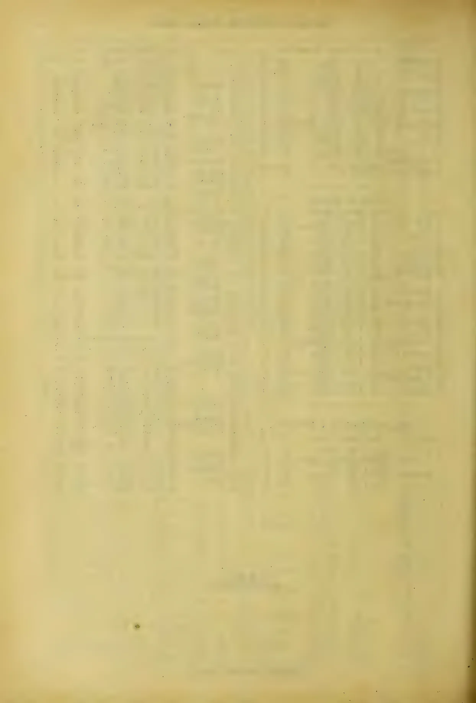This image shows a blank page with a light beige or cream-colored background. There are faint, vertical, slightly irregular lines running down the page, which appear to be artifacts from the scanning process or the texture of the paper. A small, dark, circular speck is visible near the bottom center of the page. The overall appearance is that of an old, slightly worn piece of paper.

1040------------------------------------------------

# TEA, COFFEE, CINCHONA, COCOA, AND CARDAMOM SALES.

**NO. 39**

COLOMBO, OCTOBER 10, 1898.

} PRICE:—12½ cents each 3 copies  
30 cents; 6 copies ¾ rupee.

## COLOMBO SALES OF TEA.

### LARGE LOTS.

**[Thompson and Villiers.—**  
**33,600 lb.]**

<table border="1">
<thead>
<tr>
<th>Lot.</th>
<th>Box.</th>
<th>Pkgs.</th>
<th>Name.</th>
<th>lb.</th>
<th>c.</th>
</tr>
</thead>
<tbody>
<tr>
<td>6 Dalukoya</td>
<td>6</td>
<td>13 hf-ch</td>
<td>bro or pek</td>
<td>780</td>
<td>46 bid</td>
</tr>
<tr>
<td>7</td>
<td>7</td>
<td>14 do</td>
<td>or pek</td>
<td>770</td>
<td>36</td>
</tr>
<tr>
<td>8</td>
<td>8</td>
<td>13 do</td>
<td>pek</td>
<td>715</td>
<td>33</td>
</tr>
<tr>
<td>10 Ettie</td>
<td>10</td>
<td>10 ch</td>
<td>bro pek</td>
<td>1050</td>
<td>24</td>
</tr>
<tr>
<td>11</td>
<td>11</td>
<td>10 do</td>
<td>pek</td>
<td>1000</td>
<td>23</td>
</tr>
<tr>
<td>12</td>
<td>12</td>
<td>11 do</td>
<td>pek sou</td>
<td>1045</td>
<td>24</td>
</tr>
<tr>
<td>16 Warwick</td>
<td>16</td>
<td>41 hf ch</td>
<td>bro pek</td>
<td>2665</td>
<td>63</td>
</tr>
<tr>
<td>17</td>
<td>17</td>
<td>33 do</td>
<td>pek</td>
<td>1815</td>
<td>46</td>
</tr>
<tr>
<td>25 Harrow</td>
<td>25</td>
<td>35 hf ch</td>
<td>bro or pek</td>
<td>700</td>
<td>43</td>
</tr>
<tr>
<td>26 Dalukoya</td>
<td>26</td>
<td>17 ch</td>
<td>or pek</td>
<td>935</td>
<td>37 bid</td>
</tr>
<tr>
<td>27 Battalgalla</td>
<td>27</td>
<td>15 ch</td>
<td>pek sou</td>
<td>1500</td>
<td>39 bid</td>
</tr>
<tr>
<td>30 Nalawa</td>
<td>30</td>
<td>18 ch</td>
<td>pek sou</td>
<td>1520</td>
<td>27</td>
</tr>
<tr>
<td>34 D</td>
<td>34</td>
<td>9 hf-ch</td>
<td>pek dust</td>
<td>765</td>
<td>13</td>
</tr>
</tbody>
</table>

**[Mr. E. John.—120,789 lb.]**

<table border="1">
<thead>
<tr>
<th>Lot.</th>
<th>Box.</th>
<th>Pkgs.</th>
<th>Name.</th>
<th>lb.</th>
<th>c.</th>
</tr>
</thead>
<tbody>
<tr>
<td>5 M T P 3 4, in-estate mark</td>
<td>636</td>
<td>15 ch</td>
<td>bro tea</td>
<td>1500</td>
<td>24</td>
</tr>
<tr>
<td>6</td>
<td>639</td>
<td>8 do</td>
<td>dust</td>
<td>1120</td>
<td>18</td>
</tr>
<tr>
<td>7 R G</td>
<td>642</td>
<td>12 do</td>
<td>bro pek</td>
<td>1272</td>
<td>36 bid</td>
</tr>
<tr>
<td>12 H</td>
<td>657</td>
<td>16 do</td>
<td>bro mix</td>
<td>1600</td>
<td>25 bid</td>
</tr>
<tr>
<td>13 Hattangalla</td>
<td>660</td>
<td>18 do</td>
<td>bro pek</td>
<td>1530</td>
<td>41</td>
</tr>
<tr>
<td>14</td>
<td>663</td>
<td>20 do</td>
<td>pekoe</td>
<td>1600</td>
<td>31</td>
</tr>
<tr>
<td>18 C</td>
<td>675</td>
<td>5 do</td>
<td>pekoe</td>
<td>1345</td>
<td>18 bid</td>
</tr>
<tr>
<td>20 Brownlow</td>
<td>681</td>
<td>19 hf-ch</td>
<td>bro or pek</td>
<td>1064</td>
<td>56 bid</td>
</tr>
<tr>
<td>21</td>
<td>684</td>
<td>29 do</td>
<td>or pek</td>
<td>1508</td>
<td>46 bid</td>
</tr>
<tr>
<td>22</td>
<td>687</td>
<td>28 ch</td>
<td>pekoe</td>
<td>2520</td>
<td>44</td>
</tr>
<tr>
<td>23</td>
<td>690</td>
<td>17 do</td>
<td>pek sou</td>
<td>1445</td>
<td>36</td>
</tr>
<tr>
<td>24</td>
<td>693</td>
<td>7 do</td>
<td>bro pek fans</td>
<td>700</td>
<td>44</td>
</tr>
<tr>
<td>25</td>
<td>696</td>
<td>10 do</td>
<td>pek fans</td>
<td>800</td>
<td>23 bid</td>
</tr>
<tr>
<td>26 Whyddon</td>
<td>699</td>
<td>8 do</td>
<td>bro pek</td>
<td>840</td>
<td>56</td>
</tr>
<tr>
<td>27</td>
<td>702</td>
<td>10 do</td>
<td>or pek</td>
<td>850</td>
<td>53</td>
</tr>
<tr>
<td>28</td>
<td>705</td>
<td>9 do</td>
<td>pekoe</td>
<td>810</td>
<td>45</td>
</tr>
<tr>
<td>29</td>
<td>708</td>
<td>10 do</td>
<td>pek sou</td>
<td>900</td>
<td>42</td>
</tr>
<tr>
<td>31 Uda</td>
<td>714</td>
<td>18 hf-ch</td>
<td>bro pek</td>
<td>1608</td>
<td>31 bid</td>
</tr>
<tr>
<td>32</td>
<td>717</td>
<td>28 do</td>
<td>pekoe</td>
<td>1232</td>
<td>31 bid</td>
</tr>
<tr>
<td>34 Temple-towe</td>
<td>723</td>
<td>23 ch</td>
<td>bro or pek</td>
<td>2070</td>
<td>50 bid</td>
</tr>
<tr>
<td>35</td>
<td>726</td>
<td>35 do</td>
<td>pekoe</td>
<td>2975</td>
<td>39</td>
</tr>
<tr>
<td>36</td>
<td>729</td>
<td>10 do</td>
<td>pek sou</td>
<td>800</td>
<td>37</td>
</tr>
<tr>
<td>38</td>
<td>735</td>
<td>10 hf-ch</td>
<td>dust</td>
<td>800</td>
<td>15</td>
</tr>
<tr>
<td>39 Pati Rajah</td>
<td>738</td>
<td>11 ch</td>
<td>or pek</td>
<td>1015</td>
<td>37 bid</td>
</tr>
<tr>
<td>40</td>
<td>741</td>
<td>7 do</td>
<td>bro pek</td>
<td>840</td>
<td>37</td>
</tr>
<tr>
<td>41</td>
<td>744</td>
<td>18 do</td>
<td>pekoe</td>
<td>1350</td>
<td>30</td>
</tr>
<tr>
<td>43 Glasgow</td>
<td>750</td>
<td>33 do</td>
<td>bro or pek</td>
<td>1382</td>
<td>62</td>
</tr>
<tr>
<td>44</td>
<td>753</td>
<td>17 do</td>
<td>or pek</td>
<td>1105</td>
<td>55</td>
</tr>
<tr>
<td>45</td>
<td>756</td>
<td>9 do</td>
<td>pekoe</td>
<td>855</td>
<td>46</td>
</tr>
<tr>
<td>46</td>
<td>759</td>
<td>11 do</td>
<td>or pek fans</td>
<td>1160</td>
<td>29</td>
</tr>
<tr>
<td>48 Agra Ouvah</td>
<td>765</td>
<td>52 hf-ch</td>
<td>bro or pek</td>
<td>3328</td>
<td>65 bid</td>
</tr>
<tr>
<td>49</td>
<td>768</td>
<td>23 do</td>
<td>or pek</td>
<td>1242</td>
<td>51 bid</td>
</tr>
<tr>
<td>56 Kotuagedera</td>
<td>789</td>
<td>16 ch</td>
<td>bro pek</td>
<td>1600</td>
<td>35 bid</td>
</tr>
<tr>
<td>57</td>
<td>792</td>
<td>10 do</td>
<td>pekoe</td>
<td>950</td>
<td>29 bid</td>
</tr>
<tr>
<td>61 K H</td>
<td>804</td>
<td>10 do</td>
<td>pekoe</td>
<td>1600</td>
<td>28 bid</td>
</tr>
<tr>
<td>62 Poilakande</td>
<td>807</td>
<td>22 hf-ch</td>
<td>bro pek</td>
<td>1320</td>
<td>37 bid</td>
</tr>
<tr>
<td>63 Horton Plains</td>
<td>810</td>
<td>20 ch</td>
<td>pekoe</td>
<td>1700</td>
<td>35 bid</td>
</tr>
<tr>
<td>66 Maryland</td>
<td>819</td>
<td>7 do</td>
<td>bro pek</td>
<td>735</td>
<td>35</td>
</tr>
<tr>
<td>67</td>
<td>822</td>
<td>7 do</td>
<td>pekoe</td>
<td>700</td>
<td>28</td>
</tr>
<tr>
<td>68 Orange Field</td>
<td>825</td>
<td>9 do</td>
<td>bro pek</td>
<td>900</td>
<td>25</td>
</tr>
<tr>
<td>69</td>
<td>828</td>
<td>16 do</td>
<td>pekoe</td>
<td>1520</td>
<td>28</td>
</tr>
<tr>
<td>73 Mount Temple</td>
<td>840</td>
<td>34 hf-ch</td>
<td>bro or pek</td>
<td>2040</td>
<td>47 bid</td>
</tr>
<tr>
<td>74</td>
<td>843</td>
<td>42 do</td>
<td>or pek</td>
<td>2100</td>
<td>38 bid</td>
</tr>
<tr>
<td>75</td>
<td>846</td>
<td>25 ch</td>
<td>pekoe</td>
<td>1925</td>
<td>35 bid</td>
</tr>
<tr>
<td>76</td>
<td>849</td>
<td>26 do</td>
<td>sou</td>
<td>1560</td>
<td>28 bid</td>
</tr>
<tr>
<td>78 Ybesa</td>
<td>855</td>
<td>24 hf-ch</td>
<td>or pek</td>
<td>1520</td>
<td>52 bid</td>
</tr>
<tr>
<td>79 Bellongalla</td>
<td>858</td>
<td>20 do</td>
<td>bro pek</td>
<td>1000</td>
<td>41</td>
</tr>
<tr>
<td>80</td>
<td>861</td>
<td>13 ch</td>
<td>pek sou</td>
<td>1040</td>
<td>38</td>
</tr>
<tr>
<td>81 Manangoda</td>
<td>864</td>
<td>12 do</td>
<td>bro pek</td>
<td>1200</td>
<td>34</td>
</tr>
<tr>
<td>82</td>
<td>867</td>
<td>12 do</td>
<td>pekoe</td>
<td>1200</td>
<td>28</td>
</tr>
<tr>
<td>84 Glasgow</td>
<td>873</td>
<td>19 hf-ch</td>
<td>or pek</td>
<td>1235</td>
<td>53 bid</td>
</tr>
<tr>
<td>85 Glentilt</td>
<td>876</td>
<td>40 ch</td>
<td>bro pek</td>
<td>4000</td>
<td>0 bid</td>
</tr>
<tr>
<td>86</td>
<td>879</td>
<td>16 do</td>
<td>pekoe</td>
<td>1600</td>
<td>43 bid</td>
</tr>
<tr>
<td>88 B</td>
<td>885</td>
<td>14 hf-ch</td>
<td>dust</td>
<td>1260</td>
<td>out</td>
</tr>
<tr>
<td>89 N P</td>
<td>888</td>
<td>14 do</td>
<td>dust</td>
<td>1190</td>
<td>20</td>
</tr>
<tr>
<td>91 M V</td>
<td>894</td>
<td>11 ch</td>
<td>bro pek</td>
<td>1100</td>
<td>32 bid</td>
</tr>
<tr>
<td>92</td>
<td>897</td>
<td>10 do</td>
<td>pekoe</td>
<td>950</td>
<td>29 bid</td>
</tr>
<tr>
<td>93</td>
<td>900</td>
<td>14 do</td>
<td>pek sou</td>
<td>1260</td>
<td>22 bid</td>
</tr>
<tr>
<td>100 Oakdene</td>
<td>921</td>
<td>20 hf-ch</td>
<td>bro or pek</td>
<td>1200</td>
<td>55 bid</td>
</tr>
<tr>
<td>101</td>
<td>924</td>
<td>21 ch</td>
<td>pekoe</td>
<td>1890</td>
<td>38 bid</td>
</tr>
<tr>
<td>102</td>
<td>927</td>
<td>9 do</td>
<td>bro or pek fans</td>
<td>1080</td>
<td>31 bid</td>
</tr>
<tr>
<td>103 Cosgahawella</td>
<td>930</td>
<td>7 do</td>
<td>bro pek</td>
<td>700</td>
<td>31 bid</td>
</tr>
</tbody>
</table>

<table border="1">
<thead>
<tr>
<th>Lot.</th>
<th>Box</th>
<th>Pkgs.</th>
<th>Name.</th>
<th>lb.</th>
<th>c.</th>
</tr>
</thead>
<tbody>
<tr>
<td>104</td>
<td>933</td>
<td>8 ch</td>
<td></td>
<td></td>
<td></td>
</tr>
<tr>
<td>105 Manangoda</td>
<td>936</td>
<td>1 hf-ch</td>
<td>nekoe</td>
<td>825</td>
<td>25</td>
</tr>
<tr>
<td>107 W W</td>
<td>942</td>
<td>21 ch</td>
<td>bro pek fans</td>
<td>1695</td>
<td>13</td>
</tr>
<tr>
<td></td>
<td></td>
<td>8 do</td>
<td></td>
<td></td>
<td></td>
</tr>
<tr>
<td></td>
<td></td>
<td>1 hf-ch</td>
<td>pekoe</td>
<td>900</td>
<td>29</td>
</tr>
<tr>
<td>108 H</td>
<td>945</td>
<td>24 ch</td>
<td>red leaf</td>
<td>1992</td>
<td>18</td>
</tr>
<tr>
<td>112 Kanangama</td>
<td>957</td>
<td>31 do</td>
<td>bro pek</td>
<td>3100</td>
<td>36</td>
</tr>
<tr>
<td>113</td>
<td>960</td>
<td>18 do</td>
<td>pekoe</td>
<td>1620</td>
<td>30 bid</td>
</tr>
<tr>
<td>114</td>
<td>963</td>
<td>18 do</td>
<td>bro pek fans</td>
<td>1800</td>
<td>31</td>
</tr>
<tr>
<td>116</td>
<td>969</td>
<td>9 hf-ch</td>
<td>dust</td>
<td>720</td>
<td>12</td>
</tr>
</tbody>
</table>

**[Messrs. Somerville & Co.—**  
**152,157.]**

<table border="1">
<thead>
<tr>
<th>Lot.</th>
<th>Box.</th>
<th>Pkgs.</th>
<th>Name.</th>
<th>lb.</th>
<th>c.</th>
</tr>
</thead>
<tbody>
<tr>
<td>4 B, in estate mark</td>
<td>134</td>
<td>10 ch</td>
<td>bro mix</td>
<td>800</td>
<td>15</td>
</tr>
<tr>
<td>6 Siriniwasa</td>
<td>136</td>
<td>18 ch</td>
<td>bro pek</td>
<td>1800</td>
<td>44</td>
</tr>
<tr>
<td>7</td>
<td>137</td>
<td>24 do</td>
<td>pek</td>
<td>2280</td>
<td>33</td>
</tr>
<tr>
<td>8</td>
<td>135</td>
<td>22 do</td>
<td>pek sou</td>
<td>1980</td>
<td>31</td>
</tr>
<tr>
<td>11 Depedene</td>
<td>141</td>
<td>62 hf-ch</td>
<td>bro pek</td>
<td>3410</td>
<td>42</td>
</tr>
<tr>
<td>12</td>
<td>142</td>
<td>61 do</td>
<td>pek</td>
<td>3050</td>
<td>34</td>
</tr>
<tr>
<td>13</td>
<td>143</td>
<td>50 do</td>
<td>pek sou</td>
<td>2750</td>
<td>29</td>
</tr>
<tr>
<td>15 P T N, in estate mark</td>
<td>145</td>
<td>14 hf-ch</td>
<td>bro pek</td>
<td>784</td>
<td>22 bid</td>
</tr>
<tr>
<td>16</td>
<td>146</td>
<td>24 do</td>
<td>pek</td>
<td>1200</td>
<td>20 bid</td>
</tr>
<tr>
<td>19 Lonach</td>
<td>149</td>
<td>54 hf-ch</td>
<td>bro pek</td>
<td>2970</td>
<td>45</td>
</tr>
<tr>
<td>20</td>
<td>150</td>
<td>22 ch</td>
<td>pek</td>
<td>1870</td>
<td>33</td>
</tr>
<tr>
<td>21</td>
<td>151</td>
<td>20 do</td>
<td>pek sou</td>
<td>1600</td>
<td>31</td>
</tr>
<tr>
<td>22 Lower Dickoya</td>
<td>152</td>
<td>29 hf-ch</td>
<td>bro pek</td>
<td>1624</td>
<td>23</td>
</tr>
<tr>
<td>23</td>
<td>153</td>
<td>11 do</td>
<td>pek</td>
<td>1100</td>
<td>32</td>
</tr>
<tr>
<td>25 Minna</td>
<td>155</td>
<td>20 hf-ch</td>
<td>bro or pek</td>
<td>1200</td>
<td>65</td>
</tr>
<tr>
<td>26</td>
<td>156</td>
<td>27 ch</td>
<td>or pek</td>
<td>2430</td>
<td>47</td>
</tr>
<tr>
<td>27</td>
<td>157</td>
<td>13 do</td>
<td>pek</td>
<td>1170</td>
<td>42</td>
</tr>
<tr>
<td>28</td>
<td>158</td>
<td>11 do</td>
<td>pek sou</td>
<td>990</td>
<td>38</td>
</tr>
<tr>
<td>29 Warakamure</td>
<td>159</td>
<td>17 ch</td>
<td>or pek</td>
<td>1700</td>
<td>34</td>
</tr>
<tr>
<td>39</td>
<td>160</td>
<td>17 do</td>
<td>pek</td>
<td>1615</td>
<td>30</td>
</tr>
<tr>
<td>81</td>
<td>161</td>
<td>13 do</td>
<td>sou</td>
<td>1170</td>
<td>28</td>
</tr>
<tr>
<td>35 Dikulalana</td>
<td>165</td>
<td>29 hf-ch</td>
<td>or pek fans</td>
<td>1595</td>
<td>37</td>
</tr>
<tr>
<td>36</td>
<td>166</td>
<td>22 do</td>
<td>pek fans</td>
<td>1210</td>
<td>35</td>
</tr>
<tr>
<td>49 Nugawella</td>
<td>170</td>
<td>27 hf-ch</td>
<td>or pek</td>
<td>1485</td>
<td>41</td>
</tr>
<tr>
<td>41</td>
<td>171</td>
<td>18 do</td>
<td>bro or pek</td>
<td>1170</td>
<td>43</td>
</tr>
<tr>
<td>42</td>
<td>172</td>
<td>43 do</td>
<td>pek</td>
<td>2400</td>
<td>24</td>
</tr>
<tr>
<td>45 Salawe</td>
<td>175</td>
<td>24 ch</td>
<td>pek sou</td>
<td>2250</td>
<td>25</td>
</tr>
<tr>
<td>47 Marigold</td>
<td>177</td>
<td>45 hf-ch</td>
<td>bro pek</td>
<td>2520</td>
<td>47</td>
</tr>
<tr>
<td>48</td>
<td>178</td>
<td>29 do</td>
<td>pek</td>
<td>1450</td>
<td>40</td>
</tr>
<tr>
<td>49</td>
<td>179</td>
<td>18 do</td>
<td>pek sou</td>
<td>972</td>
<td>35</td>
</tr>
<tr>
<td>51</td>
<td>181</td>
<td>16 do</td>
<td>bro pek fans</td>
<td>1120</td>
<td>37</td>
</tr>
<tr>
<td>53 Mahagoda</td>
<td>183</td>
<td>7 ch</td>
<td>bro pek</td>
<td>770</td>
<td>33</td>
</tr>
<tr>
<td>54</td>
<td>184</td>
<td>18 do</td>
<td>pek</td>
<td>1890</td>
<td>24 bid</td>
</tr>
<tr>
<td>56 Homeland</td>
<td>183</td>
<td>7 ch</td>
<td>or pek</td>
<td>700</td>
<td>35 bid</td>
</tr>
<tr>
<td>61 Abridge</td>
<td>191</td>
<td>12 ch</td>
<td>pek</td>
<td>1080</td>
<td>29 bid</td>
</tr>
<tr>
<td>64 Lonach</td>
<td>194</td>
<td>62 hf-ch</td>
<td>bro pek</td>
<td>3100</td>
<td>45</td>
</tr>
<tr>
<td>68 Narangoda</td>
<td>193</td>
<td>37 ch</td>
<td>bro pek</td>
<td>3700</td>
<td>41 bid</td>
</tr>
<tr>
<td>69</td>
<td>199</td>
<td>40 do</td>
<td>pek</td>
<td>3800</td>
<td>34</td>
</tr>
<tr>
<td>70</td>
<td>200</td>
<td>28 do</td>
<td>pek sou</td>
<td>2520</td>
<td>30</td>
</tr>
<tr>
<td>79 Tiddydale</td>
<td>209</td>
<td>9 ch</td>
<td>bro pek</td>
<td>900</td>
<td>38</td>
</tr>
<tr>
<td>80</td>
<td>210</td>
<td>11 do</td>
<td>pek</td>
<td>990</td>
<td>29</td>
</tr>
<tr>
<td>81</td>
<td>211</td>
<td>8 do</td>
<td>pek sou</td>
<td>720</td>
<td>24</td>
</tr>
<tr>
<td>84 Glenalla</td>
<td>214</td>
<td>42 ch</td>
<td>bro pek</td>
<td>4200</td>
<td>17 bid</td>
</tr>
<tr>
<td>85</td>
<td>215</td>
<td>49 do</td>
<td>pek</td>
<td>3600</td>
<td>50</td>
</tr>
<tr>
<td>86</td>
<td>216</td>
<td>18 do</td>
<td>pek sou</td>
<td>1820</td>
<td>25</td>
</tr>
<tr>
<td>89 I P</td>
<td>219</td>
<td>26 ch</td>
<td>pek sou</td>
<td>2548</td>
<td>28</td>
</tr>
<tr>
<td>90</td>
<td>220</td>
<td>16 hf-ch</td>
<td>dust</td>
<td>1328</td>
<td>15</td>
</tr>
<tr>
<td>91 Ukuwela</td>
<td>221</td>
<td>11 ch</td>
<td>bro or pek</td>
<td>1155</td>
<td>35</td>
</tr>
<tr>
<td>92</td>
<td>222</td>
<td>27 do</td>
<td>bro pek</td>
<td>2700</td>
<td>33</td>
</tr>
<tr>
<td>93</td>
<td>223</td>
<td>21 do</td>
<td>pek</td>
<td>2100</td>
<td>33</td>
</tr>
<tr>
<td>96</td>
<td>225</td>
<td>9 hf-ch</td>
<td>bro pek fans</td>
<td>730</td>
<td>24</td>
</tr>
<tr>
<td>99 Annandale</td>
<td>229</td>
<td>15 hf-ch</td>
<td>bro or pek</td>
<td>750</td>
<td>17</td>
</tr>
<tr>
<td>100</td>
<td>230</td>
<td>15 do</td>
<td>or pek</td>
<td>795</td>
<td>65</td>
</tr>
<tr>
<td>101</td>
<td>231</td>
<td>21 do</td>
<td>pek</td>
<td>1050</td>
<td>50</td>
</tr>
<tr>
<td>102</td>
<td>232</td>
<td>14 do</td>
<td>bro pek</td>
<td>888</td>
<td>43</td>
</tr>
<tr>
<td>103</td>
<td>233</td>
<td>16 do</td>
<td>pek sou</td>
<td>880</td>
<td>41</td>
</tr>
<tr>
<td>104 Ferriby</td>
<td>234</td>
<td>39 hf-ch</td>
<td>bro pek</td>
<td>1755</td>
<td>35</td>
</tr>
<tr>
<td>105</td>
<td>235</td>
<td>29 ch</td>
<td>pek</td>
<td>2700</td>
<td>33</td>
</tr>
<tr>
<td>106</td>
<td>236</td>
<td>14 do</td>
<td>pek sou</td>
<td>1120</td>
<td>30</td>
</tr>
<tr>
<td>110 K'Lande</td>
<td>240</td>
<td>18 ch</td>
<td>pek</td>
<td>1620</td>
<td>17 bid</td>
</tr>
<tr>
<td>111 Ravenscroft</td>
<td>241</td>
<td>27 hf-ch</td>
<td>bro pek</td>
<td>1485</td>
<td>45</td>
</tr>
<tr>
<td>112</td>
<td>242</td>
<td>17 ch</td>
<td>or pek</td>
<td>1360</td>
<td>37 bid</td>
</tr>
<tr>
<td>113</td>
<td>243</td>
<td>52 hf-ch</td>
<td>pek</td>
<td>2600</td>
<td>34</td>
</tr>
<tr>
<td>120 Donside</td>
<td>250</td>
<td>19 hf-ch</td>
<td>dust</td>
<td>1615</td>
<td>15</td>
</tr>
<tr>
<td>121 N D</td>
<td>251</td>
<td>10 ch</td>
<td>pek sou</td>
<td>1520</td>
<td>30 bid</td>
</tr>
<tr>
<td>122</td>
<td>252</td>
<td>15 ch</td>
<td>fans</td>
<td>2210</td>
<td>19 bid</td>
</tr>
<tr>
<td></td>
<td></td>
<td>1 hf-ch</td>
<td></td>
<td></td>
<td></td>
</tr>
<tr>
<td>123</td>
<td>253</td>
<td>27 ch</td>
<td>dust</td>
<td>2160</td>
<td>17 bid</td>
</tr>
<tr>
<td>124 Suriawatte</td>
<td>254</td>
<td>47 ch</td>
<td>bro pek</td>
<td>4935</td>
<td>31</td>
</tr>
<tr>
<td>125</td>
<td>255</td>
<td>36 hf-ch</td>
<td>pek</td>
<td>1890</td>
<td>36</td>
</tr>
<tr>
<td>126</td>
<td>256</td>
<td>15 ch</td>
<td>pek fans</td>
<td>1950</td>
<td>18</td>
</tr>
<tr>
<td>127 V</td>
<td>257</td>
<td>29 ch</td>
<td>dust</td>
<td>2515</td>
<td>16 bid</td>
</tr>
<tr>
<td></td>
<td></td>
<td>1 hf-ch</td>
<td></td>
<td></td>
<td></td>
</tr>
</tbody>
</table>

1041------------------------------------------------

2

CEYLON PRODUCE SALES LIST.

[Messrs. Forbes & Walker.—]

323,573 lb.]

<table border="1">
<thead>
<tr>
<th>Lot.</th>
<th>Box.</th>
<th>Pkgs.</th>
<th>Name.</th>
<th>lb.</th>
<th>c.</th>
</tr>
</thead>
<tbody>
<tr><td>3</td><td>Elfindale</td><td>240 24 ch</td><td>pek sou</td><td>2160</td><td>29</td></tr>
<tr><td>4</td><td></td><td>343 7 do</td><td>pek fans</td><td>700</td><td>20</td></tr>
<tr><td>8</td><td>Trewardene</td><td>355 8 ch</td><td>pek</td><td>795</td><td>29</td></tr>
<tr><td>12</td><td>Strathspey</td><td>367 17 hf-ch</td><td>or pek</td><td>850</td><td>56 d</td></tr>
<tr><td>20</td><td>Puspone</td><td>391 23 ch</td><td>bro pek</td><td>2960</td><td>47</td></tr>
<tr><td>21</td><td></td><td>391 21 do</td><td>pek</td><td>1995</td><td>36</td></tr>
<tr><td>25</td><td>Galkanda</td><td>406 9 ch</td><td>pek</td><td>810</td><td>29</td></tr>
<tr><td>32</td><td>Rockside</td><td>427 6 do</td><td>dust</td><td>840</td><td>23</td></tr>
<tr><td>33</td><td></td><td>430 6 do</td><td>bro pek fan</td><td>720</td><td>33</td></tr>
<tr><td>34</td><td>Drayton</td><td>433 43 hf-ch</td><td>or pek</td><td>2150</td><td>53 bid</td></tr>
<tr><td>35</td><td></td><td>436 31 ch</td><td>pek</td><td>2790</td><td>42</td></tr>
<tr><td>36</td><td></td><td>439 13 do</td><td>pek sou</td><td>1105</td><td>38</td></tr>
<tr><td>38</td><td>Walton</td><td>445 23 ch</td><td>bro pek</td><td>2576</td><td>45 bid</td></tr>
<tr><td>39</td><td></td><td>448 23 do</td><td>pek</td><td>2185</td><td>37 bid</td></tr>
<tr><td>40</td><td></td><td>451 15 do</td><td>pek sou</td><td>1275</td><td>33</td></tr>
<tr><td>44</td><td>Tymawr</td><td>463 37 hf-ch</td><td>or pek</td><td>1665</td><td>32 bid</td></tr>
<tr><td>45</td><td></td><td>466 24 do</td><td>bro pek</td><td>1200</td><td>58 bid</td></tr>
<tr><td>46</td><td></td><td>469 58 do</td><td>pek</td><td>2610</td><td>43 bid</td></tr>
<tr><td>47</td><td></td><td>472 29 do</td><td>pek sou</td><td>1160</td><td>35</td></tr>
<tr><td>51</td><td>Tonacombe</td><td>484 19 ch</td><td>or pek</td><td>19 0</td><td>40</td></tr>
<tr><td>52</td><td></td><td>487 19 do</td><td>bro pek</td><td>2280</td><td>60</td></tr>
<tr><td>53</td><td></td><td>490 47 do</td><td>pek</td><td>4700</td><td>42</td></tr>
<tr><td>54</td><td></td><td>493 8 do</td><td>pek sou</td><td>720</td><td>35</td></tr>
<tr><td>55</td><td>G</td><td>496 12 ch</td><td>pek sou</td><td>1020</td><td>59</td></tr>
<tr><td>59</td><td>Dammeria</td><td>508 14 ch</td><td>bro or pek</td><td>1680</td><td>53</td></tr>
<tr><td>60</td><td></td><td>511 19 do</td><td>bro pek</td><td>19 0</td><td>52</td></tr>
<tr><td>61</td><td></td><td>514 23 do</td><td>pek</td><td>2510</td><td>39</td></tr>
<tr><td>62</td><td></td><td>517 9 do</td><td>pek sou</td><td>900</td><td>34</td></tr>
<tr><td>64</td><td>Pallegodde</td><td>523 22 ch</td><td>bro or pek</td><td>2310</td><td>39</td></tr>
<tr><td>65</td><td></td><td>526 26 do</td><td>bro pek</td><td>2730</td><td>44</td></tr>
<tr><td>66</td><td></td><td>529 14 do</td><td>or pek</td><td>1200</td><td>38</td></tr>
<tr><td>67</td><td></td><td>532 16 do</td><td>pekoe</td><td>1280</td><td>36</td></tr>
<tr><td>68</td><td></td><td>535 14 do</td><td>pek sou</td><td>1100</td><td>33</td></tr>
<tr><td>69</td><td></td><td>538 15 do</td><td>dust</td><td>1275</td><td>17</td></tr>
<tr><td>70</td><td>Putupaula</td><td>541 36 ch</td><td>bro pek</td><td>3240</td><td>43</td></tr>
<tr><td>71</td><td></td><td>544 20 hf-ch</td><td>pek</td><td>1000</td><td>34</td></tr>
<tr><td>72</td><td></td><td>547 12 do</td><td>pek sou</td><td>900</td><td>31</td></tr>
<tr><td>73</td><td>Lindoola</td><td>550 20 hf-ch</td><td>dust</td><td>1600</td><td>17</td></tr>
<tr><td>74</td><td>Roeberry</td><td>553 8 ch</td><td>bro pek</td><td>880</td><td>56</td></tr>
<tr><td>75</td><td></td><td>556 16 do</td><td>or pek</td><td>1504</td><td>55</td></tr>
<tr><td>76</td><td></td><td>559 14 do</td><td>pek</td><td>1204</td><td>44</td></tr>
<tr><td>77</td><td></td><td>562 12 do</td><td>pek sou</td><td>1080</td><td>39</td></tr>
<tr><td>79</td><td>Macaldeniya</td><td>568 15 hf-ch</td><td>bro pek</td><td>825</td><td>48 bid</td></tr>
<tr><td>80</td><td></td><td>571 14 do</td><td>pek</td><td>700</td><td>40</td></tr>
<tr><td>81</td><td></td><td>574 10 ch</td><td>pek sou</td><td>1000</td><td>36</td></tr>
<tr><td>84</td><td>Queensland</td><td>583 7 ch</td><td>bro or pek</td><td>700</td><td>77</td></tr>
<tr><td>85</td><td></td><td>586 7 do</td><td>bro pek</td><td>700</td><td>57</td></tr>
<tr><td>86</td><td></td><td>589 8 ch</td><td>or pek</td><td>724</td><td>58</td></tr>
<tr><td>87</td><td></td><td>592 17 ch</td><td>pek</td><td>1445</td><td>47</td></tr>
<tr><td>90</td><td>Great Valley</td><td></td><td></td><td></td><td></td></tr>
<tr><td></td><td>Ceylon, in estate</td><td></td><td></td><td></td><td></td></tr>
<tr><td></td><td>mark</td><td>601 27 hf-ch</td><td>bro pek</td><td>1485</td><td>51</td></tr>
<tr><td>91</td><td></td><td>604 9 ch</td><td>or pek</td><td>810</td><td>39</td></tr>
<tr><td>92</td><td></td><td>607 16 do</td><td>pek</td><td>1440</td><td>36</td></tr>
<tr><td>93</td><td></td><td>610 10 do</td><td>pek sou</td><td>900</td><td>33</td></tr>
<tr><td>94</td><td>Ismalle</td><td>613 13 ch</td><td>sou</td><td>1170</td><td>27</td></tr>
<tr><td>95</td><td></td><td>616 9 do</td><td>dust</td><td>1080</td><td>15</td></tr>
<tr><td>98</td><td>Shrubs Hill</td><td>625 42 ch</td><td>bro pek</td><td>4200</td><td>47 bid</td></tr>
<tr><td>99</td><td></td><td>628 18 do</td><td>pek</td><td>1476</td><td>36</td></tr>
<tr><td>100</td><td></td><td>631 15 do</td><td>pek sou</td><td>1080</td><td>31</td></tr>
<tr><td>102</td><td>Kotagaloya</td><td>637 8 ch</td><td>pek</td><td>720</td><td>36</td></tr>
<tr><td>105</td><td>Naseby</td><td>646 21 hf-ch</td><td>bro pek</td><td>1323</td><td>67 bid</td></tr>
<tr><td>106</td><td></td><td>649 19 do</td><td>bro pek</td><td>1235</td><td>64 bid</td></tr>
<tr><td>107</td><td></td><td>652 20 do</td><td>pek</td><td>1110</td><td>54</td></tr>
<tr><td>108</td><td></td><td>655 17 do</td><td>pek sou</td><td>935</td><td>46</td></tr>
<tr><td>109</td><td></td><td>658 8 do</td><td>dust</td><td>704</td><td>36</td></tr>
<tr><td>110</td><td>Maha Uva</td><td>661 14 hf-ch</td><td>bro or pek</td><td>910</td><td>51</td></tr>
<tr><td>111</td><td></td><td>664 25 do</td><td>or pek</td><td>1500</td><td>50 bid</td></tr>
<tr><td>112</td><td></td><td>667 21 ch</td><td>pek</td><td>1995</td><td>42</td></tr>
<tr><td>115</td><td>Kirklees</td><td>676 24 hf-ch</td><td>bro or pek</td><td>1440</td><td>57</td></tr>
<tr><td>116</td><td></td><td>679 15 ch</td><td>or pek</td><td>1500</td><td>55</td></tr>
<tr><td>117</td><td></td><td>682 26 do</td><td>pek</td><td>2600</td><td>42</td></tr>
<tr><td>118</td><td></td><td>685 16 do</td><td>pek sou</td><td>1440</td><td>36</td></tr>
<tr><td>119</td><td>High Forest</td><td>688 32 hf-ch</td><td>bro or pek</td><td>1664</td><td>76</td></tr>
<tr><td>120</td><td></td><td>691 20 do</td><td>or pek</td><td>940</td><td>61</td></tr>
<tr><td>121</td><td></td><td>694 16 do</td><td>pek</td><td>704</td><td>51</td></tr>
<tr><td>122</td><td>Ruanwella</td><td>697 18 ch</td><td>or pek</td><td>1620</td><td>40</td></tr>
<tr><td>123</td><td></td><td>700 12 do</td><td>bro pek</td><td>1200</td><td>42</td></tr>
<tr><td>124</td><td></td><td>703 39 do</td><td>pek</td><td>3510</td><td>34</td></tr>
<tr><td>125</td><td></td><td>706 10 do</td><td>pek sou</td><td>900</td><td>30</td></tr>
<tr><td>127</td><td>Hayes</td><td>712 20 hf-ch</td><td>bro pek</td><td>1100</td><td>55</td></tr>
<tr><td>128</td><td></td><td>715 40 do</td><td>or pek</td><td>2000</td><td>41</td></tr>
<tr><td>129</td><td></td><td>718 35 do</td><td>pek</td><td>1575</td><td>37</td></tr>
<tr><td>130</td><td>B D W P</td><td>721 79 hf-ch</td><td>bro pek</td><td>3950</td><td>39 bid</td></tr>
<tr><td>133</td><td>Matale</td><td>730 46 hf-ch</td><td>bro pek</td><td>2760</td><td>43</td></tr>
<tr><td>134</td><td></td><td>733 23 ch</td><td>pek</td><td>2070</td><td>36</td></tr>
<tr><td>135</td><td></td><td>736 11 do</td><td>pek sou</td><td>990</td><td>32</td></tr>
<tr><td>138</td><td>Carfax</td><td>745 8 ch</td><td>bro pek</td><td>880</td><td>35</td></tr>
<tr><td>139</td><td></td><td>748 14 do</td><td>sou</td><td>1300</td><td>23</td></tr>
<tr><td>140</td><td></td><td>751 18 do</td><td>dust</td><td>1200</td><td>23</td></tr>
<tr><td>141</td><td>Ganapalla</td><td>754 16 do</td><td>or pek</td><td>1520</td><td>46</td></tr>
<tr><td>142</td><td></td><td>757 21 do</td><td>bro or pek</td><td>2232</td><td>43</td></tr>
<tr><td>143</td><td></td><td>760 30 do</td><td>pek</td><td>2400</td><td>34</td></tr>
</tbody>
</table>

<table border="1">
<thead>
<tr>
<th>Lot</th>
<th>Box.</th>
<th>Pkgs.</th>
<th>Name</th>
<th>lb.</th>
<th>c.</th>
</tr>
</thead>
<tbody>
<tr><td>144</td><td></td><td>763 17 ch</td><td>pek sou</td><td>1275</td><td>29</td></tr>
<tr><td>147</td><td>Du: keld</td><td>772 14 hf-ch</td><td>pek fans</td><td>980</td><td>28</td></tr>
<tr><td>148</td><td></td><td>776 10 do</td><td>dust</td><td>930</td><td>22</td></tr>
<tr><td>153</td><td>Dromoland</td><td>790 20 ch</td><td>bro pek</td><td>2000</td><td>39</td></tr>
<tr><td>154</td><td></td><td>793 25 do</td><td>pek</td><td>2250</td><td>32</td></tr>
<tr><td>155</td><td></td><td>796 15 do</td><td>pek sou</td><td>1200</td><td>26</td></tr>
<tr><td>157</td><td>Lochiel</td><td>802 62 hf-ch</td><td>bro or pek</td><td>3410</td><td>59</td></tr>
<tr><td>158</td><td></td><td>805 27 do</td><td>bro pek</td><td>1850</td><td>51 bid</td></tr>
<tr><td>159</td><td></td><td>808 45 ch</td><td>pek No. 1</td><td>2600</td><td>40 bid</td></tr>
<tr><td>160</td><td></td><td>811 10 do</td><td>pek</td><td>1700</td><td>36 bid</td></tr>
<tr><td>161</td><td>A G</td><td>823 10 ch</td><td>pek sou</td><td>900</td><td>32</td></tr>
<tr><td>168</td><td>Kirrimettia</td><td>835 15 ch</td><td>unust</td><td>1350</td><td>29</td></tr>
<tr><td>169</td><td>N W D</td><td>838 10 do</td><td>bro pek</td><td>1140</td><td>49</td></tr>
<tr><td>172</td><td></td><td>847 7 do</td><td>fans</td><td>575</td><td>33</td></tr>
<tr><td>173</td><td></td><td>850 6 do</td><td>dust</td><td>936</td><td>15</td></tr>
<tr><td>175</td><td>Castlereagh</td><td>856 14 do</td><td>bro pek</td><td>1400</td><td>57</td></tr>
<tr><td>176</td><td></td><td>859 15 do</td><td>or pek</td><td>1275</td><td>45</td></tr>
<tr><td>177</td><td></td><td>862 13 do</td><td>pek</td><td>1040</td><td>39</td></tr>
<tr><td>181</td><td>Chesterford</td><td>874 30 do</td><td>bro pek</td><td>3900</td><td>46</td></tr>
<tr><td>182</td><td></td><td>877 32 do</td><td>pek</td><td>3200</td><td>35</td></tr>
<tr><td>183</td><td></td><td>880 24 do</td><td>pek sou</td><td>2400</td><td>22</td></tr>
<tr><td>186</td><td></td><td>889 10 hf-ch</td><td>dust</td><td>800</td><td>15</td></tr>
<tr><td>187</td><td>Geragama</td><td>892 15 ch</td><td>bro pek</td><td>1500</td><td>42</td></tr>
<tr><td>188</td><td></td><td>895 20 do</td><td>pek</td><td>1900</td><td>33</td></tr>
<tr><td>189</td><td></td><td>898 8 do</td><td>pek sou</td><td>770</td><td>30</td></tr>
<tr><td>192</td><td>Ascot</td><td>907 23 do</td><td>or pek</td><td>1955</td><td>40 bid</td></tr>
<tr><td>193</td><td></td><td>918 15 do</td><td>bro pek</td><td>1425</td><td>44</td></tr>
<tr><td>194</td><td></td><td>918 22 do</td><td>pek</td><td>1760</td><td>33</td></tr>
<tr><td>195</td><td></td><td>916 8 do</td><td>nek sou</td><td>770</td><td>29</td></tr>
<tr><td>196</td><td></td><td>919 9 do</td><td>pek sou No. 2</td><td>810</td><td>25</td></tr>
<tr><td>197</td><td></td><td>922 8 do</td><td>pek fans</td><td>960</td><td>31</td></tr>
<tr><td>198</td><td></td><td>925 6 do</td><td>dust</td><td>930</td><td>14</td></tr>
<tr><td>199</td><td>B D W, C K</td><td>928 32 hf-ch</td><td>bro or pek</td><td>1952</td><td>37</td></tr>
<tr><td>200</td><td></td><td>931 20 do</td><td>pek</td><td>1130</td><td>36</td></tr>
<tr><td>205</td><td>Inrogalla</td><td>946 12 ch</td><td>bro pek</td><td>12 0</td><td>47 bid</td></tr>
<tr><td>206</td><td></td><td>949 10 do</td><td>pek</td><td>850</td><td>37</td></tr>
<tr><td>214</td><td>Paraloes</td><td>973 21 do</td><td>bro pek</td><td>2100</td><td>46</td></tr>
<tr><td>215</td><td></td><td>976 31 do</td><td>pek</td><td>2700</td><td>38</td></tr>
<tr><td>216</td><td></td><td>979 37 do</td><td>pek sou</td><td>2160</td><td>34</td></tr>
<tr><td>223</td><td>Clunes</td><td>1006 32 hf-ch</td><td>bro pek</td><td>1760</td><td>41</td></tr>
<tr><td>226</td><td></td><td>1009 30 do</td><td>or pek</td><td>1350</td><td>39</td></tr>
<tr><td>227</td><td></td><td>1012 21 ch</td><td>pek</td><td>1680</td><td>32</td></tr>
<tr><td>228</td><td></td><td>1015 9 do</td><td>pek sou</td><td>810</td><td>29</td></tr>
<tr><td>229</td><td>Ambragalla</td><td>1018 116 hf-ch</td><td>or pek</td><td>6032</td><td>40 bid</td></tr>
<tr><td>230</td><td></td><td>1021 34 ch</td><td>pekoe</td><td>2992</td><td>37 bid</td></tr>
<tr><td>231</td><td></td><td>1024 40 do</td><td>pek sou</td><td>3200</td><td>35</td></tr>
<tr><td>232</td><td></td><td>1027 67 hf-ch</td><td>bro or pek</td><td>4154</td><td>45 bid</td></tr>
<tr><td>234</td><td></td><td>1033 17 do</td><td>dust</td><td>1445</td><td>22</td></tr>
<tr><td>239</td><td>O O in est.</td><td></td><td></td><td></td><td></td></tr>
<tr><td></td><td>mark</td><td>1048 16 ch</td><td>sou</td><td>1280</td><td>26</td></tr>
<tr><td>240</td><td></td><td>1051 6 do</td><td>dust</td><td>800</td><td>14</td></tr>
<tr><td>241</td><td>Stisted</td><td>1054 30 hf-ch</td><td>bro pek</td><td>1950</td><td>50</td></tr>
<tr><td>244</td><td></td><td>1063 21 do</td><td>pek sou</td><td>1197</td><td>32</td></tr>
<tr><td>246</td><td>Hunasgeria</td><td>1069 12 do</td><td>pek dust</td><td>1200</td><td>21</td></tr>
<tr><td>247</td><td>G P M in est.</td><td></td><td></td><td></td><td></td></tr>
<tr><td></td><td>mark</td><td>1072 27 hf-ch</td><td>bro or pek</td><td>1030</td><td>57 bid</td></tr>
<tr><td>248</td><td>H G M</td><td>1075 18 ch</td><td>bro or pek</td><td>1530</td><td>46</td></tr>
<tr><td>249</td><td></td><td>1078 20 do</td><td>or pek</td><td>1800</td><td>49 bid</td></tr>
<tr><td>250</td><td></td><td>1081 55 do</td><td>bro pek</td><td>4630</td><td>40</td></tr>
<tr><td>251</td><td></td><td>1084 23 do</td><td>pek</td><td>2520</td><td>35</td></tr>
<tr><td>252</td><td></td><td>1087 18 do</td><td>pek sou</td><td>1440</td><td>33</td></tr>
<tr><td>257</td><td>Ingoya</td><td>1102 10 do</td><td>dust</td><td>1500</td><td>14</td></tr>
<tr><td>263</td><td>R C W in est.</td><td></td><td></td><td></td><td></td></tr>
<tr><td></td><td>mark</td><td>1120 23 hf-ch</td><td>pek dust</td><td>2070</td><td>16</td></tr>
<tr><td>264</td><td>Devonford</td><td>1123 23 do</td><td>bro or pek</td><td>1160</td><td>57</td></tr>
<tr><td>265</td><td></td><td>1126 14 ch</td><td>pek</td><td>1190</td><td>69</td></tr>
<tr><td>266</td><td>S</td><td>1129 9 hf-ch</td><td>dust</td><td>765</td><td>16</td></tr>
<tr><td>270</td><td>G P M in est</td><td></td><td></td><td></td><td></td></tr>
<tr><td></td><td>mark</td><td>1141 23 do</td><td>bro or pek</td><td>1380</td><td>56 bid</td></tr>
<tr><td>271</td><td>Dea Ella</td><td>1144 24 do</td><td>bro or pek</td><td>1820</td><td>39</td></tr>
<tr><td>272</td><td></td><td>1147 20 do</td><td>or pek</td><td>1000</td><td>37</td></tr>
<tr><td>273</td><td></td><td>1150 26 do</td><td>pek</td><td>1300</td><td>33</td></tr>
<tr><td>274</td><td></td><td>1153 18 do</td><td>pek sou</td><td>810</td><td>39</td></tr>
<tr><td>275</td><td>C H</td><td>1156 47 ch</td><td>sou</td><td>4418</td><td>19 bid</td></tr>
</tbody>
</table>

SMALL LOTS.

[Thompson and Villiers.]

<table border="1">
<thead>
<tr>
<th>Lot.</th>
<th>Box.</th>
<th>Pkgs.</th>
<th>Name.</th>
<th>lb.</th>
<th>c.</th>
</tr>
</thead>
<tbody>
<tr><td>1</td><td>Ahamad</td><td>1 7 hf-ch</td><td>bro pek</td><td>350</td><td>56</td></tr>
<tr><td>2</td><td></td><td>2 5 do</td><td>pek</td><td>250</td><td>29</td></tr>
<tr><td>3</td><td></td><td>3 8 do</td><td>pek sou</td><td>400</td><td>27</td></tr>
<tr><td>4</td><td></td><td>4 1 do</td><td>fans</td><td>70</td><td>16</td></tr>
<tr><td>5</td><td></td><td>5 1 do</td><td>bro red leaf</td><td>55</td><td>15</td></tr>
<tr><td>9</td><td>Ratnattenne</td><td>9 6 hf-ch</td><td>dust</td><td>360</td><td>16</td></tr>
<tr><td>13</td><td>Ettie</td><td>13 1 ch</td><td>dust</td><td>145</td><td>13</td></tr>
<tr><td>18</td><td>Warwick</td><td>18 12 hf-ch</td><td>pek sou</td><td>660</td><td>41</td></tr>
<tr><td>19</td><td></td><td>19 4 do</td><td>dust</td><td>320</td><td>21</td></tr>
<tr><td>28</td><td>L</td><td>28 7 ch</td><td>pek</td><td>665</td><td>23</td></tr>
<tr><td>29</td><td>Woodend</td><td>29 3 hf-ch</td><td>dust</td><td>420</td><td>12 bid</td></tr>
<tr><td>31</td><td>Nalawa</td><td>31 4 ch</td><td>pek fans</td><td>500</td><td>14</td></tr>
<tr><td>32</td><td>D K</td><td>32 6 hf-ch</td><td>pek dust</td><td>510</td><td>9 bid</td></tr>
<tr><td>33</td><td>T</td><td>33 8 do</td><td>pek dust</td><td>680</td><td>9 bid</td></tr>
<tr><td>35</td><td>B and D</td><td>35 4 ch</td><td>bro or pek</td><td>390</td><td>52</td></tr>
<tr><td>36</td><td></td><td>36 2 do</td><td>or pek</td><td>180</td><td>47</td></tr>
<tr><td>37</td><td></td><td>37 3 do</td><td>pek</td><td>240</td><td>38</td></tr>
</tbody>
</table>

1042------------------------------------------------

CEYLON PRODUCE SALES LIST.

3

[Mr. E. John.]

<table border="1">
<thead>
<tr>
<th>Lot.</th>
<th>Box.</th>
<th>Pkgs.</th>
<th>Name.</th>
<th>lb.</th>
<th>c.</th>
</tr>
</thead>
<tbody>
<tr><td>8</td><td>R G</td><td>645</td><td>5 ch or pek</td><td>430</td><td>32</td></tr>
<tr><td>9</td><td></td><td>648</td><td>9 do pekoe</td><td>637</td><td>29</td></tr>
<tr><td>10</td><td></td><td>651</td><td>3 do pek sou</td><td>213</td><td>27</td></tr>
<tr><td>11</td><td></td><td>654</td><td>1 do dust</td><td>124</td><td>12</td></tr>
<tr><td>15</td><td>Hattangalla</td><td>666</td><td>5 do pek sou</td><td>425</td><td>26</td></tr>
<tr><td>16</td><td></td><td>669</td><td>1 do dust</td><td>140</td><td>14</td></tr>
<tr><td>17</td><td>C</td><td>672</td><td>6 do bro pek</td><td>510</td><td>28</td></tr>
<tr><td>19</td><td></td><td>678</td><td>6 do bro mix</td><td>600</td><td>23</td></tr>
<tr><td>30</td><td>Whyddon</td><td>711</td><td>3 do pek fans</td><td>360</td><td>41</td></tr>
<tr><td>33</td><td>Uda</td><td>720</td><td>6 hf-ch pek dust</td><td>504</td><td>16</td></tr>
<tr><td>37</td><td>Templestowe</td><td>732</td><td>8 do pek fans</td><td>520</td><td>39</td></tr>
<tr><td>42</td><td>Pati Rajah</td><td>747</td><td>16 ch dust</td><td>165</td><td>12</td></tr>
<tr><td>47</td><td>G S</td><td>762</td><td>2 do sou</td><td>160</td><td>28</td></tr>
<tr><td>50</td><td>Agra Ouvah</td><td>771</td><td>7 do pekoe</td><td>665</td><td>50</td></tr>
<tr><td>51</td><td>Akkara Totum</td><td>774</td><td>5 do bro pek</td><td>450</td><td>34</td></tr>
<tr><td>52</td><td></td><td>777</td><td>6 do pekoe</td><td>540</td><td>29</td></tr>
<tr><td>53</td><td></td><td>780</td><td>1 do pek sou</td><td>90</td><td>19</td></tr>
<tr><td>54</td><td></td><td>783</td><td>3 do dust</td><td>380</td><td>14</td></tr>
<tr><td>55</td><td></td><td>786</td><td>1 do fans</td><td>100</td><td>20</td></tr>
<tr><td>58</td><td>Kotuagedera</td><td>795</td><td>3 do pek sou</td><td>285</td><td>27</td></tr>
<tr><td>59</td><td></td><td>798</td><td>1 do dust</td><td>155</td><td>12</td></tr>
<tr><td>60</td><td></td><td>801</td><td>1 do bro pek fans</td><td>125</td><td>17</td></tr>
<tr><td>64</td><td>Hunugalla</td><td>813</td><td>2 do sou</td><td>160</td><td>28</td></tr>
<tr><td>65</td><td></td><td>816</td><td>2 do dust</td><td>230</td><td>14</td></tr>
<tr><td>70</td><td>Orange Field</td><td>831</td><td>2 do pek sou</td><td>208</td><td>25</td></tr>
<tr><td>71</td><td></td><td>834</td><td>2 do pek fans</td><td>200</td><td>19</td></tr>
<tr><td>72</td><td></td><td>837</td><td>3 do bro mix</td><td>291</td><td>15</td></tr>
<tr><td>77</td><td>Mount Temple</td><td>852</td><td>9 do or pek fans</td><td>675</td><td>29</td></tr>
<tr><td>83</td><td>Manangoda</td><td>870</td><td>5 do pek sou</td><td>500</td><td>25</td></tr>
<tr><td>90</td><td>H M</td><td>891</td><td>4 hf-ch dust</td><td>340</td><td>15</td></tr>
<tr><td>95</td><td>L Y E</td><td>906</td><td>1 ch bro pek</td><td>153</td><td>33</td></tr>
<tr><td>96</td><td></td><td>909</td><td>4 ch pek fans</td><td>483</td><td>17</td></tr>
<tr><td>97</td><td></td><td>912</td><td>2 do pek dust</td><td>280</td><td>12</td></tr>
<tr><td>98</td><td></td><td>915</td><td>1 do dust</td><td>100</td><td>12</td></tr>
<tr><td>99</td><td></td><td>918</td><td>1 do red leaf</td><td>62</td><td>15</td></tr>
<tr><td>106</td><td>Manangoda</td><td>939</td><td>1 do dust</td><td>124</td><td>14</td></tr>
<tr><td>115</td><td>Kanangama</td><td>966</td><td>6 do fans</td><td>540</td><td>25</td></tr>
</tbody>
</table>

[Messrs. Somerville & Co.]

<table border="1">
<thead>
<tr>
<th>Lot.</th>
<th>Box.</th>
<th>Pkgs.</th>
<th>Name.</th>
<th>lb.</th>
<th>c.</th>
</tr>
</thead>
<tbody>
<tr><td>1</td><td>Sirisanda</td><td>131</td><td>3 ch dust</td><td>465</td><td>15</td></tr>
<tr><td>2</td><td></td><td>132</td><td>3 do bro tea</td><td>240</td><td>18</td></tr>
<tr><td>3</td><td></td><td>133</td><td>1 do bro pek fans</td><td>115</td><td>32</td></tr>
<tr><td>5</td><td>B, in estate mark</td><td>135</td><td>4 hf-ch dust</td><td>300</td><td>14</td></tr>
<tr><td>9</td><td>Siriniwasa</td><td>139</td><td>3 ch bro pek fans</td><td>301</td><td>30</td></tr>
<tr><td>10</td><td></td><td>140</td><td>2 do dust</td><td>300</td><td>14</td></tr>
<tr><td>14</td><td>Depedene</td><td>144</td><td>5 hf-ch dust</td><td>400</td><td>20</td></tr>
<tr><td>17</td><td>P T N, in estate mark</td><td>147</td><td>1 hf-ch dust</td><td>80</td><td>12</td></tr>
<tr><td>18</td><td></td><td>148</td><td>2 do fans</td><td>112</td><td>20</td></tr>
<tr><td>24</td><td>Lower Dickoya</td><td>154</td><td>2 ch pek sou</td><td>210</td><td>27</td></tr>
<tr><td>32</td><td>Warakamure</td><td>162</td><td>2 hf-ch dust</td><td>150</td><td>14</td></tr>
<tr><td>33</td><td>E M</td><td>163</td><td>3 ch bro pek</td><td>160</td><td>25 bid</td></tr>
<tr><td>34</td><td></td><td>164</td><td>2 do pek</td><td>200</td><td>25</td></tr>
<tr><td>37</td><td>Limukalana</td><td>167</td><td>11 hf-ch fans</td><td>605</td><td>33</td></tr>
<tr><td>38</td><td></td><td>168</td><td>13 do sou (unbulked)</td><td>600</td><td>23</td></tr>
<tr><td>39</td><td>B B B</td><td>169</td><td>2 ch dust</td><td>240</td><td>10</td></tr>
<tr><td>43</td><td>Nugawella</td><td>173</td><td>2 ch pek sou</td><td>170</td><td>28</td></tr>
<tr><td>44</td><td></td><td>174</td><td>4 hf-ch dust</td><td>340</td><td>17</td></tr>
<tr><td>46</td><td>Salawe</td><td>176</td><td>3 ch dust</td><td>450</td><td>15</td></tr>
<tr><td>50</td><td>Marigold</td><td>180</td><td>7 hf-ch sou</td><td>322</td><td>27</td></tr>
<tr><td>52</td><td></td><td>182</td><td>3 do unas</td><td>162</td><td>42</td></tr>
<tr><td>55</td><td>Homeland</td><td>185</td><td>5 hf-ch bro or pek</td><td>275</td><td>40 bid</td></tr>
<tr><td>60</td><td>Abridge</td><td>190</td><td>6 hf-ch bro pek</td><td>298</td><td>30 bid</td></tr>
<tr><td>63</td><td></td><td>193</td><td>4 ch dust</td><td>560</td><td>14 bid</td></tr>
<tr><td>65</td><td>Varalupitiya</td><td>195</td><td>6 ch fans</td><td>690</td><td>34</td></tr>
<tr><td>66</td><td></td><td>196</td><td>4 do dust</td><td>620</td><td>16</td></tr>
<tr><td>67</td><td></td><td>197</td><td>1 do bro tea</td><td>82</td><td>18</td></tr>
<tr><td>71</td><td>Narangoda</td><td>201</td><td>4 hf-ch dust</td><td>320</td><td>15</td></tr>
<tr><td>72</td><td></td><td>202</td><td>4 ch fans</td><td>300</td><td>21</td></tr>
<tr><td>82</td><td>Allakolla</td><td>212</td><td>2 ch sou</td><td>162</td><td>19</td></tr>
<tr><td>83</td><td></td><td>213</td><td>3 do dust</td><td>250</td><td>15</td></tr>
<tr><td>87</td><td>Glenalla</td><td>217</td><td>4 ch dust</td><td>300</td><td>14</td></tr>
<tr><td>88</td><td></td><td>218</td><td>2 do fans</td><td>200</td><td>20</td></tr>
<tr><td>95</td><td>Ukuwela</td><td>225</td><td>5 ch pek sou</td><td>455</td><td>28</td></tr>
<tr><td>97</td><td>U K</td><td>227</td><td>4 ch bro pek</td><td>260</td><td>16</td></tr>
<tr><td>98</td><td>Sangaly Toppe</td><td>228</td><td>6 ch bro tea</td><td>546</td><td>20</td></tr>
<tr><td>107</td><td>Ferriby</td><td>237</td><td>2 ch sou</td><td>160</td><td>27</td></tr>
<tr><td>108</td><td></td><td>238</td><td>5 hf-ch fans</td><td>300</td><td>29</td></tr>
<tr><td>109</td><td></td><td>239</td><td>4 do dust</td><td>300</td><td>14</td></tr>
<tr><td>114</td><td>Ravanscraig</td><td>244</td><td>4 hf-ch pek sou</td><td>520</td><td>28</td></tr>
<tr><td>115</td><td></td><td>245</td><td>7 do fans</td><td>560</td><td>17</td></tr>
<tr><td>116</td><td>H T, in estate mark</td><td>246</td><td>2 hf-ch bro pek</td><td>120</td><td>33</td></tr>
<tr><td>117</td><td></td><td>247</td><td>2 do pek</td><td>110</td><td>30</td></tr>
<tr><td>118</td><td></td><td>248</td><td>6 do pek sou</td><td>300</td><td>28</td></tr>
<tr><td>119</td><td></td><td>249</td><td>2 ch dust</td><td>210</td><td>13</td></tr>
</tbody>
</table>

[Messrs. Forbes & Walker.]

<table border="1">
<thead>
<tr>
<th>Lot.</th>
<th>Box.</th>
<th>Pkts.</th>
<th>Name.</th>
<th>lb</th>
<th>c.</th>
</tr>
</thead>
<tbody>
<tr><td>5</td><td>Elfindale</td><td>346</td><td>7 ch fans</td><td>630</td><td>25</td></tr>
<tr><td>6</td><td></td><td>349</td><td>3 do dust</td><td>300</td><td>14</td></tr>
<tr><td>7</td><td>Trewardene</td><td>352</td><td>5 ch bro pek</td><td>500</td><td>33</td></tr>
<tr><td>9</td><td></td><td>358</td><td>2 do pek sou</td><td>208</td><td>28</td></tr>
<tr><td>10</td><td></td><td>361</td><td>2 do pek fans</td><td>200</td><td>24</td></tr>
<tr><td>11</td><td></td><td>364</td><td>4 do bro mix</td><td>383</td><td>19</td></tr>
<tr><td>22</td><td>Puspone</td><td>397</td><td>2 ch sou</td><td>160</td><td>29</td></tr>
<tr><td>23</td><td></td><td>400</td><td>2 do dust</td><td>290</td><td>20</td></tr>
<tr><td>24</td><td>Galkande</td><td>403</td><td>5 ch bro pek</td><td>500</td><td>88</td></tr>
<tr><td>26</td><td></td><td>409</td><td>5 do pek sou</td><td>500</td><td>28</td></tr>
<tr><td>27</td><td></td><td>412</td><td>1 do pek dust</td><td>120</td><td>13</td></tr>
<tr><td>28</td><td></td><td>415</td><td>1 hf-ch bro pek dust</td><td>60</td><td>16</td></tr>
<tr><td>29</td><td></td><td>418</td><td>1 do congou</td><td>45</td><td>23</td></tr>
<tr><td>30</td><td>Rockside</td><td>421</td><td>7 ch sou</td><td>560</td><td>29</td></tr>
<tr><td>31</td><td></td><td>424</td><td>3 do bro mix</td><td>270</td><td>19</td></tr>
<tr><td>37</td><td>Walton</td><td>442</td><td>4 ch or pek</td><td>420</td><td>44</td></tr>
<tr><td>41</td><td></td><td>454</td><td>3 do or pek fans</td><td>360</td><td>33</td></tr>
<tr><td>42</td><td></td><td>457</td><td>2 do fans</td><td>240</td><td>29</td></tr>
<tr><td>43</td><td></td><td>460</td><td>4 hf-ch dust</td><td>320</td><td>16</td></tr>
<tr><td>56</td><td>G</td><td>490</td><td>4 ch sou</td><td>360</td><td>28</td></tr>
<tr><td>57</td><td></td><td>502</td><td>2 do pek dust</td><td>250</td><td>14</td></tr>
<tr><td>58</td><td></td><td>505</td><td>2 do bro tea</td><td>220</td><td>20 bid</td></tr>
<tr><td>63</td><td>Dammeria</td><td>520</td><td>2 ch dust</td><td>200</td><td>18</td></tr>
<tr><td>78</td><td>Macaldeniya</td><td>565</td><td>6 hf-ch bro or pek</td><td>360</td><td>43</td></tr>
<tr><td>82</td><td></td><td>577</td><td>1 do sou</td><td>55</td><td>29</td></tr>
<tr><td>83</td><td></td><td>580</td><td>2 do dust</td><td>150</td><td>15</td></tr>
<tr><td>88</td><td>Queensland</td><td>595</td><td>2 ch unas</td><td>200</td><td>33</td></tr>
<tr><td>89</td><td></td><td>598</td><td>1 do fans</td><td>130</td><td>36</td></tr>
<tr><td>96</td><td>Ismalle</td><td>619</td><td>2 ch fans</td><td>220</td><td>20</td></tr>
<tr><td>97</td><td></td><td>622</td><td>2 ch congou</td><td>170</td><td>23</td></tr>
<tr><td>101</td><td>Shrubs Hill</td><td>634</td><td>3 ch dust</td><td>324</td><td>17</td></tr>
<tr><td>103</td><td>Kotagaloya</td><td>640</td><td>2 ch pek sou</td><td>160</td><td>32</td></tr>
<tr><td>104</td><td></td><td>643</td><td>1 do sou</td><td>90</td><td>28</td></tr>
<tr><td>113</td><td>Maha Uva</td><td>670</td><td>7 ch pek sou</td><td>630</td><td>37</td></tr>
<tr><td>114</td><td></td><td>672</td><td>3 hf-ch dust</td><td>270</td><td>22</td></tr>
<tr><td>126</td><td>Ruanwelle</td><td>709</td><td>6 ch dust</td><td>480</td><td>14</td></tr>
<tr><td>131</td><td>B D W P</td><td>724</td><td>5 hf-ch dust</td><td>425</td><td>16</td></tr>
<tr><td>132</td><td>B D W G</td><td>727</td><td>3 hf-ch dust</td><td>255</td><td>25</td></tr>
<tr><td>136</td><td>Matale</td><td>739</td><td>3 hf-ch fans</td><td>210</td><td>25</td></tr>
<tr><td>137</td><td></td><td>742</td><td>5 do dust</td><td>400</td><td>17</td></tr>
<tr><td>145</td><td>Ganapalla</td><td>766</td><td>5 ch bro pek fans</td><td>575</td><td>32</td></tr>
<tr><td>146</td><td></td><td>769</td><td>4 do dust</td><td>520</td><td>16</td></tr>
<tr><td>156</td><td>Dromoland</td><td>799</td><td>5 ch bro pek fans</td><td>600</td><td>22</td></tr>
<tr><td>161</td><td>Lochiel</td><td>814</td><td>4 ch dust</td><td>600</td><td>17</td></tr>
<tr><td>162</td><td>Ingurugalla</td><td>817</td><td>4 ch bro tea</td><td>480</td><td>15</td></tr>
<tr><td>163</td><td></td><td>820</td><td>4 ch red leaf</td><td>380</td><td>21</td></tr>
<tr><td>165</td><td>A G</td><td>826</td><td>2 ch dust</td><td>256</td><td>35</td></tr>
<tr><td>166</td><td></td><td>829</td><td>6 ch bro tea</td><td>540</td><td>31</td></tr>
<tr><td>167</td><td>C in est. mark</td><td>832</td><td>6 ch bro tea</td><td>462</td><td>19</td></tr>
<tr><td>170</td><td>N W D</td><td>841</td><td>1 do pekoe</td><td>87</td><td>32</td></tr>
<tr><td>171</td><td></td><td>844</td><td>6 do pek sou</td><td>486</td><td>31</td></tr>
<tr><td>174</td><td></td><td>853</td><td>3 do bro tea</td><td>294</td><td>18</td></tr>
<tr><td>178</td><td>Castlereagh</td><td>865</td><td>4 do pek sou</td><td>320</td><td>38</td></tr>
<tr><td>179</td><td></td><td>868</td><td>5 hf-ch fans</td><td>350</td><td>31</td></tr>
<tr><td>180</td><td></td><td>871</td><td>2 do dust</td><td>140</td><td>15</td></tr>
<tr><td>184</td><td>Chesterford</td><td>883</td><td>7 ch fans</td><td>630</td><td>33</td></tr>
<tr><td>185</td><td></td><td>886</td><td>4 do congou</td><td>360</td><td>29</td></tr>
<tr><td>190</td><td>Dunbar</td><td>901</td><td>13 hf-ch or pek</td><td>624</td><td>46</td></tr>
<tr><td>191</td><td>Maldeniya</td><td>904</td><td>2 ch dust</td><td>170</td><td>15</td></tr>
<tr><td>2-7</td><td>Igrogalla</td><td>952</td><td>2 ch pek sou</td><td>170</td><td>32</td></tr>
<tr><td>208</td><td>I N G in est. mark</td><td>955</td><td>1 do sou</td><td>80</td><td>27</td></tr>
<tr><td>209</td><td></td><td>958</td><td>1 do pe : fans</td><td>100</td><td>27</td></tr>
<tr><td>210</td><td></td><td>961</td><td>3 do dust</td><td>360</td><td>19</td></tr>
<tr><td>217</td><td>Parsloes</td><td>952</td><td>2 do dust</td><td>230</td><td>15</td></tr>
<tr><td>218</td><td>St. Andrews</td><td>955</td><td>3 hf-ch dust</td><td>235</td><td>14</td></tr>
<tr><td>224</td><td>Clunes</td><td>1003</td><td>1 hf-ch bro or pek</td><td>550</td><td>45</td></tr>
<tr><td>233</td><td>Ambragalla</td><td>1030</td><td>9 do bro pek fans</td><td>630</td><td>28</td></tr>
<tr><td>235</td><td></td><td>1036</td><td>1 ch red leaf</td><td>100</td><td>20</td></tr>
<tr><td>236</td><td>H in est. mark</td><td>1039</td><td>6 hf-ch dust</td><td>540</td><td>16</td></tr>
<tr><td>237</td><td>P</td><td>1042</td><td>4 do pek sou</td><td>360</td><td>29</td></tr>
<tr><td>238</td><td></td><td>1045</td><td>4 ch fans</td><td>600</td><td>15</td></tr>
<tr><td>242</td><td>Stisted</td><td>1057</td><td>9 do or pek</td><td>510</td><td>41</td></tr>
<tr><td>243</td><td></td><td>1060</td><td>6 hf ch pek</td><td>378</td><td>36</td></tr>
<tr><td>245</td><td></td><td>1068</td><td>2 do dust</td><td>160</td><td>14</td></tr>
<tr><td>253</td><td>H G M</td><td>1090</td><td>6 do dust</td><td>525</td><td>15</td></tr>
<tr><td>254</td><td></td><td>1093</td><td>6 ch bro pek fans</td><td>624</td><td>32</td></tr>
<tr><td>255</td><td>Sembawatte</td><td>1096</td><td>3 do dust</td><td>450</td><td>12</td></tr>
<tr><td>256</td><td></td><td>1099</td><td>3 do bro tea</td><td>390</td><td>19</td></tr>
<tr><td>258</td><td>Ingoya</td><td>1105</td><td>1 do bro tea</td><td>100</td><td>16</td></tr>
<tr><td>267</td><td>D F D</td><td>1132</td><td>3 do bro pek</td><td>165</td><td>43</td></tr>
<tr><td>268</td><td></td><td>1135</td><td>3 do or pek</td><td>255</td><td>42</td></tr>
<tr><td>269</td><td></td><td>1138</td><td>7 do pek sou</td><td>560</td><td>41</td></tr>
</tbody>
</table>

CEYLON COFFEE SALES IN LONDON

(From our Commercial Correspondent.)

MINCING LANE Sept. 16.

"Cheshire"—Roehampton, 0, 1c 112s; ditto 1, 3c 106s; ditto 2, 12c 91s; ditto PB, 114s; ditto T, 43s. Haputale, 0, 1 barrel 100s; ditto 1, 4c 101s 6d; ditto 2, bought in 95s; ditto PB, 2c 1 barrel sold 93; ditto T, 34s.

1043------------------------------------------------

4CEYLON PRODUCE SALES LIST.

"Shanghai"—Pingarawa, large size 1t 1b 109s; size 1 fetched 106s 6d; size 2, 62s; P, 90s 6d; T, 35s 6d; P, 90s 6d; T, 35s 6d.

"Ormuz"—Blackwood 00, 1b 110s; 0, 103s; PE, 88s; PB, 90s; T, 35s.

"City of Sparta"—Meeriabedda T, 106s; mark 1, 100s; mark 2, 96s; MBT in estate mark, 34s; MBP in estate mark 32s; KGP, 33s; KG, 34s.

"Kahata Maru"—Large Broughton, 91s; P, 91s; T 34s.

"Priam"—Alloowiharie, 9 75 6d; 1 34s.

"Sanuki Maru"—North Matale, 4 50s.

"Clan Robertson"—mark New Peradeniya, 5 bags Ceylon Liberian Coffee 24s sold.

"City of Sparta"—Wiharagalla mark F, 1b 112s; pile 2, 109s 6d; pile 3, 107s; PB, 110s; T, 39s; WHG, 27s.

"Cheshire"—Golconda, piles 1 and 2, 82s; pile 3, 65s; PB, 65s.

### CEYLON CARDAMOMS SALES IN LONDON.

"Goorkha"—Nawanagalla, seed 1 pocket 2s 8d.

"Historian"—A in estate mark, 1c 2s 8d.

"Pindari"—Vedehette FX, 1c 3s 6d; AA, 5c 2s 10d; A, 10c 2s 6d; B fetched 1s 9d and 1s 10d; C, 1 3s 1d.

"Sarpedon"—Vedehette A, 7c 2s 4d; B, 3 cases 1s 8d and 1s 9d.

"Wanderer"—Kandaloya, Cardamoms, 1c 1s 6d

"Sanuki Maru"—Altwood, 2c 2s 5d; 1c 2s 5d; 2c 2s 2d; 1c 1s 11d.

"Esperanza"—A, 2c 2s 8d; B, 2c 2s 8d; C, 1c 2s 8d; D, 1s 3s.

"Hakata Maru"—Delpotonoya A, 1c 3s 4d; B, 1c 2s 11d; C, 1c 3s; D, 1c 3s; E, 1c 2s 4d; F, 1c 2s 5d; G, 1c 2s 5d; H, 1c 2s 5d.

"Asia"—AGA in estate mark, 11c 2s 10d.

"Clan Fraser"—HGA in estate mark, 5c seeds 3s 2d.

### CEYLON COCOA SALES IN LONDON

"Shanghai"—Rockhill AA, 9b 74s 6d sold; ditto B 4b 66s; ditto C, 2b 67s 6d.

"Sarpedon"—Yattawatte, 18 bags out 77s.

"Pindari"—A V.D. Dynevor, 1b sold 70s; ditto 2, 3b 69s 6d; 1b 65s.

"Sanuki Maru"—MAK in estate mark, 42b sold 74s.

"Bingo Maru"—Ditto 55b 75s.

"Shropshire"—Meelawe, 89b bought in 78s.

"Cheshire"—Udapolla A, 50b sold at 75s; Ditto B, 9b at 72s.

"Sarpedon"—OBEC in estate mark, Kondasalle, 2b sold 74s 6d.

"Clan Cameron"—Palli 3, 27 bags bought in 80s.

OBSERVER PRINTING WORKS.

1044------------------------------------------------

# TEA, COFFEE, CINCHONA, COCOA, AND CARDAMOM SALES.

**NO. 40**

COLOMBO, OCTOBER 17, 1898.

PRICE:—12½ cents each 3 copies  
30 cents; 6 copies ¾ rupee.

## COLOMBO SALES OF TEA.

### LARGE LOTS.

**[Thompson and Villiers.—  
51,994 lb.]**

<table border="1">
<thead>
<tr>
<th>Lot.</th>
<th>Box.</th>
<th>Pkgs.</th>
<th>Name.</th>
<th>lb.</th>
<th>c.</th>
</tr>
</thead>
<tbody>
<tr><td>4</td><td>Melton</td><td>4</td><td>18 hf-ch</td><td>bro or pek</td><td>990 61</td></tr>
<tr><td>5</td><td></td><td>5</td><td>9 ch</td><td>or pek</td><td>900 48</td></tr>
<tr><td>6</td><td></td><td>6</td><td>8 do</td><td>pek</td><td>800 40</td></tr>
<tr><td>13</td><td>Doragalla</td><td>13</td><td>33 hf-ch</td><td>bro or pek</td><td>1815 52</td></tr>
<tr><td>14</td><td></td><td>14</td><td>17 ch</td><td>or pek</td><td>1700 50</td></tr>
<tr><td>15</td><td></td><td>15</td><td>23 do</td><td>pek</td><td>2520 38</td></tr>
<tr><td>16</td><td></td><td>16</td><td>11 do</td><td>bro son</td><td>825 34</td></tr>
<tr><td>18</td><td>Orpington</td><td>18</td><td>26 ch</td><td>bro pek</td><td>2630 30</td></tr>
<tr><td>19</td><td></td><td>19</td><td>25 do</td><td>pek</td><td>1925 34 bid</td></tr>
<tr><td>20</td><td></td><td>20</td><td>22 do</td><td>pek sou</td><td>1470 28</td></tr>
<tr><td>21</td><td></td><td>21</td><td>19 hf ch</td><td>dust</td><td>1780 11 bid</td></tr>
<tr><td>22</td><td>Polpitiya</td><td>22</td><td>8 ch</td><td>bro or pek</td><td>720 42</td></tr>
<tr><td>23</td><td></td><td>23</td><td>9 do</td><td>or pek</td><td>765 33 bid</td></tr>
<tr><td>24</td><td></td><td>24</td><td>21 do</td><td>pek</td><td>1930 36</td></tr>
<tr><td>25</td><td></td><td>25</td><td>7 do</td><td>pek sou</td><td>700 25</td></tr>
<tr><td>27</td><td>Henegama</td><td>27</td><td>11 ch</td><td>bro pek fan</td><td>1375 30</td></tr>
<tr><td>30</td><td>Dalukoya</td><td>30</td><td>17 hf-ch</td><td>or pek</td><td>935 38</td></tr>
<tr><td>31</td><td></td><td>31</td><td>12 do</td><td>bro pek</td><td>785 48</td></tr>
<tr><td>34</td><td>Angusta</td><td>34</td><td>9 ch</td><td>dust</td><td>1350 14</td></tr>
<tr><td>35</td><td>Ugieside</td><td>35</td><td>10 ch</td><td>bro mix</td><td>1000 13</td></tr>
<tr><td>37</td><td>Doonevale</td><td>37</td><td>100 box</td><td>bro pek</td><td>1395 49</td></tr>
<tr><td>38</td><td></td><td>38</td><td>101 do</td><td>pek</td><td>1370 53</td></tr>
<tr><td>42</td><td>P Landa</td><td>42</td><td>23 ch</td><td>sou</td><td>1725 13 bid</td></tr>
<tr><td>43</td><td></td><td>43</td><td>15 ch</td><td></td><td></td></tr>
<tr><td>48</td><td>D</td><td>48</td><td>1 hf-ch</td><td>bro sou</td><td>1325 out</td></tr>
<tr><td></td><td></td><td>48</td><td>22 ch</td><td></td><td></td></tr>
<tr><td></td><td></td><td>48</td><td>10 hf-ch</td><td>sou</td><td>2349 11 bid</td></tr>
<tr><td>49</td><td></td><td>49</td><td>11 ch</td><td></td><td></td></tr>
<tr><td></td><td></td><td>49</td><td>1 hf-ch</td><td>bro sou</td><td>959 8 bid</td></tr>
<tr><td>52</td><td>Mapitigama</td><td>52</td><td>29 do</td><td>bro pek</td><td>1392 43</td></tr>
<tr><td>53</td><td></td><td>53</td><td>15 ch</td><td>pek</td><td>1200 34</td></tr>
<tr><td>58</td><td>Hornsey</td><td>58</td><td>20 ch</td><td>pek sou</td><td>2036 40</td></tr>
</tbody>
</table>

**[Mr. E. John.—127,579 lb.]**

<table border="1">
<thead>
<tr>
<th>Lot.</th>
<th>Box.</th>
<th>Pkgs.</th>
<th>Name.</th>
<th>lb.</th>
<th>c.</th>
</tr>
</thead>
<tbody>
<tr><td>4</td><td>Little Valley</td><td>931</td><td>8 ch</td><td>or pek</td><td>704 43</td></tr>
<tr><td>5</td><td></td><td>984</td><td>7 do</td><td>bro pek</td><td>721 50</td></tr>
<tr><td>6</td><td></td><td>987</td><td>13 do</td><td>pekoe</td><td>1170 37</td></tr>
<tr><td>8</td><td>S, in est. mark</td><td>993</td><td>10 hf-ch</td><td>dust</td><td>800 14</td></tr>
<tr><td>9</td><td>M R</td><td>996</td><td>10 do</td><td>dust</td><td>900 21</td></tr>
<tr><td>10</td><td></td><td>999</td><td>21 do</td><td>fans</td><td>1470 34</td></tr>
<tr><td>15</td><td>G L</td><td>14</td><td>12 do</td><td>bro pek fans</td><td>720 33</td></tr>
<tr><td>16</td><td>B C</td><td>17</td><td>12 ch</td><td>bro pek</td><td>1290 54</td></tr>
<tr><td>17</td><td></td><td>20</td><td>12 do</td><td>pekoe</td><td>930 43</td></tr>
<tr><td>24</td><td>Galella</td><td>41</td><td>8 do</td><td>or pek</td><td>760 46</td></tr>
<tr><td>25</td><td></td><td>44</td><td>18 do</td><td>bro pek</td><td>1330 50</td></tr>
<tr><td>28</td><td>Agra Ouvah</td><td>53</td><td>67 hf-ch</td><td>bro or pek</td><td>4283 69</td></tr>
<tr><td>29</td><td></td><td>56</td><td>28 do</td><td>or pek</td><td>1512 58</td></tr>
<tr><td>30</td><td></td><td>59</td><td>9 ch</td><td>pekoe</td><td>855 52</td></tr>
<tr><td>32</td><td></td><td>65</td><td>17 hf-ch</td><td>pek fans</td><td>1445 33</td></tr>
<tr><td>33</td><td>Digdola</td><td>83</td><td>24 do</td><td>bro or pek</td><td>1200 43</td></tr>
<tr><td>39</td><td></td><td>86</td><td>12 ch</td><td>pekoe</td><td>960 32</td></tr>
<tr><td>40</td><td>Yakka</td><td>89</td><td>26 hf-ch</td><td>bro pek</td><td>1664 41</td></tr>
<tr><td>41</td><td></td><td>92</td><td>24 do</td><td>pekoe</td><td>1152 38</td></tr>
<tr><td>42</td><td></td><td>95</td><td>21 ch</td><td>pekoe</td><td>2142 37</td></tr>
<tr><td>43</td><td></td><td>98</td><td>14 do</td><td>pek sou</td><td>1260 35</td></tr>
<tr><td>49</td><td>D C</td><td>116</td><td>9 do</td><td>pekoe</td><td>900 29</td></tr>
<tr><td>51</td><td>Maskeliya</td><td>122</td><td>23 do</td><td>bro or pek</td><td>2040 54</td></tr>
<tr><td>52</td><td></td><td>125</td><td>23 do</td><td>or pek</td><td>2300 44</td></tr>
<tr><td>53</td><td></td><td>128</td><td>11 do</td><td>pekoe</td><td>1100 37 bid</td></tr>
<tr><td>54</td><td></td><td>131</td><td>10 do</td><td>pek sou</td><td>1000 36</td></tr>
<tr><td>58</td><td>B S</td><td>143</td><td>7 do</td><td>bro pek</td><td>770 41</td></tr>
<tr><td>62</td><td>Iona</td><td>155</td><td>23 hf-ch</td><td>bro or pek</td><td>1690 77</td></tr>
<tr><td>63</td><td></td><td>158</td><td>21 ch</td><td>or pek</td><td>2100 53</td></tr>
<tr><td>64</td><td></td><td>161</td><td>10 do</td><td>pekoe</td><td>1099 43</td></tr>
<tr><td>65</td><td>Vincit</td><td>164</td><td>21 hf-ch</td><td>bro pek</td><td>1050 37</td></tr>
<tr><td>67</td><td></td><td>170</td><td>12 ch</td><td>pekoe</td><td>1080 30</td></tr>
<tr><td>72</td><td>L E L</td><td>185</td><td>10 do</td><td>pek sou</td><td>800 32</td></tr>
<tr><td>73</td><td>Brownlow</td><td>188</td><td>29 hf-ch</td><td>or pek</td><td>1500 37</td></tr>
<tr><td>74</td><td>C P H &amp; Co.</td><td>191</td><td>12 ch</td><td></td><td></td></tr>
<tr><td></td><td></td><td>191</td><td>21 hf-ch</td><td>bro pek</td><td>2150 33 bid</td></tr>
<tr><td>75</td><td></td><td>194</td><td>24 ch</td><td>pekoe</td><td>2160 28 bid</td></tr>
<tr><td>77</td><td></td><td>200</td><td>9 do</td><td>bro pek fans</td><td>903 17 bid</td></tr>
<tr><td>79</td><td>Poalakande</td><td>206</td><td>25 hf-ch</td><td>bro pek</td><td>1500 33</td></tr>
<tr><td>80</td><td></td><td>209</td><td>39 ch</td><td>pekoe</td><td>3510 32</td></tr>
<tr><td>81</td><td></td><td>212</td><td>15 do</td><td>pek sou</td><td>1170 28</td></tr>
<tr><td>83</td><td>Kotnagedera</td><td>218</td><td>16 do</td><td>bro pek</td><td>1600 36</td></tr>
<tr><td>84</td><td>Eadella</td><td>221</td><td>20 do</td><td>bro pek</td><td>2000 39</td></tr>
<tr><td>85</td><td></td><td>224</td><td>20 do</td><td>pekoe</td><td>1800 31</td></tr>
<tr><td></td><td></td><td>227</td><td>13 do</td><td>pek sou</td><td>1040 29</td></tr>
</tbody>
</table>

<table border="1">
<thead>
<tr>
<th>Lot</th>
<th>Box.</th>
<th>Pkgs.</th>
<th>Name.</th>
<th>lb.</th>
<th>c.</th>
</tr>
</thead>
<tbody>
<tr><td>87</td><td>Aracliff</td><td>230</td><td>37 hf-ch</td><td>or pek</td><td>1665 51 bid</td></tr>
<tr><td>88</td><td></td><td>233</td><td>46 do</td><td>bro or pek</td><td>2200 74</td></tr>
<tr><td>89</td><td></td><td>236</td><td>23 ch</td><td>pekoe</td><td>1850 42 bid</td></tr>
<tr><td>90</td><td></td><td>239</td><td>25 do</td><td>pek sou</td><td>2250 37</td></tr>
<tr><td>91</td><td></td><td>242</td><td>37 hf-ch</td><td>bro pek fans</td><td>2405 50 bid</td></tr>
<tr><td>92</td><td></td><td>245</td><td>10 do</td><td>dust</td><td>800 15 bid</td></tr>
<tr><td>93</td><td>D, in est. mark</td><td>248</td><td>8 ch</td><td>bro pek</td><td>800 35</td></tr>
<tr><td>94</td><td></td><td>251</td><td>11 do</td><td>pekoe</td><td>990 30</td></tr>
<tr><td>99</td><td>Ridgmount</td><td>266</td><td>15 do</td><td>bro pek</td><td>1515 36 bid</td></tr>
<tr><td>105</td><td>Pati Rajah</td><td>314</td><td>14 do</td><td>pekoe</td><td>1050 31</td></tr>
<tr><td>106</td><td>Murraythwaite</td><td>347</td><td>14 do</td><td>bro pek</td><td>1320 44</td></tr>
<tr><td>127</td><td></td><td>350</td><td>18 do</td><td>pekoe</td><td>1530 33</td></tr>
<tr><td>128</td><td></td><td>353</td><td>9 do</td><td>pek sou</td><td>720 29</td></tr>
<tr><td>131</td><td>Uda</td><td>363</td><td>28 hf-ch</td><td>pekoe</td><td>1232 35</td></tr>
<tr><td>132</td><td>S</td><td>374</td><td>12 do</td><td>bro pek</td><td>972 33</td></tr>
<tr><td>133</td><td></td><td>377</td><td>8 ch</td><td>pek sou</td><td>820 17 bid</td></tr>
<tr><td>134</td><td></td><td>380</td><td>9 do</td><td>bro pek fans</td><td>1330 14 bid</td></tr>
</tbody>
</table>

## [Messrs. Somerville & Co.]

—210,316 lb.—

<table border="1">
<thead>
<tr>
<th>Lot.</th>
<th>Box.</th>
<th>Pkgs.</th>
<th>Name.</th>
<th>lb.</th>
<th>c.</th>
</tr>
</thead>
<tbody>
<tr><td>13</td><td>P</td><td>273</td><td>8 ch</td><td>mas</td><td>782 30</td></tr>
<tr><td>14</td><td>Honiton</td><td>274</td><td>21 ch</td><td>bro pek</td><td>1590 48</td></tr>
<tr><td>15</td><td></td><td>275</td><td>11 do</td><td>pek</td><td>930 34</td></tr>
<tr><td>18</td><td>Hanagama</td><td>278</td><td>25 ch</td><td>bro pek</td><td>2500 41</td></tr>
<tr><td>19</td><td></td><td>279</td><td>26 do</td><td>pek</td><td>2600 32</td></tr>
<tr><td>20</td><td></td><td>280</td><td>13 do</td><td>pek sou</td><td>1235 29</td></tr>
<tr><td>22</td><td>Mossville</td><td>282</td><td>8 ch</td><td>bro pek fans</td><td>880 24</td></tr>
<tr><td>28</td><td>Hangranoya</td><td>288</td><td>18 ch</td><td>bro pek</td><td>1400 46</td></tr>
<tr><td>29</td><td></td><td>289</td><td>21 do</td><td>pek</td><td>2400 33</td></tr>
<tr><td>36</td><td>Killin, in est. mark</td><td>296</td><td>33 hf-ch</td><td>bro pek</td><td>1800 39</td></tr>
<tr><td>37</td><td></td><td>297</td><td>13 ch</td><td>pek</td><td>1105 32</td></tr>
<tr><td>38</td><td></td><td>298</td><td>11 do</td><td>pek sou</td><td>880 29</td></tr>
<tr><td>41</td><td>Warakamure</td><td>301</td><td>13 ch</td><td>or pek 1300</td><td>34</td></tr>
<tr><td>42</td><td></td><td>302</td><td>7 do</td><td>bro or pek</td><td>770 37</td></tr>
<tr><td>43</td><td></td><td>303</td><td>13 do</td><td>pek</td><td>1235 31</td></tr>
<tr><td>44</td><td></td><td>304</td><td>10 do</td><td>sou</td><td>900 25</td></tr>
<tr><td>49</td><td>Wilpita</td><td>309</td><td>16 ch</td><td>bro pek</td><td>1000 34</td></tr>
<tr><td>50</td><td></td><td>310</td><td>14 do</td><td>pek</td><td>1339 39</td></tr>
<tr><td>51</td><td></td><td>311</td><td>12 ch</td><td>pek sou</td><td>1020 28</td></tr>
<tr><td>54</td><td>Harangalla</td><td>314</td><td>13 ch</td><td>bro pek</td><td>1300 45 bid</td></tr>
<tr><td>55</td><td></td><td>315</td><td>40 do</td><td>pek</td><td>3600 35</td></tr>
<tr><td>56</td><td>Glenalla</td><td>316</td><td>22 ch</td><td>bro pek</td><td>2400 38 bid</td></tr>
<tr><td>57</td><td></td><td>317</td><td>19 ch</td><td>pek</td><td>1710 31</td></tr>
<tr><td>58</td><td></td><td>318</td><td>10 do</td><td>pek sou</td><td>930 29</td></tr>
<tr><td>61</td><td>Koorooloo-galla</td><td>321</td><td>16 ch</td><td>bro pek</td><td>1600 48</td></tr>
<tr><td>62</td><td></td><td>322</td><td>18 do</td><td>pek</td><td>1620 35</td></tr>
<tr><td>63</td><td></td><td>323</td><td>8 do</td><td>pek sou</td><td>720 30</td></tr>
<tr><td>64</td><td>Walahanduwa</td><td>324</td><td>41 ch</td><td>bro pek</td><td>4100 39</td></tr>
<tr><td>65</td><td></td><td>325</td><td>22 ch</td><td>pek</td><td>2090 34</td></tr>
<tr><td>69</td><td>Wallasmulle</td><td>329</td><td>7 ch</td><td>fans</td><td>770 38</td></tr>
<tr><td>71</td><td>Monrovia</td><td>331</td><td>24 ch</td><td>bro pek</td><td>2100 40</td></tr>
<tr><td>72</td><td></td><td>332</td><td>21 do</td><td>pek</td><td>1800 22</td></tr>
<tr><td>74</td><td></td><td>334</td><td>9 do</td><td>bro pek fans</td><td>990 23</td></tr>
<tr><td>78</td><td>G A</td><td>338</td><td>12 ch</td><td>bro mix</td><td>960 12</td></tr>
<tr><td>79</td><td>St. V, in estate mark</td><td>339</td><td>12 ch</td><td>pek</td><td>1030 43 bid</td></tr>
<tr><td>80</td><td>Keladeniya</td><td>340</td><td>9 ch</td><td>bro pek</td><td>885 33</td></tr>
<tr><td>84</td><td>M D R, in estate mark</td><td>344</td><td>25 ch</td><td>bro pek</td><td>2550 36 bid</td></tr>
<tr><td>85</td><td></td><td>345</td><td>22 do</td><td>pek</td><td>1870 35</td></tr>
<tr><td>86</td><td></td><td>346</td><td>16 do</td><td>sou</td><td>1220 21</td></tr>
<tr><td>87</td><td></td><td>347</td><td>10 do</td><td>bro pek fans</td><td>1050 16 bid</td></tr>
<tr><td>88</td><td>B E</td><td>348</td><td>40 hf-ch</td><td>pek fans</td><td>2600 34 bid</td></tr>
<tr><td>95</td><td>W T</td><td>355</td><td>24 ch</td><td>pek sou</td><td>1810 32</td></tr>
<tr><td>96</td><td></td><td>356</td><td>10 do</td><td>pek</td><td>1000 30 bid</td></tr>
<tr><td>100</td><td>California</td><td>360</td><td>8 ch</td><td>pek</td><td>760 31</td></tr>
<tr><td>104</td><td>Ukuwella</td><td>364</td><td>14 hf-ch</td><td>bro or pek</td><td>700 33</td></tr>
<tr><td>105</td><td></td><td>365</td><td>16 ch</td><td>bro pek</td><td>1600 37</td></tr>
<tr><td>116</td><td></td><td>366</td><td>14 do</td><td>pek</td><td>1400 32</td></tr>
<tr><td>107</td><td></td><td>367</td><td>8 do</td><td>pek sou</td><td>800 25</td></tr>
<tr><td>113</td><td>Kumaragalla</td><td>373</td><td>23 hf-ch</td><td>bro pek</td><td>1150 33</td></tr>
<tr><td>114</td><td></td><td>374</td><td>16 ch</td><td>pek</td><td>1440 32</td></tr>
<tr><td>115</td><td></td><td>375</td><td>10 do</td><td>pek sou</td><td>800 27</td></tr>
<tr><td>126</td><td>Dalhousie</td><td>386</td><td>35 hf-ch</td><td>bro pek</td><td>1700 45</td></tr>
<tr><td>133</td><td>Abridge</td><td>393</td><td>11 ch</td><td>bro pek</td><td>1100 34 bid</td></tr>
<tr><td>134</td><td></td><td>394</td><td>15 do</td><td>pek</td><td>1345 27 bid</td></tr>
<tr><td>135</td><td></td><td>395</td><td>22 do</td><td>pek sou</td><td>1700 27 bid</td></tr>
<tr><td>136</td><td></td><td>396</td><td>26 hf-ch</td><td>fans</td><td>1950 12 bid</td></tr>
<tr><td>137</td><td>Atirugram</td><td>397</td><td>30 hf-ch</td><td>pek</td><td>1220 33</td></tr>
<tr><td>138</td><td>Caxton</td><td>398</td><td>13 ch</td><td>bro pek</td><td>1300 31 bid</td></tr>
<tr><td>139</td><td></td><td>399</td><td>38 do</td><td>pek</td><td>1700 30 bid</td></tr>
<tr><td>140</td><td></td><td>410</td><td>20 do</td><td>pek sou</td><td>1785 37</td></tr>
<tr><td>141</td><td></td><td>410</td><td>30 hf-ch</td><td>bro pek fans</td><td>1950 31 bid</td></tr>
<tr><td>142</td><td>L A C</td><td>421</td><td>21 ch</td><td>bro pek</td><td>2235 37 bid</td></tr>
</tbody>
</table>

1045------------------------------------------------

2

CEYLON PRODUCE SALES LIST.

<table border="1">
<thead>
<tr>
<th>Lot.</th>
<th>Box.</th>
<th>pkgs.</th>
<th>Name.</th>
<th>lb.</th>
<th>c.</th>
</tr>
</thead>
<tbody>
<tr>
<td>143 Sudbury</td>
<td>3</td>
<td>38 hf-ch</td>
<td>bro or pek</td>
<td>2280</td>
<td>43</td>
</tr>
<tr>
<td>144</td>
<td>4</td>
<td>35 do</td>
<td>pek</td>
<td>1760</td>
<td>34 bid</td>
</tr>
<tr>
<td>145</td>
<td>5</td>
<td>13 ch</td>
<td>sou</td>
<td>1170</td>
<td>31</td>
</tr>
<tr>
<td>146</td>
<td>6</td>
<td>14 do</td>
<td>pek fans</td>
<td>1495</td>
<td>22</td>
</tr>
<tr>
<td>149 New Valley</td>
<td>9</td>
<td>17 ch</td>
<td>bro or pek</td>
<td>1700</td>
<td>59 bid</td>
</tr>
<tr>
<td>150</td>
<td>10</td>
<td>15 do</td>
<td>or pek</td>
<td>1500</td>
<td>45 bid</td>
</tr>
<tr>
<td>151</td>
<td>11</td>
<td>15 do</td>
<td>pek</td>
<td>1500</td>
<td>41</td>
</tr>
<tr>
<td>152</td>
<td>12</td>
<td>13 do</td>
<td>pek sou</td>
<td>1170</td>
<td>33</td>
</tr>
<tr>
<td>156 Elchico</td>
<td>16</td>
<td>84 hf-ch</td>
<td>pek</td>
<td>4200</td>
<td>33 bid</td>
</tr>
<tr>
<td>157 Ranasingha- patna</td>
<td>17</td>
<td>80 hf-ch</td>
<td>or pek</td>
<td>4100</td>
<td>42</td>
</tr>
<tr>
<td>158</td>
<td>18</td>
<td>23 ch</td>
<td>pek</td>
<td>2110</td>
<td>37 bid</td>
</tr>
<tr>
<td>159</td>
<td>19</td>
<td>25 do</td>
<td>pek sou</td>
<td>2000</td>
<td>34</td>
</tr>
<tr>
<td>160</td>
<td>20</td>
<td>43 hf-ch</td>
<td>bro or pek</td>
<td>2660</td>
<td>45 bid</td>
</tr>
<tr>
<td>166 Wevatenne</td>
<td>26</td>
<td>11 ch</td>
<td>pek sou</td>
<td>915</td>
<td>27</td>
</tr>
<tr>
<td>168 Neboda</td>
<td>28</td>
<td>9 ch</td>
<td>bro or pek</td>
<td>610</td>
<td>33</td>
</tr>
<tr>
<td>169</td>
<td>29</td>
<td>45 do</td>
<td>bro pek</td>
<td>4500</td>
<td>39 bid</td>
</tr>
<tr>
<td>170</td>
<td>30</td>
<td>27 do</td>
<td>pek</td>
<td>2700</td>
<td>34</td>
</tr>
<tr>
<td>171</td>
<td>31</td>
<td>19 do</td>
<td>pek sou</td>
<td>1900</td>
<td>29</td>
</tr>
<tr>
<td>173 G M</td>
<td>33</td>
<td>19 ch</td>
<td>bro pek</td>
<td>1900</td>
<td>37 bid</td>
</tr>
<tr>
<td>174 Neuchatel</td>
<td>34</td>
<td>61 ch</td>
<td>bro pek</td>
<td>6100</td>
<td>45</td>
</tr>
<tr>
<td>175</td>
<td>35</td>
<td>17 do</td>
<td>pek</td>
<td>1445</td>
<td>34</td>
</tr>
<tr>
<td>176</td>
<td>36</td>
<td>16 do</td>
<td>pek sou</td>
<td>1360</td>
<td>31</td>
</tr>
<tr>
<td>177</td>
<td>37</td>
<td>7 do</td>
<td>dust</td>
<td>1050</td>
<td>17</td>
</tr>
<tr>
<td>178 Hemingford</td>
<td>38</td>
<td>15 hf-ch</td>
<td>sou</td>
<td>900</td>
<td>23</td>
</tr>
<tr>
<td>179</td>
<td>39</td>
<td>15 do</td>
<td>pek fans</td>
<td>975</td>
<td>33</td>
</tr>
<tr>
<td>180</td>
<td>40</td>
<td>25 do</td>
<td>fans</td>
<td>2000</td>
<td>20</td>
</tr>
<tr>
<td>181 Harangalla</td>
<td>41</td>
<td>12 ch</td>
<td>bro pek</td>
<td>1200</td>
<td>45 bid</td>
</tr>
<tr>
<td>182</td>
<td>42</td>
<td>27 do</td>
<td>pek</td>
<td>2430</td>
<td>34</td>
</tr>
<tr>
<td>183</td>
<td>43</td>
<td>6 do</td>
<td>dust</td>
<td>720</td>
<td>15</td>
</tr>
<tr>
<td>184</td>
<td>44</td>
<td>10 do</td>
<td>sou</td>
<td>900</td>
<td>29</td>
</tr>
<tr>
<td>185 R C T F</td>
<td>45</td>
<td>21 ch</td>
<td>bro pek No. 1</td>
<td>1380</td>
<td>37</td>
</tr>
<tr>
<td>187</td>
<td>47</td>
<td>13 do</td>
<td>pek</td>
<td>1170</td>
<td>30</td>
</tr>
<tr>
<td>188</td>
<td>48</td>
<td>15 do</td>
<td>pek sou No 1</td>
<td>1200</td>
<td>27</td>
</tr>
<tr>
<td>190 Penrith</td>
<td>50</td>
<td>10 ch</td>
<td>dust</td>
<td>1520</td>
<td>17 bid</td>
</tr>
<tr>
<td>196 Fairfield, in es- tate mark</td>
<td>56</td>
<td>18 hf-ch</td>
<td>bro pek</td>
<td>900</td>
<td>36</td>
</tr>
<tr>
<td>197</td>
<td>57</td>
<td>18 do</td>
<td>pek</td>
<td>900</td>
<td>31</td>
</tr>
</tbody>
</table>

[Messrs. Forbes & Walker.—]

333,789 lb.]

<table border="1">
<thead>
<tr>
<th>Lot.</th>
<th>Box.</th>
<th>Pkgs.</th>
<th>Name.</th>
<th>lb.</th>
<th>c.</th>
</tr>
</thead>
<tbody>
<tr>
<td>3 L G F, in estate mark</td>
<td>1165</td>
<td>9 ch</td>
<td>sou</td>
<td>909</td>
<td>28</td>
</tr>
<tr>
<td>4</td>
<td>1168</td>
<td>21 do</td>
<td>dust</td>
<td>1575</td>
<td>16</td>
</tr>
<tr>
<td>7 Beverley</td>
<td>1177</td>
<td>29 hf-ch</td>
<td>bro pek</td>
<td>1595</td>
<td>57</td>
</tr>
<tr>
<td>9 Agra Elbedde</td>
<td>1183</td>
<td>17 hf-ch</td>
<td>bro or pek</td>
<td>884</td>
<td>71</td>
</tr>
<tr>
<td>10</td>
<td>1186</td>
<td>45 do</td>
<td>or pek</td>
<td>2205</td>
<td>54</td>
</tr>
<tr>
<td>11</td>
<td>1189</td>
<td>39 do</td>
<td>pekoe</td>
<td>1755</td>
<td>44</td>
</tr>
<tr>
<td>12</td>
<td>1192</td>
<td>36 do</td>
<td>pek sou</td>
<td>1440</td>
<td>41</td>
</tr>
<tr>
<td>16 Mansfield</td>
<td>1204</td>
<td>39 hf-ch</td>
<td>bro pek</td>
<td>2301</td>
<td>60</td>
</tr>
<tr>
<td>17</td>
<td>1207</td>
<td>17 ch</td>
<td>pek</td>
<td>1530</td>
<td>46</td>
</tr>
<tr>
<td>19 Mousakelle, Maskeliya</td>
<td>1213</td>
<td>25 ch</td>
<td>bro pek</td>
<td>2750</td>
<td>46</td>
</tr>
<tr>
<td>20</td>
<td>1216</td>
<td>27 do</td>
<td>pek</td>
<td>2700</td>
<td>37</td>
</tr>
<tr>
<td>27 Passara Group</td>
<td>1237</td>
<td>11 ch</td>
<td>bro or pek</td>
<td>1100</td>
<td>53 bid</td>
</tr>
<tr>
<td>28</td>
<td>1240</td>
<td>9 do</td>
<td>or pek</td>
<td>810</td>
<td>45</td>
</tr>
<tr>
<td>29</td>
<td>1243</td>
<td>19 do</td>
<td>pek</td>
<td>1710</td>
<td>39</td>
</tr>
<tr>
<td>32 Vethalana</td>
<td>1252</td>
<td>24 hf-ch</td>
<td>bro or pek</td>
<td>1560</td>
<td>42 bid</td>
</tr>
<tr>
<td>33</td>
<td>1255</td>
<td>13 do</td>
<td>or pek</td>
<td>1235</td>
<td>34 bid</td>
</tr>
<tr>
<td>34</td>
<td>1258</td>
<td>14 do</td>
<td>pek</td>
<td>1190</td>
<td>33</td>
</tr>
<tr>
<td>35 Stamford Hill</td>
<td>1261</td>
<td>24 hf-ch</td>
<td>flowery or pekoe</td>
<td>1200</td>
<td>63</td>
</tr>
<tr>
<td>36</td>
<td>1264</td>
<td>14 ch</td>
<td>or pek</td>
<td>1260</td>
<td>43 bid</td>
</tr>
<tr>
<td>37</td>
<td>1267</td>
<td>10 do</td>
<td>pek</td>
<td>850</td>
<td>39</td>
</tr>
<tr>
<td>38 Bonami, J D Estate, in est. mark</td>
<td>1270</td>
<td>24 hf-ch</td>
<td>dust</td>
<td>1560</td>
<td>15</td>
</tr>
<tr>
<td>39</td>
<td>1272</td>
<td>15 do</td>
<td>dust</td>
<td>930</td>
<td>15</td>
</tr>
<tr>
<td>40</td>
<td>1276</td>
<td>15 do</td>
<td>dust</td>
<td>975</td>
<td>15</td>
</tr>
<tr>
<td>42 Harrington</td>
<td>1282</td>
<td>17 ch</td>
<td>or pek</td>
<td>1700</td>
<td>53</td>
</tr>
<tr>
<td>43</td>
<td>1285</td>
<td>50 do</td>
<td>pek</td>
<td>2000</td>
<td>43</td>
</tr>
<tr>
<td>46 Walton</td>
<td>1294</td>
<td>17 ch</td>
<td>bro pek</td>
<td>1904</td>
<td>47</td>
</tr>
<tr>
<td>47</td>
<td>1297</td>
<td>23 do</td>
<td>pek</td>
<td>2300</td>
<td>39</td>
</tr>
<tr>
<td>48</td>
<td>1300</td>
<td>10 do</td>
<td>pek sou</td>
<td>950</td>
<td>36</td>
</tr>
<tr>
<td>49 Clyde</td>
<td>1303</td>
<td>34 ch</td>
<td>bro pek</td>
<td>3060</td>
<td>46</td>
</tr>
<tr>
<td>50</td>
<td>1306</td>
<td>47 do</td>
<td>pek</td>
<td>3995</td>
<td>34</td>
</tr>
<tr>
<td>51</td>
<td>1309</td>
<td>8 do</td>
<td>pek sou</td>
<td>720</td>
<td>27</td>
</tr>
<tr>
<td>53 Polatagama</td>
<td>1315</td>
<td>32 ch</td>
<td>bro pek</td>
<td>3200</td>
<td>46</td>
</tr>
<tr>
<td>54</td>
<td>1318</td>
<td>40 do</td>
<td>or pek</td>
<td>3200</td>
<td>41</td>
</tr>
<tr>
<td>55</td>
<td>1321</td>
<td>45 do</td>
<td>pekoe</td>
<td>3600</td>
<td>34</td>
</tr>
<tr>
<td>56</td>
<td>1324</td>
<td>21 do</td>
<td>pek sou</td>
<td>1785</td>
<td>29</td>
</tr>
<tr>
<td>61 Agrakelly</td>
<td>1339</td>
<td>13 ch</td>
<td>pek</td>
<td>1300</td>
<td>41</td>
</tr>
<tr>
<td>62 West Hill</td>
<td>1342</td>
<td>31 ch</td>
<td>pek</td>
<td>2635</td>
<td>41</td>
</tr>
<tr>
<td>63 Anningkan- de</td>
<td>1345</td>
<td>13 ch</td>
<td>bro pek</td>
<td>1430</td>
<td>46</td>
</tr>
<tr>
<td>64</td>
<td>1348</td>
<td>12 do</td>
<td>pek</td>
<td>1200</td>
<td>35</td>
</tr>
<tr>
<td>65</td>
<td>1351</td>
<td>13 do</td>
<td>pek sou</td>
<td>1300</td>
<td>33</td>
</tr>
<tr>
<td>66</td>
<td>1354</td>
<td>10 hf-ch</td>
<td>dust</td>
<td>750</td>
<td>20</td>
</tr>
<tr>
<td>75 Gallawatte</td>
<td>1381</td>
<td>12 ch</td>
<td>bro pek</td>
<td>1140</td>
<td>45</td>
</tr>
<tr>
<td>76</td>
<td>1384</td>
<td>20 do</td>
<td>pek</td>
<td>1700</td>
<td>35</td>
</tr>
</tbody>
</table>

<table border="1">
<thead>
<tr>
<th>Lot.</th>
<th>Box</th>
<th>Pkgs.</th>
<th>Name.</th>
<th>bl.</th>
<th>c.</th>
</tr>
</thead>
<tbody>
<tr>
<td>82 O'Bode</td>
<td>1402</td>
<td>10 ch</td>
<td>bro pek</td>
<td>1100</td>
<td>48</td>
</tr>
<tr>
<td>84</td>
<td>1403</td>
<td>8 do</td>
<td>pek</td>
<td>784</td>
<td>26</td>
</tr>
<tr>
<td>96 M D</td>
<td>1411</td>
<td>21 ch</td>
<td>bro or pek</td>
<td>2205</td>
<td>63 bid</td>
</tr>
<tr>
<td>97 W V R A</td>
<td>1417</td>
<td>41 hf-ch</td>
<td>bro pek</td>
<td>2255</td>
<td>41 bid</td>
</tr>
<tr>
<td>98 B F B</td>
<td>1430</td>
<td>12 hf-ch</td>
<td>bro pek dust</td>
<td>540</td>
<td>17</td>
</tr>
<tr>
<td>99</td>
<td>1453</td>
<td>12 do</td>
<td>dust</td>
<td>900</td>
<td>15</td>
</tr>
<tr>
<td>101</td>
<td>1459</td>
<td>8 ch</td>
<td>bro or pek</td>
<td>900</td>
<td>25 bid</td>
</tr>
<tr>
<td>106 Talguswella</td>
<td>1474</td>
<td>29 ch</td>
<td>bro pek</td>
<td>2010</td>
<td>49</td>
</tr>
<tr>
<td>107</td>
<td>1477</td>
<td>10 do</td>
<td>pek</td>
<td>850</td>
<td>26</td>
</tr>
<tr>
<td>108</td>
<td>1480</td>
<td>16 do</td>
<td>pek sou</td>
<td>1300</td>
<td>31</td>
</tr>
<tr>
<td>109 G P M, in estate mark</td>
<td>1483</td>
<td>15 hf-ch</td>
<td>bro or pek</td>
<td>900</td>
<td>55 bid</td>
</tr>
<tr>
<td>111</td>
<td>1489</td>
<td>21 do</td>
<td>pek</td>
<td>1176</td>
<td>4</td>
</tr>
<tr>
<td>112</td>
<td>1492</td>
<td>26 do</td>
<td>pek sou</td>
<td>1430</td>
<td>28</td>
</tr>
<tr>
<td>113</td>
<td>1495</td>
<td>14 do</td>
<td>pek fans</td>
<td>1120</td>
<td>33</td>
</tr>
<tr>
<td>115 Dammeria</td>
<td>1501</td>
<td>14 ch</td>
<td>bro or pek</td>
<td>1680</td>
<td>12</td>
</tr>
<tr>
<td>116</td>
<td>1504</td>
<td>19 do</td>
<td>or pek</td>
<td>1900</td>
<td>31</td>
</tr>
<tr>
<td>117</td>
<td>1507</td>
<td>27 do</td>
<td>pek</td>
<td>2700</td>
<td>39</td>
</tr>
<tr>
<td>118</td>
<td>1510</td>
<td>8 do</td>
<td>pek sou</td>
<td>800</td>
<td>25</td>
</tr>
<tr>
<td>121 High Forest</td>
<td>1519</td>
<td>12 hf-ch</td>
<td>pek dust</td>
<td>1006</td>
<td>28</td>
</tr>
<tr>
<td>122 High Forest</td>
<td>1522</td>
<td>25 do</td>
<td>bro or pek</td>
<td>1310</td>
<td>73</td>
</tr>
<tr>
<td>123</td>
<td>1525</td>
<td>16 do</td>
<td>or pek</td>
<td>752</td>
<td>64</td>
</tr>
<tr>
<td>124</td>
<td>1528</td>
<td>16 do</td>
<td>bro pek</td>
<td>1056</td>
<td>63</td>
</tr>
<tr>
<td>125 Carfax</td>
<td>1531</td>
<td>14 ch</td>
<td>bro or pek</td>
<td>1540</td>
<td>63</td>
</tr>
<tr>
<td>126</td>
<td>1534</td>
<td>17 do</td>
<td>or pek</td>
<td>1530</td>
<td>60</td>
</tr>
<tr>
<td>127</td>
<td>1537</td>
<td>16 do</td>
<td>pek</td>
<td>1520</td>
<td>44</td>
</tr>
<tr>
<td>123 Aberdeen</td>
<td>1540</td>
<td>45 ch</td>
<td>bro pek</td>
<td>4275</td>
<td>43</td>
</tr>
<tr>
<td>129</td>
<td>1543</td>
<td>43 do</td>
<td>pek</td>
<td>3140</td>
<td>34</td>
</tr>
<tr>
<td>132 W V R A</td>
<td>1552</td>
<td>14 hf-ch</td>
<td>dust</td>
<td>1120</td>
<td>14</td>
</tr>
<tr>
<td>133 Rowley</td>
<td>1555</td>
<td>21 do</td>
<td>bro pek</td>
<td>1050</td>
<td>41 bid</td>
</tr>
<tr>
<td>134</td>
<td>1558</td>
<td>20 do</td>
<td>pek</td>
<td>1060</td>
<td>37</td>
</tr>
<tr>
<td>135 Middleton</td>
<td>1561</td>
<td>22 hf-ch</td>
<td>bro or pek</td>
<td>1200</td>
<td>31</td>
</tr>
<tr>
<td>136</td>
<td>1564</td>
<td>29 ch</td>
<td>or pek</td>
<td>1900</td>
<td>60</td>
</tr>
<tr>
<td>137</td>
<td>1567</td>
<td>14 do</td>
<td>do</td>
<td>1800</td>
<td>53</td>
</tr>
<tr>
<td>138</td>
<td>1570</td>
<td>14 do</td>
<td>pek</td>
<td>1290</td>
<td>55</td>
</tr>
<tr>
<td>139</td>
<td>1573</td>
<td>10 do</td>
<td>pek sou</td>
<td>850</td>
<td>42</td>
</tr>
<tr>
<td>143 Etta</td>
<td>1585</td>
<td>10 ch</td>
<td>1 hf-ch pek sou</td>
<td>1050</td>
<td>29</td>
</tr>
<tr>
<td>145 K P W</td>
<td>1591</td>
<td>40 hf-ch</td>
<td>or pek</td>
<td>2400</td>
<td>40</td>
</tr>
<tr>
<td>146</td>
<td>1594</td>
<td>23 do</td>
<td>bro pek</td>
<td>1265</td>
<td>39</td>
</tr>
<tr>
<td>147</td>
<td>1597</td>
<td>57 do</td>
<td>pek</td>
<td>2850</td>
<td>31</td>
</tr>
<tr>
<td>148</td>
<td>1600</td>
<td>14 do</td>
<td>pek sou</td>
<td>700</td>
<td>28</td>
</tr>
<tr>
<td>150 P'kaude</td>
<td>1606</td>
<td>68 ch</td>
<td>bro pek</td>
<td>6800</td>
<td>46</td>
</tr>
<tr>
<td>151</td>
<td>1609</td>
<td>63 do</td>
<td>pek</td>
<td>5355</td>
<td>34</td>
</tr>
<tr>
<td>152</td>
<td>1611</td>
<td>10 do</td>
<td>pek sou</td>
<td>800</td>
<td>29</td>
</tr>
<tr>
<td>155 Sadamulla</td>
<td>1621</td>
<td>12 ch</td>
<td>bro pek</td>
<td>1200</td>
<td>33</td>
</tr>
<tr>
<td>156</td>
<td>1624</td>
<td>13 do</td>
<td>pek</td>
<td>1400</td>
<td>29</td>
</tr>
<tr>
<td>158 Dunbar</td>
<td>1630</td>
<td>17 hf-ch</td>
<td>bro or pek</td>
<td>810</td>
<td>52</td>
</tr>
<tr>
<td>161</td>
<td>1639</td>
<td>12 ch</td>
<td>pek</td>
<td>1020</td>
<td>35</td>
</tr>
<tr>
<td>165 Killarney</td>
<td>1651</td>
<td>28 hf-ch</td>
<td>bro or pek</td>
<td>1540</td>
<td>61</td>
</tr>
<tr>
<td>167</td>
<td>1657</td>
<td>15 ch</td>
<td>pek</td>
<td>1290</td>
<td>47</td>
</tr>
<tr>
<td>168</td>
<td>1660</td>
<td>16 hf-ch</td>
<td>fans</td>
<td>1040</td>
<td>36</td>
</tr>
<tr>
<td>170 Arapolaknnde</td>
<td>1668</td>
<td>55 ch</td>
<td>bro pek</td>
<td>4530</td>
<td>46</td>
</tr>
<tr>
<td>171</td>
<td>1669</td>
<td>33 do</td>
<td>pek</td>
<td>2640</td>
<td>35</td>
</tr>
<tr>
<td>179 Weynnga- watte</td>
<td>1693</td>
<td>16 hf-ch</td>
<td>bro or pek</td>
<td>960</td>
<td>47</td>
</tr>
<tr>
<td>180</td>
<td>1693</td>
<td>17 ch</td>
<td>bro pek</td>
<td>1700</td>
<td>40</td>
</tr>
<tr>
<td>181</td>
<td>1693</td>
<td>13 do</td>
<td>pek</td>
<td>1170</td>
<td>34</td>
</tr>
<tr>
<td>184 Mawiliganga- watte</td>
<td>1708</td>
<td>25 boxes</td>
<td>bro or pek</td>
<td>75</td>
<td>54</td>
</tr>
<tr>
<td>185</td>
<td>1711</td>
<td>19 hf-ch</td>
<td>or pek</td>
<td>76</td>
<td>39</td>
</tr>
<tr>
<td>186</td>
<td>1714</td>
<td>27 ch</td>
<td>bro pek</td>
<td>2700</td>
<td>39</td>
</tr>
<tr>
<td>187</td>
<td>1717</td>
<td>19 do</td>
<td>pek sou</td>
<td>1500</td>
<td>30</td>
</tr>
<tr>
<td>189 E H</td>
<td>1723</td>
<td>18 do</td>
<td>pek sou</td>
<td>1620</td>
<td>35</td>
</tr>
<tr>
<td>190</td>
<td>1726</td>
<td>23 hf-ch</td>
<td>fans</td>
<td>2350</td>
<td>19</td>
</tr>
<tr>
<td>193 M C in est. mark</td>
<td>1735</td>
<td>8 ch</td>
<td>bro or pek</td>
<td>800</td>
<td>53</td>
</tr>
<tr>
<td>194</td>
<td>1738</td>
<td>8 do</td>
<td>or pek</td>
<td>720</td>
<td>38</td>
</tr>
<tr>
<td>199 C P H, Galle</td>
<td>1753</td>
<td>18 do</td>
<td>bro pek</td>
<td>1080</td>
<td>42</td>
</tr>
<tr>
<td>200</td>
<td>1755</td>
<td>21 do</td>
<td>pek</td>
<td>1050</td>
<td>32</td>
</tr>
<tr>
<td>215 Erismere</td>
<td>1801</td>
<td>40 do</td>
<td>bro pek</td>
<td>4000</td>
<td>54</td>
</tr>
<tr>
<td>216</td>
<td>1804</td>
<td>22 do</td>
<td>pek</td>
<td>1914</td>
<td>42</td>
</tr>
<tr>
<td>222 Hornsey</td>
<td>1822</td>
<td>32 do</td>
<td>or pek</td>
<td>3200</td>
<td>54 bid</td>
</tr>
<tr>
<td>223</td>
<td>1825</td>
<td>40 boxes</td>
<td>bro or pek</td>
<td>80</td>
<td>70</td>
</tr>
<tr>
<td>224</td>
<td>1828</td>
<td>18 ch</td>
<td>pek</td>
<td>1500</td>
<td>45</td>
</tr>
<tr>
<td>225 Ettie</td>
<td>1831</td>
<td>12 do</td>
<td>pek sou</td>
<td>1045</td>
<td>26 bid</td>
</tr>
<tr>
<td>227 Inverness</td>
<td>1837</td>
<td>21 do</td>
<td>bro pek</td>
<td>2310</td>
<td>62 bid</td>
</tr>
<tr>
<td>228</td>
<td>1840</td>
<td>32 do</td>
<td>pek</td>
<td>2580</td>
<td>47 bid</td>
</tr>
<tr>
<td>229 Theberton</td>
<td>1843</td>
<td>7 do</td>
<td>bro pek</td>
<td>700</td>
<td>41</td>
</tr>
<tr>
<td>230</td>
<td>1846</td>
<td>19 do</td>
<td>or pek</td>
<td>1170</td>
<td>39</td>
</tr>
<tr>
<td>231</td>
<td>1849</td>
<td>22 do</td>
<td>pek</td>
<td>1980</td>
<td>32</td>
</tr>
<tr>
<td>232 Freds Ruhe</td>
<td>1852</td>
<td>20 do</td>
<td>bro pek</td>
<td>2000</td>
<td>41</td>
</tr>
<tr>
<td>233</td>
<td>1855</td>
<td>27 do</td>
<td>pek</td>
<td>2700</td>
<td>33</td>
</tr>
<tr>
<td>234</td>
<td>1858</td>
<td>21 do</td>
<td>pek sou</td>
<td>2100</td>
<td>30</td>
</tr>
<tr>
<td>236 Ranawatte</td>
<td>1861</td>
<td>21 hf-ch</td>
<td>bro pek</td>
<td>1120</td>
<td>34 bid</td>
</tr>
<tr>
<td>237</td>
<td>1867</td>
<td>8 ch</td>
<td>pek</td>
<td>722</td>
<td>30</td>
</tr>
<tr>
<td>242 Fairlawn</td>
<td>1882</td>
<td>23 hf-ch</td>
<td>bro pek</td>
<td>1490</td>
<td>66</td>
</tr>
<tr>
<td>243</td>
<td>1885</td>
<td>33 do</td>
<td>or pek</td>
<td>1455</td>
<td>45</td>
</tr>
<tr>
<td>244</td>
<td>1888</td>
<td>13 ch</td>
<td>pek</td>
<td>1170</td>
<td>42</td>
</tr>
<tr>
<td>248 B R B in est. mark</td>
<td>1900</td>
<td>15 do</td>
<td>1 hf-ch pek sou</td>
<td>1395</td>
<td>28</td>
</tr>
<tr>
<td>249 Walpita</td>
<td>1903</td>
<td>11 ch</td>
<td>bro pek</td>
<td>1100</td>
<td>38</td>
</tr>
<tr>
<td>250</td>
<td>1906</td>
<td>11 do</td>
<td>pek</td>
<td>1045</td>
<td>35</td>
</tr>
<tr>
<td>251</td>
<td>1909</td>
<td>16 do</td>
<td>pek sou</td>
<td>1360</td>
<td>22</td>
</tr>
<tr>
<td>261 Patiagama</td>
<td>1939</td>
<td>18 do</td>
<td>pekoe</td>
<td>1580</td>
<td>33</td>
</tr>
</tbody>
</table>

1046------------------------------------------------

CEYLON PRODUCE SALES LIST.

3

<table border="1">
<thead>
<tr>
<th>Lot.</th>
<th>Box.</th>
<th>pkgs.</th>
<th>Name.</th>
<th>lb.</th>
<th>c.</th>
</tr>
</thead>
<tbody>
<tr>
<td>264 Warattenne</td>
<td>1948</td>
<td>19 ch</td>
<td>bro pek</td>
<td>1805</td>
<td>41</td>
</tr>
<tr>
<td>265</td>
<td>1951</td>
<td>32 do</td>
<td>pek</td>
<td>2720</td>
<td>34</td>
</tr>
<tr>
<td>270 Grange Garden</td>
<td>1966</td>
<td>19 do</td>
<td>bro or pek</td>
<td>2090</td>
<td>52</td>
</tr>
<tr>
<td>271</td>
<td>1969</td>
<td>21 do</td>
<td>pek</td>
<td>2100</td>
<td>36</td>
</tr>
<tr>
<td>279 Glencorse</td>
<td>1993</td>
<td>23 do</td>
<td>bro pek</td>
<td>2070</td>
<td>40</td>
</tr>
<tr>
<td>280</td>
<td>1996</td>
<td>15 do</td>
<td>bro or pek</td>
<td>1500</td>
<td>54</td>
</tr>
<tr>
<td>281</td>
<td>1999</td>
<td>22 do</td>
<td>pek</td>
<td>1760</td>
<td>33</td>
</tr>
<tr>
<td>282</td>
<td>2002</td>
<td>12 do</td>
<td>nek sou</td>
<td>900</td>
<td>29</td>
</tr>
<tr>
<td>291 Dorinakande</td>
<td>2029</td>
<td>20 do</td>
<td>bro pek</td>
<td>2000</td>
<td>33</td>
</tr>
<tr>
<td>297 Knavesmire</td>
<td>2047</td>
<td>24 do</td>
<td>bro pek</td>
<td>2400</td>
<td>45</td>
</tr>
<tr>
<td>298</td>
<td>2050</td>
<td>32 do</td>
<td>pek</td>
<td>2720</td>
<td>33</td>
</tr>
<tr>
<td>299</td>
<td>2053</td>
<td>31 do</td>
<td>pek sou</td>
<td>2375</td>
<td>29</td>
</tr>
<tr>
<td>300</td>
<td>2076</td>
<td>7 do</td>
<td>fans</td>
<td>840</td>
<td>28</td>
</tr>
<tr>
<td>304 Brookenhurst</td>
<td>2068</td>
<td>23 do</td>
<td>bro pek</td>
<td>2570</td>
<td>46 bid</td>
</tr>
</tbody>
</table>

SMALL LOTS.

[Thompson and Villiers.]

<table border="1">
<thead>
<tr>
<th>Lot.</th>
<th>Box.</th>
<th>Pkgs.</th>
<th>Name.</th>
<th>lb.</th>
<th>c.</th>
</tr>
</thead>
<tbody>
<tr>
<td>1 R, in estate mark</td>
<td>1</td>
<td>3 hf-ch</td>
<td>unas</td>
<td>128</td>
<td>21</td>
</tr>
<tr>
<td>2 B D R, in estate mark</td>
<td>2</td>
<td>2 hf-ch</td>
<td>or pek</td>
<td>108</td>
<td>39</td>
</tr>
<tr>
<td>D, in estate mark</td>
<td>3</td>
<td>1 ch</td>
<td>(8, 10 lb. boxes) bro pek</td>
<td>80</td>
<td>40 bid</td>
</tr>
<tr>
<td>17 Doragalla</td>
<td>17</td>
<td>7 hf-ch</td>
<td>bro mix</td>
<td>525</td>
<td>17</td>
</tr>
<tr>
<td>26 Polpitiya</td>
<td>26</td>
<td>2 ch</td>
<td>dust</td>
<td>309</td>
<td>15</td>
</tr>
<tr>
<td>28 Henegama</td>
<td>28</td>
<td>1 ch</td>
<td>bro mix</td>
<td>115</td>
<td>21</td>
</tr>
<tr>
<td>29</td>
<td>29</td>
<td>4 do</td>
<td>dust</td>
<td>600</td>
<td>13</td>
</tr>
<tr>
<td>32 Augusta</td>
<td>32</td>
<td>1 ch</td>
<td>sou</td>
<td>100</td>
<td>25</td>
</tr>
<tr>
<td>33</td>
<td>33</td>
<td>1 do</td>
<td>red leaf</td>
<td>95</td>
<td>21</td>
</tr>
<tr>
<td>36 Ugieside</td>
<td>36</td>
<td>6 do</td>
<td>dust</td>
<td>420</td>
<td>13</td>
</tr>
<tr>
<td>44 P. Lande</td>
<td>44</td>
<td>5 ch</td>
<td>bro tea</td>
<td>610</td>
<td>6 bid</td>
</tr>
<tr>
<td>50 D</td>
<td>50</td>
<td>1 do</td>
<td>fans</td>
<td>131</td>
<td>8</td>
</tr>
<tr>
<td>51 Mapitigama</td>
<td>51</td>
<td>12 hf-ch</td>
<td>bro or pek</td>
<td>600</td>
<td>51</td>
</tr>
<tr>
<td>54</td>
<td>54</td>
<td>9 ch</td>
<td>pek sou</td>
<td>675</td>
<td>30</td>
</tr>
<tr>
<td>55</td>
<td>55</td>
<td>3 do</td>
<td>sou</td>
<td>225</td>
<td>28</td>
</tr>
<tr>
<td>56</td>
<td>56</td>
<td>2 do</td>
<td>bro pek fans</td>
<td>210</td>
<td>36</td>
</tr>
<tr>
<td>57</td>
<td>57</td>
<td>1 do</td>
<td>dust</td>
<td>144</td>
<td>15</td>
</tr>
</tbody>
</table>

[Mr. E. John.]

<table border="1">
<thead>
<tr>
<th>Lot.</th>
<th>Box.</th>
<th>pkgs.</th>
<th>Name.</th>
<th>lb.</th>
<th>c.</th>
</tr>
</thead>
<tbody>
<tr>
<td>1 Gonavy</td>
<td>972</td>
<td>4 hf-ch</td>
<td>fans</td>
<td>320</td>
<td>33</td>
</tr>
<tr>
<td>2</td>
<td>975</td>
<td>3 do</td>
<td>dust</td>
<td>235</td>
<td>15</td>
</tr>
<tr>
<td>3</td>
<td>978</td>
<td>3 ch</td>
<td>concou</td>
<td>255</td>
<td>30</td>
</tr>
<tr>
<td>7 Little Valley</td>
<td>990</td>
<td>1 do</td>
<td>dust</td>
<td>140</td>
<td>16</td>
</tr>
<tr>
<td>11 G B</td>
<td>2</td>
<td>5 hf-ch</td>
<td>dust</td>
<td>400</td>
<td>14</td>
</tr>
<tr>
<td>12</td>
<td>5</td>
<td>8 do</td>
<td>fans</td>
<td>640</td>
<td>29</td>
</tr>
<tr>
<td>13</td>
<td>8</td>
<td>6 do</td>
<td>sou</td>
<td>450</td>
<td>35</td>
</tr>
<tr>
<td>14</td>
<td>11</td>
<td>3 do</td>
<td>bro mix</td>
<td>240</td>
<td>15</td>
</tr>
<tr>
<td>18 B C</td>
<td>23</td>
<td>4 ch</td>
<td>pek sou</td>
<td>400</td>
<td>38</td>
</tr>
<tr>
<td>19</td>
<td>6</td>
<td>2 do</td>
<td>sou</td>
<td>200</td>
<td>20</td>
</tr>
<tr>
<td>20</td>
<td>20</td>
<td>6 hf-ch</td>
<td>dust</td>
<td>510</td>
<td>16</td>
</tr>
<tr>
<td>21 Orwell</td>
<td>32</td>
<td>2 ch</td>
<td>fans</td>
<td>220</td>
<td>26</td>
</tr>
<tr>
<td>22</td>
<td>35</td>
<td>1 do</td>
<td>concou</td>
<td>130</td>
<td>34</td>
</tr>
<tr>
<td>23</td>
<td>38</td>
<td>1 do</td>
<td>red leaf</td>
<td>110</td>
<td>21</td>
</tr>
<tr>
<td>26 Galella</td>
<td>47</td>
<td>4 do</td>
<td>pekoe</td>
<td>380</td>
<td>44</td>
</tr>
<tr>
<td>27</td>
<td>50</td>
<td>5 do</td>
<td>pek sou</td>
<td>500</td>
<td>40</td>
</tr>
<tr>
<td>31 Agra Ouvah</td>
<td>62</td>
<td>5 do</td>
<td>pek sou</td>
<td>425</td>
<td>43</td>
</tr>
<tr>
<td>33</td>
<td>63</td>
<td>3 hf-ch</td>
<td>dust</td>
<td>300</td>
<td>15</td>
</tr>
<tr>
<td>44 Yakka</td>
<td>101</td>
<td>5 ch</td>
<td>dust</td>
<td>455</td>
<td>15</td>
</tr>
<tr>
<td>45 M</td>
<td>104</td>
<td>1 do</td>
<td>bro pek</td>
<td>105</td>
<td>28</td>
</tr>
<tr>
<td>46</td>
<td>107</td>
<td>2 do</td>
<td>pekoe</td>
<td>200</td>
<td>26</td>
</tr>
<tr>
<td>47</td>
<td>110</td>
<td>1 do</td>
<td>sou</td>
<td>95</td>
<td>21</td>
</tr>
<tr>
<td>48 C</td>
<td>113</td>
<td>5 do</td>
<td>bro pek</td>
<td>525</td>
<td>33</td>
</tr>
<tr>
<td>50</td>
<td>119</td>
<td>2 do</td>
<td>sou</td>
<td>190</td>
<td>27</td>
</tr>
<tr>
<td>53 Maskeliya</td>
<td>134</td>
<td>7 hf-ch</td>
<td>fans</td>
<td>350</td>
<td>34</td>
</tr>
<tr>
<td>56</td>
<td>137</td>
<td>4 do</td>
<td>dust</td>
<td>360</td>
<td>15</td>
</tr>
<tr>
<td>57 F H, in est. mark</td>
<td>140</td>
<td>3 ch</td>
<td>red leaf</td>
<td>240</td>
<td>17</td>
</tr>
<tr>
<td>59 B S</td>
<td>146</td>
<td>7 do</td>
<td>pekoe</td>
<td>595</td>
<td>37</td>
</tr>
<tr>
<td>60</td>
<td>149</td>
<td>5 do</td>
<td>pek sou</td>
<td>450</td>
<td>30</td>
</tr>
<tr>
<td>61 P</td>
<td>152</td>
<td>9 hf-ch</td>
<td>pek sou</td>
<td>450</td>
<td>27</td>
</tr>
<tr>
<td>68 Vincit</td>
<td>167</td>
<td>5 do</td>
<td>bro pek</td>
<td>275</td>
<td>37</td>
</tr>
<tr>
<td>63</td>
<td>173</td>
<td>3 ch</td>
<td>pek sou No. 1</td>
<td>270</td>
<td>23</td>
</tr>
<tr>
<td>69</td>
<td>176</td>
<td>6 do</td>
<td>pek sou No. 2</td>
<td>540</td>
<td>27</td>
</tr>
<tr>
<td>70</td>
<td>179</td>
<td>3 do</td>
<td>pek fans</td>
<td>370</td>
<td>38</td>
</tr>
<tr>
<td>71</td>
<td>182</td>
<td>2 hf-ch</td>
<td>dust</td>
<td>183</td>
<td>14</td>
</tr>
<tr>
<td>76 C P H &amp; Co.</td>
<td>197</td>
<td>6 ch</td>
<td>pek sou</td>
<td>540</td>
<td>24</td>
</tr>
<tr>
<td>78 Poilakande</td>
<td>203</td>
<td>4 hf-ch</td>
<td>or pek</td>
<td>195</td>
<td>48</td>
</tr>
<tr>
<td>83</td>
<td>215</td>
<td>5 do</td>
<td>fans</td>
<td>380</td>
<td>13</td>
</tr>
<tr>
<td>95 D, in est. mark</td>
<td>254</td>
<td>2 ch</td>
<td>pek sou</td>
<td>180</td>
<td>28</td>
</tr>
<tr>
<td>96</td>
<td>257</td>
<td>1 do</td>
<td>dust</td>
<td>110</td>
<td>14</td>
</tr>
<tr>
<td>97 N. Oya</td>
<td>260</td>
<td>1 hf-ch</td>
<td>dust</td>
<td>70</td>
<td>14</td>
</tr>
<tr>
<td>98</td>
<td>263</td>
<td>8 ch</td>
<td>sou</td>
<td>664</td>
<td>25</td>
</tr>
<tr>
<td>100 Ridgmount</td>
<td>269</td>
<td>5 do</td>
<td>or pek</td>
<td>410</td>
<td>33</td>
</tr>
<tr>
<td>101</td>
<td>272</td>
<td>6 do</td>
<td>pekoe</td>
<td>532</td>
<td>31</td>
</tr>
<tr>
<td>102</td>
<td>275</td>
<td>3 do</td>
<td>pek sou</td>
<td>270</td>
<td>27</td>
</tr>
</tbody>
</table>

<table border="1">
<thead>
<tr>
<th>Lot</th>
<th>Box.</th>
<th>Pkgs.</th>
<th>Name</th>
<th>lb.</th>
<th>c.</th>
</tr>
</thead>
<tbody>
<tr>
<td>103</td>
<td>278</td>
<td>1 do</td>
<td>dust</td>
<td>138</td>
<td>14</td>
</tr>
<tr>
<td>104 Farm</td>
<td>231</td>
<td>2 hf-ch</td>
<td>dust</td>
<td>186</td>
<td>15</td>
</tr>
<tr>
<td>123 Pati Rajah</td>
<td>338</td>
<td>7 ch</td>
<td>or pek</td>
<td>630</td>
<td>37</td>
</tr>
<tr>
<td>124</td>
<td>341</td>
<td>4 do</td>
<td>bro pek</td>
<td>440</td>
<td>39</td>
</tr>
<tr>
<td>129 Murraythwaite</td>
<td>356</td>
<td>2 hf-ch</td>
<td>bro pek fans</td>
<td>130</td>
<td>28</td>
</tr>
<tr>
<td>130</td>
<td>359</td>
<td>1 ch</td>
<td>dust</td>
<td>160</td>
<td>14</td>
</tr>
</tbody>
</table>

[Messrs. Somerville & Co.]

<table border="1">
<thead>
<tr>
<th>Lot.</th>
<th>Box.</th>
<th>Pkgs.</th>
<th>Name.</th>
<th>lb.</th>
<th>c.</th>
</tr>
</thead>
<tbody>
<tr>
<td>1 Glanrhos</td>
<td>261</td>
<td>6 ch</td>
<td>sou</td>
<td>540</td>
<td>28</td>
</tr>
<tr>
<td>2</td>
<td>262</td>
<td>3 do</td>
<td>dust</td>
<td>495</td>
<td>14</td>
</tr>
<tr>
<td>5 Berragalla</td>
<td>265</td>
<td>9 hf-ch</td>
<td>unas</td>
<td>540</td>
<td>25</td>
</tr>
<tr>
<td>6</td>
<td>266</td>
<td>4 do</td>
<td>dust</td>
<td>320</td>
<td>14</td>
</tr>
<tr>
<td>7</td>
<td>267</td>
<td>3 do</td>
<td>red leaf</td>
<td>150</td>
<td>18</td>
</tr>
<tr>
<td>8 Maligattenne</td>
<td>268</td>
<td>3 ch</td>
<td>bro pek</td>
<td>310</td>
<td>37</td>
</tr>
<tr>
<td>9</td>
<td>269</td>
<td>4 do</td>
<td>pek</td>
<td>350</td>
<td>29</td>
</tr>
<tr>
<td>10</td>
<td>270</td>
<td>5 do</td>
<td>pek sou</td>
<td>418</td>
<td>22</td>
</tr>
<tr>
<td>11</td>
<td>271</td>
<td>3 do</td>
<td>bro sou</td>
<td>270</td>
<td>17</td>
</tr>
<tr>
<td>12</td>
<td>272</td>
<td>1 do</td>
<td>dust</td>
<td>117</td>
<td>14</td>
</tr>
<tr>
<td>16 Honiton</td>
<td>276</td>
<td>8 ch</td>
<td>pek sou</td>
<td>680</td>
<td>30</td>
</tr>
<tr>
<td>17</td>
<td>277</td>
<td>1 do</td>
<td>dust</td>
<td>190</td>
<td>15</td>
</tr>
<tr>
<td>19a Hanagama</td>
<td>1</td>
<td>1 hf-ch</td>
<td></td>
<td></td>
<td></td>
</tr>
<tr>
<td>21 Hanagama</td>
<td>281</td>
<td>3 ch</td>
<td>pek fans</td>
<td>405</td>
<td>17</td>
</tr>
<tr>
<td>23 Mossville</td>
<td>283</td>
<td>3 ch</td>
<td>pek fans</td>
<td>330</td>
<td>25</td>
</tr>
<tr>
<td>24</td>
<td>284</td>
<td>8 hf-ch</td>
<td>dust</td>
<td>680</td>
<td>14</td>
</tr>
<tr>
<td>25</td>
<td>235</td>
<td>3 ch</td>
<td>red leaf</td>
<td>270</td>
<td>18</td>
</tr>
<tr>
<td>30 Hangranoya</td>
<td>290</td>
<td>6 ch</td>
<td>pek sou</td>
<td>570</td>
<td>30</td>
</tr>
<tr>
<td>31</td>
<td>291</td>
<td>4 do</td>
<td>sou</td>
<td>380</td>
<td>23</td>
</tr>
<tr>
<td>32 L O T, in estate mark</td>
<td>292</td>
<td>1 ch</td>
<td>bro pek</td>
<td>85</td>
<td>35</td>
</tr>
<tr>
<td>33</td>
<td>293</td>
<td>1 hf-ch</td>
<td>pek</td>
<td>56</td>
<td>28</td>
</tr>
<tr>
<td>34</td>
<td>294</td>
<td>1 do</td>
<td>pek sou</td>
<td>53</td>
<td>26</td>
</tr>
<tr>
<td>35</td>
<td>295</td>
<td>1 do</td>
<td>fans</td>
<td>80</td>
<td>14</td>
</tr>
<tr>
<td>39 K, in estate mark</td>
<td>299</td>
<td>2 ch</td>
<td>bro mix</td>
<td>150</td>
<td>19</td>
</tr>
<tr>
<td>40</td>
<td>300</td>
<td>2 hf-ch</td>
<td>dust</td>
<td>150</td>
<td>15</td>
</tr>
<tr>
<td>45 Warakannure</td>
<td>305</td>
<td>1 hf-ch</td>
<td>dust</td>
<td>85</td>
<td>14</td>
</tr>
<tr>
<td>46 Hoolugang</td>
<td>306</td>
<td>5 ch</td>
<td>bro pek</td>
<td>495</td>
<td>33</td>
</tr>
<tr>
<td>47</td>
<td>307</td>
<td>4 do</td>
<td>pek</td>
<td>352</td>
<td>33</td>
</tr>
<tr>
<td>48</td>
<td>308</td>
<td>3 do</td>
<td>pek sou</td>
<td>249</td>
<td>31</td>
</tr>
<tr>
<td>52 Wilpita</td>
<td>312</td>
<td>6 ch</td>
<td>con</td>
<td>510</td>
<td>27</td>
</tr>
<tr>
<td>53</td>
<td>313</td>
<td>2 do</td>
<td>dust</td>
<td>308</td>
<td>13</td>
</tr>
<tr>
<td>59 Glenalla</td>
<td>319</td>
<td>2 ch</td>
<td>dust</td>
<td>153</td>
<td>13</td>
</tr>
<tr>
<td>60</td>
<td>320</td>
<td>1 do</td>
<td>fans</td>
<td>100</td>
<td>17</td>
</tr>
<tr>
<td>66 Walahanduwu</td>
<td>326</td>
<td>4 do</td>
<td>pek sou</td>
<td>360</td>
<td>30</td>
</tr>
<tr>
<td>67 Wallasmulle</td>
<td>327</td>
<td>1 ch</td>
<td>bro pek</td>
<td>100</td>
<td>35</td>
</tr>
<tr>
<td>68</td>
<td>328</td>
<td>1 do</td>
<td>pek</td>
<td>95</td>
<td>32</td>
</tr>
<tr>
<td>70</td>
<td>330</td>
<td>2 do</td>
<td>bro mix</td>
<td>190</td>
<td>20</td>
</tr>
<tr>
<td>73 Monrovia</td>
<td>333</td>
<td>5 ch</td>
<td>pek sou</td>
<td>450</td>
<td>40</td>
</tr>
<tr>
<td>75</td>
<td>335</td>
<td>2 do</td>
<td>pek dust</td>
<td>260</td>
<td>13</td>
</tr>
<tr>
<td>76</td>
<td>336</td>
<td>1 do</td>
<td>red leaf</td>
<td>90</td>
<td>13</td>
</tr>
<tr>
<td>77 G A</td>
<td>337</td>
<td>1 hf-ch</td>
<td>dust</td>
<td>75</td>
<td>11</td>
</tr>
<tr>
<td>81 Koladeniya</td>
<td>341</td>
<td>3 ch</td>
<td>pek</td>
<td>270</td>
<td>28</td>
</tr>
<tr>
<td>82</td>
<td>342</td>
<td>4 do</td>
<td>pek sou</td>
<td>369</td>
<td>24</td>
</tr>
<tr>
<td>83</td>
<td>343</td>
<td>2 do</td>
<td>dust</td>
<td>200</td>
<td>14</td>
</tr>
<tr>
<td>89 B B R, estate mark</td>
<td>349</td>
<td>1 hf-ch</td>
<td>bro pek</td>
<td>54</td>
<td>33</td>
</tr>
<tr>
<td>90</td>
<td>350</td>
<td>2 ch</td>
<td>pek sou</td>
<td>150</td>
<td>23</td>
</tr>
<tr>
<td>91</td>
<td>351</td>
<td>1 do</td>
<td>dust</td>
<td>111</td>
<td>14</td>
</tr>
<tr>
<td>92 Tonacombe</td>
<td>352</td>
<td>1 ch</td>
<td>bro pek</td>
<td>110</td>
<td>43</td>
</tr>
<tr>
<td>93 E S</td>
<td>353</td>
<td>3 ch</td>
<td>bro pek</td>
<td>35</td>
<td>38</td>
</tr>
<tr>
<td>94 N S C</td>
<td>254</td>
<td>3 hf-ch</td>
<td>bro or pek</td>
<td>165</td>
<td>48</td>
</tr>
<tr>
<td>99 California</td>
<td>359</td>
<td>10 hf-ch</td>
<td>bro pek</td>
<td>500</td>
<td>35</td>
</tr>
<tr>
<td>101</td>
<td>361</td>
<td>3 ch</td>
<td>pek sou</td>
<td>500</td>
<td>28</td>
</tr>
<tr>
<td>102</td>
<td>362</td>
<td>1 do</td>
<td>fans</td>
<td>100</td>
<td>20</td>
</tr>
<tr>
<td>103</td>
<td>363</td>
<td>1 do</td>
<td>pek dust</td>
<td>122</td>
<td>13</td>
</tr>
<tr>
<td>108 Ukuwella</td>
<td>368</td>
<td>3 ch</td>
<td>dust</td>
<td>300</td>
<td>12</td>
</tr>
<tr>
<td>116 Kunaragalla</td>
<td>376</td>
<td>2 hf-ch</td>
<td>fans</td>
<td>140</td>
<td>28</td>
</tr>
<tr>
<td>117</td>
<td>377</td>
<td>1 do</td>
<td>dust</td>
<td>68</td>
<td>18</td>
</tr>
<tr>
<td>118 H J S</td>
<td>378</td>
<td>6 hf-ch</td>
<td>bro pek</td>
<td>360</td>
<td>45</td>
</tr>
<tr>
<td>119</td>
<td>379</td>
<td>5 do</td>
<td>pek</td>
<td>300</td>
<td>35</td>
</tr>
<tr>
<td>120</td>
<td>380</td>
<td>10 do</td>
<td>pek sou</td>
<td>660</td>
<td>30</td>
</tr>
<tr>
<td>127 Dalhousie</td>
<td>387</td>
<td>11 hf-ch</td>
<td>or pek</td>
<td>495</td>
<td>42</td>
</tr>
<tr>
<td>128</td>
<td>388</td>
<td>5 do</td>
<td>pek No. 1</td>
<td>200</td>
<td>41</td>
</tr>
<tr>
<td>129</td>
<td>389</td>
<td>11 do</td>
<td>pek No. 2</td>
<td>550</td>
<td>35</td>
</tr>
<tr>
<td>130</td>
<td>390</td>
<td>15 do</td>
<td>pek sou</td>
<td>600</td>
<td>32</td>
</tr>
<tr>
<td>131</td>
<td>391</td>
<td>5 do</td>
<td>bro pek fans</td>
<td>300</td>
<td>33</td>
</tr>
<tr>
<td>132</td>
<td>392</td>
<td>4 do</td>
<td>dust</td>
<td>280</td>
<td>18</td>
</tr>
<tr>
<td>153 N I T</td>
<td>13</td>
<td>5 ch</td>
<td>unas</td>
<td>500</td>
<td>24</td>
</tr>
<tr>
<td>154 Pine Hill</td>
<td>14</td>
<td>2 ch</td>
<td>pek sou</td>
<td>170</td>
<td>27</td>
</tr>
<tr>
<td>155</td>
<td>15</td>
<td>2 do</td>
<td>bro tea</td>
<td>170</td>
<td>17</td>
</tr>
<tr>
<td>161 Ranasingha-patna</td>
<td>21</td>
<td>6 hf ch</td>
<td>bro pek fans</td>
<td>420</td>
<td>31</td>
</tr>
<tr>
<td>162</td>
<td>22</td>
<td>4 do</td>
<td>dust</td>
<td>360</td>
<td>16</td>
</tr>
<tr>
<td>163</td>
<td>23</td>
<td>1 ch</td>
<td>red leaf</td>
<td>100</td>
<td>13</td>
</tr>
<tr>
<td>164 Wevattenne</td>
<td>24</td>
<td>4 ch</td>
<td>bro pek</td>
<td>392</td>
<td>40</td>
</tr>
<tr>
<td>165</td>
<td>25</td>
<td>8 do</td>
<td>pek</td>
<td>623</td>
<td>31</td>
</tr>
<tr>
<td>167</td>
<td>27</td>
<td>4 do</td>
<td>con</td>
<td>274</td>
<td>24</td>
</tr>
<tr>
<td>172 Neboda</td>
<td>31</td>
<td>4 hf-ch</td>
<td>dust</td>
<td>320</td>
<td>14</td>
</tr>
<tr>
<td>156 R C T F</td>
<td>46</td>
<td>7 ch</td>
<td>bro pek No. 2</td>
<td>630</td>
<td>26</td>
</tr>
<tr>
<td>189</td>
<td>49</td>
<td>6 do</td>
<td>pek sou No. 2</td>
<td>480</td>
<td>17</td>
</tr>
<tr>
<td>191 Penrith</td>
<td>51</td>
<td>1 ch</td>
<td>bro tea</td>
<td>85</td>
<td>26</td>
</tr>
</tbody>
</table>

1047------------------------------------------------

4

CEYLON PRODUCE SALES LIST.

<table border="1">
<thead>
<tr>
<th>Lot</th>
<th>Box.</th>
<th>Pkgs.</th>
<th>Name.</th>
<th>lb.</th>
<th>c.</th>
</tr>
</thead>
<tbody>
<tr>
<td>192</td>
<td>52</td>
<td>1 hf-ch</td>
<td>pek fans</td>
<td>50</td>
<td>31</td>
</tr>
<tr>
<td>198 Fairfield, estate mark</td>
<td>58</td>
<td>7 hf-ch</td>
<td>pek sou</td>
<td>325</td>
<td>27</td>
</tr>
<tr>
<td>199</td>
<td>59</td>
<td>3 do</td>
<td>bro pek fans</td>
<td>195</td>
<td>20</td>
</tr>
<tr>
<td>200</td>
<td>60</td>
<td>1 do</td>
<td>dust</td>
<td>90</td>
<td>13</td>
</tr>
<tr>
<td>201</td>
<td>61</td>
<td>1 do</td>
<td>bro mix</td>
<td>55</td>
<td>22</td>
</tr>
</tbody>
</table>

[Messrs. Forbes & Walker.]

<table border="1">
<thead>
<tr>
<th>Lot.</th>
<th>Box.</th>
<th>Pkts.</th>
<th>Name.</th>
<th>lb</th>
<th>c.</th>
</tr>
</thead>
<tbody>
<tr>
<td>1 Hopewell</td>
<td>1159</td>
<td>1 hf-ch</td>
<td>bro pek</td>
<td>57</td>
<td>48</td>
</tr>
<tr>
<td>2</td>
<td>1162</td>
<td>1 ch</td>
<td></td>
<td></td>
<td></td>
</tr>
<tr>
<td>5 K D A</td>
<td>1171</td>
<td>5 ch</td>
<td>pek</td>
<td>146</td>
<td>31</td>
</tr>
<tr>
<td>6 P P A</td>
<td>1174</td>
<td>10 hf-ch</td>
<td>pek sou</td>
<td>475</td>
<td>27</td>
</tr>
<tr>
<td>8 Beverley</td>
<td>1180</td>
<td>9 hf-ch</td>
<td>pek</td>
<td>500</td>
<td>40</td>
</tr>
<tr>
<td>13 Agra Elbed-de</td>
<td>1195</td>
<td>5 hf-ch</td>
<td>pek fans</td>
<td>340</td>
<td>25</td>
</tr>
<tr>
<td>14</td>
<td>1198</td>
<td>4 do</td>
<td>or pek fans</td>
<td>228</td>
<td>34</td>
</tr>
<tr>
<td>15</td>
<td>1201</td>
<td>2 do</td>
<td>dust</td>
<td>144</td>
<td>18</td>
</tr>
<tr>
<td>18 Mansfield</td>
<td>1210</td>
<td>8 ch</td>
<td>pek sou</td>
<td>680</td>
<td>40</td>
</tr>
<tr>
<td>21 Mousakelle Maskeliya</td>
<td>1210</td>
<td>3 ch</td>
<td>sou</td>
<td>300</td>
<td>30</td>
</tr>
<tr>
<td>22</td>
<td>1222</td>
<td>4 hf-ch</td>
<td>dust</td>
<td>30</td>
<td>17</td>
</tr>
<tr>
<td>23 St. Edwards</td>
<td>1225</td>
<td>9 hf-ch</td>
<td>bro or pek</td>
<td>540</td>
<td>45</td>
</tr>
<tr>
<td>24</td>
<td>1228</td>
<td>5 do</td>
<td>or pek</td>
<td>275</td>
<td>37</td>
</tr>
<tr>
<td>25</td>
<td>1231</td>
<td>7 do</td>
<td>pek</td>
<td>385</td>
<td>33</td>
</tr>
<tr>
<td>26</td>
<td>1234</td>
<td>6 do</td>
<td>pek sou</td>
<td>300</td>
<td>30</td>
</tr>
<tr>
<td>30 Passara Group</td>
<td>1246</td>
<td>7 ch</td>
<td>pek sou</td>
<td>665</td>
<td>36</td>
</tr>
<tr>
<td>31</td>
<td>1249</td>
<td>2 do</td>
<td>fans</td>
<td>150</td>
<td>32</td>
</tr>
<tr>
<td>41 Harrington</td>
<td>1279</td>
<td>8 hf-ch</td>
<td>bro or pek</td>
<td>448</td>
<td>80</td>
</tr>
<tr>
<td>44</td>
<td>1288</td>
<td>2 ch</td>
<td>pek sou</td>
<td>200</td>
<td>36</td>
</tr>
<tr>
<td>45</td>
<td>1291</td>
<td>3 do</td>
<td>dust</td>
<td>435</td>
<td>16</td>
</tr>
<tr>
<td>52 Clyde</td>
<td>1312</td>
<td>3 ch</td>
<td>bro or pek</td>
<td>465</td>
<td>42</td>
</tr>
<tr>
<td>57 Beaumont</td>
<td>1327</td>
<td>1 ch</td>
<td>pek</td>
<td>99</td>
<td>35</td>
</tr>
<tr>
<td>67 Anningkan-de</td>
<td>1357</td>
<td>1 ch</td>
<td>red leaf</td>
<td>100</td>
<td>18</td>
</tr>
<tr>
<td>83 O'Bode</td>
<td>1405</td>
<td>5 ch</td>
<td>or pek</td>
<td>500</td>
<td>39</td>
</tr>
<tr>
<td>85</td>
<td>1411</td>
<td>3 do</td>
<td>pek sou</td>
<td>255</td>
<td>32</td>
</tr>
<tr>
<td>86</td>
<td>1414</td>
<td>1 do</td>
<td>dust</td>
<td>183</td>
<td>15</td>
</tr>
<tr>
<td>87 in estate nar</td>
<td>1417</td>
<td>5 hf-ch</td>
<td>orpek</td>
<td>225</td>
<td>41</td>
</tr>
<tr>
<td>88</td>
<td>1420</td>
<td>4 do</td>
<td>bro pek</td>
<td>200</td>
<td>43</td>
</tr>
<tr>
<td>89</td>
<td>1423</td>
<td>13 do</td>
<td>pekoe</td>
<td>585</td>
<td>36</td>
</tr>
<tr>
<td>100 B F B</td>
<td>1456</td>
<td>3 hf-ch</td>
<td>unas</td>
<td>150</td>
<td>28</td>
</tr>
<tr>
<td>102 Sunnycr</td>
<td>1462</td>
<td>3 ch</td>
<td>pek sou</td>
<td>300</td>
<td>39</td>
</tr>
<tr>
<td>103</td>
<td>1465</td>
<td>2 do</td>
<td>congou</td>
<td>200</td>
<td>27</td>
</tr>
<tr>
<td>104</td>
<td>1468</td>
<td>1 ro</td>
<td>bro tea</td>
<td>140</td>
<td>14</td>
</tr>
<tr>
<td>105</td>
<td>1471</td>
<td>3 do</td>
<td>dust</td>
<td>450</td>
<td>16</td>
</tr>
<tr>
<td>110 P M, in est. mark</td>
<td>1486</td>
<td>10 hf-ch</td>
<td>or pek</td>
<td>500</td>
<td>56</td>
</tr>
<tr>
<td>114</td>
<td>1498</td>
<td>7 do</td>
<td>red leaf</td>
<td>392</td>
<td>25</td>
</tr>
<tr>
<td>119 Dammeria</td>
<td>1513</td>
<td>3 ch</td>
<td>dust</td>
<td>300</td>
<td>16</td>
</tr>
<tr>
<td>130 Aberdeen</td>
<td>1546</td>
<td>4 ch</td>
<td>bro pek fans</td>
<td>412</td>
<td>27</td>
</tr>
<tr>
<td>131</td>
<td>1549</td>
<td>6 hf-ch</td>
<td>dust</td>
<td>450</td>
<td>15</td>
</tr>
<tr>
<td>140 Middleton</td>
<td>1576</td>
<td>8 do</td>
<td>dust</td>
<td>640</td>
<td>25</td>
</tr>
<tr>
<td>141 Etta</td>
<td>1579</td>
<td>4 hf-ch</td>
<td>bro pek</td>
<td>200</td>
<td>36</td>
</tr>
<tr>
<td>142</td>
<td>1582</td>
<td>4 do</td>
<td>pekoe</td>
<td>212</td>
<td>33</td>
</tr>
<tr>
<td>144</td>
<td>1588</td>
<td>8 do</td>
<td>fans</td>
<td>591</td>
<td>15</td>
</tr>
<tr>
<td>149 K P W</td>
<td>1603</td>
<td>2 hf-ch</td>
<td>dust</td>
<td>160</td>
<td>14</td>
</tr>
<tr>
<td>153 P Kande</td>
<td>1615</td>
<td>5 do</td>
<td>dust</td>
<td>425</td>
<td>15</td>
</tr>
<tr>
<td>154 L</td>
<td>1618</td>
<td>6 ch</td>
<td>bro mix</td>
<td>540</td>
<td>19</td>
</tr>
<tr>
<td>157 Dunbar</td>
<td>1627</td>
<td>12 box</td>
<td>bro or pek No. 1</td>
<td>120</td>
<td>68 bid</td>
</tr>
<tr>
<td>159</td>
<td>1633</td>
<td>10 hf-ch</td>
<td>or pek</td>
<td>480</td>
<td>42</td>
</tr>
<tr>
<td>160</td>
<td>1636</td>
<td>6 do</td>
<td>bro pek</td>
<td>348</td>
<td>36</td>
</tr>
<tr>
<td>162 D B</td>
<td>1642</td>
<td>3 ch</td>
<td>pek sou</td>
<td>240</td>
<td>29</td>
</tr>
<tr>
<td>163</td>
<td>1645</td>
<td>1 do</td>
<td>bro mix</td>
<td>70</td>
<td>26</td>
</tr>
<tr>
<td>164</td>
<td>1648</td>
<td>1 hf-ch</td>
<td>dust</td>
<td>78</td>
<td>15</td>
</tr>
<tr>
<td>166 Killarney</td>
<td>1654</td>
<td>8 ch</td>
<td>or pek</td>
<td>630</td>
<td>52</td>
</tr>
<tr>
<td>169</td>
<td>1663</td>
<td>8 hf-ch</td>
<td>dust</td>
<td>680</td>
<td>14</td>
</tr>
</tbody>
</table>

<table border="1">
<thead>
<tr>
<th>Lot.</th>
<th>Box.</th>
<th>Pkgs.</th>
<th>Name.</th>
<th>lb.</th>
<th>c.</th>
</tr>
</thead>
<tbody>
<tr>
<td>172 Arapolakande</td>
<td>1672</td>
<td>5 ch</td>
<td>pek sou</td>
<td>450</td>
<td>29</td>
</tr>
<tr>
<td>173</td>
<td>1675</td>
<td>3 do</td>
<td>dust</td>
<td>320</td>
<td>15</td>
</tr>
<tr>
<td>174 Blairgowrie</td>
<td>1678</td>
<td>1 do</td>
<td>pek fans</td>
<td>120</td>
<td>16</td>
</tr>
<tr>
<td>175</td>
<td>1681</td>
<td>1 do</td>
<td>fans</td>
<td>105</td>
<td>26</td>
</tr>
<tr>
<td>176</td>
<td>1684</td>
<td>4 do</td>
<td>red leaf</td>
<td>350</td>
<td>22</td>
</tr>
<tr>
<td>177</td>
<td>1687</td>
<td>1 do</td>
<td>dust</td>
<td>161</td>
<td>14</td>
</tr>
<tr>
<td>182 Weyunga-watte</td>
<td>1702</td>
<td>7 do</td>
<td>pek sou</td>
<td>200</td>
<td>29</td>
</tr>
<tr>
<td>183</td>
<td>1705</td>
<td>1 hf-ch</td>
<td>dust</td>
<td>50</td>
<td>14</td>
</tr>
<tr>
<td>188 Mawalliganga-watte</td>
<td>1720</td>
<td>3 do</td>
<td>bro dust</td>
<td>210</td>
<td>16</td>
</tr>
<tr>
<td>191 E H</td>
<td>1729</td>
<td>2 ch</td>
<td>bro mixed</td>
<td>190</td>
<td>20</td>
</tr>
<tr>
<td>192</td>
<td>1732</td>
<td>1 hf-ch</td>
<td>bro mixed</td>
<td>57</td>
<td>20</td>
</tr>
<tr>
<td>195 M C in est. mark</td>
<td>1741</td>
<td>4 ch</td>
<td>pek</td>
<td>340</td>
<td>34</td>
</tr>
<tr>
<td>196</td>
<td>1744</td>
<td>3 do</td>
<td>pek sou</td>
<td>270</td>
<td>31</td>
</tr>
<tr>
<td>201 Hillside</td>
<td>1750</td>
<td>4 hf-ch</td>
<td>pek sou</td>
<td>200</td>
<td>29</td>
</tr>
<tr>
<td>202 Downside</td>
<td>1762</td>
<td>5 ch</td>
<td>bro pek</td>
<td>550</td>
<td>35</td>
</tr>
<tr>
<td>203</td>
<td>1766</td>
<td>4 do</td>
<td>pek</td>
<td>400</td>
<td>35</td>
</tr>
<tr>
<td>204</td>
<td>1768</td>
<td>2 do</td>
<td>pek sou</td>
<td>240</td>
<td>31</td>
</tr>
<tr>
<td>205</td>
<td>1771</td>
<td>2 do</td>
<td>congou</td>
<td>200</td>
<td>28</td>
</tr>
<tr>
<td>206</td>
<td>1774</td>
<td>1 do</td>
<td>dust</td>
<td>75</td>
<td>15</td>
</tr>
<tr>
<td>207 Beverley</td>
<td>1777</td>
<td>12 hf-ch</td>
<td>bro pek</td>
<td>600</td>
<td>47</td>
</tr>
<tr>
<td>208</td>
<td>1780</td>
<td>7 do</td>
<td>pek</td>
<td>350</td>
<td>20</td>
</tr>
<tr>
<td>214 Sadamulla</td>
<td>1798</td>
<td>3 do</td>
<td>pek sou</td>
<td>276</td>
<td>28 bid</td>
</tr>
<tr>
<td>217 Erlsmere</td>
<td>1807</td>
<td>4 do</td>
<td>pek sou</td>
<td>320</td>
<td>37</td>
</tr>
<tr>
<td>218 T U</td>
<td>1810</td>
<td>6 do</td>
<td>bro tea</td>
<td>600</td>
<td>46</td>
</tr>
<tr>
<td>226 Hurtspier-point</td>
<td>1834</td>
<td>4 ch</td>
<td>bro pek</td>
<td>360</td>
<td>38</td>
</tr>
<tr>
<td>235 W A</td>
<td>1861</td>
<td>2 do</td>
<td>bro mixed</td>
<td>220</td>
<td>22</td>
</tr>
<tr>
<td>245 Fairlawn</td>
<td>1891</td>
<td>6 hf-ch</td>
<td>pek</td>
<td>270</td>
<td>37</td>
</tr>
<tr>
<td>246</td>
<td>1894</td>
<td>3 do</td>
<td>dust</td>
<td>240</td>
<td>23</td>
</tr>
<tr>
<td>247 F L in est. mark</td>
<td>1897</td>
<td>1 ch</td>
<td>bro mixed</td>
<td>100</td>
<td>10</td>
</tr>
<tr>
<td>252 Walpita</td>
<td>1918</td>
<td>3 do</td>
<td>sou</td>
<td>270</td>
<td>29</td>
</tr>
<tr>
<td>258 Claverton</td>
<td>1930</td>
<td>5 do</td>
<td>bro tea</td>
<td>600</td>
<td>23</td>
</tr>
<tr>
<td>259 Broad Oak</td>
<td>1933</td>
<td>8 hf-ch</td>
<td>sou</td>
<td>440</td>
<td>25</td>
</tr>
<tr>
<td>260</td>
<td>1936</td>
<td>6 do</td>
<td>dust</td>
<td>480</td>
<td>15</td>
</tr>
<tr>
<td>262 Patiagama</td>
<td>1942</td>
<td>2 ch</td>
<td>bro sou</td>
<td>170</td>
<td>31</td>
</tr>
<tr>
<td>263</td>
<td>1945</td>
<td>1 do</td>
<td>br or pk fans</td>
<td>120</td>
<td>30</td>
</tr>
<tr>
<td>266 N</td>
<td>1954</td>
<td>1 hf-ch</td>
<td>bro pek</td>
<td>60</td>
<td>30</td>
</tr>
<tr>
<td>267</td>
<td>1957</td>
<td>2 do</td>
<td>pek</td>
<td>140</td>
<td>24</td>
</tr>
<tr>
<td>268</td>
<td>1960</td>
<td>2 do</td>
<td>pek sou</td>
<td>60</td>
<td>23</td>
</tr>
<tr>
<td>269 M in est. mark</td>
<td>1963</td>
<td>3 do</td>
<td>bro pek</td>
<td>275</td>
<td>50</td>
</tr>
<tr>
<td>272 Grange Garden</td>
<td>1972</td>
<td>4 ch</td>
<td>sou</td>
<td>400</td>
<td>30</td>
</tr>
<tr>
<td>273</td>
<td>1975</td>
<td>3 hf-ch</td>
<td>dust</td>
<td>625</td>
<td>17</td>
</tr>
<tr>
<td>283 Glencorse</td>
<td>2005</td>
<td>1 ch</td>
<td>bro tea</td>
<td>110</td>
<td>57</td>
</tr>
<tr>
<td>284</td>
<td>2008</td>
<td>2 do</td>
<td>pek fans</td>
<td>240</td>
<td>81</td>
</tr>
<tr>
<td>285</td>
<td>2011</td>
<td>1 do</td>
<td>dust</td>
<td>108</td>
<td>15</td>
</tr>
<tr>
<td>292 Doranakande</td>
<td>2032</td>
<td>5 ch</td>
<td>pek</td>
<td>450</td>
<td>30</td>
</tr>
<tr>
<td>293 Panslatenne</td>
<td>2035</td>
<td>6 do</td>
<td>bro pek</td>
<td>570</td>
<td>44</td>
</tr>
<tr>
<td>294</td>
<td>2038</td>
<td>3 do</td>
<td>pek</td>
<td>240</td>
<td>34</td>
</tr>
<tr>
<td>295</td>
<td>2041</td>
<td>2 do</td>
<td>pek sou</td>
<td>170</td>
<td>31</td>
</tr>
<tr>
<td>296</td>
<td>2044</td>
<td>2 do</td>
<td>dust</td>
<td>290</td>
<td>16</td>
</tr>
<tr>
<td>301 Erim Sevanee</td>
<td>2059</td>
<td>2 do</td>
<td>bro mixed</td>
<td>180</td>
<td>16</td>
</tr>
<tr>
<td>302 Weligoda</td>
<td>2062</td>
<td>4 do</td>
<td>bro tea</td>
<td>400</td>
<td>17</td>
</tr>
<tr>
<td>303</td>
<td>2065</td>
<td>1 hf-ch</td>
<td>bro tea</td>
<td>50</td>
<td>17</td>
</tr>
</tbody>
</table>

CEYLON COFFEE SALES IN LONDON.

(From our Commercial Correspondent.)

MINCING LANE Sept. 20.

"City of Sparta"—Ampittiakanda 1, 1 barrel 50s; ditto 2, 37s; T, 24s. Rappahannock, 1 barrel 82s; ditto 2, 64s; T, 20s. Pita Ratmalie No. 1, 1 tierce 100s; No. 2 bought in, PB 105s. JB Onvah 0, 1 barrel 109s; ditto 1, 2 casks 109s; ditto 2, 5c 1 barrels 104s 6d; ditto 3, 1 cask 1 barrel 87s 6d; ditto PB, 1 cask 116s.

OBSERVER PRINTING WORKS.

1048------------------------------------------------

# TEA, COFFEE, CINCHONA, COCOA, AND CARDAMOM SALES.

**NO. 41**

COLOMBO, OCTOBER 24, 1898.

PRICE:—12½ cents each 3 copies  
30 cents; 6 copies ½ rupee.

## COLOMBO SALES OF TEA.

### LARGE LOTS.

#### [Thompson and Villiers.—

59,042 lb.]

<table border="1">
<thead>
<tr>
<th>Lot.</th>
<th>Box.</th>
<th>Pkgs.</th>
<th>Name.</th>
<th>lb.</th>
<th>c.</th>
</tr>
</thead>
<tbody>
<tr>
<td colspan="6"><b>Rambodde</b></td>
</tr>
<tr>
<td></td>
<td>4</td>
<td>12 hf ch</td>
<td>fans</td>
<td>840</td>
<td>35</td>
</tr>
<tr>
<td></td>
<td>5</td>
<td>17 do</td>
<td>pek sou</td>
<td>850</td>
<td>32</td>
</tr>
<tr>
<td></td>
<td>6</td>
<td>30 do</td>
<td>pek</td>
<td>1800</td>
<td>36</td>
</tr>
<tr>
<td></td>
<td>7</td>
<td>34 do</td>
<td>bro pek</td>
<td>1870</td>
<td>47</td>
</tr>
<tr>
<td colspan="6"><b>7 O S S, in estate mark</b></td>
</tr>
<tr>
<td></td>
<td>8</td>
<td>17 ch</td>
<td>bro or pek</td>
<td>1275</td>
<td>51</td>
</tr>
<tr>
<td></td>
<td>9</td>
<td>23 hf-ch</td>
<td>or pek</td>
<td>1440</td>
<td>42</td>
</tr>
<tr>
<td></td>
<td>10</td>
<td>29 ch</td>
<td>pek</td>
<td>2175</td>
<td>34</td>
</tr>
<tr>
<td colspan="6"><b>19 Cooroondo-watte</b></td>
</tr>
<tr>
<td></td>
<td>19</td>
<td>27 hf-ch</td>
<td>bro pek</td>
<td>1350</td>
<td>46</td>
</tr>
<tr>
<td></td>
<td>20</td>
<td>17 do</td>
<td>pek</td>
<td>850</td>
<td>32 bid</td>
</tr>
<tr>
<td colspan="6"><b>22 B and D</b></td>
</tr>
<tr>
<td></td>
<td>22</td>
<td>11 hf-ch</td>
<td>bro pek fans</td>
<td>770</td>
<td>38</td>
</tr>
<tr>
<td></td>
<td>24</td>
<td>10 ch</td>
<td>dust</td>
<td>850</td>
<td>21</td>
</tr>
<tr>
<td colspan="6"><b>25 A</b></td>
</tr>
<tr>
<td></td>
<td>25</td>
<td>36 hf-ch</td>
<td>pek</td>
<td>1800</td>
<td>29 bid</td>
</tr>
<tr>
<td colspan="6"><b>29 Warwick</b></td>
</tr>
<tr>
<td></td>
<td>29</td>
<td>24 hf-ch</td>
<td>bro pek</td>
<td>1538</td>
<td>62</td>
</tr>
<tr>
<td></td>
<td>30</td>
<td>18 do</td>
<td>pek</td>
<td>972</td>
<td>46</td>
</tr>
<tr>
<td colspan="6"><b>33 Chetnole</b></td>
</tr>
<tr>
<td></td>
<td>33</td>
<td>39 do</td>
<td>bro or pek</td>
<td>2340</td>
<td>48</td>
</tr>
<tr>
<td></td>
<td>34</td>
<td>28 do</td>
<td>bro pek</td>
<td>1540</td>
<td>41 bid</td>
</tr>
<tr>
<td></td>
<td>35</td>
<td>36 ch</td>
<td>pek</td>
<td>3600</td>
<td>34</td>
</tr>
<tr>
<td></td>
<td>36</td>
<td>12 do</td>
<td>pek sou</td>
<td>1140</td>
<td>30</td>
</tr>
<tr>
<td colspan="6"><b>37 Lynsted</b></td>
</tr>
<tr>
<td></td>
<td>37</td>
<td>35 hf ch</td>
<td>bro or pek</td>
<td>1025</td>
<td>72 bid</td>
</tr>
<tr>
<td></td>
<td>38</td>
<td>58 do</td>
<td>bro pek</td>
<td>2900</td>
<td>55 bid</td>
</tr>
<tr>
<td></td>
<td>39</td>
<td>57 do</td>
<td>pek</td>
<td>2565</td>
<td>44 bid</td>
</tr>
<tr>
<td colspan="6"><b>0 Doragalla</b></td>
</tr>
<tr>
<td></td>
<td>40</td>
<td>22 hf-ch</td>
<td>bro or pek</td>
<td>1210</td>
<td>53</td>
</tr>
<tr>
<td></td>
<td>41</td>
<td>14 ch</td>
<td>bro pek</td>
<td>1400</td>
<td>47</td>
</tr>
<tr>
<td></td>
<td>42</td>
<td>19 do</td>
<td>pek</td>
<td>1710</td>
<td>36</td>
</tr>
<tr>
<td colspan="6"><b>48 S G</b></td>
</tr>
<tr>
<td></td>
<td>48</td>
<td>11 ch</td>
<td>pek</td>
<td>1045</td>
<td>25 bid</td>
</tr>
<tr>
<td></td>
<td>50</td>
<td>9 ch</td>
<td></td>
<td></td>
<td></td>
</tr>
<tr>
<td></td>
<td></td>
<td>1 hf ch</td>
<td>sou</td>
<td>850</td>
<td>16 bid</td>
</tr>
<tr>
<td colspan="6"><b>54 Dell</b></td>
</tr>
<tr>
<td></td>
<td>54</td>
<td>18 do</td>
<td>bro or pek</td>
<td>990</td>
<td>53 bid</td>
</tr>
<tr>
<td></td>
<td>55</td>
<td>10 ch</td>
<td>or pek</td>
<td>1000</td>
<td>44 bid</td>
</tr>
<tr>
<td></td>
<td>56</td>
<td>9 do</td>
<td>pek</td>
<td>810</td>
<td>36</td>
</tr>
<tr>
<td colspan="6"><b>57 I X L</b></td>
</tr>
<tr>
<td></td>
<td>57</td>
<td>37 hf-ch</td>
<td></td>
<td></td>
<td></td>
</tr>
<tr>
<td></td>
<td></td>
<td>1 box</td>
<td>bro or pek fans</td>
<td>2419</td>
<td>39 bid</td>
</tr>
</tbody>
</table>

#### [Messrs. Somerville & Co.

—135,299 lb.]

<table border="1">
<thead>
<tr>
<th>Lot.</th>
<th>Box.</th>
<th>Pkgs.</th>
<th>Name.</th>
<th>lb.</th>
<th>c.</th>
</tr>
</thead>
<tbody>
<tr>
<td colspan="6"><b>3 Yarrow</b></td>
</tr>
<tr>
<td></td>
<td>73</td>
<td>60 hf-ch</td>
<td>bro pek</td>
<td>3600</td>
<td>44</td>
</tr>
<tr>
<td></td>
<td>4</td>
<td>74 62 do</td>
<td>pek</td>
<td>3410</td>
<td>35 bid</td>
</tr>
<tr>
<td colspan="6"><b>6 Raxawa</b></td>
</tr>
<tr>
<td></td>
<td>76</td>
<td>15 hf-ch</td>
<td>bro pek fans</td>
<td>900</td>
<td>28</td>
</tr>
<tr>
<td colspan="6"><b>9 L</b></td>
</tr>
<tr>
<td></td>
<td>79</td>
<td>14 hf-ch</td>
<td>dust</td>
<td>1120</td>
<td>14</td>
</tr>
<tr>
<td colspan="6"><b>10 Ingeriya</b></td>
</tr>
<tr>
<td></td>
<td>80</td>
<td>41 hf-ch</td>
<td>bro pek</td>
<td>2050</td>
<td>40</td>
</tr>
<tr>
<td></td>
<td>11</td>
<td>34 ch</td>
<td>pek</td>
<td>1632</td>
<td>33</td>
</tr>
<tr>
<td></td>
<td>12</td>
<td>33 do</td>
<td>pek sou</td>
<td>1518</td>
<td>30</td>
</tr>
<tr>
<td></td>
<td>13</td>
<td>83 14 hf-ch</td>
<td>pek fans</td>
<td>863</td>
<td>34</td>
</tr>
<tr>
<td colspan="6"><b>17 Corfu</b></td>
</tr>
<tr>
<td></td>
<td>87</td>
<td>15 hf-ch</td>
<td>bro pek</td>
<td>975</td>
<td>51</td>
</tr>
<tr>
<td colspan="6"><b>21 Anehahasok</b></td>
</tr>
<tr>
<td></td>
<td>91</td>
<td>14 ch</td>
<td>pek</td>
<td>1050</td>
<td>26 bid</td>
</tr>
<tr>
<td colspan="6"><b>22 Citrus</b></td>
</tr>
<tr>
<td></td>
<td>2</td>
<td>17 ch</td>
<td>bro pek</td>
<td>1700</td>
<td>41</td>
</tr>
<tr>
<td></td>
<td>23</td>
<td>20 do</td>
<td>pek</td>
<td>1800</td>
<td>32</td>
</tr>
<tr>
<td colspan="6"><b>24 Minna</b></td>
</tr>
<tr>
<td></td>
<td>94</td>
<td>16 hf-ch</td>
<td>bro or pek</td>
<td>1040</td>
<td>61</td>
</tr>
<tr>
<td></td>
<td>25</td>
<td>20 ch</td>
<td>or pek</td>
<td>1800</td>
<td>44 bid</td>
</tr>
<tr>
<td></td>
<td>26</td>
<td>96 13 do</td>
<td>pek</td>
<td>1170</td>
<td>40</td>
</tr>
<tr>
<td></td>
<td>27</td>
<td>97 9 do</td>
<td>pek sou</td>
<td>810</td>
<td>36</td>
</tr>
<tr>
<td colspan="6"><b>35 Gingranoya</b></td>
</tr>
<tr>
<td></td>
<td>105</td>
<td>9 hf-ch</td>
<td>dust</td>
<td>765</td>
<td>25</td>
</tr>
<tr>
<td colspan="6"><b>36 Carney</b></td>
</tr>
<tr>
<td></td>
<td>106</td>
<td>19 hf-ch</td>
<td>bro pek</td>
<td>950</td>
<td>44</td>
</tr>
<tr>
<td></td>
<td>37</td>
<td>107 26 do</td>
<td>pek</td>
<td>1170</td>
<td>35</td>
</tr>
<tr>
<td></td>
<td>38</td>
<td>17 8 16 do</td>
<td>pek sou</td>
<td>800</td>
<td>31</td>
</tr>
<tr>
<td colspan="6"><b>45 Woodthorpe</b></td>
</tr>
<tr>
<td></td>
<td>115</td>
<td>9 ch</td>
<td>bro pek</td>
<td>909</td>
<td>49 bid</td>
</tr>
<tr>
<td></td>
<td>46</td>
<td>116 8 do</td>
<td>pek</td>
<td>720</td>
<td>34 bid</td>
</tr>
<tr>
<td></td>
<td>47</td>
<td>117 11 do</td>
<td>pek sou</td>
<td>880</td>
<td>30</td>
</tr>
<tr>
<td colspan="6"><b>62 Forest Hill</b></td>
</tr>
<tr>
<td></td>
<td>132</td>
<td>12 ch</td>
<td>bro pek</td>
<td>1116</td>
<td>39</td>
</tr>
<tr>
<td></td>
<td>63</td>
<td>133 25 do</td>
<td>pek</td>
<td>2300</td>
<td>32 bid</td>
</tr>
<tr>
<td colspan="6"><b>75 Atherton</b></td>
</tr>
<tr>
<td></td>
<td>145</td>
<td>14 hf-ch</td>
<td>bro pek</td>
<td>784</td>
<td>43</td>
</tr>
<tr>
<td></td>
<td>76</td>
<td>146 20 do</td>
<td>pek</td>
<td>1000</td>
<td>33</td>
</tr>
<tr>
<td colspan="6"><b>79 Ambalawa</b></td>
</tr>
<tr>
<td></td>
<td>149</td>
<td>20 hf-ch</td>
<td>bro pek</td>
<td>1000</td>
<td>35 bid</td>
</tr>
<tr>
<td></td>
<td>80</td>
<td>150 27 do</td>
<td>pek</td>
<td>1215</td>
<td>30 bid</td>
</tr>
<tr>
<td colspan="6"><b>81 X Y Z, in estate mark</b></td>
</tr>
<tr>
<td></td>
<td>151</td>
<td>18 do</td>
<td>pek sou</td>
<td>720</td>
<td>28</td>
</tr>
<tr>
<td></td>
<td>153</td>
<td>14 ch</td>
<td>bro pek</td>
<td>1400</td>
<td>53 bid</td>
</tr>
<tr>
<td></td>
<td>84</td>
<td>154 30 do</td>
<td>pek</td>
<td>2400</td>
<td>42</td>
</tr>
<tr>
<td colspan="6"><b>85 Galphe'e</b></td>
</tr>
<tr>
<td></td>
<td>155</td>
<td>27 hf-ch</td>
<td>bro pek</td>
<td>1265</td>
<td>46</td>
</tr>
<tr>
<td></td>
<td>86</td>
<td>156 25 do</td>
<td>pek</td>
<td>1125</td>
<td>36</td>
</tr>
<tr>
<td></td>
<td>87</td>
<td>157 17 do</td>
<td>pek sou</td>
<td>765</td>
<td>31</td>
</tr>
<tr>
<td colspan="6"><b>91 Oakley</b></td>
</tr>
<tr>
<td></td>
<td>161</td>
<td>18 ch</td>
<td>bro pek</td>
<td>1800</td>
<td>38 bid</td>
</tr>
<tr>
<td></td>
<td>92</td>
<td>162 11 do</td>
<td>pek</td>
<td>1100</td>
<td>31 bid</td>
</tr>
<tr>
<td></td>
<td>93</td>
<td>163 9 do</td>
<td>pek sou</td>
<td>900</td>
<td>29</td>
</tr>
<tr>
<td colspan="6"><b>94 Ketadola</b></td>
</tr>
<tr>
<td></td>
<td>164</td>
<td>7 ch</td>
<td>bro pek</td>
<td>700</td>
<td>36 bid</td>
</tr>
<tr>
<td colspan="6"><b>98 Lonach</b></td>
</tr>
<tr>
<td></td>
<td>163</td>
<td>57 hf-ch</td>
<td>bro pek</td>
<td>3135</td>
<td>43</td>
</tr>
</tbody>
</table>

<table border="1">
<thead>
<tr>
<th>Lot.</th>
<th>Box.</th>
<th>Pkgs.</th>
<th>Name.</th>
<th>b.</th>
</tr>
</thead>
<tbody>
<tr>
<td>89</td>
<td>169</td>
<td>25 ch</td>
<td>pek</td>
<td>2125</td>
</tr>
<tr>
<td>100</td>
<td>170</td>
<td>17 do</td>
<td>pek sou</td>
<td>1360</td>
</tr>
<tr>
<td>101 Blinkbonnie</td>
<td>171</td>
<td>28 hf-ch</td>
<td>bro pek</td>
<td>1540</td>
</tr>
<tr>
<td>102</td>
<td>172</td>
<td>26 do</td>
<td>pek</td>
<td>1170</td>
</tr>
<tr>
<td>103</td>
<td>173</td>
<td>25 do</td>
<td>pek sou</td>
<td>1125</td>
</tr>
<tr>
<td>123 Yspa</td>
<td>193</td>
<td>12 hf-ch</td>
<td>dust</td>
<td>960</td>
</tr>
<tr>
<td>124 G B</td>
<td>194</td>
<td>26 hf-ch</td>
<td>dust</td>
<td>1300</td>
</tr>
<tr>
<td>125 I P</td>
<td>195</td>
<td>16 ch</td>
<td>pek sou</td>
<td>1472</td>
</tr>
<tr>
<td>129 Rayigam</td>
<td>199</td>
<td>17 ch</td>
<td>bro pek</td>
<td>1785</td>
</tr>
<tr>
<td>130</td>
<td>200</td>
<td>9 do</td>
<td>or pek</td>
<td>765</td>
</tr>
<tr>
<td>131</td>
<td>201</td>
<td>26 do</td>
<td>pek</td>
<td>2340</td>
</tr>
<tr>
<td>132</td>
<td>202</td>
<td>14 do</td>
<td>pek sou</td>
<td>1190</td>
</tr>
<tr>
<td>136 K U G</td>
<td>206</td>
<td>16 ch</td>
<td>pek</td>
<td>1440</td>
</tr>
<tr>
<td>137 Suriawatte</td>
<td>207</td>
<td>25 ch</td>
<td>bro pek</td>
<td>2550</td>
</tr>
<tr>
<td>138</td>
<td>208</td>
<td>24 do</td>
<td>pek</td>
<td>2040</td>
</tr>
<tr>
<td>139</td>
<td>209</td>
<td>10 ch</td>
<td>bro tea</td>
<td>1059</td>
</tr>
<tr>
<td>140</td>
<td>210</td>
<td>10 do</td>
<td>dust</td>
<td>800</td>
</tr>
<tr>
<td>141 G'Watte</td>
<td>211</td>
<td>19 ch</td>
<td>bro pek</td>
<td>1900</td>
</tr>
<tr>
<td>142 Mary Hill</td>
<td>212</td>
<td>22 hf-ch</td>
<td>bro pek</td>
<td>1232</td>
</tr>
<tr>
<td>143</td>
<td>213</td>
<td>19 do</td>
<td>pek</td>
<td>950</td>
</tr>
<tr>
<td>146 Depedene</td>
<td>216</td>
<td>44 hf-ch</td>
<td>bro pek</td>
<td>2420</td>
</tr>
<tr>
<td>147</td>
<td>217</td>
<td>45 do</td>
<td>pek</td>
<td>2250</td>
</tr>
<tr>
<td>148</td>
<td>218</td>
<td>30 do</td>
<td>pek sou</td>
<td>1650</td>
</tr>
<tr>
<td>155 R</td>
<td>225</td>
<td>15 ch</td>
<td>pek sou</td>
<td>1345</td>
</tr>
</tbody>
</table>

#### [Mr. E. John.—183,420 lb.]

<table border="1">
<thead>
<tr>
<th>Lot.</th>
<th>Box.</th>
<th>Pkgs.</th>
<th>Name.</th>
<th>lb.</th>
<th>c.</th>
</tr>
</thead>
<tbody>
<tr>
<td colspan="6"><b>2 Maminadola</b></td>
</tr>
<tr>
<td></td>
<td>386</td>
<td>11 ch</td>
<td>bro pek</td>
<td>1100</td>
<td>44</td>
</tr>
<tr>
<td></td>
<td>389</td>
<td>8 do</td>
<td>pekoe</td>
<td>720</td>
<td>31</td>
</tr>
<tr>
<td colspan="6"><b>6 Mossend</b></td>
</tr>
<tr>
<td></td>
<td>393</td>
<td>11 do</td>
<td>bro or pek</td>
<td>1210</td>
<td>58 bid</td>
</tr>
<tr>
<td></td>
<td>401</td>
<td>20 do</td>
<td>or pek</td>
<td>2000</td>
<td>44 bid</td>
</tr>
<tr>
<td></td>
<td>404</td>
<td>8 do</td>
<td>pekoe</td>
<td>720</td>
<td>41 bid</td>
</tr>
<tr>
<td colspan="6"><b>7 Oonoogaloya</b></td>
</tr>
<tr>
<td></td>
<td>413</td>
<td>20 do</td>
<td>bro pek</td>
<td>2000</td>
<td>47</td>
</tr>
<tr>
<td></td>
<td>416</td>
<td>10 do</td>
<td>pekoe</td>
<td>800</td>
<td>34</td>
</tr>
<tr>
<td></td>
<td>419</td>
<td>8 do</td>
<td>pek sou</td>
<td>720</td>
<td>30</td>
</tr>
<tr>
<td colspan="6"><b>13 Ottery</b></td>
</tr>
<tr>
<td></td>
<td>422</td>
<td>6 do</td>
<td>fans</td>
<td>720</td>
<td>19 bid</td>
</tr>
<tr>
<td></td>
<td>425</td>
<td>23 do</td>
<td>bro or pek</td>
<td>2300</td>
<td>56 bid</td>
</tr>
<tr>
<td></td>
<td>428</td>
<td>11 do</td>
<td>or pek</td>
<td>990</td>
<td>47 bid</td>
</tr>
<tr>
<td></td>
<td>431</td>
<td>12 do</td>
<td>pekoe</td>
<td>1075</td>
<td>45</td>
</tr>
<tr>
<td colspan="6"><b>19 Mount Temple</b></td>
</tr>
<tr>
<td></td>
<td>437</td>
<td>30 hf-ch</td>
<td>bro or pek</td>
<td>1740</td>
<td>52</td>
</tr>
<tr>
<td></td>
<td>440</td>
<td>34 do</td>
<td>or pek</td>
<td>1666</td>
<td>40 bid</td>
</tr>
<tr>
<td></td>
<td>443</td>
<td>22 ch</td>
<td>pekoe</td>
<td>1650</td>
<td>53 bid</td>
</tr>
<tr>
<td></td>
<td>446</td>
<td>27 do</td>
<td>pek sou</td>
<td>1485</td>
<td>30</td>
</tr>
<tr>
<td colspan="6"><b>24 Lameliere</b></td>
</tr>
<tr>
<td></td>
<td>452</td>
<td>29 hf-ch</td>
<td>bro pek</td>
<td>1632</td>
<td>54</td>
</tr>
<tr>
<td></td>
<td>455</td>
<td>18 ch</td>
<td>pekoe</td>
<td>1656</td>
<td>57</td>
</tr>
<tr>
<td colspan="6"><b>28 Mocha</b></td>
</tr>
<tr>
<td></td>
<td>464</td>
<td>18 do</td>
<td>bro or pek</td>
<td>1800</td>
<td>63 bid</td>
</tr>
<tr>
<td></td>
<td>467</td>
<td>14 do</td>
<td>or pek</td>
<td>1190</td>
<td>60</td>
</tr>
<tr>
<td></td>
<td>470</td>
<td>18 do</td>
<td>pekoe</td>
<td>1620</td>
<td>48 bid</td>
</tr>
<tr>
<td></td>
<td>473</td>
<td>17 hf-ch</td>
<td>fans</td>
<td>1275</td>
<td>39</td>
</tr>
<tr>
<td colspan="6"><b>32 St. John's</b></td>
</tr>
<tr>
<td></td>
<td>476</td>
<td>31 do</td>
<td>bro or pek</td>
<td>1736</td>
<td>92</td>
</tr>
<tr>
<td></td>
<td>479</td>
<td>29 do</td>
<td>or pek</td>
<td>1392</td>
<td>73</td>
</tr>
<tr>
<td></td>
<td>482</td>
<td>25 do</td>
<td>pekoe</td>
<td>1250</td>
<td>53</td>
</tr>
<tr>
<td></td>
<td>485</td>
<td>17 do</td>
<td>pek fans</td>
<td>1058</td>
<td>46</td>
</tr>
<tr>
<td colspan="6"><b>36 Theresa</b></td>
</tr>
<tr>
<td></td>
<td>488</td>
<td>9 ch</td>
<td>bro pek fans</td>
<td>900</td>
<td>45</td>
</tr>
<tr>
<td colspan="6"><b>29 Cleveland</b></td>
</tr>
<tr>
<td></td>
<td>497</td>
<td>21 hf-ch</td>
<td>bro pek</td>
<td>1090</td>
<td>53 bid</td>
</tr>
<tr>
<td></td>
<td>500</td>
<td>12 ch</td>
<td>pekoe</td>
<td>1200</td>
<td>42</td>
</tr>
<tr>
<td></td>
<td>503</td>
<td>9 do</td>
<td>pek sou</td>
<td>810</td>
<td>40</td>
</tr>
<tr>
<td colspan="6"><b>49 Glassaugh</b></td>
</tr>
<tr>
<td></td>
<td>527</td>
<td>59 hf-ch</td>
<td>bro pek</td>
<td>3245</td>
<td>55 bid</td>
</tr>
<tr>
<td></td>
<td>530</td>
<td>30 ch</td>
<td>pekoe</td>
<td>2700</td>
<td>43 bid</td>
</tr>
<tr>
<td></td>
<td>533</td>
<td>13 hf-ch</td>
<td>dust</td>
<td>1105</td>
<td>25</td>
</tr>
<tr>
<td colspan="6"><b>52 Nahavilla</b></td>
</tr>
<tr>
<td></td>
<td>536</td>
<td>77 do</td>
<td>bro or pek</td>
<td>4620</td>
<td>55 bid</td>
</tr>
<tr>
<td></td>
<td>539</td>
<td>40 do</td>
<td>or pek</td>
<td>2000</td>
<td>44 bid</td>
</tr>
<tr>
<td></td>
<td>545</td>
<td>25 ch</td>
<td>pekoe</td>
<td>2500</td>
<td>41</td>
</tr>
<tr>
<td></td>
<td>548</td>
<td>3 do</td>
<td></td>
<td></td>
<td></td>
</tr>
<tr>
<td></td>
<td></td>
<td>6 hf-ch</td>
<td>dust</td>
<td>855</td>
<td>22</td>
</tr>
<tr>
<td colspan="6"><b>57 N B</b></td>
</tr>
<tr>
<td></td>
<td>551</td>
<td>12 do</td>
<td>dust</td>
<td>960</td>
<td>22</td>
</tr>
<tr>
<td></td>
<td>557</td>
<td>7 ch</td>
<td></td>
<td></td>
<td></td>
</tr>
<tr>
<td></td>
<td></td>
<td>1 hf-ch</td>
<td>unas</td>
<td>767</td>
<td>26</td>
</tr>
<tr>
<td colspan="6"><b>61 Chapelton</b></td>
</tr>
<tr>
<td></td>
<td>563</td>
<td>9 do</td>
<td>dust</td>
<td>810</td>
<td>15</td>
</tr>
<tr>
<td></td>
<td>566</td>
<td>15 ch</td>
<td>bro mix</td>
<td>1200</td>
<td>28</td>
</tr>
<tr>
<td colspan="6"><b>3 Kotuagedera</b></td>
</tr>
<tr>
<td></td>
<td>569</td>
<td>15 do</td>
<td>bro pek</td>
<td>1500</td>
<td>33 bid</td>
</tr>
<tr>
<td></td>
<td>572</td>
<td>8 do</td>
<td>pekoe</td>
<td>700</td>
<td>20</td>
</tr>
<tr>
<td colspan="6"><b>65 Brownlow</b></td>
</tr>
<tr>
<td></td>
<td>575</td>
<td>25 hf-ch</td>
<td>bro or pek</td>
<td>1375</td>
<td>57 bid</td>
</tr>
<tr>
<td></td>
<td>578</td>
<td>27 do</td>
<td>or pek</td>
<td>1404</td>
<td>43 bid</td>
</tr>
<tr>
<td></td>
<td>581</td>
<td>31 ch</td>
<td>pekoe</td>
<td>2725</td>
<td>59 bid</td>
</tr>
<tr>
<td></td>
<td>584</td>
<td>19 do</td>
<td>pek sou</td>
<td>1520</td>
<td>37</td>
</tr>
<tr>
<td></td>
<td>587</td>
<td>7 do</td>
<td>bro pek fans</td>
<td>700</td>
<td>40</td>
</tr>
<tr>
<td colspan="6"><b>76 Digdola</b></td>
</tr>
<tr>
<td></td>
<td>608</td>
<td>10 do</td>
<td>bro pek fans</td>
<td>1000</td>
<td>33</td>
</tr>
<tr>
<td colspan="6"><b>78 Glasgow</b></td>
</tr>
<tr>
<td></td>
<td>614</td>
<td>29 do</td>
<td>bro or pek</td>
<td>2320</td>
<td>60 bid</td>
</tr>
<tr>
<td></td>
<td>617</td>
<td>15 do</td>
<td>or pek</td>
<td>975</td>
<td>32</td>
</tr>
<tr>
<td></td>
<td>620</td>
<td>8 do</td>
<td>pekoe</td>
<td>760</td>
<td>48</td>
</tr>
<tr>
<td colspan="6"><b>81 Agra Ouvah</b></td>
</tr>
<tr>
<td></td>
<td>623</td>
<td>45 hf-ch</td>
<td>bro or pek</td>
<td>2980</td>
<td>65</td>
</tr>
<tr>
<td></td>
<td>626</td>
<td>20 do</td>
<td>or pek</td>
<td>1034</td>
<td>51 bid</td>
</tr>
<tr>
<td colspan="6"><b>84 Ferndale</b></td>
</tr>
<tr>
<td></td>
<td>632</td>
<td>14 ch</td>
<td>bro or pek</td>
<td>1400</td>
<td>53</td>
</tr>
<tr>
<td></td>
<td>635</td>
<td>12 do</td>
<td>or pek</td>
<td>1000</td>
<td>42 bid</td>
</tr>
<tr>
<td></td>
<td>638</td>
<td>24 do</td>
<td>pekoe</td>
<td>2160</td>
<td>35 bid</td>
</tr>
<tr>
<td colspan="6"><b>87 Evalgolla</b></td>
</tr>
<tr>
<td></td>
<td>641</td>
<td>23 hf-ch</td>
<td>bro pek</td>
<td>1165</td>
<td>41</td>
</tr>
<tr>
<td></td>
<td>644</td>
<td>31 do</td>
<td>pekoe</td>
<td>1550</td>
<td>35</td>
</tr>
<tr>
<td colspan="6"><b>94 Yakka</b></td>
</tr>
<tr>
<td></td>
<td>662</td>
<td>15 ch</td>
<td>pekoe</td>
<td>1500</td>
<td>37</td>
</tr>
</tbody>
</table>

1049------------------------------------------------

2

CEYLON PRODUCE SALES LIST.

<table border="1">
<thead>
<tr>
<th>Lot.</th>
<th>Box.</th>
<th>Pkgs.</th>
<th>Name.</th>
<th>lb.</th>
<th>c.</th>
</tr>
</thead>
<tbody>
<tr><td>105</td><td>Lamliere</td><td>695 29</td><td>hf-ch bro pek</td><td>1682</td><td>52</td></tr>
<tr><td>106</td><td></td><td>698 18</td><td>ch pekoe</td><td>1656</td><td>37</td></tr>
<tr><td>109</td><td>Peru</td><td>767 9</td><td>do bro pek</td><td>990</td><td>42</td></tr>
<tr><td>110</td><td></td><td>710 10</td><td>do pekoe</td><td>800</td><td>33</td></tr>
<tr><td>111</td><td></td><td>713 8</td><td>do pek son</td><td>680</td><td>29</td></tr>
<tr><td>113</td><td>New Tunisgalla</td><td>719 15</td><td>do bro pek</td><td>1650</td><td>42</td></tr>
<tr><td>114</td><td></td><td>722 20</td><td>do pekoe</td><td>1600</td><td>34</td></tr>
<tr><td>115</td><td></td><td>725 12</td><td>do pek son</td><td>1020</td><td>30</td></tr>
<tr><td>117</td><td>Claremont</td><td>731 33</td><td>hf-ch bro or pek</td><td>1815</td><td>44</td></tr>
<tr><td>118</td><td></td><td>734 10</td><td>ch pekoe</td><td>900</td><td>33</td></tr>
<tr><td>120</td><td>Y K</td><td>740 10</td><td>do bro pek</td><td>1050</td><td>26 bid</td></tr>
<tr><td>123</td><td>Glasgow</td><td>749 33</td><td>do bro or pek</td><td>2640</td><td>60 bid</td></tr>
<tr><td>124</td><td></td><td>752 12</td><td>do cr pek</td><td>780</td><td>53</td></tr>
<tr><td>125</td><td></td><td>755 8</td><td>do pekoe</td><td>720</td><td>44 bid</td></tr>
<tr><td>127</td><td>North Pundal- oya, LD</td><td>761 17</td><td>hf-ch or pek</td><td>850</td><td>51</td></tr>
<tr><td>128</td><td></td><td>764 17</td><td>do bro or pek</td><td>935</td><td>52 bid</td></tr>
<tr><td>129</td><td></td><td>767 13</td><td>ch pekoe</td><td>1170</td><td>37 bid</td></tr>
<tr><td>131</td><td></td><td>773 10</td><td>hf-ch dust</td><td>750</td><td>23</td></tr>
<tr><td>135</td><td>Amy Diamond</td><td>785 22</td><td>do pekoe</td><td>1100</td><td>38 bid</td></tr>
<tr><td>136</td><td>Gentilt</td><td>788 29</td><td>ch bro pek</td><td>2900</td><td>61 bid</td></tr>
<tr><td>137</td><td></td><td>791 13</td><td>do pekoe</td><td>1500</td><td>40 bid</td></tr>
<tr><td>143</td><td>R G</td><td>809 15</td><td>do bro pek</td><td>1515</td><td>35 bid</td></tr>
<tr><td>147</td><td>Mount Everest</td><td>821 22</td><td>hf-ch bro pek</td><td>1220</td><td>66</td></tr>
<tr><td>148</td><td></td><td>824 25</td><td>do or pek</td><td>1250</td><td>62</td></tr>
<tr><td>149</td><td></td><td>827 31</td><td>ch pekoe</td><td>2945</td><td>49</td></tr>
<tr><td>150</td><td></td><td>830 17</td><td>do pek son</td><td>1530</td><td>44</td></tr>
<tr><td>151</td><td></td><td>833 41</td><td>hf-ch bro pek fans</td><td>3080</td><td>36 bid</td></tr>
<tr><td>152</td><td>Bellongalla</td><td>816 29</td><td>do bro pek</td><td>1450</td><td>41</td></tr>
<tr><td>153</td><td></td><td>839 22</td><td>ch pekoe</td><td>1980</td><td>27 bid</td></tr>
<tr><td>157</td><td>Gangawatte</td><td>851 19</td><td>hf-ch or pek</td><td>1045</td><td>45 bid</td></tr>
<tr><td>161</td><td>Ratwatte</td><td>863 26</td><td>ch bro pek</td><td>2600</td><td>42 bid</td></tr>
<tr><td>162</td><td></td><td>866 22</td><td>do pekoe</td><td>1980</td><td>33</td></tr>
<tr><td>163</td><td></td><td>869 10</td><td>do pek son</td><td>800</td><td>29</td></tr>
<tr><td>164</td><td>Birnama</td><td>872 15</td><td>do pek son</td><td>990</td><td>32 bid</td></tr>
<tr><td>165</td><td></td><td>875 13</td><td>hf-ch dust</td><td>936</td><td>16</td></tr>
<tr><td>173</td><td>A</td><td>899 8</td><td>ch pekoe</td><td>800</td><td>32</td></tr>
<tr><td>175</td><td>Nelun</td><td>905 8</td><td>do bro pek</td><td>800</td><td>34 bid</td></tr>
<tr><td>176</td><td></td><td>908 9</td><td>do pekoe</td><td>900</td><td>30</td></tr>
<tr><td>181</td><td>N</td><td>923 14</td><td>do fans</td><td>1377</td><td>13</td></tr>
<tr><td>183</td><td>S</td><td>929 8</td><td>do pek son</td><td>830</td><td>50</td></tr>
<tr><td>184</td><td></td><td>932 9</td><td>do bro pek fans</td><td>1330</td><td>10 bid</td></tr>
<tr><td>185</td><td>U B</td><td>935 6</td><td>do pek fans</td><td>780</td><td>out</td></tr>
</tbody>
</table>

<table border="1">
<thead>
<tr>
<th>Lot</th>
<th>Box.</th>
<th>Pkgs.</th>
<th>Name.</th>
<th>lb.</th>
<th>c.</th>
</tr>
</thead>
<tbody>
<tr><td>75</td><td>Theydon Bois</td><td>43 13</td><td>ch bro pek</td><td>1170</td><td>53</td></tr>
<tr><td>76</td><td></td><td>46 17</td><td>do pek</td><td>1369</td><td>35</td></tr>
<tr><td>77</td><td></td><td>49 9</td><td>do pek son</td><td>720</td><td>33</td></tr>
<tr><td>80</td><td>Galapitakan- de</td><td>58 25</td><td>ch or pek</td><td>1625</td><td>51</td></tr>
<tr><td>81</td><td></td><td>61 17</td><td>do pek</td><td>1760</td><td>43</td></tr>
<tr><td>82</td><td></td><td>64 13</td><td>do pek son</td><td>1360</td><td>39</td></tr>
<tr><td>87</td><td>Beausejour</td><td>79 13</td><td>ch bro pek</td><td>1170</td><td>49</td></tr>
<tr><td>88</td><td></td><td>82 12</td><td>do pek</td><td>960</td><td>31</td></tr>
<tr><td>93</td><td>Hayes</td><td>97 64</td><td>hf-ch pek son</td><td>3800</td><td>35</td></tr>
<tr><td>94</td><td>A M B</td><td>100 10</td><td>ch bro pek son</td><td>950</td><td>20</td></tr>
<tr><td>95</td><td></td><td>103 6</td><td>do fans</td><td>730</td><td>16</td></tr>
<tr><td>96</td><td>Great Valley Ceylon, in est. mark</td><td>106 45</td><td>hf-ch bro pek</td><td>2475</td><td>51</td></tr>
<tr><td>97</td><td></td><td>109 11</td><td>ch or pek</td><td>990</td><td>39</td></tr>
<tr><td>98</td><td></td><td>112 19</td><td>do pek</td><td>1710</td><td>36</td></tr>
<tr><td>99</td><td></td><td>115 12</td><td>do pek son</td><td>1090</td><td>34</td></tr>
<tr><td>104</td><td>New Pea- cock</td><td>130 13</td><td>ch pek fans</td><td>975</td><td>17 bid</td></tr>
<tr><td>105</td><td>Tavalam- tenne</td><td>133 14</td><td>ch bro or pek</td><td>1400</td><td>47</td></tr>
<tr><td>110</td><td>Nugagalla</td><td>148 36</td><td>hf-ch pek</td><td>1800</td><td>34 bid</td></tr>
<tr><td>113</td><td>Stamford Hill</td><td>157 23</td><td>hf-ch flowery or pek</td><td>1100</td><td>70</td></tr>
<tr><td>114</td><td></td><td>160 10</td><td>ch or pek</td><td>300</td><td>48</td></tr>
<tr><td>126</td><td>Thedden</td><td>196 26</td><td>ch bro pek</td><td>200</td><td>46</td></tr>
<tr><td>127</td><td></td><td>199 8</td><td>ch pek</td><td>800</td><td>36</td></tr>
<tr><td>130</td><td>Shrubs Hill</td><td>205 36</td><td>ch bro pek</td><td>2420</td><td>49</td></tr>
<tr><td>131</td><td></td><td>211 14</td><td>do pek</td><td>1120</td><td>36 bid</td></tr>
<tr><td>132</td><td></td><td>214 11</td><td>do pek son</td><td>770</td><td>30</td></tr>
<tr><td>134</td><td>Bloomfield</td><td>220 51</td><td>ch bro pek</td><td>3610</td><td>50</td></tr>
<tr><td>135</td><td></td><td>223 40</td><td>do pek</td><td>4000</td><td>40 bid</td></tr>
<tr><td>136</td><td></td><td>226 23</td><td>do pek son</td><td>2300</td><td>37</td></tr>
<tr><td>137</td><td></td><td>229 7</td><td>do pek No. 1</td><td>700</td><td>33</td></tr>
<tr><td>139</td><td></td><td>235 13</td><td>hf-ch pek fans</td><td>1030</td><td>22</td></tr>
<tr><td>140</td><td>Pallegodde</td><td>238 22</td><td>ch bro or pek</td><td>2310</td><td>42</td></tr>
<tr><td>141</td><td></td><td>241 26</td><td>do bro pek</td><td>2860</td><td>46</td></tr>
<tr><td>142</td><td></td><td>244 15</td><td>do or pek</td><td>1370</td><td>38</td></tr>
<tr><td>143</td><td></td><td>247 16</td><td>do pek</td><td>1280</td><td>35</td></tr>
<tr><td>144</td><td></td><td>250 13</td><td>do pek son</td><td>1170</td><td>33</td></tr>
<tr><td>145</td><td>Polatagama</td><td>253 50</td><td>ch bro pek</td><td>4750</td><td>45</td></tr>
<tr><td>146</td><td></td><td>256 47</td><td>do or pek</td><td>3525</td><td>40</td></tr>
<tr><td>147</td><td></td><td>259 54</td><td>do pekoe</td><td>4050</td><td>34</td></tr>
<tr><td>148</td><td></td><td>262 20</td><td>do pek son</td><td>1709</td><td>30</td></tr>
<tr><td>149</td><td>Polatagama</td><td>265 12</td><td>ch dust</td><td>1920</td><td>15</td></tr>
<tr><td>150</td><td>Maha Uva</td><td>268 18</td><td>hf-ch bro or pek</td><td>1170</td><td>55</td></tr>
<tr><td>151</td><td></td><td>271 26</td><td>ch or pek</td><td>1560</td><td>54</td></tr>
<tr><td>152</td><td></td><td>274 20</td><td>ch pek</td><td>1970</td><td>41</td></tr>
<tr><td>157</td><td>Battawatte</td><td>289 23</td><td>ch bro pek</td><td>2530</td><td>50</td></tr>
<tr><td>158</td><td></td><td>292 50</td><td>do pek</td><td>2370</td><td></td></tr>
<tr><td>159</td><td></td><td>295 11</td><td>do pek son</td><td>880</td><td>33</td></tr>
<tr><td>160</td><td>Weoya</td><td>298 30</td><td>ch bro pek</td><td>2400</td><td>44</td></tr>
<tr><td>161</td><td></td><td>301 31</td><td>do pek</td><td>2130</td><td>32</td></tr>
<tr><td>162</td><td></td><td>304 15</td><td>do pek son</td><td>1200</td><td>30</td></tr>
<tr><td>163</td><td></td><td>307 12</td><td>do bro pek fan</td><td>1200</td><td>32</td></tr>
<tr><td>164</td><td>Hayes</td><td>310 35</td><td>hf-ch bro pek</td><td>1925</td><td>47</td></tr>
<tr><td>165</td><td></td><td>313 20</td><td>do or pek</td><td>1000</td><td>42</td></tr>
<tr><td>166</td><td></td><td>316 24</td><td>do pek</td><td>1050</td><td>37</td></tr>
<tr><td>167</td><td>High Forest</td><td>319 21</td><td>hf-ch bro or pek</td><td>1113</td><td>73</td></tr>
<tr><td>168</td><td></td><td>322 19</td><td>do pek</td><td>817</td><td>56</td></tr>
<tr><td>169</td><td></td><td>325 27</td><td>do pek son</td><td>1158</td><td>45</td></tr>
<tr><td>170</td><td>Erracht</td><td>328 29</td><td>ch bro pek</td><td>2610</td><td>49</td></tr>
<tr><td>171</td><td></td><td>331 26</td><td>do pek</td><td>1950</td><td>34</td></tr>
<tr><td>172</td><td></td><td>334 13</td><td>do pek son</td><td>975</td><td>32</td></tr>
<tr><td>173</td><td></td><td>337 8</td><td>do pek fans</td><td>720</td><td>33</td></tr>
<tr><td>174</td><td></td><td>340 5</td><td>do dust</td><td>800</td><td>15</td></tr>
<tr><td>176</td><td>Galkadua</td><td>346 14</td><td>ch bro pek</td><td>1400</td><td>45</td></tr>
<tr><td>177</td><td></td><td>349 13</td><td>do pek</td><td>1530</td><td>32</td></tr>
<tr><td>178</td><td></td><td>352 13</td><td>do pek son</td><td>1105</td><td>30</td></tr>
<tr><td>181</td><td>Bargany</td><td>361 20</td><td>hf-ch or pek</td><td>1100</td><td>43</td></tr>
<tr><td>182</td><td></td><td>364 20</td><td>do bro pek</td><td>1200</td><td>56</td></tr>
<tr><td>183</td><td></td><td>367 10</td><td>ch pek</td><td>950</td><td>38</td></tr>
<tr><td>187</td><td>Seenagolla</td><td>379 23</td><td>do bro pek</td><td>2645</td><td>33 bid</td></tr>
<tr><td>188</td><td></td><td>382 19</td><td>do or pek</td><td>1805</td><td>44</td></tr>
<tr><td>189</td><td></td><td>385 13</td><td>do pekoe</td><td>1235</td><td>42</td></tr>
<tr><td>190</td><td></td><td>388 16</td><td>do pek son</td><td>1520</td><td>39</td></tr>
<tr><td>196</td><td>Farnham</td><td>406 33</td><td>hf-ch bro pek</td><td>1970</td><td>55</td></tr>
<tr><td>197</td><td></td><td>409 22</td><td>do pek</td><td>1210</td><td>40</td></tr>
<tr><td>198</td><td></td><td>412 20</td><td>do pek son</td><td>1000</td><td>35</td></tr>
<tr><td>201</td><td>Farnham</td><td>421 32</td><td>do bro pek</td><td>1920</td><td>53</td></tr>
<tr><td>202</td><td></td><td>424 23</td><td>do pek</td><td>1375</td><td>37 bid</td></tr>
<tr><td>203</td><td></td><td>427 18</td><td>do pek son</td><td>970</td><td>33</td></tr>
<tr><td>206</td><td>Deaculla</td><td>438 33</td><td>hf-ch bro pek</td><td>1815</td><td>53 bid</td></tr>
<tr><td>207</td><td></td><td>439 37</td><td>ch pek</td><td>2590</td><td>40</td></tr>
<tr><td>209</td><td>Monkswood</td><td>445 44</td><td>hf-ch bro or pek</td><td>2120</td><td>77</td></tr>
<tr><td>210</td><td></td><td>448 38</td><td>do or pek</td><td>1900</td><td>74</td></tr>
<tr><td>211</td><td></td><td>451 23</td><td>ch pek</td><td>2155</td><td>52 bid</td></tr>
<tr><td>212</td><td></td><td>454 33</td><td>do pek</td><td>3135</td><td>52 bid</td></tr>
<tr><td>213</td><td></td><td>457 20</td><td>hf-ch pek son</td><td>1800</td><td>42 bid</td></tr>
<tr><td>216</td><td>Marguerita</td><td>466 14</td><td>do bro or pek</td><td>770</td><td>64 bid</td></tr>
<tr><td>218</td><td></td><td>472 16</td><td>ch pek</td><td>1520</td><td>44 bid</td></tr>
<tr><td>231</td><td>Ookoowatte</td><td>508 11</td><td>hf-ch pek fans</td><td>770</td><td>24 bid</td></tr>
<tr><td>237</td><td>D M V</td><td>529 12</td><td>ch bro pek</td><td>1080</td><td>38</td></tr>
<tr><td>238</td><td></td><td>532 14</td><td>do pek</td><td>1120</td><td>30</td></tr>
<tr><td>241</td><td>Carlabeck</td><td>541 7</td><td>do pek son</td><td>700</td><td>41</td></tr>
</tbody>
</table>

[Messrs. Forbes & Walker.—]

397,287 lb.]

<table border="1">
<thead>
<tr>
<th>Lot.</th>
<th>Box.</th>
<th>Pkgs.</th>
<th>Name.</th>
<th>lb.</th>
<th>c.</th>
</tr>
</thead>
<tbody>
<tr><td>4</td><td>Walton</td><td>2080 21</td><td>ch bro pek</td><td>2352</td><td>53</td></tr>
<tr><td>5</td><td></td><td>2083 27</td><td>do pek</td><td>2700</td><td>38</td></tr>
<tr><td>6</td><td></td><td>2086 12</td><td>do son</td><td>1140</td><td>36</td></tr>
<tr><td>12</td><td>C S G</td><td>2104 48</td><td>hf-ch bro pek</td><td>2400</td><td>51</td></tr>
<tr><td>13</td><td></td><td>2107 35</td><td>do pek</td><td>2800</td><td>35 bid</td></tr>
<tr><td>14</td><td></td><td>2110 10</td><td>do pek son</td><td>800</td><td>31</td></tr>
<tr><td>17</td><td>Kirindi</td><td>2119 13</td><td>ch bro pek</td><td>1300</td><td>50</td></tr>
<tr><td>18</td><td></td><td>2123 12</td><td>do pek</td><td>1080</td><td>34</td></tr>
<tr><td>19</td><td></td><td>2125 15</td><td>do pek son</td><td>1260</td><td>30</td></tr>
<tr><td>22</td><td>Holton</td><td>2134 15</td><td>ch bro pek</td><td>1425</td><td>45</td></tr>
<tr><td>27</td><td>Paravithi, (Travancore Invoice No. 4</td><td>2146 80</td><td>hf-ch or pek</td><td>3200</td><td>38 bid</td></tr>
<tr><td>28</td><td></td><td>2152 61</td><td>do pek</td><td>2440</td><td>34 bid</td></tr>
<tr><td>29</td><td></td><td>2155 34</td><td>do pek son</td><td>1360</td><td>31 bid</td></tr>
<tr><td>31</td><td>Paravithi, (Travancore) Invoice No. 5</td><td>2161 50</td><td>hf-ch bro pek</td><td>2000</td><td>60</td></tr>
<tr><td>32</td><td></td><td>2164 50</td><td>do pek</td><td>2000</td><td>40</td></tr>
<tr><td>33</td><td></td><td>2167 30</td><td>do pek son</td><td>1200</td><td>33</td></tr>
<tr><td>34</td><td>Anejmudi, (Travancore) Invoice No. 8</td><td>2170 41</td><td>hf-ch bro pek</td><td>1640</td><td>49</td></tr>
<tr><td>5</td><td></td><td>2173 29</td><td>do pek</td><td>1169</td><td>36</td></tr>
<tr><td>6</td><td></td><td>2176 30</td><td>do pek son</td><td>1200</td><td>32</td></tr>
<tr><td>7</td><td>Paravithi, (Travancore) Invoice No. 3</td><td>2179 36</td><td>hf-ch unas</td><td>1440</td><td>30 bid</td></tr>
<tr><td>4</td><td>Kelaneiya, Maskeliya</td><td>2191 42</td><td>ch bro pek</td><td>3570</td><td>49</td></tr>
<tr><td></td><td></td><td>2194 30</td><td>do pek</td><td>3000</td><td>34</td></tr>
<tr><td></td><td>Kakiriskan- da</td><td>2206 8</td><td>ch pek</td><td>810</td><td>33</td></tr>
<tr><td>48</td><td>Hatton</td><td>2212 25</td><td>hf-ch bro pek</td><td>1450</td><td>63</td></tr>
<tr><td>49</td><td></td><td>2215 28</td><td>ch pek</td><td>2380</td><td>40 bid</td></tr>
<tr><td>50</td><td></td><td>2218 22</td><td>do pek son</td><td>1760</td><td>34</td></tr>
<tr><td>53</td><td>Meddetenne</td><td>2227 43</td><td>hf-ch bro pek</td><td>2365</td><td>53</td></tr>
<tr><td>54</td><td></td><td>2230 15</td><td>ch pek</td><td>1425</td><td>34</td></tr>
<tr><td>55</td><td></td><td>2233 10</td><td>do pek son</td><td>900</td><td>30</td></tr>
<tr><td>58</td><td>Ella Oya</td><td>2242 9</td><td>ch bro pek</td><td>970</td><td>42</td></tr>
<tr><td>60</td><td></td><td>2243 14</td><td>do pekoe</td><td>1120</td><td>32</td></tr>
<tr><td>65</td><td>St Leonards on Sea</td><td>2248 13</td><td>12 ch bro pek</td><td>1140</td><td>39</td></tr>
<tr><td>70</td><td>Chesterford</td><td>228 36</td><td>ch bro pek</td><td>3600</td><td>50</td></tr>
<tr><td>71</td><td></td><td>31 30</td><td>do pek</td><td>3000</td><td>36</td></tr>
<tr><td>72</td><td></td><td>34 23</td><td>do pek son</td><td>2300</td><td>33</td></tr>
</tbody>
</table>

1050------------------------------------------------

CEYLON PRODUCE SALES LIST.

3

<table border="1">
<thead>
<tr>
<th>Lot</th>
<th>Box.</th>
<th>Pkgs.</th>
<th>Name</th>
<th>lb.</th>
<th>c.</th>
</tr>
</thead>
<tbody>
<tr><td>243</td><td>Scrubbs</td><td>547 9 ch</td><td>bro or pek</td><td>855</td><td>65 bid</td></tr>
<tr><td>244</td><td></td><td>550 12 do</td><td>bro pek</td><td>1200</td><td>53 bid</td></tr>
<tr><td>249</td><td>Torwood</td><td>565 18 do</td><td>bro pek</td><td>1620</td><td>51</td></tr>
<tr><td>250</td><td></td><td>568 13 do</td><td>or pek</td><td>1118</td><td>38</td></tr>
<tr><td>251</td><td></td><td>571 21 do</td><td>pek</td><td>1638</td><td>34</td></tr>
<tr><td>252</td><td></td><td>574 10 do</td><td>pek sou</td><td>860</td><td>31</td></tr>
<tr><td>253</td><td></td><td>577 11 do</td><td>sou</td><td>880</td><td>29</td></tr>
<tr><td>256</td><td>Dromoland</td><td>586 7 do</td><td>dust</td><td>1085</td><td>11</td></tr>
<tr><td>257</td><td>Arapolakande</td><td>589 48 do</td><td>bro pek</td><td>4320</td><td>48</td></tr>
<tr><td>258</td><td></td><td>592 33 do</td><td>pek</td><td>2940</td><td>36</td></tr>
<tr><td>261</td><td>Tor</td><td>601 13 do</td><td>bro pek</td><td>1196</td><td>20 bid</td></tr>
<tr><td>262</td><td></td><td>604 11 do</td><td>pek</td><td>880</td><td>28</td></tr>
<tr><td>265</td><td>Castlereagh</td><td>613 16 do</td><td>bro pek</td><td>1610</td><td>58</td></tr>
<tr><td>266</td><td></td><td>616 15 do</td><td>or pek</td><td>1275</td><td>48</td></tr>
<tr><td>267</td><td></td><td>619 15 do</td><td>pek</td><td>1200</td><td>39</td></tr>
<tr><td>271</td><td>Tonacombe</td><td>631 19 do</td><td>or pek</td><td>1900</td><td>52</td></tr>
<tr><td>272</td><td></td><td>634 37 hf-ch</td><td>bro pek</td><td>2405</td><td>61</td></tr>
<tr><td>273</td><td></td><td>637 44 ch</td><td>pek</td><td>4420</td><td>40</td></tr>
<tr><td>274</td><td></td><td>640 10 do</td><td>pek sou</td><td>2900</td><td>36</td></tr>
<tr><td>288</td><td>Geragama</td><td>682 22 do</td><td>bro pek</td><td>690</td><td>46</td></tr>
<tr><td>289</td><td></td><td>685 25 do</td><td>pek</td><td>2125</td><td>24</td></tr>
<tr><td>307</td><td>Agra Oya</td><td>739 20 do</td><td>or pek</td><td>1700</td><td>40</td></tr>
<tr><td>308</td><td></td><td>742 15 do</td><td>bro pek</td><td>1800</td><td>50</td></tr>
<tr><td>309</td><td></td><td>745 13 do</td><td>pek</td><td>1170</td><td>37</td></tr>
<tr><td>310</td><td></td><td>748 9 do</td><td>pek sou</td><td>810</td><td>31</td></tr>
<tr><td>312</td><td></td><td>754 15 do</td><td>fans</td><td>700</td><td>26</td></tr>
<tr><td>313</td><td>Rowley</td><td>757 21 hf-ch</td><td>bro pek</td><td>1050</td><td>48 bid</td></tr>
<tr><td>314</td><td></td><td>760 17 do</td><td>pek</td><td>350</td><td>37</td></tr>
<tr><td>317</td><td>Gallawatte</td><td>769 9 ch</td><td>bro pek</td><td>855</td><td>43</td></tr>
<tr><td>318</td><td></td><td>772 16 do</td><td>pek</td><td>1280</td><td>33</td></tr>
<tr><td>319</td><td></td><td>775 12 do</td><td>pek sou</td><td>1020</td><td>30</td></tr>
<tr><td>322</td><td></td><td>784 16 do</td><td>pek fans</td><td>1120</td><td>33</td></tr>
<tr><td>325</td><td>Cadillac</td><td>793 27 do</td><td>bro pek</td><td>2700</td><td>40</td></tr>
<tr><td>327</td><td>Hopton</td><td>799 10 do</td><td>dust</td><td>1000</td><td>10</td></tr>
<tr><td>328</td><td>Morankande</td><td>812 12 do</td><td>bro pek</td><td>1200</td><td>49</td></tr>
<tr><td>330</td><td></td><td>808 15 do</td><td>pek</td><td>1350</td><td>34</td></tr>
<tr><td>331</td><td></td><td>811 11 do</td><td>pek sou</td><td>990</td><td>30</td></tr>
<tr><td>336</td><td>Hornsey</td><td>826 38 do</td><td>or pek</td><td>3500</td><td>51 bid</td></tr>
<tr><td>337</td><td></td><td>829 40 box</td><td>bro or pek</td><td>800</td><td>76</td></tr>
<tr><td>338</td><td></td><td>832 18 ch</td><td>pek</td><td>1800</td><td>43 bid</td></tr>
<tr><td>341</td><td>Penrhos</td><td>841 16 hf-ch</td><td>or pek</td><td>768</td><td>50</td></tr>
<tr><td>342</td><td></td><td>844 26 do</td><td>bro pek</td><td>1456</td><td>62</td></tr>
<tr><td>343</td><td></td><td>847 18 ch</td><td>pek</td><td>1580</td><td>39</td></tr>
<tr><td>346</td><td>Rookatennie</td><td>856 10 do</td><td>bro pek</td><td>1102</td><td>45</td></tr>
<tr><td>348</td><td></td><td>862 12 do</td><td>pek</td><td>1151</td><td>37 bid</td></tr>
<tr><td>349</td><td></td><td>865 7 do</td><td>pek sou</td><td>182</td><td>33</td></tr>
<tr><td>351</td><td>Telbedde</td><td>871 7 do</td><td>bro pek</td><td>721</td><td>45</td></tr>
<tr><td>354</td><td></td><td>874 10 do</td><td>pek</td><td>950</td><td>24</td></tr>
<tr><td>364</td><td>Ireby</td><td>910 51 do</td><td>bro pek</td><td>3060</td><td>62 bid</td></tr>
<tr><td>365</td><td></td><td>913 38 hf-ch</td><td>pek</td><td>1900</td><td>47</td></tr>
<tr><td>366</td><td></td><td>916 12 do</td><td>pek sou</td><td>1080</td><td>42</td></tr>
<tr><td>367</td><td>Lochiel</td><td>919 14 hf-ch</td><td>bro or pek</td><td>770</td><td>60</td></tr>
<tr><td>368</td><td></td><td>922 28 do</td><td>bro pek</td><td>1400</td><td>54</td></tr>
<tr><td>369</td><td></td><td>925 33 ch</td><td>pek No. 1</td><td>2640</td><td>39 bid</td></tr>
<tr><td>370</td><td></td><td>928 10 do</td><td>pek</td><td>910</td><td>36</td></tr>
<tr><td>371</td><td>Nabalma</td><td>931 15 do</td><td>sou</td><td>1500</td><td>29</td></tr>
<tr><td>373</td><td>Clyde</td><td>937 26 do</td><td>bro pek</td><td>2340</td><td>47</td></tr>
<tr><td>374</td><td></td><td>940 29 do</td><td>pek</td><td>2320</td><td>35</td></tr>
<tr><td>375</td><td></td><td>943 20 do</td><td>pek sou</td><td>1500</td><td>29</td></tr>
<tr><td>378</td><td>H G M</td><td>952 14 do</td><td>bro or pek</td><td>1232</td><td>45</td></tr>
<tr><td>379</td><td></td><td>955 11 do</td><td>or pek</td><td>715</td><td>39</td></tr>
<tr><td>380</td><td></td><td>958 41 do</td><td>bro pek</td><td>3362</td><td>42</td></tr>
<tr><td>381</td><td></td><td>961 41 do</td><td>pek</td><td>3485</td><td>33 bid</td></tr>
</tbody>
</table>

[Messrs. Somerville & Co.]

<table border="1">
<thead>
<tr>
<th>Lot.</th>
<th>Box.</th>
<th>Pkgs.</th>
<th>Name.</th>
<th>lb.</th>
<th>c.</th>
</tr>
</thead>
<tbody>
<tr><td>1</td><td>Clontarf</td><td>71 7 ch</td><td>pek No. 1</td><td>595</td><td>29</td></tr>
<tr><td>2</td><td></td><td>72 3 do</td><td>dust</td><td>375</td><td>13</td></tr>
<tr><td>5</td><td>Raxawa</td><td>75 5 hf-ch</td><td>dust</td><td>400</td><td>15</td></tr>
<tr><td>7</td><td></td><td>77 2 do</td><td>sou</td><td>90</td><td>21</td></tr>
<tr><td>8</td><td>L</td><td>78 6 ch</td><td>bro mix</td><td>570</td><td>19</td></tr>
<tr><td>14</td><td>Ingeriya</td><td>84 2 hf-ch</td><td>dust</td><td>172</td><td>14</td></tr>
<tr><td>15</td><td>T C A, in es-</td><td></td><td></td><td></td><td></td></tr>
<tr><td></td><td>tate mark</td><td>85 2 ch</td><td>red leaf</td><td>210</td><td>18</td></tr>
<tr><td>16</td><td>Corfu</td><td>86 7 hf-ch</td><td>or pek</td><td>385</td><td>40</td></tr>
<tr><td>18</td><td></td><td>88 10 do</td><td>pek</td><td>550</td><td>37</td></tr>
<tr><td>19</td><td></td><td>89 4 do</td><td>pek sou</td><td>200</td><td>34</td></tr>
<tr><td>20</td><td>Anehahasok</td><td>90 6 ch</td><td>or pek</td><td>660</td><td>3 bid2</td></tr>
<tr><td>28</td><td>Minna</td><td>98 3 hf-ch</td><td>fans</td><td>225</td><td>36</td></tr>
<tr><td>29</td><td></td><td>99 6 do</td><td>dust</td><td>540</td><td>16</td></tr>
<tr><td>30</td><td></td><td>100 2 ch</td><td>bro mix</td><td>180</td><td>16</td></tr>
<tr><td>31</td><td>C F, in estate</td><td></td><td></td><td></td><td></td></tr>
<tr><td></td><td>mark</td><td>101 3 ch</td><td>dust</td><td>225</td><td>16</td></tr>
<tr><td>32</td><td></td><td>102 3 do</td><td>bro tea</td><td>330</td><td>19</td></tr>
<tr><td>33</td><td></td><td>103 2 hf-ch</td><td>pek fans</td><td>120</td><td>23</td></tr>
<tr><td>34</td><td>Gingranoya</td><td>104 1 hf-ch</td><td>or pek</td><td>58</td><td>59</td></tr>
<tr><td>29</td><td>Carney</td><td>109 5 hf-ch</td><td>fans</td><td>250</td><td>27</td></tr>
<tr><td>40</td><td></td><td>110 3 do</td><td>sou</td><td>150</td><td>27</td></tr>
<tr><td>41</td><td>S</td><td>111 4 hf-ch</td><td>dust</td><td>220</td><td>15</td></tr>
<tr><td>42</td><td></td><td>112 4 do</td><td>bro tea</td><td>200</td><td>20</td></tr>
<tr><td>43</td><td>A</td><td>113 3 hf-ch</td><td>dust</td><td>240</td><td>14</td></tr>
<tr><td>44</td><td></td><td>114 3 do</td><td>bro tea</td><td>150</td><td>20</td></tr>
<tr><td>48</td><td>Woodthorpe</td><td>118 2 ch</td><td>sou</td><td>150</td><td>23</td></tr>
<tr><td>49</td><td></td><td>119 1 do</td><td>dust</td><td>85</td><td>14</td></tr>
<tr><td>50</td><td>Ravenoya</td><td>120 10 hf-ch</td><td>bro pek</td><td>550</td><td>45 bid</td></tr>
<tr><td>51</td><td></td><td>121 10 do</td><td>pek</td><td>500</td><td>34</td></tr>
<tr><td>52</td><td></td><td>122 14 do</td><td>pek sou</td><td>560</td><td>30</td></tr>
<tr><td>53</td><td></td><td>123 2 do</td><td>sou</td><td>60</td><td>28</td></tr>
<tr><td>54</td><td></td><td>124 1 do</td><td>dust</td><td>76</td><td>15</td></tr>
<tr><td>57</td><td>Angana-</td><td>127 6 hf-ch</td><td>bro pek</td><td>360</td><td>33</td></tr>
<tr><td></td><td>kettiya</td><td>128 5 do</td><td>pek</td><td>250</td><td>27</td></tr>
<tr><td>58</td><td></td><td>129 5 do</td><td>sou</td><td>250</td><td>22</td></tr>
<tr><td>60</td><td></td><td>130 1 do</td><td>dust</td><td>57</td><td>12</td></tr>
<tr><td>61</td><td>Forest Hill</td><td>131 7 hf-ch</td><td>or pek</td><td>434</td><td>47</td></tr>
<tr><td>64</td><td></td><td>134 8 ch</td><td>pek sou</td><td>688</td><td>30</td></tr>
<tr><td>65</td><td></td><td>135 7 hf-ch</td><td>fans</td><td>546</td><td>21</td></tr>
<tr><td>66</td><td>H, in estate</td><td></td><td></td><td></td><td></td></tr>
<tr><td></td><td>mare</td><td>136 4 ch</td><td>sou</td><td>340</td><td>20</td></tr>
<tr><td>67</td><td></td><td>137 2 do</td><td>fans</td><td>200</td><td>18</td></tr>
<tr><td>68</td><td></td><td>138 2 do</td><td>bro mix</td><td>220</td><td>19</td></tr>
<tr><td>69</td><td></td><td>139 2 hf ch</td><td>dust</td><td>170</td><td>15</td></tr>
<tr><td>77</td><td>Atherton</td><td>147 7 hf-ch</td><td>pek sou</td><td>336</td><td>29</td></tr>
<tr><td>78</td><td></td><td>148 2 do</td><td>dust</td><td>114</td><td>15</td></tr>
<tr><td>82</td><td>Ambalawa</td><td>152 13 hf-ch</td><td>pek fan</td><td>676</td><td>26 bid</td></tr>
<tr><td>95</td><td>Ketadola</td><td>165 7 ch</td><td>pek</td><td>633</td><td>30</td></tr>
<tr><td>96</td><td></td><td>166 6 do</td><td>pek sou</td><td>510</td><td>29</td></tr>
<tr><td>97</td><td></td><td>167 2 do</td><td>sou</td><td>185</td><td>25</td></tr>
<tr><td>104</td><td>Blinkbonnie</td><td>174 3 hf ch</td><td>dust</td><td>225</td><td>15</td></tr>
<tr><td>126</td><td>Pussettenne</td><td>196 3 hf-ch</td><td>bro mix</td><td>195</td><td>24</td></tr>
<tr><td>127</td><td>F, in estate</td><td>197 3 ch</td><td>sou</td><td>216</td><td>31</td></tr>
<tr><td>128</td><td></td><td>198 3 hf-ch</td><td>dust</td><td>258</td><td>14</td></tr>
<tr><td>144</td><td>Mary Hill</td><td>214 11 hf-ch</td><td>pek sou</td><td>550</td><td>30</td></tr>
<tr><td>145</td><td></td><td>215 4 do</td><td>bro mix</td><td>280</td><td>16</td></tr>
<tr><td>149</td><td>Depedene</td><td>219 2 hf.ch</td><td>dust</td><td>160</td><td>15</td></tr>
<tr><td>151</td><td>F A, in estate</td><td></td><td></td><td></td><td></td></tr>
<tr><td></td><td>mark</td><td>221 2 ch</td><td>dust</td><td>180</td><td>16</td></tr>
</tbody>
</table>

SMALL LOTS.

[Thompson and Villiers.]

<table border="1">
<thead>
<tr>
<th>Lot.</th>
<th>Box.</th>
<th>Pkgs.</th>
<th>Name.</th>
<th>lb.</th>
<th>c.</th>
</tr>
</thead>
<tbody>
<tr><td>1</td><td>Doone Vale</td><td>1 3 ch</td><td>pek sou</td><td>255</td><td>26</td></tr>
<tr><td>2</td><td></td><td>2 1 do</td><td>fans</td><td>110</td><td>23</td></tr>
<tr><td>3</td><td></td><td>3 1 do</td><td>dust</td><td>150</td><td>14</td></tr>
<tr><td>11</td><td>O S S, in estate</td><td></td><td></td><td></td><td></td></tr>
<tr><td></td><td>mark</td><td>11 7 ch</td><td>pek sou</td><td>560</td><td>29 bid</td></tr>
<tr><td>12</td><td></td><td>12 1 do</td><td>sou</td><td>85</td><td>28</td></tr>
<tr><td>13</td><td></td><td>13 4 hf-ch</td><td>pek fans</td><td>240</td><td>31</td></tr>
<tr><td>14</td><td></td><td>14 3 do</td><td>dust</td><td>225</td><td>15</td></tr>
<tr><td>15</td><td>A A</td><td>15 1 ch</td><td>pek sou</td><td>100</td><td>26</td></tr>
<tr><td>17</td><td>Memorakan-</td><td></td><td></td><td></td><td></td></tr>
<tr><td></td><td>de</td><td>17 5 ch</td><td>dust</td><td>425</td><td>14</td></tr>
<tr><td>18</td><td>Relugas</td><td>18 3 ch</td><td>dust</td><td>360</td><td>17</td></tr>
<tr><td>1</td><td>Cooroondo-</td><td></td><td></td><td></td><td></td></tr>
<tr><td></td><td>watte</td><td>21 3 hf-ch</td><td>dust</td><td>240</td><td>15</td></tr>
<tr><td>23</td><td>Band D</td><td>23 3 ch</td><td>bro mix</td><td>285</td><td>23</td></tr>
<tr><td>31</td><td>Warwich</td><td>31 6 hf-ch</td><td>pek sou</td><td>300</td><td>41</td></tr>
<tr><td>32</td><td></td><td>32 8 do</td><td>dust</td><td>284</td><td>18</td></tr>
<tr><td>43</td><td>Doragalla</td><td>43 7 ch</td><td>pek No. 2</td><td>595</td><td>33</td></tr>
<tr><td>44</td><td></td><td>44 3 do</td><td>red leaf</td><td>300</td><td>21</td></tr>
<tr><td>45</td><td></td><td>45 5 hf-ch</td><td>bro mix</td><td>375</td><td>20</td></tr>
<tr><td>46</td><td>Weweywatte</td><td>46 4 hf-ch</td><td>bro pek</td><td>200</td><td>34</td></tr>
<tr><td>47</td><td></td><td>47 7 do</td><td>pekoe</td><td>350</td><td>30</td></tr>
<tr><td>49</td><td>S G</td><td>49 5 ch</td><td>pek sou</td><td>600</td><td>18 bid</td></tr>
<tr><td>51</td><td></td><td>51 6 hf-ch</td><td>pek fans</td><td>385</td><td>10</td></tr>
<tr><td>52</td><td>Myragama</td><td>52 6 ch</td><td>bro pek</td><td>600</td><td>35</td></tr>
<tr><td>53</td><td></td><td>53 2 do</td><td>pek</td><td>170</td><td>31</td></tr>
</tbody>
</table>

[Mr. E. John.]

<table border="1">
<thead>
<tr>
<th>Lot.</th>
<th>Box.</th>
<th>Pkgs.</th>
<th>Name.</th>
<th>lb.</th>
<th>c.</th>
</tr>
</thead>
<tbody>
<tr><td>1</td><td>W, in est. mark</td><td>383 8 boxes</td><td>bro or pek</td><td>210</td><td>40</td></tr>
<tr><td>4</td><td>Maminadola</td><td>392 4 ch</td><td>pek sou</td><td>360</td><td>39</td></tr>
<tr><td>5</td><td></td><td>395 2 do</td><td>dust</td><td>316</td><td>13</td></tr>
<tr><td>9</td><td>Mossend</td><td>407 3 do</td><td>pek sou</td><td>250</td><td>37</td></tr>
<tr><td>10</td><td></td><td>410 1 do</td><td>dust</td><td>135</td><td>out</td></tr>
<tr><td>18</td><td>Ottary</td><td>434 1 do</td><td>dust</td><td>164</td><td>17</td></tr>
<tr><td>23</td><td>Mount Temple</td><td>449 5 hf ch</td><td>or pek fans</td><td>375</td><td>37 bid</td></tr>
<tr><td>26</td><td>Lameliere</td><td>458 6 ch</td><td>pek sou</td><td>450</td><td>30</td></tr>
<tr><td>27</td><td></td><td>461 5 do</td><td>pek fans</td><td>400</td><td>27</td></tr>
<tr><td>37</td><td>Theresia</td><td>491 3 do</td><td>bro mix</td><td>210</td><td>38</td></tr>
<tr><td>38</td><td></td><td>494 3 do</td><td>dust</td><td>222</td><td>15</td></tr>
<tr><td>42</td><td>Cleveland</td><td>506 6 hf-ch</td><td>dust</td><td>438</td><td>19</td></tr>
<tr><td>43</td><td></td><td>509 5 do</td><td>bro pek fans</td><td>300</td><td>38</td></tr>
<tr><td>44</td><td>W H</td><td>512 2 do</td><td>or pek</td><td>80</td><td>40</td></tr>
<tr><td>45</td><td></td><td>515 2 do</td><td>bro pek</td><td>108</td><td>1</td></tr>
<tr><td>46</td><td></td><td>518 9 do</td><td>pekoe</td><td>405</td><td>1</td></tr>
<tr><td>47</td><td></td><td>521 2 do</td><td>pek sou</td><td>100</td><td>30</td></tr>
<tr><td>48</td><td></td><td>524 6 do</td><td>dust</td><td>450</td><td>16</td></tr>
<tr><td>54</td><td>Nahavilla</td><td>542 5 do</td><td>pek fans</td><td>350</td><td>37</td></tr>
<tr><td>53</td><td>N B</td><td>554 5 ch</td><td>sou</td><td>459</td><td>31</td></tr>
<tr><td>60</td><td></td><td>560 1 do</td><td>bro mix</td><td>105</td><td>20</td></tr>
<tr><td>75</td><td>Digdola</td><td>605 3 do</td><td>bro or pek</td><td>270</td><td>40</td></tr>
<tr><td>77</td><td></td><td>611 2 do</td><td>dust</td><td>240</td><td>16</td></tr>
<tr><td>83</td><td>Agra Ouyah</td><td>679 5 do</td><td>pekoe</td><td>475</td><td>48</td></tr>
<tr><td>89</td><td>Evalgolla</td><td>647 4 hf-ch</td><td>pek sou</td><td>200</td><td>29</td></tr>
<tr><td>90</td><td></td><td>650 4 do</td><td>fans</td><td>260</td><td>24</td></tr>
<tr><td>91</td><td></td><td>653 2 do</td><td>dust</td><td>160</td><td>14</td></tr>
<tr><td>92</td><td>Anamallai</td><td>656 2 do</td><td>dust</td><td>170</td><td>4</td></tr>
</tbody>
</table>

1051------------------------------------------------

4

CEYLON PRODUCE SALES LIST.

<table border="1">
<thead>
<tr>
<th>Lot</th>
<th>Box.</th>
<th>pkgs.</th>
<th>Name.</th>
<th>lb.</th>
<th>c.</th>
</tr>
</thead>
<tbody>
<tr><td>92</td><td>Yakka</td><td>659</td><td>8 ch</td><td>bro pek</td><td>576 40</td></tr>
<tr><td>95</td><td></td><td>665</td><td>7 do</td><td>pek sou</td><td>574 36</td></tr>
<tr><td>103</td><td>Marakona</td><td>639</td><td>7 do</td><td>pek sou</td><td>560 36</td></tr>
<tr><td>104</td><td></td><td>692</td><td>5 do</td><td>dust</td><td>600 18</td></tr>
<tr><td>107</td><td>Lameliere</td><td>701</td><td>6 do</td><td>pek sou</td><td>480 31</td></tr>
<tr><td>108</td><td></td><td>704</td><td>5 hf-ch</td><td>pek fans</td><td>400 27</td></tr>
<tr><td>112</td><td>Peru</td><td>716</td><td>1 ch</td><td>dust</td><td>80 15</td></tr>
<tr><td>116</td><td>New Tunisgalla</td><td>728</td><td>2 hf-ch</td><td>dust</td><td>160 15</td></tr>
<tr><td>119</td><td>Claremont</td><td>737</td><td>4 bags</td><td>red leaf</td><td>283 19</td></tr>
<tr><td>121</td><td>Y K</td><td>743</td><td>1 ch</td><td>sou</td><td>105 20</td></tr>
<tr><td>122</td><td></td><td>746</td><td>2 do</td><td>dust</td><td>330 12</td></tr>
<tr><td>126</td><td>W H R, in est. mark</td><td>758</td><td>4 do</td><td>dust</td><td>400 11</td></tr>
<tr><td>130</td><td>North Pundal- oya, L D</td><td>770</td><td>7 do</td><td>pek sou</td><td>595 36</td></tr>
<tr><td>132</td><td>N</td><td>776</td><td>6 hf-ch</td><td>dust</td><td>450 16</td></tr>
<tr><td>133</td><td>H</td><td>779</td><td>7 ch</td><td>pek sou</td><td>630 26</td></tr>
<tr><td>134</td><td></td><td>782</td><td>1 do</td><td>dust</td><td>160 12</td></tr>
<tr><td>138</td><td>Gampai</td><td>794</td><td>9 hf-ch</td><td>or pek</td><td>495 43</td></tr>
<tr><td>139</td><td></td><td>797</td><td>5 ch</td><td>pek oe</td><td>410 33</td></tr>
<tr><td>140</td><td></td><td>800</td><td>2 do</td><td>pek sou</td><td>190 37</td></tr>
<tr><td>141</td><td></td><td>803</td><td>4 hf-ch</td><td>bro or pek</td><td>264 44 bid</td></tr>
<tr><td>142</td><td></td><td>806</td><td>1 ch</td><td>red leaf</td><td>100 15</td></tr>
<tr><td>144</td><td>R G</td><td>812</td><td>7 do</td><td>or pek</td><td>630 38</td></tr>
<tr><td>145</td><td>S W</td><td>815</td><td>3 do</td><td>bro mix</td><td>330 28 bid</td></tr>
<tr><td>146</td><td></td><td>818</td><td>2 do</td><td>fans</td><td>250 22</td></tr>
<tr><td>154</td><td>Bellongalla</td><td>842</td><td>5 do</td><td>pek sou</td><td>400 28</td></tr>
<tr><td>155</td><td></td><td>845</td><td>8 hf-ch</td><td>fans</td><td>560 25</td></tr>
<tr><td>156</td><td></td><td>848</td><td>3 do</td><td>dust</td><td>270 15</td></tr>
<tr><td>158</td><td>Gangawatte</td><td>854</td><td>11 do</td><td>bro or pek</td><td>660 50 bid</td></tr>
<tr><td>159</td><td></td><td>857</td><td>6 ch</td><td>pekoe</td><td>600 36</td></tr>
<tr><td>160</td><td></td><td>860</td><td>6 do</td><td>pek sou</td><td>540 34</td></tr>
<tr><td>166</td><td>Y</td><td>878</td><td>6 do</td><td>red leaf</td><td>540 17</td></tr>
<tr><td>172</td><td>A</td><td>896</td><td>10 hf-ch</td><td>bro pek</td><td>500 38 bid</td></tr>
<tr><td>174</td><td></td><td>902</td><td>2 do</td><td>pek fans</td><td>200 10 bid</td></tr>
<tr><td>177</td><td>Nelun</td><td>911</td><td>4 ch</td><td>pek sou</td><td>400 27</td></tr>
<tr><td>180</td><td>N</td><td>920</td><td>4 do</td><td>bro pek fans</td><td>408 17</td></tr>
<tr><td>182</td><td></td><td>926</td><td>3 do</td><td>bro tea</td><td>264 9</td></tr>
<tr><td>188</td><td>R L</td><td>944</td><td>2 hf-ch</td><td>pek fans</td><td>144 20</td></tr>
<tr><td>189</td><td></td><td>947</td><td>2 do</td><td>dust</td><td>180 16</td></tr>
</tbody>
</table>

[Messrs. Forbes & Walker.]

<table border="1">
<thead>
<tr>
<th>Lot.</th>
<th>Box.</th>
<th>Pkts.</th>
<th>Name.</th>
<th>lb.</th>
<th>c.</th>
</tr>
</thead>
<tbody>
<tr><td>1</td><td>E C K</td><td>2071</td><td>3 ch</td><td>bro pek</td><td>272 40</td></tr>
<tr><td>2</td><td></td><td>2074</td><td>3 do</td><td>pek</td><td>235 32</td></tr>
<tr><td>3</td><td></td><td>2077</td><td>2 do</td><td>pek sou</td><td>148 29</td></tr>
<tr><td>7</td><td>New Anga- mana</td><td>2089</td><td>11 hf-ch</td><td>bro pek</td><td>600 40</td></tr>
<tr><td>8</td><td></td><td>2092</td><td>10 do</td><td>pek</td><td>500 33</td></tr>
<tr><td>9</td><td></td><td>2095</td><td>7 do</td><td>pek No. 2</td><td>350 31</td></tr>
<tr><td>10</td><td></td><td>2098</td><td>10 do</td><td>pek sou</td><td>500 29</td></tr>
<tr><td>11</td><td></td><td>2101</td><td>4 do</td><td>sou</td><td>260 21</td></tr>
<tr><td>15</td><td>C S G</td><td>2113</td><td>5 hf-ch</td><td>dust</td><td>400 21</td></tr>
<tr><td>16</td><td></td><td>2116</td><td>8 do</td><td>fans</td><td>520 31</td></tr>
<tr><td>20</td><td>Kirindi</td><td>2126</td><td>2 ch</td><td>sou</td><td>150 29</td></tr>
<tr><td>21</td><td></td><td>2131</td><td>1 do</td><td>dust</td><td>97 15</td></tr>
<tr><td>23</td><td>Holton</td><td>2137</td><td>7 ch</td><td>pek</td><td>680 34</td></tr>
<tr><td>24</td><td></td><td>2140</td><td>3 do</td><td>pek sou</td><td>270 31</td></tr>
<tr><td>25</td><td>H</td><td>2143</td><td>2 ch</td><td>dust</td><td>160 14</td></tr>
<tr><td>26</td><td></td><td>2146</td><td>1 do</td><td>red leaf</td><td>100 19</td></tr>
<tr><td>30</td><td>Paravithi (Travancore)</td><td>2158</td><td>14 hf-ch</td><td>pek fans</td><td>630 29 bi</td></tr>
<tr><td>38</td><td>Paravithi (Travancore)</td><td>2182</td><td>7 hf-ch</td><td>dust</td><td>350 14</td></tr>
<tr><td>39</td><td></td><td>2185</td><td>7 do</td><td>bro tea</td><td>315 21 bid</td></tr>
<tr><td>40</td><td></td><td>2188</td><td>7 do</td><td>fans</td><td>315 20</td></tr>
<tr><td>43</td><td>Kelaniya, Maskeliya</td><td>2197</td><td>3 ch</td><td>dust</td><td>345 20</td></tr>
<tr><td>44</td><td></td><td>2200</td><td>2 do</td><td>sou</td><td>200 31</td></tr>
<tr><td>45</td><td>Kakiriskan- da</td><td>2203</td><td>4 ch</td><td>bro pek</td><td>380 42</td></tr>
<tr><td>47</td><td></td><td>2209</td><td>6 do</td><td>pek sou</td><td>570 29</td></tr>
<tr><td>51</td><td>Halton</td><td>1121</td><td>2 hf-ch</td><td>dust</td><td>160 15</td></tr>
<tr><td>52</td><td></td><td>2224</td><td>2 do</td><td>bro tea</td><td>100 19</td></tr>
<tr><td>56</td><td>Meddetenne</td><td>2236</td><td>6 hf-ch</td><td>bro pek fans</td><td>390 38</td></tr>
<tr><td>57</td><td></td><td>2239</td><td>8 do</td><td>dust</td><td>680 18</td></tr>
<tr><td>59</td><td>Ella Oya</td><td>2245</td><td>8 ch</td><td>or pek</td><td>688 35</td></tr>
<tr><td>61</td><td></td><td>1 6 ch</td><td>pek sou</td><td>540 31</td><td></td></tr>
<tr><td>62</td><td></td><td>4 10 do</td><td>bro pek fans</td><td>680 32</td><td></td></tr>
<tr><td>63</td><td></td><td>7 2 do</td><td>pek fans</td><td>132 19</td><td></td></tr>
<tr><td>64</td><td></td><td>10 2 do</td><td>dust</td><td>172 14</td><td></td></tr>
<tr><td>66</td><td>St. Leonards on Sea</td><td>16 5 ch</td><td>pek</td><td>450 32</td><td></td></tr>
<tr><td>67</td><td></td><td>19 5 do</td><td>pek No. 2</td><td>475 30</td><td></td></tr>
<tr><td>68</td><td></td><td>22 2 do</td><td>dust</td><td>160 15</td><td></td></tr>
<tr><td>69</td><td></td><td>25 1 do</td><td>fans</td><td>85 23</td><td></td></tr>
<tr><td>73</td><td>Chesterford</td><td>37 7 ch</td><td>fans</td><td>630 28</td><td></td></tr>
<tr><td>74</td><td></td><td>40 3 do</td><td>congou</td><td>270 30</td><td></td></tr>
<tr><td>78</td><td>T B, in est. mark</td><td>52 1 ch</td><td>fans</td><td>90 22</td><td></td></tr>
<tr><td>79</td><td>Galapitakan- de</td><td>55 9 hf-ch</td><td>bro or pek</td><td>675 42</td><td></td></tr>
</tbody>
</table>

<table border="1">
<thead>
<tr>
<th>Lot.</th>
<th>Box.</th>
<th>pkgs.</th>
<th>Name.</th>
<th>lb.</th>
<th>c.</th>
</tr>
</thead>
<tbody>
<tr><td>83</td><td></td><td>67 1 ch</td><td>dust</td><td>100 12</td><td></td></tr>
<tr><td>84</td><td></td><td>70 1 do</td><td>fans</td><td>70 27</td><td></td></tr>
<tr><td>85</td><td>New Galway</td><td>73 5 hf-ch</td><td>bro pek</td><td>300 60</td><td></td></tr>
<tr><td>86</td><td></td><td>76 6 do</td><td>pek</td><td>330 55</td><td></td></tr>
<tr><td>89</td><td>Beausejour</td><td>85 1 ch</td><td>pek sou</td><td>85</td><td></td></tr>
<tr><td>100</td><td>Great Valley, Ceylon in estate mark</td><td>118 2 ch</td><td>sou</td><td>100 3</td><td></td></tr>
<tr><td>101</td><td></td><td>121 2 do</td><td>pek fans</td><td>200 28</td><td></td></tr>
<tr><td>102</td><td></td><td>124 5 do</td><td>dust</td><td>425 16</td><td></td></tr>
<tr><td>103</td><td>New Peacock</td><td>127 3 ch</td><td>bro mix</td><td>150 21</td><td></td></tr>
<tr><td>106</td><td>Tavalam- tenne</td><td>136 6 ch</td><td>pek</td><td>540 34</td><td></td></tr>
<tr><td>107</td><td></td><td>139 2 do</td><td>pek sou</td><td>170 31</td><td></td></tr>
<tr><td>108</td><td></td><td>142 1 do</td><td>dust</td><td>105 14</td><td></td></tr>
<tr><td>109</td><td>Nugagalla</td><td>145 12 hf-ch</td><td>bro pek</td><td>600 58</td><td></td></tr>
<tr><td>111</td><td></td><td>151 11 do</td><td>pek sou</td><td>550 30</td><td></td></tr>
<tr><td>112</td><td></td><td>154 3 do</td><td>dust</td><td>270 15</td><td></td></tr>
<tr><td>115</td><td>Stamford Hill</td><td>163 6 ch</td><td>pek</td><td>510 40</td><td></td></tr>
<tr><td>116</td><td>O F, in estate mark</td><td>166 4 ch</td><td>bro pek</td><td>412 32</td><td></td></tr>
<tr><td>117</td><td></td><td>169 5 do</td><td>pek</td><td>448 28</td><td></td></tr>
<tr><td>118</td><td></td><td>172 1 do</td><td>bro mix</td><td>65 20</td><td></td></tr>
<tr><td>119</td><td></td><td>175 2 do</td><td>dust</td><td>220 14</td><td></td></tr>
<tr><td>120</td><td>M G</td><td>178 5 ch</td><td>dust</td><td>690 7</td><td></td></tr>
<tr><td>121</td><td>W W</td><td>181 1 box</td><td>sou</td><td>20 23</td><td></td></tr>
<tr><td>122</td><td>Hurstpier. point</td><td>184 2 ch</td><td>or pek</td><td>100 31</td><td></td></tr>
<tr><td>123</td><td></td><td>187 3 do</td><td>bro pek</td><td>210 24</td><td></td></tr>
<tr><td>124</td><td></td><td>190 2 do</td><td>pek</td><td>160 30</td><td></td></tr>
<tr><td>125</td><td></td><td>193 3 do</td><td>pek sou</td><td>225 15</td><td></td></tr>
<tr><td>128</td><td>Thedden</td><td>202 3 ch</td><td>pek sou</td><td>300 30</td><td></td></tr>
<tr><td>129</td><td></td><td>205 2 do</td><td>dust</td><td>300 18</td><td></td></tr>
<tr><td>133</td><td>Shrubs Hill</td><td>217 4 ch</td><td>dust</td><td>310 15</td><td></td></tr>
<tr><td>138</td><td>Bloomfield</td><td>232 6 ch</td><td>pek No. 2</td><td>690 32</td><td></td></tr>
<tr><td>153</td><td>Maha Uva</td><td>277 6 ch</td><td>pek sou</td><td>510 49</td><td></td></tr>
<tr><td>154</td><td></td><td>280 1 do</td><td>pek fans</td><td>80 28</td><td></td></tr>
<tr><td>155</td><td></td><td>283 2 do</td><td>dust</td><td>190 19</td><td></td></tr>
<tr><td>156</td><td></td><td>286 1 do</td><td>cogou</td><td>112 29</td><td></td></tr>
<tr><td>175</td><td>Galkadua</td><td>343 6 ch</td><td>bro or pek</td><td>600 43</td><td></td></tr>
<tr><td>179</td><td></td><td>355 1 do</td><td>dust</td><td>165 13</td><td></td></tr>
<tr><td>180</td><td></td><td>358 1 do</td><td>congou</td><td>90 23</td><td></td></tr>
<tr><td>184</td><td>Bargany</td><td>370 7 ch</td><td>pek sou</td><td>630 34</td><td></td></tr>
<tr><td>185</td><td>K</td><td>373 2 do</td><td>sou</td><td>200 20</td><td></td></tr>
<tr><td>186</td><td></td><td>376 1 do</td><td>dust</td><td>170 13</td><td></td></tr>
<tr><td>191</td><td>BW</td><td>391 2 ch</td><td>red leaf</td><td>170 21</td><td></td></tr>
<tr><td>192</td><td></td><td>394 3 hf-ch</td><td>fans</td><td>240 23</td><td></td></tr>
<tr><td>193</td><td>Nella Oolla</td><td>397 1 ch</td><td>congou</td><td>90 25</td><td></td></tr>
<tr><td>194</td><td></td><td>400 3 do</td><td>dust</td><td>450 15</td><td></td></tr>
<tr><td>195</td><td></td><td>403 1 do</td><td>red leaf</td><td>66 17</td><td></td></tr>
<tr><td>199</td><td>Farnham</td><td>415 4 hf-ch</td><td>pek fans</td><td>300 40</td><td></td></tr>
<tr><td>200</td><td></td><td>415 1 do</td><td>dust</td><td>75 16</td><td></td></tr>
<tr><td>204</td><td>Farnham</td><td>430 4 hf-ch</td><td>pek fans</td><td>300 40</td><td></td></tr>
<tr><td>235</td><td></td><td>433 1 do</td><td>dust</td><td>75 15</td><td></td></tr>
<tr><td>208</td><td>K W D in est. mark</td><td>442 4 hf-ch</td><td>bro or pek fans</td><td>240 28</td><td></td></tr>
<tr><td>214</td><td></td><td>460 6 ch</td><td>dust</td><td>480 18</td><td></td></tr>
<tr><td>215</td><td></td><td>463 3 hf-ch</td><td>or pek fans</td><td>180 40</td><td></td></tr>
<tr><td>217</td><td>Marguerita</td><td>469 12 do</td><td>or pek</td><td>600 65</td><td></td></tr>
<tr><td>219</td><td></td><td>475 5 ch</td><td>pek sou</td><td>450 41</td><td></td></tr>
<tr><td>220</td><td></td><td>478 1 do</td><td>dust</td><td>80 15</td><td></td></tr>
<tr><td>221</td><td></td><td>481 1 hf-ch</td><td>fans</td><td>60 33</td><td></td></tr>
<tr><td>229</td><td>Ookoowatte</td><td>505 2 do</td><td>sou</td><td>180 28</td><td></td></tr>
<tr><td>231</td><td></td><td>511 3 ch</td><td>dust</td><td>270 13</td><td></td></tr>
<tr><td>239</td><td>D M V</td><td>535 5 do</td><td>pek sou</td><td>350 29</td><td></td></tr>
<tr><td>240</td><td>L G A</td><td>538 4 do</td><td>bro mixed</td><td>400 26</td><td></td></tr>
<tr><td>242</td><td>Carlabeck</td><td>544 5 hf-ch</td><td>bro pek fans</td><td>420 35</td><td></td></tr>
<tr><td>245</td><td>Scrubs</td><td>553 5 ch</td><td>pekoe</td><td>400 41</td><td></td></tr>
<tr><td>246</td><td></td><td>556 6 do</td><td>pek sou</td><td>510 36</td><td></td></tr>
<tr><td>247</td><td>Peacock Hill</td><td>559 1 hf-ch</td><td>bro mixed</td><td>45 25</td><td></td></tr>
<tr><td>243</td><td></td><td>562 4 ch</td><td>pek fans</td><td>300 19</td><td></td></tr>
<tr><td>254</td><td>Dromoland</td><td>580 7 do</td><td>pek sou</td><td>560 39</td><td></td></tr>
<tr><td>255</td><td></td><td>583 5 do</td><td>bro pek fans</td><td>625 26</td><td></td></tr>
<tr><td>259</td><td>Arapolakanda</td><td>595 5 do</td><td>pek sou</td><td>450 31</td><td></td></tr>
<tr><td>260</td><td></td><td>598 3 do</td><td>dust</td><td>330 14</td><td></td></tr>
<tr><td>263</td><td>Tor</td><td>607 7 do</td><td>pek sou</td><td>560 27</td><td></td></tr>
<tr><td>264</td><td>Waverley</td><td>610 1 do</td><td>bro pek</td><td>107 60</td><td></td></tr>
<tr><td>268</td><td>Castlereagh</td><td>622 5 do</td><td>pek sou</td><td>400 37</td><td></td></tr>
<tr><td>239</td><td></td><td>625 5 hf-ch</td><td>fans</td><td>350 35</td><td></td></tr>
<tr><td>270</td><td></td><td>628 2 do</td><td>dust</td><td>160 16</td><td></td></tr>
<tr><td>275</td><td>Tonacombe</td><td>643 4 ch</td><td>dust</td><td>360 24</td><td></td></tr>
<tr><td>276</td><td>Sadamulla</td><td>646 3 do</td><td>bro pek</td><td>300 30</td><td></td></tr>
<tr><td>277</td><td></td><td>649 5 do</td><td>pek</td><td>500 27</td><td></td></tr>
<tr><td>278</td><td></td><td>652 1 do</td><td>pek sou</td><td>125 21</td><td></td></tr>
<tr><td>279</td><td></td><td>655 1 do</td><td>sou</td><td>75 15</td><td></td></tr>
<tr><td>280</td><td></td><td>658 1 do</td><td>dust</td><td>75 14</td><td></td></tr>
<tr><td>281</td><td>Suduwella</td><td>661 4 do</td><td>bro pek</td><td>400 38</td><td></td></tr>
<tr><td>282</td><td></td><td>664 4 do</td><td>pek</td><td>380 33</td><td></td></tr>
<tr><td>283</td><td></td><td>667 2 do</td><td>pek sou</td><td>189 29</td><td></td></tr>
<tr><td>284</td><td></td><td>670 1 do</td><td>fans</td><td>160 24</td><td></td></tr>
<tr><td>285</td><td></td><td>673 2 do</td><td>congou</td><td>170 25</td><td></td></tr>
<tr><td>290</td><td>Kitulgalla</td><td>688 8 hf-ch</td><td>bro pek</td><td>480 38</td><td></td></tr>
<tr><td>291</td><td></td><td>691 10 do</td><td>or pek</td><td>500 37</td><td></td></tr>
<tr><td>292</td><td></td><td>694 8 do</td><td>pek</td><td>630 34</td><td></td></tr>
<tr><td>293</td><td></td><td>697 1 ch</td><td>pek sou</td><td>88 30</td><td></td></tr>
<tr><td>294</td><td></td><td>700 1 do</td><td>dust</td><td>110 14</td><td></td></tr>
</tbody>
</table>

1052------------------------------------------------

CEYLON PRODUCE SALES LIST.5

<table border="1">
<thead>
<tr>
<th>Lot.</th>
<th>Box.</th>
<th>pkges.</th>
<th>Name.</th>
<th>lb.</th>
<th>c.</th>
</tr>
</thead>
<tbody>
<tr>
<td>295</td>
<td>703</td>
<td>1 ch</td>
<td>pek fans</td>
<td>65</td>
<td>24</td>
</tr>
<tr>
<td>306 M</td>
<td>736</td>
<td>1 do</td>
<td>bro pek sou</td>
<td>61</td>
<td>21</td>
</tr>
<tr>
<td>311 Agra Oya</td>
<td>751</td>
<td>5 do</td>
<td>dust</td>
<td>400</td>
<td>14</td>
</tr>
<tr>
<td>315 Rowley</td>
<td>763</td>
<td>7 hf-ch</td>
<td>pek sou</td>
<td>350</td>
<td>30</td>
</tr>
<tr>
<td>316</td>
<td>766</td>
<td>9 do</td>
<td>dust</td>
<td>450</td>
<td>19</td>
</tr>
<tr>
<td>320 Gallawatte</td>
<td>778</td>
<td>5 ch</td>
<td>sou</td>
<td>425</td>
<td>29</td>
</tr>
<tr>
<td>321</td>
<td>781</td>
<td>6 do</td>
<td>dust</td>
<td>518</td>
<td>15</td>
</tr>
<tr>
<td>323</td>
<td>787</td>
<td>3 do</td>
<td>bro pek fans</td>
<td>285</td>
<td>29</td>
</tr>
<tr>
<td>324</td>
<td>790</td>
<td>4 do</td>
<td>bro mixed</td>
<td>320</td>
<td>25</td>
</tr>
<tr>
<td>326 Hopton</td>
<td>796</td>
<td>5 do</td>
<td>sou</td>
<td>450</td>
<td>34</td>
</tr>
<tr>
<td>329 Morankande</td>
<td>805</td>
<td>1 hf ch</td>
<td>bro or pek</td>
<td>68</td>
<td>36</td>
</tr>
<tr>
<td>332</td>
<td>814</td>
<td>1 do</td>
<td>bro pek dust</td>
<td>90</td>
<td>15</td>
</tr>
<tr>
<td>333</td>
<td>817</td>
<td>1 do</td>
<td>pek dust</td>
<td>81</td>
<td>14</td>
</tr>
<tr>
<td>334</td>
<td>820</td>
<td>2 ch</td>
<td>red leaf</td>
<td>240</td>
<td>14</td>
</tr>
<tr>
<td>335 New Peacock</td>
<td>823</td>
<td>3 do</td>
<td>pek fans</td>
<td>225</td>
<td>15</td>
</tr>
<tr>
<td>339 Peacock Hill</td>
<td>835</td>
<td>1 hf-ch</td>
<td>pek fans</td>
<td>75</td>
<td>16</td>
</tr>
<tr>
<td>340 Scrubs</td>
<td>838</td>
<td>1 ch</td>
<td>bro or pek</td>
<td>80</td>
<td>60</td>
</tr>
<tr>
<td>344 Penrhos</td>
<td>850</td>
<td>5 do</td>
<td>pek sou</td>
<td>400</td>
<td>35</td>
</tr>
<tr>
<td>345</td>
<td>853</td>
<td>3 do</td>
<td>bro mixed</td>
<td>234</td>
<td>24</td>
</tr>
<tr>
<td>347 Rookatennie</td>
<td>859</td>
<td>1 do</td>
<td>or pek</td>
<td>105</td>
<td>40</td>
</tr>
<tr>
<td>350</td>
<td>868</td>
<td>3 hf-ch</td>
<td>dust</td>
<td>244</td>
<td>16</td>
</tr>
<tr>
<td>353 Telbedde</td>
<td>877</td>
<td>4 ch</td>
<td>pek sou</td>
<td>360</td>
<td>51</td>
</tr>
<tr>
<td>354</td>
<td>880</td>
<td>1 do</td>
<td>dust</td>
<td>110</td>
<td>15</td>
</tr>
<tr>
<td>372 Nahalma</td>
<td>934</td>
<td>5 hf-ch</td>
<td>dust</td>
<td>375</td>
<td>15</td>
</tr>
<tr>
<td>376 Clyde</td>
<td>946</td>
<td>2 ch</td>
<td>dust</td>
<td>300</td>
<td>14</td>
</tr>
<tr>
<td>377</td>
<td>949</td>
<td>6 do</td>
<td>fans</td>
<td>660</td>
<td>28</td>
</tr>
<tr>
<td>382 G P M in est. mark</td>
<td>964</td>
<td>5 hf-ch</td>
<td>bro or pek</td>
<td>250</td>
<td>55</td>
</tr>
<tr>
<td>383</td>
<td>967</td>
<td>3 do</td>
<td>or pek</td>
<td>150</td>
<td>51</td>
</tr>
<tr>
<td>384</td>
<td>970</td>
<td>6 do</td>
<td>pek</td>
<td>312</td>
<td>42</td>
</tr>
<tr>
<td>335</td>
<td>973</td>
<td>10 do</td>
<td>pek sou</td>
<td>500</td>
<td>36</td>
</tr>
<tr>
<td>386</td>
<td>976</td>
<td>7 do</td>
<td>pek fans</td>
<td>581</td>
<td>23</td>
</tr>
<tr>
<td>387</td>
<td>979</td>
<td>3 do</td>
<td>red leaf</td>
<td>135</td>
<td>20</td>
</tr>
</tbody>
</table>

CEYLON COFFEE SALES IN LONDON.

(From our Commercial Correspondent.)

MINCING LANE Sept. 30.

"Clan Sinclair"—Keenakella A, 1 barrel 79s; 1 cask 1 barrel 79s; 1 barrel 45s; 1 barrel 55s; 1 30s.

"Hakata Maru"—Large size Berragalla, 2 casks out at 100s; mark size 1, 2 casks 85s; size 2, 1 barrel 47s out; PBP, 2 barrels 75s out; T; 1 barrel 30s. Berragalla, 1 bag ovtkr., large size 2 bags ovtkr., sea dam.

"Shropshire"—Size 2 Tillicoultry 3 casks x.

CEYLON COCOA SALES IN LONDON.

"Clan Macdonald"—MAKM in estate mark, 38 bags bought in at 76s.

"Sarpedon"—Palli 1, 18 bags sold at 76s 6d; ditto F, 28 bags 76s 6d; ditto B, 4 bags 69s; ditto 2, 6 bags 65s 6d; Amba 1, 21 bags 80s; ditto L, 1 bag 69s; ditto 2, 2 bags 65s 6d.

"Inaba Maru"—Pathregalla 16 bags sold at 75s.

"Historian"—Hantane, 17 bags sold at 76s 6d.

Monerakella, 47 bags 75s 6d. Dea Ella, 30 bags 76s.

"Clan Macarihur"—Mukalane, 41 bags bought in 78s.

"Lancashire"—Mukalane, 63 bags bought in 78s.

CEYLON CARDAMOMS SALES IN LONDON.

"Shanghai"—Mark Gallantenne Mysore O, 2c 3s 7d; No. 1, 7 at 3s 1d; No. 2, 4 at 2s 7d; No. 3, 2 at 2s 4d; ditto B, 2 at 2s 2d; ditto S, 3 at 2s; seed 1 at 3s. Ambalama AA, 1 at 3s 1d; A, 2 at 2s 7d; B, 1 at 2s.

"Java"—Gallantenne E, 2 at 2s 11d; 2 at 2s 10d; 2 at 2s 11d; 1 at 3s 1d.

"Tantalus"—Midlands O, 6c 3s 1d; 1, 8c 2s 8d; 2, 2c 2s 4d; B&S, 2c 1s 11d; seed 1c 2s 10d. Elkadua O, 1c 2s 10d; 1, 2c 2s 8d; 2, 1c 2s 2d; BS, 1c 2s. OBEC, Dangkande, 2 2s 8d; 1 2s 7d; 2 1s 10d. OBEC, Nilomally Mysore, 2 2s 9d; 2 2s 5d; 1 2s 4d, 1 2s 1d; 1 1s 10d; 1 2s 10d.

"Wanderer"—Dehigalla No 1, 6c 2s 4d.

"Clan Drummond"—4c 3s 4d; HGA Mysore, 2c 2s 6d; 2—2—2—1— No. 2, 2c 2s 7d; 2—2—2—2—2— No. 3 2c; No. 3 B, 2c—1—

"Pindari"—HGA Mysore 2 B, 2c 2s 1d; BSB, 1c 2s 2d; AMK, 2c 2s 9d.

"Goorkha"—Nawanagalla, 2c 2s 2d.

"Clan Robertson"—Malabar HGA, 3c 2s 6d; 2c—2c 2s 9d.

"Clan Forbes"—HGA, 2c 2s 9d.

"Kuwachi Maru"—HGA, 1c—

"Clan Drummond"—HGA, long cardamoms, 2c 2s 6d.

"Clan Sinclair"—DMA&Co., 5 bags 75s; 5 bags 79s.

"Hector"—DMA&Co., 4 bags 85s.

"Inaba Maru"—Alloowiharie, 5 bags 85s; 4 bags 84s; 4 bags 72s.

"Sanuki Maru"—MAK, 30 bags 5s.

"Shanghai"—Wariagalla Mysore, 2c 2s 7d; B, 3c 2s 3d; 1c 2s; 2c 1s 10d.

"Tantalus"—Nagalla O, 2c 3s 2d; 1, 3c 2s 8d; 2, 1c 2s 3d; 1c 2s 1d; seed 1c 3s. Nella Oolla O, 1c 2s 7d; seed 1c 3s. Nella Oolla, 1 bag 1s 8d.

"Clan Fraser"—HGA, 2c 3s 2d.

OBSERVER PRINTING WORKS.

1053------------------------------------------------

<!-- stage4: FAINT old-images-only -->

[Faint page: no legible print of its own could be verified; text withheld (stage 4 review list)]

1054------------------------------------------------

# TEA, COFFEE, CINCHONA, COCOA, AND CARDAMOM SALES.

**NO. 42**

COLOMBO, OCTOBER 31, 1898.

PRICE:—12½ cents each 3 copies  
30 cents; 6 copies ½ rupee.

## COLOMBO SALES OF TEA.

### LARGE LOTS.

#### [Thompson and Villiers.—

29,627 lb.]

<table border="1">
<thead>
<tr>
<th>Lot.</th>
<th>Box.</th>
<th>Pkgs.</th>
<th>Name.</th>
<th>lb.</th>
<th>c.</th>
</tr>
</thead>
<tbody>
<tr>
<td>7</td>
<td>IX L</td>
<td>7 20 hf-ch</td>
<td>bro pek fans</td>
<td>1300</td>
<td>36 bid</td>
</tr>
<tr>
<td>8</td>
<td>Mandara Newera</td>
<td>8 65 hf-ch</td>
<td>bro pek</td>
<td>3900</td>
<td>52 bid</td>
</tr>
<tr>
<td>9</td>
<td></td>
<td>9 42 do</td>
<td>pek</td>
<td>2310</td>
<td>39 bid</td>
</tr>
<tr>
<td>10</td>
<td></td>
<td>10 37 do</td>
<td>pek sou</td>
<td>2035</td>
<td>37</td>
</tr>
<tr>
<td>11</td>
<td>Agrasland</td>
<td>11 40 hf-ch</td>
<td>bro pek</td>
<td>2260</td>
<td>42 bid</td>
</tr>
<tr>
<td>12</td>
<td>Unugalla</td>
<td>12 10 ch</td>
<td>bro pek</td>
<td>1030</td>
<td>52</td>
</tr>
<tr>
<td>13</td>
<td></td>
<td>13 15 do</td>
<td>pek</td>
<td>1425</td>
<td>35 bid</td>
</tr>
<tr>
<td>16</td>
<td>Fattalgalla</td>
<td>16 10 ch</td>
<td>pek sou</td>
<td>1000</td>
<td>33 bid</td>
</tr>
<tr>
<td>19</td>
<td>W S G</td>
<td>19 11 ch</td>
<td>pek sou</td>
<td>1045</td>
<td>23 bid</td>
</tr>
</tbody>
</table>

#### [Messrs. Somerville & Co.

—120,247 lb.]

<table border="1">
<thead>
<tr>
<th>Lot.</th>
<th>Box.</th>
<th>Pkgs.</th>
<th>Name.</th>
<th>lb.</th>
<th>c.</th>
</tr>
</thead>
<tbody>
<tr>
<td>1</td>
<td>V R</td>
<td>231 14 hf-ch</td>
<td>dust</td>
<td>1120</td>
<td>15</td>
</tr>
<tr>
<td>2</td>
<td>Moragalla</td>
<td>232 10 ch</td>
<td>bro pek</td>
<td>1000</td>
<td>41</td>
</tr>
<tr>
<td>3</td>
<td></td>
<td>233 12 do</td>
<td>pek</td>
<td>1200</td>
<td>32</td>
</tr>
<tr>
<td>4</td>
<td></td>
<td>234 13 do</td>
<td>pek sou</td>
<td>1300</td>
<td>30</td>
</tr>
<tr>
<td>10</td>
<td>Citrus</td>
<td>240 13 ch</td>
<td>pek</td>
<td>1170</td>
<td>31</td>
</tr>
<tr>
<td>20</td>
<td>B, in estate mark</td>
<td>250 10 ch</td>
<td>bro mix</td>
<td>800</td>
<td>17</td>
</tr>
<tr>
<td>21</td>
<td>K G</td>
<td>251 9 ch</td>
<td>pek sou</td>
<td>855</td>
<td>29</td>
</tr>
<tr>
<td>22</td>
<td>D A L</td>
<td>252 9 ch</td>
<td>bro pek</td>
<td>900</td>
<td>35 bid</td>
</tr>
<tr>
<td>23</td>
<td></td>
<td>253 11 do</td>
<td>pek</td>
<td>1100</td>
<td>29 bid</td>
</tr>
<tr>
<td>31</td>
<td>Dromoland</td>
<td>261 15 ch</td>
<td>pek sou</td>
<td>1200</td>
<td>30 bid</td>
</tr>
<tr>
<td>36</td>
<td>Deniyaya</td>
<td>266 38 do</td>
<td>bro pek</td>
<td>3990</td>
<td>47</td>
</tr>
<tr>
<td>37</td>
<td></td>
<td>267 13 do</td>
<td>pek</td>
<td>1300</td>
<td>34</td>
</tr>
<tr>
<td>38</td>
<td></td>
<td>268 10 do</td>
<td>pek sou</td>
<td>950</td>
<td>30</td>
</tr>
<tr>
<td>39</td>
<td>Warakamure</td>
<td>269 18 ch</td>
<td>bro pek</td>
<td>1500</td>
<td>33 bid</td>
</tr>
<tr>
<td>41</td>
<td></td>
<td>271 22 do</td>
<td>pek</td>
<td>2090</td>
<td>31 bid</td>
</tr>
<tr>
<td>42</td>
<td></td>
<td>272 17 do</td>
<td>sou</td>
<td>1530</td>
<td>28</td>
</tr>
<tr>
<td>47</td>
<td>Bidbury</td>
<td>277 11 ch</td>
<td>bro pek</td>
<td>1100</td>
<td>47</td>
</tr>
<tr>
<td>63</td>
<td>Ukuwela</td>
<td>293 18 hf-ch</td>
<td>bro or pek</td>
<td>9 0</td>
<td>37</td>
</tr>
<tr>
<td>64</td>
<td></td>
<td>294 14 ch</td>
<td>bro pek</td>
<td>1400</td>
<td>39</td>
</tr>
<tr>
<td>65</td>
<td></td>
<td>295 13 ch</td>
<td>pek</td>
<td>1300</td>
<td>32</td>
</tr>
<tr>
<td>67</td>
<td>Ravana</td>
<td>297 26 hf-ch</td>
<td>bro pek</td>
<td>1430</td>
<td>48</td>
</tr>
<tr>
<td>68</td>
<td></td>
<td>298 24 do</td>
<td>pek</td>
<td>1080</td>
<td>35</td>
</tr>
<tr>
<td>74</td>
<td>Bogahagoda-watte</td>
<td>304 14 ch</td>
<td>bro pek</td>
<td>1330</td>
<td>46</td>
</tr>
<tr>
<td>75</td>
<td></td>
<td>305 14 do</td>
<td>pek</td>
<td>1260</td>
<td>31</td>
</tr>
<tr>
<td>78</td>
<td>Nugawella</td>
<td>308 20 hf-ch</td>
<td>bro pek</td>
<td>1100</td>
<td>47</td>
</tr>
<tr>
<td>79</td>
<td></td>
<td>309 22 do</td>
<td>bro or pek</td>
<td>1430</td>
<td>42</td>
</tr>
<tr>
<td>80</td>
<td></td>
<td>310 41 do</td>
<td>pek</td>
<td>2050</td>
<td>35</td>
</tr>
<tr>
<td>87</td>
<td>Kudaganga</td>
<td>317 10 ch</td>
<td>bro pek</td>
<td>1000</td>
<td>29 bid</td>
</tr>
<tr>
<td>88</td>
<td></td>
<td>318 12 do</td>
<td>pek</td>
<td>1140</td>
<td>28</td>
</tr>
<tr>
<td>106</td>
<td>Koladeniya</td>
<td>336 8 ch</td>
<td>bro pek</td>
<td>760</td>
<td>32 bid</td>
</tr>
<tr>
<td>110</td>
<td>Harangalla</td>
<td>340 12 do</td>
<td>bro pek</td>
<td>1200</td>
<td>48</td>
</tr>
<tr>
<td>111</td>
<td></td>
<td>341 29 do</td>
<td>pek</td>
<td>2310</td>
<td>34 bid</td>
</tr>
<tr>
<td>112</td>
<td>Maddagedera</td>
<td>342 54 ch</td>
<td>bro pek</td>
<td>5130</td>
<td>41</td>
</tr>
<tr>
<td>113</td>
<td>Horagoda</td>
<td>343 12 ch</td>
<td>bro pek</td>
<td>1140</td>
<td>45</td>
</tr>
<tr>
<td>114</td>
<td></td>
<td>344 21 do</td>
<td>pek</td>
<td>1680</td>
<td>33</td>
</tr>
<tr>
<td>119</td>
<td>Caxton</td>
<td>349 26 ch</td>
<td>bro pek</td>
<td>2850</td>
<td>54 bid</td>
</tr>
<tr>
<td>120</td>
<td></td>
<td>350 21 do</td>
<td>pek</td>
<td>2300</td>
<td>35 bid</td>
</tr>
<tr>
<td>121</td>
<td></td>
<td>351 9 do</td>
<td>pek sou</td>
<td>832</td>
<td>34 bid</td>
</tr>
<tr>
<td>123</td>
<td>Annandale</td>
<td>353 18 hf-ch</td>
<td>or pek</td>
<td>938</td>
<td>51 bid</td>
</tr>
<tr>
<td>124</td>
<td></td>
<td>354 19 do</td>
<td>pek</td>
<td>950</td>
<td>38 bid</td>
</tr>
<tr>
<td>127</td>
<td>B T D</td>
<td>337 17 ch</td>
<td>pek fans</td>
<td>1955</td>
<td>17 bid</td>
</tr>
<tr>
<td>129</td>
<td>Hatdowa</td>
<td>359 29 ch</td>
<td>bro pek</td>
<td>2755</td>
<td>39</td>
</tr>
<tr>
<td>130</td>
<td></td>
<td>360 29 do</td>
<td>pek</td>
<td>2320</td>
<td>31</td>
</tr>
<tr>
<td>131</td>
<td></td>
<td>361 23 do</td>
<td>pek sou</td>
<td>2240</td>
<td>23</td>
</tr>
<tr>
<td>138</td>
<td>Paradise</td>
<td>368 7 ch</td>
<td>pek</td>
<td>700</td>
<td>31</td>
</tr>
<tr>
<td>129</td>
<td></td>
<td>369 10 do</td>
<td>pek sou</td>
<td>930</td>
<td>29</td>
</tr>
<tr>
<td>141</td>
<td>P</td>
<td>371 8 ch</td>
<td>unas</td>
<td>840</td>
<td>29</td>
</tr>
<tr>
<td>143</td>
<td>D N</td>
<td>373 29 hf-ch</td>
<td>dust</td>
<td>2200</td>
<td>16</td>
</tr>
<tr>
<td>144</td>
<td>N W M</td>
<td>374 11 ch</td>
<td>pek dust</td>
<td>1210</td>
<td>15 bid</td>
</tr>
<tr>
<td>145</td>
<td>Langley</td>
<td>375 19 ch</td>
<td>bro pek</td>
<td>1385</td>
<td>43</td>
</tr>
<tr>
<td>146</td>
<td>Rayigam</td>
<td>376 18 ch</td>
<td>bro pek</td>
<td>1800</td>
<td>45</td>
</tr>
<tr>
<td>147</td>
<td></td>
<td>377 9 do</td>
<td>or pek</td>
<td>720</td>
<td>35 bid</td>
</tr>
<tr>
<td>148</td>
<td></td>
<td>378 26 do</td>
<td>pek</td>
<td>2288</td>
<td>32 bid</td>
</tr>
<tr>
<td>149</td>
<td></td>
<td>379 12 do</td>
<td>pek sou</td>
<td>1020</td>
<td>29</td>
</tr>
<tr>
<td>150</td>
<td>D N H</td>
<td>381 34 hf-ch</td>
<td>fans</td>
<td>2540</td>
<td>17 bid</td>
</tr>
<tr>
<td>151</td>
<td>V F D</td>
<td>381 11 ch</td>
<td>pek dust</td>
<td>1210</td>
<td>15</td>
</tr>
</tbody>
</table>

#### [Mr. E. John.—114,012 lb.]

<table border="1">
<thead>
<tr>
<th>Lot.</th>
<th>Box.</th>
<th>Pkgs.</th>
<th>Name.</th>
<th>lb.</th>
<th>c.</th>
</tr>
</thead>
<tbody>
<tr>
<td>8</td>
<td>Harrisland</td>
<td>971 7 ch</td>
<td>bro pek</td>
<td>700</td>
<td>44</td>
</tr>
<tr>
<td>15</td>
<td>Pati Rajah</td>
<td>932 23 do</td>
<td>pekoe</td>
<td>1650</td>
<td>32</td>
</tr>
</tbody>
</table>

<table border="1">
<thead>
<tr>
<th>Lot.</th>
<th>Box.</th>
<th>Pkgs.</th>
<th>Name.</th>
<th>lb.</th>
<th>c.</th>
</tr>
</thead>
<tbody>
<tr>
<td>17</td>
<td>Oonoagaloya</td>
<td>993 10 ch</td>
<td>bro pek</td>
<td>1060</td>
<td>49</td>
</tr>
<tr>
<td>18</td>
<td></td>
<td>1 11 do</td>
<td>pekoe</td>
<td>800</td>
<td>34</td>
</tr>
<tr>
<td>19</td>
<td>D M R, in est. mark</td>
<td>4 12 do</td>
<td>sou</td>
<td>1220</td>
<td>22 bid</td>
</tr>
<tr>
<td>20</td>
<td>Coslanda</td>
<td>7 15 hf-ch</td>
<td>bro pek</td>
<td>500</td>
<td>46 bid</td>
</tr>
<tr>
<td>21</td>
<td></td>
<td>10 12 ch</td>
<td>pekoe</td>
<td>1680</td>
<td>36 bid</td>
</tr>
<tr>
<td>24</td>
<td>Templestowe</td>
<td>19 29 do</td>
<td>bro or pek</td>
<td>2610</td>
<td>53</td>
</tr>
<tr>
<td>25</td>
<td></td>
<td>22 32 do</td>
<td>pekoe</td>
<td>2730</td>
<td>39</td>
</tr>
<tr>
<td>26</td>
<td></td>
<td>25 13 do</td>
<td>pek sou</td>
<td>1040</td>
<td>36</td>
</tr>
<tr>
<td>27</td>
<td>Kintyre</td>
<td>28 48 hf-ch</td>
<td>bro or pek</td>
<td>2880</td>
<td>56</td>
</tr>
<tr>
<td>28</td>
<td></td>
<td>31 13 do</td>
<td>or pek fans</td>
<td>806</td>
<td>46</td>
</tr>
<tr>
<td>30</td>
<td></td>
<td>7 9 ch</td>
<td>pek sou</td>
<td>720</td>
<td>35</td>
</tr>
<tr>
<td>31</td>
<td></td>
<td>40 8 hf-ch</td>
<td>dust</td>
<td>720</td>
<td>17</td>
</tr>
<tr>
<td>32</td>
<td>S</td>
<td>43 13 ch</td>
<td>fans</td>
<td>1600</td>
<td>34</td>
</tr>
<tr>
<td>34</td>
<td>Coslanda</td>
<td>49 15 hf-ch</td>
<td>bro pek</td>
<td>910</td>
<td>48</td>
</tr>
<tr>
<td>35</td>
<td></td>
<td>52 12 ch</td>
<td>pekoe</td>
<td>1080</td>
<td>38</td>
</tr>
<tr>
<td>38</td>
<td>Bokotua</td>
<td>61 19 do</td>
<td>bro pek</td>
<td>1900</td>
<td>44</td>
</tr>
<tr>
<td>39</td>
<td></td>
<td>64 9 do</td>
<td>or pek</td>
<td>720</td>
<td>38</td>
</tr>
<tr>
<td>45</td>
<td>Keenagaha Ella</td>
<td>82 14 do</td>
<td>bro or pek</td>
<td>1470</td>
<td>47</td>
</tr>
<tr>
<td>46</td>
<td></td>
<td>85 13 do</td>
<td>pekoe</td>
<td>1105</td>
<td>37</td>
</tr>
<tr>
<td>50</td>
<td>Maskeliya</td>
<td>97 9 do</td>
<td>bro or pek</td>
<td>900</td>
<td>53</td>
</tr>
<tr>
<td>51</td>
<td></td>
<td>100 10 do</td>
<td>or pek</td>
<td>1000</td>
<td>44</td>
</tr>
<tr>
<td>56</td>
<td>Glassaugh</td>
<td>115 59 hf-ch</td>
<td>bro pek</td>
<td>3245</td>
<td>52 bid</td>
</tr>
<tr>
<td>57</td>
<td></td>
<td>118 30 ch</td>
<td>pekoe</td>
<td>2760</td>
<td>43 bid</td>
</tr>
<tr>
<td>58</td>
<td>Eadella</td>
<td>121 20 do</td>
<td>or pek</td>
<td>2000</td>
<td>38 bid</td>
</tr>
<tr>
<td>59</td>
<td></td>
<td>124 18 do</td>
<td>pekoe</td>
<td>1600</td>
<td>32</td>
</tr>
<tr>
<td>60</td>
<td></td>
<td>127 9 do</td>
<td>pek sou</td>
<td>720</td>
<td>29</td>
</tr>
<tr>
<td>62</td>
<td>Agra Ouvah</td>
<td>133 39 hf-ch</td>
<td>bro or pek</td>
<td>2496</td>
<td>70</td>
</tr>
<tr>
<td>63</td>
<td></td>
<td>136 16 do</td>
<td>or pek</td>
<td>864</td>
<td>57</td>
</tr>
<tr>
<td>65</td>
<td>Glasgow</td>
<td>142 26 ch</td>
<td>bro or pek</td>
<td>2210</td>
<td>64</td>
</tr>
<tr>
<td>66</td>
<td></td>
<td>145 33 do</td>
<td>bro or pek</td>
<td>2640</td>
<td>with'd'n</td>
</tr>
<tr>
<td>67</td>
<td></td>
<td>148 11 do</td>
<td>or pek</td>
<td>715</td>
<td>53</td>
</tr>
<tr>
<td>68</td>
<td></td>
<td>151 8 do</td>
<td>pek sou</td>
<td>800</td>
<td>42 bid</td>
</tr>
<tr>
<td>69</td>
<td>Rondura</td>
<td>154 11 do</td>
<td>or pek</td>
<td>930</td>
<td>37</td>
</tr>
<tr>
<td>70</td>
<td></td>
<td>157 23 do</td>
<td>bro pek</td>
<td>3800</td>
<td>38</td>
</tr>
<tr>
<td>71</td>
<td></td>
<td>160 23 do</td>
<td>pekoe</td>
<td>2070</td>
<td>32</td>
</tr>
<tr>
<td>72</td>
<td></td>
<td>163 11 do</td>
<td>pek sou</td>
<td>990</td>
<td>29</td>
</tr>
<tr>
<td>74</td>
<td>Galloola, Digdola</td>
<td>169 8 do</td>
<td>bro or pek</td>
<td>720</td>
<td>43</td>
</tr>
<tr>
<td>75</td>
<td></td>
<td>172 27 do</td>
<td>pekoe</td>
<td>2160</td>
<td>32</td>
</tr>
<tr>
<td>76</td>
<td>M C</td>
<td>175 11 hf-ch</td>
<td>dust</td>
<td>880</td>
<td>22</td>
</tr>
<tr>
<td>77</td>
<td></td>
<td>178 13 ch</td>
<td>sou</td>
<td>910</td>
<td>32</td>
</tr>
<tr>
<td>80</td>
<td>North Pundal-oya, L D</td>
<td>157 13 do</td>
<td>pekoe</td>
<td>1170</td>
<td>36</td>
</tr>
<tr>
<td>81</td>
<td>M H</td>
<td>190 8 do</td>
<td>dust</td>
<td>1046</td>
<td>13 bid</td>
</tr>
<tr>
<td>82</td>
<td>Ben Nevis</td>
<td>193 22 hf-ch</td>
<td>flowerery or pek</td>
<td>1100</td>
<td>65 bid</td>
</tr>
<tr>
<td>83</td>
<td></td>
<td>196 11 ch</td>
<td>or pek</td>
<td>990</td>
<td>47</td>
</tr>
<tr>
<td>85</td>
<td>Birnam</td>
<td>202 15 do</td>
<td>pek sou</td>
<td>990</td>
<td>31 bid</td>
</tr>
<tr>
<td>87</td>
<td>Pollakande</td>
<td>208 17 hf-ch</td>
<td>bro pek</td>
<td>1020</td>
<td>39 bid</td>
</tr>
<tr>
<td>88</td>
<td></td>
<td>211 24 ch</td>
<td>pekoe</td>
<td>2160</td>
<td>32</td>
</tr>
<tr>
<td>92</td>
<td>Murraythwaite</td>
<td>223 12 do</td>
<td>bro pek</td>
<td>1140</td>
<td>42 bid</td>
</tr>
<tr>
<td>93</td>
<td></td>
<td>226 15 do</td>
<td>pekoe</td>
<td>1275</td>
<td>32</td>
</tr>
<tr>
<td>94</td>
<td>Gangawatte</td>
<td>229 19 hf-ch</td>
<td>or pek</td>
<td>1045</td>
<td>42 bid</td>
</tr>
<tr>
<td>98</td>
<td>K</td>
<td>235 25 ch</td>
<td>bro pek</td>
<td>2500</td>
<td>59 bid</td>
</tr>
<tr>
<td>97</td>
<td></td>
<td>238 20 do</td>
<td>or pek</td>
<td>1920</td>
<td>37 bid</td>
</tr>
<tr>
<td>98</td>
<td></td>
<td>241 20 do</td>
<td>pekoe</td>
<td>1700</td>
<td>32</td>
</tr>
<tr>
<td>99</td>
<td></td>
<td>244 13 do</td>
<td>bro pek fans</td>
<td>975</td>
<td>23</td>
</tr>
<tr>
<td>100</td>
<td>R A</td>
<td>247 22 do</td>
<td>fans</td>
<td>1540</td>
<td>19 bid</td>
</tr>
<tr>
<td>106</td>
<td>Galella</td>
<td>265 7 do</td>
<td>bro or pek</td>
<td>700</td>
<td>53</td>
</tr>
<tr>
<td>110</td>
<td></td>
<td>277 8 do</td>
<td>or pek fans</td>
<td>960</td>
<td>16 bid</td>
</tr>
<tr>
<td>111</td>
<td>Mount Temple</td>
<td>280 28 hf-ch</td>
<td>bro or pek</td>
<td>1596</td>
<td>47 bid</td>
</tr>
<tr>
<td>112</td>
<td></td>
<td>283 36 do</td>
<td>or pek</td>
<td>1652</td>
<td>42 bid</td>
</tr>
<tr>
<td>113</td>
<td></td>
<td>286 21 ch</td>
<td>pekoe</td>
<td>1533</td>
<td>32 bid</td>
</tr>
<tr>
<td>114</td>
<td></td>
<td>289 18 do</td>
<td>pek sou</td>
<td>990</td>
<td>28 bid</td>
</tr>
<tr>
<td>117</td>
<td>L Y E</td>
<td>298 6 do</td>
<td>pek fans</td>
<td>778</td>
<td>15</td>
</tr>
<tr>
<td>118</td>
<td>Little Valley</td>
<td>301 11 do</td>
<td>or pek</td>
<td>990</td>
<td>41</td>
</tr>
<tr>
<td>119</td>
<td></td>
<td>304 7 do</td>
<td>bro or pek</td>
<td>700</td>
<td>42 bid</td>
</tr>
<tr>
<td>120</td>
<td></td>
<td>307 17 do</td>
<td>pekoe</td>
<td>1445</td>
<td>32 bid</td>
</tr>
</tbody>
</table>

#### [Messrs. Forbes & Walker.—

303,788 lb.]

<table border="1">
<thead>
<tr>
<th>Lot.</th>
<th>Box.</th>
<th>Pkgs.</th>
<th>Name.</th>
<th>lb.</th>
<th>c.</th>
</tr>
</thead>
<tbody>
<tr>
<td>14</td>
<td>Kennington</td>
<td>1021 10 ch</td>
<td>unas tea</td>
<td>950</td>
<td>28</td>
</tr>
<tr>
<td>15</td>
<td></td>
<td>1024 10 hf-ch</td>
<td>dust</td>
<td>800</td>
<td>18</td>
</tr>
<tr>
<td>18</td>
<td>Tymawr</td>
<td>1033 25 hf-ch</td>
<td>or pek</td>
<td>1125</td>
<td>51 bid</td>
</tr>
<tr>
<td>19</td>
<td></td>
<td>1036 20 do</td>
<td>bro pek</td>
<td>1000</td>
<td>61 bid</td>
</tr>
<tr>
<td>20</td>
<td></td>
<td>1039 29 do</td>
<td>pek</td>
<td>1305</td>
<td>43 bid</td>
</tr>
<tr>
<td>21</td>
<td></td>
<td>1042 33 do</td>
<td>pek sou</td>
<td>1320</td>
<td>38</td>
</tr>
<tr>
<td>22</td>
<td></td>
<td>1045 27 do</td>
<td>fans</td>
<td>1620</td>
<td>35</td>
</tr>
<tr>
<td>33</td>
<td>Knavesmire</td>
<td>1078 19 ch</td>
<td>bro pek</td>
<td>1900</td>
<td>42</td>
</tr>
<tr>
<td>34</td>
<td></td>
<td>1081 33 do</td>
<td>pek</td>
<td>2640</td>
<td>31</td>
</tr>
<tr>
<td>39</td>
<td>Drayton</td>
<td>1096 41 hf-ch</td>
<td>or pek</td>
<td>2050</td>
<td>48 bid</td>
</tr>
<tr>
<td>40</td>
<td></td>
<td>1099 39 ch</td>
<td>pek</td>
<td>3510</td>
<td>39 bid</td>
</tr>
<tr>
<td>41</td>
<td></td>
<td>1102 13 do</td>
<td>pek sou</td>
<td>1040</td>
<td>37 bid</td>
</tr>
<tr>
<td>45</td>
<td>Strathspey</td>
<td>1114 15 hf-ch</td>
<td>or pek</td>
<td>750</td>
<td>56 bid</td>
</tr>
<tr>
<td>47</td>
<td></td>
<td>1117 12 do</td>
<td>bro pek</td>
<td>720</td>
<td>47 bid</td>
</tr>
<tr>
<td>48</td>
<td></td>
<td>1120 16 do</td>
<td>pek</td>
<td>800</td>
<td>40 bid</td>
</tr>
<tr>
<td>48</td>
<td>Munukattia Ceylon, in est. mark</td>
<td>1123 15 hf-ch</td>
<td>or pek</td>
<td>750</td>
<td>51</td>
</tr>
</tbody>
</table>

1055------------------------------------------------

2

CEYLON PRODUCE SALES LIST.

<table border="1">
<thead>
<tr>
<th>Lot.</th>
<th>Box.</th>
<th>Hkgs-</th>
<th>Name-</th>
<th>lb.</th>
<th>c.</th>
</tr>
</thead>
<tbody>
<tr><td>49</td><td>1126</td><td>26 hf-ch</td><td>bro pek</td><td>1430</td><td>55</td></tr>
<tr><td>50</td><td>1129</td><td>17 ch</td><td>pek</td><td>1530</td><td>28</td></tr>
<tr><td>51</td><td>1132</td><td>10 do</td><td>pek sou</td><td>970</td><td>35</td></tr>
<tr><td>53</td><td>1138</td><td>10 hf-ch</td><td>dust</td><td>860</td><td>16</td></tr>
<tr><td>54 Carbery</td><td>1141</td><td>22 ch</td><td>bro pek</td><td>1980</td><td>50</td></tr>
<tr><td>55</td><td>1144</td><td>16 do</td><td>pek</td><td>1440</td><td>35</td></tr>
<tr><td>59 G K</td><td>1156</td><td>6 ch</td><td>dust</td><td>810</td><td>13</td></tr>
<tr><td>61 Huanuco</td><td>1162</td><td>22 hf-ch</td><td>bro pek</td><td>1364</td><td>33</td></tr>
<tr><td>62</td><td>1165</td><td>30 do</td><td>pek</td><td>1560</td><td>32</td></tr>
<tr><td>74 Olahitagoda</td><td>1201</td><td>22 do</td><td>bro pek</td><td>1193</td><td>43</td></tr>
<tr><td>75</td><td>1204</td><td>26 do</td><td>pek</td><td>1244</td><td>6</td></tr>
<tr><td>78 Stisted</td><td>1213</td><td>36 hf-ch</td><td>bro or pek</td><td>2340</td><td>45</td></tr>
<tr><td>81</td><td>1222</td><td>39 do</td><td>pek sou</td><td>1680</td><td>20</td></tr>
<tr><td>83 St. Heliers</td><td>1228</td><td>38 hf-ch</td><td>bro or pek</td><td>2050</td><td>50</td></tr>
<tr><td>84</td><td>1231</td><td>16 ch</td><td>pek</td><td>1440</td><td>35</td></tr>
<tr><td>89 G</td><td>1246</td><td>13 ch</td><td>pek sou</td><td>1165</td><td>29</td></tr>
<tr><td>92 Naseby</td><td>1255</td><td>23 hf-ch</td><td>bro pek</td><td>1380</td><td>62 bid</td></tr>
<tr><td>93</td><td>1258</td><td>17 do</td><td>pek</td><td>884</td><td>51 bid</td></tr>
<tr><td>94 W N</td><td>1261</td><td>7 ch</td><td>bro tea</td><td>760</td><td>22</td></tr>
<tr><td>95</td><td>1264</td><td>5 do</td><td>fans</td><td>750</td><td>14</td></tr>
<tr><td>96 Dorkin</td><td>1267</td><td>8 ch</td><td>bro or pek</td><td>960</td><td>27</td></tr>
<tr><td>98 Monkwood</td><td>1273</td><td>23 ch</td><td>pek</td><td>2185</td><td>50 bid</td></tr>
<tr><td>99</td><td>1276</td><td>33 do</td><td>pek</td><td>3135</td><td>50 bid</td></tr>
<tr><td>100</td><td>1279</td><td>20 hf-ch</td><td>pek sou</td><td>1600</td><td>44</td></tr>
<tr><td>101 Marquerita</td><td>1282</td><td>16 ch</td><td>pek</td><td>1520</td><td>40 bid</td></tr>
<tr><td>102 G P M, in estate</td><td>1285</td><td>13 hf-ch</td><td>bro or pek</td><td>1080</td><td>61 bid</td></tr>
<tr><td>103 Devonford</td><td>1288</td><td>20 do</td><td>bro or pek</td><td>1006</td><td>78</td></tr>
<tr><td>104</td><td>1291</td><td>12 do</td><td>or pek</td><td>1140</td><td>62 bid</td></tr>
<tr><td>106 D</td><td>1297</td><td>7 ch</td><td>bro or pek</td><td>735</td><td>61 bid</td></tr>
<tr><td>112 Middleton</td><td>1315</td><td>11 do</td><td>or pek</td><td>1100</td><td>56</td></tr>
<tr><td>115 W A</td><td>1324</td><td>15 ch</td><td>pek sou</td><td>1750</td><td>28</td></tr>
<tr><td>120 Talgaswela</td><td>1339</td><td>12 do</td><td>bro pek</td><td>1089</td><td>45</td></tr>
<tr><td>121</td><td>1342</td><td>7 do</td><td>do No. 2</td><td>770</td><td>37</td></tr>
<tr><td>122</td><td>1345</td><td>9 do</td><td>pek</td><td>765</td><td>34</td></tr>
<tr><td>123 Dunkeld</td><td>1348</td><td>75 hf-ch</td><td>bro or pek</td><td>4500</td><td>53 bid</td></tr>
<tr><td>124</td><td>1351</td><td>12 ch</td><td>or pek</td><td>1140</td><td>39</td></tr>
<tr><td>125</td><td>1354</td><td>21 do</td><td>pek</td><td>1895</td><td>36</td></tr>
<tr><td>126</td><td>1357</td><td>8 do</td><td>pek sou</td><td>720</td><td>32</td></tr>
<tr><td>133 W'Galla</td><td>1378</td><td>16 ch</td><td>bro pek</td><td>1520</td><td>28 bid</td></tr>
<tr><td>134</td><td>1381</td><td>13 do</td><td>or pek</td><td>975</td><td>35 bid</td></tr>
<tr><td>135</td><td>1384</td><td>19 do</td><td>pekoe</td><td>1425</td><td>31</td></tr>
<tr><td>136</td><td>1387</td><td>12 do</td><td>pek sou</td><td>960</td><td>29</td></tr>
<tr><td>138 Maha Uva.</td><td>1393</td><td>15 hf-ch</td><td>bro or pek</td><td>975</td><td>52</td></tr>
<tr><td>139</td><td>1396</td><td>20 do</td><td>or pek</td><td>1200</td><td>51 bid</td></tr>
<tr><td>140</td><td>1399</td><td>15 do</td><td>pekoe</td><td>1520</td><td>41</td></tr>
<tr><td>143 Dea Ella</td><td>1408</td><td>17 hf-ch</td><td>bro pek</td><td>985</td><td>34 bid</td></tr>
<tr><td>144</td><td>1411</td><td>37 do</td><td>or pek</td><td>1550</td><td>31 bid</td></tr>
<tr><td>145</td><td>1414</td><td>8 do</td><td>pek</td><td>1410</td><td>30</td></tr>
<tr><td>146</td><td>1417</td><td>16 do</td><td>pek sou</td><td>720</td><td>28</td></tr>
<tr><td>147</td><td>1420</td><td>16 do</td><td>fans</td><td>960</td><td>28</td></tr>
<tr><td>149 Kirklees</td><td>1426</td><td>28 hf-ch</td><td>bro or pek</td><td>1680</td><td>58 bid</td></tr>
<tr><td>150</td><td>1429</td><td>15 ch</td><td>or pek</td><td>1560</td><td>56 bid</td></tr>
<tr><td>151</td><td>1432</td><td>17 do</td><td>pek</td><td>1700</td><td>44 bid</td></tr>
<tr><td>155 D in est mark</td><td>1444</td><td>14 do</td><td>bro or pek</td><td>810</td><td>32</td></tr>
<tr><td>166</td><td>1447</td><td>21 do</td><td>sou</td><td>1200</td><td>28</td></tr>
<tr><td>158 Amblakande</td><td>1453</td><td>15 ch</td><td>bro pek</td><td>1500</td><td>50</td></tr>
<tr><td>159</td><td>1456</td><td>19 do</td><td>pek</td><td>1520</td><td>31</td></tr>
<tr><td>160</td><td>1459</td><td>11 do</td><td>pek sou</td><td>880</td><td>30</td></tr>
<tr><td>161 S H</td><td>1462</td><td>20 hf-ch</td><td>flo. or pek</td><td>1200</td><td>59 bid</td></tr>
<tr><td>162 O Y</td><td>1465</td><td>10 ch</td><td>pek</td><td>1600</td><td>36 bid</td></tr>
<tr><td>163 S S J in est.</td><td>1468</td><td>14 hf-ch</td><td>bro pek</td><td>770</td><td>31</td></tr>
<tr><td>168 Mawiliganga-</td><td>1483</td><td>18 do</td><td>or pek</td><td>720</td><td>40 bid</td></tr>
<tr><td>watte</td><td>1486</td><td>26 ch</td><td>bro pek</td><td>2470</td><td>59</td></tr>
<tr><td>169</td><td>1489</td><td>20 do</td><td>pek sou</td><td>1500</td><td>30</td></tr>
<tr><td>177 Scrubs</td><td>1510</td><td>30 hf-ch</td><td>bro pek</td><td>1500</td><td>55</td></tr>
<tr><td>179</td><td>1516</td><td>18 do</td><td>pek sou</td><td>810</td><td>38</td></tr>
<tr><td>180 Dunedin</td><td>1519</td><td>11 ch</td><td>or pek fans</td><td>880</td><td>35</td></tr>
<tr><td>182 V O A</td><td>1525</td><td>11 do</td><td>bro tea</td><td>1100</td><td>18</td></tr>
<tr><td>183 A G</td><td>1528</td><td>9 do</td><td>pek sou</td><td>810</td><td>31</td></tr>
<tr><td>186 Walton</td><td>1537</td><td>23 do</td><td>bro pek</td><td>2376</td><td>46 bid</td></tr>
<tr><td>192 Cottaganga</td><td>1555</td><td>6 do</td><td>dust</td><td>780</td><td>15</td></tr>
<tr><td>198 K P W</td><td>1573</td><td>41 hf-ch</td><td>or pek</td><td>2460</td><td>45</td></tr>
<tr><td>199</td><td>1576</td><td>11 do</td><td>bro pek</td><td>770</td><td>43</td></tr>
<tr><td>200</td><td>1579</td><td>55 do</td><td>pek</td><td>2750</td><td>32</td></tr>
<tr><td>203 Waitalawa</td><td>1588</td><td>51 do</td><td>bro pek</td><td>2550</td><td>57</td></tr>
<tr><td>204</td><td>1591</td><td>53 do</td><td>pek</td><td>2930</td><td>39</td></tr>
<tr><td>206 Tembligalla</td><td>1597</td><td>16 do</td><td>bro pek</td><td>888</td><td>40</td></tr>
<tr><td>207</td><td>1600</td><td>24 do</td><td>pek</td><td>1320</td><td>33</td></tr>
<tr><td>210 P'Kande</td><td>1609</td><td>61 ch</td><td>bro pek</td><td>6100</td><td>41 bid</td></tr>
<tr><td>211</td><td>1612</td><td>56 do</td><td>pek</td><td>4760</td><td>33</td></tr>
<tr><td>212</td><td>1615</td><td>9 do</td><td>pek sou</td><td>720</td><td>23</td></tr>
<tr><td>215 Roeberry</td><td>1624</td><td>53 do</td><td>or pek</td><td>4952</td><td>56</td></tr>
<tr><td>216</td><td>1627</td><td>20 do</td><td>bro pek</td><td>2200</td><td>53 bid</td></tr>
<tr><td>217</td><td>1630</td><td>39 do</td><td>pek</td><td>3354</td><td>41</td></tr>
<tr><td>218</td><td>1633</td><td>42 do</td><td>pek sou</td><td>3780</td><td>38</td></tr>
<tr><td>220</td><td>1639</td><td>10 do</td><td>fans</td><td>1100</td><td>16</td></tr>
<tr><td>226 Doranakande</td><td>1657</td><td>16 do</td><td>bro pek</td><td>1600</td><td>32</td></tr>
<tr><td>227</td><td>1660</td><td>8 do</td><td>pek</td><td>720</td><td>29</td></tr>
<tr><td>232 Longford</td><td>1675</td><td>30 hf-ch</td><td>pek sou</td><td>1500</td><td>38</td></tr>
<tr><td>233 Weyungawatte</td><td>1678</td><td>23 do</td><td>bro or pek</td><td>1880</td><td>45</td></tr>
<tr><td>234</td><td>1681</td><td>26 ch</td><td>bro pek</td><td>2600</td><td>43</td></tr>
<tr><td>235</td><td>1684</td><td>20 do</td><td>pek</td><td>1800</td><td>34</td></tr>
<tr><td>238 Waratenne</td><td>1693</td><td>21 do</td><td>bro pek</td><td>1995</td><td>45</td></tr>
<tr><td>239</td><td>1696</td><td>19 do</td><td>pek</td><td>1615</td><td>32</td></tr>
<tr><td>240</td><td>1699</td><td>9 do</td><td>pek sou</td><td>765</td><td>30</td></tr>
</tbody>
</table>

<table border="1">
<thead>
<tr>
<th>Lot.</th>
<th>Box.</th>
<th>pkges.</th>
<th>Name.</th>
<th>lb.</th>
<th>c.</th>
</tr>
</thead>
<tbody>
<tr><td>241</td><td>1702</td><td>10 ch</td><td>bro or fans</td><td>800</td><td>15</td></tr>
<tr><td>242</td><td>1705</td><td>9 do</td><td>pek fans</td><td>720</td><td>16</td></tr>
<tr><td>244 C S G</td><td>1711</td><td>35 do</td><td>pek</td><td>2600</td><td>34 bid</td></tr>
<tr><td>245 W V R A</td><td>1714</td><td>38 hf-ch</td><td>bro pek</td><td>2090</td><td>44</td></tr>
<tr><td>246 R C W in est.</td><td>1717</td><td>12 do</td><td>bro or pek</td><td>865</td><td>41</td></tr>
<tr><td>mark</td><td>1720</td><td>18 do</td><td>bro pek</td><td>196</td><td>38</td></tr>
<tr><td>249 B D W K</td><td>1729</td><td>14 ch</td><td>fans</td><td>1190</td><td>20 bid</td></tr>
<tr><td>250 P</td><td>1732</td><td>12 do</td><td>pek sou</td><td>1045</td><td>56</td></tr>
<tr><td>251 Ettie</td><td>1735</td><td>13 do</td><td>pek sou</td><td>1105</td><td>30</td></tr>
<tr><td>252 H G M</td><td>1738</td><td>10 do</td><td>br pek fans</td><td>1000</td><td>27</td></tr>
<tr><td>253</td><td>1744</td><td>83 do</td><td>pek No. 1</td><td>2610</td><td>39 bid</td></tr>
<tr><td>255 Lochiel</td><td>1747</td><td>21 hf-ch</td><td>bro pek</td><td>1120</td><td>55 bid</td></tr>
<tr><td>256 Ranawatte</td><td>1762</td><td>15 do</td><td>bro or pek</td><td>750</td><td>67 bid</td></tr>
<tr><td>261 Columbia</td><td>1789</td><td>38 ch</td><td>or pek</td><td>3600</td><td>51 bid</td></tr>
<tr><td>270 Hornsey</td><td>1792</td><td>18 do</td><td>pek</td><td>1840</td><td>42 bid</td></tr>
<tr><td>271</td><td>1795</td><td>39 hf-ch</td><td>bro or pek</td><td>2340</td><td>49</td></tr>
<tr><td>272 Putupaula</td><td>1801</td><td>23 ch</td><td>bro pek</td><td>3060</td><td>41</td></tr>
<tr><td>273</td><td>1801</td><td>23 do</td><td>pek</td><td>1840</td><td>32 bid</td></tr>
<tr><td>274</td><td>1804</td><td>17 do</td><td>pek sou</td><td>1275</td><td>31</td></tr>
<tr><td>275</td><td>1810</td><td>23 do</td><td>bro or pek</td><td>2292</td><td>37 bid</td></tr>
<tr><td>277 Beechwood</td><td>1813</td><td>15 do</td><td>red leaf</td><td>1175</td><td>14</td></tr>
<tr><td>278 A H</td><td></td><td></td><td></td><td></td><td></td></tr>
</tbody>
</table>

SMALL LOTS.

[Thompson and Villiers.]

<table border="1">
<thead>
<tr>
<th>Lot.</th>
<th>Box.</th>
<th>Pkgs.</th>
<th>Name.</th>
<th>lb.</th>
<th>c.</th>
</tr>
</thead>
<tbody>
<tr><td>1 F, in es'at3</td><td>1 1 ch</td><td></td><td>red leaf</td><td>62</td><td>15</td></tr>
<tr><td>mark</td><td>2 6 hf-ch</td><td></td><td>dust</td><td>540</td><td>13</td></tr>
<tr><td>2</td><td>3 5 do</td><td></td><td>dust</td><td>400</td><td>15</td></tr>
<tr><td>8 Poengalla</td><td>14 7 ch</td><td></td><td>pek sou</td><td>630</td><td>30</td></tr>
<tr><td>14 Unugalla</td><td>15 1 hf-ch</td><td></td><td>dust</td><td>85</td><td>15</td></tr>
<tr><td>15</td><td>17 3 hf-ch</td><td></td><td>bro pek</td><td>150</td><td>31</td></tr>
<tr><td>17 Airy Hill</td><td>18 2 do</td><td></td><td>pekoe</td><td>100</td><td>25</td></tr>
<tr><td>18</td><td>20 5 ch</td><td></td><td>sou</td><td>500</td><td>24 bid</td></tr>
<tr><td>20 W S G</td><td>21 5 hf-ch</td><td></td><td>pek fans</td><td>835</td><td>12 bid</td></tr>
<tr><td>21</td><td></td><td></td><td></td><td></td><td></td></tr>
</tbody>
</table>

[Messrs. Somerville & Co.]

<table border="1">
<thead>
<tr>
<th>Lot.</th>
<th>Box.</th>
<th>Pkgs.</th>
<th>Name.</th>
<th>lb.</th>
<th>c.</th>
</tr>
</thead>
<tbody>
<tr><td>5 Moragalla</td><td>235</td><td>3 ch</td><td>sou</td><td>500</td><td>27</td></tr>
<tr><td>6</td><td>236</td><td>1 do</td><td>dust No. 1</td><td>109</td><td>13</td></tr>
<tr><td>7</td><td>237</td><td>1 do</td><td>dust No. 2</td><td>100</td><td>13</td></tr>
<tr><td>8 K L</td><td>238</td><td>8 hf-ch</td><td>dust</td><td>650</td><td>15</td></tr>
<tr><td>9 Citrus</td><td>239</td><td>4 ch</td><td>bro pek</td><td>388</td><td>36</td></tr>
<tr><td>11</td><td>241</td><td>5 do</td><td>pek sou</td><td>500</td><td>29</td></tr>
<tr><td>12</td><td>242</td><td>6 do</td><td>fans</td><td>600</td><td>21</td></tr>
<tr><td>13</td><td>243</td><td>3 do</td><td>dust</td><td>462</td><td>14</td></tr>
<tr><td>14 H A</td><td>244</td><td>3 ch</td><td>fans</td><td>274</td><td>16</td></tr>
<tr><td>15</td><td>245</td><td>1 do</td><td>bro tea</td><td>67</td><td>16</td></tr>
<tr><td>16 K</td><td>246</td><td>3 hf-ch</td><td>pek sou</td><td>400</td><td>23</td></tr>
<tr><td>17 S F D</td><td>247</td><td>4 hf-ch</td><td>dust</td><td>409</td><td>14</td></tr>
<tr><td>18</td><td>248</td><td>6 ch</td><td>con</td><td>540</td><td>26</td></tr>
<tr><td>19</td><td>249</td><td>3 hf-ch</td><td>fans</td><td>210</td><td>24</td></tr>
<tr><td>24 Dalveen</td><td>254</td><td>3 ch</td><td>pek fans</td><td>330</td><td>24</td></tr>
<tr><td>25</td><td>255</td><td>2 do</td><td>dust</td><td>250</td><td>15</td></tr>
<tr><td>26</td><td>256</td><td>3 do</td><td>con</td><td>300</td><td>21</td></tr>
<tr><td>27 C M</td><td>257</td><td>4 ch</td><td>pek</td><td>400</td><td>32</td></tr>
<tr><td>28</td><td>258</td><td>4 do</td><td>pek sou</td><td>320</td><td>29</td></tr>
<tr><td>32 W V T</td><td>262</td><td>4 hf-ch</td><td>dust</td><td>320</td><td>15</td></tr>
<tr><td>33 G'Watte</td><td>263</td><td>3 hf-ch</td><td>dust</td><td>225</td><td>15</td></tr>
<tr><td>34 Orion</td><td>264</td><td>3 ch</td><td>pek sou</td><td>288</td><td>28</td></tr>
<tr><td>35</td><td>265</td><td>5 hf-ch</td><td>dust</td><td>375</td><td>15</td></tr>
<tr><td>40 Warakamure</td><td>270</td><td>13 hf-ch</td><td>tro or pek</td><td>650</td><td>33</td></tr>
<tr><td>43</td><td>373</td><td>3 do</td><td>dust</td><td>255</td><td>16</td></tr>
<tr><td>44 G M S</td><td>274</td><td>5 hf-ch</td><td>bro pek</td><td>220</td><td>31</td></tr>
<tr><td>45</td><td>275</td><td>2 do</td><td>pek</td><td>168</td><td>26</td></tr>
<tr><td>46</td><td>276</td><td>1 do</td><td>pek sou</td><td>49</td><td>22</td></tr>
<tr><td>48 Bidbury</td><td>278</td><td>2 ch</td><td>fans</td><td>240</td><td>20</td></tr>
<tr><td>49 Maligatenne</td><td>279</td><td>4 ch</td><td>bro pek</td><td>355</td><td>35</td></tr>
<tr><td>50</td><td>280</td><td>6 do</td><td>pek</td><td>520</td><td>29</td></tr>
<tr><td>51</td><td>281</td><td>8 do</td><td>pek sou</td><td>660</td><td>27</td></tr>
<tr><td>52</td><td>282</td><td>4 do</td><td>bro pek</td><td>325</td><td>19</td></tr>
<tr><td>53</td><td>283</td><td>1 do</td><td>dust</td><td>115</td><td>13</td></tr>
<tr><td>54 P</td><td>284</td><td>4 ch</td><td>unas</td><td>335</td><td>24</td></tr>
<tr><td>55 C N</td><td>285</td><td>6 ch</td><td>pek sou</td><td>654</td><td>20</td></tr>
<tr><td>58 R A</td><td>288</td><td>6 hf-ch</td><td>pek sou</td><td>300</td><td>21</td></tr>
<tr><td>59 Waroolkande</td><td>289</td><td>2 ch</td><td>bro pek</td><td>269</td><td>33</td></tr>
<tr><td>60</td><td>290</td><td>2 do</td><td>pek</td><td>641</td><td>20</td></tr>
<tr><td>61</td><td>291</td><td>6 do</td><td>pek sou</td><td>316</td><td>27</td></tr>
<tr><td>62</td><td>292</td><td>2 hf-ch</td><td>dust</td><td>154</td><td>19</td></tr>
<tr><td>66 Ukuwela</td><td>296</td><td>5 ch</td><td>pek sou</td><td>500</td><td>28</td></tr>
<tr><td>69 Rayana</td><td>299</td><td>8 ch</td><td>pek sou</td><td>320</td><td>29</td></tr>
<tr><td>70 S U A</td><td>300</td><td>4 ch</td><td>sou</td><td>340</td><td>28</td></tr>
<tr><td>71 Berragalla</td><td>301</td><td>3 hf-ch</td><td>unas</td><td>150</td><td>30</td></tr>
<tr><td>72</td><td>302</td><td>4 do</td><td>dust</td><td>320</td><td>14</td></tr>
<tr><td>73</td><td>303</td><td>1 do</td><td>fans</td><td>70</td><td>19</td></tr>
</tbody>
</table>

1056------------------------------------------------

CEYLON PRODUCE SALES LIST.

3

<table border="1">
<thead>
<tr>
<th>Lot.</th>
<th>Box.</th>
<th>Pkgs.</th>
<th>Name.</th>
<th>lb.</th>
<th>c.</th>
</tr>
</thead>
<tbody>
<tr>
<td>76</td>
<td>Bogahagoda-watte</td>
<td>306 4 ch</td>
<td>pek sou</td>
<td>360</td>
<td>28</td>
</tr>
<tr>
<td>77</td>
<td></td>
<td>307 2 hf-ch</td>
<td>dust</td>
<td>140</td>
<td>21</td>
</tr>
<tr>
<td>81</td>
<td>Nugawella</td>
<td>311 2 ch</td>
<td>pek sou</td>
<td>170</td>
<td>29</td>
</tr>
<tr>
<td>82</td>
<td></td>
<td>312 2 hf-ch</td>
<td>dust</td>
<td>170</td>
<td>16</td>
</tr>
<tr>
<td>83</td>
<td></td>
<td>313 3 ch</td>
<td>bro mix</td>
<td>255</td>
<td>22</td>
</tr>
<tr>
<td>84</td>
<td>Rosawatte</td>
<td>314 2 ch</td>
<td>bro or pek</td>
<td>253</td>
<td>30</td>
</tr>
<tr>
<td></td>
<td></td>
<td>1 hf-ch</td>
<td></td>
<td></td>
<td></td>
</tr>
<tr>
<td>85</td>
<td></td>
<td>315 2 ch</td>
<td>pek</td>
<td>181</td>
<td>30</td>
</tr>
<tr>
<td>86</td>
<td></td>
<td>316 1 do</td>
<td>bro pek fans</td>
<td>113</td>
<td>16</td>
</tr>
<tr>
<td>89</td>
<td>Kudaganga</td>
<td>319 6 ch</td>
<td>pek sou</td>
<td>540</td>
<td>27</td>
</tr>
<tr>
<td>90</td>
<td></td>
<td>320 4 do</td>
<td>fans</td>
<td>420</td>
<td>16</td>
</tr>
<tr>
<td>91</td>
<td>D B R, in estate mark</td>
<td>321 1 hf-ch</td>
<td>bro pek</td>
<td>64</td>
<td>33</td>
</tr>
<tr>
<td>92</td>
<td></td>
<td>322 1 do</td>
<td>pek</td>
<td>60</td>
<td>24</td>
</tr>
<tr>
<td>93</td>
<td></td>
<td>323 1 do</td>
<td>pek sou</td>
<td>66</td>
<td>24</td>
</tr>
<tr>
<td>94</td>
<td></td>
<td>324 1 do</td>
<td>dust</td>
<td>78</td>
<td>13</td>
</tr>
<tr>
<td>102</td>
<td>Atherton</td>
<td>332 12 hf-ch</td>
<td>bro or pek</td>
<td>660</td>
<td>49</td>
</tr>
<tr>
<td>103</td>
<td></td>
<td>333 5 do</td>
<td>or pek</td>
<td>230</td>
<td>36</td>
</tr>
<tr>
<td>104</td>
<td></td>
<td>334 7 do</td>
<td>pek</td>
<td>350</td>
<td>32</td>
</tr>
<tr>
<td>105</td>
<td></td>
<td>335 4 do</td>
<td>pek sou</td>
<td>192</td>
<td>20</td>
</tr>
<tr>
<td>107</td>
<td>Koladeniya</td>
<td>337 6 ch</td>
<td>pek</td>
<td>540</td>
<td>27 bid</td>
</tr>
<tr>
<td>108</td>
<td></td>
<td>338 3 do</td>
<td>pek sou</td>
<td>255</td>
<td>25</td>
</tr>
<tr>
<td>109</td>
<td></td>
<td>339 1 do</td>
<td>dust</td>
<td>100</td>
<td>13</td>
</tr>
<tr>
<td>115</td>
<td>Horagoda</td>
<td>345 4 ch</td>
<td>pek sou</td>
<td>360</td>
<td>30</td>
</tr>
<tr>
<td>116</td>
<td></td>
<td>346 3 do</td>
<td>fans</td>
<td>315</td>
<td>31</td>
</tr>
<tr>
<td>117</td>
<td></td>
<td>347 1 do</td>
<td>dust</td>
<td>144</td>
<td>23</td>
</tr>
<tr>
<td>118</td>
<td></td>
<td>348 1 do</td>
<td>con</td>
<td>80</td>
<td>26</td>
</tr>
<tr>
<td>122</td>
<td>Caxton</td>
<td>352 11 boxes</td>
<td>dust</td>
<td>341</td>
<td>16</td>
</tr>
<tr>
<td>125</td>
<td>Monte Christo</td>
<td>355 6 ch</td>
<td>pek fans</td>
<td>690</td>
<td>30</td>
</tr>
<tr>
<td>126</td>
<td></td>
<td>356 3 do</td>
<td>dust</td>
<td>450</td>
<td>14</td>
</tr>
<tr>
<td>128</td>
<td>B T D</td>
<td>358 4 ch</td>
<td>dust</td>
<td>413</td>
<td>13</td>
</tr>
<tr>
<td>132</td>
<td>Hatdowa</td>
<td>362 2 ch</td>
<td>fans</td>
<td>190</td>
<td>29</td>
</tr>
<tr>
<td>133</td>
<td></td>
<td>363 2 do</td>
<td>dust</td>
<td>230</td>
<td>14</td>
</tr>
<tr>
<td>134</td>
<td>Silver Valley, L D S</td>
<td>364 8 hf-ch</td>
<td>unas</td>
<td>384</td>
<td>28</td>
</tr>
<tr>
<td>135</td>
<td></td>
<td>365 1 do</td>
<td>red leaf</td>
<td>50</td>
<td>18</td>
</tr>
<tr>
<td>136</td>
<td></td>
<td>366 1 do</td>
<td>dust</td>
<td>52</td>
<td>16</td>
</tr>
<tr>
<td>137</td>
<td>Paradise</td>
<td>367 10 hf ch</td>
<td>bro pek</td>
<td>550</td>
<td>41</td>
</tr>
<tr>
<td>140</td>
<td></td>
<td>370 4 do</td>
<td>dust</td>
<td>252</td>
<td>17</td>
</tr>
<tr>
<td>142</td>
<td>D N</td>
<td>372 7 hf ch</td>
<td>pek fans</td>
<td>455</td>
<td>26 bid</td>
</tr>
</tbody>
</table>

[Mr. E. John.]

<table border="1">
<thead>
<tr>
<th>Lot.</th>
<th>Box.</th>
<th>pkgs.</th>
<th>Name.</th>
<th>lb.</th>
<th>c.</th>
</tr>
</thead>
<tbody>
<tr>
<td>1</td>
<td>Yakka</td>
<td>950 8 hf-ch</td>
<td>bro pek</td>
<td>576</td>
<td>40</td>
</tr>
<tr>
<td>2</td>
<td></td>
<td>953 5 ch</td>
<td>pekoe</td>
<td>560</td>
<td>24</td>
</tr>
<tr>
<td>3</td>
<td></td>
<td>956 3 do</td>
<td>pek sou</td>
<td>174</td>
<td>32</td>
</tr>
<tr>
<td>4</td>
<td></td>
<td>959 3 hf-ch</td>
<td>dust</td>
<td>294</td>
<td>17</td>
</tr>
<tr>
<td>5</td>
<td></td>
<td>962 4 do</td>
<td>fans</td>
<td>248</td>
<td>18</td>
</tr>
<tr>
<td>6</td>
<td></td>
<td>965 1 do</td>
<td>unas</td>
<td>87</td>
<td>23</td>
</tr>
<tr>
<td>7</td>
<td></td>
<td>968 1 do</td>
<td>pek dust</td>
<td>72</td>
<td>16</td>
</tr>
<tr>
<td>9</td>
<td>Harrisland</td>
<td>974 2 ch</td>
<td>bro or pek</td>
<td>180</td>
<td>38</td>
</tr>
<tr>
<td>10</td>
<td></td>
<td>977 7 do</td>
<td>pekoe</td>
<td>560</td>
<td>34</td>
</tr>
<tr>
<td>11</td>
<td></td>
<td>980 7 do</td>
<td>pek sou</td>
<td>560</td>
<td>31</td>
</tr>
<tr>
<td>12</td>
<td></td>
<td>983 3 do</td>
<td>pek sou No. 2</td>
<td>285</td>
<td>28</td>
</tr>
<tr>
<td>13</td>
<td>Pati Rajah</td>
<td>986 8 do</td>
<td>or pek</td>
<td>680</td>
<td>35 bid</td>
</tr>
<tr>
<td>14</td>
<td></td>
<td>989 5 do</td>
<td>bro pek</td>
<td>550</td>
<td>38</td>
</tr>
<tr>
<td>16</td>
<td></td>
<td>995 1 do</td>
<td>dust</td>
<td>120</td>
<td>14</td>
</tr>
<tr>
<td>22</td>
<td>Coslanda</td>
<td>13 2 do</td>
<td>pek sou</td>
<td>200</td>
<td>31</td>
</tr>
<tr>
<td>23</td>
<td></td>
<td>16 1 do</td>
<td>fans</td>
<td>110</td>
<td>32</td>
</tr>
<tr>
<td>29</td>
<td>Kintyre</td>
<td>34 7 hf-ch</td>
<td>pek fans</td>
<td>434</td>
<td>38</td>
</tr>
<tr>
<td>33</td>
<td>Galloola</td>
<td>46 4 do</td>
<td>dust</td>
<td>400</td>
<td>15</td>
</tr>
<tr>
<td>36</td>
<td>Coslanda</td>
<td>55 2 ch</td>
<td>pek sou</td>
<td>200</td>
<td>32</td>
</tr>
<tr>
<td>37</td>
<td></td>
<td>58 1 do</td>
<td>fans</td>
<td>110</td>
<td>32</td>
</tr>
<tr>
<td>40</td>
<td>Bokotua</td>
<td>67 3 do</td>
<td>pek oe</td>
<td>225</td>
<td>33</td>
</tr>
<tr>
<td>41</td>
<td></td>
<td>70 2 do</td>
<td>pek sou</td>
<td>140</td>
<td>30</td>
</tr>
<tr>
<td>42</td>
<td></td>
<td>73 2 hf-ch</td>
<td>dust</td>
<td>150</td>
<td>15</td>
</tr>
<tr>
<td>43</td>
<td>Hunugalla</td>
<td>76 2 ch</td>
<td>sou</td>
<td>150</td>
<td>29</td>
</tr>
<tr>
<td>44</td>
<td></td>
<td>79 2 do</td>
<td>dust</td>
<td>290</td>
<td>16</td>
</tr>
<tr>
<td>47</td>
<td>Keenagaha Ella</td>
<td>88 4 do</td>
<td>pek sou</td>
<td>360</td>
<td>34</td>
</tr>
<tr>
<td>48</td>
<td></td>
<td>91 4 do</td>
<td>sou</td>
<td>360</td>
<td>29</td>
</tr>
<tr>
<td>49</td>
<td></td>
<td>94 3 hf-ch</td>
<td>fans</td>
<td>210</td>
<td>30</td>
</tr>
<tr>
<td>52</td>
<td>Maskeliya</td>
<td>103 4 ch</td>
<td>pekoe</td>
<td>400</td>
<td>37</td>
</tr>
<tr>
<td>53</td>
<td></td>
<td>106 4 do</td>
<td>pek sou</td>
<td>400</td>
<td>33</td>
</tr>
<tr>
<td>54</td>
<td></td>
<td>109 2 do</td>
<td>sou</td>
<td>200</td>
<td>32</td>
</tr>
<tr>
<td>55</td>
<td></td>
<td>112 2 hf-ch</td>
<td>fans</td>
<td>100</td>
<td>36</td>
</tr>
<tr>
<td>64</td>
<td>Agra Ouvah</td>
<td>139 5 ch</td>
<td>pekoe</td>
<td>475</td>
<td>47</td>
</tr>
<tr>
<td>73</td>
<td>Rondura</td>
<td>166 4 do</td>
<td>dust</td>
<td>520</td>
<td>17</td>
</tr>
<tr>
<td>73</td>
<td>G L</td>
<td>181 5 hf-ch</td>
<td>dust</td>
<td>400</td>
<td>15</td>
</tr>
<tr>
<td>79</td>
<td></td>
<td>184 2 ch</td>
<td>red leaf</td>
<td>180</td>
<td>22</td>
</tr>
<tr>
<td>84</td>
<td>Ben Nevis</td>
<td>199 6 do</td>
<td>pekoe</td>
<td>510</td>
<td>39</td>
</tr>
<tr>
<td>88</td>
<td>Poikakande</td>
<td>205 10 hf-ch</td>
<td>or pek</td>
<td>500</td>
<td>42</td>
</tr>
<tr>
<td>89</td>
<td></td>
<td>214 8 ch</td>
<td>pek sou</td>
<td>640</td>
<td>29</td>
</tr>
<tr>
<td>90</td>
<td></td>
<td>217 4 hf-ch</td>
<td>fans</td>
<td>280</td>
<td>31</td>
</tr>
<tr>
<td>95</td>
<td>P H</td>
<td>232 6 ch</td>
<td>pek sou</td>
<td>540</td>
<td>26</td>
</tr>
<tr>
<td>101</td>
<td>Akkara Totum</td>
<td>250 7 do</td>
<td>bro pek</td>
<td>630</td>
<td>55</td>
</tr>
<tr>
<td>102</td>
<td></td>
<td>253 6 do</td>
<td>pekoe</td>
<td>540</td>
<td>29</td>
</tr>
<tr>
<td>103</td>
<td></td>
<td>256 1 do</td>
<td>pek sou</td>
<td>90</td>
<td>16</td>
</tr>
<tr>
<td>104</td>
<td></td>
<td>259 1 do</td>
<td>dust</td>
<td>120</td>
<td>11</td>
</tr>
<tr>
<td>105</td>
<td>Galella</td>
<td>262 5 do</td>
<td>or pek</td>
<td>425</td>
<td>49</td>
</tr>
<tr>
<td>107</td>
<td></td>
<td>268 5 do</td>
<td>pekoe</td>
<td>475</td>
<td>41</td>
</tr>
<tr>
<td>108</td>
<td></td>
<td>271 3 do</td>
<td>pek sou</td>
<td>270</td>
<td>36</td>
</tr>
</tbody>
</table>

<table border="1">
<thead>
<tr>
<th>Lot.</th>
<th>Box.</th>
<th>Pkgs.</th>
<th>Name.</th>
<th>lb.</th>
<th>c.</th>
</tr>
</thead>
<tbody>
<tr>
<td>109</td>
<td>274</td>
<td>2 ch</td>
<td>dust</td>
<td>240</td>
<td>13</td>
</tr>
<tr>
<td>115</td>
<td>Mount Temple 292</td>
<td>5 hf ch</td>
<td>or pek fans</td>
<td>375</td>
<td>27 bid</td>
</tr>
<tr>
<td>116</td>
<td>A</td>
<td>295 10 do</td>
<td>bro pek</td>
<td>500</td>
<td>38</td>
</tr>
<tr>
<td>121</td>
<td>Little Valley</td>
<td>310 3 ch</td>
<td>pek sou</td>
<td>240</td>
<td>31</td>
</tr>
<tr>
<td>122</td>
<td></td>
<td>313 3 hf-ch</td>
<td>dust</td>
<td>210</td>
<td>16</td>
</tr>
<tr>
<td>123</td>
<td>F H</td>
<td>316 7 ch</td>
<td>fans</td>
<td>546</td>
<td>27</td>
</tr>
</tbody>
</table>

[Messrs. Forbes & Walker.]

<table border="1">
<thead>
<tr>
<th>Lot.</th>
<th>Box.</th>
<th>Pkts.</th>
<th>Name.</th>
<th>lb.</th>
<th>c.</th>
</tr>
</thead>
<tbody>
<tr>
<td>1</td>
<td>S E</td>
<td>983 4 hf-ch</td>
<td>bro pek</td>
<td>220</td>
<td>26</td>
</tr>
<tr>
<td>2</td>
<td></td>
<td>985 5 do</td>
<td>pek</td>
<td>250</td>
<td>31</td>
</tr>
<tr>
<td>3</td>
<td></td>
<td>988 1 do</td>
<td>bro pek fans</td>
<td>50</td>
<td>31</td>
</tr>
<tr>
<td>4</td>
<td></td>
<td>991 1 do</td>
<td>dust</td>
<td>54</td>
<td>15</td>
</tr>
<tr>
<td>5</td>
<td>Sunycroft</td>
<td>994 5 ch</td>
<td>pek sou</td>
<td>500</td>
<td>30</td>
</tr>
<tr>
<td>6</td>
<td></td>
<td>997 2 do</td>
<td>congou</td>
<td>200</td>
<td>30</td>
</tr>
<tr>
<td>7</td>
<td></td>
<td>1000 1 do</td>
<td>bro tea</td>
<td>140</td>
<td>16</td>
</tr>
<tr>
<td>8</td>
<td></td>
<td>1008 4 do</td>
<td>dust</td>
<td>600</td>
<td>16</td>
</tr>
<tr>
<td>11</td>
<td>Moralioya</td>
<td>1012 4 ch</td>
<td>fans</td>
<td>380</td>
<td>23</td>
</tr>
<tr>
<td>12</td>
<td></td>
<td>1015 3 do</td>
<td>unas</td>
<td>270</td>
<td>29</td>
</tr>
<tr>
<td>13</td>
<td></td>
<td>1018 4 hf-ch</td>
<td>dust</td>
<td>320</td>
<td>15</td>
</tr>
<tr>
<td>16</td>
<td>C R D</td>
<td>1027 1 ch</td>
<td>bro mix</td>
<td>169</td>
<td>16</td>
</tr>
<tr>
<td>17</td>
<td></td>
<td>1030 3 do</td>
<td>dust</td>
<td>309</td>
<td></td>
</tr>
<tr>
<td>35</td>
<td>Downside</td>
<td>1084 5 ch</td>
<td>bro pek</td>
<td>550</td>
<td>33</td>
</tr>
<tr>
<td>36</td>
<td></td>
<td>1087 5 do</td>
<td>pek</td>
<td>500</td>
<td>33</td>
</tr>
<tr>
<td>37</td>
<td></td>
<td>1090 4 do</td>
<td>pek sou</td>
<td>460</td>
<td>32</td>
</tr>
<tr>
<td>38</td>
<td></td>
<td>1093 1 hf-ch</td>
<td>dust</td>
<td>75</td>
<td>16</td>
</tr>
<tr>
<td>42</td>
<td>Drayton</td>
<td>1105 1 ch</td>
<td>sou</td>
<td>75</td>
<td>31</td>
</tr>
<tr>
<td>43</td>
<td>Kotageloya</td>
<td>1108 3 ch</td>
<td>pek</td>
<td>255</td>
<td>34</td>
</tr>
<tr>
<td>44</td>
<td></td>
<td>1111 2 do</td>
<td>pek sou</td>
<td>160</td>
<td>30</td>
</tr>
<tr>
<td>52</td>
<td>Munukattia</td>
<td></td>
<td></td>
<td></td>
<td></td>
</tr>
<tr>
<td></td>
<td>Ceylon in estate mark</td>
<td>1135 3 ch</td>
<td>sou</td>
<td>270</td>
<td>31</td>
</tr>
<tr>
<td>56</td>
<td>Carberry</td>
<td>1147 5 ch</td>
<td>pek sou</td>
<td>450</td>
<td>31</td>
</tr>
<tr>
<td>57</td>
<td></td>
<td>1150 5 do</td>
<td>bro pek fans</td>
<td>570</td>
<td>36</td>
</tr>
<tr>
<td>58</td>
<td></td>
<td>1153 1 do</td>
<td>dust</td>
<td>140</td>
<td>16</td>
</tr>
<tr>
<td>60</td>
<td>H</td>
<td>1159 1 ch</td>
<td>pek</td>
<td>39</td>
<td></td>
</tr>
<tr>
<td>63</td>
<td>Huanuco</td>
<td>1168 2 hf-ch</td>
<td>bro mix</td>
<td>123</td>
<td>19</td>
</tr>
<tr>
<td>64</td>
<td></td>
<td>1171 4 do</td>
<td>dust</td>
<td>300</td>
<td>15</td>
</tr>
<tr>
<td>73</td>
<td>Broughton</td>
<td>1188 2 do</td>
<td>bro mix</td>
<td>120</td>
<td>42</td>
</tr>
<tr>
<td>76</td>
<td>Olahitagoda</td>
<td>1207 7 hf-ch</td>
<td>pek sou</td>
<td>238</td>
<td>31</td>
</tr>
<tr>
<td>77</td>
<td></td>
<td>1210 2 do</td>
<td>dust</td>
<td>170</td>
<td>16</td>
</tr>
<tr>
<td>79</td>
<td>Stisted</td>
<td>1216 11 hf-ch</td>
<td>or pek</td>
<td>660</td>
<td>37</td>
</tr>
<tr>
<td>80</td>
<td></td>
<td>1219 6 do</td>
<td>pek</td>
<td>506</td>
<td>25</td>
</tr>
<tr>
<td>82</td>
<td></td>
<td>1225 3 do</td>
<td>dust</td>
<td>240</td>
<td>17</td>
</tr>
<tr>
<td>85</td>
<td>St. Heliers</td>
<td>1234 5 hf-ch</td>
<td>dust</td>
<td>425</td>
<td>16</td>
</tr>
<tr>
<td>86</td>
<td>Stafford</td>
<td>1237 6 ch</td>
<td>bro pek</td>
<td>609</td>
<td>39</td>
</tr>
<tr>
<td>87</td>
<td></td>
<td>1240 6 do</td>
<td>pek</td>
<td>540</td>
<td>46</td>
</tr>
<tr>
<td>88</td>
<td></td>
<td>1243 2 do</td>
<td>pek sou</td>
<td>169</td>
<td>33</td>
</tr>
<tr>
<td>91</td>
<td>G</td>
<td>1249 3 ch</td>
<td>pek dust</td>
<td>390</td>
<td>14</td>
</tr>
<tr>
<td>90</td>
<td></td>
<td>1252 3 do</td>
<td>sou</td>
<td>270</td>
<td>27</td>
</tr>
<tr>
<td>97</td>
<td>W</td>
<td>1270 2 ch</td>
<td>bro mix</td>
<td>270</td>
<td>18</td>
</tr>
<tr>
<td>105</td>
<td>D F D</td>
<td>1294 7 ch</td>
<td>dust</td>
<td>455</td>
<td>23</td>
</tr>
<tr>
<td>111</td>
<td>Middleton</td>
<td>1312 8 ch</td>
<td>bro or pek</td>
<td>410</td>
<td>75</td>
</tr>
<tr>
<td>113</td>
<td></td>
<td>1315 7 do</td>
<td>pek</td>
<td>665</td>
<td>46</td>
</tr>
<tr>
<td>114</td>
<td></td>
<td>1321 3 do</td>
<td>pek sou</td>
<td>270</td>
<td>39</td>
</tr>
<tr>
<td>116</td>
<td>W A</td>
<td>1327 4 ch</td>
<td>bro mix</td>
<td>520</td>
<td>21</td>
</tr>
<tr>
<td>117</td>
<td>L N S, in est mark</td>
<td>1330 1 hf-ch</td>
<td>bro pek</td>
<td>31</td>
<td>30</td>
</tr>
<tr>
<td>118</td>
<td></td>
<td>1333 1 ch</td>
<td>pek sou</td>
<td>86</td>
<td>28</td>
</tr>
<tr>
<td>119</td>
<td></td>
<td>1336 1 hf-ch</td>
<td>dust</td>
<td>59</td>
<td>14</td>
</tr>
<tr>
<td>137</td>
<td>W Galla</td>
<td>1380 1 ch</td>
<td>dust</td>
<td>120</td>
<td>13</td>
</tr>
<tr>
<td>141</td>
<td>Mahanva</td>
<td>1402 4 do</td>
<td>pek sou</td>
<td>360</td>
<td>40</td>
</tr>
<tr>
<td>142</td>
<td></td>
<td>1405 2 hf-ch</td>
<td>dust</td>
<td>170</td>
<td>18</td>
</tr>
<tr>
<td>148</td>
<td>Dea Ella</td>
<td>1423 5 hf-ch</td>
<td>dust</td>
<td>376</td>
<td>27</td>
</tr>
<tr>
<td>157</td>
<td>D in est. mark</td>
<td>1450 4 hf-ch</td>
<td>fans</td>
<td>240</td>
<td>20</td>
</tr>
<tr>
<td>164</td>
<td>S S J in est. mark</td>
<td>1471 12 do</td>
<td>pek</td>
<td>60</td>
<td>28</td>
</tr>
<tr>
<td>165</td>
<td></td>
<td>1474 6 do</td>
<td>pek sou</td>
<td>300</td>
<td>26</td>
</tr>
<tr>
<td>166</td>
<td></td>
<td>1477 1 do</td>
<td>pek dust</td>
<td>90</td>
<td>14</td>
</tr>
<tr>
<td>167</td>
<td>Mawaliganga-watte</td>
<td>1480 12 do</td>
<td>bro or pek</td>
<td>64</td>
<td>31 bid</td>
</tr>
<tr>
<td>171</td>
<td></td>
<td>1492 4 do</td>
<td>pek dust</td>
<td>280</td>
<td>17</td>
</tr>
<tr>
<td>172</td>
<td>Blairgowrie</td>
<td>1495 2 ch</td>
<td>bro pek</td>
<td>160</td>
<td>43</td>
</tr>
<tr>
<td>173</td>
<td></td>
<td>1498 1 do</td>
<td>pek</td>
<td>95</td>
<td>29</td>
</tr>
<tr>
<td>174</td>
<td></td>
<td>1501 2 do</td>
<td>sou</td>
<td>110</td>
<td>19</td>
</tr>
<tr>
<td>175</td>
<td></td>
<td>1504 1 do</td>
<td>dust</td>
<td>128</td>
<td>14</td>
</tr>
<tr>
<td>176</td>
<td>Scrubs</td>
<td>1507 8 hf-ch</td>
<td>bro or pek</td>
<td>450</td>
<td>68</td>
</tr>
<tr>
<td>178</td>
<td></td>
<td>1513 7 do</td>
<td>pek</td>
<td>165</td>
<td>41</td>
</tr>
<tr>
<td>184</td>
<td>A G</td>
<td>1531 2 ch</td>
<td>dust</td>
<td>93</td>
<td>24</td>
</tr>
<tr>
<td>185</td>
<td></td>
<td>1534 4 do</td>
<td>bro tea</td>
<td>160</td>
<td>29</td>
</tr>
<tr>
<td>191</td>
<td>Cottaganga</td>
<td>1552 6 do</td>
<td>fans</td>
<td>600</td>
<td>36</td>
</tr>
<tr>
<td>193</td>
<td>Pingarawa</td>
<td>1553 2 hf-ch</td>
<td>dust</td>
<td>180</td>
<td>16</td>
</tr>
<tr>
<td>194</td>
<td>Ragalua</td>
<td>1561 4 ch</td>
<td>dust</td>
<td>160</td>
<td>19</td>
</tr>
<tr>
<td>195</td>
<td>Allerton</td>
<td>1564 2 do</td>
<td>bro pek dust</td>
<td>140</td>
<td>18</td>
</tr>
<tr>
<td>196</td>
<td></td>
<td>1567 3 do</td>
<td>pek dust</td>
<td>340</td>
<td>15</td>
</tr>
<tr>
<td>197</td>
<td>Sadamulla</td>
<td>1570 2 do</td>
<td>bro tea</td>
<td>180</td>
<td>18 bid</td>
</tr>
<tr>
<td>201</td>
<td>K P W</td>
<td>1582 13 hf-ch</td>
<td>pek sou</td>
<td>650</td>
<td>29</td>
</tr>
<tr>
<td>205</td>
<td></td>
<td>1585 2 do</td>
<td>dust</td>
<td>100</td>
<td>15</td>
</tr>
<tr>
<td>208</td>
<td>Tembeligalla</td>
<td>1594 9 do</td>
<td>or pek</td>
<td>540</td>
<td>40</td>
</tr>
<tr>
<td>209</td>
<td></td>
<td>1603 6 do</td>
<td>pek sou</td>
<td>300</td>
<td>28</td>
</tr>
<tr>
<td>213</td>
<td>P Kande</td>
<td>1606 3 do</td>
<td>dust</td>
<td>340</td>
<td>15</td>
</tr>
<tr>
<td>214</td>
<td>V</td>
<td>1618 4 do</td>
<td>dust</td>
<td>340</td>
<td>14</td>
</tr>
<tr>
<td></td>
<td></td>
<td>1621 7 ch</td>
<td>unast</td>
<td>525</td>
<td>26</td>
</tr>
</tbody>
</table>

1057------------------------------------------------

4CEYLON PRODUCE SALES LIST.

<table border="1">
<thead>
<tr>
<th>Lot.</th>
<th>Box.</th>
<th>Pkgs.</th>
<th>Name.</th>
<th>lb</th>
<th>c.</th>
<th>Lot.</th>
<th>Box.</th>
<th>Pkgs.</th>
<th>Name.</th>
<th>lb.</th>
<th>c.</th>
</tr>
</thead>
<tbody>
<tr>
<td>219</td>
<td>Bocherry</td>
<td>1636</td>
<td>6 ch</td>
<td>sou</td>
<td>570</td>
<td>24</td>
<td>252</td>
<td>Grace Land</td>
<td>1753</td>
<td>12 hf-ch</td>
<td>bro pek</td>
<td>600</td>
<td>36</td>
</tr>
<tr>
<td>228</td>
<td>Dornakanda</td>
<td>1663</td>
<td>1 do</td>
<td>dust</td>
<td>116</td>
<td>17</td>
<td>259</td>
<td></td>
<td>1756</td>
<td>10 do</td>
<td>pek</td>
<td>600</td>
<td>28</td>
</tr>
<tr>
<td>231</td>
<td>Longford</td>
<td>1672</td>
<td>10 hf-ch</td>
<td>or pek</td>
<td>500</td>
<td>43</td>
<td>260</td>
<td></td>
<td>1759</td>
<td>10 do</td>
<td>pek sou</td>
<td>450</td>
<td>26</td>
</tr>
<tr>
<td>238</td>
<td>Weyangawatte</td>
<td>1657</td>
<td>2 ch</td>
<td>pek sou</td>
<td>180</td>
<td>32</td>
<td>262</td>
<td>Columbia</td>
<td>1765</td>
<td>10 do</td>
<td>or pek</td>
<td>499</td>
<td>60</td>
</tr>
<tr>
<td>237</td>
<td></td>
<td>1690</td>
<td>2 hf-ch</td>
<td>dust</td>
<td>160</td>
<td>15</td>
<td>263</td>
<td></td>
<td>1768</td>
<td>15 do</td>
<td>pek</td>
<td>675</td>
<td>47</td>
</tr>
<tr>
<td>243</td>
<td>Sadamulla</td>
<td>1708</td>
<td>3 ch</td>
<td>pek sou</td>
<td>276</td>
<td>27</td>
<td>264</td>
<td></td>
<td>1771</td>
<td>5 do</td>
<td>pek sou</td>
<td>225</td>
<td>39</td>
</tr>
<tr>
<td>247</td>
<td>R C W in est.</td>
<td></td>
<td></td>
<td></td>
<td></td>
<td></td>
<td>265</td>
<td></td>
<td>1774</td>
<td>4 do</td>
<td>dust</td>
<td>280</td>
<td>23</td>
</tr>
<tr>
<td></td>
<td>mark</td>
<td>1730</td>
<td>5 do</td>
<td>dust</td>
<td>376</td>
<td>19</td>
<td>266</td>
<td>St. Edwards</td>
<td>1777</td>
<td>10 ch</td>
<td>bro or pek</td>
<td>600</td>
<td>45</td>
</tr>
<tr>
<td>248</td>
<td>B D W G</td>
<td>1723</td>
<td>2 hf-ch</td>
<td>dust</td>
<td>180</td>
<td>23</td>
<td>267</td>
<td></td>
<td>1780</td>
<td>8 hf-ch</td>
<td>bro pek</td>
<td>440</td>
<td>36</td>
</tr>
<tr>
<td>254</td>
<td>H G M</td>
<td>1741</td>
<td>4 ch</td>
<td>dust</td>
<td>352</td>
<td>15</td>
<td>268</td>
<td></td>
<td>1783</td>
<td>10 do</td>
<td>pek</td>
<td>560</td>
<td>38</td>
</tr>
<tr>
<td>257</td>
<td>W</td>
<td>1750</td>
<td>9 do</td>
<td>bro pek</td>
<td>450</td>
<td>28</td>
<td>269</td>
<td></td>
<td>1786</td>
<td>7 do</td>
<td>pek sou</td>
<td>564</td>
<td>30</td>
</tr>
<tr>
<td></td>
<td></td>
<td></td>
<td></td>
<td></td>
<td></td>
<td></td>
<td>276</td>
<td>Putupaula</td>
<td>1807</td>
<td>9 do</td>
<td>dust</td>
<td>675</td>
<td>16</td>
</tr>
</tbody>
</table>

OBSERVER PRINTING WORKS.

1058------------------------------------------------

# TEA, COFFEE, CINCHONA, COCOA, AND CARDAMOM SALES.

**NO. 43**

COLOMBO, NOVEMBER 7, 1898.

PRICE:—12½ cents each 3 copies  
30 cents; 6 copies ½ rupee.

## COLOMBO SALES OF TEA.

### LARGE LOTS.

#### [Thompson and Villiers.—

<table border="1">
<thead>
<tr>
<th colspan="7" style="text-align: center;">54,007 lb.]</th>
</tr>
<tr>
<th>Lot.</th>
<th>Box.</th>
<th>Pkgs.</th>
<th>Name.</th>
<th>lb.</th>
<th>c.</th>
<th></th>
</tr>
</thead>
<tbody>
<tr><td>4</td><td>Woodend</td><td>4 21</td><td>ch bro pek</td><td>1995</td><td>43</td><td></td></tr>
<tr><td>5</td><td></td><td>5 44</td><td>do pek</td><td>4180</td><td>32 bid</td><td></td></tr>
<tr><td>6</td><td></td><td>6 14</td><td>do pek sou</td><td>1260</td><td>30</td><td></td></tr>
<tr><td>7</td><td>Dambulagalla</td><td>7 42</td><td>ch bro or pek</td><td>4290</td><td>39</td><td></td></tr>
<tr><td>8</td><td></td><td>8 24</td><td>do or pek</td><td>2400</td><td>34 bid</td><td></td></tr>
<tr><td>9</td><td></td><td>9 24</td><td>do bro pek</td><td>2280</td><td>32 bid</td><td></td></tr>
<tr><td>10</td><td></td><td>10 9</td><td>do pek</td><td>855</td><td>29</td><td></td></tr>
<tr><td>13</td><td>B R L W</td><td>13 16</td><td>ch bro pek fans</td><td>1600</td><td>34 bid</td><td></td></tr>
<tr><td>18</td><td>Vogan</td><td>18 53</td><td>ch bro pek</td><td>5035</td><td>46</td><td></td></tr>
<tr><td>19</td><td></td><td>19 47</td><td>do pek</td><td>3995</td><td>31 bid</td><td></td></tr>
<tr><td>20</td><td></td><td>20 27</td><td>do pek sou</td><td>2160</td><td>30</td><td></td></tr>
<tr><td>23</td><td>Polpitiya</td><td>23 11</td><td>ch bro or pek</td><td>1015</td><td>36</td><td></td></tr>
<tr><td>24</td><td></td><td>24 10</td><td>do or pek</td><td>850</td><td>39</td><td></td></tr>
<tr><td>25</td><td></td><td>25 19</td><td>do pek</td><td>1520</td><td>32</td><td></td></tr>
<tr><td>26</td><td></td><td>26 10</td><td>do pek sou</td><td>900</td><td>30</td><td></td></tr>
<tr><td>28</td><td>O Kande</td><td>28 15</td><td>ch unas</td><td>1500</td><td>30</td><td></td></tr>
<tr><td>29</td><td>Henegama</td><td>29 16</td><td>ch bro pek fans</td><td>1600</td><td>30</td><td></td></tr>
<tr><td>32</td><td>Hornsey</td><td>32 13</td><td>ch pek sou</td><td>1300</td><td>35 bid</td><td></td></tr>
<tr><td>33</td><td>Battalgalla</td><td>33 10</td><td>do pek sou</td><td>1000</td><td>35 bid</td><td></td></tr>
<tr><td>58</td><td>G</td><td>58 7</td><td>ch bro pek fan</td><td>840</td><td>23</td><td></td></tr>
<tr><td>39</td><td></td><td>39 25</td><td>ch red leaf</td><td>2500</td><td>17</td><td></td></tr>
<tr><td>40</td><td>L</td><td>40 20</td><td>hf-ch bro pek fan</td><td>1300</td><td>35 bid</td><td></td></tr>
<tr><td>42</td><td>G K</td><td>42 12</td><td>ch bro pek</td><td>1265</td><td>30 bid</td><td></td></tr>
</tbody>
</table>

#### [Messrs. Somerville & Co.

—111,936 lb.]

<table border="1">
<thead>
<tr>
<th>Lot.</th>
<th>Box.</th>
<th>Pkgs.</th>
<th>Name.</th>
<th>lb.</th>
<th>c.</th>
<th></th>
</tr>
</thead>
<tbody>
<tr><td>10</td><td>Clova</td><td>400 32</td><td>hf-ch bro pek</td><td>1600</td><td>33</td><td></td></tr>
<tr><td>11</td><td></td><td>1 37</td><td>do pek</td><td>1665</td><td>28</td><td></td></tr>
<tr><td>12</td><td>Ukuwella</td><td>2 25</td><td>do bro or pek</td><td>1250</td><td>36 bid</td><td></td></tr>
<tr><td>13</td><td></td><td>3 18</td><td>ch bro pek</td><td>1800</td><td>36</td><td></td></tr>
<tr><td>14</td><td></td><td>4 18</td><td>do pek</td><td>1800</td><td>31</td><td></td></tr>
<tr><td>15</td><td></td><td>5 8</td><td>do pek so</td><td>800</td><td>28</td><td></td></tr>
<tr><td>17</td><td>Eilandhu</td><td>7 10</td><td>do bro pek</td><td>1000</td><td>40</td><td></td></tr>
<tr><td>18</td><td></td><td>8 10</td><td>do pek</td><td>950</td><td>31</td><td></td></tr>
<tr><td>24</td><td>Dikmukalana</td><td>14 30</td><td>hf-ch bro pek</td><td>1650</td><td>47</td><td></td></tr>
<tr><td>25</td><td></td><td>15 24</td><td>do or pek</td><td>1200</td><td>36 bid</td><td></td></tr>
<tr><td>26</td><td>Minna</td><td>16 16</td><td>hf-ch bro pek</td><td>1040</td><td>61</td><td></td></tr>
<tr><td>27</td><td></td><td>17 15</td><td>ch or pek</td><td>1350</td><td>47</td><td></td></tr>
<tr><td>28</td><td></td><td>18 9</td><td>do pek</td><td>810</td><td>41</td><td></td></tr>
<tr><td>30</td><td>Blackburn</td><td>20 18</td><td>do bro pek</td><td>1800</td><td>36 bid</td><td></td></tr>
<tr><td>31</td><td></td><td>21 17</td><td>do pek</td><td>1580</td><td>33</td><td></td></tr>
<tr><td>32</td><td>Lower Dickoya</td><td>22 33</td><td>hf-ch bro pek</td><td>1716</td><td>39</td><td></td></tr>
<tr><td>33</td><td></td><td>23 10</td><td>ch pek</td><td>1000</td><td>31</td><td></td></tr>
<tr><td>35</td><td>Kelani</td><td>25 32</td><td>do bro pek</td><td>2560</td><td>46</td><td></td></tr>
<tr><td>36</td><td></td><td>26 21</td><td>do bro or pek</td><td>2100</td><td>45</td><td></td></tr>
<tr><td>37</td><td></td><td>27 22</td><td>do pek</td><td>1980</td><td>32 bid</td><td></td></tr>
<tr><td>38</td><td></td><td>28 19</td><td>do pek sou</td><td>1715</td><td>30</td><td></td></tr>
<tr><td>39</td><td></td><td>29 7</td><td>do dust</td><td>805</td><td>14 bid</td><td></td></tr>
<tr><td>43</td><td>Hangranoya</td><td>33 14</td><td>do fans</td><td>1610</td><td>31</td><td></td></tr>
<tr><td>46</td><td>Salawe</td><td>36 13</td><td>do bro pek</td><td>1365</td><td>36</td><td></td></tr>
<tr><td>47</td><td></td><td>37 13</td><td>do pek</td><td>1170</td><td>30</td><td></td></tr>
<tr><td>48</td><td></td><td>38 14</td><td>do pek sou</td><td>1190</td><td>28</td><td></td></tr>
<tr><td>50</td><td>Marigold</td><td>40 49</td><td>hf-ch bro pek</td><td>2744</td><td>50</td><td></td></tr>
<tr><td>51</td><td></td><td>41 28</td><td>do pek</td><td>1400</td><td>39</td><td></td></tr>
<tr><td>52</td><td></td><td>42 22</td><td>do pek sou</td><td>1100</td><td>38</td><td></td></tr>
<tr><td>54</td><td></td><td>44 11</td><td>do bro pek fans</td><td>726</td><td>32</td><td></td></tr>
<tr><td>55</td><td>Ferriby</td><td>45 46</td><td>hf-ch bro pek</td><td>2070</td><td>46</td><td></td></tr>
<tr><td>56</td><td></td><td>46 29</td><td>ch pek</td><td>2610</td><td>32</td><td></td></tr>
<tr><td>57</td><td></td><td>47 17</td><td>do pek sou</td><td>1275</td><td>29</td><td></td></tr>
<tr><td>61</td><td>Dikmukalana</td><td>51 34</td><td>hf-ch or pek fans</td><td>1870</td><td>34</td><td></td></tr>
<tr><td>62</td><td></td><td>52 45</td><td>do pek sou</td><td>2025</td><td>29</td><td></td></tr>
<tr><td>63</td><td>Galdola</td><td>53 13</td><td>ch bro pek</td><td>1289</td><td>32 bid</td><td></td></tr>
<tr><td>64</td><td></td><td>54 13</td><td>do pek</td><td>1248</td><td>28 bid</td><td></td></tr>
<tr><td>75</td><td>C D A</td><td>65 24</td><td>hf-ch pek sou</td><td>1200</td><td>29 bid</td><td></td></tr>
<tr><td>76</td><td>Ravenscraig</td><td>66 13</td><td>ch or pek</td><td>1040</td><td>34 bid</td><td></td></tr>
<tr><td>77</td><td></td><td>67 18</td><td>hf-ch bro pek</td><td>990</td><td>40 bid</td><td></td></tr>
<tr><td>78</td><td></td><td>68 17</td><td>ch pek</td><td>1360</td><td>30 bid</td><td></td></tr>
<tr><td>81</td><td>Rothes</td><td>71 19</td><td>hf-ch bro pek</td><td>1102</td><td>56 bid</td><td></td></tr>
<tr><td>87</td><td>R. J. in estate mark</td><td>77 27</td><td>do dust</td><td>1755</td><td>13</td><td></td></tr>
<tr><td>90</td><td>Annandale</td><td>80 19</td><td>do pek</td><td>950</td><td>40</td><td></td></tr>
<tr><td>91</td><td>Siriniwasa</td><td>81 16</td><td>ch bro pek</td><td>1600</td><td>40 bid</td><td></td></tr>
<tr><td>92</td><td></td><td>82 21</td><td>do pek</td><td>1995</td><td>33</td><td></td></tr>
<tr><td>93</td><td></td><td>83 19</td><td>do pek sou</td><td>1615</td><td>29</td><td></td></tr>
<tr><td>104</td><td>W H G</td><td>94 21</td><td>do bro pek</td><td>2235</td><td>39 bid</td><td></td></tr>
<tr><td>105</td><td>Tiddydale</td><td>95 10</td><td>do bro pek</td><td>1000</td><td>39</td><td></td></tr>
<tr><td>106</td><td></td><td>96 13</td><td>do pek</td><td>1170</td><td>30</td><td></td></tr>
<tr><td>108</td><td>Neuchatel</td><td>98 49</td><td>do bro pek</td><td>4900</td><td>42 bid</td><td></td></tr>
<tr><td>109</td><td></td><td>99 14</td><td>do pek</td><td>1190</td><td>33</td><td></td></tr>
<tr><td>110</td><td></td><td>100 23</td><td>do pek sou</td><td>1955</td><td>30</td><td></td></tr>
<tr><td>111</td><td></td><td>101 7</td><td>do dust</td><td>950</td><td>19 bid</td><td></td></tr>
</tbody>
</table>

#### [Mr. E. John.—133,729 lb.]

<table border="1">
<thead>
<tr>
<th>Lot.</th>
<th>Box.</th>
<th>Pkgs.</th>
<th>Name.</th>
<th>lb.</th>
<th>c.</th>
</tr>
</thead>
<tbody>
<tr><td>117</td><td>Tyspane</td><td>107 23</td><td>ch bro pek</td><td>2185</td><td>43 bid</td></tr>
<tr><td>118</td><td></td><td>108 23</td><td>do pek</td><td>1955</td><td>33 bid</td></tr>
</tbody>
</table>

<table border="1">
<thead>
<tr>
<th>Lot.</th>
<th>Box.</th>
<th>Pkgs.</th>
<th>Name.</th>
<th>lb.</th>
<th>c.</th>
</tr>
</thead>
<tbody>
<tr><td>3</td><td>Patails</td><td>325 8</td><td>ch sou</td><td>720</td><td>12 bid</td></tr>
<tr><td>6</td><td>W. Galla</td><td>334 20</td><td>do fans</td><td>2400</td><td>out</td></tr>
<tr><td>11</td><td>R G</td><td>349 15</td><td>do bro pek</td><td>1515</td><td>37</td></tr>
<tr><td>12</td><td>Eila</td><td>362 31</td><td>do bro or pek</td><td>3100</td><td>42</td></tr>
<tr><td>13</td><td></td><td>355 52</td><td>do bro pek</td><td>4680</td><td>42</td></tr>
<tr><td>14</td><td></td><td>378 21</td><td>do or pek</td><td>1575</td><td>34</td></tr>
<tr><td>15</td><td></td><td>361 13</td><td>do pekoe</td><td>1170</td><td>32</td></tr>
<tr><td>16</td><td></td><td>364 59</td><td>do pek sou</td><td>2320</td><td>31</td></tr>
<tr><td>18</td><td>Koslanda</td><td>370 30</td><td>hf-ch bro pek</td><td>1800</td><td>45 bid</td></tr>
<tr><td>19</td><td></td><td>373 12</td><td>ch pekoe</td><td>1080</td><td>33 bid</td></tr>
<tr><td>22</td><td>Uda</td><td>382 14</td><td>hf-ch bro pek</td><td>756</td><td>30</td></tr>
<tr><td>23</td><td></td><td>385 21</td><td>do pekoe</td><td>882</td><td>30</td></tr>
<tr><td>24</td><td>Whyddon</td><td>388 11</td><td>ch bro pek</td><td>1045</td><td>55</td></tr>
<tr><td>25</td><td></td><td>391 11</td><td>do or pek</td><td>825</td><td>49</td></tr>
<tr><td>26</td><td></td><td>394 8</td><td>do pekoe</td><td>720</td><td>40 bid</td></tr>
<tr><td>27</td><td></td><td>397 12</td><td>do pek sou</td><td>1020</td><td>35 bid</td></tr>
<tr><td>28</td><td></td><td>400 6</td><td>do bro pek fans</td><td>720</td><td>33</td></tr>
<tr><td>29</td><td></td><td>403 7</td><td>do fans</td><td>1050</td><td>23</td></tr>
<tr><td>30</td><td>Mocha</td><td>406 16</td><td>do bro or pek</td><td>1600</td><td>63 bid</td></tr>
<tr><td>31</td><td></td><td>409 12</td><td>do or pek</td><td>1020</td><td>56 bid</td></tr>
<tr><td>32</td><td></td><td>412 15</td><td>do pekoe</td><td>1350</td><td>46</td></tr>
<tr><td>33</td><td></td><td>415 9</td><td>do pek sou</td><td>765</td><td>39</td></tr>
<tr><td>41</td><td>Glassaugh</td><td>439 57</td><td>hf-ch bro pek</td><td>3135</td><td>59</td></tr>
<tr><td>42</td><td></td><td>442 26</td><td>ch pekoe</td><td>2340</td><td>42</td></tr>
<tr><td>43</td><td></td><td>445 18</td><td>do pek sou</td><td>1530</td><td>38</td></tr>
<tr><td>44</td><td>Kotuagedera</td><td>448 29</td><td>do bro pek</td><td>2755</td><td>34</td></tr>
<tr><td>45</td><td></td><td>451 15</td><td>do pekoe</td><td>1350</td><td>30</td></tr>
<tr><td>46</td><td>Yapame</td><td>454 18</td><td>do bro pek</td><td>1950</td><td>43 bid</td></tr>
<tr><td>47</td><td></td><td>457 22</td><td>do pekoe</td><td>1980</td><td>35</td></tr>
<tr><td>48</td><td></td><td>460 11</td><td>do pek sou</td><td>880</td><td>29 bid</td></tr>
<tr><td>49</td><td>A R</td><td>463 10</td><td>hf-ch dust</td><td>750</td><td>15</td></tr>
<tr><td>53</td><td>Shannon</td><td>475 29</td><td>do bro pek</td><td>1624</td><td>47</td></tr>
<tr><td>54</td><td></td><td>478 14</td><td>ch pekoe</td><td>1260</td><td>31</td></tr>
<tr><td>55</td><td></td><td>481 12</td><td>do pek sou</td><td>1020</td><td>29</td></tr>
<tr><td>57</td><td>Agra Ouvah</td><td>487 41</td><td>hf-ch bro or pek</td><td>2624</td><td>65 bid</td></tr>
<tr><td>53</td><td></td><td>490 18</td><td>ch or pek</td><td>972</td><td>55</td></tr>
<tr><td>60</td><td>Glasgow</td><td>496 26</td><td>do bro or pek</td><td>2080</td><td>66</td></tr>
<tr><td>61</td><td></td><td>499 12</td><td>do or pek</td><td>780</td><td>56</td></tr>
<tr><td>62</td><td></td><td>502 10</td><td>do pekoe</td><td>1000</td><td>46</td></tr>
<tr><td>63</td><td>Horton Plains</td><td>505 21</td><td>hf-ch bro pek</td><td>1155</td><td>45</td></tr>
<tr><td>64</td><td></td><td>508 14</td><td>ch pekoe</td><td>1190</td><td>34</td></tr>
<tr><td>65</td><td></td><td>511 11</td><td>do pek sou</td><td>850</td><td>30</td></tr>
<tr><td>75</td><td>Maryland</td><td>541 7</td><td>do bro pek</td><td>735</td><td>35</td></tr>
<tr><td>76</td><td></td><td>544 7</td><td>do pekoe</td><td>700</td><td>29</td></tr>
<tr><td>77</td><td>Mount Everest</td><td>547 44</td><td>hf-ch bro pek fans</td><td>3080</td><td>38</td></tr>
<tr><td>78</td><td>Hattangalla</td><td>550 21</td><td>ch bro pek</td><td>1785</td><td>35 bid</td></tr>
<tr><td>79</td><td></td><td>553 17</td><td>do pekoe</td><td>1360</td><td>31</td></tr>
<tr><td>81</td><td>C</td><td>559 11</td><td>do bro pek</td><td>880</td><td>27 bid</td></tr>
<tr><td>82</td><td></td><td>562 9</td><td>do pekoe</td><td>720</td><td>27</td></tr>
<tr><td>83</td><td>Glentilt</td><td>565 11</td><td>do bro pek</td><td>3100</td><td>58 bid</td></tr>
<tr><td>84</td><td></td><td>568 15</td><td>do pekoe</td><td>1500</td><td>42</td></tr>
<tr><td>85</td><td></td><td>571 10</td><td>hf-ch fans</td><td>800</td><td>18</td></tr>
<tr><td>86</td><td>Coslanda</td><td>574 15</td><td>do bro pek</td><td>900</td><td>43</td></tr>
<tr><td>87</td><td></td><td>577 12</td><td>ch pekoe</td><td>1080</td><td>35</td></tr>
<tr><td>90</td><td>K M E</td><td>586 27</td><td>do bro pek</td><td>2700</td><td>37 bid</td></tr>
<tr><td>91</td><td></td><td>589 20</td><td>do or pek</td><td>1920</td><td>36</td></tr>
<tr><td>92</td><td></td><td>592 10</td><td>do pekoe</td><td>950</td><td>29 bid</td></tr>
<tr><td>93</td><td></td><td>395 10</td><td>hf-ch bro or pek fans</td><td>700</td><td>18 bid</td></tr>
<tr><td>95</td><td>H</td><td>601 10</td><td>ch sou</td><td>800</td><td>24</td></tr>
<tr><td>97</td><td></td><td>607 11</td><td>do pekoe No. 1</td><td>990</td><td>28</td></tr>
<tr><td>98</td><td>R W, in estate mark</td><td>610 28</td><td>do bro pek</td><td>2800</td><td>38</td></tr>
<tr><td>100</td><td></td><td>616 10</td><td>do pekoe</td><td>950</td><td>30 bid</td></tr>
<tr><td>101</td><td></td><td>619 10</td><td>do pek fans</td><td>700</td><td>22 bid</td></tr>
<tr><td>102</td><td>Kotuagedera</td><td>622 25</td><td>do bro pek</td><td>2375</td><td>34</td></tr>
<tr><td>103</td><td></td><td>625 14</td><td>do pekoe</td><td>1260</td><td>30</td></tr>
<tr><td>105</td><td>Yapame</td><td>631 29</td><td>do bro pek</td><td>2900</td><td>46 bid</td></tr>
<tr><td>106</td><td></td><td>634 32</td><td>do pekoe</td><td>2850</td><td>38</td></tr>
<tr><td>107</td><td></td><td>637 19</td><td>do pek sou</td><td>1710</td><td>36</td></tr>
<tr><td>111</td><td>S W</td><td>649 13</td><td>do pekoe</td><td>1105</td><td>withd'n</td></tr>
<tr><td>112</td><td>Eadella</td><td>652 20</td><td>do bro pek</td><td>2000</td><td>38</td></tr>
<tr><td>114</td><td>Mount Temple</td><td>658 85</td><td>hf-ch bro pek</td><td>4250</td><td>41 bid</td></tr>
<tr><td>115</td><td></td><td>661 20</td><td>ch pekoe</td><td>1400</td><td>31 bid</td></tr>
<tr><td>116</td><td></td><td>664 19</td><td>do pek sou</td><td>1045</td><td>29</td></tr>
<tr><td>117</td><td></td><td>667 14</td><td>hf-ch or pek fans</td><td>1022</td><td>29 bid</td></tr>
<tr><td>118</td><td>Bellongalla</td><td>670 20</td><td>do bro pek</td><td>1000</td><td>43</td></tr>
<tr><td>119</td><td></td><td>673 15</td><td>ch pekoe</td><td>1350</td><td>31 bid</td></tr>
<tr><td>120</td><td>S W</td><td>676 10</td><td>do pekoe</td><td>850</td><td>withd'n</td></tr>
</tbody>
</table>

#### [Messrs. Forbes & Walker.—

282,613 lb.]

<table border="1">
<thead>
<tr>
<th>Lot.</th>
<th>Box.</th>
<th>Pkgs.</th>
<th>Name.</th>
<th>lb.</th>
<th>c.</th>
</tr>
</thead>
<tbody>
<tr><td>1</td><td>I K V</td><td>1816 7</td><td>ch bro mix</td><td>784</td><td>26</td></tr>
<tr><td>2</td><td></td><td>1819 14</td><td>do pek fans</td><td>1680</td><td>20</td></tr>
</tbody>
</table>

1059------------------------------------------------

2CEYLON PRODUCE SALES LIST.

<table border="1">
<thead>
<tr>
<th>Lot.</th>
<th>Box.</th>
<th>Pkgs.</th>
<th>Name.</th>
<th>lb.</th>
<th>c.</th>
</tr>
</thead>
<tbody>
<tr>
<td>4</td>
<td>1825</td>
<td>15 ch</td>
<td>bro pek</td>
<td>1500</td>
<td>45</td>
</tr>
<tr>
<td>5</td>
<td>1828</td>
<td>13 do</td>
<td>pek</td>
<td>1105</td>
<td>34</td>
</tr>
<tr>
<td>6</td>
<td>1831</td>
<td>20 ch</td>
<td>bro pek</td>
<td>1900</td>
<td>33</td>
</tr>
<tr>
<td>7</td>
<td>1834</td>
<td>9 do</td>
<td>pek</td>
<td>510</td>
<td>33</td>
</tr>
<tr>
<td>10</td>
<td>1843</td>
<td>43 ch</td>
<td>bro pek</td>
<td>4085</td>
<td>49</td>
</tr>
<tr>
<td>11</td>
<td>1846</td>
<td>17 do</td>
<td>pek</td>
<td>1292</td>
<td>36</td>
</tr>
<tr>
<td>12</td>
<td>1849</td>
<td>13 do</td>
<td>pek sou</td>
<td>819</td>
<td>30</td>
</tr>
<tr>
<td>14</td>
<td>1855</td>
<td>7 ch</td>
<td>bro pek</td>
<td>700</td>
<td>33</td>
</tr>
<tr>
<td>15</td>
<td>1858</td>
<td>10 do</td>
<td>pek</td>
<td>900</td>
<td>29</td>
</tr>
<tr>
<td>19</td>
<td>1870</td>
<td>30 hf-ch</td>
<td>bro or pek</td>
<td>1500</td>
<td>53</td>
</tr>
<tr>
<td>20</td>
<td>1873</td>
<td>15 do</td>
<td>or pek</td>
<td>720</td>
<td>42</td>
</tr>
<tr>
<td>22</td>
<td>1879</td>
<td>18 ch</td>
<td>pek</td>
<td>1440</td>
<td>86</td>
</tr>
<tr>
<td>26</td>
<td>Great Valley</td>
<td></td>
<td></td>
<td></td>
<td></td>
</tr>
<tr>
<td></td>
<td>Ceylon in estate</td>
<td></td>
<td></td>
<td></td>
<td></td>
</tr>
<tr>
<td></td>
<td>mark</td>
<td>1891</td>
<td>26 hf-ch</td>
<td>bro pek</td>
<td>1430</td>
<td>50</td>
</tr>
<tr>
<td>27</td>
<td>1894</td>
<td>8 ch</td>
<td>or pek</td>
<td>720</td>
<td>37</td>
</tr>
<tr>
<td>8</td>
<td>1897</td>
<td>14 do</td>
<td>pek</td>
<td>266</td>
<td>25</td>
</tr>
<tr>
<td>29</td>
<td>1900</td>
<td>10 do</td>
<td>pek sou</td>
<td>900</td>
<td>50</td>
</tr>
<tr>
<td>30</td>
<td>1903</td>
<td>31 hf-ch</td>
<td>bro or pek</td>
<td>1860</td>
<td>44</td>
</tr>
<tr>
<td>31</td>
<td>1906</td>
<td>15 ch</td>
<td>or pek</td>
<td>1425</td>
<td>36</td>
</tr>
<tr>
<td>32</td>
<td>1909</td>
<td>14 do</td>
<td>pek</td>
<td>1190</td>
<td>32</td>
</tr>
<tr>
<td>33</td>
<td>1912</td>
<td>33 do</td>
<td>bro pek</td>
<td>3300</td>
<td>43</td>
</tr>
<tr>
<td>34</td>
<td>1915</td>
<td>18 do</td>
<td>pek</td>
<td>1800</td>
<td>33</td>
</tr>
<tr>
<td>35</td>
<td>1927</td>
<td>25 hf-ch</td>
<td>bro or pek</td>
<td>1375</td>
<td>66 bid</td>
</tr>
<tr>
<td>39</td>
<td>1930</td>
<td>21 ch</td>
<td>or pek</td>
<td>2100</td>
<td>53 bid</td>
</tr>
<tr>
<td>40</td>
<td>1933</td>
<td>17 do</td>
<td>pek</td>
<td>1615</td>
<td>45</td>
</tr>
<tr>
<td>43</td>
<td>1942</td>
<td>6 ch</td>
<td>dust</td>
<td>750</td>
<td>14</td>
</tr>
<tr>
<td>45</td>
<td>1948</td>
<td>72 hf-ch</td>
<td>bro pek</td>
<td>4176</td>
<td>65 bid</td>
</tr>
<tr>
<td>46</td>
<td>1951</td>
<td>40 do</td>
<td>or pek</td>
<td>2000</td>
<td>58 bid</td>
</tr>
<tr>
<td>47</td>
<td>1954</td>
<td>105 do</td>
<td>pek</td>
<td>5250</td>
<td>48 bid</td>
</tr>
<tr>
<td>48</td>
<td>1957</td>
<td>45 do</td>
<td>pek sou</td>
<td>2130</td>
<td>40 bid</td>
</tr>
<tr>
<td>50</td>
<td>Ambalan-</td>
<td></td>
<td></td>
<td></td>
<td></td>
</tr>
<tr>
<td></td>
<td>godde</td>
<td>1963</td>
<td>18 ch</td>
<td>bro pek</td>
<td>1800</td>
<td>45</td>
</tr>
<tr>
<td>51</td>
<td>1966</td>
<td>16 do</td>
<td>pek</td>
<td>1440</td>
<td>34</td>
</tr>
<tr>
<td>56</td>
<td>Mahalla</td>
<td>1931</td>
<td>8 ch</td>
<td>bro pek</td>
<td>800</td>
<td>36</td>
</tr>
<tr>
<td>60</td>
<td>Deaculla</td>
<td>1993</td>
<td>27 hf-ch</td>
<td>bro pek</td>
<td>1485</td>
<td>51</td>
</tr>
<tr>
<td>61</td>
<td>1996</td>
<td>25 do</td>
<td>pek</td>
<td>1750</td>
<td>37</td>
</tr>
<tr>
<td>62</td>
<td>1999</td>
<td>15 ch</td>
<td>pek sou</td>
<td>1050</td>
<td>32</td>
</tr>
<tr>
<td>63</td>
<td>2002</td>
<td>10 do</td>
<td>dust</td>
<td>800</td>
<td>20</td>
</tr>
<tr>
<td>64</td>
<td>St. Leonards</td>
<td></td>
<td></td>
<td></td>
<td></td>
</tr>
<tr>
<td></td>
<td>on Sea</td>
<td>2005</td>
<td>10 ch</td>
<td>bro pek</td>
<td>950</td>
<td>38</td>
</tr>
<tr>
<td>65</td>
<td>2008</td>
<td>8 do</td>
<td>pek</td>
<td>760</td>
<td>30</td>
</tr>
<tr>
<td>68</td>
<td>Rowley</td>
<td>2017</td>
<td>21 ch</td>
<td>bro pek</td>
<td>1050</td>
<td>44 bid</td>
</tr>
<tr>
<td>69</td>
<td>Ganapalla</td>
<td>2020</td>
<td>20 ch</td>
<td>or pek</td>
<td>1600</td>
<td>41</td>
</tr>
<tr>
<td>70</td>
<td>2023</td>
<td>35 do</td>
<td>bro or pek</td>
<td>3220</td>
<td>43</td>
</tr>
<tr>
<td>71</td>
<td>2026</td>
<td>40 do</td>
<td>pekoe</td>
<td>3.00</td>
<td>23</td>
</tr>
<tr>
<td>72</td>
<td>2029</td>
<td>28 do</td>
<td>pek sou</td>
<td>2100</td>
<td>29</td>
</tr>
<tr>
<td>73</td>
<td>2052</td>
<td>12 do</td>
<td>bro pek fan</td>
<td>1200</td>
<td>27</td>
</tr>
<tr>
<td>74</td>
<td>2035</td>
<td>11 do</td>
<td>dust</td>
<td>1100</td>
<td>17</td>
</tr>
<tr>
<td>75</td>
<td>Polatagama</td>
<td>2038</td>
<td>31 ch</td>
<td>bro pek</td>
<td>3100</td>
<td>42</td>
</tr>
<tr>
<td>76</td>
<td>2041</td>
<td>33 do</td>
<td>or pek</td>
<td>2640</td>
<td>38 bid</td>
</tr>
<tr>
<td>77</td>
<td>2044</td>
<td>31 do</td>
<td>pek</td>
<td>2325</td>
<td>32</td>
</tr>
<tr>
<td>78</td>
<td>2047</td>
<td>25 do</td>
<td>pek sou</td>
<td>2.25</td>
<td>50</td>
</tr>
<tr>
<td>79</td>
<td>High Forest</td>
<td>2050</td>
<td>29 hf-ch</td>
<td>bro or pek</td>
<td>1337</td>
<td>66 bid</td>
</tr>
<tr>
<td>80</td>
<td>2053</td>
<td>24 do</td>
<td>or pek</td>
<td>1104</td>
<td>57</td>
</tr>
<tr>
<td>81</td>
<td>2056</td>
<td>22 do</td>
<td>pek</td>
<td>946</td>
<td>47</td>
</tr>
<tr>
<td>89</td>
<td>Tonacombe</td>
<td>2080</td>
<td>19 ch</td>
<td>or pek</td>
<td>1900</td>
<td>53</td>
</tr>
<tr>
<td>90</td>
<td>2083</td>
<td>24 do</td>
<td>bro pek</td>
<td>2400</td>
<td>58</td>
</tr>
<tr>
<td>91</td>
<td>2086</td>
<td>39 do</td>
<td>pek</td>
<td>3900</td>
<td>39</td>
</tr>
<tr>
<td>93</td>
<td>Knavesmire</td>
<td></td>
<td></td>
<td></td>
<td></td>
</tr>
<tr>
<td></td>
<td>Invoice No. 27</td>
<td>2092</td>
<td>26 ch</td>
<td>bro pek</td>
<td>1900</td>
<td>25</td>
</tr>
<tr>
<td>94</td>
<td>Knavesmire</td>
<td></td>
<td></td>
<td></td>
<td></td>
</tr>
<tr>
<td></td>
<td>Invoice No. 28</td>
<td>2095</td>
<td>15 ch</td>
<td>bro pek</td>
<td>1500</td>
<td>32 bid</td>
</tr>
<tr>
<td>95</td>
<td>2093</td>
<td>28 do</td>
<td>pek</td>
<td>2240</td>
<td>29</td>
</tr>
<tr>
<td>96</td>
<td>2101</td>
<td>23 do</td>
<td>pek sou</td>
<td>1725</td>
<td>26</td>
</tr>
<tr>
<td>97</td>
<td>2104</td>
<td>15 hf-ch</td>
<td>fans</td>
<td>975</td>
<td>14</td>
</tr>
<tr>
<td>98</td>
<td>Mahapola</td>
<td>2107</td>
<td>21 ch</td>
<td>or pek</td>
<td>1680</td>
<td>39</td>
</tr>
<tr>
<td>99</td>
<td>Battawatte</td>
<td>2110</td>
<td>24 ch</td>
<td>bro pek</td>
<td>2340</td>
<td>46</td>
</tr>
<tr>
<td>100</td>
<td>2113</td>
<td>30 do</td>
<td>pek</td>
<td>2850</td>
<td>37</td>
</tr>
<tr>
<td>101</td>
<td>2116</td>
<td>12 do</td>
<td>pek sou</td>
<td>960</td>
<td>32</td>
</tr>
<tr>
<td>102</td>
<td>Clunes</td>
<td>2119</td>
<td>74 hf-ch</td>
<td>bro pek</td>
<td>3700</td>
<td>33</td>
</tr>
<tr>
<td>103</td>
<td>2122</td>
<td>30 ch</td>
<td>pek</td>
<td>2400</td>
<td>31 bid</td>
</tr>
<tr>
<td>104</td>
<td>2125</td>
<td>20 do</td>
<td>pek sou</td>
<td>1800</td>
<td>28</td>
</tr>
<tr>
<td>105</td>
<td>2123</td>
<td>21 hf-ch</td>
<td>bro pek fans</td>
<td>1155</td>
<td>30</td>
</tr>
<tr>
<td>107</td>
<td>Massena</td>
<td>2134</td>
<td>43 hf-ch</td>
<td>bro pek</td>
<td>2150</td>
<td>48</td>
</tr>
<tr>
<td>108</td>
<td>2137</td>
<td>34 do</td>
<td>pek</td>
<td>1700</td>
<td>32</td>
</tr>
<tr>
<td>109</td>
<td>2140</td>
<td>27 do</td>
<td>pek sou</td>
<td>1350</td>
<td>50</td>
</tr>
<tr>
<td>110</td>
<td>Aberdeen</td>
<td>2143</td>
<td>26 ch</td>
<td>bro pek</td>
<td>2470</td>
<td>43</td>
</tr>
<tr>
<td>111</td>
<td>2146</td>
<td>14 do</td>
<td>or pek</td>
<td>1050</td>
<td>41</td>
</tr>
<tr>
<td>112</td>
<td>2149</td>
<td>17 do</td>
<td>pek</td>
<td>1360</td>
<td>32</td>
</tr>
<tr>
<td>113</td>
<td>2152</td>
<td>8 do</td>
<td>bro pek fans</td>
<td>760</td>
<td>20</td>
</tr>
<tr>
<td>115</td>
<td>Non Pariel</td>
<td>2158</td>
<td>18 hf-ch</td>
<td>bro pek</td>
<td>1008</td>
<td>53</td>
</tr>
<tr>
<td>116</td>
<td>2161</td>
<td>14 do</td>
<td>pek</td>
<td>700</td>
<td>43</td>
</tr>
<tr>
<td>117</td>
<td>2164</td>
<td>18 do</td>
<td>pek sou</td>
<td>769</td>
<td>35</td>
</tr>
<tr>
<td>119</td>
<td>Talgaswella</td>
<td>2170</td>
<td>45 ch</td>
<td>bro pek</td>
<td>4050</td>
<td>43</td>
</tr>
<tr>
<td>120</td>
<td>2173</td>
<td>11 do</td>
<td>pek</td>
<td>935</td>
<td>33</td>
</tr>
<tr>
<td>121</td>
<td>2176</td>
<td>16 do</td>
<td>pek sou</td>
<td>1360</td>
<td>29</td>
</tr>
<tr>
<td>122</td>
<td>Stamford</td>
<td></td>
<td></td>
<td></td>
<td></td>
</tr>
<tr>
<td></td>
<td>Hill</td>
<td>2179</td>
<td>27 hf-ch</td>
<td>flowery or</td>
<td></td>
<td></td>
</tr>
<tr>
<td></td>
<td></td>
<td></td>
<td>pekoe</td>
<td>1350</td>
<td>60 bid</td>
</tr>
<tr>
<td>123</td>
<td>2182</td>
<td>12 ch</td>
<td>or pek</td>
<td>1080</td>
<td>44</td>
</tr>
<tr>
<td>125</td>
<td>Ascot</td>
<td>2188</td>
<td>30 hf-ch</td>
<td>bro pek</td>
<td>1500</td>
<td>45</td>
</tr>
<tr>
<td>126</td>
<td>2191</td>
<td>48 do</td>
<td>or pek</td>
<td>2400</td>
<td>36</td>
</tr>
<tr>
<td>127</td>
<td>2194</td>
<td>33 ch</td>
<td>pek</td>
<td>2475</td>
<td>32</td>
</tr>
<tr>
<td>128</td>
<td>2197</td>
<td>11 do</td>
<td>pek sou</td>
<td>990</td>
<td>29</td>
</tr>
<tr>
<td>129</td>
<td>2200</td>
<td>10 do</td>
<td>bro pekeo</td>
<td></td>
<td></td>
</tr>
<tr>
<td></td>
<td></td>
<td></td>
<td>fans</td>
<td>1200</td>
<td>25</td>
</tr>
</tbody>
</table>

<table border="1">
<thead>
<tr>
<th>Lot.</th>
<th>Box.</th>
<th>Pkgs.</th>
<th>Name.</th>
<th>lb.</th>
<th>c.</th>
</tr>
</thead>
<tbody>
<tr>
<td>131</td>
<td>Theberton</td>
<td>2206</td>
<td>8 ch</td>
<td>or pek</td>
<td>729</td>
<td>35</td>
</tr>
<tr>
<td>132</td>
<td>2209</td>
<td>14 do</td>
<td>pekoe</td>
<td>1199</td>
<td>30</td>
</tr>
<tr>
<td>137</td>
<td>Macaldeniya</td>
<td>2224</td>
<td>20 hf-ch</td>
<td>bro pek</td>
<td>1100</td>
<td>47</td>
</tr>
<tr>
<td>138</td>
<td>2227</td>
<td>18 do</td>
<td>pek</td>
<td>930</td>
<td>37 bid</td>
</tr>
<tr>
<td>139</td>
<td>2230</td>
<td>11 ch</td>
<td>pek sou</td>
<td>1199</td>
<td>34 bid</td>
</tr>
<tr>
<td>143</td>
<td>Queensland</td>
<td>2242</td>
<td>7 ch</td>
<td>bro or pek</td>
<td>700</td>
<td>83</td>
</tr>
<tr>
<td>144</td>
<td>2245</td>
<td>9 do</td>
<td>or pek</td>
<td>720</td>
<td>56</td>
</tr>
<tr>
<td>145</td>
<td>2248</td>
<td>17 do</td>
<td>pekoe</td>
<td>1445</td>
<td>42 bid</td>
</tr>
<tr>
<td>148</td>
<td>Kosgalla</td>
<td>7</td>
<td>41 hf-ch</td>
<td>bro pek</td>
<td>2050</td>
<td>34</td>
</tr>
<tr>
<td>149</td>
<td>10</td>
<td>27 do</td>
<td>pek</td>
<td>1215</td>
<td>30</td>
</tr>
<tr>
<td>150</td>
<td>13</td>
<td>16 do</td>
<td>pek sou</td>
<td>800</td>
<td>28</td>
</tr>
<tr>
<td>154</td>
<td>Letchemy</td>
<td>12</td>
<td>hf-ch</td>
<td>dust</td>
<td>960</td>
<td>16</td>
</tr>
<tr>
<td>157</td>
<td>K, in estate</td>
<td></td>
<td></td>
<td></td>
<td></td>
<td></td>
</tr>
<tr>
<td></td>
<td>mark</td>
<td>26</td>
<td>ch</td>
<td>red leaf</td>
<td>2000</td>
<td>19</td>
</tr>
<tr>
<td>163</td>
<td>Castlereagh</td>
<td>52</td>
<td>17 ch</td>
<td>bro pek</td>
<td>1700</td>
<td>56</td>
</tr>
<tr>
<td>164</td>
<td>66</td>
<td>16 do</td>
<td>or pek</td>
<td>1760</td>
<td></td>
<td></td>
</tr>
<tr>
<td>165</td>
<td>58</td>
<td>16 d</td>
<td>pek</td>
<td>1280</td>
<td>37</td>
</tr>
<tr>
<td>169</td>
<td>B T D</td>
<td>70</td>
<td>19 ch</td>
<td>1 hf-ch</td>
<td>pek sou</td>
<td>1680</td>
<td>15</td>
</tr>
<tr>
<td>175</td>
<td>Parsloes</td>
<td>88</td>
<td>39 ch</td>
<td>bro pek</td>
<td>3000</td>
<td>43</td>
</tr>
<tr>
<td>176</td>
<td>91</td>
<td>38 do</td>
<td>pek</td>
<td>2000</td>
<td>36</td>
<td></td>
</tr>
<tr>
<td>177</td>
<td>94</td>
<td>45 do</td>
<td>pek sou</td>
<td>3000</td>
<td>31</td>
<td></td>
</tr>
<tr>
<td>180</td>
<td>Chesterford</td>
<td>103</td>
<td>44 ch</td>
<td>bro pek</td>
<td>4400</td>
<td>47</td>
</tr>
<tr>
<td>181</td>
<td>106</td>
<td>21 do</td>
<td>pek</td>
<td>2400</td>
<td>35</td>
<td></td>
</tr>
<tr>
<td>182</td>
<td>109</td>
<td>30 do</td>
<td>pek sou</td>
<td>3000</td>
<td>32</td>
<td></td>
</tr>
<tr>
<td>186</td>
<td>121</td>
<td>10 hf-ch</td>
<td>dust</td>
<td>800</td>
<td>16</td>
<td></td>
</tr>
<tr>
<td>187</td>
<td>Geragama</td>
<td>124</td>
<td>12 ch</td>
<td>bro pek</td>
<td>1140</td>
<td>42</td>
</tr>
<tr>
<td>188</td>
<td>127</td>
<td>16 do</td>
<td>pek</td>
<td>1260</td>
<td>32</td>
<td></td>
</tr>
<tr>
<td>195</td>
<td>Scrubs</td>
<td>148</td>
<td>14 hf ch</td>
<td>bro or pek</td>
<td>700</td>
<td>61 bid</td>
</tr>
<tr>
<td>196</td>
<td>151</td>
<td>24 do</td>
<td>bro pek</td>
<td>1300</td>
<td>50</td>
<td></td>
</tr>
<tr>
<td>200</td>
<td>Yoxford</td>
<td>163</td>
<td>43 hf-ch</td>
<td>bro pek fan</td>
<td>2580</td>
<td>35 bid</td>
</tr>
<tr>
<td>201</td>
<td>166</td>
<td>10 ch</td>
<td>pek sou</td>
<td>800</td>
<td>37</td>
<td></td>
</tr>
<tr>
<td>202</td>
<td>N W D</td>
<td>169</td>
<td>13 hf-ch</td>
<td>dust</td>
<td>1040</td>
<td>23</td>
</tr>
<tr>
<td>203</td>
<td>172</td>
<td>10 ch</td>
<td>bro pek</td>
<td>1110</td>
<td>47</td>
<td></td>
</tr>
<tr>
<td>209</td>
<td>Ingoya</td>
<td>190</td>
<td>8 ch</td>
<td>or pek</td>
<td>752</td>
<td>36</td>
</tr>
<tr>
<td>211</td>
<td>196</td>
<td>15 do</td>
<td>pek sou</td>
<td>1090</td>
<td>30</td>
<td></td>
</tr>
<tr>
<td>213</td>
<td>Matale</td>
<td>202</td>
<td>53 hf ch</td>
<td>bro pek</td>
<td>3180</td>
<td>46</td>
</tr>
<tr>
<td>215</td>
<td>205</td>
<td>25 ch</td>
<td>pek</td>
<td>250</td>
<td>37</td>
<td></td>
</tr>
<tr>
<td>216</td>
<td>W Bedde</td>
<td>208</td>
<td>13 do</td>
<td>pek sou</td>
<td>1175</td>
<td>31</td>
</tr>
<tr>
<td>217</td>
<td>Yaba Ella</td>
<td>211</td>
<td>18 hf-ch</td>
<td>bro pek</td>
<td>1908</td>
<td>30 bid</td>
</tr>
<tr>
<td>218</td>
<td>214</td>
<td>10 ch</td>
<td>bro pek</td>
<td>1000</td>
<td>39</td>
<td></td>
</tr>
<tr>
<td>220</td>
<td>Fevonford</td>
<td>217</td>
<td>10 do</td>
<td>pek</td>
<td>990</td>
<td>32</td>
</tr>
<tr>
<td>226</td>
<td>Lindoola</td>
<td>223</td>
<td>12 ch</td>
<td>or pek</td>
<td>1140</td>
<td>62</td>
</tr>
<tr>
<td></td>
<td></td>
<td>241</td>
<td>26 ch</td>
<td>bro or pek</td>
<td></td>
<td></td>
</tr>
<tr>
<td></td>
<td></td>
<td></td>
<td>fans</td>
<td>18 0</td>
<td>33 bid</td>
<td></td>
</tr>
<tr>
<td>228</td>
<td>Clyde</td>
<td>247</td>
<td>31 ch</td>
<td>bro pek</td>
<td>2799</td>
<td>47</td>
</tr>
<tr>
<td>229</td>
<td>250</td>
<td>32 do</td>
<td>pek</td>
<td>2560</td>
<td>24</td>
<td></td>
</tr>
<tr>
<td>230</td>
<td>253</td>
<td>10 do</td>
<td>pek sou</td>
<td>900</td>
<td>31</td>
<td></td>
</tr>
<tr>
<td>234</td>
<td>Dehiowita</td>
<td>265</td>
<td>28 ch</td>
<td>acu</td>
<td>2240</td>
<td>27</td>
</tr>
<tr>
<td>235</td>
<td>G O, in estate</td>
<td></td>
<td></td>
<td></td>
<td></td>
<td></td>
</tr>
<tr>
<td></td>
<td>mark</td>
<td>265</td>
<td>31 hf-ch</td>
<td>sou</td>
<td>1240</td>
<td>30</td>
</tr>
</tbody>
</table>

SMALL LOTS.[Thompson and Villiers.]

<table border="1">
<thead>
<tr>
<th>Lot.</th>
<th>Box.</th>
<th>Pkgs.</th>
<th>Name.</th>
<th>lb.</th>
<th>c.</th>
</tr>
</thead>
<tbody>
<tr>
<td>11</td>
<td>Dambulagalla</td>
<td>11</td>
<td>1 ch</td>
<td>dust</td>
<td>100</td>
<td>14</td>
</tr>
<tr>
<td>12</td>
<td>D</td>
<td>12</td>
<td>3 ch</td>
<td>sou</td>
<td>300</td>
<td>20</td>
</tr>
<tr>
<td>14</td>
<td>Loomont</td>
<td>14</td>
<td>6 hf-ch</td>
<td>bro pek</td>
<td>317</td>
<td>33</td>
</tr>
<tr>
<td>15</td>
<td>15</td>
<td>4 do</td>
<td>pekoe</td>
<td>195</td>
<td>28</td>
<td></td>
</tr>
<tr>
<td>16</td>
<td>16</td>
<td>1 do</td>
<td>pek sou</td>
<td>10</td>
<td>23</td>
<td></td>
</tr>
<tr>
<td>17</td>
<td>17</td>
<td>1 do</td>
<td>red leaf</td>
<td>43</td>
<td>16</td>
<td></td>
</tr>
<tr>
<td>21</td>
<td>Vogan</td>
<td>21</td>
<td>6 hf-ch</td>
<td>pek fans</td>
<td>429</td>
<td>23</td>
</tr>
<tr>
<td>22</td>
<td>22</td>
<td>5 do</td>
<td>dust</td>
<td>425</td>
<td>14</td>
<td></td>
</tr>
<tr>
<td>27</td>
<td>Polpitiya</td>
<td>27</td>
<td>1 ch</td>
<td>dust</td>
<td>140</td>
<td>15</td>
</tr>
<tr>
<td>30</td>
<td>Henegama</td>
<td>30</td>
<td>1 ch</td>
<td>oro mix</td>
<td>140</td>
<td>25</td>
</tr>
<tr>
<td>31</td>
<td>31</td>
<td>7 hf-ch</td>
<td>dust</td>
<td>560</td>
<td>15</td>
<td></td>
</tr>
<tr>
<td>34</td>
<td>G S</td>
<td>34</td>
<td>10 hf-ch</td>
<td>bro or pek</td>
<td>600</td>
<td>26 bid</td>
</tr>
<tr>
<td>35</td>
<td>35</td>
<td>12 do</td>
<td>or pek</td>
<td>586</td>
<td>38</td>
<td></td>
</tr>
<tr>
<td>36</td>
<td>36</td>
<td>2 ch</td>
<td>pek sou</td>
<td>160</td>
<td>28</td>
<td></td>
</tr>
<tr>
<td>37</td>
<td>37</td>
<td>1 do</td>
<td>pek fans</td>
<td>140</td>
<td>14</td>
<td></td>
</tr>
<tr>
<td>41</td>
<td>G K</td>
<td>41</td>
<td>6 ch</td>
<td>or pek</td>
<td>540</td>
<td>25 bid</td>
</tr>
<tr>
<td>43</td>
<td>43</td>
<td>4 do</td>
<td>pek</td>
<td>340</td>
<td>26 bid</td>
<td></td>
</tr>
<tr>
<td>44</td>
<td>44</td>
<td>1 do</td>
<td>sou</td>
<td>71</td>
<td>18</td>
<td></td>
</tr>
<tr>
<td>45</td>
<td>45</td>
<td>2 do</td>
<td>fans</td>
<td>180</td>
<td>14</td>
<td></td>
</tr>
</tbody>
</table>

[Messrs. Somerville & Co.]

<table border="1">
<thead>
<tr>
<th>Lot.</th>
<th>Box.</th>
<th>Pkgs.</th>
<th>Name.</th>
<th>lb.</th>
<th>c.</th>
</tr>
</thead>
<tbody>
<tr>
<td>1</td>
<td>A P in est.</td>
<td>391</td>
<td>3 hf-ch</td>
<td>dust</td>
<td>300</td>
<td>13</td>
</tr>
<tr>
<td></td>
<td>mark</td>
<td>392</td>
<td>5 do</td>
<td>dust</td>
<td>250</td>
<td>16</td>
</tr>
<tr>
<td>2</td>
<td>D E C</td>
<td>393</td>
<td>13 do</td>
<td>bro mix</td>
<td>585</td>
<td>12</td>
</tr>
<tr>
<td>3</td>
<td>4</td>
<td>394</td>
<td>1 do</td>
<td>red leaf</td>
<td>50</td>
<td>12</td>
</tr>
<tr>
<td>5</td>
<td>Glanrhos</td>
<td>395</td>
<td>4 ch</td>
<td>sou</td>
<td>360</td>
<td>28</td>
</tr>
<tr>
<td>6</td>
<td>Alutkelle</td>
<td>396</td>
<td>8 hf-ch</td>
<td>bro pek</td>
<td>448</td>
<td>33</td>
</tr>
<tr>
<td>7</td>
<td>7</td>
<td>397</td>
<td>6 do</td>
<td>pek</td>
<td>300</td>
<td>29</td>
</tr>
</tbody>
</table>

1060------------------------------------------------

CEYLON PRODUCE SALES LIST.

3

<table border="1">
<thead>
<tr>
<th>Lot.</th>
<th>Box.</th>
<th>Pkgs.</th>
<th>Name.</th>
<th>lb.</th>
<th>c.</th>
</tr>
</thead>
<tbody>
<tr><td>8</td><td>398</td><td>6 hf-ch</td><td>sou</td><td>270</td><td>27</td></tr>
<tr><td>9</td><td>399</td><td>1 do</td><td>fans</td><td>54</td><td>16</td></tr>
<tr><td>16</td><td>Ukuwella</td><td>6 1 do</td><td>bro pek fans</td><td>90</td><td>15</td></tr>
<tr><td>29</td><td>Minna</td><td>19 7 ch</td><td>pek sou</td><td>630</td><td>38</td></tr>
<tr><td>34</td><td>Lower Dickoya</td><td>24 2 hf-ch</td><td>dust</td><td>180</td><td>15</td></tr>
<tr><td>40</td><td>Khattagalla</td><td>30 6 ch</td><td>bro pek</td><td>540</td><td>39</td></tr>
<tr><td>41</td><td></td><td>31 4 do</td><td>pek</td><td>360</td><td>32</td></tr>
<tr><td>42</td><td></td><td>32 2 do</td><td>pek sou</td><td>170</td><td>28</td></tr>
<tr><td>44</td><td>Hangranoya</td><td>34 3 do</td><td>dust</td><td>420</td><td>15</td></tr>
<tr><td>45</td><td>Oolapane</td><td>35 4 hf-ch</td><td>dust</td><td>360</td><td>15</td></tr>
<tr><td>49</td><td>Salawe</td><td>39 2 ch</td><td>pek dust</td><td>280</td><td>15</td></tr>
<tr><td>53</td><td>Marigold</td><td>43 4 hf-ch</td><td>sou</td><td>180</td><td>32</td></tr>
<tr><td>58</td><td>Ferriby</td><td>48 1 ch</td><td>sou</td><td>80</td><td>25</td></tr>
<tr><td>59</td><td></td><td>49 6 hf-ch</td><td>fans</td><td>330</td><td>28</td></tr>
<tr><td>60</td><td></td><td>50 4 do</td><td>dust</td><td>300</td><td>15</td></tr>
<tr><td>65</td><td>Galdola</td><td>55 3 ch</td><td></td><td></td><td></td></tr>
<tr><td></td><td></td><td>1 hf-ch</td><td>pek ou</td><td>340</td><td>27</td></tr>
<tr><td></td><td>56</td><td>1 ch</td><td>bro mix</td><td>96</td><td>27</td></tr>
<tr><td></td><td>57</td><td>1 do</td><td></td><td></td><td></td></tr>
<tr><td></td><td></td><td>1 hf-ch</td><td>dust</td><td>200</td><td></td></tr>
<tr><td>68</td><td>58</td><td>3 ch</td><td></td><td></td><td></td></tr>
<tr><td></td><td></td><td>1 hf-ch</td><td>fans</td><td>325</td><td></td></tr>
<tr><td>69</td><td>59</td><td>1 ch</td><td>con</td><td>74</td><td></td></tr>
<tr><td>70</td><td>60</td><td>1 hf-ch</td><td>red leaf</td><td>53</td><td>15</td></tr>
<tr><td>71</td><td>San Cio</td><td>61 13 do</td><td>bro mixed</td><td>527</td><td>19</td></tr>
<tr><td>72</td><td></td><td>62 5 do</td><td>red leaf</td><td>200</td><td>17</td></tr>
<tr><td>73</td><td></td><td>63 3 do</td><td>dust</td><td>150</td><td>14</td></tr>
<tr><td>74</td><td>X O B</td><td>64 2 do</td><td>pek</td><td>92</td><td>31</td></tr>
<tr><td>79</td><td>Ravenscraig</td><td>69 4 do</td><td>fans</td><td>320</td><td>20</td></tr>
<tr><td>80</td><td></td><td>70 2 ch</td><td>bro mixed</td><td>160</td><td>16</td></tr>
<tr><td>82</td><td>Rothes</td><td>72 9 hf-ch</td><td>pek</td><td>486</td><td>40</td></tr>
<tr><td>83</td><td></td><td>73 7 do</td><td>pek sou</td><td>350</td><td>37</td></tr>
<tr><td>84</td><td></td><td>74 2 do</td><td>con</td><td>90</td><td>29</td></tr>
<tr><td>85</td><td></td><td>75 2 do</td><td>dust</td><td>170</td><td>22</td></tr>
<tr><td>86</td><td>R J in est. mark</td><td>76 3 do</td><td>sou</td><td>195</td><td>18</td></tr>
<tr><td>88</td><td>Pine Hill</td><td>78 3 ch</td><td>pek sou</td><td>255</td><td>30</td></tr>
<tr><td>89</td><td></td><td>79 4 hf-ch</td><td>dust</td><td>320</td><td>15</td></tr>
<tr><td>94</td><td>Siriniwasa</td><td>84 2 ch</td><td>bro pek fans</td><td>210</td><td>28</td></tr>
<tr><td>95</td><td></td><td>85 2 do</td><td>dust</td><td>270</td><td>15</td></tr>
<tr><td>96</td><td>HT in est. mark</td><td>86 2 hf ch</td><td>bro pek</td><td>120</td><td>30</td></tr>
<tr><td>97</td><td></td><td>87 2 do</td><td>pek</td><td>110</td><td>29</td></tr>
<tr><td>98</td><td></td><td>88 5 do</td><td>pek sou</td><td>250</td><td>24</td></tr>
<tr><td>99</td><td></td><td>89 2 ch</td><td>dust</td><td>230</td><td>14</td></tr>
<tr><td>100</td><td>S S</td><td>90 2 do</td><td>bro mixed</td><td>170</td><td>17</td></tr>
<tr><td>107</td><td>Tiddydale</td><td>97 7 do</td><td>pek sou</td><td>630</td><td>28</td></tr>
<tr><td>116</td><td>S</td><td>106 1 do</td><td>red leaf</td><td>60</td><td>16</td></tr>
</tbody>
</table>

[Mr. E. John.]

<table border="1">
<thead>
<tr>
<th>Lot.</th>
<th>Box.</th>
<th>Pkgs.</th>
<th>Name.</th>
<th>lb.</th>
<th>c.</th>
</tr>
</thead>
<tbody>
<tr><td>1</td><td>Patails</td><td>319 3 ch</td><td>bro mix</td><td>235</td><td>12</td></tr>
<tr><td>2</td><td></td><td>322 2 do</td><td>bro tea</td><td>117</td><td>12</td></tr>
<tr><td>4</td><td></td><td>325 2 do</td><td>sou</td><td>123</td><td>14</td></tr>
<tr><td>5</td><td></td><td>231 1 hf-ch</td><td>dust</td><td>50</td><td>12</td></tr>
<tr><td>17</td><td>Eila</td><td>367 4 ch</td><td>dust</td><td>340</td><td>14</td></tr>
<tr><td>20</td><td>Koslanda</td><td>376 3 do</td><td>pek sou</td><td>300</td><td>31</td></tr>
<tr><td>21</td><td></td><td>379 2 do</td><td>fans</td><td>220</td><td>30</td></tr>
<tr><td>50</td><td>PH</td><td>466 4 do</td><td>pek fans</td><td>300</td><td>19</td></tr>
<tr><td>56</td><td>Shannon</td><td>484 3 hf-ch</td><td>dust</td><td>234</td><td>16</td></tr>
<tr><td>59</td><td>Agra Ouvah</td><td>493 5 ch</td><td>pekoe</td><td>475</td><td>49</td></tr>
<tr><td>66</td><td>Horton Plains</td><td>514 1 hf-ch</td><td>bro pek No. 2</td><td>60</td><td>30</td></tr>
<tr><td>67</td><td></td><td>517 2 do</td><td>fans</td><td>110</td><td>28</td></tr>
<tr><td>68</td><td></td><td>520 2 do</td><td>dust</td><td>170</td><td>16</td></tr>
<tr><td>69</td><td>KT</td><td>523 3 ch</td><td>sou</td><td>285</td><td>20</td></tr>
<tr><td>70</td><td>Goomera</td><td>526 5 do</td><td>pek sou</td><td>400</td><td>30</td></tr>
<tr><td>71</td><td></td><td>529 4 do</td><td>fans</td><td>250</td><td>24</td></tr>
<tr><td>72</td><td>Roseneath</td><td>532 1 hf-ch</td><td>pek sou</td><td>45</td><td>29</td></tr>
<tr><td>73</td><td></td><td>535 2 do</td><td>unas</td><td>110</td><td>28</td></tr>
<tr><td>74</td><td></td><td>533 1 ch</td><td>sou</td><td>95</td><td>27</td></tr>
<tr><td>80</td><td>Hattangalla</td><td>556 8 do</td><td>pek sou</td><td>640</td><td>38</td></tr>
<tr><td>83</td><td>Coslanda</td><td>550 3 do</td><td>pek sou</td><td>300</td><td>33</td></tr>
<tr><td>89</td><td></td><td>553 2 do</td><td>fans</td><td>220</td><td>32</td></tr>
<tr><td>94</td><td>CF, in est. mark</td><td>593 7 hf-ch</td><td>or pek</td><td>355</td><td>39 bid</td></tr>
<tr><td>96</td><td>H</td><td>604 6 do</td><td>dust</td><td>510</td><td>15</td></tr>
<tr><td>99</td><td>R W, in estate mark</td><td>613 11 do</td><td>or pek</td><td>550</td><td>36 bid</td></tr>
<tr><td>104</td><td>Kotuagedera</td><td>628 4 ch</td><td>pek sou</td><td>360</td><td>26</td></tr>
<tr><td>108</td><td>Yapame</td><td>610 4 hf-ch</td><td>dust</td><td>400</td><td>14</td></tr>
<tr><td>109</td><td></td><td>643 4 do</td><td>fans</td><td>400</td><td>26</td></tr>
<tr><td>110</td><td>Troup</td><td>646 5 ch</td><td>bro mix</td><td>500</td><td>23</td></tr>
</tbody>
</table>

[Messrs. Fortes & Walker.]

<table border="1">
<thead>
<tr>
<th>Lot.</th>
<th>Box.</th>
<th>Pkgs.</th>
<th>Name.</th>
<th>lb.</th>
<th>c.</th>
</tr>
</thead>
<tbody>
<tr><td>3</td><td>D V</td><td>1822 3 ch</td><td>dust</td><td>360</td><td>15</td></tr>
<tr><td>8</td><td>Holton</td><td>1837 4 ch</td><td>pek sou</td><td>360</td><td>30</td></tr>
<tr><td>9</td><td>B A</td><td>1840 2 ch</td><td>dust</td><td>160</td><td>16</td></tr>
<tr><td>13</td><td>Shrubs Hill</td><td>1852 5 ch</td><td>dust</td><td>400</td><td>17</td></tr>
<tr><td>16</td><td>Galkanda</td><td>1861 3 ch</td><td>pek sou</td><td>300</td><td>28</td></tr>
<tr><td>17</td><td></td><td>1864 1 do</td><td>bro pek dust</td><td>120</td><td>15</td></tr>
<tr><td>18</td><td></td><td>1867 1 hf-ch</td><td>dust</td><td>80</td><td>14</td></tr>
<tr><td>21</td><td>Dunbar</td><td>1876 8 do</td><td>bro pek</td><td>440</td><td>34 bid</td></tr>
</tbody>
</table>

<table border="1">
<thead>
<tr>
<th>Lot.</th>
<th>Box.</th>
<th>Pkgs.</th>
<th>Name.</th>
<th>lb.</th>
<th>c.</th>
</tr>
</thead>
<tbody>
<tr><td>23</td><td>D B R</td><td>1882 5 ch</td><td>pek sou</td><td>400</td><td>31</td></tr>
<tr><td>24</td><td></td><td>1885 1 do</td><td>bro mix</td><td>98</td><td>26</td></tr>
<tr><td>25</td><td></td><td>1883 1 hf-ch</td><td>dust</td><td>80</td><td>14</td></tr>
<tr><td>26</td><td>Pambagama</td><td>1921 6 ch</td><td>sou</td><td>540</td><td>27</td></tr>
<tr><td>37</td><td></td><td>1924 4 do</td><td>dust</td><td>560</td><td>15</td></tr>
<tr><td>41</td><td>Middleton</td><td>1936 5 ch</td><td>pek sou</td><td>425</td><td>40</td></tr>
<tr><td>42</td><td>Ismalle</td><td>1939 7 ch</td><td>sou</td><td>630</td><td>38</td></tr>
<tr><td>44</td><td></td><td>1945 2 do</td><td>congou</td><td>180</td><td>22</td></tr>
<tr><td>49</td><td>Bramley</td><td>1960 4 hf-ch</td><td>dust</td><td>298</td><td>31</td></tr>
<tr><td>52</td><td>Abalangodde</td><td>1969 5 ch</td><td>pek sou</td><td>450</td><td>31</td></tr>
<tr><td>53</td><td></td><td>1972 2 do</td><td>sou</td><td>180</td><td>29</td></tr>
<tr><td>54</td><td></td><td>1975 2 do</td><td>dust</td><td>200</td><td>17</td></tr>
<tr><td>55</td><td></td><td>1978 1 do</td><td>fans</td><td>109</td><td>18</td></tr>
<tr><td>57</td><td>Mahalla</td><td>1984 6 ch</td><td>pek</td><td>600</td><td>29</td></tr>
<tr><td>58</td><td></td><td>1987 5 do</td><td>pek sou</td><td>500</td><td>27</td></tr>
<tr><td>59</td><td>E S D</td><td>1990 2 hf-ch</td><td>pek No. 2</td><td>100</td><td>19</td></tr>
<tr><td>60</td><td>St. Leonards on Sea</td><td>2011 1 ch</td><td>bro pek dust</td><td>60</td><td>17</td></tr>
<tr><td>67</td><td></td><td>2014 1 do</td><td>bro pek fans</td><td>100</td><td>26</td></tr>
<tr><td>84</td><td>T K</td><td>2065 3 do</td><td>red leaf</td><td>186</td><td>20</td></tr>
<tr><td>85</td><td>Sunnycroft</td><td>2068 4 ch</td><td>pek sou</td><td>490</td><td>29</td></tr>
<tr><td>86</td><td></td><td>2071 3 do</td><td>congou</td><td>300</td><td>28</td></tr>
<tr><td>87</td><td></td><td>2074 3 hf-ch</td><td>bro tea</td><td>225</td><td>15</td></tr>
<tr><td>88</td><td></td><td>2077 6 do</td><td>dust</td><td>480</td><td>15</td></tr>
<tr><td>92</td><td>Tonacombe</td><td>2089 4 ch</td><td>pek sou</td><td>360</td><td>35</td></tr>
<tr><td>906</td><td>Clunes</td><td>2131 5 ch</td><td>dust</td><td>450</td><td>15</td></tr>
<tr><td>114</td><td>Aberdeen</td><td>2155 3 hf-ch</td><td>dust</td><td>225</td><td>15</td></tr>
<tr><td>118</td><td>Non Pariel</td><td>2167 1 do</td><td>bro pek dust</td><td>74</td><td>26</td></tr>
<tr><td>124</td><td>Stamford Hill</td><td>2185 6 ch</td><td>pek</td><td>50</td><td>39</td></tr>
<tr><td>130</td><td>Theberton</td><td>2203 4 ch</td><td>bro pek</td><td>400</td><td>40</td></tr>
<tr><td>133</td><td></td><td>2212 3 do</td><td>fans</td><td>300</td><td>29</td></tr>
<tr><td>134</td><td></td><td>2215 5 do</td><td>bro mix</td><td>500</td><td>19</td></tr>
<tr><td>135</td><td></td><td>2218 3 do</td><td>pek dust</td><td>300</td><td>14</td></tr>
<tr><td>136</td><td>Macaldeniya</td><td>2221 9 ch</td><td>bro or pek</td><td>530</td><td>43</td></tr>
<tr><td>140</td><td></td><td>2233 1 hf-ch</td><td>sou</td><td>50</td><td>29</td></tr>
<tr><td>141</td><td></td><td>2236 3 do</td><td>dust</td><td>240</td><td>17</td></tr>
<tr><td>142</td><td></td><td>2239 1 ch</td><td>bro tea</td><td>90</td><td>19</td></tr>
<tr><td>146</td><td>Queensland</td><td>1 2 ch</td><td>bro mix</td><td>200</td><td>19</td></tr>
<tr><td>147</td><td></td><td>4 2 do</td><td>unas</td><td>190</td><td>28</td></tr>
<tr><td>151</td><td>Kosgalla</td><td>16 8 hf-ch</td><td>or pek</td><td>400</td><td>47</td></tr>
<tr><td>152</td><td></td><td>19 1 do</td><td>bro pek fans</td><td>70</td><td>18</td></tr>
<tr><td>153</td><td>Letchemy</td><td>22 7 do</td><td>bro mix</td><td>490</td><td>20</td></tr>
<tr><td>155</td><td>Uduwera</td><td>28 8 ch</td><td>pek</td><td>680</td><td>19</td></tr>
<tr><td>156</td><td></td><td>31 3 do</td><td>sou</td><td>225</td><td>19</td></tr>
<tr><td>158</td><td>Debatagama</td><td>37 2 ch</td><td>dust</td><td>250</td><td>14</td></tr>
<tr><td>159</td><td>Kelvin</td><td>40 5 hf-ch</td><td>dust</td><td>350</td><td>17</td></tr>
<tr><td>166</td><td>Castlereagh</td><td>61 5 ch</td><td>pek sou</td><td>400</td><td>33</td></tr>
<tr><td>167</td><td></td><td>64 6 hf-ch</td><td>fans</td><td>420</td><td>28</td></tr>
<tr><td>168</td><td></td><td>67 2 do</td><td>dust</td><td>160</td><td>18</td></tr>
<tr><td>178</td><td>Parsloes</td><td>97 1 ch</td><td>dust</td><td>140</td><td>14</td></tr>
<tr><td>179</td><td>W S</td><td>100 3 ch</td><td></td><td></td><td></td></tr>
<tr><td></td><td></td><td>1 hf-ch</td><td>bro tea</td><td>335</td><td>18</td></tr>
<tr><td>183</td><td>Chesterford</td><td>112 6 ch</td><td>fans</td><td>510</td><td>30</td></tr>
<tr><td>184</td><td></td><td>115 3 do</td><td>congou</td><td>0</td><td>28</td></tr>
<tr><td>185</td><td></td><td>118 4 do</td><td>bro tea</td><td>360</td><td>30</td></tr>
<tr><td>194</td><td>Kabragalla</td><td>145 5 hf-ch</td><td>bro tea</td><td>250</td><td>18</td></tr>
<tr><td>197</td><td>Scrubs</td><td>154 12 do</td><td>pek</td><td>540</td><td>42</td></tr>
<tr><td>198</td><td></td><td>157 14 do</td><td>pek sou</td><td>630</td><td>39</td></tr>
<tr><td>199</td><td></td><td>160 6 do</td><td>bro or pek fans</td><td>390</td><td>36</td></tr>
<tr><td>204</td><td>N W D</td><td>175 7 ch</td><td>pek</td><td>609</td><td>33</td></tr>
<tr><td>205</td><td></td><td>178 5 do</td><td>pek sou</td><td>405</td><td>30</td></tr>
<tr><td>206</td><td></td><td>181 2 do</td><td>fans</td><td>250</td><td>23</td></tr>
<tr><td>207</td><td></td><td>134 3 do</td><td>dust</td><td>463</td><td>17 b d</td></tr>
<tr><td>208</td><td></td><td>187 2 do</td><td>bro tea</td><td>193</td><td>16</td></tr>
<tr><td>210</td><td>Ingoya</td><td>193 2 ch</td><td>pek</td><td>160</td><td>34</td></tr>
<tr><td>219</td><td>Yaha Ella</td><td>220 6 do</td><td>pek sou</td><td>540</td><td>29</td></tr>
<tr><td>221</td><td>G M C</td><td>226 3 hf-ch</td><td>fans</td><td>250</td><td>13 bid</td></tr>
<tr><td>222</td><td>Kelvin</td><td>229 1 ch</td><td>bro mix</td><td>90</td><td>18</td></tr>
<tr><td>227</td><td>Clyde</td><td>244 2 do</td><td>bro or pek</td><td>289</td><td>51</td></tr>
<tr><td>231</td><td>Dehiowita</td><td>256 2 ch</td><td>bro pek</td><td>189</td><td>42</td></tr>
<tr><td>232</td><td></td><td>259 3 do</td><td>pek</td><td>210</td><td>3</td></tr>
<tr><td>233</td><td></td><td>262 3 do</td><td>pek sou</td><td>240</td><td>28</td></tr>
<tr><td>236</td><td>U S A</td><td>271 3 ch</td><td>congou</td><td>255</td><td>27</td></tr>
</tbody>
</table>

CEYLON COFFEE SALES IN LONDON.

(From our Commercial Correspondent.)

MINCING LANE Oct. 7.

'Tantalus'—Mark Craig O. pile 1, sale lot 1, wharf lot 185, 1 cask 108s; 1. p 2, s 1 2, w l 186, 4 casks 103s; 2, p 3, s 1 3, w l 107, 5 casks 1 barrel 96s; T, p 5, s 1 5, x, w l 189, 2 tierces 43s 6d. JMK in estate mark O, p 8, s 1 6, x, w l 192, 1 tierce 1 barrel 38s; 2, p 19, s 1 8, x, w l 194, 1 tierce 32s; P, p 11, s 1 9, x, w l 195, 1 barrel 52s; p 12, s 1 10, x, w l 196, 1 barrel 30s. JMK in estate mark, p 13, s 1 11, x, w l 197, 1 barrel 1 cask 49s.

1061------------------------------------------------

4CEYLON PRODUCE SALES LIST.

"Sinclair"—Mark Mausagalla A, pile 1, sale lot 12, wharf lot 1, 1 tierce 1 barrel 96s 6d; B, p 2, s 113, w 12, 5 casks 1 tierce 1 barrel 89s; C, p 3, s 114 w 13, 1 cask 1 barrel 65s; P, p 4, s 115 w 14, 1 cask 1 tierce 100s x; T, p 5, s 116 x, w 15, 1 barrel 37s.

"Jumna"—Standard Company, St. Leonards 1, pile 1, sale lot 1, dock lot 201, 1 barrel 106s sold; 2, p 2, s 12, d 1 202, 1 cask 1 barrel 106s sold; S, p 3, s 13, d 1 203, 1 cask 1 barrel 92s 6d sold; PB, p 4, s 14, d 1 204, 1 90s sold; St. LT in estate mark, p 5, s 15, d 1 205, 1 29s sold; St. L, p 6, s 16, d 1 206, 1 29s sold.

### CEYLON COCOA SALES IN LONDON.

"Clan Sinclair"—Mark Palli F, 21 bags 77s; 7 bags 65s; B, 1 bag 66s; Amba A, 2 bags 65s; A, 2 bags 65s;

B, 2 bags 66s; C, 7 bags 66s; MAKM in estate mark A, 20 bags 76s; No. 1 B, 8 bags 75s; No. 1 C, 28 bags 70s 6d.

"City of Sparta"—Warriapolla, 4 bags 75s; 1 bag 72s 6d; 11 bags 73s; 2 bags 65s 6d; 5 bags 66s; 5 bags 73s 6d; 2 bags 72s 6d; 1 bag 65s 6d; 4 bags 66s.

"Inaba Maru"—Maragalla YA, 10 bags 76s; T, 3 bags 66s.

"Sinclair"—KK in estate mark, estate cocoa, 20 bags 75s 20 bags 75s; 17 bags 75s; 20 bags 69s; 11 bags 69s.

"Staffordshire"—Old Haloya, No. 1 A, 19 bags 77s.  
"Clan Chisholm"—KAS&Co, 20 bags 76s; 20 bags 76s; 20 bags 76s; 20 bags 76s.

"Clan Fraser"—Marakona, 13 bags 78s x

"Asia"—HGA in estate mark, 22 bags 77s x.  
Small private sales only at 77s.

OBSERVER PRINTING WORKS.

1062------------------------------------------------

# TEA, COFFEE, CINCHONA, COCOA, AND CARDAMOM SALES.

**NO. 44**

COLOMBO, NOVEMBER 14, 1898.

} PRICE:—12½ cents each 3 copies  
30 cents; 6 copies ½ rupee.

## COLOMBO SALES OF TEA.

### LARGE LOTS.

#### [Thompson and Villiers.—

38,166 lb.]

<table border="1">
<thead>
<tr>
<th>Lot.</th>
<th>Box.</th>
<th>Pkgs.</th>
<th>Name.</th>
<th>lb.</th>
<th>c.</th>
</tr>
</thead>
<tbody>
<tr><td>3</td><td>Ettie</td><td>3</td><td>10 ch</td><td>bro pek</td><td>1000 32</td></tr>
<tr><td>4</td><td></td><td>4</td><td>11 do</td><td>pek</td><td>1100 27</td></tr>
<tr><td>5</td><td></td><td>5</td><td>11 do</td><td>pek sou</td><td>1045 24</td></tr>
<tr><td>7</td><td>G K</td><td>7</td><td>22 ch</td><td>bro pek</td><td>2310 28</td></tr>
<tr><td>8</td><td></td><td>8</td><td>9 do</td><td>pek</td><td>765 28</td></tr>
<tr><td>17</td><td>Ettie</td><td>17</td><td>11 ch</td><td>bro pek</td><td>1100 28 bid</td></tr>
<tr><td>18</td><td></td><td>18</td><td>12 do</td><td>pek</td><td>1200 25 bid</td></tr>
<tr><td>22</td><td>Lynsted</td><td>22</td><td>31 hf-ch</td><td>bro or pek</td><td>1705 69 bid</td></tr>
<tr><td>23</td><td></td><td>23</td><td>40 do</td><td>bro pek</td><td>2200 57</td></tr>
<tr><td>24</td><td></td><td>24</td><td>45 do</td><td>pek</td><td>1390 45</td></tr>
<tr><td>25</td><td>Doragalla</td><td>25</td><td>22 hf-ch</td><td>bro or pek</td><td>1210 53</td></tr>
<tr><td>26</td><td></td><td>26</td><td>20 ch</td><td>bro pek</td><td>2000 51</td></tr>
<tr><td>27</td><td></td><td>27</td><td>21 do</td><td>pek</td><td>1890 37</td></tr>
<tr><td>33</td><td>Dambulagalla</td><td>33</td><td>24 ch</td><td>bro pek</td><td>2280 30 bid</td></tr>
<tr><td>34</td><td></td><td>34</td><td>9 do</td><td>pek</td><td>855 31</td></tr>
<tr><td>36</td><td>N G</td><td>36</td><td>10 ch</td><td>red leaf</td><td>1125 13</td></tr>
<tr><td>39</td><td>Mapitigama</td><td>39</td><td>16 hf-ch</td><td>bro pek</td><td>800 43 bid</td></tr>
<tr><td>40</td><td></td><td>46</td><td>17 do</td><td>pek</td><td>748 34</td></tr>
</tbody>
</table>

#### [Messrs. Somerville & Co.

—149,507 lb.]

<table border="1">
<thead>
<tr>
<th>Lot.</th>
<th>Box.</th>
<th>Pkgs.</th>
<th>Name.</th>
<th>lb.</th>
<th>c.</th>
</tr>
</thead>
<tbody>
<tr><td>5</td><td>Wilpita</td><td>115</td><td>21 ch</td><td>bro pek</td><td>2100 34</td></tr>
<tr><td>6</td><td></td><td>116</td><td>24 do</td><td>pek</td><td>2400 29</td></tr>
<tr><td>8</td><td>Razeen</td><td>118</td><td>20 hf-ch</td><td>bro pek</td><td>1200 53</td></tr>
<tr><td>9</td><td></td><td>119</td><td>25 do</td><td>pek</td><td>1375 39</td></tr>
<tr><td>10</td><td></td><td>120</td><td>10 ch</td><td>pek sou</td><td>900 22</td></tr>
<tr><td>14</td><td>Glentaffe</td><td>124</td><td>8 ch</td><td>pek dust</td><td>1200 19</td></tr>
<tr><td>17</td><td>Ukuwela</td><td>127</td><td>31 hf-ch</td><td>bro or pek</td><td>1550 34 bid</td></tr>
<tr><td>18</td><td></td><td>128</td><td>29 ch</td><td>bro pek</td><td>2900 34 bid</td></tr>
<tr><td>19</td><td></td><td>129</td><td>6 do</td><td>pek</td><td>2600 31</td></tr>
<tr><td>20</td><td></td><td>130</td><td>10 do</td><td>pek sou</td><td>1000 29</td></tr>
<tr><td>21</td><td></td><td>131</td><td>18 hf-ch</td><td>bro pek fans</td><td>1260 21 bid</td></tr>
<tr><td>22</td><td>Mahattenne</td><td>132</td><td>10 ch</td><td>bro pek</td><td>1000 40 bid</td></tr>
<tr><td>23</td><td></td><td>133</td><td>9 do</td><td>pek</td><td>900 32</td></tr>
<tr><td>26</td><td>Lonach</td><td>136</td><td>62 hf-ch</td><td>bro pek</td><td>3410 45</td></tr>
<tr><td>27</td><td></td><td>137</td><td>26 ch</td><td>pek</td><td>2210 34</td></tr>
<tr><td>28</td><td></td><td>138</td><td>17 do</td><td>pek sou</td><td>1445 31</td></tr>
<tr><td>29</td><td>Kurulugalla</td><td>139</td><td>12 ch</td><td>bro pek</td><td>1200 45</td></tr>
<tr><td>30</td><td></td><td>140</td><td>20 do</td><td>pek</td><td>1800 35</td></tr>
<tr><td>34</td><td>Mousa Eliya</td><td>144</td><td>17 ch</td><td>bro pek</td><td>1940 43 bid</td></tr>
<tr><td>35</td><td></td><td>145</td><td>13 do</td><td>or pek</td><td>1300 34 bid</td></tr>
<tr><td>38</td><td>P T N, in estate mark</td><td>148</td><td>14 hf-ch</td><td>bro pek</td><td>784 18</td></tr>
<tr><td>39</td><td></td><td>149</td><td>22 do</td><td>sou</td><td>1100 19</td></tr>
<tr><td>41</td><td>Yarrow</td><td>151</td><td>46 hf-ch</td><td>bro pek</td><td>2576 46</td></tr>
<tr><td>42</td><td></td><td>152</td><td>32 do</td><td>pek</td><td>2600 36</td></tr>
<tr><td>43</td><td>Hemingford</td><td>153</td><td>17 hf-ch</td><td>bro pek</td><td>850 39</td></tr>
<tr><td>48</td><td></td><td>158</td><td>18 ch</td><td>pek fans</td><td>1050 30</td></tr>
<tr><td>49</td><td></td><td>169</td><td>18 do</td><td>fans</td><td>1440 20</td></tr>
<tr><td>50</td><td>Carney</td><td>160</td><td>19 hf-ch</td><td>bro pek</td><td>950 42</td></tr>
<tr><td>51</td><td></td><td>161</td><td>26 do</td><td>pek</td><td>1170 35</td></tr>
<tr><td>52</td><td></td><td>162</td><td>14 do</td><td>pek sou</td><td>700 31</td></tr>
<tr><td>56</td><td>Hangranoya</td><td>166</td><td>15 ch</td><td>bro pek</td><td>1500 48</td></tr>
<tr><td>57</td><td></td><td>167</td><td>20 ch</td><td>pek</td><td>2000 35</td></tr>
<tr><td>58</td><td></td><td>168</td><td>8 do</td><td>pek sou</td><td>760 31</td></tr>
<tr><td>60</td><td>Warakamure</td><td>170</td><td>16 ch</td><td>bro pek</td><td>1600 36</td></tr>
<tr><td>61</td><td></td><td>171</td><td>17 hf ch</td><td>bro or pek</td><td>850 33 bid</td></tr>
<tr><td>62</td><td></td><td>172</td><td>25 ch</td><td>pek</td><td>2375 33</td></tr>
<tr><td>63</td><td></td><td>173</td><td>15 do</td><td>sou</td><td>1350 29</td></tr>
<tr><td>78</td><td>Mousakande</td><td>188</td><td>16 ch</td><td>bro pek</td><td>1568 43</td></tr>
<tr><td>80</td><td></td><td>190</td><td>20 ch</td><td>pek</td><td>1800 33</td></tr>
<tr><td>81</td><td></td><td>191</td><td>12 do</td><td>pek sou</td><td>1056 29</td></tr>
<tr><td>84</td><td>Ivies</td><td>194</td><td>21 hf-ch</td><td>dust</td><td>1365 17</td></tr>
<tr><td>86</td><td>Citrus</td><td>196</td><td>19 ch</td><td>bro pek</td><td>1900 38</td></tr>
<tr><td>87</td><td></td><td>197</td><td>20 do</td><td>pek</td><td>1860 30</td></tr>
<tr><td>88</td><td>Harangalla</td><td>198</td><td>28 ch</td><td>bro pek</td><td>2660 47</td></tr>
<tr><td>89</td><td></td><td>199</td><td>32 do</td><td>pek</td><td>2880 34</td></tr>
<tr><td>104</td><td>Anndale</td><td>214</td><td>16 hf-ch</td><td>bro or pek</td><td>500 66 bid</td></tr>
<tr><td>105</td><td></td><td>215</td><td>21 ch</td><td>or pek</td><td>1092 46 bid</td></tr>
<tr><td>106</td><td></td><td>216</td><td>18 do</td><td>pek sou</td><td>954 39</td></tr>
<tr><td>107</td><td>Rayigam</td><td>217</td><td>22 hf-ch</td><td>dust</td><td>1760 14</td></tr>
<tr><td>108</td><td>Castlemilk</td><td>218</td><td>19 ch</td><td>pek sou</td><td>1520 31 bid</td></tr>
<tr><td>109</td><td></td><td>219</td><td>11 hf-ch</td><td>fans</td><td>825 22 bid</td></tr>
<tr><td>110</td><td></td><td>220</td><td>9 do</td><td>dust</td><td>765 17 bid</td></tr>
<tr><td>111</td><td>Donside</td><td>221</td><td>21 ch</td><td>bro pek</td><td>2205 43 bid</td></tr>
<tr><td>112</td><td></td><td>222</td><td>21 do</td><td>pek</td><td>1755 34 bid</td></tr>
<tr><td>113</td><td></td><td>223</td><td>20 do</td><td>pek sou</td><td>1400 31</td></tr>
<tr><td>114</td><td>Illukettia</td><td>224</td><td>20 do</td><td>bro pek</td><td>1120 35</td></tr>
</tbody>
</table>

<table border="1">
<thead>
<tr>
<th>Lot.</th>
<th>Box.</th>
<th>Pkgs.</th>
<th>Name.</th>
<th>lb.</th>
<th>c.</th>
</tr>
</thead>
<tbody>
<tr><td>115</td><td>225</td><td>9 ch</td><td>pek</td><td>900</td><td>23 bid</td></tr>
<tr><td>116</td><td>26</td><td>9 do</td><td>pek sou</td><td>855</td><td>27</td></tr>
<tr><td>119</td><td>Hanagama</td><td>229</td><td>36 ch</td><td>bro pek</td><td>3652 34 bid</td></tr>
<tr><td></td><td></td><td>1 hf-ch</td><td></td><td></td><td></td></tr>
<tr><td>120</td><td>230</td><td>29 do</td><td>pek</td><td>2890</td><td>32</td></tr>
<tr><td>121</td><td>231</td><td>16 do</td><td>pek sou</td><td>1520</td><td>20</td></tr>
<tr><td>123</td><td>G A Ceylon</td><td>234</td><td>18 ch</td><td>pek sou</td><td>1404 28</td></tr>
<tr><td>127</td><td>G B</td><td>237</td><td>20 hf-ch</td><td>dust</td><td>1090 19</td></tr>
<tr><td>128</td><td>I P</td><td>238</td><td>21 ch</td><td>pek sou</td><td>1590 23</td></tr>
<tr><td>129</td><td></td><td>239</td><td>15 hf-ch</td><td>dust</td><td>1275 16</td></tr>
<tr><td>130</td><td>Burnie Brae</td><td>240</td><td>13 ch</td><td>pek</td><td>1170 23 bid</td></tr>
<tr><td>131</td><td>A E T</td><td>241</td><td>33 ch</td><td>pek</td><td>3110 23 bid</td></tr>
<tr><td>153</td><td>Rothes</td><td>263</td><td>19 hf-ch</td><td>bro pek</td><td>1102 53 bid</td></tr>
<tr><td>154</td><td>A G</td><td>264</td><td>15 ch</td><td>pek</td><td>1335 20 bid</td></tr>
</tbody>
</table>

#### [Mr. E. John.—104,136 lb.]

<table border="1">
<thead>
<tr>
<th>Lot.</th>
<th>Box.</th>
<th>Pkgs.</th>
<th>Name.</th>
<th>lb.</th>
<th>c.</th>
</tr>
</thead>
<tbody>
<tr><td>1</td><td>St. Julia</td><td>679</td><td>20 hf-ch</td><td>bro pek</td><td>1100 33 bid</td></tr>
<tr><td>5</td><td>Vincit</td><td>691</td><td>20 do</td><td>bro pek</td><td>1060 39</td></tr>
<tr><td>6</td><td></td><td>694</td><td>11 ch</td><td>pekoe</td><td>990 30</td></tr>
<tr><td>9</td><td>Doonhinda</td><td>703</td><td>18 do</td><td>bro pek</td><td>1930 49 bid</td></tr>
<tr><td>10</td><td></td><td>706</td><td>28 do</td><td>pekoe</td><td>2800 42</td></tr>
<tr><td>11</td><td></td><td>709</td><td>9 do</td><td>pek sou</td><td>900 36</td></tr>
<tr><td>15</td><td>Browlow</td><td>721</td><td>25 hf-ch</td><td>bro or pek</td><td>1350 65</td></tr>
<tr><td>16</td><td></td><td>724</td><td>30 do</td><td>or pek</td><td>1560 47 bid</td></tr>
<tr><td>17</td><td></td><td>727</td><td>29 do</td><td>pekoe</td><td>2610 40 bid</td></tr>
<tr><td>18</td><td></td><td>730</td><td>15 do</td><td>pek sou</td><td>1200 37</td></tr>
<tr><td>19</td><td></td><td>733</td><td>9 do</td><td>bro pek fans</td><td>900 42</td></tr>
<tr><td>20</td><td></td><td>736</td><td>10 hf-ch</td><td>pek fans</td><td>750 40</td></tr>
<tr><td>21</td><td>Eila</td><td>739</td><td>11 ch</td><td>bro or pek</td><td>1100 39 bid</td></tr>
<tr><td>22</td><td></td><td>742</td><td>10 do</td><td></td><td></td></tr>
<tr><td></td><td></td><td>1 hf-ch</td><td>bro pek</td><td>895</td><td>40 bid</td></tr>
<tr><td>28</td><td>Cleveland</td><td>760</td><td>16 do</td><td>or pek</td><td>800 55</td></tr>
<tr><td>29</td><td></td><td>763</td><td>16 do</td><td>pekoe</td><td>720 42</td></tr>
<tr><td>30</td><td>Ottery</td><td>766</td><td>30 ch</td><td>bro or pek</td><td>3000 58</td></tr>
<tr><td>31</td><td></td><td>769</td><td>11 do</td><td>or pek</td><td>990 52</td></tr>
<tr><td>32</td><td></td><td>772</td><td>12 do</td><td>pekoe</td><td>1080 45</td></tr>
<tr><td>33</td><td>Maskeliya</td><td>775</td><td>13 do</td><td>bro or pek</td><td>1300 54</td></tr>
<tr><td>34</td><td></td><td>778</td><td>9 do</td><td>or pek</td><td>900 44</td></tr>
<tr><td>38</td><td>Claremont</td><td>790</td><td>33 hf-ch</td><td>bro or pek</td><td>1815 44</td></tr>
<tr><td>39</td><td></td><td>793</td><td>10 ch</td><td>pekoe</td><td>900 33</td></tr>
<tr><td>42</td><td>Chapelton</td><td>802</td><td>10 do</td><td>bro mix</td><td>800 37</td></tr>
<tr><td>44</td><td>Rondura</td><td>803</td><td>37 do</td><td>bro pek</td><td>3700 34 bid</td></tr>
<tr><td>45</td><td></td><td>811</td><td>19 do</td><td>pekoe</td><td>1710 28 bid</td></tr>
<tr><td>46</td><td></td><td>814</td><td>14 do</td><td>pek sou</td><td>1260 27</td></tr>
<tr><td>48</td><td>Agra Ouvah</td><td>820</td><td>71 hf-ch</td><td>bro or pek</td><td>4544 61 bid</td></tr>
<tr><td>49</td><td></td><td>823</td><td>30 do</td><td>or pek</td><td>1620 58</td></tr>
<tr><td>59</td><td></td><td>826</td><td>9 ch</td><td>pekoe</td><td>855 50</td></tr>
<tr><td>54</td><td>Glasgow</td><td>838</td><td>29 do</td><td>bro or pek</td><td>2320 61</td></tr>
<tr><td>55</td><td></td><td>841</td><td>16 do</td><td>or pek</td><td>1040 57</td></tr>
<tr><td>56</td><td></td><td>844</td><td>11 do</td><td>pekoe</td><td>1100 47</td></tr>
<tr><td>57</td><td></td><td>847</td><td>12 do</td><td>or pek fans</td><td>1200 36</td></tr>
<tr><td>59</td><td>Eadella</td><td>853</td><td>20 do</td><td>bro pek</td><td>2000 36 bid</td></tr>
<tr><td>60</td><td></td><td>856</td><td>20 do</td><td>pekoe</td><td>1800 33</td></tr>
<tr><td>61</td><td></td><td>859</td><td>13 do</td><td>pek sou</td><td>1040 29</td></tr>
<tr><td>63</td><td></td><td>862</td><td>16 hf-ch</td><td>fans</td><td>1120 29</td></tr>
<tr><td>64</td><td>Nahavilla</td><td>863</td><td>31 do</td><td>bro or pek</td><td>1860 53 bid</td></tr>
<tr><td>65</td><td></td><td>871</td><td>21 do</td><td>bro pek</td><td>1050 46</td></tr>
<tr><td>66</td><td></td><td>874</td><td>10 ch</td><td>pekoe</td><td>1000 42</td></tr>
<tr><td>68</td><td>Pati Rajah</td><td>880</td><td>7 do</td><td>bro pek</td><td>770 33 bid</td></tr>
<tr><td>69</td><td></td><td>883</td><td>10 do</td><td>pek e</td><td>850 32</td></tr>
<tr><td>71</td><td>Kotuagedera</td><td>889</td><td>25 do</td><td>bro pek</td><td>2125 34 id</td></tr>
<tr><td>72</td><td></td><td>892</td><td>14 do</td><td>pekoe</td><td>1190 31</td></tr>
<tr><td></td><td>N G, in estate mark</td><td>904</td><td>12 do</td><td>bro pek</td><td>1200 34 bid</td></tr>
<tr><td>77</td><td></td><td>907</td><td>12 do</td><td>pekoe</td><td>1190 28 bid</td></tr>
<tr><td>89</td><td>Bellongalla</td><td>943</td><td>14 do</td><td>pek sou</td><td>1120 27</td></tr>
<tr><td>90</td><td>W K</td><td>946</td><td>26 hf-ch</td><td>bro or pek</td><td>1439 44 bid</td></tr>
<tr><td>91</td><td></td><td>949</td><td>7 ch</td><td>pekoe</td><td>785 23</td></tr>
<tr><td>94</td><td>Mount Temple</td><td>958</td><td>44 hf-ch</td><td>bro or pek</td><td>2120 42 bid</td></tr>
<tr><td>95</td><td></td><td>961</td><td>41 do</td><td>or pek</td><td>1927 out</td></tr>
<tr><td>96</td><td></td><td>964</td><td>24 ch</td><td>pekoe</td><td>1752 32</td></tr>
<tr><td>97</td><td></td><td>967</td><td>20 do</td><td>pek sou</td><td>1100 27 bid</td></tr>
</tbody>
</table>

#### [Messrs. Forbes & Walker.—

277,210 lb.]

<table border="1">
<thead>
<tr>
<th>Lot.</th>
<th>Box.</th>
<th>Pkgs.</th>
<th>Name.</th>
<th>lb.</th>
<th>c.</th>
</tr>
</thead>
<tbody>
<tr><td>1</td><td>Karabusna-wa</td><td>274</td><td>19 hf-ch</td><td>bro pek</td><td>970 42</td></tr>
<tr><td>5</td><td>G</td><td>286</td><td>14 ch</td><td>pek sou</td><td>1190 20</td></tr>
<tr><td>8</td><td>Hunasgeria</td><td>295</td><td>10 ch</td><td>sou.</td><td>800 28</td></tr>
<tr><td>9</td><td></td><td>298</td><td>12 do</td><td>pek dust</td><td>160 15</td></tr>
<tr><td>10</td><td>Yataderia</td><td>301</td><td>24 hf-ch</td><td>bro pek fan</td><td>1032 23</td></tr>
<tr><td>11</td><td></td><td>314</td><td>15 do</td><td>bro pek dust</td><td>1200 18 bid</td></tr>
</tbody>
</table>

1063------------------------------------------------

2

CEYLON PRODUCE SALES LIST.

<table border="1">
<thead>
<tr>
<th>Lot.</th>
<th>Box.</th>
<th>Pkgs.</th>
<th>Name.</th>
<th>lb.</th>
<th>c.</th>
</tr>
</thead>
<tbody>
<tr><td>12</td><td>Yataderia</td><td>307 10 ch</td><td>pek sou</td><td>1100</td><td>27</td></tr>
<tr><td>13</td><td></td><td>310 11 hf-ch</td><td>pek fans</td><td>715</td><td>22</td></tr>
<tr><td>14</td><td></td><td>313 11 do</td><td>bro pekoe dust</td><td>935</td><td>16</td></tr>
<tr><td>15</td><td>Arapokan-de</td><td>316 9 ch</td><td>bro or pek</td><td>945</td><td>43</td></tr>
<tr><td>16</td><td></td><td>319 39 do</td><td>bro pek</td><td>3432</td><td>46</td></tr>
<tr><td>17</td><td></td><td>322 34 do</td><td>pek</td><td>2720</td><td>34</td></tr>
<tr><td>20</td><td>L, in estate mark</td><td>331 7 ch</td><td>bro tea</td><td>700</td><td>28</td></tr>
<tr><td>21</td><td>Erracht</td><td>334 34 ch</td><td>bro pek</td><td>3230</td><td>43</td></tr>
<tr><td>22</td><td></td><td>337 34 do</td><td>pek</td><td>2550</td><td>34</td></tr>
<tr><td>23</td><td></td><td>340 18 do</td><td>pek sou</td><td>1350</td><td>29</td></tr>
<tr><td>24</td><td></td><td>343 8 do</td><td>bro pek fan</td><td>840</td><td>23</td></tr>
<tr><td>25</td><td></td><td>346 9 do</td><td>pek fans</td><td>810</td><td>26</td></tr>
<tr><td>26</td><td>trathspey</td><td>349 15 hf-ch</td><td>or pek</td><td>750</td><td>55 bid</td></tr>
<tr><td>27</td><td></td><td>352 17 do</td><td>pek sou</td><td>901</td><td>38</td></tr>
<tr><td>28</td><td>Bra nley</td><td>355 39 hf-ch</td><td>bro tea</td><td>2040</td><td>30</td></tr>
<tr><td>29</td><td></td><td>358 28 do</td><td>dust</td><td>2576</td><td>20</td></tr>
<tr><td>33</td><td></td><td>370 13 hf-ch</td><td>or pek</td><td>715</td><td>58 bid</td></tr>
<tr><td>34</td><td></td><td>373 15 do</td><td>bro pek</td><td>825</td><td>30</td></tr>
<tr><td>35</td><td></td><td>376 37 do</td><td>pek</td><td>1850</td><td>33</td></tr>
<tr><td>36</td><td></td><td>379 19 ch</td><td>pek</td><td>1620</td><td>28</td></tr>
<tr><td>40</td><td>Sunnycroft</td><td>391 1 hf-ch</td><td>dust</td><td>720</td><td>16</td></tr>
<tr><td>41</td><td>Ettapolla</td><td>394 22 ch</td><td>bro pek</td><td>1232</td><td>35 bid</td></tr>
<tr><td>46</td><td>Harrington</td><td>409 19 hf-ch</td><td>or pek</td><td>1900</td><td>51</td></tr>
<tr><td>47</td><td></td><td>412 16 ch</td><td>pek</td><td>1600</td><td>42</td></tr>
<tr><td>50</td><td>Gle-gariffe</td><td>421 20 hf-ch</td><td>bro pek</td><td>1000</td><td>52</td></tr>
<tr><td>51</td><td></td><td>424 32 do</td><td>or pek</td><td>1600</td><td>52</td></tr>
<tr><td>52</td><td></td><td>427 16 do</td><td>bro or pek</td><td>1008</td><td>51</td></tr>
<tr><td>53</td><td></td><td>430 10 do</td><td>pek</td><td>1020</td><td>43</td></tr>
<tr><td>60</td><td>Tembeligalla</td><td>451 14 hf-ch</td><td>bro pek</td><td>770</td><td>33</td></tr>
<tr><td>61</td><td></td><td>454 25 do</td><td>pek</td><td>1250</td><td>32</td></tr>
<tr><td>64</td><td>Fairlawn</td><td>463 30 hf-ch</td><td>bro pek</td><td>1610</td><td>62</td></tr>
<tr><td>65</td><td></td><td>466 35 do</td><td>or pek</td><td>1575</td><td>45</td></tr>
<tr><td>66</td><td></td><td>469 11 ch</td><td>pek</td><td>990</td><td>43</td></tr>
<tr><td>76</td><td>Maragalla</td><td>499 24 ch</td><td>bro pek</td><td>2688</td><td>41</td></tr>
<tr><td>77</td><td></td><td>502 32 do</td><td>pek</td><td>3200</td><td>35</td></tr>
<tr><td>78</td><td></td><td>505 17 do</td><td>pek sou</td><td>1530</td><td>34</td></tr>
<tr><td>80</td><td>Torwood</td><td>511 14 ch</td><td>bro or pek</td><td>1400</td><td>42</td></tr>
<tr><td>81</td><td></td><td>514 16 do</td><td>bro pek</td><td>1408</td><td>47</td></tr>
<tr><td>82</td><td></td><td>517 11 do</td><td>or pek</td><td>924</td><td>36</td></tr>
<tr><td>83</td><td></td><td>520 16 do</td><td>pek</td><td>1216</td><td>33</td></tr>
<tr><td>87</td><td>M A</td><td>532 28 hf-ch</td><td>bro tea</td><td>1400</td><td>27</td></tr>
<tr><td>88</td><td></td><td>535 12 do</td><td>dust</td><td>960</td><td>16</td></tr>
<tr><td>89</td><td></td><td>538 7 ch</td><td>bro pek</td><td>707</td><td>38</td></tr>
<tr><td>90</td><td></td><td>541 16 do</td><td>pek</td><td>1296</td><td>32</td></tr>
<tr><td>96</td><td>Maha Uva</td><td>559 23 hf-ch</td><td>bro or pek</td><td>1495</td><td>49</td></tr>
<tr><td>97</td><td></td><td>662 32 do</td><td>or pek</td><td>1920</td><td>48 bid</td></tr>
<tr><td>98</td><td></td><td>565 26 ch</td><td>pekoe</td><td>2470</td><td>41</td></tr>
<tr><td>102</td><td>Dammeria</td><td>577 17 ch</td><td>bro or pek</td><td>2040</td><td>48</td></tr>
<tr><td>103</td><td></td><td>580 21 do</td><td>or pek</td><td>2100</td><td>49</td></tr>
<tr><td>104</td><td></td><td>583 28 do</td><td>pek</td><td>2500</td><td>38</td></tr>
<tr><td>111</td><td>Polatagama</td><td>604 31 ch</td><td>bro pek</td><td>3100</td><td>40</td></tr>
<tr><td>112</td><td></td><td>607 40 do</td><td>or pek</td><td>3200</td><td>41</td></tr>
<tr><td>113</td><td></td><td>610 51 do</td><td>pek</td><td>3825</td><td>34</td></tr>
<tr><td>114</td><td></td><td>613 16 do</td><td>pek sou</td><td>1360</td><td>29</td></tr>
<tr><td>115</td><td>Weoya</td><td>616 42 ch</td><td>bro pek</td><td>3360</td><td>37</td></tr>
<tr><td>116</td><td></td><td>619 30 do</td><td>pek</td><td>2400</td><td>33</td></tr>
<tr><td>117</td><td></td><td>622 25 do</td><td>pek sou</td><td>2000</td><td>28</td></tr>
<tr><td>118</td><td></td><td>625 17 do</td><td>bro pek fan</td><td>1785</td><td>28</td></tr>
<tr><td>119</td><td></td><td>628 9 do</td><td>fans</td><td>355</td><td>24</td></tr>
<tr><td>120</td><td></td><td>631 15 do</td><td>dust</td><td>1950</td><td>19</td></tr>
<tr><td>121</td><td></td><td>634 9 do</td><td>bro tea</td><td>765</td><td>22</td></tr>
<tr><td>125</td><td>High Forest</td><td>646 32 hf-ch</td><td>bro or pek</td><td>1696</td><td>77</td></tr>
<tr><td>126</td><td></td><td>649 20 do</td><td>or pek</td><td>900</td><td>58</td></tr>
<tr><td>127</td><td></td><td>652 17 do</td><td>bro pek</td><td>1122</td><td>57</td></tr>
<tr><td>128</td><td></td><td>655 17 ch</td><td>or pek</td><td>1445</td><td>39</td></tr>
<tr><td>129</td><td></td><td>658 11 do</td><td>bro pek</td><td>1100</td><td>39</td></tr>
<tr><td>130</td><td></td><td>661 24 do</td><td>pek</td><td>2890</td><td>32</td></tr>
<tr><td>131</td><td></td><td>664 13 do</td><td>pek sou</td><td>1170</td><td>29</td></tr>
<tr><td>133</td><td>Carfax</td><td>670 15 ch</td><td>bro or pek</td><td>1500</td><td>53</td></tr>
<tr><td>134</td><td></td><td>673 18 do</td><td>or pek</td><td>1620</td><td>46</td></tr>
<tr><td>135</td><td></td><td>676 18 do</td><td>pek</td><td>1620</td><td>44</td></tr>
<tr><td>136</td><td>Middleton</td><td>679 19 hf-ch</td><td>bro or pek</td><td>1045</td><td>60 bid</td></tr>
<tr><td>137</td><td></td><td>682 15 ch</td><td>or pek</td><td>1500</td><td>55</td></tr>
<tr><td>138</td><td></td><td>685 13 do</td><td>pek</td><td>1235</td><td>50</td></tr>
<tr><td>140</td><td>M D</td><td>691 7 ch</td><td>bro or pek</td><td>735</td><td>59 bid</td></tr>
<tr><td>142</td><td>Agra Oya</td><td>697 12 ch</td><td>bro pek</td><td>1200</td><td>50</td></tr>
<tr><td>143</td><td></td><td>700 11 do</td><td>or pek</td><td>935</td><td>39</td></tr>
<tr><td>144</td><td></td><td>703 11 do</td><td>pek</td><td>990</td><td>37</td></tr>
<tr><td>145</td><td></td><td>706 9 do</td><td>pek sou</td><td>810</td><td>36</td></tr>
<tr><td>148</td><td></td><td>718 13 ch</td><td>bro pek</td><td>1100</td><td>43</td></tr>
<tr><td>149</td><td></td><td>721 11 do</td><td>or pek</td><td>1118</td><td>38</td></tr>
<tr><td>150</td><td></td><td>724 11 do</td><td>pek</td><td>960</td><td>35</td></tr>
<tr><td>151</td><td></td><td>727 11 do</td><td>pek sou</td><td>990</td><td>32</td></tr>
<tr><td>152</td><td>Gallawatte</td><td>727 14 ch</td><td>bro pek</td><td>1330</td><td>43</td></tr>
<tr><td>153</td><td></td><td>730 20 do</td><td>bro pek</td><td>1700</td><td>32</td></tr>
<tr><td>154</td><td>E D P</td><td>733 15 hf-ch</td><td>dust</td><td>1200</td><td>16</td></tr>
<tr><td>157</td><td>B D W P</td><td>742 22 do</td><td>bro or pek</td><td>1320</td><td>34 bid</td></tr>
<tr><td>158</td><td></td><td>745 59 do</td><td>bro pek</td><td>2655</td><td>39 bid</td></tr>
<tr><td>160</td><td>Freds Ruhe</td><td>751 44 ch</td><td>bro pek</td><td>4400</td><td>43</td></tr>
<tr><td>161</td><td></td><td>754 32 do</td><td>pek</td><td>2880</td><td>33</td></tr>
<tr><td>162</td><td></td><td>757 17 do</td><td>pek sou</td><td>1530</td><td>30</td></tr>
<tr><td>167</td><td>Walpita</td><td>772 14 ch</td><td>bro pek</td><td>1400</td><td>46</td></tr>
<tr><td>168</td><td></td><td>775 11 do</td><td>pek</td><td>1045</td><td>36</td></tr>
<tr><td>174</td><td>Rowley</td><td>793 21 hf-ch</td><td>bro pek</td><td>1050</td><td>47</td></tr>
</tbody>
</table>

<table border="1">
<thead>
<tr>
<th>Lot.</th>
<th>Box.</th>
<th>Pkgs.</th>
<th>Name.</th>
<th>lb.</th>
<th>c.</th>
</tr>
</thead>
<tbody>
<tr><td>175</td><td></td><td>796 20 hf-ch</td><td>pek</td><td>1000</td><td>40</td></tr>
<tr><td>176</td><td>Errollwood</td><td>799 16 do</td><td>bro or pek</td><td>800</td><td>60</td></tr>
<tr><td>177</td><td></td><td>802 20 do</td><td>or pek</td><td>1700</td><td>50</td></tr>
<tr><td>178</td><td></td><td>805 10 do</td><td>pek sou</td><td>800</td><td>39</td></tr>
<tr><td>179</td><td>Bandarawella</td><td>806 13 do</td><td>bro or pek</td><td></td><td></td></tr>
<tr><td>180</td><td></td><td>811 30 do</td><td>pek</td><td>2250</td><td></td></tr>
<tr><td>181</td><td></td><td>814 40 do</td><td>pek</td><td></td><td></td></tr>
<tr><td>182</td><td>Anningkande</td><td>817 12 ch</td><td>bro pek</td><td>1820</td><td>44</td></tr>
<tr><td>183</td><td></td><td>820 11 do</td><td>pek</td><td>1100</td><td>26</td></tr>
<tr><td>184</td><td>Uragala</td><td>823 17 hf-ch</td><td>bro pek</td><td>650</td><td>32</td></tr>
<tr><td>190</td><td>Pallegoda</td><td>841 25 ch</td><td>bro or pek</td><td>2500</td><td>27</td></tr>
<tr><td>191</td><td></td><td>844 30 do</td><td>bro pek</td><td>3000</td><td>48</td></tr>
<tr><td>192</td><td></td><td>847 16 do</td><td>or pek</td><td>1440</td><td>41</td></tr>
<tr><td>193</td><td></td><td>850 21 do</td><td>pek</td><td>1575</td><td>34</td></tr>
<tr><td>194</td><td></td><td>853 16 do</td><td>pek sou</td><td>1440</td><td>32</td></tr>
<tr><td>195</td><td></td><td>856 8 do</td><td>sou</td><td>720</td><td>59</td></tr>
<tr><td>197</td><td>Clunes</td><td>859 13 hf-ch</td><td>dust</td><td>1170</td><td>17</td></tr>
<tr><td>198</td><td></td><td>862 33 do</td><td>bro pek</td><td>2970</td><td>39</td></tr>
<tr><td>199</td><td></td><td>865 13 hf-ch</td><td>bro pek fans</td><td>780</td><td>27</td></tr>
<tr><td>200</td><td></td><td>868 27 ch</td><td>pek</td><td>2100</td><td>32</td></tr>
<tr><td>222</td><td>Patiagama</td><td>871 15 do</td><td>pek son</td><td>1350</td><td>29</td></tr>
<tr><td>223</td><td></td><td>937 20 hf-ch</td><td>bro or pek</td><td>1120</td><td>58</td></tr>
<tr><td>224</td><td></td><td>940 9 ch</td><td>or pek</td><td>765</td><td>46</td></tr>
<tr><td>228</td><td>Beechwood</td><td>943 14 do</td><td>pek</td><td>1190</td><td>43</td></tr>
<tr><td>229</td><td>Knavesmire</td><td>955 23 do</td><td>bro or pek</td><td>3263</td><td>37 bid</td></tr>
<tr><td>230</td><td></td><td>958 16 do</td><td>bro pek</td><td>1600</td><td>40</td></tr>
<tr><td>230</td><td></td><td>961 21 do</td><td>pek</td><td>1920</td><td>33</td></tr>
<tr><td>231</td><td></td><td>964 24 do</td><td>pek sou</td><td>1800</td><td>27</td></tr>
<tr><td>232</td><td></td><td>967 15 hf-ch</td><td>dust</td><td>1350</td><td>16</td></tr>
<tr><td>235</td><td>T G A</td><td>975 18 ch</td><td>bro or pek</td><td>1782</td><td>37 bid</td></tr>
<tr><td>236</td><td>Rockside</td><td>979 9 do</td><td>bro pek fans</td><td>1035</td><td>35</td></tr>
<tr><td>240</td><td>M D A</td><td>991 20 do</td><td>bro or pek</td><td>1980</td><td>35 bid</td></tr>
</tbody>
</table>

SMALL LOTS.

[Thompson and Villiers.]

<table border="1">
<thead>
<tr>
<th>Lot.</th>
<th>Box.</th>
<th>Pkgs.</th>
<th>Name.</th>
<th>lb.</th>
<th>c.</th>
</tr>
</thead>
<tbody>
<tr><td>1</td><td>H G K</td><td>1 6 ch</td><td>bro pek</td><td>583</td><td>31</td></tr>
<tr><td>2</td><td>L</td><td>2 1 hf-ch</td><td>red leaf</td><td>48</td><td>12</td></tr>
<tr><td>6</td><td>G K</td><td>6 5 ch</td><td>or pek</td><td>460</td><td>26 bid</td></tr>
<tr><td>9</td><td></td><td>9 1 do</td><td>sou</td><td>71</td><td>18</td></tr>
<tr><td>10</td><td></td><td>10 2 do</td><td>fans</td><td>190</td><td>15</td></tr>
<tr><td>11</td><td>S</td><td>11 12 hf-ch</td><td>or pek</td><td>586</td><td></td></tr>
<tr><td>12</td><td></td><td>12 10 do</td><td>bro or pek</td><td>600</td><td>33</td></tr>
<tr><td>13</td><td></td><td>13 2 ch</td><td>pek sou</td><td>160</td><td>23</td></tr>
<tr><td>19</td><td>Ettie</td><td>19 3 ch</td><td>pek sou</td><td>285</td><td>27</td></tr>
<tr><td>20</td><td></td><td>20 3 do</td><td>bro mix</td><td>285</td><td>21</td></tr>
<tr><td>21</td><td></td><td>21 2 do</td><td>dust</td><td>290</td><td>14</td></tr>
<tr><td>28</td><td>Doragalla</td><td>28 3 ch</td><td>pek sou</td><td>240</td><td>38</td></tr>
<tr><td>29</td><td></td><td>29 4 hf-ch</td><td>bro mix</td><td>230</td><td>21</td></tr>
<tr><td>35</td><td>N G</td><td>35 6 ch</td><td>pek sou</td><td>475</td><td>21</td></tr>
<tr><td>37</td><td>Mapitigama</td><td>37 7 hf-ch</td><td>bro or pek</td><td>371</td><td>43</td></tr>
<tr><td>38</td><td></td><td>38 9 do</td><td>or pek</td><td>405</td><td>41</td></tr>
<tr><td>41</td><td></td><td>41 6 ch</td><td>pek sou</td><td>450</td><td>31</td></tr>
<tr><td>42</td><td></td><td>42 1 do</td><td>sou</td><td>72</td><td>28</td></tr>
<tr><td>43</td><td></td><td>43 1 hf-ch</td><td>bro pek fans</td><td>67</td><td>21</td></tr>
</tbody>
</table>

[Messrs. Somerville & Co.]

<table border="1">
<thead>
<tr>
<th>Lot.</th>
<th>Box.</th>
<th>Pkgs.</th>
<th>Name.</th>
<th>lb.</th>
<th>c.</th>
</tr>
</thead>
<tbody>
<tr><td>1</td><td>Kotigala</td><td>111 5 ch</td><td>bro pek</td><td>600</td><td>38</td></tr>
<tr><td>2</td><td></td><td>112 5 do</td><td>pek</td><td>575</td><td>29</td></tr>
<tr><td>3</td><td></td><td>113 2 do</td><td>pek sou</td><td>210</td><td>20</td></tr>
<tr><td>4</td><td></td><td>114 1 do</td><td>fans</td><td>130</td><td>19</td></tr>
<tr><td>7</td><td>Wilpita</td><td>117 5 ch</td><td>pek sou</td><td>450</td><td>26</td></tr>
<tr><td>11</td><td>Razeen</td><td>121 4 hf-ch</td><td>fans</td><td>300</td><td>31</td></tr>
<tr><td>12</td><td></td><td>122 1 do</td><td>dust</td><td>75</td><td>15</td></tr>
<tr><td>15</td><td></td><td>125 1 ch</td><td>bro pek</td><td>78</td><td>30</td></tr>
<tr><td>16</td><td></td><td>126 1 hf-ch</td><td>pek</td><td>54</td><td>27</td></tr>
<tr><td>24</td><td>Mahattenne</td><td>134 6 ch</td><td>pek sou</td><td>600</td><td>31</td></tr>
<tr><td>25</td><td></td><td>135 1 do</td><td>red leaf</td><td>107</td><td>19</td></tr>
<tr><td>31</td><td>Kurulugalla</td><td>141 5 ch</td><td>pek sou</td><td>450</td><td>31</td></tr>
<tr><td>32</td><td></td><td>142 2 ch</td><td>bro tea</td><td>180</td><td>13</td></tr>
<tr><td>33</td><td></td><td>143 2 do</td><td>pek dust</td><td>260</td><td>15</td></tr>
<tr><td>36</td><td>Mousa Eliya</td><td>146 4 ch</td><td>pek</td><td>380</td><td>32</td></tr>
<tr><td>37</td><td></td><td>147 4 do</td><td>dust</td><td>606</td><td>13</td></tr>
<tr><td>40</td><td>P T N, in estate mark</td><td>150 1 hf ch</td><td>dust</td><td>80</td><td>15</td></tr>
<tr><td>44</td><td>Hemingford</td><td>154 3 do</td><td>or pek</td><td>120</td><td>33</td></tr>
<tr><td>45</td><td></td><td>155 13 do</td><td>pek</td><td>520</td><td>31</td></tr>
<tr><td>46</td><td></td><td>156 9 do</td><td>pek sou</td><td>495</td><td>31</td></tr>
<tr><td>47</td><td></td><td>157 11 do</td><td>sou</td><td>660</td><td>28</td></tr>
<tr><td>53</td><td>Carney</td><td>163 6 hf-ch</td><td>bro pek fans</td><td>300</td><td>27</td></tr>
<tr><td>54</td><td></td><td>164 5 do</td><td>sou</td><td>250</td><td>26</td></tr>
<tr><td>55</td><td></td><td>165 3 do</td><td>dust</td><td>150</td><td>16</td></tr>
<tr><td>59</td><td>Hangranoya</td><td>196 5 ch</td><td>sou</td><td>475</td><td>23</td></tr>
<tr><td>64</td><td>Warakamure</td><td>174 1 hf-ch</td><td>dust</td><td>85</td><td>15</td></tr>
<tr><td>71</td><td>H, in estate mark</td><td>184 2 ch</td><td>sou</td><td>170</td><td>22</td></tr>
<tr><td>5</td><td></td><td>185 3 hf-ch</td><td>fans</td><td>190</td><td>21</td></tr>
</tbody>
</table>

1064------------------------------------------------

CEYLON PRODUCE SALES LIST.

3

<table border="1">
<thead>
<tr>
<th>Lot.</th>
<th>Box.</th>
<th>Pkgs.</th>
<th>Name.</th>
<th>lb.</th>
<th>c.</th>
</tr>
</thead>
<tbody>
<tr><td>76</td><td>186</td><td>1 hf ch</td><td>dust</td><td>85</td><td>15</td></tr>
<tr><td>77</td><td>187</td><td>3 ch</td><td>bro mix</td><td>255</td><td>19</td></tr>
<tr><td>79 Mousakande</td><td>189</td><td>9 hf-ch</td><td>or pek</td><td>567</td><td>48</td></tr>
<tr><td>82</td><td>192</td><td>8 ch</td><td>fans</td><td>608</td><td>24</td></tr>
<tr><td>83 Ivies</td><td>193</td><td>15 hf-ch</td><td>sou</td><td>600</td><td>29</td></tr>
<tr><td>85</td><td>195</td><td>6 do</td><td>fans</td><td>300</td><td>28</td></tr>
<tr><td>90 Harangalla</td><td>200</td><td>6 ch</td><td>sou</td><td>540</td><td>29</td></tr>
<tr><td>96 S, in estate mark</td><td>206</td><td>6 ch</td><td>unas</td><td>435</td><td>29</td></tr>
<tr><td>97</td><td>207</td><td>2 hf-ch</td><td>dust</td><td>165</td><td>15</td></tr>
<tr><td>98 Koladeniya</td><td>208</td><td>7 ch</td><td>bro pek</td><td>630</td><td>36</td></tr>
<tr><td>99</td><td>209</td><td>6 do</td><td>pek</td><td>510</td><td>29</td></tr>
<tr><td>99a</td><td>209</td><td>1 do</td><td>pek a</td><td>85</td><td>26</td></tr>
<tr><td>100</td><td>210</td><td>4 do</td><td>pek sou</td><td>320</td><td>21</td></tr>
<tr><td>101 Galatotta</td><td>211</td><td>6 hf-ch</td><td>bro pek</td><td>330</td><td>30 bid</td></tr>
<tr><td>102</td><td>212</td><td>6 do</td><td>pek</td><td>300</td><td>28</td></tr>
<tr><td>103</td><td>213</td><td>2 do</td><td>pek sou</td><td>108</td><td>24</td></tr>
<tr><td>117 E S</td><td>227</td><td>2 ch</td><td>sou</td><td>235</td><td>24</td></tr>
<tr><td></td><td></td><td>1 hf-ch</td><td></td><td></td><td></td></tr>
<tr><td>118</td><td>238</td><td>2 ch</td><td>bro tea</td><td>190</td><td>18</td></tr>
<tr><td>122 Hanagama</td><td>232</td><td>4 ch</td><td>fans</td><td>460</td><td>26</td></tr>
<tr><td>124 D B G</td><td>234</td><td>5 ch</td><td>bro mix</td><td>500</td><td>18</td></tr>
<tr><td>125</td><td>235</td><td>1 do</td><td>fans</td><td>100</td><td>20</td></tr>
<tr><td>126</td><td>236</td><td>2 hf-ch</td><td>dust</td><td>160</td><td>19</td></tr>
<tr><td>137 G P</td><td>247</td><td>2 ch</td><td>pek</td><td>196</td><td>27</td></tr>
<tr><td>138</td><td>248</td><td>6 do</td><td>sou</td><td>552</td><td>26</td></tr>
<tr><td>139 S S</td><td>249</td><td>5 ch</td><td>pek fans</td><td>550</td><td>25</td></tr>
<tr><td>140</td><td>250</td><td>8 hf-ch</td><td>dust</td><td>640</td><td>15</td></tr>
<tr><td>141 Sirisanda</td><td>251</td><td>3 ch</td><td>dust</td><td>450</td><td>18</td></tr>
<tr><td>142</td><td>252</td><td>2 do</td><td>bro tea</td><td>164</td><td>19</td></tr>
<tr><td>143</td><td>253</td><td>1 do</td><td>bro pek fans</td><td>85</td><td>20</td></tr>
<tr><td>155</td><td>265</td><td>5 hf-ch</td><td>bro pek</td><td>300</td><td>40</td></tr>
<tr><td>156</td><td>266</td><td>4 do</td><td>pek</td><td>240</td><td>33</td></tr>
<tr><td>157</td><td>267</td><td>10 do</td><td>pek sou</td><td>690</td><td>30</td></tr>
<tr><td>158</td><td>268</td><td>3 do</td><td>duse</td><td>180</td><td>16</td></tr>
<tr><td>159 S G A</td><td>269</td><td>5 ch</td><td>pek sou</td><td>485</td><td>29 bid</td></tr>
<tr><td>160 D</td><td>270</td><td>7 hf-ch</td><td>bro pek fans</td><td>480</td><td>21 bid</td></tr>
<tr><td>161 S G</td><td>271</td><td>5 hf-ch</td><td>fans</td><td>300</td><td>14</td></tr>
<tr><td>162 D D</td><td>272</td><td>3 ch</td><td>bro pek</td><td>320</td><td>34</td></tr>
</tbody>
</table>

[Messrs. Forbes & Walker.]

<table border="1">
<thead>
<tr>
<th>Lot.</th>
<th>Box.</th>
<th>Pkts.</th>
<th>Name.</th>
<th>lb</th>
<th>c.</th>
</tr>
</thead>
<tbody>
<tr><td>2 Karabusnawa</td><td>277</td><td>9 ch</td><td>pekoe</td><td>450</td><td>35</td></tr>
<tr><td>3</td><td>280</td><td>1 do</td><td>pek sou</td><td>50</td><td>20</td></tr>
<tr><td>4 Beverley</td><td>283</td><td>3 box</td><td>dust</td><td>261</td><td>16</td></tr>
<tr><td>6 G</td><td>289</td><td>4 ch</td><td>sou</td><td>340</td><td>28</td></tr>
<tr><td>7</td><td>292</td><td>3 do</td><td>pek dust</td><td>270</td><td>15</td></tr>
<tr><td>18 Arapolakan-de</td><td>325</td><td>6 ch</td><td>pek sou</td><td>540</td><td>28</td></tr>
<tr><td>19</td><td>328</td><td>3 do</td><td>dust</td><td>330</td><td>16</td></tr>
<tr><td>37 Sunnycroft</td><td>382</td><td>4 ch</td><td>pek sou</td><td>400</td><td>29</td></tr>
<tr><td>38</td><td>385</td><td>3 do</td><td>congou</td><td>300</td><td>28</td></tr>
<tr><td>39</td><td>383</td><td>2 hf-ch</td><td>bro tea</td><td>150</td><td>17</td></tr>
<tr><td>42 Ettapolla</td><td>397</td><td>8 do</td><td>pek</td><td>445</td><td>30</td></tr>
<tr><td>43</td><td>400</td><td>2 do</td><td>pek sou</td><td>112</td><td>28</td></tr>
<tr><td>44</td><td>403</td><td>1 ch</td><td>dust</td><td>62</td><td>15</td></tr>
<tr><td>45 Harrington</td><td>406</td><td>7 hf-ch</td><td>bro or pek</td><td>392</td><td>78</td></tr>
<tr><td>48</td><td>415</td><td>2 ch</td><td>pek sou</td><td>180</td><td>36</td></tr>
<tr><td>49</td><td>418</td><td>2 hf-ch</td><td>dust</td><td>180</td><td>17</td></tr>
<tr><td>54 Glengariffe</td><td>433</td><td>7 do</td><td>pek fans</td><td>420</td><td>34</td></tr>
<tr><td>55</td><td>436</td><td>6 do</td><td>dust</td><td>480</td><td>21</td></tr>
<tr><td>56 F, in estate mark</td><td>439</td><td>1 ch</td><td>or pek</td><td>102</td><td>35</td></tr>
<tr><td>57 T B G</td><td>442</td><td>2 hf-ch</td><td>red leaf</td><td>184</td><td>19</td></tr>
<tr><td>58</td><td>445</td><td>2 do</td><td>bro mix</td><td>130</td><td>18</td></tr>
<tr><td>59 Tembeligalla</td><td>448</td><td>9 hf-ch</td><td>or pek</td><td>540</td><td>45</td></tr>
<tr><td>62</td><td>457</td><td>10 do</td><td>pek sou</td><td>500</td><td>30</td></tr>
<tr><td>63</td><td>460</td><td>3 do</td><td>dust</td><td>240</td><td>16</td></tr>
<tr><td>67 Fairlawn</td><td>472</td><td>8 hf-ch</td><td>pek sou</td><td>360</td><td>33</td></tr>
<tr><td>68</td><td>475</td><td>3 do</td><td>dust</td><td>240</td><td>24</td></tr>
<tr><td>73 K'Dola</td><td>490</td><td>3 ch</td><td>bro or pek fans</td><td>360</td><td>25</td></tr>
<tr><td>74</td><td>493</td><td>3 ch</td><td>fans</td><td>360</td><td>21</td></tr>
<tr><td>75</td><td>496</td><td>3 do</td><td>dust</td><td>360</td><td>11</td></tr>
<tr><td>79 Maragalla</td><td>508</td><td>3 ch</td><td>dust</td><td>360</td><td>15</td></tr>
<tr><td>84 Torwood</td><td>523</td><td>8 ch</td><td>pek sou</td><td>624</td><td>30</td></tr>
<tr><td>85</td><td>526</td><td>8 hf-ch</td><td>bro pek fan</td><td>560</td><td>24 bid</td></tr>
<tr><td>86</td><td>529</td><td>7 do</td><td>dust</td><td>490</td><td>17</td></tr>
<tr><td>99 Maha Uva</td><td>565</td><td>6 ch</td><td>pek sou</td><td>540</td><td>39</td></tr>
<tr><td>100</td><td>571</td><td>1 hf-ch</td><td>pek fans</td><td>85</td><td>21</td></tr>
<tr><td>101</td><td>574</td><td>3 do</td><td>dust</td><td>270</td><td>18</td></tr>
<tr><td>105 Dammeria</td><td>586</td><td>5 ch</td><td>pek sou</td><td>500</td><td>34</td></tr>
<tr><td>106 D A</td><td>589</td><td>4 ch</td><td>unas</td><td>490</td><td>32</td></tr>
<tr><td>107</td><td>592</td><td>4 do</td><td>dust</td><td>400</td><td>16</td></tr>
<tr><td>108 Kirklees</td><td>595</td><td>1 ch</td><td>congou</td><td>92</td><td>31</td></tr>
<tr><td>109</td><td>598</td><td>3 do</td><td>pek fans</td><td>360</td><td>30</td></tr>
<tr><td>110</td><td>601</td><td>6 do</td><td>dust</td><td>570</td><td>18</td></tr>
<tr><td>132 Ruanwella</td><td>667</td><td>6 ch</td><td>dust</td><td>480</td><td>14</td></tr>
<tr><td>139 Middleton</td><td>688</td><td>4 ch</td><td>pek sou</td><td>350</td><td>39</td></tr>
<tr><td>141 B P S</td><td>694</td><td>2 ch</td><td>pekoe</td><td>200</td><td>27</td></tr>
<tr><td>146 Agra Oya</td><td>709</td><td>1 ch</td><td>dust</td><td>80</td><td>18</td></tr>
<tr><td>147</td><td>712</td><td>3 do</td><td>fans</td><td>225</td><td>31</td></tr>
<tr><td>159 B D W P</td><td>748</td><td>7 hf-ch</td><td>or pek</td><td>595</td><td>16</td></tr>
<tr><td>163 W A</td><td>760</td><td>1 ch</td><td>bro mix</td><td>110</td><td>23</td></tr>
<tr><td>164</td><td>763</td><td>1 do</td><td>dust</td><td>160</td><td>17</td></tr>
<tr><td>169 Walpita</td><td>778</td><td>8 do</td><td>pek sou</td><td>650</td><td>31</td></tr>
<tr><td>185 Uragala</td><td>826</td><td>5 hf-ch</td><td>pek</td><td>225</td><td>28</td></tr>
<tr><td>186</td><td>829</td><td>5 do</td><td>pek sou</td><td>225</td><td>26</td></tr>
<tr><td>187</td><td>832</td><td>1 do</td><td>unast</td><td>50</td><td>24</td></tr>
<tr><td>188</td><td>835</td><td>2 do</td><td>pek sou</td><td>80</td><td>18</td></tr>
<tr><td>189</td><td>838</td><td>1 do</td><td>dust</td><td>70</td><td>18</td></tr>
<tr><td>201 Moraliya</td><td>874</td><td>1 ch</td><td>fans</td><td>95</td><td>30</td></tr>
<tr><td>212 Wolleyfield</td><td>907</td><td>1 do</td><td>bro pek</td><td>95</td><td>38</td></tr>
<tr><td>213</td><td>910</td><td>2 do</td><td>pek</td><td>190</td><td>28</td></tr>
<tr><td>214</td><td>913</td><td>1 do</td><td></td><td></td><td></td></tr>
<tr><td></td><td></td><td>1 hf-ch</td><td>fans</td><td>160</td><td>20</td></tr>
<tr><td>915</td><td>916</td><td>1 do</td><td>bro mixed</td><td>50</td><td>20</td></tr>
<tr><td>216 W</td><td>919</td><td>2 ch</td><td>pek</td><td>190</td><td>28</td></tr>
<tr><td>217</td><td>922</td><td>1 do</td><td>bro mixed</td><td>100</td><td>24</td></tr>
<tr><td>925 Patiagama</td><td>946</td><td>1 do</td><td>pek sou</td><td>85</td><td>35</td></tr>
<tr><td>226</td><td>949</td><td>4 hf-ch</td><td>dust</td><td>340</td><td>17</td></tr>
<tr><td>927</td><td>952</td><td>3 do</td><td>fans</td><td>195</td><td>29</td></tr>
<tr><td>233 New Galway</td><td>970</td><td>4 do</td><td>bro pek</td><td>240</td><td>85</td></tr>
<tr><td>234</td><td>973</td><td>4 do</td><td>pek</td><td>220</td><td>58</td></tr>
<tr><td>237 Rockside</td><td>982</td><td>6 ch</td><td>sou</td><td>480</td><td>29</td></tr>
<tr><td>238</td><td>985</td><td>3 do</td><td>bro mixed</td><td>270</td><td>21</td></tr>
<tr><td>239</td><td>988</td><td>4 do</td><td>dust</td><td>520</td><td>23</td></tr>
</tbody>
</table>

[Mr. E. John.]

<table border="1">
<thead>
<tr>
<th>Lot.</th>
<th>Box.</th>
<th>pkgs.</th>
<th>Name.</th>
<th>lb.</th>
<th>c.</th>
</tr>
</thead>
<tbody>
<tr><td>2 St. Julia</td><td>682</td><td>13 hf-ch</td><td>pekoe</td><td>650</td><td>28</td></tr>
<tr><td>3</td><td>685</td><td>8 do</td><td>pek sou</td><td>400</td><td>25</td></tr>
<tr><td>4</td><td>688</td><td>2 do</td><td>fans</td><td>110</td><td>19</td></tr>
<tr><td>7 G B</td><td>697</td><td>7 do</td><td>bro pek</td><td>420</td><td>40</td></tr>
<tr><td>8</td><td>700</td><td>7 do</td><td>pekoe</td><td>315</td><td>32</td></tr>
<tr><td>12 Doonhinda</td><td>712</td><td>4 do</td><td>dust</td><td>320</td><td>19</td></tr>
<tr><td>13 K P</td><td>715</td><td>3 do</td><td>dust</td><td>300</td><td>15</td></tr>
<tr><td>14</td><td>718</td><td>8 do</td><td>fans</td><td>624</td><td>20</td></tr>
<tr><td>23 Ella</td><td>745</td><td>8 ch</td><td>or pek</td><td>600</td><td>33</td></tr>
<tr><td>24</td><td>748</td><td>4 do</td><td>pekoe</td><td>280</td><td>31</td></tr>
<tr><td>25</td><td>751</td><td>7 do</td><td>pek sou</td><td>560</td><td>29</td></tr>
<tr><td>26</td><td>754</td><td>2 hf-ch</td><td>sou</td><td>100</td><td>26</td></tr>
<tr><td>27</td><td>757</td><td>1 do</td><td>dust</td><td>85</td><td>15</td></tr>
<tr><td>35 Maskeliya</td><td>781</td><td>5 ch</td><td>pekoe</td><td>500</td><td>39</td></tr>
<tr><td>36</td><td>784</td><td>2 do</td><td>pek sou</td><td>200</td><td>37</td></tr>
<tr><td>37</td><td>787</td><td>2 hf-ch</td><td>dust</td><td>180</td><td>18</td></tr>
<tr><td>40 Clavemont</td><td>796</td><td>3 do</td><td>pek dust</td><td>255</td><td>17</td></tr>
<tr><td>41</td><td>799</td><td>3 bags</td><td>red leaf</td><td>195</td><td>15</td></tr>
<tr><td>43 Rondura</td><td>805</td><td>7 ch</td><td>or pek</td><td>630</td><td>39</td></tr>
<tr><td>47</td><td>817</td><td>6 do</td><td>dust</td><td>390</td><td>18</td></tr>
<tr><td>58 K T</td><td>850</td><td>3 do</td><td>sou</td><td>285</td><td>23</td></tr>
<tr><td>63 Eadella</td><td>865</td><td>6 hf-ch</td><td>dust</td><td>540</td><td>17</td></tr>
<tr><td>67 Pati Rajah</td><td>877</td><td>7 ch</td><td>or pek</td><td>630</td><td>38</td></tr>
<tr><td>70 Kotuagedera</td><td>886</td><td>4 do</td><td>bro or pek</td><td>400</td><td>35</td></tr>
<tr><td>73</td><td>895</td><td>2 do</td><td>pek sou</td><td>170</td><td>26</td></tr>
<tr><td>74</td><td>898</td><td>4 hf-ch</td><td>dust</td><td>320</td><td>16</td></tr>
<tr><td>75</td><td>901</td><td>6 do</td><td>bro pek fans</td><td>390</td><td>21</td></tr>
<tr><td>78 N G, in estate mark</td><td>910</td><td>6 ch</td><td>pek sou</td><td>600</td><td>26</td></tr>
<tr><td>79</td><td>913</td><td>3 do</td><td>bro mix</td><td>300</td><td>22</td></tr>
<tr><td>92 W K</td><td>952</td><td>5 hf-ch</td><td>dust</td><td>410</td><td>18</td></tr>
</tbody>
</table>

OBSERVER PRINTING WORKS.

1065------------------------------------------------

<!-- stage4: FAINT old-images-only -->

[Faint page: no legible print of its own could be verified; text withheld (stage 4 review list)]

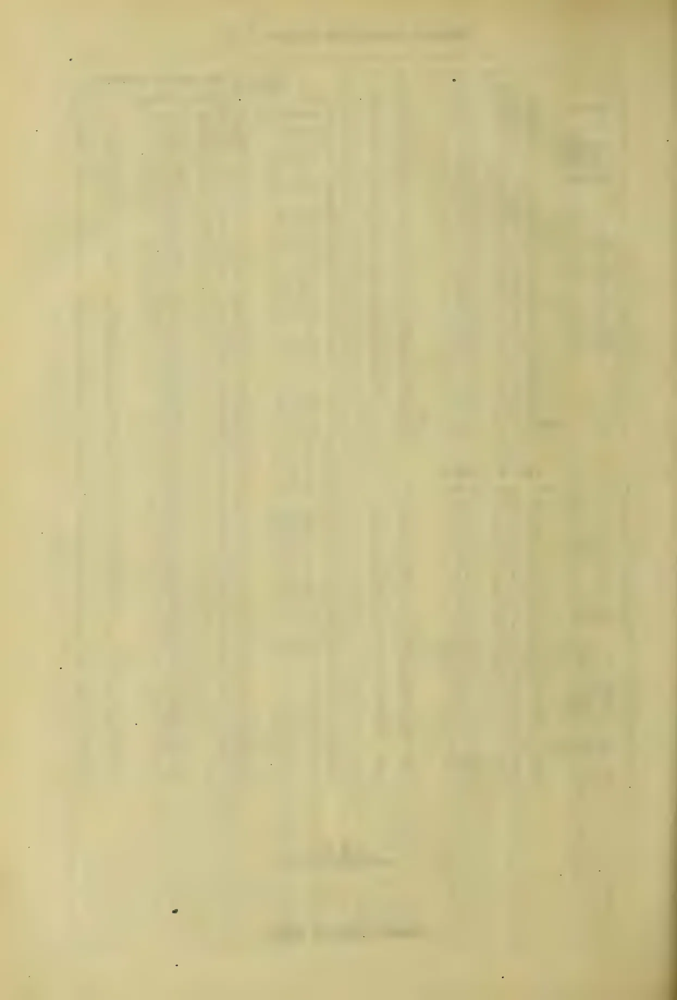This image shows a blank page with a light beige or cream-colored background. There are faint, vertical, slightly darker lines running down the page, which appear to be artifacts from the scanning process or the texture of the paper. A small, dark, irregular speck is visible near the bottom center of the page. The overall appearance is that of an old, slightly worn piece of paper.

1066------------------------------------------------

# TEA, COFFEE, CINCHONA, COCOA, AND CARDAMOM SALES.

**NO. 45**

COLOMBO, NOVEMBER 21, 1898.

PRICE:—12½ cents each 3 copies  
30 cents; 6 copies ½ rupee.

## COLOMBO SALES OF TEA.

### LARGE LOTS.

#### [Thompson and Villiers.—

81,374 lb.]

<table border="1">
<thead>
<tr>
<th>Lot.</th>
<th>Box.</th>
<th>Pkgs.</th>
<th>Name.</th>
<th>lb.</th>
<th>c.</th>
</tr>
</thead>
<tbody>
<tr>
<td>1 R G</td>
<td>1</td>
<td>12 ch</td>
<td>bro or pek</td>
<td>720</td>
<td>43</td>
</tr>
<tr>
<td>5</td>
<td>5</td>
<td>9 do</td>
<td>dust</td>
<td>720</td>
<td>15</td>
</tr>
<tr>
<td>11 Daluk Oya</td>
<td>11</td>
<td>13 hf-ch</td>
<td>bro or pek</td>
<td>780</td>
<td>45 bid</td>
</tr>
<tr>
<td>12</td>
<td>12</td>
<td>18 do</td>
<td>or pek</td>
<td>990</td>
<td>37 bid</td>
</tr>
<tr>
<td>13</td>
<td>13</td>
<td>13 do</td>
<td>pek</td>
<td>715</td>
<td>33</td>
</tr>
<tr>
<td>14 Doone Vale</td>
<td>14</td>
<td>114 boxes</td>
<td>bro pek</td>
<td>1488</td>
<td>40</td>
</tr>
<tr>
<td>15</td>
<td>15</td>
<td>102 do</td>
<td>pek</td>
<td>1370</td>
<td>33</td>
</tr>
<tr>
<td>24 Augusta</td>
<td>24</td>
<td>6 ch</td>
<td>dust</td>
<td>900</td>
<td>16</td>
</tr>
<tr>
<td>25 Cooroondo-watte</td>
<td>25</td>
<td>19 hf-ch</td>
<td>bro pek</td>
<td>950</td>
<td>44</td>
</tr>
<tr>
<td>26</td>
<td>26</td>
<td>55 do</td>
<td>pek</td>
<td>2750</td>
<td>31</td>
</tr>
<tr>
<td>28 Belgodde</td>
<td>28</td>
<td>19 do</td>
<td>bro pek</td>
<td>950</td>
<td>35 bid</td>
</tr>
<tr>
<td>29</td>
<td>29</td>
<td>14 do</td>
<td>pek</td>
<td>700</td>
<td>32</td>
</tr>
<tr>
<td>38 O S S in est. mark</td>
<td>38</td>
<td>25 ch</td>
<td>bro or pek</td>
<td>1750</td>
<td>51 bid</td>
</tr>
<tr>
<td>40</td>
<td>40</td>
<td>21 do</td>
<td>or pek</td>
<td>1365</td>
<td>39 bid</td>
</tr>
<tr>
<td>41</td>
<td>41</td>
<td>32 do</td>
<td>pek</td>
<td>2210</td>
<td>36</td>
</tr>
<tr>
<td>45 Dambulagalla</td>
<td>45</td>
<td>85 do</td>
<td>bro or pek</td>
<td>8500</td>
<td>38 bid</td>
</tr>
<tr>
<td>46</td>
<td>46</td>
<td>50 do</td>
<td>or pek</td>
<td>5000</td>
<td>32 bid</td>
</tr>
<tr>
<td>51 Lynsted</td>
<td>51</td>
<td>17 hf-ch</td>
<td>pek sou</td>
<td>850</td>
<td>40</td>
</tr>
<tr>
<td>54 Myraganga</td>
<td>54</td>
<td>41 ch</td>
<td>bro pek</td>
<td>4100</td>
<td>45 bid</td>
</tr>
<tr>
<td>55</td>
<td>55</td>
<td>11 do</td>
<td>bro or pek</td>
<td>1155</td>
<td>51 bid</td>
</tr>
<tr>
<td>56</td>
<td>56</td>
<td>33 do</td>
<td>pek</td>
<td>2970</td>
<td>37</td>
</tr>
<tr>
<td>57</td>
<td>57</td>
<td>25 do</td>
<td>pek sou</td>
<td>2000</td>
<td>34</td>
</tr>
<tr>
<td>61 D</td>
<td>61</td>
<td>24 do</td>
<td>bro pek</td>
<td>2280</td>
<td>30 bid</td>
</tr>
<tr>
<td>62 Hornsey</td>
<td>62</td>
<td>10 do</td>
<td>pek sou</td>
<td>1000</td>
<td>38</td>
</tr>
<tr>
<td>63</td>
<td>63</td>
<td>25 do</td>
<td>fans</td>
<td>2000</td>
<td>21</td>
</tr>
<tr>
<td>64 N Y</td>
<td>64</td>
<td>22 hf-ch</td>
<td>or pek</td>
<td>1210</td>
<td>39 bid</td>
</tr>
<tr>
<td>65 Pathulpana</td>
<td>65</td>
<td>13 do</td>
<td>bro pek</td>
<td>715</td>
<td>34 bid</td>
</tr>
</tbody>
</table>

#### [Messrs. Somerville & Co.

—211,515 lb.]

<table border="1">
<thead>
<tr>
<th>Lot.</th>
<th>Box.</th>
<th>pkgs.</th>
<th>Name.</th>
<th>lb.</th>
<th>c.</th>
</tr>
</thead>
<tbody>
<tr>
<td>1 Glenalla</td>
<td>281</td>
<td>23 ch</td>
<td>bro pek</td>
<td>2300</td>
<td>58 bid</td>
</tr>
<tr>
<td>2</td>
<td>282</td>
<td>20 do</td>
<td>pek</td>
<td>1860</td>
<td>33</td>
</tr>
<tr>
<td>3</td>
<td>283</td>
<td>8 do</td>
<td>pek sou</td>
<td>720</td>
<td>30</td>
</tr>
<tr>
<td>10 Galphele</td>
<td>290</td>
<td>22 hf-ch</td>
<td>bro pek</td>
<td>1210</td>
<td>46</td>
</tr>
<tr>
<td>11</td>
<td>291</td>
<td>22 do</td>
<td>pek</td>
<td>990</td>
<td>38</td>
</tr>
<tr>
<td>12</td>
<td>292</td>
<td>16 do</td>
<td>pek sou</td>
<td>720</td>
<td>34</td>
</tr>
<tr>
<td>15 Charlie Hill</td>
<td>295</td>
<td>14 hf-ch</td>
<td>bro pek</td>
<td>700</td>
<td>33</td>
</tr>
<tr>
<td>16</td>
<td>296</td>
<td>13 do</td>
<td>pek</td>
<td>800</td>
<td>31</td>
</tr>
<tr>
<td>19 Meetiyagoda</td>
<td>299</td>
<td>15 ch</td>
<td>bro pek</td>
<td>1500</td>
<td>33</td>
</tr>
<tr>
<td>20</td>
<td>300</td>
<td>10 do</td>
<td>pek</td>
<td>1070</td>
<td>30</td>
</tr>
<tr>
<td>24 Dalhousie</td>
<td>304</td>
<td>31 hf-ch</td>
<td>bro or pek</td>
<td>1550</td>
<td>45 bid</td>
</tr>
<tr>
<td>25</td>
<td>305</td>
<td>20 do</td>
<td>or pek</td>
<td>800</td>
<td>41</td>
</tr>
<tr>
<td>26</td>
<td>306</td>
<td>17 do</td>
<td>pek</td>
<td>850</td>
<td>33</td>
</tr>
<tr>
<td>29 Dikmkalana</td>
<td>309</td>
<td>23 hf-ch</td>
<td>pek</td>
<td>1150</td>
<td>33</td>
</tr>
<tr>
<td>30</td>
<td>310</td>
<td>20 do</td>
<td>pek fans</td>
<td>1000</td>
<td>33</td>
</tr>
<tr>
<td>35 Killin, in estate mark</td>
<td>315</td>
<td>32 hf-ch</td>
<td>bro pek</td>
<td>1700</td>
<td>35 bid</td>
</tr>
<tr>
<td>36</td>
<td>316</td>
<td>11 ch</td>
<td>pek</td>
<td>935</td>
<td>31 bid</td>
</tr>
<tr>
<td>37</td>
<td>317</td>
<td>11 do</td>
<td>pek sou</td>
<td>880</td>
<td>26</td>
</tr>
<tr>
<td>St. Catherine</td>
<td>320</td>
<td>13 ch</td>
<td>bro or pek</td>
<td>1256</td>
<td>43</td>
</tr>
<tr>
<td>44 Minna</td>
<td>324</td>
<td>21 hf-ch</td>
<td>bro or pek</td>
<td>1335</td>
<td>56 bid</td>
</tr>
<tr>
<td>45</td>
<td>325</td>
<td>23 ch</td>
<td>or pek</td>
<td>2070</td>
<td>46 bid</td>
</tr>
<tr>
<td>46</td>
<td>326</td>
<td>12 do</td>
<td>pek</td>
<td>1080</td>
<td>44</td>
</tr>
<tr>
<td>47</td>
<td>327</td>
<td>8 do</td>
<td>pek sou</td>
<td>720</td>
<td>36</td>
</tr>
<tr>
<td>48 Blinkbonnie</td>
<td>328</td>
<td>33 hf-ch</td>
<td>bro pek</td>
<td>1815</td>
<td>49 bid</td>
</tr>
<tr>
<td>49</td>
<td>329</td>
<td>30 hf-ch</td>
<td>pek</td>
<td>1350</td>
<td>42 bid</td>
</tr>
<tr>
<td>50</td>
<td>330</td>
<td>21 do</td>
<td>pek sou</td>
<td>945</td>
<td>35</td>
</tr>
<tr>
<td>53 California</td>
<td>333</td>
<td>9 ch</td>
<td>pek</td>
<td>851</td>
<td>30</td>
</tr>
<tr>
<td>56 Hatale</td>
<td>336</td>
<td>7 ch</td>
<td>fans</td>
<td>810</td>
<td>17</td>
</tr>
<tr>
<td>57 Ukuwella</td>
<td>337</td>
<td>54 hf-ch</td>
<td>bro or pek</td>
<td>2970</td>
<td>35 bid</td>
</tr>
<tr>
<td>58</td>
<td>338</td>
<td>18 ch</td>
<td>bro pek</td>
<td>1800</td>
<td>35</td>
</tr>
<tr>
<td>59</td>
<td>339</td>
<td>30 do</td>
<td>pek</td>
<td>300</td>
<td>32</td>
</tr>
<tr>
<td>60</td>
<td>340</td>
<td>11 do</td>
<td>pek sou</td>
<td>1100</td>
<td>28</td>
</tr>
<tr>
<td>61 Monrovia</td>
<td>341</td>
<td>36 ch</td>
<td>bro pek</td>
<td>3800</td>
<td>34 bid</td>
</tr>
<tr>
<td>62</td>
<td>342</td>
<td>28 do</td>
<td>pek</td>
<td>2520</td>
<td>33</td>
</tr>
<tr>
<td>66 Nugawella</td>
<td>346</td>
<td>14 hf-ch</td>
<td>or pek</td>
<td>728</td>
<td>47</td>
</tr>
<tr>
<td>67</td>
<td>347</td>
<td>13 do</td>
<td>bro or pek</td>
<td>806</td>
<td>45</td>
</tr>
<tr>
<td>68</td>
<td>348</td>
<td>16 do</td>
<td>bro pek</td>
<td>928</td>
<td>46</td>
</tr>
<tr>
<td>69</td>
<td>349</td>
<td>49 do</td>
<td>pek</td>
<td>2450</td>
<td>36</td>
</tr>
<tr>
<td>72 Warakamure</td>
<td>352</td>
<td>13 ch</td>
<td>bro pek</td>
<td>1300</td>
<td>34</td>
</tr>
<tr>
<td>73</td>
<td>353</td>
<td>18 hf-ch</td>
<td>or pek</td>
<td>900</td>
<td>36</td>
</tr>
<tr>
<td>74</td>
<td>354</td>
<td>18 ch</td>
<td>pek</td>
<td>1520</td>
<td>31 bid</td>
</tr>
<tr>
<td>75</td>
<td>355</td>
<td>15 do</td>
<td>sou</td>
<td>1350</td>
<td>29</td>
</tr>
<tr>
<td>76</td>
<td>356</td>
<td>9 do</td>
<td>bro pek fans</td>
<td>900</td>
<td>26</td>
</tr>
<tr>
<td>87 Kosgahahene</td>
<td>367</td>
<td>12 hf-ch</td>
<td>bro pek</td>
<td>720</td>
<td>34</td>
</tr>
<tr>
<td>88</td>
<td>368</td>
<td>10 ch</td>
<td>pek</td>
<td>1000</td>
<td>28</td>
</tr>
</tbody>
</table>

<table border="1">
<thead>
<tr>
<th>Lot.</th>
<th>Box.</th>
<th>Pkgs.</th>
<th>Name.</th>
<th>lb.</th>
<th>c.</th>
</tr>
</thead>
<tbody>
<tr>
<td>95 Feriby</td>
<td>375</td>
<td>30 hf-ch</td>
<td>bro pek</td>
<td>1350</td>
<td>40 bid</td>
</tr>
<tr>
<td>96</td>
<td>376</td>
<td>20 ch</td>
<td>pek</td>
<td>1800</td>
<td>32</td>
</tr>
<tr>
<td>97</td>
<td>377</td>
<td>14 do</td>
<td>pek sou</td>
<td>1050</td>
<td>30</td>
</tr>
<tr>
<td>110 Tyspane</td>
<td>390</td>
<td>21 ch</td>
<td>bro pek</td>
<td>1995</td>
<td>45</td>
</tr>
<tr>
<td>111</td>
<td>391</td>
<td>19 do</td>
<td>pek</td>
<td>1615</td>
<td>24</td>
</tr>
<tr>
<td>112 Glenalla</td>
<td>392</td>
<td>23 ch</td>
<td>bro pek</td>
<td>2300</td>
<td>37 bid</td>
</tr>
<tr>
<td>113</td>
<td>393</td>
<td>20 do</td>
<td>pek</td>
<td>1800</td>
<td>32</td>
</tr>
<tr>
<td>114</td>
<td>394</td>
<td>10 do</td>
<td>pek sou</td>
<td>900</td>
<td>30</td>
</tr>
<tr>
<td>121 Harangalla</td>
<td>1</td>
<td>18 ch</td>
<td>bro pek</td>
<td>1800</td>
<td>45</td>
</tr>
<tr>
<td>122</td>
<td>2</td>
<td>33 do</td>
<td>pek</td>
<td>2970</td>
<td>34</td>
</tr>
<tr>
<td>123</td>
<td>3</td>
<td>8 do</td>
<td>dust</td>
<td>960</td>
<td>17</td>
</tr>
<tr>
<td>126 Corfu</td>
<td>6</td>
<td>11 hf-ch</td>
<td>bro pek</td>
<td>715</td>
<td>50 bid</td>
</tr>
<tr>
<td>128</td>
<td>8</td>
<td>14 do</td>
<td>pek</td>
<td>770</td>
<td>38 bid</td>
</tr>
<tr>
<td>132 Walahandua</td>
<td>12</td>
<td>36 ch</td>
<td>bro pek</td>
<td>3630</td>
<td>38 bid</td>
</tr>
<tr>
<td>133</td>
<td>13</td>
<td>18 do</td>
<td>pek</td>
<td>1620</td>
<td>33</td>
</tr>
<tr>
<td>135 Wallasmulle</td>
<td>15</td>
<td>7 ch</td>
<td>bro pek</td>
<td>700</td>
<td>36</td>
</tr>
<tr>
<td>138</td>
<td>18</td>
<td>8 do</td>
<td>fans</td>
<td>800</td>
<td>28</td>
</tr>
<tr>
<td>139 Woodthorpe</td>
<td>19</td>
<td>11 ch</td>
<td>bro pek</td>
<td>1100</td>
<td>43 bid</td>
</tr>
<tr>
<td>140</td>
<td>20</td>
<td>11 do</td>
<td>pek</td>
<td>935</td>
<td>34</td>
</tr>
<tr>
<td>141</td>
<td>21</td>
<td>13 do</td>
<td>pek sou</td>
<td>1040</td>
<td>31</td>
</tr>
<tr>
<td>149 Rayigam</td>
<td>29</td>
<td>25 ch</td>
<td>bro pek</td>
<td>2500</td>
<td>44</td>
</tr>
<tr>
<td>150</td>
<td>30</td>
<td>11 do</td>
<td>or pek</td>
<td>968</td>
<td>41</td>
</tr>
<tr>
<td>151</td>
<td>31</td>
<td>29 do</td>
<td>pek</td>
<td>2610</td>
<td>34</td>
</tr>
<tr>
<td>152</td>
<td>32</td>
<td>17 do</td>
<td>pek sou</td>
<td>1493</td>
<td>30</td>
</tr>
<tr>
<td>153 Ovoca A I</td>
<td>33</td>
<td>14 hf-ch</td>
<td>pek fans</td>
<td>910</td>
<td>28</td>
</tr>
<tr>
<td>164</td>
<td>34</td>
<td>7 ch</td>
<td>unas</td>
<td>840</td>
<td>28</td>
</tr>
<tr>
<td>169 Ambalawa</td>
<td>39</td>
<td>22 hf-ch</td>
<td>bro pek</td>
<td>1100</td>
<td>37</td>
</tr>
<tr>
<td>180</td>
<td>40</td>
<td>25 do</td>
<td>pek</td>
<td>1125</td>
<td>31 bid</td>
</tr>
<tr>
<td>161</td>
<td>41</td>
<td>20 do</td>
<td>pek sou</td>
<td>800</td>
<td>29</td>
</tr>
<tr>
<td>165 B E</td>
<td>45</td>
<td>13 ch</td>
<td>dust</td>
<td>1170</td>
<td>16</td>
</tr>
<tr>
<td>167 Marigold</td>
<td>47</td>
<td>36 hf-ch</td>
<td>bro pek</td>
<td>2016</td>
<td>47</td>
</tr>
<tr>
<td>168</td>
<td>48</td>
<td>20 do</td>
<td>pek</td>
<td>1080</td>
<td>41</td>
</tr>
<tr>
<td>171</td>
<td>51</td>
<td>12 do</td>
<td>bro pek fans</td>
<td>840</td>
<td>32</td>
</tr>
<tr>
<td>172 Hapugasmulle</td>
<td>52</td>
<td>15 ch</td>
<td>bro pek</td>
<td>1650</td>
<td>39</td>
</tr>
<tr>
<td>173</td>
<td>53</td>
<td>13 do</td>
<td>pek</td>
<td>1520</td>
<td>32</td>
</tr>
<tr>
<td>178 K G</td>
<td>58</td>
<td>14 ch</td>
<td>pek</td>
<td>1335</td>
<td>27 bid</td>
</tr>
</tbody>
</table>

<table border="1">
<tbody>
<tr>
<td>185 R C T F in estate mark</td>
<td>65</td>
<td>26 ch</td>
<td>bro pek</td>
<td>2340</td>
<td>34</td>
</tr>
<tr>
<td>188</td>
<td>68</td>
<td>15 ch</td>
<td>pek sou</td>
<td>1275</td>
<td>20 bid</td>
</tr>
<tr>
<td>190 T K</td>
<td>70</td>
<td>11 hf-ch</td>
<td>pek fans</td>
<td>737</td>
<td>19 bid</td>
</tr>
<tr>
<td>191</td>
<td>71</td>
<td>11 ch</td>
<td>sou</td>
<td>990</td>
<td>19 bid</td>
</tr>
<tr>
<td>192 Honiton</td>
<td>72</td>
<td>19 ch</td>
<td>bro pek</td>
<td>1900</td>
<td>43 bid</td>
</tr>
<tr>
<td>193</td>
<td>73</td>
<td>11 do</td>
<td>pek</td>
<td>935</td>
<td>37</td>
</tr>
<tr>
<td>197 Penrith</td>
<td>77</td>
<td>8 ch</td>
<td>dust</td>
<td>1160</td>
<td>17</td>
</tr>
<tr>
<td>199 Annandale</td>
<td>79</td>
<td>21 ch</td>
<td>or pek</td>
<td>1092</td>
<td>59</td>
</tr>
<tr>
<td>200 C I C</td>
<td>80</td>
<td>19 ch</td>
<td>pek sou</td>
<td>1689</td>
<td>out</td>
</tr>
<tr>
<td></td>
<td></td>
<td>1 hf-ch</td>
<td></td>
<td></td>
<td></td>
</tr>
<tr>
<td>201 Suriawatte</td>
<td>81</td>
<td>19 hf-ch</td>
<td>bro pek</td>
<td>950</td>
<td>40 bid</td>
</tr>
<tr>
<td>202</td>
<td>82</td>
<td>34 ch</td>
<td>pek</td>
<td>2992</td>
<td>36 bid</td>
</tr>
<tr>
<td>203</td>
<td>83</td>
<td>15 do</td>
<td>pek sou</td>
<td>1520</td>
<td>29 bid</td>
</tr>
<tr>
<td>204</td>
<td>84</td>
<td>33 hf-ch</td>
<td>pek fans</td>
<td>2475</td>
<td>24 bid</td>
</tr>
<tr>
<td>209 Welgampola</td>
<td>89</td>
<td>22 hf-ch</td>
<td>pek sou</td>
<td>1100</td>
<td>29</td>
</tr>
<tr>
<td>211</td>
<td>91</td>
<td>14 do</td>
<td>fans</td>
<td>770</td>
<td>28</td>
</tr>
<tr>
<td>213 Killea</td>
<td>93</td>
<td>22 hf-ch</td>
<td>bro pek</td>
<td>1254</td>
<td>39 bid</td>
</tr>
<tr>
<td>214</td>
<td>94</td>
<td>16 do</td>
<td>pek</td>
<td>720</td>
<td>33 bid</td>
</tr>
<tr>
<td>215 Acoya</td>
<td>95</td>
<td>32 hf ch</td>
<td>bro pek</td>
<td>1600</td>
<td>37 bid</td>
</tr>
<tr>
<td>216 H G L</td>
<td>96</td>
<td>6 ch</td>
<td>dust</td>
<td>810</td>
<td>15</td>
</tr>
<tr>
<td>220 H</td>
<td>100</td>
<td>19 ch</td>
<td>pek</td>
<td>1520</td>
<td>29 bid</td>
</tr>
<tr>
<td>223 Elchico</td>
<td>103</td>
<td>43 ch</td>
<td>bro pek</td>
<td>4360</td>
<td>34 bid</td>
</tr>
<tr>
<td>224 New Valley</td>
<td>104</td>
<td>24 ch</td>
<td>bro or pek</td>
<td>2400</td>
<td>56</td>
</tr>
<tr>
<td>225</td>
<td>105</td>
<td>19 do</td>
<td>or pek</td>
<td>1900</td>
<td>46 bid</td>
</tr>
<tr>
<td>226</td>
<td>106</td>
<td>22 do</td>
<td>pek</td>
<td>2200</td>
<td>39</td>
</tr>
<tr>
<td>227</td>
<td>107</td>
<td>14 do</td>
<td>pek sou</td>
<td>1200</td>
<td>37</td>
</tr>
<tr>
<td>229 N I T</td>
<td>109</td>
<td>7 ch</td>
<td>unas</td>
<td>700</td>
<td>26</td>
</tr>
</tbody>
</table>

#### [Mr. E. John.—150,692 lb.]

<table border="1">
<thead>
<tr>
<th>Lot.</th>
<th>Box.</th>
<th>pkgs.</th>
<th>Name.</th>
<th>lb.</th>
<th>c.</th>
</tr>
</thead>
<tbody>
<tr>
<td>2 Agru Ouvah</td>
<td>973</td>
<td>15 hf-ch</td>
<td>pek fans</td>
<td>1275</td>
<td>34</td>
</tr>
<tr>
<td>10 Polduwa</td>
<td>997</td>
<td>14 ch</td>
<td>bro pek</td>
<td>1400</td>
<td>32</td>
</tr>
<tr>
<td>11</td>
<td>1000</td>
<td>15 do</td>
<td>pekoe</td>
<td>1500</td>
<td>31</td>
</tr>
<tr>
<td>13 S W</td>
<td>6</td>
<td>26 ch</td>
<td>bro pek</td>
<td>2470</td>
<td>47 bid</td>
</tr>
<tr>
<td>14</td>
<td>9</td>
<td>17 do</td>
<td>pekoe</td>
<td>1475</td>
<td>42 bid</td>
</tr>
<tr>
<td>17 Little Valley</td>
<td>18</td>
<td>8 do</td>
<td>bro pek</td>
<td>800</td>
<td>43</td>
</tr>
<tr>
<td>18</td>
<td>21</td>
<td>14 do</td>
<td>pekoe</td>
<td>1260</td>
<td>32 bid</td>
</tr>
<tr>
<td>21 Glasgow</td>
<td>30</td>
<td>66 hf-ch</td>
<td>bro pek</td>
<td>3630</td>
<td>54 bid</td>
</tr>
<tr>
<td>22</td>
<td>33</td>
<td>32 ch</td>
<td>pekoe</td>
<td>2850</td>
<td>44</td>
</tr>
<tr>
<td>24 E K</td>
<td>39</td>
<td>9 hf-ch</td>
<td>fans</td>
<td>720</td>
<td>18</td>
</tr>
<tr>
<td>25</td>
<td>42</td>
<td>14 do</td>
<td>unassorted</td>
<td>770</td>
<td>39</td>
</tr>
<tr>
<td>26 Kanangama</td>
<td>45</td>
<td>28 do</td>
<td>bro pek</td>
<td>2660</td>
<td>34 bid</td>
</tr>
<tr>
<td>27</td>
<td>48</td>
<td>18 do</td>
<td>pekoe</td>
<td>1620</td>
<td>29 bid</td>
</tr>
<tr>
<td>28</td>
<td>51</td>
<td>22 do</td>
<td>pek sou</td>
<td>1870</td>
<td>28</td>
</tr>
<tr>
<td>29</td>
<td>54</td>
<td>25 do</td>
<td>bro pek fans</td>
<td>2250</td>
<td>29 bid</td>
</tr>
<tr>
<td>30</td>
<td>57</td>
<td>10 do</td>
<td>fans</td>
<td>800</td>
<td>24</td>
</tr>
<tr>
<td>31</td>
<td>60</td>
<td>10 hf-ch</td>
<td>dust</td>
<td>800</td>
<td>16</td>
</tr>
<tr>
<td>32 S J</td>
<td>63</td>
<td>17 do</td>
<td>bro or pek</td>
<td>952</td>
<td>70</td>
</tr>
<tr>
<td>33</td>
<td>66</td>
<td>15 do</td>
<td>or pek</td>
<td>720</td>
<td>61</td>
</tr>
<tr>
<td>34</td>
<td>69</td>
<td>14 do</td>
<td>pekoe</td>
<td>700</td>
<td>47</td>
</tr>
</tbody>
</table>

1067------------------------------------------------

2

CEYLON PRODUCE SALES LIST.

<table border="1">
<thead>
<tr>
<th>Lot.</th>
<th>Box.</th>
<th>Pkgs.</th>
<th>Name.</th>
<th>lb.</th>
<th>c.</th>
</tr>
</thead>
<tbody>
<tr><td>35</td><td>Mount Everest</td><td>72</td><td>18 hf-ch</td><td>bro pek</td><td>990 62</td></tr>
<tr><td>36</td><td></td><td>75</td><td>24 do</td><td>or pek</td><td>1200 62</td></tr>
<tr><td>37</td><td></td><td>73</td><td>18 ch</td><td>pekoe</td><td>1710 47</td></tr>
<tr><td>38</td><td></td><td>81</td><td>10 do</td><td>pek sou</td><td>900 41</td></tr>
<tr><td>43</td><td>Iona</td><td>96</td><td>29 hf-ch</td><td>bro or pek</td><td>1595 68</td></tr>
<tr><td>44</td><td></td><td>99</td><td>17 ch</td><td>cr pek</td><td>1700 61</td></tr>
<tr><td>45</td><td></td><td>102</td><td>8 do</td><td>pekoe</td><td>800 47</td></tr>
<tr><td>46</td><td>B K</td><td>105</td><td>9 hf-ch</td><td>dust</td><td>846 21</td></tr>
<tr><td>47</td><td>Lameliere</td><td>108</td><td>29 do</td><td>bro pek</td><td>1682 49 bid</td></tr>
<tr><td>48</td><td></td><td>111</td><td>21 ch</td><td>pekoe</td><td>1890 43</td></tr>
<tr><td>51</td><td>Mocha</td><td>120</td><td>14 do</td><td>bro or pek</td><td>1400 59 bid</td></tr>
<tr><td>52</td><td></td><td>123</td><td>12 do</td><td>or pek</td><td>1080 60</td></tr>
<tr><td>53</td><td></td><td>126</td><td>14 do</td><td>pekoe</td><td>1260 44 bid</td></tr>
<tr><td>54</td><td></td><td>129</td><td>12 do</td><td>fans</td><td>900 35</td></tr>
<tr><td>61</td><td>Templestowe</td><td>150</td><td>32 ch</td><td>bro or pek</td><td>2880 50</td></tr>
<tr><td>62</td><td></td><td>153</td><td>27 do</td><td>pekoe</td><td>2430 43</td></tr>
<tr><td>63</td><td></td><td>156</td><td>20 do</td><td>pek sou</td><td>1600 37</td></tr>
<tr><td>64</td><td>Evalgolla</td><td>150</td><td>16 hf-ch</td><td>bro pek</td><td>880 44</td></tr>
<tr><td>65</td><td></td><td>162</td><td>28 do</td><td>pekoe</td><td>1400 35</td></tr>
<tr><td>69</td><td>B S</td><td>174</td><td>7 ch</td><td>bro pek</td><td>770 40</td></tr>
<tr><td>70</td><td></td><td>177</td><td>11 do</td><td>pekoe</td><td>935 35</td></tr>
<tr><td>74</td><td>Marakona</td><td>189</td><td>9 do</td><td>pek sou</td><td>810 26</td></tr>
<tr><td>76</td><td>Agra Ouvah</td><td>195</td><td>38 hf-ch</td><td>bro or pek</td><td>2432 65</td></tr>
<tr><td>77</td><td></td><td>198</td><td>15 do</td><td>or pek</td><td>810 60</td></tr>
<tr><td>82</td><td>Digdola</td><td>213</td><td>14 ch</td><td>pek sou</td><td>1260 28</td></tr>
<tr><td>87</td><td>S, in estate mark</td><td>223</td><td>8 do</td><td>fans</td><td>800 38</td></tr>
<tr><td>88</td><td></td><td>231</td><td>9 do</td><td>bro mix</td><td>810 21</td></tr>
<tr><td>90</td><td>Theresia</td><td>237</td><td>8 do</td><td>bro pek fans</td><td>800 44</td></tr>
<tr><td>94</td><td>Lameliere</td><td>249</td><td>29 hf-ch</td><td>bro pek</td><td>1682 49 bid</td></tr>
<tr><td>95</td><td></td><td>252</td><td>21 ch</td><td>pekoe</td><td>1890 41</td></tr>
<tr><td>98</td><td>M T P, in estate mark</td><td>261</td><td>10 do</td><td>dust</td><td>1400 17</td></tr>
<tr><td>99</td><td>Poilakande</td><td>264</td><td>20 hf-ch</td><td>or pek</td><td>990 42 bid</td></tr>
<tr><td>100</td><td></td><td>267</td><td>25 ch</td><td>bro pekoe</td><td>2495 26</td></tr>
<tr><td>101</td><td></td><td>270</td><td>24 do</td><td>pekoe</td><td>2160 33</td></tr>
<tr><td>104</td><td>Brownlow</td><td>279</td><td>30 hf-ch</td><td>or pek</td><td>1560 45</td></tr>
<tr><td>105</td><td>Gampai</td><td>282</td><td>16 do</td><td>or pek</td><td>832 41</td></tr>
<tr><td>110</td><td>Sinna Dua</td><td>297</td><td>15 ch</td><td>bro pek</td><td>930 43 bid</td></tr>
<tr><td>111</td><td></td><td>300</td><td>9 do</td><td>pekoe</td><td>792 35</td></tr>
<tr><td>115</td><td>Glasgow</td><td>312</td><td>37 do</td><td>bro ro pek</td><td>2960 59</td></tr>
<tr><td>116</td><td></td><td>315</td><td>12 do</td><td>or pek</td><td>780 58</td></tr>
<tr><td>117</td><td></td><td>318</td><td>11 do</td><td>pekoe</td><td>1100 48</td></tr>
<tr><td>118</td><td>Kotuagedera</td><td>321</td><td>25 do</td><td>bro pek</td><td>2125 33 bid</td></tr>
<tr><td>119</td><td>Craigien</td><td>324</td><td>27 do</td><td>bro pek</td><td>2700 34</td></tr>
<tr><td>121</td><td></td><td>330</td><td>29 do</td><td>pekoe</td><td>2010 37</td></tr>
<tr><td>122</td><td></td><td>333</td><td>10 hf-ch</td><td>bro or pek fans</td><td>700 18 bid</td></tr>
<tr><td>123</td><td></td><td>336</td><td>10 do</td><td>pek fan</td><td>700 20 bid</td></tr>
<tr><td>127</td><td>Kotuagedera</td><td>343</td><td>17 ch</td><td>bro pek</td><td>1445 33 bid</td></tr>
<tr><td>128</td><td></td><td>351</td><td>11 do</td><td>pek</td><td>935 30</td></tr>
<tr><td>134</td><td>St. Julia</td><td>369</td><td>20 hf-ch</td><td>bro pek</td><td>1100 38</td></tr>
<tr><td>135</td><td>Suduganga</td><td>372</td><td>18 ch</td><td>or pek</td><td>1620 39</td></tr>
<tr><td>136</td><td></td><td>375</td><td>35 hf-ch</td><td>bro or pek</td><td>1925 46 bid</td></tr>
<tr><td>137</td><td></td><td>378</td><td>33 ch</td><td>pek sou</td><td>2505 32 bid</td></tr>
<tr><td>139</td><td></td><td>384</td><td>12 do</td><td>souchong</td><td>960 29</td></tr>
<tr><td>140</td><td>Glentilt</td><td>387</td><td>37 do</td><td>bro pek</td><td>3700 63 bid</td></tr>
<tr><td>141</td><td></td><td>390</td><td>15 do</td><td>pekoe</td><td>1500 43</td></tr>
<tr><td>142</td><td>Bellongalla</td><td>393</td><td>25 hf-ch</td><td>bro pek</td><td>1250 36 bid</td></tr>
<tr><td>143</td><td></td><td>396</td><td>18 do</td><td>pekoe</td><td>1620 30</td></tr>
</tbody>
</table>

[Messrs. Forbes & Walker.--  
313,882 lb.]

<table border="1">
<thead>
<tr>
<th>Lot.</th>
<th>Box.</th>
<th>Pkgs.</th>
<th>Name.</th>
<th>lb.</th>
<th>c.</th>
</tr>
</thead>
<tbody>
<tr><td>3</td><td>A M B</td><td>1006</td><td>22 ch</td><td>pekoe</td><td>1936 27</td></tr>
<tr><td>5</td><td>N</td><td>1012</td><td>24 do</td><td>bro tea</td><td>3120 17</td></tr>
<tr><td>6</td><td>Inrogalla</td><td>1015</td><td>10 do</td><td>bro pek</td><td>1000 43</td></tr>
<tr><td>7</td><td></td><td>1018</td><td>9 do</td><td>pek</td><td>765 37</td></tr>
<tr><td>10</td><td>Mansfield</td><td>1927</td><td>44 hf-ch</td><td>bro pek</td><td>2640 50 bid</td></tr>
<tr><td>11</td><td></td><td>1030</td><td>23 ch</td><td>pek</td><td>2070 40</td></tr>
<tr><td>13</td><td>Bon Accord</td><td>1036</td><td>14 hf-ch</td><td>bro pek</td><td>840 45</td></tr>
<tr><td>16</td><td>Mousakelle</td><td>1045</td><td>26 ch</td><td>bro or pek</td><td>2600 44 bid</td></tr>
<tr><td>17</td><td></td><td>1048</td><td>26 do</td><td>pek</td><td>2600 36</td></tr>
<tr><td>20</td><td>Shrubs Hill</td><td>1057</td><td>50 do</td><td>bro pek</td><td>4860 45 bid</td></tr>
<tr><td>21</td><td></td><td>1060</td><td>20 do</td><td>pek</td><td>1720 37 bid</td></tr>
<tr><td>28</td><td>Glencorse</td><td>1081</td><td>21 do</td><td>bro pek</td><td>1890 39</td></tr>
<tr><td>29</td><td></td><td>1084</td><td>14 do</td><td>bro or pek</td><td>1400 55</td></tr>
<tr><td>30</td><td></td><td>1087</td><td>17 do</td><td>pek</td><td>1360 33</td></tr>
<tr><td>31</td><td></td><td>1098</td><td>12 do</td><td>pek sou</td><td>900 30</td></tr>
<tr><td>34</td><td>Kelaneiya</td><td>1099</td><td>32 do</td><td>bro or pek</td><td>2720 47</td></tr>
<tr><td>35</td><td></td><td>1102</td><td>27 do</td><td>pek</td><td>2700 36</td></tr>
<tr><td>38</td><td>Dewalakande</td><td>1111</td><td>25 hf-ch</td><td>bro or pek</td><td>1250 52 bid</td></tr>
<tr><td>39</td><td></td><td>1114</td><td>30 ch</td><td>or pek</td><td>2850 37 bid</td></tr>
<tr><td>40</td><td></td><td>1117</td><td>33 do</td><td>pek</td><td>2640 34</td></tr>
<tr><td>41</td><td></td><td>1120</td><td>18 do</td><td>pek sou</td><td>1350 30</td></tr>
<tr><td>42</td><td></td><td>1123</td><td>15 do</td><td>bro pek fan</td><td>1350 27</td></tr>
<tr><td>43</td><td></td><td>1126</td><td>25 hf-ch</td><td>dust</td><td>1750 17</td></tr>
<tr><td>45</td><td>D M V</td><td>1132</td><td>12 ch</td><td>bro pek</td><td>1116 39</td></tr>
<tr><td>46</td><td></td><td>1135</td><td>14 do</td><td>pek</td><td>1176 32</td></tr>
<tr><td>50</td><td>Battawatte</td><td>1147</td><td>23 do</td><td>bro pek</td><td>2530 47 bid</td></tr>
<tr><td>51</td><td></td><td>1150</td><td>27 do</td><td>pek</td><td>2565 38</td></tr>
<tr><td>52</td><td></td><td>1153</td><td>12 do</td><td>pek sou</td><td>960 35</td></tr>
<tr><td>53</td><td>Grange Gardens</td><td>1156</td><td>26 do</td><td>bro or pek</td><td>2600 48</td></tr>
<tr><td>54</td><td></td><td>1159</td><td>17 do</td><td>pekoe</td><td>1700 36</td></tr>
</tbody>
</table>

<table border="1">
<thead>
<tr>
<th>Lot.</th>
<th>Box.</th>
<th>Pkgs.</th>
<th>Name.</th>
<th>lb.</th>
<th>c.</th>
</tr>
</thead>
<tbody>
<tr><td>58</td><td>Roeberry</td><td>1171</td><td>10 do</td><td>bro pek</td><td>1100 52</td></tr>
<tr><td>59</td><td></td><td>1174</td><td>20 do</td><td>pek</td><td>1750 43</td></tr>
<tr><td>60</td><td></td><td>1177</td><td>27 do</td><td>or pek</td><td>2538 58</td></tr>
<tr><td>61</td><td></td><td>1180</td><td>20 do</td><td>pek sou</td><td>1800 38</td></tr>
<tr><td>62</td><td>M'Golla</td><td>1183</td><td>16 do</td><td>fans</td><td>1760 14</td></tr>
<tr><td>64</td><td>N, in estate mark</td><td>1189</td><td>12 do</td><td>bro tea</td><td>1620 9</td></tr>
<tr><td>65</td><td>St. Heliers</td><td>1192</td><td>21 hf-ch</td><td>bro or pek</td><td>1184 50</td></tr>
<tr><td>66</td><td></td><td>1195</td><td>13 ch</td><td>or pek</td><td>1040 41</td></tr>
<tr><td>67</td><td></td><td>1198</td><td>9 do</td><td>pek</td><td>810 36</td></tr>
<tr><td>69</td><td>Theydon Bois</td><td>1204</td><td>14 do</td><td>bro or pek</td><td>1260 56</td></tr>
<tr><td>70</td><td></td><td>1207</td><td>10 do</td><td>bro pek</td><td>900 66</td></tr>
<tr><td>71</td><td></td><td>1210</td><td>9 do</td><td>or pek</td><td>720 47</td></tr>
<tr><td>72</td><td></td><td>1218</td><td>20 do</td><td>pek</td><td>1600 38</td></tr>
<tr><td>73</td><td></td><td>1216</td><td>11 do</td><td>pek sou</td><td>850 34</td></tr>
<tr><td>74</td><td>Weyungawatte</td><td>1219</td><td>24 hf-ch</td><td>bro or pek</td><td>1440 43</td></tr>
<tr><td>75</td><td></td><td>1223</td><td>20 ch</td><td>bro pek</td><td>2600 41 bid</td></tr>
<tr><td>76</td><td></td><td>1225</td><td>31 do</td><td>pek</td><td>2790 33 bid</td></tr>
<tr><td>79</td><td>Scrubs</td><td>1234</td><td>15 hf-ch</td><td>bro or pek</td><td>760 61 bid</td></tr>
<tr><td>80</td><td></td><td>1237</td><td>25 do</td><td>bro pek</td><td>1250 50 bid</td></tr>
<tr><td>83</td><td>Beausijour</td><td>1246</td><td>11 ch</td><td>bro pek</td><td>900 49</td></tr>
<tr><td>84</td><td></td><td>1249</td><td>12 do</td><td>pek</td><td>900 32</td></tr>
<tr><td>89</td><td>Mawiligangawatte</td><td>1264</td><td>58 hf-ch</td><td>bro pek</td><td>2900 40</td></tr>
<tr><td>90</td><td></td><td>1267</td><td>31 ch</td><td>pek sou</td><td>2170 30</td></tr>
<tr><td>92</td><td>A G</td><td>1273</td><td>11 do</td><td>pek sou</td><td>990 31</td></tr>
<tr><td>95</td><td>Ingurugalla</td><td>1282</td><td>6 do</td><td>bro tea</td><td>780 17</td></tr>
<tr><td>97</td><td>Great Valley, Ceylon, in estate mark</td><td>1288</td><td>24 hf-ch</td><td>bro pek</td><td>1320 47</td></tr>
<tr><td>98</td><td></td><td>1291</td><td>18 ch</td><td>or pek</td><td>1170 39</td></tr>
<tr><td>99</td><td></td><td>1294</td><td>20 do</td><td>pek</td><td>1800 35</td></tr>
<tr><td>100</td><td></td><td>1297</td><td>15 do</td><td>pek sou</td><td>1350 32</td></tr>
<tr><td>1 3</td><td>E, in estate mark</td><td>1306</td><td>21 do</td><td>bro pek</td><td>2100 55 bid</td></tr>
<tr><td></td><td></td><td>1309</td><td>15 do</td><td>pek</td><td>1600 40 bid</td></tr>
<tr><td></td><td></td><td>1312</td><td>11 do</td><td>pek sou</td><td>1100 41 bid</td></tr>
<tr><td>5</td><td>High Forest</td><td>1348</td><td>22 hf-ch</td><td>bro or pek</td><td>1166 73</td></tr>
<tr><td>1 7</td><td></td><td>1351</td><td>22 do</td><td>or pek</td><td>1012 71</td></tr>
<tr><td>1 8</td><td></td><td>1354</td><td>24 do</td><td>pek</td><td>1056 54</td></tr>
<tr><td>1 9</td><td></td><td>1357</td><td>27 do</td><td>pek sou</td><td>1161 41</td></tr>
<tr><td>120</td><td></td><td>1360</td><td>26 do</td><td>bro or pek</td><td>1560 43</td></tr>
<tr><td>121</td><td>H F</td><td>13 3</td><td>13 do</td><td>pek</td><td>864 35</td></tr>
<tr><td>122</td><td></td><td>1360</td><td>18 do</td><td>bro or pek</td><td>990 35</td></tr>
<tr><td>123</td><td>Dea Ella</td><td>1369</td><td>36 do</td><td>or pek</td><td>1800 35 bid</td></tr>
<tr><td>124</td><td></td><td>1372</td><td>29 do</td><td>pek</td><td>1450 30</td></tr>
<tr><td>125</td><td></td><td>1375</td><td>19 do</td><td>pek sou</td><td>855 29</td></tr>
<tr><td>126</td><td></td><td>1378</td><td>14 ch</td><td>bro pek</td><td>1400 45</td></tr>
<tr><td>128</td><td></td><td>1381</td><td>12 do</td><td>pek</td><td>1080 36</td></tr>
<tr><td>133</td><td>Bargany</td><td>1396</td><td>14 hf-ch</td><td>or pek</td><td>770 45 bid</td></tr>
<tr><td>134</td><td></td><td>1393</td><td>14 do</td><td>bro pek</td><td>840 60 bid</td></tr>
<tr><td>135</td><td></td><td>1402</td><td>8 ch</td><td>pek</td><td>760 40</td></tr>
<tr><td>136</td><td>Killarney</td><td>1405</td><td>11 do</td><td>or pek</td><td>935 52</td></tr>
<tr><td>137</td><td></td><td>1408</td><td>36 hf-ch</td><td>bro or pek</td><td>1880 51</td></tr>
<tr><td>138</td><td></td><td>1411</td><td>16 ch</td><td>pek</td><td>1250 43</td></tr>
<tr><td>139</td><td>Meddetenne</td><td>1414</td><td>34 hf-ch</td><td>bro pek</td><td>1870 46</td></tr>
<tr><td>140</td><td></td><td>1417</td><td>14 ch</td><td>pek</td><td>1330 34</td></tr>
<tr><td>141</td><td></td><td>1420</td><td>9 do</td><td>pek sou</td><td>810 30</td></tr>
<tr><td>142</td><td>Devonford</td><td>1423</td><td>21 hf-ch</td><td>bro or pek</td><td>1050 35</td></tr>
<tr><td>143</td><td></td><td>1426</td><td>12 ch</td><td>pek</td><td>1020 52</td></tr>
<tr><td>144</td><td>Marguerita</td><td>1429</td><td>20 hf-ch</td><td>bro pek</td><td>1100 69 bid</td></tr>
<tr><td>145</td><td></td><td>1432</td><td>17 do</td><td>or pek</td><td>850 65</td></tr>
<tr><td>146</td><td></td><td>1435</td><td>23 ch</td><td>pek</td><td>2300 45</td></tr>
<tr><td>147</td><td></td><td>1438</td><td>8 do</td><td>pek sou</td><td>720 40</td></tr>
<tr><td>151</td><td>Erismere</td><td>1450</td><td>39 do</td><td>bro pek</td><td>3900 55</td></tr>
<tr><td>152</td><td></td><td>1453</td><td>39 hf-ch</td><td>pek</td><td>1794 43</td></tr>
<tr><td>155</td><td>Castlereagh</td><td>1462</td><td>17 ch</td><td>bro pek</td><td>1760 56</td></tr>
<tr><td>156</td><td></td><td>1465</td><td>17 do</td><td>or pek</td><td>1445 46</td></tr>
<tr><td>157</td><td></td><td>1468</td><td>16 do</td><td>pek</td><td>1280 39</td></tr>
<tr><td>166</td><td>Pantiya</td><td>1495</td><td>5 do</td><td>dust</td><td>750 15</td></tr>
<tr><td>169</td><td>A</td><td>1504</td><td>12 ch</td><td>pek sou</td><td>1080 out</td></tr>
<tr><td>179</td><td>Farnham</td><td>1534</td><td>50 hf-ch</td><td>bro pek</td><td>3000 56</td></tr>
<tr><td>180</td><td></td><td>1537</td><td>28 do</td><td>pek</td><td>1540 41</td></tr>
<tr><td>184</td><td>Tymawr</td><td>1549</td><td>26 do</td><td>or pek</td><td>1170 63</td></tr>
<tr><td>185</td><td></td><td>1552</td><td>44 do</td><td>pek</td><td>1760 44</td></tr>
<tr><td>186</td><td></td><td>1555</td><td>23 do</td><td>bro sou</td><td>1035 39</td></tr>
<tr><td>187</td><td>Penrhos</td><td>1558</td><td>20 do</td><td>bro pek</td><td>1120 59 bid</td></tr>
<tr><td>188</td><td></td><td>1561</td><td>22 ch</td><td>pek</td><td>1870 40</td></tr>
<tr><td>191</td><td>Tavalamtenne</td><td>1570</td><td>10 do</td><td>bro or pek</td><td>1000 45</td></tr>
<tr><td>194</td><td>P'Kande</td><td>1579</td><td>64 do</td><td>bro pek</td><td>6080 44</td></tr>
<tr><td>195</td><td></td><td>1582</td><td>65 do</td><td>pek</td><td>5525 35</td></tr>
<tr><td>196</td><td></td><td>1585</td><td>10 do</td><td>pek sou</td><td>800 30</td></tr>
<tr><td>203</td><td>Stamford Hill</td><td>1606</td><td>33 hf-ch</td><td>bro or pek</td><td>1650 71</td></tr>
<tr><td>204</td><td></td><td>1609</td><td>15 ch</td><td>or pek</td><td>1350 59</td></tr>
<tr><td>211</td><td>Naseby</td><td>1630</td><td>30 hf-ch</td><td>bro pek</td><td>1890 59 bid</td></tr>
<tr><td>212</td><td></td><td>1633</td><td>17 do</td><td>pek</td><td>884 55</td></tr>
<tr><td>213</td><td></td><td>1636</td><td>21 do</td><td>pek sou</td><td>1113 40</td></tr>
<tr><td>221</td><td>Halwatura</td><td>1660</td><td>64 do</td><td>bro pek</td><td>6400 41 bid</td></tr>
<tr><td>222</td><td></td><td>1663</td><td>23 do</td><td>or pek</td><td>2660 37</td></tr>
<tr><td>223</td><td></td><td>1666</td><td>23 hf-ch</td><td>bro pek fan</td><td>1680 28 bid</td></tr>
<tr><td>224</td><td>Chesterford</td><td>1669</td><td>45 ch</td><td>bro pek</td><td>4500 48</td></tr>
<tr><td>225</td><td></td><td>1672</td><td>37 do</td><td>pek</td><td>3700 36</td></tr>
<tr><td>226</td><td></td><td>1675</td><td>28 do</td><td>pek sou</td><td>2800 33</td></tr>
<tr><td>227</td><td></td><td>1678</td><td>11 do</td><td>fans</td><td>990 30</td></tr>
<tr><td>228</td><td>H G M</td><td>1681</td><td>14 do</td><td>bro or pek</td><td>1232 49</td></tr>
<tr><td>229</td><td></td><td>1684</td><td>23 do</td><td>bro pek</td><td>1840 41</td></tr>
<tr><td>230</td><td></td><td>1687</td><td>35 do</td><td>pek</td><td>3150 36</td></tr>
<tr><td>231</td><td></td><td>1690</td><td>18 do</td><td>pek sou</td><td>1530 32</td></tr>
</tbody>
</table>

1068------------------------------------------------

CEYLON PRODUCE SALES LIST.

3

<table border="1">
<thead>
<tr>
<th>Lot</th>
<th>Box.</th>
<th>Pkgs.</th>
<th>Name.</th>
<th>lb.</th>
<th>c.</th>
</tr>
</thead>
<tbody>
<tr>
<td>232</td>
<td colspan="5">R A W in est. mark</td>
</tr>
<tr>
<td>233</td>
<td>1693</td>
<td>15 ch</td>
<td>bro pek</td>
<td>1500</td>
<td>53 bid</td>
</tr>
<tr>
<td>233</td>
<td>1696</td>
<td>11 do</td>
<td>pek</td>
<td>880</td>
<td>36 bid</td>
</tr>
<tr>
<td>239</td>
<td>1714</td>
<td>14 do</td>
<td>bro pek</td>
<td>1400</td>
<td>46</td>
</tr>
<tr>
<td>240</td>
<td>1717</td>
<td>15 do</td>
<td>pek</td>
<td>1275</td>
<td>34</td>
</tr>
<tr>
<td>241</td>
<td>1720</td>
<td>17 do</td>
<td>pek sou</td>
<td>1360</td>
<td>31</td>
</tr>
<tr>
<td>255</td>
<td>1762</td>
<td>74 hf-ch</td>
<td>bro or pek</td>
<td>4440</td>
<td>51 bid</td>
</tr>
<tr>
<td>256</td>
<td>1765</td>
<td>22 ch</td>
<td>bro pek</td>
<td>1980</td>
<td>39</td>
</tr>
<tr>
<td>257</td>
<td>1768</td>
<td>14 do</td>
<td>or pek</td>
<td>1330</td>
<td>44</td>
</tr>
<tr>
<td>281</td>
<td>1840</td>
<td>18 hf-ch</td>
<td>bro pek</td>
<td>1044</td>
<td>67</td>
</tr>
<tr>
<td>282</td>
<td>1843</td>
<td>19 ch</td>
<td>pek</td>
<td>1615</td>
<td>40</td>
</tr>
<tr>
<td>283</td>
<td>1846</td>
<td>17 do</td>
<td>pek sou</td>
<td>1360</td>
<td>35</td>
</tr>
<tr>
<td>286</td>
<td>1855</td>
<td>10 do</td>
<td>bro pek</td>
<td>1000</td>
<td>41 bid</td>
</tr>
<tr>
<td>289</td>
<td>1864</td>
<td>34 do</td>
<td>or pek</td>
<td>3400</td>
<td>46 bid</td>
</tr>
<tr>
<td>290</td>
<td>1867</td>
<td>40 box</td>
<td>bro or pek</td>
<td>800</td>
<td>66 bid</td>
</tr>
<tr>
<td>291</td>
<td>1870</td>
<td>18 ch</td>
<td>pek</td>
<td>1800</td>
<td>43</td>
</tr>
<tr>
<td>295</td>
<td>1882</td>
<td>15 hf-ch</td>
<td>br pek dust</td>
<td>1200</td>
<td>16</td>
</tr>
</tbody>
</table>

SMALL LOTS.

[Thompson and Villiers.]

<table border="1">
<thead>
<tr>
<th>Lot.</th>
<th>Box.</th>
<th>Pkgs.</th>
<th>Name.</th>
<th>lb.</th>
<th>c.</th>
</tr>
</thead>
<tbody>
<tr>
<td>2</td>
<td colspan="5">R G</td>
</tr>
<tr>
<td>3</td>
<td>2</td>
<td>6 ch</td>
<td>or pek</td>
<td>570</td>
<td>35</td>
</tr>
<tr>
<td>4</td>
<td>3</td>
<td>6 do</td>
<td>pek</td>
<td>510</td>
<td>32</td>
</tr>
<tr>
<td>10</td>
<td>4</td>
<td>5 do</td>
<td>pek sou</td>
<td>475</td>
<td>30</td>
</tr>
<tr>
<td>16</td>
<td>Doon Vale</td>
<td>16 1 do</td>
<td>pek sou</td>
<td>85</td>
<td>27</td>
</tr>
<tr>
<td>17</td>
<td></td>
<td>17 1 do</td>
<td>fans</td>
<td>100</td>
<td>28</td>
</tr>
<tr>
<td>27</td>
<td colspan="5">Cooroonda-watte</td>
</tr>
<tr>
<td>30</td>
<td>27</td>
<td>2 hf-ch</td>
<td>dust</td>
<td>160</td>
<td>16</td>
</tr>
<tr>
<td>31</td>
<td>30</td>
<td>2 do</td>
<td>sou</td>
<td>135</td>
<td>30</td>
</tr>
<tr>
<td>32</td>
<td>31</td>
<td>2 do</td>
<td>dust</td>
<td>140</td>
<td>24</td>
</tr>
<tr>
<td>33</td>
<td>Relugas</td>
<td>32 1 ch</td>
<td>red leaf</td>
<td>95</td>
<td>18</td>
</tr>
<tr>
<td>39</td>
<td>33</td>
<td>3 do</td>
<td>dust</td>
<td>390</td>
<td>19</td>
</tr>
<tr>
<td>42</td>
<td colspan="5">O S S in est. mark</td>
</tr>
<tr>
<td>43</td>
<td>39</td>
<td>5 do</td>
<td>bro pek</td>
<td>300</td>
<td>37</td>
</tr>
<tr>
<td>44</td>
<td>42</td>
<td>7 ch</td>
<td>pek sou</td>
<td>560</td>
<td>31</td>
</tr>
<tr>
<td>52</td>
<td>43</td>
<td>2 do</td>
<td>sou</td>
<td>150</td>
<td>31</td>
</tr>
<tr>
<td>53</td>
<td>44</td>
<td>2 hf-ch</td>
<td>dust</td>
<td>150</td>
<td>16</td>
</tr>
<tr>
<td>58</td>
<td>Lynsted</td>
<td>52 8 do</td>
<td>bro pek fans</td>
<td>640</td>
<td>24</td>
</tr>
<tr>
<td>59</td>
<td>G S</td>
<td>53 12 do</td>
<td>or pek</td>
<td>586</td>
<td>42</td>
</tr>
<tr>
<td>60</td>
<td>Myraganga</td>
<td>58 6 ch</td>
<td>dust</td>
<td>510</td>
<td>17</td>
</tr>
<tr>
<td>66</td>
<td>59</td>
<td>1 do</td>
<td>red leaf</td>
<td>80</td>
<td>18</td>
</tr>
<tr>
<td>67</td>
<td>60</td>
<td>6 hf-ch</td>
<td>pek fans</td>
<td>426</td>
<td>29 bid</td>
</tr>
<tr>
<td>68</td>
<td>Pathulpana</td>
<td>66 10 do</td>
<td>pek</td>
<td>500</td>
<td>29</td>
</tr>
<tr>
<td>69</td>
<td>67</td>
<td>7 do</td>
<td>pek sou</td>
<td>350</td>
<td>28</td>
</tr>
<tr>
<td></td>
<td>68</td>
<td>3 do</td>
<td>sou</td>
<td>135</td>
<td>26</td>
</tr>
<tr>
<td></td>
<td>69</td>
<td>1 do</td>
<td>bro mix</td>
<td>50</td>
<td>19</td>
</tr>
</tbody>
</table>

[Messrs. Somerville & Co.]

<table border="1">
<thead>
<tr>
<th>Lot.</th>
<th>Box.</th>
<th>Pkgs.</th>
<th>Name.</th>
<th>lb.</th>
<th>c.</th>
</tr>
</thead>
<tbody>
<tr>
<td>4</td>
<td>284</td>
<td>2 hf-ch</td>
<td>dust</td>
<td>150</td>
<td>16</td>
</tr>
<tr>
<td>5</td>
<td>285</td>
<td>1 ch</td>
<td>fans</td>
<td>100</td>
<td>23</td>
</tr>
<tr>
<td>13</td>
<td>293</td>
<td>2 hf-ch</td>
<td>dust</td>
<td>160</td>
<td>16</td>
</tr>
<tr>
<td>14</td>
<td>294</td>
<td>1 do</td>
<td>sou</td>
<td>45</td>
<td>19</td>
</tr>
<tr>
<td>17</td>
<td>297</td>
<td>12 hf-ch</td>
<td>pek sou</td>
<td>600</td>
<td>29</td>
</tr>
<tr>
<td>18</td>
<td>293</td>
<td>7 do</td>
<td>bro pek fans</td>
<td>420</td>
<td>26</td>
</tr>
<tr>
<td>21</td>
<td>301</td>
<td>4 ch</td>
<td>pek sou</td>
<td>380</td>
<td>26</td>
</tr>
<tr>
<td>22</td>
<td>302</td>
<td>1 do</td>
<td>bro dust</td>
<td>125</td>
<td>14</td>
</tr>
<tr>
<td>23</td>
<td>303</td>
<td>1 do</td>
<td>red leaf</td>
<td>125</td>
<td>12</td>
</tr>
<tr>
<td>27</td>
<td>Dalhousie</td>
<td>307 4 hf-ch</td>
<td>fans</td>
<td>240</td>
<td>43</td>
</tr>
<tr>
<td>28</td>
<td>308</td>
<td>4 do</td>
<td>dust</td>
<td>280</td>
<td>18</td>
</tr>
<tr>
<td>33</td>
<td colspan="5">K, in estate mark</td>
</tr>
<tr>
<td>39</td>
<td>318</td>
<td>2 hf-ch</td>
<td>dust</td>
<td>158</td>
<td>17</td>
</tr>
<tr>
<td>41</td>
<td>319</td>
<td>3 ch</td>
<td>bro mix</td>
<td>231</td>
<td>16</td>
</tr>
<tr>
<td>42</td>
<td>St. Catherine</td>
<td>321 6 ch</td>
<td>pek</td>
<td>434</td>
<td>24</td>
</tr>
<tr>
<td>43</td>
<td>322</td>
<td>1 hf-ch</td>
<td>pek sou</td>
<td>63</td>
<td>29</td>
</tr>
<tr>
<td>51</td>
<td>323</td>
<td>1 do</td>
<td>dust</td>
<td>78</td>
<td>16</td>
</tr>
<tr>
<td>52</td>
<td>Blinkbonnie</td>
<td>331 2 hf-ch</td>
<td>dust</td>
<td>150</td>
<td>17</td>
</tr>
<tr>
<td>54</td>
<td>California</td>
<td>332 7 ch</td>
<td>bro pek</td>
<td>658</td>
<td>26</td>
</tr>
<tr>
<td>55</td>
<td>334</td>
<td>5 do</td>
<td>pek sou</td>
<td>500</td>
<td>26</td>
</tr>
<tr>
<td>63</td>
<td>Matale</td>
<td>335 4 ch</td>
<td>dust</td>
<td>600</td>
<td>17</td>
</tr>
<tr>
<td>64</td>
<td>Monrovia</td>
<td>343 6 ch</td>
<td>pek sou</td>
<td>540</td>
<td>20</td>
</tr>
<tr>
<td>65</td>
<td>344</td>
<td>1 do</td>
<td>bro tea</td>
<td>87</td>
<td>20</td>
</tr>
<tr>
<td>70</td>
<td>345</td>
<td>2 do</td>
<td>pek dust</td>
<td>286</td>
<td>16</td>
</tr>
<tr>
<td>71</td>
<td>Nugawella</td>
<td>350 3 ch</td>
<td>pek sou</td>
<td>255</td>
<td>30</td>
</tr>
<tr>
<td>77</td>
<td>351</td>
<td>4 hf-ch</td>
<td>dust</td>
<td>340</td>
<td>21</td>
</tr>
<tr>
<td>78</td>
<td>Warakamure</td>
<td>357 2 hf-ch</td>
<td>dust</td>
<td>180</td>
<td>15</td>
</tr>
<tr>
<td>79</td>
<td>Maligatenne</td>
<td>358 3 ch</td>
<td>bro pek</td>
<td>300</td>
<td>28</td>
</tr>
<tr>
<td>80</td>
<td>359</td>
<td>5 do</td>
<td>pek</td>
<td>455</td>
<td>27</td>
</tr>
<tr>
<td>81</td>
<td>360</td>
<td>4 do</td>
<td>pek sou</td>
<td>310</td>
<td>21</td>
</tr>
<tr>
<td>82</td>
<td>361</td>
<td>3 do</td>
<td>bro sou</td>
<td>255</td>
<td>17</td>
</tr>
<tr>
<td>83</td>
<td>362</td>
<td>1 do</td>
<td>dust</td>
<td>119</td>
<td>14</td>
</tr>
<tr>
<td>84</td>
<td>P</td>
<td>363 6 ch</td>
<td>unas</td>
<td>560</td>
<td>22</td>
</tr>
<tr>
<td>85</td>
<td>Wevatenne</td>
<td>364 6 hf-ch</td>
<td>bro pek</td>
<td>360</td>
<td>35</td>
</tr>
<tr>
<td>86</td>
<td>365</td>
<td>6 do</td>
<td>pek</td>
<td>312</td>
<td>29</td>
</tr>
<tr>
<td>89</td>
<td>366</td>
<td>4 ch</td>
<td>pek sou</td>
<td>368</td>
<td>28</td>
</tr>
<tr>
<td>90</td>
<td>Kosgahahena</td>
<td>369 4 ch</td>
<td>pek sou</td>
<td>400</td>
<td>26</td>
</tr>
<tr>
<td>91</td>
<td>370</td>
<td>2 do</td>
<td>sou</td>
<td>180</td>
<td>24</td>
</tr>
<tr>
<td>92</td>
<td>Citrus</td>
<td>371 4 ch</td>
<td>bro pek</td>
<td>400</td>
<td>36</td>
</tr>
<tr>
<td>93</td>
<td>372</td>
<td>3 do</td>
<td>pek</td>
<td>270</td>
<td>31</td>
</tr>
<tr>
<td>94</td>
<td>373</td>
<td>2 do</td>
<td>pek sou</td>
<td>200</td>
<td>30</td>
</tr>
<tr>
<td></td>
<td>378</td>
<td>5 do</td>
<td>fans</td>
<td>500</td>
<td>22</td>
</tr>
</tbody>
</table>

<table border="1">
<thead>
<tr>
<th>Lot.</th>
<th>Box.</th>
<th>Hkgs.</th>
<th>Name.</th>
<th>lb.</th>
<th>c.</th>
</tr>
</thead>
<tbody>
<tr>
<td>98</td>
<td>373</td>
<td>1 ch</td>
<td>sou</td>
<td>85</td>
<td>96</td>
</tr>
<tr>
<td>99</td>
<td>379</td>
<td>6 hf-ch</td>
<td>fans</td>
<td>330</td>
<td>23</td>
</tr>
<tr>
<td>100</td>
<td>380</td>
<td>5 do</td>
<td>dust</td>
<td>350</td>
<td>16</td>
</tr>
<tr>
<td>109</td>
<td>Yspa</td>
<td>389</td>
<td>6 hf-ch</td>
<td>fans</td>
<td>450</td>
<td>21</td>
</tr>
<tr>
<td>115</td>
<td>Glenalla</td>
<td>395</td>
<td>2 ch</td>
<td>dust</td>
<td>150</td>
<td>14</td>
</tr>
<tr>
<td>124</td>
<td>Harangalla</td>
<td>4</td>
<td>4 ch</td>
<td>sou</td>
<td>350</td>
<td>28</td>
</tr>
<tr>
<td>125</td>
<td>Ukuwela</td>
<td>5</td>
<td>4 ch</td>
<td>bro tea</td>
<td>320</td>
<td>14</td>
</tr>
<tr>
<td>127</td>
<td>Corfu</td>
<td>7</td>
<td>6 hf-ch</td>
<td>or pek</td>
<td>230</td>
<td>44</td>
</tr>
<tr>
<td>129</td>
<td>9</td>
<td>6 do</td>
<td>pek sou</td>
<td>300</td>
<td>34</td>
</tr>
<tr>
<td>130</td>
<td>10</td>
<td>2 do</td>
<td>fans</td>
<td>110</td>
<td>22</td>
</tr>
<tr>
<td>131</td>
<td>11</td>
<td>1 do</td>
<td>du</td>
<td></td>
<td></td>
</tr>
<tr>
<td>134</td>
<td>Walahandua</td>
<td>14</td>
<td>4 ch</td>
<td>pek sou</td>
<td>360</td>
<td>31</td>
</tr>
<tr>
<td>138</td>
<td>Wallasmulle</td>
<td>16</td>
<td>3 ch</td>
<td>pek</td>
<td>270</td>
<td>32</td>
</tr>
<tr>
<td>137</td>
<td>17</td>
<td>1 do</td>
<td>pek sou</td>
<td>90</td>
<td>28</td>
</tr>
<tr>
<td>142</td>
<td>Woodthorpe</td>
<td>22</td>
<td>2 ch</td>
<td>sou</td>
<td>150</td>
<td>29</td>
</tr>
<tr>
<td>143</td>
<td>23</td>
<td>1 hf-ch</td>
<td>dust</td>
<td>15</td>
<td>15</td>
</tr>
<tr>
<td>144</td>
<td>Primrose Hill</td>
<td>24</td>
<td>13 hf-ch</td>
<td>bro pek</td>
<td>69</td>
<td>4</td>
</tr>
<tr>
<td>145</td>
<td>25</td>
<td>7 ch</td>
<td>pek</td>
<td>595</td>
<td>36</td>
</tr>
<tr>
<td>146</td>
<td>26</td>
<td>8 do</td>
<td>pek sou</td>
<td>640</td>
<td>37</td>
</tr>
<tr>
<td>147</td>
<td>27</td>
<td>2 do</td>
<td>sou</td>
<td>150</td>
<td>31</td>
</tr>
<tr>
<td>148</td>
<td>28</td>
<td>1 hf-ch</td>
<td>dust</td>
<td>65</td>
<td>10</td>
</tr>
<tr>
<td>155</td>
<td>Ovoca A 1</td>
<td>35</td>
<td>3 hf-ch</td>
<td>dust</td>
<td>300</td>
<td>36</td>
</tr>
<tr>
<td>156</td>
<td>F, in estate</td>
<td>36</td>
<td>2 ch</td>
<td>sou</td>
<td>170</td>
<td>33</td>
</tr>
<tr>
<td>157</td>
<td>37</td>
<td>3 hf-ch</td>
<td>dust</td>
<td>258</td>
<td>16</td>
</tr>
<tr>
<td>158</td>
<td>W V T</td>
<td>38</td>
<td>3 hf-ch</td>
<td>dust</td>
<td>240</td>
<td>15</td>
</tr>
<tr>
<td>166</td>
<td>B E</td>
<td>46</td>
<td>3 ch</td>
<td>red leaf</td>
<td>200</td>
<td></td>
</tr>
<tr>
<td>169</td>
<td>Marigold</td>
<td>49</td>
<td>10 hf-ch</td>
<td>pek sou</td>
<td>500</td>
<td></td>
</tr>
<tr>
<td>170</td>
<td>50</td>
<td>7 do</td>
<td>sou</td>
<td>322</td>
<td>32</td>
</tr>
<tr>
<td>174</td>
<td>Hapugasmulle</td>
<td>54</td>
<td>3 ch</td>
<td>sou</td>
<td>276</td>
<td>28</td>
</tr>
<tr>
<td>175</td>
<td>55</td>
<td>3 ch</td>
<td>unas</td>
<td>300</td>
<td>28</td>
</tr>
<tr>
<td>176</td>
<td>56</td>
<td>1 d.</td>
<td>fans</td>
<td>144</td>
<td>25</td>
</tr>
<tr>
<td>177</td>
<td>57</td>
<td>1 do</td>
<td>dust</td>
<td>150</td>
<td>16</td>
</tr>
<tr>
<td>184</td>
<td>64</td>
<td>1 hf-ch</td>
<td></td>
<td></td>
<td></td>
</tr>
<tr>
<td>186</td>
<td>R C T F, in estate</td>
<td>3 ch</td>
<td>unas</td>
<td>262</td>
<td>24</td>
</tr>
<tr>
<td>187</td>
<td>66</td>
<td>1 ch</td>
<td>pek No. 1</td>
<td>85</td>
<td>31</td>
</tr>
<tr>
<td>189</td>
<td>67</td>
<td>5 do</td>
<td>pek</td>
<td>400</td>
<td>29</td>
</tr>
<tr>
<td>194</td>
<td>69</td>
<td>2 do</td>
<td>dust</td>
<td>260</td>
<td>16</td>
</tr>
<tr>
<td>195</td>
<td>Honiton</td>
<td>74</td>
<td>8 ch</td>
<td>pek sou</td>
<td>680</td>
<td>31</td>
</tr>
<tr>
<td>196</td>
<td>L L</td>
<td>75</td>
<td>2 do</td>
<td>dust</td>
<td>248</td>
<td>16</td>
</tr>
<tr>
<td>193</td>
<td>H B</td>
<td>76</td>
<td>7 hf-ch</td>
<td>fans</td>
<td>450</td>
<td>15 bid</td>
</tr>
<tr>
<td>205</td>
<td>78</td>
<td>2 ch</td>
<td>fans</td>
<td>250</td>
<td>12 bid</td>
</tr>
<tr>
<td>206</td>
<td>Suriawatte</td>
<td>85</td>
<td>1 hf-ch</td>
<td></td>
<td></td>
</tr>
<tr>
<td>203</td>
<td>D W, in estate</td>
<td>5 ch</td>
<td>dust</td>
<td>420</td>
<td>15 bid</td>
</tr>
<tr>
<td>207</td>
<td>86</td>
<td>7 ch</td>
<td>pek sou</td>
<td>820</td>
<td>22</td>
</tr>
<tr>
<td>208</td>
<td>Welgampola</td>
<td>87</td>
<td>10 hf-ch</td>
<td>bro pek</td>
<td>560</td>
<td>41</td>
</tr>
<tr>
<td>210</td>
<td>88</td>
<td>12 do</td>
<td>pek</td>
<td>600</td>
<td>33</td>
</tr>
<tr>
<td>212</td>
<td>90</td>
<td>4 do</td>
<td>con</td>
<td>229</td>
<td>20</td>
</tr>
<tr>
<td>217</td>
<td>92</td>
<td>3 do</td>
<td>dust</td>
<td>240</td>
<td>15</td>
</tr>
<tr>
<td>218</td>
<td>H G L</td>
<td>97</td>
<td>2 ch</td>
<td>sou</td>
<td>210</td>
<td>17</td>
</tr>
<tr>
<td>219</td>
<td>Lawrencewatte</td>
<td>98</td>
<td>3 ch</td>
<td>dust</td>
<td>420</td>
<td>16</td>
</tr>
<tr>
<td>221</td>
<td>99</td>
<td>1 do</td>
<td>sou</td>
<td>120</td>
<td>15</td>
</tr>
<tr>
<td>222</td>
<td>B, in estate</td>
<td>101</td>
<td>9 hf-ch</td>
<td></td>
<td></td>
</tr>
<tr>
<td></td>
<td>mark</td>
<td>102</td>
<td>4 do</td>
<td>unas</td>
<td>440</td>
<td>20</td>
</tr>
<tr>
<td></td>
<td></td>
<td>102</td>
<td>5 ch</td>
<td>dust</td>
<td>300</td>
<td>14</td>
</tr>
<tr>
<td></td>
<td></td>
<td>228</td>
<td>N I T</td>
<td>unas No. 1</td>
<td>560</td>
<td>27</td>
</tr>
</tbody>
</table>

[Mr. E. John.]

<table border="1">
<thead>
<tr>
<th>Lot.</th>
<th>Box.</th>
<th>Pkgs.</th>
<th>Name.</th>
<th>lb.</th>
<th>c.</th>
</tr>
</thead>
<tbody>
<tr>
<td>1</td>
<td>Agra Ouvah</td>
<td>970</td>
<td>4 ch</td>
<td>pek sou</td>
<td>300</td>
</tr>
<tr>
<td>3</td>
<td>12</td>
<td>4 hi-ch</td>
<td>dust</td>
<td>400</td>
<td>40</td>
</tr>
<tr>
<td>12</td>
<td>Polduwa</td>
<td>3</td>
<td>1 ch</td>
<td>dust</td>
<td>19</td>
</tr>
<tr>
<td>15</td>
<td>S W</td>
<td>12</td>
<td>2 ch</td>
<td>bro mix</td>
<td>135</td>
</tr>
<tr>
<td>16</td>
<td>Little Valley</td>
<td>15</td>
<td>9 do</td>
<td>or pek</td>
<td>220</td>
</tr>
<tr>
<td>19</td>
<td>24</td>
<td>4 do</td>
<td>pek sou</td>
<td>855</td>
<td>40</td>
</tr>
<tr>
<td>20</td>
<td>27</td>
<td>3 hf-ch</td>
<td>dust</td>
<td>320</td>
<td>30</td>
</tr>
<tr>
<td>23</td>
<td>E K</td>
<td>36</td>
<td>6 ch</td>
<td>bro mix</td>
<td>250</td>
</tr>
<tr>
<td>39</td>
<td>G E</td>
<td>84</td>
<td>3 hf-ch</td>
<td>or pek</td>
<td>600</td>
</tr>
<tr>
<td>40</td>
<td>87</td>
<td>8 ch</td>
<td>pekoe</td>
<td>400</td>
<td>40</td>
</tr>
<tr>
<td>41</td>
<td>90</td>
<td>3 do</td>
<td>pek dust</td>
<td>400</td>
<td>36</td>
</tr>
<tr>
<td>42</td>
<td>93</td>
<td>8 do</td>
<td>fans</td>
<td>225</td>
<td>18</td>
</tr>
<tr>
<td>49</td>
<td>Lameliere</td>
<td>114</td>
<td>7 do</td>
<td>pek sou</td>
<td>510</td>
</tr>
<tr>
<td>50</td>
<td>117</td>
<td>7 hf-ch</td>
<td>pek fans</td>
<td>500</td>
<td>32</td>
</tr>
<tr>
<td>66</td>
<td>Evalgolla</td>
<td>165</td>
<td>4 do</td>
<td>pek sou</td>
<td>200</td>
</tr>
<tr>
<td>67</td>
<td>168</td>
<td>3 hf-ch</td>
<td>fans</td>
<td>195</td>
<td>30</td>
</tr>
<tr>
<td>68</td>
<td>171</td>
<td>1 do</td>
<td>dust</td>
<td>80</td>
<td>24</td>
</tr>
<tr>
<td>71</td>
<td>B S</td>
<td>180</td>
<td>7 ch</td>
<td>pek sou</td>
<td>595</td>
</tr>
<tr>
<td>72</td>
<td>183</td>
<td>1 do</td>
<td>dust</td>
<td>84</td>
<td>30</td>
</tr>
<tr>
<td>73</td>
<td>Farm</td>
<td>186</td>
<td>2 do</td>
<td>dust</td>
<td>192</td>
</tr>
<tr>
<td>75</td>
<td>Marakona</td>
<td>192</td>
<td>5 do</td>
<td>pek</td>
<td>15</td>
</tr>
<tr>
<td>78</td>
<td>Agra Ouvah</td>
<td>201</td>
<td>4 do</td>
<td>pek</td>
<td>18</td>
</tr>
<tr>
<td>81</td>
<td>Digola</td>
<td>210</td>
<td>8 ch</td>
<td>pek</td>
<td>46</td>
</tr>
<tr>
<td>83</td>
<td>Gonavy</td>
<td>216</td>
<td>8 do</td>
<td>fans</td>
<td>21</td>
</tr>
<tr>
<td>84</td>
<td>219</td>
<td>3 hf-ch</td>
<td>dust</td>
<td>170</td>
<td>27</td>
</tr>
<tr>
<td>85</td>
<td>222</td>
<td>1 do</td>
<td>congou</td>
<td>87</td>
<td>19</td>
</tr>
<tr>
<td>86</td>
<td>Suntravalle</td>
<td>224</td>
<td>3 ch</td>
<td>unas</td>
<td>28</td>
</tr>
<tr>
<td>89</td>
<td>Madde</td>
<td>234</td>
<td>3 do</td>
<td>red leaf</td>
<td>18</td>
</tr>
<tr>
<td>91</td>
<td>Theresia</td>
<td>240</td>
<td>1 do</td>
<td>bro mix</td>
<td>17</td>
</tr>
<tr>
<td>92</td>
<td>243</td>
<td>1 hf-ch</td>
<td>sou</td>
<td>37</td>
<td>31</td>
</tr>
<tr>
<td>93</td>
<td>246</td>
<td>3 do</td>
<td>dust</td>
<td>207</td>
<td>17</td>
</tr>
<tr>
<td>96</td>
<td>Lameliere</td>
<td>255</td>
<td>7 ch</td>
<td>pek sou</td>
<td>25</td>
</tr>
<tr>
<td>97</td>
<td>258</td>
<td>5 hf-ch</td>
<td>pek fans</td>
<td>400</td>
<td>26</td>
</tr>
<tr>
<td>102</td>
<td>Poilkande</td>
<td>273</td>
<td>6 ch</td>
<td>pek sou</td>
<td>470</td>
</tr>
</tbody>
</table>

1069------------------------------------------------

4

CEYLON PRODUCE SALES LIST.

<table border="1">
<thead>
<tr>
<th>Lot.</th>
<th>Box.</th>
<th>Pkgs.</th>
<th>Name.</th>
<th>lb</th>
<th>c</th>
</tr>
</thead>
<tbody>
<tr>
<td>103</td>
<td>276</td>
<td>7 hf-ch</td>
<td>bro pek fans</td>
<td>527</td>
<td>20</td>
</tr>
<tr>
<td>106</td>
<td>255</td>
<td>7 ch</td>
<td>pek</td>
<td>560</td>
<td>35 bid</td>
</tr>
<tr>
<td>107</td>
<td>288</td>
<td>3 do</td>
<td>pek sou</td>
<td>276</td>
<td>31 bid</td>
</tr>
<tr>
<td>108</td>
<td>291</td>
<td>6 hf-ch</td>
<td>bro or pek</td>
<td>396</td>
<td>43</td>
</tr>
<tr>
<td>109</td>
<td>294</td>
<td>1 do</td>
<td>dust</td>
<td>20</td>
<td>17</td>
</tr>
<tr>
<td>112</td>
<td>303</td>
<td>5 ch</td>
<td>pek sou</td>
<td>410</td>
<td>31</td>
</tr>
<tr>
<td>113</td>
<td>306</td>
<td>2 hf-ch</td>
<td>dust</td>
<td>180</td>
<td>16</td>
</tr>
<tr>
<td>114</td>
<td>309</td>
<td>1 ch</td>
<td>red leaf</td>
<td>100</td>
<td>14 bid</td>
</tr>
<tr>
<td>120</td>
<td>327</td>
<td>11 hf-oh</td>
<td>or pek</td>
<td>550</td>
<td>38</td>
</tr>
<tr>
<td>124</td>
<td>339</td>
<td>8 ch</td>
<td>sou</td>
<td>640</td>
<td>39</td>
</tr>
<tr>
<td>125</td>
<td>342</td>
<td>5 hf-ch</td>
<td>dust</td>
<td>400</td>
<td>16</td>
</tr>
<tr>
<td>126</td>
<td>345</td>
<td>3 ch</td>
<td>or pek</td>
<td>300</td>
<td>33</td>
</tr>
<tr>
<td>138</td>
<td>381</td>
<td>3 do</td>
<td>pek fans</td>
<td>375</td>
<td>34 bid</td>
</tr>
</tbody>
</table>

[Messrs. Forbes & Walker.]

<table border="1">
<thead>
<tr>
<th>Lot.</th>
<th>Box.</th>
<th>Pkgs.</th>
<th>Name.</th>
<th>lb.</th>
<th>c.</th>
</tr>
</thead>
<tbody>
<tr>
<td>1</td>
<td>Avoca</td>
<td>1000</td>
<td>4 hf-ch</td>
<td>bro pek fan</td>
<td>349 38</td>
</tr>
<tr>
<td>2</td>
<td></td>
<td>1003</td>
<td>6 ch</td>
<td>pek sou</td>
<td>576 38</td>
</tr>
<tr>
<td>4</td>
<td>A M B</td>
<td>1039</td>
<td>8 do</td>
<td>bro pek sou</td>
<td>680 19</td>
</tr>
<tr>
<td>8</td>
<td>Inrogalla</td>
<td>1031</td>
<td>2 do</td>
<td>pek sou</td>
<td>170 30</td>
</tr>
<tr>
<td>9</td>
<td>I N G, in est-</td>
<td>1024</td>
<td>3 do</td>
<td>dust</td>
<td>360 17</td>
</tr>
<tr>
<td>ate mark</td>
<td></td>
<td>1033</td>
<td>8 do</td>
<td>pek sou</td>
<td>641 36</td>
</tr>
<tr>
<td>12</td>
<td>Mansfield</td>
<td>1039</td>
<td>6 do</td>
<td>pek</td>
<td>600 39</td>
</tr>
<tr>
<td>14</td>
<td>Bon Accord</td>
<td>1042</td>
<td>1 do</td>
<td>pek sou</td>
<td>100 20</td>
</tr>
<tr>
<td>15</td>
<td></td>
<td>1051</td>
<td>3 do</td>
<td>sou</td>
<td>300 30</td>
</tr>
<tr>
<td>18</td>
<td>Mousakelle</td>
<td>1054</td>
<td>4 hf-ch</td>
<td>dust</td>
<td>320 16</td>
</tr>
<tr>
<td>19</td>
<td></td>
<td>1063</td>
<td>8 ch</td>
<td>pek sou</td>
<td>560 20</td>
</tr>
<tr>
<td>22</td>
<td>Shrubs Hill</td>
<td>1066</td>
<td>6 do</td>
<td>bro pek fans</td>
<td>462 20 bid</td>
</tr>
<tr>
<td>24</td>
<td>Hurstpierpoint</td>
<td>1069</td>
<td>5 do</td>
<td>bro pek</td>
<td>500 31</td>
</tr>
<tr>
<td>25</td>
<td></td>
<td>1072</td>
<td>3 do</td>
<td>pek</td>
<td>270 25</td>
</tr>
<tr>
<td>26</td>
<td></td>
<td>1075</td>
<td>4 do</td>
<td>pek sou</td>
<td>360 22</td>
</tr>
<tr>
<td>27</td>
<td></td>
<td>1078</td>
<td>2 do</td>
<td>dust</td>
<td>200 15</td>
</tr>
<tr>
<td>32</td>
<td>Glencorse</td>
<td>1093</td>
<td>1 do</td>
<td>dust</td>
<td>155 15</td>
</tr>
<tr>
<td>33</td>
<td></td>
<td>1096</td>
<td>1 do</td>
<td>pek fans</td>
<td>120 24</td>
</tr>
<tr>
<td>36</td>
<td>Kelaneiya</td>
<td>1105</td>
<td>2 do</td>
<td>du-t</td>
<td>280 19</td>
</tr>
<tr>
<td>37</td>
<td></td>
<td>1108</td>
<td>3 do</td>
<td>sou</td>
<td>300 29</td>
</tr>
<tr>
<td>44</td>
<td>Dewalakande</td>
<td>1129</td>
<td>4 do</td>
<td>bro tea</td>
<td>280 26</td>
</tr>
<tr>
<td>47</td>
<td>D M V</td>
<td>1138</td>
<td>4 do</td>
<td>pek sou</td>
<td>320 28</td>
</tr>
<tr>
<td>48</td>
<td></td>
<td>1141</td>
<td>2 do</td>
<td>bro pek fans</td>
<td>150 17</td>
</tr>
<tr>
<td>49</td>
<td></td>
<td>1144</td>
<td>1 do</td>
<td>bro tea</td>
<td>55 26</td>
</tr>
<tr>
<td>55</td>
<td>Grange Gardens</td>
<td>1162</td>
<td>3 do</td>
<td>pek sou</td>
<td>300 31</td>
</tr>
<tr>
<td>56</td>
<td></td>
<td>1165</td>
<td>3 hf-ch</td>
<td>dust</td>
<td>255 18</td>
</tr>
<tr>
<td>57</td>
<td>G, in estate mark</td>
<td>1168</td>
<td>2 ch</td>
<td>red leaf</td>
<td>200 18</td>
</tr>
<tr>
<td>63</td>
<td>M Golla</td>
<td>1166</td>
<td>1 do</td>
<td>fans</td>
<td>14 25</td>
</tr>
<tr>
<td>68</td>
<td>St. Heliers</td>
<td>1201</td>
<td>6 do</td>
<td>pek sou</td>
<td>540 32</td>
</tr>
<tr>
<td>77</td>
<td>Weyungawatte</td>
<td>1228</td>
<td>3 do</td>
<td>pek sou</td>
<td>255 30</td>
</tr>
<tr>
<td>78</td>
<td></td>
<td>1231</td>
<td>3 hf-ch</td>
<td>dust</td>
<td>240 16</td>
</tr>
<tr>
<td>81</td>
<td>Scrubs</td>
<td>1240</td>
<td>12 do</td>
<td>pek</td>
<td>540 45</td>
</tr>
<tr>
<td>82</td>
<td></td>
<td>1243</td>
<td>14 do</td>
<td>pek sou</td>
<td>630 39</td>
</tr>
<tr>
<td>85</td>
<td>Beausejour</td>
<td>1252</td>
<td>2 ch</td>
<td>pek sou</td>
<td>170 29</td>
</tr>
<tr>
<td>86</td>
<td></td>
<td>1255</td>
<td>2 do</td>
<td>fans</td>
<td>200 25</td>
</tr>
<tr>
<td>87</td>
<td>Mawiliganga-</td>
<td>1258</td>
<td>17 boxes</td>
<td>bro or pek</td>
<td>697 50</td>
</tr>
<tr>
<td>88</td>
<td>watte</td>
<td>1261</td>
<td>17 hf-ch</td>
<td>or pek</td>
<td>680 44</td>
</tr>
<tr>
<td>91</td>
<td></td>
<td>1270</td>
<td>4 do</td>
<td>dust</td>
<td>340 16</td>
</tr>
<tr>
<td>93</td>
<td>A G</td>
<td>1276</td>
<td>2 ch</td>
<td>dust</td>
<td>264 26</td>
</tr>
<tr>
<td>94</td>
<td></td>
<td>1279</td>
<td>5 do</td>
<td>bro tea</td>
<td>500 30</td>
</tr>
<tr>
<td>96</td>
<td>Ingurugalla</td>
<td>1285</td>
<td>2 do</td>
<td>red leaf</td>
<td>180 20</td>
</tr>
<tr>
<td>101</td>
<td>Great Valley,</td>
<td></td>
<td></td>
<td></td>
<td></td>
</tr>
<tr>
<td></td>
<td>Ceylon, in</td>
<td>1300</td>
<td>2 do</td>
<td>sou</td>
<td>170 20</td>
</tr>
<tr>
<td></td>
<td>estate mark</td>
<td>1303</td>
<td>2 do</td>
<td>fans</td>
<td>200 26</td>
</tr>
<tr>
<td>102</td>
<td></td>
<td>1315</td>
<td>4 hf-ch</td>
<td>pek fans</td>
<td>300 17</td>
</tr>
<tr>
<td>106</td>
<td>E, in estate</td>
<td>1334</td>
<td>6 ch</td>
<td>pek sou</td>
<td>540 31</td>
</tr>
<tr>
<td></td>
<td>mark</td>
<td>1387</td>
<td>2 hf-ch</td>
<td>bro pek fans</td>
<td>162 19</td>
</tr>
<tr>
<td>129</td>
<td>Morankande</td>
<td>1390</td>
<td>1 do</td>
<td>pek fans</td>
<td>81 16</td>
</tr>
<tr>
<td>130</td>
<td></td>
<td>1393</td>
<td>2 do</td>
<td>red leaf</td>
<td>148 15</td>
</tr>
<tr>
<td>171</td>
<td></td>
<td>1411</td>
<td>2 ch</td>
<td>fans</td>
<td>120 30</td>
</tr>
<tr>
<td>132</td>
<td></td>
<td>1444</td>
<td>3 do</td>
<td>dust</td>
<td>210 20</td>
</tr>
<tr>
<td>148</td>
<td>Marguerita</td>
<td>1447</td>
<td>3 hf-ch</td>
<td>dust</td>
<td>180 28</td>
</tr>
<tr>
<td>149</td>
<td></td>
<td>1456</td>
<td>2 ch</td>
<td>pek sou</td>
<td>190 26</td>
</tr>
<tr>
<td>150</td>
<td>K W D, in</td>
<td>1459</td>
<td>8 hf-ch</td>
<td>dust</td>
<td>656 19</td>
</tr>
<tr>
<td>estate mark</td>
<td></td>
<td>1471</td>
<td>3 ch</td>
<td>pek sou</td>
<td>240 33</td>
</tr>
<tr>
<td>153</td>
<td>Erismere</td>
<td>1474</td>
<td>6 hf-ch</td>
<td>fans</td>
<td>420 30</td>
</tr>
<tr>
<td>154</td>
<td></td>
<td>1477</td>
<td>2 do</td>
<td>dust</td>
<td>160 17</td>
</tr>
<tr>
<td>158</td>
<td>Castlereagh</td>
<td>1480</td>
<td>3 ch</td>
<td>dust</td>
<td>225 17</td>
</tr>
<tr>
<td>159</td>
<td></td>
<td>1483</td>
<td>2 do</td>
<td>bro tea</td>
<td>195 18</td>
</tr>
<tr>
<td>160</td>
<td></td>
<td>1486</td>
<td>2 do</td>
<td>pek sou</td>
<td>155 34</td>
</tr>
<tr>
<td>161</td>
<td>C P, in estate</td>
<td>1489</td>
<td>1 hf-ch</td>
<td>pek fans</td>
<td>60 25</td>
</tr>
<tr>
<td>mark</td>
<td></td>
<td>1492</td>
<td>4 ch</td>
<td>red leaf</td>
<td>320 19</td>
</tr>
<tr>
<td>162</td>
<td></td>
<td>1498</td>
<td>3 do</td>
<td>bro pek</td>
<td>300 26</td>
</tr>
<tr>
<td>163</td>
<td></td>
<td>1501</td>
<td>2 do</td>
<td></td>
<td></td>
</tr>
<tr>
<td>164</td>
<td>Pantiya</td>
<td>1507</td>
<td>1 hf-ch</td>
<td>pek</td>
<td>242 24</td>
</tr>
<tr>
<td>165</td>
<td>A</td>
<td>1510</td>
<td>5 ch</td>
<td>bro pek fans</td>
<td>609 17</td>
</tr>
<tr>
<td>166</td>
<td></td>
<td>1513</td>
<td>2 ch</td>
<td>bro pek dust</td>
<td>600 13</td>
</tr>
<tr>
<td>167</td>
<td></td>
<td>1516</td>
<td>7 do</td>
<td>red leaf</td>
<td>630 14</td>
</tr>
<tr>
<td>168</td>
<td></td>
<td>1519</td>
<td>3 hf-ch</td>
<td>bro pek No. 1</td>
<td>180 36</td>
</tr>
<tr>
<td></td>
<td></td>
<td>1522</td>
<td>6 ch</td>
<td>pek</td>
<td>540 26</td>
</tr>
<tr>
<td></td>
<td></td>
<td>1525</td>
<td>1 hf-ch</td>
<td>pek fans</td>
<td>63 18</td>
</tr>
<tr>
<td></td>
<td></td>
<td>1528</td>
<td>1 ch</td>
<td>or pek</td>
<td>53 40</td>
</tr>
<tr>
<td></td>
<td></td>
<td>1531</td>
<td>5 do</td>
<td>pek fans</td>
<td>459 19</td>
</tr>
</tbody>
</table>

<table border="1">
<thead>
<tr>
<th>Lot.</th>
<th>Box.</th>
<th>Pkgs.</th>
<th>Name.</th>
<th>lb.</th>
<th>c.</th>
</tr>
</thead>
<tbody>
<tr>
<td>181</td>
<td>Farnham</td>
<td>1540</td>
<td>12 hf-ch</td>
<td>pek sou</td>
<td>600 34</td>
</tr>
<tr>
<td>182</td>
<td></td>
<td>1543</td>
<td>6 ch</td>
<td>pek fans</td>
<td>450 50</td>
</tr>
<tr>
<td>183</td>
<td></td>
<td>1546</td>
<td>1 do</td>
<td>dust</td>
<td>75 10</td>
</tr>
<tr>
<td>189</td>
<td>Penrhos</td>
<td>1561</td>
<td>5 do</td>
<td>pek sou</td>
<td>400 34</td>
</tr>
<tr>
<td>190</td>
<td></td>
<td>1567</td>
<td>4 hf-ch</td>
<td>fans</td>
<td>300 36</td>
</tr>
<tr>
<td>192</td>
<td>Tavalantenne</td>
<td>1573</td>
<td>4 ch</td>
<td>pek</td>
<td>260 34</td>
</tr>
<tr>
<td>193</td>
<td></td>
<td>1576</td>
<td>2 do</td>
<td></td>
<td></td>
</tr>
<tr>
<td></td>
<td></td>
<td>1576</td>
<td>1 hf-ch</td>
<td>pek sou</td>
<td>215 31</td>
</tr>
<tr>
<td>197</td>
<td>P Kande</td>
<td>1588</td>
<td>6 do</td>
<td>dust</td>
<td>510 16</td>
</tr>
<tr>
<td>205</td>
<td>Stamford Hill</td>
<td>1612</td>
<td>8 ch</td>
<td>pek</td>
<td>620 60</td>
</tr>
<tr>
<td>214</td>
<td>P</td>
<td>1639</td>
<td>1 box</td>
<td>or pek</td>
<td>18 52</td>
</tr>
<tr>
<td>234</td>
<td>R A W in est</td>
<td></td>
<td></td>
<td></td>
<td></td>
</tr>
<tr>
<td></td>
<td>mark</td>
<td>1689</td>
<td>7 ch</td>
<td>pek sou</td>
<td>500 38</td>
</tr>
<tr>
<td>235</td>
<td></td>
<td>1702</td>
<td>1 do</td>
<td>dust</td>
<td>122 21</td>
</tr>
<tr>
<td>236</td>
<td></td>
<td>1705</td>
<td>1 do</td>
<td>bro mixed</td>
<td>105 24</td>
</tr>
<tr>
<td>287</td>
<td>K M</td>
<td>1708</td>
<td>2 do</td>
<td>pek</td>
<td>180 43</td>
</tr>
<tr>
<td>242</td>
<td>Kirindi</td>
<td>1723</td>
<td>2 ch</td>
<td>sou</td>
<td>150 29</td>
</tr>
<tr>
<td>243</td>
<td></td>
<td>1726</td>
<td>1 do</td>
<td>dust</td>
<td>79 16</td>
</tr>
<tr>
<td>247</td>
<td>Kalupahana</td>
<td>1738</td>
<td>7 hf-ch</td>
<td>or pek</td>
<td>354 35</td>
</tr>
<tr>
<td>248</td>
<td></td>
<td>1741</td>
<td>11 do</td>
<td>pek</td>
<td>560 31</td>
</tr>
<tr>
<td>249</td>
<td></td>
<td>1744</td>
<td>7 do</td>
<td>pek sou</td>
<td>550 30</td>
</tr>
<tr>
<td>250</td>
<td></td>
<td>1747</td>
<td>2 do</td>
<td>bro mixed</td>
<td>140 23</td>
</tr>
<tr>
<td>251</td>
<td>J S J</td>
<td>1750</td>
<td>1 do</td>
<td>bro or pek</td>
<td>70 34</td>
</tr>
<tr>
<td>260</td>
<td>Blairgowrie</td>
<td>1777</td>
<td>3 do</td>
<td>bro pek</td>
<td>226 44</td>
</tr>
<tr>
<td>261</td>
<td></td>
<td>1780</td>
<td>3 do</td>
<td>pek</td>
<td>235 36</td>
</tr>
<tr>
<td>262</td>
<td></td>
<td>1783</td>
<td>4 do</td>
<td>sou</td>
<td>260 33</td>
</tr>
<tr>
<td>263</td>
<td></td>
<td>1786</td>
<td>1 do</td>
<td>dust</td>
<td>170 21</td>
</tr>
<tr>
<td>272</td>
<td>Kotagaloya</td>
<td>1813</td>
<td>6 ch</td>
<td>pek</td>
<td>540 25</td>
</tr>
<tr>
<td>273</td>
<td></td>
<td>1816</td>
<td>1 do</td>
<td>pek sou</td>
<td>85 30</td>
</tr>
<tr>
<td>274</td>
<td>Sadamulla</td>
<td>1819</td>
<td>2 do</td>
<td>sou</td>
<td>120 15</td>
</tr>
<tr>
<td>284</td>
<td>Hatton</td>
<td>1849</td>
<td>2 hf-ch</td>
<td>dust</td>
<td>100 15</td>
</tr>
<tr>
<td>285</td>
<td></td>
<td>1852</td>
<td>3 do</td>
<td>bro tea</td>
<td>160 29</td>
</tr>
<tr>
<td>287</td>
<td>M C F</td>
<td>1858</td>
<td>2 ch</td>
<td>bro tea</td>
<td>177 24</td>
</tr>
<tr>
<td>288</td>
<td>C M C</td>
<td>1861</td>
<td>3 hf-ch</td>
<td>br or pek fans</td>
<td>201 17</td>
</tr>
<tr>
<td>296</td>
<td>Hayes</td>
<td>1885</td>
<td>1 do</td>
<td>golden tips</td>
<td>50 R2-50</td>
</tr>
</tbody>
</table>

CEYLON COCOA SALES IN LONDON.

(From our Commercial Correspondent.)

MINCING LANE Oct. 23.

Mark A, Elmshurst, sale lot 1, 13 bags out at 68s.  
 B ditto, sale lot 3, 3 bags sold 66s.  
 A, Glenalpin, sale lot 4, 24 bags out.  
 B ditto, sale lot 4, 1 bag sold 65s, 41 bags.  
 "Clan Sinclair"—Palli F no bid.  
 "Kamakura Maru"—KKM sold 73s.

CEYLON CARDAMOMS SALES IN LONDON.

"Nestor"—D in estate mark, 4 cases 3s 8d; 1c 3s 7d. Tonacombe special No. 1, 8c 3s 1d; 2 3s 3d.  
 "Kamakura Maru"—Eltwood in estate mark, 2 cases 2s 6d; 3 cases 2s 1d; 1 case 2s; 2 cases 3s 11d; AK in estate mark, 2c 2s 4d.  
 "Nestor"—HGA Mysore in estate mark, 6 cases 2s 6d; 3 cases 2s 7d; 2, 19 cases 2s 4d; 3, 3 cases 1s 10d. SB, 3 cases 1s 10d. HGA Malabar in estate mark, 10 cases 3s 4d; KKM in estate mark, 20 cases. Ditto B&S in estate mark, 2 cases 1s 10d; ditto B&S, 1 case 11d; ditto Malabar in estate mark, 2 cases 1s 11d.  
 "Pindari"—M Mysore in estate mark, 2 cases 2s 6d; AMK in estate mark, 2 cases 2s.  
 "Tantalus"—HGA Mysore in estate mark, 4 cases 2s 3d.  
 "Crestes"—HGA Mysore in estate mark, 2 cases 3s 2d; 3, 2e 1s 9d.  
 "Austria"—AAO I out, 2, 1c 1s 10d; 1c 2s 1d.  
 "Hector"—AL 2, 3c 1s 10d.  
 "Nestor"—D in estate mark Tonacombe special, 4 cases 3s 8d; 1 case 3s 7d; No. 1, 8c 3s 1d; 2 cases 3s 3d; No. 2, 6 cases 2s 6d; No. 3, 3 cases 3s 1d; 1 case 2s 11d; D Kobo Mysore O in estate mark, 11 cases 3s 8d; No. 1, 6 cases 3s; 4 cases 3s 2d; 10 cases 3s 3d; 2 cases 3s 4d; 4 cases 3s 3d; No. 3, 6 cases 2s 7d; 3 cases 2s 3d; S in estate mark, 6 cases 2s 2s; 4 cases 2s 11d; B in estate mark, 6 cases 2s 9d; 1 case 2s 10d.  
 "Benledi"—RWB in estate mark, 2 cases 2s 5d; 2 cases 2s. Lying at Brokers—RWB in estate mark, 1 bag 2s 6d; 1 case 2s 5d.  
 "Staffordshire"—Cottaganga AA in estate mark, 1 case 3s 1d; 4 cases 2s 7d; 2 cases 2s 3d; 1 case 3s 11d; 5 cases 3s 3d; 2 cases 2s 9d; 1 case 2s 10d; 2 cases 2s 2d; 2 cases 2s 1d.  
 "Java"—2 cases 3s 1d; 2 cases 3s 2d.  
 "Nestor"—Vedehette cardamoms, EX in estate mark, 1 case 3s 8d; 4 cases 3s 4d; 2 cases 2s 6d; 4 cases 2s 7d; 1 case 2s 10d; 4 cases 1s 11d. Nichola Oya No. 1, 2 cases 3s 4d; ditto No. 2, 4 cases 2s 6d.

OBSERVER PRINTING WORKS.

1070------------------------------------------------

# TEA, COFFEE, CINCHONA, COCOA, AND CARDAMOM SALES.

**NO. 46**

COLOMBO, NOVEMBER 28, 1898.

PRICE:—12½ cents each 3 copies  
30 cents; 6 copies ½ rupee.

## COLOMBO SALES OF TEA.

### LARGE LOTS.

#### [Thompson and Villiers.—

75,790 lb.]

<table border="1">
<thead>
<tr>
<th>Lot.</th>
<th>Box.</th>
<th>Pkgs.</th>
<th>Name.</th>
<th>lb.</th>
<th>c.</th>
</tr>
</thead>
<tbody>
<tr><td>3</td><td>Ahmad</td><td>3 14 hf-ch</td><td>pek sou</td><td>700</td><td>26</td></tr>
<tr><td>6</td><td>Rambodde</td><td>6 30 do</td><td>bro pek</td><td>1,650</td><td>45</td></tr>
<tr><td>7</td><td></td><td>7 32 do</td><td>pek</td><td>1600</td><td>36</td></tr>
<tr><td>8</td><td></td><td>8 15 do</td><td>pek sou</td><td>750</td><td>32</td></tr>
<tr><td>9</td><td></td><td>9 11 do</td><td>fans</td><td>770</td><td>33</td></tr>
<tr><td>11</td><td>Costwold</td><td>11 27 ch</td><td>bro or pek</td><td>1620</td><td>43 bid</td></tr>
<tr><td>12</td><td></td><td>12 12 do</td><td>1 hf-ch or pek</td><td>1190</td><td>35 bid</td></tr>
<tr><td>13</td><td></td><td>13 12 ch</td><td>pek</td><td>1020</td><td>32</td></tr>
<tr><td>17</td><td>Myraganga</td><td>17 12 do</td><td>bro pek</td><td>1200</td><td>26 bid</td></tr>
<tr><td>19</td><td>Dambulagalla</td><td>19 43 do</td><td>bro pek</td><td>4300</td><td>30</td></tr>
<tr><td>20</td><td></td><td>20 16 do</td><td>pek</td><td>1600</td><td>28</td></tr>
<tr><td>23</td><td>Ugieside</td><td>23 10 do</td><td>bro mixed</td><td>1050</td><td>24</td></tr>
<tr><td>27</td><td>K D C</td><td>27 8 do</td><td>bro pek</td><td>710</td><td>36 bid</td></tr>
<tr><td>30</td><td>Agarland</td><td>30 14 hf-ch</td><td>bro or pek</td><td>840</td><td>36</td></tr>
<tr><td>31</td><td></td><td>31 45 do</td><td>bro pek</td><td>2475</td><td>46 bid</td></tr>
<tr><td>32</td><td></td><td>32 25 do</td><td>pek</td><td>1250</td><td>35</td></tr>
<tr><td>33</td><td></td><td>33 32 do</td><td>pek sou</td><td>1600</td><td>31</td></tr>
<tr><td>35</td><td>Doragalla</td><td>35 21 do</td><td>bro or pek</td><td>1320</td><td>45 bid</td></tr>
<tr><td>36</td><td></td><td>36 18 ch</td><td>bro pek</td><td>1800</td><td>46 bid</td></tr>
<tr><td>37</td><td></td><td>37 16 do</td><td>pek</td><td>1440</td><td>35</td></tr>
<tr><td>38</td><td></td><td>38 11 do</td><td>pek No. 2</td><td>935</td><td>32</td></tr>
<tr><td>41</td><td>Henegama</td><td>41 13 do</td><td>bro pek fans</td><td>1300</td><td>24</td></tr>
<tr><td>44</td><td>Warwick</td><td>44 14 ht-ch</td><td>pek sou</td><td>756</td><td>41</td></tr>
<tr><td>46</td><td>Henegama</td><td>46 14 ch</td><td>bro pek fans</td><td>1400</td><td>24</td></tr>
<tr><td>53</td><td>Yatiyantota</td><td>53 8 do</td><td>pek</td><td>720</td><td>27</td></tr>
<tr><td>54</td><td>G</td><td>54 22 do</td><td>pek</td><td>2530</td><td>15 bid</td></tr>
<tr><td>55</td><td>S</td><td>55 29 do</td><td>red leaf</td><td>2550</td><td>11</td></tr>
<tr><td>56</td><td>I aluk Oya</td><td>56 13 hf-ch</td><td>bro or pek</td><td>780</td><td>44 bid</td></tr>
<tr><td>57</td><td></td><td>57 18 do</td><td>or pek</td><td>990</td><td>42</td></tr>
<tr><td>59</td><td>SS in est. mark</td><td>59 10 ch</td><td>pek sou</td><td>990</td><td>21 bid</td></tr>
<tr><td>60</td><td>G in est. mark</td><td>60 10 do</td><td>pek sou</td><td>930</td><td>19</td></tr>
<tr><td>61</td><td>Dambulagalla</td><td>61 55 do</td><td>bro or pek</td><td>8500</td><td>39</td></tr>
<tr><td>62</td><td></td><td>62 50 do</td><td>or pek</td><td>5000</td><td>31</td></tr>
<tr><td>63</td><td></td><td>63 24 do</td><td>bro pek</td><td>2280</td><td>39</td></tr>
<tr><td>64</td><td>M G W</td><td>64 56 hf-ch</td><td>bro pek</td><td>2900</td><td>38 bid</td></tr>
</tbody>
</table>

#### [Messrs. Somerville & Co.

—155,217 lb.]

<table border="1">
<thead>
<tr>
<th>Lot.</th>
<th>Box.</th>
<th>Pkgs.</th>
<th>Name.</th>
<th>lb.</th>
<th>c.</th>
</tr>
</thead>
<tbody>
<tr><td>1</td><td>G W</td><td>111 14 ch</td><td>sou</td><td>980</td><td>26</td></tr>
<tr><td>5</td><td>Ingeriya</td><td>115 43 hf-ch</td><td>bro pek</td><td>2150</td><td>38</td></tr>
<tr><td>6</td><td></td><td>116 35 do</td><td>pek</td><td>1650</td><td>33</td></tr>
<tr><td>7</td><td></td><td>117 36 do</td><td>pek sou</td><td>1728</td><td>37</td></tr>
<tr><td>8</td><td></td><td>1 8 13 do</td><td>pek fans</td><td>1080</td><td>36</td></tr>
<tr><td>10</td><td>Mary Hill</td><td>120 18 hf-ch</td><td>bro pek</td><td>1008</td><td>45</td></tr>
<tr><td>11</td><td></td><td>121 15 do</td><td>pek</td><td>750</td><td>31</td></tr>
<tr><td>14</td><td>Bogahagoda watte</td><td>124 13 ch</td><td>bro pek</td><td>1235</td><td>41</td></tr>
<tr><td>15</td><td></td><td>125 10 do</td><td>pek</td><td>900</td><td>33</td></tr>
<tr><td>22</td><td>Deniyaya</td><td>132 45 ch</td><td>bro pek</td><td>4500</td><td>33 bid</td></tr>
<tr><td>23</td><td></td><td>133 13 do</td><td>pek</td><td>1300</td><td>34</td></tr>
<tr><td>24</td><td></td><td>134 8 do</td><td>pek sou</td><td>760</td><td>30</td></tr>
<tr><td>26</td><td>Kurulugalla</td><td>135 12 do</td><td>bro pek</td><td>1230</td><td>41</td></tr>
<tr><td>27</td><td></td><td>137 15 do</td><td>pek</td><td>1350</td><td>33</td></tr>
<tr><td>29</td><td>B, in estate mark</td><td>139 9 hf-ch</td><td>dust</td><td>720</td><td>16</td></tr>
<tr><td>35</td><td>Gingranoya</td><td>145 9 hf-ch</td><td>dust</td><td>765</td><td>24</td></tr>
<tr><td>33</td><td>Mossville</td><td>143 9 ch</td><td>red leaf</td><td>810</td><td>19</td></tr>
<tr><td>39</td><td>Lonach</td><td>149 62 hf-ch</td><td>bro pek</td><td>3410</td><td>43</td></tr>
<tr><td>40</td><td></td><td>150 26 ch</td><td>pek</td><td>2295</td><td>34</td></tr>
<tr><td>41</td><td></td><td>151 19 do</td><td>pek sou</td><td>1520</td><td>30</td></tr>
<tr><td>47</td><td>Neboda</td><td>157 13 ch</td><td>bro or pek</td><td>1300</td><td>39</td></tr>
<tr><td>48</td><td></td><td>158 40 do</td><td>bro pek</td><td>4000</td><td>41</td></tr>
<tr><td>49</td><td></td><td>159 26 do</td><td>pek</td><td>2600</td><td>33</td></tr>
<tr><td>50</td><td></td><td>160 16 do</td><td>pek sou</td><td>1280</td><td>29</td></tr>
<tr><td>52</td><td>X Y Z, in estate mark</td><td>162 14 ch</td><td>bro pek</td><td>1460</td><td>48</td></tr>
<tr><td>57</td><td>Panapitiya</td><td>167 8 ch</td><td>pek</td><td>850</td><td>29</td></tr>
<tr><td></td><td></td><td>1 hf-ch</td><td></td><td></td><td></td></tr>
<tr><td>59</td><td>Mipitiakande</td><td>169 31 ch</td><td>pek sou</td><td>2480</td><td>30</td></tr>
<tr><td>62</td><td>Warakamure</td><td>172 10 ch</td><td>bro pek</td><td>1000</td><td>35</td></tr>
<tr><td>63</td><td></td><td>173 18 hf-ch</td><td>bro or pek</td><td>900</td><td>34</td></tr>
<tr><td>64</td><td></td><td>174 14 ch</td><td>pek</td><td>1330</td><td>31 bid</td></tr>
<tr><td>65</td><td></td><td>175 10 do</td><td>sou</td><td>900</td><td>28</td></tr>
<tr><td>72</td><td>Labugama</td><td>182 28 hf-ch</td><td>bro pek</td><td>1400</td><td>36 bid</td></tr>
<tr><td>73</td><td></td><td>183 26 ch</td><td>pek</td><td>2349</td><td>32</td></tr>
<tr><td>74</td><td></td><td>184 13 do</td><td>pek sou</td><td>1040</td><td>29</td></tr>
<tr><td>75</td><td></td><td>185 7 do</td><td>bro pek fans</td><td>840</td><td>33</td></tr>
<tr><td>76</td><td>Fairfield</td><td>186 16 hf-ch</td><td>bro pek</td><td>850</td><td>36</td></tr>
<tr><td>77</td><td></td><td>187 19 do</td><td>pek</td><td>950</td><td>31</td></tr>
</tbody>
</table>

<table border="1">
<thead>
<tr>
<th>Lot.</th>
<th>Box.</th>
<th>Pkgs.</th>
<th>Name.</th>
<th>lb.</th>
<th>c.</th>
</tr>
</thead>
<tbody>
<tr><td>85</td><td>Mahattenne</td><td>195 14 ch</td><td>bro pek</td><td>1400</td><td>37 bid</td></tr>
<tr><td>86</td><td></td><td>196 10 do</td><td>pek</td><td>1000</td><td>32</td></tr>
<tr><td>87</td><td></td><td>197 8 do</td><td>pek sou</td><td>800</td><td>28</td></tr>
<tr><td>88</td><td>Maddagedera</td><td>193 51 ch</td><td>bro pek</td><td>5190</td><td>38</td></tr>
<tr><td>89</td><td></td><td>199 26 ch</td><td>pek</td><td>2340</td><td>33</td></tr>
<tr><td>90</td><td></td><td>200 50 do</td><td>pek sou</td><td>1600</td><td>29</td></tr>
<tr><td>91</td><td></td><td>201 52 do</td><td>bro pek</td><td>5200</td><td>38</td></tr>
<tr><td>92</td><td></td><td>202 24 do</td><td>pek</td><td>2280</td><td>33</td></tr>
<tr><td>93</td><td></td><td>203 19 do</td><td>pek sou</td><td>1615</td><td>39</td></tr>
<tr><td>94</td><td>Gwernet</td><td>204 22 ch</td><td>bro pek</td><td>2200</td><td>39 bid</td></tr>
<tr><td>95</td><td></td><td>205 16 do</td><td>pek</td><td>1520</td><td>36 bid</td></tr>
<tr><td>96</td><td></td><td>206 15 do</td><td>pek sou</td><td>1500</td><td>30</td></tr>
<tr><td>98</td><td>W H G</td><td>208 31 ch</td><td>bro pek</td><td>3100</td><td>39 bid</td></tr>
<tr><td>99</td><td>Penrith</td><td>209 7 ch</td><td>dust</td><td>1915</td><td>15</td></tr>
<tr><td>100</td><td>Ukuwella</td><td>210 21 hf-ch</td><td>bro or pek</td><td>1155</td><td>34</td></tr>
<tr><td>101</td><td></td><td>211 15 ch</td><td>bro pek</td><td>1500</td><td>35</td></tr>
<tr><td>102</td><td></td><td>212 16 do</td><td>pek</td><td>1600</td><td>31 bid</td></tr>
<tr><td>103</td><td></td><td>213 12 do</td><td>pek sou</td><td>1200</td><td>28</td></tr>
<tr><td>104</td><td>K K</td><td>214 11 ch</td><td>sou</td><td>955</td><td>24</td></tr>
<tr><td>105</td><td>M D R, in estate mark</td><td>215 36 ch</td><td>bro pek</td><td>3800</td><td>39 bid</td></tr>
<tr><td>106</td><td></td><td>216 36 do</td><td>pek</td><td>3460</td><td>30 bid</td></tr>
<tr><td>107</td><td></td><td>217 33 do</td><td>pek sou</td><td>2970</td><td>29 bid</td></tr>
<tr><td>108</td><td></td><td>218 14 hf-ch</td><td>dust</td><td>1100</td><td>17</td></tr>
<tr><td>109</td><td>B J</td><td>219 25 ch</td><td>pek sou</td><td>1875</td><td>29 bid</td></tr>
<tr><td>110</td><td>Sudbury</td><td>220 42 do</td><td>bro pek</td><td>4200</td><td>42 bid</td></tr>
<tr><td>111</td><td></td><td>221 16 do</td><td>pek</td><td>1440</td><td>33 bid</td></tr>
<tr><td>112</td><td></td><td>222 20 do</td><td>pek sou</td><td>1900</td><td>30 bid</td></tr>
<tr><td>115</td><td>Blinkbonnie</td><td>225 33 hf-ch</td><td>pek</td><td>1259</td><td>43</td></tr>
<tr><td>116</td><td>Annandale</td><td>226 18 hf-ch</td><td>or pek</td><td>900</td><td>59 bid</td></tr>
<tr><td>117</td><td></td><td>227 12 do</td><td>bro pek</td><td>750</td><td>44</td></tr>
<tr><td>118</td><td></td><td>228 22 do</td><td>pek</td><td>1056</td><td>43</td></tr>
<tr><td>131</td><td>O R</td><td>241 11 ch</td><td>sou</td><td>990</td><td>19 bid</td></tr>
<tr><td>141</td><td>Kudaganga</td><td>251 10 ch</td><td>bro pek</td><td>1060</td><td>33</td></tr>
<tr><td>142</td><td></td><td>252 13 do</td><td>pek</td><td>1235</td><td>29</td></tr>
<tr><td>146</td><td>Narangoda</td><td>256 33 ch</td><td>bro pek</td><td>3900</td><td>38 bid</td></tr>
<tr><td>147</td><td></td><td>257 33 do</td><td>pek</td><td>3135</td><td>33</td></tr>
<tr><td>148</td><td></td><td>258 16 do</td><td>pek sou</td><td>1449</td><td>30</td></tr>
</tbody>
</table>

#### [Mr. E. John.—165,729 lb.]

<table border="1">
<thead>
<tr>
<th>Lot.</th>
<th>Box.</th>
<th>Pkgs.</th>
<th>Name.</th>
<th>lb.</th>
<th>c.</th>
</tr>
</thead>
<tbody>
<tr><td>4</td><td>Bokotua</td><td>408 17 ch</td><td>bro pek</td><td>1780</td><td>45</td></tr>
<tr><td>10</td><td>Mcrahele</td><td>426 40 do</td><td>bro pekoe</td><td>3752</td><td>42</td></tr>
<tr><td>11</td><td></td><td>429 30 do</td><td>bro or pek</td><td>2000</td><td>40</td></tr>
<tr><td>12</td><td></td><td>432 32 do</td><td>or pek</td><td>2830</td><td>34</td></tr>
<tr><td>13</td><td></td><td>435 14 do</td><td>pek</td><td>1600</td><td>32</td></tr>
<tr><td>14</td><td>Oonocgaloya</td><td>438 25 do</td><td>bro pek</td><td>2500</td><td>45</td></tr>
<tr><td>15</td><td></td><td>441 20 do</td><td>pek</td><td>1600</td><td>35</td></tr>
<tr><td>16</td><td>Murraythwaite</td><td>444 15 do</td><td>bro pek</td><td>1425</td><td>43</td></tr>
<tr><td>17</td><td></td><td>447 18 do</td><td>pekoe</td><td>1530</td><td>32 bid</td></tr>
<tr><td>21</td><td>Eila</td><td>459 33 do</td><td>bro or pek</td><td>3000</td><td>41</td></tr>
<tr><td>22</td><td></td><td>462 43 do</td><td>bro pek</td><td>3655</td><td>40</td></tr>
<tr><td>23</td><td></td><td>465 28 do</td><td>1 hf-ch or pek</td><td>2000</td><td>35</td></tr>
<tr><td>24</td><td></td><td>468 15 ch</td><td>pekoe</td><td>935</td><td>32 bid</td></tr>
<tr><td>25</td><td></td><td>471 21 do</td><td>1 hf-ch or pek</td><td>1735</td><td>30</td></tr>
<tr><td>27</td><td>B C</td><td>477 28 ch</td><td>bro pek</td><td>2860</td><td>50 bid</td></tr>
<tr><td>28</td><td></td><td>480 21 do</td><td>pek</td><td>1650</td><td>44</td></tr>
<tr><td>29</td><td>North Pundaloya, LD</td><td>483 14 hf-ch</td><td>or pek</td><td>700</td><td>47</td></tr>
<tr><td>30</td><td></td><td>486 15 do</td><td>bro or pek</td><td>825</td><td>52</td></tr>
<tr><td>31</td><td></td><td>489 8 ch</td><td>pek</td><td>720</td><td>38</td></tr>
<tr><td>34</td><td>Brownlow</td><td>493 17 hf-ch</td><td>bro or pek</td><td>1485</td><td>55 bid</td></tr>
<tr><td>35</td><td></td><td>501 28 do</td><td>or pek</td><td>1456</td><td>49</td></tr>
<tr><td>36</td><td></td><td>504 31 ch</td><td>pekoe</td><td>2790</td><td>40</td></tr>
<tr><td>37</td><td></td><td>507 15 do</td><td>pek sou</td><td>1245</td><td>35</td></tr>
<tr><td>38</td><td></td><td>510 9 do</td><td>bro pek fans</td><td>900</td><td>40</td></tr>
<tr><td>39</td><td></td><td>513 15 ch</td><td>dust</td><td>720</td><td>24</td></tr>
<tr><td>40</td><td>Eickapittiya</td><td>516 26 ch</td><td>bro pek</td><td>2600</td><td>45</td></tr>
<tr><td>41</td><td></td><td>519 52 do</td><td>pekoe</td><td>3260</td><td>34 bid</td></tr>
<tr><td>44</td><td></td><td>528 11 hf-ch</td><td>fans</td><td>715</td><td>28</td></tr>
<tr><td>46</td><td>Hattangalla</td><td>534 16 ch</td><td>bro pek</td><td>1440</td><td>39 bid</td></tr>
<tr><td>47</td><td></td><td>537 19 do</td><td>pek</td><td>1425</td><td>31 bid</td></tr>
<tr><td>49</td><td>S, in estate mark</td><td>543 10 do</td><td>fans</td><td>1000</td><td>27</td></tr>
<tr><td>50</td><td></td><td>546 10 do</td><td>sou</td><td>850</td><td>29</td></tr>
<tr><td>55</td><td>Yapame</td><td>561 8 do</td><td>bro pek</td><td>800</td><td>45</td></tr>
<tr><td>56</td><td></td><td>564 14 do</td><td>pe oe</td><td>1260</td><td>34 bid</td></tr>
<tr><td>57</td><td></td><td>567 16 do</td><td>pek sou</td><td>1280</td><td>31</td></tr>
<tr><td>65</td><td>Rendura</td><td>591 32 do</td><td>bro pek</td><td>3200</td><td>49</td></tr>
<tr><td>66</td><td></td><td>594 21 do</td><td>pek</td><td>1890</td><td>32</td></tr>
<tr><td>67</td><td></td><td>597 10 do</td><td>pek sou</td><td>900</td><td>29</td></tr>
<tr><td>69</td><td>Agra Ourah</td><td>603 54 hf-ch</td><td>bro or pek</td><td>3776</td><td>61</td></tr>
<tr><td>70</td><td></td><td>606 25 do</td><td>or pek</td><td>1330</td><td>57</td></tr>
<tr><td>72</td><td>Pati Rajah</td><td>612 8 ch</td><td>bro pek</td><td>850</td><td>33</td></tr>
<tr><td>73</td><td></td><td>615 12 do</td><td>pekoe</td><td>1020</td><td>30</td></tr>
<tr><td>74</td><td>Ridgemont</td><td>618 17 do</td><td>bro pek</td><td>1717</td><td>35</td></tr>
<tr><td>79</td><td>Orange Field</td><td>633 11 do</td><td>bro pek</td><td>1100</td><td>35</td></tr>
<tr><td>80</td><td></td><td>636 15 do</td><td>pek</td><td>1470</td><td>29</td></tr>
</tbody>
</table>

1071------------------------------------------------

2CEYLON PRODUCE SALES LIST.

<table border="1">
<thead>
<tr>
<th>Lot.</th>
<th>Box.</th>
<th>Pkgs.</th>
<th>Name.</th>
<th>lb.</th>
<th>c.</th>
<th>Lot.</th>
<th>Box.</th>
<th>Pkgs.</th>
<th>Name.</th>
<th>lb.</th>
<th>c.</th>
</tr>
</thead>
<tbody>
<tr>
<td>81 Keenagaha Ella</td>
<td>648</td>
<td>25 ch</td>
<td>bro or pek</td>
<td>2625</td>
<td>40 bid</td>
<td>108 Matale</td>
<td>2206</td>
<td>55 hf-ch</td>
<td>bro pek</td>
<td>3025</td>
<td>43</td>
</tr>
<tr>
<td>85</td>
<td>651</td>
<td>20 do</td>
<td>pekoe</td>
<td>1800</td>
<td>32 tid</td>
<td>109</td>
<td>2209</td>
<td>22 ch</td>
<td>pekoe</td>
<td>1980</td>
<td>34</td>
</tr>
<tr>
<td>91 Mocha</td>
<td>666</td>
<td>14 do</td>
<td>bro or pek</td>
<td>1400</td>
<td>61 tid</td>
<td>110</td>
<td>2212</td>
<td>13 do</td>
<td>pek sou</td>
<td>1170</td>
<td>32</td>
</tr>
<tr>
<td>91 Glasgow</td>
<td>669</td>
<td>41 do</td>
<td>bro or pek</td>
<td>3250</td>
<td>59 bid</td>
<td>113</td>
<td>2221</td>
<td>19 do</td>
<td>bro pek</td>
<td>1900</td>
<td>41</td>
</tr>
<tr>
<td>92</td>
<td>672</td>
<td>14 do</td>
<td>or pek</td>
<td>910</td>
<td>58</td>
<td>114</td>
<td>2224</td>
<td>20 do</td>
<td>pek</td>
<td>2000</td>
<td>32</td>
</tr>
<tr>
<td>93</td>
<td>675</td>
<td>10 do</td>
<td>pek</td>
<td>1000</td>
<td>46</td>
<td>115</td>
<td>2227</td>
<td>22 do</td>
<td>or pek</td>
<td>2200</td>
<td>50</td>
</tr>
<tr>
<td>94 M G</td>
<td>678</td>
<td>7 do</td>
<td>unas</td>
<td>700</td>
<td>51</td>
<td>116</td>
<td>2230</td>
<td>48 hf-ch</td>
<td>bro pek</td>
<td>3175</td>
<td>55</td>
</tr>
<tr>
<td>96 Gangawatte</td>
<td>684</td>
<td>18 hf-ch</td>
<td>or pek</td>
<td>990</td>
<td>42 bid</td>
<td>117</td>
<td>2233</td>
<td>37 ch</td>
<td>pek</td>
<td>1900</td>
<td>41</td>
</tr>
<tr>
<td>99</td>
<td>693</td>
<td>18 do</td>
<td>bro or pek</td>
<td>1170</td>
<td>44 bid</td>
<td>118</td>
<td>2236</td>
<td>9 d</td>
<td>pek sou</td>
<td>310</td>
<td>38</td>
</tr>
<tr>
<td>100 Galella</td>
<td>696</td>
<td>9 ch</td>
<td>or pek</td>
<td>765</td>
<td>51</td>
<td>119</td>
<td>2239</td>
<td>8 hf-ch</td>
<td>dust</td>
<td>720</td>
<td>24</td>
</tr>
<tr>
<td>101</td>
<td>699</td>
<td>20 do</td>
<td>bro or pek</td>
<td>2000</td>
<td>45 tid</td>
<td>122</td>
<td>2248</td>
<td>9 ch</td>
<td>bro or pek</td>
<td>900</td>
<td>93</td>
</tr>
<tr>
<td>102</td>
<td>702</td>
<td>11 do</td>
<td>pekoe</td>
<td>990</td>
<td>43</td>
<td>123</td>
<td>1</td>
<td>11 do</td>
<td>bro pek</td>
<td>1100</td>
<td>56</td>
</tr>
<tr>
<td>109 Ankande</td>
<td>723</td>
<td>25 do</td>
<td>bro pek</td>
<td>2500</td>
<td>39 bid</td>
<td>124</td>
<td>4</td>
<td>28 do</td>
<td>pek</td>
<td>2380</td>
<td>52</td>
</tr>
<tr>
<td>110</td>
<td>726</td>
<td>25 do</td>
<td>pek</td>
<td>2250</td>
<td>33</td>
<td>125</td>
<td>7</td>
<td>13 do</td>
<td>pek o</td>
<td>1170</td>
<td>43</td>
</tr>
<tr>
<td>111</td>
<td>729</td>
<td>10 do</td>
<td>pek sou</td>
<td>900</td>
<td>31</td>
<td>127</td>
<td>13</td>
<td>26 do</td>
<td>bro p</td>
<td>2340</td>
<td>43</td>
</tr>
<tr>
<td>114 Glentilt</td>
<td>738</td>
<td>37 do</td>
<td>bro pek</td>
<td>3700</td>
<td>52 bid</td>
<td>128</td>
<td>16</td>
<td>7 do</td>
<td>bro pek No. 2</td>
<td>770</td>
<td>35</td>
</tr>
<tr>
<td>115 Poilakande</td>
<td>741</td>
<td>14 hf-ch</td>
<td>or pek</td>
<td>700</td>
<td>38 bid</td>
<td>129</td>
<td>19</td>
<td>9 do</td>
<td>pek</td>
<td>765</td>
<td>33</td>
</tr>
<tr>
<td>116</td>
<td>744</td>
<td>18 ch</td>
<td>bro pek</td>
<td>1800</td>
<td>35 bid</td>
<td>130</td>
<td>22</td>
<td>9 do</td>
<td>pek sou</td>
<td>765</td>
<td>50</td>
</tr>
<tr>
<td>117</td>
<td>747</td>
<td>14 do</td>
<td>pekoe</td>
<td>1200</td>
<td>31 bid</td>
<td>131</td>
<td>25</td>
<td>6 do</td>
<td>dust</td>
<td>720</td>
<td>50</td>
</tr>
<tr>
<td>110 Kalutara</td>
<td>753</td>
<td>25 do</td>
<td>pekoe</td>
<td>2500</td>
<td>33 tid</td>
<td>132</td>
<td>28</td>
<td>23 do</td>
<td>bro pek</td>
<td>2900</td>
<td>40 bid</td>
</tr>
<tr>
<td>128 Ferndale</td>
<td>760</td>
<td>13 ch</td>
<td>bro or pek</td>
<td>1300</td>
<td>54</td>
<td>133</td>
<td>31</td>
<td>18 do</td>
<td>pek</td>
<td>1800</td>
<td>32</td>
</tr>
<tr>
<td>129</td>
<td>763</td>
<td>12 do</td>
<td>or pek</td>
<td>1200</td>
<td>46</td>
<td>138</td>
<td>46</td>
<td>29 do</td>
<td>bro pek</td>
<td>2610</td>
<td>47</td>
</tr>
<tr>
<td>130</td>
<td>766</td>
<td>23 do</td>
<td>pek</td>
<td>2520</td>
<td>37</td>
<td>139</td>
<td>40</td>
<td>38 do</td>
<td>pek</td>
<td>3040</td>
<td>33</td>
</tr>
<tr>
<td>131 G</td>
<td>769</td>
<td>14 hf-ch</td>
<td>pek A</td>
<td>700</td>
<td>out</td>
<td>140</td>
<td>52</td>
<td>17 do</td>
<td>pek sou</td>
<td>1530</td>
<td>31</td>
</tr>
<tr>
<td>135 C G, in estate mark</td>
<td>801</td>
<td>14 ch</td>
<td>pek sou</td>
<td>1260</td>
<td>17 bid</td>
<td>142</td>
<td>58</td>
<td>14 do</td>
<td>bro pek</td>
<td>1400</td>
<td>44</td>
</tr>
<tr>
<td>136 Mount Temple</td>
<td>804</td>
<td>53 hf-ch</td>
<td>bro or pek</td>
<td>2915</td>
<td>43 bid</td>
<td>143</td>
<td>61</td>
<td>27 do</td>
<td>pek</td>
<td>2295</td>
<td>33</td>
</tr>
<tr>
<td>137</td>
<td>807</td>
<td>41 do</td>
<td>or pek</td>
<td>1927</td>
<td>26 bid</td>
<td>144</td>
<td>64</td>
<td>22 do</td>
<td>pek sou</td>
<td>1050</td>
<td>30</td>
</tr>
<tr>
<td>138</td>
<td>810</td>
<td>30 ch</td>
<td>pek</td>
<td>2190</td>
<td>31 bid</td>
<td>145</td>
<td>67</td>
<td>15 hf-ch</td>
<td>fans</td>
<td>975</td>
<td>21 bid</td>
</tr>
<tr>
<td>139</td>
<td>813</td>
<td>27 do</td>
<td>pek sou</td>
<td>1485</td>
<td>23 bld</td>
<td>149</td>
<td>79</td>
<td>12 ch</td>
<td>bro pek</td>
<td>1200</td>
<td>38</td>
</tr>
<tr>
<td>140</td>
<td>816</td>
<td>10 hf-ch</td>
<td>or pek fans</td>
<td>750</td>
<td>26 bid</td>
<td>150</td>
<td>82</td>
<td>15 do</td>
<td>pek</td>
<td>1275</td>
<td>32</td>
</tr>
<tr>
<td>141 Eadelia</td>
<td>819</td>
<td>14 ch</td>
<td>bro pek</td>
<td>1400</td>
<td>37</td>
<td>151</td>
<td>85</td>
<td>9 do</td>
<td>pek sou</td>
<td>765</td>
<td>50</td>
</tr>
<tr>
<td>142</td>
<td>822</td>
<td>12 do</td>
<td>pek</td>
<td>1080</td>
<td>32</td>
<td>152</td>
<td>88</td>
<td>7 do</td>
<td>bro pek</td>
<td>714</td>
<td>48</td>
</tr>
<tr>
<td>144 Kotuagedera</td>
<td>828</td>
<td>15 do</td>
<td>bro pek</td>
<td>1275</td>
<td>35 bid</td>
<td>165</td>
<td>127</td>
<td>17 hf-ch</td>
<td>pek</td>
<td>750</td>
<td>31</td>
</tr>
<tr>
<td>145</td>
<td>831</td>
<td>10 do</td>
<td>pek</td>
<td>850</td>
<td>32</td>
<td>167</td>
<td>133</td>
<td>11 ch</td>
<td>or pek</td>
<td>1100</td>
<td>50</td>
</tr>
<tr>
<td>146 T G</td>
<td>834</td>
<td>10 hf-ch</td>
<td>dust</td>
<td>750</td>
<td>16</td>
<td>168</td>
<td>136</td>
<td>9 do</td>
<td>pek</td>
<td>900</td>
<td>42</td>
</tr>
<tr>
<td>147 Romania</td>
<td>837</td>
<td>7 ch</td>
<td>bro pek</td>
<td>700</td>
<td>35</td>
<td>169</td>
<td>139</td>
<td>18 hf-ch</td>
<td>or pek</td>
<td>900</td>
<td>0</td>
</tr>
<tr>
<td>155 Ottery</td>
<td>861</td>
<td>26 u0</td>
<td>bro or pek</td>
<td>2600</td>
<td>58</td>
<td>170</td>
<td>142</td>
<td>28 do</td>
<td>bro pek</td>
<td>1540</td>
<td>54 bid</td>
</tr>
<tr>
<td>156</td>
<td>864</td>
<td>10 do</td>
<td>or pek</td>
<td>900</td>
<td>55</td>
<td>171</td>
<td>145</td>
<td>16 ch</td>
<td>pek</td>
<td>1440</td>
<td>39</td>
</tr>
<tr>
<td>157</td>
<td>867</td>
<td>10 do</td>
<td>pek</td>
<td>900</td>
<td>50</td>
<td>172</td>
<td>148</td>
<td>8 do</td>
<td>pek sou</td>
<td>720</td>
<td>36</td>
</tr>
<tr>
<td>158 Talakand</td>
<td>870</td>
<td>12 hf-ch</td>
<td>dust</td>
<td>900</td>
<td>15 bid</td>
<td>180</td>
<td>172</td>
<td>43 hf-ch</td>
<td>bro pek</td>
<td>2580</td>
<td>57 bid</td>
</tr>
<tr>
<td>159 A</td>
<td>873</td>
<td>12 ch</td>
<td>pek sou</td>
<td>1200</td>
<td>22</td>
<td>181</td>
<td>175</td>
<td>30 do</td>
<td>pek</td>
<td>1500</td>
<td>48</td>
</tr>
<tr>
<td>160 D O</td>
<td>876</td>
<td>14 hf-ch</td>
<td>pek dust</td>
<td>1050</td>
<td>15 bid</td>
<td>182</td>
<td>178</td>
<td>9 ch</td>
<td>pek sou</td>
<td>810</td>
<td>41</td>
</tr>
<tr>
<td colspan="12" style="text-align: center;"><b>[Messrs. Forbes &amp; Walker.—</b></td>
</tr>
<tr>
<td colspan="12" style="text-align: center;">287,084 lb.]</td>
</tr>
<tr>
<th>Lot.</th>
<th>Box.</th>
<th>Pkgs.</th>
<th>Name.</th>
<th>lb.</th>
<th>c.</th>
<th>Lot.</th>
<th>Box.</th>
<th>Pkgs.</th>
<th>Name.</th>
<th>lb.</th>
<th>c.</th>
</tr>
<tr>
<td>11 New Peacock</td>
<td>1916</td>
<td>14 ch</td>
<td>pek fans</td>
<td>1050</td>
<td>22</td>
<td>185</td>
<td>187</td>
<td>40 do</td>
<td>pek</td>
<td>3400</td>
<td>34</td>
</tr>
<tr>
<td>13 New Anga-</td>
<td>1936</td>
<td>14 hf-ch</td>
<td>pek</td>
<td>700</td>
<td>31</td>
<td>186</td>
<td>190</td>
<td>40 do</td>
<td>pek sou</td>
<td>3200</td>
<td>32</td>
</tr>
<tr>
<td>mana</td>
<td>1945</td>
<td>40 do</td>
<td>bro pek</td>
<td>2000</td>
<td>49 bid</td>
<td>187</td>
<td>193</td>
<td>21 do</td>
<td>bro pek</td>
<td>1590</td>
<td>40</td>
</tr>
<tr>
<td>21 C S G</td>
<td>1948</td>
<td>31 ch</td>
<td>pek</td>
<td>2180</td>
<td>36 bid</td>
<td>188</td>
<td>196</td>
<td>23 do</td>
<td>pek</td>
<td>2070</td>
<td>33</td>
</tr>
<tr>
<td>27 Putupaula</td>
<td>1963</td>
<td>42 do</td>
<td>bro pek</td>
<td>3570</td>
<td>43</td>
<td>189</td>
<td>199</td>
<td>11 do</td>
<td>pek sou</td>
<td>935</td>
<td>30</td>
</tr>
<tr>
<td>28</td>
<td>1966</td>
<td>30 do</td>
<td>pek</td>
<td>2400</td>
<td>33</td>
<td>190</td>
<td>202</td>
<td>9 do</td>
<td>fans</td>
<td>720</td>
<td>17</td>
</tr>
<tr>
<td>29</td>
<td>1969</td>
<td>16 do</td>
<td>pek sou</td>
<td>1200</td>
<td>30</td>
<td>191</td>
<td>205</td>
<td>27 do</td>
<td>bro pek</td>
<td>2565</td>
<td>37 bid</td>
</tr>
<tr>
<td>32 Polatagama</td>
<td>1978</td>
<td>40 do</td>
<td>bro pek</td>
<td>4000</td>
<td>44</td>
<td>192</td>
<td>208</td>
<td>24 do</td>
<td>pek</td>
<td>2040</td>
<td>31 bid</td>
</tr>
<tr>
<td>33</td>
<td>1981</td>
<td>26 do</td>
<td>or pek</td>
<td>2580</td>
<td>38</td>
<td>195</td>
<td>217</td>
<td>18 do</td>
<td>bro pek</td>
<td>1620</td>
<td>38 bid</td>
</tr>
<tr>
<td>34</td>
<td>1984</td>
<td>28 do</td>
<td>pek</td>
<td>2240</td>
<td>32</td>
<td>196</td>
<td>220</td>
<td>17 do</td>
<td>pek</td>
<td>1360</td>
<td>32</td>
</tr>
<tr>
<td>35</td>
<td>1987</td>
<td>15 do</td>
<td>pek sou</td>
<td>1275</td>
<td>30</td>
<td>197</td>
<td>223</td>
<td>16 do</td>
<td>sou</td>
<td>1520</td>
<td>31 bid</td>
</tr>
<tr>
<td>36 Maha Uva</td>
<td>1990</td>
<td>11 hf-ch</td>
<td>bro or pek</td>
<td>715</td>
<td>49 bid</td>
<td>202</td>
<td>236</td>
<td>10 do</td>
<td>pek</td>
<td>900</td>
<td>59</td>
</tr>
<tr>
<td>37</td>
<td>1993</td>
<td>17 do</td>
<td>or pek</td>
<td>1020</td>
<td>49 bid</td>
<td>204</td>
<td>244</td>
<td>9 do</td>
<td>sou</td>
<td>716</td>
<td>27</td>
</tr>
<tr>
<td>28</td>
<td>1996</td>
<td>14 ch</td>
<td>pekoe</td>
<td>1350</td>
<td>45</td>
<td>206</td>
<td>250</td>
<td>15 hf-ch</td>
<td>bro or pek</td>
<td>750</td>
<td>58 bid</td>
</tr>
<tr>
<td>45 Monkswood</td>
<td>2017</td>
<td>24 hf-ch</td>
<td>bro pek</td>
<td>1320</td>
<td>74 bid</td>
<td>207</td>
<td>253</td>
<td>23 do</td>
<td>bro pek</td>
<td>1400</td>
<td>46 bid</td>
</tr>
<tr>
<td>46</td>
<td>2020</td>
<td>52 do</td>
<td>or pek</td>
<td>1100</td>
<td>72</td>
<td>220</td>
<td>292</td>
<td>16 do</td>
<td>or pek</td>
<td>768</td>
<td>48</td>
</tr>
<tr>
<td>47</td>
<td>2023</td>
<td>28 ch</td>
<td>pek</td>
<td>2800</td>
<td>67</td>
<td>221</td>
<td>295</td>
<td>19 do</td>
<td>bro pek</td>
<td>1064</td>
<td>60</td>
</tr>
<tr>
<td>48</td>
<td>2026</td>
<td>9 do</td>
<td>pek sou</td>
<td>800</td>
<td>49</td>
<td>222</td>
<td>298</td>
<td>18 ch</td>
<td>pek</td>
<td>1530</td>
<td>40</td>
</tr>
<tr>
<td>54 Kitulgalla</td>
<td>2044</td>
<td>15 do</td>
<td>bro pek</td>
<td>900</td>
<td>30</td>
<td>225</td>
<td>297</td>
<td>18 hf-ch</td>
<td>bro pek</td>
<td>900</td>
<td>50</td>
</tr>
<tr>
<td>55</td>
<td>2047</td>
<td>9 do</td>
<td>pek</td>
<td>810</td>
<td>34</td>
<td>226</td>
<td>310</td>
<td>38 do</td>
<td>pek</td>
<td>1900</td>
<td>39</td>
</tr>
<tr>
<td>53 K V, in</td>
<td>2056</td>
<td>10 do</td>
<td>bro pek</td>
<td>1030</td>
<td>36 bid</td>
<td>227</td>
<td>313</td>
<td>13 ch</td>
<td>bro or pek</td>
<td>1500</td>
<td>55</td>
</tr>
<tr>
<td>est. mark</td>
<td>2074</td>
<td>13 ch</td>
<td>bro or pek</td>
<td>1300</td>
<td>51 bid</td>
<td>228</td>
<td>316</td>
<td>13 do</td>
<td>or pek</td>
<td>1170</td>
<td>49</td>
</tr>
<tr>
<td>64 Bandawawella</td>
<td>2104</td>
<td>15 do</td>
<td>bro pek</td>
<td>1500</td>
<td>47</td>
<td>229</td>
<td>319</td>
<td>18 do</td>
<td>pek</td>
<td>1620</td>
<td>42</td>
</tr>
<tr>
<td>74 Ellaoya</td>
<td>2110</td>
<td>14 do</td>
<td>or pek</td>
<td>1204</td>
<td>40</td>
<td>236</td>
<td>340</td>
<td>20 hf-ch</td>
<td>sou</td>
<td>1600</td>
<td>30</td>
</tr>
<tr>
<td>75</td>
<td>2110</td>
<td>12 do</td>
<td>bro pek</td>
<td>1140</td>
<td>43</td>
<td>239</td>
<td>349</td>
<td>22 ch</td>
<td>bro pek</td>
<td>1232</td>
<td></td>
</tr>
<tr>
<td>77</td>
<td>2113</td>
<td>16 do</td>
<td>pek</td>
<td>1360</td>
<td>33</td>
<td>243</td>
<td>361</td>
<td>14 do</td>
<td>pek sou</td>
<td>1260</td>
<td>29</td>
</tr>
<tr>
<td>73 Middleton</td>
<td>2116</td>
<td>19 hf-ch</td>
<td>bro or pek</td>
<td>1045</td>
<td>67 bid</td>
<td>244</td>
<td>364</td>
<td>29 do</td>
<td>bro or pek</td>
<td>2900</td>
<td>36</td>
</tr>
<tr>
<td>79</td>
<td>2119</td>
<td>30 do</td>
<td>bro or pek</td>
<td>1650</td>
<td>67 bid</td>
<td>245</td>
<td>367</td>
<td>30 do</td>
<td>bro pek</td>
<td>3000</td>
<td>44 bid</td>
</tr>
<tr>
<td>80</td>
<td>2122</td>
<td>21 ch</td>
<td>or pek</td>
<td>1995</td>
<td>56</td>
<td>246</td>
<td>370</td>
<td>19 do</td>
<td>or pek</td>
<td>1710</td>
<td>39</td>
</tr>
<tr>
<td>81</td>
<td>2125</td>
<td>15 do</td>
<td>pek</td>
<td>1350</td>
<td>50</td>
<td>247</td>
<td>373</td>
<td>20 do</td>
<td>pek</td>
<td>1600</td>
<td>35</td>
</tr>
<tr>
<td>82</td>
<td>2128</td>
<td>9 hf-ch</td>
<td>dust</td>
<td>720</td>
<td>28</td>
<td>248</td>
<td>376</td>
<td>17 do</td>
<td>pek sou</td>
<td>1580</td>
<td>33</td>
</tr>
<tr>
<td>83 B, in estate</td>
<td>2131</td>
<td>15 ch</td>
<td>sou</td>
<td>1350</td>
<td>23</td>
<td>250</td>
<td>382</td>
<td>17 hf-ch</td>
<td>bro pek</td>
<td>945</td>
<td>50</td>
</tr>
<tr>
<td>mark</td>
<td>2134</td>
<td>15 do</td>
<td>dust</td>
<td>2250</td>
<td>18</td>
<td>251</td>
<td>385</td>
<td>15 do</td>
<td>pek</td>
<td>825</td>
<td>42</td>
</tr>
<tr>
<td>84</td>
<td>2137</td>
<td>29 hf-ch</td>
<td>bro or pek</td>
<td>1450</td>
<td>47 bid</td>
<td>252</td>
<td>388</td>
<td>7 ch</td>
<td>pek sou</td>
<td>75</td>
<td>33</td>
</tr>
<tr>
<td>85 Dunbar</td>
<td>2146</td>
<td>19 ch</td>
<td>pekoe</td>
<td>1520</td>
<td>37</td>
<td>254</td>
<td>394</td>
<td>10 ch</td>
<td>pek sou</td>
<td>590</td>
<td>31</td>
</tr>
<tr>
<td>88</td>
<td>2146</td>
<td>19 ch</td>
<td>pekoe</td>
<td>1520</td>
<td>37</td>
<td>255</td>
<td>397</td>
<td>74 hf-ch</td>
<td>or pek</td>
<td>3700</td>
<td>41 bid</td>
</tr>
<tr>
<td>92 Stratlispey</td>
<td>2158</td>
<td>17 hf-ch</td>
<td>pek</td>
<td>816</td>
<td>43</td>
<td>256</td>
<td>400</td>
<td>23 ch</td>
<td>pek</td>
<td>1840</td>
<td>35 bid</td>
</tr>
<tr>
<td>94 Doranakande</td>
<td>2161</td>
<td>17 ch</td>
<td>bro pek</td>
<td>1700</td>
<td>35</td>
<td>257</td>
<td>403</td>
<td>27 do</td>
<td>pek sou</td>
<td>2106</td>
<td>33</td>
</tr>
<tr>
<td>95</td>
<td>2167</td>
<td>8 do</td>
<td>pek</td>
<td>720</td>
<td>29</td>
<td>258</td>
<td>406</td>
<td>57 hf-ch</td>
<td>bro or pek</td>
<td>3420</td>
<td>46 bid</td>
</tr>
<tr>
<td>96 Holton</td>
<td>2170</td>
<td>23 do</td>
<td>bro pek</td>
<td>2090</td>
<td>37</td>
<td>262</td>
<td>418</td>
<td>21 do</td>
<td>bro pek</td>
<td>1050</td>
<td>44</td>
</tr>
<tr>
<td>97</td>
<td>2173</td>
<td>10 do</td>
<td>pek</td>
<td>800</td>
<td>32</td>
<td>263</td>
<td>421</td>
<td>22 do</td>
<td>pek</td>
<td>1100</td>
<td>39</td>
</tr>
<tr>
<td>100 Thedden</td>
<td>2182</td>
<td>30 do</td>
<td>bro pek</td>
<td>3300</td>
<td>42 bid</td>
<td>267</td>
<td>433</td>
<td>32 do</td>
<td>bro pek</td>
<td>1760</td>
<td>52</td>
</tr>
<tr>
<td>104 Huanuco</td>
<td>2194</td>
<td>15 hf-ch</td>
<td>bro pek</td>
<td>930</td>
<td>34 bid</td>
<td>268</td>
<td>436</td>
<td>23 ch</td>
<td>pek</td>
<td>1960</td>
<td>39</td>
</tr>
<tr>
<td>105</td>
<td>2197</td>
<td>17 do</td>
<td>pek</td>
<td>884</td>
<td>32 bid</td>
<td>273</td>
<td>451</td>
<td>30 hf-ch</td>
<td>bro pek</td>
<td>1590</td>
<td>57 bid</td>
</tr>
<tr>
<td></td>
<td></td>
<td></td>
<td></td>
<td></td>
<td></td>
<td>274</td>
<td>454</td>
<td>25 do</td>
<td>bro or pek</td>
<td>1250</td>
<td>with'n</td>
</tr>
<tr>
<td></td>
<td></td>
<td></td>
<td></td>
<td></td>
<td></td>
<td>275</td>
<td>457</td>
<td>30 ch</td>
<td>or pek</td>
<td>2850</td>
<td>39</td>
</tr>
<tr>
<td></td>
<td></td>
<td></td>
<td></td>
<td></td>
<td></td>
<td>278</td>
<td>466</td>
<td>8 go</td>
<td>pek</td>
<td>723</td>
<td>41</td>
</tr>
<tr>
<td></td>
<td></td>
<td></td>
<td></td>
<td></td>
<td></td>
<td>281</td>
<td>475</td>
<td>12 do</td>
<td>pek</td>
<td>960</td>
<td>33</td>
</tr>
<tr>
<td></td>
<td></td>
<td></td>
<td></td>
<td></td>
<td></td>
<td>284</td>
<td>484</td>
<td>9 hf-ch</td>
<td>pek dust</td>
<td>730</td>
<td>16</td>
</tr>
<tr>
<td></td>
<td></td>
<td></td>
<td></td>
<td></td>
<td></td>
<td>285</td>
<td>487</td>
<td>13 ch</td>
<td>sou</td>
<td>1105</td>
<td>27</td>
</tr>
<tr>
<td></td>
<td></td>
<td></td>
<td></td>
<td></td>
<td></td>
<td>286</td>
<td>490</td>
<td>6 do</td>
<td>dust</td>
<td>780</td>
<td>17</td>
</tr>
</tbody>
</table>

1072------------------------------------------------

CEYLON PRODUCE SALES LIST.

3

<table border="1">
<thead>
<tr>
<th>Lot.</th>
<th>Box.</th>
<th>Pkgs.</th>
<th>Name.</th>
<th>lb.</th>
<th>c.</th>
</tr>
</thead>
<tbody>
<tr>
<td>288 P'Kande</td>
<td>496</td>
<td>56 ch</td>
<td>bro pek</td>
<td>5320</td>
<td>40 bid</td>
</tr>
<tr>
<td>289</td>
<td>499</td>
<td>65 do</td>
<td>pek</td>
<td>5525</td>
<td>34</td>
</tr>
<tr>
<td>290</td>
<td>502</td>
<td>10 do</td>
<td>pek sou</td>
<td>800</td>
<td>30</td>
</tr>
</tbody>
</table>

**SMALL LOTS.**

**[Thompson and Villiers.]**

<table border="1">
<thead>
<tr>
<th>Lot.</th>
<th>Box.</th>
<th>Pkgs.</th>
<th>Name.</th>
<th>lb.</th>
<th>c.</th>
</tr>
</thead>
<tbody>
<tr>
<td>1 Ahamad</td>
<td>1</td>
<td>12 hf-ch</td>
<td>bro pek</td>
<td>600</td>
<td>35</td>
</tr>
<tr>
<td>2</td>
<td>2</td>
<td>12 do</td>
<td>pek</td>
<td>610</td>
<td>30</td>
</tr>
<tr>
<td>4</td>
<td>4</td>
<td>2 do</td>
<td>fans</td>
<td>128</td>
<td>16</td>
</tr>
<tr>
<td>5</td>
<td>5</td>
<td>1 do</td>
<td>red leaf</td>
<td>51</td>
<td>14</td>
</tr>
<tr>
<td>10 Rambodde</td>
<td>10</td>
<td>1 do</td>
<td>dust</td>
<td>90</td>
<td>16</td>
</tr>
<tr>
<td>14 Cotswold</td>
<td>14</td>
<td>3 ch</td>
<td>pek sou</td>
<td>325</td>
<td>29</td>
</tr>
<tr>
<td>15</td>
<td>15</td>
<td>1 hf-ch</td>
<td>dust</td>
<td>260</td>
<td>16</td>
</tr>
<tr>
<td></td>
<td>4</td>
<td>ch</td>
<td>pek sou</td>
<td>500</td>
<td>29</td>
</tr>
<tr>
<td>16 Ratnattenne</td>
<td>16</td>
<td>10 do</td>
<td>pek sou</td>
<td>510</td>
<td>2</td>
</tr>
<tr>
<td>18 Myraganga</td>
<td>18</td>
<td>6 ch</td>
<td>pek</td>
<td>400</td>
<td>16</td>
</tr>
<tr>
<td>21 D</td>
<td>21</td>
<td>4 do</td>
<td>dust</td>
<td>200</td>
<td>32 bid</td>
</tr>
<tr>
<td>22 Dambulagalla</td>
<td>22</td>
<td>2 do</td>
<td>pek</td>
<td>140</td>
<td>14</td>
</tr>
<tr>
<td>28 K D C</td>
<td>28</td>
<td>6 do</td>
<td>dust</td>
<td>300</td>
<td>16</td>
</tr>
<tr>
<td>29</td>
<td>29</td>
<td>1 do</td>
<td>or pek fans</td>
<td>360</td>
<td>33</td>
</tr>
<tr>
<td>34 Agarsland</td>
<td>34</td>
<td>5 hf-ch</td>
<td>bro mix</td>
<td>260</td>
<td>25</td>
</tr>
<tr>
<td>39 Doragalla</td>
<td>39</td>
<td>6 do</td>
<td>bro mixed</td>
<td>100</td>
<td>12</td>
</tr>
<tr>
<td>40</td>
<td>40</td>
<td>4 do</td>
<td>dust</td>
<td>840</td>
<td>15</td>
</tr>
<tr>
<td>42 Henegama</td>
<td>42</td>
<td>1 ch</td>
<td>or pek</td>
<td>280</td>
<td>22</td>
</tr>
<tr>
<td>43</td>
<td>43</td>
<td>6 hf-ch</td>
<td>bro mixed</td>
<td>610</td>
<td>16</td>
</tr>
<tr>
<td>45 Warwick</td>
<td>45</td>
<td>4 do</td>
<td>bro or pek</td>
<td>600</td>
<td>31</td>
</tr>
<tr>
<td>47 Henegama</td>
<td>47</td>
<td>2 ch</td>
<td>or pek</td>
<td>510</td>
<td>30</td>
</tr>
<tr>
<td>48</td>
<td>48</td>
<td>8 hf-ch</td>
<td>dust</td>
<td></td>
<td></td>
</tr>
<tr>
<td>51 Yatiyantota</td>
<td>51</td>
<td>6 ch</td>
<td></td>
<td></td>
<td></td>
</tr>
<tr>
<td>52</td>
<td>52</td>
<td>6 do</td>
<td></td>
<td></td>
<td></td>
</tr>
</tbody>
</table>

**[Messrs. Somerville & Co.]**

<table border="1">
<thead>
<tr>
<th>Lot.</th>
<th>Box.</th>
<th>Pkgs.</th>
<th>Name.</th>
<th>lb.</th>
<th>c.</th>
</tr>
</thead>
<tbody>
<tr>
<td>2 G W</td>
<td>112</td>
<td>5 hf-ch</td>
<td>fans</td>
<td>325</td>
<td>22</td>
</tr>
<tr>
<td>3</td>
<td>113</td>
<td>4 do</td>
<td>dust</td>
<td>300</td>
<td>16</td>
</tr>
<tr>
<td>4</td>
<td>114</td>
<td>2 ch</td>
<td>red leaf</td>
<td>180</td>
<td>15</td>
</tr>
<tr>
<td>9 Ingeriya</td>
<td>119</td>
<td>3 hf-ch</td>
<td>dust</td>
<td>231</td>
<td>16</td>
</tr>
<tr>
<td>12 Mary Hill</td>
<td>123</td>
<td>9 hf-ch</td>
<td>pek sou</td>
<td>450</td>
<td>32</td>
</tr>
<tr>
<td>13</td>
<td>123</td>
<td>2 do</td>
<td>bro mix</td>
<td>140</td>
<td>16</td>
</tr>
<tr>
<td>16 Bogahagoda-watte</td>
<td>126</td>
<td>3 ch</td>
<td>pek sou</td>
<td>300</td>
<td>29</td>
</tr>
<tr>
<td>17</td>
<td>127</td>
<td>1 do</td>
<td>pek dust</td>
<td>125</td>
<td>18</td>
</tr>
<tr>
<td>25 Kurulugalla</td>
<td>135</td>
<td>4 do</td>
<td>bro or pek</td>
<td>400</td>
<td>40</td>
</tr>
<tr>
<td>28</td>
<td>133</td>
<td>4 do</td>
<td>pek sou</td>
<td>350</td>
<td>29</td>
</tr>
<tr>
<td>30 B, in estate mark</td>
<td>140</td>
<td>3 ch</td>
<td>bro mix</td>
<td>240</td>
<td>17</td>
</tr>
<tr>
<td>31 S F D</td>
<td>141</td>
<td>3 hf-ch</td>
<td>dust</td>
<td>306</td>
<td>14</td>
</tr>
<tr>
<td>32</td>
<td>142</td>
<td>6 ch</td>
<td>con</td>
<td>516</td>
<td>27</td>
</tr>
<tr>
<td>33</td>
<td>143</td>
<td>3 hf-ch</td>
<td>fans</td>
<td>216</td>
<td>26</td>
</tr>
<tr>
<td>24 Gingranoya</td>
<td>144</td>
<td>1 hf ch</td>
<td>or pek</td>
<td>60</td>
<td>70</td>
</tr>
<tr>
<td>36 Mossville</td>
<td>146</td>
<td>8 hf-ch</td>
<td>bro pek fans</td>
<td>680</td>
<td>20</td>
</tr>
<tr>
<td>37</td>
<td>147</td>
<td>5 do</td>
<td>dust</td>
<td>425</td>
<td>15</td>
</tr>
<tr>
<td>42 S</td>
<td>152</td>
<td>4 hf ch</td>
<td>dust</td>
<td>320</td>
<td>15</td>
</tr>
<tr>
<td>43</td>
<td>153</td>
<td>6 do</td>
<td>bro tea</td>
<td>300</td>
<td>19</td>
</tr>
<tr>
<td>44 A</td>
<td>154</td>
<td>3 hf-ch</td>
<td>dust</td>
<td>240</td>
<td>16</td>
</tr>
<tr>
<td>45</td>
<td>155</td>
<td>5 do</td>
<td>bro tea</td>
<td>250</td>
<td>18</td>
</tr>
<tr>
<td>46 N W</td>
<td>156</td>
<td>3 ch</td>
<td>dust</td>
<td>375</td>
<td>17</td>
</tr>
<tr>
<td>51 Neboda</td>
<td>161</td>
<td>5 hf-ch</td>
<td>dust</td>
<td>409</td>
<td>16</td>
</tr>
<tr>
<td>53 X Y Z, in estate mark</td>
<td>163</td>
<td>7 ch</td>
<td>pek sou</td>
<td>630</td>
<td>32</td>
</tr>
<tr>
<td>54</td>
<td>164</td>
<td>5 do</td>
<td>dust</td>
<td>500</td>
<td>16</td>
</tr>
<tr>
<td>55</td>
<td>165</td>
<td>1 do</td>
<td>bro pek sou</td>
<td>100</td>
<td>18</td>
</tr>
<tr>
<td>56 Panapitiya</td>
<td>163</td>
<td>4 ch</td>
<td>bro pek</td>
<td>390</td>
<td>33</td>
</tr>
<tr>
<td>58</td>
<td>168</td>
<td>5 do</td>
<td>sou</td>
<td>300</td>
<td>26</td>
</tr>
<tr>
<td>60 Mipitiakande</td>
<td>170</td>
<td>7 ch</td>
<td>dust</td>
<td>595</td>
<td>16</td>
</tr>
<tr>
<td>61 Glentaffe</td>
<td>171</td>
<td>5 ch</td>
<td>bro tea</td>
<td>455</td>
<td>19</td>
</tr>
<tr>
<td>66 Warakanure</td>
<td>176</td>
<td>1 hf-ch</td>
<td>dust</td>
<td>85</td>
<td>14</td>
</tr>
<tr>
<td>67 Danawakanda</td>
<td>177</td>
<td>3 hf-ch</td>
<td>bro pek</td>
<td>136</td>
<td>40</td>
</tr>
<tr>
<td>68</td>
<td>178</td>
<td>2 do</td>
<td>pek</td>
<td>100</td>
<td>29</td>
</tr>
<tr>
<td>69</td>
<td>179</td>
<td>3 do</td>
<td>pek sou</td>
<td>150</td>
<td>28</td>
</tr>
<tr>
<td>70</td>
<td>180</td>
<td>2 do</td>
<td>unas</td>
<td>100</td>
<td>26</td>
</tr>
<tr>
<td>71</td>
<td>181</td>
<td>1 do</td>
<td>dust</td>
<td>43</td>
<td>15</td>
</tr>
<tr>
<td>78 Fairfield</td>
<td>188</td>
<td>6 hf-ch</td>
<td>pek sou</td>
<td>270</td>
<td>30</td>
</tr>
<tr>
<td>79</td>
<td>189</td>
<td>2 do</td>
<td>bro pek fan</td>
<td>130</td>
<td>22</td>
</tr>
<tr>
<td>80</td>
<td>190</td>
<td>1 do</td>
<td>dust</td>
<td>90</td>
<td>14</td>
</tr>
<tr>
<td>81 Logan</td>
<td>191</td>
<td>2 hf-ch</td>
<td>unas</td>
<td>170</td>
<td>25</td>
</tr>
<tr>
<td>82</td>
<td>192</td>
<td>3 do</td>
<td>dust</td>
<td>480</td>
<td>16</td>
</tr>
<tr>
<td>83</td>
<td>193</td>
<td>1 do</td>
<td>bro mix</td>
<td>132</td>
<td>10</td>
</tr>
<tr>
<td>84</td>
<td>194</td>
<td>2 do</td>
<td>con</td>
<td>170</td>
<td>25</td>
</tr>
<tr>
<td>97 F M, in estate mark</td>
<td>207</td>
<td>3 boxes</td>
<td>pek</td>
<td>90</td>
<td>34</td>
</tr>
<tr>
<td>113 Sudbury</td>
<td>223</td>
<td>10 hf-ch</td>
<td>pek fans</td>
<td>600</td>
<td>22</td>
</tr>
<tr>
<td>114 S</td>
<td>224</td>
<td>5 hf-ch</td>
<td>dust</td>
<td>420</td>
<td>16</td>
</tr>
<tr>
<td>119 Anandale</td>
<td>229</td>
<td>5 hf-ch</td>
<td>sou</td>
<td>235</td>
<td>36</td>
</tr>
<tr>
<td>120 F A, in estate mark</td>
<td>230</td>
<td>2 hf-ch</td>
<td>dust</td>
<td>180</td>
<td>17</td>
</tr>
</tbody>
</table>

<table border="1">
<thead>
<tr>
<th>Lot.</th>
<th>Box.</th>
<th>Pkgs.</th>
<th>Name.</th>
<th>lb.</th>
<th>c.</th>
</tr>
</thead>
<tbody>
<tr>
<td>121 Koladeniya</td>
<td>231</td>
<td>3 ch</td>
<td>bro pek</td>
<td>235</td>
<td>40</td>
</tr>
<tr>
<td>122</td>
<td>232</td>
<td>2 do</td>
<td>pek</td>
<td>170</td>
<td>31</td>
</tr>
<tr>
<td>123</td>
<td>233</td>
<td>2 do</td>
<td>pek sou</td>
<td>170</td>
<td>28</td>
</tr>
<tr>
<td>124</td>
<td>234</td>
<td>8 do</td>
<td>sou</td>
<td>640</td>
<td>22</td>
</tr>
<tr>
<td>132 Dalhousie</td>
<td>242</td>
<td>25 hf-ch</td>
<td>bro or pek</td>
<td>625</td>
<td>53</td>
</tr>
<tr>
<td>133</td>
<td>243</td>
<td>13 do</td>
<td>or pek</td>
<td>555</td>
<td>40</td>
</tr>
<tr>
<td>134</td>
<td>244</td>
<td>11 do</td>
<td>pek</td>
<td>550</td>
<td>38</td>
</tr>
<tr>
<td>135</td>
<td>245</td>
<td>2 do</td>
<td>bro pek fans</td>
<td>120</td>
<td>41</td>
</tr>
<tr>
<td>136</td>
<td>246</td>
<td>1 do</td>
<td>dust</td>
<td>70</td>
<td>16</td>
</tr>
<tr>
<td>137 K B</td>
<td>247</td>
<td>1 ch</td>
<td>sou</td>
<td>160</td>
<td>22</td>
</tr>
<tr>
<td>138</td>
<td>248</td>
<td>1 hf-ch</td>
<td>fans</td>
<td>50</td>
<td>15</td>
</tr>
<tr>
<td>143 Kudaganga</td>
<td>253</td>
<td>4 ch</td>
<td>pek sou (not bulked)</td>
<td>330</td>
<td>25</td>
</tr>
<tr>
<td>144</td>
<td>254</td>
<td>4 do</td>
<td>fans</td>
<td>420</td>
<td>16</td>
</tr>
<tr>
<td>145</td>
<td>255</td>
<td>1 do</td>
<td>dust</td>
<td>150</td>
<td>14</td>
</tr>
<tr>
<td>149 Narangoda</td>
<td>259</td>
<td>2 ch</td>
<td>sou</td>
<td>160</td>
<td>27</td>
</tr>
<tr>
<td>150</td>
<td>260</td>
<td>3 hf-ch</td>
<td>fans</td>
<td>225</td>
<td>22</td>
</tr>
<tr>
<td>151</td>
<td>261</td>
<td>5 do</td>
<td>dust</td>
<td>400</td>
<td>16</td>
</tr>
</tbody>
</table>

**[Mr. E. John.]**

<table border="1">
<thead>
<tr>
<th>Lot.</th>
<th>Box.</th>
<th>Pkgs.</th>
<th>Name.</th>
<th>lb.</th>
<th>c.</th>
</tr>
</thead>
<tbody>
<tr>
<td>1 M V</td>
<td>399</td>
<td>4 ch</td>
<td>bro pek</td>
<td>389</td>
<td>36</td>
</tr>
<tr>
<td>2</td>
<td>402</td>
<td>5 do</td>
<td>pek</td>
<td>450</td>
<td>30</td>
</tr>
<tr>
<td>3</td>
<td>405</td>
<td>3 do</td>
<td>pek sou</td>
<td>270</td>
<td>28</td>
</tr>
<tr>
<td>5 Bokotua</td>
<td>411</td>
<td>4 do</td>
<td>or pek</td>
<td>300</td>
<td>42 bid</td>
</tr>
<tr>
<td>6</td>
<td>414</td>
<td>4 do</td>
<td>pek</td>
<td>300</td>
<td>35</td>
</tr>
<tr>
<td>7</td>
<td>417</td>
<td>2 do</td>
<td>pek sou</td>
<td>140</td>
<td>30</td>
</tr>
<tr>
<td>8</td>
<td>420</td>
<td>2 hf-ch</td>
<td>dust</td>
<td>150</td>
<td>17</td>
</tr>
<tr>
<td>9 C T D</td>
<td>423</td>
<td>6 ch</td>
<td>or pek</td>
<td>480</td>
<td>34</td>
</tr>
<tr>
<td>18 Murraythwaite</td>
<td>458</td>
<td>8 do</td>
<td>pek sou</td>
<td>640</td>
<td>32</td>
</tr>
<tr>
<td>19</td>
<td>453</td>
<td>4 hf-ch</td>
<td>bro pek fans</td>
<td>260</td>
<td>25</td>
</tr>
<tr>
<td>20</td>
<td>456</td>
<td>1 ch</td>
<td>dust</td>
<td>169</td>
<td>16</td>
</tr>
<tr>
<td>26</td>
<td>474</td>
<td>5 hf-ch</td>
<td>dust</td>
<td>425</td>
<td>16</td>
</tr>
<tr>
<td>32 North Pundal-oya, L D</td>
<td>492</td>
<td>5 do</td>
<td>pek sou</td>
<td>425</td>
<td>34</td>
</tr>
<tr>
<td>33</td>
<td>495</td>
<td>2 do</td>
<td>bro mix</td>
<td>250</td>
<td>16</td>
</tr>
<tr>
<td>42 Tickapittiya</td>
<td>522</td>
<td>6 do</td>
<td>pek sou</td>
<td>600</td>
<td>32</td>
</tr>
<tr>
<td>48</td>
<td>525</td>
<td>5 hf-ch</td>
<td>dust</td>
<td>425</td>
<td>15</td>
</tr>
<tr>
<td>45</td>
<td>541</td>
<td>1 ch</td>
<td>sou</td>
<td>100</td>
<td>26</td>
</tr>
<tr>
<td>48 Hattangalla</td>
<td>540</td>
<td>7 do</td>
<td>pek sou</td>
<td>595</td>
<td>28</td>
</tr>
<tr>
<td>51 Leughton</td>
<td>549</td>
<td>8 hf-ch</td>
<td>pea dust</td>
<td>580</td>
<td>17</td>
</tr>
<tr>
<td>52</td>
<td>552</td>
<td>1 do</td>
<td>dust</td>
<td>80</td>
<td>12</td>
</tr>
<tr>
<td>53</td>
<td>555</td>
<td>11 ch</td>
<td>sou</td>
<td>495</td>
<td>27</td>
</tr>
<tr>
<td>54</td>
<td>558</td>
<td>5 do</td>
<td>red leaf</td>
<td>225</td>
<td>16</td>
</tr>
<tr>
<td>58 Yapame</td>
<td>570</td>
<td>2 hf-ch</td>
<td>dust</td>
<td>160</td>
<td>16</td>
</tr>
<tr>
<td>59 N</td>
<td>573</td>
<td>5 hf-ch</td>
<td>dust</td>
<td>375</td>
<td>16</td>
</tr>
<tr>
<td>60 M N</td>
<td>576</td>
<td>3 ch</td>
<td>pk sou No. 2</td>
<td>285</td>
<td>30</td>
</tr>
<tr>
<td>61</td>
<td>579</td>
<td>2 hf-ch</td>
<td>dust</td>
<td>200</td>
<td>16</td>
</tr>
<tr>
<td>62</td>
<td>582</td>
<td>2 do</td>
<td>fans</td>
<td>184</td>
<td>37</td>
</tr>
<tr>
<td>63</td>
<td>585</td>
<td>2 ch</td>
<td>sou</td>
<td>170</td>
<td>29</td>
</tr>
<tr>
<td>64 Randu a</td>
<td>588</td>
<td>7 ch</td>
<td>or pek</td>
<td>630</td>
<td>40</td>
</tr>
<tr>
<td>68</td>
<td>600</td>
<td>2 do</td>
<td>dust</td>
<td>289</td>
<td>17</td>
</tr>
<tr>
<td>71 Agra Ouvah</td>
<td>609</td>
<td>7 do</td>
<td>pek</td>
<td>665</td>
<td>49</td>
</tr>
<tr>
<td>75 Ridgemont</td>
<td>621</td>
<td>4 do</td>
<td>or pek</td>
<td>304</td>
<td>34</td>
</tr>
<tr>
<td>76</td>
<td>624</td>
<td>5 do</td>
<td>pkoc</td>
<td>430</td>
<td>30</td>
</tr>
<tr>
<td>77</td>
<td>627</td>
<td>3 do</td>
<td>pek sou</td>
<td>216</td>
<td>25</td>
</tr>
<tr>
<td>78</td>
<td>630</td>
<td>1 do</td>
<td>dust</td>
<td>132</td>
<td>15</td>
</tr>
<tr>
<td>81 Orange Field</td>
<td>639</td>
<td>2 do</td>
<td>pek sou</td>
<td>200</td>
<td>27</td>
</tr>
<tr>
<td>82</td>
<td>642</td>
<td>1 do</td>
<td>pek fans</td>
<td>100</td>
<td>18</td>
</tr>
<tr>
<td>83</td>
<td>645</td>
<td>1 de</td>
<td>bro mix</td>
<td>94</td>
<td>17</td>
</tr>
<tr>
<td>86 Keenagaha Ella</td>
<td>654</td>
<td>4 do</td>
<td>pek sou</td>
<td>360</td>
<td>30</td>
</tr>
<tr>
<td>87</td>
<td>657</td>
<td>4 do</td>
<td>sou</td>
<td>380</td>
<td>28</td>
</tr>
<tr>
<td>88</td>
<td>660</td>
<td>5 do</td>
<td>fans</td>
<td>350</td>
<td>26</td>
</tr>
<tr>
<td>89</td>
<td>663</td>
<td>1 do</td>
<td>dust</td>
<td>170</td>
<td>14</td>
</tr>
<tr>
<td>95 M G</td>
<td>681</td>
<td>8 hf-ch</td>
<td>bro tea</td>
<td>610</td>
<td>25</td>
</tr>
<tr>
<td>97 Gangawatte</td>
<td>687</td>
<td>6 ch</td>
<td>pek</td>
<td>600</td>
<td>36</td>
</tr>
<tr>
<td>98</td>
<td>699</td>
<td>5 hf-ch</td>
<td>dust</td>
<td>425</td>
<td>17</td>
</tr>
<tr>
<td>103 Galella</td>
<td>705</td>
<td>5 ch</td>
<td>nek sou</td>
<td>450</td>
<td>36</td>
</tr>
<tr>
<td>104 X Y Z</td>
<td>708</td>
<td>4 hf-ch</td>
<td>pek dust</td>
<td>384</td>
<td>14</td>
</tr>
<tr>
<td>105</td>
<td>711</td>
<td>3 do</td>
<td>sou</td>
<td>174</td>
<td>25</td>
</tr>
<tr>
<td>106 Ohiya</td>
<td>714</td>
<td>9 hf-ch</td>
<td>pek sou</td>
<td>459</td>
<td>34</td>
</tr>
<tr>
<td>107 M, in estate mark</td>
<td>717</td>
<td>4 hf-ch</td>
<td>dust</td>
<td>300</td>
<td>16</td>
</tr>
<tr>
<td>108</td>
<td>720</td>
<td>1 hf-ch</td>
<td>sou</td>
<td>45</td>
<td>23</td>
</tr>
<tr>
<td>112 Ankande</td>
<td>732</td>
<td>1 do</td>
<td>sou</td>
<td>60</td>
<td>24</td>
</tr>
<tr>
<td>113</td>
<td>735</td>
<td>1 ch</td>
<td>dust</td>
<td>140</td>
<td>15</td>
</tr>
<tr>
<td>118 Poilkande</td>
<td>750</td>
<td>4 do</td>
<td>pek sou</td>
<td>320</td>
<td>28</td>
</tr>
<tr>
<td>124 Annamallai</td>
<td>768</td>
<td>2 hf-ch</td>
<td>dust</td>
<td>170</td>
<td>15</td>
</tr>
<tr>
<td>132 G</td>
<td>792</td>
<td>10 do</td>
<td>pek B</td>
<td>500</td>
<td>32</td>
</tr>
<tr>
<td>133 M K</td>
<td>795</td>
<td>5 ch</td>
<td>pek fans</td>
<td>609</td>
<td>17 bid</td>
</tr>
<tr>
<td>134 SC in estate mk</td>
<td>798</td>
<td>5 do</td>
<td>pek sou</td>
<td>495</td>
<td>out</td>
</tr>
<tr>
<td>143 Eadella</td>
<td>825</td>
<td>7 do</td>
<td>pek sou</td>
<td>560</td>
<td>28</td>
</tr>
<tr>
<td>148 Romania</td>
<td>840</td>
<td>6 do</td>
<td>pek</td>
<td>600</td>
<td>28</td>
</tr>
<tr>
<td>149</td>
<td>843</td>
<td>4 do</td>
<td>pek sou</td>
<td>400</td>
<td>27</td>
</tr>
<tr>
<td>150</td>
<td>846</td>
<td>3 do</td>
<td>bro mix</td>
<td>300</td>
<td>21</td>
</tr>
<tr>
<td>151 S W</td>
<td>849</td>
<td>7 do</td>
<td>pek</td>
<td>585</td>
<td>41</td>
</tr>
</tbody>
</table>

**[Messrs. Forbes & Walker.]**

<table border="1">
<thead>
<tr>
<th>Lot.</th>
<th>Box.</th>
<th>Pkgs.</th>
<th>Name.</th>
<th>lb.</th>
<th>c.</th>
</tr>
</thead>
<tbody>
<tr>
<td>1 G M S</td>
<td>1835</td>
<td>5 hf-ch</td>
<td>bro pek</td>
<td>268</td>
<td>23</td>
</tr>
<tr>
<td>2</td>
<td>1838</td>
<td>2 do</td>
<td>pek</td>
<td>88</td>
<td>27</td>
</tr>
<tr>
<td>3</td>
<td>1891</td>
<td>1 do</td>
<td>pek sou</td>
<td>44</td>
<td>25</td>
</tr>
</tbody>
</table>

1073------------------------------------------------

4CEYLON PRODUCE SALES LIST.

<table border="1">
<thead>
<tr>
<th>Lot.</th>
<th>Box.</th>
<th>Pkgs.</th>
<th>Name.</th>
<th>lb.</th>
<th>c.</th>
</tr>
</thead>
<tbody>
<tr>
<td>4 O B E C, in est. mark</td>
<td>1891</td>
<td>6 ch</td>
<td>pek</td>
<td>540</td>
<td>33</td>
</tr>
<tr>
<td>5</td>
<td>1897</td>
<td>7 do</td>
<td>pek fans</td>
<td>455</td>
<td>27</td>
</tr>
<tr>
<td>6</td>
<td>1900</td>
<td>6 do</td>
<td>dust</td>
<td>480</td>
<td>15</td>
</tr>
<tr>
<td>7 New Peacock</td>
<td>1903</td>
<td>2 hf-ch</td>
<td>bro pek</td>
<td>110</td>
<td>42</td>
</tr>
<tr>
<td>8</td>
<td>1906</td>
<td>3 do</td>
<td>pek</td>
<td>135</td>
<td>34</td>
</tr>
<tr>
<td>9</td>
<td>1909</td>
<td>6 do</td>
<td>pek sou</td>
<td>495</td>
<td>32</td>
</tr>
<tr>
<td>10</td>
<td>1912</td>
<td>2 do</td>
<td>bro mixed</td>
<td>100</td>
<td>23</td>
</tr>
<tr>
<td>12 E C K</td>
<td>1918</td>
<td>1 do</td>
<td>bro pek</td>
<td>50</td>
<td>32</td>
</tr>
<tr>
<td>13</td>
<td>1921</td>
<td>1 do</td>
<td>pek</td>
<td>50</td>
<td>29</td>
</tr>
<tr>
<td>14</td>
<td>1924</td>
<td>1 do</td>
<td>pek sou</td>
<td>50</td>
<td>27</td>
</tr>
<tr>
<td>15</td>
<td>1927</td>
<td>1 do</td>
<td>dust</td>
<td>48</td>
<td>13</td>
</tr>
<tr>
<td>16 New Anga- mana</td>
<td>1930</td>
<td>8 do</td>
<td>bro or pek</td>
<td>400</td>
<td>36</td>
</tr>
<tr>
<td>17</td>
<td>1933</td>
<td>12 do</td>
<td>bro pek</td>
<td>655</td>
<td>36</td>
</tr>
<tr>
<td>19</td>
<td>1939</td>
<td>9 do</td>
<td>pek No. 2</td>
<td>450</td>
<td>30</td>
</tr>
<tr>
<td>20</td>
<td>1942</td>
<td>12 do</td>
<td>pek sou</td>
<td>540</td>
<td>29</td>
</tr>
<tr>
<td>23 C S G</td>
<td>1951</td>
<td>8 ch</td>
<td>pek sou</td>
<td>640</td>
<td>34</td>
</tr>
<tr>
<td>24</td>
<td>1954</td>
<td>4 hf-ch</td>
<td>dust</td>
<td>320</td>
<td>16</td>
</tr>
<tr>
<td>25</td>
<td>1957</td>
<td>6 do</td>
<td>fans</td>
<td>360</td>
<td>33</td>
</tr>
<tr>
<td>26</td>
<td>1950</td>
<td>2 ch</td>
<td>red leaf</td>
<td>200</td>
<td>18</td>
</tr>
<tr>
<td>30 Peacock Hill</td>
<td>1972</td>
<td>2 hf-ch</td>
<td>bro mix</td>
<td>100</td>
<td>21</td>
</tr>
<tr>
<td>31</td>
<td>1975</td>
<td>5 ch</td>
<td>pek fans</td>
<td>375</td>
<td>21</td>
</tr>
<tr>
<td>39 Maha Uva</td>
<td>1999</td>
<td>3 ch</td>
<td>pek sou</td>
<td>270</td>
<td>39</td>
</tr>
<tr>
<td>40</td>
<td>2002</td>
<td>1 hf-ch</td>
<td>pek fans</td>
<td>76</td>
<td>25</td>
</tr>
<tr>
<td>41</td>
<td>2005</td>
<td>1 do</td>
<td>dust</td>
<td>90</td>
<td>17</td>
</tr>
<tr>
<td>42 Woodlands</td>
<td>2008</td>
<td>1 ch</td>
<td>fans</td>
<td>90</td>
<td>27</td>
</tr>
<tr>
<td>43</td>
<td>2011</td>
<td>4 do</td>
<td>dust</td>
<td>280</td>
<td>20</td>
</tr>
<tr>
<td>44</td>
<td>2014</td>
<td>2 do</td>
<td>bro mix</td>
<td>200</td>
<td>19</td>
</tr>
<tr>
<td>49 Monkswood</td>
<td>2029</td>
<td>3 hf-ch</td>
<td>or pek fans</td>
<td>180</td>
<td>39</td>
</tr>
<tr>
<td>50</td>
<td>2032</td>
<td>3 do</td>
<td>dust</td>
<td>240</td>
<td>28</td>
</tr>
<tr>
<td>56 Kitulgalla</td>
<td>2050</td>
<td>2 ch</td>
<td>pek sou</td>
<td>110</td>
<td>30</td>
</tr>
<tr>
<td>57</td>
<td>2053</td>
<td>3 do</td>
<td>pek fans</td>
<td>270</td>
<td>28</td>
</tr>
<tr>
<td>59 K V, in est. mark</td>
<td>2059</td>
<td>5 do</td>
<td>pek</td>
<td>500</td>
<td>31</td>
</tr>
<tr>
<td>60</td>
<td>2062</td>
<td>4 do</td>
<td>pek sou</td>
<td>406</td>
<td>27</td>
</tr>
<tr>
<td>61 E S D</td>
<td>2065</td>
<td>1 ch</td>
<td>dust</td>
<td>120</td>
<td>16</td>
</tr>
<tr>
<td>62</td>
<td>2068</td>
<td>1 hf-ch</td>
<td>pek No. 2</td>
<td>50</td>
<td>18</td>
</tr>
<tr>
<td>63</td>
<td>2071</td>
<td>1 do</td>
<td>fans</td>
<td>50</td>
<td>18</td>
</tr>
<tr>
<td>70 Ookoowatte</td>
<td>2092</td>
<td>2 do</td>
<td>bro mix</td>
<td>160</td>
<td>25</td>
</tr>
<tr>
<td>71</td>
<td>2095</td>
<td>2 do</td>
<td>sou</td>
<td>200</td>
<td>27</td>
</tr>
<tr>
<td>72</td>
<td>2098</td>
<td>10 do</td>
<td>pek fans</td>
<td>650</td>
<td>27</td>
</tr>
<tr>
<td>73</td>
<td>2101</td>
<td>3 do</td>
<td>dust</td>
<td>270</td>
<td>15</td>
</tr>
<tr>
<td>86 Dunbar</td>
<td>2140</td>
<td>13 hf-ch</td>
<td>or pek</td>
<td>624</td>
<td>47</td>
</tr>
<tr>
<td>87</td>
<td>2143</td>
<td>11 do</td>
<td>bro pek</td>
<td>550</td>
<td>35</td>
</tr>
<tr>
<td>89 D B R</td>
<td>2149</td>
<td>5 ch</td>
<td>pek sou</td>
<td>400</td>
<td>32</td>
</tr>
<tr>
<td>90</td>
<td>2152</td>
<td>2 do</td>
<td>bro mix</td>
<td>160</td>
<td>28</td>
</tr>
<tr>
<td>91</td>
<td>2155</td>
<td>2 hf-ch</td>
<td>dust</td>
<td>150</td>
<td>17</td>
</tr>
<tr>
<td>93 Strathspey</td>
<td>2161</td>
<td>7 do</td>
<td>sou</td>
<td>329</td>
<td>34</td>
</tr>
<tr>
<td>95 Holton</td>
<td>2176</td>
<td>6 ch</td>
<td>pek sou</td>
<td>480</td>
<td>29</td>
</tr>
<tr>
<td>99 B A</td>
<td>2179</td>
<td>2 do</td>
<td>dust</td>
<td>130</td>
<td>16</td>
</tr>
<tr>
<td>101 Thedden</td>
<td>2185</td>
<td>6 do</td>
<td>pek</td>
<td>600</td>
<td>35</td>
</tr>
<tr>
<td>102</td>
<td>2188</td>
<td>1 do</td>
<td>pek sou</td>
<td>100</td>
<td>29</td>
</tr>
<tr>
<td>103</td>
<td>2191</td>
<td>1 do</td>
<td>dust</td>
<td>160</td>
<td>15</td>
</tr>
<tr>
<td>106 Huanuco</td>
<td>2200</td>
<td>1 hf-ch</td>
<td>sou</td>
<td>62</td>
<td>25</td>
</tr>
<tr>
<td>107</td>
<td>2203</td>
<td>4 do</td>
<td>dust</td>
<td>300</td>
<td>16 bid</td>
</tr>
<tr>
<td>111 Matala</td>
<td>2215</td>
<td>3 do</td>
<td>fans</td>
<td>210</td>
<td>25</td>
</tr>
<tr>
<td>112</td>
<td>2218</td>
<td>5 do</td>
<td>dust</td>
<td>400</td>
<td>17</td>
</tr>
<tr>
<td>120 R, in estate mark</td>
<td>2242</td>
<td>4 ch</td>
<td>unas</td>
<td>347</td>
<td>27</td>
</tr>
<tr>
<td>121</td>
<td>2245</td>
<td>3 hf-ch</td>
<td>dust.</td>
<td>237</td>
<td>16</td>
</tr>
<tr>
<td>126 Queensland</td>
<td>10</td>
<td>2 do</td>
<td>dust</td>
<td>160</td>
<td>22</td>
</tr>
<tr>
<td>134 Carberry</td>
<td>34</td>
<td>7 ch</td>
<td>pek sou</td>
<td>630</td>
<td>29</td>
</tr>
<tr>
<td>135</td>
<td>37</td>
<td>5 do</td>
<td>bro pek fan</td>
<td>550</td>
<td>33</td>
</tr>
<tr>
<td>136</td>
<td>40</td>
<td>1 do</td>
<td>dust</td>
<td>140</td>
<td>15</td>
</tr>
<tr>
<td>137 G K</td>
<td>43</td>
<td>4 do</td>
<td>dust</td>
<td>560</td>
<td>15</td>
</tr>
<tr>
<td>141 Clyde</td>
<td>55</td>
<td>5 do</td>
<td>fans</td>
<td>500</td>
<td>19</td>
</tr>
<tr>
<td>148 Galkadua</td>
<td>76</td>
<td>4 do</td>
<td>bro or pek</td>
<td>400</td>
<td>38</td>
</tr>
<tr>
<td>153 Roekattenne</td>
<td>91</td>
<td>6 do</td>
<td>pek</td>
<td>516</td>
<td>36</td>
</tr>
<tr>
<td>154</td>
<td>94</td>
<td>4 do</td>
<td>pek sou</td>
<td>360</td>
<td>31</td>
</tr>
<tr>
<td>155</td>
<td>97</td>
<td>1 hf-ch</td>
<td>dust</td>
<td>82</td>
<td>18</td>
</tr>
<tr>
<td>164 Weweywatte</td>
<td>124</td>
<td>13 do</td>
<td>bro pek</td>
<td>650</td>
<td>35</td>
</tr>
<tr>
<td>166 Harrington</td>
<td>130</td>
<td>4 do</td>
<td>bro or pek</td>
<td>224</td>
<td>79</td>
</tr>
<tr>
<td>173 St. R D</td>
<td>151</td>
<td>1 ch</td>
<td>bro or pek</td>
<td>96</td>
<td>50</td>
</tr>
<tr>
<td>174 A</td>
<td>154</td>
<td>1 ch</td>
<td>pek sou</td>
<td>72</td>
<td>26</td>
</tr>
<tr>
<td>175 B</td>
<td>157</td>
<td>1 hf-ch</td>
<td>pek scu</td>
<td>45</td>
<td>26</td>
</tr>
<tr>
<td>179 B B</td>
<td>169</td>
<td>2 ch</td>
<td>tea</td>
<td>180</td>
<td>21</td>
</tr>
<tr>
<td>183 Ireby</td>
<td>181</td>
<td>4 hf-ch</td>
<td>fans</td>
<td>280</td>
<td>33</td>
</tr>
<tr>
<td>184</td>
<td>184</td>
<td>5 do</td>
<td>dust</td>
<td>400</td>
<td>24</td>
</tr>
<tr>
<td>193 Warattenne</td>
<td>211</td>
<td>7 ch</td>
<td>pek sou</td>
<td>555</td>
<td>29</td>
</tr>
<tr>
<td>194</td>
<td>214</td>
<td>6 do</td>
<td>dust</td>
<td>480</td>
<td>17</td>
</tr>
<tr>
<td>198 Pingarawa</td>
<td>220</td>
<td>2 hf-ch</td>
<td>dust</td>
<td>180</td>
<td>16</td>
</tr>
<tr>
<td>199 Ragalla</td>
<td>229</td>
<td>3 ch</td>
<td>fans</td>
<td>450</td>
<td>18</td>
</tr>
<tr>
<td>200 T Villa</td>
<td>232</td>
<td>5 ch</td>
<td>bro or pek</td>
<td>500</td>
<td>36</td>
</tr>
<tr>
<td>201</td>
<td>235</td>
<td>3 do</td>
<td>or pek</td>
<td>225</td>
<td>34</td>
</tr>
<tr>
<td>203</td>
<td>241</td>
<td>4 do</td>
<td>pek sou</td>
<td>360</td>
<td>28</td>
</tr>
<tr>
<td>205</td>
<td>247</td>
<td>1 do</td>
<td>dust</td>
<td>93</td>
<td>15</td>
</tr>
<tr>
<td>208 Scrubs</td>
<td>256</td>
<td>13 hf-ch</td>
<td>pek sou</td>
<td>585</td>
<td>38</td>
</tr>
<tr>
<td>209</td>
<td>259</td>
<td>7 do</td>
<td>dust</td>
<td>525</td>
<td>23</td>
</tr>
<tr>
<td>210 L G A</td>
<td>262</td>
<td>5 ch</td>
<td>bro mix</td>
<td>500</td>
<td>26</td>
</tr>
<tr>
<td>211 Broad Oak</td>
<td>265</td>
<td>4 hf-ch</td>
<td>sou</td>
<td>220</td>
<td>19</td>
</tr>
<tr>
<td>212</td>
<td>268</td>
<td>2 do</td>
<td>dust</td>
<td>160</td>
<td>16</td>
</tr>
<tr>
<td>213 Kirrimettiya</td>
<td>271</td>
<td>8 ch</td>
<td>unas</td>
<td>720</td>
<td>35</td>
</tr>
<tr>
<td>215 Glenlyon</td>
<td>277</td>
<td>1 ch</td>
<td>bro pek</td>
<td>112</td>
<td>60</td>
</tr>
<tr>
<td>216 Labookelle</td>
<td>280</td>
<td>4 hf-ch</td>
<td>bro pek fans</td>
<td>364</td>
<td>20</td>
</tr>
<tr>
<td>223 Penrhos</td>
<td>301</td>
<td>5 ch</td>
<td>pek sou</td>
<td>400</td>
<td>33</td>
</tr>
<tr>
<td>224</td>
<td>304</td>
<td>3 f-ch</td>
<td>fans</td>
<td>195</td>
<td>26</td>
</tr>
</tbody>
</table>

<table border="1">
<thead>
<tr>
<th>Lot.</th>
<th>Box.</th>
<th>Hkgs.</th>
<th>Name.</th>
<th>lb.</th>
<th>c.</th>
</tr>
</thead>
<tbody>
<tr>
<td>230 Passara Group</td>
<td>322</td>
<td>6 ch</td>
<td>pek sou</td>
<td>570</td>
<td>36</td>
</tr>
<tr>
<td>231</td>
<td>326</td>
<td>2 do</td>
<td>fans</td>
<td>151</td>
<td>24</td>
</tr>
<tr>
<td>232 P G</td>
<td>328</td>
<td>1 do</td>
<td>or pek</td>
<td>100</td>
<td>50</td>
</tr>
<tr>
<td>233</td>
<td>331</td>
<td>1 do</td>
<td>pek</td>
<td>90</td>
<td>39</td>
</tr>
<tr>
<td>234</td>
<td>334</td>
<td>1 do</td>
<td>pek sou</td>
<td>50</td>
<td>36</td>
</tr>
<tr>
<td>235 D in est. mark</td>
<td>337</td>
<td>7 hf-ch</td>
<td>bro or pek</td>
<td>420</td>
<td>36</td>
</tr>
<tr>
<td>237</td>
<td>343</td>
<td>4 do</td>
<td>fans</td>
<td>240</td>
<td>27</td>
</tr>
<tr>
<td>238</td>
<td>346</td>
<td>5 do</td>
<td>dust</td>
<td>450</td>
<td>17</td>
</tr>
<tr>
<td>240 Horagaskelle</td>
<td>352</td>
<td>9 do</td>
<td>bro pek</td>
<td>554</td>
<td>38</td>
</tr>
<tr>
<td>241</td>
<td>355</td>
<td>7 do</td>
<td>pek</td>
<td>406</td>
<td>30</td>
</tr>
<tr>
<td>242</td>
<td>358</td>
<td>10 do</td>
<td>pek sou</td>
<td>583</td>
<td>27</td>
</tr>
<tr>
<td>249 Macaldenia</td>
<td>379</td>
<td>8 do</td>
<td>bro or pek</td>
<td>480</td>
<td>41</td>
</tr>
<tr>
<td>253</td>
<td>391</td>
<td>3 do</td>
<td>dust</td>
<td>240</td>
<td>27</td>
</tr>
<tr>
<td>259 Ambragalla</td>
<td>409</td>
<td>6 do</td>
<td>bro pek fans</td>
<td>420</td>
<td>25</td>
</tr>
<tr>
<td>260</td>
<td>412</td>
<td>4 do</td>
<td>dust</td>
<td>360</td>
<td>17</td>
</tr>
<tr>
<td>261</td>
<td>415</td>
<td>3 do</td>
<td>red leaf</td>
<td>300</td>
<td>18</td>
</tr>
<tr>
<td>264 Rowley</td>
<td>424</td>
<td>3 hf-ch</td>
<td>pek sou</td>
<td>150</td>
<td>29</td>
</tr>
<tr>
<td>265</td>
<td>427</td>
<td>3 do</td>
<td>dust</td>
<td>110</td>
<td>19</td>
</tr>
<tr>
<td>266 B D W G</td>
<td>430</td>
<td>1 do</td>
<td>dust</td>
<td>90</td>
<td>10</td>
</tr>
<tr>
<td>276 Labookellie</td>
<td>460</td>
<td>4 ch</td>
<td>bro or pek</td>
<td>480</td>
<td>45</td>
</tr>
<tr>
<td>277</td>
<td>463</td>
<td>6 do</td>
<td>or pek</td>
<td>600</td>
<td>46</td>
</tr>
<tr>
<td>279 Tembiligalle</td>
<td>469</td>
<td>10 hf-ch</td>
<td>or pek</td>
<td>600</td>
<td>38</td>
</tr>
<tr>
<td>280</td>
<td>472</td>
<td>11 do</td>
<td>bro pek</td>
<td>605</td>
<td>38</td>
</tr>
<tr>
<td>282</td>
<td>478</td>
<td>5 ch</td>
<td>pek sou</td>
<td>400</td>
<td>29</td>
</tr>
<tr>
<td>283</td>
<td>481</td>
<td>2 do</td>
<td>dust</td>
<td>134</td>
<td>16</td>
</tr>
<tr>
<td>287 Ismalle</td>
<td>493</td>
<td>2 do</td>
<td>congou</td>
<td>150</td>
<td>19</td>
</tr>
<tr>
<td>291 P'Kande</td>
<td>505</td>
<td>8 do</td>
<td>dust</td>
<td>680</td>
<td>16</td>
</tr>
</tbody>
</table>

CEYLON COFFEE SALES IN LONDON.

(From Our Commercial Correspondent.)  
 MINCING LANE, Nov. 4.

Mark Niabedde 2—Pile 1; sale lot 1; wharf 1; cask 1, sold 104s. Do S p 2; s 2; w 1 2; c ; sold 95s. Do P B p 4; s 1 3; w 1 3; brl 1; withdrawn at 105s. NBT in estate mark—p 4; s 1 4; w 1 4; brl 1; sold 40s. NB p 5; s 1 5; w 1 5; brl 1; 26s bid and refused. NBP in estate mark—p 6; s 1 6; w 1 6; 3 cks 1 brl 35s. Mooneragalla 6 bags 28s ex Tosa Maru "Ceylon Liberian.

CEYLON COCOA SALES IN LONDON.

"Sanuki Maru"—Mark Dynevor A No. 1, Pile 1; sale lot 46; Wharf lot 11; bags 20. Do. s 1 47; w 1 2; bgs 24. Ingurugalla A, p 9; s 1 48; w 1 12 bgs 20. Do. s 1 49; w 1 13; bgs. 18, withdrawn at 77s.

"Clan Cameron"—Kepitigallu, Pile 569; sale lot 50; Wharf lot 865; bags 20. Do. s 1 51; w 1 866; bgs 20. Do s 1 52; w 1 867; bgs 11, sold 75.

"Orotava"—The Bandarapola Ceylon Co. Ltd. 1, pile 542; sale lot 53; Wharf lot 775; bags 20. Do s 1 54; w 1 776; bgs 20, withdrawn at 77s.

"Clan Sinclair"—KK 1, in estate mark, estate cocoa, pile 1; sale lot 55; Wharf lot 1,345; bags 20, Do s 1 56; w 1 1,346; bgs 20. Do s 1 57; w 1 1347; bgs 19, withdrawn at 77s. 1 bg cocoa sweepings.

"Derwent"—No mark sale lot 58; Wharf lot 15; bag 1, sold 69s.

"Clan Chisholm"—Palli F pile 28; sale lot 28; Wharf lot 50; bags 20. Do. s 1 29; w 1 51; bgs 20, 75s 6d refused withdrawn at 78.

Clan Robertson"—Palli 2, p 4; s 1 30; w 1 20 bgs 27. Victoria 2, p 10; s 1 31; w 1 28; bgs 4, with drawn at 70s.

"Shropshire"—KAS & Co., p 209; s 1 32; w 1 442 bgs 27, 69s refused. Withdrawn at 71s.

"Wakasa Maru"—Grove A, p 2; s 1 33; w 1 3; bgs 20. Do s 1 34; w 1 4; bgs 10. Levelle in estate mark A, p 4; s 1 35; w 1 6; bgs 15, withdrawn.

"Inaba Maru"—Mark Maragalla A, p 2; s 1 101; w 1 2; bgs 20. Do s 1 102; w 1 3; bgs 21, sold 76s.

"Port Elliot"—AKM 1 in estate mark, p 2; s 1 103; w 1 13; bgs 20. Do s 1 104; w 1 14; bgs 20. Do s 1 105; w 1 15; bgs 3, sold 76s. IA K in estate mark, p 5; s 1 106; w 1 18; bgs 20. Do s 1 107; w 1 19; bgs 16. AM in estate mark, p 6; s 1 108; w 1 20; bgs 18 withdrawn.

"Shanghai"—AM in estate mark, p 1; s 1 109; w 1 1; bgs 20. Do s 1 110; w 1 2; bgs 11, withdrawn at 74s.

OBSERVER PRINTING WORKS.

1074------------------------------------------------

# TEA, COFFEE, CINCHONA, COCOA, AND CARDAMOM SALES.

NO. 47

COLOMBO, DECEMBER 5, 1898.

} PRICE:—12½ cents each 3 copies  
30 cents; 6 copies ½ rupee.

## COLOMBO SALES OF TEA.

### LARGE LOTS.

#### [Thompson and Villiers.—

84,753 lb.]

<table border="1">
<thead>
<tr>
<th>Lot.</th>
<th>Box.</th>
<th>Pkgs.</th>
<th>Name.</th>
<th>lb.</th>
<th>c.</th>
</tr>
</thead>
<tbody>
<tr>
<td>6 Woodend</td>
<td>6</td>
<td>18 ch</td>
<td>bro pek</td>
<td>1710</td>
<td>41</td>
</tr>
<tr>
<td>7</td>
<td>7</td>
<td>24 do</td>
<td>pek</td>
<td>2280</td>
<td>32</td>
</tr>
<tr>
<td>10 Ossington</td>
<td></td>
<td></td>
<td></td>
<td></td>
<td></td>
</tr>
<tr>
<td>Invoice No. VII</td>
<td>10</td>
<td>21 ch</td>
<td>bro pek</td>
<td>2100</td>
<td>35</td>
</tr>
<tr>
<td>11</td>
<td>11</td>
<td>24 do</td>
<td>pek</td>
<td>2400</td>
<td>28</td>
</tr>
<tr>
<td>12</td>
<td>22</td>
<td>22 do</td>
<td>pek sou</td>
<td>1980</td>
<td>27</td>
</tr>
<tr>
<td>16 Chetnole</td>
<td>16</td>
<td>32 hf-ch</td>
<td>bro or pek</td>
<td>1920</td>
<td>43 bid</td>
</tr>
<tr>
<td>17</td>
<td>17</td>
<td>27 do</td>
<td>bro pek</td>
<td>1485</td>
<td>41</td>
</tr>
<tr>
<td>18</td>
<td>18</td>
<td>54 do</td>
<td>pek</td>
<td>2970</td>
<td>33</td>
</tr>
<tr>
<td>19</td>
<td>19</td>
<td>17 do</td>
<td>pek sou</td>
<td>850</td>
<td>29</td>
</tr>
<tr>
<td>20 Doragalla</td>
<td>20</td>
<td>32 ht-ch</td>
<td>bro or pek</td>
<td>1760</td>
<td>41</td>
</tr>
<tr>
<td>21</td>
<td>21</td>
<td>18 ch</td>
<td>or pek</td>
<td>1800</td>
<td>44</td>
</tr>
<tr>
<td>22</td>
<td>22</td>
<td>27 do</td>
<td>pek</td>
<td>2130</td>
<td>34</td>
</tr>
<tr>
<td>25 Polpitiya</td>
<td>25</td>
<td>13 ch</td>
<td>bro or pek</td>
<td>1235</td>
<td>40</td>
</tr>
<tr>
<td>26</td>
<td>26</td>
<td>9 do</td>
<td>or pek</td>
<td>765</td>
<td>36</td>
</tr>
<tr>
<td>27</td>
<td>27</td>
<td>19 do</td>
<td>pek</td>
<td>1500</td>
<td>32</td>
</tr>
<tr>
<td>28</td>
<td>28</td>
<td>19 do</td>
<td>pek sou</td>
<td>1610</td>
<td>27 bid</td>
</tr>
<tr>
<td>26 Agarsland</td>
<td>36</td>
<td>45 hf-ch</td>
<td>bro pek</td>
<td>2475</td>
<td>43</td>
</tr>
<tr>
<td>37 Doragalla</td>
<td>37</td>
<td>18 ch</td>
<td>bro pek</td>
<td>1800</td>
<td>43</td>
</tr>
<tr>
<td>38 Angawatte</td>
<td>38</td>
<td>58 hf-ch</td>
<td>bro pek</td>
<td>2900</td>
<td>36 bid</td>
</tr>
<tr>
<td>39 Costwold</td>
<td>39</td>
<td>27 ch</td>
<td>bro or pek</td>
<td>1620</td>
<td>42 bid</td>
</tr>
<tr>
<td>40 Battalgalla</td>
<td>40</td>
<td>10 ch</td>
<td>pek sou</td>
<td>1000</td>
<td>31 bid</td>
</tr>
<tr>
<td>41 Orpinton</td>
<td>41</td>
<td>64 hf-ch</td>
<td>bro pek</td>
<td>3520</td>
<td>37 bid</td>
</tr>
<tr>
<td>42</td>
<td>42</td>
<td>28 ch</td>
<td></td>
<td></td>
<td></td>
</tr>
<tr>
<td></td>
<td></td>
<td>1 hf-ch</td>
<td>pek</td>
<td>2560</td>
<td>33 bid</td>
</tr>
<tr>
<td>43</td>
<td>43</td>
<td>20 ch</td>
<td>pek sou</td>
<td>1900</td>
<td>31</td>
</tr>
<tr>
<td>44 D R G</td>
<td>44</td>
<td>1 hf-ch</td>
<td>bro pek</td>
<td>1020</td>
<td>26 bid</td>
</tr>
<tr>
<td>28</td>
<td>45</td>
<td>7 ch</td>
<td>pek</td>
<td>735</td>
<td>58 bid</td>
</tr>
<tr>
<td>53 G K</td>
<td>53</td>
<td>8 ch</td>
<td>bro or pek</td>
<td>905</td>
<td>30 bid</td>
</tr>
<tr>
<td>55</td>
<td>55</td>
<td>9 do</td>
<td>pek</td>
<td>735</td>
<td>26 bid</td>
</tr>
<tr>
<td>56 A</td>
<td>56</td>
<td>8 ch</td>
<td>pek</td>
<td>720</td>
<td>20 bid</td>
</tr>
<tr>
<td>57 G</td>
<td>57</td>
<td>11 ch</td>
<td></td>
<td></td>
<td></td>
</tr>
<tr>
<td></td>
<td></td>
<td>1 hf-ch</td>
<td>red leaf</td>
<td>978</td>
<td>out</td>
</tr>
<tr>
<td>8 Ettie</td>
<td>58</td>
<td>10 ch</td>
<td>bro pek</td>
<td>1000</td>
<td>27 bid</td>
</tr>
<tr>
<td>59</td>
<td>59</td>
<td>13 do</td>
<td>pek</td>
<td>1300</td>
<td>23 bid</td>
</tr>
<tr>
<td>60</td>
<td>60</td>
<td>11 do</td>
<td>pek sou</td>
<td>1045</td>
<td>25</td>
</tr>
<tr>
<td>61 S S, in estate mark</td>
<td>61</td>
<td>10 ch</td>
<td>pek sou</td>
<td>990</td>
<td>21 bid</td>
</tr>
</tbody>
</table>

#### [Mr. E. John.—111,263 lb.]

<table border="1">
<thead>
<tr>
<th>Lot.</th>
<th>Box.</th>
<th>Pkgs.</th>
<th>Name.</th>
<th>lb.</th>
<th>c.</th>
</tr>
</thead>
<tbody>
<tr>
<td>1 Harrisland</td>
<td>879</td>
<td>9 ch</td>
<td>bro pek</td>
<td>900</td>
<td>36 bid</td>
</tr>
<tr>
<td>3</td>
<td>885</td>
<td>11 do</td>
<td>pekoe</td>
<td>902</td>
<td>32</td>
</tr>
<tr>
<td>4</td>
<td>888</td>
<td>10 do</td>
<td>pek sou</td>
<td>780</td>
<td>28</td>
</tr>
<tr>
<td>6 Akkara Totum</td>
<td>894</td>
<td>8 do</td>
<td>bro pek</td>
<td>720</td>
<td>35</td>
</tr>
<tr>
<td>10 D</td>
<td>906</td>
<td>12 do</td>
<td>bro pekoe</td>
<td>1210</td>
<td>32</td>
</tr>
<tr>
<td>11</td>
<td>909</td>
<td>14 do</td>
<td></td>
<td></td>
<td></td>
</tr>
<tr>
<td></td>
<td></td>
<td>1 hf-ch</td>
<td>pek</td>
<td>1450</td>
<td>27 bid</td>
</tr>
<tr>
<td>13 Een Nevis</td>
<td>915</td>
<td>22 hf-ch</td>
<td>flow or pek</td>
<td>1100</td>
<td>57 bid</td>
</tr>
<tr>
<td>14</td>
<td>918</td>
<td>10 ch</td>
<td>or pek</td>
<td>900</td>
<td>42 bid</td>
</tr>
<tr>
<td>16 Coslanda</td>
<td>924</td>
<td>17 hf-ch</td>
<td>bro pek</td>
<td>935</td>
<td>51</td>
</tr>
<tr>
<td>17</td>
<td>927</td>
<td>17 ch</td>
<td>pek</td>
<td>1330</td>
<td>35</td>
</tr>
<tr>
<td>21 Whyddon</td>
<td>939</td>
<td>10 ch</td>
<td>bro pek</td>
<td>950</td>
<td>49</td>
</tr>
<tr>
<td>22</td>
<td>942</td>
<td>12 do</td>
<td>or pek</td>
<td>960</td>
<td>49</td>
</tr>
<tr>
<td>23</td>
<td>945</td>
<td>11 do</td>
<td>pek</td>
<td>935</td>
<td>29</td>
</tr>
<tr>
<td>25 Agra Ouvah</td>
<td>951</td>
<td>52 hf-ch</td>
<td>bro or pek</td>
<td>3328</td>
<td>62</td>
</tr>
<tr>
<td>26</td>
<td>954</td>
<td>23 do</td>
<td>or pekoe</td>
<td>1212</td>
<td>53</td>
</tr>
<tr>
<td>28 Glasgow</td>
<td>960</td>
<td>45 ch</td>
<td>bro or pek</td>
<td>3600</td>
<td>59</td>
</tr>
<tr>
<td>29</td>
<td>933</td>
<td>19 do</td>
<td>or pek</td>
<td>1235</td>
<td>50 bid</td>
</tr>
<tr>
<td>30</td>
<td>936</td>
<td>12 do</td>
<td>pek</td>
<td>1200</td>
<td>44</td>
</tr>
<tr>
<td>37 Glassaugh</td>
<td>987</td>
<td>74 hf-ch</td>
<td>bro pek</td>
<td>4070</td>
<td>59</td>
</tr>
<tr>
<td>38</td>
<td>990</td>
<td>35 ch</td>
<td>pek</td>
<td>8150</td>
<td>42</td>
</tr>
<tr>
<td>39</td>
<td>993</td>
<td>18 do</td>
<td>pek sou</td>
<td>1530</td>
<td>33</td>
</tr>
<tr>
<td>40</td>
<td>996</td>
<td>12 hf ch</td>
<td>dust</td>
<td>1020</td>
<td>24</td>
</tr>
<tr>
<td>42 N P</td>
<td>2</td>
<td>10 hf-ch</td>
<td>dust</td>
<td>850</td>
<td>16</td>
</tr>
<tr>
<td>45 Bellongalla</td>
<td>11</td>
<td>33 do</td>
<td>bro pek</td>
<td>1800</td>
<td>56</td>
</tr>
<tr>
<td>46</td>
<td>14</td>
<td>15 ch</td>
<td>pek</td>
<td>1350</td>
<td>32</td>
</tr>
<tr>
<td>47</td>
<td>17</td>
<td>11 do</td>
<td>sou</td>
<td>850</td>
<td>27</td>
</tr>
<tr>
<td>55 Koslanda</td>
<td>41</td>
<td>17 hf-ch</td>
<td>bro pek</td>
<td>935</td>
<td>51</td>
</tr>
<tr>
<td>56</td>
<td>44</td>
<td>17 ch</td>
<td>pek</td>
<td>1550</td>
<td>34</td>
</tr>
<tr>
<td>61 Claremont</td>
<td>59</td>
<td>37 hf-ch</td>
<td>bro or pek</td>
<td>2035</td>
<td>43</td>
</tr>
<tr>
<td>62</td>
<td>62</td>
<td>12 ch</td>
<td>pek</td>
<td>1089</td>
<td>32</td>
</tr>
<tr>
<td>63</td>
<td>65</td>
<td>13 do</td>
<td>pek sou</td>
<td>1105</td>
<td>28</td>
</tr>
<tr>
<td>64 Horton Plains</td>
<td>68</td>
<td>19 do</td>
<td>bro pek</td>
<td>1900</td>
<td>33 bid</td>
</tr>
<tr>
<td>65</td>
<td>71</td>
<td>20 do</td>
<td>pekoe</td>
<td>1700</td>
<td>31 bid</td>
</tr>
<tr>
<td>66</td>
<td>74</td>
<td>11 do</td>
<td>pek sou</td>
<td>880</td>
<td>28 bid</td>
</tr>
<tr>
<td>71 Maskeliya</td>
<td>89</td>
<td>14 do</td>
<td>bro or pek</td>
<td>1400</td>
<td>51</td>
</tr>
<tr>
<td>72</td>
<td>92</td>
<td>13 do</td>
<td>or pek</td>
<td>1300</td>
<td>46</td>
</tr>
<tr>
<td>73</td>
<td>95</td>
<td>7 do</td>
<td>pek</td>
<td>700</td>
<td>38</td>
</tr>
<tr>
<td>79 A A</td>
<td>118</td>
<td>7 do</td>
<td>dust</td>
<td>700</td>
<td>14</td>
</tr>
<tr>
<td>80 Kataboola</td>
<td>116</td>
<td>8 do</td>
<td>pek dust</td>
<td>1120</td>
<td>15</td>
</tr>
</tbody>
</table>

<table border="1">
<thead>
<tr>
<th>Lot.</th>
<th>Box.</th>
<th>Pkgs.</th>
<th>Name.</th>
<th>lb.</th>
<th>c.</th>
</tr>
</thead>
<tbody>
<tr>
<td>82 M C</td>
<td>122</td>
<td>11 hf-ch</td>
<td>dust</td>
<td>825</td>
<td>18</td>
</tr>
<tr>
<td>83</td>
<td>125</td>
<td>13 do</td>
<td>sou</td>
<td>845</td>
<td>27</td>
</tr>
<tr>
<td>84 Yapame</td>
<td>128</td>
<td>24 ch</td>
<td>bro pek</td>
<td>2400</td>
<td>47</td>
</tr>
<tr>
<td>85</td>
<td>131</td>
<td>18 do</td>
<td>pek</td>
<td>1530</td>
<td>38</td>
</tr>
<tr>
<td>86</td>
<td>134</td>
<td>9 do</td>
<td>pek sou</td>
<td>765</td>
<td>33</td>
</tr>
<tr>
<td>87 Shannon</td>
<td>137</td>
<td>33 hf-ch</td>
<td>bro pek</td>
<td>1848</td>
<td>45 bid</td>
</tr>
<tr>
<td>88</td>
<td>140</td>
<td>17 ch</td>
<td>pek</td>
<td>1530</td>
<td>32 bid</td>
</tr>
<tr>
<td>89</td>
<td>143</td>
<td>11 do</td>
<td>pek sou</td>
<td>880</td>
<td>30 bid</td>
</tr>
<tr>
<td>100 Poilakande</td>
<td>176</td>
<td>14 hf-ch</td>
<td>or pek</td>
<td>700</td>
<td>40</td>
</tr>
<tr>
<td>101</td>
<td>179</td>
<td>14 ch</td>
<td>pek</td>
<td>1260</td>
<td>36 bid</td>
</tr>
<tr>
<td>102 Glentilt</td>
<td>182</td>
<td>52 do</td>
<td>bro pek</td>
<td>5200</td>
<td>50 bid</td>
</tr>
<tr>
<td>103</td>
<td>185</td>
<td>24 do</td>
<td>pek</td>
<td>2400</td>
<td>40</td>
</tr>
<tr>
<td>105 M R</td>
<td>191</td>
<td>17 hf-ch</td>
<td>fans</td>
<td>1190</td>
<td>40</td>
</tr>
<tr>
<td>111 Little Valley</td>
<td>209</td>
<td>23 ch</td>
<td>bro pek</td>
<td>2700</td>
<td>37 bid</td>
</tr>
<tr>
<td>112</td>
<td>112</td>
<td>31 do</td>
<td>pek</td>
<td>2700</td>
<td>33</td>
</tr>
<tr>
<td>115 Neecha</td>
<td>221</td>
<td>22 do</td>
<td>bro or pek</td>
<td>2200</td>
<td>56 bid</td>
</tr>
<tr>
<td>116</td>
<td>224</td>
<td>18 do</td>
<td>or pek</td>
<td>1620</td>
<td>44 bid</td>
</tr>
<tr>
<td>117</td>
<td>227</td>
<td>21 do</td>
<td>pek</td>
<td>1785</td>
<td>42 bid</td>
</tr>
<tr>
<td>118</td>
<td>230</td>
<td>13 do</td>
<td>pek sou</td>
<td>1105</td>
<td>37</td>
</tr>
</tbody>
</table>

#### [Messrs. Somerville & Co.

—157,770 lb.]

<table border="1">
<thead>
<tr>
<th>Lot.</th>
<th>Box.</th>
<th>Pkgs.</th>
<th>Name.</th>
<th>lb.</th>
<th>c.</th>
</tr>
</thead>
<tbody>
<tr>
<td>2 Bidbury</td>
<td>273</td>
<td>11 ch</td>
<td>bro pek</td>
<td>1100</td>
<td>38 bid</td>
</tr>
<tr>
<td>3</td>
<td>273</td>
<td>11 do</td>
<td>pek</td>
<td>880</td>
<td>38</td>
</tr>
<tr>
<td>7 Hatdowa</td>
<td>277</td>
<td>50 ch</td>
<td>bro pek</td>
<td>1900</td>
<td>40 bid</td>
</tr>
<tr>
<td>8</td>
<td>278</td>
<td>19 do</td>
<td>pek</td>
<td>1570</td>
<td>32</td>
</tr>
<tr>
<td>9</td>
<td>279</td>
<td>16 do</td>
<td>pek sou</td>
<td>1250</td>
<td>50</td>
</tr>
<tr>
<td>13 Yarrow</td>
<td>283</td>
<td>50 hf-ch</td>
<td>bro pek</td>
<td>2800</td>
<td>39 bid</td>
</tr>
<tr>
<td>14</td>
<td>284</td>
<td>57 do</td>
<td>pek</td>
<td>2850</td>
<td>33 bid</td>
</tr>
<tr>
<td>15 Y, in estate mark</td>
<td>285</td>
<td>19 hf-ch</td>
<td>dust</td>
<td>1425</td>
<td>16</td>
</tr>
<tr>
<td>16 Minna</td>
<td>286</td>
<td>21 hf-ch</td>
<td>bro or pek</td>
<td>1365</td>
<td>54</td>
</tr>
<tr>
<td>17</td>
<td>287</td>
<td>9 ch</td>
<td>or pek</td>
<td>810</td>
<td>45</td>
</tr>
<tr>
<td>18</td>
<td>288</td>
<td>9 do</td>
<td>pek</td>
<td>810</td>
<td>49</td>
</tr>
<tr>
<td>20 Warakamure</td>
<td>290</td>
<td>12 ch</td>
<td>bro pek</td>
<td>1200</td>
<td>34</td>
</tr>
<tr>
<td>21</td>
<td>291</td>
<td>15 hf ch</td>
<td>bro or pek</td>
<td>970</td>
<td>34</td>
</tr>
<tr>
<td>22</td>
<td>292</td>
<td>16 do</td>
<td>pek</td>
<td>1520</td>
<td>31 bid</td>
</tr>
<tr>
<td>23</td>
<td>293</td>
<td>10 do</td>
<td>sou</td>
<td>900</td>
<td>39</td>
</tr>
<tr>
<td>25 Ravenscraig</td>
<td>295</td>
<td>23 hf-ch</td>
<td>or pek</td>
<td>1610</td>
<td>35</td>
</tr>
<tr>
<td>26</td>
<td>296</td>
<td>29 do</td>
<td>bro pek</td>
<td>1450</td>
<td>44</td>
</tr>
<tr>
<td>27</td>
<td>297</td>
<td>26 ch</td>
<td>pek</td>
<td>2650</td>
<td>33</td>
</tr>
<tr>
<td>30 H, in estate mark</td>
<td>300</td>
<td>8 ch</td>
<td>pek</td>
<td>760</td>
<td>29</td>
</tr>
<tr>
<td>32 Hemmingford</td>
<td>302</td>
<td>10 ch</td>
<td>fans</td>
<td>890</td>
<td>17</td>
</tr>
<tr>
<td>34 Kelani</td>
<td>304</td>
<td>19 ch</td>
<td>bro pek</td>
<td>3120</td>
<td>45</td>
</tr>
<tr>
<td>35</td>
<td>305</td>
<td>23 do</td>
<td>bro or pek</td>
<td>2300</td>
<td>44 bid</td>
</tr>
<tr>
<td>36</td>
<td>306</td>
<td>26 do</td>
<td>pek</td>
<td>2340</td>
<td>32 bid</td>
</tr>
<tr>
<td>37</td>
<td>307</td>
<td>14 do</td>
<td>pek sou</td>
<td>1260</td>
<td>50</td>
</tr>
<tr>
<td>38 P T N, in estate mark</td>
<td>308</td>
<td>27 hf-ch</td>
<td>pek sou</td>
<td>1250</td>
<td>19</td>
</tr>
<tr>
<td>40 Lower Dickoya</td>
<td>310</td>
<td>34 hf-ch</td>
<td>bro pek</td>
<td>1904</td>
<td>39</td>
</tr>
<tr>
<td>41</td>
<td>311</td>
<td>10 ch</td>
<td>pek</td>
<td>1000</td>
<td>33</td>
</tr>
<tr>
<td>42 Ravana</td>
<td>312</td>
<td>25 hf-ch</td>
<td>bro pek</td>
<td>1400</td>
<td>47</td>
</tr>
<tr>
<td>43</td>
<td>313</td>
<td>23 do</td>
<td>pek</td>
<td>1260</td>
<td>36</td>
</tr>
<tr>
<td>47 Glenalla</td>
<td>317</td>
<td>24 ch</td>
<td>bro pek</td>
<td>2400</td>
<td>35</td>
</tr>
<tr>
<td>48</td>
<td>318</td>
<td>20 do</td>
<td>pek</td>
<td>1800</td>
<td>30</td>
</tr>
<tr>
<td>49</td>
<td>319</td>
<td>10 do</td>
<td>pek sou</td>
<td>900</td>
<td>29</td>
</tr>
<tr>
<td>58 Harangalla</td>
<td>328</td>
<td>19 ch</td>
<td>bro pek</td>
<td>1900</td>
<td>38 bid</td>
</tr>
<tr>
<td>59</td>
<td>329</td>
<td>38 do</td>
<td>pek</td>
<td>3420</td>
<td>37 bid</td>
</tr>
<tr>
<td>60</td>
<td>330</td>
<td>7 do</td>
<td>dust</td>
<td>840</td>
<td>17</td>
</tr>
<tr>
<td>61 Bollagalla</td>
<td>331</td>
<td>25 ch</td>
<td>bro pek</td>
<td>2470</td>
<td>41</td>
</tr>
<tr>
<td>62</td>
<td>332</td>
<td>19 do</td>
<td>pek</td>
<td>1520</td>
<td>34</td>
</tr>
<tr>
<td>63</td>
<td>333</td>
<td>1 do</td>
<td>pek sou</td>
<td>1045</td>
<td>29</td>
</tr>
<tr>
<td>67 Blinkbonnie</td>
<td>337</td>
<td>25 hf-ch</td>
<td>bro pek</td>
<td>2750</td>
<td>37 bid</td>
</tr>
<tr>
<td>68</td>
<td>338</td>
<td>25 do</td>
<td>pek</td>
<td>2000</td>
<td>19 bid</td>
</tr>
<tr>
<td>69</td>
<td>339</td>
<td>13 do</td>
<td>pek sou</td>
<td>1140</td>
<td>34</td>
</tr>
<tr>
<td>71 Pinden Oya</td>
<td>341</td>
<td>13 ch</td>
<td>bro pek</td>
<td>1300</td>
<td>36</td>
</tr>
<tr>
<td>72</td>
<td>342</td>
<td>15 do</td>
<td>pek</td>
<td>1275</td>
<td>31</td>
</tr>
<tr>
<td>73</td>
<td>343</td>
<td>10 do</td>
<td>pek sou</td>
<td>750</td>
<td>28</td>
</tr>
<tr>
<td>77 W G</td>
<td>374</td>
<td>10 ch</td>
<td>fans</td>
<td>1308</td>
<td>16 bid</td>
</tr>
<tr>
<td>78 Savernake</td>
<td>384</td>
<td>18 ch</td>
<td>pek sou</td>
<td>1440</td>
<td>29</td>
</tr>
<tr>
<td>81 Horagoda</td>
<td>381</td>
<td>11 ch</td>
<td>bro pek</td>
<td>1045</td>
<td>34</td>
</tr>
<tr>
<td>82</td>
<td>382</td>
<td>15 do</td>
<td>pek</td>
<td>1200</td>
<td>38</td>
</tr>
<tr>
<td>86 K</td>
<td>356</td>
<td>11 ch</td>
<td>pek</td>
<td>935</td>
<td>31 bid</td>
</tr>
<tr>
<td>87 Ukuwela</td>
<td>357</td>
<td>16 hf-ch</td>
<td>bro or pek</td>
<td>850</td>
<td>35</td>
</tr>
<tr>
<td>88</td>
<td>358</td>
<td>19 ch</td>
<td>bro pek</td>
<td>1900</td>
<td>34</td>
</tr>
<tr>
<td>89</td>
<td>350</td>
<td>12 do</td>
<td>pek</td>
<td>1700</td>
<td>30 bid</td>
</tr>
<tr>
<td>90</td>
<td>360</td>
<td>9 do</td>
<td>pek sou</td>
<td>900</td>
<td>25</td>
</tr>
<tr>
<td>93 Depedene</td>
<td>363</td>
<td>53 hf-ch</td>
<td>bro pek</td>
<td>5915</td>
<td>38</td>
</tr>
<tr>
<td>94</td>
<td>364</td>
<td>44 do</td>
<td>pek</td>
<td>2200</td>
<td>33</td>
</tr>
<tr>
<td>95</td>
<td>365</td>
<td>3 do</td>
<td>pek sou</td>
<td>1560</td>
<td>30</td>
</tr>
<tr>
<td>97 Lyndhurst</td>
<td>367</td>
<td>73 hf-ch</td>
<td>bro pek</td>
<td>3650</td>
<td>36 bid</td>
</tr>
<tr>
<td>98</td>
<td>368</td>
<td>68 do</td>
<td>pek</td>
<td>2060</td>
<td>32</td>
</tr>
<tr>
<td>99</td>
<td>369</td>
<td>25 do</td>
<td>pek sou</td>
<td>1125</td>
<td>30</td>
</tr>
<tr>
<td>106 Ranasingha-patna</td>
<td>376</td>
<td>88 hf-ch</td>
<td>or pek</td>
<td>4400</td>
<td>41 bid</td>
</tr>
<tr>
<td>117</td>
<td>377</td>
<td>27 ch</td>
<td>pek</td>
<td>2214</td>
<td>38</td>
</tr>
<tr>
<td>108</td>
<td>378</td>
<td>19 do</td>
<td>pek sou</td>
<td>2320</td>
<td>33</td>
</tr>
<tr>
<td>109</td>
<td>379</td>
<td>61 hf-ch</td>
<td>bro or pek</td>
<td>3782</td>
<td>47 bid</td>
</tr>
</tbody>
</table>

1075------------------------------------------------

2

CEYLON PRODUCE SALES LIST.

<table border="1">
<thead>
<tr>
<th>Lot.</th>
<th>Box.</th>
<th>Pkgs.</th>
<th>Name.</th>
<th>lb</th>
<th>c</th>
</tr>
</thead>
<tbody>
<tr>
<td>113 K, in estate mark</td>
<td>383</td>
<td>16 hf-ch</td>
<td>pek dust</td>
<td>1960</td>
<td>18</td>
</tr>
<tr>
<td>114 I P</td>
<td>384</td>
<td>24 ch</td>
<td>pek sou</td>
<td>1920</td>
<td>20</td>
</tr>
<tr>
<td>116 Rayigam</td>
<td>386</td>
<td>21 ch</td>
<td>bro pek</td>
<td>2205</td>
<td>43</td>
</tr>
<tr>
<td>118</td>
<td>388</td>
<td>19 do</td>
<td>pek</td>
<td>1710</td>
<td>34</td>
</tr>
<tr>
<td>119</td>
<td>389</td>
<td>13 do</td>
<td>pek sou</td>
<td>1144</td>
<td>31</td>
</tr>
<tr>
<td>120 Elchi o</td>
<td>390</td>
<td>60 hf-ch</td>
<td>fans</td>
<td>3000</td>
<td>35 bid</td>
</tr>
<tr>
<td>124 W G, in estate mark</td>
<td>394</td>
<td>9 ch</td>
<td>pek</td>
<td>765</td>
<td>26</td>
</tr>
<tr>
<td>126</td>
<td>396</td>
<td>16 do</td>
<td>bro mix</td>
<td>1600</td>
<td>19</td>
</tr>
<tr>
<td>127 Labugama</td>
<td>397</td>
<td>28 hf-ch</td>
<td>bro pek</td>
<td>1400</td>
<td>34 bid</td>
</tr>
<tr>
<td>137 Naluwa</td>
<td>7</td>
<td>9 ch</td>
<td>sou</td>
<td>792</td>
<td>16 bid</td>
</tr>
<tr>
<td>139 X Y Z, in estate mark</td>
<td>9</td>
<td>29 ch</td>
<td>pek</td>
<td>2955</td>
<td>38 bid</td>
</tr>
<tr>
<td>143 Koladeniya</td>
<td>13</td>
<td>10 do</td>
<td>sou</td>
<td>800</td>
<td>24</td>
</tr>
<tr>
<td>144 Tientsin</td>
<td>14</td>
<td>7 ch</td>
<td>dust</td>
<td>910</td>
<td>17</td>
</tr>
</tbody>
</table>

**[Messrs. Forbes & Walker.—**  
**348,622 lb.]**

<table border="1">
<thead>
<tr>
<th>Lot.</th>
<th>Box.</th>
<th>Pkgs.</th>
<th>Name.</th>
<th>lb.</th>
<th>c.</th>
</tr>
</thead>
<tbody>
<tr>
<td>2 Kakiriskande</td>
<td>511</td>
<td>8 ch</td>
<td>pek</td>
<td>860</td>
<td>31</td>
</tr>
<tr>
<td>11 Ewhuust</td>
<td>533</td>
<td>16 ch</td>
<td>bro pek</td>
<td>1564</td>
<td>37</td>
</tr>
<tr>
<td>12</td>
<td>541</td>
<td>25 do</td>
<td>pek</td>
<td>2200</td>
<td>32 bid</td>
</tr>
<tr>
<td>13</td>
<td>544</td>
<td>10 hf-ch</td>
<td>fans</td>
<td>770</td>
<td>19</td>
</tr>
<tr>
<td>14 Meemora Oya</td>
<td>547</td>
<td>19 hf-ch</td>
<td>bro pek</td>
<td>760</td>
<td>35</td>
</tr>
<tr>
<td>15</td>
<td>550</td>
<td>37 do</td>
<td>pekoe</td>
<td>1480</td>
<td>31</td>
</tr>
<tr>
<td>16</td>
<td>553</td>
<td>34 do</td>
<td>pek sou</td>
<td>960</td>
<td>28</td>
</tr>
<tr>
<td>18 Agra Elbedde</td>
<td>559</td>
<td>23 hf-ch</td>
<td>bro or pek</td>
<td>1196</td>
<td>62</td>
</tr>
<tr>
<td>19</td>
<td>562</td>
<td>36 do</td>
<td>bro pek</td>
<td>1728</td>
<td>51</td>
</tr>
<tr>
<td>20</td>
<td>565</td>
<td>35 do</td>
<td>pek</td>
<td>1505</td>
<td>44</td>
</tr>
<tr>
<td>21</td>
<td>568</td>
<td>29 do</td>
<td>pek sou</td>
<td>1102</td>
<td>35</td>
</tr>
<tr>
<td>31 Deaculla</td>
<td>598</td>
<td>32 ch</td>
<td>bro pek</td>
<td>2090</td>
<td>51</td>
</tr>
<tr>
<td>32</td>
<td>601</td>
<td>17 do</td>
<td>pek</td>
<td>1190</td>
<td>37</td>
</tr>
<tr>
<td>33</td>
<td>604</td>
<td>15 do</td>
<td>pek sou</td>
<td>1050</td>
<td>33</td>
</tr>
<tr>
<td>34 Ascot</td>
<td>607</td>
<td>61 hf-ch</td>
<td>bro pek</td>
<td>3355</td>
<td>39 bid</td>
</tr>
<tr>
<td>35</td>
<td>610</td>
<td>23 do</td>
<td>pek</td>
<td>1840</td>
<td>33</td>
</tr>
<tr>
<td>37</td>
<td>616</td>
<td>16 do</td>
<td>bro pekoe fans</td>
<td>1040</td>
<td>36</td>
</tr>
<tr>
<td>40 Agra Oya</td>
<td>625</td>
<td>14 ch</td>
<td>bro pek</td>
<td>1400</td>
<td>49</td>
</tr>
<tr>
<td>41</td>
<td>628</td>
<td>15 do</td>
<td>or pek</td>
<td>1275</td>
<td>40</td>
</tr>
<tr>
<td>42</td>
<td>631</td>
<td>14 do</td>
<td>pek</td>
<td>1260</td>
<td>35</td>
</tr>
<tr>
<td>43</td>
<td>634</td>
<td>9 do</td>
<td>pek sou</td>
<td>810</td>
<td>31</td>
</tr>
<tr>
<td>55 Dyaculla No. 2</td>
<td>670</td>
<td>21 ch</td>
<td>bro pek</td>
<td>1150</td>
<td>49</td>
</tr>
<tr>
<td>56</td>
<td>673</td>
<td>15 do</td>
<td>pek</td>
<td>1050</td>
<td>37</td>
</tr>
<tr>
<td>58 Holton</td>
<td>679</td>
<td>18 ch</td>
<td>bro pek</td>
<td>1620</td>
<td>36 bid</td>
</tr>
<tr>
<td>59</td>
<td>682</td>
<td>11 do</td>
<td>pek</td>
<td>880</td>
<td>32</td>
</tr>
<tr>
<td>62 Kelaneyia and Braemare, Mas-keliya</td>
<td>691</td>
<td>24 hf-ch</td>
<td>bro or pek</td>
<td>2840</td>
<td>52</td>
</tr>
<tr>
<td>63</td>
<td>694</td>
<td>15 ch</td>
<td>or pek</td>
<td>1500</td>
<td>41</td>
</tr>
<tr>
<td>64</td>
<td>697</td>
<td>15 do</td>
<td>pek</td>
<td>1500</td>
<td>36</td>
</tr>
<tr>
<td>65 St. Edward's</td>
<td>700</td>
<td>10 hf-ch</td>
<td>bro or pek</td>
<td>1200</td>
<td>39</td>
</tr>
<tr>
<td>66</td>
<td>703</td>
<td>15 do</td>
<td>bro pek</td>
<td>825</td>
<td>35</td>
</tr>
<tr>
<td>67</td>
<td>706</td>
<td>15 do</td>
<td>pek</td>
<td>825</td>
<td>31</td>
</tr>
<tr>
<td>68 Galapitakande</td>
<td>709</td>
<td>19 hf-ch</td>
<td>or pek</td>
<td>1140</td>
<td>47</td>
</tr>
<tr>
<td>69</td>
<td>712</td>
<td>11 do</td>
<td>bro or pek</td>
<td>751</td>
<td>48</td>
</tr>
<tr>
<td>71</td>
<td>718</td>
<td>11 do</td>
<td>pek sou</td>
<td>1110</td>
<td>32 bid</td>
</tr>
<tr>
<td>77 Maha Uva</td>
<td>736</td>
<td>19 hf-ch</td>
<td>bro or pek</td>
<td>1245</td>
<td>49</td>
</tr>
<tr>
<td>78</td>
<td>759</td>
<td>28 do</td>
<td>or pek</td>
<td>1650</td>
<td>49</td>
</tr>
<tr>
<td>79</td>
<td>742</td>
<td>24 ch</td>
<td>pek</td>
<td>240</td>
<td>42</td>
</tr>
<tr>
<td>82 High Forest</td>
<td>751</td>
<td>31 hf-ch</td>
<td>bro or pek</td>
<td>1643</td>
<td>62</td>
</tr>
<tr>
<td>83</td>
<td>754</td>
<td>23 do</td>
<td>or pek</td>
<td>1035</td>
<td>53</td>
</tr>
<tr>
<td>84</td>
<td>757</td>
<td>24 do</td>
<td>pek</td>
<td>1056</td>
<td>45</td>
</tr>
<tr>
<td>91 Mawiliganga-watte</td>
<td>778</td>
<td>18 box</td>
<td>bro or pek</td>
<td>910</td>
<td>49</td>
</tr>
<tr>
<td>93</td>
<td>784</td>
<td>49 hf-ch</td>
<td>bro pek</td>
<td>2450</td>
<td>37 bid</td>
</tr>
<tr>
<td>94</td>
<td>787</td>
<td>21 ch</td>
<td>pek sou</td>
<td>1575</td>
<td>37</td>
</tr>
<tr>
<td>96 Arapolakande</td>
<td>793</td>
<td>7 ch</td>
<td>bro or pek</td>
<td>735</td>
<td>41</td>
</tr>
<tr>
<td>97</td>
<td>796</td>
<td>45 do</td>
<td>bro pek</td>
<td>5980</td>
<td>44</td>
</tr>
<tr>
<td>98</td>
<td>799</td>
<td>36 do</td>
<td>pek</td>
<td>2880</td>
<td>33</td>
</tr>
<tr>
<td>101 Torwood</td>
<td>808</td>
<td>7 ch</td>
<td>bro pek</td>
<td>700</td>
<td>42</td>
</tr>
<tr>
<td>102</td>
<td>811</td>
<td>15 do</td>
<td>do</td>
<td>1584</td>
<td>44</td>
</tr>
<tr>
<td>103</td>
<td>814</td>
<td>13 do</td>
<td>or pek</td>
<td>1192</td>
<td>36</td>
</tr>
<tr>
<td>104</td>
<td>817</td>
<td>18 do</td>
<td>pek</td>
<td>1368</td>
<td>32</td>
</tr>
<tr>
<td>106 Weyunga-watte</td>
<td>823</td>
<td>22 hf-ch</td>
<td>bro or pek</td>
<td>1320</td>
<td>44</td>
</tr>
<tr>
<td>107</td>
<td>826</td>
<td>28 ch</td>
<td>bro pek</td>
<td>2660</td>
<td>41</td>
</tr>
<tr>
<td>108</td>
<td>829</td>
<td>21 do</td>
<td>pek</td>
<td>1890</td>
<td>31</td>
</tr>
<tr>
<td>111 C P H Galle, in estate mark</td>
<td>838</td>
<td>22 hf-ch</td>
<td>bro pek</td>
<td>1320</td>
<td>34</td>
</tr>
<tr>
<td>112</td>
<td>841</td>
<td>18 do</td>
<td>pek</td>
<td>900</td>
<td>31</td>
</tr>
<tr>
<td>113</td>
<td>844</td>
<td>14 do</td>
<td>pek sou</td>
<td>700</td>
<td>29</td>
</tr>
<tr>
<td>118 H</td>
<td>859</td>
<td>26 ch</td>
<td>bro pek</td>
<td>2184</td>
<td>38</td>
</tr>
<tr>
<td>119</td>
<td>862</td>
<td>25 do</td>
<td>do</td>
<td>2560</td>
<td>38</td>
</tr>
<tr>
<td>120</td>
<td>865</td>
<td>15 do</td>
<td>pek</td>
<td>1035</td>
<td>32</td>
</tr>
<tr>
<td>121</td>
<td>868</td>
<td>12 ch</td>
<td>pek</td>
<td>1020</td>
<td>32</td>
</tr>
<tr>
<td>122</td>
<td>871</td>
<td>17 do</td>
<td>pek sou</td>
<td>1003</td>
<td>28</td>
</tr>
<tr>
<td>134 R W W, in est.</td>
<td>916</td>
<td>20 hf-ch</td>
<td>bro or pek</td>
<td>1100</td>
<td>65</td>
</tr>
<tr>
<td>137 Middleton</td>
<td>919</td>
<td>18 ch</td>
<td>or pek</td>
<td>1800</td>
<td>53</td>
</tr>
<tr>
<td>138</td>
<td>922</td>
<td>16 do</td>
<td>pekoe</td>
<td>1440</td>
<td>43</td>
</tr>
<tr>
<td>140 Seenagolla</td>
<td>925</td>
<td>21 ch</td>
<td>bro pek</td>
<td>2415</td>
<td>58</td>
</tr>
<tr>
<td>141</td>
<td>928</td>
<td>9 do</td>
<td>or pek</td>
<td>855</td>
<td>52</td>
</tr>
</tbody>
</table>

<table border="1">
<thead>
<tr>
<th>Lot.</th>
<th>Box.</th>
<th>Pkgs.</th>
<th>Name.</th>
<th>lb.</th>
<th>c.</th>
</tr>
</thead>
<tbody>
<tr>
<td>142</td>
<td>931</td>
<td>11 ch</td>
<td>pek</td>
<td>1330</td>
<td>45</td>
</tr>
<tr>
<td>mark</td>
<td>907</td>
<td>8 do</td>
<td>uwas</td>
<td>880</td>
<td>37</td>
</tr>
<tr>
<td>143 Ganapalla</td>
<td>944</td>
<td>24 ch</td>
<td>or pek</td>
<td>2100</td>
<td>40</td>
</tr>
<tr>
<td>144</td>
<td>937</td>
<td>32 do</td>
<td>bro or pek</td>
<td>2560</td>
<td>41</td>
</tr>
<tr>
<td>145</td>
<td>940</td>
<td>40 do</td>
<td>pek</td>
<td>3200</td>
<td>32</td>
</tr>
<tr>
<td>146</td>
<td>943</td>
<td>10 do</td>
<td>pek sou</td>
<td>1500</td>
<td>39</td>
</tr>
<tr>
<td>149 Aberdeen</td>
<td>952</td>
<td>45 ch</td>
<td>bro pek</td>
<td>400</td>
<td>38</td>
</tr>
<tr>
<td>150</td>
<td>955</td>
<td>29 do</td>
<td>pek</td>
<td>2320</td>
<td>32</td>
</tr>
<tr>
<td>153 Ruanwella</td>
<td>964</td>
<td>25 ch</td>
<td>or pek</td>
<td>2125</td>
<td>36 bid</td>
</tr>
<tr>
<td>154</td>
<td>967</td>
<td>16 do</td>
<td>bro pek</td>
<td>1600</td>
<td>37 bid</td>
</tr>
<tr>
<td>155</td>
<td>970</td>
<td>9 do</td>
<td>pek</td>
<td>765</td>
<td>31</td>
</tr>
<tr>
<td>156</td>
<td>973</td>
<td>12 do</td>
<td>pek sou</td>
<td>1084</td>
<td>28</td>
</tr>
<tr>
<td>158 Erracht</td>
<td>979</td>
<td>34 ch</td>
<td>bro pek</td>
<td>3240</td>
<td>38</td>
</tr>
<tr>
<td>159</td>
<td>982</td>
<td>33 ch</td>
<td>pek</td>
<td>2475</td>
<td>35</td>
</tr>
<tr>
<td>160</td>
<td>985</td>
<td>12 do</td>
<td>pek sou</td>
<td>840</td>
<td>39</td>
</tr>
<tr>
<td>161</td>
<td>988</td>
<td>9 do</td>
<td>pek fans</td>
<td>810</td>
<td>31</td>
</tr>
<tr>
<td>162</td>
<td>991</td>
<td>5 do</td>
<td>dust</td>
<td>825</td>
<td>15</td>
</tr>
<tr>
<td>163 Ingrogulla</td>
<td>994</td>
<td>12 ch</td>
<td>bro pek</td>
<td>1700</td>
<td>39 bid</td>
</tr>
<tr>
<td>164</td>
<td>997</td>
<td>10 do</td>
<td>pek</td>
<td>850</td>
<td>35</td>
</tr>
<tr>
<td>165 Shrubs Hill</td>
<td>1000</td>
<td>47 ch</td>
<td>bro pek</td>
<td>4512</td>
<td>44 bid</td>
</tr>
<tr>
<td>166</td>
<td>1003</td>
<td>17 do</td>
<td>pek</td>
<td>1411</td>
<td>33 bid</td>
</tr>
<tr>
<td>169 Talgaswella</td>
<td>1012</td>
<td>27 ch</td>
<td>bro pek</td>
<td>2430</td>
<td>42</td>
</tr>
<tr>
<td>170</td>
<td>1015</td>
<td>10 do</td>
<td>pek</td>
<td>850</td>
<td>34</td>
</tr>
<tr>
<td>171 Glengariffe</td>
<td>1018</td>
<td>38 hf-ch</td>
<td>bro pek</td>
<td>1976</td>
<td>47</td>
</tr>
<tr>
<td>172</td>
<td>1021</td>
<td>17 do</td>
<td>bro or pek</td>
<td>1420</td>
<td>49</td>
</tr>
<tr>
<td>173</td>
<td>1024</td>
<td>25 do</td>
<td>or pek</td>
<td>1250</td>
<td>41</td>
</tr>
<tr>
<td>174</td>
<td>1027</td>
<td>10 ch</td>
<td>pek</td>
<td>1100</td>
<td>38</td>
</tr>
<tr>
<td>175</td>
<td>1030</td>
<td>10 do</td>
<td>pek sou</td>
<td>830</td>
<td>32</td>
</tr>
<tr>
<td>177 K P W</td>
<td>1036</td>
<td>34 hf-ch</td>
<td>or pek</td>
<td>2640</td>
<td>41</td>
</tr>
<tr>
<td>178</td>
<td>1039</td>
<td>19 do</td>
<td>bro pek</td>
<td>1045</td>
<td>39</td>
</tr>
<tr>
<td>179</td>
<td>1042</td>
<td>57 do</td>
<td>pek</td>
<td>2850</td>
<td>33</td>
</tr>
<tr>
<td>180</td>
<td>1045</td>
<td>14 do</td>
<td>pek sou</td>
<td>700</td>
<td>29</td>
</tr>
<tr>
<td>183 Penrhos</td>
<td>1051</td>
<td>15 do</td>
<td>bro pek</td>
<td>540</td>
<td>10 bid</td>
</tr>
<tr>
<td>184</td>
<td>1057</td>
<td>12 ch</td>
<td>pek</td>
<td>936</td>
<td>28 bid</td>
</tr>
<tr>
<td>191 Fairlawn</td>
<td>1078</td>
<td>23 do</td>
<td>bro pek</td>
<td>1150</td>
<td>36</td>
</tr>
<tr>
<td>192</td>
<td>1081</td>
<td>30 do</td>
<td>or pek</td>
<td>1350</td>
<td>45</td>
</tr>
<tr>
<td>193</td>
<td>1084</td>
<td>10 ch</td>
<td>pek</td>
<td>900</td>
<td>38</td>
</tr>
<tr>
<td>201 Naseby</td>
<td>1108</td>
<td>29 hf-ch</td>
<td>bro pek</td>
<td>1827</td>
<td>53 bid</td>
</tr>
<tr>
<td>202</td>
<td>1111</td>
<td>30 do</td>
<td>bro pek</td>
<td>1890</td>
<td>50 bid</td>
</tr>
<tr>
<td>203</td>
<td>1114</td>
<td>18 do</td>
<td>pek</td>
<td>1008</td>
<td>49</td>
</tr>
<tr>
<td>204</td>
<td>1117</td>
<td>10 do</td>
<td>dust</td>
<td>900</td>
<td>52</td>
</tr>
<tr>
<td>205 Castlereagh</td>
<td>1120</td>
<td>27 ch</td>
<td>bro pek</td>
<td>2400</td>
<td>53 bid</td>
</tr>
<tr>
<td>206</td>
<td>1123</td>
<td>21 do</td>
<td>or pek</td>
<td>1785</td>
<td>44</td>
</tr>
<tr>
<td>207</td>
<td>1126</td>
<td>29 do</td>
<td>pek</td>
<td>1600</td>
<td>35 bid</td>
</tr>
<tr>
<td>211 Vatnolana</td>
<td>1138</td>
<td>48 hf-ch</td>
<td>bro or pek</td>
<td>2280</td>
<td>36</td>
</tr>
<tr>
<td>212</td>
<td>1141</td>
<td>23 do</td>
<td>or pek</td>
<td>2185</td>
<td>32</td>
</tr>
<tr>
<td>213</td>
<td>1144</td>
<td>19 do</td>
<td>pek</td>
<td>1615</td>
<td>39</td>
</tr>
<tr>
<td>219 Dewalakande</td>
<td>1162</td>
<td>25 do</td>
<td>bro or pek</td>
<td>1250</td>
<td>50 bid</td>
</tr>
<tr>
<td>220 Parvita</td>
<td>1165</td>
<td>50 do</td>
<td>bro pek</td>
<td>2000</td>
<td>57</td>
</tr>
<tr>
<td>221</td>
<td>1168</td>
<td>50 do</td>
<td>pek</td>
<td>2000</td>
<td>41</td>
</tr>
<tr>
<td>222</td>
<td>1171</td>
<td>30 do</td>
<td>pek sou</td>
<td>1200</td>
<td>35</td>
</tr>
<tr>
<td>223 Geragama</td>
<td>1174</td>
<td>11 ch</td>
<td>bro pek</td>
<td>990</td>
<td>36 bid</td>
</tr>
<tr>
<td>224</td>
<td>1177</td>
<td>10 do</td>
<td>pek</td>
<td>800</td>
<td>31</td>
</tr>
<tr>
<td>225</td>
<td>1180</td>
<td>15 do</td>
<td>bro pek</td>
<td>1350</td>
<td>37 bid</td>
</tr>
<tr>
<td>226</td>
<td>1183</td>
<td>12 do</td>
<td>pek</td>
<td>1020</td>
<td>33</td>
</tr>
<tr>
<td>227 Chesterford</td>
<td>1186</td>
<td>44 do</td>
<td>bro pek</td>
<td>4400</td>
<td>46</td>
</tr>
<tr>
<td>228</td>
<td>1189</td>
<td>33 do</td>
<td>pek</td>
<td>3700</td>
<td>31</td>
</tr>
<tr>
<td>229</td>
<td>1192</td>
<td>23 do</td>
<td>pek sou</td>
<td>2300</td>
<td>35</td>
</tr>
<tr>
<td>239 Tynawr</td>
<td>1195</td>
<td>24 hf-ch</td>
<td>or pek</td>
<td>1935</td>
<td>56</td>
</tr>
<tr>
<td>231</td>
<td>1198</td>
<td>24 do</td>
<td>bro or pek</td>
<td>1260</td>
<td>61</td>
</tr>
<tr>
<td>232</td>
<td>1201</td>
<td>28 do</td>
<td>pek</td>
<td>1120</td>
<td>46</td>
</tr>
<tr>
<td>233</td>
<td>1204</td>
<td>17 do</td>
<td>dust</td>
<td>1275</td>
<td>27</td>
</tr>
<tr>
<td>236 Mansfield</td>
<td>1213</td>
<td>25 hf-ch</td>
<td>bro pek</td>
<td>1510</td>
<td>10 bid</td>
</tr>
<tr>
<td>237</td>
<td>1216</td>
<td>17 ch</td>
<td>pek</td>
<td>1510</td>
<td>50 bid</td>
</tr>
<tr>
<td>238</td>
<td>1219</td>
<td>10 do</td>
<td>pek sou</td>
<td>800</td>
<td>33</td>
</tr>
<tr>
<td>239</td>
<td>1222</td>
<td>10 hf-ch</td>
<td>dust</td>
<td>800</td>
<td>22</td>
</tr>
<tr>
<td>247 Thedden</td>
<td>1246</td>
<td>30 ch</td>
<td>bro pek</td>
<td>3300</td>
<td>49 bid</td>
</tr>
<tr>
<td>248 Stamford Hill</td>
<td>1249</td>
<td>27 hf-ch</td>
<td>flo or pek</td>
<td>1350</td>
<td>58 bid</td>
</tr>
<tr>
<td>249</td>
<td>1252</td>
<td>18 ch</td>
<td>or pek</td>
<td>1449</td>
<td>42</td>
</tr>
<tr>
<td>250</td>
<td>1255</td>
<td>9 do</td>
<td>pek</td>
<td>765</td>
<td>36</td>
</tr>
<tr>
<td>251 Warattenne</td>
<td>1258</td>
<td>18 do</td>
<td>bro pek</td>
<td>1620</td>
<td>36 bid</td>
</tr>
<tr>
<td>252 Scrubs</td>
<td>1261</td>
<td>11 do</td>
<td>bro or pek</td>
<td>1046</td>
<td>50 bid</td>
</tr>
<tr>
<td>253</td>
<td>1264</td>
<td>12 do</td>
<td>bro pek</td>
<td>1200</td>
<td>43 bid</td>
</tr>
<tr>
<td>254</td>
<td>1267</td>
<td>11 do</td>
<td>pek</td>
<td>880</td>
<td>36 bid</td>
</tr>
<tr>
<td>255</td>
<td>1270</td>
<td>13 do</td>
<td>pek sou</td>
<td>1040</td>
<td>32 bid</td>
</tr>
<tr>
<td>269 Great- Valley, Ceylon, n est. mark</td>
<td>1312</td>
<td>75 hf-ch</td>
<td>bro pek</td>
<td>4725</td>
<td>44 bid</td>
</tr>
<tr>
<td>270</td>
<td>1315</td>
<td>15 ch</td>
<td>or pek</td>
<td>1350</td>
<td>36</td>
</tr>
<tr>
<td>271</td>
<td>1318</td>
<td>27 do</td>
<td>pek</td>
<td>2430</td>
<td>33</td>
</tr>
<tr>
<td>272</td>
<td>1321</td>
<td>18 do</td>
<td>pek sou</td>
<td>1620</td>
<td>30</td>
</tr>
<tr>
<td>274 Hornsey</td>
<td>1327</td>
<td>32 do</td>
<td>or pek</td>
<td>3200</td>
<td>47 bid</td>
</tr>
<tr>
<td>275</td>
<td>1330</td>
<td>18 do</td>
<td>pek</td>
<td>1800</td>
<td>39</td>
</tr>
<tr>
<td>276 A I</td>
<td>1333</td>
<td>14 do</td>
<td>bro or pek</td>
<td>1808</td>
<td>62 bid</td>
</tr>
<tr>
<td>277 Stisted</td>
<td>1336</td>
<td>26 hf-ch</td>
<td>bro or pek</td>
<td>1790</td>
<td>44 bid</td>
</tr>
<tr>
<td>278</td>
<td>1339</td>
<td>19 do</td>
<td>or pek</td>
<td>1150</td>
<td>39</td>
</tr>
<tr>
<td>279</td>
<td>1342</td>
<td>18 do</td>
<td>pek</td>
<td>1080</td>
<td>33</td>
</tr>
<tr>
<td>280</td>
<td>1345</td>
<td>19 do</td>
<td>pek sou</td>
<td>1045</td>
<td>31</td>
</tr>
<tr>
<td>282 St. Leonards-On-Sea</td>
<td>1351</td>
<td>16 ch</td>
<td>bro pek</td>
<td>1520</td>
<td>37</td>
</tr>
<tr>
<td>283</td>
<td>1324</td>
<td>11 do</td>
<td>pek</td>
<td>1145</td>
<td>30</td>
</tr>
<tr>
<td>289 Warattenne</td>
<td>1352</td>
<td>27 do</td>
<td>bro pek</td>
<td>2565</td>
<td>36</td>
</tr>
<tr>
<td>296 Doianakande</td>
<td>1353</td>
<td>16 do</td>
<td>bro pek</td>
<td>1600</td>
<td>35</td>
</tr>
<tr>
<td>299 Clyde</td>
<td>1402</td>
<td>26 do</td>
<td>bro pek</td>
<td>2340</td>
<td>44</td>
</tr>
<tr>
<td>301</td>
<td>1408</td>
<td>25 do</td>
<td>pek</td>
<td>2060</td>
<td>32</td>
</tr>
<tr>
<td>302</td>
<td>1411</td>
<td>21 do</td>
<td>pek sou</td>
<td>1890</td>
<td>30</td>
</tr>
<tr>
<td>303 B E</td>
<td>1414</td>
<td>34 do</td>
<td>pek</td>
<td>2390</td>
<td>3. bid</td>
</tr>
</tbody>
</table>

1076------------------------------------------------

CEYLON PRODUCE SALES LIST.

3

SMALL LOTS.

[Thompson and Villiers.]

<table border="1">
<thead>
<tr>
<th>Lot.</th>
<th>Box.</th>
<th>Pkgs.</th>
<th>Name.</th>
<th>lb.</th>
<th>c.</th>
</tr>
</thead>
<tbody>
<tr>
<td>1</td>
<td>EF M</td>
<td>1 2</td>
<td>ch bro pek</td>
<td>140</td>
<td>28 bid</td>
</tr>
<tr>
<td>2</td>
<td></td>
<td>2 1</td>
<td>do pek</td>
<td>65</td>
<td>25</td>
</tr>
<tr>
<td>3</td>
<td></td>
<td>3 1</td>
<td>do pek sou</td>
<td>70</td>
<td>21</td>
</tr>
<tr>
<td>4</td>
<td></td>
<td>4 1</td>
<td>hf-ch bro mix</td>
<td>40</td>
<td>17</td>
</tr>
<tr>
<td>5</td>
<td></td>
<td>5 2</td>
<td>do dust</td>
<td>110</td>
<td>15</td>
</tr>
<tr>
<td>8</td>
<td>Woodend</td>
<td>5 3</td>
<td>ch dust</td>
<td>420</td>
<td>18</td>
</tr>
<tr>
<td>13</td>
<td>Ossington In-voice No. VII.</td>
<td>13 2</td>
<td>ch bro mixed</td>
<td>212</td>
<td>16</td>
</tr>
<tr>
<td>14</td>
<td></td>
<td>14 2</td>
<td>do unas</td>
<td>218</td>
<td>24</td>
</tr>
<tr>
<td>15</td>
<td></td>
<td>15 2</td>
<td>do dust</td>
<td>300</td>
<td>15</td>
</tr>
<tr>
<td>23</td>
<td>Doragalla</td>
<td>23 8</td>
<td>hf-ch or pek fans</td>
<td>560</td>
<td>26 bid</td>
</tr>
<tr>
<td>24</td>
<td></td>
<td>24 5</td>
<td>do dust</td>
<td>400</td>
<td>17</td>
</tr>
<tr>
<td>29</td>
<td>Polpitiya</td>
<td>29 1</td>
<td>ch dust</td>
<td>150</td>
<td>16</td>
</tr>
<tr>
<td>35</td>
<td>Preston</td>
<td>35 1</td>
<td>do unas</td>
<td>110</td>
<td>30</td>
</tr>
<tr>
<td>46</td>
<td>D R G</td>
<td>46 4</td>
<td>ch pek sou</td>
<td>360</td>
<td>25 bid</td>
</tr>
<tr>
<td>47</td>
<td></td>
<td>47 3</td>
<td>hf-ch dust</td>
<td>210</td>
<td>24</td>
</tr>
<tr>
<td>54</td>
<td>G K</td>
<td>54 6</td>
<td>ch or pek</td>
<td>510</td>
<td>22 bid</td>
</tr>
</tbody>
</table>

[Mr. E. John.]

<table border="1">
<thead>
<tr>
<th>Lot.</th>
<th>Box.</th>
<th>Pkgs.</th>
<th>Name.</th>
<th>lb.</th>
<th>c.</th>
</tr>
</thead>
<tbody>
<tr>
<td>2</td>
<td>Harrisland</td>
<td>882 4</td>
<td>ch or pek</td>
<td>360</td>
<td>39</td>
</tr>
<tr>
<td>5</td>
<td></td>
<td>891 4</td>
<td>do pk so No. 2</td>
<td>368</td>
<td>27</td>
</tr>
<tr>
<td>7</td>
<td>Akkara Totum</td>
<td>897 7</td>
<td>do pek</td>
<td>630</td>
<td>33</td>
</tr>
<tr>
<td>8</td>
<td></td>
<td>900 1</td>
<td>do pek sou</td>
<td>90</td>
<td>19</td>
</tr>
<tr>
<td>9</td>
<td></td>
<td>903 1</td>
<td>do fans</td>
<td>110</td>
<td>18</td>
</tr>
<tr>
<td>12</td>
<td>D</td>
<td>912 3</td>
<td>do 1 hf-ch</td>
<td>342</td>
<td>23</td>
</tr>
<tr>
<td>15</td>
<td>Ben Nevis</td>
<td>921 6</td>
<td>ch pek</td>
<td>510</td>
<td>35</td>
</tr>
<tr>
<td>18</td>
<td>Coslande</td>
<td>930 3</td>
<td>do pek sou</td>
<td>300</td>
<td>34</td>
</tr>
<tr>
<td>19</td>
<td></td>
<td>931 2</td>
<td>do f ns</td>
<td>220</td>
<td>29</td>
</tr>
<tr>
<td>20</td>
<td></td>
<td>936 1</td>
<td>hf-ch dust</td>
<td>80</td>
<td>17</td>
</tr>
<tr>
<td>24</td>
<td>Whyddon</td>
<td>948 4</td>
<td>ch bro pek fans</td>
<td>480</td>
<td>32</td>
</tr>
<tr>
<td>27</td>
<td>Agra Ouvah</td>
<td>957 7</td>
<td>do pek</td>
<td>665</td>
<td>49</td>
</tr>
<tr>
<td>31</td>
<td>Talakande</td>
<td>969 1</td>
<td>do or pek</td>
<td>100</td>
<td>33</td>
</tr>
<tr>
<td>32</td>
<td></td>
<td>972 1</td>
<td>do bro pek</td>
<td>122</td>
<td>33</td>
</tr>
<tr>
<td>33</td>
<td></td>
<td>975 1</td>
<td>do 1 hf-ch</td>
<td>100</td>
<td>29</td>
</tr>
<tr>
<td>35</td>
<td></td>
<td>981 1</td>
<td>ch pek sou</td>
<td>85</td>
<td>23</td>
</tr>
<tr>
<td>36</td>
<td></td>
<td>934 1</td>
<td>hf-ch dust</td>
<td>63</td>
<td>16</td>
</tr>
<tr>
<td>41</td>
<td>H M</td>
<td>999 4</td>
<td>do dust</td>
<td>340</td>
<td>16</td>
</tr>
<tr>
<td>43</td>
<td>C</td>
<td>8 7</td>
<td>ch bro pek</td>
<td>675</td>
<td>30</td>
</tr>
<tr>
<td>44</td>
<td></td>
<td>6 7</td>
<td>do pek</td>
<td>480</td>
<td>26</td>
</tr>
<tr>
<td>48</td>
<td>Bellongalla</td>
<td>20 8</td>
<td>hf-ch bro pek fans</td>
<td>560</td>
<td>16</td>
</tr>
<tr>
<td>49</td>
<td></td>
<td>23 7</td>
<td>hf-ch dust</td>
<td>630</td>
<td>16</td>
</tr>
<tr>
<td>50</td>
<td>R M P T</td>
<td>26 3</td>
<td>do bro pek</td>
<td>150</td>
<td>34</td>
</tr>
<tr>
<td>51</td>
<td></td>
<td>29 2</td>
<td>do pek</td>
<td>100</td>
<td>31</td>
</tr>
<tr>
<td>52</td>
<td></td>
<td>32 6</td>
<td>do pek sou</td>
<td>200</td>
<td>28</td>
</tr>
<tr>
<td>53</td>
<td></td>
<td>35 1</td>
<td>do congou</td>
<td>50</td>
<td>25</td>
</tr>
<tr>
<td>54</td>
<td>P K</td>
<td>58 7</td>
<td>do bro pek fans</td>
<td>537</td>
<td>26</td>
</tr>
<tr>
<td>57</td>
<td>Koslanda</td>
<td>47 3</td>
<td>ch pek sou</td>
<td>500</td>
<td>31</td>
</tr>
<tr>
<td>58</td>
<td></td>
<td>50 2</td>
<td>do fans</td>
<td>220</td>
<td>28</td>
</tr>
<tr>
<td>59</td>
<td></td>
<td>53 1</td>
<td>hf-ch dust</td>
<td>80</td>
<td>18</td>
</tr>
<tr>
<td>60</td>
<td>Ferndale</td>
<td>56 3</td>
<td>ch dust</td>
<td>375</td>
<td>17</td>
</tr>
<tr>
<td>67</td>
<td>Horton Plains</td>
<td>77 2</td>
<td>do pek No. 2</td>
<td>170</td>
<td>32</td>
</tr>
<tr>
<td>68</td>
<td></td>
<td>80 3</td>
<td>hf-ch fans</td>
<td>210</td>
<td>27</td>
</tr>
<tr>
<td>69</td>
<td>Hunugalla</td>
<td>83 2</td>
<td>ch pek sou</td>
<td>150</td>
<td>29</td>
</tr>
<tr>
<td>70</td>
<td></td>
<td>86 2</td>
<td>do dust</td>
<td>290</td>
<td>16</td>
</tr>
<tr>
<td>74</td>
<td>Maskeliya</td>
<td>98 4</td>
<td>do pek sou</td>
<td>400</td>
<td>35</td>
</tr>
<tr>
<td>75</td>
<td></td>
<td>101 2</td>
<td>do sou</td>
<td>200</td>
<td>30</td>
</tr>
<tr>
<td>76</td>
<td>Y K</td>
<td>104 2</td>
<td>do dust</td>
<td>330</td>
<td>16</td>
</tr>
<tr>
<td>77</td>
<td>W</td>
<td>107 1</td>
<td>ch bro mix</td>
<td>97</td>
<td>31</td>
</tr>
<tr>
<td>78</td>
<td></td>
<td>110 1</td>
<td>hf-ch dust</td>
<td>86</td>
<td>16</td>
</tr>
<tr>
<td>81</td>
<td>Kataboola</td>
<td>119 4</td>
<td>ch sou</td>
<td>400</td>
<td>27</td>
</tr>
<tr>
<td>90</td>
<td>Shannon</td>
<td>146 3</td>
<td>hf-ch dust</td>
<td>246</td>
<td>17</td>
</tr>
<tr>
<td>91</td>
<td>D, in estate mark</td>
<td>149 5</td>
<td>ch bro pek</td>
<td>500</td>
<td>36</td>
</tr>
<tr>
<td>92</td>
<td></td>
<td>152 7</td>
<td>do pek</td>
<td>630</td>
<td>28</td>
</tr>
<tr>
<td>93</td>
<td></td>
<td>155 2</td>
<td>do pek sou</td>
<td>150</td>
<td>26</td>
</tr>
<tr>
<td>94</td>
<td></td>
<td>158 1</td>
<td>do bro mix</td>
<td>100</td>
<td>18</td>
</tr>
<tr>
<td>95</td>
<td>G, in estate mark</td>
<td>161 2</td>
<td>do bro pek</td>
<td>200</td>
<td>31</td>
</tr>
<tr>
<td>96</td>
<td></td>
<td>164 1</td>
<td>do pek</td>
<td>100</td>
<td>27</td>
</tr>
<tr>
<td>97</td>
<td></td>
<td>167 4</td>
<td>do sou</td>
<td>400</td>
<td>25</td>
</tr>
<tr>
<td>98</td>
<td></td>
<td>170 3</td>
<td>do unas</td>
<td>300</td>
<td>24</td>
</tr>
<tr>
<td>104</td>
<td>Glentilt</td>
<td>188 5</td>
<td>do pek sou</td>
<td>450</td>
<td>32</td>
</tr>
<tr>
<td>113</td>
<td>Little Valley</td>
<td>215 3</td>
<td>do nek sou</td>
<td>270</td>
<td>29</td>
</tr>
<tr>
<td>114</td>
<td></td>
<td>215 2</td>
<td>hf-ch dust</td>
<td>140</td>
<td>17</td>
</tr>
</tbody>
</table>

[Messrs. Somerville & Co.]

<table border="1">
<thead>
<tr>
<th>Lot.</th>
<th>Box.</th>
<th>Pkgs.</th>
<th>Name.</th>
<th>lb.</th>
<th>c.</th>
</tr>
</thead>
<tbody>
<tr>
<td>10</td>
<td>Hatdowa</td>
<td>230 3</td>
<td>ch fans</td>
<td>285</td>
<td>31</td>
</tr>
<tr>
<td>11</td>
<td></td>
<td>281 1</td>
<td>do dust</td>
<td>140</td>
<td>16</td>
</tr>
<tr>
<td>12</td>
<td></td>
<td>282 1</td>
<td>do unas</td>
<td>80</td>
<td>14</td>
</tr>
<tr>
<td>19</td>
<td>Minna</td>
<td>289 7</td>
<td>ch pek sou</td>
<td>630</td>
<td>36</td>
</tr>
<tr>
<td>24</td>
<td>Warakamure</td>
<td>294 2</td>
<td>hf-ch dust</td>
<td>170</td>
<td>16</td>
</tr>
<tr>
<td>28</td>
<td>N S C</td>
<td>298 2</td>
<td>ch pek sou</td>
<td>180</td>
<td>37</td>
</tr>
<tr>
<td>29</td>
<td></td>
<td>299 5</td>
<td>do fans</td>
<td>375</td>
<td>17 bid</td>
</tr>
<tr>
<td>31</td>
<td>Hemmingford</td>
<td>301 8</td>
<td>hf-ch pek fans</td>
<td>520</td>
<td>34</td>
</tr>
<tr>
<td>33</td>
<td></td>
<td>303 6</td>
<td>do sou</td>
<td>360</td>
<td>29</td>
</tr>
</tbody>
</table>

<table border="1">
<thead>
<tr>
<th>Lot.</th>
<th>Box.</th>
<th>Pkgs.</th>
<th>Name.</th>
<th>lb.</th>
<th>c.</th>
</tr>
</thead>
<tbody>
<tr>
<td>33</td>
<td>P T N, in estate mark</td>
<td>206 1</td>
<td>hf-ch dust</td>
<td>80</td>
<td>16</td>
</tr>
<tr>
<td>41</td>
<td>Ravana</td>
<td>314 8</td>
<td>hf-ch pek sou (not bulked)</td>
<td>360</td>
<td>29</td>
</tr>
<tr>
<td>45</td>
<td></td>
<td>339 3</td>
<td>do bro pek fans</td>
<td>180</td>
<td>29</td>
</tr>
<tr>
<td>46</td>
<td></td>
<td>316 1</td>
<td>do dust</td>
<td>85</td>
<td>18</td>
</tr>
<tr>
<td>50</td>
<td>Glenalla</td>
<td>320 2</td>
<td>hf-ch dust</td>
<td>150</td>
<td>14</td>
</tr>
<tr>
<td>51</td>
<td></td>
<td>321 1</td>
<td>ch fans</td>
<td>100</td>
<td>18</td>
</tr>
<tr>
<td>64</td>
<td>Bollagalla</td>
<td>334 1</td>
<td>ch bro tea</td>
<td>110</td>
<td>19</td>
</tr>
<tr>
<td>65</td>
<td></td>
<td>335 2</td>
<td>hf-ch tea dust</td>
<td>180</td>
<td>16</td>
</tr>
<tr>
<td>63</td>
<td></td>
<td>336 1</td>
<td>ch red leaf</td>
<td>90</td>
<td>8</td>
</tr>
<tr>
<td>79</td>
<td>Blinkbonnie</td>
<td>340 1</td>
<td>ch dust</td>
<td>150</td>
<td>17</td>
</tr>
<tr>
<td>74</td>
<td>i indeni Oya</td>
<td>344 7</td>
<td>ch unas</td>
<td>695</td>
<td>26</td>
</tr>
<tr>
<td>75</td>
<td></td>
<td>345 5</td>
<td>do red leaf</td>
<td>500</td>
<td>18</td>
</tr>
<tr>
<td>76</td>
<td></td>
<td>346 2</td>
<td>do pek fans</td>
<td>220</td>
<td>18</td>
</tr>
<tr>
<td>79</td>
<td>Savernake</td>
<td>349 5</td>
<td>ch dust</td>
<td>425</td>
<td>16</td>
</tr>
<tr>
<td>89</td>
<td>E S</td>
<td>350 3</td>
<td>ch bro pek</td>
<td>3 5</td>
<td>31 bid</td>
</tr>
<tr>
<td>83</td>
<td>Horagoda</td>
<td>353 5</td>
<td>ch pek sou</td>
<td>425</td>
<td>30</td>
</tr>
<tr>
<td>84</td>
<td></td>
<td>354 2</td>
<td>do fans</td>
<td>210</td>
<td>30</td>
</tr>
<tr>
<td>85</td>
<td></td>
<td>355 1</td>
<td>do dust</td>
<td>144</td>
<td>20</td>
</tr>
<tr>
<td>91</td>
<td>Ukuwela</td>
<td>361 1</td>
<td>hf-ch dust</td>
<td>80</td>
<td>15</td>
</tr>
<tr>
<td>92</td>
<td>D N D, in estate mark</td>
<td>362 4</td>
<td>ch dust</td>
<td>600</td>
<td>15</td>
</tr>
<tr>
<td>96</td>
<td>Depedene</td>
<td>366 2</td>
<td>hf-ch dust</td>
<td>160</td>
<td>17</td>
</tr>
<tr>
<td>100</td>
<td>Lyndhurst</td>
<td>370 3</td>
<td>hf-ch dust</td>
<td>279</td>
<td>16</td>
</tr>
<tr>
<td>101</td>
<td>N</td>
<td>371 3</td>
<td>hf-ch dust</td>
<td>255</td>
<td>16 bid</td>
</tr>
<tr>
<td>102</td>
<td>Allakolla</td>
<td>372 3</td>
<td>ch dust</td>
<td>300</td>
<td>16</td>
</tr>
<tr>
<td>103</td>
<td></td>
<td>373 2</td>
<td>do sou</td>
<td>162</td>
<td>25</td>
</tr>
<tr>
<td>104</td>
<td>L T F</td>
<td>374 10</td>
<td>hf-ch bro tea</td>
<td>530</td>
<td>21 bid</td>
</tr>
<tr>
<td>105</td>
<td></td>
<td>375 10</td>
<td>do fans</td>
<td>540</td>
<td>25 bid</td>
</tr>
<tr>
<td>110</td>
<td>Ranasingha-patna</td>
<td>580 6</td>
<td>hf-ch bro pek fans</td>
<td>420</td>
<td>27 bid</td>
</tr>
<tr>
<td>111</td>
<td></td>
<td>381 4</td>
<td>do dust</td>
<td>360</td>
<td>17</td>
</tr>
<tr>
<td>112</td>
<td></td>
<td>382 2</td>
<td>ch red leaf</td>
<td>200</td>
<td>18 bid</td>
</tr>
<tr>
<td>115</td>
<td>C C</td>
<td>383 7</td>
<td>ch pek sou</td>
<td>595</td>
<td>18</td>
</tr>
<tr>
<td>121</td>
<td>Pine Hill</td>
<td>391 1</td>
<td>ch bro tea</td>
<td>85</td>
<td>22</td>
</tr>
<tr>
<td>122</td>
<td>L L</td>
<td>392 7</td>
<td>hf-ch fans</td>
<td>480</td>
<td>15</td>
</tr>
<tr>
<td>123</td>
<td>W G, in estate mark</td>
<td>393 5</td>
<td>ch bro pek</td>
<td>475</td>
<td>39</td>
</tr>
<tr>
<td>124</td>
<td></td>
<td>395 5</td>
<td>do pek sou</td>
<td>400</td>
<td>25</td>
</tr>
<tr>
<td>128</td>
<td>Diyanilakelle</td>
<td>393 1</td>
<td>ch bro tea</td>
<td>112</td>
<td>29</td>
</tr>
<tr>
<td>134</td>
<td>Nalawa</td>
<td>4 2</td>
<td>ch bro pek</td>
<td>180</td>
<td>32 bid</td>
</tr>
<tr>
<td>135</td>
<td></td>
<td>5 2</td>
<td>do pek</td>
<td>239</td>
<td>25</td>
</tr>
<tr>
<td>136</td>
<td></td>
<td>6 4</td>
<td>ch pek sou</td>
<td>376</td>
<td>23 bid</td>
</tr>
<tr>
<td>138</td>
<td></td>
<td>8 10</td>
<td>hf-ch pek fans</td>
<td>612</td>
<td>16 bid</td>
</tr>
<tr>
<td>140</td>
<td>Koladeniya</td>
<td>10 3</td>
<td>ch bro pek</td>
<td>235</td>
<td>30</td>
</tr>
<tr>
<td>141</td>
<td></td>
<td>11 2</td>
<td>do pek</td>
<td>170</td>
<td>31</td>
</tr>
<tr>
<td>142</td>
<td></td>
<td>12 2</td>
<td>do pek sou</td>
<td>170</td>
<td>28</td>
</tr>
</tbody>
</table>

[Messrs. Forbes & Walker.]

<table border="1">
<thead>
<tr>
<th>Lot.</th>
<th>Box.</th>
<th>Pkgs.</th>
<th>Name.</th>
<th>lb.</th>
<th>c.</th>
</tr>
</thead>
<tbody>
<tr>
<td>1</td>
<td>Kakiriskande</td>
<td>503 3</td>
<td>ch bro pek</td>
<td>300</td>
<td>45</td>
</tr>
<tr>
<td>3</td>
<td></td>
<td>514 4</td>
<td>do pek sou</td>
<td>400</td>
<td>29</td>
</tr>
<tr>
<td>4</td>
<td></td>
<td>517 1</td>
<td>do dust</td>
<td>150</td>
<td>16</td>
</tr>
<tr>
<td>5</td>
<td>U S A</td>
<td>520 2</td>
<td>ch fans</td>
<td>190</td>
<td>24</td>
</tr>
<tr>
<td>6</td>
<td></td>
<td>523 1</td>
<td>do bro mixed</td>
<td>85</td>
<td>19</td>
</tr>
<tr>
<td>10</td>
<td>Ewhurst</td>
<td>535 11</td>
<td>hf-ch or pek</td>
<td>660</td>
<td>46</td>
</tr>
<tr>
<td>17</td>
<td>St. Martin's</td>
<td>556 4</td>
<td>do dust</td>
<td>240</td>
<td>17</td>
</tr>
<tr>
<td>22</td>
<td>Agra Elbedde</td>
<td>571 5</td>
<td>hf-ch pek fans</td>
<td>350</td>
<td>24</td>
</tr>
<tr>
<td>23</td>
<td></td>
<td>574 2</td>
<td>do dust</td>
<td>152</td>
<td>18</td>
</tr>
<tr>
<td>24</td>
<td></td>
<td>577 1</td>
<td>do red leaf</td>
<td>32</td>
<td>19</td>
</tr>
<tr>
<td>25</td>
<td></td>
<td>580 1</td>
<td>do bro mix</td>
<td>51</td>
<td>38</td>
</tr>
<tr>
<td>36</td>
<td>Ascot</td>
<td>613 4</td>
<td>hf-ch pek sou</td>
<td>380</td>
<td>29</td>
</tr>
<tr>
<td>38</td>
<td></td>
<td>619 4</td>
<td>do dust</td>
<td>360</td>
<td>18</td>
</tr>
<tr>
<td>39</td>
<td></td>
<td>622 2</td>
<td>do pek sou No. 2</td>
<td>180</td>
<td>27</td>
</tr>
<tr>
<td>44</td>
<td>Agra Oya</td>
<td>637 4</td>
<td>ch fans</td>
<td>320</td>
<td>24</td>
</tr>
<tr>
<td>50</td>
<td>C R D</td>
<td>635 1</td>
<td>ch bro mix</td>
<td>100</td>
<td>27</td>
</tr>
<tr>
<td>51</td>
<td></td>
<td>638 2</td>
<td>do dust</td>
<td>200</td>
<td>17</td>
</tr>
<tr>
<td>52</td>
<td></td>
<td>661 1</td>
<td>do red leaf</td>
<td>90</td>
<td>18</td>
</tr>
<tr>
<td>53</td>
<td>G H O</td>
<td>664 5</td>
<td>hf-ch fans</td>
<td>350</td>
<td>12</td>
</tr>
<tr>
<td>54</td>
<td></td>
<td>667 3</td>
<td>do bro mixed</td>
<td>240</td>
<td>18</td>
</tr>
<tr>
<td>57</td>
<td>Peaculla No. 2</td>
<td>676 8</td>
<td>ch dust</td>
<td>640</td>
<td>17</td>
</tr>
<tr>
<td>60</td>
<td>Holton</td>
<td>635 5</td>
<td>do pek sou</td>
<td>400</td>
<td>29</td>
</tr>
<tr>
<td>61</td>
<td>B A</td>
<td>638 2</td>
<td>ch dust</td>
<td>160</td>
<td>16</td>
</tr>
<tr>
<td>70</td>
<td>Galapitakande</td>
<td>715 6</td>
<td>hf-ch pek</td>
<td>600</td>
<td>42</td>
</tr>
<tr>
<td>72</td>
<td></td>
<td>721 3</td>
<td>do fans</td>
<td>225</td>
<td>25</td>
</tr>
<tr>
<td>85</td>
<td>Pambagama</td>
<td>760 6</td>
<td>hf-ch fans</td>
<td>420</td>
<td>25</td>
</tr>
<tr>
<td>86</td>
<td></td>
<td>763 5</td>
<td>ch sou</td>
<td>400</td>
<td>27</td>
</tr>
<tr>
<td>87</td>
<td>Sunnycroft</td>
<td>766 6</td>
<td>ch pek sou</td>
<td>600</td>
<td>29</td>
</tr>
<tr>
<td>88</td>
<td></td>
<td>769 4</td>
<td>do congou</td>
<td>400</td>
<td>27</td>
</tr>
<tr>
<td>89</td>
<td></td>
<td>772 1</td>
<td>do bro tea</td>
<td>140</td>
<td>18</td>
</tr>
<tr>
<td>90</td>
<td></td>
<td>775 6</td>
<td>do dust</td>
<td>840</td>
<td>13</td>
</tr>
<tr>
<td>92</td>
<td>Mawiliganga-watte</td>
<td>781 16</td>
<td>hf-ch or pek</td>
<td>640</td>
<td>37</td>
</tr>
<tr>
<td>95</td>
<td></td>
<td>793 3</td>
<td>do dust</td>
<td>255</td>
<td>17</td>
</tr>
<tr>
<td>99</td>
<td>Arapolakanle</td>
<td>802 6</td>
<td>ch pek sou</td>
<td>540</td>
<td>29</td>
</tr>
<tr>
<td>100</td>
<td></td>
<td>805 3</td>
<td>do dust</td>
<td>330</td>
<td>17</td>
</tr>
<tr>
<td>105</td>
<td>Torwood</td>
<td>820 8</td>
<td>ch pek sou</td>
<td>624</td>
<td>29</td>
</tr>
<tr>
<td>109</td>
<td>Weyunga-watte</td>
<td>832 2</td>
<td>ch pek sou</td>
<td>130</td>
<td>30</td>
</tr>
<tr>
<td>110</td>
<td></td>
<td>835 2</td>
<td>hf-ch dust</td>
<td>160</td>
<td>17</td>
</tr>
<tr>
<td>114</td>
<td>Suduwella</td>
<td>847 4</td>
<td>ch bro pek</td>
<td>400</td>
<td>37</td>
</tr>
<tr>
<td>115</td>
<td></td>
<td>850 4</td>
<td>do pek</td>
<td>350</td>
<td>31</td>
</tr>
</tbody>
</table>

1077------------------------------------------------

4

CEYLON PRODUCE SALES LIST.

<table border="1">
<thead>
<tr>
<th>Lot.</th>
<th>Box.</th>
<th>Pkgs.</th>
<th>Name.</th>
<th>lb.</th>
<th>c.</th>
</tr>
</thead>
<tbody>
<tr>
<td>116</td>
<td>853</td>
<td>2 ch</td>
<td>pek sou</td>
<td>180</td>
<td>29</td>
</tr>
<tr>
<td>117</td>
<td>856</td>
<td>2 do</td>
<td>congou</td>
<td>180</td>
<td>26</td>
</tr>
<tr>
<td>123 H</td>
<td>874</td>
<td>6 do</td>
<td>pek sou</td>
<td>630</td>
<td>29</td>
</tr>
<tr>
<td>124</td>
<td>877</td>
<td>5 do</td>
<td>unas</td>
<td>475</td>
<td>20</td>
</tr>
<tr>
<td>125</td>
<td>880</td>
<td>3 hf-ch</td>
<td>dust</td>
<td>27c</td>
<td>18</td>
</tr>
<tr>
<td>126</td>
<td>883</td>
<td>1 do</td>
<td>do</td>
<td>80</td>
<td>20</td>
</tr>
<tr>
<td>127</td>
<td>886</td>
<td>2 ch</td>
<td>red leaf</td>
<td>170</td>
<td>18</td>
</tr>
<tr>
<td>128</td>
<td>889</td>
<td>1 hf-ch</td>
<td>fans</td>
<td>90</td>
<td>16</td>
</tr>
<tr>
<td>129 Bon Ami</td>
<td>892</td>
<td>2 ch</td>
<td>bro pek</td>
<td>196</td>
<td></td>
</tr>
<tr>
<td>130</td>
<td>895</td>
<td>3 do</td>
<td>pek</td>
<td>219</td>
<td></td>
</tr>
<tr>
<td>131</td>
<td>898</td>
<td>1 do</td>
<td>pek sou</td>
<td>80</td>
<td>29</td>
</tr>
<tr>
<td>132</td>
<td>901</td>
<td>1 do</td>
<td>dust</td>
<td>150</td>
<td></td>
</tr>
<tr>
<td>133</td>
<td>904</td>
<td>5 do</td>
<td>pek fans</td>
<td>425</td>
<td></td>
</tr>
<tr>
<td>135 BFB</td>
<td>910</td>
<td>1 box</td>
<td>bro pek</td>
<td>23</td>
<td>22</td>
</tr>
<tr>
<td>136</td>
<td>913</td>
<td>3 hf-ch</td>
<td>unas</td>
<td>165</td>
<td>24</td>
</tr>
<tr>
<td>147 Ganapalla</td>
<td>946</td>
<td>5 ch</td>
<td>bro pek fans</td>
<td>500</td>
<td>24</td>
</tr>
<tr>
<td>148</td>
<td>949</td>
<td>6 hf-ch</td>
<td>dust</td>
<td>516</td>
<td>17</td>
</tr>
<tr>
<td>151 Aberdeen</td>
<td>958</td>
<td>6 do</td>
<td>dust</td>
<td>480</td>
<td>18</td>
</tr>
<tr>
<td>152 W W</td>
<td>961</td>
<td>1 do</td>
<td>dust</td>
<td>82</td>
<td>19</td>
</tr>
<tr>
<td>157 Ruanwella</td>
<td>976</td>
<td>7 ch</td>
<td>dust</td>
<td>560</td>
<td>15</td>
</tr>
<tr>
<td>167 Shrubs Hill</td>
<td>1006</td>
<td>4 do</td>
<td>pek son</td>
<td>250</td>
<td>20</td>
</tr>
<tr>
<td>168</td>
<td>1009</td>
<td>5 do</td>
<td>bro pek fans</td>
<td>385</td>
<td>17</td>
</tr>
<tr>
<td>176 Glengariffe</td>
<td>1033</td>
<td>5 hf-ch</td>
<td>dust</td>
<td>409</td>
<td>19</td>
</tr>
<tr>
<td>181 K P W</td>
<td>1048</td>
<td>2 do</td>
<td>dust</td>
<td>100</td>
<td>18</td>
</tr>
<tr>
<td>182 Penrhos</td>
<td>1051</td>
<td>8 do</td>
<td>or pek</td>
<td>384</td>
<td>47</td>
</tr>
<tr>
<td>185</td>
<td>1066</td>
<td>4 ch</td>
<td>pek sou</td>
<td>340</td>
<td>32</td>
</tr>
<tr>
<td>186</td>
<td>1063</td>
<td>3 hf-ch</td>
<td>dust</td>
<td>243</td>
<td>20</td>
</tr>
<tr>
<td>194 Fairlawn</td>
<td>1087</td>
<td>9 do</td>
<td>pek sou</td>
<td>405</td>
<td>34</td>
</tr>
<tr>
<td>195</td>
<td>1090</td>
<td>2 do</td>
<td>dust</td>
<td>170</td>
<td>23</td>
</tr>
<tr>
<td>196 F L in est. mark</td>
<td>1098</td>
<td>1 ch</td>
<td>bro mix</td>
<td>95</td>
<td>18</td>
</tr>
<tr>
<td>197 Kelvin</td>
<td>1096</td>
<td>2 do</td>
<td>bro mix</td>
<td>120</td>
<td>18</td>
</tr>
<tr>
<td>198 Allerton</td>
<td>1099</td>
<td>1 do</td>
<td>bro pek dust</td>
<td>120</td>
<td>19</td>
</tr>
<tr>
<td>199</td>
<td>1102</td>
<td>2 do</td>
<td>pek</td>
<td>240</td>
<td>18</td>
</tr>
<tr>
<td>200</td>
<td>1105</td>
<td>1 do</td>
<td>pek dust</td>
<td>90</td>
<td>16</td>
</tr>
<tr>
<td>208 Castlereagh</td>
<td>1139</td>
<td>5 do</td>
<td>pek scu</td>
<td>400</td>
<td>32</td>
</tr>
<tr>
<td>209</td>
<td>1132</td>
<td>8 hf-ch</td>
<td>fans</td>
<td>560</td>
<td>27</td>
</tr>
<tr>
<td>210</td>
<td>1185</td>
<td>3 do</td>
<td>dust</td>
<td>240</td>
<td>18</td>
</tr>
<tr>
<td>242 New Angama</td>
<td>1231</td>
<td>6 do</td>
<td>sou</td>
<td>300</td>
<td>24</td>
</tr>
<tr>
<td>243</td>
<td>1234</td>
<td>14 do</td>
<td>bro tea</td>
<td>630</td>
<td>21</td>
</tr>
<tr>
<td>244</td>
<td>1237</td>
<td>6 do</td>
<td>dust</td>
<td>420</td>
<td>17</td>
</tr>
<tr>
<td>256 Blairgowrie</td>
<td>1273</td>
<td>2 ch</td>
<td>bro pek</td>
<td>212</td>
<td>34</td>
</tr>
<tr>
<td>257</td>
<td>1276</td>
<td>2 do</td>
<td>pek</td>
<td>168</td>
<td>28</td>
</tr>
<tr>
<td>268</td>
<td>1279</td>
<td>6 do</td>
<td>sou</td>
<td>516</td>
<td>26</td>
</tr>
<tr>
<td>259</td>
<td>1282</td>
<td>1 do</td>
<td>pek fans</td>
<td>130</td>
<td>16</td>
</tr>
<tr>
<td>260</td>
<td>1285</td>
<td>2 do</td>
<td>dust</td>
<td>266</td>
<td>24</td>
</tr>
<tr>
<td>273 Great Valley, Ceylon, in est. mark</td>
<td>1321</td>
<td>7 hf-ch</td>
<td>dust</td>
<td>595</td>
<td>17</td>
</tr>
<tr>
<td>231 Stisted</td>
<td>1348</td>
<td>2 do</td>
<td>dust</td>
<td>160</td>
<td>17</td>
</tr>
<tr>
<td>234 St. Leonards-on-Sea</td>
<td>1357</td>
<td>3 ch</td>
<td>br pk No. 2</td>
<td>300</td>
<td>32</td>
</tr>
<tr>
<td>297 Doranakande</td>
<td>1396</td>
<td>7 do</td>
<td>pek</td>
<td>680</td>
<td>26</td>
</tr>
<tr>
<td>298</td>
<td>1397</td>
<td>2 do</td>
<td>dust</td>
<td>226</td>
<td>17</td>
</tr>
<tr>
<td>300 Clyde</td>
<td>1405</td>
<td>2 do</td>
<td>bro or pek</td>
<td>250</td>
<td>52</td>
</tr>
</tbody>
</table>

CEYLON COCOA SALES IN LONDON.

(From our Commercial Correspondent).

MINCING LANE, Nov. 11.

"Staffordshire"—Mark Old Haloya, No. 1 A, Pile 21; sale 43; wharf lot 22; 19 bags no bid.

"Statesman"—Udapolla A, Pile 11; sale lot 44; wharf lot 2; 20 bags. S 1 45; w 1 3; 20 bags. S 1 46; w 1 4; 20 bags all withdrawn at 76s.

"Clan Chisholm"—KAS&Co., Pile 26; sale lot 47; wharf lot 41; 20 bags. S 1 48; w 1 42; 20 bags. S 1 49; w 1 43; 20 bags. S 1 50; w 1 44; 21 bags all withdrawn at 76s.

"Asia"—A HGA in estate mark, Pile 6; sale lot 51; wharf lot 373; 22 bags withdrawn.

"Staffordshire"—Mark HK, Pile 756; sale lot 1; wharf lot 1019; 5 bags sold 70s. P 757; s 1 2; w 1 1020 1 bag 50s; P 758; s 1 3; w 1 1021; 1 bag 52s

"Java"—Rajawella, Pile 1; sale lot 81; dock lot 227; 22 bags withdrawn. P 2; s 1 82; d 1 228; 1 bag. P 3; s 1 83; d 1 229; 4 bags. P 4; s 1 84; d 1 230; 2 bag. P 5; s 1 85; d 1 231; 2 bags all sold at 68s 6d.

CEYLON CARDAMOMS SALES IN LONDON.

"Nestor" KKM in estate mark—Pile 6, sale lot 76; Nos. 48, 49; 2 cases. S 1 77; 50, 51; 2 cases. S 1 78; 52, 53, 2 cases. S 1 79; 54, 55; 2 cases. S 1 80; 56, 57; 2 cases. S 1 81; 58, 59; 2 cases. S 1 82; 60, 61; 2 cases. S 1 83; 62, 63; 2 cases. S 1 84; 64; 1 case, about lbs net each 76; out. Ditto, pile 5; s 1 85; 35, 36; 2 cases. S 1 86; 37, 38; 2 cases. S 1 87; 39, 41; 2 cases. S 1 88; 41, 42; 2 cases. S 1 89; 43; 1 case, about lbs net each 76, all out.

"Pindari" M in estate mark, Mysore, Pile 1; sale lot 90; Nos. 7, 8; 2 cases. S 1 91; 9, 10; 2 cases. S 1 92; 11, 12; 2 cases. S 1 93; 13, 14; 2 cases. S 1 94; 15, 16; 2 cases. about lbs net each 70, all sold at 2s 6d.

"Menolans"—HGA in estate mark, Mysore, Pile 8; sale lot 95; Nos. 20, 21; 2 cases. S 1 96; 22, 23; 2 cases. S 1 97; 24, 25; 2 cases, all withdrawn at 3s 6d.

"Clan Robertson" Malabar, HGA in estate mark, Pile 7; sale lot 98; Nos. 17, 18; 2 cases, about lbs net 93, withdrawn 2s 3d. Ditto Pile 9; s 1 99; 90, 91; 2 cases. S 1 100; 92, 93; 2 cases. S 1 101; 94, 95; 2 cases. S 1 102; 96, 97; 2 cases, about lbs net each 93, all withdrawn 3s.

"Statesman" Nella, O. Pile 1; sale lot 103; Nos. 1; 1 case, about lbs net each 54, withdrawn.

"Lancashire"—Nawanagalla B 1, Pile 2; sale lot 104; Nos. 45, 46; 2 cases, about lbs net each 75, withdrawn.

"Clan Chisholm"—Katooloya B. Pile 4; sale lot 105; 2 cases, about lbs net each 58, withdrawn.

"Menolans"—Delpotonoys, sale lot 106; 1 case, about lbs net each 87, withdrawn.

"Asia"—HGA Malabar in estate mark, Pile 1, sale lot 96; Nos. 1 case. S 1 97; 2, 3; 2 cases. S 1 98; 4, 5; 2 cases. S 1 99; 6, 7; 2 cases. S 1 100; 8, 9; 2 cases. S 1 101 1011; 2 cases, slightly mouldy 92 lbs., withdrawn at 2s 6d.

MC Mysore—p 1; s 1 102; No 12 to 14; 2 cases slightly mouldy; 92lb. S 1 103; 15, 16; 2 cases. S 1 104; 17 18; 2 cases. S 1 105; 19 20; 2 cases. S 1 106; 21-22 2 cases; 45lb, sold 2s 2d.

"Clan Fraser"—HGA in estate mark (code), s 1 107; Nos 44 45; 2 cases; 103lb. S 1 108; 46 47; 2 cases withdrawn 3s. S 1 109; 48, 1 case sold 2s 11d.

Per "Kamakura Maru" mark AK in diamond—3 cases withdrawn at 2s 9d.

"City of Cambridge" AL 1 Mysore s 1 112; Nos 1 2 and 3; 3 cases; 160lb withdrawn at 3s 6d.

"Patroclus" AL Mysore O—6 cases out; do 14 cases sold 3s 3d; 15 cases sold 3s 4d.

"Tosa Maru" mark Tonconibe 2—2 cases sold 2s 8d.

"Asturia" mark AAO—One case withdrawn 3s 4d.

"Hector" AL 1—1 case 2s 11d; ALB 3 cases 2s 10d; 3 cases 3s; 1 case 2s.

"Historian"—10 cases 2s 6d; withdrawn mark UG.

"Clan Sutherland" Forest Hill No 1—1 case sold 3s; 2 cases sold 3s 7d. Do 2 cases sold 2s 9d; 2 cases sold 3s 6d. 1 case sold 3s 7d; 2 cases sold 2s 9d. Mark 2 MLM in estate mark, 4 cases out.

"Clan Ogilvy"—2 cases sold 2s 6d.

"Kanagawa Maru"—2 cases withdrawn 2s 8d; mark Katooloya EX.

"Lancashire"—Nawanagalla 2 cases withdrawn 2s 8d.

"Clan Fraser"—CI Vedehette 2 cases sold 3s 2d.

"Java"—AA Kelvin 3 cases withdrawn 2s 2d.

"Clan Chisholm"—B Nicholas Oya No 1 2 cases sold 3s

"Goorkha"—Nawanagalla 2, 2 cases sold 2s 7d.

"Clan Fraser"—Galaha B 3 cases sold 2s 4d

"Diomed"—Kelvin EX 2 cases withdrawn 3s 8d.

"Lancashire"—Dryburgh 1 5 cases withdrawn 3s 5d.

OBSERVER PRINTING WORKS.

1078------------------------------------------------

# TEA, COFFEE, CINCHONA, COCOA, AND CARDAMOM SALES.

**NO. 43**

COLOMBO, DECEMBER 12, 1898.

PRICE:—12½ cents each 3 copies  
30 cents; 6 copies ¼ rupee.

## COLOMBO SALES OF TEA.

### LARGE LOTS.

#### [Thompson and Villiers.—

33,081 lb.]

<table border="1">
<thead>
<tr>
<th>Lot.</th>
<th>Box.</th>
<th>Pkgs.</th>
<th>Name.</th>
<th>lb.</th>
<th>c.</th>
</tr>
</thead>
<tbody>
<tr>
<td>4</td>
<td>Vogan</td>
<td>4 40</td>
<td>do bro pek</td>
<td>3800</td>
<td>41 bid</td>
</tr>
<tr>
<td>5</td>
<td></td>
<td>5 49</td>
<td>do pek</td>
<td>3920</td>
<td>32 bid</td>
</tr>
<tr>
<td>6</td>
<td></td>
<td>6 31</td>
<td>do pek sou</td>
<td>2325</td>
<td>29</td>
</tr>
<tr>
<td>9</td>
<td>O S S, in estate mark</td>
<td>9 21</td>
<td>ch bro or pek</td>
<td>1470</td>
<td>43 bid</td>
</tr>
<tr>
<td>10</td>
<td></td>
<td>10 19</td>
<td>do or pek</td>
<td>1235</td>
<td>36 bid</td>
</tr>
<tr>
<td>11</td>
<td></td>
<td>11 28</td>
<td>do pek</td>
<td>2100</td>
<td>33 bid</td>
</tr>
<tr>
<td>17</td>
<td>D R G</td>
<td>17 17</td>
<td>hf-ch bro pek</td>
<td>1020</td>
<td>with d'n.</td>
</tr>
<tr>
<td>22</td>
<td>Warwick</td>
<td>22 44</td>
<td>hf-ch bro pek</td>
<td>2340</td>
<td>60</td>
</tr>
<tr>
<td>23</td>
<td></td>
<td>23 26</td>
<td>do pek</td>
<td>1430</td>
<td>40 bid</td>
</tr>
<tr>
<td>27</td>
<td>Doragall</td>
<td>27 28</td>
<td>hf-ch bro or pek</td>
<td>1540</td>
<td>49</td>
</tr>
<tr>
<td>28</td>
<td></td>
<td>28 17</td>
<td>ch or pek</td>
<td>1700</td>
<td>40 bid</td>
</tr>
<tr>
<td>29</td>
<td></td>
<td>29 20</td>
<td>do pek</td>
<td>1700</td>
<td>3 bid</td>
</tr>
<tr>
<td>30</td>
<td></td>
<td>30 11</td>
<td>do pek sou</td>
<td>935</td>
<td>30</td>
</tr>
<tr>
<td>33</td>
<td>Memorakande</td>
<td>33 14</td>
<td>ch dust</td>
<td>1190</td>
<td>18 bid</td>
</tr>
</tbody>
</table>

<table border="1">
<thead>
<tr>
<th>Lot.</th>
<th>Box.</th>
<th>Pkgs.</th>
<th>Name.</th>
<th>lb.</th>
<th>c.</th>
</tr>
</thead>
<tbody>
<tr>
<td>98</td>
<td>Neboda</td>
<td>118 26</td>
<td>ch pek</td>
<td>2600</td>
<td>32</td>
</tr>
<tr>
<td>104</td>
<td>K, in estate mark</td>
<td>124 25</td>
<td>ch pek</td>
<td>2250</td>
<td>24 bid</td>
</tr>
<tr>
<td>105</td>
<td>Forest Hill</td>
<td>125 13</td>
<td>ch bro pek</td>
<td>1274</td>
<td>40</td>
</tr>
<tr>
<td>106</td>
<td></td>
<td>126 29</td>
<td>do pek</td>
<td>3588</td>
<td>31</td>
</tr>
<tr>
<td>110</td>
<td>G M, in estate mark</td>
<td>130 88</td>
<td>ch pek</td>
<td>3420</td>
<td>28 bid</td>
</tr>
<tr>
<td>111</td>
<td>Yarrow</td>
<td>131 50</td>
<td>hf-ch bro pek</td>
<td>2000</td>
<td>39 bid</td>
</tr>
<tr>
<td>112</td>
<td>Morganton</td>
<td>132 34</td>
<td>ch pek</td>
<td>2000</td>
<td>29 bid</td>
</tr>
<tr>
<td>113</td>
<td>Annandale</td>
<td>133 15</td>
<td>hf-ch or pek</td>
<td>750</td>
<td>61</td>
</tr>
<tr>
<td>114</td>
<td></td>
<td>134 18</td>
<td>do pek</td>
<td>864</td>
<td>43</td>
</tr>
<tr>
<td>115</td>
<td></td>
<td>135 17</td>
<td>do pek sou</td>
<td>884</td>
<td>41</td>
</tr>
<tr>
<td>116</td>
<td></td>
<td>136 10</td>
<td>do fans</td>
<td>700</td>
<td>22</td>
</tr>
<tr>
<td>121</td>
<td>Siriniwasa</td>
<td>141 17</td>
<td>ch bro pek</td>
<td>1700</td>
<td>38 bid</td>
</tr>
<tr>
<td>122</td>
<td></td>
<td>142 22</td>
<td>do pek</td>
<td>2000</td>
<td>22</td>
</tr>
<tr>
<td>123</td>
<td></td>
<td>143 18</td>
<td>do pek sou</td>
<td>1530</td>
<td>23</td>
</tr>
<tr>
<td>128</td>
<td>Hangano</td>
<td>148 16</td>
<td>ch bro pek</td>
<td>1360</td>
<td>45</td>
</tr>
<tr>
<td>129</td>
<td></td>
<td>149 23</td>
<td>do pek</td>
<td>2300</td>
<td>30 bid</td>
</tr>
<tr>
<td>130</td>
<td></td>
<td>150 14</td>
<td>do pek sou</td>
<td>1330</td>
<td>28</td>
</tr>
<tr>
<td>131</td>
<td></td>
<td>151 14</td>
<td>do pek sou</td>
<td>1330</td>
<td>26</td>
</tr>
<tr>
<td>132</td>
<td></td>
<td>152 13</td>
<td>do fans</td>
<td>1495</td>
<td>30 bid</td>
</tr>
<tr>
<td>133</td>
<td>Bidbury B &amp; H</td>
<td>153 11</td>
<td>ch bro pek</td>
<td>1100</td>
<td>40 bid</td>
</tr>
</tbody>
</table>

## [Messrs. Somerville & Co.

—150,201 lb.]

<table border="1">
<thead>
<tr>
<th>Lot.</th>
<th>Box.</th>
<th>Pkgs.</th>
<th>Name.</th>
<th>lb.</th>
<th>c.</th>
</tr>
</thead>
<tbody>
<tr>
<td>1</td>
<td>Clontarf</td>
<td>21 7</td>
<td>ch dust</td>
<td>875</td>
<td>18</td>
</tr>
<tr>
<td>2</td>
<td>Carney</td>
<td>22 27</td>
<td>hf-ch bro pek</td>
<td>1350</td>
<td>39 bid</td>
</tr>
<tr>
<td>3</td>
<td></td>
<td>23 34</td>
<td>do pek</td>
<td>1500</td>
<td>33</td>
</tr>
<tr>
<td>8</td>
<td>Neboda</td>
<td>28 11</td>
<td>ch bro or pek</td>
<td>1150</td>
<td>34</td>
</tr>
<tr>
<td>9</td>
<td></td>
<td>29 26</td>
<td>do bro pek</td>
<td>2600</td>
<td>39</td>
</tr>
<tr>
<td>10</td>
<td></td>
<td>30 17</td>
<td>do pek</td>
<td>1615</td>
<td>32</td>
</tr>
<tr>
<td>11</td>
<td></td>
<td>31 17</td>
<td>do pek sou</td>
<td>1360</td>
<td>29</td>
</tr>
<tr>
<td>13</td>
<td>Mousa Eliya</td>
<td>33 18</td>
<td>ch bro pek</td>
<td>1800</td>
<td>37 bid</td>
</tr>
<tr>
<td>14</td>
<td></td>
<td>34 10</td>
<td>do or pek</td>
<td>1000</td>
<td>33</td>
</tr>
<tr>
<td>15</td>
<td>Tiddydale</td>
<td>35 11</td>
<td>ch bro pek</td>
<td>1100</td>
<td>30 bid</td>
</tr>
<tr>
<td>16</td>
<td></td>
<td>36 12</td>
<td>do pek</td>
<td>1080</td>
<td>28</td>
</tr>
<tr>
<td>17</td>
<td></td>
<td>37 11</td>
<td>do pek sou</td>
<td>900</td>
<td>27</td>
</tr>
<tr>
<td>18</td>
<td>Nenchatel</td>
<td>38 55</td>
<td>ch bro pek</td>
<td>5500</td>
<td>41</td>
</tr>
<tr>
<td>19</td>
<td></td>
<td>39 18</td>
<td>do pek</td>
<td>1530</td>
<td>33</td>
</tr>
<tr>
<td>20</td>
<td></td>
<td>40 23</td>
<td>do pek sou</td>
<td>1955</td>
<td>29</td>
</tr>
<tr>
<td>24</td>
<td>Lonach</td>
<td>44 56</td>
<td>hf-ch bro pek</td>
<td>3039</td>
<td>41</td>
</tr>
<tr>
<td>25</td>
<td></td>
<td>45 24</td>
<td>ch pek</td>
<td>2040</td>
<td>33 bid</td>
</tr>
<tr>
<td>26</td>
<td></td>
<td>46 18</td>
<td>do pek sou</td>
<td>1440</td>
<td>30</td>
</tr>
<tr>
<td>27</td>
<td>L</td>
<td>47 13</td>
<td>hf-ch dust</td>
<td>1040</td>
<td>13</td>
</tr>
<tr>
<td>32</td>
<td>Glanrhos</td>
<td>52 8</td>
<td>ch sou</td>
<td>700</td>
<td>28</td>
</tr>
<tr>
<td>33</td>
<td></td>
<td>53 8</td>
<td>do dust</td>
<td>1200</td>
<td>17</td>
</tr>
<tr>
<td>34</td>
<td>B, in estate mark</td>
<td>54 6</td>
<td>ch dust</td>
<td>720</td>
<td>18</td>
</tr>
<tr>
<td>35</td>
<td>Warakamura</td>
<td>55 12</td>
<td>ch bro pek</td>
<td>1200</td>
<td>35</td>
</tr>
<tr>
<td>36</td>
<td></td>
<td>56 16</td>
<td>do pek</td>
<td>1220</td>
<td>32</td>
</tr>
<tr>
<td>37</td>
<td></td>
<td>57 10</td>
<td>do sou</td>
<td>900</td>
<td>29</td>
</tr>
<tr>
<td>38</td>
<td></td>
<td>58 11</td>
<td>hf-ch bro pek fans</td>
<td>770</td>
<td>25</td>
</tr>
<tr>
<td>40</td>
<td>Galphele</td>
<td>60 29</td>
<td>hf-ch bro pek</td>
<td>1595</td>
<td>41 bid</td>
</tr>
<tr>
<td>41</td>
<td></td>
<td>61 33</td>
<td>do pek</td>
<td>1485</td>
<td>34</td>
</tr>
<tr>
<td>42</td>
<td></td>
<td>62 25</td>
<td>do pek sou</td>
<td>1125</td>
<td>31</td>
</tr>
<tr>
<td>43</td>
<td>Harangalla</td>
<td>63 23</td>
<td>ch bro pek</td>
<td>2300</td>
<td>38 bid</td>
</tr>
<tr>
<td>44</td>
<td></td>
<td>64 42</td>
<td>do pek</td>
<td>3780</td>
<td>32 bid</td>
</tr>
<tr>
<td>48</td>
<td>Galdola</td>
<td>68 7</td>
<td>ch bro pek</td>
<td>700</td>
<td>34</td>
</tr>
<tr>
<td>49</td>
<td></td>
<td>69 9</td>
<td>do pek</td>
<td>914</td>
<td>28</td>
</tr>
<tr>
<td>55</td>
<td>Ukuwela</td>
<td>75 23</td>
<td>hf-ch bro or pek</td>
<td>1265</td>
<td>34</td>
</tr>
<tr>
<td>56</td>
<td></td>
<td>76 27</td>
<td>ch bro pek</td>
<td>2700</td>
<td>34</td>
</tr>
<tr>
<td>57</td>
<td></td>
<td>77 23</td>
<td>do pek</td>
<td>2300</td>
<td>31</td>
</tr>
<tr>
<td>58</td>
<td></td>
<td>78 8</td>
<td>do pek sou</td>
<td>800</td>
<td>28</td>
</tr>
<tr>
<td>59</td>
<td></td>
<td>79 11</td>
<td>hf-ch bro pek fans</td>
<td>770</td>
<td>22</td>
</tr>
<tr>
<td>33</td>
<td>Durtry A</td>
<td>83 8</td>
<td>ch bro tea</td>
<td>720</td>
<td>26</td>
</tr>
<tr>
<td>34</td>
<td></td>
<td>84 25</td>
<td>hf-ch fans</td>
<td>1750</td>
<td>18 bid</td>
</tr>
<tr>
<td>73</td>
<td>Elchico</td>
<td>93 60</td>
<td>hf-ch bro pek</td>
<td>3000</td>
<td>24 bid</td>
</tr>
<tr>
<td>74</td>
<td>L</td>
<td>94 26</td>
<td>ch pek</td>
<td>2340</td>
<td>25 bid</td>
</tr>
<tr>
<td>75</td>
<td></td>
<td>95 13</td>
<td>do pek sou</td>
<td>1040</td>
<td>27 bid</td>
</tr>
<tr>
<td>76</td>
<td>D</td>
<td>96 16</td>
<td>ch pek</td>
<td>1600</td>
<td>26 bid</td>
</tr>
<tr>
<td>38</td>
<td>Orion</td>
<td>103 22</td>
<td>ch bro pek</td>
<td>2090</td>
<td>35 bid</td>
</tr>
<tr>
<td>14</td>
<td></td>
<td>104 22</td>
<td>ch pek</td>
<td>2070</td>
<td>30 bid</td>
</tr>
<tr>
<td>5</td>
<td>Glentaflie</td>
<td>105 6</td>
<td>hf-ch bro pek</td>
<td>1955</td>
<td>54 bid</td>
</tr>
<tr>
<td>16</td>
<td></td>
<td>106 23</td>
<td>do pek</td>
<td>2415</td>
<td>30 bid</td>
</tr>
<tr>
<td>87</td>
<td></td>
<td>107 18</td>
<td>do pek sou</td>
<td>1728</td>
<td>35 bid</td>
</tr>
<tr>
<td>88</td>
<td>D N K</td>
<td>108 17</td>
<td>ch bro pek</td>
<td>1700</td>
<td>35 bid</td>
</tr>
<tr>
<td>89</td>
<td>H D</td>
<td>109 19</td>
<td>ch pek</td>
<td>1570</td>
<td>33</td>
</tr>
<tr>
<td>90</td>
<td>I P</td>
<td>110 13</td>
<td>hf-ch dust</td>
<td>1105</td>
<td>17</td>
</tr>
<tr>
<td>1</td>
<td>Ambalawa</td>
<td>111 17</td>
<td>hf-ch bro pek</td>
<td>850</td>
<td>35</td>
</tr>
<tr>
<td>92</td>
<td></td>
<td>112 25</td>
<td>hf-ch pek</td>
<td>1125</td>
<td>31</td>
</tr>
<tr>
<td>93</td>
<td></td>
<td>113 13</td>
<td>do pek sou</td>
<td>720</td>
<td>28</td>
</tr>
<tr>
<td>94</td>
<td>A, in estate mark</td>
<td>14 22</td>
<td>hf-ch dust</td>
<td>1530</td>
<td>18 bid</td>
</tr>
<tr>
<td>95</td>
<td>Cabrawatte</td>
<td>115 31</td>
<td>ch or pek</td>
<td>2852</td>
<td>34 bid</td>
</tr>
<tr>
<td>96</td>
<td></td>
<td>116 64</td>
<td>hf-ch bro pek</td>
<td>3520</td>
<td>38 bid</td>
</tr>
<tr>
<td>97</td>
<td></td>
<td>117 23</td>
<td>ch pek</td>
<td>2520</td>
<td>30 bid</td>
</tr>
</tbody>
</table>

## [Mr. E. John.—163,523

<table border="1">
<thead>
<tr>
<th>Lot.</th>
<th>Box.</th>
<th>Pkgs.</th>
<th>Name.</th>
<th>lb.</th>
<th>c.</th>
</tr>
</thead>
<tbody>
<tr>
<td>1</td>
<td>Vincit</td>
<td>233 27</td>
<td>hf-ch bro pek</td>
<td>1550</td>
<td>37</td>
</tr>
<tr>
<td>2</td>
<td></td>
<td>236 9</td>
<td>ch pek</td>
<td>810</td>
<td>30</td>
</tr>
<tr>
<td>3</td>
<td></td>
<td>239 21</td>
<td>do pek sou</td>
<td>1390</td>
<td>27</td>
</tr>
<tr>
<td>6</td>
<td>Pati Rajah</td>
<td>248 9</td>
<td>do or pek</td>
<td>700</td>
<td>36</td>
</tr>
<tr>
<td>7</td>
<td></td>
<td>251 10</td>
<td>do bro pek</td>
<td>1050</td>
<td>35</td>
</tr>
<tr>
<td>9</td>
<td>Cleveland</td>
<td>257 15</td>
<td>hf-ch or pek</td>
<td>750</td>
<td>59</td>
</tr>
<tr>
<td>10</td>
<td></td>
<td>260 19</td>
<td>do pek</td>
<td>950</td>
<td>42</td>
</tr>
<tr>
<td>11</td>
<td></td>
<td>263 17</td>
<td>do p-k sou</td>
<td>850</td>
<td>39</td>
</tr>
<tr>
<td>12</td>
<td>Brownlow</td>
<td>266 28</td>
<td>hf-ch bro or pek</td>
<td>1512</td>
<td>54 bid</td>
</tr>
<tr>
<td>13</td>
<td></td>
<td>269 31</td>
<td>do or pek</td>
<td>1612</td>
<td>47 bid</td>
</tr>
<tr>
<td>14</td>
<td></td>
<td>272 31</td>
<td>ch pek</td>
<td>2700</td>
<td>39</td>
</tr>
<tr>
<td>15</td>
<td></td>
<td>275 11</td>
<td>do pek sou</td>
<td>880</td>
<td>37</td>
</tr>
<tr>
<td>16</td>
<td></td>
<td>278 10</td>
<td>do bro pk fns</td>
<td>1000</td>
<td>37</td>
</tr>
<tr>
<td>17</td>
<td></td>
<td>281 8</td>
<td>do pek fans</td>
<td>800</td>
<td>29</td>
</tr>
<tr>
<td>18</td>
<td>A R</td>
<td>284 10</td>
<td>hf-ch dust</td>
<td>750</td>
<td>19</td>
</tr>
<tr>
<td>19</td>
<td>Kotuagedra</td>
<td>287 27</td>
<td>ch bro pek</td>
<td>2430</td>
<td>34</td>
</tr>
<tr>
<td>20</td>
<td></td>
<td>290 11</td>
<td>do pek</td>
<td>990</td>
<td>30</td>
</tr>
<tr>
<td>23</td>
<td>Glassaugh</td>
<td>299 46</td>
<td>hf-ch bro pek</td>
<td>2530</td>
<td>59</td>
</tr>
<tr>
<td>24</td>
<td></td>
<td>302 22</td>
<td>ch pek</td>
<td>1080</td>
<td>44</td>
</tr>
<tr>
<td>26</td>
<td>St. John's</td>
<td>308 25</td>
<td>hf-ch bro or pek</td>
<td>1350</td>
<td>65</td>
</tr>
<tr>
<td>27</td>
<td></td>
<td>311 25</td>
<td>do or pek</td>
<td>1290</td>
<td>57</td>
</tr>
<tr>
<td>28</td>
<td></td>
<td>314 25</td>
<td>do pek</td>
<td>1250</td>
<td>56</td>
</tr>
<tr>
<td>29</td>
<td></td>
<td>317 24</td>
<td>do pek sou</td>
<td>1152</td>
<td>42</td>
</tr>
<tr>
<td>30</td>
<td></td>
<td>320 14</td>
<td>do pek fans</td>
<td>868</td>
<td>39</td>
</tr>
<tr>
<td>33</td>
<td>Templestowe</td>
<td>344 35</td>
<td>uo bro or pek</td>
<td>3325</td>
<td>53 bid</td>
</tr>
<tr>
<td>39</td>
<td></td>
<td>347 29</td>
<td>do pek</td>
<td>2610</td>
<td>40 bid</td>
</tr>
<tr>
<td>40</td>
<td></td>
<td>350 18</td>
<td>do pek sou</td>
<td>1530</td>
<td>37</td>
</tr>
<tr>
<td>42</td>
<td></td>
<td>356 18</td>
<td>hf-ch bro or pk fns</td>
<td>1170</td>
<td>34</td>
</tr>
<tr>
<td>43</td>
<td>Peru</td>
<td>359 11</td>
<td>ch bro pek</td>
<td>1155</td>
<td>36</td>
</tr>
<tr>
<td>44</td>
<td></td>
<td>362 14</td>
<td>do pek</td>
<td>1190</td>
<td>31</td>
</tr>
<tr>
<td>45</td>
<td></td>
<td>365 14</td>
<td>do pek sou</td>
<td>1120</td>
<td>28</td>
</tr>
<tr>
<td>47</td>
<td>New Tunisgalla</td>
<td>371 20</td>
<td>do br pek</td>
<td>2160</td>
<td>36 bid</td>
</tr>
<tr>
<td>48</td>
<td></td>
<td>374 26</td>
<td>do pek</td>
<td>2210</td>
<td>31 bid</td>
</tr>
<tr>
<td>49</td>
<td></td>
<td>377 27</td>
<td>do pek sou</td>
<td>2160</td>
<td>27 bid</td>
</tr>
<tr>
<td>51</td>
<td>Ferndale</td>
<td>383 19</td>
<td>do pek</td>
<td>1710</td>
<td>35</td>
</tr>
<tr>
<td>52</td>
<td>Maryland</td>
<td>386 7</td>
<td>do bro pek</td>
<td>735</td>
<td>34</td>
</tr>
<tr>
<td>53</td>
<td></td>
<td>389 7</td>
<td>do pek</td>
<td>700</td>
<td>29</td>
</tr>
<tr>
<td>54</td>
<td>Murraythwaite</td>
<td>392 18</td>
<td>do bro pek</td>
<td>1710</td>
<td>30</td>
</tr>
<tr>
<td>55</td>
<td></td>
<td>395 17</td>
<td>do pekoe</td>
<td>1445</td>
<td>32</td>
</tr>
<tr>
<td>56</td>
<td>Glasgow</td>
<td>398 51</td>
<td>do bro r pek</td>
<td>4078</td>
<td>58</td>
</tr>
<tr>
<td>57</td>
<td></td>
<td>401 23</td>
<td>do or pek</td>
<td>1493</td>
<td>51</td>
</tr>
<tr>
<td>58</td>
<td></td>
<td>404 11</td>
<td>do pek</td>
<td>1025</td>
<td>46</td>
</tr>
<tr>
<td>59</td>
<td>Agra Quvah</td>
<td>407 72</td>
<td>hf-ch bro or pek</td>
<td>4606</td>
<td>60</td>
</tr>
<tr>
<td>60</td>
<td></td>
<td>410 32</td>
<td>do or pek</td>
<td>1726</td>
<td>49</td>
</tr>
<tr>
<td>61</td>
<td></td>
<td>413 10</td>
<td>ch pek</td>
<td>918</td>
<td>46</td>
</tr>
<tr>
<td>62</td>
<td>Digdola</td>
<td>416 12</td>
<td>do bro or pek</td>
<td>1085</td>
<td>40</td>
</tr>
<tr>
<td>63</td>
<td></td>
<td>419 12</td>
<td>do pek</td>
<td>990</td>
<td>39</td>
</tr>
<tr>
<td>64</td>
<td>Mount Temple</td>
<td>422 51</td>
<td>hf-ch bro or pek</td>
<td>2652</td>
<td>58 bid</td>
</tr>
<tr>
<td>65</td>
<td></td>
<td>425 50</td>
<td>do or pek</td>
<td>2260</td>
<td>58</td>
</tr>
<tr>
<td>66</td>
<td></td>
<td>428 39</td>
<td>ch pek</td>
<td>2730</td>
<td>30 bid</td>
</tr>
<tr>
<td>67</td>
<td></td>
<td>431 23</td>
<td>do pek sou</td>
<td>1365</td>
<td>27 bid</td>
</tr>
<tr>
<td>68</td>
<td></td>
<td>434 24</td>
<td>hf-ch or pek fans</td>
<td>1728</td>
<td>24 bid</td>
</tr>
<tr>
<td>70</td>
<td>C N, in estate mark</td>
<td>440 19</td>
<td>ch pek</td>
<td>1900</td>
<td>31 bid</td>
</tr>
<tr>
<td>73</td>
<td>Horton Plains</td>
<td>449 20</td>
<td>do pek</td>
<td>1700</td>
<td>30 bid</td>
</tr>
<tr>
<td>74</td>
<td>Kolapatna</td>
<td>452 11</td>
<td>do bro pek</td>
<td>1210</td>
<td>47 bid</td>
</tr>
<tr>
<td>75</td>
<td></td>
<td>455 13</td>
<td>do or pek</td>
<td>1170</td>
<td>45</td>
</tr>
<tr>
<td>76</td>
<td></td>
<td>458 14</td>
<td>do pek</td>
<td>1628</td>
<td>39</td>
</tr>
<tr>
<td>77</td>
<td></td>
<td>461 7</td>
<td>do pek sou</td>
<td>700</td>
<td>32</td>
</tr>
<tr>
<td>80</td>
<td>Bellongalla</td>
<td>470 44</td>
<td>hf-ch bro pek</td>
<td>2200</td>
<td>36</td>
</tr>
<tr>
<td>81</td>
<td></td>
<td>473 89</td>
<td>ch pek</td>
<td>2700</td>
<td>31</td>
</tr>
<tr>
<td>82</td>
<td></td>
<td>476 16</td>
<td>do pek sou</td>
<td>1280</td>
<td>25</td>
</tr>
<tr>
<td>86</td>
<td>Chapleton</td>
<td>488 17</td>
<td>do bro mix</td>
<td>1360</td>
<td>31</td>
</tr>
</tbody>
</table>

1079------------------------------------------------

2

CEYLON PRODUCE SALES LIST.

<table border="1">
<thead>
<tr>
<th>Lot.</th>
<th>Box.</th>
<th>Pkgs.</th>
<th>Name.</th>
<th>lb.</th>
<th>c.</th>
</tr>
</thead>
<tbody>
<tr>
<td>99</td>
<td>Nahavilla</td>
<td>527</td>
<td>65 hf-ch</td>
<td>bro or pek</td>
<td>3489 46 bid</td>
</tr>
<tr>
<td>100</td>
<td></td>
<td>530</td>
<td>20 do</td>
<td>or pek</td>
<td>1450 40</td>
</tr>
<tr>
<td>101</td>
<td></td>
<td>533</td>
<td>15 ch</td>
<td>pek</td>
<td>1500 35</td>
</tr>
<tr>
<td>102</td>
<td>N B</td>
<td>536</td>
<td>12 hf-ch</td>
<td>dust</td>
<td>960 19</td>
</tr>
<tr>
<td>103</td>
<td>Morahela</td>
<td>539</td>
<td>15 ch</td>
<td>bro or pek</td>
<td>1500 35 bid</td>
</tr>
<tr>
<td>104</td>
<td></td>
<td>542</td>
<td>20 do</td>
<td>bro pek</td>
<td>1893 36 bid</td>
</tr>
<tr>
<td>105</td>
<td></td>
<td>545</td>
<td>15 do</td>
<td>or pek</td>
<td>1350 31 bid</td>
</tr>
<tr>
<td>106</td>
<td></td>
<td>543</td>
<td>10 hf-ch</td>
<td>dust</td>
<td>756 17</td>
</tr>
<tr>
<td>109</td>
<td>R V, in estate mark</td>
<td>557</td>
<td>27 ch</td>
<td>bro pek</td>
<td>2700 38</td>
</tr>
<tr>
<td>110</td>
<td></td>
<td>560</td>
<td>38 do</td>
<td>pek</td>
<td>3040 30 bid</td>
</tr>
<tr>
<td>111</td>
<td></td>
<td>563</td>
<td>19 hf-ch</td>
<td>bro pek fan</td>
<td>700 out</td>
</tr>
<tr>
<td>112</td>
<td>Ben Nevis</td>
<td>566</td>
<td>22 do</td>
<td>flow or pek</td>
<td>1100 58 bid</td>
</tr>
<tr>
<td>113</td>
<td>Kotuagedera</td>
<td>569</td>
<td>16 ch</td>
<td>bro pek</td>
<td>1600 34</td>
</tr>
<tr>
<td>114</td>
<td></td>
<td>572</td>
<td>9 do</td>
<td>pek</td>
<td>910 37</td>
</tr>
<tr>
<td>118</td>
<td>Glassaugh</td>
<td>584</td>
<td>60 do</td>
<td>bro pek</td>
<td>3795 55 bid</td>
</tr>
<tr>
<td>119</td>
<td></td>
<td>587</td>
<td>33 ch</td>
<td>pek</td>
<td>2970 44</td>
</tr>
<tr>
<td>120</td>
<td>R L</td>
<td>590</td>
<td>6 do</td>
<td>pek fans</td>
<td>750 18 bid</td>
</tr>
<tr>
<td>121</td>
<td></td>
<td>593</td>
<td>6 do</td>
<td>dust</td>
<td>720 17</td>
</tr>
</tbody>
</table>

[Messrs. Forbes & Walker.—

397,151 lb.]

<table border="1">
<thead>
<tr>
<th>Lot.</th>
<th>Box.</th>
<th>Pkgs.</th>
<th>Name.</th>
<th>lb.</th>
<th>c.</th>
</tr>
</thead>
<tbody>
<tr>
<td>1</td>
<td>N</td>
<td>1417</td>
<td>20 ch</td>
<td>unas</td>
<td>1800 30</td>
</tr>
<tr>
<td>4</td>
<td>Palawatte</td>
<td>1426</td>
<td>19 ch</td>
<td>bro pek</td>
<td>1900 37</td>
</tr>
<tr>
<td>5</td>
<td></td>
<td>1429</td>
<td>9 do</td>
<td>pekoe</td>
<td>900 30</td>
</tr>
<tr>
<td>8</td>
<td>IKV</td>
<td>1438</td>
<td>8 ch</td>
<td>pek fans</td>
<td>960 18</td>
</tr>
<tr>
<td>9</td>
<td>Elfindale</td>
<td>1441</td>
<td>11 ch</td>
<td>pek</td>
<td>755 54</td>
</tr>
<tr>
<td>11</td>
<td>Hayesj</td>
<td>1447</td>
<td>100 hf-ch</td>
<td>pekoe</td>
<td>4998 35 bid</td>
</tr>
<tr>
<td>12</td>
<td></td>
<td>1450</td>
<td>60 do</td>
<td>pek sou</td>
<td>2993 32</td>
</tr>
<tr>
<td>13</td>
<td>LGF, in est. mark</td>
<td>1453</td>
<td>16 ch</td>
<td>pek sou</td>
<td>1600 39 bid</td>
</tr>
<tr>
<td>14</td>
<td></td>
<td>1456</td>
<td>30 do</td>
<td>fans</td>
<td>1740 26</td>
</tr>
<tr>
<td>15</td>
<td></td>
<td>1459</td>
<td>11 do</td>
<td>dust</td>
<td>850 17</td>
</tr>
<tr>
<td>16</td>
<td>Maleniya</td>
<td>1462</td>
<td>8 ch</td>
<td>bro pekoe</td>
<td>860 44</td>
</tr>
<tr>
<td>17</td>
<td></td>
<td>1465</td>
<td>14 do</td>
<td>or pek</td>
<td>1260 33</td>
</tr>
<tr>
<td>18</td>
<td></td>
<td>1468</td>
<td>25 do</td>
<td>pek</td>
<td>2125 32</td>
</tr>
<tr>
<td>19</td>
<td></td>
<td>1471</td>
<td>10 do</td>
<td>pek sou</td>
<td>850 29</td>
</tr>
<tr>
<td>27</td>
<td>Ambiakanda</td>
<td>1495</td>
<td>13 ch</td>
<td>bro pek</td>
<td>1350 41</td>
</tr>
<tr>
<td>28</td>
<td></td>
<td>1498</td>
<td>15 do</td>
<td>pek</td>
<td>1200 33</td>
</tr>
<tr>
<td>29</td>
<td></td>
<td>1501</td>
<td>1 do</td>
<td>pek sou</td>
<td>850 23</td>
</tr>
<tr>
<td>30</td>
<td>Waitalawa</td>
<td>1504</td>
<td>46 hf-ch</td>
<td>bro pek</td>
<td>2300 53</td>
</tr>
<tr>
<td>31</td>
<td></td>
<td>1507</td>
<td>54 do</td>
<td>pek</td>
<td>2700 38</td>
</tr>
<tr>
<td>32</td>
<td></td>
<td>1510</td>
<td>31 do</td>
<td>pek sou</td>
<td>1550 32</td>
</tr>
<tr>
<td>34</td>
<td>Galkanda</td>
<td>1516</td>
<td>7 ch</td>
<td>bro pek</td>
<td>750 31</td>
</tr>
<tr>
<td>35</td>
<td></td>
<td>1519</td>
<td>8 do</td>
<td>pek</td>
<td>720 27</td>
</tr>
<tr>
<td>39</td>
<td>Munukkattia</td>
<td></td>
<td></td>
<td></td>
<td></td>
</tr>
<tr>
<td></td>
<td>Ceylon, in est. mark</td>
<td>1531</td>
<td>27 hf-ch</td>
<td>bro pek</td>
<td>1485 47</td>
</tr>
<tr>
<td>40</td>
<td></td>
<td>1534</td>
<td>16 ch</td>
<td>pek</td>
<td>1300 37</td>
</tr>
<tr>
<td>41</td>
<td>Glencorse</td>
<td>1537</td>
<td>18 ch</td>
<td>bro or pek</td>
<td>1800 53</td>
</tr>
<tr>
<td>42</td>
<td></td>
<td>1540</td>
<td>29 do</td>
<td>bro pek</td>
<td>2610 40</td>
</tr>
<tr>
<td>43</td>
<td></td>
<td>1543</td>
<td>20 do</td>
<td>pek</td>
<td>2050 34</td>
</tr>
<tr>
<td>44</td>
<td></td>
<td>1546</td>
<td>18 do</td>
<td>pek sou</td>
<td>1350 29</td>
</tr>
<tr>
<td>47</td>
<td>Mousakelle, Maskeliya</td>
<td>1555</td>
<td>28 hf-ch</td>
<td>bro or pek</td>
<td>1540 46 bid</td>
</tr>
<tr>
<td>48</td>
<td></td>
<td>1558</td>
<td>10 ch</td>
<td>or pek</td>
<td>1000 34</td>
</tr>
<tr>
<td>49</td>
<td></td>
<td>1561</td>
<td>20 do</td>
<td>pek</td>
<td>2050 33</td>
</tr>
<tr>
<td>52</td>
<td>Irex</td>
<td>1570</td>
<td>16 ch</td>
<td>bro pek</td>
<td>1600 40</td>
</tr>
<tr>
<td>53</td>
<td></td>
<td>1573</td>
<td>16 do</td>
<td>pek sou</td>
<td>1600 28</td>
</tr>
<tr>
<td>66</td>
<td>CB</td>
<td>1612</td>
<td>8 ch</td>
<td>bro pek</td>
<td>880 36</td>
</tr>
<tr>
<td>67</td>
<td></td>
<td>1615</td>
<td>12 do</td>
<td>pek</td>
<td>1245 31</td>
</tr>
<tr>
<td>72</td>
<td>Auburn</td>
<td>1630</td>
<td>20 ch</td>
<td>bro pek</td>
<td>2000 34 bid</td>
</tr>
<tr>
<td>73</td>
<td></td>
<td>1633</td>
<td>21 do</td>
<td>pek</td>
<td>1785 33</td>
</tr>
<tr>
<td>74</td>
<td>Strathspey</td>
<td>1636</td>
<td>19 hf-ch</td>
<td>or pek</td>
<td>950 55 bid</td>
</tr>
<tr>
<td>75</td>
<td></td>
<td>1639</td>
<td>16 hf-ch</td>
<td>pek sou</td>
<td>845 36</td>
</tr>
<tr>
<td>76</td>
<td>Holton</td>
<td>1642</td>
<td>20 ch</td>
<td>bro pek</td>
<td>1800 40</td>
</tr>
<tr>
<td>77</td>
<td></td>
<td>1645</td>
<td>1 do</td>
<td>pek</td>
<td>960 32</td>
</tr>
<tr>
<td>81</td>
<td>TVilla</td>
<td>1657</td>
<td>7 ch</td>
<td>bro pek</td>
<td>700 34</td>
</tr>
<tr>
<td>83</td>
<td></td>
<td>1663</td>
<td>15 do</td>
<td>or pek</td>
<td>1275 39</td>
</tr>
<tr>
<td>85</td>
<td></td>
<td>1669</td>
<td>11 do</td>
<td>sou</td>
<td>880 26</td>
</tr>
<tr>
<td>92</td>
<td>Ella Oya</td>
<td>1690</td>
<td>14 ch</td>
<td>bro pek</td>
<td>1400 45</td>
</tr>
<tr>
<td>93</td>
<td></td>
<td>1693</td>
<td>12 do</td>
<td>or pek</td>
<td>1032 37</td>
</tr>
<tr>
<td>94</td>
<td></td>
<td>1696</td>
<td>13 do</td>
<td>pekoe</td>
<td>1040 33</td>
</tr>
<tr>
<td>95</td>
<td></td>
<td>1699</td>
<td>14 do</td>
<td>pek sou</td>
<td>1260 31</td>
</tr>
<tr>
<td>96</td>
<td></td>
<td>1702</td>
<td>19 do</td>
<td>or pek fans</td>
<td>1254 33</td>
</tr>
<tr>
<td>98</td>
<td>Waltrim</td>
<td>1708</td>
<td>24 ch</td>
<td>dust</td>
<td>2160 17</td>
</tr>
<tr>
<td>99</td>
<td>Anningkanda</td>
<td>1711</td>
<td>12 ch</td>
<td>bro pek</td>
<td>1320 42</td>
</tr>
<tr>
<td>100</td>
<td>Devouford</td>
<td>1714</td>
<td>25 hf-ch</td>
<td>bro or pek</td>
<td>1375 51</td>
</tr>
<tr>
<td>101</td>
<td></td>
<td>1717</td>
<td>13 ch</td>
<td>or pek</td>
<td>1170 64</td>
</tr>
<tr>
<td>102</td>
<td></td>
<td>1720</td>
<td>14 do</td>
<td>pek</td>
<td>1190 53</td>
</tr>
<tr>
<td>106</td>
<td>R C W, in estate mark</td>
<td>1732</td>
<td>11 hf-ch</td>
<td>bro or pek</td>
<td>715 45 bid</td>
</tr>
<tr>
<td>107</td>
<td></td>
<td>1735</td>
<td>13 ch</td>
<td>pek</td>
<td>702 36 bid</td>
</tr>
<tr>
<td>109</td>
<td>G</td>
<td>1741</td>
<td>17 ch</td>
<td>pek sou</td>
<td>1445 28</td>
</tr>
<tr>
<td>114</td>
<td>Tonacombe</td>
<td>1756</td>
<td>18 do</td>
<td>or pek</td>
<td>1800 56</td>
</tr>
<tr>
<td>115</td>
<td></td>
<td>1759</td>
<td>21 do</td>
<td>bro pek</td>
<td>2100 57</td>
</tr>
<tr>
<td>116</td>
<td></td>
<td>1762</td>
<td>27 do</td>
<td>pek</td>
<td>2700 45</td>
</tr>
<tr>
<td>123</td>
<td>Columbia</td>
<td>1783</td>
<td>19 hf-ch</td>
<td>bro or pek</td>
<td>1064 65</td>
</tr>
<tr>
<td>125</td>
<td></td>
<td>1789</td>
<td>16 hf-ch</td>
<td>pek</td>
<td>800 44</td>
</tr>
<tr>
<td>127</td>
<td>Polatagama</td>
<td>1795</td>
<td>63 ch</td>
<td>bro pek</td>
<td>6160 42</td>
</tr>
<tr>
<td>128</td>
<td></td>
<td>1798</td>
<td>43 do</td>
<td>or pek</td>
<td>3225 39</td>
</tr>
<tr>
<td>129</td>
<td></td>
<td>1801</td>
<td>65 do</td>
<td>pek</td>
<td>4875 33</td>
</tr>
</tbody>
</table>

<table border="1">
<thead>
<tr>
<th>Lot.</th>
<th>Box.</th>
<th>Pkgs.</th>
<th>Name.</th>
<th>lb.</th>
<th>c.</th>
</tr>
</thead>
<tbody>
<tr>
<td>130</td>
<td></td>
<td>1804</td>
<td>15 ch</td>
<td>pek sou</td>
<td>1200 25</td>
</tr>
<tr>
<td>131</td>
<td>Gampaha</td>
<td>1807</td>
<td>14 do</td>
<td>pek fans</td>
<td>1200 24</td>
</tr>
<tr>
<td>132</td>
<td>Patigama</td>
<td>1813</td>
<td>15 hf-ch</td>
<td>bro or pek</td>
<td>825 52</td>
</tr>
<tr>
<td>134</td>
<td></td>
<td>1816</td>
<td>8 do</td>
<td>or pek</td>
<td>720 43</td>
</tr>
<tr>
<td>135</td>
<td></td>
<td>1820</td>
<td>22 do</td>
<td>pek</td>
<td>1870 35</td>
</tr>
<tr>
<td>138</td>
<td>St. Heliers</td>
<td>1823</td>
<td>35 hf-ch</td>
<td>bro or pek</td>
<td>1800 45</td>
</tr>
<tr>
<td>139</td>
<td></td>
<td>1831</td>
<td>16 ch</td>
<td>pek</td>
<td>1440 37</td>
</tr>
<tr>
<td>140</td>
<td>Theydon Bois</td>
<td>1834</td>
<td>8 ch</td>
<td>bro pek</td>
<td>720 46</td>
</tr>
<tr>
<td>141</td>
<td></td>
<td>1837</td>
<td>22 do</td>
<td>pek</td>
<td>1760 38</td>
</tr>
<tr>
<td>142</td>
<td></td>
<td>1840</td>
<td>11 do</td>
<td>pek sou</td>
<td>850 31 bid</td>
</tr>
<tr>
<td>148</td>
<td>G P M, est. mark</td>
<td>1858</td>
<td>15 hf-ch</td>
<td>bro or pek</td>
<td>900 50 bid</td>
</tr>
<tr>
<td>149</td>
<td></td>
<td>1861</td>
<td>20 do</td>
<td>pek</td>
<td>1120 41 bid</td>
</tr>
<tr>
<td>150</td>
<td>Ascot</td>
<td>1864</td>
<td>61 ch</td>
<td>bro pek</td>
<td>2355 39</td>
</tr>
<tr>
<td>151</td>
<td>Middleton</td>
<td>1867</td>
<td>19 hf-ch</td>
<td>bro or pek</td>
<td>1055 64</td>
</tr>
<tr>
<td>152</td>
<td></td>
<td>1870</td>
<td>14 ch</td>
<td>or pek</td>
<td>1490 57</td>
</tr>
<tr>
<td>153</td>
<td></td>
<td>1873</td>
<td>13 do</td>
<td>pek</td>
<td>1235 50</td>
</tr>
<tr>
<td>154</td>
<td></td>
<td>1876</td>
<td>15 do</td>
<td>pek sou</td>
<td>1170 38</td>
</tr>
<tr>
<td>161</td>
<td>Dehiowita</td>
<td>1906</td>
<td>14 ch</td>
<td>sou</td>
<td>1150 26</td>
</tr>
<tr>
<td>167</td>
<td>Weyunga-watte</td>
<td>1915</td>
<td>27 hf-ch</td>
<td>bro or pek</td>
<td>1630 43</td>
</tr>
<tr>
<td>168</td>
<td></td>
<td>1918</td>
<td>34 ch</td>
<td>bro pek</td>
<td>2230 38</td>
</tr>
<tr>
<td>169</td>
<td></td>
<td>1921</td>
<td>32 do</td>
<td>pek</td>
<td>2800 34</td>
</tr>
<tr>
<td>174</td>
<td>Dromoland</td>
<td>1926</td>
<td>20 ch</td>
<td>bro pek</td>
<td>2000 36</td>
</tr>
<tr>
<td>175</td>
<td></td>
<td>1939</td>
<td>17 do</td>
<td>pek</td>
<td>1530 31</td>
</tr>
<tr>
<td>176</td>
<td></td>
<td>1942</td>
<td>9 do</td>
<td>pek sou</td>
<td>765 28</td>
</tr>
<tr>
<td>181</td>
<td>Arapolakan de</td>
<td>1957</td>
<td>8 ch</td>
<td>bro or pek</td>
<td>840 35</td>
</tr>
<tr>
<td>132</td>
<td></td>
<td>1960</td>
<td>41 do</td>
<td>bro pek</td>
<td>3008 44</td>
</tr>
<tr>
<td>183</td>
<td></td>
<td>1963</td>
<td>25 do</td>
<td>pek</td>
<td>2000 34</td>
</tr>
<tr>
<td>186</td>
<td>S-V, in est. mark</td>
<td>1972</td>
<td>10 hf-ch</td>
<td>dust</td>
<td>620 18</td>
</tr>
<tr>
<td>157</td>
<td></td>
<td>1975</td>
<td>12 ch</td>
<td>bro tea</td>
<td>1250 37</td>
</tr>
<tr>
<td>188</td>
<td></td>
<td>1978</td>
<td>8 do</td>
<td>fans</td>
<td>950 33</td>
</tr>
<tr>
<td>201</td>
<td>Talgaswela</td>
<td>2017</td>
<td>27 ch</td>
<td>bro pek</td>
<td>2430 43</td>
</tr>
<tr>
<td>202</td>
<td></td>
<td>2020</td>
<td>9 do</td>
<td>pek</td>
<td>765 35</td>
</tr>
<tr>
<td>203</td>
<td></td>
<td>2021</td>
<td>9 do</td>
<td>pek sou</td>
<td>765 30</td>
</tr>
<tr>
<td>204</td>
<td>Dummeria</td>
<td>2026</td>
<td>21 do</td>
<td>bro or pek</td>
<td>2515 46</td>
</tr>
<tr>
<td>205</td>
<td></td>
<td>2029</td>
<td>10 do</td>
<td>or pek</td>
<td>1895 45</td>
</tr>
<tr>
<td>206</td>
<td></td>
<td>2032</td>
<td>30 do</td>
<td>pek</td>
<td>2495 37</td>
</tr>
<tr>
<td>209</td>
<td>Deaella</td>
<td>2041</td>
<td>30 hf-ch</td>
<td>or pek</td>
<td>1485 37</td>
</tr>
<tr>
<td>210</td>
<td></td>
<td>2144</td>
<td>18 do</td>
<td>bro or pek</td>
<td>985 33</td>
</tr>
<tr>
<td>211</td>
<td></td>
<td>2147</td>
<td>26 do</td>
<td>pek</td>
<td>1295 32</td>
</tr>
<tr>
<td>212</td>
<td></td>
<td>2150</td>
<td>19 do</td>
<td>pek sou</td>
<td>863 28</td>
</tr>
<tr>
<td>213</td>
<td>High Forest</td>
<td>2053</td>
<td>29 do</td>
<td>bro or pek</td>
<td>1635 63</td>
</tr>
<tr>
<td>214</td>
<td></td>
<td>2056</td>
<td>16 do</td>
<td>or pe</td>
<td>715 61</td>
</tr>
<tr>
<td>215</td>
<td></td>
<td>2059</td>
<td>15 do</td>
<td>bro pek</td>
<td>985 52</td>
</tr>
<tr>
<td>216</td>
<td></td>
<td>2062</td>
<td>17 do</td>
<td>pek sou</td>
<td>729 42</td>
</tr>
<tr>
<td>217</td>
<td></td>
<td>2065</td>
<td>13 do</td>
<td>pek dust</td>
<td>1105 33</td>
</tr>
<tr>
<td>218</td>
<td>Dunkeld</td>
<td>2068</td>
<td>11 do</td>
<td>pek fans</td>
<td>770 25</td>
</tr>
<tr>
<td>219</td>
<td></td>
<td>2071</td>
<td>8 do</td>
<td>dust</td>
<td>720 18</td>
</tr>
<tr>
<td>220</td>
<td></td>
<td>2074</td>
<td>8 ch</td>
<td>red leaf</td>
<td>800 15</td>
</tr>
<tr>
<td>221</td>
<td>Bargany</td>
<td>2077</td>
<td>51 hf-ch</td>
<td>bro pek</td>
<td>2505 48 bid</td>
</tr>
<tr>
<td>222</td>
<td></td>
<td>2080</td>
<td>17 ch</td>
<td>pek</td>
<td>1615 39</td>
</tr>
<tr>
<td>223</td>
<td></td>
<td>2083</td>
<td>12 do</td>
<td>pek sou</td>
<td>1050 35</td>
</tr>
<tr>
<td>224</td>
<td>Carfax</td>
<td>2086</td>
<td>16 do</td>
<td>bro or pek</td>
<td>1595 54</td>
</tr>
<tr>
<td>225</td>
<td></td>
<td>2089</td>
<td>19 do</td>
<td>or pek</td>
<td>1705 47</td>
</tr>
<tr>
<td>223</td>
<td></td>
<td>2092</td>
<td>19 do</td>
<td>pek</td>
<td>1705 42</td>
</tr>
<tr>
<td>233</td>
<td>Dunbar</td>
<td>2113</td>
<td>27 hf-ch</td>
<td>bro or pek</td>
<td>1350 47</td>
</tr>
<tr>
<td>234</td>
<td></td>
<td>2116</td>
<td>16 do</td>
<td>or pek</td>
<td>765 45</td>
</tr>
<tr>
<td>236</td>
<td></td>
<td>2122</td>
<td>24 ch</td>
<td>pek</td>
<td>1920 37</td>
</tr>
<tr>
<td>240</td>
<td>Vathalana</td>
<td>2134</td>
<td>30 hf-ch</td>
<td>bro or pek</td>
<td>1850 36</td>
</tr>
<tr>
<td>241</td>
<td></td>
<td>2137</td>
<td>15 do</td>
<td>or pek</td>
<td>1425 33</td>
</tr>
<tr>
<td>242</td>
<td></td>
<td>2140</td>
<td>17 do</td>
<td>pek</td>
<td>1445 30</td>
</tr>
<tr>
<td>243</td>
<td>Inverness</td>
<td>2143</td>
<td>67 do</td>
<td>bro pek</td>
<td>3683 55</td>
</tr>
<tr>
<td>244</td>
<td></td>
<td>2146</td>
<td>44 ch</td>
<td>pek</td>
<td>1935 41</td>
</tr>
<tr>
<td>253</td>
<td>Penrhos</td>
<td>2173</td>
<td>17 hf-ch</td>
<td>or pek</td>
<td>815 48</td>
</tr>
<tr>
<td>254</td>
<td></td>
<td>2176</td>
<td>21 do</td>
<td>bro pek</td>
<td>1176 57</td>
</tr>
<tr>
<td>255</td>
<td></td>
<td>2179</td>
<td>21 ch</td>
<td>pek</td>
<td>1765 39</td>
</tr>
<tr>
<td>258</td>
<td>Galpottagama</td>
<td>2183</td>
<td>31 hf-ch</td>
<td>bro pek</td>
<td>1550 36</td>
</tr>
<tr>
<td>259</td>
<td></td>
<td>2191</td>
<td>20 do</td>
<td>pek</td>
<td>1500 30</td>
</tr>
<tr>
<td>260</td>
<td></td>
<td>2194</td>
<td>18 do</td>
<td>pek sou</td>
<td>930 26</td>
</tr>
<tr>
<td>263</td>
<td>Nahalma</td>
<td>2203</td>
<td>12 ch</td>
<td>sou</td>
<td>1150 27</td>
</tr>
<tr>
<td>266</td>
<td>Weyoya</td>
<td>2212</td>
<td>40 do</td>
<td>bro pek</td>
<td>3600 40</td>
</tr>
<tr>
<td>267</td>
<td></td>
<td>2215</td>
<td>33 do</td>
<td>pek</td>
<td>2640 32</td>
</tr>
<tr>
<td>263</td>
<td></td>
<td>2218</td>
<td>22 do</td>
<td>pek sou</td>
<td>76 28</td>
</tr>
<tr>
<td>269</td>
<td></td>
<td>2221</td>
<td>23 do</td>
<td>br pek fans</td>
<td>2300 30</td>
</tr>
<tr>
<td>270</td>
<td></td>
<td>2224</td>
<td>11 do</td>
<td>dust</td>
<td>1430 18</td>
</tr>
<tr>
<td>271</td>
<td>Erracht</td>
<td>2227</td>
<td>22 do</td>
<td>bro pek</td>
<td>2035 39</td>
</tr>
<tr>
<td>272</td>
<td></td>
<td>2230</td>
<td>28 do</td>
<td>pek</td>
<td>2235 30</td>
</tr>
<tr>
<td>273</td>
<td></td>
<td>2233</td>
<td>12 do</td>
<td>pek sou</td>
<td>1915 23</td>
</tr>
<tr>
<td>274</td>
<td></td>
<td>2236</td>
<td>7 do</td>
<td>br pek fans</td>
<td>700 30</td>
</tr>
<tr>
<td>278</td>
<td>Grange Garden</td>
<td>2248</td>
<td>36 do</td>
<td>bro or pek</td>
<td>3600 46</td>
</tr>
<tr>
<td>279</td>
<td></td>
<td>2251</td>
<td>26 do</td>
<td>pek</td>
<td>2600 36</td>
</tr>
<tr>
<td>232</td>
<td>C L in est. mark</td>
<td>10</td>
<td>15 do</td>
<td>fans</td>
<td>1575 28 bid</td>
</tr>
<tr>
<td>283</td>
<td></td>
<td>13</td>
<td>9 do</td>
<td>sou</td>
<td>500 29</td>
</tr>
<tr>
<td>285</td>
<td>Inrogalla</td>
<td>19</td>
<td>14 do</td>
<td>bro pek</td>
<td>1450 42</td>
</tr>
<tr>
<td>286</td>
<td></td>
<td>22</td>
<td>10 do</td>
<td>pek</td>
<td>850 34</td>
</tr>
<tr>
<td>290</td>
<td>R L Y</td>
<td>34</td>
<td>18 do</td>
<td>pek sou</td>
<td>1152 29 bid</td>
</tr>
<tr>
<td>291</td>
<td>Battalgalla</td>
<td>37</td>
<td>10 do</td>
<td>pek sou</td>
<td>1000 33</td>
</tr>
<tr>
<td>292</td>
<td>H G M</td>
<td>40</td>
<td>10 do</td>
<td>or pek</td>
<td>720 46</td>
</tr>
<tr>
<td>293</td>
<td></td>
<td>43</td>
<td>17 do</td>
<td>bro pek</td>
<td>1360 40 bi</td>
</tr>
<tr>
<td>294</td>
<td></td>
<td>46</td>
<td>16 do</td>
<td>pek</td>
<td>1440 35</td>
</tr>
<tr>
<td>295</td>
<td></td>
<td>49</td>
<td>9 do</td>
<td>pek sou</td>
<td>765 33</td>
</tr>
<tr>
<td>296</td>
<td></td>
<td>52</td>
<td>18 do</td>
<td>br pek fans</td>
<td>1710 33</td>
</tr>
</tbody>
</table>

1080------------------------------------------------

CEYLON PRODUCE SALES LIST.

3

<table border="1">
<thead>
<tr>
<th>Lot.</th>
<th>Box.</th>
<th>Pkgs.</th>
<th>Name.</th>
<th>lb.</th>
<th>c.</th>
</tr>
</thead>
<tbody>
<tr>
<td>298</td>
<td>B L W</td>
<td>58 27 hf-ch</td>
<td>pek</td>
<td>1264</td>
<td>30 bid</td>
</tr>
<tr>
<td></td>
<td></td>
<td>1 box</td>
<td>bro or pek</td>
<td>1800</td>
<td>50 bid</td>
</tr>
<tr>
<td>299</td>
<td>Avisawella</td>
<td>61 90 boxes</td>
<td>pek</td>
<td>2600</td>
<td>42 bid</td>
</tr>
<tr>
<td>300</td>
<td></td>
<td>64 52 hf-ch</td>
<td>pek</td>
<td>2295</td>
<td>32 bid</td>
</tr>
<tr>
<td>301</td>
<td></td>
<td>67 27 ch</td>
<td>pek sou</td>
<td>2025</td>
<td>29 bid</td>
</tr>
<tr>
<td>302</td>
<td></td>
<td>70 27 do</td>
<td>dust</td>
<td>720</td>
<td>17</td>
</tr>
<tr>
<td>303</td>
<td>Knavesmire</td>
<td>73 8 hf-ch</td>
<td>fans</td>
<td>715</td>
<td>27</td>
</tr>
<tr>
<td>304</td>
<td></td>
<td>76 11 do</td>
<td>bro pek</td>
<td>2880</td>
<td>49</td>
</tr>
<tr>
<td>305</td>
<td>Matale</td>
<td>88 48 d</td>
<td>pek</td>
<td>2070</td>
<td>33 bid</td>
</tr>
<tr>
<td>306</td>
<td></td>
<td>91 23 ch</td>
<td>pek sou</td>
<td>900</td>
<td>31</td>
</tr>
<tr>
<td>307</td>
<td></td>
<td>94 10 do</td>
<td>bro pek</td>
<td>1400</td>
<td>39</td>
</tr>
<tr>
<td>308</td>
<td>Olahitagoda</td>
<td>97 20 hf-ch</td>
<td>pek</td>
<td>1100</td>
<td>33</td>
</tr>
<tr>
<td>309</td>
<td></td>
<td>100 22 do</td>
<td>bro pek</td>
<td>1200</td>
<td>39</td>
</tr>
<tr>
<td>310</td>
<td>Theberton</td>
<td>121 12 ch</td>
<td>or pek</td>
<td>2070</td>
<td>26</td>
</tr>
<tr>
<td>311</td>
<td></td>
<td>134 23 do</td>
<td>pek</td>
<td>3145</td>
<td>34</td>
</tr>
<tr>
<td>312</td>
<td></td>
<td>127 37 do</td>
<td>sou</td>
<td>800</td>
<td>27</td>
</tr>
<tr>
<td>313</td>
<td>Hunasgeriya</td>
<td>130 10 do</td>
<td>pek dust</td>
<td>1400</td>
<td>17</td>
</tr>
<tr>
<td>314</td>
<td></td>
<td>133 14 do</td>
<td>bro or pek</td>
<td>1300</td>
<td>42 bid</td>
</tr>
<tr>
<td>315</td>
<td>K W D in est</td>
<td>142 13 do</td>
<td>dust</td>
<td>1700</td>
<td>18</td>
</tr>
<tr>
<td>316</td>
<td>Hopto</td>
<td>151 12 do</td>
<td>bro pek</td>
<td>1170</td>
<td>38</td>
</tr>
<tr>
<td>317</td>
<td>Geragama</td>
<td>154 13 do</td>
<td>pek</td>
<td>1170</td>
<td>32</td>
</tr>
<tr>
<td>318</td>
<td></td>
<td>157 13 do</td>
<td>bro pek</td>
<td>1466</td>
<td>35 bid</td>
</tr>
<tr>
<td>319</td>
<td>K P W</td>
<td>160 27 hf-ch</td>
<td>or pek</td>
<td>2912</td>
<td>38 bid</td>
</tr>
<tr>
<td>320</td>
<td></td>
<td>163 49 do</td>
<td>pek</td>
<td>3091</td>
<td>30</td>
</tr>
<tr>
<td>321</td>
<td></td>
<td>166 62 do</td>
<td>pek sou</td>
<td>748</td>
<td>28</td>
</tr>
<tr>
<td>322</td>
<td></td>
<td>169 15 do</td>
<td>pek</td>
<td>2200</td>
<td>32</td>
</tr>
<tr>
<td>323</td>
<td>Ewhurst</td>
<td>172 25 ch</td>
<td>or pek</td>
<td>5638</td>
<td>37 bid</td>
</tr>
<tr>
<td>324</td>
<td>Bandara Eliya</td>
<td>181 113 hf-ch</td>
<td>pek</td>
<td>2324</td>
<td>35</td>
</tr>
<tr>
<td>325</td>
<td></td>
<td>184 17 ch</td>
<td>pek sou</td>
<td>2240</td>
<td>33</td>
</tr>
<tr>
<td>326</td>
<td></td>
<td>190 28 do</td>
<td>bro or pek</td>
<td>5520</td>
<td>46 bid</td>
</tr>
<tr>
<td>327</td>
<td>A</td>
<td>205 12 ch</td>
<td>pek sou</td>
<td>1080</td>
<td>19</td>
</tr>
<tr>
<td>328</td>
<td>Monkswood</td>
<td>2 3 37 hf-ch</td>
<td>bro or pek</td>
<td>2035</td>
<td>out</td>
</tr>
<tr>
<td>329</td>
<td></td>
<td>226 12 ch</td>
<td>pek</td>
<td>1030</td>
<td>57 bid</td>
</tr>
<tr>
<td>330</td>
<td>Palmerston</td>
<td>2 9 49 hf-ch</td>
<td>bro or pek</td>
<td>2597</td>
<td>65 bid</td>
</tr>
<tr>
<td>331</td>
<td></td>
<td>232 18 ch</td>
<td>pek</td>
<td>1633</td>
<td>46 bid</td>
</tr>
<tr>
<td>332</td>
<td>Stamford Hill</td>
<td>2 8 27 hf-ch</td>
<td>flo. or pek</td>
<td>1350</td>
<td>59 bid</td>
</tr>
<tr>
<td>333</td>
<td>Pallegodde</td>
<td>241 20 h</td>
<td>bro or pek</td>
<td>1998</td>
<td>35</td>
</tr>
<tr>
<td>334</td>
<td></td>
<td>244 24 do</td>
<td>bro pek</td>
<td>2398</td>
<td>41</td>
</tr>
<tr>
<td>335</td>
<td></td>
<td>247 14 do</td>
<td>or pek</td>
<td>1258</td>
<td>36</td>
</tr>
<tr>
<td>336</td>
<td></td>
<td>250 17 do</td>
<td>pek</td>
<td>1273</td>
<td>33</td>
</tr>
<tr>
<td>337</td>
<td></td>
<td>253 12 do</td>
<td>pek sou</td>
<td>1103</td>
<td>31</td>
</tr>
<tr>
<td>338</td>
<td></td>
<td>256 13 hf ch</td>
<td>dust</td>
<td>1105</td>
<td>18</td>
</tr>
<tr>
<td>339</td>
<td>Dunkeld</td>
<td>259 72 do</td>
<td>bro or pek</td>
<td>4318</td>
<td>47 bid</td>
</tr>
<tr>
<td>340</td>
<td></td>
<td>262 12 ch</td>
<td>or pek</td>
<td>1138</td>
<td>46</td>
</tr>
<tr>
<td>341</td>
<td></td>
<td>265 27 do</td>
<td>pek</td>
<td>2428</td>
<td>38</td>
</tr>
</tbody>
</table>

SMALL LOTS.

[Thompson and Villiers.]

<table border="1">
<thead>
<tr>
<th>Lot.</th>
<th>Box.</th>
<th>Pkgs.</th>
<th>Name.</th>
<th>lb.</th>
<th>c.</th>
</tr>
</thead>
<tbody>
<tr>
<td>1</td>
<td>Poengalla</td>
<td>1 5 do</td>
<td>dust</td>
<td>400</td>
<td>13</td>
</tr>
<tr>
<td>2</td>
<td>Vogan</td>
<td>7 5 ch</td>
<td>pek sou No. 2</td>
<td>375</td>
<td>26</td>
</tr>
<tr>
<td>3</td>
<td></td>
<td>8 8 hf-ch</td>
<td>dust</td>
<td>610</td>
<td>18</td>
</tr>
<tr>
<td>4</td>
<td>O S S, in estate</td>
<td>12 6 ch</td>
<td>pek sou</td>
<td>450</td>
<td>23 bid</td>
</tr>
<tr>
<td>5</td>
<td>mark</td>
<td>13 3 do</td>
<td>sou</td>
<td>225</td>
<td>27</td>
</tr>
<tr>
<td>6</td>
<td></td>
<td>14 4 hf-ch</td>
<td>bro or fans</td>
<td>320</td>
<td>27 bid</td>
</tr>
<tr>
<td>7</td>
<td></td>
<td>15 2 ch</td>
<td>dust</td>
<td>200</td>
<td>18</td>
</tr>
<tr>
<td>8</td>
<td>Warwick</td>
<td>16 3 hf-ch</td>
<td>dust</td>
<td>231</td>
<td>with d'n</td>
</tr>
<tr>
<td>9</td>
<td>Loomont</td>
<td>19 3 do</td>
<td>bro pek</td>
<td>159</td>
<td>32</td>
</tr>
<tr>
<td>10</td>
<td></td>
<td>20 3 do</td>
<td>pek</td>
<td>143</td>
<td>26</td>
</tr>
<tr>
<td>11</td>
<td></td>
<td>21 1 do</td>
<td>red leaf</td>
<td>42</td>
<td>out</td>
</tr>
<tr>
<td>12</td>
<td>Warwick</td>
<td>24 12 hf-ch</td>
<td>pek sou</td>
<td>600</td>
<td>38</td>
</tr>
<tr>
<td>13</td>
<td></td>
<td>25 7 do</td>
<td>dust</td>
<td>514</td>
<td>18</td>
</tr>
<tr>
<td>14</td>
<td>V</td>
<td>26 2 do</td>
<td>bro pek</td>
<td>124</td>
<td>43</td>
</tr>
<tr>
<td>15</td>
<td>Doragalla</td>
<td>31 4 hf-ch</td>
<td>or pek fans</td>
<td>420</td>
<td>25 bid</td>
</tr>
</tbody>
</table>

[Messrs. Somerville & Co.]

<table border="1">
<thead>
<tr>
<th>Lot.</th>
<th>Box.</th>
<th>Pkgs.</th>
<th>Name.</th>
<th>lb.</th>
<th>c.</th>
</tr>
</thead>
<tbody>
<tr>
<td>4</td>
<td>Carney</td>
<td>24 3 hf-ch</td>
<td>pek sou.</td>
<td>650</td>
<td>29</td>
</tr>
<tr>
<td>5</td>
<td></td>
<td>25 5 do</td>
<td>bro pek fans</td>
<td>250</td>
<td>26</td>
</tr>
<tr>
<td>6</td>
<td></td>
<td>26 2 do</td>
<td>sou</td>
<td>100</td>
<td>25</td>
</tr>
<tr>
<td>7</td>
<td></td>
<td>27 1 do</td>
<td>dust</td>
<td>50</td>
<td>18</td>
</tr>
<tr>
<td>12</td>
<td>N-boda</td>
<td>32 3 ch</td>
<td>dust</td>
<td>300</td>
<td>18</td>
</tr>
<tr>
<td>21</td>
<td>Neuchatel</td>
<td>41 4 ch</td>
<td>bro pek fans</td>
<td>520</td>
<td>31</td>
</tr>
<tr>
<td>22</td>
<td></td>
<td>42 3 do</td>
<td>dust</td>
<td>495</td>
<td>17</td>
</tr>
<tr>
<td>23</td>
<td></td>
<td>43 1 do</td>
<td>bro mix</td>
<td>105</td>
<td>14</td>
</tr>
<tr>
<td>28</td>
<td>L</td>
<td>48 7 ch</td>
<td>bro mix</td>
<td>665</td>
<td>17</td>
</tr>
<tr>
<td>29</td>
<td>L L W</td>
<td>49 2 ch</td>
<td>bro pek</td>
<td>200</td>
<td>36</td>
</tr>
<tr>
<td>30</td>
<td></td>
<td>50 2 do</td>
<td>pek</td>
<td>160</td>
<td>31</td>
</tr>
<tr>
<td>31</td>
<td></td>
<td>51 2 do</td>
<td>pek sou</td>
<td>160</td>
<td>28</td>
</tr>
<tr>
<td>39</td>
<td>Warakamure</td>
<td>59 1 hf-ch</td>
<td>dust</td>
<td>90</td>
<td>16</td>
</tr>
<tr>
<td>45</td>
<td>P E M</td>
<td>65 4 ch</td>
<td>bro pek fans</td>
<td>400</td>
<td>19</td>
</tr>
<tr>
<td>46</td>
<td></td>
<td>66 4 do</td>
<td>bro mix</td>
<td>340</td>
<td>16</td>
</tr>
<tr>
<td>47</td>
<td></td>
<td>67 2 do</td>
<td>dust</td>
<td>270</td>
<td>17</td>
</tr>
<tr>
<td>50</td>
<td>Galdola</td>
<td>70 3 ch</td>
<td>pek sou</td>
<td>274</td>
<td>26</td>
</tr>
<tr>
<td>51</td>
<td></td>
<td>71 2 do</td>
<td>fans</td>
<td>234</td>
<td>18</td>
</tr>
<tr>
<td></td>
<td></td>
<td>1 hf-ch</td>
<td></td>
<td></td>
<td></td>
</tr>
</tbody>
</table>

<table border="1">
<thead>
<tr>
<th>Lot.</th>
<th>Box.</th>
<th>Pkgs.</th>
<th>Name.</th>
<th>lb.</th>
<th>c.</th>
</tr>
</thead>
<tbody>
<tr>
<td>52</td>
<td>72 1 ch</td>
<td>con</td>
<td>91</td>
<td>18</td>
</tr>
<tr>
<td>53</td>
<td>73 1 do</td>
<td>dust</td>
<td>127</td>
<td>14</td>
</tr>
<tr>
<td>54</td>
<td>74 2 do</td>
<td>red leaf</td>
<td>184</td>
<td>14</td>
</tr>
<tr>
<td>60</td>
<td>Yspa 80 2 ch</td>
<td>bro mix</td>
<td>180</td>
<td>14</td>
</tr>
<tr>
<td>61</td>
<td>81 5 hf-ch</td>
<td>fans</td>
<td>375</td>
<td>20</td>
</tr>
<tr>
<td>62</td>
<td>82 7 do</td>
<td>dust</td>
<td>630</td>
<td>18</td>
</tr>
<tr>
<td>65</td>
<td>Dartry A 85 3 hf-ch</td>
<td>dust</td>
<td>270</td>
<td>15</td>
</tr>
<tr>
<td>78</td>
<td>D B R 98 1 hf-ch</td>
<td>bro pek</td>
<td>61</td>
<td>34</td>
</tr>
<tr>
<td>79</td>
<td>99 1 do</td>
<td>pek</td>
<td>43</td>
<td>26</td>
</tr>
<tr>
<td>80</td>
<td>100 1 do</td>
<td>pek sou</td>
<td>63</td>
<td>24</td>
</tr>
<tr>
<td>81</td>
<td>101 1 do</td>
<td>dust</td>
<td>81</td>
<td>15</td>
</tr>
<tr>
<td>99</td>
<td>C I C 119 7 ch</td>
<td>pek sou</td>
<td>595</td>
<td>16</td>
</tr>
<tr>
<td>100</td>
<td>G K 120 7 hf-ch</td>
<td>pek fans</td>
<td>490</td>
<td>16 bid</td>
</tr>
<tr>
<td>101</td>
<td>121 3 ch</td>
<td>sou</td>
<td>300</td>
<td>16 bid</td>
</tr>
<tr>
<td>102</td>
<td>122 2 do</td>
<td>bro tea</td>
<td>220</td>
<td>9 bid</td>
</tr>
<tr>
<td>103</td>
<td>Z 123 6 ch</td>
<td>pek</td>
<td>420</td>
<td>34 bid</td>
</tr>
<tr>
<td>107</td>
<td>Forest Hill 127 6 hf-ch</td>
<td>or pek</td>
<td>336</td>
<td>39 bid</td>
</tr>
<tr>
<td>108</td>
<td>128 7 ch</td>
<td>pek sou</td>
<td>623</td>
<td>28</td>
</tr>
<tr>
<td>109</td>
<td>130 7 hf-ch</td>
<td>fans</td>
<td>546</td>
<td>17</td>
</tr>
<tr>
<td>117</td>
<td>H T 137 2 hf-ch</td>
<td>bro pek</td>
<td>120</td>
<td>32</td>
</tr>
<tr>
<td>118</td>
<td>138 2 do</td>
<td>pek</td>
<td>110</td>
<td>27</td>
</tr>
<tr>
<td>119</td>
<td>139 6 do</td>
<td>pek sou</td>
<td>330</td>
<td>26</td>
</tr>
<tr>
<td>120</td>
<td>140 2 ch</td>
<td>dust</td>
<td>240</td>
<td>18</td>
</tr>
<tr>
<td>121</td>
<td>Siriniwasa 144 2 ch</td>
<td>bro pek fans</td>
<td>200</td>
<td>25</td>
</tr>
<tr>
<td>125</td>
<td>145 2 do</td>
<td>dust</td>
<td>280</td>
<td>17</td>
</tr>
<tr>
<td>126</td>
<td>N 146 1 hf-ch</td>
<td>bro pek</td>
<td>48</td>
<td>30</td>
</tr>
<tr>
<td>127</td>
<td>147 2 do</td>
<td>pek</td>
<td>106</td>
<td>26</td>
</tr>
</tbody>
</table>

[Mr. E. John.]

<table border="1">
<thead>
<tr>
<th>Lot.</th>
<th>Box.</th>
<th>Pkgs.</th>
<th>Name.</th>
<th>lb.</th>
<th>c.</th>
</tr>
</thead>
<tbody>
<tr>
<td>4</td>
<td>Vincit 242 4 hf-ch</td>
<td>bro pek fans</td>
<td>301</td>
<td>23</td>
</tr>
<tr>
<td>5</td>
<td>245 1 ch</td>
<td>red leaf</td>
<td>103</td>
<td>12</td>
</tr>
<tr>
<td>8</td>
<td>Patij Rajah 254 7 do</td>
<td>pek</td>
<td>595</td>
<td>31</td>
</tr>
<tr>
<td>21</td>
<td>Kotuagedera 293 2 hf-ch</td>
<td>dust</td>
<td>160</td>
<td>17</td>
</tr>
<tr>
<td>22</td>
<td>296 6 do</td>
<td>bro pek fans</td>
<td>390</td>
<td>23</td>
</tr>
<tr>
<td>25</td>
<td>W H R 305 3 ch</td>
<td>dust</td>
<td>300</td>
<td>19</td>
</tr>
<tr>
<td>41</td>
<td>Templestowe 353 8 do</td>
<td>dust</td>
<td>640</td>
<td>17</td>
</tr>
<tr>
<td>46</td>
<td>Peru 368 2 hf-ch</td>
<td>dust</td>
<td>170</td>
<td>17</td>
</tr>
<tr>
<td>50</td>
<td>New Tunisgalla 255 3 do</td>
<td>dust</td>
<td>255</td>
<td>17</td>
</tr>
<tr>
<td>69</td>
<td>D C M 437 6 ch</td>
<td>ums</td>
<td>510</td>
<td>36</td>
</tr>
<tr>
<td>71</td>
<td>S 443 2 do</td>
<td>fans</td>
<td>262</td>
<td>16 bid</td>
</tr>
<tr>
<td>72</td>
<td>446 1 do</td>
<td></td>
<td></td>
<td></td>
</tr>
<tr>
<td>78</td>
<td>Kolapatna 464 1 ch</td>
<td>sou</td>
<td>120</td>
<td>23</td>
</tr>
<tr>
<td>79</td>
<td>467 1 do</td>
<td>pek dust</td>
<td>30</td>
<td>27</td>
</tr>
<tr>
<td>83</td>
<td>Bellongalla 479 3 hf-ch</td>
<td>fans</td>
<td>210</td>
<td>24</td>
</tr>
<tr>
<td>84</td>
<td>482 2 do</td>
<td>dust</td>
<td>180</td>
<td>18</td>
</tr>
<tr>
<td>85</td>
<td>Chapleton 485 7 do</td>
<td>dust</td>
<td>630</td>
<td>18</td>
</tr>
<tr>
<td>87</td>
<td>R W 491 2 do</td>
<td>dust</td>
<td>164</td>
<td>18</td>
</tr>
<tr>
<td>88</td>
<td>494 6 do</td>
<td>fans</td>
<td>444</td>
<td>30</td>
</tr>
<tr>
<td>89</td>
<td>W H R 497 3 do</td>
<td>dust</td>
<td>270</td>
<td>20</td>
</tr>
<tr>
<td>107</td>
<td>W 551 1 do</td>
<td>bro pek</td>
<td>100</td>
<td>37</td>
</tr>
<tr>
<td>108</td>
<td>554 2 do</td>
<td>pek</td>
<td>200</td>
<td>30</td>
</tr>
<tr>
<td>115</td>
<td>Kotuagedera 575 4 do</td>
<td>pek sou</td>
<td>360</td>
<td>27</td>
</tr>
<tr>
<td>116</td>
<td>578 1 hf-ch</td>
<td>dust</td>
<td>80</td>
<td>18</td>
</tr>
<tr>
<td>117</td>
<td>581 3 do</td>
<td>bro pek fans</td>
<td>195</td>
<td>21</td>
</tr>
<tr>
<td>126</td>
<td>Vincit 603 1 do</td>
<td>bro pek fans</td>
<td>74</td>
<td>23 bid</td>
</tr>
<tr>
<td>127</td>
<td>Bellongalla 611 1 ch</td>
<td>pek</td>
<td>80</td>
<td>29</td>
</tr>
</tbody>
</table>

[Messrs. Forbes & Walker.]

<table border="1">
<thead>
<tr>
<th>Lot.</th>
<th>Box.</th>
<th>Pkgs.</th>
<th>Name.</th>
<th>lb.</th>
<th>c.</th>
</tr>
</thead>
<tbody>
<tr>
<td>3</td>
<td>G O, in estate</td>
<td>1423 3 do</td>
<td>dust</td>
<td>255</td>
<td>18</td>
</tr>
<tr>
<td>6</td>
<td>Palawatte 1432 9 hf-ch</td>
<td>pek sou</td>
<td>450</td>
<td>23</td>
</tr>
<tr>
<td>7</td>
<td>K V 145 5 ch</td>
<td>bro mix</td>
<td>366</td>
<td>20</td>
</tr>
<tr>
<td>10</td>
<td>Elfindale 1444 1 ch</td>
<td>pek sou</td>
<td>72</td>
<td>29</td>
</tr>
<tr>
<td>20</td>
<td>Muldeniya 1474 4 do</td>
<td>sou</td>
<td>320</td>
<td>28</td>
</tr>
<tr>
<td>21</td>
<td>1477 2 do</td>
<td>dust</td>
<td>290</td>
<td>17</td>
</tr>
<tr>
<td>22</td>
<td>Downside 1480 2 ch</td>
<td>bro pek</td>
<td>220</td>
<td>37</td>
</tr>
<tr>
<td>23</td>
<td>1483 3 do</td>
<td>pek</td>
<td>300</td>
<td>32</td>
</tr>
<tr>
<td>24</td>
<td>1488 2 do</td>
<td>pek sou</td>
<td>200</td>
<td>29</td>
</tr>
<tr>
<td>25</td>
<td>1489 1 do</td>
<td>cougou</td>
<td>103</td>
<td>28</td>
</tr>
<tr>
<td>26</td>
<td>1492 1 hf-ch</td>
<td>dust</td>
<td>75</td>
<td>19</td>
</tr>
<tr>
<td>33</td>
<td>Waitahuwa 1513 6 do</td>
<td>dust</td>
<td>540</td>
<td>24 bid</td>
</tr>
<tr>
<td>36</td>
<td>Galkande 1522 4 ch</td>
<td>pek sou</td>
<td>400</td>
<td>27</td>
</tr>
<tr>
<td>37</td>
<td>1525 1 do</td>
<td>bro pek dust</td>
<td>120</td>
<td>17</td>
</tr>
<tr>
<td>38</td>
<td>1528 1 do</td>
<td>pek dust</td>
<td>120</td>
<td>17</td>
</tr>
<tr>
<td>45</td>
<td>Glencorse 1549 3 ch</td>
<td>bro tea</td>
<td>380</td>
<td>31</td>
</tr>
<tr>
<td>46</td>
<td>1553 3 do</td>
<td>pek fans</td>
<td>360</td>
<td>21</td>
</tr>
<tr>
<td>50</td>
<td>Mousakelle, Maskeniya 1564 3 ch</td>
<td>sou</td>
<td>300</td>
<td>29</td>
</tr>
<tr>
<td>51</td>
<td>1567 2 hf-ch</td>
<td>dust</td>
<td>160</td>
<td>18</td>
</tr>
<tr>
<td>64</td>
<td>Carlabeck 1606 7 ch</td>
<td>pek sou</td>
<td>653</td>
<td>38</td>
</tr>
<tr>
<td>65</td>
<td>1609 6 hf-ch</td>
<td>bro pek fans</td>
<td>480</td>
<td>27</td>
</tr>
<tr>
<td>68</td>
<td>C B 161 3 do</td>
<td>bro pek fans</td>
<td>249</td>
<td>13</td>
</tr>
<tr>
<td>69</td>
<td>Yataderia 1621 4 ch</td>
<td>pek sou</td>
<td>440</td>
<td>26</td>
</tr>
<tr>
<td>70</td>
<td>1624 3 hf-ch</td>
<td>bro pek fans</td>
<td>180</td>
<td>17</td>
</tr>
<tr>
<td>71</td>
<td>1627 3 do</td>
<td>dust</td>
<td>246</td>
<td>17</td>
</tr>
<tr>
<td>78</td>
<td>Holton 1648 3 ch</td>
<td>pek sou</td>
<td>240</td>
<td>38</td>
</tr>
<tr>
<td>79</td>
<td>B A 1651 2 ch</td>
<td>dust</td>
<td>160</td>
<td>17</td>
</tr>
<tr>
<td>80</td>
<td>1654 2 do</td>
<td>red leaf</td>
<td>191</td>
<td>15</td>
</tr>
</tbody>
</table>

1081------------------------------------------------

4

CEYLON PRODUCE SALES LIST.

<table border="1">
<thead>
<tr>
<th>Lot.</th>
<th>Box.</th>
<th>Pkgs-</th>
<th>Name-</th>
<th>lb</th>
<th>c.</th>
</tr>
</thead>
<tbody>
<tr>
<td>82 T Villa</td>
<td>1660</td>
<td>3 ch</td>
<td>or pek</td>
<td>270</td>
<td>36</td>
</tr>
<tr>
<td>84</td>
<td>1664</td>
<td>6 do</td>
<td>pek sou</td>
<td>540</td>
<td>27</td>
</tr>
<tr>
<td>86</td>
<td>1672</td>
<td>2 do</td>
<td>dust</td>
<td>150</td>
<td>17</td>
</tr>
<tr>
<td>97 Ella Oya</td>
<td>1705</td>
<td>5 ch</td>
<td>dust</td>
<td>450</td>
<td>17</td>
</tr>
<tr>
<td>103 D F D</td>
<td>1723</td>
<td>1 ch</td>
<td>bro pek</td>
<td>90</td>
<td>45</td>
</tr>
<tr>
<td>104</td>
<td>1726</td>
<td>3 hf-ch</td>
<td>or pek</td>
<td>150</td>
<td>46</td>
</tr>
<tr>
<td>105</td>
<td>1720</td>
<td>4 ch</td>
<td>pek sou</td>
<td>300</td>
<td>35</td>
</tr>
<tr>
<td>108 R C W, in est. mark</td>
<td>1738</td>
<td>8 hf-ch</td>
<td>fans</td>
<td>656</td>
<td>17 bid</td>
</tr>
<tr>
<td>110 G</td>
<td>1744</td>
<td>2 ch</td>
<td>sou</td>
<td>170</td>
<td>28</td>
</tr>
<tr>
<td>111</td>
<td>1747</td>
<td>3 do</td>
<td>bro pek fans</td>
<td>345</td>
<td>22</td>
</tr>
<tr>
<td>112</td>
<td>1750</td>
<td>2 do</td>
<td>dust</td>
<td>270</td>
<td>18</td>
</tr>
<tr>
<td>113</td>
<td>1753</td>
<td>1 do</td>
<td>bro tea</td>
<td>100</td>
<td>25</td>
</tr>
<tr>
<td>117 Tonacombe</td>
<td>1765</td>
<td>7 ch</td>
<td>pek sou</td>
<td>630</td>
<td>39</td>
</tr>
<tr>
<td>118 C P H Galle in estate mark</td>
<td>1763</td>
<td>2 hf-ch</td>
<td>bro pek</td>
<td>120</td>
<td>36</td>
</tr>
<tr>
<td>119</td>
<td>1771</td>
<td>5 do</td>
<td>pek</td>
<td>250</td>
<td>29</td>
</tr>
<tr>
<td>120</td>
<td>1774</td>
<td>1 do</td>
<td>pek sou</td>
<td>56</td>
<td>27</td>
</tr>
<tr>
<td>121</td>
<td>1777</td>
<td>4 do</td>
<td>congou</td>
<td>200</td>
<td>27</td>
</tr>
<tr>
<td>122</td>
<td>1780</td>
<td>2 do</td>
<td>dust</td>
<td>160</td>
<td>16</td>
</tr>
<tr>
<td>124 Columbia</td>
<td>1786</td>
<td>12 hf-ch</td>
<td>or pek</td>
<td>600</td>
<td>56</td>
</tr>
<tr>
<td>126 C M, in est. mark</td>
<td>1792</td>
<td>17 hf-ch</td>
<td>or pek</td>
<td>696</td>
<td>19</td>
</tr>
<tr>
<td>132 Gampaha</td>
<td>1810</td>
<td>2 ch</td>
<td>dust</td>
<td>180</td>
<td>19</td>
</tr>
<tr>
<td>136 Patagama</td>
<td>1822</td>
<td>3 ch</td>
<td>pek sou</td>
<td>255</td>
<td>35</td>
</tr>
<tr>
<td>137</td>
<td>1825</td>
<td>2 hf-ch</td>
<td>fans</td>
<td>130</td>
<td>30</td>
</tr>
<tr>
<td>144 T B, in estate mark</td>
<td>1816</td>
<td>3 ch</td>
<td>fans</td>
<td>270</td>
<td>19</td>
</tr>
<tr>
<td>145</td>
<td>1849</td>
<td>1 do</td>
<td>congou</td>
<td>80</td>
<td>26</td>
</tr>
<tr>
<td>146 B D W P</td>
<td>1852</td>
<td>9 do</td>
<td>bro or pek</td>
<td>540</td>
<td>36 bid</td>
</tr>
<tr>
<td>147</td>
<td>1855</td>
<td>5 do</td>
<td>bro or pek fans</td>
<td>425</td>
<td>19</td>
</tr>
<tr>
<td>155 K</td>
<td>1879</td>
<td>5 hf-ch</td>
<td>pek fans</td>
<td>400</td>
<td>17</td>
</tr>
<tr>
<td>156 T</td>
<td>1882</td>
<td>1 do</td>
<td>gunpowder</td>
<td>25</td>
<td>37</td>
</tr>
<tr>
<td>157</td>
<td>1885</td>
<td>1 do</td>
<td>twankey</td>
<td>80</td>
<td>15</td>
</tr>
<tr>
<td>158 H</td>
<td>1888</td>
<td>4 ch</td>
<td>pek</td>
<td>310</td>
<td>32</td>
</tr>
<tr>
<td>159</td>
<td>1891</td>
<td>9 do</td>
<td>pek sou</td>
<td>675</td>
<td>29</td>
</tr>
<tr>
<td>160</td>
<td>1894</td>
<td>2 do</td>
<td>red leaf</td>
<td>170</td>
<td>20</td>
</tr>
<tr>
<td>161</td>
<td>1897</td>
<td>2 do</td>
<td>dust</td>
<td>160</td>
<td>20</td>
</tr>
<tr>
<td>165 Sogama</td>
<td>1909</td>
<td>7 ch</td>
<td>red leaf</td>
<td>609</td>
<td>21</td>
</tr>
<tr>
<td>166</td>
<td>1912</td>
<td>6 do</td>
<td>bro tea</td>
<td>528</td>
<td>23</td>
</tr>
<tr>
<td>170 Weyunga- watte</td>
<td>1924</td>
<td>2 ch</td>
<td>pek sou</td>
<td>200</td>
<td>31</td>
</tr>
<tr>
<td>171</td>
<td>1927</td>
<td>2 hf-ch</td>
<td>dust</td>
<td>160</td>
<td>17</td>
</tr>
<tr>
<td>177 Dromoland</td>
<td>1945</td>
<td>9 do</td>
<td>bro pek fans</td>
<td>540</td>
<td>21</td>
</tr>
<tr>
<td>178</td>
<td>1948</td>
<td>5 do</td>
<td>dust</td>
<td>400</td>
<td>20</td>
</tr>
<tr>
<td>184 Arapolsakan- de</td>
<td>1966</td>
<td>5 ch</td>
<td>pek sou</td>
<td>450</td>
<td>25</td>
</tr>
<tr>
<td>185</td>
<td>1969</td>
<td>3 do</td>
<td>dust</td>
<td>330</td>
<td>17</td>
</tr>
<tr>
<td>189 Sunnycroft</td>
<td>1981</td>
<td>3 do</td>
<td>pek sou</td>
<td>300</td>
<td>25</td>
</tr>
<tr>
<td>190</td>
<td>1984</td>
<td>3 do</td>
<td>congou</td>
<td>200</td>
<td>27</td>
</tr>
</tbody>
</table>

<table border="1">
<thead>
<tr>
<th>Lot.</th>
<th>Box.</th>
<th>Pkgs-</th>
<th>Name-</th>
<th>lb.</th>
</tr>
</thead>
<tbody>
<tr>
<td>191</td>
<td>1967</td>
<td>1 ch</td>
<td>bro tea</td>
<td>110 16</td>
</tr>
<tr>
<td>192</td>
<td>1990</td>
<td>3 do</td>
<td>dust</td>
<td>450 17</td>
</tr>
<tr>
<td>194 S E</td>
<td>1996</td>
<td>6 hf-ch</td>
<td>bro pek</td>
<td>300 31</td>
</tr>
<tr>
<td>195</td>
<td>1999</td>
<td>9 do</td>
<td>pek</td>
<td>450 29</td>
</tr>
<tr>
<td>196</td>
<td>2002</td>
<td>1 do</td>
<td>pek</td>
<td>46 26</td>
</tr>
<tr>
<td>197</td>
<td>2005</td>
<td>2 do</td>
<td>pek fans</td>
<td>110 18</td>
</tr>
<tr>
<td>193</td>
<td>2008</td>
<td>1 do</td>
<td>dust</td>
<td>79 17</td>
</tr>
<tr>
<td>207 Dammerie</td>
<td>2035</td>
<td>5 ch</td>
<td>pek sou</td>
<td>495 29</td>
</tr>
<tr>
<td>208</td>
<td>2088</td>
<td>2 do</td>
<td>dust</td>
<td>200 17</td>
</tr>
<tr>
<td>227 Bellwood</td>
<td>2095</td>
<td>5 ch</td>
<td>dust</td>
<td>525 29</td>
</tr>
<tr>
<td>235 Dunbar</td>
<td>2119</td>
<td>9 hf-ch</td>
<td>bro pek</td>
<td>495 37</td>
</tr>
<tr>
<td>237 D B K</td>
<td>2125</td>
<td>5 ch</td>
<td>pek sou</td>
<td>400 20</td>
</tr>
<tr>
<td>238</td>
<td>2123</td>
<td>3 do</td>
<td>bro mix</td>
<td>240 25</td>
</tr>
<tr>
<td>239</td>
<td>2131</td>
<td>2 hf-ch</td>
<td>dust</td>
<td>180 17</td>
</tr>
<tr>
<td>252 C N</td>
<td>2170</td>
<td>4 ch</td>
<td>bro tea</td>
<td>400 16</td>
</tr>
<tr>
<td>256 Penchis</td>
<td>2182</td>
<td>3 do</td>
<td>pek sou</td>
<td>610 33</td>
</tr>
<tr>
<td>257</td>
<td>2185</td>
<td>2 hf-ch</td>
<td>fans</td>
<td>160 20</td>
</tr>
<tr>
<td>261 Galpottagana</td>
<td>2197</td>
<td>6 do</td>
<td>sou</td>
<td>200 26</td>
</tr>
<tr>
<td>262 K B</td>
<td>2200</td>
<td>5 do</td>
<td>fans</td>
<td>490 16</td>
</tr>
<tr>
<td>264 Nahalma</td>
<td>2206</td>
<td>4 do</td>
<td>bro dust</td>
<td>320 19</td>
</tr>
<tr>
<td>265</td>
<td>2209</td>
<td>4 do</td>
<td>dust</td>
<td>175 14</td>
</tr>
<tr>
<td>280 Grange Garden</td>
<td>2215</td>
<td>4 ch</td>
<td>pek sou</td>
<td>600 29</td>
</tr>
<tr>
<td>281</td>
<td>2217</td>
<td>3 hf-ch</td>
<td>dust</td>
<td>255 18</td>
</tr>
<tr>
<td>284 C L in est. mark</td>
<td>2220</td>
<td>3 ch</td>
<td>red leaf</td>
<td>270 15</td>
</tr>
<tr>
<td>287 Inrogalla</td>
<td>2225</td>
<td>3 do</td>
<td>pek sou</td>
<td>170 22</td>
</tr>
<tr>
<td>288 L N G in est. mark</td>
<td>2230</td>
<td>2 do</td>
<td>sou</td>
<td>180 25</td>
</tr>
<tr>
<td>289</td>
<td>2231</td>
<td>3 do</td>
<td>dust</td>
<td>360 18</td>
</tr>
<tr>
<td>297 H G M</td>
<td>2235</td>
<td>5 hf-ch</td>
<td>dust</td>
<td>425 17</td>
</tr>
<tr>
<td>305 Knivesmire</td>
<td>2239</td>
<td>2 do</td>
<td>congou</td>
<td>92 24</td>
</tr>
<tr>
<td>306</td>
<td>2242</td>
<td>2 do</td>
<td>bro mix</td>
<td>190 14</td>
</tr>
<tr>
<td>307 T B in est. mark</td>
<td>2245</td>
<td>4 ch</td>
<td>dust</td>
<td>254 12</td>
</tr>
<tr>
<td>313 Olalitagoda</td>
<td>2248</td>
<td>6 hf-ch</td>
<td>pek sou</td>
<td>312 29</td>
</tr>
<tr>
<td>314</td>
<td>2251</td>
<td>3 do</td>
<td>dust</td>
<td>255 17</td>
</tr>
<tr>
<td>315</td>
<td>2254</td>
<td>1 do</td>
<td>fans</td>
<td>45 13</td>
</tr>
<tr>
<td>316 Broughton</td>
<td>2257</td>
<td>8 do</td>
<td>pek sou</td>
<td>445 35</td>
</tr>
<tr>
<td>317</td>
<td>2260</td>
<td>1 do</td>
<td>bro mix</td>
<td>60 42</td>
</tr>
<tr>
<td>318 R H A</td>
<td>2263</td>
<td>5 ch</td>
<td>pek</td>
<td>471 33</td>
</tr>
<tr>
<td>324 Nella Olla</td>
<td>2266</td>
<td>3 ch</td>
<td>red leaf</td>
<td>110 14</td>
</tr>
<tr>
<td>325</td>
<td>2269</td>
<td>2 do</td>
<td>dust</td>
<td>295 19</td>
</tr>
<tr>
<td>327 K W D in est. mark</td>
<td>2272</td>
<td>3 hf-ch</td>
<td>br or pk fans</td>
<td>180 24</td>
</tr>
<tr>
<td>328 Hopton</td>
<td>2275</td>
<td>6 ch</td>
<td>sou</td>
<td>540 29</td>
</tr>
<tr>
<td>337 Grace Land</td>
<td>2278</td>
<td>9 hf-ch</td>
<td>bro pek</td>
<td>495 39</td>
</tr>
<tr>
<td>338</td>
<td>2281</td>
<td>9 do</td>
<td>pek</td>
<td>450 30</td>
</tr>
<tr>
<td>339</td>
<td>2284</td>
<td>8 do</td>
<td>pek sou</td>
<td>360 23</td>
</tr>
<tr>
<td>344 Bandara Eliya</td>
<td>2287</td>
<td>3 do</td>
<td>bro pek fans</td>
<td>600 27</td>
</tr>
<tr>
<td>345</td>
<td>2290</td>
<td>6 do</td>
<td>dust</td>
<td>640 17</td>
</tr>
<tr>
<td>346</td>
<td>2293</td>
<td>1 ch</td>
<td>red leaf</td>
<td>100 19</td>
</tr>
<tr>
<td>357 Palmerston</td>
<td>2296</td>
<td>6 do</td>
<td>sou</td>
<td>462 40</td>
</tr>
</tbody>
</table>

OBSERVER PRINTING WORKS.

1082------------------------------------------------

# TEA, COFFEE, CINCHONA, COCOA, AND CARDAMOM SALES.

**NO. 49**

COLOMBO, DECEMBER 19, 1898.

} **PRICE:—12½ cents each 3 copies**  
30 cents; 6 copies ½ rupee.

## COLOMBO SALES OF TEA.

### LARGE LOTS.

#### [Thompson and Villiers.—

16,331 lb.]

<table border="1">
<thead>
<tr>
<th>Lot.</th>
<th>Box.</th>
<th>Pkgs.</th>
<th>Name.</th>
<th>lb.</th>
<th>c.</th>
</tr>
</thead>
<tbody>
<tr>
<td>1</td>
<td>K'landa</td>
<td>1 7 ch</td>
<td>pek fans</td>
<td>870</td>
<td>15 bid</td>
</tr>
<tr>
<td>10</td>
<td>H, in estate mark</td>
<td>10 14 ch</td>
<td>pek sou</td>
<td>1257</td>
<td>13 bid</td>
</tr>
<tr>
<td>14</td>
<td>Warwick</td>
<td>14 26 hf-ch</td>
<td>pek</td>
<td>1430</td>
<td>44</td>
</tr>
<tr>
<td>16</td>
<td>O S S, in estate mark</td>
<td>16 21 ch</td>
<td>bro or pek</td>
<td>1470</td>
<td>42</td>
</tr>
<tr>
<td>17</td>
<td></td>
<td>17 19 do</td>
<td>or pek</td>
<td>1235</td>
<td>35</td>
</tr>
<tr>
<td>18</td>
<td></td>
<td>16 28 do</td>
<td>pek</td>
<td>2100</td>
<td>36</td>
</tr>
</tbody>
</table>

#### [Mr. E. John.—226,112.]

<table border="1">
<thead>
<tr>
<th>Lot.</th>
<th>Box.</th>
<th>pkgs.</th>
<th>Name.</th>
<th>lb.</th>
<th>c.</th>
</tr>
</thead>
<tbody>
<tr>
<td>4</td>
<td>Coslanda</td>
<td>823 25 hf-ch</td>
<td>bro pek</td>
<td>1375</td>
<td>46</td>
</tr>
<tr>
<td>5</td>
<td></td>
<td>626 16 ch</td>
<td>pekoe</td>
<td>1440</td>
<td>33</td>
</tr>
<tr>
<td>8</td>
<td>Eadella</td>
<td>635 12 do</td>
<td>bro pek</td>
<td>1200</td>
<td>35 bid</td>
</tr>
<tr>
<td>9</td>
<td></td>
<td>638 12 do</td>
<td>pekoe</td>
<td>1050</td>
<td>36</td>
</tr>
<tr>
<td>11</td>
<td>Mount Everest</td>
<td>614 23 hf-ch</td>
<td>bro pek</td>
<td>1265</td>
<td>59 bid</td>
</tr>
<tr>
<td>12</td>
<td></td>
<td>647 25 do</td>
<td>or pek</td>
<td>1250</td>
<td>56</td>
</tr>
<tr>
<td>13</td>
<td></td>
<td>650 32 ch</td>
<td>pekoe</td>
<td>800</td>
<td>46</td>
</tr>
<tr>
<td>14</td>
<td></td>
<td>653 9 do</td>
<td>pek sou</td>
<td>810</td>
<td>40</td>
</tr>
<tr>
<td>15</td>
<td>Hattangalla</td>
<td>656 15 do</td>
<td>bro pek</td>
<td>1275</td>
<td>39</td>
</tr>
<tr>
<td>16</td>
<td></td>
<td>659 18 do</td>
<td>pekoe</td>
<td>1260</td>
<td>31</td>
</tr>
<tr>
<td>17</td>
<td></td>
<td>662 9 do</td>
<td>pek sou</td>
<td>765</td>
<td>27</td>
</tr>
<tr>
<td>18</td>
<td>Birnam</td>
<td>665 32 do</td>
<td>pek sou</td>
<td>2048</td>
<td>51</td>
</tr>
<tr>
<td>19</td>
<td>Lickapittiya</td>
<td>668 29 do</td>
<td>bro pek</td>
<td>2900</td>
<td>41</td>
</tr>
<tr>
<td>20</td>
<td></td>
<td>671 31 do</td>
<td>pekoe</td>
<td>3100</td>
<td>33</td>
</tr>
<tr>
<td>21</td>
<td>C</td>
<td>674 10 do</td>
<td>or pek</td>
<td>850</td>
<td>28</td>
</tr>
<tr>
<td>22</td>
<td>S</td>
<td>677 9 do</td>
<td>fans</td>
<td>900</td>
<td>30</td>
</tr>
<tr>
<td>23</td>
<td>E K</td>
<td>680 10 hf-ch</td>
<td>fans</td>
<td>800</td>
<td>18</td>
</tr>
<tr>
<td>24</td>
<td>Eila</td>
<td>683 31 ch</td>
<td>bro or pek</td>
<td>3100</td>
<td>39 bid</td>
</tr>
<tr>
<td>25</td>
<td></td>
<td>686 26 do</td>
<td>bro pek</td>
<td>3060</td>
<td>38 bid</td>
</tr>
<tr>
<td>26</td>
<td></td>
<td>689 26 do</td>
<td>or pek</td>
<td>1820</td>
<td>35</td>
</tr>
<tr>
<td>27</td>
<td></td>
<td>692 9 do</td>
<td>pekoe</td>
<td>765</td>
<td>23</td>
</tr>
<tr>
<td>28</td>
<td></td>
<td>695 15 do</td>
<td>pek sou</td>
<td>1275</td>
<td>30</td>
</tr>
<tr>
<td>31</td>
<td>Kanangama</td>
<td>704 19 do</td>
<td>bro pek</td>
<td>1805</td>
<td>37 bid</td>
</tr>
<tr>
<td>32</td>
<td></td>
<td>707 29 do</td>
<td>pekoe</td>
<td>2465</td>
<td>31</td>
</tr>
<tr>
<td>33</td>
<td></td>
<td>710 12 do</td>
<td>pek sou</td>
<td>960</td>
<td>28</td>
</tr>
<tr>
<td>34</td>
<td></td>
<td>713 18 do</td>
<td>bro pek fans</td>
<td>1710</td>
<td>24 bid</td>
</tr>
<tr>
<td>35</td>
<td></td>
<td>716 8 do</td>
<td>fans</td>
<td>720</td>
<td>24</td>
</tr>
<tr>
<td>33</td>
<td>Iona</td>
<td>725 33 hf ch</td>
<td>bro or pek</td>
<td>1815</td>
<td>68</td>
</tr>
<tr>
<td>39</td>
<td></td>
<td>728 21 ch</td>
<td>or pek</td>
<td>2160</td>
<td>47 bid</td>
</tr>
<tr>
<td>40</td>
<td></td>
<td>731 9 do</td>
<td>pekoe</td>
<td>900</td>
<td>46</td>
</tr>
<tr>
<td>41</td>
<td>E T</td>
<td>734 13 do</td>
<td>pekoe</td>
<td>1300</td>
<td>28</td>
</tr>
<tr>
<td>42</td>
<td></td>
<td>737 11 do</td>
<td>pek sou</td>
<td>1045</td>
<td>27</td>
</tr>
<tr>
<td>44</td>
<td>G L</td>
<td>743 15 hf-ch</td>
<td>bro pek fans</td>
<td>900</td>
<td>32</td>
</tr>
<tr>
<td>47</td>
<td>Bellongalla</td>
<td>752 39 do</td>
<td>bro pek</td>
<td>1450</td>
<td>38</td>
</tr>
<tr>
<td>48</td>
<td></td>
<td>755 14 ch</td>
<td>pekoe</td>
<td>1200</td>
<td>33</td>
</tr>
<tr>
<td>51</td>
<td>Uda</td>
<td>764 13 hf-ch</td>
<td>bro pek</td>
<td>712</td>
<td>28</td>
</tr>
<tr>
<td>52</td>
<td></td>
<td>767 17 do</td>
<td>pekoe</td>
<td>714</td>
<td>28</td>
</tr>
<tr>
<td>53</td>
<td></td>
<td>770 10 do</td>
<td>pek dust</td>
<td>800</td>
<td>18</td>
</tr>
<tr>
<td>54</td>
<td>Koslande</td>
<td>773 25 do</td>
<td>bro pek</td>
<td>1375</td>
<td>44 bid</td>
</tr>
<tr>
<td>55</td>
<td></td>
<td>776 16 ch</td>
<td>pekoe</td>
<td>1440</td>
<td>32 bid</td>
</tr>
<tr>
<td>61</td>
<td>Keenagaha Ella</td>
<td>800 33 do</td>
<td>bro or pek</td>
<td>3420</td>
<td>55</td>
</tr>
<tr>
<td>64</td>
<td></td>
<td>803 34 do</td>
<td>pekoe</td>
<td>2700</td>
<td>51</td>
</tr>
<tr>
<td>65</td>
<td></td>
<td>806 11 do</td>
<td>pek sou</td>
<td>825</td>
<td>28</td>
</tr>
<tr>
<td>66</td>
<td></td>
<td>809 10 do</td>
<td>sou</td>
<td>810</td>
<td>26</td>
</tr>
<tr>
<td>68</td>
<td>Claremont</td>
<td>815 48 hf-ch</td>
<td>bro or pek</td>
<td>2640</td>
<td>38 bid</td>
</tr>
<tr>
<td>69</td>
<td></td>
<td>818 16 ch</td>
<td>pekoe</td>
<td>1440</td>
<td>33</td>
</tr>
<tr>
<td>70</td>
<td>Maskeliya</td>
<td>836 14 do</td>
<td>bro or pek</td>
<td>1400</td>
<td>47 bid</td>
</tr>
<tr>
<td>76</td>
<td></td>
<td>839 13 do</td>
<td>or pek</td>
<td>1300</td>
<td>47</td>
</tr>
<tr>
<td>78</td>
<td></td>
<td>842 8 do</td>
<td>pekoe</td>
<td>800</td>
<td>39</td>
</tr>
<tr>
<td>81</td>
<td>N</td>
<td>851 15 hf-ch</td>
<td>bro pek</td>
<td>900</td>
<td>39</td>
</tr>
<tr>
<td>82</td>
<td>Ottery</td>
<td>857 26 ch</td>
<td>bro or pek</td>
<td>2600</td>
<td>51 bid</td>
</tr>
<tr>
<td>83</td>
<td></td>
<td>860 10 do</td>
<td>or pek</td>
<td>900</td>
<td>48</td>
</tr>
<tr>
<td>84</td>
<td></td>
<td>863 10 do</td>
<td>pekoe</td>
<td>900</td>
<td>40</td>
</tr>
<tr>
<td>87</td>
<td>Browniew</td>
<td>872 30 hf-ch</td>
<td>bro or pek</td>
<td>1650</td>
<td>49 bid</td>
</tr>
<tr>
<td>88</td>
<td></td>
<td>875 32 do</td>
<td>or pek</td>
<td>1604</td>
<td>48</td>
</tr>
<tr>
<td>89</td>
<td></td>
<td>878 41 ch</td>
<td>pekoe</td>
<td>3699</td>
<td>28 bid</td>
</tr>
<tr>
<td>90</td>
<td></td>
<td>881 22 do</td>
<td>pek sou</td>
<td>1870</td>
<td>33</td>
</tr>
<tr>
<td>91</td>
<td></td>
<td>884 7 do</td>
<td>bro pek fans</td>
<td>700</td>
<td>36</td>
</tr>
<tr>
<td>92</td>
<td></td>
<td>887 7 do</td>
<td>pek fans</td>
<td>700</td>
<td>30</td>
</tr>
<tr>
<td>93</td>
<td>Ottery</td>
<td>890 28 do</td>
<td>bro or pek</td>
<td>2800</td>
<td>52 bid</td>
</tr>
<tr>
<td>94</td>
<td></td>
<td>893 19 do</td>
<td>or pek</td>
<td>900</td>
<td>40 bid</td>
</tr>
<tr>
<td>94</td>
<td></td>
<td>896 11 do</td>
<td>pekoe</td>
<td>900</td>
<td>42</td>
</tr>
<tr>
<td>96</td>
<td>Rondura</td>
<td>899 12 do</td>
<td>or pek</td>
<td>1050</td>
<td>40</td>
</tr>
<tr>
<td>97</td>
<td></td>
<td>902 44 do</td>
<td>bro pek</td>
<td>4400</td>
<td>38</td>
</tr>
<tr>
<td>98</td>
<td></td>
<td>905 38 do</td>
<td>pekoe</td>
<td>3420</td>
<td>32</td>
</tr>
<tr>
<td>99</td>
<td></td>
<td>908 18 do</td>
<td>pek sou</td>
<td>1620</td>
<td>28</td>
</tr>
<tr>
<td>101</td>
<td>Agra Ouvah</td>
<td>914 77 hf-ch</td>
<td>bro or pek</td>
<td>4928</td>
<td>54</td>
</tr>
<tr>
<td>102</td>
<td></td>
<td>917 26 do</td>
<td>or pek</td>
<td>1914</td>
<td>45 bid</td>
</tr>
<tr>
<td>103</td>
<td></td>
<td>920 10 ch</td>
<td>pekoe</td>
<td>950</td>
<td>44</td>
</tr>
<tr>
<td>105</td>
<td></td>
<td>926 22 do</td>
<td>pek fans</td>
<td>1570</td>
<td>27</td>
</tr>
</tbody>
</table>

<table border="1">
<thead>
<tr>
<th>Lot.</th>
<th>Box.</th>
<th>Pkgs.</th>
<th>Name.</th>
<th>lb.</th>
<th>c.</th>
</tr>
</thead>
<tbody>
<tr>
<td>107</td>
<td>Glasgow</td>
<td>932 37 ch</td>
<td>bro or pek</td>
<td>2950</td>
<td>54 bid</td>
</tr>
<tr>
<td>108</td>
<td></td>
<td>935 19 do</td>
<td>or pek</td>
<td>1235</td>
<td>50</td>
</tr>
<tr>
<td>109</td>
<td></td>
<td>938 13 do</td>
<td>pekoe</td>
<td>1300</td>
<td>45</td>
</tr>
<tr>
<td>110</td>
<td></td>
<td>941 11 do</td>
<td>or pek fans</td>
<td>1100</td>
<td>25</td>
</tr>
<tr>
<td>111</td>
<td>Peru</td>
<td>944 14 do</td>
<td>pekoe</td>
<td>1190</td>
<td>29 bid</td>
</tr>
<tr>
<td>112</td>
<td>R.L.</td>
<td>947 6 do</td>
<td>pek fans</td>
<td>750</td>
<td>20</td>
</tr>
<tr>
<td>113</td>
<td>Poillakande</td>
<td>950 35 hf-ch</td>
<td>or pek</td>
<td>1750</td>
<td>36</td>
</tr>
<tr>
<td>114</td>
<td></td>
<td>953 27 ch</td>
<td>bro pek</td>
<td>2700</td>
<td>35</td>
</tr>
<tr>
<td>115</td>
<td></td>
<td>950 21 do</td>
<td>pekoe</td>
<td>1835</td>
<td>30</td>
</tr>
<tr>
<td>123</td>
<td>Glentilt</td>
<td>950 46 do</td>
<td>bro pek</td>
<td>4600</td>
<td>46 bid</td>
</tr>
<tr>
<td>124</td>
<td></td>
<td>983 24 do</td>
<td>pe oe</td>
<td>2400</td>
<td>38 bid</td>
</tr>
<tr>
<td>129</td>
<td>Murraythwaite</td>
<td>998 18 do</td>
<td>bro pek</td>
<td>1710</td>
<td>28</td>
</tr>
<tr>
<td>130</td>
<td></td>
<td>1 19 do</td>
<td>pekoe</td>
<td>1615</td>
<td>32</td>
</tr>
<tr>
<td>131</td>
<td></td>
<td>4 9 do</td>
<td>pek sou</td>
<td>720</td>
<td>27</td>
</tr>
<tr>
<td>134</td>
<td>S W</td>
<td>13 20 hf-ch</td>
<td>or pek</td>
<td>950</td>
<td>53</td>
</tr>
<tr>
<td>135</td>
<td></td>
<td>16 13 ch</td>
<td>pekoe</td>
<td>1105</td>
<td>39</td>
</tr>
<tr>
<td>139</td>
<td>C N</td>
<td>28 19 do</td>
<td>pekoe</td>
<td>1900</td>
<td>20 bid</td>
</tr>
<tr>
<td>144</td>
<td>Mount Temple</td>
<td>43 36 hf-ch</td>
<td>bro or pek</td>
<td>1872</td>
<td>40</td>
</tr>
<tr>
<td>145</td>
<td></td>
<td>46 62 do</td>
<td>or pek</td>
<td>2790</td>
<td>32 bid</td>
</tr>
<tr>
<td>146</td>
<td></td>
<td>49 31 ch</td>
<td>pekoe</td>
<td>2170</td>
<td>30</td>
</tr>
<tr>
<td>147</td>
<td></td>
<td>52 18 do</td>
<td>pek sou</td>
<td>990</td>
<td>27</td>
</tr>
<tr>
<td>148</td>
<td></td>
<td>55 13 hf-ch</td>
<td>bro pek fans</td>
<td>936</td>
<td>25</td>
</tr>
<tr>
<td>149</td>
<td>A</td>
<td>58 9 ch</td>
<td>1 hf ch</td>
<td>910</td>
<td>17</td>
</tr>
<tr>
<td>150</td>
<td>Lameliere</td>
<td>61 33 do</td>
<td>bro pek</td>
<td>2204</td>
<td>48 bid</td>
</tr>
<tr>
<td>151</td>
<td></td>
<td>64 27 ch</td>
<td>pekoe</td>
<td>2430</td>
<td>39</td>
</tr>
<tr>
<td>152</td>
<td></td>
<td>67 11 do</td>
<td>pek sou</td>
<td>850</td>
<td>32</td>
</tr>
<tr>
<td>154</td>
<td>Glassough</td>
<td>73 37 hf-ch</td>
<td>bro pek</td>
<td>3135</td>
<td>54 bid</td>
</tr>
<tr>
<td>155</td>
<td></td>
<td>76 26 ch</td>
<td>pekoe</td>
<td>2340</td>
<td>42</td>
</tr>
<tr>
<td>156</td>
<td></td>
<td>79 29 do</td>
<td>pek sou</td>
<td>2465</td>
<td>37</td>
</tr>
<tr>
<td>157</td>
<td></td>
<td>82 14 hf-ch</td>
<td>dust</td>
<td>1 90</td>
<td>21</td>
</tr>
<tr>
<td>158</td>
<td>N K</td>
<td>85 11 ch</td>
<td>sou</td>
<td>880</td>
<td>27</td>
</tr>
<tr>
<td>160</td>
<td>Kotuagedera</td>
<td>91 24 do</td>
<td>bro pek</td>
<td>2400</td>
<td>34</td>
</tr>
<tr>
<td>161</td>
<td></td>
<td>94 12 do</td>
<td>pekoe</td>
<td>1050</td>
<td>30</td>
</tr>
<tr>
<td>165</td>
<td>Lameliere</td>
<td>106 38 hf-ch</td>
<td>bro pek</td>
<td>2204</td>
<td>48 bid</td>
</tr>
<tr>
<td>166</td>
<td></td>
<td>109 27 ch</td>
<td>pekoe</td>
<td>2430</td>
<td>39</td>
</tr>
<tr>
<td>167</td>
<td></td>
<td>112 11 do</td>
<td>pek sou</td>
<td>880</td>
<td>32 bid</td>
</tr>
<tr>
<td>171</td>
<td></td>
<td>124 21 do</td>
<td>1 hf-ch</td>
<td>910</td>
<td>17</td>
</tr>
<tr>
<td>174</td>
<td>S W</td>
<td>133 20 ch</td>
<td>bro pek</td>
<td>1900</td>
<td>44 bid</td>
</tr>
<tr>
<td>175</td>
<td></td>
<td>136 17 do</td>
<td>pekoe</td>
<td>1445</td>
<td>38 bid</td>
</tr>
</tbody>
</table>

## [Messrs. Somerville & Co.

—222,891 lb.,]

<table border="1">
<thead>
<tr>
<th>Lot.</th>
<th>Box.</th>
<th>Pkgs.</th>
<th>Name.</th>
<th>lb.</th>
<th>c.</th>
</tr>
</thead>
<tbody>
<tr>
<td>1</td>
<td>N C G</td>
<td>161 6 ch</td>
<td>bro pek</td>
<td>720</td>
<td>33 bid</td>
</tr>
<tr>
<td>2</td>
<td></td>
<td>162 16 do</td>
<td>or pek</td>
<td>900</td>
<td>34 bid</td>
</tr>
<tr>
<td>3</td>
<td></td>
<td>163 8 do</td>
<td>pek</td>
<td>832</td>
<td>32</td>
</tr>
<tr>
<td>7</td>
<td>Kurulugalla</td>
<td>167 13 do</td>
<td>bro pek</td>
<td>1300</td>
<td>37 bid</td>
</tr>
<tr>
<td>8</td>
<td></td>
<td>168 27 do</td>
<td>pek</td>
<td>2430</td>
<td>31 bid</td>
</tr>
<tr>
<td>13</td>
<td>Ferriby</td>
<td>173 41 hf-ch</td>
<td>bro pek</td>
<td>1345</td>
<td>38 bid</td>
</tr>
<tr>
<td>14</td>
<td></td>
<td>174 37 ch</td>
<td>pek</td>
<td>3145</td>
<td>20 bid</td>
</tr>
<tr>
<td>15</td>
<td></td>
<td>175 18 do</td>
<td>pek sou</td>
<td>1330</td>
<td>26</td>
</tr>
<tr>
<td>19</td>
<td>Lonach</td>
<td>179 61 hf-ch</td>
<td>bro pek</td>
<td>3355</td>
<td>39 bid</td>
</tr>
<tr>
<td>20</td>
<td></td>
<td>180 24 ch</td>
<td>pek</td>
<td>2040</td>
<td>32</td>
</tr>
<tr>
<td>21</td>
<td></td>
<td>181 17 do</td>
<td>pek sou</td>
<td>336</td>
<td>3</td>
</tr>
<tr>
<td>22</td>
<td>Minna</td>
<td>182 26 hf-ch</td>
<td>bro or pek</td>
<td>1590</td>
<td>53</td>
</tr>
<tr>
<td>23</td>
<td></td>
<td>183 32 ch</td>
<td>or pek</td>
<td>2880</td>
<td>47</td>
</tr>
<tr>
<td>24</td>
<td></td>
<td>184 19 do</td>
<td>pek</td>
<td>1710</td>
<td>59</td>
</tr>
<tr>
<td>25</td>
<td></td>
<td>185 13 do</td>
<td>pek sou</td>
<td>1170</td>
<td>36</td>
</tr>
<tr>
<td>27</td>
<td>Blinkbonnie</td>
<td>187 8 hf ch</td>
<td>dust</td>
<td>720</td>
<td>18</td>
</tr>
<tr>
<td>33</td>
<td></td>
<td>193 34 hf-ch</td>
<td>bro pek</td>
<td>1870</td>
<td>46 bid</td>
</tr>
<tr>
<td>34</td>
<td></td>
<td>194 29 do</td>
<td>pek</td>
<td>1335</td>
<td>39</td>
</tr>
<tr>
<td>35</td>
<td></td>
<td>195 20 do</td>
<td>pek sou</td>
<td>900</td>
<td>35</td>
</tr>
<tr>
<td>37</td>
<td>Woodthorpe</td>
<td>197 8 ch</td>
<td>bro pek</td>
<td>800</td>
<td>45</td>
</tr>
<tr>
<td>38</td>
<td></td>
<td>198 10 do</td>
<td>pek</td>
<td>580</td>
<td>33</td>
</tr>
<tr>
<td>39</td>
<td></td>
<td>199 12 do</td>
<td>pek sou</td>
<td>950</td>
<td>31</td>
</tr>
<tr>
<td>42</td>
<td>Ravenoya</td>
<td>202 13 hf-ch</td>
<td>bro pek</td>
<td>715</td>
<td>45</td>
</tr>
<tr>
<td>43</td>
<td></td>
<td>203 17 do</td>
<td>pek</td>
<td>714</td>
<td>34</td>
</tr>
<tr>
<td>44</td>
<td></td>
<td>204 19 do</td>
<td>pek sou</td>
<td>760</td>
<td>31</td>
</tr>
<tr>
<td>46</td>
<td>Dikmukalana</td>
<td>206 30 hf-ch</td>
<td>or pek fans</td>
<td>1650</td>
<td>27 bid</td>
</tr>
<tr>
<td>53</td>
<td>Hahagania</td>
<td>213 40 ch</td>
<td>bro pek</td>
<td>4038</td>
<td>35 bid</td>
</tr>
<tr>
<td>54</td>
<td></td>
<td>214 46 do</td>
<td>pek</td>
<td>4370</td>
<td>20</td>
</tr>
<tr>
<td>55</td>
<td></td>
<td>215 18 do</td>
<td>pek sou</td>
<td>1550</td>
<td>27</td>
</tr>
<tr>
<td>59</td>
<td>Warakamure</td>
<td>219 25 hf-ch</td>
<td>bro or pek</td>
<td>1250</td>
<td>31 bid</td>
</tr>
<tr>
<td>60</td>
<td></td>
<td>220 10 ch</td>
<td>bro pek</td>
<td>1000</td>
<td>31 bid</td>
</tr>
<tr>
<td>61</td>
<td></td>
<td>221 14 do</td>
<td>pek</td>
<td>1330</td>
<td>30</td>
</tr>
<tr>
<td>62</td>
<td></td>
<td>222 10 do</td>
<td>sou</td>
<td>900</td>
<td>27</td>
</tr>
<tr>
<td>63</td>
<td>Nugawella</td>
<td>224 41 hf-ch</td>
<td>bro pek</td>
<td>2378</td>
<td>39 bid</td>
</tr>
<tr>
<td>64</td>
<td></td>
<td>224 61 do</td>
<td>pek</td>
<td>3050</td>
<td>35</td>
</tr>
<tr>
<td>67</td>
<td>Salawe</td>
<td>227 12 ch</td>
<td>bro pek</td>
<td>1260</td>
<td>36</td>
</tr>
<tr>
<td>68</td>
<td></td>
<td>228 9 do</td>
<td>pek</td>
<td>810</td>
<td>30</td>
</tr>
<tr>
<td>69</td>
<td></td>
<td>229 12 do</td>
<td>pek sou</td>
<td>1025</td>
<td>28</td>
</tr>
<tr>
<td>70</td>
<td></td>
<td>230 24 do</td>
<td>unas</td>
<td>2016</td>
<td>26</td>
</tr>
<tr>
<td>72</td>
<td>Marigold</td>
<td>232 37 hf-ch</td>
<td>bro pek</td>
<td>2072</td>
<td>49</td>
</tr>
<tr>
<td>73</td>
<td></td>
<td>233 14 do</td>
<td>pek</td>
<td>756</td>
<td>46</td>
</tr>
<tr>
<td>74</td>
<td></td>
<td>234 15 do</td>
<td>pek sou</td>
<td>750</td>
<td>39</td>
</tr>
<tr>
<td>76</td>
<td></td>
<td>236 11 do</td>
<td>bro pek fans</td>
<td>770</td>
<td>33</td>
</tr>
</tbody>
</table>

1083------------------------------------------------

2CEYLON PRODUCE SALES LIST.

<table border="1">
<thead>
<tr>
<th>Lot.</th>
<th>Box.</th>
<th>Pkgs.</th>
<th>Name.</th>
<th>lb</th>
<th>c</th>
<th>Lot.</th>
<th>Box.</th>
<th>Pkgs.</th>
<th>Name.</th>
<th>lb.</th>
<th>ci</th>
</tr>
</thead>
<tbody>
<tr>
<td>77 Glenalla</td>
<td>237</td>
<td>22 ch</td>
<td>bro pek</td>
<td>2200</td>
<td>20 bid</td>
<td>46 Great Valley</td>
<td>403</td>
<td>40 hf-ch</td>
<td>bro pek</td>
<td>2200</td>
<td>43</td>
</tr>
<tr>
<td>78</td>
<td>238</td>
<td>14 do</td>
<td>pek</td>
<td>1260</td>
<td>20</td>
<td>Ceylon, in est.</td>
<td>406</td>
<td>13 ch</td>
<td>or pek</td>
<td>1170</td>
<td>37</td>
</tr>
<tr>
<td>82 Mahattenne</td>
<td>242</td>
<td>18 ch</td>
<td>bro pek</td>
<td>1800</td>
<td>26 bid</td>
<td>mork</td>
<td>409</td>
<td>19 do</td>
<td>pekoe</td>
<td>1710</td>
<td>33</td>
</tr>
<tr>
<td>83</td>
<td>243</td>
<td>11 do</td>
<td>pek</td>
<td>1100</td>
<td>31</td>
<td>47</td>
<td>412</td>
<td>14 do</td>
<td>pek sou</td>
<td>1200</td>
<td>31</td>
</tr>
<tr>
<td>84</td>
<td>244</td>
<td>10 do</td>
<td>pek sou</td>
<td>900</td>
<td>27</td>
<td>48</td>
<td></td>
<td></td>
<td></td>
<td></td>
<td></td>
</tr>
<tr>
<td>91 Citrus</td>
<td>251</td>
<td>20 ch</td>
<td>bro pek</td>
<td>2000</td>
<td>36</td>
<td>49</td>
<td></td>
<td></td>
<td></td>
<td></td>
<td></td>
</tr>
<tr>
<td>92</td>
<td>252</td>
<td>18 do</td>
<td>pek</td>
<td>1020</td>
<td>31</td>
<td>50 Kelaneiya and</td>
<td>415</td>
<td>27 ch</td>
<td>bro or pek</td>
<td>2285</td>
<td>47</td>
</tr>
<tr>
<td>93</td>
<td>253</td>
<td>10 do</td>
<td>pek sou</td>
<td>1000</td>
<td>27</td>
<td>Braemar</td>
<td>418</td>
<td>29 do</td>
<td>or pek</td>
<td>2000</td>
<td>42</td>
</tr>
<tr>
<td>97 Walahandua</td>
<td>257</td>
<td>35 ch</td>
<td>bro pek</td>
<td>3500</td>
<td>38</td>
<td>51</td>
<td>421</td>
<td>17 do</td>
<td>pek</td>
<td>1700</td>
<td>36</td>
</tr>
<tr>
<td>98</td>
<td>258</td>
<td>19 do</td>
<td>pek</td>
<td>1710</td>
<td>33</td>
<td>52</td>
<td>430</td>
<td>17 ch</td>
<td>bro pek</td>
<td>1700</td>
<td>40</td>
</tr>
<tr>
<td>100 Wallasmulle</td>
<td>260</td>
<td>10 ch</td>
<td>bro pek</td>
<td>1690</td>
<td>35</td>
<td>55 Cotswold</td>
<td>433</td>
<td>27 hf-ch</td>
<td>bro or pek</td>
<td>1500</td>
<td>39</td>
</tr>
<tr>
<td>103</td>
<td>263</td>
<td>7 do</td>
<td>fans</td>
<td>700</td>
<td>26</td>
<td>56</td>
<td>436</td>
<td>19 ch</td>
<td>pek</td>
<td>1710</td>
<td>36</td>
</tr>
<tr>
<td>106 Kerenvilla</td>
<td>266</td>
<td>17 hf-ch</td>
<td>bro pek</td>
<td>935</td>
<td>31 bid</td>
<td>57</td>
<td>457</td>
<td>19 hf-ch</td>
<td>bro pek</td>
<td>950</td>
<td>44</td>
</tr>
<tr>
<td>107</td>
<td>267</td>
<td>10 ch</td>
<td>pek</td>
<td>950</td>
<td>28</td>
<td>64 Rowley</td>
<td>460</td>
<td>22 do</td>
<td>pek</td>
<td>1100</td>
<td>34</td>
</tr>
<tr>
<td>109 G L</td>
<td>269</td>
<td>8 do</td>
<td>fans</td>
<td>1200</td>
<td>16</td>
<td>65</td>
<td>463</td>
<td>23 ch</td>
<td>bro pek</td>
<td>2185</td>
<td>49</td>
</tr>
<tr>
<td>111 Dartry B</td>
<td>271</td>
<td>40 hf-ch</td>
<td>dust</td>
<td>3200</td>
<td>17</td>
<td>66 Gallawatte</td>
<td>466</td>
<td>26 do</td>
<td>pek</td>
<td>2210</td>
<td>32</td>
</tr>
<tr>
<td>112 W G</td>
<td>272</td>
<td>7 ch</td>
<td>dust</td>
<td>1147</td>
<td>16 bid</td>
<td>68</td>
<td>469</td>
<td>12 do</td>
<td>pek sou</td>
<td>1020</td>
<td>39</td>
</tr>
<tr>
<td>113 R C T F, in es-</td>
<td>273</td>
<td>21 ch</td>
<td>bro pek</td>
<td>1890</td>
<td>33</td>
<td>69 Ella Oya</td>
<td>472</td>
<td>15 ch</td>
<td>bro pek</td>
<td>1500</td>
<td>41</td>
</tr>
<tr>
<td>tate mark</td>
<td>275</td>
<td>26 do</td>
<td>pek sou</td>
<td>2140</td>
<td>21 bid</td>
<td>70</td>
<td>475</td>
<td>17 do</td>
<td>or pek</td>
<td>1482</td>
<td>37</td>
</tr>
<tr>
<td>115</td>
<td></td>
<td>1 hf-ch</td>
<td></td>
<td></td>
<td></td>
<td>71</td>
<td>478</td>
<td>11 do</td>
<td>pek</td>
<td>800</td>
<td>33</td>
</tr>
<tr>
<td>121 Dalhousie</td>
<td>281</td>
<td>20 hf-ch</td>
<td>bro pek</td>
<td>1100</td>
<td>47</td>
<td>72</td>
<td>481</td>
<td>23 ch</td>
<td>bro pek</td>
<td>2185</td>
<td>39</td>
</tr>
<tr>
<td>122</td>
<td>282</td>
<td>24 do</td>
<td>pek</td>
<td>1200</td>
<td>28</td>
<td>73</td>
<td>484</td>
<td>17 do</td>
<td>pek</td>
<td>1530</td>
<td>33</td>
</tr>
<tr>
<td>132 Donevale</td>
<td>292</td>
<td>94 boxes</td>
<td>bro pek</td>
<td>1372</td>
<td>47</td>
<td>77 Deaculla</td>
<td>496</td>
<td>28 hf-ch</td>
<td>bro pek</td>
<td>200</td>
<td>56</td>
</tr>
<tr>
<td>135</td>
<td>295</td>
<td>64 do</td>
<td>pek</td>
<td>1280</td>
<td>33</td>
<td>78</td>
<td>499</td>
<td>19 ch</td>
<td>pek</td>
<td>1330</td>
<td>35</td>
</tr>
<tr>
<td>138 O'Kande</td>
<td>293</td>
<td>11 ch</td>
<td>bro pek</td>
<td>1100</td>
<td>37</td>
<td>79</td>
<td>502</td>
<td>15 hf-ch</td>
<td>pek sou</td>
<td>1050</td>
<td>33</td>
</tr>
<tr>
<td>143</td>
<td>303</td>
<td>22 hf-ch</td>
<td>dust</td>
<td>1570</td>
<td>17</td>
<td>84 Agraoya</td>
<td>547</td>
<td>12 ch</td>
<td>bro pek</td>
<td>1200</td>
<td>47</td>
</tr>
<tr>
<td>144</td>
<td>304</td>
<td>16 ch</td>
<td>unas</td>
<td>1410</td>
<td>27</td>
<td>85</td>
<td>520</td>
<td>14 do</td>
<td>pekoe</td>
<td>1200</td>
<td>35</td>
</tr>
<tr>
<td>145</td>
<td>305</td>
<td>9 hf-ch</td>
<td>dust</td>
<td>720</td>
<td>17</td>
<td>86</td>
<td>523</td>
<td>15 do</td>
<td>or pek</td>
<td>1275</td>
<td>39</td>
</tr>
<tr>
<td>146 Henegama</td>
<td>306</td>
<td>14 ch</td>
<td>bro pek fans</td>
<td>1400</td>
<td>25</td>
<td>87</td>
<td>526</td>
<td>9 do</td>
<td>pek sou</td>
<td>810</td>
<td>31</td>
</tr>
<tr>
<td>147</td>
<td>307</td>
<td>10 hf-ch</td>
<td>dust</td>
<td>800</td>
<td>17</td>
<td>90 Yaha Ella</td>
<td>535</td>
<td>18 ch</td>
<td>bro pek</td>
<td>1800</td>
<td>35</td>
</tr>
<tr>
<td>151 H J S</td>
<td>311</td>
<td>16 hf-ch</td>
<td>pek sou</td>
<td>960</td>
<td>31</td>
<td>92</td>
<td>541</td>
<td>18 do</td>
<td>pek</td>
<td>1920</td>
<td>32</td>
</tr>
<tr>
<td>152 Hanganoya</td>
<td>312</td>
<td>23 ch</td>
<td>pek</td>
<td>2300</td>
<td>25 bid</td>
<td>93</td>
<td>524</td>
<td>10 do</td>
<td>pek sou</td>
<td>900</td>
<td>29</td>
</tr>
<tr>
<td>153 Mousakande</td>
<td>313</td>
<td>20 ch</td>
<td>pek</td>
<td>1510</td>
<td>31</td>
<td>97 Dalukoya</td>
<td>556</td>
<td>17 hf-ch</td>
<td>bro or pek</td>
<td>1025</td>
<td>41</td>
</tr>
<tr>
<td>154 Ellandhu</td>
<td>314</td>
<td>14 ch</td>
<td>bro pek</td>
<td>1400</td>
<td>35</td>
<td>98</td>
<td>569</td>
<td>19 do</td>
<td>or pek</td>
<td>1145</td>
<td>23</td>
</tr>
<tr>
<td>155</td>
<td>315</td>
<td>14 do</td>
<td>pek</td>
<td>1350</td>
<td>30</td>
<td>99</td>
<td>562</td>
<td>13 do</td>
<td>pek</td>
<td>745</td>
<td>34</td>
</tr>
<tr>
<td>157 Mahag-da</td>
<td>317</td>
<td>14 ch</td>
<td>pek</td>
<td>1400</td>
<td>20 bid</td>
<td>102 Battawatte</td>
<td>571</td>
<td>23 ch</td>
<td>bro pek</td>
<td>2523</td>
<td>41 bid</td>
</tr>
<tr>
<td>158 Depedene</td>
<td>318</td>
<td>67 hf-ch</td>
<td>bro pek</td>
<td>3655</td>
<td>37</td>
<td>103</td>
<td>574</td>
<td>26 do</td>
<td>pek</td>
<td>2665</td>
<td>35</td>
</tr>
<tr>
<td>159</td>
<td>319</td>
<td>54 do</td>
<td>pek</td>
<td>2700</td>
<td>32</td>
<td>104</td>
<td>577</td>
<td>12 do</td>
<td>pek sou</td>
<td>1035</td>
<td>21</td>
</tr>
<tr>
<td>160</td>
<td>320</td>
<td>37 do</td>
<td>pek sou</td>
<td>1850</td>
<td>29</td>
<td>105 Nakadeniya</td>
<td>589</td>
<td>14 ch</td>
<td>bro pek</td>
<td>1400</td>
<td>41</td>
</tr>
<tr>
<td>162 Ingeriya</td>
<td>322</td>
<td>33 hf-ch</td>
<td>bro pek</td>
<td>1524</td>
<td>40</td>
<td>115 Castlereagh</td>
<td>610</td>
<td>29 ch</td>
<td>bro pek</td>
<td>2000</td>
<td>51</td>
</tr>
<tr>
<td>163</td>
<td>323</td>
<td>34 do</td>
<td>pek</td>
<td>1632</td>
<td>32</td>
<td>116</td>
<td>613</td>
<td>26 do</td>
<td>or pek</td>
<td>2240</td>
<td>44</td>
</tr>
<tr>
<td>164</td>
<td>324</td>
<td>31 do</td>
<td>pek sou</td>
<td>1485</td>
<td>28</td>
<td>117</td>
<td>616</td>
<td>25 do</td>
<td>pekoe</td>
<td>2200</td>
<td>36</td>
</tr>
<tr>
<td>165</td>
<td>325</td>
<td>21 do</td>
<td>pek fans</td>
<td>1260</td>
<td>30</td>
<td>127</td>
<td>619</td>
<td>9 ch</td>
<td>unas</td>
<td>950</td>
<td>26</td>
</tr>
<tr>
<td>167 Bogahagoda-</td>
<td>327</td>
<td>17 ch</td>
<td>bro pek</td>
<td>1586</td>
<td>33</td>
<td>128</td>
<td>649</td>
<td>19 hf-ch</td>
<td>dust</td>
<td>800</td>
<td>17</td>
</tr>
<tr>
<td>watte</td>
<td>323</td>
<td>14 do</td>
<td>pek</td>
<td>1260</td>
<td>30</td>
<td>131 Scrubs</td>
<td>658</td>
<td>19 ch</td>
<td>bro or pek</td>
<td>800</td>
<td>53</td>
</tr>
<tr>
<td>168</td>
<td>331</td>
<td>32 ch</td>
<td>bro pek</td>
<td>3200</td>
<td>34 bid</td>
<td>132</td>
<td>661</td>
<td>20 do</td>
<td>bro pek</td>
<td>2000</td>
<td>47</td>
</tr>
<tr>
<td>171 Monrovia</td>
<td>332</td>
<td>33 do</td>
<td>pek</td>
<td>2570</td>
<td>39</td>
<td>133</td>
<td>664</td>
<td>14 do</td>
<td>pek sou</td>
<td>1120</td>
<td>39</td>
</tr>
<tr>
<td>172</td>
<td>333</td>
<td>9 ch</td>
<td>pek sou</td>
<td>810</td>
<td>27</td>
<td>135</td>
<td>670</td>
<td>12 ch</td>
<td>sou</td>
<td>1050</td>
<td>29</td>
</tr>
<tr>
<td>173 T T T, in estate</td>
<td>37</td>
<td>9 hf-ch</td>
<td>fans</td>
<td>743</td>
<td>17</td>
<td>A G</td>
<td>715</td>
<td>9 hf-ch</td>
<td>dust</td>
<td>720</td>
<td>13</td>
</tr>
<tr>
<td>mark</td>
<td></td>
<td></td>
<td></td>
<td></td>
<td></td>
<td>M A, in est.</td>
<td>718</td>
<td>16 ch</td>
<td>bro pek</td>
<td>1300</td>
<td>33</td>
</tr>
<tr>
<td>184 N T W, in es-</td>
<td>344</td>
<td>11 ch</td>
<td>pek</td>
<td>935</td>
<td>31</td>
<td>mark</td>
<td>721</td>
<td>16 do</td>
<td>pek</td>
<td>1250</td>
<td>32</td>
</tr>
<tr>
<td>tate mark</td>
<td>345</td>
<td>8 ch</td>
<td>bro or pek</td>
<td>500</td>
<td>28</td>
<td>151 Beausejour</td>
<td>730</td>
<td>25 hf-ch</td>
<td>bro or pek</td>
<td>1500</td>
<td>41</td>
</tr>
<tr>
<td>185 Neboda</td>
<td>346</td>
<td>20 do</td>
<td>bro pek</td>
<td>2000</td>
<td>32 bid</td>
<td>152</td>
<td>733</td>
<td>17 ch</td>
<td>bro pek</td>
<td>2265</td>
<td>38</td>
</tr>
<tr>
<td>186</td>
<td>347</td>
<td>17 do</td>
<td>pek</td>
<td>1500</td>
<td>32</td>
<td>156</td>
<td>736</td>
<td>28 do</td>
<td>pek</td>
<td>2850</td>
<td>33</td>
</tr>
<tr>
<td>187</td>
<td>348</td>
<td>10 do</td>
<td>pek sou</td>
<td>800</td>
<td>50</td>
<td>155</td>
<td>743</td>
<td>20 hf-ch</td>
<td>bro pek</td>
<td>1000</td>
<td>37</td>
</tr>
<tr>
<td>188</td>
<td>353</td>
<td>56 hf-ch</td>
<td>bro pek</td>
<td>3080</td>
<td>49 bid</td>
<td>171 Kalupahana</td>
<td>778</td>
<td>18 ch</td>
<td>bro pek</td>
<td>1800</td>
<td>45</td>
</tr>
<tr>
<td>193 Yarrow</td>
<td>354</td>
<td>63 do</td>
<td>pek</td>
<td>3724</td>
<td>23 bid</td>
<td>171</td>
<td>781</td>
<td>17 do</td>
<td>pek</td>
<td>1550</td>
<td>35</td>
</tr>
<tr>
<td>194</td>
<td>356</td>
<td>52 ch</td>
<td>bro pek</td>
<td>4100</td>
<td>43</td>
<td>172 Margueritta</td>
<td>802</td>
<td>22 hf-ch</td>
<td>bro pek</td>
<td>1210</td>
<td>60 bid</td>
</tr>
<tr>
<td>196 Kelani</td>
<td>357</td>
<td>30 do</td>
<td>bro or pek</td>
<td>3000</td>
<td>41</td>
<td>179</td>
<td>805</td>
<td>20 do</td>
<td>or pek</td>
<td>1000</td>
<td>64</td>
</tr>
<tr>
<td>197</td>
<td>358</td>
<td>22 do</td>
<td>pek</td>
<td>1870</td>
<td>32</td>
<td>180</td>
<td>808</td>
<td>27 ch</td>
<td>pek</td>
<td>2500</td>
<td>45</td>
</tr>
<tr>
<td>198</td>
<td>359</td>
<td>16 do</td>
<td>pek sou</td>
<td>1300</td>
<td>29</td>
<td>181 Errollwood</td>
<td>814</td>
<td>17 hf-ch</td>
<td>bro or pek</td>
<td>870</td>
<td>65</td>
</tr>
<tr>
<td>200</td>
<td>360</td>
<td>12 do</td>
<td>pek fans</td>
<td>1050</td>
<td>28</td>
<td>184</td>
<td>817</td>
<td>25 ch</td>
<td>or pek</td>
<td>2125</td>
<td>47</td>
</tr>
<tr>
<td>216 Rayigam</td>
<td>376</td>
<td>25 ch</td>
<td>bro pek</td>
<td>2625</td>
<td>40</td>
<td>185</td>
<td>820</td>
<td>31 do</td>
<td>pek sou</td>
<td>850</td>
<td>33</td>
</tr>
<tr>
<td>217</td>
<td>377</td>
<td>11 do</td>
<td>or pek</td>
<td>930</td>
<td>35</td>
<td>186 Middleton</td>
<td>823</td>
<td>21 hf-ch</td>
<td>bro or pek</td>
<td>1155</td>
<td>67</td>
</tr>
<tr>
<td>218</td>
<td>378</td>
<td>27 do</td>
<td>pek</td>
<td>2430</td>
<td>32 bid</td>
<td>187</td>
<td>826</td>
<td>18 ch</td>
<td>or pek</td>
<td>1500</td>
<td>55</td>
</tr>
<tr>
<td>219</td>
<td>379</td>
<td>16 do</td>
<td>pek sou</td>
<td>1440</td>
<td>30</td>
<td>188</td>
<td>829</td>
<td>15 do</td>
<td>pek</td>
<td>1350</td>
<td>45</td>
</tr>
<tr>
<td>223 Gvoca A I</td>
<td>383</td>
<td>16 hf-ch</td>
<td>pek fans</td>
<td>1040</td>
<td>26 bid</td>
<td>189 C S G</td>
<td>832</td>
<td>71 hf-ch</td>
<td>bro pek</td>
<td>3550</td>
<td>47</td>
</tr>
<tr>
<td>228 L</td>
<td>388</td>
<td>26 ch</td>
<td>pek</td>
<td>2340</td>
<td>22 bid</td>
<td>190</td>
<td>835</td>
<td>32 ch</td>
<td>pek</td>
<td>4160</td>
<td>35</td>
</tr>
<tr>
<td>229</td>
<td>389</td>
<td>13 do</td>
<td>dek sou</td>
<td>1000</td>
<td>25 bid</td>
<td>191</td>
<td>838</td>
<td>14 ch</td>
<td>pek sou</td>
<td>1040</td>
<td>34</td>
</tr>
<tr>
<td>235 D</td>
<td>395</td>
<td>16 ch</td>
<td>pek</td>
<td>1600</td>
<td>26 bid</td>
<td>195 Harrington</td>
<td>850</td>
<td>24 ch</td>
<td>or pek</td>
<td>2400</td>
<td>49</td>
</tr>
<tr>
<td></td>
<td></td>
<td></td>
<td></td>
<td></td>
<td></td>
<td>196</td>
<td>853</td>
<td>17 do</td>
<td>pek</td>
<td>1700</td>
<td>37</td>
</tr>
<tr>
<td></td>
<td></td>
<td></td>
<td></td>
<td></td>
<td></td>
<td>199 Munukattia</td>
<td>862</td>
<td>23 hf-ch</td>
<td>or pek</td>
<td>1300</td>
<td>51</td>
</tr>
<tr>
<td></td>
<td></td>
<td></td>
<td></td>
<td></td>
<td></td>
<td>Ceylon, in est.</td>
<td>865</td>
<td>18 do</td>
<td>bro pek</td>
<td>900</td>
<td>46</td>
</tr>
<tr>
<td></td>
<td></td>
<td></td>
<td></td>
<td></td>
<td></td>
<td>mark</td>
<td>868</td>
<td>12 ch</td>
<td>pek</td>
<td>1020</td>
<td>38</td>
</tr>
<tr>
<td></td>
<td></td>
<td></td>
<td></td>
<td></td>
<td></td>
<td>200</td>
<td>871</td>
<td>13 do</td>
<td>pek sou</td>
<td>1170</td>
<td>33</td>
</tr>
<tr>
<td></td>
<td></td>
<td></td>
<td></td>
<td></td>
<td></td>
<td>201</td>
<td>874</td>
<td>45 ch</td>
<td>bro pek</td>
<td>4500</td>
<td>42 bid</td>
</tr>
<tr>
<td></td>
<td></td>
<td></td>
<td></td>
<td></td>
<td></td>
<td>202</td>
<td>877</td>
<td>32 do</td>
<td>do</td>
<td>3200</td>
<td>42 bid</td>
</tr>
<tr>
<td></td>
<td></td>
<td></td>
<td></td>
<td></td>
<td></td>
<td>203 Shrubs Hill</td>
<td>880</td>
<td>35 do</td>
<td>pek</td>
<td>2975</td>
<td>33 bid</td>
</tr>
<tr>
<td></td>
<td></td>
<td></td>
<td></td>
<td></td>
<td></td>
<td>204</td>
<td>883</td>
<td>9 do</td>
<td>pek sou</td>
<td>720</td>
<td>31</td>
</tr>
<tr>
<td></td>
<td></td>
<td></td>
<td></td>
<td></td>
<td></td>
<td>205</td>
<td>892</td>
<td>36 hf-ch</td>
<td>bro pek</td>
<td>2268</td>
<td>53</td>
</tr>
<tr>
<td></td>
<td></td>
<td></td>
<td></td>
<td></td>
<td></td>
<td>206 Naseby</td>
<td>895</td>
<td>21 do</td>
<td>pek</td>
<td>1134</td>
<td>48</td>
</tr>
<tr>
<td></td>
<td></td>
<td></td>
<td></td>
<td></td>
<td></td>
<td>209</td>
<td>898</td>
<td>19 do</td>
<td>pek sou</td>
<td>1064</td>
<td>42</td>
</tr>
<tr>
<td></td>
<td></td>
<td></td>
<td></td>
<td></td>
<td></td>
<td>210</td>
<td>901</td>
<td>8 ch</td>
<td>pek sou</td>
<td>720</td>
<td>32</td>
</tr>
<tr>
<td></td>
<td></td>
<td></td>
<td></td>
<td></td>
<td></td>
<td>211 Dunnottor</td>
<td>907</td>
<td>14 hf-ch</td>
<td>dust</td>
<td>1190</td>
<td>18</td>
</tr>
<tr>
<td></td>
<td></td>
<td></td>
<td></td>
<td></td>
<td></td>
<td>212 Memorakan-</td>
<td>910</td>
<td>45 hf-ch</td>
<td>bro or pek</td>
<td>2475</td>
<td>43</td>
</tr>
<tr>
<td></td>
<td></td>
<td></td>
<td></td>
<td></td>
<td></td>
<td>de</td>
<td>913</td>
<td>32 do</td>
<td>bro pek</td>
<td>2720</td>
<td>41 bid</td>
</tr>
<tr>
<td></td>
<td></td>
<td></td>
<td></td>
<td></td>
<td></td>
<td>214</td>
<td>916</td>
<td>24 do</td>
<td>pek</td>
<td>1800</td>
<td>33</td>
</tr>
<tr>
<td></td>
<td></td>
<td></td>
<td></td>
<td></td>
<td></td>
<td>215 Putupaula</td>
<td>919</td>
<td>15 do</td>
<td>pek sou</td>
<td>1050</td>
<td>28</td>
</tr>
<tr>
<td></td>
<td></td>
<td></td>
<td></td>
<td></td>
<td></td>
<td>216</td>
<td>923</td>
<td>14 ch</td>
<td>bro pek</td>
<td>1540</td>
<td>43</td>
</tr>
<tr>
<td></td>
<td></td>
<td></td>
<td></td>
<td></td>
<td></td>
<td>217</td>
<td>931</td>
<td>26 do</td>
<td>or pek</td>
<td>2444</td>
<td>44</td>
</tr>
<tr>
<td></td>
<td></td>
<td></td>
<td></td>
<td></td>
<td></td>
<td>218 Roeberry</td>
<td>934</td>
<td>16 do</td>
<td>pek</td>
<td>1376</td>
<td>36</td>
</tr>
<tr>
<td></td>
<td></td>
<td></td>
<td></td>
<td></td>
<td></td>
<td>221</td>
<td></td>
<td></td>
<td></td>
<td></td>
<td></td>
</tr>
<tr>
<td></td>
<td></td>
<td></td>
<td></td>
<td></td>
<td></td>
<td>222</td>
<td></td>
<td></td>
<td></td>
<td></td>
<td></td>
</tr>
<tr>
<td></td>
<td></td>
<td></td>
<td></td>
<td></td>
<td></td>
<td>223</td>
<td></td>
<td></td>
<td></td>
<td></td>
<td></td>
</tr>
</tbody>
</table>

[Messrs. Forbes & Walker.—

538,400 lb.)

<table border="1">
<tbody>
<tr>
<td>8 W N</td>
<td>289</td>
<td>18 ch</td>
<td>bro tea</td>
<td>1692</td>
<td>28</td>
</tr>
<tr>
<td>10 Ettapolla</td>
<td>295</td>
<td>14 hf-ch</td>
<td>bro pek</td>
<td>784</td>
<td>33</td>
</tr>
<tr>
<td>18 Sunnycroft</td>
<td>319</td>
<td>5 ch</td>
<td>dust</td>
<td>750</td>
<td>17</td>
</tr>
<tr>
<td>19 Irex</td>
<td>322</td>
<td>16 ch</td>
<td>bro pek</td>
<td>1600</td>
<td>38</td>
</tr>
<tr>
<td>20</td>
<td>325</td>
<td>11 do</td>
<td>pek</td>
<td>1100</td>
<td>30</td>
</tr>
<tr>
<td>21</td>
<td>328</td>
<td>12 do</td>
<td>pek sou</td>
<td>1200</td>
<td>27</td>
</tr>
<tr>
<td>26 Passara</td>
<td>343</td>
<td>17 ch</td>
<td>bro or pek</td>
<td>1700</td>
<td>50 bid</td>
</tr>
<tr>
<td>Group</td>
<td>346</td>
<td>15 do</td>
<td>oi pek</td>
<td>1350</td>
<td>46</td>
</tr>
<tr>
<td>27</td>
<td>349</td>
<td>14 do</td>
<td>pek</td>
<td>1260</td>
<td>40</td>
</tr>
<tr>
<td>28</td>
<td>354</td>
<td>8 ch</td>
<td>bro pek</td>
<td>760</td>
<td>40</td>
</tr>
<tr>
<td>31 Pansalattenne</td>
<td>370</td>
<td>5 do</td>
<td>dust</td>
<td>725</td>
<td>13</td>
</tr>
<tr>
<td>35</td>
<td>373</td>
<td>14 ch</td>
<td>bro pek</td>
<td>1400</td>
<td>49</td>
</tr>
<tr>
<td>36 Kirindia</td>
<td>376</td>
<td>19 do</td>
<td>pek</td>
<td>1520</td>
<td>34</td>
</tr>
<tr>
<td>37</td>
<td>379</td>
<td>21 do</td>
<td>pek sou</td>
<td>1630</td>
<td>31</td>
</tr>
<tr>
<td>38</td>
<td>388</td>
<td>24 hf-ch</td>
<td>bro or pek</td>
<td>1320</td>
<td>47</td>
</tr>
<tr>
<td>41 Mousakelle</td>
<td>391</td>
<td>10 ch</td>
<td>or pek</td>
<td>1000</td>
<td>39</td>
</tr>
<tr>
<td>42</td>
<td>394</td>
<td>16 do</td>
<td>pek</td>
<td>1600</td>
<td>24 bid</td>
</tr>
<tr>
<td>43</td>
<td></td>
<td></td>
<td></td>
<td></td>
<td></td>
</tr>
</tbody>
</table>

1084------------------------------------------------

CEYLON PRODUCE SALES LIST.

3

<table border="1">
<thead>
<tr>
<th>Lot.</th>
<th>Box.</th>
<th>Pkgs.</th>
<th>Name.</th>
<th>lb.</th>
<th>c.</th>
</tr>
</thead>
<tbody>
<tr><td>224</td><td>937</td><td>17 ch</td><td>pek sou</td><td>1530</td><td>33</td></tr>
<tr><td>226</td><td>943</td><td>7 do</td><td>fans</td><td>770</td><td>20</td></tr>
<tr><td>227</td><td>946</td><td>18 ch</td><td>bro pek</td><td>1930</td><td>48</td></tr>
<tr><td>228</td><td>949</td><td>37 do</td><td>or pek</td><td>3563</td><td>45 bid</td></tr>
<tr><td>229</td><td>952</td><td>24 do</td><td>pek</td><td>2904</td><td>36</td></tr>
<tr><td>230</td><td>955</td><td>25 do</td><td>pek sou</td><td>2845</td><td>25</td></tr>
<tr><td>231</td><td></td><td></td><td></td><td></td><td></td></tr>
<tr><td>241</td><td>958</td><td>24 hf-ch</td><td>bro pek</td><td>1359</td><td>43</td></tr>
<tr><td>242</td><td>988</td><td>50 ch</td><td>bro pek</td><td>4750</td><td>41</td></tr>
<tr><td>243</td><td>991</td><td>51 do</td><td>or pek</td><td>3825</td><td>37 bid</td></tr>
<tr><td>244</td><td>994</td><td>51 do</td><td>pek</td><td>4050</td><td>31</td></tr>
<tr><td>245</td><td>997</td><td>21 do</td><td>pek sou</td><td>1680</td><td>28</td></tr>
<tr><td>246</td><td>1000</td><td>17 ch</td><td>bro or pek</td><td>2040</td><td>43</td></tr>
<tr><td>247</td><td>1003</td><td>19 do</td><td>or pek</td><td>1909</td><td>48</td></tr>
<tr><td>248</td><td>1006</td><td>49 do</td><td>pek</td><td>4410</td><td>33 bid</td></tr>
<tr><td>249</td><td>1009</td><td>12 do</td><td>pek sou</td><td>1200</td><td>30</td></tr>
<tr><td>250</td><td>1012</td><td>20 hf-ch</td><td>bro or pek</td><td>1595</td><td>34</td></tr>
<tr><td>251</td><td>1015</td><td>25 do</td><td>or pek</td><td>1265</td><td>35</td></tr>
<tr><td>252</td><td>1018</td><td>33 do</td><td>pek</td><td>1650</td><td>31</td></tr>
<tr><td>253</td><td>1021</td><td>14 do</td><td>pek sou</td><td>700</td><td>28</td></tr>
<tr><td>254</td><td>1024</td><td>35 ch</td><td>bro or pek</td><td>2190</td><td>45 bid</td></tr>
<tr><td>255</td><td>1027</td><td>21 do</td><td>or pek</td><td>2150</td><td>51 bid</td></tr>
<tr><td>256</td><td>1034</td><td>21 do</td><td>pek</td><td>2100</td><td>40 bid</td></tr>
<tr><td>256</td><td>1033</td><td>13 do</td><td>bro or pek</td><td>1235</td><td>44</td></tr>
<tr><td>257</td><td>1036</td><td>46 do</td><td>bro pek</td><td>4140</td><td>28</td></tr>
<tr><td>258</td><td>1039</td><td>34 do</td><td>pek</td><td>2720</td><td>31</td></tr>
<tr><td>259</td><td>1042</td><td>8 do</td><td>pek sou</td><td>720</td><td>27</td></tr>
<tr><td>260</td><td>1045</td><td>10 do</td><td>bro or pek</td><td>950</td><td>42</td></tr>
<tr><td>261</td><td>1048</td><td>44 do</td><td>bro pek</td><td>2960</td><td>35 bid</td></tr>
<tr><td>262</td><td>1051</td><td>36 do</td><td>pek</td><td>2880</td><td>30</td></tr>
<tr><td>263</td><td>1054</td><td>16 do</td><td>pek sou</td><td>1440</td><td>27</td></tr>
<tr><td>264</td><td>1057</td><td>10 hf-ch</td><td>dust</td><td>900</td><td>18</td></tr>
<tr><td>265</td><td>1060</td><td>18 ch</td><td>pek No. 1</td><td>1885</td><td>25 bid</td></tr>
<tr><td>266</td><td>1063</td><td>14 do</td><td>pek No. 2</td><td>1395</td><td>28</td></tr>
<tr><td>269</td><td>1066</td><td>18 do</td><td>pek fans</td><td>1440</td><td>19</td></tr>
<tr><td>270</td><td>1075</td><td>23 do</td><td>bro or pek</td><td>1493</td><td>46</td></tr>
<tr><td>271</td><td>1078</td><td>23 do</td><td>or pek</td><td>1678</td><td>46</td></tr>
<tr><td>272</td><td>1081</td><td>25 ch</td><td>pek</td><td>2658</td><td>49</td></tr>
<tr><td>273</td><td>1084</td><td>11 do</td><td>pek sou</td><td>938</td><td>37</td></tr>
<tr><td>279</td><td>1102</td><td>30 ch</td><td>or pek</td><td>2700</td><td>35</td></tr>
<tr><td>280</td><td>1105</td><td>50 do</td><td>bro or pek</td><td>4500</td><td>38</td></tr>
<tr><td>281</td><td>1108</td><td>53 do</td><td>pek</td><td>4240</td><td>31</td></tr>
<tr><td>282</td><td>1111</td><td>30 do</td><td>pek sou</td><td>2250</td><td>28</td></tr>
<tr><td>283</td><td>1114</td><td>7 do</td><td>br pek fans</td><td>706</td><td>28</td></tr>
<tr><td>284</td><td>1117</td><td>9 hf-ch</td><td>dust</td><td>774</td><td>19</td></tr>
<tr><td>285</td><td>1123</td><td>21 do</td><td>br pek No. 2</td><td>1260</td><td>47</td></tr>
<tr><td>287</td><td>1126</td><td>21 do</td><td>pek</td><td>1059</td><td>32</td></tr>
<tr><td>288</td><td>1129</td><td>14 do</td><td>pek sou</td><td>709</td><td>28</td></tr>
<tr><td>289</td><td>1132</td><td>7 ch</td><td>bro pek</td><td>770</td><td>36</td></tr>
<tr><td>290</td><td>1135</td><td>13 do</td><td>sou</td><td>1300</td><td>28</td></tr>
<tr><td>291</td><td>1137</td><td>6 do</td><td>dust</td><td>900</td><td>18 bid</td></tr>
<tr><td>295</td><td>1150</td><td>18 do</td><td>pek sou</td><td>1440</td><td>28</td></tr>
<tr><td>299</td><td>1162</td><td>19 do</td><td>bro pek</td><td>2014</td><td>41</td></tr>
<tr><td>300</td><td>1165</td><td>20 do</td><td>pek</td><td>1840</td><td>31</td></tr>
<tr><td>309</td><td>1192</td><td>30 do</td><td>bro pek</td><td>3100</td><td>42</td></tr>
<tr><td>310</td><td>1195</td><td>28 do</td><td>pek</td><td>2520</td><td>35</td></tr>
<tr><td>311</td><td>1198</td><td>24 do</td><td>pek sou</td><td>1920</td><td>29</td></tr>
<tr><td>312</td><td>1201</td><td>48 do</td><td>bro pek</td><td>4560</td><td>41</td></tr>
<tr><td>313</td><td>1204</td><td>55 do</td><td>pek</td><td>4675</td><td>33</td></tr>
<tr><td>323</td><td>1234</td><td>67 do</td><td>bro pek</td><td>6700</td><td>37 bid</td></tr>
<tr><td>324</td><td>1237</td><td>35 do</td><td>or pek</td><td>2250</td><td>24 bid</td></tr>
<tr><td>325</td><td>1240</td><td>21 do</td><td>pek</td><td>2790</td><td>33</td></tr>
<tr><td>326</td><td>1243</td><td>35 do</td><td>pek sou</td><td>2560</td><td>30</td></tr>
<tr><td>327</td><td>1246</td><td>22 do</td><td>br pek fans</td><td>2200</td><td>27</td></tr>
<tr><td>323</td><td>1249</td><td>40 do</td><td>bro pek</td><td>4060</td><td>42 bid</td></tr>
<tr><td>329</td><td>1252</td><td>26 do</td><td>pek</td><td>2630</td><td>34</td></tr>
<tr><td>330</td><td>1255</td><td>21 do</td><td>pek sou</td><td>2100</td><td>32</td></tr>
<tr><td>338</td><td>1279</td><td>12 do</td><td>bro pek</td><td>1080</td><td>36</td></tr>
<tr><td>339</td><td>1282</td><td>19 do</td><td>pek</td><td>850</td><td>31</td></tr>
<tr><td>340</td><td>1285</td><td>13 do</td><td>bro pek</td><td>1170</td><td>37</td></tr>
<tr><td>341</td><td>1288</td><td>12 do</td><td>pek</td><td>960</td><td>30</td></tr>
<tr><td>342</td><td>1291</td><td>7 do</td><td>bro pek</td><td>721</td><td>46</td></tr>
<tr><td>343</td><td>1294</td><td>9 do</td><td>pek</td><td>855</td><td>32</td></tr>
<tr><td>347</td><td>1306</td><td>25 hf-ch</td><td>sou</td><td>1400</td><td>26</td></tr>
<tr><td>349</td><td>1312</td><td>16 do</td><td>bro or pek</td><td>900</td><td>65</td></tr>
<tr><td>250</td><td>1315</td><td>43 ch</td><td>bro pek</td><td>4300</td><td>52</td></tr>
<tr><td>351</td><td>1318</td><td>38 do</td><td>pek</td><td>1910</td><td>41</td></tr>
<tr><td>368</td><td>1369</td><td>60 do</td><td>bro pek</td><td>6000</td><td>36</td></tr>
<tr><td>369</td><td>1372</td><td>34 do</td><td>pek</td><td>3060</td><td>31</td></tr>
<tr><td>370</td><td>1375</td><td>14 do</td><td>pek sou</td><td>1260</td><td>28</td></tr>
<tr><td>273</td><td>1384</td><td>13 do</td><td>bro or pek</td><td>1144</td><td>45</td></tr>
<tr><td>374</td><td>1387</td><td>23 do</td><td>bro pek</td><td>1810</td><td>36 bid</td></tr>
<tr><td>375</td><td>1390</td><td>12 do</td><td>bro pek</td><td>1360</td><td>36 bid</td></tr>
<tr><td>376</td><td>1393</td><td>19 do</td><td>pek</td><td>1672</td><td>33 bid</td></tr>
<tr><td>377</td><td>1396</td><td>13 do</td><td>pek sou</td><td>1040</td><td>30</td></tr>
<tr><td>378</td><td>1399</td><td>10 do</td><td>bro pek fans</td><td>950</td><td>28 bid</td></tr>
<tr><td>279</td><td>1402</td><td>30 do</td><td>bro pek</td><td>2700</td><td>39</td></tr>
<tr><td>380</td><td>1405</td><td>40 do</td><td>pek</td><td>3600</td><td>32</td></tr>
<tr><td>381</td><td>1408</td><td>16 do</td><td>pek sou</td><td>1440</td><td>29</td></tr>
<tr><td>392</td><td>1441</td><td>8 do</td><td>bro or pek</td><td>800</td><td>79</td></tr>
<tr><td>393</td><td>1444</td><td>19 do</td><td>or pek</td><td>1520</td><td>54</td></tr>
<tr><td>394</td><td>1447</td><td>27 do</td><td>pek</td><td>2295</td><td>42 bid</td></tr>
<tr><td>401</td><td>1468</td><td>15 hf-ch</td><td>or pek</td><td>720</td><td>49</td></tr>
<tr><td>402</td><td>1471</td><td>19 do</td><td>bro pek</td><td>1064</td><td>50</td></tr>
<tr><td>403</td><td>1474</td><td>20 ch</td><td>pek</td><td>1700</td><td>40</td></tr>
<tr><td>411</td><td></td><td></td><td></td><td></td><td></td></tr>
<tr><td></td><td>1495</td><td>17 hf-ch</td><td>bro or pek</td><td>850</td><td>39 bid</td></tr>
</tbody>
</table>

<table border="1">
<thead>
<tr>
<th>Lot.</th>
<th>Box.</th>
<th>Pkgs.</th>
<th>Name.</th>
<th>lb.</th>
<th>c.</th>
</tr>
</thead>
<tbody>
<tr><td>412</td><td>150122</td><td>do</td><td>or pek</td><td>850</td><td>35</td></tr>
<tr><td>413</td><td>150466</td><td>do</td><td>bro pek</td><td>3300</td><td>33 bid</td></tr>
<tr><td>414</td><td>150735</td><td>ch</td><td>pek sou</td><td>2625</td><td>28</td></tr>
<tr><td>416</td><td></td><td></td><td></td><td></td><td></td></tr>
<tr><td></td><td>CL in est. mark</td><td>1513</td><td>15 do fans</td><td>1575</td><td>25 bid</td></tr>
<tr><td>424</td><td>Ambragalla</td><td>1537</td><td>78 hf-ch</td><td>3900</td><td>35 bid</td></tr>
<tr><td>425</td><td></td><td>1540</td><td>60 do</td><td>bro or pek</td><td>3600</td><td>40 bid</td></tr>
<tr><td>426</td><td></td><td>1543</td><td>24 ch</td><td>pek</td><td>1920</td><td>34</td></tr>
<tr><td>427</td><td></td><td>1546</td><td>26 do</td><td>pek sou</td><td>2080</td><td>30</td></tr>
<tr><td>436</td><td>Inverness</td><td>1573</td><td>33 hf-ch</td><td>bro pek</td><td>1815</td><td>52</td></tr>
<tr><td>437</td><td></td><td>1576</td><td>24 ch</td><td>pek</td><td>2160</td><td>41</td></tr>
<tr><td>438</td><td></td><td>1579</td><td>13 do</td><td>pek sou</td><td>1170</td><td>35</td></tr>
<tr><td>439</td><td></td><td>1582</td><td>9 hf-ch</td><td>dust</td><td>720</td><td>21</td></tr>
<tr><td>440</td><td>Augusta</td><td>1588</td><td>10 ch</td><td>dust</td><td>1500</td><td>18</td></tr>
<tr><td>441</td><td>Terwood</td><td>1588</td><td>7 do</td><td>bro or pek</td><td>780</td><td>39</td></tr>
<tr><td>442</td><td></td><td>1591</td><td>17 do</td><td>bro pek</td><td>1496</td><td>44</td></tr>
<tr><td>443</td><td></td><td>1594</td><td>15 do</td><td>or pek</td><td>1260</td><td>33 bid</td></tr>
<tr><td>444</td><td></td><td>1597</td><td>17 do</td><td>pek</td><td>1292</td><td>31</td></tr>
<tr><td>445</td><td></td><td>1600</td><td>9 do</td><td>pek sou</td><td>702</td><td>28</td></tr>
<tr><td>447</td><td>Tor</td><td>1606</td><td>13 do</td><td>bro pek</td><td>1144</td><td>36</td></tr>
<tr><td>448</td><td></td><td>1609</td><td>10 do</td><td>pek</td><td>780</td><td>26 bid</td></tr>
<tr><td>450</td><td>Vathalana</td><td>1615</td><td>48 hf-ch</td><td>bro or pek</td><td>2850</td><td>35</td></tr>
</tbody>
</table>

SMALL LOTS.

Thompson and Villiers.]

<table border="1">
<thead>
<tr>
<th>Lot.</th>
<th>Box.</th>
<th>Pkgs.</th>
<th>Name.</th>
<th>lb.</th>
<th>c.</th>
</tr>
</thead>
<tbody>
<tr><td>2</td><td>K Landa</td><td>2 4 hf-ch</td><td>fans</td><td>260</td><td>9 bid</td></tr>
<tr><td>3</td><td></td><td>3 2 ch</td><td>unas</td><td>188</td><td>22 bid</td></tr>
<tr><td>9</td><td>R, in estate mark</td><td>9 3 hf-ch</td><td>unas</td><td>183</td><td>22</td></tr>
<tr><td>11</td><td>S, in estate mark</td><td>11 5 ch</td><td>pek sou</td><td>492</td><td>21 bid</td></tr>
<tr><td>12</td><td>C T, in estate mark</td><td>12 4 ch</td><td>pek sou</td><td>320</td><td>13 bid</td></tr>
<tr><td>13</td><td>Loomont</td><td>13 1 hf-ch</td><td>fans</td><td>42</td><td>15</td></tr>
<tr><td>15</td><td>Doragalla</td><td>15 4 do</td><td>or pek fans</td><td>420</td><td>26</td></tr>
<tr><td>19</td><td>O S S, in estate mark</td><td>19 6 ch</td><td>pek sou</td><td>480</td><td>29</td></tr>
<tr><td>29</td><td></td><td>20 4 hf-ch</td><td>bro or fans</td><td>320</td><td>31</td></tr>
</tbody>
</table>

[Mr. E. John.]

<table border="1">
<thead>
<tr>
<th>Lot.</th>
<th>Box.</th>
<th>Pkgs.</th>
<th>Name.</th>
<th>lb.</th>
<th>c.</th>
</tr>
</thead>
<tbody>
<tr><td>1</td><td>Gonavy</td><td>614 4 hf-ch</td><td>fans</td><td>340</td><td>20</td></tr>
<tr><td>2</td><td></td><td>617 4 do</td><td>dust</td><td>340</td><td>18</td></tr>
<tr><td>3</td><td></td><td>620 2 do</td><td>congou</td><td>160</td><td>28</td></tr>
<tr><td>6</td><td>Coslanda</td><td>629 3 ch</td><td>pek sou</td><td>590</td><td>28</td></tr>
<tr><td>7</td><td></td><td>632 2 hf-ch</td><td>fans</td><td>220</td><td>29</td></tr>
<tr><td>10</td><td>Eadella</td><td>641 7 ch</td><td>pek sou</td><td>560</td><td>27</td></tr>
<tr><td>29</td><td>Eila</td><td>698 2 hf-ch</td><td>fans</td><td>112</td><td>21</td></tr>
<tr><td>30</td><td></td><td>701 4 do</td><td>dust</td><td>340</td><td>17</td></tr>
<tr><td>36</td><td>Kanangama</td><td>719 5 do</td><td>dust</td><td>400</td><td>18</td></tr>
<tr><td>37</td><td>S H</td><td>722 5 ch</td><td>bro pek fans</td><td>385</td><td>19</td></tr>
<tr><td>43</td><td>P K</td><td>740 7 hf-ch</td><td>bro pek fans</td><td>527</td><td>18 bid</td></tr>
<tr><td>45</td><td>G L</td><td>746 2 ch</td><td>sou</td><td>160</td><td>24</td></tr>
<tr><td>46</td><td></td><td>749 4 hf-ch</td><td>dust</td><td>320</td><td>18</td></tr>
<tr><td>49</td><td>Bellongalla</td><td>758 4 ch</td><td>pek sou</td><td>320</td><td>25</td></tr>
<tr><td>50</td><td></td><td>761 3 hf-ch</td><td>fans</td><td>210</td><td>19</td></tr>
<tr><td>56</td><td>Koslande</td><td>779 3 ch</td><td>pek sou</td><td>360</td><td>25</td></tr>
<tr><td>57</td><td></td><td>782 2 do</td><td>fans</td><td>220</td><td>20</td></tr>
<tr><td>67</td><td>Keenagaha Ella</td><td>812 9 hf ch</td><td>fans</td><td>585</td><td>26</td></tr>
<tr><td>70</td><td>Claremont</td><td>821 2 do</td><td>pek dust</td><td>170</td><td>18</td></tr>
<tr><td>71</td><td>Farm</td><td>824 4 hf-ch</td><td>dust</td><td>352</td><td>17</td></tr>
<tr><td>79</td><td>Maskeliya</td><td>845 5 ch</td><td>pek sou</td><td>500</td><td>25</td></tr>
<tr><td>80</td><td></td><td>848 5 hf-ch</td><td>dust</td><td>450</td><td>19</td></tr>
<tr><td>82</td><td>L P</td><td>854 2 do</td><td>pek fans</td><td>136</td><td>18 bid</td></tr>
<tr><td>100</td><td>Rondura</td><td>911 4 ch</td><td>dust</td><td>560</td><td>18</td></tr>
<tr><td>104</td><td>Ag a Ouvah</td><td>923 8 do</td><td>pek sou</td><td>689</td><td>33</td></tr>
<tr><td>106</td><td></td><td>929 4 do</td><td>dust</td><td>400</td><td>18</td></tr>
<tr><td>116</td><td>Poilakande</td><td>959 7 do</td><td>pek sou</td><td>539</td><td>26</td></tr>
<tr><td>117</td><td></td><td>962 7 hf-ch</td><td>bro pek fans</td><td>560</td><td>18</td></tr>
<tr><td>125</td><td>D, in est. mark</td><td>986 2 ch</td><td>bro pek</td><td>210</td><td>55</td></tr>
<tr><td>126</td><td></td><td>989 3 do</td><td>pekoe</td><td>255</td><td>28</td></tr>
<tr><td>127</td><td></td><td>992 1 do</td><td>pek sou</td><td>85</td><td>27</td></tr>
<tr><td>128</td><td></td><td>995 1 do</td><td>dust</td><td>86</td><td>14</td></tr>
<tr><td>132</td><td>Murraythwaite</td><td>7 6 hf-ch</td><td>bro pek fans</td><td>390</td><td>20 bid</td></tr>
<tr><td>133</td><td></td><td>10 2 ch</td><td>dust</td><td>300</td><td>16</td></tr>
<tr><td>136</td><td>S W</td><td>19 5 hf-ch</td><td>bro mix</td><td>580</td><td>30</td></tr>
<tr><td>137</td><td></td><td>22 3 do</td><td>bro mix</td><td>315</td><td>28</td></tr>
<tr><td>138</td><td></td><td>25 2 do</td><td>fans</td><td>220</td><td>19</td></tr>
<tr><td>151</td><td>Lameliere</td><td>70 4 do</td><td>pek fans</td><td>320</td><td>21</td></tr>
<tr><td>159</td><td>N K</td><td>83 6 do</td><td>dust</td><td>480</td><td>18</td></tr>
<tr><td>160</td><td>Kotuagedera</td><td>97 1 ch</td><td>pek sou</td><td>90</td><td>24</td></tr>
<tr><td>163</td><td></td><td>100 2 hf-ch</td><td>bro pek sou</td><td>130</td><td>18</td></tr>
<tr><td>164</td><td>Harrow</td><td>103 3 ch</td><td>dust</td><td>405</td><td>18</td></tr>
<tr><td>168</td><td>Lameliere</td><td>115 4 hf-ch</td><td>pek fans</td><td>320</td><td>21</td></tr>
<tr><td>172</td><td>S</td><td>127 6 ch</td><td>red leaf</td><td>420</td><td>12</td></tr>
<tr><td>173</td><td>S W</td><td>130 33 boxes</td><td>bro or pek</td><td>594</td><td>36 bid</td></tr>
</tbody>
</table>

[Messrs. Forbes & Walker.]

<table border="1">
<thead>
<tr>
<th>Lot.</th>
<th>Box.</th>
<th>Pkgs.</th>
<th>Name.</th>
<th>lb.</th>
<th>c.</th>
</tr>
</thead>
<tbody>
<tr><td>1</td><td>Tennehene</td><td>268 1 hf-ch</td><td>bro pek</td><td>62</td><td>33</td></tr>
</tbody>
</table>

1085------------------------------------------------

4

CEYLON PRODUCE SALES LIST.

<table border="1">
<thead>
<tr>
<th>Lot.</th>
<th>Box.</th>
<th>Pkgs.</th>
<th>Name.</th>
<th>lb</th>
<th>c.</th>
<th>Lot.</th>
<th>Box.</th>
<th>Pkgs.</th>
<th>Name.</th>
<th>lb.</th>
<th>c.</th>
</tr>
</thead>
<tbody>
<tr>
<td>2</td>
<td>271</td>
<td>1 ch</td>
<td></td>
<td></td>
<td></td>
<td>182</td>
<td>W V R A</td>
<td>811 6 hf-ch</td>
<td>dust</td>
<td>480</td>
<td>18</td>
</tr>
<tr>
<td>3</td>
<td>274</td>
<td>4 ch</td>
<td>or pek</td>
<td>440</td>
<td>34</td>
<td>192</td>
<td>C S G</td>
<td>841 6 do</td>
<td>dust</td>
<td>480</td>
<td>19</td>
</tr>
<tr>
<td>4</td>
<td>277</td>
<td>3 do</td>
<td>pek</td>
<td>296</td>
<td>31</td>
<td>193</td>
<td></td>
<td>844 9 o</td>
<td>fans</td>
<td>540</td>
<td>25</td>
</tr>
<tr>
<td>5</td>
<td>280</td>
<td>2 do</td>
<td>pek sou</td>
<td>262</td>
<td rowspan="2">withd'n.</td>
<td>194</td>
<td>Harrington</td>
<td>847 7 hf-ch</td>
<td>bro or pek</td>
<td>392</td>
<td>56</td>
</tr>
<tr>
<td>6</td>
<td>283</td>
<td>2 do</td>
<td>sou</td>
<td>180</td>
<td>197</td>
<td></td>
<td>856 2 ch</td>
<td>pek sou</td>
<td>160</td>
<td>30</td>
</tr>
<tr>
<td>7</td>
<td>286</td>
<td>1 hf-ch</td>
<td>congou</td>
<td>55</td>
<td>25</td>
<td>198</td>
<td></td>
<td>859 2 hf-ch</td>
<td>dust</td>
<td>250</td>
<td>18</td>
</tr>
<tr>
<td>9</td>
<td>292</td>
<td>4 ch</td>
<td>fans</td>
<td>460</td>
<td>18</td>
<td>207</td>
<td>Shru's Hill</td>
<td>886 8 ch</td>
<td>bro pek fans</td>
<td>640</td>
<td>18</td>
</tr>
<tr>
<td>1</td>
<td>298</td>
<td>6 hf-ch</td>
<td>pek</td>
<td>336</td>
<td>31</td>
<td>208</td>
<td>A G</td>
<td>889 1 ch</td>
<td>bro tea</td>
<td>109</td>
<td>22</td>
</tr>
<tr>
<td>2</td>
<td>301</td>
<td>3 do</td>
<td>sou</td>
<td>150</td>
<td>26</td>
<td>213</td>
<td>Unnottor</td>
<td>914 5 do</td>
<td>dust</td>
<td>650</td>
<td>17</td>
</tr>
<tr>
<td>3</td>
<td>304</td>
<td>1 do</td>
<td>sou</td>
<td>44</td>
<td>26</td>
<td>2</td>
<td>9 Putupaula</td>
<td>922 9 hf-ch</td>
<td>dust</td>
<td>675</td>
<td>17</td>
</tr>
<tr>
<td>14</td>
<td>307</td>
<td>1 do</td>
<td>dust</td>
<td>80</td>
<td>17</td>
<td>225</td>
<td>Roeberry</td>
<td>940 6 ch</td>
<td>sou</td>
<td>570</td>
<td>31</td>
</tr>
<tr>
<td></td>
<td>310</td>
<td>4 ch</td>
<td>pek sou</td>
<td>400</td>
<td>29</td>
<td>232</td>
<td>Cooroondo-watte</td>
<td>961 3 hf-ch</td>
<td>dust</td>
<td>240</td>
<td>17</td>
</tr>
<tr>
<td>17</td>
<td>313</td>
<td>2 do</td>
<td>congou</td>
<td>200</td>
<td>27</td>
<td>233</td>
<td>A</td>
<td>964 3 ch</td>
<td>dust</td>
<td>450</td>
<td>18</td>
</tr>
<tr>
<td>22</td>
<td>316</td>
<td>1 do</td>
<td>bro tea</td>
<td>140</td>
<td>16</td>
<td>234</td>
<td>Peacock Hill</td>
<td>967 2 do</td>
<td>bro mix</td>
<td>100</td>
<td>20</td>
</tr>
<tr>
<td>23</td>
<td>231</td>
<td>3 ch</td>
<td>dust</td>
<td>300</td>
<td>20</td>
<td>235</td>
<td></td>
<td>970 8 do</td>
<td>pek fans</td>
<td>600</td>
<td>20</td>
</tr>
<tr>
<td></td>
<td>534</td>
<td>3 ch</td>
<td>bro pek</td>
<td>324</td>
<td>35</td>
<td>240</td>
<td>Relugas</td>
<td>985 5 ch</td>
<td>dust</td>
<td>625</td>
<td>19</td>
</tr>
<tr>
<td>24</td>
<td>337</td>
<td>3 do</td>
<td>pek</td>
<td>270</td>
<td>30</td>
<td>274</td>
<td>Maha Uva</td>
<td>1087 1 ch</td>
<td>pek fans</td>
<td>85</td>
<td>24</td>
</tr>
<tr>
<td>25</td>
<td>340</td>
<td>3 do</td>
<td>pek sou</td>
<td>225</td>
<td>27</td>
<td>275</td>
<td></td>
<td>1090 5 do</td>
<td>dust</td>
<td>450</td>
<td>13</td>
</tr>
<tr>
<td>29</td>
<td>352</td>
<td>5 ch</td>
<td>pek sou</td>
<td>475</td>
<td>36</td>
<td>285</td>
<td>Massena</td>
<td>1120 11 hf-ch</td>
<td>bro pek No. 1</td>
<td>550</td>
<td>38</td>
</tr>
<tr>
<td>30</td>
<td>355</td>
<td>1 hf-ch</td>
<td>fans</td>
<td>75</td>
<td>21</td>
<td>292</td>
<td>B D W</td>
<td>1141 4 do</td>
<td>dust</td>
<td>320</td>
<td>18</td>
</tr>
<tr>
<td>32</td>
<td>361</td>
<td>3 ch</td>
<td>pek</td>
<td>240</td>
<td>31</td>
<td>293</td>
<td>Ugieside</td>
<td>1144 4 do</td>
<td>dust</td>
<td>320</td>
<td>18</td>
</tr>
<tr>
<td>33</td>
<td>364</td>
<td>2 do</td>
<td>pek sou</td>
<td>170</td>
<td>28</td>
<td>294</td>
<td></td>
<td>1147 3 ch</td>
<td>bro mix</td>
<td>230</td>
<td>21 bid</td>
</tr>
<tr>
<td>34</td>
<td>367</td>
<td>3 do</td>
<td>unas</td>
<td>300</td>
<td>27</td>
<td>296</td>
<td>G</td>
<td>1153 5 do</td>
<td>sou</td>
<td>425</td>
<td>26</td>
</tr>
<tr>
<td>39</td>
<td>382</td>
<td>4 do</td>
<td>sou</td>
<td>300</td>
<td>27</td>
<td>297</td>
<td></td>
<td>1156 1 do</td>
<td>bro pek fans</td>
<td>115</td>
<td>27</td>
</tr>
<tr>
<td>40</td>
<td>385</td>
<td>1 do</td>
<td>red leaf</td>
<td>41</td>
<td>13</td>
<td>298</td>
<td></td>
<td>1159 3 do</td>
<td>dust</td>
<td>45</td>
<td>18</td>
</tr>
<tr>
<td>44</td>
<td>397</td>
<td>3 ch</td>
<td>sou</td>
<td>300</td>
<td>29</td>
<td>314</td>
<td>P Kande</td>
<td>1207 8 do</td>
<td>pek sou</td>
<td>640</td>
<td>28</td>
</tr>
<tr>
<td>45</td>
<td>400</td>
<td>4 hf-ch</td>
<td>dust</td>
<td>320</td>
<td>18</td>
<td>315</td>
<td></td>
<td>1210 8 do</td>
<td>dust</td>
<td>640</td>
<td>18</td>
</tr>
<tr>
<td>53</td>
<td>424</td>
<td>3 ch</td>
<td>dust</td>
<td>345</td>
<td>18</td>
<td>344</td>
<td>Unugalla</td>
<td>1297 4 do</td>
<td>pekoe</td>
<td>360</td>
<td>30</td>
</tr>
<tr>
<td>54</td>
<td>427</td>
<td>4 do</td>
<td>sou</td>
<td>400</td>
<td>30</td>
<td>345</td>
<td></td>
<td>1300 1 do</td>
<td>dust</td>
<td>120</td>
<td>18</td>
</tr>
<tr>
<td>58</td>
<td>439</td>
<td>6 ch</td>
<td>pek sou</td>
<td>540</td>
<td>38</td>
<td>346</td>
<td>D in est. mark</td>
<td>1303 10 hf-ch</td>
<td>bro or pek</td>
<td>600</td>
<td>22</td>
</tr>
<tr>
<td>59</td>
<td>442</td>
<td>3 hf-ch</td>
<td>dust</td>
<td>225</td>
<td>13</td>
<td>352</td>
<td>Erismere</td>
<td>1321 5 ch</td>
<td>pek sou</td>
<td>475</td>
<td>35</td>
</tr>
<tr>
<td>60</td>
<td>445</td>
<td>1 ch</td>
<td>sou</td>
<td>85</td>
<td>27</td>
<td>353</td>
<td></td>
<td>1324 5 do</td>
<td>bro pek fans</td>
<td>410</td>
<td>27</td>
</tr>
<tr>
<td>74</td>
<td>487</td>
<td>5 ch</td>
<td>pek sou</td>
<td>475</td>
<td>28</td>
<td>354</td>
<td>Ookoowatte</td>
<td>1327 1 do</td>
<td>sou</td>
<td>90</td>
<td>27</td>
</tr>
<tr>
<td>75</td>
<td>490</td>
<td>9 hf-ch</td>
<td>bro pek fans</td>
<td>675</td>
<td>27</td>
<td>355</td>
<td></td>
<td>1330 2 hf-ch</td>
<td>dust</td>
<td>200</td>
<td>17</td>
</tr>
<tr>
<td>76</td>
<td>493</td>
<td>2 do</td>
<td>dust</td>
<td>150</td>
<td>17</td>
<td>356</td>
<td></td>
<td>1333 10 do</td>
<td>fans</td>
<td>650</td>
<td>21</td>
</tr>
<tr>
<td>83</td>
<td>529</td>
<td>4 ch</td>
<td>fans</td>
<td>320</td>
<td>26</td>
<td>357</td>
<td>Hurstpier-point</td>
<td>1336 4 ch</td>
<td>bro pek</td>
<td>400</td>
<td>27</td>
</tr>
<tr>
<td>89</td>
<td>532</td>
<td>2 do</td>
<td>dust</td>
<td>160</td>
<td>19</td>
<td>378</td>
<td></td>
<td>1339 4 do</td>
<td>pek</td>
<td>400</td>
<td>25</td>
</tr>
<tr>
<td>91</td>
<td>538</td>
<td>7 hf-ch</td>
<td>bro or pek</td>
<td>350</td>
<td>40</td>
<td>359</td>
<td></td>
<td>1342 2 do</td>
<td>pek sou</td>
<td>190</td>
<td>20</td>
</tr>
<tr>
<td>94</td>
<td>547</td>
<td>2 ch</td>
<td>sou</td>
<td>260</td>
<td>26</td>
<td>360</td>
<td></td>
<td>1345 1 do</td>
<td>bro pek dust</td>
<td>120</td>
<td>15</td>
</tr>
<tr>
<td>95</td>
<td>550</td>
<td>3 hf-ch</td>
<td>fans</td>
<td>195</td>
<td>20</td>
<td>361</td>
<td></td>
<td>1348 1 do</td>
<td>dust</td>
<td>100</td>
<td>18</td>
</tr>
<tr>
<td>96</td>
<td>553</td>
<td>1 ch</td>
<td>dust</td>
<td>90</td>
<td>18</td>
<td>371</td>
<td>W A</td>
<td>1378 2 ch</td>
<td>bro mix</td>
<td>250</td>
<td>16</td>
</tr>
<tr>
<td>100</td>
<td>565</td>
<td>5 hf-ch</td>
<td>dust</td>
<td>300</td>
<td>21</td>
<td>372</td>
<td></td>
<td>1381 3 do</td>
<td>dust</td>
<td>420</td>
<td>18</td>
</tr>
<tr>
<td>101</td>
<td>568</td>
<td>2 hf-ch</td>
<td>pek fans</td>
<td>120</td>
<td>19</td>
<td>378a</td>
<td>H G M</td>
<td>1399a 20 boxes</td>
<td>br or pk fans</td>
<td>420</td>
<td>32</td>
</tr>
<tr>
<td>105</td>
<td>580</td>
<td>2 hf-ch</td>
<td>or pek</td>
<td>110</td>
<td>34</td>
<td>382</td>
<td>Clyde</td>
<td>1411 3 ch</td>
<td>dust</td>
<td>450</td>
<td>17</td>
</tr>
<tr>
<td>106</td>
<td>583</td>
<td>1 ch</td>
<td>or pek dust</td>
<td>112</td>
<td>23</td>
<td>395</td>
<td>Queensland</td>
<td>1450 5 ch</td>
<td>bro mixed</td>
<td>425</td>
<td>20</td>
</tr>
<tr>
<td>107</td>
<td>586</td>
<td>2 hf-ch</td>
<td>pek dust</td>
<td>120</td>
<td>19</td>
<td>396</td>
<td></td>
<td>1453 2 hf-ch</td>
<td>dust</td>
<td>160</td>
<td>18</td>
</tr>
<tr>
<td>109</td>
<td>592</td>
<td>8 ch</td>
<td>pek</td>
<td>680</td>
<td>34</td>
<td>404</td>
<td>Penrhos</td>
<td>1477 7 do</td>
<td>pek sou</td>
<td>560</td>
<td>33</td>
</tr>
<tr>
<td>110</td>
<td>595</td>
<td>8 do</td>
<td>pek sou</td>
<td>600</td>
<td>29</td>
<td>405</td>
<td></td>
<td>1480 2 do</td>
<td>bro mixed</td>
<td>194</td>
<td>23</td>
</tr>
<tr>
<td>111</td>
<td>598</td>
<td>1 do</td>
<td>red leaf</td>
<td>85</td>
<td>18</td>
<td>415</td>
<td>Mawaliganga-watte</td>
<td>1510 4 hf-ch</td>
<td>dust</td>
<td>310</td>
<td>18</td>
</tr>
<tr>
<td>118</td>
<td>619</td>
<td>5 ch</td>
<td>pek sou</td>
<td>400</td>
<td>30</td>
<td>428</td>
<td>Ambragalla</td>
<td>1549 6 hf-ch</td>
<td>bro pek fans</td>
<td>420</td>
<td>20 bid</td>
</tr>
<tr>
<td>119</td>
<td>622</td>
<td>9 hf-ch</td>
<td>fans</td>
<td>630</td>
<td>28</td>
<td>429</td>
<td></td>
<td>1552 5 do</td>
<td>dust</td>
<td>450</td>
<td>17</td>
</tr>
<tr>
<td>120</td>
<td>625</td>
<td>3 do</td>
<td>dust</td>
<td>240</td>
<td>20</td>
<td>446</td>
<td>Torwood</td>
<td>1603 5 ch</td>
<td>sou</td>
<td>400</td>
<td>26</td>
</tr>
<tr>
<td>121</td>
<td>628</td>
<td>5 ch</td>
<td>pek sou</td>
<td>520</td>
<td>28</td>
<td>449</td>
<td>Tor</td>
<td>1612 6 do</td>
<td>pek seu</td>
<td>480</td>
<td>26</td>
</tr>
<tr>
<td>122</td>
<td>631</td>
<td>11 hf-ch</td>
<td>bro pek fans</td>
<td>660</td>
<td>19</td>
<td>451</td>
<td>S F in est. mark</td>
<td>1618 3 do</td>
<td>bro pek</td>
<td>288</td>
<td>23</td>
</tr>
<tr>
<td>123</td>
<td>634</td>
<td>8 do</td>
<td>dust</td>
<td>656</td>
<td>18</td>
<td>452</td>
<td></td>
<td>1621 2 do</td>
<td>pek sou</td>
<td>270</td>
<td>26</td>
</tr>
<tr>
<td>124</td>
<td>637</td>
<td>4 ch</td>
<td>fans</td>
<td>380</td>
<td>30</td>
<td>453</td>
<td></td>
<td>1624 2 hf-ch</td>
<td>br or pk fans</td>
<td>140</td>
<td>17</td>
</tr>
<tr>
<td>125</td>
<td>640</td>
<td>3 do</td>
<td>unas</td>
<td>285</td>
<td>25</td>
<td colspan="6" style="text-align: center;"><b>[Messrs. Somerville &amp; Co.]</b></td>
</tr>
<tr>
<td>126</td>
<td>643</td>
<td>3 hf-ch</td>
<td>dust</td>
<td>240</td>
<td>18</td>
<td>Lot.</td>
<td>Box.</td>
<td>Pkgs.</td>
<td>Name.</td>
<td>lb.</td>
<td>c.</td>
</tr>
<tr>
<td>129</td>
<td>652</td>
<td>5 ch</td>
<td>bro tea</td>
<td>600</td>
<td>18</td>
<td>4</td>
<td>N C G</td>
<td>164 3 ch</td>
<td>pek sou</td>
<td>291</td>
<td>28</td>
</tr>
<tr>
<td>130</td>
<td>655</td>
<td>5 do</td>
<td>red leaf</td>
<td>450</td>
<td>17</td>
<td>5</td>
<td>Gingyan Oya</td>
<td>165 6 hf-ch</td>
<td>dust</td>
<td>510</td>
<td>19</td>
</tr>
<tr>
<td>134</td>
<td>667</td>
<td>6 hf-ch</td>
<td>dust</td>
<td>480</td>
<td>18</td>
<td>6</td>
<td>Kurulugalla</td>
<td>166 6 ch</td>
<td>bro or pek</td>
<td>650</td>
<td>40</td>
</tr>
<tr>
<td>136</td>
<td>673</td>
<td>3 ch</td>
<td>dust</td>
<td>426</td>
<td>30</td>
<td>9</td>
<td></td>
<td>169 5 do</td>
<td>pek sou</td>
<td>450</td>
<td>28</td>
</tr>
<tr>
<td>137</td>
<td>676</td>
<td>6 do</td>
<td>bro tea</td>
<td>600</td>
<td>27</td>
<td>10</td>
<td>K G A, in est. mark</td>
<td>170 1 ch</td>
<td>bro tea</td>
<td>90</td>
<td>16</td>
</tr>
<tr>
<td>138</td>
<td>679</td>
<td>3 hf-ch</td>
<td>bro tea</td>
<td>150</td>
<td>17</td>
<td>11</td>
<td></td>
<td>171 1 do</td>
<td>fans</td>
<td>170</td>
<td>15</td>
</tr>
<tr>
<td>139</td>
<td>682</td>
<td>2 do</td>
<td>dust</td>
<td>170</td>
<td>18</td>
<td>12</td>
<td></td>
<td>172 1 do</td>
<td>pek dust</td>
<td>150</td>
<td>18</td>
</tr>
<tr>
<td>140</td>
<td>685</td>
<td>3 ch</td>
<td>bro pek</td>
<td>300</td>
<td>34</td>
<td>16</td>
<td>Ferriby</td>
<td>176 3 ch</td>
<td>sou</td>
<td>279</td>
<td>23</td>
</tr>
<tr>
<td>141</td>
<td>688</td>
<td>3 do</td>
<td>pek</td>
<td>264</td>
<td>28</td>
<td>17</td>
<td></td>
<td>177 5 hf-ch</td>
<td>pek dust</td>
<td>375</td>
<td>18</td>
</tr>
<tr>
<td>142</td>
<td>691</td>
<td>5 do</td>
<td>sou</td>
<td>450</td>
<td>26</td>
<td>26</td>
<td>Minna</td>
<td>186 4 hf-ch</td>
<td>fans</td>
<td>300</td>
<td>25</td>
</tr>
<tr>
<td>143</td>
<td>694</td>
<td>3 do</td>
<td>pek fans</td>
<td>384</td>
<td>21</td>
<td>28</td>
<td></td>
<td>188 1 ch</td>
<td>bro mix</td>
<td>90</td>
<td>19</td>
</tr>
<tr>
<td>144</td>
<td>697</td>
<td>1 do</td>
<td>dust</td>
<td>165</td>
<td>23</td>
<td>29</td>
<td>Ratuville</td>
<td>189 1 ch</td>
<td>bro pek</td>
<td>100</td>
<td>20</td>
</tr>
<tr>
<td>149</td>
<td>712</td>
<td>10 hf-ch</td>
<td>bro tea</td>
<td>500</td>
<td>26</td>
<td>30</td>
<td></td>
<td>190 1 do</td>
<td>pek</td>
<td>97</td>
<td>23</td>
</tr>
<tr>
<td>153</td>
<td>734</td>
<td>2 ch</td>
<td>pek sou</td>
<td>170</td>
<td>26</td>
<td>31</td>
<td></td>
<td>191 3 do</td>
<td>pek sou</td>
<td>256</td>
<td>18</td>
</tr>
<tr>
<td>154</td>
<td>727</td>
<td>1 do</td>
<td>fans</td>
<td>100</td>
<td>21</td>
<td>32</td>
<td></td>
<td>192 2 do</td>
<td>con</td>
<td>132</td>
<td>18</td>
</tr>
<tr>
<td>158</td>
<td>739</td>
<td>2 ch</td>
<td>pek sou</td>
<td>180</td>
<td>29</td>
<td>36</td>
<td>Blinkbennie</td>
<td>196 1 hf-ch</td>
<td>dust</td>
<td>85</td>
<td>18</td>
</tr>
<tr>
<td>159</td>
<td>742</td>
<td>3 hf-ch</td>
<td>dust</td>
<td>240</td>
<td>18</td>
<td>40</td>
<td>Woodthorpe</td>
<td>200 2 ch</td>
<td>sou</td>
<td>150</td>
<td>27</td>
</tr>
<tr>
<td>160</td>
<td>745</td>
<td>11 do</td>
<td>or pek</td>
<td>495</td>
<td>32</td>
<td>41</td>
<td></td>
<td>201 1 hf-ch</td>
<td>dust</td>
<td>78</td>
<td>18</td>
</tr>
<tr>
<td>162</td>
<td>751</td>
<td>5 do</td>
<td>pek</td>
<td>250</td>
<td>29</td>
<td>45</td>
<td>Ravenoya</td>
<td>205 4 hf-ch</td>
<td>sou</td>
<td>116</td>
<td>23</td>
</tr>
<tr>
<td>163</td>
<td>754</td>
<td>4 do</td>
<td>pek sou</td>
<td>194</td>
<td>28</td>
<td>47</td>
<td>Maligatenne</td>
<td>207 4 ch</td>
<td>bro pek</td>
<td>400</td>
<td>31</td>
</tr>
<tr>
<td>164</td>
<td>755</td>
<td>1 do</td>
<td>sou</td>
<td>49</td>
<td>26</td>
<td>48</td>
<td></td>
<td>208 5 do</td>
<td>pek</td>
<td>492</td>
<td>25</td>
</tr>
<tr>
<td>165</td>
<td>760</td>
<td>3 do</td>
<td>pek fans</td>
<td>162</td>
<td>24</td>
<td>49</td>
<td></td>
<td>209 6 do</td>
<td>pek sou</td>
<td>533</td>
<td>20 bid</td>
</tr>
<tr>
<td>166</td>
<td>763</td>
<td>1 do</td>
<td>pek dust</td>
<td>71</td>
<td>19</td>
<td>50</td>
<td></td>
<td>210 4 do</td>
<td>bro sou</td>
<td>384</td>
<td>16</td>
</tr>
<tr>
<td>167</td>
<td>766</td>
<td>8 hf-ch</td>
<td>pek sou</td>
<td>400</td>
<td>30</td>
<td>51</td>
<td></td>
<td>211 1 do</td>
<td>dust</td>
<td>125</td>
<td>14</td>
</tr>
<tr>
<td>168</td>
<td>769</td>
<td>4 do</td>
<td>congou</td>
<td>20</td>
<td>28</td>
<td>52</td>
<td>P</td>
<td>212 5 ch</td>
<td>unas</td>
<td>570</td>
<td>22</td>
</tr>
<tr>
<td>169</td>
<td>772</td>
<td>1 ch</td>
<td>bro tea</td>
<td>150</td>
<td>14</td>
<td>53</td>
<td>Hanagama</td>
<td>216 1 ch</td>
<td>sou</td>
<td>75</td>
<td>26</td>
</tr>
<tr>
<td>170</td>
<td>775</td>
<td>4 do</td>
<td>dust</td>
<td>600</td>
<td>29</td>
<td>57</td>
<td></td>
<td>217 6 do</td>
<td>fans</td>
<td>693</td>
<td>18 bid</td>
</tr>
<tr>
<td>173</td>
<td>784</td>
<td>5 ch</td>
<td>pek sou</td>
<td>450</td>
<td>31</td>
<td>58</td>
<td></td>
<td>218 1 do</td>
<td>dust</td>
<td>163</td>
<td>18</td>
</tr>
<tr>
<td>174</td>
<td>787</td>
<td>2 do</td>
<td>sou</td>
<td>180</td>
<td>27</td>
<td>65</td>
<td>Nugawella</td>
<td>225 4 ch</td>
<td>pek sou</td>
<td>340</td>
<td>28</td>
</tr>
<tr>
<td>175</td>
<td>790</td>
<td>2 do</td>
<td>fans</td>
<td>200</td>
<td>21</td>
<td>66</td>
<td></td>
<td>26 4 hf-ch</td>
<td>dust</td>
<td>340</td>
<td>18</td>
</tr>
</tbody>
</table>

1086------------------------------------------------

CEYLON PRODUCE SALES LIST.5

<table border="1">
<thead>
<tr>
<th>Lot.</th>
<th>Box</th>
<th>Pkgs.</th>
<th>Name.</th>
<th>lb.</th>
<th>c.</th>
</tr>
</thead>
<tbody>
<tr><td>71 Salawe</td><td>231</td><td>2 ch</td><td>dust</td><td>320</td><td>18</td></tr>
<tr><td>75 Marigold</td><td>235</td><td>7 hf-ch</td><td>sou</td><td>322</td><td>31</td></tr>
<tr><td>79 Glenalla</td><td>239</td><td>7 ch</td><td>pek sou</td><td>633</td><td>26</td></tr>
<tr><td>80</td><td>240</td><td>2 hf-ch</td><td>dust</td><td>150</td><td>18</td></tr>
<tr><td>81</td><td>241</td><td>1 ch</td><td>fans</td><td>100</td><td>17</td></tr>
<tr><td>85 Maha'enne</td><td>245</td><td>1 ch</td><td>dust</td><td>100</td><td>18</td></tr>
<tr><td>86</td><td>246</td><td>1 do</td><td>red leaf</td><td>10</td><td>17</td></tr>
<tr><td>87 Veralupitiya</td><td>247</td><td>2 ch</td><td>dust</td><td>312</td><td>17</td></tr>
<tr><td>88 Californa</td><td>248</td><td>5 ch</td><td>bro pek</td><td>475</td><td>25</td></tr>
<tr><td>89</td><td>249</td><td>6 do</td><td>pek</td><td>570</td><td>29</td></tr>
<tr><td>90</td><td>250</td><td>4 do</td><td>pek sou</td><td>470</td><td>27</td></tr>
<tr><td>94 Citrus</td><td>254</td><td>2 ch</td><td>fans</td><td>240</td><td>25</td></tr>
<tr><td>95</td><td>255</td><td>4 do</td><td>pek dust</td><td>786</td><td>17</td></tr>
<tr><td>96 H A</td><td>256</td><td>1 ch</td><td>fans</td><td>100</td><td>13</td></tr>
<tr><td>99 Walahandua</td><td>249</td><td>4 ch</td><td>pek sou</td><td>360</td><td>39</td></tr>
<tr><td>101 Wallasmulle</td><td>261</td><td>4 ch</td><td>pek</td><td>360</td><td>39</td></tr>
<tr><td>102</td><td>262</td><td>1 do</td><td>pek sou</td><td>82</td><td>27</td></tr>
<tr><td>104</td><td>264</td><td>2 do</td><td>dust</td><td>288</td><td>17</td></tr>
<tr><td>105 Adel</td><td>265</td><td>10 hf-ch</td><td>bro mix</td><td>540</td><td>13</td></tr>
<tr><td>108 Kerenvilla</td><td>268</td><td>4 ch</td><td>pek sou</td><td>500</td><td>24</td></tr>
<tr><td>110 Darty B</td><td>270</td><td>3 ch</td><td>bro tea</td><td>285</td><td>17</td></tr>
<tr><td>114 R C T F, in es-</td><td></td><td></td><td></td><td></td><td></td></tr>
<tr><td>tate mark</td><td>247</td><td>1 ch</td><td>pek</td><td>75</td><td>26</td></tr>
<tr><td>116 W</td><td>267</td><td>6 ch</td><td>bro pek</td><td>246</td><td>32</td></tr>
<tr><td>117</td><td>277</td><td>2 hf-ch</td><td>pek sou</td><td>75</td><td>23</td></tr>
<tr><td>118</td><td>278</td><td>2 ch</td><td>dust</td><td>312</td><td>17</td></tr>
<tr><td>119</td><td>279</td><td>1 hf-ch</td><td>fans</td><td>80</td><td>21</td></tr>
<tr><td>120 Dalhousie</td><td>280</td><td>10 hf-ch</td><td>or pek</td><td>600</td><td>41</td></tr>
<tr><td>123</td><td>283</td><td>10 do</td><td>pek sou</td><td>550</td><td>32</td></tr>
<tr><td>124</td><td>284</td><td>7 do</td><td>fans</td><td>450</td><td>30</td></tr>
<tr><td>125</td><td>285</td><td>4 do</td><td>dust</td><td>280</td><td>16</td></tr>
<tr><td>133 Donevale</td><td>293</td><td>3 ch</td><td>bro pek</td><td>270</td><td>16 bid</td></tr>
<tr><td>134</td><td>294</td><td>4 do</td><td>pek</td><td>320</td><td>31</td></tr>
<tr><td>136</td><td>296</td><td>2 do</td><td>pek sou</td><td>170</td><td>6</td></tr>
<tr><td>137</td><td>297</td><td>1 do</td><td>fans</td><td>110</td><td>26</td></tr>
<tr><td>139 O'Kande</td><td>299</td><td>5 ch</td><td>pek</td><td>470</td><td>20</td></tr>
<tr><td>140</td><td>300</td><td>6 do</td><td>pek sou</td><td>480</td><td>27</td></tr>
<tr><td>141</td><td>301</td><td>2 hf-ch</td><td>bro pek fan</td><td>120</td><td>19</td></tr>
<tr><td>142</td><td>302</td><td>5 ch</td><td>unas</td><td>500</td><td>26</td></tr>
<tr><td>148 Henegama</td><td>308</td><td>2 hf-ch</td><td>bro mix</td><td>120</td><td>17</td></tr>
<tr><td>149 H J S</td><td>309</td><td>9 hf-ch</td><td>bro pek</td><td>540</td><td>37</td></tr>
<tr><td>150</td><td>310</td><td>9 do</td><td>pek</td><td>540</td><td>32</td></tr>
<tr><td>156 Mahagoda</td><td>316</td><td>5 ch</td><td>bro pek</td><td>525</td><td>34</td></tr>
<tr><td>161 Depedene</td><td>321</td><td>3 hf-ch</td><td>dust</td><td>240</td><td>20</td></tr>
<tr><td>166 Ingeriya</td><td>326</td><td>3 hf-ch</td><td>dust</td><td>246</td><td>17</td></tr>
<tr><td>169 Begahagoda-</td><td></td><td></td><td></td><td></td><td></td></tr>
<tr><td>watte</td><td>329</td><td>5 ch</td><td>pek sou</td><td>500</td><td>27</td></tr>
<tr><td>170</td><td>330</td><td>1 hf-ch</td><td>pek dust</td><td>75</td><td>20</td></tr>
<tr><td>174 Monrovia</td><td>331</td><td>2 ch</td><td>bro tea</td><td>216</td><td>17</td></tr>
<tr><td>175</td><td>335</td><td>3 do</td><td>pek dust</td><td>354</td><td>17</td></tr>
<tr><td>176 Pine Hill</td><td>336</td><td>5 hf-ch</td><td>dust</td><td>400</td><td>18</td></tr>
<tr><td>182 S H S</td><td>342</td><td>3 hf-ch</td><td>pek fans</td><td>220</td><td>20</td></tr>
<tr><td>183 N T W, in es-</td><td></td><td></td><td></td><td></td><td></td></tr>
<tr><td>tate mark</td><td>343</td><td>2 ch</td><td>bro pek</td><td>202</td><td>29</td></tr>
<tr><td>189 Neboda</td><td>349</td><td>3 ch</td><td>dust</td><td>240</td><td>17</td></tr>
<tr><td>190 L T N</td><td>350</td><td>hs-ch</td><td>fans</td><td>195</td><td></td></tr>
<tr><td>191 H, in estate</td><td></td><td></td><td></td><td></td><td></td></tr>
<tr><td>mark</td><td>361</td><td>3 ch</td><td>bro mix</td><td>255</td><td>17</td></tr>
<tr><td>192 Yarrow</td><td>352</td><td>10 hf-ch</td><td>bro or pek</td><td>650</td><td>31 bid</td></tr>
<tr><td>195 C</td><td>355</td><td>6 ch</td><td>sou</td><td>490</td><td>16</td></tr>
<tr><td>201 Kahatagalla</td><td>361</td><td>6 ch</td><td>bro pek</td><td>540</td><td>35 bid</td></tr>
<tr><td>202</td><td>362</td><td>2 do</td><td>bro or pek</td><td>200</td><td>30</td></tr>
<tr><td>203</td><td>263</td><td>6 do</td><td>pek</td><td>540</td><td>30</td></tr>
<tr><td>204</td><td>264</td><td>3 do</td><td>pek sou</td><td>240</td><td>28</td></tr>
<tr><td>05</td><td>265</td><td>1 do</td><td>dust</td><td>180</td><td>19</td></tr>
<tr><td>214 G K</td><td>274</td><td>7 hf-ch</td><td>pek fans</td><td>490</td><td>16</td></tr>
<tr><td>215</td><td>375</td><td>2 ch</td><td>bro tea</td><td>220</td><td>14</td></tr>
<tr><td>222 Ovoca A I</td><td>282</td><td>3 hf ch</td><td>bro pek fans</td><td>240</td><td>20</td></tr>
<tr><td>224</td><td>284</td><td>4 do</td><td>unas</td><td>480</td><td>20</td></tr>
<tr><td>225</td><td>285</td><td>8 do</td><td>sou</td><td>400</td><td>30</td></tr>
<tr><td>226</td><td>286</td><td>2 do</td><td>dust</td><td>240</td><td>15</td></tr>
<tr><td>230 Koladeniya</td><td>300</td><td>3 ch</td><td>or pek</td><td>265</td><td>29</td></tr>
<tr><td>231</td><td>301</td><td>3 do</td><td>bro pek</td><td>285</td><td>35</td></tr>
<tr><td>232</td><td>292</td><td>3 do</td><td>rek</td><td>255</td><td>30</td></tr>
<tr><td>233</td><td>303</td><td>4 do</td><td>pek sou</td><td>540</td><td>24</td></tr>
<tr><td>234</td><td>304</td><td>7 do</td><td>sou</td><td>510</td><td>21</td></tr>
</tbody>
</table>

CEYLON COCOA SALES IN LONDON.*(From Our Commercial Correspondent.)*

MINCING LANE, Nov. 25.

"Clan Ogilvy"—Mark NN, 57 bags sold at 65s.

"Ixion"—OEO in estate mark, Mahaberia OF, 5 bags out at 76s. Ditto 1 F, 1 bag sold at 62s. Ditto 2 F, 1 bag sold at 47s 6d. Ditto O, 7 bags out at 78s. Ditto 1, 2 bags sold at 62s. Ditto 2, 2 bags sold at 62s.

"Mombassa"—Mark 1, Yattewatte, 27 bags out at 75s; 2 ditt, 4 bags out at 75s.

"Arabia"—Mark DB 307 CD in estate mark, 39 bags out; DB 308 C in estate mark, 41 bags out; DB 309 C in estate mark, 12 bags sold at 50s; DB 312 C in estate mark, 15 bags out at 50s.

"Patroclus"—AM in estate mark, 32 bags out at 70s; 3 bags sold at 50s 6d.

"Shanghai"—AM in estate mark, 31 bags out.

"Port Elliot"—AM in estate mark, 18 bags out; 1 KM in estate mark, 236 bags out.

"Clan Chisholm"—Mark Rajawella, 70 bags out.

CEYLON CARDAMOMS SALES IN LONDON.

"Patroclus"—AL O Ceylon, Mysore in estate mark, 5c sold at 3s 8d; 1c sold at 3s 9d. AL 2, Ceylon, Mysore in estate mark, 5c sold at 3s 7d. Ditto 3 in estate mark, 3c sold at 2s 6d. Ditto B ditto., 4c sold at 2s 9d.

"Antenor"—Mark Delpotonoya, 1c sold 3s 10d; 3c sold 3s 5d; 2c sold 2s 9d; 3c sold 2s 10d; 1c sold 2s 6d; 1c sold 2s 4d. 1c sold 2s 6d; 1c sold 1s 10d.

"Asia"—HGA in estate mark, out.

"Wanderer"—Mark Vedehette A, 2 casks sold at 3s 4d.

"City of Cambridge"—Mark Knuckles Group, 2c sold at 3s.

"Kamakura Maru"—Mark AK, 6c sold at 2s 4d. BS ditto, 1c sold 1s 6d.

"City of Cambridge"—Mark AL 1 Mysore, 3c out.

"Bullionist"—G in estate mark, 11c out.

"Tosa Maru"—Mark Gallantenne AA, 1c out. Ditto AA, 4c sold 3s 9d. Ditto B, 3c sold 3s 4d. Ditto C, 1c sold 3s 2d. Ditto D, 2c sold 2s 9d and 2c sold 2s 8d. Ditto E, 1c sold 3s 1d; 1c sold 3s.

"Derbyshire"—Nichola Oya, 2c sold 3s 3d; Ne. 2, 6c sold 2s 7d; ditto seeds 1c sold 3s.

"Hitachi Maru"—No. 1, Kandoloya, 1c sold 1s 8d.

"Sarpedon"—Mark Knuckles Group, Madukelle, 2c sold 2s 11d; ditto B, 4c sold 2s 5d; ditto C, 3c sold 3s.

"Ixion"—Mark Mysore A, 2c sold 2s 11d; ditto B, 3c sold 2s 5d; 2c sold 2s 4d.

"Patroclus"—Mark AL 2, 2c out.

"Hector"—Mark AL 1, 5c out; HL 1, 14c out; HL 2, 2c out.

"Oriental"—M 5 in estate mark, 5c out; M 6 in estate mark, 5c out.

"Clan Chisholm"—HGA in estate mark, Malabar, 3c out; 1 ditto Long, 3c sold 3s 8d; 2 ditto, 2c out.

OBSERVER PRINTING WORKS.

1087------------------------------------------------

<!-- stage4: FAINT old-images-only -->

[Faint page: no legible print of its own could be verified; text withheld (stage 4 review list)]

This image is a scan of a blank page. The paper has a light beige or cream-colored tint. There are several small, dark specks scattered across the surface, which appear to be scanning artifacts or dust particles. No text, lines, or other markings are present on the page.

1088------------------------------------------------

# TEA, COFFEE, CINCHONA, COCOA, AND CARDAMOM SALES.

**NO. 50**

COLOMBO, DECEMBER 26, 1898.

PRICE:—12½ cents each 3 copies  
30 cents; 6 copies ½ rupee.

## COLOMBO SALES OF TEA.

### LARGE LOTS.

#### [Thompson and Villiers.—

6,038 lb.]

<table border="1">
<thead>
<tr>
<th>Lot.</th>
<th>Box.</th>
<th>Pkgs.</th>
<th>Name.</th>
<th>lb.</th>
<th>c.</th>
</tr>
</thead>
<tbody>
<tr>
<td>2</td>
<td>R</td>
<td>35</td>
<td>hf-ch bro pek</td>
<td>1925</td>
<td>43</td>
</tr>
<tr>
<td>3</td>
<td></td>
<td>34</td>
<td>do pek</td>
<td>1700</td>
<td>32</td>
</tr>
<tr>
<td>4</td>
<td></td>
<td>21</td>
<td>do pek sou</td>
<td>1050</td>
<td>30</td>
</tr>
</tbody>
</table>

#### [Mr. E. John.—239,340.]

<table border="1">
<thead>
<tr>
<th>Lot.</th>
<th>Box.</th>
<th>Pkgs.</th>
<th>Name.</th>
<th>lb.</th>
<th>c.</th>
</tr>
</thead>
<tbody>
<tr>
<td>1</td>
<td>D</td>
<td>139</td>
<td>13 ch bro pek</td>
<td>1300</td>
<td>33</td>
</tr>
<tr>
<td>2</td>
<td></td>
<td>142</td>
<td>17 do pekoe</td>
<td>1700</td>
<td>27</td>
</tr>
<tr>
<td>6</td>
<td>Ferndale</td>
<td>154</td>
<td>16 do bro or pek</td>
<td>1600</td>
<td>48</td>
</tr>
<tr>
<td>7</td>
<td></td>
<td>157</td>
<td>11 do or pek</td>
<td>990</td>
<td>39 bid</td>
</tr>
<tr>
<td>9</td>
<td>Digdola</td>
<td>163</td>
<td>12 do bro or pek</td>
<td>1080</td>
<td>33</td>
</tr>
<tr>
<td>10</td>
<td></td>
<td>166</td>
<td>12 do bro pek fans</td>
<td>1200</td>
<td>31</td>
</tr>
<tr>
<td>11</td>
<td>B C</td>
<td>169</td>
<td>27 do bro pek</td>
<td>2700</td>
<td>45 bid</td>
</tr>
<tr>
<td>12</td>
<td></td>
<td>172</td>
<td>19 do pekoe</td>
<td>1520</td>
<td>39</td>
</tr>
<tr>
<td>13</td>
<td>Theresia</td>
<td>175</td>
<td>9 do bro pek fans</td>
<td>900</td>
<td>39</td>
</tr>
<tr>
<td>16</td>
<td>Eadella</td>
<td>184</td>
<td>21 do bro pek</td>
<td>2100</td>
<td>35</td>
</tr>
<tr>
<td>17</td>
<td></td>
<td>187</td>
<td>23 do pekoe</td>
<td>2070</td>
<td>30</td>
</tr>
<tr>
<td>13</td>
<td></td>
<td>190</td>
<td>14 do pek sou</td>
<td>1120</td>
<td>28</td>
</tr>
<tr>
<td>19</td>
<td></td>
<td>193</td>
<td>19 hf-ch fans</td>
<td>1330</td>
<td>20 bid</td>
</tr>
<tr>
<td>21</td>
<td>Mossend</td>
<td>199</td>
<td>23 ch bro or pek</td>
<td>2300</td>
<td>48 bid</td>
</tr>
<tr>
<td>22</td>
<td></td>
<td>202</td>
<td>41 do or pek</td>
<td>3690</td>
<td>33 bid</td>
</tr>
<tr>
<td>23</td>
<td></td>
<td>205</td>
<td>15 do pekoe</td>
<td>1200</td>
<td>35 bid</td>
</tr>
<tr>
<td>26</td>
<td>Oonoogaloya</td>
<td>214</td>
<td>36 do bro pek</td>
<td>3600</td>
<td>40</td>
</tr>
<tr>
<td>27</td>
<td></td>
<td>217</td>
<td>27 do pekoe</td>
<td>2160</td>
<td>32</td>
</tr>
<tr>
<td>28</td>
<td></td>
<td>220</td>
<td>22 do pek sou</td>
<td>1980</td>
<td>29</td>
</tr>
<tr>
<td>29</td>
<td></td>
<td>223</td>
<td>13 do fans</td>
<td>1690</td>
<td>20</td>
</tr>
<tr>
<td>32</td>
<td>Yapame</td>
<td>232</td>
<td>29 do bro pek</td>
<td>2500</td>
<td>42</td>
</tr>
<tr>
<td>33</td>
<td></td>
<td>235</td>
<td>18 do pekoe</td>
<td>1530</td>
<td>33</td>
</tr>
<tr>
<td>36</td>
<td>Vincit</td>
<td>244</td>
<td>12 do bro pek</td>
<td>1080</td>
<td>36</td>
</tr>
<tr>
<td>37</td>
<td></td>
<td>247</td>
<td>11 do pekoe</td>
<td>990</td>
<td>30</td>
</tr>
<tr>
<td>41</td>
<td>Mocha</td>
<td>259</td>
<td>21 do bro or pek</td>
<td>2100</td>
<td>50 bid</td>
</tr>
<tr>
<td>42</td>
<td></td>
<td>262</td>
<td>14 do or pek</td>
<td>1260</td>
<td>53</td>
</tr>
<tr>
<td>43</td>
<td></td>
<td>265</td>
<td>21 do pekoe</td>
<td>1890</td>
<td>43</td>
</tr>
<tr>
<td>44</td>
<td></td>
<td>268</td>
<td>20 hf-ch fans</td>
<td>1600</td>
<td>31</td>
</tr>
<tr>
<td>45</td>
<td>Templestowe</td>
<td>271</td>
<td>29 ch bro or pek</td>
<td>2755</td>
<td>46 bid</td>
</tr>
<tr>
<td>46</td>
<td></td>
<td>274</td>
<td>22 do or pek</td>
<td>1980</td>
<td>42</td>
</tr>
<tr>
<td>47</td>
<td></td>
<td>277</td>
<td>25 do pekoe</td>
<td>2125</td>
<td>55 bid</td>
</tr>
<tr>
<td>48</td>
<td>St. John's</td>
<td>280</td>
<td>34 hf ch bro or pek</td>
<td>1846</td>
<td>58</td>
</tr>
<tr>
<td>49</td>
<td></td>
<td>283</td>
<td>19 do or pek</td>
<td>874</td>
<td>58</td>
</tr>
<tr>
<td>50</td>
<td></td>
<td>286</td>
<td>25 do pekoe</td>
<td>1250</td>
<td>50</td>
</tr>
<tr>
<td>51</td>
<td></td>
<td>289</td>
<td>19 do pek sou</td>
<td>912</td>
<td>40</td>
</tr>
<tr>
<td>52</td>
<td></td>
<td>292</td>
<td>10 do pek fans</td>
<td>640</td>
<td>36</td>
</tr>
<tr>
<td>53</td>
<td>Cleveland</td>
<td>295</td>
<td>14 do or pek</td>
<td>700</td>
<td>53 bid</td>
</tr>
<tr>
<td>55</td>
<td></td>
<td>301</td>
<td>18 do pekoe</td>
<td>864</td>
<td>28 bid</td>
</tr>
<tr>
<td>56</td>
<td></td>
<td>304</td>
<td>14 do pek sou</td>
<td>700</td>
<td>36 bid</td>
</tr>
<tr>
<td>57</td>
<td>Whyddon</td>
<td>307</td>
<td>8 ch bro or pek</td>
<td>500</td>
<td>44</td>
</tr>
<tr>
<td>58</td>
<td></td>
<td>310</td>
<td>9 do bro pek</td>
<td>720</td>
<td>52</td>
</tr>
<tr>
<td>59</td>
<td></td>
<td>313</td>
<td>10 do pekoe</td>
<td>800</td>
<td>40</td>
</tr>
<tr>
<td>60</td>
<td></td>
<td>316</td>
<td>9 do pek sou</td>
<td>810</td>
<td>35</td>
</tr>
<tr>
<td>70</td>
<td>Marakona</td>
<td>346</td>
<td>8 do pek sou</td>
<td>800</td>
<td>36</td>
</tr>
<tr>
<td>72</td>
<td>Evalgolla</td>
<td>352</td>
<td>25 hf-ch bro pek</td>
<td>1425</td>
<td>38</td>
</tr>
<tr>
<td>73</td>
<td></td>
<td>355</td>
<td>41 do pekoe</td>
<td>2255</td>
<td>29 bid</td>
</tr>
<tr>
<td>74</td>
<td></td>
<td>36</td>
<td>16 do pek sou</td>
<td>800</td>
<td>27</td>
</tr>
<tr>
<td>78</td>
<td>Browniew</td>
<td>370</td>
<td>22 do bro or pek</td>
<td>1210</td>
<td>45 bid</td>
</tr>
<tr>
<td>79</td>
<td></td>
<td>373</td>
<td>22 do or pek</td>
<td>1144</td>
<td>44 bid</td>
</tr>
<tr>
<td>80</td>
<td></td>
<td>376</td>
<td>32 ch pekoe</td>
<td>2850</td>
<td>36 bid</td>
</tr>
<tr>
<td>81</td>
<td></td>
<td>379</td>
<td>16 do pek sou</td>
<td>1366</td>
<td>36</td>
</tr>
<tr>
<td>82</td>
<td></td>
<td>382</td>
<td>7 do bro pek fans</td>
<td>700</td>
<td>35</td>
</tr>
<tr>
<td>83</td>
<td></td>
<td>385</td>
<td>9 hf-ch pek fans</td>
<td>702</td>
<td>25 bid</td>
</tr>
<tr>
<td>84</td>
<td>Little Valley</td>
<td>388</td>
<td>19 ch bro pek</td>
<td>1900</td>
<td>38</td>
</tr>
<tr>
<td>85</td>
<td></td>
<td>391</td>
<td>27 do pekoe</td>
<td>2430</td>
<td>31</td>
</tr>
<tr>
<td>88</td>
<td>Pati Rajah</td>
<td>400</td>
<td>12 do bro pek</td>
<td>1260</td>
<td>34</td>
</tr>
<tr>
<td>90</td>
<td>Agra Ouvah</td>
<td>406</td>
<td>75 hf-ch bro or pek</td>
<td>4390</td>
<td>51</td>
</tr>
<tr>
<td>91</td>
<td></td>
<td>409</td>
<td>23 do or pek</td>
<td>1242</td>
<td>45 bid</td>
</tr>
<tr>
<td>92</td>
<td></td>
<td>412</td>
<td>37 do or pek</td>
<td>1998</td>
<td>44</td>
</tr>
<tr>
<td>93</td>
<td></td>
<td>415</td>
<td>9 ch pekoe</td>
<td>835</td>
<td>40</td>
</tr>
<tr>
<td>94</td>
<td>Glasgow</td>
<td>418</td>
<td>53 do bro or pek</td>
<td>4240</td>
<td>52 bid</td>
</tr>
<tr>
<td>95</td>
<td></td>
<td>421</td>
<td>25 do or pek</td>
<td>1625</td>
<td>49</td>
</tr>
<tr>
<td>96</td>
<td></td>
<td>424</td>
<td>16 do pekoe</td>
<td>1600</td>
<td>42</td>
</tr>
<tr>
<td>97</td>
<td>Poilakande</td>
<td>427</td>
<td>16 hf-ch or pek</td>
<td>800</td>
<td>34 bid</td>
</tr>
<tr>
<td>98</td>
<td></td>
<td>430</td>
<td>19 ch bro pek</td>
<td>1900</td>
<td>33 bid</td>
</tr>
<tr>
<td>99</td>
<td></td>
<td>431</td>
<td>10 do pekoe</td>
<td>900</td>
<td>29</td>
</tr>
<tr>
<td>101</td>
<td>Koslande</td>
<td>439</td>
<td>25 hf-ch bro pek</td>
<td>1375</td>
<td>38 bid</td>
</tr>
<tr>
<td>102</td>
<td></td>
<td>442</td>
<td>16 ch pekoe</td>
<td>1440</td>
<td>30 bid</td>
</tr>
<tr>
<td>163</td>
<td>Myraganga</td>
<td>445</td>
<td>79 do bro pek</td>
<td>7900</td>
<td>37 bid</td>
</tr>
<tr>
<td>104</td>
<td></td>
<td>448</td>
<td>26 do bro or pek</td>
<td>2730</td>
<td>42</td>
</tr>
<tr>
<td>105</td>
<td></td>
<td>451</td>
<td>67 do pekoe</td>
<td>6030</td>
<td>33</td>
</tr>
<tr>
<td>106</td>
<td></td>
<td>454</td>
<td>42 do pek sou</td>
<td>3150</td>
<td>29</td>
</tr>
<tr>
<td>107</td>
<td>Mount Temple</td>
<td>457</td>
<td>77 hf-ch bro or pek</td>
<td>4081</td>
<td>37 bid</td>
</tr>
<tr>
<td>108</td>
<td></td>
<td>460</td>
<td>26 do or pek</td>
<td>1170</td>
<td>32 bid</td>
</tr>
<tr>
<td>109</td>
<td></td>
<td>463</td>
<td>62 do or pek</td>
<td>2790</td>
<td>32 bid</td>
</tr>
</tbody>
</table>

<table border="1">
<thead>
<tr>
<th>Lot.</th>
<th>Box.</th>
<th>Pkgs.</th>
<th>Name.</th>
<th>lb.</th>
<th>c.</th>
</tr>
</thead>
<tbody>
<tr>
<td>110</td>
<td></td>
<td>466</td>
<td>28 ch pekoe</td>
<td>1904</td>
<td>23 bid</td>
</tr>
<tr>
<td>111</td>
<td></td>
<td>469</td>
<td>35 do pek sou</td>
<td>1890</td>
<td>26 bid</td>
</tr>
<tr>
<td>112</td>
<td></td>
<td>472</td>
<td>12 hf-ch or pek fans</td>
<td>888</td>
<td>20 bid</td>
</tr>
<tr>
<td>115</td>
<td>T</td>
<td>481</td>
<td>10 do dust</td>
<td>750</td>
<td>16</td>
</tr>
<tr>
<td>116</td>
<td>S S</td>
<td>484</td>
<td>21 ch sou</td>
<td>2105</td>
<td>16</td>
</tr>
<tr>
<td>117</td>
<td>Claremont</td>
<td>487</td>
<td>34 hf-ch bro or pek</td>
<td>1870</td>
<td>38</td>
</tr>
<tr>
<td>118</td>
<td></td>
<td>490</td>
<td>13 ch pekoe</td>
<td>1170</td>
<td>31</td>
</tr>
<tr>
<td>119</td>
<td></td>
<td>493</td>
<td>9 do pek sou</td>
<td>810</td>
<td>27</td>
</tr>
<tr>
<td>125</td>
<td>S W</td>
<td>511</td>
<td>12 do pekoe</td>
<td>1020</td>
<td>39</td>
</tr>
<tr>
<td>127</td>
<td>Horton Plains</td>
<td>517</td>
<td>33 hf-ch bro pek</td>
<td>1815</td>
<td>36</td>
</tr>
<tr>
<td>128</td>
<td></td>
<td>520</td>
<td>23 ch pekoe</td>
<td>1955</td>
<td>30</td>
</tr>
<tr>
<td>129</td>
<td></td>
<td>523</td>
<td>12 do pek sou</td>
<td>960</td>
<td>27</td>
</tr>
<tr>
<td>134</td>
<td>W G</td>
<td>538</td>
<td>9 do pekoe</td>
<td>765</td>
<td>26 bid</td>
</tr>
<tr>
<td>135</td>
<td>Bokotua</td>
<td>541</td>
<td>27 do bro pek</td>
<td>2700</td>
<td>42</td>
</tr>
<tr>
<td>136</td>
<td></td>
<td>544</td>
<td>17 do or pek</td>
<td>1360</td>
<td>44</td>
</tr>
<tr>
<td>141</td>
<td>Glentilt</td>
<td>559</td>
<td>24 do bro pek</td>
<td>2400</td>
<td>47 bid</td>
</tr>
<tr>
<td>142</td>
<td></td>
<td>562</td>
<td>46 do bro pek</td>
<td>4600</td>
<td>47 bid</td>
</tr>
<tr>
<td>143</td>
<td></td>
<td>565</td>
<td>13 do pekoe</td>
<td>1300</td>
<td>38 bid</td>
</tr>
<tr>
<td>144</td>
<td></td>
<td>568</td>
<td>13 hf-ch fans</td>
<td>1040</td>
<td>18</td>
</tr>
<tr>
<td>145</td>
<td>Gangawatte</td>
<td>571</td>
<td>31 do or pek</td>
<td>1705</td>
<td>45</td>
</tr>
<tr>
<td>146</td>
<td></td>
<td>574</td>
<td>16 do bro or pek</td>
<td>1040</td>
<td>48 bid</td>
</tr>
<tr>
<td>147</td>
<td></td>
<td>577</td>
<td>15 ch pekoe</td>
<td>1500</td>
<td>36 bid</td>
</tr>
<tr>
<td>148</td>
<td></td>
<td>580</td>
<td>10 do pek sou</td>
<td>950</td>
<td>34</td>
</tr>
<tr>
<td>149</td>
<td>N P</td>
<td>583</td>
<td>12 hf ch dust</td>
<td>1020</td>
<td>18</td>
</tr>
<tr>
<td>150</td>
<td>R</td>
<td>586</td>
<td>8 ch or pek</td>
<td>800</td>
<td>32</td>
</tr>
<tr>
<td>151</td>
<td></td>
<td>589</td>
<td>13 do pekoe</td>
<td>1170</td>
<td>28</td>
</tr>
<tr>
<td>153</td>
<td></td>
<td>595</td>
<td>19 do dust</td>
<td>2090</td>
<td>19</td>
</tr>
<tr>
<td>154</td>
<td></td>
<td>598</td>
<td>8 do congou</td>
<td>720</td>
<td>25</td>
</tr>
<tr>
<td>156</td>
<td>Ratwatte</td>
<td>604</td>
<td>47 do bro pek</td>
<td>4700</td>
<td>35 bid</td>
</tr>
<tr>
<td>157</td>
<td></td>
<td>607</td>
<td>39 do pekoe</td>
<td>3510</td>
<td>30</td>
</tr>
<tr>
<td>158</td>
<td></td>
<td>610</td>
<td>16 do pek sou</td>
<td>1280</td>
<td>27</td>
</tr>
<tr>
<td>160</td>
<td>Orange Field</td>
<td>616</td>
<td>9 do bro pek</td>
<td>900</td>
<td>30</td>
</tr>
<tr>
<td>161</td>
<td></td>
<td>619</td>
<td>11 do pekoe</td>
<td>1100</td>
<td>27</td>
</tr>
<tr>
<td>166</td>
<td>Bellongalla</td>
<td>634</td>
<td>22 hf-ch bro pek</td>
<td>1100</td>
<td>38</td>
</tr>
<tr>
<td>167</td>
<td></td>
<td>637</td>
<td>11 ch pekoe</td>
<td>990</td>
<td>30</td>
</tr>
<tr>
<td>168</td>
<td>Vincit</td>
<td>640</td>
<td>10 do pek sou No. 2</td>
<td>2900</td>
<td>26</td>
</tr>
<tr>
<td>169</td>
<td>Glassaugh</td>
<td>643</td>
<td>61 hf-ch bro pek</td>
<td>3355</td>
<td>49 bid</td>
</tr>
<tr>
<td>170</td>
<td></td>
<td>646</td>
<td>57 do bro pek</td>
<td>3135</td>
<td>49 bid</td>
</tr>
<tr>
<td>171</td>
<td></td>
<td>649</td>
<td>31 ch pekoe</td>
<td>2790</td>
<td>41</td>
</tr>
<tr>
<td>172</td>
<td>Kotuagedera</td>
<td>652</td>
<td>24 do bro pek</td>
<td>2400</td>
<td>34</td>
</tr>
<tr>
<td>173</td>
<td></td>
<td>655</td>
<td>12 do pekoe</td>
<td>1050</td>
<td>29</td>
</tr>
<tr>
<td>174</td>
<td>M C</td>
<td>658</td>
<td>9 hf-ch dust</td>
<td>720</td>
<td>17</td>
</tr>
<tr>
<td>174</td>
<td></td>
<td>661</td>
<td>14 ch sou</td>
<td>910</td>
<td>25</td>
</tr>
<tr>
<td>176</td>
<td>Kadien Lena</td>
<td>664</td>
<td>28 hf-ch dust</td>
<td>2240</td>
<td>18</td>
</tr>
<tr>
<td>177</td>
<td></td>
<td>667</td>
<td>18 ch cougou</td>
<td>1800</td>
<td></td>
</tr>
</tbody>
</table>

### Messrs. Somerville & Co.

—813,827 lb.]

<table border="1">
<thead>
<tr>
<th>Lot.</th>
<th>Box.</th>
<th>Pkgs.</th>
<th>Name.</th>
<th>lb.</th>
<th>c.</th>
</tr>
</thead>
<tbody>
<tr>
<td>19</td>
<td>D, in estate mark</td>
<td>19</td>
<td>9 ch bro pek</td>
<td>855</td>
<td>39 bid</td>
</tr>
<tr>
<td>20</td>
<td></td>
<td>20</td>
<td>17 do pek</td>
<td>1360</td>
<td>30</td>
</tr>
<tr>
<td>23</td>
<td>St. Catherine</td>
<td>23</td>
<td>13 ch bro or pek</td>
<td>1267</td>
<td>32 bid</td>
</tr>
<tr>
<td>27</td>
<td>Corfu</td>
<td>27</td>
<td>15 hf-ch bro pek</td>
<td>975</td>
<td>41 bid</td>
</tr>
<tr>
<td>28</td>
<td></td>
<td>28</td>
<td>24 do pek</td>
<td>1320</td>
<td>36 bid</td>
</tr>
<tr>
<td>31</td>
<td>Killin, in estate mark</td>
<td>31</td>
<td>35 hf-ch bro pek</td>
<td>1925</td>
<td>37</td>
</tr>
<tr>
<td>32</td>
<td></td>
<td>32</td>
<td>14 ch pek</td>
<td>1190</td>
<td>30</td>
</tr>
<tr>
<td>33</td>
<td></td>
<td>33</td>
<td>13 do pek sou</td>
<td>1040</td>
<td>28</td>
</tr>
<tr>
<td>38</td>
<td>Honiton</td>
<td>38</td>
<td>18 ch bro pek</td>
<td>1800</td>
<td>40</td>
</tr>
<tr>
<td>39</td>
<td></td>
<td>39</td>
<td>13 ch pek</td>
<td>1105</td>
<td>32</td>
</tr>
<tr>
<td>40</td>
<td></td>
<td>40</td>
<td>9 do pek sou</td>
<td>765</td>
<td>28</td>
</tr>
<tr>
<td>42</td>
<td>Hatdowa</td>
<td>42</td>
<td>20 ch bro pek</td>
<td>1900</td>
<td>38</td>
</tr>
<tr>
<td>43</td>
<td></td>
<td>43</td>
<td>20 do pek</td>
<td>1606</td>
<td>30</td>
</tr>
<tr>
<td>44</td>
<td></td>
<td>44</td>
<td>29 do pek sou</td>
<td>1600</td>
<td>27</td>
</tr>
<tr>
<td>45</td>
<td></td>
<td>45</td>
<td>7 do bro pek fans</td>
<td>700</td>
<td>35</td>
</tr>
<tr>
<td>47</td>
<td>Ritni, in estate mark</td>
<td>47</td>
<td>31 hf-ch or pek</td>
<td>1550</td>
<td>46</td>
</tr>
<tr>
<td>48</td>
<td></td>
<td>48</td>
<td>22 ch pek</td>
<td>1870</td>
<td>37</td>
</tr>
<tr>
<td>49</td>
<td>Ukuwela</td>
<td>49</td>
<td>26 hf-ch bro or pek</td>
<td>1430</td>
<td>34</td>
</tr>
<tr>
<td>50</td>
<td></td>
<td>50</td>
<td>26 ch bro pek</td>
<td>2600</td>
<td>33</td>
</tr>
<tr>
<td>51</td>
<td></td>
<td>51</td>
<td>22 do pek</td>
<td>2206</td>
<td>29 bid</td>
</tr>
<tr>
<td>52</td>
<td></td>
<td>52</td>
<td>10 ch pek sou</td>
<td>1000</td>
<td>26</td>
</tr>
<tr>
<td>53</td>
<td></td>
<td>53</td>
<td>11 do bro pek fans</td>
<td>770</td>
<td>20</td>
</tr>
<tr>
<td>55</td>
<td>Rothes</td>
<td>55</td>
<td>20 hf-ch bro pek</td>
<td>1200</td>
<td>44 bid</td>
</tr>
<tr>
<td>56</td>
<td></td>
<td>56</td>
<td>16 do pek</td>
<td>800</td>
<td>37 bid</td>
</tr>
<tr>
<td>59</td>
<td>Lower Dickoya</td>
<td>59</td>
<td>27 hf-ch bro pek</td>
<td>1512</td>
<td>35 bid</td>
</tr>
<tr>
<td>60</td>
<td></td>
<td>60</td>
<td>10 ch pek</td>
<td>1000</td>
<td>29 bid</td>
</tr>
<tr>
<td>61</td>
<td>X Y Z, in estate mark</td>
<td>61</td>
<td>23 ch bro pek</td>
<td>2300</td>
<td>37 bid</td>
</tr>
<tr>
<td>62</td>
<td></td>
<td>62</td>
<td>51 do pek</td>
<td>4590</td>
<td>33</td>
</tr>
<tr>
<td>64</td>
<td>Paradise</td>
<td>64</td>
<td>18 hf-ch bro pek</td>
<td>990</td>
<td>39</td>
</tr>
<tr>
<td>65</td>
<td></td>
<td>65</td>
<td>12 ch pek</td>
<td>1200</td>
<td>31</td>
</tr>
<tr>
<td>66</td>
<td></td>
<td>66</td>
<td>14 do pek sou</td>
<td>1400</td>
<td>28</td>
</tr>
<tr>
<td>70</td>
<td>Rosener</td>
<td>70</td>
<td>23 ch bro pek</td>
<td>2300</td>
<td>40</td>
</tr>
<tr>
<td>71</td>
<td></td>
<td>71</td>
<td>13 do pek</td>
<td>1040</td>
<td>32</td>
</tr>
<tr>
<td>72</td>
<td></td>
<td>72</td>
<td>10 do pek sou</td>
<td>750</td>
<td>29</td>
</tr>
<tr>
<td>73</td>
<td>M N</td>
<td>73</td>
<td>35 hf-ch dust</td>
<td>2100</td>
<td>17</td>
</tr>
<tr>
<td>75</td>
<td>Warakamure</td>
<td>75</td>
<td>19 ch or pek</td>
<td>1900</td>
<td>33</td>
</tr>
</tbody>
</table>

1089------------------------------------------------

<!-- stage4: ACCEPT_TABLE vsplitV/V_003:53+54+55+56 -->

2CEYLON PRODUCTS

<table border="1">
<thead>
<tr>
<th>Lot.</th>
<th></th>
<th>Box.</th>
<th>Pkgs.</th>
<th>Name.</th>
<th>lb.</th>
<th>c</th>
</tr>
</thead>
<tbody>
<tr>
<td>77</td>
<td></td>
<td>77</td>
<td>16 ch</td>
<td>pek</td>
<td>1520</td>
<td>30</td>
</tr>
<tr>
<td>78</td>
<td></td>
<td>78</td>
<td>13 do</td>
<td>sou</td>
<td>1170</td>
<td>27</td>
</tr>
<tr>
<td>81</td>
<td>Mousa Eliya</td>
<td>81</td>
<td>17 ch</td>
<td>bro pek</td>
<td>1700</td>
<td>37</td>
</tr>
<tr>
<td>82</td>
<td></td>
<td>82</td>
<td>11 do</td>
<td>or pek</td>
<td>1100</td>
<td>31</td>
</tr>
<tr>
<td>83</td>
<td></td>
<td>83</td>
<td>13 do</td>
<td>pek</td>
<td>1235</td>
<td>28</td>
</tr>
<tr>
<td>90</td>
<td>G W</td>
<td>90</td>
<td>16 ch</td>
<td>sou</td>
<td>1120</td>
<td>26</td>
</tr>
<tr>
<td>98</td>
<td>G B</td>
<td>98</td>
<td>29 hf-ch</td>
<td>dust</td>
<td>1300</td>
<td>19</td>
</tr>
<tr>
<td>99</td>
<td>I P</td>
<td>99</td>
<td>27 ch</td>
<td>pek sou</td>
<td>2295</td>
<td>27</td>
</tr>
<tr>
<td>100</td>
<td>M D R, in es- tate mark</td>
<td>100</td>
<td>21 ch</td>
<td>bro pek</td>
<td>2053</td>
<td>33 bid</td>
</tr>
<tr>
<td>101</td>
<td></td>
<td>101</td>
<td>30 do</td>
<td>or pek</td>
<td>2760</td>
<td>35 bid</td>
</tr>
<tr>
<td>102</td>
<td>Polpitiya</td>
<td>102</td>
<td>14 ch</td>
<td>bro or pek</td>
<td>1260</td>
<td>39</td>
</tr>
<tr>
<td>103</td>
<td></td>
<td>103</td>
<td>13 do</td>
<td>or pek</td>
<td>1105</td>
<td>36</td>
</tr>
<tr>
<td>104</td>
<td></td>
<td>104</td>
<td>35 do</td>
<td>pek</td>
<td>2860</td>
<td>39</td>
</tr>
<tr>
<td>105</td>
<td></td>
<td>105</td>
<td>22 do</td>
<td>pek sou</td>
<td>1760</td>
<td>27</td>
</tr>
<tr>
<td>106</td>
<td>Welwelwate</td>
<td>106</td>
<td>14 hf-ch</td>
<td>bro or pek</td>
<td>840</td>
<td>24</td>
</tr>
<tr>
<td>109</td>
<td></td>
<td>109</td>
<td>20 do</td>
<td>dust</td>
<td>1200</td>
<td>17</td>
</tr>
<tr>
<td>113</td>
<td>X X</td>
<td>113</td>
<td>33 ch</td>
<td>bro pek</td>
<td>3300</td>
<td>36 bid</td>
</tr>
<tr>
<td>114</td>
<td></td>
<td>114</td>
<td>15 hf-ch</td>
<td>dust</td>
<td>1140</td>
<td>17 bid</td>
</tr>
<tr>
<td>115</td>
<td>Kudagangal</td>
<td>115</td>
<td>14 ch</td>
<td>bro pek</td>
<td>1400</td>
<td>31 bid</td>
</tr>
<tr>
<td>116</td>
<td></td>
<td>116</td>
<td>23 do</td>
<td>pek</td>
<td>2185</td>
<td>27</td>
</tr>
<tr>
<td>118</td>
<td></td>
<td>118</td>
<td>9 do</td>
<td>pek sou</td>
<td>810</td>
<td>25</td>
</tr>
<tr>
<td>120</td>
<td>Blinkbonnie</td>
<td>120</td>
<td>34 hf-ch</td>
<td>bro pek</td>
<td>1870</td>
<td>46</td>
</tr>
<tr>
<td>121</td>
<td>Ravenscraig</td>
<td>121</td>
<td>16 ch</td>
<td>or pek</td>
<td>1280</td>
<td>33 bid</td>
</tr>
<tr>
<td>122</td>
<td></td>
<td>122</td>
<td>24 hf-ch</td>
<td>bro pek</td>
<td>1200</td>
<td>39</td>
</tr>
<tr>
<td>123</td>
<td></td>
<td>123</td>
<td>19 ch</td>
<td>pek</td>
<td>1615</td>
<td>30</td>
</tr>
<tr>
<td>127</td>
<td>P T N es- tate mark</td>
<td>127</td>
<td>22 hf-ch</td>
<td>pek sou</td>
<td>1100</td>
<td>25</td>
</tr>
<tr>
<td>130</td>
<td>Hanagama</td>
<td>130</td>
<td>40 ch</td>
<td>bro pek</td>
<td>4038</td>
<td>34 bid</td>
</tr>
<tr>
<td></td>
<td></td>
<td></td>
<td>1 hf-ch</td>
<td></td>
<td></td>
<td></td>
</tr>
<tr>
<td>131</td>
<td>Neuchatel</td>
<td>131</td>
<td>37 ch</td>
<td>bro pek</td>
<td>4700</td>
<td>39</td>
</tr>
<tr>
<td>132</td>
<td></td>
<td>132</td>
<td>15 do</td>
<td>pek</td>
<td>1275</td>
<td>33</td>
</tr>
<tr>
<td>133</td>
<td></td>
<td>133</td>
<td>17 do</td>
<td>pek sou</td>
<td>1445</td>
<td>28</td>
</tr>
<tr>
<td>146</td>
<td>H, in estate mark</td>
<td>146</td>
<td>10 ch</td>
<td>pek sou</td>
<td>950</td>
<td>38</td>
</tr>
<tr>
<td>147</td>
<td>Polpitiya</td>
<td>147</td>
<td>16 ch</td>
<td>bro or pek</td>
<td>1000</td>
<td>33</td>
</tr>
<tr>
<td>148</td>
<td></td>
<td>148</td>
<td>19 do</td>
<td>pek</td>
<td>1520</td>
<td>34</td>
</tr>
<tr>
<td>149</td>
<td></td>
<td>149</td>
<td>8 do</td>
<td>pek sou</td>
<td>720</td>
<td>28</td>
</tr>
<tr>
<td>150</td>
<td>New Valley</td>
<td>150</td>
<td>21 ch</td>
<td>bro or pek</td>
<td>2100</td>
<td>46 bid</td>
</tr>
<tr>
<td>151</td>
<td></td>
<td>151</td>
<td>24 do</td>
<td>or pek</td>
<td>2400</td>
<td>41 bid</td>
</tr>
<tr>
<td>152</td>
<td></td>
<td>152</td>
<td>25 do</td>
<td>pek</td>
<td>2500</td>
<td>37</td>
</tr>
<tr>
<td>153</td>
<td></td>
<td>153</td>
<td>14 do</td>
<td>pek sou</td>
<td>1260</td>
<td>36</td>
</tr>
<tr>
<td>155</td>
<td>N I T</td>
<td>155</td>
<td>18 ch</td>
<td>uuas</td>
<td>1800</td>
<td>26</td>
</tr>
<tr>
<td>159</td>
<td>Charlie Hill</td>
<td>159</td>
<td>15 hf-ch</td>
<td>pek</td>
<td>750</td>
<td>30</td>
</tr>
<tr>
<td>163</td>
<td>Harangalla</td>
<td>163</td>
<td>18 ch</td>
<td>bro pek</td>
<td>1710</td>
<td>38</td>
</tr>
<tr>
<td>164</td>
<td></td>
<td>164</td>
<td>44 do</td>
<td>pek</td>
<td>3960</td>
<td>29 bid</td>
</tr>
<tr>
<td>165</td>
<td></td>
<td>165</td>
<td>9 do</td>
<td>sou</td>
<td>810</td>
<td>27</td>
</tr>
<tr>
<td>166</td>
<td></td>
<td>166</td>
<td>8 do</td>
<td>dust</td>
<td>800</td>
<td>17</td>
</tr>
<tr>
<td>167</td>
<td>Harangalla</td>
<td>167</td>
<td>17 ch</td>
<td>bro pek</td>
<td>1615</td>
<td>39</td>
</tr>
<tr>
<td>168</td>
<td></td>
<td>168</td>
<td>28 do</td>
<td>pek</td>
<td>2520</td>
<td>30 bid</td>
</tr>
<tr>
<td>169</td>
<td></td>
<td>169</td>
<td>10 do</td>
<td>dust</td>
<td>1000</td>
<td>17</td>
</tr>
<tr>
<td>183</td>
<td>F I B</td>
<td>183</td>
<td>15 hf-ch</td>
<td>bro or pek</td>
<td>900</td>
<td>29</td>
</tr>
<tr>
<td>184</td>
<td>Annandale</td>
<td>184</td>
<td>16 hf-ch</td>
<td>or pek</td>
<td>800</td>
<td>52 bid</td>
</tr>
<tr>
<td>185</td>
<td></td>
<td>185</td>
<td>13 do</td>
<td>bro pek</td>
<td>754</td>
<td>43</td>
</tr>
<tr>
<td>186</td>
<td></td>
<td>186</td>
<td>18 do</td>
<td>pek</td>
<td>864</td>
<td>42</td>
</tr>
<tr>
<td>187</td>
<td></td>
<td>187</td>
<td>15 do</td>
<td>pek sou</td>
<td>795</td>
<td>37</td>
</tr>
<tr>
<td>196</td>
<td>Hemingford</td>
<td>196</td>
<td>20 ch</td>
<td>fans</td>
<td>1700</td>
<td>19</td>
</tr>
<tr>
<td>197</td>
<td></td>
<td>197</td>
<td>15 hf-ch</td>
<td>sou</td>
<td>825</td>
<td>26</td>
</tr>
</tbody>
</table>

[Messrs. Forbes & Walker.—

528,922 lb.)

<table border="1">
<tbody>
<tr>
<td>5</td>
<td>New Peacock</td>
<td>1639</td>
<td>21</td>
<td>hf-ch</td>
<td>pek fans</td>
<td>1575</td>
<td>20</td>
</tr>
<tr>
<td>6</td>
<td>G O, in estate mark</td>
<td>1642</td>
<td>13</td>
<td>hf-ch</td>
<td>bro pek fan</td>
<td>1080</td>
<td>33</td>
</tr>
<tr>
<td>10</td>
<td>Sadamulla</td>
<td>1654</td>
<td>15</td>
<td>ch</td>
<td>bro pek</td>
<td>1500</td>
<td>29</td>
</tr>
<tr>
<td>11</td>
<td></td>
<td>1657</td>
<td>17</td>
<td>do</td>
<td>pek</td>
<td>1700</td>
<td>28</td>
</tr>
<tr>
<td>15</td>
<td>Carberry</td>
<td>1669</td>
<td>24</td>
<td>ch</td>
<td>bro pek</td>
<td>2160</td>
<td>39</td>
</tr>
<tr>
<td>16</td>
<td></td>
<td>1672</td>
<td>20</td>
<td>do</td>
<td>pek</td>
<td>1800</td>
<td>31</td>
</tr>
<tr>
<td>17</td>
<td></td>
<td>1675</td>
<td>9</td>
<td>do</td>
<td>pek sou</td>
<td>810</td>
<td>28</td>
</tr>
<tr>
<td>23</td>
<td>Walpita</td>
<td>1693</td>
<td>22</td>
<td>ch</td>
<td>bro pek</td>
<td>2200</td>
<td>39 bid</td>
</tr>
<tr>
<td>24</td>
<td></td>
<td>1696</td>
<td>16</td>
<td>do</td>
<td>pek</td>
<td>1600</td>
<td>34</td>
</tr>
<tr>
<td>25</td>
<td></td>
<td>1699</td>
<td>11</td>
<td>do</td>
<td>pek sou</td>
<td>880</td>
<td>30</td>
</tr>
<tr>
<td>29</td>
<td>Kakiriskande</td>
<td>1711</td>
<td>10</td>
<td>ch</td>
<td>pek</td>
<td>900</td>
<td>32</td>
</tr>
<tr>
<td>32</td>
<td>Nilloomally O B E C, in est. mark</td>
<td>1720</td>
<td>23</td>
<td>ch</td>
<td>bro pek</td>
<td>2700</td>
<td>41</td>
</tr>
<tr>
<td>33</td>
<td></td>
<td>1723</td>
<td>18</td>
<td>do</td>
<td>or pek</td>
<td>1710</td>
<td>42 bid</td>
</tr>
<tr>
<td>34</td>
<td></td>
<td>1726</td>
<td>36</td>
<td>do</td>
<td>pek</td>
<td>3060</td>
<td>37</td>
</tr>
<tr>
<td>35</td>
<td></td>
<td>1729</td>
<td>21</td>
<td>do</td>
<td>pek sou</td>
<td>1575</td>
<td>33</td>
</tr>
<tr>
<td>37</td>
<td>Glencorse</td>
<td>1735</td>
<td>9</td>
<td>ch</td>
<td>bro or pek</td>
<td>900</td>
<td>52</td>
</tr>
<tr>
<td>38</td>
<td></td>
<td>1738</td>
<td>17</td>
<td>do</td>
<td>bro pek</td>
<td>1530</td>
<td>38</td>
</tr>
<tr>
<td>39</td>
<td></td>
<td>1741</td>
<td>17</td>
<td>do</td>
<td>pek</td>
<td>1360</td>
<td>33</td>
</tr>
<tr>
<td>40</td>
<td></td>
<td>1744</td>
<td>12</td>
<td>do</td>
<td>pek sou</td>
<td>900</td>
<td>29</td>
</tr>
<tr>
<td>58</td>
<td>Strathspey</td>
<td>1793</td>
<td>16</td>
<td>hf-ch</td>
<td>or pek</td>
<td>768</td>
<td>52 bid</td>
</tr>
<tr>
<td>59</td>
<td></td>
<td>1801</td>
<td>13</td>
<td>do</td>
<td>bro pek</td>
<td>754</td>
<td>44 bid</td>
</tr>
<tr>
<td>60</td>
<td></td>
<td>1804</td>
<td>20</td>
<td>do</td>
<td>pek</td>
<td>960</td>
<td>40 bid</td>
</tr>
<tr>
<td>61</td>
<td>Mansfield</td>
<td>1807</td>
<td>29</td>
<td>hf-ch</td>
<td>bro pek</td>
<td>1740</td>
<td>52</td>
</tr>
<tr>
<td>62</td>
<td></td>
<td>1810</td>
<td>15</td>
<td>ch</td>
<td>pek</td>
<td>1350</td>
<td>39</td>
</tr>
<tr>
<td>63</td>
<td></td>
<td>1813</td>
<td>11</td>
<td>do</td>
<td>pek sou</td>
<td>880</td>
<td>36</td>
</tr>
<tr>
<td>64</td>
<td>Meldetenne</td>
<td>1816</td>
<td>52</td>
<td>hf-ch</td>
<td>bro pek</td>
<td>2860</td>
<td>40</td>
</tr>
<tr>
<td>65</td>
<td></td>
<td>1819</td>
<td>20</td>
<td>ch</td>
<td>pek</td>
<td>1900</td>
<td>32</td>
</tr>
<tr>
<td>66</td>
<td></td>
<td>1822</td>
<td>16</td>
<td>do</td>
<td>pek sou</td>
<td>1440</td>
<td>28</td>
</tr>
<tr>
<td>67</td>
<td></td>
<td>1825</td>
<td>14</td>
<td>hf-ch</td>
<td>bro pek fans</td>
<td>910</td>
<td>31</td>
</tr>
<tr>
<td>70</td>
<td>Monkswood</td>
<td>1834</td>
<td>24</td>
<td>do</td>
<td>bro pek</td>
<td>1320</td>
<td>65 bid</td>
</tr>
<tr>
<td>71</td>
<td></td>
<td>1837</td>
<td>32</td>
<td>do</td>
<td>do</td>
<td>1760</td>
<td>65 bid</td>
</tr>
</tbody>
</table>

# SALES LIST.

<table border="1">
<thead>
<tr>
<th>Lot.</th>
<th></th>
<th>Box.</th>
<th>Pkgs.</th>
<th>Name.</th>
<th>lb.</th>
<th>c.</th>
</tr>
</thead>
<tbody>
<tr>
<td>72</td>
<td></td>
<td>1840</td>
<td>30</td>
<td>hf-ch or pek</td>
<td>1500</td>
<td>63 bid</td>
</tr>
<tr>
<td>73</td>
<td></td>
<td>1843</td>
<td>38</td>
<td>ch pekoe</td>
<td>3800</td>
<td>50 bid</td>
</tr>
<tr>
<td>74</td>
<td></td>
<td>1846</td>
<td>14</td>
<td>do pek sou</td>
<td>1190</td>
<td>42 bid</td>
</tr>
<tr>
<td>77</td>
<td>Gallawatte</td>
<td>1855</td>
<td>14</td>
<td>ch bro pek</td>
<td>1400</td>
<td>40</td>
</tr>
<tr>
<td>78</td>
<td></td>
<td>1858</td>
<td>23</td>
<td>do pek</td>
<td>1955</td>
<td>32</td>
</tr>
<tr>
<td>79</td>
<td></td>
<td>1861</td>
<td>15</td>
<td>do pek fans</td>
<td>1050</td>
<td>30</td>
</tr>
<tr>
<td>84</td>
<td>B D</td>
<td>1876</td>
<td>20</td>
<td>hf-ch bro pek fan</td>
<td>1500</td>
<td>32</td>
</tr>
<tr>
<td>85</td>
<td></td>
<td>1879</td>
<td>12</td>
<td>do dust</td>
<td>1080</td>
<td>19</td>
</tr>
<tr>
<td>87</td>
<td></td>
<td>1885</td>
<td>14</td>
<td>ch unas</td>
<td>1400</td>
<td>28</td>
</tr>
<tr>
<td>88</td>
<td>B D W</td>
<td>1888</td>
<td>43</td>
<td>ch sou</td>
<td>3655</td>
<td>16</td>
</tr>
<tr>
<td>90</td>
<td>Farnham</td>
<td>1894</td>
<td>25</td>
<td>ch bro pek</td>
<td>2250</td>
<td>49</td>
</tr>
<tr>
<td>91</td>
<td></td>
<td>1897</td>
<td>28</td>
<td>do pek</td>
<td>2240</td>
<td>35 bid</td>
</tr>
<tr>
<td>92</td>
<td></td>
<td>1900</td>
<td>16</td>
<td>do pek sou</td>
<td>1200</td>
<td>31</td>
</tr>
<tr>
<td>99</td>
<td>Mahalia</td>
<td>1921</td>
<td>12</td>
<td>ch bro pek</td>
<td>1200</td>
<td>32</td>
</tr>
<tr>
<td>102</td>
<td>St. Edwards</td>
<td>1930</td>
<td>14</td>
<td>ch bro or pek</td>
<td>840</td>
<td>39</td>
</tr>
<tr>
<td>104</td>
<td></td>
<td>1936</td>
<td>15</td>
<td>do pek</td>
<td>825</td>
<td>29</td>
</tr>
<tr>
<td>106</td>
<td>Stamford Hill</td>
<td>1942</td>
<td>34</td>
<td>hf ch flowery or pek</td>
<td>1700</td>
<td>49 bid</td>
</tr>
<tr>
<td>107</td>
<td></td>
<td>1945</td>
<td>19</td>
<td>ch or pek</td>
<td>1710</td>
<td>40</td>
</tr>
<tr>
<td>108</td>
<td></td>
<td>1948</td>
<td>10</td>
<td>do pek</td>
<td>850</td>
<td>37</td>
</tr>
<tr>
<td>109</td>
<td>Tavalam-tenne</td>
<td>1951</td>
<td>14</td>
<td>ch bro or pek</td>
<td>1390</td>
<td>38 bid</td>
</tr>
<tr>
<td>115</td>
<td>D. hiowita</td>
<td>1969</td>
<td>16</td>
<td>ch sou</td>
<td>1440</td>
<td>26</td>
</tr>
<tr>
<td>116</td>
<td>Thedden</td>
<td>1972</td>
<td>36</td>
<td>ch bro pek</td>
<td>3900</td>
<td>37</td>
</tr>
<tr>
<td>117</td>
<td>Rockside</td>
<td>1975</td>
<td>13</td>
<td>ch sou</td>
<td>1040</td>
<td>28</td>
</tr>
<tr>
<td>119</td>
<td></td>
<td>1981</td>
<td>8</td>
<td>do dust</td>
<td>1040</td>
<td>21</td>
</tr>
<tr>
<td>120</td>
<td></td>
<td>1984</td>
<td>11</td>
<td>do bro pek fan</td>
<td>1265</td>
<td>33</td>
</tr>
<tr>
<td>121</td>
<td>Holton</td>
<td>1987</td>
<td>27</td>
<td>ch bro pek</td>
<td>2430</td>
<td>39</td>
</tr>
<tr>
<td>122</td>
<td></td>
<td>1990</td>
<td>14</td>
<td>do pek</td>
<td>1120</td>
<td>33</td>
</tr>
<tr>
<td>125</td>
<td>Dunbar</td>
<td>1999</td>
<td>26</td>
<td>hf-ch bro or pek</td>
<td>1300</td>
<td>44</td>
</tr>
<tr>
<td>126</td>
<td></td>
<td>2002</td>
<td>22</td>
<td>do or pek</td>
<td>1056</td>
<td>37</td>
</tr>
<tr>
<td>127</td>
<td></td>
<td>2005</td>
<td>15</td>
<td>do bro pek</td>
<td>825</td>
<td>35</td>
</tr>
<tr>
<td>128</td>
<td></td>
<td>2008</td>
<td>27</td>
<td>ch pek</td>
<td>2160</td>
<td>32</td>
</tr>
<tr>
<td>132</td>
<td>Agia El-bedde</td>
<td>2020</td>
<td>23</td>
<td>hf-ch bro or pek</td>
<td>1196</td>
<td>52 bid</td>
</tr>
<tr>
<td>133</td>
<td></td>
<td>2023</td>
<td>40</td>
<td>do bro pek</td>
<td>1920</td>
<td>44 bid</td>
</tr>
<tr>
<td>134</td>
<td></td>
<td>2026</td>
<td>34</td>
<td>do pek</td>
<td>1462</td>
<td>41</td>
</tr>
<tr>
<td>135</td>
<td></td>
<td>2029</td>
<td>38</td>
<td>do pek sou</td>
<td>1444</td>
<td>36</td>
</tr>
<tr>
<td>139</td>
<td>Macaldeniya</td>
<td>2041</td>
<td>17</td>
<td>hf-ch bro pek</td>
<td>935</td>
<td>46</td>
</tr>
<tr>
<td>140</td>
<td></td>
<td>2044</td>
<td>15</td>
<td>do pek</td>
<td>825</td>
<td>39</td>
</tr>
<tr>
<td>141</td>
<td></td>
<td>2047</td>
<td>8</td>
<td>ch pek sou</td>
<td>800</td>
<td>34</td>
</tr>
<tr>
<td>145</td>
<td>Stafford</td>
<td>2059</td>
<td>18</td>
<td>ch bro pek</td>
<td>1980</td>
<td>50</td>
</tr>
<tr>
<td>146</td>
<td></td>
<td>2062</td>
<td>19</td>
<td>do pek</td>
<td>1710</td>
<td>42</td>
</tr>
<tr>
<td>149</td>
<td>Theydon Bois</td>
<td>2071</td>
<td>10</td>
<td>ch bro or pek</td>
<td>900</td>
<td>51</td>
</tr>
<tr>
<td>150</td>
<td></td>
<td>2074</td>
<td>21</td>
<td>do or pek</td>
<td>1680</td>
<td>41</td>
</tr>
<tr>
<td>151</td>
<td></td>
<td>2077</td>
<td>15</td>
<td>do pek</td>
<td>1200</td>
<td>34</td>
</tr>
<tr>
<td>155</td>
<td>St. Heliers</td>
<td>2089</td>
<td>13</td>
<td>ch bro or pek</td>
<td>1300</td>
<td>43</td>
</tr>
<tr>
<td>156</td>
<td></td>
<td>2092</td>
<td>10</td>
<td>do or pek</td>
<td>800</td>
<td>38</td>
</tr>
<tr>
<td>157</td>
<td></td>
<td>2095</td>
<td>19</td>
<td>do pek</td>
<td>1700</td>
<td>33</td>
</tr>
<tr>
<td>159</td>
<td>Gallustain</td>
<td>2101</td>
<td>40</td>
<td>hf-ch bro or pek</td>
<td>2200</td>
<td>41</td>
</tr>
<tr>
<td>160</td>
<td></td>
<td>2104</td>
<td>31</td>
<td>do bro pek</td>
<td>1550</td>
<td>37 bid</td>
</tr>
<tr>
<td>161</td>
<td></td>
<td>2107</td>
<td>39</td>
<td>do pek</td>
<td>1755</td>
<td>31</td>
</tr>
<tr>
<td>163</td>
<td>Talgaswela</td>
<td>2113</td>
<td>8</td>
<td>ch bro pek</td>
<td>2520</td>
<td>41</td>
</tr>
<tr>
<td>164</td>
<td></td>
<td>2116</td>
<td>3</td>
<td>do pekoe</td>
<td>765</td>
<td>33</td>
</tr>
<tr>
<td>165</td>
<td></td>
<td>2119</td>
<td>7</td>
<td>do bro pek No 2</td>
<td>770</td>
<td>32</td>
</tr>
<tr>
<td>166</td>
<td>Great Valley</td>
<td></td>
<td></td>
<td></td>
<td></td>
<td></td>
</tr>
</tbody>
</table>

Ceylon, in est.

<table border="1">
<tbody>
<tr>
<td></td>
<td>mark</td>
<td>2122</td>
<td>10</td>
<td>ch</td>
<td>or pek</td>
<td>909</td>
<td>34</td>
</tr>
<tr>
<td>167</td>
<td></td>
<td>2125</td>
<td>29</td>
<td>hf-ch</td>
<td>bro pek</td>
<td>1595</td>
<td>40</td>
</tr>
<tr>
<td>168</td>
<td></td>
<td>2128</td>
<td>16</td>
<td>ch</td>
<td>pek</td>
<td>1440</td>
<td>32</td>
</tr>
<tr>
<td>169</td>
<td></td>
<td>2131</td>
<td>9</td>
<td>do</td>
<td>pek sou</td>
<td>810</td>
<td>31</td>
</tr>
<tr>
<td>171</td>
<td></td>
<td>2137</td>
<td>11</td>
<td>do</td>
<td>dust</td>
<td>935</td>
<td>19</td>
</tr>
<tr>
<td>173</td>
<td>Doragalla</td>
<td>2143</td>
<td>20</td>
<td>hf-ch</td>
<td>bro or pek</td>
<td>1100</td>
<td>45</td>
</tr>
<tr>
<td>174</td>
<td></td>
<td>2146</td>
<td>14</td>
<td>ch</td>
<td>or pek</td>
<td>1400</td>
<td>38 bid</td>
</tr>
<tr>
<td>175</td>
<td></td>
<td>2149</td>
<td>17</td>
<td>do</td>
<td>pek</td>
<td>1445</td>
<td>34</td>
</tr>
<tr>
<td>176</td>
<td></td>
<td>2152</td>
<td>14</td>
<td>do</td>
<td>pek sou</td>
<td>1190</td>
<td>30</td>
</tr>
<tr>
<td>180</td>
<td>Marguerita</td>
<td>2164</td>
<td>22</td>
<td>hf-ch</td>
<td>bro pek</td>
<td>1210</td>
<td>58 bid</td>
</tr>
<tr>
<td>181</td>
<td>Anningkan-</td>
<td></td>
<td></td>
<td></td>
<td></td>
<td></td>
<td></td>
</tr>
<tr>
<td></td>
<td>de</td>
<td>2167</td>
<td>12</td>
<td>ch</td>
<td>bro pek</td>
<td>1320</td>
<td>40 bid</td>
</tr>
<tr>
<td>182</td>
<td></td>
<td>2170</td>
<td>12</td>
<td>do</td>
<td>pek</td>
<td>1200</td>
<td>34</td>
</tr>
<tr>
<td>183</td>
<td></td>
<td>2173</td>
<td>12</td>
<td>do</td>
<td>pek sou</td>
<td>1080</td>
<td>32</td>
</tr>
<tr>
<td>184</td>
<td>Tymawr</td>
<td>2176</td>
<td>30</td>
<td>hf-ch</td>
<td>or pek</td>
<td>1350</td>
<td>52</td>
</tr>
<tr>
<td>185</td>
<td></td>
<td>2179</td>
<td>21</td>
<td>do</td>
<td>bro pek</td>
<td>1050</td>
<td>57</td>
</tr>
<tr>
<td>186</td>
<td></td>
<td>2182</td>
<td>42</td>
<td>do</td>
<td>pek</td>
<td>1680</td>
<td>42</td>
</tr>
<tr>
<td>187</td>
<td></td>
<td>2185</td>
<td>24</td>
<td>do</td>
<td>pek sou</td>
<td>1080</td>
<td>36</td>
</tr>
<tr>
<td>189</td>
<td>R C W, in est.</td>
<td></td>
<td></td>
<td></td>
<td></td>
<td></td>
<td></td>
</tr>
<tr>
<td></td>
<td>mark</td>
<td>2 91</td>
<td>11</td>
<td>hf-ch</td>
<td>bro or pek</td>
<td>715</td>
<td>4</td>
</tr>
<tr>
<td>190</td>
<td>Middleton</td>
<td>2194</td>
<td>22</td>
<td>do</td>
<td>bro or pek</td>
<td>1210</td>
<td>63 bid</td>
</tr>
<tr>
<td>191</td>
<td></td>
<td>2197</td>
<td>14</td>
<td>ch</td>
<td>or pek</td>
<td>1400</td>
<td>53</td>
</tr>
<tr>
<td>192</td>
<td></td>
<td>2200</td>
<td>11</td>
<td>do</td>
<td>pek</td>
<td>1045</td>
<td>51</td>
</tr>
<tr>
<td>193</td>
<td>H F</td>
<td>2203</td>
<td>27</td>
<td>hf-ch</td>
<td>bro or pek</td>
<td>1620</td>
<td>36</td>
</tr>
<tr>
<td>194</td>
<td></td>
<td>2206</td>
<td>17</td>
<td>do</td>
<td>pek</td>
<td>816</td>
<td>32</td>
</tr>
<tr>
<td>198</td>
<td>Amblakan-</td>
<td></td>
<td></td>
<td></td>
<td></td>
<td></td>
<td></td>
</tr>
<tr>
<td></td>
<td>de</td>
<td>2218</td>
<td>10</td>
<td>ch</td>
<td>bro pek</td>
<td>1000</td>
<td>44</td>
</tr>
<tr>
<td>199</td>
<td></td>
<td>2221</td>
<td>13</td>
<td>do</td>
<td>pek</td>
<td>1040</td>
<td>33</td>
</tr>
<tr>
<td>200</td>
<td></td>
<td>2224</td>
<td>13</td>
<td>do</td>
<td>pek sou</td>
<td>1040</td>
<td>28</td>
</tr>
<tr>
<td>201</td>
<td>Polatagama</td>
<td>2227</td>
<td>54</td>
<td>ch</td>
<td>bro pek</td>
<td>4860</td>
<td>40</td>
</tr>
<tr>
<td>202</td>
<td></td>
<td>2230</td>
<td>40</td>
<td>do</td>
<td>or pek</td>
<td>3000</td>
<td>37</td>
</tr>
<tr>
<td>203</td>
<td></td>
<td>2233</td>
<td>70</td>
<td>do</td>
<td>pek</td>
<td>5600</td>
<td>30</td>
</tr>
<tr>
<td>204</td>
<td></td>
<td>2236</td>
<td>36</td>
<td>do</td>
<td>pek sou</td>
<td>2880</td>
<td>28</td>
</tr>
<tr>
<td>206</td>
<td>Kirklees</td>
<td>2242</td>
<td>9</td>
<td>ch</td>
<td>dust</td>
<td>810</td>
<td>20</td>
</tr>
<tr>
<td>207</td>
<td>R G, in est.</td>
<td></td>
<td></td>
<td></td>
<td></td>
<td></td>
<td></td>
</tr>
<tr>
<td></td>
<td>mark</td>
<td>2245</td>
<td>17</td>
<td>hf-ch</td>
<td>bro or pek</td>
<td>1020</td>
<td>34</td>
</tr>
<tr>
<td>208</td>
<td></td>
<td>2248</td>
<td>9</td>
<td>ch</td>
<td>or pek</td>
<td>855</td>
<td>32 bid</td>
</tr>
<tr>
<td>212</td>
<td>High Forest</td>
<td>10</td>
<td>30</td>
<td>hf-ch</td>
<td>bro or pek</td>
<td>1590</td>
<td>61</td>
</tr>
</tbody>
</table>

1090------------------------------------------------

CEYLON PRODUCE SALES LIST.

3

<table border="1">
<thead>
<tr>
<th>Lot.</th>
<th>Box.</th>
<th>Pkgs.</th>
<th>Name.</th>
<th>lb.</th>
<th>c.</th>
<th>lot.</th>
<th>Box.</th>
<th>Pkgs.</th>
<th>Name.</th>
<th>lb.</th>
<th>c.</th>
</tr>
</thead>
<tbody>
<tr>
<td>213</td>
<td>13</td>
<td>18 hf-ch</td>
<td>or pek</td>
<td>810</td>
<td>58</td>
<td>379</td>
<td>Hatton</td>
<td>511</td>
<td>35 hf-ch</td>
<td>bro pek</td>
<td>2030</td>
<td>63</td>
</tr>
<tr>
<td>214</td>
<td>16</td>
<td>17 do</td>
<td>pek</td>
<td>731</td>
<td>46</td>
<td>380</td>
<td></td>
<td>514</td>
<td>34 ch</td>
<td>pek</td>
<td>2890</td>
<td>39</td>
</tr>
<tr>
<td>215</td>
<td>19</td>
<td>17 hf-ch</td>
<td>bro or pek</td>
<td>901</td>
<td>61</td>
<td>381</td>
<td></td>
<td>517</td>
<td>32 do</td>
<td>pek sou</td>
<td>2560</td>
<td>32</td>
</tr>
<tr>
<td>216</td>
<td>22</td>
<td>12 do</td>
<td>bro pek</td>
<td>792</td>
<td>50</td>
<td>385</td>
<td>Harrington</td>
<td>529</td>
<td>13 do</td>
<td>or pek</td>
<td>1300</td>
<td>45</td>
</tr>
<tr>
<td>217</td>
<td>25</td>
<td>18 do</td>
<td>pek</td>
<td>792</td>
<td>44</td>
<td>386</td>
<td></td>
<td>532</td>
<td>9 do</td>
<td>pek</td>
<td>900</td>
<td>34</td>
</tr>
<tr>
<td>218</td>
<td>28</td>
<td>26 ch</td>
<td>bro or pek</td>
<td>2600</td>
<td>45</td>
<td>387</td>
<td>Woodend</td>
<td>535</td>
<td>22 do</td>
<td>bro pek</td>
<td>2090</td>
<td>36 bid</td>
</tr>
<tr>
<td>219</td>
<td>31</td>
<td>28 do</td>
<td>bro pek</td>
<td>2800</td>
<td>45</td>
<td>388</td>
<td></td>
<td>538</td>
<td>32 do</td>
<td>pek</td>
<td>2040</td>
<td>30 bid</td>
</tr>
<tr>
<td>220</td>
<td>34</td>
<td>16 ch</td>
<td>or pek</td>
<td>1440</td>
<td>36</td>
<td>389</td>
<td>Eila</td>
<td>541</td>
<td>15 do</td>
<td>pek sou</td>
<td>1275</td>
<td>59</td>
</tr>
<tr>
<td>221</td>
<td>37</td>
<td>27 do</td>
<td>pek</td>
<td>2160</td>
<td>34</td>
<td>390</td>
<td>Halwatura</td>
<td>544</td>
<td>35 do</td>
<td>pek sou</td>
<td>2800</td>
<td>28</td>
</tr>
<tr>
<td>222</td>
<td>40</td>
<td>21 do</td>
<td>pek sou</td>
<td>1890</td>
<td>30</td>
<td>391</td>
<td>C N</td>
<td>547</td>
<td>7 do</td>
<td>bro tea</td>
<td>700</td>
<td>19</td>
</tr>
<tr>
<td>223</td>
<td>58</td>
<td>11 ch</td>
<td>bro pek</td>
<td>1100</td>
<td>39</td>
<td>392</td>
<td>Palmerston</td>
<td>550</td>
<td>42 hf-ch</td>
<td>bro pek</td>
<td>2394</td>
<td>54</td>
</tr>
<tr>
<td>229</td>
<td>61</td>
<td>15 do</td>
<td>pek</td>
<td>1350</td>
<td>32</td>
<td>393</td>
<td></td>
<td>553</td>
<td>25 ch</td>
<td>pek</td>
<td>2150</td>
<td>44</td>
</tr>
<tr>
<td>234</td>
<td>79</td>
<td>16 ch</td>
<td>bro pek</td>
<td>1600</td>
<td>37</td>
<td>399</td>
<td>Pen-y-Lan</td>
<td>568</td>
<td>12 do</td>
<td>sou</td>
<td>1260</td>
<td>19</td>
</tr>
<tr>
<td>235</td>
<td>79</td>
<td>22 do</td>
<td>pek</td>
<td>1870</td>
<td>29</td>
<td>398</td>
<td>Pursloes</td>
<td>571</td>
<td>24 do</td>
<td>pek sou</td>
<td>1920</td>
<td>28</td>
</tr>
<tr>
<td>236</td>
<td>82</td>
<td>11 do</td>
<td>pek sou</td>
<td>935</td>
<td>27</td>
<td>400</td>
<td>Matale</td>
<td>574</td>
<td>45 hf-ch</td>
<td>bro pek</td>
<td>2475</td>
<td>40</td>
</tr>
<tr>
<td>238</td>
<td>88</td>
<td>50 hf ch</td>
<td>bro or pek</td>
<td>2748</td>
<td>45</td>
<td>401</td>
<td></td>
<td>577</td>
<td>21 ch</td>
<td>pek</td>
<td>1890</td>
<td>33</td>
</tr>
<tr>
<td>239</td>
<td>91</td>
<td>14 ch</td>
<td>or pek</td>
<td>1118</td>
<td>46</td>
<td>402</td>
<td></td>
<td>580</td>
<td>11 do</td>
<td>pek sou</td>
<td>890</td>
<td>30</td>
</tr>
<tr>
<td>240</td>
<td>94</td>
<td>24 do</td>
<td>pek</td>
<td>1918</td>
<td>37 bid</td>
<td>407</td>
<td>O S S in est.</td>
<td>595</td>
<td>28 do</td>
<td>pek</td>
<td>2100</td>
<td>34</td>
</tr>
<tr>
<td>241</td>
<td>97</td>
<td>8 do</td>
<td>pek sou</td>
<td>718</td>
<td>33</td>
<td>510</td>
<td>Ascot</td>
<td>604</td>
<td>20 do</td>
<td>bro pek</td>
<td>1900</td>
<td>38</td>
</tr>
<tr>
<td>242</td>
<td>100</td>
<td>20 hf-ch</td>
<td>fans</td>
<td>1400</td>
<td>26</td>
<td>511</td>
<td></td>
<td>607</td>
<td>14 do</td>
<td>pek</td>
<td>1260</td>
<td>31</td>
</tr>
<tr>
<td>244</td>
<td>106</td>
<td>41 ch</td>
<td>bro pek</td>
<td>3660</td>
<td>41 bid</td>
<td>426</td>
<td>Galapitakande</td>
<td>652</td>
<td>15 do</td>
<td>or pek</td>
<td>900</td>
<td>41</td>
</tr>
<tr>
<td>245</td>
<td>109</td>
<td>37 do</td>
<td>pek</td>
<td>2960</td>
<td>33</td>
<td>428</td>
<td></td>
<td>658</td>
<td>11 do</td>
<td>pek</td>
<td>1100</td>
<td>37</td>
</tr>
<tr>
<td>248</td>
<td>118</td>
<td>14 ch</td>
<td>bro pek</td>
<td>1302</td>
<td>32</td>
<td>429</td>
<td></td>
<td>661</td>
<td>7 do</td>
<td>pek sou</td>
<td>700</td>
<td>31</td>
</tr>
<tr>
<td>249</td>
<td>121</td>
<td>17 do</td>
<td>pek</td>
<td>1360</td>
<td>29</td>
<td>432</td>
<td>A M B</td>
<td>670</td>
<td>10 do</td>
<td>pek</td>
<td>900</td>
<td>25</td>
</tr>
<tr>
<td>253</td>
<td>143</td>
<td>19 ch</td>
<td>unas</td>
<td>950</td>
<td>26</td>
<td>433</td>
<td></td>
<td>678</td>
<td>11 do</td>
<td>bro pek sou</td>
<td>935</td>
<td>23</td>
</tr>
<tr>
<td>259</td>
<td>151</td>
<td>10 hf-ch</td>
<td>dust</td>
<td>800</td>
<td>18</td>
<td>434</td>
<td></td>
<td>676</td>
<td>24 do</td>
<td>fans</td>
<td>2880</td>
<td>15</td>
</tr>
<tr>
<td>264</td>
<td>166</td>
<td>37 ch</td>
<td>bro pek</td>
<td>3330</td>
<td>41 bid</td>
<td>437</td>
<td>Tembiligalla</td>
<td>685</td>
<td>32 hf-ch</td>
<td>bro pek</td>
<td>2100</td>
<td>37</td>
</tr>
<tr>
<td>265</td>
<td>169</td>
<td>28 do</td>
<td>pek</td>
<td>2240</td>
<td>34</td>
<td>438</td>
<td></td>
<td>688</td>
<td>22 ch</td>
<td>pek</td>
<td>1870</td>
<td>32</td>
</tr>
<tr>
<td>270</td>
<td>184</td>
<td>44 hf-ch</td>
<td>bro pek</td>
<td>200</td>
<td>34</td>
<td>444</td>
<td>Shrubs Hill</td>
<td>706</td>
<td>45 do</td>
<td>bro pek</td>
<td>4500</td>
<td>39 bid</td>
</tr>
<tr>
<td>271</td>
<td>187</td>
<td>18 ch</td>
<td>pek sou</td>
<td>1350</td>
<td>31</td>
<td>445</td>
<td></td>
<td>709</td>
<td>32 do</td>
<td>pek</td>
<td>3200</td>
<td>39 bid</td>
</tr>
<tr>
<td>279</td>
<td>211</td>
<td>19 ch</td>
<td>sou</td>
<td>1553</td>
<td>17</td>
<td>446</td>
<td></td>
<td>712</td>
<td>35 do</td>
<td>pek sou</td>
<td>2975</td>
<td>31 bid</td>
</tr>
<tr>
<td>282</td>
<td>220</td>
<td>37 ch</td>
<td>or pek</td>
<td>3700</td>
<td>47</td>
<td>447</td>
<td>Doranakanda</td>
<td>715</td>
<td>11 do</td>
<td>bro pek</td>
<td>1100</td>
<td>34</td>
</tr>
<tr>
<td>283</td>
<td>223</td>
<td>18 do</td>
<td>pek</td>
<td>1890</td>
<td>39</td>
<td>449</td>
<td></td>
<td>721</td>
<td>8 do</td>
<td>pek sou</td>
<td>720</td>
<td>28</td>
</tr>
<tr>
<td>294</td>
<td>226</td>
<td>10 do</td>
<td>pek sou</td>
<td>1000</td>
<td>34</td>
<td>456</td>
<td>Mapitigama</td>
<td>742</td>
<td>33 hf-ch</td>
<td>bro pek</td>
<td>1650</td>
<td>35</td>
</tr>
<tr>
<td>292</td>
<td>250</td>
<td>5 ch</td>
<td>fans</td>
<td>750</td>
<td>17</td>
<td>457</td>
<td></td>
<td>745</td>
<td>23 do</td>
<td>pek</td>
<td>1035</td>
<td>29</td>
</tr>
<tr>
<td>293</td>
<td>253</td>
<td>16 ch</td>
<td>bro pek</td>
<td>600</td>
<td>49</td>
<td>458</td>
<td></td>
<td>745</td>
<td>29 do</td>
<td>pek sou</td>
<td>1218</td>
<td>23</td>
</tr>
<tr>
<td>294</td>
<td>256</td>
<td>15 do</td>
<td>or pek</td>
<td>1275</td>
<td>41</td>
<td>466</td>
<td>Clunes</td>
<td>772</td>
<td>18 ch</td>
<td>bro or pek</td>
<td>1235</td>
<td>39</td>
</tr>
<tr>
<td>295</td>
<td>259</td>
<td>15 do</td>
<td>pek</td>
<td>200</td>
<td>36</td>
<td>467</td>
<td></td>
<td>775</td>
<td>15 do</td>
<td>bro pek</td>
<td>1620</td>
<td>39</td>
</tr>
<tr>
<td>299</td>
<td>271</td>
<td>38 hf-ch</td>
<td>or pek</td>
<td>2280</td>
<td>33</td>
<td>468</td>
<td></td>
<td>778</td>
<td>34 do</td>
<td>pek</td>
<td>2720</td>
<td>30</td>
</tr>
<tr>
<td>300</td>
<td>274</td>
<td>26 do</td>
<td>bro pek</td>
<td>1430</td>
<td>35</td>
<td>469</td>
<td>Passara Grong</td>
<td>781</td>
<td>9 do</td>
<td>pek sou</td>
<td>810</td>
<td>28</td>
</tr>
<tr>
<td>301</td>
<td>277</td>
<td>71 do</td>
<td>pek</td>
<td>3550</td>
<td>30</td>
<td>470</td>
<td></td>
<td>784</td>
<td>17 do</td>
<td>bro or pek</td>
<td>1500</td>
<td>46</td>
</tr>
<tr>
<td>302</td>
<td>280</td>
<td>17 do</td>
<td>pek sou</td>
<td>850</td>
<td>27</td>
<td>471</td>
<td></td>
<td>787</td>
<td>12 do</td>
<td>or pek</td>
<td>1080</td>
<td>40</td>
</tr>
<tr>
<td>304</td>
<td>286</td>
<td>19 do</td>
<td>bro pek</td>
<td>950</td>
<td>43</td>
<td>472</td>
<td></td>
<td>790</td>
<td>16 do</td>
<td>pek</td>
<td>1440</td>
<td>37</td>
</tr>
<tr>
<td>305</td>
<td>289</td>
<td>47 do</td>
<td>pek</td>
<td>2350</td>
<td>31</td>
<td>473</td>
<td></td>
<td>793</td>
<td>8 do</td>
<td>kek sou</td>
<td>780</td>
<td>34</td>
</tr>
<tr>
<td>306</td>
<td>292</td>
<td>70 do</td>
<td>bro pek</td>
<td>2500</td>
<td>48</td>
<td>479</td>
<td>Knavesmire</td>
<td>811</td>
<td>13 hf-ch</td>
<td>bro or pek</td>
<td>780</td>
<td>43</td>
</tr>
<tr>
<td>307</td>
<td>295</td>
<td>72 do</td>
<td>pek</td>
<td>3600</td>
<td>34</td>
<td>480</td>
<td></td>
<td>814</td>
<td>11 ch</td>
<td>bro pek</td>
<td>1100</td>
<td>40</td>
</tr>
<tr>
<td>308</td>
<td>298</td>
<td>34 ch</td>
<td>bro pek</td>
<td>3230</td>
<td>43</td>
<td>482</td>
<td></td>
<td>820</td>
<td>51 do</td>
<td>pek</td>
<td>4335</td>
<td>30</td>
</tr>
<tr>
<td>309</td>
<td>301</td>
<td>38 do</td>
<td>pek</td>
<td>3230</td>
<td>33</td>
<td>487</td>
<td>Inverness</td>
<td>835</td>
<td>43 hf-ch</td>
<td>bro pek</td>
<td>2365</td>
<td>50 bid</td>
</tr>
<tr>
<td>310</td>
<td>304</td>
<td>28 do</td>
<td>pek sou</td>
<td>2240</td>
<td>30</td>
<td>488</td>
<td></td>
<td>833</td>
<td>25 ch</td>
<td>pek</td>
<td>2250</td>
<td>41 bid</td>
</tr>
<tr>
<td>313</td>
<td>313</td>
<td>22 do</td>
<td>bro or pek</td>
<td>2090</td>
<td>58</td>
<td colspan="6" style="text-align:center">SMALL LOTS.</td>
</tr>
<tr>
<td>314</td>
<td>316</td>
<td>44 do</td>
<td>bro pek</td>
<td>4400</td>
<td>47</td>
<td colspan="6" style="text-align:center">Thompson and Villiers.]</td>
</tr>
<tr>
<td>315</td>
<td>319</td>
<td>16 do</td>
<td>pek</td>
<td>1360</td>
<td>39</td>
<td>Lot.</td>
<td>Box.</td>
<td>Pkgs.</td>
<td>Name.</td>
<td>lb.</td>
<td>c.</td>
</tr>
<tr>
<td>316</td>
<td>322</td>
<td>13 do</td>
<td>pek sou</td>
<td>1105</td>
<td>35</td>
<td>1</td>
<td>D</td>
<td>1 3 ch</td>
<td>sou</td>
<td>335</td>
<td>18</td>
</tr>
<tr>
<td>317</td>
<td>323</td>
<td>11 do</td>
<td>unast</td>
<td>990</td>
<td>28</td>
<td>5</td>
<td>Rambodde</td>
<td>1 hf-ch</td>
<td>fans</td>
<td>490</td>
<td>23</td>
</tr>
<tr>
<td>318</td>
<td>328</td>
<td>11 do</td>
<td>pek sou</td>
<td>591</td>
<td>31</td>
<td>6</td>
<td></td>
<td>7 do</td>
<td>dust</td>
<td>90</td>
<td>18</td>
</tr>
<tr>
<td>319</td>
<td>331</td>
<td>6 do</td>
<td>fans</td>
<td>750</td>
<td>20</td>
<td>7</td>
<td>K'landa</td>
<td>1 do</td>
<td>fans</td>
<td>160</td>
<td>out</td>
</tr>
<tr>
<td>320</td>
<td>334</td>
<td>9 do</td>
<td>dust</td>
<td>1404</td>
<td>15</td>
<td>8</td>
<td></td>
<td>2 do</td>
<td>unas</td>
<td>188</td>
<td>out</td>
</tr>
<tr>
<td>325</td>
<td>340</td>
<td>19 do</td>
<td>pek</td>
<td>1515</td>
<td>34</td>
<td colspan="6" style="text-align:center">[Mr. E. John.]</td>
</tr>
<tr>
<td>326</td>
<td>352</td>
<td>14 do</td>
<td>unast</td>
<td>1250</td>
<td>27</td>
<td>Lot.</td>
<td>Box.</td>
<td>Pkgs.</td>
<td>Name.</td>
<td>lb.</td>
<td>c.</td>
</tr>
<tr>
<td>329</td>
<td>361</td>
<td>22 do</td>
<td>or pek</td>
<td>2200</td>
<td>44</td>
<td>3</td>
<td>D</td>
<td>145 5 ch</td>
<td>sou</td>
<td>460</td>
<td>25</td>
</tr>
<tr>
<td>330</td>
<td>361</td>
<td>38 do</td>
<td>bro pek</td>
<td>2800</td>
<td>55</td>
<td>4</td>
<td></td>
<td>118 2 do</td>
<td>dust</td>
<td>280</td>
<td>17</td>
</tr>
<tr>
<td>331</td>
<td>363</td>
<td>41 do</td>
<td>pek</td>
<td>4100</td>
<td>36</td>
<td>5</td>
<td></td>
<td>151 2 do</td>
<td>mixed</td>
<td>165</td>
<td>19</td>
</tr>
<tr>
<td>332</td>
<td>364</td>
<td>11 do</td>
<td>pek sou</td>
<td>990</td>
<td>34</td>
<td>8</td>
<td>Ferndale</td>
<td>160 3 do</td>
<td>dust</td>
<td>375</td>
<td>18</td>
</tr>
<tr>
<td>333</td>
<td>367</td>
<td>10 hf-ch</td>
<td>dust</td>
<td>900</td>
<td>20</td>
<td>14</td>
<td>Th resu</td>
<td>178 2 do</td>
<td>bro mix</td>
<td>166</td>
<td>31</td>
</tr>
<tr>
<td>334</td>
<td>370</td>
<td>7 ch</td>
<td>dust</td>
<td>980</td>
<td>20</td>
<td>15</td>
<td></td>
<td>181 3 hf-ch</td>
<td>dust</td>
<td>249</td>
<td>19</td>
</tr>
<tr>
<td>335</td>
<td>379</td>
<td>10 do</td>
<td>bro pek</td>
<td>950</td>
<td>37</td>
<td>20</td>
<td>Eadella</td>
<td>196 5 do</td>
<td>dust</td>
<td>450</td>
<td>18</td>
</tr>
<tr>
<td>337</td>
<td>385</td>
<td>8 do</td>
<td>pek</td>
<td>760</td>
<td>30</td>
<td>21</td>
<td>Mossend</td>
<td>208 6 ch</td>
<td>pek sou</td>
<td>480</td>
<td>32</td>
</tr>
<tr>
<td>340</td>
<td>394</td>
<td>11 do</td>
<td>bro pek</td>
<td>1100</td>
<td>42</td>
<td>25</td>
<td>Iona</td>
<td>211 3 do</td>
<td>dust</td>
<td>342</td>
<td>19</td>
</tr>
<tr>
<td>341</td>
<td>397</td>
<td>11 do</td>
<td>or pek</td>
<td>990</td>
<td>35</td>
<td>30</td>
<td>Yapame</td>
<td>226 3 do</td>
<td>pek sou</td>
<td>270</td>
<td>35</td>
</tr>
<tr>
<td>342</td>
<td>400</td>
<td>12 do</td>
<td>pek sou</td>
<td>1080</td>
<td>30</td>
<td>31</td>
<td></td>
<td>229 7 hf-ch</td>
<td>dust</td>
<td>580</td>
<td>19</td>
</tr>
<tr>
<td>346</td>
<td>412</td>
<td>49 hf-ch</td>
<td>bro pek</td>
<td>2940</td>
<td>63</td>
<td>34</td>
<td>Galleola</td>
<td>238 7 ch</td>
<td>pek sou</td>
<td>560</td>
<td>31</td>
</tr>
<tr>
<td>347</td>
<td>415</td>
<td>33 do</td>
<td>pek</td>
<td>1650</td>
<td>44</td>
<td>35</td>
<td></td>
<td>241 5 do</td>
<td>dust</td>
<td>410</td>
<td>18</td>
</tr>
<tr>
<td>348</td>
<td>418</td>
<td>12 ch</td>
<td>pek sou</td>
<td>1080</td>
<td>37</td>
<td>38</td>
<td>Vincit</td>
<td>250 5 do</td>
<td>pek sou</td>
<td>450</td>
<td>25</td>
</tr>
<tr>
<td>349</td>
<td>421</td>
<td>27 hf-ch</td>
<td>bro pek</td>
<td>1350</td>
<td>47 bid</td>
<td>39</td>
<td></td>
<td>253 2 do</td>
<td>dust</td>
<td>249</td>
<td>17</td>
</tr>
<tr>
<td>350</td>
<td>424</td>
<td>35 ch</td>
<td>or pek</td>
<td>1710</td>
<td>59</td>
<td>40</td>
<td></td>
<td>256 2 do</td>
<td>dust</td>
<td></td>
<td></td>
</tr>
<tr>
<td>351</td>
<td>427</td>
<td>19 do</td>
<td>pek</td>
<td>1710</td>
<td>37</td>
<td>54</td>
<td>Cleveland</td>
<td>298 5 do</td>
<td>sou</td>
<td>548</td>
<td>24</td>
</tr>
<tr>
<td>352</td>
<td>441</td>
<td>13 hf-ch</td>
<td>pek sou</td>
<td>715</td>
<td>34</td>
<td>61</td>
<td>Whyl-don</td>
<td>319 3 ch</td>
<td>bro pek fans</td>
<td>520</td>
<td>45 bid</td>
</tr>
<tr>
<td>356</td>
<td>447</td>
<td>20 ch</td>
<td>fans</td>
<td>1800</td>
<td>33</td>
<td>71</td>
<td>Marakoma</td>
<td>319 3 do</td>
<td>dust</td>
<td>360</td>
<td>31</td>
</tr>
<tr>
<td>355</td>
<td>457</td>
<td>22 hf-ch</td>
<td>dust</td>
<td>1760</td>
<td>18</td>
<td>75</td>
<td>Evalgolla</td>
<td>361 2 hf-ch</td>
<td>fans</td>
<td>140</td>
<td>21</td>
</tr>
<tr>
<td>361</td>
<td>460</td>
<td>20 ch</td>
<td>bro pek</td>
<td>1800</td>
<td>36</td>
<td>78</td>
<td></td>
<td>361 1 do</td>
<td>dust</td>
<td>80</td>
<td>16</td>
</tr>
<tr>
<td>362</td>
<td>463</td>
<td>20 do</td>
<td>pek</td>
<td>1800</td>
<td>30</td>
<td>77</td>
<td>Anamallai</td>
<td>367 2 do</td>
<td>dust</td>
<td>170</td>
<td>17</td>
</tr>
<tr>
<td>363</td>
<td>466</td>
<td>9 do</td>
<td>pek sou</td>
<td>765</td>
<td>29</td>
<td>86</td>
<td>Little Valley</td>
<td>394 2 do</td>
<td>dust</td>
<td>116</td>
<td>17</td>
</tr>
<tr>
<td>364</td>
<td>469</td>
<td>12 do</td>
<td>bro pek</td>
<td>1080</td>
<td>35</td>
<td>87</td>
<td>P'Xi Rajah</td>
<td>397 5 ch</td>
<td>or pek</td>
<td>400</td>
<td>34</td>
</tr>
<tr>
<td>365</td>
<td>469</td>
<td>16 do</td>
<td>pek</td>
<td>1360</td>
<td>29</td>
<td>89</td>
<td></td>
<td>403 6 do</td>
<td>pekee</td>
<td>450</td>
<td>30</td>
</tr>
<tr>
<td>371</td>
<td>487</td>
<td>13 do</td>
<td>bro or pek</td>
<td>1300</td>
<td>50</td>
<td>100</td>
<td>Poikakande</td>
<td>436 2 do</td>
<td>pek sou</td>
<td>140</td>
<td>28</td>
</tr>
<tr>
<td>372</td>
<td>490</td>
<td>14 do</td>
<td>or pek</td>
<td>1260</td>
<td>45 bid</td>
<td colspan="6"></td>
</tr>
<tr>
<td>373</td>
<td>493</td>
<td>14 do</td>
<td>bro pek</td>
<td>1260</td>
<td>39</td>
<td colspan="6"></td>
</tr>
<tr>
<td>374</td>
<td>496</td>
<td>60 hf-ch</td>
<td>bro or pek</td>
<td>3600</td>
<td>44 bid</td>
<td colspan="6"></td>
</tr>
<tr>
<td>375</td>
<td>499</td>
<td>12 ch</td>
<td>or pek</td>
<td>1140</td>
<td>59</td>
<td colspan="6"></td>
</tr>
<tr>
<td>376</td>
<td>502</td>
<td>26 do</td>
<td>pek</td>
<td>2340</td>
<td>39</td>
<td colspan="6"></td>
</tr>
<tr>
<td>377</td>
<td>505</td>
<td>13 do</td>
<td>bro pek</td>
<td>1300</td>
<td>38</td>
<td colspan="6"></td>
</tr>
<tr>
<td>378</td>
<td>508</td>
<td>11 do</td>
<td>pek</td>
<td>935</td>
<td>32</td>
<td colspan="6"></td>
</tr>
</tbody>
</table>

1091------------------------------------------------

4CEYLON PRODUCE SALES LIST.

<table border="1">
<thead>
<tr>
<th>Lot.</th>
<th>Box.</th>
<th>Pkgs.</th>
<th>Name.</th>
<th>lb.</th>
<th>c.</th>
</tr>
</thead>
<tbody>
<tr><td>113 G B</td><td>475</td><td>9 hf-ch</td><td>bro pek</td><td>495</td><td>34</td></tr>
<tr><td>114</td><td>478</td><td>5 ch</td><td>pekoe</td><td>400</td><td>28</td></tr>
<tr><td>120 Claremont</td><td>496</td><td>3 do</td><td>dust</td><td>300</td><td>18</td></tr>
<tr><td>121</td><td>499</td><td>3 do</td><td>red leaf</td><td>285</td><td>18</td></tr>
<tr><td>126 G C M</td><td>514</td><td>9 hf-ch</td><td>dust</td><td>675</td><td>17</td></tr>
<tr><td>130 Horton Plains</td><td>526</td><td>2 do</td><td>pek No. 2</td><td>80</td><td>27</td></tr>
<tr><td>131</td><td>529</td><td>3 do</td><td>bro pek fans</td><td>195</td><td>22</td></tr>
<tr><td>132</td><td>532</td><td>2 do</td><td>dust</td><td>160</td><td>17</td></tr>
<tr><td>133 W G</td><td>535</td><td>5 ch</td><td>bro pek</td><td>475</td><td>out</td></tr>
<tr><td>137 Bokotua</td><td>547</td><td>7 do</td><td>pekoe</td><td>525</td><td>38</td></tr>
<tr><td>138</td><td>550</td><td>2 do</td><td>pek sou</td><td>140</td><td>30</td></tr>
<tr><td>139</td><td>553</td><td>3 hf-ch</td><td>dust</td><td>225</td><td>18</td></tr>
<tr><td>140 V C</td><td>556</td><td>7 do</td><td>dust</td><td>525</td><td>18</td></tr>
<tr><td>152 R</td><td>592</td><td>7 ch</td><td>pek sou</td><td>630</td><td>55</td></tr>
<tr><td>159 N</td><td>613</td><td>5 hf-ch</td><td>dust</td><td>375</td><td>20</td></tr>
<tr><td>162 Orange Field</td><td>622</td><td>2 ch</td><td>pek sou</td><td>210</td><td>26</td></tr>
<tr><td>163</td><td>625</td><td>2 do</td><td>pek dust</td><td>200</td><td>18</td></tr>
<tr><td>164</td><td>628</td><td>1 do</td><td>dust</td><td>145</td><td>16</td></tr>
<tr><td>178 P</td><td>670</td><td>2 hf-ch</td><td>pek fans</td><td>136</td><td>14</td></tr>
<tr><td>179 Glassaugh</td><td>673</td><td>2 ch</td><td>pekoe</td><td>180</td><td>33</td></tr>
<tr><td>180 Harve</td><td>676</td><td>2 do</td><td>pekoe</td><td>124</td><td>26</td></tr>
<tr><td>181 H</td><td>679</td><td>1 hf-ch</td><td>dust</td><td>48</td><td>16</td></tr>
<tr><td>182 A K</td><td>682</td><td>2 ch</td><td>dust</td><td>230</td><td>16</td></tr>
</tbody>
</table>

[Messrs. Somerville & Co.]

<table border="1">
<thead>
<tr>
<th>Lot.</th>
<th>Box.</th>
<th>Pkgs.</th>
<th>Name.</th>
<th>lb.</th>
<th>c.</th>
</tr>
</thead>
<tbody>
<tr><td>1 S F D</td><td>1</td><td>4 hf-ch</td><td>bro pek fans</td><td>280</td><td>25</td></tr>
<tr><td>2</td><td>2</td><td>5 do</td><td>pek fans</td><td>350</td><td>23</td></tr>
<tr><td>3</td><td>3</td><td>10 do</td><td>con</td><td>550</td><td>27</td></tr>
<tr><td>4</td><td>4</td><td>3 do</td><td>dust</td><td>300</td><td>17</td></tr>
<tr><td>5 Penrith</td><td>5</td><td>4 ch</td><td>dust</td><td>640</td><td>17</td></tr>
<tr><td>6 F, in estate</td><td>6</td><td>5 ch</td><td>sou</td><td>405</td><td>29</td></tr>
<tr><td>mark</td><td>7</td><td>5 hf-ch</td><td>dust</td><td>375</td><td>18</td></tr>
<tr><td>7</td><td>8</td><td>3 hf-ch</td><td>dust</td><td>255</td><td>17</td></tr>
<tr><td>8 F A, in estate</td><td>15</td><td>2 ch</td><td>pek sou</td><td>180</td><td>26</td></tr>
<tr><td>mark</td><td>16</td><td>2 do</td><td>bro tea</td><td>260</td><td>16</td></tr>
<tr><td>15 C E, in estate</td><td>17</td><td>3 hf-ch</td><td>pek fans</td><td>195</td><td>21</td></tr>
<tr><td>mark</td><td>18</td><td>3 do</td><td>dust</td><td>240</td><td>18</td></tr>
<tr><td>21 D, in estate</td><td>21</td><td>2 ch</td><td>bro tea</td><td>180</td><td>20</td></tr>
<tr><td>mark</td><td>22</td><td>1 hf-ch</td><td>pek fans</td><td>50</td><td>20</td></tr>
<tr><td>24 St. Catherine</td><td>24</td><td>4 ch</td><td>pek</td><td>292</td><td>29</td></tr>
<tr><td>25</td><td>25</td><td>2 do</td><td>pek sou</td><td>132</td><td>27</td></tr>
<tr><td>26</td><td>26</td><td>1 hf-ch</td><td>dust</td><td>78</td><td>19</td></tr>
<tr><td>29 Corfu</td><td>29</td><td>9 do</td><td>pek sou</td><td>450</td><td>32</td></tr>
<tr><td>30</td><td>30</td><td>1 do</td><td>dust</td><td>70</td><td>18</td></tr>
<tr><td>34 K, in estate</td><td>34</td><td>3 ch</td><td>bro mix</td><td>255</td><td>17</td></tr>
<tr><td>mark</td><td>35</td><td>2 hf-ch</td><td>dust</td><td>160</td><td>17</td></tr>
<tr><td>35 D A L</td><td>36</td><td>6 ch</td><td>pek</td><td>510</td><td>28</td></tr>
<tr><td>37 Dryburgh</td><td>37</td><td>box</td><td>pek sou</td><td>28</td><td>24</td></tr>
<tr><td>41 Honiton</td><td>41</td><td>2 ch</td><td>dust</td><td>244</td><td>19</td></tr>
<tr><td>46 Hatdowa</td><td>46</td><td>1 ch</td><td>dust</td><td>145</td><td>13</td></tr>
<tr><td>54 Ukuwela</td><td>54</td><td>1 hf-ch</td><td>dust</td><td>80</td><td>16</td></tr>
<tr><td>57 Rother</td><td>57</td><td>6 hf-ch</td><td>pek sou</td><td>300</td><td>33</td></tr>
<tr><td>58</td><td>58</td><td>1 ch</td><td>dust</td><td>90</td><td>17</td></tr>
<tr><td>63 X Y Z, in estate</td><td>63</td><td>7 ch</td><td>pek sou</td><td>670</td><td>31</td></tr>
<tr><td>mark</td><td>67</td><td>5 hf-ch</td><td>pek fans</td><td>285</td><td>31</td></tr>
<tr><td>67 Paradise</td><td>68</td><td>3 do</td><td>dust</td><td>225</td><td>17</td></tr>
<tr><td>68</td><td>69</td><td>3 do</td><td>dust No. 2</td><td>225</td><td>17</td></tr>
<tr><td>69</td><td>74</td><td>3 ch</td><td>bro mix</td><td>232</td><td>16</td></tr>
<tr><td>74 M N</td><td>76</td><td>4 hf-ch</td><td>bro pek</td><td>240</td><td>33</td></tr>
<tr><td>76 Waresmure</td><td>79</td><td>2 do</td><td>bro pek fans</td><td>140</td><td>19</td></tr>
<tr><td>79</td><td>80</td><td>1 do</td><td>dust</td><td>90</td><td>17</td></tr>
<tr><td>80</td><td>84</td><td>5 ch</td><td>unas</td><td>534</td><td>19</td></tr>
<tr><td>84 Mousa</td><td>85</td><td>1 do</td><td>bro pek fans</td><td>150</td><td>18</td></tr>
<tr><td>85</td><td>85</td><td>1 do</td><td>dust</td><td>135</td><td>15</td></tr>
<tr><td>86</td><td>86</td><td>5 hf-ch</td><td>bro pek</td><td>315</td><td>26</td></tr>
<tr><td>87 G M S</td><td>88</td><td>2 hf-ch</td><td>pek</td><td>108</td><td>24</td></tr>
<tr><td>mark</td><td>89</td><td>1 do</td><td>pek sou</td><td>52</td><td>22</td></tr>
<tr><td>88</td><td>91</td><td>6 hf-ch</td><td>fans</td><td>390</td><td>19</td></tr>
<tr><td>91 G W</td><td>92</td><td>6 do</td><td>dust</td><td>450</td><td>17</td></tr>
<tr><td>92</td><td>93</td><td>4 ch</td><td>red leaf</td><td>340</td><td>18</td></tr>
<tr><td>93</td><td>106</td><td>2 ch</td><td>dust</td><td>300</td><td>17</td></tr>
<tr><td>106 Agarsland</td><td>118</td><td>5 ch</td><td>fans</td><td>525</td><td>18</td></tr>
<tr><td>118 Kudaganga</td><td>119</td><td>1 do</td><td>dust</td><td>156</td><td>16</td></tr>
<tr><td>119</td><td>124</td><td>3 ch</td><td>pek sou</td><td>270</td><td>26</td></tr>
<tr><td>124 Ravenscraig</td><td>125</td><td>5 hf-ch</td><td>funs</td><td>375</td><td>18</td></tr>
<tr><td>125 N S C</td><td>126</td><td>8 hf-ch</td><td>bro pek</td><td>443</td><td>30</td></tr>
<tr><td>126 P T N, in estate</td><td>128</td><td>2 do</td><td>pek fans</td><td>110</td><td>16</td></tr>
<tr><td>mark</td><td>129</td><td>1 do</td><td>dust</td><td>80</td><td>15</td></tr>
<tr><td>129</td><td>134</td><td>3 ch</td><td>bro or pek</td><td>390</td><td>30</td></tr>
<tr><td>134 Neuchatel</td><td>135</td><td>2 do</td><td>dust</td><td>320</td><td>17</td></tr>
<tr><td>135</td><td>139</td><td>6 hf-ch</td><td>dust</td><td>480</td><td>18</td></tr>
<tr><td>139 S</td><td>140</td><td>8 do</td><td>bro tea</td><td>400</td><td>20</td></tr>
<tr><td>140</td><td>141</td><td>4 hf-ch</td><td>dust</td><td>320</td><td>17</td></tr>
<tr><td>141 A</td><td>142</td><td>4 do</td><td>bro tea</td><td>200</td><td>20</td></tr>
<tr><td>142</td><td>143</td><td>5 ch</td><td>bro pek</td><td>550</td><td>34</td></tr>
<tr><td>143 D</td><td></td><td></td><td></td><td></td><td></td></tr>
</tbody>
</table>

<table border="1">
<thead>
<tr>
<th>Lot.</th>
<th>Box.</th>
<th>Pkgs.</th>
<th>Name.</th>
<th>lb.</th>
<th>c.</th>
</tr>
</thead>
<tbody>
<tr><td>144</td><td>144</td><td>6 ch</td><td>pek</td><td>600</td><td>26</td></tr>
<tr><td>145</td><td>145</td><td>6 do</td><td>pek sou</td><td>555</td><td>22</td></tr>
<tr><td>154 N I T</td><td>154</td><td>4 do</td><td>unas No. 1</td><td>400</td><td>26</td></tr>
<tr><td>156 W V T</td><td>156</td><td>5 hf-ch</td><td>dust</td><td>400</td><td>18</td></tr>
<tr><td>157 Castlemilk</td><td>157</td><td>5 hf-ch</td><td>bro mix</td><td>400</td><td>20</td></tr>
<tr><td>168</td><td>158</td><td>13 do</td><td>bro pek</td><td>650</td><td>35</td></tr>
<tr><td>160</td><td>159</td><td>1 do</td><td>pek sou</td><td>750</td><td>26</td></tr>
<tr><td>161</td><td>161</td><td>5 do</td><td>pek fans</td><td>290</td><td>23</td></tr>
<tr><td></td><td>162</td><td>7 do</td><td>unas</td><td>350</td><td>23</td></tr>
<tr><td>170 P K</td><td>170</td><td>8 ch</td><td>pek sou</td><td>640</td><td>24 bid</td></tr>
<tr><td>171</td><td>171</td><td>9 hf-ch</td><td>pek</td><td>450</td><td>26 bid</td></tr>
<tr><td>191 H T, in estate</td><td>191</td><td>2 hf-ch</td><td>bro pek</td><td>100</td><td>34</td></tr>
<tr><td>mark</td><td>192</td><td>2 do</td><td>pek</td><td>100</td><td>29</td></tr>
<tr><td>193</td><td>193</td><td>4 do</td><td>pek sou</td><td>200</td><td>22</td></tr>
<tr><td>194</td><td>194</td><td>2 do</td><td>dust</td><td>170</td><td>18</td></tr>
<tr><td>195 Hemingford</td><td>195</td><td>10 hf-ch</td><td>pek fans</td><td>600</td><td>33</td></tr>
</tbody>
</table>

[Messrs. Forbes & Walker.]

<table border="1">
<thead>
<tr>
<th>Lot.</th>
<th>Box.</th>
<th>Pkgs.</th>
<th>Name.</th>
<th>lb.</th>
<th>c.</th>
</tr>
</thead>
<tbody>
<tr><td>1 G K</td><td>1627</td><td>3 ch</td><td>dust</td><td>420</td><td>14</td></tr>
<tr><td>2 Y D</td><td>1630</td><td>8 hf-ch</td><td>pek</td><td>400</td><td>32</td></tr>
<tr><td>3 New Peacock</td><td>1633</td><td>5 ch</td><td>pek sou</td><td>450</td><td>28</td></tr>
<tr><td>4</td><td>1636</td><td>4 hf-ch</td><td>bro mix</td><td>200</td><td>20</td></tr>
<tr><td>7 Kaduruwan-</td><td>1645</td><td>1 hf-ch</td><td>bro pek</td><td>38</td><td>41</td></tr>
<tr><td>dola</td><td>1648</td><td>1 do</td><td>pek</td><td>50</td><td>29</td></tr>
<tr><td>8</td><td>1651</td><td>1 do</td><td>pek sou</td><td>55</td><td>27</td></tr>
<tr><td>9</td><td>1660</td><td>1 do</td><td>pek sou</td><td>100</td><td>22</td></tr>
<tr><td>12 Sadamulla</td><td>1663</td><td>1 do</td><td>dust</td><td>152</td><td>17</td></tr>
<tr><td>13</td><td>1666</td><td>2 do</td><td>red leaf</td><td>170</td><td>18</td></tr>
<tr><td>14</td><td>1678</td><td>6 ch</td><td>bro pek fans</td><td>660</td><td>29</td></tr>
<tr><td>18 Carbery</td><td>1681</td><td>6 hf-ch</td><td>bro pek</td><td>330</td><td>36</td></tr>
<tr><td>19 Palm Garden</td><td>1684</td><td>6 do</td><td>pek</td><td>300</td><td>20</td></tr>
<tr><td>20</td><td>1687</td><td>3 do</td><td>pek sou</td><td>165</td><td>27</td></tr>
<tr><td>21</td><td>1690</td><td>15 box</td><td>bro or pek</td><td>75</td><td>76</td></tr>
<tr><td>22 Walpita</td><td>1702</td><td>3 ch</td><td>sou</td><td>240</td><td>28</td></tr>
<tr><td>W, in estate</td><td>1705</td><td>3 hf-ch</td><td>dust</td><td>210</td><td>17</td></tr>
<tr><td>mark</td><td>27</td><td></td><td></td><td></td><td></td></tr>
<tr><td>28 Kakiriskande</td><td>1708</td><td>3 ch</td><td>bro pek</td><td>300</td><td>40</td></tr>
<tr><td>de</td><td>1714</td><td>3 do</td><td>pek sou</td><td>240</td><td>29</td></tr>
<tr><td>30</td><td>1717</td><td>7 hf-ch</td><td>dust</td><td>525</td><td>18</td></tr>
<tr><td>31 B B B, in est.</td><td></td><td></td><td></td><td></td><td></td></tr>
<tr><td>mark</td><td></td><td></td><td></td><td></td><td></td></tr>
<tr><td>36 Nilloomally</td><td>1732</td><td>2 ch</td><td>sou</td><td>170</td><td>29</td></tr>
<tr><td>O B E C, in est.</td><td>1747</td><td>2 ch</td><td>pek fans</td><td>240</td><td>25</td></tr>
<tr><td>mark</td><td>1750</td><td>1 do</td><td>bro tea</td><td>110</td><td>38</td></tr>
<tr><td>41 Glencorse</td><td>1753</td><td>1 do</td><td>dust</td><td>170</td><td>17</td></tr>
<tr><td>42</td><td>1756</td><td>2 ch</td><td>pek sou</td><td>194</td><td>29</td></tr>
<tr><td>43 Carendon</td><td>1759</td><td>1 do</td><td>do</td><td>63</td><td>29</td></tr>
<tr><td>45</td><td>1762</td><td>1 do</td><td>sou A</td><td>90</td><td>28</td></tr>
<tr><td>46</td><td>1765</td><td>1 do</td><td>sou B</td><td>90</td><td>28</td></tr>
<tr><td>47 Beverley</td><td>1768</td><td>3 hf-ch</td><td>bro or pek</td><td>189</td><td>30</td></tr>
<tr><td>48</td><td>1771</td><td>10 do</td><td>bro pek</td><td>550</td><td>39</td></tr>
<tr><td>49</td><td>1774</td><td>3 do</td><td>pek</td><td>150</td><td>32</td></tr>
<tr><td>50</td><td>1777</td><td>6 do</td><td>pek sou</td><td>300</td><td>29</td></tr>
<tr><td>51</td><td>1780</td><td>4 do</td><td>pek dust</td><td>348</td><td>17</td></tr>
<tr><td>52 Trewardene</td><td>1783</td><td>4 ch</td><td>bro pek</td><td>400</td><td>33</td></tr>
<tr><td>53</td><td>1786</td><td>6 do</td><td>pek</td><td>600</td><td>30</td></tr>
<tr><td>54</td><td>1789</td><td>2 do</td><td>pek fans</td><td>200</td><td>24</td></tr>
<tr><td>55</td><td>1792</td><td>1 do</td><td>dust</td><td>140</td><td>16</td></tr>
<tr><td>56</td><td>1795</td><td>2 do</td><td>bro mix</td><td>200</td><td>17</td></tr>
<tr><td>57</td><td>1828</td><td>3 hf-ch</td><td>bro pek dust</td><td>255</td><td>18</td></tr>
<tr><td>68 Meddettene</td><td></td><td></td><td></td><td></td><td></td></tr>
<tr><td>69 K W D, in estate</td><td>1831</td><td>3 hf-ch</td><td>bro or pek</td><td>180</td><td>18</td></tr>
<tr><td>mark</td><td></td><td></td><td></td><td></td><td></td></tr>
<tr><td>75 Mondswood</td><td>1849</td><td>3 hf-ch</td><td>fans</td><td>180</td><td>31</td></tr>
<tr><td>76</td><td>1852</td><td>4 do</td><td>dust</td><td>320</td><td>20</td></tr>
<tr><td>86 B D</td><td>1852</td><td>2 do</td><td>bro mix</td><td>180</td><td>30</td></tr>
<tr><td>89 Opalgalla</td><td>1891</td><td>7 do</td><td>dust</td><td>497</td><td>17</td></tr>
<tr><td>93 Farnham</td><td>1903</td><td>3 ch</td><td>pek fans</td><td>345</td><td>32</td></tr>
<tr><td>94</td><td>1906</td><td>1 do</td><td>dust</td><td>130</td><td>18</td></tr>
<tr><td>100 Mahalla</td><td>1924</td><td>5 ch</td><td>pek</td><td>500</td><td>30</td></tr>
<tr><td>101</td><td>1927</td><td>4 do</td><td>pek sou</td><td>400</td><td>28</td></tr>
<tr><td>103 St. Edwards</td><td>1933</td><td>11 ch</td><td>bro pek</td><td>605</td><td>50</td></tr>
<tr><td>105</td><td>1939</td><td>12 do</td><td>pek sou</td><td>624</td><td>28</td></tr>
<tr><td>110 Tavalam-</td><td>1954</td><td>7 ch</td><td>pek</td><td>630</td><td>33</td></tr>
<tr><td>tenne</td><td>1957</td><td>2 do</td><td>pek sou</td><td>210</td><td>30</td></tr>
<tr><td>111</td><td>1960</td><td>1 do</td><td>dust</td><td>103</td><td>17</td></tr>
<tr><td>112</td><td>1963</td><td>7 hf-ch</td><td>bro pek</td><td>420</td><td>56</td></tr>
<tr><td>113 New Gal-</td><td>1966</td><td>7 do</td><td>pek</td><td>385</td><td>44</td></tr>
<tr><td>way</td><td>1978</td><td>4 ch</td><td>bro mix</td><td>360</td><td>18</td></tr>
<tr><td>114 Rockside</td><td>1993</td><td>7 ch</td><td>pek sou</td><td>560</td><td>28</td></tr>
<tr><td>123 Holton</td><td>1996</td><td>4 do</td><td>dust</td><td>320</td><td>18</td></tr>
<tr><td>124</td><td>2011</td><td>8 ch</td><td>pek sou</td><td>640</td><td>29</td></tr>
<tr><td>129 D B R</td><td>2014</td><td>5 do</td><td>bro mix</td><td>400</td><td>27</td></tr>
<tr><td>130</td><td>2017</td><td>3 hf-ch</td><td>dust</td><td>210</td><td>18</td></tr>
<tr><td>131</td><td>2032</td><td>4 hf-ch</td><td>pek fans</td><td>272</td><td>21</td></tr>
<tr><td>136 Agra, El-</td><td>2035</td><td>1 do</td><td>dust</td><td>75</td><td>21</td></tr>
<tr><td>bedde</td><td>2038</td><td>8 hf-ch</td><td>bro or pek</td><td>520</td><td>39</td></tr>
<tr><td>137</td><td></td><td></td><td></td><td></td><td></td></tr>
<tr><td>138 Macaldeniya</td><td></td><td></td><td></td><td></td><td></td></tr>
</tbody>
</table>

1092------------------------------------------------

CEYLON PRODUCE SALES LIST.

5

<table border="1">
<thead>
<tr>
<th>Lot.</th>
<th>Box.</th>
<th>Pkgs.</th>
<th>Name.</th>
<th>lb.</th>
<th>c.</th>
</tr>
</thead>
<tbody>
<tr><td>142</td><td>20 0</td><td>1 ch</td><td>sou</td><td>90</td><td>28</td></tr>
<tr><td>143</td><td>20 58</td><td>1 do</td><td>bro tea</td><td>110</td><td>31</td></tr>
<tr><td>144</td><td>20 56</td><td>3 hf-ch</td><td>dust</td><td>240</td><td>18</td></tr>
<tr><td>147</td><td>20 65</td><td>4 ch</td><td>pek sou</td><td>360</td><td>36</td></tr>
<tr><td>148</td><td>20 68</td><td>1 do</td><td>fans</td><td>150</td><td>22</td></tr>
<tr><td>152</td><td>20 80</td><td>8 ch</td><td>pek sou</td><td>640</td><td>31</td></tr>
<tr><td>153</td><td>20 83</td><td>2 ch</td><td>dust</td><td>180</td><td>16</td></tr>
<tr><td>154</td><td>20 86</td><td>2 do</td><td>fans</td><td>180</td><td>23</td></tr>
<tr><td>158</td><td>20 93</td><td>6 ch</td><td>pek sou</td><td>510</td><td>29</td></tr>
<tr><td>162</td><td>21 10</td><td>4 hf-ch</td><td>bro pek fans</td><td>210</td><td>24</td></tr>
<tr><td>176</td><td>21 34</td><td>4 ch</td><td>sou</td><td>340</td><td>27</td></tr>
<tr><td>172</td><td>21 40</td><td>4 do</td><td>fans</td><td>400</td><td>24</td></tr>
<tr><td>177</td><td>21 55</td><td>6 hf-ch</td><td>or pek fans</td><td>480</td><td>19</td></tr>
<tr><td>178</td><td>21 55</td><td>4 ch</td><td>bro mix</td><td>280</td><td>23</td></tr>
<tr><td>179</td><td>21 61</td><td>3 do</td><td>red leaf</td><td>270</td><td>19</td></tr>
<tr><td>183</td><td>21 88</td><td>9 hf-ch</td><td>bro or pek</td><td>540</td><td>35</td></tr>
<tr><td>205</td><td>23 39</td><td>3 ch</td><td>pek fans</td><td>330</td><td>30</td></tr>
<tr><td>209</td><td>23 47</td><td>7 ch</td><td>pek</td><td>595</td><td>29</td></tr>
<tr><td>210</td><td>23 50</td><td>5 do</td><td>pek sou</td><td>475</td><td>27</td></tr>
<tr><td>211</td><td>23 57</td><td>7 hf-ch</td><td>dust</td><td>560</td><td>17</td></tr>
<tr><td>223</td><td>23 63</td><td>3 ch</td><td>bro pek</td><td>291</td><td>33</td></tr>
<tr><td>224</td><td>23 66</td><td>5 do</td><td></td><td></td><td></td></tr>
<tr><td>225</td><td>23 69</td><td>1 hf-ch</td><td>Pek</td><td>555</td><td>25</td></tr>
<tr><td>226</td><td>23 72</td><td>1 ch</td><td>pek sou</td><td>145</td><td>24</td></tr>
<tr><td>227</td><td>23 75</td><td>2 do</td><td>dust</td><td>164</td><td>12</td></tr>
<tr><td>230</td><td>23 78</td><td>6 ch</td><td>bro or pek</td><td>600</td><td>46</td></tr>
<tr><td>231</td><td>23 81</td><td>6 do</td><td>pek sou</td><td>510</td><td>30</td></tr>
<tr><td>231</td><td>23 84</td><td>1 hf-ch</td><td>bro pek fans</td><td>50</td><td>19</td></tr>
<tr><td>232</td><td>23 87</td><td>1 do</td><td>pek fan</td><td>72</td><td>16</td></tr>
<tr><td>233</td><td>23 90</td><td>4 ch</td><td>bro or pek</td><td>470</td><td>38</td></tr>
<tr><td>237</td><td>23 93</td><td>1 do</td><td>dust</td><td>170</td><td>17</td></tr>
<tr><td>242</td><td>24 06</td><td>5 ch</td><td>bro or pek</td><td>550</td><td>39</td></tr>
<tr><td>242</td><td>24 09</td><td>6 do</td><td>pek sou</td><td>540</td><td>29</td></tr>
<tr><td>247</td><td>24 12</td><td>2 do</td><td>dust</td><td>220</td><td>17</td></tr>
<tr><td>247</td><td>24 15</td><td>4 ch</td><td>pek sou</td><td>340</td><td>26</td></tr>
<tr><td>251</td><td>24 18</td><td>2 do</td><td>bro pek fans</td><td>180</td><td>24</td></tr>
<tr><td>253</td><td>24 21</td><td>6 ch</td><td>bro mix</td><td>600</td><td>55</td></tr>
<tr><td>240</td><td>24 24</td><td>6 do</td><td>fans</td><td>570</td><td>22</td></tr>
<tr><td>261</td><td>24 27</td><td>5 do</td><td>unas</td><td>475</td><td>22</td></tr>
<tr><td>262</td><td>24 30</td><td>6 hf-ch</td><td>dust</td><td>470</td><td>18</td></tr>
<tr><td>263</td><td>24 33</td><td>5 ch</td><td>bro or pok</td><td>550</td><td>39</td></tr>
<tr><td>266</td><td>24 36</td><td>6 do</td><td>pe sou</td><td>540</td><td>28</td></tr>
<tr><td>267</td><td>24 39</td><td>2 do</td><td>du t</td><td>220</td><td>16</td></tr>
<tr><td>268</td><td>24 42</td><td>10 hf-ch</td><td>bro or pek</td><td>530</td><td>39</td></tr>
<tr><td>269</td><td>24 45</td><td>4 do</td><td>or pek</td><td>560</td><td>36</td></tr>
<tr><td>272</td><td>24 48</td><td>3 do</td><td>dust</td><td>255</td><td>18</td></tr>
<tr><td>276</td><td>24 51</td><td>4 ch</td><td>pek sou</td><td>400</td><td>27</td></tr>
<tr><td>277</td><td>24 54</td><td>4 hf-ch</td><td>bro pek fans</td><td>540</td><td>19</td></tr>
<tr><td>278</td><td>24 57</td><td>4 do</td><td>dust</td><td>240</td><td>18</td></tr>
<tr><td>285</td><td>24 60</td><td>4 ch</td><td>fans</td><td>370</td><td>18</td></tr>
<tr><td>291</td><td>24 63</td><td>6 ch</td><td>pek sou</td><td>600</td><td>26</td></tr>
<tr><td>293</td><td>24 66</td><td>4 do</td><td>pek sou</td><td>320</td><td>30</td></tr>
<tr><td>297</td><td>24 69</td><td>5 hf-ch</td><td>fans</td><td>350</td><td>29</td></tr>
<tr><td>293</td><td>24 72</td><td>3 do</td><td>dust</td><td>240</td><td>18</td></tr>
<tr><td>303</td><td>24 75</td><td>2 hf-ch</td><td>dust</td><td>160</td><td>17</td></tr>
<tr><td>311</td><td>24 78</td><td>4 ch</td><td>pek sou No. 2</td><td>320</td><td>27</td></tr>
<tr><td>312</td><td>24 81</td><td>3 do</td><td>dust</td><td>640</td><td>13</td></tr>
<tr><td>321</td><td>24 84</td><td>1 do</td><td>bro tea</td><td>98</td><td>19</td></tr>
<tr><td>323</td><td>24 87</td><td>1 ch</td><td>pek sou</td><td>50</td><td>23</td></tr>
<tr><td>324</td><td>24 90</td><td>3 hf-ch</td><td>fans</td><td>195</td><td>25</td></tr>
<tr><td>325</td><td>24 93</td><td>2 ch</td><td>bro mix</td><td>176</td><td>19</td></tr>
<tr><td>327</td><td>24 96</td><td>2 hf-ch</td><td>dust</td><td>140</td><td>13</td></tr>
<tr><td>323</td><td>24 99</td><td>10 do</td><td>fans</td><td>600</td><td>35</td></tr>
<tr><td>330</td><td>25 02</td><td>3 ch</td><td>bro pek No. 2</td><td>300</td><td>30</td></tr>
<tr><td>338</td><td>25 05</td><td>2 do</td><td>dust</td><td>160</td><td>17</td></tr>
<tr><td>339</td><td>25 08</td><td>2 do</td><td>pek fans</td><td>270</td><td>26</td></tr>
<tr><td>332</td><td>25 11</td><td>12 hf-ch</td><td>pek sou</td><td>540</td><td>34</td></tr>
<tr><td>353</td><td>25 14</td><td>3 do</td><td>dust</td><td>255</td><td>19</td></tr>
<tr><td>354</td><td>25 17</td><td>1 do</td><td>pek scu</td><td>605</td><td>37</td></tr>
<tr><td>375</td><td>25 20</td><td>1 do</td><td>dust</td><td>70</td><td>19</td></tr>
<tr><td>357</td><td>25 23</td><td>6 do</td><td>bro pek fans</td><td>450</td><td>20</td></tr>
<tr><td>359</td><td>25 26</td><td>7 ch</td><td>conou</td><td>630</td><td>27</td></tr>
<tr><td>360</td><td>25 29</td><td>7 do</td><td>bro tea</td><td>630</td><td>27</td></tr>
<tr><td>367</td><td>25 32</td><td>2 do</td><td>pek sou</td><td>200</td><td>29</td></tr>
<tr><td>363</td><td>25 35</td><td>1 do</td><td>conou</td><td>100</td><td>28</td></tr>
<tr><td>369</td><td>25 38</td><td>1 do</td><td>bro tea</td><td>150</td><td>18</td></tr>
<tr><td>370</td><td>25 41</td><td>3 do</td><td>dust</td><td>450</td><td>16</td></tr>
<tr><td>382</td><td>25 44</td><td>3 hf-ch</td><td>dust</td><td>240</td><td>18</td></tr>
<tr><td>383</td><td>25 47</td><td>3 do</td><td>bro tea</td><td>150</td><td>20</td></tr>
<tr><td>384</td><td>25 50</td><td>4 do</td><td>bro or pek</td><td>224</td><td>54</td></tr>
<tr><td>374</td><td>25 53</td><td>7 ch</td><td>pek sou</td><td>532</td><td>37</td></tr>
<tr><td>395</td><td>25 56</td><td>1 hf-ch</td><td>bro pek</td><td>55</td><td>39</td></tr>
<tr><td>396</td><td>25 59</td><td>1 ch</td><td>pek</td><td>85</td><td>28</td></tr>
<tr><td>397</td><td>25 62</td><td>7 hf-ch</td><td>dust</td><td>595</td><td>19</td></tr>
<tr><td>408</td><td>25 65</td><td>6 do</td><td>pek</td><td>450</td><td>29</td></tr>
<tr><td>412</td><td>25 68</td><td>1 do</td><td>pek sou</td><td>95</td><td>28</td></tr>
<tr><td>413</td><td>25 71</td><td>9 hf ch</td><td>bro pek fans</td><td>675</td><td>30</td></tr>
<tr><td>427</td><td>25 74</td><td>9 ch</td><td>bro or pek</td><td>612</td><td>40</td></tr>
<tr><td>403</td><td>25 77</td><td>1 ch</td><td>dust</td><td>90</td><td>18</td></tr>
<tr><td>431</td><td>25 80</td><td>2 do</td><td>fans</td><td>150</td><td>19</td></tr>
<tr><td>435</td><td>25 83</td><td>5 do</td><td>red leaf</td><td>450</td><td>11</td></tr>
</tbody>
</table>

<table border="1">
<thead>
<tr>
<th>Lot.</th>
<th>Box.</th>
<th>Pkgs.</th>
<th>Name.</th>
<th>lb.</th>
<th>c.</th>
</tr>
</thead>
<tbody>
<tr><td>436</td><td>682</td><td>1 do</td><td>sou</td><td>13</td><td>17</td></tr>
<tr><td>439</td><td>691</td><td>7 do</td><td>pek sou</td><td>595</td><td>29</td></tr>
<tr><td>440</td><td>694</td><td>2 do</td><td>dust</td><td>160</td><td>17</td></tr>
<tr><td>443</td><td>718</td><td>6 do</td><td>pekoe</td><td>540</td><td>20</td></tr>
<tr><td>450</td><td>724</td><td>2 do</td><td>bro pek</td><td>260</td><td>37</td></tr>
<tr><td>451</td><td>727</td><td>4 do</td><td></td><td></td><td></td></tr>
<tr><td>452</td><td>730</td><td>2 ch</td><td>pekoe</td><td>430</td><td>24</td></tr>
<tr><td>453</td><td>733</td><td>1 do</td><td>bro mixed</td><td>260</td><td>17</td></tr>
<tr><td>454</td><td>736</td><td>2 do</td><td>bro mix</td><td>85</td><td>17</td></tr>
<tr><td>455</td><td>739</td><td>9 hf-ch</td><td>fans</td><td>224</td><td>14</td></tr>
<tr><td>474</td><td>746</td><td>1 ch</td><td>bro or pek</td><td>405</td><td>47</td></tr>
<tr><td>481</td><td>817</td><td>7 do</td><td>fans</td><td>75</td><td>19</td></tr>
<tr><td>483</td><td>823</td><td>7 do</td><td>or pek</td><td>614</td><td>38</td></tr>
<tr><td>484</td><td>826</td><td>2 do</td><td>pek sou</td><td>525</td><td>28</td></tr>
<tr><td>485</td><td>829</td><td>3 hf-ch</td><td>pek sou No. 2</td><td>270</td><td>36</td></tr>
<tr><td>486</td><td>832</td><td>3 hf-ch</td><td>bro pek fans</td><td>186</td><td>24</td></tr>
<tr><td>492</td><td>833</td><td>3 do</td><td>dust</td><td>240</td><td>18</td></tr>
<tr><td>493</td><td>850</td><td>1 ch</td><td>bro tea</td><td>150</td><td>19</td></tr>
<tr><td>493</td><td>853</td><td>1 do</td><td></td><td>100</td><td>17</td></tr>
</tbody>
</table>

CEYLON CINNAMON SALES IN LONDON.

(From our Commercial Correspondent.)

MINCING LANE Dec. 2.

"Tuaba Maru"—CHdeS, Kandavalle. 27 bales out at 1s; 24b sold at 10d; 15b at 9d; 4b at 8½d.

CHdeS Rustoom, 12 bales sold at 11½d; 8b at 9½d; 5b at 9d; 1b at 8½d.

Ditto Koottariavalle, 11 bales sold at 11d; 9b at 10d; 4b at 9d; 1b at 8d.

Ditto Kadirane, 8 bales sold at 11d; 7b at 10d; 5 at 9d; 4b at 8½d.

Ditto Morotto, 6 bales sold at 11½d; 4b at 11d; 6b at 10d; 5b at 9d.

Ditto Bagatelle, 9 bales sold at 11d; 4b at 10d; 2b at 9d; 1b at 8½d.

Ditto Ratmalane, 7 bales sold at 11½d; 4b at 10d; 1b at 9d; 1b at 8½d.

Ditto TPW, 6 bales sold at 11½d; 2b at 10d; 1b at 9d.

"Clean Chisholm"—CHdeS Kandavalle, 8 bales out at 1s; 15b at 10d; 18b at 9d; 7b at 8½d.

CHdeS Salawa, 17 bales out at 1s; 16 bales sold at 10d; 7b at 9d; 1b at 8½d.

Ditto Morotto, 7 bales out at 1s; 9b sold at 10d; 9b at 9d; 7b 8½d.

Ditto Rustoom, 7 bales sold at 11½d; 6b 10½d 4b at 10d; 10b at 9d; 3b at 8½d.

Ditto Kuruwitte, 6 bales sold at 11½d; 8b at 11d; 2b at 11½d; 11b at 10d; 3b at 9d.

Ditto Ratmalane, 6 bales sold at 11½d; 4b at 11d; 7b at 10d; 5b at 9d; 4b at 8½d.

Ditto Koottariavalle, 5 bales sold at 11d; 6b at 10d; 5b at 9d; 2b at 8½d.

"Wakasa Maru"—CHdeS Kadirane, 3 bales sold at 11d; 6 at 10d; 5 at 9d; 5 at 8d.

CHdeS BK O in estate mark, 1 bale 10d; 4 at 11d; 5 at 9d; 2 at 8½d.

Ditto Kirrini ttiva, 1 bale out at 11d; 2 bales sold at 10d; 3b at 8d; 3b at 9d; 1 at 9d.

"Antenor"—CHdeS Ratmalane, 3 bales out at 11½d; 5 bales sold at 9½d; 6b at 9d; 7b at 8d.

Ditto Kandavalle, 1 bale sold at 11d; 3b 9d; 8b 9d; 6b 8d.

Ditto Rustoom, 1 bale sold at 11d; 2 9½d; 3 9d; 4 8d.

Ditto Koottariavalle, 1 bale sold at 11d; 3 9d; 3 9d; 2 8d.

Ditto Morotto, 1 bale sold at 11d; 2 9½d; 3 9d; 1b 8d.

Ditto TPW in estate mark, 1 bale sold at 9½d 1b 9d; 1b 8d.

Ditto TPW in estate mark, 6 bags sold at 9d; 6 bags 8½d cuttings; 6 bags 8½d; 6 bags 8d clippings.

"Pyrrhus"—CHdeS Ratmalane, 12 bales out at 1s; 6b out at 11d.

CHdeS Rustoom, 14 bales out 1s.

Ditto Kandavalle, 6 bales out at 1.

"Pyrrhus" CH de S, Morotto, 9b out at 1s; 5 bags out at 11d; CH de S, Kootariawelle, 10b out at 11d.

"Hatachi Maru" AS GP in estate mark, Kadirane, 7b sold at 1s 5d; 1 parcel sold at 1s 5d; 6b sold at 1s 3d; 6b sold at 1s 4d; 6b sold at 1s 3d; 6b at 1s 2d; 13b ; 6 bales sold at 11d; 6b sold at 10d; 6b at 9d; 6b at 10d; 2b at 9½d; 1b at 8½d; 8b at 8d; 1 box sold at 9½d.

1093------------------------------------------------

6CEYLON PRODUCE SALES LIST.

AS GP in estate mark, 8 bags sold at 8d.  
 "Sarpedon" AS GP in estate mark, Kadirane, 4 bales out at 1s 6d.  
 "Derbyshire" AS GP in estate mark, Kadirane, 4 bales and 1 parcel out at 1s 6d.  
 "Derbyshire" AS GP in estate mark, Kadirane, 6 bales sold at 9d.  
 "Rome" FSK in estate mark, Kadirane, 5 bales sold at 1s 2d; 2b sold at 1s 2d; 5b sold at 1s 1d; 2b sold at 9d; 3b sold at 8½d; 3b sold at 8d; 1 box sold at 10½d.  
 FS WS in estate mark, Kadirane, 3 bales sold at 1s 3d; 4b sold at 1s 2d; 5b sold at 1s 1d; 9b sold at 9d; 3b and 1 parcel sold at 8d; 1 box sold at 10½d.  
 FS WS in estate mark, 1b sold at 1s 4d; 1 bale out at 1s 3d; 4b sold at 1s 3d; 7b sold at 1s 2d; 6b sold at 1s 1d; 3b sold at 1s; 4b sold at 9d; 6b sold at 8½d; 4b sold at 8d; 1 box sold at 10½d.  
 "Rome" FSK, 1 bag pieces, 1b cuttings, 5b clippings, 1b pieces and clippings; 1b cuttings and clippings and 2b clippings sold at 9d per bag.  
 "Derbyshire" JDSR, in estate mark, Kadirane, 3 bales and 1 parcel sold at 1s 3d 8b sold at 1s 2d; 9b sold at 1s 2d; 8b sold at 1s; 2b sold at 10½d.  
 Horahena Estate, JDSR in estate mark, Kadirane plantation, 1 bale sold at 1s 2d; 1b and 1 parcel at 1s 1d; 5 bales sold at 1s 1d; 5b sold at 1s; 1b sold at 10½d; 4b sold at 1s; 2b sold at 10d.  
 JR KP in estate mark, 12 bales sold at 11½d; 19b 11d; 15b 10½d; 18b 9½d; 13b 9d; 4b 8½d; 17b 8d; 9b 7½d; 6b 8d.  
 J Kadirane, 3 bales sold at 11d; 3b 10½d; 4b 9½d; 4b 9d; 9b 8½d; 1b 7½d; 1 parcel 7½d; 1b 7d; 4b 7½d; 1 box 10½d.  
 JDSR in estate mark, 12 clippings and 1 pieces sold at 8½d.  
 "Clan Fraser" FSK Kiderane, 11 bales sold at 1s.  
 "Pindari" FS WS North Kadirane, 14 bales sold at 1s 2d; 28b 1s 1d; 24b 10d.  
 "Ixon" DF in estate mark, Ekelle Plantation, 12 bales sold at 11½d; 13d out; 2 bags sold at 10d.  
 Ditto, ODFRA, 26 bales out at 1½d; 6b sold at 9½d; 44b out.  
 Ditto, O Ekelle Plantation, 6 bales sold at 8d; 20b at 8½d; 4b at 7½d.  
 Ditto, B, 20 bales out at 11d; 50b sold at 9d; 26b at 8½d; 4b at 7½d.  
 Ditto, C, 20 bales out at 11d.  
 Ditto, DFC in estate mark, Ekelle Plantation, 50 bales out at 9d; 26b out at 8½d; 4b sold at 7½d.  
 "Staffordshire" CPJ 764 in estate mark, Ekelle Plantation, 20 bales out at 11½d; 26b sold at 8½d; 4b at 7½d.  
 at Antenor "DNPS in estate mark, Ekelle Plantation, 33 bales out at 11½d; 17b out at 11d; 20b out; b, sold at 9½d; 50b at 9d; 16b out; 30b sold at 8½d; 32b at 8d; 24b at 7½d; 20b at 7½d; 6b at 8d.  
 "Clan Chisholm" DNPS in estate mark, Ekelle Plantation, 20 bales out; 50b out at 9½d; 26b sold at 8½d; 4b at 7½d.  
 "Pindari" PNDS in estate mark 44b out at 10d.  
 "Patroclus" DHSAL in estate mark Ekelle Plantation, 6 bales sold at 8½d; 6b at 8d.  
 "Clan Maclean" AP & Co, Gangarouwa, 6 bales sold at 8d; 2b at 7½d; 13b at 7d; 11b at 6d; 3b at 5½d.

**CINNAMON BARK.**  
 "Wakasa Maru" LO in estate mark, 20 bags sold at 4d.  
 "Patroclus" WHD & Co, Ekelle Plantation, 23 bales sold at 1s; 2b at 7½d; 1b at 7d.  
 "Clan Drummond" CHdeS, Morotto, 6b sold at 10d.  
 "Clan Cameron" CHdeS, Kuruvitte, 9b out;  
 "Shropshire" 14 bags out.  
 "Austria" ALI in estate mark, 49 bales out at 9d; AL2 79b sold at 7½d; AL3 48b cut at 7d; AL 4 66b out at 6½d; AL, 4b out at 8½d.  
 "Hakata Maru" MM1 in estate mark, 6 bales out at 8½d; MM2 11b out at 7d; MM3 10b out at 7d; M 4 6b and 1 parcel out at 7½d.  
 "Patroclus" ARN, 1 Ekelle, 4 bales out at 9½d; OAR, 16 bales out at 8½d; ditto 1, 14b out at 8½d; ditto 2, 1b out at 6½d.  
 "Wakasa Maru" Cinnamou chips, DB & Co. 293 in estate mark, 160 bags out at 4½d.  
 "Pindari" LM in estate mark, 5 parcels sold at 6d.  
 "Austria" SLMI, in estate mark, 8 bales out at 9½d; SLM2 12b out at 9d; SLM3, 10b out at 7½d; SLM4 6b out at 5½d; SLM5 1b out at 4½d.  
 "Kumakura Maru" SLMI in estate mark, 2 bales sold at 5½d; 1b 7d; 2b 5½d; 5b 5½d.  
 "Clan Maclean" AR1, 3 bales sold at 9d, 7b at 6½d.  
 "Patroclus" OARN, 14 bales out at 8½d; 1ARN 7b sold at 6½d; 14b 7d.  
 "Salazie" 1AR, 20 bags sold at 7d; 29b at 7d; 5b 3½d; 1AR 1 bale sold at 7d; 2AR 3 bales sold at 7d; 3AR 4 bales sold at 7d.  
 "Clan Fraser" PBM, 23 bags out, 33 bales out.  
 "Clan Maclean" A and Co., Ekelle, 26 bales sold at 9½d  
 AS DD, in estate mark, Kadirane Plantation, 12 bales sold at 9d.  
 "Derbyshire" MR, in estate mark, Kadirane Plantation, 9 bales sold at 11d; 31b 9½d; 20b 8½d; 8b out at 8½d; 18b 8d; 7b 7½d.  
 "Pindari" MR, in estate mark, Kadirane Plantation, 16 bales out at 11d; 15b 8½d; 7b 8d.  
 "Hakata Maru" M, in estate mark, Mahawatta Plantation, 4 bales sold at 10½d; 6b 10d; 5b 9½d 7b 8½d; 3b 8½d; 1b 7½d.  
 "Tantalus" M, in estate mark, Mahawatta Plantation 1 bale sold at 1; 2b 11d; 18b 10d; 34b 10d 19b 8½d; 9b 8½d; 3b 7½d.  
 "Clan Buchanan" CSDA, in estate mark, Kadirane Plantation 1898; 2 bales sold at 1s 66 11d 9b 10½d; 9b 10d; 3b 9d; 1b 8s; 1 7½d.  
 "Nestor" JFLD, in estate mark, Ekelle Plantation 1898, 5 bales sold at 1s 2d; 3b 11½d; 1b 11d; 1b 10d; 1b 9½d; 1b 8½d; 3b 7½d; 1b 7d.  
 "Patroclus" CSDA, in estate mark, Ekelle Plantation 1894, 1 bale sold at 1s 1d; 2b 1s; 7b 11½d 14b 10d, 7b 9½d; 4b 8d; 4b 7d 2b 7d 3b out at 1s 2½ 1b 1s; 1b 11d; 1 sold at 10d; 1b 9d; 1b 8d; 1b 7d 2 bales out 1s; 3b 1s.  
 M, Mahawatte Plantation, 40 bales out at 9½d; 50b 8d; 30b 8½d; 9b 7½d.  
 "Sindon" M, Mahawatte Plantation, 16 bales out at 11d; 12b 10½d; 17b 10d; 12b 9½d; 7b 8½d.  
 "Clan Chisholm" M, in estate mark, Mahawatte Plantation, 3 bales out at 1s; 5b 11d; 20b 11d; 2b sold at 8½d; 10b at 7½d.  
 "Clan Forbes" M Mahawatte Plantation, 9 b 1s 2½; 9b sold at 11½d; 11b out at 11d; 12b 10d; ditto, 4b 9½; 1b sold at 8d.  
 "Pindari" M Mahawatte Plantation, 16b at 11d, 30b out at 10d; 43b out at 9d; 1b sold at 7½d.  
 "Ores" M London ditto, 6b out at 11½; 18b out at 10d; 13b out at 8½d; 3b sold at 8d; 14b 7½d.  
 "Kunagawa Maru" CP 684 J, Ekelle, in estate mark, 12b 10d; 8b 1d at 9½; 18½ 8½d; 4b ½d.  
 "Clan Macdonald" CP 684 J, in estate mark, 3b 10d; 4b sold at 9d.  
 "Clan Mackay" ditto, 14b 8½; 2b sold at 7½d.  
 "Wakasa Maru" CSDA, Ekelle, in estate mark, 1b out at 11d; 3b sold at 8½; 11b 7½d; 1 bag 7d ditto, JFLD, in estate mark, ditto, 4b 1s 2½; 2t sold at 1s; ditto, 1b 11d; 1b sold at 10½; ditto, 3b 9d; 4b sold at 8½d; ditto, 2b 7½d; 1b sold at 7d; ditto, 7 bags at 4d.  
 "Hakata Maru" M L M, in estate mark, 3b 7½ 5b sold at 6½d; ditto, 7b 5½d.  
 "Salazie" M L M, in estate mark, 6b 7½d; 12b sold at 7d; ditto, 18b 5½d; 11b sold at 5d.  
 "Pindare" 16b 6d; 15b sold at 5d.  
 "Port Elliot" M L M, in estate mark, 10b 7½d; 6b sold at 7d; ditto, 6b 6½d; 26b sold at 5d.  
 "Orestes" M L M, in estate mark, 28b 5d.  
 "Sarpedon" J T, in estate mark, 3b 7½d; 14b sold at 5d.  
 "Clan Maclean" M L M, in estate mark, 25b 3½ 2b sold at 3d; ditto, 30b 3½d; 23b sold at 2d.  
 "Patroclus" CSDA in estate mark, 1 bag sold at 5½d; 2b 5d 6b 4½d; 2b 3½d; 30b 4d.  
 "Nestor" JFLD in estate mark, 2 bags sold at 7d.  
 "Clan Chisholm" 6 bags sold at 6½d; 1b 5d.  
 "Thamba Maru" 13 bales out; 30 bales out.  
 "Nestor" DMDS in estate mark, 20 bales out at 1s; 75 bales sold at 9d; 18b 8½d; 62b 8d; 25b 7½d; 20 bags 3½d; 56b 3½d; 3b 4½d.  
 "Oratava" GDC Ekelle, 19 bales sold at 11½d; 48b 10d; 51b 9d; 24b out; 5b sold at 8d; 2b 7½d; 1 box sold at 10d.  
 "Wakasa Maru" CPJ 816 in estate mark 199 bags out.

OBSERVER PRINTING WORKS.

1094------------------------------------------------

# TEA, COFFEE, CINCHONA, COCOA, AND CARDAMOM SALES.

**NO. 1**

COLOMBO, JANUARY 9, 1899.

} **PRICE:—12½ cents each 3 copies**  
30 cents; 6 copies ½ rupee.

## COLOMBO SALES OF TEA.

### LARGE LOTS.

#### [Messrs. Forbes & Walker.—

481,265 lb.)

<table border="1">
<thead>
<tr>
<th>Lot.</th>
<th>Box.</th>
<th>Pkgs.</th>
<th>Name.</th>
<th>lb.</th>
<th>c.</th>
</tr>
</thead>
<tbody>
<tr>
<td>2</td>
<td>New Anga-</td>
<td>859 15 hf-ch</td>
<td>bro pek</td>
<td>750</td>
<td>34</td>
</tr>
<tr>
<td></td>
<td>mana</td>
<td>882 16 do</td>
<td>pek</td>
<td>800</td>
<td>29</td>
</tr>
<tr>
<td>3</td>
<td></td>
<td>868 18 do</td>
<td>pek sou</td>
<td>900</td>
<td>27</td>
</tr>
<tr>
<td>5</td>
<td></td>
<td>871 8 ch</td>
<td>bro pek</td>
<td>800</td>
<td>38</td>
</tr>
<tr>
<td>6</td>
<td>Suduwella</td>
<td>886 8 ch</td>
<td>bro pek</td>
<td>800</td>
<td>33</td>
</tr>
<tr>
<td>11</td>
<td>Carlin Vally</td>
<td>886 8 ch</td>
<td>bro pek</td>
<td>800</td>
<td>33</td>
</tr>
<tr>
<td>12</td>
<td></td>
<td>889 9 do</td>
<td>pek</td>
<td>900</td>
<td>30</td>
</tr>
<tr>
<td>13</td>
<td></td>
<td>892 8 do</td>
<td>pek sou</td>
<td>750</td>
<td>28</td>
</tr>
<tr>
<td>17</td>
<td>Aaningkande</td>
<td>904 14 ch</td>
<td>bro pek</td>
<td>1400</td>
<td>40 bid</td>
</tr>
<tr>
<td>18</td>
<td></td>
<td>937 13 do</td>
<td>pek</td>
<td>1235</td>
<td>34</td>
</tr>
<tr>
<td>19</td>
<td>Deaculla</td>
<td>910 43 hf-ch</td>
<td>bro pek</td>
<td>2365</td>
<td>52 bid</td>
</tr>
<tr>
<td>20</td>
<td></td>
<td>913 23 do</td>
<td>pek</td>
<td>1960</td>
<td>37</td>
</tr>
<tr>
<td>21</td>
<td>Tymawr</td>
<td>916 28 hf-ch</td>
<td>or pek</td>
<td>1710</td>
<td>51 bid</td>
</tr>
<tr>
<td>22</td>
<td></td>
<td>919 48 d</td>
<td>pek</td>
<td>19.0</td>
<td>41 bid</td>
</tr>
<tr>
<td>23</td>
<td></td>
<td>922 28 do</td>
<td>pek sou</td>
<td>1260</td>
<td>36 bid</td>
</tr>
<tr>
<td>27</td>
<td>Devonford</td>
<td>934 22 hf-ch</td>
<td>bro or pek</td>
<td>1210</td>
<td>84</td>
</tr>
<tr>
<td>28</td>
<td></td>
<td>937 12 ch</td>
<td>pek</td>
<td>1020</td>
<td>56</td>
</tr>
<tr>
<td>29</td>
<td>B D W</td>
<td>940 15 ch</td>
<td>pek</td>
<td>1583</td>
<td>29</td>
</tr>
<tr>
<td>35</td>
<td>Iyegrove</td>
<td>958 13 ch</td>
<td>pek</td>
<td>910</td>
<td>34</td>
</tr>
<tr>
<td>37</td>
<td>Ella Oya</td>
<td>964 13 ch</td>
<td>pek</td>
<td>1040</td>
<td>31</td>
</tr>
<tr>
<td>38</td>
<td></td>
<td>937 14 hf-ch</td>
<td>or pek fan</td>
<td>952</td>
<td>39</td>
</tr>
<tr>
<td>39</td>
<td>Rowley</td>
<td>970 19 hf-ch</td>
<td>bro or pek</td>
<td>950</td>
<td>41</td>
</tr>
<tr>
<td>40</td>
<td></td>
<td>973 27 do</td>
<td>pekoe</td>
<td>1350</td>
<td>32</td>
</tr>
<tr>
<td>42</td>
<td>Middleton</td>
<td>979 19 hf-ch</td>
<td>bro or pek</td>
<td>1045</td>
<td>62</td>
</tr>
<tr>
<td>43</td>
<td></td>
<td>982 22 do</td>
<td>do</td>
<td>1210</td>
<td>withd'n.</td>
</tr>
<tr>
<td>44</td>
<td></td>
<td>985 13 ch</td>
<td>or pek</td>
<td>1800</td>
<td>49</td>
</tr>
<tr>
<td>45</td>
<td></td>
<td>988 14 do</td>
<td>pekoe</td>
<td>1260</td>
<td>44</td>
</tr>
<tr>
<td>46</td>
<td></td>
<td>991 14 do</td>
<td>pek sou</td>
<td>1260</td>
<td>37</td>
</tr>
<tr>
<td>47</td>
<td></td>
<td>994 13 do</td>
<td>dust</td>
<td>975</td>
<td>27</td>
</tr>
<tr>
<td>48</td>
<td>R W W in est.</td>
<td>987 11 ch</td>
<td>unas</td>
<td>1.20</td>
<td>32</td>
</tr>
<tr>
<td></td>
<td>mark</td>
<td>1000 113 hf-ch</td>
<td>or pek</td>
<td>5618</td>
<td>31</td>
</tr>
<tr>
<td>49</td>
<td>Hayes</td>
<td>1003 53 do</td>
<td>pek</td>
<td>2650</td>
<td>34</td>
</tr>
<tr>
<td>50</td>
<td>Hayes</td>
<td>1006 51 do</td>
<td>pek sou</td>
<td>2550</td>
<td>31</td>
</tr>
<tr>
<td>51</td>
<td></td>
<td>1000 19 ch</td>
<td>bro pek</td>
<td>1900</td>
<td>35 bid</td>
</tr>
<tr>
<td>52</td>
<td>Irex</td>
<td>1012 12 do</td>
<td>pek</td>
<td>1200</td>
<td>30</td>
</tr>
<tr>
<td>53</td>
<td></td>
<td>1015 14 do</td>
<td>pek sou</td>
<td>1330</td>
<td>27</td>
</tr>
<tr>
<td>54</td>
<td></td>
<td>1027 6 ch</td>
<td>dust</td>
<td>870</td>
<td>13</td>
</tr>
<tr>
<td>58</td>
<td>Ingoya</td>
<td>1045 8 ch</td>
<td>pek sou</td>
<td>760</td>
<td>36</td>
</tr>
<tr>
<td>64</td>
<td>E A, in est.</td>
<td>1048 17 hf-ch</td>
<td>fans</td>
<td>1445</td>
<td>20</td>
</tr>
<tr>
<td></td>
<td>mark</td>
<td>1054 18 ch</td>
<td>sou</td>
<td>1250</td>
<td>26</td>
</tr>
<tr>
<td>65</td>
<td></td>
<td>1066 31 hf-ch</td>
<td>bro pek</td>
<td>1612</td>
<td>47</td>
</tr>
<tr>
<td>67</td>
<td>Ismalle</td>
<td>1069 27 do</td>
<td>or pek</td>
<td>1350</td>
<td>40</td>
</tr>
<tr>
<td>71</td>
<td>Glengariffe</td>
<td>1072 13 do</td>
<td>bro or pek</td>
<td>750</td>
<td>52</td>
</tr>
<tr>
<td>72</td>
<td></td>
<td>1075 11 ch</td>
<td>pek</td>
<td>1100</td>
<td>38</td>
</tr>
<tr>
<td>73</td>
<td></td>
<td>1087 10 ch</td>
<td>bro pek</td>
<td>1.000</td>
<td>46 bid</td>
</tr>
<tr>
<td>74</td>
<td>Scrubs</td>
<td>1090 9 ch</td>
<td>pek</td>
<td>765</td>
<td>28</td>
</tr>
<tr>
<td>79</td>
<td>W G</td>
<td>1093 10 hf-ch</td>
<td>fans</td>
<td>860</td>
<td>29</td>
</tr>
<tr>
<td>80</td>
<td>Hamingford</td>
<td>1096 11 hf-ch</td>
<td>pek fans</td>
<td>770</td>
<td>27</td>
</tr>
<tr>
<td>81</td>
<td>Dunkeld</td>
<td>1099 24 hf-ch</td>
<td>bro pek</td>
<td>1320</td>
<td>63</td>
</tr>
<tr>
<td>82</td>
<td>Monkswood</td>
<td>1102 32 do</td>
<td>do</td>
<td>1760</td>
<td>62</td>
</tr>
<tr>
<td>83</td>
<td></td>
<td>1105 38 ch</td>
<td>pek</td>
<td>35.0</td>
<td>withd'n.</td>
</tr>
<tr>
<td>84</td>
<td></td>
<td>1108 14 do</td>
<td>pek sou</td>
<td>1190</td>
<td>39 bid</td>
</tr>
<tr>
<td>85</td>
<td></td>
<td>1114 8 ch</td>
<td>bro pek</td>
<td>720</td>
<td>39 bid</td>
</tr>
<tr>
<td>87</td>
<td>Theydon Bois</td>
<td>1117 12 do</td>
<td>pek</td>
<td>360</td>
<td>35</td>
</tr>
<tr>
<td>88</td>
<td></td>
<td>1120 7 ch</td>
<td>pek sou</td>
<td>700</td>
<td>35</td>
</tr>
<tr>
<td>92</td>
<td>Avoca</td>
<td>1138 7 ch</td>
<td>pek</td>
<td>770</td>
<td>92</td>
</tr>
<tr>
<td>95</td>
<td>A, in estate</td>
<td>1141 52 ch</td>
<td>bro pek</td>
<td>5200</td>
<td>39 bid</td>
</tr>
<tr>
<td></td>
<td>mark</td>
<td>1144 24 do</td>
<td>pek</td>
<td>2112</td>
<td>35</td>
</tr>
<tr>
<td>96</td>
<td>Shrubs Hill</td>
<td>1153 8 ch</td>
<td>red leaf</td>
<td>8.0</td>
<td>16</td>
</tr>
<tr>
<td>97</td>
<td></td>
<td>1186 20 hf-ch</td>
<td>bro pek</td>
<td>1.000</td>
<td>41</td>
</tr>
<tr>
<td>100</td>
<td>Lauderdale</td>
<td>1189 20 hf-ch</td>
<td>pek</td>
<td>1.000</td>
<td>33</td>
</tr>
<tr>
<td>111</td>
<td>Rowley</td>
<td>1192 11 ch</td>
<td>bro pek</td>
<td>1.000</td>
<td>45</td>
</tr>
<tr>
<td>112</td>
<td></td>
<td>1195 14 do</td>
<td>pek</td>
<td>1260</td>
<td>35</td>
</tr>
<tr>
<td>113</td>
<td>Agia Oya</td>
<td>1198 9 do</td>
<td>pek sou</td>
<td>810</td>
<td>31</td>
</tr>
<tr>
<td>114</td>
<td></td>
<td>1204 12 do</td>
<td>or pek</td>
<td>1020</td>
<td>38</td>
</tr>
<tr>
<td>115</td>
<td></td>
<td>1207 19 hf-ch</td>
<td>bro or pek</td>
<td>10.0</td>
<td>47</td>
</tr>
<tr>
<td>117</td>
<td>St. Heliers</td>
<td>1210 15 ch</td>
<td>pek</td>
<td>1350</td>
<td>36</td>
</tr>
<tr>
<td>118</td>
<td></td>
<td>1228 23 hf-ch</td>
<td>bro or pek</td>
<td>1510</td>
<td>46</td>
</tr>
<tr>
<td>119</td>
<td>Mousakelle,</td>
<td>1231 13 ch</td>
<td>or pek</td>
<td>1300</td>
<td>38</td>
</tr>
<tr>
<td>125</td>
<td>Maskeliya</td>
<td>1234 15 do</td>
<td>pek</td>
<td>1500</td>
<td>35</td>
</tr>
<tr>
<td>126</td>
<td></td>
<td>1246 21 hf-ch</td>
<td>pek</td>
<td>1050</td>
<td>35</td>
</tr>
<tr>
<td>127</td>
<td>Cooroondoo-</td>
<td>1258 22 ch</td>
<td>bro or pek</td>
<td>2200</td>
<td>44</td>
</tr>
<tr>
<td>131</td>
<td>watte</td>
<td>1261 18 do</td>
<td>pek</td>
<td>1800</td>
<td>35</td>
</tr>
<tr>
<td>135</td>
<td>Grange Gar-</td>
<td>1264 24 ch</td>
<td>bro pek</td>
<td>2040</td>
<td>50</td>
</tr>
<tr>
<td>136</td>
<td>den</td>
<td>1267 15 do</td>
<td>or pek</td>
<td>1500</td>
<td>43</td>
</tr>
<tr>
<td>137</td>
<td>Kelaneiya and</td>
<td>1270 15 do</td>
<td>pek</td>
<td>1500</td>
<td>36</td>
</tr>
<tr>
<td></td>
<td>Briemar</td>
<td></td>
<td></td>
<td></td>
<td></td>
</tr>
</tbody>
</table>

<table border="1">
<thead>
<tr>
<th>Lot.</th>
<th>Box.</th>
<th>Pkgs.</th>
<th>Name.</th>
<th>lb.</th>
<th>c</th>
</tr>
</thead>
<tbody>
<tr>
<td>144</td>
<td>Polatagama</td>
<td>1285 42 ch</td>
<td>bro pek</td>
<td>3900</td>
<td>39</td>
</tr>
<tr>
<td>145</td>
<td></td>
<td>1283 36 do</td>
<td>or pek</td>
<td>2700</td>
<td>38 bid</td>
</tr>
<tr>
<td>146</td>
<td></td>
<td>1291 73 do</td>
<td>pek</td>
<td>6205</td>
<td>31</td>
</tr>
<tr>
<td>147</td>
<td>Polatagama</td>
<td>1294 36 ch</td>
<td>pek sou</td>
<td>3060</td>
<td>27</td>
</tr>
<tr>
<td>148</td>
<td></td>
<td>1297 17 do</td>
<td>dust</td>
<td>2550</td>
<td>17</td>
</tr>
<tr>
<td>149</td>
<td>Weoya</td>
<td>1300 45 ch</td>
<td>bro pek</td>
<td>4050</td>
<td>37 bid</td>
</tr>
<tr>
<td>153</td>
<td></td>
<td>1303 28 do</td>
<td>pek</td>
<td>2240</td>
<td>22</td>
</tr>
<tr>
<td>151</td>
<td></td>
<td>1306 21 do</td>
<td>pek sou</td>
<td>1680</td>
<td>23</td>
</tr>
<tr>
<td>152</td>
<td>Weoya</td>
<td>1309 12 ch</td>
<td>fans</td>
<td>1200</td>
<td>33</td>
</tr>
<tr>
<td>152</td>
<td></td>
<td>1312 5 do</td>
<td>dust</td>
<td>700</td>
<td>18</td>
</tr>
<tr>
<td>155</td>
<td>Maha Uva</td>
<td>1318 16 hf-ch</td>
<td>bro or pek</td>
<td>1040</td>
<td>44</td>
</tr>
<tr>
<td>156</td>
<td></td>
<td>1321 30 do</td>
<td>or pek</td>
<td>1800</td>
<td>47</td>
</tr>
<tr>
<td>157</td>
<td></td>
<td>1324 21 do</td>
<td>pek</td>
<td>1995</td>
<td>39</td>
</tr>
<tr>
<td>158</td>
<td>Ruanwella</td>
<td>1327 33 ch</td>
<td>or pek</td>
<td>2805</td>
<td>36</td>
</tr>
<tr>
<td>159</td>
<td></td>
<td>1330 17 do</td>
<td>bro pek</td>
<td>1700</td>
<td>37</td>
</tr>
<tr>
<td>160</td>
<td></td>
<td>1333 33 do</td>
<td>pekoe</td>
<td>2970</td>
<td>50</td>
</tr>
<tr>
<td>161</td>
<td></td>
<td>1336 14 do</td>
<td>pek sou</td>
<td>1260</td>
<td>27</td>
</tr>
<tr>
<td>163</td>
<td>Dammeria</td>
<td>1342 16 ch</td>
<td>bro or pek</td>
<td>1920</td>
<td>42</td>
</tr>
<tr>
<td>164</td>
<td></td>
<td>1345 11 do</td>
<td>or pek</td>
<td>1100</td>
<td>39 bid</td>
</tr>
<tr>
<td>165</td>
<td></td>
<td>1348 24 do</td>
<td>pek</td>
<td>160</td>
<td>34</td>
</tr>
<tr>
<td>167</td>
<td>D M</td>
<td>1354 8 do</td>
<td>unas</td>
<td>800</td>
<td>30</td>
</tr>
<tr>
<td>170</td>
<td>Dea Ella</td>
<td>1363 11 hf-ch</td>
<td>dust</td>
<td>770</td>
<td>22</td>
</tr>
<tr>
<td>171</td>
<td>Erracht</td>
<td>1366 8 ch</td>
<td>or pek</td>
<td>800</td>
<td>37</td>
</tr>
<tr>
<td>172</td>
<td></td>
<td>1369 18 do</td>
<td>bro pek</td>
<td>1440</td>
<td>39</td>
</tr>
<tr>
<td>173</td>
<td></td>
<td>1372 39 do</td>
<td>pek</td>
<td>3120</td>
<td>82</td>
</tr>
<tr>
<td>174</td>
<td></td>
<td>1375 13 do</td>
<td>pek sou</td>
<td>1040</td>
<td>31</td>
</tr>
<tr>
<td>175</td>
<td></td>
<td>1378 9 do</td>
<td>bro pek fans</td>
<td>900</td>
<td>35</td>
</tr>
<tr>
<td>176</td>
<td></td>
<td>1381 8 do</td>
<td>pek fans</td>
<td>720</td>
<td>34</td>
</tr>
<tr>
<td>177</td>
<td>Kirklees</td>
<td>1384 24 ch</td>
<td>bro or pek</td>
<td>1440</td>
<td>48</td>
</tr>
<tr>
<td>178</td>
<td></td>
<td>1387 16 do</td>
<td>or pek</td>
<td>1600</td>
<td>50</td>
</tr>
<tr>
<td>179</td>
<td></td>
<td>1399 16 do</td>
<td>pek</td>
<td>1520</td>
<td>40</td>
</tr>
<tr>
<td>184</td>
<td>Great Valley</td>
<td>1405 12 ch</td>
<td>or pek</td>
<td>1080</td>
<td>36</td>
</tr>
<tr>
<td></td>
<td>Ceylon, in est.</td>
<td>1408 55 hf ch</td>
<td>bro pek</td>
<td>3025</td>
<td>45</td>
</tr>
<tr>
<td>185</td>
<td>mark</td>
<td>1411 15 ch</td>
<td>pek</td>
<td>1350</td>
<td>35</td>
</tr>
<tr>
<td>186</td>
<td></td>
<td>1414 9 do</td>
<td>pek sou</td>
<td>810</td>
<td>32</td>
</tr>
<tr>
<td>187</td>
<td></td>
<td>1417 27 ch</td>
<td>bro pek</td>
<td>2430</td>
<td>44</td>
</tr>
<tr>
<td>188</td>
<td>Clyde</td>
<td>1423 25 do</td>
<td>pek</td>
<td>2250</td>
<td>33</td>
</tr>
<tr>
<td>190</td>
<td></td>
<td>1426 10 do</td>
<td>pek sou</td>
<td>900</td>
<td>30</td>
</tr>
<tr>
<td>191</td>
<td>Seenagolla</td>
<td>1441 20 ch</td>
<td>bro pek</td>
<td>2300</td>
<td>48 bid</td>
</tr>
<tr>
<td>196</td>
<td></td>
<td>1444 8 do</td>
<td>or pek</td>
<td>760</td>
<td>41</td>
</tr>
<tr>
<td>197</td>
<td></td>
<td>1447 12 do</td>
<td>pek</td>
<td>1140</td>
<td>40</td>
</tr>
<tr>
<td>198</td>
<td></td>
<td>1450 37 hf-ch</td>
<td>bro pek</td>
<td>2035</td>
<td>55</td>
</tr>
<tr>
<td>199</td>
<td>Inverness</td>
<td>1453 24 ch</td>
<td>pek</td>
<td>2160</td>
<td>43</td>
</tr>
<tr>
<td>200</td>
<td></td>
<td>1459 12 ch</td>
<td>dust</td>
<td>1800</td>
<td>18</td>
</tr>
<tr>
<td>502</td>
<td>C O E B</td>
<td>1468 7 ch</td>
<td>bro tea</td>
<td>700</td>
<td>18</td>
</tr>
<tr>
<td>205</td>
<td>V O A</td>
<td>1477 13 ch</td>
<td>pek sou</td>
<td>1170</td>
<td>27</td>
</tr>
<tr>
<td>208</td>
<td>A G</td>
<td>1483 9 do</td>
<td>bro tea</td>
<td>900</td>
<td>27</td>
</tr>
<tr>
<td>210</td>
<td></td>
<td>1486 10 ch</td>
<td>bro or pek</td>
<td>1000</td>
<td>43</td>
</tr>
<tr>
<td>211</td>
<td>Torwood</td>
<td>1489 23 do</td>
<td>bro pek</td>
<td>2070</td>
<td>44</td>
</tr>
<tr>
<td>212</td>
<td></td>
<td>1492 18 do</td>
<td>or pek</td>
<td>1512</td>
<td>34</td>
</tr>
<tr>
<td>213</td>
<td></td>
<td>1495 15 do</td>
<td>do</td>
<td>1260</td>
<td>33 bid</td>
</tr>
<tr>
<td>214</td>
<td></td>
<td>1498 22 do</td>
<td>pek</td>
<td>1760</td>
<td>31</td>
</tr>
<tr>
<td>215</td>
<td></td>
<td>1501 13 do</td>
<td>pek sou</td>
<td>1040</td>
<td>29</td>
</tr>
<tr>
<td>216</td>
<td></td>
<td>1504 10 do</td>
<td>dust</td>
<td>700</td>
<td>17</td>
</tr>
<tr>
<td>217</td>
<td>Wevekelle</td>
<td>1513 15 hf-ch</td>
<td>dust</td>
<td>1305</td>
<td>29</td>
</tr>
<tr>
<td>220</td>
<td>C, in estate</td>
<td>1516 8 ch</td>
<td>bro tea</td>
<td>800</td>
<td>23</td>
</tr>
<tr>
<td>221</td>
<td>mark</td>
<td>1519 15 hf-ch</td>
<td>or pek</td>
<td>750</td>
<td>52</td>
</tr>
<tr>
<td>222</td>
<td>Strathspey</td>
<td>1522 15 do</td>
<td>pek</td>
<td>720</td>
<td>38 bid</td>
</tr>
<tr>
<td>223</td>
<td>Walpita</td>
<td>1525 12 ch</td>
<td>bro pek</td>
<td>2200</td>
<td>49</td>
</tr>
<tr>
<td>225</td>
<td>Agra El-</td>
<td>1528 23 hf-ch</td>
<td>bro or pek</td>
<td>1196</td>
<td>56</td>
</tr>
<tr>
<td></td>
<td>bedde</td>
<td>1530 45 hf-ch</td>
<td>bro pek</td>
<td>2835</td>
<td>51</td>
</tr>
<tr>
<td>232</td>
<td>Naseby</td>
<td>1532 20 do</td>
<td>pek</td>
<td>1100</td>
<td>43</td>
</tr>
<tr>
<td>236</td>
<td>Tonacombe</td>
<td>1561 18 ch</td>
<td>or pek</td>
<td>1000</td>
<td>51</td>
</tr>
<tr>
<td>237</td>
<td></td>
<td>1564 20 do</td>
<td>bro pek</td>
<td>2060</td>
<td>54</td>
</tr>
<tr>
<td>238</td>
<td></td>
<td>1567 17 do</td>
<td>pek</td>
<td>2710</td>
<td>41</td>
</tr>
<tr>
<td>239</td>
<td></td>
<td>1579 9 do</td>
<td>pek sou</td>
<td>410</td>
<td>36</td>
</tr>
<tr>
<td>240</td>
<td>Gallustain</td>
<td>1573 25 hf-ch</td>
<td>bro or pek</td>
<td>1375</td>
<td>44 bid</td>
</tr>
<tr>
<td>241</td>
<td></td>
<td>1576 25 do</td>
<td>bro pek</td>
<td>1950</td>
<td>42</td>
</tr>
<tr>
<td>242</td>
<td></td>
<td>1579 25 do</td>
<td>pek</td>
<td>1125</td>
<td>3 bid</td>
</tr>
<tr>
<td>243</td>
<td>Telbedde</td>
<td>1582 7 ch</td>
<td>bro pek</td>
<td>721</td>
<td>40 bid</td>
</tr>
<tr>
<td>244</td>
<td></td>
<td>1585 8 do</td>
<td>pek</td>
<td>760</td>
<td>34</td>
</tr>
<tr>
<td>247</td>
<td>Talgaswela</td>
<td>1594 30 do</td>
<td>bro pek</td>
<td>2700</td>
<td>50</td>
</tr>
<tr>
<td>248</td>
<td></td>
<td>1597 30 do</td>
<td>pek</td>
<td>850</td>
<td>33</td>
</tr>
<tr>
<td>249</td>
<td></td>
<td>1599 10 do</td>
<td>pek sou</td>
<td>350</td>
<td>29</td>
</tr>
<tr>
<td>251</td>
<td>Bandara Eliya</td>
<td>1606 10 hf-ch</td>
<td>or pek</td>
<td>5500</td>
<td>43</td>
</tr>
<tr>
<td>252</td>
<td></td>
<td>1609 27 ch</td>
<td>pek</td>
<td>2214</td>
<td>50</td>
</tr>
<tr>
<td>253</td>
<td></td>
<td>1612 24 do</td>
<td>pek sou</td>
<td>1020</td>
<td>35</td>
</tr>
<tr>
<td>254</td>
<td></td>
<td>1615 88 hf-ch</td>
<td>bro or pek</td>
<td>6456</td>
<td>48 bid</td>
</tr>
<tr>
<td>255</td>
<td></td>
<td>1618 10 do</td>
<td>bro pek fans</td>
<td>700</td>
<td>18</td>
</tr>
<tr>
<td>257</td>
<td></td>
<td>1621 92 do</td>
<td>bro or pek</td>
<td>5520</td>
<td>46</td>
</tr>
<tr>
<td>258</td>
<td>Ella Oya</td>
<td>1627 15 ch</td>
<td>bro pek</td>
<td>1500</td>
<td>41</td>
</tr>
<tr>
<td>259</td>
<td></td>
<td>1630 16 do</td>
<td>or pek</td>
<td>1440</td>
<td>37</td>
</tr>
<tr>
<td>260</td>
<td></td>
<td>1633 10 do</td>
<td>pek sou</td>
<td>900</td>
<td>30</td>
</tr>
<tr>
<td>268</td>
<td>Dunbar</td>
<td>1637 17 hf-ch</td>
<td>bro or pek</td>
<td>850</td>
<td>47</td>
</tr>
<tr>
<td>269</td>
<td></td>
<td>1660 21 do</td>
<td>or pek</td>
<td>1050</td>
<td>38</td>
</tr>
<tr>
<td>270</td>
<td></td>
<td>1663 29 ch</td>
<td>pek</td>
<td>2320</td>
<td>34</td>
</tr>
<tr>
<td>272</td>
<td>Gallawatte</td>
<td>1669 15 do</td>
<td>bro pek</td>
<td>1425</td>
<td>41</td>
</tr>
<tr>
<td>273</td>
<td></td>
<td>1672 22 do</td>
<td>pek</td>
<td>1870</td>
<td>53</td>
</tr>
</tbody>
</table>

1095------------------------------------------------

2

CEYLON PRODUCE SALES LIST.

<table border="1">
<thead>
<tr>
<th>Lot.</th>
<th>Box.</th>
<th>Pkgs.</th>
<th>Name.</th>
<th>lb.</th>
<th>c.</th>
</tr>
</thead>
<tbody>
<tr><td>274</td><td>Maldeniya</td><td>1675 7 ch</td><td>bro or pek</td><td>735</td><td>43</td></tr>
<tr><td>275</td><td></td><td>1678 9 do</td><td>or pek</td><td>810</td><td>38</td></tr>
<tr><td>276</td><td></td><td>1681 12 do</td><td>pek</td><td>1020</td><td>32</td></tr>
<tr><td>280</td><td>Putupaula</td><td>1693 21 hf-ch</td><td>bro or pek</td><td>1260</td><td>44</td></tr>
<tr><td>281</td><td></td><td>1696 51 ch</td><td>bro pek</td><td>4335</td><td>38 bid</td></tr>
<tr><td>282</td><td></td><td>1699 41 do</td><td>pek</td><td>3075</td><td>32</td></tr>
<tr><td>283</td><td></td><td>1702 16 do</td><td>pek sou</td><td>1120</td><td>25</td></tr>
<tr><td>286</td><td>G O in est. mark</td><td>1711 22 hf-ch</td><td>pek fans</td><td>1320</td><td>33</td></tr>
<tr><td>287</td><td>Stamford Hill</td><td>1714 36 do</td><td>flo. or pek</td><td>1800</td><td>58</td></tr>
<tr><td>288</td><td></td><td>1717 20 ch</td><td>or pek</td><td>1800</td><td>44</td></tr>
<tr><td>289</td><td></td><td>1720 11 do</td><td>pek</td><td>935</td><td>39</td></tr>
<tr><td>294</td><td>K P W</td><td>1735 16 hf-ch</td><td>or pek</td><td>960</td><td>41</td></tr>
<tr><td>295</td><td></td><td>1738 51 do</td><td>pek</td><td>2550</td><td>31</td></tr>
<tr><td>299</td><td>Penrhos</td><td>1750 13 do</td><td>bro pek</td><td>954</td><td>50</td></tr>
<tr><td>300</td><td></td><td>1753 17 do</td><td>pek</td><td>1360</td><td>35</td></tr>
<tr><td>304</td><td>Castlereagh</td><td>1765 18 ch</td><td>bro pek</td><td>1880</td><td>50</td></tr>
<tr><td>305</td><td></td><td>1768 18 do</td><td>or pek</td><td>1530</td><td>42</td></tr>
<tr><td>306</td><td></td><td>1771 18 do</td><td>pek</td><td>1440</td><td>34</td></tr>
<tr><td>315</td><td>Hornsey</td><td>1795 31 do</td><td>or pek</td><td>3100</td><td>43</td></tr>
<tr><td>316</td><td></td><td>1801 18 do</td><td>pek</td><td>1800</td><td>40</td></tr>
<tr><td>317</td><td></td><td>1804 10 do</td><td>pek sou</td><td>1000</td><td>37</td></tr>
<tr><td>318</td><td>Battalgalla</td><td>1807 10 do</td><td>pek sou</td><td>1000</td><td>37</td></tr>
<tr><td>321</td><td>Glencorse</td><td>1816 9 do</td><td>bro or pek</td><td>900</td><td>49</td></tr>
<tr><td>322</td><td></td><td>1819 17 do</td><td>bro pek</td><td>1530</td><td>39</td></tr>
<tr><td>323</td><td></td><td>1822 14 do</td><td>pek</td><td>1190</td><td>38</td></tr>
<tr><td>324</td><td></td><td>1825 9 do</td><td>pek sou</td><td>720</td><td>29</td></tr>
<tr><td>335</td><td>Pambagama</td><td>1858 10 do</td><td>sou</td><td>800</td><td>27</td></tr>
<tr><td>338</td><td>Marguerita</td><td>1867 22 hf-ch</td><td>bro pek</td><td>1210</td><td>52 bid</td></tr>
<tr><td>330</td><td>B D W P</td><td>1870 14 do</td><td>bro or pek</td><td>840</td><td>withd'n</td></tr>
<tr><td>340</td><td>Ingiogalla</td><td>1873 8 ch</td><td>pek</td><td>800</td><td>41</td></tr>
<tr><td>343</td><td>Dunbar</td><td>1882 23 hf-ch</td><td>bro pek</td><td>1265</td><td>36</td></tr>
<tr><td>344</td><td>D B R</td><td>1885 10 ch</td><td>sou</td><td>800</td><td>30</td></tr>
<tr><td>347</td><td>Norton</td><td>1894 20 do</td><td>bro pek</td><td>2120</td><td>38</td></tr>
<tr><td>348</td><td></td><td>1898 20 do</td><td>pek</td><td>1840</td><td>31</td></tr>
<tr><td>349</td><td>R A W in est. mark</td><td>1900 15 do</td><td>bro pek</td><td>1500</td><td>43 bid</td></tr>
<tr><td>350</td><td></td><td>1903 9 do</td><td>pek</td><td>765</td><td>39</td></tr>
<tr><td>353</td><td>Debatgama</td><td>1912 6 do</td><td>dust</td><td>840</td><td>16</td></tr>
<tr><td>362</td><td>Hayes</td><td>1939 36 hf-ch</td><td>bro or pek</td><td>1800</td><td>49</td></tr>
<tr><td>363</td><td></td><td>1942 101 do</td><td>bro pek</td><td>5555</td><td>45</td></tr>
<tr><td>361</td><td>H G M</td><td>1945 9 ch</td><td>bro or pek</td><td>765</td><td>45</td></tr>
<tr><td>365</td><td></td><td>1948 10 do</td><td>or pek</td><td>750</td><td>45</td></tr>
<tr><td>366</td><td></td><td>1951 17 do</td><td>bro pek</td><td>1360</td><td>37</td></tr>
<tr><td>367</td><td></td><td>1954 26 do</td><td>pek</td><td>2258</td><td>34</td></tr>
<tr><td>368</td><td></td><td>1957 10 do</td><td>pek sou</td><td>800</td><td>30</td></tr>
<tr><td>369</td><td></td><td>1960 6 do</td><td>bro pk fans</td><td>720</td><td>34</td></tr>
<tr><td>370</td><td>Chesterford</td><td>1963 42 do</td><td>bro pek</td><td>4200</td><td>44</td></tr>
<tr><td>371</td><td></td><td>1966 30 do</td><td>pek</td><td>3000</td><td>34</td></tr>
<tr><td>372</td><td></td><td>1969 24 do</td><td>pek sou</td><td>2400</td><td>30</td></tr>
<tr><td>374</td><td>Do-agalla</td><td>1975 17 do</td><td>or pek</td><td>1700</td><td>41</td></tr>
<tr><td>375</td><td></td><td>1978 25 do</td><td>pek</td><td>2125</td><td>34</td></tr>
<tr><td>378</td><td>Geragama</td><td>1987 15 do</td><td>bro pek</td><td>1350</td><td>39</td></tr>
<tr><td>379</td><td></td><td>1990 16 do</td><td>pek</td><td>1440</td><td>31</td></tr>
<tr><td>380</td><td></td><td>1993 10 do</td><td>dust</td><td>750</td><td>18</td></tr>
<tr><td>381</td><td>Warattenne</td><td>1996 10 do</td><td>bro pek</td><td>900</td><td>37</td></tr>
<tr><td>382</td><td></td><td>1999 11 do</td><td>pek</td><td>990</td><td>31</td></tr>
<tr><td>384</td><td></td><td>2005 10 do</td><td>dust</td><td>750</td><td>18</td></tr>
<tr><td>385</td><td>Halwatura</td><td>2038 25 do</td><td>or pek</td><td>2250</td><td>34 tid</td></tr>
<tr><td>386</td><td></td><td>2011 9 hf-ch</td><td>dust</td><td>720</td><td>17</td></tr>
<tr><td>387</td><td>Mandara</td><td></td><td></td><td></td><td></td></tr>
<tr><td></td><td>Newara</td><td>2014 30 do</td><td>dust</td><td>2400</td><td>19</td></tr>
<tr><td>283</td><td>Gallaustain</td><td>2017 50 do</td><td>bro pek</td><td>2500</td><td>41</td></tr>
<tr><td>339</td><td></td><td>2020 60 do</td><td>pek</td><td>2700</td><td>31</td></tr>
<tr><td>390</td><td></td><td>2023 20 do</td><td>pek sou</td><td>900</td><td>28</td></tr>
<tr><td>391</td><td></td><td>2036 10 do</td><td>dust</td><td>900</td><td>19</td></tr>
<tr><td>392</td><td>Longford</td><td>2029 25 do</td><td>bro pek</td><td>1375</td><td>41</td></tr>
<tr><td>393</td><td></td><td>2032 20 ch</td><td>or pek</td><td>1800</td><td>38</td></tr>
<tr><td>394</td><td></td><td>2035 36 do</td><td>pek</td><td>3600</td><td>33</td></tr>
<tr><td>395</td><td></td><td>2033 20 do</td><td>pek sou</td><td>1900</td><td>30</td></tr>
<tr><td>407</td><td>R G in est. mark</td><td>2074 9 do</td><td>or pek</td><td>855</td><td>33 bid</td></tr>
<tr><td>408</td><td>Labugama</td><td>2077 26 do</td><td>pek</td><td>2340</td><td>29</td></tr>
<tr><td>409</td><td>A</td><td>2080 30 hf-ch</td><td>dust</td><td>2100</td><td>18</td></tr>
<tr><td>410</td><td>B</td><td>2083 33 do</td><td>dust</td><td>2475</td><td>18</td></tr>
<tr><td>411</td><td>C</td><td>2083 24 do</td><td>dust</td><td>1705</td><td>18</td></tr>
<tr><td>417</td><td>Massena</td><td>2104 22 hf-ch</td><td>bro pek</td><td>1100</td><td>41</td></tr>
<tr><td>418</td><td></td><td>2107 23 do</td><td>pek</td><td>1100</td><td>33</td></tr>
<tr><td>419</td><td></td><td>2110 16 do</td><td>pek sou</td><td>800</td><td>29</td></tr>
<tr><td>422</td><td>R in est. mark</td><td>2119 16 ch</td><td>pek</td><td>1460</td><td>28 bid</td></tr>
<tr><td>423</td><td></td><td>2122 16 do</td><td>pek sou</td><td>1446</td><td>22 bid</td></tr>
<tr><td>424</td><td>H M in est. mark</td><td>2125 13 do</td><td>bro pek</td><td>1292</td><td>32</td></tr>
<tr><td>425</td><td>Putupaula</td><td>2128 14 do</td><td>pek sou</td><td>1050</td><td>27 bid</td></tr>
<tr><td>426</td><td>Poilaganda</td><td>2131 19 do</td><td>bro pek</td><td>1900</td><td>31 bid</td></tr>
<tr><td>427</td><td>Polatagama</td><td>2134 40 do</td><td>or pek</td><td>3200</td><td>38 bid</td></tr>
<tr><td>426</td><td>Kcenagaha Ella</td><td>2137 10 do</td><td>pek sou</td><td>800</td><td>26</td></tr>
</tbody>
</table>

<table border="1">
<thead>
<tr>
<th>Lot.</th>
<th>Box.</th>
<th>Pkgs.</th>
<th>Name.</th>
<th>lb.</th>
<th>c.</th>
</tr>
</thead>
<tbody>
<tr><td>17</td><td>Koorooloogalla</td><td>17 9 ch</td><td>bro pek</td><td>900</td><td>36 bid</td></tr>
<tr><td>19</td><td>Ravana</td><td>19 26 hf-ch</td><td>bro pek</td><td>1300</td><td>42</td></tr>
<tr><td>20</td><td></td><td>20 26 do</td><td>pek</td><td>1170</td><td>35</td></tr>
<tr><td>22</td><td>Narangoda</td><td>22 40 ch</td><td>bro pek</td><td>4000</td><td>38</td></tr>
<tr><td>23</td><td></td><td>23 21 do</td><td>pek</td><td>1890</td><td>29</td></tr>
<tr><td>26</td><td>Carney</td><td>26 31 hf-ch</td><td>bro pek</td><td>1560</td><td>39</td></tr>
<tr><td>27</td><td></td><td>27 38 do</td><td>pek</td><td>1710</td><td>31 bid</td></tr>
<tr><td>28</td><td></td><td>28 14 do</td><td>pek sou</td><td>770</td><td>25</td></tr>
<tr><td>32</td><td>Lenach</td><td>32 58 hf ch</td><td>bro pek</td><td>3190</td><td>40</td></tr>
<tr><td>33</td><td></td><td>33 21 ch</td><td>pek</td><td>1890</td><td>33</td></tr>
<tr><td>34</td><td></td><td>34 18 do</td><td>pek sou</td><td>1580</td><td>30</td></tr>
<tr><td>42</td><td>B</td><td>42 6 ch</td><td>dust</td><td>840</td><td>20</td></tr>
<tr><td>44</td><td>Minna</td><td>44 20 hf ch</td><td>bro or pek</td><td>1300</td><td>46 bid</td></tr>
<tr><td>45</td><td></td><td>45 24 ch</td><td>or pek</td><td>2160</td><td>43</td></tr>
<tr><td>46</td><td></td><td>46 8 do</td><td>pek</td><td>720</td><td>35</td></tr>
<tr><td>47</td><td></td><td>47 8 do</td><td>pek son</td><td>720</td><td>35</td></tr>
<tr><td>49</td><td>D S, in estate mark</td><td>49 9 hf-ch</td><td>dust</td><td>765</td><td>17</td></tr>
<tr><td>52</td><td>Mipitiakande</td><td>52 37 hf-ch</td><td>pek sou</td><td>1450</td><td>27</td></tr>
<tr><td>54</td><td>Ukuwela</td><td>54 27 hf-ch</td><td>bro or pek</td><td>1455</td><td>31 bid</td></tr>
<tr><td>55</td><td></td><td>55 39 ch</td><td>bro pek</td><td>3000</td><td>30 bid</td></tr>
<tr><td>56</td><td></td><td>56 31 ch</td><td>pek</td><td>3100</td><td>28</td></tr>
<tr><td>57</td><td></td><td>57 11 do</td><td>pek sou</td><td>1100</td><td>25</td></tr>
<tr><td>58</td><td></td><td>58 17 hf-ch</td><td>bro pek fan</td><td>1190</td><td>24</td></tr>
<tr><td>63</td><td>Kelani</td><td>63 25 ch</td><td>bro pek</td><td>2000</td><td>40</td></tr>
<tr><td>64</td><td></td><td>64 15 do</td><td>bro or pek</td><td>1500</td><td>41</td></tr>
<tr><td>65</td><td></td><td>65 11 do</td><td>pek</td><td>935</td><td>33</td></tr>
<tr><td>67</td><td></td><td>67 9 do</td><td>sou</td><td>765</td><td>28</td></tr>
<tr><td>68</td><td>Deniyaya</td><td>68 55 ch</td><td>bro pek</td><td>5500</td><td>38 bid</td></tr>
<tr><td>69</td><td></td><td>69 15 do</td><td>pek</td><td>1500</td><td>34</td></tr>
<tr><td>74</td><td>D</td><td>74 5 ch</td><td>dust</td><td>700</td><td>15</td></tr>
<tr><td>75</td><td>Mahattenne</td><td>75 14 do</td><td>bro pek</td><td>1400</td><td>35 bid</td></tr>
<tr><td>76</td><td></td><td>76 9 do</td><td>pek</td><td>900</td><td>29 bid</td></tr>
<tr><td>77</td><td></td><td>77 9 do</td><td>pek sou</td><td>855</td><td>27</td></tr>
<tr><td>79</td><td>Ettie</td><td>79 8 ch</td><td>bro pek</td><td>760</td><td>31 bid</td></tr>
<tr><td>80</td><td></td><td>80 11 do</td><td>pek</td><td>1045</td><td>28</td></tr>
<tr><td>81</td><td></td><td>81 12 do</td><td>pek sou</td><td>1140</td><td>26</td></tr>
<tr><td>84</td><td>Blinkbonnie</td><td>84 33 hf-ch</td><td>bro pek</td><td>1815</td><td>44 bid</td></tr>
<tr><td>85</td><td></td><td>85 30 do</td><td>pek</td><td>1350</td><td>38</td></tr>
<tr><td>86</td><td></td><td>86 26 do</td><td>pek sou</td><td>1170</td><td>34</td></tr>
<tr><td>87</td><td>Dikmukalana</td><td>87 25 hf-ch</td><td>bro or pek</td><td>1375</td><td>9 bid</td></tr>
<tr><td>88</td><td></td><td>88 22 do</td><td>or pek</td><td>1100</td><td>38</td></tr>
<tr><td>90</td><td>Mary Hill</td><td>90 58 hf-ch</td><td>bro pek</td><td>2128</td><td>38 bid</td></tr>
<tr><td>91</td><td></td><td>91 30 do</td><td>pek</td><td>1600</td><td>33</td></tr>
<tr><td>92</td><td></td><td>92 20 do</td><td>pek sou</td><td>1000</td><td>30</td></tr>
<tr><td>94</td><td>Gwernet</td><td>94 11 ch</td><td>bro pek</td><td>1100</td><td>39 bid</td></tr>
<tr><td>95</td><td></td><td>95 10 do</td><td>pek</td><td>950</td><td>34</td></tr>
<tr><td>96</td><td></td><td>96 9 do</td><td>pek son</td><td>810</td><td>29</td></tr>
<tr><td>98</td><td>Savernake</td><td>98 18 ch</td><td>sou</td><td>1440</td><td>23</td></tr>
<tr><td>99</td><td>Ravenscraig</td><td>99 12 ch</td><td>or pek</td><td>900</td><td>34 bid</td></tr>
<tr><td>100</td><td></td><td>100 15 hf-ch</td><td>bro pek</td><td>750</td><td>43</td></tr>
<tr><td>101</td><td></td><td>101 25 ch</td><td>pek</td><td>1875</td><td>32</td></tr>
<tr><td>106</td><td>Warakamure</td><td>106 14 hf-ch</td><td>bro or pek</td><td>700</td><td>34</td></tr>
<tr><td>107</td><td></td><td>107 13 do</td><td>bro pek</td><td>1890</td><td>37</td></tr>
<tr><td>108</td><td></td><td>108 21 do</td><td>pek</td><td>1995</td><td>31</td></tr>
<tr><td>109</td><td></td><td>109 16 do</td><td>sou</td><td>1410</td><td>23</td></tr>
<tr><td>111</td><td>Narangoda</td><td>111 39 ch</td><td>pek</td><td>205</td><td>35</td></tr>
<tr><td>113</td><td>Nugawella</td><td>113 39 hf-ch</td><td>bro pek</td><td>2262</td><td>43</td></tr>
<tr><td>114</td><td></td><td>114 61 do</td><td>pek</td><td>3950</td><td>34</td></tr>
<tr><td>118</td><td>Marigold</td><td>118 40 hf-ch</td><td>bro pek</td><td>2210</td><td>49</td></tr>
<tr><td>119</td><td></td><td>119 14 do</td><td>pek</td><td>728</td><td>42</td></tr>
<tr><td>122</td><td></td><td>122 15 do</td><td>bro pek fans</td><td>1020</td><td>33 bid</td></tr>
<tr><td>123</td><td>Harangalla</td><td>123 19 ch</td><td>bro pek</td><td>1805</td><td>39 bid</td></tr>
<tr><td>124</td><td></td><td>124 36 do</td><td>pek</td><td>3210</td><td>31 bid</td></tr>
<tr><td>125</td><td></td><td>125 8 do</td><td>sou</td><td>720</td><td>28</td></tr>
<tr><td>131</td><td>G M</td><td>131 72 hf-ch</td><td>bro pek</td><td>3950</td><td>35 bid</td></tr>
<tr><td>132</td><td></td><td>132 14 do</td><td>fans</td><td>810</td><td>27</td></tr>
<tr><td>133</td><td>Glenalla</td><td>133 22 ch</td><td>bro pek</td><td>2200</td><td>36</td></tr>
<tr><td>134</td><td></td><td>134 20 do</td><td>pek</td><td>1800</td><td>30</td></tr>
<tr><td>135</td><td></td><td>135 10 do</td><td>pek sou</td><td>900</td><td>28</td></tr>
<tr><td>136</td><td>L R</td><td>136 18 ch</td><td>pek sou</td><td>1620</td><td>27 bid</td></tr>
<tr><td>137</td><td>Rayigam</td><td>137 24 ch</td><td>bro pek</td><td>2640</td><td>41</td></tr>
<tr><td>138</td><td></td><td>138 10 do</td><td>or pek</td><td>970</td><td>37</td></tr>
<tr><td>139</td><td></td><td>139 21 do</td><td>pek</td><td>1995</td><td>34</td></tr>
<tr><td>140</td><td></td><td>140 10 do</td><td>pek sou</td><td>900</td><td>30</td></tr>
<tr><td>141</td><td>Elchico</td><td>141 34 hf-ch</td><td>bro pek</td><td>1700</td><td>36</td></tr>
<tr><td>142</td><td></td><td>142 10 do</td><td>dust</td><td>750</td><td>18</td></tr>
<tr><td>151</td><td>Dikmukalana</td><td>151 24 hf-ch</td><td>or pek fans</td><td>1320</td><td>35</td></tr>
<tr><td>152</td><td></td><td>152 22 do</td><td>pek fans</td><td>1100</td><td>37</td></tr>
<tr><td>153</td><td></td><td>153 21 do</td><td>fans</td><td>1050</td><td>33</td></tr>
<tr><td>154</td><td>Labugama</td><td>154 27 hf-ch</td><td>bro pek</td><td>1215</td><td>37 bid</td></tr>
<tr><td>155</td><td></td><td>155 22 ch</td><td>pek</td><td>1980</td><td>31 bid</td></tr>
<tr><td>156</td><td></td><td>156 13 do</td><td>pek sou</td><td>1040</td><td>29</td></tr>
<tr><td>157</td><td></td><td>157 7 do</td><td>bro pek fans</td><td>840</td><td>39</td></tr>
<tr><td>158</td><td>R C F</td><td>158 22 hf-ch</td><td>dust</td><td>1550</td><td>20</td></tr>
<tr><td>161</td><td>Mahaousa</td><td>161 21 hf-ch</td><td>dust</td><td>1785</td><td>17</td></tr>
<tr><td>163</td><td>Horagoda</td><td>163 8 ch</td><td>bro pek</td><td>760</td><td>43</td></tr>
<tr><td>164</td><td></td><td>164 12 do</td><td>pek</td><td>1080</td><td>33</td></tr>
<tr><td>169</td><td>D R</td><td>169 21 do</td><td>bro tea</td><td>1905</td><td>21 bid</td></tr>
<tr><td>170</td><td>Koladeniya</td><td>170 10 ch</td><td>bro pek</td><td>900</td><td>33 bid</td></tr>
<tr><td>171</td><td></td><td>171 12 do</td><td>pek</td><td>1050</td><td>28</td></tr>
<tr><td>172</td><td></td><td>172 9 do</td><td>pek sou</td><td>720</td><td>25 bid</td></tr>
<tr><td>174</td><td>M</td><td>174 10 ch</td><td>pek sou</td><td>890</td><td>22 bid</td></tr>
<tr><td>175</td><td>Ukuwela</td><td>175 28 hf-ch</td><td>bro or pek</td><td>1510</td><td>32 bid</td></tr>
<tr><td>176</td><td></td><td>176 31 ch</td><td>bro pek</td><td>3100</td><td>32 bid</td></tr>
<tr><td>177</td><td></td><td>177 25 do</td><td>pek</td><td>2500</td><td>29 bid</td></tr>
</tbody>
</table>

**[Messrs. Somerville & Co.—**  
**185,047 lb.]**

<table border="1">
<thead>
<tr>
<th>Lot.</th>
<th>Box.</th>
<th>Pkgs.</th>
<th>Name.</th>
<th>lb.</th>
<th>c.</th>
</tr>
</thead>
<tbody>
<tr><td>1</td><td>H, in estate mark</td><td>1 9 ch</td><td>sou</td><td>765</td><td>20</td></tr>
<tr><td>6</td><td>Hanagama</td><td>6 11 ch</td><td>bro pek fans</td><td>1100</td><td>29</td></tr>
</tbody>
</table>

1096------------------------------------------------

CEYLON PRODUCE SALES LIST.

3

<table border="1">
<thead>
<tr>
<th>Lot.</th>
<th>Box.</th>
<th>Pkgs.</th>
<th>Name.</th>
<th>lb.</th>
<th>c.</th>
</tr>
</thead>
<tbody>
<tr><td>178</td><td>178</td><td>7 ch</td><td>pek sou</td><td>700</td><td>28</td></tr>
<tr><td>179</td><td>179</td><td>7 do</td><td>bro pek fans</td><td>735</td><td>27</td></tr>
<tr><td>183 G B</td><td>183</td><td>23 hf-ch</td><td>dust</td><td>1150</td><td>19</td></tr>
<tr><td>184 Rothes</td><td>184</td><td>20 hf-ch</td><td>bro pek</td><td>1200</td><td>49 bid</td></tr>
<tr><td>185 Blinkbonnie</td><td>185</td><td>22 hf-ch</td><td>bro pek</td><td>1210</td><td>44 bid</td></tr>
<tr><td>186</td><td>186</td><td>20 do</td><td>pek</td><td>900</td><td>38</td></tr>
<tr><td>187</td><td>187</td><td>18 do</td><td>pek sou</td><td>810</td><td>34 bid</td></tr>
<tr><td>189 Harangalla</td><td>189</td><td>14 ch</td><td>bro pek</td><td>1330</td><td>38 bid</td></tr>
<tr><td>190</td><td>190</td><td>42 ch</td><td>pek</td><td>3780</td><td>31 bid</td></tr>
<tr><td>191</td><td>191</td><td>7 do</td><td>dust</td><td>700</td><td>20</td></tr>
</tbody>
</table>

[Mr. E. John.—193, 214.]

<table border="1">
<thead>
<tr>
<th>Lot.</th>
<th>Box.</th>
<th>Pkgs.</th>
<th>Name.</th>
<th>lb.</th>
<th>c.</th>
</tr>
</thead>
<tbody>
<tr><td>3 D</td><td>691</td><td>8 ch</td><td>bro pek</td><td>800</td><td>35</td></tr>
<tr><td>4</td><td>694</td><td>11 do</td><td>pekoe</td><td>1100</td><td>29</td></tr>
<tr><td>6 Maskeliya</td><td>700</td><td>31 do</td><td>bro or pek</td><td>3100</td><td>47</td></tr>
<tr><td>7</td><td>703</td><td>15 do</td><td>or pek</td><td>1500</td><td>44</td></tr>
<tr><td>8</td><td>706</td><td>10 do</td><td>pekoe</td><td>1000</td><td>37</td></tr>
<tr><td>13 Murraythwaite</td><td>721</td><td>24 do</td><td>bro pek</td><td>2250</td><td>39</td></tr>
<tr><td>14</td><td>724</td><td>24 do</td><td>pekoe</td><td>2040</td><td>32</td></tr>
<tr><td>15 Keenagaha Ella</td><td>727</td><td>23 do</td><td>bro or pek</td><td>2185</td><td>41</td></tr>
<tr><td>16</td><td>730</td><td>20 do</td><td>pekoe</td><td>1600</td><td>33</td></tr>
<tr><td>17</td><td>733</td><td>11 do</td><td>pek sou</td><td>880</td><td>29</td></tr>
<tr><td>21 Ben Nevis</td><td>745</td><td>25 hf-ch</td><td>flowery or pek</td><td>1250</td><td>53 bid</td></tr>
<tr><td>22</td><td>748</td><td>13 ch</td><td>or pek</td><td>1170</td><td>40 bid</td></tr>
<tr><td>24 Eila</td><td>754</td><td>31 do</td><td>bro or pek</td><td>3100</td><td>40</td></tr>
<tr><td>25</td><td>757</td><td>34 do</td><td>f koe</td><td>2300</td><td>37 bid</td></tr>
<tr><td>26</td><td>760</td><td>23 do</td><td>or pek</td><td>1725</td><td>32 bid</td></tr>
<tr><td>28</td><td>766</td><td>13 do</td><td>pek sou</td><td>1040</td><td>29</td></tr>
<tr><td>31 Kanangama</td><td>775</td><td>25 do</td><td>bro pek</td><td>2375</td><td>35 bid</td></tr>
<tr><td>32</td><td>778</td><td>21 do</td><td>pekoe</td><td>1890</td><td>29 bid</td></tr>
<tr><td>33</td><td>781</td><td>18 do</td><td>pek sou</td><td>1140</td><td>27</td></tr>
<tr><td>34</td><td>784</td><td>18 do</td><td>bro pek fans</td><td>1710</td><td>30</td></tr>
<tr><td>35</td><td>787</td><td>11 do</td><td>fans</td><td>935</td><td>28</td></tr>
<tr><td>36</td><td>790</td><td>9 hf-ch</td><td>dust</td><td>720</td><td>16</td></tr>
<tr><td>38 Mocha</td><td>796</td><td>22 ch</td><td>bro or pek</td><td>2200</td><td>55</td></tr>
<tr><td>39</td><td>799</td><td>12 do</td><td>or pek</td><td>1080</td><td>54</td></tr>
<tr><td>40</td><td>802</td><td>20 do</td><td>pekoe</td><td>1800</td><td>48</td></tr>
<tr><td>41</td><td>805</td><td>20 do</td><td>pek sou</td><td>1700</td><td>40</td></tr>
<tr><td>42 Glentilt</td><td>808</td><td>24 do</td><td>bro pek</td><td>2400</td><td>46 bid</td></tr>
<tr><td>43</td><td>811</td><td>13 do</td><td>pekoe</td><td>1300</td><td>36 bid</td></tr>
<tr><td>44 Rondura</td><td>814</td><td>15 do</td><td>or pek</td><td>1300</td><td>38</td></tr>
<tr><td>45</td><td>817</td><td>41 do</td><td>bro pek</td><td>4100</td><td>38</td></tr>
<tr><td>46</td><td>820</td><td>33 do</td><td>pekoe</td><td>2970</td><td>30</td></tr>
<tr><td>47</td><td>823</td><td>17 do</td><td>pek sou</td><td>1530</td><td>28</td></tr>
<tr><td>49 Glasgow</td><td>829</td><td>42 do</td><td>bro or pek</td><td>3570</td><td>54 1 id</td></tr>
<tr><td>50</td><td>832</td><td>23 do</td><td>or pek</td><td>1495</td><td>50</td></tr>
<tr><td>51</td><td>835</td><td>11 do</td><td>pekoe</td><td>1100</td><td>44</td></tr>
<tr><td>52 Ag a Ouvah</td><td>838</td><td>80 hf-ch</td><td>bro or pek</td><td>5200</td><td>51</td></tr>
<tr><td>53</td><td>841</td><td>18 ch</td><td>or pek</td><td>1872</td><td>41</td></tr>
<tr><td>54</td><td>844</td><td>9 do</td><td>pekoe</td><td>855</td><td>38</td></tr>
<tr><td>55 Galella</td><td>847</td><td>14 do</td><td>or pek</td><td>1190</td><td>46</td></tr>
<tr><td>56</td><td>850</td><td>33 do</td><td>bro or pek</td><td>3300</td><td>45</td></tr>
<tr><td>57</td><td>853</td><td>18 do</td><td>pekoe</td><td>1620</td><td>37</td></tr>
<tr><td>58</td><td>856</td><td>9 do</td><td>pek sou</td><td>810</td><td>33</td></tr>
<tr><td>59 Chapleton</td><td>859</td><td>16 do</td><td>bro mix</td><td>1280</td><td>29</td></tr>
<tr><td>60 H</td><td>862</td><td>15 do</td><td>bro mix</td><td>1650</td><td>18</td></tr>
<tr><td>61</td><td>865</td><td>10 do</td><td>pek No. 1</td><td>750</td><td>28</td></tr>
<tr><td>62 S, in est. mark</td><td>868</td><td>12 hf-ch</td><td>dust</td><td>930</td><td>18</td></tr>
<tr><td>63</td><td>871</td><td>10 ch</td><td>fans</td><td>1000</td><td>32</td></tr>
<tr><td>64</td><td>874</td><td>8 do</td><td>bro mix</td><td>720</td><td>23</td></tr>
<tr><td>65 Kotuagedera</td><td>877</td><td>19 do</td><td>bro pek</td><td>1900</td><td>36</td></tr>
<tr><td>66</td><td>880</td><td>9 do</td><td>pekoe</td><td>810</td><td>31</td></tr>
<tr><td>67 Hattangalla</td><td>883</td><td>15 do</td><td>bro pek</td><td>1350</td><td>41</td></tr>
<tr><td>68</td><td>886</td><td>18 do</td><td>pekoe</td><td>1350</td><td>31</td></tr>
<tr><td>70 MR</td><td>892</td><td>5 hf-ch</td><td>dust</td><td>720</td><td>19</td></tr>
<tr><td>71</td><td>895</td><td>12 do</td><td>fans</td><td>840</td><td>35</td></tr>
<tr><td>72 North Pundal-oya, L D</td><td>893</td><td>20 do</td><td>or pek</td><td>1000</td><td>38 bid</td></tr>
<tr><td>73</td><td>901</td><td>24 do</td><td>bro or pek</td><td>1320</td><td>42 bid</td></tr>
<tr><td>74</td><td>904</td><td>16 ch</td><td>pekoe</td><td>1410</td><td>35</td></tr>
<tr><td>77 Templestowe</td><td>913</td><td>22 do</td><td>bro or pek</td><td>2090</td><td>50</td></tr>
<tr><td>78</td><td>916</td><td>18 do</td><td>or pek</td><td>1620</td><td>45</td></tr>
<tr><td>79</td><td>919</td><td>24 do</td><td>pekoe</td><td>2040</td><td>39</td></tr>
<tr><td>82 K, in est. mark, Haputale</td><td>928</td><td>32 do</td><td>bro pek</td><td>3010</td><td>34 bid</td></tr>
<tr><td>84 Ottery</td><td>934</td><td>27 do</td><td>bro or pek</td><td>2700</td><td>52</td></tr>
<tr><td>85</td><td>937</td><td>19 do</td><td>or pek</td><td>900</td><td>47</td></tr>
<tr><td>86</td><td>940</td><td>10 do</td><td>pekoe</td><td>900</td><td>39</td></tr>
<tr><td>87 Mossend</td><td>943</td><td>23 do</td><td>bro or pek</td><td>2300</td><td>48</td></tr>
<tr><td>88</td><td>946</td><td>41 do</td><td>or pek</td><td>3690</td><td>40</td></tr>
<tr><td>89</td><td>949</td><td>15 do</td><td>pekoe</td><td>1200</td><td>35</td></tr>
<tr><td>90 Morahela</td><td>952</td><td>21 do</td><td>bro pek</td><td>1995</td><td>38 bid</td></tr>
<tr><td>91</td><td>955</td><td>17 do</td><td>bro pek</td><td>1615</td><td>37 bid</td></tr>
<tr><td>92</td><td>958</td><td>22 do</td><td>or pek</td><td>2024</td><td>33</td></tr>
<tr><td>94 Agra Ouvah</td><td>964</td><td>23 hf-ch</td><td>or pek</td><td>1242</td><td>46</td></tr>
<tr><td>95 Myraganga</td><td>967</td><td>46 do</td><td>bro pek</td><td>2300</td><td>35 bid</td></tr>
<tr><td>97</td><td>973</td><td>21 ch</td><td>pekoe</td><td>1785</td><td>32 bid</td></tr>
<tr><td>98</td><td>976</td><td>12 do</td><td>pek sou</td><td>900</td><td>29</td></tr>
<tr><td>100</td><td>982</td><td>10 hf-ch</td><td>pek fans</td><td>700</td><td>26</td></tr>
<tr><td>101</td><td>985</td><td>9 ch</td><td>bro pek</td><td>900</td><td>34 bid</td></tr>
<tr><td>103 Ottery</td><td>991</td><td>27 do</td><td>bro or pek</td><td>2700</td><td>57</td></tr>
<tr><td>104</td><td>994</td><td>19 do</td><td>or pek</td><td>900</td><td>31</td></tr>
<tr><td>105</td><td>997</td><td>11 do</td><td>pekoe</td><td>990</td><td>33</td></tr>
</tbody>
</table>

<table border="1">
<thead>
<tr>
<th>Lot.</th>
<th>Box.</th>
<th>Pkgs.</th>
<th>Name.</th>
<th>lb.</th>
<th>c.</th>
</tr>
</thead>
<tbody>
<tr><td>106 Mount Temple</td><td>1060</td><td>23 hf-ch</td><td>bro or pek</td><td>1334</td><td>41 bid</td></tr>
<tr><td>107</td><td>3</td><td>55 do</td><td>or pek</td><td>2585</td><td>36 bid</td></tr>
<tr><td>108</td><td>6</td><td>31 ch</td><td>pekoe</td><td>2325</td><td>30 bid</td></tr>
<tr><td>109</td><td>9</td><td>30 do</td><td>pek sou</td><td>1770</td><td>27 bid</td></tr>
<tr><td>110</td><td>12</td><td>10 hf-ch</td><td>or pek fans</td><td>710</td><td>27 bid</td></tr>
<tr><td>111 A</td><td>15</td><td>10 ch</td><td>pekoe</td><td>1000</td><td>29</td></tr>
<tr><td>112 G M</td><td>18</td><td>9 do</td><td>pekoe</td><td>900</td><td>29</td></tr>
<tr><td>116 Patails</td><td>30</td><td>12 do</td><td>sou</td><td>935</td><td>13</td></tr>
<tr><td>124 Glentilt</td><td>54</td><td>50 do</td><td>bro pek</td><td>4000</td><td>50</td></tr>
<tr><td>125</td><td>57</td><td>19 do</td><td>pekoe</td><td>1900</td><td>40</td></tr>
<tr><td>126 Claremont</td><td>60</td><td>19 do</td><td>bro pek</td><td>1900</td><td>40</td></tr>
<tr><td>127</td><td>63</td><td>15 do</td><td>pekoe</td><td>1350</td><td>32</td></tr>
<tr><td>128 Templestowe</td><td>66</td><td>29 do</td><td>bro or pek</td><td>2755</td><td>46</td></tr>
<tr><td>131 Gangawatte</td><td>75</td><td>16 hf-ch</td><td>bro or pek</td><td>1040</td><td>51</td></tr>
<tr><td>133 M G</td><td>81</td><td>8 ch</td><td>pek sou</td><td>720</td><td>29</td></tr>
<tr><td>134</td><td>84</td><td>16 do</td><td>unas</td><td>1600</td><td>30</td></tr>
<tr><td>135</td><td>87</td><td>9 hf-ch</td><td>bro tea</td><td>720</td><td>27</td></tr>
<tr><td>137 W, in est. mark</td><td>91</td><td>10 ch</td><td>bro tea</td><td>1000</td><td>23</td></tr>
<tr><td>138 Romania</td><td>96</td><td>7 do</td><td>bro pek</td><td>735</td><td>31</td></tr>
<tr><td>139</td><td>99</td><td>7 do</td><td>bro pek a.</td><td>714</td><td>31</td></tr>
<tr><td>140</td><td>102</td><td>13 do</td><td></td><td></td><td></td></tr>
<tr><td>141</td><td>105</td><td>19 ch</td><td>pekoe</td><td>1360</td><td>27</td></tr>
<tr><td>144 S</td><td>114</td><td>15 do</td><td>pekoe a.</td><td>1900</td><td>27</td></tr>
<tr><td>146 Gampai</td><td>120</td><td>24 hf-ch</td><td>bro mix</td><td>1575</td><td>15</td></tr>
<tr><td>147</td><td>123</td><td>11 ch</td><td>or pek</td><td>1245</td><td>35 bid</td></tr>
<tr><td>152 Sinna Dua</td><td>138</td><td>18 hf-ch</td><td>pekoe</td><td>880</td><td>30 bid</td></tr>
<tr><td>153</td><td>141</td><td>11 ch</td><td>bro pek</td><td>1080</td><td>37 bid</td></tr>
<tr><td></td><td></td><td></td><td>pekoe</td><td>968</td><td>31 bid</td></tr>
</tbody>
</table>

SMALL LOTS.

[Messrs. Forbes & Walker.]

<table border="1">
<thead>
<tr>
<th>Lot.</th>
<th>Box.</th>
<th>Pkgs.</th>
<th>Name.</th>
<th>lb.</th>
<th>c.</th>
</tr>
</thead>
<tbody>
<tr><td>1 New Anga-mana</td><td>856</td><td>9 ch</td><td>bro or pek</td><td>540</td><td>33</td></tr>
<tr><td>4</td><td>865</td><td>10 hf-ch</td><td>pek No. 2</td><td>500</td><td>28</td></tr>
<tr><td>7 Suduwella</td><td>874</td><td>7 ch</td><td>pek</td><td>665</td><td>39</td></tr>
<tr><td>8</td><td>877</td><td>2 do</td><td>pek sou</td><td>180</td><td>27</td></tr>
<tr><td>9</td><td>880</td><td>2 do</td><td>fans</td><td>200</td><td>30</td></tr>
<tr><td>10 D D</td><td>883</td><td>3 do</td><td>congou</td><td>270</td><td>22</td></tr>
<tr><td>14</td><td>895</td><td>4 ch</td><td>pek sou</td><td>340</td><td>22</td></tr>
<tr><td>15</td><td>893</td><td>1 do</td><td>fans</td><td>125</td><td>18</td></tr>
<tr><td>16</td><td>901</td><td>1 hf-ch</td><td>bro mix</td><td>50</td><td>15</td></tr>
<tr><td>24 C R D</td><td>925</td><td>1 ch</td><td>bro mix</td><td>100</td><td>18</td></tr>
<tr><td>25</td><td>928</td><td>6 do</td><td>dust</td><td>600</td><td>18</td></tr>
<tr><td>26</td><td>931</td><td>1 do</td><td>red leaf</td><td>90</td><td>15</td></tr>
<tr><td>30 D F D</td><td>943</td><td>1 hf-ch</td><td>bro pek</td><td>55</td><td>40</td></tr>
<tr><td>31</td><td>946</td><td>1 ch</td><td>or pek</td><td>80</td><td>37</td></tr>
<tr><td>32</td><td>949</td><td>2 do</td><td>pek sou</td><td>150</td><td>34</td></tr>
<tr><td>33</td><td>952</td><td>3 hf-ch</td><td>bro pek dust</td><td>210</td><td>22</td></tr>
<tr><td>34 Lyegrove</td><td>955</td><td>12 hf-ch</td><td>bro pek</td><td>680</td><td>41</td></tr>
<tr><td>36</td><td>961</td><td>6 ch</td><td>pek sou</td><td>450</td><td>21</td></tr>
<tr><td>41 Rowley</td><td>971</td><td>4 hf-ch</td><td>pek sou</td><td>200</td><td>28</td></tr>
<tr><td>55 Irex</td><td>1018</td><td>2 ch</td><td>dust</td><td>100</td><td>19</td></tr>
<tr><td>56 P G A</td><td>1021</td><td>1 ch</td><td>red leaf</td><td>95</td><td>19</td></tr>
<tr><td>57 Ingoya</td><td>1024</td><td>1 ch</td><td>fans</td><td>110</td><td>19</td></tr>
<tr><td>59 Seubawatte</td><td>1030</td><td>2 ch</td><td>bro tea</td><td>150</td><td>18</td></tr>
<tr><td>60</td><td>1033</td><td>3 do</td><td>dust</td><td>435</td><td>17</td></tr>
<tr><td>61 Dromoland</td><td>1036</td><td>2 ch</td><td>bro pek</td><td>200</td><td>26</td></tr>
<tr><td>62</td><td>1039</td><td>2 do</td><td>pek</td><td>170</td><td>32</td></tr>
<tr><td>63</td><td>1042</td><td>2 do</td><td>pek sou</td><td>160</td><td>28</td></tr>
<tr><td>66 E H, in estate mark</td><td>1051</td><td>1 ch</td><td>bro mix</td><td>71</td><td>18</td></tr>
<tr><td>68 Ismalle</td><td>1057</td><td>4 ch</td><td>dust</td><td>520</td><td>17</td></tr>
<tr><td>69</td><td>1060</td><td>3 do</td><td>congou</td><td>210</td><td>19</td></tr>
<tr><td>70</td><td>1063</td><td>2 do</td><td>red leaf</td><td>160</td><td>15</td></tr>
<tr><td>75 Glengariffe</td><td>1078</td><td>7 ch</td><td>pek sou</td><td>500</td><td>31</td></tr>
<tr><td>76</td><td>1081</td><td>8 hf-ch</td><td>pek fans</td><td>450</td><td>29</td></tr>
<tr><td>77</td><td>1084</td><td>4 do</td><td>dust</td><td>520</td><td>18</td></tr>
<tr><td>86 Thedon Bois</td><td>1111</td><td>6 ch</td><td>or pek</td><td>480</td><td>42</td></tr>
<tr><td>89</td><td>1120</td><td>7 do</td><td>pek sou</td><td>560</td><td>30</td></tr>
<tr><td>90 T B, in est. mark</td><td>1123</td><td>1 ch</td><td>dust</td><td>90</td><td>18</td></tr>
<tr><td>91</td><td>1126</td><td>1 do</td><td>congou</td><td>80</td><td>27</td></tr>
<tr><td>93 Avoca</td><td>1132</td><td>5 hf-ch</td><td>bro pek fans</td><td>405</td><td>20</td></tr>
<tr><td>94 A, in estate mark</td><td>1135</td><td>4 ch</td><td>bro pek</td><td>440</td><td>34</td></tr>
<tr><td>98 Shrubs Hill</td><td>1147</td><td>4 ch</td><td>pek sou</td><td>340</td><td>30</td></tr>
<tr><td>99</td><td>1150</td><td>6 do</td><td>fans</td><td>480</td><td>19</td></tr>
<tr><td>105 Sunnycroft</td><td>1168</td><td>3 ch</td><td>pek sou</td><td>300</td><td>29</td></tr>
<tr><td>106</td><td>1171</td><td>1 do</td><td>congou</td><td>190</td><td>27</td></tr>
<tr><td>107</td><td>1174</td><td>1 do</td><td>bro tea</td><td>170</td><td>12</td></tr>
<tr><td>108</td><td>1177</td><td>2 do</td><td>dust</td><td>300</td><td>18</td></tr>
<tr><td>109 U S A</td><td>1180</td><td>1 ch</td><td>bro mix</td><td>85</td><td>18</td></tr>
<tr><td>110</td><td>1183</td><td>3 do</td><td>fans</td><td>255</td><td>28</td></tr>
<tr><td>116 Agra Oya</td><td>122</td><td>3 ch</td><td>fans</td><td>225</td><td>31</td></tr>
<tr><td>120 St. Heliers</td><td>121</td><td>6 hf-ch</td><td>dust</td><td>340</td><td>21</td></tr>
<tr><td>121</td><td>121</td><td>2 ch</td><td>bro tea</td><td>212</td><td>18</td></tr>
<tr><td>128 Monsakelle, Maskeliya</td><td>1237</td><td>3 ch</td><td>sou</td><td>300</td><td>21</td></tr>
<tr><td>120</td><td>1240</td><td>2 hf-ch</td><td>dust</td><td>160</td><td>16</td></tr>
<tr><td>130 Cooroondoo-watte</td><td>1243</td><td>8 hf-ch</td><td>bro pek</td><td>400</td><td>44</td></tr>
</tbody>
</table>

1097------------------------------------------------

4

CEYLON PRODUCE SALES LIST.

<table border="1">
<thead>
<tr>
<th>Lot.</th>
<th>Box.</th>
<th>Pkgs.</th>
<th>Name.</th>
<th>lb.</th>
<th>c.</th>
</tr>
</thead>
<tbody>
<tr><td>132</td><td>1249</td><td>7 hf-ch</td><td>pek sou</td><td>350</td><td>29</td></tr>
<tr><td>133</td><td>Wewawatte</td><td>232 12 do</td><td>bro pek</td><td>620</td><td>37</td></tr>
<tr><td>134</td><td></td><td>1255 10 do</td><td>pek</td><td>500</td><td>29</td></tr>
<tr><td>140</td><td>Beverley</td><td>1273 4 do</td><td>or pek</td><td>236</td><td>40</td></tr>
<tr><td>141</td><td></td><td>1276 3 do</td><td>pek</td><td>160</td><td>33</td></tr>
<tr><td>142</td><td></td><td>1279 4 do</td><td>pek sou</td><td>200</td><td>29</td></tr>
<tr><td>143</td><td></td><td>1282 2 do</td><td>dust</td><td>168</td><td>18</td></tr>
<tr><td>154</td><td>W in estate</td><td></td><td></td><td></td><td></td></tr>
<tr><td></td><td>mark</td><td>1315 3 ch</td><td>bro tea</td><td>285</td><td>15</td></tr>
<tr><td>162</td><td>Ruanwella</td><td>1339 8 do</td><td>dust</td><td>640</td><td>16</td></tr>
<tr><td>166</td><td>Danmeria</td><td>1351 2 ch</td><td>pek sou</td><td>200</td><td>20</td></tr>
<tr><td>168</td><td>Danmeria</td><td>1357 5 do</td><td>dust</td><td>500</td><td>18</td></tr>
<tr><td>169</td><td>Bea Ella</td><td>1360 12 hf-ch</td><td>fans</td><td>660</td><td>31</td></tr>
<tr><td>180</td><td>Kirklees</td><td>1493 7 ch</td><td>pek sou</td><td>630</td><td>33</td></tr>
<tr><td>181</td><td>Karawaketi-</td><td></td><td></td><td></td><td></td></tr>
<tr><td></td><td>ya</td><td>1396 4 ch</td><td>bro pek</td><td>415</td><td>34</td></tr>
<tr><td>182</td><td></td><td>1399 5 do</td><td>pek</td><td>461</td><td>27</td></tr>
<tr><td>183</td><td></td><td>1402 1 do</td><td>congou</td><td>90</td><td>21</td></tr>
<tr><td>189</td><td>Clyde</td><td>1420 2 do</td><td>or pek</td><td>210</td><td>50</td></tr>
<tr><td>192</td><td></td><td>1429 2 do</td><td>fans</td><td>210</td><td>34</td></tr>
<tr><td>193</td><td>L N S, in est.</td><td></td><td></td><td></td><td></td></tr>
<tr><td></td><td>mark</td><td>1432 1 hf-ch</td><td>bro pek</td><td>20</td><td>30</td></tr>
<tr><td>194</td><td></td><td>1432 2 do</td><td>pek sou</td><td>123</td><td>26</td></tr>
<tr><td>195</td><td></td><td>1433 1 do</td><td>dust</td><td>49</td><td>16</td></tr>
<tr><td>201</td><td>Inverness</td><td>1436 7 ch</td><td>pek sou</td><td>680</td><td>37</td></tr>
<tr><td>203</td><td>C O E B</td><td>1462 1 do</td><td>bro mix</td><td>95</td><td>24</td></tr>
<tr><td>204</td><td></td><td>1465 1 hf-ch</td><td>unas</td><td>29</td><td>26</td></tr>
<tr><td>206</td><td>Wallah</td><td>1471 1 ch</td><td>pek No. 1</td><td>94</td><td>37</td></tr>
<tr><td>207</td><td>Moralioya</td><td>1474 1 do</td><td>bro pek</td><td>100</td><td>37</td></tr>
<tr><td>209</td><td>A G</td><td>1480 3 do</td><td>dust</td><td>368</td><td>37</td></tr>
<tr><td>218</td><td>Wevekelle</td><td>1507 3 hf-ch</td><td>bro or pek</td><td>165</td><td>42</td></tr>
<tr><td>219</td><td></td><td>1510 2 do</td><td>bro tea</td><td>118</td><td>25</td></tr>
<tr><td>234</td><td>Ismalle</td><td>1555 7 ch</td><td>sou</td><td>595</td><td>25</td></tr>
<tr><td>235</td><td></td><td>1558 3 do</td><td>dust</td><td>485</td><td>17</td></tr>
<tr><td>245</td><td>Telbedde</td><td>1588 4 ch</td><td>pek sou</td><td>360</td><td>25</td></tr>
<tr><td>246</td><td></td><td>1591 1 do</td><td>dust</td><td>60</td><td>18</td></tr>
<tr><td>250</td><td>B W D</td><td>1603 2 do</td><td>red leaf</td><td>140</td><td>11</td></tr>
<tr><td>256</td><td>Bandara Eliyato</td><td>1621 7 hf-ch</td><td>dust</td><td>680</td><td>18</td></tr>
<tr><td>261</td><td>M Golla</td><td>1636 3 ch</td><td>fans</td><td>330</td><td>13</td></tr>
<tr><td>262</td><td>S E</td><td>1639 4 hf-ch</td><td>bro pek</td><td>200</td><td>32</td></tr>
<tr><td>263</td><td></td><td>1642 7 do</td><td>pek</td><td>350</td><td>30</td></tr>
<tr><td>264</td><td></td><td>1645 1 do</td><td>bro pek fans</td><td>50</td><td>24</td></tr>
<tr><td>265</td><td>New Anga-</td><td></td><td></td><td></td><td></td></tr>
<tr><td></td><td>mana</td><td>1648 6 do</td><td>sou</td><td>360</td><td>19</td></tr>
<tr><td>266</td><td></td><td>1651 8 do</td><td>bro tea</td><td>400</td><td>17</td></tr>
<tr><td>267</td><td></td><td>1654 4 do</td><td>dust</td><td>326</td><td>17</td></tr>
<tr><td>271</td><td>Aigburth</td><td>1666 7 do</td><td>bro pek fans</td><td>525</td><td>33</td></tr>
<tr><td>277</td><td>Maldeniya</td><td>1684 8 ch</td><td>pek sou</td><td>680</td><td>28</td></tr>
<tr><td>278</td><td></td><td>1687 3 do</td><td>sou</td><td>210</td><td>26</td></tr>
<tr><td>279</td><td></td><td>1690 1 do</td><td>dust</td><td>136</td><td>17</td></tr>
<tr><td>284</td><td>Uduwera</td><td>1705 5 do</td><td>bro tea</td><td>430</td><td>10 bid</td></tr>
<tr><td>285</td><td></td><td>1708 4 hf-ch</td><td>dust</td><td>300</td><td>17</td></tr>
<tr><td>296</td><td>K P W</td><td>1741 1 do</td><td>pek sou</td><td>50</td><td>30</td></tr>
<tr><td>297</td><td></td><td>1744 2 do</td><td>dust</td><td>160</td><td>18</td></tr>
<tr><td>298</td><td>Penrhos</td><td>1747 11 do</td><td>or pek</td><td>528</td><td>51</td></tr>
<tr><td>301</td><td></td><td>1746 6 do</td><td>pek sou</td><td>480</td><td>31</td></tr>
<tr><td>302</td><td></td><td>1759 2 do</td><td>fans</td><td>158</td><td>19</td></tr>
<tr><td>303</td><td>K P W</td><td>1762 3 do</td><td>dust</td><td>234</td><td>18</td></tr>
<tr><td>307</td><td>Castlereagh</td><td>1774 5 ch</td><td>pek sou</td><td>400</td><td>30</td></tr>
<tr><td>308</td><td></td><td>1777 5 hf-ch</td><td>fans</td><td>350</td><td>25</td></tr>
<tr><td>309</td><td></td><td>1780 2 do</td><td>dust</td><td>160</td><td>19</td></tr>
<tr><td>310</td><td>Blairgowrie</td><td>1783 5 ch</td><td>bro pek</td><td>525</td><td>32</td></tr>
<tr><td>311</td><td></td><td>1786 7 do</td><td>pek</td><td>665</td><td>28</td></tr>
<tr><td>312</td><td></td><td>1789 8 do</td><td>sou</td><td>640</td><td>19</td></tr>
<tr><td>313</td><td></td><td>1792 1 do</td><td>pek fans</td><td>152</td><td>16</td></tr>
<tr><td>314</td><td></td><td>1795 3 do</td><td>dust</td><td>480</td><td>18</td></tr>
<tr><td>319</td><td>Airy Hill</td><td>1810 2 hf-ch</td><td>bro pek</td><td>100</td><td>26</td></tr>
<tr><td>320</td><td></td><td>1813 2 do</td><td>pek</td><td>100</td><td>26</td></tr>
<tr><td>325</td><td>Glencorse</td><td>1828 1 ch</td><td>bro tea</td><td>115</td><td>37</td></tr>
<tr><td>326</td><td></td><td>1831 1 do</td><td>pek fans</td><td>125</td><td>27</td></tr>
<tr><td>327</td><td></td><td>1834 1 do</td><td>dust</td><td>175</td><td>17</td></tr>
<tr><td>331</td><td>Sunnycroft</td><td>1846 4 do</td><td>pek sou</td><td>400</td><td>29</td></tr>
<tr><td>332</td><td></td><td>1849 2 do</td><td>congou</td><td>200</td><td>27</td></tr>
<tr><td>333</td><td></td><td>1852 1 do</td><td>bro tea</td><td>120</td><td>15</td></tr>
<tr><td>334</td><td></td><td>1855 3 do</td><td>dust</td><td>450</td><td>18</td></tr>
<tr><td>336</td><td>Pambagama</td><td>1861 4 do</td><td>fans</td><td>440</td><td>19</td></tr>
<tr><td>337</td><td></td><td>1864 1 do</td><td>dust</td><td>140</td><td>16</td></tr>
<tr><td>341</td><td>Ingrogalla</td><td>1876 6 hf-ch</td><td>bro pek</td><td>510</td><td>32</td></tr>
<tr><td>342</td><td>Dunbar</td><td>1879 12 boxes</td><td>bro or pek</td><td>120</td><td>45</td></tr>
<tr><td>345</td><td>D B R</td><td>1883 4 ch</td><td>bro mix</td><td>320</td><td>25</td></tr>
<tr><td>346</td><td></td><td>1891 2 hf-ch</td><td>dust</td><td>150</td><td>18</td></tr>
<tr><td>351</td><td>R A W in est.</td><td></td><td></td><td></td><td></td></tr>
<tr><td></td><td>mark</td><td>1906 5 ch</td><td>pek sou</td><td>425</td><td></td></tr>
<tr><td>352</td><td></td><td>1909 1 do</td><td>dust</td><td>135</td><td>32</td></tr>
<tr><td>354</td><td>Pingarawa</td><td>1915 4 do</td><td>dust</td><td>400</td><td>18</td></tr>
<tr><td>355</td><td>Allerton</td><td>1918 2 do</td><td>bro pek dust</td><td>240</td><td>17</td></tr>
<tr><td>356</td><td></td><td>1921 3 do</td><td>pek dust</td><td>360</td><td>17</td></tr>
<tr><td>357</td><td></td><td>1924 1 do</td><td>dust</td><td>160</td><td>16</td></tr>
<tr><td>358</td><td>Erracht</td><td>1927 7 do</td><td>pek sou</td><td>560</td><td>15</td></tr>
<tr><td>359</td><td></td><td>1930 5 do</td><td>bro pek fans</td><td>500</td><td>28</td></tr>
<tr><td>360</td><td></td><td>1933 2 do</td><td>bro pek dust</td><td>240</td><td>32</td></tr>
<tr><td>361</td><td></td><td>1936 4 do</td><td>dust</td><td>660</td><td>21</td></tr>
<tr><td>373</td><td>Doragalla</td><td>1972 11 hf-ch</td><td>bro or pek</td><td>605</td><td>18</td></tr>
<tr><td>376</td><td></td><td>1981 5 do</td><td>pek sou</td><td>400</td><td>44 bid</td></tr>
<tr><td>377</td><td></td><td>1934 3 do</td><td>or pek fans</td><td>210</td><td>28</td></tr>
<tr><td>383</td><td>Waratenne</td><td>2002 8 ch</td><td>pek sou</td><td>680</td><td>27</td></tr>
<tr><td>398</td><td>Longford</td><td>2041 8 hf-ch</td><td>dust</td><td>480</td><td>19</td></tr>
<tr><td>416</td><td>Rowley</td><td>2101 3 do</td><td>dust</td><td>150</td><td>18</td></tr>
</tbody>
</table>

<table border="1">
<thead>
<tr>
<th>Lot.</th>
<th>Box.</th>
<th>Pkgs.</th>
<th>Name.</th>
<th>lb.</th>
<th>c.</th>
</tr>
</thead>
<tbody>
<tr><td>420</td><td>Massena</td><td>2113 7 hf-ch</td><td>fans</td><td>445</td><td>19</td></tr>
<tr><td>421</td><td>R in est. mark 2116</td><td>7 do</td><td>bro pek</td><td>648</td><td>28 bid</td></tr>
</tbody>
</table>

[Messrs. Somerville & Co.]

<table border="1">
<thead>
<tr>
<th>Lot.</th>
<th>Box</th>
<th>Pkgs.</th>
<th>Name</th>
<th>lb.</th>
<th>c.</th>
</tr>
</thead>
<tbody>
<tr><td>2</td><td>H, in estate</td><td></td><td></td><td></td><td></td></tr>
<tr><td></td><td>mark</td><td>2 2 ch</td><td>fans</td><td>100</td><td>18</td></tr>
<tr><td>3</td><td></td><td>3 2 do</td><td>bro mix</td><td>100</td><td>21</td></tr>
<tr><td>4</td><td>Agarsland</td><td>4 2 hf-ch</td><td>dust</td><td>150</td><td>17</td></tr>
<tr><td>5</td><td>Henegama</td><td>5 11 hf-ch</td><td>pek sou</td><td>550</td><td>28</td></tr>
<tr><td>6</td><td></td><td>7 6 hf-ch</td><td>dust</td><td>510</td><td>16</td></tr>
<tr><td>8</td><td></td><td>8 9 ch</td><td>bro mix</td><td>200</td><td>21</td></tr>
<tr><td>9</td><td>S L G</td><td>9 7 hf-ch</td><td>sou</td><td>350</td><td>26</td></tr>
<tr><td>10</td><td></td><td>10 3 do</td><td>dust</td><td>255</td><td>17</td></tr>
<tr><td>11</td><td></td><td>11 2 do</td><td>red leaf</td><td>110</td><td>16</td></tr>
<tr><td>12</td><td>Ritni, in estate</td><td></td><td></td><td></td><td></td></tr>
<tr><td></td><td>mark</td><td>12 8 hf ch</td><td>bro pek</td><td>544</td><td>35</td></tr>
<tr><td>13</td><td></td><td>13 10 do</td><td>pek sou</td><td>490</td><td>30</td></tr>
<tr><td>14</td><td></td><td>14 1 do</td><td>sou</td><td>40</td><td>28</td></tr>
<tr><td>15</td><td></td><td>15 1 do</td><td>dust</td><td>68</td><td>18</td></tr>
<tr><td>16</td><td>Koorooloo-</td><td></td><td></td><td></td><td></td></tr>
<tr><td></td><td>galla</td><td>16 3 ch</td><td>bro or pek</td><td>230</td><td>37 bid</td></tr>
<tr><td></td><td></td><td>18 7 do</td><td>pek</td><td>637</td><td>32</td></tr>
<tr><td>18</td><td>Ravana</td><td>21 10 hf-ch</td><td>pek sou</td><td>400</td><td>30</td></tr>
<tr><td>21</td><td>Narangoda</td><td>24 5 hf-ch</td><td>dust</td><td>400</td><td>17</td></tr>
<tr><td>24</td><td></td><td>25 3 do</td><td>fans</td><td>225</td><td>19</td></tr>
<tr><td>29</td><td>Carney</td><td>20 5 hf ch</td><td>bro pek fans</td><td>400</td><td>33</td></tr>
<tr><td>30</td><td></td><td>30 3 do</td><td>sou</td><td>150</td><td>25</td></tr>
<tr><td>31</td><td></td><td>31 2 4</td><td>dust</td><td>100</td><td>17</td></tr>
<tr><td>35</td><td>Gingranoya</td><td>35 4 hf-ch</td><td>dust</td><td>540</td><td>19</td></tr>
<tr><td>36</td><td>Pathulpana</td><td>36 5 do</td><td>bro or pek</td><td>275</td><td>33</td></tr>
<tr><td>37</td><td></td><td>37 7 do</td><td>or pek</td><td>350</td><td>28</td></tr>
<tr><td>38</td><td></td><td>38 6 do</td><td>pek</td><td>200</td><td>27</td></tr>
<tr><td>39</td><td></td><td>39 6 do</td><td>pek sou</td><td>300</td><td>25</td></tr>
<tr><td>40</td><td></td><td>40 1 do</td><td>bro mix</td><td>80</td><td>16</td></tr>
<tr><td>41</td><td></td><td>41 1 do</td><td>con</td><td>50</td><td>20</td></tr>
<tr><td>43</td><td>B</td><td>43 1 ch</td><td>bro mix</td><td>100</td><td>12</td></tr>
<tr><td>48</td><td>D S, in estate</td><td></td><td></td><td></td><td></td></tr>
<tr><td></td><td>mark</td><td>48 15 hf-ch</td><td>sou</td><td>600</td><td>28</td></tr>
<tr><td>50</td><td>Mipitlakande</td><td>50 1 hf-ch</td><td>or pek</td><td>45</td><td>34</td></tr>
<tr><td>51</td><td></td><td>51 4 do</td><td>pek</td><td>180</td><td>29</td></tr>
<tr><td>53</td><td></td><td>53 5 do</td><td>dust</td><td>460</td><td>18</td></tr>
<tr><td>59</td><td>Ukuwela</td><td>59 2 hf-ch</td><td>dust</td><td>160</td><td>16</td></tr>
<tr><td>60</td><td>Sirisanda</td><td>60 2 ch</td><td>dust</td><td>300</td><td>19</td></tr>
<tr><td>61</td><td></td><td>61 1 do</td><td>bro mix</td><td>82</td><td>19</td></tr>
<tr><td>62</td><td></td><td>62 2 do</td><td>bro tea</td><td>507</td><td>23</td></tr>
<tr><td>66</td><td>Kelani</td><td>66 7 ch</td><td>pek sou</td><td>530</td><td>29</td></tr>
<tr><td>70</td><td>Deniyaya</td><td>70 6 ch</td><td>pek sou</td><td>579</td><td>31</td></tr>
<tr><td>71</td><td>D</td><td>71 2 ch</td><td>bro pek</td><td>200</td><td>32</td></tr>
<tr><td>72</td><td></td><td>72 1 do</td><td>pek</td><td>95</td><td>29</td></tr>
<tr><td>73</td><td></td><td>73 1 do</td><td>pek sou</td><td>90</td><td>27</td></tr>
<tr><td>78</td><td>Mahatenne</td><td>78 1 ch</td><td>dust</td><td>100</td><td>18</td></tr>
<tr><td>82</td><td>Ettie</td><td>82 2 ch</td><td>mix</td><td>190</td><td>20</td></tr>
<tr><td>83</td><td></td><td>83 2 do</td><td>dust</td><td>290</td><td>15</td></tr>
<tr><td>89</td><td>Dikmukalana</td><td>89 7 hf-ch</td><td>sou</td><td>350</td><td>28</td></tr>
<tr><td>93</td><td>Mary Hill</td><td>93 4 hf ch</td><td>bro mix</td><td>320</td><td>16</td></tr>
<tr><td>97</td><td>Gwernet</td><td>97 4 ch</td><td>dust</td><td>400</td><td>19</td></tr>
<tr><td>102</td><td>Ravensraig</td><td>102 3 hf-ch</td><td>fans</td><td>225</td><td>19</td></tr>
<tr><td>110</td><td>Warikamure</td><td>110 3 hf-ch</td><td>dust</td><td>270</td><td>17</td></tr>
<tr><td>112</td><td>Narangoda</td><td>112 3 ch</td><td>sou</td><td>255</td><td>27</td></tr>
<tr><td>115</td><td>Nugawella</td><td>115 4 ch</td><td>pek sou</td><td>347</td><td>28</td></tr>
<tr><td>116</td><td></td><td>116 5 do</td><td>bro mix</td><td>425</td><td>22</td></tr>
<tr><td>117</td><td></td><td>117 3 hf-ch</td><td>dust</td><td>255</td><td>19</td></tr>
<tr><td>130</td><td>Marigold</td><td>130 10 hf-ch</td><td>pek sou</td><td>500</td><td>38</td></tr>
<tr><td>121</td><td></td><td>121 5 do</td><td>sou</td><td>230</td><td>35</td></tr>
<tr><td>143</td><td>Pine Hill</td><td>143 3 ch</td><td>dust</td><td>240</td><td>18</td></tr>
<tr><td>144</td><td></td><td>144 1 do</td><td>bro tea</td><td>85</td><td>19</td></tr>
<tr><td>145</td><td>Castlemilk</td><td>145 1 ch</td><td>pek</td><td>100</td><td>31</td></tr>
<tr><td>159</td><td>Wewelwatte</td><td>159 12 hf-ch</td><td>pek sou</td><td>600</td><td>27</td></tr>
<tr><td>160</td><td>Mahaonsa</td><td>160 9 hf-ch</td><td>pek sou</td><td>630</td><td>26</td></tr>
<tr><td>162</td><td>O D W</td><td>162 6 bags</td><td>bro mix</td><td>480</td><td>14</td></tr>
<tr><td>165</td><td>Horagoda</td><td>165 7 ch</td><td>pek sou</td><td>595</td><td>28</td></tr>
<tr><td>166</td><td></td><td>166 2 do</td><td>fan</td><td>210</td><td>38</td></tr>
<tr><td>167</td><td></td><td>167 1 do</td><td>dust</td><td>145</td><td>19</td></tr>
<tr><td>168</td><td></td><td>168 1 do</td><td>con</td><td>85</td><td>25</td></tr>
<tr><td>173</td><td>Koladeniya</td><td>173 1 ch</td><td>dust</td><td>100</td><td>17</td></tr>
<tr><td>180</td><td></td><td>180 2 hf-ch</td><td>dust</td><td>160</td><td>17</td></tr>
<tr><td>181</td><td>D B G</td><td>181 5 ch</td><td>bro mix</td><td>450</td><td>29</td></tr>
<tr><td>182</td><td></td><td>182 1 do</td><td>fans</td><td>100</td><td>23</td></tr>
<tr><td>188</td><td>Blinkbonnie</td><td>188 4 hf ch</td><td>dust</td><td>320</td><td>13</td></tr>
</tbody>
</table>

[Mr. E. John.]

<table border="1">
<thead>
<tr>
<th>Lot.</th>
<th>Box.</th>
<th>Pkgs.</th>
<th>Name.</th>
<th>lb.</th>
<th>c.</th>
</tr>
</thead>
<tbody>
<tr><td>1</td><td>P L</td><td>685 1 box</td><td>unas</td><td>35</td><td>32</td></tr>
<tr><td>2</td><td>P T</td><td>683 6 hf-ch</td><td>bro pek</td><td>330</td><td>32</td></tr>
<tr><td>5</td><td>D</td><td>697 3 ch</td><td>sou</td><td>235</td><td>26</td></tr>
<tr><td>9</td><td>Maskeliya</td><td>709 5 do</td><td>pek sou</td><td>500</td><td>34</td></tr>
<tr><td>10</td><td></td><td>712 2 do</td><td>sou</td><td>200</td><td>30</td></tr>
<tr><td>11</td><td></td><td>715 2 do</td><td>unas</td><td>200</td><td>29</td></tr>
<tr><td></td><td></td><td>718 2 hf-ch</td><td>dust</td><td>180</td><td>19</td></tr>
<tr><td>18</td><td>Keenagaha Ella</td><td>736 6 ch</td><td>sou</td><td>480</td><td>25</td></tr>
</tbody>
</table>

1098------------------------------------------------

CEYLON PRODUCE SALES LIST.5

<table border="1">
<thead>
<tr>
<th>Lot.</th>
<th>Box.</th>
<th>Pkgs.</th>
<th>Name.</th>
<th>lb.</th>
<th>c.</th>
</tr>
</thead>
<tbody>
<tr>
<td>19</td>
<td>739</td>
<td>6 hf ch</td>
<td>fans</td>
<td>390</td>
<td>59</td>
</tr>
<tr>
<td>20</td>
<td>742</td>
<td>1 do</td>
<td>dust</td>
<td>100</td>
<td>17</td>
</tr>
<tr>
<td>23 Ben Nevis</td>
<td>751</td>
<td>8 ch</td>
<td>pekoe</td>
<td>680</td>
<td>56</td>
</tr>
<tr>
<td>27 Eila</td>
<td>763</td>
<td>8 do</td>
<td>pekoe</td>
<td>680</td>
<td>32</td>
</tr>
<tr>
<td>29</td>
<td>769</td>
<td>2 hf-ch</td>
<td>fans</td>
<td>110</td>
<td>20</td>
</tr>
<tr>
<td>30</td>
<td>772</td>
<td>5 do</td>
<td>dust</td>
<td>425</td>
<td>18</td>
</tr>
<tr>
<td>37 Kanangama</td>
<td>793</td>
<td>2 ch</td>
<td>cogou</td>
<td>110</td>
<td>16</td>
</tr>
<tr>
<td>48 Roudura</td>
<td>826</td>
<td>4 do</td>
<td>dust</td>
<td>480</td>
<td>18</td>
</tr>
<tr>
<td>69 Hattangalla</td>
<td>859</td>
<td>7 do</td>
<td>pek sou</td>
<td>395</td>
<td>27</td>
</tr>
<tr>
<td>75 North Fundaloya, L D</td>
<td>907</td>
<td>8 do</td>
<td>pek sou</td>
<td>680</td>
<td>30</td>
</tr>
<tr>
<td>76 Cleveland</td>
<td>910</td>
<td>8 hf-ch</td>
<td>bro pek</td>
<td>520</td>
<td>46</td>
</tr>
<tr>
<td>80 Warleigh</td>
<td>922</td>
<td>4 do</td>
<td>dust</td>
<td>340</td>
<td>19</td>
</tr>
<tr>
<td>83 E, in est. mark, Haputale</td>
<td>931</td>
<td>10 do</td>
<td>or pek</td>
<td>340</td>
<td>34</td>
</tr>
<tr>
<td>93 Morahela</td>
<td>961</td>
<td>3 ch</td>
<td>sou</td>
<td>308</td>
<td>36</td>
</tr>
<tr>
<td>96 Myranga</td>
<td>970</td>
<td>6 hf-ch</td>
<td>bro or pek</td>
<td>360</td>
<td>59</td>
</tr>
<tr>
<td>99</td>
<td>979</td>
<td>8 do</td>
<td>dust</td>
<td>680</td>
<td>18</td>
</tr>
<tr>
<td>102</td>
<td>988</td>
<td>2 ch</td>
<td>pekoe</td>
<td>170</td>
<td>31</td>
</tr>
<tr>
<td>113 Patails</td>
<td>21</td>
<td>1 hf-ch</td>
<td>bro or pek</td>
<td>56</td>
<td>43</td>
</tr>
<tr>
<td>114</td>
<td>24</td>
<td>2 do</td>
<td>bro pek</td>
<td>126</td>
<td>22</td>
</tr>
<tr>
<td>116</td>
<td>27</td>
<td>3 do</td>
<td>pekoe</td>
<td>150</td>
<td>21</td>
</tr>
<tr>
<td>117</td>
<td>33</td>
<td>2 ch</td>
<td>unas</td>
<td>168</td>
<td>15</td>
</tr>
<tr>
<td>118</td>
<td>36</td>
<td>4 do</td>
<td>cogou</td>
<td>256</td>
<td>15</td>
</tr>
<tr>
<td>119</td>
<td>39</td>
<td>5 hf-ch</td>
<td>fans</td>
<td>300</td>
<td>13</td>
</tr>
<tr>
<td>120</td>
<td>42</td>
<td>8 do</td>
<td>dust</td>
<td>480</td>
<td>8</td>
</tr>
<tr>
<td>121 ES</td>
<td>45</td>
<td>8 ch</td>
<td>sou</td>
<td>640</td>
<td>17</td>
</tr>
<tr>
<td>122 H E</td>
<td>48</td>
<td>8 do</td>
<td>sou</td>
<td>640</td>
<td>15</td>
</tr>
<tr>
<td>123 W</td>
<td>51</td>
<td>3 do</td>
<td>pek sou</td>
<td>250</td>
<td>22</td>
</tr>
<tr>
<td>129 Weligoda</td>
<td>69</td>
<td>7 do</td>
<td>bro pek</td>
<td>630</td>
<td>16</td>
</tr>
<tr>
<td>130</td>
<td>72</td>
<td>3 do</td>
<td></td>
<td></td>
<td></td>
</tr>
<tr>
<td>132 MG</td>
<td>78</td>
<td>8 do</td>
<td>unas</td>
<td>245</td>
<td>18</td>
</tr>
<tr>
<td>136 W H R</td>
<td>90</td>
<td>3 ch</td>
<td>bro pek sou</td>
<td>480</td>
<td>32</td>
</tr>
<tr>
<td>142 Romania</td>
<td>108</td>
<td>3 do</td>
<td>dust</td>
<td>300</td>
<td>19</td>
</tr>
<tr>
<td>143</td>
<td>108</td>
<td>3 do</td>
<td>pek sou</td>
<td>300</td>
<td>30</td>
</tr>
<tr>
<td>145 S</td>
<td>111</td>
<td>5 do</td>
<td>bro pek fans</td>
<td>325</td>
<td>18</td>
</tr>
<tr>
<td>148 Gampai</td>
<td>117</td>
<td>9 do</td>
<td>red leaf</td>
<td>675</td>
<td>11</td>
</tr>
<tr>
<td>149</td>
<td>126</td>
<td>7 do</td>
<td>pek sou</td>
<td>609</td>
<td>28</td>
</tr>
<tr>
<td>150</td>
<td>129</td>
<td>10 hf ch</td>
<td>bro or pek</td>
<td>660</td>
<td>39 bid</td>
</tr>
<tr>
<td>151</td>
<td>132</td>
<td>2 do</td>
<td>dust</td>
<td>180</td>
<td>18</td>
</tr>
<tr>
<td>154 Sinna Dua</td>
<td>135</td>
<td>1 ch</td>
<td>red leaf</td>
<td>100</td>
<td>18</td>
</tr>
<tr>
<td>155</td>
<td>144</td>
<td>8 do</td>
<td>pek sou</td>
<td>656</td>
<td>28</td>
</tr>
<tr>
<td></td>
<td>147</td>
<td>1 hf-ch</td>
<td>dust</td>
<td>90</td>
<td>18</td>
</tr>
</tbody>
</table>

CEYLON COFFEE SALES IN LONDON.

(From Our Commercial Correspondent.)

MINCING LANE, Dec. 9.

"Malta"—Pitaratmalie 1, 1 tierce sold at 108s; ditto 2, 1 cask sold at 95s; ditto 3, 1 barrel sold at 60s; ditto 2, 1 tierce sold at 95s; ditto PB, 1 barrel sold at 90s. PRMT in estate mark, 1 barrel sold at 43s.  
 "Jumna"—Standard Co., St. LT in estate mark, 1 barrel sold at 21s.

CEYLON CARDAMOMS SALES IN LONDON.

"Laos"—Mark PBM, 11 cases out at 2s 9d; ditto 1, 1 case sold at 3s 11d; ditto 2, 1 case sold at 3s 10d; ditto 3, 1 case sold at 3s 10; ditto seed, 1 case sold at 3s 10d.

"Antenor"—HGA Malabar 9 cases sold at 2s 5d.

"Clan Chisholm"—HGA Malabar, 3 cases out; 2 ditto, long, 2 cases out.

"Clan Drummond"—HGA in estate mark, long cardamoms, 3 cases out at 2s.

"Nestor"—KKM in estate mark, 2 cases out at 2s 6d.

"Menelaus"—HGA in estate mark, Mysore, 3 cases sold out at 2s 6d.

"Clan Drummond"—PA&Co., Malabar, 4 cases out at 2s.

"Arabia"—CML in estate mark, 5 cases out at 2s 11d.

"Nestor"—WCS in estate mark, 3 cases out.

"Ixion"—CEFC in estate mark, Naranghena AAA, 3 cases sold 2s 9d; ditto AA, 3 cases sold 2s 6d; ditto A, 2 cases sold at 2s 2d; ditto BB, 5 cases sold 2s 1d; 1 bag sold at 3s 1d; 1 bag sold at 2s 8d. OBEC in estate mark, Danghande O, 2 cases sold at 2s 11d. 1 case sold at 1s 11d; OBEC in estate mark, 2 cases sold at 2s 3d; 1 case sold at 1s 9d; 1 at 2s 6d, NM in estate mark, 1 case sold at 2s 6d.

"Asia"—EGA in estate mark, Malabar, 11 cases sold at 2s 2d.

"City of Cambridge"—AL 1, Mysore, 3 cases sold at 2s 9d.

"Tullionisi"—G in estate mark, 4 cases out at 3s.

"Orestes"—Mark X 1, 4 cases sold at 3s 4d.

"Pindari"—Dryburgh 1, 4 cases out at 3s 1d.

"Historien"—UG in estate mark, 10 cases sold 2s.

"Austria"—A 1, Malabar, 4 cases out.

"Patroclus"—ALZ, 2 cases sold at 2s 6d.

"Hector"—HLZ, 2 cases sold at 1s 6d.

"Clan Grant"—2 MLM, in estate mark, 2 cases sold at 1s 9d; ditto S and B, 2 cases sold at 1s 9d.

"Nestor"—Mark D Kobo Mysore O, 6 cases sold at 3s 10d.

"Stiffordshire"—Cottaganga A, 4 cases out at 2s 9d.

"Sarpedon"—Mark Nagala 2, 1 box out at 2s 2d.

"Patroclus"—AL 1, Mysore, 2 cases out; 1 bag out.

CEYLON COCOA SALES IN LONDON

"Antenor"—Mark Yattawatte 1, 93 bags out at 71s 6d; ditto 2, 11 bags sold at 60s; ditto broken, 1 bag sold at 60s; ditto 1, 2 bags sold at 60s 6d.

"Wakasa Maru"—LOA in estate mark, 38 bags out.

"Antenor"—MLM in estate mark, estate cocoa, 109 bags out at 70s; OM in estate mark, estate cocoa, 20 bags out at 70s; MO in estate mark, estate cocoa, 20 bags out at 70s.

"Clan Chisholm"—NM in estate mark 21 bags out at 70s; M in estate mark, 5 bags out out at 70s.

"Clan Maclean"—O MLM in estate mark, 4 bags out at 70s.

"Sarpedon"—MLM in estate mark, 74 bags out at 70s.

"Orestes"—S in estate mark, 67 bags out at 70s.

"City of Vienna"—CEFC in estate mark, Mahaberia OF, 2 bags sold at 71s; ditto IF, 2 bags sold at 62s; ditto O, 3 bags sold at 71s; ditto 1, 1 bag sold at 62s; ditto 2, 1 bag sold at 40s.

"Ixion"—Mark OEO, Mahaberia OF, 5 bags sold at 71s 6d; ditto O, 7 bags out.

CEYLON COFFEE SALES IN LONDON.

(From our Commercial Correspondent.)

MINCING LANE, Dec. 16.

"Malta"—Mark Gowerskellie F, 1 barrel sold at 11s; ditto 1, 1 cask sold at 10s; ditto 2, 1 cask and 1 tierce sold at 10s. GKE, 1 tierce sold at 40s; ditto PB, 1 barrel sold at 40s. GKEP in estate mark, 1 bag out.

"Asia"—WHCT in estate mark, 1 barrel out.

"Priam"—Fairfield T, 1 tierce out.

"Port Ellicot"—1 KM in estate mark, 236 bags out at 70s.

OBSERVER PRINTING WORKS.

1099------------------------------------------------

<!-- stage4: FAINT old-images-only -->

[Faint page: no legible print of its own could be verified; text withheld (stage 4 review list)]

This image is a scan of a blank page. The background is a uniform light beige or off-white color. There are several small, dark specks scattered across the surface, which appear to be dust or scanning artifacts. No text, lines, or other graphical elements are present.

1100------------------------------------------------

# TEA, COFFEE, CINCHONA, COCOA, AND CARDAMOM SALES.

**NO. 2**

COLOMBO, JANUARY 16, 1899.

PRICE:—12½ cents each 3 copies  
30 cents; 6 copies ¾ rupee.

## COLOMBO SALES OF TEA.

### LARGE LOTS.

[Mr. E. John.—217,293.]

<table border="1">
<thead>
<tr>
<th>Lot.</th>
<th>Box.</th>
<th>Pkgs.</th>
<th>Name.</th>
<th>lb.</th>
<th>c.</th>
</tr>
</thead>
<tbody>
<tr><td>4 N</td><td>159</td><td>12 ch</td><td>bro tea</td><td>1560</td><td>20</td></tr>
<tr><td>10 Rookwood</td><td>177</td><td>25 hf-ch</td><td>bro pek (Venesta)</td><td>1625</td><td>53</td></tr>
<tr><td>11</td><td>160</td><td>16 ch</td><td>pekoe do</td><td>1760</td><td>41</td></tr>
<tr><td>12</td><td>183</td><td>27 do</td><td>pek sou (Venesta)</td><td>2430</td><td>38</td></tr>
<tr><td>13 Shannon</td><td>186</td><td>51 hf-ch</td><td>bro pek</td><td>2856</td><td>40 bid</td></tr>
<tr><td>14</td><td>189</td><td>24 ch</td><td>pekoe</td><td>2160</td><td>34</td></tr>
<tr><td>15</td><td>192</td><td>13 do</td><td>pek sou</td><td>1040</td><td>29</td></tr>
<tr><td>17 Cleveland</td><td>198</td><td>20 hf-ch</td><td>or pek</td><td>1000</td><td>58</td></tr>
<tr><td>18</td><td>201</td><td>24 do</td><td>pekoe</td><td>1152</td><td>42</td></tr>
<tr><td>19 St. John's</td><td>204</td><td>35 do</td><td>bro or pek</td><td>1960</td><td>64</td></tr>
<tr><td>20</td><td>207</td><td>24 do</td><td>or pek</td><td>1152</td><td>62</td></tr>
<tr><td>21</td><td>210</td><td>29 do</td><td>pekoe</td><td>1450</td><td>46</td></tr>
<tr><td>24 Agra Ouvah</td><td>219</td><td>36 do</td><td>or pek</td><td>1944</td><td>45</td></tr>
<tr><td>28 Loughton</td><td>231</td><td>41 do</td><td>bro pek</td><td>2255</td><td>36</td></tr>
<tr><td>29</td><td>234</td><td>74 do</td><td>pekoe</td><td>3700</td><td>31</td></tr>
<tr><td>30</td><td>237</td><td>49 do</td><td>pek sou</td><td>2205</td><td>29</td></tr>
<tr><td>32 Romdura</td><td>243</td><td>15 ch</td><td>or pek</td><td>1350</td><td>40</td></tr>
<tr><td>33</td><td>246</td><td>33 do</td><td>pekoe</td><td>2970</td><td>32</td></tr>
<tr><td>35 Ag a Ouvah</td><td>252</td><td>86 hf-ch</td><td>bro or pek</td><td>5590</td><td>51</td></tr>
<tr><td>36</td><td>255</td><td>20 ch</td><td>or pek</td><td>2080</td><td>47</td></tr>
<tr><td>37</td><td>258</td><td>10 do</td><td>pekoe</td><td>950</td><td>46</td></tr>
<tr><td>38 Glasgow</td><td>261</td><td>54 do</td><td>bro or pek</td><td>4320</td><td>53</td></tr>
<tr><td>39</td><td>264</td><td>18 do</td><td>or pek</td><td>1170</td><td>51</td></tr>
<tr><td>40</td><td>267</td><td>12 do</td><td>pekoe</td><td>1200</td><td>47</td></tr>
<tr><td>41 Ben Neris</td><td>270</td><td>25 hf-ch</td><td>flowery or pek</td><td>1220</td><td>53</td></tr>
<tr><td>42</td><td>273</td><td>13 ch</td><td>or pek</td><td>1170</td><td>46</td></tr>
<tr><td>46 GT</td><td>285</td><td>9 do</td><td>sou</td><td>810</td><td>33</td></tr>
<tr><td>47</td><td>288</td><td>9 hf-ch</td><td>dust</td><td>855</td><td>19</td></tr>
<tr><td>48 A R</td><td>291</td><td>13 do</td><td>dust</td><td>975</td><td>20</td></tr>
<tr><td>55 G B</td><td>312</td><td>12 do</td><td>fans</td><td>960</td><td>33</td></tr>
<tr><td>58 N P</td><td>321</td><td>17 do</td><td>dust</td><td>1360</td><td>19</td></tr>
<tr><td>59 Agra Ouvah</td><td>324</td><td>48 do</td><td>bro or pek</td><td>3120</td><td>60</td></tr>
<tr><td>69</td><td>327</td><td>12 ch</td><td>or pek</td><td>1248</td><td>54</td></tr>
<tr><td>62</td><td>333</td><td>8 do</td><td>pek sou</td><td>720</td><td>37</td></tr>
<tr><td>63</td><td>336</td><td>11 do</td><td>pek fans</td><td>1650</td><td>30</td></tr>
<tr><td>65 Poilakande</td><td>342</td><td>54 do</td><td>1 hf-ch</td><td>bro pek</td><td>5430</td><td>35</td></tr>
<tr><td>66</td><td>345</td><td>38 ch</td><td>pekoe</td><td>2475</td><td>31</td></tr>
<tr><td>69 Oonoagaloya</td><td>354</td><td>43 do</td><td>bro pek</td><td>4300</td><td>44</td></tr>
<tr><td>70</td><td>357</td><td>29 do</td><td>pekoe</td><td>2320</td><td>34</td></tr>
<tr><td>71</td><td>360</td><td>11 do</td><td>pek sou</td><td>990</td><td>33</td></tr>
<tr><td>74 Bellongalla</td><td>369</td><td>41 do</td><td>pekoe</td><td>2870</td><td>31</td></tr>
<tr><td>75</td><td>372</td><td>21 do</td><td>pek sou</td><td>1260</td><td>28</td></tr>
<tr><td>76 Iona</td><td>375</td><td>36 hf-ch</td><td>bro or pek</td><td>2160</td><td>65</td></tr>
<tr><td>77</td><td>378</td><td>18 ch</td><td>or pek</td><td>1800</td><td>51</td></tr>
<tr><td>78</td><td>381</td><td>11 do</td><td>pekoe</td><td>990</td><td>49</td></tr>
<tr><td>81 Warakamura</td><td>390</td><td>11 hf-ch</td><td>bro pek fans</td><td>770</td><td>29</td></tr>
<tr><td>82 Brownlow</td><td>393</td><td>32 do</td><td>bro or pek</td><td>1760</td><td>51</td></tr>
<tr><td>83</td><td>396</td><td>35 do</td><td>or pek</td><td>1820</td><td>46</td></tr>
<tr><td>84</td><td>399</td><td>41 ch</td><td>pekoe</td><td>3690</td><td>38</td></tr>
<tr><td>85</td><td>402</td><td>25 do</td><td>pek sou</td><td>2125</td><td>36</td></tr>
<tr><td>86</td><td>405</td><td>10 do</td><td>bro pek fans</td><td>1000</td><td>39</td></tr>
<tr><td>87 Ottery</td><td>408</td><td>26 do</td><td>bro or pek</td><td>2600</td><td>49 bid</td></tr>
<tr><td>88 Digdola</td><td>411</td><td>16 do</td><td>bro or pek</td><td>1440</td><td>29</td></tr>
<tr><td>89</td><td>414</td><td>24 do</td><td>pekoe</td><td>1920</td><td>33</td></tr>
<tr><td>90</td><td>417</td><td>8 do</td><td>bro pek fans</td><td>800</td><td>36</td></tr>
<tr><td>91 Eadella</td><td>420</td><td>36 do</td><td>bro pek</td><td>3600</td><td>37</td></tr>
<tr><td>92</td><td>423</td><td>36 do</td><td>pekoe</td><td>3240</td><td>32</td></tr>
<tr><td>93</td><td>426</td><td>26 do</td><td>pek sou</td><td>1600</td><td>29</td></tr>
<tr><td>94 Maskeliya</td><td>429</td><td>20 do</td><td>bro or pek</td><td>2000</td><td>46</td></tr>
<tr><td>95</td><td>432</td><td>18 do</td><td>or pek</td><td>1890</td><td>42</td></tr>
<tr><td>96</td><td>435</td><td>10 do</td><td>pekoe</td><td>1000</td><td>36</td></tr>
<tr><td>102 Y K</td><td>453</td><td>10 do</td><td>bro pek</td><td>1050</td><td>30</td></tr>
<tr><td>115 Koslande</td><td>492</td><td>29 hf-ch</td><td>bro pek</td><td>1740</td><td>43</td></tr>
<tr><td>116</td><td>495</td><td>21 ch</td><td>pekoe</td><td>1890</td><td>34</td></tr>
<tr><td>119 G W</td><td>504</td><td>19 do</td><td>pek sou</td><td>1710</td><td>36</td></tr>
<tr><td>122</td><td>413</td><td>26 hf ch</td><td>dust</td><td>2340</td><td>19</td></tr>
<tr><td>125 P D</td><td>522</td><td>7 ch</td><td>1 hf-ch</td><td>bro pek</td><td>765</td><td>38</td></tr>
<tr><td>127 Glentilt</td><td>528</td><td>23 ch</td><td>bro pek</td><td>2300</td><td>49</td></tr>
<tr><td>129</td><td>534</td><td>11 do</td><td>pekoe</td><td>1100</td><td>45</td></tr>
<tr><td>132 Harrow</td><td>543</td><td>19 do</td><td>bro or pek</td><td>1235</td><td>49 bid</td></tr>
<tr><td>134</td><td>549</td><td>20 do</td><td>pekoe</td><td>2000</td><td>41</td></tr>
<tr><td>136 Sinna Dua</td><td>555</td><td>21 hf-ch</td><td>bro pek</td><td>1260</td><td>39</td></tr>
<tr><td>137</td><td>558</td><td>11 ch</td><td>pekoe</td><td>957</td><td>34</td></tr>
<tr><td>146 S</td><td>585</td><td>14 do</td><td>pek sou</td><td>1260</td><td>17</td></tr>
<tr><td>150 Murraythwaite</td><td>597</td><td>19 do</td><td>bro pek</td><td>1505</td><td>38</td></tr>
<tr><td>151</td><td>600</td><td>19 do</td><td>pekoe</td><td>1615</td><td>32</td></tr>
<tr><td>152</td><td>603</td><td>12 do</td><td>pek sou</td><td>960</td><td>29</td></tr>
<tr><td>162 Birnam</td><td>633</td><td>33 do</td><td>pek sou</td><td>2112</td><td>33</td></tr>
<tr><td>164 K, in est. mark, Haputale</td><td>639</td><td>32 do</td><td>bro pek</td><td>3040</td><td>34 bid</td></tr>
<tr><td>165 Myraganga</td><td>642</td><td>46 hf-ch</td><td>bro pek</td><td>2300</td><td>35</td></tr>
<tr><td>166</td><td>645</td><td>21 ch</td><td>pekoe</td><td>1785</td><td>32</td></tr>
</tbody>
</table>

<table border="1">
<thead>
<tr>
<th>Lot.</th>
<th>Box.</th>
<th>Pkgs.</th>
<th>Name.</th>
<th>lb.</th>
<th>c</th>
</tr>
</thead>
<tbody>
<tr><td>172 Sinna Dua</td><td>663</td><td>18 hf-ch</td><td>bro pek</td><td>1080</td><td>37</td></tr>
<tr><td>173 Myraganga</td><td>666</td><td>9 ch</td><td>bro pek</td><td>900</td><td>34</td></tr>
<tr><td>175 S W</td><td>672</td><td>23 hf-ch</td><td>or pek</td><td>1104</td><td>46 bid</td></tr>
<tr><td>176</td><td>675</td><td>8 ch</td><td>bro mix</td><td>928</td><td>33</td></tr>
<tr><td>177 Glentilt</td><td>678</td><td>14 do</td><td>bro pek</td><td>1400</td><td>withd'n</td></tr>
<tr><td>183 Mount Temple</td><td>696</td><td>3 hf-ch</td><td>bro or pek</td><td>1334</td><td>42</td></tr>
<tr><td>184</td><td>699</td><td>55 do</td><td>or pek</td><td>2585</td><td>36</td></tr>
<tr><td>185</td><td>702</td><td>31 ch</td><td>pekoe</td><td>2325</td><td>31</td></tr>
<tr><td>186</td><td>705</td><td>30 do</td><td>pek sou</td><td>1770</td><td>28</td></tr>
<tr><td>187</td><td>708</td><td>19 hf-ch</td><td>or pek fans</td><td>710</td><td>32</td></tr>
</tbody>
</table>

## [Messrs. Somerville & Co.— 162,484 lb.]

<table border="1">
<thead>
<tr>
<th>Lot.</th>
<th>Box.</th>
<th>Pkgs.</th>
<th>Name.</th>
<th>lb.</th>
<th>c.</th>
</tr>
</thead>
<tbody>
<tr><td>2 Glenrhos</td><td>202</td><td>5 ch</td><td>dust</td><td>725</td><td>18</td></tr>
<tr><td>4 Ivies</td><td>204</td><td>6 ch</td><td>sou</td><td>1100</td><td>27</td></tr>
<tr><td>5</td><td>205</td><td>12 do</td><td>dust</td><td>900</td><td>19</td></tr>
<tr><td>8 Rambodde</td><td>208</td><td>22 hf-ch</td><td>bro pek</td><td>1210</td><td>43</td></tr>
<tr><td>9</td><td>209</td><td>27 do</td><td>pek</td><td>1350</td><td>35</td></tr>
<tr><td>10</td><td>210</td><td>19 do</td><td>pek sou</td><td>950</td><td>31</td></tr>
<tr><td>14 Razeen</td><td>214</td><td>13 hf-ch</td><td>bro pek</td><td>750</td><td>49</td></tr>
<tr><td>15</td><td>215</td><td>16 do</td><td>pek</td><td>880</td><td>36</td></tr>
<tr><td>16</td><td>216</td><td>18 do</td><td>pek sou</td><td>720</td><td>33</td></tr>
<tr><td>21 Forest Hill</td><td>221</td><td>12 ch</td><td>pek sou</td><td>1080</td><td>39</td></tr>
<tr><td>22</td><td>222</td><td>13 do</td><td>pek</td><td>1079</td><td>32</td></tr>
<tr><td>30 Lower Dickoya</td><td>230</td><td>33 hf-ch</td><td>bro pek</td><td>1848</td><td>25 bid</td></tr>
<tr><td>31</td><td>231</td><td>10 ch</td><td>pek</td><td>1000</td><td>31</td></tr>
<tr><td>35 Yarrow</td><td>235</td><td>38 hf-ch</td><td>bro pek</td><td>1900</td><td>44</td></tr>
<tr><td>36</td><td>236</td><td>65 do</td><td>pek</td><td>3250</td><td>35 bid</td></tr>
<tr><td>37</td><td>237</td><td>13 do</td><td>fans</td><td>780</td><td>31 bid</td></tr>
<tr><td>39 N C G</td><td>239</td><td>10 do</td><td>or pek</td><td>900</td><td>35 bid</td></tr>
<tr><td>40</td><td>240</td><td>8 do</td><td>pek</td><td>832</td><td>33 bid</td></tr>
<tr><td>44 Bogahagoda- watte</td><td>244</td><td>14 ch</td><td>bro pek</td><td>1330</td><td>39 bid</td></tr>
<tr><td>45</td><td>245</td><td>11 do</td><td>pek</td><td>1045</td><td>32</td></tr>
<tr><td>47 Woodthorpe</td><td>247</td><td>8 ch</td><td>bro pek</td><td>800</td><td>45</td></tr>
<tr><td>48</td><td>248</td><td>12 do</td><td>pek</td><td>960</td><td>35</td></tr>
<tr><td>49</td><td>249</td><td>11 do</td><td>pek sou</td><td>880</td><td>31</td></tr>
<tr><td>52 Warakamure</td><td>252</td><td>19 hf-ch</td><td>bro or pek</td><td>950</td><td>34</td></tr>
<tr><td>53</td><td>253</td><td>23 ch</td><td>bro pek</td><td>2300</td><td>36</td></tr>
<tr><td>54</td><td>254</td><td>23 do</td><td>pek</td><td>2660</td><td>30</td></tr>
<tr><td>55</td><td>255</td><td>22 do</td><td>pek sou</td><td>1980</td><td>28</td></tr>
<tr><td>56</td><td>256</td><td>14 hf-ch</td><td>bro pek fans</td><td>980</td><td>28</td></tr>
<tr><td>59 Penrith</td><td>259</td><td>11 ch</td><td>dust</td><td>1650</td><td>19</td></tr>
<tr><td>61 A</td><td>261</td><td>32 ch</td><td>bro pek</td><td>2880</td><td>34 bid</td></tr>
<tr><td>62</td><td>262</td><td>32 do</td><td>pek</td><td>2720</td><td>31</td></tr>
<tr><td>63</td><td>263</td><td>12 do</td><td>pek sou</td><td>960</td><td>28</td></tr>
<tr><td>71 Amtalawa</td><td>271</td><td>24 hf-ch</td><td>bro pek</td><td>1184</td><td>36 bid</td></tr>
<tr><td>72</td><td>272</td><td>40 do</td><td>pek</td><td>1800</td><td>33</td></tr>
<tr><td>73</td><td>273</td><td>27 do</td><td>pek sou</td><td>1884</td><td>28</td></tr>
<tr><td>75 San Cio</td><td>275</td><td>21 hf-ch</td><td>bro mix</td><td>840</td><td>21</td></tr>
<tr><td>78 Dalhousie</td><td>278</td><td>16 hf-ch</td><td>or pek</td><td>800</td><td>50</td></tr>
<tr><td>79</td><td>279</td><td>25 do</td><td>bro pek</td><td>1375</td><td>44</td></tr>
<tr><td>80</td><td>280</td><td>41 do</td><td>pek No. 1</td><td>1845</td><td>40</td></tr>
<tr><td>81</td><td>281</td><td>30 do</td><td>pek No. 2</td><td>1500</td><td>37</td></tr>
<tr><td>86 Honiton</td><td>286</td><td>22 ch</td><td>bro pek</td><td>2185</td><td>40</td></tr>
<tr><td>87</td><td>287</td><td>16 do</td><td>pek</td><td>1280</td><td>33</td></tr>
<tr><td>88</td><td>288</td><td>14 do</td><td>pek sou</td><td>1120</td><td>30</td></tr>
<tr><td>91 Mossville</td><td>291</td><td>11 hf-ch</td><td>dust</td><td>935</td><td>18</td></tr>
<tr><td>94 California</td><td>294</td><td>9 ch</td><td>pek</td><td>855</td><td>31</td></tr>
<tr><td>95</td><td>295</td><td>8 do</td><td>pek sou</td><td>780</td><td>28</td></tr>
<tr><td>109 Primrose Hill</td><td>300</td><td>9 ch</td><td>pek</td><td>720</td><td>34</td></tr>
<tr><td>104 Tiddydale</td><td>304</td><td>13 ch</td><td>bro pek</td><td>1300</td><td>35</td></tr>
<tr><td>105</td><td>305</td><td>23 do</td><td>pek</td><td>2070</td><td>30</td></tr>
<tr><td>106</td><td>306</td><td>17 do</td><td>pek sou</td><td>1530</td><td>28</td></tr>
<tr><td>119 Bidbury</td><td>319</td><td>10 ch</td><td>bro pek</td><td>1000</td><td>44</td></tr>
<tr><td>120</td><td>320</td><td>13 do</td><td>pek</td><td>1040</td><td>35</td></tr>
<tr><td>121</td><td>321</td><td>10 do</td><td>pek sou</td><td>900</td><td>32</td></tr>
<tr><td>123 Polpitiya</td><td>323</td><td>18 ch</td><td>bro or pek</td><td>1800</td><td>41</td></tr>
<tr><td>124</td><td>324</td><td>24 do</td><td>pek</td><td>1992</td><td>33</td></tr>
<tr><td>125</td><td>325</td><td>11 do</td><td>pek sou</td><td>990</td><td>29</td></tr>
<tr><td>127 Henegama</td><td>327</td><td>8 ch</td><td>bro pek fans</td><td>800</td><td>31</td></tr>
<tr><td>132 Glentaffe</td><td>332</td><td>7 do</td><td>bro tea</td><td>770</td><td>20</td></tr>
<tr><td>133</td><td>333</td><td>18 hf-ch</td><td>pek dust</td><td>1440</td><td>19 bid</td></tr>
<tr><td>131 H T, in estate mark</td><td>334</td><td>10 ch</td><td>pek</td><td>890</td><td>22 bid</td></tr>
<tr><td>135 Mousakande</td><td>335</td><td>13 ch</td><td>pek</td><td>1079</td><td>31</td></tr>
<tr><td>137 Kanasingha- patna</td><td>337</td><td>90 hf-ch</td><td>or pek</td><td>4500</td><td>43</td></tr>
<tr><td>138</td><td>338</td><td>33 ch</td><td>pek</td><td>2706</td><td>40</td></tr>
<tr><td>139</td><td>339</td><td>33 do</td><td>pek sou</td><td>2640</td><td>35</td></tr>
<tr><td>140</td><td>340</td><td>70 hf-ch</td><td>bro or pek</td><td>4340</td><td>44 bid</td></tr>
<tr><td>144</td><td>344</td><td>61 do</td><td>bro or pek</td><td>3782</td><td>43 bid</td></tr>
<tr><td>149 Siriniwasa</td><td>349</td><td>19 ch</td><td>bro pek</td><td>1900</td><td>39</td></tr>
<tr><td>150</td><td>350</td><td>23 do</td><td>pek</td><td>2185</td><td>32</td></tr>
<tr><td>151</td><td>351</td><td>22 do</td><td>pek sou</td><td>1980</td><td>28</td></tr>
</tbody>
</table>

1101------------------------------------------------

2CEYLON PRODUCE SALES LIST.

<table border="1">
<thead>
<tr>
<th>Lot.</th>
<th>Box.</th>
<th>Pkgs.</th>
<th>Name.</th>
<th>lb.</th>
<th>c.</th>
</tr>
</thead>
<tbody>
<tr><td>155 G M</td><td>355</td><td>12 ch</td><td>bro pek fan</td><td>1200</td><td>31 bid</td></tr>
<tr><td>167 Salawe</td><td>367</td><td>7 ch</td><td>bro pek</td><td>735</td><td>88</td></tr>
<tr><td>168</td><td>368</td><td>8 do</td><td>pek</td><td>760</td><td>32</td></tr>
<tr><td>169</td><td>369</td><td>16 ch</td><td>pek sou</td><td>1440</td><td>30</td></tr>
<tr><td>170</td><td>370</td><td>22 do</td><td>unas</td><td>2090</td><td>27</td></tr>
<tr><td>173 Rayigam</td><td>373</td><td>34 do</td><td>bro pek</td><td>3740</td><td>39</td></tr>
<tr><td>174</td><td>374</td><td>14 do</td><td>or pek</td><td>1260</td><td>36 bid</td></tr>
<tr><td>175</td><td>375</td><td>36 do</td><td>pek</td><td>3240</td><td>34</td></tr>
<tr><td>176</td><td>376</td><td>15 do</td><td>pek sou</td><td>1350</td><td>30</td></tr>
<tr><td>177 Hatdowa</td><td>377</td><td>19 ch</td><td>bro pek</td><td>1805</td><td>36 bid</td></tr>
<tr><td>178</td><td>378</td><td>23 ch</td><td>pek</td><td>1840</td><td>31</td></tr>
<tr><td>179</td><td>379</td><td>22 do</td><td>pek sou</td><td>1813</td><td>28</td></tr>
<tr><td></td><td></td><td>1 hf-ch</td><td></td><td></td><td></td></tr>
<tr><td>180</td><td>380</td><td>7 do</td><td>bro pek fans</td><td>700</td><td>32</td></tr>
<tr><td>183 G M</td><td>383</td><td>30 hf-ch</td><td>bro pek</td><td>1650</td><td>34 bid</td></tr>
<tr><td>186 Darty</td><td>386</td><td>11 ch</td><td>bro tea</td><td>990</td><td>26</td></tr>
<tr><td>188</td><td>388</td><td>20 hf-ch</td><td>fans</td><td>1400</td><td>21 bid</td></tr>
<tr><td>189 G</td><td>389</td><td>42 hf-ch</td><td>bro pek</td><td>2310</td><td>33 bid</td></tr>
<tr><td>190 Blinkbonnie</td><td>390</td><td>36 hf-ch</td><td>bro pek</td><td>1950</td><td>46</td></tr>
<tr><td>191</td><td>391</td><td>16 do</td><td>pek</td><td>720</td><td>42</td></tr>
<tr><td>192</td><td>392</td><td>16 do</td><td>pek sou</td><td>720</td><td>34</td></tr>
</tbody>
</table>

Messrs. Forbes & Walker.—

398,908 lb.]

<table border="1">
<thead>
<tr>
<th>Lot.</th>
<th>Box.</th>
<th>Pkgs.</th>
<th>Name.</th>
<th>lb.</th>
<th>c.</th>
</tr>
</thead>
<tbody>
<tr><td>1 Walton</td><td>2140</td><td>17 ch</td><td>bro pek</td><td>1934</td><td>41 bid</td></tr>
<tr><td>2</td><td>2143</td><td>20 do</td><td>pek</td><td>2000</td><td>35</td></tr>
<tr><td>3</td><td>2146</td><td>13 do</td><td>pek sou</td><td>1170</td><td>31</td></tr>
<tr><td>4 Kalkanda</td><td>2149</td><td>9 ch</td><td>bro pek</td><td>900</td><td>32</td></tr>
<tr><td>5</td><td>2152</td><td>13 do</td><td>pek</td><td>1170</td><td>29</td></tr>
<tr><td>14 Vathalana</td><td>2179</td><td>36 hf-ch</td><td>bro or pek</td><td>2160</td><td>37</td></tr>
<tr><td>16</td><td>2185</td><td>19 ch</td><td>or pek</td><td>1615</td><td>35 bid</td></tr>
<tr><td>17</td><td>2188</td><td>16 do</td><td>pek</td><td>1280</td><td>32</td></tr>
<tr><td>18 Vogan</td><td>2191</td><td>43 ch</td><td>bro pek</td><td>4085</td><td>44</td></tr>
<tr><td>19</td><td>2194</td><td>67 do</td><td>pek</td><td>5695</td><td>33</td></tr>
<tr><td>20</td><td>2197</td><td>15 do</td><td>pek sou</td><td>1200</td><td>29</td></tr>
<tr><td>22 Kitulgalla</td><td>2203</td><td>14 hf-ch</td><td>bro pek</td><td>840</td><td>35</td></tr>
<tr><td>23</td><td>2206</td><td>10 ch</td><td>pek</td><td>800</td><td>31</td></tr>
<tr><td>28 Holton</td><td>2221</td><td>33 ch</td><td>bro pek</td><td>2970</td><td>39</td></tr>
<tr><td>29</td><td>2224</td><td>17 do</td><td>pek</td><td>1360</td><td>32</td></tr>
<tr><td>30</td><td>2227</td><td>9 do</td><td>pek sou</td><td>720</td><td>29</td></tr>
<tr><td>33 Harrington</td><td>2236</td><td>25 ch</td><td>or pek</td><td>2500</td><td>46</td></tr>
<tr><td>34</td><td>2238</td><td>17 do</td><td>peko</td><td>1700</td><td>40</td></tr>
<tr><td>37 Roeberry</td><td>2248</td><td>24 ch</td><td>bro pek</td><td>2640</td><td>51</td></tr>
<tr><td>38</td><td>1</td><td>20 do</td><td>pek</td><td>2000</td><td>38</td></tr>
<tr><td>39</td><td>4</td><td>11 do</td><td>pek sou</td><td>1056</td><td>37</td></tr>
<tr><td>40 Fairlawn</td><td>7</td><td>20 hf-ch</td><td>bro pek</td><td>1000</td><td>52</td></tr>
<tr><td>41</td><td>10</td><td>27 do</td><td>or pek</td><td>1215</td><td>41</td></tr>
<tr><td>42</td><td>13</td><td>15 ch</td><td>pek</td><td>1350</td><td>38</td></tr>
<tr><td>46 Nillomally, O B C</td><td></td><td></td><td></td><td></td><td></td></tr>
<tr><td></td><td>25</td><td>17 hf-ch</td><td>bro pek</td><td>1088</td><td>41 bid</td></tr>
<tr><td>47</td><td>38</td><td>29 ch</td><td>pek</td><td>2465</td><td>35 bid</td></tr>
<tr><td>49 Cooroondoo</td><td></td><td></td><td></td><td></td><td></td></tr>
<tr><td></td><td>31</td><td>21 hf-ch</td><td>pek</td><td>1050</td><td>34</td></tr>
<tr><td>51 Mousakelle</td><td>40</td><td>36 hf-ch</td><td>bro or pek</td><td>1930</td><td>47</td></tr>
<tr><td>52</td><td>43</td><td>12 do</td><td>or pek</td><td>1200</td><td>88</td></tr>
<tr><td>53</td><td>46</td><td>10 do</td><td>pek</td><td>1000</td><td>36</td></tr>
<tr><td>57 Kirindi</td><td>58</td><td>11 ch</td><td>bro pek</td><td>1109</td><td>46</td></tr>
<tr><td>58</td><td>61</td><td>15 do</td><td>pek</td><td>1280</td><td>34</td></tr>
<tr><td>59</td><td>64</td><td>14 do</td><td>pek sou</td><td>1120</td><td>31</td></tr>
<tr><td>62 Agra Elbedde</td><td>73</td><td>35 hf-ch</td><td>bro or pek</td><td>1750</td><td>49</td></tr>
<tr><td>64</td><td>79</td><td>30 do</td><td>pek sou</td><td>1200</td><td>34</td></tr>
<tr><td>67 W, in estate</td><td></td><td></td><td></td><td></td><td></td></tr>
<tr><td></td><td>83</td><td>7 ch</td><td>pek</td><td>700</td><td>29</td></tr>
<tr><td>74 Norton</td><td>109</td><td>26 ch</td><td>bro pek</td><td>2756</td><td>33 bid</td></tr>
<tr><td>75</td><td>112</td><td>20 do</td><td>pek</td><td>1840</td><td>33</td></tr>
<tr><td>77</td><td>118</td><td>5 do</td><td>dust</td><td>815</td><td>19</td></tr>
<tr><td>84 B D W</td><td>139</td><td>10 ch</td><td>fans</td><td>1000</td><td>30</td></tr>
<tr><td>92 Agraya</td><td>163</td><td>13 ch</td><td>bro pek</td><td>1300</td><td>47</td></tr>
<tr><td>93</td><td>166</td><td>14 do</td><td>or pek</td><td>1190</td><td>39</td></tr>
<tr><td>94</td><td>169</td><td>13 do</td><td>pek</td><td>1179</td><td>34</td></tr>
<tr><td>95</td><td>172</td><td>8 do</td><td>pek sou</td><td>720</td><td>30</td></tr>
<tr><td>98 Dalukoya</td><td>181</td><td>13 hf-ch</td><td>bro or pek</td><td>770</td><td>43</td></tr>
<tr><td>99</td><td>184</td><td>15 do</td><td>or pek</td><td>990</td><td>39</td></tr>
<tr><td>100</td><td>187</td><td>13 do</td><td>pek</td><td>715</td><td>34 bid</td></tr>
<tr><td>102 Stisted</td><td>193</td><td>53 do</td><td>bro pek</td><td>3445</td><td>42</td></tr>
<tr><td>103</td><td>196</td><td>12 do</td><td>pek</td><td>720</td><td>34</td></tr>
<tr><td>104</td><td>199</td><td>16 do</td><td>pek sou</td><td>920</td><td>31</td></tr>
<tr><td>107 Naseby</td><td>208</td><td>34 hf-ch</td><td>bro pek</td><td>2036</td><td>50 bid</td></tr>
<tr><td>108</td><td>211</td><td>22 do</td><td>pek</td><td>1197</td><td>48</td></tr>
<tr><td>109</td><td>214</td><td>23 do</td><td>pek sou</td><td>1334</td><td>38</td></tr>
<tr><td>110</td><td>217</td><td>14 do</td><td>dust</td><td>1316</td><td>27</td></tr>
<tr><td>111 W N</td><td>220</td><td>25 ch</td><td>bro pek sou</td><td>2250</td><td>32</td></tr>
<tr><td>112</td><td>223</td><td>25 do</td><td>bro tea</td><td>2150</td><td>26</td></tr>
<tr><td>113 Hornsey</td><td>226</td><td>16 hf-ch</td><td>fans</td><td>1180</td><td>26</td></tr>
<tr><td>114 Battalgalla</td><td>229</td><td>13 ch</td><td>pek sou</td><td>1300</td><td>37</td></tr>
<tr><td>116 W V R A</td><td>235</td><td>19 hf-ch</td><td>fans</td><td>1425</td><td>21</td></tr>
<tr><td>125 Roeberry</td><td>262</td><td>7 ch</td><td>fans</td><td>770</td><td>21 bid</td></tr>
<tr><td>126 Gampaha</td><td>265</td><td>14 hf-ch</td><td>pek fans</td><td>1260</td><td>20 bid</td></tr>
<tr><td>127 Malvern</td><td>268</td><td>30 hf-ch</td><td>bro pek</td><td>1650</td><td>54</td></tr>
<tr><td>128</td><td>271</td><td>20 do</td><td>pek</td><td>1400</td><td>38</td></tr>
<tr><td>129</td><td>274</td><td>17 do</td><td>pek sou</td><td>1190</td><td>36</td></tr>
</tbody>
</table>

<table border="1">
<thead>
<tr>
<th>Lot.</th>
<th>Box.</th>
<th>Pkgs.</th>
<th>Name.</th>
<th>lb.</th>
<th>c.</th>
</tr>
</thead>
<tbody>
<tr><td>130 R CH, in estate</td><td></td><td></td><td></td><td></td><td></td></tr>
<tr><td></td><td>277</td><td>12 hf-ch</td><td>bro or pek</td><td></td><td></td></tr>
<tr><td></td><td></td><td></td><td>fans</td><td>618</td><td>withd'n.</td></tr>
<tr><td>136 Hemmingford</td><td>295</td><td>20 ch</td><td>fans</td><td>1700</td><td>25</td></tr>
<tr><td>137 Ambalakande</td><td>298</td><td>8 ch</td><td>bro pek</td><td>800</td><td>40</td></tr>
<tr><td>138</td><td>301</td><td>10 d</td><td>pek</td><td>830</td><td>32</td></tr>
<tr><td>139</td><td>304</td><td>15 do</td><td>pek sou</td><td>1240</td><td>29</td></tr>
<tr><td>155 Castlereagh</td><td>352</td><td>19 ch</td><td>bro pek</td><td>1900</td><td>49</td></tr>
<tr><td>156</td><td>355</td><td>18 do</td><td>or pek</td><td>1530</td><td>41</td></tr>
<tr><td>157</td><td>358</td><td>18 do</td><td>pek</td><td>1440</td><td>36</td></tr>
<tr><td>162 Beaumont</td><td>378</td><td>25 ch</td><td>bro pek</td><td>2625</td><td>42</td></tr>
<tr><td>163</td><td>376</td><td>34 do</td><td>or pek</td><td>2924</td><td>36</td></tr>
<tr><td>164</td><td>379</td><td>14 do</td><td>pek</td><td>1238</td><td>23</td></tr>
<tr><td>168 Maviliganga-</td><td></td><td></td><td></td><td></td><td></td></tr>
<tr><td></td><td>391</td><td>23 hf-ch</td><td>bro or pek</td><td>1219</td><td>44</td></tr>
<tr><td>169</td><td>394</td><td>15 ch</td><td>or pek</td><td>1200</td><td>36</td></tr>
<tr><td>170</td><td>397</td><td>53 do</td><td>bro pek</td><td>6035</td><td>34</td></tr>
<tr><td>171</td><td>400</td><td>35 do</td><td>pek sou</td><td>2550</td><td>29</td></tr>
<tr><td>172</td><td>403</td><td>8 hf-ch</td><td>dust</td><td>730</td><td>17</td></tr>
<tr><td>176 V O A</td><td>415</td><td>4 ch</td><td>bro tea</td><td>770</td><td>25</td></tr>
<tr><td>177 Ingurugalla</td><td>418</td><td>8 ch</td><td>bro tea</td><td>990</td><td>18</td></tr>
<tr><td>180 L, in estate</td><td></td><td></td><td></td><td></td><td></td></tr>
<tr><td></td><td>427</td><td>14 ch</td><td>bro tea</td><td>1274</td><td>20</td></tr>
<tr><td>184 Maragalla</td><td>439</td><td>17 ch</td><td>bro pek</td><td>1904</td><td>42</td></tr>
<tr><td>185</td><td>442</td><td>20 do</td><td>pek</td><td>2000</td><td>34 bid</td></tr>
<tr><td>186</td><td>445</td><td>13 do</td><td>pek sou</td><td>1170</td><td>29 bid</td></tr>
<tr><td>187 Farnham</td><td>448</td><td>36 hf-ch</td><td>bro pek</td><td>2160</td><td>49</td></tr>
<tr><td>188</td><td>451</td><td>34 do</td><td>pek</td><td>1870</td><td>25</td></tr>
<tr><td>189</td><td>454</td><td>21 do</td><td>pek sou</td><td>840</td><td>33</td></tr>
<tr><td>197 Cotawold</td><td>478</td><td>16 ch</td><td>bro pek</td><td>1600</td><td>46</td></tr>
<tr><td>198</td><td>481</td><td>17 do</td><td>pek</td><td>1530</td><td>36</td></tr>
<tr><td>213 Polatagama</td><td>526</td><td>23 ch</td><td>bro pek</td><td>2500</td><td>41</td></tr>
<tr><td>214</td><td>529</td><td>31 do</td><td>or pek</td><td>2480</td><td>39</td></tr>
<tr><td>215</td><td>532</td><td>35 do</td><td>peko</td><td>3150</td><td>32</td></tr>
<tr><td>216</td><td>535</td><td>16 do</td><td>pek sou</td><td>1309</td><td>28</td></tr>
<tr><td>217 Weoya</td><td>538</td><td>24 ch</td><td>bro pek</td><td>2160</td><td>39</td></tr>
<tr><td>218</td><td>541</td><td>18 do</td><td>pek</td><td>1400</td><td>31</td></tr>
<tr><td>219</td><td>544</td><td>9 do</td><td>pek sou</td><td>730</td><td>29</td></tr>
<tr><td>220 H F</td><td>547</td><td>25 hf-ch</td><td>bro or pek</td><td>1440</td><td>48</td></tr>
<tr><td>222 Maha Uva</td><td>553</td><td>11 do</td><td>bro or pek</td><td>715</td><td>45</td></tr>
<tr><td>223</td><td>556</td><td>25 do</td><td>or pek</td><td>1500</td><td>48</td></tr>
<tr><td>224</td><td>559</td><td>15 ch</td><td>pek</td><td>1425</td><td>39</td></tr>
<tr><td>239 Morankande</td><td>604</td><td>12 do</td><td>bro pek</td><td>1200</td><td>41</td></tr>
<tr><td>240</td><td>607</td><td>16 do</td><td>pek</td><td>1440</td><td>32</td></tr>
<tr><td>242 Bargany</td><td>613</td><td>45 hf-ch</td><td>bro or pek</td><td>2475</td><td>47</td></tr>
<tr><td>243</td><td>616</td><td>15 ch</td><td>pek</td><td>1425</td><td>39</td></tr>
<tr><td>245 Pallegodde</td><td>622</td><td>20 do</td><td>bro or pek</td><td>2000</td><td>40</td></tr>
<tr><td>246</td><td>625</td><td>21 do</td><td>bro pek</td><td>2100</td><td>48</td></tr>
<tr><td>247</td><td>628</td><td>15 do</td><td>or pek</td><td>1350</td><td>38</td></tr>
<tr><td>248</td><td>631</td><td>21 do</td><td>pek</td><td>1680</td><td>35</td></tr>
<tr><td>249</td><td>634</td><td>15 do</td><td>pek sou</td><td>1350</td><td>33</td></tr>
<tr><td>250 High Forest</td><td>637</td><td>25 hf-ch</td><td>bro or pek</td><td>1922</td><td>63</td></tr>
<tr><td>251</td><td>640</td><td>26 do</td><td>or pek</td><td>1198</td><td>55</td></tr>
<tr><td>252</td><td>643</td><td>23 do</td><td>pek</td><td>1012</td><td>45</td></tr>
<tr><td>268 Penhos</td><td>691</td><td>15 hf-ch</td><td>or pek</td><td>720</td><td>10</td></tr>
<tr><td>269</td><td>694</td><td>20 do</td><td>bro pek</td><td>1120</td><td>49</td></tr>
<tr><td>270</td><td>697</td><td>22 do</td><td>pek</td><td>1870</td><td>36</td></tr>
<tr><td>279 Knavesmire</td><td>724</td><td>14 do</td><td>or pek</td><td>1330</td><td>44</td></tr>
<tr><td>280</td><td>727</td><td>19 do</td><td>pek</td><td>1710</td><td>35</td></tr>
<tr><td>281</td><td>730</td><td>22 do</td><td>pek sou</td><td>1160</td><td>31</td></tr>
<tr><td>234 Doragalla</td><td>739</td><td>13 hf-ch</td><td>bro or pek</td><td>789</td><td>46</td></tr>
<tr><td>285</td><td>742</td><td>28 ch</td><td>or pek</td><td>2500</td><td>44</td></tr>
<tr><td>236</td><td>745</td><td>35 do</td><td>pek</td><td>2975</td><td>36</td></tr>
<tr><td>287</td><td>748</td><td>10 do</td><td>pek sou</td><td>800</td><td>31</td></tr>
<tr><td>288</td><td>751</td><td>10 hf-ch</td><td>bro mix</td><td>700</td><td>28</td></tr>
<tr><td>289 Geragama</td><td>754</td><td>10 ch</td><td>bro pek</td><td>900</td><td>40</td></tr>
<tr><td>290</td><td>757</td><td>17 do</td><td>pek</td><td>1530</td><td>32</td></tr>
<tr><td>291</td><td>760</td><td>9 do</td><td>pek sou</td><td>765</td><td>29</td></tr>
<tr><td>292 Waratenne</td><td>763</td><td>10 do</td><td>bro pek</td><td>950</td><td>38</td></tr>
<tr><td>293</td><td>766</td><td>10 do</td><td>pek</td><td>900</td><td>32</td></tr>
<tr><td>294 Hayes</td><td>769</td><td>27 hf-ch</td><td>bro or pek</td><td>1350</td><td>46</td></tr>
<tr><td>295</td><td>772</td><td>20 ch</td><td>or pek</td><td>1800</td><td>40</td></tr>
<tr><td>296</td><td>775</td><td>15 hf-ch</td><td>pek</td><td>1500</td><td>35</td></tr>
<tr><td>297</td><td>778</td><td>60 do</td><td>pek No. 2</td><td>3300</td><td>33</td></tr>
<tr><td>303 Middleton</td><td>811</td><td>43 hf-ch</td><td>bro or pek</td><td>2365</td><td>58</td></tr>
<tr><td>309</td><td>814</td><td>32 ch</td><td>or pek</td><td>3200</td><td>51</td></tr>
<tr><td>310</td><td>817</td><td>24 do</td><td>pek</td><td>2160</td><td>45</td></tr>
<tr><td>311</td><td>820</td><td>9 do</td><td>pek sou</td><td>810</td><td>39</td></tr>
<tr><td>313 Ambragalla</td><td>826</td><td>60 hf-ch</td><td>bro or pek</td><td>3600</td><td>42 bid</td></tr>
<tr><td>315 Hatton</td><td>841</td><td>20 ch</td><td>bro pek</td><td>2000</td><td>52</td></tr>
<tr><td>319</td><td>844</td><td>31 do</td><td>pek</td><td>2635</td><td>39</td></tr>
<tr><td>327 H G M</td><td>868</td><td>9 do</td><td>bro or pek</td><td>765</td><td>44</td></tr>
<tr><td>328</td><td>871</td><td>16 do</td><td>bro pek</td><td>1280</td><td>37</td></tr>
<tr><td>329</td><td>874</td><td>13 do</td><td>pek</td><td>1584</td><td>36</td></tr>
<tr><td>330</td><td>877</td><td>14 do</td><td>pek sou</td><td>1190</td><td>30</td></tr>
<tr><td>332</td><td>883</td><td>8 do</td><td>bro pk fans</td><td>720</td><td>22</td></tr>
<tr><td>348 Erracht</td><td>931</td><td>25 do</td><td>bro pek</td><td>2000</td><td>40</td></tr>
<tr><td>349</td><td>934</td><td>8 do</td><td>or pek</td><td>500</td><td>40</td></tr>
<tr><td>250</td><td>937</td><td>49 do</td><td>pek</td><td>3675</td><td>34</td></tr>
<tr><td>351</td><td>940</td><td>25 do</td><td>pek sou</td><td>1875</td><td>50</td></tr>
<tr><td>352</td><td>943</td><td>16 do</td><td>bro pek fans</td><td>1600</td><td>34</td></tr>
<tr><td>357 Doranakande</td><td>958</td><td>16 do</td><td>bro pek</td><td>1600</td><td>35</td></tr>
<tr><td>372 Scrubs</td><td>1003</td><td>41 hf-ch</td><td>bro or pek</td><td>2050</td><td>48 bid</td></tr>
<tr><td>373</td><td>1006</td><td>59 do</td><td>bro pek</td><td>2950</td><td>41 bid</td></tr>
<tr><td>374</td><td>1009</td><td>29 do</td><td>pek</td><td>1305</td><td>37</td></tr>
<tr><td>375</td><td>1012</td><td>31 do</td><td>pek sou</td><td>1395</td><td>34</td></tr>
<tr><td>376</td><td>1015</td><td>18 do</td><td>bro or pk fans</td><td>1260</td><td>27</td></tr>
</tbody>
</table>

1102------------------------------------------------

CEYLON PRODUCE SALES LIST.

3

Lot. Box. Pkgs. Name. lb. c.

**SMALL LOTS.**

**[Messrs. Forbes & Walker.]**

<table border="1">
<thead>
<tr>
<th>Lot.</th>
<th>Box.</th>
<th>Pkgs.</th>
<th>Name.</th>
<th>lb.</th>
<th>c.</th>
</tr>
</thead>
<tbody>
<tr><td>6</td><td>Kalkanda</td><td>2155</td><td>6 ch pek sou</td><td>600</td><td>26</td></tr>
<tr><td>7</td><td></td><td>2153</td><td>1 do bro pek dust</td><td>110</td><td>19</td></tr>
<tr><td>8</td><td></td><td>2161</td><td>1 do do do</td><td>120</td><td>19</td></tr>
<tr><td>9</td><td>Ugieside</td><td>2164</td><td>4 do dust</td><td>320</td><td>18</td></tr>
<tr><td>10</td><td></td><td>2167</td><td>4 do bro mix</td><td>400</td><td>26</td></tr>
<tr><td>11</td><td>Osborne</td><td>2170</td><td>1 ch pek</td><td>89</td><td>33</td></tr>
<tr><td>12</td><td>Cool Bawn</td><td>2173</td><td>1 ch sou</td><td>76</td><td>30</td></tr>
<tr><td>13</td><td></td><td>2176</td><td>1 do fans</td><td>114</td><td>22</td></tr>
<tr><td>15</td><td>Vathalana</td><td>2182</td><td>3 ch or pek</td><td>264</td><td>39</td></tr>
<tr><td>21</td><td>Vogan</td><td>2200</td><td>6 ch dust</td><td>480</td><td>17</td></tr>
<tr><td>24</td><td>Kitulgalla</td><td>2209</td><td>2 ch pek sou</td><td>160</td><td>20</td></tr>
<tr><td>25</td><td></td><td>2212</td><td>1 hf-ch sou</td><td>42</td><td>27</td></tr>
<tr><td>26</td><td></td><td>2215</td><td>5 do dust</td><td>350</td><td>19</td></tr>
<tr><td>27</td><td></td><td>2218</td><td>3 do pek fans</td><td>195</td><td>25</td></tr>
<tr><td>31</td><td>B A</td><td>2230</td><td>3 ch dust</td><td>240</td><td>18</td></tr>
<tr><td>32</td><td>Harrington</td><td>2233</td><td>8 hf-ch bro or pek</td><td>448</td><td>54</td></tr>
<tr><td>35</td><td></td><td>2242</td><td>2 do pek sou</td><td>180</td><td>35</td></tr>
<tr><td>36</td><td></td><td>2245</td><td>2 do dust</td><td>219</td><td>18</td></tr>
<tr><td>43</td><td>Fairlawn</td><td>16</td><td>12 hf-ch pek sou</td><td>540</td><td>35</td></tr>
<tr><td>44</td><td></td><td>19</td><td>2 do dust</td><td>170</td><td>20</td></tr>
<tr><td>45</td><td>F L, in estate mark</td><td>22</td><td>2 ch bro mix</td><td>200</td><td>17</td></tr>
<tr><td>48</td><td>Cooroondoo-watte</td><td>31</td><td>10 hf-ch bro pek</td><td>500</td><td>47</td></tr>
<tr><td>50</td><td></td><td>37</td><td>4 do pek sou</td><td>200</td><td>29</td></tr>
<tr><td>54</td><td>Mousakelle</td><td>49</td><td>4 ch sou</td><td>400</td><td>30</td></tr>
<tr><td>55</td><td></td><td>52</td><td>3 hf-ch dust</td><td>240</td><td>19</td></tr>
<tr><td>56</td><td>M K</td><td>55</td><td>2 ch red leaf</td><td>200</td><td>18</td></tr>
<tr><td>60</td><td>Kirindi</td><td>67</td><td>2 ch sou</td><td>151</td><td>28</td></tr>
<tr><td>61</td><td></td><td>70</td><td>1 do dust</td><td>90</td><td>15</td></tr>
<tr><td>63</td><td>Agra Elbedde</td><td>76</td><td>13 hf-ch pek</td><td>585</td><td>39</td></tr>
<tr><td>65</td><td></td><td>82</td><td>3 do pek fans</td><td>204</td><td>21</td></tr>
<tr><td>66</td><td></td><td>85</td><td>2 do dust</td><td>144</td><td>19</td></tr>
<tr><td>68</td><td>W, in estate mark</td><td>91</td><td>1 ch pek sou</td><td>95</td><td>28</td></tr>
<tr><td>69</td><td></td><td>94</td><td>3 ch bro mix</td><td>290</td><td>15</td></tr>
<tr><td>70</td><td>Sr. Edwards</td><td>97</td><td>9 hf-ch bro or pek</td><td>549</td><td>40</td></tr>
<tr><td>71</td><td></td><td>100</td><td>9 do bro pek</td><td>495</td><td>35</td></tr>
<tr><td>72</td><td></td><td>103</td><td>12 do pek</td><td>660</td><td>1</td></tr>
<tr><td>3</td><td></td><td>106</td><td>6 do pek sou</td><td>324</td><td>28</td></tr>
<tr><td>6</td><td>Norton</td><td>115</td><td>1 ch congou</td><td>95</td><td>26</td></tr>
<tr><td>78</td><td></td><td>121</td><td>1 box pek</td><td>18</td><td>30</td></tr>
<tr><td>91</td><td>Opalgalla</td><td>160</td><td>7 hf-ch dust</td><td>588</td><td>18</td></tr>
<tr><td>96</td><td>Agra Oya</td><td>175</td><td>2 ch fans</td><td>160</td><td>26</td></tr>
<tr><td>97</td><td></td><td>178</td><td>2 do dust</td><td>160</td><td>19</td></tr>
<tr><td>101</td><td>Ratnattenne</td><td>190</td><td>2 hf-ch pek fans</td><td>120</td><td>21</td></tr>
<tr><td>105</td><td>Stisted</td><td>202</td><td>2 hf-ch dust</td><td>160</td><td>20</td></tr>
<tr><td>115</td><td>Battalgalla</td><td>232</td><td>8 ch fans</td><td>640</td><td>22</td></tr>
<tr><td>121</td><td>C T C</td><td>2</td><td>0 14 hf-ch pek sou</td><td>693</td><td>27</td></tr>
<tr><td>122</td><td>B F B</td><td>253</td><td>1 hf-ch bro pek</td><td>36</td><td>37</td></tr>
<tr><td>123</td><td></td><td>256</td><td>3 do unas</td><td>150</td><td>29</td></tr>
<tr><td>124</td><td>B D W G</td><td>259</td><td>1 hf-ch dust</td><td>90</td><td>19</td></tr>
<tr><td>132</td><td>M N</td><td>283</td><td>2 hf-ch fans</td><td>134</td><td>36</td></tr>
<tr><td>133</td><td>Woodlands</td><td>286</td><td>1 hf-ch fans</td><td>90</td><td>24</td></tr>
<tr><td>134</td><td></td><td>289</td><td>4 do dust</td><td>250</td><td>21</td></tr>
<tr><td>135</td><td></td><td>292</td><td>2 ch bro mix</td><td>200</td><td>18</td></tr>
<tr><td>140</td><td>Ingrogalla</td><td>307</td><td>3 ch bro pek</td><td>300</td><td>39</td></tr>
<tr><td>141</td><td></td><td>310</td><td>3 do pek</td><td>240</td><td>33</td></tr>
<tr><td>142</td><td></td><td>313</td><td>2 do pek sou</td><td>170</td><td>29</td></tr>
<tr><td>143</td><td>I N G</td><td>316</td><td>4 do sou</td><td>380</td><td>26</td></tr>
<tr><td>144</td><td></td><td>319</td><td>2 do dust</td><td>240</td><td>19</td></tr>
<tr><td>145</td><td></td><td>322</td><td>1 do do No. 2</td><td>115</td><td>18</td></tr>
<tr><td>146</td><td></td><td>325</td><td>1 do red leaf</td><td>95</td><td>17</td></tr>
<tr><td>158</td><td>Castlereagh</td><td>361</td><td>5 ch pek sou</td><td>400</td><td>32</td></tr>
<tr><td>159</td><td></td><td>364</td><td>6 hf-ch fans</td><td>420</td><td>34</td></tr>
<tr><td>160</td><td></td><td>367</td><td>2 do dust</td><td>160</td><td>19</td></tr>
<tr><td>165</td><td>Beaumont</td><td>382</td><td>4 hf-ch dust</td><td>272</td><td>20</td></tr>
<tr><td>173</td><td>E H, in est. mark</td><td>406</td><td>1 ch pek sou</td><td>110</td><td>34</td></tr>
<tr><td>174</td><td></td><td>409</td><td>2 do fans</td><td>360</td><td>17</td></tr>
<tr><td>175</td><td></td><td>412</td><td>1 hf-ch bro mix</td><td>56</td><td>28</td></tr>
<tr><td>178</td><td>Ingurugalla</td><td>421</td><td>4 ch red leaf</td><td>360</td><td>18</td></tr>
<tr><td>179</td><td>Tromoland</td><td>424</td><td>2 hf-ch dust</td><td>170</td><td>18</td></tr>
<tr><td>181</td><td>I G</td><td>430</td><td>5 ch pek sou</td><td>450</td><td>27</td></tr>
<tr><td>182</td><td>S S S</td><td>434</td><td>2 ch red leaf</td><td>176</td><td>19</td></tr>
<tr><td>183</td><td></td><td>436</td><td>1 do bro tea</td><td>103</td><td>25</td></tr>
<tr><td>190</td><td>Farnham</td><td>457</td><td>7 hf-ch pek fans</td><td>490</td><td>38</td></tr>
<tr><td>191</td><td></td><td>460</td><td>1 do do</td><td>51</td><td>34</td></tr>
<tr><td>192</td><td></td><td>464</td><td>1 do dust</td><td>75</td><td>18</td></tr>
<tr><td>193</td><td></td><td>466</td><td>1 do bro tea</td><td>44</td><td>32</td></tr>
<tr><td>194</td><td></td><td>468</td><td>1 do bro pek No. 1</td><td>50</td><td>40</td></tr>
<tr><td>195</td><td></td><td>472</td><td>2 do pek No. 1</td><td>95</td><td>31</td></tr>
<tr><td>196</td><td></td><td>475</td><td>1 do pek sou No. 1</td><td>40</td><td>28</td></tr>
<tr><td>199</td><td>Cotswold</td><td>481</td><td>6 ch pek sou</td><td>510</td><td>33</td></tr>
<tr><td>200</td><td></td><td>487</td><td>1 do sou</td><td>80</td><td>28</td></tr>
<tr><td>201</td><td></td><td>490</td><td>2 do dust</td><td>170</td><td>20</td></tr>
<tr><td>202</td><td>B D W G</td><td>493</td><td>2 ch dust</td><td>150</td><td>18</td></tr>
<tr><td>221</td><td>H F</td><td>559</td><td>13 hf-ch pek</td><td>624</td><td>39</td></tr>
<tr><td>238</td><td>Morankande</td><td>601</td><td>4 ch bro or pek</td><td>400</td><td>46</td></tr>
<tr><td>241</td><td></td><td>610</td><td>7 do pek sou</td><td>630</td><td>29</td></tr>
<tr><td>244</td><td>Bargany</td><td>619</td><td>6 do dust</td><td>540</td><td>19</td></tr>
</tbody>
</table>

Lot. Box. Pkgs. Name. lb. c.

<table border="1">
<tbody>
<tr><td>258</td><td>Horagaskelle</td><td>661</td><td>8 do bro pek</td><td>498</td><td>35</td></tr>
<tr><td>259</td><td></td><td>664</td><td>9 hf-ch pekoe</td><td>516</td><td>28</td></tr>
<tr><td>260</td><td></td><td>667</td><td>11 do pek sou</td><td>644</td><td>27</td></tr>
<tr><td>261</td><td></td><td>670</td><td>1 do bro mixed</td><td>68</td><td>20</td></tr>
<tr><td>271</td><td>Penrhos</td><td>700</td><td>7 hf-ch pek sou</td><td>560</td><td>30</td></tr>
<tr><td>272</td><td></td><td>703</td><td>5 do fans</td><td>325</td><td>26</td></tr>
<tr><td>277</td><td>Hopton</td><td>718</td><td>1 ch bro pek</td><td>160</td><td>40</td></tr>
<tr><td>278</td><td>Knavesmire</td><td>721</td><td>10 hf-ch bro or pek</td><td>559</td><td>45</td></tr>
<tr><td>282</td><td></td><td>733</td><td>3 ch fans</td><td>345</td><td>33</td></tr>
<tr><td>283</td><td></td><td>736</td><td>3 hf-ch dust</td><td>240</td><td>18</td></tr>
<tr><td>312</td><td>Middleton</td><td>823</td><td>5 do dust</td><td>409</td><td>26</td></tr>
<tr><td>314</td><td>Grace Land</td><td>829</td><td>7 do bro pek</td><td>385</td><td>40</td></tr>
<tr><td>315</td><td></td><td>832</td><td>9 do pek</td><td>459</td><td>37</td></tr>
<tr><td>316</td><td></td><td>835</td><td>6 do pek scu</td><td>279</td><td>23</td></tr>
<tr><td>317</td><td></td><td>838</td><td>3 do bro tea</td><td>137</td><td>23</td></tr>
<tr><td>320</td><td>Hatton</td><td>847</td><td>3 ch pek sou</td><td>240</td><td>35</td></tr>
<tr><td>326</td><td>H G M</td><td>865</td><td>17 boxes br or pk tipo</td><td>374</td><td>46</td></tr>
<tr><td>331</td><td></td><td>880</td><td>4 ch dust</td><td>340</td><td>18</td></tr>
<tr><td>333</td><td>Ceylen, Mata-kelle</td><td>886</td><td>2 do pek</td><td>160</td><td>30</td></tr>
<tr><td>334</td><td></td><td>889</td><td>2 do bro mix</td><td>200</td><td>24</td></tr>
<tr><td>335</td><td></td><td>892</td><td>3 hf-ch dust</td><td>150</td><td>13</td></tr>
<tr><td>336</td><td></td><td>895</td><td>1 ch fans</td><td>100</td><td>23</td></tr>
<tr><td>353</td><td>Erracht</td><td>946</td><td>5 do pek fans</td><td>450</td><td>29</td></tr>
<tr><td>354</td><td></td><td>949</td><td>2 do dust</td><td>300</td><td>18</td></tr>
<tr><td>355</td><td>Pantiya</td><td>952</td><td>3 do red leaf</td><td>241</td><td>18</td></tr>
<tr><td>356</td><td></td><td>955</td><td>5 do dust</td><td>750</td><td>16</td></tr>
<tr><td>358</td><td>Doranakande</td><td>961</td><td>6 do pek</td><td>540</td><td>28</td></tr>
<tr><td>359</td><td></td><td>964</td><td>7 do pek sou</td><td>630</td><td>28</td></tr>
<tr><td>360</td><td></td><td>967</td><td>3 do bro pek fans</td><td>300</td><td>19</td></tr>
<tr><td>361</td><td></td><td>970</td><td>2 do dust</td><td>240</td><td>20</td></tr>
</tbody>
</table>

**[Messrs. Somerville & Co.]**

<table border="1">
<thead>
<tr>
<th>Lot.</th>
<th>Box.</th>
<th>Pkgs.</th>
<th>Name.</th>
<th>lb.</th>
<th>c.</th>
</tr>
</thead>
<tbody>
<tr><td>1</td><td>Glanrhos</td><td>201</td><td>7 ch sou</td><td>630</td><td>28</td></tr>
<tr><td>3</td><td></td><td>203</td><td>5 do sou</td><td>475</td><td>28</td></tr>
<tr><td>6</td><td>Ivies</td><td>206</td><td>7 hf-ch fans</td><td>385</td><td>20</td></tr>
<tr><td>7</td><td>N G</td><td>207</td><td>3 hf-ch fans</td><td>255</td><td>20</td></tr>
<tr><td>11</td><td>Rambodde</td><td>211</td><td>1 hf-ch dust</td><td>90</td><td>19</td></tr>
<tr><td>12</td><td></td><td>212</td><td>4 do fans</td><td>289</td><td>25</td></tr>
<tr><td>13</td><td>A N</td><td>213</td><td>5 hf-ch dust</td><td>450</td><td>20</td></tr>
<tr><td>17</td><td>Razeen</td><td>217</td><td>2 hf-ch pek fans</td><td>150</td><td>26</td></tr>
<tr><td>18</td><td></td><td>218</td><td>1 do dust</td><td>75</td><td>19</td></tr>
<tr><td>19</td><td>W D</td><td>219</td><td>4 ch dust</td><td>560</td><td>17</td></tr>
<tr><td>20</td><td>Forest Hill</td><td>220</td><td>8 hf-ch or pek</td><td>440</td><td>45</td></tr>
<tr><td>23</td><td></td><td>223</td><td>7 do fans</td><td>497</td><td>21</td></tr>
<tr><td>24</td><td>Gingranoya</td><td>224</td><td>4 hf-ch dust</td><td>340</td><td>23</td></tr>
<tr><td>32</td><td>Lower Dickoya</td><td>232</td><td>2 ch pek sou</td><td>200</td><td>27</td></tr>
<tr><td>33</td><td></td><td>233</td><td>5 sks. red leaf</td><td>350</td><td>16</td></tr>
<tr><td>34</td><td></td><td>234</td><td>3 hf-ch dust</td><td>240</td><td>18</td></tr>
<tr><td>38</td><td>Ukuwela</td><td>238</td><td>6 ch bro tea</td><td>540</td><td>15</td></tr>
<tr><td>41</td><td>N C G</td><td>241</td><td>3 ch pek sou</td><td>285</td><td>28</td></tr>
<tr><td>42</td><td></td><td>242</td><td>1 hf-ch dust</td><td>85</td><td>19</td></tr>
<tr><td>43</td><td></td><td>243</td><td>1 ch fans</td><td>115</td><td>17 bid</td></tr>
<tr><td>46</td><td>Bogahagoda-watte</td><td>246</td><td>5 ch pek sou</td><td>560</td><td>28</td></tr>
<tr><td>50</td><td>Woodthorpe</td><td>250</td><td>2 ch sou</td><td>150</td><td>23</td></tr>
<tr><td>51</td><td></td><td>251</td><td>1 hf-ch dust</td><td>73</td><td>19</td></tr>
<tr><td>57</td><td>Warakamure</td><td>257</td><td>1 hf-ch dust</td><td>90</td><td>19</td></tr>
<tr><td>58</td><td>Penrith</td><td>258</td><td>1 ch pek</td><td>90</td><td>32</td></tr>
<tr><td>61</td><td></td><td>260</td><td>1 do bro tea</td><td>91</td><td>17</td></tr>
<tr><td>64</td><td>A</td><td>264</td><td>2 ch bro pek No. 2</td><td>180</td><td>33</td></tr>
<tr><td>65</td><td></td><td>265</td><td>2 do pek No. 2</td><td>171</td><td>28</td></tr>
<tr><td>66</td><td></td><td>266</td><td>2 do pek 1ou No. 2</td><td>150</td><td>20</td></tr>
<tr><td>74</td><td>Ambalawa</td><td>274</td><td>14 hf-ch pek fans</td><td>699</td><td>27</td></tr>
<tr><td>76</td><td>San Cio</td><td>276</td><td>5 hf-ch red leaf</td><td>200</td><td>14</td></tr>
<tr><td>77</td><td></td><td>277</td><td>3 do dust</td><td>150</td><td>17</td></tr>
<tr><td>82</td><td>Dalhousie</td><td>282</td><td>10 hf-ch bro pek fans</td><td>600</td><td>33</td></tr>
<tr><td>83</td><td></td><td>283</td><td>7 do dust</td><td>490</td><td>19</td></tr>
<tr><td>84</td><td>Adel</td><td>284</td><td>2 hf-ch bro mix</td><td>100</td><td>16</td></tr>
<tr><td>85</td><td></td><td>285</td><td>2 do unas</td><td>88</td><td>31</td></tr>
<tr><td>89</td><td>Honiton</td><td>289</td><td>2 ch dust</td><td>256</td><td>19</td></tr>
<tr><td>90</td><td>Mosville</td><td>290</td><td>1 ch bro pek fans</td><td>100</td><td>16</td></tr>
<tr><td>92</td><td></td><td>292</td><td>4 do red leaf</td><td>360</td><td>18</td></tr>
<tr><td>93</td><td>California</td><td>293</td><td>6 ch bro pek</td><td>167</td><td>34</td></tr>
<tr><td>96</td><td></td><td>296</td><td>1 do pek dust</td><td>144</td><td>17</td></tr>
<tr><td>97</td><td></td><td>297</td><td>2 do red leaf</td><td>178</td><td>18</td></tr>
<tr><td>98</td><td>G T A</td><td>298</td><td>2 hf-ch dust</td><td>150</td><td>14</td></tr>
<tr><td>99</td><td>Primrose Hill</td><td>299</td><td>11 do bro pek</td><td>583</td><td>46</td></tr>
<tr><td>101</td><td></td><td>301</td><td>8 ch pek sou</td><td>649</td><td>31</td></tr>
<tr><td>102</td><td></td><td>302</td><td>1 hf-ch red leaf</td><td>146</td><td>18</td></tr>
<tr><td>103</td><td>A D J</td><td>303</td><td>3 ch bro or pek</td><td>300</td><td>33</td></tr>
<tr><td></td><td></td><td></td><td>1 hf-ch</td><td></td><td></td></tr>
<tr><td>107</td><td>S W J</td><td>397</td><td>5 ch pek fans</td><td>500</td><td>20</td></tr>
<tr><td>108</td><td></td><td>398</td><td>2 do pek dust</td><td>290</td><td>17</td></tr>
<tr><td>113</td><td>Galatotti</td><td>315</td><td>8 hf-ch bro pek</td><td>440</td><td>31</td></tr>
<tr><td>116</td><td></td><td>316</td><td>6 do pek</td><td>364</td><td>28</td></tr>
<tr><td>117</td><td></td><td>317</td><td>4 do pek sou</td><td>229</td><td>26</td></tr>
<tr><td>118</td><td>W W</td><td>318</td><td>1 hf-ch dust</td><td>70</td><td>13</td></tr>
<tr><td>136</td><td>Polpitiya</td><td>326</td><td>1 ch dust</td><td>155</td><td>17</td></tr>
<tr><td>128</td><td>Henegama</td><td>328</td><td>4 ch dust</td><td>300</td><td>17</td></tr>
<tr><td>129</td><td></td><td>329</td><td>2 do bro mix</td><td>200</td><td>21</td></tr>
<tr><td>136</td><td>DD</td><td>336</td><td>1 ch fans</td><td>125</td><td>14</td></tr>
<tr><td>141</td><td>Ranasingha-patna</td><td>341</td><td>8 hf-ch bro pek fans</td><td>661</td><td>28 bid</td></tr>
</tbody>
</table>

1103------------------------------------------------

4

CEYLON PRODUCE SALES LIST.

<table border="1">
<thead>
<tr>
<th>Lot.</th>
<th>Box.</th>
<th>Pkgs.</th>
<th>Name.</th>
<th>lb.</th>
<th>c.</th>
</tr>
</thead>
<tbody>
<tr>
<td>142</td>
<td>342</td>
<td>5 hf-ch</td>
<td>dust</td>
<td>450</td>
<td>19</td>
</tr>
<tr>
<td>143</td>
<td>343</td>
<td>1 ch</td>
<td>red leaf</td>
<td>100</td>
<td>19</td>
</tr>
<tr>
<td>145 M L T, in est. mark</td>
<td>345</td>
<td>1 ch</td>
<td>bro pek</td>
<td>76</td>
<td>30</td>
</tr>
<tr>
<td>146</td>
<td>346</td>
<td>1 hf-ch</td>
<td>pek</td>
<td>62</td>
<td>28</td>
</tr>
<tr>
<td>147</td>
<td>347</td>
<td>1 do</td>
<td>pek sou</td>
<td>67</td>
<td>26</td>
</tr>
<tr>
<td>148</td>
<td>348</td>
<td>1 do</td>
<td>dust</td>
<td>74</td>
<td>17</td>
</tr>
<tr>
<td>152 Siriniwasa</td>
<td>352</td>
<td>1 hf-ch</td>
<td>sou</td>
<td>45</td>
<td>17</td>
</tr>
<tr>
<td>153</td>
<td>353</td>
<td>3 ch</td>
<td>bro pek fans</td>
<td>270</td>
<td>28</td>
</tr>
<tr>
<td>154</td>
<td>354</td>
<td>2 do</td>
<td>dust</td>
<td>300</td>
<td>17</td>
</tr>
<tr>
<td>156 Ratuville</td>
<td>356</td>
<td>1 ch</td>
<td>bro pek</td>
<td>100</td>
<td>29</td>
</tr>
<tr>
<td>157</td>
<td>357</td>
<td>1 hf-ch</td>
<td>pek</td>
<td>42</td>
<td>24</td>
</tr>
<tr>
<td>158</td>
<td>358</td>
<td>3 ch</td>
<td>pek sou</td>
<td>250</td>
<td>21</td>
</tr>
<tr>
<td>159 M</td>
<td>359</td>
<td>11 hf-ch</td>
<td>bro pek fans</td>
<td>650</td>
<td>32</td>
</tr>
<tr>
<td>166 K</td>
<td>366</td>
<td>5 ch</td>
<td>pek sou</td>
<td>435</td>
<td>18</td>
</tr>
<tr>
<td>171 Salawe</td>
<td>371</td>
<td>2 ch</td>
<td>pek fans</td>
<td>201</td>
<td>25</td>
</tr>
<tr>
<td>172</td>
<td>372</td>
<td>4 do</td>
<td>dust</td>
<td>600</td>
<td>18</td>
</tr>
<tr>
<td>181 Hatdowa</td>
<td>381</td>
<td>1 ch</td>
<td>dust</td>
<td>132</td>
<td>17</td>
</tr>
<tr>
<td>182</td>
<td>382</td>
<td>3 ch</td>
<td>unas</td>
<td>194</td>
<td>25</td>
</tr>
<tr>
<td></td>
<td></td>
<td>1 hf-ch</td>
<td></td>
<td></td>
<td></td>
</tr>
<tr>
<td>184 Dartry</td>
<td>384</td>
<td>1 ch</td>
<td>bro pek</td>
<td>100</td>
<td>33</td>
</tr>
<tr>
<td>185</td>
<td>385</td>
<td>1 do</td>
<td>pek</td>
<td>90</td>
<td>30</td>
</tr>
<tr>
<td>187</td>
<td>387</td>
<td>6 hf-ch</td>
<td>dust</td>
<td>510</td>
<td>17</td>
</tr>
<tr>
<td>193 Blinkbonnie</td>
<td>393</td>
<td>2 hf-ch</td>
<td>dust</td>
<td>150</td>
<td>18</td>
</tr>
<tr>
<td>194 A T</td>
<td>394</td>
<td>2 ch</td>
<td>pek dust</td>
<td>266</td>
<td>15 bid</td>
</tr>
<tr>
<td>195 V W</td>
<td>395</td>
<td>3 ch</td>
<td>pek dust</td>
<td>399</td>
<td>15 bid</td>
</tr>
<tr>
<td>196 Z</td>
<td>396</td>
<td>2 ch</td>
<td>pek dust</td>
<td>266</td>
<td>15 bid</td>
</tr>
<tr>
<td>197 B C D</td>
<td>397</td>
<td>2 ch</td>
<td>pek dust</td>
<td>266</td>
<td>15 bid</td>
</tr>
</tbody>
</table>

[Mr. E. John.]

<table border="1">
<thead>
<tr>
<th>Lot.</th>
<th>Box.</th>
<th>Pkgs.</th>
<th>Name.</th>
<th>lb.</th>
<th>c.</th>
</tr>
</thead>
<tbody>
<tr>
<td>Wilicoda</td>
<td>150</td>
<td>3 ch</td>
<td>bro mix</td>
<td>300</td>
<td>13</td>
</tr>
<tr>
<td></td>
<td>153</td>
<td>1 hf-ch</td>
<td>dust</td>
<td>60</td>
<td>14</td>
</tr>
<tr>
<td>3 MC</td>
<td>156</td>
<td>8 ch</td>
<td>red leaf</td>
<td>680</td>
<td>13</td>
</tr>
<tr>
<td>5 Akkara Totum</td>
<td>162</td>
<td>7 do</td>
<td>bro pek</td>
<td>630</td>
<td>35</td>
</tr>
<tr>
<td></td>
<td>165</td>
<td>7 do</td>
<td>pekoe</td>
<td>630</td>
<td>27</td>
</tr>
<tr>
<td>7</td>
<td>168</td>
<td>1 do</td>
<td>pek sou</td>
<td>90</td>
<td>22</td>
</tr>
<tr>
<td>8</td>
<td>171</td>
<td>1 do</td>
<td>fans</td>
<td>100</td>
<td>32</td>
</tr>
<tr>
<td>9</td>
<td>174</td>
<td>1 do</td>
<td>dust</td>
<td>110</td>
<td>18</td>
</tr>
<tr>
<td>16 Shannon</td>
<td>195</td>
<td>2 hf-ch</td>
<td>dust</td>
<td>180</td>
<td>19</td>
</tr>
<tr>
<td>22 St. John's</td>
<td>213</td>
<td>14 do</td>
<td>pek sou</td>
<td>672</td>
<td>41</td>
</tr>
<tr>
<td>23</td>
<td>216</td>
<td>8 do</td>
<td>pek fans</td>
<td>520</td>
<td>38</td>
</tr>
<tr>
<td>25 Rookgalla</td>
<td>222</td>
<td>7 do</td>
<td>bro pek fans</td>
<td>498</td>
<td>25</td>
</tr>
<tr>
<td>26 CA, in est. mark</td>
<td>225</td>
<td>2 do</td>
<td>pekoe</td>
<td>108</td>
<td>32</td>
</tr>
<tr>
<td>27 B, do</td>
<td>228</td>
<td>4 ch</td>
<td>pekoe</td>
<td>324</td>
<td>29</td>
</tr>
<tr>
<td>31 Loughton</td>
<td>240</td>
<td>9 hf-ch</td>
<td>dust</td>
<td>450</td>
<td>20</td>
</tr>
<tr>
<td>34 Rondura</td>
<td>249</td>
<td>5 ch</td>
<td>dust</td>
<td>600</td>
<td>22</td>
</tr>
<tr>
<td>43 PK</td>
<td>276</td>
<td>7 hf-ch</td>
<td>bro pek fans</td>
<td>527</td>
<td>32</td>
</tr>
</tbody>
</table>

<table border="1">
<thead>
<tr>
<th>Lot.</th>
<th>Box.</th>
<th>Pkgs.</th>
<th>Name.</th>
<th>lb.</th>
<th>c.</th>
</tr>
</thead>
<tbody>
<tr>
<td>44 G T</td>
<td>270</td>
<td>2 ch</td>
<td>bro pek</td>
<td>190</td>
<td>35</td>
</tr>
<tr>
<td>45</td>
<td>282</td>
<td>4 do</td>
<td>pekoe</td>
<td>380</td>
<td>29</td>
</tr>
<tr>
<td>49 M N</td>
<td>294</td>
<td>1 hf-ch</td>
<td>dust</td>
<td>89</td>
<td>18</td>
</tr>
<tr>
<td>50</td>
<td>297</td>
<td>7 do</td>
<td>sou</td>
<td>350</td>
<td>23</td>
</tr>
<tr>
<td>51</td>
<td>300</td>
<td>2 do</td>
<td>fans</td>
<td>231</td>
<td>28</td>
</tr>
<tr>
<td>52 GB</td>
<td>303</td>
<td>8 do</td>
<td>bro pek</td>
<td>440</td>
<td>31</td>
</tr>
<tr>
<td>53</td>
<td>305</td>
<td>5 ch</td>
<td>pekoe</td>
<td>400</td>
<td>30</td>
</tr>
<tr>
<td>54</td>
<td>309</td>
<td>5 hf-ch</td>
<td>dust</td>
<td>480</td>
<td>17</td>
</tr>
<tr>
<td>56</td>
<td>315</td>
<td>6 ch</td>
<td>sou</td>
<td>450</td>
<td>30</td>
</tr>
<tr>
<td>57</td>
<td>318</td>
<td>4 hf-ch</td>
<td>bro mix</td>
<td>320</td>
<td>20</td>
</tr>
<tr>
<td>61 Agra Ouvah</td>
<td>330</td>
<td>7 ch</td>
<td>pekoe</td>
<td>665</td>
<td>41</td>
</tr>
<tr>
<td>64</td>
<td>339</td>
<td>6 hf-ch</td>
<td>dust</td>
<td>594</td>
<td>19</td>
</tr>
<tr>
<td>67 Poilakande</td>
<td>348</td>
<td>4 ch</td>
<td>pek sou</td>
<td>340</td>
<td>27</td>
</tr>
<tr>
<td>68</td>
<td>351</td>
<td>7 hf-ch</td>
<td>bro pek fans</td>
<td>540</td>
<td>19</td>
</tr>
<tr>
<td>72 Oonoogaloya</td>
<td>363</td>
<td>5 ch</td>
<td>fans</td>
<td>600</td>
<td>26</td>
</tr>
<tr>
<td>73</td>
<td>366</td>
<td>2 hf-ch</td>
<td>sou</td>
<td>75</td>
<td>29</td>
</tr>
<tr>
<td>79 Iona</td>
<td>384</td>
<td>2 ch</td>
<td>sou</td>
<td>190</td>
<td>39</td>
</tr>
<tr>
<td>80</td>
<td>387</td>
<td>4 hf-ch</td>
<td>dust</td>
<td>320</td>
<td>25</td>
</tr>
<tr>
<td>97 Maskeliya</td>
<td>438</td>
<td>5 ch</td>
<td>pek sou</td>
<td>500</td>
<td>37</td>
</tr>
<tr>
<td>98</td>
<td>441</td>
<td>1 do</td>
<td>sou</td>
<td>100</td>
<td>31</td>
</tr>
<tr>
<td>99</td>
<td>444</td>
<td>4 hf-ch</td>
<td>dust</td>
<td>360</td>
<td>19</td>
</tr>
<tr>
<td>100</td>
<td>447</td>
<td>2 do</td>
<td>fans</td>
<td>100</td>
<td>32</td>
</tr>
<tr>
<td>161 F H, in est. mark</td>
<td>450</td>
<td>1 ch</td>
<td>red leaf</td>
<td>80</td>
<td>12</td>
</tr>
<tr>
<td>103 Y K</td>
<td>456</td>
<td>4 do</td>
<td>sou</td>
<td>344</td>
<td>19</td>
</tr>
<tr>
<td>104</td>
<td>459</td>
<td>3 do</td>
<td>dust</td>
<td>495</td>
<td>16</td>
</tr>
<tr>
<td>110 Orwell</td>
<td>477</td>
<td>1 hf-ch</td>
<td>dust</td>
<td>97</td>
<td>13</td>
</tr>
<tr>
<td>111</td>
<td>480</td>
<td>2 ch</td>
<td>cengou</td>
<td>192</td>
<td>23</td>
</tr>
<tr>
<td>112</td>
<td>483</td>
<td>1 do</td>
<td>red leaf</td>
<td>73</td>
<td>19</td>
</tr>
<tr>
<td>113 N'Oya</td>
<td>486</td>
<td>1 hf-ch</td>
<td>dust</td>
<td>42</td>
<td>18</td>
</tr>
<tr>
<td>114</td>
<td>489</td>
<td>6 ch</td>
<td>sou</td>
<td>492</td>
<td>13</td>
</tr>
<tr>
<td>117 Koslande</td>
<td>498</td>
<td>3 do</td>
<td>pek sou</td>
<td>300</td>
<td>30</td>
</tr>
<tr>
<td>118</td>
<td>501</td>
<td>1 do</td>
<td>fans</td>
<td>110</td>
<td>34</td>
</tr>
<tr>
<td>130 G W</td>
<td>507</td>
<td>2 hf-ch</td>
<td>bro mix</td>
<td>145</td>
<td>27</td>
</tr>
<tr>
<td>121</td>
<td>510</td>
<td>7 do</td>
<td>fans</td>
<td>525</td>
<td>22</td>
</tr>
<tr>
<td>123 S H</td>
<td>516</td>
<td>3 ch</td>
<td>pekoe</td>
<td>315</td>
<td>34</td>
</tr>
<tr>
<td>124</td>
<td>519</td>
<td>1 do</td>
<td>pek sou</td>
<td>105</td>
<td>31</td>
</tr>
<tr>
<td>126 P D</td>
<td>525</td>
<td>3 do</td>
<td>pek sou</td>
<td>296</td>
<td>32</td>
</tr>
<tr>
<td>130 Glentilt</td>
<td>537</td>
<td>6 do</td>
<td>pek sou</td>
<td>540</td>
<td>37</td>
</tr>
<tr>
<td>131</td>
<td>540</td>
<td>7 hf-ch</td>
<td>fans</td>
<td>560</td>
<td>33</td>
</tr>
<tr>
<td>133 Harrow</td>
<td>546</td>
<td>5 ch</td>
<td>or pek</td>
<td>500</td>
<td>45</td>
</tr>
<tr>
<td>135</td>
<td>552</td>
<td>3 do</td>
<td>pek sou</td>
<td>300</td>
<td>35</td>
</tr>
<tr>
<td>135 Sinna Dua</td>
<td>561</td>
<td>6 do</td>
<td>pek sou</td>
<td>468</td>
<td>29</td>
</tr>
<tr>
<td>139</td>
<td>564</td>
<td>2 hf-ch</td>
<td>dust</td>
<td>150</td>
<td>18</td>
</tr>
<tr>
<td>140</td>
<td>567</td>
<td>2 do</td>
<td>red leaf</td>
<td>120</td>
<td>21</td>
</tr>
<tr>
<td>147 N N</td>
<td>585</td>
<td>5 ch</td>
<td>pek sou</td>
<td>493</td>
<td>out</td>
</tr>
<tr>
<td>148 G, in est. mark</td>
<td>591</td>
<td>4 do</td>
<td>pek sou</td>
<td>320</td>
<td>15</td>
</tr>
<tr>
<td>149 G</td>
<td>594</td>
<td>8 do</td>
<td>pek sou</td>
<td>684</td>
<td>17</td>
</tr>
<tr>
<td>153 Murraythwaite</td>
<td>606</td>
<td>6 hf-ch</td>
<td>bro pek fans</td>
<td>390</td>
<td>27</td>
</tr>
<tr>
<td>154</td>
<td>609</td>
<td>2 ch</td>
<td>dust</td>
<td>360</td>
<td>16</td>
</tr>
<tr>
<td>163 Elston</td>
<td>636</td>
<td>3 do</td>
<td>cengou</td>
<td>300</td>
<td>22</td>
</tr>
</tbody>
</table>

OBSERVER PRINTING WORKS.

1104------------------------------------------------

# TEA, COFFEE, CINCHONA, COCOA, AND CARDAMOM SALES.

**NO. 3**

COLOMBO, JANUARY 23, 1899.

PRICE:—12½ cents each 3 copies  
30 cents; 6 copies ½ rupee.

## COLOMBO SALES OF TEA.

### LARGE LOTS.

[Mr. E. John.—225,629.]

<table border="1">
<thead>
<tr>
<th>Lot.</th>
<th>Box.</th>
<th>Pkgs.</th>
<th>Name.</th>
<th>lb.</th>
<th>c.</th>
</tr>
</thead>
<tbody>
<tr><td>4</td><td>Harrisland</td><td>720 14 ch</td><td>bro pek</td><td>1400</td><td>36</td></tr>
<tr><td>5</td><td></td><td>723 9 do</td><td>pekoe</td><td>738</td><td>33</td></tr>
<tr><td>6</td><td></td><td>736 15 do</td><td>pek sou</td><td>1200</td><td>31</td></tr>
<tr><td>9</td><td>D</td><td>735 9 do</td><td>bro pek</td><td>932</td><td>34</td></tr>
<tr><td>10</td><td></td><td>738 13 do</td><td>1 hf-ch pekoe</td><td>1350</td><td>28</td></tr>
<tr><td>14</td><td>Lameliere</td><td>750 40 do</td><td>bro pek</td><td>2412</td><td>48 bid</td></tr>
<tr><td>15</td><td></td><td>753 30 ch</td><td>pekoe</td><td>2700</td><td>38</td></tr>
<tr><td>16</td><td></td><td>756 18 do</td><td>pek sou</td><td>1440</td><td>33</td></tr>
<tr><td>18</td><td>Uda</td><td>762 28 hf-ch</td><td>bro pek</td><td>1512</td><td>30</td></tr>
<tr><td>19</td><td></td><td>765 36 do</td><td>pekoe</td><td>1440</td><td>28</td></tr>
<tr><td>20</td><td></td><td>768 9 do</td><td>dust</td><td>702</td><td>17</td></tr>
<tr><td>21</td><td>Mount Temple</td><td>771 17 do</td><td>bro or pek</td><td>901</td><td>40 bid</td></tr>
<tr><td>22</td><td></td><td>774 21 do</td><td>or pek</td><td>987</td><td>34 bid</td></tr>
<tr><td>23</td><td></td><td>777 16 ch</td><td>pekoe</td><td>1120</td><td>30 bid</td></tr>
<tr><td>26</td><td>Glasgow</td><td>786 22 do</td><td>or pek</td><td>1430</td><td>50</td></tr>
<tr><td>27</td><td></td><td>789 60 do</td><td>bro or pek</td><td>4800</td><td>54</td></tr>
<tr><td>28</td><td></td><td>792 14 do</td><td>pekoe</td><td>1330</td><td>40</td></tr>
<tr><td>29</td><td></td><td>795 16 do</td><td>or pek fans</td><td>1600</td><td>27</td></tr>
<tr><td>30</td><td></td><td>793 12 do</td><td>pek sou</td><td>1200</td><td>37</td></tr>
<tr><td>35</td><td>Lameliere</td><td>813 40 hf-ch</td><td>bro pek</td><td>2412</td><td>50</td></tr>
<tr><td>36</td><td></td><td>816 30 ch</td><td>pekoe</td><td>2700</td><td>58</td></tr>
<tr><td>37</td><td></td><td>819 18 do</td><td>pek sou</td><td>1440</td><td>34</td></tr>
<tr><td>39</td><td>Maryland</td><td>825 8 do</td><td>bro pek</td><td>840</td><td>33</td></tr>
<tr><td>40</td><td></td><td>828 8 do</td><td>pekoe</td><td>800</td><td>29</td></tr>
<tr><td>48</td><td>Vincit</td><td>852 19 do</td><td>bro pek</td><td>1710</td><td>36</td></tr>
<tr><td>49</td><td></td><td>855 14 do</td><td>pekoe</td><td>1260</td><td>31</td></tr>
<tr><td>50</td><td></td><td>858 14 do</td><td>pek sou</td><td>1260</td><td>28</td></tr>
<tr><td>52</td><td>Theresia</td><td>864 10 do</td><td>bro pek fans</td><td>1000</td><td>40</td></tr>
<tr><td>56</td><td>MTP, 3 4, in est. mark</td><td>876 12 do</td><td>bro tea</td><td>1200</td><td>19</td></tr>
<tr><td>57</td><td></td><td>879 10 do</td><td>dust</td><td>1000</td><td>16</td></tr>
<tr><td>58</td><td>MTP, 1 2, in est. mark</td><td>882 18 do</td><td>sou</td><td>1580</td><td>27</td></tr>
<tr><td>59</td><td></td><td>885 14 do</td><td>pek dust</td><td>1680</td><td>15 bid</td></tr>
<tr><td>60</td><td>Koslande</td><td>883 29 hf-ch</td><td>bro pek</td><td>1740</td><td>43</td></tr>
<tr><td>61</td><td></td><td>891 21 ch</td><td>pekoe</td><td>1890</td><td>31 bid</td></tr>
<tr><td>64</td><td>Glassaugh</td><td>900 54 hf-ch</td><td>bro pek</td><td>2970</td><td>33</td></tr>
<tr><td>65</td><td></td><td>903 28 ch</td><td>pekoe</td><td>2520</td><td>44</td></tr>
<tr><td>66</td><td></td><td>906 22 do</td><td>pek sou</td><td>1870</td><td>38</td></tr>
<tr><td>67</td><td>Little Valley</td><td>909 18 do</td><td>bro pek</td><td>1800</td><td>40</td></tr>
<tr><td>68</td><td></td><td>912 27 do</td><td>pekoe</td><td>2450</td><td>33</td></tr>
<tr><td>73</td><td>N</td><td>927 9 hf-ch</td><td>dust</td><td>720</td><td>17</td></tr>
<tr><td>74</td><td>Nahavilla</td><td>930 48 do</td><td>bro or pek</td><td>2850</td><td>49</td></tr>
<tr><td>75</td><td></td><td>933 30 do</td><td>or pek</td><td>1500</td><td>37</td></tr>
<tr><td>77</td><td></td><td>939 19 ch</td><td>pekoe</td><td>1900</td><td>35</td></tr>
<tr><td>81</td><td>Glassaugh</td><td>951 99 hf-ch</td><td>bro pek</td><td>5445</td><td>53</td></tr>
<tr><td>82</td><td></td><td>594 42 ch</td><td>pekoe</td><td>2780</td><td>45</td></tr>
<tr><td>83</td><td></td><td>957 10 do</td><td>pek sou</td><td>850</td><td>38</td></tr>
<tr><td>84</td><td></td><td>960 18 hf-ch</td><td>dust</td><td>1530</td><td>23</td></tr>
<tr><td>88</td><td>Poldua</td><td>972 18 ch</td><td>bro pek</td><td>1800</td><td>32</td></tr>
<tr><td>89</td><td></td><td>975 14 do</td><td>pekoe</td><td>1400</td><td>28</td></tr>
<tr><td>92</td><td>Templestowe</td><td>984 31 do</td><td>bro or pek</td><td>2945</td><td>46 bid</td></tr>
<tr><td>93</td><td></td><td>987 25 do</td><td>or pek</td><td>2250</td><td>42</td></tr>
<tr><td>94</td><td></td><td>990 31 do</td><td>pekoe</td><td>2790</td><td>35</td></tr>
<tr><td>97</td><td></td><td>999 11 hf-ch</td><td>dust</td><td>880</td><td>18</td></tr>
<tr><td>98</td><td>Whyddon</td><td>2 9 ch</td><td>bro pek</td><td>810</td><td>48</td></tr>
<tr><td>99</td><td></td><td>5 14 do</td><td>or pek</td><td>1120</td><td>47 bid</td></tr>
<tr><td>100</td><td></td><td>8 9 do</td><td>pekoe</td><td>810</td><td>40</td></tr>
<tr><td>101</td><td></td><td>11 9 do</td><td>pek sou</td><td>720</td><td>37</td></tr>
<tr><td>121</td><td>Mount Temple, Lot No. (A)</td><td>71 17 do</td><td>pekoe</td><td>1190</td><td>31</td></tr>
<tr><td>123</td><td>WK</td><td>77 30 hf-ch</td><td>bro or pek</td><td>1560</td><td>44</td></tr>
<tr><td>124</td><td></td><td>80 13 ch</td><td>pekoe</td><td>1040</td><td>33</td></tr>
<tr><td>128</td><td>Bellongalla</td><td>92 18 hf-ch</td><td>bro pek</td><td>900</td><td>46</td></tr>
<tr><td>129</td><td></td><td>95 1 ch</td><td>pekoe</td><td>1050</td><td>32</td></tr>
<tr><td>135</td><td>Dickapittiya</td><td>113 30 do</td><td>bro pek</td><td>3000</td><td>42 bid</td></tr>
<tr><td>136</td><td></td><td>116 31 do</td><td>pekoe</td><td>3500</td><td>34</td></tr>
<tr><td>138</td><td>Chapelton</td><td>122 8 hf-ch</td><td>dust</td><td>720</td><td>20</td></tr>
<tr><td>150</td><td>Gampai</td><td>153 21 do</td><td>or pek</td><td>1150</td><td>40</td></tr>
<tr><td>152</td><td></td><td>164 9 ch</td><td>pek sou</td><td>720</td><td>30 bid</td></tr>
<tr><td>163</td><td>Myraganga</td><td>197 68 ch</td><td>bro pek</td><td>6460</td><td>34 bid</td></tr>
<tr><td>164</td><td></td><td>200 19 do</td><td>bro or pek</td><td>2090</td><td>42</td></tr>
<tr><td>165</td><td></td><td>203 60 do</td><td>pekoe</td><td>6940</td><td>32</td></tr>
<tr><td>166</td><td></td><td>206 24 do</td><td>pek sou</td><td>2520</td><td>29</td></tr>
<tr><td>168</td><td></td><td>212 10 hf-ch</td><td>dust</td><td>870</td><td>15 bid</td></tr>
<tr><td>169</td><td></td><td>215 16 do</td><td>fans</td><td>700</td><td>28</td></tr>
<tr><td>170</td><td></td><td>218 37 ch</td><td>bro pek</td><td>3885</td><td>28 bid</td></tr>
<tr><td>172</td><td>Mount Temple</td><td>224 18 hf-ch</td><td>bro or pek</td><td>954</td><td>40 bid</td></tr>
<tr><td>173</td><td></td><td>227 20 do</td><td>or pek</td><td>940</td><td>30 bid</td></tr>
<tr><td>174</td><td></td><td>230 15 ch</td><td>pekoe</td><td>1050</td><td>30 bid</td></tr>
<tr><td>177</td><td>Gangawatte</td><td>239 21 hf-ch</td><td>or pek</td><td>1560</td><td>44</td></tr>
<tr><td>178</td><td></td><td>242 13 do</td><td>bro or pek</td><td>910</td><td>49 bid</td></tr>
<tr><td>179</td><td></td><td>245 20 ch</td><td>pekoe</td><td>2000</td><td>35</td></tr>
<tr><td>180</td><td></td><td>248 12 do</td><td>pek sou</td><td>1140</td><td>31</td></tr>
</tbody>
</table>

<table border="1">
<thead>
<tr>
<th>Lot.</th>
<th>Box.</th>
<th>Pkgs.</th>
<th>Name.</th>
<th>lb.</th>
<th>c.</th>
</tr>
</thead>
<tbody>
<tr><td>183</td><td>S A</td><td>257 5 ch</td><td>dust</td><td>725</td><td>15</td></tr>
<tr><td>184</td><td>Kotuagedera</td><td>260 34 do</td><td>bro pek</td><td>3230</td><td>34 bid</td></tr>
<tr><td>185</td><td></td><td>263 17 do</td><td>pekoe</td><td>1580</td><td>30 bid</td></tr>
<tr><td>193</td><td>N K</td><td>287 14 do</td><td>sou</td><td>1120</td><td>29</td></tr>
<tr><td>201</td><td>Harrow</td><td>311 19 hf-ch</td><td>bro or pek</td><td>1235</td><td>49</td></tr>
<tr><td>202</td><td>North Pundaloya, L D</td><td>314 14 do</td><td>or pek</td><td>700</td><td>41</td></tr>
<tr><td>203</td><td></td><td>317 14 do</td><td>bro or pek</td><td>770</td><td>41 bid</td></tr>
<tr><td>204</td><td></td><td>320 18 ch</td><td>pekoe</td><td>1170</td><td>35</td></tr>
<tr><td>205</td><td></td><td>323 10 hf-ch</td><td>dust</td><td>750</td><td>19</td></tr>
<tr><td>209</td><td>Troup</td><td>335 12 ch</td><td>bro mix</td><td>1200</td><td>27</td></tr>
<tr><td>211</td><td>S W</td><td>341 43 hf-ch</td><td>or pek</td><td>2064</td><td>46 bid</td></tr>
<tr><td>212</td><td></td><td>344 13 ch</td><td>bro or pek</td><td>975</td><td>36 bid</td></tr>
<tr><td>213</td><td></td><td>347 26 do</td><td>pekoe</td><td>2210</td><td>35 bid</td></tr>
<tr><td>214</td><td></td><td>350 6 do</td><td>bro mix</td><td>768</td><td>29 bid</td></tr>
<tr><td>215</td><td>S</td><td>353 17 do</td><td>bro pek</td><td>1615</td><td>30 bid</td></tr>
</tbody>
</table>

## [Messrs. Somerville & Co.—

278,539 lb.]

<table border="1">
<thead>
<tr>
<th>Lot.</th>
<th>Box.</th>
<th>Pkgs.</th>
<th>Name.</th>
<th>lb.</th>
<th>c.</th>
</tr>
</thead>
<tbody>
<tr><td>5</td><td>Hemingford</td><td>5 16 ch</td><td>sou</td><td>1040</td><td>28</td></tr>
<tr><td>8</td><td></td><td>8 22 hf-ch</td><td>fans</td><td>1760</td><td>24</td></tr>
<tr><td>15</td><td>G M A</td><td>15 11 hf-ch</td><td>fans</td><td>800</td><td>21</td></tr>
<tr><td>18</td><td>Fabfield</td><td>18 20 hf-ch</td><td>dust</td><td>1800</td><td>23</td></tr>
<tr><td>21</td><td>G A</td><td>21 17 hf-ch</td><td>dust</td><td>1360</td><td>16</td></tr>
<tr><td>24</td><td>H J S</td><td>24 22 hf-ch</td><td>pek sou</td><td>1320</td><td>28 bid</td></tr>
<tr><td>25</td><td>Gartmore</td><td>25 32 ch</td><td>unas</td><td>3630</td><td>34</td></tr>
<tr><td>26</td><td>L</td><td>26 9 hf-ch</td><td>dust</td><td>720</td><td>17</td></tr>
<tr><td>28</td><td>Neuchatel</td><td>28 46 ch</td><td>bro pek</td><td>4600</td><td>39</td></tr>
<tr><td>29</td><td></td><td>29 16 do</td><td>pek</td><td>1360</td><td>33</td></tr>
<tr><td>30</td><td></td><td>20 15 do</td><td>pek sou</td><td>1275</td><td>30</td></tr>
<tr><td>34</td><td>Minna</td><td>34 39 hf-ch</td><td>bro or pek</td><td>2535</td><td>52</td></tr>
<tr><td>35</td><td></td><td>35 42 ch</td><td>or pek</td><td>3780</td><td>43 bid</td></tr>
<tr><td>36</td><td></td><td>36 20 do</td><td>pek</td><td>1800</td><td>37 bid</td></tr>
<tr><td>37</td><td></td><td>27 16 do</td><td>pek sou</td><td>1440</td><td>35 bid</td></tr>
<tr><td>41</td><td>Galpehe</td><td>41 33 hf-ch</td><td>bro pek</td><td>1930</td><td>41</td></tr>
<tr><td>42</td><td></td><td>42 46 hf-ch</td><td>pek</td><td>2070</td><td>35</td></tr>
<tr><td>43</td><td></td><td>43 30 do</td><td>pek sou</td><td>1350</td><td>30 bid</td></tr>
<tr><td>46</td><td>Mary Hill</td><td>46 16 hf-ch</td><td>bro pek</td><td>896</td><td>40 bid</td></tr>
<tr><td>50</td><td>Eilandhu</td><td>50 9 ch</td><td>bro pek</td><td>900</td><td>38</td></tr>
<tr><td>51</td><td></td><td>51 8 do</td><td>pek</td><td>760</td><td>29</td></tr>
<tr><td>53</td><td>X Y Z, in estate mark</td><td>53 32 do</td><td>bro pek</td><td>3200</td><td>33</td></tr>
<tr><td>54</td><td></td><td>54 78 do</td><td>pek</td><td>7020</td><td>35</td></tr>
<tr><td>55</td><td></td><td>55 11 do</td><td>pek sou</td><td>990</td><td>30</td></tr>
<tr><td>56</td><td></td><td>56 7 do</td><td>dust</td><td>700</td><td>16</td></tr>
<tr><td>59</td><td>St. Catherine</td><td>59 19 ch</td><td>bro or pek</td><td>1791</td><td>33</td></tr>
<tr><td>62</td><td>F F, in estate mark</td><td>62 20 hf-ch</td><td>bro pek</td><td>1100</td><td>36</td></tr>
<tr><td>63</td><td></td><td>63 18 do</td><td>pek</td><td>900</td><td>30</td></tr>
<tr><td>77</td><td>Moragalla</td><td>77 13 ch</td><td>bro pek</td><td>1320</td><td>37 bid</td></tr>
<tr><td>78</td><td></td><td>78 20 do</td><td>pek</td><td>2000</td><td>31</td></tr>
<tr><td>79</td><td></td><td>79 16 do</td><td>pek sou</td><td>1600</td><td>27</td></tr>
<tr><td>81</td><td>Kerenvilla</td><td>81 8 ch</td><td>bro pek</td><td>800</td><td>34</td></tr>
<tr><td>82</td><td></td><td>82 8 do</td><td>pek</td><td>760</td><td>28</td></tr>
<tr><td>88</td><td>Mahattenne</td><td>88 12 ch</td><td>bro pek</td><td>1200</td><td>38 bid</td></tr>
<tr><td>89</td><td></td><td>89 12 do</td><td>pek</td><td>1230</td><td>30 bid</td></tr>
<tr><td>91</td><td>Mousa Eliya</td><td>91 16 ch</td><td>bro pek</td><td>1680</td><td>38 bid</td></tr>
<tr><td>92</td><td></td><td>92 9 do</td><td>or pek</td><td>900</td><td>33</td></tr>
<tr><td>97</td><td>R C T B, in estate mark</td><td>95 11 ch</td><td>bro pek</td><td>1155</td><td>39</td></tr>
<tr><td>97</td><td></td><td>97 13 do</td><td>pek</td><td>1235</td><td>30</td></tr>
<tr><td>98</td><td></td><td>98 12 do</td><td>pek sou</td><td>1020</td><td>27</td></tr>
<tr><td>99</td><td>Glenalla</td><td>99 16 ch</td><td>bro pek</td><td>1600</td><td>35 bid</td></tr>
<tr><td>100</td><td></td><td>100 16 do</td><td>pek</td><td>1440</td><td>30 bid</td></tr>
<tr><td>104</td><td>Mousakande</td><td>104 11 ch</td><td>bro pek</td><td>1023</td><td>37 bid</td></tr>
<tr><td>105</td><td></td><td>105 23 do</td><td>pek</td><td>2070</td><td>30 bid</td></tr>
<tr><td>108</td><td>Logan</td><td>108 14 ch</td><td>dust</td><td>2100</td><td>24</td></tr>
<tr><td>118</td><td>Ettie</td><td>118 10 do</td><td>pek</td><td>950</td><td>26 bid</td></tr>
<tr><td>119</td><td></td><td>119 12 do</td><td>pek sou</td><td>1140</td><td>25 bid</td></tr>
<tr><td>123</td><td>Harangalla</td><td>123 13 ch</td><td>bro pek</td><td>1335</td><td>40 bid</td></tr>
<tr><td>124</td><td></td><td>124 34 do</td><td>pek</td><td>3060</td><td>32 bid</td></tr>
<tr><td>125</td><td></td><td>125 11 do</td><td>fans</td><td>1160</td><td>37 bid</td></tr>
<tr><td>126</td><td></td><td>126 8 ch</td><td>sou</td><td>720</td><td>28 bid</td></tr>
<tr><td>134</td><td>Monrevia</td><td>134 30 ch</td><td>bro pek</td><td>3600</td><td>36</td></tr>
<tr><td>136</td><td></td><td>136 29 do</td><td>pek</td><td>2610</td><td>32</td></tr>
<tr><td>137</td><td></td><td>137 8 do</td><td>pek sou</td><td>720</td><td>29</td></tr>
<tr><td>151</td><td>C F, in estate mark</td><td>151 10 ch</td><td>pek</td><td>850</td><td>23 bid</td></tr>
<tr><td>156</td><td>D, in estate mark</td><td>156 8 ch</td><td>bro pek</td><td>800</td><td>43 bid</td></tr>
<tr><td>157</td><td></td><td>157 19 do</td><td>pek</td><td>1520</td><td>31 bid</td></tr>
<tr><td>165</td><td>Mahaousa</td><td>165 21 hf-ch</td><td>dust</td><td>1755</td><td>17</td></tr>
<tr><td>166</td><td>P'Dodda</td><td>166 12 ch</td><td>bro or pek</td><td>1197</td><td>33</td></tr>
<tr><td>167</td><td></td><td>167 32 ch</td><td>bro pek</td><td>3200</td><td>38 bid</td></tr>
<tr><td>168</td><td></td><td>168 24 do</td><td>pek</td><td>2040</td><td>36</td></tr>
<tr><td>169</td><td></td><td>169 32 do</td><td>pek sou</td><td>2360</td><td>30</td></tr>
</tbody>
</table>

1105------------------------------------------------

2

CEYLON PRODUCE SALES LIST.

<table border="1">
<thead>
<tr>
<th>Lot.</th>
<th>Box.</th>
<th>Pkgs.</th>
<th>Name.</th>
<th>lb.</th>
<th>c.</th>
<th>Lot.</th>
<th>Box.</th>
<th>Pkgs.</th>
<th>Name.</th>
<th>lb.</th>
<th>c.</th>
</tr>
</thead>
<tbody>
<tr>
<td>171 Ferriby</td>
<td>171</td>
<td>37 ch</td>
<td>bro pek</td>
<td>2330</td>
<td>37 bid</td>
<td>100 E</td>
<td>1315</td>
<td>14 hf-ch</td>
<td>bro or pek</td>
<td>700</td>
<td>36 bid</td>
</tr>
<tr>
<td>172</td>
<td>172</td>
<td>53 do</td>
<td>pek</td>
<td>4240</td>
<td>30</td>
<td>103</td>
<td>1324</td>
<td>10 ch</td>
<td>or pek fans</td>
<td>900</td>
<td>20</td>
</tr>
<tr>
<td>173</td>
<td>173</td>
<td>21 do</td>
<td>pek sou</td>
<td>1575</td>
<td>23</td>
<td>104</td>
<td>1327</td>
<td>12 do</td>
<td>dust</td>
<td>975</td>
<td>17</td>
</tr>
<tr>
<td>177 Roseneath</td>
<td>177</td>
<td>19 ch</td>
<td>bro pek</td>
<td>1900</td>
<td>36 bid</td>
<td>105 Gallawatte</td>
<td>4330</td>
<td>20 ch</td>
<td>bro pek</td>
<td>1900</td>
<td>40</td>
</tr>
<tr>
<td>178</td>
<td>178</td>
<td>10 do</td>
<td>pek</td>
<td>800</td>
<td>33</td>
<td>106</td>
<td>1333</td>
<td>33 do</td>
<td>pek</td>
<td>2005</td>
<td>33</td>
</tr>
<tr>
<td>182 Kosgahahena</td>
<td>182</td>
<td>8 ch</td>
<td>bro pek</td>
<td>889</td>
<td>31</td>
<td>107</td>
<td>1336</td>
<td>12 do</td>
<td>pek sou</td>
<td>1920</td>
<td>30</td>
</tr>
<tr>
<td>183</td>
<td>183</td>
<td>10 do</td>
<td>pek</td>
<td>1600</td>
<td>27</td>
<td>113</td>
<td>1354</td>
<td>31 hf-ch</td>
<td>bro or pek</td>
<td>1650</td>
<td>59</td>
</tr>
<tr>
<td>196 Walahandua</td>
<td>196</td>
<td>43 ch</td>
<td>bro pek</td>
<td>4300</td>
<td>35 bid</td>
<td>114</td>
<td>1357</td>
<td>26 do</td>
<td>or pek</td>
<td>1170</td>
<td>50</td>
</tr>
<tr>
<td>197</td>
<td>197</td>
<td>18 do</td>
<td>pek</td>
<td>1620</td>
<td>33</td>
<td>115</td>
<td>1360</td>
<td>40 do</td>
<td>pek</td>
<td>1840</td>
<td>45</td>
</tr>
<tr>
<td>200 Wallasmulle</td>
<td>200</td>
<td>10 ch</td>
<td>bro pek</td>
<td>1000</td>
<td>37</td>
<td>116</td>
<td>1363</td>
<td>29 do</td>
<td>pek sou</td>
<td>1365</td>
<td>38</td>
</tr>
<tr>
<td>204 Wilpitiya</td>
<td>204</td>
<td>22 ch</td>
<td>bro pek</td>
<td>2200</td>
<td>33 bid</td>
<td>117</td>
<td>1366</td>
<td>10 do</td>
<td>dust</td>
<td>760</td>
<td>19</td>
</tr>
<tr>
<td>205</td>
<td>205</td>
<td>23 do</td>
<td>pek</td>
<td>2254</td>
<td>30</td>
<td>118</td>
<td>1369</td>
<td>16 do</td>
<td>fans</td>
<td>900</td>
<td>32</td>
</tr>
<tr>
<td>206</td>
<td>206</td>
<td>9 do</td>
<td>pek sou</td>
<td>810</td>
<td>23</td>
<td>119 Bambrakelly</td>
<td>1372</td>
<td>19 hf-ch</td>
<td>bro pek fans</td>
<td>1330</td>
<td>34</td>
</tr>
<tr>
<td>215 Kurulugalla</td>
<td>215</td>
<td>10 ch</td>
<td>bro pek</td>
<td>1000</td>
<td>33 bid</td>
<td>120</td>
<td>1375</td>
<td>14 do</td>
<td>dust</td>
<td>1130</td>
<td>19</td>
</tr>
<tr>
<td>216</td>
<td>216</td>
<td>26 do</td>
<td>pek</td>
<td>2340</td>
<td>33</td>
<td>122</td>
<td>1391</td>
<td>19 ch</td>
<td>unas</td>
<td>1005</td>
<td>33</td>
</tr>
<tr>
<td>217</td>
<td>217</td>
<td>8 do</td>
<td>pek sou</td>
<td>720</td>
<td>28</td>
<td>123 Meddetenne</td>
<td>1384</td>
<td>39 hf ch</td>
<td>bro pek</td>
<td>2145</td>
<td>41</td>
</tr>
<tr>
<td>225 Ingeriya</td>
<td>225</td>
<td>47 hf-ch</td>
<td>bro pek</td>
<td>2256</td>
<td>39</td>
<td>124</td>
<td>1357</td>
<td>16 ch</td>
<td>pek</td>
<td>1520</td>
<td>33</td>
</tr>
<tr>
<td>226</td>
<td>226</td>
<td>42 do</td>
<td>pek</td>
<td>1932</td>
<td>32</td>
<td>125</td>
<td>1390</td>
<td>8 do</td>
<td>pek sou</td>
<td>730</td>
<td>19</td>
</tr>
<tr>
<td>227</td>
<td>227</td>
<td>43 do</td>
<td>pek sou</td>
<td>1978</td>
<td>29</td>
<td>133 Mahalla</td>
<td>1414</td>
<td>15 ch</td>
<td>bro pek</td>
<td>1500</td>
<td>33 bid</td>
</tr>
<tr>
<td>228</td>
<td>228</td>
<td>22 do</td>
<td>bro pek fans</td>
<td>1320</td>
<td>30 bid</td>
<td>134</td>
<td>1417</td>
<td>12 do</td>
<td>pek</td>
<td>1300</td>
<td>31</td>
</tr>
<tr>
<td>231 Kudaganga</td>
<td>231</td>
<td>32 ch</td>
<td>unas</td>
<td>3200</td>
<td>38</td>
<td>135</td>
<td>1420</td>
<td>9 do</td>
<td>pek sou</td>
<td>900</td>
<td>28</td>
</tr>
<tr>
<td>235 Koladeniya</td>
<td>235</td>
<td>9 ch</td>
<td>bro pek</td>
<td>810</td>
<td>32 bid</td>
<td>138 Ella Oya</td>
<td>1429</td>
<td>13 ch</td>
<td>bro pek</td>
<td>1800</td>
<td>42</td>
</tr>
<tr>
<td>236</td>
<td>236</td>
<td>9 do</td>
<td>pek</td>
<td>765</td>
<td>27</td>
<td>139</td>
<td>1432</td>
<td>11 do</td>
<td>or pek</td>
<td>920</td>
<td>38</td>
</tr>
<tr>
<td>243 New Valley</td>
<td>243</td>
<td>18 ch</td>
<td>bro or pek</td>
<td>1800</td>
<td>50 bid</td>
<td>140</td>
<td>1435</td>
<td>12 do</td>
<td>pek</td>
<td>900</td>
<td>32</td>
</tr>
<tr>
<td>244</td>
<td>244</td>
<td>16 do</td>
<td>or pek</td>
<td>1600</td>
<td>42 bid</td>
<td>142</td>
<td>1441</td>
<td>11 do</td>
<td>or pek fans</td>
<td>748</td>
<td>32</td>
</tr>
<tr>
<td>245</td>
<td>245</td>
<td>23 do</td>
<td>pek</td>
<td>200</td>
<td>38</td>
<td>145 St. Leonards-on-Sea</td>
<td>1450</td>
<td>13 ch</td>
<td>bro pek</td>
<td>1235</td>
<td>33</td>
</tr>
<tr>
<td>246</td>
<td>246</td>
<td>12 do</td>
<td>pek sou</td>
<td>1130</td>
<td>36</td>
<td>147</td>
<td>1456</td>
<td>10 do</td>
<td>pek</td>
<td>900</td>
<td>29</td>
</tr>
<tr>
<td>249</td>
<td>249</td>
<td>18 ch</td>
<td>unas No. 2</td>
<td>1800</td>
<td>26</td>
<td>148 Monkswood</td>
<td>1459</td>
<td>39 hf-ch</td>
<td>bro pek</td>
<td>1650</td>
<td>37</td>
</tr>
<tr>
<td>251 Orion</td>
<td>251</td>
<td>12 hf-ch</td>
<td>fans</td>
<td>1404</td>
<td>25</td>
<td>149</td>
<td>1462</td>
<td>21 do</td>
<td>or pek</td>
<td>1050</td>
<td>64</td>
</tr>
<tr>
<td>261 Annandale</td>
<td>261</td>
<td>18 hf-ch</td>
<td>bro or pek</td>
<td>864</td>
<td>69 bid</td>
<td>150</td>
<td>1465</td>
<td>41 ch</td>
<td>pek</td>
<td>4100</td>
<td>59</td>
</tr>
<tr>
<td>262</td>
<td>262</td>
<td>24 do</td>
<td>or pek</td>
<td>1200</td>
<td>60</td>
<td>151</td>
<td>1468</td>
<td>15 do</td>
<td>pek sou</td>
<td>1350</td>
<td>42</td>
</tr>
<tr>
<td>263</td>
<td>263</td>
<td>26 do</td>
<td>pek</td>
<td>1248</td>
<td>43</td>
<td>166 Glengariff</td>
<td>1483</td>
<td>34 hf-ch</td>
<td>bro pek</td>
<td>1602</td>
<td>44 bid</td>
</tr>
<tr>
<td>264</td>
<td>264</td>
<td>22 do</td>
<td>pek sou</td>
<td>1144</td>
<td>38</td>
<td>157</td>
<td>1456</td>
<td>40 do</td>
<td>or pek</td>
<td>3000</td>
<td>38 bid</td>
</tr>
<tr>
<td>281 Marigold</td>
<td>281</td>
<td>27 hf-ch</td>
<td>bro pek</td>
<td>1485</td>
<td>49 bid</td>
<td>158</td>
<td>1489</td>
<td>14 ch</td>
<td>pek</td>
<td>1400</td>
<td>36</td>
</tr>
<tr>
<td>288 Hangranoya</td>
<td>288</td>
<td>8 ch</td>
<td>bro or pek</td>
<td>935</td>
<td>35 bid</td>
<td>159</td>
<td>1492</td>
<td>9 ch</td>
<td>pek sou</td>
<td>747</td>
<td>33</td>
</tr>
<tr>
<td>289</td>
<td>289</td>
<td>23 ch</td>
<td>bro pek</td>
<td>2800</td>
<td>40</td>
<td>172 Nahaluna (Venesta packages)</td>
<td>1531</td>
<td>41 hf-ch</td>
<td>bro pek</td>
<td>2542</td>
<td>42 bid</td>
</tr>
<tr>
<td>290</td>
<td>290</td>
<td>35 do</td>
<td>pek</td>
<td>3500</td>
<td>32 bid</td>
<td>173</td>
<td>1534</td>
<td>34 ch</td>
<td>pek</td>
<td>2992</td>
<td>33</td>
</tr>
<tr>
<td>291</td>
<td>291</td>
<td>28 do</td>
<td>pek sou</td>
<td>2710</td>
<td>28</td>
<td>174</td>
<td>1537</td>
<td>15 do</td>
<td>pek sou</td>
<td>1590</td>
<td>50</td>
</tr>
<tr>
<td>299 P E N</td>
<td>299</td>
<td>1 hf-ch</td>
<td>bro pek fans</td>
<td>941</td>
<td>16 bid</td>
<td>175</td>
<td>1540</td>
<td>19 do</td>
<td>sou</td>
<td>1824</td>
<td>25</td>
</tr>
<tr>
<td>303 Dartry B</td>
<td>303</td>
<td>14 hf-ch</td>
<td>dust</td>
<td>1050</td>
<td>16</td>
<td>181 Bismark</td>
<td>1558</td>
<td>6 ch</td>
<td></td>
<td></td>
<td></td>
</tr>
<tr>
<td>309 Yarrow</td>
<td>309</td>
<td>43 hf-ch</td>
<td>bro pek</td>
<td>2468</td>
<td>38 bid</td>
<td>183 W F, in estate mark</td>
<td>1564</td>
<td>2 box</td>
<td>dust</td>
<td>970</td>
<td>17</td>
</tr>
<tr>
<td>310</td>
<td>310</td>
<td>59 do</td>
<td>pek</td>
<td>2950</td>
<td>36</td>
<td>184 Kelaniya and Braemar, Maskeliya</td>
<td>1567</td>
<td>17 ch</td>
<td>congou</td>
<td>1531</td>
<td>27</td>
</tr>
</tbody>
</table>

Messrs. Forbes & Walker.—

604,961 lb.]

<table border="1">
<thead>
<tr>
<th>Lot.</th>
<th>Box.</th>
<th>Pkgs.</th>
<th>Name.</th>
<th>lb.</th>
<th>c.</th>
</tr>
</thead>
<tbody>
<tr>
<td>7 O S S, in est. mark</td>
<td>1036</td>
<td>29 ch</td>
<td>bro or pek</td>
<td>2030</td>
<td>47</td>
</tr>
<tr>
<td>8</td>
<td>1039</td>
<td>22 do</td>
<td>or pek</td>
<td>1430</td>
<td>37</td>
</tr>
<tr>
<td>9</td>
<td>1042</td>
<td>31 do</td>
<td>pek</td>
<td>2170</td>
<td>33</td>
</tr>
<tr>
<td>19 Theydon Bois</td>
<td>1072</td>
<td>12 ch</td>
<td>or pek</td>
<td>960</td>
<td>43</td>
</tr>
<tr>
<td>20</td>
<td>1075</td>
<td>18 do</td>
<td>pek</td>
<td>1440</td>
<td>30</td>
</tr>
<tr>
<td>21</td>
<td>1078</td>
<td>8 do</td>
<td>pek sou</td>
<td>720</td>
<td>32</td>
</tr>
<tr>
<td>25 Columbia</td>
<td>1090</td>
<td>18 hf-ch</td>
<td>bro or pek</td>
<td>990</td>
<td>56 bid</td>
</tr>
<tr>
<td>27</td>
<td>1096</td>
<td>20 do</td>
<td>pek</td>
<td>1000</td>
<td>43</td>
</tr>
<tr>
<td>32 C M, in estate mark</td>
<td>1111</td>
<td>26 hf-ch</td>
<td>or pek</td>
<td>1508</td>
<td>34</td>
</tr>
<tr>
<td>33 W O</td>
<td>1114</td>
<td>17 hf-ch</td>
<td>pek fans</td>
<td>1785</td>
<td>20</td>
</tr>
<tr>
<td>36 Clunes</td>
<td>1123</td>
<td>22 ch</td>
<td>bro or pek</td>
<td>2090</td>
<td>39</td>
</tr>
<tr>
<td>37</td>
<td>1126</td>
<td>23 do</td>
<td>bro pek</td>
<td>2070</td>
<td>40</td>
</tr>
<tr>
<td>38</td>
<td>1129</td>
<td>23 do</td>
<td>pek</td>
<td>2240</td>
<td>33</td>
</tr>
<tr>
<td>39</td>
<td>1132</td>
<td>10 do</td>
<td>pek sou</td>
<td>900</td>
<td>28</td>
</tr>
<tr>
<td>40 Battawatte</td>
<td>1135</td>
<td>35 ch</td>
<td>bro pek</td>
<td>5850</td>
<td>44</td>
</tr>
<tr>
<td>41</td>
<td>1128</td>
<td>34 do</td>
<td>pek</td>
<td>3155</td>
<td>36</td>
</tr>
<tr>
<td>42</td>
<td>1141</td>
<td>15 do</td>
<td>pek sou</td>
<td>1200</td>
<td>39</td>
</tr>
<tr>
<td>46 Battawatte</td>
<td>1153</td>
<td>26 ch</td>
<td>bro pek</td>
<td>2360</td>
<td>44</td>
</tr>
<tr>
<td>47</td>
<td>1156</td>
<td>28 do</td>
<td>pek</td>
<td>2635</td>
<td>36</td>
</tr>
<tr>
<td>48</td>
<td>1159</td>
<td>12 do</td>
<td>pek sou</td>
<td>960</td>
<td>30</td>
</tr>
<tr>
<td>49 Grange Garden</td>
<td>1162</td>
<td>22 ch</td>
<td>bro or pek</td>
<td>2200</td>
<td>44</td>
</tr>
<tr>
<td>50</td>
<td>1165</td>
<td>20 do</td>
<td>pek</td>
<td>2000</td>
<td>36</td>
</tr>
<tr>
<td>54 Palawatte</td>
<td>1177</td>
<td>15 ch</td>
<td>bro pek</td>
<td>1500</td>
<td>35</td>
</tr>
<tr>
<td>55</td>
<td>1180</td>
<td>7 do</td>
<td>pek</td>
<td>700</td>
<td>30</td>
</tr>
<tr>
<td>60 Tavalamtenne</td>
<td>1195</td>
<td>14 ch</td>
<td>bro or pek</td>
<td>1375</td>
<td>44</td>
</tr>
<tr>
<td>64 Arapelakande</td>
<td>1207</td>
<td>9 ch</td>
<td>bro or pek</td>
<td>990</td>
<td>42</td>
</tr>
<tr>
<td>65</td>
<td>1210</td>
<td>86 de</td>
<td>bro pek</td>
<td>7740</td>
<td>43</td>
</tr>
<tr>
<td>66</td>
<td>1213</td>
<td>57 do</td>
<td>pek</td>
<td>4560</td>
<td>34</td>
</tr>
<tr>
<td>67</td>
<td>1216</td>
<td>13 do</td>
<td>pek sou</td>
<td>1170</td>
<td>30</td>
</tr>
<tr>
<td>71 New Peacock</td>
<td>1228</td>
<td>21 ch</td>
<td>pek fans</td>
<td>1575</td>
<td>24</td>
</tr>
<tr>
<td>72 Devonford</td>
<td>1231</td>
<td>28 hf-ch</td>
<td>bro or pek</td>
<td>1265</td>
<td>38</td>
</tr>
<tr>
<td>73</td>
<td>1234</td>
<td>15 ch</td>
<td>or pek</td>
<td>1350</td>
<td>67</td>
</tr>
<tr>
<td>75</td>
<td>1240</td>
<td>10 do</td>
<td>pek sou</td>
<td>400</td>
<td>46</td>
</tr>
<tr>
<td>86 Yaha Ella</td>
<td>1273</td>
<td>8 ch</td>
<td>bro pek</td>
<td>800</td>
<td>35</td>
</tr>
<tr>
<td>97 Errollwood</td>
<td>1306</td>
<td>26 hf-ch</td>
<td>bro or pek</td>
<td>1390</td>
<td>53</td>
</tr>
<tr>
<td>98</td>
<td>1309</td>
<td>34 ch</td>
<td>or pek fans</td>
<td>3060</td>
<td>45</td>
</tr>
<tr>
<td>99</td>
<td>1312</td>
<td>13 do</td>
<td>pek sou</td>
<td>1170</td>
<td>37</td>
</tr>
<tr>
<td>215</td>
<td>1660</td>
<td>9 ch</td>
<td>bro or pek</td>
<td>1470</td>
<td>61 bid</td>
</tr>
<tr>
<td>216</td>
<td>1663</td>
<td>43 do</td>
<td>bro pek</td>
<td>4300</td>
<td>45 bid</td>
</tr>
<tr>
<td>217</td>
<td>1666</td>
<td>20 do</td>
<td>pek</td>
<td>1720</td>
<td>40 bid</td>
</tr>
<tr>
<td>220 Hornsey</td>
<td>1675</td>
<td>31 ch</td>
<td>or pek</td>
<td>3100</td>
<td>55</td>
</tr>
<tr>
<td>221</td>
<td>1678</td>
<td>13 do</td>
<td>pek</td>
<td>1300</td>
<td>40</td>
</tr>
<tr>
<td>223 Carberry</td>
<td>1684</td>
<td>28 ch</td>
<td>bro pek</td>
<td>2520</td>
<td>33</td>
</tr>
<tr>
<td>224</td>
<td>1687</td>
<td>18 do</td>
<td>pek</td>
<td>1620</td>
<td>32</td>
</tr>
<tr>
<td>226</td>
<td>1693</td>
<td>9 do</td>
<td>bro pek fans</td>
<td>990</td>
<td>31</td>
</tr>
<tr>
<td>231 T. in estate mark</td>
<td>1705</td>
<td>19 ch</td>
<td>pek</td>
<td>900</td>
<td>33</td>
</tr>
<tr>
<td>234 Patiagama</td>
<td>1717</td>
<td>21 ch</td>
<td>pek</td>
<td>1650</td>
<td>34</td>
</tr>
<tr>
<td>235</td>
<td>1720</td>
<td>13 do</td>
<td>or pek</td>
<td>1170</td>
<td>43</td>
</tr>
<tr>
<td>236</td>
<td>1723</td>
<td>25 hf-ch</td>
<td>bro or pek</td>
<td>1375</td>
<td>55</td>
</tr>
<tr>
<td>242 Queensland</td>
<td>1741</td>
<td>50 ch</td>
<td>pek</td>
<td>4250</td>
<td>41</td>
</tr>
<tr>
<td>243</td>
<td>1744</td>
<td>20 do</td>
<td>bro pek</td>
<td>2000</td>
<td>51</td>
</tr>
<tr>
<td>244</td>
<td>1747</td>
<td>14 do</td>
<td>bro or pek</td>
<td>1400</td>
<td>63</td>
</tr>
<tr>
<td>245</td>
<td>1750</td>
<td>17 do</td>
<td>or pek</td>
<td>1400</td>
<td>47</td>
</tr>
<tr>
<td>246</td>
<td>1753</td>
<td>17 ch</td>
<td>pek sou</td>
<td>1530</td>
<td>38</td>
</tr>
<tr>
<td>251 Palmession</td>
<td>1768</td>
<td>35 hf-ch</td>
<td>bro or pek</td>
<td>1925</td>
<td>63</td>
</tr>
<tr>
<td>252</td>
<td>1771</td>
<td>21 do</td>
<td>bro pek</td>
<td>1218</td>
<td>5</td>
</tr>
<tr>
<td>253</td>
<td>1774</td>
<td>29 ch</td>
<td>pek</td>
<td>2610</td>
<td>42</td>
</tr>
<tr>
<td>254</td>
<td>1777</td>
<td>16 do</td>
<td>pek sou</td>
<td>1168</td>
<td>37</td>
</tr>
<tr>
<td>255</td>
<td>1780</td>
<td>25 hf-ch</td>
<td>dust</td>
<td>1950</td>
<td>28</td>
</tr>
<tr>
<td>257 Macaldeniya</td>
<td>1786</td>
<td>20 hf-ch</td>
<td>bro pek</td>
<td>1150</td>
<td>45</td>
</tr>
<tr>
<td>259</td>
<td>1792</td>
<td>14 do</td>
<td>pek</td>
<td>770</td>
<td>40</td>
</tr>
<tr>
<td>260</td>
<td>1795</td>
<td>8 ch</td>
<td>or pek</td>
<td>1400</td>
<td>47</td>
</tr>
<tr>
<td>263 R C W, in estate mark</td>
<td>1804</td>
<td>12 hf-ch</td>
<td>pek sou</td>
<td>850</td>
<td>36</td>
</tr>
<tr>
<td>265 Ireby</td>
<td>1810</td>
<td>42 hf-ch</td>
<td>bro or pek fans</td>
<td>948</td>
<td>20</td>
</tr>
<tr>
<td>266</td>
<td>1813</td>
<td>26 do</td>
<td>bro pek</td>
<td>2520</td>
<td>53</td>
</tr>
<tr>
<td>267</td>
<td>1816</td>
<td>10 do</td>
<td>pek</td>
<td>1300</td>
<td>42</td>
</tr>
<tr>
<td>270 C S G</td>
<td>1825</td>
<td>52 hf ch</td>
<td>bro pek</td>
<td>4510</td>
<td>42</td>
</tr>
<tr>
<td>271</td>
<td>1828</td>
<td>59 ch</td>
<td>pek sou</td>
<td>900</td>
<td>33</td>
</tr>
<tr>
<td>272</td>
<td>1831</td>
<td>14 do</td>
<td>pek sou</td>
<td>4720</td>
<td>35 bid</td>
</tr>
<tr>
<td>273</td>
<td>1834</td>
<td>9 hf-ch</td>
<td>pek sou</td>
<td>1120</td>
<td>30</td>
</tr>
<tr>
<td></td>
<td></td>
<td></td>
<td>dust</td>
<td>720</td>
<td>20</td>
</tr>
</tbody>
</table>

1106------------------------------------------------

CEYLON PRODUCE SALES LIST.

3

<table border="1">
<thead>
<tr>
<th>Lot.</th>
<th>Box.</th>
<th>Pkgs.</th>
<th>Name.</th>
<th>lb.</th>
<th>c.</th>
</tr>
</thead>
<tbody>
<tr>
<td>274 Strathspey</td>
<td>1837</td>
<td>18 hf-ch</td>
<td>or pek</td>
<td>900</td>
<td>53</td>
</tr>
<tr>
<td>275</td>
<td>1840</td>
<td>15 do</td>
<td>pek</td>
<td>720</td>
<td>39</td>
</tr>
<tr>
<td>276</td>
<td>1843</td>
<td>29 do</td>
<td>pek sou</td>
<td>1537</td>
<td>35</td>
</tr>
<tr>
<td>279</td>
<td>1852</td>
<td>10 do</td>
<td>fans</td>
<td>711</td>
<td>17 bid</td>
</tr>
<tr>
<td>280 Glencorse</td>
<td>1855</td>
<td>23 ch</td>
<td>bro pek</td>
<td>2070</td>
<td>39</td>
</tr>
<tr>
<td>281</td>
<td>1858</td>
<td>22 do</td>
<td>pek</td>
<td>1760</td>
<td>31</td>
</tr>
<tr>
<td>282</td>
<td>1861</td>
<td>15 do</td>
<td>bro or pek</td>
<td>1500</td>
<td>49</td>
</tr>
<tr>
<td>283</td>
<td>1864</td>
<td>18 do</td>
<td>pek sou</td>
<td>1350</td>
<td>29</td>
</tr>
<tr>
<td>288 Munukattie, in estate mark</td>
<td>1879</td>
<td>26 hf-ch</td>
<td>or pek</td>
<td>1500</td>
<td>46</td>
</tr>
<tr>
<td>289</td>
<td>1882</td>
<td>46 ch</td>
<td>bro pek</td>
<td>2530</td>
<td>47</td>
</tr>
<tr>
<td>290</td>
<td>1885</td>
<td>25 do</td>
<td>pek</td>
<td>2000</td>
<td>37</td>
</tr>
<tr>
<td>291</td>
<td>1888</td>
<td>13 do</td>
<td>pek sou</td>
<td>1170</td>
<td>35</td>
</tr>
<tr>
<td>292</td>
<td>1891</td>
<td>10 hf-ch</td>
<td>dust</td>
<td>800</td>
<td>18</td>
</tr>
<tr>
<td>294 Bickley</td>
<td>1897</td>
<td>13 hf-ch</td>
<td>pek sou</td>
<td>715</td>
<td>30</td>
</tr>
<tr>
<td>296 New Anga- mana</td>
<td>1908</td>
<td>14 hf-ch</td>
<td>bro pek</td>
<td>700</td>
<td>32</td>
</tr>
<tr>
<td>297</td>
<td>1906</td>
<td>16 do</td>
<td>pek</td>
<td>800</td>
<td>30</td>
</tr>
<tr>
<td>299</td>
<td>1912</td>
<td>19 do</td>
<td>pek sou</td>
<td>950</td>
<td>28</td>
</tr>
<tr>
<td>305 Alton O O, in est. mark</td>
<td>1920</td>
<td>9 do</td>
<td>dust</td>
<td>837</td>
<td>22</td>
</tr>
<tr>
<td>307</td>
<td>1933</td>
<td>17 ch</td>
<td>dust</td>
<td>2720</td>
<td>16</td>
</tr>
<tr>
<td>309</td>
<td>1936</td>
<td>29 do</td>
<td>sou</td>
<td>2320</td>
<td>24</td>
</tr>
<tr>
<td>310 M C</td>
<td>1942</td>
<td>9 ch</td>
<td>unas</td>
<td>936</td>
<td>31</td>
</tr>
<tr>
<td>311</td>
<td>1945</td>
<td>8 do</td>
<td>congou</td>
<td>800</td>
<td>28</td>
</tr>
<tr>
<td>323 A G</td>
<td>1954</td>
<td>9 ch</td>
<td>pek sou</td>
<td>810</td>
<td>28</td>
</tr>
<tr>
<td>327 Carlake</td>
<td>1956</td>
<td>11 do</td>
<td>pek sou</td>
<td>1100</td>
<td>38</td>
</tr>
<tr>
<td>329 C B</td>
<td>2002</td>
<td>18 ch</td>
<td>bro pek</td>
<td>1950</td>
<td>34</td>
</tr>
<tr>
<td>330</td>
<td>2005</td>
<td>24 do</td>
<td>pek</td>
<td>2520</td>
<td>30</td>
</tr>
<tr>
<td>335 Torwood</td>
<td>2020</td>
<td>10 ch</td>
<td>bro or pek</td>
<td>1000</td>
<td>43</td>
</tr>
<tr>
<td>336</td>
<td>2023</td>
<td>18 do</td>
<td>bro pek</td>
<td>1620</td>
<td>43</td>
</tr>
<tr>
<td>337</td>
<td>2026</td>
<td>13 do</td>
<td>or pek</td>
<td>1118</td>
<td>36</td>
</tr>
<tr>
<td>338</td>
<td>2029</td>
<td>19 do</td>
<td>pek</td>
<td>1520</td>
<td>33</td>
</tr>
<tr>
<td>348 High Forest</td>
<td>2059</td>
<td>33 hf-ch</td>
<td>bro or pek</td>
<td>1749</td>
<td>59</td>
</tr>
<tr>
<td>349</td>
<td>2062</td>
<td>29 do</td>
<td>or pek</td>
<td>1374</td>
<td>51</td>
</tr>
<tr>
<td>359</td>
<td>2065</td>
<td>18 do</td>
<td>bro pek</td>
<td>1158</td>
<td>51</td>
</tr>
<tr>
<td>351</td>
<td>2083</td>
<td>26 hf-ch</td>
<td>pek</td>
<td>1118</td>
<td>49</td>
</tr>
<tr>
<td>352</td>
<td>2071</td>
<td>35 hf-ch</td>
<td>pek sou</td>
<td>1454</td>
<td>39</td>
</tr>
<tr>
<td>354 Polatagama</td>
<td>2077</td>
<td>41 ch</td>
<td>bro pek</td>
<td>3895</td>
<td>41</td>
</tr>
<tr>
<td>355</td>
<td>2050</td>
<td>31 do</td>
<td>or pek</td>
<td>2480</td>
<td>42</td>
</tr>
<tr>
<td>356</td>
<td>2083</td>
<td>46 do</td>
<td>pek</td>
<td>3680</td>
<td>31</td>
</tr>
<tr>
<td>357</td>
<td>2086</td>
<td>15 do</td>
<td>pek sou</td>
<td>1200</td>
<td>23</td>
</tr>
<tr>
<td>358</td>
<td>2089</td>
<td>12 do</td>
<td>bro mixed</td>
<td>1050</td>
<td>20</td>
</tr>
<tr>
<td>360 Dea Ella</td>
<td>2095</td>
<td>23 hf-ch</td>
<td>bro or pek</td>
<td>1340</td>
<td>36</td>
</tr>
<tr>
<td>361</td>
<td>2098</td>
<td>32 do</td>
<td>or pek</td>
<td>1600</td>
<td>38</td>
</tr>
<tr>
<td>362</td>
<td>2101</td>
<td>41 do</td>
<td>pek</td>
<td>2050</td>
<td>32</td>
</tr>
<tr>
<td>363</td>
<td>2154</td>
<td>34 do</td>
<td>pek sou</td>
<td>1530</td>
<td>28</td>
</tr>
<tr>
<td>371 Ruanwella</td>
<td>2128</td>
<td>27 ch</td>
<td>or pek</td>
<td>2295</td>
<td>27</td>
</tr>
<tr>
<td>372</td>
<td>2131</td>
<td>17 do</td>
<td>bro pek</td>
<td>1700</td>
<td>38</td>
</tr>
<tr>
<td>373</td>
<td>2134</td>
<td>30 do</td>
<td>pek</td>
<td>2700</td>
<td>31</td>
</tr>
<tr>
<td>374</td>
<td>2137</td>
<td>14 do</td>
<td>pek sou</td>
<td>1260</td>
<td>28</td>
</tr>
<tr>
<td>376 Gampaha</td>
<td>2143</td>
<td>16 ch</td>
<td>or pek</td>
<td>1600</td>
<td>51</td>
</tr>
<tr>
<td>377</td>
<td>2146</td>
<td>13 do</td>
<td>bro or pek</td>
<td>1430</td>
<td>48</td>
</tr>
<tr>
<td>378</td>
<td>2149</td>
<td>19 do</td>
<td>pek</td>
<td>1615</td>
<td>40</td>
</tr>
<tr>
<td>379</td>
<td>2152</td>
<td>9 do</td>
<td>pek sou</td>
<td>810</td>
<td>36</td>
</tr>
<tr>
<td>382 Walpita</td>
<td>2161</td>
<td>25 ch</td>
<td>bro pek</td>
<td>2500</td>
<td>41</td>
</tr>
<tr>
<td>383</td>
<td>2164</td>
<td>17 do</td>
<td>pek</td>
<td>1700</td>
<td>35</td>
</tr>
<tr>
<td>384</td>
<td>2167</td>
<td>13 do</td>
<td>pek sou</td>
<td>1040</td>
<td>30</td>
</tr>
<tr>
<td>385 Dunbar</td>
<td>2170</td>
<td>16 hf-ch</td>
<td>bro or pek</td>
<td>800</td>
<td>54</td>
</tr>
<tr>
<td>386</td>
<td>2173</td>
<td>18 do</td>
<td>or pek</td>
<td>864</td>
<td>45</td>
</tr>
<tr>
<td>388</td>
<td>2179</td>
<td>18 ch</td>
<td>pek</td>
<td>1440</td>
<td>37</td>
</tr>
<tr>
<td>404 R W W in est. mark</td>
<td>2227</td>
<td>6 do</td>
<td>una-t</td>
<td>702</td>
<td>33</td>
</tr>
<tr>
<td>406 O'Bode</td>
<td>2233</td>
<td>13 do</td>
<td>bro pek</td>
<td>1900</td>
<td>42</td>
</tr>
<tr>
<td>407</td>
<td>2236</td>
<td>9 do</td>
<td>or pek</td>
<td>855</td>
<td>37</td>
</tr>
<tr>
<td>408</td>
<td>2239</td>
<td>13 do</td>
<td>pek</td>
<td>1105</td>
<td>34</td>
</tr>
<tr>
<td>414 Aberdeen</td>
<td>7</td>
<td>48 do</td>
<td>bro pek</td>
<td>4798</td>
<td>38</td>
</tr>
<tr>
<td>415</td>
<td>10</td>
<td>38 do</td>
<td>pek</td>
<td>3152</td>
<td>32</td>
</tr>
<tr>
<td>420 Galkadua</td>
<td>25</td>
<td>19 do</td>
<td>bro pek</td>
<td>1912</td>
<td>26</td>
</tr>
<tr>
<td>421</td>
<td>28</td>
<td>26 do</td>
<td>pek</td>
<td>2258</td>
<td>29</td>
</tr>
<tr>
<td>432</td>
<td>31</td>
<td>17 ch</td>
<td>pek sou</td>
<td>1445</td>
<td>27</td>
</tr>
<tr>
<td>430 Killarney</td>
<td>55</td>
<td>70 hf-ch</td>
<td>bro or pek</td>
<td>3850</td>
<td>46</td>
</tr>
<tr>
<td>431</td>
<td>58</td>
<td>17 ch</td>
<td>or pek</td>
<td>1445</td>
<td>49</td>
</tr>
<tr>
<td>432</td>
<td>61</td>
<td>34 do</td>
<td>pek</td>
<td>2720</td>
<td>39</td>
</tr>
<tr>
<td>434</td>
<td>67</td>
<td>13 hf-ch</td>
<td>fans</td>
<td>910</td>
<td>31</td>
</tr>
<tr>
<td>436 Dunkeld</td>
<td>73</td>
<td>79 do</td>
<td>bro or pek</td>
<td>4740</td>
<td>49</td>
</tr>
<tr>
<td>437</td>
<td>76</td>
<td>18 ch</td>
<td>or pek</td>
<td>1710</td>
<td>43</td>
</tr>
<tr>
<td>438</td>
<td>79</td>
<td>28 do</td>
<td>pek</td>
<td>2680</td>
<td>36</td>
</tr>
<tr>
<td>440</td>
<td>85</td>
<td>10 do</td>
<td>pek fans</td>
<td>1200</td>
<td>32</td>
</tr>
<tr>
<td>441</td>
<td>88</td>
<td>11 hf-ch</td>
<td>dust</td>
<td>190</td>
<td>17</td>
</tr>
<tr>
<td>444 B D</td>
<td>97</td>
<td>7 ch</td>
<td>bro pek</td>
<td>755</td>
<td>34</td>
</tr>
<tr>
<td>452 Inverness</td>
<td>121</td>
<td>51 hf-ch</td>
<td>bro pek</td>
<td>2805</td>
<td>4</td>
</tr>
<tr>
<td>453</td>
<td>124</td>
<td>27 ch</td>
<td>pek</td>
<td>2430</td>
<td>39</td>
</tr>
<tr>
<td>454</td>
<td>127</td>
<td>17 do</td>
<td>pek sou</td>
<td>1530</td>
<td>35</td>
</tr>
<tr>
<td>455</td>
<td>130</td>
<td>12 hf-ch</td>
<td>dust</td>
<td>960</td>
<td>24</td>
</tr>
<tr>
<td>458 Letchinney</td>
<td>139</td>
<td>20 do</td>
<td>dust</td>
<td>1700</td>
<td>20</td>
</tr>
<tr>
<td>459 Seenagalla</td>
<td>142</td>
<td>23 ch</td>
<td>bro pek</td>
<td>2615</td>
<td>51</td>
</tr>
<tr>
<td>460</td>
<td>145</td>
<td>9 do</td>
<td>or pek</td>
<td>855</td>
<td>42</td>
</tr>
<tr>
<td>461</td>
<td>148</td>
<td>14 do</td>
<td>pek</td>
<td>1330</td>
<td>38</td>
</tr>
<tr>
<td>462</td>
<td>151</td>
<td>13 do</td>
<td>pek sou</td>
<td>1235</td>
<td>36</td>
</tr>
<tr>
<td>465 Rookatenne</td>
<td>100</td>
<td>11 do</td>
<td>bro pek</td>
<td>1122</td>
<td>42</td>
</tr>
<tr>
<td>466</td>
<td>163</td>
<td>13 do</td>
<td>pek</td>
<td>1118</td>
<td>35</td>
</tr>
<tr>
<td>472 M P</td>
<td>181</td>
<td>13 do</td>
<td>sou</td>
<td>1800</td>
<td>29</td>
</tr>
<tr>
<td>473</td>
<td>184</td>
<td>14 do</td>
<td>dust</td>
<td>1960</td>
<td>18</td>
</tr>
</tbody>
</table>

<table border="1">
<tbody>
<tr>
<td>475 Great Valley</td>
<td>190</td>
<td>15 ch</td>
<td>or pek</td>
<td>1350</td>
<td>37</td>
</tr>
<tr>
<td>476</td>
<td>193</td>
<td>55 hf-ch</td>
<td>bro pek</td>
<td>3025</td>
<td>46</td>
</tr>
<tr>
<td>477</td>
<td>196</td>
<td>19 ch</td>
<td>pek</td>
<td>1710</td>
<td>34</td>
</tr>
<tr>
<td>478</td>
<td>199</td>
<td>11 do</td>
<td>pek sou</td>
<td>990</td>
<td>31</td>
</tr>
<tr>
<td>480</td>
<td>205</td>
<td>10 hf-ch</td>
<td>dust</td>
<td>850</td>
<td>18</td>
</tr>
<tr>
<td>494 M</td>
<td>247</td>
<td>9 ch</td>
<td>dust</td>
<td>1270</td>
<td>18</td>
</tr>
<tr>
<td>501 Fairlawu</td>
<td>268</td>
<td>17 hf-ch</td>
<td>or pek</td>
<td>765</td>
<td>37</td>
</tr>
<tr>
<td>504</td>
<td>277</td>
<td>12 ch</td>
<td>pek</td>
<td>1080</td>
<td>36</td>
</tr>
<tr>
<td>511 Parsloes</td>
<td>298</td>
<td>30 ch</td>
<td>bro pek</td>
<td>3000</td>
<td>44</td>
</tr>
<tr>
<td>512</td>
<td>301</td>
<td>26 do</td>
<td>pek</td>
<td>2340</td>
<td>35</td>
</tr>
<tr>
<td>518</td>
<td>304</td>
<td>23 do</td>
<td>pek sou</td>
<td>1840</td>
<td>29</td>
</tr>
<tr>
<td>514 Stamford Hill</td>
<td>307</td>
<td>21 hf-ch</td>
<td>fle or pek</td>
<td>1550</td>
<td>58</td>
</tr>
<tr>
<td>515</td>
<td>310</td>
<td>18 ch</td>
<td>or pek</td>
<td>1620</td>
<td>44</td>
</tr>
<tr>
<td>518 Tembiligalla</td>
<td>319</td>
<td>16 hf-ch</td>
<td>bro pek</td>
<td>1140</td>
<td>41</td>
</tr>
<tr>
<td>519</td>
<td>522</td>
<td>18 ch</td>
<td>pek</td>
<td>1620</td>
<td>33</td>
</tr>
<tr>
<td>520</td>
<td>325</td>
<td>8 do</td>
<td>pek sou</td>
<td>769</td>
<td>29</td>
</tr>
<tr>
<td>532 Panslatenne</td>
<td>361</td>
<td>5 ch</td>
<td>dust</td>
<td>725</td>
<td>16</td>
</tr>
<tr>
<td>539 Kirrimettia</td>
<td>382</td>
<td>14 do</td>
<td>unast</td>
<td>1260</td>
<td>29</td>
</tr>
<tr>
<td>554 Augusta</td>
<td>427</td>
<td>5 hf-ch</td>
<td>dust</td>
<td>750</td>
<td>18</td>
</tr>
<tr>
<td>569 Woodend</td>
<td>472</td>
<td>20 oh</td>
<td>bro pek</td>
<td>1900</td>
<td>49 bid</td>
</tr>
<tr>
<td>570</td>
<td>475</td>
<td>30 do</td>
<td>pek</td>
<td>2850</td>
<td>31 bid</td>
</tr>
<tr>
<td>571</td>
<td>478</td>
<td>12 do</td>
<td>pek sou</td>
<td>108</td>
<td>28</td>
</tr>
<tr>
<td>582 S V in est. mark</td>
<td>511</td>
<td>12 do</td>
<td>bro mix</td>
<td>1200</td>
<td>27</td>
</tr>
<tr>
<td>590 N E</td>
<td>535</td>
<td>15 ch</td>
<td>pek sou</td>
<td>1350</td>
<td>24</td>
</tr>
<tr>
<td>598 Kennington</td>
<td>559</td>
<td>11 do</td>
<td>unast</td>
<td>900</td>
<td>29</td>
</tr>
<tr>
<td>599</td>
<td>562</td>
<td>10 hf-ch</td>
<td>dust</td>
<td>800</td>
<td>18</td>
</tr>
<tr>
<td>601 Penrhos</td>
<td>568</td>
<td>22 do</td>
<td>or pek</td>
<td>1056</td>
<td>48</td>
</tr>
<tr>
<td>602</td>
<td>571</td>
<td>29 do</td>
<td>bro pek</td>
<td>1624</td>
<td>52</td>
</tr>
<tr>
<td>603</td>
<td>574</td>
<td>32 ch</td>
<td>pek</td>
<td>2720</td>
<td>32</td>
</tr>
<tr>
<td>604</td>
<td>577</td>
<td>10 do</td>
<td>pek sou</td>
<td>800</td>
<td>32</td>
</tr>
<tr>
<td>607 Cottaganga</td>
<td>586</td>
<td>8 ch</td>
<td>dust</td>
<td>1040</td>
<td>17</td>
</tr>
<tr>
<td>609 Ragalla</td>
<td>592</td>
<td>6 do</td>
<td>dust</td>
<td>840</td>
<td>23</td>
</tr>
<tr>
<td>610 Shrubs Hill</td>
<td>595</td>
<td>48 do</td>
<td>bro pek</td>
<td>4560</td>
<td>42</td>
</tr>
<tr>
<td>611</td>
<td>598</td>
<td>27 do</td>
<td>pek</td>
<td>2368</td>
<td>35</td>
</tr>
<tr>
<td>614 Uragalla</td>
<td>607</td>
<td>23 hf-ch</td>
<td>bro pek</td>
<td>1600</td>
<td>29</td>
</tr>
<tr>
<td>621 Vathalana</td>
<td>628</td>
<td>29 do</td>
<td>bro or pek</td>
<td>1740</td>
<td>34</td>
</tr>
<tr>
<td>622</td>
<td>631</td>
<td>14 ch</td>
<td>or pek</td>
<td>1190</td>
<td>35</td>
</tr>
<tr>
<td>626 Carfax</td>
<td>643</td>
<td>12 do</td>
<td>bro or pek</td>
<td>1200</td>
<td>49</td>
</tr>
<tr>
<td>627</td>
<td>646</td>
<td>25 do</td>
<td>or pek</td>
<td>2250</td>
<td>44</td>
</tr>
<tr>
<td>628</td>
<td>649</td>
<td>19 do</td>
<td>pek</td>
<td>1710</td>
<td>41</td>
</tr>
</tbody>
</table>

SMALL LOTS.

[Mr. E. John.]

<table border="1">
<thead>
<tr>
<th>Lot.</th>
<th>Box.</th>
<th>Pkgs.</th>
<th>Name.</th>
<th>lb.</th>
<th>c.</th>
</tr>
</thead>
<tbody>
<tr>
<td>1 M V</td>
<td>711</td>
<td>9 hf-ch</td>
<td>bro pek</td>
<td>450</td>
<td>37</td>
</tr>
<tr>
<td>2</td>
<td>714</td>
<td>10 do</td>
<td>pekoe</td>
<td>500</td>
<td>30</td>
</tr>
<tr>
<td>3</td>
<td>717</td>
<td>6 do</td>
<td>pek sou</td>
<td>300</td>
<td>27</td>
</tr>
<tr>
<td>7 Harrisland</td>
<td>729</td>
<td>4 ch</td>
<td>pek sou No.</td>
<td>2385</td>
<td>27</td>
</tr>
<tr>
<td>8</td>
<td>732</td>
<td>5 hf-ch</td>
<td>dust</td>
<td>425</td>
<td>16</td>
</tr>
<tr>
<td>11 D</td>
<td>741</td>
<td>3 ch</td>
<td></td>
<td></td>
<td></td>
</tr>
<tr>
<td></td>
<td></td>
<td>1 hf-ch</td>
<td>sou</td>
<td>335</td>
<td>26</td>
</tr>
<tr>
<td>12</td>
<td>744</td>
<td>1 ch</td>
<td>mixed</td>
<td>105</td>
<td>19</td>
</tr>
<tr>
<td>13</td>
<td>747</td>
<td>1 do</td>
<td>dust</td>
<td>150</td>
<td>16</td>
</tr>
<tr>
<td>17 Lameliere</td>
<td>759</td>
<td>6 hf-ch</td>
<td>pek fans</td>
<td>516</td>
<td>22</td>
</tr>
<tr>
<td>24 Mount Temple</td>
<td>780</td>
<td>7 ch</td>
<td>pek sou</td>
<td>406</td>
<td>28</td>
</tr>
<tr>
<td>25</td>
<td>783</td>
<td>4 hf-ch</td>
<td>or pek fans</td>
<td>300</td>
<td>out</td>
</tr>
<tr>
<td>31 The Farm</td>
<td>801</td>
<td>4 ch</td>
<td>dust</td>
<td>300</td>
<td>18</td>
</tr>
<tr>
<td>32 Amherst</td>
<td>804</td>
<td>7 hf-ch</td>
<td>bro pek</td>
<td>420</td>
<td>40</td>
</tr>
<tr>
<td>33</td>
<td>807</td>
<td>8 do</td>
<td>pekoe</td>
<td>400</td>
<td>35</td>
</tr>
<tr>
<td>34</td>
<td>810</td>
<td>5 do</td>
<td>pek sou</td>
<td>200</td>
<td>30</td>
</tr>
<tr>
<td>28 Lameliere</td>
<td>822</td>
<td>6 do</td>
<td>pek fans</td>
<td>516</td>
<td>22</td>
</tr>
<tr>
<td>51 Vincit</td>
<td>861</td>
<td>3 ch</td>
<td></td>
<td></td>
<td></td>
</tr>
<tr>
<td></td>
<td></td>
<td>1 hf-ch</td>
<td>fans</td>
<td>303</td>
<td>31</td>
</tr>
<tr>
<td>53 Th-resia</td>
<td>867</td>
<td>1 ch</td>
<td>bro mix</td>
<td>86</td>
<td>31</td>
</tr>
<tr>
<td>54</td>
<td>870</td>
<td>1 do</td>
<td>sou</td>
<td>75</td>
<td>30</td>
</tr>
<tr>
<td>55</td>
<td>873</td>
<td>3 hf-ch</td>
<td>dust</td>
<td>240</td>
<td>17</td>
</tr>
<tr>
<td>62 Koslande</td>
<td>894</td>
<td>3 ch</td>
<td>pek sou</td>
<td>300</td>
<td>29</td>
</tr>
<tr>
<td>63</td>
<td>897</td>
<td>1 do</td>
<td>fans</td>
<td>110</td>
<td>32</td>
</tr>
<tr>
<td>69 Little Valley</td>
<td>915</td>
<td>2 hf-ch</td>
<td>dust</td>
<td>160</td>
<td>17</td>
</tr>
<tr>
<td>70</td>
<td>918</td>
<td>2 ch</td>
<td>red leaf</td>
<td>150</td>
<td>17</td>
</tr>
<tr>
<td>71 N B</td>
<td>921</td>
<td>3 hf-ch</td>
<td>dust</td>
<td>610</td>
<td>22</td>
</tr>
<tr>
<td>72</td>
<td>924</td>
<td>4 do</td>
<td>unas</td>
<td>250</td>
<td>20</td>
</tr>
<tr>
<td>76 Nahavilla</td>
<td>936</td>
<td>7 hf-ch</td>
<td>pek fans</td>
<td>490</td>
<td>29</td>
</tr>
<tr>
<td>78</td>
<td>942</td>
<td>6 ch</td>
<td>sou</td>
<td>540</td>
<td>29</td>
</tr>
<tr>
<td>89</td>
<td>945</td>
<td>7 hf-ch</td>
<td>dust</td>
<td>625</td>
<td>18</td>
</tr>
<tr>
<td>70</td>
<td>948</td>
<td>1 ch</td>
<td>factory sweep- ings</td>
<td>100</td>
<td>31</td>
</tr>
<tr>
<td>85 Glassaugh</td>
<td>963</td>
<td>6 do</td>
<td>bro mix</td>
<td>600</td>
<td>22</td>
</tr>
<tr>
<td>90 Polduwa</td>
<td>978</td>
<td>1 do</td>
<td>sou</td>
<td>100</td>
<td>73</td>
</tr>
<tr>
<td>91</td>
<td>981</td>
<td>1 do</td>
<td>red leaf</td>
<td>90</td>
<td>31</td>
</tr>
<tr>
<td>95 Templestowe</td>
<td>993</td>
<td>4 do</td>
<td>pek sou</td>
<td>340</td>
<td>04</td>
</tr>
<tr>
<td>96</td>
<td>996</td>
<td>6 do</td>
<td>bro pek fans</td>
<td>390</td>
<td>23</td>
</tr>
<tr>
<td>102 Whyddon</td>
<td>14</td>
<td>5 do</td>
<td>bro pek fans</td>
<td>500</td>
<td>05</td>
</tr>
<tr>
<td>103</td>
<td>17</td>
<td>1 do</td>
<td>dust</td>
<td>140</td>
<td>00</td>
</tr>
<tr>
<td>119 Mount Tempie, Lot No. 2 (A)</td>
<td>65</td>
<td>6 hf-ch</td>
<td>bro or pek</td>
<td>318</td>
<td>59 bid</td>
</tr>
<tr>
<td>120</td>
<td>68</td>
<td>10 do</td>
<td>or pek</td>
<td>450</td>
<td>38 bid</td>
</tr>
<tr>
<td>122</td>
<td>74</td>
<td>9 ch</td>
<td>pek sou</td>
<td>522</td>
<td>28 bid</td>
</tr>
<tr>
<td>125 W K</td>
<td>83</td>
<td>3 hf-ch</td>
<td>dust</td>
<td>250</td>
<td>17</td>
</tr>
<tr>
<td>126</td>
<td>85</td>
<td>5 do</td>
<td>pek fans</td>
<td>360</td>
<td>26</td>
</tr>
<tr>
<td>127</td>
<td>89</td>
<td>1 ch</td>
<td>bro mix</td>
<td>120</td>
<td>19</td>
</tr>
<tr>
<td>130 Bellongalla</td>
<td>93</td>
<td>9 hf-ch</td>
<td>fans</td>
<td>630</td>
<td>27</td>
</tr>
</tbody>
</table>

1107------------------------------------------------

4

CEYLON PRODUCE SALES LIST.

<table border="1">
<thead>
<tr>
<th>Lot.</th>
<th>Box.</th>
<th>Pkgs.</th>
<th>Name.</th>
<th>lb.</th>
<th>c.</th>
</tr>
</thead>
<tbody>
<tr><td>131</td><td>101</td><td>3 hf-ch</td><td>dust</td><td>225</td><td>16</td></tr>
<tr><td>137</td><td>119</td><td>8 do</td><td>fans</td><td>560</td><td>25</td></tr>
<tr><td>139</td><td>125</td><td>1 do</td><td>pekoe</td><td>30</td><td>32</td></tr>
<tr><td>140</td><td>128</td><td>4 ch</td><td>pek sou</td><td>60</td><td>29</td></tr>
<tr><td>141</td><td>131</td><td>6 hf-ch</td><td>fans</td><td>445</td><td>20</td></tr>
<tr><td>142</td><td>134</td><td>6 do</td><td>dust</td><td>470</td><td>17</td></tr>
<tr><td>143</td><td>137</td><td>3 do</td><td>cugou</td><td>200</td><td>27</td></tr>
<tr><td>151</td><td>161</td><td>7 ch</td><td>pekoe</td><td>574</td><td>33 bid</td></tr>
<tr><td>153</td><td>167</td><td>9 hf-ch</td><td>bro or pek</td><td>594</td><td>38</td></tr>
<tr><td>154</td><td>170</td><td>2 ch</td><td>dust</td><td>170</td><td>17</td></tr>
<tr><td>155</td><td>173</td><td>1 do</td><td>red leaf</td><td>85</td><td>18</td></tr>
<tr><td>156</td><td>176</td><td>11 hf ch</td><td>or pek</td><td>561</td><td>37 bid</td></tr>
<tr><td>157</td><td>179</td><td>3 ch</td><td>pekoe</td><td>225</td><td>33</td></tr>
<tr><td>158</td><td>182</td><td>3 do</td><td>pek sou</td><td>225</td><td>29</td></tr>
<tr><td>159</td><td>185</td><td>10 hf-ch</td><td>bro or pek</td><td>580</td><td>37 bid</td></tr>
<tr><td>160</td><td>188</td><td>1 do</td><td>br. pek fans</td><td>93</td><td>25</td></tr>
<tr><td>161</td><td>191</td><td>2 do</td><td>dust</td><td>120</td><td>17</td></tr>
<tr><td>162</td><td>194</td><td>1 ch</td><td>red leaf</td><td>41</td><td>18</td></tr>
<tr><td>167</td><td>209</td><td>6 do</td><td></td><td></td><td></td></tr>
<tr><td></td><td></td><td>1 hf ch</td><td>bro mix</td><td>580</td><td>23</td></tr>
<tr><td>171</td><td>221</td><td>3 ch</td><td>pekoe</td><td>225</td><td>23</td></tr>
<tr><td>175</td><td>233</td><td>8 do</td><td>pek sou</td><td>464</td><td>out</td></tr>
<tr><td>176</td><td>236</td><td>4 hf-ch</td><td>or pek fans</td><td>300</td><td>34 bid</td></tr>
<tr><td>181</td><td>251</td><td>5 ch</td><td>dust</td><td>450</td><td>17</td></tr>
<tr><td>182</td><td>254</td><td>5 do</td><td></td><td></td><td></td></tr>
<tr><td></td><td></td><td>1 hf-ch</td><td>sou</td><td>550</td><td>28</td></tr>
<tr><td>186</td><td>266</td><td>5 ch</td><td>pek sou</td><td>450</td><td>26</td></tr>
<tr><td>187</td><td>269</td><td>3 hf-ch</td><td>dust</td><td>240</td><td>16</td></tr>
<tr><td>188</td><td>272</td><td>8 do</td><td>bro pek fans</td><td>520</td><td>25</td></tr>
<tr><td>189</td><td>275</td><td>8 do</td><td>fans</td><td>496</td><td>31</td></tr>
<tr><td>190</td><td>278</td><td>5 do</td><td>dust</td><td>400</td><td>17</td></tr>
<tr><td>191</td><td>281</td><td>2 ch</td><td>sou</td><td>180</td><td>23</td></tr>
<tr><td>192</td><td>284</td><td>7 hf ch</td><td>dust</td><td>560</td><td>17</td></tr>
<tr><td>194</td><td>290</td><td>7 ch</td><td>bro pek</td><td>630</td><td>14</td></tr>
<tr><td>195</td><td>293</td><td>3 do</td><td></td><td></td><td></td></tr>
<tr><td></td><td></td><td>1 hf-ch</td><td>bro tea</td><td>245</td><td>14</td></tr>
<tr><td></td><td></td><td>1 ch</td><td>bro pek</td><td>81</td><td>26 bid</td></tr>
<tr><td>197</td><td>299</td><td>1 ch</td><td></td><td></td><td></td></tr>
<tr><td>198</td><td>302</td><td>3 do</td><td></td><td></td><td></td></tr>
<tr><td></td><td></td><td>1 hf-ch</td><td>pekoe</td><td>344</td><td>26 bid</td></tr>
<tr><td>199</td><td>305</td><td>4 ch</td><td>pek sou</td><td>380</td><td>24 bid</td></tr>
<tr><td>200</td><td>308</td><td>5 hf-ch</td><td>pek fans</td><td>355</td><td>14 bid</td></tr>
<tr><td>206</td><td></td><td>6 do</td><td>pek sou</td><td>270</td><td>27</td></tr>
<tr><td>207</td><td></td><td>4 do</td><td>fans</td><td>320</td><td>17</td></tr>
<tr><td>208</td><td></td><td>2 do</td><td>sou</td><td>90</td><td>25</td></tr>
<tr><td>210</td><td></td><td>7 do</td><td>sou</td><td>560</td><td>31</td></tr>
<tr><td>216</td><td></td><td>8 do</td><td>pekoe</td><td>640</td><td>27</td></tr>
<tr><td>217</td><td></td><td>7 do</td><td>pek sou</td><td>560</td><td>23</td></tr>
<tr><td>218</td><td></td><td>1 do</td><td>dust</td><td>145</td><td>17</td></tr>
<tr><td>219</td><td></td><td>1 hf ch</td><td>unas</td><td>40</td><td>27</td></tr>
</tbody>
</table>

[Messrs. Somerville & Co.]

<table border="1">
<thead>
<tr>
<th>Lot.</th>
<th>Box.</th>
<th>Pkgs.</th>
<th>Name.</th>
<th>lb.</th>
<th>c.</th>
</tr>
</thead>
<tbody>
<tr><td>1</td><td>1</td><td>9 hf-ch</td><td>bro pek</td><td>450</td><td>34</td></tr>
<tr><td>2</td><td>2</td><td>6 do</td><td>or pek</td><td>240</td><td>32</td></tr>
<tr><td>3</td><td>3</td><td>6 do</td><td>pek</td><td>240</td><td>30</td></tr>
<tr><td>4</td><td>4</td><td>2 do</td><td>pek sou</td><td>90</td><td>28</td></tr>
<tr><td>5</td><td>6</td><td>1 do</td><td>unas</td><td>50</td><td>27</td></tr>
<tr><td>6</td><td>7</td><td>8 ch</td><td>pek fans</td><td>640</td><td>30</td></tr>
<tr><td>9</td><td>9</td><td>11 hf-ch</td><td>bro pek</td><td>550</td><td>36</td></tr>
<tr><td>10</td><td>10</td><td>11 do</td><td>pek</td><td>550</td><td>25</td></tr>
<tr><td>11</td><td>11</td><td>12 do</td><td>pek sou</td><td>600</td><td>26</td></tr>
<tr><td>12</td><td>12</td><td>2 do</td><td>fans</td><td>144</td><td>18</td></tr>
<tr><td>13</td><td>13</td><td>2 do</td><td>red leaf</td><td>90</td><td>15</td></tr>
<tr><td>14</td><td>14</td><td>5 hf-ch</td><td>dust</td><td>500</td><td>15</td></tr>
<tr><td>16</td><td>16</td><td>1 do</td><td>dust</td><td>95</td><td>14</td></tr>
<tr><td>17</td><td>17</td><td>3 do</td><td>fans</td><td>240</td><td>21</td></tr>
<tr><td>19</td><td>19</td><td>1 hf-ch</td><td>bro mix</td><td>30</td><td>40</td></tr>
<tr><td>20</td><td>20</td><td>1 do</td><td>red leaf</td><td>45</td><td>15</td></tr>
<tr><td>22</td><td>22</td><td>7 hf-ch</td><td>bro pek</td><td>420</td><td>36</td></tr>
<tr><td>23</td><td>23</td><td>5 do</td><td>pek</td><td>300</td><td>32</td></tr>
<tr><td>27</td><td>27</td><td>5 ch</td><td>bro mix</td><td>540</td><td>16</td></tr>
<tr><td>31</td><td>31</td><td>4 ch</td><td>bro or pek</td><td>520</td><td>35</td></tr>
<tr><td>32</td><td>32</td><td>2 do</td><td>dust</td><td>320</td><td>17</td></tr>
<tr><td>33</td><td>33</td><td>1 do</td><td>pek No. 1</td><td>90</td><td>27</td></tr>
<tr><td>38</td><td>38</td><td>6 hf-ch</td><td>fans</td><td>420</td><td>35</td></tr>
<tr><td>39</td><td>39</td><td>2 ch</td><td>bro mix</td><td>180</td><td>19</td></tr>
<tr><td>40</td><td>40</td><td>6 hf-ch</td><td>dust</td><td>600</td><td>18</td></tr>
<tr><td>44</td><td>44</td><td>2 do</td><td>dust</td><td>160</td><td>16</td></tr>
<tr><td>45</td><td>45</td><td>1 do</td><td>sou</td><td>45</td><td>25</td></tr>
<tr><td>47</td><td>47</td><td>13 hf-ch</td><td>pek</td><td>650</td><td>30 bid</td></tr>
<tr><td>48</td><td>48</td><td>10 do</td><td>pek sou</td><td>500</td><td>30 bid</td></tr>
<tr><td>49</td><td>49</td><td>3 do</td><td>bro mix</td><td>240</td><td>16</td></tr>
<tr><td>52</td><td>52</td><td>2 ch</td><td>bro tea</td><td>200</td><td>22</td></tr>
<tr><td>57</td><td>57</td><td>1 ch</td><td>bro pek sou</td><td>100</td><td>16</td></tr>
<tr><td>58</td><td>58</td><td>4 ch</td><td>dust</td><td>520</td><td>15</td></tr>
<tr><td>60</td><td>60</td><td>3 ch</td><td>pek</td><td>225</td><td>23</td></tr>
<tr><td>61</td><td>61</td><td>1 hf-ch</td><td>dust</td><td>76</td><td>17</td></tr>
<tr><td>64</td><td>64</td><td>8 hf-ch</td><td>pek sou</td><td>360</td><td>27</td></tr>
<tr><td>65</td><td>65</td><td>3 do</td><td>bro pek fans</td><td>195</td><td>25</td></tr>
<tr><td>66</td><td>66</td><td>1 do</td><td>dust</td><td>86</td><td>15</td></tr>
<tr><td>67</td><td>67</td><td>1 do</td><td>bro mix</td><td>50</td><td>18</td></tr>
</tbody>
</table>

<table border="1">
<thead>
<tr>
<th>Lot.</th>
<th>Box.</th>
<th>Pkgs.</th>
<th>Name.</th>
<th>lb.</th>
<th>c.</th>
</tr>
</thead>
<tbody>
<tr><td>71</td><td>71</td><td>6 ch</td><td>con</td><td>610</td><td>26</td></tr>
<tr><td>72</td><td>72</td><td>4 do</td><td>dust</td><td>280</td><td>16</td></tr>
<tr><td>73</td><td>73</td><td>2 do</td><td>red leaf</td><td>140</td><td>13</td></tr>
<tr><td>74</td><td>74</td><td>4 do</td><td>fan</td><td>280</td><td>25</td></tr>
<tr><td>75</td><td>75</td><td>1 hi-ch</td><td>pek dust</td><td>75</td><td>16</td></tr>
<tr><td>76</td><td>76</td><td>3 do</td><td>dust</td><td>270</td><td>16</td></tr>
<tr><td>80</td><td>80</td><td>2 ch</td><td>dust</td><td>240</td><td>16</td></tr>
<tr><td>83</td><td>83</td><td>3 ch</td><td>pek sou</td><td>390</td><td>25</td></tr>
<tr><td>84</td><td>84</td><td>1 do</td><td>pek fans</td><td>100</td><td>26</td></tr>
<tr><td>85</td><td>85</td><td>3 do</td><td>pek dust</td><td>240</td><td>16</td></tr>
<tr><td>86</td><td>86</td><td>1 do</td><td>red leaf</td><td>95</td><td>14</td></tr>
<tr><td>87</td><td>87</td><td>6 hf-ch</td><td>dust</td><td>480</td><td>18</td></tr>
<tr><td>90</td><td>90</td><td>5 ch</td><td>pek sou</td><td>475</td><td>18</td></tr>
<tr><td>93</td><td>93</td><td>5 ch</td><td>pek</td><td>475</td><td>29</td></tr>
<tr><td>94</td><td>94</td><td>1 hf-ch</td><td>dust</td><td>72</td><td>17</td></tr>
<tr><td>96</td><td>96</td><td>4 ch</td><td>or pek</td><td>380</td><td>37</td></tr>
<tr><td>101</td><td>101</td><td>6 ch</td><td>pek sou</td><td>540</td><td>24 bid</td></tr>
<tr><td>102</td><td>102</td><td>2 hf-ch</td><td>dust</td><td>150</td><td>16</td></tr>
<tr><td>103</td><td>103</td><td>9 hf-ch</td><td>or pek</td><td>522</td><td>40 bid</td></tr>
<tr><td>106</td><td>106</td><td>8 do</td><td>fans</td><td>576</td><td>18</td></tr>
<tr><td>107</td><td>107</td><td>8 hf-ch</td><td>bro tea</td><td>352</td><td>15</td></tr>
<tr><td>109</td><td>109</td><td>2 ch</td><td>red leaf</td><td>188</td><td>15</td></tr>
<tr><td>110</td><td>110</td><td>1 hf-ch</td><td>fans</td><td>87</td><td>22</td></tr>
<tr><td>111</td><td>111</td><td>4 ch</td><td>bro pek</td><td>370</td><td>25 bid</td></tr>
<tr><td>112</td><td>112</td><td>5 do</td><td>pek</td><td>475</td><td>26</td></tr>
<tr><td>113</td><td>113</td><td>6 do</td><td>pek sou</td><td>553</td><td>25</td></tr>
<tr><td>114</td><td>114</td><td>6 do</td><td>bro sou</td><td>565</td><td>18</td></tr>
<tr><td>115</td><td>115</td><td>1 do</td><td>dust</td><td>127</td><td>16</td></tr>
<tr><td>116</td><td>116</td><td>3 ch</td><td>unas</td><td>293</td><td>19</td></tr>
<tr><td>117</td><td>117</td><td>0 ch</td><td>bro pek</td><td>570</td><td>25 bid</td></tr>
<tr><td>120</td><td>120</td><td>1 do</td><td>mix</td><td>95</td><td>17</td></tr>
<tr><td>121</td><td>121</td><td>2 do</td><td>fans</td><td>220</td><td>15</td></tr>
<tr><td>122</td><td>122</td><td>1 do</td><td>dust</td><td>145</td><td>15</td></tr>
<tr><td>135</td><td>135</td><td>5 ch</td><td>bro or pek</td><td>580</td><td>34</td></tr>
<tr><td>138</td><td>138</td><td>2 do</td><td>bro tea</td><td>164</td><td>21</td></tr>
<tr><td>139</td><td>139</td><td>2 do</td><td>pek dust</td><td>260</td><td>16</td></tr>
<tr><td>147</td><td>147</td><td>5 ch</td><td>bro pek</td><td>560</td><td>37</td></tr>
<tr><td>148</td><td>148</td><td>7 do</td><td>pek</td><td>683</td><td>31</td></tr>
<tr><td>149</td><td>149</td><td>4 do</td><td>pek sou</td><td>360</td><td>28</td></tr>
<tr><td>150</td><td>150</td><td>3 ch</td><td>bro pek</td><td>300</td><td>35 bid</td></tr>
<tr><td>152</td><td>152</td><td>1 do</td><td>pek sou</td><td>160</td><td>28</td></tr>
<tr><td>153</td><td>153</td><td>3 do</td><td>bro tea</td><td>320</td><td>19</td></tr>
<tr><td>154</td><td>154</td><td>10 hf-ch</td><td>pek fans</td><td>600</td><td>39</td></tr>
<tr><td>155</td><td>155</td><td>3 ch</td><td>dust</td><td>390</td><td>17</td></tr>
<tr><td>158</td><td>158</td><td>1 hf-ch</td><td>pek dust</td><td>70</td><td>28</td></tr>
<tr><td>159</td><td>159</td><td>1 ch</td><td>bro tea</td><td>76</td><td>18</td></tr>
<tr><td>160</td><td>160</td><td>1 hf-ch</td><td>dust</td><td>115</td><td>17</td></tr>
<tr><td>170</td><td>170</td><td>3 hf-ch</td><td>dust</td><td>255</td><td>17</td></tr>
<tr><td>174</td><td>174</td><td>2 ch</td><td>sou</td><td>160</td><td>26</td></tr>
<tr><td>175</td><td>175</td><td>6 hf ch</td><td>fans</td><td>380</td><td>20</td></tr>
<tr><td>176</td><td>176</td><td>7 do</td><td>dust</td><td>560</td><td>16</td></tr>
<tr><td>179</td><td>179</td><td>8 ch</td><td>pek sou</td><td>640</td><td>29</td></tr>
<tr><td>180</td><td>180</td><td>1 do</td><td>dust</td><td>155</td><td>17</td></tr>
<tr><td>181</td><td>181</td><td>1 hf-ch</td><td>bro mix</td><td>59</td><td>15</td></tr>
<tr><td>184</td><td>184</td><td>4 ch</td><td>pek sou</td><td>400</td><td>25</td></tr>
<tr><td>185</td><td>185</td><td>2 do</td><td>dust</td><td>260</td><td>16</td></tr>
<tr><td>186</td><td>186</td><td>1 do</td><td>sou</td><td>90</td><td>24</td></tr>
<tr><td>195</td><td>195</td><td>3 ch</td><td>pek sou</td><td>270</td><td>28</td></tr>
<tr><td>199</td><td>199</td><td>6 do</td><td>fans</td><td>600</td><td>25</td></tr>
<tr><td>201</td><td>201</td><td>4 ch</td><td>pek</td><td>360</td><td>32</td></tr>
<tr><td>202</td><td>202</td><td>2 do</td><td>pek sou</td><td>90</td><td>27</td></tr>
<tr><td>203</td><td>203</td><td>2 do</td><td>bro mix</td><td>204</td><td>17</td></tr>
<tr><td>207</td><td>207</td><td>5 ch</td><td>con</td><td>450</td><td>23</td></tr>
<tr><td>213</td><td>213</td><td>2 hf-ch</td><td>bro pek</td><td>106</td><td>24</td></tr>
<tr><td>214</td><td>214</td><td>1 do</td><td>pek</td><td>53</td><td>23</td></tr>
<tr><td>218</td><td>218</td><td>2 ch</td><td>bro tea</td><td>180</td><td>21</td></tr>
<tr><td>219</td><td>219</td><td>1 do</td><td>fans</td><td>110</td><td>18</td></tr>
<tr><td>220</td><td>220</td><td>1 do</td><td>pek dust</td><td>140</td><td>16</td></tr>
<tr><td>221</td><td>221</td><td>10 hf-ch</td><td>bro pek</td><td>500</td><td>20 bid</td></tr>
<tr><td>222</td><td>222</td><td>7 do</td><td>pek</td><td>359</td><td>28</td></tr>
<tr><td>223</td><td>223</td><td>9 de</td><td>sou</td><td>450</td><td>22</td></tr>
<tr><td>224</td><td>224</td><td>2 ch</td><td>pek dust</td><td>266</td><td>15 bid</td></tr>
<tr><td>229</td><td>229</td><td>2 hf-ch</td><td>dust</td><td>160</td><td>16</td></tr>
<tr><td>230</td><td>230</td><td>3 ch</td><td>pek dust</td><td>399</td><td>13</td></tr>
<tr><td>232</td><td>232</td><td>1 ch</td><td>fans</td><td>100</td><td>18</td></tr>
<tr><td>233</td><td>233</td><td>1 do</td><td>dust</td><td>158</td><td>15</td></tr>
<tr><td>234</td><td>234</td><td>3 ch</td><td>pek dust</td><td>396</td><td>13</td></tr>
<tr><td>237</td><td>237</td><td>2 ch</td><td>pek dust</td><td>296</td><td>18</td></tr>
<tr><td>238</td><td>238</td><td>5 ch</td><td>fans</td><td>575</td><td>28</td></tr>
<tr><td>239</td><td>239</td><td>6 ch</td><td>sou</td><td>480</td><td>27</td></tr>
<tr><td>240</td><td>240</td><td>3 do</td><td>dust</td><td>450</td><td>16</td></tr>
<tr><td>241</td><td>241</td><td>4 hf-ch</td><td>dust</td><td>320</td><td>16</td></tr>
<tr><td>242</td><td>242</td><td>2 do</td><td>bro tea</td><td>110</td><td>17</td></tr>
<tr><td>247</td><td>247</td><td>5 ch</td><td>dust</td><td>400</td><td>17</td></tr>
<tr><td>248</td><td>248</td><td>3 do</td><td>unas No. 1</td><td>300</td><td>29</td></tr>
<tr><td>250</td><td>250</td><td>4 ch</td><td>pek sou</td><td>400</td><td>28</td></tr>
<tr><td>252</td><td>252</td><td>8 hf-ch</td><td>dust</td><td>560</td><td>15</td></tr>
<tr><td>253</td><td>253</td><td>1 hf-ch</td><td>sou</td><td>44</td><td>28</td></tr>
<tr><td>254</td><td>254</td><td>4 hf-ch</td><td>pek fans</td><td>264</td><td>19</td></tr>
<tr><td>255</td><td>255</td><td>6 ch</td><td>sou</td><td>553</td><td>28</td></tr>
<tr><td>256</td><td>256</td><td>6 hf ch</td><td>dust</td><td>444</td><td>16</td></tr>
</tbody>
</table>

1108------------------------------------------------

CEYLON PRODUCE SALES LIST.

5

<table border="1">
<thead>
<tr>
<th>Lot.</th>
<th>B x.</th>
<th>Pkgs.</th>
<th>Name.</th>
<th>lb.</th>
<th>c.</th>
</tr>
</thead>
<tbody>
<tr>
<td>257</td>
<td>Raxawa</td>
<td>257</td>
<td>3hf-ch sou</td>
<td>135</td>
<td>19</td>
</tr>
<tr>
<td>258</td>
<td></td>
<td>258</td>
<td>1 ch bro pek No. 1</td>
<td>81</td>
<td>34</td>
</tr>
<tr>
<td>259</td>
<td></td>
<td>259</td>
<td>1 do pek No. 1</td>
<td>94</td>
<td>30</td>
</tr>
<tr>
<td>260</td>
<td></td>
<td>260</td>
<td>1 do pek sou No. 1</td>
<td>69</td>
<td>26</td>
</tr>
<tr>
<td>265</td>
<td>Annandale</td>
<td>265</td>
<td>8 hf-ch bro pek</td>
<td>480</td>
<td>40</td>
</tr>
<tr>
<td>266</td>
<td></td>
<td>266</td>
<td>11 do sou</td>
<td>503</td>
<td>29</td>
</tr>
<tr>
<td>267</td>
<td></td>
<td>267</td>
<td>4 do fans</td>
<td>283</td>
<td>13</td>
</tr>
<tr>
<td>268</td>
<td>Pussetenne</td>
<td>263</td>
<td>1 hf-ch pek sou</td>
<td>50</td>
<td>27</td>
</tr>
<tr>
<td>269</td>
<td></td>
<td>269</td>
<td>4 do dust</td>
<td>320</td>
<td>17</td>
</tr>
<tr>
<td>270</td>
<td></td>
<td>270</td>
<td>3 do bro mix</td>
<td>159</td>
<td>20</td>
</tr>
<tr>
<td>271</td>
<td>F A, in estate mark</td>
<td>271</td>
<td>5 hf-ch bro pek</td>
<td>350</td>
<td>39</td>
</tr>
<tr>
<td>272</td>
<td></td>
<td>272</td>
<td>5 ch pek</td>
<td>450</td>
<td>34</td>
</tr>
<tr>
<td>273</td>
<td></td>
<td>273</td>
<td>5 hf-ch dust</td>
<td>400</td>
<td>17</td>
</tr>
<tr>
<td>274</td>
<td>Alutkelle</td>
<td>274</td>
<td>6 hf-ch bro pek</td>
<td>336</td>
<td>31 bid</td>
</tr>
<tr>
<td>275</td>
<td></td>
<td>275</td>
<td>5 do pek</td>
<td>220</td>
<td>27</td>
</tr>
<tr>
<td>276</td>
<td></td>
<td>273</td>
<td>5 do sou</td>
<td>225</td>
<td>25</td>
</tr>
<tr>
<td>282</td>
<td>Marigold</td>
<td>282</td>
<td>9 hf-ch pek</td>
<td>468</td>
<td>41</td>
</tr>
<tr>
<td>283</td>
<td></td>
<td>283</td>
<td>6 do pek sou</td>
<td>300</td>
<td>39</td>
</tr>
<tr>
<td>284</td>
<td></td>
<td>284</td>
<td>8 do bro pek fans</td>
<td>514</td>
<td>33</td>
</tr>
<tr>
<td>285</td>
<td></td>
<td>285</td>
<td>5 do sou</td>
<td>230</td>
<td>32</td>
</tr>
<tr>
<td>286</td>
<td>Glentaffe</td>
<td>286</td>
<td>1 ch bro tea</td>
<td>250</td>
<td>17</td>
</tr>
<tr>
<td></td>
<td></td>
<td></td>
<td>1 hf-ch</td>
<td></td>
<td></td>
</tr>
<tr>
<td>287</td>
<td></td>
<td>287</td>
<td>3 do pek dust</td>
<td>255</td>
<td>17</td>
</tr>
<tr>
<td>292</td>
<td>Hangranoya</td>
<td>292</td>
<td>4 ch fans</td>
<td>466</td>
<td>29</td>
</tr>
<tr>
<td>293</td>
<td></td>
<td>293</td>
<td>2 do dust</td>
<td>280</td>
<td>13</td>
</tr>
<tr>
<td>300</td>
<td>Weymouth</td>
<td>300</td>
<td>1 ch dust</td>
<td>135</td>
<td>15</td>
</tr>
<tr>
<td>302</td>
<td>Labugama</td>
<td>302</td>
<td>4 ch bro pek</td>
<td>389</td>
<td>36</td>
</tr>
<tr>
<td>303</td>
<td></td>
<td>303</td>
<td>3 do pek</td>
<td>235</td>
<td>23</td>
</tr>
<tr>
<td>304</td>
<td></td>
<td>304</td>
<td>4 do pek sou</td>
<td>320</td>
<td>26</td>
</tr>
<tr>
<td>305</td>
<td></td>
<td>305</td>
<td>1 do bro pek fans</td>
<td>120</td>
<td>30</td>
</tr>
<tr>
<td>306</td>
<td>Dartry B</td>
<td>306</td>
<td>2 ch bro pek</td>
<td>194</td>
<td>34</td>
</tr>
<tr>
<td>307</td>
<td></td>
<td>307</td>
<td>6 do bro tea</td>
<td>590</td>
<td>14</td>
</tr>
<tr>
<td></td>
<td></td>
<td></td>
<td>1 hf-ch</td>
<td></td>
<td></td>
</tr>
<tr>
<td>311</td>
<td>Yarrow</td>
<td>311</td>
<td>4 hf-ch dust</td>
<td>320</td>
<td>17</td>
</tr>
</tbody>
</table>

[Messrs. Forbes & Walker.]

<table border="1">
<thead>
<tr>
<th>Lot.</th>
<th>Box.</th>
<th>Pkgs.</th>
<th>Name.</th>
<th>lb.</th>
<th>c.</th>
</tr>
</thead>
<tbody>
<tr>
<td>1</td>
<td>TU</td>
<td>1018</td>
<td>4 ch bro tea</td>
<td>400</td>
<td>42</td>
</tr>
<tr>
<td>2</td>
<td>Pannure</td>
<td>1021</td>
<td>3 ch bro pek</td>
<td>285</td>
<td>34</td>
</tr>
<tr>
<td>3</td>
<td></td>
<td>1024</td>
<td>2 do pek</td>
<td>160</td>
<td>28</td>
</tr>
<tr>
<td>4</td>
<td></td>
<td>1027</td>
<td>5 hf-ch fans</td>
<td>375</td>
<td>22</td>
</tr>
<tr>
<td>5</td>
<td></td>
<td>1030</td>
<td>1 ch pek dust</td>
<td>70</td>
<td>17</td>
</tr>
<tr>
<td>6</td>
<td></td>
<td>1033</td>
<td>2 do red leaf</td>
<td>170</td>
<td>16</td>
</tr>
<tr>
<td>10</td>
<td>O S S, in estate mark</td>
<td>1045</td>
<td>6 ch pek sou</td>
<td>450</td>
<td>30</td>
</tr>
<tr>
<td>11</td>
<td></td>
<td>1048</td>
<td>4 do sou</td>
<td>320</td>
<td>29</td>
</tr>
<tr>
<td>12</td>
<td></td>
<td>1051</td>
<td>4 hf-ch pek fans</td>
<td>320</td>
<td>31</td>
</tr>
<tr>
<td>13</td>
<td></td>
<td>1054</td>
<td>3 ca dust</td>
<td>330</td>
<td>18</td>
</tr>
<tr>
<td>14</td>
<td></td>
<td>1057</td>
<td>1 do bro pek</td>
<td>70</td>
<td>36</td>
</tr>
<tr>
<td>15</td>
<td></td>
<td>1060</td>
<td>7 do pek</td>
<td>490</td>
<td>31</td>
</tr>
<tr>
<td>16</td>
<td></td>
<td>1063</td>
<td>1 do do</td>
<td>62</td>
<td>53</td>
</tr>
<tr>
<td>17</td>
<td>Theydon Bois</td>
<td>1066</td>
<td>7 ch bro or pek</td>
<td>630</td>
<td>53</td>
</tr>
<tr>
<td>18</td>
<td></td>
<td>1069</td>
<td>6 do bro pek</td>
<td>510</td>
<td>42</td>
</tr>
<tr>
<td>22</td>
<td>T B, in est. mark</td>
<td>1981</td>
<td>3 ch dust</td>
<td>270</td>
<td>16</td>
</tr>
<tr>
<td>23</td>
<td></td>
<td>1084</td>
<td>2 do fans</td>
<td>160</td>
<td>29</td>
</tr>
<tr>
<td>24</td>
<td></td>
<td>1087</td>
<td>2 do red leaf</td>
<td>110</td>
<td>17</td>
</tr>
<tr>
<td>26</td>
<td>Columbia</td>
<td>1093</td>
<td>13 hf-ch or pek</td>
<td>650</td>
<td>49</td>
</tr>
<tr>
<td>28</td>
<td></td>
<td>1099</td>
<td>8 do pek sou</td>
<td>400</td>
<td>37</td>
</tr>
<tr>
<td>29</td>
<td></td>
<td>1102</td>
<td>1 do bro pek</td>
<td>55</td>
<td>46</td>
</tr>
<tr>
<td>30</td>
<td></td>
<td>1185</td>
<td>1 do unas</td>
<td>50</td>
<td>32</td>
</tr>
<tr>
<td>31</td>
<td></td>
<td>1193</td>
<td>3 do pek dust</td>
<td>249</td>
<td>20</td>
</tr>
<tr>
<td>34</td>
<td>Kabragalla</td>
<td>1117</td>
<td>4 hf-ch bro tea</td>
<td>220</td>
<td>22</td>
</tr>
<tr>
<td>35</td>
<td></td>
<td>1120</td>
<td>3 do dust</td>
<td>240</td>
<td>18</td>
</tr>
<tr>
<td>51</td>
<td>Grange Garden</td>
<td>1168</td>
<td>5 ch pek sou</td>
<td>500</td>
<td>30</td>
</tr>
<tr>
<td>52</td>
<td></td>
<td>1171</td>
<td>1 do fans</td>
<td>128</td>
<td>30</td>
</tr>
<tr>
<td>53</td>
<td></td>
<td>1174</td>
<td>4 hf-ch dust</td>
<td>340</td>
<td>19</td>
</tr>
<tr>
<td>56</td>
<td>Palawatte</td>
<td>1183</td>
<td>2 ch pek sou</td>
<td>200</td>
<td>28</td>
</tr>
<tr>
<td>57</td>
<td></td>
<td>1186</td>
<td>1 do sou</td>
<td>60</td>
<td>26</td>
</tr>
<tr>
<td>58</td>
<td></td>
<td>1189</td>
<td>2 do dust</td>
<td>160</td>
<td>17</td>
</tr>
<tr>
<td>59</td>
<td></td>
<td>1192</td>
<td>3 do red leaf</td>
<td>240</td>
<td>22</td>
</tr>
<tr>
<td>61</td>
<td>Tavalam-tenne</td>
<td>1198</td>
<td>7 ch pek</td>
<td>605</td>
<td>34</td>
</tr>
<tr>
<td>2</td>
<td></td>
<td>1201</td>
<td>3 do pek sou</td>
<td>243</td>
<td>30</td>
</tr>
<tr>
<td>3</td>
<td></td>
<td>1201</td>
<td>1 do dust</td>
<td>62</td>
<td>17</td>
</tr>
<tr>
<td>68</td>
<td>Arapolakan-de</td>
<td>1203</td>
<td>3 ch dust</td>
<td>329</td>
<td>17</td>
</tr>
<tr>
<td>69</td>
<td>New Peacock</td>
<td>1222</td>
<td>5 ch pek sou</td>
<td>410</td>
<td>31</td>
</tr>
<tr>
<td>70</td>
<td></td>
<td>1225</td>
<td>4 hf-ch bro mixed</td>
<td>200</td>
<td>23</td>
</tr>
<tr>
<td>74</td>
<td>Devonford</td>
<td>1237</td>
<td>6 ch pek</td>
<td>540</td>
<td>56</td>
</tr>
<tr>
<td>76</td>
<td>D F D</td>
<td>1243</td>
<td>1 hf-ch bro pek</td>
<td>50</td>
<td>41</td>
</tr>
<tr>
<td>77</td>
<td></td>
<td>1246</td>
<td>1 ch or pek</td>
<td>80</td>
<td>46</td>
</tr>
<tr>
<td>78</td>
<td></td>
<td>1249</td>
<td>2 do pek sou</td>
<td>160</td>
<td>33</td>
</tr>
<tr>
<td>79</td>
<td></td>
<td>1252</td>
<td>2 hf-ch dust</td>
<td>140</td>
<td>21</td>
</tr>
<tr>
<td>85</td>
<td>Yaha Ella</td>
<td>1270</td>
<td>1 ch bro or pek</td>
<td>65</td>
<td>42</td>
</tr>
<tr>
<td>87</td>
<td></td>
<td>1276</td>
<td>6 do pek</td>
<td>540</td>
<td>31</td>
</tr>
<tr>
<td>88</td>
<td></td>
<td>1279</td>
<td>3 do pek sou</td>
<td>270</td>
<td>29</td>
</tr>
<tr>
<td>89</td>
<td></td>
<td>1282</td>
<td>1 do sou</td>
<td>100</td>
<td>27</td>
</tr>
<tr>
<td>90</td>
<td></td>
<td>1285</td>
<td>2 do dust</td>
<td>20</td>
<td>19</td>
</tr>
<tr>
<td>91</td>
<td></td>
<td>1288</td>
<td>4 do fans</td>
<td>30</td>
<td>30</td>
</tr>
<tr>
<td>92</td>
<td>Ookoowatte</td>
<td>1291</td>
<td>1 do bro or pek</td>
<td>65</td>
<td>39</td>
</tr>
</tbody>
</table>

<table border="1">
<thead>
<tr>
<th>Lot.</th>
<th>Box.</th>
<th>Pkgs.</th>
<th>Name.</th>
<th>lb.</th>
<th>c.</th>
</tr>
</thead>
<tbody>
<tr>
<td>93</td>
<td></td>
<td>1294</td>
<td>2 ch dust</td>
<td>200</td>
<td>16</td>
</tr>
<tr>
<td>94</td>
<td></td>
<td>1297</td>
<td>4 do fans</td>
<td>320</td>
<td>25</td>
</tr>
<tr>
<td>95</td>
<td></td>
<td>1300</td>
<td>1 hf-ch bro mix</td>
<td>40</td>
<td>24</td>
</tr>
<tr>
<td>96</td>
<td></td>
<td>1303</td>
<td>1 do sou</td>
<td>110</td>
<td>28</td>
</tr>
<tr>
<td>101</td>
<td>E</td>
<td>1318</td>
<td>5 ch pek</td>
<td>450</td>
<td>34</td>
</tr>
<tr>
<td>102</td>
<td></td>
<td>1321</td>
<td>4 do pek sou</td>
<td>320</td>
<td>30</td>
</tr>
<tr>
<td>108</td>
<td>Gallawatte</td>
<td>1339</td>
<td>6 ch sou</td>
<td>450</td>
<td>28</td>
</tr>
<tr>
<td>109</td>
<td></td>
<td>1342</td>
<td>8 hf-ch pek fans</td>
<td>500</td>
<td>31</td>
</tr>
<tr>
<td>110</td>
<td></td>
<td>1345</td>
<td>2 ch bro mix</td>
<td>160</td>
<td>22</td>
</tr>
<tr>
<td>111</td>
<td></td>
<td>1348</td>
<td>7 hf-ch dust</td>
<td>595</td>
<td>18</td>
</tr>
<tr>
<td>112</td>
<td></td>
<td>1351</td>
<td>1 ch bro pek fan</td>
<td>85</td>
<td>31</td>
</tr>
<tr>
<td>121</td>
<td>Bambrakelly</td>
<td>1378</td>
<td>3 ch pek sou</td>
<td>210</td>
<td>19</td>
</tr>
<tr>
<td>136</td>
<td>Mahalla</td>
<td>1423</td>
<td>2 ch dust</td>
<td>300</td>
<td>16</td>
</tr>
<tr>
<td>137</td>
<td></td>
<td>1426</td>
<td>2 hf-ch fans</td>
<td>50</td>
<td>14</td>
</tr>
<tr>
<td>141</td>
<td>Ella Oya</td>
<td>1438</td>
<td>7 ch pek sou</td>
<td>630</td>
<td>30</td>
</tr>
<tr>
<td>143</td>
<td></td>
<td>1444</td>
<td>6 do pek fans</td>
<td>420</td>
<td>28</td>
</tr>
<tr>
<td>144</td>
<td></td>
<td>1447</td>
<td>4 do dust</td>
<td>368</td>
<td>17</td>
</tr>
<tr>
<td>146</td>
<td>St. Leonards-on-Sea</td>
<td>1453</td>
<td>6 ch pek</td>
<td>540</td>
<td>33</td>
</tr>
<tr>
<td>152</td>
<td>Monkswood</td>
<td>1471</td>
<td>2 hf-ch pek fans</td>
<td>120</td>
<td>34</td>
</tr>
<tr>
<td>153</td>
<td></td>
<td>1474</td>
<td>3 do dust</td>
<td>240</td>
<td>24</td>
</tr>
<tr>
<td>154</td>
<td></td>
<td>1477</td>
<td>2 do red leaf</td>
<td>110</td>
<td>12</td>
</tr>
<tr>
<td>160</td>
<td>Glengariff</td>
<td>1495</td>
<td>7 ch pek fans</td>
<td>420</td>
<td>34</td>
</tr>
<tr>
<td>161</td>
<td></td>
<td>1498</td>
<td>7 do dust</td>
<td>560</td>
<td>21</td>
</tr>
<tr>
<td>163</td>
<td>Sunnycroft</td>
<td>1519</td>
<td>2 ch pek sou</td>
<td>200</td>
<td>30</td>
</tr>
<tr>
<td>169</td>
<td></td>
<td>1522</td>
<td>2 do chngou</td>
<td>200</td>
<td>29</td>
</tr>
<tr>
<td>170</td>
<td></td>
<td>1525</td>
<td>1 do bro tea</td>
<td>150</td>
<td>18</td>
</tr>
<tr>
<td>171</td>
<td></td>
<td>1523</td>
<td>4 do dust</td>
<td>600</td>
<td>17</td>
</tr>
<tr>
<td>176</td>
<td>Nahalma (Venesta packages)</td>
<td>1543</td>
<td>5 ch bro fans</td>
<td>300</td>
<td>32</td>
</tr>
<tr>
<td>177</td>
<td></td>
<td>1546</td>
<td>7 do dust</td>
<td>600</td>
<td>19</td>
</tr>
<tr>
<td>178</td>
<td>Tanbagama</td>
<td>1549</td>
<td>2 ch fans</td>
<td>280</td>
<td>32</td>
</tr>
<tr>
<td>179</td>
<td></td>
<td>1552</td>
<td>5 do sou</td>
<td>400</td>
<td>27</td>
</tr>
<tr>
<td>180</td>
<td></td>
<td>1555</td>
<td>2 do dust</td>
<td>260</td>
<td>17</td>
</tr>
<tr>
<td>182</td>
<td>J S, in estate mark</td>
<td>1561</td>
<td>5 ch pek dust</td>
<td>400</td>
<td>18</td>
</tr>
<tr>
<td>187</td>
<td>Kelaneiya and Braemar, Maskeliya</td>
<td>1576</td>
<td>4 ch dust</td>
<td>575</td>
<td>18</td>
</tr>
<tr>
<td>188</td>
<td></td>
<td>1579</td>
<td>4 do sou</td>
<td>400</td>
<td>29</td>
</tr>
<tr>
<td>189</td>
<td></td>
<td>1582</td>
<td>2 do red leaf</td>
<td>200</td>
<td>18</td>
</tr>
<tr>
<td>199</td>
<td>St. Martins</td>
<td>1612</td>
<td>5 hf-ch pek sou</td>
<td>230</td>
<td>23</td>
</tr>
<tr>
<td>200</td>
<td></td>
<td>1615</td>
<td>1 do dust</td>
<td>65</td>
<td>17</td>
</tr>
<tr>
<td>202</td>
<td>G</td>
<td>1621</td>
<td>6 ch sou</td>
<td>540</td>
<td>28</td>
</tr>
<tr>
<td>203</td>
<td></td>
<td>1624</td>
<td>3 do bro pek fans</td>
<td>330</td>
<td>26</td>
</tr>
<tr>
<td>204</td>
<td></td>
<td>1627</td>
<td>1 do dust</td>
<td>135</td>
<td>16</td>
</tr>
<tr>
<td>205</td>
<td>New Gal-way</td>
<td>1630</td>
<td>4 hf-ch bro pek</td>
<td>240</td>
<td>76</td>
</tr>
<tr>
<td>207</td>
<td></td>
<td>1633</td>
<td>4 do pek</td>
<td>220</td>
<td>47</td>
</tr>
<tr>
<td>208</td>
<td>Z, in estate mark</td>
<td>1636</td>
<td>7 ch pekoe</td>
<td>623</td>
<td>23</td>
</tr>
<tr>
<td>214</td>
<td>E, in estate mark</td>
<td>1657</td>
<td>5 ch pek sou</td>
<td>420</td>
<td>28</td>
</tr>
<tr>
<td>218</td>
<td>Erismere</td>
<td>1669</td>
<td>7 ch pek sou</td>
<td>665</td>
<td>31 bid</td>
</tr>
<tr>
<td>219</td>
<td></td>
<td>1672</td>
<td>2 do dust</td>
<td>192</td>
<td>16</td>
</tr>
<tr>
<td>222</td>
<td>Hornsey</td>
<td>1681</td>
<td>6 ch pek sou</td>
<td>600</td>
<td>34</td>
</tr>
<tr>
<td>225</td>
<td>Carberry</td>
<td>1690</td>
<td>6 ch pek sou</td>
<td>540</td>
<td>25</td>
</tr>
<tr>
<td>227</td>
<td>G K</td>
<td>1693</td>
<td>2 do bro tea</td>
<td>180</td>
<td>23</td>
</tr>
<tr>
<td>232</td>
<td>T, in estate mark</td>
<td>1711</td>
<td>6 ch bro pek</td>
<td>600</td>
<td>46</td>
</tr>
<tr>
<td>237</td>
<td>Patiagama</td>
<td>1726</td>
<td>4 hf-ch pek sou</td>
<td>560</td>
<td>34</td>
</tr>
<tr>
<td>238</td>
<td></td>
<td>1729</td>
<td>1 do unas</td>
<td>100</td>
<td>23</td>
</tr>
<tr>
<td>239</td>
<td></td>
<td>1732</td>
<td>3 do dust</td>
<td>240</td>
<td>18</td>
</tr>
<tr>
<td>240</td>
<td></td>
<td>1735</td>
<td>3 do fans</td>
<td>180</td>
<td>32</td>
</tr>
<tr>
<td>241</td>
<td></td>
<td>1738</td>
<td>1 do red leaf</td>
<td>72</td>
<td>20</td>
</tr>
<tr>
<td>247</td>
<td>Queensland</td>
<td>1756</td>
<td>2 hf-ch bro mix</td>
<td>190</td>
<td>23</td>
</tr>
<tr>
<td>248</td>
<td></td>
<td>1759</td>
<td>3 hf-ch dust</td>
<td>240</td>
<td>18</td>
</tr>
<tr>
<td>249</td>
<td></td>
<td>1762</td>
<td>3 do fans</td>
<td>198</td>
<td>37</td>
</tr>
<tr>
<td>250</td>
<td></td>
<td>1765</td>
<td>2 ch unas</td>
<td>180</td>
<td>23</td>
</tr>
<tr>
<td>256</td>
<td>Palmerston</td>
<td>1783</td>
<td>2 hf-ch 1 ch unas</td>
<td>200</td>
<td>34</td>
</tr>
<tr>
<td>258</td>
<td>Macaldeniya</td>
<td>1789</td>
<td>6 hf-ch bro or dek</td>
<td>385</td>
<td>44</td>
</tr>
<tr>
<td>261</td>
<td></td>
<td>1798</td>
<td>1 do sou</td>
<td>50</td>
<td>29</td>
</tr>
<tr>
<td>262</td>
<td></td>
<td>1801</td>
<td>3 do dust</td>
<td>255</td>
<td>18</td>
</tr>
<tr>
<td>263</td>
<td>Ireby</td>
<td>1819</td>
<td>4 do fan</td>
<td>280</td>
<td>29</td>
</tr>
<tr>
<td>269</td>
<td></td>
<td>1832</td>
<td>4 do dust</td>
<td>300</td>
<td>21</td>
</tr>
<tr>
<td>277</td>
<td>Strathspey</td>
<td>1846</td>
<td>11 do sou</td>
<td>517</td>
<td>32</td>
</tr>
<tr>
<td>273</td>
<td></td>
<td>1849</td>
<td>10 do bro pek</td>
<td>575</td>
<td>41</td>
</tr>
<tr>
<td>284</td>
<td>Glencorse</td>
<td>1857</td>
<td>3 ch pek fans</td>
<td>360</td>
<td>29</td>
</tr>
<tr>
<td>285</td>
<td></td>
<td>1870</td>
<td>1 ch bro tea</td>
<td>110</td>
<td>37</td>
</tr>
<tr>
<td>286</td>
<td></td>
<td>1873</td>
<td>1 do dust</td>
<td>143</td>
<td>16</td>
</tr>
<tr>
<td>287</td>
<td></td>
<td>1876</td>
<td>2 do dust</td>
<td>300</td>
<td>11</td>
</tr>
<tr>
<td>293</td>
<td>Manukattie, in estate mark</td>
<td>1894</td>
<td>3 ch sou</td>
<td>280</td>
<td>23</td>
</tr>
<tr>
<td>294</td>
<td>Bikley</td>
<td>1897</td>
<td>13 hf-ch pek sou</td>
<td>715</td>
<td>6</td>
</tr>
<tr>
<td>295</td>
<td>New Anga-mana</td>
<td>1930</td>
<td>9 hf-ch bro or pek</td>
<td>510</td>
<td>35</td>
</tr>
<tr>
<td>298</td>
<td></td>
<td>1909</td>
<td>11 do pek No. 2</td>
<td>550</td>
<td>29</td>
</tr>
<tr>
<td>303</td>
<td>Alton</td>
<td>1924</td>
<td>1 do or pek</td>
<td>51</td>
<td>46</td>
</tr>
<tr>
<td>304</td>
<td></td>
<td>1927</td>
<td>1 do mixed tea</td>
<td>23</td>
<td>36</td>
</tr>
<tr>
<td>308</td>
<td>C N</td>
<td>1939</td>
<td>4 ch bro tea</td>
<td>400</td>
<td>16</td>
</tr>
<tr>
<td>311</td>
<td>N W D</td>
<td>1948</td>
<td>3 ch bro tea</td>
<td>294</td>
<td>15</td>
</tr>
<tr>
<td>312</td>
<td>Blalgowrie</td>
<td>1951</td>
<td>4 do bro pek</td>
<td>436</td>
<td>37</td>
</tr>
<tr>
<td>313</td>
<td></td>
<td>1954</td>
<td>3 do pek</td>
<td>252</td>
<td>31</td>
</tr>
<tr>
<td>314</td>
<td></td>
<td>1957</td>
<td>3 do sou</td>
<td>232</td>
<td>28</td>
</tr>
<tr>
<td>315</td>
<td></td>
<td>1960</td>
<td>2 do pek fans</td>
<td>272</td>
<td>17</td>
</tr>
</tbody>
</table>

1109------------------------------------------------

6

CEYLON PRODUCE SALES LIST.

<table border="1">
<thead>
<tr>
<th>Lot</th>
<th>Box.</th>
<th>Pkgs.</th>
<th>Name.</th>
<th>lb.</th>
<th>c.</th>
</tr>
</thead>
<tbody>
<tr><td>316</td><td>1988</td><td>2 hf-ch</td><td>bro pek dust</td><td>170</td><td>18</td></tr>
<tr><td>317</td><td>1936</td><td>1 ch</td><td>dust</td><td>170</td><td>17</td></tr>
<tr><td>324 A G</td><td>1947</td><td>8 do</td><td>dust</td><td>290</td><td>21</td></tr>
<tr><td>325</td><td>1990</td><td>6 do</td><td>bro tea</td><td>530</td><td>28</td></tr>
<tr><td>326</td><td>1993</td><td>2 do</td><td>bro mix</td><td>192</td><td>24</td></tr>
<tr><td>328 Carlabeck</td><td>1999</td><td>6 hf-ch</td><td>bro pek fans</td><td>504</td><td>30</td></tr>
<tr><td>331 C B</td><td>2003</td><td>4 ch</td><td>pek sou</td><td>892</td><td>28</td></tr>
<tr><td>332</td><td>2011</td><td>5 hf-ch</td><td>bro pek fans</td><td>460</td><td>29</td></tr>
<tr><td>339 Torwood</td><td>2032</td><td>8 ch</td><td>pek sou</td><td>640</td><td>30</td></tr>
<tr><td>340 Tor</td><td>2035</td><td>6 do</td><td>bro pek</td><td>540</td><td>30</td></tr>
<tr><td>341</td><td>2038</td><td>4 do</td><td>pek</td><td>320</td><td>30</td></tr>
<tr><td>342</td><td>2041</td><td>3 do</td><td>pek sou</td><td>270</td><td>28</td></tr>
<tr><td>353 High Fo-est</td><td>2074</td><td>7 hf-ch</td><td>pek dust</td><td>538</td><td>23</td></tr>
<tr><td>359 Polatagama</td><td>2092</td><td>4 ch</td><td>dust</td><td>640</td><td>18</td></tr>
<tr><td>375 Ruanwella</td><td>2140</td><td>7 do</td><td>dust</td><td>568</td><td>15</td></tr>
<tr><td>380 Gampaha</td><td>2155</td><td>6 ch</td><td>fans</td><td>540</td><td>19</td></tr>
<tr><td>381</td><td>2158</td><td>1 do</td><td>dust</td><td>90</td><td>16</td></tr>
<tr><td>387 Dunbar</td><td>2176</td><td>10 hf-ch</td><td>bro pek</td><td>556</td><td>28</td></tr>
<tr><td>380 D B R</td><td>2182</td><td>5 ch</td><td>pek sou</td><td>400</td><td>29</td></tr>
<tr><td>390</td><td>2185</td><td>2 do</td><td>bro mix</td><td>160</td><td>27</td></tr>
<tr><td>391</td><td>2188</td><td>2 hf-ch</td><td>dust</td><td>150</td><td>19</td></tr>
<tr><td>393 Sunnycroft</td><td>2209</td><td>8 ch</td><td>pek sou</td><td>500</td><td>29</td></tr>
<tr><td>399</td><td>2213</td><td>2 do</td><td>congou</td><td>200</td><td>29</td></tr>
<tr><td>400</td><td>2215</td><td>1 do</td><td>bro tea</td><td>150</td><td>16</td></tr>
<tr><td>401</td><td>2218</td><td>1 do</td><td>dust</td><td>150</td><td>18</td></tr>
<tr><td>402 K W D in est.</td><td></td><td></td><td></td><td></td><td></td></tr>
<tr><td>mark</td><td>2221</td><td>3 hf-ch</td><td>br or pk fans</td><td>180</td><td>20</td></tr>
<tr><td>403 Yaha Ella</td><td>2224</td><td>1 ch</td><td>sou</td><td>53</td><td>27</td></tr>
<tr><td>405 B L</td><td>2230</td><td>4 hf-ch</td><td>unast</td><td>200</td><td>29</td></tr>
<tr><td>409 O'Bode</td><td>2242</td><td>6 ch</td><td>pek sou</td><td>460</td><td>28</td></tr>
<tr><td>410</td><td>2245</td><td>1 hf-ch</td><td>dust</td><td>74</td><td>16</td></tr>
<tr><td>411 Kowlahena</td><td>2248</td><td>7 do</td><td>dust</td><td>595</td><td>19</td></tr>
<tr><td>412 Woodlands</td><td>1</td><td>1 do</td><td>dust</td><td>70</td><td>23</td></tr>
<tr><td>413</td><td>4</td><td>1 do</td><td>unast</td><td>90</td><td>22</td></tr>
<tr><td>416 Aberdeen</td><td>13</td><td>5 do</td><td>dust</td><td>400</td><td>18</td></tr>
<tr><td>417 Kobo</td><td>16</td><td>8 do</td><td>pek sou</td><td>860</td><td>20</td></tr>
<tr><td>418</td><td>10</td><td>4 do</td><td>dust</td><td>330</td><td>18</td></tr>
<tr><td>419 Galkadua</td><td>22</td><td>5 ch</td><td>bro or pek</td><td>500</td><td>42</td></tr>
<tr><td>423</td><td>34</td><td>1 do</td><td>dust</td><td>156</td><td>15</td></tr>
<tr><td>429</td><td>37</td><td>1 do</td><td>sou</td><td>106</td><td>24</td></tr>
<tr><td>433 Killarney</td><td>64</td><td>3 ch</td><td>pek sou</td><td>270</td><td>34</td></tr>
<tr><td>435</td><td>70</td><td>4 hf-ch</td><td>dust</td><td>360</td><td>16</td></tr>
<tr><td>433 Dunkeld</td><td>82</td><td>5 ch</td><td>pek sou</td><td>475</td><td>32</td></tr>
<tr><td>442 D B</td><td>91</td><td>4 do</td><td>red leaf</td><td>420</td><td>15</td></tr>
<tr><td>443 B D</td><td>94</td><td>6 do</td><td>bro mix</td><td>600</td><td>14</td></tr>
<tr><td>445</td><td>100</td><td>4 do</td><td>pek</td><td>360</td><td>31</td></tr>
<tr><td>446</td><td>103</td><td>5 do</td><td>pek sou</td><td>450</td><td>29</td></tr>
<tr><td>456 Letchimey</td><td>133</td><td>4 ch</td><td>bro pek fans</td><td>548</td><td>18</td></tr>
<tr><td>457</td><td>136</td><td>3 do</td><td>bro mixed</td><td>405</td><td>27</td></tr>
<tr><td>463 Seenagalla</td><td>154</td><td>4 hf-ch</td><td>dust</td><td>380</td><td>18</td></tr>
<tr><td>464</td><td>157</td><td>3 ch</td><td>bro mix</td><td>285</td><td>26</td></tr>
<tr><td>467 Rookatenne</td><td>166</td><td>7 do</td><td>pek sou</td><td>616</td><td>31</td></tr>
<tr><td>468</td><td>169</td><td>2 hf-ch</td><td>dust</td><td>158</td><td>18</td></tr>
<tr><td>469</td><td>172</td><td>1 ch</td><td>red leaf</td><td>62</td><td>18</td></tr>
<tr><td>470 K</td><td>175</td><td>1 do</td><td>sou</td><td>100</td><td>25</td></tr>
<tr><td>471</td><td>178</td><td>2 do</td><td>dust</td><td>300</td><td>16</td></tr>
<tr><td>474 M P</td><td>187</td><td>8 do</td><td>dust No. 2</td><td>480</td><td>10</td></tr>
<tr><td>479 Great Valley</td><td>202</td><td>3 do</td><td>sou</td><td>255</td><td>27</td></tr>
<tr><td>481</td><td>208</td><td>3 do</td><td>fans</td><td>300</td><td>28</td></tr>
<tr><td>482</td><td>211</td><td>3 do</td><td>bro mix</td><td>270</td><td>17</td></tr>
<tr><td>483 Kalupana</td><td>214</td><td>6 hf-ch</td><td>bro or pek</td><td>340</td><td>45</td></tr>
<tr><td>484</td><td>217</td><td>7 do</td><td>or pek</td><td>315</td><td>35</td></tr>
<tr><td>485</td><td>220</td><td>6 do</td><td>pekoe</td><td>300</td><td>31</td></tr>
<tr><td>486</td><td>223</td><td>5 do</td><td>bro pek</td><td>240</td><td>36</td></tr>
<tr><td>487</td><td>226</td><td>7 do</td><td>bro mix</td><td>376</td><td>23</td></tr>
<tr><td>488</td><td>229</td><td>1 do</td><td>sou</td><td>50</td><td>23</td></tr>
<tr><td>489</td><td>232</td><td>4 do</td><td>pek sou</td><td>200</td><td>29</td></tr>
</tbody>
</table>

<table border="1">
<thead>
<tr>
<th>Lot.</th>
<th>Box.</th>
<th>Pkgs.</th>
<th>Name.</th>
<th>lb.</th>
<th>c.</th>
</tr>
</thead>
<tbody>
<tr><td>490 M T</td><td>235</td><td>2 ch</td><td>bro pek</td><td>220</td><td>37</td></tr>
<tr><td>491</td><td>238</td><td>4 do</td><td>pek</td><td>260</td><td>33</td></tr>
<tr><td>492</td><td>241</td><td>2 do</td><td>pek sou</td><td>166</td><td>29</td></tr>
<tr><td>493</td><td>244</td><td>2 do</td><td>red leaf</td><td>158</td><td>18</td></tr>
<tr><td>495</td><td>250</td><td>2 do</td><td>bro tea</td><td>270</td><td>18</td></tr>
<tr><td>496</td><td>253</td><td>3 hf-ch</td><td>bro pek fans</td><td>225</td><td>with'd'n</td></tr>
<tr><td>497</td><td>256</td><td>3 do</td><td>dust</td><td>285</td><td>16</td></tr>
<tr><td>498</td><td>259</td><td>5 ch</td><td>bro mix</td><td>600</td><td>12</td></tr>
<tr><td>499</td><td>262</td><td>1 do</td><td>congou</td><td>95</td><td>27</td></tr>
<tr><td>500 Fairlawn</td><td>265</td><td>7 hf-ch</td><td>bro pek</td><td>250</td><td>48</td></tr>
<tr><td>502</td><td>271</td><td>11 do</td><td>pek sou</td><td>496</td><td>33</td></tr>
<tr><td>503</td><td>274</td><td>3 do</td><td>dust</td><td>255</td><td>21</td></tr>
<tr><td>505 F L in est.</td><td></td><td></td><td></td><td></td><td></td></tr>
<tr><td>mark</td><td>280</td><td>1 ch</td><td>bro mix</td><td>100</td><td>18</td></tr>
<tr><td>516 Stamford Hill</td><td>313</td><td>7 ch</td><td>pek</td><td>595</td><td>40</td></tr>
<tr><td>517 Tembiligalla</td><td>316</td><td>8 hf-ch</td><td>or pek</td><td>440</td><td>47</td></tr>
<tr><td>521</td><td>328</td><td>4 do</td><td>dust</td><td>340</td><td>14</td></tr>
<tr><td>522 T B G</td><td>331</td><td>1 do</td><td>pek sou</td><td>60</td><td>27</td></tr>
<tr><td>523</td><td>334</td><td>1 ch</td><td></td><td></td><td></td></tr>
<tr><td></td><td></td><td>1 hf ch</td><td>bro mix</td><td>145</td><td>28</td></tr>
<tr><td>529 Panslatenne</td><td>352</td><td>4 ch</td><td>bro pek</td><td>260</td><td>29</td></tr>
<tr><td>530</td><td>355</td><td>2 do</td><td>pek</td><td>160</td><td>29</td></tr>
<tr><td>531</td><td>358</td><td>2 do</td><td>pek sou</td><td>170</td><td>26</td></tr>
<tr><td>533</td><td>364</td><td>1 do</td><td>dust</td><td>120</td><td>16</td></tr>
<tr><td>552 Augusta</td><td>421</td><td>1 do</td><td>red leaf</td><td>62</td><td>19</td></tr>
<tr><td>553</td><td>424</td><td>1 do</td><td>sou</td><td>108</td><td>26</td></tr>
<tr><td>560 B D W P</td><td>445</td><td>6 hf-ch</td><td>bro pek fans</td><td>510</td><td>26</td></tr>
<tr><td>561 Ingoya</td><td>448</td><td>6 ch</td><td>or pek</td><td>521</td><td>38</td></tr>
<tr><td>562</td><td>461</td><td>6 do</td><td>pek</td><td>462</td><td>31</td></tr>
<tr><td>563 Farres</td><td>451</td><td>1 do</td><td>bro pek</td><td>117</td><td>41</td></tr>
<tr><td>564 Yatadeiriya</td><td>457</td><td>6 do</td><td>bro pek</td><td>465</td><td>38</td></tr>
<tr><td>565</td><td>460</td><td>6 do</td><td>pek</td><td>501</td><td>29</td></tr>
<tr><td>566</td><td>463</td><td>2 do</td><td>pek sou</td><td>167</td><td>27</td></tr>
<tr><td>568 A</td><td>469</td><td>1 do</td><td></td><td></td><td></td></tr>
<tr><td></td><td></td><td>1 hf-ch</td><td>pek dust</td><td>240</td><td>16</td></tr>
<tr><td>592 Woodend</td><td>481</td><td>4 ch</td><td>pek sou</td><td>360</td><td>28</td></tr>
<tr><td>573</td><td>484</td><td>3 do</td><td>dust</td><td>420</td><td>17</td></tr>
<tr><td>580 S V in est.</td><td></td><td></td><td></td><td></td><td></td></tr>
<tr><td>mark</td><td>505</td><td>8 do</td><td>dust</td><td>630</td><td>16</td></tr>
<tr><td>581</td><td>508</td><td>4 ch</td><td>fans</td><td>450</td><td>28</td></tr>
<tr><td>591 A</td><td>538</td><td>10 hf ch</td><td>bro pek No. 1</td><td>600</td><td>21</td></tr>
<tr><td>592</td><td>541</td><td>1 ch</td><td>pek fans</td><td>118</td><td>21</td></tr>
<tr><td>593</td><td>544</td><td>3 do</td><td>bro mix</td><td>270</td><td>16</td></tr>
<tr><td>594 E S T</td><td>547</td><td>1 hf-ch</td><td>fans</td><td>50</td><td>17</td></tr>
<tr><td>595 Morali ya</td><td>550</td><td>6 ch</td><td>fans</td><td>570</td><td>23</td></tr>
<tr><td>596</td><td>553</td><td>5 do</td><td>unast</td><td>475</td><td>26</td></tr>
<tr><td>597</td><td>556</td><td>6 hf-ch</td><td>dust</td><td>400</td><td>16</td></tr>
<tr><td>600 Kennington</td><td>565</td><td>1 ch</td><td>red leaf</td><td>100</td><td>18</td></tr>
<tr><td>605 Penrhos</td><td>570</td><td>6 hf-ch</td><td>pek dust</td><td>492</td><td>19</td></tr>
<tr><td>606 Cottaganaa</td><td>583</td><td>6 ch</td><td>fans</td><td>660</td><td>23</td></tr>
<tr><td>608 Ragalla</td><td>589</td><td>3 do</td><td>bro mix</td><td>300</td><td>17</td></tr>
<tr><td>612 Shrubs Hill</td><td>601</td><td>6 do</td><td>pek sou</td><td>456</td><td>30</td></tr>
<tr><td>613</td><td>604</td><td>6 do</td><td>bro pek fans</td><td>456</td><td>24</td></tr>
<tr><td>615 Uragalla</td><td>610</td><td>4 hf-ch</td><td>pek</td><td>200</td><td>28</td></tr>
<tr><td>616</td><td>613</td><td>4 do</td><td>pek sou</td><td>180</td><td>26</td></tr>
<tr><td>617</td><td>616</td><td>2 do</td><td>unast</td><td>100</td><td>27</td></tr>
<tr><td>618</td><td>619</td><td>2 do</td><td>red leaf</td><td>90</td><td>16</td></tr>
<tr><td>619</td><td>624</td><td>1 do</td><td>dust</td><td>70</td><td>17</td></tr>
<tr><td>620 W</td><td>625</td><td>5 ch</td><td>bro pek</td><td>475</td><td>28</td></tr>
<tr><td>623 Vathalana</td><td>631</td><td>7 do</td><td>pek</td><td>560</td><td>30</td></tr>
<tr><td>624</td><td>637</td><td>3 do</td><td>pek sou</td><td>235</td><td>28</td></tr>
<tr><td>625</td><td>640</td><td>5 hf-ch</td><td>dust</td><td>400</td><td>16</td></tr>
<tr><td>629 K H L</td><td>652</td><td>4 ch</td><td>bro mix</td><td>280</td><td>19</td></tr>
<tr><td>603 T U</td><td>655</td><td>1 do</td><td>or pek</td><td>105</td><td>39</td></tr>
</tbody>
</table>

OBSERVER PRINTING WORKS.

1110------------------------------------------------

# TEA, COFFEE, CINCHONA, COCOA, AND CARDAMOM SALES.

**NO. 4**

COLOMBO, JANUARY 30, 1899.

} **PRICE:—12½ cents each 3 copies**  
 30 cents; 6 copies ½ rupee.

## COLOMBO SALES OF TEA.

### LARGE LOTS.

**Messrs. Forbes & Walker.—**  
 525,388 lb.]

<table border="1">
<thead>
<tr>
<th>Lot.</th>
<th>Box.</th>
<th>Pkgs.</th>
<th>Name.</th>
<th>lb.</th>
<th>c.</th>
</tr>
</thead>
<tbody>
<tr>
<td>2</td>
<td>Halloowella</td>
<td>644 5 ch</td>
<td>dust</td>
<td>700</td>
<td>14</td>
</tr>
<tr>
<td>4</td>
<td>G, in estate mark</td>
<td>670 17 ch</td>
<td>congou</td>
<td>1700</td>
<td>25</td>
</tr>
<tr>
<td>5</td>
<td>P C H Galle, in estate mark</td>
<td>673 11 ch</td>
<td>bro pek</td>
<td>1320</td>
<td>34</td>
</tr>
<tr>
<td>6</td>
<td></td>
<td>676 17 do</td>
<td>pek</td>
<td>1700</td>
<td>29</td>
</tr>
<tr>
<td>7</td>
<td></td>
<td>679 11 do</td>
<td>pek sou</td>
<td>990</td>
<td>27</td>
</tr>
<tr>
<td>8</td>
<td>Nakiadeniya</td>
<td>682 26 ch</td>
<td>bro pek</td>
<td>2600</td>
<td>40</td>
</tr>
<tr>
<td>9</td>
<td></td>
<td>685 18 do</td>
<td>pek</td>
<td>1530</td>
<td>33</td>
</tr>
<tr>
<td>10</td>
<td></td>
<td>688 16 do</td>
<td>pek sou</td>
<td>1250</td>
<td>29</td>
</tr>
<tr>
<td>16</td>
<td>Rockside</td>
<td>706 7 ch</td>
<td>dust</td>
<td>945</td>
<td>23</td>
</tr>
<tr>
<td>17</td>
<td></td>
<td>709 6 do</td>
<td>bro pek fans</td>
<td>720</td>
<td>36</td>
</tr>
<tr>
<td>19</td>
<td>Kosgalla</td>
<td>715 52 hf-ch</td>
<td>bro pek</td>
<td>2600</td>
<td>34</td>
</tr>
<tr>
<td>20</td>
<td></td>
<td>718 34 do</td>
<td>pek</td>
<td>1530</td>
<td>30</td>
</tr>
<tr>
<td>21</td>
<td></td>
<td>721 20 do</td>
<td>pek sou</td>
<td>1600</td>
<td>29</td>
</tr>
<tr>
<td>23</td>
<td>C H, in estate mark</td>
<td>742 46 hf-ch</td>
<td>sou</td>
<td>2292</td>
<td>27</td>
</tr>
<tr>
<td>29</td>
<td>C H</td>
<td>745 80 hf-ch</td>
<td>fans</td>
<td>6000</td>
<td>29</td>
</tr>
<tr>
<td>30</td>
<td></td>
<td>748 57 do</td>
<td>dust</td>
<td>4516</td>
<td>19</td>
</tr>
<tr>
<td>31</td>
<td></td>
<td>751 21 do</td>
<td>red leaf</td>
<td>1892</td>
<td>23</td>
</tr>
<tr>
<td>32</td>
<td>Freds Ruhe</td>
<td>754 47 ch</td>
<td>bro pek</td>
<td>4700</td>
<td>40</td>
</tr>
<tr>
<td>33</td>
<td></td>
<td>757 34 do</td>
<td>pek</td>
<td>2890</td>
<td>32</td>
</tr>
<tr>
<td>34</td>
<td></td>
<td>760 15 do</td>
<td>pek sou</td>
<td>1200</td>
<td>28</td>
</tr>
<tr>
<td>35</td>
<td>W A</td>
<td>763 5 ch</td>
<td>bro mix</td>
<td>700</td>
<td>19</td>
</tr>
<tr>
<td>36</td>
<td>Blackburn</td>
<td>766 11 ch</td>
<td>bro or pek</td>
<td>990</td>
<td>40 bid</td>
</tr>
<tr>
<td>38</td>
<td></td>
<td>772 12 do</td>
<td>bro pek</td>
<td>1200</td>
<td>35 bid</td>
</tr>
<tr>
<td>39</td>
<td></td>
<td>775 12 do</td>
<td>pek</td>
<td>1880</td>
<td>34</td>
</tr>
<tr>
<td>40</td>
<td></td>
<td>778 18 do</td>
<td>pek sou</td>
<td>1530</td>
<td>29</td>
</tr>
<tr>
<td>41</td>
<td></td>
<td>781 16 hf-ch</td>
<td>dust</td>
<td>1120</td>
<td>17</td>
</tr>
<tr>
<td>59</td>
<td>Dunnottor</td>
<td>835 9 ch</td>
<td>pek sou</td>
<td>810</td>
<td>29</td>
</tr>
<tr>
<td>64</td>
<td>Gallawatte</td>
<td>850 9 ch</td>
<td>pek</td>
<td>765</td>
<td>37</td>
</tr>
<tr>
<td>76</td>
<td>Marguerita</td>
<td>836 19 ch</td>
<td>pek</td>
<td>1900</td>
<td>43</td>
</tr>
<tr>
<td>77</td>
<td></td>
<td>839 8 do</td>
<td>pek sou</td>
<td>720</td>
<td>37</td>
</tr>
<tr>
<td>78</td>
<td></td>
<td>892 9 do</td>
<td>do</td>
<td>765</td>
<td>36</td>
</tr>
<tr>
<td>82</td>
<td>Olabitagoda</td>
<td>904 21 hf-ch</td>
<td>bro pek</td>
<td>1260</td>
<td>36 bid</td>
</tr>
<tr>
<td>83</td>
<td></td>
<td>907 22 do</td>
<td>pek</td>
<td>1100</td>
<td>31</td>
</tr>
<tr>
<td>88</td>
<td>Middleton</td>
<td>922 19 hf-ch</td>
<td>bro or pek</td>
<td>1045</td>
<td>66</td>
</tr>
<tr>
<td>89</td>
<td></td>
<td>925 26 ch</td>
<td>or pek</td>
<td>2730</td>
<td>53 bid</td>
</tr>
<tr>
<td>90</td>
<td></td>
<td>928 14 do</td>
<td>pek</td>
<td>1330</td>
<td>47</td>
</tr>
<tr>
<td>91</td>
<td></td>
<td>931 14 do</td>
<td>pek sou</td>
<td>1260</td>
<td>40</td>
</tr>
<tr>
<td>93</td>
<td>Cooroondoo-watte</td>
<td>937 21 hf-ch</td>
<td>pek</td>
<td>1050</td>
<td>37</td>
</tr>
<tr>
<td>95</td>
<td>KN A</td>
<td>943 30 hf-ch</td>
<td>bro pek</td>
<td>1800</td>
<td>41</td>
</tr>
<tr>
<td>96</td>
<td></td>
<td>946 26 ch</td>
<td>pek</td>
<td>2500</td>
<td>33 bid</td>
</tr>
<tr>
<td>97</td>
<td></td>
<td>949 21 do</td>
<td>pek sou</td>
<td>2100</td>
<td>31</td>
</tr>
<tr>
<td>99</td>
<td>Matale</td>
<td>955 55 hf-ch</td>
<td>bro pek</td>
<td>3300</td>
<td>40</td>
</tr>
<tr>
<td>100</td>
<td></td>
<td>958 27 ch</td>
<td>pek</td>
<td>2430</td>
<td>34</td>
</tr>
<tr>
<td>101</td>
<td></td>
<td>961 13 do</td>
<td>pek sou</td>
<td>1170</td>
<td>30</td>
</tr>
<tr>
<td>110</td>
<td>Huanuco</td>
<td>988 22 hf-ch</td>
<td>pek</td>
<td>1100</td>
<td>34</td>
</tr>
<tr>
<td>115</td>
<td>Putupaula</td>
<td>1003 28 hf-ch</td>
<td>bro or pek</td>
<td>1650</td>
<td>42</td>
</tr>
<tr>
<td>116</td>
<td></td>
<td>1006 49 do</td>
<td>bro pek</td>
<td>4165</td>
<td>30 bid</td>
</tr>
<tr>
<td>117</td>
<td></td>
<td>1009 44 do</td>
<td>pek</td>
<td>3580</td>
<td>33</td>
</tr>
<tr>
<td>118</td>
<td></td>
<td>1012 13 do</td>
<td>pek sou</td>
<td>1280</td>
<td>29</td>
</tr>
<tr>
<td>123</td>
<td>M F, in est. mark</td>
<td>1027 5 ch</td>
<td>dust</td>
<td>725</td>
<td>15</td>
</tr>
<tr>
<td>124</td>
<td>Irex</td>
<td>1030 36 ch</td>
<td>bro pek</td>
<td>2600</td>
<td>35 bid</td>
</tr>
<tr>
<td>125</td>
<td></td>
<td>1133 20 do</td>
<td>pek</td>
<td>2000</td>
<td>30</td>
</tr>
<tr>
<td>126</td>
<td></td>
<td>1136 20 do</td>
<td>pek sou</td>
<td>1900</td>
<td>28</td>
</tr>
<tr>
<td>134</td>
<td>A S C</td>
<td>1060 12 hf-ch</td>
<td>red leaf</td>
<td>720</td>
<td>17</td>
</tr>
<tr>
<td>135</td>
<td>Gallapitta-kande</td>
<td>1063 22 hf-ch</td>
<td>or pek</td>
<td>1275</td>
<td>42 bid</td>
</tr>
<tr>
<td>136</td>
<td></td>
<td>1066 13 do</td>
<td>bro or pek</td>
<td>844</td>
<td>45</td>
</tr>
<tr>
<td>137</td>
<td></td>
<td>1069 19 ch</td>
<td>pek</td>
<td>1767</td>
<td>39</td>
</tr>
<tr>
<td>138</td>
<td></td>
<td>1072 10 do</td>
<td>pek sou</td>
<td>1100</td>
<td>33</td>
</tr>
<tr>
<td>140</td>
<td>Tonacombe</td>
<td>1078 18 ch</td>
<td>or pek</td>
<td>1800</td>
<td>49</td>
</tr>
<tr>
<td>141</td>
<td></td>
<td>1081 25 do</td>
<td>bro pek</td>
<td>2500</td>
<td>55</td>
</tr>
<tr>
<td>142</td>
<td></td>
<td>1084 22 do</td>
<td>pek</td>
<td>2200</td>
<td>44</td>
</tr>
<tr>
<td>150</td>
<td>Knavesmire</td>
<td>1108 9 ch</td>
<td>or pek</td>
<td>855</td>
<td>45</td>
</tr>
<tr>
<td>151</td>
<td></td>
<td>1111 17 do</td>
<td>pek</td>
<td>1445</td>
<td>33</td>
</tr>
<tr>
<td>152</td>
<td></td>
<td>1114 13 do</td>
<td>pek sou</td>
<td>1040</td>
<td>39</td>
</tr>
<tr>
<td>155</td>
<td>Theberton</td>
<td>1123 15 ch</td>
<td>bro pek</td>
<td>1500</td>
<td>40</td>
</tr>
<tr>
<td>157</td>
<td></td>
<td>1129 51 do</td>
<td>or pek</td>
<td>4590</td>
<td>38</td>
</tr>
<tr>
<td>158</td>
<td></td>
<td>1132 63 do</td>
<td>pek</td>
<td>5560</td>
<td>33</td>
</tr>
<tr>
<td>160</td>
<td></td>
<td>1138 9 do</td>
<td>bro mix</td>
<td>890</td>
<td>25</td>
</tr>
<tr>
<td>161</td>
<td></td>
<td>1141 7 do</td>
<td>pek dust</td>
<td>700</td>
<td>17</td>
</tr>
<tr>
<td>162</td>
<td>Hopton</td>
<td>1144 10 ch</td>
<td>sou</td>
<td>900</td>
<td>29</td>
</tr>
<tr>
<td>163</td>
<td></td>
<td>1147 15 do</td>
<td>dust</td>
<td>1500</td>
<td>17</td>
</tr>
<tr>
<td>165</td>
<td>Hunasgeria</td>
<td>1153 8 ch</td>
<td>dust</td>
<td>800</td>
<td>16</td>
</tr>
<tr>
<td>167</td>
<td>New Hunasgeria</td>
<td>1159 17 ch</td>
<td>pek dust</td>
<td>1700</td>
<td>19 bid</td>
</tr>
<tr>
<td></td>
<td>M O</td>
<td></td>
<td></td>
<td></td>
<td></td>
</tr>
</tbody>
</table>

<table border="1">
<thead>
<tr>
<th>Lot.</th>
<th>Box.</th>
<th>Pkgs.</th>
<th>Name.</th>
<th>lb.</th>
<th>c.</th>
</tr>
</thead>
<tbody>
<tr>
<td>168</td>
<td>Roeberry</td>
<td>1162 53 ch</td>
<td>bro pek</td>
<td>3630</td>
<td>49</td>
</tr>
<tr>
<td>169</td>
<td></td>
<td>1165 16 do</td>
<td>pekoe</td>
<td>1600</td>
<td>33</td>
</tr>
<tr>
<td>170</td>
<td></td>
<td>1168 8 do</td>
<td>pek sou</td>
<td>768</td>
<td>32</td>
</tr>
<tr>
<td>179</td>
<td>Yataderia</td>
<td>1195 13 hf-ch</td>
<td>bro pek fans</td>
<td>845</td>
<td>23</td>
</tr>
<tr>
<td>180</td>
<td></td>
<td>1198 10 do</td>
<td>dust</td>
<td>760</td>
<td>15</td>
</tr>
<tr>
<td>181</td>
<td>L G F, in estate mark</td>
<td>1201 23 ch</td>
<td>pek sou</td>
<td>2558</td>
<td>20</td>
</tr>
<tr>
<td>182</td>
<td></td>
<td>1204 16 do</td>
<td>sou</td>
<td>1680</td>
<td>28</td>
</tr>
<tr>
<td>183</td>
<td></td>
<td>1207 20 do</td>
<td>fans</td>
<td>1650</td>
<td>27</td>
</tr>
<tr>
<td>184</td>
<td></td>
<td>1210 29 do</td>
<td>dust</td>
<td>2320</td>
<td>17</td>
</tr>
<tr>
<td>185</td>
<td>Thedden</td>
<td>1213 24 ch</td>
<td>bro pek</td>
<td>2640</td>
<td>41</td>
</tr>
<tr>
<td>186</td>
<td></td>
<td>1216 10 do</td>
<td>pek</td>
<td>1000</td>
<td>35</td>
</tr>
<tr>
<td>187</td>
<td></td>
<td>1219 7 do</td>
<td>pek sou</td>
<td>790</td>
<td>30</td>
</tr>
<tr>
<td>189</td>
<td>Beausejour</td>
<td>1225 17 ch</td>
<td>bro pek</td>
<td>1445</td>
<td>37 bid</td>
</tr>
<tr>
<td>190</td>
<td></td>
<td>1228 17 do</td>
<td>pek</td>
<td>1360</td>
<td>31</td>
</tr>
<tr>
<td>201</td>
<td>D M V</td>
<td>1261 15 ch</td>
<td>bro pek</td>
<td>1365</td>
<td>32</td>
</tr>
<tr>
<td>202</td>
<td></td>
<td>1264 18 do</td>
<td>pek</td>
<td>1404</td>
<td>29</td>
</tr>
<tr>
<td>208</td>
<td>Aberdeen</td>
<td>1282 41 ch</td>
<td>bro pek</td>
<td>4100</td>
<td>36 bid</td>
</tr>
<tr>
<td>209</td>
<td></td>
<td>1285 15 do</td>
<td>or pek</td>
<td>1125</td>
<td>39</td>
</tr>
<tr>
<td>210</td>
<td></td>
<td>1288 32 do</td>
<td>pek</td>
<td>2816</td>
<td>20</td>
</tr>
<tr>
<td>211</td>
<td></td>
<td>1291 14 do</td>
<td>sou</td>
<td>1078</td>
<td>27</td>
</tr>
<tr>
<td>213</td>
<td>Dea Ella</td>
<td>1297 16 hf-ch</td>
<td>bro or pek</td>
<td>864</td>
<td>33</td>
</tr>
<tr>
<td>214</td>
<td></td>
<td>1300 20 do</td>
<td>or pek</td>
<td>1000</td>
<td>29</td>
</tr>
<tr>
<td>215</td>
<td></td>
<td>1303 30 do</td>
<td>pek</td>
<td>1700</td>
<td>34</td>
</tr>
<tr>
<td>217</td>
<td></td>
<td>1309 21 do</td>
<td>sou</td>
<td>966</td>
<td>27</td>
</tr>
<tr>
<td>220</td>
<td>Bargany</td>
<td>1318 32 hf-ch</td>
<td>bro pek</td>
<td>1760</td>
<td>45</td>
</tr>
<tr>
<td>221</td>
<td></td>
<td>1321 10 ch</td>
<td>pek</td>
<td>950</td>
<td>36</td>
</tr>
<tr>
<td>225</td>
<td>Oakham</td>
<td>1338 13 hf-ch</td>
<td>bro pek</td>
<td>780</td>
<td>43</td>
</tr>
<tr>
<td>227</td>
<td></td>
<td>1339 15 ch</td>
<td>pek</td>
<td>1350</td>
<td>38</td>
</tr>
<tr>
<td>230</td>
<td>L, in estate mark</td>
<td>1345 6 ch</td>
<td>bro pek dust</td>
<td>900</td>
<td>14 bid</td>
</tr>
<tr>
<td>232</td>
<td>Harrington</td>
<td>1354 14 ch</td>
<td>or pek</td>
<td>1400</td>
<td>50</td>
</tr>
<tr>
<td>233</td>
<td></td>
<td>1357 10 do</td>
<td>pek</td>
<td>1000</td>
<td>39</td>
</tr>
<tr>
<td>234</td>
<td>Non Pariel</td>
<td>1360 20 hf-ch</td>
<td>bro pek</td>
<td>1102</td>
<td>43 bid</td>
</tr>
<tr>
<td>247</td>
<td>Dyakula</td>
<td>1399 29 hf-ch</td>
<td>bro pek</td>
<td>1555</td>
<td>50</td>
</tr>
<tr>
<td>248</td>
<td></td>
<td>1402 20 ch</td>
<td>pekoe</td>
<td>1400</td>
<td>36</td>
</tr>
<tr>
<td>249</td>
<td></td>
<td>1405 15 do</td>
<td>pek sou</td>
<td>1050</td>
<td>32</td>
</tr>
<tr>
<td>250</td>
<td>Ellaoya</td>
<td>1408 14 ch</td>
<td>bro pek</td>
<td>1400</td>
<td>with d'n.</td>
</tr>
<tr>
<td>251</td>
<td>Erlsmere</td>
<td>1411 21 ch</td>
<td>bro or pek</td>
<td>1470</td>
<td>58 bid</td>
</tr>
<tr>
<td>252</td>
<td></td>
<td>1414 43 do</td>
<td>bro pek</td>
<td>4300</td>
<td>46 bid</td>
</tr>
<tr>
<td>253</td>
<td></td>
<td>1417 20 do</td>
<td>pek</td>
<td>1720</td>
<td>39 bid</td>
</tr>
<tr>
<td>255</td>
<td>Dammeria</td>
<td>1423 28 ch</td>
<td>bro or pek</td>
<td>3360</td>
<td>45</td>
</tr>
<tr>
<td>256</td>
<td></td>
<td>1426 25 do</td>
<td>or pek</td>
<td>2500</td>
<td>42</td>
</tr>
<tr>
<td>257</td>
<td></td>
<td>1429 32 do</td>
<td>pek</td>
<td>2850</td>
<td>36</td>
</tr>
<tr>
<td>258</td>
<td></td>
<td>1432 9 do</td>
<td>pek sou</td>
<td>890</td>
<td>31</td>
</tr>
<tr>
<td>263</td>
<td>Hayes</td>
<td>1447 23 ch</td>
<td>or pek</td>
<td>2070</td>
<td>41</td>
</tr>
<tr>
<td>264</td>
<td></td>
<td>1450 46 do</td>
<td>pek sou</td>
<td>4610</td>
<td>31 bid</td>
</tr>
<tr>
<td>265</td>
<td></td>
<td>1453 13 do</td>
<td>pek fans</td>
<td>780</td>
<td>28</td>
</tr>
<tr>
<td>266</td>
<td>Maha Uva</td>
<td>1456 11 hf-ch</td>
<td>bro or pek</td>
<td>715</td>
<td>47</td>
</tr>
<tr>
<td>267</td>
<td></td>
<td>1459 14 do</td>
<td>or pek</td>
<td>942</td>
<td>46</td>
</tr>
<tr>
<td>268</td>
<td></td>
<td>1462 11 ch</td>
<td>pek</td>
<td>1045</td>
<td>44</td>
</tr>
<tr>
<td>269</td>
<td></td>
<td>1465 10 do</td>
<td>pek sou</td>
<td>900</td>
<td>34</td>
</tr>
<tr>
<td>272</td>
<td>Clunes</td>
<td>1474 14 ch</td>
<td>bro or pek</td>
<td>1320</td>
<td>37</td>
</tr>
<tr>
<td>273</td>
<td></td>
<td>1477 15 do</td>
<td>bro pek</td>
<td>1550</td>
<td>50</td>
</tr>
<tr>
<td>274</td>
<td></td>
<td>1480 18 do</td>
<td>pek</td>
<td>1440</td>
<td>50</td>
</tr>
<tr>
<td>275</td>
<td></td>
<td>1483 8 do</td>
<td>pek sou</td>
<td>720</td>
<td>28</td>
</tr>
<tr>
<td>276</td>
<td></td>
<td>1486 8 do</td>
<td>dust</td>
<td>720</td>
<td>15</td>
</tr>
<tr>
<td>277</td>
<td>Battawatte</td>
<td>1489 17 ch</td>
<td>bro pek</td>
<td>1700</td>
<td>42 bid</td>
</tr>
<tr>
<td>278</td>
<td></td>
<td>1492 18 do</td>
<td>pek</td>
<td>1670</td>
<td>34</td>
</tr>
<tr>
<td>284</td>
<td>Battawatte</td>
<td>1510 28 ch</td>
<td>pek sou</td>
<td>2240</td>
<td>20 bid</td>
</tr>
<tr>
<td>285</td>
<td></td>
<td>1513 45 do</td>
<td>bro pek fans</td>
<td>1800</td>
<td>18</td>
</tr>
<tr>
<td>286</td>
<td></td>
<td>1516 17 do</td>
<td>dust</td>
<td>1700</td>
<td>40</td>
</tr>
<tr>
<td>287</td>
<td>Bloomfield</td>
<td>1519 57 do</td>
<td>bro pek</td>
<td>9570</td>
<td>18</td>
</tr>
<tr>
<td>288</td>
<td></td>
<td>1522 66 do</td>
<td>pek</td>
<td>6600</td>
<td>39 bid</td>
</tr>
<tr>
<td>289</td>
<td></td>
<td>1525 10 do</td>
<td>pek sou</td>
<td>4000</td>
<td>35</td>
</tr>
<tr>
<td>290</td>
<td></td>
<td>1528 22 do</td>
<td>pek fans</td>
<td>1700</td>
<td>20</td>
</tr>
<tr>
<td>291</td>
<td>Weoya</td>
<td>1531 7 do</td>
<td>unast</td>
<td>700</td>
<td>29</td>
</tr>
<tr>
<td>292</td>
<td></td>
<td>1534 27 do</td>
<td>bro pek</td>
<td>2400</td>
<td>36</td>
</tr>
<tr>
<td>293</td>
<td></td>
<td>1537 23 do</td>
<td>bro pek fans</td>
<td>2200</td>
<td>31</td>
</tr>
<tr>
<td>295</td>
<td></td>
<td>1543 5 do</td>
<td>dust</td>
<td>700</td>
<td>15</td>
</tr>
<tr>
<td>304</td>
<td>Anbragalla</td>
<td>1570 75 hf-ch</td>
<td>or pek</td>
<td>500</td>
<td>59 bid</td>
</tr>
<tr>
<td>305</td>
<td></td>
<td>1573 55 ch</td>
<td>pek</td>
<td>1000</td>
<td>51 bid</td>
</tr>
<tr>
<td>306</td>
<td></td>
<td>1576 29 do</td>
<td>pek sou</td>
<td>900</td>
<td>51 bid</td>
</tr>
<tr>
<td>317</td>
<td>C</td>
<td>1579 61 hf-ch</td>
<td>bro or pek</td>
<td>3600</td>
<td>44 bid</td>
</tr>
<tr>
<td>315</td>
<td>Galahna</td>
<td>1591 16 ch</td>
<td>sou</td>
<td>1400</td>
<td>28</td>
</tr>
<tr>
<td>322</td>
<td>Kelburne</td>
<td>1603 10 do</td>
<td>dust</td>
<td>1500</td>
<td>17</td>
</tr>
<tr>
<td>328</td>
<td>Meemoca-kanke</td>
<td>1644 12 hf-ch</td>
<td>fans</td>
<td>1580</td>
<td>17</td>
</tr>
<tr>
<td>335</td>
<td>Warwick</td>
<td>1642 11 ch</td>
<td>dust</td>
<td>935</td>
<td>17</td>
</tr>
<tr>
<td>337</td>
<td>Lynsted</td>
<td>1673 10 hf-ch</td>
<td>pek sou</td>
<td>900</td>
<td>46 bid</td>
</tr>
<tr>
<td>338</td>
<td>Chesterford</td>
<td>1669 21 do</td>
<td>fans</td>
<td>1470</td>
<td>36 bid</td>
</tr>
<tr>
<td>339</td>
<td></td>
<td>1674 66 ch</td>
<td>bro pek</td>
<td>6000</td>
<td>41 bid</td>
</tr>
<tr>
<td>340</td>
<td></td>
<td>1675 51 do</td>
<td>pek</td>
<td>6100</td>
<td>35</td>
</tr>
<tr>
<td>341</td>
<td></td>
<td>1678 28 do</td>
<td>pek sou</td>
<td>3800</td>
<td>31</td>
</tr>
<tr>
<td>342</td>
<td>Geragama</td>
<td>1686 22 ch</td>
<td>bro pek</td>
<td>1950</td>
<td>37 bid</td>
</tr>
<tr>
<td>347</td>
<td></td>
<td>1689 26 do</td>
<td>pek</td>
<td>2210</td>
<td>32</td>
</tr>
<tr>
<td>348</td>
<td></td>
<td>1705 12 hf-ch</td>
<td>dust</td>
<td>900</td>
<td>17</td>
</tr>
<tr>
<td>351</td>
<td>Warattenne</td>
<td>1711 17 ch</td>
<td>bro pek</td>
<td>1445</td>
<td>38 bid</td>
</tr>
<tr>
<td>352</td>
<td></td>
<td>1714 14 do</td>
<td>pek</td>
<td>1530</td>
<td>33</td>
</tr>
<tr>
<td>354</td>
<td></td>
<td>1720 11 hf-ch</td>
<td>dust</td>
<td>825</td>
<td>17</td>
</tr>
<tr>
<td>356</td>
<td></td>
<td>1726 11 ch</td>
<td>bro pek</td>
<td>890</td>
<td>36 bid</td>
</tr>
<tr>
<td>357</td>
<td></td>
<td>1729 10 do</td>
<td>pek</td>
<td>900</td>
<td>32</td>
</tr>
</tbody>
</table>

1111------------------------------------------------

2

CEYLON PRODUCE SALES LIST.

<table border="1">
<thead>
<tr>
<th>Lot.</th>
<th>Box.</th>
<th>Pkgs.</th>
<th>Name.</th>
<th>lb.</th>
<th>c.</th>
</tr>
</thead>
<tbody>
<tr><td>358</td><td>Nakiadieniya</td><td>1732 19 ch</td><td>bro pek</td><td>1900</td><td>29</td></tr>
<tr><td>359</td><td></td><td>1735 9 do</td><td>pek</td><td>765</td><td>33</td></tr>
<tr><td>372</td><td>W'Bedde</td><td>1774 11 do</td><td>bro or pek</td><td>1100</td><td>36 bid</td></tr>
<tr><td>373</td><td>W V R A</td><td>1777 10 hf-ch</td><td>fans</td><td>760</td><td>23</td></tr>
<tr><td>374</td><td>P</td><td>1780 36 ch</td><td>sou</td><td>3890</td><td>27</td></tr>
<tr><td>375</td><td></td><td>1783 29 do</td><td>dust</td><td>4060</td><td>13 bid</td></tr>
<tr><td>376</td><td></td><td>1786 6 do</td><td>dust No. 2</td><td>960</td><td>12 bid</td></tr>
<tr><td>378</td><td>Weyungawatte</td><td>1792 18hf-ch</td><td>bro or pek</td><td>1080</td><td>34</td></tr>
<tr><td>379</td><td></td><td>1795 23 ch</td><td>bro pek</td><td>2185</td><td>40</td></tr>
<tr><td>380</td><td></td><td>1798 25 do</td><td>pek</td><td>3125</td><td>32</td></tr>
<tr><td>389</td><td>Hope</td><td>1825 9 do</td><td>pek</td><td>720</td><td>42 bid</td></tr>
<tr><td>390</td><td></td><td>1828 15 hf-ch</td><td>fans</td><td>1050</td><td>31</td></tr>
<tr><td>401</td><td>Castlereagh</td><td>1831 19 ch</td><td>bro pek</td><td>1900</td><td>50</td></tr>
<tr><td>402</td><td></td><td>1864 19 do</td><td>or pek</td><td>1615</td><td>42</td></tr>
<tr><td>403</td><td></td><td>1867 19 do</td><td>pek</td><td>1520</td><td>35</td></tr>
<tr><td>407</td><td>Dehiowita</td><td>1879 7 do</td><td>bro pek</td><td>700</td><td>26</td></tr>
<tr><td>409</td><td></td><td>1885 13 do</td><td>pek</td><td>1170</td><td>30</td></tr>
<tr><td>411</td><td></td><td>1891 22 do</td><td>sou</td><td>1760</td><td>25</td></tr>
<tr><td>412</td><td>S H</td><td>1894 25 hf-ch</td><td>dust</td><td>2135</td><td>17 bid</td></tr>
<tr><td>417</td><td>Nasehy</td><td>1909 23 do</td><td>pek sou</td><td>1334</td><td>35 bid</td></tr>
<tr><td>422</td><td>Talgaswela</td><td>1924 65 ch</td><td>bro pek</td><td>6850</td><td>39</td></tr>
<tr><td>423</td><td></td><td>1927 27 do</td><td>pek</td><td>2295</td><td>32</td></tr>
<tr><td>425</td><td></td><td>1933 17 do</td><td>pek sou</td><td>1445</td><td>23</td></tr>
<tr><td>426</td><td></td><td>1936 8 do</td><td>br pek No. 2</td><td>880</td><td>34</td></tr>
<tr><td>431</td><td>Unugalla</td><td>1951 15 do</td><td>bro pek</td><td>1560</td><td>40</td></tr>
<tr><td>432</td><td></td><td>1954 14 do</td><td>pek</td><td>1330</td><td>36</td></tr>
<tr><td>444</td><td>Pallagodde</td><td>1990 30 do</td><td>bro or pek</td><td>3000</td><td>36 bid</td></tr>
<tr><td>445</td><td></td><td>1993 23 do</td><td>bro pek</td><td>2300</td><td>48</td></tr>
<tr><td>446</td><td></td><td>1996 22 do</td><td>or pek</td><td>1870</td><td>41</td></tr>
<tr><td>447</td><td></td><td>1999 25 do</td><td>pek</td><td>2000</td><td>36</td></tr>
<tr><td>448</td><td></td><td>2002 18 do</td><td>pek sou</td><td>1620</td><td>33</td></tr>
<tr><td>450</td><td></td><td>2003 21 hf-ch</td><td>dust</td><td>1785</td><td>18</td></tr>
<tr><td>452</td><td>K P W</td><td>2014 49 do</td><td>or pek</td><td>2940</td><td>44</td></tr>
<tr><td>453</td><td></td><td>2017 38 do</td><td>bro pek</td><td>2090</td><td>39</td></tr>
<tr><td>454</td><td></td><td>2020 72 do</td><td>pek</td><td>3600</td><td>32</td></tr>
<tr><td>455</td><td></td><td>2023 29 do</td><td>pek sou</td><td>1450</td><td>28</td></tr>
<tr><td>478</td><td>Vogan</td><td>2092 56 ch</td><td>bro pek</td><td>5320</td><td>44</td></tr>
<tr><td>479</td><td></td><td>2095 85 do</td><td>pek</td><td>7225</td><td>34</td></tr>
<tr><td>480</td><td></td><td>2098 14 do</td><td>pek sou</td><td>1120</td><td>25</td></tr>
<tr><td>481</td><td></td><td>2101 18 do</td><td>bro or pek</td><td>1170</td><td>34</td></tr>
<tr><td>482</td><td></td><td>2104 11 do</td><td>dust</td><td>880</td><td>17</td></tr>
</tbody>
</table>

**[Messrs. Somerville & Co.—**  
206,546 lb.]

<table border="1">
<thead>
<tr>
<th>Lot.</th>
<th>Box.</th>
<th>Pkgs.</th>
<th>Name.</th>
<th>lb.</th>
<th>c.</th>
</tr>
</thead>
<tbody>
<tr><td>2</td><td>P T N</td><td>322 18 hf-ch</td><td>pek sou</td><td>900</td><td>24</td></tr>
<tr><td>5</td><td>Citrus</td><td>325 24 ch</td><td>bro pek</td><td>2400</td><td>36</td></tr>
<tr><td>6</td><td></td><td>326 22 do</td><td>pek</td><td>1970</td><td>32</td></tr>
<tr><td>7</td><td></td><td>327 11 do</td><td>pek sou</td><td>1093</td><td>27</td></tr>
<tr><td>12</td><td>Neboda</td><td>332 19 ch</td><td>bro or pek</td><td>1900</td><td>38</td></tr>
<tr><td>13</td><td></td><td>333 51 do</td><td>bro pek</td><td>5100</td><td>40</td></tr>
<tr><td>14</td><td></td><td>334 35 do</td><td>pek</td><td>3325</td><td>32</td></tr>
<tr><td>15</td><td></td><td>335 31 do</td><td>pek sou</td><td>2450</td><td>30</td></tr>
<tr><td>17</td><td>Killin, in estate</td><td>337 42 hf-ch</td><td>bro pek</td><td>2310</td><td>33 bid</td></tr>
<tr><td>18</td><td></td><td>338 14 ch</td><td>pek</td><td>1190</td><td>29</td></tr>
<tr><td>19</td><td></td><td>339 13 do</td><td>pek sou</td><td>1040</td><td>27</td></tr>
<tr><td>22</td><td>Hanagama</td><td>342 42 ch</td><td>bro pek</td><td>4254</td><td>37</td></tr>
<tr><td></td><td></td><td>1 hf-ch</td><td></td><td></td><td></td></tr>
<tr><td>23</td><td></td><td>343 57 do</td><td>pek</td><td>5408</td><td>30</td></tr>
<tr><td>24</td><td></td><td>344 16 do</td><td>pek sou</td><td>1440</td><td>28</td></tr>
<tr><td>26</td><td></td><td>346 7 do</td><td>fans</td><td>840</td><td>25</td></tr>
<tr><td>27</td><td>Ukuwela</td><td>347 34 ch</td><td>bro or pek</td><td>3400</td><td>34</td></tr>
<tr><td>28</td><td></td><td>348 33 do</td><td>bro pek</td><td>3350</td><td>32 bid</td></tr>
<tr><td></td><td></td><td>1 hf-ch</td><td></td><td></td><td></td></tr>
<tr><td>29</td><td></td><td>349 32 ch</td><td>pek</td><td>3243</td><td>29</td></tr>
<tr><td></td><td></td><td>1 hf-ch</td><td></td><td></td><td></td></tr>
<tr><td>30</td><td></td><td>350 12 ch</td><td>pek sou</td><td>1200</td><td>27</td></tr>
<tr><td>32</td><td>Corfu</td><td>352 25 hf-ch</td><td>bro pek</td><td>1625</td><td>46 bid</td></tr>
<tr><td>33</td><td></td><td>353 32 do</td><td>pek</td><td>1920</td><td>36 bid</td></tr>
<tr><td>34</td><td></td><td>354 26 do</td><td>pek sou</td><td>1430</td><td>30 bid</td></tr>
<tr><td>37</td><td>S R K</td><td>357 17 hf-ch</td><td>dust</td><td>1445</td><td>18</td></tr>
<tr><td>39</td><td></td><td>359 7 ch</td><td>bro tea</td><td>700</td><td>19</td></tr>
<tr><td>40</td><td>Rothes</td><td>360 19 hf-ch</td><td>bro pek</td><td>1083</td><td>48</td></tr>
<tr><td>45</td><td>Yspa</td><td>365 20 hf-ch</td><td>pek dust</td><td>1600</td><td>19</td></tr>
<tr><td>46</td><td>Harangalla</td><td>366 13 ch</td><td>bro pek</td><td>1235</td><td>44</td></tr>
<tr><td>47</td><td></td><td>367 21 do</td><td>pek</td><td>1890</td><td>33</td></tr>
<tr><td>48</td><td></td><td>368 16 hf-ch</td><td>dust</td><td>1120</td><td>21</td></tr>
<tr><td>67</td><td>Minna</td><td>387 17 hf-ch</td><td>bro or pek</td><td>1020</td><td>50</td></tr>
<tr><td>68</td><td></td><td>388 15 ch</td><td>or pek</td><td>1250</td><td>44</td></tr>
<tr><td>69</td><td></td><td>389 9 do</td><td>pek</td><td>810</td><td>33</td></tr>
<tr><td>70</td><td></td><td>390 8 do</td><td>pek sou</td><td>720</td><td>35</td></tr>
<tr><td>72</td><td>Savernake</td><td>392 17 hf-ch</td><td>dus</td><td>850</td><td>17</td></tr>
<tr><td>74</td><td>Ravenscraig</td><td>394 17 ch</td><td>or pek</td><td>1615</td><td>36</td></tr>
<tr><td>75</td><td></td><td>395 15 hf-ch</td><td>bro pek</td><td>895</td><td>39</td></tr>
<tr><td>76</td><td></td><td>396 28 ch</td><td>pek</td><td>3420</td><td>31</td></tr>
<tr><td>80</td><td>D A L</td><td>400 7 ch</td><td>bro pek</td><td>700</td><td>30</td></tr>
<tr><td>88</td><td>Kelani</td><td>8 32 ch</td><td>bro pek</td><td>2560</td><td>41</td></tr>
<tr><td>89</td><td></td><td>9 16 do</td><td>bro or pek</td><td>1600</td><td>39</td></tr>
<tr><td>90</td><td></td><td>10 18 do</td><td>pek</td><td>1250</td><td>34</td></tr>
<tr><td>91</td><td></td><td>11 20 do</td><td>pek sou</td><td>1800</td><td>23</td></tr>
<tr><td>92</td><td></td><td>12 6 ch</td><td>dust</td><td>750</td><td>15</td></tr>
<tr><td>97</td><td>G'Wernet</td><td>17 7 ch</td><td>bro pek</td><td>700</td><td>38 bid</td></tr>
<tr><td>100</td><td>Doonevale</td><td>20 75 boxes</td><td>bro pek</td><td>750</td><td>49 bid</td></tr>
<tr><td>101</td><td></td><td>21 44 do</td><td>bro pek</td><td>968</td><td>out</td></tr>
<tr><td>104</td><td></td><td>24 9 ch</td><td>pek</td><td>720</td><td>30</td></tr>
</tbody>
</table>

<table border="1">
<thead>
<tr>
<th>Lot.</th>
<th>Box.</th>
<th>Pkgs.</th>
<th>Name.</th>
<th>lb.</th>
<th>c.</th>
</tr>
</thead>
<tbody>
<tr><td>108</td><td>B, in estate</td><td>28 6 ch</td><td>dust</td><td>840</td><td>15</td></tr>
<tr><td>114</td><td>B T, in estate</td><td>34 21 ch</td><td>bro mix</td><td>2400</td><td>26</td></tr>
<tr><td>115</td><td></td><td>35 14 do</td><td>dust</td><td>1680</td><td>15</td></tr>
<tr><td>116</td><td>Comillah</td><td>36 13 ch</td><td>bro pek</td><td>1365</td><td>29</td></tr>
<tr><td>119</td><td>Agarsland</td><td>39 18 hf-ch</td><td>pek sou</td><td>900</td><td>29</td></tr>
<tr><td>122</td><td>Chethole</td><td>42 16 hf-ch</td><td>bro pek</td><td>800</td><td>39</td></tr>
<tr><td>123</td><td></td><td>43 16 do</td><td>pek</td><td>500</td><td>33</td></tr>
<tr><td>124</td><td></td><td>44 20 do</td><td>bro pek fans</td><td>1400</td><td>24</td></tr>
<tr><td>125</td><td></td><td>45 23 do</td><td>dust</td><td>2040</td><td>17</td></tr>
<tr><td>126</td><td>Hopewell</td><td>46 17 hf-ch</td><td>bro pek fans</td><td>1200</td><td>25</td></tr>
<tr><td>128</td><td>Romania</td><td>48 7 ch</td><td>bro pek</td><td>700</td><td>33</td></tr>
<tr><td>129</td><td></td><td>49 10 do</td><td>pek</td><td>1000</td><td>30</td></tr>
<tr><td>131</td><td>Glenalla</td><td>51 16 ch</td><td>pek</td><td>1440</td><td>30</td></tr>
<tr><td>136</td><td>Ivies</td><td>56 8 ch</td><td>dust</td><td>780</td><td>16</td></tr>
<tr><td>142</td><td>Nugawella</td><td>62 33 hf-ch</td><td>bro pek</td><td>1914</td><td>45</td></tr>
<tr><td>143</td><td></td><td>63 62 do</td><td>pek</td><td>2003</td><td>37</td></tr>
<tr><td>151</td><td>Rayigam</td><td>71 37 hf-ch</td><td>dust</td><td>2969</td><td>16</td></tr>
<tr><td>152</td><td>Ovoca, A I</td><td>72 12 hf-ch</td><td>pek fans</td><td>840</td><td>31</td></tr>
<tr><td>160</td><td>C F, in estate</td><td>80 10 ch</td><td>pek</td><td>850</td><td>30</td></tr>
<tr><td>162</td><td>D, in estate</td><td>82 19 ch</td><td>pek</td><td>1520</td><td>32</td></tr>
<tr><td>163</td><td>I P</td><td>83 20 ch</td><td>pek sou</td><td>1840</td><td>29</td></tr>
<tr><td>164</td><td></td><td>84 19 hf-ch</td><td>dust</td><td>1615</td><td>17</td></tr>
<tr><td>173</td><td>Warakamure</td><td>93 16 hf-ch</td><td>bro or pek</td><td>960</td><td>33</td></tr>
<tr><td>174</td><td></td><td>94 19 do</td><td>bro pek</td><td>1900</td><td>34</td></tr>
<tr><td>175</td><td></td><td>95 25 ch</td><td>pek</td><td>2375</td><td>30</td></tr>
<tr><td>176</td><td></td><td>96 15 do</td><td>sou</td><td>1350</td><td>27</td></tr>
<tr><td>178</td><td>Koladeniya</td><td>98 15 ch</td><td>bro pek</td><td>1350</td><td>32 bid</td></tr>
<tr><td>179</td><td></td><td>99 11 do</td><td>pek sou</td><td>935</td><td>26</td></tr>
<tr><td>181</td><td>Deniyaya</td><td>101 70 ch</td><td>bro pek</td><td>7000</td><td>38 bid</td></tr>
<tr><td>182</td><td></td><td>102 17 do</td><td>pek</td><td>1700</td><td>35</td></tr>
<tr><td>183</td><td></td><td>103 13 do</td><td>pek sou</td><td>1235</td><td>30</td></tr>
<tr><td>184</td><td>D M R, in es-</td><td>104 20 ch</td><td>pek</td><td>1835</td><td>30 bid</td></tr>
<tr><td>185</td><td>tate mark</td><td>105 7 ch</td><td>dust</td><td>1125</td><td>17</td></tr>
<tr><td></td><td>Hatale</td><td>1 hf-ch</td><td></td><td></td><td></td></tr>
<tr><td>187</td><td></td><td>107 5 ch</td><td>fans</td><td>907</td><td>out</td></tr>
<tr><td></td><td></td><td>1 hf-ch</td><td></td><td></td><td></td></tr>
<tr><td>188</td><td>P D</td><td>103 7 ch</td><td>bro pek</td><td>875</td><td>29 bid</td></tr>
<tr><td>189</td><td></td><td>109 10 do</td><td>pek</td><td>965</td><td>37</td></tr>
<tr><td>190</td><td></td><td>110 13 do</td><td>pek sou</td><td>1365</td><td>22</td></tr>
<tr><td>191</td><td></td><td>111 26 do</td><td>sou</td><td>2738</td><td>29</td></tr>
<tr><td></td><td></td><td>1 hf-ch</td><td></td><td></td><td></td></tr>
<tr><td>192</td><td>Sudbury</td><td>112 20 hf-ch</td><td>bro or pek</td><td>1168</td><td>39 bid</td></tr>
<tr><td>196</td><td>T I T T, in es-</td><td>116 11 ch</td><td>bro pek</td><td>1023</td><td>36 bid</td></tr>
<tr><td>197</td><td>tate mark</td><td>117 37 ch</td><td>bro pek</td><td>8515</td><td>37 bid</td></tr>
<tr><td>193</td><td>Bollagalla</td><td>118 30 do</td><td>pek</td><td>2400</td><td>31</td></tr>
<tr><td>199</td><td></td><td>119 18 do</td><td>pek sou</td><td>1710</td><td>29</td></tr>
<tr><td>202</td><td>S F D</td><td>122 14 ch</td><td>bro pek</td><td>1400</td><td>35 bid</td></tr>
<tr><td>203</td><td>Lyndhurst</td><td>123 40 hf-ch</td><td>bro pek</td><td>2200</td><td>33</td></tr>
<tr><td>204</td><td></td><td>124 50 do</td><td>pek</td><td>2250</td><td>32</td></tr>
<tr><td>205</td><td></td><td>125 24 do</td><td>pek sou</td><td>1090</td><td>39</td></tr>
<tr><td>206</td><td>G C M</td><td>126 19 ch</td><td>bro pek</td><td>1900</td><td>38 bid</td></tr>
<tr><td>207</td><td>Illuketti</td><td>127 12 ch</td><td>bro pek</td><td>1260</td><td>33</td></tr>
<tr><td>208</td><td></td><td>128 17 do</td><td>pek</td><td>1615</td><td>27</td></tr>
<tr><td>209</td><td></td><td>129 10 do</td><td>pek sou</td><td>950</td><td>24 bid</td></tr>
<tr><td>213</td><td>Meeti</td><td>133 17 ch</td><td>bro pek</td><td>1700</td><td>out</td></tr>
<tr><td>214</td><td></td><td>134 13 do</td><td>pek</td><td>1300</td><td>27</td></tr>
<tr><td>215</td><td></td><td>135 8 do</td><td>pek sou</td><td>800</td><td>22 bid</td></tr>
<tr><td>220</td><td>Paradise</td><td>140 12 ch</td><td>pek sou</td><td>1200</td><td>29</td></tr>
<tr><td>223</td><td>Mahattenne</td><td>143 22 ch</td><td>bro pek</td><td>2266</td><td>3</td></tr>
<tr><td></td><td></td><td>1 hf-ch</td><td></td><td></td><td></td></tr>
<tr><td>225</td><td></td><td>145 8 ch</td><td>pek sou</td><td>726</td><td>23</td></tr>
<tr><td></td><td></td><td>1 hf-ch</td><td></td><td></td><td></td></tr>
</tbody>
</table>

[Mr. E. John.—221,414.]

<table border="1">
<thead>
<tr>
<th>Lot.</th>
<th>Box.</th>
<th>Pkgs.</th>
<th>Name.</th>
<th>lb.</th>
<th>c.</th>
</tr>
</thead>
<tbody>
<tr><td>1</td><td>L E L</td><td>368 8 ch</td><td>pek sou</td><td>740</td><td>24</td></tr>
<tr><td>3</td><td>Akkara Totum</td><td>374 9 do</td><td>bro pek</td><td>810</td><td>34</td></tr>
<tr><td>4</td><td></td><td>377 9 do</td><td>pekoe</td><td>810</td><td>29</td></tr>
<tr><td>7</td><td>Ottery</td><td>358 29 do</td><td>bro or pek</td><td>2900</td><td>53</td></tr>
<tr><td>8</td><td></td><td>359 11 do</td><td>or pek</td><td>990</td><td>48</td></tr>
<tr><td>9</td><td></td><td>392 11 do</td><td>pekoe</td><td>990</td><td>49</td></tr>
<tr><td>10</td><td>Rookwood</td><td>395 25 do</td><td>bro or pek</td><td>(Venesta) 1675</td><td>53</td></tr>
<tr><td></td><td></td><td></td><td></td><td>846</td><td>49</td></tr>
<tr><td>11</td><td></td><td>398 9 do</td><td>or pek</td><td>805</td><td>34</td></tr>
<tr><td>13</td><td>Yakka</td><td>404 7 do</td><td>bro pek</td><td>1360</td><td>34</td></tr>
<tr><td>14</td><td></td><td>407 16 do</td><td>pekoe</td><td>1040</td><td>30</td></tr>
<tr><td>15</td><td></td><td>410 13 do</td><td>pek sou</td><td>964</td><td>27</td></tr>
<tr><td>16</td><td></td><td>413 12 do</td><td>sou</td><td>975</td><td>50</td></tr>
<tr><td>18</td><td>Harrow</td><td>419 15 hf-ch</td><td>bro or pek</td><td>2200</td><td>35</td></tr>
<tr><td>20</td><td></td><td>425 22 ch</td><td>pekoe</td><td>900</td><td>38</td></tr>
<tr><td>26</td><td>Suduganga</td><td>443 10 do</td><td>or pek</td><td>1155</td><td>44</td></tr>
<tr><td>27</td><td></td><td>446 21 hf-ch</td><td>bro or pek</td><td>1530</td><td>31</td></tr>
<tr><td>29</td><td></td><td>452 18 ch</td><td>pek sou</td><td>726</td><td>20</td></tr>
<tr><td>32</td><td>T G</td><td>461 6 do</td><td>bro mix</td><td>2200</td><td>50</td></tr>
<tr><td>33</td><td>Claremont</td><td>464 22 do</td><td>bro pek</td><td>1350</td><td>31</td></tr>
<tr><td>34</td><td></td><td>467 15 do</td><td>pekoe</td><td>810</td><td>28</td></tr>
<tr><td>35</td><td></td><td>470 9 do</td><td>pek sou</td><td>1260</td><td>15</td></tr>
<tr><td>39</td><td>Delpotonoya</td><td>482 18 hf-ch</td><td>dusi</td><td>1530</td><td>39</td></tr>
<tr><td>40</td><td>Keenagaha Ella</td><td>485 17 ch</td><td>bro or pek</td><td></td><td></td></tr>
</tbody>
</table>

1112------------------------------------------------

CEYLON PRODUCE SALES LIST.

3

<table border="1">
<thead>
<tr>
<th>Lot.</th>
<th>Box.</th>
<th>Pkgs.</th>
<th>Name.</th>
<th>lb.</th>
<th>c.</th>
</tr>
</thead>
<tbody>
<tr><td>41</td><td>488</td><td>18 ch</td><td>pekoe</td><td>1350</td><td>34</td></tr>
<tr><td>42</td><td>491</td><td>10 do</td><td>pek sou</td><td>750</td><td>30</td></tr>
<tr><td>46</td><td>503</td><td>26 do</td><td>bro or pek</td><td>2600</td><td>54</td></tr>
<tr><td>47</td><td>506</td><td>12 do</td><td>or pek</td><td>1080</td><td>55</td></tr>
<tr><td>48</td><td>509</td><td>21 do</td><td>pekoe</td><td>1890</td><td>45</td></tr>
<tr><td>49</td><td>512</td><td>12 do</td><td>pek sou</td><td>1020</td><td>38</td></tr>
<tr><td>50</td><td>513</td><td>15 do</td><td>fans</td><td>1125</td><td>32</td></tr>
<tr><td>52</td><td>521</td><td>14 do</td><td>bro pek</td><td>1400</td><td>36</td></tr>
<tr><td>53</td><td>524</td><td>12 do</td><td>pekoe</td><td>1080</td><td>32</td></tr>
<tr><td>55</td><td>530</td><td>15 hf-ch</td><td>fans</td><td>1050</td><td>28</td></tr>
<tr><td>57</td><td>536</td><td>38 ch</td><td>bro pek</td><td>3810</td><td>35 bid</td></tr>
<tr><td>58</td><td>539</td><td>17 do</td><td>bro pek</td><td>1700</td><td>35</td></tr>
<tr><td>59</td><td>542</td><td>8 do</td><td>pekoe</td><td>760</td><td>29 bid</td></tr>
<tr><td>62</td><td>551</td><td>16 do</td><td>bro or pek</td><td>1600</td><td>48</td></tr>
<tr><td>65</td><td>560</td><td>11 do</td><td>sou</td><td>880</td><td>26</td></tr>
<tr><td>66</td><td>563</td><td>29 do</td><td>pekoe</td><td>2610</td><td>30</td></tr>
<tr><td>67</td><td>566</td><td>12 do</td><td>bro pek</td><td>1020</td><td>39</td></tr>
<tr><td>68</td><td>569</td><td>14 do</td><td>pekoe</td><td>1050</td><td>30</td></tr>
<tr><td>70</td><td>575</td><td>10 do</td><td>bro pek</td><td>850</td><td>29</td></tr>
<tr><td>72</td><td>581</td><td>50 hf-ch</td><td>bro or pek</td><td>2750</td><td>51</td></tr>
<tr><td>73</td><td>584</td><td>47 do</td><td>or pek</td><td>2397</td><td>44</td></tr>
<tr><td>74</td><td>587</td><td>57 ch</td><td>pekoe</td><td>5016</td><td>37</td></tr>
<tr><td>75</td><td>590</td><td>19 do</td><td>pek sou</td><td>1520</td><td>32</td></tr>
<tr><td>77</td><td>596</td><td>9 do</td><td>bro pek fans</td><td>900</td><td>37</td></tr>
<tr><td>78</td><td>599</td><td>10 do</td><td>pek fans</td><td>1000</td><td>30</td></tr>
<tr><td>79</td><td>602</td><td>12 hf-ch</td><td>dust</td><td>972</td><td>19</td></tr>
<tr><td>80</td><td>605</td><td>27 ch</td><td>bro pek</td><td>2710</td><td>39</td></tr>
<tr><td>81</td><td>608</td><td>21 do</td><td>pekoe</td><td>1890</td><td>31</td></tr>
<tr><td>84</td><td>617</td><td>7 do</td><td>bro pek fans</td><td>819</td><td>20</td></tr>
<tr><td>85</td><td>620</td><td>10 do</td><td>pek dust</td><td>1400</td><td>17</td></tr>
<tr><td>88</td><td>629</td><td>7 do</td><td>unas</td><td>720</td><td>19</td></tr>
<tr><td>89</td><td>632</td><td>27 do</td><td>bro or pek</td><td>2700</td><td>38</td></tr>
<tr><td>90</td><td>635</td><td>32 do</td><td>bro pek</td><td>2720</td><td>39</td></tr>
<tr><td>91</td><td>638</td><td>29 do</td><td>or pek</td><td>2175</td><td>34</td></tr>
<tr><td>92</td><td>641</td><td>9 do</td><td>pekoe</td><td>765</td><td>33</td></tr>
<tr><td>93</td><td>644</td><td>12 do</td><td>pek sou</td><td>1020</td><td>29</td></tr>
<tr><td>96</td><td>653</td><td>46 do</td><td>bro or pek</td><td>3680</td><td>59</td></tr>
<tr><td>97</td><td>656</td><td>14 do</td><td>or pek</td><td>910</td><td>55</td></tr>
<tr><td>98</td><td>659</td><td>8 do</td><td>pekoe</td><td>800</td><td>46</td></tr>
<tr><td>99</td><td>662</td><td>8 do</td><td>or pek</td><td>720</td><td>41</td></tr>
<tr><td>100</td><td>665</td><td>70 do</td><td>bro pek</td><td>7000</td><td>40</td></tr>
<tr><td>101</td><td>668</td><td>24 do</td><td>pekoe</td><td>2160</td><td>33</td></tr>
<tr><td>102</td><td>671</td><td>26 do</td><td>pek sou</td><td>2340</td><td>29</td></tr>
<tr><td>104</td><td>677</td><td>54 hf-ch</td><td>bro or pek</td><td>2510</td><td>65</td></tr>
<tr><td>105</td><td>681</td><td>30 do</td><td>or pek</td><td>1650</td><td>53</td></tr>
<tr><td>106</td><td>684</td><td>8 ch</td><td>pekoe</td><td>760</td><td>45</td></tr>
<tr><td>107</td><td>687</td><td>21 do</td><td>pekoe</td><td>1890</td><td>33</td></tr>
<tr><td>109</td><td>692</td><td>27 hf-ch</td><td>bro pek</td><td>1485</td><td>59</td></tr>
<tr><td>110</td><td>695</td><td>42 do</td><td>or pek</td><td>2100</td><td>49</td></tr>
<tr><td>111</td><td>698</td><td>36 ch</td><td>pekoe</td><td>3420</td><td>41</td></tr>
<tr><td>112</td><td>701</td><td>13 do</td><td>pek sou</td><td>3170</td><td>37</td></tr>
<tr><td>113</td><td>704</td><td>23 hf-ch</td><td>flowery or pek</td><td>1150</td><td>57</td></tr>
<tr><td>114</td><td>707</td><td>14 ch</td><td>or pek</td><td>1260</td><td>42</td></tr>
<tr><td>115</td><td>710</td><td>9 do</td><td>pekoe</td><td>765</td><td>36</td></tr>
<tr><td>116</td><td>713</td><td>11 hf ch</td><td>dust</td><td>935</td><td>18</td></tr>
<tr><td>119</td><td>722</td><td>35 do</td><td>bro pek</td><td>1925</td><td>37</td></tr>
<tr><td>120</td><td>725</td><td>10 ch</td><td>pekoe</td><td>1615</td><td>32</td></tr>
<tr><td>121</td><td>728</td><td>9 do</td><td>pek sou</td><td>720</td><td>30</td></tr>
<tr><td>125</td><td>740</td><td>21 hf-ch</td><td>bro pek fans</td><td>1470</td><td>with'd'n</td></tr>
<tr><td>126</td><td>743</td><td>7 do</td><td>dust</td><td>700</td><td>33 bid</td></tr>
<tr><td>127</td><td>746</td><td>29 ch</td><td>bro pek</td><td>2900</td><td>38 bid</td></tr>
<tr><td>128</td><td>749</td><td>19 do</td><td>pekoe</td><td>1615</td><td>34</td></tr>
<tr><td>129</td><td>752</td><td>9 do</td><td>pek sou</td><td>720</td><td>30</td></tr>
<tr><td>130</td><td>755</td><td>12 do</td><td>pekoe</td><td>960</td><td>29</td></tr>
<tr><td>131</td><td>758</td><td>12 do</td><td>pek sou</td><td>1080</td><td>23</td></tr>
<tr><td>132</td><td>761</td><td>14 hf-ch</td><td>bro pek</td><td>700</td><td>39</td></tr>
<tr><td>133</td><td>764</td><td>12 ch</td><td>pekoe</td><td>840</td><td>33</td></tr>
<tr><td>134</td><td>767</td><td>14 do</td><td>pek sou</td><td>840</td><td>28</td></tr>
<tr><td>135</td><td>770</td><td>42 do</td><td>bro pek</td><td>3780</td><td>34 bid</td></tr>
<tr><td>136</td><td>773</td><td>21 do</td><td>pekoe</td><td>2160</td><td>30</td></tr>
<tr><td>138</td><td>779</td><td>41 do</td><td>bro pek</td><td>4100</td><td>49</td></tr>
<tr><td>139</td><td>782</td><td>20 do</td><td>pekoe</td><td>2000</td><td>39 bid</td></tr>
<tr><td>140</td><td>785</td><td>18 do</td><td>bro or pek</td><td>1709</td><td>48</td></tr>
<tr><td>141</td><td>788</td><td>11 do</td><td>or pek</td><td>990</td><td>43</td></tr>
<tr><td>144</td><td>797</td><td>28 do</td><td>bro or pek</td><td>2240</td><td>60</td></tr>
<tr><td>145</td><td>800</td><td>11 do</td><td>or pek</td><td>715</td><td>59</td></tr>
<tr><td>146</td><td>803</td><td>7 do</td><td>pekoe</td><td>700</td><td>45</td></tr>
<tr><td>147</td><td>806</td><td>55 hf-ch</td><td>bro or pek</td><td>3575</td><td>64</td></tr>
<tr><td>148</td><td>809</td><td>30 do</td><td>or pek</td><td>1650</td><td>54</td></tr>
<tr><td>149</td><td>812</td><td>8 ch</td><td>pekoe</td><td>760</td><td>45</td></tr>
<tr><td>157</td><td>836</td><td>9 do</td><td>sou</td><td>720</td><td>34</td></tr>
<tr><td>164</td><td>857</td><td>16 do</td><td>bro pek</td><td>1760</td><td>35 bid</td></tr>
<tr><td>166</td><td>863</td><td>18 hf-ch</td><td>sou</td><td>1050</td><td>35</td></tr>
<tr><td>167</td><td>866</td><td>11 do</td><td>fans</td><td>715</td><td>51</td></tr>
<tr><td>168</td><td>869</td><td>9 do</td><td>dust</td><td>810</td><td>16</td></tr>
<tr><td>160</td><td>872</td><td>31 ch</td><td>unas</td><td>3100</td><td>28</td></tr>
<tr><td>170</td><td>875</td><td>17 do</td><td>bro pek</td><td>1615</td><td>39</td></tr>
<tr><td>171</td><td>878</td><td>17 do</td><td>pekoe</td><td>1445</td><td>33</td></tr>
<tr><td>172</td><td>881</td><td>19 do</td><td>bro pek</td><td>1875</td><td>43 bid</td></tr>
<tr><td>73</td><td>884</td><td>18 do</td><td>pekoe</td><td>1430</td><td>39</td></tr>
<tr><td>174</td><td>887</td><td>10 hf-ch</td><td>dust</td><td>850</td><td>17</td></tr>
<tr><td>178</td><td>899</td><td>17 ch</td><td>bro pek</td><td>1700</td><td>35 bid</td></tr>
<tr><td>179</td><td>902</td><td>9 do</td><td>pekoe</td><td>720</td><td>30</td></tr>
<tr><td>180</td><td>905</td><td>14 do</td><td>pek dust</td><td>1680</td><td>15 bid</td></tr>
<tr><td>188</td><td>929</td><td>32 do</td><td>bro pek</td><td>3200</td><td>40</td></tr>
</tbody>
</table>

<table border="1">
<thead>
<tr>
<th>Lot.</th>
<th>Box.</th>
<th>Pkgs.</th>
<th>Name.</th>
<th>lb.</th>
<th>c.</th>
</tr>
</thead>
<tbody>
<tr><td>189</td><td>932</td><td>26 ch</td><td>pekoe</td><td>2600</td><td>40</td></tr>
<tr><td>190</td><td>935</td><td>12 do</td><td>pek sou</td><td>1200</td><td>34</td></tr>
<tr><td colspan="6" style="text-align: center;"><b>SMALL LOTS.</b></td></tr>
<tr><td colspan="6" style="text-align: center;"><b>[Messrs. Somerville &amp; Co.]</b></td></tr>
<tr><td>1</td><td>PT N, in estate</td><td>321 12 hf-ch</td><td>bro pek</td><td>672</td><td>25</td></tr>
<tr><td>3</td><td>mark</td><td>323 1 do</td><td>fans</td><td>56</td><td>16</td></tr>
<tr><td>4</td><td></td><td>224 2 do</td><td>dust</td><td>166</td><td>11</td></tr>
<tr><td>8</td><td>H A</td><td>328 1 ch</td><td>bro tea</td><td>78</td><td>13</td></tr>
<tr><td>9</td><td></td><td>329 3 do</td><td>bro pek fans</td><td>300</td><td>23</td></tr>
<tr><td>10</td><td></td><td>330 4 do</td><td>pek dust</td><td>581</td><td>15</td></tr>
<tr><td>11</td><td></td><td>331 1 do</td><td>fans</td><td>110</td><td>15</td></tr>
<tr><td>16</td><td>Neboda</td><td>336 5 hf-ch</td><td>dust</td><td>400</td><td>15</td></tr>
<tr><td>20</td><td>K, in estate</td><td>340 7 ch</td><td>bro mix</td><td>630</td><td>19</td></tr>
<tr><td>21</td><td>mark</td><td>341 4 hf-ch</td><td>dust</td><td>280</td><td>16</td></tr>
<tr><td>25</td><td>Hanagama</td><td>345 2 ch</td><td>sou</td><td>180</td><td>26</td></tr>
<tr><td>31</td><td>Ukuwela</td><td>351 1 ch</td><td>dust</td><td>120</td><td>11</td></tr>
<tr><td>35</td><td>Corfu</td><td>355 1 hf-ch</td><td>dust</td><td>80</td><td>15</td></tr>
<tr><td>36</td><td></td><td>356 2 do</td><td>fans</td><td>130</td><td>19</td></tr>
<tr><td>38</td><td>S R K</td><td>353 3 ch</td><td>sou</td><td>300</td><td>24</td></tr>
<tr><td>41</td><td>Rothes</td><td>361 11 hf-ch</td><td>pek</td><td>550</td><td>36</td></tr>
<tr><td>42</td><td></td><td>362 3 do</td><td>pek sou</td><td>150</td><td>31</td></tr>
<tr><td>43</td><td></td><td>363 1 do</td><td>unas</td><td>60</td><td>28</td></tr>
<tr><td>44</td><td></td><td>364 1 do</td><td>red leaf</td><td>37</td><td>19</td></tr>
<tr><td>49</td><td>Harangalla</td><td>369 2 ch</td><td>fans</td><td>200</td><td>30</td></tr>
<tr><td>50</td><td></td><td>370 2 do</td><td>sou</td><td>180</td><td>27</td></tr>
<tr><td>51</td><td>Berragalla</td><td>371 4 hf-ch</td><td>dust</td><td>310</td><td>16</td></tr>
<tr><td>52</td><td></td><td>372 1 do</td><td>red leaf</td><td>30</td><td>with'd'n</td></tr>
<tr><td>53</td><td></td><td>373 5 do</td><td>fan</td><td>347</td><td>20</td></tr>
<tr><td>54</td><td>S</td><td>374 6 hf-ch</td><td>dust</td><td>450</td><td>17</td></tr>
<tr><td>55</td><td></td><td>375 5 do</td><td>bro tea</td><td>250</td><td>18</td></tr>
<tr><td>56</td><td>A</td><td>376 3 hf-ch</td><td>dust</td><td>240</td><td>17</td></tr>
<tr><td>57</td><td></td><td>377 3 do</td><td>bro tea</td><td>150</td><td>22</td></tr>
<tr><td>58</td><td>Allakolla</td><td>378 2 ch</td><td>fans</td><td>200</td><td>17</td></tr>
<tr><td>59</td><td></td><td>379 2 do</td><td>dust</td><td>206</td><td>15</td></tr>
<tr><td>60</td><td></td><td>380 2 do</td><td>red leaf</td><td>157</td><td>14</td></tr>
<tr><td>61</td><td>R K P</td><td>381 4 ch</td><td>bro pek</td><td>360</td><td>33</td></tr>
<tr><td>62</td><td></td><td>382 1 do</td><td>bro or pek</td><td>100</td><td>33</td></tr>
<tr><td>63</td><td></td><td>383 3 do</td><td>pek</td><td>255</td><td>31</td></tr>
<tr><td>64</td><td></td><td>384 5 do</td><td>pek sou</td><td>400</td><td>27</td></tr>
<tr><td>65</td><td>Gingran Oya</td><td>385 2 hf-ch</td><td>dust</td><td>176</td><td>17</td></tr>
<tr><td>66</td><td></td><td>386 1 do</td><td>bro mix</td><td>93</td><td>17</td></tr>
<tr><td>71</td><td>Savernake</td><td>391 3 ch</td><td>sou</td><td>270</td><td>26</td></tr>
<tr><td>73</td><td></td><td>393 5 do</td><td>bro mix</td><td>525</td><td>18</td></tr>
<tr><td>77</td><td>Ravenscraig</td><td>397 3 ch</td><td>pek sou</td><td>240</td><td>26</td></tr>
<tr><td>78</td><td>N S C</td><td>393 2 ch</td><td>bro mix</td><td>163</td><td>14</td></tr>
<tr><td>79</td><td></td><td>399 5 do</td><td>fans</td><td>490</td><td>16</td></tr>
<tr><td>81</td><td>D A L</td><td>1 5 ch</td><td>pek</td><td>500</td><td>29</td></tr>
<tr><td>82</td><td></td><td>2 1 do</td><td>pek fans</td><td>115</td><td>24</td></tr>
<tr><td>83</td><td></td><td>3 1 do</td><td>dust</td><td>135</td><td>14</td></tr>
<tr><td>84</td><td></td><td>4 1 do</td><td>con</td><td>100</td><td>26</td></tr>
<tr><td>85</td><td>Silver Valley</td><td>5 9 hf-ch</td><td>unas</td><td>450</td><td>27</td></tr>
<tr><td>86</td><td></td><td>6 1 do</td><td>fans</td><td>57</td><td>20</td></tr>
<tr><td>87</td><td></td><td>7 1 do</td><td>con</td><td>44</td><td>22</td></tr>
<tr><td>92</td><td>Kelani</td><td>12 6 ch</td><td>dust</td><td>450</td><td>15</td></tr>
<tr><td>93</td><td>Kabatagalla</td><td>13 5 do</td><td>bro pek</td><td>450</td><td>34</td></tr>
<tr><td>94</td><td></td><td>14 5 do</td><td>pek</td><td>425</td><td>32</td></tr>
<tr><td>95</td><td></td><td>15 3 do</td><td>pek sou</td><td>240</td><td>27</td></tr>
<tr><td>96</td><td></td><td>16 1 do</td><td>dust</td><td>125</td><td>14</td></tr>
<tr><td>98</td><td>Gwernet</td><td>18 5 do</td><td>pek</td><td>475</td><td>33</td></tr>
<tr><td>99</td><td></td><td>19 3 do</td><td>pek sou</td><td>270</td><td>27</td></tr>
<tr><td>102</td><td>Doenevale</td><td>22 36 boxes</td><td>pek</td><td>360</td><td>36 bid</td></tr>
<tr><td>103</td><td></td><td>23 22 do</td><td>pek</td><td>440</td><td>36 bid</td></tr>
<tr><td>105</td><td></td><td>25 2 ch</td><td>pek sou</td><td>170</td><td>26</td></tr>
<tr><td>106</td><td></td><td>26 1 do</td><td>fans</td><td>100</td><td>24</td></tr>
<tr><td>107</td><td></td><td>27 1 do</td><td>dust</td><td>82</td><td>13</td></tr>
<tr><td>109</td><td>Patulpana</td><td>29 9 hf-ch</td><td>bro pek</td><td>495</td><td>33</td></tr>
<tr><td>110</td><td></td><td>30 5 do</td><td>pek</td><td>250</td><td>27</td></tr>
<tr><td>111</td><td></td><td>31 6 do</td><td>pek sou</td><td>300</td><td>26</td></tr>
<tr><td>112</td><td></td><td>32 1 hf-ch</td><td>con</td><td>47</td><td>22</td></tr>
<tr><td>113</td><td>R T, in estate</td><td>33 2 ch</td><td>fans</td><td>360</td><td>15</td></tr>
<tr><td>117</td><td>Comillah</td><td>37 6 ch</td><td>pek</td><td>600</td><td>30</td></tr>
<tr><td>118</td><td></td><td>38 4 do</td><td>pek sou</td><td>400</td><td>26</td></tr>
<tr><td>120</td><td>Agarsland</td><td>40 10 hf-ch</td><td>bro pek fans</td><td>600</td><td>24</td></tr>
<tr><td>1</td><td></td><td>41 4 do</td><td>dust</td><td>240</td><td>14</td></tr>
<tr><td>127</td><td>Hopewell</td><td>47 8 hf-ch</td><td>dust</td><td>480</td><td>14</td></tr>
<tr><td>130</td><td>Romania</td><td>50 5 ch</td><td>pek sou</td><td>500</td><td>27</td></tr>
<tr><td>135</td><td>Ivies</td><td>55 8 ch</td><td>sou</td><td>540</td><td>27</td></tr>
<tr><td>137</td><td></td><td>57 5 do</td><td>bro mix</td><td>263</td><td>25</td></tr>
<tr><td>138</td><td></td><td>58 4 do</td><td>fans</td><td>340</td><td>30</td></tr>
<tr><td>139</td><td>Sirisanda</td><td>59 3 ch</td><td>unas</td><td>350</td><td>23</td></tr>
<tr><td>140</td><td></td><td>1 hf-ch</td><td>dust</td><td>300</td><td>15</td></tr>
<tr><td>141</td><td></td><td>61 3 do</td><td>bro tea</td><td>264</td><td>20</td></tr>
<tr><td>144</td><td>Nugawella</td><td>64 4 do</td><td>pek sou</td><td>340</td><td>23</td></tr>
<tr><td>145</td><td></td><td>65 3 hf-ch</td><td>dust</td><td>255</td><td>16</td></tr>
<tr><td>146</td><td></td><td>66 1 ch</td><td>bro mix</td><td>85</td><td>21</td></tr>
<tr><td>147</td><td>G A Ceylon</td><td>67 8 ch</td><td>sou</td><td>544</td><td>26</td></tr>
<tr><td>148</td><td></td><td>63 1 hf-ch</td><td>dust</td><td>56</td><td>14</td></tr>
<tr><td>149</td><td>Y D</td><td>69 1 ch</td><td>pek</td><td>69</td><td>27</td></tr>
</tbody>
</table>

1113------------------------------------------------

4

CEYLON PRODUCE SALES LIST.

<table border="1">
<thead>
<tr>
<th>Lot.</th>
<th>Box.</th>
<th>Pkgs.</th>
<th>Name.</th>
<th>lb.</th>
<th>c.</th>
</tr>
</thead>
<tbody>
<tr>
<td>15 Mary Hill</td>
<td>70</td>
<td>13 hf-ch</td>
<td>pek</td>
<td>650</td>
<td>32 bid</td>
</tr>
<tr>
<td>15 Ovoca A I</td>
<td>73</td>
<td>4 ch</td>
<td>unas</td>
<td>400</td>
<td>28</td>
</tr>
<tr>
<td>15</td>
<td>74</td>
<td>2 hf-ch</td>
<td>bro pek dust</td>
<td>160</td>
<td>16</td>
</tr>
<tr>
<td>15</td>
<td>75</td>
<td>2 ch</td>
<td>dust</td>
<td>200</td>
<td>14</td>
</tr>
<tr>
<td>159 C F, in estate mark</td>
<td>79</td>
<td>3 ch</td>
<td>bro pek</td>
<td>300</td>
<td>38 bid</td>
</tr>
<tr>
<td>161</td>
<td>81</td>
<td>1 do</td>
<td>pek sou</td>
<td>100</td>
<td>28</td>
</tr>
<tr>
<td>166 N C G Ceylon</td>
<td>86</td>
<td>1 ch</td>
<td>fans</td>
<td>115</td>
<td>13</td>
</tr>
<tr>
<td>167 G M S</td>
<td>87</td>
<td>4 hf-ch</td>
<td>bro pek</td>
<td>196</td>
<td>28</td>
</tr>
<tr>
<td>168</td>
<td>88</td>
<td>1 do</td>
<td>pek</td>
<td>49</td>
<td>24</td>
</tr>
<tr>
<td>169</td>
<td>89</td>
<td>1 do</td>
<td>pek sou</td>
<td>48</td>
<td>21</td>
</tr>
<tr>
<td>170 Glanrhos</td>
<td>90</td>
<td>5 ch</td>
<td>sou</td>
<td>475</td>
<td>24</td>
</tr>
<tr>
<td>171</td>
<td>91</td>
<td>1 do</td>
<td>u nas</td>
<td>130</td>
<td>20</td>
</tr>
<tr>
<td>172</td>
<td>92</td>
<td>3 do</td>
<td>dust</td>
<td>420</td>
<td>14</td>
</tr>
<tr>
<td>177 Warakamure</td>
<td>97</td>
<td>3 hf-ch</td>
<td>dust</td>
<td>270</td>
<td>14</td>
</tr>
<tr>
<td>180 Koladeniya</td>
<td>100</td>
<td>1 ch</td>
<td>dust</td>
<td>110</td>
<td>15</td>
</tr>
<tr>
<td>186 Hatale</td>
<td>106</td>
<td>2 ch</td>
<td>bro mix</td>
<td>320</td>
<td>7</td>
</tr>
<tr>
<td>193 P G K, in estate mark</td>
<td>113</td>
<td>6 ch</td>
<td>bro pek</td>
<td>585</td>
<td>31</td>
</tr>
<tr>
<td>194</td>
<td>114</td>
<td>2 do</td>
<td>pek</td>
<td>140</td>
<td>26</td>
</tr>
<tr>
<td>195</td>
<td>115</td>
<td>1 do</td>
<td>pek sou</td>
<td>70</td>
<td>22</td>
</tr>
<tr>
<td>200 Bollagalla</td>
<td>120</td>
<td>1 hf-ch</td>
<td>dust</td>
<td>96</td>
<td>10</td>
</tr>
<tr>
<td>201</td>
<td>121</td>
<td>2 ch</td>
<td>bro mix</td>
<td>220</td>
<td>15</td>
</tr>
<tr>
<td>210 Illukettia</td>
<td>130</td>
<td>1 ch</td>
<td>fans</td>
<td>145</td>
<td>14</td>
</tr>
<tr>
<td>211 E S</td>
<td>131</td>
<td>2 ch</td>
<td>sou</td>
<td>180</td>
<td>18</td>
</tr>
<tr>
<td>212</td>
<td>132</td>
<td>1 do</td>
<td>bro tea</td>
<td>190</td>
<td>16</td>
</tr>
<tr>
<td>216 Meetiyagoda</td>
<td>136</td>
<td>1 ch</td>
<td>bro tea</td>
<td>130</td>
<td>10</td>
</tr>
<tr>
<td>217</td>
<td>137</td>
<td>1 do</td>
<td>red leaf</td>
<td>140</td>
<td>7</td>
</tr>
<tr>
<td>218 Paradise</td>
<td>133</td>
<td>13 hf-ch</td>
<td>bro pek</td>
<td>650</td>
<td>39 bid</td>
</tr>
<tr>
<td>219</td>
<td>139</td>
<td>0 ch</td>
<td>pek</td>
<td>632</td>
<td>31</td>
</tr>
<tr>
<td>221</td>
<td>141</td>
<td>1 ch</td>
<td>bro mix</td>
<td>108</td>
<td>16</td>
</tr>
<tr>
<td>222</td>
<td>142</td>
<td>2 do</td>
<td>dust</td>
<td>270</td>
<td>16</td>
</tr>
<tr>
<td>224 Mahattenne</td>
<td>144</td>
<td>3 ch</td>
<td>pek</td>
<td>342</td>
<td>31</td>
</tr>
<tr>
<td>226</td>
<td>146</td>
<td>1 ch</td>
<td>dust</td>
<td>91</td>
<td>15</td>
</tr>
<tr>
<td>227</td>
<td>147</td>
<td>1 do</td>
<td>red leaf</td>
<td>75</td>
<td>14</td>
</tr>
<tr>
<td>228 Tientsin</td>
<td>148</td>
<td>3 do</td>
<td>dust</td>
<td>360</td>
<td>13 bid</td>
</tr>
</tbody>
</table>

[Mr. E. John.]

<table border="1">
<thead>
<tr>
<th>Lot.</th>
<th>Box.</th>
<th>Pkgs.</th>
<th>Name.</th>
<th>lb.</th>
<th>c.</th>
</tr>
</thead>
<tbody>
<tr>
<td>2 L E L</td>
<td>371</td>
<td>7 ch</td>
<td>pek dust</td>
<td>630</td>
<td>15</td>
</tr>
<tr>
<td>5 Akkara Totum</td>
<td>380</td>
<td>1 do</td>
<td>pek sou</td>
<td>90</td>
<td>19</td>
</tr>
<tr>
<td>6</td>
<td>383</td>
<td>1 do</td>
<td>fans</td>
<td>100</td>
<td>23</td>
</tr>
<tr>
<td>12 Rookwood</td>
<td>401</td>
<td>3 do</td>
<td>pek dust (Venesta)</td>
<td>282</td>
<td>15</td>
</tr>
<tr>
<td>12a</td>
<td>403</td>
<td>1 do</td>
<td>pek sou</td>
<td>82</td>
<td>32</td>
</tr>
<tr>
<td>17 Yakka</td>
<td>416</td>
<td>1 do</td>
<td>dust</td>
<td>105</td>
<td>16</td>
</tr>
<tr>
<td>19 Harrow</td>
<td>422</td>
<td>11 hf-ch</td>
<td>or pek</td>
<td>605</td>
<td>45</td>
</tr>
<tr>
<td>21</td>
<td>428</td>
<td>8 do</td>
<td>pek sou</td>
<td>400</td>
<td>28 bid</td>
</tr>
<tr>
<td>22 K P</td>
<td>431</td>
<td>3 do</td>
<td>dust</td>
<td>300</td>
<td>15</td>
</tr>
<tr>
<td>23</td>
<td>434</td>
<td>6 do</td>
<td>fans</td>
<td>480</td>
<td>20</td>
</tr>
<tr>
<td>24</td>
<td>437</td>
<td>2 ch</td>
<td>cougon</td>
<td>180</td>
<td>27</td>
</tr>
<tr>
<td>25</td>
<td>440</td>
<td>3 do</td>
<td>red leaf</td>
<td>282</td>
<td>19</td>
</tr>
<tr>
<td>28 Sudnganga</td>
<td>449</td>
<td>2 do</td>
<td>pek fans</td>
<td>250</td>
<td>23</td>
</tr>
<tr>
<td>30</td>
<td>455</td>
<td>4 do</td>
<td>unas</td>
<td>360</td>
<td>29</td>
</tr>
<tr>
<td>31</td>
<td>458</td>
<td>4 do</td>
<td>sou</td>
<td>320</td>
<td>27</td>
</tr>
<tr>
<td>36 Claremont</td>
<td>473</td>
<td>2 hf-ch</td>
<td>fans</td>
<td>120</td>
<td>27</td>
</tr>
<tr>
<td>37</td>
<td>476</td>
<td>3 do</td>
<td>dust</td>
<td>264</td>
<td>16</td>
</tr>
<tr>
<td>38</td>
<td>479</td>
<td>3 ch</td>
<td>red leaf</td>
<td>270</td>
<td>19</td>
</tr>
<tr>
<td>43 Keenagaha Ella</td>
<td>494</td>
<td>8 do</td>
<td>sou</td>
<td>660</td>
<td>37</td>
</tr>
<tr>
<td>44</td>
<td>497</td>
<td>2 do</td>
<td>fans</td>
<td>247</td>
<td>24</td>
</tr>
<tr>
<td>45</td>
<td>500</td>
<td>1 do</td>
<td>dust</td>
<td>150</td>
<td>16</td>
</tr>
<tr>
<td>51 Mocha</td>
<td>518</td>
<td>6 do</td>
<td>bro tea</td>
<td>420</td>
<td>21</td>
</tr>
<tr>
<td>51 Badella</td>
<td>527</td>
<td>7 do</td>
<td>pek sou</td>
<td>560</td>
<td>28</td>
</tr>
<tr>
<td>56</td>
<td>533</td>
<td>5 hf-ch</td>
<td>dust</td>
<td>450</td>
<td>15</td>
</tr>
<tr>
<td>60 Villa</td>
<td>545</td>
<td>3 ch</td>
<td>red leaf</td>
<td>195</td>
<td>19</td>
</tr>
<tr>
<td>61 Galella</td>
<td>548</td>
<td>6 do</td>
<td>or pek</td>
<td>510</td>
<td>44</td>
</tr>
<tr>
<td>63</td>
<td>554</td>
<td>6 do</td>
<td>pekoe</td>
<td>540</td>
<td>37</td>
</tr>
<tr>
<td>64</td>
<td>557</td>
<td>2 do</td>
<td>pek sou</td>
<td>180</td>
<td>33</td>
</tr>
<tr>
<td>69 Hattangalla</td>
<td>572</td>
<td>4 do</td>
<td>pek sou</td>
<td>340</td>
<td>26</td>
</tr>
<tr>
<td>71 H</td>
<td>578</td>
<td>7 do</td>
<td>pekoe</td>
<td>560</td>
<td>27</td>
</tr>
<tr>
<td>76 Brownlow</td>
<td>593</td>
<td>7 do</td>
<td>sou</td>
<td>615</td>
<td>28</td>
</tr>
<tr>
<td>82 Ratwatte</td>
<td>611</td>
<td>8 do</td>
<td>pek sou</td>
<td>640</td>
<td>28</td>
</tr>
<tr>
<td>83 Galella</td>
<td>614</td>
<td>3 do</td>
<td>dust</td>
<td>340</td>
<td>13</td>
</tr>
<tr>
<td>86 Kataboola</td>
<td>623</td>
<td>2 do</td>
<td>sou</td>
<td>215</td>
<td>25</td>
</tr>
<tr>
<td>67</td>
<td>626</td>
<td>2 hf-ch</td>
<td>bro mix</td>
<td>118</td>
<td>28</td>
</tr>
<tr>
<td>94 Eila</td>
<td>647</td>
<td>3 do</td>
<td>pek fans</td>
<td>150</td>
<td>24</td>
</tr>
<tr>
<td>95</td>
<td>650</td>
<td>4 do</td>
<td>dust</td>
<td>340</td>
<td>17</td>
</tr>
<tr>
<td>103 Rondura</td>
<td>674</td>
<td>1 do</td>
<td>dust</td>
<td>71</td>
<td>17</td>
</tr>
<tr>
<td>108 Loughton</td>
<td>689</td>
<td>9 do</td>
<td>dust</td>
<td>450</td>
<td>17</td>
</tr>
<tr>
<td>117 K T</td>
<td>716</td>
<td>1 ch</td>
<td>pekoe</td>
<td>95</td>
<td>30</td>
</tr>
<tr>
<td>118</td>
<td>719</td>
<td>1 do</td>
<td>sou</td>
<td>95</td>
<td>18</td>
</tr>
<tr>
<td>122 Horton Plains</td>
<td>731</td>
<td>3 hf-ch</td>
<td>bro pek fans</td>
<td>180</td>
<td>39</td>
</tr>
<tr>
<td>123</td>
<td>734</td>
<td>2 do</td>
<td>dust</td>
<td>170</td>
<td>16</td>
</tr>
<tr>
<td>124 Anamallai</td>
<td>737</td>
<td>2 do</td>
<td>dust</td>
<td>170</td>
<td>15</td>
</tr>
<tr>
<td>137 Poilakande</td>
<td>776</td>
<td>2 ch</td>
<td>pek sou</td>
<td>180</td>
<td>26</td>
</tr>
<tr>
<td>142 Ferndale</td>
<td>791</td>
<td>1 do</td>
<td>pek sou</td>
<td>62</td>
<td>26</td>
</tr>
<tr>
<td>143</td>
<td>794</td>
<td>3 do</td>
<td>dust</td>
<td>395</td>
<td>17</td>
</tr>
<tr>
<td>155 Kahagalla</td>
<td>830</td>
<td>3 hf-ch</td>
<td>bro pek</td>
<td>180</td>
<td>37</td>
</tr>
<tr>
<td>156</td>
<td>833</td>
<td>4 ch</td>
<td>pekoe</td>
<td>360</td>
<td>30</td>
</tr>
</tbody>
</table>

<table border="1">
<thead>
<tr>
<th>Lot.</th>
<th>Box.</th>
<th>Pkgs.</th>
<th>Name.</th>
<th>lb.</th>
<th>c.</th>
</tr>
</thead>
<tbody>
<tr>
<td>163 Pati Rajah</td>
<td>854</td>
<td>7 ch</td>
<td>or pek</td>
<td>560</td>
<td>36</td>
</tr>
<tr>
<td>165</td>
<td>860</td>
<td>7 do</td>
<td>pekoe</td>
<td>505</td>
<td>30</td>
</tr>
<tr>
<td>175 B C</td>
<td>890</td>
<td>6 do</td>
<td>pek sou</td>
<td>625</td>
<td>30</td>
</tr>
<tr>
<td>176</td>
<td>893</td>
<td>1 hf-ch</td>
<td>bro mix</td>
<td>245</td>
<td>26</td>
</tr>
<tr>
<td>177 Pati Rajah</td>
<td>896</td>
<td>6 ch</td>
<td>or pek</td>
<td>450</td>
<td>33</td>
</tr>
<tr>
<td>181 A W</td>
<td>905</td>
<td>1 do</td>
<td>bro pek</td>
<td>81</td>
<td>27</td>
</tr>
<tr>
<td>182</td>
<td>911</td>
<td>2 do</td>
<td>pekoe</td>
<td>314</td>
<td>22</td>
</tr>
<tr>
<td>183 D A</td>
<td>914</td>
<td>4 ch</td>
<td>pek sou</td>
<td>260</td>
<td>18</td>
</tr>
<tr>
<td>184</td>
<td>917</td>
<td>5 hf-ch</td>
<td>fans</td>
<td>355</td>
<td>16</td>
</tr>
<tr>
<td>185 Happy Valley</td>
<td>920</td>
<td>5 do</td>
<td>bro or pek</td>
<td>300</td>
<td>31</td>
</tr>
<tr>
<td>186</td>
<td>923</td>
<td>1 do</td>
<td>pekoe</td>
<td>60</td>
<td>26</td>
</tr>
<tr>
<td>187</td>
<td>926</td>
<td>3 do</td>
<td>pek sou</td>
<td>190</td>
<td>23</td>
</tr>
<tr>
<td>191 Galloola</td>
<td>938</td>
<td>4 do</td>
<td>dust</td>
<td>320</td>
<td>15</td>
</tr>
</tbody>
</table>

[Messrs. Forbes & Walker.]

<table border="1">
<thead>
<tr>
<th>Lot.</th>
<th>Box.</th>
<th>Pkgs.</th>
<th>Name.</th>
<th>lb.</th>
<th>c.</th>
</tr>
</thead>
<tbody>
<tr>
<td>1 Halloowella</td>
<td>661</td>
<td>4 ch</td>
<td>sou</td>
<td>320</td>
<td>27</td>
</tr>
<tr>
<td>3</td>
<td>667</td>
<td>2 do</td>
<td>red leaf</td>
<td>180</td>
<td>18</td>
</tr>
<tr>
<td>11 Rockside</td>
<td>691</td>
<td>1 ch</td>
<td>pek No. 1</td>
<td>99</td>
<td>36</td>
</tr>
<tr>
<td>12</td>
<td>694</td>
<td>6 do</td>
<td>pek., 2</td>
<td>570</td>
<td>34</td>
</tr>
<tr>
<td>13</td>
<td>697</td>
<td>5 do</td>
<td>pek sou</td>
<td>450</td>
<td>31</td>
</tr>
<tr>
<td>14</td>
<td>709</td>
<td>5 do</td>
<td>sou</td>
<td>400</td>
<td>28</td>
</tr>
<tr>
<td>15</td>
<td>703</td>
<td>1 do</td>
<td>bro mixed</td>
<td>90</td>
<td>21</td>
</tr>
<tr>
<td>18</td>
<td>712</td>
<td>2 do</td>
<td>dust No. 2</td>
<td>310</td>
<td>19</td>
</tr>
<tr>
<td>22 Kosgalla</td>
<td>724</td>
<td>10 hf-ch</td>
<td>or pek</td>
<td>500</td>
<td>46</td>
</tr>
<tr>
<td>23</td>
<td>727</td>
<td>7 do</td>
<td>bro pek</td>
<td>350</td>
<td>45</td>
</tr>
<tr>
<td>24</td>
<td>730</td>
<td>2 do</td>
<td>bro pek fan</td>
<td>140</td>
<td>23</td>
</tr>
<tr>
<td>25 Mattakelle</td>
<td>733</td>
<td>4 ch</td>
<td>bro pek</td>
<td>440</td>
<td>36</td>
</tr>
<tr>
<td>26</td>
<td>736</td>
<td>3 do</td>
<td>pek</td>
<td>240</td>
<td>34</td>
</tr>
<tr>
<td>27</td>
<td>739</td>
<td>1 hf-ch</td>
<td>bro mix</td>
<td>64</td>
<td>21</td>
</tr>
<tr>
<td>37 Blackburn</td>
<td>769</td>
<td>6 ch</td>
<td>or pek</td>
<td>510</td>
<td>38</td>
</tr>
<tr>
<td>42</td>
<td>754</td>
<td>1 do</td>
<td>bro tea</td>
<td>65</td>
<td>18</td>
</tr>
<tr>
<td>43 Carenden</td>
<td>767</td>
<td>4 ch</td>
<td>bro pek</td>
<td>440</td>
<td>36</td>
</tr>
<tr>
<td>44</td>
<td>796</td>
<td>3 do</td>
<td>pek</td>
<td>305</td>
<td>34</td>
</tr>
<tr>
<td>45</td>
<td>798</td>
<td>2 do</td>
<td>pek son</td>
<td>200</td>
<td>26</td>
</tr>
<tr>
<td>46</td>
<td>799</td>
<td>1 do</td>
<td>sou</td>
<td>90</td>
<td>27</td>
</tr>
<tr>
<td>47 Raglan</td>
<td>799</td>
<td>1 do</td>
<td>dust</td>
<td>90</td>
<td>18</td>
</tr>
<tr>
<td>51</td>
<td>811</td>
<td>3 hf-ch</td>
<td>bro pek</td>
<td>154</td>
<td>35</td>
</tr>
<tr>
<td>52</td>
<td>814</td>
<td>7 do</td>
<td>nek</td>
<td>350</td>
<td>32</td>
</tr>
<tr>
<td>53</td>
<td>817</td>
<td>1 do</td>
<td>dust</td>
<td>83</td>
<td>14</td>
</tr>
<tr>
<td>54 Palmgarden</td>
<td>820</td>
<td>4 hf-ch</td>
<td>bro pek</td>
<td>240</td>
<td>40</td>
</tr>
<tr>
<td>55</td>
<td>823</td>
<td>6 do</td>
<td>pek</td>
<td>500</td>
<td>33</td>
</tr>
<tr>
<td>56</td>
<td>826</td>
<td>3 do</td>
<td>pek sou</td>
<td>180</td>
<td>27</td>
</tr>
<tr>
<td>57 Dunnotter</td>
<td>829</td>
<td>7 hf-ch</td>
<td>bro pek</td>
<td>350</td>
<td>32</td>
</tr>
<tr>
<td>58</td>
<td>832</td>
<td>4 do</td>
<td>pek</td>
<td>200</td>
<td>32</td>
</tr>
<tr>
<td>60</td>
<td>838</td>
<td>1 ch</td>
<td>dust No. 2</td>
<td>130</td>
<td>16</td>
</tr>
<tr>
<td>61</td>
<td>841</td>
<td>3 do</td>
<td>dust., 1</td>
<td>390</td>
<td>15</td>
</tr>
<tr>
<td>62 K G K</td>
<td>844</td>
<td>1 ch</td>
<td>red leaf</td>
<td>83</td>
<td>18</td>
</tr>
<tr>
<td>63 Gallawatte</td>
<td>847</td>
<td>7 do</td>
<td>bro pek</td>
<td>635</td>
<td>42</td>
</tr>
<tr>
<td>65</td>
<td>853</td>
<td>2 do</td>
<td>pek sou</td>
<td>170</td>
<td>30</td>
</tr>
<tr>
<td>66</td>
<td>856</td>
<td>1 do</td>
<td>pek fans</td>
<td>70</td>
<td>28</td>
</tr>
<tr>
<td>67</td>
<td>859</td>
<td>1 do</td>
<td>dust</td>
<td>85</td>
<td>18</td>
</tr>
<tr>
<td>73 M Golla</td>
<td>877</td>
<td>3 ch</td>
<td>1 hf-ch</td>
<td>440</td>
<td>19</td>
</tr>
<tr>
<td>74 Marguerita</td>
<td>880</td>
<td>11 hf-ch</td>
<td>bro pek</td>
<td>605</td>
<td>55 bid</td>
</tr>
<tr>
<td>75</td>
<td>883</td>
<td>9 do</td>
<td>or pek</td>
<td>450</td>
<td>52</td>
</tr>
<tr>
<td>79</td>
<td>895</td>
<td>2 do</td>
<td>fans</td>
<td>120</td>
<td>28</td>
</tr>
<tr>
<td>80</td>
<td>898</td>
<td>5 do</td>
<td>dust</td>
<td>400</td>
<td>17</td>
</tr>
<tr>
<td>81 Broughton</td>
<td>901</td>
<td>8 hf-ch</td>
<td>pek sou</td>
<td>163</td>
<td>31</td>
</tr>
<tr>
<td>84 Olahitagoda</td>
<td>910</td>
<td>4 hf-ch</td>
<td>pek sou</td>
<td>208</td>
<td>27</td>
</tr>
<tr>
<td>85</td>
<td>913</td>
<td>2 do</td>
<td>dust</td>
<td>170</td>
<td>16</td>
</tr>
<tr>
<td>87 Waltrim</td>
<td>919</td>
<td>2 ch</td>
<td>dust</td>
<td>202</td>
<td>17</td>
</tr>
<tr>
<td>92 Cooroondoo-watts</td>
<td>934</td>
<td>11 hf-ch</td>
<td>bro pek</td>
<td>550</td>
<td>50</td>
</tr>
<tr>
<td>94</td>
<td>940</td>
<td>9 do</td>
<td>pek sou</td>
<td>450</td>
<td>31</td>
</tr>
<tr>
<td>98 K N A</td>
<td>952</td>
<td>4 ch</td>
<td>sou</td>
<td>360</td>
<td>27</td>
</tr>
<tr>
<td>102 Matale</td>
<td>964</td>
<td>5 hf-ch</td>
<td>fans</td>
<td>350</td>
<td>20</td>
</tr>
<tr>
<td>103</td>
<td>967</td>
<td>3 do</td>
<td>dust</td>
<td>640</td>
<td>18</td>
</tr>
<tr>
<td>104</td>
<td>970</td>
<td>4 ch</td>
<td>congou</td>
<td>440</td>
<td>24</td>
</tr>
<tr>
<td>105 Ismalle</td>
<td>973</td>
<td>4 ch</td>
<td>sou</td>
<td>390</td>
<td>25</td>
</tr>
<tr>
<td>106</td>
<td>976</td>
<td>4 do</td>
<td>fans</td>
<td>496</td>
<td>18</td>
</tr>
<tr>
<td>107</td>
<td>979</td>
<td>3 do</td>
<td>dust</td>
<td>426</td>
<td>15</td>
</tr>
<tr>
<td>108</td>
<td>982</td>
<td>2 do</td>
<td>congou</td>
<td>134</td>
<td>19</td>
</tr>
<tr>
<td>109 Huanco</td>
<td>985</td>
<td>9 hf-ch</td>
<td>bro pek</td>
<td>540</td>
<td>37</td>
</tr>
<tr>
<td>111</td>
<td>991</td>
<td>7 do</td>
<td>pek sou</td>
<td>350</td>
<td>25</td>
</tr>
<tr>
<td>112</td>
<td>994</td>
<td>4 do</td>
<td>sou</td>
<td>200</td>
<td>26</td>
</tr>
<tr>
<td>113</td>
<td>997</td>
<td>2 do</td>
<td>dust</td>
<td>150</td>
<td>16</td>
</tr>
<tr>
<td>114</td>
<td>1000</td>
<td>4 do</td>
<td>bro mix</td>
<td>200</td>
<td>19</td>
</tr>
<tr>
<td>119 Putupaula</td>
<td>1015</td>
<td>4 hf-ch</td>
<td>dust</td>
<td>320</td>
<td>17</td>
</tr>
<tr>
<td>120 M F, in estate mark</td>
<td>1018</td>
<td>2 ch</td>
<td>bro pek</td>
<td>220</td>
<td>35</td>
</tr>
<tr>
<td>121</td>
<td>1021</td>
<td>2 do</td>
<td>pek</td>
<td>180</td>
<td>32</td>
</tr>
<tr>
<td>122</td>
<td>1024</td>
<td>3 do</td>
<td>pek sou</td>
<td>240</td>
<td>28</td>
</tr>
<tr>
<td>127 Irex</td>
<td>1039</td>
<td>1 ch</td>
<td>dust</td>
<td>80</td>
<td>19</td>
</tr>
<tr>
<td>128</td>
<td>1042</td>
<td>1 do</td>
<td>red leaf</td>
<td>100</td>
<td>19</td>
</tr>
<tr>
<td>129</td>
<td>1045</td>
<td>1 hf-ch</td>
<td>do</td>
<td>52</td>
<td>18</td>
</tr>
<tr>
<td>130 Pambagama</td>
<td>1048</td>
<td>3 ch</td>
<td>sou</td>
<td>240</td>
<td>27</td>
</tr>
<tr>
<td>131</td>
<td>1051</td>
<td>1 do</td>
<td>congou</td>
<td>55</td>
<td>25</td>
</tr>
<tr>
<td>132</td>
<td>1054</td>
<td>1 do</td>
<td>dust</td>
<td>140</td>
<td>16</td>
</tr>
<tr>
<td>133 A S C</td>
<td>1057</td>
<td>5 ch</td>
<td>dust</td>
<td>560</td>
<td>10 id</td>
</tr>
</tbody>
</table>

1114------------------------------------------------

CEYLON PRODUCE SALES LIST.

5

<table border="1">
<thead>
<tr>
<th>Lot.</th>
<th>Box.</th>
<th>Pkgs.</th>
<th>Name.</th>
<th>lb.</th>
<th>c.</th>
<th>Lot</th>
<th>Box</th>
<th>Pks</th>
<th>Name</th>
<th>lb.</th>
<th>c.</th>
</tr>
</thead>
<tbody>
<tr>
<td>139</td>
<td>Galapitakande</td>
<td>1075 4 ch</td>
<td>dust</td>
<td>360</td>
<td>17</td>
<td>323</td>
<td>Allerton</td>
<td>1627 2 ch</td>
<td>bro pek dust</td>
<td>240</td>
<td>17</td>
</tr>
<tr>
<td>143</td>
<td>Tonacombe</td>
<td>1087 7 ch</td>
<td>pek sou</td>
<td>630</td>
<td>35</td>
<td>324</td>
<td></td>
<td>1630 3 do</td>
<td>pek dust</td>
<td>360</td>
<td>17</td>
</tr>
<tr>
<td>144</td>
<td></td>
<td>1090 7 hf-ch</td>
<td>dust</td>
<td>630</td>
<td>18</td>
<td>325</td>
<td>Kelvin</td>
<td>1633 2 hf-ch</td>
<td>dust</td>
<td>140</td>
<td>17</td>
</tr>
<tr>
<td>145</td>
<td></td>
<td>1093 4 ch</td>
<td>sou</td>
<td>360</td>
<td>27</td>
<td>326</td>
<td>Pingarawa</td>
<td>1636 3 ch</td>
<td>dust</td>
<td>300</td>
<td>15</td>
</tr>
<tr>
<td>146</td>
<td></td>
<td>1096 3 do</td>
<td>bro pek fans</td>
<td>330</td>
<td>25</td>
<td>327</td>
<td>Poengalla</td>
<td>1639 5 do</td>
<td>dust</td>
<td>400</td>
<td>17</td>
</tr>
<tr>
<td>147</td>
<td></td>
<td>1099 3 do</td>
<td>bro or pek</td>
<td>345</td>
<td>32</td>
<td>329</td>
<td>P B</td>
<td>1645 1 do</td>
<td>red leaf</td>
<td>100</td>
<td>16</td>
</tr>
<tr>
<td>148</td>
<td></td>
<td>1102 3 do</td>
<td>dust</td>
<td>405</td>
<td>15</td>
<td>336</td>
<td>Warwick</td>
<td>1666 3 hf ch</td>
<td>dust</td>
<td>240</td>
<td>19 bid</td>
</tr>
<tr>
<td>149</td>
<td>Knavesmire</td>
<td>1105 7 hf-ch</td>
<td>bro or pek</td>
<td>420</td>
<td>44</td>
<td>348</td>
<td>Geragama</td>
<td>1702 4 ch</td>
<td>pek sou</td>
<td>360</td>
<td>27</td>
</tr>
<tr>
<td>153</td>
<td></td>
<td>1117 4 do</td>
<td>fans</td>
<td>240</td>
<td>32</td>
<td>350</td>
<td></td>
<td>1708 4 hf-ch</td>
<td>fans</td>
<td>220</td>
<td>27</td>
</tr>
<tr>
<td>154</td>
<td></td>
<td>1120 2 do</td>
<td>dust</td>
<td>160</td>
<td>16</td>
<td>353</td>
<td>Warattenne</td>
<td>1717 4 ch</td>
<td>pek sou</td>
<td>340</td>
<td>27</td>
</tr>
<tr>
<td>156</td>
<td>Theberton</td>
<td>1126 1 hf-ch</td>
<td>bro pek</td>
<td>50</td>
<td>36</td>
<td>355</td>
<td></td>
<td>1723 3 hf-ch</td>
<td>fans</td>
<td>165</td>
<td>25</td>
</tr>
<tr>
<td>159</td>
<td></td>
<td>1135 6 ch</td>
<td>fans</td>
<td>600</td>
<td>29</td>
<td>360</td>
<td>Nakiadeniya</td>
<td>1738 7 ch</td>
<td>pek sou</td>
<td>560</td>
<td>28</td>
</tr>
<tr>
<td>164</td>
<td>Hunasgeria</td>
<td>1150 2 ch</td>
<td>sou</td>
<td>180</td>
<td>26</td>
<td>361</td>
<td>A N</td>
<td>1741 7 hf-ch</td>
<td>bro pek</td>
<td>385</td>
<td>23</td>
</tr>
<tr>
<td>166</td>
<td></td>
<td>1156 6 do</td>
<td>sou</td>
<td>510</td>
<td>26</td>
<td>362</td>
<td></td>
<td>1744 6 ch</td>
<td>pek</td>
<td>551</td>
<td>22</td>
</tr>
<tr>
<td>178</td>
<td>Yataderia</td>
<td>1192 5 ch</td>
<td>pek sou</td>
<td>50</td>
<td>24</td>
<td>363</td>
<td></td>
<td>1747 5 do</td>
<td>congou</td>
<td>589</td>
<td>18</td>
</tr>
<tr>
<td>188</td>
<td>Thedden</td>
<td>1222 3 ch</td>
<td>dust</td>
<td>470</td>
<td>14</td>
<td>364</td>
<td></td>
<td>1750 3 hf-ch</td>
<td>bro or pek</td>
<td>165</td>
<td>28</td>
</tr>
<tr>
<td>191</td>
<td>Beausejour</td>
<td>1231 2 ch</td>
<td>pek sou</td>
<td>184</td>
<td>26</td>
<td>365</td>
<td></td>
<td>1753 3 do</td>
<td>bro pek fans</td>
<td>161</td>
<td>30</td>
</tr>
<tr>
<td>192</td>
<td></td>
<td>1234 1 do</td>
<td>fans</td>
<td>86</td>
<td>29</td>
<td>366</td>
<td></td>
<td>1756 3 do</td>
<td>bro pek dust</td>
<td>255</td>
<td>14</td>
</tr>
<tr>
<td>193</td>
<td></td>
<td>1237 2 do</td>
<td>dust</td>
<td>184</td>
<td>17</td>
<td>367</td>
<td></td>
<td>1759 4 ch</td>
<td>pek sou</td>
<td>360</td>
<td>21</td>
</tr>
<tr>
<td>194</td>
<td>Ingurugalla</td>
<td>1240 5 ch</td>
<td>bro tea</td>
<td>600</td>
<td>14</td>
<td>368</td>
<td>M W</td>
<td>1762 1 ch</td>
<td>bro pek</td>
<td>110</td>
<td>18</td>
</tr>
<tr>
<td>195</td>
<td></td>
<td>1243 4 do</td>
<td>red leaf</td>
<td>360</td>
<td>13</td>
<td>369</td>
<td></td>
<td>1765 2 do</td>
<td>red leaf</td>
<td>180</td>
<td>13</td>
</tr>
<tr>
<td>196</td>
<td>Forres</td>
<td>1245 1 ch</td>
<td>bro pek</td>
<td>66</td>
<td>42</td>
<td>370</td>
<td></td>
<td>1768 1 do</td>
<td>pek fans</td>
<td>94</td>
<td>14</td>
</tr>
<tr>
<td>197</td>
<td></td>
<td>1249 1 do</td>
<td>pek</td>
<td>77</td>
<td>34</td>
<td>371</td>
<td></td>
<td>1771 1 do</td>
<td>bro pek fans</td>
<td>111</td>
<td>14</td>
</tr>
<tr>
<td>198</td>
<td></td>
<td>1252 1 hf-ch</td>
<td>fans</td>
<td>64</td>
<td>22</td>
<td>377</td>
<td>P</td>
<td>1789 4 do</td>
<td>fans</td>
<td>440</td>
<td>25</td>
</tr>
<tr>
<td>199</td>
<td></td>
<td>1255 1 do</td>
<td>dust</td>
<td>90</td>
<td>15</td>
<td>381</td>
<td>Weyungawatte</td>
<td>1801 1 do</td>
<td>pek sou</td>
<td>85</td>
<td>28</td>
</tr>
<tr>
<td>200</td>
<td></td>
<td>1258 4 do</td>
<td>red leaf</td>
<td>220</td>
<td>19</td>
<td>382</td>
<td></td>
<td>1804 2 do</td>
<td>dust</td>
<td>170</td>
<td>14</td>
</tr>
<tr>
<td>203</td>
<td>D M V</td>
<td>1267 6 ch</td>
<td>pek sou</td>
<td>450</td>
<td>27</td>
<td>383</td>
<td>V O A</td>
<td>1807 4 do</td>
<td>bro tea</td>
<td>440</td>
<td>17</td>
</tr>
<tr>
<td>204</td>
<td></td>
<td>1270 2 do</td>
<td>bro pek fans</td>
<td>168</td>
<td>27</td>
<td>384</td>
<td>P G A</td>
<td>1810 1 hf-ch</td>
<td>red leaf</td>
<td>43</td>
<td>21</td>
</tr>
<tr>
<td>205</td>
<td></td>
<td>1273 1 do</td>
<td>bro tea</td>
<td>67</td>
<td>24</td>
<td>387</td>
<td>Hope</td>
<td>1819 8 do</td>
<td>bro or pek</td>
<td>440</td>
<td>64</td>
</tr>
<tr>
<td>206</td>
<td>C N</td>
<td>1276 1 hf-ch</td>
<td>dust</td>
<td>50</td>
<td>17</td>
<td>388</td>
<td></td>
<td>1822 7 ch</td>
<td>or pek</td>
<td>630</td>
<td>51</td>
</tr>
<tr>
<td>207</td>
<td></td>
<td>1279 1 do</td>
<td>bro tea</td>
<td>50</td>
<td>20</td>
<td>391</td>
<td></td>
<td>1831 2 hf-ch</td>
<td>pek sou</td>
<td>160</td>
<td>31</td>
</tr>
<tr>
<td>202</td>
<td>Aberdeen</td>
<td>1294 5 hf-ch</td>
<td>dust</td>
<td>400</td>
<td>16</td>
<td>392</td>
<td>L G A</td>
<td>1834 3 ch</td>
<td>bro mix</td>
<td>300</td>
<td>21</td>
</tr>
<tr>
<td>216</td>
<td>Dea Ella</td>
<td>1306 10 hf-ch</td>
<td>pek sou</td>
<td>420</td>
<td>28</td>
<td>393</td>
<td>L in est. mark</td>
<td>1837 4 do</td>
<td>bro tea</td>
<td>364</td>
<td>19</td>
</tr>
<tr>
<td>218</td>
<td></td>
<td>1312 7 do</td>
<td>fans</td>
<td>335</td>
<td>27</td>
<td>391</td>
<td>C in est. mark</td>
<td>1840 7 do</td>
<td>bro tea</td>
<td>637</td>
<td>19</td>
</tr>
<tr>
<td>219</td>
<td></td>
<td>1315 6 do</td>
<td>dust</td>
<td>390</td>
<td>15</td>
<td>404</td>
<td>Castlereagh</td>
<td>1870 5 ch</td>
<td>pek sou</td>
<td>400</td>
<td>30</td>
</tr>
<tr>
<td>222</td>
<td>Bargany</td>
<td>1324 6 ch</td>
<td>pek sou</td>
<td>540</td>
<td>31</td>
<td>405</td>
<td></td>
<td>1873 6 hf-ch</td>
<td>fans</td>
<td>420</td>
<td>28</td>
</tr>
<tr>
<td>233</td>
<td></td>
<td>1327 3 do</td>
<td>red leaf</td>
<td>255</td>
<td>22</td>
<td>406</td>
<td></td>
<td>1876 3 do</td>
<td>dust</td>
<td>249</td>
<td>18</td>
</tr>
<tr>
<td>234</td>
<td></td>
<td>1330 1 hf-ch</td>
<td>dust</td>
<td>95</td>
<td>16</td>
<td>408</td>
<td>Dehiowita</td>
<td>1882 1 do</td>
<td>or pek</td>
<td>59</td>
<td>36</td>
</tr>
<tr>
<td>236</td>
<td>Oakham</td>
<td>1336 10 hf-ch</td>
<td>or pek</td>
<td>490</td>
<td>49</td>
<td>410</td>
<td></td>
<td>1885 5 hf-ch</td>
<td>pek sou</td>
<td>450</td>
<td>25</td>
</tr>
<tr>
<td>238</td>
<td></td>
<td>1342 4 ch</td>
<td>pek sou</td>
<td>330</td>
<td>30</td>
<td>418</td>
<td>Maha Uva</td>
<td>1912 1 ch</td>
<td>or pek</td>
<td>102</td>
<td>42</td>
</tr>
<tr>
<td>239</td>
<td></td>
<td>1345 1 do</td>
<td>pek fans</td>
<td>130</td>
<td>25</td>
<td>424</td>
<td>Talgaswela</td>
<td>1930 1 do</td>
<td>pek</td>
<td>72</td>
<td>32</td>
</tr>
<tr>
<td>231</td>
<td>Harrington</td>
<td>1351 5 hf-ch</td>
<td>bro or pek</td>
<td>250</td>
<td>56</td>
<td>425</td>
<td></td>
<td>1939 4 do</td>
<td>dust</td>
<td>480</td>
<td>17</td>
</tr>
<tr>
<td>235</td>
<td>Non Pariel</td>
<td>1363 11 hf-ch</td>
<td>pek</td>
<td>465</td>
<td>34</td>
<td>428</td>
<td>Peacock Hill</td>
<td>1942 1 hf-ch</td>
<td>pek</td>
<td>50</td>
<td>33</td>
</tr>
<tr>
<td>236</td>
<td></td>
<td>1366 12 do</td>
<td>pek sou</td>
<td>480</td>
<td>28</td>
<td>429</td>
<td></td>
<td>1945 3 do</td>
<td>bro mix</td>
<td>150</td>
<td>20</td>
</tr>
<tr>
<td>237</td>
<td></td>
<td>1369 2 do</td>
<td>dust</td>
<td>93</td>
<td>17</td>
<td>430</td>
<td></td>
<td>1948 8 do</td>
<td>pek fans</td>
<td>600</td>
<td>17</td>
</tr>
<tr>
<td>254</td>
<td>Erismere</td>
<td>1420 7 ch</td>
<td>pek sou</td>
<td>665</td>
<td>35</td>
<td>433</td>
<td>Unnalla</td>
<td>1957 4 ch</td>
<td>pek sou</td>
<td>360</td>
<td>23</td>
</tr>
<tr>
<td>259</td>
<td>D M</td>
<td>1435 7 ch</td>
<td>pek</td>
<td>650</td>
<td>33</td>
<td>434</td>
<td></td>
<td>1960 2 do</td>
<td>dust</td>
<td>212</td>
<td>17</td>
</tr>
<tr>
<td>260</td>
<td>Dammeria</td>
<td>1438 4 do</td>
<td>dust</td>
<td>335</td>
<td>15</td>
<td>440</td>
<td>New Anga-</td>
<td>1973 3 hf-ch</td>
<td>sou</td>
<td>180</td>
<td>24</td>
</tr>
<tr>
<td>261</td>
<td></td>
<td>1441 1 hf-ch</td>
<td>sou</td>
<td>40</td>
<td>24</td>
<td>441</td>
<td>na</td>
<td>1981 11 do</td>
<td>bro tea</td>
<td>552</td>
<td>16</td>
</tr>
<tr>
<td>262</td>
<td></td>
<td>1444 1 do</td>
<td>unas</td>
<td>28</td>
<td>26</td>
<td>442</td>
<td></td>
<td>1984 2 do</td>
<td>congou</td>
<td>116</td>
<td>21</td>
</tr>
<tr>
<td>270</td>
<td>Maha Uva</td>
<td>1458 1 ch</td>
<td>pek fans</td>
<td>85</td>
<td>18</td>
<td>443</td>
<td></td>
<td>1987 5 do</td>
<td>dust</td>
<td>400</td>
<td>12</td>
</tr>
<tr>
<td>271</td>
<td></td>
<td>1471 7 do</td>
<td>dust</td>
<td>624</td>
<td>16</td>
<td>449</td>
<td>Pallagodde</td>
<td>2005 6 ch</td>
<td>sou</td>
<td>540</td>
<td>28</td>
</tr>
<tr>
<td>279</td>
<td>Battawatte</td>
<td>1495 6 ch</td>
<td>pek sou</td>
<td>540</td>
<td>39</td>
<td>451</td>
<td></td>
<td>2011 1 do</td>
<td>bro mix</td>
<td>77</td>
<td>23</td>
</tr>
<tr>
<td>280</td>
<td></td>
<td>1493 2 do</td>
<td>fans</td>
<td>159</td>
<td>29</td>
<td>456</td>
<td>K P W</td>
<td>2026 2 hf-ch</td>
<td>dust</td>
<td>170</td>
<td>14</td>
</tr>
<tr>
<td>281</td>
<td></td>
<td>1501 3 do</td>
<td>dust</td>
<td>300</td>
<td>17</td>
<td>459</td>
<td>Wooleyfield</td>
<td>2035 6 ch</td>
<td></td>
<td></td>
<td></td>
</tr>
<tr>
<td>283</td>
<td>Battawatte</td>
<td>1507 3 ch</td>
<td>pek</td>
<td>285</td>
<td>34</td>
<td></td>
<td></td>
<td>1 hf-ch</td>
<td>unast</td>
<td>585</td>
<td>25</td>
</tr>
<tr>
<td>294</td>
<td>Weoya</td>
<td>1540 3 do</td>
<td>fans</td>
<td>315</td>
<td>23</td>
<td>460</td>
<td></td>
<td>1 do</td>
<td>pek sou</td>
<td>90</td>
<td>13</td>
</tr>
<tr>
<td>296</td>
<td></td>
<td>1546 1 do</td>
<td>bro tea</td>
<td>95</td>
<td>21</td>
<td>461</td>
<td></td>
<td>1 do</td>
<td>dust</td>
<td>195</td>
<td>14</td>
</tr>
<tr>
<td>308</td>
<td>Ambragalla</td>
<td>1582 7 hf-ch</td>
<td>bro pek fans</td>
<td>462</td>
<td>27</td>
<td>462</td>
<td></td>
<td>1 hf-ch</td>
<td>bro mix</td>
<td>50</td>
<td>21</td>
</tr>
<tr>
<td>309</td>
<td></td>
<td>1585 5 do</td>
<td>dust</td>
<td>450</td>
<td>17</td>
<td>463</td>
<td>Napier</td>
<td>2047 7 ch</td>
<td>red leaf</td>
<td>512</td>
<td>16</td>
</tr>
<tr>
<td>300</td>
<td></td>
<td>1588 2 do</td>
<td>red leaf</td>
<td>140</td>
<td>19</td>
<td>464</td>
<td>Pondappa</td>
<td>2050 2 do</td>
<td>pek</td>
<td>190</td>
<td>25</td>
</tr>
<tr>
<td>312</td>
<td>C</td>
<td>1594 3 ch</td>
<td>sou</td>
<td>285</td>
<td>25</td>
<td>465</td>
<td></td>
<td>1 do</td>
<td>or pek</td>
<td>95</td>
<td>32</td>
</tr>
<tr>
<td>313</td>
<td>Galaha, B</td>
<td>1597 2 do</td>
<td>bro pek</td>
<td>150</td>
<td>30</td>
<td>466</td>
<td>Osborne</td>
<td>2056 1 box</td>
<td>bro or pek</td>
<td>21</td>
<td>50</td>
</tr>
<tr>
<td>314</td>
<td></td>
<td>1600 1 do</td>
<td>pek</td>
<td>90</td>
<td>24</td>
<td>472</td>
<td>Relugas</td>
<td>2074 3 hf-ch</td>
<td>sou</td>
<td>180</td>
<td>26</td>
</tr>
<tr>
<td>316</td>
<td>Galaha</td>
<td>1600 3 do</td>
<td>dust</td>
<td>450</td>
<td>14</td>
<td>473</td>
<td></td>
<td>2077 2 do</td>
<td>bro mix</td>
<td>136</td>
<td>15</td>
</tr>
<tr>
<td>317</td>
<td></td>
<td>1609 1 hf-ch</td>
<td>dust</td>
<td>62</td>
<td>14</td>
<td>474</td>
<td></td>
<td>2080 4 ch</td>
<td>dust</td>
<td>480</td>
<td>17</td>
</tr>
<tr>
<td>318</td>
<td>Etulgama</td>
<td>1612 5 do</td>
<td>sou</td>
<td>450</td>
<td>25</td>
<td>475</td>
<td>Preston</td>
<td>2083 1 do</td>
<td>unast</td>
<td>108</td>
<td>29</td>
</tr>
<tr>
<td>309</td>
<td></td>
<td>1615 1 do</td>
<td>sou</td>
<td>42</td>
<td>25</td>
<td>476</td>
<td>D</td>
<td>2083 2 do</td>
<td>sou</td>
<td>200</td>
<td>22</td>
</tr>
<tr>
<td>320</td>
<td></td>
<td>1618 2 do</td>
<td>dust</td>
<td>300</td>
<td>14</td>
<td>477</td>
<td></td>
<td>2080 1 hf-ch</td>
<td>sou</td>
<td>33</td>
<td>22</td>
</tr>
<tr>
<td>321</td>
<td>Katooloya</td>
<td>1621 1 do</td>
<td>dust</td>
<td>89</td>
<td>14</td>
<td>483</td>
<td>Vogan</td>
<td>2107 1 ch</td>
<td>unast</td>
<td>65</td>
<td>23</td>
</tr>
</tbody>
</table>

OBSERVER PRINTING WORKS.

1115------------------------------------------------

<!-- stage4: SHOWTHROUGH tess-mirror:18/6/rot5 -->

1116------------------------------------------------

# TEA, COFFEE, CINCHONA, COCOA, AND CARDAMOM SALES.

**NO. 5**

COLOMBO, FEBRUARY 6, 1899.

PRICE:—12½ cents each 3 copies  
30 cents; 6 copies ½ rupee.

## COLOMBO SALES OF TEA.

### LARGE LOTS.

**Messrs. Forbes & Walker. —**  
341,849 lb.]

<table border="1">
<thead>
<tr>
<th>Lot.</th>
<th>Box.</th>
<th>Pkgs.</th>
<th>Name.</th>
<th>lb.</th>
<th>c.</th>
</tr>
</thead>
<tbody>
<tr><td>1 N</td><td>2110</td><td>23 ch</td><td>bro tea</td><td>2990</td><td>18</td></tr>
<tr><td>9 I K V</td><td>2134</td><td>13 ch</td><td>pek fans</td><td>2152</td><td>26</td></tr>
<tr><td>16 Maldeniya</td><td>2155</td><td>7 ch</td><td>bro or pek</td><td>770</td><td>42</td></tr>
<tr><td>17</td><td>2158</td><td>9 do</td><td>or pek</td><td>855</td><td>39</td></tr>
<tr><td>18</td><td>2161</td><td>12 do</td><td>pek</td><td>1080</td><td>34</td></tr>
<tr><td>23 T Villa</td><td>2176</td><td>10 ch</td><td>bro or pek</td><td>1000</td><td>37</td></tr>
<tr><td>24</td><td>2179</td><td>8 ch</td><td>bro pek</td><td>720</td><td>35</td></tr>
<tr><td>25</td><td>2182</td><td>23 do</td><td>pek</td><td>2070</td><td>31</td></tr>
<tr><td>27</td><td>2183</td><td>18 do</td><td>sou</td><td>1140</td><td>28</td></tr>
<tr><td>29 L R K</td><td>2194</td><td>12 ch</td><td>red leaf</td><td>1200</td><td>18</td></tr>
<tr><td>32 Waitalawa</td><td>2203</td><td>52 hf-ch</td><td>bro pek</td><td>2300</td><td>52</td></tr>
<tr><td>33</td><td>2206</td><td>59 do</td><td>pek</td><td>2950</td><td>37 bid</td></tr>
<tr><td>34</td><td>2209</td><td>40 do</td><td>pek sou</td><td>2000</td><td>32</td></tr>
<tr><td>35</td><td>2212</td><td>11 do</td><td>dust</td><td>999</td><td>27</td></tr>
<tr><td>36 Clyde</td><td>2215</td><td>11 ch</td><td>bro or pek</td><td>1155</td><td>40</td></tr>
<tr><td>37</td><td>2218</td><td>55 do</td><td>bro pek</td><td>5225</td><td>44</td></tr>
<tr><td>38</td><td>2221</td><td>66 do</td><td>pek</td><td>1910</td><td>35</td></tr>
<tr><td>39</td><td>2224</td><td>22 do</td><td>pek sou</td><td>1980</td><td>30</td></tr>
<tr><td>40</td><td>2227</td><td>5 do</td><td>dust</td><td>700</td><td>16</td></tr>
<tr><td>45 Passara Group</td><td>2242</td><td>16 ch</td><td>bro or pek</td><td>1670</td><td>16</td></tr>
<tr><td>46</td><td>2245</td><td>11 do</td><td>or pek</td><td>990</td><td>47</td></tr>
<tr><td>47</td><td>2245</td><td>14 do</td><td>pek</td><td>1260</td><td>41</td></tr>
<tr><td>50 Anningkan-de</td><td>7</td><td>10 ch</td><td>bro pek</td><td>1000</td><td>44</td></tr>
<tr><td>51</td><td>10</td><td>13 do</td><td>do</td><td>1300</td><td>44</td></tr>
<tr><td>52</td><td>13</td><td>18 do</td><td>pek</td><td>1235</td><td>37</td></tr>
<tr><td>53</td><td>18</td><td>11 do</td><td>pek sou</td><td>990</td><td>32</td></tr>
<tr><td>57 Ritulgalla</td><td>23</td><td>14 hf-ch</td><td>bro pek</td><td>840</td><td>39</td></tr>
<tr><td>58</td><td>31</td><td>11 ch</td><td>pek</td><td>935</td><td>34</td></tr>
<tr><td>62 Lyegrove</td><td>43</td><td>8 ch</td><td>bro pek</td><td>830</td><td>49</td></tr>
<tr><td>63</td><td>43</td><td>8 do</td><td>pek</td><td>800</td><td>38</td></tr>
<tr><td>66 Ellatoya</td><td>55</td><td>14 ch</td><td>bro pek</td><td>1100</td><td>43</td></tr>
<tr><td>67 Rowley</td><td>58</td><td>25 hf-ch</td><td>bro or pek</td><td>1230</td><td>44</td></tr>
<tr><td>68</td><td>61</td><td>24 do</td><td>bro pek</td><td>1230</td><td>42</td></tr>
<tr><td>69</td><td>61</td><td>26 do</td><td>pek</td><td>1300</td><td>37</td></tr>
<tr><td>72 Scrubs</td><td>73</td><td>53 do</td><td>bro or pek</td><td>2650</td><td>53</td></tr>
<tr><td>73</td><td>76</td><td>56 do</td><td>bro pek</td><td>2030</td><td>44</td></tr>
<tr><td>74</td><td>79</td><td>28 do</td><td>pek</td><td>1260</td><td>40</td></tr>
<tr><td>75</td><td>82</td><td>33 do</td><td>pek sou</td><td>1435</td><td>35</td></tr>
<tr><td>76</td><td>85</td><td>13 do</td><td>dust</td><td>1440</td><td>22</td></tr>
<tr><td>83 Dewalakande</td><td>106</td><td>10 ch</td><td>bro tea</td><td>700</td><td>27</td></tr>
<tr><td>84</td><td>109</td><td>19 hf-ch</td><td>dust</td><td>1425</td><td>17</td></tr>
<tr><td>85 Doragalla</td><td>112</td><td>20 hf-ch</td><td>bro or pek</td><td>1100</td><td>50</td></tr>
<tr><td>86</td><td>115</td><td>28 ch</td><td>or pek</td><td>2300</td><td>47</td></tr>
<tr><td>87</td><td>118</td><td>41 do</td><td>pek</td><td>2450</td><td>37</td></tr>
<tr><td>89</td><td>124</td><td>14 hf-ch</td><td>bro mix</td><td>930</td><td>25</td></tr>
<tr><td>95 Kirklees</td><td>112</td><td>33 hf-ch</td><td>bro or pek</td><td>1930</td><td>54</td></tr>
<tr><td>93</td><td>145</td><td>24 ch</td><td>or pek</td><td>2400</td><td>46</td></tr>
<tr><td>97</td><td>148</td><td>26 do</td><td>pek</td><td>2470</td><td>41</td></tr>
<tr><td>102 Rahatungoda</td><td>103</td><td>37 hf-ch</td><td>or pek</td><td>1330</td><td>35 bid</td></tr>
<tr><td>103 C O E B</td><td>186</td><td>5 ch</td><td>dust</td><td>750</td><td>18</td></tr>
<tr><td>105 Battalgalla</td><td>172</td><td>18 ch</td><td>pek sou</td><td>1890</td><td>38</td></tr>
<tr><td>107 Dunbar</td><td>178</td><td>19 hf-ch</td><td>or pek</td><td>912</td><td>47</td></tr>
<tr><td>108</td><td>181</td><td>15 do</td><td>bro or pek</td><td>750</td><td>55</td></tr>
<tr><td>110</td><td>187</td><td>18 ch</td><td>pek</td><td>1550</td><td>39</td></tr>
<tr><td>118 D, in estate mark</td><td>211</td><td>16 ch</td><td>sou</td><td>1440</td><td>28</td></tr>
<tr><td>119</td><td>214</td><td>1 hf-ch</td><td>sou</td><td>50</td><td>1</td></tr>
<tr><td>120</td><td>217</td><td>20 ce</td><td>dust</td><td>3000</td><td>1</td></tr>
<tr><td>121</td><td>220</td><td>1 do</td><td>dust</td><td>92</td><td>18</td></tr>
<tr><td>122 Mahalla</td><td>223</td><td>11 ch</td><td>bro pek</td><td>1100</td><td>36</td></tr>
<tr><td>125 Deaculla</td><td>232</td><td>46 hf-ch</td><td>bro pek</td><td>2250</td><td>51</td></tr>
<tr><td>126</td><td>235</td><td>24 do</td><td>pek</td><td>1830</td><td>40</td></tr>
<tr><td>132 Middleton</td><td>253</td><td>17 ch</td><td>bro pek</td><td>1785</td><td>53 bid</td></tr>
<tr><td>133</td><td>256</td><td>12 ch</td><td>or pek</td><td>1080</td><td>47</td></tr>
<tr><td>145 Maha Uva</td><td>292</td><td>18 hf-ch</td><td>bro or pek</td><td>1170</td><td>49</td></tr>
<tr><td>146</td><td>295</td><td>17 do</td><td>or pek</td><td>1020</td><td>49</td></tr>
<tr><td>147</td><td>298</td><td>17 ch</td><td>pek</td><td>1615</td><td>41</td></tr>
<tr><td>148 High Forest</td><td>301</td><td>31 hf-ch</td><td>bro or pek</td><td>1644</td><td>62</td></tr>
<tr><td>149</td><td>304</td><td>16 do</td><td>or pek</td><td>736</td><td>55</td></tr>
<tr><td>150</td><td>307</td><td>16 do</td><td>pek</td><td>704</td><td>45</td></tr>
<tr><td>151 E, in estate mark</td><td>310</td><td>16 hf-ch</td><td>bro or pek</td><td>960</td><td>34</td></tr>
<tr><td>152</td><td>313</td><td>33 do</td><td>sou</td><td>1650</td><td>28</td></tr>
<tr><td>155</td><td>322</td><td>10 do</td><td>dust</td><td>900</td><td>17</td></tr>
<tr><td>157 Torwood</td><td>328</td><td>14 ch</td><td>bro pek</td><td>1260</td><td>44</td></tr>
<tr><td>158</td><td>331</td><td>14 do</td><td>or pek</td><td>1176</td><td>40</td></tr>
<tr><td>159</td><td>334</td><td>27 do</td><td>pek</td><td>2106</td><td>withd'n.</td></tr>
<tr><td>160</td><td>337</td><td>10 do</td><td>pek sou</td><td>800</td><td>1</td></tr>
<tr><td>161</td><td>340</td><td>12 do</td><td>sou</td><td>960</td><td>29</td></tr>
<tr><td>164 Ambalakande</td><td>249</td><td>17 ch</td><td>bro pek</td><td>1700</td><td>40</td></tr>
<tr><td>165</td><td>352</td><td>19 do</td><td>pek</td><td>1615</td><td>33</td></tr>
<tr><td>166</td><td>365</td><td>15 do</td><td>pek sou</td><td>1200</td><td>29</td></tr>
</tbody>
</table>

<table border="1">
<thead>
<tr>
<th>Lot.</th>
<th>Box.</th>
<th>Pkgs.</th>
<th>Name.</th>
<th>lb.</th>
<th>c.</th>
</tr>
</thead>
<tbody>
<tr><td>167</td><td>358</td><td>10 ch</td><td>pek dust</td><td>1100</td><td>18</td></tr>
<tr><td>168</td><td>361</td><td>7 do</td><td>bro or pek fans</td><td>700</td><td>33</td></tr>
<tr><td>169 Warwick</td><td>364</td><td>10 hf-ch</td><td>pek sou</td><td>900</td><td>36</td></tr>
<tr><td>171 Geragama</td><td>370</td><td>9 ch</td><td>bro pek</td><td>855</td><td>39</td></tr>
<tr><td>172</td><td>373</td><td>13 do</td><td>pekoe</td><td>1170</td><td>32</td></tr>
<tr><td>180 Arapolakan-de</td><td>397</td><td>53 ch</td><td>bro pek</td><td>4770</td><td>44</td></tr>
<tr><td>181</td><td>400</td><td>43 do</td><td>pek</td><td>3440</td><td>36</td></tr>
<tr><td>190 Weyunga-watte</td><td>427</td><td>25 hf-ch</td><td>bro or pek</td><td>1500</td><td>44</td></tr>
<tr><td>191</td><td>430</td><td>35 ch</td><td>bro pek</td><td>3325</td><td>37</td></tr>
<tr><td>192</td><td>433</td><td>23 do</td><td>pek</td><td>2805</td><td>33</td></tr>
<tr><td>195 Mawiliganga-watte</td><td>442</td><td>15 hf-ch</td><td>bro or pek</td><td>925</td><td>48</td></tr>
<tr><td>196</td><td>445</td><td>21 do</td><td>or pek</td><td>915</td><td>40</td></tr>
<tr><td>197</td><td>448</td><td>41 ch</td><td>bro pek</td><td>4100</td><td>25 bid</td></tr>
<tr><td>198</td><td>451</td><td>28 do</td><td>pek sou</td><td>2240</td><td>30</td></tr>
<tr><td>201 Knavesmire</td><td>460</td><td>9 ch</td><td>bro pek</td><td>900</td><td>34 bid</td></tr>
<tr><td>203</td><td>465</td><td>26 do</td><td>pek</td><td>1340</td><td>32</td></tr>
<tr><td>208 Kelaneiya and Braemar</td><td>481</td><td>24 hf-ch</td><td>bro or pek</td><td>2040</td><td>50</td></tr>
<tr><td>209</td><td>484</td><td>15 ch</td><td>or pek</td><td>1500</td><td>48</td></tr>
<tr><td>210</td><td>487</td><td>15 do</td><td>pek</td><td>1500</td><td>39</td></tr>
<tr><td>211 Great Valley Ceylon, in estate mark</td><td>490</td><td>8 ch</td><td>or pek</td><td>720</td><td>38</td></tr>
<tr><td>212</td><td>493</td><td>30 hf-ch</td><td>bro pek</td><td>1380</td><td>44</td></tr>
<tr><td>213</td><td>496</td><td>11 ch</td><td>pek</td><td>890</td><td>35</td></tr>
<tr><td>214</td><td>499</td><td>8 do</td><td>pek sou</td><td>730</td><td>32</td></tr>
<tr><td>215 N L</td><td>502</td><td>5 ch</td><td>pek dust</td><td>875</td><td>12</td></tr>
<tr><td>216 T P X</td><td>505</td><td>4 ch</td><td>pek dust</td><td>700</td><td>12</td></tr>
<tr><td>217 V G, in estate mark</td><td>508</td><td>4 ch</td><td>pek dust</td><td>700</td><td>12</td></tr>
<tr><td>218 Theydonbois</td><td>511</td><td>16 do</td><td>bro pek</td><td>1440</td><td>49 bid</td></tr>
<tr><td>219</td><td>514</td><td>20 do</td><td>pek</td><td>1600</td><td>39</td></tr>
<tr><td>220</td><td>517</td><td>10 do</td><td>pek sou</td><td>800</td><td>35</td></tr>
<tr><td>221 H G M</td><td>520</td><td>18 ch</td><td>bro pek</td><td>1440</td><td>37 bid</td></tr>
<tr><td>222</td><td>523</td><td>19 do</td><td>pek</td><td>1672</td><td>35</td></tr>
<tr><td>229 Nillomally, O B E C in est. mark</td><td>544</td><td>19 do</td><td>bro pek</td><td>1756</td><td>47</td></tr>
<tr><td>230</td><td>547</td><td>23 do</td><td>or pek</td><td>2070</td><td>43</td></tr>
<tr><td>231</td><td>550</td><td>20 hf-ch</td><td>bro or pek</td><td>1300</td><td>58</td></tr>
<tr><td>232 North Cove</td><td>553</td><td>12 ch</td><td>pek sou</td><td>1230</td><td>27</td></tr>
<tr><td>233 St. Leonards-on-Sea</td><td>556</td><td>15 do</td><td>bro pek</td><td>1425</td><td>36</td></tr>
<tr><td>234</td><td>559</td><td>9 do</td><td>pek</td><td>765</td><td>32</td></tr>
<tr><td>237 B D W</td><td>568</td><td>45 hf-ch</td><td>pek sou</td><td>2350</td><td>27</td></tr>
<tr><td>238 Ascot</td><td>571</td><td>13 ch</td><td>bro pek</td><td>1360</td><td>42</td></tr>
<tr><td>239</td><td>574</td><td>23 do</td><td>or pek</td><td>2590</td><td>42</td></tr>
<tr><td>240</td><td>577</td><td>33 do</td><td>pek</td><td>2970</td><td>34</td></tr>
<tr><td>242</td><td>583</td><td>10 do</td><td>bro pek fans</td><td>1300</td><td>23</td></tr>
<tr><td>249 Penrhos</td><td>604</td><td>20 hf-ch</td><td>bro pek</td><td>1120</td><td>48</td></tr>
<tr><td>250</td><td>607</td><td>18 ch</td><td>pek</td><td>1530</td><td>36</td></tr>
<tr><td>251 K P W</td><td>610</td><td>15 hf-ch</td><td>pek</td><td>750</td><td>34</td></tr>
<tr><td>256 Inrogalla</td><td>625</td><td>14 ch</td><td>bro pek</td><td>1400</td><td>44</td></tr>
<tr><td>257</td><td>628</td><td>13 do</td><td>pek</td><td>1105</td><td>36</td></tr>
<tr><td>262 Sunnycroft</td><td>643</td><td>32 do</td><td>pek</td><td>3010</td><td>31</td></tr>
<tr><td>264 Rin est. mark</td><td>649</td><td>16 do</td><td>pek</td><td>1460</td><td>31</td></tr>
<tr><td>265 Hornsey</td><td>652</td><td>46 do</td><td>bro pek</td><td>4630</td><td>53</td></tr>
<tr><td>266</td><td>655</td><td>15 do</td><td>pek</td><td>1500</td><td>43</td></tr>
<tr><td>268 R C W</td><td>661</td><td>21 do</td><td>pek sou</td><td>1390</td><td>28</td></tr>
<tr><td>269</td><td>664</td><td>10 do</td><td>bro tea</td><td>1000</td><td>27</td></tr>
<tr><td>270</td><td>667</td><td>15 do</td><td>red leaf</td><td>1104</td><td>19</td></tr>
<tr><td>271 G in est. mark</td><td>670</td><td>8 do</td><td>bro pek</td><td>840</td><td>30 bid</td></tr>
<tr><td>272 T C in est. mark</td><td>673</td><td>23 ch</td><td>1 hf-ch</td><td>2572</td><td>29 bid</td></tr>
<tr><td>273 Dea Ella</td><td>676</td><td>18 hf-ch</td><td>bro or pek</td><td>900</td><td>37</td></tr>
<tr><td>274</td><td>679</td><td>27 do</td><td>or pek</td><td>1350</td><td>40</td></tr>
<tr><td>275</td><td>682</td><td>22 do</td><td>pek</td><td>1100</td><td>35</td></tr>
<tr><td>277 Myraganga</td><td>683</td><td>9 ch</td><td>bro pek</td><td>900</td><td>33 bid</td></tr>
<tr><td>278 Gallustain</td><td>691</td><td>17 hf-ch</td><td>bro or pek</td><td>935</td><td>41</td></tr>
<tr><td>279</td><td>694</td><td>40 do</td><td>bro pek</td><td>2000</td><td>43</td></tr>
<tr><td>280</td><td>697</td><td>63 do</td><td>pek</td><td>2520</td><td>34</td></tr>
<tr><td>281</td><td>700</td><td>34 do</td><td>pek sou</td><td>1360</td><td>30</td></tr>
<tr><td>283</td><td>706</td><td>13 do</td><td>dust</td><td>1170</td><td>17</td></tr>
<tr><td>284 Gallustain</td><td>709</td><td>17 do</td><td>bro or pek</td><td>935</td><td>42</td></tr>
<tr><td>285</td><td>712</td><td>25 do</td><td>bro pek</td><td>1250</td><td>44</td></tr>
<tr><td>289 Doranakande</td><td>724</td><td>8 ch</td><td>bro pek</td><td>800</td><td>41</td></tr>
<tr><td>293 Glencorse</td><td>736</td><td>27 do</td><td>bro pek</td><td>2480</td><td>40</td></tr>
<tr><td>294</td><td>739</td><td>12 do</td><td>bro or pek</td><td>1230</td><td>48</td></tr>
<tr><td>295</td><td>742</td><td>21 do</td><td>pek</td><td>1785</td><td>34</td></tr>
<tr><td>295</td><td>745</td><td>16 do</td><td>pek sou</td><td>1280</td><td>29</td></tr>
<tr><td>298 Hatton</td><td>754</td><td>11 do</td><td>bro pek</td><td>1210</td><td>54 bid</td></tr>
<tr><td>300</td><td>757</td><td>18 do</td><td>pek</td><td>1620</td><td>44</td></tr>
<tr><td>303 Tiddydale</td><td>766</td><td>18 do</td><td>bro pek</td><td>1300</td><td>36</td></tr>
<tr><td>304 Talgaswela</td><td>769</td><td>8 do</td><td>bro pek No</td><td>2 880</td><td>31 bid</td></tr>
<tr><td>305 St. Heliers</td><td>772</td><td>37 hf-ch</td><td>bro or pek</td><td>1998</td><td>44</td></tr>
<tr><td>306</td><td>775</td><td>21 do</td><td>or pek</td><td>945</td><td>38</td></tr>
<tr><td>307</td><td>778</td><td>22 ch</td><td>pek</td><td>1930</td><td>33</td></tr>
</tbody>
</table>

1117------------------------------------------------

2

CEYLON PRODUCE SALES LIST.

<table border="1">
<thead>
<tr>
<th>Lot.</th>
<th>Box.</th>
<th>Pkgs.</th>
<th>Name.</th>
<th>lb.</th>
<th>c.</th>
</tr>
</thead>
<tbody>
<tr>
<td>308 Clunes</td>
<td>731</td>
<td>15 ch</td>
<td>bro or pek</td>
<td>1350</td>
<td>39</td>
</tr>
<tr>
<td>309</td>
<td>784</td>
<td>22 c/o</td>
<td>bro pek</td>
<td>1980</td>
<td>40</td>
</tr>
<tr>
<td>310</td>
<td>787</td>
<td>28 do</td>
<td>pek</td>
<td>2240</td>
<td>31</td>
</tr>
<tr>
<td>311</td>
<td>790</td>
<td>12 do</td>
<td>pek sou</td>
<td>1080</td>
<td>28</td>
</tr>
<tr>
<td>316 K Ilarney</td>
<td>805</td>
<td>20 do</td>
<td>bro or pek</td>
<td>2000</td>
<td>49</td>
</tr>
<tr>
<td>317</td>
<td>808</td>
<td>18 do</td>
<td>pek</td>
<td>1440</td>
<td>41</td>
</tr>
</tbody>
</table>

**[Messrs. Somerville & Co.--  
111,925 lb.]**

<table border="1">
<thead>
<tr>
<th>Lot.</th>
<th>Box.</th>
<th>Pkgs.</th>
<th>Name.</th>
<th>lb.</th>
<th>c.</th>
</tr>
</thead>
<tbody>
<tr>
<td>11 Choughleigh</td>
<td>181</td>
<td>24 hf-ch</td>
<td>pro or pek</td>
<td>1248</td>
<td>44</td>
</tr>
<tr>
<td>13</td>
<td>187</td>
<td>14 ch</td>
<td>pek</td>
<td>1204</td>
<td>34</td>
</tr>
<tr>
<td>23 E D P</td>
<td>232</td>
<td>6 do</td>
<td>dust</td>
<td>900</td>
<td>8</td>
</tr>
<tr>
<td>29 Ukuwela</td>
<td>235</td>
<td>28 hf-ch</td>
<td>bro or pek</td>
<td>1680</td>
<td>34</td>
</tr>
<tr>
<td>30</td>
<td>238</td>
<td>41 ch</td>
<td>bro pek</td>
<td>4100</td>
<td>35</td>
</tr>
<tr>
<td>31</td>
<td>241</td>
<td>33 do</td>
<td>pek</td>
<td>33 0</td>
<td>31</td>
</tr>
<tr>
<td>32</td>
<td>244</td>
<td>9 do</td>
<td>pek sou</td>
<td>900</td>
<td>28</td>
</tr>
<tr>
<td>37 G A Ceylon</td>
<td>259</td>
<td>19 ch</td>
<td>bro mix</td>
<td>1465</td>
<td>16</td>
</tr>
<tr>
<td>38 Depedene</td>
<td>282</td>
<td>27 hf-ch</td>
<td>bro pek</td>
<td>1488</td>
<td>39</td>
</tr>
<tr>
<td>39</td>
<td>285</td>
<td>26 do</td>
<td>pek</td>
<td>1300</td>
<td>34</td>
</tr>
<tr>
<td>40</td>
<td>288</td>
<td>18 do</td>
<td>dust</td>
<td>900</td>
<td>29</td>
</tr>
<tr>
<td>42</td>
<td>274</td>
<td>71 hf-ch</td>
<td>bro pek</td>
<td>3905</td>
<td>40</td>
</tr>
<tr>
<td>43</td>
<td>277</td>
<td>62 do</td>
<td>pek</td>
<td>3100</td>
<td>34</td>
</tr>
<tr>
<td>44</td>
<td>280</td>
<td>53 do</td>
<td>pek sou</td>
<td>2650</td>
<td>29</td>
</tr>
<tr>
<td>46 Polpitiya</td>
<td>286</td>
<td>23 ch</td>
<td>bro or pek</td>
<td>2185</td>
<td>40</td>
</tr>
<tr>
<td>47</td>
<td>289</td>
<td>21 do</td>
<td>pek</td>
<td>1680</td>
<td>33</td>
</tr>
<tr>
<td>48</td>
<td>292</td>
<td>12 do</td>
<td>pek sou</td>
<td>960</td>
<td>29</td>
</tr>
<tr>
<td>51 Chetnole</td>
<td>301</td>
<td>21 hf-ch</td>
<td>bro pek fans</td>
<td>1470</td>
<td>26</td>
</tr>
<tr>
<td>52 Henegama</td>
<td>304</td>
<td>12 ch</td>
<td>bro pek fans</td>
<td>1200</td>
<td>27</td>
</tr>
<tr>
<td>53</td>
<td>307</td>
<td>9 do</td>
<td>dust</td>
<td>720</td>
<td>14</td>
</tr>
<tr>
<td>55 Horageda</td>
<td>313</td>
<td>9 ch</td>
<td>bro pek</td>
<td>900</td>
<td>43</td>
</tr>
<tr>
<td>56</td>
<td>316</td>
<td>12 do</td>
<td>pek</td>
<td>1140</td>
<td>34</td>
</tr>
<tr>
<td>59 Harangalla</td>
<td>325</td>
<td>16 ch</td>
<td>bro pek</td>
<td>1520</td>
<td>44</td>
</tr>
<tr>
<td>60</td>
<td>328</td>
<td>32 do</td>
<td>pek</td>
<td>2850</td>
<td>35</td>
</tr>
<tr>
<td>62 R T C</td>
<td>334</td>
<td>18 hf-ch</td>
<td>dust</td>
<td>1440</td>
<td>17</td>
</tr>
<tr>
<td>63 Kurugalla</td>
<td>337</td>
<td>24 ch</td>
<td>bro pek</td>
<td>2277</td>
<td>36</td>
</tr>
<tr>
<td>64</td>
<td>340</td>
<td>24 do</td>
<td>pek</td>
<td>2304</td>
<td>33</td>
</tr>
<tr>
<td>72 Rayigam</td>
<td>364</td>
<td>29 ch</td>
<td>bro pek</td>
<td>3045</td>
<td>41</td>
</tr>
<tr>
<td>73</td>
<td>367</td>
<td>10 do</td>
<td>or pek</td>
<td>900</td>
<td>89</td>
</tr>
<tr>
<td>74</td>
<td>370</td>
<td>36 do</td>
<td>pek</td>
<td>3240</td>
<td>35</td>
</tr>
<tr>
<td>75</td>
<td>373</td>
<td>15 do</td>
<td>pek sou</td>
<td>1350</td>
<td>32</td>
</tr>
<tr>
<td>77 Ettie</td>
<td>379</td>
<td>15 ch</td>
<td>pek</td>
<td>1235</td>
<td>29</td>
</tr>
<tr>
<td>78</td>
<td>382</td>
<td>12 do</td>
<td>pek sou</td>
<td>1147</td>
<td>27</td>
</tr>
<tr>
<td>82 Neuchatel</td>
<td>394</td>
<td>45 ch</td>
<td>bro pek</td>
<td>4500</td>
<td>39</td>
</tr>
<tr>
<td>83</td>
<td>397</td>
<td>13 do</td>
<td>pek</td>
<td>1105</td>
<td>34</td>
</tr>
<tr>
<td>91 Killin, is estate mark</td>
<td>421</td>
<td>42 hf-ch</td>
<td>bro pek</td>
<td>2310</td>
<td>34 bid</td>
</tr>
<tr>
<td>93 Mahagoda</td>
<td>427</td>
<td>7 ch</td>
<td>pek</td>
<td>700</td>
<td>23 bid</td>
</tr>
<tr>
<td>94 Galdel</td>
<td>430</td>
<td>18 ch</td>
<td>bro pek</td>
<td>1800</td>
<td>32 bid</td>
</tr>
<tr>
<td>95</td>
<td>433</td>
<td>17 do</td>
<td>pek</td>
<td>1615</td>
<td>29 bid</td>
</tr>
<tr>
<td>96</td>
<td>436</td>
<td>11 do</td>
<td>pek sou</td>
<td>1040</td>
<td>27 bid</td>
</tr>
<tr>
<td>99 D M R, in estate mark</td>
<td>445</td>
<td>20 ch</td>
<td>pek</td>
<td>1335</td>
<td>32</td>
</tr>
<tr>
<td>100 Charlie Hill</td>
<td>448</td>
<td>17 hf-ch</td>
<td>bro pek</td>
<td>850</td>
<td>35 bid</td>
</tr>
<tr>
<td>101</td>
<td>451</td>
<td>23 ch</td>
<td>pek</td>
<td>1150</td>
<td>32</td>
</tr>
<tr>
<td>104 Penrith</td>
<td>460</td>
<td>5 ch</td>
<td>dust</td>
<td>765</td>
<td>19</td>
</tr>
<tr>
<td>105 Kukulugalla</td>
<td>463</td>
<td>27 ch</td>
<td>bro pek</td>
<td>2700</td>
<td>37 bid</td>
</tr>
<tr>
<td>106</td>
<td>466</td>
<td>20 do</td>
<td>pek</td>
<td>1800</td>
<td>32</td>
</tr>
<tr>
<td>109 Dedugalla</td>
<td>475</td>
<td>7 ch</td>
<td>bro pek</td>
<td>700</td>
<td>40 bid</td>
</tr>
<tr>
<td>110</td>
<td>478</td>
<td>10 do</td>
<td>pek</td>
<td>900</td>
<td>32 bid</td>
</tr>
<tr>
<td>112</td>
<td>484</td>
<td>15 do</td>
<td>bro tea</td>
<td>1275</td>
<td>20 bid</td>
</tr>
<tr>
<td>115 Carney</td>
<td>493</td>
<td>32 hf-ch</td>
<td>bro pek</td>
<td>1609</td>
<td>39</td>
</tr>
<tr>
<td>116</td>
<td>496</td>
<td>44 do</td>
<td>pek</td>
<td>1980</td>
<td>33</td>
</tr>
<tr>
<td>117</td>
<td>499</td>
<td>25 do</td>
<td>pek sou</td>
<td>1350</td>
<td>29</td>
</tr>
<tr>
<td>118</td>
<td>502</td>
<td>15 do</td>
<td>bro pek fans</td>
<td>750</td>
<td>31</td>
</tr>
</tbody>
</table>

**[Mr. E. John.—110,915.]**

<table border="1">
<thead>
<tr>
<th>Lot.</th>
<th>Box.</th>
<th>Pkgs.</th>
<th>Name.</th>
<th>lb.</th>
<th>c.</th>
</tr>
</thead>
<tbody>
<tr>
<td>3 Mount Everest</td>
<td>947</td>
<td>21 hf-ch</td>
<td>bro pek fans</td>
<td>1470</td>
<td>30 bid</td>
</tr>
<tr>
<td>4</td>
<td>950</td>
<td>7 do</td>
<td>dust</td>
<td>700</td>
<td>15</td>
</tr>
<tr>
<td>5 Rookwood</td>
<td>953</td>
<td>12 ch</td>
<td>bro or pek</td>
<td>1344</td>
<td>54</td>
</tr>
<tr>
<td>7</td>
<td>959</td>
<td>9 do</td>
<td>pekoe</td>
<td>582</td>
<td>41</td>
</tr>
<tr>
<td>8</td>
<td>962</td>
<td>14 do</td>
<td>pek sou</td>
<td>1302</td>
<td>37</td>
</tr>
<tr>
<td>9</td>
<td>965</td>
<td>10 do</td>
<td>pek sou (Venesta)</td>
<td>960</td>
<td>36</td>
</tr>
<tr>
<td>11 Agra Ouvah</td>
<td>971</td>
<td>51 hf-ch</td>
<td>bro or pek</td>
<td>3315</td>
<td>64 bid</td>
</tr>
<tr>
<td>12</td>
<td>974</td>
<td>27 ch</td>
<td>or pek</td>
<td>1485</td>
<td>50 bid</td>
</tr>
<tr>
<td>13</td>
<td>977</td>
<td>9 do</td>
<td>pekoe</td>
<td>855</td>
<td>45</td>
</tr>
<tr>
<td>14 Mount Temple</td>
<td>980</td>
<td>26 hf-ch</td>
<td>bro or pek</td>
<td>1456</td>
<td>36 bid</td>
</tr>
<tr>
<td>15</td>
<td>983</td>
<td>28 do</td>
<td>or pek</td>
<td>1358</td>
<td>39</td>
</tr>
<tr>
<td>16</td>
<td>986</td>
<td>30 ch</td>
<td>pekoe</td>
<td>2160</td>
<td>32</td>
</tr>
<tr>
<td>17</td>
<td>989</td>
<td>21 do</td>
<td>pek sou</td>
<td>1238</td>
<td>29</td>
</tr>
<tr>
<td>18</td>
<td>992</td>
<td>10 hf-ch</td>
<td>or pek fans</td>
<td>750</td>
<td>28 bid</td>
</tr>
<tr>
<td>19 G</td>
<td>995</td>
<td>23 ch</td>
<td>pek sou</td>
<td>2070</td>
<td>24</td>
</tr>
<tr>
<td>20 B L</td>
<td>998</td>
<td>13 do</td>
<td>fans</td>
<td>910</td>
<td>23</td>
</tr>
<tr>
<td>21</td>
<td>1 14</td>
<td>do</td>
<td>dust</td>
<td>1204</td>
<td>18</td>
</tr>
<tr>
<td>23 M R</td>
<td>7</td>
<td>15 hf-ch</td>
<td>fans</td>
<td>1050</td>
<td>36</td>
</tr>
<tr>
<td>24 W H G</td>
<td>10</td>
<td>20 ch</td>
<td>pek sou</td>
<td>2000</td>
<td>35</td>
</tr>
<tr>
<td>25</td>
<td>13</td>
<td>11 hf-ch</td>
<td>dust</td>
<td>935</td>
<td>18</td>
</tr>
</tbody>
</table>

<table border="1">
<thead>
<tr>
<th>Lot</th>
<th>Box</th>
<th>Pks</th>
<th>Name</th>
<th>lb.</th>
<th>c.</th>
</tr>
</thead>
<tbody>
<tr>
<td>30 S, in est. mark</td>
<td>28</td>
<td>5 ch</td>
<td>fans</td>
<td>600</td>
<td>33</td>
</tr>
<tr>
<td>31</td>
<td>31</td>
<td>9 do</td>
<td>son</td>
<td>750</td>
<td>29</td>
</tr>
<tr>
<td>38 Chapelton</td>
<td>52</td>
<td>13 do</td>
<td>bro mix</td>
<td>1040</td>
<td>30</td>
</tr>
<tr>
<td>39 Brownlow</td>
<td>55</td>
<td>41 hf-ch</td>
<td>bro or pek</td>
<td>2296</td>
<td>51</td>
</tr>
<tr>
<td>40</td>
<td>56</td>
<td>23 do</td>
<td>or pek</td>
<td>1716</td>
<td>44</td>
</tr>
<tr>
<td>41</td>
<td>61</td>
<td>48 ch</td>
<td>pekoe</td>
<td>4320</td>
<td>36</td>
</tr>
<tr>
<td>42</td>
<td>64</td>
<td>15 do</td>
<td>pek sou</td>
<td>1275</td>
<td>33</td>
</tr>
<tr>
<td>43 SW</td>
<td>67</td>
<td>20 hf-ch</td>
<td>or pek</td>
<td>960</td>
<td>45 bid</td>
</tr>
<tr>
<td>44 Bokotua</td>
<td>70</td>
<td>35 ch</td>
<td>bro pek</td>
<td>2561</td>
<td>43 bid</td>
</tr>
<tr>
<td>45</td>
<td>73</td>
<td>20 ch</td>
<td>or pek</td>
<td>1700</td>
<td>39</td>
</tr>
<tr>
<td>49 S A</td>
<td>85</td>
<td>12 do</td>
<td>bro pek</td>
<td>1200</td>
<td>30</td>
</tr>
<tr>
<td>55 Yapame</td>
<td>103</td>
<td>29 do</td>
<td>bro pek</td>
<td>2930</td>
<td>40</td>
</tr>
<tr>
<td>56 Digdola</td>
<td>106</td>
<td>11 do</td>
<td>bro or pek</td>
<td>1015</td>
<td>29 bid</td>
</tr>
<tr>
<td>57</td>
<td>109</td>
<td>12 ch</td>
<td>1 hf-ch</td>
<td>1015</td>
<td>29 bid</td>
</tr>
<tr>
<td>60</td>
<td>115</td>
<td>4 ch</td>
<td>1 hf-ch</td>
<td>1015</td>
<td>29</td>
</tr>
<tr>
<td>61 Bellongalla</td>
<td>121</td>
<td>14 do</td>
<td>7 hf-ch</td>
<td>1058</td>
<td>14 bid</td>
</tr>
<tr>
<td>62</td>
<td>124</td>
<td>12 do</td>
<td>bro pek</td>
<td>700</td>
<td>40</td>
</tr>
<tr>
<td>63 Haselmere</td>
<td>127</td>
<td>38 ch</td>
<td>pekoe</td>
<td>840</td>
<td>22</td>
</tr>
<tr>
<td>64 Glasgow</td>
<td>130</td>
<td>29 do</td>
<td>bro pek</td>
<td>5610</td>
<td>36 bid</td>
</tr>
<tr>
<td>65</td>
<td>133</td>
<td>17 do</td>
<td>bro or pek</td>
<td>2120</td>
<td>65</td>
</tr>
<tr>
<td>66</td>
<td>136</td>
<td>7 do</td>
<td>or pek</td>
<td>1105</td>
<td>57</td>
</tr>
<tr>
<td>68 Y K</td>
<td>142</td>
<td>8 do</td>
<td>pekoe</td>
<td>700</td>
<td>45</td>
</tr>
<tr>
<td>69 Maskeliya</td>
<td>145</td>
<td>26 do</td>
<td>dust</td>
<td>1280</td>
<td>11</td>
</tr>
<tr>
<td>70</td>
<td>148</td>
<td>24 do</td>
<td>bro or pek</td>
<td>2600</td>
<td>45</td>
</tr>
<tr>
<td>71</td>
<td>151</td>
<td>13 do</td>
<td>or pek</td>
<td>2400</td>
<td>44</td>
</tr>
<tr>
<td>72</td>
<td>154</td>
<td>7 do</td>
<td>pekoe</td>
<td>1300</td>
<td>39</td>
</tr>
<tr>
<td>75 S W</td>
<td>163</td>
<td>23 hf-ch</td>
<td>pek sou</td>
<td>700</td>
<td>52</td>
</tr>
<tr>
<td>84 S W</td>
<td>180</td>
<td>8 ch</td>
<td>or pek</td>
<td>1104</td>
<td>45 bid</td>
</tr>
<tr>
<td>86 M N</td>
<td>196</td>
<td>8 do</td>
<td>bro mix</td>
<td>925</td>
<td>30</td>
</tr>
<tr>
<td>90 Kanangama</td>
<td>208</td>
<td>20 do</td>
<td>sou</td>
<td>700</td>
<td>30</td>
</tr>
<tr>
<td>91</td>
<td>211</td>
<td>31 do</td>
<td>bro pek</td>
<td>1900</td>
<td>39</td>
</tr>
<tr>
<td>92</td>
<td>214</td>
<td>19 do</td>
<td>pekoe</td>
<td>2790</td>
<td>31</td>
</tr>
<tr>
<td>93</td>
<td>217</td>
<td>16 do</td>
<td>pek sou</td>
<td>1520</td>
<td>28</td>
</tr>
<tr>
<td>94</td>
<td>220</td>
<td>12 do</td>
<td>bro pek fans</td>
<td>1600</td>
<td>29</td>
</tr>
<tr>
<td>97 L</td>
<td>229</td>
<td>27 do</td>
<td>fans</td>
<td>1080</td>
<td>25</td>
</tr>
<tr>
<td>98 M</td>
<td>232</td>
<td>19 do</td>
<td>pekoe</td>
<td>2430</td>
<td>27 bid</td>
</tr>
<tr>
<td>99 Lockwood</td>
<td>235</td>
<td>15 hf-ch</td>
<td>pekoe</td>
<td>1615</td>
<td>30 bid</td>
</tr>
<tr>
<td>100 B C</td>
<td>238</td>
<td>19 ch</td>
<td>dust</td>
<td>1300</td>
<td>18</td>
</tr>
<tr>
<td></td>
<td></td>
<td></td>
<td>bro pek</td>
<td>1875</td>
<td>48 bid</td>
</tr>
</tbody>
</table>

**SMALL LOTS.**

**[Messrs. Forbes & Walker.]**

<table border="1">
<thead>
<tr>
<th>Lot.</th>
<th>Box.</th>
<th>Pkgs.</th>
<th>Name.</th>
<th>lb.</th>
<th>c.</th>
</tr>
</thead>
<tbody>
<tr>
<td>2</td>
<td>2113</td>
<td>6 ch</td>
<td>unas</td>
<td>540</td>
<td>28</td>
</tr>
<tr>
<td>3 Wewey Watte</td>
<td>2116</td>
<td>11 hf-ch</td>
<td>bro pek</td>
<td>550</td>
<td>29</td>
</tr>
<tr>
<td>4</td>
<td>2119</td>
<td>7 do</td>
<td>pek</td>
<td>350</td>
<td>32</td>
</tr>
<tr>
<td>5</td>
<td>2122</td>
<td>1 do</td>
<td>dust</td>
<td>60</td>
<td>16</td>
</tr>
<tr>
<td>6</td>
<td>2125</td>
<td>6 ch</td>
<td>sou</td>
<td>570</td>
<td>10</td>
</tr>
<tr>
<td>7</td>
<td>2128</td>
<td>6 hf-ch</td>
<td>fans</td>
<td>495</td>
<td>14</td>
</tr>
<tr>
<td>8 I K V</td>
<td>2131</td>
<td>6 ch</td>
<td>bro mix</td>
<td>672</td>
<td>15</td>
</tr>
<tr>
<td>10 S G</td>
<td>2137</td>
<td>3 ch</td>
<td>pek sou</td>
<td>294</td>
<td>25</td>
</tr>
<tr>
<td>11 Beverley</td>
<td>2140</td>
<td>4 hf-ch</td>
<td>bro or pek</td>
<td>220</td>
<td>39</td>
</tr>
<tr>
<td>12</td>
<td>2143</td>
<td>9 do</td>
<td>bro pek</td>
<td>495</td>
<td>43</td>
</tr>
<tr>
<td>13</td>
<td>2146</td>
<td>1 do</td>
<td>pek</td>
<td>50</td>
<td>33</td>
</tr>
<tr>
<td>14</td>
<td>2149</td>
<td>13 do</td>
<td>pek sou</td>
<td>650</td>
<td>30</td>
</tr>
<tr>
<td>15</td>
<td>2152</td>
<td>6 do</td>
<td>dust</td>
<td>522</td>
<td>18</td>
</tr>
<tr>
<td>19 Maldeniya</td>
<td>2164</td>
<td>8 ch</td>
<td>pek sou</td>
<td>690</td>
<td>29</td>
</tr>
<tr>
<td>20</td>
<td>2157</td>
<td>2 do</td>
<td>sou</td>
<td>150</td>
<td>26</td>
</tr>
<tr>
<td>21</td>
<td>2170</td>
<td>1 do</td>
<td>fans</td>
<td>115</td>
<td>32</td>
</tr>
<tr>
<td>22</td>
<td>2173</td>
<td>2 do</td>
<td>dust</td>
<td>130</td>
<td>15</td>
</tr>
<tr>
<td>2 T</td>
<td>2185</td>
<td>7 do</td>
<td>pek sou</td>
<td>665</td>
<td>29</td>
</tr>
<tr>
<td>28 TVilla</td>
<td>2191</td>
<td>2 ch</td>
<td>dust</td>
<td>224</td>
<td>17</td>
</tr>
<tr>
<td>30 U S A</td>
<td>2197</td>
<td>1 ch</td>
<td>1 hf-ch</td>
<td>140</td>
<td>28</td>
</tr>
<tr>
<td>31</td>
<td>2200</td>
<td>1 ch</td>
<td>bro mix</td>
<td>85</td>
<td>15</td>
</tr>
<tr>
<td>48 Passara Group</td>
<td>1</td>
<td>6 ch</td>
<td>pek sou</td>
<td>600</td>
<td>37</td>
</tr>
<tr>
<td>49</td>
<td>4</td>
<td>1 do</td>
<td>fans</td>
<td>125</td>
<td>21</td>
</tr>
<tr>
<td>54 C R D</td>
<td>19</td>
<td>1 ch</td>
<td>bro mix</td>
<td>100</td>
<td>14</td>
</tr>
<tr>
<td>55</td>
<td>22</td>
<td>5 do</td>
<td>dust</td>
<td>500</td>
<td>19</td>
</tr>
<tr>
<td>56</td>
<td>25</td>
<td>1 do</td>
<td>red leaf</td>
<td>90</td>
<td>15</td>
</tr>
<tr>
<td>59 Kitulgalla</td>
<td>34</td>
<td>1 ch</td>
<td>pek sou</td>
<td>100</td>
<td>20</td>
</tr>
<tr>
<td>60</td>
<td>37</td>
<td>1 do</td>
<td>dust</td>
<td>110</td>
<td>17</td>
</tr>
<tr>
<td>61</td>
<td>40</td>
<td>3 do</td>
<td>fans</td>
<td>150</td>
<td>28</td>
</tr>
<tr>
<td>64 Lyegrove</td>
<td>49</td>
<td>5 ch</td>
<td>pek sou</td>
<td>480</td>
<td>25</td>
</tr>
<tr>
<td>65</td>
<td>52</td>
<td>2 do</td>
<td>fans</td>
<td>200</td>
<td>20</td>
</tr>
<tr>
<td>70 Rowley</td>
<td>67</td>
<td>4 hf-ch</td>
<td>pek sou</td>
<td>200</td>
<td>20</td>
</tr>
<tr>
<td>71</td>
<td>70</td>
<td>4 do</td>
<td>dust</td>
<td>200</td>
<td>18</td>
</tr>
<tr>
<td>77 Dromoland</td>
<td>83</td>
<td>2 ch</td>
<td>bro or pek</td>
<td>170</td>
<td>33</td>
</tr>
<tr>
<td>78</td>
<td>91</td>
<td>6 do</td>
<td>bro pek</td>
<td>510</td>
<td>37</td>
</tr>
<tr>
<td>79</td>
<td>94</td>
<td>7 do</td>
<td>pek</td>
<td>525</td>
<td>32</td>
</tr>
<tr>
<td>80</td>
<td>97</td>
<td>5 do</td>
<td>pek sou</td>
<td>375</td>
<td>27</td>
</tr>
<tr>
<td>81</td>
<td>100</td>
<td>1 do</td>
<td>bro pek fan</td>
<td>96</td>
<td>27</td>
</tr>
<tr>
<td>82</td>
<td>103</td>
<td>1 hf-ch</td>
<td>dust</td>
<td>84</td>
<td>16</td>
</tr>
<tr>
<td>88 Doragalla</td>
<td>121</td>
<td>5 ch</td>
<td>pek sou</td>
<td>400</td>
<td>31</td>
</tr>
<tr>
<td>90 L</td>
<td>127</td>
<td>2 ch</td>
<td>pek fans</td>
<td>210</td>
<td>22</td>
</tr>
<tr>
<td>91</td>
<td>130</td>
<td>1 do</td>
<td>dust</td>
<td>165</td>
<td>14</td>
</tr>
<tr>
<td>92</td>
<td>133</td>
<td>1 do</td>
<td>bro mixed</td>
<td>130</td>
<td>17</td>
</tr>
</tbody>
</table>

1118------------------------------------------------

CEYLON PRODUCE SALES LIST.

3

<table border="1">
<thead>
<tr>
<th>Lot.</th>
<th>Box.</th>
<th>Pkgs.</th>
<th>Name.</th>
<th>lb.</th>
<th>c.</th>
</tr>
</thead>
<tbody>
<tr><td>98</td><td>Kirklees</td><td>151 7 ch</td><td>pek sou</td><td>595</td><td>35</td></tr>
<tr><td>99</td><td></td><td>154 1 do</td><td>congou</td><td>74</td><td>27</td></tr>
<tr><td>100</td><td></td><td>157 3 do</td><td>pek fans</td><td>363</td><td>24</td></tr>
<tr><td>101</td><td></td><td>166 6 do</td><td>dust</td><td>588</td><td>18</td></tr>
<tr><td>104</td><td>C O E B</td><td>169 3 ch</td><td>bro mix</td><td>225</td><td>20</td></tr>
<tr><td>106</td><td>Y D</td><td>175 1 hf-ch</td><td>bro mix</td><td>62</td><td>16</td></tr>
<tr><td>109</td><td>Dunbar</td><td>184 9 hf-ch</td><td>bro pek</td><td>495</td><td>39</td></tr>
<tr><td>111</td><td>D B E</td><td>190 5 ch</td><td>pek sou</td><td>400</td><td></td></tr>
<tr><td>112</td><td></td><td>193 2 do</td><td>bro mix</td><td>160</td><td>27</td></tr>
<tr><td>113</td><td></td><td>196 1 hf-ch</td><td>dust</td><td>75</td><td>14</td></tr>
<tr><td>114</td><td>D in estate mark</td><td>199 1 ch</td><td>bro pek</td><td>72</td><td>36</td></tr>
<tr><td>115</td><td></td><td>202 1 do</td><td>pek</td><td>60</td><td>32</td></tr>
<tr><td>116</td><td></td><td>205 1 do</td><td>pek sou</td><td>56</td><td>28</td></tr>
<tr><td>117</td><td></td><td>208 1 do</td><td>fans</td><td>56</td><td>28</td></tr>
<tr><td>123</td><td>Mahalla</td><td>226 6 ch</td><td>pek</td><td>600</td><td>31</td></tr>
<tr><td>124</td><td></td><td>229 4 do</td><td>pek sou</td><td>400</td><td>28</td></tr>
<tr><td>153</td><td>D, in estate mark</td><td>216 5 hf-ch</td><td>fans</td><td>300</td><td>19</td></tr>
<tr><td>154</td><td></td><td>3 9 5 do</td><td>bro mix</td><td>300</td><td>15</td></tr>
<tr><td>156</td><td>Torwood</td><td>325 6 ch</td><td>bro or pek</td><td>600</td><td>42</td></tr>
<tr><td>162</td><td></td><td>343 6 hf-ch</td><td>bro pek fans</td><td>478</td><td>23</td></tr>
<tr><td>163</td><td></td><td>346 7 do</td><td>dust</td><td>490</td><td>18</td></tr>
<tr><td>170</td><td>Warwick</td><td>367 3 do</td><td>dust</td><td>240</td><td>21</td></tr>
<tr><td>173</td><td>S E</td><td>376 7 do</td><td>bro pek</td><td>350</td><td>35</td></tr>
<tr><td>174</td><td></td><td>279 10 hf-ch</td><td>pek</td><td>500</td><td>29</td></tr>
<tr><td>175</td><td></td><td>282 1 do</td><td>pek fans</td><td>50</td><td>19</td></tr>
<tr><td>176</td><td>Doomba</td><td>385 5 hf-ch</td><td>fans</td><td>250</td><td>25</td></tr>
<tr><td>177</td><td></td><td>388 5 do</td><td>dust</td><td>450</td><td>16</td></tr>
<tr><td>178</td><td></td><td>391 2 ch</td><td>congou</td><td>200</td><td>25</td></tr>
<tr><td>179</td><td>Arapolakan-de</td><td>394 5 ch</td><td>bro or pek</td><td>550</td><td>40</td></tr>
<tr><td>182</td><td></td><td>403 7 do</td><td>pek sou</td><td>636</td><td>39</td></tr>
<tr><td>183</td><td></td><td>406 2 do</td><td>dust</td><td>220</td><td>14</td></tr>
<tr><td>184</td><td>Radella</td><td>409 2 hf-ch</td><td>bro or pek</td><td>90</td><td>41</td></tr>
<tr><td>185</td><td></td><td>412 2 do</td><td>or pek</td><td>58</td><td>36</td></tr>
<tr><td>186</td><td></td><td>415 1 do</td><td>pek</td><td>22</td><td>31</td></tr>
<tr><td>187</td><td></td><td>418 1 do</td><td>pek sou</td><td>62</td><td>27</td></tr>
<tr><td>188</td><td></td><td>421 1 do</td><td>bro pek fans</td><td>27</td><td>26</td></tr>
<tr><td>189</td><td></td><td>424 1 do</td><td>dust</td><td>69</td><td>17</td></tr>
<tr><td>193</td><td>Weyunga-watte</td><td>436 1 ch</td><td>pek sou</td><td>85</td><td>27</td></tr>
<tr><td>194</td><td></td><td>439 2 hf-ch</td><td>dust</td><td>170</td><td>17</td></tr>
<tr><td>199</td><td>Mawiliganga-watte</td><td>454 4 hf-ch</td><td>dust</td><td>360</td><td>17</td></tr>
<tr><td>200</td><td>Knavesmire</td><td>457 10 do</td><td>bro or pek</td><td>600</td><td>41</td></tr>
<tr><td>202</td><td></td><td>463 5 ch</td><td>or pek</td><td>400</td><td>38 bid</td></tr>
<tr><td>204</td><td></td><td>469 1 do</td><td></td><td></td><td></td></tr>
<tr><td>205</td><td>Knavesmie</td><td>472 1 ch</td><td>pek sou</td><td>125</td><td>27</td></tr>
<tr><td>206</td><td></td><td>475 2 do</td><td>bro pek fans</td><td>150</td><td>26</td></tr>
<tr><td>207</td><td></td><td>478 1 do</td><td>dust</td><td>54</td><td>16</td></tr>
<tr><td>223</td><td>M K Oya</td><td>526 2 ch</td><td>bro pek</td><td>200</td><td>35 bid</td></tr>
<tr><td>224</td><td></td><td>529 4 do</td><td>pek</td><td>360</td><td>32</td></tr>
<tr><td>225</td><td></td><td>532 2 do</td><td>pek sou</td><td>170</td><td>25</td></tr>
<tr><td>226</td><td></td><td>535 6 do</td><td>bro mix</td><td>50</td><td>17</td></tr>
<tr><td>227</td><td></td><td>538 4 hf-ch</td><td>dust</td><td>340</td><td>16</td></tr>
<tr><td>228</td><td></td><td>541 3 do</td><td>fans</td><td>195</td><td>17</td></tr>
<tr><td>235</td><td>St. Leonards-on-Sea</td><td>562 4 ch</td><td>pek sou</td><td>260</td><td>27</td></tr>
<tr><td>236</td><td></td><td>565 2 do</td><td>dust</td><td>300</td><td>13</td></tr>
<tr><td>241</td><td>Ascot</td><td>580 6 do</td><td>pek sou</td><td>570</td><td>30</td></tr>
<tr><td>243</td><td></td><td>586 2 do</td><td>dust</td><td>200</td><td>16</td></tr>
<tr><td>248</td><td>Penrhos</td><td>601 10 hf-ch</td><td>or pek</td><td>480</td><td>47</td></tr>
<tr><td>251</td><td></td><td>610 6 ch</td><td>pek sou</td><td>480</td><td>32</td></tr>
<tr><td>252</td><td></td><td>613 4 hf-ch</td><td>pek dust</td><td>332</td><td>22</td></tr>
<tr><td>253</td><td>K P W</td><td>616 5 do</td><td>or pek</td><td>300</td><td>49</td></tr>
<tr><td>255</td><td></td><td>622 1 do</td><td>dust</td><td>85</td><td>16</td></tr>
<tr><td>258</td><td>Sunnycroft</td><td>631 2 ch</td><td>pek sou</td><td>200</td><td>27</td></tr>
<tr><td>259</td><td></td><td>634 1 do</td><td>congou</td><td>100</td><td>26</td></tr>
<tr><td>260</td><td></td><td>637 1 do</td><td>bro tea</td><td>120</td><td>15</td></tr>
<tr><td>261</td><td></td><td>640 2 do</td><td>dust</td><td>300</td><td>16</td></tr>
<tr><td>263</td><td>R in est. mark</td><td>646 7 do</td><td>bro pek</td><td>643</td><td>30 bid</td></tr>
<tr><td>267</td><td>Horasey</td><td>658 7 do</td><td>bro sou</td><td>665</td><td>83</td></tr>
<tr><td>276</td><td>Dea. Ella</td><td>685 10 hf-ch</td><td>pek sou</td><td>500</td><td>28</td></tr>
<tr><td>282</td><td>Gullustain</td><td>703 3 do</td><td>fans</td><td>130</td><td>26</td></tr>
<tr><td>286</td><td></td><td>715 17 do</td><td>pek</td><td>680</td><td>35</td></tr>
<tr><td>287</td><td></td><td>718 3 do</td><td>pek sou</td><td>120</td><td>29</td></tr>
<tr><td>288</td><td></td><td>721 1 do</td><td>dust</td><td>90</td><td>14</td></tr>
<tr><td>290</td><td>Doranakande</td><td>727 6 do</td><td>pek</td><td>570</td><td>33 bid</td></tr>
<tr><td>291</td><td></td><td>730 3 do</td><td>pek No. 2</td><td>270</td><td>31</td></tr>
<tr><td>292</td><td></td><td>733 3 do</td><td>pek sou</td><td>270</td><td>28</td></tr>
<tr><td>297</td><td>Glencorse</td><td>748 2 do</td><td>bro tea</td><td>210</td><td>34</td></tr>
<tr><td>298</td><td></td><td>751 2 do</td><td>pek fans</td><td>250</td><td>23</td></tr>
<tr><td>301</td><td>Hatton</td><td>760 3 do</td><td>pek sou</td><td>255</td><td>39</td></tr>
<tr><td>302</td><td></td><td>763 3 do</td><td>unast</td><td>279</td><td>32</td></tr>
</tbody>
</table>

[Messrs. Somerville & Co.]

<table border="1">
<thead>
<tr>
<th>Lot.</th>
<th>Box.</th>
<th>Pkgs.</th>
<th>Name.</th>
<th>lb.</th>
<th>c.</th>
</tr>
</thead>
<tbody>
<tr><td>1</td><td>Veralupitiya</td><td>151 6 ch</td><td>pek</td><td>570</td><td>33</td></tr>
<tr><td>2</td><td></td><td>154 2 do</td><td>pek sou</td><td>170</td><td>28</td></tr>
<tr><td>3</td><td></td><td>157 1 do</td><td>bro tea</td><td>85</td><td>19</td></tr>
<tr><td>4</td><td></td><td>160 3 do</td><td>dust</td><td>412</td><td>17</td></tr>
</tbody>
</table>

<table border="1">
<thead>
<tr>
<th>Lot.</th>
<th>Box.</th>
<th>Pkgs.</th>
<th>Name.</th>
<th>lb.</th>
<th>c.</th>
</tr>
</thead>
<tbody>
<tr><td>5</td><td>Berragalla</td><td>163 1 hf-ch</td><td>red leaf</td><td>30</td><td>16</td></tr>
<tr><td>6</td><td>G P</td><td>166 5 hf-ch</td><td>bro or pek</td><td>250</td><td>39</td></tr>
<tr><td>7</td><td></td><td>169 3 ch</td><td>or pek</td><td>270</td><td>34</td></tr>
<tr><td>8</td><td></td><td>172 6 do</td><td>pek</td><td>510</td><td>32</td></tr>
<tr><td>9</td><td></td><td>175 7 do</td><td>pek sou</td><td>525</td><td>23</td></tr>
<tr><td>10</td><td>Choughleigh</td><td>178 6 hf-ch</td><td>fans</td><td>480</td><td>20</td></tr>
<tr><td>12</td><td></td><td>184 6 ch</td><td>or pek</td><td>474</td><td>39</td></tr>
<tr><td>14</td><td>N W</td><td>190 3 ch</td><td>pek sou</td><td>285</td><td>27</td></tr>
<tr><td>15</td><td></td><td>193 5 do</td><td>dust</td><td>420</td><td>19</td></tr>
<tr><td>16</td><td>Panapitiya</td><td>196 3 ch</td><td>bro pek</td><td>300</td><td>39</td></tr>
<tr><td>17</td><td></td><td>199 5 do</td><td>pek</td><td>500</td><td>29</td></tr>
<tr><td>18</td><td></td><td>202 3 do</td><td>pek sou</td><td>200</td><td>26</td></tr>
<tr><td>19</td><td></td><td>205 1 do</td><td>dust</td><td>120</td><td>15</td></tr>
<tr><td>20</td><td>S</td><td>208 1 ch</td><td>bro pek</td><td>140</td><td>30</td></tr>
<tr><td>21</td><td></td><td>211 1 hf-ch</td><td>pek</td><td>134</td><td>27</td></tr>
<tr><td>22</td><td></td><td>214 1 do</td><td>dust</td><td>61</td><td>14</td></tr>
<tr><td>23</td><td>Narangoda</td><td>217 6 ch</td><td>bro pek</td><td>600</td><td>41</td></tr>
<tr><td>24</td><td></td><td>226 6 do</td><td>pek</td><td>570</td><td>34</td></tr>
<tr><td>25</td><td></td><td>223 2 do</td><td>pek sou</td><td>150</td><td>29</td></tr>
<tr><td>26</td><td></td><td>226 1 do</td><td>dust</td><td>80</td><td>17</td></tr>
<tr><td>27</td><td></td><td>229 2 do</td><td>fans</td><td>140</td><td>19</td></tr>
<tr><td>41</td><td>Depedene</td><td>271 1 hf-ch</td><td>dust</td><td>80</td><td>18</td></tr>
<tr><td>46</td><td></td><td>283 3 hf-ch</td><td>dust</td><td>240</td><td>18</td></tr>
<tr><td>49</td><td>Polpitea</td><td>295 1 ch</td><td>dust</td><td>150</td><td>13</td></tr>
<tr><td>50</td><td></td><td>298 1 do</td><td>bro mix</td><td>112</td><td>23</td></tr>
<tr><td>54</td><td>Henegama</td><td>310 2 ch</td><td>bro mix</td><td>200</td><td>18</td></tr>
<tr><td>57</td><td>Horagoda</td><td>319 5 ch</td><td>pek sou</td><td>425</td><td>31</td></tr>
<tr><td>58</td><td></td><td>322 1 do</td><td>dust</td><td>145</td><td>13</td></tr>
<tr><td>61</td><td>R V, in estate mark</td><td>331 14 hf-ch</td><td>pek sou</td><td>630</td><td>29</td></tr>
<tr><td>65</td><td>Gonambil</td><td>343 3 ch</td><td>bro mix</td><td>219</td><td>20</td></tr>
<tr><td>66</td><td>Radage</td><td>346 3 hf-ch</td><td>bro pek</td><td>150</td><td>30</td></tr>
<tr><td>67</td><td></td><td>349 4 do</td><td>pek</td><td>200</td><td>28</td></tr>
<tr><td>68</td><td></td><td>352 3 do</td><td>pek sou</td><td>140</td><td>27</td></tr>
<tr><td>69</td><td>H T, in estate mark</td><td>355 2 hf-ch</td><td>pek</td><td>110</td><td>28</td></tr>
<tr><td>70</td><td></td><td>358 7 do</td><td>pek sou</td><td>350</td><td>25</td></tr>
<tr><td>71</td><td></td><td>361 2 ch</td><td>dust</td><td>250</td><td>15</td></tr>
<tr><td>76</td><td>Ettie</td><td>376 6 ch</td><td>bro pek</td><td>570</td><td>34</td></tr>
<tr><td>79</td><td></td><td>385 1 do</td><td>mix</td><td>95</td><td>17</td></tr>
<tr><td>80</td><td></td><td>388 1 do</td><td>fans</td><td>110</td><td>18</td></tr>
<tr><td>81</td><td></td><td>391 1 do</td><td>dust</td><td>145</td><td>13</td></tr>
<tr><td>84</td><td>Neuchatel</td><td>400 2 ch</td><td>bro or pek</td><td>260</td><td>28</td></tr>
<tr><td>86</td><td>J V O</td><td>406 13 hf-ch</td><td>pek</td><td>650</td><td>31 bid</td></tr>
<tr><td>87</td><td>Katuville</td><td>409 1 hf ch</td><td>bro pek</td><td>50</td><td>26</td></tr>
<tr><td>83</td><td></td><td>412 1 do</td><td>pek</td><td>30</td><td>23</td></tr>
<tr><td>89</td><td></td><td>415 2 do</td><td>pek sou</td><td>145</td><td>19</td></tr>
<tr><td>90</td><td></td><td>418 1 do</td><td>con</td><td>45</td><td>15</td></tr>
<tr><td>92</td><td>Mahagoda</td><td>424 3 ch</td><td>bro pek</td><td>315</td><td>31</td></tr>
<tr><td>97</td><td>Galdoda</td><td>439 2 ch</td><td>dust</td><td>330</td><td>17</td></tr>
<tr><td>98</td><td></td><td>442 1 hf-ch</td><td>con</td><td>166</td><td>20</td></tr>
<tr><td>102</td><td>Charlie Hill</td><td>454 12 hf-ch</td><td>pek sou</td><td>600</td><td>23</td></tr>
<tr><td>103</td><td></td><td>457 8 do</td><td>pek fans</td><td>480</td><td>22</td></tr>
<tr><td>107</td><td>Kurulugalla</td><td>469 3 ch</td><td>pek sou</td><td>270</td><td>29</td></tr>
<tr><td>108</td><td>K G A, in estate mark</td><td>472 1 ch</td><td>bro tea</td><td>90</td><td>18</td></tr>
<tr><td>111</td><td>Dedugalla</td><td>481 4 ch</td><td>pek sou</td><td>340</td><td>30</td></tr>
<tr><td>113</td><td></td><td>487 7 hf-ch</td><td>dust</td><td>595</td><td>12</td></tr>
<tr><td>114</td><td></td><td>490 10 do</td><td>fans</td><td>650</td><td>22 bid</td></tr>
<tr><td>119</td><td>Carney</td><td>505 3 hf-ch</td><td>bro mix</td><td>150</td><td>21</td></tr>
<tr><td>120</td><td></td><td>508 3 do</td><td>dust</td><td>150</td><td>17</td></tr>
</tbody>
</table>

[Mr. E. John.]

<table border="1">
<thead>
<tr>
<th>Lot.</th>
<th>Box.</th>
<th>Pkgs.</th>
<th>Name.</th>
<th>lb.</th>
<th>c.</th>
</tr>
</thead>
<tbody>
<tr><td>1</td><td>R, in est. mark</td><td>941 3 hf-ch</td><td>unas</td><td>150</td><td>22</td></tr>
<tr><td>2</td><td></td><td>944 1 do</td><td>pekoe</td><td>46</td><td>25</td></tr>
<tr><td>6</td><td>Rookwood</td><td>956 6 ch</td><td>or pek</td><td>582</td><td>51</td></tr>
<tr><td>10</td><td></td><td>968 1 do</td><td>pek dust</td><td>152</td><td>17</td></tr>
<tr><td>23</td><td>W, in est. mark</td><td>4 1 do</td><td>bro tea</td><td>93</td><td>16</td></tr>
<tr><td>26</td><td>W H G</td><td>16 8 hf-ch</td><td>fans</td><td>300</td><td>22</td></tr>
<tr><td>27</td><td></td><td>19 7 ch</td><td>bro mix</td><td>665</td><td>21</td></tr>
<tr><td>28</td><td>C</td><td>22 8 do</td><td>bro pek</td><td>680</td><td>30</td></tr>
<tr><td>29</td><td></td><td>25 8 do</td><td>pekoe</td><td>640</td><td>23</td></tr>
<tr><td>32</td><td>Nooranie</td><td>34 4 do</td><td>bro pek</td><td>350</td><td>33</td></tr>
<tr><td>33</td><td></td><td>37 5 do</td><td>pekoe</td><td>400</td><td>29</td></tr>
<tr><td>34</td><td></td><td>40 4 do</td><td>pek sou</td><td>294</td><td>28</td></tr>
<tr><td>35</td><td></td><td>43 4 do</td><td>sou</td><td>312</td><td>25</td></tr>
<tr><td>36</td><td></td><td>46 1 bag</td><td>red leaf</td><td>28</td><td>12</td></tr>
<tr><td>37</td><td></td><td>49 1 hf-ch</td><td>dust</td><td>72</td><td>15</td></tr>
<tr><td>45</td><td>Bokotua</td><td>76 8 ch</td><td>pekoe</td><td>640</td><td>35</td></tr>
<tr><td>47</td><td></td><td>79 4 do</td><td>pek sou</td><td>300</td><td>28</td></tr>
<tr><td>48</td><td></td><td>82 3 hf-ch</td><td>pek dust</td><td>217</td><td>18</td></tr>
<tr><td>50</td><td>S A</td><td>88 8 ch</td><td>pekoe</td><td>640</td><td>33</td></tr>
<tr><td>61</td><td></td><td>91 7 do</td><td>pek sou</td><td>560</td><td>39</td></tr>
<tr><td>52</td><td>B</td><td>94 4 do</td><td>pekoe</td><td>360</td><td>55</td></tr>
<tr><td>53</td><td></td><td>97 5 do</td><td>pek sou</td><td>450</td><td>32</td></tr>
<tr><td>54</td><td>B G</td><td>100 1 do</td><td></td><td></td><td></td></tr>
<tr><td>58</td><td>Digdola</td><td>112 1 hf-ch</td><td>pekoe</td><td>145</td><td>29</td></tr>
<tr><td></td><td></td><td>4 ch</td><td></td><td></td><td></td></tr>
<tr><td></td><td></td><td>1 hf-ch</td><td>pek sou</td><td>395</td><td>27</td></tr>
<tr><td>59</td><td></td><td>115 5 ch</td><td></td><td></td><td></td></tr>
</tbody>
</table>

1119------------------------------------------------

4CEYLON PRODUCE SALES LIST.

<table border="1">
<thead>
<tr>
<th>Lot.</th>
<th>Box.</th>
<th>Pkgs.</th>
<th>Name.</th>
<th>lb.</th>
<th>c.</th>
</tr>
</thead>
<tbody>
<tr>
<td>67</td>
<td>Y K</td>
<td>139</td>
<td>1 hf ch bro pek fans</td>
<td>533</td>
<td>99</td>
</tr>
<tr>
<td>73</td>
<td>Maskeliya</td>
<td>157</td>
<td>3 ch red leaf</td>
<td>282</td>
<td>12</td>
</tr>
<tr>
<td>74</td>
<td></td>
<td>160</td>
<td>2 do sou</td>
<td>200</td>
<td>20</td>
</tr>
<tr>
<td>78</td>
<td>Ardlaw</td>
<td>160</td>
<td>5 hf-ch dust</td>
<td>450</td>
<td>18</td>
</tr>
<tr>
<td>85</td>
<td>W H R</td>
<td>193</td>
<td>6 ch bro or pek</td>
<td>660</td>
<td>27 bid</td>
</tr>
<tr>
<td>87</td>
<td>M N</td>
<td>199</td>
<td>5 do fans</td>
<td>370</td>
<td>23</td>
</tr>
<tr>
<td>88</td>
<td>E K, in est. mark</td>
<td>202</td>
<td>8 do fans</td>
<td>600</td>
<td>10</td>
</tr>
<tr>
<td>89</td>
<td></td>
<td>205</td>
<td>4 do bro mix</td>
<td>400</td>
<td>17</td>
</tr>
<tr>
<td>95</td>
<td>Kanangama</td>
<td>223</td>
<td>6 hf-ch dust</td>
<td>480</td>
<td>14</td>
</tr>
<tr>
<td>96</td>
<td></td>
<td>226</td>
<td>2 do congou</td>
<td>140</td>
<td>23</td>
</tr>
</tbody>
</table>

CEYLON COFFEE SALES IN LONDON.

(From our Commercial Correspondent.)

MINCING LANE, Jan. 13.

"Shropshire"—Mark size 1, Thotulagalla, 1 cask sold at 104s; size 2 ditto, 3 at 78s; size 3 ditto, 1 barrel at 44s; PB ditto, 1 barrel at 75s, T ditto, 1 tierce at 41s; Thotulagalla, 1 bag at 50s.

"Kanagawa Maru"—Mark Wiharagalla F, 1 cask sold at 112s; ditto 1, 3 at 109s; ditto 2, 8 casks and 1 barrel at 101s; ditto S, 1 barrel at 55s; ditto PB, 1 cask at 110s; WHGT in estate mark, 1 cask at 43s; bag at 43s.

CEYLON COCOA SALES IN LONDON

"Sadu Maru"—AK O in estate mark, estate cocoa, 56 bags out at 72s.

"Tamba Maru"—I MLM, estate cocoa, 85 bags out at 68s; 3 bags sold at 54s sea damaged and rpkd.; I MAK in estate mark, estate cocoa, 50 bags sold at 69s; 3 at 62s; NN in estate mark, estate cocoa, 22 bags out; AM in estate mark, estate cocoa, 35 bags out; JA in estate mark, 50 bags out; 2 bags sold at 54s 6d sea damaged and rpkd.; MAK in estate mark, 3 bags sold at 56s.

"Clan McLeod"—Mark OM in estate mark, estate cocoa, 56 bags out; 5 bags sold at 58s sea damaged and rpkd.; I MLM in estate mark, 22 bags out; 20 bags out; 109 bags out; OM in estate mark, estate cocoa, 20 bags out; OM in estate mark, estate cocoa, 20 bags out.

"Haticchi Maru"—MAK in estate mark, 28 bags out.

"Clan McLean"—O MLM in estate mark, 4 bags out.

"Kanagawa Maru"—MAKM in estate mark, 111 bags out; AMK in estate mark, 26 bags out.

"Sadu Maru"—KKM in estate mark, 60 bags sold at 63s 6d; 20 at 63s 20 at 62s 6d; 25 at 62s; 7 at 57s sea damaged and bulked; AKM in estate mark, 20 bags sold at 57s; 83 bags out; 9 bags sold at 57s sea damaged and bulked; MAK in estate mark, 18 bags sold at 68s; 24 at 60s 6d sea damaged bulked; 6 bags sold at 58s 6d sea damaged bulked.

"Shropshire"—Mark Grove C, 37 bags out at 75s; 16 at 70s 6d; C2, 1 bag sold at 60s 6d sea damaged; 3 bags sold at 60s 6d sea damaged and rpkd.; CAR ditto, 10 bags sold at 69s 6d.

"Duke of Norfolk"—Palli 1, 8 bags sold at 70s 6d; ditto F, 16 bags sold at 69s; ditto 2, 2 bags sold 53s; ditto F2, 2 bags sold at 54s.

"Sadu Maru"—Mark cocoa Pathregyle A, 44 bags out; ditto T, 4 bags sold at 55s.

"Kanagawa Maru"—AM in estate Mark, 25 bags out.

"Sadu Maru"—Wiltshire cocoa, 31 bags out; ditto T, 2 bags sold at 55s.

"Kanagawa Maru"—A KK in estate mark, 21 bags out; OI in estate mark, 24 bags out; 1 bag sold at 53s 6d.

"Shropshire"—Warriapolls, 20 bags sold at 74s; 20 at 73s 6d; 25 bags out at 73s; 49 bags sold at 75s 6d; 5 at 70s 6d; 8 at 58s 6d; 24 at 56s 6d. Suduganga, 7 bags sold at 73s 6d; 1 at 68s; 4 at 66s 6d; 1 at 53s; 7 at 55s.

"Sadu Maru"—Annewatte, 39 bags sold at 78s; 1 at 66s sea damaged and bulked.

"Shropshire"—KK in estate mark, 50 bags out at 70s; O KKM in estate mark, 101 bags out at 70s.

"Kanagawa Maru"—Asgeria A, 74 bags out at 73s; (T) 1 bag sold at 51s. Iugurugalla A, 24 bags out at 74s; ditto T, 1 bag sold at 59s.

"Clan Mackinnon"—Coodugalla, 38 bags out; 2 bags sold at 58s 6d. Kepitigalla, 38 bags sold at 69s; 2 at 58s 6d sea damaged bulked.

"Shropshire"—Kepitigalla 20 bags sold at 70 6d; 16 at 76s; 3 at 65s; 7 at 58s 6d sea damaged bulked.

"Kanagawa Maru"—Bandarapola 1, 11 bags out at 71s; mark 2, 1 bag sold at 157s; ditto T, 2 at 64s 6d.

"Sadu Maru"—Maousava AA, 10 bags sold at 69s 6d; mark A, 7 bags sold at 69s 6d; Y, 5 bags sold at 69s; 2 Y, 16 bags sold at 68s; C, 2 bags sold at 55s 6d; B, 9 bags sold at 42s 6d. Rockhill AA, 14 bags sold at 71s 6d; A, 8 bags sold at 69s 6d; C, 1 bag sold at 55s 6d; B, 7 bags 42s 6d.

"Arabia"—DB 307 CC in estate mark, 20 bags out at 72s; DB 308 C, 41 bags out; DB 312 C, 15 bags out at 71s.

"Kanagawa Maru"—Pondappe A, 49 bags sold at 69s 6d; mark T, 3 bags out.

"Clan Drummond"—North Matale, 115 bags out.

"Port Elliot"—Mukalane 1, 49 bags sold at 74s; 2, 7 bags out; T, 5 bags out.

"Staffordshire"—Mukalane, 60 bags out at 75s.

"Clan MacAlister"—Mark Meegama A, 36 bags out; 2, 10 bags sold at 69s 6d; 1, 2 bags sold at 62s 6d; B, 4 bags sold at 52s.

"Shropshire"—Meegama A, 26 bags out; 1 bag sold at 61s 6d sea damaged bulked; I, 6 bags sold at 66s; B 1, 1 bag sold at 64s; B, 2 bags sold at 41s 6d. Batagolla A, 17 bags sold at 69s; B, 7 bags sold at 66s. C, 1 bag sold at 45s 6d.

"Clan Mackinnon"—New Peradeniya, 10 bags sold at 69s

COCOA SWEEPINGS.

"Egret"—No mark, 1 bag sold at 66s 6d.

"Albatross"—1 bag sold at 61s 6d.

OBSERVER PRINTING WORKS.

1120------------------------------------------------

# TEA, COFFEE, CINCHONA, COCOA, AND CARDAMOM SALES.

**NO. 6**

COLOMBO, FEBRUARY 13, 1899.

} **PRICE:—12½ cents each 3 copies**  
 30 cents; 6 copies ½ rupee.

## COLOMBO SALES OF TEA.

### LARGE LOTS.

### Messrs. Forbes & Walker.—

312,108 lb.)

<table border="1">
<thead>
<tr>
<th>Lot.</th>
<th>Box.</th>
<th>Pkgs.</th>
<th>Name.</th>
<th>lb.</th>
<th>c.</th>
</tr>
</thead>
<tbody>
<tr><td>2 S M</td><td>817</td><td>35 ch</td><td>pek sou</td><td>3325</td><td>26</td></tr>
<tr><td>3 G A M</td><td>820</td><td>9 ch</td><td>red leaf</td><td>783</td><td>19</td></tr>
<tr><td>Shrubs Hill</td><td>825</td><td>46 ch</td><td>bro pek</td><td>4503</td><td>45</td></tr>
<tr><td>5</td><td>826</td><td>20 do</td><td>pek</td><td>1800</td><td>37</td></tr>
<tr><td>6 t. Edwards</td><td>829</td><td>12 hf-ch</td><td>bro or pek</td><td>720</td><td>42</td></tr>
<tr><td>7</td><td>832</td><td>13 do</td><td>bro pek</td><td>715</td><td>37</td></tr>
<tr><td>8</td><td>835</td><td>14 do</td><td>pek</td><td>770</td><td>34</td></tr>
<tr><td></td><td>844</td><td>33 hf-ch</td><td>bro pek fan</td><td>2010</td><td>32</td></tr>
<tr><td>12</td><td>847</td><td>12 do</td><td>pek</td><td>840</td><td>36</td></tr>
<tr><td>13 Ellaoya</td><td>850</td><td>16 ch</td><td>bro pek</td><td>1600</td><td>43</td></tr>
<tr><td>14</td><td>853</td><td>10 do</td><td>pek</td><td>801</td><td>35</td></tr>
<tr><td>15</td><td>855</td><td>13 do</td><td>pek sou</td><td>1620</td><td>31</td></tr>
<tr><td>16</td><td>859</td><td>16 do</td><td>or pek fans</td><td>1120</td><td>32</td></tr>
<tr><td>17 Ellaoya</td><td>862</td><td>57 ch</td><td>or pek</td><td>2432</td><td>41</td></tr>
<tr><td>18</td><td>865</td><td>11 do</td><td>pek</td><td>880</td><td>35</td></tr>
<tr><td>19 Agra Oya</td><td>868</td><td>17 ch</td><td>bro pek</td><td>1700</td><td>48</td></tr>
<tr><td>20</td><td>871</td><td>20 do</td><td>or pek</td><td>1700</td><td>40</td></tr>
<tr><td>21</td><td>874</td><td>13 do</td><td>pek</td><td>1620</td><td>33</td></tr>
<tr><td>22</td><td>877</td><td>10 do</td><td>pek sou</td><td>900</td><td>31</td></tr>
<tr><td>23 B D W</td><td>880</td><td>15 ch</td><td>bro pek</td><td>1365</td><td>38</td></tr>
<tr><td>24</td><td>883</td><td>47 hf-ch</td><td>pek</td><td>2350</td><td>33</td></tr>
<tr><td>25</td><td>886</td><td>12 do</td><td>fans</td><td>1680</td><td>20</td></tr>
<tr><td>26 Anningka r de</td><td>889</td><td>13 hf-ch</td><td>dust</td><td>975</td><td>23</td></tr>
<tr><td>27</td><td>892</td><td>12 do</td><td>congou</td><td>1080</td><td>31</td></tr>
<tr><td>29 Thedden</td><td>895</td><td>24 ch</td><td>bro pek</td><td>2640</td><td>41</td></tr>
<tr><td>32 W Bedde</td><td>897</td><td>11 ch</td><td>bro or pek</td><td>1100</td><td>38</td></tr>
<tr><td>34 Meemora</td><td>903</td><td>22 hf-ch</td><td>pek</td><td>880</td><td>31</td></tr>
<tr><td>Oya</td><td>925</td><td>36 hf-ch</td><td>bro pek</td><td>1950</td><td>50</td></tr>
<tr><td>38 Glengariff</td><td>928</td><td>27 do</td><td>or pek</td><td>1350</td><td>42</td></tr>
<tr><td>39</td><td>931</td><td>12 ch</td><td>pek</td><td>1200</td><td>39</td></tr>
<tr><td>40</td><td>934</td><td>9 do</td><td>pek sou</td><td>720</td><td>34</td></tr>
<tr><td>41 Strathspey</td><td>940</td><td>25 hf-ch</td><td>or pek</td><td>1275</td><td>56</td></tr>
<tr><td>44</td><td>943</td><td>21 do</td><td>pek</td><td>1008</td><td>41</td></tr>
<tr><td>45</td><td>946</td><td>13 do</td><td>pek sou</td><td>954</td><td>37</td></tr>
<tr><td>46 Avoca</td><td>949</td><td>7 ch</td><td>pek sou</td><td>700</td><td>39</td></tr>
<tr><td>51 Galapitakan-de</td><td>964</td><td>21 hf-ch</td><td>or pek</td><td>1218</td><td>49</td></tr>
<tr><td>52</td><td>967</td><td>12 ch</td><td>bro or pek</td><td>816</td><td>48</td></tr>
<tr><td>53</td><td>970</td><td>17 do</td><td>pek</td><td>1700</td><td>40</td></tr>
<tr><td>54</td><td>973</td><td>9 do</td><td>pek sou</td><td>900</td><td>35</td></tr>
<tr><td>56 Polatagama</td><td>979</td><td>46 ch</td><td>bro pek</td><td>4600</td><td>45</td></tr>
<tr><td>56</td><td>982</td><td>25 do</td><td>or pek</td><td>200</td><td>41</td></tr>
<tr><td>57</td><td>985</td><td>43 do</td><td>pek</td><td>3655</td><td>34</td></tr>
<tr><td>58</td><td>988</td><td>15 do</td><td>pek sou</td><td>1275</td><td>50</td></tr>
<tr><td>59 Weoya</td><td>991</td><td>31 ch</td><td>bro or pek</td><td>3100</td><td>40</td></tr>
<tr><td>60</td><td>994</td><td>16 do</td><td>or pek</td><td>160</td><td>43</td></tr>
<tr><td>61</td><td>997</td><td>57 do</td><td>pek</td><td>4560</td><td>34</td></tr>
<tr><td>62</td><td>1000</td><td>32 do</td><td>pek sou</td><td>2560</td><td>39</td></tr>
<tr><td>63</td><td>1003</td><td>9 do</td><td>bro pek</td><td></td><td></td></tr>
<tr><td>64</td><td></td><td></td><td>fans</td><td>900</td><td>34</td></tr>
<tr><td>66 Massena</td><td>1009</td><td>45 hf-ch</td><td>bro pek</td><td>2250</td><td>41</td></tr>
<tr><td>67</td><td>1012</td><td>34 do</td><td>pekoee</td><td>1700</td><td>35</td></tr>
<tr><td>68</td><td>1015</td><td>17 do</td><td>pek sou</td><td>850</td><td>32</td></tr>
<tr><td>71 A M B</td><td>1024</td><td>8 ch</td><td>bro pek sou</td><td>720</td><td>28</td></tr>
<tr><td>72</td><td>1027</td><td>14 do</td><td>fans</td><td>1030</td><td>20</td></tr>
<tr><td>74 Naseby</td><td>1033</td><td>16 hf-ch</td><td>bro or pek</td><td>1008</td><td>68</td></tr>
<tr><td>75</td><td>1036</td><td>21 do</td><td>or pek</td><td>1092</td><td>63</td></tr>
<tr><td>76</td><td>1039</td><td>19 do</td><td>pek</td><td>1102</td><td>53</td></tr>
<tr><td>77 Ruanwelle</td><td>1042</td><td>30 ch</td><td>or pek</td><td>2550</td><td>42</td></tr>
<tr><td>78</td><td>1045</td><td>18 do</td><td>bro pek</td><td>1800</td><td>42</td></tr>
<tr><td>79</td><td>1048</td><td>13 do</td><td>pek</td><td>1170</td><td>33</td></tr>
<tr><td>80</td><td>1051</td><td>9 do</td><td>pek sou</td><td>810</td><td>31</td></tr>
<tr><td>82 High Forest</td><td>1057</td><td>32 hf-ch</td><td>bro or pek</td><td>1693</td><td>61</td></tr>
<tr><td>83</td><td>1060</td><td>19 do</td><td>or pek</td><td>874</td><td>52</td></tr>
<tr><td>84</td><td>1063</td><td>13 do</td><td>bro pek</td><td>858</td><td>49</td></tr>
<tr><td>90 Erracht</td><td>1081</td><td>24 ch</td><td>bro pek</td><td>2040</td><td>44</td></tr>
<tr><td>91</td><td>1084</td><td>40 do</td><td>pek</td><td>3290</td><td>34</td></tr>
<tr><td>92</td><td>1087</td><td>17 do</td><td>pek sou</td><td>1275</td><td>30</td></tr>
<tr><td>93</td><td>1090</td><td>10 do</td><td>bro pek</td><td></td><td></td></tr>
<tr><td></td><td></td><td></td><td>fans</td><td>1600</td><td>36</td></tr>
<tr><td>99 Ganapalla</td><td>1108</td><td>48 ch</td><td>or pek</td><td>4320</td><td>41</td></tr>
<tr><td>100</td><td>1111</td><td>65 do</td><td>bro or pek</td><td>5940</td><td>41</td></tr>
<tr><td>101</td><td>1114</td><td>92 do</td><td>pek</td><td>7360</td><td>33</td></tr>
<tr><td>102</td><td>1117</td><td>45 do</td><td>pek sou</td><td>3375</td><td>29</td></tr>
<tr><td>103</td><td>1120</td><td>15 do</td><td>bro pek fan</td><td>1500</td><td>32</td></tr>
<tr><td>104</td><td>1123</td><td>14 hf-ch</td><td>dust</td><td>1204</td><td>19</td></tr>
<tr><td>105 Middleton</td><td>1126</td><td>20 hf-ch</td><td>bro or pek</td><td>100</td><td>68</td></tr>
<tr><td>106</td><td>1129</td><td>16 ch</td><td>bro pek</td><td>1650</td><td>55</td></tr>
<tr><td>107</td><td>1132</td><td>17 do</td><td>do</td><td>1785</td><td>53</td></tr>
<tr><td>108</td><td>1135</td><td>12 do</td><td>pek</td><td>1030</td><td>47</td></tr>
<tr><td>109</td><td>1138</td><td>17 do</td><td>pek sou</td><td>1530</td><td>39</td></tr>
<tr><td>116 B D W P</td><td>1159</td><td>64 do</td><td>bro pek</td><td>4860</td><td>38</td></tr>
</tbody>
</table>

<table border="1">
<thead>
<tr>
<th>Lot.</th>
<th>Box.</th>
<th>Pkgs.</th>
<th>Name.</th>
<th>lb.</th>
<th>c.</th>
</tr>
</thead>
<tbody>
<tr><td>118 Mapitigama</td><td>1165</td><td>15 hf-ch</td><td>bro or pek</td><td>825</td><td>45</td></tr>
<tr><td>119</td><td>1168</td><td>22 do</td><td>bro pek</td><td>1100</td><td>43</td></tr>
<tr><td>120</td><td>1171</td><td>18 ch</td><td>pek</td><td>1620</td><td>37</td></tr>
<tr><td>121</td><td>1174</td><td>14 do</td><td>pek sou</td><td>1120</td><td>31</td></tr>
<tr><td>127 Chesterford</td><td>1192</td><td>19 ch</td><td>fans</td><td>1710</td><td>34</td></tr>
<tr><td>130</td><td>1201</td><td>18 hf-ch</td><td>dust</td><td>1449</td><td>20</td></tr>
<tr><td>131 Doragalla</td><td>1204</td><td>50 hf ch</td><td>bro or pek</td><td>1650</td><td>50</td></tr>
<tr><td>132</td><td>1207</td><td>19 ch</td><td>or pek</td><td>1900</td><td>48</td></tr>
<tr><td>133</td><td>1210</td><td>40 do</td><td>pek</td><td>3400</td><td>38</td></tr>
<tr><td>134</td><td>1213</td><td>13 do</td><td>pek sou</td><td>1040</td><td>33</td></tr>
<tr><td>135</td><td>1216</td><td>11 do</td><td>bro mix</td><td>1190</td><td>19</td></tr>
<tr><td>137 Galkanda</td><td>1222</td><td>9 ch</td><td>bro pek</td><td>900</td><td>37</td></tr>
<tr><td>138</td><td>1225</td><td>15 do</td><td>pek</td><td>1350</td><td>31</td></tr>
<tr><td>139</td><td>1228</td><td>11 do</td><td>pek sou</td><td>1100</td><td>28</td></tr>
<tr><td>145 Pantiya</td><td>1246</td><td>5 ch</td><td>dust</td><td>760</td><td>19</td></tr>
<tr><td>146 Matala</td><td>1249</td><td>52 hf-ch</td><td>bro pek</td><td>3120</td><td>48</td></tr>
<tr><td>147</td><td>1252</td><td>23 ch</td><td>pek</td><td>2070</td><td>37</td></tr>
<tr><td>148</td><td>1255</td><td>12 do</td><td>pek sou</td><td>1080</td><td>31</td></tr>
<tr><td>149 Scrubs</td><td>1258</td><td>15 ch</td><td>bro or pek</td><td>1425</td><td>59</td></tr>
<tr><td>150</td><td>1261</td><td>31 do</td><td>bro pek</td><td>3100</td><td>45</td></tr>
<tr><td>156 Pusella</td><td>1279</td><td>13 ch</td><td>pek</td><td>1118</td><td>34</td></tr>
<tr><td>157 Castlereagh</td><td>1282</td><td>17 ch</td><td>bro pek</td><td>1700</td><td>55</td></tr>
<tr><td>158</td><td>1285</td><td>18 do</td><td>or pek</td><td>1360</td><td>45</td></tr>
<tr><td>159</td><td>1288</td><td>16 do</td><td>pek</td><td>1250</td><td>40</td></tr>
<tr><td>166 S A K</td><td>1309</td><td>11 ch</td><td>pek sou</td><td>1155</td><td>25</td></tr>
<tr><td>168 Stamford Hill</td><td>1315</td><td>56 hf ch</td><td>flowery or pek</td><td>2800</td><td>58</td></tr>
<tr><td>169</td><td>1318</td><td>31 ch</td><td>or pek</td><td>2790</td><td>44</td></tr>
<tr><td>170</td><td>1321</td><td>13 do</td><td>pek</td><td>1105</td><td>40</td></tr>
<tr><td>176 Penrhos</td><td>1329</td><td>26 hf-ch</td><td>or pek</td><td>1248</td><td>50</td></tr>
<tr><td>177</td><td>1342</td><td>31 do</td><td>bro pek</td><td>1736</td><td>54</td></tr>
<tr><td>178</td><td>1345</td><td>40 ch</td><td>pek</td><td>3400</td><td>37</td></tr>
<tr><td>179</td><td>1348</td><td>12 do</td><td>pek sou</td><td>960</td><td>32</td></tr>
<tr><td>181 K P W</td><td>1354</td><td>25 hf-ch</td><td>or pek</td><td>1500</td><td>44</td></tr>
<tr><td>182</td><td>1357</td><td>28 do</td><td>bro pek</td><td>1540</td><td>40</td></tr>
<tr><td>183</td><td>1360</td><td>53 do</td><td>pek</td><td>2650</td><td>34</td></tr>
<tr><td>186 Nugagalla</td><td>1369</td><td>15 hf-ch</td><td>bro pek</td><td>750</td><td>46</td></tr>
<tr><td>187</td><td>1372</td><td>33 do</td><td>pek</td><td>1650</td><td>35</td></tr>
<tr><td>190 Nahalma (Venesta Chests)</td><td>1381</td><td>63 hf-ch</td><td>bro pek</td><td>3976</td><td>41</td></tr>
<tr><td>191</td><td>1384</td><td>51 ch</td><td>pek</td><td>4437</td><td>33</td></tr>
<tr><td>192</td><td>1387</td><td>26 do</td><td>pek sou</td><td>2134</td><td>30</td></tr>
<tr><td>193 N A (Venesta Chests)</td><td>1390</td><td>11 ch</td><td>sou</td><td>1133</td><td>23</td></tr>
<tr><td>197 Kakirskan-de</td><td>1402</td><td>10 ch</td><td>pe't</td><td>950</td><td>32</td></tr>
<tr><td>199 S M</td><td>1408</td><td>10 ch</td><td>pek sou</td><td>950</td><td>26</td></tr>
<tr><td>208 Errollwood</td><td>1435</td><td>27 do</td><td>bro or pek</td><td>1330</td><td>56</td></tr>
<tr><td>209</td><td>1438</td><td>26 ch</td><td>or pek</td><td>2340</td><td>46</td></tr>
<tr><td>210</td><td>1441</td><td>10 do</td><td>pek sou</td><td>900</td><td>38</td></tr>
<tr><td>211 E</td><td>1444</td><td>15 ch</td><td>sou</td><td>1275</td><td>26</td></tr>
<tr><td>212 Warakamura</td><td>1447</td><td>16 hf-ch</td><td>bro or pek</td><td>960</td><td>36</td></tr>
<tr><td>213 Eilsmere</td><td>1450</td><td>20 ch</td><td>bro or pek</td><td>1320</td><td>51</td></tr>
<tr><td>214</td><td>1453</td><td>46 do</td><td>bro pek</td><td>4300</td><td>50</td></tr>
<tr><td>215</td><td>1456</td><td>17 do</td><td>pek</td><td>1432</td><td>45</td></tr>
<tr><td>218 Bandara Eliya</td><td>1465</td><td>100 hf-ch</td><td>or pek</td><td>5200</td><td>46 bid</td></tr>
<tr><td>219</td><td>1468</td><td>29 ch</td><td>pek</td><td>2378</td><td>41</td></tr>
<tr><td>220</td><td>1471</td><td>26 do</td><td>pek sou</td><td>2080</td><td>36 bid</td></tr>
<tr><td>221</td><td>1474</td><td>79 do</td><td>bro or pek</td><td>4898</td><td>44 bid</td></tr>
<tr><td>227 Stisted</td><td>1491</td><td>45 hf-ch</td><td>bro pek</td><td>2925</td><td>41</td></tr>
<tr><td>232 Euelina</td><td>1507</td><td>7 ch</td><td>pek</td><td>700</td><td>33</td></tr>
<tr><td>236 Fairlawn</td><td>1519</td><td>32 hf-ch</td><td>bro pek</td><td>1600</td><td>52 bid</td></tr>
<tr><td>237</td><td>1522</td><td>50 do</td><td>or pek</td><td>2250</td><td>42</td></tr>
<tr><td>238</td><td>1525</td><td>18 ch</td><td>pek</td><td>1620</td><td>37</td></tr>
<tr><td>241 Battalgalla</td><td>1534</td><td>11 ch</td><td>pek sou</td><td>990</td><td>38</td></tr>
<tr><td>242 Queensland</td><td>1537</td><td>7 ch</td><td>bro or pek</td><td>700</td><td>88</td></tr>
<tr><td>243</td><td>1540</td><td>10 do</td><td>or pek</td><td>800</td><td>53</td></tr>
<tr><td>244</td><td>1543</td><td>26 do</td><td>pek</td><td>2125</td><td>44</td></tr>
</tbody>
</table>

## [Messrs. Somerville & Co.—

100,046 lb.]

<table border="1">
<thead>
<tr>
<th>Lot.</th>
<th>Box.</th>
<th>Pkgs.</th>
<th>Name.</th>
<th>lb.</th>
<th>c.</th>
</tr>
</thead>
<tbody>
<tr><td>1 Yuspa</td><td>511</td><td>13 hf-ch</td><td>pek dust</td><td>1040</td><td>20</td></tr>
<tr><td>2 Ukuwela</td><td>514</td><td>15 ch</td><td>bro or pek</td><td>1500</td><td>36</td></tr>
<tr><td>3</td><td>517</td><td>26 do</td><td>bro pek</td><td>2600</td><td>37</td></tr>
<tr><td>4</td><td>520</td><td>19 do</td><td>pek</td><td>1900</td><td>31</td></tr>
<tr><td>11 Glenalla</td><td>541</td><td>16 ch</td><td>bro pek</td><td>1600</td><td>40</td></tr>
<tr><td>12</td><td>544</td><td>17 do</td><td>pek</td><td>1330</td><td>31</td></tr>
<tr><td>13</td><td>547</td><td>8 do</td><td>pek sou</td><td>720</td><td>30</td></tr>
<tr><td>15 Bidbury</td><td>553</td><td>8 ch</td><td>bro pek</td><td>800</td><td>45</td></tr>
<tr><td>16</td><td>556</td><td>9 do</td><td>pek</td><td>720</td><td>38</td></tr>
<tr><td>17 Ravana</td><td>559</td><td>26 hf-ch</td><td>bro pek</td><td>1300</td><td>45</td></tr>
<tr><td>18</td><td>562</td><td>26 do</td><td>pek</td><td>1170</td><td>37</td></tr>
</tbody>
</table>

1121------------------------------------------------

2

CEYLON PRODUCE SALES LIST.

<table border="1">
<thead>
<tr>
<th>Lot.</th>
<th>Box.</th>
<th>Pkgs.</th>
<th>Name.</th>
<th>lb.</th>
<th>c.</th>
</tr>
</thead>
<tbody>
<tr><td>24</td><td>Ferriby</td><td>560 22 ch</td><td>bro pek</td><td>1989</td><td>39</td></tr>
<tr><td>25</td><td></td><td>583 32 do</td><td>pek</td><td>2369</td><td>32</td></tr>
<tr><td>26</td><td></td><td>596 14 do</td><td>pek sou</td><td>989</td><td>29</td></tr>
<tr><td>33</td><td>Polpitiya</td><td>407 15 ch</td><td>bro or pek</td><td>1000</td><td>40 bid</td></tr>
<tr><td>34</td><td></td><td>610 24 do</td><td>pek</td><td>2040</td><td>34</td></tr>
<tr><td>35</td><td></td><td>613 11 do</td><td>pek sou</td><td>930</td><td>30</td></tr>
<tr><td>37</td><td>Kelani</td><td>619 27 ch</td><td>bro pek</td><td>2340</td><td>44</td></tr>
<tr><td>38</td><td></td><td>621 22 do</td><td>bro or pek</td><td>2200</td><td>42</td></tr>
<tr><td>39</td><td></td><td>625 20 do</td><td>pek</td><td>1700</td><td>35</td></tr>
<tr><td>40</td><td></td><td>628 13 do</td><td>pek sou</td><td>1170</td><td>31</td></tr>
<tr><td>41</td><td>Minna</td><td>631 36 hf-ch</td><td>bro or pek</td><td>2340</td><td>56</td></tr>
<tr><td>42</td><td></td><td>634 30 ch</td><td>or pek</td><td>2700</td><td>47</td></tr>
<tr><td>43</td><td></td><td>637 15 do</td><td>pek</td><td>1350</td><td>42</td></tr>
<tr><td>44</td><td></td><td>640 8 do</td><td>pek sou</td><td>720</td><td>36</td></tr>
<tr><td>45</td><td>H L</td><td>643 6 ch</td><td>fans</td><td>907</td><td>18</td></tr>
<tr><td></td><td></td><td>1 hf-ch</td><td></td><td></td><td></td></tr>
<tr><td>46</td><td>Lower Dickoya</td><td>646 43 hf-ch</td><td>bro pek</td><td>2408</td><td>36</td></tr>
<tr><td>47</td><td></td><td>649 12 ch</td><td>pek</td><td>1200</td><td>32</td></tr>
<tr><td>48</td><td>Tiddodale</td><td>652 14 hf-ch</td><td>bro pek</td><td>700</td><td>35</td></tr>
<tr><td>49</td><td></td><td>655 11 ch</td><td>pek</td><td>990</td><td>39</td></tr>
<tr><td>50</td><td></td><td>658 11 do</td><td>pek sou</td><td>930</td><td>28</td></tr>
<tr><td>51</td><td>Rayigam</td><td>661 18 ch</td><td>bro pek</td><td>1290</td><td>41</td></tr>
<tr><td>52</td><td></td><td>664 9 do</td><td>or pek</td><td>810</td><td>33</td></tr>
<tr><td>53</td><td></td><td>667 21 do</td><td>pek</td><td>1890</td><td>35</td></tr>
<tr><td>54</td><td></td><td>670 10 do</td><td>pek sou</td><td>900</td><td>32</td></tr>
<tr><td>56</td><td>H, in estate mark</td><td>676 13 ch</td><td>sou</td><td>1235</td><td>28</td></tr>
<tr><td>59</td><td>Welgampola</td><td>685 21 hf-ch</td><td>bro pek</td><td>1155</td><td>31 bid</td></tr>
<tr><td>60</td><td></td><td>688 25 do</td><td>pek</td><td>1200</td><td>30</td></tr>
<tr><td>61</td><td></td><td>691 12 do</td><td>pek sou</td><td>720</td><td>28</td></tr>
<tr><td>67</td><td>G B</td><td>709 18 hf-ch</td><td>dust</td><td>900</td><td>21</td></tr>
<tr><td>68</td><td>I P</td><td>712 31 ch</td><td>pek sou</td><td>3028</td><td>39</td></tr>
<tr><td>69</td><td>Koladeniya</td><td>716 8 ch</td><td>bro pek</td><td>720</td><td>34</td></tr>
<tr><td>70</td><td></td><td>718 9 do</td><td>pek sou</td><td>765</td><td>29</td></tr>
<tr><td>72</td><td>Harangalla</td><td>724 22 ch</td><td>bro pek</td><td>2090</td><td>42</td></tr>
<tr><td>73</td><td></td><td>727 44 do</td><td>pek</td><td>3960</td><td>36</td></tr>
<tr><td>74</td><td>Naraugoda</td><td>731 25 ch</td><td>bro pek</td><td>2200</td><td>42</td></tr>
<tr><td>75</td><td></td><td>733 23 do</td><td>pek</td><td>2600</td><td>34</td></tr>
<tr><td>76</td><td></td><td>736 22 do</td><td>pek sou</td><td>1930</td><td>30</td></tr>
<tr><td>79</td><td>Mousa Eliya</td><td>745 13 ch</td><td>bro pek</td><td>1365</td><td>40 bid</td></tr>
<tr><td>83</td><td>Bogahagode-watte</td><td>767 13 ch</td><td>bro pek</td><td>1170</td><td>39</td></tr>
<tr><td>84</td><td></td><td>769 11 do</td><td>pek</td><td>1035</td><td>32</td></tr>
<tr><td>87</td><td>C H</td><td>769 17 hf-ch</td><td>bro pek</td><td>850</td><td>38</td></tr>
<tr><td>88</td><td>G W</td><td>772 26 ch</td><td>sou</td><td>1820</td><td>28</td></tr>
<tr><td>92</td><td>G'Watte</td><td>784 33 ch</td><td>bro pek</td><td>3306</td><td>40 bid</td></tr>
<tr><td>93</td><td>Honiton</td><td>787 13 ch</td><td>bro pek</td><td>1809</td><td>42</td></tr>
<tr><td>94</td><td></td><td>791 14 do</td><td>pek</td><td>1190</td><td>35</td></tr>
<tr><td>95</td><td></td><td>793 12 do</td><td>pek sou</td><td>1020</td><td>31</td></tr>
<tr><td>97</td><td>K M</td><td>799 20 ch</td><td>bro pek</td><td>1929</td><td>37 bid</td></tr>
</tbody>
</table>

[Mr. E. John.—146,310.]

<table border="1">
<thead>
<tr>
<th>Lot.</th>
<th>Box.</th>
<th>Pkgs.</th>
<th>Name.</th>
<th>lb.</th>
<th>c.</th>
</tr>
</thead>
<tbody>
<tr><td>9</td><td>Oonoagaloya</td><td>265 32 ch</td><td>bro pek</td><td>3200</td><td>45</td></tr>
<tr><td>10</td><td></td><td>268 28 do</td><td>pekoe</td><td>2240</td><td>34</td></tr>
<tr><td>11</td><td></td><td>271 12 do</td><td>pek sou</td><td>1080</td><td>31</td></tr>
<tr><td>12</td><td>Glassaugh</td><td>274 103 hf-ch</td><td>bro pek</td><td>5065</td><td>58</td></tr>
<tr><td>13</td><td></td><td>277 50 ch</td><td>pekoe</td><td>4500</td><td>46</td></tr>
<tr><td>14</td><td>Kotuagedera</td><td>280 22 do</td><td>bro pek</td><td>2200</td><td>36</td></tr>
<tr><td>15</td><td></td><td>283 12 do</td><td>pekoe</td><td>1140</td><td>32</td></tr>
<tr><td>16</td><td>A R</td><td>283 12 hf-ch</td><td>dust</td><td>900</td><td>18</td></tr>
<tr><td>17</td><td>Glasgow</td><td>289 46 ch</td><td>bro or pek</td><td>3600</td><td>58 bid</td></tr>
<tr><td>18</td><td></td><td>292 19 do</td><td>or pek</td><td>1235</td><td>55</td></tr>
<tr><td>19</td><td></td><td>295 14 do</td><td>pekoe</td><td>1400</td><td>41</td></tr>
<tr><td>20</td><td>I K V</td><td>298 17 ch</td><td>bro pek</td><td>1750</td><td>30</td></tr>
<tr><td></td><td></td><td>1 hf-ch</td><td></td><td></td><td></td></tr>
<tr><td>21</td><td>Mocha</td><td>301 21 ch</td><td>bro or pek</td><td>2100</td><td>58</td></tr>
<tr><td>22</td><td></td><td>304 12 do</td><td>or pek</td><td>1080</td><td>55</td></tr>
<tr><td>23</td><td></td><td>307 18 do</td><td>pekoe</td><td>1710</td><td>47</td></tr>
<tr><td>24</td><td></td><td>310 12 do</td><td>pek sou</td><td>1020</td><td>40</td></tr>
<tr><td>26</td><td>Templestowe</td><td>316 32 do</td><td>bro or pek</td><td>3040</td><td>50</td></tr>
<tr><td>27</td><td></td><td>319 26 do</td><td>or pek</td><td>2340</td><td>46</td></tr>
<tr><td>28</td><td></td><td>322 28 do</td><td>pekoe</td><td>2520</td><td>38</td></tr>
<tr><td>29</td><td>Claremont</td><td>325 21 do</td><td>bro or pek</td><td>2100</td><td>45</td></tr>
<tr><td>30</td><td></td><td>328 9 do</td><td>pekoe</td><td>810</td><td>36</td></tr>
<tr><td>33</td><td>Ag a Ouvah</td><td>337 53 hf-ch</td><td>bro or pek</td><td>2145</td><td>61 bid</td></tr>
<tr><td>34</td><td></td><td>340 18 do</td><td>or pek</td><td>990</td><td>55</td></tr>
<tr><td>36</td><td>Morahela</td><td>346 35 ch</td><td>bro or pek</td><td>3325</td><td>38 bid</td></tr>
<tr><td>37</td><td></td><td>349 24 do</td><td>or pek</td><td>2169</td><td>34</td></tr>
<tr><td>38</td><td></td><td>352 11 hf-ch</td><td>dust</td><td>814</td><td>20</td></tr>
<tr><td>39</td><td>Brownlow</td><td>355 32 do</td><td>bro or pek</td><td>1856</td><td>51</td></tr>
<tr><td>40</td><td></td><td>358 26 do</td><td>or pek</td><td>1430</td><td>45</td></tr>
<tr><td>41</td><td></td><td>361 30 ch</td><td>pekoe</td><td>2850</td><td>38</td></tr>
<tr><td>42</td><td></td><td>364 9 do</td><td>pek sou</td><td>810</td><td>34</td></tr>
<tr><td>43</td><td></td><td>367 7 do</td><td>bro pek fans</td><td>700</td><td>38</td></tr>
<tr><td>44</td><td></td><td>370 10 hf-ch</td><td>pek fans</td><td>710</td><td>28</td></tr>
<tr><td>50</td><td>Ottery</td><td>388 27 ch</td><td>bro pek</td><td>2700</td><td>54 bid</td></tr>
<tr><td>51</td><td></td><td>391 10 do</td><td>or pek</td><td>900</td><td>48</td></tr>
<tr><td>52</td><td></td><td>394 10 do</td><td>pekoe</td><td>950</td><td>40</td></tr>
<tr><td>56</td><td>Glasgow</td><td>406 21 do</td><td>bro or pek</td><td>1680</td><td>60</td></tr>
<tr><td>58</td><td>Glentilt</td><td>412 44 do</td><td>bro pek</td><td>4400</td><td>54</td></tr>
<tr><td>59</td><td></td><td>415 24 do</td><td>pekoe</td><td>2400</td><td>40</td></tr>
<tr><td>60</td><td>St. John's</td><td>418 28 hf-ch</td><td>bro or pek</td><td>1680</td><td>79</td></tr>
<tr><td>61</td><td></td><td>421 25 do</td><td>or pek</td><td>1250</td><td>70</td></tr>
<tr><td>62</td><td></td><td>424 25 do</td><td>pekoe</td><td>1250</td><td>53</td></tr>
</tbody>
</table>

<table border="1">
<thead>
<tr>
<th>Lot.</th>
<th>Box.</th>
<th>Pkgs.</th>
<th>Name.</th>
<th>lb.</th>
<th>c.</th>
</tr>
</thead>
<tbody>
<tr><td>64</td><td>N</td><td>430 5 ch</td><td>pekoe</td><td>768</td><td>out</td></tr>
<tr><td>66</td><td>P</td><td>436 33 hf-ch</td><td>bro pek fans</td><td>2070</td><td>20 bid</td></tr>
<tr><td>67</td><td>Mount Temple</td><td>439 7 do</td><td>bro or pek</td><td>3921</td><td>41 bid</td></tr>
<tr><td>68</td><td></td><td>442 51 do</td><td>or pek</td><td>2946</td><td>37 bid</td></tr>
<tr><td>69</td><td></td><td>445 25 ch</td><td>pekoe</td><td>1875</td><td>32</td></tr>
<tr><td>70</td><td></td><td>448 19 do</td><td>pek sou</td><td>1140</td><td>29</td></tr>
<tr><td>71</td><td>N</td><td>451 10 hf-ch</td><td>or pek fans</td><td>700</td><td>8 bid</td></tr>
<tr><td>72</td><td>Myraganga</td><td>454 15 ch</td><td>red leaf</td><td>1480</td><td>16</td></tr>
<tr><td>73</td><td></td><td>457 64 do</td><td>bro pek</td><td>6103</td><td>38</td></tr>
<tr><td>74</td><td></td><td>460 65 do</td><td>pekoe</td><td>6175</td><td>36</td></tr>
<tr><td>75</td><td></td><td>463 16 do</td><td>pek sou</td><td>1700</td><td>39</td></tr>
<tr><td>76</td><td>Hattangalla</td><td>465 21 do</td><td>bro pek</td><td>1755</td><td>38</td></tr>
<tr><td>77</td><td></td><td>469 24 do</td><td>pekoe</td><td>1890</td><td>32</td></tr>
<tr><td>79</td><td>C</td><td>475 12 do</td><td>pekoe</td><td>1320</td><td>26</td></tr>
<tr><td>82</td><td>S, in est. mark</td><td>487 16 hf-ch</td><td>dust</td><td>890</td><td>14</td></tr>
<tr><td>93</td><td>Rondura</td><td>517 17 ch</td><td>or pek</td><td>1530</td><td>42</td></tr>
<tr><td>94</td><td></td><td>520 42 do</td><td>bro pek</td><td>4300</td><td>39</td></tr>
<tr><td>95</td><td></td><td>523 45 do</td><td>pekoe</td><td>4330</td><td>34</td></tr>
<tr><td>96</td><td></td><td>526 29 do</td><td>pek sou</td><td>1900</td><td>29</td></tr>
</tbody>
</table>

SMALL LOTS.

[Messrs. Forbes & Walker.]

<table border="1">
<thead>
<tr>
<th>Lot.</th>
<th>Box.</th>
<th>Pkgs.</th>
<th>Name.</th>
<th>lb.</th>
<th>c.</th>
</tr>
</thead>
<tbody>
<tr><td>1</td><td>S M</td><td>814 5 ch</td><td>bro pek</td><td>509</td><td>41</td></tr>
<tr><td>9</td><td>St. Edwards</td><td>838 5 hf-ch</td><td>pek sou</td><td>405</td><td>29</td></tr>
<tr><td>23</td><td>Amningkan-</td><td>895 1 ch</td><td>red leaf</td><td>92</td><td>21</td></tr>
<tr><td>30</td><td>Ookoowatte</td><td>901 3 hf-ch</td><td>pek fans</td><td>225</td><td>25</td></tr>
<tr><td>31</td><td>K W D, in estate mark</td><td>904 4 hf-ch</td><td>bro or pek fans</td><td>240</td><td>32</td></tr>
<tr><td>33</td><td>Mecmora</td><td>910 6 hf-ch</td><td>bro pek</td><td>240</td><td>25</td></tr>
<tr><td>35</td><td>Oya</td><td>916 11 do</td><td>sou</td><td>440</td><td>23</td></tr>
<tr><td>36</td><td></td><td>919 1 do</td><td>dust</td><td>65</td><td>15</td></tr>
<tr><td>37</td><td>B B in estate mark</td><td>922 2 ch</td><td>mix tea</td><td>200</td><td>25</td></tr>
<tr><td>42</td><td>Treby</td><td>935 1 ch</td><td>pek sou</td><td>85</td><td>37 bid</td></tr>
<tr><td>47</td><td>Avoca</td><td>952 4 hf-ch</td><td>bro pek fans</td><td>320</td><td>39</td></tr>
<tr><td>48</td><td>A, in estate mark</td><td>955 1 ch</td><td>bro pek</td><td>105</td><td>42</td></tr>
<tr><td>49</td><td></td><td>955 2 do</td><td>pek</td><td>200</td><td>27</td></tr>
<tr><td>50</td><td></td><td>951 1 hf-ch</td><td>bro pek fans</td><td>84</td><td>25</td></tr>
<tr><td>55</td><td>Galapitakan-</td><td>976 2 ch</td><td>dust</td><td>150</td><td>26</td></tr>
<tr><td>65</td><td>Weoya</td><td>1006 3 ch</td><td>dust</td><td>220</td><td>17</td></tr>
<tr><td>69</td><td>Massena</td><td>1018 5 hf-ch</td><td>fans</td><td>330</td><td>20</td></tr>
<tr><td>70</td><td></td><td>1321 1 do</td><td>dust</td><td>80</td><td>14</td></tr>
<tr><td>73</td><td>A M B</td><td>1030 4 ch</td><td>red leaf</td><td>320</td><td>18</td></tr>
<tr><td>81</td><td>Ruanwelle</td><td>1044 4 ch</td><td>dust</td><td>320</td><td>18</td></tr>
<tr><td>89</td><td>Erracht</td><td>1075 6 ch</td><td>bro or pek</td><td>600</td><td>42</td></tr>
<tr><td>94</td><td></td><td>1093 4 ch</td><td>pek fans</td><td>300</td><td>32</td></tr>
<tr><td>95</td><td></td><td>1096 2 do</td><td>bro mix</td><td>176</td><td>26</td></tr>
<tr><td>96</td><td></td><td>1099 3 do</td><td>dust</td><td>510</td><td>17</td></tr>
<tr><td>110</td><td>B D W P</td><td>1141 1 hf-ch</td><td>bro pek No. 2</td><td>50</td><td></td></tr>
<tr><td>111</td><td></td><td>1141 1 do</td><td>pek</td><td>50</td><td></td></tr>
<tr><td>112</td><td></td><td>1147 1 do</td><td>pek sou</td><td>40</td><td rowspan="2">withd'n</td></tr>
<tr><td>113</td><td></td><td>1150 1 do</td><td>dust</td><td>45</td></tr>
<tr><td>114</td><td></td><td>1153 4 do</td><td>dust</td><td>340</td><td>18</td></tr>
<tr><td>115</td><td></td><td>1156 1 do</td><td>mixed tea</td><td>48</td><td>25</td></tr>
<tr><td>117</td><td>B D W G</td><td>1192 1 hf-ch</td><td>dust</td><td>90</td><td>17</td></tr>
<tr><td>122</td><td>Mapitiganna</td><td>1177 7 hf-ch</td><td>bro pek fans</td><td>455</td><td>31</td></tr>
<tr><td>123</td><td>O H S</td><td>1150 3 ch</td><td>bro pek</td><td>290</td><td>36</td></tr>
<tr><td>124</td><td></td><td>1183 3 do</td><td>pek</td><td>300</td><td>30</td></tr>
<tr><td>125</td><td></td><td>1186 1 do</td><td>pek sou</td><td>106</td><td>26</td></tr>
<tr><td>126</td><td></td><td>1189 1 do</td><td>dust</td><td>120</td><td>16</td></tr>
<tr><td>128</td><td>Chesterford</td><td>1195 5 ch</td><td>congou</td><td>450</td><td>29</td></tr>
<tr><td>129</td><td></td><td>1195 2 do</td><td>bro tea</td><td>180</td><td>31</td></tr>
<tr><td>140</td><td>Galkande</td><td>1231 2 ch</td><td>pek dust</td><td>240</td><td>20</td></tr>
<tr><td>141</td><td></td><td>1234 1 do</td><td>bro pek dust</td><td>120</td><td>23</td></tr>
<tr><td>142</td><td>Bellwood</td><td>1237 4 ch</td><td>sou</td><td>300</td><td>32</td></tr>
<tr><td>143</td><td></td><td>1240 3 do</td><td>dust</td><td>300</td><td>20</td></tr>
<tr><td>144</td><td>Debatagama</td><td>1243 3 ch</td><td>dust</td><td>420</td><td>15</td></tr>
<tr><td>151</td><td>Scrubs</td><td>1264 3 ch</td><td>pek</td><td>255</td><td>38</td></tr>
<tr><td>152</td><td></td><td>1267 7 do</td><td>pek sou</td><td>595</td><td>34</td></tr>
<tr><td>153</td><td></td><td>1270 4 do</td><td>dust</td><td>320</td><td>21</td></tr>
<tr><td>154</td><td>Pusella</td><td>1273 6 ch</td><td>bro pek</td><td>645</td><td>39</td></tr>
<tr><td>155</td><td></td><td>1276 5 do</td><td>or pek</td><td>445</td><td>42</td></tr>
<tr><td>160</td><td>Castlereagh</td><td>1291 3 ch</td><td>pek sou</td><td>210</td><td>32</td></tr>
<tr><td>161</td><td></td><td>1294 6 hf-ch</td><td>fans</td><td>420</td><td>29</td></tr>
<tr><td>162</td><td></td><td>1297 2 ch</td><td>dust</td><td>160</td><td>18</td></tr>
<tr><td>163</td><td>Uva</td><td>1300 3 ch</td><td>or pek</td><td>255</td><td>33</td></tr>
<tr><td>164</td><td></td><td>1303 2 do</td><td>pek</td><td>126</td><td>29</td></tr>
<tr><td>165</td><td>S A K</td><td>1303 2 ch</td><td>bro pek</td><td>150</td><td>30</td></tr>
<tr><td>167</td><td>W C</td><td>1312 6 hf-ch</td><td>pek fans</td><td>380</td><td>11</td></tr>
<tr><td>180</td><td>Penrhos</td><td>1351 4 hf-ch</td><td>fans</td><td>304</td><td>24</td></tr>
<tr><td>184</td><td>K P W</td><td>1363 13 hf-ch</td><td>pek sou</td><td>650</td><td>39</td></tr>
<tr><td>185</td><td></td><td>1366 1 do</td><td>dust</td><td>85</td><td>18</td></tr>
<tr><td>188</td><td>Nugagalla</td><td>1375 12 hf-ch</td><td>pek sou</td><td>600</td><td>30</td></tr>
<tr><td>189</td><td></td><td>1378 7 do</td><td>dust</td><td>630</td><td>13</td></tr>
<tr><td>191</td><td>N A (Venesta Chests)</td><td>1393 5 hf-ch</td><td>bro fans</td><td>325</td><td>33</td></tr>
<tr><td>195</td><td>N A</td><td>1396 4 do</td><td>dust</td><td>300</td><td>13</td></tr>
</tbody>
</table>

1122------------------------------------------------

CEYLON PRODUCE SALES LIST.3

<table border="1">
<thead>
<tr>
<th>Lot.</th>
<th>Box.</th>
<th>Pkgs.</th>
<th>Name.</th>
<th>lb.</th>
<th>c.</th>
</tr>
</thead>
<tbody>
<tr>
<td>196</td>
<td>Kakiriskande</td>
<td>1309 3 ch</td>
<td>bro pek</td>
<td>300</td>
<td>44</td>
</tr>
<tr>
<td>198</td>
<td>S</td>
<td>1405 4 do</td>
<td>pek sou</td>
<td>300</td>
<td>30</td>
</tr>
<tr>
<td>200</td>
<td></td>
<td>1411 6 ch</td>
<td>bro pek</td>
<td>600</td>
<td>44</td>
</tr>
<tr>
<td>201</td>
<td></td>
<td>1414 1 do</td>
<td>pek</td>
<td>85</td>
<td>withd'n,</td>
</tr>
<tr>
<td>202</td>
<td></td>
<td>14 7 6 do</td>
<td>pek sou</td>
<td>570</td>
<td>19</td>
</tr>
<tr>
<td>203</td>
<td></td>
<td>1420 1 do</td>
<td>fans</td>
<td>112</td>
<td>withd'n.</td>
</tr>
<tr>
<td>216</td>
<td>Erismere</td>
<td>1459 6 ch</td>
<td>pek sou</td>
<td>570</td>
<td>37</td>
</tr>
<tr>
<td>217</td>
<td></td>
<td>1462 1 hf-ch</td>
<td>dust</td>
<td>97</td>
<td>19</td>
</tr>
<tr>
<td>222</td>
<td>Bandara</td>
<td>1477 4 hf-ch</td>
<td>dust</td>
<td>360</td>
<td>20</td>
</tr>
<tr>
<td>223</td>
<td>Eliya</td>
<td>1480 7 do</td>
<td>bro pek fans</td>
<td>490</td>
<td>31</td>
</tr>
<tr>
<td>224</td>
<td></td>
<td>1483 1 do</td>
<td>red leaf</td>
<td>100</td>
<td>24</td>
</tr>
<tr>
<td>225</td>
<td>Ugieside</td>
<td>1486 4 ch</td>
<td>dust</td>
<td>320</td>
<td>15</td>
</tr>
<tr>
<td>226</td>
<td></td>
<td>1489 4 do</td>
<td>bro mix</td>
<td>400</td>
<td>28</td>
</tr>
<tr>
<td>228</td>
<td>Stisted</td>
<td>1495 8 hf-ch</td>
<td>pek</td>
<td>480</td>
<td>36</td>
</tr>
<tr>
<td>229</td>
<td></td>
<td>1498 9 do</td>
<td>pek sou</td>
<td>495</td>
<td>31</td>
</tr>
<tr>
<td>230</td>
<td></td>
<td>1501 3 do</td>
<td>dust</td>
<td>240</td>
<td>20</td>
</tr>
<tr>
<td>231</td>
<td>Emelina</td>
<td>1504 6 ch</td>
<td>bro pek</td>
<td>600</td>
<td>42</td>
</tr>
<tr>
<td>233</td>
<td></td>
<td>1510 4 do</td>
<td>pek sou</td>
<td>400</td>
<td>30</td>
</tr>
<tr>
<td>234</td>
<td>IGA</td>
<td>1513 3 ch</td>
<td>bro pek</td>
<td>292</td>
<td>23</td>
</tr>
<tr>
<td>235</td>
<td></td>
<td>1516 2 do</td>
<td>pek</td>
<td>174</td>
<td>30</td>
</tr>
<tr>
<td>239</td>
<td>Fairhawn</td>
<td>1528 12 ch</td>
<td>pek sou</td>
<td>640</td>
<td>35</td>
</tr>
<tr>
<td>240</td>
<td></td>
<td>1531 3 do</td>
<td>dust</td>
<td>2 5</td>
<td>22</td>
</tr>
<tr>
<td>245</td>
<td>Killarney</td>
<td>1546 5 hf-ch</td>
<td>dust</td>
<td>462</td>
<td>13</td>
</tr>
<tr>
<td>248</td>
<td>Beverley</td>
<td>1555 10 hf-ch</td>
<td>bro pek</td>
<td>550</td>
<td>41</td>
</tr>
<tr>
<td>249</td>
<td></td>
<td>1558 6 do</td>
<td>pek</td>
<td>300</td>
<td>31</td>
</tr>
<tr>
<td>250</td>
<td></td>
<td>1561 4 do</td>
<td>pek sou No. 1</td>
<td>200</td>
<td>30</td>
</tr>
<tr>
<td>251</td>
<td></td>
<td>1564 3 do</td>
<td>pek sou</td>
<td>2 150</td>
<td>29</td>
</tr>
<tr>
<td>252</td>
<td></td>
<td>1567 3 do</td>
<td>dust</td>
<td>261</td>
<td>18</td>
</tr>
<tr>
<td>253</td>
<td>P</td>
<td>1570 5 ch</td>
<td>pek sou</td>
<td>450</td>
<td>27</td>
</tr>
<tr>
<td>254</td>
<td></td>
<td>1573 3 do</td>
<td>fans</td>
<td>450</td>
<td>18</td>
</tr>
</tbody>
</table>

[Messrs. Somerville & Co.]

<table border="1">
<thead>
<tr>
<th>Lot.</th>
<th>Box.</th>
<th>Pkgs.</th>
<th>Name.</th>
<th>lb.</th>
<th>c.</th>
</tr>
</thead>
<tbody>
<tr>
<td>5</td>
<td>Ukuwela</td>
<td>528 6 ch</td>
<td>sou</td>
<td>600</td>
<td>23</td>
</tr>
<tr>
<td>6</td>
<td></td>
<td>526 1 hf-ch</td>
<td>dust</td>
<td>80</td>
<td>15</td>
</tr>
<tr>
<td>7</td>
<td>C K</td>
<td>529 2 hf-ch</td>
<td>bro pek</td>
<td>100</td>
<td>31</td>
</tr>
<tr>
<td>8</td>
<td></td>
<td>534 2 do</td>
<td>pek</td>
<td>101</td>
<td>30</td>
</tr>
<tr>
<td>9</td>
<td></td>
<td>535 4 do</td>
<td>pek sou</td>
<td>100</td>
<td>28</td>
</tr>
<tr>
<td>10</td>
<td>Fine Hill</td>
<td>533 1 ch</td>
<td>bro tea</td>
<td>85</td>
<td>16</td>
</tr>
<tr>
<td>14</td>
<td>Glenalla</td>
<td>540 2 ch</td>
<td>fans</td>
<td>20</td>
<td>20</td>
</tr>
<tr>
<td>19</td>
<td>Ravana</td>
<td>555 10 hf-ch</td>
<td>pek sou</td>
<td>450</td>
<td>33</td>
</tr>
<tr>
<td>20</td>
<td></td>
<td>568 2 do</td>
<td>dust</td>
<td>170</td>
<td>19</td>
</tr>
<tr>
<td>21</td>
<td>Danawkande</td>
<td>571 2 hf-ch</td>
<td>bro pek</td>
<td>100</td>
<td>33</td>
</tr>
<tr>
<td>22</td>
<td></td>
<td>574 3 do</td>
<td>pek</td>
<td>150</td>
<td>31</td>
</tr>
<tr>
<td>23</td>
<td></td>
<td>577 3 do</td>
<td>pek sou</td>
<td>150</td>
<td>25</td>
</tr>
<tr>
<td>27</td>
<td>Ferriby</td>
<td>589 2 ch</td>
<td>sou</td>
<td>160</td>
<td>23</td>
</tr>
<tr>
<td>28</td>
<td></td>
<td>592 12 hf-ch</td>
<td>fans</td>
<td>120</td>
<td>21</td>
</tr>
<tr>
<td>29</td>
<td></td>
<td>595 3 do</td>
<td>dust</td>
<td>240</td>
<td>15</td>
</tr>
<tr>
<td>30</td>
<td>H K</td>
<td>598 4 hf-ch</td>
<td>bro pek</td>
<td>220</td>
<td>35</td>
</tr>
<tr>
<td>31</td>
<td></td>
<td>601 12 do</td>
<td>pek</td>
<td>100</td>
<td>33</td>
</tr>
<tr>
<td>32</td>
<td></td>
<td>604 1 do</td>
<td>dust</td>
<td>65</td>
<td>21</td>
</tr>
<tr>
<td>36</td>
<td>Mahaousa</td>
<td>616 4 ch</td>
<td>bro pek</td>
<td>423</td>
<td>36</td>
</tr>
<tr>
<td>55</td>
<td>Berat</td>
<td>673 4 ch</td>
<td>pek sou</td>
<td>360</td>
<td>33</td>
</tr>
<tr>
<td>57</td>
<td>H, in estate mark</td>
<td>679 3 ch</td>
<td>fans</td>
<td>360</td>
<td>23</td>
</tr>
<tr>
<td>68</td>
<td></td>
<td>682 3 hf-ch</td>
<td>du-t</td>
<td>250</td>
<td>17</td>
</tr>
<tr>
<td>62</td>
<td>Welgampola</td>
<td>694 2 hf-ch</td>
<td>bro pek</td>
<td>112</td>
<td>46</td>
</tr>
<tr>
<td>63</td>
<td></td>
<td>697 3 do</td>
<td>pek</td>
<td>1 0</td>
<td>34</td>
</tr>
<tr>
<td>64</td>
<td></td>
<td>700 5 do</td>
<td>pek sou</td>
<td>250</td>
<td>30</td>
</tr>
<tr>
<td>65</td>
<td></td>
<td>713 2 do</td>
<td>fans</td>
<td>110</td>
<td>25</td>
</tr>
<tr>
<td>66</td>
<td></td>
<td>706 1 do</td>
<td>con</td>
<td>55</td>
<td>24</td>
</tr>
<tr>
<td>71</td>
<td>Kolandeniya</td>
<td>721 1 ch</td>
<td>dust</td>
<td>100</td>
<td>18</td>
</tr>
<tr>
<td>77</td>
<td>Narangeda</td>
<td>729 2 ch</td>
<td>dust</td>
<td>150</td>
<td>16</td>
</tr>
<tr>
<td>75</td>
<td></td>
<td>742 2 do</td>
<td>fans</td>
<td>140</td>
<td>27</td>
</tr>
<tr>
<td>80</td>
<td>Mousa Eliya</td>
<td>748 7 ch</td>
<td>ot pek</td>
<td>665</td>
<td>6</td>
</tr>
<tr>
<td>81</td>
<td></td>
<td>751 2 do</td>
<td>pek</td>
<td>190</td>
<td>31</td>
</tr>
<tr>
<td>82</td>
<td></td>
<td>754 2 do</td>
<td>pek sou</td>
<td>180</td>
<td>28</td>
</tr>
<tr>
<td>85</td>
<td>Bogahagode-watte</td>
<td>763 4 ch</td>
<td>pek sou</td>
<td>400</td>
<td>28</td>
</tr>
<tr>
<td>86</td>
<td></td>
<td>766 2 do</td>
<td>fans</td>
<td>190</td>
<td>31</td>
</tr>
<tr>
<td>89</td>
<td>G W</td>
<td>775 2 ch</td>
<td>red leaf</td>
<td>170</td>
<td>17</td>
</tr>
<tr>
<td>90</td>
<td></td>
<td>778 10 hf-ch</td>
<td>fans</td>
<td>600</td>
<td>30</td>
</tr>
<tr>
<td>91</td>
<td></td>
<td>781 7 do</td>
<td>dust</td>
<td>500</td>
<td>19</td>
</tr>
<tr>
<td>96</td>
<td>Honiton</td>
<td>796 2 ch</td>
<td>dust</td>
<td>240</td>
<td>19</td>
</tr>
</tbody>
</table>

[Mr. E. John.]

<table border="1">
<thead>
<tr>
<th>Lot.</th>
<th>Box.</th>
<th>Pkgs.</th>
<th>Name.</th>
<th>lb.</th>
<th>c.</th>
</tr>
</thead>
<tbody>
<tr>
<td>1</td>
<td>Vincit</td>
<td>241 2 ch</td>
<td>pekoe</td>
<td>180</td>
<td>30</td>
</tr>
<tr>
<td>2</td>
<td></td>
<td>244 2 do</td>
<td>pek sou</td>
<td>180</td>
<td>27</td>
</tr>
<tr>
<td>3</td>
<td></td>
<td>247 1 do</td>
<td>dust</td>
<td>111</td>
<td>14</td>
</tr>
<tr>
<td>4</td>
<td></td>
<td>250 1 do</td>
<td>fans</td>
<td>130</td>
<td>31</td>
</tr>
<tr>
<td>5</td>
<td>A</td>
<td>253 4 do</td>
<td>pekoe</td>
<td>390</td>
<td>34</td>
</tr>
<tr>
<td>6</td>
<td></td>
<td>256 4 do</td>
<td>pek fans</td>
<td>430</td>
<td>26</td>
</tr>
<tr>
<td>7</td>
<td></td>
<td>259 5 do</td>
<td>pek sou</td>
<td>525</td>
<td>20</td>
</tr>
<tr>
<td>8</td>
<td></td>
<td>262 2 ch</td>
<td>dust</td>
<td>360</td>
<td>15</td>
</tr>
<tr>
<td>25</td>
<td>Mocha</td>
<td>313 1 hf-ch</td>
<td>fans</td>
<td>70</td>
<td>33</td>
</tr>
</tbody>
</table>

<table border="1">
<thead>
<tr>
<th>Lot.</th>
<th>Box.</th>
<th>Pkgs.</th>
<th>Name.</th>
<th>lb.</th>
<th>c.</th>
</tr>
</thead>
<tbody>
<tr>
<td>31</td>
<td>M W</td>
<td>331 1 ch</td>
<td>bro mix</td>
<td>113</td>
<td>17</td>
</tr>
<tr>
<td>32</td>
<td></td>
<td>334 3 hf-ch</td>
<td>bro pek</td>
<td>192</td>
<td>14</td>
</tr>
<tr>
<td>35</td>
<td>Agra Ouvah</td>
<td>343 5 ch</td>
<td>pekoe</td>
<td>475</td>
<td>45</td>
</tr>
<tr>
<td>45</td>
<td>N B</td>
<td>373 4 do</td>
<td>pekoe</td>
<td>400</td>
<td>34</td>
</tr>
<tr>
<td>46</td>
<td>W E</td>
<td>376 5 hf-ch</td>
<td>pek fans</td>
<td>360</td>
<td>28</td>
</tr>
<tr>
<td>47</td>
<td></td>
<td>379 1 ch</td>
<td>pek sou</td>
<td>120</td>
<td>26</td>
</tr>
<tr>
<td>48</td>
<td>B D</td>
<td>382 6 hf-ch</td>
<td>bro pek fans</td>
<td>510</td>
<td>28</td>
</tr>
<tr>
<td>49</td>
<td>Harow</td>
<td>385 8 do</td>
<td>pek sou</td>
<td>400</td>
<td>29 bid</td>
</tr>
<tr>
<td>53</td>
<td>Pelduwa</td>
<td>397 4 ch</td>
<td>bro pek</td>
<td>400</td>
<td>24</td>
</tr>
<tr>
<td>54</td>
<td></td>
<td>400 6 do</td>
<td>pekoe</td>
<td>600</td>
<td>30</td>
</tr>
<tr>
<td>55</td>
<td></td>
<td>403 1 do</td>
<td>pek sou</td>
<td>118</td>
<td>21</td>
</tr>
<tr>
<td>57</td>
<td>N</td>
<td>409 3 do</td>
<td>bro or fans</td>
<td>210</td>
<td>20</td>
</tr>
<tr>
<td>65</td>
<td>D</td>
<td>453 1 do</td>
<td>pek sou</td>
<td>125</td>
<td>15</td>
</tr>
<tr>
<td>73</td>
<td>C</td>
<td>472 8 ch</td>
<td>bro pek</td>
<td>680</td>
<td>28</td>
</tr>
<tr>
<td>80</td>
<td>S L</td>
<td>473 1 do</td>
<td>pekoe</td>
<td>84</td>
<td>38</td>
</tr>
<tr>
<td>81</td>
<td></td>
<td>481 1 hf-ch</td>
<td>bro pek</td>
<td>63</td>
<td>51</td>
</tr>
<tr>
<td>82</td>
<td>G K</td>
<td>484 1 ch</td>
<td>bro pek</td>
<td>100</td>
<td>36</td>
</tr>
<tr>
<td>84</td>
<td>L F</td>
<td>490 2 do</td>
<td>pekoe</td>
<td>189</td>
<td>20</td>
</tr>
<tr>
<td>91</td>
<td>Fenlands</td>
<td>511 2 do</td>
<td>congou</td>
<td>174</td>
<td>26</td>
</tr>
<tr>
<td>92</td>
<td>K Bedde</td>
<td>514 4 do</td>
<td>pekoe</td>
<td>335</td>
<td>30</td>
</tr>
<tr>
<td>97</td>
<td>Rondura</td>
<td>529 4 do</td>
<td>dust</td>
<td>560</td>
<td>16</td>
</tr>
</tbody>
</table>

CEYLON COFFEE SALES IN LONDON.

(From our Commercial Correspondent.)

MINSING LANE, Jan. 20.

"Sado Maru"—AMK in estate mark, size 0, 46 bags sold at 35s 6d; size 1, 12 bags sold at 35s 6d; size 2, 2 bags sold at 12s; PB, 2 bags out; size 0, 1 bag sold at 26s.

CEYLON COCOA SALES IN LONDON.

"Sadu Maru"—Mark Gooambil A, 98 bags out at 73s; 7 sold at 63s 6d, sea damaged and bulked; B, 16 bags sold at 61s 6d; CG A in estate mark, 34 bags sold at 69s; ditto B, 8 bags sold at 56s. Ingurugalla A, 116 bags out at 72s; ditto T, 5 bags sold at 57s; ditto A, 3 bags sold at 65s, sea damaged 1 and rpkd.; ditto T, 1 bag sold at 51s, sea damaged c. 1. 2. Asgeria A, 45 bags sold at 71s 6d; ditto T, 1 bag sold at 57s; O AK in estate mark, 20 bags out.

"Golconda"—1 Yattewatte, 55 bags out at 73s; 2, 4 bags sold at 57s; broken, 2 bags sold at 56s.

"Sadu Maru"—No. 1, AMK in estate mark, 13 bags out at 70s; No. F ditto, 9 bags out.

CEYLON CARDAMOMS SALES IN LONDON.

"Shropshire"—Mark Wariagalla, Mysore A, 1 case sold at 3s 3d; 2 at 3s 3d; 4 at 3s 2d; ditto B, 2 cases sold at 2s 7d; 2 at 2s 9d; ditto C, 1 case out; ditto D, 2 cases sold at 1s 10d; 6 out; ditto see i, 1 case sold at 2s 10d. Hools Group, 1 case out; 1 case sold 2s 6d. Mark Nelloalla O, 3 cases sold at 3s 4d; ditto 1, 2 cases sold at 2s 7d; ditto 2, 1 case out; ditto B&S, 1 case out; ditto seed, 1 bag sold at 2s 10d.

"Clan Macalister"—218 in estate mark; 11 cases out at 3s 1d.

"Kanagawa Maru"—Mark ALA Malabar, 11 cases out at 2s 10d; ditto A2, 1 case sold at 1s 8d; ditto I, 19 cases out at 2s 9d; ditto 2, 1 case sold at 1s 9d; ditto B, 1 case sold at 1s 0d; ditto 2, seeds 1 case sold at 2s 10d.

"Clan Robertson"—Malabar OGA in estate mark, 1 case out at 2s 5d.

"Nestor"—O in estate mark, Tonacombo special, 2 cases out.

"Menelaus"—Galaha B, 1 case sold at 2s 6d; ditto C, 1 case sold at 1s 10d.

"Bingo Maru"—MLM I in estate mark, 6 cases out; ditto seeds 1 case out.

"Duke of Norfolk"—MLM, 9 cases sold at 2s 1d; 1 at 1s 7d; 1 at 2s 8d; 1 at 3s 8d.

"Kanagawa Maru"—WN I, 4 cases sold at 2s 2d; Hentemalie, seeds 3 cases sold at 3s.

1123------------------------------------------------

4CEYLON PRODUCE SALES LIST.

"Patroclus"—AL I Ceylon, Mysore cardamoms, 17 cases out at 4s.

"Tamba Maru"—D in estate mark, Kobo Mysore O, 4 cases sold at 3s 9d; ditto 1, 2 cases sold at 3s 1d; 7 at 3s 2d; ditto 2, 2 cases sold at 2s 8d; 1 at 2s 9d; ditto 3, 2 cases sold at 2s 1d; ditto B, 1 case sold at 2s 1d; ditto S, 4 cases sold at 2s 3d; 2 at 2s 3d; ditto seed 1 bag sold at 2s 6d. Midlands O, 16 cases sold at 3s 2d; ditto 1, 13 at 2s 8d. ditto 2, 2 at 2s; ditto B&S, 2 cases sold at 1s 8d; seed 1 bag sold at 2s 8d. Elkadua O, 2 cases sold at 3s 2d; 4 at 2s 6d. 1 at 1s 6d.

"Kanagawa Maru"—OBEC Dangk in estate mark, 2 cases sold at 2s 6d; 1 at 2s.

"Bango Maru"—Wattakelly, 8 cases out.

"Kanagawa Maru"—MLM in estate mark, 6 cases out at 2s 6d.

"Clan Menzies"—A, Malabar, 11 cases out at 2s 7d.

"Sadu Maru"—Vedehette cardamoms, EX, 2 cases sold at 4s; 1 at 3s 10d; ditto AA, 9 cases out; ditto A, 4 cases sold at 2s 8d; ditto B, 6 cases out; ditto C, 2 cases sold at 2s 8d.

"Kanagawa Maru"—Gallantenne A, 3 cases sold at 3s 10d; ditto B, 2 cases sold at 3s 3d; ditto C, 2 cases sold at 3s 2d; 2 at 3s 3d; 1 at 3s 4d; ditto D, 6 cases sold at 2s 7d.

"Tamba Maru"—Nichola No. 1, 2 cases sold at 3s 3d; ditto No. 2, 4 cases sold at 2s 6d.

"Shropshire"—Nichola Oya No. 1, 2 cases sold at 3s 3d; ditto No. 2, 2 cases sold at 2s 6d; 1 at 2s 5d. Goomera, 3 cases sold at 2s 2d.

"Kanagawa Maru"—Kandaloya cardamoms, 2 cases sold at 1s 10d.

"Clan McAlister"—PBM, 3 cases sold at 3s 6d.

"Andalusia"—PMB 1, 1 case sold at 3s 3d; ditto 2, 1 case sold at 3s 6d.

"Laos"—PBM, 11 cases out at 2s 3d.

"Kanagawa Maru"—Duckwari A 1, 1 case sold at 4s 4d; 1 at 4s 3d; ditto B 1, 2 cases sold at 3s 9d; 1 at 3s 10d; ditto C 1, 2 cases sold at 3s 5d; 1 at 3s 6d; ditto D 1, 1 case sold at 2s 8d; ditto B splits, 1 case sold at 3s 5d; ditto C splits, 1 case sold at 3s 5d; ditto D splits, 1 case sold at 2s 6d. ditto seed 2 cases sold at 2s 10d.

"Clan Menzies"—Nawanagalla 1, 9 cases sold at 3s 7d; ditto 2, 1 case sold at 3s; 4 at 2s 11d; ditto 3, 1 case sold at 3s; ditto 4, 2 cases sold at 2s 4d; ditto 5, 1 case sold at 1s 11d.

"Tamba Maru"—MM in estate mark, Letchimy, 20 cases sold at 2s 9d.

"Kanagawa Maru"—Vicarton A, 1 case sold at 3s 3d; ditto B, 2 cases sold at 2s 7d; ditto C, 1 case sold at 2s 2d; SAC in estate mark, 6 cases out; 1 case out.

"Clan Drummond"—HGA, 3 cases sold at 1s.

"Arabia"—AL CML NECS in estate mark, 8 cases out at 3s.

"Lancashire"—Nawanagalla B, 2 cases sold at 3s 9d.

"Duke of Norfolk"—Delpotonoya, 4 cases sold at 3s 9d; 4 at 3s 5d; 4 at 2s 8d; 1 at 2s 4d; 1 at 2s 8d; 1 at 2s 7d.

"Nestor"—D in estate mark, Kobo, Mysore seeds, 1 case out at 3s.

"Bullionist"—D in estate mark, 11 cases out at 2s 8d.

OBSERVER PRINTING WORKS.

1124------------------------------------------------

# TEA, COFFEE, CINCHONA, COCOA, AND CARDAMOM SALES.

**NO. 7**

COLOMBO, FEBRUARY 20, 1899.

PRICE:—12½ cents each 3 copies  
30 cents; 6 copies ½ rupee.

## COLOMBO SALES OF TEA.

### LARGE LOTS.

[Mr. E. John.—192 462 ]

<table border="1">
<thead>
<tr>
<th>Lot.</th>
<th>Box.</th>
<th>Pkgs.</th>
<th>Name.</th>
<th>lb.</th>
<th>c.</th>
</tr>
</thead>
<tbody>
<tr><td>6</td><td>547</td><td>51</td><td>hf-ch</td><td>bro pek</td><td>2856</td></tr>
<tr><td>7</td><td>550</td><td>28</td><td>ch</td><td>pekoe</td><td>2520</td></tr>
<tr><td>8</td><td>553</td><td>11</td><td>do</td><td>pek sou</td><td>880</td></tr>
<tr><td>11</td><td>562</td><td>25</td><td>do</td><td>bro or pek</td><td>2450</td></tr>
<tr><td>12</td><td>565</td><td>25</td><td>do</td><td>pekoe</td><td>2000</td></tr>
<tr><td>13</td><td>568</td><td>15</td><td>hf-ch</td><td>bro or pek</td><td>78 bid</td></tr>
<tr><td>14</td><td>571</td><td>23</td><td>ch</td><td>or pek</td><td>2000</td></tr>
<tr><td>15</td><td>574</td><td>12</td><td>do</td><td>pekoe</td><td>1000</td></tr>
<tr><td>19</td><td>586</td><td>46</td><td>hf-ch</td><td>or pek</td><td>2300</td></tr>
<tr><td>21</td><td>592</td><td>45</td><td>do</td><td>pekoe</td><td>2304</td></tr>
<tr><td>22</td><td>595</td><td>33</td><td>do</td><td>pek sou</td><td>1584</td></tr>
<tr><td>25</td><td>604</td><td>38</td><td>do</td><td>bro pek</td><td>2354</td></tr>
<tr><td>26</td><td>607</td><td>28</td><td>do</td><td>pekoe</td><td>1520</td></tr>
<tr><td>27</td><td>610</td><td>13</td><td>ch</td><td>pek sou</td><td>1040</td></tr>
<tr><td>29</td><td>616</td><td>23</td><td>hf-ch</td><td>bro pek</td><td>1385</td></tr>
<tr><td>30</td><td>619</td><td>20</td><td>ch</td><td>pekoe</td><td>1800</td></tr>
<tr><td>35</td><td>634</td><td>10</td><td>do</td><td>bro pek</td><td>1000</td></tr>
<tr><td>36</td><td>637</td><td>12</td><td>do</td><td>pekoe</td><td>1020</td></tr>
<tr><td>38</td><td>643</td><td>21</td><td>hf-ch</td><td>pek fans</td><td>1785</td></tr>
<tr><td>40</td><td>649</td><td>49</td><td>ch</td><td>bro or pek</td><td>3200</td></tr>
<tr><td>41</td><td>652</td><td>13</td><td>do</td><td>or pek</td><td>1170</td></tr>
<tr><td>42</td><td>655</td><td>10</td><td>do</td><td>pekoe</td><td>1000</td></tr>
<tr><td>43</td><td>658</td><td>12</td><td>do</td><td>fans</td><td>1200</td></tr>
<tr><td>44</td><td>661</td><td>55</td><td>hf-ch</td><td>bro or pek</td><td>375</td></tr>
<tr><td>45</td><td>664</td><td>51</td><td>do</td><td>bro or pek</td><td>3312</td></tr>
<tr><td>46</td><td>637</td><td>20</td><td>do</td><td>or pek</td><td>1081</td></tr>
<tr><td>48</td><td>673</td><td>25</td><td>ch</td><td>bro pek</td><td>2500</td></tr>
<tr><td>49</td><td>676</td><td>16</td><td>do</td><td>pekoe</td><td>1440</td></tr>
<tr><td>54</td><td>691</td><td>10</td><td>do</td><td>bro or pek</td><td>900</td></tr>
<tr><td>55</td><td>694</td><td>18</td><td>do</td><td>pekoe</td><td>1440</td></tr>
<tr><td>57</td><td>700</td><td>10</td><td>do</td><td>bro pek fans</td><td>1030</td></tr>
<tr><td>58</td><td>703</td><td>21</td><td>hf-ch</td><td>bro pek fans</td><td>1467</td></tr>
<tr><td>59</td><td>708</td><td>11</td><td>ch</td><td>bro pek</td><td>1100</td></tr>
<tr><td>60</td><td>719</td><td>17</td><td>do</td><td>pekoe</td><td>1700</td></tr>
<tr><td>67</td><td>730</td><td>23</td><td>hf-ch</td><td>bro pek</td><td>1330</td></tr>
<tr><td>68</td><td>733</td><td>20</td><td>ch</td><td>pekoe</td><td>1800</td></tr>
<tr><td>73</td><td>748</td><td>20</td><td>do</td><td>bro pek</td><td>2000</td></tr>
<tr><td>74</td><td>751</td><td>15</td><td>do</td><td>pekoe</td><td>1000</td></tr>
<tr><td>75</td><td>754</td><td>6</td><td>do</td><td>fans</td><td>700</td></tr>
<tr><td>80</td><td>769</td><td>27</td><td>hf-ch</td><td>bro pek</td><td>1350</td></tr>
<tr><td>81</td><td>775</td><td>40</td><td>do</td><td>pekoe</td><td>1030</td></tr>
<tr><td>82</td><td>775</td><td>1</td><td>ch</td><td>pek sou</td><td>720</td></tr>
<tr><td>87</td><td>793</td><td>36</td><td>ch</td><td>bro pek</td><td>4084</td></tr>
<tr><td>88</td><td>793</td><td>1</td><td>hf-ch</td><td>pekoe</td><td>3293</td></tr>
<tr><td>89</td><td>796</td><td>34</td><td>ch</td><td>pek sou</td><td>1914</td></tr>
<tr><td>97</td><td>820</td><td>32</td><td>do</td><td>pekoe</td><td>2563</td></tr>
<tr><td>93</td><td>826</td><td>29</td><td>hf-ch</td><td>bro pek</td><td>1100</td></tr>
<tr><td>100</td><td>829</td><td>31</td><td>do</td><td>or pek</td><td>1500</td></tr>
<tr><td>101</td><td>832</td><td>32</td><td>ch</td><td>pekoe</td><td>300</td></tr>
<tr><td>102</td><td>835</td><td>13</td><td>do</td><td>pek sou</td><td>1170</td></tr>
<tr><td>103</td><td>838</td><td>26</td><td>do</td><td>sou</td><td>2000</td></tr>
<tr><td>106</td><td>847</td><td>28</td><td>hf-ch</td><td>bro pek</td><td>1510</td></tr>
<tr><td>107</td><td>850</td><td>13</td><td>do</td><td>pekoe</td><td>900</td></tr>
<tr><td>113</td><td>865</td><td>17</td><td>ch</td><td>bro pek</td><td>1785</td></tr>
<tr><td>114</td><td>871</td><td>12</td><td>do</td><td>pekoe</td><td>1020</td></tr>
<tr><td>116</td><td>877</td><td>11</td><td>hf-ch</td><td>sou</td><td>1120</td></tr>
<tr><td>117</td><td>883</td><td>30</td><td>do</td><td>bro or pek</td><td>1800</td></tr>
<tr><td>118</td><td>883</td><td>25</td><td>do</td><td>or pek</td><td>1250</td></tr>
<tr><td>119</td><td>886</td><td>15</td><td>ch</td><td>pekoe</td><td>1500</td></tr>
<tr><td>120</td><td>889</td><td>70</td><td>hf-ch</td><td>bro pek</td><td>4200</td></tr>
<tr><td>121</td><td>892</td><td>26</td><td>ch</td><td>pekoe</td><td>2470</td></tr>
<tr><td>122</td><td>895</td><td>20</td><td>do</td><td>pek sou</td><td>1500</td></tr>
<tr><td>123</td><td>898</td><td>9</td><td>hf-ch</td><td>dust</td><td>765</td></tr>
<tr><td>124</td><td>901</td><td>23</td><td>ch</td><td>bro pek</td><td>2300</td></tr>
<tr><td>125</td><td>904</td><td>12</td><td>do</td><td>pekoe</td><td>1080</td></tr>
<tr><td>128</td><td>913</td><td>10</td><td>hf-ch</td><td>or pek fans</td><td>700</td></tr>
<tr><td>129</td><td>916</td><td>20</td><td>do</td><td>dust</td><td>1600</td></tr>
<tr><td>137</td><td>940</td><td>9</td><td>ch</td><td>bro pek</td><td>900</td></tr>
<tr><td>132</td><td>955</td><td>45</td><td>do</td><td>bro pek</td><td>4500</td></tr>
<tr><td>143</td><td>978</td><td>14</td><td>hf-ch</td><td>pek fans</td><td>923</td></tr>
<tr><td>146</td><td>967</td><td>21</td><td>ch</td><td>bro pek</td><td>1995</td></tr>
<tr><td>147</td><td>970</td><td>21</td><td>do</td><td>pekoe</td><td>1785</td></tr>
<tr><td>148</td><td>973</td><td>12</td><td>do</td><td>pek sou</td><td>900</td></tr>
<tr><td>154</td><td>991</td><td>37</td><td>do</td><td>bro pek</td><td>3700</td></tr>
<tr><td>155</td><td>994</td><td>27</td><td>do</td><td>bro or pek</td><td>2535</td></tr>
<tr><td>156</td><td>997</td><td>35</td><td>do</td><td>pekoe</td><td>3325</td></tr>
<tr><td>160</td><td>9</td><td>12</td><td>hf-ch</td><td>fans</td><td>840</td></tr>
<tr><td>161</td><td>12</td><td>7</td><td>ch</td><td>bro pek</td><td>735</td></tr>
<tr><td>162</td><td>15</td><td>25</td><td>hf-ch</td><td>or pek</td><td>1250</td></tr>
<tr><td>164</td><td>21</td><td>9</td><td>ch</td><td>pek sou</td><td>720</td></tr>
</tbody>
</table>

## [Messrs. Somerville & Co.— 184,129 lb.]

<table border="1">
<thead>
<tr>
<th>Lot.</th>
<th>Box.</th>
<th>Pkgs.</th>
<th>Name.</th>
<th>lb.</th>
<th>c.</th>
</tr>
</thead>
<tbody>
<tr><td>4</td><td>Rambodde</td><td>811</td><td>27</td><td>hf-ch</td><td>bro pek</td><td>1455</td></tr>
<tr><td>5</td><td></td><td>814</td><td>53</td><td>do</td><td>pek</td><td>1650</td></tr>
<tr><td>6</td><td></td><td>817</td><td>20</td><td>do</td><td>pek sou</td><td>1000</td></tr>
<tr><td>7</td><td></td><td>820</td><td>11</td><td>do</td><td>fans</td><td>770</td></tr>
<tr><td>8</td><td>Galphele</td><td>823</td><td>24</td><td>hf-ch</td><td>bro pek</td><td>1315</td></tr>
<tr><td>9</td><td></td><td>826</td><td>25</td><td>do</td><td>pek</td><td>1125</td></tr>
<tr><td>13</td><td>Hangranoya</td><td>838</td><td>25</td><td>ch</td><td>bro pek</td><td>2250</td></tr>
<tr><td>15</td><td></td><td>844</td><td>37</td><td>do</td><td>pek</td><td>3230</td></tr>
<tr><td>16</td><td></td><td>847</td><td>17</td><td>do</td><td>pek sou</td><td>1360</td></tr>
<tr><td>21</td><td>St. Catherine</td><td>862</td><td>19</td><td>do</td><td>bro or pek</td><td>1843</td></tr>
<tr><td>25</td><td>Hapugasmulle</td><td>874</td><td>25</td><td>ch</td><td>bro pek</td><td>2700</td></tr>
<tr><td>26</td><td></td><td>877</td><td>22</td><td>do</td><td>pek</td><td>2000</td></tr>
<tr><td>31</td><td>Wewattenne</td><td>892</td><td>10</td><td>ch</td><td>pek</td><td>706</td></tr>
<tr><td>32</td><td></td><td>895</td><td>12</td><td>do</td><td>pek sou</td><td>1020</td></tr>
<tr><td>33</td><td>Woodthorpe</td><td>893</td><td>8</td><td>ch</td><td>bro pek</td><td>800</td></tr>
<tr><td>34</td><td></td><td>901</td><td>9</td><td>do</td><td>pek</td><td>720</td></tr>
<tr><td>35</td><td></td><td>904</td><td>9</td><td>do</td><td>pek sou</td><td>720</td></tr>
<tr><td>28</td><td>Ravencya</td><td>913</td><td>13</td><td>hf-ch</td><td>bro pek</td><td>715</td></tr>
<tr><td>39</td><td></td><td>916</td><td>17</td><td>do</td><td>pek</td><td>714</td></tr>
<tr><td>40</td><td></td><td>919</td><td>18</td><td>do</td><td>pek sou</td><td>720</td></tr>
<tr><td>43</td><td>T H E</td><td>928</td><td>7</td><td>ch</td><td>dust</td><td>700</td></tr>
<tr><td>45</td><td>Si ikandura</td><td>934</td><td>28</td><td>ch</td><td>bro pek</td><td>2500</td></tr>
<tr><td>6</td><td></td><td>937</td><td>32</td><td>do</td><td>pek</td><td>2720</td></tr>
<tr><td>7</td><td></td><td>940</td><td>17</td><td>do</td><td>pek sou</td><td>1275</td></tr>
<tr><td>50</td><td>Neboda</td><td>949</td><td>17</td><td>ch</td><td>bro or pek</td><td>1700</td></tr>
<tr><td>51</td><td></td><td>952</td><td>45</td><td>do</td><td>bro pek</td><td>4500</td></tr>
<tr><td>52</td><td></td><td>955</td><td>30</td><td>do</td><td>pek</td><td>2350</td></tr>
<tr><td>53</td><td></td><td>958</td><td>30</td><td>do</td><td>pek sou</td><td>2400</td></tr>
<tr><td>55</td><td>Nenchatel</td><td>964</td><td>17</td><td>ch</td><td>pek sou</td><td>1445</td></tr>
<tr><td>57</td><td>Daluk Oya</td><td>970</td><td>16</td><td>hf-ch</td><td>bro or pek</td><td>960</td></tr>
<tr><td>58</td><td></td><td>973</td><td>13</td><td>do</td><td>or pek</td><td>990</td></tr>
<tr><td>59</td><td></td><td>976</td><td>13</td><td>do</td><td>pek</td><td>715</td></tr>
<tr><td>64</td><td>H J S</td><td>991</td><td>21</td><td>hf-ch</td><td>pek sou</td><td>1200</td></tr>
<tr><td>65</td><td>Henegama</td><td>994</td><td>9</td><td>ch</td><td>bro pek fans</td><td>900</td></tr>
<tr><td>69</td><td>California</td><td>7</td><td>11</td><td>ch</td><td>pek</td><td>1045</td></tr>
<tr><td>73</td><td>Monrovia</td><td>19</td><td>29</td><td>ch</td><td>bro pek</td><td>2900</td></tr>
<tr><td>75</td><td></td><td>25</td><td>30</td><td>do</td><td>pek</td><td>2700</td></tr>
<tr><td>76</td><td></td><td>28</td><td>9</td><td>do</td><td>pek sou</td><td>810</td></tr>
<tr><td>80</td><td>P T N, in estate</td><td>40</td><td>15</td><td>hf-ch</td><td>sou</td><td>750</td></tr>
<tr><td>85</td><td>mark</td><td>55</td><td>71</td><td>hf-ch</td><td>bro pek</td><td>8825</td></tr>
<tr><td>36</td><td>Elchico</td><td>58</td><td>24</td><td>ch</td><td></td><td>35 bid</td></tr>
<tr><td>89</td><td></td><td>67</td><td>13</td><td>do</td><td>pek</td><td>4700</td></tr>
<tr><td>90</td><td>Annandale</td><td>70</td><td>26</td><td>do</td><td>dust</td><td>975</td></tr>
<tr><td>91</td><td></td><td>73</td><td>27</td><td>do</td><td>or pek</td><td>1300</td></tr>
<tr><td>94</td><td></td><td>76</td><td>24</td><td>do</td><td>pek</td><td>1296</td></tr>
<tr><td>95</td><td>Harangalla</td><td>85</td><td>13</td><td>ch</td><td>pek sou</td><td>1272</td></tr>
<tr><td>93</td><td></td><td>88</td><td>23</td><td>do</td><td>bro pek</td><td>1235</td></tr>
<tr><td>97</td><td></td><td>91</td><td>20</td><td>ch</td><td>pek</td><td>2070</td></tr>
<tr><td>98</td><td></td><td>94</td><td>20</td><td>hf-ch</td><td>sou</td><td>1509</td></tr>
<tr><td>101</td><td>Choughleigh</td><td>103</td><td>10</td><td>ch</td><td>dust</td><td>1400</td></tr>
<tr><td>103</td><td>Gangwarily</td><td>109</td><td>46</td><td>do</td><td>pek</td><td>866</td></tr>
<tr><td>104</td><td></td><td>112</td><td>37</td><td>do</td><td>bro pek</td><td>4140</td></tr>
<tr><td>105</td><td></td><td>115</td><td>30</td><td>do</td><td>pek</td><td>3145</td></tr>
<tr><td>114</td><td>J M D M</td><td>142</td><td>12</td><td>ch</td><td>pek sou</td><td>2400</td></tr>
<tr><td>124</td><td>Illewatte</td><td>172</td><td>16</td><td>do</td><td>pek</td><td>1140</td></tr>
<tr><td>125</td><td>Warakamure</td><td>175</td><td>15</td><td>hf-ch</td><td>bro pek sou</td><td>1520</td></tr>
<tr><td>126</td><td></td><td>178</td><td>16</td><td>ch</td><td>bro or pek</td><td>909</td></tr>
<tr><td>127</td><td></td><td>181</td><td>20</td><td>do</td><td>bro pek</td><td>1600</td></tr>
<tr><td>128</td><td></td><td>184</td><td>15</td><td>do</td><td>pek</td><td>1500</td></tr>
<tr><td>130</td><td>M V K</td><td>190</td><td>36</td><td>do</td><td>pek sou</td><td>1250</td></tr>
<tr><td>131</td><td>Nugawella</td><td>193</td><td>29</td><td>hf-ch</td><td>b o pek</td><td>2880</td></tr>
<tr><td>132</td><td></td><td>196</td><td>39</td><td>do</td><td>bro pek</td><td>30 bid</td></tr>
<tr><td>136</td><td>Roseneath</td><td>208</td><td>18</td><td>ch</td><td>pek</td><td>1652</td></tr>
<tr><td>137</td><td></td><td>211</td><td>10</td><td>do</td><td>br pek</td><td>1595</td></tr>
<tr><td>139</td><td>Bollagalla</td><td>217</td><td>21</td><td>do</td><td>pek</td><td>1500</td></tr>
<tr><td>140</td><td></td><td>220</td><td>14</td><td>do</td><td>pek</td><td>1500</td></tr>
<tr><td>141</td><td></td><td>223</td><td>9</td><td>do</td><td>bro pek</td><td>1120</td></tr>
<tr><td>143</td><td>B, in estate</td><td>229</td><td>13</td><td>do</td><td>pek sou</td><td>855</td></tr>
<tr><td>144</td><td>mark</td><td>232</td><td>18</td><td>hf-ch</td><td>bro mix</td><td>1300</td></tr>
<tr><td>148</td><td>M N</td><td>244</td><td>19</td><td>ch</td><td>dust</td><td>1518</td></tr>
<tr><td>149</td><td>Siriniwasa</td><td>247</td><td>26</td><td>do</td><td>bro pek</td><td>1995</td></tr>
<tr><td>150</td><td></td><td>250</td><td>21</td><td>do</td><td>pek</td><td>2470</td></tr>
<tr><td>153</td><td>Romania</td><td>250</td><td>8</td><td>do</td><td>pek sou</td><td>1995</td></tr>
<tr><td>154</td><td></td><td>262</td><td>10</td><td>do</td><td>bro pek</td><td>800</td></tr>
<tr><td>158</td><td>K</td><td>274</td><td>8</td><td>do</td><td>pek</td><td>1000</td></tr>
<tr><td>159</td><td>N</td><td>277</td><td>4</td><td>hf-ch</td><td>dust</td><td>1720</td></tr>
<tr><td>160</td><td>Labugama</td><td>280</td><td>30</td><td>hf-ch</td><td>dust</td><td>725</td></tr>
<tr><td>161</td><td></td><td>283</td><td>15</td><td>ch</td><td>bro pek</td><td>1000</td></tr>
<tr><td>162</td><td></td><td>286</td><td>12</td><td>do</td><td>pek</td><td>1275</td></tr>
<tr><td>167</td><td>T</td><td>301</td><td>9</td><td>do</td><td>pek sou</td><td>960</td></tr>
<tr><td>168</td><td>G W</td><td>304</td><td>29</td><td>do</td><td>sou</td><td>870</td></tr>
<tr><td>170</td><td>Walahanduwa</td><td>310</td><td>29</td><td>do</td><td>bro pek</td><td>1645</td></tr>
<tr><td>171</td><td></td><td>313</td><td>17</td><td>do</td><td>bro pek</td><td>2960</td></tr>
<tr><td>172</td><td></td><td>316</td><td>9</td><td>do</td><td>pek</td><td>1530</td></tr>
<tr><td>173</td><td>Wallasmulle</td><td>319</td><td>11</td><td>do</td><td>pek sou</td><td>810</td></tr>
<tr><td></td><td></td><td></td><td></td><td></td><td>bro pek</td><td>1100</td></tr>
</tbody>
</table>

1125------------------------------------------------

2CEYLON PRODUCE SALES LIST.

<table border="1">
<thead>
<tr>
<th>Lot.</th>
<th>Box.</th>
<th>Pkgs.</th>
<th>Name.</th>
<th>lb.</th>
<th>c.</th>
</tr>
</thead>
<tbody>
<tr>
<td>176</td>
<td>M D R</td>
<td>328 35 ch</td>
<td>bro pek</td>
<td>3315</td>
<td>36 bid</td>
</tr>
<tr>
<td>177</td>
<td>Rambodde</td>
<td>331 33 hf-ch</td>
<td>bro pek</td>
<td>1815</td>
<td>44</td>
</tr>
<tr>
<td>178</td>
<td></td>
<td>334 26 do</td>
<td>pek</td>
<td>1340</td>
<td>38</td>
</tr>
<tr>
<td>184</td>
<td>Ossington</td>
<td>352 20 ch</td>
<td>bro pek</td>
<td>2010</td>
<td>38</td>
</tr>
<tr>
<td>185</td>
<td></td>
<td>355 31 do</td>
<td>pek</td>
<td>8160</td>
<td>33</td>
</tr>
<tr>
<td>186</td>
<td></td>
<td>358 21 do</td>
<td>pek sou</td>
<td>1980</td>
<td>31</td>
</tr>
</tbody>
</table>

Messrs. Forbes & Walker.—

458,700 lb.]

<table border="1">
<thead>
<tr>
<th>Lot.</th>
<th>Box.</th>
<th>Pkgs.</th>
<th>Name.</th>
<th>lb.</th>
<th>c.</th>
</tr>
</thead>
<tbody>
<tr>
<td>3</td>
<td>New Peacock</td>
<td>1522 10 ch</td>
<td>pek sou</td>
<td>900</td>
<td>36</td>
</tr>
<tr>
<td>5</td>
<td></td>
<td>1588 19 do</td>
<td>pek fans</td>
<td>1425</td>
<td>24</td>
</tr>
<tr>
<td>6</td>
<td>Ettapolla</td>
<td>1691 29 hf-ch</td>
<td>bro pek</td>
<td>1120</td>
<td>40</td>
</tr>
<tr>
<td>10</td>
<td>Munukattia Ceylon, in est. mark</td>
<td>1603 15 hf-ch</td>
<td>or pek</td>
<td>900</td>
<td>50</td>
</tr>
<tr>
<td>11</td>
<td></td>
<td>1606 35 do</td>
<td>bro pek</td>
<td>1925</td>
<td>58</td>
</tr>
<tr>
<td>12</td>
<td></td>
<td>1609 20 ch</td>
<td>pek</td>
<td>1600</td>
<td>41</td>
</tr>
<tr>
<td>13</td>
<td></td>
<td>1612 16 do</td>
<td>pek sou</td>
<td>900</td>
<td>57</td>
</tr>
<tr>
<td>14</td>
<td>Mansfield</td>
<td>1615 39 hf-ch</td>
<td>bro pek</td>
<td>2340</td>
<td>53 bid</td>
</tr>
<tr>
<td>15</td>
<td></td>
<td>1618 22 ch</td>
<td>pek</td>
<td>1980</td>
<td>40</td>
</tr>
<tr>
<td>17</td>
<td>Thedden</td>
<td>1624 16 do</td>
<td>bro pek</td>
<td>1760</td>
<td>43</td>
</tr>
<tr>
<td>18</td>
<td></td>
<td>1627 7 do</td>
<td>pek</td>
<td>700</td>
<td>36</td>
</tr>
<tr>
<td>21</td>
<td>Mousakellie</td>
<td>1636 53 hf-ch</td>
<td>bro or pek</td>
<td>2515</td>
<td>52</td>
</tr>
<tr>
<td>22</td>
<td></td>
<td>1639 19 ch</td>
<td>or pek</td>
<td>1900</td>
<td>43</td>
</tr>
<tr>
<td>23</td>
<td></td>
<td>1642 19 do</td>
<td>pek</td>
<td>1900</td>
<td>38</td>
</tr>
<tr>
<td>26</td>
<td>Kelaneiya Braemar</td>
<td>1651 18 ch</td>
<td>bro or pek</td>
<td>1530</td>
<td>53</td>
</tr>
<tr>
<td>27</td>
<td></td>
<td>1654 14 do</td>
<td>or pek</td>
<td>1400</td>
<td>43</td>
</tr>
<tr>
<td>31</td>
<td>Holton</td>
<td>1666 16 ch</td>
<td>bro pek</td>
<td>1520</td>
<td>40</td>
</tr>
<tr>
<td>32</td>
<td></td>
<td>1669 19 do</td>
<td>bro pek</td>
<td>1805</td>
<td>40</td>
</tr>
<tr>
<td>34</td>
<td></td>
<td>1674 10 do</td>
<td>pek</td>
<td>800</td>
<td>34</td>
</tr>
<tr>
<td>35</td>
<td></td>
<td>1678 10 do</td>
<td>pek sou</td>
<td>800</td>
<td>31</td>
</tr>
<tr>
<td>38</td>
<td>Grange Garden</td>
<td>1687 30 ch</td>
<td>bro or pek</td>
<td>3000</td>
<td>40</td>
</tr>
<tr>
<td>39</td>
<td></td>
<td>1690 28 do</td>
<td>pek</td>
<td>2800</td>
<td>50</td>
</tr>
<tr>
<td>44</td>
<td>Pambanar, Travancore</td>
<td>1705 11 ch</td>
<td>bro pek</td>
<td>1100</td>
<td>40</td>
</tr>
<tr>
<td>47</td>
<td>Gallawatte</td>
<td>1714 9 ch</td>
<td>bro pek</td>
<td>900</td>
<td>42</td>
</tr>
<tr>
<td>48</td>
<td></td>
<td>1717 10 do</td>
<td>or pek</td>
<td>900</td>
<td>42</td>
</tr>
<tr>
<td>49</td>
<td></td>
<td>1720 42 do</td>
<td>pek</td>
<td>375</td>
<td>36</td>
</tr>
<tr>
<td>54</td>
<td>R V W, in est. mark</td>
<td>1735 9 ch</td>
<td>unas</td>
<td>1080</td>
<td>36</td>
</tr>
<tr>
<td>59</td>
<td>Lyegrove</td>
<td>1750 9 ch</td>
<td>bro pek</td>
<td>590</td>
<td>50</td>
</tr>
<tr>
<td>60</td>
<td></td>
<td>1753 10 do</td>
<td>pek</td>
<td>1000</td>
<td>41</td>
</tr>
<tr>
<td>68</td>
<td>Kivindi</td>
<td>1777 10 ch</td>
<td>bro pek</td>
<td>1000</td>
<td>49</td>
</tr>
<tr>
<td>69</td>
<td></td>
<td>1780 14 do</td>
<td>pek</td>
<td>1120</td>
<td>37</td>
</tr>
<tr>
<td>70</td>
<td></td>
<td>1783 15 do</td>
<td>pek sou</td>
<td>1200</td>
<td>53</td>
</tr>
<tr>
<td>80</td>
<td>Vogan</td>
<td>1813 40 ch</td>
<td>bro pek</td>
<td>4000</td>
<td>47</td>
</tr>
<tr>
<td>81</td>
<td></td>
<td>1816 60 do</td>
<td>pek</td>
<td>4000</td>
<td>36</td>
</tr>
<tr>
<td>85</td>
<td>Monkswood</td>
<td>1838 25 hf-ch</td>
<td>bro pek</td>
<td>1375</td>
<td>71</td>
</tr>
<tr>
<td>86</td>
<td></td>
<td>1831 21 do</td>
<td>or pek</td>
<td>1050</td>
<td>70</td>
</tr>
<tr>
<td>87</td>
<td></td>
<td>1834 27 ch</td>
<td>pek</td>
<td>2700</td>
<td>64</td>
</tr>
<tr>
<td>88</td>
<td></td>
<td>1837 12 do</td>
<td>pek sou</td>
<td>1380</td>
<td>43</td>
</tr>
<tr>
<td>92</td>
<td>B &amp; D</td>
<td>1849 7 do</td>
<td>unas</td>
<td>700</td>
<td>34</td>
</tr>
<tr>
<td>101</td>
<td>Dunbar</td>
<td>1876 10 hf ch</td>
<td>bro or pek</td>
<td>950</td>
<td>58</td>
</tr>
<tr>
<td>103</td>
<td></td>
<td>1882 20 do</td>
<td>or pek</td>
<td>560</td>
<td>55</td>
</tr>
<tr>
<td>104</td>
<td></td>
<td>1885 19 ch</td>
<td>pek</td>
<td>1425</td>
<td>40</td>
</tr>
<tr>
<td>111</td>
<td>Great Valley Ceylon, in est. mark</td>
<td>1906 14 ch</td>
<td>or pek</td>
<td>1200</td>
<td>40</td>
</tr>
<tr>
<td>112</td>
<td></td>
<td>1909 59 hf-ch</td>
<td>bro pek</td>
<td>3245</td>
<td>44</td>
</tr>
<tr>
<td>113</td>
<td></td>
<td>1912 17 ch</td>
<td>pek</td>
<td>1330</td>
<td>37</td>
</tr>
<tr>
<td>114</td>
<td></td>
<td>1915 10 do</td>
<td>pek sou</td>
<td>900</td>
<td>33</td>
</tr>
<tr>
<td>116</td>
<td></td>
<td>1921 9 hf ch</td>
<td>dust</td>
<td>765</td>
<td>22</td>
</tr>
<tr>
<td>119</td>
<td>Harrington</td>
<td>1930 22 ch</td>
<td>or pek</td>
<td>2200</td>
<td>47</td>
</tr>
<tr>
<td>120</td>
<td></td>
<td>1933 13 do</td>
<td>pek</td>
<td>1300</td>
<td>43</td>
</tr>
<tr>
<td>123</td>
<td>Killarney</td>
<td>1942 15 ch</td>
<td>or pek</td>
<td>1275</td>
<td>45 bid</td>
</tr>
<tr>
<td>124</td>
<td></td>
<td>1945 46 hf-ch</td>
<td>bro or pek</td>
<td>2330</td>
<td>46</td>
</tr>
<tr>
<td>127</td>
<td>Carfax</td>
<td>1954 21 ch</td>
<td>bro or pek</td>
<td>2100</td>
<td>55</td>
</tr>
<tr>
<td>128</td>
<td></td>
<td>1957 24 do</td>
<td>or pek</td>
<td>2160</td>
<td>56</td>
</tr>
<tr>
<td>129</td>
<td></td>
<td>1960 22 do</td>
<td>pek</td>
<td>1930</td>
<td>43</td>
</tr>
<tr>
<td>135</td>
<td>Dunkeld</td>
<td>1978 75 hf-ch</td>
<td>bro or pek</td>
<td>4000</td>
<td>50</td>
</tr>
<tr>
<td>136</td>
<td></td>
<td>1981 14 ch</td>
<td>or pek</td>
<td>1330</td>
<td>41 bid</td>
</tr>
<tr>
<td>137</td>
<td></td>
<td>1984 30 do</td>
<td>pek</td>
<td>2700</td>
<td>38</td>
</tr>
<tr>
<td>141</td>
<td>W N</td>
<td>1986 20 ch</td>
<td>bro pek sou</td>
<td>1500</td>
<td>31</td>
</tr>
<tr>
<td>143</td>
<td></td>
<td>2002 5 do</td>
<td>fans</td>
<td>760</td>
<td>18</td>
</tr>
<tr>
<td>155</td>
<td>Nilomally O B E C, in est. mark</td>
<td>2038 28 ch</td>
<td>bro pek</td>
<td>2300</td>
<td>53</td>
</tr>
<tr>
<td>156</td>
<td></td>
<td>2041 41 do</td>
<td>pek</td>
<td>3280</td>
<td>36</td>
</tr>
<tr>
<td>157</td>
<td></td>
<td>2044 30 do</td>
<td>pek sou</td>
<td>2100</td>
<td>33</td>
</tr>
<tr>
<td>160</td>
<td>Cotswold</td>
<td>2053 9 ch</td>
<td>bro pek</td>
<td>900</td>
<td>44</td>
</tr>
<tr>
<td>161</td>
<td></td>
<td>2056 9 do</td>
<td>pek</td>
<td>810</td>
<td>35</td>
</tr>
<tr>
<td>165</td>
<td>Freds Rube</td>
<td>2068 40 ch</td>
<td>bro pek</td>
<td>4000</td>
<td>38</td>
</tr>
<tr>
<td>166</td>
<td></td>
<td>2071 30 do</td>
<td>pek</td>
<td>2700</td>
<td>31</td>
</tr>
<tr>
<td>167</td>
<td></td>
<td>2074 16 do</td>
<td>pek sou</td>
<td>1360</td>
<td>31</td>
</tr>
<tr>
<td>168</td>
<td>W A</td>
<td>2077 6 ch</td>
<td>bro pek fan</td>
<td>870</td>
<td>24</td>
</tr>
<tr>
<td>170</td>
<td>Walpita</td>
<td>2053 13 ch</td>
<td>bro pek</td>
<td>1800</td>
<td>39</td>
</tr>
<tr>
<td>171</td>
<td></td>
<td>2066 12 do</td>
<td>pek</td>
<td>1200</td>
<td>30</td>
</tr>
<tr>
<td>172</td>
<td></td>
<td>2089 9 do</td>
<td>pek sou</td>
<td>720</td>
<td>32</td>
</tr>
</tbody>
</table>

<table border="1">
<thead>
<tr>
<th>Lot.</th>
<th>Box.</th>
<th>Pkgs.</th>
<th>Name.</th>
<th>lb.</th>
<th>c.</th>
</tr>
</thead>
<tbody>
<tr>
<td>175</td>
<td>C L, in est. mark</td>
<td>2098 9 ch</td>
<td>sou</td>
<td>805</td>
<td>31</td>
</tr>
<tr>
<td>176</td>
<td></td>
<td>901 17 do</td>
<td>fans</td>
<td>1700</td>
<td>30 bid</td>
</tr>
<tr>
<td>178</td>
<td>Chesterford</td>
<td>2107 16 ch</td>
<td>bro pek</td>
<td>4600</td>
<td>44 bid</td>
</tr>
<tr>
<td>179</td>
<td></td>
<td>2110 34 do</td>
<td>pek</td>
<td>3400</td>
<td>36</td>
</tr>
<tr>
<td>180</td>
<td></td>
<td>2113 27 do</td>
<td>pek sou</td>
<td>2700</td>
<td>33</td>
</tr>
<tr>
<td>181</td>
<td>Doragulla</td>
<td>2116 23 hf-ch</td>
<td>bro or pek</td>
<td>1265</td>
<td>50</td>
</tr>
<tr>
<td>182</td>
<td></td>
<td>2119 16 ch</td>
<td>or pek</td>
<td>1100</td>
<td>46 bid</td>
</tr>
<tr>
<td>183</td>
<td></td>
<td>2122 32 do</td>
<td>pek</td>
<td>2720</td>
<td>37</td>
</tr>
<tr>
<td>184</td>
<td></td>
<td>2125 12 do</td>
<td>pek sou</td>
<td>990</td>
<td>33</td>
</tr>
<tr>
<td>185</td>
<td></td>
<td>2128 10 hf-ch</td>
<td>bro mix</td>
<td>700</td>
<td>26</td>
</tr>
<tr>
<td>187</td>
<td>Warattenne</td>
<td>2131 9 ch</td>
<td>bro pek</td>
<td>810</td>
<td>38</td>
</tr>
<tr>
<td>188</td>
<td></td>
<td>2137 14 do</td>
<td>pek</td>
<td>1260</td>
<td>33</td>
</tr>
<tr>
<td>189</td>
<td>Geragama</td>
<td>2140 12 ch</td>
<td>bro pek</td>
<td>1000</td>
<td>41</td>
</tr>
<tr>
<td>190</td>
<td></td>
<td>2143 19 do</td>
<td>pek</td>
<td>1710</td>
<td>34</td>
</tr>
<tr>
<td>192</td>
<td>Woodend</td>
<td>2149 18 ch</td>
<td>bro pek</td>
<td>1710</td>
<td>38 bid</td>
</tr>
<tr>
<td>193</td>
<td></td>
<td>2152 30 do</td>
<td>pek</td>
<td>2850</td>
<td>34</td>
</tr>
<tr>
<td>196</td>
<td>Carberry</td>
<td>2161 31 ch</td>
<td>bro pek</td>
<td>2790</td>
<td>40</td>
</tr>
<tr>
<td>197</td>
<td></td>
<td>2161 76 do</td>
<td>pek</td>
<td>2440</td>
<td>33</td>
</tr>
<tr>
<td>198</td>
<td></td>
<td>2167 12 do</td>
<td>bro or pek</td>
<td>1320</td>
<td>32 bid</td>
</tr>
<tr>
<td>199</td>
<td>Dammatria</td>
<td>2170 14 ch</td>
<td>bro or pek</td>
<td>1080</td>
<td>44</td>
</tr>
<tr>
<td>200</td>
<td></td>
<td>2173 11 do</td>
<td>or pek</td>
<td>1100</td>
<td>43</td>
</tr>
<tr>
<td>201</td>
<td></td>
<td>2176 30 do</td>
<td>pek</td>
<td>3700</td>
<td>19</td>
</tr>
<tr>
<td>213</td>
<td>Pallegodde</td>
<td>2212 17 ch</td>
<td>bro or pek</td>
<td>1760</td>
<td>40</td>
</tr>
<tr>
<td>214</td>
<td></td>
<td>2215 19 do</td>
<td>bro pek</td>
<td>1900</td>
<td>47</td>
</tr>
<tr>
<td>215</td>
<td></td>
<td>2218 15 do</td>
<td>or pek</td>
<td>1350</td>
<td>40</td>
</tr>
<tr>
<td>216</td>
<td></td>
<td>2221 15 ch</td>
<td>pek</td>
<td>1200</td>
<td>35</td>
</tr>
<tr>
<td>217</td>
<td></td>
<td>2224 13 do</td>
<td>pek sou</td>
<td>1170</td>
<td>33</td>
</tr>
<tr>
<td>218</td>
<td>Clunes</td>
<td>2227 20 ch</td>
<td>bro or pek</td>
<td>1900</td>
<td>39</td>
</tr>
<tr>
<td>219</td>
<td></td>
<td>2230 24 do</td>
<td>bro pek</td>
<td>2160</td>
<td>41</td>
</tr>
<tr>
<td>220</td>
<td></td>
<td>2233 30 do</td>
<td>pek</td>
<td>2560</td>
<td>34</td>
</tr>
<tr>
<td>221</td>
<td></td>
<td>2236 14 do</td>
<td>pek sou</td>
<td>1260</td>
<td>32</td>
</tr>
<tr>
<td>223</td>
<td>Erracht</td>
<td>2242 7 ch</td>
<td>bro or pek</td>
<td>700</td>
<td>40</td>
</tr>
<tr>
<td>224</td>
<td></td>
<td>2245 17 do</td>
<td>bro pek</td>
<td>1445</td>
<td>43</td>
</tr>
<tr>
<td>225</td>
<td></td>
<td>2248 32 do</td>
<td>pek</td>
<td>2560</td>
<td>34</td>
</tr>
<tr>
<td>226</td>
<td></td>
<td>1 15 do</td>
<td>pek sou</td>
<td>1125</td>
<td>32</td>
</tr>
<tr>
<td>227</td>
<td></td>
<td>4 7 do</td>
<td>bro pek fans</td>
<td>700</td>
<td>34</td>
</tr>
<tr>
<td>238</td>
<td>H G M</td>
<td>37 9 ch</td>
<td>bro or pek</td>
<td>792</td>
<td>45</td>
</tr>
<tr>
<td>239</td>
<td></td>
<td>40 8 do</td>
<td>or pek</td>
<td>710</td>
<td>44</td>
</tr>
<tr>
<td>240</td>
<td></td>
<td>43 22 do</td>
<td>bro pek</td>
<td>1760</td>
<td>38</td>
</tr>
<tr>
<td>241</td>
<td></td>
<td>46 21 do</td>
<td>pek</td>
<td>1690</td>
<td>36</td>
</tr>
<tr>
<td>242</td>
<td></td>
<td>49 11 do</td>
<td>pek sou</td>
<td>935</td>
<td>33</td>
</tr>
<tr>
<td>243</td>
<td></td>
<td>52 9 do</td>
<td>bro pek fans</td>
<td>810</td>
<td>34</td>
</tr>
<tr>
<td>245</td>
<td>Ireby</td>
<td>58 56 hf-ch</td>
<td>bro pek</td>
<td>3360</td>
<td>54 bid</td>
</tr>
<tr>
<td>246</td>
<td></td>
<td>61 36 do</td>
<td>pek</td>
<td>1800</td>
<td>46</td>
</tr>
<tr>
<td>247</td>
<td></td>
<td>64 13 ch</td>
<td>pek sou</td>
<td>1680</td>
<td>40</td>
</tr>
<tr>
<td>248</td>
<td>Weyunga-watte</td>
<td>67 27 hf-ch</td>
<td>bro or pek</td>
<td>1600</td>
<td>47</td>
</tr>
<tr>
<td>249</td>
<td></td>
<td>70 26 do</td>
<td>bro pek</td>
<td>3420</td>
<td>38</td>
</tr>
<tr>
<td>250</td>
<td></td>
<td>73 31 do</td>
<td>pek</td>
<td>3890</td>
<td>34</td>
</tr>
<tr>
<td>253</td>
<td>Beausejour</td>
<td>82 16 ch</td>
<td>bro pek</td>
<td>1260</td>
<td>38 bid</td>
</tr>
<tr>
<td>254</td>
<td></td>
<td>85 17 do</td>
<td>pek</td>
<td>1500</td>
<td>33</td>
</tr>
<tr>
<td>257</td>
<td>D M V</td>
<td>94 12 ch</td>
<td>bro pek</td>
<td>1140</td>
<td>35</td>
</tr>
<tr>
<td>258</td>
<td></td>
<td>97 16 do</td>
<td>pek</td>
<td>1300</td>
<td>31</td>
</tr>
<tr>
<td>263</td>
<td>Ingnrugalla</td>
<td>112 6 ch</td>
<td>bro tea</td>
<td>720</td>
<td>15</td>
</tr>
<tr>
<td>276</td>
<td>Torwood</td>
<td>151 9 ch</td>
<td>bro or pek</td>
<td>900</td>
<td>42 bid</td>
</tr>
<tr>
<td>277</td>
<td></td>
<td>154 23 ch</td>
<td>bro pek</td>
<td>2070</td>
<td>44</td>
</tr>
<tr>
<td>278</td>
<td></td>
<td>157 20 do</td>
<td>or pek</td>
<td>1760</td>
<td>37</td>
</tr>
<tr>
<td>279</td>
<td></td>
<td>160 21 do</td>
<td>pek</td>
<td>1920</td>
<td>36</td>
</tr>
<tr>
<td>280</td>
<td></td>
<td>163 11 do</td>
<td>pe son</td>
<td>1120</td>
<td>32</td>
</tr>
<tr>
<td>283</td>
<td>Mawaliganga-watte</td>
<td>172 26 do</td>
<td>bro pek</td>
<td>2600</td>
<td>37</td>
</tr>
<tr>
<td>281</td>
<td></td>
<td>175 21 do</td>
<td>pek sou</td>
<td>1680</td>
<td>32</td>
</tr>
<tr>
<td>287</td>
<td>Arapolakande</td>
<td>184 59 do</td>
<td>bro pek</td>
<td>4500</td>
<td>46</td>
</tr>
<tr>
<td>288</td>
<td></td>
<td>187 35 do</td>
<td>pek</td>
<td>2800</td>
<td>35</td>
</tr>
<tr>
<td>301</td>
<td>Tavalamtenne</td>
<td>236 12 do</td>
<td>bro or pek</td>
<td>1200</td>
<td>43</td>
</tr>
<tr>
<td>304</td>
<td>K P W</td>
<td>235 16 hf-ch</td>
<td>or pek</td>
<td>960</td>
<td>45</td>
</tr>
<tr>
<td>305</td>
<td></td>
<td>238 14 do</td>
<td>bro pek</td>
<td>770</td>
<td>41</td>
</tr>
<tr>
<td>306</td>
<td></td>
<td>241 33 do</td>
<td>pek</td>
<td>1650</td>
<td>38</td>
</tr>
<tr>
<td>310</td>
<td>Tembiligalla</td>
<td>253 22 do</td>
<td>bro pek</td>
<td>1430</td>
<td>39 bid</td>
</tr>
<tr>
<td>311</td>
<td></td>
<td>256 20 ch</td>
<td>pek</td>
<td>1900</td>
<td>34</td>
</tr>
<tr>
<td>314</td>
<td>Warattenne</td>
<td>265 18 do</td>
<td>bro pek</td>
<td>1710</td>
<td>37 bid</td>
</tr>
<tr>
<td>315</td>
<td></td>
<td>268 22 do</td>
<td>pek</td>
<td>1980</td>
<td>32</td>
</tr>
<tr>
<td>316</td>
<td></td>
<td>271 8 do</td>
<td>pek sou</td>
<td>760</td>
<td>30</td>
</tr>
<tr>
<td>317</td>
<td>Creen</td>
<td>274 26 do</td>
<td>bro or pek</td>
<td>2860</td>
<td>56</td>
</tr>
<tr>
<td>318</td>
<td></td>
<td>277 19 do</td>
<td>or pek</td>
<td>1900</td>
<td>53</td>
</tr>
<tr>
<td>317</td>
<td></td>
<td>280 21 do</td>
<td>pek</td>
<td>2070</td>
<td>42 bid</td>
</tr>
<tr>
<td>323</td>
<td>Clyde</td>
<td>292 27 do</td>
<td>bro pek</td>
<td>2430</td>
<td>42 bid</td>
</tr>
<tr>
<td>324</td>
<td></td>
<td>295 7 do</td>
<td>bro or pek</td>
<td>700</td>
<td>43</td>
</tr>
<tr>
<td>325</td>
<td></td>
<td>298 23 do</td>
<td>pek</td>
<td>2375</td>
<td>35</td>
</tr>
<tr>
<td>326</td>
<td></td>
<td>301 11 do</td>
<td>pek sou</td>
<td>930</td>
<td>32</td>
</tr>
<tr>
<td>326</td>
<td>Shrubs Hill</td>
<td>349 33 do</td>
<td>bro pek</td>
<td>3528</td>
<td>44</td>
</tr>
<tr>
<td>343</td>
<td></td>
<td>352 20 do</td>
<td>pek</td>
<td>1760</td>
<td>37</td>
</tr>
<tr>
<td>345</td>
<td></td>
<td>358 10 do</td>
<td>fans</td>
<td>800</td>
<td>22</td>
</tr>
<tr>
<td>346</td>
<td>Ingrogalla</td>
<td>361 8 do</td>
<td>bro pek</td>
<td>800</td>
<td>44</td>
</tr>
<tr>
<td>349</td>
<td>Hornsey</td>
<td>367 31 do</td>
<td>bro pek</td>
<td>3100</td>
<td>53</td>
</tr>
<tr>
<td>349</td>
<td></td>
<td>370 14 do</td>
<td>pek</td>
<td>1330</td>
<td>41</td>
</tr>
<tr>
<td>351</td>
<td>Meddetenne</td>
<td>376 17 hf-ch</td>
<td>bro or pek</td>
<td>952</td>
<td>43</td>
</tr>
<tr>
<td>352</td>
<td></td>
<td>379 18 do</td>
<td>bro pek</td>
<td>900</td>
<td>43</td>
</tr>
<tr>
<td>353</td>
<td></td>
<td>382 10 ch</td>
<td>pek</td>
<td>900</td>
<td>36</td>
</tr>
<tr>
<td>354</td>
<td></td>
<td>385 9 do</td>
<td>pek sou</td>
<td>810</td>
<td>33</td>
</tr>
<tr>
<td>355</td>
<td></td>
<td>388 10 hf-ch</td>
<td>bro pek fans</td>
<td>700</td>
<td>28</td>
</tr>
<tr>
<td>356</td>
<td>Deaculla</td>
<td>391 33 ch</td>
<td>bro pek</td>
<td>2090</td>
<td>54</td>
</tr>
<tr>
<td>357</td>
<td></td>
<td>394 20 do</td>
<td>pek</td>
<td>1400</td>
<td>40</td>
</tr>
<tr>
<td>258</td>
<td></td>
<td>397 10 do</td>
<td>dust</td>
<td>600</td>
<td>25</td>
</tr>
</tbody>
</table>

1126------------------------------------------------

CEYLON PRODUCE SALES LIST.

3

<table border="1">
<thead>
<tr>
<th>Lot.</th>
<th>Box.</th>
<th>Pkgs.</th>
<th>Name.</th>
<th>lb.</th>
<th>c.</th>
</tr>
</thead>
<tbody>
<tr>
<td>359</td>
<td>Rowley</td>
<td>400</td>
<td>19 hf-ch</td>
<td>bio pek</td>
<td>950 42</td>
</tr>
<tr>
<td>360</td>
<td></td>
<td>401</td>
<td>24 do</td>
<td>pek</td>
<td>1200 35</td>
</tr>
<tr>
<td>370</td>
<td>Blairgowrie</td>
<td>433</td>
<td>9 do</td>
<td>sou</td>
<td>765 20</td>
</tr>
<tr>
<td>376</td>
<td>St. Heliers</td>
<td>451</td>
<td>32 hf-ch</td>
<td>bro or pek</td>
<td>1760 41 bid</td>
</tr>
<tr>
<td>377</td>
<td></td>
<td>454</td>
<td>17 ch</td>
<td>pek</td>
<td>1700 35</td>
</tr>
<tr>
<td>378</td>
<td></td>
<td>457</td>
<td>8 do</td>
<td>pek sou</td>
<td>760 31</td>
</tr>
<tr>
<td>380</td>
<td>S A K</td>
<td>463</td>
<td>11 do</td>
<td>pek sou</td>
<td>1155 20 bid</td>
</tr>
<tr>
<td>388</td>
<td>Putupaula</td>
<td>487</td>
<td>50 hf-ch</td>
<td>bro or pek</td>
<td>1200 41</td>
</tr>
<tr>
<td>389</td>
<td></td>
<td>490</td>
<td>68 ch</td>
<td>bro pek</td>
<td>5780 39 bid</td>
</tr>
<tr>
<td>390</td>
<td></td>
<td>493</td>
<td>33 do</td>
<td>pek</td>
<td>2475 34</td>
</tr>
<tr>
<td>391</td>
<td></td>
<td>496</td>
<td>14 do</td>
<td>pek sou</td>
<td>980 31</td>
</tr>
<tr>
<td>393</td>
<td>Vathalana</td>
<td>502</td>
<td>35 do</td>
<td>bro pek</td>
<td>3500 36 bid</td>
</tr>
<tr>
<td>394</td>
<td></td>
<td>505</td>
<td>14 do</td>
<td>pek</td>
<td>1120 34</td>
</tr>
<tr>
<td>395</td>
<td>Agra Ouvah</td>
<td>508</td>
<td>19 hf-ch</td>
<td>cr pek</td>
<td>1045 52</td>
</tr>
<tr>
<td>396</td>
<td>Naseby</td>
<td>511</td>
<td>13 do</td>
<td>pek sou</td>
<td>1044 38</td>
</tr>
<tr>
<td>403</td>
<td>Ambragalla</td>
<td>532</td>
<td>85 hf-ch</td>
<td>or pek</td>
<td>4420 42 bid</td>
</tr>
<tr>
<td>404</td>
<td></td>
<td>535</td>
<td>27 ch</td>
<td>pek</td>
<td>2214 39</td>
</tr>
<tr>
<td>405</td>
<td></td>
<td>538</td>
<td>23 do</td>
<td>pek sou</td>
<td>2240 35</td>
</tr>
<tr>
<td>406</td>
<td></td>
<td>541</td>
<td>64 hf-ch</td>
<td>bro or pek</td>
<td>3840 40 bid</td>
</tr>
<tr>
<td>408</td>
<td>O S S in est. mark</td>
<td>547</td>
<td>19 ch</td>
<td>bro or pek</td>
<td>1425 43</td>
</tr>
<tr>
<td>409</td>
<td></td>
<td>550</td>
<td>14 do</td>
<td>or pek</td>
<td>910 37</td>
</tr>
<tr>
<td>410</td>
<td></td>
<td>553</td>
<td>23 do</td>
<td>pek</td>
<td>1725 31</td>
</tr>
<tr>
<td>414</td>
<td>Sutton</td>
<td>565</td>
<td>50 hf-ch</td>
<td>bro or pek</td>
<td>2500 64 bid</td>
</tr>
<tr>
<td>415</td>
<td></td>
<td>563</td>
<td>37 ch</td>
<td>or pek</td>
<td>3855 51 bid</td>
</tr>
<tr>
<td>416</td>
<td></td>
<td>571</td>
<td>40 do</td>
<td>pek</td>
<td>3100 42 bid</td>
</tr>
<tr>
<td>417</td>
<td></td>
<td>574</td>
<td>9 do</td>
<td>pek sou</td>
<td>720 40</td>
</tr>
</tbody>
</table>

SMALL LOTS.

[Mr. E. John.]

<table border="1">
<thead>
<tr>
<th>Lot.</th>
<th>Box.</th>
<th>Pkgs.</th>
<th>Name.</th>
<th>lb.</th>
<th>c.</th>
</tr>
</thead>
<tbody>
<tr>
<td>1</td>
<td>G L</td>
<td>532</td>
<td>8 hf-ch fans</td>
<td>433</td>
<td>33</td>
</tr>
<tr>
<td>2</td>
<td>K</td>
<td>535</td>
<td>1 ch pek sou</td>
<td>17</td>
<td>29</td>
</tr>
<tr>
<td>3</td>
<td>G V</td>
<td>538</td>
<td>3 do pek sou</td>
<td>55</td>
<td>28</td>
</tr>
<tr>
<td>4</td>
<td>M O</td>
<td>541</td>
<td>5 do un's</td>
<td>47</td>
<td>27</td>
</tr>
<tr>
<td>5</td>
<td>T B</td>
<td>544</td>
<td>2 do fans</td>
<td>157</td>
<td>25 bid</td>
</tr>
<tr>
<td>9</td>
<td>Shannon</td>
<td>556</td>
<td>2 hf-ch dust</td>
<td>150</td>
<td>18</td>
</tr>
<tr>
<td>10</td>
<td></td>
<td>559</td>
<td>1 do unas</td>
<td>66</td>
<td>28</td>
</tr>
<tr>
<td>16</td>
<td>Iona</td>
<td>577</td>
<td>4 do bro or pek fans</td>
<td>280</td>
<td>40</td>
</tr>
<tr>
<td>17</td>
<td></td>
<td>580</td>
<td>1 ch pek sou</td>
<td>95</td>
<td>33</td>
</tr>
<tr>
<td>18</td>
<td></td>
<td>583</td>
<td>3 hf-ch dust</td>
<td>240</td>
<td>21</td>
</tr>
<tr>
<td>20</td>
<td>Cleveland</td>
<td>589</td>
<td>11 do bro pek</td>
<td>650</td>
<td>43</td>
</tr>
<tr>
<td>23</td>
<td></td>
<td>598</td>
<td>6 do sou</td>
<td>225</td>
<td>32</td>
</tr>
<tr>
<td>24</td>
<td></td>
<td>601</td>
<td>7 do fans</td>
<td>561</td>
<td>32</td>
</tr>
<tr>
<td>28</td>
<td>Lameliere</td>
<td>613</td>
<td>5 do pek fans</td>
<td>400</td>
<td>26</td>
</tr>
<tr>
<td>31</td>
<td>Koslande</td>
<td>622</td>
<td>5 ch pek sou</td>
<td>600</td>
<td>30</td>
</tr>
<tr>
<td>32</td>
<td></td>
<td>625</td>
<td>2 do fans</td>
<td>220</td>
<td>27</td>
</tr>
<tr>
<td>33</td>
<td></td>
<td>628</td>
<td>4 do dust</td>
<td>520</td>
<td>19</td>
</tr>
<tr>
<td>34</td>
<td></td>
<td>631</td>
<td>8 do golden fans</td>
<td>160</td>
<td>35</td>
</tr>
<tr>
<td>37</td>
<td>Agra Ouvah</td>
<td>640</td>
<td>5 do pek sou</td>
<td>450</td>
<td>42</td>
</tr>
<tr>
<td>39</td>
<td></td>
<td>646</td>
<td>4 hf-ch dust</td>
<td>400</td>
<td>20</td>
</tr>
<tr>
<td>47</td>
<td></td>
<td>670</td>
<td>7 ch pekoe</td>
<td>665</td>
<td>47</td>
</tr>
<tr>
<td>50</td>
<td>W H</td>
<td>679</td>
<td>7 hf-ch pek sou</td>
<td>315</td>
<td>28</td>
</tr>
<tr>
<td>51</td>
<td></td>
<td>682</td>
<td>6 do dust</td>
<td>450</td>
<td>17</td>
</tr>
<tr>
<td>52</td>
<td>N</td>
<td>685</td>
<td>7 do dust</td>
<td>660</td>
<td>21</td>
</tr>
<tr>
<td>53</td>
<td>G, in est. mark</td>
<td>688</td>
<td>3 ch unas</td>
<td>300</td>
<td>27</td>
</tr>
<tr>
<td>61</td>
<td>Orange Field</td>
<td>712</td>
<td>3 do pek sou</td>
<td>500</td>
<td>28</td>
</tr>
<tr>
<td>62</td>
<td></td>
<td>715</td>
<td>4 do pek fans</td>
<td>400</td>
<td>24</td>
</tr>
<tr>
<td>63</td>
<td></td>
<td>718</td>
<td>1 do dust</td>
<td>140</td>
<td>15</td>
</tr>
<tr>
<td>64</td>
<td></td>
<td>721</td>
<td>2 do bro mix</td>
<td>200</td>
<td>17</td>
</tr>
<tr>
<td>65</td>
<td>The Farm</td>
<td>724</td>
<td>4 do dust</td>
<td>300</td>
<td>20</td>
</tr>
<tr>
<td>66</td>
<td>Anamallai</td>
<td>727</td>
<td>1 hf-ch dust</td>
<td>85</td>
<td>18</td>
</tr>
<tr>
<td>69</td>
<td>Koslande</td>
<td>736</td>
<td>5 ch pek sou</td>
<td>500</td>
<td>31</td>
</tr>
<tr>
<td>70</td>
<td></td>
<td>739</td>
<td>2 do fans</td>
<td>220</td>
<td>30</td>
</tr>
<tr>
<td>71</td>
<td></td>
<td>742</td>
<td>4 do dust</td>
<td>520</td>
<td>13</td>
</tr>
<tr>
<td>72</td>
<td></td>
<td>745</td>
<td>8 boxes golden fans</td>
<td>160</td>
<td>36</td>
</tr>
<tr>
<td>83</td>
<td>Bellongalla</td>
<td>778</td>
<td>2 ch bro pek fans</td>
<td>140</td>
<td>22</td>
</tr>
<tr>
<td>84</td>
<td>E D</td>
<td>781</td>
<td>1 do bro pek</td>
<td>100</td>
<td>31</td>
</tr>
<tr>
<td>85</td>
<td></td>
<td>784</td>
<td>1 do pekoe</td>
<td>90</td>
<td>31</td>
</tr>
<tr>
<td>86</td>
<td></td>
<td>787</td>
<td>2 do pek sou</td>
<td>160</td>
<td>28</td>
</tr>
<tr>
<td>90</td>
<td>Eadella</td>
<td>799</td>
<td>3 do red leaf</td>
<td>270</td>
<td>18</td>
</tr>
<tr>
<td>91</td>
<td></td>
<td>802</td>
<td>6 hf-ch dust</td>
<td>521</td>
<td>14</td>
</tr>
<tr>
<td>93</td>
<td>Ardlaw</td>
<td>803</td>
<td>5 ch fans</td>
<td>600</td>
<td>29</td>
</tr>
<tr>
<td>105</td>
<td>L</td>
<td>844</td>
<td>3 do unas</td>
<td>379</td>
<td>10 bid</td>
</tr>
<tr>
<td>108</td>
<td>St. Julia</td>
<td>853</td>
<td>4 do pek sou</td>
<td>200</td>
<td>24</td>
</tr>
<tr>
<td>109</td>
<td></td>
<td>856</td>
<td>2 do fans</td>
<td>110</td>
<td>19</td>
</tr>
<tr>
<td>110</td>
<td>BG, in est. mark</td>
<td>859</td>
<td>5 ch bro pek</td>
<td>550</td>
<td>31</td>
</tr>
<tr>
<td>111</td>
<td></td>
<td>862</td>
<td>1 hf-ch bro pek fans</td>
<td>70</td>
<td>20</td>
</tr>
<tr>
<td>112</td>
<td>Puti Rajah</td>
<td>865</td>
<td>8 ch or pek</td>
<td>610</td>
<td>37</td>
</tr>
<tr>
<td>115</td>
<td>N K</td>
<td>874</td>
<td>6 hf-ch dust</td>
<td>480</td>
<td>19</td>
</tr>
<tr>
<td>126</td>
<td>Kotagedera</td>
<td>907</td>
<td>4 ch pek sou</td>
<td>260</td>
<td>28</td>
</tr>
<tr>
<td>127</td>
<td></td>
<td>910</td>
<td>2 hf-ch dust</td>
<td>170</td>
<td>14</td>
</tr>
<tr>
<td>133</td>
<td>Harrisland</td>
<td>943</td>
<td>6 ch pekoe</td>
<td>492</td>
<td>34</td>
</tr>
<tr>
<td>139</td>
<td></td>
<td>946</td>
<td>6 do pek sou</td>
<td>480</td>
<td>31</td>
</tr>
<tr>
<td>140</td>
<td></td>
<td>949</td>
<td>4 do pek sou No. 3</td>
<td>400</td>
<td>29</td>
</tr>
<tr>
<td>141</td>
<td></td>
<td>952</td>
<td>2 hf-ch dust</td>
<td>176</td>
<td>16</td>
</tr>
<tr>
<td>144</td>
<td>A</td>
<td>961</td>
<td>8 do dust</td>
<td>624</td>
<td>16</td>
</tr>
<tr>
<td>149</td>
<td>Murraythwaite</td>
<td>976</td>
<td>5 hf-ch bro pek fans</td>
<td>325</td>
<td>25</td>
</tr>
<tr>
<td>150</td>
<td></td>
<td>979</td>
<td>3 do dust</td>
<td>240</td>
<td>16</td>
</tr>
</tbody>
</table>

<table border="1">
<thead>
<tr>
<th>Lot.</th>
<th>Box.</th>
<th>Pkgs.</th>
<th>Name.</th>
<th>lb.</th>
<th>c.</th>
</tr>
</thead>
<tbody>
<tr>
<td>157</td>
<td>Myraganga</td>
<td>1000</td>
<td>8 ch pek son</td>
<td>610</td>
<td>31</td>
</tr>
<tr>
<td>158</td>
<td></td>
<td>3</td>
<td>1 hf-ch 2 ch</td>
<td></td>
<td></td>
</tr>
<tr>
<td>159</td>
<td></td>
<td>6</td>
<td>8 hf-ch dust</td>
<td>680</td>
<td>15</td>
</tr>
<tr>
<td>163</td>
<td>Gampai</td>
<td>18</td>
<td>7 ch pekoe</td>
<td>574</td>
<td>35</td>
</tr>
<tr>
<td>165</td>
<td></td>
<td>24</td>
<td>10 hf-ch bro or pek</td>
<td>660</td>
<td>44</td>
</tr>
<tr>
<td>166</td>
<td></td>
<td>27</td>
<td>1 do dust</td>
<td>90</td>
<td>15</td>
</tr>
</tbody>
</table>

[Messrs. Somerville & Co.]

<table border="1">
<thead>
<tr>
<th>Lot.</th>
<th>Box.</th>
<th>Pkgs.</th>
<th>Name.</th>
<th>lb.</th>
<th>c.</th>
</tr>
</thead>
<tbody>
<tr>
<td>1</td>
<td>B, in estate</td>
<td>502</td>
<td>2 ch bro pek</td>
<td>166</td>
<td>31</td>
</tr>
<tr>
<td>2</td>
<td>mars</td>
<td>505</td>
<td>1 hf-ch pek</td>
<td>57</td>
<td>18</td>
</tr>
<tr>
<td>3</td>
<td></td>
<td>508</td>
<td>1 do pek sou</td>
<td>26</td>
<td>23</td>
</tr>
<tr>
<td>10</td>
<td>Galphele</td>
<td>829</td>
<td>15 do pek sou</td>
<td>675</td>
<td>30</td>
</tr>
<tr>
<td>11</td>
<td></td>
<td>832</td>
<td>1 do son</td>
<td>32</td>
<td>28</td>
</tr>
<tr>
<td>12</td>
<td></td>
<td>835</td>
<td>1 do dust</td>
<td>75</td>
<td>16</td>
</tr>
<tr>
<td>14</td>
<td>Hangranoya</td>
<td>841</td>
<td>4 ch bro or pek</td>
<td>420</td>
<td>39</td>
</tr>
<tr>
<td>17</td>
<td>Wattagalla</td>
<td>550</td>
<td>3 do bro pek</td>
<td>270</td>
<td>34</td>
</tr>
<tr>
<td>18</td>
<td></td>
<td>553</td>
<td>3 do pek</td>
<td>270</td>
<td>31</td>
</tr>
<tr>
<td>19</td>
<td></td>
<td>556</td>
<td>2 do pek sou</td>
<td>180</td>
<td>28</td>
</tr>
<tr>
<td>20</td>
<td></td>
<td>559</td>
<td>1 hf-ch dust</td>
<td>75</td>
<td>18</td>
</tr>
<tr>
<td>22</td>
<td>St. Catherine</td>
<td>565</td>
<td>4 ch pek sou</td>
<td>304</td>
<td>32</td>
</tr>
<tr>
<td>23</td>
<td></td>
<td>568</td>
<td>1 do pek sou</td>
<td>68</td>
<td>29</td>
</tr>
<tr>
<td>24</td>
<td></td>
<td>571</td>
<td>1 hf-ch dust</td>
<td>80</td>
<td>19</td>
</tr>
<tr>
<td>27</td>
<td>Hapugasmulle</td>
<td>880</td>
<td>6 ch son</td>
<td>570</td>
<td>29</td>
</tr>
<tr>
<td>28</td>
<td></td>
<td>883</td>
<td>1 do fans</td>
<td>117</td>
<td>27</td>
</tr>
<tr>
<td>29</td>
<td></td>
<td>886</td>
<td>2 do dust</td>
<td>300</td>
<td>19</td>
</tr>
<tr>
<td>30</td>
<td>Werattenne</td>
<td>889</td>
<td>5 do bro pek</td>
<td>450</td>
<td>42</td>
</tr>
<tr>
<td>36</td>
<td>Woodthorpe</td>
<td>907</td>
<td>1 do son</td>
<td>75</td>
<td>29</td>
</tr>
<tr>
<td>37</td>
<td></td>
<td>910</td>
<td>1 do dust</td>
<td>75</td>
<td>13</td>
</tr>
<tr>
<td>41</td>
<td>S vernake</td>
<td>922</td>
<td>5 do son</td>
<td>400</td>
<td>29</td>
</tr>
<tr>
<td>42</td>
<td></td>
<td>925</td>
<td>2 hf-ch dust</td>
<td>150</td>
<td>18</td>
</tr>
<tr>
<td>44</td>
<td>B'watte</td>
<td>931</td>
<td>2 ch bro tea</td>
<td>200</td>
<td>10</td>
</tr>
<tr>
<td>48</td>
<td>Srikandura</td>
<td>943</td>
<td>5 do bro pek fans</td>
<td>560</td>
<td>26</td>
</tr>
<tr>
<td>49</td>
<td></td>
<td>946</td>
<td>2 do dust</td>
<td>300</td>
<td>15</td>
</tr>
<tr>
<td>51</td>
<td>Neboda</td>
<td>961</td>
<td>5 do dust</td>
<td>400</td>
<td>19</td>
</tr>
<tr>
<td>56</td>
<td>Neuchatel</td>
<td>967</td>
<td>1 do dust</td>
<td>160</td>
<td>19</td>
</tr>
<tr>
<td>60</td>
<td>Daluk Oya</td>
<td>979</td>
<td>6 hf-ch dust</td>
<td>360</td>
<td>21</td>
</tr>
<tr>
<td>61</td>
<td></td>
<td>982</td>
<td>2 do fans</td>
<td>120</td>
<td>26</td>
</tr>
<tr>
<td>62</td>
<td>H J S</td>
<td>985</td>
<td>7 do bro pek</td>
<td>420</td>
<td>38</td>
</tr>
<tr>
<td>63</td>
<td></td>
<td>988</td>
<td>6 do pek</td>
<td>360</td>
<td>34</td>
</tr>
<tr>
<td>66</td>
<td>Henegama</td>
<td>997</td>
<td>6 do dust</td>
<td>430</td>
<td>18</td>
</tr>
<tr>
<td>67</td>
<td></td>
<td>1</td>
<td>2 ch bro mix</td>
<td>200</td>
<td>21</td>
</tr>
<tr>
<td>68</td>
<td>California</td>
<td>4</td>
<td>4 do bro pek</td>
<td>330</td>
<td>35</td>
</tr>
<tr>
<td>70</td>
<td></td>
<td>10</td>
<td>4 do pek sou</td>
<td>400</td>
<td>27</td>
</tr>
<tr>
<td>71</td>
<td></td>
<td>13</td>
<td>1 do pek dust</td>
<td>97</td>
<td>15</td>
</tr>
<tr>
<td>72</td>
<td></td>
<td>16</td>
<td>1 do red leaf</td>
<td>80</td>
<td>17</td>
</tr>
<tr>
<td>74</td>
<td>Monrovia</td>
<td>22</td>
<td>6 do bro or pek</td>
<td>660</td>
<td>34</td>
</tr>
<tr>
<td>77</td>
<td></td>
<td>31</td>
<td>1 do bro tea</td>
<td>100</td>
<td>21</td>
</tr>
<tr>
<td>78</td>
<td></td>
<td>34</td>
<td>1 do pek dust</td>
<td>150</td>
<td>18</td>
</tr>
<tr>
<td>79</td>
<td>P T N, in estate</td>
<td>37</td>
<td>6 hf-ch bro pek</td>
<td>236</td>
<td>31</td>
</tr>
<tr>
<td>81</td>
<td>mark</td>
<td>43</td>
<td>2 do pek fans</td>
<td>112</td>
<td>19</td>
</tr>
<tr>
<td>82</td>
<td>Glentaffe</td>
<td>45</td>
<td>1 do bro tea</td>
<td>75</td>
<td>34</td>
</tr>
<tr>
<td>83</td>
<td></td>
<td>49</td>
<td>2 do pek dust</td>
<td>180</td>
<td>19</td>
</tr>
<tr>
<td>84</td>
<td></td>
<td>52</td>
<td>1 ch red leaf</td>
<td>100</td>
<td>13</td>
</tr>
<tr>
<td>87</td>
<td>Elchico</td>
<td>61</td>
<td>8 hf-ch con</td>
<td>400</td>
<td>28</td>
</tr>
<tr>
<td>88</td>
<td></td>
<td>64</td>
<td>10 do fans</td>
<td>550</td>
<td>25</td>
</tr>
<tr>
<td>93</td>
<td>N</td>
<td>79</td>
<td>1 do bro pek</td>
<td>53</td>
<td>27</td>
</tr>
<tr>
<td>94</td>
<td></td>
<td>82</td>
<td>2 do pek sou</td>
<td>106</td>
<td>21</td>
</tr>
<tr>
<td>99</td>
<td>Choughleigh</td>
<td>97</td>
<td>5 ch bro or pek</td>
<td>500</td>
<td>45 bid</td>
</tr>
<tr>
<td>109</td>
<td></td>
<td>100</td>
<td>3 do or pek</td>
<td>240</td>
<td>37 bi l</td>
</tr>
<tr>
<td>102</td>
<td>N W</td>
<td>106</td>
<td>2 do pek sou</td>
<td>172</td>
<td>20</td>
</tr>
<tr>
<td>112</td>
<td>A B C</td>
<td>126</td>
<td>3 do bro pek</td>
<td>204</td>
<td>27</td>
</tr>
<tr>
<td>113</td>
<td>J M D M</td>
<td>139</td>
<td>7 do bro or pek</td>
<td>665</td>
<td>32 bid</td>
</tr>
<tr>
<td>115</td>
<td></td>
<td>145</td>
<td>5 do pek sou</td>
<td>450</td>
<td>27</td>
</tr>
<tr>
<td>116</td>
<td></td>
<td>143</td>
<td>1 do dust</td>
<td>143</td>
<td>15</td>
</tr>
<tr>
<td>117</td>
<td></td>
<td>151</td>
<td>2 do con</td>
<td>174</td>
<td>24</td>
</tr>
<tr>
<td>113</td>
<td>Maligattenne</td>
<td>154</td>
<td>3 do bro pek</td>
<td>200</td>
<td>28</td>
</tr>
<tr>
<td>119</td>
<td></td>
<td>157</td>
<td>3 do pek</td>
<td>300</td>
<td>27</td>
</tr>
<tr>
<td>120</td>
<td></td>
<td>160</td>
<td>6 do pek sou</td>
<td>550</td>
<td>25</td>
</tr>
<tr>
<td>121</td>
<td></td>
<td>163</td>
<td>5 do bro sou</td>
<td>464</td>
<td>17</td>
</tr>
<tr>
<td>122</td>
<td></td>
<td>166</td>
<td>1 do dust</td>
<td>130</td>
<td>15</td>
</tr>
<tr>
<td>123</td>
<td>P</td>
<td>169</td>
<td>6 do unas</td>
<td>613</td>
<td>24</td>
</tr>
<tr>
<td>129</td>
<td>Warakamure</td>
<td>187</td>
<td>1 do dust</td>
<td>90</td>
<td>15</td>
</tr>
<tr>
<td>133</td>
<td>Nugawella</td>
<td>199</td>
<td>2 do pek sou</td>
<td>170</td>
<td>31</td>
</tr>
<tr>
<td>134</td>
<td></td>
<td>202</td>
<td>2 hf-ch dust</td>
<td>170</td>
<td>20</td>
</tr>
<tr>
<td>135</td>
<td></td>
<td>205</td>
<td>1 ch bro mix</td>
<td>85</td>
<td>25</td>
</tr>
<tr>
<td>138</td>
<td>Rosenenth</td>
<td>211</td>
<td>8 do pek sou</td>
<td>630</td>
<td>33</td>
</tr>
<tr>
<td>142</td>
<td>B, in estate</td>
<td>223</td>
<td>8 hf-ch dust</td>
<td>624</td>
<td>15</td>
</tr>
<tr>
<td>143</td>
<td>mark</td>
<td>235</td>
<td>2 ch bro mix</td>
<td>200</td>
<td>20</td>
</tr>
<tr>
<td>146</td>
<td>M N</td>
<td>238</td>
<td>3 do pek sou</td>
<td>279</td>
<td>33</td>
</tr>
<tr>
<td>147</td>
<td>F A, in estate</td>
<td>241</td>
<td>2 hf-ch dust</td>
<td>330</td>
<td>20</td>
</tr>
<tr>
<td>151</td>
<td>Siriniwasa</td>
<td>253</td>
<td>3 ch bro pek fans</td>
<td>315</td>
<td>28 bid</td>
</tr>
<tr>
<td>152</td>
<td></td>
<td>256</td>
<td>2 do dust</td>
<td>300</td>
<td>16</td>
</tr>
<tr>
<td>155</td>
<td>Romania</td>
<td>265</td>
<td>4 do pek sou</td>
<td>400</td>
<td>19</td>
</tr>
<tr>
<td>156</td>
<td></td>
<td>268</td>
<td>2 do mix</td>
<td>200</td>
<td>25</td>
</tr>
<tr>
<td>157</td>
<td>R</td>
<td>271</td>
<td>3 do pek fans</td>
<td>420</td>
<td>20</td>
</tr>
<tr>
<td>163</td>
<td>Labugama</td>
<td>279</td>
<td>4 do bro pek fans</td>
<td>480</td>
<td>33</td>
</tr>
</tbody>
</table>

1127------------------------------------------------

4CEYLON PRODUCE SALES LIST.

<table border="1">
<thead>
<tr>
<th>Lot.</th>
<th>Box.</th>
<th>Pkgs.</th>
<th>Name.</th>
<th>lb.</th>
<th>c.</th>
</tr>
</thead>
<tbody>
<tr>
<td>164 S A K</td>
<td>192</td>
<td>2 ch</td>
<td>bro pek</td>
<td>202</td>
<td>34</td>
</tr>
<tr>
<td></td>
<td>295</td>
<td>3 do</td>
<td>pek</td>
<td>273</td>
<td>28</td>
</tr>
<tr>
<td>166</td>
<td>298</td>
<td>5 do</td>
<td>pek sou</td>
<td>651</td>
<td>23 bid</td>
</tr>
<tr>
<td>169 G W</td>
<td>307</td>
<td>5 hf-ch</td>
<td>dust</td>
<td>375</td>
<td>18</td>
</tr>
<tr>
<td>174 Wallasmulle</td>
<td>322</td>
<td>6 ch</td>
<td>pek</td>
<td>510</td>
<td>32</td>
</tr>
<tr>
<td>175</td>
<td>325</td>
<td>2 do</td>
<td>pek dust</td>
<td>240</td>
<td>16</td>
</tr>
<tr>
<td>179 Rambodde</td>
<td>337</td>
<td>5 ht-ch</td>
<td>pek sou</td>
<td>230</td>
<td>32</td>
</tr>
<tr>
<td>180</td>
<td>340</td>
<td>3 ch</td>
<td>dust</td>
<td>270</td>
<td>17</td>
</tr>
<tr>
<td>181</td>
<td>343</td>
<td>4 do</td>
<td>fans</td>
<td>280</td>
<td>32</td>
</tr>
<tr>
<td>182 Sirisanda</td>
<td>316</td>
<td>3 do</td>
<td></td>
<td></td>
<td></td>
</tr>
<tr>
<td></td>
<td>1 hf-ch</td>
<td>bro tea</td>
<td></td>
<td>302</td>
<td>23</td>
</tr>
<tr>
<td>183</td>
<td>349</td>
<td>2 ch</td>
<td>dust</td>
<td>301</td>
<td>14</td>
</tr>
<tr>
<td>187 Ossington</td>
<td>361</td>
<td>3 do</td>
<td>bro tea</td>
<td>333</td>
<td>19</td>
</tr>
<tr>
<td>188</td>
<td>364</td>
<td>2 do</td>
<td>dust</td>
<td>274</td>
<td>14</td>
</tr>
<tr>
<td>189</td>
<td>367</td>
<td>1 do</td>
<td>unas</td>
<td>111</td>
<td>26</td>
</tr>
</tbody>
</table>

[Messrs. Forbes & Walker.]

<table border="1">
<thead>
<tr>
<th>Lot.</th>
<th>Box.</th>
<th>Pkgs.</th>
<th>Name.</th>
<th>lb.</th>
<th>c.</th>
</tr>
</thead>
<tbody>
<tr>
<td>1 Cooroondoo-watte</td>
<td>1576</td>
<td>10 hf-ch</td>
<td>pek</td>
<td>500</td>
<td>37</td>
</tr>
<tr>
<td>2</td>
<td>1579</td>
<td>5 do</td>
<td>pek sou</td>
<td>250</td>
<td>31</td>
</tr>
<tr>
<td>4 New Pea-cock</td>
<td>185</td>
<td>3 hf-ch</td>
<td>bro mix</td>
<td>150</td>
<td>22</td>
</tr>
<tr>
<td>7 Ettapolla</td>
<td>1594</td>
<td>6 hf-ch</td>
<td>pek</td>
<td>336</td>
<td>34</td>
</tr>
<tr>
<td>8</td>
<td>1597</td>
<td>3 do</td>
<td>sou</td>
<td>150</td>
<td>30</td>
</tr>
<tr>
<td>9</td>
<td>1600</td>
<td>1 do</td>
<td>dust</td>
<td>80</td>
<td>15</td>
</tr>
<tr>
<td>6 Mansfield</td>
<td>1621</td>
<td>4 ch</td>
<td>pek sou</td>
<td>520</td>
<td>33</td>
</tr>
<tr>
<td>19 Thedden</td>
<td>1630</td>
<td>5 ch</td>
<td>pek sou</td>
<td>500</td>
<td>32</td>
</tr>
<tr>
<td>20</td>
<td>1633</td>
<td>1 do</td>
<td>dust</td>
<td>145</td>
<td>17</td>
</tr>
<tr>
<td>24 Mousakellie</td>
<td>1645</td>
<td>5 ch</td>
<td>sou</td>
<td>500</td>
<td>32</td>
</tr>
<tr>
<td>25</td>
<td>1648</td>
<td>5 hf-ch</td>
<td>dust</td>
<td>400</td>
<td>24</td>
</tr>
<tr>
<td>23 Kelaneiya Braemar</td>
<td>1657</td>
<td>6 ch</td>
<td>pek</td>
<td>600</td>
<td>37</td>
</tr>
<tr>
<td>29</td>
<td>1660</td>
<td>4 do</td>
<td>dust</td>
<td>460</td>
<td>21</td>
</tr>
<tr>
<td>30</td>
<td>1663</td>
<td>4 do</td>
<td>sou</td>
<td>400</td>
<td>32</td>
</tr>
<tr>
<td>33 H'lton</td>
<td>1672</td>
<td>8 ch</td>
<td>pek</td>
<td>640</td>
<td>34</td>
</tr>
<tr>
<td>36 A B</td>
<td>1681</td>
<td>4 ch</td>
<td>dust</td>
<td>320</td>
<td>18</td>
</tr>
<tr>
<td>37 B A</td>
<td>1684</td>
<td>2 ch</td>
<td>red leaf</td>
<td>189</td>
<td>18</td>
</tr>
<tr>
<td>40 Grange Garden</td>
<td>1693</td>
<td>3 ch</td>
<td>pek sou</td>
<td>300</td>
<td>33</td>
</tr>
<tr>
<td>41</td>
<td>1696</td>
<td>1 do</td>
<td>fans</td>
<td>100</td>
<td>29</td>
</tr>
<tr>
<td>42</td>
<td>1699</td>
<td>3 hf-ch</td>
<td>dust</td>
<td>255</td>
<td>20</td>
</tr>
<tr>
<td>43 Pambanar, Travancore</td>
<td>1702</td>
<td>4 ch</td>
<td>bro or pek</td>
<td>420</td>
<td>45 bid</td>
</tr>
<tr>
<td>5</td>
<td>1708</td>
<td>6 do</td>
<td>pek</td>
<td>510</td>
<td>35</td>
</tr>
<tr>
<td>46</td>
<td>1711</td>
<td>2 do</td>
<td>pek sou</td>
<td>140</td>
<td>31</td>
</tr>
<tr>
<td>50 Gallawatte</td>
<td>1723</td>
<td>4 do</td>
<td>sou</td>
<td>360</td>
<td>31</td>
</tr>
<tr>
<td>51</td>
<td>1725</td>
<td>3 do</td>
<td>pek fans</td>
<td>300</td>
<td>23</td>
</tr>
<tr>
<td>52</td>
<td>1729</td>
<td>2 do</td>
<td>fans</td>
<td>180</td>
<td>22</td>
</tr>
<tr>
<td>53</td>
<td>1732</td>
<td>1 do</td>
<td>dust</td>
<td>100</td>
<td>17</td>
</tr>
<tr>
<td>55 Downside</td>
<td>1738</td>
<td>4 ch</td>
<td>bro pek</td>
<td>400</td>
<td>40</td>
</tr>
<tr>
<td>56</td>
<td>1741</td>
<td>5 do</td>
<td>pek</td>
<td>475</td>
<td>35</td>
</tr>
<tr>
<td>57</td>
<td>1744</td>
<td>3 do</td>
<td>pek sou</td>
<td>270</td>
<td>32</td>
</tr>
<tr>
<td>58</td>
<td>1747</td>
<td>1 do</td>
<td>congou</td>
<td>90</td>
<td>25</td>
</tr>
<tr>
<td>61 Lyegrove</td>
<td>1756</td>
<td>4 ch</td>
<td>pek sou</td>
<td>360</td>
<td>35</td>
</tr>
<tr>
<td>71 Kirindi</td>
<td>1756</td>
<td>2 ch</td>
<td>sou</td>
<td>150</td>
<td>30</td>
</tr>
<tr>
<td>72</td>
<td>1759</td>
<td>1 hf-ch</td>
<td>dust</td>
<td>33</td>
<td>19</td>
</tr>
<tr>
<td>79 Mandara Nuwara</td>
<td>1810</td>
<td>10 hf-ch</td>
<td>pek sou</td>
<td>550</td>
<td>39</td>
</tr>
<tr>
<td>82 Vogan</td>
<td>1819</td>
<td>8 ch</td>
<td>pek sou</td>
<td>680</td>
<td>30</td>
</tr>
<tr>
<td>83</td>
<td>1822</td>
<td>5 do</td>
<td>dust</td>
<td>400</td>
<td>18</td>
</tr>
<tr>
<td>84</td>
<td>1825</td>
<td>7 do</td>
<td>bro pek fans</td>
<td>455</td>
<td>33</td>
</tr>
<tr>
<td>89 Monkswood</td>
<td>1840</td>
<td>2 hf-ch</td>
<td>fans</td>
<td>120</td>
<td>34</td>
</tr>
<tr>
<td>90</td>
<td>1843</td>
<td>2 do</td>
<td>dust</td>
<td>160</td>
<td>21</td>
</tr>
<tr>
<td>91 Band D</td>
<td>1846</td>
<td>6 do</td>
<td>sou</td>
<td>320</td>
<td>31</td>
</tr>
<tr>
<td>96 O F in estate mark</td>
<td>1861</td>
<td>3 ch</td>
<td>bro pek</td>
<td>318</td>
<td>35</td>
</tr>
<tr>
<td>7</td>
<td>1864</td>
<td>5 do</td>
<td>pek</td>
<td>475</td>
<td>29</td>
</tr>
<tr>
<td>8</td>
<td>1867</td>
<td>1 do</td>
<td>bro mix</td>
<td>103</td>
<td>23</td>
</tr>
<tr>
<td>9</td>
<td>1870</td>
<td>2 do</td>
<td>pek dust</td>
<td>241</td>
<td>18</td>
</tr>
<tr>
<td>00 SST, in estate mark</td>
<td>1873</td>
<td>6 ch</td>
<td>pek</td>
<td>595</td>
<td>32</td>
</tr>
<tr>
<td>1 02 Dunbar</td>
<td>1879</td>
<td>7 hf-ch</td>
<td>bro pek</td>
<td>285</td>
<td>40</td>
</tr>
<tr>
<td>105 D B R</td>
<td>1888</td>
<td>1 ch</td>
<td>bro mix</td>
<td>80</td>
<td>30</td>
</tr>
<tr>
<td>106</td>
<td>1891</td>
<td>5 do</td>
<td>pek sou</td>
<td>400</td>
<td>31</td>
</tr>
<tr>
<td>107</td>
<td>1894</td>
<td>1 hf-ch</td>
<td>dust</td>
<td>75</td>
<td>20</td>
</tr>
<tr>
<td>115 Great Valley Ceylon, in est. mark</td>
<td>1918</td>
<td>2 ch</td>
<td>sou</td>
<td>170</td>
<td>27</td>
</tr>
<tr>
<td>117</td>
<td>1924</td>
<td>4 do</td>
<td>fans</td>
<td>400</td>
<td>28</td>
</tr>
<tr>
<td>118 Harrington</td>
<td>1927</td>
<td>5 hf-ch</td>
<td>bro or pek</td>
<td>259</td>
<td>68</td>
</tr>
<tr>
<td>121</td>
<td>1936</td>
<td>3 do</td>
<td>pek sou</td>
<td>135</td>
<td>31</td>
</tr>
<tr>
<td>122</td>
<td>1939</td>
<td>2 do</td>
<td>dust</td>
<td>190</td>
<td>21</td>
</tr>
<tr>
<td>125 Killarney</td>
<td>1948</td>
<td>7 ch</td>
<td>pek sou</td>
<td>630</td>
<td>42</td>
</tr>
<tr>
<td>126 B W D</td>
<td>1951</td>
<td>6 hf-ch</td>
<td>dust</td>
<td>420</td>
<td>24</td>
</tr>
<tr>
<td>142 W N</td>
<td>1999</td>
<td>5 ch</td>
<td>bro tea</td>
<td>550</td>
<td>21</td>
</tr>
<tr>
<td>144 L N S, in est. mark</td>
<td>2005</td>
<td>1 hf-ch</td>
<td>bro pek</td>
<td>34</td>
<td>35</td>
</tr>
<tr>
<td>145</td>
<td>2008</td>
<td>1 do</td>
<td>fans</td>
<td>53</td>
<td>19</td>
</tr>
<tr>
<td>146</td>
<td>2011</td>
<td>2 ch</td>
<td>pek sou</td>
<td>162</td>
<td>28</td>
</tr>
<tr>
<td>147 G</td>
<td>2014</td>
<td>6 do</td>
<td>sou</td>
<td>540</td>
<td>28</td>
</tr>
</tbody>
</table>

<table border="1">
<thead>
<tr>
<th>Lot</th>
<th>Box.</th>
<th>Pkgs.</th>
<th>Name.</th>
<th>lb.</th>
<th>c.</th>
</tr>
</thead>
<tbody>
<tr>
<td>148</td>
<td>2017</td>
<td>2 ch</td>
<td>bro pek fans</td>
<td>500</td>
<td>29</td>
</tr>
<tr>
<td>149</td>
<td>2020</td>
<td>1 do</td>
<td>dust</td>
<td>135</td>
<td>16</td>
</tr>
<tr>
<td>158 Nilloom lly O B E C, in est. mark</td>
<td>2047</td>
<td>3 hf-ch</td>
<td>fans</td>
<td>201</td>
<td>31</td>
</tr>
<tr>
<td></td>
<td>2050</td>
<td>3 do</td>
<td>dust</td>
<td>255</td>
<td>19</td>
</tr>
<tr>
<td>162 Cotswold</td>
<td>2059</td>
<td>3 ch</td>
<td>pek sou</td>
<td>270</td>
<td>21</td>
</tr>
<tr>
<td>163</td>
<td>2062</td>
<td>1 do</td>
<td>sou</td>
<td>68</td>
<td>23</td>
</tr>
<tr>
<td>194</td>
<td>2065</td>
<td>2 do</td>
<td>dust</td>
<td>10</td>
<td>20</td>
</tr>
<tr>
<td>169 W A</td>
<td>2069</td>
<td>7 ch</td>
<td>pek</td>
<td>665</td>
<td>23</td>
</tr>
<tr>
<td>173 F A W</td>
<td>2092</td>
<td>2 ch</td>
<td>s u</td>
<td>109</td>
<td>27</td>
</tr>
<tr>
<td>174</td>
<td>2095</td>
<td>1 do</td>
<td>dust</td>
<td>150</td>
<td>15</td>
</tr>
<tr>
<td>177 C L, in estate mark</td>
<td>2104</td>
<td>2 ch</td>
<td>red leaf</td>
<td>190</td>
<td>22</td>
</tr>
<tr>
<td>186 Halwatura</td>
<td>2131</td>
<td>11 hf-ch</td>
<td>bro pek fans</td>
<td>630</td>
<td>25</td>
</tr>
<tr>
<td>202 Dammeria</td>
<td>2179</td>
<td>6 ch</td>
<td>pek sou</td>
<td>600</td>
<td>32</td>
</tr>
<tr>
<td>203</td>
<td>2182</td>
<td>2 hf-ch</td>
<td>dust</td>
<td>200</td>
<td>50</td>
</tr>
<tr>
<td>224 Clunes</td>
<td>2239</td>
<td>5 ch</td>
<td>dust</td>
<td>450</td>
<td>19</td>
</tr>
<tr>
<td>228 Erracht</td>
<td>7</td>
<td>2 ch</td>
<td>pek fans</td>
<td>200</td>
<td>33</td>
</tr>
<tr>
<td>229</td>
<td>10</td>
<td>1 do</td>
<td>bro dust</td>
<td>135</td>
<td>21</td>
</tr>
<tr>
<td>230</td>
<td>13</td>
<td>2 do</td>
<td>pek dust</td>
<td>278</td>
<td>13</td>
</tr>
<tr>
<td>236 K</td>
<td>31</td>
<td>1 ch</td>
<td>sou</td>
<td>700</td>
<td>30</td>
</tr>
<tr>
<td>237</td>
<td>34</td>
<td>1 do</td>
<td>dust</td>
<td>160</td>
<td>15</td>
</tr>
<tr>
<td>244 H G M</td>
<td>55</td>
<td>4 hf-ch</td>
<td>dust</td>
<td>340</td>
<td>18</td>
</tr>
<tr>
<td>251 Weyunga-watte</td>
<td>76</td>
<td>2 ch</td>
<td>pek sou</td>
<td>170</td>
<td>30</td>
</tr>
<tr>
<td>252</td>
<td>79</td>
<td>3 hf-ch</td>
<td>dust</td>
<td>255</td>
<td>19</td>
</tr>
<tr>
<td>255 Beausejour</td>
<td>88</td>
<td>1 ch</td>
<td>pek sou</td>
<td>85</td>
<td>29</td>
</tr>
<tr>
<td>256</td>
<td>91</td>
<td>1 do</td>
<td>dust</td>
<td>82</td>
<td>17</td>
</tr>
<tr>
<td>259 D M V</td>
<td>103</td>
<td>3 ch</td>
<td>pek sou</td>
<td>255</td>
<td>30</td>
</tr>
<tr>
<td>262 Ingurugalla</td>
<td>109</td>
<td>6 ch</td>
<td>pek sou</td>
<td>540</td>
<td>29</td>
</tr>
<tr>
<td>264</td>
<td>115</td>
<td>4 hf-ch</td>
<td>red leaf</td>
<td>360</td>
<td>20</td>
</tr>
<tr>
<td>267 Wevekellie</td>
<td>121</td>
<td>1 hf-ch</td>
<td>bro tea</td>
<td>59</td>
<td>27</td>
</tr>
<tr>
<td>268</td>
<td>127</td>
<td>4 do</td>
<td>dust</td>
<td>348</td>
<td>13</td>
</tr>
<tr>
<td>269</td>
<td>130</td>
<td>2 do</td>
<td>red leaf</td>
<td>70</td>
<td>22</td>
</tr>
<tr>
<td>270</td>
<td>133</td>
<td>2 do</td>
<td>fans</td>
<td>144</td>
<td>18</td>
</tr>
<tr>
<td>271 Asgeria</td>
<td>136</td>
<td>2 ch</td>
<td>or pek</td>
<td>190</td>
<td>33</td>
</tr>
<tr>
<td>272</td>
<td>139</td>
<td>2 do</td>
<td>pek</td>
<td>150</td>
<td>31</td>
</tr>
<tr>
<td>273</td>
<td>142</td>
<td>4 do</td>
<td>pek sou</td>
<td>360</td>
<td>29</td>
</tr>
<tr>
<td>274</td>
<td>145</td>
<td>1 do</td>
<td>dust</td>
<td>101</td>
<td>19</td>
</tr>
<tr>
<td>275</td>
<td>148</td>
<td>1 do</td>
<td>bro tea</td>
<td>100</td>
<td>29</td>
</tr>
<tr>
<td>281 Mawaliganga-watte</td>
<td>166</td>
<td>12 hf-ch</td>
<td>bro or pek</td>
<td>684</td>
<td>46</td>
</tr>
<tr>
<td>282</td>
<td>169</td>
<td>14 do</td>
<td>or pek</td>
<td>630</td>
<td>26</td>
</tr>
<tr>
<td>285</td>
<td>173</td>
<td>4 do</td>
<td>pek dust</td>
<td>320</td>
<td>19</td>
</tr>
<tr>
<td>286 Atapolakande</td>
<td>181</td>
<td>6 ch</td>
<td>bro or pek</td>
<td>660</td>
<td>40</td>
</tr>
<tr>
<td>289</td>
<td>190</td>
<td>7 do</td>
<td>pek sou</td>
<td>630</td>
<td>31</td>
</tr>
<tr>
<td>290</td>
<td>193</td>
<td>2 do</td>
<td>dust</td>
<td>220</td>
<td>18</td>
</tr>
<tr>
<td>291 Taphne</td>
<td>205</td>
<td>1 ch</td>
<td>bro pek</td>
<td>75</td>
<td>37</td>
</tr>
<tr>
<td>295</td>
<td>208</td>
<td>1 do</td>
<td>pek</td>
<td>100</td>
<td>31</td>
</tr>
<tr>
<td>293</td>
<td>211</td>
<td>1 do</td>
<td>pek sou</td>
<td>95</td>
<td>28</td>
</tr>
<tr>
<td>297</td>
<td>214</td>
<td>1 do</td>
<td>congou</td>
<td>105</td>
<td>26</td>
</tr>
<tr>
<td>302 Tavalamtene</td>
<td>229</td>
<td>6 do</td>
<td>pek</td>
<td>498</td>
<td>36</td>
</tr>
<tr>
<td>313</td>
<td>232</td>
<td>2 do</td>
<td>pek sou</td>
<td>160</td>
<td>30</td>
</tr>
<tr>
<td>307 K P W</td>
<td>241</td>
<td>3 hf-ch</td>
<td>pek sou</td>
<td>150</td>
<td>50</td>
</tr>
<tr>
<td>308</td>
<td>247</td>
<td>1 do</td>
<td>dust</td>
<td>80</td>
<td>18</td>
</tr>
<tr>
<td>309 Tembiligalla</td>
<td>250</td>
<td>10 do</td>
<td>or pek</td>
<td>550</td>
<td>51</td>
</tr>
<tr>
<td>312</td>
<td>259</td>
<td>5 ch</td>
<td>pek sou</td>
<td>475</td>
<td>30</td>
</tr>
<tr>
<td>313</td>
<td>262</td>
<td>2 do</td>
<td>dust</td>
<td>230</td>
<td>17</td>
</tr>
<tr>
<td>327 Clyde</td>
<td>304</td>
<td>2 do</td>
<td>dust</td>
<td>300</td>
<td>16</td>
</tr>
<tr>
<td>328 New Galway</td>
<td>307</td>
<td>3 hf-ch</td>
<td>bro pek</td>
<td>189</td>
<td>83</td>
</tr>
<tr>
<td>329</td>
<td>310</td>
<td>4 do</td>
<td>pek</td>
<td>220</td>
<td>54</td>
</tr>
<tr>
<td>330 Kalupahana</td>
<td>313</td>
<td>3 do</td>
<td>bro or pek</td>
<td>174</td>
<td>43</td>
</tr>
<tr>
<td>331</td>
<td>316</td>
<td>5 do</td>
<td>bro pek</td>
<td>245</td>
<td>36</td>
</tr>
<tr>
<td>332</td>
<td>319</td>
<td>7 do</td>
<td>or pek</td>
<td>315</td>
<td>24</td>
</tr>
<tr>
<td>333</td>
<td>322</td>
<td>6 do</td>
<td>pek</td>
<td>300</td>
<td>30</td>
</tr>
<tr>
<td>334</td>
<td>325</td>
<td>5 do</td>
<td>pek sou</td>
<td>250</td>
<td>28</td>
</tr>
<tr>
<td>335</td>
<td>328</td>
<td>10 do</td>
<td>bro mix</td>
<td>532</td>
<td>25</td>
</tr>
<tr>
<td>336</td>
<td>331</td>
<td>1 do</td>
<td>sou</td>
<td>45</td>
<td>25</td>
</tr>
<tr>
<td>337</td>
<td>334</td>
<td>1 do</td>
<td>dust</td>
<td>77</td>
<td>13</td>
</tr>
<tr>
<td>344 Shrubs Hill</td>
<td>355</td>
<td>5 do</td>
<td>pek sou</td>
<td>415</td>
<td>31</td>
</tr>
<tr>
<td>347 Ingrogalla</td>
<td>364</td>
<td>6 do</td>
<td>pek</td>
<td>510</td>
<td>36</td>
</tr>
<tr>
<td>350 Hornsey</td>
<td>373</td>
<td>6 do</td>
<td>pek sou</td>
<td>540</td>
<td>41</td>
</tr>
<tr>
<td>366 R in est. mark</td>
<td>421</td>
<td>6 hf-ch</td>
<td>unast</td>
<td>312</td>
<td>29</td>
</tr>
<tr>
<td>367</td>
<td>424</td>
<td>2 do</td>
<td>dust</td>
<td>140</td>
<td>16</td>
</tr>
<tr>
<td>368 Blairgowrie</td>
<td>427</td>
<td>3 do</td>
<td>bro pek</td>
<td>270</td>
<td>36</td>
</tr>
<tr>
<td>369</td>
<td>430</td>
<td>3 ch</td>
<td>pek</td>
<td>285</td>
<td>33</td>
</tr>
<tr>
<td>371</td>
<td>436</td>
<td>2 do</td>
<td>pek fans</td>
<td>270</td>
<td>19</td>
</tr>
<tr>
<td>372</td>
<td>439</td>
<td>2 do</td>
<td>dust</td>
<td>220</td>
<td>18</td>
</tr>
<tr>
<td>373 Tangakellie</td>
<td>442</td>
<td>2 ch</td>
<td>red leaf</td>
<td>160</td>
<td>21</td>
</tr>
<tr>
<td>374 Debatgama</td>
<td>445</td>
<td>2 ch</td>
<td>dust</td>
<td>240</td>
<td>16</td>
</tr>
<tr>
<td>375 Pingarawa</td>
<td>443</td>
<td>3 do</td>
<td>dust</td>
<td>300</td>
<td>16</td>
</tr>
<tr>
<td>379 St. Heliers</td>
<td>469</td>
<td>5 hf-ch</td>
<td>dust</td>
<td>425</td>
<td>22</td>
</tr>
<tr>
<td>381 A P</td>
<td>466</td>
<td>7 do</td>
<td>bro pek</td>
<td>355</td>
<td>39</td>
</tr>
<tr>
<td>382</td>
<td>469</td>
<td>12 do</td>
<td>pek</td>
<td>600</td>
<td>53</td>
</tr>
<tr>
<td>383</td>
<td>472</td>
<td>10 do</td>
<td>pek sou</td>
<td>440</td>
<td>30</td>
</tr>
<tr>
<td>384</td>
<td>475</td>
<td>1 do</td>
<td>bro mix</td>
<td>45</td>
<td>22</td>
</tr>
<tr>
<td>392 Putupaula</td>
<td>499</td>
<td>3 do</td>
<td>dust</td>
<td>240</td>
<td>19</td>
</tr>
<tr>
<td>407 Ambragalla</td>
<td>544</td>
<td>6 do</td>
<td>bro fans</td>
<td>420</td>
<td>27</td>
</tr>
<tr>
<td>411 O S S in est. mark</td>
<td>556</td>
<td>6 ch</td>
<td>pek sou</td>
<td>450</td>
<td>31</td>
</tr>
<tr>
<td>412</td>
<td>559</td>
<td>2 do</td>
<td>pek fans</td>
<td>240</td>
<td>29</td>
</tr>
<tr>
<td>413</td>
<td>562</td>
<td>2 hf-ch</td>
<td>dust</td>
<td>160</td>
<td>20</td>
</tr>
<tr>
<td>418 Sutton</td>
<td>577</td>
<td>3 do</td>
<td>fans</td>
<td>201</td>
<td>36</td>
</tr>
<tr>
<td>419</td>
<td>580</td>
<td>3 do</td>
<td>dust</td>
<td>252</td>
<td>18</td>
</tr>
</tbody>
</table>

OBSERVER PRINTING WORKS.

1128------------------------------------------------

# TEA, COFFEE, CINCHONA, COCOA, AND CARDAMOM SALES.

**NO. 8**

COLOMBO, FEBRUARY 27, 1899.

{ PRICE:—12½ cents each 3 copies  
30 cents; 6 copies ½ rupee.

## COLOMBO SALES OF TEA.

### LARGE LOTS.

**Messrs. Forbes & Walker.—**  
413,875 lb.)

<table border="1">
<thead>
<tr>
<th>Lot:</th>
<th>Box.</th>
<th>Pkgs.</th>
<th>Name.</th>
<th>lb.</th>
<th>c.</th>
</tr>
</thead>
<tbody>
<tr>
<td>13 B, in estate mark</td>
<td>619</td>
<td>11 ch</td>
<td>sou</td>
<td>990</td>
<td>33</td>
</tr>
<tr>
<td>14</td>
<td>622</td>
<td>11 do</td>
<td>dust</td>
<td>1650</td>
<td>23</td>
</tr>
<tr>
<td>15 Strathspey</td>
<td>625</td>
<td>15 hf-ch</td>
<td>or pek</td>
<td>750</td>
<td>54</td>
</tr>
<tr>
<td>22 CS G</td>
<td>646</td>
<td>73 hf-ch</td>
<td>bro pek</td>
<td>4015</td>
<td>43</td>
</tr>
<tr>
<td>23</td>
<td>649</td>
<td>60 ch</td>
<td>pek</td>
<td>4800</td>
<td>58 bid</td>
</tr>
<tr>
<td>24</td>
<td>652</td>
<td>14 do</td>
<td>pek sou</td>
<td>1120</td>
<td>35</td>
</tr>
<tr>
<td>26</td>
<td>658</td>
<td>10 hf-ch</td>
<td>dust</td>
<td>800</td>
<td>23</td>
</tr>
<tr>
<td>27 Karabusnawa</td>
<td>661</td>
<td>15 ch</td>
<td>bro pek</td>
<td>900</td>
<td>41</td>
</tr>
<tr>
<td>32 CH</td>
<td>676</td>
<td>13 ch</td>
<td>dust</td>
<td>2640</td>
<td>23</td>
</tr>
<tr>
<td>35 New Anga-mana</td>
<td>685</td>
<td>14 hf-ch</td>
<td>pek</td>
<td>700</td>
<td>34</td>
</tr>
<tr>
<td>36</td>
<td>688</td>
<td>23 do</td>
<td>do No. 2</td>
<td>1150</td>
<td>32</td>
</tr>
<tr>
<td>38 A O Z</td>
<td>694</td>
<td>12 ch</td>
<td>bro pek</td>
<td>864</td>
<td>31</td>
</tr>
<tr>
<td>39</td>
<td>697</td>
<td>13 do</td>
<td>pek</td>
<td>910</td>
<td>29</td>
</tr>
<tr>
<td>48 Glencorse</td>
<td>724</td>
<td>21 ch</td>
<td>bro pek</td>
<td>1890</td>
<td>43</td>
</tr>
<tr>
<td>49</td>
<td>727</td>
<td>15 do</td>
<td>bro or pek</td>
<td>1425</td>
<td>54</td>
</tr>
<tr>
<td>50</td>
<td>730</td>
<td>16 do</td>
<td>pek</td>
<td>1250</td>
<td>37</td>
</tr>
<tr>
<td>51</td>
<td>733</td>
<td>14 do</td>
<td>pek sou</td>
<td>1050</td>
<td>34</td>
</tr>
<tr>
<td>54 Agra Elbed-de</td>
<td>742</td>
<td>35 hf ch</td>
<td>bro or pek</td>
<td>3100</td>
<td>52</td>
</tr>
<tr>
<td>55</td>
<td>745</td>
<td>34 do</td>
<td>pek</td>
<td>1700</td>
<td>43</td>
</tr>
<tr>
<td>56</td>
<td>748</td>
<td>50 do</td>
<td>pek sou</td>
<td>2250</td>
<td>37</td>
</tr>
<tr>
<td>57</td>
<td>751</td>
<td>25 do</td>
<td>bro mix</td>
<td>1250</td>
<td>35</td>
</tr>
<tr>
<td>59 Memorakan-de</td>
<td>757</td>
<td>9 ch</td>
<td>dust</td>
<td>765</td>
<td>23</td>
</tr>
<tr>
<td>62 Palmerston</td>
<td>766</td>
<td>37 hf-ch</td>
<td>bro or pek</td>
<td>2220</td>
<td>64</td>
</tr>
<tr>
<td>63</td>
<td>768</td>
<td>27 ch</td>
<td>pek</td>
<td>2565</td>
<td>47</td>
</tr>
<tr>
<td>64</td>
<td>772</td>
<td>15 do</td>
<td>pek sou</td>
<td>1900</td>
<td>42</td>
</tr>
<tr>
<td>65 Macaldeniya</td>
<td>775</td>
<td>15 hf-ch</td>
<td>bro pek</td>
<td>825</td>
<td>53</td>
</tr>
<tr>
<td>67</td>
<td>781</td>
<td>15 do</td>
<td>pek</td>
<td>825</td>
<td>42</td>
</tr>
<tr>
<td>68</td>
<td>784</td>
<td>8 ch</td>
<td>pek sou</td>
<td>500</td>
<td>39</td>
</tr>
<tr>
<td>72 Patiagama</td>
<td>796</td>
<td>13 hf-ch</td>
<td>bro or pek</td>
<td>715</td>
<td>63</td>
</tr>
<tr>
<td>74</td>
<td>802</td>
<td>15 ch</td>
<td>pek</td>
<td>1200</td>
<td>39</td>
</tr>
<tr>
<td>77 Hayes</td>
<td>811</td>
<td>9 ch</td>
<td>bro or pek</td>
<td>855</td>
<td>56</td>
</tr>
<tr>
<td>78</td>
<td>814</td>
<td>23 do</td>
<td>bro pek</td>
<td>2255</td>
<td>47</td>
</tr>
<tr>
<td>79</td>
<td>817</td>
<td>15 do</td>
<td>or pek</td>
<td>1310</td>
<td>44</td>
</tr>
<tr>
<td>80</td>
<td>820</td>
<td>51 do</td>
<td>pekoe</td>
<td>5100</td>
<td>33</td>
</tr>
<tr>
<td>83 Hayes</td>
<td>829</td>
<td>12 ch</td>
<td>sou</td>
<td>1200</td>
<td>33</td>
</tr>
<tr>
<td>84</td>
<td>832</td>
<td>105 hf-ch</td>
<td>dust</td>
<td>9775</td>
<td>withd'n.</td>
</tr>
<tr>
<td>89 High Forest</td>
<td>847</td>
<td>20 hf-ch</td>
<td>bro or pek</td>
<td>1030</td>
<td>63</td>
</tr>
<tr>
<td>90</td>
<td>850</td>
<td>16 do</td>
<td>or pek</td>
<td>736</td>
<td>withd'n.</td>
</tr>
<tr>
<td>91</td>
<td>853</td>
<td>16 do</td>
<td>pek</td>
<td>704</td>
<td>47</td>
</tr>
<tr>
<td>92 Morankande</td>
<td>856</td>
<td>15 ch</td>
<td>bro pek</td>
<td>1500</td>
<td>46</td>
</tr>
<tr>
<td>93</td>
<td>859</td>
<td>20 do</td>
<td>pekoe</td>
<td>1800</td>
<td>37</td>
</tr>
<tr>
<td>94</td>
<td>862</td>
<td>9 do</td>
<td>pek sou</td>
<td>810</td>
<td>54</td>
</tr>
<tr>
<td>97 Seenagolla</td>
<td>871</td>
<td>37 hf-ch</td>
<td>bro pek</td>
<td>2220</td>
<td>51 bid</td>
</tr>
<tr>
<td>98</td>
<td>874</td>
<td>8 ch</td>
<td>or pek</td>
<td>760</td>
<td>49</td>
</tr>
<tr>
<td>99</td>
<td>877</td>
<td>11 do</td>
<td>pek</td>
<td>1045</td>
<td>46</td>
</tr>
<tr>
<td>101 Galkadua</td>
<td>883</td>
<td>14 ch</td>
<td>bro pek</td>
<td>1400</td>
<td>39</td>
</tr>
<tr>
<td>102</td>
<td>886</td>
<td>18 do</td>
<td>pek</td>
<td>1800</td>
<td>36</td>
</tr>
<tr>
<td>103</td>
<td>889</td>
<td>10 do</td>
<td>pek sou</td>
<td>1000</td>
<td>33</td>
</tr>
<tr>
<td>105 Passara Group</td>
<td>895</td>
<td>16 ch</td>
<td>bro or pek</td>
<td>1600</td>
<td>50 big</td>
</tr>
<tr>
<td>106</td>
<td>898</td>
<td>12 do</td>
<td>or pek</td>
<td>1080</td>
<td>40 bid</td>
</tr>
<tr>
<td>107</td>
<td>911</td>
<td>11 do</td>
<td>pek</td>
<td>990</td>
<td>40</td>
</tr>
<tr>
<td>118 Sunnycroft</td>
<td>934</td>
<td>34 ch</td>
<td>pek</td>
<td>3060</td>
<td>36</td>
</tr>
<tr>
<td>123 P Z</td>
<td>949</td>
<td>15 ch</td>
<td>bro pek</td>
<td>1350</td>
<td>40</td>
</tr>
<tr>
<td>123 T. Igaswella</td>
<td>964</td>
<td>38 ch</td>
<td>bro pek</td>
<td>2420</td>
<td>40</td>
</tr>
<tr>
<td>129</td>
<td>967</td>
<td>15 do</td>
<td>pek</td>
<td>1275</td>
<td>37</td>
</tr>
<tr>
<td>121 Ismalle</td>
<td>973</td>
<td>19 ch</td>
<td>sou</td>
<td>1425</td>
<td>32</td>
</tr>
<tr>
<td>140 Nakhadieniya</td>
<td>1000</td>
<td>19 ch</td>
<td>bro pek</td>
<td>1805</td>
<td>withd'n.</td>
</tr>
<tr>
<td>141</td>
<td>1003</td>
<td>9 do</td>
<td>pek</td>
<td>720</td>
<td>withd'n.</td>
</tr>
<tr>
<td>148 Stafford</td>
<td>1024</td>
<td>14 ch</td>
<td>bro pek</td>
<td>1540</td>
<td>51 bid</td>
</tr>
<tr>
<td>149</td>
<td>1027</td>
<td>10 do</td>
<td>pek</td>
<td>900</td>
<td>44 bid</td>
</tr>
<tr>
<td>153 Treydon Bois</td>
<td>1039</td>
<td>15 ch</td>
<td>bro pek</td>
<td>1350</td>
<td>50</td>
</tr>
<tr>
<td>154</td>
<td>1042</td>
<td>9 do</td>
<td>bro or pek</td>
<td>810</td>
<td>56</td>
</tr>
<tr>
<td>155</td>
<td>1045</td>
<td>18 do</td>
<td>pek</td>
<td>1430</td>
<td>44</td>
</tr>
<tr>
<td>159 Dehegalla</td>
<td>1057</td>
<td>21 ch</td>
<td>bro pek</td>
<td>2160</td>
<td>47 bid</td>
</tr>
<tr>
<td>160</td>
<td>1060</td>
<td>16 do</td>
<td>pek</td>
<td>1440</td>
<td>40</td>
</tr>
<tr>
<td>162 Dehegalla</td>
<td>1066</td>
<td>23 ch</td>
<td>bro pek</td>
<td>2300</td>
<td>45</td>
</tr>
<tr>
<td>163</td>
<td>1069</td>
<td>20 do</td>
<td>pek</td>
<td>1600</td>
<td>39</td>
</tr>
<tr>
<td>164</td>
<td>1072</td>
<td>13 do</td>
<td>pek sou</td>
<td>1118</td>
<td>53</td>
</tr>
<tr>
<td>167</td>
<td>1081</td>
<td>11 do</td>
<td>fans</td>
<td>1100</td>
<td>45</td>
</tr>
<tr>
<td>168 Amblakan-de</td>
<td>1084</td>
<td>11 ch</td>
<td>bro pek</td>
<td>1700</td>
<td>45</td>
</tr>
<tr>
<td>169</td>
<td>1087</td>
<td>13 do</td>
<td>pek</td>
<td>1530</td>
<td>39</td>
</tr>
<tr>
<td>170</td>
<td>1090</td>
<td>13 do</td>
<td>pek sou</td>
<td>1520</td>
<td>35</td>
</tr>
<tr>
<td>171 Hunasgeria</td>
<td>1093</td>
<td>11 ch</td>
<td>pek dust</td>
<td>1100</td>
<td>24</td>
</tr>
<tr>
<td>172 Hopton</td>
<td>1096</td>
<td>41 ch</td>
<td>bro pek</td>
<td>4100</td>
<td>48</td>
</tr>
<tr>
<td>173</td>
<td>1099</td>
<td>33 do</td>
<td>pek</td>
<td>5420</td>
<td>39</td>
</tr>
<tr>
<td>174</td>
<td>1102</td>
<td>8 do</td>
<td>pek sou</td>
<td>720</td>
<td>29</td>
</tr>
</tbody>
</table>

<table border="1">
<thead>
<tr>
<th>Lot</th>
<th>Box.</th>
<th>Pkgs.</th>
<th>Name.</th>
<th>lb.</th>
<th>c.</th>
</tr>
</thead>
<tbody>
<tr>
<td>184 Ascot</td>
<td>1132</td>
<td>15 ch</td>
<td>bro pek</td>
<td>1500</td>
<td>42</td>
</tr>
<tr>
<td>185</td>
<td>1135</td>
<td>2 do</td>
<td>or pek</td>
<td>1800</td>
<td>41</td>
</tr>
<tr>
<td>186</td>
<td>1133</td>
<td>27 do</td>
<td>pek</td>
<td>2130</td>
<td>37</td>
</tr>
<tr>
<td>189</td>
<td>1147</td>
<td>8 do</td>
<td>or pek-fans</td>
<td>1040</td>
<td>33</td>
</tr>
<tr>
<td>195 Ella Oya</td>
<td>1165</td>
<td>16 ch</td>
<td>bro pek</td>
<td>1600</td>
<td>46</td>
</tr>
<tr>
<td>196</td>
<td>1163</td>
<td>22 do</td>
<td>or pek</td>
<td>1980</td>
<td>40</td>
</tr>
<tr>
<td>197</td>
<td>1171</td>
<td>11 do</td>
<td>pek</td>
<td>850</td>
<td>40</td>
</tr>
<tr>
<td>198</td>
<td>1174</td>
<td>10 do</td>
<td>pek sou</td>
<td>900</td>
<td>37</td>
</tr>
<tr>
<td>199</td>
<td>1177</td>
<td>11 do</td>
<td>or pek-fans</td>
<td>770</td>
<td>36</td>
</tr>
<tr>
<td>200 Middleton</td>
<td>1180</td>
<td>20 hf-ch</td>
<td>bro or pek</td>
<td>1100</td>
<td>78</td>
</tr>
<tr>
<td>201</td>
<td>1183</td>
<td>25 ch</td>
<td>bro pek</td>
<td>2625</td>
<td>54 bid</td>
</tr>
<tr>
<td>202</td>
<td>1186</td>
<td>34 do</td>
<td>pek</td>
<td>3060</td>
<td>47</td>
</tr>
<tr>
<td>203</td>
<td>1189</td>
<td>15 do</td>
<td>pek sou</td>
<td>1275</td>
<td>40 bid</td>
</tr>
<tr>
<td>204</td>
<td>1192</td>
<td>10 hf-ch</td>
<td>dust</td>
<td>750</td>
<td>28</td>
</tr>
<tr>
<td>205 Knavesmire</td>
<td>1195</td>
<td>17 hf-ch</td>
<td>bro or pek</td>
<td>1020</td>
<td>45</td>
</tr>
<tr>
<td>206</td>
<td>1198</td>
<td>19 ch</td>
<td>bro pek</td>
<td>1900</td>
<td>37 bid</td>
</tr>
<tr>
<td>208</td>
<td>1204</td>
<td>61 do</td>
<td>pek</td>
<td>5440</td>
<td>36</td>
</tr>
<tr>
<td>217 Castlereagh</td>
<td>1231</td>
<td>26 ch</td>
<td>bro pek</td>
<td>2600</td>
<td>55</td>
</tr>
<tr>
<td>218</td>
<td>1234</td>
<td>26 do</td>
<td>or pek</td>
<td>2210</td>
<td>47</td>
</tr>
<tr>
<td>219</td>
<td>1237</td>
<td>26 do</td>
<td>pek</td>
<td>2050</td>
<td>40</td>
</tr>
<tr>
<td>228 Fennington</td>
<td>1264</td>
<td>10 ch</td>
<td>anas</td>
<td>950</td>
<td>32</td>
</tr>
<tr>
<td>246 High Forest</td>
<td>1318</td>
<td>27 hf-ch</td>
<td>bro or pek</td>
<td>1431</td>
<td>63</td>
</tr>
<tr>
<td>247</td>
<td>1321</td>
<td>16 do</td>
<td>or pek</td>
<td>736</td>
<td>53 bid</td>
</tr>
<tr>
<td>248</td>
<td>1324</td>
<td>17 do</td>
<td>pek</td>
<td>743</td>
<td>46 bid</td>
</tr>
<tr>
<td>249 Pallegodde</td>
<td>1327</td>
<td>19 ch</td>
<td>bro or pek</td>
<td>1900</td>
<td>40</td>
</tr>
<tr>
<td>250</td>
<td>1330</td>
<td>23 do</td>
<td>bro pek</td>
<td>2300</td>
<td>47</td>
</tr>
<tr>
<td>251</td>
<td>1333</td>
<td>25 do</td>
<td>or pek</td>
<td>2125</td>
<td>41</td>
</tr>
<tr>
<td>252</td>
<td>1336</td>
<td>19 do</td>
<td>pek</td>
<td>1425</td>
<td>38</td>
</tr>
<tr>
<td>253</td>
<td>1339</td>
<td>22 do</td>
<td>pek sou</td>
<td>1980</td>
<td>35</td>
</tr>
<tr>
<td>254</td>
<td>1342</td>
<td>11 do</td>
<td>dust</td>
<td>935</td>
<td>23</td>
</tr>
<tr>
<td>255 Gampaha</td>
<td>1345</td>
<td>28 ch</td>
<td>bro or pek</td>
<td>3080</td>
<td>51</td>
</tr>
<tr>
<td>256</td>
<td>1348</td>
<td>17 do</td>
<td>or pek</td>
<td>1615</td>
<td>52</td>
</tr>
<tr>
<td>257</td>
<td>1351</td>
<td>22 do</td>
<td>pek</td>
<td>1370</td>
<td>44</td>
</tr>
<tr>
<td>258</td>
<td>1354</td>
<td>14 do</td>
<td>pek sou</td>
<td>1260</td>
<td>59</td>
</tr>
<tr>
<td>262 Paisloes</td>
<td>1363</td>
<td>17 ch</td>
<td>bro pek</td>
<td>1700</td>
<td>47</td>
</tr>
<tr>
<td>263</td>
<td>1369</td>
<td>14 do</td>
<td>pek</td>
<td>1260</td>
<td>38</td>
</tr>
<tr>
<td>264</td>
<td>1372</td>
<td>11 do</td>
<td>pek sou</td>
<td>850</td>
<td>54</td>
</tr>
<tr>
<td>265 Penrhos</td>
<td>1375</td>
<td>19 hf-ch</td>
<td>or pek</td>
<td>912</td>
<td>53</td>
</tr>
<tr>
<td>266</td>
<td>1378</td>
<td>23 do</td>
<td>bro pek</td>
<td>1285</td>
<td>58</td>
</tr>
<tr>
<td>267</td>
<td>1381</td>
<td>14 ch</td>
<td>pek</td>
<td>1190</td>
<td>42</td>
</tr>
<tr>
<td>273 Tymawr</td>
<td>1393</td>
<td>35 hf-ch</td>
<td>or pek</td>
<td>1750</td>
<td>55</td>
</tr>
<tr>
<td>274</td>
<td>1402</td>
<td>32 do</td>
<td>bro or pek</td>
<td>1760</td>
<td>63</td>
</tr>
<tr>
<td>275</td>
<td>1405</td>
<td>71 do</td>
<td>pek</td>
<td>2840</td>
<td>47</td>
</tr>
<tr>
<td>276</td>
<td>1408</td>
<td>35 do</td>
<td>pek sou</td>
<td>1575</td>
<td>42</td>
</tr>
<tr>
<td>279 N W D</td>
<td>1417</td>
<td>11 ch</td>
<td>bro pek</td>
<td>1276</td>
<td>43 bid</td>
</tr>
<tr>
<td>286 Labookellie</td>
<td>1428</td>
<td>6 do</td>
<td>bro or pek</td>
<td>720</td>
<td>47</td>
</tr>
<tr>
<td>287</td>
<td>1441</td>
<td>7 do</td>
<td>or pek</td>
<td>700</td>
<td>41 bid</td>
</tr>
<tr>
<td>289 Anningkande</td>
<td>1447</td>
<td>13 do</td>
<td>bro pek</td>
<td>1200</td>
<td>43</td>
</tr>
<tr>
<td>290</td>
<td>1450</td>
<td>11 do</td>
<td>pek</td>
<td>1045</td>
<td>38</td>
</tr>
<tr>
<td>293 Amblangodda</td>
<td>1459</td>
<td>14 do</td>
<td>bro pek</td>
<td>1400</td>
<td>46</td>
</tr>
<tr>
<td>294</td>
<td>1462</td>
<td>14 do</td>
<td>pek</td>
<td>1260</td>
<td>38</td>
</tr>
<tr>
<td>301 St. Leonards-on-Sea</td>
<td>1483</td>
<td>17 do</td>
<td>bro pek</td>
<td>950</td>
<td>39 bid</td>
</tr>
<tr>
<td>305 Rowley</td>
<td>1495</td>
<td>19 hf-ch</td>
<td>bro or pek</td>
<td>930</td>
<td>46</td>
</tr>
<tr>
<td>306</td>
<td>1498</td>
<td>34 do</td>
<td>pek</td>
<td>1760</td>
<td>37</td>
</tr>
<tr>
<td>509 Warattenne</td>
<td>1507</td>
<td>14 ch</td>
<td>bro pek</td>
<td>1330</td>
<td>39 bid</td>
</tr>
<tr>
<td>310</td>
<td>1510</td>
<td>11 do</td>
<td>pek</td>
<td>990</td>
<td>37</td>
</tr>
<tr>
<td>311 Vogan</td>
<td>1513</td>
<td>47 do</td>
<td>bro pek</td>
<td>4465</td>
<td>47</td>
</tr>
<tr>
<td>312</td>
<td>1516</td>
<td>60 do</td>
<td>pek</td>
<td>5400</td>
<td>38</td>
</tr>
<tr>
<td>313</td>
<td>1519</td>
<td>9 do</td>
<td>pek sou</td>
<td>720</td>
<td>34</td>
</tr>
<tr>
<td>315</td>
<td>1525</td>
<td>12 do</td>
<td>bro pek fans</td>
<td>720</td>
<td>34</td>
</tr>
<tr>
<td>316</td>
<td>1528</td>
<td>34 do</td>
<td>bro pek</td>
<td>3230</td>
<td>49</td>
</tr>
<tr>
<td>317</td>
<td>1531</td>
<td>42 do</td>
<td>pek</td>
<td>3570</td>
<td>38</td>
</tr>
<tr>
<td>323 Peak Shadow</td>
<td>1549</td>
<td>9 do</td>
<td>pek sou</td>
<td>810</td>
<td>34</td>
</tr>
<tr>
<td>325 Kirindi</td>
<td>1555</td>
<td>14 do</td>
<td>bro pek</td>
<td>1400</td>
<td>42 bid</td>
</tr>
<tr>
<td>332 Devonford</td>
<td>1576</td>
<td>21 hf-ch</td>
<td>bro or pek</td>
<td>1320</td>
<td>90</td>
</tr>
<tr>
<td>333</td>
<td>1579</td>
<td>12 ch</td>
<td>or pek</td>
<td>1020</td>
<td>69</td>
</tr>
<tr>
<td>345 Oakham</td>
<td>1615</td>
<td>11 do</td>
<td>pek</td>
<td>990</td>
<td>44</td>
</tr>
<tr>
<td>349 D ranakande</td>
<td>1627</td>
<td>10 do</td>
<td>bro pek</td>
<td>1000</td>
<td>44</td>
</tr>
<tr>
<td>353 Putupaula</td>
<td>1639</td>
<td>15 hf-ch</td>
<td>bro or pek</td>
<td>960</td>
<td>38 bid</td>
</tr>
<tr>
<td>354</td>
<td>1642</td>
<td>40 ch</td>
<td>bro pek</td>
<td>3600</td>
<td>39 bid</td>
</tr>
<tr>
<td>355</td>
<td>1645</td>
<td>35 do</td>
<td>pek</td>
<td>2625</td>
<td>37 bid</td>
</tr>
<tr>
<td>356</td>
<td>1648</td>
<td>14 do</td>
<td>pek sou</td>
<td>980</td>
<td>34 bid</td>
</tr>
<tr>
<td>358 Battalgala</td>
<td>1654</td>
<td>17 do</td>
<td>fans</td>
<td>1230</td>
<td>28</td>
</tr>
<tr>
<td>359 Galpottagama</td>
<td>1657</td>
<td>20 hf-ch</td>
<td>bro pek</td>
<td>1000</td>
<td>34</td>
</tr>
<tr>
<td>360</td>
<td>1660</td>
<td>23 do</td>
<td>pek</td>
<td>1150</td>
<td>31</td>
</tr>
<tr>
<td>361 Fairlawn</td>
<td>1663</td>
<td>18 do</td>
<td>bro pek</td>
<td>900</td>
<td>62</td>
</tr>
<tr>
<td>362</td>
<td>1666</td>
<td>39 do</td>
<td>bro pek</td>
<td>1330</td>
<td>45</td>
</tr>
<tr>
<td>363</td>
<td>1669</td>
<td>12 do</td>
<td>pek</td>
<td>1030</td>
<td>41</td>
</tr>
<tr>
<td>367 Palmerston</td>
<td>1681</td>
<td>19 do</td>
<td>bro or pek</td>
<td>1045</td>
<td>72</td>
</tr>
<tr>
<td>368</td>
<td>1684</td>
<td>16 do</td>
<td>pek</td>
<td>1440</td>
<td>53</td>
</tr>
<tr>
<td>370 Queensland</td>
<td>1690</td>
<td>1 ch</td>
<td>or pek</td>
<td>800</td>
<td>52</td>
</tr>
<tr>
<td>371</td>
<td>1693</td>
<td>20 hf-ch</td>
<td>bro pek</td>
<td>1100</td>
<td>51</td>
</tr>
<tr>
<td>372</td>
<td>1696</td>
<td>7 ch</td>
<td>bro or pek</td>
<td>700</td>
<td>87</td>
</tr>
<tr>
<td>373</td>
<td>1699</td>
<td>21 do</td>
<td>pek</td>
<td>1735</td>
<td>45</td>
</tr>
<tr>
<td>374</td>
<td>1702</td>
<td>10 do</td>
<td>pek sou</td>
<td>950</td>
<td>41</td>
</tr>
<tr>
<td>377 Doteloya</td>
<td>1711</td>
<td>11 do</td>
<td>bro pek No. 1</td>
<td>1210</td>
<td>41</td>
</tr>
<tr>
<td>378</td>
<td>1714</td>
<td>14 do</td>
<td>br pk No. 2</td>
<td>1400</td>
<td>44</td>
</tr>
<tr>
<td>376</td>
<td>1717</td>
<td>50 do</td>
<td>pek</td>
<td>1800</td>
<td>37 bid</td>
</tr>
<tr>
<td>380</td>
<td>1720</td>
<td>16 do</td>
<td>pek sou</td>
<td>1360</td>
<td>34 bid</td>
</tr>
</tbody>
</table>

1129------------------------------------------------

2

CEYLON PRODUCE SALES LIST.

<table border="1">
<thead>
<tr>
<th>Lot</th>
<th>Box</th>
<th>Pkgs.</th>
<th>Name.</th>
<th>lb.</th>
<th>c.</th>
</tr>
</thead>
<tbody>
<tr>
<td>381 C M in est. mark</td>
<td>1723</td>
<td>20 hf-ch</td>
<td>bro pek</td>
<td>1160</td>
<td>45</td>
</tr>
<tr>
<td>382</td>
<td>1726</td>
<td>17 do</td>
<td>pek</td>
<td>818</td>
<td>39</td>
</tr>
<tr>
<td>383 Frogmore</td>
<td>1729</td>
<td>10 ch</td>
<td>bro pek</td>
<td>1000</td>
<td>53</td>
</tr>
<tr>
<td>387 Lauderdale</td>
<td>1741</td>
<td>32 do</td>
<td>bro pek</td>
<td>3200</td>
<td>40</td>
</tr>
<tr>
<td>388</td>
<td>1744</td>
<td>17 do</td>
<td>pek</td>
<td>1700</td>
<td>37</td>
</tr>
<tr>
<td>389</td>
<td>1747</td>
<td>14 do</td>
<td>pek sou</td>
<td>1400</td>
<td>34</td>
</tr>
<tr>
<td>390</td>
<td>1750</td>
<td>8 do</td>
<td>fans</td>
<td>800</td>
<td>38</td>
</tr>
</tbody>
</table>

**Messrs. Somerville & Co.--**  
210,442 lb.]

<table border="1">
<thead>
<tr>
<th>Lot.</th>
<th>Box.</th>
<th>Pkgs.</th>
<th>Name.</th>
<th>lb.</th>
<th>c.</th>
</tr>
</thead>
<tbody>
<tr>
<td>8 Ravenscraig</td>
<td>376</td>
<td>27 hf-ch</td>
<td>or pek</td>
<td>1350</td>
<td>43</td>
</tr>
<tr>
<td>4</td>
<td>379</td>
<td>13 do</td>
<td>bro pek</td>
<td>715</td>
<td>46</td>
</tr>
<tr>
<td>5</td>
<td>382</td>
<td>28 ch</td>
<td>pek</td>
<td>2630</td>
<td>38</td>
</tr>
<tr>
<td>8 Kotigalla</td>
<td>391</td>
<td>8 ch</td>
<td>bro pek</td>
<td>950</td>
<td>32</td>
</tr>
<tr>
<td>9</td>
<td>394</td>
<td>8 ch</td>
<td>pek</td>
<td>880</td>
<td>28</td>
</tr>
<tr>
<td>13 Dalhousie</td>
<td>511</td>
<td>19 hf-ch</td>
<td>bro pek</td>
<td>1045</td>
<td>52</td>
</tr>
<tr>
<td>14</td>
<td>514</td>
<td>27 do</td>
<td>pek No. 1</td>
<td>1245</td>
<td>42</td>
</tr>
<tr>
<td>15</td>
<td>517</td>
<td>24 do</td>
<td>pek No. 2</td>
<td>1080</td>
<td>38</td>
</tr>
<tr>
<td>18 Wilpitia</td>
<td>526</td>
<td>17 ch</td>
<td>bro pek</td>
<td>1700</td>
<td>36</td>
</tr>
<tr>
<td>19</td>
<td>529</td>
<td>15 do</td>
<td>pek</td>
<td>1470</td>
<td>33</td>
</tr>
<tr>
<td>22 Ukuwella</td>
<td>538</td>
<td>30 hf-ch</td>
<td>bro or pek</td>
<td>1600</td>
<td>37</td>
</tr>
<tr>
<td>23</td>
<td>541</td>
<td>20 ch</td>
<td>bro pek</td>
<td>2000</td>
<td>57</td>
</tr>
<tr>
<td>24</td>
<td>544</td>
<td>18 do</td>
<td>pek</td>
<td>1800</td>
<td>35</td>
</tr>
<tr>
<td>28 Hanagama</td>
<td>553</td>
<td>27 ch</td>
<td>bro pek</td>
<td>2700</td>
<td>41</td>
</tr>
<tr>
<td>29</td>
<td>559</td>
<td>31 do</td>
<td>pek</td>
<td>2945</td>
<td>36</td>
</tr>
<tr>
<td>30</td>
<td>562</td>
<td>8 do</td>
<td>pek sou</td>
<td>720</td>
<td>34</td>
</tr>
<tr>
<td>33 Killin, in estate mark</td>
<td>571</td>
<td>50 hf-ch</td>
<td>bro pek</td>
<td>2750</td>
<td>33</td>
</tr>
<tr>
<td>34</td>
<td>574</td>
<td>18 ch</td>
<td>pek</td>
<td>1530</td>
<td>36</td>
</tr>
<tr>
<td>35</td>
<td>577</td>
<td>15 do</td>
<td>pek sou</td>
<td>1300</td>
<td>34</td>
</tr>
<tr>
<td>46 Kurulugalla</td>
<td>610</td>
<td>32 ch</td>
<td>bro pek</td>
<td>3200</td>
<td>38</td>
</tr>
<tr>
<td>47</td>
<td>613</td>
<td>35 do</td>
<td>pek</td>
<td>2150</td>
<td>37</td>
</tr>
<tr>
<td>48</td>
<td>616</td>
<td>8 do</td>
<td>pek sou</td>
<td>720</td>
<td>34</td>
</tr>
<tr>
<td>49 Blinkbonnie</td>
<td>619</td>
<td>71 hf ch</td>
<td>bro pek</td>
<td>3905</td>
<td>33</td>
</tr>
<tr>
<td>50</td>
<td>622</td>
<td>75 do</td>
<td>pek</td>
<td>3675</td>
<td>41</td>
</tr>
<tr>
<td>51</td>
<td>625</td>
<td>43 do</td>
<td>pek sou</td>
<td>1905</td>
<td>38</td>
</tr>
<tr>
<td>53 Saluwe</td>
<td>631</td>
<td>9 ch</td>
<td>bro pek</td>
<td>980</td>
<td>33</td>
</tr>
<tr>
<td>54</td>
<td>634</td>
<td>8 do</td>
<td>pek</td>
<td>760</td>
<td>36</td>
</tr>
<tr>
<td>55</td>
<td>637</td>
<td>15 do</td>
<td>pek sou</td>
<td>1350</td>
<td>35</td>
</tr>
<tr>
<td>56</td>
<td>640</td>
<td>9 do</td>
<td>unas</td>
<td>945</td>
<td>33</td>
</tr>
<tr>
<td>58 Mahattenne</td>
<td>646</td>
<td>20 ch</td>
<td>bro pek</td>
<td>2000</td>
<td>40</td>
</tr>
<tr>
<td>59</td>
<td>649</td>
<td>14 do</td>
<td>pek</td>
<td>1400</td>
<td>35</td>
</tr>
<tr>
<td>62 S F D</td>
<td>358</td>
<td>9 ch</td>
<td>con</td>
<td>792</td>
<td>32</td>
</tr>
<tr>
<td>66 Marigold</td>
<td>670</td>
<td>32 hf-ch</td>
<td>bro or pek</td>
<td>1764</td>
<td>55</td>
</tr>
<tr>
<td>68</td>
<td>676</td>
<td>15 do</td>
<td>pek</td>
<td>750</td>
<td>45</td>
</tr>
<tr>
<td>69</td>
<td>679</td>
<td>16 do</td>
<td>pek sou</td>
<td>800</td>
<td>42</td>
</tr>
<tr>
<td>70</td>
<td>682</td>
<td>16 do</td>
<td>bro pek fans</td>
<td>1035</td>
<td>39</td>
</tr>
<tr>
<td>71 Marigold</td>
<td>685</td>
<td>36 hf-ch</td>
<td>pek dust</td>
<td>2880</td>
<td>24</td>
</tr>
<tr>
<td>73 Dikmukalana</td>
<td>691</td>
<td>26 hf-ch</td>
<td>bro pek fans</td>
<td>1413</td>
<td>38</td>
</tr>
<tr>
<td>74</td>
<td>694</td>
<td>23 do</td>
<td>pek</td>
<td>1150</td>
<td>36</td>
</tr>
<tr>
<td>75</td>
<td>697</td>
<td>22 do</td>
<td>sou</td>
<td>990</td>
<td>34</td>
</tr>
<tr>
<td>78 Ambalawa</td>
<td>706</td>
<td>27 hf-ch</td>
<td>bro pek</td>
<td>1350</td>
<td>32</td>
</tr>
<tr>
<td>79</td>
<td>709</td>
<td>26 do</td>
<td>pek</td>
<td>1170</td>
<td>37</td>
</tr>
<tr>
<td>80</td>
<td>712</td>
<td>19 do</td>
<td>pek sou</td>
<td>760</td>
<td>34</td>
</tr>
<tr>
<td>81 Hatdowa</td>
<td>715</td>
<td>10 ch</td>
<td>bro pek</td>
<td>1900</td>
<td>41</td>
</tr>
<tr>
<td>82</td>
<td>718</td>
<td>22 do</td>
<td>pek</td>
<td>1760</td>
<td>37</td>
</tr>
<tr>
<td>83</td>
<td>721</td>
<td>20 do</td>
<td>pek sou</td>
<td>1000</td>
<td>34</td>
</tr>
<tr>
<td>86 Lyndhurst</td>
<td>730</td>
<td>35 hf-ch</td>
<td>bro pek</td>
<td>1925</td>
<td>41</td>
</tr>
<tr>
<td>87</td>
<td>733</td>
<td>10 do</td>
<td>pek</td>
<td>200</td>
<td>37</td>
</tr>
<tr>
<td>91 Harangalla</td>
<td>745</td>
<td>18 ch</td>
<td>pek</td>
<td>1620</td>
<td>36</td>
</tr>
<tr>
<td>92</td>
<td>748</td>
<td>15 do</td>
<td>fans</td>
<td>1500</td>
<td>37</td>
</tr>
<tr>
<td>93</td>
<td>751</td>
<td>10 do</td>
<td>bro pek.</td>
<td>950</td>
<td>44</td>
</tr>
<tr>
<td>94</td>
<td>754</td>
<td>21 do</td>
<td>pek</td>
<td>1890</td>
<td>38</td>
</tr>
<tr>
<td>95</td>
<td>757</td>
<td>9 do</td>
<td>sou</td>
<td>810</td>
<td>34</td>
</tr>
<tr>
<td>96 Yarrow</td>
<td>760</td>
<td>54 hf-ch</td>
<td>bro pek</td>
<td>3024</td>
<td>44</td>
</tr>
<tr>
<td>97</td>
<td>763</td>
<td>65 do</td>
<td>pek</td>
<td>3200</td>
<td>38</td>
</tr>
<tr>
<td>98 Theberton</td>
<td>766</td>
<td>16 ch</td>
<td>bro or pek</td>
<td>1696</td>
<td>42 bid</td>
</tr>
<tr>
<td>99</td>
<td>769</td>
<td>31 do</td>
<td>pek</td>
<td>2954</td>
<td>38</td>
</tr>
<tr>
<td>100</td>
<td>772</td>
<td>14 do</td>
<td>pek sou</td>
<td>1200</td>
<td>35</td>
</tr>
<tr>
<td>103 Ingeriya</td>
<td>781</td>
<td>48 hf-ch</td>
<td>bro pek</td>
<td>2301</td>
<td>39</td>
</tr>
<tr>
<td>104</td>
<td>784</td>
<td>48 do</td>
<td>pek</td>
<td>2374</td>
<td>37</td>
</tr>
<tr>
<td>105</td>
<td>787</td>
<td>33 do</td>
<td>pek sou</td>
<td>1584</td>
<td>35</td>
</tr>
<tr>
<td>106</td>
<td>790</td>
<td>21 hf-ch</td>
<td>bro pek fans</td>
<td>1260</td>
<td>36</td>
</tr>
<tr>
<td>108 Rayigam</td>
<td>796</td>
<td>24 ch</td>
<td>bro pek</td>
<td>2520</td>
<td>39 bid</td>
</tr>
<tr>
<td>109</td>
<td>799</td>
<td>10 do</td>
<td>or pek</td>
<td>906</td>
<td>39</td>
</tr>
<tr>
<td>110</td>
<td>802</td>
<td>36 do</td>
<td>pek</td>
<td>3240</td>
<td>37</td>
</tr>
<tr>
<td>111</td>
<td>805</td>
<td>12 do</td>
<td>pek sou</td>
<td>1630</td>
<td>35</td>
</tr>
<tr>
<td>112 Annandale</td>
<td>808</td>
<td>16 hf-ch</td>
<td>bro or pek</td>
<td>800</td>
<td>78</td>
</tr>
<tr>
<td>118 Koladeniya</td>
<td>826</td>
<td>8 ch</td>
<td>bro pek</td>
<td>720</td>
<td>37</td>
</tr>
<tr>
<td>119</td>
<td>829</td>
<td>9 do</td>
<td>pek sou</td>
<td>765</td>
<td>33</td>
</tr>
<tr>
<td>122 Annandale</td>
<td>838</td>
<td>16 hf-ch</td>
<td>or pek</td>
<td>832</td>
<td>53 bid</td>
</tr>
<tr>
<td>123</td>
<td>841</td>
<td>18 do</td>
<td>pek</td>
<td>840</td>
<td>44</td>
</tr>
<tr>
<td>124</td>
<td>844</td>
<td>12 do</td>
<td>bro pek</td>
<td>744</td>
<td>46</td>
</tr>
<tr>
<td>125 S G, in estate mar</td>
<td>847</td>
<td>12 ch</td>
<td>pek fans</td>
<td>1410</td>
<td>24</td>
</tr>
<tr>
<td>126 Dumra</td>
<td>850</td>
<td>18 hf-ch</td>
<td>or pek</td>
<td>864</td>
<td>46 bid</td>
</tr>
<tr>
<td>130 Mary Hill</td>
<td>862</td>
<td>13 ch</td>
<td>bro pek</td>
<td>1300</td>
<td>45</td>
</tr>
<tr>
<td>131</td>
<td>865</td>
<td>19 hf-ch</td>
<td>pek</td>
<td>950</td>
<td>38</td>
</tr>
<tr>
<td>136 Clova</td>
<td>880</td>
<td>20 hf-ch</td>
<td>bro pek</td>
<td>1000</td>
<td>38</td>
</tr>
<tr>
<td>137</td>
<td>883</td>
<td>24 do</td>
<td>pek</td>
<td>1200</td>
<td>35</td>
</tr>
<tr>
<td>138</td>
<td>886</td>
<td>35 do</td>
<td>pek sou</td>
<td>1575</td>
<td>34</td>
</tr>
<tr>
<td>143 Hemingford</td>
<td>901</td>
<td>27 hf-ch</td>
<td>fans</td>
<td>2025</td>
<td>26</td>
</tr>
</tbody>
</table>

<table border="1">
<thead>
<tr>
<th>Lot</th>
<th>Box</th>
<th>Pkgs.</th>
<th>Name.</th>
<th>lb.</th>
<th>c.</th>
</tr>
</thead>
<tbody>
<tr>
<td>145 Citrus</td>
<td>907</td>
<td>22 ch</td>
<td>bro pek</td>
<td>2200</td>
<td>37</td>
</tr>
<tr>
<td>146</td>
<td>910</td>
<td>3 do</td>
<td>pek</td>
<td>2670</td>
<td>36</td>
</tr>
<tr>
<td>147</td>
<td>913</td>
<td>10 do</td>
<td>pek sou</td>
<td>392</td>
<td>34</td>
</tr>
<tr>
<td>152 Crofa</td>
<td>928</td>
<td>24 hf-ch</td>
<td>bro pek</td>
<td>1560</td>
<td>51</td>
</tr>
<tr>
<td>153</td>
<td>931</td>
<td>35 do</td>
<td>pek</td>
<td>2100</td>
<td>39</td>
</tr>
<tr>
<td>154</td>
<td>934</td>
<td>17 do</td>
<td>pek sou</td>
<td>935</td>
<td>34</td>
</tr>
<tr>
<td>157 Warakamure</td>
<td>943</td>
<td>11 ch</td>
<td>bro pek</td>
<td>1100</td>
<td>38</td>
</tr>
<tr>
<td>158</td>
<td>946</td>
<td>12 do</td>
<td>pek</td>
<td>1140</td>
<td>36</td>
</tr>
<tr>
<td>162 Rothes</td>
<td>958</td>
<td>12 hf-ch</td>
<td>bro or pek</td>
<td>730</td>
<td>59</td>
</tr>
<tr>
<td>163</td>
<td>961</td>
<td>14 do</td>
<td>or pek</td>
<td>760</td>
<td>50</td>
</tr>
<tr>
<td>164</td>
<td>964</td>
<td>20 do</td>
<td>pek</td>
<td>900</td>
<td>42</td>
</tr>
<tr>
<td>165 Minna</td>
<td>967</td>
<td>52 hf-ch</td>
<td>bro or pek</td>
<td>3330</td>
<td>57</td>
</tr>
<tr>
<td>166</td>
<td>970</td>
<td>33 ch</td>
<td>or pek</td>
<td>2970</td>
<td>48</td>
</tr>
<tr>
<td>167</td>
<td>973</td>
<td>15 do</td>
<td>pek</td>
<td>1350</td>
<td>42</td>
</tr>
<tr>
<td>168</td>
<td>976</td>
<td>18 do</td>
<td>pek sou</td>
<td>1170</td>
<td>38</td>
</tr>
<tr>
<td>170 New Valley</td>
<td>982</td>
<td>35 ch</td>
<td>bro or pek</td>
<td>3500</td>
<td>51</td>
</tr>
<tr>
<td>171</td>
<td>985</td>
<td>23 do</td>
<td>or pek</td>
<td>2600</td>
<td>45</td>
</tr>
<tr>
<td>172</td>
<td>988</td>
<td>36 do</td>
<td>pek</td>
<td>3600</td>
<td>49</td>
</tr>
<tr>
<td>173</td>
<td>991</td>
<td>21 do</td>
<td>pek sou</td>
<td>1590</td>
<td>37</td>
</tr>
<tr>
<td>174 N I T</td>
<td>994</td>
<td>12 ch</td>
<td>unas No. 1</td>
<td>1500</td>
<td>31</td>
</tr>
<tr>
<td>175 Orpington</td>
<td>997</td>
<td>35 ch</td>
<td>bro pek</td>
<td>3500</td>
<td>38 bid</td>
</tr>
<tr>
<td>176</td>
<td>1</td>
<td>20 hf-ch</td>
<td>pek sou</td>
<td>1600</td>
<td>34</td>
</tr>
<tr>
<td>178 B G</td>
<td>7</td>
<td>27 hf-ch</td>
<td>bro pek</td>
<td>1300</td>
<td>39</td>
</tr>
<tr>
<td>179</td>
<td>10</td>
<td>9 ch</td>
<td>sou</td>
<td>760</td>
<td>27</td>
</tr>
<tr>
<td>180 X Y Z, in estate mark</td>
<td>13</td>
<td>23 ch</td>
<td>bro pek</td>
<td>2300</td>
<td>49</td>
</tr>
<tr>
<td>181</td>
<td>16</td>
<td>33 do</td>
<td>pek No. 1</td>
<td>2300</td>
<td>23</td>
</tr>
<tr>
<td>182</td>
<td>19</td>
<td>17 do</td>
<td>pek No. 2</td>
<td>1445</td>
<td>38</td>
</tr>
<tr>
<td>183</td>
<td>22</td>
<td>9 do</td>
<td>pek sou</td>
<td>810</td>
<td>34</td>
</tr>
<tr>
<td>184 C G</td>
<td>25</td>
<td>13 ch</td>
<td>dust</td>
<td>1030</td>
<td>26</td>
</tr>
<tr>
<td>187 Ritni, in estate mark</td>
<td>34</td>
<td>14 hf-ch</td>
<td>bro pek</td>
<td>700</td>
<td>47</td>
</tr>
<tr>
<td>191 Nillicollay-watte</td>
<td>46</td>
<td>11 ch</td>
<td>or pek</td>
<td>946</td>
<td>49</td>
</tr>
<tr>
<td>192</td>
<td>49</td>
<td>9 do</td>
<td>pek</td>
<td>564</td>
<td>37</td>
</tr>
</tbody>
</table>

[Mr. E. John.—175,203]

<table border="1">
<thead>
<tr>
<th>Lot.</th>
<th>Box.</th>
<th>Pkgs.</th>
<th>Name.</th>
<th>lb.</th>
<th>c.</th>
</tr>
</thead>
<tbody>
<tr>
<td>1 Akkara Totum</td>
<td>30</td>
<td>9 ch</td>
<td>bro pek</td>
<td>610</td>
<td>3</td>
</tr>
<tr>
<td>2</td>
<td>33</td>
<td>9 do</td>
<td>pekoe</td>
<td>610</td>
<td>34</td>
</tr>
<tr>
<td>6 Vincit</td>
<td>45</td>
<td>19 do</td>
<td>bro pek</td>
<td>900</td>
<td>49</td>
</tr>
<tr>
<td>7</td>
<td>48</td>
<td>8 do</td>
<td>pekoe</td>
<td>740</td>
<td>36</td>
</tr>
<tr>
<td>8</td>
<td>51</td>
<td>12 do</td>
<td>pek sou</td>
<td>1680</td>
<td>33</td>
</tr>
<tr>
<td>10 Perth</td>
<td>57</td>
<td>38 do</td>
<td>bro pek</td>
<td>3800</td>
<td>44</td>
</tr>
<tr>
<td>11</td>
<td>61</td>
<td>19 do</td>
<td>or pek</td>
<td>1615</td>
<td>41</td>
</tr>
<tr>
<td>15 Loughton</td>
<td>72</td>
<td>24 hf-ch</td>
<td>bro pek</td>
<td>1320</td>
<td>43</td>
</tr>
<tr>
<td>16</td>
<td>75</td>
<td>47 ch</td>
<td>pekoe</td>
<td>2350</td>
<td>37</td>
</tr>
<tr>
<td>17</td>
<td>78</td>
<td>19 hf-ch</td>
<td>pek sou</td>
<td>1755</td>
<td>24</td>
</tr>
<tr>
<td>19 Galloola</td>
<td>84</td>
<td>23 ch</td>
<td>bro pek</td>
<td>200</td>
<td>54 bid</td>
</tr>
<tr>
<td>20</td>
<td>87</td>
<td>21 do</td>
<td>pekoe</td>
<td>2100</td>
<td>43</td>
</tr>
<tr>
<td>21</td>
<td>90</td>
<td>18 do</td>
<td>pek sou</td>
<td>1300</td>
<td>37</td>
</tr>
<tr>
<td>23 Ferndale</td>
<td>96</td>
<td>9 do</td>
<td>bro or pek</td>
<td>900</td>
<td>50</td>
</tr>
<tr>
<td>25 D</td>
<td>102</td>
<td>14 do</td>
<td>bro pek</td>
<td>1400</td>
<td>38</td>
</tr>
<tr>
<td>26</td>
<td>105</td>
<td>25 do</td>
<td>pekoe</td>
<td>2500</td>
<td>34</td>
</tr>
<tr>
<td>39 Digdola</td>
<td>114</td>
<td>18 do</td>
<td>pekoe</td>
<td>1440</td>
<td>36</td>
</tr>
<tr>
<td>41 N</td>
<td>159</td>
<td>12 do</td>
<td>bro sou</td>
<td>1500</td>
<td>25</td>
</tr>
<tr>
<td>46 B C</td>
<td>165</td>
<td>21 do</td>
<td>bro pek</td>
<td>2100</td>
<td>55</td>
</tr>
<tr>
<td>47</td>
<td>168</td>
<td>17 do</td>
<td>pekoe</td>
<td>1800</td>
<td>4</td>
</tr>
<tr>
<td>48 There-ia</td>
<td>171</td>
<td>13 do</td>
<td>bro pek fans</td>
<td>1500</td>
<td>4</td>
</tr>
<tr>
<td>52 Birnam</td>
<td>183</td>
<td>30 hf-ch</td>
<td>pek sou</td>
<td>1920</td>
<td>36</td>
</tr>
<tr>
<td>53 H</td>
<td>186</td>
<td>9 ch</td>
<td>sou</td>
<td>810</td>
<td>33</td>
</tr>
<tr>
<td>54</td>
<td>189</td>
<td>14 do</td>
<td>pekoe No. 1</td>
<td>190</td>
<td>3</td>
</tr>
<tr>
<td>55 Dickapittiya</td>
<td>192</td>
<td>30 do</td>
<td>bro pek</td>
<td>3000</td>
<td>51</td>
</tr>
<tr>
<td>56</td>
<td>195</td>
<td>30 do</td>
<td>pekoe</td>
<td>3000</td>
<td>40</td>
</tr>
<tr>
<td>57 Ferndale</td>
<td>198</td>
<td>7 do</td>
<td>bro or pek</td>
<td>700</td>
<td>51</td>
</tr>
<tr>
<td>59</td>
<td>204</td>
<td>12 do</td>
<td>pekoe</td>
<td>1080</td>
<td>41</td>
</tr>
<tr>
<td>62 Mount Temple</td>
<td>213</td>
<td>26 do</td>
<td>bro or pek</td>
<td>2548</td>
<td>43 bid</td>
</tr>
<tr>
<td>63</td>
<td>216</td>
<td>30 do</td>
<td>bro pek</td>
<td>2460</td>
<td>41</td>
</tr>
<tr>
<td>64</td>
<td>219</td>
<td>44 do</td>
<td>pekoe</td>
<td>2592</td>
<td>36</td>
</tr>
<tr>
<td>65</td>
<td>222</td>
<td>22 do</td>
<td>pek sou</td>
<td>1232</td>
<td>34</td>
</tr>
<tr>
<td>66</td>
<td>225</td>
<td>6 do</td>
<td>or pek fans</td>
<td>780</td>
<td>33</td>
</tr>
<tr>
<td>67 Mocha</td>
<td>228</td>
<td>21 do</td>
<td>bro or pek</td>
<td>2100</td>
<td>57</td>
</tr>
<tr>
<td>68</td>
<td>231</td>
<td>8 do</td>
<td>or pek</td>
<td>720</td>
<td>55</td>
</tr>
<tr>
<td>69</td>
<td>234</td>
<td>18 do</td>
<td>pekoe</td>
<td>1620</td>
<td>48</td>
</tr>
<tr>
<td>70</td>
<td>237</td>
<td>12 do</td>
<td>fans</td>
<td>900</td>
<td>35</td>
</tr>
<tr>
<td>71 Agra Ouvah</td>
<td>240</td>
<td>63 hf-ch</td>
<td>bro or pek</td>
<td>4095</td>
<td>62</td>
</tr>
<tr>
<td>72</td>
<td>243</td>
<td>32 do</td>
<td>or pek</td>
<td>1760</td>
<td>55</td>
</tr>
<tr>
<td>73</td>
<td>246</td>
<td>19 ch</td>
<td>pekoe</td>
<td>950</td>
<td>49</td>
</tr>
<tr>
<td>74 Ottery</td>
<td>249</td>
<td>27 do</td>
<td>bro or pek</td>
<td>2700</td>
<td>58 bid</td>
</tr>
<tr>
<td>75</td>
<td>252</td>
<td>11 do</td>
<td>or pek</td>
<td>990</td>
<td>52</td>
</tr>
<tr>
<td>79</td>
<td>255</td>
<td>10 do</td>
<td>pekoe</td>
<td>950</td>
<td>44</td>
</tr>
<tr>
<td>77 Brownicw</td>
<td>258</td>
<td>39 hf-ch</td>
<td>bro or pek</td>
<td>2184</td>
<td>51</td>
</tr>
<tr>
<td>78</td>
<td>261</td>
<td>20 ch</td>
<td>or pek</td>
<td>1900</td>
<td>47</td>
</tr>
<tr>
<td>79</td>
<td>264</td>
<td>41 do</td>
<td>pekoe</td>
<td>3895</td>
<td>42</td>
</tr>
<tr>
<td>82 Rajawella</td>
<td>273</td>
<td>12 do</td>
<td>bro pek</td>
<td>1008</td>
<td>44</td>
</tr>
<tr>
<td>83</td>
<td>276</td>
<td>21 do</td>
<td>pekoe</td>
<td>1785</td>
<td>37</td>
</tr>
<tr>
<td>92 Bellongalla</td>
<td>303</td>
<td>16 hf-ch</td>
<td>bro pek</td>
<td>800</td>
<td>41</td>
</tr>
<tr>
<td>93</td>
<td>306</td>
<td>14 do</td>
<td>pekoe</td>
<td>930</td>
<td>36</td>
</tr>
<tr>
<td>94 B K</td>
<td>309</td>
<td>12 hf-ch</td>
<td>dust</td>
<td>1140</td>
<td>18</td>
</tr>
<tr>
<td>95 Templestowe</td>
<td>312</td>
<td>35 ch</td>
<td>bro or pek</td>
<td>3325</td>
<td>51 bid</td>
</tr>
<tr>
<td>96</td>
<td>315</td>
<td>29 do</td>
<td>or pek</td>
<td>2610</td>
<td>47</td>
</tr>
<tr>
<td>97</td>
<td>318</td>
<td>32 do</td>
<td>pekoe</td>
<td>2880</td>
<td>41</td>
</tr>
<tr>
<td>98</td>
<td>321</td>
<td>11 hf-ch</td>
<td>dust</td>
<td>850</td>
<td>25</td>
</tr>
<tr>
<td>99 Glentilt</td>
<td>324</td>
<td>46 ch</td>
<td>bro pek</td>
<td>4600</td>
<td>54</td>
</tr>
</tbody>
</table>

1130------------------------------------------------

CEYLON PRODUCE SALES LIST.

3

<table border="1">
<thead>
<tr>
<th>Lot</th>
<th>Box</th>
<th>Pkgs.</th>
<th>Name.</th>
<th>lb.</th>
<th>c.</th>
</tr>
</thead>
<tbody>
<tr><td>100</td><td>327</td><td>24 ch</td><td>pekoe</td><td>2400</td><td>42</td></tr>
<tr><td>102</td><td>333</td><td>12 hf-ch</td><td>fans</td><td>960</td><td>25</td></tr>
<tr><td>110</td><td>357</td><td>17 ch</td><td>or pek</td><td>1530</td><td>46</td></tr>
<tr><td>111</td><td>360</td><td>33 do</td><td>bro pek</td><td>3300</td><td>39</td></tr>
<tr><td>112</td><td>363</td><td>26 do</td><td>pekoe</td><td>2340</td><td>38</td></tr>
<tr><td>113</td><td>366</td><td>16 hf-ch</td><td>pek sou</td><td>1440</td><td>35</td></tr>
<tr><td>115</td><td>372</td><td>51 do</td><td>bro pek</td><td>2333</td><td>40 bid</td></tr>
<tr><td>117</td><td>378</td><td>7 ch</td><td>bro pek</td><td>735</td><td>38</td></tr>
<tr><td>118</td><td>381</td><td>7 do</td><td>pekoe</td><td>700</td><td>35</td></tr>
<tr><td>119</td><td>384</td><td>27 do</td><td>bro pek</td><td>2700</td><td>46</td></tr>
<tr><td>120</td><td>387</td><td>15 do</td><td>pekoe</td><td>1275</td><td>38</td></tr>
<tr><td>123</td><td>393</td><td>17 hf-ch</td><td>fans</td><td>1190</td><td>27</td></tr>
<tr><td>126</td><td>405</td><td>18 ch</td><td>bro pek</td><td>1800</td><td>31</td></tr>
<tr><td>127</td><td>403</td><td>14 hf-ch</td><td>or pek</td><td>798</td><td>withd'n</td></tr>
<tr><td>128</td><td>411</td><td>13 ch</td><td>pekoe</td><td>1415</td><td>29</td></tr>
<tr><td>129</td><td>414</td><td>19 ch</td><td>pek sou</td><td>1935</td><td>withd'n</td></tr>
<tr><td>130</td><td>417</td><td>14 ch</td><td>sou</td><td>1400</td><td>19</td></tr>
<tr><td>131</td><td>420</td><td>16 do</td><td>red leaf</td><td>1490</td><td>19</td></tr>
<tr><td>132</td><td>423</td><td>10 ch</td><td>fans</td><td>1500</td><td>withd'n</td></tr>
<tr><td>136</td><td>435</td><td>14 hf-ch</td><td>dust</td><td>1092</td><td>19</td></tr>
<tr><td>138</td><td>441</td><td>42 do</td><td>bro or pek</td><td>2730</td><td>64</td></tr>
<tr><td>139</td><td>444</td><td>18 do</td><td>or pek</td><td>990</td><td>48</td></tr>
<tr><td>140</td><td>447</td><td>44 ch</td><td>pekoe</td><td>4400</td><td>42</td></tr>
</tbody>
</table>

SMALL LOTS.

[Messrs. Forbes & Walker.]

<table border="1">
<thead>
<tr>
<th>Lot.</th>
<th>Box.</th>
<th>Pkgs.</th>
<th>Name.</th>
<th>b.</th>
<th>c.</th>
</tr>
</thead>
<tbody>
<tr><td>1</td><td>Kaduruwan-</td><td></td><td></td><td></td><td></td></tr>
<tr><td></td><td>dola</td><td>583</td><td>2 ch</td><td>bro pek</td><td>120 37</td></tr>
<tr><td>2</td><td></td><td>586</td><td>2 hf-ch</td><td>pek</td><td>100 35</td></tr>
<tr><td>3</td><td></td><td>589</td><td>2 do</td><td>pek sou</td><td>120 31</td></tr>
<tr><td>4</td><td>S K M</td><td>592</td><td>1 do</td><td>bro pek</td><td>53 38</td></tr>
<tr><td>5</td><td></td><td>595</td><td>1 do</td><td>pek</td><td>58 36</td></tr>
<tr><td>6</td><td></td><td>598</td><td>1 do</td><td>pek sou</td><td>62 33</td></tr>
<tr><td>7</td><td>Palm Garden</td><td>601</td><td>5 hf-ch</td><td>bro pek</td><td>200 41</td></tr>
<tr><td>8</td><td></td><td>604</td><td>5 do</td><td>pek</td><td>200 36</td></tr>
<tr><td>9</td><td></td><td>607</td><td>3 do</td><td>pek sou</td><td>180 33</td></tr>
<tr><td>16</td><td>Karowekettia</td><td>628</td><td>2 ch</td><td>bro pek</td><td>209 37</td></tr>
<tr><td>17</td><td></td><td>631</td><td>4 do</td><td>pek</td><td>402 32</td></tr>
<tr><td>18</td><td>P U</td><td>634</td><td>4 ch</td><td>or pek</td><td>400 38</td></tr>
<tr><td>19</td><td></td><td>637</td><td>3 do</td><td>bro pek</td><td>312 36</td></tr>
<tr><td>20</td><td></td><td>640</td><td>2 do</td><td>pek</td><td>190 33</td></tr>
<tr><td>21</td><td></td><td>643</td><td>1 do</td><td>pek sou</td><td>95 31</td></tr>
<tr><td>25</td><td>C S G</td><td>655</td><td>2 ch</td><td>bro mix</td><td>170 27</td></tr>
<tr><td>28</td><td>Arabusnawa</td><td>664</td><td>8 hf-ch</td><td>pek</td><td>400 86</td></tr>
<tr><td>29</td><td></td><td>657</td><td>3 do</td><td>pek sou</td><td>150 84</td></tr>
<tr><td>30</td><td></td><td>670</td><td>1 do</td><td>sou</td><td>50 29</td></tr>
<tr><td>31</td><td></td><td>673</td><td>2 do</td><td>dust</td><td>120 21</td></tr>
<tr><td>33</td><td>New Anga-</td><td></td><td></td><td></td><td></td></tr>
<tr><td></td><td>mana</td><td>679</td><td>7 hf-ch</td><td>bro or pek</td><td>470 37</td></tr>
<tr><td>34</td><td></td><td>682</td><td>12 do</td><td>bro pek</td><td>600 38</td></tr>
<tr><td>37</td><td>A D Z</td><td>691</td><td>3 ch</td><td>or pek</td><td>255 40</td></tr>
<tr><td>40</td><td></td><td>700</td><td>6 do</td><td>pek sou</td><td>510 30</td></tr>
<tr><td>41</td><td></td><td>703</td><td>4 do</td><td>bro pek dust</td><td>420 29</td></tr>
<tr><td>42</td><td>H</td><td>706</td><td>9 do</td><td>bro pek</td><td>193 40</td></tr>
<tr><td>43</td><td></td><td>709</td><td>2 do</td><td>pek No. 1</td><td>200 34</td></tr>
<tr><td>44</td><td></td><td>712</td><td>2 do</td><td>do No. 2</td><td>136 31</td></tr>
<tr><td>45</td><td></td><td>715</td><td>1 do</td><td>dust</td><td>90 17</td></tr>
<tr><td>52</td><td>Glencorse</td><td>736</td><td>2 ch</td><td>pek fans</td><td>250 31</td></tr>
<tr><td>53</td><td></td><td>739</td><td>1 do</td><td>dust</td><td>170 22</td></tr>
<tr><td>58</td><td>Agra Elbed-</td><td></td><td></td><td></td><td></td></tr>
<tr><td></td><td>de</td><td>754</td><td>3 hf-ch</td><td>dust</td><td>240 23</td></tr>
<tr><td>60</td><td>Relugas</td><td>760</td><td>3 ch</td><td>sou</td><td>255 33</td></tr>
<tr><td>61</td><td></td><td>763</td><td>4 do</td><td>dust</td><td>500 18</td></tr>
<tr><td>63</td><td>Macaldeniya</td><td>778</td><td>9 hf-ch</td><td>bro or pek</td><td>581 42</td></tr>
<tr><td>69</td><td></td><td>787</td><td>1 do</td><td>sou</td><td>60 33</td></tr>
<tr><td>70</td><td></td><td>790</td><td>3 do</td><td>dust</td><td>255 23</td></tr>
<tr><td>71</td><td></td><td>793</td><td>1 do</td><td>bro tea</td><td>65 25</td></tr>
<tr><td>73</td><td>Patiagama</td><td>799</td><td>6 ch</td><td>or pek</td><td>510 45</td></tr>
<tr><td>75</td><td></td><td>805</td><td>4 do</td><td>pek sou</td><td>320 34</td></tr>
<tr><td>76</td><td></td><td>803</td><td>2 hf-ch</td><td>bro or pek fans</td><td>120 34</td></tr>
<tr><td>81</td><td>H, in estate</td><td></td><td></td><td></td><td></td></tr>
<tr><td></td><td>mark</td><td>823</td><td>5 ch</td><td>bro pek</td><td>500 36</td></tr>
<tr><td>82</td><td></td><td>826</td><td>4 do</td><td>pek sou</td><td>400 31</td></tr>
<tr><td>95</td><td>Morankan-</td><td></td><td></td><td></td><td></td></tr>
<tr><td></td><td>de</td><td>865</td><td>2 hf-ch</td><td>pek fans</td><td>144 24</td></tr>
<tr><td>96</td><td></td><td>868</td><td>1 do</td><td>dust</td><td>95 16</td></tr>
<tr><td>100</td><td>Galkadua</td><td>880</td><td>4 ch</td><td>bro or pek</td><td>400 44</td></tr>
<tr><td>104</td><td></td><td>892</td><td>1 do</td><td>dust</td><td>155 15</td></tr>
<tr><td>108</td><td>Passara</td><td></td><td></td><td></td><td></td></tr>
<tr><td></td><td>Group</td><td>904</td><td>6 ch</td><td>pek sou</td><td>600 39</td></tr>
<tr><td>109</td><td></td><td>907</td><td>1 do</td><td>fans</td><td>75 23</td></tr>
<tr><td>115</td><td>Pambagama</td><td>925</td><td>7 ch</td><td>sou</td><td>560 33</td></tr>
<tr><td>116</td><td></td><td>928</td><td>4 do</td><td>fans</td><td>400 33</td></tr>
<tr><td>117</td><td></td><td>931</td><td>1 do</td><td>dust</td><td>140 19</td></tr>
<tr><td>119</td><td>Sunnycroft</td><td>937</td><td>3 ch</td><td>pek sou</td><td>300 34</td></tr>
<tr><td>120</td><td></td><td>940</td><td>2 do</td><td>congou</td><td>200 33</td></tr>
<tr><td>112</td><td></td><td>943</td><td>1 do</td><td>bro tea</td><td>120 20</td></tr>
</tbody>
</table>

<table border="1">
<thead>
<tr>
<th>Lot</th>
<th>Box</th>
<th>Pkgs.</th>
<th>Name.</th>
<th>lb.</th>
<th>c.</th>
</tr>
</thead>
<tbody>
<tr><td>122</td><td></td><td>946</td><td>4 do</td><td>dust</td><td>600 20</td></tr>
<tr><td>124</td><td>P Z</td><td>952</td><td>7 ch</td><td>pek</td><td>560 34</td></tr>
<tr><td>125</td><td></td><td>955</td><td>3 ch</td><td>pek sou</td><td>240 31</td></tr>
<tr><td>136</td><td></td><td>958</td><td>1 do</td><td>do</td><td>64 31</td></tr>
<tr><td>127</td><td></td><td>961</td><td>3 do</td><td>dust</td><td>435 20</td></tr>
<tr><td>130</td><td>Talgaswella</td><td>970</td><td>8 ch</td><td>pek sou</td><td>680 34</td></tr>
<tr><td>132</td><td>Ismalle</td><td>976</td><td>4 ch</td><td>fans</td><td>570 26</td></tr>
<tr><td>133</td><td></td><td>979</td><td>5 do</td><td>dust</td><td>650 20</td></tr>
<tr><td>134</td><td></td><td>982</td><td>1 do</td><td>congou</td><td>80 23</td></tr>
<tr><td>137</td><td>Cooromdoo-</td><td></td><td></td><td></td><td></td></tr>
<tr><td></td><td>watta</td><td>991</td><td>10 hf ch</td><td>pek</td><td>550 39</td></tr>
<tr><td>138</td><td></td><td>994</td><td>4 hf-ch</td><td>pek sou</td><td>200 36</td></tr>
<tr><td>139</td><td></td><td>997</td><td>1 do</td><td>congou</td><td>50 34</td></tr>
<tr><td>143</td><td>Carendon</td><td>1009</td><td>4 ch</td><td>bro pek</td><td>440 38</td></tr>
<tr><td>144</td><td></td><td>1012</td><td>3 do</td><td>pek</td><td>302 36</td></tr>
<tr><td>145</td><td></td><td>1015</td><td>3 do</td><td>pek sou</td><td>294 55</td></tr>
<tr><td>146</td><td></td><td>1018</td><td>2 do</td><td>sou</td><td>184 33</td></tr>
<tr><td>147</td><td></td><td>1021</td><td>1 do</td><td>congou</td><td>64 26</td></tr>
<tr><td>150</td><td>Stafford</td><td>1030</td><td>3 ch</td><td>pek sou</td><td>270 41</td></tr>
<tr><td>151</td><td></td><td>1033</td><td>1 do</td><td>bro mix</td><td>90 28</td></tr>
<tr><td>152</td><td></td><td>1036</td><td>1 do</td><td>dust</td><td>120 29</td></tr>
<tr><td>156</td><td>Theydon</td><td></td><td></td><td></td><td></td></tr>
<tr><td></td><td>B is</td><td>1048</td><td>7 ch</td><td>pek sou</td><td>500 39</td></tr>
<tr><td>157</td><td>T B, in est.</td><td></td><td></td><td></td><td></td></tr>
<tr><td></td><td>mark</td><td>1051</td><td>2 ch</td><td>dust</td><td>180 24</td></tr>
<tr><td>158</td><td></td><td>1054</td><td>2 do</td><td>fans</td><td>180 29</td></tr>
<tr><td>161</td><td>Dehegalla</td><td>1053</td><td>8 ch</td><td>pek sou</td><td>680 33</td></tr>
<tr><td>165</td><td>Dehegalla</td><td>1075</td><td>4 ch</td><td>dust</td><td>440 29</td></tr>
<tr><td>166</td><td></td><td>1078</td><td>4 do</td><td>do</td><td>480 21</td></tr>
<tr><td>175</td><td>Hopton</td><td>1105</td><td>4 ch</td><td>sou</td><td>360 33</td></tr>
<tr><td>176</td><td></td><td>1108</td><td>4 do</td><td>dust</td><td>400 29</td></tr>
<tr><td>187</td><td>Ascot</td><td>1141</td><td>2 ch</td><td>pek sou</td><td>180 35</td></tr>
<tr><td>188</td><td></td><td>1144</td><td>2 do</td><td>dust</td><td>190 22</td></tr>
<tr><td>207</td><td>Knavesmire</td><td>1201</td><td>6 ch</td><td>or pek</td><td>540 43</td></tr>
<tr><td>209</td><td></td><td>1207</td><td>3 do</td><td>pek sou</td><td>210 32</td></tr>
<tr><td>210</td><td>Knavesmire</td><td>1210</td><td>3 ch</td><td>pek sou</td><td>310 32</td></tr>
<tr><td>211</td><td></td><td>1213</td><td>4 hf-ch</td><td>bro pek fans</td><td>280 30</td></tr>
<tr><td>212</td><td></td><td>1216</td><td>3 ch</td><td>dust</td><td>210 22</td></tr>
<tr><td>220</td><td>Castlereagh</td><td>1210</td><td>5 ch</td><td>pek sou</td><td>400 36</td></tr>
<tr><td>221</td><td></td><td>1243</td><td>9 hf-ch</td><td>fans</td><td>630 36</td></tr>
<tr><td>222</td><td></td><td>1246</td><td>3 do</td><td>dust</td><td>240 22</td></tr>
<tr><td>223</td><td>C N</td><td>1249</td><td>5 ch</td><td>bro tea</td><td>500 25</td></tr>
<tr><td>224</td><td>V O A</td><td>1252</td><td>4 ch</td><td>bro tea</td><td>440 25</td></tr>
<tr><td>225</td><td>Kabragalla</td><td>1255</td><td>5 hf-ch</td><td>bro tea</td><td>275 23</td></tr>
<tr><td>226</td><td></td><td>1258</td><td>3 do</td><td>dust</td><td>255 21</td></tr>
<tr><td>227</td><td>Kennington</td><td>1261</td><td>7 ch</td><td>fans</td><td>665 33</td></tr>
<tr><td>229</td><td></td><td>1267</td><td>7 hf-ch</td><td>dust</td><td>560 21</td></tr>
<tr><td>230</td><td>Kirrimettia</td><td>1270</td><td>6 ch</td><td>unas</td><td>540 35</td></tr>
<tr><td>268</td><td>Penrhos</td><td>1384</td><td>2 hf-ch</td><td>fans</td><td>160 27</td></tr>
<tr><td>269</td><td>Maeduff</td><td>1387</td><td>2 ch</td><td>bro or pek</td><td>206 52</td></tr>
<tr><td>270</td><td></td><td>1390</td><td>1 do</td><td>or pek</td><td>76 45</td></tr>
<tr><td>271</td><td></td><td>1393</td><td>1 do</td><td>pek</td><td>80 37</td></tr>
<tr><td>280</td><td>N W D</td><td>1420</td><td>5 do</td><td>pek</td><td>465 38</td></tr>
<tr><td>281</td><td></td><td>1423</td><td>5 do</td><td>pek sou</td><td>440 55</td></tr>
<tr><td>282</td><td></td><td>1426</td><td>2 do</td><td>fans</td><td>200 29</td></tr>
<tr><td>283</td><td></td><td>1429</td><td>4 do</td><td>dust</td><td>624 21</td></tr>
<tr><td>288</td><td>Labookellie</td><td>1444</td><td>6 do</td><td>pek</td><td>516 38</td></tr>
<tr><td>291</td><td>C R D</td><td>1453</td><td>4 do</td><td>dust</td><td>403 19</td></tr>
<tr><td>292</td><td>D W G</td><td>1456</td><td>2 hf-ch</td><td>dust</td><td>180 20</td></tr>
<tr><td>295</td><td>Ambalangoda</td><td>1455</td><td>4 ch</td><td>pek sou</td><td>360 34</td></tr>
<tr><td>296</td><td></td><td>1468</td><td>3 do</td><td>sou</td><td>270 33</td></tr>
<tr><td>297</td><td></td><td>1471</td><td>2 do</td><td>dust</td><td>200 16</td></tr>
<tr><td>302</td><td>St. Leonards-</td><td></td><td></td><td></td><td></td></tr>
<tr><td></td><td>on-Sea</td><td>1486</td><td>6 do</td><td>pek</td><td>510 35</td></tr>
<tr><td>303</td><td></td><td>1489</td><td>2 do</td><td>pek sou</td><td>180 32</td></tr>
<tr><td>304</td><td></td><td>1492</td><td>2 do</td><td>bro pek No. 2</td><td>200 35</td></tr>
<tr><td>367</td><td>B D W</td><td>1501</td><td>2 hf-ch</td><td>pek sou</td><td>190 32</td></tr>
<tr><td>308</td><td>Warwick</td><td>1504</td><td>3 do</td><td>dust</td><td>240 23</td></tr>
<tr><td>314</td><td>Vogan</td><td>1522</td><td>8 ch</td><td>dust</td><td>640 20</td></tr>
<tr><td>318</td><td></td><td>1534</td><td>7 do</td><td>pek sou</td><td>560 34</td></tr>
<tr><td>219</td><td></td><td>1537</td><td>6 do</td><td>bro pek fans</td><td>390 35</td></tr>
<tr><td>320</td><td></td><td>1540</td><td>5 do</td><td>dust</td><td>400 20</td></tr>
<tr><td>321</td><td>Peak Shadow</td><td>1543</td><td>5 hf-ch</td><td>bro or pek</td><td>250 39</td></tr>
<tr><td>322</td><td></td><td>1546</td><td>5 do</td><td>pek</td><td>276 35</td></tr>
<tr><td>324</td><td>Poengalla</td><td>1552</td><td>4 ch</td><td>dust</td><td>320 20</td></tr>
<tr><td>331</td><td>D</td><td>1573</td><td>3 do</td><td>sou</td><td>285 30</td></tr>
<tr><td>334</td><td>Yaha Illa</td><td>1582</td><td>1 hf ch</td><td>bro or pek</td><td>60 39</td></tr>
<tr><td>335</td><td></td><td>1585</td><td>5 ch</td><td>bro pek</td><td>500 40</td></tr>
<tr><td>336</td><td></td><td>1588</td><td>7 do</td><td>pek</td><td>630 36</td></tr>
<tr><td>337</td><td></td><td>1591</td><td>4 do</td><td>pek sou</td><td>360 38</td></tr>
<tr><td>338</td><td></td><td>1594</td><td>1 hf-ch</td><td>pek fans</td><td>75 26</td></tr>
<tr><td>339</td><td>Ookoowatte</td><td></td><td></td><td></td><td></td></tr>
<tr><td></td><td>No. 1</td><td>1597</td><td>1 ch</td><td>red leaf</td><td>170 21</td></tr>
<tr><td>340</td><td></td><td>1600</td><td>1 do</td><td>sou</td><td>100 32</td></tr>
<tr><td>341</td><td></td><td>1603</td><td>3 hf-ch</td><td>dust</td><td>270 29</td></tr>
<tr><td>342</td><td></td><td>1606</td><td>3 do</td><td>pek fans</td><td>225 30</td></tr>
<tr><td>343</td><td>Oakhm</td><td>1609</td><td>10 hf-ch</td><td>or pek</td><td>400 51</td></tr>
<tr><td>344</td><td></td><td>1612</td><td>9 do</td><td>bro pek</td><td>540 62</td></tr>
<tr><td>346</td><td></td><td>1618</td><td>3 ch</td><td>pek sou</td><td>285 38</td></tr>
<tr><td>347</td><td></td><td>1621</td><td>10 box</td><td>bro or pek</td><td>200 86</td></tr>
<tr><td>348</td><td></td><td>1624</td><td>2 hf-ch</td><td>nek fans</td><td>140 29</td></tr>
<tr><td>350</td><td>Doranakande</td><td>1630</td><td>6 ch</td><td>pek</td><td>570 37</td></tr>
<tr><td>351</td><td></td><td>1633</td><td>6 do</td><td>pek No. 2</td><td>540 36</td></tr>
<tr><td>352</td><td></td><td>1636</td><td>8 do</td><td>pek sou</td><td>270 32</td></tr>
<tr><td>357</td><td>Putupul</td><td>1631</td><td>5 hf-ch</td><td>dust</td><td>100 withd'n</td></tr>
<tr><td>364</td><td>Fairlay n</td><td>1722</td><td>10 do</td><td>pek sou</td><td>450 37</td></tr>
<tr><td>365</td><td></td><td>1075</td><td>3 do</td><td>dust</td><td>255 25</td></tr>
</tbody>
</table>

1131------------------------------------------------

4

CEYLON PRODUCE SALES LIST.

<table border="1">
<thead>
<tr>
<th>Lot.</th>
<th>Box.</th>
<th>Pkgs.</th>
<th>Name.</th>
<th>lb.</th>
<th>c</th>
</tr>
</thead>
<tbody>
<tr>
<td>306 F L in est. mark</td>
<td>1678</td>
<td>2 ch</td>
<td>bro mix</td>
<td>200</td>
<td>25</td>
</tr>
<tr>
<td>369 Palmerston</td>
<td>1687</td>
<td>7 hf-ch</td>
<td>pek sou</td>
<td>546</td>
<td>43</td>
</tr>
<tr>
<td>384 Frogmore</td>
<td>1782</td>
<td>8 do</td>
<td>pek</td>
<td>640</td>
<td>41</td>
</tr>
<tr>
<td>385</td>
<td>1785</td>
<td>3 do</td>
<td>pek No. 2</td>
<td>240</td>
<td>39</td>
</tr>
<tr>
<td>386</td>
<td>1788</td>
<td>1 hf-ch</td>
<td>dust</td>
<td>80</td>
<td>25</td>
</tr>
<tr>
<td>391 Lauderdale</td>
<td>1768</td>
<td>6 do</td>
<td>dust</td>
<td>420</td>
<td>23</td>
</tr>
</tbody>
</table>

[Messrs. Somerville & Co.]

<table border="1">
<thead>
<tr>
<th>Lot.</th>
<th>Box.</th>
<th>Pkgs.</th>
<th>Name.</th>
<th>lb.</th>
<th>c.</th>
</tr>
</thead>
<tbody>
<tr>
<td>1 Clontarf</td>
<td>370</td>
<td>4 ch</td>
<td>dust</td>
<td>560</td>
<td>19</td>
</tr>
<tr>
<td>2 Tientsin</td>
<td>373</td>
<td>4 ch</td>
<td>dust</td>
<td>520</td>
<td>21</td>
</tr>
<tr>
<td>6 Ravenscraig</td>
<td>385</td>
<td>2 ch</td>
<td>pek sou</td>
<td>150</td>
<td>33</td>
</tr>
<tr>
<td>7</td>
<td>388</td>
<td>4 hf-ch</td>
<td>fans</td>
<td>320</td>
<td>31</td>
</tr>
<tr>
<td>10 Kotigalla</td>
<td>397</td>
<td>2 ch</td>
<td>pek sou</td>
<td>210</td>
<td>25</td>
</tr>
<tr>
<td>11</td>
<td>505</td>
<td>2 do</td>
<td>fans</td>
<td>140</td>
<td>20</td>
</tr>
<tr>
<td>12 Dalhousie</td>
<td>508</td>
<td>12 hf-ch</td>
<td>or pek</td>
<td>650</td>
<td>55</td>
</tr>
<tr>
<td>16</td>
<td>520</td>
<td>9 do</td>
<td>fans</td>
<td>540</td>
<td>39</td>
</tr>
<tr>
<td>17</td>
<td>523</td>
<td>5 do</td>
<td>dust</td>
<td>350</td>
<td>24</td>
</tr>
<tr>
<td>20 Wolpitia</td>
<td>532</td>
<td>5 ch</td>
<td>pek sou</td>
<td>450</td>
<td>32</td>
</tr>
<tr>
<td>21</td>
<td>535</td>
<td>2 do</td>
<td>con</td>
<td>170</td>
<td>20</td>
</tr>
<tr>
<td>25 Ukuwella</td>
<td>547</td>
<td>6 ch</td>
<td>pek sou</td>
<td>600</td>
<td>31</td>
</tr>
<tr>
<td></td>
<td>550</td>
<td>5 do</td>
<td>bro tea</td>
<td>475</td>
<td>24</td>
</tr>
<tr>
<td>27</td>
<td>553</td>
<td>1 do</td>
<td>dust</td>
<td>130</td>
<td>13</td>
</tr>
<tr>
<td>31 Hanagama</td>
<td>565</td>
<td>1 ch</td>
<td>sou</td>
<td>90</td>
<td>30</td>
</tr>
<tr>
<td>32</td>
<td>568</td>
<td>3 do</td>
<td>fans</td>
<td>315</td>
<td>32</td>
</tr>
<tr>
<td>36 K, in estate mark</td>
<td>580</td>
<td>5 ch</td>
<td>bro mix</td>
<td>470</td>
<td>25</td>
</tr>
<tr>
<td>37</td>
<td>583</td>
<td>2 hf-ch</td>
<td>dust</td>
<td>162</td>
<td>21</td>
</tr>
<tr>
<td>38 S</td>
<td>586</td>
<td>5 hf ch</td>
<td>dust</td>
<td>400</td>
<td>21</td>
</tr>
<tr>
<td>39</td>
<td>589</td>
<td>6 do</td>
<td>bro tea</td>
<td>300</td>
<td>26</td>
</tr>
<tr>
<td>40 A</td>
<td>592</td>
<td>3 hf-ch</td>
<td>dust</td>
<td>240</td>
<td>20</td>
</tr>
<tr>
<td>41</td>
<td>595</td>
<td>3 do</td>
<td>bro tea</td>
<td>150</td>
<td>26</td>
</tr>
<tr>
<td>42 Galdola</td>
<td>593</td>
<td>3 ch</td>
<td>bro pek</td>
<td>270</td>
<td>36</td>
</tr>
<tr>
<td>43</td>
<td>601</td>
<td>4 do</td>
<td>pek</td>
<td>367</td>
<td>32</td>
</tr>
<tr>
<td>44</td>
<td>604</td>
<td>2 ch</td>
<td>pek sou</td>
<td>230</td>
<td>30</td>
</tr>
<tr>
<td></td>
<td></td>
<td>1 hf-ch</td>
<td></td>
<td></td>
<td></td>
</tr>
<tr>
<td>45</td>
<td>607</td>
<td>1 do</td>
<td>dust</td>
<td>70</td>
<td>19</td>
</tr>
<tr>
<td>52 Blinkbonnie</td>
<td>628</td>
<td>4 hf-ch</td>
<td>dust</td>
<td>320</td>
<td>23</td>
</tr>
<tr>
<td>57 Salawe</td>
<td>643</td>
<td>1 ch</td>
<td>dust</td>
<td>160</td>
<td>19</td>
</tr>
<tr>
<td>60 Mahattenne</td>
<td>652</td>
<td>7 ch</td>
<td>pek sou</td>
<td>665</td>
<td>33</td>
</tr>
<tr>
<td>61</td>
<td>655</td>
<td>1 hf-ch</td>
<td>dust</td>
<td>55</td>
<td>18</td>
</tr>
<tr>
<td>63 S F D</td>
<td>661</td>
<td>3 ch</td>
<td>dust</td>
<td>270</td>
<td>19</td>
</tr>
<tr>
<td>64</td>
<td>664</td>
<td>5 do</td>
<td>fans</td>
<td>356</td>
<td>30</td>
</tr>
<tr>
<td>65 Marigold</td>
<td>667</td>
<td>13 hf-ch</td>
<td>or pek</td>
<td>611</td>
<td>55</td>
</tr>
<tr>
<td>67</td>
<td>673</td>
<td>5 do</td>
<td>bro or pek No 2</td>
<td>255</td>
<td>28</td>
</tr>
<tr>
<td>71</td>
<td>688</td>
<td>3 do</td>
<td>mix tea</td>
<td>183</td>
<td>50</td>
</tr>
<tr>
<td>76 Di'mukalani</td>
<td>700</td>
<td>5 hf-ch</td>
<td>sou</td>
<td>250</td>
<td>22</td>
</tr>
<tr>
<td>77 Donside</td>
<td>703</td>
<td>4 ch</td>
<td>dust</td>
<td>310</td>
<td>20</td>
</tr>
<tr>
<td>84 Hatdowa</td>
<td>724</td>
<td>5 ch</td>
<td>fans</td>
<td>500</td>
<td>32</td>
</tr>
<tr>
<td>85</td>
<td>727</td>
<td>1 do</td>
<td>dust</td>
<td>86</td>
<td>16</td>
</tr>
<tr>
<td>88 Lyndhurst</td>
<td>736</td>
<td>1 hf ch</td>
<td>pek sou</td>
<td>450</td>
<td>22</td>
</tr>
<tr>
<td>89</td>
<td>739</td>
<td>5 do</td>
<td>dust</td>
<td>425</td>
<td>20</td>
</tr>
<tr>
<td>90 Harangalla</td>
<td>742</td>
<td>6 ch</td>
<td>bro pek</td>
<td>570</td>
<td>43</td>
</tr>
<tr>
<td>101 Theberton</td>
<td>775</td>
<td>2 ch</td>
<td>fans</td>
<td>240</td>
<td>25</td>
</tr>
<tr>
<td>102</td>
<td>778</td>
<td>1 do</td>
<td>dust</td>
<td>120</td>
<td>17</td>
</tr>
<tr>
<td>107 Ingeriya</td>
<td>793</td>
<td>2 hf-ch</td>
<td>dust</td>
<td>160</td>
<td>21</td>
</tr>
<tr>
<td>113 F, in estate mark</td>
<td>811</td>
<td>5 ch</td>
<td>son</td>
<td>475</td>
<td>36</td>
</tr>
<tr>
<td>114</td>
<td>814</td>
<td>8 hf-ch</td>
<td>dust</td>
<td>600</td>
<td>17 bid</td>
</tr>
<tr>
<td>115 Monte Christo</td>
<td>817</td>
<td>5 ch</td>
<td>pek sou</td>
<td>400</td>
<td>34</td>
</tr>
<tr>
<td>116 B, in estate mark</td>
<td>820</td>
<td>4 ch</td>
<td>dus</td>
<td>560</td>
<td>13</td>
</tr>
<tr>
<td>117 M G</td>
<td>823</td>
<td>5 ch</td>
<td>bro mix</td>
<td>275</td>
<td>23</td>
</tr>
<tr>
<td>120 Koladeniya</td>
<td>832</td>
<td>1 ch</td>
<td>dust</td>
<td>100</td>
<td>20</td>
</tr>
<tr>
<td>121 L, in estate mark</td>
<td>835</td>
<td>2 ch</td>
<td>dust</td>
<td>180</td>
<td>19</td>
</tr>
<tr>
<td>127 E</td>
<td>853</td>
<td>6 hf-ch</td>
<td>bro or pek</td>
<td>385</td>
<td>40</td>
</tr>
<tr>
<td>128</td>
<td>856</td>
<td>4 ch</td>
<td>pek</td>
<td>320</td>
<td>36</td>
</tr>
<tr>
<td>129</td>
<td>859</td>
<td>1 do</td>
<td>pek sou</td>
<td>93</td>
<td>34</td>
</tr>
<tr>
<td>132 Mary Hill</td>
<td>868</td>
<td>11 hf-ch</td>
<td>pek sou</td>
<td>550</td>
<td></td>
</tr>
<tr>
<td>133</td>
<td>871</td>
<td>1 ch</td>
<td>bro mix</td>
<td>150</td>
<td></td>
</tr>
<tr>
<td>134 D, in estate mark</td>
<td>874</td>
<td>3 ch</td>
<td>dust</td>
<td>270</td>
<td>17</td>
</tr>
<tr>
<td>135 C</td>
<td>877</td>
<td>8 ch</td>
<td>pek</td>
<td>610</td>
<td>34</td>
</tr>
<tr>
<td>139 D E C</td>
<td>889</td>
<td>2 hf-ch</td>
<td>dust</td>
<td>100</td>
<td>26</td>
</tr>
<tr>
<td>150</td>
<td>892</td>
<td>1 do</td>
<td>bro tea</td>
<td>50</td>
<td>24</td>
</tr>
<tr>
<td>141 Hemingford</td>
<td>895</td>
<td>9 hf eh</td>
<td>pek fans</td>
<td>675</td>
<td>34</td>
</tr>
<tr>
<td>142</td>
<td>898</td>
<td>4 do</td>
<td>sou</td>
<td>250</td>
<td>33</td>
</tr>
<tr>
<td>144 V</td>
<td>904</td>
<td>6 ch</td>
<td>pek</td>
<td>600</td>
<td>34</td>
</tr>
<tr>
<td>148 Citrus</td>
<td>916</td>
<td>3 ch</td>
<td>bro pek fans</td>
<td>278</td>
<td>28</td>
</tr>
<tr>
<td>149</td>
<td>919</td>
<td>3 do</td>
<td>pek dust</td>
<td>436</td>
<td>21</td>
</tr>
<tr>
<td>150 H A</td>
<td>922</td>
<td>3 ch</td>
<td>red leaf</td>
<td>100</td>
<td>21</td>
</tr>
<tr>
<td>151 H</td>
<td>925</td>
<td>12 hf-ch</td>
<td>pek</td>
<td>600</td>
<td>33</td>
</tr>
<tr>
<td>155 Curfu</td>
<td>937</td>
<td>8 hf-ch</td>
<td>fans</td>
<td>210</td>
<td>30</td>
</tr>
<tr>
<td>156 Warakamure</td>
<td>940</td>
<td>12 hf-ch</td>
<td>bro cr pek</td>
<td>660</td>
<td>37</td>
</tr>
<tr>
<td>159</td>
<td>949</td>
<td>6 ch</td>
<td>sou</td>
<td>540</td>
<td>33</td>
</tr>
<tr>
<td>160</td>
<td>952</td>
<td>1 hf-ch</td>
<td>dust</td>
<td>90</td>
<td>13</td>
</tr>
<tr>
<td>161 M K A</td>
<td>955</td>
<td>5 ch</td>
<td>red leaf</td>
<td>435</td>
<td>20</td>
</tr>
<tr>
<td>169 Minna</td>
<td>979</td>
<td>8 hf-ch</td>
<td>fans</td>
<td>600</td>
<td>25</td>
</tr>
<tr>
<td>177 Orpington</td>
<td>4</td>
<td>7 hf-ch</td>
<td>pek fans</td>
<td>635</td>
<td>20</td>
</tr>
<tr>
<td>185 Ritni, in estate mark</td>
<td>28</td>
<td>3 do</td>
<td>bro or pek</td>
<td>180</td>
<td>40</td>
</tr>
</tbody>
</table>

<table border="1">
<thead>
<tr>
<th>Lot</th>
<th>Box</th>
<th>Pkgs.</th>
<th>Name.</th>
<th>lb.</th>
<th>c</th>
</tr>
</thead>
<tbody>
<tr>
<td>186</td>
<td>81</td>
<td>10 hf-ch</td>
<td>or pek</td>
<td>430</td>
<td>40</td>
</tr>
<tr>
<td>188</td>
<td>87</td>
<td>17 do</td>
<td>pek</td>
<td>680</td>
<td>38</td>
</tr>
<tr>
<td>189</td>
<td>49</td>
<td>9 do</td>
<td>pek sou</td>
<td>315</td>
<td>24</td>
</tr>
<tr>
<td>190 Nillicollay-watte</td>
<td>43</td>
<td>10 hf-ch</td>
<td>bro pek</td>
<td>650</td>
<td>44</td>
</tr>
<tr>
<td>193</td>
<td>52</td>
<td>3 ch</td>
<td>pek sou</td>
<td>270</td>
<td>33</td>
</tr>
</tbody>
</table>

[Mr. E. John.]

<table border="1">
<thead>
<tr>
<th>Lot.</th>
<th>Box.</th>
<th>Pkgs.</th>
<th>Name.</th>
<th>lb.</th>
<th>c.</th>
</tr>
</thead>
<tbody>
<tr>
<td>3 Atkara Totum</td>
<td>86</td>
<td>1 ch</td>
<td>pek sou</td>
<td>90</td>
<td>24</td>
</tr>
<tr>
<td>4</td>
<td>89</td>
<td>1 do</td>
<td>fans</td>
<td>100</td>
<td>31</td>
</tr>
<tr>
<td>5</td>
<td>42</td>
<td>1 do</td>
<td>dust</td>
<td>110</td>
<td>19</td>
</tr>
<tr>
<td>9 Vincit</td>
<td>54</td>
<td>1 do</td>
<td>fans</td>
<td>129</td>
<td>31</td>
</tr>
<tr>
<td>12 Perth</td>
<td>63</td>
<td>6 do</td>
<td>pekoe</td>
<td>640</td>
<td>38</td>
</tr>
<tr>
<td>13</td>
<td>76</td>
<td>3 do</td>
<td>pek sou</td>
<td>225</td>
<td>24</td>
</tr>
<tr>
<td>14</td>
<td>69</td>
<td>2 hf ch</td>
<td>pek dust</td>
<td>150</td>
<td>22</td>
</tr>
<tr>
<td>18 Loughton</td>
<td>81</td>
<td>5 do</td>
<td>pek dust</td>
<td>250</td>
<td>21</td>
</tr>
<tr>
<td>22 Galloola</td>
<td>98</td>
<td>3 ch</td>
<td>dust</td>
<td>240</td>
<td>23</td>
</tr>
<tr>
<td>24 Ferndale</td>
<td>99</td>
<td>7 do</td>
<td>or pek</td>
<td>680</td>
<td>41</td>
</tr>
<tr>
<td>27 D</td>
<td>108</td>
<td>7 do</td>
<td>sou</td>
<td>605</td>
<td>31</td>
</tr>
<tr>
<td>28 Peacock Hill</td>
<td>111</td>
<td>2 hf-ch</td>
<td>bro mix</td>
<td>100</td>
<td>29</td>
</tr>
<tr>
<td>29</td>
<td>114</td>
<td>8 do</td>
<td>pek fans</td>
<td>600</td>
<td>22</td>
</tr>
<tr>
<td>39 Moralioya</td>
<td>117</td>
<td>4 ch</td>
<td>sou</td>
<td>300</td>
<td>32</td>
</tr>
<tr>
<td>31</td>
<td>120</td>
<td>2 do</td>
<td>dust</td>
<td>250</td>
<td>19</td>
</tr>
<tr>
<td>40 Digdola</td>
<td>147</td>
<td>3 do</td>
<td>pek son</td>
<td>270</td>
<td>33</td>
</tr>
<tr>
<td>45 N</td>
<td>162</td>
<td>2 do</td>
<td>dust</td>
<td>170</td>
<td>19</td>
</tr>
<tr>
<td>49 Theresia</td>
<td>174</td>
<td>1 do</td>
<td>bro mix</td>
<td>70</td>
<td>25</td>
</tr>
<tr>
<td>50</td>
<td>177</td>
<td>1 hf-ch</td>
<td>sou</td>
<td>51</td>
<td>34</td>
</tr>
<tr>
<td>51</td>
<td>180</td>
<td>3 do</td>
<td>dust</td>
<td>240</td>
<td>22</td>
</tr>
<tr>
<td>58 Ferndale</td>
<td>201</td>
<td>6 ch</td>
<td>or pek</td>
<td>540</td>
<td>42</td>
</tr>
<tr>
<td>60</td>
<td>207</td>
<td>2 do</td>
<td>pek sou</td>
<td>180</td>
<td>24</td>
</tr>
<tr>
<td>61</td>
<td>910</td>
<td>1 do</td>
<td>dust</td>
<td>125</td>
<td>23</td>
</tr>
<tr>
<td>80 W H</td>
<td>267</td>
<td>1 hf-ch</td>
<td>fans</td>
<td>80</td>
<td>20</td>
</tr>
<tr>
<td>81 B</td>
<td>270</td>
<td>5 ch</td>
<td>bro pek</td>
<td>550</td>
<td>34</td>
</tr>
<tr>
<td>84 Rajawella</td>
<td>279</td>
<td>8 do</td>
<td>pek sou</td>
<td>592</td>
<td>31</td>
</tr>
<tr>
<td>85</td>
<td>282</td>
<td>2 hf-ch</td>
<td>dust</td>
<td>170</td>
<td>17</td>
</tr>
<tr>
<td>86</td>
<td>285</td>
<td>2 ch</td>
<td>fans</td>
<td>148</td>
<td>34</td>
</tr>
<tr>
<td>87</td>
<td>288</td>
<td>1 do</td>
<td>bro mix</td>
<td>75</td>
<td>30</td>
</tr>
<tr>
<td>88 Polduwa</td>
<td>291</td>
<td>6 do</td>
<td>bro pek</td>
<td>600</td>
<td>37</td>
</tr>
<tr>
<td>89</td>
<td>294</td>
<td>6 do</td>
<td>pekoe</td>
<td>600</td>
<td>38</td>
</tr>
<tr>
<td>90</td>
<td>297</td>
<td>1 do</td>
<td>sou</td>
<td>100</td>
<td>20</td>
</tr>
<tr>
<td>91</td>
<td>300</td>
<td>2 do</td>
<td>red leaf</td>
<td>200</td>
<td>18</td>
</tr>
<tr>
<td>101 Glentilt</td>
<td>330</td>
<td>6 do</td>
<td>pek son</td>
<td>540</td>
<td>26</td>
</tr>
<tr>
<td>103 Talakande</td>
<td>336</td>
<td>2 do</td>
<td>bro pek</td>
<td>208</td>
<td>37</td>
</tr>
<tr>
<td>104</td>
<td>339</td>
<td>1 do</td>
<td></td>
<td></td>
<td></td>
</tr>
<tr>
<td></td>
<td></td>
<td>1 hf-ch</td>
<td>pekoe</td>
<td>146</td>
<td>33</td>
</tr>
<tr>
<td>105</td>
<td>342</td>
<td>1 ch</td>
<td>pek sou</td>
<td>186</td>
<td>28</td>
</tr>
<tr>
<td>106</td>
<td>345</td>
<td>1 ch</td>
<td>dust</td>
<td>154</td>
<td>16</td>
</tr>
<tr>
<td>114 Rondura</td>
<td>369</td>
<td>3 do</td>
<td>dust</td>
<td>380</td>
<td>19</td>
</tr>
<tr>
<td>116 P K T</td>
<td>375</td>
<td>10 bags</td>
<td>bro tea</td>
<td>500</td>
<td>with'd'n</td>
</tr>
<tr>
<td>121 Yapame</td>
<td>390</td>
<td>7 ch</td>
<td>pek sou</td>
<td>500</td>
<td>34</td>
</tr>
<tr>
<td>122</td>
<td>393</td>
<td>6 hf-ch</td>
<td>dust</td>
<td>480</td>
<td>19</td>
</tr>
<tr>
<td>124</td>
<td>399</td>
<td>2 do</td>
<td>bro mix</td>
<td>200</td>
<td>33</td>
</tr>
<tr>
<td>125 E T</td>
<td>402</td>
<td>6 ch</td>
<td>bro mix</td>
<td>684</td>
<td>30</td>
</tr>
<tr>
<td>133 Gonavy</td>
<td>426</td>
<td>2 hf-ch</td>
<td>fans</td>
<td>150</td>
<td>26</td>
</tr>
<tr>
<td>134</td>
<td>432</td>
<td>1 do</td>
<td>dust</td>
<td>80</td>
<td>17</td>
</tr>
<tr>
<td>135</td>
<td>435</td>
<td>1 ch</td>
<td>con gou</td>
<td>80</td>
<td>34</td>
</tr>
<tr>
<td>187 S</td>
<td>438</td>
<td>12 bags</td>
<td>red leaf</td>
<td>661</td>
<td>with'd'n</td>
</tr>
<tr>
<td>141 Harrow</td>
<td>450</td>
<td>6 ch</td>
<td>pek son</td>
<td>600</td>
<td>37</td>
</tr>
</tbody>
</table>

CEYLON COFFEE SALES IN LONDON.

(From Our Commercial Correspondent.)

MINCING LAKE Jan. 27.

"Clan Renold"—Malk large size Gonamotava, 2 barrels out at 95s; size 1 ditto, 2 barrels sold at 81s; 5 casks sold at 81s; size 2 ditto, 1 cask and 4 tierces out; PB ditto, 1 barrel out; P ditto, 2 tierces out; T ditto, 4 barrels sold at 40s. Gonamotava, 2 bags outkrs. out; T ditto, 1 bag sold at 40s; P ditto, 1 bag sea dam. sold at 30s.

"Bingo Maru"—Blackwood OO, 1 tierce sold at 115s; ditto O, 5 casks sold 111s; ditto EF, 1 cask and 1 barrel sold at 92s; ditto F, 1 barrel sold at 72s, ditto PB, 1 tierce sold at 117s; ditto T, 1 tierce sold at 40s.

"Clan Renold"—WPF, 1 barrel sold at 100s; ditto 1 1 cask and 1 barrel sold 100s; ditto 2, 2 casks sold at 86s; ditto S, 1 barrel sold at 60s; ditto PB, 1 tierce out; WT, 1 barrel out; W 2 in estate mark, 1 barrel out; ditto S, 1 barrel out.

1132------------------------------------------------

CEYLON PRODUCE SALES LIST.5CEYLON COCOA SALES IN LONDON.

From our special correspondent in Mincing Lane, E.C.:-

"Sadu Maru"—Mark Hylton OO, 48 bags sold at 72s; 1 bag sea dam. sold at 64s; ditto O, 2 bags sold at 61s.

"Bingo Maru"—Hylton OO, 44 bags sold at 72s; ditto S, 2 bags sold at 61s. Beredewelle COC, EX No. 1, 18 bags sold at 70s 6d; ditto EX No. 2, 2 bags sold at 65s; ditto 1, 2 bags sold at 57s; ditto 2, 2 bags sold at 49s 6d; T, 1 bag sold at 47s. Kanapediwatte, 13 bags sold at 69s; ditto 2, 1 bag sold at 57. Hentimalie, 21 bags sold at 70s 6d. Maria I, 69 bags sold at 68s; 2, 7 at 64s 6d; 3, 9 at 56s 6d; 1, 2 bags sea dam. Cl, 3 sold at 62s 6d. Marakona 7, 20 bags sold at 71s; 18 at 70s 6d; 2, 6 at 65s; 3, 2 at 55s. Armagh A, 20 bags out at 68s; 3 bags sea dam. bal. sold at 62s 6d; B, 9 bags sold at 61s 6d; T, 6 at 58s; BT 1 at 46s. Pandappa A, 24 bags sold at 71s; 2 at 62s 6d; T, 1 bag sold at 56s. Albowiharie A, 66 bags out; B 8 bags sold at 64s. New Peradeniya I, 4 bags out at 68s; 2, 6 sold at 67s; 3, 1 at 57s. Elangupitiya A, 25 bags sold at 70s 6d; T, 2 at 56s.

"Clan Drummond"—North Matale, 115 bags out.

"Bingo Maru"—Goonambil A, 65 bags sold at 71s 6d; 1 at 61s sea dam. bulked; B, 11 bags sold at 63s.

"Sadu Maru"—CG A in estate mark. 34 bags out at 70s.

"Bingo Maru"—Ingurugalla A, 20 bags sold at 70s 6d; 28 at 70s; T, 4 at 53s 6d. Asgeria A, 41 bags sold at 72s 6d; T, 1 at 52s; AK in estate mark, 49 bags sold at 64s.

"Sadu Maru"—O AK in estate mark, 20 bags out.

"Bingo Maru"—Lower Haloya, 23 bags out; 3 bags sold at 57s 6d.

"Clan Mackinnon"—HGA in estate mark, 108 bags out; 1 bag sold at 60s sea dam. and rpkd.

"Kanagawa Maru"—HGA in estate mark, 92 bags out; M in estate mark, 134 bags out; 10 bags sold at 60s, sea dam. and rpkd.; M/M in estate mark, 25 bags out; 1 bag sold at 60s, sea dam. and rpkd.

"Wanderer"—Palli 1, 99 bags out at 76s

"Kanagawa Maru"—Coodulgalla 113, 38 bags out, Kepitigalla 114, 25 bags out; I K in estate mark, estate cocoa, 50 bags out. Woodthorpe 4, 15 bags sold at 70s.

"Orotava"—The Bandarapola Ceylon Co., Ltd., 20 bags sold at 70s.

CEYLON COFFEE SALES IN LONDON.

[From Our Commercial Correspondent.]

MINCING LANE, Feb. 3.

"Clan Ranald"—Mark Maussagalla A, 2 cases and 1 brl sold at 11s 6d; ditto B, 5 casks sold at 106s; 3 at 106s; ditto C, 1 tierce sold at 66s; ditto PB, 1 cask sold at 108s; ditto T, 1 cask and 1 barrel sold at 44s 6d; 2 bags at 91s, overtakers S D.

"Matiana"—Roehampton O, 1 tierce sold at 104s; 1 ditto, 2 casks and 1 tierce sold at 95s; 2 ditto, 1 barrel out at 65s; PB ditto, 1 barrel sold 102s; T ditto, 1 tierce sold at 55s; 1 bag at 55s, ovtkr.

"Clan Ranald"—Gowerakelle F, 1 barrel sold at 115s; ditto 1, 2 casks and 1 tierce sold at 113s 6d; ditto 2, 4 casks and 1 barrel sold at 106s; ditto S, 1 tierce out; ditto PB, 1 cask sold at 121s; CKFT in estate mark. 1 barrel out; GKE, 1 tierce out; 1 bag out, ovtkr. Wiharagalla F, 1 barrel and 1 cask sold at 112s 6d; ditto 1, 3 casks sold at 107s; ditto 2, 3 casks and 1 barrel at 98s 6d; ditto S, 1 bag out; ditto PB, 1 cask sold at 118s; WHGT in estate mark, 1 cask and 1 barrel out; 1 bag out, ovtkr. Niabedde I, 1 tierce out; ditto 2, 2 casks and 1 barrel sold 96s 6d; ditto S, 1 tierce out, ditto PB, 1 tierce sold at 111s; NBT in estate mark, 1 barrel out; 1 bag out, ovtkr.

"St.foordshire"—Poonagalla A, 1 cask and 1 barrel sold at 112s 6d; ditto B, 5 casks and 1 tierce sold at 106s 6d; ditto C, 1 cask sold at 82s; ditto PB, 1 cask sold at 117s; ditto T, 1 tierce and 1 barrel sold at 41s 6d. Poonagalla, 1 bag sold at 95s, ovtkr.

"Kawachi Muru"—Kelbourn, large size, 3 casks and 1 tierce sold at 107s 6d; ditto size 1, 5 casks sold at 6s 6d; 2 casks and 1 tierce at 98s; ditto size 2, 1 tierce sold at 58s; ditto PB, 1 barrel sold at 95s 6d; ditto P, 1 tierce sold at 95s 6d; ditto T, 1 tierce sold at 40s.

CEYLON CARDAMOMS SALES IN LONDON.

"Bingo Maru"—Mark New Peacock 1, 3 cases sold at 2s 11d; ditto 2, 1 at 1s 10d; ditto seed, 1 bag sold at 3s.

"Clan Ranald"—PBM, 2 cases sold at 2s 4d; 5 at 2s 4d; A in estate mark, 1 case sold at 3s 6d; 7 at 3s 9d.

"Laos"—PBM, 2 cases sold at 1s 9d; 3 cases at 1s 10d.

"Clan Ranald"—WN Ceylon, Malabar cardamoms 1, 13 cases sold at 2s 8d; ditto 2, 2 at 1s 9d; ditto 4, 3c 1s 3d; ditto C, 2 at 1s 11d; ditto 1, 15 cases more, 2 cases sold at 2s 10d; ditto 2, 1 at 2s 10d.

"Bingo Maru"—MLM, 6 cases sold at 2s 10d; 1 at 2s 10d.

"Duke of Norfolk"—MLM, 1 case sold at 2s 10d.

"Kanagawa Maru"—Hentimalie seeds, 13 cases more, 1 case sold at 2s 10d.

"Ingo Maru"—Wattekelly No. 1, Nos. 15 and 17 equal to 3 qr. lb. each, No. 16 equal to 3 qr. lb. 3 cases sold at 3s; ditto 2, No. 18 equal to 3 qr. 3 lb. No. 19 equal to 2 qr. 20 lb. 2 cases sold at 2s 6d; ditto No. 3, about 1 qr. 18 lb, 1 case sold at 2s; ditto No. 4, about 1 qr. 17 lb., 1 case sold at 1s 10d; seeds about 1 qr. 3 lb. 1 case sold at 2s 9d.

"S du Maru"—Mark Vedehette B, about 100 lb. each 6 cases out at 2s 3d.

"Tombn Maru"—D in estate mark, Kobe, Mysore 1, about 40 lb., 1 case sold at 3s 2d.

"Kawachi Muru"—Mousakanda, No. 1, 2 cases sold at 3s 6d; 1 at 3s 7d; ditto 2, 2 at 3s 7s; ditto seeds, 1 at 1s 10d.

"Clan Mackinnon"—AL 1, Malabar, 5 cases out at 2s 5d; 12 at 2s 8d; ditto B, 4 cases out at 1s 6d.

"Clan Macalister"—218 in estate mark, 6 cases out at 2s 10d.

"Clan McIntyre"—SAC London in estate mark, 5 cases out; 1 case out.

"Kanagawa Muru"—SAC in estate mark, 7 cases out.

"Kawachi Maru"—Delpotonoya, 1 case sold at 4s; 3 at 3s 11d, 1 at 3s 6d; 2 at 3s 6d; 2 at 2s 6d; 3 at 2s 11d; 1 at 1s 10d.

CEYLON COCOA SALES IN LONDON.

"Clan Ranald"—M, London, in estate mark, 65 bags sold at 67s; 12 at 66s 6d sea damaged and bulked.

"Bingo Maru"—AOMK No. 1 in estate mark, 30 bags sold 70s; 2 at 65s sea damaged and bulked; 2 at 54s gambier dam. bulked. AMK in estate mark, 71 bags sold at 66s; 4 at 65s sea dam. bulked; 8 at 54s gambier dam. bulked. AMKM No. 1 in estate mark, 48 bags sold at 68s; 1 at 65s sea dam bulked; 2 bags at 54s gam. dam. bulked. MK in estate mark, 20 bags sold at 66s 6d; 18 at 67s; 6 at 65s sea dam. and bulked; 5 at 57s 6d gam. dam. and bulked.

"Matiana"—Yatawatte 1, 113 bags sold at 75s; 3 at 64s 6d sea dgd. c 3; 2 ditto, 10 bags sold at 64s 6d; 1 at 61s sea dgd. c 2; broken, 3 bags sold at 60s.

"Bingo Maru"—AK in estate mark 1 bag sold at 66s. Bandarapola 1, 12 bags sold at 70s; 2, 1 at 65s; T, 1 at 59s.

"Kanagawa Maru"—Bandarapola 1, 12 bags sold at 70s.

"Clan Ranald"—Old Haloya, 35 bags sold at 71s 6d; Kepitigalla, 20 bags sold at 74s 6d; 22 at 74s 6d; 7 at 69s. Coodulgalla, 40 bags sold at 74s; O CHJ in estate mark, 30 bags sold at 69s; 1 at 63s 6d sea dam. bulked; MAK 75 bags sold at 67s; 3 at 63s 6d.

"Manora"—CC 1 A in estate mark, 44 bags sold at 70s 6d; ditto 2 A, 20 bags sold at 67s; 9 at 67s 6d; ditto 1 B, 12 bags sold at 64s 6d; ditto 2 B, 6 bags sold at 65s.

"Golconda"—2 Yattewatte, 4 bags sold at 61s.

OBSERVER PRINTING WORKS.

1133------------------------------------------------

<!-- stage4: SHOWTHROUGH tess-mirror:35/8/rot4 -->

1134------------------------------------------------

# TEA, COFFEE, CINCHONA, COCOA, AND CARDAMOM SALES.

NO. 9

COLOMBO, MARCH 6, 1899.

PRICE:—12½ cents each 3 copies  
30 cents; 6 copies ½ rupee.

## COLOMBO SALES OF TEA.

### LARGE LOTS.

#### Messrs. Forbes & Walker.—

390,553 lb.]

<table border="1">
<thead>
<tr>
<th>Lot.</th>
<th>Box.</th>
<th>Pkgs.</th>
<th>Name.</th>
<th>lb.</th>
<th>c.</th>
</tr>
</thead>
<tbody>
<tr><td>5</td><td>Wewawatta</td><td>1768</td><td>13 hf-ch</td><td>bro pek</td><td>715 42</td></tr>
<tr><td>8</td><td>Kakiriskande</td><td>1777</td><td>11 ch</td><td>pek</td><td>1045 38</td></tr>
<tr><td>8</td><td>Galkanda</td><td>1798</td><td>11 ch</td><td>bro pek</td><td>1109 38</td></tr>
<tr><td>16</td><td></td><td>1801</td><td>15 do</td><td>pek</td><td>1350 37</td></tr>
<tr><td>17</td><td></td><td>1804</td><td>12 do</td><td>pek sou</td><td>1200 36</td></tr>
<tr><td>21</td><td>Harrington</td><td>1816</td><td>20 ch</td><td>or pek</td><td>2000 52 bid</td></tr>
<tr><td>22</td><td></td><td>1819</td><td>15 do</td><td>pekoe</td><td>1500 44</td></tr>
<tr><td>25</td><td>Gallawatte</td><td>1828</td><td>12 ch</td><td>bro pek</td><td>1140 46</td></tr>
<tr><td>26</td><td></td><td>1841</td><td>18 do</td><td>pek</td><td>1530 40</td></tr>
<tr><td>27</td><td>Agra Oya</td><td>1854</td><td>19 ch</td><td>bro pek</td><td>1900 51</td></tr>
<tr><td>23</td><td></td><td>1877</td><td>17 do</td><td>or pek</td><td>1445 42</td></tr>
<tr><td>29</td><td></td><td>1840</td><td>17 do</td><td>pek</td><td>1530 41</td></tr>
<tr><td>30</td><td></td><td>1843</td><td>12 do</td><td>pek sou</td><td>1080 38</td></tr>
<tr><td>37</td><td>Mahalla</td><td>1864</td><td>11 ch</td><td>bro pek</td><td>1100 38</td></tr>
<tr><td>38</td><td></td><td>1867</td><td>7 do</td><td>pek</td><td>710 36</td></tr>
<tr><td>40</td><td>Gonapattia</td><td>1893</td><td>17 hf-ch</td><td>bro pek</td><td>867 65 bid</td></tr>
<tr><td>42</td><td></td><td>1879</td><td>19 do</td><td>pek</td><td>855 46</td></tr>
<tr><td>47</td><td>Waitalawa</td><td>1894</td><td>43 hf ch</td><td>bro pek</td><td>2150 54</td></tr>
<tr><td>48</td><td></td><td>1897</td><td>48 do</td><td>pek</td><td>2400 41</td></tr>
<tr><td>49</td><td>Sunnycroft</td><td>1900</td><td>35 ch</td><td>pek</td><td>2975 38 bid</td></tr>
<tr><td>53</td><td></td><td>1812</td><td>5 do</td><td>dust</td><td>750 22</td></tr>
<tr><td>54</td><td>Irex</td><td>1915</td><td>31 ch</td><td>bro pek</td><td>3100 40</td></tr>
<tr><td>55</td><td></td><td>1818</td><td>18 do</td><td>pek</td><td>1800 37</td></tr>
<tr><td>56</td><td></td><td>1921</td><td>13 do</td><td>pek sou</td><td>1235 35</td></tr>
<tr><td>58</td><td>Glengariffe</td><td>1927</td><td>21 hf-ch</td><td>bro pek</td><td>1155 53</td></tr>
<tr><td>59</td><td></td><td>1930</td><td>14 do</td><td>bro or pek</td><td>840 52</td></tr>
<tr><td>60</td><td></td><td>1933</td><td>31 do</td><td>or pek</td><td>1550 47</td></tr>
<tr><td>61</td><td></td><td>1936</td><td>13 ch</td><td>pek</td><td>1300 42</td></tr>
<tr><td>62</td><td></td><td>1909</td><td>12 hf-ch</td><td>pek fans</td><td>744 39</td></tr>
<tr><td>63</td><td></td><td>1942</td><td>11 do</td><td>dust</td><td>880 26</td></tr>
<tr><td>65</td><td>D, in estate mark</td><td>1948</td><td>28 hf-ch</td><td>sou</td><td>1400 35</td></tr>
<tr><td>67</td><td>Polatagama</td><td>1954</td><td>30 ch</td><td>bro pek</td><td>3000 48</td></tr>
<tr><td>68</td><td></td><td>1957</td><td>17 do</td><td>or pek</td><td>1360 43</td></tr>
<tr><td>69</td><td></td><td>1960</td><td>29 do</td><td>pek</td><td>2610 40</td></tr>
<tr><td>70</td><td></td><td>1963</td><td>16 do</td><td>pek sou</td><td>1440 37</td></tr>
<tr><td>71</td><td>Maha Uva</td><td>1966</td><td>30 hf-ch</td><td>bro or pek</td><td>1950 55</td></tr>
<tr><td>72</td><td></td><td>1969</td><td>19 do</td><td>or pek</td><td>1140 52</td></tr>
<tr><td>73</td><td></td><td>1973</td><td>23 ch</td><td>pek</td><td>2185 45</td></tr>
<tr><td>77</td><td>Hayes</td><td>1984</td><td>17 ch</td><td>or pek</td><td>1700 47</td></tr>
<tr><td>78</td><td></td><td>1987</td><td>21 do</td><td>pek</td><td>2000 41</td></tr>
<tr><td>79</td><td></td><td>1990</td><td>31 hf-ch</td><td>pek sou</td><td>1705 38</td></tr>
<tr><td>80</td><td>Tonacombe</td><td>1993</td><td>28 ch</td><td>or pek</td><td>2800 52</td></tr>
<tr><td>81</td><td></td><td>1996</td><td>41 do</td><td>bro pek</td><td>4100 58</td></tr>
<tr><td>82</td><td></td><td>1999</td><td>47 do</td><td>pek</td><td>4700 47</td></tr>
<tr><td>83</td><td></td><td>2002</td><td>9 do</td><td>pek sou</td><td>810 40</td></tr>
<tr><td>85</td><td>Dunbar</td><td>2008</td><td>19 hf-ch</td><td>bro or pek</td><td>950 59</td></tr>
<tr><td>86</td><td></td><td>2011</td><td>22 do</td><td>or pek</td><td>1056 53 bid</td></tr>
<tr><td>88</td><td></td><td>2017</td><td>20 ch</td><td>pek</td><td>1500 43</td></tr>
<tr><td>92</td><td>Strathspey</td><td>2029</td><td>16 hf-ch</td><td>or pek</td><td>800 56</td></tr>
<tr><td>93</td><td></td><td>2032</td><td>17 do</td><td>pek</td><td>816 44</td></tr>
<tr><td>94</td><td></td><td>2035</td><td>12 do</td><td>bro pek</td><td>720 43</td></tr>
<tr><td>95</td><td></td><td>2038</td><td>16 do</td><td>pek sou</td><td>832 40</td></tr>
<tr><td>97</td><td>New Peradeniya</td><td>2044</td><td>23 ch</td><td>bro pek</td><td>2300 48</td></tr>
<tr><td>98</td><td></td><td>2047</td><td>24 do</td><td>pek</td><td>1572 41</td></tr>
<tr><td>99</td><td></td><td>2050</td><td>27 do</td><td>pek sou</td><td>2106 39</td></tr>
<tr><td>102</td><td>P C H Galle in estate mark</td><td>2059</td><td>9 ch</td><td>pek</td><td>810 36</td></tr>
<tr><td>106</td><td>Beverley</td><td>2071</td><td>9 hf-ch</td><td>dust</td><td>738 25</td></tr>
<tr><td>108</td><td>Great Valley, Ceylon in est. mark</td><td>2077</td><td>10 ch</td><td>or pek</td><td>900 42</td></tr>
<tr><td>109</td><td></td><td>2080</td><td>44 hf-ch</td><td>bro pek</td><td>2420 49</td></tr>
<tr><td>110</td><td></td><td>2083</td><td>14 ch</td><td>pek</td><td>1260 42</td></tr>
<tr><td>111</td><td></td><td>2086</td><td>9 do</td><td>pek sou</td><td>810 39</td></tr>
<tr><td>114</td><td>Farnham</td><td>2095</td><td>58 hf-ch</td><td>bro pek</td><td>3190 47</td></tr>
<tr><td>115</td><td></td><td>2098</td><td>67 do</td><td>pek</td><td>3350 41</td></tr>
<tr><td>116</td><td></td><td>2101</td><td>32 do</td><td>pek sou</td><td>1440 33</td></tr>
<tr><td>118</td><td>Malvern</td><td>2107</td><td>37 hf-ch</td><td>bro pek</td><td>2035 58</td></tr>
<tr><td>119</td><td></td><td>2110</td><td>23 do</td><td>pek</td><td>1610 44</td></tr>
<tr><td>122</td><td>Hatton</td><td>2119</td><td>22 ch</td><td>bro pek</td><td>2420 55 bid</td></tr>
<tr><td>123</td><td></td><td>2122</td><td>29 do</td><td>pekoe</td><td>2610 46</td></tr>
<tr><td>125</td><td>Rickarton</td><td>2128</td><td>20 hf-ch</td><td>bro or pek</td><td>1300 50</td></tr>
<tr><td>126</td><td></td><td>2131</td><td>35 do</td><td>or pek</td><td>2100 50 bid</td></tr>
<tr><td>127</td><td></td><td>2134</td><td>17 ch</td><td>pek</td><td>1870 46</td></tr>
<tr><td>128</td><td></td><td>2137</td><td>21 hf-ch</td><td>bro tea</td><td>1365 44</td></tr>
<tr><td>129</td><td></td><td>2140</td><td>12 do</td><td>dust</td><td>1020 30</td></tr>
<tr><td>134</td><td>High Forest</td><td>2155</td><td>14 hf-ch</td><td>bro pek</td><td>924 58</td></tr>
<tr><td>135</td><td></td><td>2158</td><td>22 do</td><td>pek</td><td>968 48</td></tr>
<tr><td>136</td><td></td><td>2161</td><td>29 do</td><td>pek sou</td><td>1247 44</td></tr>
</tbody>
</table>

<table border="1">
<thead>
<tr>
<th>Lot</th>
<th>Box</th>
<th>Pkgs.</th>
<th>Name.</th>
<th>lb.</th>
<th>c.</th>
</tr>
</thead>
<tbody>
<tr><td>137</td><td>Clunes</td><td>2164</td><td>25 ch</td><td>bro or pek</td><td>2375 42</td></tr>
<tr><td>138</td><td></td><td>2167</td><td>28 do</td><td>bro pek</td><td>2380 44</td></tr>
<tr><td>139</td><td></td><td>2170</td><td>39 do</td><td>pek</td><td>3315 38</td></tr>
<tr><td>140</td><td></td><td>2173</td><td>11 do</td><td>pek sou</td><td></td></tr>
<tr><td></td><td></td><td></td><td>No. 1</td><td>900</td><td>36</td></tr>
<tr><td>142</td><td>Dea Ella</td><td>2173</td><td>14 hf-ch</td><td>bro or pek</td><td>770 40</td></tr>
<tr><td>143</td><td></td><td>2182</td><td>28 do</td><td>or pek</td><td>1400 44</td></tr>
<tr><td>144</td><td></td><td>2185</td><td>22 do</td><td>pek</td><td>1100 40</td></tr>
<tr><td>145</td><td></td><td>2188</td><td>16 do</td><td>pek sou</td><td>720 36</td></tr>
<tr><td>153</td><td>Pallagodda</td><td>2212</td><td>17 ch</td><td>bro or pek</td><td>1700 44</td></tr>
<tr><td>154</td><td></td><td>2215</td><td>20 do</td><td>bro pek</td><td>2000 48</td></tr>
<tr><td>155</td><td></td><td>2218</td><td>16 do</td><td>or pek</td><td>1440 43</td></tr>
<tr><td>156</td><td></td><td>2221</td><td>16 do</td><td>pek</td><td>1280 39</td></tr>
<tr><td>157</td><td></td><td>2224</td><td>19 do</td><td>pek sou</td><td>1710 37</td></tr>
<tr><td>159</td><td>Ganapalla</td><td>2230</td><td>28 ch</td><td>or pek</td><td>2520 44</td></tr>
<tr><td>160</td><td></td><td>2233</td><td>40 do</td><td>bro or pek</td><td>3600 40</td></tr>
<tr><td>161</td><td></td><td>2236</td><td>54 do</td><td>pek</td><td>4300 39</td></tr>
<tr><td>162</td><td></td><td>2239</td><td>26 do</td><td>pek sou</td><td>1850 36</td></tr>
<tr><td>163</td><td></td><td>2242</td><td>9 do</td><td>bro pek</td><td></td></tr>
<tr><td></td><td></td><td></td><td>fans</td><td>900</td><td>35</td></tr>
<tr><td>164</td><td>Dunkeld</td><td>2245</td><td>55 hf-ch</td><td>bro or pek</td><td>3300 53</td></tr>
<tr><td>165</td><td></td><td>2248</td><td>10 ch</td><td>or pek</td><td>950 47</td></tr>
<tr><td>166</td><td></td><td>1</td><td>20 do</td><td>pek</td><td>1800 43</td></tr>
<tr><td>167</td><td>Aberdeen</td><td>4</td><td>40 ch</td><td>bro pek</td><td>4000 41</td></tr>
<tr><td>168</td><td></td><td>7</td><td>36 do</td><td>pek</td><td>3060 38</td></tr>
<tr><td>170</td><td>Pine Hill</td><td>13</td><td>20 hf-ch</td><td>bro or pek</td><td>1200 69</td></tr>
<tr><td>171</td><td></td><td>16</td><td>45 do</td><td>or pek</td><td>2520 48 bid</td></tr>
<tr><td>172</td><td></td><td>19</td><td>52 ch</td><td>pek</td><td>4400 41</td></tr>
<tr><td>173</td><td></td><td>22</td><td>10 do</td><td>pek sou</td><td>850 38</td></tr>
<tr><td>175</td><td>H G M</td><td>28</td><td>10 ch</td><td>bro or pek</td><td>880 51</td></tr>
<tr><td>176</td><td></td><td>31</td><td>15 do</td><td>bro pek</td><td>1200 41</td></tr>
<tr><td>177</td><td></td><td>34</td><td>14 do</td><td>pek</td><td>1232 40</td></tr>
<tr><td>178</td><td></td><td>37</td><td>14 do</td><td>pek sou</td><td>1120 38</td></tr>
<tr><td>180</td><td>Naseby</td><td>43</td><td>19 hf-ch</td><td>bro or pek</td><td>1178 79</td></tr>
<tr><td>181</td><td></td><td>46</td><td>19 do</td><td>or pek</td><td>950 65</td></tr>
<tr><td>182</td><td></td><td>49</td><td>16 do</td><td>pek</td><td>850 55</td></tr>
<tr><td>183</td><td></td><td>52</td><td>15 do</td><td>pek sou</td><td>855 48</td></tr>
<tr><td>184</td><td>Knivesmire</td><td>55</td><td>13 hf-ch</td><td>bro or pek</td><td>715 48</td></tr>
<tr><td>185</td><td></td><td>58</td><td>18 ch</td><td>or pek</td><td>1710 47</td></tr>
<tr><td>186</td><td></td><td>61</td><td>23 do</td><td>pek</td><td>2520 40</td></tr>
<tr><td>187</td><td></td><td>64</td><td>23 do</td><td>pek sou</td><td>2240 37</td></tr>
<tr><td>191</td><td>Rigalla</td><td>76</td><td>6 ch</td><td>dust</td><td>840 20</td></tr>
<tr><td>194</td><td>Queensland</td><td>85</td><td>10 ch</td><td>or pek</td><td>800 50 bid</td></tr>
<tr><td>195</td><td>Digdola</td><td>88</td><td>12 ch</td><td>bro pek</td><td>1020 48</td></tr>
<tr><td>196</td><td></td><td>91</td><td>14 do</td><td>pek</td><td>980 39</td></tr>
<tr><td>199</td><td>Stamford Hill</td><td>100</td><td>21 hf-ch</td><td>bro pek</td><td>1260 55 bid</td></tr>
<tr><td>200</td><td></td><td>103</td><td>19 do</td><td>flwery or pek</td><td>950 64</td></tr>
<tr><td>201</td><td></td><td>106</td><td>22 ch</td><td>or pek</td><td>1980 47</td></tr>
<tr><td>202</td><td></td><td>109</td><td>10 do</td><td>pek</td><td>850 45</td></tr>
<tr><td>203</td><td>Weyudgawatte</td><td>112</td><td>30 hf-ch</td><td>bro or pek</td><td>1800 47</td></tr>
<tr><td>204</td><td></td><td>115</td><td>44 ch</td><td>bro pek</td><td>4180 42 bid</td></tr>
<tr><td>205</td><td></td><td>118</td><td>44 do</td><td>pek</td><td>3740 39</td></tr>
<tr><td>208</td><td>Yoxford</td><td>127</td><td>21 hf-ch</td><td>bro pek fan</td><td>1260 43</td></tr>
<tr><td>209</td><td></td><td>130</td><td>20 ch</td><td>pek sou</td><td>1600 41</td></tr>
<tr><td>210</td><td></td><td>133</td><td>9 hf-ch</td><td>dust</td><td>720 28</td></tr>
<tr><td>214</td><td>Erracht</td><td>145</td><td>12 ch</td><td>bro or pek</td><td>1200 44</td></tr>
<tr><td>215</td><td></td><td>148</td><td>25 do</td><td>bro pek</td><td>2125 45</td></tr>
<tr><td>216</td><td></td><td>151</td><td>49 do</td><td>pek</td><td>3920 39</td></tr>
<tr><td>217</td><td></td><td>154</td><td>18 do</td><td>pek sou</td><td>1350 36</td></tr>
<tr><td>218</td><td></td><td>157</td><td>7 do</td><td>bro pek fans</td><td>700 436</td></tr>
<tr><td>221</td><td>Carfax</td><td>166</td><td>10 ch</td><td>bro pek</td><td>1100 22 bid</td></tr>
<tr><td>222</td><td>A</td><td>169</td><td>15 do</td><td>pek sou</td><td>1350 8 bid</td></tr>
<tr><td>223</td><td>Shrubs Hill</td><td>172</td><td>50 do</td><td>bro pek</td><td>5000 46</td></tr>
<tr><td>224</td><td></td><td>175</td><td>16 do</td><td>pek</td><td>1408 39</td></tr>
<tr><td>225</td><td>Horagaskelle</td><td>178</td><td>13 hf-ch</td><td>bro pek</td><td>798 40</td></tr>
<tr><td>227</td><td></td><td>184</td><td>12 do</td><td>pek sou</td><td>700 36</td></tr>
<tr><td>229</td><td>Pearhos</td><td>190</td><td>22 do</td><td>or pek</td><td>1056 54</td></tr>
<tr><td>230</td><td></td><td>193</td><td>21 do</td><td>bro pek</td><td>1176 57 bid</td></tr>
<tr><td>231</td><td></td><td>196</td><td>21 ch</td><td>pek</td><td>2040 42</td></tr>
<tr><td>235</td><td>Hornsey</td><td>203</td><td>42 do</td><td>bro pek</td><td>4200 51 bid</td></tr>
<tr><td>236</td><td></td><td>211</td><td>14 do</td><td>pek</td><td>1330 45</td></tr>
<tr><td>237</td><td>Killarney</td><td>214</td><td>50 hf-ch</td><td>bro or pek</td><td>3000 49 bid</td></tr>
<tr><td>238</td><td></td><td>217</td><td>25 ch</td><td>pek</td><td>2000 43</td></tr>
<tr><td>242</td><td>Mandara Nuwara</td><td>229</td><td>14 hf-ch</td><td>pek sou</td><td>770 38</td></tr>
<tr><td>243</td><td>Geragama</td><td>232</td><td>15 ch</td><td>bro pek</td><td>1425 42</td></tr>
<tr><td>244</td><td></td><td>235</td><td>13 do</td><td>pek</td><td>1235 38</td></tr>
<tr><td>245</td><td></td><td>238</td><td>8 do</td><td>pek sou</td><td>720 36</td></tr>
<tr><td>246</td><td></td><td>241</td><td>10 do</td><td>dust</td><td>750 25</td></tr>
<tr><td>247</td><td>Dalhousie</td><td>244</td><td>27 hf-ch</td><td>pek</td><td>1215 42 bid</td></tr>
<tr><td>252</td><td>Rocberry</td><td>239</td><td>14 do</td><td>bro pek</td><td>1400 51</td></tr>
<tr><td>253</td><td></td><td>262</td><td>9 do</td><td>pek</td><td>810 42</td></tr>
<tr><td>254</td><td>St. Heliers</td><td>265</td><td>22 hf-ch</td><td>bro or pek</td><td>1210 48</td></tr>
<tr><td>255</td><td></td><td>268</td><td>10 ch</td><td>cr pek</td><td>850 43</td></tr>
<tr><td>256</td><td></td><td>271</td><td>13 do</td><td>pek</td><td>1300 39</td></tr>
<tr><td>257</td><td>Errolwood</td><td>274</td><td>21 hf-ch</td><td>bro or pek</td><td>1050 55 bid</td></tr>
<tr><td>258</td><td></td><td>277</td><td>26 do</td><td>or pek</td><td>2840 50 bid</td></tr>
<tr><td>259</td><td></td><td>280</td><td>8 do</td><td>pek sou</td><td>720 42</td></tr>
</tbody>
</table>

1135------------------------------------------------

2

CEYLON PRODUCE SALES LIST.

<table border="1">
<thead>
<tr>
<th>Lot</th>
<th>Box.</th>
<th>Pkgs.</th>
<th>Name.</th>
<th>lb</th>
<th>c.</th>
</tr>
</thead>
<tbody>
<tr>
<td>260</td>
<td>Bandara Eliya</td>
<td>283</td>
<td>113 hf-ch or pek</td>
<td>5876</td>
<td>47</td>
</tr>
<tr>
<td>261</td>
<td></td>
<td>286</td>
<td>31 ch pek</td>
<td>2642</td>
<td>41</td>
</tr>
<tr>
<td>262</td>
<td></td>
<td>239</td>
<td>26 do pek son</td>
<td>2080</td>
<td>39</td>
</tr>
<tr>
<td>263</td>
<td></td>
<td>292</td>
<td>36 hf-ch bro or pek</td>
<td>5342</td>
<td>51</td>
</tr>
<tr>
<td>271</td>
<td>Matale</td>
<td>316</td>
<td>45 hf-ch bro pek</td>
<td>2700</td>
<td>45</td>
</tr>
<tr>
<td>272</td>
<td></td>
<td>319</td>
<td>20 ch pek</td>
<td>1500</td>
<td>40</td>
</tr>
<tr>
<td>233</td>
<td>Drayton</td>
<td>352</td>
<td>31 do or pek</td>
<td>2945</td>
<td>51 bid</td>
</tr>
<tr>
<td>284</td>
<td></td>
<td>355</td>
<td>38 do pek</td>
<td>3230</td>
<td>44 bid</td>
</tr>
<tr>
<td>285</td>
<td></td>
<td>358</td>
<td>17 do pek son</td>
<td>1360</td>
<td>41 bid</td>
</tr>
<tr>
<td>287</td>
<td>Rowley</td>
<td>364</td>
<td>25 hf-ch bro pek</td>
<td>1250</td>
<td>49</td>
</tr>
<tr>
<td>258</td>
<td></td>
<td>367</td>
<td>22 do pek</td>
<td>1110</td>
<td>40</td>
</tr>
<tr>
<td>291</td>
<td>Glencorse</td>
<td>376</td>
<td>22 ch bro pek</td>
<td>1980</td>
<td>45</td>
</tr>
<tr>
<td>292</td>
<td></td>
<td>379</td>
<td>13 do bro or pek</td>
<td>1235</td>
<td>51</td>
</tr>
<tr>
<td>293</td>
<td></td>
<td>382</td>
<td>18 do pek</td>
<td>1440</td>
<td>39</td>
</tr>
<tr>
<td>294</td>
<td></td>
<td>385</td>
<td>14 do pek son</td>
<td>1050</td>
<td>36</td>
</tr>
<tr>
<td>299</td>
<td>Hornsey</td>
<td>400</td>
<td>8 do pek son</td>
<td>720</td>
<td>42</td>
</tr>
<tr>
<td>300</td>
<td></td>
<td>403</td>
<td>10 hf-ch fans</td>
<td>800</td>
<td>28</td>
</tr>
<tr>
<td>302</td>
<td>Kempton</td>
<td>409</td>
<td>20 ch pek</td>
<td>2090</td>
<td>36</td>
</tr>
<tr>
<td>303</td>
<td></td>
<td>412</td>
<td>8 hf-ch pek son</td>
<td>850</td>
<td>35</td>
</tr>
<tr>
<td>305</td>
<td>Tembiligalla</td>
<td>418</td>
<td>23 ch bro pek</td>
<td>1495</td>
<td>41 bid</td>
</tr>
<tr>
<td>306</td>
<td></td>
<td>421</td>
<td>13 do pek</td>
<td>1170</td>
<td>33</td>
</tr>
<tr>
<td>310</td>
<td>Arslena</td>
<td>433</td>
<td>18 do bro pek</td>
<td>1800</td>
<td>46</td>
</tr>
<tr>
<td>311</td>
<td></td>
<td>436</td>
<td>28 do pek</td>
<td>2380</td>
<td>40</td>
</tr>
<tr>
<td>312</td>
<td></td>
<td>439</td>
<td>22 do pek son</td>
<td>1870</td>
<td>37</td>
</tr>
<tr>
<td>315</td>
<td>Torwood</td>
<td>448</td>
<td>7 do bro or pek</td>
<td>700</td>
<td>44 bid</td>
</tr>
<tr>
<td>316</td>
<td></td>
<td>451</td>
<td>14 do or pek</td>
<td>1292</td>
<td>47</td>
</tr>
<tr>
<td>317</td>
<td></td>
<td>454</td>
<td>14 do or pek</td>
<td>1176</td>
<td>40</td>
</tr>
<tr>
<td>318</td>
<td></td>
<td>457</td>
<td>16 do pek</td>
<td>1216</td>
<td>38</td>
</tr>
<tr>
<td>319</td>
<td></td>
<td>460</td>
<td>12 do pek son</td>
<td>760</td>
<td>36</td>
</tr>
<tr>
<td>321</td>
<td>Arapolakande</td>
<td>466</td>
<td>5 do bro or pek</td>
<td>770</td>
<td>43 bid</td>
</tr>
<tr>
<td>322</td>
<td></td>
<td>469</td>
<td>27 do bro pek</td>
<td>5130</td>
<td>47</td>
</tr>
<tr>
<td>323</td>
<td></td>
<td>472</td>
<td>40 do pek</td>
<td>3200</td>
<td>40</td>
</tr>
<tr>
<td>326</td>
<td>N in est. mark</td>
<td>481</td>
<td>43 hf-ch bro pek</td>
<td>2181</td>
<td>40 bid</td>
</tr>
</tbody>
</table>

[Mr. E. John.—167,544 lb.]

<table border="1">
<thead>
<tr>
<th>Lot.</th>
<th>Box.</th>
<th>Pkgs.</th>
<th>Name.</th>
<th>lb.</th>
<th>c.</th>
</tr>
</thead>
<tbody>
<tr>
<td>1</td>
<td>S, in est. mark</td>
<td>453</td>
<td>11 ch fans</td>
<td>1100</td>
<td>31</td>
</tr>
<tr>
<td>5</td>
<td>Chapelton</td>
<td>465</td>
<td>8 hf-ch dust</td>
<td>720</td>
<td>24</td>
</tr>
<tr>
<td>6</td>
<td></td>
<td>468</td>
<td>12 ch bro mix</td>
<td>960</td>
<td>34</td>
</tr>
<tr>
<td>7</td>
<td>Kotuagedera</td>
<td>471</td>
<td>20 do bro pek</td>
<td>2000</td>
<td>43</td>
</tr>
<tr>
<td>8</td>
<td></td>
<td>474</td>
<td>9 do pekoe</td>
<td>855</td>
<td>38</td>
</tr>
<tr>
<td>9</td>
<td>Galella</td>
<td>477</td>
<td>13 do or pek</td>
<td>1105</td>
<td>46</td>
</tr>
<tr>
<td>10</td>
<td></td>
<td>480</td>
<td>31 do bro or pek</td>
<td>3100</td>
<td>47</td>
</tr>
<tr>
<td>11</td>
<td></td>
<td>483</td>
<td>11 do pekoe</td>
<td>990</td>
<td>42</td>
</tr>
<tr>
<td>13</td>
<td>Gangawatte</td>
<td>489</td>
<td>32 hf-ch bro pek</td>
<td>2080</td>
<td>50</td>
</tr>
<tr>
<td>14</td>
<td></td>
<td>492</td>
<td>35 do bro or pek</td>
<td>2450</td>
<td>55</td>
</tr>
<tr>
<td>15</td>
<td></td>
<td>495</td>
<td>29 ch pekoe</td>
<td>2900</td>
<td>47</td>
</tr>
<tr>
<td>16</td>
<td>North Pundal-oya, L D</td>
<td>493</td>
<td>16 hf-ch bro or pek</td>
<td>880</td>
<td>46 bid</td>
</tr>
<tr>
<td>17</td>
<td></td>
<td>501</td>
<td>15 do or pek</td>
<td>750</td>
<td>49</td>
</tr>
<tr>
<td>18</td>
<td></td>
<td>504</td>
<td>13 ch pekoe</td>
<td>1170</td>
<td>41</td>
</tr>
<tr>
<td>19</td>
<td></td>
<td>507</td>
<td>9 do pek son</td>
<td>765</td>
<td>38</td>
</tr>
<tr>
<td>20</td>
<td>Bellongalla</td>
<td>510</td>
<td>27 hf ch bro pek</td>
<td>1350</td>
<td>39</td>
</tr>
<tr>
<td>21</td>
<td></td>
<td>513</td>
<td>21 ch pekoe</td>
<td>1170</td>
<td>37</td>
</tr>
<tr>
<td>22</td>
<td></td>
<td>516</td>
<td>12 do pek son</td>
<td>720</td>
<td>35</td>
</tr>
<tr>
<td>23</td>
<td>Glasgow</td>
<td>519</td>
<td>51 do bro or pek</td>
<td>4080</td>
<td>58</td>
</tr>
<tr>
<td>24</td>
<td></td>
<td>522</td>
<td>23 do or pek</td>
<td>1495</td>
<td>52</td>
</tr>
<tr>
<td>25</td>
<td></td>
<td>525</td>
<td>15 do pekoe</td>
<td>1500</td>
<td>48</td>
</tr>
<tr>
<td>26</td>
<td>Eila</td>
<td>528</td>
<td>37 do bro or pek</td>
<td>3700</td>
<td>41</td>
</tr>
<tr>
<td>27</td>
<td></td>
<td>531</td>
<td>40 do bro pek</td>
<td>3400</td>
<td>42</td>
</tr>
<tr>
<td>28</td>
<td></td>
<td>534</td>
<td>23 do or pek</td>
<td>1725</td>
<td>39</td>
</tr>
<tr>
<td>29</td>
<td></td>
<td>537</td>
<td>15 do pekoe</td>
<td>1275</td>
<td>37</td>
</tr>
<tr>
<td>30</td>
<td></td>
<td>540</td>
<td>22 do pek son</td>
<td>1760</td>
<td>36</td>
</tr>
<tr>
<td>33</td>
<td>Kanangama</td>
<td>519</td>
<td>22 do bro pek</td>
<td>2200</td>
<td>42</td>
</tr>
<tr>
<td>34</td>
<td></td>
<td>552</td>
<td>23 do pekoe</td>
<td>250</td>
<td>37</td>
</tr>
<tr>
<td>35</td>
<td></td>
<td>555</td>
<td>18 do pek son</td>
<td>1440</td>
<td>35</td>
</tr>
<tr>
<td>36</td>
<td></td>
<td>558</td>
<td>18 do bro pek fans</td>
<td>1800</td>
<td>37</td>
</tr>
<tr>
<td>37</td>
<td></td>
<td>561</td>
<td>10 do fans</td>
<td>850</td>
<td>32</td>
</tr>
<tr>
<td>39</td>
<td>Glasgow</td>
<td>567</td>
<td>38 do bro or pek</td>
<td>3040</td>
<td>64</td>
</tr>
<tr>
<td>40</td>
<td></td>
<td>570</td>
<td>18 hf-ch or pek</td>
<td>1170</td>
<td>56</td>
</tr>
<tr>
<td>41</td>
<td></td>
<td>573</td>
<td>11 ch pekoe</td>
<td>1100</td>
<td>51</td>
</tr>
<tr>
<td>42</td>
<td>Agra Ouvah</td>
<td>576</td>
<td>63 hf-ch bro or pek</td>
<td>495</td>
<td>62</td>
</tr>
<tr>
<td>43</td>
<td></td>
<td>579</td>
<td>26 do or pek</td>
<td>1130</td>
<td>53</td>
</tr>
<tr>
<td>44</td>
<td></td>
<td>582</td>
<td>9 ch pekoe</td>
<td>855</td>
<td>49</td>
</tr>
<tr>
<td>45</td>
<td>Badella</td>
<td>585</td>
<td>21 do bro pek</td>
<td>2100</td>
<td>41</td>
</tr>
<tr>
<td>46</td>
<td></td>
<td>588</td>
<td>18 do pekoe</td>
<td>1820</td>
<td>38</td>
</tr>
<tr>
<td>47</td>
<td></td>
<td>591</td>
<td>10 do pek son</td>
<td>800</td>
<td>35</td>
</tr>
<tr>
<td>48</td>
<td>Kadienlena</td>
<td>594</td>
<td>30 hf-ch dust</td>
<td>2400</td>
<td>27</td>
</tr>
<tr>
<td>49</td>
<td>Mocha</td>
<td>597</td>
<td>8 ch or pek</td>
<td>720</td>
<td>54 bid</td>
</tr>
<tr>
<td>50</td>
<td>Maskeliya</td>
<td>600</td>
<td>8 do bro or pek</td>
<td>800</td>
<td>49 bid</td>
</tr>
<tr>
<td>51</td>
<td></td>
<td>603</td>
<td>49 do bro pek</td>
<td>4900</td>
<td>46 bid</td>
</tr>
<tr>
<td>52</td>
<td></td>
<td>606</td>
<td>8 do or pek</td>
<td>800</td>
<td>47</td>
</tr>
<tr>
<td>53</td>
<td></td>
<td>609</td>
<td>17 do pekoe</td>
<td>1700</td>
<td>41</td>
</tr>
<tr>
<td>54</td>
<td></td>
<td>612</td>
<td>9 do pek son</td>
<td>900</td>
<td>38</td>
</tr>
<tr>
<td>57</td>
<td>Selama</td>
<td>621</td>
<td>48 hf-ch pekoe</td>
<td>2304</td>
<td>37 bid</td>
</tr>
<tr>
<td>58</td>
<td></td>
<td>624</td>
<td>17 do pek son</td>
<td>816</td>
<td>34 bid</td>
</tr>
<tr>
<td>61</td>
<td>Claremont</td>
<td>633</td>
<td>17 ch bro or pek</td>
<td>1700</td>
<td>45</td>
</tr>
<tr>
<td>62</td>
<td></td>
<td>636</td>
<td>14 do pekoe</td>
<td>1260</td>
<td>39</td>
</tr>
<tr>
<td>64</td>
<td>Y K</td>
<td>642</td>
<td>12 do bro pek</td>
<td>1260</td>
<td>33</td>
</tr>
<tr>
<td>63</td>
<td>Mocha</td>
<td>654</td>
<td>20 do bro or pek</td>
<td>2000</td>
<td>53</td>
</tr>
<tr>
<td>69</td>
<td></td>
<td>657</td>
<td>11 do or pek</td>
<td>1045</td>
<td>52</td>
</tr>
<tr>
<td>70</td>
<td></td>
<td>660</td>
<td>20 do pekoe</td>
<td>1800</td>
<td>47</td>
</tr>
<tr>
<td>71</td>
<td></td>
<td>663</td>
<td>16 do pek son</td>
<td>1440</td>
<td>41</td>
</tr>
<tr>
<td>72</td>
<td>Glentilt</td>
<td>666</td>
<td>28 do bro pek</td>
<td>2800</td>
<td>54</td>
</tr>
<tr>
<td>73</td>
<td></td>
<td>669</td>
<td>14 do pekoe</td>
<td>1400</td>
<td>44</td>
</tr>
</tbody>
</table>

<table border="1">
<thead>
<tr>
<th>Lot</th>
<th>Box</th>
<th>Pks</th>
<th>Name.</th>
<th>lb</th>
<th>c.</th>
</tr>
</thead>
<tbody>
<tr>
<td>75</td>
<td>Een Nevis</td>
<td>675</td>
<td>38 hf-ch flowery or pek</td>
<td>1900</td>
<td>59</td>
</tr>
<tr>
<td>76</td>
<td></td>
<td>678</td>
<td>23 ch or pek</td>
<td>2000</td>
<td>46</td>
</tr>
<tr>
<td>77</td>
<td></td>
<td>681</td>
<td>12 do pekoe</td>
<td>1000</td>
<td>42</td>
</tr>
<tr>
<td>78</td>
<td>S H</td>
<td>684</td>
<td>11 do pe son</td>
<td>577</td>
<td>35 bid</td>
</tr>
<tr>
<td>79</td>
<td>F O</td>
<td>687</td>
<td>11 do bro pek</td>
<td>1097</td>
<td>36</td>
</tr>
<tr>
<td>80</td>
<td></td>
<td>690</td>
<td>12 do pek son</td>
<td>1300</td>
<td>out</td>
</tr>
<tr>
<td>82</td>
<td>Mossend</td>
<td>696</td>
<td>10 do bro or pek</td>
<td>1140</td>
<td>51</td>
</tr>
<tr>
<td>83</td>
<td></td>
<td>699</td>
<td>3 hf-ch bro pek</td>
<td>1025</td>
<td>52</td>
</tr>
<tr>
<td>84</td>
<td></td>
<td>702</td>
<td>20 do or pek</td>
<td>1060</td>
<td>48</td>
</tr>
<tr>
<td>86</td>
<td>A S T</td>
<td>708</td>
<td>21 ch or pek</td>
<td>1390</td>
<td>43</td>
</tr>
<tr>
<td>87</td>
<td>Mount Clare</td>
<td>711</td>
<td>21 do bro or pek</td>
<td>2100</td>
<td>43 bid</td>
</tr>
<tr>
<td>88</td>
<td></td>
<td>714</td>
<td>9 do pekoe</td>
<td>810</td>
<td>40</td>
</tr>
<tr>
<td>89</td>
<td>Mount Tempie</td>
<td>717</td>
<td>24 do bro or pek</td>
<td>2280</td>
<td>40 bid</td>
</tr>
<tr>
<td>90</td>
<td></td>
<td>720</td>
<td>30 do or pek</td>
<td>2400</td>
<td>41 bid</td>
</tr>
<tr>
<td>91</td>
<td></td>
<td>723</td>
<td>40 do pekoe</td>
<td>2900</td>
<td>38</td>
</tr>
<tr>
<td>92</td>
<td></td>
<td>726</td>
<td>14 do pek son</td>
<td>840</td>
<td>36</td>
</tr>
<tr>
<td>94</td>
<td>Glassaugh</td>
<td>742</td>
<td>47 hf-ch or pek</td>
<td>2300</td>
<td>61</td>
</tr>
<tr>
<td>95</td>
<td></td>
<td>735</td>
<td>39 do bro pek</td>
<td>2350</td>
<td>54</td>
</tr>
<tr>
<td>96</td>
<td></td>
<td>738</td>
<td>37 ch pekoe</td>
<td>2320</td>
<td>60</td>
</tr>
<tr>
<td>97</td>
<td>Kadienlena</td>
<td>741</td>
<td>18 do cangou</td>
<td>1800</td>
<td>32</td>
</tr>
<tr>
<td>101</td>
<td>Morahela</td>
<td>753</td>
<td>49 do bro pek</td>
<td>4635</td>
<td>40</td>
</tr>
<tr>
<td>102</td>
<td></td>
<td>756</td>
<td>17 do or pek</td>
<td>1581</td>
<td>38</td>
</tr>
<tr>
<td>103</td>
<td></td>
<td>759</td>
<td>10 do pekoe</td>
<td>900</td>
<td>36</td>
</tr>
<tr>
<td>104</td>
<td>S K</td>
<td>762</td>
<td>14 hf-ch or pek</td>
<td>706</td>
<td>out</td>
</tr>
<tr>
<td>105</td>
<td></td>
<td>765</td>
<td>19 ch</td>
<td></td>
<td></td>
</tr>
<tr>
<td>106</td>
<td></td>
<td>763</td>
<td>1 hf-ch bro son</td>
<td>1950</td>
<td>out</td>
</tr>
<tr>
<td>107</td>
<td></td>
<td>771</td>
<td>14 ch sou</td>
<td>1460</td>
<td>out</td>
</tr>
<tr>
<td>111</td>
<td>N K</td>
<td>783</td>
<td>11 hf-ch fans</td>
<td>2113</td>
<td>out</td>
</tr>
<tr>
<td>113</td>
<td>Leander</td>
<td>789</td>
<td>11 ch or pek</td>
<td>1143</td>
<td>56 bid</td>
</tr>
<tr>
<td>114</td>
<td></td>
<td>792</td>
<td>23 do pekoe</td>
<td>2300</td>
<td>51 bid</td>
</tr>
<tr>
<td>115</td>
<td></td>
<td>796</td>
<td>8 do pekoe</td>
<td>760</td>
<td>with'n</td>
</tr>
<tr>
<td>116</td>
<td></td>
<td>798</td>
<td>15 do pekoe</td>
<td>1045</td>
<td></td>
</tr>
<tr>
<td>117</td>
<td>Murraythwaite</td>
<td>801</td>
<td>18 do bro pek</td>
<td>1710</td>
<td>43</td>
</tr>
<tr>
<td>118</td>
<td></td>
<td>804</td>
<td>18 do pekoe</td>
<td>1530</td>
<td>57</td>
</tr>
</tbody>
</table>

[Messrs. Somerville & Co.—129,669 lb.]

<table border="1">
<thead>
<tr>
<th>Lot.</th>
<th>Box.</th>
<th>Pkgs.</th>
<th>Name.</th>
<th>lb.</th>
<th>c.</th>
</tr>
</thead>
<tbody>
<tr>
<td>1</td>
<td>Bidbury</td>
<td>65</td>
<td>13 ch bro pek</td>
<td>1800</td>
<td>47</td>
</tr>
<tr>
<td>2</td>
<td></td>
<td>68</td>
<td>11 do pek</td>
<td>850</td>
<td>39</td>
</tr>
<tr>
<td>3</td>
<td></td>
<td>61</td>
<td>8 do pek son</td>
<td>720</td>
<td>36</td>
</tr>
<tr>
<td>4</td>
<td>Ukuwella</td>
<td>64</td>
<td>19 hf-ch bro or pek</td>
<td>1045</td>
<td>40</td>
</tr>
<tr>
<td>5</td>
<td></td>
<td>67</td>
<td>33 ch bro pek</td>
<td>3300</td>
<td>38</td>
</tr>
<tr>
<td>6</td>
<td></td>
<td>70</td>
<td>28 do pek</td>
<td>2800</td>
<td>37</td>
</tr>
<tr>
<td>7</td>
<td></td>
<td>73</td>
<td>8 do pek son</td>
<td>800</td>
<td>35</td>
</tr>
<tr>
<td>8</td>
<td>Killin, in estate mark</td>
<td>76</td>
<td>22 hf-ch bro pek</td>
<td>1310</td>
<td>40</td>
</tr>
<tr>
<td>11</td>
<td>R C T F, in estate mark</td>
<td>85</td>
<td>9 ch bro pek</td>
<td>900</td>
<td>42</td>
</tr>
<tr>
<td>12</td>
<td></td>
<td>88</td>
<td>12 do pek</td>
<td>1050</td>
<td>39</td>
</tr>
<tr>
<td>13</td>
<td></td>
<td>91</td>
<td>16 do pek son</td>
<td>800</td>
<td>36</td>
</tr>
<tr>
<td>14</td>
<td>Lower Dickoya</td>
<td>94</td>
<td>52 hf-ch bro pek</td>
<td>2912</td>
<td>38</td>
</tr>
<tr>
<td>15</td>
<td></td>
<td>97</td>
<td>16 ch pek</td>
<td>1600</td>
<td>39</td>
</tr>
<tr>
<td>16</td>
<td>Welgampola</td>
<td>100</td>
<td>14 hf-ch bro pek</td>
<td>770</td>
<td>38</td>
</tr>
<tr>
<td>17</td>
<td></td>
<td>103</td>
<td>14 do pek</td>
<td>770</td>
<td>38</td>
</tr>
<tr>
<td>19</td>
<td>Glengalla</td>
<td>109</td>
<td>21 ch bro pek</td>
<td>2100</td>
<td>40 bid</td>
</tr>
<tr>
<td>20</td>
<td></td>
<td>112</td>
<td>23 do pek</td>
<td>2070</td>
<td>37</td>
</tr>
<tr>
<td>21</td>
<td></td>
<td>115</td>
<td>11 do pek son</td>
<td>980</td>
<td>35</td>
</tr>
<tr>
<td>29</td>
<td>Cleve</td>
<td>139</td>
<td>33 hf-ch flowery or pek</td>
<td>1800</td>
<td>60 bid</td>
</tr>
<tr>
<td>33</td>
<td>Darty</td>
<td>151</td>
<td>9 ch bro tea</td>
<td>810</td>
<td>31</td>
</tr>
<tr>
<td>34</td>
<td></td>
<td>154</td>
<td>16 hf-ch fans</td>
<td>1120</td>
<td>30</td>
</tr>
<tr>
<td>36</td>
<td>M K</td>
<td>160</td>
<td>13 ch pek</td>
<td>1070</td>
<td>36</td>
</tr>
<tr>
<td>37</td>
<td>Ravana</td>
<td>163</td>
<td>24 hf-ch bro pek</td>
<td>1200</td>
<td>41</td>
</tr>
<tr>
<td>38</td>
<td></td>
<td>166</td>
<td>24 do pek</td>
<td>1200</td>
<td>41</td>
</tr>
<tr>
<td>40</td>
<td>Eilandhu</td>
<td>172</td>
<td>10 ch bro pek</td>
<td>1090</td>
<td>40</td>
</tr>
<tr>
<td>41</td>
<td></td>
<td>175</td>
<td>10 do pek</td>
<td>950</td>
<td>37</td>
</tr>
<tr>
<td>46</td>
<td>I P</td>
<td>189</td>
<td>32 ch pek son</td>
<td>3040</td>
<td>37</td>
</tr>
<tr>
<td>47</td>
<td></td>
<td>192</td>
<td>18 hf-ch dust</td>
<td>1530</td>
<td>23</td>
</tr>
<tr>
<td>48</td>
<td>S K</td>
<td>195</td>
<td>18 ch bro pek</td>
<td>1800</td>
<td>out</td>
</tr>
<tr>
<td>50</td>
<td>Warakamura</td>
<td>202</td>
<td>28 ch bro pek</td>
<td>2900</td>
<td>40</td>
</tr>
<tr>
<td>51</td>
<td></td>
<td>205</td>
<td>26 do pek</td>
<td>2470</td>
<td>39</td>
</tr>
<tr>
<td>52</td>
<td></td>
<td>208</td>
<td>15 do sou</td>
<td>1350</td>
<td>36</td>
</tr>
<tr>
<td>53</td>
<td>G W</td>
<td>217</td>
<td>20 ch sou</td>
<td>1500</td>
<td>35</td>
</tr>
<tr>
<td>61</td>
<td>Dunbar</td>
<td>235</td>
<td>18 hf-ch or pek</td>
<td>864</td>
<td>50</td>
</tr>
<tr>
<td>63</td>
<td>O'Kande</td>
<td>241</td>
<td>19 hf-ch dust</td>
<td>1615</td>
<td>22</td>
</tr>
<tr>
<td>68</td>
<td>Wewelwatte</td>
<td>257</td>
<td>19 hf-ch unas</td>
<td>959</td>
<td>23 bid</td>
</tr>
<tr>
<td>69</td>
<td></td>
<td>259</td>
<td>12 do dust</td>
<td>720</td>
<td>23</td>
</tr>
<tr>
<td>70</td>
<td>Henegama</td>
<td>262</td>
<td>12 ch bro pek fans</td>
<td>1200</td>
<td>33</td>
</tr>
<tr>
<td>73</td>
<td>Tyspane</td>
<td>271</td>
<td>35 do bro pek</td>
<td>3000</td>
<td>48</td>
</tr>
<tr>
<td>74</td>
<td></td>
<td>274</td>
<td>44 do pek</td>
<td>3740</td>
<td>40</td>
</tr>
<tr>
<td>76</td>
<td>S W R</td>
<td>286</td>
<td>11 ch pek son</td>
<td>1155</td>
<td>30 bid</td>
</tr>
<tr>
<td>84</td>
<td>S A K</td>
<td>304</td>
<td>13 ch pek son</td>
<td>1278</td>
<td>21 bid</td>
</tr>
<tr>
<td>96</td>
<td>Ferriby</td>
<td>340</td>
<td>49 hf-ch bro pek</td>
<td>2265</td>
<td>41</td>
</tr>
<tr>
<td>97</td>
<td></td>
<td>343</td>
<td>32 ch pek</td>
<td>2560</td>
<td>38</td>
</tr>
<tr>
<td>98</td>
<td></td>
<td>346</td>
<td>14 do sou</td>
<td>980</td>
<td>36</td>
</tr>
<tr>
<td>102</td>
<td>Haraogalla</td>
<td>363</td>
<td>15 ch bro pek</td>
<td>1425</td>
<td>45 bid</td>
</tr>
<tr>
<td>103</td>
<td></td>
<td>361</td>
<td>32 do pek</td>
<td>2880</td>
<td>40</td>
</tr>
<tr>
<td>104</td>
<td></td>
<td>367</td>
<td>10 hf-ch dust</td>
<td>700</td>
<td>25</td>
</tr>
<tr>
<td>111</td>
<td>Depedene</td>
<td>385</td>
<td>62 hf-ch bro pek</td>
<td>3410</td>
<td>42</td>
</tr>
<tr>
<td>112</td>
<td></td>
<td>388</td>
<td>51 do pek</td>
<td>2550</td>
<td>39</td>
</tr>
<tr>
<td>113</td>
<td></td>
<td>391</td>
<td>42 do pek son</td>
<td>2100</td>
<td>57</td>
</tr>
</tbody>
</table>

1136------------------------------------------------

CEYLON PRODUCE SALES LIST.

3

<table border="1">
<thead>
<tr>
<th>Lot</th>
<th>Box.</th>
<th>Pkgs.</th>
<th>Name.</th>
<th>lb.</th>
<th>c.</th>
</tr>
</thead>
<tbody>
<tr>
<td>115 Suriawatte</td>
<td>397</td>
<td>20 ch</td>
<td>bro pek</td>
<td>2000</td>
<td>38 bid</td>
</tr>
<tr>
<td>116</td>
<td>505</td>
<td>47 do</td>
<td>pek</td>
<td>3948</td>
<td>37</td>
</tr>
<tr>
<td>117 Weygalla</td>
<td>508</td>
<td>11 ch</td>
<td>bro pek</td>
<td>1100</td>
<td>46</td>
</tr>
<tr>
<td>118</td>
<td>511</td>
<td>11 do</td>
<td>pek</td>
<td>990</td>
<td>39</td>
</tr>
<tr>
<td>119</td>
<td>514</td>
<td>8 do</td>
<td>pek sou</td>
<td>720</td>
<td>37</td>
</tr>
<tr>
<td>121 Venture</td>
<td>520</td>
<td>15 ch</td>
<td>pek sou</td>
<td>1200</td>
<td>38</td>
</tr>
<tr>
<td>123 Rayigam</td>
<td>526</td>
<td>20 ch</td>
<td>bro pek</td>
<td>2200</td>
<td>41 bid</td>
</tr>
<tr>
<td>124</td>
<td>529</td>
<td>8 do</td>
<td>or pek</td>
<td>704</td>
<td>42</td>
</tr>
<tr>
<td>125</td>
<td>532</td>
<td>33 do</td>
<td>pek</td>
<td>2970</td>
<td>39</td>
</tr>
<tr>
<td>126</td>
<td>535</td>
<td>10 do</td>
<td>pek sou</td>
<td>900</td>
<td>37</td>
</tr>
<tr>
<td>127 Neuchatel</td>
<td>538</td>
<td>47 ch</td>
<td>bro pek</td>
<td>4465</td>
<td>43</td>
</tr>
<tr>
<td>123</td>
<td>541</td>
<td>14 do</td>
<td>pek</td>
<td>1190</td>
<td>39</td>
</tr>
<tr>
<td>129</td>
<td>544</td>
<td>18 do</td>
<td>pek sou</td>
<td>1530</td>
<td>37</td>
</tr>
</tbody>
</table>

SMALL LOTS.

[Messrs. Forbes & Walker]

<table border="1">
<thead>
<tr>
<th>Lot.</th>
<th>Box</th>
<th>Pkgs.</th>
<th>Name.</th>
<th>lb.</th>
<th>c.</th>
</tr>
</thead>
<tbody>
<tr>
<td>1 I K V</td>
<td>1756</td>
<td>1 ch</td>
<td>bro mix</td>
<td>112</td>
<td>25</td>
</tr>
<tr>
<td>2</td>
<td>1759</td>
<td>2 do</td>
<td>pek fans</td>
<td>240</td>
<td>23</td>
</tr>
<tr>
<td>6 Wewawatte</td>
<td>1771</td>
<td>9 hf-ch</td>
<td>pek</td>
<td>450</td>
<td>37</td>
</tr>
<tr>
<td>7 Kakiniskande</td>
<td>1774</td>
<td>4 ch</td>
<td>bro pek</td>
<td>400</td>
<td>46</td>
</tr>
<tr>
<td>9</td>
<td>4780</td>
<td>3 ch</td>
<td>pek sou</td>
<td>270</td>
<td>34</td>
</tr>
<tr>
<td>10 Rockside</td>
<td>1783</td>
<td>5 ch</td>
<td>sou</td>
<td>400</td>
<td>36</td>
</tr>
<tr>
<td>11</td>
<td>1786</td>
<td>1 do</td>
<td>bro mix</td>
<td>85</td>
<td>30</td>
</tr>
<tr>
<td>12</td>
<td>1789</td>
<td>5 do</td>
<td>dust</td>
<td>675</td>
<td>30</td>
</tr>
<tr>
<td>13</td>
<td>1792</td>
<td>1 do</td>
<td>do No. 2</td>
<td>145</td>
<td>27</td>
</tr>
<tr>
<td>14</td>
<td>1795</td>
<td>5 do</td>
<td>bro pek fans</td>
<td>600</td>
<td>38</td>
</tr>
<tr>
<td>18 Galkanda</td>
<td>1807</td>
<td>1 ch</td>
<td>bro pek fans</td>
<td>120</td>
<td>29</td>
</tr>
<tr>
<td>19</td>
<td>1810</td>
<td>2 do</td>
<td>dust</td>
<td>240</td>
<td>23</td>
</tr>
<tr>
<td>20 Harrington</td>
<td>1813</td>
<td>4 hf-ch</td>
<td>bro or pek</td>
<td>200</td>
<td>72</td>
</tr>
<tr>
<td>23</td>
<td>1822</td>
<td>1 ch</td>
<td>pek sou</td>
<td>100</td>
<td>40</td>
</tr>
<tr>
<td>24</td>
<td>1825</td>
<td>2 hf-ch</td>
<td>dust</td>
<td>120</td>
<td>28</td>
</tr>
<tr>
<td>31 Agra Oya</td>
<td>1846</td>
<td>6 hf-ch</td>
<td>fans</td>
<td>420</td>
<td>33</td>
</tr>
<tr>
<td>39 Mahalla.</td>
<td>1870</td>
<td>3 ch</td>
<td>pek sou</td>
<td>300</td>
<td>35</td>
</tr>
<tr>
<td>41 Gonapatitiya</td>
<td>1876</td>
<td>12 hf-ch</td>
<td>or pek</td>
<td>564</td>
<td>57</td>
</tr>
<tr>
<td>43</td>
<td>1882</td>
<td>6 do</td>
<td>pek sou</td>
<td>255</td>
<td>42</td>
</tr>
<tr>
<td>44</td>
<td>1885</td>
<td>2 do</td>
<td>fans</td>
<td>120</td>
<td>36</td>
</tr>
<tr>
<td>45</td>
<td>1888</td>
<td>1 do</td>
<td>dust</td>
<td>80</td>
<td>22</td>
</tr>
<tr>
<td>46 K W D, in estate mark</td>
<td>1891</td>
<td>3 hf-ch</td>
<td>bro or pek fans</td>
<td>180</td>
<td>36</td>
</tr>
<tr>
<td>50 Suinycroft</td>
<td>1903</td>
<td>6 ch</td>
<td>pek sou</td>
<td>600</td>
<td>35</td>
</tr>
<tr>
<td>51</td>
<td>1906</td>
<td>3 do</td>
<td>con gou</td>
<td>300</td>
<td>24</td>
</tr>
<tr>
<td>52</td>
<td>1909</td>
<td>1 do</td>
<td>bro tea</td>
<td>120</td>
<td>24</td>
</tr>
<tr>
<td>57 Irex</td>
<td>1924</td>
<td>1 ch</td>
<td>dust</td>
<td>100</td>
<td>24</td>
</tr>
<tr>
<td>64 D, in estate mark</td>
<td>1915</td>
<td>11 hf-ch</td>
<td>bro or pek fans</td>
<td>660</td>
<td>39</td>
</tr>
<tr>
<td>66</td>
<td>1951</td>
<td>4 do</td>
<td>fans</td>
<td>240</td>
<td>32</td>
</tr>
<tr>
<td>74 Maha Uva</td>
<td>1975</td>
<td>7 ch</td>
<td>pek sou</td>
<td>620</td>
<td>40</td>
</tr>
<tr>
<td>75</td>
<td>1978</td>
<td>1 hf-ch</td>
<td>pek fans</td>
<td>80</td>
<td>33</td>
</tr>
<tr>
<td>76</td>
<td>1981</td>
<td>4 do</td>
<td>dust</td>
<td>560</td>
<td>21</td>
</tr>
<tr>
<td>84 Tonaccmbe</td>
<td>2005</td>
<td>6 hf-ch</td>
<td>dust</td>
<td>540</td>
<td>27</td>
</tr>
<tr>
<td>87 Dunbar</td>
<td>2014</td>
<td>6 do</td>
<td>bro pek</td>
<td>250</td>
<td>42</td>
</tr>
<tr>
<td>89 D B R</td>
<td>2020</td>
<td>4 ch</td>
<td>pek sou</td>
<td>50</td>
<td>38</td>
</tr>
<tr>
<td>90</td>
<td>2023</td>
<td>1 do</td>
<td>bro mix</td>
<td>80</td>
<td>35</td>
</tr>
<tr>
<td>91</td>
<td>2026</td>
<td>1 hf-ch</td>
<td>dust</td>
<td>75</td>
<td>23</td>
</tr>
<tr>
<td>96 Strathspey</td>
<td>2011</td>
<td>10 hf-ch</td>
<td>sou</td>
<td>400</td>
<td>35</td>
</tr>
<tr>
<td>100 New Peradeniya</td>
<td>2053</td>
<td>2 ch</td>
<td>dust</td>
<td>160</td>
<td>23</td>
</tr>
<tr>
<td>101 P C H Galle, in estate mark</td>
<td>2056</td>
<td>5 ch</td>
<td>bro pek</td>
<td>500</td>
<td>40</td>
</tr>
<tr>
<td>103</td>
<td>2062</td>
<td>4 do</td>
<td>pek sou</td>
<td>320</td>
<td>34</td>
</tr>
<tr>
<td>104</td>
<td>2065</td>
<td>1 do</td>
<td>dust</td>
<td>140</td>
<td>22</td>
</tr>
<tr>
<td>105</td>
<td>2068</td>
<td>4 do</td>
<td>con gou</td>
<td>360</td>
<td>31</td>
</tr>
<tr>
<td>107 Beverley</td>
<td>2074</td>
<td>2 hf-ch</td>
<td>bro pek fans</td>
<td>140</td>
<td>31</td>
</tr>
<tr>
<td>117 W W A</td>
<td>2104</td>
<td>1 ch</td>
<td>pek</td>
<td>90</td>
<td>36</td>
</tr>
<tr>
<td>120 S W A</td>
<td>2113</td>
<td>3 ch</td>
<td>bro or pek</td>
<td>255</td>
<td>38</td>
</tr>
<tr>
<td>121 G L A</td>
<td>2116</td>
<td>6 do</td>
<td>bro tea</td>
<td>630</td>
<td>18</td>
</tr>
<tr>
<td>124 Hutton</td>
<td>2125</td>
<td>5 do</td>
<td>pek sou</td>
<td>425</td>
<td>40</td>
</tr>
<tr>
<td>130 Suduwella</td>
<td>2143</td>
<td>3 ch</td>
<td>bro pek</td>
<td>300</td>
<td>42</td>
</tr>
<tr>
<td>131</td>
<td>2146</td>
<td>3 do</td>
<td>pek</td>
<td>250</td>
<td>37</td>
</tr>
<tr>
<td>132</td>
<td>2149</td>
<td>2 do</td>
<td>pek sou</td>
<td>180</td>
<td>31</td>
</tr>
<tr>
<td>133</td>
<td>2152</td>
<td>1 do</td>
<td>con gou</td>
<td>90</td>
<td>32</td>
</tr>
<tr>
<td>141 Clunes</td>
<td>2176</td>
<td>5 do</td>
<td>pek sou No. 2</td>
<td>475</td>
<td>30</td>
</tr>
<tr>
<td>146 Dea Eila</td>
<td>2191</td>
<td>12 hf-ch</td>
<td>fans</td>
<td>660</td>
<td>34</td>
</tr>
<tr>
<td>158 W N</td>
<td>2227</td>
<td>1 ch</td>
<td>pek</td>
<td>85</td>
<td>35</td>
</tr>
<tr>
<td>169 A erdeen</td>
<td>2250</td>
<td>5 hf-ch</td>
<td>dust</td>
<td>400</td>
<td>24</td>
</tr>
<tr>
<td>174 Pine Hill</td>
<td>2256</td>
<td>6 do</td>
<td>dust</td>
<td>480</td>
<td>23</td>
</tr>
<tr>
<td>179 H G M</td>
<td>2257</td>
<td>7 ch</td>
<td>bro pek fans</td>
<td>620</td>
<td>36</td>
</tr>
<tr>
<td>188 Knavesmiere</td>
<td>2258</td>
<td>8 hf-ch</td>
<td>fans</td>
<td>520</td>
<td>36</td>
</tr>
<tr>
<td>189</td>
<td>2260</td>
<td>4 do</td>
<td>dust</td>
<td>320</td>
<td>19</td>
</tr>
<tr>
<td>190 Debatagama</td>
<td>2261</td>
<td>1 ch</td>
<td>dust</td>
<td>840</td>
<td>16</td>
</tr>
<tr>
<td>192 Allerton</td>
<td>2262</td>
<td>3 do</td>
<td>bro pek fans</td>
<td>210</td>
<td>30</td>
</tr>
<tr>
<td>193</td>
<td>2263</td>
<td>2 do</td>
<td>pek dust</td>
<td>360</td>
<td>24</td>
</tr>
<tr>
<td>197 Digdola</td>
<td>2264</td>
<td>2 ch</td>
<td>pek sou</td>
<td>160</td>
<td>35</td>
</tr>
<tr>
<td>198</td>
<td>2265</td>
<td>2 do</td>
<td>pek fans</td>
<td>200</td>
<td>34</td>
</tr>
<tr>
<td>206 Weyungawatte</td>
<td>2266</td>
<td>2 ch</td>
<td>pek sou</td>
<td>170</td>
<td>36</td>
</tr>
<tr>
<td>207</td>
<td>2267</td>
<td>4 hf-ch</td>
<td>dust</td>
<td>340</td>
<td>22</td>
</tr>
<tr>
<td>213 L G A</td>
<td>2268</td>
<td>4 ch</td>
<td>bro mix</td>
<td>400</td>
<td>31</td>
</tr>
</tbody>
</table>

<table border="1">
<thead>
<tr>
<th>Lot</th>
<th>Box.</th>
<th>Pkgs.</th>
<th>Name.</th>
<th>lb</th>
<th>c.</th>
</tr>
</thead>
<tbody>
<tr>
<td>219 Erracht</td>
<td>160</td>
<td>2 ch</td>
<td>bro pek dust</td>
<td>276</td>
<td>23</td>
</tr>
<tr>
<td>220</td>
<td>163</td>
<td>3 do</td>
<td>pek dust</td>
<td>453</td>
<td>22</td>
</tr>
<tr>
<td>226 Horagaskelle</td>
<td>181</td>
<td>11 hf-ch</td>
<td>pek</td>
<td>594</td>
<td>37</td>
</tr>
<tr>
<td>228</td>
<td>187</td>
<td>1 do</td>
<td>dust</td>
<td>82</td>
<td>20</td>
</tr>
<tr>
<td>232 Penrhos</td>
<td>199</td>
<td>7 ch</td>
<td>pek sou</td>
<td>560</td>
<td>38</td>
</tr>
<tr>
<td>233</td>
<td>202</td>
<td>3 do</td>
<td>bro mix</td>
<td>264</td>
<td>35</td>
</tr>
<tr>
<td>234</td>
<td>205</td>
<td>2 do</td>
<td>fans</td>
<td>160</td>
<td>31</td>
</tr>
<tr>
<td>239 Kelaneiya</td>
<td>220</td>
<td>1 do</td>
<td>bro pek</td>
<td>98</td>
<td>49</td>
</tr>
<tr>
<td>240</td>
<td>221</td>
<td>1 do</td>
<td>or pek</td>
<td>75</td>
<td>49</td>
</tr>
<tr>
<td>241</td>
<td>226</td>
<td>1 do</td>
<td>pek</td>
<td>74</td>
<td>55</td>
</tr>
<tr>
<td>234 Bandara Eliya</td>
<td>295</td>
<td>8 hf-ch</td>
<td>bro pek fans</td>
<td>550</td>
<td>33</td>
</tr>
<tr>
<td>265</td>
<td>298</td>
<td>5 do</td>
<td>dust</td>
<td>450</td>
<td>24</td>
</tr>
<tr>
<td>273 Matale</td>
<td>322</td>
<td>7 ch</td>
<td>pek sou</td>
<td>630</td>
<td>36</td>
</tr>
<tr>
<td>274</td>
<td>325</td>
<td>5 hf-ch</td>
<td>dust</td>
<td>400</td>
<td>25</td>
</tr>
<tr>
<td>279 A P in est. mark</td>
<td>310</td>
<td>5 do</td>
<td>bro pek</td>
<td>275</td>
<td>43</td>
</tr>
<tr>
<td>280</td>
<td>343</td>
<td>10 do</td>
<td>pek</td>
<td>500</td>
<td>36</td>
</tr>
<tr>
<td>281</td>
<td>346</td>
<td>7 do</td>
<td>pek sou</td>
<td>308</td>
<td>34</td>
</tr>
<tr>
<td>282</td>
<td>349</td>
<td>1 do</td>
<td>bro mix</td>
<td>36</td>
<td>26</td>
</tr>
<tr>
<td>286 Drayton</td>
<td>361</td>
<td>1 ch</td>
<td>sou</td>
<td>80</td>
<td>35</td>
</tr>
<tr>
<td>289 Rowley</td>
<td>370</td>
<td>4 hf-ch</td>
<td>pek sou</td>
<td>200</td>
<td>36</td>
</tr>
<tr>
<td>290</td>
<td>373</td>
<td>4 do</td>
<td>dust</td>
<td>200</td>
<td>23</td>
</tr>
<tr>
<td>295 Glencorse</td>
<td>383</td>
<td>2 ch</td>
<td>bro tea</td>
<td>230</td>
<td>38</td>
</tr>
<tr>
<td></td>
<td>391</td>
<td>1 do</td>
<td>pek fans</td>
<td>120</td>
<td>32</td>
</tr>
<tr>
<td>301 Kempton</td>
<td>406</td>
<td>7 hf-ch</td>
<td>bro pek</td>
<td>350</td>
<td>40</td>
</tr>
<tr>
<td>304 Tembilgalla</td>
<td>415</td>
<td>6 do</td>
<td>or pek</td>
<td>330</td>
<td>49</td>
</tr>
<tr>
<td>307</td>
<td>424</td>
<td>3 ch</td>
<td>pek sou</td>
<td>270</td>
<td>35</td>
</tr>
<tr>
<td>308</td>
<td>427</td>
<td>2 do</td>
<td>dust</td>
<td>258</td>
<td>22</td>
</tr>
<tr>
<td>309 T B G</td>
<td>430</td>
<td>1 do</td>
<td>bro mix</td>
<td>100</td>
<td>33</td>
</tr>
<tr>
<td>313 Arslena</td>
<td>442</td>
<td>3 do</td>
<td>fans</td>
<td>270</td>
<td>34</td>
</tr>
<tr>
<td>314 U S A</td>
<td>445</td>
<td>2 do</td>
<td>bro mix</td>
<td>160</td>
<td>25</td>
</tr>
<tr>
<td>320 Torwood</td>
<td>463</td>
<td>7 do</td>
<td>sou</td>
<td>560</td>
<td>35</td>
</tr>
<tr>
<td>324 Arapolakande</td>
<td>475</td>
<td>7 do</td>
<td>pek scu</td>
<td>630</td>
<td>36</td>
</tr>
<tr>
<td>325</td>
<td>478</td>
<td>2 do</td>
<td>dust</td>
<td>220</td>
<td>24</td>
</tr>
</tbody>
</table>

[Mr. E. John.]

<table border="1">
<thead>
<tr>
<th>Lot.</th>
<th>Box.</th>
<th>Pkgs.</th>
<th>Name.</th>
<th>lb.</th>
<th>c.</th>
</tr>
</thead>
<tbody>
<tr>
<td>2 X Y Z</td>
<td>456</td>
<td>6 hf-ch</td>
<td>pek dust</td>
<td>540</td>
<td>24</td>
</tr>
<tr>
<td>3</td>
<td>459</td>
<td>2 do</td>
<td>sou</td>
<td>94</td>
<td>34</td>
</tr>
<tr>
<td>4 E K</td>
<td>462</td>
<td>4 ch</td>
<td>bro mix</td>
<td>300</td>
<td>22</td>
</tr>
<tr>
<td>12 Galella</td>
<td>486</td>
<td>5 do</td>
<td>pek sou</td>
<td>450</td>
<td>39</td>
</tr>
<tr>
<td>31 Eila</td>
<td>543</td>
<td>5 do</td>
<td>dust</td>
<td>425</td>
<td>22</td>
</tr>
<tr>
<td>32</td>
<td>546</td>
<td>3 do</td>
<td>fans</td>
<td>180</td>
<td>29</td>
</tr>
<tr>
<td>38 Kanangama</td>
<td>564</td>
<td>8 hf-ch</td>
<td>dust</td>
<td>610</td>
<td>22</td>
</tr>
<tr>
<td>55 Maskeliya</td>
<td>615</td>
<td>7 do</td>
<td>fans</td>
<td>350</td>
<td>37</td>
</tr>
<tr>
<td>56</td>
<td>618</td>
<td>6 do</td>
<td>dust</td>
<td>540</td>
<td>24</td>
</tr>
<tr>
<td>59 Hiralouvah</td>
<td>627</td>
<td>4 ch</td>
<td>pek fans</td>
<td>260</td>
<td>35</td>
</tr>
<tr>
<td>60</td>
<td>630</td>
<td>1 do</td>
<td>pekoe No. 2</td>
<td>50</td>
<td>34</td>
</tr>
<tr>
<td>63 Y K</td>
<td>639</td>
<td>2 do</td>
<td>sou</td>
<td>170</td>
<td>32</td>
</tr>
<tr>
<td>65</td>
<td>645</td>
<td>4 do</td>
<td>dust</td>
<td>660</td>
<td>20</td>
</tr>
<tr>
<td>66 Ferndale</td>
<td>648</td>
<td>2 do</td>
<td>dust</td>
<td>250</td>
<td>23</td>
</tr>
<tr>
<td>85 Mossend</td>
<td>705</td>
<td>10 hf-ch</td>
<td>pekoe</td>
<td>450</td>
<td>42</td>
</tr>
<tr>
<td>93 Mount Temple</td>
<td>729</td>
<td>5 ch</td>
<td>or pek fans</td>
<td>640</td>
<td>34</td>
</tr>
<tr>
<td>93 W H R</td>
<td>744</td>
<td>3 do</td>
<td>dust</td>
<td>300</td>
<td>19</td>
</tr>
<tr>
<td>99 W K</td>
<td>747</td>
<td>3 hf-ch</td>
<td>pekoe</td>
<td>135</td>
<td>33</td>
</tr>
<tr>
<td>100</td>
<td>750</td>
<td>1 ch</td>
<td>bro pek</td>
<td>100</td>
<td>33</td>
</tr>
<tr>
<td>108 N K</td>
<td>774</td>
<td>3 do</td>
<td>or pek</td>
<td>255</td>
<td>35</td>
</tr>
<tr>
<td>109</td>
<td>777</td>
<td>5 do</td>
<td>sou</td>
<td>540</td>
<td>22</td>
</tr>
<tr>
<td>110</td>
<td>780</td>
<td>7 do</td>
<td>red leaf</td>
<td>560</td>
<td>withd'n</td>
</tr>
<tr>
<td>112</td>
<td>786</td>
<td>7 do</td>
<td>fans</td>
<td>623</td>
<td>17</td>
</tr>
</tbody>
</table>

[Messrs. Somerville & Co.]

<table border="1">
<thead>
<tr>
<th>Lot.</th>
<th>Box.</th>
<th>Pkgs.</th>
<th>Name.</th>
<th>lb.</th>
<th>c.</th>
</tr>
</thead>
<tbody>
<tr>
<td>9 Killin, in estate mark</td>
<td>79</td>
<td>8 ch</td>
<td>pek</td>
<td>630</td>
<td>37</td>
</tr>
<tr>
<td>10</td>
<td>82</td>
<td>8 do</td>
<td>pek sou</td>
<td>640</td>
<td>30</td>
</tr>
<tr>
<td>18 Welgampola</td>
<td>106</td>
<td>8 hf-ch</td>
<td>pek sou</td>
<td>448</td>
<td>34</td>
</tr>
<tr>
<td>22 Glenalla</td>
<td>118</td>
<td>4 hf-ch</td>
<td>dust</td>
<td>300</td>
<td>23</td>
</tr>
<tr>
<td>23</td>
<td>121</td>
<td>1 ch</td>
<td>fans</td>
<td>100</td>
<td>30</td>
</tr>
<tr>
<td>24 Koslande</td>
<td>124</td>
<td>2 ch</td>
<td>pek</td>
<td>180</td>
<td>34</td>
</tr>
<tr>
<td>25 Gingranoya</td>
<td>127</td>
<td>4 hf-ch</td>
<td>dust</td>
<td>350</td>
<td>25</td>
</tr>
<tr>
<td>26</td>
<td>130</td>
<td>5 do</td>
<td>fans</td>
<td>350</td>
<td>36</td>
</tr>
<tr>
<td>27 S L G</td>
<td>133</td>
<td>7 hf-ch</td>
<td>sou</td>
<td>350</td>
<td>29</td>
</tr>
<tr>
<td>28</td>
<td>136</td>
<td>5 do</td>
<td>dust</td>
<td>375</td>
<td>30</td>
</tr>
<tr>
<td>30 Glamhos</td>
<td>141</td>
<td>7 ch</td>
<td>sou</td>
<td>665</td>
<td>35</td>
</tr>
<tr>
<td>31</td>
<td>145</td>
<td>4 do</td>
<td>dust</td>
<td>610</td>
<td>22</td>
</tr>
<tr>
<td>32 Suduganga</td>
<td>148</td>
<td>4 ch</td>
<td>sou</td>
<td>320</td>
<td>34</td>
</tr>
<tr>
<td>35 Dartry</td>
<td>157</td>
<td>4 hf-ch</td>
<td>dust</td>
<td>360</td>
<td>18</td>
</tr>
<tr>
<td>39 J M</td>
<td>169</td>
<td>7 ch</td>
<td>bro or pek</td>
<td>685</td>
<td>39</td>
</tr>
<tr>
<td>42 M T</td>
<td>178</td>
<td>3 hf-ch</td>
<td>dust</td>
<td>210</td>
<td>19</td>
</tr>
<tr>
<td>43 B F</td>
<td>181</td>
<td>4 hf-ch</td>
<td>bro mix</td>
<td>236</td>
<td>25</td>
</tr>
<tr>
<td>44 G B</td>
<td>184</td>
<td>9 hf-ch</td>
<td>bro tea</td>
<td>450</td>
<td>31</td>
</tr>
<tr>
<td>45</td>
<td>187</td>
<td>8 do</td>
<td>dust</td>
<td>490</td>
<td>24</td>
</tr>
<tr>
<td>49 Warakamure</td>
<td>190</td>
<td>7 hf-ch</td>
<td>bro or pek</td>
<td>455</td>
<td>39</td>
</tr>
<tr>
<td>53</td>
<td>211</td>
<td>2 do</td>
<td>dust</td>
<td>120</td>
<td>19</td>
</tr>
<tr>
<td>54 K</td>
<td>214</td>
<td>4 hf-ch</td>
<td>pek sou</td>
<td>200</td>
<td>35</td>
</tr>
<tr>
<td>56 G W</td>
<td>220</td>
<td>7 hf-ch</td>
<td>fans</td>
<td>420</td>
<td>34</td>
</tr>
<tr>
<td>67</td>
<td>223</td>
<td>2 do</td>
<td>dust</td>
<td>150</td>
<td>20</td>
</tr>
<tr>
<td>69 H, in estate mark</td>
<td>226</td>
<td>7 ch</td>
<td>sou</td>
<td>685</td>
<td>32</td>
</tr>
</tbody>
</table>

1137------------------------------------------------

4CEYLON PRODUCE SALES LIST.

<table border="1">
<thead>
<tr>
<th>Lot</th>
<th>Box</th>
<th>Pkgs.</th>
<th>Name.</th>
<th>lb.</th>
<th>c.</th>
</tr>
</thead>
<tbody>
<tr>
<td>59</td>
<td>239</td>
<td>1 ch</td>
<td>fans</td>
<td>100</td>
<td>30</td>
</tr>
<tr>
<td>60</td>
<td>282</td>
<td>1 do</td>
<td>dust</td>
<td>100</td>
<td>20</td>
</tr>
<tr>
<td>62</td>
<td>233</td>
<td>1 ch</td>
<td>dust</td>
<td>170</td>
<td>20</td>
</tr>
<tr>
<td>64</td>
<td>244</td>
<td>2 hf ch</td>
<td>unas</td>
<td>126</td>
<td>39</td>
</tr>
<tr>
<td>65</td>
<td>247</td>
<td>7 do</td>
<td>bro pek fans</td>
<td>385</td>
<td>56</td>
</tr>
<tr>
<td>66</td>
<td>250</td>
<td>1 do</td>
<td>dust</td>
<td>60</td>
<td>21</td>
</tr>
<tr>
<td>67</td>
<td>253</td>
<td>2 hf ch</td>
<td>dust</td>
<td>120</td>
<td>20</td>
</tr>
<tr>
<td>71</td>
<td>265</td>
<td>8 hf-ch</td>
<td>dust</td>
<td>640</td>
<td>19</td>
</tr>
<tr>
<td>72</td>
<td>268</td>
<td>2 ch</td>
<td>bro mix</td>
<td>200</td>
<td>23</td>
</tr>
<tr>
<td>75</td>
<td>277</td>
<td>6 ch</td>
<td>pek sou</td>
<td>510</td>
<td>35</td>
</tr>
<tr>
<td>76</td>
<td>250</td>
<td>9 ch</td>
<td>son</td>
<td>675</td>
<td>25</td>
</tr>
<tr>
<td>77</td>
<td>283</td>
<td>2 do</td>
<td>dust</td>
<td>280</td>
<td>20</td>
</tr>
<tr>
<td>79</td>
<td>259</td>
<td>3 ch</td>
<td>bro pek</td>
<td>252</td>
<td>28</td>
</tr>
<tr>
<td>80</td>
<td>292</td>
<td>6 hf-ch</td>
<td>pek</td>
<td>334</td>
<td rowspan="4">} out</td>
</tr>
<tr>
<td>81</td>
<td>295</td>
<td>11 do</td>
<td>unas</td>
<td>665</td>
</tr>
<tr>
<td>82</td>
<td>298</td>
<td>8 do</td>
<td>pek fans</td>
<td>500</td>
</tr>
<tr>
<td>83</td>
<td>301</td>
<td>8 do</td>
<td>dust</td>
<td>560</td>
</tr>
<tr>
<td>85</td>
<td>307</td>
<td>4 hf-ch</td>
<td>dust</td>
<td>320</td>
<td>19</td>
</tr>
<tr>
<td>86</td>
<td colspan="2">S, in estate mark</td>
<td></td>
<td></td>
<td></td>
</tr>
<tr>
<td></td>
<td>310</td>
<td>7 ch</td>
<td>pek sou</td>
<td>445</td>
<td>85</td>
</tr>
<tr>
<td>87</td>
<td>313</td>
<td>1 do</td>
<td>dust</td>
<td>115</td>
<td>21</td>
</tr>
<tr>
<td>88</td>
<td>316</td>
<td>3 do</td>
<td>unas</td>
<td>330</td>
<td>34</td>
</tr>
<tr>
<td>89</td>
<td>319</td>
<td>8 hf-ch</td>
<td>pek</td>
<td>480</td>
<td>86</td>
</tr>
<tr>
<td>90</td>
<td>322</td>
<td>6 do</td>
<td>pek</td>
<td>300</td>
<td>34</td>
</tr>
<tr>
<td>91</td>
<td>325</td>
<td>6 do</td>
<td>pek sou</td>
<td>276</td>
<td>32</td>
</tr>
<tr>
<td>92</td>
<td colspan="2">H T, in estate mark</td>
<td></td>
<td></td>
<td></td>
</tr>
<tr>
<td></td>
<td>329</td>
<td>2 hf-ch</td>
<td>bro pek</td>
<td>115</td>
<td>37</td>
</tr>
<tr>
<td>93</td>
<td>331</td>
<td>2 do</td>
<td>pek</td>
<td>100</td>
<td>34</td>
</tr>
<tr>
<td>94</td>
<td>334</td>
<td>5 do</td>
<td>pek sou</td>
<td>240</td>
<td>32</td>
</tr>
<tr>
<td>95</td>
<td>337</td>
<td>2 do</td>
<td>dust</td>
<td>200</td>
<td>21</td>
</tr>
<tr>
<td>99</td>
<td>349</td>
<td>1 ch</td>
<td>sou</td>
<td>95</td>
<td>30</td>
</tr>
<tr>
<td>100</td>
<td>352</td>
<td>5 hf-ch</td>
<td>fans</td>
<td>275</td>
<td>32</td>
</tr>
<tr>
<td>101</td>
<td>355</td>
<td>3 do</td>
<td>dust</td>
<td>240</td>
<td>21</td>
</tr>
<tr>
<td>104</td>
<td>364</td>
<td>6 ch</td>
<td>sou</td>
<td>450</td>
<td>35</td>
</tr>
<tr>
<td>106</td>
<td>370</td>
<td>3 do</td>
<td>bro pek</td>
<td>303</td>
<td>23</td>
</tr>
<tr>
<td>107</td>
<td>373</td>
<td>1 do</td>
<td>pek</td>
<td>73</td>
<td>32</td>
</tr>
<tr>
<td>108</td>
<td>376</td>
<td>1 de</td>
<td>pek sou</td>
<td>93</td>
<td>30</td>
</tr>
<tr>
<td>109</td>
<td>379</td>
<td>1 hf-ch</td>
<td>red leaf</td>
<td>58</td>
<td>21</td>
</tr>
<tr>
<td>110</td>
<td>382</td>
<td>2 do</td>
<td>dust</td>
<td>150</td>
<td>18</td>
</tr>
<tr>
<td>114</td>
<td>394</td>
<td>3 hf-ch</td>
<td>dust</td>
<td>240</td>
<td>23</td>
</tr>
<tr>
<td>120</td>
<td>517</td>
<td>1 hf-ch</td>
<td>dust</td>
<td>80</td>
<td>21</td>
</tr>
<tr>
<td>122</td>
<td>523</td>
<td>4 ch</td>
<td>red leaf</td>
<td>340</td>
<td>26</td>
</tr>
</tbody>
</table>

CEYLON COFFEE SALES IN LONDON.

[From Our Commercial Correspondent.]

MINCING LANE, Feb. 11.

"Kawachi Maru"—Mark size 1 Thotulagalla, 1 cask sold at 110s; size 2 ditto, 3 casks and 1 barrel sold at 100s; size 3 ditto, 1 barrel sold at 47s; PB ditto, 1 barrel sold at 100s, T ditto, 1 out. Thotulagalla, 1 bag out overtakers.

"Manora"—FKB, 12 bags sold at 29s without reserve.

"Java"—HFTO in estate mark, 6 bags sold at 29s without reserve.

"Kawachi Maru"—Elbedde O, 1 barrel sold at 119s; ditto size 1, 2 casks sold at 111s 6d; ditto size 2, 2 casks at 101s 6d; ditto size 3, 1 barrel 50s; ditto PB 1 barrel at 111s; ditto T, 1 out. Elbedde, 1 bag ton overtaker. Meeriabedde F, 1 tierce sold at 115s; ditto

1, 1 cask and 1 tierce sold at 113s; ditto 2, 2 casks sold at 100s 6d; ditto S, 1 barrel at 59s; ditto PB, 1 barrel at 122s; MBT in estate mark, 1 barrel out.

CEYLON COCOA SALES IN LONDON.

"Manora"—Pansalattenne 1, 21 bags sold at 72s; ditto 2, 6 bags sold at 62s; mark Handroo 1, 16 bags sold at 70s 6d.

"Bingo Maru"—MLM 1, 6 bags sold at 67s; ditto 2, 1 at 65s.

"Staffordshire"—Woodthorpe, 25 bags sold at 67s 6d.

"Kawachi Maru"—Yattawatte 1, 20 bags sold at 78s; 79 at 61s; 2 ditto, 9 bags sold at 60s 6d.

"Antenor"—Yattawatte 1, 43 bags out.

"Kawachi Maru"—Maousava AA, 30 bags sold at 73s 6d; ditto A, 2 bags sold at 64s; ditto B, 70 bags sold at 40s 6d; C, 3 bags sold at 60s 6d; Y, 17 bags sold at 70s; Y2, 70 bags sold at 70s. Bandarapola 1, 13 bags sold at 71s; 2, 1b at 64s; T, 2 bags at 61s.

"Sadu Maru"—HMS&Co. in estate mark, estate cocoa 80 bags out at 70s; 14 at 70s; 2 sold at 64s sea damaged and rpkd.; 1 MLM in estate mark, estate cocoa, 119 bags out at 70s; 1 MLM, estate cocoa, 47 bags sold at 69s; ditto 93 at 70s.

"Bishopshire"—HGA in estate mark, 63 bags out at 70s; 7 sold at 69s sea dam. and rpkd.; ditto B, 14 bags sold at 69s; PF in estate mark, 24 bags out; 4 bags sold at 64s sea dam. and rpkd.

"Clan Campbell"—KAS&Co., 171 bags sold at 72s 6d; 30 at 69s sea dam. and rpkd.

"Duke of Devonshire"—DB&Co. (266) in estate mark, 17 bags out.

"Manora"—Palli 1, 17 bags sold at 73s; ditto F, 14 out; ditto F2, 2 bags sold at 60s 6d.

"Clan Robertson"—Palli 2, 21 bags out. Victoria 2, 4 bags out.

"Sadu Maru"—Gangaroo A, 27 bags sold at 73s 6d; ditte B, 4 bags sold at 66s.

"Bingo Maru"—Gangaroo A, 53 bags sold at 70s; 2 at 60s 6d sea damage and repacked; ditto B, 8 bags sold at 66s; 1 at 60 6d sea dam. 2nd class.

"Manora"—Gangaroo A, 115 bags sold at 72s; mark B, 21 bags sold at 66s.

"Kawachi Maru"—Maria 1, 23 bags sold at 70s; 2, 4 at 58s.

"Clan Robertson"—North Matale, 208 bags out at 85s.

"Duke of Argyll"—North Matale, 217 bags out at 85s.

"Staffordshire"—Mukalane, 20 bags sold at 77s.

"Kawachi Maru"—Meegama A, 38 bags out; mark 2, 10 bags sold at 70s; B 1, 2 bags sold at 67s 6d; B, 5 at 65s. Warriapolla, 29 bags sold at 80s 6d; 93 at 78s 6d; 1 at 71s; 21 at 63s 6d; 1 at 63s; 20 at 61s; 20 at 61s. Induganga, 12 bags sold at 80s 6d; 2 at 62s; 10 at 61s 6d.

OBSERVER PRINTING WORKS.

1138------------------------------------------------

**TEA, COFFEE, CINCHONA, COCOA, AND CARDAMOM SALES.**

**NO. 10**

COLOMBO, MARCH 13, 1899.

PRICE:—12½ cents each 3 copies  
30 cents ; 6 copies ½ rupee.

**COLOMBO SALES OF TEA.**

**LARGE LOTS.**

**Messrs. Forbes & Walker.—**

[337,711 lb.]

<table border="1">
<thead>
<tr>
<th>Lot.</th>
<th>Box.</th>
<th>Pkgs.</th>
<th>Name.</th>
<th>lb.</th>
<th>c.</th>
</tr>
</thead>
<tbody>
<tr>
<td>Nakiadeniya</td>
<td>503</td>
<td>14 ch</td>
<td>bro pek</td>
<td>1400</td>
<td>45</td>
</tr>
<tr>
<td>11</td>
<td>514</td>
<td>11 do</td>
<td>pek sou</td>
<td>880</td>
<td>38</td>
</tr>
<tr>
<td>19 A M B</td>
<td>538</td>
<td>57 ch</td>
<td>pek</td>
<td>3266</td>
<td>36</td>
</tr>
<tr>
<td>20</td>
<td>541</td>
<td>8 do</td>
<td>bro pek sou</td>
<td>720</td>
<td>34</td>
</tr>
<tr>
<td>21</td>
<td>544</td>
<td>20 do</td>
<td>fans</td>
<td>2300</td>
<td>30</td>
</tr>
<tr>
<td>23 K, in estate mark</td>
<td>550</td>
<td>22 ch</td>
<td>bro mix</td>
<td>2200</td>
<td>31</td>
</tr>
<tr>
<td>24 Batt Igalla</td>
<td>553</td>
<td>10 ch</td>
<td>pek sou</td>
<td>900</td>
<td>40</td>
</tr>
<tr>
<td>26 Clyde</td>
<td>559</td>
<td>28 ch</td>
<td>bro pek</td>
<td>2520</td>
<td>47</td>
</tr>
<tr>
<td>27</td>
<td>562</td>
<td>9 do</td>
<td>bro or pek</td>
<td>900</td>
<td>46</td>
</tr>
<tr>
<td>28</td>
<td>565</td>
<td>34 do</td>
<td>pek</td>
<td>3060</td>
<td>41</td>
</tr>
<tr>
<td>29</td>
<td>568</td>
<td>14 do</td>
<td>pek sou</td>
<td>1330</td>
<td>37</td>
</tr>
<tr>
<td>32 Olahitagoda</td>
<td>577</td>
<td>19 hf-ch</td>
<td>bro bek</td>
<td>1140</td>
<td>41</td>
</tr>
<tr>
<td>33</td>
<td>580</td>
<td>22 do</td>
<td>pek</td>
<td>1100</td>
<td>37</td>
</tr>
<tr>
<td>43 Kittoolgalla</td>
<td>610</td>
<td>15 hf-ch</td>
<td>or pek</td>
<td>85</td>
<td>45</td>
</tr>
<tr>
<td>45</td>
<td>616</td>
<td>14 ch</td>
<td>pek</td>
<td>1120</td>
<td>41</td>
</tr>
<tr>
<td>48 Weoya</td>
<td>625</td>
<td>9 ch</td>
<td>bro or pek</td>
<td>900</td>
<td>41</td>
</tr>
<tr>
<td>49</td>
<td>628</td>
<td>15 do</td>
<td>or pek</td>
<td>1350</td>
<td>46</td>
</tr>
<tr>
<td>50</td>
<td>641</td>
<td>12 do</td>
<td>pek</td>
<td>1020</td>
<td>40</td>
</tr>
<tr>
<td>51</td>
<td>634</td>
<td>10 do</td>
<td>pek sou</td>
<td>800</td>
<td>37</td>
</tr>
<tr>
<td>52</td>
<td>637</td>
<td>8 do</td>
<td>bro pek fans</td>
<td>880</td>
<td>36</td>
</tr>
<tr>
<td>53</td>
<td>640</td>
<td>6 do</td>
<td>dust</td>
<td>900</td>
<td>25</td>
</tr>
<tr>
<td>57 C C</td>
<td>652</td>
<td>10 hf ch</td>
<td>dust</td>
<td>800</td>
<td>25</td>
</tr>
<tr>
<td>58</td>
<td>655</td>
<td>14 do</td>
<td>bro mix</td>
<td>1260</td>
<td>31</td>
</tr>
<tr>
<td>59 New Pera-deniya</td>
<td>658</td>
<td>27 ch</td>
<td>bro pek</td>
<td>2700</td>
<td>51</td>
</tr>
<tr>
<td>60</td>
<td>661</td>
<td>29 do</td>
<td>pek</td>
<td>2494</td>
<td>41 bid</td>
</tr>
<tr>
<td>61</td>
<td>664</td>
<td>35 do</td>
<td>pek sou</td>
<td>2500</td>
<td>48</td>
</tr>
<tr>
<td>62</td>
<td>677</td>
<td>12 do</td>
<td>fans</td>
<td>780</td>
<td>39 bid</td>
</tr>
<tr>
<td>64 Tnacombe</td>
<td>673</td>
<td>15 ch</td>
<td>or pek</td>
<td>1500</td>
<td>53</td>
</tr>
<tr>
<td>65</td>
<td>676</td>
<td>22 do</td>
<td>bro pek</td>
<td>2250</td>
<td>51 bid</td>
</tr>
<tr>
<td>66</td>
<td>679</td>
<td>21 do</td>
<td>pek</td>
<td>2160</td>
<td>44</td>
</tr>
<tr>
<td>77 Woodlands</td>
<td>712</td>
<td>13 ch</td>
<td>bro pek</td>
<td>1300</td>
<td>48</td>
</tr>
<tr>
<td>78</td>
<td>715</td>
<td>12 do</td>
<td>pek</td>
<td>1140</td>
<td>41</td>
</tr>
<tr>
<td>79</td>
<td>718</td>
<td>8 do</td>
<td>pek sou</td>
<td>720</td>
<td>37</td>
</tr>
<tr>
<td>84 Erlsmere</td>
<td>733</td>
<td>18 do</td>
<td>bro or pek</td>
<td>1080</td>
<td>68</td>
</tr>
<tr>
<td>85</td>
<td>735</td>
<td>48 do</td>
<td>bro pek</td>
<td>4800</td>
<td>50 bid</td>
</tr>
<tr>
<td>86</td>
<td>739</td>
<td>20 do</td>
<td>pek</td>
<td>1700</td>
<td>45 bid</td>
</tr>
<tr>
<td>87</td>
<td>742</td>
<td>8 do</td>
<td>pek sou</td>
<td>735</td>
<td>41</td>
</tr>
<tr>
<td>89 Ascot</td>
<td>748</td>
<td>9 ch</td>
<td>bro pek</td>
<td>900</td>
<td>45</td>
</tr>
<tr>
<td>90</td>
<td>751</td>
<td>13 do</td>
<td>or pek</td>
<td>1170</td>
<td>45</td>
</tr>
<tr>
<td>91</td>
<td>754</td>
<td>21 do</td>
<td>pek</td>
<td>1550</td>
<td>40</td>
</tr>
<tr>
<td>93</td>
<td>760</td>
<td>12 do</td>
<td>or pek fans</td>
<td>1400</td>
<td>39</td>
</tr>
<tr>
<td>94 W V R A</td>
<td>763</td>
<td>12 hf-ch</td>
<td>fans</td>
<td>900</td>
<td>27</td>
</tr>
<tr>
<td>97 Middleton</td>
<td>772</td>
<td>15 hf-ch</td>
<td>bro or pek</td>
<td>825</td>
<td>79</td>
</tr>
<tr>
<td>98</td>
<td>775</td>
<td>20 ch</td>
<td>bro pek</td>
<td>2200</td>
<td>55</td>
</tr>
<tr>
<td>99</td>
<td>778</td>
<td>9 do</td>
<td>pek</td>
<td>4413</td>
<td>48</td>
</tr>
<tr>
<td>100</td>
<td>781</td>
<td>13 do</td>
<td>pek sou</td>
<td>1170</td>
<td>42</td>
</tr>
<tr>
<td>101</td>
<td>784</td>
<td>9 hf-ch</td>
<td>dust</td>
<td>720</td>
<td>31</td>
</tr>
<tr>
<td>102 Ella Oya</td>
<td>787</td>
<td>13 ch</td>
<td>bro pek</td>
<td>1300</td>
<td>48</td>
</tr>
<tr>
<td>103</td>
<td>799</td>
<td>15 do</td>
<td>or pek</td>
<td>1350</td>
<td>44</td>
</tr>
<tr>
<td>104</td>
<td>793</td>
<td>10 do</td>
<td>pek</td>
<td>800</td>
<td>41</td>
</tr>
<tr>
<td>105</td>
<td>796</td>
<td>10 do</td>
<td>pek sou</td>
<td>900</td>
<td>38</td>
</tr>
<tr>
<td>107 Ganapalla</td>
<td>802</td>
<td>25 ch</td>
<td>or pek</td>
<td>2250</td>
<td>45 bid</td>
</tr>
<tr>
<td>108</td>
<td>805</td>
<td>33 do</td>
<td>bro or pek</td>
<td>2970</td>
<td>42</td>
</tr>
<tr>
<td>109</td>
<td>808</td>
<td>48 do</td>
<td>pek</td>
<td>3840</td>
<td>39</td>
</tr>
<tr>
<td>110</td>
<td>811</td>
<td>25 do</td>
<td>pek sou</td>
<td>1875</td>
<td>36</td>
</tr>
<tr>
<td>112</td>
<td>817</td>
<td>14 hf-ch</td>
<td>dust</td>
<td>1204</td>
<td>25</td>
</tr>
<tr>
<td>116 A Battalgalla</td>
<td>832</td>
<td>14 hf-ch</td>
<td>bro mix</td>
<td>1200</td>
<td>20</td>
</tr>
<tr>
<td>118</td>
<td>835</td>
<td>12 ch</td>
<td>pek sou</td>
<td>1080</td>
<td>41</td>
</tr>
<tr>
<td>120 C B</td>
<td>841</td>
<td>22 ch</td>
<td>bro pek</td>
<td>2260</td>
<td>43</td>
</tr>
<tr>
<td>121 W E</td>
<td>844</td>
<td>49 hf-ch</td>
<td>bro pek</td>
<td>2450</td>
<td>40 bid</td>
</tr>
<tr>
<td>122 Columbia</td>
<td>847</td>
<td>21 hf-ch</td>
<td>bro or pek</td>
<td>1320</td>
<td>69 bid</td>
</tr>
<tr>
<td>123</td>
<td>850</td>
<td>22 do</td>
<td>or pek</td>
<td>1100</td>
<td>56</td>
</tr>
<tr>
<td>124</td>
<td>853</td>
<td>31 do</td>
<td>pek</td>
<td>1550</td>
<td>45</td>
</tr>
<tr>
<td>127 High Forest</td>
<td>862</td>
<td>35 hf-ch</td>
<td>bro pek</td>
<td>1855</td>
<td>65 bid</td>
</tr>
<tr>
<td>128</td>
<td>865</td>
<td>17 do</td>
<td>or pek</td>
<td>752</td>
<td>65</td>
</tr>
<tr>
<td>129</td>
<td>868</td>
<td>27 do</td>
<td>pek</td>
<td>1188</td>
<td>47</td>
</tr>
<tr>
<td>130 Dammeria</td>
<td>871</td>
<td>19 ch</td>
<td>bro or pek</td>
<td>2090</td>
<td>51</td>
</tr>
<tr>
<td>131</td>
<td>874</td>
<td>21 do</td>
<td>or pek</td>
<td>1850</td>
<td>49</td>
</tr>
<tr>
<td>132</td>
<td>877</td>
<td>34 do</td>
<td>pek</td>
<td>2920</td>
<td>41</td>
</tr>
<tr>
<td>134 B S</td>
<td>883</td>
<td>24 ch</td>
<td>pek</td>
<td>2230</td>
<td>37 bid</td>
</tr>
<tr>
<td>135 Kirklees</td>
<td>886</td>
<td>26 hf-ch</td>
<td>bro or pek</td>
<td>1510</td>
<td>55</td>
</tr>
<tr>
<td>136</td>
<td>889</td>
<td>25 ch</td>
<td>or pek</td>
<td>2500</td>
<td>56</td>
</tr>
<tr>
<td>137</td>
<td>892</td>
<td>25 do</td>
<td>pek</td>
<td>2375</td>
<td>43</td>
</tr>
<tr>
<td>141 Maha Uva</td>
<td>904</td>
<td>23 hf-ch</td>
<td>bro or pek</td>
<td>1495</td>
<td>52</td>
</tr>
<tr>
<td>142</td>
<td>907</td>
<td>15 do</td>
<td>or pek</td>
<td>900</td>
<td>64</td>
</tr>
<tr>
<td>143</td>
<td>910</td>
<td>18 ch</td>
<td>pek</td>
<td>1710</td>
<td>48</td>
</tr>
<tr>
<td>146 Ruanwella</td>
<td>919</td>
<td>24 do</td>
<td>or pek</td>
<td>1920</td>
<td>45</td>
</tr>
<tr>
<td>147</td>
<td>923</td>
<td>20 hf-ch</td>
<td>bro pek</td>
<td>1560</td>
<td>42</td>
</tr>
<tr>
<td>148</td>
<td>925</td>
<td>11 ch</td>
<td>pek</td>
<td>990</td>
<td>40</td>
</tr>
<tr>
<td>149</td>
<td>928</td>
<td>8 do</td>
<td>pek sou</td>
<td>720</td>
<td>37</td>
</tr>
<tr>
<td>154 A A</td>
<td>943</td>
<td>22 ch</td>
<td>pek sou</td>
<td>2200</td>
<td>37</td>
</tr>
<tr>
<td>155 Castlereagh</td>
<td>946</td>
<td>18 do</td>
<td>bro pek</td>
<td>1800</td>
<td>63</td>
</tr>
</tbody>
</table>

<table border="1">
<thead>
<tr>
<th>Lot</th>
<th>Box.</th>
<th>Pkgs.</th>
<th>Name.</th>
<th>lb.</th>
<th>c.</th>
</tr>
</thead>
<tbody>
<tr>
<td>156</td>
<td>949</td>
<td>19 ch</td>
<td>or pek</td>
<td>1615</td>
<td>51</td>
</tr>
<tr>
<td>157</td>
<td>952</td>
<td>13 do</td>
<td>pek</td>
<td>1440</td>
<td>42</td>
</tr>
<tr>
<td>161 Carlabeck</td>
<td>964</td>
<td>9 ch</td>
<td>pek sou</td>
<td>972</td>
<td>44</td>
</tr>
<tr>
<td>165 Russella</td>
<td>976</td>
<td>9 ch</td>
<td>bro pek</td>
<td>927</td>
<td>43</td>
</tr>
<tr>
<td>167</td>
<td>982</td>
<td>15 do</td>
<td>pek</td>
<td>1260</td>
<td>39</td>
</tr>
<tr>
<td>170 Blairgowrie</td>
<td>991</td>
<td>14 ch</td>
<td>sou</td>
<td>1105</td>
<td>33</td>
</tr>
<tr>
<td>173 Mawiliganga-watte</td>
<td>1000</td>
<td>15 hf-ch</td>
<td>bro or pek</td>
<td>825</td>
<td>49</td>
</tr>
<tr>
<td>174</td>
<td>1003</td>
<td>23 do</td>
<td>or pek</td>
<td>1035</td>
<td>46</td>
</tr>
<tr>
<td>175</td>
<td>1003</td>
<td>39 ch</td>
<td>bro pek</td>
<td>3900</td>
<td>41</td>
</tr>
<tr>
<td>182 Vathalana</td>
<td>1027</td>
<td>24 hf-ch</td>
<td>bro or pek</td>
<td>1440</td>
<td>45</td>
</tr>
<tr>
<td>183</td>
<td>1029</td>
<td>19 ch</td>
<td>or pek</td>
<td>1615</td>
<td>42</td>
</tr>
<tr>
<td>184</td>
<td>1033</td>
<td>13 do</td>
<td>pek</td>
<td>1240</td>
<td>38</td>
</tr>
<tr>
<td>187 Azra Oya</td>
<td>1042</td>
<td>15 ch</td>
<td>bro pek</td>
<td>1500</td>
<td>51</td>
</tr>
<tr>
<td>188</td>
<td>1045</td>
<td>15 do</td>
<td>pek</td>
<td>1350</td>
<td>41</td>
</tr>
<tr>
<td>189</td>
<td>1048</td>
<td>15 do</td>
<td>or pek</td>
<td>1275</td>
<td>44</td>
</tr>
<tr>
<td>190 Tymawr</td>
<td>1051</td>
<td>23 hf-ch</td>
<td>or pek</td>
<td>1330</td>
<td>55</td>
</tr>
<tr>
<td>191</td>
<td>1054</td>
<td>42 ch</td>
<td>pek</td>
<td>1680</td>
<td>46</td>
</tr>
<tr>
<td>192</td>
<td>1057</td>
<td>24 ch</td>
<td>pek sou</td>
<td>1080</td>
<td>42</td>
</tr>
<tr>
<td>194 Trewardene</td>
<td>1063</td>
<td>9 do</td>
<td>pek</td>
<td>900</td>
<td>36</td>
</tr>
<tr>
<td>199 Nillo Maliy O B E C, in est. mark</td>
<td>1078</td>
<td>20 hf-ch</td>
<td>bro or pek</td>
<td>1240</td>
<td>57</td>
</tr>
<tr>
<td>200</td>
<td>1081</td>
<td>28 ch</td>
<td>bro pek</td>
<td>2000</td>
<td>49</td>
</tr>
<tr>
<td>201</td>
<td>1084</td>
<td>31 do</td>
<td>pek</td>
<td>2180</td>
<td>41</td>
</tr>
<tr>
<td>202</td>
<td>1087</td>
<td>23 do</td>
<td>or pek</td>
<td>2070</td>
<td>44</td>
</tr>
<tr>
<td>203</td>
<td>1090</td>
<td>12 do</td>
<td>pek sou</td>
<td>888</td>
<td>37</td>
</tr>
<tr>
<td>205 Carfax</td>
<td>1096</td>
<td>18 ch</td>
<td>bro or pek</td>
<td>1800</td>
<td>55</td>
</tr>
<tr>
<td>206</td>
<td>1109</td>
<td>19 do</td>
<td>or pek</td>
<td>1710</td>
<td>49</td>
</tr>
<tr>
<td>207</td>
<td>1112</td>
<td>19 do</td>
<td>pek</td>
<td>1710</td>
<td>43 bid</td>
</tr>
<tr>
<td>210 Dunke'd</td>
<td>1111</td>
<td>75 hf-ch</td>
<td>bro or pek</td>
<td>4500</td>
<td>30 bid</td>
</tr>
<tr>
<td>211</td>
<td>1114</td>
<td>12 ch</td>
<td>or pek</td>
<td>1140</td>
<td>47</td>
</tr>
<tr>
<td>212</td>
<td>1117</td>
<td>28 do</td>
<td>pek</td>
<td>2520</td>
<td>42</td>
</tr>
<tr>
<td>217 Digdolla</td>
<td>1132</td>
<td>8 ch</td>
<td>bro or pek</td>
<td>720</td>
<td>46</td>
</tr>
<tr>
<td>218</td>
<td>1135</td>
<td>11 do</td>
<td>pek</td>
<td>770</td>
<td>39</td>
</tr>
<tr>
<td>220 K P W</td>
<td>1141</td>
<td>21 hf-ch</td>
<td>or pek</td>
<td>1260</td>
<td>44 bid</td>
</tr>
<tr>
<td>221</td>
<td>1144</td>
<td>19 do</td>
<td>bro pek</td>
<td>1045</td>
<td>42 bid</td>
</tr>
<tr>
<td>222</td>
<td>1147</td>
<td>49 do</td>
<td>pek</td>
<td>2450</td>
<td>39</td>
</tr>
<tr>
<td>230 Ireby</td>
<td>1171</td>
<td>48 hf-ch</td>
<td>bro pek</td>
<td>2880</td>
<td>56 bid</td>
</tr>
<tr>
<td>231</td>
<td>1174</td>
<td>30 do</td>
<td>pek</td>
<td>1500</td>
<td>48</td>
</tr>
<tr>
<td>232</td>
<td>1177</td>
<td>10 ch</td>
<td>pek sou</td>
<td>900</td>
<td>43</td>
</tr>
<tr>
<td>235 Pantiya</td>
<td>1186</td>
<td>7 do</td>
<td>dust</td>
<td>980</td>
<td>24</td>
</tr>
<tr>
<td>239 Devenford</td>
<td>1198</td>
<td>13 do</td>
<td>pek</td>
<td>1040</td>
<td>56</td>
</tr>
<tr>
<td>244 Warattenne</td>
<td>1213</td>
<td>29 do</td>
<td>bro pek</td>
<td>2755</td>
<td>40 bid</td>
</tr>
<tr>
<td>245</td>
<td>1216</td>
<td>23 do</td>
<td>pek</td>
<td>2310</td>
<td>37</td>
</tr>
<tr>
<td>247</td>
<td>1222</td>
<td>14 do</td>
<td>dust</td>
<td>1050</td>
<td>24</td>
</tr>
<tr>
<td>248 Fenrhos</td>
<td>1225</td>
<td>15 hf-ch</td>
<td>or pek</td>
<td>720</td>
<td>48 bid</td>
</tr>
<tr>
<td>249</td>
<td>1228</td>
<td>25 do</td>
<td>bro pek</td>
<td>1440</td>
<td>53 bid</td>
</tr>
<tr>
<td>250</td>
<td>1231</td>
<td>20 do</td>
<td>pek</td>
<td>1700</td>
<td>40</td>
</tr>
<tr>
<td>252 Ingrogalla</td>
<td>1267</td>
<td>14 do</td>
<td>bro pek</td>
<td>1400</td>
<td>45</td>
</tr>
<tr>
<td>263</td>
<td>1270</td>
<td>12 do</td>
<td>pek</td>
<td>1020</td>
<td>42</td>
</tr>
<tr>
<td>273 Augusta</td>
<td>1300</td>
<td>5 do</td>
<td>dust</td>
<td>750</td>
<td>25</td>
</tr>
<tr>
<td>281 St. Heiters</td>
<td>1324</td>
<td>3 hf-ch</td>
<td>bro or pek</td>
<td>1650</td>
<td>49</td>
</tr>
<tr>
<td>282</td>
<td>1327</td>
<td>13 ch</td>
<td>pek</td>
<td>1800</td>
<td>40</td>
</tr>
<tr>
<td>286 Harrington</td>
<td>1339</td>
<td>20 do</td>
<td>or pek</td>
<td>2000</td>
<td>51 bid</td>
</tr>
<tr>
<td>287 Dalhousie</td>
<td>1342</td>
<td>27 hf-ch</td>
<td>pek</td>
<td>1215</td>
<td>43</td>
</tr>
<tr>
<td>288 Mapitigama</td>
<td>1345</td>
<td>16 do</td>
<td>bro or pek</td>
<td>880</td>
<td>48</td>
</tr>
<tr>
<td>289</td>
<td>1348</td>
<td>29 do</td>
<td>bro pek</td>
<td>1450</td>
<td>50</td>
</tr>
<tr>
<td>290</td>
<td>1351</td>
<td>18 ch</td>
<td>pek</td>
<td>1520</td>
<td>40</td>
</tr>
<tr>
<td>291 Amblakande</td>
<td>1354</td>
<td>18 do</td>
<td>pek sou</td>
<td>1530</td>
<td>37</td>
</tr>
<tr>
<td>295</td>
<td>1363</td>
<td>14 do</td>
<td>bro pek</td>
<td>1300</td>
<td>46</td>
</tr>
<tr>
<td>296</td>
<td>1366</td>
<td>14 do</td>
<td>pek</td>
<td>1190</td>
<td>41</td>
</tr>
<tr>
<td>297</td>
<td>1369</td>
<td>15 do</td>
<td>pek sou</td>
<td>1200</td>
<td>37</td>
</tr>
<tr>
<td>297 Pine Hill</td>
<td>1372</td>
<td>17 hf-ch</td>
<td>bro or pek</td>
<td>1020</td>
<td>59</td>
</tr>
<tr>
<td>293</td>
<td>1375</td>
<td>37 do</td>
<td>or pek</td>
<td>2072</td>
<td>59 bid</td>
</tr>
<tr>
<td>299</td>
<td>1378</td>
<td>45 do</td>
<td>or pek</td>
<td>2520</td>
<td>50 bid</td>
</tr>
<tr>
<td>300</td>
<td>1381</td>
<td>39 ch</td>
<td>pek</td>
<td>3315</td>
<td>41</td>
</tr>
<tr>
<td>301</td>
<td>1384</td>
<td>10 do</td>
<td>bro pek</td>
<td>850</td>
<td>38</td>
</tr>
<tr>
<td>304 Hornesy</td>
<td>1393</td>
<td>23 do</td>
<td>bro pek</td>
<td>2800</td>
<td>53</td>
</tr>
<tr>
<td>305</td>
<td>1395</td>
<td>12 do</td>
<td>pek</td>
<td>1140</td>
<td>43</td>
</tr>
<tr>
<td>308 W</td>
<td>1405</td>
<td>10 do</td>
<td>bro pek fans</td>
<td>957</td>
<td>25 bid</td>
</tr>
<tr>
<td>319 B D W G</td>
<td>1433</td>
<td>30 hf-ch</td>
<td>bro pek</td>
<td>1500</td>
<td>55 bid</td>
</tr>
<tr>
<td>320</td>
<td>1441</td>
<td>32 do</td>
<td>pek</td>
<td>1600</td>
<td>40</td>
</tr>
<tr>
<td>326 Doteloya</td>
<td>1459</td>
<td>9 ch</td>
<td>bro pek</td>
<td>930</td>
<td>40 bid</td>
</tr>
<tr>
<td>327</td>
<td>1462</td>
<td>23 do</td>
<td>pek</td>
<td>2070</td>
<td>35 bid</td>
</tr>
<tr>
<td>328</td>
<td>1465</td>
<td>31 do</td>
<td>pek sou</td>
<td>2635</td>
<td>35 bid</td>
</tr>
<tr>
<td>329</td>
<td>1478</td>
<td>15 do</td>
<td>pek sou</td>
<td>1350</td>
<td>35</td>
</tr>
<tr>
<td>331 D in est. mark</td>
<td>1474</td>
<td>51 do</td>
<td>bro mix</td>
<td>7250</td>
<td>32 bid</td>
</tr>
<tr>
<td>332</td>
<td>1477</td>
<td>8 do</td>
<td>fans</td>
<td>890</td>
<td>31 bid</td>
</tr>
<tr>
<td>333</td>
<td>1480</td>
<td>10 hf-ch</td>
<td>fans No. 1</td>
<td>750</td>
<td>30 bid</td>
</tr>
</tbody>
</table>

[Mr. E. John.—128,632 lb.]

<table border="1">
<thead>
<tr>
<th>Lot.</th>
<th>Box.</th>
<th>Pkgs.</th>
<th>Name.</th>
<th>lb.</th>
<th>c.</th>
</tr>
</thead>
<tbody>
<tr>
<td>2 Poilakande</td>
<td>800</td>
<td>56 ch</td>
<td>bro pek</td>
<td>3240</td>
<td>41</td>
</tr>
<tr>
<td>3</td>
<td>813</td>
<td>28 do</td>
<td></td>
<td></td>
<td></td>
</tr>
<tr>
<td></td>
<td></td>
<td>1 hf-ch</td>
<td>pekoe</td>
<td>2570</td>
<td>36</td>
</tr>
<tr>
<td>6 Bowhill</td>
<td>822</td>
<td>11 ch</td>
<td>bro pek</td>
<td>1100</td>
<td>44 bid</td>
</tr>
<tr>
<td>7</td>
<td>825</td>
<td>12 do</td>
<td>pekoe</td>
<td>1080</td>
<td>41</td>
</tr>
<tr>
<td>8</td>
<td>828</td>
<td>10 do</td>
<td>pek sou</td>
<td>900</td>
<td>40</td>
</tr>
<tr>
<td>10 Welicoda</td>
<td>834</td>
<td>8 ch</td>
<td>bro tea</td>
<td>784</td>
<td>25</td>
</tr>
<tr>
<td>12 St. John's</td>
<td>840</td>
<td>32 hf-ch</td>
<td>bro or pek</td>
<td>1920</td>
<td>78</td>
</tr>
</tbody>
</table>

1139------------------------------------------------

2

CEYLON PRODUCE SALES LIST.

<table border="1">
<thead>
<tr>
<th>Lot</th>
<th>Box.</th>
<th>Pkgs.</th>
<th>Name.</th>
<th>lb</th>
<th>c.</th>
</tr>
</thead>
<tbody>
<tr><td>13</td><td>848</td><td>25</td><td>hf-ch or pek</td><td>1250</td><td>69</td></tr>
<tr><td>14</td><td>846</td><td>25</td><td>do pekoe</td><td>1250</td><td>51</td></tr>
<tr><td>15</td><td>849</td><td>24</td><td>do pek sou</td><td>1200</td><td>45</td></tr>
<tr><td>16 Koslande</td><td>852</td><td>19</td><td>do bro pek</td><td>1140</td><td>50</td></tr>
<tr><td>17</td><td>855</td><td>14</td><td>ch pekoe</td><td>1260</td><td>41</td></tr>
<tr><td>20 Rondura</td><td>861</td><td>11</td><td>do or pek</td><td>990</td><td>47</td></tr>
<tr><td>21</td><td>867</td><td>28</td><td>do bro pek</td><td>2800</td><td>45</td></tr>
<tr><td>22</td><td>870</td><td>23</td><td>do pekoe</td><td>2070</td><td>40</td></tr>
<tr><td>23</td><td>873</td><td>10</td><td>do pek sou</td><td>900</td><td>37</td></tr>
<tr><td>25 Glasgow</td><td>879</td><td>31</td><td>do bro or pek</td><td>2635</td><td>75</td></tr>
<tr><td>26</td><td>882</td><td>14</td><td>do or pek</td><td>960</td><td>60</td></tr>
<tr><td>27</td><td>885</td><td>10</td><td>do pekoe</td><td>1050</td><td>49</td></tr>
<tr><td>28</td><td>888</td><td>7</td><td>do pek sou</td><td>735</td><td>43</td></tr>
<tr><td>29 Agra Ouvah</td><td>891</td><td>73</td><td>hf-ch bro or pek</td><td>4745</td><td>60</td></tr>
<tr><td>30</td><td>894</td><td>32</td><td>do or pek</td><td>1760</td><td>58</td></tr>
<tr><td>31</td><td>897</td><td>11</td><td>ch pekoe</td><td>1045</td><td>47</td></tr>
<tr><td>32 Doonhinda.</td><td>900</td><td>23</td><td>do bro pek</td><td>2530</td><td>50</td></tr>
<tr><td>33</td><td>903</td><td>28</td><td>do pekoe</td><td>280</td><td>43</td></tr>
<tr><td>36 Troup</td><td>912</td><td>8</td><td>do sou</td><td>730</td><td>38</td></tr>
<tr><td>37</td><td>915</td><td>9</td><td>do bro mix</td><td>900</td><td>32</td></tr>
<tr><td>40 Brownlow</td><td>924</td><td>47</td><td>do bro or pek</td><td>2726</td><td>51</td></tr>
<tr><td>41</td><td>927</td><td>22</td><td>do or pek</td><td>2090</td><td>48</td></tr>
<tr><td>42</td><td>930</td><td>57</td><td>do pekoe</td><td>3515</td><td>42</td></tr>
<tr><td>43</td><td>933</td><td>14</td><td>do pek sou</td><td>1760</td><td>38</td></tr>
<tr><td>44 Birnam</td><td>936</td><td>18</td><td>do pek sou</td><td>1152</td><td>38</td></tr>
<tr><td>47 T G</td><td>945</td><td>12</td><td>hf-ch dust</td><td>960</td><td>24</td></tr>
<tr><td>48 A S T</td><td>948</td><td>21</td><td>ch or pek</td><td>1590</td><td>43</td></tr>
<tr><td>51 D</td><td>957</td><td>14</td><td>do bro pek</td><td>1400</td><td>out</td></tr>
<tr><td>52 N</td><td>960</td><td>13</td><td>hf ch pek dust</td><td>975</td><td>14 bid</td></tr>
<tr><td>53 Ottery</td><td>963</td><td>24</td><td>ch bro or pek</td><td>2400</td><td>55 bid</td></tr>
<tr><td>54</td><td>966</td><td>11</td><td>do or pek</td><td>990</td><td>40</td></tr>
<tr><td>55</td><td>969</td><td>18</td><td>do pekoe</td><td>1235</td><td>43 bid</td></tr>
<tr><td>58 Mossend</td><td>978</td><td>17</td><td>hf-ch bro or pek</td><td>1105</td><td>51</td></tr>
<tr><td>59</td><td>981</td><td>24</td><td>do or pek</td><td>120</td><td>46</td></tr>
<tr><td>60</td><td>984</td><td>30</td><td>do bro pek</td><td>1650</td><td>46 bid</td></tr>
<tr><td>61</td><td>987</td><td>19</td><td>do pekoe</td><td>855</td><td>41</td></tr>
<tr><td>62 Glentilt</td><td>990</td><td>24</td><td>ch bro pek</td><td>2400</td><td>55</td></tr>
<tr><td>63</td><td>993</td><td>12</td><td>do pekoe</td><td>1200</td><td>43</td></tr>
<tr><td>64 Claremont</td><td>996</td><td>16</td><td>do bro or pek</td><td>1600</td><td>44</td></tr>
<tr><td>65</td><td>999</td><td>11</td><td>do pekoe</td><td>930</td><td>40</td></tr>
<tr><td>66</td><td>2</td><td>9</td><td>do pek sou</td><td>765</td><td>37</td></tr>
<tr><td>69 Ferndale</td><td>11</td><td>12</td><td>do bro or pek</td><td>1200</td><td>60</td></tr>
<tr><td>70</td><td>14</td><td>12</td><td>do or pek</td><td>1080</td><td>47</td></tr>
<tr><td>71 Maskeliya</td><td>17</td><td>8</td><td>do bro or pek</td><td>80</td><td>49</td></tr>
<tr><td>73 Little Valley</td><td>23</td><td>9</td><td>do bro or pek</td><td>945</td><td>43 bid</td></tr>
<tr><td>74</td><td>26</td><td>10</td><td>do bro pek</td><td>900</td><td>47</td></tr>
<tr><td>75</td><td>29</td><td>28</td><td>do pekoe</td><td>2520</td><td>41</td></tr>
<tr><td>77 Harrow</td><td>35</td><td>30</td><td>hf-ch bro or pek</td><td>1950</td><td>53 bid</td></tr>
<tr><td>78</td><td>38</td><td>14</td><td>ch pekoe</td><td>1400</td><td>34 bid</td></tr>
<tr><td>80 R</td><td>44</td><td>7</td><td>do or pek</td><td>700</td><td>37</td></tr>
<tr><td>81</td><td>47</td><td>12</td><td>do pekoe</td><td>1080</td><td>36</td></tr>
<tr><td>83</td><td>53</td><td>16</td><td>do dust</td><td>1760</td><td>20</td></tr>
<tr><td>85 Selama</td><td>59</td><td>48</td><td>hf-ch pekoe</td><td>2 04</td><td>34 bid</td></tr>
<tr><td>86 Koslande</td><td>62</td><td>19</td><td>do bro pek</td><td>1140</td><td>51</td></tr>
<tr><td>87</td><td>65</td><td>14</td><td>ch pekoe</td><td>1260</td><td>40</td></tr>
<tr><td>90 N B</td><td>74</td><td>15</td><td>hf-ch dust</td><td>120</td><td>30</td></tr>
<tr><td>91</td><td>77</td><td>7</td><td>ch sou</td><td>790</td><td>37</td></tr>
<tr><td>92 Harmony</td><td>80</td><td>7</td><td>do bro pek</td><td>735</td><td>42</td></tr>
<tr><td>93</td><td>83</td><td>3</td><td>do pekoe</td><td>720</td><td>40</td></tr>
<tr><td>97 Kotuagedera</td><td>95</td><td>33</td><td>do bro pek</td><td>3300</td><td>41 bid</td></tr>
<tr><td>98</td><td>99</td><td>17</td><td>do pekoe</td><td>1615</td><td>36</td></tr>
<tr><td>102 Glentilt</td><td>110</td><td>9</td><td>do pekoe</td><td>1900</td><td>42 bid</td></tr>
<tr><td>104 Arncliff</td><td>116</td><td>20</td><td>do bro or pek</td><td>1900</td><td>52 bid</td></tr>
<tr><td>105</td><td>119</td><td>62</td><td>do pekoe</td><td>5202</td><td>41 bid</td></tr>
<tr><td>106</td><td>122</td><td>23</td><td>do pek sou</td><td>2007</td><td>35</td></tr>
<tr><td>110 Mount Temple</td><td>134</td><td>24</td><td>do bro or pek</td><td>2277</td><td>42 bid</td></tr>
<tr><td>111</td><td>137</td><td>30</td><td>do or pek</td><td>2397</td><td>41 bid</td></tr>
</tbody>
</table>

<table border="1">
<thead>
<tr>
<th>Lot</th>
<th>Box</th>
<th>Pkgs.</th>
<th>Name.</th>
<th>lb.</th>
<th>c.</th>
</tr>
</thead>
<tbody>
<tr><td>48 Kekuna Heena</td><td>688</td><td>26</td><td>ch bro pek</td><td>2000</td><td>44</td></tr>
<tr><td>49</td><td>661</td><td>9</td><td>do pek</td><td>900</td><td>40</td></tr>
<tr><td>51</td><td>697</td><td>6</td><td>do dust</td><td>800</td><td>24</td></tr>
<tr><td>59 Hangranoya</td><td>721</td><td>86</td><td>hf-ch bro pek</td><td>1000</td><td>46</td></tr>
<tr><td>61</td><td>727</td><td>21</td><td>ch pek</td><td>1675</td><td>42</td></tr>
<tr><td>62</td><td>730</td><td>10</td><td>do pek sou</td><td>760</td><td>39</td></tr>
<tr><td>65 Gangwarily</td><td>739</td><td>35</td><td>ch bro pek</td><td>2225</td><td>44 bid</td></tr>
<tr><td>66</td><td>742</td><td>33</td><td>do pek</td><td>2805</td><td>40</td></tr>
<tr><td>67</td><td>745</td><td>32</td><td>do pek sou</td><td>2500</td><td>36</td></tr>
<tr><td>68 Havilland</td><td>748</td><td>33</td><td>hf-ch bro pek</td><td>1815</td><td>52</td></tr>
<tr><td>69</td><td>751</td><td>20</td><td>ch or pek</td><td>1900</td><td>43</td></tr>
<tr><td>70</td><td>754</td><td>37</td><td>do pek</td><td>3145</td><td>41</td></tr>
<tr><td>71</td><td>757</td><td>31</td><td>do pek sou</td><td>2235</td><td>37</td></tr>
<tr><td>72 G W</td><td>760</td><td>15</td><td>do sou</td><td>1125</td><td>35</td></tr>
<tr><td>75 Forest Hill</td><td>769</td><td>19</td><td>ch bro pek</td><td>1862</td><td>41</td></tr>
<tr><td>76</td><td>772</td><td>30</td><td>do pek</td><td>1550</td><td>39</td></tr>
<tr><td>79</td><td>781</td><td>9</td><td>do pek sou</td><td>800</td><td>36</td></tr>
<tr><td>80 H. in estate mark</td><td>784</td><td>18</td><td>ch bro pek</td><td>1800</td><td>37</td></tr>
<tr><td>81 Henegama</td><td>787</td><td>12</td><td>ch bro pek</td><td>1200</td><td>36</td></tr>
<tr><td>87 Rambodde</td><td>805</td><td>17</td><td>hf-ch bro or pek</td><td>1020</td><td>56</td></tr>
<tr><td>88</td><td>808</td><td>47</td><td>do bro pek</td><td>2225</td><td>43</td></tr>
<tr><td>89</td><td>811</td><td>70</td><td>do pek</td><td>1000</td><td>45</td></tr>
<tr><td>93 Mousa Ellya</td><td>823</td><td>20</td><td>ch bro pek</td><td>2100</td><td>46</td></tr>
<tr><td>95</td><td>829</td><td>17</td><td>do pek</td><td>1615</td><td>40</td></tr>
<tr><td>96 Bogabagode-watte</td><td>832</td><td>18</td><td>ch bro pek</td><td>1385</td><td>42</td></tr>
<tr><td>97</td><td>845</td><td>10</td><td>do pek</td><td>900</td><td>40</td></tr>
<tr><td>103 B G</td><td>853</td><td>20</td><td>hf-ch unna</td><td>1140</td><td>37</td></tr>
<tr><td>104</td><td>856</td><td>12</td><td>do bro mix</td><td>900</td><td>35</td></tr>
<tr><td>109 Rayigam</td><td>871</td><td>22</td><td>ch bro pek</td><td>2530</td><td>41</td></tr>
<tr><td>110</td><td>874</td><td>10</td><td>do or pek</td><td>950</td><td>46</td></tr>
<tr><td>111</td><td>877</td><td>32</td><td>do pek</td><td>3040</td><td>40</td></tr>
<tr><td>112</td><td>880</td><td>10</td><td>do pek sou</td><td>950</td><td>37</td></tr>
<tr><td>113</td><td>883</td><td>30</td><td>hf-ch dust</td><td>2550</td><td>23</td></tr>
<tr><td>114 Koladeniya</td><td>886</td><td>10</td><td>ch bro pek</td><td>900</td><td>25 bid</td></tr>
<tr><td>121 St. Catherine</td><td>907</td><td>12</td><td>ch bro or pek</td><td>1260</td><td>44</td></tr>
<tr><td>125 Annandale</td><td>919</td><td>18</td><td>hf-ch or pek</td><td>936</td><td>57</td></tr>
<tr><td>126</td><td>922</td><td>23</td><td>do pek sou</td><td>1219</td><td>42</td></tr>
<tr><td>131 Tiddyda'e</td><td>946</td><td>14</td><td>hf ch bro pek</td><td>700</td><td>41</td></tr>
<tr><td>135</td><td>949</td><td>11</td><td>ch pek</td><td>900</td><td>37</td></tr>
<tr><td>136</td><td>952</td><td>9</td><td>do pek sou</td><td>810</td><td>36</td></tr>
<tr><td>137 Warriattenne</td><td>955</td><td>20</td><td>ch bro pek</td><td>1920</td><td>41</td></tr>
<tr><td>133</td><td>958</td><td>16</td><td>ch pek</td><td>1620</td><td>38 bid</td></tr>
<tr><td>140 M D R, in estate mark</td><td>964</td><td>8</td><td>hf-ch dust</td><td>800</td><td>15 bid</td></tr>
<tr><td>142</td><td>967</td><td>75</td><td>ch pek</td><td>6750</td><td>38 bid</td></tr>
<tr><td>143 Hatdowa</td><td>970</td><td>18</td><td>do pek sou</td><td>1350</td><td>36 bid</td></tr>
<tr><td>144</td><td>973</td><td>18</td><td>do bro pek</td><td>1710</td><td>42</td></tr>
<tr><td>145</td><td>976</td><td>19</td><td>do pek</td><td>1520</td><td>39</td></tr>
<tr><td>153 Killin, in estate mark</td><td>979</td><td>18</td><td>do pek sou</td><td>1440</td><td>36</td></tr>
<tr><td>154</td><td>4</td><td>24</td><td>hf-ch bro pek</td><td>1370</td><td>40</td></tr>
<tr><td>158 Ukuwela</td><td>7</td><td>12</td><td>ch pek</td><td>1020</td><td>34</td></tr>
<tr><td>159</td><td>19</td><td>13</td><td>ch bro or pek</td><td>1430</td><td>40</td></tr>
<tr><td>160</td><td>22</td><td>25</td><td>do bro pek</td><td>2500</td><td>39</td></tr>
<tr><td>161</td><td>25</td><td>23</td><td>do pek</td><td>2900</td><td>37</td></tr>
<tr><td>162</td><td>29</td><td>7</td><td>do pek sou</td><td>700</td><td>36</td></tr>
<tr><td>163 Elchico</td><td>31</td><td>30</td><td>hf-ch bro pek</td><td>1650</td><td>41</td></tr>
<tr><td>163 Charlie Hill</td><td>34</td><td>17</td><td>do bro pek</td><td>830</td><td>41</td></tr>
<tr><td>164</td><td>37</td><td>16</td><td>do pek</td><td>840</td><td>39</td></tr>
</tbody>
</table>

SMALL LOTS.

[Messrs. Forbe & Walker]

<table border="1">
<thead>
<tr>
<th>Lot.</th>
<th>Box.</th>
<th>Pkgs.</th>
<th>Name.</th>
<th>lb.</th>
<th>c.</th>
</tr>
</thead>
<tbody>
<tr><td>8 Blackburn</td><td>553</td><td>8</td><td>ch bro pek</td><td>808</td><td>41</td></tr>
<tr><td>7 Minna</td><td>565</td><td>42</td><td>hf-ch bro or pek</td><td>2730</td><td>56</td></tr>
<tr><td>8</td><td>568</td><td>31</td><td>ch or pek</td><td>2790</td><td>47</td></tr>
<tr><td>9</td><td>571</td><td>12</td><td>do pek</td><td>1080</td><td>42</td></tr>
<tr><td>10</td><td>574</td><td>9</td><td>do pek sou</td><td>810</td><td>39</td></tr>
<tr><td>11 Ukuwela</td><td>577</td><td>11</td><td>ch bro or pek</td><td>1210</td><td>41</td></tr>
<tr><td>12</td><td>580</td><td>23</td><td>do bro pek</td><td>2300</td><td>39</td></tr>
<tr><td>13</td><td>583</td><td>20</td><td>do pek</td><td>2000</td><td>37</td></tr>
<tr><td>15 Blinkbonnie</td><td>589</td><td>18</td><td>hf-ch bro pek</td><td>1050</td><td>60</td></tr>
<tr><td>16</td><td>592</td><td>17</td><td>ch pek</td><td>2295</td><td>45</td></tr>
<tr><td>21 L</td><td>607</td><td>11</td><td>ch bro mix</td><td>1045</td><td>25</td></tr>
<tr><td>22</td><td>610</td><td>16</td><td>hf-ch dust</td><td>1280</td><td>23</td></tr>
<tr><td>23 Kurulugalla</td><td>613</td><td>20</td><td>ch pek</td><td>1800</td><td>39</td></tr>
<tr><td>32 H J S</td><td>640</td><td>20</td><td>hf-ch pek sou</td><td>1200</td><td>35</td></tr>
<tr><td>33 Nugawella</td><td>643</td><td>32</td><td>hf-ch bro pek</td><td>1856</td><td>50</td></tr>
<tr><td>34</td><td>646</td><td>45</td><td>do pek</td><td>2250</td><td>42</td></tr>
<tr><td>37 Carney</td><td>655</td><td>24</td><td>hf-ch bro pek</td><td>1200</td><td>44</td></tr>
<tr><td>38</td><td>658</td><td>38</td><td>do pek</td><td>1710</td><td>39</td></tr>
<tr><td>39</td><td>661</td><td>23</td><td>do pek sou</td><td>1150</td><td>36</td></tr>
<tr><td>44 Teniyaya</td><td>676</td><td>10</td><td>ch or pek</td><td>950</td><td>45</td></tr>
<tr><td>6</td><td>679</td><td>31</td><td>ch bro pek</td><td>3100</td><td>48</td></tr>
<tr><td></td><td>82</td><td>15</td><td>do pek</td><td>1500</td><td>41</td></tr>
</tbody>
</table>

[Messrs. Somerville & Co.-- 160,237 lb.]

<table border="1">
<thead>
<tr>
<th>Lot.</th>
<th>Box</th>
<th>Pkgs.</th>
<th>Name.</th>
<th>lb.</th>
<th>c.</th>
</tr>
</thead>
<tbody>
<tr><td>1 Tennehene</td><td>454</td><td>1</td><td>ch bro pek</td><td>78</td><td>40</td></tr>
<tr><td>2</td><td>457</td><td>2</td><td>do pek</td><td>173</td><td>36</td></tr>
<tr><td>3 J S, in estate mark</td><td>490</td><td>2</td><td>ch or pek</td><td>176</td><td>41</td></tr>
<tr><td>4 Daphne</td><td>493</td><td>6</td><td>do bro pek</td><td>600</td><td>45</td></tr>
<tr><td>5</td><td>496</td><td>5</td><td>do pek</td><td>425</td><td>37</td></tr>
<tr><td>6</td><td>499</td><td>4</td><td>do pek sou</td><td>320</td><td>36</td></tr>
<tr><td>7</td><td>502</td><td>1</td><td>do dust</td><td>70</td><td>24</td></tr>
<tr><td>8</td><td>505</td><td>1</td><td>hf-ch red leaf</td><td>40</td><td>26</td></tr>
<tr><td>10 Nakiadeniya</td><td>511</td><td>7</td><td>ch pek</td><td>595</td><td>40</td></tr>
<tr><td>12</td><td>517</td><td>2</td><td>do red leaf</td><td>160</td><td>27</td></tr>
<tr><td>13</td><td>520</td><td>6</td><td>do do</td><td>510</td><td>27</td></tr>
<tr><td>14</td><td>523</td><td>4</td><td>do fans</td><td>360</td><td>34</td></tr>
<tr><td>15 St. Edwards</td><td>526</td><td>9</td><td>ch or pek</td><td>540</td><td>44</td></tr>
<tr><td>16</td><td>529</td><td>11</td><td>do bro pek</td><td>960</td><td>41</td></tr>
<tr><td>17</td><td>532</td><td>10</td><td>do pek</td><td>550</td><td>39</td></tr>
<tr><td>18</td><td>535</td><td>6</td><td>do pek sou</td><td>330</td><td>36</td></tr>
<tr><td>22 A M B</td><td>547</td><td>5</td><td>ch red leaf</td><td>440</td><td>26</td></tr>
<tr><td>25 Battalgalla</td><td>556</td><td>3</td><td>ch fans</td><td>240</td><td>30</td></tr>
<tr><td>30 Clyde</td><td>571</td><td>3</td><td>ch dust</td><td>450</td><td>26</td></tr>
<tr><td>31 Broughton</td><td>574</td><td>12</td><td>hf-ch pek</td><td>672</td><td>45</td></tr>
<tr><td>34 Olahitagoda</td><td>583</td><td>5</td><td>hf-ch pek sou</td><td>260</td><td>35</td></tr>
<tr><td>35</td><td>586</td><td>2</td><td>do dust</td><td>170</td><td>24</td></tr>
<tr><td>44 Kittoolgalla</td><td>613</td><td>8</td><td>hf-ch bro or pek</td><td>450</td><td>40</td></tr>
<tr><td>46</td><td>619</td><td>2</td><td>ch pek sou</td><td>160</td><td>37</td></tr>
<tr><td>47</td><td>622</td><td>1</td><td>do dust</td><td>120</td><td>25</td></tr>
<tr><td>54 W W</td><td>643</td><td>1</td><td>ch bro or pek</td><td>94</td><td>51</td></tr>
</tbody>
</table>

1140------------------------------------------------

CEYLON PRODUCE SALES LIST.

3

<table border="1">
<thead>
<tr>
<th>Lot</th>
<th>Box</th>
<th>Pks</th>
<th>Name.</th>
<th>lb</th>
<th>c.</th>
</tr>
</thead>
<tbody>
<tr>
<td>55 L L</td>
<td>646</td>
<td>3 ch</td>
<td>dust</td>
<td>240</td>
<td>21</td>
</tr>
<tr>
<td>56</td>
<td>649</td>
<td>4 do</td>
<td>bro mix</td>
<td>360</td>
<td>30</td>
</tr>
<tr>
<td>63 New Pera-deniya</td>
<td>670</td>
<td>3 ch</td>
<td>dust</td>
<td>240</td>
<td>24</td>
</tr>
<tr>
<td>74 U S A</td>
<td>703</td>
<td>2 ch</td>
<td>bro pek</td>
<td>250</td>
<td>29</td>
</tr>
<tr>
<td>75</td>
<td>706</td>
<td>4 ch</td>
<td>pek</td>
<td>360</td>
<td>35</td>
</tr>
<tr>
<td>76</td>
<td>709</td>
<td>6 do</td>
<td>pek sou</td>
<td>50</td>
<td>35</td>
</tr>
<tr>
<td>80 Woodlands</td>
<td>721</td>
<td>1 ch</td>
<td>fans</td>
<td>85</td>
<td>35</td>
</tr>
<tr>
<td>81</td>
<td>724</td>
<td>2 do</td>
<td>dust</td>
<td>116</td>
<td>25</td>
</tr>
<tr>
<td>82</td>
<td>727</td>
<td>2 do</td>
<td>bro mix</td>
<td>200</td>
<td>26</td>
</tr>
<tr>
<td>83 Nella Oolla</td>
<td>740</td>
<td>3 ch</td>
<td>red leaf</td>
<td>120</td>
<td>17</td>
</tr>
<tr>
<td>88 Erlsmers</td>
<td>745</td>
<td>2 hf-ch</td>
<td>dust</td>
<td>152</td>
<td>24</td>
</tr>
<tr>
<td>92 Ascot</td>
<td>757</td>
<td>6 ch</td>
<td>pek sou</td>
<td>570</td>
<td>27</td>
</tr>
<tr>
<td>95 B D W G</td>
<td>766</td>
<td>2 hf-ch</td>
<td>dust</td>
<td>180</td>
<td>25</td>
</tr>
<tr>
<td>96 B D W P</td>
<td>769</td>
<td>1 ch</td>
<td>dust</td>
<td>85</td>
<td>24</td>
</tr>
<tr>
<td>106 C</td>
<td>793</td>
<td>5 hf-ch</td>
<td>fans</td>
<td>355</td>
<td>21</td>
</tr>
<tr>
<td>111 Ganapalla</td>
<td>814</td>
<td>6 ch</td>
<td>bro pek fans</td>
<td>600</td>
<td>35</td>
</tr>
<tr>
<td>119 Battalgalla</td>
<td>838</td>
<td>3 ch</td>
<td>fans</td>
<td>240</td>
<td>30</td>
</tr>
<tr>
<td>125 A, in estate mark</td>
<td>856</td>
<td>2 ch</td>
<td>pek</td>
<td>166</td>
<td>33</td>
</tr>
<tr>
<td>126</td>
<td>859</td>
<td>2 do</td>
<td>dust</td>
<td>186</td>
<td>23</td>
</tr>
<tr>
<td>133 Dommeria</td>
<td>870</td>
<td>6 ch</td>
<td>pek sou</td>
<td>540</td>
<td>38</td>
</tr>
<tr>
<td>138 Kirklees</td>
<td>895</td>
<td>7 ch</td>
<td>pek sou</td>
<td>560</td>
<td>30</td>
</tr>
<tr>
<td>144 Maha Uva</td>
<td>913</td>
<td>1 hf-ch</td>
<td>pek fans</td>
<td>80</td>
<td>30</td>
</tr>
<tr>
<td>145</td>
<td>916</td>
<td>2 do</td>
<td>dust</td>
<td>130</td>
<td>25</td>
</tr>
<tr>
<td>150 Ruanwella</td>
<td>931</td>
<td>4 ch</td>
<td>dust</td>
<td>32</td>
<td>20</td>
</tr>
<tr>
<td>158 Castlereagh</td>
<td>955</td>
<td>5 ch</td>
<td>pek sou</td>
<td>400</td>
<td>37</td>
</tr>
<tr>
<td>159</td>
<td>958</td>
<td>6 hf-ch</td>
<td>fans</td>
<td>420</td>
<td>38</td>
</tr>
<tr>
<td>160</td>
<td>961</td>
<td>2 do</td>
<td>dust</td>
<td>160</td>
<td>25</td>
</tr>
<tr>
<td>162 Carlabeck</td>
<td>967</td>
<td>5 hf-ch</td>
<td>bro pek f. ns</td>
<td>415</td>
<td>34</td>
</tr>
<tr>
<td>163 Kabragalla</td>
<td>970</td>
<td>5 do</td>
<td>bro tea</td>
<td>250</td>
<td>27</td>
</tr>
<tr>
<td>164</td>
<td>973</td>
<td>3 do</td>
<td>dust</td>
<td>255</td>
<td>25</td>
</tr>
<tr>
<td>163 Fusella</td>
<td>979</td>
<td>7 ch</td>
<td>or pek</td>
<td>637</td>
<td>45</td>
</tr>
<tr>
<td>168 Blairgowrie</td>
<td>985</td>
<td>3 ch</td>
<td>bro pek</td>
<td>245</td>
<td>39</td>
</tr>
<tr>
<td>169</td>
<td>988</td>
<td>4 do</td>
<td>pek</td>
<td>360</td>
<td>36</td>
</tr>
<tr>
<td>171</td>
<td>994</td>
<td>1 do</td>
<td>pek fans</td>
<td>140</td>
<td>26</td>
</tr>
<tr>
<td>172</td>
<td>997</td>
<td>3 do</td>
<td>dust</td>
<td>405</td>
<td>19</td>
</tr>
<tr>
<td>177 Mawiliganga</td>
<td>1012</td>
<td>4 hf-ch</td>
<td>dust</td>
<td>330</td>
<td>20</td>
</tr>
<tr>
<td>watte</td>
<td>1015</td>
<td>1 ch</td>
<td>bro pek</td>
<td>82</td>
<td>37</td>
</tr>
<tr>
<td>178 A</td>
<td>1018</td>
<td>1 do</td>
<td>pek</td>
<td>63</td>
<td>34</td>
</tr>
<tr>
<td>179</td>
<td>1021</td>
<td>2 hf-ch</td>
<td>pek sou</td>
<td>112</td>
<td>32</td>
</tr>
<tr>
<td>180</td>
<td>1024</td>
<td>1 do</td>
<td>sou</td>
<td>60</td>
<td>29</td>
</tr>
<tr>
<td>181</td>
<td>1036</td>
<td>4 ch</td>
<td>pek sou</td>
<td>380</td>
<td>35</td>
</tr>
<tr>
<td>185 Vathalana</td>
<td>1039</td>
<td>6 hf-ch</td>
<td>dust</td>
<td>480</td>
<td>24</td>
</tr>
<tr>
<td>186</td>
<td>1061</td>
<td>5 ch</td>
<td>bro pek</td>
<td>500</td>
<td>41</td>
</tr>
<tr>
<td>193 Trewarene</td>
<td>1063</td>
<td>1 do</td>
<td>pek sou</td>
<td>100</td>
<td>34</td>
</tr>
<tr>
<td>195</td>
<td>1069</td>
<td>2 do</td>
<td>fans</td>
<td>200</td>
<td>28</td>
</tr>
<tr>
<td>196</td>
<td>1072</td>
<td>1 do</td>
<td>dust</td>
<td>140</td>
<td>20</td>
</tr>
<tr>
<td>197</td>
<td>1075</td>
<td>2 do</td>
<td>bro mix</td>
<td>200</td>
<td>20</td>
</tr>
<tr>
<td>198</td>
<td></td>
<td></td>
<td></td>
<td></td>
<td></td>
</tr>
<tr>
<td>204 Nillo Mally</td>
<td></td>
<td></td>
<td></td>
<td></td>
<td></td>
</tr>
<tr>
<td>O B E C, in est.</td>
<td></td>
<td></td>
<td></td>
<td></td>
<td></td>
</tr>
<tr>
<td>mark</td>
<td>1103</td>
<td>2 hf-ch</td>
<td>fans</td>
<td>134</td>
<td>35</td>
</tr>
<tr>
<td>203 S</td>
<td>1105</td>
<td>3 ch</td>
<td>fans</td>
<td>432</td>
<td>40</td>
</tr>
<tr>
<td>209</td>
<td>1108</td>
<td>4 do</td>
<td>sou</td>
<td>330</td>
<td>35</td>
</tr>
<tr>
<td>219 Digdola</td>
<td>1138</td>
<td>3 ch</td>
<td>pek sou</td>
<td>240</td>
<td>36</td>
</tr>
<tr>
<td>223 K P W</td>
<td>1150</td>
<td>10 hf-ch</td>
<td>pek sou</td>
<td>500</td>
<td>36</td>
</tr>
<tr>
<td>224</td>
<td>1153</td>
<td>1 do</td>
<td>dust</td>
<td>85</td>
<td>21</td>
</tr>
<tr>
<td>233 Ireby</td>
<td>1150</td>
<td>4 hf-ch</td>
<td>dust</td>
<td>360</td>
<td>26</td>
</tr>
<tr>
<td>234</td>
<td>1183</td>
<td>3 do</td>
<td>fans</td>
<td>310</td>
<td>37</td>
</tr>
<tr>
<td>236 Pantiya</td>
<td>1189</td>
<td>2 ch</td>
<td>red leaf</td>
<td>160</td>
<td>21</td>
</tr>
<tr>
<td>237 R A W</td>
<td>1192</td>
<td>2 do</td>
<td>dust</td>
<td>280</td>
<td>26</td>
</tr>
<tr>
<td>240 D F D</td>
<td>1201</td>
<td>1 hf-ch</td>
<td>bro pek</td>
<td>55</td>
<td>44</td>
</tr>
<tr>
<td>241</td>
<td>1204</td>
<td>2 do</td>
<td>or pek</td>
<td>130</td>
<td>44</td>
</tr>
<tr>
<td>242</td>
<td>1207</td>
<td>3 ch</td>
<td>pek sou</td>
<td>225</td>
<td>33</td>
</tr>
<tr>
<td>243</td>
<td>1210</td>
<td>2 hf-ch</td>
<td>dust</td>
<td>160</td>
<td>30</td>
</tr>
<tr>
<td>246 Warattenne</td>
<td>1219</td>
<td>6 ch</td>
<td>fans</td>
<td>390</td>
<td>35</td>
</tr>
<tr>
<td>251 Penrhos</td>
<td>1234</td>
<td>6 do</td>
<td>pek sou</td>
<td>480</td>
<td>38</td>
</tr>
<tr>
<td>252</td>
<td>1237</td>
<td>3 do</td>
<td>bro mix</td>
<td>255</td>
<td>33</td>
</tr>
<tr>
<td>253</td>
<td>1240</td>
<td>4 hf-ch</td>
<td>fans</td>
<td>320</td>
<td>31</td>
</tr>
<tr>
<td>264 I N G in est.</td>
<td></td>
<td></td>
<td></td>
<td></td>
<td></td>
</tr>
<tr>
<td>mark</td>
<td>1273</td>
<td>1 ch</td>
<td>pek sou</td>
<td>65</td>
<td>35</td>
</tr>
<tr>
<td>265</td>
<td>1276</td>
<td>2 do</td>
<td>sou</td>
<td>160</td>
<td>33</td>
</tr>
<tr>
<td>266</td>
<td>1279</td>
<td>3 do</td>
<td>bro pek dust</td>
<td>360</td>
<td>25</td>
</tr>
<tr>
<td>267 Mount Pleas-</td>
<td>1282</td>
<td>8 hf-ch</td>
<td>bro pek</td>
<td>440</td>
<td>37</td>
</tr>
<tr>
<td>sant</td>
<td>1285</td>
<td>6 do</td>
<td>pek</td>
<td>330</td>
<td>36</td>
</tr>
<tr>
<td>268</td>
<td>1288</td>
<td>6 do</td>
<td>pek sou</td>
<td>300</td>
<td>34</td>
</tr>
<tr>
<td>269</td>
<td>1291</td>
<td>1 do</td>
<td>red leaf</td>
<td>70</td>
<td>27</td>
</tr>
<tr>
<td>270</td>
<td>1294</td>
<td>2 do</td>
<td>fans</td>
<td>120</td>
<td>31</td>
</tr>
<tr>
<td>271</td>
<td>1277</td>
<td>1 ch</td>
<td>sou</td>
<td>97</td>
<td>35</td>
</tr>
<tr>
<td>272 Augusta</td>
<td>1303</td>
<td>1 do</td>
<td>red leaf</td>
<td>63</td>
<td>25</td>
</tr>
<tr>
<td>273</td>
<td>1330</td>
<td>6 do</td>
<td>pek sou</td>
<td>600</td>
<td>36</td>
</tr>
<tr>
<td>283 St. Heliers</td>
<td>1333</td>
<td>4 do</td>
<td>bro mix</td>
<td>360</td>
<td>30</td>
</tr>
<tr>
<td>284 Queensland</td>
<td>1336</td>
<td>5 do</td>
<td>unast</td>
<td>450</td>
<td>34</td>
</tr>
<tr>
<td>285</td>
<td>1357</td>
<td>5 hf-ch</td>
<td>bro tea</td>
<td>400</td>
<td>27</td>
</tr>
<tr>
<td>292 Mapitigama</td>
<td>1357</td>
<td>1 ch</td>
<td>sou</td>
<td>85</td>
<td>32</td>
</tr>
<tr>
<td>302 Pine Hill</td>
<td>1399</td>
<td>2 hf-ch</td>
<td>dust</td>
<td>160</td>
<td>21</td>
</tr>
<tr>
<td>303</td>
<td>1399</td>
<td>1 ch</td>
<td>pek</td>
<td>80</td>
<td>22 bid</td>
</tr>
<tr>
<td>306 E</td>
<td>1402</td>
<td>3 do</td>
<td>fans</td>
<td>274</td>
<td>14 bid</td>
</tr>
<tr>
<td>307 C R</td>
<td>1408</td>
<td>1 do</td>
<td>pek</td>
<td>100</td>
<td>34</td>
</tr>
<tr>
<td>309 A</td>
<td>1411</td>
<td>6 do</td>
<td>red leaf</td>
<td>420</td>
<td>12 bid</td>
</tr>
<tr>
<td>310 Preston</td>
<td>1414</td>
<td>2 hf-ch</td>
<td>unast</td>
<td>140</td>
<td>34</td>
</tr>
<tr>
<td>311 B D W G</td>
<td>1444</td>
<td>7 hf-ch</td>
<td>pek sou</td>
<td>350</td>
<td>36</td>
</tr>
<tr>
<td>323 Wooleyfield</td>
<td>1450</td>
<td>7 ch</td>
<td>unast</td>
<td>665</td>
<td>31</td>
</tr>
<tr>
<td>324</td>
<td>1453</td>
<td>3 do</td>
<td>fans</td>
<td>240</td>
<td>20</td>
</tr>
<tr>
<td>325</td>
<td>1456</td>
<td>1 do</td>
<td>bro mix</td>
<td>85</td>
<td>25</td>
</tr>
</tbody>
</table>

<table border="1">
<thead>
<tr>
<th>Lot</th>
<th>Box</th>
<th>Pkgs.</th>
<th>Name.</th>
<th>lb.</th>
<th>c.</th>
</tr>
</thead>
<tbody>
<tr>
<td>330 D in est mark</td>
<td>1471</td>
<td>5 ch</td>
<td>pek sou</td>
<td>450</td>
<td>35</td>
</tr>
<tr>
<td>334</td>
<td>1483</td>
<td>1 hf-ch</td>
<td>fans No. 2</td>
<td>60</td>
<td>34</td>
</tr>
<tr>
<td>335</td>
<td>1486</td>
<td>1 do</td>
<td>fans No. 3</td>
<td>60</td>
<td>35</td>
</tr>
<tr>
<td>336</td>
<td>1489</td>
<td>5 ch</td>
<td>red leaf</td>
<td>450</td>
<td>32</td>
</tr>
<tr>
<td>337</td>
<td>1493</td>
<td>3 do</td>
<td>red leaf</td>
<td>270</td>
<td>20</td>
</tr>
</tbody>
</table>

[Messrs. Somerville & Co.]

<table border="1">
<thead>
<tr>
<th>Lot.</th>
<th>Box.</th>
<th>Pkgs.</th>
<th>Name.</th>
<th>lb.</th>
<th>c.</th>
</tr>
</thead>
<tbody>
<tr>
<td>1 Blackburn</td>
<td>547</td>
<td>8 ch</td>
<td>bro or pek</td>
<td>630</td>
<td>43</td>
</tr>
<tr>
<td>2</td>
<td>550</td>
<td>4 do</td>
<td>or pek</td>
<td>300</td>
<td>41</td>
</tr>
<tr>
<td>4</td>
<td>556</td>
<td>8 do</td>
<td>pek</td>
<td>640</td>
<td>39</td>
</tr>
<tr>
<td>5</td>
<td>559</td>
<td>8 do</td>
<td>pek sou</td>
<td>600</td>
<td>37</td>
</tr>
<tr>
<td>6</td>
<td>552</td>
<td>3 hf-ch</td>
<td>dust</td>
<td>225</td>
<td>25</td>
</tr>
<tr>
<td>14 Ukuwe'a</td>
<td>556</td>
<td>4 ch</td>
<td>pek sou</td>
<td>400</td>
<td>35</td>
</tr>
<tr>
<td>17 Blinkbonnie</td>
<td>595</td>
<td>8 ch</td>
<td>pek sou</td>
<td>60</td>
<td>39</td>
</tr>
<tr>
<td>18 Galatotta</td>
<td>593</td>
<td>8 hf-ch</td>
<td>bro pek</td>
<td>440</td>
<td>38</td>
</tr>
<tr>
<td>19</td>
<td>601</td>
<td>6 do</td>
<td>pek</td>
<td>330</td>
<td>37</td>
</tr>
<tr>
<td>23 L F</td>
<td>604</td>
<td>3 do</td>
<td>pek sou</td>
<td>150</td>
<td>35</td>
</tr>
<tr>
<td>24</td>
<td>616</td>
<td>9 hf-ch</td>
<td>bro pek</td>
<td>471</td>
<td>38</td>
</tr>
<tr>
<td>25</td>
<td>619</td>
<td>7 do</td>
<td>pek</td>
<td>323</td>
<td>34</td>
</tr>
<tr>
<td>26</td>
<td>622</td>
<td>7 do</td>
<td>pek sou</td>
<td>306</td>
<td>33</td>
</tr>
<tr>
<td>27</td>
<td>625</td>
<td>1 do</td>
<td>fans</td>
<td>70</td>
<td>22</td>
</tr>
<tr>
<td>28</td>
<td>628</td>
<td>2 do</td>
<td>red leaf</td>
<td>90</td>
<td>18</td>
</tr>
<tr>
<td>29</td>
<td>631</td>
<td>1 hf-ch</td>
<td>dust</td>
<td>65</td>
<td>19</td>
</tr>
<tr>
<td>30 H J S</td>
<td>634</td>
<td>7 hf-ch</td>
<td>bro pek</td>
<td>420</td>
<td>44</td>
</tr>
<tr>
<td>31</td>
<td>637</td>
<td>7 do</td>
<td>pek</td>
<td>420</td>
<td>39</td>
</tr>
<tr>
<td>25 Nugawella</td>
<td>619</td>
<td>4 hf-ch</td>
<td>pek sou</td>
<td>349</td>
<td>37</td>
</tr>
<tr>
<td>26</td>
<td>652</td>
<td>2 do</td>
<td>dust</td>
<td>170</td>
<td>25</td>
</tr>
<tr>
<td>40 Carney</td>
<td>664</td>
<td>8 hf-ch</td>
<td>bro pek fans</td>
<td>400</td>
<td>36</td>
</tr>
<tr>
<td>41</td>
<td>667</td>
<td>5 do</td>
<td>sou</td>
<td>250</td>
<td>34</td>
</tr>
<tr>
<td>42</td>
<td>670</td>
<td>3 do</td>
<td>dust</td>
<td>150</td>
<td>25</td>
</tr>
<tr>
<td>43 W</td>
<td>673</td>
<td>6 hf-ch</td>
<td>pek</td>
<td>334</td>
<td>34</td>
</tr>
<tr>
<td>47 Deniyaya</td>
<td>685</td>
<td>6 ch</td>
<td>pek sou</td>
<td>600</td>
<td>38</td>
</tr>
<tr>
<td>50 Kekuna Heena</td>
<td>694</td>
<td>3 ch</td>
<td>pek sou</td>
<td>300</td>
<td>36</td>
</tr>
<tr>
<td>52 C, in estate mark</td>
<td>709</td>
<td>11 hf-ch</td>
<td>unss</td>
<td>605</td>
<td>29</td>
</tr>
<tr>
<td>53 Ahamad</td>
<td>703</td>
<td>10 hf-ch</td>
<td>bro pek</td>
<td>500</td>
<td>41</td>
</tr>
<tr>
<td>54</td>
<td>706</td>
<td>9 do</td>
<td>pek</td>
<td>450</td>
<td>26</td>
</tr>
<tr>
<td>55</td>
<td>709</td>
<td>9 do</td>
<td>pek sou</td>
<td>450</td>
<td>34</td>
</tr>
<tr>
<td>56</td>
<td>712</td>
<td>2 do</td>
<td>fans</td>
<td>126</td>
<td>29</td>
</tr>
<tr>
<td>57</td>
<td>715</td>
<td>1 do</td>
<td>red leaf</td>
<td>50</td>
<td>16</td>
</tr>
<tr>
<td>58 T K</td>
<td>718</td>
<td>8 hf-ch</td>
<td>dust</td>
<td>560</td>
<td>15</td>
</tr>
<tr>
<td>60 Hangranoya</td>
<td>724</td>
<td>1 ch</td>
<td>bro or pek</td>
<td>105</td>
<td>41</td>
</tr>
<tr>
<td>63</td>
<td>733</td>
<td>3 do</td>
<td>sou</td>
<td>210</td>
<td>36</td>
</tr>
<tr>
<td>61 W</td>
<td>736</td>
<td>8 hf-ch</td>
<td>pek fans</td>
<td>500</td>
<td>16</td>
</tr>
<tr>
<td>73 G W</td>
<td>761</td>
<td>8 hf-ch</td>
<td>fans</td>
<td>480</td>
<td>35</td>
</tr>
<tr>
<td>74</td>
<td>766</td>
<td>2 do</td>
<td>dust</td>
<td>150</td>
<td>24</td>
</tr>
<tr>
<td>77 Forest Hill</td>
<td>775</td>
<td>11 hf-ch</td>
<td>or pek</td>
<td>671</td>
<td>41</td>
</tr>
<tr>
<td>78</td>
<td>773</td>
<td>9 do</td>
<td>fans</td>
<td>684</td>
<td>32</td>
</tr>
<tr>
<td>82 Henegama</td>
<td>790</td>
<td>6 hf-ch</td>
<td>dust</td>
<td>480</td>
<td>22</td>
</tr>
<tr>
<td>83</td>
<td>793</td>
<td>2 ch</td>
<td>bro mix</td>
<td>200</td>
<td>29</td>
</tr>
<tr>
<td>84 W</td>
<td>796</td>
<td>1 ch</td>
<td>dust</td>
<td>160</td>
<td>16</td>
</tr>
<tr>
<td>85 K</td>
<td>799</td>
<td>8 do</td>
<td>bro mix</td>
<td>662</td>
<td>23</td>
</tr>
<tr>
<td></td>
<td></td>
<td>1 hf-ch</td>
<td></td>
<td></td>
<td></td>
</tr>
<tr>
<td>86 R</td>
<td>802</td>
<td>4 hf-ch</td>
<td>pek sou</td>
<td>200</td>
<td>35 bid</td>
</tr>
<tr>
<td>90 Rambodda</td>
<td>814</td>
<td>4 hf-ch</td>
<td>pek sou</td>
<td>200</td>
<td>38</td>
</tr>
<tr>
<td>91</td>
<td>817</td>
<td>4 do</td>
<td>fans</td>
<td>230</td>
<td>36</td>
</tr>
<tr>
<td>92</td>
<td>830</td>
<td>1 do</td>
<td>dust</td>
<td>90</td>
<td>19</td>
</tr>
<tr>
<td>94 Mousa Eliya</td>
<td>826</td>
<td>7 ch</td>
<td>or pek</td>
<td>630</td>
<td>46</td>
</tr>
<tr>
<td>98 Bogahagode-</td>
<td></td>
<td></td>
<td></td>
<td></td>
<td></td>
</tr>
<tr>
<td>watte</td>
<td>838</td>
<td>3 ch</td>
<td>pek sou</td>
<td>300</td>
<td>36</td>
</tr>
<tr>
<td>99</td>
<td>841</td>
<td>2 do</td>
<td>bro pek fans</td>
<td>206</td>
<td>33</td>
</tr>
<tr>
<td>100 M H</td>
<td>844</td>
<td>1 hf-ch</td>
<td>bro pek</td>
<td>50</td>
<td>40</td>
</tr>
<tr>
<td>101</td>
<td>847</td>
<td>1 do</td>
<td>pek</td>
<td>50</td>
<td>35</td>
</tr>
<tr>
<td>102</td>
<td>850</td>
<td>1 do</td>
<td>pek sou</td>
<td>45</td>
<td>32</td>
</tr>
<tr>
<td>105 B G</td>
<td>859</td>
<td>3 ch</td>
<td>red leaf</td>
<td>240</td>
<td>15</td>
</tr>
<tr>
<td>103 Batgodde B</td>
<td>862</td>
<td>1 ch</td>
<td>bro pek</td>
<td>87</td>
<td>40</td>
</tr>
<tr>
<td>107</td>
<td>865</td>
<td>1 ch</td>
<td>pek</td>
<td>91</td>
<td>45</td>
</tr>
<tr>
<td>108</td>
<td>868</td>
<td>1 hf-ch</td>
<td>pek No. 2</td>
<td>56</td>
<td>42</td>
</tr>
<tr>
<td>115 Koladeniya</td>
<td>839</td>
<td>8 ch</td>
<td>pek sou</td>
<td>680</td>
<td>53 bid</td>
</tr>
<tr>
<td>116 W A, in estate mark</td>
<td>892</td>
<td>6 hf-ch</td>
<td>pek sou</td>
<td>300</td>
<td>32</td>
</tr>
<tr>
<td>117 G B</td>
<td>895</td>
<td>9 hf-ch</td>
<td>dust</td>
<td>450</td>
<td>25</td>
</tr>
<tr>
<td>118 E D, in estate mark</td>
<td>893</td>
<td>4 boxes</td>
<td>bro or pek</td>
<td>40</td>
<td>47</td>
</tr>
<tr>
<td>119</td>
<td>911</td>
<td>1 box</td>
<td>pek</td>
<td>10</td>
<td>41</td>
</tr>
<tr>
<td>120 D B N</td>
<td>904</td>
<td>4 hf-ch</td>
<td>pek sou</td>
<td>200</td>
<td>23 bid</td>
</tr>
<tr>
<td>122 St. Catherine</td>
<td>910</td>
<td>8 ch</td>
<td>pek</td>
<td>640</td>
<td>41</td>
</tr>
<tr>
<td>123</td>
<td>913</td>
<td>3 do</td>
<td>pek sou</td>
<td>216</td>
<td>36</td>
</tr>
<tr>
<td>124</td>
<td>916</td>
<td>1 hf-ch</td>
<td>pek No. 2</td>
<td>80</td>
<td>15</td>
</tr>
<tr>
<td>127 California</td>
<td>925</td>
<td>5 ch</td>
<td>bro pek</td>
<td>475</td>
<td>42</td>
</tr>
<tr>
<td>128</td>
<td>928</td>
<td>7 do</td>
<td>pek</td>
<td>665</td>
<td>36</td>
</tr>
<tr>
<td>129</td>
<td>931</td>
<td>4 do</td>
<td>pek sou</td>
<td>400</td>
<td>33</td>
</tr>
<tr>
<td>130</td>
<td>934</td>
<td>1 do</td>
<td>red leaf</td>
<td>90</td>
<td>20</td>
</tr>
<tr>
<td>131 Hopugolla</td>
<td>937</td>
<td>4 hf-ch</td>
<td>bro pek</td>
<td>200</td>
<td>33</td>
</tr>
<tr>
<td>132</td>
<td>940</td>
<td>4 do</td>
<td>pek</td>
<td>200</td>
<td>33</td>
</tr>
<tr>
<td>133</td>
<td>943</td>
<td>1 do</td>
<td>pek sou</td>
<td>50</td>
<td>28</td>
</tr>
<tr>
<td>139 Warriattenne</td>
<td>961</td>
<td>7 hf-ch</td>
<td>fans</td>
<td>434</td>
<td>28</td>
</tr>
<tr>
<td>146 Hitdowa</td>
<td>982</td>
<td>5 ch</td>
<td>fans</td>
<td>500</td>
<td>38</td>
</tr>
<tr>
<td>147 Glntaaffe</td>
<td>935</td>
<td>2 hf-ch</td>
<td>pek dust</td>
<td>191</td>
<td>25</td>
</tr>
<tr>
<td>148</td>
<td>988</td>
<td>1 ch</td>
<td>red leaf</td>
<td>83</td>
<td>26</td>
</tr>
<tr>
<td>149 Sangaly Toppe</td>
<td>991</td>
<td>3 hf-ch</td>
<td>bro pek</td>
<td>240</td>
<td>39</td>
</tr>
<tr>
<td>150 G, in estate mark</td>
<td>94</td>
<td>ch</td>
<td>bro mix</td>
<td>85</td>
<td>33</td>
</tr>
<tr>
<td>151</td>
<td></td>
<td>do</td>
<td>dust</td>
<td>110</td>
<td>19</td>
</tr>
<tr>
<td>152</td>
<td></td>
<td>do</td>
<td>fans</td>
<td>100</td>
<td>27</td>
</tr>
</tbody>
</table>

1141------------------------------------------------

4CEYLON PRODUCE SALES LIST.

<table border="1">
<thead>
<tr>
<th>Lot</th>
<th>Box.</th>
<th>Pkgs.</th>
<th>Name.</th>
<th>lb</th>
<th>c.</th>
</tr>
</thead>
<tbody>
<tr>
<td>155 Killin, in estate mark</td>
<td>10</td>
<td>8 ch</td>
<td>pek</td>
<td>640</td>
<td>35</td>
</tr>
<tr>
<td>156 K, in estate mark</td>
<td>13</td>
<td>5 ch</td>
<td>bro mix</td>
<td>475</td>
<td>26</td>
</tr>
<tr>
<td>167</td>
<td>16</td>
<td>3 do</td>
<td>dust</td>
<td>240</td>
<td>23</td>
</tr>
<tr>
<td>165 Charlie Hill</td>
<td>40</td>
<td>9 hf-ch</td>
<td>pek sou</td>
<td>450</td>
<td>36</td>
</tr>
<tr>
<td>166</td>
<td>43</td>
<td>9 do</td>
<td>pek fans</td>
<td>360</td>
<td>36</td>
</tr>
</tbody>
</table>

[Mr. E. John.]

<table border="1">
<thead>
<tr>
<th>Lot.</th>
<th>Box.</th>
<th>Pkgs.</th>
<th>Name.</th>
<th>lb.</th>
<th>c.</th>
</tr>
</thead>
<tbody>
<tr>
<td>1 Ottery</td>
<td>807</td>
<td>3 ch</td>
<td>dust</td>
<td>510</td>
<td>27</td>
</tr>
<tr>
<td>4 Poilakande</td>
<td>816</td>
<td>5 do</td>
<td>pek sou</td>
<td>450</td>
<td>34</td>
</tr>
<tr>
<td>5</td>
<td>819</td>
<td>7 do</td>
<td></td>
<td></td>
<td></td>
</tr>
<tr>
<td>9 Bowhill</td>
<td>831</td>
<td>1 hf-ch</td>
<td>bro pek fans</td>
<td>600</td>
<td>24</td>
</tr>
<tr>
<td>11 Ottery</td>
<td>837</td>
<td>2 ch</td>
<td>red leaf</td>
<td>260</td>
<td>30</td>
</tr>
<tr>
<td>18 Koslande</td>
<td>858</td>
<td>4 do</td>
<td>dust</td>
<td>680</td>
<td>27</td>
</tr>
<tr>
<td>19</td>
<td>861</td>
<td>5 do</td>
<td>pek sou</td>
<td>500</td>
<td>36</td>
</tr>
<tr>
<td>24 Rondura</td>
<td>876</td>
<td>1 do</td>
<td>fans</td>
<td>110</td>
<td>36</td>
</tr>
<tr>
<td>34 Doonhinda</td>
<td>906</td>
<td>2 do</td>
<td>dust</td>
<td>260</td>
<td>24</td>
</tr>
<tr>
<td>35</td>
<td>909</td>
<td>6 do</td>
<td>pek sou</td>
<td>600</td>
<td>38</td>
</tr>
<tr>
<td>33 G B</td>
<td>918</td>
<td>3 do</td>
<td>dust</td>
<td>260</td>
<td>24</td>
</tr>
<tr>
<td>39</td>
<td>921</td>
<td>9 hf-ch</td>
<td>bro pek</td>
<td>495</td>
<td>36</td>
</tr>
<tr>
<td>45 T G</td>
<td>939</td>
<td>6 ch</td>
<td>pekoe</td>
<td>480</td>
<td>36</td>
</tr>
<tr>
<td>46</td>
<td>942</td>
<td>1 do</td>
<td>bro pek</td>
<td>95</td>
<td>38</td>
</tr>
<tr>
<td>49 W K</td>
<td>951</td>
<td>2 do</td>
<td>pekoe</td>
<td>150</td>
<td>32</td>
</tr>
<tr>
<td>50</td>
<td>954</td>
<td>1 do</td>
<td>bro pek</td>
<td>100</td>
<td>34 bid</td>
</tr>
<tr>
<td>56 Ottery</td>
<td>972</td>
<td>3 hf-ch</td>
<td>pekoe</td>
<td>135</td>
<td>30 bid</td>
</tr>
<tr>
<td>67 Claremont</td>
<td>972</td>
<td>1 ch</td>
<td>dust</td>
<td>170</td>
<td>28</td>
</tr>
<tr>
<td>68</td>
<td>5</td>
<td>2 do</td>
<td>pek dust</td>
<td>200</td>
<td>24</td>
</tr>
<tr>
<td>72 Ottery</td>
<td>8</td>
<td>2 do</td>
<td>red leaf</td>
<td>200</td>
<td>23</td>
</tr>
<tr>
<td>76 Little Valley</td>
<td>20</td>
<td>3 do</td>
<td>dust</td>
<td>510</td>
<td>23</td>
</tr>
<tr>
<td>79 Harrow</td>
<td>32</td>
<td>4 hf-ch</td>
<td>dust</td>
<td>320</td>
<td>25</td>
</tr>
<tr>
<td>82 R</td>
<td>41</td>
<td>4 ch</td>
<td>pek dust</td>
<td>640</td>
<td>24</td>
</tr>
<tr>
<td>84</td>
<td>50</td>
<td>6 do</td>
<td>pek sou</td>
<td>510</td>
<td>31</td>
</tr>
<tr>
<td>88 Koslande</td>
<td>56</td>
<td>4 do</td>
<td>congo</td>
<td>360</td>
<td>32</td>
</tr>
<tr>
<td>89</td>
<td>68</td>
<td>5 do</td>
<td>pek sou</td>
<td>500</td>
<td>37</td>
</tr>
<tr>
<td>94 Harmony</td>
<td>71</td>
<td>1 do</td>
<td>fans</td>
<td>110</td>
<td>36</td>
</tr>
<tr>
<td>95</td>
<td>86</td>
<td>5 do</td>
<td>pek sou</td>
<td>425</td>
<td>37</td>
</tr>
<tr>
<td>96</td>
<td>89</td>
<td>2 hf-ch</td>
<td>pek fans</td>
<td>150</td>
<td>25</td>
</tr>
<tr>
<td>99</td>
<td>92</td>
<td>1 do</td>
<td>bro mix</td>
<td>60</td>
<td>26</td>
</tr>
<tr>
<td>100 Kotuagedera</td>
<td>101</td>
<td>2 ch</td>
<td>pek sou</td>
<td>190</td>
<td>31</td>
</tr>
<tr>
<td>101</td>
<td>104</td>
<td>1 hf-ch</td>
<td>dust</td>
<td>85</td>
<td>20</td>
</tr>
<tr>
<td>102</td>
<td>107</td>
<td>7 do</td>
<td>bro pek fans</td>
<td>490</td>
<td>28</td>
</tr>
<tr>
<td>103 Mossend</td>
<td>113</td>
<td>10 do</td>
<td>pekoe</td>
<td>450</td>
<td>41 bid</td>
</tr>
</tbody>
</table>

CEYLON COFFEE SALES IN LONDON.

[From Our Commercial Correspondent.]

MINCING LANE, Feb. 17.

"Clan Stuart"—Mausagalla A, 1 cask sold at 115s; ditto B, 5 casks and 1 tierce sold at 107s 6d; ditto C, 1 cask sold at 77s; ditto PB, 1 at 119s; ditto T, 1 barrel at 38s.

"Derbyshire"—DCO in estate mark, 4 casks sold at 103s 6d; ditto 1, 2 casks and 1 tierce sold at 99s; ditto 2, 1 tierce at 74s; ditto P, 1 tierce out; ditto T, 1 barrel sold at 38s; DC in estate mark, 1 bag sold at 95s; O Haputale, 1 barrel sold at 113s; 1 ditto, 3 casks and 1 barrel sold at 108s 6d; 2 ditto, 5 casks sold at 99s; 6 out; 3 ditto, 1 cask sold at 73s; PB ditto, 2 at 108s; T ditto, 1 at 42s; PB ditto, 5 bags at 94s 6d; O Leangawelia, 1 barrel sold at 112s; 1 ditto, 1 cask and 1 barrel sold at 110s 6d; 2 ditto, 6 casks at 100s; 3 ditto, 1 tierce at 70s; P 3 ditto, 1 cask at 106s; T ditto 1 tierce at 40s; PB ditto, 3 bags at 97s.

"Clan Stuart"—Pita Ratmalie F, 1 barrel sold at 109s; ditto 1, 1 cask and 1 tierce sold at 108s 6d; ditto 2, 4 casks and 1 tierce sold at 102s; ditto S, 1 cask at 75s; ditto PB, 1 cask at 109s; PBMT in estate mark, 1 barrel out; A, Pita Ratmalie F, 1 barrel sold at 112s; A ditto 1, 1 cask and 1 barrel sold at 103s; A ditto 2, 3 casks and 1 barrel sold at 102s; A S in estate mark, 1 tierce sold at 73s; A ditto PB, 1 tierce sold at 116s; PBMT in estate mark, 1 barrel out.

"Port Elliot"—DB in estate mark, 18 bags out.

"City of Bombay"—OBEC in estate mark Konde-salle OO, 1 barrel sold at 79s; ditto O, 1 barrel sold at 79s; ditto 1, 1 barrel and 1 tierce sold at 61s; ditto 2, 1 barrel at 35s; ditto PB, 1 barrel at 50s; ditto T, 2 tierces out.

CEYLON COCOA SALES IN LONDON.

FEB. 18.

"Derbyshire"—Mark CDG, 13 bags sold at 70s 6d.

"Arabia"—DBC 308 in estate mark, 32 bags sold at 70s; 9 at 69s; DBC 312 in estate mark, 6 bags sold

at 70s; ZC in estate mark, cocoa sweepings, 1 bag sold at 66s.

"Manora"—KKM in estate mark, 51 bags out at 70s; MAK, 50 bags sold at 70s.

"Clan Granam"—Warriapolla, 147 bags out.

"Port Melbourne"—Goonambil 1, 22 bags out. Eriagastenne No. 1, 25 bags out.

"Cheshire"—Algeria A 19 bags out.

"Caledonia"—MIM, 55 bags out at 74s.

"Asia"—D HCA in estate mark, 92 bags out.

"Clan Fraser"—HGA in estate mark, 99 bags out.

"Cheshire"—Beredewelle COC B, 1 bag sold at 57s 6d; ditto T, 3 at 57s 6d.

"Clan Campbell"—Cidapolla A, 57 bags sold at 73s 6d; ditto B, 7 at 67s; ditto G, 3 at 64s.

"Kawachi Maru"—Beredewelle COC EX No. 1, 30 bags sold at 74s; ditto EX No. 2, 3 bags sold at 68s; ditto 1, 3 at 68s; ditto B, 3 at 61s; ditto T, 4 58s 6d.

CEYLON CARDAMOMS SALES IN LONDON.

FEB. 18.

"Sadu Maru"—Vedehette B, 6 cases sold at 1s 10d.

"Bingo Maru"—Wattakelly, 2 cases out.

"Clan Stuart"—WN Ceylon, Malabar cardamoms 1 8 cases out at 2s 6d.

"Derbyshire"—Ceylon, Malabar cardamoms, 5 cases out; ditto seeds, 2 cases out.

"Clan Ranald"—WN Ceylon, Malabar cardamoms 2, 2 casks sold at 1s 7d; ditto seeds 1, 2 casks out at 2s 11d; 5 cases more.

"Bingo Maru"—MLM, 6 cases out at 2s 6d.

"Kanagawa Maru"—Hentimalie, seeds 1 case out at 3s.

"Bingo Maru"—Katooloya cardamoms EX, 1 case sold at 3s 11d; ditto AA, 8 at 3s 6d; ditto A, 5 at 2s 10d; ditto B, 6 at 1s 11d; ditto C, 2 at 2s 7d; ditto C, 1 at 2s 6d.

"Kawachi Maru"—Gallaberia estate A, 2 cases sold at 2s 9d, 2 at 2s 8d; ditto B, 1 at 1s 11d.

"Ixion"—OBEC Nannghena in estate mark, 2 cases out at 2s 6d.

"Kawachi Maru"—Gallantenne AA, 1 case sold at 4s 4d; ditto A, 3 at 3s 11d; ditto B, 3 at 3s 4d; ditto C, 2 out; ditto D, 4 sold at 2s 7d.

"Bingo Maru"—Nichola Oya seeds, No. 1, 1 case out at 2s 8d; No. 2, 1 out.

"Derbyshire"—Nichola Oya No. 1, 1 cask sold at 3s 8d; No. 2, 2 at 2s 10d.

"Logician"—Kandaloya cardamoms, 1 case sold at 2s 2d.

"Clan Stuart"—CYMC in estate mark, 4 cases sold at 3s; ditto CS, 6 cases out at 2s 9d.

"Clan Macalister"—218 in estate mark, 3 cases out at 2s 9d.

"Clan Ranali"—ALO, 2 cases out.

"Hector"—ALI, 5 cases out; HLI, 14 cases out.

"Asturia"—AAOI, 8 cases out; ALI, 3 cases out.

"Shropshire"—Wariagalla, Mysore D, 4 cases sold at 1s 11d.

"Bingo Maru"—BS in estate mark, 3 cases out at 3s 2d.

"Polynesian"—A SS F in estate mark, 17 cases out at 2s 4d; ditto F, 1 case out.

"Clan McIntyre"—JA in estate mark, 26 cases out at 2s 2d.

"Clan Forbes"—HGA in estate mark, 9 cases out.

"Clan Robertson"—Malabar, HGA in estate mark, 18 cases out; 3 cases out.

"Clan Drummond"—PAC & Co. in estate mark, Malabar, 4 cases out.

"Nestor"—KKM in estate mark, 17 cases sold at 2s 4d.

"Carthage"—AA CM4 NFCS in estate mark, 7 cases sold at 2s 8d.

"Sidon"—ARO, 2 cases sold at 3s 7d.

"Diamond"—Kelvin EX, 2 cases sold at 3s 5d.

"Statesman"—Nella Olla O, 4s 3d.

"Kawachi Maru"—PBM, 5 cases sold 3s 7d.

"Clan Campbell"—ALI, 14 cases out at 2s 4d; ditto 2, 2 at 1s 8d; ditto C, 2 at 1s 8d; ditto 1, 1 case out.

OBSERVER PRINTING WORKS.

1142------------------------------------------------

# TEA, COFFEE, CINCHONA, COCOA, AND CARDAMOM SALES.

**NO. 11**

COLOMBO, MARCH 20, 1899.

PRICE:—12½ cents each 3 copies  
30 cents; 6 copies ¾ rupee.

## COLOMBO SALES OF TEA.

### LARGE LOTS.

[Mr. E. John.—184,658 lb.]

<table border="1">
<thead>
<tr>
<th>Lot.</th>
<th>Box.</th>
<th>Pkgs.</th>
<th>Name.</th>
<th>lb.</th>
<th>c.</th>
</tr>
</thead>
<tbody>
<tr><td>2</td><td>Agra Ouya</td><td>143</td><td>21 hf-ch</td><td>pek fans</td><td>1785 34</td></tr>
<tr><td>4</td><td>Oonoagaloya</td><td>119</td><td>32 ch</td><td>bro pek</td><td>3200 49</td></tr>
<tr><td>5</td><td></td><td>152</td><td>27 do</td><td>pekoe</td><td>2180 43</td></tr>
<tr><td>6</td><td></td><td>155</td><td>21 do</td><td>pek sou</td><td>2160 39</td></tr>
<tr><td>10</td><td>Mount Everest</td><td>167</td><td>20 hf-ch</td><td>bro pek</td><td>1100 76</td></tr>
<tr><td>11</td><td></td><td>170</td><td>29 do</td><td>or pek</td><td>1450 63</td></tr>
<tr><td>12</td><td></td><td>173</td><td>23 ch</td><td>pekoe</td><td>2660 50</td></tr>
<tr><td>13</td><td></td><td>173</td><td>9 do</td><td>pek sou</td><td>810 46</td></tr>
<tr><td>14</td><td>Bellongalla</td><td>179</td><td>26 hf ch</td><td>bro pek</td><td>1300 43</td></tr>
<tr><td>15</td><td></td><td>182</td><td>21 ch</td><td>pekoe</td><td>1470 38</td></tr>
<tr><td>16</td><td></td><td>185</td><td>12 do</td><td>pek sou</td><td>720 36</td></tr>
<tr><td>19</td><td>L E L</td><td>194</td><td>15 do</td><td>pek sou</td><td>1350 39</td></tr>
<tr><td>21</td><td>Polduwa</td><td>200</td><td>15 do</td><td>bro pek</td><td>1500 41</td></tr>
<tr><td>22</td><td></td><td>203</td><td>13 do</td><td>pekoe</td><td>1300 36</td></tr>
<tr><td>27</td><td>St. Adam</td><td>218</td><td>9 do</td><td>pek sou</td><td>785 24</td></tr>
<tr><td>28</td><td></td><td>221</td><td>15 do</td><td>bro mix</td><td>1275 20</td></tr>
<tr><td>31</td><td>Iona</td><td>230</td><td>31 hf-ch</td><td>bro or pek</td><td>1860 60</td></tr>
<tr><td>32</td><td></td><td>233</td><td>25 ch</td><td>or pek</td><td>2500 51 bid</td></tr>
<tr><td>33</td><td></td><td>236</td><td>17 do</td><td>pekoe</td><td>1530 47</td></tr>
<tr><td>36</td><td>Brownlow</td><td>245</td><td>44 hf-ch</td><td>bro or pek</td><td>2640 53</td></tr>
<tr><td>37</td><td></td><td>248</td><td>23 ch</td><td>or pek</td><td>2231 49</td></tr>
<tr><td>38</td><td></td><td>251</td><td>36 do</td><td>pekoe</td><td>3120 44</td></tr>
<tr><td>39</td><td></td><td>254</td><td>9 hf-ch</td><td>dust</td><td>756 29</td></tr>
<tr><td>40</td><td>Dickapittiya</td><td>257</td><td>26 ch</td><td>bro pek</td><td>2600 50 bid</td></tr>
<tr><td>41</td><td></td><td>250</td><td>31 do</td><td>pekoe</td><td>3100 41</td></tr>
<tr><td>46</td><td>MC</td><td>275</td><td>13 hf-ch</td><td>dust</td><td>1040 29</td></tr>
<tr><td>47</td><td>Lameliere</td><td>278</td><td>39 do</td><td>bro or pek</td><td>2342 48 bid</td></tr>
<tr><td>48</td><td></td><td>281</td><td>30 ch</td><td>pekoe</td><td>2700 44</td></tr>
<tr><td>49</td><td></td><td>284</td><td>14 do</td><td>pek sou</td><td>1120 42</td></tr>
<tr><td>51</td><td>Cleveland</td><td>290</td><td>31 hf-ch</td><td>bro or pek</td><td>1705 58</td></tr>
<tr><td>52</td><td></td><td>293</td><td>34 do</td><td>pekoe</td><td>1700 45</td></tr>
<tr><td>55</td><td>Templestowe</td><td>302</td><td>27 ch</td><td>bro or pek</td><td>2565 51 bid</td></tr>
<tr><td>56</td><td></td><td>305</td><td>30 do</td><td>or pek</td><td>1890 47</td></tr>
<tr><td>57</td><td></td><td>308</td><td>24 do</td><td>pekoe</td><td>2160 44</td></tr>
<tr><td>62</td><td>Glasgow</td><td>323</td><td>39 do</td><td>bro or pek</td><td>3315 60 bid</td></tr>
<tr><td>63</td><td></td><td>326</td><td>19 do</td><td>or pek</td><td>1330 56</td></tr>
<tr><td>64</td><td></td><td>329</td><td>13 do</td><td>pekoe</td><td>1300 48</td></tr>
<tr><td>65</td><td>Agra Ouvah</td><td>332</td><td>52 hf-ch</td><td>bro or pek</td><td>3380 55 bid</td></tr>
<tr><td>66</td><td></td><td>335</td><td>25 do</td><td>or pek</td><td>1375 49 bid</td></tr>
<tr><td>67</td><td></td><td>338</td><td>19 do</td><td>pekoe</td><td>950 46</td></tr>
<tr><td>73</td><td>M N</td><td>356</td><td>9 ch</td><td>sou</td><td>845 33</td></tr>
<tr><td>82</td><td>St. John's</td><td>383</td><td>36 hf-ch</td><td>bro or pek</td><td>2340 77</td></tr>
<tr><td>83</td><td></td><td>386</td><td>30 do</td><td>or pek</td><td>1620 66</td></tr>
<tr><td>84</td><td></td><td>389</td><td>32 do</td><td>pekoe</td><td>1856 51</td></tr>
<tr><td>85</td><td></td><td>392</td><td>20 do</td><td>pek fans</td><td>1400 45</td></tr>
<tr><td>88</td><td>D</td><td>401</td><td>14 ch</td><td>bro pek</td><td>1400 44</td></tr>
<tr><td>89</td><td></td><td>404</td><td>20 do</td><td>pekoe</td><td>1900 38</td></tr>
<tr><td>95</td><td>Ferndale</td><td>422</td><td>24 do</td><td>pekoe</td><td>2160 42</td></tr>
<tr><td>97</td><td>Maskeliya</td><td>428</td><td>35 do</td><td>bro pek</td><td>3500 42 bid</td></tr>
<tr><td>98</td><td></td><td>431</td><td>12 do</td><td>pekoe</td><td>1200 39</td></tr>
<tr><td>103</td><td>A C</td><td>446</td><td>20 do</td><td>bro or pek</td><td>1897 47 bid</td></tr>
<tr><td>104</td><td></td><td>449</td><td>62 do</td><td>pekoe</td><td>5295 41</td></tr>
<tr><td>105</td><td>Little Valley</td><td>452</td><td>9 do</td><td>bro or pek</td><td>912 43</td></tr>
<tr><td>106</td><td>Theresia</td><td>455</td><td>12 do</td><td>bro pek fans</td><td>1200 47</td></tr>
<tr><td>110</td><td>Eadella</td><td>467</td><td>20 do</td><td>bro pek</td><td>2000 41</td></tr>
<tr><td>111</td><td></td><td>470</td><td>16 do</td><td>pekoe</td><td>1440 39</td></tr>
<tr><td>112</td><td></td><td>473</td><td>11 do</td><td>pek sou</td><td>350 37</td></tr>
<tr><td>114</td><td>Ardlaw</td><td>479</td><td>6 do</td><td>fans</td><td>720 41</td></tr>
<tr><td>120</td><td>Hattangalla</td><td>497</td><td>21 do</td><td>bro pek</td><td>1890 44 bid</td></tr>
<tr><td>121</td><td></td><td>500</td><td>25 do</td><td>pekoe</td><td>1875 38</td></tr>
<tr><td>122</td><td></td><td>503</td><td>16 do</td><td>pek sou</td><td>1360 36</td></tr>
<tr><td>124</td><td>Ratwatte</td><td>509</td><td>32 do</td><td>bro pek</td><td>3200 41 bid</td></tr>
<tr><td>125</td><td></td><td>512</td><td>33 do</td><td>pekoe</td><td>2970 38 bid</td></tr>
<tr><td>126</td><td></td><td>515</td><td>17 do</td><td>pek sou</td><td>1360 35</td></tr>
<tr><td>128</td><td>R L</td><td>521</td><td>10 hf-ch</td><td>bro pek fans</td><td>700 25</td></tr>
<tr><td>129</td><td></td><td>524</td><td>9 do</td><td>dust</td><td>765 27</td></tr>
<tr><td>130</td><td>A R</td><td>527</td><td>20 do</td><td>dust</td><td>1500 27</td></tr>
<tr><td>135</td><td>Mossend</td><td>542</td><td>20 do</td><td>bro or pek</td><td>1390 47 bid</td></tr>
<tr><td>136</td><td></td><td>545</td><td>25 do</td><td>bro pek</td><td>1375 43 bid</td></tr>
<tr><td>137</td><td></td><td>548</td><td>22 do</td><td>or pek</td><td>1100 41 bid</td></tr>
<tr><td>133</td><td></td><td>551</td><td>26 do</td><td>pekoe</td><td>1170 41</td></tr>
<tr><td>139</td><td>S T</td><td>554</td><td>13 do</td><td>pek dust</td><td>972 out</td></tr>
<tr><td>144</td><td>Murraythwaite</td><td>569</td><td>13 ch</td><td>bro pek</td><td>1235 43</td></tr>
<tr><td>145</td><td></td><td>572</td><td>13 do</td><td>pekoe</td><td>1105 39</td></tr>
<tr><td>46</td><td></td><td>575</td><td>9 do</td><td>pek sou</td><td>720 36</td></tr>
</tbody>
</table>

[Messrs. Somerville & Co.—  
169,685 lb.]

<table border="1">
<thead>
<tr>
<th>ot.</th>
<th>Box.</th>
<th>Pkgs.</th>
<th>Name.</th>
<th>lb.</th>
<th>c.</th>
</tr>
</thead>
<tbody>
<tr><td>3</td><td>Panapitiya</td><td>52</td><td>8 ch</td><td>bro pek</td><td>800 43</td></tr>
<tr><td>4</td><td></td><td>55</td><td>14 do</td><td>pek</td><td>1400 36</td></tr>
<tr><td>8</td><td>Lawrence</td><td>67</td><td>45 ch</td><td>sou</td><td>2970 39</td></tr>
</tbody>
</table>

<table border="1">
<thead>
<tr>
<th>Lot</th>
<th>Box</th>
<th>Pks</th>
<th>Name.</th>
<th>lb</th>
<th>c.</th>
</tr>
</thead>
<tbody>
<tr><td>9</td><td>Monrovia</td><td>70 26 ch</td><td>bro pek</td><td>2600</td><td>41</td></tr>
<tr><td>11</td><td></td><td>76 26 do</td><td>pek</td><td>2340</td><td>39</td></tr>
<tr><td>12</td><td></td><td>79 11 do</td><td>pek sou</td><td>1100</td><td>36</td></tr>
<tr><td>15</td><td>Paradise</td><td>88 16 hf-ch</td><td>bro pek</td><td>850</td><td>46</td></tr>
<tr><td>16</td><td></td><td>91 14 ch</td><td>pek</td><td>1460</td><td>37</td></tr>
<tr><td>17</td><td></td><td>94 17 do</td><td>pek sou</td><td>1615</td><td>35</td></tr>
<tr><td>19</td><td>Galphele</td><td>100 20 hf-ch</td><td>bro pek</td><td>1100</td><td>45</td></tr>
<tr><td>20</td><td></td><td>103 23 do</td><td>pek</td><td>105</td><td>41</td></tr>
<tr><td>23</td><td>Ranasingha- patna.</td><td>112 64 hf-ch</td><td>bro or pek</td><td>3988</td><td>44 bid</td></tr>
<tr><td>24</td><td></td><td>115 91 do</td><td>or pek</td><td>4732</td><td>45</td></tr>
<tr><td>25</td><td></td><td>118 32 ch</td><td>pek</td><td>2624</td><td>41</td></tr>
<tr><td>26</td><td></td><td>121 25 do</td><td>pek sou</td><td>2300</td><td>38 bid</td></tr>
<tr><td>27</td><td>Dalukoya</td><td>124 18 hf-ch</td><td>bro or pek</td><td>1080</td><td>47</td></tr>
<tr><td>28</td><td></td><td>127 20 do</td><td>or pek</td><td>1100</td><td>45</td></tr>
<tr><td>29</td><td></td><td>130 16 do</td><td>pek</td><td>850</td><td>41</td></tr>
<tr><td>30</td><td>Logan</td><td>133 7 ch</td><td>dust</td><td>1650</td><td>35</td></tr>
<tr><td>31</td><td>F F, in estate mark</td><td>136 18 hf-ch</td><td>bro pek</td><td>990</td><td>41</td></tr>
<tr><td>32</td><td></td><td>139 15 do</td><td>pek</td><td>750</td><td>37</td></tr>
<tr><td>37</td><td>T P N, in es- tate mark</td><td>154 22 hf ch</td><td>sou</td><td>1100</td><td>36</td></tr>
<tr><td>38</td><td>Nillicollay- watte</td><td>157 12 hf-ch</td><td>bre pek</td><td>780</td><td>46</td></tr>
<tr><td>39</td><td></td><td>170 11 ch</td><td>or pek</td><td>935</td><td>43</td></tr>
<tr><td>40</td><td></td><td>163 9 do</td><td>pek</td><td>855</td><td>40</td></tr>
<tr><td>44</td><td>Ambalawa</td><td>175 14 hf-ch</td><td>bro pek</td><td>800</td><td>44</td></tr>
<tr><td>49</td><td>Mahattenne</td><td>190 19 ch</td><td>bro pek</td><td>1800</td><td>43</td></tr>
<tr><td>50</td><td></td><td>193 9 do</td><td>pek</td><td>900</td><td>33</td></tr>
<tr><td>56</td><td>Salawe</td><td>211 15 ch</td><td>bro pek</td><td>1650</td><td>40</td></tr>
<tr><td>57</td><td></td><td>214 12 do</td><td>pek</td><td>1140</td><td>38</td></tr>
<tr><td>58</td><td></td><td>217 10 do</td><td>pek sou</td><td>900</td><td>37</td></tr>
<tr><td>61</td><td>Surrey</td><td>226 49 hf-ch</td><td>or pek</td><td>2205</td><td>42 bid</td></tr>
<tr><td>62</td><td>Yarrow</td><td>229 63 hf-ch</td><td>bro pek</td><td>3528</td><td>45</td></tr>
<tr><td>63</td><td></td><td>232 62 do</td><td>pek</td><td>2780</td><td>41</td></tr>
<tr><td>64</td><td>B K</td><td>235 16 hf-ch</td><td>dust</td><td>1760</td><td>24</td></tr>
<tr><td>65</td><td>Woodthorpe</td><td>238 7 ch</td><td>bra pek</td><td>700</td><td>51</td></tr>
<tr><td>67</td><td></td><td>244 10 do</td><td>pek sou</td><td>780</td><td>35</td></tr>
<tr><td>70</td><td>Datry B</td><td>253 12 hf-ch</td><td>dust</td><td>90</td><td>25</td></tr>
<tr><td>71</td><td>F F</td><td>256 11 ch</td><td>bro pek</td><td>1067</td><td>38</td></tr>
<tr><td>76</td><td>Queensland</td><td>271 20 hf-ch</td><td>or pek</td><td>1100</td><td>49 bid</td></tr>
<tr><td>77</td><td>Hanagama</td><td>274 23 ch</td><td>bro pek</td><td>2800</td><td>42</td></tr>
<tr><td>78</td><td></td><td>277 44 do</td><td>pek</td><td>4180</td><td>40</td></tr>
<tr><td>79</td><td></td><td>280 12 do</td><td>pek sou</td><td>1030</td><td>36</td></tr>
<tr><td>83</td><td>Naroda</td><td>292 22 ch</td><td>pek</td><td>1950</td><td>36 bid</td></tr>
<tr><td>84</td><td>Donside</td><td>295 26 ch</td><td>pek sou</td><td>2080</td><td>39</td></tr>
<tr><td>87</td><td>W V T</td><td>304 9 ch</td><td>bro or pek</td><td>990</td><td>47</td></tr>
<tr><td>88</td><td></td><td>307 11 do</td><td>or pek</td><td>963</td><td>46</td></tr>
<tr><td>89</td><td></td><td>310 30 do</td><td>pek</td><td>2940</td><td>41</td></tr>
<tr><td>92</td><td>F, in estate mark</td><td>319 8 ch</td><td>sou</td><td>720</td><td>38</td></tr>
<tr><td>93</td><td></td><td>322 10 hf-ch</td><td>dust</td><td>770</td><td>25</td></tr>
<tr><td>102</td><td>I P</td><td>349 20 ch</td><td>pek sou</td><td>1900</td><td>37</td></tr>
<tr><td>163</td><td></td><td>352 10 hf-ch</td><td>dust</td><td>850</td><td>25</td></tr>
<tr><td>107</td><td>Warakamure</td><td>364 37 ch</td><td>bro pek</td><td>3109</td><td>39</td></tr>
<tr><td>108</td><td></td><td>367 29 do</td><td>pek</td><td>2755</td><td>37</td></tr>
<tr><td>109</td><td></td><td>370 8 do</td><td>sou</td><td>720</td><td>36</td></tr>
<tr><td>111</td><td>Ravenscaig</td><td>376 13 ch</td><td>or pek</td><td>1170</td><td>43 bid</td></tr>
<tr><td>112</td><td></td><td>379 13 hf-ch</td><td>bro pek</td><td>75</td><td>44</td></tr>
<tr><td>113</td><td></td><td>382 25 ch</td><td>pek</td><td>2375</td><td>41</td></tr>
<tr><td>116</td><td>Tyspane</td><td>391 39 ch</td><td>bro pek</td><td>3900</td><td>46 bid</td></tr>
<tr><td>117</td><td></td><td>394 48 do</td><td>pek</td><td>4600</td><td>42</td></tr>
<tr><td>118</td><td></td><td>397 10 do</td><td>pek</td><td>850</td><td>38</td></tr>
<tr><td>121</td><td>Walahandua</td><td>511 26 ch</td><td>bro pek</td><td>3900</td><td>41</td></tr>
<tr><td>122</td><td></td><td>514 26 do</td><td>pek</td><td>240</td><td>40</td></tr>
<tr><td>123</td><td></td><td>517 19 do</td><td>pek sou</td><td>900</td><td>37</td></tr>
<tr><td>132</td><td>Florida</td><td>544 1 ch</td><td>bro pek</td><td>1658</td><td>41</td></tr>
<tr><td></td><td></td><td>1 hf-ch</td><td></td><td></td><td></td></tr>
<tr><td>133</td><td></td><td>547 16 ch</td><td>pek</td><td>1600</td><td>37</td></tr>
<tr><td>141</td><td>Romania</td><td>571 8 ch</td><td>bro pek</td><td>809</td><td>40</td></tr>
<tr><td>142</td><td></td><td>574 9 do</td><td>pek</td><td>900</td><td>37</td></tr>
<tr><td>145</td><td>Citrus</td><td>583 13 ch</td><td>bro pek</td><td>1300</td><td>41</td></tr>
<tr><td>146</td><td></td><td>586 20 do</td><td>pek</td><td>1900</td><td>37</td></tr>
<tr><td>147</td><td></td><td>589 7 do</td><td>pek sou</td><td>700</td><td>35</td></tr>
<tr><td>148</td><td>Illukettia</td><td>592 9 ch</td><td>bro pek</td><td>990</td><td>35 bid</td></tr>
<tr><td>149</td><td></td><td>585 9 do</td><td>pek</td><td>900</td><td>36</td></tr>
<tr><td>162</td><td>T S N</td><td>634 22 hf-ch</td><td>pek</td><td>1100</td><td>37 bid</td></tr>
<tr><td>163</td><td>Neuchatel</td><td>637 36 ch</td><td>bro pek</td><td>3420</td><td>43</td></tr>
<tr><td>164</td><td></td><td>640 7 do</td><td>bro or pek</td><td>910</td><td>36</td></tr>
<tr><td>165</td><td></td><td>643 12 do</td><td>pek</td><td>1020</td><td>41</td></tr>
<tr><td>166</td><td></td><td>646 14 do</td><td>pek sou</td><td>1190</td><td>37</td></tr>
<tr><td>169</td><td>Dalhousie</td><td>655 16 hf ch</td><td>bro pek</td><td>900</td><td>55</td></tr>
<tr><td>170</td><td></td><td>658 37 hf-ch</td><td>pek No. 1</td><td>1665</td><td>45</td></tr>
<tr><td>171</td><td></td><td>661 24 do</td><td>pek No. 2</td><td>1080</td><td>44</td></tr>
<tr><td>174</td><td>X Y Z, in es- tate mark</td><td>670 18 ch</td><td>bro pek</td><td>1809</td><td>54</td></tr>
<tr><td>175</td><td></td><td>673 47 do</td><td>pek</td><td>3995</td><td>43</td></tr>
<tr><td>176</td><td></td><td>676 11 do</td><td>pek sou</td><td>990</td><td>41</td></tr>
<tr><td>179</td><td>Neboda</td><td>685 17 ch</td><td>bro or pek</td><td>700</td><td>39</td></tr>
<tr><td>180</td><td></td><td>688 38 do</td><td>bro pek</td><td>3800</td><td>42</td></tr>
<tr><td>181</td><td></td><td>691 24 do</td><td>pek</td><td>2280</td><td>37</td></tr>
<tr><td>182</td><td></td><td>694 16 do</td><td>sou</td><td>1250</td><td>37</td></tr>
</tbody>
</table>

1143------------------------------------------------

2

CEYLON PRODUCE SALES LIST

<table border="1">
<thead>
<tr>
<th>Lot</th>
<th>Box.</th>
<th>Pkgs.</th>
<th>Name.</th>
<th>lb.</th>
<th>c.</th>
</tr>
</thead>
<tbody>
<tr>
<td>184 Mary Hill</td>
<td>700</td>
<td>13 ch</td>
<td>bro pek</td>
<td>1300</td>
<td>47 bid</td>
</tr>
<tr>
<td>185</td>
<td>703</td>
<td>10 do</td>
<td>pek</td>
<td>950</td>
<td>41</td>
</tr>
<tr>
<td>185 D</td>
<td>712</td>
<td>40 hf-ch</td>
<td>bro pek fans</td>
<td>2585</td>
<td>35 bid</td>
</tr>
<tr>
<td>189</td>
<td>715</td>
<td>16 ch</td>
<td>pek fans</td>
<td>1667</td>
<td>32</td>
</tr>
<tr>
<td></td>
<td></td>
<td>1 hf-ch</td>
<td></td>
<td></td>
<td></td>
</tr>
<tr>
<td>190</td>
<td>718</td>
<td>10 do</td>
<td>fans</td>
<td>845</td>
<td>26 bid</td>
</tr>
<tr>
<td>193 Choughleigh</td>
<td>727</td>
<td>7 ch</td>
<td>bro or pek</td>
<td>700</td>
<td>46 bid</td>
</tr>
<tr>
<td>195</td>
<td>733</td>
<td>10 do</td>
<td>pek</td>
<td>900</td>
<td>40</td>
</tr>
<tr>
<td>198 C</td>
<td>742</td>
<td>8 hf-ch</td>
<td>dust</td>
<td>800</td>
<td>17 bid</td>
</tr>
</tbody>
</table>

**Messrs. Forbes & Walker.--**

[481,131 lb.]

<table border="1">
<thead>
<tr>
<th>Lot.</th>
<th>Box.</th>
<th>Pkgs.</th>
<th>Name.</th>
<th>lb.</th>
<th>c.</th>
</tr>
</thead>
<tbody>
<tr>
<td>1 D V</td>
<td>1495</td>
<td>25 ch</td>
<td>pek</td>
<td>2125</td>
<td>36</td>
</tr>
<tr>
<td>7 New Peacock</td>
<td>1513</td>
<td>12 ch</td>
<td>pek sou</td>
<td>1080</td>
<td>38</td>
</tr>
<tr>
<td>9</td>
<td>7519</td>
<td>20 do</td>
<td>fans</td>
<td>1500</td>
<td>20</td>
</tr>
<tr>
<td>10 North Matale</td>
<td>1522</td>
<td>70 ch</td>
<td>bro pek</td>
<td>7420</td>
<td>42</td>
</tr>
<tr>
<td>11</td>
<td>1525</td>
<td>32 do</td>
<td>pek</td>
<td>2912</td>
<td>41</td>
</tr>
<tr>
<td>12</td>
<td>1528</td>
<td>41 do</td>
<td>pek sou</td>
<td>3485</td>
<td>37 bid</td>
</tr>
<tr>
<td>15 Shrubs Hill</td>
<td>1537</td>
<td>31 ch</td>
<td>bro pek</td>
<td>3100</td>
<td>45 bid</td>
</tr>
<tr>
<td>16</td>
<td>1540</td>
<td>8 do</td>
<td>pek</td>
<td>786</td>
<td>41</td>
</tr>
<tr>
<td>20 Harrington</td>
<td>1552</td>
<td>17 ch</td>
<td>or pek</td>
<td>1700</td>
<td>49</td>
</tr>
<tr>
<td>21</td>
<td>1555</td>
<td>15 do</td>
<td>pekoe</td>
<td>1500</td>
<td>46</td>
</tr>
<tr>
<td>24 Holton</td>
<td>1564</td>
<td>30 ch</td>
<td>bro pek</td>
<td>2850</td>
<td>40</td>
</tr>
<tr>
<td>25</td>
<td>1667</td>
<td>20 do</td>
<td>pek</td>
<td>1600</td>
<td>39</td>
</tr>
<tr>
<td>26</td>
<td>1570</td>
<td>12 do</td>
<td>pek sou</td>
<td>960</td>
<td>37</td>
</tr>
<tr>
<td>29 Drayton</td>
<td>1579</td>
<td>27 ch</td>
<td>or pek</td>
<td>2665</td>
<td>55 bid</td>
</tr>
<tr>
<td>30</td>
<td>1582</td>
<td>44 do</td>
<td>pek</td>
<td>3740</td>
<td>48 bid</td>
</tr>
<tr>
<td>31</td>
<td>1585</td>
<td>19 do</td>
<td>pek sou</td>
<td>1520</td>
<td>41 bid</td>
</tr>
<tr>
<td>37 Kirindi</td>
<td>1603</td>
<td>10 ch</td>
<td>bro pek</td>
<td>1900</td>
<td>51</td>
</tr>
<tr>
<td>38</td>
<td>1606</td>
<td>11 do</td>
<td>pek</td>
<td>858</td>
<td>42</td>
</tr>
<tr>
<td>39</td>
<td>1609</td>
<td>14 do</td>
<td>pek sou</td>
<td>1092</td>
<td>38</td>
</tr>
<tr>
<td>42 Grange Garden</td>
<td>1618</td>
<td>25 ch</td>
<td>bro or pek</td>
<td>2500</td>
<td>50</td>
</tr>
<tr>
<td>43</td>
<td>1621</td>
<td>16 do</td>
<td>pek</td>
<td>1600</td>
<td>43</td>
</tr>
<tr>
<td>49 Mansfield</td>
<td>1639</td>
<td>55 hf-ch</td>
<td>bro pek</td>
<td>3420</td>
<td>52 bid</td>
</tr>
<tr>
<td>50</td>
<td>1642</td>
<td>36 ch</td>
<td>pek</td>
<td>2340</td>
<td>44</td>
</tr>
<tr>
<td>52 Mousakelle</td>
<td>1648</td>
<td>25 ch</td>
<td>bro or pek</td>
<td>2500</td>
<td>53</td>
</tr>
<tr>
<td>53</td>
<td>1651</td>
<td>15 do</td>
<td>or pek</td>
<td>1500</td>
<td>45</td>
</tr>
<tr>
<td>54</td>
<td>1654</td>
<td>14 do</td>
<td>pek</td>
<td>1400</td>
<td>42</td>
</tr>
<tr>
<td>57 Monkwood</td>
<td>1663</td>
<td>28 hf-ch</td>
<td>bro pek</td>
<td>1540</td>
<td>70 bid</td>
</tr>
<tr>
<td>58</td>
<td>1666</td>
<td>28 do</td>
<td>or pek</td>
<td>1400</td>
<td>70 bid</td>
</tr>
<tr>
<td>59</td>
<td>1669</td>
<td>36 ch</td>
<td>pek</td>
<td>3600</td>
<td>55 bid</td>
</tr>
<tr>
<td>60</td>
<td>1672</td>
<td>11 do</td>
<td>pek sou</td>
<td>990</td>
<td>45</td>
</tr>
<tr>
<td>67 Gallawatte</td>
<td>1693</td>
<td>13 ch</td>
<td>bro pek</td>
<td>1235</td>
<td>46</td>
</tr>
<tr>
<td>68</td>
<td>1696</td>
<td>21 do</td>
<td>pek</td>
<td>1785</td>
<td>41</td>
</tr>
<tr>
<td>71 Mahalla</td>
<td>1705</td>
<td>11 ch</td>
<td>bro pek</td>
<td>1100</td>
<td>42</td>
</tr>
<tr>
<td>75 Ascot</td>
<td>1717</td>
<td>12 ch</td>
<td>bro pek</td>
<td>1200</td>
<td>45</td>
</tr>
<tr>
<td>76</td>
<td>1720</td>
<td>8 do</td>
<td>or pek</td>
<td>760</td>
<td>44</td>
</tr>
<tr>
<td>77</td>
<td>1723</td>
<td>11 do</td>
<td>pek</td>
<td>990</td>
<td>41</td>
</tr>
<tr>
<td>83 Palmerston</td>
<td>1741</td>
<td>13 hf ch</td>
<td>bro or pek</td>
<td>754</td>
<td>76</td>
</tr>
<tr>
<td>84</td>
<td>1744</td>
<td>14 do</td>
<td>bro pek</td>
<td>810</td>
<td>55</td>
</tr>
<tr>
<td>85</td>
<td>1747</td>
<td>21 ch</td>
<td>pek</td>
<td>1995</td>
<td>52</td>
</tr>
<tr>
<td>87 Avisawella</td>
<td>1753</td>
<td>33 ch</td>
<td>pek</td>
<td>2805</td>
<td>41</td>
</tr>
<tr>
<td>88</td>
<td>1756</td>
<td>35 do</td>
<td>pek sou</td>
<td>2800</td>
<td>37</td>
</tr>
<tr>
<td>90 Glendon</td>
<td>1762</td>
<td>40 ch</td>
<td>bro pek</td>
<td>4000</td>
<td>44</td>
</tr>
<tr>
<td>91</td>
<td>1765</td>
<td>55 do</td>
<td>pek</td>
<td>4400</td>
<td>39</td>
</tr>
<tr>
<td>92</td>
<td>1768</td>
<td>24 do</td>
<td>pek sou</td>
<td>1920</td>
<td>36</td>
</tr>
<tr>
<td>100 Hayes</td>
<td>1798</td>
<td>19 ch</td>
<td>pek</td>
<td>1710</td>
<td>43</td>
</tr>
<tr>
<td>103</td>
<td>1801</td>
<td>85 do</td>
<td>pek sou</td>
<td>8075</td>
<td>38</td>
</tr>
<tr>
<td>107 Tavalam-tenne</td>
<td>1813</td>
<td>11 ch</td>
<td>or pek</td>
<td>1100</td>
<td>45</td>
</tr>
<tr>
<td>111 Putupaula</td>
<td>1825</td>
<td>13 hf-ch</td>
<td>bro or pek</td>
<td>720</td>
<td>42 bid</td>
</tr>
<tr>
<td>112</td>
<td>1928</td>
<td>46 ch</td>
<td>bro pek</td>
<td>4140</td>
<td>43 bid</td>
</tr>
<tr>
<td>113</td>
<td>1831</td>
<td>38 do</td>
<td>pek</td>
<td>2350</td>
<td>41</td>
</tr>
<tr>
<td>114</td>
<td>1834</td>
<td>15 do</td>
<td>pek sou</td>
<td>1050</td>
<td>37</td>
</tr>
<tr>
<td>120 Woodend</td>
<td>1852</td>
<td>19 ch</td>
<td>bro pek</td>
<td>1805</td>
<td>43</td>
</tr>
<tr>
<td>121</td>
<td>1855</td>
<td>38 do</td>
<td>pek</td>
<td>3135</td>
<td>39 bid</td>
</tr>
<tr>
<td>122</td>
<td>1858</td>
<td>12 do</td>
<td>pek sou</td>
<td>1080</td>
<td>37</td>
</tr>
<tr>
<td>124 N</td>
<td>1864</td>
<td>15 ch</td>
<td>bro tea</td>
<td>1950</td>
<td>25</td>
</tr>
<tr>
<td>125</td>
<td>1867</td>
<td>9 do</td>
<td>unas</td>
<td>810</td>
<td>37</td>
</tr>
<tr>
<td>126 Stisted</td>
<td>1870</td>
<td>44 hf-ch</td>
<td>bro pek</td>
<td>2860</td>
<td>42</td>
</tr>
<tr>
<td>131 Hunasgeria</td>
<td>1885</td>
<td>22 hf-ch</td>
<td>dust</td>
<td>1540</td>
<td>24</td>
</tr>
<tr>
<td>134 Clunes</td>
<td>1894</td>
<td>28 ch</td>
<td>bro or pek</td>
<td>2660</td>
<td>41</td>
</tr>
<tr>
<td>135</td>
<td>1897</td>
<td>25 do</td>
<td>bro pek</td>
<td>2125</td>
<td>45</td>
</tr>
<tr>
<td>136</td>
<td>1900</td>
<td>43 do</td>
<td>pek</td>
<td>3440</td>
<td>40</td>
</tr>
<tr>
<td>140 Erracht</td>
<td>1912</td>
<td>7 ch</td>
<td>bro or pek</td>
<td>700</td>
<td>42</td>
</tr>
<tr>
<td>141</td>
<td>1915</td>
<td>14 do</td>
<td>bro pek</td>
<td>1190</td>
<td>48</td>
</tr>
<tr>
<td>142</td>
<td>1918</td>
<td>28 do</td>
<td>pek</td>
<td>2380</td>
<td>41</td>
</tr>
<tr>
<td>143</td>
<td>1921</td>
<td>10 do</td>
<td>pek sou</td>
<td>800</td>
<td>37</td>
</tr>
<tr>
<td>145 Gampaha</td>
<td>1927</td>
<td>26 ch</td>
<td>bro pek</td>
<td>2560</td>
<td>48</td>
</tr>
<tr>
<td>146</td>
<td>1930</td>
<td>16 do</td>
<td>or pek</td>
<td>1520</td>
<td>51</td>
</tr>
<tr>
<td>147</td>
<td>1933</td>
<td>25 do</td>
<td>pek</td>
<td>2125</td>
<td>44</td>
</tr>
<tr>
<td>148</td>
<td>1936</td>
<td>15 do</td>
<td>pek sou</td>
<td>1360</td>
<td>43</td>
</tr>
<tr>
<td>157 Great Valley, Ceylon in est. mark</td>
<td>1963</td>
<td>37 ch</td>
<td>bro pek</td>
<td>2035</td>
<td>51</td>
</tr>
<tr>
<td>158</td>
<td>1966</td>
<td>26 do</td>
<td>pek</td>
<td>2340</td>
<td>43</td>
</tr>
<tr>
<td>163 Dunbar</td>
<td>1931</td>
<td>17 hf-ch</td>
<td>bro or pek</td>
<td>850</td>
<td>65</td>
</tr>
<tr>
<td>164</td>
<td>1934</td>
<td>20 do</td>
<td>or pek</td>
<td>960</td>
<td>55</td>
</tr>
<tr>
<td>166</td>
<td>1990</td>
<td>19 ch</td>
<td>pek</td>
<td>1425</td>
<td>46</td>
</tr>
<tr>
<td>177 W L</td>
<td>2023</td>
<td>11 ch</td>
<td>pek sou</td>
<td>1000</td>
<td>37</td>
</tr>
</tbody>
</table>

<table border="1">
<thead>
<tr>
<th>Lot</th>
<th>Box</th>
<th>Pkgs.</th>
<th>Name.</th>
<th>lb.</th>
<th>c.</th>
</tr>
</thead>
<tbody>
<tr>
<td>180 Coreen</td>
<td>2032</td>
<td>43 hf-ch</td>
<td>bro or pek</td>
<td>2580</td>
<td>54 bid</td>
</tr>
<tr>
<td>181</td>
<td>2036</td>
<td>17 ch</td>
<td>or pek</td>
<td>1815</td>
<td>52</td>
</tr>
<tr>
<td>182</td>
<td>2038</td>
<td>22 do</td>
<td>pek</td>
<td>1980</td>
<td>44</td>
</tr>
<tr>
<td>186 Galkadua</td>
<td>2050</td>
<td>15 ch</td>
<td>bro pek</td>
<td>1575</td>
<td>41</td>
</tr>
<tr>
<td>187</td>
<td>2053</td>
<td>16 do</td>
<td>pekoe</td>
<td>1600</td>
<td>39</td>
</tr>
<tr>
<td>188</td>
<td>2056</td>
<td>11 do</td>
<td>pek sou</td>
<td>1100</td>
<td>37</td>
</tr>
<tr>
<td>191 Seenagolla</td>
<td>2065</td>
<td>9 hf-ch</td>
<td>bro pek</td>
<td>1740</td>
<td>58</td>
</tr>
<tr>
<td>192</td>
<td>2068</td>
<td>9 ch</td>
<td>pek</td>
<td>861</td>
<td>45</td>
</tr>
<tr>
<td>193</td>
<td>2071</td>
<td>8 do</td>
<td>pek sou</td>
<td>800</td>
<td>44</td>
</tr>
<tr>
<td>200 O'Bedds</td>
<td>2082</td>
<td>11 ch</td>
<td>bro pek</td>
<td>1100</td>
<td>48</td>
</tr>
<tr>
<td>201</td>
<td>2095</td>
<td>8 do</td>
<td>or pek</td>
<td>720</td>
<td>48</td>
</tr>
<tr>
<td>202</td>
<td>2098</td>
<td>10 do</td>
<td>pek</td>
<td>900</td>
<td>43</td>
</tr>
<tr>
<td>210 Rowley</td>
<td>2122</td>
<td>16 hf-ch</td>
<td>bro pek</td>
<td>800</td>
<td>49</td>
</tr>
<tr>
<td>211</td>
<td>2125</td>
<td>20 do</td>
<td>pek</td>
<td>1700</td>
<td>42</td>
</tr>
<tr>
<td>212 Kowlahena</td>
<td>2128</td>
<td>9 hf-ch</td>
<td>dust</td>
<td>810</td>
<td>36</td>
</tr>
<tr>
<td>213 B D W</td>
<td>2131</td>
<td>43 ch</td>
<td>pek</td>
<td>4100</td>
<td>30</td>
</tr>
<tr>
<td>219 T Villa</td>
<td>2149</td>
<td>12 ch</td>
<td>bro or pek</td>
<td>1200</td>
<td>40</td>
</tr>
<tr>
<td>221</td>
<td>2157</td>
<td>23 do</td>
<td>pek</td>
<td>3970</td>
<td>37</td>
</tr>
<tr>
<td>222</td>
<td>2168</td>
<td>9 do</td>
<td>pek sou</td>
<td>610</td>
<td>36</td>
</tr>
<tr>
<td>223</td>
<td>2161</td>
<td>19 do</td>
<td>sou</td>
<td>1520</td>
<td>34</td>
</tr>
<tr>
<td>226 I K V</td>
<td>2170</td>
<td>6 ch</td>
<td>pek fan</td>
<td>720</td>
<td>28</td>
</tr>
<tr>
<td>229 Walpita</td>
<td>2179</td>
<td>32 ch</td>
<td>bro pek</td>
<td>2290</td>
<td>45</td>
</tr>
<tr>
<td>230</td>
<td>2182</td>
<td>15 do</td>
<td>pek</td>
<td>1600</td>
<td>41</td>
</tr>
<tr>
<td>231</td>
<td>2185</td>
<td>11 do</td>
<td>pek sou</td>
<td>680</td>
<td>37</td>
</tr>
<tr>
<td>242 Munukattia Ceylon, in est. mark</td>
<td>2218</td>
<td>17 hf-ch</td>
<td>or pek</td>
<td>850</td>
<td>53</td>
</tr>
<tr>
<td>243</td>
<td>2221</td>
<td>29 do</td>
<td>bro pek</td>
<td>1595</td>
<td>53</td>
</tr>
<tr>
<td>244</td>
<td>2234</td>
<td>16 ch</td>
<td>pek</td>
<td>1280</td>
<td>43</td>
</tr>
<tr>
<td>245</td>
<td>2237</td>
<td>10 do</td>
<td>pek sou</td>
<td>900</td>
<td>43</td>
</tr>
<tr>
<td>247 Freds Ruhe</td>
<td>2238</td>
<td>40 ch</td>
<td>bro pek</td>
<td>4000</td>
<td>40</td>
</tr>
<tr>
<td>248</td>
<td>2236</td>
<td>44 do</td>
<td>pek</td>
<td>3960</td>
<td>40</td>
</tr>
<tr>
<td>249</td>
<td>2239</td>
<td>20 do</td>
<td>pek sou</td>
<td>1800</td>
<td>26</td>
</tr>
<tr>
<td>253 Weyunga-watte</td>
<td>1</td>
<td>25 hf-ch</td>
<td>bro or pek</td>
<td>1500</td>
<td>44</td>
</tr>
<tr>
<td>254</td>
<td>4</td>
<td>28 ch</td>
<td>bro pek</td>
<td>3610</td>
<td>41</td>
</tr>
<tr>
<td>255</td>
<td>7</td>
<td>44 do</td>
<td>do</td>
<td>4180</td>
<td>41</td>
</tr>
<tr>
<td>256</td>
<td>10</td>
<td>38 do</td>
<td>pek</td>
<td>3230</td>
<td>40</td>
</tr>
<tr>
<td>259 Kennington</td>
<td>19</td>
<td>6 ch</td>
<td>bro pek fans</td>
<td>800</td>
<td>35</td>
</tr>
<tr>
<td>276 Pallagodda</td>
<td>70</td>
<td>25 ch</td>
<td>bro or pek</td>
<td>2500</td>
<td>41 bid</td>
</tr>
<tr>
<td>277</td>
<td>73</td>
<td>22 do</td>
<td>bro pek</td>
<td>2500</td>
<td>49</td>
</tr>
<tr>
<td>278</td>
<td>76</td>
<td>22 do</td>
<td>or pek</td>
<td>1980</td>
<td>43</td>
</tr>
<tr>
<td>279</td>
<td>79</td>
<td>25 do</td>
<td>pek</td>
<td>2000</td>
<td>41</td>
</tr>
<tr>
<td>280</td>
<td>82</td>
<td>20 do</td>
<td>pek son</td>
<td>1800</td>
<td>36</td>
</tr>
<tr>
<td>281 Bloomfield</td>
<td>85</td>
<td>47 do</td>
<td>bro pek</td>
<td>6170</td>
<td>50 bid</td>
</tr>
<tr>
<td>282</td>
<td>88</td>
<td>37 do</td>
<td>pek</td>
<td>3700</td>
<td>45</td>
</tr>
<tr>
<td>283</td>
<td>91</td>
<td>23 do</td>
<td>pek sou</td>
<td>2500</td>
<td>42</td>
</tr>
<tr>
<td>284</td>
<td>94</td>
<td>12 do</td>
<td>unast</td>
<td>1200</td>
<td>36</td>
</tr>
<tr>
<td>285</td>
<td>97</td>
<td>24 hf-ch</td>
<td>pek fans</td>
<td>1920</td>
<td>27</td>
</tr>
<tr>
<td>286 Beverley</td>
<td>100</td>
<td>32 do</td>
<td>bro pek</td>
<td>1760</td>
<td>42</td>
</tr>
<tr>
<td>287</td>
<td>103</td>
<td>14 do</td>
<td>pek</td>
<td>700</td>
<td>39</td>
</tr>
<tr>
<td>289 D M V</td>
<td>109</td>
<td>13 ch</td>
<td>or pek</td>
<td>1170</td>
<td>49</td>
</tr>
<tr>
<td>290</td>
<td>112</td>
<td>15 co</td>
<td>pek</td>
<td>1275</td>
<td>36</td>
</tr>
<tr>
<td>294 St. Leonards-on-Sea</td>
<td>124</td>
<td>10 do</td>
<td>bro pek</td>
<td>950</td>
<td>45</td>
</tr>
<tr>
<td>296</td>
<td>130</td>
<td>11 do</td>
<td>pek</td>
<td>900</td>
<td>39</td>
</tr>
<tr>
<td>296 Deaculla</td>
<td>139</td>
<td>40 hf-ch</td>
<td>bro pek</td>
<td>2200</td>
<td>58</td>
</tr>
<tr>
<td>300</td>
<td>142</td>
<td>17 do</td>
<td>pek</td>
<td>1190</td>
<td>45</td>
</tr>
<tr>
<td>301</td>
<td>145</td>
<td>15 do</td>
<td>pek sou</td>
<td>1050</td>
<td>42</td>
</tr>
<tr>
<td>306 Medetenne</td>
<td>160</td>
<td>18 do</td>
<td>bro or pek</td>
<td>1000</td>
<td>45</td>
</tr>
<tr>
<td>307</td>
<td>163</td>
<td>4 do</td>
<td>bro pek</td>
<td>700</td>
<td>45</td>
</tr>
<tr>
<td>308</td>
<td>166</td>
<td>11 ch</td>
<td>pek</td>
<td>1045</td>
<td>41</td>
</tr>
<tr>
<td>309</td>
<td>169</td>
<td>8 do</td>
<td>pek son</td>
<td>720</td>
<td>33</td>
</tr>
<tr>
<td>311 Carberry</td>
<td>175</td>
<td>27 do</td>
<td>bro pek</td>
<td>2430</td>
<td>45</td>
</tr>
<tr>
<td>312</td>
<td>178</td>
<td>22 do</td>
<td>pek</td>
<td>1980</td>
<td>39</td>
</tr>
<tr>
<td>314</td>
<td>184</td>
<td>7 do</td>
<td>or pek</td>
<td>770</td>
<td>39</td>
</tr>
<tr>
<td>316 Fairlawn</td>
<td>190</td>
<td>23 hf-ch</td>
<td>bro pek</td>
<td>1150</td>
<td>54</td>
</tr>
<tr>
<td>317</td>
<td>193</td>
<td>40 do</td>
<td>or pek</td>
<td>1800</td>
<td>43</td>
</tr>
<tr>
<td>318</td>
<td>196</td>
<td>20 do</td>
<td>pek</td>
<td>1800</td>
<td>44</td>
</tr>
<tr>
<td>322 J D in est. mark</td>
<td>205</td>
<td>23 ch</td>
<td>pek</td>
<td>2520</td>
<td>40</td>
</tr>
<tr>
<td>323</td>
<td>211</td>
<td>21 do</td>
<td>pek fans</td>
<td>2100</td>
<td>39</td>
</tr>
<tr>
<td>324 K P W</td>
<td>214</td>
<td>16 hf-ch</td>
<td>or pek</td>
<td>960</td>
<td>45</td>
</tr>
<tr>
<td>325</td>
<td>217</td>
<td>15 do</td>
<td>bro pek</td>
<td>825</td>
<td>44</td>
</tr>
<tr>
<td>326</td>
<td>220</td>
<td>30 do</td>
<td>pek</td>
<td>1500</td>
<td>41</td>
</tr>
<tr>
<td>330 Stamford Hill</td>
<td>232</td>
<td>14 do</td>
<td>bro pek</td>
<td>840</td>
<td>56 bid</td>
</tr>
<tr>
<td>331</td>
<td>235</td>
<td>16 ch</td>
<td>or pek</td>
<td>1440</td>
<td>46 bid</td>
</tr>
<tr>
<td>333 Penrhos</td>
<td>241</td>
<td>26 hf-ch</td>
<td>or pek</td>
<td>1243</td>
<td>54</td>
</tr>
<tr>
<td>334</td>
<td>244</td>
<td>21 do</td>
<td>bro pek</td>
<td>1176</td>
<td>52 bid</td>
</tr>
<tr>
<td>335</td>
<td>247</td>
<td>29 ch</td>
<td>pek</td>
<td>2465</td>
<td>43 bid</td>
</tr>
<tr>
<td>338 Middleton</td>
<td>256</td>
<td>11 do</td>
<td>bro pek</td>
<td>1155</td>
<td>58 bid</td>
</tr>
<tr>
<td>339</td>
<td>259</td>
<td>24 do</td>
<td>pek</td>
<td>2163</td>
<td>47</td>
</tr>
<tr>
<td>340 Fetteresso</td>
<td>262</td>
<td>19 hf-ch</td>
<td>bro or pek</td>
<td>1064</td>
<td>77</td>
</tr>
<tr>
<td>341</td>
<td>265</td>
<td>43 do</td>
<td>bro pek</td>
<td>2408</td>
<td>53 bid</td>
</tr>
<tr>
<td>342</td>
<td>263</td>
<td>32 ch</td>
<td>pek</td>
<td>2880</td>
<td>48</td>
</tr>
<tr>
<td>343</td>
<td>271</td>
<td>22 do</td>
<td>pek sou</td>
<td>1980</td>
<td>44</td>
</tr>
<tr>
<td>353 Theydon Bois</td>
<td>301</td>
<td>12 ch</td>
<td>bro pek</td>
<td>1050</td>
<td>51</td>
</tr>
<tr>
<td>354</td>
<td>304</td>
<td>17 do</td>
<td>pek</td>
<td>1360</td>
<td>43</td>
</tr>
<tr>
<td>355</td>
<td>307</td>
<td>13 do</td>
<td>pek sou</td>
<td>1040</td>
<td>42</td>
</tr>
<tr>
<td>364 O S S in est. mark</td>
<td>334</td>
<td>19 do</td>
<td>bro or pek</td>
<td>1425</td>
<td>48</td>
</tr>
<tr>
<td>365</td>
<td>337</td>
<td>14 do</td>
<td>or pek</td>
<td>910</td>
<td>44</td>
</tr>
<tr>
<td>366</td>
<td>340</td>
<td>26 do</td>
<td>pek</td>
<td>2080</td>
<td>42</td>
</tr>
<tr>
<td>370 Harrow</td>
<td>352</td>
<td>30 hf-ch</td>
<td>bro or pek</td>
<td>1950</td>
<td>53</td>
</tr>
<tr>
<td>371</td>
<td>355</td>
<td>14 ch</td>
<td>pek</td>
<td>1400</td>
<td>43</td>
</tr>
<tr>
<td>374 Doranakande</td>
<td>364</td>
<td>9 do</td>
<td>bro pek</td>
<td>900</td>
<td>46</td>
</tr>
</tbody>
</table>

1144------------------------------------------------

CEYLON PRODUCE SALES LIST.

3

<table border="1">
<thead>
<tr>
<th>Lot</th>
<th>Box.</th>
<th>Pkgs.</th>
<th>Name.</th>
<th>lb</th>
<th>c.</th>
</tr>
</thead>
<tbody>
<tr><td>396</td><td>Peak Shadow</td><td>430 12 ch</td><td>pek sou</td><td>1080</td><td>37</td></tr>
<tr><td>397</td><td>Nahalma</td><td>433 7 do</td><td>sou</td><td>805</td><td>35</td></tr>
<tr><td>400</td><td></td><td>442 73 hf-ch</td><td>bro pek</td><td>4015</td><td>45</td></tr>
<tr><td>401</td><td></td><td>445 66 ch</td><td>pek</td><td>5280</td><td>40 bid</td></tr>
<tr><td>402</td><td></td><td>448 21 do</td><td>pek sou</td><td>1968</td><td>37</td></tr>
<tr><td>403</td><td>Macaldeniya</td><td>451 11 hf-ch</td><td>bro or pek</td><td>705</td><td>42</td></tr>
<tr><td>404</td><td></td><td>454 18 do</td><td>bro pek</td><td>990</td><td>51</td></tr>
<tr><td>405</td><td></td><td>457 18 do</td><td>pek</td><td>900</td><td>43</td></tr>
<tr><td>406</td><td></td><td>460 9 ch</td><td>pek sou</td><td>950</td><td>40</td></tr>
<tr><td>409</td><td>Stafford</td><td>469 7 ch</td><td>bro or pek</td><td>875</td><td>52 bid</td></tr>
<tr><td>411</td><td></td><td>475 12 do</td><td>pek</td><td>1080</td><td>45</td></tr>
<tr><td>415</td><td>Patiagama</td><td>487 15 hf-ch</td><td>pek</td><td>1200</td><td>41</td></tr>
<tr><td>418</td><td>Queensland</td><td>496 7 ch</td><td>bro or pek</td><td>800</td><td>76</td></tr>
<tr><td>419</td><td></td><td>499 9 do</td><td>bro pek</td><td>900</td><td>52</td></tr>
<tr><td>420</td><td></td><td>502 13 do</td><td>or pek</td><td>1040</td><td>46</td></tr>
<tr><td>421</td><td></td><td>505 21 do</td><td>pek</td><td>1785</td><td>45</td></tr>
<tr><td>424</td><td>Inverness</td><td>514 44 hf-ch</td><td>bro pek</td><td>2420</td><td>62 bid</td></tr>
<tr><td>425</td><td></td><td>517 25 ch</td><td>pek</td><td>2259</td><td>43</td></tr>
<tr><td>426</td><td></td><td>520 20 do</td><td>pek sou</td><td>1800</td><td>45</td></tr>
</tbody>
</table>

SMALL LOTS.

[Mr. E. John.]

<table border="1">
<thead>
<tr>
<th>Lot.</th>
<th>Box.</th>
<th>Pkgs.</th>
<th>Name.</th>
<th>lb.</th>
<th>c.</th>
</tr>
</thead>
<tbody>
<tr><td>1</td><td>Agra Ouvah</td><td>140 5 ch</td><td>pek sou</td><td>450</td><td>43</td></tr>
<tr><td>3</td><td></td><td>146 6 hf-ch</td><td>dust</td><td>500</td><td>25</td></tr>
<tr><td>17</td><td>Bellongalla</td><td>188 9 hf-ch</td><td>fans</td><td>630</td><td>34</td></tr>
<tr><td>18</td><td></td><td>191 5 do</td><td>dust</td><td>400</td><td>22</td></tr>
<tr><td>20</td><td>L E L</td><td>197 6 do</td><td>dust</td><td>493</td><td>25</td></tr>
<tr><td>23</td><td>Polduwa</td><td>206 1 ch</td><td>sou</td><td>110</td><td>33</td></tr>
<tr><td>24</td><td></td><td>209 1 do</td><td>red leaf</td><td>100</td><td>20</td></tr>
<tr><td>25</td><td>St. Adam</td><td>213 3 hf-ch</td><td>bro pek</td><td>165</td><td>33</td></tr>
<tr><td>26</td><td></td><td>215 1 ch</td><td>pekoe</td><td>130</td><td>51</td></tr>
<tr><td>29</td><td></td><td>224 2 do</td><td>pek fans</td><td>130</td><td>28</td></tr>
<tr><td>30</td><td></td><td>227 2 do</td><td>bro pek fans</td><td>130</td><td>28</td></tr>
<tr><td>34</td><td>Iona</td><td>239 7 ch</td><td>pek sou</td><td>665</td><td>42</td></tr>
<tr><td>35</td><td></td><td>242 3 hf-ch</td><td>dust</td><td>255</td><td>26</td></tr>
<tr><td>42</td><td>Dickapittiya</td><td>263 6 ch</td><td>pek sou</td><td>600</td><td>38</td></tr>
<tr><td>43</td><td></td><td>266 6 hf ch</td><td>dust</td><td>490</td><td>24</td></tr>
<tr><td>44</td><td></td><td>269 6 do</td><td>fans</td><td>420</td><td>37</td></tr>
<tr><td>45</td><td></td><td>272 1 ch</td><td>sou</td><td>100</td><td>35</td></tr>
<tr><td>50</td><td>Lameliere</td><td>287 6 do</td><td>pek fans</td><td>450</td><td>34</td></tr>
<tr><td>53</td><td>Cleveland</td><td>296 13 hf-ch</td><td>pek sou</td><td>624</td><td>43</td></tr>
<tr><td>54</td><td></td><td>299 3 do</td><td>fans</td><td>225</td><td>36</td></tr>
<tr><td>72</td><td>A A</td><td>353 5 ch</td><td>dust</td><td>500</td><td>21</td></tr>
<tr><td>74</td><td>N K</td><td>359 8 do</td><td>sou</td><td>640</td><td>36</td></tr>
<tr><td>75</td><td></td><td>362 6 hf-ch</td><td>dust</td><td>480</td><td>25</td></tr>
<tr><td>76</td><td>Ohiya</td><td>365 12 do</td><td>pek sou</td><td>540</td><td>38</td></tr>
<tr><td>77</td><td></td><td>368 4 do</td><td>fans</td><td>320</td><td>25</td></tr>
<tr><td>78</td><td>A W</td><td>371 5 ch</td><td>bro pek</td><td>500</td><td>38 bid</td></tr>
<tr><td>79</td><td></td><td>374 4 do</td><td>pekoe</td><td>400</td><td>37</td></tr>
<tr><td>80</td><td></td><td>377 3 do</td><td>pek sou</td><td>360</td><td>34</td></tr>
<tr><td>81</td><td>S</td><td>380 2 do</td><td>dust</td><td>288</td><td>24</td></tr>
<tr><td>86</td><td>Y K</td><td>395 2 do</td><td>sou</td><td>162</td><td>25</td></tr>
<tr><td>87</td><td></td><td>398 3 do</td><td>dust</td><td>495</td><td>21</td></tr>
<tr><td>90</td><td>D</td><td>407 6 do</td><td>pek sou</td><td>540</td><td>35</td></tr>
<tr><td>91</td><td></td><td>410 2 do</td><td>dust</td><td>270</td><td>20</td></tr>
<tr><td>92</td><td></td><td>413 1 do</td><td>mixed</td><td>100</td><td>23</td></tr>
<tr><td>93</td><td></td><td>416 1 do</td><td>fans</td><td>87</td><td>23</td></tr>
<tr><td>94</td><td>F H, in est. mark</td><td>419 1 do</td><td>red leaf</td><td>80</td><td>12</td></tr>
<tr><td>96</td><td>Ferndale</td><td>425 2 do</td><td>dust</td><td>250</td><td>27</td></tr>
<tr><td>99</td><td>Maskeliya</td><td>434 5 do</td><td>pek sou</td><td>500</td><td>38</td></tr>
<tr><td>100</td><td></td><td>437 3 do</td><td>sou</td><td>300</td><td>34</td></tr>
<tr><td>101</td><td></td><td>440 5 hf-ch</td><td>fans</td><td>250</td><td>37</td></tr>
<tr><td>102</td><td></td><td>443 3 do</td><td>dust</td><td>270</td><td>24</td></tr>
<tr><td>107</td><td>Theresia</td><td>458 1 ch</td><td>bro mix</td><td>102</td><td>37</td></tr>
<tr><td>108</td><td></td><td>461 4 hf-ch</td><td>dust</td><td>320</td><td>26</td></tr>
<tr><td>109</td><td></td><td>464 1 ch</td><td>sou</td><td>65</td><td>33</td></tr>
<tr><td>113</td><td>Eadella</td><td>476 6 hf-ch</td><td>dust</td><td>540</td><td>20</td></tr>
<tr><td>115</td><td>N P</td><td>482 4 ch</td><td>or pek</td><td>340</td><td>38</td></tr>
<tr><td>116</td><td></td><td>485 6 do</td><td>bro pek</td><td>600</td><td>40</td></tr>
<tr><td>117</td><td></td><td>488 8 do</td><td>pekoe</td><td>680</td><td>37</td></tr>
<tr><td>118</td><td></td><td>491 3 do</td><td>pek sou</td><td>240</td><td>36</td></tr>
<tr><td>119</td><td></td><td>494 4 do</td><td>bro tea</td><td>380</td><td>36</td></tr>
<tr><td>123</td><td>N</td><td>506 7 hf-ch</td><td>dust</td><td>560</td><td>25</td></tr>
<tr><td>127</td><td>R W</td><td>518 1 do</td><td>bro mix</td><td>63</td><td>28</td></tr>
<tr><td>147</td><td>Murraythwaite</td><td>578 2 ch</td><td>bro pek fans</td><td>240</td><td>36</td></tr>
<tr><td>148</td><td></td><td>581 1 do</td><td>dust</td><td>160</td><td>21</td></tr>
<tr><td>149</td><td>W H R</td><td>584 4 do</td><td>dust</td><td>400</td><td>22</td></tr>
</tbody>
</table>

[Messrs. Somerville & Co.]

<table border="1">
<thead>
<tr>
<th>Lot.</th>
<th>Box.</th>
<th>Pkgs.</th>
<th>Name.</th>
<th>lb.</th>
<th>c.</th>
</tr>
</thead>
<tbody>
<tr><td>1</td><td>Ukuwela</td><td>46 4 ch</td><td>bro tea</td><td>360</td><td>19</td></tr>
<tr><td>2</td><td></td><td>49 2 hf-ch</td><td>dust</td><td>140</td><td>20</td></tr>
<tr><td>5</td><td>Panapittiya</td><td>58 5 ch</td><td>sou</td><td>600</td><td>33</td></tr>
<tr><td>6</td><td></td><td>61 1 do</td><td>cou</td><td>70</td><td>27</td></tr>
<tr><td>7</td><td></td><td>64 1 do</td><td>dust</td><td>162</td><td>23</td></tr>
<tr><td></td><td></td><td>1 hf-ch</td><td></td><td></td><td></td></tr>
</tbody>
</table>

<table border="1">
<thead>
<tr>
<th>Lot</th>
<th>Box</th>
<th>Pkgs.</th>
<th>Name.</th>
<th>lb.</th>
<th>c.</th>
</tr>
</thead>
<tbody>
<tr><td>10</td><td>Monrovia</td><td>73 3 ch</td><td>bro or pek</td><td>327</td><td>38</td></tr>
<tr><td>13</td><td></td><td>82 3 do</td><td>bro tea</td><td>300</td><td>32</td></tr>
<tr><td>14</td><td></td><td>85 1 do</td><td>pek dust</td><td>166</td><td>22</td></tr>
<tr><td>18</td><td>Paradise</td><td>97 5 hf-ch</td><td>dust</td><td>350</td><td>27</td></tr>
<tr><td>21</td><td>Galphele</td><td>106 14 hf-ch</td><td>pek sou</td><td>630</td><td>38</td></tr>
<tr><td>22</td><td></td><td>109 1 do</td><td>dust</td><td>65</td><td>20</td></tr>
<tr><td>33</td><td>F F, in estate mark</td><td>142 8 hf-ch</td><td>pek sou</td><td>360</td><td>36</td></tr>
<tr><td>34</td><td></td><td>145 3 do</td><td>bro pek fans</td><td>195</td><td>27</td></tr>
<tr><td>35</td><td>P T N, in estate mark</td><td>148 7 hf-ch</td><td>bro pek</td><td>392</td><td>35</td></tr>
<tr><td>36</td><td></td><td>151 2 do</td><td>pek fans</td><td>112</td><td>30</td></tr>
<tr><td>41</td><td>Nillicollay-watte</td><td>168 3 ch</td><td>pek sou</td><td>270</td><td>37</td></tr>
<tr><td>42</td><td></td><td>169 1 hf ch</td><td>fans</td><td>60</td><td>32</td></tr>
<tr><td>43</td><td></td><td>172 2 do</td><td>dust</td><td>130</td><td>22</td></tr>
<tr><td>45</td><td>Ambalawa</td><td>178 8 hf-ch</td><td>pek fans</td><td>400</td><td>36</td></tr>
<tr><td>46</td><td>San Cio</td><td>181 8 hf-ch</td><td>sou</td><td>320</td><td>34</td></tr>
<tr><td>47</td><td></td><td>184 4 do</td><td>red leaf</td><td>160</td><td>24</td></tr>
<tr><td>48</td><td></td><td>187 4 do</td><td>dust</td><td>200</td><td>24</td></tr>
<tr><td>51</td><td>Mahattenne</td><td>196 5 ch</td><td>pek sou</td><td>475</td><td>36</td></tr>
<tr><td>52</td><td></td><td>199 1 hf ch</td><td>dust</td><td>54</td><td>24</td></tr>
<tr><td>53</td><td>S F D</td><td>202 6 hf-ch</td><td>con</td><td>558</td><td>33</td></tr>
<tr><td>54</td><td></td><td>205 2 do</td><td>dust</td><td>180</td><td>23</td></tr>
<tr><td>55</td><td></td><td>208 7 do</td><td>fans</td><td>497</td><td>34</td></tr>
<tr><td>59</td><td>Salawe</td><td>220 5 ch</td><td>unas</td><td>500</td><td>36</td></tr>
<tr><td>60</td><td></td><td>223 1 de</td><td>dust</td><td>165</td><td>25</td></tr>
<tr><td>66</td><td>Woodhorpe</td><td>241 7 do</td><td>pek</td><td>546</td><td>41</td></tr>
<tr><td>68</td><td></td><td>247 1 do</td><td>sou</td><td>75</td><td>33</td></tr>
<tr><td>69</td><td></td><td>250 1 hf-ch</td><td>red leaf</td><td>23</td><td>22</td></tr>
<tr><td>72</td><td>O O R, in estate mark</td><td>259 6 hf-ch</td><td>bro pek</td><td>408</td><td>31</td></tr>
<tr><td>73</td><td></td><td>263 11 do</td><td>pek</td><td>548</td><td>31</td></tr>
<tr><td>74</td><td></td><td>265 11 do</td><td>pek sou</td><td>562</td><td>30</td></tr>
<tr><td>75</td><td></td><td>268 2 do</td><td>dust</td><td>127</td><td>22</td></tr>
<tr><td>80</td><td>Hanagama</td><td>283 2 ch</td><td>sou</td><td>190</td><td>34</td></tr>
<tr><td>81</td><td></td><td>2 6 4 do</td><td>fans</td><td>480</td><td>30</td></tr>
<tr><td>82</td><td></td><td>289 1 do</td><td>dust</td><td>155</td><td>25</td></tr>
<tr><td>85</td><td>Donside</td><td>298 3 ch</td><td>dust</td><td>235</td><td>26</td></tr>
<tr><td>86</td><td>K P H</td><td>301 10 hf-ch</td><td>pek sou</td><td>532</td><td>35</td></tr>
<tr><td>90</td><td>W V T</td><td>313 5 ch</td><td>bro pek sou</td><td>480</td><td>37</td></tr>
<tr><td>91</td><td></td><td>316 4 do</td><td>dust</td><td>536</td><td>26</td></tr>
<tr><td>94</td><td>C T R</td><td>325 11 hf-ch</td><td>pek sou</td><td>605</td><td>23</td></tr>
<tr><td>95</td><td></td><td>328 8 do</td><td>dust</td><td>660</td><td>17</td></tr>
<tr><td>90</td><td>A B C</td><td>340 2 ch</td><td>bro pek</td><td>164</td><td>23</td></tr>
<tr><td>100</td><td>D B G</td><td>343 3 ch</td><td>bro mix</td><td>300</td><td>25</td></tr>
<tr><td>101</td><td></td><td>346 5 hf-ch</td><td>dust</td><td>400</td><td>22</td></tr>
<tr><td>104</td><td>Pussetenne</td><td>355 3 hf-ch</td><td>dust</td><td>240</td><td>24</td></tr>
<tr><td>105</td><td></td><td>358 1 do</td><td>bro mix</td><td>50</td><td>25</td></tr>
<tr><td>106</td><td>Warakamure</td><td>361 8 hf ch</td><td>bro or pek</td><td>520</td><td>37</td></tr>
<tr><td>110</td><td></td><td>373 2 do</td><td>dust</td><td>180</td><td>25</td></tr>
<tr><td>114</td><td>Ravenscraig</td><td>335 3 ch</td><td>pek sou</td><td>270</td><td>36</td></tr>
<tr><td>115</td><td></td><td>388 4 hf ch</td><td>fans</td><td>320</td><td>28</td></tr>
<tr><td>119</td><td>R T, in estate mark</td><td>505 4 ch</td><td>bro mix</td><td>400</td><td>35</td></tr>
<tr><td>120</td><td></td><td>508 4 do</td><td>dust</td><td>480</td><td>22</td></tr>
<tr><td>124</td><td>Wallasmulle</td><td>520 4 ch</td><td>bro pek</td><td>406</td><td>38</td></tr>
<tr><td>125</td><td></td><td>523 3 do</td><td>pek</td><td>270</td><td>36</td></tr>
<tr><td>126</td><td>S A K</td><td>526 1 ch</td><td>bro pek</td><td>107</td><td>34</td></tr>
<tr><td>127</td><td></td><td>529 2 do</td><td>pek</td><td>167</td><td>31</td></tr>
<tr><td>128</td><td></td><td>532 8 do</td><td>bro pek fans</td><td>630</td><td>out</td></tr>
<tr><td>129</td><td></td><td>535 1 do</td><td>red leaf</td><td>118</td><td>16</td></tr>
<tr><td>130</td><td></td><td>538 1 hf-ch</td><td>dust</td><td>80</td><td>19</td></tr>
<tr><td>131</td><td>T, in estate mark</td><td>541 5 hf-ch</td><td>pek fans</td><td>350</td><td>14</td></tr>
<tr><td>134</td><td>Florida</td><td>550 2 ch</td><td>pek sou</td><td>260</td><td>34</td></tr>
<tr><td>135</td><td></td><td>553 1 ch</td><td>fans</td><td>96</td><td>28</td></tr>
<tr><td>136</td><td></td><td>556 1 do</td><td>bro tea</td><td>150</td><td>20</td></tr>
<tr><td>137</td><td></td><td>559 1 hf-ch</td><td>dust</td><td>138</td><td>20</td></tr>
<tr><td>138</td><td>W, in estate mark</td><td>562 4 hf-ch</td><td>bro pek</td><td>200</td><td>35 bid</td></tr>
<tr><td>139</td><td></td><td>565 6 do</td><td>pek</td><td>300</td><td>34</td></tr>
<tr><td>140</td><td></td><td>568 2 do</td><td>pek sou</td><td>100</td><td>33</td></tr>
<tr><td>143</td><td>Romania</td><td>577 3 ch</td><td>pek sou</td><td>300</td><td>35</td></tr>
<tr><td>144</td><td></td><td>580 3 do</td><td>mix</td><td>300</td><td>28</td></tr>
<tr><td>150</td><td>Illukettia</td><td>593 5 ch</td><td>pek sou</td><td>500</td><td>35</td></tr>
<tr><td>151</td><td></td><td>601 1 ch</td><td>sou</td><td>90</td><td>33</td></tr>
<tr><td>152</td><td></td><td>604 1 do</td><td>bro tea</td><td>8</td><td>22</td></tr>
<tr><td>153</td><td>G'Watte</td><td>607 2 ch</td><td>bro or pek</td><td>232</td><td>40</td></tr>
<tr><td>154</td><td></td><td>610 6 do</td><td>bro pek</td><td>630</td><td>39</td></tr>
<tr><td>155</td><td></td><td>613 6 do</td><td>pek</td><td>576</td><td>37</td></tr>
<tr><td>156</td><td>Nooranie</td><td>616 4 ch</td><td>bro pek</td><td>380</td><td>38</td></tr>
<tr><td>157</td><td></td><td>619 6 do</td><td>pek</td><td>510</td><td>36</td></tr>
<tr><td>158</td><td></td><td>622 8 do</td><td>pek sou</td><td>640</td><td>34</td></tr>
<tr><td>159</td><td></td><td>625 1 do</td><td>bro mix</td><td>120</td><td>25</td></tr>
<tr><td>160</td><td></td><td>628 1 do</td><td>dust</td><td>76</td><td>20</td></tr>
<tr><td>161</td><td>T S N</td><td>631 5 hf-ch</td><td>or pek</td><td>250</td><td>45 bid</td></tr>
<tr><td>162a</td><td></td><td>634a 1 do</td><td>pek a</td><td>50</td><td>35 bid</td></tr>
<tr><td>167</td><td>Neuchatel</td><td>649 4 ch</td><td>dust</td><td>630</td><td>35</td></tr>
<tr><td>168</td><td>Dalhousie</td><td>652 10 hf-ch</td><td>or pek</td><td>500</td><td>49</td></tr>
<tr><td>172</td><td></td><td>663 6 do</td><td>bro pek fans</td><td>390</td><td>40</td></tr>
<tr><td>173</td><td></td><td>667 3 do</td><td>dust</td><td>210</td><td>28</td></tr>
<tr><td>177</td><td>X Y Z, in estate mark</td><td>697 6 ch</td><td>dust</td><td>600</td><td>25</td></tr>
<tr><td>178</td><td></td><td>682 1 do</td><td>bro pek sou</td><td>100</td><td>36</td></tr>
</tbody>
</table>

1145------------------------------------------------

4

CEYLON PRODUCE SALES LIST.

<table border="1">
<thead>
<tr>
<th>Lot.</th>
<th>Box</th>
<th>Pkgs.</th>
<th>Name.</th>
<th>lb.</th>
<th>c.</th>
</tr>
</thead>
<tbody>
<tr>
<td>183 Neboda</td>
<td>697</td>
<td>7 hf ch</td>
<td>dust</td>
<td>560</td>
<td>24</td>
</tr>
<tr>
<td>186 Mary Hill</td>
<td>766</td>
<td>6 ch</td>
<td>pek sou</td>
<td>570</td>
<td>38</td>
</tr>
<tr>
<td>187</td>
<td>709</td>
<td>2 hf ch</td>
<td>bro mix</td>
<td>170</td>
<td>30</td>
</tr>
<tr>
<td>191 Savernake</td>
<td>721</td>
<td>3 ch</td>
<td>sou</td>
<td>240</td>
<td>36</td>
</tr>
<tr>
<td>192</td>
<td>724</td>
<td>3 do</td>
<td>dust</td>
<td>255</td>
<td>24</td>
</tr>
<tr>
<td>194 Choughleigh</td>
<td>730</td>
<td>4 ch</td>
<td>or pek</td>
<td>328</td>
<td>43</td>
</tr>
<tr>
<td>196 N W</td>
<td>736</td>
<td>2 ch</td>
<td>pek sou</td>
<td>162</td>
<td>36</td>
</tr>
<tr>
<td>197</td>
<td>739</td>
<td>1 do</td>
<td>dust</td>
<td>140</td>
<td>21</td>
</tr>
<tr>
<td>199 S R K</td>
<td>745</td>
<td>7 hf ch</td>
<td>dust</td>
<td>595</td>
<td>24</td>
</tr>
<tr>
<td>200</td>
<td>748</td>
<td>1 do</td>
<td>sou</td>
<td>160</td>
<td>29 bid</td>
</tr>
<tr>
<td>201</td>
<td>751</td>
<td>2 do</td>
<td>bro tea</td>
<td>200</td>
<td>22</td>
</tr>
</tbody>
</table>

[Messrs. Forbes & Walker]

<table border="1">
<thead>
<tr>
<th>Lot.</th>
<th>Box</th>
<th>Pkgs.</th>
<th>Name.</th>
<th>lb.</th>
<th>c.</th>
</tr>
</thead>
<tbody>
<tr>
<td>2 P S M</td>
<td>1493</td>
<td>2 ch</td>
<td>unas</td>
<td>134</td>
<td>34</td>
</tr>
<tr>
<td>3 Cooroondoo-watte</td>
<td>1501</td>
<td>9 ch</td>
<td>bro pek</td>
<td>450</td>
<td>50</td>
</tr>
<tr>
<td>4</td>
<td>1504</td>
<td>13 hf-ch</td>
<td>pek</td>
<td>650</td>
<td>42</td>
</tr>
<tr>
<td>5</td>
<td>1517</td>
<td>5 do</td>
<td>pek sou</td>
<td>230</td>
<td>40</td>
</tr>
<tr>
<td>6 O B E C, in est. mark, Siuna-pittia</td>
<td>1510</td>
<td>6 hf-ch</td>
<td>bro mix</td>
<td>225</td>
<td>34</td>
</tr>
<tr>
<td>8 New Peacock</td>
<td>1516</td>
<td>8 ch</td>
<td>bro mix</td>
<td>150</td>
<td>28</td>
</tr>
<tr>
<td>13 North Matale</td>
<td>1531</td>
<td>6 ch</td>
<td>sou</td>
<td>180</td>
<td>34</td>
</tr>
<tr>
<td>14</td>
<td>1534</td>
<td>7 do</td>
<td>dust</td>
<td>450</td>
<td>21</td>
</tr>
<tr>
<td>17 Shrubs Hill</td>
<td>1543</td>
<td>6 ch</td>
<td>pek sou</td>
<td>510</td>
<td>38</td>
</tr>
<tr>
<td>18</td>
<td>1546</td>
<td>7 do</td>
<td>bro pek fans</td>
<td>560</td>
<td>30</td>
</tr>
<tr>
<td>19 Harrington</td>
<td>1549</td>
<td>4 hf-ch</td>
<td>bro or pek</td>
<td>224</td>
<td>74</td>
</tr>
<tr>
<td>22</td>
<td>1558</td>
<td>1 ch</td>
<td>pek sou</td>
<td>100</td>
<td>38</td>
</tr>
<tr>
<td>23</td>
<td>1561</td>
<td>2 hf-ch</td>
<td>dust</td>
<td>120</td>
<td>28</td>
</tr>
<tr>
<td>27 B A</td>
<td>1573</td>
<td>4 ch</td>
<td>dust</td>
<td>320</td>
<td>22</td>
</tr>
<tr>
<td>28</td>
<td>1576</td>
<td>3 do</td>
<td>red leaf</td>
<td>296</td>
<td>22</td>
</tr>
<tr>
<td>32 Drayton</td>
<td>1588</td>
<td>1 do</td>
<td>sou</td>
<td>80</td>
<td>59</td>
</tr>
<tr>
<td>40 Eirindi</td>
<td>1612</td>
<td>1 ch</td>
<td>sou</td>
<td>75</td>
<td>36</td>
</tr>
<tr>
<td>41</td>
<td>1615</td>
<td>1 hf-ch</td>
<td>dust</td>
<td>57</td>
<td>22</td>
</tr>
<tr>
<td>44 Grange Garden</td>
<td>1624</td>
<td>1 ch</td>
<td>pek sou</td>
<td>100</td>
<td>39</td>
</tr>
<tr>
<td>45</td>
<td>1627</td>
<td>1 hf-ch</td>
<td>dust</td>
<td>85</td>
<td>24</td>
</tr>
<tr>
<td>46 Palm Garden</td>
<td>1630</td>
<td>5 hf-ch</td>
<td>bro pek</td>
<td>330</td>
<td>44</td>
</tr>
<tr>
<td>47</td>
<td>1633</td>
<td>6 do</td>
<td>pek</td>
<td>300</td>
<td>37</td>
</tr>
<tr>
<td>48</td>
<td>1636</td>
<td>4 do</td>
<td>pek sou</td>
<td>240</td>
<td>35</td>
</tr>
<tr>
<td>51 Mansfield</td>
<td>1645</td>
<td>5 ch</td>
<td>pek sou</td>
<td>480</td>
<td>41</td>
</tr>
<tr>
<td>55 Monsakelle</td>
<td>1657</td>
<td>4 ch</td>
<td>sou</td>
<td>400</td>
<td>39</td>
</tr>
<tr>
<td>56</td>
<td>1660</td>
<td>4 do</td>
<td>dust</td>
<td>320</td>
<td>25</td>
</tr>
<tr>
<td>61 Monkswood</td>
<td>1675</td>
<td>2 hf-ch</td>
<td>fans</td>
<td>120</td>
<td>37</td>
</tr>
<tr>
<td>62</td>
<td>1678</td>
<td>3 do</td>
<td>dust</td>
<td>255</td>
<td>32</td>
</tr>
<tr>
<td>63 K M</td>
<td>1681</td>
<td>1 hf-ch</td>
<td>bro pek</td>
<td>55</td>
<td>56</td>
</tr>
<tr>
<td>64</td>
<td>1684</td>
<td>1 do</td>
<td>or pek</td>
<td>50</td>
<td>57</td>
</tr>
<tr>
<td>65</td>
<td>1687</td>
<td>4 ch</td>
<td>pek</td>
<td>400</td>
<td>50</td>
</tr>
<tr>
<td>66</td>
<td>1689</td>
<td>1 do</td>
<td>pek sou</td>
<td>90</td>
<td>44</td>
</tr>
<tr>
<td>72 Mahalla</td>
<td>1768</td>
<td>6 ch</td>
<td>pek</td>
<td>600</td>
<td>37</td>
</tr>
<tr>
<td>73</td>
<td>1711</td>
<td>3 do</td>
<td>pek sou</td>
<td>300</td>
<td>35</td>
</tr>
<tr>
<td>74</td>
<td>1714</td>
<td>1 do</td>
<td>dust</td>
<td>150</td>
<td>24</td>
</tr>
<tr>
<td>78 Ascot</td>
<td>1726</td>
<td>3 ch</td>
<td>or pek fans</td>
<td>300</td>
<td>37</td>
</tr>
<tr>
<td>79</td>
<td>1729</td>
<td>5 do</td>
<td>pek sou</td>
<td>450</td>
<td>37</td>
</tr>
<tr>
<td>80 G H O</td>
<td>1732</td>
<td>1 ch</td>
<td>pek sou</td>
<td>95</td>
<td>34</td>
</tr>
<tr>
<td>81</td>
<td>1735</td>
<td>3 do</td>
<td>bro mix</td>
<td>235</td>
<td>15</td>
</tr>
<tr>
<td>82</td>
<td>1738</td>
<td>2 do</td>
<td>dust</td>
<td>200</td>
<td>18</td>
</tr>
<tr>
<td>86 Palmerston</td>
<td>1750</td>
<td>8 ch</td>
<td>pek sou</td>
<td>610</td>
<td>46</td>
</tr>
<tr>
<td>89 Avisawella</td>
<td>1759</td>
<td>3 ch</td>
<td>sou</td>
<td>255</td>
<td>35</td>
</tr>
<tr>
<td>93 Glendon</td>
<td>1771</td>
<td>6 ch</td>
<td>sou</td>
<td>510</td>
<td>34</td>
</tr>
<tr>
<td>94</td>
<td>1774</td>
<td>1 do</td>
<td>bro pek fans</td>
<td>115</td>
<td>31</td>
</tr>
<tr>
<td>95</td>
<td>1777</td>
<td>3 do</td>
<td>dust</td>
<td>405</td>
<td>21</td>
</tr>
<tr>
<td>96</td>
<td>1780</td>
<td>4 do</td>
<td>bro tea</td>
<td>400</td>
<td>32</td>
</tr>
<tr>
<td>101 B P C</td>
<td>1795</td>
<td>4 ch</td>
<td>red leaf</td>
<td>280</td>
<td>24</td>
</tr>
<tr>
<td>108 Tavalam-tenne</td>
<td>1816</td>
<td>5 ch</td>
<td>pek</td>
<td>450</td>
<td>40</td>
</tr>
<tr>
<td>109</td>
<td>1819</td>
<td>3 do</td>
<td>pek sou</td>
<td>247</td>
<td>38</td>
</tr>
<tr>
<td>110</td>
<td>1822</td>
<td>1 do</td>
<td>dust</td>
<td>110</td>
<td>25</td>
</tr>
<tr>
<td>115 Udawera</td>
<td>1837</td>
<td>7 hf-ch</td>
<td>pek</td>
<td>315</td>
<td>25</td>
</tr>
<tr>
<td>116</td>
<td>1840</td>
<td>1 do</td>
<td>sou</td>
<td>80</td>
<td>20</td>
</tr>
<tr>
<td>117</td>
<td>1843</td>
<td>4 do</td>
<td>dust</td>
<td>320</td>
<td>22</td>
</tr>
<tr>
<td>118 Ugieside</td>
<td>1843</td>
<td>5 ch</td>
<td>dust</td>
<td>400</td>
<td>22</td>
</tr>
<tr>
<td>119</td>
<td>1849</td>
<td>5 do</td>
<td>bro mix</td>
<td>500</td>
<td>35</td>
</tr>
<tr>
<td>123 Woodend</td>
<td>1861</td>
<td>3 do</td>
<td>dust</td>
<td>420</td>
<td>18</td>
</tr>
<tr>
<td>127 Ststed</td>
<td>1873</td>
<td>7 hf-ch</td>
<td>pek</td>
<td>420</td>
<td>39</td>
</tr>
<tr>
<td>128</td>
<td>1876</td>
<td>9 do</td>
<td>pek sou</td>
<td>495</td>
<td>33</td>
</tr>
<tr>
<td>129</td>
<td>1879</td>
<td>3 do</td>
<td>dust</td>
<td>240</td>
<td>26</td>
</tr>
<tr>
<td>130 Hunasgeria</td>
<td>1882</td>
<td>4 ch</td>
<td>sou</td>
<td>360</td>
<td>34</td>
</tr>
<tr>
<td>137 Clunes</td>
<td>1903</td>
<td>4 ch</td>
<td>pek sou No. 1</td>
<td>560</td>
<td>38</td>
</tr>
<tr>
<td>138</td>
<td>1906</td>
<td>3 do</td>
<td>do</td>
<td>270</td>
<td>34</td>
</tr>
<tr>
<td>139</td>
<td>1909</td>
<td>6 do</td>
<td>dust</td>
<td>540</td>
<td>24</td>
</tr>
<tr>
<td>144 Erracht</td>
<td>1924</td>
<td>2 ch</td>
<td>bro pek fans</td>
<td>230</td>
<td>35</td>
</tr>
<tr>
<td>154 B B</td>
<td>1954</td>
<td>3 hf-ch</td>
<td>bro pek</td>
<td>150</td>
<td>36</td>
</tr>
<tr>
<td>155</td>
<td>1957</td>
<td>1 ch</td>
<td>pek</td>
<td>100</td>
<td>33</td>
</tr>
<tr>
<td>156 Great Valley Ceylon, in est. mark</td>
<td>1960</td>
<td>7 ch</td>
<td>or pek</td>
<td>630</td>
<td>44</td>
</tr>
<tr>
<td>159</td>
<td>1969</td>
<td>8 do</td>
<td>pek sou</td>
<td>640</td>
<td>40</td>
</tr>
<tr>
<td>160</td>
<td>1972</td>
<td>2 do</td>
<td>sou</td>
<td>160</td>
<td>36</td>
</tr>
<tr>
<td>161</td>
<td>1975</td>
<td>8 do</td>
<td>dust</td>
<td>640</td>
<td>26</td>
</tr>
<tr>
<td>162</td>
<td>1978</td>
<td>3 do</td>
<td>fans</td>
<td>300</td>
<td>35</td>
</tr>
<tr>
<td>165 Dunbar</td>
<td>1987</td>
<td>6 hf-ch</td>
<td>bro pek</td>
<td>330</td>
<td>44</td>
</tr>
<tr>
<td>167</td>
<td>1993</td>
<td>3 ch</td>
<td>pek sou</td>
<td>240</td>
<td>40</td>
</tr>
</tbody>
</table>

<table border="1">
<thead>
<tr>
<th>Lot</th>
<th>Box</th>
<th>Pkgs.</th>
<th>Name.</th>
<th>lb.</th>
<th>c.</th>
</tr>
</thead>
<tbody>
<tr>
<td>168</td>
<td>1996</td>
<td>1 do</td>
<td>bro mix</td>
<td>75</td>
<td>37</td>
</tr>
<tr>
<td>169</td>
<td>1999</td>
<td>1 hf-ch</td>
<td>dust</td>
<td>65</td>
<td>25</td>
</tr>
<tr>
<td>175 W L</td>
<td>2017</td>
<td>1 ch</td>
<td>bro pek</td>
<td>115</td>
<td>42</td>
</tr>
<tr>
<td>176</td>
<td>2020</td>
<td>6 do</td>
<td>pek</td>
<td>583</td>
<td>35</td>
</tr>
<tr>
<td>183 Coreen</td>
<td>2041</td>
<td>2 ch</td>
<td>pek sou</td>
<td>170</td>
<td>39</td>
</tr>
<tr>
<td>184</td>
<td>2044</td>
<td>5 hf-ch</td>
<td>dust</td>
<td>425</td>
<td>26</td>
</tr>
<tr>
<td>185 Galkadua</td>
<td>2047</td>
<td>4 ch</td>
<td>bro or pek</td>
<td>400</td>
<td>41</td>
</tr>
<tr>
<td>189</td>
<td>2059</td>
<td>1 do</td>
<td>dust</td>
<td>181</td>
<td>21</td>
</tr>
<tr>
<td>190</td>
<td>2062</td>
<td>1 do</td>
<td>sou</td>
<td>92</td>
<td>24</td>
</tr>
<tr>
<td>203</td>
<td>2101</td>
<td>6 ch</td>
<td>pek sou</td>
<td>510</td>
<td>39</td>
</tr>
<tr>
<td>204</td>
<td>2104</td>
<td>1 hf-ch</td>
<td>dust</td>
<td>67</td>
<td>22</td>
</tr>
<tr>
<td>205 Ookoowatte No. 1</td>
<td>2107</td>
<td>1 ch</td>
<td>dust</td>
<td>100</td>
<td>24</td>
</tr>
<tr>
<td>206</td>
<td>2110</td>
<td>3 hf-ch</td>
<td>pek fans</td>
<td>225</td>
<td>28</td>
</tr>
<tr>
<td>207 Nella Oolla</td>
<td>2113</td>
<td>1 ch</td>
<td>red leaf</td>
<td>60</td>
<td>18</td>
</tr>
<tr>
<td>208</td>
<td>2116</td>
<td>1 do</td>
<td>dust</td>
<td>160</td>
<td>17</td>
</tr>
<tr>
<td>209 B D W P</td>
<td>2119</td>
<td>4 hf-ch</td>
<td>dust</td>
<td>340</td>
<td>27</td>
</tr>
<tr>
<td>229 T Villa</td>
<td>2162</td>
<td>6 ch</td>
<td>or pek</td>
<td>570</td>
<td>40</td>
</tr>
<tr>
<td>224</td>
<td>2164</td>
<td>3 do</td>
<td>fans</td>
<td>425</td>
<td>25</td>
</tr>
<tr>
<td>225 1 K V</td>
<td>2167</td>
<td>2 ch</td>
<td>bro mix</td>
<td>224</td>
<td>35</td>
</tr>
<tr>
<td>227 Walpita</td>
<td>2173</td>
<td>20 box</td>
<td>bro or pek</td>
<td>408</td>
<td>36</td>
</tr>
<tr>
<td>228</td>
<td>2176</td>
<td>9 do</td>
<td>or pek</td>
<td>160</td>
<td>45</td>
</tr>
<tr>
<td>232</td>
<td>2183</td>
<td>1 ch</td>
<td>sou</td>
<td>80</td>
<td>35</td>
</tr>
<tr>
<td>233</td>
<td>2191</td>
<td>1 do</td>
<td>fans</td>
<td>106</td>
<td>27</td>
</tr>
<tr>
<td>234</td>
<td>2194</td>
<td>1 do</td>
<td>dust</td>
<td>160</td>
<td>19</td>
</tr>
<tr>
<td>235</td>
<td>2197</td>
<td>1 do</td>
<td>bro mix</td>
<td>85</td>
<td>35</td>
</tr>
<tr>
<td>246 Munukat-la Ceylon, in est. mark</td>
<td>2250</td>
<td>6 hf-ch</td>
<td>dust</td>
<td>480</td>
<td>27</td>
</tr>
<tr>
<td>250 W A</td>
<td>2242</td>
<td>3 ch</td>
<td>pek</td>
<td>270</td>
<td>33</td>
</tr>
<tr>
<td>251</td>
<td>2246</td>
<td>2 ch</td>
<td>pek sou</td>
<td>160</td>
<td>32</td>
</tr>
<tr>
<td>252</td>
<td>2248</td>
<td>1 do</td>
<td>bro pek fans</td>
<td>140</td>
<td>30</td>
</tr>
<tr>
<td>257 Weyunga-watte</td>
<td>13</td>
<td>2 ch</td>
<td>pek sou</td>
<td>170</td>
<td>36</td>
</tr>
<tr>
<td>258</td>
<td>16</td>
<td>3 hf-ch</td>
<td>dust</td>
<td>255</td>
<td>24</td>
</tr>
<tr>
<td>260 Kennington</td>
<td>22</td>
<td>6 ch</td>
<td>unas</td>
<td>552</td>
<td>35</td>
</tr>
<tr>
<td>261</td>
<td>25</td>
<td>4 do</td>
<td>bro pek dust</td>
<td>600</td>
<td>25</td>
</tr>
<tr>
<td>262</td>
<td>28</td>
<td>5 do</td>
<td>bro tea</td>
<td>500</td>
<td>33</td>
</tr>
<tr>
<td>265 Ingurugalla</td>
<td>37</td>
<td>4 do</td>
<td>bro tea</td>
<td>450</td>
<td>24</td>
</tr>
<tr>
<td>266</td>
<td>40</td>
<td>3 do</td>
<td>red leaf</td>
<td>278</td>
<td>20</td>
</tr>
<tr>
<td>267 A G</td>
<td>43</td>
<td>4 ch</td>
<td>pek sou</td>
<td>360</td>
<td>36</td>
</tr>
<tr>
<td>268 Blairgowrie</td>
<td>46</td>
<td>1 ch</td>
<td>bro pek</td>
<td>120</td>
<td>38</td>
</tr>
<tr>
<td>269</td>
<td>49</td>
<td>1 do</td>
<td>pek</td>
<td>165</td>
<td>25</td>
</tr>
<tr>
<td>270</td>
<td>52</td>
<td>4 do</td>
<td>sou</td>
<td>340</td>
<td>34</td>
</tr>
<tr>
<td>271</td>
<td>55</td>
<td>1 do</td>
<td>pek fans</td>
<td>135</td>
<td>31</td>
</tr>
<tr>
<td>272</td>
<td>58</td>
<td>1 do</td>
<td>dust</td>
<td>160</td>
<td>19</td>
</tr>
<tr>
<td>288 D M V</td>
<td>116</td>
<td>5 do</td>
<td>bro or pek</td>
<td>300</td>
<td>41</td>
</tr>
<tr>
<td>291</td>
<td>115</td>
<td>6 do</td>
<td>pek sou</td>
<td>480</td>
<td>35</td>
</tr>
<tr>
<td>292</td>
<td>118</td>
<td>3 do</td>
<td>bro pek fans</td>
<td>240</td>
<td>33</td>
</tr>
<tr>
<td>293</td>
<td>121</td>
<td>1 do</td>
<td>bro tea</td>
<td>60</td>
<td>34</td>
</tr>
<tr>
<td>295 St. Leonards-on-Sea</td>
<td>127</td>
<td>5 do</td>
<td>bro pek No. 2</td>
<td>500</td>
<td>40</td>
</tr>
<tr>
<td>297</td>
<td>133</td>
<td>7 do</td>
<td>pek sou</td>
<td>630</td>
<td>37</td>
</tr>
<tr>
<td>298</td>
<td>135</td>
<td>2 do</td>
<td>dust</td>
<td>180</td>
<td>26</td>
</tr>
<tr>
<td>310 Meddetenne</td>
<td>172</td>
<td>4 hf-ch</td>
<td>bro fans</td>
<td>280</td>
<td>35</td>
</tr>
<tr>
<td>313 Carberry</td>
<td>181</td>
<td>6 ch</td>
<td>pek sou</td>
<td>540</td>
<td>37</td>
</tr>
<tr>
<td>315</td>
<td>177</td>
<td>1 do</td>
<td>dust</td>
<td>140</td>
<td>25</td>
</tr>
<tr>
<td>319 Fairlawn</td>
<td>199</td>
<td>14 hf-ch</td>
<td>pek sou</td>
<td>630</td>
<td>42</td>
</tr>
<tr>
<td>320</td>
<td>202</td>
<td>3 do</td>
<td>dust</td>
<td>255</td>
<td>27</td>
</tr>
<tr>
<td>321 F L in est. mark</td>
<td>205</td>
<td>3 ch</td>
<td>bro mix</td>
<td>200</td>
<td>26</td>
</tr>
<tr>
<td>327 K P W</td>
<td>223</td>
<td>8 hf-ch</td>
<td>pek sou</td>
<td>400</td>
<td>37</td>
</tr>
<tr>
<td>328</td>
<td>226</td>
<td>1 do</td>
<td>dust</td>
<td>85</td>
<td>24</td>
</tr>
<tr>
<td>329 Stamford Hill</td>
<td>229</td>
<td>10 do</td>
<td>bro or pek</td>
<td>500</td>
<td>47</td>
</tr>
<tr>
<td>332</td>
<td>238</td>
<td>6 ch</td>
<td>pek</td>
<td>510</td>
<td>44</td>
</tr>
<tr>
<td>336 Penrhos</td>
<td>250</td>
<td>7 do</td>
<td>pek sou</td>
<td>560</td>
<td>39</td>
</tr>
<tr>
<td>337</td>
<td>253</td>
<td>5 hf-ch</td>
<td>pek dust</td>
<td>475</td>
<td>25</td>
</tr>
<tr>
<td>352 Carberry</td>
<td>298</td>
<td>1 ch</td>
<td>dust</td>
<td>140</td>
<td>20</td>
</tr>
<tr>
<td>356 Theydon Bois</td>
<td>310</td>
<td>2 do</td>
<td>dust</td>
<td>180</td>
<td>20</td>
</tr>
<tr>
<td>357</td>
<td>313</td>
<td>2 do</td>
<td>fans</td>
<td>180</td>
<td>20</td>
</tr>
<tr>
<td>358</td>
<td>316</td>
<td>1 do</td>
<td>congou</td>
<td>80</td>
<td>25</td>
</tr>
<tr>
<td>362 B</td>
<td>323</td>
<td>1 do</td>
<td>pek</td>
<td>90</td>
<td>36</td>
</tr>
<tr>
<td>363</td>
<td>334</td>
<td>1 do</td>
<td>pek fans</td>
<td>104</td>
<td>34</td>
</tr>
<tr>
<td>367 O S S in est. mark</td>
<td>343</td>
<td>6 do</td>
<td>pek sou</td>
<td>480</td>
<td>38</td>
</tr>
<tr>
<td>368</td>
<td>346</td>
<td>3 do</td>
<td>pek fans</td>
<td>255</td>
<td>25</td>
</tr>
<tr>
<td>369</td>
<td>349</td>
<td>2 do</td>
<td>dust</td>
<td>260</td>
<td>30</td>
</tr>
<tr>
<td>375 Doranakande</td>
<td>367</td>
<td>4 do</td>
<td>pek</td>
<td>380</td>
<td>38</td>
</tr>
<tr>
<td>376</td>
<td>370</td>
<td>4 do</td>
<td>pek sou No. 2</td>
<td>360</td>
<td>37</td>
</tr>
<tr>
<td>377</td>
<td>373</td>
<td>8 do</td>
<td>pek sou</td>
<td>720</td>
<td>37</td>
</tr>
<tr>
<td>378 Maligatenne</td>
<td>376</td>
<td>5 do</td>
<td>or pek</td>
<td>600</td>
<td>42</td>
</tr>
<tr>
<td>379</td>
<td>379</td>
<td>3 do</td>
<td>bro pek</td>
<td>329</td>
<td>40</td>
</tr>
<tr>
<td>380</td>
<td>382</td>
<td>4 do</td>
<td>pekoe</td>
<td>401</td>
<td>37</td>
</tr>
<tr>
<td>381</td>
<td>385</td>
<td>2 do</td>
<td>pek sou</td>
<td>200</td>
<td>36</td>
</tr>
<tr>
<td>398 Nahalma</td>
<td>436</td>
<td>5 hf-ch</td>
<td>bro fans</td>
<td>335</td>
<td>39</td>
</tr>
<tr>
<td>399</td>
<td>439</td>
<td>3 do</td>
<td>dust</td>
<td>255</td>
<td>25</td>
</tr>
<tr>
<td>407 Macaldeniya</td>
<td>463</td>
<td>1 do</td>
<td>sou</td>
<td>50</td>
<td>36</td>
</tr>
<tr>
<td>408</td>
<td>466</td>
<td>3 do</td>
<td>dust</td>
<td>255</td>
<td>25</td>
</tr>
<tr>
<td>410 Stafford</td>
<td>472</td>
<td>6 ch</td>
<td>or pek</td>
<td>600</td>
<td>53</td>
</tr>
<tr>
<td>412</td>
<td>478</td>
<td>3 do</td>
<td>pek sou</td>
<td>255</td>
<td>45</td>
</tr>
<tr>
<td>413 Patiagama</td>
<td>481</td>
<td>10 hf-ch</td>
<td>bro or pek</td>
<td>550</td>
<td>62</td>
</tr>
<tr>
<td>414</td>
<td>484</td>
<td>6 do</td>
<td>cr pek</td>
<td>540</td>
<td>50</td>
</tr>
<tr>
<td>416</td>
<td>490</td>
<td>7 do</td>
<td>pek sou</td>
<td>595</td>
<td>33</td>
</tr>
<tr>
<td>417</td>
<td>493</td>
<td>2 do</td>
<td>bro or pk fans</td>
<td>130</td>
<td>38</td>
</tr>
<tr>
<td>422 Queensland</td>
<td>508</td>
<td>5 do</td>
<td>dust</td>
<td>400</td>
<td>27</td>
</tr>
<tr>
<td>423</td>
<td>511</td>
<td>6 do</td>
<td>fans</td>
<td>280</td>
<td>40</td>
</tr>
<tr>
<td>427 Inverness</td>
<td>523</td>
<td>7 do</td>
<td>dust</td>
<td>560</td>
<td>31</td>
</tr>
</tbody>
</table>

OBSERVER PRINTING WORKS.

1146------------------------------------------------

# TEA, COFFEE, CINCHONA, COCOA, AND CARDAMOM SALES.

**NO. 12**

COLOMBO, MARCH 27, 1899.

PRICE:—12½ cents each 3 copies  
30 cents; 6 copies ½ rupee.

## COLOMBO SALES OF TEA.

### LARGE LOTS.

[Mr. E. John.—232,902 lb.]

<table border="1">
<thead>
<tr>
<th>Lot.</th>
<th>Box.</th>
<th>Pkgs.</th>
<th>Name.</th>
<th>lb.</th>
<th>c.</th>
</tr>
</thead>
<tbody>
<tr><td>1</td><td>Perth</td><td>557</td><td>57 ch</td><td>bro or pek</td><td>5700 46</td></tr>
<tr><td>5</td><td>Gonavy</td><td>599</td><td>55 hf-ch</td><td>bro pek</td><td>3025 } with'd'n</td></tr>
<tr><td>6</td><td></td><td>602</td><td>21 ch</td><td>pekoe</td><td>1705 }</td></tr>
<tr><td>16</td><td>W K</td><td>632</td><td>14 do</td><td>bro or pek</td><td>1400 45</td></tr>
<tr><td>17</td><td></td><td>635</td><td>14 do</td><td>pekoe</td><td>1120 42</td></tr>
<tr><td>20</td><td>Rookwood</td><td>644</td><td>15 do</td><td>bro or pek</td><td>1695 53</td></tr>
<tr><td>21</td><td></td><td>647</td><td>8 do</td><td>or pek</td><td>810 50</td></tr>
<tr><td>22</td><td></td><td>650</td><td>15 do</td><td>pekoe</td><td>1545 44</td></tr>
<tr><td>23</td><td></td><td>653</td><td>32 do</td><td>pek sou</td><td>3008 42</td></tr>
<tr><td>24</td><td>Mount Temple</td><td>656</td><td>45 do</td><td>bro or pek</td><td>4110 41 bid</td></tr>
<tr><td>25</td><td></td><td>659</td><td>19 do</td><td>or pek</td><td>1425 38 bid</td></tr>
<tr><td>26</td><td></td><td>662</td><td>14 do</td><td>pek sou</td><td>910 36 d</td></tr>
<tr><td>27</td><td></td><td>665</td><td>6 do</td><td>or pek fans</td><td>840 27 bid</td></tr>
<tr><td>28</td><td>Eila</td><td>668</td><td>47 do</td><td>bro pek</td><td>3995 44</td></tr>
<tr><td>29</td><td></td><td>671</td><td>17 do</td><td>or pek</td><td>1275 41</td></tr>
<tr><td>30</td><td></td><td>674</td><td>13 do</td><td>pekoe</td><td>1105 41</td></tr>
<tr><td>31</td><td></td><td>677</td><td>24 hf-ch</td><td>pek sou</td><td>1920 38</td></tr>
<tr><td>32</td><td>Mocha</td><td>680</td><td>21 ch</td><td>bro or pek</td><td>2100 57</td></tr>
<tr><td>33</td><td></td><td>683</td><td>15 do</td><td>or pek</td><td>1425 52</td></tr>
<tr><td>24</td><td></td><td>686</td><td>16 do</td><td>pekoe</td><td>1520 46</td></tr>
<tr><td>37</td><td>Galoola</td><td>695</td><td>27 do</td><td>bro pek</td><td>2700 52</td></tr>
<tr><td>38</td><td></td><td>693</td><td>30 do</td><td>pekoe</td><td>3000 44</td></tr>
<tr><td>49</td><td></td><td>701</td><td>21 do</td><td>pek sou</td><td>2100 42</td></tr>
<tr><td>41</td><td>Brownlow</td><td>707</td><td>44 hf-ch</td><td>bro or pek</td><td>2552 47</td></tr>
<tr><td>42</td><td></td><td>710</td><td>25 ch</td><td>or pek</td><td>2375 48</td></tr>
<tr><td>43</td><td></td><td>713</td><td>27 do</td><td>pekoe</td><td>2484 44</td></tr>
<tr><td>44</td><td></td><td>716</td><td>10 hf-ch</td><td>bro pek fans</td><td>700 36</td></tr>
<tr><td>45</td><td>Gangawatte</td><td>719</td><td>18 ch</td><td>pekoe</td><td>1800 42</td></tr>
<tr><td>46</td><td></td><td>722</td><td>28 do</td><td>pekoe</td><td>2520 39</td></tr>
<tr><td>47</td><td>Nahavilla</td><td>725</td><td>40 hf-ch</td><td>bro or pek</td><td>2400 54</td></tr>
<tr><td>48</td><td></td><td>728</td><td>35 do</td><td>or pek</td><td>1750 45</td></tr>
<tr><td>59</td><td></td><td>731</td><td>15 ch</td><td>pekoe</td><td>1500 44</td></tr>
<tr><td>50</td><td>Glassaugh</td><td>734</td><td>22 do</td><td>or pek</td><td>2090 64</td></tr>
<tr><td>51</td><td></td><td>737</td><td>52 hf-ch</td><td>bro or pek</td><td>3380 55</td></tr>
<tr><td>52</td><td></td><td>740</td><td>39 ch</td><td>pekoe</td><td>3705 50</td></tr>
<tr><td>53</td><td></td><td>743</td><td>9 do</td><td>pek sou</td><td>855 46</td></tr>
<tr><td>54</td><td></td><td>746</td><td>10 hf-ch</td><td>dust</td><td>850 31</td></tr>
<tr><td>59</td><td>H</td><td>761</td><td>8 ch</td><td>sou</td><td>720 36</td></tr>
<tr><td>60</td><td>Bellongalla</td><td>764</td><td>16 hf ch</td><td>bro pek</td><td>896 42 bid</td></tr>
<tr><td>61</td><td></td><td>767</td><td>16 ch</td><td>pekoe</td><td>1280 40</td></tr>
<tr><td>62</td><td>Uda</td><td>770</td><td>11 ch</td><td>bro pek</td><td>1100 35</td></tr>
<tr><td>63</td><td></td><td>773</td><td>14 do</td><td>pekoe</td><td>1360 37</td></tr>
<tr><td>64</td><td></td><td>776</td><td>10 hf-ch</td><td>pek dust</td><td>900 24</td></tr>
<tr><td>65</td><td>Whyddon</td><td>779</td><td>10 ch</td><td>bro pek</td><td>1050 53</td></tr>
<tr><td>66</td><td></td><td>782</td><td>15 do</td><td>or pek</td><td>1275 51</td></tr>
<tr><td>67</td><td></td><td>785</td><td>16 do</td><td>pekoe</td><td>1260 44</td></tr>
<tr><td>68</td><td></td><td>788</td><td>24 do</td><td>pek sou</td><td>2160 42</td></tr>
<tr><td>69</td><td></td><td>791</td><td>7 do</td><td>pek fans</td><td>784 46</td></tr>
<tr><td>71</td><td>Myraganga</td><td>797</td><td>33 do</td><td>bro or pek</td><td>3630 44</td></tr>
<tr><td>72</td><td></td><td>800</td><td>70 do</td><td>bro pek</td><td>7000 42</td></tr>
<tr><td>73</td><td></td><td>803</td><td>72 do</td><td>pekoe</td><td>6849 41</td></tr>
<tr><td>78</td><td>Yapame</td><td>818</td><td>25 do</td><td>bro pek</td><td>2500 47</td></tr>
<tr><td>79</td><td></td><td>821</td><td>14 do</td><td>pekoe</td><td>1120 41</td></tr>
<tr><td>81</td><td>T, in est. mark</td><td>827</td><td>23 do</td><td>sou</td><td>2200 with'd'n</td></tr>
<tr><td>82</td><td></td><td>830</td><td>8 do</td><td>dust</td><td>800 out</td></tr>
<tr><td>83</td><td>K D W</td><td>833</td><td>20 do</td><td>bro pek</td><td>2000 42 bid</td></tr>
<tr><td>84</td><td></td><td>836</td><td>45 do</td><td>pekoe</td><td>3780 39 bid</td></tr>
<tr><td>85</td><td></td><td>839</td><td>20 do</td><td>pek sou</td><td>1500 35 bid</td></tr>
<tr><td>87</td><td>Natuwakelle</td><td>845</td><td>9 do</td><td>bro or pek</td><td>900 42 bid</td></tr>
<tr><td>88</td><td></td><td>848</td><td>16 do</td><td>bro pek</td><td>1600 40 bid</td></tr>
<tr><td>89</td><td></td><td>851</td><td>20 do</td><td>pekoe</td><td>1800 42</td></tr>
<tr><td>90</td><td></td><td>854</td><td>13 do</td><td>pek sou</td><td>1170 38 bid</td></tr>
<tr><td>92</td><td>Myraganga</td><td>860</td><td>79 do</td><td>bro pek</td><td>7900 42</td></tr>
<tr><td>93</td><td></td><td>863</td><td>64 do</td><td>pekoe</td><td>6030 42</td></tr>
<tr><td>94</td><td></td><td>866</td><td>31 do</td><td>pek sou</td><td>2480 40</td></tr>
<tr><td>95</td><td></td><td>869</td><td>11 do</td><td>dust</td><td>935 24</td></tr>
<tr><td>96</td><td></td><td>872</td><td>15 do</td><td>fans</td><td>1050 32</td></tr>
<tr><td>97</td><td>Ottery</td><td>875</td><td>26 do</td><td>bro or pek</td><td>2600 58</td></tr>
<tr><td>98</td><td></td><td>878</td><td>10 do</td><td>or pek</td><td>900 48 bid</td></tr>
<tr><td>99</td><td></td><td>881</td><td>11 do</td><td>pekoe</td><td>1445 46</td></tr>
<tr><td>102</td><td>E B C T</td><td>890</td><td>21 do</td><td>bro pek</td><td>1590 43 bid</td></tr>
<tr><td>103</td><td></td><td>893</td><td>20 do</td><td>pekoe</td><td>1600 39 bid</td></tr>
<tr><td>104</td><td></td><td>896</td><td>32 do</td><td>pek sou</td><td>2560 37</td></tr>
<tr><td>108</td><td>Glentilt</td><td>908</td><td>44 do</td><td>bro pek</td><td>4400 57</td></tr>
<tr><td>109</td><td></td><td>911</td><td>20 do</td><td>pekoe</td><td>2000 44</td></tr>
<tr><td>111</td><td></td><td>917</td><td>9 hf-ch</td><td>fans</td><td>720 26 bid</td></tr>
<tr><td>113</td><td>Claremont</td><td>923</td><td>18 ch</td><td>bro or pek</td><td>1800 44</td></tr>
<tr><td>114</td><td></td><td>926</td><td>11 do</td><td>pekoe</td><td>990 42</td></tr>
<tr><td>116</td><td>Maskeliya</td><td>932</td><td>35 do</td><td>bro pek</td><td>3197 42</td></tr>
<tr><td>117</td><td></td><td>935</td><td>8 do</td><td>or pek</td><td>800 45 bid</td></tr>
<tr><td>120</td><td>Ferndale</td><td>944</td><td>10 do</td><td>bro or pek</td><td>1000 50</td></tr>
<tr><td>121</td><td></td><td>947</td><td>11 do</td><td>or pek</td><td>990 47</td></tr>
<tr><td>126</td><td>Glasgow</td><td>962</td><td>31 do</td><td>bro or pek</td><td>2890 58 bid</td></tr>
<tr><td>127</td><td></td><td>965</td><td>16 do</td><td>or pek</td><td>1120 56</td></tr>
</tbody>
</table>

<table border="1">
<thead>
<tr>
<th>Lot.</th>
<th>Box</th>
<th>Pkgs.</th>
<th>Name.</th>
<th>lb.</th>
<th>c.</th>
</tr>
</thead>
<tbody>
<tr><td>128</td><td>968</td><td>11 ch</td><td>pekoe</td><td>1100</td><td>47</td></tr>
<tr><td>129</td><td>971</td><td>14 do</td><td>fans</td><td>1400</td><td>30</td></tr>
<tr><td>130</td><td>Agra Ouvah</td><td>974</td><td>58 hf-ch</td><td>bro or pek</td><td>3770 55</td></tr>
<tr><td>131</td><td></td><td>977</td><td>24 do</td><td>or pek</td><td>1320 51</td></tr>
<tr><td>132</td><td></td><td>980</td><td>9 ch</td><td>pekoe</td><td>855 47</td></tr>
<tr><td>134</td><td>Een Nevis</td><td>986</td><td>19 hf-ch</td><td>bro pek</td><td>1140 51 bid</td></tr>
<tr><td>135</td><td></td><td>989</td><td>22 ch</td><td>pekoe</td><td>1950 45 bid</td></tr>
<tr><td>136</td><td></td><td>992</td><td>10 do</td><td>pek sou</td><td>850 42</td></tr>
<tr><td>137</td><td>Brownlow</td><td>995</td><td>44 hf-ch</td><td>bro or pek</td><td>2640 46 bid</td></tr>
<tr><td>138</td><td>Little Valley</td><td>998</td><td>11 ch</td><td>bro pek</td><td>1155 46</td></tr>
<tr><td>139</td><td></td><td>1 14</td><td>do</td><td>pekoe</td><td>1260 42</td></tr>
<tr><td>140</td><td>Y</td><td>4 9</td><td>do</td><td>red leaf</td><td>810 29</td></tr>
<tr><td>141</td><td>Kotuagedera</td><td>7 24</td><td>do</td><td>bro pek</td><td>2400 40 bid</td></tr>
<tr><td>142</td><td></td><td>10 13</td><td>do</td><td>pekoe</td><td>1235 37</td></tr>
<tr><td>143</td><td>Glassaugh</td><td>13 19</td><td>hf-ch</td><td>bro or pek</td><td>950 67</td></tr>
<tr><td>144</td><td></td><td>16 31</td><td>do</td><td>bro pek</td><td>2275 55</td></tr>
<tr><td>145</td><td></td><td>19 25</td><td>ch</td><td>pekoe</td><td>2375 52</td></tr>
<tr><td>146</td><td>M R</td><td>22 11</td><td>hf-ch</td><td>dust</td><td>990 27</td></tr>
<tr><td>147</td><td>Gampai</td><td>25 24</td><td>do</td><td>or pek</td><td>1200 44 bid</td></tr>
<tr><td>148</td><td></td><td>28 10</td><td>ch</td><td>pekoe</td><td>820 41</td></tr>
<tr><td>149</td><td></td><td>31 10</td><td>do</td><td>pek sou</td><td>880 38</td></tr>
<tr><td>152</td><td>Sinna Dua</td><td>40 35</td><td>hf-ch</td><td>bro pek</td><td>2100 43 bid</td></tr>
<tr><td>153</td><td></td><td>43 21</td><td>ch</td><td>pekoe</td><td>1848 41</td></tr>
<tr><td>154</td><td></td><td>46 12</td><td>do</td><td>pek sou</td><td>960 38</td></tr>
</tbody>
</table>

## [Messrs. Somerville & Co.—

228,996 lb.]

<table border="1">
<thead>
<tr>
<th>Lot.</th>
<th>Box.</th>
<th>Pkgs.</th>
<th>Name.</th>
<th>lb.</th>
<th>c.</th>
</tr>
</thead>
<tbody>
<tr><td>2</td><td>Penrith</td><td>757</td><td>11 ch</td><td>dust</td><td>1650 26</td></tr>
<tr><td>3</td><td>Kosgahahena</td><td>760</td><td>7 ch</td><td>bro pek</td><td>720 41</td></tr>
<tr><td>4</td><td></td><td>763</td><td>11 do</td><td>pek</td><td>1050 36</td></tr>
<tr><td>8</td><td>H K</td><td>775</td><td>13 hf-ch</td><td>bro pek</td><td>715 42</td></tr>
<tr><td>9</td><td></td><td>778</td><td>16 do</td><td>pek</td><td>800 40</td></tr>
<tr><td>12</td><td>Honiton</td><td>787</td><td>19 ch</td><td>bro pek</td><td>1995 44</td></tr>
<tr><td>13</td><td></td><td>790</td><td>14 do</td><td>pek</td><td>1260 41</td></tr>
<tr><td>14</td><td></td><td>793</td><td>11 do</td><td>pek sou</td><td>990 37</td></tr>
<tr><td>16</td><td>Honiton</td><td>799</td><td>36 ch</td><td>bro pek</td><td>3420 41 bid</td></tr>
<tr><td>17</td><td></td><td>802</td><td>30 do</td><td>pek</td><td>2550 40 bid</td></tr>
<tr><td>18</td><td></td><td>805</td><td>26 do</td><td>pek sou</td><td>2080 38 bid</td></tr>
<tr><td>20</td><td>Ukuwela</td><td>81 16</td><td>hf-ch</td><td>or pek</td><td>960 40</td></tr>
<tr><td>21</td><td></td><td>814</td><td>16 ch</td><td>bro pek</td><td>1670 40</td></tr>
<tr><td>22</td><td></td><td>817</td><td>15 do</td><td>pek</td><td>1500 39</td></tr>
<tr><td>24</td><td>D A</td><td>823</td><td>12 ch</td><td>bro pek</td><td>1200 39</td></tr>
<tr><td>25</td><td></td><td>826</td><td>10 do</td><td>pek</td><td>950 39</td></tr>
<tr><td>30</td><td>J M D L</td><td>841</td><td>9 do</td><td>pek</td><td>810 39</td></tr>
<tr><td>34</td><td>Wilpita</td><td>853</td><td>8 ch</td><td>bro pek</td><td>800 41</td></tr>
<tr><td>35</td><td></td><td>856</td><td>8 do</td><td>pek</td><td>756 36</td></tr>
<tr><td>42</td><td>G A</td><td>877</td><td>11 ch</td><td>bro mix</td><td>869 33</td></tr>
<tr><td>47</td><td>Yspa</td><td>892</td><td>13 hf-ch</td><td>pek dust</td><td>1040 25</td></tr>
<tr><td>48</td><td>Lawrence</td><td>895</td><td>27 ch</td><td>pek sou</td><td>2075 41 bid</td></tr>
<tr><td>49</td><td>Mipitiakande</td><td>898</td><td>15 ch</td><td>pek sou</td><td>1125 37</td></tr>
<tr><td>52</td><td>Harangalla</td><td>907</td><td>24 ch</td><td>bro pek</td><td>2280 45 bid</td></tr>
<tr><td>53</td><td></td><td>910</td><td>51 do</td><td>pek</td><td>4590 42</td></tr>
<tr><td>54</td><td></td><td>913</td><td>19 do</td><td>sou</td><td>900 38 bid</td></tr>
<tr><td>55</td><td></td><td>916</td><td>10 do</td><td>fans</td><td>1000 37 bid</td></tr>
<tr><td>57</td><td>Bolagalla</td><td>922</td><td>16 ch</td><td>bro pek</td><td>1520 42</td></tr>
<tr><td>58</td><td></td><td>925</td><td>12 do</td><td>pek</td><td>960 40</td></tr>
<tr><td>59</td><td></td><td>928</td><td>9 do</td><td>pek sou</td><td>855 37</td></tr>
<tr><td>67</td><td>Razeen</td><td>952</td><td>23 hf-ch</td><td>bro pek</td><td>1380 49</td></tr>
<tr><td>63</td><td></td><td>955</td><td>29 do</td><td>pek</td><td>1595 42</td></tr>
<tr><td>70</td><td></td><td>961</td><td>13 do</td><td>pek sou</td><td>845 36</td></tr>
<tr><td>72</td><td>Minna</td><td>967</td><td>36 hf-ch</td><td>bro or pek</td><td>2340 58</td></tr>
<tr><td>73</td><td></td><td>970</td><td>29 ch</td><td>or pek</td><td>2610 48</td></tr>
<tr><td>74</td><td></td><td>973</td><td>9 do</td><td>pek</td><td>810 44</td></tr>
<tr><td>75</td><td></td><td>976</td><td>10 do</td><td>pek sou</td><td>900 41</td></tr>
<tr><td>78</td><td></td><td>985</td><td>10 do</td><td>dust</td><td>1000 25</td></tr>
<tr><td>79</td><td>Deniyaya</td><td>988</td><td>12 ch</td><td>or pek</td><td>1260 47</td></tr>
<tr><td>80</td><td></td><td>991</td><td>32 do</td><td>bro pek</td><td>3200 47</td></tr>
<tr><td>81</td><td></td><td>994</td><td>16 do</td><td>pek</td><td>1600 43</td></tr>
<tr><td>83</td><td>Kekuna Hena</td><td>1 14</td><td>ch</td><td>bro pek</td><td>1400 43 bid</td></tr>
<tr><td>86</td><td>Warriatenne</td><td>10 49</td><td>ch</td><td>pek</td><td>4714 38 bid</td></tr>
<tr><td>87</td><td></td><td>13 44</td><td>do</td><td>pek sou</td><td>3778 37 bid</td></tr>
<tr><td>88</td><td>Ingeriya</td><td>16 43</td><td>hf-ch</td><td>bro pek</td><td>2064 41</td></tr>
<tr><td>89</td><td></td><td>19 30</td><td>do</td><td>pek</td><td>1440 39</td></tr>
<tr><td>90</td><td></td><td>22 31</td><td>do</td><td>pek sou</td><td>146 37</td></tr>
<tr><td>91</td><td></td><td>25 16</td><td>do</td><td>bro pek fans</td><td>980 38</td></tr>
<tr><td>92</td><td>K G</td><td>23 33</td><td>ch</td><td>bro pek</td><td>3300 40 bid</td></tr>
<tr><td>96</td><td>Koladeniya</td><td>40 9</td><td>ch</td><td>bro pek</td><td>720 32 bid</td></tr>
<tr><td>97</td><td></td><td>43 9</td><td>do</td><td>pek sou</td><td>765 30 bid</td></tr>
<tr><td>176</td><td>Hemingford</td><td>70 14</td><td>ch</td><td>fans</td><td>1050 29</td></tr>
<tr><td>107</td><td>T Y M</td><td>73 20</td><td>ch</td><td>bro or pek</td><td>2000 44 bid</td></tr>
<tr><td>108</td><td></td><td>76 19</td><td>do</td><td>or pek</td><td>1615 41 bid</td></tr>
<tr><td>109</td><td></td><td>79 25</td><td>do</td><td>pek</td><td>1440 40 bid</td></tr>
<tr><td>110</td><td></td><td>82 16</td><td>do</td><td>pek sou</td><td>1360 38 bid</td></tr>
<tr><td>111</td><td>New Valley</td><td>85 24</td><td>ch</td><td>bro or pek</td><td>2460 56</td></tr>
<tr><td>112</td><td></td><td>88 23</td><td>do</td><td>or pek</td><td>2300 48</td></tr>
<tr><td>113</td><td></td><td>91 23</td><td>do</td><td>pek</td><td>2390 44</td></tr>
<tr><td>114</td><td></td><td>94 17</td><td>do</td><td>pek sou</td><td>1530 41</td></tr>
<tr><td>116</td><td>N I T</td><td>100 9</td><td>ch</td><td>unas No. 2</td><td>900 33</td></tr>
</tbody>
</table>

1147------------------------------------------------

2

CEYLON PRODUCE SALES LIST

<table border="1">
<thead>
<tr>
<th>Lot</th>
<th>Box</th>
<th>Pkgs.</th>
<th>Name.</th>
<th>lb.</th>
<th>c.</th>
</tr>
</thead>
<tbody>
<tr><td>123 Theberton</td><td>121</td><td>53 ch</td><td>or pek</td><td>230</td><td>43 bid</td></tr>
<tr><td>124</td><td>124</td><td>30 do</td><td>pek</td><td>3610</td><td>42</td></tr>
<tr><td>125</td><td>127</td><td>10 do</td><td>pek sou</td><td>900</td><td>28</td></tr>
<tr><td>127 Lower Dickoya</td><td>133</td><td>42 ch</td><td>bro pek</td><td>2200</td><td>41</td></tr>
<tr><td>128</td><td>139</td><td>15 do</td><td>pek</td><td>900</td><td>39</td></tr>
<tr><td>131 Moragalla</td><td>145</td><td>9 ch</td><td>bro pek</td><td>900</td><td>41</td></tr>
<tr><td>132</td><td>145</td><td>13 do</td><td>pek</td><td>1300</td><td>36 bid</td></tr>
<tr><td>133</td><td>151</td><td>15 do</td><td>pek sou</td><td>1500</td><td>34 bid</td></tr>
<tr><td>136 Mousa Eliya</td><td>160</td><td>13 ch</td><td>bro pek</td><td>1430</td><td>43 bid</td></tr>
<tr><td>137</td><td>163</td><td>19 do</td><td>pek</td><td>900</td><td>42</td></tr>
<tr><td>141 Patalpana</td><td>175</td><td>13 hf-ch</td><td>bro pek</td><td>715</td><td>38</td></tr>
<tr><td>145 Corfu</td><td>187</td><td>38 hf-ch</td><td>bro or pek</td><td>2090</td><td>45</td></tr>
<tr><td>146</td><td>190</td><td>28 do</td><td>bro pek</td><td>1820</td><td>52 bid</td></tr>
<tr><td>147</td><td>193</td><td>20 hf ch</td><td>pek sou</td><td>1000</td><td>38 bid</td></tr>
<tr><td>150 R C T F, in estate mark</td><td>202</td><td>8 ch</td><td>bro pek</td><td>880</td><td>41</td></tr>
<tr><td>152</td><td>208</td><td>11 do</td><td>pek</td><td>990</td><td>38</td></tr>
<tr><td>153</td><td>211</td><td>11 ch</td><td>pek sou</td><td>935</td><td>36</td></tr>
<tr><td>156 Ferriby</td><td>220</td><td>36 hf-ch</td><td>bro pek</td><td>1800</td><td>43</td></tr>
<tr><td>157</td><td>223</td><td>24 ch</td><td>pek</td><td>2010</td><td>39</td></tr>
<tr><td>162 Kerenvilla</td><td>238</td><td>9 ch</td><td>bro pek</td><td>900</td><td>38</td></tr>
<tr><td>163</td><td>247</td><td>10 do</td><td>pek</td><td>950</td><td>35</td></tr>
<tr><td>166 Siriniwasa</td><td>250</td><td>20 ch</td><td>bro pek</td><td>2100</td><td>46</td></tr>
<tr><td>167</td><td>253</td><td>23 do</td><td>pek</td><td>2300</td><td>40</td></tr>
<tr><td>168</td><td>256</td><td>19 do</td><td>pek sou</td><td>1805</td><td>37</td></tr>
<tr><td>174 Dryburgh</td><td>274</td><td>88 hf-ch</td><td>pek</td><td>1672</td><td>40 bid</td></tr>
<tr><td>175</td><td>277</td><td>13 ch</td><td>pek sou</td><td>897</td><td>37</td></tr>
<tr><td>180 Illukettia</td><td>292</td><td>9 ch</td><td>bro pek</td><td>930</td><td>38</td></tr>
<tr><td>181 Kurulugalla</td><td>295</td><td>30 ch</td><td>bro pek</td><td>3000</td><td>41</td></tr>
<tr><td>182</td><td>298</td><td>15 do</td><td>pek</td><td>1350</td><td>39</td></tr>
<tr><td>183</td><td>301</td><td>10 do</td><td>pek sou</td><td>900</td><td>36</td></tr>
<tr><td>187 Belligallena</td><td>313</td><td>9 ch</td><td>bro pek</td><td>900</td><td>39</td></tr>
<tr><td>188</td><td>316</td><td>10 do</td><td>pek</td><td>900</td><td>37</td></tr>
<tr><td>189 R T</td><td>319</td><td>28 do</td><td>bro pek</td><td>2690</td><td>38</td></tr>
<tr><td>190</td><td>322</td><td>17 do</td><td>pek</td><td>2120</td><td>37 bid</td></tr>
<tr><td>191</td><td>325</td><td>49 hf-ch</td><td>fans</td><td>2910</td><td>30 bid</td></tr>
<tr><td>192 Pindeni Oy</td><td>328</td><td>27 ch</td><td>bro or pek</td><td>2700</td><td>39 bid</td></tr>
<tr><td>193</td><td>331</td><td>18 do</td><td>or pek</td><td>1440</td><td>39</td></tr>
<tr><td>194</td><td>334</td><td>28 do</td><td>pek sou</td><td>2240</td><td>37</td></tr>
<tr><td>199 G K</td><td>349</td><td>40 hf-ch</td><td>bro pek fans</td><td>2585</td><td>32 bid</td></tr>
<tr><td>200</td><td>352</td><td>10 do</td><td>fans</td><td>845</td><td>27 bid</td></tr>
<tr><td>201</td><td>355</td><td>14 do</td><td>dust</td><td>1330</td><td>15 bid</td></tr>
<tr><td>206 Kelani</td><td>370</td><td>40 ch</td><td>bro pek</td><td>3200</td><td>46</td></tr>
<tr><td>207</td><td>373</td><td>35 do</td><td>bro or pek</td><td>3500</td><td>45</td></tr>
<tr><td>208</td><td>376</td><td>25 do</td><td>pek</td><td>2975</td><td>41</td></tr>
<tr><td>209</td><td>379</td><td>20 do</td><td>pek sou</td><td>1800</td><td>38</td></tr>
<tr><td>213 Rayigam</td><td>391</td><td>32 ch</td><td>bro pek</td><td>3200</td><td>43</td></tr>
<tr><td>214</td><td>394</td><td>14 do</td><td>or pek</td><td>1330</td><td>45</td></tr>
<tr><td>215</td><td>397</td><td>36 do</td><td>pek</td><td>3420</td><td>41</td></tr>
<tr><td>216</td><td>505</td><td>10 do</td><td>pek sou</td><td>950</td><td>38</td></tr>
<tr><td>217 Weygalla</td><td>508</td><td>3 ch</td><td>bro pek</td><td>1300</td><td>45</td></tr>
<tr><td>218</td><td>511</td><td>13 do</td><td>pek</td><td>1300</td><td>41</td></tr>
<tr><td>221 Labugama</td><td>520</td><td>2 hf-ch</td><td>bro pek</td><td>1210</td><td>45</td></tr>
<tr><td>222</td><td>523</td><td>19 ch</td><td>pek</td><td>1900</td><td>40</td></tr>
<tr><td>223</td><td>525</td><td>15 do</td><td>pek sou</td><td>1350</td><td>37</td></tr>
</tbody>
</table>

Messrs. Forbes & Walker.—

[508,324 lb.]

<table border="1">
<thead>
<tr>
<th>Lot.</th>
<th>Box.</th>
<th>Pkgs.</th>
<th>Name.</th>
<th>lb.</th>
<th>c.</th>
</tr>
</thead>
<tbody>
<tr><td>1 C H</td><td>526</td><td>26 hf-ch</td><td>dust</td><td>2030</td><td>27</td></tr>
<tr><td>2</td><td>529</td><td>13 ch</td><td>red leaf</td><td>1170</td><td>30</td></tr>
<tr><td>5 B, in estate mark</td><td>538</td><td>15 ch</td><td>sou</td><td>1350</td><td>36</td></tr>
<tr><td>6</td><td>541</td><td>10 do</td><td>dust</td><td>1500</td><td>39</td></tr>
<tr><td>10 New Anga-mana</td><td>553</td><td>16 hf-ch</td><td>pek No. 2</td><td>800</td><td>36</td></tr>
<tr><td>12</td><td>559</td><td>14 do</td><td>bro tea</td><td>716</td><td>24</td></tr>
<tr><td>17 Glencorse</td><td>574</td><td>18 ch</td><td>bro pek</td><td>1620</td><td>45</td></tr>
<tr><td>18</td><td>577</td><td>12 do</td><td>bro or pek</td><td>1200</td><td>51</td></tr>
<tr><td>19</td><td>580</td><td>15 do</td><td>pek</td><td>1200</td><td>41</td></tr>
<tr><td>20</td><td>583</td><td>13 do</td><td>pek sou</td><td>1040</td><td>38</td></tr>
<tr><td>26 C S G</td><td>601</td><td>77 hf ch</td><td>bro pek</td><td>3250</td><td>50</td></tr>
<tr><td>27</td><td>604</td><td>56 ch</td><td>pek</td><td>4760</td><td>42</td></tr>
<tr><td>28</td><td>607</td><td>13 do</td><td>pek sou</td><td>1105</td><td>40</td></tr>
<tr><td>30 Puspone</td><td>613</td><td>36 ch</td><td>bro pek</td><td>5600</td><td>47</td></tr>
<tr><td>31</td><td>616</td><td>27 do</td><td>pek</td><td>2700</td><td>42</td></tr>
<tr><td>34 Kelaneiya and Draemar</td><td>625</td><td>21 ch</td><td>bro or pek</td><td>2100</td><td>54</td></tr>
<tr><td>35</td><td>628</td><td>19 do</td><td>or pek</td><td>1900</td><td>46</td></tr>
<tr><td>36</td><td>631</td><td>16 do</td><td>pek</td><td>1600</td><td>44</td></tr>
<tr><td>39 Rickarton</td><td>640</td><td>17 hf-ch</td><td>bro or pek</td><td>1105</td><td>58</td></tr>
<tr><td>40</td><td>643</td><td>34 do</td><td>or pek</td><td>2040</td><td>53 bid</td></tr>
<tr><td>41</td><td>646</td><td>10 ch</td><td>pek</td><td>1100</td><td>47</td></tr>
<tr><td>42</td><td>649</td><td>41 do</td><td>pek sou</td><td>4100</td><td>44</td></tr>
<tr><td>45 Thedden</td><td>653</td><td>23 ch</td><td>bro pek</td><td>2530</td><td>42 bid</td></tr>
<tr><td>46</td><td>661</td><td>8 do</td><td>pek</td><td>800</td><td>40 bid</td></tr>
<tr><td>51 Rockside</td><td>676</td><td>7 do</td><td>dust</td><td>945</td><td>33</td></tr>
<tr><td>52</td><td>679</td><td>do</td><td>bro pek fans</td><td>960</td><td>42</td></tr>
<tr><td>53 Agra Elbedde</td><td>682</td><td>6 hf-ch</td><td>bro or pek</td><td>2160</td><td>55</td></tr>
<tr><td>54</td><td>685</td><td>40 do</td><td>pek</td><td>2200</td><td>45</td></tr>
<tr><td>55</td><td>688</td><td>33 do</td><td>pek sou</td><td>1650</td><td>42</td></tr>
<tr><td>58 Nilloomally O B E C, in est. mark</td><td>697</td><td>30 ch</td><td>bro pek</td><td>3080</td><td>50</td></tr>
</tbody>
</table>

<table border="1">
<thead>
<tr>
<th>Lot</th>
<th>Box</th>
<th>Pks</th>
<th>Name.</th>
<th>lb</th>
<th>c.</th>
</tr>
</thead>
<tbody>
<tr><td>59</td><td>700</td><td>20 ch</td><td>pek</td><td>1720</td><td>43</td></tr>
<tr><td>61 Kincora</td><td>706</td><td>18 do</td><td>bro pek</td><td>1800</td><td>51</td></tr>
<tr><td>62</td><td>708</td><td>37 do</td><td>pek</td><td>3145</td><td>43</td></tr>
<tr><td>63</td><td>712</td><td>21 do</td><td>pek No. 2</td><td>1900</td><td>40</td></tr>
<tr><td>64</td><td>715</td><td>17 hf-ch</td><td>bro pek fans</td><td>1185</td><td>46</td></tr>
<tr><td>65 Downside</td><td>715</td><td>8 ch</td><td>bro pek</td><td>800</td><td>45</td></tr>
<tr><td>70 Passara Group</td><td>733</td><td>16 ch</td><td>bro or pek</td><td>1000</td><td>54 bid</td></tr>
<tr><td>71</td><td>736</td><td>11 do</td><td>or pek</td><td>990</td><td>50</td></tr>
<tr><td>72</td><td>739</td><td>16 do</td><td>pek</td><td>1440</td><td>45</td></tr>
<tr><td>73</td><td>742</td><td>9 do</td><td>pek sou</td><td>900</td><td>42</td></tr>
<tr><td>75 Irex</td><td>745</td><td>33 ch</td><td>bro pek</td><td>3300</td><td>43</td></tr>
<tr><td>76</td><td>751</td><td>23 do</td><td>pek</td><td>2300</td><td>40</td></tr>
<tr><td>77</td><td>754</td><td>14 do</td><td>pek sou</td><td>1330</td><td>37</td></tr>
<tr><td>80 Middleton</td><td>763</td><td>10 hf-ch</td><td>bro or pek</td><td>890</td><td>38</td></tr>
<tr><td>81</td><td>766</td><td>11 ch</td><td>bro pek</td><td>1155</td><td>65</td></tr>
<tr><td>82</td><td>769</td><td>17 do</td><td>pek</td><td>1630</td><td>51</td></tr>
<tr><td>83</td><td>772</td><td>16 do</td><td>pek sou</td><td>1360</td><td>44</td></tr>
<tr><td>85 Devonford</td><td>778</td><td>21 hf-ch</td><td>bro or pek</td><td>1050</td><td>49</td></tr>
<tr><td>88 Cotswold</td><td>787</td><td>13 ch</td><td>bro pek</td><td>1300</td><td>40</td></tr>
<tr><td>89</td><td>790</td><td>17 do</td><td>pek</td><td>1445</td><td>43</td></tr>
<tr><td>93 Tymawr</td><td>802</td><td>20 hf-ch</td><td>or pek</td><td>1000</td><td>50</td></tr>
<tr><td>94</td><td>805</td><td>26 do</td><td>bro or pek</td><td>1430</td><td>60</td></tr>
<tr><td>95</td><td>808</td><td>23 do</td><td>pek</td><td>1035</td><td>50</td></tr>
<tr><td>96</td><td>811</td><td>23 do</td><td>pek sou</td><td>1035</td><td>44</td></tr>
<tr><td>97</td><td>814</td><td>12 ch</td><td>bro pek</td><td>1300</td><td>44</td></tr>
<tr><td>98 Anningkande</td><td>817</td><td>11 do</td><td>pek</td><td>1045</td><td>42</td></tr>
<tr><td>99</td><td>820</td><td>12 do</td><td>pek sou</td><td>1080</td><td>40</td></tr>
<tr><td>101 Ella Oya</td><td>826</td><td>13 hf-ch</td><td>or pek fans</td><td>910</td><td>38</td></tr>
<tr><td>105 Frogmore</td><td>832</td><td>9 ch</td><td>or pek</td><td>765</td><td>43</td></tr>
<tr><td>104</td><td>835</td><td>9 do</td><td>bro pek</td><td>900</td><td>53</td></tr>
<tr><td>106 Galapitakande</td><td>841</td><td>8 ch</td><td>or pek</td><td>800</td><td>47</td></tr>
<tr><td>107</td><td>844</td><td>17 hf-ch</td><td>bro or pek</td><td>1155</td><td>49</td></tr>
<tr><td>108</td><td>847</td><td>17 ch</td><td>pek</td><td>1700</td><td>43</td></tr>
<tr><td>109</td><td>850</td><td>10 do</td><td>pek sou</td><td>1000</td><td>39</td></tr>
<tr><td>111 Maha Uva</td><td>856</td><td>9 ch</td><td>sou</td><td>765</td><td>38</td></tr>
<tr><td>112</td><td>859</td><td>1 hf ch</td><td>sou</td><td>65</td><td>35</td></tr>
<tr><td>113</td><td>862</td><td>13 do</td><td>pek dust</td><td>1040</td><td>24</td></tr>
<tr><td>114 Killarney</td><td>865</td><td>17 ch</td><td>or pek</td><td>1145</td><td>49</td></tr>
<tr><td>115</td><td>868</td><td>50 hf-ch</td><td>bro or pek</td><td>3000</td><td>45 bid</td></tr>
<tr><td>116</td><td>871</td><td>10 do</td><td>pek sou</td><td>950</td><td>43</td></tr>
<tr><td>117 High Forest</td><td>874</td><td>19 hf-ch</td><td>pek sou</td><td>835</td><td>46</td></tr>
<tr><td>118</td><td>877</td><td>9 do</td><td>pek dust</td><td>755</td><td>34</td></tr>
<tr><td>119 High Forest</td><td>880</td><td>35 hf-ch</td><td>bro pek</td><td>1920</td><td>65 bid</td></tr>
<tr><td>120</td><td>883</td><td>18 do</td><td>or pek</td><td>800</td><td>51</td></tr>
<tr><td>121</td><td>886</td><td>21 do</td><td>pek</td><td>975</td><td>51</td></tr>
<tr><td>122 Aterdeen</td><td>889</td><td>9 ch</td><td>bro pek</td><td>2900</td><td>42</td></tr>
<tr><td>123</td><td>892</td><td>14 do</td><td>or pek</td><td>1130</td><td>47</td></tr>
<tr><td>124</td><td>895</td><td>40 do</td><td>nek</td><td>2440</td><td>41</td></tr>
<tr><td>125</td><td>898</td><td>10 do</td><td>sou</td><td>800</td><td>38</td></tr>
<tr><td>128 Polatagama</td><td>907</td><td>40 ch</td><td>bro pek</td><td>4000</td><td>49</td></tr>
<tr><td>129</td><td>910</td><td>24 do</td><td>or pek</td><td>2040</td><td>44</td></tr>
<tr><td>130</td><td>913</td><td>15 do</td><td>pek</td><td>3325</td><td>40</td></tr>
<tr><td>131</td><td>916</td><td>16 do</td><td>pek sou</td><td>1440</td><td>38</td></tr>
<tr><td>133 Yataderia</td><td>922</td><td>22 hf-ch</td><td>bro pek fan</td><td>1430</td><td>33</td></tr>
<tr><td>134</td><td>925</td><td>20 do</td><td>dust</td><td>1600</td><td>22</td></tr>
<tr><td>136 Lavant</td><td>931</td><td>19 ch</td><td>fans</td><td>1900</td><td>36</td></tr>
<tr><td>137 Naseby</td><td>934</td><td>33 hf-ch</td><td>bro or pek</td><td>2013</td><td>72</td></tr>
<tr><td>138</td><td>937</td><td>20 do</td><td>or pek</td><td>960</td><td>65</td></tr>
<tr><td>139</td><td>940</td><td>17 do</td><td>pek</td><td>935</td><td>55</td></tr>
<tr><td>140</td><td>943</td><td>19 do</td><td>fans</td><td>740</td><td>43</td></tr>
<tr><td>141</td><td>946</td><td>8 do</td><td>dust</td><td>768</td><td>36</td></tr>
<tr><td>142 Strathspey</td><td>949</td><td>23 hf-ch</td><td>or pek</td><td>1195</td><td>47 bid</td></tr>
<tr><td>143</td><td>952</td><td>23 do</td><td>pek</td><td>1104</td><td>43</td></tr>
<tr><td>144</td><td>955</td><td>18 do</td><td>pek sou</td><td>954</td><td>42</td></tr>
<tr><td>148 New Peradeniya</td><td>957</td><td>21 ch</td><td>bro pek</td><td>2100</td><td>52</td></tr>
<tr><td>149</td><td>970</td><td>28 do</td><td>pek</td><td>2240</td><td>42</td></tr>
<tr><td>150</td><td>973</td><td>36 do</td><td>pek sou</td><td>2808</td><td>40</td></tr>
<tr><td>153 Maragalla</td><td>982</td><td>17 ch</td><td>bro pek</td><td>1904</td><td>45</td></tr>
<tr><td>154</td><td>985</td><td>2 do</td><td>pek</td><td>2200</td><td>with</td></tr>
<tr><td>158 Nakiadeniya</td><td>997</td><td>23 ch</td><td>bro pek</td><td>2300</td><td>45</td></tr>
<tr><td>159</td><td>1000</td><td>17 do</td><td>pek</td><td>1500</td><td>41</td></tr>
<tr><td>160</td><td>1003</td><td>12 do</td><td>pek sou</td><td>960</td><td>37</td></tr>
<tr><td>166 Columbia</td><td>1021</td><td>21 hf-ch</td><td>bro or pek</td><td>1218</td><td>57 bid</td></tr>
<tr><td>167</td><td>1024</td><td>24 do</td><td>or pek</td><td>1200</td><td>62</td></tr>
<tr><td>168</td><td>1027</td><td>50 do</td><td>pek</td><td>1440</td><td>49</td></tr>
<tr><td>169 Amblangoda</td><td>1030</td><td>13 ch</td><td>bro pek</td><td>1300</td><td>49</td></tr>
<tr><td>170</td><td>1033</td><td>11 do</td><td>pek</td><td>990</td><td>43</td></tr>
<tr><td>178 B and D</td><td>1057</td><td>15 ch</td><td>dust</td><td>1275</td><td>28</td></tr>
<tr><td>179</td><td>1060</td><td>10 do</td><td>unas</td><td>1000</td><td>38</td></tr>
<tr><td>181 R W W, in est. mark</td><td>1066</td><td>11 ch</td><td>unas</td><td>1320</td><td>42</td></tr>
<tr><td>187 Kakirishande</td><td>1084</td><td>10 ch</td><td>pek</td><td>950</td><td>29</td></tr>
<tr><td>189 Sunnycroft</td><td>1120</td><td>8 ch</td><td>pek sou</td><td>800</td><td>36</td></tr>
<tr><td>202</td><td>1129</td><td>12 do</td><td>dust</td><td>1740</td><td>27</td></tr>
<tr><td>203 High Forest</td><td>1132</td><td>43 hf-ch</td><td>bro pek</td><td>2403</td><td>64 bid</td></tr>
<tr><td>204</td><td>1135</td><td>25 do</td><td>or pek</td><td>1200</td><td>63</td></tr>
<tr><td>205</td><td>1138</td><td>19 do</td><td>bro or pek</td><td>1254</td><td>51</td></tr>
<tr><td>206 Hayes</td><td>1141</td><td>12 ch</td><td>bro or pek</td><td>1140</td><td>61</td></tr>
<tr><td>207</td><td>1144</td><td>45 do</td><td>bro pek</td><td>4500</td><td>45</td></tr>
<tr><td>208</td><td>1147</td><td>31 do</td><td>or pek</td><td>2945</td><td>48</td></tr>
<tr><td>209</td><td>1150</td><td>24 do</td><td>pek</td><td>2160</td><td>43</td></tr>
<tr><td>210 Maha Uva</td><td>1153</td><td>19 hf-ch</td><td>bro or pek</td><td>1235</td><td>53</td></tr>
<tr><td>211</td><td>1156</td><td>16 j do</td><td>or pek</td><td>960</td><td>53</td></tr>
</tbody>
</table>

1148------------------------------------------------

CEYLON PRODUCE SALES LIST.

3

<table border="1">
<thead>
<tr>
<th>Lot</th>
<th>Box.</th>
<th>Pkgs.</th>
<th>Name.</th>
<th>lb</th>
<th>c.</th>
</tr>
</thead>
<tbody>
<tr><td>212</td><td>1159</td><td>21 ch</td><td>pek</td><td>1995</td><td>45</td></tr>
<tr><td>213</td><td>1162</td><td>11 do</td><td>pek sou</td><td>990</td><td>43</td></tr>
<tr><td>216 Erracht</td><td>1171</td><td>11 ch</td><td>bro or pek</td><td>1100</td><td>42</td></tr>
<tr><td>217</td><td>1174</td><td>16 do</td><td>bro pek</td><td>1440</td><td>50</td></tr>
<tr><td>218</td><td>1177</td><td>24 do</td><td>pek</td><td>2040</td><td>42</td></tr>
<tr><td>222 Dammeria</td><td>1189</td><td>19 ch</td><td>bro or pek</td><td>2280</td><td>46</td></tr>
<tr><td>223</td><td>1192</td><td>10 do</td><td>or pek</td><td>1000</td><td>48</td></tr>
<tr><td>224</td><td>1195</td><td>20 do</td><td>pek</td><td>2700</td><td>44</td></tr>
<tr><td>225</td><td>1198</td><td>7 do</td><td>pek sou</td><td>700</td><td>41</td></tr>
<tr><td>226</td><td>1201</td><td>7 do</td><td>dust</td><td>700</td><td>27</td></tr>
<tr><td>231 Morankande</td><td>1216</td><td>19 ch</td><td>bro pek</td><td>1900</td><td>46</td></tr>
<tr><td>232</td><td>1219</td><td>24 do</td><td>pek</td><td>2160</td><td>41</td></tr>
<tr><td>233</td><td>1222</td><td>9 do</td><td>pek sou</td><td>810</td><td>38</td></tr>
<tr><td>237 Dunkeld</td><td>1234</td><td>14 hf-ch</td><td>pek fan</td><td>980</td><td>36</td></tr>
<tr><td>238</td><td>1237</td><td>10 do</td><td>dust</td><td>900</td><td>26</td></tr>
<tr><td>239 Torwood</td><td>1240</td><td>10 ch</td><td>bro or pek</td><td>1060</td><td>45</td></tr>
<tr><td>240</td><td>1242</td><td>23 do</td><td>bro pek</td><td>2070</td><td>49</td></tr>
<tr><td>241</td><td>1246</td><td>21 do</td><td>or pek</td><td>1764</td><td>43</td></tr>
<tr><td>242</td><td>1249</td><td>26 do</td><td>pek</td><td>2028</td><td>41</td></tr>
<tr><td>243</td><td>1252</td><td>13 do</td><td>pek sou</td><td>1040</td><td>38</td></tr>
<tr><td>244</td><td>1255</td><td>11 hf-ch</td><td>dust</td><td>770</td><td>23</td></tr>
<tr><td>245 Glengariffe</td><td>1258</td><td>35 hf-ch</td><td>bro pek</td><td>5080</td><td>73</td></tr>
<tr><td>246</td><td>1261</td><td>32 do</td><td>or pek</td><td>1600</td><td>51</td></tr>
<tr><td>247</td><td>1264</td><td>14 ch</td><td>pek</td><td>1100</td><td>45</td></tr>
<tr><td>248</td><td>1267</td><td>14 do</td><td>pek sou</td><td>1260</td><td>41</td></tr>
<tr><td>253 Ambragal'a</td><td>1282</td><td>97 hf-ch</td><td>or pek</td><td>5044</td><td>46</td></tr>
<tr><td>254</td><td>1285</td><td>31 ch</td><td>pek</td><td>2542</td><td>43 bid</td></tr>
<tr><td>255</td><td>1288</td><td>53 do</td><td>pek sou</td><td>4134</td><td>39</td></tr>
<tr><td>256</td><td>1291</td><td>81 hf-ch</td><td>bro or pek</td><td>7022</td><td>44 bid</td></tr>
<tr><td>258 Hatherleigh</td><td>1297</td><td>16 ch</td><td>bro or pek</td><td>1760</td><td>40</td></tr>
<tr><td>259</td><td>1300</td><td>21 do</td><td>bro pek</td><td>2100</td><td>44</td></tr>
<tr><td>260</td><td>1303</td><td>25 do</td><td>pek</td><td>2250</td><td>40</td></tr>
<tr><td>274 M A, in estate mark</td><td>1345</td><td>13 ch</td><td>sou</td><td>975</td><td>34</td></tr>
<tr><td>275</td><td>1348</td><td>10 hf-ch</td><td>dust</td><td>800</td><td>24</td></tr>
<tr><td>281 Mawiliganga-watte</td><td>1366</td><td>16 ch</td><td>or pek</td><td>720</td><td>43 bid</td></tr>
<tr><td>282</td><td>1369</td><td>53 do</td><td>bro pek</td><td>5915</td><td>40</td></tr>
<tr><td>283</td><td>1372</td><td>38 do</td><td>pek sou</td><td>1710</td><td>39</td></tr>
<tr><td>285 Beausijour</td><td>1375</td><td>18 ch</td><td>bro pek</td><td>1530</td><td>43</td></tr>
<tr><td>286</td><td>1381</td><td>20 do</td><td>pek</td><td>1600</td><td>39</td></tr>
<tr><td>290 Arapolakan-de</td><td>1393</td><td>7 ch</td><td>bro or pek</td><td>770</td><td>45</td></tr>
<tr><td>291</td><td>1396</td><td>55 do</td><td>bro pek</td><td>4950</td><td>49</td></tr>
<tr><td>292</td><td>1399</td><td>45 do</td><td>pek</td><td>3600</td><td>42</td></tr>
<tr><td>299 Castlereagh</td><td>1420</td><td>19 ch</td><td>bro pek</td><td>1900</td><td>58</td></tr>
<tr><td>300</td><td>1423</td><td>18 do</td><td>or pek</td><td>1530</td><td>52</td></tr>
<tr><td>301</td><td>1426</td><td>17 do</td><td>pekoe</td><td>1360</td><td>45</td></tr>
<tr><td>305 Matalawa</td><td>1438</td><td>23 ch</td><td>bro pek</td><td>2 00</td><td>40 bid</td></tr>
<tr><td>306</td><td>1441</td><td>87 do</td><td>pek</td><td>7565</td><td>38 bid</td></tr>
<tr><td>309 Chesterford</td><td>1450</td><td>20 do</td><td>fans</td><td>1800</td><td>37</td></tr>
<tr><td>312</td><td>1459</td><td>13 hf-ch</td><td>dust</td><td>1040</td><td>26</td></tr>
<tr><td>313 Geragama</td><td>1462</td><td>13 ch</td><td>bro pek</td><td>1300</td><td>43</td></tr>
<tr><td>314</td><td>1465</td><td>11 do</td><td>pek</td><td>990</td><td>39</td></tr>
<tr><td>316</td><td>1471</td><td>12 do</td><td>bro pek</td><td>1200</td><td>43</td></tr>
<tr><td>317</td><td>1474</td><td>8 do</td><td>pek</td><td>720</td><td>39</td></tr>
<tr><td>320 Warattenne</td><td>1483</td><td>14 do</td><td>bro pek</td><td>1400</td><td>42</td></tr>
<tr><td>321</td><td>1486</td><td>12 do</td><td>pek</td><td>1080</td><td>39</td></tr>
<tr><td>324</td><td>1495</td><td>17 do</td><td>bro pek</td><td>1700</td><td>42</td></tr>
<tr><td>325</td><td>1498</td><td>10 do</td><td>pek</td><td>950</td><td>39</td></tr>
<tr><td>328 C</td><td>1507</td><td>18 do</td><td>sou</td><td>1620</td><td>35</td></tr>
<tr><td>331 Vathalana</td><td>1516</td><td>15 hf-ch</td><td>bro or pek</td><td>900</td><td>42</td></tr>
<tr><td>332</td><td>1519</td><td>12 do</td><td>or pek</td><td>1020</td><td>42</td></tr>
<tr><td>334 L B K</td><td>1525</td><td>12 ch</td><td>sou</td><td>1200</td><td>24</td></tr>
<tr><td>335 Vogan</td><td>1528</td><td>41 do</td><td>bro pek</td><td>4100</td><td>50</td></tr>
<tr><td>336</td><td>1531</td><td>54 do</td><td>pek</td><td>4569</td><td>43</td></tr>
<tr><td>341 Penrhos</td><td>1546</td><td>19 hf-ch</td><td>bro pek</td><td>1046</td><td>48 bid</td></tr>
<tr><td>342</td><td>1549</td><td>15 ch</td><td>pek</td><td>1275</td><td>42</td></tr>
<tr><td>353 Great Valley, Ceylon, in est. mark</td><td>1582</td><td>23 do</td><td>or pek</td><td>1150</td><td>49</td></tr>
<tr><td>354</td><td>1585</td><td>25 do</td><td>bro pek</td><td>1500</td><td>54</td></tr>
<tr><td>355</td><td>1588</td><td>17 do</td><td>pek A</td><td>1275</td><td>46</td></tr>
<tr><td>356</td><td>1591</td><td>11 do</td><td>pek sou</td><td>770</td><td>40</td></tr>
<tr><td>357</td><td>1594</td><td>12 do</td><td>pek</td><td>1030</td><td>44</td></tr>
<tr><td>376 Vathalana</td><td>1651</td><td>19 hf-ch</td><td>bro or pek</td><td>1140</td><td>45</td></tr>
<tr><td>377</td><td>1654</td><td>14 do</td><td>or pek</td><td>1190</td><td>43</td></tr>
<tr><td>381 Clyde</td><td>1666</td><td>25 ch</td><td>bro pek</td><td>2375</td><td>48</td></tr>
<tr><td>382</td><td>1679</td><td>22 do</td><td>pek</td><td>2 30</td><td>41</td></tr>
<tr><td>383</td><td>1672</td><td>9 do</td><td>pek sou</td><td>855</td><td>35</td></tr>
<tr><td>385</td><td>1678</td><td>8 do</td><td>bro or pek</td><td>800</td><td>43</td></tr>
<tr><td>387 C L in est. mark</td><td>1684</td><td>7 do</td><td>fans</td><td>770</td><td>35</td></tr>
<tr><td>391 H G M</td><td>1696</td><td>12 hf-ch</td><td>bro or pek</td><td>780</td><td>48</td></tr>
<tr><td>392</td><td>1699</td><td>66 do</td><td>bro pek</td><td>3762</td><td>42</td></tr>
<tr><td>393</td><td>1702</td><td>8 ch</td><td>or pek</td><td>760</td><td>49</td></tr>
<tr><td>394</td><td>1705</td><td>37 do</td><td>pek</td><td>3256</td><td>42</td></tr>
<tr><td>395</td><td>1708</td><td>9 do</td><td>pek sou</td><td>765</td><td>39</td></tr>
<tr><td>405 Roeberry</td><td>1738</td><td>24 do</td><td>bro pek</td><td>3749</td><td>50</td></tr>
<tr><td>406</td><td>1741</td><td>28 do</td><td>pek</td><td>2550</td><td>43</td></tr>
<tr><td>407</td><td>1744</td><td>15 do</td><td>pek sou</td><td>1318</td><td>40</td></tr>
<tr><td>417 Den Ella</td><td>1774</td><td>13 hf-ch</td><td>bro or pek</td><td>715</td><td>45</td></tr>
<tr><td>418</td><td>1777</td><td>23 do</td><td>or pek</td><td>1150</td><td>42</td></tr>
<tr><td>419</td><td>1780</td><td>18 do</td><td>pek</td><td>9 0</td><td>40</td></tr>
<tr><td>434 Leygrove</td><td>1825</td><td>12 ch</td><td>bro pek</td><td>320</td><td>48</td></tr>
<tr><td>435</td><td>1828</td><td>9 do</td><td>pek</td><td>855</td><td>43</td></tr>
<tr><td>442 S E</td><td>1819</td><td>16 hf-ch</td><td>pek</td><td>800</td><td>38</td></tr>
</tbody>
</table>

<table border="1">
<tbody>
<tr><td>463 St. Heliers</td><td>1912</td><td>10 do</td><td>15 hf-ch</td><td>bro or pek</td><td>1925</td><td>43</td></tr>
<tr><td>464</td><td>1915</td><td>20 ch</td><td>pek</td><td></td><td>2060</td><td>42</td></tr>
<tr><td>467 L G T</td><td>1924</td><td>10 do</td><td>pek sou</td><td></td><td>907</td><td>35</td></tr>
<tr><td>468 W K E</td><td>1927</td><td>14 do</td><td>pek sou</td><td></td><td>1330</td><td>39</td></tr>
<tr><td>469 Palagodda</td><td>1930</td><td>19 do</td><td>bro or pek</td><td></td><td>1900</td><td>42</td></tr>
<tr><td>470</td><td>1933</td><td>25 do</td><td>bro pek</td><td></td><td>2500</td><td>51</td></tr>
<tr><td>471</td><td>1936</td><td>20 do</td><td>or pek</td><td></td><td>1800</td><td>43</td></tr>
<tr><td>472</td><td>1939</td><td>20 do</td><td>pek</td><td></td><td>1600</td><td>42</td></tr>
<tr><td>473</td><td>1942</td><td>16 do</td><td>pek sou</td><td></td><td>1410</td><td>40</td></tr>
<tr><td>474</td><td>1945</td><td>9 do</td><td>sou</td><td></td><td>810</td><td>37</td></tr>
<tr><td>475</td><td>1948</td><td>16 hf ch</td><td>dust</td><td></td><td>1360</td><td>27</td></tr>
<tr><td>476 Monkswood</td><td>1951</td><td>24 do</td><td>bro pek</td><td></td><td>1540</td><td>6 bid</td></tr>
<tr><td>477</td><td>1954</td><td>28 do</td><td>or pek</td><td></td><td>1400</td><td>69 bid</td></tr>
<tr><td>478</td><td>1957</td><td>36 do</td><td>pek</td><td></td><td>3600</td><td>51 bid</td></tr>
</tbody>
</table>

SMALL LOTS.

[Mr. E. John.]

<table border="1">
<thead>
<tr>
<th>Lot.</th>
<th>Box.</th>
<th>Pkgs.</th>
<th>Name.</th>
<th>lb.</th>
<th>c.</th>
</tr>
</thead>
<tbody>
<tr><td>2 Perth</td><td>590</td><td>8 ch</td><td>pekoe</td><td>600</td><td>41</td></tr>
<tr><td>3</td><td>593</td><td>4 do</td><td>pek sou</td><td>280</td><td>37</td></tr>
<tr><td>4</td><td>596</td><td>3 hf-ch</td><td>pek dust</td><td>222</td><td>36</td></tr>
<tr><td>7 Gonavy</td><td>605</td><td>6 ch</td><td>pek sou</td><td>570</td><td>with'dn</td></tr>
<tr><td>8</td><td>608</td><td>4 hf-ch</td><td>dust</td><td>340</td><td>22</td></tr>
<tr><td>9</td><td>611</td><td>5 do</td><td>fans</td><td>400</td><td>27</td></tr>
<tr><td>10</td><td>614</td><td>2 ch</td><td>congou</td><td>170</td><td>35</td></tr>
<tr><td>18</td><td>628</td><td>7 hf-ch</td><td>pek fans</td><td>490</td><td>35</td></tr>
<tr><td>19</td><td>641</td><td>2 ch</td><td>bro mix</td><td>180</td><td>34</td></tr>
<tr><td>35 Mocha</td><td>659</td><td>9 hf-ch</td><td>fans</td><td>675</td><td>34</td></tr>
<tr><td>36 R, in est. mark</td><td>692</td><td>4 do</td><td>unas</td><td>216</td><td>33</td></tr>
<tr><td>40 Galloola</td><td>704</td><td>3 do</td><td>dust</td><td>240</td><td>27</td></tr>
<tr><td>55 C</td><td>749</td><td>4 ch</td><td>dust</td><td>560</td><td>24</td></tr>
<tr><td>56</td><td>752</td><td>3 do</td><td>bro mix</td><td>280</td><td>20</td></tr>
<tr><td>57 S, in est. mark</td><td>755</td><td>8 do</td><td>sou</td><td>680</td><td>36</td></tr>
<tr><td>58</td><td>758</td><td>7 do</td><td>bro mix</td><td>630</td><td>30</td></tr>
<tr><td>70 Whyddon</td><td>794</td><td>6 hf-ch</td><td>dust</td><td>450</td><td>30</td></tr>
<tr><td>74 K, in est. mark, Haputale</td><td>806</td><td>11 do</td><td>or pek</td><td>572</td><td>42 bid</td></tr>
<tr><td>75</td><td>809</td><td>4 ch</td><td>pekoe</td><td>328</td><td>42</td></tr>
<tr><td>76</td><td>812</td><td>4 do</td><td>pek sou</td><td>320</td><td>33</td></tr>
<tr><td>77</td><td>815</td><td>8 hf-ch</td><td>bro or pek</td><td>496</td><td>41 bid</td></tr>
<tr><td>80 Yapame</td><td>824</td><td>6 ch</td><td>pek sou</td><td>480</td><td>33</td></tr>
<tr><td>86 Mount Temple</td><td>842</td><td>1 do</td><td>bro or pek</td><td>95</td><td>cut</td></tr>
<tr><td>91 Natuwakelle</td><td>857</td><td>1 do</td><td>dust</td><td>150</td><td>24 bid</td></tr>
<tr><td>100 Ottery</td><td>884</td><td>1 do</td><td>dust</td><td>170</td><td>28</td></tr>
<tr><td>105 Bowhill</td><td>899</td><td>6 do</td><td>bro pek</td><td>600</td><td>47</td></tr>
<tr><td>106</td><td>902</td><td>5 do</td><td>pekoe</td><td>450</td><td>43</td></tr>
<tr><td>107</td><td>9 5</td><td>3 do</td><td>pek sou</td><td>270</td><td>41</td></tr>
<tr><td>110 Glentilt</td><td>914</td><td>4 do</td><td>pek sou</td><td>360</td><td>39</td></tr>
<tr><td>112 A</td><td>920</td><td>1 do</td><td>pek fans</td><td>120</td><td>26</td></tr>
<tr><td>115 Claremont</td><td>929</td><td>2 hf-ch</td><td>pek dust</td><td>180</td><td>22</td></tr>
<tr><td>118 Maskeliya</td><td>938</td><td>6 ch</td><td>pekoe</td><td>480</td><td>39 bid</td></tr>
<tr><td>119</td><td>941</td><td>4 do</td><td>bro pek</td><td>360</td><td>39</td></tr>
<tr><td>122 The Farm</td><td>950</td><td>4 hf-ch</td><td>dust</td><td>320</td><td>24</td></tr>
<tr><td>123 Keenagaha Ella</td><td>953</td><td>3 ch</td><td>bro pek fans</td><td>360</td><td>35</td></tr>
<tr><td>124</td><td>956</td><td>2 do</td><td>fans</td><td>200</td><td>31</td></tr>
<tr><td>125</td><td>959</td><td>1 do</td><td>dust</td><td>150</td><td>19</td></tr>
<tr><td>133 Pen Nevis</td><td>983</td><td>11 hf-ch</td><td>flowery or pek</td><td>550</td><td>65</td></tr>
<tr><td>150 Gampai</td><td>34 10</td><td>do</td><td>bro or pek</td><td>600</td><td>41 bid</td></tr>
<tr><td>151</td><td>37</td><td>1 do</td><td>dust</td><td>90</td><td>23</td></tr>
<tr><td>155 Sinna Dua</td><td>49</td><td>3 do</td><td>dust</td><td>270</td><td>23</td></tr>
</tbody>
</table>

[Messrs. Somerville & Co.]

<table border="1">
<thead>
<tr>
<th>Lot.</th>
<th>Box.</th>
<th>Pkgs.</th>
<th>Name.</th>
<th>lb.</th>
<th>c.</th>
</tr>
</thead>
<tbody>
<tr><td>1 B, in estate mark</td><td>754</td><td>3 ch</td><td>dust</td><td>360</td><td>32</td></tr>
<tr><td>5 Kosgahahena</td><td>766</td><td>3 ch</td><td>pek sou</td><td>200</td><td>34</td></tr>
<tr><td>6</td><td>769</td><td>2 hf-ch</td><td>sou</td><td>100</td><td>30</td></tr>
<tr><td>7</td><td>772</td><td>1 ch</td><td>dust</td><td>85</td><td>19</td></tr>
<tr><td>10 H K</td><td>781</td><td>3 hf-ch</td><td>pek sou</td><td>165</td><td>36</td></tr>
<tr><td>11</td><td>784</td><td>2 do</td><td>dust</td><td>130</td><td>21</td></tr>
<tr><td>15 Honiton</td><td>796</td><td>2 ch</td><td>dust</td><td>266</td><td>24</td></tr>
<tr><td>19 A A</td><td>808</td><td>4 hf-ch</td><td>bro tea</td><td>180</td><td>19</td></tr>
<tr><td>23 Ukawela</td><td>820</td><td>3 ch</td><td>pek sou</td><td>300</td><td>34</td></tr>
<tr><td>26 D A L</td><td>829</td><td>6 hf-ch</td><td>pek fans</td><td>300</td><td>34</td></tr>
<tr><td>27</td><td>832</td><td>4 hf-ch</td><td>dust</td><td>250</td><td>25</td></tr>
<tr><td>28</td><td>835</td><td>2 ch</td><td>con</td><td>210</td><td>31</td></tr>
<tr><td>29 J M D M</td><td>838</td><td>3 ch</td><td>bro or pek</td><td>246</td><td>40</td></tr>
<tr><td>31</td><td>844</td><td>4 do</td><td>pek sou</td><td>334</td><td>36</td></tr>
<tr><td>32</td><td>847</td><td>2 do</td><td>fans</td><td>180</td><td>25 bid</td></tr>
<tr><td>33</td><td>850</td><td>3 do</td><td>con</td><td>134</td><td>35</td></tr>
<tr><td>36 Wilpita</td><td>859</td><td>3 ch</td><td>pek sou</td><td>800</td><td>35</td></tr>
<tr><td>37</td><td>862</td><td>1 do</td><td>sou</td><td>95</td><td>81</td></tr>
<tr><td>38</td><td>865</td><td>1 do</td><td>con</td><td>166</td><td>20</td></tr>
<tr><td>39</td><td>868</td><td>2 hf-ch</td><td>dust</td><td>170</td><td>28</td></tr>
<tr><td>40</td><td>871</td><td>2 do</td><td>fans</td><td>118</td><td>20</td></tr>
<tr><td>41 G A</td><td>874</td><td>3 hf-ch</td><td>dust</td><td>192</td><td>19</td></tr>
<tr><td>43 Park Hill</td><td>880</td><td>3 hf-ch</td><td>bro pek</td><td>165</td><td>43 bid</td></tr>
<tr><td>44</td><td>883</td><td>7 ch</td><td>pek</td><td>539</td><td>39</td></tr>
<tr><td>45</td><td>886</td><td>5 do</td><td>sou</td><td>350</td><td>36</td></tr>
<tr><td>46</td><td>839</td><td>2 hf-ch</td><td>or pek fans</td><td>124</td><td>33 bid</td></tr>
</tbody>
</table>

1149------------------------------------------------

4

CEYLON PRODUCE SALES LIST.

<table border="1">
<thead>
<tr>
<th>Lot</th>
<th>Box</th>
<th>Pkgs.</th>
<th>Name.</th>
<th>lb.</th>
<th>c.</th>
<th>Lot</th>
<th>Box</th>
<th>Pkgs.</th>
<th>Name.</th>
<th>lb.</th>
<th>c.</th>
</tr>
</thead>
<tbody>
<tr>
<td>50</td>
<td>Mipitiakande</td>
<td>901 4 ch</td>
<td>pek fans</td>
<td>320</td>
<td>24</td>
<td>7</td>
<td>New Anga-</td>
<td>544 3 ch</td>
<td>bro or pek</td>
<td>180</td>
<td>36</td>
</tr>
<tr>
<td>51</td>
<td></td>
<td>904 4 do</td>
<td>dust</td>
<td>332</td>
<td>25</td>
<td>8</td>
<td>mana</td>
<td>547 7 hf-ch</td>
<td>bro pek</td>
<td>150</td>
<td>38</td>
</tr>
<tr>
<td>56</td>
<td>Harangalla</td>
<td>9 9 8 hf-ch</td>
<td>dust</td>
<td>590</td>
<td>24</td>
<td>9</td>
<td></td>
<td>550 9 do</td>
<td>pek</td>
<td>460</td>
<td>36</td>
</tr>
<tr>
<td>60</td>
<td>Tientsin</td>
<td>931 3 ch</td>
<td>dust</td>
<td>393</td>
<td>19 bid</td>
<td>11</td>
<td></td>
<td>556 11 hf-ch</td>
<td>sou</td>
<td>582</td>
<td>35</td>
</tr>
<tr>
<td>61</td>
<td>Cingranoya</td>
<td>934 5 hf-ch</td>
<td>dust</td>
<td>450</td>
<td>24</td>
<td>13</td>
<td></td>
<td>562 2 do</td>
<td>cougou</td>
<td>86</td>
<td>31</td>
</tr>
<tr>
<td>62</td>
<td></td>
<td>937 5 do</td>
<td>fans</td>
<td>234</td>
<td>28</td>
<td>14</td>
<td>Karcwakettia</td>
<td>565 9 do</td>
<td>dust</td>
<td>691</td>
<td>20</td>
</tr>
<tr>
<td>63</td>
<td>A</td>
<td>940 3 hf-ch</td>
<td>dust</td>
<td>240</td>
<td>21</td>
<td>15</td>
<td></td>
<td>569 3 ch</td>
<td>bro pek</td>
<td>315</td>
<td>39</td>
</tr>
<tr>
<td>64</td>
<td></td>
<td>943 3 do</td>
<td>bro tea</td>
<td>150</td>
<td>32</td>
<td>16</td>
<td></td>
<td>571 4 do</td>
<td>pek</td>
<td>4 6</td>
<td>35</td>
</tr>
<tr>
<td>65</td>
<td>S</td>
<td>916 5 hf-ch</td>
<td>dust</td>
<td>410</td>
<td>23</td>
<td>21</td>
<td>Glencorse</td>
<td>586 2 ch</td>
<td>dust</td>
<td>353</td>
<td>24</td>
</tr>
<tr>
<td>66</td>
<td></td>
<td>949 7 do</td>
<td>bro tea</td>
<td>350</td>
<td>24</td>
<td>29</td>
<td>C S G</td>
<td>6 0 8 hf-ch</td>
<td>dust</td>
<td>640</td>
<td>36</td>
</tr>
<tr>
<td>69</td>
<td>Razeen</td>
<td>958 12 hf-ch</td>
<td>pek sou</td>
<td>670</td>
<td>37</td>
<td>32</td>
<td>Puspone</td>
<td>619 3 ch</td>
<td>pek sou</td>
<td>240</td>
<td>38</td>
</tr>
<tr>
<td>71</td>
<td></td>
<td>964 3 do</td>
<td>dust</td>
<td>240</td>
<td>23</td>
<td>33</td>
<td></td>
<td>622 1 do</td>
<td>dust</td>
<td>150</td>
<td>24</td>
</tr>
<tr>
<td>76</td>
<td>Minna</td>
<td>979 4 hf ch</td>
<td>fans</td>
<td>300</td>
<td>36</td>
<td>37</td>
<td>Kelaniya and</td>
<td></td>
<td></td>
<td></td>
<td></td>
</tr>
<tr>
<td>77</td>
<td></td>
<td>982 2 ch</td>
<td>bro mix</td>
<td>190</td>
<td>35</td>
<td>38</td>
<td>Braenare</td>
<td>634 2 ch</td>
<td>dust</td>
<td>240</td>
<td>36</td>
</tr>
<tr>
<td>82</td>
<td>Deniyaya</td>
<td>967 5 ch</td>
<td>pek sou</td>
<td>500</td>
<td>38</td>
<td>39</td>
<td></td>
<td>637 2 do</td>
<td>sou</td>
<td>200</td>
<td>37</td>
</tr>
<tr>
<td>84</td>
<td>Kekuna Hena</td>
<td>4 5 ch</td>
<td>pek</td>
<td>700</td>
<td>40</td>
<td>43</td>
<td>Rickarton</td>
<td>652 6 hf-ch</td>
<td>bro tea</td>
<td>585</td>
<td>43</td>
</tr>
<tr>
<td>85</td>
<td></td>
<td>7 3 ch</td>
<td>pek sou</td>
<td>300</td>
<td>38</td>
<td>44</td>
<td></td>
<td>655 6 do</td>
<td>dust</td>
<td>510</td>
<td>30</td>
</tr>
<tr>
<td>98</td>
<td>S, in estate</td>
<td></td>
<td></td>
<td></td>
<td></td>
<td>47</td>
<td>Thedden</td>
<td>664 6 ch</td>
<td>pek sou</td>
<td>600</td>
<td>38</td>
</tr>
<tr>
<td></td>
<td>mark</td>
<td>31 1 ch</td>
<td>pek sou</td>
<td>91</td>
<td>36</td>
<td>48</td>
<td></td>
<td>667 1 do</td>
<td>dust</td>
<td>170</td>
<td>18</td>
</tr>
<tr>
<td>94</td>
<td></td>
<td>34 1 hf-ch</td>
<td>dust</td>
<td>80</td>
<td>21</td>
<td>49</td>
<td>Rockside</td>
<td>670 7 ch</td>
<td>sou</td>
<td>560</td>
<td>38</td>
</tr>
<tr>
<td>95</td>
<td></td>
<td>37 1 do</td>
<td>red leaf</td>
<td>50</td>
<td>23</td>
<td>50</td>
<td></td>
<td>673 2 ch</td>
<td>bro mix</td>
<td>180</td>
<td>32</td>
</tr>
<tr>
<td>93</td>
<td>Koladeniya</td>
<td>46 1 ch</td>
<td>dust</td>
<td>160</td>
<td>20</td>
<td>56</td>
<td>Agra Elbedde</td>
<td>691 7 hf-ch</td>
<td>bro mix</td>
<td>420</td>
<td>38</td>
</tr>
<tr>
<td>99</td>
<td>Agarsland</td>
<td>49 8 hf-ch</td>
<td>bro pek fans</td>
<td>440</td>
<td>37</td>
<td>57</td>
<td></td>
<td>694 6 do</td>
<td>dust</td>
<td>420</td>
<td>28</td>
</tr>
<tr>
<td>100</td>
<td></td>
<td>52 2 do</td>
<td>dust</td>
<td>120</td>
<td>20</td>
<td>60</td>
<td>O B E C, in est.</td>
<td></td>
<td></td>
<td></td>
<td></td>
</tr>
<tr>
<td>101</td>
<td>Varalujitiza</td>
<td>55 2 ch</td>
<td>dust</td>
<td>300</td>
<td>21</td>
<td>66</td>
<td>mark</td>
<td>705 3 ch</td>
<td>sou</td>
<td>228</td>
<td>37</td>
</tr>
<tr>
<td>102</td>
<td></td>
<td>58 1 do</td>
<td>bro mix</td>
<td>93</td>
<td>25</td>
<td>67</td>
<td>Downside</td>
<td>721 6 ch</td>
<td>pek</td>
<td>570</td>
<td>39</td>
</tr>
<tr>
<td>103</td>
<td></td>
<td>61 1 do</td>
<td>fans</td>
<td>95</td>
<td>26</td>
<td>68</td>
<td></td>
<td>724 3 do</td>
<td>pek sou</td>
<td>170</td>
<td>36</td>
</tr>
<tr>
<td>104</td>
<td>Hemingford</td>
<td>64 11 hf-ch</td>
<td>sou</td>
<td>660</td>
<td>36</td>
<td>69</td>
<td></td>
<td>737 1 do</td>
<td>cougou</td>
<td>90</td>
<td>34</td>
</tr>
<tr>
<td>105</td>
<td></td>
<td>67 8 do</td>
<td>pek fans</td>
<td>450</td>
<td>38</td>
<td>74</td>
<td>Passara</td>
<td>730 1 do</td>
<td>dust</td>
<td>75</td>
<td>25</td>
</tr>
<tr>
<td>115</td>
<td>N I T</td>
<td>97 5 ch</td>
<td>unas</td>
<td>500</td>
<td>37</td>
<td>73</td>
<td>Group</td>
<td>745 1 ch</td>
<td>fans</td>
<td>75</td>
<td>31</td>
</tr>
<tr>
<td>117</td>
<td>F A, in estate</td>
<td></td>
<td></td>
<td></td>
<td></td>
<td>79</td>
<td>Irex</td>
<td>757 1 ch</td>
<td>dust</td>
<td>160</td>
<td>24</td>
</tr>
<tr>
<td></td>
<td>mark</td>
<td>103 4 hf-ch</td>
<td>fans</td>
<td>292</td>
<td>32</td>
<td>84</td>
<td></td>
<td>760 1 do</td>
<td>red leaf</td>
<td>100</td>
<td>28</td>
</tr>
<tr>
<td>118</td>
<td></td>
<td>106 3 do</td>
<td>dust</td>
<td>235</td>
<td>24</td>
<td>90</td>
<td>Middleton</td>
<td>775 4 hf-ch</td>
<td>dust</td>
<td>500</td>
<td>38</td>
</tr>
<tr>
<td>119</td>
<td></td>
<td>109 2 do</td>
<td>red leaf</td>
<td>124</td>
<td>23</td>
<td>91</td>
<td>Cotswold</td>
<td>783 6 ch</td>
<td>pek sou</td>
<td>470</td>
<td>39</td>
</tr>
<tr>
<td>120</td>
<td>Primrose Hill</td>
<td>112 7 ch</td>
<td>pek sou</td>
<td>545</td>
<td>37 bid</td>
<td>91</td>
<td></td>
<td>796 1 do</td>
<td>sou</td>
<td>80</td>
<td>35</td>
</tr>
<tr>
<td>121</td>
<td></td>
<td>115 1 do</td>
<td>sou</td>
<td>75</td>
<td>33</td>
<td>92</td>
<td></td>
<td>799 2 do</td>
<td>dust</td>
<td>160</td>
<td>24</td>
</tr>
<tr>
<td>122</td>
<td></td>
<td>118 1 hf-ch</td>
<td>pek</td>
<td>56</td>
<td>36 bid</td>
<td>100</td>
<td>K W D, in est.</td>
<td></td>
<td></td>
<td></td>
<td></td>
</tr>
<tr>
<td>126</td>
<td>Theberton</td>
<td>130 1 ch</td>
<td>fans</td>
<td>100</td>
<td>19</td>
<td></td>
<td>mark</td>
<td>823 4 ch</td>
<td>bro or pek</td>
<td></td>
<td></td>
</tr>
<tr>
<td>129</td>
<td>Lower Lickoya</td>
<td>139 2 ch</td>
<td>pek sou</td>
<td>210</td>
<td>35</td>
<td>102</td>
<td></td>
<td></td>
<td>fans</td>
<td>240</td>
<td>39</td>
</tr>
<tr>
<td>130</td>
<td></td>
<td>142 3 hf-ch</td>
<td>dust</td>
<td>246</td>
<td>21</td>
<td>105</td>
<td>Ella Oya</td>
<td>829 4 hf-ch</td>
<td>pek fans</td>
<td>250</td>
<td>31</td>
</tr>
<tr>
<td>134</td>
<td>Moragalla</td>
<td>154 2 ch</td>
<td>bro tea</td>
<td>280</td>
<td>18</td>
<td>105</td>
<td>Frogmore</td>
<td>835 1 ch</td>
<td>pek</td>
<td>80</td>
<td>41</td>
</tr>
<tr>
<td>135</td>
<td>G</td>
<td>157 1 ch</td>
<td>pek sou</td>
<td>83</td>
<td>34</td>
<td>110</td>
<td>Calapitakan-</td>
<td></td>
<td></td>
<td></td>
<td></td>
</tr>
<tr>
<td>138</td>
<td>M G</td>
<td>166 3 ch</td>
<td>pek sou</td>
<td>210</td>
<td>35</td>
<td>de</td>
<td></td>
<td>853 3 ch</td>
<td>dust</td>
<td>270</td>
<td>32</td>
</tr>
<tr>
<td>139</td>
<td></td>
<td>169 2 do</td>
<td>dust</td>
<td>260</td>
<td>18</td>
<td>126</td>
<td>Aberdeen</td>
<td>901 4 ch</td>
<td>bro pek fans</td>
<td>292</td>
<td>33</td>
</tr>
<tr>
<td>140</td>
<td></td>
<td>172 1 do</td>
<td>red leaf</td>
<td>82</td>
<td>17</td>
<td>127</td>
<td></td>
<td>904 3 hf-ch</td>
<td>dust</td>
<td>240</td>
<td>24</td>
</tr>
<tr>
<td>142</td>
<td>Patulpana</td>
<td>178 8 hf-ch</td>
<td>pek</td>
<td>400</td>
<td>37</td>
<td>132</td>
<td>Yataderia</td>
<td>919 4 ch</td>
<td>pek sou</td>
<td>440</td>
<td>36</td>
</tr>
<tr>
<td>143</td>
<td></td>
<td>181 8 do</td>
<td>pek sou</td>
<td>400</td>
<td>34</td>
<td>135</td>
<td>Lavant</td>
<td>928 3 ch</td>
<td>dust</td>
<td>510</td>
<td>30</td>
</tr>
<tr>
<td>144</td>
<td></td>
<td>184 3 do</td>
<td>con</td>
<td>135</td>
<td>32</td>
<td>151</td>
<td>New Pera-</td>
<td></td>
<td></td>
<td></td>
<td></td>
</tr>
<tr>
<td>148</td>
<td>Corfu</td>
<td>196 3 hf-ch</td>
<td>fans</td>
<td>130</td>
<td>30</td>
<td>deniya</td>
<td></td>
<td>976 2 ch</td>
<td>dust</td>
<td>160</td>
<td>32</td>
</tr>
<tr>
<td>149</td>
<td></td>
<td>199 1 do</td>
<td>dust</td>
<td>80</td>
<td>20</td>
<td>152</td>
<td>J S, in est.</td>
<td></td>
<td></td>
<td></td>
<td></td>
</tr>
<tr>
<td>151</td>
<td>R C T F, in es-</td>
<td></td>
<td></td>
<td></td>
<td></td>
<td>mark</td>
<td></td>
<td>979 2 hf-ch</td>
<td>dust</td>
<td>168</td>
<td>21</td>
</tr>
<tr>
<td></td>
<td>tate mark</td>
<td>205 6 ch</td>
<td>or pek</td>
<td>540</td>
<td>44</td>
<td>155</td>
<td>Beverley</td>
<td>988 6 do</td>
<td>pek sou</td>
<td>500</td>
<td>37</td>
</tr>
<tr>
<td>154</td>
<td>Ratuville</td>
<td>214 2 ch</td>
<td>unas</td>
<td>245</td>
<td>24</td>
<td>156</td>
<td></td>
<td>991 4 do</td>
<td>dust</td>
<td>248</td>
<td>25</td>
</tr>
<tr>
<td></td>
<td></td>
<td>1 hf-ch</td>
<td></td>
<td></td>
<td></td>
<td>157</td>
<td></td>
<td>994 3 do</td>
<td>bro pek fans</td>
<td>210</td>
<td>32</td>
</tr>
<tr>
<td>155</td>
<td></td>
<td>217 1 hf-ch</td>
<td>dust</td>
<td>45</td>
<td>13</td>
<td>161</td>
<td>Gampola-</td>
<td></td>
<td></td>
<td></td>
<td></td>
</tr>
<tr>
<td>158</td>
<td>Ferriby</td>
<td>226 9 ch</td>
<td>pek sou</td>
<td>675</td>
<td>35</td>
<td>watte</td>
<td></td>
<td>1006 6 ch</td>
<td></td>
<td></td>
<td></td>
</tr>
<tr>
<td>159</td>
<td></td>
<td>229 1 do</td>
<td>sou</td>
<td>90</td>
<td>34</td>
<td>162</td>
<td></td>
<td>1 hf-ch</td>
<td>bro pek</td>
<td>622</td>
<td>40</td>
</tr>
<tr>
<td>160</td>
<td></td>
<td>232 4 hf-ch</td>
<td>fans</td>
<td>245</td>
<td>30</td>
<td></td>
<td></td>
<td>2 ch</td>
<td></td>
<td></td>
<td></td>
</tr>
<tr>
<td>161</td>
<td></td>
<td>235 5 do</td>
<td>dust</td>
<td>375</td>
<td>20</td>
<td>163</td>
<td></td>
<td>1 hf-ch</td>
<td>bro or pek</td>
<td>264</td>
<td>40</td>
</tr>
<tr>
<td>164</td>
<td>Kerenvilla</td>
<td>244 6 ch</td>
<td>pek sou</td>
<td>160</td>
<td>34</td>
<td></td>
<td></td>
<td>6 ch</td>
<td></td>
<td></td>
<td></td>
</tr>
<tr>
<td>165</td>
<td></td>
<td>247 2 hf-ch</td>
<td>dust</td>
<td>600</td>
<td>34</td>
<td>164</td>
<td></td>
<td>1 hf-ch</td>
<td>pek</td>
<td>472</td>
<td>38</td>
</tr>
<tr>
<td>169</td>
<td>Siriniwasa</td>
<td>259 3 ch</td>
<td>bro pek fans</td>
<td>315</td>
<td>33</td>
<td>165</td>
<td></td>
<td>1 do</td>
<td>pek sou</td>
<td>27</td>
<td>36</td>
</tr>
<tr>
<td>170</td>
<td></td>
<td>262 2 do</td>
<td>dust</td>
<td>310</td>
<td>20</td>
<td>171</td>
<td>Amblangoda</td>
<td>1076 4 ch</td>
<td>pek sou</td>
<td>360</td>
<td>38</td>
</tr>
<tr>
<td>171</td>
<td></td>
<td>265 1 do</td>
<td>sou</td>
<td>75</td>
<td>27 bid</td>
<td>172</td>
<td></td>
<td>1039 2 do</td>
<td>sou</td>
<td>180</td>
<td>37</td>
</tr>
<tr>
<td>172</td>
<td>Dryburgh</td>
<td>368 9 hf-ch</td>
<td>bro or pek</td>
<td>513</td>
<td>41 bid</td>
<td>173</td>
<td></td>
<td>1042 2 do</td>
<td>dust</td>
<td>203</td>
<td>21</td>
</tr>
<tr>
<td>173</td>
<td></td>
<td>271 12 do</td>
<td>or pek</td>
<td>624</td>
<td>44 bid</td>
<td>174</td>
<td>C R D</td>
<td>1045 1 ch</td>
<td>bro mix</td>
<td>190</td>
<td>24</td>
</tr>
<tr>
<td>176</td>
<td></td>
<td>280 1 do</td>
<td>fans</td>
<td>76</td>
<td>25</td>
<td>175</td>
<td></td>
<td>1048 1 do</td>
<td>red leaf</td>
<td>40</td>
<td>23</td>
</tr>
<tr>
<td>154</td>
<td>K G A, in es-</td>
<td></td>
<td></td>
<td></td>
<td></td>
<td>176</td>
<td>B D W G</td>
<td>1051 2 hf-ch</td>
<td>dust</td>
<td>180</td>
<td>30</td>
</tr>
<tr>
<td></td>
<td>tate mark</td>
<td>304 5 ch</td>
<td>bro tea</td>
<td>500</td>
<td>25</td>
<td>177</td>
<td>Ookoowatte,</td>
<td></td>
<td></td>
<td></td>
<td></td>
</tr>
<tr>
<td>125</td>
<td></td>
<td>307 2 do</td>
<td>bro pek fans</td>
<td>260</td>
<td>27</td>
<td>No. 1</td>
<td></td>
<td>1054 1 ch</td>
<td>sou</td>
<td>90</td>
<td>36</td>
</tr>
<tr>
<td>138</td>
<td></td>
<td>310 2 do</td>
<td>pek dust</td>
<td></td>
<td></td>
<td>150</td>
<td>B and D</td>
<td>1063 6 ch</td>
<td>sou</td>
<td>540</td>
<td>38</td>
</tr>
<tr>
<td>195</td>
<td>Pindeni Oya</td>
<td>337 1 ch</td>
<td>pek fans</td>
<td>120</td>
<td>30</td>
<td>186</td>
<td>Kakiriskan-</td>
<td></td>
<td></td>
<td></td>
<td></td>
</tr>
<tr>
<td>196</td>
<td></td>
<td>340 2 do</td>
<td>unas</td>
<td>210</td>
<td>32</td>
<td>de</td>
<td></td>
<td>1031 3 ch</td>
<td>bro pek</td>
<td>300</td>
<td>44</td>
</tr>
<tr>
<td>197</td>
<td></td>
<td>343 3 do</td>
<td>dust</td>
<td>390</td>
<td>20</td>
<td>188</td>
<td></td>
<td>1057 2 do</td>
<td>pek sou</td>
<td>170</td>
<td>36</td>
</tr>
<tr>
<td>198</td>
<td></td>
<td>346 4 do</td>
<td>red leaf</td>
<td>480</td>
<td>24</td>
<td>189</td>
<td>D</td>
<td>1690 4 ch</td>
<td>sou</td>
<td>400</td>
<td>34</td>
</tr>
<tr>
<td>202</td>
<td>R K P</td>
<td>358 4 ch</td>
<td>bro pek</td>
<td>320</td>
<td>39</td>
<td>190</td>
<td>O H S</td>
<td>1093 3 ch</td>
<td>bro pek</td>
<td>300</td>
<td>40</td>
</tr>
<tr>
<td>203</td>
<td></td>
<td>361 1 do</td>
<td>bro or pek</td>
<td>100</td>
<td>39</td>
<td>191</td>
<td></td>
<td>1096 3 do</td>
<td>pek</td>
<td>300</td>
<td>38</td>
</tr>
<tr>
<td>204</td>
<td></td>
<td>364 4 do</td>
<td>pek</td>
<td>360</td>
<td>37</td>
<td>192</td>
<td></td>
<td>1099 1 ch</td>
<td></td>
<td></td>
<td></td>
</tr>
<tr>
<td>205</td>
<td></td>
<td>367 3 do</td>
<td>pek sou</td>
<td>270</td>
<td>35</td>
<td></td>
<td></td>
<td>1 hf-ch</td>
<td>pek sou</td>
<td>170</td>
<td>36</td>
</tr>
<tr>
<td>210</td>
<td>G A</td>
<td>382 3 ch</td>
<td>bro mix</td>
<td>270</td>
<td>23</td>
<td>193</td>
<td></td>
<td>1 ch</td>
<td>pek fans</td>
<td>120</td>
<td>36</td>
</tr>
<tr>
<td>211</td>
<td></td>
<td>385 6 do</td>
<td>con</td>
<td>510</td>
<td>25</td>
<td>194</td>
<td></td>
<td>1 hf-ch</td>
<td>red leaf</td>
<td>60</td>
<td>18</td>
</tr>
<tr>
<td>212</td>
<td></td>
<td>388 1 do</td>
<td>dust</td>
<td>150</td>
<td>18</td>
<td>195</td>
<td>Hurstpier-</td>
<td></td>
<td></td>
<td></td>
<td></td>
</tr>
<tr>
<td>219</td>
<td>Weygalla</td>
<td>514 5 ch</td>
<td>pek sou</td>
<td>509</td>
<td>36</td>
<td>point</td>
<td></td>
<td>1108 3 ch</td>
<td>bro pek</td>
<td>624</td>
<td>37</td>
</tr>
<tr>
<td>220</td>
<td></td>
<td>517 1 do</td>
<td>dust</td>
<td>100</td>
<td>18</td>
<td>196</td>
<td></td>
<td>1111 6 do</td>
<td>pek</td>
<td>450</td>
<td>33</td>
</tr>
<tr>
<td>224</td>
<td>Labugama</td>
<td>529 3 ch</td>
<td>fans</td>
<td>630</td>
<td>37</td>
<td>197</td>
<td></td>
<td>1114 3 do</td>
<td>pek sou</td>
<td>204</td>
<td>30</td>
</tr>
<tr>
<td></td>
<td></td>
<td></td>
<td></td>
<td></td>
<td></td>
<td>198</td>
<td></td>
<td>1117 2 do</td>
<td>dust</td>
<td>230</td>
<td>19</td>
</tr>
<tr>
<td></td>
<td></td>
<td></td>
<td></td>
<td></td>
<td></td>
<td>200</td>
<td>Sunnycroft</td>
<td>1123 5 ch</td>
<td>cougou</td>
<td>500</td>
<td>35</td>
</tr>
<tr>
<td></td>
<td></td>
<td></td>
<td></td>
<td></td>
<td></td>
<td>201</td>
<td></td>
<td>1126 2 do</td>
<td>bro tea</td>
<td>240</td>
<td>24</td>
</tr>
<tr>
<td></td>
<td></td>
<td></td>
<td></td>
<td></td>
<td></td>
<td>214</td>
<td>Maha Uva</td>
<td>1165 1 ch</td>
<td>pek fans</td>
<td>80</td>
<td>33</td>
</tr>
<tr>
<td></td>
<td></td>
<td></td>
<td></td>
<td></td>
<td></td>
<td>215</td>
<td></td>
<td>1168 3 do</td>
<td>dust</td>
<td>270</td>
<td>26</td>
</tr>
<tr>
<td></td>
<td></td>
<td></td>
<td></td>
<td></td>
<td></td>
<td>219</td>
<td>Erracht</td>
<td>1180 6 ch</td>
<td>pek sou</td>
<td>510</td>
<td>38</td>
</tr>
<tr>
<td></td>
<td></td>
<td></td>
<td></td>
<td></td>
<td></td>
<td>220</td>
<td></td>
<td>1183 1 do</td>
<td>bro pek fans</td>
<td>114</td>
<td>35</td>
</tr>
<tr>
<td></td>
<td></td>
<td></td>
<td></td>
<td></td>
<td></td>
<td>221</td>
<td></td>
<td>1186 3 do</td>
<td>pek dust</td>
<td>486</td>
<td>24</td>
</tr>
<tr>
<td></td>
<td></td>
<td></td>
<td></td>
<td></td>
<td></td>
<td>230</td>
<td>S</td>
<td>1213 2 ch</td>
<td>sou</td>
<td>200</td>
<td>36</td>
</tr>
</tbody>
</table>

[Messrs. Forbes & Walker]

<table border="1">
<thead>
<tr>
<th>Lot.</th>
<th>Box</th>
<th>Pkgs.</th>
<th>Name.</th>
<th>lb.</th>
<th>c.</th>
</tr>
</thead>
<tbody>
<tr>
<td>3</td>
<td>B B B, in est.</td>
<td></td>
<td></td>
<td></td>
<td></td>
</tr>
<tr>
<td></td>
<td>mark</td>
<td>532 6 ch</td>
<td>dust</td>
<td>510</td>
<td>23</td>
</tr>
<tr>
<td>4</td>
<td>Bellwood</td>
<td>535 4 ch</td>
<td>dust</td>
<td>400</td>
<td>26</td>
</tr>
</tbody>
</table>

1150------------------------------------------------

CEYLON PRODUCE SALES LIST5

<table border="1">
<thead>
<tr>
<th>Lot</th>
<th>Box</th>
<th>Pkgs.</th>
<th>Name.</th>
<th>lb.</th>
<th>c.</th>
</tr>
</thead>
<tbody>
<tr>
<td>234</td>
<td>Morankan-</td>
<td>1225</td>
<td>2 hf-ch fans</td>
<td>144</td>
<td>27</td>
</tr>
<tr>
<td></td>
<td>de</td>
<td>1228</td>
<td>1 do dust</td>
<td>90</td>
<td>19</td>
</tr>
<tr>
<td>235</td>
<td></td>
<td>1231</td>
<td>5 ch unas</td>
<td>500</td>
<td>41</td>
</tr>
<tr>
<td>236</td>
<td>Carfax</td>
<td>1270</td>
<td>8 hf-ch bro pek fans</td>
<td>520</td>
<td>40</td>
</tr>
<tr>
<td>249</td>
<td>Glengariffe</td>
<td>1273</td>
<td>4 do dust</td>
<td>320</td>
<td>27</td>
</tr>
<tr>
<td>250</td>
<td></td>
<td>1276</td>
<td>7 hf-ch bro pek</td>
<td>420</td>
<td>64 bid</td>
</tr>
<tr>
<td>251</td>
<td>New Galway</td>
<td>1279</td>
<td>9 do pek</td>
<td>495</td>
<td>51</td>
</tr>
<tr>
<td>252</td>
<td></td>
<td>1294</td>
<td>9 hf-ch bro pek fans</td>
<td>630</td>
<td>33</td>
</tr>
<tr>
<td>257</td>
<td>Ambragalla</td>
<td>1306</td>
<td>5 ch pek sou</td>
<td>475</td>
<td>36</td>
</tr>
<tr>
<td>261</td>
<td>Hatherleigh</td>
<td>1309</td>
<td>3 do bro mix</td>
<td>270</td>
<td>35</td>
</tr>
<tr>
<td>262</td>
<td></td>
<td>1312</td>
<td>2 do dust</td>
<td>300</td>
<td>20</td>
</tr>
<tr>
<td>263</td>
<td></td>
<td>1315</td>
<td>4 ch bro pek</td>
<td>432</td>
<td>37</td>
</tr>
<tr>
<td>264</td>
<td>L L D</td>
<td>1318</td>
<td>1 do congou</td>
<td>116</td>
<td>32</td>
</tr>
<tr>
<td>265</td>
<td></td>
<td>1321</td>
<td>2 do uns</td>
<td>200</td>
<td>30</td>
</tr>
<tr>
<td>266</td>
<td></td>
<td>1324</td>
<td>2 ch bro or pek</td>
<td>200</td>
<td>38</td>
</tr>
<tr>
<td>267</td>
<td>Uragalla</td>
<td>1327</td>
<td>2 do bro pek</td>
<td>180</td>
<td>36</td>
</tr>
<tr>
<td>268</td>
<td></td>
<td>1330</td>
<td>1 do pek</td>
<td>87</td>
<td>35</td>
</tr>
<tr>
<td>269</td>
<td></td>
<td>1333</td>
<td>1 do pek sou</td>
<td>90</td>
<td>35</td>
</tr>
<tr>
<td>270</td>
<td></td>
<td>1336</td>
<td>1 do unas</td>
<td>100</td>
<td>36</td>
</tr>
<tr>
<td>271</td>
<td></td>
<td>1339</td>
<td>1 hf-ch red leaf</td>
<td>38</td>
<td>23</td>
</tr>
<tr>
<td>272</td>
<td></td>
<td>1342</td>
<td>1 do dust</td>
<td>66</td>
<td>20</td>
</tr>
<tr>
<td>273</td>
<td>C N</td>
<td>1351</td>
<td>5 ch bro tea</td>
<td>500</td>
<td>31</td>
</tr>
<tr>
<td>276</td>
<td>L G A</td>
<td>1354</td>
<td>1 ch bro pek</td>
<td>100</td>
<td>36</td>
</tr>
<tr>
<td>277</td>
<td></td>
<td>1357</td>
<td>1 do pek</td>
<td>100</td>
<td>36</td>
</tr>
<tr>
<td>278</td>
<td></td>
<td>1360</td>
<td>2 do bro mix</td>
<td>200</td>
<td>34</td>
</tr>
<tr>
<td>279</td>
<td></td>
<td></td>
<td></td>
<td></td>
<td></td>
</tr>
<tr>
<td>280</td>
<td>Mawiliganga-</td>
<td>1363</td>
<td>11 ch bro or pek</td>
<td>627</td>
<td>46</td>
</tr>
<tr>
<td></td>
<td>watte</td>
<td>1375</td>
<td>4 do dust</td>
<td>360</td>
<td>24</td>
</tr>
<tr>
<td>284</td>
<td>Beausejour</td>
<td>1384</td>
<td>2 ch pek sou</td>
<td>170</td>
<td>36</td>
</tr>
<tr>
<td>288</td>
<td></td>
<td>1387</td>
<td>2 do fans</td>
<td>200</td>
<td>27</td>
</tr>
<tr>
<td>289</td>
<td></td>
<td>1390</td>
<td>2 hf-ch dust</td>
<td>160</td>
<td>20</td>
</tr>
<tr>
<td>293</td>
<td>Arapolakan-</td>
<td>1402</td>
<td>7 ch pek sou</td>
<td>630</td>
<td>38</td>
</tr>
<tr>
<td></td>
<td>de</td>
<td>1405</td>
<td>2 do dust</td>
<td>220</td>
<td>24</td>
</tr>
<tr>
<td>294</td>
<td>Blairgowrie</td>
<td>1408</td>
<td>1 do bro pek</td>
<td>105</td>
<td>40</td>
</tr>
<tr>
<td>296</td>
<td></td>
<td>1411</td>
<td>2 do pek</td>
<td>150</td>
<td>37</td>
</tr>
<tr>
<td>297</td>
<td></td>
<td>1414</td>
<td>4 do sou</td>
<td>360</td>
<td>30</td>
</tr>
<tr>
<td>298</td>
<td></td>
<td>1417</td>
<td>1 do dust</td>
<td>170</td>
<td>18</td>
</tr>
<tr>
<td>302</td>
<td>Castlereagh</td>
<td>1429</td>
<td>3 ch pek sou</td>
<td>240</td>
<td>40</td>
</tr>
<tr>
<td>303</td>
<td></td>
<td>1432</td>
<td>7 hf-ch fans</td>
<td>490</td>
<td>32</td>
</tr>
<tr>
<td>304</td>
<td></td>
<td>1435</td>
<td>3 do dust</td>
<td>240</td>
<td>26</td>
</tr>
<tr>
<td>307</td>
<td>Warwick</td>
<td>1444</td>
<td>11 hf-ch pek fans</td>
<td>660</td>
<td>45</td>
</tr>
<tr>
<td>308</td>
<td></td>
<td>1447</td>
<td>4 do dust</td>
<td>320</td>
<td>25</td>
</tr>
<tr>
<td>310</td>
<td>Chesterford</td>
<td>1453</td>
<td>2 ch congou</td>
<td>180</td>
<td>36</td>
</tr>
<tr>
<td>311</td>
<td></td>
<td>1456</td>
<td>5 do bro tea</td>
<td>450</td>
<td>37</td>
</tr>
<tr>
<td>315</td>
<td>Geragama</td>
<td>1468</td>
<td>2 do pek sou</td>
<td>199</td>
<td>36</td>
</tr>
<tr>
<td>318</td>
<td></td>
<td>1477</td>
<td>2 do pek sou</td>
<td>190</td>
<td>36</td>
</tr>
<tr>
<td>319</td>
<td></td>
<td>1480</td>
<td>2 hf-ch dust</td>
<td>160</td>
<td>23</td>
</tr>
<tr>
<td>322</td>
<td>Warattenne</td>
<td>1489</td>
<td>7 ch pek sou</td>
<td>665</td>
<td>37</td>
</tr>
<tr>
<td>323</td>
<td></td>
<td>1492</td>
<td>2 hf-ch dust</td>
<td>140</td>
<td>25</td>
</tr>
<tr>
<td>325</td>
<td></td>
<td>1501</td>
<td>2 ch pek sou</td>
<td>190</td>
<td>36</td>
</tr>
<tr>
<td>327</td>
<td></td>
<td>1504</td>
<td>4 do dust</td>
<td>320</td>
<td>22</td>
</tr>
<tr>
<td>329</td>
<td>Debatgama</td>
<td>1510</td>
<td>1 do dust</td>
<td>140</td>
<td>22</td>
</tr>
<tr>
<td>330</td>
<td>Pingarawa</td>
<td>1513</td>
<td>4 do dust</td>
<td>400</td>
<td>20</td>
</tr>
<tr>
<td>333</td>
<td>Vathalana</td>
<td>1522</td>
<td>8 hf-ch pek</td>
<td>640</td>
<td>39</td>
</tr>
<tr>
<td>337</td>
<td>Vogan</td>
<td>1537</td>
<td>6 ch pek sou</td>
<td>510</td>
<td>38</td>
</tr>
<tr>
<td>338</td>
<td></td>
<td>1540</td>
<td>5 do dust</td>
<td>400</td>
<td>24</td>
</tr>
<tr>
<td>339</td>
<td></td>
<td>1543</td>
<td>5 do bro pek fans</td>
<td>550</td>
<td>37</td>
</tr>
<tr>
<td>340</td>
<td>Penrhos</td>
<td>1543</td>
<td>12 hf-ch or pek</td>
<td>576</td>
<td>46 bid</td>
</tr>
<tr>
<td>343</td>
<td></td>
<td>1552</td>
<td>4 ch pek sou</td>
<td>320</td>
<td>37</td>
</tr>
<tr>
<td>344</td>
<td></td>
<td>1555</td>
<td>4 hf-ch pek dust</td>
<td>340</td>
<td>25</td>
</tr>
<tr>
<td>352</td>
<td>W L</td>
<td>1597</td>
<td>1 do bro pek</td>
<td>176</td>
<td>38</td>
</tr>
<tr>
<td>358</td>
<td>Carendon</td>
<td>1597</td>
<td>5 ch bro pek</td>
<td>540</td>
<td>40</td>
</tr>
<tr>
<td>359</td>
<td></td>
<td>1600</td>
<td>3 do pek</td>
<td>303</td>
<td>38</td>
</tr>
<tr>
<td>369</td>
<td></td>
<td>1603</td>
<td>2 do pek sou</td>
<td>202</td>
<td>36</td>
</tr>
<tr>
<td>361</td>
<td></td>
<td>1606</td>
<td>2 do sou</td>
<td>131</td>
<td>35</td>
</tr>
<tr>
<td>362</td>
<td></td>
<td>1609</td>
<td>1 hf-ch dust</td>
<td>56</td>
<td>20</td>
</tr>
<tr>
<td>378</td>
<td>Vathalana</td>
<td>1657</td>
<td>8 do pek</td>
<td>610</td>
<td>39</td>
</tr>
<tr>
<td>379</td>
<td></td>
<td>1663</td>
<td>3 do pek sou</td>
<td>285</td>
<td>37</td>
</tr>
<tr>
<td>380</td>
<td></td>
<td>1663</td>
<td>4 do dust</td>
<td>320</td>
<td>23</td>
</tr>
<tr>
<td>384</td>
<td>Clyde</td>
<td>1675</td>
<td>2 ch dust</td>
<td>300</td>
<td>24</td>
</tr>
<tr>
<td>386</td>
<td>C L in est.</td>
<td>1681</td>
<td>5 do sou</td>
<td>500</td>
<td>39</td>
</tr>
<tr>
<td></td>
<td>mark</td>
<td>1687</td>
<td>2 do red leaf</td>
<td>200</td>
<td>31</td>
</tr>
<tr>
<td>388</td>
<td>H G M</td>
<td>1711</td>
<td>5 do bro pek fans</td>
<td>450</td>
<td>35</td>
</tr>
<tr>
<td>397</td>
<td></td>
<td>1714</td>
<td>4 hf-ch dust</td>
<td>340</td>
<td>19</td>
</tr>
<tr>
<td>399</td>
<td>Meemora-</td>
<td>1720</td>
<td>7 do dust</td>
<td>595</td>
<td>21 bid</td>
</tr>
<tr>
<td></td>
<td>kande</td>
<td>1723</td>
<td>1 ch red leaf</td>
<td>90</td>
<td>19</td>
</tr>
<tr>
<td>400</td>
<td>Relugas</td>
<td>1726</td>
<td>2 do dust</td>
<td>240</td>
<td>20</td>
</tr>
<tr>
<td>402</td>
<td>Queensland</td>
<td>1729</td>
<td>7 do pek sou</td>
<td>630</td>
<td>44</td>
</tr>
<tr>
<td>403</td>
<td></td>
<td>1732</td>
<td>2 do bro mix</td>
<td>190</td>
<td>35</td>
</tr>
<tr>
<td>404</td>
<td></td>
<td>1735</td>
<td>3 do unast</td>
<td>270</td>
<td>36</td>
</tr>
<tr>
<td>411</td>
<td>S V</td>
<td>1756</td>
<td>1 do pek sou</td>
<td>161</td>
<td>60</td>
</tr>
<tr>
<td></td>
<td></td>
<td>1759</td>
<td>1 do or pek</td>
<td>55</td>
<td>50</td>
</tr>
<tr>
<td>412</td>
<td></td>
<td>1762</td>
<td>1 ch pek</td>
<td>90</td>
<td>40</td>
</tr>
<tr>
<td>413</td>
<td>Gansarapola</td>
<td>1765</td>
<td>4 hf-ch bro pek</td>
<td>200</td>
<td>39</td>
</tr>
<tr>
<td>414</td>
<td></td>
<td>1768</td>
<td>2 ch pek</td>
<td>180</td>
<td>38</td>
</tr>
<tr>
<td>416</td>
<td></td>
<td>1771</td>
<td>2 do pek sou</td>
<td>160</td>
<td>36</td>
</tr>
<tr>
<td>420</td>
<td>Dea Ella</td>
<td>1783</td>
<td>12 hf-ch pek sou</td>
<td>540</td>
<td>37</td>
</tr>
<tr>
<td>421</td>
<td></td>
<td>1786</td>
<td>7 do sou</td>
<td>315</td>
<td>34</td>
</tr>
<tr>
<td>422</td>
<td></td>
<td>1789</td>
<td>7 do dust</td>
<td>490</td>
<td>22</td>
</tr>
<tr>
<td>441</td>
<td>S E</td>
<td>1849</td>
<td>10 do bro pek</td>
<td>500</td>
<td>40</td>
</tr>
<tr>
<td>459</td>
<td>Relugas</td>
<td>1900</td>
<td>5 ch bro pek</td>
<td>525</td>
<td>44</td>
</tr>
<tr>
<td>460</td>
<td></td>
<td>1903</td>
<td>1 do pek</td>
<td>90</td>
<td>40</td>
</tr>
</tbody>
</table>

<table border="1">
<thead>
<tr>
<th>Lot</th>
<th>Box</th>
<th>Pkgs.</th>
<th>Name.</th>
<th>lb.</th>
<th>c.</th>
</tr>
</thead>
<tbody>
<tr>
<td>461</td>
<td>1906</td>
<td>1 ch</td>
<td>pek sou</td>
<td>85</td>
<td>37</td>
</tr>
<tr>
<td>462</td>
<td>1909</td>
<td>2 do</td>
<td>dust</td>
<td>240</td>
<td>22</td>
</tr>
<tr>
<td>465</td>
<td>St. Heliers</td>
<td>1918</td>
<td>5 hf-ch dust</td>
<td>425</td>
<td>25</td>
</tr>
<tr>
<td>466</td>
<td>1921</td>
<td>1 ch</td>
<td>fans</td>
<td>73</td>
<td>32</td>
</tr>
</tbody>
</table>

CEYLON COFFEE SALES IN LONDON

(From Our Commercial Correspondent.)

MINCING LANE, Feb. 25.

"Clan Stuart"—Ravenswood 1, 1 barrel sold at 86s; ditto 2, ditto 2, 1 cask at 68s; ditto PB, 1 at 74s; RWT in estate mark, 1 barrel out. Gowerakellie F, 1 barrel sold at 114s; ditto 1, 2 casks sold at 112s; ditto 2, 4 casks at 107s; ditto S, 1 barrel at 62s; ditto PB, 1 tierce at 120s; GKET in estate mark, 1 barrel out; GKE 2, 1 cask out; ditto PB, 1 barrel out; ditto PB, 1 bag out.

"Derbyshire"—Size O, Golconda, 1 barrel sold at 114s; 1 ditto, 2 casks at 111s; 2 ditto, 3 at 103s; 3 ditto, 1 barrel at 60s; PB ditto, 1 tierce at 125s; T ditto, 1 barrel out and 1 bag out.

"Kawachi Maru"—Wiharagalla F, 1 cask sold at 113s, ditto 1, 3 casks out, ditto 2, 3 casks and 1 barrel out, ditto S, 1 barrel out; ditto PB, 1 cask sold at 110s.

"Clan Stuart"—Wiharagalla F, 1 tierce sold at 111s; ditto 1, 1 cask and 1 tierce at 104s; ditto 2, 2 casks out; ditto S, 1 barrel out; ditto PB, 1 barrel out; WHGT in estate mark, 1 tierce and 1 bag out. Niabedde 1, 1 barrel sold at 105s; ditto 2, 2 casks and 1 barrel sold at 102s; ditto S, 1 cask at 67s; ditto PB, 1 tierce out; NBT in estate mark, 1 barrel out.

CEYLON COCOA SALES IN LONDON.

"Derbyshire"—DD in estate mark, 51 bags out.

"Bingo Maru"—MK in estate mark, 20 bags out.

"Logician"—CT HGA in estate mark, 21 bags out.

"Clan Stuart"—PFP in estate mark, 14 bags sold at 71s; HGA in estate mark, 99 bags sold at 72s; 1 at 68s sea damaged.

"Mauora"—KKM in estate mark, 31 bags out at 70s.

"Sadu Maru"—HMS&Co. in estate mark, estate cocoa, 94 bags out; MLM in estate mark, estate cocoa, 119 bags out; IMLM estate cocoa, 93 bags out.

"Shropshire"—HGA in estate mark, 73 bags out; PF in estate mark, 24 bags out.

"Sumatra"—OBEC in estate mark, Kondesalle O, 20 bags sold at 82s; 52 bags out.

"Clan Stuart"—Goonambil IA, 50 bags out at 78s; 1 bag sold at 62s 6d sea dgd. bulked; ditto IB, 7 bags out; 1 sold at 62s 6d; ditto 2A, 21 at 71s 6d; ditto 2B, 3 at 66s; ditto 3A, 15 at 63s 6d; ditto 3B, 6 at 51s 6d; Coodulgalla, 40 bags sold at 74s 6d; CDD, 20 at 69s 6d; 7 at 69s 6d. Kepitigalla, 39 bags sold at 74s 6d; 1 at 62s 6d sea damaged bulked. OI Haloya, 19 bags sold at 73s 6d; 1 at 68s 6d sea damaged bulked.

"Derbyshire"—Coodulgalla, 23 bags sold at 74s 6d.

"Clan Stuart"—Batagolla A, 24 bags sold at 71s 6d; 2 at 65s sea damaged bulked; B, 16 at 70s 6d; 1 at 65s 6d; C, 2 at 56s; 1 at 55s 6d.

"Derbyshire"—Meegama A, 42 bags out; 1, 12 bags sold at 71s 6d; B2, 3 at 65s 6d; B, 6 at 62s 6d. North Matale, 128 bags out. Alloowiharie A, 109 bags out; B, 15 sold at 65s 6d; C, 12 at 71s. Dickeria A, 23 bags sold at 72s; B, 7 at 67s. Strathisla, New Peradeniya 1, 5 bags sold at 71s 6d; 2. 2 at 67s 6d.

"Sanuki Maru"—Marakona 1, 29 bags sold at 73s 6d; 2, 7 at 66s 6d; 8, 3 at 52s; 1, 3 at 64s 6d sea damaged bulked; 2, 1 at 64s 6d sea damaged bulked.

"Derbyshire"—HK 1, 22 bags sold at 73s; 1 at 67s sea damaged bulked; ditto 2, 2 bags at 62s 6d; ditto T, 2 at 70s.

"Kawachi Maru"—Anniewatte, 34 bags sold at 77s 6d; ditto D, 3 at 67s.

1151------------------------------------------------

6CEYLON PRODUCE SALE SLIST.CEYLON COFFEE SALES IN LONDON.

(From Our Commercial Correspondent.)

MINCING LANE March 4.

"City of Cambridge"—Size 1, Thotulagalla, 1 tierce sold 104s; size 2, ditto, 2 casks and 1 barrel out at 90s; size 3, ditto, 1 barrel out; PB ditto, 1 barrel out; T ditto, 1 barrel out; size 1 TG, 1 barrel out; size 2 ditto, 1 cask out; size 3 ditto, 1 barrel out; PB ditto, 1 barrel out.

"Hakata Maru"—Gowerakellie F, 1 barrel sold at 113s; ditto 1, 1 cask and 1 tierce sold at 109s; ditto 2, 3 casks sold at 103s; ditto S, 1 barrel sold at 70s; ditto PB, 1 tierce sold at 120s; CKET in estate mark, 1 barrel out; OKE, 1 barrel and 1 bag out.

"Port Victoria"—Wiharagalla F, 1 cask out at 103s; ditto 1, 3 casks out at 98s; ditto 2, 4 casks out; ditto S, 1 barrel out; ditto PB, 1 cask out; WHGT in estate mark, 2 bags and 1 cask out.

"Hakata Maru"—Wiharagalla F, 1 barrel out; ditto 1, 1 cask and 1 barrel sold at 105s; ditto 2, 2 casks out; ditto S, 1 barrel sold at 60s; ditto PB, 1 barrel out; WHGT in estate mark, 1 tierce out. North Pundaluooya 1, 1 tierce sold at 106s; ditto 2, 1 tierce sold at 102s; ditto PB, 1 barrel out; NPO, 1 barrel out.

"Port Victoria"—Meeriabedde F, 1 tierce sold at 109s; ditto 1, 2 casks sold at 104s 6d; ditto 2, 2 casks sold at 91s; ditto S, 1 barrel sold at 60s; ditto PB, 1 barrel sold at 100s; MBT, 1 barrel and 1 bag out.

"Hakata Maru"—Needwood F, 1 barrel sold at 103s; ditto 1, 2 casks and 1 barrel sold at 111s; ditto 2, 3 casks sold at 104s; ditto S, 1 barrel sold at 81s; ditto PB, 1 tierce sold at 115s; NWT in estate mark, 1 cask out. Needwood 2, 1 bag out. Kahagalla 1, 1 cask and 1 barrel sold at 110s; ditto 2, 3 casks and 1 tierce sold at 102s 6d; ditto S, 1 cask sold at 82s; ditto PB, 1 cask sold at 116s; KGT, 1 tierce out. Kahagalla 2, 1 bag out. O Roehampton, 1 barrel sold at 106s; 1 ditto, 3 casks sold at 99s 6d; 2 ditto, 1 tierce sold at 80s 6d; PB ditto, 1 barrel sold at 105s; T ditto, 1 barrel and 1 bag out.

"Port Victoria"—GA Ovah O, 1 cask sold at 111s; ditto 1, 3 casks and 1 tierce sold at 105s 6d; ditto 2, 5 casks sold at 93s 6d; 2 casks and 1 tierce out; ditto 3, 1 cask sold at 68s. GA Ovah 1 PB, 2 casks sold at 100s; ditto Triage, 1 cask out; ditto, 1 bag out.

"Hakata Maru"—Ellawatte O, 1 barrel sold at 110s; ditto 1, 1 cask sold 100s; ditto 2, 1 cask sold at 100s; ditto 3, 1 barrel sold at 64; ditto 1 PB, 1 barrel sold at 96s; ditto Triage, 1 barrel out.

"Port Victoria"—Size O Thotulagalla, 1 barrel sold at 105; size 1 ditto, 2 casks sold at 95s 6d; size 2 ditto, 5 barrels out at 80s; 3 casks and 1 barrel out; size 3 ditto, 1 tierce sold at 55s; PB ditto, 1 cask out; T ditto, 1 cask sold at 33s; Thotulagalla, 1 bag sold at 61s.

CEYLON COCOA SALES IN LONDON.

"Sanuki Maru"—Mark, Asgeria A, 65 bags sold at 77s 6d; T, 3 at 58s; Kumaradola A, 20 at 73s 6d; T, 1 at 62s.

"Hakata Maru"—Yattawatte 1, 68 bags sold at 77s 6d; 2, 9 at 67s 6d; Ross 1, 19 at 75s 6d; 2, 20 at 74s 6d; 3, 22 at 62s; Maragalla A R. 18 at 73s 6d; A Y, 8 at 72s 6d; T, 4 at 61s 6d; Dynevor A 18 at 72s 6d; B, 52 at 73s 6d; C, 19 at 64s; D, 7, at 61s 6d; Kepitagalla, 20 at 73s; Kepitagalla, 19

at 74s; 20 at 73s; Old Haloya, 20 at 73s 6d; Old Haloya, 15 at 73s; Bandarapola 1, 62 at 73s; 2, 5 at 60s; T, 7 at 58s; A Grove, 20 at 75s 6d; A Grove 60 at 75s; 118 at 76s; Grove, 22 at 77s 6d.

"Sanuki Maru"—Cocoa Pathregalla, 58 bags sold at 73s 6d; ditto T, 8 at 63s.

"Hakata Maru"—Ellangapitiya A, 17 bags sold at 74s; T, 1 at 61s; EPA, 5 at 67s; Allowiharie A, 35 at 77s 6d; B, 16 at 61s 6d; C, 1 at 67s 6d; Dickeria A, 7 at 74s 6d; B, 4 at 62s; C, 1 at 74s 6d; New Peradenia, 6 at 72s 6d; 2, 7 at 69s; 3, 1 at 62s 6d; North Matale, 190 out at 70s; MC 1, 13 out at 73s; 2, 16 at 70s; Meeguma A, 42 at 72s.

"Duke of Norfolk"—LMM Estate Cocoa, in estate mark, 30 bags out.

Ex "Bingo Maru"—AK 1, in estate mark, 50 bags sold at 69s; HGA, in estate mark, 12 bags out.

"Oceania"—M Estate Cocoa, in estate mark, 56 bags sold at 68s.

Ex "Sanuki Maru"—HGA, 126 bags sold at 70s; LMM Estate Cocoa in estate mark, 50 at 69s; 3 at 55s; condemned damaged bulk.

"Clan Chisholm"—MM in estate mark, 14 bags out; MM, in estate mark, 7 bags sold at 62s 6d; M, in estate mark, 2 at 62s 6d; M, in estate mark, 3 at 63s 6d.

"Orestes"—S, in estate mark, 67 bags out.

"Sanuki Maru"—Hylton OO, 61 bags sold at 79s 6d; Hylton OO, 1 at 68s; sea damaged, ditto O, 4 at 66s 6d.

"Sadu Maru"—AK O, Estate Cocoa, in estate mark, 56 bags out at 71s.

"Hakata Maru"—Beredewelle COC, Ex No. 1, 62 bags sold at 76s; ditto Ex No. 2, 6 at 68s 6d; ditto 1, 20 at 65s 6d; ditto 1, 9 at 66s 6d; ditto 2, 4 at 65s 6d; ditto 1 T, 7 at 58s; ditto 2 T, 2 at 56s; ditto B, 2 at 45s; Dea Ella 11 at 75s; A. Handtoo & Co. 27 at 73 6d.

"Shropshire"—KK, in estate mark, 3 bags out at 62; O KKM, in estate mark, 5 bags out at 62s 6d.

OBSERVER PRINTING WORKS.

1152------------------------------------------------

# TEA, COFFEE, CINCHONA, COCOA, AND CARDAMOM SALES.

**NO. 13**

COLOMBO, MARCH 10, 1899.

PRICE:—12½ cents each 3 copies  
30 cents; 6 copies ¾ rupee.

## LARGE LOTS.

[Mr. E. John.—162,719 lb.]

<table border="1">
<thead>
<tr>
<th>Lot.</th>
<th>Box.</th>
<th>Pkgs.</th>
<th>Name.</th>
<th>lb.</th>
<th>c.</th>
</tr>
</thead>
<tbody>
<tr>
<td>3 N C R, in est. mark</td>
<td>58</td>
<td>28 hf-ch</td>
<td>bro pek</td>
<td>1540</td>
<td>40 bid</td>
</tr>
<tr>
<td>4</td>
<td>61</td>
<td>10 ch</td>
<td>pekoe</td>
<td>850</td>
<td>41</td>
</tr>
<tr>
<td>8 Rookwood</td>
<td>73</td>
<td>10 do</td>
<td>bro pek</td>
<td>1100</td>
<td>51 bid</td>
</tr>
<tr>
<td>9</td>
<td>76</td>
<td>7 do</td>
<td>pekoe</td>
<td>735</td>
<td>43 bid</td>
</tr>
<tr>
<td>10</td>
<td>79</td>
<td>10 do</td>
<td>pek sou</td>
<td>940</td>
<td>42</td>
</tr>
<tr>
<td>12 Vincit</td>
<td>85</td>
<td>13 do</td>
<td>bro pek</td>
<td>1170</td>
<td>43 bid</td>
</tr>
<tr>
<td>13</td>
<td>85</td>
<td>12 do</td>
<td>pekoe</td>
<td>1080</td>
<td>39</td>
</tr>
<tr>
<td>14</td>
<td>91</td>
<td>10 do</td>
<td>pek sou</td>
<td>900</td>
<td>37</td>
</tr>
<tr>
<td>17 B C</td>
<td>100</td>
<td>23 do</td>
<td>bro pek</td>
<td>2300</td>
<td>51 bid</td>
</tr>
<tr>
<td>18</td>
<td>103</td>
<td>20 do</td>
<td>pekoe</td>
<td>1600</td>
<td>47</td>
</tr>
<tr>
<td>19 Coslande</td>
<td>106</td>
<td>15 hf-ch</td>
<td>bro pek</td>
<td>900</td>
<td>46</td>
</tr>
<tr>
<td>20</td>
<td>109</td>
<td>16 ch</td>
<td>pekoe</td>
<td>1440</td>
<td>43</td>
</tr>
<tr>
<td>31 Koslanda</td>
<td>142</td>
<td>15 hf-ch</td>
<td>bro pek</td>
<td>900</td>
<td>46 bid</td>
</tr>
<tr>
<td>32</td>
<td>145</td>
<td>16 ch</td>
<td>pekoe</td>
<td>1440</td>
<td>42 bid</td>
</tr>
<tr>
<td>36 St. John's</td>
<td>157</td>
<td>24 hf-ch</td>
<td>bro or pek</td>
<td>1560</td>
<td>70 bid</td>
</tr>
<tr>
<td>37</td>
<td>160</td>
<td>24 do</td>
<td>or pek</td>
<td>1296</td>
<td>73</td>
</tr>
<tr>
<td>38</td>
<td>163</td>
<td>22 do</td>
<td>pekoe</td>
<td>1276</td>
<td>57</td>
</tr>
<tr>
<td>39</td>
<td>166</td>
<td>23 do</td>
<td>pek sou</td>
<td>1242</td>
<td>47</td>
</tr>
<tr>
<td>41 G E</td>
<td>172</td>
<td>8 ch</td>
<td>pekoe</td>
<td>720</td>
<td>38</td>
</tr>
<tr>
<td>42 Kanangama</td>
<td>175</td>
<td>22 do</td>
<td>bro pek</td>
<td>2200</td>
<td>43</td>
</tr>
<tr>
<td>43</td>
<td>178</td>
<td>28 do</td>
<td>pekoe</td>
<td>2520</td>
<td>40</td>
</tr>
<tr>
<td>44</td>
<td>181</td>
<td>18 do</td>
<td>pek sou</td>
<td>1530</td>
<td>37</td>
</tr>
<tr>
<td>45</td>
<td>184</td>
<td>13 do</td>
<td>bro pek fans</td>
<td>1300</td>
<td>35</td>
</tr>
<tr>
<td>46</td>
<td>187</td>
<td>9 do</td>
<td>fans</td>
<td>810</td>
<td>31</td>
</tr>
<tr>
<td>49 Akkara Totum</td>
<td>196</td>
<td>9 do</td>
<td>bro pek</td>
<td>810</td>
<td>39</td>
</tr>
<tr>
<td>50</td>
<td>199</td>
<td>9 do</td>
<td>pekoe</td>
<td>810</td>
<td>33</td>
</tr>
<tr>
<td>54 Ferndale</td>
<td>211</td>
<td>21 do</td>
<td>pekoe</td>
<td>1890</td>
<td>43</td>
</tr>
<tr>
<td>58 Hiralouyah</td>
<td>223</td>
<td>35 do</td>
<td>bro pek</td>
<td>1925</td>
<td>43</td>
</tr>
<tr>
<td>59</td>
<td>226</td>
<td>20 do</td>
<td>pekoe</td>
<td>1800</td>
<td>41</td>
</tr>
<tr>
<td>60</td>
<td>229</td>
<td>10 do</td>
<td>pek sou</td>
<td>850</td>
<td>38</td>
</tr>
<tr>
<td>64 Chapelton</td>
<td>241</td>
<td>12 do</td>
<td>bro mix</td>
<td>960</td>
<td>37</td>
</tr>
<tr>
<td>68 N P</td>
<td>253</td>
<td>18 do</td>
<td>pek fans</td>
<td>1440</td>
<td>30 bid</td>
</tr>
<tr>
<td>69 M G</td>
<td>258</td>
<td>23 hf-ch</td>
<td>bro tea</td>
<td>2240</td>
<td>36</td>
</tr>
<tr>
<td>70 Rondura</td>
<td>259</td>
<td>13 ch</td>
<td>or pek</td>
<td>1235</td>
<td>47</td>
</tr>
<tr>
<td>71</td>
<td>262</td>
<td>32 do</td>
<td>bro pek</td>
<td>3200</td>
<td>41 bid</td>
</tr>
<tr>
<td>72</td>
<td>265</td>
<td>28 do</td>
<td>pekoe</td>
<td>2520</td>
<td>42</td>
</tr>
<tr>
<td>73</td>
<td>268</td>
<td>12 do</td>
<td>pek sou</td>
<td>1050</td>
<td>38</td>
</tr>
<tr>
<td>75 Mount Temple</td>
<td>274</td>
<td>33 do</td>
<td>bro or pek</td>
<td>3234</td>
<td>40 bid</td>
</tr>
<tr>
<td>76</td>
<td>277</td>
<td>28 do</td>
<td>pekoe</td>
<td>2100</td>
<td>39 bid</td>
</tr>
<tr>
<td>80 Mossend</td>
<td>289</td>
<td>20 hf-ch</td>
<td>bro or pek</td>
<td>1300</td>
<td>45 bid</td>
</tr>
<tr>
<td>81 Little Valley</td>
<td>292</td>
<td>9 ch</td>
<td>bro pek</td>
<td>1035</td>
<td>48</td>
</tr>
<tr>
<td>82</td>
<td>295</td>
<td>15 do</td>
<td>pekoe</td>
<td>1350</td>
<td>44</td>
</tr>
<tr>
<td>84 G T</td>
<td>301</td>
<td>9 do</td>
<td>pekoe</td>
<td>810</td>
<td>38</td>
</tr>
<tr>
<td>88 G B</td>
<td>313</td>
<td>10 do</td>
<td>fans</td>
<td>800</td>
<td>38</td>
</tr>
<tr>
<td>91 Glentilt</td>
<td>322</td>
<td>30 do</td>
<td>bro pek</td>
<td>3000</td>
<td>56</td>
</tr>
<tr>
<td>92</td>
<td>325</td>
<td>13 do</td>
<td>pekoe</td>
<td>1300</td>
<td>46</td>
</tr>
<tr>
<td>95 W G</td>
<td>334</td>
<td>7 do</td>
<td>pekoe</td>
<td>700</td>
<td>out</td>
</tr>
<tr>
<td>96</td>
<td>337</td>
<td>10 do</td>
<td>sou</td>
<td>500</td>
<td>out</td>
</tr>
<tr>
<td>99 Glasgow</td>
<td>346</td>
<td>29 do</td>
<td>bro or pek</td>
<td>2465</td>
<td>61</td>
</tr>
<tr>
<td>100</td>
<td>349</td>
<td>15 do</td>
<td>or pek</td>
<td>1050</td>
<td>55</td>
</tr>
<tr>
<td>101</td>
<td>352</td>
<td>10 do</td>
<td>pekoe</td>
<td>1000</td>
<td>48</td>
</tr>
<tr>
<td>102 Agra Ouvah</td>
<td>355</td>
<td>57 hf-ch</td>
<td>bro or pek</td>
<td>3705</td>
<td>61</td>
</tr>
<tr>
<td>103</td>
<td>358</td>
<td>29 do</td>
<td>or pek</td>
<td>1595</td>
<td>51</td>
</tr>
<tr>
<td>104</td>
<td>361</td>
<td>10 ch</td>
<td>pekoe</td>
<td>950</td>
<td>48</td>
</tr>
<tr>
<td>105 Brownlow</td>
<td>364</td>
<td>32 hf-ch</td>
<td>bro or pek</td>
<td>1798</td>
<td>48 bid</td>
</tr>
<tr>
<td>109</td>
<td>376</td>
<td>43 do</td>
<td>bro or pek</td>
<td>2580</td>
<td>49</td>
</tr>
<tr>
<td>110</td>
<td>379</td>
<td>19 ch</td>
<td>or pek</td>
<td>1805</td>
<td>52</td>
</tr>
<tr>
<td>111</td>
<td>382</td>
<td>20 do</td>
<td>pekoe</td>
<td>1810</td>
<td>45</td>
</tr>
<tr>
<td>112</td>
<td>385</td>
<td>15 do</td>
<td>pek sou</td>
<td>1305</td>
<td>41</td>
</tr>
<tr>
<td>114 Ferndale</td>
<td>391</td>
<td>33 do</td>
<td>pekoe</td>
<td>2970</td>
<td>42</td>
</tr>
<tr>
<td>116 Morahela</td>
<td>397</td>
<td>39 do</td>
<td>bro pek</td>
<td>3705</td>
<td>40 bid</td>
</tr>
<tr>
<td>119 Myraganga</td>
<td>406</td>
<td>60 do</td>
<td>bro pek</td>
<td>6000</td>
<td>42 bid</td>
</tr>
<tr>
<td>120</td>
<td>409</td>
<td>49 do</td>
<td>pekoe</td>
<td>4655</td>
<td>44 bid</td>
</tr>
<tr>
<td>121</td>
<td>412</td>
<td>11 do</td>
<td>pek sou</td>
<td>880</td>
<td>39 bid</td>
</tr>
<tr>
<td>122 Osborne</td>
<td>415</td>
<td>14 do</td>
<td>pekoe</td>
<td>1330</td>
<td>45</td>
</tr>
<tr>
<td>123</td>
<td>418</td>
<td>9 do</td>
<td>pek sou</td>
<td>810</td>
<td>42</td>
</tr>
<tr>
<td>127 Ben Nevis</td>
<td>430</td>
<td>19 hf-ch</td>
<td>bro pek</td>
<td>1140</td>
<td>55</td>
</tr>
<tr>
<td>123 Maskeliya</td>
<td>433</td>
<td>13 do</td>
<td>bro or pek</td>
<td>715</td>
<td>55 bid</td>
</tr>
<tr>
<td>29</td>
<td>436</td>
<td>12 ch</td>
<td>or pek</td>
<td>1140</td>
<td>47 bid</td>
</tr>
<tr>
<td>130</td>
<td>439</td>
<td>9 do</td>
<td>pekoe</td>
<td>720</td>
<td>43</td>
</tr>
<tr>
<td>137 Rondura</td>
<td>460</td>
<td>12 do</td>
<td>or pek</td>
<td>1080</td>
<td>46 bid</td>
</tr>
<tr>
<td>138 M R</td>
<td>463</td>
<td>20 do</td>
<td>bro pek</td>
<td>1997</td>
<td>44 bid</td>
</tr>
<tr>
<td>139</td>
<td>466</td>
<td>20 do</td>
<td>pekoe</td>
<td>1697</td>
<td>41 bid</td>
</tr>
<tr>
<td>140 Bellongalla</td>
<td>469</td>
<td>13 hf-ch</td>
<td>or pek</td>
<td>728</td>
<td>47</td>
</tr>
<tr>
<td>141</td>
<td>472</td>
<td>13 ch</td>
<td>pekoe</td>
<td>1040</td>
<td>41</td>
</tr>
<tr>
<td>142</td>
<td>475</td>
<td>20 do</td>
<td>pek sou</td>
<td>1400</td>
<td>37</td>
</tr>
<tr>
<td>143 S, in est. mark</td>
<td>478</td>
<td>9 hf-ch</td>
<td>dust</td>
<td>765</td>
<td>20</td>
</tr>
<tr>
<td>145 Mocha</td>
<td>484</td>
<td>28 ch</td>
<td>bro or pek</td>
<td>2800</td>
<td>57</td>
</tr>
<tr>
<td>146</td>
<td>487</td>
<td>17 do</td>
<td>or pek</td>
<td>1700</td>
<td>54</td>
</tr>
<tr>
<td>147</td>
<td>490</td>
<td>25 do</td>
<td>pekoe</td>
<td>2375</td>
<td>48</td>
</tr>
<tr>
<td>148</td>
<td>493</td>
<td>13 do</td>
<td>pek sou</td>
<td>1235</td>
<td>43</td>
</tr>
<tr>
<td>149 North Pundal-oya, L D</td>
<td>496</td>
<td>18 hf ch</td>
<td>bro or pek</td>
<td>990</td>
<td>45</td>
</tr>
</tbody>
</table>

<table border="1">
<thead>
<tr>
<th>Lot</th>
<th>Box</th>
<th>Pkgs.</th>
<th>Name.</th>
<th>lb.</th>
<th>c.</th>
</tr>
</thead>
<tbody>
<tr>
<td>150</td>
<td>499</td>
<td>14 ch</td>
<td>pekoe</td>
<td>1260</td>
<td>44</td>
</tr>
<tr>
<td>151</td>
<td>502</td>
<td>14 hf-ch</td>
<td>dust</td>
<td>1050</td>
<td>28</td>
</tr>
<tr>
<td>152</td>
<td>505</td>
<td>9 do</td>
<td>bro mix</td>
<td>720</td>
<td>20</td>
</tr>
<tr>
<td>153 Murraythwaite</td>
<td>508</td>
<td>12 ch</td>
<td>bro pek</td>
<td>1140</td>
<td>46</td>
</tr>
<tr>
<td>154</td>
<td>511</td>
<td>14 do</td>
<td>pekoe</td>
<td>1190</td>
<td>41</td>
</tr>
</tbody>
</table>

## Messrs. Forbes & Walker.—

[408,863 lb.]

<table border="1">
<thead>
<tr>
<th>Lot.</th>
<th>Box.</th>
<th>Pkgs.</th>
<th>Name.</th>
<th>lb.</th>
<th>c.</th>
</tr>
</thead>
<tbody>
<tr>
<td>1 Wewawatte</td>
<td>1960</td>
<td>14 hf-ch</td>
<td>bro pek</td>
<td>770</td>
<td>45</td>
</tr>
<tr>
<td>11 M W</td>
<td>1999</td>
<td>9 ch</td>
<td>bro mix</td>
<td>810</td>
<td>24</td>
</tr>
<tr>
<td>14 Oakham</td>
<td>1999</td>
<td>11 ch</td>
<td>pek</td>
<td>1260</td>
<td>44</td>
</tr>
<tr>
<td>17 Fetteresso</td>
<td>2003</td>
<td>46 hf-ch</td>
<td>bro pek</td>
<td>2760</td>
<td>57 bid</td>
</tr>
<tr>
<td>18</td>
<td>2011</td>
<td>15 ch</td>
<td>pekoe</td>
<td>1360</td>
<td>52</td>
</tr>
<tr>
<td>19</td>
<td>2014</td>
<td>9 do</td>
<td>pek sou</td>
<td>810</td>
<td>46</td>
</tr>
<tr>
<td>Cooroondo-watte</td>
<td>2020</td>
<td>14 hf ch</td>
<td>pek</td>
<td>700</td>
<td>42</td>
</tr>
<tr>
<td>31 O B E C, in estate mark</td>
<td>2050</td>
<td>11 hf-ch</td>
<td>bro pek dust</td>
<td>825</td>
<td>37</td>
</tr>
<tr>
<td>36 Galkanda</td>
<td>2065</td>
<td>11 ch</td>
<td>bro pek</td>
<td>1100</td>
<td>59</td>
</tr>
<tr>
<td>37</td>
<td>2068</td>
<td>12 do</td>
<td>pek</td>
<td>1080</td>
<td>38</td>
</tr>
<tr>
<td>38</td>
<td>2071</td>
<td>11 do</td>
<td>pek sou</td>
<td>1100</td>
<td>36</td>
</tr>
<tr>
<td>42 Harrington</td>
<td>2083</td>
<td>11 ch</td>
<td>or pek</td>
<td>1100</td>
<td>52</td>
</tr>
<tr>
<td>43</td>
<td>2086</td>
<td>12 do</td>
<td>pek</td>
<td>1200</td>
<td>46</td>
</tr>
<tr>
<td>46 Nugagalla</td>
<td>2095</td>
<td>25 hf-ch</td>
<td>bro pek</td>
<td>1250</td>
<td>56</td>
</tr>
<tr>
<td>47</td>
<td>2098</td>
<td>59 do</td>
<td>pek</td>
<td>2950</td>
<td>43</td>
</tr>
<tr>
<td>50 Digdola</td>
<td>2107</td>
<td>12 ch</td>
<td>bro or pek</td>
<td>1080</td>
<td>48</td>
</tr>
<tr>
<td>51</td>
<td>2110</td>
<td>14 ch</td>
<td>pek</td>
<td>950</td>
<td>41</td>
</tr>
<tr>
<td>53 Great Valley Ceylon, in est. mark</td>
<td>2116</td>
<td>19 hf-ch</td>
<td>or pek</td>
<td>855</td>
<td>51</td>
</tr>
<tr>
<td>54</td>
<td>2119</td>
<td>25 do</td>
<td>bro or pek</td>
<td>1500</td>
<td>56</td>
</tr>
<tr>
<td>56</td>
<td>2125</td>
<td>10 ch</td>
<td>pek sou</td>
<td>700</td>
<td>42</td>
</tr>
<tr>
<td>58 St. Edwards</td>
<td>2131</td>
<td>13 hf-ch</td>
<td>bro pek</td>
<td>715</td>
<td>41</td>
</tr>
<tr>
<td>61 Gonapitiya</td>
<td>2140</td>
<td>18 hf-ch</td>
<td>bro pek</td>
<td>1008</td>
<td>59</td>
</tr>
<tr>
<td>62</td>
<td>2143</td>
<td>20 do</td>
<td>or pek</td>
<td>960</td>
<td>54</td>
</tr>
<tr>
<td>63</td>
<td>2146</td>
<td>34 do</td>
<td>pek</td>
<td>1700</td>
<td>46</td>
</tr>
<tr>
<td>64</td>
<td>2149</td>
<td>14 do</td>
<td>pek sou</td>
<td>728</td>
<td>43</td>
</tr>
<tr>
<td>65 Opalgalla</td>
<td>2152</td>
<td>13 hf-ch</td>
<td>dust</td>
<td>845</td>
<td>16</td>
</tr>
<tr>
<td>73 Ascot</td>
<td>2176</td>
<td>15 ch</td>
<td>bro pek</td>
<td>1500</td>
<td>47</td>
</tr>
<tr>
<td>74</td>
<td>2179</td>
<td>13 do</td>
<td>or pek</td>
<td>1170</td>
<td>43</td>
</tr>
<tr>
<td>75</td>
<td>2182</td>
<td>12 do</td>
<td>pek</td>
<td>1080</td>
<td>41</td>
</tr>
<tr>
<td>77</td>
<td>2183</td>
<td>10 do</td>
<td>or pek fans</td>
<td>1000</td>
<td>34</td>
</tr>
<tr>
<td>79 Rowley</td>
<td>2194</td>
<td>27 hf-ch</td>
<td>bro pek</td>
<td>1350</td>
<td>47</td>
</tr>
<tr>
<td>80</td>
<td>2197</td>
<td>29 do</td>
<td>pek</td>
<td>1450</td>
<td>41</td>
</tr>
<tr>
<td>83 Ella Oya</td>
<td>2206</td>
<td>14 ch</td>
<td>or pek</td>
<td>1260</td>
<td>44</td>
</tr>
<tr>
<td>84</td>
<td>2209</td>
<td>13 do</td>
<td>bro pek</td>
<td>1300</td>
<td>48 bid</td>
</tr>
<tr>
<td>90 Longford</td>
<td>2227</td>
<td>20 ch</td>
<td>pek sou</td>
<td>1900</td>
<td>40</td>
</tr>
<tr>
<td>91</td>
<td>2230</td>
<td>6 do</td>
<td>dust</td>
<td>1600</td>
<td>27</td>
</tr>
<tr>
<td>92</td>
<td>2233</td>
<td>1 do</td>
<td>dust</td>
<td>30</td>
<td></td>
</tr>
<tr>
<td>93 Tonacombe</td>
<td>2236</td>
<td>20 ch</td>
<td>or pek</td>
<td>2000</td>
<td>52</td>
</tr>
<tr>
<td>94</td>
<td>2259</td>
<td>20 do</td>
<td>bro pek</td>
<td>3000</td>
<td>53 bid</td>
</tr>
<tr>
<td>95</td>
<td>2243</td>
<td>33 do</td>
<td>pek</td>
<td>2970</td>
<td>43</td>
</tr>
<tr>
<td>96</td>
<td>2245</td>
<td>11 do</td>
<td>pek sou</td>
<td>990</td>
<td>41</td>
</tr>
<tr>
<td>98 Glendon</td>
<td>1</td>
<td>54 ch</td>
<td>bro pek</td>
<td>3400</td>
<td>46</td>
</tr>
<tr>
<td>99</td>
<td>4</td>
<td>45 do</td>
<td>pek</td>
<td>3600</td>
<td>42</td>
</tr>
<tr>
<td>100</td>
<td>7</td>
<td>23 do</td>
<td>pek sou</td>
<td>1840</td>
<td>38</td>
</tr>
<tr>
<td>107 Middleton</td>
<td>28</td>
<td>11 ch</td>
<td>bro pek</td>
<td>1155</td>
<td>63</td>
</tr>
<tr>
<td>108</td>
<td>31</td>
<td>14 do</td>
<td>pek</td>
<td>1280</td>
<td>4</td>
</tr>
<tr>
<td>109 Dunbar</td>
<td>34</td>
<td>27 hf-ch</td>
<td>bro or pek</td>
<td>1350</td>
<td>58</td>
</tr>
<tr>
<td>110</td>
<td>37</td>
<td>20 do</td>
<td>or pek</td>
<td>960</td>
<td>50</td>
</tr>
<tr>
<td>112</td>
<td>43</td>
<td>21 do</td>
<td>pek</td>
<td>1800</td>
<td>44</td>
</tr>
<tr>
<td>114 Holton</td>
<td>49</td>
<td>16 ch</td>
<td>bro pek</td>
<td>1520</td>
<td>43</td>
</tr>
<tr>
<td>115</td>
<td>52</td>
<td>13 do</td>
<td>pek</td>
<td>1040</td>
<td>42</td>
</tr>
<tr>
<td>118 Maha Uva</td>
<td>61</td>
<td>47 hf-ch</td>
<td>bro or pek</td>
<td>3055</td>
<td>51</td>
</tr>
<tr>
<td>119</td>
<td>64</td>
<td>27 ch</td>
<td>pek</td>
<td>2565</td>
<td>45</td>
</tr>
<tr>
<td>120</td>
<td>65</td>
<td>10 do</td>
<td>pek sou</td>
<td>900</td>
<td>43</td>
</tr>
<tr>
<td>123 Kirklees</td>
<td>76</td>
<td>26 hf-ch</td>
<td>bro or pek</td>
<td>1560</td>
<td>55</td>
</tr>
<tr>
<td>124</td>
<td>79</td>
<td>12 ch</td>
<td>or pek</td>
<td>1140</td>
<td>51</td>
</tr>
<tr>
<td>125</td>
<td>82</td>
<td>21 do</td>
<td>pek</td>
<td>1995</td>
<td>44</td>
</tr>
<tr>
<td>126 M, in estate mark</td>
<td>85</td>
<td>11 ch</td>
<td>dust</td>
<td>1375</td>
<td>12</td>
</tr>
<tr>
<td>128 Woodend</td>
<td>91</td>
<td>21 ch</td>
<td>bro pek</td>
<td>1995</td>
<td>41 bid</td>
</tr>
<tr>
<td>129</td>
<td>94</td>
<td>31 do</td>
<td>pek</td>
<td>2945</td>
<td>41</td>
</tr>
<tr>
<td>134 Talgaswela</td>
<td>109</td>
<td>31 ch</td>
<td>bro pek</td>
<td>2790</td>
<td>43</td>
</tr>
<tr>
<td>135</td>
<td>112</td>
<td>10 do</td>
<td>pek</td>
<td>850</td>
<td>40</td>
</tr>
<tr>
<td>136</td>
<td>115</td>
<td>9 do</td>
<td>pek sou</td>
<td>765</td>
<td>38</td>
</tr>
<tr>
<td>137</td>
<td>118</td>
<td>8 do</td>
<td>bro pek No 2</td>
<td>880</td>
<td>36</td>
</tr>
<tr>
<td>138</td>
<td>121</td>
<td>8 do</td>
<td>dust</td>
<td>1040</td>
<td>24</td>
</tr>
<tr>
<td>139 Hornsey</td>
<td>124</td>
<td>28 ch</td>
<td>bro pek</td>
<td>2500</td>
<td>54</td>
</tr>
<tr>
<td>140</td>
<td>127</td>
<td>11 do</td>
<td>pek</td>
<td>1045</td>
<td>45</td>
</tr>
<tr>
<td>141 Battalgalla</td>
<td>130</td>
<td>12 ch</td>
<td>pek sou</td>
<td>1080</td>
<td>42</td>
</tr>
<tr>
<td>142 Hornsey</td>
<td>133</td>
<td>10 ch</td>
<td>pek sou</td>
<td>900</td>
<td>42</td>
</tr>
<tr>
<td>144 L H O</td>
<td>139</td>
<td>13 ch</td>
<td>pek sou</td>
<td>1170</td>
<td>37</td>
</tr>
<tr>
<td>145</td>
<td>142</td>
<td>6 do</td>
<td>dust</td>
<td>900</td>
<td>22</td>
</tr>
<tr>
<td>147 Arapolakan-ke</td>
<td>148</td>
<td>43 ch</td>
<td>bro pek</td>
<td>3870</td>
<td>49</td>
</tr>
<tr>
<td>148</td>
<td>151</td>
<td>32 do</td>
<td>pek</td>
<td>2560</td>
<td>43</td>
</tr>
</tbody>
</table>

1153------------------------------------------------

2

CEYLON PRODUCE SALES LIST

<table border="1">
<thead>
<tr>
<th>Lot</th>
<th>Box.</th>
<th>Pkgs.</th>
<th>Name.</th>
<th>lb</th>
<th>c.</th>
</tr>
</thead>
<tbody>
<tr>
<td>152</td>
<td>Weyunga-watte</td>
<td>163</td>
<td>27 hf-ch</td>
<td>bro or pek</td>
<td>1620 44</td>
</tr>
<tr>
<td>153</td>
<td></td>
<td>166</td>
<td>37 ch</td>
<td>bro pek</td>
<td>3515 43</td>
</tr>
<tr>
<td>154</td>
<td></td>
<td>169</td>
<td>34 do</td>
<td>pek</td>
<td>2890 41</td>
</tr>
<tr>
<td>160</td>
<td>Maragalla</td>
<td>187</td>
<td>17 ch</td>
<td>bro pek</td>
<td>1904 45 bid</td>
</tr>
<tr>
<td>161</td>
<td></td>
<td>190</td>
<td>12 do</td>
<td>pek</td>
<td>2000 40</td>
</tr>
<tr>
<td>172</td>
<td>Massena</td>
<td>223</td>
<td>40 hf-ch</td>
<td>bro pek</td>
<td>2000 50</td>
</tr>
<tr>
<td>173</td>
<td></td>
<td>226</td>
<td>19 do</td>
<td>pek</td>
<td>950 41</td>
</tr>
<tr>
<td>176</td>
<td>High Forest</td>
<td>235</td>
<td>43 hf ch</td>
<td>bro pek</td>
<td>2408 61</td>
</tr>
<tr>
<td>177</td>
<td></td>
<td>238</td>
<td>26 do</td>
<td>or pek</td>
<td>1248 61</td>
</tr>
<tr>
<td>178</td>
<td></td>
<td>241</td>
<td>18 do</td>
<td>pek</td>
<td>828 53</td>
</tr>
<tr>
<td>182</td>
<td>High Forest</td>
<td>253</td>
<td>30 hf-ch</td>
<td>bro pek</td>
<td>1680 61</td>
</tr>
<tr>
<td>183</td>
<td></td>
<td>256</td>
<td>11 do</td>
<td>bro or pek</td>
<td>728 51</td>
</tr>
<tr>
<td>184</td>
<td></td>
<td>259</td>
<td>21 do</td>
<td>pek</td>
<td>966 55</td>
</tr>
<tr>
<td>195</td>
<td>Eiracht</td>
<td>292</td>
<td>7 ch</td>
<td>bro or pek</td>
<td>700 42</td>
</tr>
<tr>
<td>196</td>
<td></td>
<td>295</td>
<td>12 do</td>
<td>bro pek</td>
<td>1010 48</td>
</tr>
<tr>
<td>197</td>
<td></td>
<td>298</td>
<td>19 do</td>
<td>pek</td>
<td>1015 42</td>
</tr>
<tr>
<td>201</td>
<td>High Forest</td>
<td>310</td>
<td>24 hf-ch</td>
<td>or pek</td>
<td>1152 59</td>
</tr>
<tr>
<td>202</td>
<td></td>
<td>313</td>
<td>32 do</td>
<td>pek</td>
<td>1472 51</td>
</tr>
<tr>
<td>203</td>
<td>A M B</td>
<td>318</td>
<td>9 ch</td>
<td>pek</td>
<td>1012 37</td>
</tr>
<tr>
<td>204</td>
<td></td>
<td>319</td>
<td>11 do</td>
<td>bro pek</td>
<td>721 36</td>
</tr>
<tr>
<td>205</td>
<td></td>
<td>322</td>
<td>15 do</td>
<td>fans</td>
<td>1575 27</td>
</tr>
<tr>
<td>210</td>
<td>Ireby</td>
<td>337</td>
<td>37 hf-ch</td>
<td>bro pek</td>
<td>2220 60</td>
</tr>
<tr>
<td>211</td>
<td></td>
<td>340</td>
<td>23 do</td>
<td>pek</td>
<td>1150 52</td>
</tr>
<tr>
<td>212</td>
<td></td>
<td>343</td>
<td>9 ch</td>
<td>pek sou</td>
<td>810 45</td>
</tr>
<tr>
<td>220</td>
<td>Ingrogalla</td>
<td>367</td>
<td>19 ch</td>
<td>bro pek</td>
<td>1900 44</td>
</tr>
<tr>
<td>221</td>
<td></td>
<td>370</td>
<td>18 do</td>
<td>pek</td>
<td>1530 42</td>
</tr>
<tr>
<td>224</td>
<td>Carolina Valley</td>
<td>379</td>
<td>13 ch</td>
<td>bro pek</td>
<td>1305 39 bid</td>
</tr>
<tr>
<td>225</td>
<td></td>
<td>382</td>
<td>16 do</td>
<td>pek</td>
<td>1600 38</td>
</tr>
<tr>
<td>226</td>
<td></td>
<td>385</td>
<td>9 do</td>
<td>pek sou</td>
<td>855 36</td>
</tr>
<tr>
<td>231</td>
<td>Matale</td>
<td>400</td>
<td>52 hf-ch</td>
<td>bro pek</td>
<td>3120 45 bid</td>
</tr>
<tr>
<td>232</td>
<td></td>
<td>403</td>
<td>52 ch</td>
<td>pek</td>
<td>1980 43</td>
</tr>
<tr>
<td>233</td>
<td></td>
<td>408</td>
<td>11 do</td>
<td>pek sou</td>
<td>930 49</td>
</tr>
<tr>
<td>238</td>
<td>Knavesmire</td>
<td>421</td>
<td>11 do</td>
<td>or pek</td>
<td>1045 47</td>
</tr>
<tr>
<td>239</td>
<td></td>
<td>424</td>
<td>22 do</td>
<td>pek</td>
<td>1960 42</td>
</tr>
<tr>
<td>240</td>
<td></td>
<td>427</td>
<td>23 do</td>
<td>pek sou</td>
<td>1840 39</td>
</tr>
<tr>
<td>243</td>
<td>Warattenne</td>
<td>436</td>
<td>16 do</td>
<td>bro pek</td>
<td>1630 43</td>
</tr>
<tr>
<td>244</td>
<td></td>
<td>439</td>
<td>12 do</td>
<td>pek</td>
<td>1140 41</td>
</tr>
<tr>
<td>250</td>
<td>Scrubs</td>
<td>457</td>
<td>12 do</td>
<td>bro or pek</td>
<td>1200 60</td>
</tr>
<tr>
<td>251</td>
<td></td>
<td>460</td>
<td>8 do</td>
<td>bro pek</td>
<td>800 54</td>
</tr>
<tr>
<td>257</td>
<td>Fairlawn</td>
<td>478</td>
<td>22 hf-ch</td>
<td>bro pek</td>
<td>1100 57</td>
</tr>
<tr>
<td>258</td>
<td></td>
<td>481</td>
<td>38 do</td>
<td>or pek</td>
<td>1710 46</td>
</tr>
<tr>
<td>259</td>
<td></td>
<td>484</td>
<td>18 ch</td>
<td>pek</td>
<td>1620 45</td>
</tr>
<tr>
<td>263</td>
<td>Dunkeld</td>
<td>496</td>
<td>61 hf-ch</td>
<td>bro or pek</td>
<td>3060 48</td>
</tr>
<tr>
<td>264</td>
<td></td>
<td>499</td>
<td>11 ch</td>
<td>or pek</td>
<td>1045 46</td>
</tr>
<tr>
<td>265</td>
<td></td>
<td>502</td>
<td>24 do</td>
<td>pek</td>
<td>2160 42</td>
</tr>
<tr>
<td>266</td>
<td>M K</td>
<td>505</td>
<td>12 hf-ch</td>
<td>pek</td>
<td>840 25 bid</td>
</tr>
<tr>
<td>267</td>
<td>Matale</td>
<td>508</td>
<td>14 ch</td>
<td>pek</td>
<td>1260 41</td>
</tr>
<tr>
<td>268</td>
<td>Amblankande</td>
<td>511</td>
<td>8 do</td>
<td>bro pek</td>
<td>800 46</td>
</tr>
<tr>
<td>269</td>
<td></td>
<td>514</td>
<td>9 do</td>
<td>pek</td>
<td>705 42</td>
</tr>
<tr>
<td>270</td>
<td></td>
<td>517</td>
<td>11 do</td>
<td>pek sou</td>
<td>880 38</td>
</tr>
<tr>
<td>271</td>
<td>Chesterford</td>
<td>520</td>
<td>45 do</td>
<td>1 hf-ch</td>
<td>bro pek 4555 44 bid</td>
</tr>
<tr>
<td>272</td>
<td>Stamford Hill</td>
<td>523</td>
<td>15 do</td>
<td>bro pek</td>
<td>900 50 bid</td>
</tr>
<tr>
<td>273</td>
<td></td>
<td>525</td>
<td>16 do</td>
<td>flo or pek</td>
<td>800 67</td>
</tr>
<tr>
<td>274</td>
<td></td>
<td>529</td>
<td>21 ch</td>
<td>pek</td>
<td>1890 48</td>
</tr>
<tr>
<td>276</td>
<td>Great Valley, Ceylon, in est.</td>
<td>535</td>
<td>14 do</td>
<td>mark</td>
<td>1760 43</td>
</tr>
<tr>
<td>283</td>
<td>Rickarton</td>
<td>556</td>
<td>34 do</td>
<td>or pek</td>
<td>2040 51 bid</td>
</tr>
<tr>
<td>284</td>
<td>Thedden</td>
<td>559</td>
<td>23 ch</td>
<td>bro pek</td>
<td>2580 42 bid</td>
</tr>
<tr>
<td>285</td>
<td></td>
<td>562</td>
<td>8 do</td>
<td>pek</td>
<td>800 43</td>
</tr>
<tr>
<td>286</td>
<td>Passara Group</td>
<td>565</td>
<td>16 do</td>
<td>bro or pek</td>
<td>1600 55</td>
</tr>
<tr>
<td>294</td>
<td>Hatton</td>
<td>589</td>
<td>39 ch</td>
<td>bro pek</td>
<td>2340 55 bid</td>
</tr>
<tr>
<td>295</td>
<td></td>
<td>592</td>
<td>28 ch</td>
<td>co</td>
<td>2520 46</td>
</tr>
<tr>
<td>299</td>
<td>New Peradeniya</td>
<td>604</td>
<td>18 do</td>
<td>bro pek</td>
<td>1800 50</td>
</tr>
<tr>
<td>300</td>
<td></td>
<td>607</td>
<td>17 do</td>
<td>pek</td>
<td>1360 42</td>
</tr>
<tr>
<td>302</td>
<td></td>
<td>613</td>
<td>21 do</td>
<td>pek sou</td>
<td>1680 39</td>
</tr>
<tr>
<td>306</td>
<td>Sirikandura</td>
<td>625</td>
<td>20 do</td>
<td>bro pek</td>
<td>2000 42</td>
</tr>
<tr>
<td>307</td>
<td></td>
<td>628</td>
<td>15 do</td>
<td>pek</td>
<td>1275 41</td>
</tr>
<tr>
<td>308</td>
<td></td>
<td>631</td>
<td>12 do</td>
<td>pek sou</td>
<td>900 38</td>
</tr>
<tr>
<td>312</td>
<td>Pine Hill</td>
<td>643</td>
<td>15 hf-ch</td>
<td>bro or pek</td>
<td>900 58</td>
</tr>
<tr>
<td>313</td>
<td></td>
<td>646</td>
<td>32 do</td>
<td>or pek</td>
<td>1920 51</td>
</tr>
<tr>
<td>314</td>
<td></td>
<td>649</td>
<td>33 ch</td>
<td>pek</td>
<td>2805 43</td>
</tr>
<tr>
<td>316</td>
<td>K P W</td>
<td>655</td>
<td>21 hf-ch</td>
<td>or pek</td>
<td>1260 47</td>
</tr>
<tr>
<td>317</td>
<td></td>
<td>658</td>
<td>20 do</td>
<td>bro pek</td>
<td>1100 44</td>
</tr>
<tr>
<td>318</td>
<td></td>
<td>661</td>
<td>51 do</td>
<td>pek</td>
<td>2550 42</td>
</tr>
<tr>
<td>330</td>
<td>Vathalana</td>
<td>637</td>
<td>17 hf-ch</td>
<td>bro or pek</td>
<td>1020 44</td>
</tr>
<tr>
<td>331</td>
<td></td>
<td>700</td>
<td>11 do</td>
<td>or pek</td>
<td>935 43</td>
</tr>
<tr>
<td>334</td>
<td>H G M</td>
<td>709</td>
<td>30 do</td>
<td>bro pek</td>
<td>1800 42</td>
</tr>
<tr>
<td>335</td>
<td></td>
<td>712</td>
<td>13 ch</td>
<td>pek</td>
<td>1170 43</td>
</tr>
<tr>
<td>336</td>
<td></td>
<td>715</td>
<td>11 do</td>
<td>pnk sou</td>
<td>935 39</td>
</tr>
<tr>
<td>337</td>
<td>Palmerston</td>
<td>718</td>
<td>15 do</td>
<td>bro pek</td>
<td>900 70 bid</td>
</tr>
<tr>
<td>338</td>
<td></td>
<td>721</td>
<td>13 do</td>
<td>pek</td>
<td>1235 53</td>
</tr>
<tr>
<td>340</td>
<td>Theydon Bois</td>
<td>727</td>
<td>13 do</td>
<td>bro pek</td>
<td>1170 49</td>
</tr>
<tr>
<td>341</td>
<td></td>
<td>730</td>
<td>21 do</td>
<td>pek</td>
<td>1630 43</td>
</tr>
<tr>
<td>342</td>
<td></td>
<td>733</td>
<td>13 do</td>
<td>pek scu</td>
<td>1040 41</td>
</tr>
<tr>
<td>345</td>
<td>Penrhos</td>
<td>742</td>
<td>26 hf-ch</td>
<td>or pek</td>
<td>1728 51 bid</td>
</tr>
<tr>
<td>346</td>
<td></td>
<td>745</td>
<td>23 do</td>
<td>bro pek</td>
<td>1288 38</td>
</tr>
<tr>
<td>347</td>
<td></td>
<td>748</td>
<td>41 ch</td>
<td>pek</td>
<td>3485 43</td>
</tr>
<tr>
<td>348</td>
<td></td>
<td>751</td>
<td>12 do</td>
<td>pek sou</td>
<td>960 39</td>
</tr>
<tr>
<td>355</td>
<td>Tembilagalla</td>
<td>772</td>
<td>24 hf-ch</td>
<td>bro pek</td>
<td>1880 40</td>
</tr>
<tr>
<td>357</td>
<td></td>
<td>778</td>
<td>19 ch</td>
<td>pek</td>
<td>1805 41</td>
</tr>
<tr>
<td>361</td>
<td>Shrubs Hill</td>
<td>791</td>
<td>43 do</td>
<td>bro pek</td>
<td>4300 47</td>
</tr>
<tr>
<td>362</td>
<td></td>
<td>793</td>
<td>11 do</td>
<td>pek</td>
<td>1045 42</td>
</tr>
</tbody>
</table>

[Messrs. Somerville & Co.— 170,013 lb.]

<table border="1">
<thead>
<tr>
<th>Lot.</th>
<th>Box.</th>
<th>Pkgs.</th>
<th>Name.</th>
<th>lb.</th>
<th>c.</th>
</tr>
</thead>
<tbody>
<tr>
<td>2 Meetiyagoda</td>
<td>535</td>
<td>9 ch</td>
<td>bro pek</td>
<td>900</td>
<td>40</td>
</tr>
<tr>
<td>6 Citrus</td>
<td>517</td>
<td>11 ch</td>
<td>bro pek</td>
<td>1100</td>
<td>42</td>
</tr>
<tr>
<td>11 Hapugasmulle</td>
<td>562</td>
<td>24 ch</td>
<td>bro pek</td>
<td>2640</td>
<td>42</td>
</tr>
<tr>
<td>12</td>
<td>565</td>
<td>19 do</td>
<td>pek</td>
<td>1605</td>
<td>40</td>
</tr>
<tr>
<td>15 Dikmukalana</td>
<td>574</td>
<td>21 hf-ch</td>
<td>bro pek</td>
<td>1265</td>
<td>47</td>
</tr>
<tr>
<td>16</td>
<td>577</td>
<td>21 do</td>
<td>or pek</td>
<td>1000</td>
<td>44</td>
</tr>
<tr>
<td>17</td>
<td>580</td>
<td>27 do</td>
<td>pek</td>
<td>1765</td>
<td>40</td>
</tr>
<tr>
<td>18</td>
<td>583</td>
<td>22 do</td>
<td>pk sou</td>
<td>1100</td>
<td>38</td>
</tr>
<tr>
<td>19</td>
<td>586</td>
<td>22 do</td>
<td>bro pek fans</td>
<td>1210</td>
<td>37 bid</td>
</tr>
<tr>
<td>20 Blinkbonnie</td>
<td>589</td>
<td>21 hf-ch</td>
<td>bro pek</td>
<td>1200</td>
<td>63</td>
</tr>
<tr>
<td>21</td>
<td>592</td>
<td>31 ch</td>
<td>pek</td>
<td>2700</td>
<td>46</td>
</tr>
<tr>
<td>22</td>
<td>595</td>
<td>0 do</td>
<td>pek sou</td>
<td>600</td>
<td></td>
</tr>
<tr>
<td>23 Narangoda</td>
<td>598</td>
<td>33 ch</td>
<td>bro pek</td>
<td>3000</td>
<td>46</td>
</tr>
<tr>
<td>24</td>
<td>601</td>
<td>56 do</td>
<td>pek</td>
<td>2325</td>
<td>42</td>
</tr>
<tr>
<td>25</td>
<td>604</td>
<td>25 do</td>
<td>pek sou</td>
<td>2250</td>
<td>38</td>
</tr>
<tr>
<td>26 Dalukoya</td>
<td>607</td>
<td>17 hf-ch</td>
<td>bro or pek</td>
<td>1020</td>
<td>47</td>
</tr>
<tr>
<td>27</td>
<td>610</td>
<td>22 do</td>
<td>or pek</td>
<td>1100</td>
<td>45</td>
</tr>
<tr>
<td>23</td>
<td>613</td>
<td>22 do</td>
<td>pek</td>
<td>1155</td>
<td>43</td>
</tr>
<tr>
<td>29</td>
<td>616</td>
<td>14 do</td>
<td>pek sou</td>
<td>700</td>
<td>38</td>
</tr>
<tr>
<td>30 Didbury</td>
<td>619</td>
<td>11 ch</td>
<td>bro pek</td>
<td>1100</td>
<td>49</td>
</tr>
<tr>
<td>31</td>
<td>622</td>
<td>9 do</td>
<td>pek</td>
<td>720</td>
<td>43</td>
</tr>
<tr>
<td>32</td>
<td>626</td>
<td>8 do</td>
<td>pek sou</td>
<td>780</td>
<td>39</td>
</tr>
<tr>
<td>33</td>
<td>628</td>
<td>6 do</td>
<td>fans</td>
<td>720</td>
<td>27 bid</td>
</tr>
<tr>
<td>40 Ukuwela</td>
<td>649</td>
<td>19 do</td>
<td>bro pek</td>
<td>1900</td>
<td>41</td>
</tr>
<tr>
<td>41</td>
<td>652</td>
<td>13 do</td>
<td>pek</td>
<td>1350</td>
<td>40</td>
</tr>
<tr>
<td>43 Harangalla</td>
<td>658</td>
<td>19 ch</td>
<td>bro pek</td>
<td>1805</td>
<td>44 bid</td>
</tr>
<tr>
<td>44</td>
<td>661</td>
<td>34 do</td>
<td>pek</td>
<td>3000</td>
<td>43</td>
</tr>
<tr>
<td>47 E. la</td>
<td>670</td>
<td>10 ch</td>
<td>pek sou</td>
<td>900</td>
<td>35 bid</td>
</tr>
<tr>
<td>50 H</td>
<td>679</td>
<td>14 ch</td>
<td>bro pek</td>
<td>1400</td>
<td>41 bid</td>
</tr>
<tr>
<td>51 Henegama</td>
<td>682</td>
<td>11 ch</td>
<td>bro pek fans</td>
<td>1100</td>
<td>36</td>
</tr>
<tr>
<td>55 Marigold</td>
<td>694</td>
<td>55 hf-ch</td>
<td>bro or pek</td>
<td>2970</td>
<td>48 bid</td>
</tr>
<tr>
<td>56</td>
<td>697</td>
<td>32 do</td>
<td>or pek</td>
<td>1505</td>
<td>42 bid</td>
</tr>
<tr>
<td>57</td>
<td>700</td>
<td>29 do</td>
<td>pek</td>
<td>1450</td>
<td>45</td>
</tr>
<tr>
<td>58</td>
<td>703</td>
<td>29 do</td>
<td>pek sou</td>
<td>1450</td>
<td>43</td>
</tr>
<tr>
<td>63 Annandale</td>
<td>706</td>
<td>24 do</td>
<td>bro pek fans</td>
<td>1632</td>
<td>40 bid</td>
</tr>
<tr>
<td>64</td>
<td>713</td>
<td>16 hf-ch</td>
<td>bro or pek</td>
<td>680</td>
<td>66 bid</td>
</tr>
<tr>
<td>65</td>
<td>721</td>
<td>21 do</td>
<td>or pek</td>
<td>1184</td>
<td>57</td>
</tr>
<tr>
<td>66</td>
<td>724</td>
<td>26 do</td>
<td>pek</td>
<td>1836</td>
<td>49</td>
</tr>
<tr>
<td>67</td>
<td>727</td>
<td>13 do</td>
<td>pek sou</td>
<td>990</td>
<td>44</td>
</tr>
<tr>
<td>67</td>
<td>730</td>
<td>12 do</td>
<td>bro pek</td>
<td>756</td>
<td>42 bid</td>
</tr>
<tr>
<td>70 C H</td>
<td>733</td>
<td>9 do</td>
<td>fans</td>
<td>702</td>
<td>27</td>
</tr>
<tr>
<td>71 Forest Hill</td>
<td>739</td>
<td>17 hf-ch</td>
<td>bro pek</td>
<td>850</td>
<td>41 bid</td>
</tr>
<tr>
<td>72</td>
<td>742</td>
<td>21 ch</td>
<td>bro pek</td>
<td>9016</td>
<td>40 bid</td>
</tr>
<tr>
<td>76 Mousakande</td>
<td>746</td>
<td>22 do</td>
<td>pek</td>
<td>2024</td>
<td>39</td>
</tr>
<tr>
<td>75</td>
<td>754</td>
<td>21 ch</td>
<td>bro pek</td>
<td>2016</td>
<td>40 bid</td>
</tr>
<tr>
<td>77</td>
<td>757</td>
<td>22 do</td>
<td>pek</td>
<td>2024</td>
<td>39</td>
</tr>
<tr>
<td>80 Morawatotum</td>
<td>760</td>
<td>11 do</td>
<td>pek sou</td>
<td>1023</td>
<td>37</td>
</tr>
<tr>
<td>81</td>
<td>769</td>
<td>43 ch</td>
<td>bro pek</td>
<td>4257</td>
<td>39 bid</td>
</tr>
<tr>
<td>82</td>
<td>772</td>
<td>29 do</td>
<td>or pek</td>
<td>2900</td>
<td>38 bid</td>
</tr>
<tr>
<td>82</td>
<td>775</td>
<td>24 do</td>
<td>pek</td>
<td>2100</td>
<td>37 bid</td>
</tr>
<tr>
<td>83</td>
<td>778</td>
<td>12 do</td>
<td>pek sou</td>
<td>1056</td>
<td>37 bid</td>
</tr>
<tr>
<td>84</td>
<td>781</td>
<td>22 ch</td>
<td>red leaf</td>
<td>2112</td>
<td>26 bid</td>
</tr>
<tr>
<td>85 T</td>
<td>784</td>
<td>14 hf-ch</td>
<td>bro pek</td>
<td>700</td>
<td>41 bid</td>
</tr>
<tr>
<td>83 Leniyagama</td>
<td>793</td>
<td>34 do</td>
<td>bro or pek</td>
<td>2030</td>
<td>43 bid</td>
</tr>
<tr>
<td>89</td>
<td>796</td>
<td>35 do</td>
<td>or pek</td>
<td>4524</td>
<td>41 bid</td>
</tr>
<tr>
<td>90</td>
<td>799</td>
<td>15 do</td>
<td>pek</td>
<td>1245</td>
<td>39</td>
</tr>
<tr>
<td>91</td>
<td>802</td>
<td>55 do</td>
<td>pek sou</td>
<td>6005</td>
<td>37</td>
</tr>
<tr>
<td>93 F F</td>
<td>805</td>
<td>9 ch</td>
<td>or pek</td>
<td>960</td>
<td>39</td>
</tr>
<tr>
<td>95 Warakamure</td>
<td>814</td>
<td>17 ch</td>
<td>bro pek</td>
<td>1700</td>
<td>42</td>
</tr>
<tr>
<td>96</td>
<td>817</td>
<td>16 do</td>
<td>pek</td>
<td>1520</td>
<td>40</td>
</tr>
<tr>
<td>111 P</td>
<td>862</td>
<td>7 ch</td>
<td>unas</td>
<td>750</td>
<td>32</td>
</tr>
<tr>
<td>117 L</td>
<td>880</td>
<td>9 ch</td>
<td>bro mix</td>
<td>810</td>
<td>33</td>
</tr>
<tr>
<td>119 Nugewella</td>
<td>886</td>
<td>32 hf-ch</td>
<td>bro pek</td>
<td>1356</td>
<td>46 bid</td>
</tr>
<tr>
<td>120</td>
<td>889</td>
<td>45 do</td>
<td>pek</td>
<td>2250</td>
<td>43</td>
</tr>
<tr>
<td>127 Yarrow</td>
<td>910</td>
<td>51 hf-ch</td>
<td>bro pek</td>
<td>2816</td>
<td>45 bid</td>
</tr>
<tr>
<td>123</td>
<td>913</td>
<td>74 do</td>
<td>pek</td>
<td>3700</td>
<td>43</td>
</tr>
<tr>
<td>133 Venture</td>
<td>928</td>
<td>26 ch</td>
<td>sou</td>
<td>2050</td>
<td>41</td>
</tr>
<tr>
<td>137 Yspa</td>
<td>940</td>
<td>8 ch</td>
<td>pek sou</td>
<td>840</td>
<td>37</td>
</tr>
<tr>
<td>141 Koladeniya</td>
<td>952</td>
<td>8 ch</td>
<td>bro pek</td>
<td>720</td>
<td>24 bid</td>
</tr>
<tr>
<td>142</td>
<td>955</td>
<td>10 do</td>
<td>pek sou</td>
<td>810</td>
<td>44</td>
</tr>
<tr>
<td>143 B, in estate mark</td>
<td>958</td>
<td>9 ch</td>
<td>pek</td>
<td>720</td>
<td>41 bid</td>
</tr>
<tr>
<td>145 Florida</td>
<td>964</td>
<td>9 ch</td>
<td>bro pek</td>
<td>950</td>
<td>37</td>
</tr>
<tr>
<td>149 Ambalawa</td>
<td>976</td>
<td>15 hf-ch</td>
<td>bro pek</td>
<td>750</td>
<td>49 bid</td>
</tr>
<tr>
<td>150</td>
<td>979</td>
<td>25 do</td>
<td>pek</td>
<td>1125</td>
<td>40</td>
</tr>
<tr>
<td>153 G B</td>
<td>996</td>
<td>23 hf-ch</td>
<td>dust</td>
<td>1650</td>
<td>25</td>
</tr>
<tr>
<td>166 Kotigalla</td>
<td>25</td>
<td>13 ch</td>
<td>dust</td>
<td>1690</td>
<td>20 bid</td>
</tr>
<tr>
<td>167</td>
<td>28</td>
<td>12 ch</td>
<td>bro pek</td>
<td>1415</td>
<td>35 bid</td>
</tr>
<tr>
<td>171 I P</td>
<td>41</td>
<td>9 do</td>
<td>pek</td>
<td>955</td>
<td>36</td>
</tr>
<tr>
<td>174 Depedene</td>
<td>43</td>
<td>12 ch</td>
<td>pek sou</td>
<td>30</td>
<td></td>
</tr>
<tr>
<td>175</td>
<td>55</td>
<td>68 hf-ch</td>
<td>bro pek</td>
<td>5740</td>
<td>44</td>
</tr>
<tr>
<td>176</td>
<td>58</td>
<td>55 do</td>
<td>pek</td>
<td>2750</td>
<td>41</td>
</tr>
<tr>
<td>177</td>
<td>61</td>
<td>46 do</td>
<td>pek sou</td>
<td>2300</td>
<td>37</td>
</tr>
</tbody>
</table>

SMALL LOTS.

[Mr. E. John.]

<table border="1">
<thead>
<tr>
<th>Lot.</th>
<th>Box.</th>
<th>Pkgs.</th>
<th>Name.</th>
<th>lb.</th>
<th>c.</th>
</tr>
</thead>
<tbody>
<tr>
<td>1 Fe nlands</td>
<td>52</td>
<td>1 hf-ch</td>
<td>dust</td>
<td>90</td>
<td>22</td>
</tr>
<tr>
<td>5 N C R, in est. mark</td>
<td>64</td>
<td>7 ch</td>
<td>pek sou</td>
<td>560</td>
<td>37</td>
</tr>
</tbody>
</table>

1154------------------------------------------------

CEYLON PRODUCE SALES LIST.3

<table border="1">
<thead>
<tr>
<th>Lot</th>
<th>Box</th>
<th>Pkgs.</th>
<th>Name.</th>
<th>lb.</th>
<th>c.</th>
</tr>
</thead>
<tbody>
<tr><td>6</td><td>67</td><td>2 ch</td><td>bro mix</td><td>190</td><td>27</td></tr>
<tr><td>7</td><td>70</td><td>1 hf-ch</td><td>dust</td><td>85</td><td>23</td></tr>
<tr><td>11</td><td>Rookwood</td><td>82</td><td>1 ch</td><td>sou</td><td>80</td><td>30</td></tr>
<tr><td>15</td><td>Vincit</td><td>94</td><td>1 do</td><td>bro pek fans</td><td>128</td><td>34</td></tr>
<tr><td>16</td><td></td><td>97</td><td>1 do</td><td>dust</td><td>150</td><td>10</td></tr>
<tr><td>21</td><td>Coslande</td><td>112</td><td>3 do</td><td>pek sou</td><td>300</td><td>41</td></tr>
<tr><td>22</td><td></td><td>115</td><td>2 do</td><td>fans</td><td>220</td><td>35</td></tr>
<tr><td>23</td><td></td><td>113</td><td>1 hf-ch</td><td>dust</td><td>80</td><td>24</td></tr>
<tr><td>33</td><td>Koslanda</td><td>148</td><td>3 ch</td><td>pek sou</td><td>360</td><td>30</td></tr>
<tr><td>34</td><td></td><td>151</td><td>2 do</td><td>fans</td><td>220</td><td>35</td></tr>
<tr><td>35</td><td></td><td>154</td><td>1 hf-ch</td><td>dust</td><td>89</td><td>24</td></tr>
<tr><td>40</td><td>G E</td><td>169</td><td>1 ch</td><td>or pek</td><td>100</td><td>43</td></tr>
<tr><td>47</td><td>Kanangama</td><td>190</td><td>5 hf-ch</td><td>dust</td><td>400</td><td>30</td></tr>
<tr><td>48</td><td></td><td>193</td><td>2 do</td><td>congou</td><td>110</td><td>33</td></tr>
<tr><td>51</td><td>Akkara Totum</td><td>202</td><td>1 ch</td><td>pek sou</td><td>95</td><td>33</td></tr>
<tr><td>52</td><td></td><td>205</td><td>1 do</td><td>fans</td><td>100</td><td>30</td></tr>
<tr><td>53</td><td></td><td>208</td><td>1 do</td><td>dust</td><td>110</td><td>18</td></tr>
<tr><td>55</td><td>Ferndale</td><td>214</td><td>2 do</td><td>dust</td><td>250</td><td>26</td></tr>
<tr><td>57</td><td>K T</td><td>220</td><td>1 do</td><td>sou</td><td>105</td><td>24</td></tr>
<tr><td>61</td><td>Hiralouvah</td><td>232</td><td>2 do</td><td>bro pek fans</td><td>230</td><td>36</td></tr>
<tr><td>62</td><td></td><td>235</td><td>2 do</td><td>dust</td><td>170</td><td>23</td></tr>
<tr><td>63</td><td>Chapelton</td><td>238</td><td>5 hf-ch</td><td>dust</td><td>450</td><td>22</td></tr>
<tr><td>65</td><td>G L</td><td>244</td><td>4 do</td><td>dust</td><td>300</td><td>27</td></tr>
<tr><td>66</td><td></td><td>247</td><td>6 do</td><td>bro pek fans</td><td>390</td><td>35</td></tr>
<tr><td>67</td><td></td><td>250</td><td>1 ch</td><td>sou</td><td>90</td><td>31</td></tr>
<tr><td>74</td><td>Rondura</td><td>271</td><td>3 do</td><td>dust</td><td>350</td><td>20</td></tr>
<tr><td>77</td><td>Mount Temple</td><td>280</td><td>7 do</td><td>pek sou</td><td>490</td><td>35 bid</td></tr>
<tr><td>78</td><td></td><td>283</td><td>4 do</td><td>or pek fans</td><td>576</td><td>33 bid</td></tr>
<tr><td>79</td><td>Ferndale</td><td>286</td><td>1 do</td><td>pek sou</td><td>90</td><td>33</td></tr>
<tr><td>83</td><td>G T</td><td>293</td><td>3 do</td><td>bro pek</td><td>270</td><td>43</td></tr>
<tr><td>85</td><td></td><td>304</td><td>7 do</td><td>pek sou</td><td>633</td><td>33</td></tr>
<tr><td>86</td><td></td><td>307</td><td>6 hf-ch</td><td>dust</td><td>570</td><td>20</td></tr>
<tr><td>87</td><td>G B</td><td>310</td><td>5 do</td><td>dust</td><td>400</td><td>23</td></tr>
<tr><td>89</td><td></td><td>316</td><td>5 ch</td><td>sou</td><td>400</td><td>35</td></tr>
<tr><td>90</td><td></td><td>319</td><td>3 hf-ch</td><td>bro mix</td><td>240</td><td>16</td></tr>
<tr><td>93</td><td>W G</td><td>323</td><td>6 do</td><td>bro or pek</td><td>350</td><td rowspan="2">withd'n</td></tr>
<tr><td>94</td><td></td><td>331</td><td>6 do</td><td>bro pek</td><td>509</td></tr>
<tr><td>97</td><td></td><td>340</td><td>2 ch</td><td>red leaf</td><td>140</td><td></td></tr>
<tr><td>98</td><td></td><td>343</td><td>1 do</td><td>dust</td><td>151</td><td></td></tr>
<tr><td>113</td><td>Nanu Oya</td><td>388</td><td>5 do</td><td>sou</td><td>395</td><td>33</td></tr>
<tr><td>117</td><td>Morahela</td><td>400</td><td>2 do</td><td>sou</td><td>191</td><td>36 bid</td></tr>
<tr><td>118</td><td></td><td>403</td><td>8 hf-ch</td><td>dust</td><td>592</td><td>22 bid</td></tr>
<tr><td>131</td><td>Maskeliya</td><td>442</td><td>7 ch</td><td>pek sou</td><td>630</td><td>40</td></tr>
<tr><td>132</td><td></td><td>445</td><td>2 do</td><td>sou</td><td>200</td><td>37</td></tr>
<tr><td>133</td><td></td><td>448</td><td>4 do</td><td>unas</td><td>400</td><td>37</td></tr>
<tr><td>134</td><td></td><td>451</td><td>3 do</td><td>fans</td><td>150</td><td>34</td></tr>
<tr><td>135</td><td>Maryland</td><td>454</td><td>4 do</td><td>bro pek</td><td>420</td><td>41</td></tr>
<tr><td>136</td><td></td><td>457</td><td>5 do</td><td>pekoe</td><td>500</td><td>38</td></tr>
<tr><td>144</td><td>Elston</td><td>481</td><td>4 do</td><td>congou</td><td>360</td><td>36</td></tr>
</tbody>
</table>

[Messrs. Somerville & Co.]

<table border="1">
<thead>
<tr>
<th>Lot.</th>
<th>Box.</th>
<th>Pkgs.</th>
<th>Name.</th>
<th>lb.</th>
<th>c.</th>
</tr>
</thead>
<tbody>
<tr><td>1</td><td>S L G</td><td>532</td><td>10 hf-ch</td><td>pek sou</td><td>500</td><td>58</td></tr>
<tr><td>3</td><td>Meetiyagoda</td><td>538</td><td>6 ch</td><td>pek</td><td>600</td><td>37</td></tr>
<tr><td>4</td><td></td><td>541</td><td>3 do</td><td>pek sou</td><td>300</td><td>35</td></tr>
<tr><td>5</td><td></td><td>544</td><td>1 do</td><td>dust</td><td>100</td><td>14</td></tr>
<tr><td>7</td><td>Citrus</td><td>550</td><td>7 ch</td><td>pek</td><td>650</td><td>40</td></tr>
<tr><td>8</td><td></td><td>553</td><td>4 do</td><td>pek sou</td><td>393</td><td>37</td></tr>
<tr><td>9</td><td></td><td>556</td><td>3 do</td><td>bro or pek</td><td>300</td><td>34</td></tr>
<tr><td>10</td><td></td><td>559</td><td>3 do</td><td>dust</td><td>443</td><td>22</td></tr>
<tr><td>13</td><td>Hapugasmulla</td><td>568</td><td>5 do</td><td>sou</td><td>475</td><td>38</td></tr>
<tr><td>14</td><td></td><td>571</td><td>3 do</td><td>dust</td><td>426</td><td>22</td></tr>
<tr><td>34</td><td>Anganakettiya</td><td>631</td><td>6 hf-ch</td><td>bro pek</td><td>200</td><td>39</td></tr>
<tr><td>35</td><td></td><td>634</td><td>6 do</td><td>pek</td><td>300</td><td>37</td></tr>
<tr><td>36</td><td></td><td>637</td><td>8 do</td><td>sou</td><td>400</td><td>35</td></tr>
<tr><td>37</td><td></td><td>640</td><td>2 do</td><td>bro mix</td><td>100</td><td>28</td></tr>
<tr><td>38</td><td></td><td>643</td><td>1 do</td><td>dust</td><td>550</td><td>17</td></tr>
<tr><td>39</td><td>Ukuwella</td><td>646</td><td>9 hf-ch</td><td>bro or pek</td><td>555</td><td>40</td></tr>
<tr><td>42</td><td></td><td>665</td><td>2 ch</td><td>pek sou</td><td>200</td><td>37</td></tr>
<tr><td>45</td><td>N</td><td>664</td><td>2 hf-ch</td><td>bro pek</td><td>98</td><td>39</td></tr>
<tr><td>46</td><td></td><td>667</td><td>2 do</td><td>pek sou</td><td>100</td><td>37</td></tr>
<tr><td>48</td><td>Sirisanda</td><td>673</td><td>2 ch</td><td>dust</td><td>350</td><td>21</td></tr>
<tr><td>49</td><td></td><td>676</td><td>5 do</td><td>bro tea</td><td>435</td><td>34</td></tr>
<tr><td>52</td><td>Henegama</td><td>685</td><td>6 hf-ch</td><td>dust</td><td>430</td><td>22</td></tr>
<tr><td>53</td><td></td><td>688</td><td>2 ch</td><td>bro mix</td><td>260</td><td>35</td></tr>
<tr><td>54</td><td>Hopewell</td><td>691</td><td>4 hf-ch</td><td>dust</td><td>240</td><td>22</td></tr>
<tr><td>60</td><td>G'watte</td><td>709</td><td>2 ch</td><td>bro or pek</td><td>238</td><td>41</td></tr>
<tr><td>61</td><td></td><td>712</td><td>6 do</td><td>bro pek</td><td>600</td><td>42</td></tr>
<tr><td>62</td><td></td><td>715</td><td>6 do</td><td>pek</td><td>575</td><td>39</td></tr>
<tr><td>69</td><td>Annanda'e</td><td>733</td><td>13 hf-ch</td><td>sou</td><td>654</td><td>39</td></tr>
<tr><td>75</td><td>Mousakande</td><td>763</td><td>10 hf-ch</td><td>or pek</td><td>610</td><td>40</td></tr>
<tr><td>79</td><td></td><td>766</td><td>7 do</td><td>fans</td><td>560</td><td>31</td></tr>
<tr><td>86</td><td>Glanrhos</td><td>787</td><td>4 ch</td><td>sou</td><td>420</td><td>37</td></tr>
<tr><td>87</td><td></td><td>790</td><td>2 do</td><td>dust</td><td>310</td><td>24</td></tr>
<tr><td>92</td><td>D N A</td><td>805</td><td>6 ch</td><td>pek sou</td><td>604</td><td>37</td></tr>
<tr><td>94</td><td>Warakamure</td><td>811</td><td>6 hf-ch</td><td>bro or pek</td><td>450</td><td>38</td></tr>
<tr><td>97</td><td></td><td>820</td><td>7 ch</td><td>sou</td><td>630</td><td>37</td></tr>
<tr><td>98</td><td></td><td>823</td><td>1 hf-ch</td><td>dust</td><td>90</td><td>19</td></tr>
<tr><td>99</td><td>H, in estate</td><td>826</td><td>1 ch</td><td>pek sou</td><td>90</td><td>36</td></tr>
<tr><td>100</td><td>mark</td><td>829</td><td>8 hf-ch</td><td>bro pek</td><td>400</td><td>48</td></tr>
<tr><td>101</td><td></td><td>832</td><td>7 ch</td><td>pek</td><td>630</td><td>38</td></tr>
<tr><td>102</td><td></td><td>835</td><td>7 do</td><td>pek sou</td><td>630</td><td>36</td></tr>
<tr><td>103</td><td>S W J</td><td>838</td><td>1 do</td><td>pek fans</td><td>101</td><td>34</td></tr>
</tbody>
</table>

<table border="1">
<thead>
<tr>
<th>Lot</th>
<th>Box</th>
<th>Pkgs.</th>
<th>Name.</th>
<th>lb.</th>
<th>c.</th>
</tr>
</thead>
<tbody>
<tr><td>104</td><td>841</td><td>1 ch</td><td>dust</td><td>140</td><td>20</td></tr>
<tr><td>105</td><td>Eavella</td><td>844</td><td>1 hf-ch</td><td>pek</td><td>50</td><td>39</td></tr>
<tr><td>106</td><td>Maligatenne</td><td>847</td><td>2 ch</td><td>bro pek</td><td>188</td><td>33</td></tr>
<tr><td>107</td><td></td><td>850</td><td>3 do</td><td>pek</td><td>235</td><td>33</td></tr>
<tr><td>103</td><td></td><td>853</td><td>3 do</td><td>pek sou</td><td>275</td><td>17</td></tr>
<tr><td>109</td><td></td><td>856</td><td>2 do</td><td>bro sou</td><td>190</td><td>20</td></tr>
<tr><td>110</td><td></td><td>857</td><td>1 do</td><td>dust</td><td>154</td><td>20</td></tr>
<tr><td>112</td><td>Bogahagoda-watte</td><td>865</td><td>7 ch</td><td>bro pek</td><td>665</td><td>42</td></tr>
<tr><td>113</td><td></td><td>868</td><td>4 do</td><td>pek</td><td>350</td><td>39</td></tr>
<tr><td>114</td><td></td><td>871</td><td>2 do</td><td>pek sou</td><td>200</td><td>36</td></tr>
<tr><td>115</td><td></td><td>874</td><td>1 do</td><td>bro pek fans</td><td>100</td><td>31</td></tr>
<tr><td>116</td><td></td><td>877</td><td>1 do</td><td>red leak</td><td>100</td><td>22</td></tr>
<tr><td>118</td><td>L</td><td>883</td><td>7 hf-ch</td><td>dus</td><td>560</td><td>25</td></tr>
<tr><td>121</td><td>Nugawella</td><td>892</td><td>5 ch</td><td>pek sou</td><td>425</td><td>37</td></tr>
<tr><td>122</td><td></td><td>895</td><td>1 hf-ch</td><td>dust</td><td>85</td><td>24</td></tr>
<tr><td>123</td><td></td><td>893</td><td>2 ch</td><td>bro mix</td><td>170</td><td>34</td></tr>
<tr><td>129</td><td>Yarrow</td><td>916</td><td>4 hf-ch</td><td>dust</td><td>320</td><td>24</td></tr>
<tr><td>130</td><td>O S T</td><td>919</td><td>1 hf-ch</td><td>bro pek</td><td>60</td><td>38</td></tr>
<tr><td>131</td><td></td><td>922</td><td>1 do</td><td>pek</td><td>95</td><td>25</td></tr>
<tr><td>132</td><td></td><td>925</td><td>1 hf-ch</td><td>pek dust</td><td>56</td><td>24</td></tr>
<tr><td>143</td><td>B, in estate</td><td>958</td><td>9 ch</td><td>pek</td><td>720</td><td>48</td></tr>
<tr><td>mark</td><td></td><td>967</td><td>2 ch</td><td>pek sou</td><td>250</td><td>36</td></tr>
<tr><td></td><td></td><td>967</td><td>1 hf-ch</td><td></td><td></td><td></td></tr>
<tr><td>147</td><td></td><td>970</td><td>1 ch</td><td>dust</td><td>136</td><td>20</td></tr>
<tr><td>148</td><td></td><td>973</td><td>1 do</td><td>bro tea</td><td>100</td><td>23</td></tr>
<tr><td>151</td><td>Ambalawa</td><td>982</td><td>15 hf-ch</td><td>pek sou</td><td>600</td><td>34</td></tr>
<tr><td>152</td><td>G B</td><td>985</td><td>4 hf ch</td><td>bro tea</td><td>200</td><td>33</td></tr>
<tr><td>157</td><td>Glentaaffee</td><td>1</td><td>2 hf-ch</td><td>bro tea</td><td>160</td><td>37</td></tr>
<tr><td>158</td><td></td><td>4</td><td>2 do</td><td>pek dust</td><td>190</td><td>25</td></tr>
<tr><td>159</td><td></td><td>7</td><td>1 ch</td><td>red leaf</td><td>151</td><td>33</td></tr>
<tr><td></td><td></td><td>7</td><td>1 hf-ch</td><td></td><td></td><td></td></tr>
<tr><td>167</td><td>Kottigalla</td><td>34</td><td>3 ch</td><td>pek sou</td><td>300</td><td>35</td></tr>
<tr><td>169</td><td></td><td>37</td><td>4 do</td><td>fans</td><td>390</td><td>24</td></tr>
<tr><td>170</td><td></td><td>40</td><td>1 do</td><td>dust</td><td>170</td><td>18</td></tr>
<tr><td>172</td><td>Galatota</td><td>46</td><td>3 hf-ch</td><td>bro pek</td><td>165</td><td>38</td></tr>
<tr><td>173</td><td></td><td>49</td><td>2 do</td><td>pek</td><td>110</td><td>36</td></tr>
<tr><td>174</td><td></td><td>52</td><td>1 do</td><td>pek sou</td><td>55</td><td>34</td></tr>
<tr><td>178</td><td>Depedene</td><td>64</td><td>4 hf-ch</td><td>dust</td><td>320</td><td>26</td></tr>
</tbody>
</table>

[Messrs. Forbes & Walker]

<table border="1">
<thead>
<tr>
<th>Lot</th>
<th>Box</th>
<th>Pkgs.</th>
<th>Name.</th>
<th>lb.</th>
<th>c.</th>
</tr>
</thead>
<tbody>
<tr><td>2</td><td>Wewawatte</td><td>1963</td><td>9 hf-ch</td><td>pek</td><td>450</td><td>39</td></tr>
<tr><td>3</td><td></td><td>1966</td><td>1 do</td><td>fans</td><td>70</td><td>16</td></tr>
<tr><td>4</td><td>W N</td><td>1969</td><td>4 ch</td><td>fans</td><td>560</td><td>26</td></tr>
<tr><td>5</td><td></td><td>1972</td><td>6 do</td><td>sou</td><td>540</td><td>34</td></tr>
<tr><td>6</td><td>A</td><td>1975</td><td>4 ch</td><td></td><td></td><td></td></tr>
<tr><td></td><td></td><td>1978</td><td>1 hf-ch</td><td>bro pek</td><td>440</td><td>33</td></tr>
<tr><td>7</td><td></td><td>7</td><td>ch</td><td></td><td></td><td></td></tr>
<tr><td></td><td></td><td>1</td><td>hf-ch</td><td>pek sou</td><td>677</td><td>32</td></tr>
<tr><td>8</td><td></td><td>1981</td><td>7 do</td><td>bro pek fans</td><td>399</td><td>34</td></tr>
<tr><td>9</td><td></td><td>1984</td><td>1 ch</td><td></td><td></td><td></td></tr>
<tr><td></td><td></td><td>1</td><td>hf-ch</td><td>pek fan</td><td>160</td><td>30</td></tr>
<tr><td>10</td><td></td><td>1987</td><td>4 ch</td><td></td><td></td><td></td></tr>
<tr><td></td><td></td><td>1</td><td>hf-ch</td><td>bro mix</td><td>427</td><td>32</td></tr>
<tr><td>12</td><td>Oakham</td><td>1993</td><td>13 hf-ch</td><td>or pek</td><td>520</td><td>50</td></tr>
<tr><td>13</td><td></td><td>1996</td><td>11 do</td><td>bro pek</td><td>469</td><td>56</td></tr>
<tr><td>15</td><td></td><td>2002</td><td>4 ch</td><td>pek sou</td><td>380</td><td>40</td></tr>
<tr><td>16</td><td></td><td>2005</td><td>2 hf-ch</td><td>pek fans</td><td>150</td><td>35</td></tr>
<tr><td>20</td><td>Cooroondoo-watte</td><td>2017</td><td>11 hf-ch</td><td>bro pek</td><td>550</td><td>48</td></tr>
<tr><td>22</td><td></td><td>2023</td><td>6 do</td><td>pek sou</td><td>300</td><td>40</td></tr>
<tr><td>23</td><td></td><td>2026</td><td>1 do</td><td>pek dust</td><td>88</td><td>27</td></tr>
<tr><td>24</td><td></td><td>2029</td><td>1 ch</td><td>dust</td><td>100</td><td>19</td></tr>
<tr><td>25</td><td>Kalupahana</td><td>2032</td><td>3 hf-ch</td><td>bro pek</td><td>150</td><td>45</td></tr>
<tr><td>26</td><td></td><td>2035</td><td>7 do</td><td>or pek</td><td>315</td><td>42</td></tr>
<tr><td>27</td><td></td><td>2038</td><td>4 do</td><td>pek</td><td>200</td><td>33</td></tr>
<tr><td>23</td><td></td><td>2041</td><td>5 do</td><td>pek sou</td><td>250</td><td>37</td></tr>
<tr><td>29</td><td></td><td>2044</td><td>2 do</td><td>sou</td><td>90</td><td>36</td></tr>
<tr><td>30</td><td></td><td>2047</td><td>8 do</td><td>bro mix</td><td>395</td><td>35</td></tr>
<tr><td>32</td><td>O B E C, in est.</td><td>2053</td><td>7 hf-ch</td><td>dust</td><td>630</td><td>24</td></tr>
<tr><td>mark</td><td></td><td>2056</td><td>3 do</td><td>pek sou</td><td>255</td><td>35</td></tr>
<tr><td>33</td><td></td><td>2059</td><td>3 do</td><td>fans</td><td>285</td><td>36</td></tr>
<tr><td>35</td><td></td><td>2062</td><td>3 do</td><td>red leaf</td><td>255</td><td>24</td></tr>
<tr><td>30</td><td>Galkanda</td><td>2074</td><td>2 ch</td><td>bro pek fans</td><td>210</td><td>31</td></tr>
<tr><td>40</td><td></td><td>2077</td><td>1 do</td><td>pek dust</td><td>120</td><td>28</td></tr>
<tr><td>41</td><td>Harrington</td><td>2080</td><td>11 hf-ch</td><td>bro or pek</td><td>656</td><td>66</td></tr>
<tr><td>44</td><td></td><td>2089</td><td>1 do</td><td>pek sou</td><td>45</td><td>19</td></tr>
<tr><td>45</td><td></td><td>2092</td><td>2 do</td><td>dust</td><td>120</td><td>27</td></tr>
<tr><td>48</td><td>Nugagalla</td><td>2101</td><td>6 hf-ch</td><td>pek sou</td><td>100</td><td>35</td></tr>
<tr><td>49</td><td></td><td>2104</td><td>3 do</td><td>dust</td><td>250</td><td>24</td></tr>
<tr><td>52</td><td>Digdolla</td><td>2113</td><td>2 ch</td><td>pek sou</td><td>100</td><td>36</td></tr>
<tr><td>55</td><td>Great Valley</td><td></td><td></td><td></td><td></td><td></td></tr>
<tr><td></td><td>Ceylon, in est.</td><td>2123</td><td>8 ch</td><td>pek</td><td>600</td><td>44</td></tr>
<tr><td>mark</td><td></td><td>2128</td><td>10 hf-ch</td><td>or pek</td><td>600</td><td>44</td></tr>
<tr><td>57</td><td>St. Edwards</td><td>2133</td><td>10 do</td><td>pek</td><td>550</td><td>40</td></tr>
<tr><td>59</td><td></td><td>2137</td><td>5 do</td><td>pek sou</td><td>105</td><td>58</td></tr>
<tr><td>60</td><td></td><td>2135</td><td>6 ch</td><td>pek sou</td><td>510</td><td>40</td></tr>
<tr><td>78</td><td>Ascot</td><td>2191</td><td>2 hf-ch</td><td>dust</td><td>200</td><td>29</td></tr>
<tr><td>97</td><td>Tonacombe</td><td>2248</td><td>7 ch</td><td>dust</td><td>680</td><td>37</td></tr>
<tr><td>101</td><td>Glendon</td><td>10</td><td>3 ch</td><td>sou</td><td>255</td><td>36</td></tr>
</tbody>
</table>

1155------------------------------------------------

4CEYLON PRODUCE SALES LIST

<table border="1">
<thead>
<tr>
<th>Lot.</th>
<th>Box</th>
<th>Pkgs.</th>
<th>Name.</th>
<th>lb.</th>
<th>c.</th>
<th>Lot</th>
<th>Box</th>
<th>Pkgs.</th>
<th>Name.</th>
<th>lb.</th>
<th>c.</th>
</tr>
</thead>
<tbody>
<tr>
<td>102</td>
<td>13</td>
<td>1 do</td>
<td>bro pek fans</td>
<td>115</td>
<td>34</td>
<td>246</td>
<td>445</td>
<td>3 hf-ch</td>
<td>dust</td>
<td>210</td>
<td>28</td>
</tr>
<tr>
<td>103</td>
<td>16</td>
<td>2 do</td>
<td>dust</td>
<td>270</td>
<td>26</td>
<td>247</td>
<td>448</td>
<td>4 ch</td>
<td>bro mix</td>
<td>460</td>
<td>31</td>
</tr>
<tr>
<td>111</td>
<td>47</td>
<td>6 hf-ch</td>
<td>bro pek</td>
<td>330</td>
<td>41</td>
<td>248</td>
<td>451</td>
<td>1 do</td>
<td>bro pek fans</td>
<td>120</td>
<td>25</td>
</tr>
<tr>
<td>113</td>
<td>D B R</td>
<td>46</td>
<td>2 ch</td>
<td>pek sou</td>
<td>160</td>
<td>40</td>
<td>249</td>
<td>453</td>
<td>2 do</td>
<td>pek dust</td>
<td>240</td>
<td>26</td>
</tr>
<tr>
<td>116</td>
<td>Holton</td>
<td>55</td>
<td>8 ch</td>
<td>pek sou</td>
<td>640</td>
<td>49</td>
<td>252</td>
<td>463</td>
<td>6 do</td>
<td>pek</td>
<td>576</td>
<td>46</td>
</tr>
<tr>
<td>117</td>
<td>B A</td>
<td>58</td>
<td>1 ch</td>
<td>dust</td>
<td>80</td>
<td>26</td>
<td>253</td>
<td>466</td>
<td>6 do</td>
<td>pek sou</td>
<td>570</td>
<td>42</td>
</tr>
<tr>
<td>121</td>
<td>Maha Uva</td>
<td>70</td>
<td>2 hf-ch</td>
<td>pek fans</td>
<td>150</td>
<td>35</td>
<td>254</td>
<td>469</td>
<td>4 do</td>
<td>sou</td>
<td>340</td>
<td>33</td>
</tr>
<tr>
<td>122</td>
<td></td>
<td>73</td>
<td>3 do</td>
<td>dust</td>
<td>270</td>
<td>26</td>
<td>255</td>
<td>472</td>
<td>1 do</td>
<td>pek fans</td>
<td>155</td>
<td>27</td>
</tr>
<tr>
<td>127</td>
<td>Poengalla</td>
<td>88</td>
<td>6 hf-ch</td>
<td>dust</td>
<td>480</td>
<td>27</td>
<td>256</td>
<td>475</td>
<td>1 do</td>
<td>dust</td>
<td>105</td>
<td>20</td>
</tr>
<tr>
<td>143</td>
<td>Hornsey</td>
<td>146</td>
<td>8 ch</td>
<td>fans</td>
<td>640</td>
<td>27</td>
<td>260</td>
<td>487</td>
<td>6 hf-ch</td>
<td>pek sou</td>
<td>270</td>
<td>42</td>
</tr>
<tr>
<td>146</td>
<td>Arapolakan-</td>
<td></td>
<td></td>
<td></td>
<td></td>
<td>261</td>
<td>490</td>
<td>3 do</td>
<td>dust</td>
<td>255</td>
<td>27</td>
</tr>
<tr>
<td></td>
<td>de</td>
<td>145</td>
<td>5 ch</td>
<td>bro or pek</td>
<td>550</td>
<td>43 bid</td>
<td>262</td>
<td>F L in est.</td>
<td></td>
<td></td>
<td></td>
</tr>
<tr>
<td>149</td>
<td></td>
<td>154</td>
<td>5 do</td>
<td>pek sou</td>
<td>500</td>
<td>38</td>
<td></td>
<td>mark</td>
<td>483</td>
<td>1 ch</td>
<td>bro mix</td>
<td>100</td>
<td>27</td>
</tr>
<tr>
<td>150</td>
<td></td>
<td>157</td>
<td>1 do</td>
<td>dust</td>
<td>110</td>
<td>25</td>
<td>275</td>
<td>Stamford Hill</td>
<td>532</td>
<td>8 do</td>
<td>pek sou</td>
<td>680</td>
<td>44</td>
</tr>
<tr>
<td>151</td>
<td>V O A</td>
<td>160</td>
<td>6 ch</td>
<td>bro tea</td>
<td>696</td>
<td>30</td>
<td>287</td>
<td>W</td>
<td>563</td>
<td>6 ch</td>
<td>pek sou</td>
<td>420</td>
<td>18</td>
</tr>
<tr>
<td>165</td>
<td>Weyunga-</td>
<td></td>
<td></td>
<td></td>
<td></td>
<td></td>
<td>296</td>
<td>Hatton</td>
<td>595</td>
<td>6 ch</td>
<td>pek sou</td>
<td>510</td>
<td>42</td>
</tr>
<tr>
<td></td>
<td>watte</td>
<td>172</td>
<td>2 ch</td>
<td>pek sou</td>
<td>170</td>
<td>37</td>
<td>297</td>
<td></td>
<td>598</td>
<td>4 do</td>
<td>dust</td>
<td>600</td>
<td>27</td>
</tr>
<tr>
<td>153</td>
<td></td>
<td>175</td>
<td>3 hf-ch</td>
<td>dust</td>
<td>255</td>
<td>22</td>
<td>298</td>
<td></td>
<td>601</td>
<td>1 do</td>
<td>dust No. 2</td>
<td>160</td>
<td>30</td>
</tr>
<tr>
<td>157</td>
<td>Ingurugalla</td>
<td>178</td>
<td>6 ch</td>
<td>pek sou</td>
<td>540</td>
<td>38</td>
<td>301</td>
<td>New Pera-</td>
<td></td>
<td></td>
<td></td>
</tr>
<tr>
<td>158</td>
<td></td>
<td>181</td>
<td>3 do</td>
<td>bro tea</td>
<td>360</td>
<td>23</td>
<td></td>
<td>deniya</td>
<td>610</td>
<td>7 do</td>
<td>pek</td>
<td>574</td>
<td>41</td>
</tr>
<tr>
<td>159</td>
<td></td>
<td>184</td>
<td>1 do</td>
<td>red leaf</td>
<td>80</td>
<td>26</td>
<td>303</td>
<td></td>
<td>616</td>
<td>3 do</td>
<td>dust</td>
<td>240</td>
<td>24</td>
</tr>
<tr>
<td>162</td>
<td>Matalana</td>
<td>193</td>
<td>2 ch</td>
<td>pek sou</td>
<td>230</td>
<td>35</td>
<td>304</td>
<td></td>
<td>619</td>
<td>3 do</td>
<td>red leaf</td>
<td>130</td>
<td>25</td>
</tr>
<tr>
<td>163</td>
<td></td>
<td>196</td>
<td>7 hf-ch</td>
<td>bro pek fans</td>
<td>504</td>
<td>34</td>
<td>305</td>
<td></td>
<td>622</td>
<td>1 do</td>
<td>fans</td>
<td>65</td>
<td>31</td>
</tr>
<tr>
<td>164</td>
<td></td>
<td>199</td>
<td>6 do</td>
<td>dust</td>
<td>510</td>
<td>26</td>
<td>309</td>
<td>Sirikandura</td>
<td>634</td>
<td>4 do</td>
<td>fans</td>
<td>400</td>
<td>24</td>
</tr>
<tr>
<td>174</td>
<td>Massena</td>
<td>229</td>
<td>11 do</td>
<td>pek sou</td>
<td>550</td>
<td>37</td>
<td>310</td>
<td></td>
<td>637</td>
<td>2 do</td>
<td>dust No. 1</td>
<td>240</td>
<td>31</td>
</tr>
<tr>
<td>175</td>
<td></td>
<td>232</td>
<td>1 do</td>
<td>fans</td>
<td>75</td>
<td>24</td>
<td>311</td>
<td></td>
<td>640</td>
<td>1 do</td>
<td>dust No. 2</td>
<td>100</td>
<td>19</td>
</tr>
<tr>
<td>193</td>
<td>Erracht</td>
<td>301</td>
<td>6 ch</td>
<td>pek sou</td>
<td>540</td>
<td>28</td>
<td>315</td>
<td>Pine Hill</td>
<td>652</td>
<td>9 ch</td>
<td>pek sou</td>
<td>576</td>
<td>41</td>
</tr>
<tr>
<td>199</td>
<td></td>
<td>304</td>
<td>3 do</td>
<td>bro pek fans</td>
<td>384</td>
<td>34</td>
<td>319</td>
<td>K P W</td>
<td>634</td>
<td>8 hf-ch</td>
<td>pek sou</td>
<td>400</td>
<td>38</td>
</tr>
<tr>
<td>200</td>
<td></td>
<td>307</td>
<td>1 do</td>
<td>pek dust</td>
<td>165</td>
<td>20</td>
<td>320</td>
<td></td>
<td>637</td>
<td>2 do</td>
<td>dust</td>
<td>170</td>
<td>22</td>
</tr>
<tr>
<td>222</td>
<td>I N G, in est.</td>
<td></td>
<td></td>
<td></td>
<td></td>
<td></td>
<td>321</td>
<td>Belgodde</td>
<td>670</td>
<td>9 do</td>
<td>bro pek</td>
<td>459</td>
<td>43</td>
</tr>
<tr>
<td></td>
<td>mark</td>
<td>373</td>
<td>1 ch</td>
<td>pek sou</td>
<td>85</td>
<td>36</td>
<td>322</td>
<td></td>
<td>673</td>
<td>9 do</td>
<td>pek</td>
<td>460</td>
<td>40</td>
</tr>
<tr>
<td>223</td>
<td></td>
<td>376</td>
<td>1 do</td>
<td>bro pek dust</td>
<td>120</td>
<td>22</td>
<td>323</td>
<td></td>
<td>676</td>
<td>9 do</td>
<td>or pek</td>
<td>450</td>
<td>41</td>
</tr>
<tr>
<td>227</td>
<td>Carline Valley</td>
<td>386</td>
<td>1 ch</td>
<td>pek fans No. 1</td>
<td>127</td>
<td>24</td>
<td>324</td>
<td></td>
<td>679</td>
<td>5 do</td>
<td>dust</td>
<td>250</td>
<td>27</td>
</tr>
<tr>
<td>228</td>
<td></td>
<td>391</td>
<td>1 do</td>
<td>do</td>
<td>2 8</td>
<td>20</td>
<td>332</td>
<td>Vathalana</td>
<td>703</td>
<td>6 hf-ch</td>
<td>pek</td>
<td>480</td>
<td>41</td>
</tr>
<tr>
<td>229</td>
<td></td>
<td>394</td>
<td>2 do</td>
<td>sou</td>
<td>180</td>
<td>29</td>
<td>333</td>
<td>Osborne</td>
<td>706</td>
<td>2 boxes</td>
<td>bro or pek</td>
<td>44</td>
<td>59</td>
</tr>
<tr>
<td>230</td>
<td></td>
<td>397</td>
<td>1 do</td>
<td>bro mix</td>
<td>90</td>
<td>15</td>
<td>339</td>
<td>Palmerston</td>
<td>724</td>
<td>5 ch</td>
<td>pek sou</td>
<td>360</td>
<td>45</td>
</tr>
<tr>
<td>234</td>
<td>Matale</td>
<td>409</td>
<td>5 hf-ch</td>
<td>fans</td>
<td>350</td>
<td>37</td>
<td>343</td>
<td>Theydon Bois</td>
<td>736</td>
<td>2 do</td>
<td>dust</td>
<td>180</td>
<td>20</td>
</tr>
<tr>
<td>235</td>
<td>Nahalma</td>
<td>412</td>
<td>5 ch</td>
<td>sou</td>
<td>580</td>
<td>37</td>
<td>344</td>
<td></td>
<td>739</td>
<td>1 do</td>
<td>fans</td>
<td>90</td>
<td>33</td>
</tr>
<tr>
<td>236</td>
<td></td>
<td>415</td>
<td>4 hf-ch</td>
<td>dust</td>
<td>308</td>
<td>27</td>
<td>349</td>
<td>Penrhos</td>
<td>751</td>
<td>4 hf-ch</td>
<td>fans</td>
<td>500</td>
<td>23</td>
</tr>
<tr>
<td>237</td>
<td>Knavesmire</td>
<td>418</td>
<td>10 do</td>
<td>bro or pek</td>
<td>550</td>
<td>43</td>
<td>356</td>
<td>Tembilagalla</td>
<td>775</td>
<td>8 do</td>
<td>or pek</td>
<td>440</td>
<td>46</td>
</tr>
<tr>
<td>241</td>
<td></td>
<td>430</td>
<td>5 do</td>
<td>fans</td>
<td>350</td>
<td>36</td>
<td>358</td>
<td></td>
<td>781</td>
<td>6 ch</td>
<td>pek sou</td>
<td>540</td>
<td>33</td>
</tr>
<tr>
<td>242</td>
<td></td>
<td>433</td>
<td>3 do</td>
<td>dust</td>
<td>240</td>
<td>24</td>
<td>369</td>
<td></td>
<td>784</td>
<td>1 do</td>
<td>dust</td>
<td>170</td>
<td>20</td>
</tr>
<tr>
<td>245</td>
<td>Warattenne</td>
<td>442</td>
<td>2 ch</td>
<td>pek sou</td>
<td>190</td>
<td>37</td>
<td>360</td>
<td>A in est. Eark</td>
<td>787</td>
<td>3 do</td>
<td>pek</td>
<td>270</td>
<td>33</td>
</tr>
</tbody>
</table>

OBSERVER PRINTING WORKS.

1156------------------------------------------------

<!-- stage4: ACCEPT_TABLE vsplitV/V_003:57+58+59+60+61 -->

# TEA, COFFEE, CINCHONA, COCOA, AND CARDAMOM SALES.

NO. 14

COLOMBO, APRIL 17, 1899.

PRICE:—12½ cents each 3 copies  
30 cents; 6 copies ½ rupee.

COLOMBO SALES OF TEA.

Lot

Box

Pkgs.

Name

lb

c

LARGE LOTS.

**Messrs. Forbes & Walker.—**

[749,687 lb.]

<table border="1">
<thead>
<tr>
<th>Lot.</th>
<th>Box.</th>
<th>Pkgs.</th>
<th>Name.</th>
<th>lb.</th>
<th>c.</th>
</tr>
</thead>
<tbody>
<tr>
<td>3</td>
<td colspan="5">L G F, in est.</td>
</tr>
<tr>
<td></td>
<td colspan="5">mark</td>
</tr>
<tr>
<td></td>
<td>802</td>
<td>41</td>
<td>ch fans</td>
<td>2460</td>
<td>36</td>
</tr>
<tr>
<td>4</td>
<td>805</td>
<td>12</td>
<td>do pek sou</td>
<td>1392</td>
<td>39</td>
</tr>
<tr>
<td>5</td>
<td>808</td>
<td>19</td>
<td>do dust</td>
<td>1593</td>
<td>28</td>
</tr>
<tr>
<td>7</td>
<td>814</td>
<td>20</td>
<td>ch bro pek</td>
<td>2000</td>
<td>44</td>
</tr>
<tr>
<td>8</td>
<td>817</td>
<td>11</td>
<td>do pekoe</td>
<td>1100</td>
<td>41</td>
</tr>
<tr>
<td>12</td>
<td colspan="5">Deaculla, No. 2</td>
</tr>
<tr>
<td></td>
<td>829</td>
<td>34</td>
<td>hf-ch bro pek</td>
<td>1870</td>
<td>53</td>
</tr>
<tr>
<td>13</td>
<td>832</td>
<td>24</td>
<td>ch pek</td>
<td>1680</td>
<td>46</td>
</tr>
<tr>
<td>14</td>
<td>835</td>
<td>10</td>
<td>do pek sou</td>
<td>700</td>
<td>43</td>
</tr>
<tr>
<td>15</td>
<td>838</td>
<td>35</td>
<td>hf-ch bro or pek</td>
<td>1750</td>
<td>53</td>
</tr>
<tr>
<td>16</td>
<td>841</td>
<td>23</td>
<td>ch or pek</td>
<td>2520</td>
<td>50</td>
</tr>
<tr>
<td>17</td>
<td>844</td>
<td>10</td>
<td>do pek sou</td>
<td>1000</td>
<td>42</td>
</tr>
<tr>
<td>18</td>
<td>847</td>
<td>17</td>
<td>hf-ch fans</td>
<td>1020</td>
<td>36</td>
</tr>
<tr>
<td>19</td>
<td>850</td>
<td>14</td>
<td>do dust</td>
<td>1050</td>
<td>27</td>
</tr>
<tr>
<td>22</td>
<td>859</td>
<td>13</td>
<td>hf-ch or pek</td>
<td>715</td>
<td>43</td>
</tr>
<tr>
<td>24</td>
<td>865</td>
<td>14</td>
<td>ch pek</td>
<td>1190</td>
<td>41</td>
</tr>
<tr>
<td>27</td>
<td>874</td>
<td>16</td>
<td>ch bro pek</td>
<td>1520</td>
<td>45</td>
</tr>
<tr>
<td>28</td>
<td>877</td>
<td>19</td>
<td>do pek</td>
<td>1615</td>
<td>42</td>
</tr>
<tr>
<td>29</td>
<td>880</td>
<td>13</td>
<td>do pek sou</td>
<td>1105</td>
<td>39</td>
</tr>
<tr>
<td>30</td>
<td>883</td>
<td>43</td>
<td>hf-ch bro pek</td>
<td>2 65</td>
<td>54</td>
</tr>
<tr>
<td>31</td>
<td>886</td>
<td>29</td>
<td>ch pek</td>
<td>2030</td>
<td>45</td>
</tr>
<tr>
<td>32</td>
<td>889</td>
<td>28</td>
<td>hf-ch or pek</td>
<td>1400</td>
<td>53</td>
</tr>
<tr>
<td>33</td>
<td>892</td>
<td>19</td>
<td>do bro or pek</td>
<td>1045</td>
<td>58</td>
</tr>
<tr>
<td>34</td>
<td>895</td>
<td>54</td>
<td>do pek</td>
<td>2430</td>
<td>49</td>
</tr>
<tr>
<td>35</td>
<td>898</td>
<td>33</td>
<td>do pek sou</td>
<td>1485</td>
<td>45</td>
</tr>
<tr>
<td>37</td>
<td>904</td>
<td>10</td>
<td>do dust</td>
<td>800</td>
<td>25</td>
</tr>
<tr>
<td>44</td>
<td colspan="5">Anningkande</td>
</tr>
<tr>
<td></td>
<td>928</td>
<td>12</td>
<td>ch bro pek</td>
<td>1200</td>
<td></td>
</tr>
<tr>
<td>45</td>
<td>928</td>
<td>13</td>
<td>do pek</td>
<td>1235</td>
<td></td>
</tr>
<tr>
<td>46</td>
<td>931</td>
<td>10</td>
<td>do dust</td>
<td>750</td>
<td>33</td>
</tr>
<tr>
<td>47</td>
<td colspan="5">Ella Oya</td>
</tr>
<tr>
<td></td>
<td>934</td>
<td>11</td>
<td>ch or pek</td>
<td>920</td>
<td>47</td>
</tr>
<tr>
<td>48</td>
<td>937</td>
<td>15</td>
<td>do bro pek</td>
<td>1500</td>
<td>49</td>
</tr>
<tr>
<td>49</td>
<td>940</td>
<td>16</td>
<td>do pek</td>
<td>1360</td>
<td>44</td>
</tr>
<tr>
<td>50</td>
<td>943</td>
<td>18</td>
<td>do pek sou</td>
<td>1620</td>
<td>39</td>
</tr>
</tbody>
</table>

1  
13  
13  
13  
13  
137  
138  
139  
141  
142  
142  
144  
145  
146  
147  
148  
149  
150  
151  
152  
154  
155  
155  
160  
160  
161  
172  
163  
164  
65  
166  
167  
168  
171  
173  
174  
175  
178  
181  
184

<table border="1">
<tbody>
<tr>
<td>51</td>
<td></td>
<td>946</td>
<td>11</td>
<td>do</td>
<td>or pek fans</td>
<td>770</td>
<td>39</td>
<td></td>
</tr>
<tr>
<td>52</td>
<td>Maldeniya</td>
<td>949</td>
<td>7</td>
<td>ch</td>
<td>bro or pek</td>
<td>735</td>
<td>45</td>
<td>183</td>
</tr>
<tr>
<td>53</td>
<td></td>
<td>952</td>
<td>14</td>
<td>do</td>
<td>or pek</td>
<td>1330</td>
<td>42</td>
<td>189</td>
</tr>
<tr>
<td>54</td>
<td></td>
<td>955</td>
<td>18</td>
<td>do</td>
<td>pek</td>
<td>1520</td>
<td>40</td>
<td>190</td>
</tr>
<tr>
<td>55</td>
<td></td>
<td>953</td>
<td>13</td>
<td>do</td>
<td>pek sou</td>
<td>1105</td>
<td>38</td>
<td>191</td>
</tr>
<tr>
<td>60</td>
<td>Elfindale</td>
<td>973</td>
<td>9</td>
<td>ch</td>
<td>pek</td>
<td>810</td>
<td>39</td>
<td>192</td>
</tr>
<tr>
<td>61</td>
<td>Anuingkande</td>
<td>976</td>
<td>13</td>
<td>ch</td>
<td>pek</td>
<td>1300</td>
<td>withd'</td>
<td>195</td>
</tr>
<tr>
<td>63</td>
<td>Dorana kande</td>
<td>982</td>
<td>10</td>
<td>ch</td>
<td>bro pek</td>
<td>1000</td>
<td>44</td>
<td>196</td>
</tr>
<tr>
<td>65</td>
<td></td>
<td>988</td>
<td>8</td>
<td>do</td>
<td>pek No 2</td>
<td>720</td>
<td>41</td>
<td>197</td>
</tr>
<tr>
<td>67</td>
<td>Kosgalla</td>
<td>994</td>
<td>53</td>
<td>hf-ch</td>
<td>bro pek</td>
<td>2658</td>
<td>42</td>
<td>193</td>
</tr>
<tr>
<td>68</td>
<td></td>
<td>997</td>
<td>40</td>
<td>do</td>
<td>pek</td>
<td>1800</td>
<td>39</td>
<td>200</td>
</tr>
<tr>
<td>69</td>
<td></td>
<td>1900</td>
<td>28</td>
<td>do</td>
<td>pek sou</td>
<td>1400</td>
<td>37</td>
<td>201</td>
</tr>
<tr>
<td>77</td>
<td>Polatagama</td>
<td>1024</td>
<td>17</td>
<td>ch</td>
<td>or pek</td>
<td>1360</td>
<td>42 pib</td>
<td>202</td>
</tr>
<tr>
<td>78</td>
<td>Dambagas- talawa</td>
<td>1027</td>
<td>22</td>
<td>ch</td>
<td>bro or pek</td>
<td>2420</td>
<td>56 bid</td>
<td>203</td>
</tr>
<tr>
<td>79</td>
<td></td>
<td>1030</td>
<td>20</td>
<td>do</td>
<td>or pek</td>
<td>2200</td>
<td>50 bid</td>
<td>204</td>
</tr>
<tr>
<td>80</td>
<td></td>
<td>1033</td>
<td>21</td>
<td>do</td>
<td>pek</td>
<td>2100</td>
<td>48</td>
<td>205</td>
</tr>
<tr>
<td>83</td>
<td>Ismalle</td>
<td>1042</td>
<td>16</td>
<td>ch</td>
<td>sou</td>
<td>1120</td>
<td>36</td>
<td>206</td>
</tr>
<tr>
<td>85</td>
<td></td>
<td>1048</td>
<td>6</td>
<td>do</td>
<td>dust</td>
<td>750</td>
<td>25</td>
<td>207</td>
</tr>
<tr>
<td>87</td>
<td>Waitalawa</td>
<td>1054</td>
<td>55</td>
<td>hf-ch</td>
<td>bro pek</td>
<td>2750</td>
<td>49 bid</td>
<td>208</td>
</tr>
<tr>
<td>88</td>
<td></td>
<td>1057</td>
<td>67</td>
<td>do</td>
<td>pek</td>
<td>3350</td>
<td>44</td>
<td>212</td>
</tr>
<tr>
<td>89</td>
<td></td>
<td>1060</td>
<td>47</td>
<td>do</td>
<td>pek sou</td>
<td>2350</td>
<td>39</td>
<td>213</td>
</tr>
<tr>
<td>90</td>
<td></td>
<td>1063</td>
<td>8</td>
<td>do</td>
<td>dust</td>
<td>760</td>
<td>29</td>
<td>214</td>
</tr>
<tr>
<td>91</td>
<td>Putupaula</td>
<td>1066</td>
<td>15</td>
<td>hf-ch</td>
<td>bro or pek</td>
<td>900</td>
<td>44</td>
<td>215</td>
</tr>
<tr>
<td>92</td>
<td></td>
<td>1069</td>
<td>42</td>
<td>ch</td>
<td>bro pek</td>
<td>3780</td>
<td>45</td>
<td>218</td>
</tr>
<tr>
<td>93</td>
<td></td>
<td>1072</td>
<td>40</td>
<td>do</td>
<td>pek</td>
<td>3000</td>
<td>43</td>
<td>219</td>
</tr>
<tr>
<td>94</td>
<td></td>
<td>1075</td>
<td>14</td>
<td>do</td>
<td>pek sou</td>
<td>980</td>
<td>39</td>
<td>220</td>
</tr>
<tr>
<td>95</td>
<td>Passara</td>
<td></td>
<td></td>
<td></td>
<td></td>
<td></td>
<td></td>
<td>222</td>
</tr>
<tr>
<td></td>
<td>Group</td>
<td>1088</td>
<td>22</td>
<td>ch</td>
<td>bro or pek</td>
<td>2200</td>
<td>50 bid</td>
<td>223</td>
</tr>
<tr>
<td>96</td>
<td></td>
<td>1091</td>
<td>14</td>
<td>do</td>
<td>or pek</td>
<td>1260</td>
<td>46</td>
<td>230</td>
</tr>
<tr>
<td>97</td>
<td></td>
<td>1094</td>
<td>19</td>
<td>do</td>
<td>pek</td>
<td>1710</td>
<td>44</td>
<td>231</td>
</tr>
<tr>
<td>98</td>
<td></td>
<td>1097</td>
<td>7</td>
<td>do</td>
<td>pek sou</td>
<td>70</td>
<td>42</td>
<td>232</td>
</tr>
<tr>
<td>100</td>
<td>Rickarton</td>
<td>1093</td>
<td>20</td>
<td>hf-ch</td>
<td>bro or pek</td>
<td>1300</td>
<td>57 bid</td>
<td>236</td>
</tr>
<tr>
<td>101</td>
<td></td>
<td>1096</td>
<td>45</td>
<td>do</td>
<td>or pek</td>
<td>2700</td>
<td>50</td>
<td></td>
</tr>
<tr>
<td>102</td>
<td></td>
<td>1099</td>
<td>13</td>
<td>ch</td>
<td>pek</td>
<td>1430</td>
<td>46</td>
<td>237</td>
</tr>
<tr>
<td>103</td>
<td></td>
<td>1102</td>
<td>19</td>
<td>do</td>
<td>pek sou</td>
<td>1900</td>
<td>44</td>
<td>242</td>
</tr>
<tr>
<td>105</td>
<td></td>
<td>1108</td>
<td>10</td>
<td>hf-ch</td>
<td>dust</td>
<td>850</td>
<td>33</td>
<td>244</td>
</tr>
<tr>
<td>106</td>
<td>Mansfield</td>
<td>1111</td>
<td>11</td>
<td>hf-ch</td>
<td>dust</td>
<td>935</td>
<td>30</td>
<td></td>
</tr>
<tr>
<td>108</td>
<td>Mansfield</td>
<td>1117</td>
<td>65</td>
<td>hf ch</td>
<td>bro pek</td>
<td>2900</td>
<td>54</td>
<td>248</td>
</tr>
<tr>
<td>109</td>
<td></td>
<td>1120</td>
<td>32</td>
<td>do</td>
<td>pek</td>
<td>2880</td>
<td>47</td>
<td>249</td>
</tr>
<tr>
<td>111</td>
<td>Beverley</td>
<td>1126</td>
<td>15</td>
<td>hf-ch</td>
<td>pek sou</td>
<td>750</td>
<td>41</td>
<td>250</td>
</tr>
<tr>
<td>114</td>
<td>Glencorse</td>
<td>1135</td>
<td>22</td>
<td>ch</td>
<td>bro pek</td>
<td>190</td>
<td>43</td>
<td>252</td>
</tr>
<tr>
<td>115</td>
<td></td>
<td>1138</td>
<td>12</td>
<td>do</td>
<td>bro or pek</td>
<td>1200</td>
<td>49</td>
<td>253</td>
</tr>
<tr>
<td>116</td>
<td></td>
<td>1141</td>
<td>18</td>
<td>do</td>
<td>pek</td>
<td>1440</td>
<td>41</td>
<td>254</td>
</tr>
<tr>
<td>117</td>
<td></td>
<td>1144</td>
<td>11</td>
<td>do</td>
<td>pek sou</td>
<td>850</td>
<td>39</td>
<td>255</td>
</tr>
<tr>
<td>124</td>
<td>CB</td>
<td>1165</td>
<td>8</td>
<td>ch</td>
<td>bro pek</td>
<td>880</td>
<td>43</td>
<td>258</td>
</tr>
<tr>
<td>125</td>
<td></td>
<td>1168</td>
<td>11</td>
<td>do</td>
<td>pek</td>
<td>1155</td>
<td>40</td>
<td>259</td>
</tr>
<tr>
<td>127</td>
<td>Tonacombe</td>
<td>1174</td>
<td>21</td>
<td>ch</td>
<td>or pek</td>
<td>210</td>
<td>50</td>
<td>260</td>
</tr>
<tr>
<td>128</td>
<td></td>
<td>1177</td>
<td>26</td>
<td>do</td>
<td>bro pek</td>
<td>2600</td>
<td>53</td>
<td></td>
</tr>
<tr>
<td>129</td>
<td></td>
<td>1180</td>
<td>36</td>
<td>do</td>
<td>pek</td>
<td>3600</td>
<td>48</td>
<td>262</td>
</tr>
</tbody>
</table>

<table border="1">
<thead>
<tr>
<th></th>
<th></th>
<th></th>
<th></th>
<th></th>
<th></th>
<th></th>
</tr>
</thead>
<tbody>
<tr>
<td>0</td>
<td>Bandara</td>
<td></td>
<td></td>
<td></td>
<td></td>
<td></td>
</tr>
<tr>
<td>1</td>
<td>Eliya</td>
<td>1183</td>
<td>113</td>
<td>hf-ch</td>
<td>or pek</td>
<td>5876 50</td>
</tr>
<tr>
<td>2</td>
<td></td>
<td>1186</td>
<td>48</td>
<td>ch</td>
<td>pek</td>
<td>3936 44 bid</td>
</tr>
<tr>
<td>3</td>
<td></td>
<td>1189</td>
<td>42</td>
<td>do</td>
<td>pek sou</td>
<td>3 60 42</td>
</tr>
<tr>
<td>5</td>
<td>Longford</td>
<td>1192</td>
<td>98</td>
<td>hf-ch</td>
<td>bro or pek</td>
<td>6076 46 bid</td>
</tr>
<tr>
<td>7</td>
<td></td>
<td>1201</td>
<td>12</td>
<td>ch</td>
<td>bro pek</td>
<td>1200 47</td>
</tr>
<tr>
<td>8</td>
<td></td>
<td>1204</td>
<td>10</td>
<td>do</td>
<td>or pek</td>
<td>9 0 45</td>
</tr>
<tr>
<td>9</td>
<td></td>
<td>1207</td>
<td>14</td>
<td>do</td>
<td>pek</td>
<td>1260 43</td>
</tr>
<tr>
<td>0</td>
<td>Hayes</td>
<td>1210</td>
<td>29</td>
<td>do</td>
<td>pek sou</td>
<td>2610 39</td>
</tr>
<tr>
<td>1</td>
<td></td>
<td>1216</td>
<td>21</td>
<td>ch</td>
<td>pek</td>
<td>1890 43</td>
</tr>
<tr>
<td>2</td>
<td>Hayes</td>
<td>1219</td>
<td>30</td>
<td>do</td>
<td>pek sou</td>
<td>2700 40</td>
</tr>
<tr>
<td>3</td>
<td></td>
<td>1225</td>
<td>15</td>
<td>ch</td>
<td>bro or pek</td>
<td>1500 55</td>
</tr>
<tr>
<td>4</td>
<td></td>
<td>1228</td>
<td>23</td>
<td>do</td>
<td>bro pek</td>
<td>2 00 46</td>
</tr>
<tr>
<td>5</td>
<td></td>
<td>1231</td>
<td>23</td>
<td>do</td>
<td>or pek</td>
<td>2185 48</td>
</tr>
<tr>
<td>6</td>
<td></td>
<td>1234</td>
<td>30</td>
<td>do</td>
<td>pek</td>
<td>2 50 43</td>
</tr>
<tr>
<td>7</td>
<td></td>
<td>1237</td>
<td>32</td>
<td>do</td>
<td>pek sou</td>
<td>2 80 40</td>
</tr>
<tr>
<td>8</td>
<td></td>
<td>1240</td>
<td>10</td>
<td>do</td>
<td>dust</td>
<td>750 29</td>
</tr>
<tr>
<td>9</td>
<td>Clunes</td>
<td>1243</td>
<td>20</td>
<td>ch</td>
<td>bro or pek</td>
<td>1900 42</td>
</tr>
<tr>
<td>0</td>
<td></td>
<td>1246</td>
<td>22</td>
<td>do</td>
<td>bro pek</td>
<td>1980 45</td>
</tr>
<tr>
<td>1</td>
<td></td>
<td>1249</td>
<td>29</td>
<td>do</td>
<td>pek</td>
<td>3120 41</td>
</tr>
<tr>
<td>2</td>
<td>Castlereagh</td>
<td>1255</td>
<td>25</td>
<td>ch</td>
<td>bro pek</td>
<td>2500 55</td>
</tr>
<tr>
<td>3</td>
<td></td>
<td>1258</td>
<td>26</td>
<td>do</td>
<td>or pek</td>
<td>2210 51</td>
</tr>
<tr>
<td>4</td>
<td></td>
<td>1261</td>
<td>25</td>
<td>do</td>
<td>pek</td>
<td>2000 47</td>
</tr>
<tr>
<td>5</td>
<td>Pusella</td>
<td>1273</td>
<td>7</td>
<td>ch</td>
<td>bro pek</td>
<td>756 44</td>
</tr>
<tr>
<td>6</td>
<td></td>
<td>1276</td>
<td>10</td>
<td>do</td>
<td>or pek</td>
<td>980 44</td>
</tr>
<tr>
<td>7</td>
<td></td>
<td>1279</td>
<td>14</td>
<td>do</td>
<td>pek</td>
<td>1372 41</td>
</tr>
<tr>
<td>8</td>
<td>Dewalakan-</td>
<td>1282</td>
<td>20</td>
<td>ch</td>
<td>bro ped fan</td>
<td>2000 34</td>
</tr>
<tr>
<td>9</td>
<td>de</td>
<td>1285</td>
<td>13</td>
<td>do</td>
<td>bro tea</td>
<td>975 37</td>
</tr>
<tr>
<td>0</td>
<td></td>
<td>1288</td>
<td>15</td>
<td>hf-ch</td>
<td>dust</td>
<td>12 0 27</td>
</tr>
<tr>
<td>1</td>
<td>Weyunga-</td>
<td>1291</td>
<td>23</td>
<td>hf-ch</td>
<td>bro or pek</td>
<td>1380 43</td>
</tr>
<tr>
<td>2</td>
<td>watte</td>
<td>1294</td>
<td>35</td>
<td>ch</td>
<td>bro pek</td>
<td>3325 43</td>
</tr>
<tr>
<td>3</td>
<td></td>
<td>1297</td>
<td>33</td>
<td>do</td>
<td>pek</td>
<td>2805 40 bid</td>
</tr>
<tr>
<td>4</td>
<td>Dunedin</td>
<td>1306</td>
<td>20</td>
<td>ch</td>
<td>pek sou</td>
<td>1600 39</td>
</tr>
<tr>
<td>5</td>
<td>Dromoland</td>
<td>1312</td>
<td>15</td>
<td>ch</td>
<td>bro pek</td>
<td>1320 45</td>
</tr>
<tr>
<td>6</td>
<td></td>
<td>1315</td>
<td>19</td>
<td>do</td>
<td>pek</td>
<td>1520 40</td>
</tr>
<tr>
<td>7</td>
<td></td>
<td>1318</td>
<td>17</td>
<td>do</td>
<td>pek sou</td>
<td>1224 38</td>
</tr>
<tr>
<td>8</td>
<td>S V, in estate</td>
<td></td>
<td></td>
<td></td>
<td></td>
<td></td>
</tr>
<tr>
<td>9</td>
<td>mark</td>
<td>1327</td>
<td>12</td>
<td>hf-ch</td>
<td>dust</td>
<td>900 31</td>
</tr>
<tr>
<td>0</td>
<td>Kirrimettia</td>
<td>1336</td>
<td>12</td>
<td>ch</td>
<td>unas</td>
<td>1030 40</td>
</tr>
</tbody>
</table>

<table border="1">
<tbody>
<tr>
<td>L, in estate</td>
<td>1345</td>
<td>11</td>
<td>ch</td>
<td>bro tea</td>
<td>1100</td>
<td>52</td>
</tr>
<tr>
<td>mark</td>
<td>1357</td>
<td>15</td>
<td>ch</td>
<td>bro or pek</td>
<td>1575</td>
<td>45</td>
</tr>
<tr>
<td>Torwood</td>
<td>1360</td>
<td>44</td>
<td>do</td>
<td>bro pek</td>
<td>4136</td>
<td>47 bid</td>
</tr>
<tr>
<td></td>
<td>1363</td>
<td>48</td>
<td>do</td>
<td>pek</td>
<td>3840</td>
<td>42</td>
</tr>
<tr>
<td></td>
<td>1366</td>
<td>26</td>
<td>do</td>
<td>pek sou</td>
<td>2184</td>
<td>40</td>
</tr>
<tr>
<td></td>
<td>1369</td>
<td>19</td>
<td>do</td>
<td>or pek</td>
<td>1710</td>
<td>44</td>
</tr>
<tr>
<td>Palmerston</td>
<td>1378</td>
<td>15</td>
<td>hf-ch</td>
<td>bro pek</td>
<td>900</td>
<td>70</td>
</tr>
<tr>
<td>Stisted</td>
<td>1381</td>
<td>55</td>
<td>hf-ch</td>
<td>bro or pek</td>
<td>3250</td>
<td>43</td>
</tr>
<tr>
<td></td>
<td>1384</td>
<td>12</td>
<td>ho</td>
<td>pek</td>
<td>744</td>
<td>43</td>
</tr>
<tr>
<td></td>
<td>1387</td>
<td>16</td>
<td>ho</td>
<td>pek sou</td>
<td>912</td>
<td>39</td>
</tr>
<tr>
<td>Columbia</td>
<td>1395</td>
<td>24</td>
<td>hf-ch</td>
<td>bro or pek</td>
<td>1440</td>
<td>57</td>
</tr>
<tr>
<td></td>
<td>1396</td>
<td>29</td>
<td>do</td>
<td>or pek</td>
<td>1450</td>
<td>61</td>
</tr>
<tr>
<td></td>
<td>1399</td>
<td>44</td>
<td>do</td>
<td>pek</td>
<td>2200</td>
<td>49</td>
</tr>
<tr>
<td></td>
<td>1402</td>
<td>18</td>
<td>do</td>
<td>pek sou</td>
<td>810</td>
<td>44</td>
</tr>
<tr>
<td>Strathspey</td>
<td>1405</td>
<td>23</td>
<td>hf-ch</td>
<td>or pek</td>
<td>1265</td>
<td>55</td>
</tr>
<tr>
<td></td>
<td>1408</td>
<td>12</td>
<td>do</td>
<td>bro pek</td>
<td>756</td>
<td>42</td>
</tr>
<tr>
<td></td>
<td>1411</td>
<td>20</td>
<td>do</td>
<td>pek</td>
<td>1040</td>
<td>45</td>
</tr>
<tr>
<td></td>
<td>1414</td>
<td>14</td>
<td>do</td>
<td>pek sou</td>
<td>770</td>
<td>43</td>
</tr>
<tr>
<td></td>
<td>1417</td>
<td>9</td>
<td>do</td>
<td>fans</td>
<td>702</td>
<td>27</td>
</tr>
<tr>
<td>Dehiowita</td>
<td>1419</td>
<td>32</td>
<td>ch</td>
<td>sou</td>
<td>2560</td>
<td>37</td>
</tr>
<tr>
<td>Shrubs Hill</td>
<td>1432</td>
<td>23</td>
<td>ch</td>
<td>bro pek</td>
<td>2185</td>
<td>43</td>
</tr>
<tr>
<td></td>
<td>1435</td>
<td>31</td>
<td>do</td>
<td>do</td>
<td>3069</td>
<td>43</td>
</tr>
<tr>
<td></td>
<td>1438</td>
<td>16</td>
<td>do</td>
<td>pek</td>
<td>1392</td>
<td>42</td>
</tr>
<tr>
<td>New Pera-</td>
<td>1447</td>
<td>32</td>
<td>ch</td>
<td>bro pek</td>
<td>3200</td>
<td>47</td>
</tr>
<tr>
<td>deniya</td>
<td>1450</td>
<td>17</td>
<td>do</td>
<td>pek</td>
<td>1462</td>
<td>43</td>
</tr>
<tr>
<td></td>
<td>1453</td>
<td>33</td>
<td>do</td>
<td>pek sou</td>
<td>3040</td>
<td>41</td>
</tr>
<tr>
<td>Harrington</td>
<td>1459</td>
<td>14</td>
<td>ch</td>
<td>or pek</td>
<td>1468</td>
<td>48</td>
</tr>
<tr>
<td></td>
<td>1462</td>
<td>11</td>
<td>do</td>
<td>pek</td>
<td>1100</td>
<td>45</td>
</tr>
<tr>
<td>Mousakelle</td>
<td>1483</td>
<td>22</td>
<td>ch</td>
<td>bro or pek</td>
<td>2200</td>
<td>52</td>
</tr>
<tr>
<td></td>
<td>1486</td>
<td>13</td>
<td>do</td>
<td>or pek</td>
<td>1300</td>
<td>45</td>
</tr>
<tr>
<td></td>
<td>1489</td>
<td>13</td>
<td>do</td>
<td>pek</td>
<td>1300</td>
<td>42</td>
</tr>
<tr>
<td>Grange</td>
<td>1501</td>
<td>31</td>
<td>ch</td>
<td>bro or pek</td>
<td>3100</td>
<td>51</td>
</tr>
<tr>
<td>Garden</td>
<td>1504</td>
<td>18</td>
<td>do</td>
<td>pek</td>
<td>1800</td>
<td>44</td>
</tr>
<tr>
<td>Woodlark</td>
<td>1519</td>
<td>11</td>
<td>do</td>
<td>pek sou</td>
<td>1179</td>
<td>37</td>
</tr>
<tr>
<td>D, ih est,</td>
<td>1525</td>
<td>29</td>
<td>hf-ch</td>
<td>sou</td>
<td>1450</td>
<td>37</td>
</tr>
<tr>
<td>mark</td>
<td>1537</td>
<td>11</td>
<td>ch</td>
<td>pek sou</td>
<td>1100</td>
<td>39</td>
</tr>
<tr>
<td>Avisawella</td>
<td>1540</td>
<td>19</td>
<td>hf-ch</td>
<td>bro pek</td>
<td>1015</td>
<td>56</td>
</tr>
<tr>
<td>Palmerston</td>
<td>1543</td>
<td>15</td>
<td>ch</td>
<td>pek</td>
<td>1125</td>
<td>49</td>
</tr>
<tr>
<td></td>
<td>1549</td>
<td>11</td>
<td>hf-ch</td>
<td>dust</td>
<td>817</td>
<td>35</td>
</tr>
<tr>
<td>St. Heliers</td>
<td>1552</td>
<td>20</td>
<td>do</td>
<td>bro or pek</td>
<td>1100</td>
<td>45</td>
</tr>
<tr>
<td></td>
<td>1555</td>
<td>21</td>
<td>ch</td>
<td>pekoe</td>
<td>1995</td>
<td>41</td>
</tr>
<tr>
<td></td>
<td>1558</td>
<td>13</td>
<td>do</td>
<td>pek sou</td>
<td>1300</td>
<td>38</td>
</tr>
<tr>
<td>Macaldenia</td>
<td>1567</td>
<td>15</td>
<td>hf-ch</td>
<td>bro pek</td>
<td>825</td>
<td>50</td>
</tr>
<tr>
<td></td>
<td>1570</td>
<td>15</td>
<td>do</td>
<td>pek</td>
<td>750</td>
<td>46</td>
</tr>
<tr>
<td></td>
<td>1573</td>
<td>9</td>
<td>ch</td>
<td></td>
<td></td>
<td></td>
</tr>
<tr>
<td></td>
<td></td>
<td>1</td>
<td>hf ch</td>
<td>pek sou</td>
<td>955</td>
<td>41</td>
</tr>
<tr>
<td>Queensland</td>
<td>1579</td>
<td>7</td>
<td>ch</td>
<td>bro or pek</td>
<td>700</td>
<td>66</td>
</tr>
</tbody>
</table>

1157------------------------------------------------

2CEYLON PRODUCE SALES LIST

<table border="1">
<thead>
<tr>
<th>Lot.</th>
<th>Box</th>
<th>Pkgs.</th>
<th>Name.</th>
<th>lb.</th>
<th>c</th>
<th>Lot.</th>
<th>Box</th>
<th>Pkgs.</th>
<th>Name.</th>
<th>lb.</th>
<th>c</th>
</tr>
</thead>
<tbody>
<tr>
<td>263</td>
<td>1582</td>
<td>7 ch</td>
<td>bro pek</td>
<td>700</td>
<td>50</td>
<td>412</td>
<td>Digdola</td>
<td>2029</td>
<td>16 ch</td>
<td>bro pek</td>
<td>3440 44 bid</td>
</tr>
<tr>
<td>264</td>
<td>1585</td>
<td>9 do</td>
<td>or pek</td>
<td>720</td>
<td>47</td>
<td>413</td>
<td></td>
<td>2032</td>
<td>18 do</td>
<td>pek</td>
<td>1261 41</td>
</tr>
<tr>
<td>265</td>
<td>1588</td>
<td>20 do</td>
<td>pek</td>
<td>1700</td>
<td>46</td>
<td>418</td>
<td>Melrose</td>
<td>2047</td>
<td>26 do</td>
<td>bro pek</td>
<td>3600 40</td>
</tr>
<tr>
<td>266</td>
<td>Roeberry</td>
<td>1591</td>
<td>42 ch</td>
<td>bro pek</td>
<td>46.0</td>
<td>50</td>
<td>419</td>
<td></td>
<td>2050</td>
<td>23 do</td>
<td>pek</td>
<td>2520 40</td>
</tr>
<tr>
<td>267</td>
<td></td>
<td>1594</td>
<td>39 do</td>
<td>pek</td>
<td>37.1</td>
<td>44</td>
<td>420</td>
<td></td>
<td>2053</td>
<td>29 do</td>
<td>pek sou</td>
<td>2320 28</td>
</tr>
<tr>
<td>268</td>
<td></td>
<td>1597</td>
<td>13 do</td>
<td>pek sou</td>
<td>12.12</td>
<td>42</td>
<td>421</td>
<td>Vogan</td>
<td>2056</td>
<td>45 do</td>
<td>bro pek</td>
<td>4.0 46 bid</td>
</tr>
<tr>
<td>269</td>
<td>Middleton</td>
<td>1600</td>
<td>9 do</td>
<td></td>
<td></td>
<td></td>
<td>422</td>
<td></td>
<td>2059</td>
<td>54 do</td>
<td>pek</td>
<td>4880 41 bid</td>
</tr>
<tr>
<td></td>
<td></td>
<td></td>
<td>1 hf-ch</td>
<td>bro pek</td>
<td>1011</td>
<td>55 bid</td>
<td>433</td>
<td>Inverness</td>
<td>2062</td>
<td>35 hf-ch</td>
<td>bro pek</td>
<td>2100 56 bid</td>
</tr>
<tr>
<td>274</td>
<td>Knavesmire</td>
<td>1615</td>
<td>16 hf-ch</td>
<td>bro or pek</td>
<td>960</td>
<td>46</td>
<td>434</td>
<td></td>
<td>2065</td>
<td>19 ch</td>
<td>pek</td>
<td>1605 49</td>
</tr>
<tr>
<td>275</td>
<td></td>
<td>1618</td>
<td>15 ch</td>
<td>bro pek</td>
<td>1590</td>
<td>43</td>
<td>435</td>
<td></td>
<td>2068</td>
<td>16 do</td>
<td>pek scu</td>
<td>1520 46</td>
</tr>
<tr>
<td>276</td>
<td></td>
<td>1624</td>
<td>47 do</td>
<td>pek</td>
<td>4230</td>
<td>41</td>
<td>440</td>
<td>Robgill</td>
<td>2113</td>
<td>9 hf-ch</td>
<td>dust</td>
<td>810 57 bid</td>
</tr>
<tr>
<td>279</td>
<td>Mawiliganga-</td>
<td></td>
<td></td>
<td></td>
<td></td>
<td></td>
<td>451</td>
<td>Freds Huhe</td>
<td>2155</td>
<td>27 do</td>
<td>bro pek</td>
<td>9700 44</td>
</tr>
<tr>
<td></td>
<td>watte</td>
<td>1630</td>
<td>17 hf-ch</td>
<td>bro or pek</td>
<td>935</td>
<td>46</td>
<td>455</td>
<td></td>
<td>2158</td>
<td>26 do</td>
<td>pek</td>
<td>2340 41</td>
</tr>
<tr>
<td>280</td>
<td></td>
<td>1633</td>
<td>24 do</td>
<td>or pek</td>
<td>1080</td>
<td>43</td>
<td>459</td>
<td>Fairlawn</td>
<td>2170</td>
<td>21 hf-ch</td>
<td>bro pek</td>
<td>1050 54</td>
</tr>
<tr>
<td>281</td>
<td></td>
<td>1636</td>
<td>46 ch</td>
<td>bro pek</td>
<td>4370</td>
<td>40 bid</td>
<td>461</td>
<td></td>
<td>2173</td>
<td>37 do</td>
<td>or pek</td>
<td>1665 46</td>
</tr>
<tr>
<td>282</td>
<td></td>
<td>1659</td>
<td>33 do</td>
<td>pek sou</td>
<td>2840</td>
<td>59</td>
<td>461</td>
<td></td>
<td>2176</td>
<td>19 ch</td>
<td>pek</td>
<td>1710 47</td>
</tr>
<tr>
<td>284</td>
<td>Blairgowrie</td>
<td>1645</td>
<td>16 ch</td>
<td>sou</td>
<td>1360</td>
<td>34</td>
<td>468</td>
<td>Geragama</td>
<td>2197</td>
<td>9 do</td>
<td>bro pek</td>
<td>907 43</td>
</tr>
<tr>
<td>286</td>
<td>Arapolakan-</td>
<td></td>
<td></td>
<td></td>
<td></td>
<td></td>
<td>469</td>
<td></td>
<td>2200</td>
<td>8 do</td>
<td>pek</td>
<td>760 41</td>
</tr>
<tr>
<td></td>
<td></td>
<td>1651</td>
<td>7 ch</td>
<td>bro or pek</td>
<td>770</td>
<td>43</td>
<td>472</td>
<td></td>
<td>2209</td>
<td>13 do</td>
<td>bro pek</td>
<td>1501 42 bid</td>
</tr>
<tr>
<td>287</td>
<td></td>
<td>1654</td>
<td>47 do</td>
<td>bro pek</td>
<td>4230</td>
<td>48</td>
<td>473</td>
<td></td>
<td>2212</td>
<td>11 do</td>
<td>pek</td>
<td>1045 41</td>
</tr>
<tr>
<td>288</td>
<td></td>
<td>1657</td>
<td>28 do</td>
<td>pek</td>
<td>2210</td>
<td>44</td>
<td>474</td>
<td>Warattenne</td>
<td>2215</td>
<td>16 do</td>
<td>bro pek</td>
<td>1101 42</td>
</tr>
<tr>
<td>293</td>
<td>High Forest</td>
<td>1672</td>
<td>53 hf-ch</td>
<td>bro pek</td>
<td>2068</td>
<td>61</td>
<td>476</td>
<td></td>
<td>2218</td>
<td>14 hf-ch</td>
<td>bro or pek</td>
<td>1260 59 bid</td>
</tr>
<tr>
<td>294</td>
<td></td>
<td>1675</td>
<td>18 do</td>
<td>or pek</td>
<td>864</td>
<td>55</td>
<td>476</td>
<td>Unugalla</td>
<td>2221</td>
<td>9 ch</td>
<td>bro pek</td>
<td>963 44</td>
</tr>
<tr>
<td>295</td>
<td></td>
<td>1678</td>
<td>31 do</td>
<td>pek</td>
<td>1126</td>
<td>53</td>
<td>477</td>
<td></td>
<td>2224</td>
<td>8 do</td>
<td>pek</td>
<td>710 42</td>
</tr>
<tr>
<td>296</td>
<td>Ruanwella</td>
<td>1681</td>
<td>22 ch</td>
<td>or pek</td>
<td>1870</td>
<td>44</td>
<td>481</td>
<td>K P W</td>
<td>2236</td>
<td>50 hf-ch</td>
<td>or pek</td>
<td>1800 45</td>
</tr>
<tr>
<td>297</td>
<td></td>
<td>1684</td>
<td>24 do</td>
<td>bro pek</td>
<td>1440</td>
<td>43</td>
<td>482</td>
<td></td>
<td>2239</td>
<td>28 do</td>
<td>bro pek</td>
<td>1540 43</td>
</tr>
<tr>
<td>298</td>
<td></td>
<td>1687</td>
<td>25 do</td>
<td>pek</td>
<td>2250</td>
<td>42</td>
<td>483</td>
<td></td>
<td>2242</td>
<td>72 do</td>
<td>pek</td>
<td>3600 42</td>
</tr>
<tr>
<td>301</td>
<td>Pallagodda</td>
<td>1693</td>
<td>17 ch</td>
<td>bro or pek</td>
<td>1700</td>
<td>43</td>
<td>499</td>
<td>Mapittigama</td>
<td>40</td>
<td>19 hf-ch</td>
<td>bro pek</td>
<td>950 47</td>
</tr>
<tr>
<td>302</td>
<td></td>
<td>1699</td>
<td>10 do</td>
<td>bro pek</td>
<td>190</td>
<td>50</td>
<td>500</td>
<td></td>
<td>43</td>
<td>12 ch</td>
<td>pek</td>
<td>1080 44</td>
</tr>
<tr>
<td>303</td>
<td></td>
<td>1702</td>
<td>17 do</td>
<td>or pek</td>
<td>1530</td>
<td>43</td>
<td>501</td>
<td></td>
<td>46</td>
<td>11 do</td>
<td>pek sou</td>
<td>935 40</td>
</tr>
<tr>
<td>304</td>
<td></td>
<td>1705</td>
<td>17 do</td>
<td>pek</td>
<td>1360</td>
<td>42</td>
<td>501</td>
<td>H G M</td>
<td>55</td>
<td>12 do</td>
<td>bro or pek</td>
<td>780 46</td>
</tr>
<tr>
<td>305</td>
<td></td>
<td>1708</td>
<td>11 do</td>
<td>pek sou</td>
<td>990</td>
<td>40</td>
<td>505</td>
<td></td>
<td>58</td>
<td>20 do</td>
<td>bro pek</td>
<td>1300 42</td>
</tr>
<tr>
<td>306</td>
<td>Clunes</td>
<td>1711</td>
<td>13 ch</td>
<td>bro or pek</td>
<td>1235</td>
<td>43</td>
<td>506</td>
<td></td>
<td>61</td>
<td>15 ch</td>
<td>pek</td>
<td>1250 44</td>
</tr>
<tr>
<td>307</td>
<td></td>
<td>1714</td>
<td>18 do</td>
<td>bro pek</td>
<td>1620</td>
<td>45</td>
<td>507</td>
<td></td>
<td>64</td>
<td>9 do</td>
<td>bro pek fans</td>
<td>900 38</td>
</tr>
<tr>
<td>308</td>
<td></td>
<td>1717</td>
<td>34 do</td>
<td>pek</td>
<td>2720</td>
<td>41</td>
<td>509</td>
<td>Penrhos</td>
<td>70</td>
<td>25 hf-ch</td>
<td>or pek</td>
<td>1200 70 bid</td>
</tr>
<tr>
<td>314</td>
<td>Polatagama</td>
<td>1735</td>
<td>47 ch</td>
<td>bro pek</td>
<td>4700</td>
<td>45</td>
<td>510</td>
<td></td>
<td>73</td>
<td>24 do</td>
<td>bro pek</td>
<td>1188 62 bid</td>
</tr>
<tr>
<td>315</td>
<td></td>
<td>1738</td>
<td>26 do</td>
<td>or pek</td>
<td>2210</td>
<td>45</td>
<td>511</td>
<td></td>
<td>76</td>
<td>24 ch</td>
<td>pek</td>
<td>2200 43</td>
</tr>
<tr>
<td>316</td>
<td></td>
<td>1741</td>
<td>40 do</td>
<td>pek</td>
<td>3600</td>
<td>43</td>
<td>512</td>
<td></td>
<td>79</td>
<td>9 do</td>
<td>pek sou</td>
<td>720 39</td>
</tr>
<tr>
<td>317</td>
<td></td>
<td>1744</td>
<td>15 do</td>
<td>te sou</td>
<td>1500</td>
<td>39</td>
<td>519</td>
<td>Lindula</td>
<td>100</td>
<td>11 do</td>
<td>pek sou</td>
<td>990 46</td>
</tr>
<tr>
<td>318</td>
<td>Weoya</td>
<td>1747</td>
<td>21 ch</td>
<td>bro or psk</td>
<td>2100</td>
<td>42</td>
<td>520</td>
<td>Theydon Bois</td>
<td>103</td>
<td>10 do</td>
<td>bro or pek</td>
<td>900 44</td>
</tr>
<tr>
<td>319</td>
<td></td>
<td>1750</td>
<td>27 do</td>
<td>or pek</td>
<td>2700</td>
<td>46</td>
<td>521</td>
<td></td>
<td>106</td>
<td>12 do</td>
<td>bro pek</td>
<td>1080 45 bid</td>
</tr>
<tr>
<td>320</td>
<td></td>
<td>1753</td>
<td>41 do</td>
<td>pek</td>
<td>3690</td>
<td>44</td>
<td>522</td>
<td></td>
<td>109</td>
<td>16 do</td>
<td>pek</td>
<td>1440 43</td>
</tr>
<tr>
<td>321</td>
<td></td>
<td>1756</td>
<td>13 do</td>
<td>pek sou</td>
<td>1040</td>
<td>39</td>
<td>534</td>
<td>Ingrogalla</td>
<td>115</td>
<td>9 do</td>
<td>pek</td>
<td>765 43</td>
</tr>
<tr>
<td>322</td>
<td></td>
<td>1759</td>
<td>9 do</td>
<td>bro pek fans</td>
<td>900</td>
<td>35</td>
<td>536</td>
<td>D M V</td>
<td>151</td>
<td>9 hf-ch</td>
<td>or pek</td>
<td>855 43</td>
</tr>
<tr>
<td></td>
<td></td>
<td></td>
<td></td>
<td></td>
<td></td>
<td></td>
<td>537</td>
<td></td>
<td>154</td>
<td>15 do</td>
<td>pek</td>
<td>1275 39</td>
</tr>
<tr>
<td>323</td>
<td>Maha Uva</td>
<td>1762</td>
<td>61 hf-ch</td>
<td>bro or pek</td>
<td>416</td>
<td>49</td>
<td>548</td>
<td>Kirindi</td>
<td>184</td>
<td>16 do</td>
<td>bro pek</td>
<td>1500 47</td>
</tr>
<tr>
<td>324</td>
<td></td>
<td>1765</td>
<td>42 ch</td>
<td>pek</td>
<td>3990</td>
<td>48</td>
<td>548</td>
<td></td>
<td>187</td>
<td>22 do</td>
<td>pek</td>
<td>1769 43</td>
</tr>
<tr>
<td>325</td>
<td></td>
<td>1768</td>
<td>22 do</td>
<td>pek sou</td>
<td>1960</td>
<td>41</td>
<td>549</td>
<td></td>
<td>190</td>
<td>26 do</td>
<td>pek sou</td>
<td>2080 39</td>
</tr>
<tr>
<td>328</td>
<td>Maha Uva</td>
<td>1777</td>
<td>53 hf-ch</td>
<td>bro or pek</td>
<td>3145</td>
<td>48</td>
<td>554</td>
<td>A M B</td>
<td>205</td>
<td>5 do</td>
<td>pek sou</td>
<td>840 26</td>
</tr>
<tr>
<td>329</td>
<td></td>
<td>1780</td>
<td>19 ch</td>
<td>pek</td>
<td>1805</td>
<td>46</td>
<td>555</td>
<td>G K</td>
<td>208</td>
<td>8 do</td>
<td>bro tea</td>
<td>720 37</td>
</tr>
<tr>
<td>330</td>
<td>Gampaha</td>
<td>1783</td>
<td>21 do</td>
<td>bro or pek</td>
<td>2310</td>
<td>48</td>
<td>556</td>
<td></td>
<td>211</td>
<td>6 do</td>
<td>dust</td>
<td>840 22</td>
</tr>
<tr>
<td>331</td>
<td></td>
<td>1786</td>
<td>13 do</td>
<td>pek</td>
<td>1105</td>
<td>45</td>
<td>557</td>
<td>Carberry</td>
<td>514</td>
<td>13 do</td>
<td>bro pek</td>
<td>1170 46</td>
</tr>
<tr>
<td>332</td>
<td></td>
<td>1789</td>
<td>13 do</td>
<td>or pek</td>
<td>1235</td>
<td>50</td>
<td>558</td>
<td></td>
<td>217</td>
<td>9 do</td>
<td>pek</td>
<td>810 41</td>
</tr>
<tr>
<td>333</td>
<td></td>
<td>1792</td>
<td>19 do</td>
<td>pek sou</td>
<td>1710</td>
<td>42</td>
<td>570</td>
<td>Warattenne</td>
<td>253</td>
<td>18 do</td>
<td>bro pek</td>
<td>1710 43</td>
</tr>
<tr>
<td>334</td>
<td>Dammeria</td>
<td>1795</td>
<td>10 do</td>
<td>bro or pek</td>
<td>1200</td>
<td>48</td>
<td>571</td>
<td>Stamford Hill</td>
<td>256</td>
<td>12 hf-ch</td>
<td>bro pek</td>
<td>720 55</td>
</tr>
<tr>
<td>335</td>
<td></td>
<td>1798</td>
<td>10 do</td>
<td>or pek</td>
<td>1000</td>
<td>49 bid</td>
<td>572</td>
<td></td>
<td>279</td>
<td>14 do</td>
<td>or pek</td>
<td>700 72</td>
</tr>
<tr>
<td>336</td>
<td></td>
<td>1801</td>
<td>45 do</td>
<td>pek</td>
<td>4050</td>
<td>45</td>
<td>573</td>
<td></td>
<td>282</td>
<td>16 ch</td>
<td>pek</td>
<td>1440 49</td>
</tr>
<tr>
<td>346</td>
<td>Maha Oya</td>
<td>1811</td>
<td>16 hf-ch</td>
<td>pek dust</td>
<td>1250</td>
<td>27</td>
<td>575</td>
<td>Tavalamtenne</td>
<td>268</td>
<td>11 do</td>
<td>bro or pek</td>
<td>1700 41 bid</td>
</tr>
<tr>
<td>356</td>
<td>Agraoya</td>
<td>1861</td>
<td>24 do</td>
<td>bro pek</td>
<td>2400</td>
<td>50</td>
<td>581</td>
<td>North Matale</td>
<td>286</td>
<td>62 do</td>
<td>bro pek</td>
<td>6510 43</td>
</tr>
<tr>
<td>357</td>
<td></td>
<td>1864</td>
<td>22 do</td>
<td>or pek</td>
<td>1870</td>
<td>44</td>
<td>582</td>
<td></td>
<td>289</td>
<td>40 do</td>
<td>pek</td>
<td>3600 43</td>
</tr>
<tr>
<td>358</td>
<td></td>
<td>1867</td>
<td>25 do</td>
<td>pek</td>
<td>2250</td>
<td>42</td>
<td>583</td>
<td></td>
<td>297</td>
<td>17 ch</td>
<td>pek sou</td>
<td>1000 40</td>
</tr>
<tr>
<td>359</td>
<td></td>
<td>1570</td>
<td>13 do</td>
<td>pek sou</td>
<td>1170</td>
<td>39</td>
<td>585</td>
<td>Hyson</td>
<td>298</td>
<td>10 hf-ch</td>
<td>pek</td>
<td>900 37</td>
</tr>
<tr>
<td>371</td>
<td>Malvern</td>
<td>1906</td>
<td>32 do</td>
<td>bro pek</td>
<td>1760</td>
<td>53</td>
<td>589</td>
<td>Gampaha</td>
<td>310</td>
<td>20 ch</td>
<td>bro or pek</td>
<td>200 48</td>
</tr>
<tr>
<td>372</td>
<td></td>
<td>1909</td>
<td>16 do</td>
<td>pek</td>
<td>1100</td>
<td>44</td>
<td>590</td>
<td></td>
<td>313</td>
<td>17 do</td>
<td>or pek</td>
<td>165 48</td>
</tr>
<tr>
<td>373</td>
<td></td>
<td>1912</td>
<td>15 do</td>
<td>pek sou</td>
<td>1050</td>
<td>42</td>
<td>591</td>
<td></td>
<td>316</td>
<td>23 do</td>
<td>pek</td>
<td>195 45</td>
</tr>
<tr>
<td>374</td>
<td></td>
<td>1915</td>
<td>9 do</td>
<td>dust</td>
<td>720</td>
<td>28</td>
<td>592</td>
<td></td>
<td>319</td>
<td>22 do</td>
<td>pek sou</td>
<td>1980 42</td>
</tr>
<tr>
<td>375</td>
<td>Middleton</td>
<td>1918</td>
<td>23 hf-ch</td>
<td>bro or pek</td>
<td>1265</td>
<td>64 bid</td>
<td>593</td>
<td>Frogmore</td>
<td>322</td>
<td>11 do</td>
<td>or pek</td>
<td>935 45</td>
</tr>
<tr>
<td>376</td>
<td></td>
<td>1921</td>
<td>20 ch</td>
<td>bro pek</td>
<td>2000</td>
<td>55 bid</td>
<td>594</td>
<td></td>
<td>325</td>
<td>11 do</td>
<td>bro pek</td>
<td>155 45</td>
</tr>
<tr>
<td>377</td>
<td></td>
<td>1924</td>
<td>17 do</td>
<td>pek</td>
<td>1530</td>
<td>47</td>
<td>595</td>
<td>O S S in est.</td>
<td>323</td>
<td>23 hf-ch</td>
<td>bro pek</td>
<td>1265 46</td>
</tr>
<tr>
<td>378</td>
<td></td>
<td>1927</td>
<td>17 do</td>
<td>pek sou</td>
<td>1530</td>
<td>43</td>
<td>596</td>
<td>mark</td>
<td>331</td>
<td>14 ch</td>
<td>pek A</td>
<td>1120 43</td>
</tr>
<tr>
<td>390</td>
<td>Ambragalla</td>
<td>1933</td>
<td>84 hf-ch</td>
<td>or pek</td>
<td>4368</td>
<td>46</td>
<td>597</td>
<td></td>
<td>334</td>
<td>16 do</td>
<td>pek B</td>
<td>1260 31</td>
</tr>
<tr>
<td>381</td>
<td></td>
<td>1936</td>
<td>37 ch</td>
<td>pek</td>
<td>3034</td>
<td>42 bid</td>
<td>598</td>
<td>Tembiligalla</td>
<td>337</td>
<td>19 hf-ch</td>
<td>bro pek</td>
<td>1235 42</td>
</tr>
<tr>
<td>382</td>
<td></td>
<td>1939</td>
<td>39 do</td>
<td>pek sou</td>
<td>3120</td>
<td>40</td>
<td>600</td>
<td></td>
<td>343</td>
<td>13 ch</td>
<td>pek</td>
<td>1235 41</td>
</tr>
<tr>
<td>383</td>
<td></td>
<td>1942</td>
<td>65 hf-ch</td>
<td>bro or pek</td>
<td>4330</td>
<td>44</td>
<td>604</td>
<td>Erismere</td>
<td>355</td>
<td>18 hf-ch</td>
<td>bro or pek</td>
<td>1050 60</td>
</tr>
<tr>
<td>385</td>
<td>Great Valley,</td>
<td></td>
<td></td>
<td></td>
<td></td>
<td></td>
<td>605</td>
<td></td>
<td>358</td>
<td>54 ch</td>
<td>bro pek</td>
<td>5400 49 bid</td>
</tr>
<tr>
<td></td>
<td>Ceylon, in</td>
<td></td>
<td></td>
<td></td>
<td></td>
<td></td>
<td>606</td>
<td></td>
<td>361</td>
<td>21 do</td>
<td>pek</td>
<td>1806 46</td>
</tr>
<tr>
<td></td>
<td>est. mark</td>
<td>1948</td>
<td>43 ch</td>
<td>bro or pek</td>
<td>2365</td>
<td>46</td>
<td>612</td>
<td>B &amp; D</td>
<td>379</td>
<td>10 do</td>
<td>unast</td>
<td>1099 41</td>
</tr>
<tr>
<td>386</td>
<td></td>
<td>1951</td>
<td>10 do</td>
<td>pek A</td>
<td>750</td>
<td>44</td>
<td></td>
<td></td>
<td></td>
<td></td>
<td></td>
<td></td>
</tr>
<tr>
<td>387</td>
<td></td>
<td>1954</td>
<td>10 do</td>
<td>pek</td>
<td>898</td>
<td>43</td>
<td></td>
<td></td>
<td></td>
<td></td>
<td></td>
<td></td>
</tr>
<tr>
<td>388</td>
<td></td>
<td>1957</td>
<td>10 do</td>
<td>pek sou</td>
<td>700</td>
<td>42</td>
<td></td>
<td></td>
<td></td>
<td></td>
<td></td>
<td></td>
</tr>
<tr>
<td>389</td>
<td>Aberdeen</td>
<td>1960</td>
<td>26 do</td>
<td>bro pek</td>
<td>2912</td>
<td>41 bid</td>
<td></td>
<td></td>
<td></td>
<td></td>
<td></td>
<td></td>
</tr>
<tr>
<td>390</td>
<td></td>
<td>1963</td>
<td>42 do</td>
<td>pek</td>
<td>3696</td>
<td>41</td>
<td></td>
<td></td>
<td></td>
<td></td>
<td></td>
<td></td>
</tr>
<tr>
<td>392</td>
<td>Killarney</td>
<td>1969</td>
<td>43 hf-ch</td>
<td>bro or pek</td>
<td>310</td>
<td>45</td>
<td></td>
<td></td>
<td></td>
<td></td>
<td></td>
<td></td>
</tr>
<tr>
<td>393</td>
<td></td>
<td>1972</td>
<td>14 ch</td>
<td>pek</td>
<td>1260</td>
<td>44</td>
<td></td>
<td></td>
<td></td>
<td></td>
<td></td>
<td></td>
</tr>
<tr>
<td>394</td>
<td>Carfax</td>
<td>1975</td>
<td>20 do</td>
<td>bro or pek</td>
<td>2000</td>
<td>56</td>
<td></td>
<td></td>
<td></td>
<td></td>
<td></td>
<td></td>
</tr>
<tr>
<td>395</td>
<td></td>
<td>1973</td>
<td>23 do</td>
<td>or pek</td>
<td>2070</td>
<td>46</td>
<td></td>
<td></td>
<td></td>
<td></td>
<td></td>
<td></td>
</tr>
<tr>
<td>396</td>
<td></td>
<td>1931</td>
<td>22 do</td>
<td>pek</td>
<td>1980</td>
<td>45</td>
<td></td>
<td></td>
<td></td>
<td></td>
<td></td>
<td></td>
</tr>
<tr>
<td>397</td>
<td>Dunkeld</td>
<td>1934</td>
<td>71 hf-ch</td>
<td>bro or pek</td>
<td>4260</td>
<td>47</td>
<td></td>
<td></td>
<td></td>
<td></td>
<td></td>
<td></td>
</tr>
<tr>
<td>398</td>
<td></td>
<td>1937</td>
<td>13 ch</td>
<td>or pek</td>
<td>1235</td>
<td>44</td>
<td></td>
<td></td>
<td></td>
<td></td>
<td></td>
<td></td>
</tr>
<tr>
<td>399</td>
<td></td>
<td>1890</td>
<td>26 do</td>
<td>pek</td>
<td>2470</td>
<td>43</td>
<td></td>
<td></td>
<td></td>
<td></td>
<td></td>
<td></td>
</tr>
<tr>
<td>402</td>
<td>Scenagolla</td>
<td>1919</td>
<td>26 hf-ch</td>
<td>bro or pek</td>
<td>1690</td>
<td>54</td>
<td></td>
<td></td>
<td></td>
<td></td>
<td></td>
<td></td>
</tr>
<tr>
<td>403</td>
<td></td>
<td>2002</td>
<td>11 ch</td>
<td>or pek</td>
<td>1045</td>
<td>51</td>
<td></td>
<td></td>
<td></td>
<td></td>
<td></td>
<td></td>
</tr>
<tr>
<td>404</td>
<td></td>
<td>2005</td>
<td>9 do</td>
<td>pek</td>
<td>900</td>
<td>46</td>
<td></td>
<td></td>
<td></td>
<td></td>
<td></td>
<td></td>
</tr>
<tr>
<td>406</td>
<td>B W D</td>
<td>2011</td>
<td>9 do</td>
<td>pek sou</td>
<td>720</td>
<td>40</td>
<td></td>
<td></td>
<td></td>
<td></td>
<td></td>
<td></td>
</tr>
<tr>
<td>419</td>
<td>Hornsey</td>
<td>2020</td>
<td>32 do</td>
<td>bro pek</td>
<td>3200</td>
<td>51 bid</td>
<td></td>
<td></td>
<td></td>
<td></td>
<td></td>
<td></td>
</tr>
<tr>
<td>410</td>
<td></td>
<td>2023</td>
<td>10 do</td>
<td>pek</td>
<td>950</td>
<td>45</td>
<td></td>
<td></td>
<td></td>
<td></td>
<td></td>
<td></td>
</tr>
<tr>
<td>411</td>
<td>Battalgalla</td>
<td>2026</td>
<td>10 do</td>
<td>pek sou</td>
<td>900</td>
<td>42</td>
<td></td>
<td></td>
<td></td>
<td></td>
<td></td>
<td></td>
</tr>
</tbody>
</table>

[Mr. E. John. - 302,423 lb.]

<table border="1">
<thead>
<tr>
<th>Lot.</th>
<th>Box.</th>
<th>Pkgs.</th>
<th>Name.</th>
<th>lb.</th>
<th>c.</th>
</tr>
</thead>
<tbody>
<tr>
<td>6</td>
<td>M T P, 34, in estate mark</td>
<td>529</td>
<td>9 ch</td>
<td>sou</td>
<td>900 34</td>
</tr>
<tr>
<td>7</td>
<td></td>
<td>582</td>
<td>10 do</td>
<td>dust</td>
<td>1000 27</td>
</tr>
<tr>
<td>12</td>
<td>Coslande</td>
<td>547</td>
<td>19 do</td>
<td>bro pek</td>
<td>1140 47</td>
</tr>
<tr>
<td>13</td>
<td></td>
<td>500</td>
<td>11 do</td>
<td>pekoe</td>
<td>100 41</td>
</tr>
<tr>
<td>20</td>
<td>Kolapatna</td>
<td>571</td>
<td>10 do</td>
<td>or pek</td>
<td>900 70</td>
</tr>
<tr>
<td>21</td>
<td></td>
<td>574</td>
<td>9 do</td>
<td>bro pek</td>
<td>190 43</td>
</tr>
<tr>
<td>22</td>
<td></td>
<td>577</td>
<td>17 do</td>
<td>pekoe</td>
<td>1445 45</td>
</tr>
<tr>
<td>28</td>
<td>Galoola</td>
<td>595</td>
<td>23 do</td>
<td>bro pek</td>
<td>2800 52</td>
</tr>
<tr>
<td>29</td>
<td></td>
<td>598</td>
<td>31 do</td>
<td>pekoe</td>
<td>3100 45</td>
</tr>
<tr>
<td>30</td>
<td></td>
<td>601</td>
<td>19 do</td>
<td>pek sou</td>
<td>1900 43</td>
</tr>
<tr>
<td>42</td>
<td>Eila</td>
<td>637</td>
<td>43 do</td>
<td>bro or pek</td>
<td>500 43</td>
</tr>
</tbody>
</table>

1158------------------------------------------------

CEYLON PRODUCE SALES LIST.

3

<table border="1">
<thead>
<tr>
<th>Lot</th>
<th>Box.</th>
<th>Pkgs.</th>
<th>Name.</th>
<th>lb</th>
<th>c.</th>
</tr>
</thead>
<tbody>
<tr><td>43</td><td>640</td><td>23 ch</td><td>bro pek</td><td>330</td><td>44</td></tr>
<tr><td>46</td><td>619</td><td>13 do</td><td>pek sou</td><td>1040</td><td>39</td></tr>
<tr><td>49 Templestowe</td><td>653</td><td>30 do</td><td>bro or pek</td><td>3000</td><td>52 bid</td></tr>
<tr><td>50</td><td>661</td><td>23 do</td><td>or pek</td><td>2300</td><td>48</td></tr>
<tr><td>51</td><td>664</td><td>27 do</td><td>pekoe</td><td>2765</td><td>45</td></tr>
<tr><td>52 St. John's</td><td>667</td><td>34 hf-ch</td><td>bro or pek</td><td>2110</td><td>61 bid</td></tr>
<tr><td>53</td><td>670</td><td>18 do</td><td>pek fans</td><td>1260</td><td>44</td></tr>
<tr><td>54 Koslande</td><td>673</td><td>10 do</td><td>bro pek</td><td>1440</td><td>46</td></tr>
<tr><td>55</td><td>676</td><td>12 ch</td><td>pekoe</td><td>1300</td><td>45</td></tr>
<tr><td>66 M T P, 1/2, in estate mark</td><td>709</td><td>18 do</td><td>sou</td><td>1580</td><td>33</td></tr>
<tr><td>67</td><td>712</td><td>10 do</td><td>dust</td><td>1300</td><td>25</td></tr>
<tr><td>71 C O S</td><td>724</td><td>26 do</td><td>bro pek</td><td>2600</td><td>44 bid</td></tr>
<tr><td>72</td><td>727</td><td>14 do</td><td>or pek</td><td>1260</td><td>44</td></tr>
<tr><td>73</td><td>730</td><td>24 hf-ch</td><td>pek sou</td><td>1080</td><td>39 bid</td></tr>
<tr><td>75 Mount Temple</td><td>736</td><td>74 ch</td><td>bro or pek</td><td>6956</td><td>42 bid</td></tr>
<tr><td>76</td><td>739</td><td>43 do</td><td>pekoe</td><td>3225</td><td>38 bid</td></tr>
<tr><td>77</td><td>742</td><td>18 do</td><td>pek sou</td><td>1170</td><td>37 bid</td></tr>
<tr><td>73</td><td>745</td><td>6 do</td><td>or pek fans</td><td>840</td><td>36 bid</td></tr>
<tr><td>80 W H</td><td>751</td><td>13 hf-ch</td><td>dust</td><td>975</td><td>21</td></tr>
<tr><td>83 Kotaboola</td><td>760</td><td>9 ch</td><td>unas</td><td>855</td><td>43</td></tr>
<tr><td>84 Gangawatte</td><td>763</td><td>37 hf-ch</td><td>or pek</td><td>2405</td><td>51</td></tr>
<tr><td>85</td><td>765</td><td>41 ch</td><td>pekoe</td><td>3895</td><td>42 bid</td></tr>
<tr><td>87</td><td>772</td><td>24 hf-ch</td><td>bro or pek</td><td>1680</td><td>50</td></tr>
<tr><td>88 Galella</td><td>775</td><td>14 ch</td><td>or pek</td><td>1190</td><td>48</td></tr>
<tr><td>89</td><td>778</td><td>26 do</td><td>bro or pek</td><td>2600</td><td>47</td></tr>
<tr><td>90</td><td>781</td><td>10 do</td><td>pekoe</td><td>900</td><td>43</td></tr>
<tr><td>92 Mahanilu</td><td>787</td><td>24 hf-ch</td><td>or pek</td><td>1370</td><td>50</td></tr>
<tr><td>93</td><td>790</td><td>12 do</td><td>bro or pek</td><td>750</td><td>47</td></tr>
<tr><td>94</td><td>793</td><td>21 ch</td><td>pekoe</td><td>205</td><td>44 bid</td></tr>
<tr><td>95</td><td>796</td><td>12 do</td><td>pek sou</td><td>1140</td><td>41</td></tr>
<tr><td>96 Crownlow</td><td>799</td><td>39 hf-ch</td><td>bro or pek</td><td>2340</td><td>43</td></tr>
<tr><td>97</td><td>802</td><td>22 ch</td><td>or pek</td><td>2200</td><td>49</td></tr>
<tr><td>98</td><td>805</td><td>25 do</td><td>pekoe</td><td>2375</td><td>44</td></tr>
<tr><td>99</td><td>803</td><td>10 hf-ch</td><td>pek fans</td><td>770</td><td>29</td></tr>
<tr><td>100 N B</td><td>811</td><td>16 do</td><td>dust</td><td>1280</td><td>30</td></tr>
<tr><td>103 S, in est. mark</td><td>820</td><td>13 ch</td><td>sou</td><td>1105</td><td>33</td></tr>
<tr><td>104 H</td><td>823</td><td>9 do</td><td>sou</td><td>900</td><td>37 bid</td></tr>
<tr><td>107 Nahavilla</td><td>832</td><td>47 hf-ch</td><td>bro or pek</td><td>2820</td><td>53</td></tr>
<tr><td>108</td><td>835</td><td>41 do</td><td>or pek</td><td>250</td><td>48</td></tr>
<tr><td>109</td><td>838</td><td>21 ch</td><td>pekoe</td><td>210</td><td>46</td></tr>
<tr><td>113 Glassaugh</td><td>850</td><td>34 hf-ch</td><td>or pek</td><td>1760</td><td>71</td></tr>
<tr><td>114</td><td>853</td><td>43 do</td><td>bro or pek</td><td>2795</td><td>57</td></tr>
<tr><td>115</td><td>856</td><td>35 ch</td><td>pekoe</td><td>3325</td><td>51</td></tr>
<tr><td>117 Yapame</td><td>862</td><td>27 do</td><td>bro pek</td><td>2700</td><td>47</td></tr>
<tr><td>113</td><td>865</td><td>20 do</td><td>pekoe</td><td>1600</td><td>45</td></tr>
<tr><td>119</td><td>868</td><td>9 do</td><td>pek sou</td><td>720</td><td>40</td></tr>
<tr><td>120 Agra Ouvah</td><td>871</td><td>16 do</td><td>bro or pek</td><td>938</td><td>56 bid</td></tr>
<tr><td>121 Glasgow</td><td>874</td><td>42 ch</td><td>bro or pek</td><td>3570</td><td>59</td></tr>
<tr><td>122</td><td>877</td><td>19 do</td><td>or pek</td><td>1235</td><td>59</td></tr>
<tr><td>123</td><td>880</td><td>10 do</td><td>pekoe</td><td>1000</td><td>50</td></tr>
<tr><td>124 Agra Ouvah</td><td>883</td><td>41 hf-ch</td><td>bro or pek</td><td>2665</td><td>58</td></tr>
<tr><td>125</td><td>886</td><td>19 do</td><td>or pek</td><td>145</td><td>50</td></tr>
<tr><td>128</td><td>895</td><td>21 ch</td><td>pek fans</td><td>1785</td><td>36</td></tr>
<tr><td>130 Arncliff</td><td>901</td><td>56 do</td><td>bro pek</td><td>2548</td><td>52 bid</td></tr>
<tr><td>131</td><td>904</td><td>30 do</td><td>or pek</td><td>2730</td><td>47 bid</td></tr>
<tr><td>132</td><td>907</td><td>29 do</td><td>pekoe</td><td>2663</td><td>44 bid</td></tr>
<tr><td>133 Morahela</td><td>910</td><td>30 do</td><td>bro pek</td><td>2850</td><td>42 bid</td></tr>
<tr><td>134</td><td>913</td><td>26 do</td><td>or pek</td><td>2444</td><td>40</td></tr>
<tr><td>135</td><td>916</td><td>13 do</td><td>pekoe</td><td>1170</td><td>39</td></tr>
<tr><td>136 Lameliere</td><td>919</td><td>44 hf-ch</td><td>bro pek</td><td>2640</td><td>55</td></tr>
<tr><td>137</td><td>922</td><td>32 do</td><td>pekoe</td><td>2914</td><td>46</td></tr>
<tr><td>133</td><td>925</td><td>14 do</td><td>pek sou</td><td>1120</td><td>43</td></tr>
<tr><td>140 Ferndale</td><td>931</td><td>17 do</td><td>bro or pek</td><td>1700</td><td>50</td></tr>
<tr><td>141</td><td>934</td><td>14 do</td><td>or pek</td><td>1260</td><td>47</td></tr>
<tr><td>142</td><td>937</td><td>19 do</td><td>pekoe</td><td>1710</td><td>45</td></tr>
<tr><td>143 Claremont</td><td>940</td><td>16 do</td><td>bro or pek</td><td>1000</td><td>45</td></tr>
<tr><td>144</td><td>943</td><td>13 do</td><td>pekoe</td><td>1170</td><td>44</td></tr>
<tr><td>145 Orange Field</td><td>946</td><td>15 do</td><td>bro pek</td><td>1500</td><td>41</td></tr>
<tr><td>146</td><td>949</td><td>20 do</td><td>pekoe</td><td>2000</td><td>39</td></tr>
<tr><td>151 Ferndale</td><td>964</td><td>10 do</td><td>or pek</td><td>900</td><td>47</td></tr>
<tr><td>152</td><td>967</td><td>14 do</td><td>pekoe</td><td>1260</td><td>44</td></tr>
<tr><td>155 Rookwood</td><td>976</td><td>10 do</td><td>bro pek</td><td>1097</td><td>50 bid</td></tr>
<tr><td>156 Ottery</td><td>979</td><td>26 do</td><td>bro or pek</td><td>2600</td><td>51 bid</td></tr>
<tr><td>157</td><td>983</td><td>11 do</td><td>or pek</td><td>990</td><td>50</td></tr>
<tr><td>158</td><td>985</td><td>13 do</td><td>pekoe</td><td>1335</td><td>44</td></tr>
<tr><td>160 Perth</td><td>991</td><td>28 do</td><td>bro or pek</td><td>2800</td><td>46</td></tr>
<tr><td>164 Myraganga</td><td>3</td><td>60 do</td><td>bro pek</td><td>6000</td><td>43 bid</td></tr>
<tr><td>165 Yapame</td><td>6</td><td>17 do</td><td>bro pek</td><td>1700</td><td>48 bid</td></tr>
<tr><td>166</td><td>9</td><td>16 do</td><td>pekoe</td><td>1280</td><td>46</td></tr>
<tr><td>168 Dalhousie</td><td>15</td><td>17 hf-ch</td><td>bro pek</td><td>1000</td><td>55 bid</td></tr>
<tr><td>170</td><td>21</td><td>42 do</td><td>pekoe No. 1</td><td>2100</td><td>45</td></tr>
<tr><td>171</td><td>24</td><td>26 do</td><td>pekoe No. 2</td><td>1170</td><td>43</td></tr>
<tr><td>180 Brownlow</td><td>51</td><td>34 do</td><td>bro or pek</td><td>1972</td><td>49</td></tr>
<tr><td>181</td><td>54</td><td>19 ch</td><td>or pek</td><td>1805</td><td>47 bid</td></tr>
<tr><td>182</td><td>57</td><td>21 do</td><td>pekoe</td><td>1893</td><td>44</td></tr>
<tr><td>183</td><td>60</td><td>11 do</td><td>pek sou</td><td>935</td><td>41</td></tr>
<tr><td>188 Glentilt</td><td>75</td><td>59 do</td><td>bro pek</td><td>5900</td><td>53</td></tr>
<tr><td>189</td><td>78</td><td>28 do</td><td>pekoe</td><td>2600</td><td>44</td></tr>
<tr><td>191 M C P L</td><td>93</td><td>22 hf-ch</td><td>fans</td><td>1993</td><td>withd'n</td></tr>
<tr><td>196 G W</td><td>99</td><td>18 ch</td><td>pek sou</td><td>1800</td><td>40</td></tr>
<tr><td>197</td><td>102</td><td>28 do</td><td>bro or pek</td><td>2562</td><td>33</td></tr>
<tr><td>199 Bellongalla</td><td>103</td><td>25 do</td><td>bro pek</td><td>1400</td><td>43</td></tr>
<tr><td>200</td><td>111</td><td>27 ch</td><td>pekoe</td><td>2160</td><td>41</td></tr>
<tr><td>201</td><td>114</td><td>16 do</td><td>pek sou</td><td>1120</td><td>38</td></tr>
</tbody>
</table>

<table border="1">
<thead>
<tr>
<th>Lot</th>
<th>Box.</th>
<th>Pkgs.</th>
<th>Name.</th>
<th>lb.</th>
<th>c.</th>
</tr>
</thead>
<tbody>
<tr><td>202</td><td>117</td><td>22 ch</td><td>bro pek</td><td>2200</td><td>45</td></tr>
<tr><td>204</td><td>120</td><td>24 do</td><td>pekoe</td><td>2100</td><td>42</td></tr>
<tr><td>204</td><td>123</td><td>17 do</td><td>pek sou</td><td>1500</td><td>39</td></tr>
<tr><td>212</td><td>147</td><td>22 hf-ch</td><td>pek sou</td><td>1100</td><td>37</td></tr>
<tr><td>214 Galpottegama</td><td>153</td><td>25 ch</td><td>bro pek</td><td>2000</td><td>42</td></tr>
<tr><td>215</td><td>156</td><td>10 do</td><td>pekoe</td><td>950</td><td>39</td></tr>
<tr><td>220 Dickapittiya</td><td>171</td><td>31 do</td><td>bro pek</td><td>3100</td><td>46 bid</td></tr>
<tr><td>221</td><td>174</td><td>36 do</td><td>pekoe</td><td>3600</td><td>44</td></tr>
<tr><td>222 Birnam</td><td>177</td><td>28 do</td><td>pek sou</td><td>1792</td><td>39</td></tr>
<tr><td>223 Murraythwaite</td><td>180</td><td>10 do</td><td>bro pek</td><td>950</td><td>42</td></tr>
<tr><td>224</td><td>183</td><td>11 do</td><td>pekoe</td><td>935</td><td>40 bid</td></tr>
<tr><td>228 Eadella</td><td>195</td><td>34 do</td><td>bro pek</td><td>3000</td><td>42 bid</td></tr>
<tr><td>229</td><td>198</td><td>32 do</td><td>pekoe</td><td>2880</td><td>39 bid</td></tr>
<tr><td>230</td><td>201</td><td>16 do</td><td>pek sou</td><td>1280</td><td>39</td></tr>
<tr><td>232 Kanangama</td><td>207</td><td>18 ch</td><td>bro pek</td><td>1800</td><td>42</td></tr>
<tr><td>233</td><td>210</td><td>18 do</td><td>pekoe</td><td>1620</td><td>41</td></tr>
<tr><td>234</td><td>213</td><td>10 do</td><td>pek sou</td><td>850</td><td>38 bid</td></tr>
</tbody>
</table>

**[Messrs. Somerville & Co.-- 253,675 lb.]**

<table border="1">
<thead>
<tr>
<th>Lot.</th>
<th>Box.</th>
<th>Pkgs.</th>
<th>Name.</th>
<th>lb.</th>
<th>c.</th>
</tr>
</thead>
<tbody>
<tr><td>1 Ossington</td><td>1</td><td>8 ch</td><td>bro pek</td><td>500</td><td>41</td></tr>
<tr><td>2</td><td>4</td><td>16 do</td><td>pek</td><td>1600</td><td>39</td></tr>
<tr><td>3</td><td>7</td><td>7 do</td><td>pek sou</td><td>700</td><td>37</td></tr>
<tr><td>6 Ukuwela</td><td>16</td><td>11 hf-ch</td><td>bro or pek</td><td>715</td><td>40</td></tr>
<tr><td>7</td><td>19</td><td>24 ch</td><td>bro pek</td><td>2400</td><td>40</td></tr>
<tr><td>8</td><td>22</td><td>16 do</td><td>pek</td><td>1800</td><td>39</td></tr>
<tr><td>11 Mahagoda</td><td>31</td><td>8 ch</td><td>pek</td><td>800</td><td>36</td></tr>
<tr><td>12 Kurulugalla</td><td>34</td><td>24 ch</td><td>bro pek</td><td>2400</td><td>41</td></tr>
<tr><td>13</td><td>37</td><td>39 do</td><td>pek</td><td>2700</td><td>39</td></tr>
<tr><td>14</td><td>40</td><td>9 do</td><td>pek sou</td><td>810</td><td>37</td></tr>
<tr><td>16 Ritni, in estate mark</td><td>46</td><td>12 hf-ch</td><td>bro pek</td><td>768</td><td>46 oid</td></tr>
<tr><td>29 Mossville</td><td>85</td><td>16 hf-ch</td><td>dust</td><td>1360</td><td>26</td></tr>
<tr><td>31 Ivies</td><td>91</td><td>9 ch</td><td>sou</td><td>720</td><td>37</td></tr>
<tr><td>36 H J S</td><td>106</td><td>17 hf-ch</td><td>pek sou</td><td>1020</td><td>38</td></tr>
<tr><td>37 P T N, in estate mark</td><td>109</td><td>29 hf-ch</td><td>pek sou</td><td>1450</td><td>36</td></tr>
<tr><td>42 Minna</td><td>124</td><td>45 hf ch</td><td>bro pek</td><td>2925</td><td>52 bid</td></tr>
<tr><td>43</td><td>127</td><td>35 30</td><td>or pek</td><td>3325</td><td>43</td></tr>
<tr><td>44</td><td>130</td><td>10 do</td><td>pek</td><td>950</td><td>45</td></tr>
<tr><td>45</td><td>133</td><td>8 do</td><td>pek sou</td><td>720</td><td>42</td></tr>
<tr><td>46</td><td>136</td><td>7 ch</td><td>bro pek</td><td>700</td><td>54</td></tr>
<tr><td>47</td><td>139</td><td>25 do</td><td>pek</td><td>2125</td><td>45</td></tr>
<tr><td>48</td><td>142</td><td>8 do</td><td>pek sou</td><td>730</td><td>41</td></tr>
<tr><td>49 Seenagolla</td><td>145</td><td>8 do</td><td>or pek</td><td>760</td><td>49</td></tr>
<tr><td>50</td><td>148</td><td>11 do</td><td>pek</td><td>1045</td><td>46 bid</td></tr>
<tr><td>51 D</td><td>151</td><td>8 do</td><td>bro pek</td><td>850</td><td>42</td></tr>
<tr><td>61 Romania</td><td>181</td><td>8 do</td><td>pek</td><td>800</td><td>37</td></tr>
<tr><td>61 Sadamulla</td><td>190</td><td>9 ch</td><td>bro pek</td><td>900</td><td>40</td></tr>
<tr><td>69 W R, in estate mark</td><td>205</td><td>29 hf-ch</td><td>dust</td><td>1400</td><td>44 bid</td></tr>
<tr><td>76 Margaret</td><td>223</td><td>10 do</td><td>pek</td><td>900</td><td>40 bid</td></tr>
<tr><td>87 Mipitiakande</td><td>259</td><td>19 ch</td><td>pek sou</td><td>1520</td><td>38</td></tr>
<tr><td>90 Hatdowa</td><td>268</td><td>15 ch</td><td>bro pek</td><td>1425</td><td>41</td></tr>
<tr><td>91</td><td>271</td><td>18 do</td><td>pek</td><td>1410</td><td>39</td></tr>
<tr><td>92</td><td>274</td><td>16 do</td><td>pek sou</td><td>1280</td><td>38</td></tr>
<tr><td>101 Lower Dickoya</td><td>301</td><td>58 hf-ch</td><td>bro pek</td><td>3361</td><td>43</td></tr>
<tr><td>102</td><td>304</td><td>19 ch</td><td>pek</td><td>2052</td><td>39</td></tr>
<tr><td>106 G A Ceylon</td><td>316</td><td>9 hf-ch</td><td>dust</td><td>736</td><td>28</td></tr>
<tr><td>107 Lawrence</td><td>319</td><td>12 ch</td><td>or pek</td><td>1050</td><td>45 bid</td></tr>
<tr><td>108</td><td>322</td><td>25 do</td><td>pek</td><td>2000</td><td>46</td></tr>
<tr><td>109</td><td>325</td><td>22 do</td><td>sou No. 1</td><td>1650</td><td>42</td></tr>
<tr><td>110</td><td>328</td><td>32 do</td><td>sou No. 2</td><td>2112</td><td>41</td></tr>
<tr><td>111 Walahandua</td><td>331</td><td>37 ch</td><td>bro pek</td><td>3700</td><td>44</td></tr>
<tr><td>112</td><td>334</td><td>30 do</td><td>pek</td><td>2700</td><td>41</td></tr>
<tr><td>113</td><td>337</td><td>13 do</td><td>pek sou</td><td>1170</td><td>39</td></tr>
<tr><td>114 Roseneath</td><td>340</td><td>33 ch</td><td>bro pek</td><td>3390</td><td>45</td></tr>
<tr><td>115</td><td>343</td><td>22 ch</td><td>pek</td><td>1870</td><td>43</td></tr>
<tr><td>116</td><td>346</td><td>18 do</td><td>pek sou</td><td>1530</td><td>40</td></tr>
<tr><td>119 Warriattenne</td><td>355</td><td>18 ch</td><td>bro pek</td><td>1800</td><td>41 bid</td></tr>
<tr><td>120</td><td>358</td><td>9 do</td><td>pek</td><td>864</td><td>39</td></tr>
<tr><td>121</td><td>361</td><td>21 do</td><td>pek sou</td><td>1932</td><td>37 bid</td></tr>
<tr><td>128 Vevatanne</td><td>382</td><td>11 ch</td><td>pek</td><td>830</td><td>41</td></tr>
<tr><td>129</td><td>385</td><td>17 do</td><td>pek sou</td><td>1445</td><td>37</td></tr>
<tr><td>131 Rothes</td><td>391</td><td>19 hf-ch</td><td>bro or pek</td><td>1140</td><td>57</td></tr>
<tr><td>132</td><td>394</td><td>19 do</td><td>or pek</td><td>1045</td><td>49 bid</td></tr>
<tr><td>133</td><td>397</td><td>21 do</td><td>pek</td><td>1050</td><td>46</td></tr>
<tr><td>136 Darty A</td><td>511</td><td>9 ch</td><td>bro tea</td><td>810</td><td>39</td></tr>
<tr><td>137</td><td>514</td><td>17 hf-ch</td><td>fans</td><td>1190</td><td>30</td></tr>
<tr><td>143 Ravana</td><td>532</td><td>24 hf-ch</td><td>bro pek</td><td>1320</td><td>46 bid</td></tr>
<tr><td>144</td><td>535</td><td>24 do</td><td>pek</td><td>1080</td><td>41 bid</td></tr>
<tr><td>147 Hangranoya</td><td>544</td><td>86 hf-ch</td><td>bropek</td><td>5430</td><td>44</td></tr>
<tr><td>148</td><td>547</td><td>19 ch</td><td>pek</td><td>1015</td><td>42</td></tr>
<tr><td>149</td><td>550</td><td>11 do</td><td>pek sou</td><td>930</td><td>39</td></tr>
<tr><td>151</td><td>556</td><td>9 do</td><td>fans</td><td>1035</td><td>33</td></tr>
<tr><td>152</td><td>559</td><td>6 do</td><td>dust</td><td>840</td><td>27</td></tr>
<tr><td>155 Henegama</td><td>563</td><td>12 ch</td><td>bro pek fans</td><td>1200</td><td>36</td></tr>
<tr><td>159 Kosgama</td><td>580</td><td>17 ch</td><td>bro pek</td><td>1870</td><td>42 bid</td></tr>
<tr><td>160</td><td>583</td><td>9 do</td><td>pek</td><td>810</td><td>41</td></tr>
<tr><td>162 Hanagama</td><td>589</td><td>26 ch</td><td>bro pek</td><td>2600</td><td>42</td></tr>
<tr><td>163</td><td>592</td><td>42 do</td><td>pek</td><td>3990</td><td>40</td></tr>
<tr><td>164</td><td>595</td><td>9 do</td><td>pek sou</td><td>810</td><td>37</td></tr>
</tbody>
</table>

1159------------------------------------------------

4

CEYLON PRODUCE SALES LIST

<table border="1">
<thead>
<tr>
<th>Lot.</th>
<th>Box.</th>
<th>Pkgs;</th>
<th>Name.</th>
<th>lb.</th>
<th>c.</th>
</tr>
</thead>
<tbody>
<tr><td>168 Mahattenne</td><td>607</td><td>23 ch</td><td>bro pek</td><td>2800</td><td>42</td></tr>
<tr><td>169</td><td>610</td><td>16 do</td><td>pek</td><td>1.00</td><td>39 bid</td></tr>
<tr><td>170</td><td>613</td><td>10 do</td><td>pek sou</td><td>950</td><td>37</td></tr>
<tr><td>172 D M R, in estate mark</td><td>619</td><td>48 ch</td><td>bro pek</td><td>4500</td><td>41 bid</td></tr>
<tr><td>173</td><td>622</td><td>20 do</td><td>pek</td><td>1.00</td><td>40 bid</td></tr>
<tr><td>174</td><td>625</td><td>41 do</td><td>pek sou</td><td>3185</td><td>37 bid</td></tr>
<tr><td>175 New Vidley</td><td>628</td><td>19 do</td><td>bro or pek</td><td>1900</td><td>54</td></tr>
<tr><td>176</td><td>631</td><td>23 do</td><td>or pek</td><td>2300</td><td>54</td></tr>
<tr><td>177</td><td>634</td><td>28 do</td><td>pek</td><td>2500</td><td>48</td></tr>
<tr><td>178</td><td>637</td><td>17 do</td><td>pek sou</td><td>1530</td><td>42</td></tr>
<tr><td>179 N I T</td><td>640</td><td>11 ch</td><td>unas No. 2</td><td>1100</td><td>38</td></tr>
<tr><td>182 Ovoca AJ</td><td>649</td><td>9 ch</td><td>unas</td><td>900</td><td>41</td></tr>
<tr><td>185 Kayigam</td><td>658</td><td>43 ch</td><td>bro pek</td><td>4300</td><td>43</td></tr>
<tr><td>186</td><td>661</td><td>9 do</td><td>or pek</td><td>810</td><td>44</td></tr>
<tr><td>187</td><td>664</td><td>44 do</td><td>pek</td><td>4189</td><td>41</td></tr>
<tr><td>188</td><td>667</td><td>17 do</td><td>pek sou</td><td>1615</td><td>39</td></tr>
<tr><td>189 Elshico</td><td>670</td><td>30 hf-ch</td><td>bro pek</td><td>1650</td><td>42</td></tr>
<tr><td>190</td><td>673</td><td>30 do</td><td>pek</td><td>1500</td><td>41</td></tr>
<tr><td>191 Koladeniya</td><td>676</td><td>19 ch</td><td>pek sou</td><td>1805</td><td>36</td></tr>
<tr><td>192 Annandale</td><td>679</td><td>21 hf-ch</td><td>or pek</td><td>1155</td><td>57</td></tr>
<tr><td>193</td><td>682</td><td>28 do</td><td>pek</td><td>1156</td><td>46</td></tr>
<tr><td>194</td><td>685</td><td>19 do</td><td>pek sou</td><td>1083</td><td>43</td></tr>
<tr><td>195 Galphele</td><td>688</td><td>23 hf-ch</td><td>bro pek</td><td>1265</td><td>44</td></tr>
<tr><td>196</td><td>691</td><td>27 do</td><td>pek</td><td>1215</td><td>41</td></tr>
<tr><td>197</td><td>694</td><td>19 do</td><td>pek sou</td><td>855</td><td>39</td></tr>
<tr><td>199 Harangalla</td><td>700</td><td>31 ch</td><td>bro pek</td><td>3230</td><td>44</td></tr>
<tr><td>200</td><td>701</td><td>56 do</td><td>pek</td><td>5.40</td><td>41</td></tr>
<tr><td>201</td><td>706</td><td>16 do</td><td>sou</td><td>1410</td><td>37</td></tr>
<tr><td>202</td><td>709</td><td>13 do</td><td>fans</td><td>1300</td><td>37</td></tr>
<tr><td>203</td><td>712</td><td>11 hf-ch</td><td>dust</td><td>770</td><td>23</td></tr>
<tr><td>206 Blackburn</td><td>721</td><td>13 ch</td><td>bro pek</td><td>1430</td><td>42</td></tr>
<tr><td>207</td><td>724</td><td>11 do</td><td>pek</td><td>1330</td><td>40</td></tr>
<tr><td>208</td><td>727</td><td>15 do</td><td>pek sou</td><td>1200</td><td>39</td></tr>
<tr><td>211 Blinkbonnie</td><td>736</td><td>26 hf-ch</td><td>bro pek</td><td>1560</td><td>61</td></tr>
<tr><td>212</td><td>739</td><td>26 ch</td><td>pek</td><td>2210</td><td>47</td></tr>
<tr><td>213</td><td>742</td><td>16 do</td><td>pek sou</td><td>1280</td><td>43</td></tr>
<tr><td>214 Neboda</td><td>745</td><td>19 ch</td><td>bro or pek</td><td>19 0</td><td>41</td></tr>
<tr><td>215</td><td>748</td><td>53 do</td><td>bro pek</td><td>53.0</td><td>42</td></tr>
<tr><td>221 Salawe</td><td>766</td><td>17 ch</td><td>bro pek</td><td>1870</td><td>40</td></tr>
<tr><td>222</td><td>769</td><td>9 do</td><td>pek</td><td>855</td><td>39</td></tr>
<tr><td>227 Carney</td><td>784</td><td>33 hf-ch</td><td>pek</td><td>1485</td><td>39</td></tr>
<tr><td>228</td><td>787</td><td>28 do</td><td>pek sou</td><td>1400</td><td>37</td></tr>
<tr><td>232 Fairfield</td><td>799</td><td>12 ch</td><td>bro pek</td><td>12.0</td><td>43</td></tr>
<tr><td>234</td><td>805</td><td>12 do</td><td>dust</td><td>1080</td><td>27</td></tr>
<tr><td>235 R C T F, in estate mark</td><td>808</td><td>8 ch</td><td>bro pek</td><td>880</td><td>42</td></tr>
<tr><td>236</td><td>811</td><td>8 do</td><td>pek</td><td>720</td><td>40</td></tr>
<tr><td>238</td><td>817</td><td>10 do</td><td>pek sou</td><td>850</td><td>36</td></tr>
<tr><td>240 Ravenscraig</td><td>823</td><td>10 ch</td><td>or pek</td><td>9.0</td><td>43</td></tr>
<tr><td>241</td><td>826</td><td>13 hf-ch</td><td>bro pek</td><td>715</td><td>41</td></tr>
<tr><td>242</td><td>829</td><td>20 ch</td><td>pek</td><td>1900</td><td>40</td></tr>
<tr><td>245 Mary Hill</td><td>838</td><td>17 ch</td><td>bro pek</td><td>17.0</td><td>46 bid</td></tr>
<tr><td>246</td><td>841</td><td>14 do</td><td>pek</td><td>1330</td><td>41</td></tr>
<tr><td>250 Citrus</td><td>853</td><td>18 ch</td><td>bro pek</td><td>1769</td><td>43</td></tr>
<tr><td>252</td><td>859</td><td>15 do</td><td>pek</td><td>1355</td><td>40</td></tr>
<tr><td>253</td><td>862</td><td>8 do</td><td>pek sou</td><td>800</td><td>37</td></tr>
<tr><td>257 Monrovia</td><td>874</td><td>17 ch</td><td>bro pek</td><td>1700</td><td>42</td></tr>
<tr><td>259</td><td>880</td><td>20 do</td><td>pek</td><td>1500</td><td>39</td></tr>
<tr><td>260</td><td>883</td><td>11 do</td><td>pek sou</td><td>1100</td><td>35</td></tr>
</tbody>
</table>

SMALL LOTS,

[Messrs. Forbes & Walker]

<table border="1">
<thead>
<tr>
<th>Lot</th>
<th>Box</th>
<th>Pkgs.</th>
<th>Name.</th>
<th>lb.</th>
<th>c.</th>
</tr>
</thead>
<tbody>
<tr><td>6 M'Golla</td><td>811</td><td>1 ch</td><td>red leaf fans</td><td>95</td><td>27</td></tr>
<tr><td>9 Palawatte</td><td>820</td><td>4 ch</td><td>pek sou</td><td>360</td><td>39</td></tr>
<tr><td>10</td><td>823</td><td>3 do</td><td>sou</td><td>270</td><td>37</td></tr>
<tr><td>11</td><td>826</td><td>2 do</td><td>dust</td><td>160</td><td>27</td></tr>
<tr><td>23 Kitulgalla</td><td>862</td><td>7 hf-ch</td><td>bro or pek</td><td>420</td><td>41</td></tr>
<tr><td>25</td><td>868</td><td>2 do</td><td>pek sou</td><td>120</td><td>38</td></tr>
<tr><td>26</td><td>871</td><td>1 ch</td><td>dust</td><td>135</td><td>27</td></tr>
<tr><td>36 Tymawr</td><td>901</td><td>10 hf-ch</td><td>fans</td><td>650</td><td>36</td></tr>
<tr><td>38 Aigburth</td><td>907</td><td>4 ch</td><td>dust</td><td>400</td><td>26</td></tr>
<tr><td>39</td><td>910</td><td>3 hf-ch</td><td>congou</td><td>270</td><td>33</td></tr>
<tr><td>40</td><td>913</td><td>3 do</td><td>bro mix</td><td>360</td><td>26</td></tr>
<tr><td>56 Maldeniya</td><td>961</td><td>8 ch</td><td>sou</td><td>255</td><td>37</td></tr>
<tr><td>57</td><td>961</td><td>1 do</td><td>fans</td><td>125</td><td>33</td></tr>
<tr><td>58</td><td>967</td><td>1 do</td><td>dust</td><td>145</td><td>28</td></tr>
<tr><td>59 Elfndale</td><td>970</td><td>5 ch</td><td>bro pek</td><td>500</td><td>38</td></tr>
<tr><td>62 New Galway</td><td>979</td><td>4 ch</td><td>pek</td><td>220</td><td>45 bid</td></tr>
<tr><td>64 Doranakande</td><td>985</td><td>6 ch</td><td>pek</td><td>570</td><td>44</td></tr>
<tr><td>66</td><td>991</td><td>1 do</td><td>dust</td><td>115</td><td>27</td></tr>
<tr><td>70 Kosgalla</td><td>1033</td><td>8 hf-ch</td><td>or pek</td><td>400</td><td>40</td></tr>
<tr><td>71</td><td>1006</td><td>2 do</td><td>bro pek fans</td><td>140</td><td>34</td></tr>
<tr><td>72</td><td>1009</td><td>4 do</td><td>bro pek</td><td>200</td><td>50</td></tr>
<tr><td>73</td><td>1012</td><td>3 do</td><td>dust</td><td>210</td><td>28</td></tr>
<tr><td>74 G A B</td><td>1015</td><td>4 do</td><td>bro tea</td><td>200</td><td>37</td></tr>
<tr><td>81 Dambagas-talawa</td><td>1036</td><td>5 ch</td><td>pek sou</td><td>575</td><td>43</td></tr>
<tr><td>82</td><td>1039</td><td>3 hf-ch</td><td>bro pek fans</td><td>255</td><td>33</td></tr>
<tr><td>84 Ismalle</td><td>1045</td><td>4 ch</td><td>fans</td><td>480</td><td>34</td></tr>
<tr><td>86</td><td>1051</td><td>1 do</td><td>congou</td><td>80</td><td>31</td></tr>
<tr><td>9 Passora Group</td><td>1</td><td></td><td>dust</td><td>270</td><td>28</td></tr>
</tbody>
</table>

<table border="1">
<thead>
<tr>
<th>Lot.</th>
<th>Box.</th>
<th>Pkgs.</th>
<th>Name.</th>
<th>lb.</th>
<th>c.</th>
</tr>
</thead>
<tbody>
<tr><td>104 Rickarton</td><td>1105</td><td>5 hf-ch</td><td>bro tea</td><td>325</td><td>44</td></tr>
<tr><td>107 S, in est. mark</td><td>1114</td><td>6 ch</td><td>unas</td><td>673</td><td>37</td></tr>
<tr><td>110 Mansfield</td><td>1123</td><td>6 ch</td><td>pek sou</td><td>510</td><td>42</td></tr>
<tr><td>112 Beverley</td><td>1129</td><td>2 hf-ch</td><td>bro pek fans</td><td>140</td><td>26</td></tr>
<tr><td>113</td><td>1132</td><td>2 do</td><td>dust</td><td>251</td><td>29</td></tr>
<tr><td>118 Glencorse</td><td>1147</td><td>2 ch</td><td>bro tea</td><td>280</td><td>40</td></tr>
<tr><td>119</td><td>1150</td><td>4 do</td><td>pek fan</td><td>450</td><td>37</td></tr>
<tr><td>120 Cooroondoo-watte</td><td>1153</td><td>6 hf-ch</td><td>bro pek</td><td>300</td><td>47</td></tr>
<tr><td>121</td><td>1156</td><td>9 do</td><td>pek</td><td>450</td><td>42</td></tr>
<tr><td>122</td><td>1159</td><td>3 hf-ch</td><td>pek sou</td><td>150</td><td>39</td></tr>
<tr><td>123</td><td>1162</td><td>1 do</td><td>congou</td><td>50</td><td>36</td></tr>
<tr><td>125 C B</td><td>1171</td><td>2 hf-ch</td><td>bro pek fans</td><td>170</td><td>30</td></tr>
<tr><td>134 Bandura</td><td>1195</td><td>8 hf-ch</td><td>bro pek fans</td><td>560</td><td>38</td></tr>
<tr><td>135</td><td>1193</td><td>7 do</td><td>dust</td><td>630</td><td>29</td></tr>
<tr><td>140 Longford</td><td>1193</td><td>4 do</td><td>dust</td><td>360</td><td>23</td></tr>
<tr><td>143 Hayes</td><td>1222</td><td>9 ch</td><td>dust</td><td>675</td><td>23</td></tr>
<tr><td>153 Clunes</td><td>1252</td><td>7 ch</td><td>pek sou</td><td>630</td><td>38</td></tr>
<tr><td>157 Castlereagh</td><td>1264</td><td>6 ch</td><td>pek sou</td><td>480</td><td>41</td></tr>
<tr><td>158</td><td>1267</td><td>9 hf-ch</td><td>fans</td><td>630</td><td>37</td></tr>
<tr><td>159</td><td>1270</td><td>3 do</td><td>dust</td><td>140</td><td>23</td></tr>
<tr><td>169 Weyunga-watte</td><td>1300</td><td>2 ch</td><td>pek sou</td><td>200</td><td>37</td></tr>
<tr><td>170</td><td>1303</td><td>3 hf-ch</td><td>dust</td><td>255</td><td>23</td></tr>
<tr><td>172 Dromoland</td><td>1309</td><td>4 ch</td><td>bro or pek</td><td>410</td><td>46 bid</td></tr>
<tr><td>176</td><td>1321</td><td>4 hf-ch</td><td>bro pek fans</td><td>240</td><td>37</td></tr>
<tr><td>177</td><td>1324</td><td>2 do</td><td>dust</td><td>183</td><td>27</td></tr>
<tr><td>173 S V, in est. mark</td><td>1330</td><td>8 hf-ch</td><td>fans</td><td>210</td><td>36</td></tr>
<tr><td>180</td><td>1331</td><td>3 ch</td><td>bry mix</td><td>315</td><td>36</td></tr>
<tr><td>182 Kabragalla</td><td>1349</td><td>6 hf-ch</td><td>bro tea</td><td>330</td><td>33</td></tr>
<tr><td>183</td><td>1352</td><td>3 do</td><td>dust</td><td>255</td><td>27</td></tr>
<tr><td>185 A G</td><td>1348</td><td>4 ch</td><td>pek sou</td><td>400</td><td>38</td></tr>
<tr><td>186</td><td>1351</td><td>2 do</td><td>dust</td><td>268</td><td>22</td></tr>
<tr><td>187</td><td>1354</td><td>3 do</td><td>bro tea</td><td>300</td><td>34</td></tr>
<tr><td>193</td><td>1372</td><td>5 ch</td><td>sou</td><td>425</td><td>37</td></tr>
<tr><td>194</td><td>1375</td><td>6 do</td><td>bro pek fans</td><td>405</td><td>34</td></tr>
<tr><td>199 Stisted</td><td>1393</td><td>2 hf-ch</td><td>dust</td><td>100</td><td>28</td></tr>
<tr><td>209 Dehiowita</td><td>1420</td><td>4 ch</td><td>bro pek</td><td>392</td><td>40</td></tr>
<tr><td>210</td><td>1423</td><td>7 do</td><td>pek</td><td>560</td><td>38</td></tr>
<tr><td>211</td><td>1426</td><td>4 do</td><td>pek sou</td><td>320</td><td>37</td></tr>
<tr><td>216 Shrubs Hill</td><td>1441</td><td>5 ch</td><td>pek sou</td><td>425</td><td>38</td></tr>
<tr><td>217</td><td>1444</td><td>8 do</td><td>bro pek fans</td><td>640</td><td>35</td></tr>
<tr><td>231 Harrington</td><td>1456</td><td>12 hf-ch</td><td>bro or pek</td><td>673</td><td>37</td></tr>
<tr><td>234</td><td>1465</td><td>2 do</td><td>pek sou</td><td>90</td><td>41</td></tr>
<tr><td>235</td><td>1468</td><td>3 do</td><td>dust</td><td>180</td><td>29</td></tr>
<tr><td>236</td><td>1471</td><td>3 ch</td><td>or pek fans</td><td>120</td><td>40</td></tr>
<tr><td>237 J S, in est. mark</td><td>1474</td><td>7 ch</td><td>pek sou</td><td>560</td><td>42</td></tr>
<tr><td>228</td><td>1477</td><td>5 hf-ch</td><td>fans</td><td>330</td><td>34</td></tr>
<tr><td>229</td><td>1489</td><td>4 do</td><td>dust</td><td>320</td><td>23</td></tr>
<tr><td>233 Mousakelle</td><td>1492</td><td>3 ch</td><td>sou</td><td>300</td><td>39</td></tr>
<tr><td>234</td><td>1495</td><td>3 hf-ch</td><td>dust</td><td>240</td><td>29</td></tr>
<tr><td>235</td><td>1498</td><td>2 do</td><td>bromix</td><td>120</td><td>36</td></tr>
<tr><td>238 Grange</td><td>1507</td><td>2 ch</td><td>pek sou</td><td>240</td><td>30</td></tr>
<tr><td>239 Garden</td><td>1510</td><td>2 hf-ch</td><td>dust</td><td>170</td><td>29</td></tr>
<tr><td>240 Woodlark</td><td>1513</td><td>2 do</td><td>bro pek</td><td>204</td><td>39</td></tr>
<tr><td>241</td><td>1516</td><td>4 do</td><td>pek</td><td>530</td><td>39</td></tr>
<tr><td>243 D, in estate mark</td><td>1522</td><td>8 hf-ch</td><td>or pek</td><td>480</td><td>35</td></tr>
<tr><td>245</td><td>1528</td><td>5 do</td><td>fans</td><td>300</td><td>35</td></tr>
<tr><td>246</td><td>1531</td><td>10 do</td><td>dust</td><td>630</td><td>28</td></tr>
<tr><td>247 Memerkan-de</td><td>1534</td><td>7 hf-ch</td><td>dust</td><td>595</td><td>28</td></tr>
<tr><td>251 Palmerston</td><td>1546</td><td>7 ch</td><td>pek sou</td><td>539</td><td>41</td></tr>
<tr><td>256 St. Heliers</td><td>1561</td><td>5 hf-ch</td><td>dust</td><td>425</td><td>28</td></tr>
<tr><td>257 Macaldenia</td><td>1564</td><td>9 do</td><td>bro or pek</td><td>540</td><td>42</td></tr>
<tr><td>261</td><td>1576</td><td>3 do</td><td>dust</td><td>240</td><td>27</td></tr>
<tr><td>270 High Forest</td><td>1603</td><td>10 hf-ch</td><td>pek</td><td>588</td><td>out</td></tr>
<tr><td>271 Knavesmire</td><td>1606</td><td>1 ch</td><td>pek sou</td><td>110</td><td>36</td></tr>
<tr><td>272</td><td>1609</td><td>2 hf-ch</td><td>bro pek fans</td><td>141</td><td>31</td></tr>
<tr><td>273</td><td>1612</td><td>2 do</td><td>dust</td><td>170</td><td>27</td></tr>
<tr><td>276 Knavesmire</td><td>1621</td><td>6 ch</td><td>or pek</td><td>510</td><td>45</td></tr>
<tr><td>278</td><td>1627</td><td>2 do</td><td>pek sou</td><td>160</td><td>38</td></tr>
<tr><td>283 Mawiliganga-watte</td><td>1642</td><td>4 hf-ch</td><td>dust</td><td>360</td><td>24</td></tr>
<tr><td>285 Blairgowrie</td><td>1648</td><td>2 ch</td><td>dust</td><td>330</td><td>23</td></tr>
<tr><td>289 Arapolakan-de</td><td>1660</td><td>4 ch</td><td>pek sou</td><td>360</td><td>38</td></tr>
<tr><td>290</td><td>1668</td><td>1 do</td><td>dust</td><td>110</td><td>27</td></tr>
<tr><td>291 H, in estate mark</td><td>1666</td><td>4 ch</td><td>pek</td><td>407</td><td>41</td></tr>
<tr><td>292</td><td>1669</td><td>3 do</td><td>unas</td><td>300</td><td>36</td></tr>
<tr><td>299 Ruanwella</td><td>1690</td><td>7 ch</td><td>pek sou</td><td>630</td><td>38</td></tr>
<tr><td>300</td><td>1693</td><td>2 do</td><td>dust</td><td>160</td><td>26</td></tr>
<tr><td>309 Clunes</td><td>1720</td><td>6 ch</td><td>pek sou No. 1</td><td>540</td><td>38</td></tr>
<tr><td>310</td><td>1723</td><td>4 do</td><td>do</td><td>230</td><td>37</td></tr>
<tr><td>311</td><td>1726</td><td>4 do</td><td>bro pek</td><td>340</td><td>27</td></tr>
<tr><td>312</td><td>1729</td><td>2 do</td><td>pek fans</td><td>150</td><td>34</td></tr>
<tr><td>313</td><td>1732</td><td>4 do</td><td>dust</td><td>400</td><td>28</td></tr>
<tr><td>326 Maha Uva</td><td>1771</td><td>1 hf-ch</td><td>pek fans</td><td>55</td><td>33</td></tr>
<tr><td>327</td><td>1774</td><td>3 do</td><td>dust</td><td>270</td><td>28</td></tr>
</tbody>
</table>

1160------------------------------------------------

CEYLON PRODUCE SALES LIST.

5

<table border="1">
<thead>
<tr>
<th>Lot.</th>
<th>Box.</th>
<th>Pkgs.</th>
<th>Name.</th>
<th>lb.</th>
<th>c.</th>
</tr>
</thead>
<tbody>
<tr><td>337</td><td>Dammeria</td><td>1504 5 ch</td><td>pek sou</td><td>500</td><td>40</td></tr>
<tr><td>338</td><td>D M</td><td>1507 4 do</td><td>bro or pek</td><td>450</td><td>42</td></tr>
<tr><td>339</td><td></td><td>1510 4 do</td><td>pek</td><td>467</td><td>40</td></tr>
<tr><td>345</td><td>Maha Oya</td><td>1828 4 do</td><td>s u</td><td>369</td><td>37</td></tr>
<tr><td>350</td><td>Agmoya</td><td>1878 6 ch</td><td>fans</td><td>450</td><td>37</td></tr>
<tr><td>361</td><td>C R D</td><td>1876 5 do</td><td>dust</td><td>500</td><td>28</td></tr>
<tr><td>362</td><td>B D W G</td><td>1879 1 hf-ch</td><td>dust</td><td>90</td><td>28</td></tr>
<tr><td>363</td><td>B D W P</td><td>1882 1 ch</td><td>bro pek No. 2</td><td>90</td><td>36</td></tr>
<tr><td>334</td><td></td><td>1885 1 do</td><td>pek No. 2</td><td>90</td><td>36</td></tr>
<tr><td>335</td><td></td><td>1588 1 do</td><td>pek sou No. 2</td><td>85</td><td>37</td></tr>
<tr><td>366</td><td></td><td>1891 1 hf-ch</td><td>dust</td><td>85</td><td>26</td></tr>
<tr><td>379</td><td>Middlet n</td><td>1930 5 ch</td><td>dust</td><td>400</td><td>31</td></tr>
<tr><td>384</td><td>Ambragalla</td><td>1945 6 hf-ch</td><td>bro pek fans</td><td>420</td><td>36</td></tr>
<tr><td>391</td><td>Aberdeen</td><td>1966 6 do</td><td>bro pek fans</td><td>450</td><td>31</td></tr>
<tr><td>400</td><td>K</td><td>1993 1 ch</td><td>sou</td><td>110</td><td>37</td></tr>
<tr><td>41</td><td></td><td>1996 1 do</td><td>dust</td><td>170</td><td>24</td></tr>
<tr><td>405</td><td>B W D</td><td>2008 6 hf-ch</td><td>fans</td><td>480</td><td>37</td></tr>
<tr><td>414</td><td>Digdola</td><td>2035 4 do</td><td>pek sou</td><td>320</td><td>37</td></tr>
<tr><td>415</td><td></td><td>2038 3 do</td><td>dust</td><td>190</td><td>27</td></tr>
<tr><td>416</td><td>K</td><td>2041 3 hf-ch</td><td>bro pek</td><td>180</td><td>42</td></tr>
<tr><td>417</td><td></td><td>2044 5 do</td><td>peko</td><td>250</td><td>40</td></tr>
<tr><td>423</td><td>Vogan</td><td>2082 6 ch</td><td>pek sou</td><td>510</td><td>38</td></tr>
<tr><td>424</td><td></td><td>2065 6 do</td><td>dust</td><td>480</td><td>28</td></tr>
<tr><td>425</td><td></td><td>2068 6 do</td><td>bro pek fans</td><td>660</td><td>35</td></tr>
<tr><td>426</td><td>B B 3 in est. mark</td><td>2071 3 hf-ch</td><td>bro pek</td><td>150</td><td>37</td></tr>
<tr><td>427</td><td></td><td>2074 1 do</td><td>pek</td><td>100</td><td>35</td></tr>
<tr><td>428</td><td></td><td>2077 2 ch</td><td>dust</td><td>140</td><td>26</td></tr>
<tr><td>436</td><td>Inverness</td><td>2101 5 do</td><td>dust</td><td>400</td><td>36</td></tr>
<tr><td>437</td><td>H V</td><td>2104 1 hf-ch</td><td>unast</td><td>54</td><td>40</td></tr>
<tr><td>438</td><td>Etulgama</td><td>2107 2 ch</td><td>sou</td><td>180</td><td>38</td></tr>
<tr><td>439</td><td>Pingarawa</td><td>2110 4 do</td><td>dust</td><td>400</td><td>27</td></tr>
<tr><td>449</td><td>Horagaskelle</td><td>2140 7 hf-ch</td><td>bro pek</td><td>440</td><td>45</td></tr>
<tr><td>450</td><td></td><td>2143 7 do</td><td>pek</td><td>386</td><td>39</td></tr>
<tr><td>451</td><td></td><td>2146 8 do</td><td>pek sou</td><td>458</td><td>37</td></tr>
<tr><td>452</td><td></td><td>2149 1 do</td><td>dust</td><td>78</td><td>28</td></tr>
<tr><td>453</td><td></td><td>2152 1 do</td><td>bro mix</td><td>60</td><td>80</td></tr>
<tr><td>456</td><td>Freds Ruhe</td><td>2161 5 ch</td><td>pek sou</td><td>450</td><td>38</td></tr>
<tr><td>457</td><td>W A</td><td>2164 4 do</td><td>bro pek</td><td>400</td><td>40</td></tr>
<tr><td>458</td><td></td><td>2167 5 do</td><td>pek</td><td>450</td><td>38</td></tr>
<tr><td>462</td><td>Fairlawn</td><td>2179 9 hf-ch</td><td>pek sou</td><td>405</td><td>39</td></tr>
<tr><td>463</td><td></td><td>2182 3 do</td><td>dust</td><td>255</td><td>23</td></tr>
<tr><td>474</td><td>F L in est. mark</td><td>2185 1 ch</td><td>bro mix</td><td>100</td><td>32</td></tr>
<tr><td>465</td><td>S</td><td>2188 1 hf-ch</td><td>bro pek</td><td>76</td><td>39</td></tr>
<tr><td>466</td><td></td><td>2191 3 ch</td><td>bro pek</td><td>200</td><td>40</td></tr>
<tr><td>467</td><td></td><td>2194 2 co</td><td>pek</td><td>172</td><td>38</td></tr>
<tr><td>479</td><td>Geragama</td><td>2203 2 do</td><td>fans</td><td>140</td><td>32</td></tr>
<tr><td>471</td><td></td><td>2206 4 do</td><td>dust</td><td>340</td><td>27</td></tr>
<tr><td>478</td><td>Unugalla</td><td>2227 1 do</td><td>pek sou</td><td>90</td><td>38</td></tr>
<tr><td>479</td><td></td><td>2230 2 do</td><td>dust</td><td>190</td><td>26</td></tr>
<tr><td>480</td><td>P O in est. mark</td><td>2233 2 do</td><td></td><td></td><td></td></tr>
<tr><td></td><td></td><td>1 hf-ch</td><td>bro or pek</td><td>29</td><td>45</td></tr>
<tr><td>484</td><td>K P W</td><td>2245 12 do</td><td>pek sou</td><td>600</td><td>38</td></tr>
<tr><td>485</td><td></td><td>2243 2 do</td><td>dust</td><td>170</td><td>28</td></tr>
<tr><td>493</td><td>Mapitigama</td><td>37 9 do</td><td>bro or pek</td><td>513</td><td>48</td></tr>
<tr><td>502</td><td></td><td>49 5 do</td><td>bro pek fans</td><td>315</td><td>36</td></tr>
<tr><td>508</td><td>H G M</td><td>67 4 do</td><td>dust</td><td>340</td><td>26</td></tr>
<tr><td>513</td><td>Penrhos</td><td>82 3 ch</td><td>fans</td><td>213</td><td>33</td></tr>
<tr><td>518</td><td>Tangakelly</td><td>97 1 hf-ch</td><td>dust</td><td>44</td><td>23</td></tr>
<tr><td>523</td><td>Theydon Bois</td><td>112 7 ch</td><td>pek sou</td><td>560</td><td>40</td></tr>
<tr><td>532</td><td>Ingrogalla</td><td>139 4 ch</td><td>bro or pek</td><td>400</td><td>45</td></tr>
<tr><td>533</td><td></td><td>142 6 do</td><td>bro pek</td><td>600</td><td>44</td></tr>
<tr><td>535</td><td>D M V</td><td>143 4 hf-ch</td><td>bro or pek</td><td>240</td><td>43</td></tr>
<tr><td>538</td><td></td><td>157 5 do</td><td>pek sou</td><td>400</td><td>37</td></tr>
<tr><td>539</td><td></td><td>160 2 do</td><td>br pek fans</td><td>170</td><td>34</td></tr>
<tr><td>550</td><td>Kirindi</td><td>193 1 do</td><td>red leaf</td><td>40</td><td>32</td></tr>
<tr><td>551</td><td></td><td>196 1 do</td><td>dust</td><td>42</td><td>26</td></tr>
<tr><td>552</td><td>A M B</td><td>199 3 ch</td><td>pek sou</td><td>243</td><td>33</td></tr>
<tr><td>553</td><td></td><td>202 6 do</td><td>red leaf</td><td>612</td><td>33</td></tr>
<tr><td>559</td><td>Carberry</td><td>220 4 do</td><td>pek sou</td><td>560</td><td>38</td></tr>
<tr><td>560</td><td></td><td>223 5 do</td><td>bro or pek</td><td>550</td><td>33</td></tr>
<tr><td>561</td><td></td><td>226 3 do</td><td>bro tea</td><td>270</td><td>36</td></tr>
<tr><td>574</td><td>Stamford Hill</td><td>265 6 ch</td><td>pek sou</td><td>510</td><td>43</td></tr>
<tr><td>576</td><td>Tavalamtenne</td><td>271 5 do</td><td>pek</td><td>400</td><td>40</td></tr>
<tr><td>577</td><td></td><td>274 3 do</td><td>pek sou</td><td>265</td><td>39</td></tr>
<tr><td>573</td><td>Pambagama</td><td>277 3 do</td><td>fans</td><td>390</td><td>33</td></tr>
<tr><td>579</td><td></td><td>280 5 do</td><td>sou</td><td>640</td><td>37</td></tr>
<tr><td>580</td><td></td><td>283 4 hf-ch</td><td>dust</td><td>380</td><td>27</td></tr>
<tr><td>584</td><td>Hyson</td><td>295 4 ch</td><td>bro pek</td><td>450</td><td>41</td></tr>
<tr><td>586</td><td></td><td>301 3 do</td><td>pek sou</td><td>240</td><td>35</td></tr>
<tr><td>587</td><td>L N S in est. mark</td><td>301 1 ch</td><td>pek sou</td><td>95</td><td>36</td></tr>
<tr><td>588</td><td></td><td>307 1 hf-ch</td><td>bro pek</td><td>33</td><td>41</td></tr>
<tr><td>599</td><td>Tenbiligalla</td><td>340 5 do</td><td>cr pek</td><td>275</td><td>47</td></tr>
<tr><td>601</td><td></td><td>346 3 ch</td><td>pek sou</td><td>270</td><td>38</td></tr>
<tr><td>602</td><td></td><td>349 2 do</td><td>dust</td><td>300</td><td>27</td></tr>
<tr><td>603</td><td>K W D in est. mark</td><td>352 3 do</td><td>br or pk fans</td><td>180</td><td>37</td></tr>
<tr><td>607</td><td>Erismere</td><td>364 7 do</td><td>pek sou</td><td>651</td><td>42</td></tr>
<tr><td>608</td><td></td><td>367 4 hf-ch</td><td>dust</td><td>364</td><td>39</td></tr>
<tr><td>613</td><td>B and D</td><td>382 4 ch</td><td>sou</td><td>320</td><td>37</td></tr>
</tbody>
</table>

<table border="1">
<thead>
<tr>
<th>Lot.</th>
<th>Box.</th>
<th>Pkgs.</th>
<th>Name.</th>
<th>lb.</th>
<th>c.</th>
</tr>
</thead>
<tbody>
<tr><td>2</td><td>517</td><td>4 ch</td><td>peko</td><td>340</td><td>40</td></tr>
<tr><td>3</td><td>520</td><td>3 do</td><td>pek sou</td><td>255</td><td>37</td></tr>
<tr><td>4</td><td>Kandak ya</td><td>523</td><td>5 hf ch</td><td>bro tea</td><td>200</td><td>40</td></tr>
<tr><td>5</td><td>Warl-igh</td><td>526</td><td>7 do</td><td>dust</td><td>595</td><td>28</td></tr>
<tr><td>8</td><td>Harrisland</td><td>535</td><td>6 ch</td><td>bro pek</td><td>600</td><td>42</td></tr>
<tr><td>9</td><td></td><td>538</td><td>4 do</td><td>peko</td><td>740</td><td>40</td></tr>
<tr><td>10</td><td></td><td>741</td><td>5 do</td><td>pek sou</td><td>410</td><td>39</td></tr>
<tr><td>11</td><td></td><td>514</td><td>2 do</td><td>pek sou No. 2</td><td>200</td><td>37</td></tr>
<tr><td>14</td><td>Coslande</td><td>553</td><td>3 do</td><td>pek sou</td><td>300</td><td>40</td></tr>
<tr><td>15</td><td></td><td>556</td><td>1 do</td><td>fans</td><td>110</td><td>31</td></tr>
<tr><td>16</td><td></td><td>559</td><td>3 do</td><td>dust</td><td>560</td><td>28</td></tr>
<tr><td>17</td><td>Gonavy</td><td>562</td><td>5 hf-ch</td><td>fans</td><td>45</td><td>30</td></tr>
<tr><td>18</td><td></td><td>565</td><td>3 do</td><td>dust</td><td>255</td><td>27</td></tr>
<tr><td>19</td><td></td><td>568</td><td>2 ch</td><td>congou</td><td>180</td><td>37</td></tr>
<tr><td>23</td><td>Kolapatna</td><td>580</td><td>5 do</td><td>pek sou</td><td>470</td><td>41</td></tr>
<tr><td>24</td><td></td><td>583</td><td>1 hf-ch</td><td>dust</td><td>50</td><td>26</td></tr>
<tr><td>31</td><td>Galloola</td><td>604</td><td>4 do</td><td>dust</td><td>300</td><td>23</td></tr>
<tr><td>37</td><td>Ardlaw</td><td>622</td><td>5 ch</td><td>fans</td><td>625</td><td>35</td></tr>
<tr><td>38</td><td>Bandarakelle</td><td>625</td><td>6 do</td><td>peko</td><td>528</td><td>40 bid</td></tr>
<tr><td>39</td><td>St. Adam</td><td>628</td><td>3 do</td><td>pek sou</td><td>270</td><td>28</td></tr>
<tr><td>40</td><td></td><td>631</td><td>3 do</td><td>bro mix</td><td>240</td><td>20</td></tr>
<tr><td>41</td><td></td><td>634</td><td>4 hf ch</td><td>dust</td><td>245</td><td>27</td></tr>
<tr><td>44</td><td>Eila</td><td>643</td><td>9 ch</td><td>or pek</td><td>675</td><td>42</td></tr>
<tr><td>45</td><td></td><td>646</td><td>5 do</td><td>peko</td><td>680</td><td>40</td></tr>
<tr><td>47</td><td></td><td>652</td><td>5 hf-ch</td><td>fans</td><td>425</td><td>34</td></tr>
<tr><td>48</td><td></td><td>655</td><td>3 do</td><td>dust</td><td>285</td><td>27</td></tr>
<tr><td>56</td><td>Koslande</td><td>679</td><td>4 ch</td><td>pek sou</td><td>400</td><td>39</td></tr>
<tr><td>57</td><td></td><td>682</td><td>1 do</td><td>fans</td><td>110</td><td>35</td></tr>
<tr><td>58</td><td></td><td>685</td><td>3 do</td><td>dust</td><td>360</td><td>27</td></tr>
<tr><td>63</td><td>G L N in est. mark</td><td>715</td><td>2 hf-ch</td><td>pek sou</td><td>92</td><td>39</td></tr>
<tr><td>69</td><td></td><td>718</td><td>1 do</td><td>fans</td><td>75</td><td>32</td></tr>
<tr><td>70</td><td></td><td>721</td><td>1 do</td><td>dust</td><td>70</td><td>27</td></tr>
<tr><td>74</td><td>Killarne</td><td>733</td><td>2 ch</td><td>or pek</td><td>180</td><td>46 bid</td></tr>
<tr><td>79</td><td>W H</td><td>748</td><td>2 hf-ch</td><td>pek sou</td><td>90</td><td>37</td></tr>
<tr><td>81</td><td></td><td>754</td><td>9 do</td><td>fans</td><td>594</td><td>36</td></tr>
<tr><td>82</td><td></td><td>757</td><td>2 do</td><td>unas</td><td>114</td><td>33</td></tr>
<tr><td>86</td><td>Gangawatte</td><td>769</td><td>6 ch</td><td>pek sou</td><td>510</td><td>39</td></tr>
<tr><td>91</td><td>Galella</td><td>784</td><td>6 do</td><td>pek sou</td><td>540</td><td>39</td></tr>
<tr><td>101</td><td>N B</td><td>814</td><td>4 do</td><td></td><td></td><td></td></tr>
<tr><td></td><td></td><td>1 hf-ch</td><td>unas</td><td>450</td><td>37</td></tr>
<tr><td>102</td><td></td><td>817</td><td>3 ch</td><td>sou</td><td>270</td><td>39</td></tr>
<tr><td>105</td><td>K P</td><td>816</td><td>4 hf-ch</td><td>dust</td><td>400</td><td>28</td></tr>
<tr><td>106</td><td></td><td>829</td><td>8 do</td><td>fans</td><td>656</td><td>31</td></tr>
<tr><td>110</td><td>Nahavilla</td><td>841</td><td>3 ch</td><td>sou</td><td>270</td><td>40</td></tr>
<tr><td>111</td><td></td><td>844</td><td>6 hf-ch</td><td>pek fans</td><td>420</td><td>40</td></tr>
<tr><td>112</td><td></td><td>847</td><td>5 do</td><td>dust</td><td>400</td><td>28</td></tr>
<tr><td>116</td><td>Glassaugh</td><td>859</td><td>2 ch</td><td>bro mix</td><td>200</td><td>36</td></tr>
<tr><td>123</td><td>Agra Ouvah</td><td>889</td><td>4 do</td><td>peko</td><td>380</td><td>46</td></tr>
<tr><td>127</td><td></td><td>892</td><td>5 do</td><td>pek sou</td><td>450</td><td>41</td></tr>
<tr><td>129</td><td></td><td>898</td><td>3 do</td><td>dust</td><td>300</td><td>28</td></tr>
<tr><td>139</td><td>Lameliere</td><td>928</td><td>6 do</td><td>pek fans</td><td>510</td><td>32</td></tr>
<tr><td>147</td><td>Orange Field</td><td>952</td><td>4 do</td><td>pek sou</td><td>380</td><td>36</td></tr>
<tr><td>148</td><td></td><td>955</td><td>1 do</td><td>dust</td><td>145</td><td>26</td></tr>
<tr><td>149</td><td></td><td>958</td><td>2 do</td><td>bro mix</td><td>200</td><td>32</td></tr>
<tr><td>153</td><td></td><td>961</td><td>3 do</td><td>pek fans</td><td>280</td><td>32</td></tr>
<tr><td>153</td><td>Keenagaha Ella</td><td>970</td><td>6 do</td><td>sou</td><td>480</td><td>38</td></tr>
<tr><td>154</td><td>Anamallai</td><td>973</td><td>3 hf-ch</td><td>dust</td><td>235</td><td>25</td></tr>
<tr><td>159</td><td>Ottery</td><td>988</td><td>1 ch</td><td>dust</td><td>170</td><td>29</td></tr>
<tr><td>161</td><td>Perth</td><td>994</td><td>4 do</td><td>peko</td><td>280</td><td>41</td></tr>
<tr><td>162</td><td></td><td>997</td><td>1 do</td><td>pek sou</td><td>70</td><td>33</td></tr>
<tr><td>163</td><td></td><td>1000</td><td>2 hf-ch</td><td>pek dust</td><td>150</td><td>28</td></tr>
<tr><td>167</td><td>Yapame</td><td>12</td><td>8 ch</td><td>pek sou</td><td>640</td><td>40 bid</td></tr>
<tr><td>169</td><td>Dalhousie</td><td>18</td><td>12 hf ch</td><td>or pek</td><td>660</td><td>53</td></tr>
<tr><td>172</td><td></td><td>27</td><td>6 do</td><td>bro pek fans</td><td>390</td><td>40</td></tr>
<tr><td>173</td><td></td><td>30</td><td>4 do</td><td>dust</td><td>280</td><td>29</td></tr>
<tr><td>174</td><td>Ferndale</td><td>33</td><td>1 ch</td><td>bro or pek</td><td>100</td><td>44</td></tr>
<tr><td>190</td><td>Glentilt</td><td>81</td><td>3 do</td><td>pek sou</td><td>270</td><td>33</td></tr>
<tr><td>191</td><td></td><td>84</td><td>8 do</td><td>fans</td><td>640</td><td>27</td></tr>
<tr><td>192</td><td>M P C L</td><td>87</td><td>7 hf ch</td><td>bro pek</td><td>292</td><td>withd'n</td></tr>
<tr><td>193</td><td>G W</td><td>105</td><td>2 ch</td><td>bro mix</td><td>170</td><td>25</td></tr>
<tr><td>205</td><td>Natuwakelle</td><td>128</td><td>3 do</td><td>dust</td><td>400</td><td>28</td></tr>
<tr><td>210</td><td>Galpottagama</td><td>141</td><td>11 hf-ch</td><td>bro pek</td><td>638</td><td>40</td></tr>
<tr><td>211</td><td></td><td>144</td><td>7 do</td><td>peko</td><td>350</td><td>39</td></tr>
<tr><td>213</td><td></td><td>150</td><td>3 do</td><td>sou</td><td>150</td><td>31</td></tr>
<tr><td>218</td><td>Kotuagedera</td><td>159</td><td>1 ch</td><td>pek sou</td><td>160</td><td>37</td></tr>
<tr><td>217</td><td></td><td>162</td><td>2 hf ch</td><td>dust</td><td>180</td><td>29</td></tr>
<tr><td>218</td><td></td><td>165</td><td>4 do</td><td>bro pek fans</td><td>250</td><td>32</td></tr>
<tr><td>219</td><td></td><td>168</td><td>1 do</td><td>sou</td><td>50</td><td>35</td></tr>
<tr><td>225</td><td>Murraythwaite</td><td>186</td><td>7 ch</td><td>pek sou</td><td>560</td><td>37 bid</td></tr>
<tr><td>226</td><td></td><td>189</td><td>1 do</td><td>dust</td><td>160</td><td>27</td></tr>
<tr><td>227</td><td></td><td>192</td><td>2 hf-ch</td><td>bro pek fans</td><td>130</td><td>33</td></tr>
<tr><td>231</td><td>Eadella</td><td>204</td><td>4 do</td><td>dust</td><td>360</td><td>27</td></tr>
<tr><td>235</td><td>Kanangama</td><td>216</td><td>6 ch</td><td>bro pek fans</td><td>600</td><td>34</td></tr>
<tr><td>236</td><td></td><td>219</td><td>5 do</td><td>dust</td><td>400</td><td>27</td></tr>
</tbody>
</table>

[Messrs. Somerville & Co.]

<table border="1">
<tbody>
<tr><td>4</td><td>Ossington</td><td>10</td><td>1 ch</td><td>dust</td><td>100</td><td>18</td></tr>
<tr><td>5</td><td></td><td>13</td><td>2 do</td><td>bro mix</td><td>220</td><td>30</td></tr>
<tr><td>9</td><td>Ukuwela</td><td>25</td><td>5 ch</td><td>pek sou</td><td>600</td><td>37</td></tr>
<tr><td>10</td><td>Maharoda</td><td>28</td><td>2 ch</td><td>bro pek</td><td>220</td><td>40</td></tr>
<tr><td>15</td><td>A P</td><td>43</td><td>4 ch</td><td>red leaf</td><td>400</td><td>30</td></tr>
<tr><td>17</td><td>Ritini, in estate mark</td><td>40</td><td>3 hf-ch</td><td>bro or pek</td><td>198</td><td>45</td></tr>
<tr><td>18</td><td></td><td>52</td><td>7 do</td><td>or pek</td><td>355</td><td>45</td></tr>
</tbody>
</table>

[Mr. E. John.]

<table border="1">
<thead>
<tr>
<th>Lot.</th>
<th>Box.</th>
<th>Pkgs.</th>
<th>Name.</th>
<th>lb.</th>
<th>c.</th>
</tr>
</thead>
<tbody>
<tr><td>1</td><td>P P P</td><td>514</td><td>3 ch</td><td>bro pek</td><td>300</td><td>42</td></tr>
</tbody>
</table>

1161------------------------------------------------

6

CEYLON PRODUCE SALE SLIST.

<table border="1">
<thead>
<tr>
<th>Lot.</th>
<th>Box.</th>
<th>Pkgs.</th>
<th>Name.</th>
<th>lb.</th>
<th>c.</th>
</tr>
</thead>
<tbody>
<tr><td>19</td><td>55</td><td>11</td><td>hf-ch pek</td><td>605</td><td>41</td></tr>
<tr><td>20</td><td>58</td><td>10</td><td>do pek sou</td><td>400</td><td>40</td></tr>
<tr><td>21</td><td>61</td><td>1</td><td>do fans</td><td>82</td><td>30</td></tr>
<tr><td>22</td><td>64</td><td>1</td><td>do dust</td><td>100</td><td>25</td></tr>
<tr><td>23</td><td>67</td><td>4</td><td>do bro pek</td><td>380</td><td>42</td></tr>
<tr><td>24</td><td>70</td><td>6</td><td>ch pek</td><td>625</td><td>38</td></tr>
<tr><td>25</td><td>73</td><td>3</td><td>ch pek sou</td><td>350</td><td>37</td></tr>
<tr><td>26</td><td>73</td><td>3</td><td>ch hf-ch</td><td></td><td></td></tr>
<tr><td>27</td><td>73</td><td>1</td><td>ch red leaf</td><td>90</td><td>28</td></tr>
<tr><td>28</td><td>79</td><td>1</td><td>do bro pek dust</td><td>118</td><td>26</td></tr>
<tr><td>29</td><td>82</td><td>6</td><td>ch bro pek fans</td><td>600</td><td>33</td></tr>
<tr><td>30</td><td>88</td><td>6</td><td>do red leaf</td><td>510</td><td>28</td></tr>
<tr><td>31</td><td>94</td><td>2</td><td>ch dust</td><td>250</td><td>27</td></tr>
<tr><td>32</td><td>94</td><td>2</td><td>ch fans</td><td>90</td><td>33</td></tr>
<tr><td>33</td><td>97</td><td>1</td><td>do bro pek</td><td>450</td><td>45</td></tr>
<tr><td>34</td><td>100</td><td>8</td><td>hf-ch pek</td><td>540</td><td>42</td></tr>
<tr><td>35</td><td>103</td><td>9</td><td>do pek</td><td></td><td></td></tr>
<tr><td>36</td><td>112</td><td>4</td><td>hf-ch bro pek</td><td>234</td><td></td></tr>
<tr><td>37</td><td>115</td><td>2</td><td>do dust</td><td>160</td><td>32</td></tr>
<tr><td>38</td><td>118</td><td>2</td><td>do fans</td><td>112</td><td>30</td></tr>
<tr><td>39</td><td>154</td><td>6</td><td>ch pek</td><td>570</td><td>33</td></tr>
<tr><td>40</td><td>157</td><td>3</td><td>do pek sou</td><td>270</td><td>36</td></tr>
<tr><td>41</td><td>160</td><td>1</td><td>do unas</td><td>100</td><td>32</td></tr>
<tr><td>42</td><td>161</td><td>1</td><td>hf-ch dust</td><td>60</td><td>21</td></tr>
<tr><td>43</td><td>166</td><td>1</td><td>do con</td><td>56</td><td>26</td></tr>
<tr><td>44</td><td>178</td><td>6</td><td>ch bro pek</td><td>600</td><td>42</td></tr>
<tr><td>45</td><td>181</td><td>4</td><td>do pek sou</td><td>400</td><td>37</td></tr>
<tr><td>46</td><td>187</td><td>2</td><td>do bro mix</td><td>200</td><td>29</td></tr>
<tr><td>47</td><td>191</td><td>6</td><td>ch pek</td><td>600</td><td>38</td></tr>
<tr><td>48</td><td>196</td><td>1</td><td>do sou</td><td>100</td><td>34</td></tr>
<tr><td>49</td><td>208</td><td>2</td><td>ch dust</td><td>200</td><td>26</td></tr>
<tr><td>50</td><td>211</td><td>1</td><td>ch sou</td><td>91</td><td>35</td></tr>
<tr><td>51</td><td>214</td><td>1</td><td>do red leaf</td><td>90</td><td>28</td></tr>
<tr><td>52</td><td>217</td><td>1</td><td>hf-ch pek</td><td>56</td><td>39</td></tr>
<tr><td>53</td><td>220</td><td>4</td><td>ch bro pek fans</td><td>400</td><td>36</td></tr>
<tr><td>54</td><td>232</td><td>2</td><td>do dust</td><td>270</td><td>24</td></tr>
<tr><td>55</td><td>235</td><td>11</td><td>hf-ch bro or pek</td><td>605</td><td>45</td></tr>
<tr><td>56</td><td>233</td><td>4</td><td>ch pek</td><td>400</td><td>31</td></tr>
<tr><td>57</td><td>241</td><td>2</td><td>do pek sou</td><td>200</td><td>37</td></tr>
<tr><td>58</td><td>244</td><td>3</td><td>hf-ch bro pek fans</td><td>225</td><td>34</td></tr>
<tr><td>59</td><td>247</td><td>12</td><td>hf-ch bro pek</td><td>600</td><td>41</td></tr>
<tr><td>60</td><td>250</td><td>7</td><td>do pek</td><td>315</td><td>39</td></tr>
<tr><td>61</td><td>253</td><td>6</td><td>do pek sou</td><td>270</td><td>37</td></tr>
<tr><td>62</td><td>256</td><td>2</td><td>do bro pek fans</td><td>120</td><td>35</td></tr>
<tr><td>63</td><td>262</td><td>7</td><td>hf-ch pek fans</td><td>560</td><td>26</td></tr>
<tr><td>64</td><td>261</td><td>5</td><td>do dust</td><td>425</td><td>25</td></tr>
<tr><td>65</td><td>277</td><td>5</td><td>ch fans</td><td>500</td><td>36</td></tr>
<tr><td>66</td><td>280</td><td>1</td><td>hf-ch bro pek</td><td>80</td><td>31</td></tr>
<tr><td>67</td><td>281</td><td>5</td><td>ch pek fans</td><td>405</td><td>25</td></tr>
<tr><td>68</td><td>286</td><td>3</td><td>hf-ch fans</td><td>201</td><td>22</td></tr>
<tr><td>69</td><td>283</td><td>4</td><td>do pek dust</td><td>403</td><td>23</td></tr>
<tr><td>70</td><td>292</td><td>2</td><td>do sou</td><td>94</td><td>28</td></tr>
<tr><td>71</td><td>295</td><td>2</td><td>hf-ch bro pek</td><td>127</td><td>32</td></tr>
<tr><td>72</td><td>293</td><td>1</td><td>ch pek</td><td>67</td><td>32</td></tr>
<tr><td>73</td><td>307</td><td>2</td><td>ch pek sou</td><td>200</td><td>37</td></tr>
<tr><td>74</td><td>310</td><td>1</td><td>hf-ch dust</td><td>90</td><td>25</td></tr>
<tr><td>75</td><td>313</td><td>8</td><td>ch pek sou</td><td>560</td><td>37</td></tr>
<tr><td>76</td><td>349</td><td>2</td><td>ch dust</td><td>310</td><td>27</td></tr>
<tr><td>77</td><td>352</td><td>1</td><td>do bro tea</td><td>72</td><td>33</td></tr>
<tr><td>78</td><td>361</td><td>2</td><td>ch bro pek</td><td>200</td><td>40</td></tr>
<tr><td>79</td><td>367</td><td>6</td><td>do pek</td><td>600</td><td>38</td></tr>
<tr><td>80</td><td>370</td><td>3</td><td>do pek sou</td><td>310</td><td>37</td></tr>
<tr><td>81</td><td>373</td><td>1</td><td>do con</td><td>85</td><td>36</td></tr>
<tr><td>82</td><td>376</td><td>2</td><td>do dust</td><td>280</td><td>25</td></tr>
<tr><td>83</td><td>379</td><td>7</td><td>ch bro pek</td><td>630</td><td>47</td></tr>
<tr><td>84</td><td>338</td><td>3</td><td>do con</td><td>205</td><td>33</td></tr>
<tr><td>85</td><td>505</td><td>14</td><td>hf-ch pek sou</td><td>630</td><td>41</td></tr>
<tr><td>86</td><td>508</td><td>2</td><td>do dust</td><td>200</td><td>28</td></tr>
<tr><td>87</td><td>517</td><td>4</td><td>hf-ch dust</td><td>360</td><td>21</td></tr>
<tr><td>88</td><td>520</td><td>2</td><td>hf ch bro pek</td><td>120</td><td>40</td></tr>
<tr><td>89</td><td>523</td><td>2</td><td>do pek</td><td>110</td><td>38</td></tr>
<tr><td>90</td><td>526</td><td>6</td><td>do pek sou</td><td>300</td><td>37</td></tr>
<tr><td>91</td><td>529</td><td>2</td><td>do dust</td><td>230</td><td>26</td></tr>
<tr><td>92</td><td>538</td><td>10</td><td>hf-ch pek sou</td><td>450</td><td>39</td></tr>
<tr><td>93</td><td>541</td><td>2</td><td>do dust</td><td>170</td><td>26</td></tr>
<tr><td>94</td><td>553</td><td>1</td><td>ch sou</td><td>80</td><td>37</td></tr>
<tr><td>95</td><td>562</td><td>2</td><td>ch dust</td><td>310</td><td>24</td></tr>
<tr><td>96</td><td>565</td><td>8</td><td>hf-ch dust</td><td>630</td><td>25</td></tr>
<tr><td>97</td><td>571</td><td>2</td><td>ch bro mix</td><td>210</td><td>34</td></tr>
<tr><td>98</td><td>574</td><td>7</td><td>hf-ch dust</td><td>560</td><td>26</td></tr>
<tr><td>99</td><td>577</td><td>5</td><td>hf-ch dust</td><td>350</td><td>26</td></tr>
<tr><td>100</td><td>576</td><td>4</td><td>ch pek sou</td><td>320</td><td>38</td></tr>
<tr><td>101</td><td>593</td><td>1</td><td>ch sou</td><td>102</td><td>31</td></tr>
<tr><td>102</td><td>598</td><td>5</td><td>do fans</td><td>575</td><td>35</td></tr>
<tr><td>103</td><td>601</td><td>5</td><td>do dust</td><td>155</td><td>23</td></tr>
<tr><td>104</td><td>604</td><td>1</td><td>do red leaf</td><td>86</td><td>30</td></tr>
<tr><td>105</td><td>616</td><td>1</td><td>ch dust</td><td>595</td><td>28</td></tr>
<tr><td>106</td><td>643</td><td>7</td><td>hf-ch sou</td><td>90</td><td>33</td></tr>
<tr><td>107</td><td>646</td><td>2</td><td>do bro pek dust</td><td>540</td><td>25</td></tr>
<tr><td>108</td><td>652</td><td>36</td><td>hf-ch dust</td><td>300</td><td>23</td></tr>
<tr><td>109</td><td>655</td><td>1</td><td>ch dust</td><td>60</td><td>25</td></tr>
<tr><td>110</td><td>697</td><td>5</td><td>hf-ch bro or pek</td><td>450</td><td>43</td></tr>
<tr><td>111</td><td>715</td><td>5</td><td>ch or pek</td><td>400</td><td>42</td></tr>
<tr><td>112</td><td>718</td><td>5</td><td>do or pek</td><td></td><td></td></tr>
</tbody>
</table>

<table border="1">
<thead>
<tr>
<th>Lot.</th>
<th>Box.</th>
<th>Pkgs.</th>
<th>Name.</th>
<th>lb.</th>
<th>c.</th>
</tr>
</thead>
<tbody>
<tr><td>509</td><td>780</td><td>2</td><td>ch pek sou No. 2</td><td>100</td><td>37</td></tr>
<tr><td>510</td><td>783</td><td>4</td><td>hf-ch fans</td><td>330</td><td>37</td></tr>
<tr><td>511</td><td>751</td><td>1</td><td>hf-ch bro pek</td><td>55</td><td></td></tr>
<tr><td>512</td><td>754</td><td>2</td><td>ch pek</td><td>180</td><td>36</td></tr>
<tr><td>513</td><td>757</td><td>2</td><td>hf-ch dust</td><td>108</td><td>25</td></tr>
<tr><td>514</td><td>760</td><td>10</td><td>do or pek</td><td>610</td><td>41</td></tr>
<tr><td>515</td><td>763</td><td>7</td><td>do fans</td><td>560</td><td>33</td></tr>
<tr><td>516</td><td>772</td><td>7</td><td>ch pek sou</td><td>665</td><td>37</td></tr>
<tr><td>517</td><td>775</td><td>3</td><td>do unas</td><td>330</td><td>37</td></tr>
<tr><td>518</td><td>778</td><td>2</td><td>do dust</td><td>380</td><td>28</td></tr>
<tr><td>519</td><td>781</td><td>13</td><td>hf-ch bro pek</td><td>660</td><td>44</td></tr>
<tr><td>520</td><td>790</td><td>2</td><td>do sou</td><td>100</td><td>35</td></tr>
<tr><td>521</td><td>793</td><td>6</td><td>do bro mix</td><td>300</td><td>37</td></tr>
<tr><td>522</td><td>796</td><td>1</td><td>do dust</td><td>60</td><td>25</td></tr>
<tr><td>523</td><td>802</td><td>6</td><td>ch pek</td><td>600</td><td>39</td></tr>
<tr><td>524</td><td>814</td><td>7</td><td>ch pek No. 2</td><td>595</td><td>38</td></tr>
<tr><td>525</td><td>820</td><td>1</td><td>do dust</td><td>130</td><td>25</td></tr>
<tr><td>526</td><td>832</td><td>3</td><td>ch pek sou</td><td>370</td><td>37</td></tr>
<tr><td>527</td><td>835</td><td>3</td><td>hf-ch fans</td><td>340</td><td>33</td></tr>
<tr><td>528</td><td>844</td><td>7</td><td>ch pek sou</td><td>635</td><td>40</td></tr>
<tr><td>529</td><td>847</td><td>3</td><td>hf-ch bro mix</td><td>265</td><td>36</td></tr>
<tr><td>530</td><td>850</td><td>1</td><td>hf-ch bro tea</td><td>45</td><td>27</td></tr>
<tr><td>531</td><td>856</td><td>5</td><td>ch bro or pek</td><td>300</td><td>32</td></tr>
<tr><td>532</td><td>866</td><td>2</td><td>do pek dust</td><td>235</td><td>26</td></tr>
<tr><td>533</td><td>863</td><td>1</td><td>do bro tea</td><td>95</td><td>24</td></tr>
<tr><td>534</td><td>871</td><td>1</td><td>do fans</td><td>77</td><td>23</td></tr>
<tr><td>535</td><td>877</td><td>5</td><td>ch bro or pek</td><td>343</td><td>36</td></tr>
<tr><td>536</td><td>886</td><td>3</td><td>ch bro tea</td><td>300</td><td>30</td></tr>
<tr><td>537</td><td>889</td><td>1</td><td>do pek dust</td><td>163</td><td>27</td></tr>
<tr><td>538</td><td>892</td><td>4</td><td>ch bro tea</td><td>250</td><td>30</td></tr>
</tbody>
</table>

CEYLON COFFEE SALES IN LONDON.

(From Our Commercial Correspondent.)

MINCING LANE March 11.

"Hakata Maru."—Large size, Gonamotava, 1 barrel and 1 tierce out at 95s; size 1 ditto, 10 casks out at 85s; 1 cask 1 tierce and 1 barrel out; size 2 ditto, 3 casks and 3 tierces sold at 60s; P ditto, 1 cask, 1 tierce and 2 barrels out at 95s; T ditto, 4 tierces and 1 barrel out; Gonamotava, 4 bags ovtk. out; P ditto, 1 bag ovtk. out; T ditto, 1 bag ovtk. out; Mausagala A, 1 tierce out; ditto B, 2 cases out; ditto C, 1 tierce out; ditto PB, 1 barrel out; ditto T, 1 barrel sold at 36s; Blackwood OO, 1 cask sold at 111s; ditto O, 5 casks sold at 97s; 1 tierce and 1 barrel out; ditto EF, 2 casks sold at 80s; ditto F, 1 tierce sold at 56s; ditto PB, 1 cask sold at 121s; ditto T, 1 tierce sold at 41s; Blackwood, 1 bag sold at 75s overtakers.

CEYLON COCOA SALES IN LONDON.

"Derbyshire."—MLM, in estate mark, estate cocoa, 31 bags out; SM, in estate mark, estate cocoa, 113 bags out; HGA, in estate mark, 86 bags out; A ditto, 20 bags out; A ditto, 41 bags out at 72s; B ditto, 10 bags out; PF, in estate mark, 18 bags out at 71s; PPF, in estate mark, 32 bags out at 68s.

"Hakata Maru."—HGA, in estate mark, 83 bags out at 72s; ditto BC, 24 bags out; ditto D, 14 bags out at 72s; ditto F, 20 bags out; PF, in estate mark, 52 bags out; N N ditto, 20 bags out; PFS, in estate mark, 47 bags out; PFR, in estate mark, 17 bags out at 65s; BS, in estate mark, 10 bags out.

"Port Victoria."—1 Yattawatte, 80 bags sold at 80s 6d; 2, 9 bags sold at 66s 6d; broken, 1 bag sold at 72s.

"Hakata Maru."—Yattawatte 1, 1 bag sold at 75s; Ingurugalle A, 103 bags sold at 75s; T, 4 bags sold at 60s; Asgeria A, 46 bags sold at 80s 6d; T, 1 bag sold at 60s; Maragalla AR, 1 bag sold at 69s; ditto AY, 1 bag sold at 69s; DB & Co., 346 in estate mark, 111 bags sold at 73s.

"Borneo."—Rockhill AA, 33 bags out; ditto Y, 5 bags out; ditto C, 3 bags sold at 65s

1162------------------------------------------------

CEYLON PRODUCE SALES LIST.7

ditto B, 5 bags sold at 55s; Lower Haloya, 18 bags out at 74s; Lower Haloya, 3 bags sold at 68s 6d; Kepitigalla, 67 bags sold at 74s 6d; Kepitigalla, 20 bags sold at 59s 6d.

"Hakata Maru."—Bandarapola 1, 2 bags sold at 69s 6d; ditto T, 1 bag sold at 58s; MMB, in estate mark, 123 bags sold at 77s; MMB, in estate mark, 6 bags sold at 55s 6d; Cocoa, Wiltshire A, 26 bags out at 77s; ditto T, 1 bag sold at 58s.

"Clan Robertson."—Palli F, 200 bags out at 83s; ditto 1, 62 bags out at 83s.

"Port Victoria."—Warriapolla, 40 bags sold at 82s 6d; ditto, 12 bags sold at 82s 6d; ditto, 20 bags sold at 80s 6d; ditto, 69 bags sold at 80s 6d; ditto, 9 bags sold at 67s; ditto, 21 bags sold at 66s; ditto, 1 bag sold at 64s; ditto, 9 bags sold at 63s; ditto, 78 bags sold at 82s 6d; ditto, 20 bags sold at 80s 6d; ditto, 57 bags sold at 80s; ditto, 14 bags sold at 67s; ditto, 8 bags sold at 66s; ditto, 20 bags sold at 64s; Suduganga, 32 bags sold at 81s 6d; ditto, 12 bags sold at 79s 6d; ditto, 4 bags sold at 65s; ditto, 18 bags sold at 63s 6d.

"Hakata Maru."—Benveula, 26 bags sold at 67s 6d; 1, 14 bags sold at 69s 6d; 1, 23 bags sold at 69s; 2, 10 bags sold at 61s; 2, 1 bag sold at 47s; Armagh A, 41 bags sold at 75s; T, 5 bags sold at 60s. Pondappa A, 53 bags sold at 75s; T, 2 bags sold at 60s. OBEC, in estate mark, Kondesalle Ceylon OF, 29 bags sold at 73s; ditto 1 F, 17 bags sold at 68s; ditto O, 5 bags out; ditto 2 B, 3 bags sold at 75s; ditto G, 4 bags sold at 57s 6d; ditto 1, 2 bags sold at 75s; ditto B, 5 bags sold at 40s 6d.

"Borneo" Dartry A A, 20 bags out, ditto C, 2 bags sold at 60s.

"Lancashire" HK 1, 51 bags out, ditto 2, 4 at 76s 6d; ditto T, 2 sold at 73s.

"Guadalquiver" P B M 1, 16 bags out at 74s.

"Bingo Maru" Armagh T, 6 bags sold at 60s 6d.

FOR THE WEEK ENDING MARCH 25TH.

"Port Denison" D B A 347, in estate mark, 15 bags sold at 71s; B, 29 out at 75s; C, 53 sold at 74s; D B & Co. 348, in estate mark, 103 out at 76s; M A K, in estate mark, 42 out at 66s; and 21 sold at 63s; sea damaged and rpkd. M A K, in estate mark, 48 out at 65s; and 16 at 62s; sea damaged and rpkd. M K, in estate mark, 200 bags out. M A K, in estate mark, 1, sold at 55s 6d; sweepings. M A K, in estate mark, 1 sold at 55s 6d.

"Hakata Maru" H G A, in estate mark, 83 bags out at 71s; ditto D, 14 sold at 70s; N N P F, in estate mark, 20 sold at 70s; P F S, in estate mark, 31 sold at 70s; P F S, in estate mark, 36 out at 70s; B S, in estate mark, 10 out.

"Sadu Maru" H M S & Co. Estate Cocoa, in estate mark, 80 bags out.

"Clan Chisholm" M M, in estate mark, 14 bags out.

"Sarpedon" M L M, in estate mark, 74 bags out at 65s.

"Port Denison" North Matale, 213 bags out.

"Bewu" Meegama A, 35 bags out at 74s; 1, 17 sold at 70s; B, 3 sold at 61s.

## CEYLON COFFEE SALES IN LONDON.

(From Our Commercial Correspondent.)

MINCING LANE, March 18.

"Algeria"—Size 1, Kelburne, 1 tierce and 1 barrel sold at 89s; large size, Pingarawa, 1 cask sold at 102s; size 1, 3 casks 2 tierces and 1 barrel sold at 95s; size 2, 1 tierce sold at 55s; PB, 1 barrel sold at 126s; P, 1 tierce sold at 90s; T, 1 barrel and 1 tierce out.

## CEYLON COCOA SALES IN LONDON.

"Lancashire"—Hylton OO, 75 bags sold at 80s 6d; ditto O, 1 bag sold at 68s; 1 Yattawatte, 20 bags sold at 81s 6d; 1 Yattawatte, 131 bags sold at 82s 6d; 2 ditto, 16 bags sold at 67s 6d; broken ditto, 1 bag sold at 68s.

"Senator"—O, JJA & Co., in estate mark, 56 bags out at 74s; OO, KM in estate mark, 17 bags out; 1, MAK in estate mark, 48 bags out; AMK in estate mark, 66 bags out at 69s; AMKM, in estate mark, 50 bags sold at 64s; O, in estate mark, 127 bags sold at 71s.

"Algeria"—Lower Haloya, 20 bags sold at 71s 6d; Lower Haloya, 13 bags sold at 71s.

"Borneo"—Rockhill AA, 33 bags out at 75s; ditto Y, 5 bags sold at 70s.

"Lancashire"—HGA, in estate mark, 140 bags out; G E, ditto, 110 bags out at 75s; F, ditto, 28 bags sold at 71s 6d; A, ditto, 53 bags out at 74s; B ditto, 11 bags out at 70s; C ditto, 29 bags sold at 72s; D ditto, 51 bags out; E ditto, 27 bags sold at 73s 6d; G, HGA in estate mark, 50 bags out at 68s; O, F in estate mark, 5 bags sold at 70s 6d; NN, PF in estate mark, 8 bags out; 2 ditto O, 7 bags sold at 64s 6d; MM in estate mark, 15 bags sold at 69s; OO, M in estate mark, 45 bags out at 71s; OOO ditto, 20 bags out at 71s; O, MLM in estate mark, 3 bags sold at 67s 6d; 1 ditto, 7 bags sold at 66s 6d; 1, SS in estate mark, 120 bags out.

"Hakata Maru"—Sirigalla, 14 bags sold at 75s 6s; ditto T, 2 bags sold at 58s.

## CEYLON CARDAMOMS SALES IN LONDON.

"Algeria"—Vedehette cardamoms Ex, 2 cases sold at 4s 1d; ditto AA, 2 cases out; ditto AA, 7 cases out at 3s 4d; ditto A, 4 cases out at 2s 11d; ditto B, 4 cases out.

"Borneo"—Vedehette cardamoms Ex, 3 cases sold at 3s 11d; ditto AA, 8 cases sold at 3s 4d; ditto A, 3 cases out at 2s 8d; Vedehette B, 8 cases out; ditto C, 2 cases out; Galaha cardamoms Ex, 2 cases sold at 4s; ditto AA, 5 cases sold at 3s 5d; ditto A, 3 cases sold at 2s 10d; ditto B, 6 cases out; ditto C, 1 case out; Kitoolmoola cardamoms Ex, 1 case sold at 3s 11d; ditto AA, 3 cases out at 3s 6d; ditto A, 4 cases out at 2s 9d; ditto B, 3 cases out; ditto C, 1 case out.

"Senator"—Kandaloya cardamoms, 1 case out.

"Hakata Maru"—Hentimalie seed, 16 cases out at 2s 10d.

"Shannon"—AA, 1 in estate mark, 3 cases out at 2s 10d.

"Carthage"—AA, CML in estate mark, NFCS, 5 cases out.

"Hakata Maru"—AL 1, 4 cases sold at 3s 2d; AL 1, 3 cases out; AL 2, 2 cases sold at 2s 4d; ditto 3, 2 cases out at 2s 4d.

"Bullionist"—G in estate mark, 11 cases out.

"Caledonia"—CCC in estate mark, 4 cases out.

"Oolabaria"—CCC in estate mark, 10 cases out; MMM in estate mark, 3 cases out; CT in estate mark, 8 cases out.

"Oriental"—CT in estate mark, 1 case out; CCC in estate mark, 1 case out; MMM in estate mark, 2 cases out.

"Hakata Maru"—PB in estate mark, 4 cases out; ditto O, 1 bag out; ditto 3, 1 bag out; PBM, 5 cases out; PBM, 1 bag out; PBM, 2 cases out; WN Ceylon Malabar cardamoms 1, 8 cases sold at 2s 3d; 13 cases out; ditto 2, 2 cases sold at 1s 8d; ditto 3, 2 cases sold at 1s 9d.

"Clan Stuart"—W N Ceylon Malabar Cardamoms 1, 6 cases sold at 2s 4d.

1163------------------------------------------------

8CEYLON PRODUCE SALES LIST.

“Derbyshire”—W N 1, 5 cases out at 2s 3d; 2 cases out at 2s 11d.

“Patroclus”—A L 1, Ceylon Mysore Cardamoms 17 cases out at 3s 9d.

“Bingo Maru”—M L M 1 case out.

“Kanagawa Maru”—Hentimalie seeds 1 case out.

“Clan Ranald”—W N Ceylon Malabar Cardamoms 1. 1 case out.

“Caledonia”—E D 4 cases sold at 3s 10d; E D 1 case sold at 3s 8d; 2 cases sold at 3s 3d; E D 2 cases sold at 3s 2d; 2 cases sold at 3s 7d; and cases sold at 3s 8d; 3 cases sold at 3s 5d; E D 1 case sold at 3s 3d; 2 cases sold at 3s 2d; 2 cases sold at 2s 11d; E D 4 cases sold at 2s 10d.

“Bingo Maru”—Knuckles Group, Madulkelle, Mysore A, 4 cases sold at 3s; ditto B, 4 cases sold at 2s 5d; ditto C, 5 cases sold at 2s; ditto seed 1 case sold at 2s 3d.

“Hakata Maru”—Knuckles Group, Madulkelle, Mysore A, 4 cases sold at 3s; 4 cases sold at 3s 1d; ditto B, 7 cases sold at 2s 6d; ditto C, 12 cases sold at 1s 11d; ditto, seeds 1 case sold at 2s 8d; Lebanon Group, Mysore A, 5 cases sold at 3s; ditto B, 5 cases sold at 2s 6d; ditto C, 4 cases sold at 1s 9d.

“Kawachi Maru”—Katooloya Ex, 1 case sold at 3s 11d; ditto 2 cases sold at 3s 10d; ditto A A, 2 cases sold at 3s 4d; ditto A A, 6 cases sold at 3s 3d; ditto A, 2 cases sold at 2s 10d; ditto A, 1 case sold at 2s 9d; ditto B, 8 cases sold at 1s 9d; ditto C, 3 cases sold at 2s 5d; O B E C in estate mark, 4 cases sold at 2s 11d; 4 cases sold at 2s 4d; 1 case sold at 2s 5d; 2 cases sold at 2s 7d; 2 cases sold at 2s 2d; 1 case sold at 1s 9d.

“Borneo”—Elkadua O, 10 cases sold at 3s 3d; ditto 1, 4 cases sold at 2s 9d; ditto 1, 5 cases sold at 2s 11d; ditto 2, 2 cases sold at 2s 11d; ditto B & S, 4 cases sold at 2s 11d; ditto seed, 5 cases sold at 2s 4d; O No. 2, 1 case sold at 2s 8d; Midlands O, 8 cases sold at 3s 3d; ditto 1, 4 cases sold at 2s 10d; ditto 1, 3 cases sold at 2s 11d; ditto 2, 1 case sold at 2s 3d; ditto B & S, 1 case sold at 1s 9d; ditto B & S, 1 case sold at 1s 11d; ditto B & S, 1 case sold at 2s 4d.

“Clan Fraser”—O B E C, in estate mark, 2 cases sold at 2s 9d.

“Clan Chisholm”—Midlands 2 cases out at 2s 4d; Nella Oolla 1, 3 cases sold at 2s 8d.

“Borneo”—Nella Oolla O, 4 cases sold at 3s 5d; 2 cases sold at 3s 4d; ditto 1, 2 cases sold at 2s 8d; 2 cases sold at 2s 9d; 4 cases sold at 2s 8d; ditto 2, 2 cases sold at 2s 11d; ditto B & S, 2 cases sold at 1s 9d; ditto seed, 2 cases out.

OBSERVER PRINTING WORKS.

1164------------------------------------------------

<!-- stage4: ACCEPT_CAP r4H/H_001:16+17 -->

Supplement to the "Tropical Agriculturist."

THE INDIAN CURRENCY COMMITTEE.

ANALYSIS OF EVIDENCE.

MR. WILLIAM JAMES THOMPSON, SENIOR, AND MR. WILLIAM JAMES THOMPSON, JUNIOR.

Have been in business for many years as tea-brokers in Mining Lane; Mr. Thompson, senior, is Chairman of the National Discount Company, 585-90.

Prices in London of Indian, Ceylon and China tea from 1883-84 to 1897-98, 8591.

In consequence of the superior strength and quality of tea from Ceylon and India, as compared with that from China, the imports of the latter into Great Britain have rapidly increased, and those of the latter have fallen away, 8592-1, 8620-1, 8652-3, 8673-7.

The superiority in quality of Indian and Ceylon tea over China tea is in part due to the difference in the plant, and perhaps in part to superior soil, 8622-3, 8651-6.

An increase in the importation of China tea is, however, possible, 8671-2.

The fall in the price of tea has been due to circumstances affecting supply and demand, 8598-9, 8611-2, 8641-5, 8660-5.

The markets for Indian and Ceylon Tea, outside the United Kingdom, are Australasia, North America and Russia. In Australasia the demand is now very large and in Russia it is growing considerably, 8600-9.

The supply of Indian and Ceylon tea will probably continue to increase, but not so rapidly as hitherto, 8613, 8640, 8666-7.

The rise in exchange has for the time affected profits and checked production, but a fall in exchange might lead to over-production and cause a fall in price, 8615-8, 8624-35, 8646-50, 8668-70, 8678.

MR. HENRY NOIS.

Resided in Ceylon for nearly 40 years, and was a member of the Legislative Council and Chairman of the Chamber of Commerce of Ceylon, 11,234-7, 11,261.

Agrees with the evidence given by Mr. T. N. Christie, so far as it relates to matters of fact; but does not agree with all Mr. Christie's opinions and suggestions, 11,238-9.

Witness is in favour of the re-opening of the mints to silver, 11,280-1.

If the mints were re-opened, a duty on exports would be a better means of providing the additional revenue required by the Government than an import duty on silver and a seigniorage as proposed by Mr. Christie, 11,243-54, 11,296. Although India and Ceylon have hitherto benefited from a low exchange, that benefit would be lost if the rupee were to depreciate relatively to food, labour, and commodities generally, 11,240-1.

Effect on the Ceylon tea industry of the maintenance of exchange at 1s 4d, 11,255-9, 11,292-5, 11,302-3.

Importance of the tea industry to Ceylon, 11,261-8.

Fall in price of tea due to increased production, 11,291-5.

Loss and gain to various classes and interests arising from fall in exchange, 11,260, 11,272-3, 11,276-7, 11,329-31, 11,334-7.

Effect of high and low exchange on movements of capital, 11,272-3.

Rate of exchange that would have prevailed if the mints had not been closed, 11,274, 11,326-8.

If the mints are not re-opened to silver, a gold standard might be established with the rupee at 1s 2d, and this would probably be accepted in Ceylon as a fairly satisfactory solution of the currency question, 11,281-7.

Method of establishing a gold standard in India and retaining the rupee as the chief circulating medium, 11,287, 11,289-91, 11,306-24.

Advantages of a gold standard, the establishment of a gold standard, 11,287.

MR. HENRY DENNING MACLEOD.

Has studied economics and written on the subject for more than forty years, 12,925-7.

The closing of the Indian Mints to the free coinage of silver in 1893 was absolutely necessary in the interests of the Government of India; the re-opening of the mints would be disastrous, 12,928-32.

In order that the rate of exchange between England and India may be rendered stable, an effective gold standard with a gold currency should be introduced into India, 12,933-5, 12,945, 12,958-9, 12,970-3.

Steps by which gold currency should be introduced into India: sovereigns to be declared legal tender; the Indian Mints to be authorised to coin sovereigns and half-sovereigns; customs duties payable in gold; measures for restoring to circulation the ancient gold currency of India, 12,944-57, 12,968-9, 12,974-85.

Suitability of a gold currency for India, 12,936, 12,939.

Criticism of the historical arguments used by Mr. Lindsay in support of his scheme, 12,937.

The Government of India should not undertake to give gold in exchange for rupees, 12,938, 12,960-7.

The rupee should be fixed at 1s. 4d.; there is no natural ratio between the rupee and gold, 12,941-3.

In course of time the rupee should be declared to be legal tender for a limited amount only, 12,940.

EXTRACTS FROM EVIDENCE.

Why—because it would have nothing to do with the cost of production?—Because an import duty would apply not only to the production from Ceylon, but to the production from all other parts of the world wherever tea is produced.

But the consumer would pay that increased cost of production?—He would pay an import duty. I admit that the cost of production eventually falls.

However, you think an export duty would be preferable to the present state of things?—I do.

SIXTEENPENCE RUPEE AND TRADE OF CEYLON.

(SIR J. MEIR.) I should like you, in your own way, to give us your views, expressing as clearly and concisely as you can the effect of the 1s 4d rate upon the trade of Ceylon. The effect of the 1s 4d rate upon the trade of Ceylon has been to considerably raise the cost of production. By itself considerably raised the cost of production. By itself considerably raised the cost of production. By itself considerably raised the cost of production.

But, as the rise in exchange has been concurrent with the gradual fall in prices, it does form a very important factor. Speaking generally, I would say that a rise of 1d in the rupee is about equivalent to a fall in the price of from 1/4 to 1/3, and amounts, on the average, to about 1 to 1 1/2 per cent. tax on the ordinary share capital of the companies engaged in the enterprise. It has fallen most heavily upon the estates producing a low quality of tea, the margin of profit on which was not so great as on tea fetching higher prices. In the case of the tea selling at 10d a pound and costing 5d to produce, and taking exchange at 1s 4d as compared with 1s 1d, the exchange makes a difference of 1/3d per pound, all of which comes out of the profit of 5d, and is equivalent to a difference of 33 per cent. of the profit. On the other hand, taking a tea selling at 6d and costing 4d to produce, the difference of 3d in the rupee is equal to 1 1/2 per cent. equivalent to a difference of 56 per cent. of the profit.

The tea companies in Ceylon have recently been issuing their last season's reports, and in most of them I see special reference to that exchange—the difference between the rate that might have been expected under ordinary circumstances, apart from the 1s 4d fixed by the Government—as the main cause of the decrease in their dividends; is that so?—That is so in some cases; and in all cases it has made a difference; amounting, as I have stated, as a rule from 1 to 1 1/2 per cent. in the dividend.

One of your main factors in the cost of producing tea is the wage that you have to pay to the coolies?—Yes. As a rule, in Ceylon, how many coolies do you require say, for an estate of 100 acres of tea?—It varies; but, in round figures, I would say one man to an acre.

What would the wage be? What proportion of your expenditure is affected by the exchange? Of the cost of laying down in London, how much is affected by the exchange?—In the case of companies established on a rupee basis in Ceylon, or of estate proprietors resident in Ceylon, or of shareholders in sterling companies resident in Ceylon, the difference in exchange applies to the whole net sterling selling price of the tea. In the case of companies established on a sterling basis in London, or of proprietors resident in London, or of shareholders in rupee companies resident in London, the difference of exchange attaches to the cost of production of the tea. In some cases it applies to the whole sterling selling price; in others only to the cost of production.

You say that the loss in exchange made by the Indian Government was not an actual loss to the country at large?—No, as I have stated in my memorandum, "It was a matter of account, and arose in the process of settling off the sterling debt due by the Government against the sterling trade debt due to the Indian people. This being so, the true policy of the Government would appear to have been to meet the Government loss by such additional taxation as would in its incidence have fallen upon those who made the corresponding profit; that is to say, the growers and producers of all Indian exports sent for sale in other countries." Inasmuch as the loss in exchange made by the Indian Government was made upon the Council bills which were purchased as remittances for the balance of the trade, I say that, taking the country altogether, there was neither loss nor profit; but the exporter of produce made the gain in exchange, which the Government lost; and therefore, I think a tax which in its incidence would fall upon him would be a fair one. If it be true that the limits of direct taxation in India had been reached, the statement does not appear to hold good as regards indirect taxation. Customs duties form a very small proportion of the revenue raised in India, and export duties would have been a tax, correct in its incidence, easy to collect, and one that could have been varied according to circumstances, any further fall in the exchange value of the rupee, and consequent increased gain to the producer, being met *pari passu* by an increased export duty, would compensate for the increased loss sustained by the Government. It appears to me that, if the exports pay eventually, the simplest course is to put a direct duty on exports. The effect of putting up the duty was this: the Indian producer, taking the rates at 1s 4d and 1s 1d, lost 3d in the rupee on 66 millions. On the other hand, the Government gained 3d in the rupee on 16 millions; there were 10 millions of billion, and there were 40 millions of imports. Now, if all the imports had been consumed by the producer of exports, no doubt it would have been a very important set-off to the loss he made; but the 3d gain upon his imports, I think, I advised in this way: part of it goes to the producer of the

a very moderate way, I am also an English capitalist. As a merchant and trader, I do not consider that the rise in exchange, or the fluctuations in exchange, affect me materially. Merchants' combinations generally extend over a very short period, and allowance can be made for the rate of exchange as it exists at this time. As one interested in agricultural enterprises, the rise in the exchange has been, undoubtedly, a loss. It seems to me to be a mere question of arithmetic, I will put it in this way:—If you pay for the cost of production in silver, and sell your produce for gold, and if the cost of production remains constant, any appreciation of gold, the metal in which you sell, relatively to silver, the metal in which you produce, must *pro tanto* be a gain, and the contrary must be a loss.

Assuming the rupee price and sterling prices to remain the same?—Yes. As a small capitalist, the effect of the rise in exchange has been to make me, personally, withdraw, all the money I could from Ceylon, and I expect that that has been the experience of other and larger capitalists. Those are the three points on which I wished particularly to speak.

Now, the rate that the Government have fixed is 1s 4d. Supposing the mints had not been closed, but that exchange had been allowed to fix itself automatically, what do you fancy might have been the rate of exchange today?—I think the rate of exchange today might have been about 1s 1d.—For this reason. The lowest rate of exchange in any one year during the last 15 years was in 1895-6, when it fell to 1s 1-10d., the lowest point during the year being 1s 0d. At that time the price of silver was 27d; the price today is, I think, nearly 28d. I think further that with open mints the demand for silver would be greater and that the price would, to some extent, rule high. I therefore see no reason why with open mints the rate of exchange should be touched. There is a further point that I should like to make in connexion with that, which I may put forward as a reason why I think the price of silver would increase if the mints were opened; and that is, that the production of gold relatively to silver is increasing.

(SIR J. MEIR.) Now, I would like the Committee to have a grasp of the grievances of the tea planters of India and Ceylon arising out of this difference of 3d per rupee between 1s 1d and 1s 4d. I have got before me the figures of an agency house in Calcutta and in Colombo. They represent large estates both in India and in Ceylon, much larger in India than in Ceylon. They employed last year 92,700 coolies between India and Ceylon, the larger proportion being in India. They paid in wages Rs 155,62,000. Now I would like you to tell the Committee what difference will arise to the companies managing that firm between 1s 1d and 1s 4d?—Twenty per cent.

That would represent in sterling, how much money?—This is a case which I know absolutely about, and it is a big case, but it shows what the effect will be on the other concerns which perhaps have smaller interest?—It would be 70,000.

Then, if other companies, who perhaps have smaller concerns to manage, suffer an equivalent difference, we can understand of course why a good deal has been said by the tea planters of Ceylon and India. Now, I think that the Government of India at one time said that a sound system of currency must be automatic or self-regulating?—Yes and that expresses exactly my own opinion. I will read an extract from a letter from the Government of India to the Bengal Chamber of Commerce, dated February 1877:—"A sound system of currency must be automatic or self-regulative. No civilised government can undertake to determine from time to time by how much the legal tender currency shall be increased or decreased; nor would it be justified in leaving the community without a fixed metallic standard of value, even for a short time." In connexion with that, I may point out that the currency of India at the present moment is not automatic or self-regulating. The Government does not seem to determine by how much the legal tender currency shall be increased or decreased, and it has left the community with a fixed metallic standard of value, not only for a short time, but ever since the closing of the mints in 1893. Then you disapproved, I understand, of the closing of the mints?—I did.

What is your view now? would you propose to reopen the mints?—I would reopen the mints. It appears to me that there are only two sound courses open to the Government. One is to have silver as the standard and reopen the mints to the coinage of silver, the other is to establish gold as the standard and make the rupee a token coin.

If the Government find difficulty in reopening the mints at once, which I understand you view as a desirable thing if it could be accomplished, is there any intermediate course that you could suggest?—Although I am strongly of opinion that the soundest policy is to reopen the mints and revert to the *status quo*, I think it is quite possible for the Indian Government to establish a gold standard in India; and, provided that the rupee were fixed as a token coin at about 1s 2d, I think that such a scheme would be a fairly reasonable and satisfactory alternative.

That is to say, 1d, higher than you think would be the rate if the mints had never been closed?—Yes. You think 1s 1d should be the rate?—Yes. But you think that a solution that might be

all sums over the amount fixed as a legal tender for silver. The Governments in India and Ceylon would have to hold a gold reserve against the sterling notes in proportion to the issue, but the amount of this reserve would probably not be so large as to be prohibitory, while the cost of obtaining it would be met by:—  
“(a) The profit on the sterling note issue.  
“(b) The profit on the mintage and issue as required of rupees as token coins on Government account.”

“8. Under the foregoing scheme bar silver cannot be exchanged for rupees except at 1s 2/3/17d., and rupees cannot be exchanged for gold, but, inasmuch as they can be exchanged for notes, and notes for gold, the question arises as to the extent to which gold might be absorbed for hoarding purposes.

“9. If the currency of gold were encouraged, and sovereigns were brought prominently under the notice of the natives, they might very possibly be hoarded in detail to some extent; but under the foregoing scheme the native would probably rarely see gold, and the temptation to hoard it would be somewhat less than it is at present. If he really wants sovereigns he can, at the present moment, buy them at the rate of about 1s 4d. to the rupee; and seeing that in existing circumstances the rupee is a coin of unstable value at 1s. 4d., there is more reason why he should convert it into gold than there would be if it became a coin of stable value at 1s 2/3/17d. As regards hoarding on a large scale, the same argument applies. The holder of a large quantity of silver can purchase sterling drafts on England at about 1s 4d, and import the equivalent gold coin for hoarding purposes. He can do it with a rupee that may at any time fall in value, and the temptation to so convert it is certainly greater than it would be if he knew that he could at any time get notes for his rupees and gold for his notes at the rate of 1s 2/3/17d.

“On the whole, therefore, I think that absorption of gold for hoarding purposes would not take place to any great extent, but it is, of course, a factor of uncertain value, and only experience can determine its importance.”

The previous witness, Sir John Lubbock, was asked to state the amount of gold that he thought would be required to establish a gold standard in India. He admitted that the currency of the country must remain the rupee to a very great extent, but he seemed to apprehend that the rupees would be exchanged for gold, to a very large extent; he mentioned 100,000,000, I think. I cannot, myself, see what inducement anyone would have to convert rupees into gold greater than the inducement there is at present, and my own belief is that the amount required to establish a gold standard in India would be very small. I look at it in this way: the amount of silver currency at present is estimated at 120 crores; the note currency at 24 crores. The only displacement of rupees or rupee notes would be I think, to form a legal tender for all amounts over 80 rupees. I would maintain the rupee as a legal tender to the extent of 80 rupees, but for amounts over that the legal tender would be gold. Under the Bank Act of 1844 it was found that out of £20,000,000 of notes in circulation, there never, at any time, had been less than £16,000,000, and it was assumed that in no possible circumstances could the amount fall below £14,000,000. It was, therefore, decided that the reserve to be held against them, in gold, should be the difference between the £14,000,000 and the £20,000,000, about one-third. If that holds good for India, the amount of gold reserve to be held against Rs 45,000,000 of notes would be about Rs 15,000,000, which corresponds with the estimate that has been put in, I think, by previous witnesses.

FURTHER EXAMINATION.

(SIR A. DENT.) In your statement about the proposals for a new currency system in India, are you leaving the existing rupee in circulation, or do you propose to coin a new rupee?—I should simply make the existing rupee a token coin.

Of course, as I have said, I think the crux of that question is the rate at which the rupee is fixed; I think that a gold standard would work satisfactorily, if the rupee were not fixed at a price which practically handicaps all the exports of India. Why I think there is no difficulty in having a gold standard and a silver currency, is that it exists in Ceylon for a long time in Ceylon.

Up to the year 1871 the denomination of account was pounds, shillings, and pence, and all transactions took place in pounds, shillings, and pence, but the only time that was ever seen in Ceylon, and was actually current, was the Indian rupee. There has been occasionally some discussion as to the real permanent injury that has been done to the Indian and Ceylon tea estates by the closing of the mints, and the fixing of 1s. 4d. exchange. You have heard remarks also made, I suppose, that in some ways the 1s. 4d. has been rather a blessing than otherwise in checking production. Will you give us your views on that?—I think that the rise in exchange has tended to restrict the opening of land, and, in so far as there was a danger of over-production, I think that risk may have been a real benefit.

If it had not been for a check of that sort, it is suggested that some years hence there would have been a very serious calamity owing to the excessive production?—I think that too much importance can be attached to the rise in exchange. It is only a factor in the question. There has also been a fall in prices, which has been much more important than the rise in exchange. It is the combination of the two that has proved so disastrous, and any fall in exchange would, of course, be *pro tanto* a relief, in the

The natives do not take notes in the interior at all. You would not force these notes on the natives?—No. I would simply issue notes as required. I would explain that after a certain date rupees would be a legal tender only to the extent of 80 rupees, but that they would be exchanged for sterling notes at the rate of 17 rupees to the £ sterling.

You would issue the sterling notes in exchange for rupees?—Yes. And undertake to repay them in gold?—Yes. How would you find the gold?—I do not think it would ever be demanded.

You would trust to its not being demanded?—Yes; I would simply hold a gold reserve to the extent of one-third; you would already hold a silver reserve against them, but I would hold a reserve in just the same proportion as they do with Bank of England notes.

Would you not be afraid of the risk of a breakdown, supposing you did not get your notes into circulation to any larger extent than notes circulated now, and still made 80 rupees the legal tender limit for silver coin?—You would have to fix a certain date up to which you would exchange sterling notes for rupee notes. After that, the demand for notes would be according to the requirements of the internal trade. Anyone could get them at the rate of 17 rupees to the £ sterling.

(MR. LE MARCHANT.) How would those notes be exchangeable up-country? Would there be any great facility for obtaining rupees by any holder who wished to make small payments?—Only in the same way that in England now a holder of a £L note would get change. He would get it in the bazaar, and very much doubt whether they would reach the interior to any extent, because they would be only required as legal tender for amounts over 80 rupees.

And that would tend to limit their circulation to within the neighbourhood of banking centres?—Exactly. What it would really come to is this: there would be a rupee currency, and a sterling note currency on a gold basis. I do not think gold would ever get into circulation at all. It would be just the same as the case of Canada. With the Government at the back of the note, I do not think any native, unless he wanted to hoard, would exchange it at all; the note is quite as convenient to him as the sovereigns. When the Ceylon Government guaranteed the notes of the Oriental Bank Corporation, the natives did not hasten to convert them.

Take the instance you have mentioned in Ceylon; the notes were already familiar to the community?—That is so.

Here it would be the introduction to a certain extent of a newer form of currency?—Yes, but I think they would only replace rupees where they were required in payment of a large debt.

And where they might be a new convenience?—Yes.

You were speaking just now of the Argentine Government: have you heard that there is any official proposal to prevent the premium on gold from falling below a certain figure?—My information was derived from, I think, the "Statist." They wrote strongly depreciating it, and gave the text of the proposal, which was to fix the gold premium at 150.

In speaking of the possible fall of exchange, I think you were speaking of 1s. 1d. or thereabouts, as having been a rate that had prevailed three years since?—Yes, 1895-6.

And connecting that, if I understood you rightly, with a price of silver?—Yes.

The price of silver that would coincide with a rate of 1s 1d if the mints were open is, I think, nearly 34d. That, so far as it might be required as a basis for the value of the rupee, would be a material rise above the present price of silver?—Yes, but there has always been a difference between the billion value of the rupee and the exchange value of the rupee.

You were alluding to a loss of about 3d in the rupee, I think you said, on the whole volume of exports?—Yes.

If one person pays that, does another receive it? Is it a transfer?—It is, to a very great extent. Let me put my question in this way. If the Indian producer sells his sterling bills drawn against produce, under the conditions suggested, he receives fewer rupees in the proportion you were mentioning; the purchaser of that bill buys his sterling exchange for exactly the same proportion less?—Yes, but I explained what the set-off was.

I took a profit and loss account. On the one side there is 3d. in the rupee on the whole exports, which amount to 68 millions. Then, as you ask, on the other side, you get the gain of 10 millions. The Government get the gain as to 10 millions. There is gold and silver on an extent of 10 millions; who gets the gain on that, it is rather difficult to see. I should like to restate the question to the Committee to the effect of silver during the last few years. At the time of the closing of the mints, the exports of silver to India were about 15 crores. In the three following years it fell to 8 and 7 crores. Last year it went up to 13 crores. Seeing that the mints are closed, the question arises what becomes of that silver. It seems to me to point to one of three things: either hoards of rupees have been released and bar silver substituted, or illicit coinage is going on to a very considerable extent, or—possibly all of these combined—bar silver is being imported into India on the chance of making a profit, possibly in connexion with the Currency Committee.

(MR. CAMPBELL.) One point you have omitted, I think, is that a very large proportion of these exports of silver into India are merely meant for coinage of the British trade dollar?—However, that was only 10 millions. I pointed out, as I have done, that 10 millions that the Government

EXHIBIT No. 100  
MR. HENRY BOIS.

Have you read the evidence that Mr. Christie gave before us?—I have.

Will you tell us generally where you concur and where you disagree with him?—I concur with him as to his statistics, and where his evidence relates to questions of fact. I do not altogether concur in his opinions or in the remedy which he suggests.

Now will you tell us where you do not concur in his opinions; on what point will that be?—There is one particular point in which he was asked what would happen if the value of silver were to go down to 61 an ounce. This is at question 4573: "(Q.) Even if silver went down to 61 an ounce?—(A.) Even if silver went down to 61 an ounce, or if it went up half as much again." I do not agree with that appreciation for this reason; while I consider that the answer of gold relatively to silver has, so far as it has gone, been an advantage to India and to Ceylon and, while I do not think that there is any probability of its appreciating to a point at which it would cause an advantage, I still admit the possibility of the rupee becoming depreciated, not only relatively to gold as at present, but also relatively to food, labour, and commodities generally. In that case the advantage at present enjoyed by India and Ceylon from a low exchange would be lost.

That is your opinion?—That is my opinion. Now is there any other point on which you differ from him?—There is no other particular point.

You do not agree with him as to his proposed remedy. I think he recommended the reopening of the mints concurrently with the imposition of an import duty on silver and a seigniorage. Where do you differ from him on that point?—I differ from him in this: I think that, whether you pay him an import duty on silver or a seigniorage at the mint or on export or tax, or artificially raise the rupee, or that on an export duty, eventually the benefit is paid out of exports; and, if so, I think it is preferable to put a direct duty on the exports, rather than raise the money in the other ways that I have described. Even where the subject of the export duty is an article in which there is competition with some other country?—Yes, because it already pays it, and it pays it in much larger proportion. The effect of raising the rupee has been this, that the Indian Government have practically taxed all the exports, valued at about £66,000,000, to the extent of 3d. in the rupee—taking the relative exchanges at 1s. 4d. and 1s. 1d.—in order that they may recoup themselves to the extent of 3d. in the rupee on £16,000,000.

That is not an answer to my question. Let me take the article tea. The Indian tea grower is in competition with China in the London market. Suppose an export duty was levied on the tea exported from India, and no export duty was levied on the China tea, what would be the position of the two teas in the London market?—I would say that any tax handicaps production.

But an export duty stands out by itself, and I want to deal with that?—An export duty I consider would be a much less onerous burden than the tea grower now pays by having a fictitious rupee. But who would pay the export duty?—The producer.

Do you contend that, supposing the price of tea were raised in the London market 4d a pound in consequence of an export duty, the duty would not be paid by the purchaser in London?—I say the prices in London are regulated by supply and demand, without any direct relation to the cost of production. Eventually the cost of production tells, when it affects the supplies. Take a concrete case, at the present moment tea is costing in Ceylon to produce very much more than it did before the closing of the mints, but the price of tea has not gone up in London; it has fallen, and simply because the production has increased, and it follows the ordinary laws of supply and demand.

How do you apply that to the price of tea before the rate fell?—The production was not so great. Then it is purely a question of production?—I say it is a question of supply and demand. The prices are regulated by the supplies, not by the cost of production.

Therefore, if the Chancellor of the Exchequer were to propose to put an additional 6d in the lb on tea, the price, in your opinion, would not be raised in every grocery's shop the next morning?—Certainly, it would.

imports (to Lancashire we will say, in respect of cotton goods) and the rest to the consumer of the imports. The producer of the exports, however, is not altogether the consumer of the imports; therefore, what forms a set-off to his loss is only, perhaps, one-tenth of the imports which may be 15 millions, against the 60 millions on which he loses.

THE CEYLON GOVERNMENT.

Am I correct in assuming that the cost of the Government of Ceylon is supplied mainly by the tea industry?—To a very large extent. The best proof of it is that, when the coffee industry failed, the revenues of Ceylon went down to 12 million rupees. The last budget estimate, which came to hand a few days ago, shows a revenue of 23 million rupees. That is to a very large extent due to the tea enterprise.

If the action of the Government of India in fixing this 1s. 4d. rate should make the trade of Ceylon unremunerative, that is to say, if the tendencies of tea estates were to follow, to some extent, the coffee, what effect would that have on the revenue of Ceylon?—It would at once fall off. Of course, there are a great many items of revenue in Ceylon, but the chief are import duty on grain, excise, and railways, all of which would depend to a very large extent on the tea enterprise.

What proportion, would you say, of the revenue of Ceylon is derived from the tea industry?—That is a very difficult question to answer. I am not prepared, without going into statistics, to name a figure.

But it is a large proportion?—Oh, a large proportion.

ARGENTINA.

Are there any points to which you would specially desire to direct our attention in your memorandum which is before us?—In paragraph 2, I say: "Apparently it was assumed that the fall in the exchange value of the rupee was an evil calling for remedy, whereas, taking India as a whole, and not separating the Government from the people, that fall was probably a substantial benefit." I should like to call the attention of the Committee to the action which is proposed to be taken by the Argentine Government at the present moment; not that I for one moment defend their proposed action, any more than I do that of the Indian Government. But, whereas the Indian Government have artificially raised the value of the currency relatively to gold, assuming, I suppose, that the depreciation, relatively to gold, was a disadvantage, the Argentine Government at the present moment are seeking to artificially depreciate the value of the currency, relatively to gold, believing that the depreciation was an advantage to the country. The gold premium in Argentina, I think, was at one time as much as 250; it has now sunk to 127, and the Government propose to fix the gold premium at 150.

(SIR C. CROSTHWAITER.) You do not think that is a good thing?—I think it is just as wrong as the action of the Indian Government. I think any interference with the currency is a mistake. A depreciating currency is a good thing. Take, No, I do not say that, necessarily. I think that the Indian currency has been depreciated. It has depreciated relatively to gold.

(SIR J. MUIR.) What do you say in your memorandum do you desire to call our attention to?—"Great importance appears to be attached by the Indian Government to stability of exchange as an inducement to the English capitalist to invest money in India, but fixity of exchange per se is not an essential factor in the question. The determining consideration in every case is, whether the money sent out can be returned without loss." If the exchange value of the rupee is low, approximating to its bullion value, the risk of loss from a still lower rate is small, and is counterbalanced by the possibility of a rise and corresponding profit. On the other hand, a high rate of exchange, if unfixed, no doubt acts as a deterrent; because the English investor runs the risk of serious loss in returning his money to England. Probably, the inducement offered to the English investor by an unfixed, low exchange, and a fixed high exchange, are about equal. In connection with that, I really am arguing from personal experience, and I take it my own experience is a fairly typical case. As I have already stated, I have been engaged in business in Ceylon for a very long period. I have also been largely interested in agriculture, and, in

accepted would be acceptable to the Ceylon planters, do you think?—I am only expressing my own opinion, but I think, so far as Ceylon is concerned, the crux of the question is the high value given to the rupee, and, if the value were fixed at about 1s. 2d., I think that would be accepted in Ceylon as a fairly satisfactory solution to the question at issue.

Are there any further points you would like to put before the Committee?—The only point I should like to be examined upon is in connection with a gold standard for India.

MR. BOIS' CURRENCY SCHEME.

We should like to hear your views fully on that point?—This is a short memorandum which I have prepared, and which fully explains my views. I hope you will understand that, in putting forward this scheme, I do so with extreme diligence; in fact, I did not propose to put it in unless I had been asked about it:—

"1. A gold currency is not suited to the circumstances of the people of India and Ceylon, and it appears neither necessary nor advisable that, even with a gold standard, gold should go largely into circulation."

"2. To encourage in any measure the conversion of 150 crores of rupees and note currency world, in all probability, involve the absorption of so large an amount of gold as to make the scheme practically prohibitory."

"3. The object should apparently be to discourage the actual conversion, and under a gold standard to maintain the rupee as a token coin as the chief currency of the country."

"4. But, whatever scheme be adopted, I am strongly of opinion that the value of the rupee should be fixed at not higher than about 1s. 2d., instead of at 1s. 4d. Theoretically, of course, there is no reason why a coin intrinsically worth only 10d. should not be made to pass as a token coin at 1s. 4d., as well as at 1s. 2d.; but there is a very general opinion amongst producers and traders that *practically* 1s. 4d. has proved too high, and that the failure of the Government policy inaugurated in 1893 is to some extent due to this overvaluation. It is believed that the various interests involved would accommodate themselves to a rupee at 1s. 2d., when they will not to a rupee at 1s. 4d., and, unquestionably, the lower valuation would tend to the much smoother working of any scheme that may be adopted. The nearer the token value of rupee approaches to its bullion value, the less temptation there is to convert it, or to illicit coinage, and the less it handicaps the producer in competing with other countries."

"5. Such a scheme would establish a sound standard on a minimum of gold. It would result in a stable rate of exchange, encouraging, to some extent, the introduction of English capital, and, consequently cheaper money, while arresting the efflux of capital from India; but would only partially redress the injustice felt by those natives who have converted rupees into bullion and may wish reconvert it, and only lessen, not entirely remove, the temptation to illicit coinage."

"6. That which I would propose is as follows:—

"(a.) A gold standard to be declared in India and Ceylon, the sovereign to be the unit."

"(b.) The rupee to be a token coin minted on Government account, and issued according to requirements at the ratio of 17 to the £ sterling, or 1s. 2 1/2d. per rupee; rupees to be a legal tender to the extent of 80 rupees."

"(c.) Concurrently therewith, Government sterling notes on a good basis to be issued for 5/- and upwards, as required, at the equivalent of 17 rupees per £ sterling."

"(d.) The existing rupee currency notes for all amounts over £50 to be called in and redeemed."

"(e.) By payment in rupees out of the silver reserve held against them."

"(f.) By the issue in their place of sterling notes for 5/- and upwards, at the rate of 1/- to 17 rupees. After a giving date the rupee notes from £50 and under, left in circulation, to be legal tender to the amount of £50 only."

"(g.) The issue of notes and rupees in Ceylon to be in the hands of the Colonial Government, the coin being supplied by the Indian mints at bullion value plus mintage."

"(h.) The effect of this would, I believe, be to establish a gold standard with practically a silver and note currency, the latter on a gold basis for

the same way that a rise in prices would be. The fall in prices has been brought about, has it not, entirely by the increased production?—Yes, I should say so.

And, if that production is checked, the price will go up again, will it not? The consumption is going on pretty regularly?—Yes; as I said in my answer to the Chairman, I consider that prices depend altogether on supply and demand in the place where the produce is sold, until a fall in prices checks production.

You suggest that the mints might be reopened under certain conditions, and a duty imposed, which you put at 5 per cent. Do you think 5 per cent additional duty would meet the requirements of the Indian Government?—I do. To begin with, out of the 16,000,000/ of remittances made with the Indian Government, or I think now it is 17,500,000/, fully one-half is in connexion with the commercial undertakings of the Indian Government—railways—and I consider that the loss of exchange on that amount is simply an item of expenditure attaching to the railways.

The revenue of Ceylon has not suffered yet, has it?—The Ceylon Government revenue has not suffered yet, nor will it suffer until estates are worked at a loss; so long as they go on at all, the revenues will remain the same.

There is some fear, is there not, in Ceylon that, unless something is done, some estates will have to be closed?—It is estimated that, if exchange were to go up 1d. or 1 1/2d. in the rupee, or the price of tea to go down 3d. or 1d. per pound, estates now producing 30,000,000 lb. of tea would go out of cultivation. In that case, of course, the Government revenue would be affected.

(Mr. Campbell.) What proportion would that be; that would be a third of the total?—About a fourth.

I think you admit that there might be certain advantages in a gold standard as compared with a silver standard?—I do.

That it would give stability to exchange, which a silver standard with open mints does not give?—I think the question of exchange must always come in. If you establish a gold standard, it would give stability to exchange.

Of course, from merely having heard you read your scheme, I do not feel in a position to go fully into its details, but among other things you say you think 80 rupees ought to be the limit of legal tender for the rupee?—I fixed that because it is the highest amount of rupees under a 5/- note which I propose the Government of India shall issue.

But I suppose you will admit that, for many years to come, rupees will have to be the real circulating medium throughout the country?—I would only make it the legal tender for that, but I believe it would be used for the payment of larger amounts as it is at present.

If that is so, is it wise to restrict it to 80 rupees?—I do not see how you can have a gold standard and a silver rupee legal tender for all amounts. I think it must be a token coin.

Take the case of France. There the standard is gold; the mints are shut to silver, but both gold and silver, or either of them, are legal tender to any extent?—That is so; but in that case it ceases to be an automatic currency; it is in the hands of Government. They can only then issue silver as they think the circumstances required it.

But it does not seem to have led to any inconvenience in France all these years. They are getting on very well under that system, are they not?—I cannot say that I know very much about the economy of France; but, as far as India is concerned, I think it must either be a gold standard or a silver standard. I do not see how you can have the two standards.

Would it not be apt to lead to very serious complications, if, while rupees were the real circulating medium, the law made them legal tender only to the extent of 80 rupees; might not that lead to serious difficulties between debtor and creditor?—I do not think so, because I should make the rupees convertible.

Then you talk about the issue of about £45,000,000 in currency notes?—That is my estimate.

How would you get these notes into circulation?—By exchanging only circulate practically in and for rupees.

But existing notes only circulate practically in the neighbourhood of the large Presidency towns.

regardless of the benefit. There was 10 millions of silver bullion which also forms a set-off, and there are the imports of 40 millions.

(Mr. LE MARCHANT.) I do not know that I quite follow about the silver bullion; do you mean that there is an additional import?—No; the exports amounts to 60 millions; on the other side, you have imports 40 millions, the bullion 10 millions, and Council bills 10 millions making up the 60,000,000.

Then would you say that, owing to the rise in the sterling value of the rupee, India is able to import more silver?—No, but it pays less for its imports; that is the set-off. The loss on one side and the gain on the other side is the lower price paid for the imports. If the exports exactly balanced the imports, and the price of imports fell in exact proportion to the rise in exchange, there would be no loss either way, it would be balanced.

Is it not the case that, taking it within the boundaries of India itself, there might be a considerable transfer of profit from one set of persons to another, owing to the fact of such a difference in exchange as you are mentioning?—I think the exchange only comes in transactions with foreign countries. Internally I consider the rupee is what it always has been. It passes at much the same value. I do not think that in any internal transactions any question of exchange comes in.

Then you would limit it to the effect on import whatever they may be?—Yes.

And, apart from that, interests within India are not affected?—No. The Witness withdrew. Adjourned.

PROGRESS IN RUSSIA.

(SIR J. MUIR.) There was an extra 10 per cent put on for the war?—I think so. Then there is another market—continental Europe, principally Russia. In that market they consume the same class of tea from China as we get from India, and Ceylon, namely, black teas, and therefore, we are on a better footing there, and the trade with Russia is increasing, I am glad to say very considerably. This year, again, it is larger than last year.

(Chairman.) Is that in India and Ceylon teas?—Yes, both. I mean the trade from the London market. I should say that the Russians are an exceedingly conservative people. At one time, even the fact that the Indian tea was done up in different packages from those that they had been used to from China militated against it; but now they have found out that really our teas are worth their attention and we get large orders from Russia for Indian and Ceylon teas of all growths.

OVER-PRODUCTION AND ITS RESULTS.

Do you think that in recent years there has been an excess of production in India or Ceylon?—There has been quite enough; 5 per cent less would have given you 10 per cent more for your tea.

Do you think the lowering of the price has rather arisen from an excess of supply?—We have had rather too much, and we also find that we can do with less stocks than we used to, which is a very important factor.

Do you think the supply of Indian and Ceylon teas will increase or not?—I think so, undoubtedly, but it will not increase so rapidly as hitherto.

How is it affected by the present rate of exchange?—Is that a fair question to put to a Mining Lane broker?

I will not ask you if you have not an opinion, of course. It is affected, I am quite sure that, since the exchange has risen, many people have not been extending as they would have done. Then it is to that extent injurious to the trade?—It has affected it in that way, there is no doubt.

According to your figures, it does not seem to have affected prices, but it would have raised the cost of production?—Yes.

And, therefore, affected the profit and affected the growth of the trade, and possibly the investment of capital in that trade?—It has affected profit certainly, as we poor shareholders have found out.

(To be continued.)

1165------------------------------------------------

1166------------------------------------------------

# TEA, COFFEE, CINCHONA, COCOA, AND CARDAMOM SALES.

**NO. 15**

COLOMBO, APRIL 24, 1899.

PRICE:—12½ cents each 3 copies  
30 cents; 6 copies ½ rupee.

## COLOMBO SALES OF TEA.

### LARGE LOTS.

### Messrs. Forbes & Walker.—

[604,296 lb.]

<table border="1">
<thead>
<tr>
<th>Lot</th>
<th>Box</th>
<th>Pkgs.</th>
<th>Name.</th>
<th>lb.</th>
<th>c.</th>
</tr>
</thead>
<tbody>
<tr>
<td>1</td>
<td>W. in estate mark</td>
<td>385 7 ch</td>
<td>pek</td>
<td>700</td>
<td>39</td>
</tr>
<tr>
<td>3</td>
<td>New Peacock</td>
<td>381 14 ch</td>
<td>pek sou</td>
<td>1330</td>
<td>44</td>
</tr>
<tr>
<td>5</td>
<td></td>
<td>397 26 do</td>
<td>pek fans</td>
<td>1950</td>
<td>34</td>
</tr>
<tr>
<td>6</td>
<td>Ayoca</td>
<td>400 7 ch</td>
<td>pek son</td>
<td>700</td>
<td>42</td>
</tr>
<tr>
<td>8</td>
<td>Nakiadeniya</td>
<td>406 48 ch</td>
<td>bro pek</td>
<td>4800</td>
<td>42 bid</td>
</tr>
<tr>
<td>10</td>
<td></td>
<td>412 15 do</td>
<td>pek</td>
<td>1350</td>
<td>39</td>
</tr>
<tr>
<td>11</td>
<td></td>
<td>415 15 do</td>
<td>pek sou</td>
<td>1200</td>
<td>37</td>
</tr>
<tr>
<td>18</td>
<td>Walpita</td>
<td>436 24 ch</td>
<td>bro pek</td>
<td>2400</td>
<td>43</td>
</tr>
<tr>
<td>19</td>
<td></td>
<td>439 14 do</td>
<td>pek</td>
<td>1400</td>
<td>43</td>
</tr>
<tr>
<td>24</td>
<td>Maligatenne</td>
<td>454 8 ch</td>
<td>or pek</td>
<td>960</td>
<td>40 bid</td>
</tr>
<tr>
<td>25</td>
<td></td>
<td>457 7 do</td>
<td>bro pek</td>
<td>757</td>
<td>38</td>
</tr>
<tr>
<td>29</td>
<td>Kelaneiya and Baremar</td>
<td>469 33 ch</td>
<td>bro or pek</td>
<td>3300</td>
<td>51</td>
</tr>
<tr>
<td>30</td>
<td></td>
<td>472 95 do</td>
<td>or pek</td>
<td>2500</td>
<td>46</td>
</tr>
<tr>
<td>31</td>
<td></td>
<td>475 17 do</td>
<td>pek</td>
<td>1700</td>
<td>45</td>
</tr>
<tr>
<td>34</td>
<td>Walton</td>
<td>484 13 ch</td>
<td>bro pek</td>
<td>1456</td>
<td>47</td>
</tr>
<tr>
<td>35</td>
<td></td>
<td>487 18 do</td>
<td>pekoe</td>
<td>1800</td>
<td>42</td>
</tr>
<tr>
<td>36</td>
<td></td>
<td>490 9 do</td>
<td>pek sou</td>
<td>810</td>
<td>38</td>
</tr>
<tr>
<td>37</td>
<td>Puspone</td>
<td>493 32 ch</td>
<td>bro pek</td>
<td>3200</td>
<td>45</td>
</tr>
<tr>
<td>38</td>
<td></td>
<td>496 23 do</td>
<td>pek</td>
<td>2300</td>
<td>42</td>
</tr>
<tr>
<td>42</td>
<td>Hunasgeria</td>
<td>503 14 hf-ch</td>
<td>dust</td>
<td>1120</td>
<td>29</td>
</tr>
<tr>
<td>48</td>
<td>C S G</td>
<td>526 77 hf-ch</td>
<td>bro pek</td>
<td>3850</td>
<td>47 bid</td>
</tr>
<tr>
<td>49</td>
<td></td>
<td>529 61 ch</td>
<td>pek</td>
<td>5185</td>
<td>44</td>
</tr>
<tr>
<td>50</td>
<td></td>
<td>532 18 do</td>
<td>pek sou</td>
<td>1530</td>
<td>40</td>
</tr>
<tr>
<td>51</td>
<td></td>
<td>535 11 hf-ch</td>
<td>dust</td>
<td>880</td>
<td>29</td>
</tr>
<tr>
<td>53</td>
<td>Monkswood</td>
<td>541 32 do</td>
<td>bro pek</td>
<td>1760</td>
<td>66 bid</td>
</tr>
<tr>
<td>54</td>
<td></td>
<td>544 28 do</td>
<td>bro pek</td>
<td>1540</td>
<td>66 bid</td>
</tr>
<tr>
<td>55</td>
<td></td>
<td>547 37 do</td>
<td>or pek</td>
<td>1850</td>
<td>72</td>
</tr>
<tr>
<td>56</td>
<td></td>
<td>550 50 ch</td>
<td>pek</td>
<td>5000</td>
<td>53</td>
</tr>
<tr>
<td>57</td>
<td></td>
<td>553 36 do</td>
<td>pek</td>
<td>3592</td>
<td>51 bid</td>
</tr>
<tr>
<td>58</td>
<td>Filla Oya</td>
<td>556 14 do</td>
<td>pek sou</td>
<td>160</td>
<td>45</td>
</tr>
<tr>
<td>75</td>
<td></td>
<td>604 10 ch</td>
<td>bro pek</td>
<td>1000</td>
<td>47</td>
</tr>
<tr>
<td>83</td>
<td>St. Leonards-on Sea</td>
<td>607 9 do</td>
<td>pek</td>
<td>810</td>
<td>42</td>
</tr>
<tr>
<td>84</td>
<td></td>
<td>631 12 ch</td>
<td>bro pek</td>
<td>1140</td>
<td>45</td>
</tr>
<tr>
<td>85</td>
<td></td>
<td>634 11 do</td>
<td>pek</td>
<td>990</td>
<td>39</td>
</tr>
<tr>
<td>86</td>
<td></td>
<td>637 8 do</td>
<td>pek sou</td>
<td>720</td>
<td>37 bid</td>
</tr>
<tr>
<td>87</td>
<td></td>
<td>643 7 do</td>
<td>bro pek</td>
<td></td>
<td></td>
</tr>
<tr>
<td>88</td>
<td>Devonford</td>
<td>646 20 hf-ch</td>
<td>bro or pek</td>
<td>700</td>
<td>40</td>
</tr>
<tr>
<td>89</td>
<td></td>
<td>649 12 ch</td>
<td>or pek</td>
<td>1100</td>
<td>81 bid</td>
</tr>
<tr>
<td>90</td>
<td></td>
<td>652 11 do</td>
<td>pek sou</td>
<td>1090</td>
<td>71</td>
</tr>
<tr>
<td>91</td>
<td>Minna</td>
<td>655 31 ch</td>
<td>or pek</td>
<td>880</td>
<td>49 bid</td>
</tr>
<tr>
<td>92</td>
<td>Mahalla</td>
<td>658 16 ch</td>
<td>bro pek</td>
<td>2790</td>
<td>43 bid</td>
</tr>
<tr>
<td>93</td>
<td></td>
<td>661 13 do</td>
<td>bro pek</td>
<td>1600</td>
<td>39 bid</td>
</tr>
<tr>
<td>99</td>
<td>Templestowe</td>
<td>669 12 ch</td>
<td>pek</td>
<td>1300</td>
<td>38 bid</td>
</tr>
<tr>
<td>100</td>
<td>Meddetenne</td>
<td>679 12 ch</td>
<td>pek</td>
<td>1050</td>
<td>44</td>
</tr>
<tr>
<td>101</td>
<td></td>
<td>682 15 hf-ch</td>
<td>bro or pek</td>
<td>840</td>
<td>44</td>
</tr>
<tr>
<td>102</td>
<td></td>
<td>685 15 do</td>
<td>bro pek</td>
<td>750</td>
<td>43</td>
</tr>
<tr>
<td>103</td>
<td></td>
<td>688 10 ch</td>
<td>pek</td>
<td>900</td>
<td>40</td>
</tr>
<tr>
<td>105</td>
<td>Deaculla</td>
<td>691 9 do</td>
<td>pek sou</td>
<td>810</td>
<td>38 bid</td>
</tr>
<tr>
<td>106</td>
<td>Gallawatte</td>
<td>697 17 ch</td>
<td>pek</td>
<td>1190</td>
<td>45</td>
</tr>
<tr>
<td>107</td>
<td></td>
<td>700 16 ch</td>
<td>bro pek</td>
<td>1520</td>
<td>46</td>
</tr>
<tr>
<td>110</td>
<td></td>
<td>703 31 do</td>
<td>pek</td>
<td>2635</td>
<td>42</td>
</tr>
<tr>
<td>112</td>
<td>Cotswold</td>
<td>712 15 do</td>
<td>pek fans</td>
<td>1050</td>
<td>37</td>
</tr>
<tr>
<td>113</td>
<td></td>
<td>718 74 hf-ch</td>
<td>bro pek</td>
<td>1700</td>
<td>47</td>
</tr>
<tr>
<td>117</td>
<td>B D W G</td>
<td>721 19 ch</td>
<td>pek</td>
<td>1710</td>
<td>43</td>
</tr>
<tr>
<td>118</td>
<td></td>
<td>733 38 hf-ch</td>
<td>bro pek</td>
<td>1900</td>
<td>43 bid</td>
</tr>
<tr>
<td>118</td>
<td></td>
<td>736 46 do</td>
<td>pek</td>
<td>2300</td>
<td>41</td>
</tr>
<tr>
<td>119</td>
<td></td>
<td>739 17 do</td>
<td>pek sou</td>
<td>820</td>
<td>38 bid</td>
</tr>
<tr>
<td>124</td>
<td>Matale</td>
<td>754 40 hf-ch</td>
<td>bro pek</td>
<td>2400</td>
<td>43</td>
</tr>
<tr>
<td>125</td>
<td></td>
<td>757 18 ch</td>
<td>pek</td>
<td>1820</td>
<td>41</td>
</tr>
<tr>
<td>126</td>
<td></td>
<td>760 9 do</td>
<td>pek sou</td>
<td>810</td>
<td>35</td>
</tr>
<tr>
<td>128</td>
<td>Glengariffe</td>
<td>766 32 hf-ch</td>
<td>bro pek</td>
<td>1824</td>
<td>50</td>
</tr>
<tr>
<td>129</td>
<td></td>
<td>769 31 do</td>
<td>or pek</td>
<td>1550</td>
<td>48</td>
</tr>
<tr>
<td>130</td>
<td></td>
<td>772 14 ch</td>
<td>pek</td>
<td>1400</td>
<td>45</td>
</tr>
<tr>
<td>131</td>
<td></td>
<td>775 10 do</td>
<td>pek sou</td>
<td>950</td>
<td>43</td>
</tr>
<tr>
<td>132</td>
<td></td>
<td>778 11 hf-ch</td>
<td>bro pek fan</td>
<td>715</td>
<td>40</td>
</tr>
<tr>
<td>136</td>
<td>Vathalana</td>
<td>790 34 hf-ch</td>
<td>bro or pek</td>
<td>9040</td>
<td>41 bid</td>
</tr>
<tr>
<td>137</td>
<td></td>
<td>793 21 ch</td>
<td>or pek</td>
<td>1785</td>
<td>42</td>
</tr>
<tr>
<td>138</td>
<td></td>
<td>796 12 do</td>
<td>pek</td>
<td>960</td>
<td>40</td>
</tr>
<tr>
<td>141</td>
<td>Nilloomally</td>
<td></td>
<td></td>
<td></td>
<td></td>
</tr>
<tr>
<td></td>
<td>O B E C, in est. mark</td>
<td>805 81 hf-ch</td>
<td>bro or pek</td>
<td>2016</td>
<td>53</td>
</tr>
<tr>
<td>142</td>
<td></td>
<td>808 43 ch</td>
<td>bro pek</td>
<td>4730</td>
<td>49 bid</td>
</tr>
<tr>
<td>143</td>
<td></td>
<td>811 36 do</td>
<td>or pek</td>
<td>3525</td>
<td>45</td>
</tr>
<tr>
<td>144</td>
<td></td>
<td>814 17 do</td>
<td>pek</td>
<td>1561</td>
<td>44</td>
</tr>
<tr>
<td>145</td>
<td></td>
<td>817 10 do</td>
<td>pek sou</td>
<td>800</td>
<td>40</td>
</tr>
<tr>
<td>146</td>
<td></td>
<td>820 34 do</td>
<td>pek sou</td>
<td>2510</td>
<td>40</td>
</tr>
<tr>
<td>150</td>
<td>Glencorse</td>
<td>832 16 ch</td>
<td>bro pek</td>
<td>1110</td>
<td>43</td>
</tr>
<tr>
<td>151</td>
<td></td>
<td>835 14 do</td>
<td>bro or pek</td>
<td>1330</td>
<td>46</td>
</tr>
<tr>
<td>152</td>
<td></td>
<td>838 12 do</td>
<td>pek</td>
<td>960</td>
<td>39</td>
</tr>
<tr>
<td>155</td>
<td>Holton</td>
<td>847 15 ch</td>
<td>bro pek</td>
<td>1425</td>
<td>41</td>
</tr>
<tr>
<td>156</td>
<td></td>
<td>850 11 do</td>
<td>pek</td>
<td>880</td>
<td>39</td>
</tr>
</tbody>
</table>

<table border="1">
<thead>
<tr>
<th>Lot</th>
<th>Box</th>
<th>Pkgs.</th>
<th>Name.</th>
<th>lb.</th>
<th>c.</th>
</tr>
</thead>
<tbody>
<tr>
<td>160</td>
<td>Dunbar</td>
<td>862 29 hf-ch</td>
<td>bro or pek</td>
<td>1450</td>
<td>57</td>
</tr>
<tr>
<td>161</td>
<td></td>
<td>865 19 do</td>
<td>or pek</td>
<td>912</td>
<td>50</td>
</tr>
<tr>
<td>163</td>
<td></td>
<td>871 18 ch</td>
<td>pek</td>
<td>1350</td>
<td>44</td>
</tr>
<tr>
<td>170</td>
<td>Glendon</td>
<td>892 19 ch</td>
<td>bro or pek</td>
<td>1235</td>
<td>40</td>
</tr>
<tr>
<td>171</td>
<td></td>
<td>895 33 do</td>
<td>bro pek</td>
<td>3300</td>
<td>44</td>
</tr>
<tr>
<td>172</td>
<td></td>
<td>893 12 do</td>
<td>or pek</td>
<td>1020</td>
<td>42</td>
</tr>
<tr>
<td>173</td>
<td></td>
<td>901 37 do</td>
<td>pek</td>
<td>3145</td>
<td>40</td>
</tr>
<tr>
<td>174</td>
<td></td>
<td>904 19 do</td>
<td>pek sou</td>
<td>1520</td>
<td>38</td>
</tr>
<tr>
<td>178</td>
<td>Ugieside</td>
<td>916 8 ch</td>
<td>bro mix</td>
<td>800</td>
<td>34</td>
</tr>
<tr>
<td>179</td>
<td>Bargany</td>
<td>919 28 hf-ch</td>
<td>bro or pek</td>
<td>1680</td>
<td>55 bid</td>
</tr>
<tr>
<td>180</td>
<td></td>
<td>922 22 ch</td>
<td>bro pek</td>
<td>2530</td>
<td>49 bid</td>
</tr>
<tr>
<td>181</td>
<td></td>
<td>925 17 do</td>
<td>pek</td>
<td>1785</td>
<td>45 bid</td>
</tr>
<tr>
<td>187</td>
<td>A</td>
<td>943 10 hf-ch</td>
<td>pek fans</td>
<td>785</td>
<td>24</td>
</tr>
<tr>
<td>188</td>
<td>H-yes</td>
<td>946 14 ch</td>
<td>bro pek</td>
<td>1400</td>
<td>44</td>
</tr>
<tr>
<td>189</td>
<td></td>
<td>949 10 do</td>
<td>or pek</td>
<td>900</td>
<td>47</td>
</tr>
<tr>
<td>190</td>
<td></td>
<td>952 22 do</td>
<td>pek</td>
<td>2200</td>
<td>43</td>
</tr>
<tr>
<td>191</td>
<td></td>
<td>955 13 do</td>
<td>pek sou</td>
<td>1235</td>
<td>39</td>
</tr>
<tr>
<td>194</td>
<td>Galkadua</td>
<td>964 13 ch</td>
<td>bro pek</td>
<td>1430</td>
<td>43</td>
</tr>
<tr>
<td>195</td>
<td></td>
<td>967 16 do</td>
<td>pek</td>
<td>1600</td>
<td>38 bi l</td>
</tr>
<tr>
<td>196</td>
<td></td>
<td>970 10 do</td>
<td>pek sou</td>
<td>1000</td>
<td>37 bid</td>
</tr>
<tr>
<td>208</td>
<td>High Forest</td>
<td>1006 70 hf-ch</td>
<td>bro pek</td>
<td>3920</td>
<td>56</td>
</tr>
<tr>
<td>209</td>
<td></td>
<td>1900 40 do</td>
<td>or pek</td>
<td>1920</td>
<td>59</td>
</tr>
<tr>
<td>210</td>
<td></td>
<td>1012 30 do</td>
<td>pek</td>
<td>1320</td>
<td>46</td>
</tr>
<tr>
<td>211</td>
<td>Kirklees</td>
<td>1015 25 ch</td>
<td>bro or pek</td>
<td>1600</td>
<td>53</td>
</tr>
<tr>
<td>212</td>
<td></td>
<td>1018 19 do</td>
<td>or pek</td>
<td>1900</td>
<td>49</td>
</tr>
<tr>
<td>213</td>
<td></td>
<td>1021 26 do</td>
<td>pek</td>
<td>2470</td>
<td>45</td>
</tr>
<tr>
<td>214</td>
<td></td>
<td>1024 16 do</td>
<td>pek sou</td>
<td>1440</td>
<td>41</td>
</tr>
<tr>
<td>217</td>
<td></td>
<td>1033 16 do</td>
<td>dust</td>
<td>950</td>
<td>28</td>
</tr>
<tr>
<td>221</td>
<td>Pallagodda</td>
<td>1045 19 ch</td>
<td>bro or pek</td>
<td>1900</td>
<td>43</td>
</tr>
<tr>
<td>222</td>
<td></td>
<td>1048 21 do</td>
<td>bro pek</td>
<td>2100</td>
<td>48</td>
</tr>
<tr>
<td>223</td>
<td></td>
<td>1051 16 do</td>
<td>or pek</td>
<td>1440</td>
<td>43</td>
</tr>
<tr>
<td>224</td>
<td></td>
<td>1054 20 do</td>
<td>pek</td>
<td>1600</td>
<td>42</td>
</tr>
<tr>
<td>225</td>
<td></td>
<td>1057 16 do</td>
<td>pek sou</td>
<td>1440</td>
<td>40</td>
</tr>
<tr>
<td>226</td>
<td></td>
<td>1060 11 do</td>
<td>dust</td>
<td>935</td>
<td>23</td>
</tr>
<tr>
<td>228</td>
<td>Killarney</td>
<td>1066 65 hf-ch</td>
<td>bro or pek</td>
<td>3900</td>
<td>44 bid</td>
</tr>
<tr>
<td>229</td>
<td></td>
<td>1069 11 ch</td>
<td>pek sou</td>
<td>990</td>
<td>43</td>
</tr>
<tr>
<td>230</td>
<td>Ganapalla</td>
<td>1072 48 ch</td>
<td>or pek</td>
<td>4320</td>
<td>44 bid</td>
</tr>
<tr>
<td>231</td>
<td></td>
<td>1075 58 do</td>
<td>or pek</td>
<td>5220</td>
<td>42</td>
</tr>
<tr>
<td>232</td>
<td></td>
<td>1078 81 do</td>
<td>pek</td>
<td>6180</td>
<td>46</td>
</tr>
<tr>
<td>233</td>
<td></td>
<td>1081 42 do</td>
<td>pek sou</td>
<td>3150</td>
<td>37</td>
</tr>
<tr>
<td>234</td>
<td></td>
<td>1084 17 do</td>
<td>bro pek fan</td>
<td>1700</td>
<td>34</td>
</tr>
<tr>
<td>235</td>
<td></td>
<td>1087 14 hf-ch</td>
<td>dust</td>
<td>1204</td>
<td>29</td>
</tr>
<tr>
<td>236</td>
<td>Dunkeld</td>
<td>1090 64 hf-ch</td>
<td>bro or pek</td>
<td>3840</td>
<td>46</td>
</tr>
<tr>
<td>237</td>
<td></td>
<td>1093 9 ch</td>
<td>or pek</td>
<td>855</td>
<td>44</td>
</tr>
<tr>
<td>238</td>
<td></td>
<td>1096 23 do</td>
<td>pek</td>
<td>2185</td>
<td>42</td>
</tr>
<tr>
<td>239</td>
<td>Halloowella</td>
<td>1099 10 ch</td>
<td>or pek</td>
<td>1000</td>
<td>44 bid</td>
</tr>
<tr>
<td>240</td>
<td></td>
<td>1102 12 do</td>
<td>pek</td>
<td>924</td>
<td>41</td>
</tr>
<tr>
<td>241</td>
<td></td>
<td>1105 15 do</td>
<td>pek sou</td>
<td>1260</td>
<td>37 bid</td>
</tr>
<tr>
<td>245</td>
<td>C D G</td>
<td>1117 21 hf-ch</td>
<td>dust</td>
<td>1470</td>
<td>28</td>
</tr>
<tr>
<td>248</td>
<td>Middleton</td>
<td>1126 15 do</td>
<td>bro or pek</td>
<td>825</td>
<td>65</td>
</tr>
<tr>
<td>249</td>
<td></td>
<td>1129 24 ch</td>
<td>bro pek</td>
<td>2400</td>
<td>53 bid</td>
</tr>
<tr>
<td>250</td>
<td></td>
<td>1132 27 do</td>
<td>pek</td>
<td>2430</td>
<td>47</td>
</tr>
<tr>
<td>251</td>
<td></td>
<td>1135 14 do</td>
<td>pek sou</td>
<td>1260</td>
<td>42</td>
</tr>
<tr>
<td>252</td>
<td>Sunnycroft</td>
<td>1138 7 ch</td>
<td>dust</td>
<td>1050</td>
<td>28</td>
</tr>
<tr>
<td>253</td>
<td>Harrow</td>
<td>1141 67 hf-ch</td>
<td>bro or pek</td>
<td>4355</td>
<td>50 bid</td>
</tr>
<tr>
<td>254</td>
<td></td>
<td>1144 30 ch</td>
<td>pekoe</td>
<td>3000</td>
<td>44 bid</td>
</tr>
<tr>
<td>255</td>
<td>New Gal-way</td>
<td>1174 12 hf-ch</td>
<td>bro pek</td>
<td>720</td>
<td>60 bid</td>
</tr>
<tr>
<td>256</td>
<td></td>
<td>1150 15 do</td>
<td>pek</td>
<td>825</td>
<td>51</td>
</tr>
<tr>
<td>257</td>
<td>Munukattia Ceylon, in est. mark</td>
<td>1153 39 hf-ch</td>
<td>bro or pek</td>
<td>2145</td>
<td>50</td>
</tr>
<tr>
<td>258</td>
<td></td>
<td>1156 13 do</td>
<td>pek</td>
<td>1440</td>
<td>43</td>
</tr>
<tr>
<td>259</td>
<td></td>
<td>1159 9 do</td>
<td>pek sou</td>
<td>810</td>
<td>42</td>
</tr>
<tr>
<td>260</td>
<td>Hatherleigh</td>
<td>1162 19 ch</td>
<td>bro or pek</td>
<td>2090</td>
<td>39</td>
</tr>
<tr>
<td>261</td>
<td></td>
<td>1165 25 do</td>
<td>bro pek</td>
<td>2500</td>
<td>41 bid</td>
</tr>
<tr>
<td>262</td>
<td></td>
<td>1168 25 do</td>
<td>pek</td>
<td>2250</td>
<td>39</td>
</tr>
<tr>
<td>263</td>
<td></td>
<td>1171 16 do</td>
<td>pek sou</td>
<td>1520</td>
<td>37</td>
</tr>
<tr>
<td>266</td>
<td>Coreen</td>
<td>1181 59 hf-ch</td>
<td>bro or pek</td>
<td>3740</td>
<td>54</td>
</tr>
<tr>
<td>267</td>
<td></td>
<td>1183 28 ch</td>
<td>or pek</td>
<td>2744</td>
<td>50</td>
</tr>
<tr>
<td>268</td>
<td></td>
<td>1186 22 do</td>
<td>pek</td>
<td>1980</td>
<td>45</td>
</tr>
<tr>
<td>271</td>
<td>Amblakan-de</td>
<td>1195 12 ch</td>
<td>bro pek</td>
<td>1360</td>
<td>45</td>
</tr>
<tr>
<td>272</td>
<td></td>
<td>1193 16 do</td>
<td>pek</td>
<td>1360</td>
<td>43</td>
</tr>
<tr>
<td>273</td>
<td></td>
<td>1201 18 do</td>
<td>pek sou</td>
<td>1440</td>
<td>39</td>
</tr>
<tr>
<td>274</td>
<td></td>
<td>1204 8 do</td>
<td>dust</td>
<td>880</td>
<td>27</td>
</tr>
<tr>
<td>275</td>
<td>H G M, in estate mark</td>
<td>1207 20 ch</td>
<td>bro pek</td>
<td>1980</td>
<td>42 bid</td>
</tr>
<tr>
<td>276</td>
<td></td>
<td>1210 15 do</td>
<td>or pek</td>
<td>1110</td>
<td>41 bid</td>
</tr>
<tr>
<td>277</td>
<td></td>
<td>1213 9 do</td>
<td>pek</td>
<td>855</td>
<td>38 bid</td>
</tr>
<tr>
<td>278</td>
<td>R H A, in estate mark</td>
<td>1216 23 hf-ch</td>
<td>bro or pek</td>
<td>1380</td>
<td>42 bid</td>
</tr>
<tr>
<td>279</td>
<td></td>
<td>1219 25 do</td>
<td>bro pek</td>
<td>1550</td>
<td>41 bid</td>
</tr>
<tr>
<td>280</td>
<td></td>
<td>1222 22 ch</td>
<td>or pek</td>
<td>1900</td>
<td>39 bid</td>
</tr>
<tr>
<td>284</td>
<td>Kelburne</td>
<td>1234 8 hf-ch</td>
<td>fans</td>
<td>720</td>
<td>27</td>
</tr>
<tr>
<td>291</td>
<td>Passara Group</td>
<td>1255 16 ch</td>
<td>bro or pek</td>
<td>1600</td>
<td>45</td>
</tr>
<tr>
<td>292</td>
<td></td>
<td>1258 11 do</td>
<td>or pek</td>
<td>990</td>
<td>47</td>
</tr>
<tr>
<td>293</td>
<td></td>
<td>1261 27 do</td>
<td>pek</td>
<td>1890</td>
<td>44</td>
</tr>
<tr>
<td>294</td>
<td></td>
<td>1264 7 do</td>
<td>pek sou</td>
<td>700</td>
<td>49</td>
</tr>
<tr>
<td>296</td>
<td>Irex</td>
<td>1270 33 do</td>
<td>bro pek</td>
<td>3300</td>
<td>43</td>
</tr>
<tr>
<td>298</td>
<td></td>
<td>1276 22 do</td>
<td>pek</td>
<td>2200</td>
<td>39</td>
</tr>
<tr>
<td>300</td>
<td></td>
<td>1292 11 do</td>
<td>pek scu</td>
<td>1045</td>
<td>37</td>
</tr>
</tbody>
</table>

1167------------------------------------------------

<!-- stage4: ACCEPT_TABLE vsplitV/V_003:62+63+64+65+66 -->

2

CEYLON PRODUCE SALES LIST

<table border="1">
<thead>
<tr>
<th>Lot.</th>
<th></th>
<th>Box.</th>
<th></th>
<th>Pkgs;</th>
<th>Name.</th>
<th>lb.</th>
<th>c.</th>
</tr>
</thead>
<tbody>
<tr>
<td>304</td>
<td>eenawatte</td>
<td>1294</td>
<td>15</td>
<td>ch</td>
<td>bro pek</td>
<td>1590</td>
<td>40 bid</td>
</tr>
<tr>
<td>304a</td>
<td></td>
<td></td>
<td>9</td>
<td>do</td>
<td>or pek</td>
<td>900</td>
<td>39 bid</td>
</tr>
<tr>
<td>305</td>
<td></td>
<td>1297</td>
<td>25</td>
<td>do</td>
<td>pek</td>
<td>2250</td>
<td>40 bid</td>
</tr>
<tr>
<td>307</td>
<td>Madakelle</td>
<td>1303</td>
<td>20</td>
<td>do</td>
<td>pek</td>
<td>1800</td>
<td>40 bid</td>
</tr>
<tr>
<td>308</td>
<td></td>
<td>1306</td>
<td>11</td>
<td>do</td>
<td>or pek</td>
<td>1034</td>
<td>40 bid</td>
</tr>
<tr>
<td>310</td>
<td>A</td>
<td>1312</td>
<td>10</td>
<td>do</td>
<td>pek</td>
<td>1000</td>
<td>37</td>
</tr>
<tr>
<td>316</td>
<td></td>
<td>1330</td>
<td>10</td>
<td>do</td>
<td>br pk dt No. 1</td>
<td>850</td>
<td>27</td>
</tr>
<tr>
<td>318</td>
<td>Castlereagh</td>
<td>1336</td>
<td>21</td>
<td>do</td>
<td>bro pek</td>
<td>2100</td>
<td>53</td>
</tr>
<tr>
<td>319</td>
<td></td>
<td>1339</td>
<td>20</td>
<td>do</td>
<td>or pek</td>
<td>1700</td>
<td>48 bid</td>
</tr>
<tr>
<td>320</td>
<td></td>
<td>1342</td>
<td>18</td>
<td>do</td>
<td>pek</td>
<td>1440</td>
<td>44</td>
</tr>
<tr>
<td>331</td>
<td>Beausijour</td>
<td>1375</td>
<td>17</td>
<td>do</td>
<td>bro pek</td>
<td>1445</td>
<td>41</td>
</tr>
<tr>
<td>332</td>
<td></td>
<td>1378</td>
<td>21</td>
<td>do</td>
<td>pek</td>
<td>1680</td>
<td>39</td>
</tr>
<tr>
<td>337</td>
<td>Mariawatte</td>
<td>1393</td>
<td>14</td>
<td>hf-ch</td>
<td>dust</td>
<td>1180</td>
<td>27</td>
</tr>
<tr>
<td>338</td>
<td>Ruankande</td>
<td>1396</td>
<td>11</td>
<td>ch</td>
<td>bro pek</td>
<td>1089</td>
<td>41 bid</td>
</tr>
<tr>
<td>339</td>
<td></td>
<td>1399</td>
<td>14</td>
<td>do</td>
<td>pek</td>
<td>1190</td>
<td>38</td>
</tr>
<tr>
<td>341</td>
<td>Ellakande</td>
<td>1405</td>
<td>22</td>
<td>do</td>
<td>bro or pek</td>
<td>1930</td>
<td>43 bid</td>
</tr>
<tr>
<td>342</td>
<td></td>
<td>1408</td>
<td>30</td>
<td>do</td>
<td>pek</td>
<td>2850</td>
<td>38 bid</td>
</tr>
<tr>
<td>343</td>
<td>Weyunga-</td>
<td></td>
<td></td>
<td></td>
<td></td>
<td></td>
<td></td>
</tr>
<tr>
<td></td>
<td>watte</td>
<td>1411</td>
<td>19</td>
<td>hf-ch</td>
<td>bro or pek</td>
<td>1140</td>
<td>45</td>
</tr>
<tr>
<td>344</td>
<td></td>
<td>1414</td>
<td>27</td>
<td>ch</td>
<td>bro pek</td>
<td>2565</td>
<td>41</td>
</tr>
<tr>
<td>345</td>
<td></td>
<td>1417</td>
<td>27</td>
<td>do</td>
<td>pek</td>
<td>2295</td>
<td>39</td>
</tr>
<tr>
<td>348</td>
<td>C in est. mark</td>
<td>1426</td>
<td>7</td>
<td>do</td>
<td>bro tea</td>
<td>700</td>
<td>32</td>
</tr>
<tr>
<td>353</td>
<td>Blairegwrie</td>
<td>1441</td>
<td>11</td>
<td>do</td>
<td>sou</td>
<td>935</td>
<td>25 bid</td>
</tr>
<tr>
<td>363</td>
<td>Erracht</td>
<td>1471</td>
<td>13</td>
<td>do</td>
<td>bro or pek</td>
<td>1300</td>
<td>42</td>
</tr>
<tr>
<td>364</td>
<td></td>
<td>1474</td>
<td>22</td>
<td>do</td>
<td>bro pek</td>
<td>1870</td>
<td>46</td>
</tr>
<tr>
<td>365</td>
<td></td>
<td>1477</td>
<td>37</td>
<td>do</td>
<td>pek</td>
<td>3145</td>
<td>41</td>
</tr>
<tr>
<td>367</td>
<td></td>
<td>1483</td>
<td>6</td>
<td>do</td>
<td>bro pek fans</td>
<td>720</td>
<td>34</td>
</tr>
<tr>
<td>376</td>
<td>Queensland</td>
<td>1510</td>
<td>7</td>
<td>do</td>
<td>bro or pek</td>
<td>700</td>
<td>66</td>
</tr>
<tr>
<td>337</td>
<td></td>
<td>1513</td>
<td>7</td>
<td>do</td>
<td>bro pek</td>
<td>700</td>
<td>50</td>
</tr>
<tr>
<td>378</td>
<td></td>
<td>1516</td>
<td>17</td>
<td>do</td>
<td>pek</td>
<td>1445</td>
<td>47</td>
</tr>
<tr>
<td>384</td>
<td>St. Heliers</td>
<td>1534</td>
<td>19</td>
<td>hf-ch</td>
<td>bro or pek</td>
<td>2145</td>
<td>44</td>
</tr>
<tr>
<td>385</td>
<td></td>
<td>1537</td>
<td>19</td>
<td>ch</td>
<td>pek</td>
<td>1805</td>
<td>40</td>
</tr>
<tr>
<td>386</td>
<td>Stafford</td>
<td>1540</td>
<td>14</td>
<td>do</td>
<td>bro or pek</td>
<td>1540</td>
<td>53</td>
</tr>
<tr>
<td>387</td>
<td></td>
<td>1543</td>
<td>12</td>
<td>do</td>
<td>or pek</td>
<td>1200</td>
<td>52</td>
</tr>
<tr>
<td>388</td>
<td></td>
<td>1546</td>
<td>14</td>
<td>do</td>
<td>pek</td>
<td>1260</td>
<td>47</td>
</tr>
<tr>
<td>389</td>
<td></td>
<td>1549</td>
<td>10</td>
<td>do</td>
<td>pek sou</td>
<td>900</td>
<td>43</td>
</tr>
<tr>
<td>391</td>
<td>Patiagama</td>
<td>1555</td>
<td>26</td>
<td>hf-ch</td>
<td>bro or pek</td>
<td>1500</td>
<td>55</td>
</tr>
<tr>
<td>392</td>
<td></td>
<td>1558</td>
<td>14</td>
<td>ch</td>
<td>or pek</td>
<td>1260</td>
<td>48</td>
</tr>
<tr>
<td>393</td>
<td></td>
<td>1561</td>
<td>39</td>
<td>do</td>
<td>pek</td>
<td>3315</td>
<td>45</td>
</tr>
<tr>
<td>394</td>
<td></td>
<td>1364</td>
<td>16</td>
<td>do</td>
<td>pek sou</td>
<td>1280</td>
<td>40</td>
</tr>
<tr>
<td>396</td>
<td>Roeberry</td>
<td>1570</td>
<td>54</td>
<td>do</td>
<td>bro pek</td>
<td>5040</td>
<td>49</td>
</tr>
<tr>
<td>397</td>
<td></td>
<td>1573</td>
<td>29</td>
<td>do</td>
<td>pek</td>
<td>2900</td>
<td>47</td>
</tr>
</tbody>
</table>

<table border="1">
<tbody>
<tr><td>393</td><td></td><td>1576</td><td>9</td><td>do</td><td>pek sou</td><td>900</td><td>42</td></tr>
<tr><td>399</td><td></td><td>1579</td><td>9</td><td>do</td><td>dust</td><td>1080</td><td>25</td></tr>
<tr><td>400</td><td>Fryston</td><td>1582</td><td>28</td><td>hf-ch</td><td>bro pek</td><td>1400</td><td>42 bid</td></tr>
<tr><td>401</td><td></td><td>1585</td><td>12</td><td>ch</td><td>or pek</td><td>1080</td><td>39 bid</td></tr>
<tr><td>402</td><td></td><td>1588</td><td>12</td><td>do</td><td>pek</td><td>1140</td><td>38</td></tr>
<tr><td>403</td><td>Lower Dickoya</td><td>1591</td><td>53</td><td>hf-ch</td><td>bro pek</td><td>2364</td><td>40 bid</td></tr>
<tr><td>415</td><td>Ascot</td><td>1627</td><td>23</td><td>do</td><td>bro pek</td><td>2300</td><td>45</td></tr>
<tr><td>416</td><td></td><td>1630</td><td>20</td><td>do</td><td>or pek</td><td>1800</td><td>42</td></tr>
<tr><td>417</td><td></td><td>1633</td><td>25</td><td>do</td><td>pek</td><td>2250</td><td>41</td></tr>
<tr><td>418</td><td></td><td>1636</td><td>10</td><td>do</td><td>pek sou</td><td>900</td><td>39</td></tr>
<tr><td>419</td><td></td><td>1639</td><td>12</td><td>do</td><td>or pek fans</td><td>1200</td><td>35</td></tr>
<tr><td>422</td><td>Ettapolla</td><td>1648</td><td>26</td><td>do</td><td>bro pek</td><td>1456</td><td>39</td></tr>
<tr><td>427</td><td>St. Edwards</td><td>1663</td><td>13</td><td>do</td><td>or pek</td><td>780</td><td>41</td></tr>
<tr><td>430</td><td>Pine Hill</td><td>1672</td><td>16</td><td>do</td><td>bro or pek</td><td>960</td><td>57</td></tr>
<tr><td>431</td><td></td><td>1675</td><td>33</td><td>do</td><td>or pek</td><td>1980</td><td>46</td></tr>
<tr><td>432</td><td></td><td>1678</td><td>43</td><td>ch</td><td>pek</td><td>3655</td><td>45</td></tr>
<tr><td>438</td><td>Hentleys</td><td>1696</td><td>18</td><td>do</td><td>bro pek</td><td>1008</td><td>42 bid</td></tr>
<tr><td>440</td><td></td><td>1702</td><td>13</td><td>do</td><td>pek</td><td>1105</td><td>38 bid</td></tr>
<tr><td>444</td><td></td><td>1714</td><td>14</td><td>do</td><td>bro pek</td><td>784</td><td>42 bid</td></tr>
<tr><td>445</td><td></td><td>1717</td><td>15</td><td>do</td><td>cr pek</td><td>720</td><td>40 bid</td></tr>
<tr><td>446</td><td></td><td>1720</td><td>18</td><td>ch</td><td>pek</td><td>1530</td><td>39</td></tr>
<tr><td>449</td><td>Hornsey</td><td>1729</td><td>17</td><td>do</td><td>or pek</td><td>1700</td><td>48 bid</td></tr>
<tr><td>450</td><td></td><td>1732</td><td>24</td><td>hf-ch</td><td>bro pek</td><td>1440</td><td>49 bid</td></tr>
<tr><td>451</td><td></td><td>1735</td><td>10</td><td>ch</td><td>pek</td><td>950</td><td>44</td></tr>
<tr><td>453</td><td>Scrubs</td><td>1741</td><td>12</td><td>do</td><td>bro or pek</td><td>1200</td><td>54</td></tr>
<tr><td>466</td><td>O S ~ in est. mark</td><td>1780</td><td>27</td><td>hf-ch</td><td>bro pek</td><td>1350</td><td>41</td></tr>
<tr><td>467</td><td></td><td>1783</td><td>21</td><td>ch</td><td>pek</td><td>1570</td><td>40</td></tr>
<tr><td>468</td><td></td><td>1786</td><td>11</td><td>do</td><td>pek sou</td><td>880</td><td>37</td></tr>
<tr><td>477</td><td>W T E</td><td>1813</td><td>17</td><td>do</td><td>pek sou</td><td>1445</td><td>38 bid</td></tr>
<tr><td>478</td><td>H G A</td><td>1816</td><td>9</td><td>do</td><td>pek sou</td><td>810</td><td>38 bid</td></tr>
<tr><td>479</td><td>Warattenne</td><td>1819</td><td>12</td><td>do</td><td>bro pek</td><td>1200</td><td>40 bid</td></tr>
<tr><td>480</td><td></td><td>1822</td><td>15</td><td>do</td><td>pek</td><td>1350</td><td>39</td></tr>
<tr><td>482</td><td>Ruanwella</td><td>1828</td><td>17</td><td>do</td><td>or pek</td><td>1445</td><td>42 bid</td></tr>
<tr><td>483</td><td></td><td>1831</td><td>18</td><td>hf-ch</td><td>bro pek</td><td>1080</td><td>42</td></tr>
<tr><td>486</td><td>S in est. mark</td><td>1840</td><td>12</td><td>do</td><td>dust</td><td>1224</td><td>28</td></tr>
<tr><td>489</td><td>Rockside</td><td>1849</td><td>9</td><td>ch</td><td>dust</td><td>1215</td><td>31</td></tr>
<tr><td>490</td><td></td><td>1852</td><td>7</td><td>do</td><td>bro pek fans</td><td>840</td><td>38</td></tr>
<tr><td>491</td><td>Bandara Eliya</td><td>1855</td><td>104</td><td>hf-ch</td><td>or pek</td><td>5408</td><td>45 bid</td></tr>
<tr><td>492</td><td></td><td>1858</td><td>35</td><td>ch</td><td>pek</td><td>2870</td><td>44</td></tr>
<tr><td>493</td><td></td><td>1861</td><td>35</td><td>do</td><td>pek sou</td><td>2800</td><td>40</td></tr>
<tr><td>494</td><td></td><td>1864</td><td>86</td><td>hf-ch</td><td>bro or pek</td><td>5332</td><td>47</td></tr>
<tr><td>496</td><td>Meemora- kande</td><td>1870</td><td>10</td><td>do</td><td>dust</td><td>850</td><td>25</td></tr>
<tr><td>497</td><td>Erismere</td><td>1873</td><td>54</td><td>ch</td><td>bro pek</td><td>5400</td><td>47 bid</td></tr>
<tr><td>498</td><td>High Forest</td><td>1876</td><td>21</td><td>hf-ch</td><td>pek</td><td>966</td><td>52</td></tr>
<tr><td>499</td><td></td><td>1879</td><td>19</td><td>do</td><td>pek sou</td><td>836</td><td>46</td></tr>
<tr><td>500</td><td>Rotgill</td><td>1882</td><td>9</td><td>do</td><td>dust</td><td>810</td><td>25 bid</td></tr>
</tbody>
</table>

[Mr. E. John. - 238,752 lb.]

<table border="1">
<thead>
<tr>
<th>Lot.</th>
<th>Box.</th>
<th>Pkgs.</th>
<th>Name.</th>
<th>lb.</th>
<th>c.</th>
</tr>
</thead>
<tbody>
<tr>
<td>3</td>
<td>Melvilla</td>
<td>228 17 hf-ch</td>
<td>bro pek</td>
<td>850</td>
<td>41</td>
</tr>
<tr>
<td>4</td>
<td></td>
<td>231 21 do</td>
<td>pekoe</td>
<td>1050</td>
<td>39</td>
</tr>
</tbody>
</table>

<table border="1">
<thead>
<tr>
<th>Lot.</th>
<th>Box</th>
<th>Pkgs.</th>
<th>Name.</th>
<th>lb.</th>
<th>c</th>
</tr>
</thead>
<tbody>
<tr>
<td>8</td>
<td>N C R, in est mark</td>
<td>243 33 hf-ch</td>
<td>bro pek</td>
<td>1815</td>
<td>41</td>
</tr>
<tr>
<td>9</td>
<td></td>
<td>246 14 ch</td>
<td>jekoe</td>
<td>1190</td>
<td>40</td>
</tr>
<tr>
<td>10</td>
<td></td>
<td>249 9 do</td>
<td>pek sou</td>
<td>720</td>
<td>37</td>
</tr>
<tr>
<td>13</td>
<td>W K</td>
<td>258 19 do</td>
<td>bro or pek</td>
<td>1976</td>
<td>45</td>
</tr>
<tr>
<td>14</td>
<td></td>
<td>261 20 do</td>
<td>pekoe</td>
<td>1600</td>
<td>42</td>
</tr>
<tr>
<td>15</td>
<td>Oonoogaloya</td>
<td>264 40 do</td>
<td>bro pek</td>
<td>4000</td>
<td>49</td>
</tr>
<tr>
<td>16</td>
<td></td>
<td>267 32 do</td>
<td>pekoe</td>
<td>2560</td>
<td>43</td>
</tr>
<tr>
<td>17</td>
<td></td>
<td>270 21 do</td>
<td>pek sou</td>
<td>1890</td>
<td>42</td>
</tr>
<tr>
<td>18</td>
<td></td>
<td>273 7 do</td>
<td>fans</td>
<td>840</td>
<td>32</td>
</tr>
<tr>
<td>19</td>
<td>Iona</td>
<td>276 40 hf-ch</td>
<td>bro or pek</td>
<td>2400</td>
<td>58</td>
</tr>
<tr>
<td>20</td>
<td></td>
<td>279 20 ch</td>
<td>or pek</td>
<td>2100</td>
<td>51</td>
</tr>
<tr>
<td>21</td>
<td></td>
<td>282 14 do</td>
<td>pekoe</td>
<td>1330</td>
<td>48</td>
</tr>
<tr>
<td>24</td>
<td>Eila</td>
<td>291 42 do</td>
<td>bro or pek</td>
<td>4200</td>
<td>43</td>
</tr>
<tr>
<td>25</td>
<td></td>
<td>294 27 do</td>
<td>bro pek</td>
<td>2295</td>
<td>44</td>
</tr>
<tr>
<td>28</td>
<td></td>
<td>303 11 do</td>
<td>pek sou</td>
<td>880</td>
<td>38</td>
</tr>
<tr>
<td>31</td>
<td>Mocha</td>
<td>312 36 do</td>
<td>bro or pek</td>
<td>3000</td>
<td>52</td>
</tr>
<tr>
<td>32</td>
<td></td>
<td>315 12 do</td>
<td>or pek</td>
<td>1080</td>
<td>51</td>
</tr>
<tr>
<td>33</td>
<td></td>
<td>318 31 do</td>
<td>pekoe</td>
<td>2790</td>
<td>51</td>
</tr>
<tr>
<td>34</td>
<td></td>
<td>321 11 hf-ch</td>
<td>fans</td>
<td>825</td>
<td>37</td>
</tr>
<tr>
<td>35</td>
<td>Ottery</td>
<td>324 29 ch</td>
<td>bro or pek</td>
<td>2900</td>
<td>54 bid</td>
</tr>
<tr>
<td>36</td>
<td></td>
<td>327 11 do</td>
<td>or pek</td>
<td>990</td>
<td>49</td>
</tr>
<tr>
<td>37</td>
<td></td>
<td>330 13 do</td>
<td>pekoe</td>
<td>1235</td>
<td>46</td>
</tr>
<tr>
<td>40</td>
<td>Glasgow</td>
<td>339 28 do</td>
<td>bro or pek</td>
<td>2380</td>
<td>52 bid</td>
</tr>
<tr>
<td>41</td>
<td></td>
<td>342 12 do</td>
<td>or pek</td>
<td>780</td>
<td>49 bid</td>
</tr>
<tr>
<td>42</td>
<td></td>
<td>345 8 do</td>
<td>pekoe</td>
<td>800</td>
<td>48</td>
</tr>
<tr>
<td>43</td>
<td></td>
<td>348 7 do</td>
<td>pek sou</td>
<td>700</td>
<td>42</td>
</tr>
<tr>
<td>44</td>
<td></td>
<td>351 11 do</td>
<td>fans</td>
<td>1100</td>
<td>36</td>
</tr>
<tr>
<td>45</td>
<td>Agra Ouvah</td>
<td>354 47 hf-ch</td>
<td>bro or pek</td>
<td>3055</td>
<td>57</td>
</tr>
<tr>
<td>46</td>
<td></td>
<td>357 21 do</td>
<td>or pek</td>
<td>1155</td>
<td>50</td>
</tr>
<tr>
<td>50</td>
<td>Pen Nevis</td>
<td>369 14 ch</td>
<td>pekoe</td>
<td>1260</td>
<td>46</td>
</tr>
<tr>
<td>54</td>
<td>Cleveland</td>
<td>381 38 hf-ch</td>
<td>bro or pek</td>
<td>2090</td>
<td>58</td>
</tr>
<tr>
<td>55</td>
<td></td>
<td>384 44 do</td>
<td>pekoe</td>
<td>2288</td>
<td>44</td>
</tr>
<tr>
<td>56</td>
<td></td>
<td>387 15 do</td>
<td>pek sou</td>
<td>750</td>
<td>45</td>
</tr>
<tr>
<td>58</td>
<td>B K</td>
<td>393 12 do</td>
<td>dust</td>
<td>1224</td>
<td>24</td>
</tr>
<tr>
<td>59</td>
<td>St. John's</td>
<td>396 30 do</td>
<td>bro or pek</td>
<td>1800</td>
<td>57 bid</td>
</tr>
<tr>
<td>60</td>
<td></td>
<td>399 30 do</td>
<td>or pek</td>
<td>1620</td>
<td>67</td>
</tr>
</tbody>
</table>

<table border="1">
<tbody>
<tr><td>61</td><td></td><td>402</td><td>10</td><td>do</td><td>pekoe</td><td>1740</td><td>53</td></tr>
<tr><td>62</td><td></td><td>405</td><td>24</td><td>do</td><td>pek sou</td><td>1248</td><td>45</td></tr>
<tr><td>66</td><td>Theresia</td><td>417</td><td>8</td><td>ch</td><td>bro pek fans</td><td>800</td><td>44</td></tr>
<tr><td>74</td><td>Gangawatte</td><td>441</td><td>46</td><td>hf-ch</td><td>bro or pek</td><td>3220</td><td>49</td></tr>
<tr><td>75</td><td></td><td>444</td><td>43</td><td>ch</td><td>pekoe</td><td>4300</td><td>44</td></tr>
<tr><td>77</td><td>Suduganga</td><td>450</td><td>8</td><td>do</td><td>or pek</td><td>720</td><td>42</td></tr>
<tr><td>78</td><td></td><td>453</td><td>19</td><td>hf-ch</td><td>bro or pek</td><td>1140</td><td>47</td></tr>
<tr><td>80</td><td></td><td>459</td><td>15</td><td>ch</td><td>pek sou</td><td>1275</td><td>39</td></tr>
<tr><td>85</td><td>M G</td><td>477</td><td>9</td><td>hf-ch</td><td>bro tea</td><td>720</td><td>31</td></tr>
<tr><td>86</td><td>N</td><td>480</td><td>11</td><td>do</td><td>dust</td><td>850</td><td>28</td></tr>
<tr><td>87</td><td>A R</td><td>483</td><td>11</td><td>do</td><td>dust</td><td>935</td><td>26</td></tr>
<tr><td>88</td><td>Glengariffe</td><td>486</td><td>11</td><td>do</td><td>dust</td><td>850</td><td>29</td></tr>
<tr><td>89</td><td>D</td><td>489</td><td>10</td><td>ch</td><td>bro pek</td><td>1000</td><td>40</td></tr>
<tr><td>90</td><td></td><td>492</td><td>15</td><td>do</td><td>pekoe</td><td>1425</td><td>35 bid</td></tr>
<tr><td>91</td><td></td><td>495</td><td>8</td><td>do</td><td>sou</td><td>720</td><td>34 bid</td></tr>
<tr><td>92</td><td>Claremont</td><td>498</td><td>18</td><td>do</td><td>bro or pek</td><td>1800</td><td>44</td></tr>
<tr><td>93</td><td></td><td>501</td><td>12</td><td>do</td><td>pekoe</td><td>1050</td><td>41</td></tr>
<tr><td>94</td><td></td><td>504</td><td>9</td><td>do</td><td>pek sou</td><td>765</td><td>38</td></tr>
<tr><td>98</td><td>M T C L</td><td>516</td><td>17</td><td>hf-ch</td><td>dust</td><td>1530</td><td>28</td></tr>
<tr><td>99</td><td></td><td>519</td><td>22</td><td>do</td><td>fans</td><td>1496</td><td>40</td></tr>
<tr><td>103</td><td>Maskeliya</td><td>531</td><td>17</td><td>do</td><td>bro or pek</td><td>850</td><td>57 bid</td></tr>
<tr><td>104</td><td></td><td>534</td><td>13</td><td>ch</td><td>or pek A.</td><td>1170</td><td>47</td></tr>
<tr><td>105</td><td></td><td>537</td><td>14</td><td>do</td><td>or pek</td><td>1330</td><td>45</td></tr>
<tr><td>106</td><td></td><td>540</td><td>21</td><td>do</td><td>pekoe</td><td>1680</td><td>43</td></tr>
<tr><td>107</td><td></td><td>543</td><td>15</td><td>do</td><td>pek sou</td><td>1275</td><td>40 bid</td></tr>
<tr><td>108</td><td></td><td>546</td><td>7</td><td>do</td><td>sou</td><td>700</td><td>38</td></tr>
<tr><td>109</td><td>Thisbe</td><td>549</td><td>16</td><td>do</td><td>dust</td><td>1760</td><td>22 bid</td></tr>
<tr><td>114</td><td>Morahela</td><td>564</td><td>30</td><td>do</td><td>bro pek</td><td>2850</td><td>41 bid</td></tr>
<tr><td>116</td><td>Glentilt</td><td>570</td><td>27</td><td>do</td><td>bro pek</td><td>2700</td><td>48 bid</td></tr>
<tr><td>117</td><td></td><td>573</td><td>13</td><td>do</td><td>pekoe</td><td>1300</td><td>42</td></tr>
<tr><td>118</td><td>N' Eliya</td><td>576</td><td>8</td><td>do</td><td>or pek</td><td>760</td><td>47 bid</td></tr>
<tr><td>119</td><td></td><td>579</td><td>14</td><td>do</td><td>pek sou</td><td>1120</td><td>43 bid</td></tr>
<tr><td>121</td><td>Mount Everest</td><td>585</td><td>20</td><td>hf-ch</td><td>bro pek</td><td>1100</td><td>64</td></tr>
<tr><td>122</td><td></td><td>588</td><td>30</td><td>do</td><td>or pek</td><td>1500</td><td>66</td></tr>
<tr><td>123</td><td></td><td>591</td><td>27</td><td>ch</td><td>pekoe</td><td>2565</td><td>48</td></tr>
<tr><td>124</td><td></td><td>594</td><td>12</td><td>ch</td><td>pek sou</td><td>1080</td><td>44</td></tr>
<tr><td>125</td><td>Uda Pusellawa</td><td>597</td><td>10</td><td>do</td><td>pekoe</td><td>1000</td><td>46</td></tr>
<tr><td>126</td><td></td><td>600</td><td>12</td><td>do</td><td>pek sou</td><td>1080</td><td>43 bid</td></tr>
<tr><td>127</td><td>T, in est. mark</td><td>603</td><td>8</td><td>do</td><td>dust</td><td>800</td><td>23 bid</td></tr>
<tr><td>128</td><td>L</td><td>606</td><td>12</td><td>do</td><td>dust</td><td>1152</td><td>21 bid</td></tr>
<tr><td>129</td><td>Sinna Dua</td><td>609</td><td>20</td><td>hf-ch</td><td>bro pek</td><td>1200</td><td>42</td></tr>
<tr><td>130</td><td></td><td>612</td><td>10</td><td>ch</td><td>pekoe</td><td>880</td><td>40</td></tr>
<tr><td>132</td><td>Myraganga</td><td>618</td><td>60</td><td>do</td><td>bro pek</td><td>6000</td><td>41 bid</td></tr>
<tr><td>133</td><td></td><td>621</td><td>38</td><td>do</td><td>bro or pek</td><td>4180</td><td>42</td></tr>
<tr><td>134</td><td></td><td>624</td><td>35</td><td>do</td><td>pekoe</td><td>2325</td><td>41</td></tr>
<tr><td>135</td><td></td><td>627</td><td>19</td><td>do</td><td>pek fans</td><td>1330</td><td>39</td></tr>
<tr><td>136</td><td>Glassaugh</td><td>630</td><td>31</td><td>do</td><td>or pek</td><td>1550</td><td>62</td></tr>
<tr><td>137</td><td></td><td>633</td><td>43</td><td>do</td><td>bro or pek</td><td>2550</td><td>55</td></tr>
<tr><td>138</td><td></td><td>636</td><td>35</td><td>do</td><td>pekoe</td><td>3150</td><td>49</td></tr>
<tr><td>139</td><td></td><td>639</td><td>9</td><td>do</td><td>pek sou</td><td>855</td><td>45</td></tr>
<tr><td>140</td><td></td><td>642</td><td>14</td><td>hf-ch</td><td>dust</td><td>1190</td><td>31</td></tr>
<tr><td>142</td><td>Agra Ouvah</td><td>648</td><td>32</td><td>do</td><td>or pek</td><td>1760</td><td>49 bid</td></tr>
<tr><td>143</td><td>Mount Temple</td><td>651</td><td>110</td><td>ch</td><td>bro or pek</td><td>10340</td><td>38 bid</td></tr>
<tr><td>144</td><td></td><td>654</td><td>61</td><td>do</td><td>pekoe</td><td>4485</td><td>34 bid</td></tr>
<tr><td>145</td><td></td><td>657</td><td>24</td><td>do</td><td>pek sou</td><td>1530</td><td>34 bid</td></tr>
<tr><td>146</td><td></td><td>660</td><td>6</td><td>do</td><td></td><td></td><td></td></tr>
<tr><td></td><td></td><td></td><td>10</td><td>hf-ch</td><td>or pek fans</td><td>1590</td><td>27 bid</td></tr>
<tr><td>147</td><td>Osborne</td><td>663</td><td>17</td><td>ch</td><td>pekoe</td><td>1615</td><td>45</td></tr>
<tr><td>148</td><td>Brownlow</td><td>666</td><td>41</td><td>do</td><td>pekoe</td><td>3895</td><td>43</td></tr>
<tr><td>149</td><td>Myraganga</td><td>669</td><td>54</td><td>do</td><td>bro pek</td><td>5400</td><td>41 bid</td></tr>
</tbody>
</table>

1168------------------------------------------------

CEYLON PRODUCE SALES LIST.

3

<table border="1">
<thead>
<tr>
<th>Lot.</th>
<th>Box.</th>
<th>Pkgs.</th>
<th>Name.</th>
<th>lb.</th>
<th>c.</th>
</tr>
</thead>
<tbody>
<tr>
<td>150</td>
<td>672</td>
<td>30 ch</td>
<td>pekoe</td>
<td>2850</td>
<td>42</td>
</tr>
<tr>
<td>152</td>
<td>678</td>
<td>13 do</td>
<td>dust</td>
<td>1105</td>
<td>23 bid</td>
</tr>
<tr>
<td>154 Ben Nevis</td>
<td>684</td>
<td>19 do</td>
<td>or pek</td>
<td>1710</td>
<td>48</td>
</tr>
<tr>
<td>157 L P</td>
<td>693</td>
<td>12 do</td>
<td>bro mix</td>
<td>1020</td>
<td>30 bid</td>
</tr>
<tr>
<td>158 Templestowe</td>
<td>696</td>
<td>29 do</td>
<td>or pek</td>
<td>2610</td>
<td>44 bid</td>
</tr>
<tr>
<td>159 Mossend</td>
<td>699</td>
<td>30 hf-ch</td>
<td>bro or pek</td>
<td>1800</td>
<td>48</td>
</tr>
<tr>
<td>160</td>
<td>702</td>
<td>39 do</td>
<td>or pek</td>
<td>1950</td>
<td>47</td>
</tr>
<tr>
<td>161</td>
<td>705</td>
<td>21 do</td>
<td>pekoe</td>
<td>840</td>
<td>43</td>
</tr>
</tbody>
</table>

**[Messrs. Somerville & Co.--**  
179,686 lb.]

<table border="1">
<thead>
<tr>
<th>Lot.</th>
<th>Box.</th>
<th>Pkgs.</th>
<th>Name.</th>
<th>lb.</th>
<th>c.</th>
</tr>
</thead>
<tbody>
<tr>
<td>2 J M D M</td>
<td>698</td>
<td>9 ch</td>
<td>rek</td>
<td>855</td>
<td>37 bid</td>
</tr>
<tr>
<td>8 Warakamure</td>
<td>916</td>
<td>18 ch</td>
<td>bro pek</td>
<td>1600</td>
<td>38 bid</td>
</tr>
<tr>
<td>9</td>
<td>919</td>
<td>17 ch</td>
<td>pek</td>
<td>1615</td>
<td>38</td>
</tr>
<tr>
<td>14 St. Catherine</td>
<td>934</td>
<td>34 ch</td>
<td>bro or pek</td>
<td>3327</td>
<td>39 bid</td>
</tr>
<tr>
<td>18 Dalukoya</td>
<td>946</td>
<td>17 hf-ch</td>
<td>bro or pek</td>
<td>1020</td>
<td>45 bid</td>
</tr>
<tr>
<td>19</td>
<td>949</td>
<td>26 do</td>
<td>or pek</td>
<td>1430</td>
<td>44</td>
</tr>
<tr>
<td>20</td>
<td>952</td>
<td>30 do</td>
<td>pek</td>
<td>1650</td>
<td>43</td>
</tr>
<tr>
<td>23 Minna</td>
<td>961</td>
<td>36 hf-ch</td>
<td>bra or pek</td>
<td>2340</td>
<td>53</td>
</tr>
<tr>
<td>24</td>
<td>964</td>
<td>25 ch</td>
<td>or pek</td>
<td>2375</td>
<td>46</td>
</tr>
<tr>
<td>25</td>
<td>967</td>
<td>9 do</td>
<td>pek</td>
<td>855</td>
<td>45</td>
</tr>
<tr>
<td>26 Woodthorpe</td>
<td>970</td>
<td>7 ch</td>
<td>bro pek</td>
<td>700</td>
<td>44 bid</td>
</tr>
<tr>
<td>27</td>
<td>973</td>
<td>11 do</td>
<td>pek</td>
<td>858</td>
<td>40 bid</td>
</tr>
<tr>
<td>28</td>
<td>976</td>
<td>13 do</td>
<td>pek sou</td>
<td>1040</td>
<td>38</td>
</tr>
<tr>
<td>33 Rambodde</td>
<td>991</td>
<td>24 hf-ch</td>
<td>bro or pek</td>
<td>1440</td>
<td>48</td>
</tr>
<tr>
<td>34</td>
<td>994</td>
<td>61 do</td>
<td>bro pek</td>
<td>3410</td>
<td>45</td>
</tr>
<tr>
<td>35</td>
<td>997</td>
<td>27 do</td>
<td>pek</td>
<td>1350</td>
<td>43</td>
</tr>
<tr>
<td>39 Glenahmond</td>
<td>10</td>
<td>11 ch</td>
<td>bro pek</td>
<td>1100</td>
<td>42 bid</td>
</tr>
<tr>
<td>40</td>
<td>13</td>
<td>10 do</td>
<td>pek</td>
<td>950</td>
<td>40 bid</td>
</tr>
<tr>
<td>41</td>
<td>16</td>
<td>10 do</td>
<td>pek sou</td>
<td>850</td>
<td>38 bid</td>
</tr>
<tr>
<td>47 H J S</td>
<td>35</td>
<td>10 hf-ch</td>
<td>pek sou</td>
<td>1200</td>
<td>38</td>
</tr>
<tr>
<td>48 Dryburgh</td>
<td>37</td>
<td>14 hf ch</td>
<td>bro or pek</td>
<td>952</td>
<td>42</td>
</tr>
<tr>
<td>49</td>
<td>40</td>
<td>22 do</td>
<td>or pek</td>
<td>1144</td>
<td>47 bid</td>
</tr>
<tr>
<td>50</td>
<td>43</td>
<td>56 ch</td>
<td>pek</td>
<td>2632</td>
<td>42</td>
</tr>
<tr>
<td>51</td>
<td>46</td>
<td>24 ch</td>
<td>pek sou</td>
<td>1680</td>
<td>38</td>
</tr>
<tr>
<td>53 Yarrow</td>
<td>52</td>
<td>44 hf-ch</td>
<td>bro pek</td>
<td>2464</td>
<td>45 bid</td>
</tr>
<tr>
<td>54</td>
<td>55</td>
<td>65 do</td>
<td>pek</td>
<td>3230</td>
<td>43</td>
</tr>
<tr>
<td>55 Corfu</td>
<td>58</td>
<td>42 hf-ch</td>
<td>bro pek</td>
<td>2730</td>
<td>43 bid</td>
</tr>
<tr>
<td>56</td>
<td>61</td>
<td>54 do</td>
<td>or pek</td>
<td>2970</td>
<td>44</td>
</tr>
<tr>
<td>60 Yspe</td>
<td>73</td>
<td>11 ch</td>
<td>pek sou</td>
<td>935</td>
<td>39</td>
</tr>
<tr>
<td>61</td>
<td>76</td>
<td>11 hf-ch</td>
<td>dust</td>
<td>935</td>
<td>28</td>
</tr>
<tr>
<td>67 D A L, in estate mark</td>
<td>94</td>
<td>9 ch</td>
<td>pek sou</td>
<td>855</td>
<td>33</td>
</tr>
<tr>
<td>70 Ambalawa</td>
<td>103</td>
<td>52 hf-ch</td>
<td>bro pek</td>
<td>1100</td>
<td>40</td>
</tr>
<tr>
<td>71</td>
<td>106</td>
<td>21 do</td>
<td>pek</td>
<td>500</td>
<td>40</td>
</tr>
<tr>
<td>72 Thebertou</td>
<td>109</td>
<td>22 ch</td>
<td>bro or pek</td>
<td>2200</td>
<td>42 bid</td>
</tr>
<tr>
<td>73</td>
<td>112</td>
<td>37 do</td>
<td>pek</td>
<td>3515</td>
<td>49 bid</td>
</tr>
<tr>
<td>74</td>
<td>115</td>
<td>8 do</td>
<td>pek sou</td>
<td>720</td>
<td>38</td>
</tr>
<tr>
<td>76 Honiton</td>
<td>121</td>
<td>16 do</td>
<td>bro pek</td>
<td>1648</td>
<td>41</td>
</tr>
<tr>
<td>77</td>
<td>124</td>
<td>10 do</td>
<td>pek</td>
<td>850</td>
<td>39</td>
</tr>
<tr>
<td>81 Weygalla</td>
<td>136</td>
<td>21 ch</td>
<td>pek</td>
<td>2100</td>
<td>40</td>
</tr>
<tr>
<td>82</td>
<td>139</td>
<td>19 ch</td>
<td>pek sou</td>
<td>1900</td>
<td>37 bid</td>
</tr>
<tr>
<td>85 K G A</td>
<td>148</td>
<td>9 ch</td>
<td>pek</td>
<td>810</td>
<td>38 bid</td>
</tr>
<tr>
<td>87 Kotadeniya</td>
<td>154</td>
<td>13 ch</td>
<td>pek sou</td>
<td>1235</td>
<td>31 bid</td>
</tr>
<tr>
<td>89 Eleaskande</td>
<td>163</td>
<td>23 ch</td>
<td>or pek</td>
<td>2300</td>
<td>39 bid</td>
</tr>
<tr>
<td>90 Nugawella</td>
<td>163</td>
<td>32 hf ch</td>
<td>bro pek</td>
<td>1856</td>
<td>46</td>
</tr>
<tr>
<td>91</td>
<td>166</td>
<td>46 30</td>
<td>pek</td>
<td>2300</td>
<td>42</td>
</tr>
<tr>
<td>96 Nyanza</td>
<td>181</td>
<td>7 ch</td>
<td>bro pek</td>
<td>700</td>
<td>51</td>
</tr>
<tr>
<td>97</td>
<td>184</td>
<td>10 do</td>
<td>or pek</td>
<td>1000</td>
<td>50</td>
</tr>
<tr>
<td>98</td>
<td>187</td>
<td>21 do</td>
<td>rek</td>
<td>1700</td>
<td>47</td>
</tr>
<tr>
<td>99</td>
<td>190</td>
<td>8 do</td>
<td>pek sou</td>
<td>720</td>
<td>44</td>
</tr>
<tr>
<td>100 Enowatte</td>
<td>193</td>
<td>27 ch</td>
<td>pek</td>
<td>2700</td>
<td>37 bid</td>
</tr>
<tr>
<td>101 Ovoca A 1</td>
<td>196</td>
<td>30 hf-ch</td>
<td>pek fans</td>
<td>1500</td>
<td>37</td>
</tr>
<tr>
<td>105 F, in estate mark</td>
<td>208</td>
<td>9 hf-ch</td>
<td>dust</td>
<td>720</td>
<td>28</td>
</tr>
<tr>
<td>106 Bellavilla</td>
<td>211</td>
<td>15 ch</td>
<td>pek</td>
<td>1500</td>
<td>40</td>
</tr>
<tr>
<td>109 Ransinghapatna</td>
<td>220</td>
<td>74 hf-ch</td>
<td>or pek</td>
<td>3548</td>
<td>45 bid</td>
</tr>
<tr>
<td>110</td>
<td>223</td>
<td>32 ch</td>
<td>pek</td>
<td>2816</td>
<td>44</td>
</tr>
<tr>
<td>111</td>
<td>226</td>
<td>34 do</td>
<td>pek sou</td>
<td>3040</td>
<td>40 bid</td>
</tr>
<tr>
<td>112</td>
<td>229</td>
<td>56 hf-ch</td>
<td>bro or pek</td>
<td>3534</td>
<td>45</td>
</tr>
<tr>
<td>114 Deniyaya</td>
<td>235</td>
<td>13 ch</td>
<td>or pek</td>
<td>1300</td>
<td>45 bid</td>
</tr>
<tr>
<td>115</td>
<td>238</td>
<td>38 do</td>
<td>bro pek</td>
<td>3800</td>
<td>45 bid</td>
</tr>
<tr>
<td>116</td>
<td>241</td>
<td>15 do</td>
<td>pek</td>
<td>1500</td>
<td>41 bid</td>
</tr>
<tr>
<td>117</td>
<td>244</td>
<td>9 do</td>
<td>pek sou</td>
<td>900</td>
<td>39</td>
</tr>
<tr>
<td>118 Kekuna Hena</td>
<td>247</td>
<td>26 ch</td>
<td>bro pek</td>
<td>2800</td>
<td>42 bid</td>
</tr>
<tr>
<td>119</td>
<td>250</td>
<td>12 do</td>
<td>pek</td>
<td>1200</td>
<td>40 bid</td>
</tr>
<tr>
<td>120</td>
<td>253</td>
<td>8 do</td>
<td>pek sou</td>
<td>500</td>
<td>39</td>
</tr>
<tr>
<td>121 Eleekenyia</td>
<td>256</td>
<td>16 ch</td>
<td>or pek</td>
<td>1600</td>
<td>41</td>
</tr>
<tr>
<td>112 Mousa Eliya</td>
<td>259</td>
<td>12 ch</td>
<td>or pek</td>
<td>1320</td>
<td>40 bid</td>
</tr>
<tr>
<td>124</td>
<td>265</td>
<td>13 ch</td>
<td>pek</td>
<td>1235</td>
<td>39 bid</td>
</tr>
<tr>
<td>128 Harangalla</td>
<td>277</td>
<td>15 ch</td>
<td>bro pek</td>
<td>1425</td>
<td>44</td>
</tr>
<tr>
<td>129</td>
<td>280</td>
<td>20 do</td>
<td>pek</td>
<td>1800</td>
<td>42</td>
</tr>
<tr>
<td>130</td>
<td>283</td>
<td>15 do</td>
<td>sou</td>
<td>1350</td>
<td>36 bid</td>
</tr>
<tr>
<td>133 New Valley</td>
<td>292</td>
<td>16 ch</td>
<td>bro or pek</td>
<td>1800</td>
<td>52 bid</td>
</tr>
<tr>
<td>134</td>
<td>295</td>
<td>12 do</td>
<td>or pek</td>
<td>1200</td>
<td>45 bid</td>
</tr>
<tr>
<td>135</td>
<td>298</td>
<td>17 do</td>
<td>pek</td>
<td>1700</td>
<td>44</td>
</tr>
<tr>
<td>136</td>
<td>301</td>
<td>18 do</td>
<td>pek sou</td>
<td>1170</td>
<td>40</td>
</tr>
<tr>
<td>138 N 1 T</td>
<td>307</td>
<td>7 ch</td>
<td>unas No. 2</td>
<td>900</td>
<td>34 bid</td>
</tr>
<tr>
<td>140 Kelani</td>
<td>313</td>
<td>52 ch</td>
<td>bro pek</td>
<td>4160</td>
<td>43</td>
</tr>
<tr>
<td>141</td>
<td>316</td>
<td>28 do</td>
<td>bro or pek</td>
<td>2300</td>
<td>44</td>
</tr>
<tr>
<td>142</td>
<td>319</td>
<td>33 do</td>
<td>pek</td>
<td>2505</td>
<td>40</td>
</tr>
<tr>
<td>143</td>
<td>322</td>
<td>20 do</td>
<td>pek sou</td>
<td>1800</td>
<td>39</td>
</tr>
<tr>
<td>144</td>
<td>325</td>
<td>6 do</td>
<td>dust</td>
<td>750</td>
<td>26</td>
</tr>
</tbody>
</table>

<table border="1">
<thead>
<tr>
<th>Lot</th>
<th>Box</th>
<th>Pkgs.</th>
<th>Name.</th>
<th>lb.</th>
<th>c.</th>
</tr>
</thead>
<tbody>
<tr>
<td>145 Kahatagalla</td>
<td>328</td>
<td>10 ch</td>
<td>bro pek</td>
<td>850</td>
<td>39 bid</td>
</tr>
<tr>
<td>150 Sangaly Toppe</td>
<td>343</td>
<td>8 ch</td>
<td>pek sou</td>
<td>760</td>
<td>38 bid</td>
</tr>
<tr>
<td>151 Ukuwela</td>
<td>346</td>
<td>9 ch</td>
<td>bro or pek</td>
<td>980</td>
<td>38 bid</td>
</tr>
<tr>
<td>152</td>
<td>349</td>
<td>23 do</td>
<td>bro pek</td>
<td>2300</td>
<td>39 bid</td>
</tr>
<tr>
<td>153</td>
<td>352</td>
<td>16 do</td>
<td>pek</td>
<td>1600</td>
<td>36 bid</td>
</tr>
<tr>
<td>155 Nillicoliawatte</td>
<td>358</td>
<td>13 hf-ch</td>
<td>bro pek</td>
<td>780</td>
<td>42 bid</td>
</tr>
<tr>
<td>156</td>
<td>361</td>
<td>16 ch</td>
<td>or pek</td>
<td>1360</td>
<td>40 bid</td>
</tr>
<tr>
<td>157</td>
<td>364</td>
<td>13 do</td>
<td>pek</td>
<td>1235</td>
<td>38 bid</td>
</tr>
<tr>
<td>159 Sudbury</td>
<td>370</td>
<td>34 ch</td>
<td>bro pek</td>
<td>2074</td>
<td>36 bid</td>
</tr>
<tr>
<td>160</td>
<td>373</td>
<td>13 do</td>
<td>pek fans</td>
<td>845</td>
<td>34</td>
</tr>
<tr>
<td>161</td>
<td>376</td>
<td>26 do</td>
<td>dust</td>
<td>2415</td>
<td>23</td>
</tr>
<tr>
<td>166 C H</td>
<td>391</td>
<td>50 hf-ch</td>
<td>pek fans</td>
<td>3700</td>
<td>25 bid</td>
</tr>
</tbody>
</table>

**SMALL LOTS.**

**[Messrs. Forbes & Walker]**

<table border="1">
<thead>
<tr>
<th>Lot</th>
<th>Box</th>
<th>Pkgs.</th>
<th>Name.</th>
<th>lb.</th>
<th>c.</th>
</tr>
</thead>
<tbody>
<tr>
<td></td>
<td>W, in estate mark</td>
<td>388</td>
<td>2 ch</td>
<td>bro mix</td>
<td>200</td>
<td>31</td>
</tr>
<tr>
<td>4</td>
<td>New Peacock</td>
<td>394</td>
<td>4 hf-ch</td>
<td>bro mix</td>
<td>209</td>
<td>30</td>
</tr>
<tr>
<td>7</td>
<td>Avoca</td>
<td>403</td>
<td>5 do</td>
<td>bro pek fans</td>
<td>1115</td>
<td>50</td>
</tr>
<tr>
<td>9</td>
<td>Nakiadeniya</td>
<td>409</td>
<td>5 ch</td>
<td>bro pek No 2</td>
<td>425</td>
<td>40</td>
</tr>
<tr>
<td>12</td>
<td></td>
<td>418</td>
<td>3 hf ch</td>
<td>dust</td>
<td>270</td>
<td>28</td>
</tr>
<tr>
<td>13</td>
<td></td>
<td>421</td>
<td>2 do</td>
<td>do No. 1</td>
<td>140</td>
<td>27</td>
</tr>
<tr>
<td>14</td>
<td>Palm Garden</td>
<td>424</td>
<td>4 hf-ch</td>
<td>bro pek</td>
<td>260</td>
<td>43</td>
</tr>
<tr>
<td>15</td>
<td></td>
<td>427</td>
<td>4 do</td>
<td>pek</td>
<td>200</td>
<td>39</td>
</tr>
<tr>
<td>16</td>
<td></td>
<td>430</td>
<td>2 do</td>
<td>pek sou</td>
<td>120</td>
<td>37</td>
</tr>
<tr>
<td>17</td>
<td>S G</td>
<td>433</td>
<td>3 ch</td>
<td>pek sou</td>
<td>270</td>
<td>34</td>
</tr>
<tr>
<td>20</td>
<td>Walpita</td>
<td>442</td>
<td>6 ch</td>
<td>pek sou</td>
<td>480</td>
<td>38</td>
</tr>
<tr>
<td>21</td>
<td>P M</td>
<td>445</td>
<td>6 ch</td>
<td>bro pek</td>
<td>660</td>
<td>41</td>
</tr>
<tr>
<td>22</td>
<td></td>
<td>443</td>
<td>3 do</td>
<td>pek</td>
<td>240</td>
<td>39</td>
</tr>
<tr>
<td>23</td>
<td></td>
<td>451</td>
<td>1 hf-ch</td>
<td>red leaf</td>
<td>50</td>
<td>25</td>
</tr>
<tr>
<td>26</td>
<td>Maligatenne</td>
<td>460</td>
<td>7 ch</td>
<td>pek</td>
<td>686</td>
<td>37</td>
</tr>
<tr>
<td>27</td>
<td></td>
<td>463</td>
<td>5 do</td>
<td>pek sou</td>
<td>500</td>
<td>35</td>
</tr>
<tr>
<td>28</td>
<td></td>
<td>466</td>
<td>1 do</td>
<td>bro mix</td>
<td>105</td>
<td>35</td>
</tr>
<tr>
<td>32</td>
<td>Kelaneiya and Braemar</td>
<td>478</td>
<td>4 ch</td>
<td>dust</td>
<td>490</td>
<td>23</td>
</tr>
<tr>
<td>33</td>
<td></td>
<td>481</td>
<td>2 do</td>
<td>sou</td>
<td>200</td>
<td>37</td>
</tr>
<tr>
<td>39</td>
<td>Puspone</td>
<td>499</td>
<td>2 ch</td>
<td>sou</td>
<td>180</td>
<td>39</td>
</tr>
<tr>
<td>40</td>
<td></td>
<td>502</td>
<td>3 do</td>
<td>dust</td>
<td>420</td>
<td>27</td>
</tr>
<tr>
<td>41</td>
<td>Hunasgeriya</td>
<td>505</td>
<td>7 ch</td>
<td>sou</td>
<td>630</td>
<td>35</td>
</tr>
<tr>
<td>43</td>
<td>A P, in estate mark</td>
<td>511</td>
<td>5 hf-ch</td>
<td>bro pek</td>
<td>276</td>
<td>42</td>
</tr>
<tr>
<td>44</td>
<td></td>
<td>514</td>
<td>8 do</td>
<td>pek</td>
<td>400</td>
<td>39</td>
</tr>
<tr>
<td>45</td>
<td></td>
<td>517</td>
<td>5 do</td>
<td>pek sou</td>
<td>220</td>
<td>37</td>
</tr>
<tr>
<td>46</td>
<td></td>
<td>520</td>
<td>1 do</td>
<td>bro mix</td>
<td>44</td>
<td>39</td>
</tr>
<tr>
<td>47</td>
<td></td>
<td>523</td>
<td>1 do</td>
<td>dust</td>
<td>75</td>
<td>28</td>
</tr>
<tr>
<td>52</td>
<td>C S G</td>
<td>538</td>
<td>2 ch</td>
<td>bro mix</td>
<td>110</td>
<td>30</td>
</tr>
<tr>
<td>59</td>
<td>Monkwood</td>
<td>559</td>
<td>8 hf-ch</td>
<td>fans</td>
<td>480</td>
<td>38</td>
</tr>
<tr>
<td>60</td>
<td></td>
<td>562</td>
<td>5 do</td>
<td>dust</td>
<td>400</td>
<td>26</td>
</tr>
<tr>
<td>61</td>
<td>K M</td>
<td>565</td>
<td>3 hf-ch</td>
<td>bro pek</td>
<td>165</td>
<td>42</td>
</tr>
<tr>
<td></td>
<td></td>
<td>565</td>
<td>3 do</td>
<td>or pek</td>
<td>150</td>
<td>48</td>
</tr>
<tr>
<td></td>
<td></td>
<td>571</td>
<td>4 ch</td>
<td>pek</td>
<td>400</td>
<td>41</td>
</tr>
<tr>
<td></td>
<td>Ella Oya</td>
<td>574</td>
<td>4 do</td>
<td>pek sou</td>
<td>360</td>
<td>41</td>
</tr>
<tr>
<td></td>
<td></td>
<td>610</td>
<td>6 ch</td>
<td>pek sou</td>
<td>540</td>
<td>59</td>
</tr>
<tr>
<td></td>
<td></td>
<td>613</td>
<td>7 do</td>
<td>dust</td>
<td>630</td>
<td>24</td>
</tr>
<tr>
<td></td>
<td></td>
<td>616</td>
<td>3 do</td>
<td>bro pek fans</td>
<td>222</td>
<td>37</td>
</tr>
<tr>
<td>86</td>
<td>St. Leonards-on-Sea</td>
<td>640</td>
<td>1 ch</td>
<td>dust</td>
<td>90</td>
<td>23</td>
</tr>
<tr>
<td>94</td>
<td>Mahalla</td>
<td>664</td>
<td>5 ch</td>
<td>pek sou</td>
<td>509</td>
<td>36</td>
</tr>
<tr>
<td>104</td>
<td>Meddetenne</td>
<td>694</td>
<td>4 ch</td>
<td>bro pek fans</td>
<td>309</td>
<td>37</td>
</tr>
<tr>
<td>108</td>
<td>Gallwatte</td>
<td>705</td>
<td>6 ch</td>
<td>pek sou</td>
<td>510</td>
<td>38</td>
</tr>
<tr>
<td>109</td>
<td></td>
<td>709</td>
<td>4 do</td>
<td>sou</td>
<td>320</td>
<td>37</td>
</tr>
<tr>
<td>111</td>
<td></td>
<td>715</td>
<td>4 do</td>
<td>dust</td>
<td>340</td>
<td>26</td>
</tr>
<tr>
<td>114</td>
<td>Cotswald</td>
<td>724</td>
<td>9 ch</td>
<td>pek sou</td>
<td>675</td>
<td>39</td>
</tr>
<tr>
<td>115</td>
<td></td>
<td>727</td>
<td>1 do</td>
<td>sou</td>
<td>80</td>
<td>34</td>
</tr>
<tr>
<td>116</td>
<td></td>
<td>730</td>
<td>3 hf-ch</td>
<td>dust</td>
<td>20</td>
<td>23</td>
</tr>
<tr>
<td>120</td>
<td>B D W G</td>
<td>742</td>
<td>4 do</td>
<td>dust</td>
<td>360</td>
<td>23</td>
</tr>
<tr>
<td>121</td>
<td>Raglan</td>
<td>745</td>
<td>3 ch</td>
<td>bro pek</td>
<td>335</td>
<td>40</td>
</tr>
<tr>
<td>122</td>
<td></td>
<td>748</td>
<td>6 do</td>
<td>bro pek</td>
<td>616</td>
<td>33</td>
</tr>
<tr>
<td>123</td>
<td></td>
<td>751</td>
<td>1 do</td>
<td>dust</td>
<td>68</td>
<td>24</td>
</tr>
<tr>
<td>127</td>
<td>Matale</td>
<td>763</td>
<td>5 hf-ch</td>
<td>dust</td>
<td>400</td>
<td>29</td>
</tr>
<tr>
<td>133</td>
<td>Glengarffe</td>
<td>781</td>
<td>6 hf-ch</td>
<td>dust</td>
<td>480</td>
<td>29</td>
</tr>
<tr>
<td>134</td>
<td>Knuckles Group</td>
<td>784</td>
<td>1 ch</td>
<td>pek sou</td>
<td>100</td>
<td>38</td>
</tr>
<tr>
<td>135</td>
<td></td>
<td>787</td>
<td>2 do</td>
<td>fans</td>
<td>250</td>
<td>38</td>
</tr>
<tr>
<td>139</td>
<td>Vathalana</td>
<td>799</td>
<td>7 ch</td>
<td>pek sou</td>
<td>66</td>
<td>37</td>
</tr>
<tr>
<td>140</td>
<td></td>
<td>802</td>
<td>5 hf-ch</td>
<td>dust</td>
<td>400</td>
<td>27</td>
</tr>
<tr>
<td>147</td>
<td>Nilloomally O B E C, in estate mark</td>
<td>823</td>
<td>3 ch</td>
<td>sou</td>
<td>278</td>
<td>38</td>
</tr>
<tr>
<td>148</td>
<td></td>
<td>828</td>
<td>8 ch</td>
<td>fans</td>
<td>640</td>
<td>36</td>
</tr>
<tr>
<td>149</td>
<td></td>
<td>829</td>
<td>2 do</td>
<td>dust</td>
<td>200</td>
<td>23</td>
</tr>
<tr>
<td>153</td>
<td>Glencorse</td>
<td>841</td>
<td>3 ch</td>
<td>pek sou</td>
<td>600</td>
<td>38</td>
</tr>
<tr>
<td>154</td>
<td></td>
<td>844</td>
<td>1 do</td>
<td>dust</td>
<td>163</td>
<td>28</td>
</tr>
<tr>
<td>157</td>
<td>Halton</td>
<td>853</td>
<td>8 ch</td>
<td>pek sou</td>
<td>160</td>
<td>37</td>
</tr>
<tr>
<td>158</td>
<td>B A</td>
<td>856</td>
<td>2 ch</td>
<td>dust</td>
<td>160</td>
<td>27</td>
</tr>
<tr>
<td>159</td>
<td></td>
<td>859</td>
<td>1 do</td>
<td>red leaf</td>
<td>104</td>
<td>25</td>
</tr>
<tr>
<td>162</td>
<td>Dunbar</td>
<td>868</td>
<td>7 hf-ch</td>
<td>bro psk</td>
<td>385</td>
<td>40</td>
</tr>
<tr>
<td>164</td>
<td>D B R</td>
<td>874</td>
<td>1 ch</td>
<td>pek sou</td>
<td>80</td>
<td>37</td>
</tr>
<tr>
<td>165</td>
<td></td>
<td>877</td>
<td>1 do</td>
<td>bro mix</td>
<td>80</td>
<td>37</td>
</tr>
<tr>
<td>166</td>
<td></td>
<td>880</td>
<td>1 hf-ch</td>
<td>dust</td>
<td>75</td>
<td>27</td>
</tr>
</tbody>
</table>

1169------------------------------------------------

4

CEYLON PRODUCE SALES LIST

<table border="1">
<thead>
<tr>
<th>Lot</th>
<th>Box.</th>
<th>Pkgs.</th>
<th>Name.</th>
<th>lb.</th>
<th>c.</th>
</tr>
</thead>
<tbody>
<tr><td>167</td><td>K D A</td><td>883 1 ch</td><td>bro pek</td><td>110</td><td>41</td></tr>
<tr><td>168</td><td></td><td>876 1 do</td><td>pek</td><td>100</td><td>37</td></tr>
<tr><td>169</td><td></td><td>880 1 do</td><td>pek sou</td><td>90</td><td>37</td></tr>
<tr><td>175</td><td>G</td><td>907 6 ch</td><td>sou</td><td>510</td><td>36</td></tr>
<tr><td>176</td><td></td><td>910 3 do</td><td>dust</td><td>405</td><td>26</td></tr>
<tr><td>177</td><td>Ugieside</td><td>913 3 ch</td><td>dust</td><td>450</td><td>26</td></tr>
<tr><td>182</td><td>Bargany</td><td>928 1 hf-ch</td><td>fans</td><td>95</td><td>30</td></tr>
<tr><td>192</td><td>Hayes</td><td>958 3 ch</td><td>dust</td><td>240</td><td>28</td></tr>
<tr><td>193</td><td>Galkadua</td><td>961 3 ch</td><td>bro or pek</td><td>360</td><td>44</td></tr>
<tr><td>215</td><td>Kirklees</td><td>10-7 1 ch</td><td>congou</td><td>91</td><td>37</td></tr>
<tr><td>216</td><td></td><td>1030 4 do</td><td>pek fan</td><td>480</td><td>36</td></tr>
<tr><td>227</td><td>G R, in est. mark</td><td>1063 1 ch</td><td>unas</td><td>108</td><td>37</td></tr>
<tr><td>242</td><td>Halloowella</td><td>1108 8 ch</td><td>sou</td><td>240</td><td>35</td></tr>
<tr><td>243</td><td></td><td>1111 4 do</td><td>dust</td><td>600</td><td>22</td></tr>
<tr><td>244</td><td></td><td>1114 2 do</td><td>red leaf</td><td>180</td><td>28</td></tr>
<tr><td>246</td><td>Ookoowatte No. 1</td><td>1120 1 ch</td><td>dust</td><td>1-0</td><td>28</td></tr>
<tr><td>247</td><td></td><td>1123 2 do</td><td>pek fans</td><td>180</td><td>25</td></tr>
<tr><td>264</td><td>Hatherleigh</td><td>1174 4 ch</td><td>bro mix</td><td>360</td><td>36</td></tr>
<tr><td>235</td><td></td><td>1177 2 do</td><td>dust</td><td>300</td><td>26</td></tr>
<tr><td>269</td><td>Coreen</td><td>1189 2 ch</td><td>pek sou</td><td>180</td><td>45</td></tr>
<tr><td>270</td><td></td><td>1-92 4 hf-ch</td><td>dust</td><td>360</td><td>29</td></tr>
<tr><td>281</td><td>Allexton</td><td>1235 2 ch</td><td>bro mix</td><td>2-0</td><td>31</td></tr>
<tr><td>252</td><td></td><td>1228 3 do</td><td>bro pek fans</td><td>360</td><td>29</td></tr>
<tr><td>283</td><td></td><td>1231 1 do</td><td>pek dust</td><td>120</td><td>26</td></tr>
<tr><td>285</td><td>G, in estate mark</td><td>1237 4 hf-ch</td><td>fans</td><td>240</td><td>37</td></tr>
<tr><td>286</td><td></td><td>1240 8 do</td><td>dust</td><td>650</td><td>26</td></tr>
<tr><td>287</td><td>M, in estate mark</td><td>1243 8 ch</td><td>bro pek</td><td>330</td><td>39</td></tr>
<tr><td>288</td><td></td><td>1246 2 do</td><td>pek</td><td>180</td><td>38</td></tr>
<tr><td>289</td><td></td><td>1249 8 do</td><td>pek sou</td><td>225</td><td>36</td></tr>
<tr><td>290</td><td></td><td>1252 3 do</td><td>dust</td><td>435</td><td>26</td></tr>
<tr><td>295</td><td>Passara Group</td><td>1287 2 hf-ch</td><td>dust</td><td>180</td><td>28</td></tr>
<tr><td>297</td><td>Irex</td><td>1273 1 ch</td><td>bro pek</td><td>67</td><td>40</td></tr>
<tr><td>2-1</td><td></td><td>1279 1 do</td><td>pek</td><td>95</td><td>38</td></tr>
<tr><td>301</td><td></td><td>1285 1 do</td><td>dust</td><td>100</td><td>28</td></tr>
<tr><td>302</td><td></td><td>1288 1 do</td><td>dust</td><td>77</td><td>27</td></tr>
<tr><td>303</td><td></td><td>1291 1 do</td><td>red leaf</td><td>72</td><td>26</td></tr>
<tr><td>306</td><td>Madakelle</td><td>1300 9 hf-ch</td><td>bro or pek</td><td>513</td><td>47</td></tr>
<tr><td>309</td><td>A</td><td>18-9 5 ch</td><td>bro pek</td><td>680</td><td>36</td></tr>
<tr><td>311</td><td></td><td>1315 7 ch</td><td>pek sou</td><td>680</td><td>34</td></tr>
<tr><td>312</td><td></td><td>1318 4 ch</td><td>br pk fan No. 1</td><td>505</td><td>30</td></tr>
<tr><td>313</td><td></td><td>1321 3 ch</td><td>pek fans</td><td>338</td><td>32</td></tr>
<tr><td>314</td><td></td><td>1324 4 ch</td><td>congou</td><td>410</td><td>30</td></tr>
<tr><td>315</td><td></td><td>1327 5 ch</td><td>bro mix</td><td>485</td><td>24</td></tr>
<tr><td>317</td><td>K H L</td><td>1333 3 do</td><td>bro mix</td><td>210</td><td>28</td></tr>
<tr><td>321</td><td>astlereagh</td><td>1345 4 do</td><td>pek sou</td><td>320</td><td>39</td></tr>
<tr><td>322</td><td></td><td>1348 8 hf-ch</td><td>fans</td><td>560</td><td>38</td></tr>
<tr><td>323</td><td></td><td>1351 3 do</td><td>dust</td><td>240</td><td>29</td></tr>
<tr><td>333</td><td>Beausijour</td><td>1381 1 do</td><td>pek sou</td><td>85</td><td>36</td></tr>
<tr><td>334</td><td></td><td>1384 1 do</td><td>fans</td><td>100</td><td>34</td></tr>
<tr><td>335</td><td></td><td>1387 2 hf-ch</td><td>dust</td><td>190</td><td>24</td></tr>
<tr><td>336</td><td>Mariawatte</td><td>1390 6 ch</td><td>pek sou</td><td>540</td><td>37</td></tr>
<tr><td>340</td><td>Ruankande</td><td>1402 6 do</td><td>pek sou</td><td>510</td><td>37 bid</td></tr>
<tr><td>346</td><td>Weyungawatte</td><td>1420 3 do</td><td>pek sou</td><td>285</td><td>37</td></tr>
<tr><td>347</td><td></td><td>1423 2 hf-ch</td><td>dust</td><td>170</td><td>24</td></tr>
<tr><td>349</td><td>Ingrogalla</td><td>1429 6 ch</td><td>pek sou</td><td>540</td><td>37</td></tr>
<tr><td>350</td><td></td><td>1432 4 do</td><td>bro tea</td><td>480</td><td>24</td></tr>
<tr><td>351</td><td></td><td>1435 3 do</td><td>red leaf</td><td>270</td><td>32</td></tr>
<tr><td>352</td><td>Waverley</td><td>1438 3 do</td><td>bro pek</td><td>207</td><td>49</td></tr>
<tr><td>354</td><td>C N</td><td>1444 3 do</td><td>bro tea</td><td>300</td><td>32</td></tr>
<tr><td>366</td><td>Erracht</td><td>1480 6 do</td><td>pek sou</td><td>540</td><td>37</td></tr>
<tr><td>368</td><td></td><td>1486 1 do</td><td>pek dust</td><td>190</td><td>24</td></tr>
<tr><td>369</td><td>Macaldeniya</td><td>1489 6 hf-ch</td><td>bro or pek</td><td>360</td><td>43</td></tr>
<tr><td>370</td><td></td><td>1492 10 do</td><td>bro pek</td><td>560</td><td>47</td></tr>
<tr><td>371</td><td></td><td>1495 10 do</td><td>pek</td><td>590</td><td>42</td></tr>
<tr><td>372</td><td></td><td>1498 5 ch</td><td>pek sou</td><td>555</td><td>38</td></tr>
<tr><td>373</td><td></td><td>1501 1 do</td><td>sou</td><td>50</td><td>36</td></tr>
<tr><td>374</td><td></td><td>1504 2 do</td><td>dust</td><td>160</td><td>29</td></tr>
<tr><td>375</td><td></td><td>1507 1 ch</td><td>bro tea</td><td>100</td><td>29</td></tr>
<tr><td>379</td><td>Queensland</td><td>1510 5 ch</td><td>pek sou</td><td>425</td><td>42</td></tr>
<tr><td>380</td><td></td><td>1522 2 do</td><td>bro mix</td><td>174</td><td>35</td></tr>
<tr><td>381</td><td></td><td>1525 2 hf-ch</td><td>dust</td><td>160</td><td>28</td></tr>
<tr><td>382</td><td></td><td>1528 1 do</td><td>fans</td><td>63</td><td>38</td></tr>
<tr><td>383</td><td></td><td>1531 4 do</td><td>unast</td><td>380</td><td>37</td></tr>
<tr><td>390</td><td>Stafford</td><td>1552 1 hf-ch</td><td>fans</td><td>75</td><td>37</td></tr>
<tr><td>395</td><td>Patiagama</td><td>1567 5 do</td><td>fans</td><td>325</td><td>38</td></tr>
<tr><td>420</td><td>Ascot</td><td>1642 2 ch</td><td>dust</td><td>2-0</td><td>24</td></tr>
<tr><td>421</td><td>G H O</td><td>1645 4 do</td><td>pek sou</td><td>360</td><td>36</td></tr>
<tr><td>423</td><td>Ettapolla</td><td>1651 9 hf-ch</td><td>pek</td><td>504</td><td>35</td></tr>
<tr><td>424</td><td></td><td>1654 9 do</td><td>sou</td><td>450</td><td>37</td></tr>
<tr><td>425</td><td></td><td>1657 2 do</td><td>dust</td><td>158</td><td>27</td></tr>
<tr><td>426</td><td>St. Edwards</td><td>1660 10 do</td><td>bro pek</td><td>550</td><td>40</td></tr>
<tr><td>428</td><td></td><td>1666 11 do</td><td>pek</td><td>605</td><td>38</td></tr>
<tr><td>429</td><td></td><td>1669 7 do</td><td>pek sou</td><td>385</td><td>36</td></tr>
<tr><td>433</td><td>Pine Hill</td><td>1681 7 ch</td><td>pek sou</td><td>595</td><td>40</td></tr>
<tr><td>434</td><td></td><td>1684 3 do</td><td>dust</td><td>255</td><td>28</td></tr>
<tr><td>435</td><td></td><td>1687 1 do</td><td>sou</td><td>85</td><td>35</td></tr>
<tr><td>439</td><td>Hentleys</td><td>1699 8 hf-ch</td><td>or pek</td><td>384</td><td>42</td></tr>
</tbody>
</table>

<table border="1">
<thead>
<tr>
<th>Lot.</th>
<th>Box.</th>
<th>Pkgs.</th>
<th>Name.</th>
<th>lb.</th>
<th>c.</th>
</tr>
</thead>
<tbody>
<tr><td>441</td><td>1705</td><td>4 ch</td><td>pek sou</td><td>290</td><td>37</td></tr>
<tr><td>442</td><td>1708</td><td>3 do</td><td>brumix</td><td>270</td><td>34</td></tr>
<tr><td>443</td><td>1711</td><td>2 hf-ch</td><td>dust</td><td>180</td><td>28</td></tr>
<tr><td>447</td><td>1723</td><td>6 ch</td><td>pek sou</td><td>450</td><td>37</td></tr>
<tr><td>448</td><td>1726</td><td>3 hf-ch</td><td>fans</td><td>210</td><td>28</td></tr>
<tr><td>452</td><td>Hornsey</td><td>1738</td><td>5 ch</td><td>pek sou</td><td>450</td><td>39</td></tr>
<tr><td>454</td><td>Scrubs</td><td>1744</td><td>6 do</td><td>bro pek</td><td>552</td><td>48 bid</td></tr>
<tr><td>455</td><td></td><td>1747</td><td>8 do</td><td>pek</td><td>680</td><td>43</td></tr>
<tr><td>456</td><td></td><td>1750</td><td>7 do</td><td>pek sou</td><td>637</td><td>42</td></tr>
<tr><td>457</td><td>Peakshadow</td><td>1753</td><td>3 ch</td><td>dust</td><td>300</td><td>28</td></tr>
<tr><td>458</td><td>K G D</td><td>1756</td><td>5 do</td><td>or pek</td><td>450</td><td>38 bid</td></tr>
<tr><td>459</td><td></td><td>1759</td><td>4 do</td><td>bro pek</td><td>4-0</td><td>39 bid</td></tr>
<tr><td>460</td><td></td><td>1762</td><td>5 do</td><td>pek</td><td>450</td><td>36 bid</td></tr>
<tr><td>469</td><td>O S S in est. mark</td><td>1789</td><td>9 hf-ch</td><td>fans</td><td>558</td><td>36</td></tr>
<tr><td>470</td><td></td><td>1792</td><td>3 do</td><td>dust</td><td>240</td><td>26</td></tr>
<tr><td>476</td><td>B F B</td><td>1807</td><td>1 do</td><td>bro pek</td><td>158</td><td>36</td></tr>
<tr><td>476</td><td></td><td>1810</td><td>5 do</td><td>unast</td><td>300</td><td>35</td></tr>
<tr><td>481</td><td>Stafford</td><td>1825</td><td>1 do</td><td>dust</td><td>140</td><td>23</td></tr>
<tr><td>484</td><td>Ruanwella</td><td>1834</td><td>6 ch</td><td>pek sou</td><td>540</td><td>37</td></tr>
<tr><td>485</td><td></td><td>1837</td><td>3 hf-ch</td><td>dust</td><td>240</td><td>24</td></tr>
<tr><td>487</td><td>Rockside</td><td>1843</td><td>8 ch</td><td>sou</td><td>640</td><td>37</td></tr>
<tr><td>488</td><td></td><td>1846</td><td>1 do</td><td>bro mix</td><td>100</td><td>34</td></tr>
<tr><td>486</td><td>Bandara Eliya</td><td>1867</td><td>8 hf-ch</td><td>bro pek fans</td><td>560</td><td>36</td></tr>
</tbody>
</table>

[Mr. E. John.]

<table border="1">
<thead>
<tr>
<th>Lot.</th>
<th>Box.</th>
<th>Pkgs.</th>
<th>Name.</th>
<th>lb.</th>
<th>c.</th>
</tr>
</thead>
<tbody>
<tr><td>1</td><td>LEL</td><td>232</td><td>7 ch</td><td>pek sou</td><td>665</td><td>39</td></tr>
<tr><td>2</td><td></td><td>235</td><td>5 hf-ch</td><td>dust</td><td>350</td><td>35</td></tr>
<tr><td>5</td><td>Melvilla</td><td>234</td><td>8 do</td><td>pek sou</td><td>400</td><td>36</td></tr>
<tr><td>6</td><td></td><td>237</td><td>1 do</td><td>fans</td><td>59</td><td>30</td></tr>
<tr><td>7</td><td></td><td>240</td><td>2 do</td><td>dust</td><td>148</td><td>27</td></tr>
<tr><td>11</td><td>NCR, in est. mark</td><td>252</td><td>2 ch</td><td>bro mix</td><td>194</td><td>32</td></tr>
<tr><td>12</td><td></td><td>255</td><td>1 hf-ch</td><td>dust</td><td>85</td><td>26</td></tr>
<tr><td>22</td><td>Iona</td><td>285</td><td>3 ch</td><td>pek sou</td><td>235</td><td>40</td></tr>
<tr><td>23</td><td></td><td>288</td><td>3 hf-ch</td><td>dust</td><td>270</td><td>28</td></tr>
<tr><td>26</td><td>Eila</td><td>297</td><td>8 ch</td><td>or pek</td><td>640</td><td>40</td></tr>
<tr><td>27</td><td></td><td>300</td><td>7 do</td><td>pekoe</td><td>630</td><td>39</td></tr>
<tr><td>29</td><td></td><td>306</td><td>7 hf-ch</td><td>fans</td><td>455</td><td>34</td></tr>
<tr><td>30</td><td></td><td>309</td><td>8 do</td><td>dust</td><td>680</td><td>29</td></tr>
<tr><td>38</td><td>Ottery</td><td>333</td><td>1 ch</td><td>dust</td><td>170</td><td>29</td></tr>
<tr><td>39</td><td>Farm</td><td>336</td><td>5 hf-ch</td><td>dust</td><td>425</td><td>28</td></tr>
<tr><td>49</td><td>Agra Ouyah</td><td>360</td><td>7 ch</td><td>pekoe</td><td>685</td><td>46</td></tr>
<tr><td>45</td><td>Ben Nevis</td><td>363</td><td>11 hf-ch</td><td>flowy or pek</td><td>550</td><td>65</td></tr>
<tr><td>46</td><td></td><td>366</td><td>9 do</td><td>bro pek</td><td>540</td><td>48</td></tr>
<tr><td>51</td><td></td><td>372</td><td>8 ch</td><td>pek sou</td><td>650</td><td>42</td></tr>
<tr><td>52</td><td>St. Adam</td><td>375</td><td>5 hf ch</td><td>bro pek fans</td><td>353</td><td>31</td></tr>
<tr><td>53</td><td></td><td>378</td><td>4 do</td><td>dust</td><td>360</td><td>26</td></tr>
<tr><td>57</td><td>Cleveland</td><td>390</td><td>8 do</td><td>fans</td><td>228</td><td>40</td></tr>
<tr><td>67</td><td>Theresia</td><td>420</td><td>4 do</td><td>dust</td><td>340</td><td>29</td></tr>
<tr><td>68</td><td>Iona</td><td>423</td><td>1 ch</td><td>pekoe</td><td>95</td><td>41</td></tr>
<tr><td>73</td><td>Neeza</td><td>438</td><td>6 hf-ch</td><td>bro pek</td><td>408</td><td>33</td></tr>
<tr><td>76</td><td>Gangawatte</td><td>477</td><td>6 ch</td><td>pek sou</td><td>540</td><td>37</td></tr>
<tr><td>79</td><td>Suduganga</td><td>458</td><td>1 do</td><td>pek fans</td><td>125</td><td>39</td></tr>
<tr><td>81</td><td></td><td>463</td><td>2 hf-ch</td><td>sou</td><td>160</td><td>37</td></tr>
<tr><td>82</td><td>E K, in estate mark</td><td>463</td><td>3 ch</td><td>bro mix</td><td>270</td><td>31</td></tr>
<tr><td>83</td><td>N K</td><td>471</td><td>6 hf ch</td><td>dust</td><td>480</td><td>27</td></tr>
<tr><td>84</td><td>M G</td><td>474</td><td>8 ch</td><td>pek sou</td><td>640</td><td>37</td></tr>
<tr><td>95</td><td>Claremont</td><td>507</td><td>2 do</td><td>dust</td><td>200</td><td>27</td></tr>
<tr><td>96</td><td></td><td>510</td><td>2 do</td><td>red leaf</td><td>188</td><td>30</td></tr>
<tr><td>97</td><td>M T C L</td><td>513</td><td>7 hf ch</td><td>bro pek</td><td>392</td><td>49</td></tr>
<tr><td>120</td><td>N' Eliya</td><td>582</td><td>2 ch</td><td>bro pek fans</td><td>200</td><td>32 bid</td></tr>
<tr><td>131</td><td>Sihna Dua</td><td>615</td><td>6 do</td><td>pek sou</td><td>480</td><td>38</td></tr>
<tr><td>141</td><td>Welicoda</td><td>645</td><td>5 do</td><td>bro tea</td><td>475</td><td>24</td></tr>
<tr><td>151</td><td>Myraganga</td><td>675</td><td>6 ch</td><td>bro pek No. 2</td><td>660</td><td>37</td></tr>
<tr><td>153</td><td></td><td>681</td><td>1 ch</td><td>pekoe</td><td>50</td><td>36</td></tr>
<tr><td>155</td><td>E E E</td><td>687</td><td>3 do</td><td>red leaf</td><td>228</td><td>28</td></tr>
<tr><td>156</td><td></td><td>690</td><td>1 hf-ch</td><td>sou</td><td>40</td><td>37</td></tr>
<tr><td>166</td><td>R, in est. mark</td><td>720</td><td>4 do</td><td>unas</td><td>282</td><td>31</td></tr>
</tbody>
</table>

[Messrs. Somerville & Co.]

<table border="1">
<thead>
<tr>
<th>Lot</th>
<th>Box.</th>
<th>Pkgs.</th>
<th>Name.</th>
<th>lb.</th>
<th>c.</th>
</tr>
</thead>
<tbody>
<tr><td>1</td><td>J M D M</td><td>395</td><td>4 ch</td><td>bro pek</td><td>400</td><td>40</td></tr>
<tr><td>3</td><td></td><td>901</td><td>6 do</td><td>pek sou</td><td>530</td><td>36</td></tr>
<tr><td>4</td><td></td><td>904</td><td>1 do</td><td>fans</td><td>115</td><td>34</td></tr>
<tr><td>5</td><td></td><td>907</td><td>2 do</td><td>con</td><td>186</td><td>34</td></tr>
<tr><td>6</td><td></td><td>910</td><td>1 do</td><td>dust</td><td>140</td><td>26</td></tr>
<tr><td>7</td><td>Warakamure</td><td>913</td><td>6 hf-ch</td><td>bro or pek</td><td>390</td><td>39</td></tr>
<tr><td>10</td><td></td><td>922</td><td>9 do</td><td>sou</td><td>640</td><td>36</td></tr>
<tr><td>11</td><td></td><td>925</td><td>1 do</td><td>dust</td><td>90</td><td>26</td></tr>
<tr><td>15</td><td>St. Catherine</td><td>937</td><td>8 ch</td><td>pek</td><td>607</td><td>37</td></tr>
<tr><td>16</td><td></td><td>940</td><td>1 do</td><td>pek sou</td><td>78</td><td>37</td></tr>
<tr><td>17</td><td></td><td>943</td><td>1 hf-ch</td><td>dust</td><td>84</td><td>29</td></tr>
<tr><td>21</td><td>Dalukoya</td><td>955</td><td>9 hf-ch</td><td>fans</td><td>640</td><td>35</td></tr>
<tr><td>22</td><td></td><td>958</td><td>10 do</td><td>dust</td><td>600</td><td>28</td></tr>
<tr><td>29</td><td>Woodthorpe</td><td>979</td><td>1 hf-ch</td><td>red leaf</td><td>48</td><td>28</td></tr>
<tr><td>30</td><td>Ravenoya</td><td>982</td><td>13 hf-ch</td><td>bro pek</td><td>689</td><td>45 bid</td></tr>
</tbody>
</table>

1170------------------------------------------------

CEYLON PRODUCE SALES LIST.5

<table border="1">
<thead>
<tr>
<th>Lot.</th>
<th>Box.</th>
<th>Pkgs</th>
<th>Name.</th>
<th>lb.</th>
<th>c.</th>
</tr>
</thead>
<tbody>
<tr>
<td>31</td>
<td>985</td>
<td>15 hf-ch</td>
<td>pek</td>
<td>630</td>
<td>40 bid</td>
</tr>
<tr>
<td>32</td>
<td>988</td>
<td>1 do</td>
<td>sou</td>
<td>51</td>
<td>36</td>
</tr>
<tr>
<td>36 Rambodde</td>
<td>1</td>
<td>5 do</td>
<td>pek sou</td>
<td>250</td>
<td>33</td>
</tr>
<tr>
<td>37</td>
<td>4</td>
<td>4 do</td>
<td>fans</td>
<td>280</td>
<td>34</td>
</tr>
<tr>
<td>38</td>
<td>7</td>
<td>2 do</td>
<td>dust</td>
<td>180</td>
<td>28</td>
</tr>
<tr>
<td>42 Glenalmond</td>
<td>19</td>
<td>1 ch</td>
<td>sou</td>
<td>81</td>
<td>36 bid</td>
</tr>
<tr>
<td>43</td>
<td>22</td>
<td>2 hf-ch</td>
<td>fans</td>
<td>150</td>
<td>31 bid</td>
</tr>
<tr>
<td>44</td>
<td>25</td>
<td>2 do</td>
<td>dust</td>
<td>170</td>
<td>27 bid</td>
</tr>
<tr>
<td>45 H J S</td>
<td>28</td>
<td>7 hf-ch</td>
<td>bro pek</td>
<td>420</td>
<td>41</td>
</tr>
<tr>
<td>46</td>
<td>31</td>
<td>8 do</td>
<td>pek</td>
<td>420</td>
<td>40</td>
</tr>
<tr>
<td>52 Dryburgh</td>
<td>49</td>
<td>5 hf ch</td>
<td>fans</td>
<td>365</td>
<td>39</td>
</tr>
<tr>
<td>57 Corfu</td>
<td>61</td>
<td>12 hf-ch</td>
<td>pek sou</td>
<td>660</td>
<td>33 bid</td>
</tr>
<tr>
<td>58</td>
<td>67</td>
<td>1 do</td>
<td>dust</td>
<td>80</td>
<td>23</td>
</tr>
<tr>
<td>59</td>
<td>70</td>
<td>1 do</td>
<td>fans</td>
<td>350</td>
<td>20</td>
</tr>
<tr>
<td>62 Kirimetiya</td>
<td>79</td>
<td>4 ch</td>
<td>bro pek</td>
<td>112</td>
<td>41</td>
</tr>
<tr>
<td>63</td>
<td>82</td>
<td>2 do</td>
<td>pek</td>
<td>223</td>
<td>36</td>
</tr>
<tr>
<td></td>
<td></td>
<td>1 hf-ch</td>
<td></td>
<td></td>
<td></td>
</tr>
<tr>
<td>64</td>
<td>85</td>
<td>1 do</td>
<td>pek sou</td>
<td>43</td>
<td>34</td>
</tr>
<tr>
<td>65</td>
<td>88</td>
<td>1 ch</td>
<td>fans</td>
<td>94</td>
<td>25</td>
</tr>
<tr>
<td>63 D A L, in estate mark</td>
<td>91</td>
<td>6 ch</td>
<td>bro pek</td>
<td>630</td>
<td>39</td>
</tr>
<tr>
<td>68</td>
<td>97</td>
<td>6 do</td>
<td>bro mix</td>
<td>540</td>
<td>35</td>
</tr>
<tr>
<td>69 Donside</td>
<td>100</td>
<td>3 hf-ch</td>
<td>dust</td>
<td>235</td>
<td>27</td>
</tr>
<tr>
<td>75 Theberton</td>
<td>118</td>
<td>2 ch</td>
<td>fans</td>
<td>200</td>
<td>23</td>
</tr>
<tr>
<td>78 Honiton</td>
<td>127</td>
<td>8 ch</td>
<td>pek sou</td>
<td>680</td>
<td>37</td>
</tr>
<tr>
<td>79</td>
<td>130</td>
<td>1 do</td>
<td>dust</td>
<td>150</td>
<td>26</td>
</tr>
<tr>
<td>80 Weyshall</td>
<td>133</td>
<td>5 ch</td>
<td>bro pek</td>
<td>509</td>
<td>43</td>
</tr>
<tr>
<td>83</td>
<td>142</td>
<td>3 do</td>
<td>sou</td>
<td>300</td>
<td>36</td>
</tr>
<tr>
<td>84</td>
<td>145</td>
<td>1 do</td>
<td>dust</td>
<td>100</td>
<td>26</td>
</tr>
<tr>
<td>86 A B C</td>
<td>151</td>
<td>2 ch</td>
<td>bro pek</td>
<td>246</td>
<td>32</td>
</tr>
<tr>
<td>88 Koladeniya</td>
<td>157</td>
<td>3 ch</td>
<td>dust</td>
<td>300</td>
<td>26</td>
</tr>
<tr>
<td>92 Nugawelli</td>
<td>169</td>
<td>4 ch</td>
<td>pek sou</td>
<td>340</td>
<td>37</td>
</tr>
<tr>
<td>93</td>
<td>172</td>
<td>1 do</td>
<td>bro mix</td>
<td>85</td>
<td>31</td>
</tr>
<tr>
<td>94</td>
<td>175</td>
<td>2 hf-ch</td>
<td>dust</td>
<td>170</td>
<td>28</td>
</tr>
<tr>
<td>95 H'Galla</td>
<td>178</td>
<td>4 ch</td>
<td>pek</td>
<td>360</td>
<td>38</td>
</tr>
<tr>
<td>102 St. A</td>
<td>199</td>
<td>3 ch</td>
<td>pek sou</td>
<td>284</td>
<td>34</td>
</tr>
<tr>
<td>103 F A, in estate mark</td>
<td>202</td>
<td>2 hf-ch</td>
<td>dust</td>
<td>160</td>
<td>27</td>
</tr>
<tr>
<td>104 F, in estate mark</td>
<td>205</td>
<td>4 ch</td>
<td>sou</td>
<td>384</td>
<td>38</td>
</tr>
<tr>
<td>107 Knavesmire</td>
<td>214</td>
<td>1 ch</td>
<td>pek</td>
<td>90</td>
<td>38</td>
</tr>
<tr>
<td>108 K R, in estate mark</td>
<td>217</td>
<td>1 ch</td>
<td>bro sou</td>
<td>100</td>
<td>34</td>
</tr>
<tr>
<td>113 Ranasingha-p-tina</td>
<td>232</td>
<td>5 hf-ch</td>
<td>bro pek fans</td>
<td>350</td>
<td>31</td>
</tr>
<tr>
<td>123 Mousa Eliya</td>
<td>262</td>
<td>5 ch</td>
<td>or pek</td>
<td>475</td>
<td>43</td>
</tr>
<tr>
<td>125 Tembiligalla</td>
<td>263</td>
<td>2 ch</td>
<td>pek</td>
<td>190</td>
<td>38</td>
</tr>
<tr>
<td>126 C</td>
<td>271</td>
<td>4 ch</td>
<td>sou</td>
<td>305</td>
<td>19</td>
</tr>
<tr>
<td>127</td>
<td>274</td>
<td>4 do</td>
<td>pek dust</td>
<td>600</td>
<td>24</td>
</tr>
<tr>
<td>131 Hurangala</td>
<td>286</td>
<td>9 hf-ch</td>
<td>dust</td>
<td>630</td>
<td>27</td>
</tr>
<tr>
<td>132 Polkelle</td>
<td>289</td>
<td>4 ch</td>
<td>pek</td>
<td>360</td>
<td>33</td>
</tr>
<tr>
<td>137 N F F</td>
<td>304</td>
<td>5 ch</td>
<td>unas No. 1</td>
<td>500</td>
<td>36</td>
</tr>
<tr>
<td>139 S, in estate mark</td>
<td>310</td>
<td>2 hf-ch</td>
<td>pek sou</td>
<td>100</td>
<td>37</td>
</tr>
<tr>
<td>146 Kahatagalla</td>
<td>331</td>
<td>1 ch</td>
<td>bro or pek</td>
<td>110</td>
<td>39</td>
</tr>
<tr>
<td>147</td>
<td>334</td>
<td>7 do</td>
<td>pek</td>
<td>595</td>
<td>37</td>
</tr>
<tr>
<td>148</td>
<td>337</td>
<td>7 do</td>
<td>pek sou</td>
<td>560</td>
<td>35</td>
</tr>
<tr>
<td>149</td>
<td>340</td>
<td>1 do</td>
<td>dust</td>
<td>130</td>
<td>26</td>
</tr>
<tr>
<td>154 Ukuwela</td>
<td>355</td>
<td>5 ch</td>
<td>pek sou</td>
<td>550</td>
<td>35</td>
</tr>
<tr>
<td></td>
<td></td>
<td>1 hf-ch</td>
<td></td>
<td></td>
<td></td>
</tr>
<tr>
<td>158 Nillicollawatte</td>
<td>367</td>
<td>5 ch</td>
<td>pek sou</td>
<td>450</td>
<td>27</td>
</tr>
<tr>
<td>162 S</td>
<td>379</td>
<td>5 hf-ch</td>
<td>dust</td>
<td>400</td>
<td>37</td>
</tr>
<tr>
<td>163</td>
<td>382</td>
<td>4 do</td>
<td>bro tea</td>
<td>200</td>
<td>33</td>
</tr>
<tr>
<td>164 A</td>
<td>385</td>
<td>3 hf ch</td>
<td>dust</td>
<td>240</td>
<td>27</td>
</tr>
<tr>
<td>165</td>
<td>383</td>
<td>5 do</td>
<td>b o tea</td>
<td>250</td>
<td>34</td>
</tr>
</tbody>
</table>

CEYLON COCOA SALES IN LONDON.

(From Our Commercial Correspondent.)

MINCING LANE April 1.

"Clan McNeil."—Lowlands, 17 bags sold at 70s 6d; Hentimalie A, 5 bags sold at 60s; ditto B, 6 bags sold at 60s.

"Clan Alpine."—Isabel OO, 8 bags sold at 74s 6d; ditto O, 11 bags sold at 71s 6d; ditto 2, 5 bags sold at 61s 6d; Isabel, 4 bags sold at 61s 6d.

"Clan McNeil."—Delgolla A, 79 bags sold at 71s; ditto B, 20 bags sold at 65s; Polwatta A, 27 bags sold at 75; ditto B, 26 bags sold at 71; ditto C, 8 bags sold at 67s; ditto D, 14 bags sold at 64s 6d.

"Hakata Maru."—OBEC, in estate mark, Kon-desalle Ceylon O, 5 bags sold at 93s 6d.

"Clan Alpine."—DMA & Co., in estate mark, 31 bags out at 71s; O ditto, 9 bags out at 71s; RA in estate mark, 14 bags sold at 68s; HGA, in estate mark, 106 bags sold at 66s 6d; A ditto, 10 bags sold at 67s; B ditto, 11 bags out.

"Clan McNeil."—O, MM, in estate mark, estate cocoa, 35 bags out at 69s; OOO, M, in estate mark, estate cocoa, 8 bags out at 69s; OO ditto, 11 bags out at 69s; O ditto, 10 bags out at 69s; O, MLM, in estate mark, estate cocoa, 10 bags out at 69s; 1 ditto, 27 bags out at 68s; 1, SS, in estate mark, estate cocoa, 30 bags sold at 67s 6d; SA, in estate mark, 26 bags out; DMA & Co., in estate mark, 11 bags out at 70s; RA, in estate mark, 57 bags sold at 67s; A ditto, 9 bags out at 69s; S, in estate mark, 6 bags out at 64s.

"Inaba Maru."—Alloowiharie A, 54 bags out at 85s; 57 bags out at 80s; B, 11 bags sold at 64s 6d; CC, 5 bags sold at 60s; A, 13 bags sold at 66s 6d; B, 5 bags sold at 47s. Dickeria A, 29 bags out at 80s; A, 3 bags sold at 58s 6d; B, 2 bags sold at 47s.

"Clan Alpine."—MC 1, 4 bags out; 2, 15 bags out at 70s; 3, 6 bags sold at 63s 6d.

"Clan McNeil."—Batagolla A, 51 bags sold at 70s; B, 23 bags sold at 64s 6d; C, 4 bags out at 60s.

"Rewa."—Meegama A, 35 bags out.

"Clan McNeil."—Maria 1, 26 bags sold at 69s 6d; 2, 5 bags out at 60s; Marakona, 130 bags out at 69s.

"Clan Alpine."—North Matale, 166 bags out at 75s; New Peradeniya, 13 bags out at 75s; ditto 2, 2 bags sold at 60s 6d.

"Clan McNeil."—1 Palli, 84 bags sold at 80s; F ditto, 47 bags sold at 77s; FA ditto, 6 bags sold at 75s; 2 ditto, 20 bags sold at 60s; 1 Amba, 51 bags sold at 81s; 1 Rajawella, 55 bags sold at 77s 6d; A ditto, 4 bags out; B ditto, 1 bag out; 2 ditto, 2 bags out; Cocoa, Pathragalla A, 119 bags out at 73s; ditto T, 16 bags sold at 60s 6d; KAS & Co., 92 bags sold at 69s; AS, in estate mark, 100 bags out at 69s; AS, in estate mark, 22 bags out; O O, MAK, in estate mark, 58 bags out.

"Clan Robertson."—Palli F, 60 bags out; ditto 2, 21 bags out; Victoria 2, 4 bags out at 63s.

"Port Melbourne."—Goonambil 1, 22 bags out; Eriagastenne No. 1, 25 bags out.

"Caledonia."—MIM, 35 bags out.

"Asia."—D, HGA, in estate mark, 92 bags out.

"Clan Fraser."—HGA, in estate mark 99 bags out.

"Guadalquiver."—PBM 1, 16 bags out.

"Inaba Maru."—Yattawatte, 20 bags sold at 81s 6d; 88 bags sold at 82s; 2, 16 bags sold at 63s; Broken, 1 bag sold at 71s; 1, 10 bags sold at 68s; 1, 8 bags sold at 62s 6d; Coodulgalla, 31 bags sold at 74s.

"Cheshire."—Coodulgalla, 10 bags sold at 74s; Kepitagalla, 50 bags out at 74s.

"Clan Alpine."—Rockhill AA, 67 bags sold at 74s; ditto B, 10 bags sold at 78s 6d; ditto C, 8 bags out at 60s; Maousava AA, 14 bags out at 75s; A, 6 bags out at 71s; B, 9 bags sold at 125; C, 4 bags out; Y, 20 bags out at 74s; GW 1, 12 bags sold at 70s; 7 bags sold at 64s; 2, 8 bags sold at 63s; 1 bag sold at 64s; 3, 3 bags sold at 56s.

OBSERVER PRINTING WORKS.

1171------------------------------------------------

<!-- stage4: FAINT old-images-only -->

[Faint page: no legible print of its own could be verified; text withheld (stage 4 review list)]

This image shows a blank page with a light beige or cream-colored background. There are faint, horizontal, slightly darker lines across the page, which appear to be bleed-through from the reverse side or just texture in the paper. A small, dark, irregular speck is visible in the upper right corner. The overall appearance is that of an old, slightly worn piece of paper.

1172------------------------------------------------

TEA, COFFEE, CINCHONA, COCOA, AND CARDAMOM SALES.

NO. 16

COLOMBO, MAY 1, 1899.

PRICE:—12½ cents each 3 copies  
30 cents; 6 copies ½ rupee.

COLOMBO SALES OF TEA.

LARGE LOTS.

Messrs. Forbes & Walker.—

[450,784 lb.]

<table border="1">
<thead>
<tr>
<th>Lot</th>
<th>Box</th>
<th>Pkgs.</th>
<th>Name.</th>
<th>lb.</th>
<th>c.</th>
</tr>
</thead>
<tbody>
<tr>
<td>1 B, in estate mark</td>
<td>1885</td>
<td>13 ch</td>
<td>sou</td>
<td>1170</td>
<td>36</td>
</tr>
<tr>
<td>2</td>
<td>1888</td>
<td>11 do</td>
<td>dust</td>
<td>1650</td>
<td>29</td>
</tr>
<tr>
<td>4 Elfindale</td>
<td>1894</td>
<td>8 ch</td>
<td>pek</td>
<td>720</td>
<td>34</td>
</tr>
<tr>
<td>9 M'Golla</td>
<td>1909</td>
<td>7 ch</td>
<td>dust</td>
<td>1050</td>
<td>24</td>
</tr>
<tr>
<td>10 Agra Elbedde</td>
<td>1912</td>
<td>30 hf-ch</td>
<td>bro or pek</td>
<td>2 00</td>
<td>50</td>
</tr>
<tr>
<td>11</td>
<td>1915</td>
<td>39 do</td>
<td>or pek</td>
<td>2340</td>
<td>44</td>
</tr>
<tr>
<td>12</td>
<td>1913</td>
<td>31 do</td>
<td>pek</td>
<td>1705</td>
<td>43</td>
</tr>
<tr>
<td>14 X X</td>
<td>1924</td>
<td>8 hf-ch</td>
<td>dust</td>
<td>720</td>
<td>28</td>
</tr>
<tr>
<td>20 Kincora</td>
<td>1942</td>
<td>94 ch</td>
<td>bro pek</td>
<td>2520</td>
<td>50</td>
</tr>
<tr>
<td>21</td>
<td>1945</td>
<td>17 do</td>
<td>or pek</td>
<td>1615</td>
<td>46</td>
</tr>
<tr>
<td>22</td>
<td>1948</td>
<td>23 do</td>
<td>pek</td>
<td>2 80</td>
<td>43</td>
</tr>
<tr>
<td>23</td>
<td>1951</td>
<td>17 do</td>
<td>pek No. 2</td>
<td>1705</td>
<td>40</td>
</tr>
<tr>
<td>24 Thedden</td>
<td>1954</td>
<td>33 ch</td>
<td>bro pek</td>
<td>2630</td>
<td>40</td>
</tr>
<tr>
<td>25</td>
<td>1957</td>
<td>17 do</td>
<td>pek</td>
<td>1700</td>
<td>39</td>
</tr>
<tr>
<td>26</td>
<td>1960</td>
<td>9 do</td>
<td>pek sou</td>
<td>900</td>
<td>36</td>
</tr>
<tr>
<td>28 Strathspey</td>
<td>1966</td>
<td>19 hf-ch</td>
<td>or pek</td>
<td>983</td>
<td>51 bid</td>
</tr>
<tr>
<td>29</td>
<td>1969</td>
<td>16 co</td>
<td>pek</td>
<td>810</td>
<td>41 bid</td>
</tr>
<tr>
<td>33 L G F, in est. mark</td>
<td>1981</td>
<td>17 ch</td>
<td>pek sou</td>
<td>2244</td>
<td>35</td>
</tr>
<tr>
<td>34</td>
<td>1984</td>
<td>20 do</td>
<td>fans</td>
<td>1409</td>
<td>32</td>
</tr>
<tr>
<td>35</td>
<td>1987</td>
<td>12 do</td>
<td>dust</td>
<td>1020</td>
<td>25</td>
</tr>
<tr>
<td>39 Tymawr</td>
<td>1999</td>
<td>24 hf-ch</td>
<td>or pek</td>
<td>1200</td>
<td>44</td>
</tr>
<tr>
<td>40</td>
<td>2002</td>
<td>20 do</td>
<td>bro or pek</td>
<td>1100</td>
<td>55</td>
</tr>
<tr>
<td>41</td>
<td>2005</td>
<td>32 do</td>
<td>pek</td>
<td>1410</td>
<td>46</td>
</tr>
<tr>
<td>42</td>
<td>2008</td>
<td>30 do</td>
<td>pek sou</td>
<td>1330</td>
<td>40</td>
</tr>
<tr>
<td>45 Gonapitiya</td>
<td>2017</td>
<td>10 ch</td>
<td>bro pek</td>
<td>1200</td>
<td>55 bid</td>
</tr>
<tr>
<td>46</td>
<td>2020</td>
<td>10 do</td>
<td>or pek</td>
<td>1090</td>
<td>54 bid</td>
</tr>
<tr>
<td>47</td>
<td>2023</td>
<td>10 do</td>
<td>pek</td>
<td>1000</td>
<td>45</td>
</tr>
<tr>
<td>48</td>
<td>2026</td>
<td>10 do</td>
<td>pek sou</td>
<td>970</td>
<td>42</td>
</tr>
<tr>
<td>54 Anningkande</td>
<td>2044</td>
<td>14 ch</td>
<td>bro pek</td>
<td>1100</td>
<td>43</td>
</tr>
<tr>
<td>55</td>
<td>20 7</td>
<td>12 do</td>
<td>pek</td>
<td>1140</td>
<td>39 bid</td>
</tr>
<tr>
<td>56 Gallawatte</td>
<td>20 0</td>
<td>9 ch</td>
<td>bro pek</td>
<td>855</td>
<td>42</td>
</tr>
<tr>
<td>57</td>
<td>2053</td>
<td>9 do</td>
<td>pek</td>
<td>765</td>
<td>39</td>
</tr>
<tr>
<td>58 Rowley</td>
<td>2056</td>
<td>20 hf-ch</td>
<td>bro pek</td>
<td>1000</td>
<td>48</td>
</tr>
<tr>
<td>59</td>
<td>2059</td>
<td>36 do</td>
<td>pek</td>
<td>1800</td>
<td>40</td>
</tr>
<tr>
<td>66 Pansalatenne</td>
<td>2080</td>
<td>8 ch</td>
<td>dust</td>
<td>1160</td>
<td>23</td>
</tr>
<tr>
<td>68 Ismalle</td>
<td>2086</td>
<td>17 ch</td>
<td>sou</td>
<td>1330</td>
<td>34</td>
</tr>
<tr>
<td>70</td>
<td>2092</td>
<td>7 do</td>
<td>dust</td>
<td>950</td>
<td>23</td>
</tr>
<tr>
<td>76 D, in estate mark</td>
<td>2110</td>
<td>20 hf-ch</td>
<td>pek sou</td>
<td>1000</td>
<td>33 bid</td>
</tr>
<tr>
<td>77 Waitalawa</td>
<td>2113</td>
<td>79 hf-ch</td>
<td>bro pek</td>
<td>3950</td>
<td>47</td>
</tr>
<tr>
<td>78</td>
<td>2116</td>
<td>94 do</td>
<td>pek</td>
<td>4700</td>
<td>42</td>
</tr>
<tr>
<td>79</td>
<td>2119</td>
<td>38 do</td>
<td>pek sou</td>
<td>1900</td>
<td>37</td>
</tr>
<tr>
<td>81 Nugagalla</td>
<td>2125</td>
<td>34 hf-ch</td>
<td>bro pek</td>
<td>1700</td>
<td>48</td>
</tr>
<tr>
<td>82</td>
<td>2128</td>
<td>67 do</td>
<td>pek</td>
<td>3350</td>
<td>42</td>
</tr>
<tr>
<td>83 Middleton</td>
<td>2131</td>
<td>12 ch</td>
<td>bro pek</td>
<td>1200</td>
<td>53</td>
</tr>
<tr>
<td>84</td>
<td>2134</td>
<td>13 do</td>
<td>pek</td>
<td>1170</td>
<td>44</td>
</tr>
<tr>
<td>94 Weoya</td>
<td>2158</td>
<td>12 ch</td>
<td>dust</td>
<td>1630</td>
<td>25</td>
</tr>
<tr>
<td>93 Maha Uva</td>
<td>2161</td>
<td>43 ch</td>
<td>bro or pek</td>
<td>2795</td>
<td>45</td>
</tr>
<tr>
<td>94</td>
<td>2164</td>
<td>31 do</td>
<td>pek</td>
<td>2915</td>
<td>45</td>
</tr>
<tr>
<td>95</td>
<td>2167</td>
<td>13 do</td>
<td>pek sou</td>
<td>1170</td>
<td>39</td>
</tr>
<tr>
<td>98 Gampaha</td>
<td>2176</td>
<td>60 ch</td>
<td>pek</td>
<td>5 00</td>
<td>42</td>
</tr>
<tr>
<td>99</td>
<td>2179</td>
<td>43 do</td>
<td>bro or pek</td>
<td>4730</td>
<td>44 bid</td>
</tr>
<tr>
<td>100</td>
<td>2182</td>
<td>16 do</td>
<td>or pek</td>
<td>1320</td>
<td>44</td>
</tr>
<tr>
<td>101</td>
<td>2185</td>
<td>50 do</td>
<td>pek sou</td>
<td>1860</td>
<td>39</td>
</tr>
<tr>
<td>102</td>
<td>2183</td>
<td>16 do</td>
<td>pek fans</td>
<td>1440</td>
<td>23</td>
</tr>
<tr>
<td>104 High Forest</td>
<td>2194</td>
<td>10 hf-ch</td>
<td>bro pek</td>
<td>1180</td>
<td>49 bid</td>
</tr>
<tr>
<td>105</td>
<td>2197</td>
<td>25 do</td>
<td>or pek</td>
<td>1175</td>
<td>51</td>
</tr>
<tr>
<td>106</td>
<td>2200</td>
<td>10 do</td>
<td>pek</td>
<td>880</td>
<td>47</td>
</tr>
<tr>
<td>107 onacombe</td>
<td>2203</td>
<td>28 ch</td>
<td>or pek</td>
<td>2810</td>
<td>46</td>
</tr>
<tr>
<td>108</td>
<td>2203</td>
<td>41 do</td>
<td>bro pek</td>
<td>4100</td>
<td>43</td>
</tr>
<tr>
<td>109</td>
<td>2209</td>
<td>50 do</td>
<td>pek</td>
<td>4500</td>
<td>44</td>
</tr>
<tr>
<td>110</td>
<td>2211</td>
<td>9 do</td>
<td>pek sou</td>
<td>810</td>
<td>50</td>
</tr>
<tr>
<td>111</td>
<td>2215</td>
<td>9 hf-ch</td>
<td>dust</td>
<td>810</td>
<td>29</td>
</tr>
<tr>
<td>123 Woodend</td>
<td>1 18</td>
<td>ch</td>
<td>bro pek</td>
<td>1710</td>
<td>39 bid</td>
</tr>
<tr>
<td>124</td>
<td>4 25</td>
<td>do</td>
<td>pek</td>
<td>2375</td>
<td>37</td>
</tr>
<tr>
<td>125</td>
<td>7 13</td>
<td>do</td>
<td>pek sou</td>
<td>1170</td>
<td>35</td>
</tr>
<tr>
<td>127 Naseby</td>
<td>13 38</td>
<td>hf ch</td>
<td>bro or pek</td>
<td>2280</td>
<td>11</td>
</tr>
<tr>
<td>128</td>
<td>16 17</td>
<td>do</td>
<td>or pek</td>
<td>516</td>
<td>58</td>
</tr>
<tr>
<td>129</td>
<td>19 19</td>
<td>do</td>
<td>pek</td>
<td>1107</td>
<td>48</td>
</tr>
<tr>
<td>130</td>
<td>22 13</td>
<td>do</td>
<td>pek sou</td>
<td>7 8</td>
<td>41</td>
</tr>
<tr>
<td>131 Penrhos</td>
<td>25 29</td>
<td>hf-ch</td>
<td>bro pek</td>
<td>1621</td>
<td>11</td>
</tr>
<tr>
<td>132</td>
<td>25 25</td>
<td>do</td>
<td>or pek</td>
<td>1200</td>
<td>46</td>
</tr>
<tr>
<td>133</td>
<td>31 50</td>
<td>ch</td>
<td>pek</td>
<td>25 0</td>
<td>41</td>
</tr>
<tr>
<td>136 W V R A</td>
<td>40 11</td>
<td>hf-ch</td>
<td>fans</td>
<td>819</td>
<td>26</td>
</tr>
<tr>
<td>137 W Bedde</td>
<td>43 38</td>
<td>do</td>
<td>or pek</td>
<td>1710</td>
<td>45 bid</td>
</tr>
<tr>
<td>138</td>
<td>46 18</td>
<td>ch</td>
<td>pek</td>
<td>1620</td>
<td>42 bid</td>
</tr>
<tr>
<td>139 R C W, in est. mark</td>
<td>49 19</td>
<td>ch</td>
<td>or pek</td>
<td>1805</td>
<td>50</td>
</tr>
<tr>
<td>140</td>
<td>52 15</td>
<td>do</td>
<td>pek</td>
<td>1305</td>
<td>39</td>
</tr>
<tr>
<td>142 Rickarton</td>
<td>58 13</td>
<td>ch</td>
<td>pek</td>
<td>14 0</td>
<td>45</td>
</tr>
</tbody>
</table>

<table border="1">
<thead>
<tr>
<th>Lot.</th>
<th>Box.</th>
<th>Pkgs.</th>
<th>Name.</th>
<th>lb.</th>
<th>c.</th>
</tr>
</thead>
<tbody>
<tr>
<td>159 Ella Oya</td>
<td>82</td>
<td>17 ch</td>
<td>bro pek</td>
<td>1700</td>
<td>49</td>
</tr>
<tr>
<td>151</td>
<td>85</td>
<td>11 do</td>
<td>pek</td>
<td>900</td>
<td>44</td>
</tr>
<tr>
<td>161 Harrington</td>
<td>115</td>
<td>13 ch</td>
<td>or pek</td>
<td>13 00</td>
<td>43 bid</td>
</tr>
<tr>
<td>162</td>
<td>118</td>
<td>11 do</td>
<td>pek</td>
<td>1100</td>
<td>43 bid</td>
</tr>
<tr>
<td>165 Geragama</td>
<td>127</td>
<td>11 ch</td>
<td>bro pek</td>
<td>1015</td>
<td>39 bid</td>
</tr>
<tr>
<td>166</td>
<td>130</td>
<td>11 do</td>
<td>pek</td>
<td>990</td>
<td>36 bid</td>
</tr>
<tr>
<td>167 Warattenne</td>
<td>133</td>
<td>14 ch</td>
<td>bro pek</td>
<td>1330</td>
<td>38 bid</td>
</tr>
<tr>
<td>168</td>
<td>136</td>
<td>11 do</td>
<td>pek</td>
<td>935</td>
<td>36 bid</td>
</tr>
<tr>
<td>169 Kirklees</td>
<td>139</td>
<td>31 hf-ch</td>
<td>bro or pek</td>
<td>1360</td>
<td>49</td>
</tr>
<tr>
<td>170</td>
<td>144</td>
<td>39 ch</td>
<td>or pek</td>
<td>4095</td>
<td>46 bid</td>
</tr>
<tr>
<td>171</td>
<td>145</td>
<td>33 do</td>
<td>pek</td>
<td>3300</td>
<td>45</td>
</tr>
<tr>
<td>175 Dammeria</td>
<td>157</td>
<td>34 ch</td>
<td>bro or pek</td>
<td>3740</td>
<td>45</td>
</tr>
<tr>
<td>176</td>
<td>160</td>
<td>22 do</td>
<td>or pek</td>
<td>2200</td>
<td>45</td>
</tr>
<tr>
<td>177</td>
<td>163</td>
<td>26 do</td>
<td>pek</td>
<td>3240</td>
<td>43</td>
</tr>
<tr>
<td>178</td>
<td>166</td>
<td>10 do</td>
<td>pek sou</td>
<td>900</td>
<td>40</td>
</tr>
<tr>
<td>182 Gampaha</td>
<td>178</td>
<td>9 hf-ch</td>
<td>fans</td>
<td>810</td>
<td>27</td>
</tr>
<tr>
<td>159 Pallagodda</td>
<td>199</td>
<td>17 ch</td>
<td>bro or pek</td>
<td>1700</td>
<td>43</td>
</tr>
<tr>
<td>193</td>
<td>202</td>
<td>18 do</td>
<td>bro pek</td>
<td>1800</td>
<td>43</td>
</tr>
<tr>
<td>191</td>
<td>205</td>
<td>14 do</td>
<td>or pek</td>
<td>1190</td>
<td>41</td>
</tr>
<tr>
<td>192</td>
<td>203</td>
<td>14 do</td>
<td>pek</td>
<td>1120</td>
<td>39</td>
</tr>
<tr>
<td>193</td>
<td>211</td>
<td>11 do</td>
<td>pek sou</td>
<td>990</td>
<td>39</td>
</tr>
<tr>
<td>195 Morankanda</td>
<td>217</td>
<td>26 ch</td>
<td>bro pek</td>
<td>2630</td>
<td>49</td>
</tr>
<tr>
<td>196</td>
<td>220</td>
<td>31 do</td>
<td>pek</td>
<td>2790</td>
<td>36</td>
</tr>
<tr>
<td>197</td>
<td>223</td>
<td>12 do</td>
<td>pek sou</td>
<td>1030</td>
<td>36</td>
</tr>
<tr>
<td>207 Seenagolla</td>
<td>253</td>
<td>32 hf-ch</td>
<td>bro pek</td>
<td>2 80</td>
<td>52</td>
</tr>
<tr>
<td>208</td>
<td>256</td>
<td>8 ch</td>
<td>or pek</td>
<td>760</td>
<td>46</td>
</tr>
<tr>
<td>209</td>
<td>259</td>
<td>11 do</td>
<td>pek</td>
<td>1100</td>
<td>45</td>
</tr>
<tr>
<td>212 Carfax</td>
<td>268</td>
<td>16 ch</td>
<td>bro or pek</td>
<td>1600</td>
<td>51</td>
</tr>
<tr>
<td>213</td>
<td>271</td>
<td>18 do</td>
<td>or pek</td>
<td>1620</td>
<td>48</td>
</tr>
<tr>
<td>214</td>
<td>274</td>
<td>18 do</td>
<td>pek</td>
<td>1620</td>
<td>43</td>
</tr>
<tr>
<td>220 M P</td>
<td>292</td>
<td>5 ch</td>
<td>dust No 1</td>
<td>700</td>
<td>25</td>
</tr>
<tr>
<td>222 Columbia</td>
<td>293</td>
<td>45 hf-ch</td>
<td>or pek</td>
<td>2 50</td>
<td>49 bid</td>
</tr>
<tr>
<td>223</td>
<td>311</td>
<td>42 do</td>
<td>pek</td>
<td>1890</td>
<td>44</td>
</tr>
<tr>
<td>226 Kakiriskanda</td>
<td>310</td>
<td>9 ch</td>
<td>pek</td>
<td>855</td>
<td>36 bid</td>
</tr>
<tr>
<td>228 Great Valley, Ceylon, in est. mark</td>
<td>316</td>
<td>30 do</td>
<td>or pek</td>
<td>1350</td>
<td>45</td>
</tr>
<tr>
<td>229</td>
<td>319</td>
<td>22 do</td>
<td>bro pek</td>
<td>1 10</td>
<td>47 bid</td>
</tr>
<tr>
<td>230</td>
<td>322</td>
<td>19 do</td>
<td>pek</td>
<td>1710</td>
<td>41</td>
</tr>
<tr>
<td>231</td>
<td>325</td>
<td>18 do</td>
<td>pek sou</td>
<td>1260</td>
<td>39</td>
</tr>
<tr>
<td>235</td>
<td>337</td>
<td>11 do</td>
<td>pek A</td>
<td>770</td>
<td>41</td>
</tr>
<tr>
<td>236 Matalawa</td>
<td>340</td>
<td>9 do</td>
<td>pek sou</td>
<td>990</td>
<td>31</td>
</tr>
<tr>
<td>240 Blairgowrie</td>
<td>352</td>
<td>13 do</td>
<td>sou</td>
<td>1105</td>
<td>29 bid</td>
</tr>
<tr>
<td>243 S S S</td>
<td>361</td>
<td>12 do</td>
<td>pek</td>
<td>1 56</td>
<td>37 bid</td>
</tr>
<tr>
<td>245 Augusta</td>
<td>367</td>
<td>5 do</td>
<td>dust</td>
<td>750</td>
<td>25</td>
</tr>
<tr>
<td>249 Torwood</td>
<td>379</td>
<td>8 do</td>
<td>bro or pek</td>
<td>840</td>
<td>43</td>
</tr>
<tr>
<td>250</td>
<td>382</td>
<td>22 do</td>
<td>bro pek</td>
<td>2024</td>
<td>46</td>
</tr>
<tr>
<td>251</td>
<td>385</td>
<td>8 do</td>
<td>or pek</td>
<td>704</td>
<td>42</td>
</tr>
<tr>
<td>252</td>
<td>388</td>
<td>17 do</td>
<td>pek</td>
<td>1 60</td>
<td>39</td>
</tr>
<tr>
<td>253</td>
<td>391</td>
<td>11 do</td>
<td>dust</td>
<td>880</td>
<td>37</td>
</tr>
<tr>
<td>261 Great Valley</td>
<td>415</td>
<td>25 hf-ch</td>
<td>bro or pek</td>
<td>1500</td>
<td>45 bid</td>
</tr>
<tr>
<td>264 B D W M K</td>
<td>424</td>
<td>10 do</td>
<td>bro pek</td>
<td>950</td>
<td>38 bid</td>
</tr>
<tr>
<td>265</td>
<td>427</td>
<td>24 hf-ch</td>
<td>pek</td>
<td>1200</td>
<td>41 bid</td>
</tr>
<tr>
<td>266 Bandarawella</td>
<td>430</td>
<td>43 do</td>
<td>bro or pek</td>
<td>2408</td>
<td>60</td>
</tr>
<tr>
<td>267</td>
<td>433</td>
<td>9 ch</td>
<td>pek sou</td>
<td>880</td>
<td>43</td>
</tr>
<tr>
<td>268 Tymawr</td>
<td>426</td>
<td>27 do</td>
<td>pek</td>
<td>1215</td>
<td>49</td>
</tr>
<tr>
<td>269</td>
<td>439</td>
<td>27 do</td>
<td>pek</td>
<td>1215</td>
<td>50</td>
</tr>
<tr>
<td>270 Scrubs</td>
<td>412</td>
<td>8 do</td>
<td>bro pek</td>
<td>890</td>
<td>46 bid</td>
</tr>
<tr>
<td>271 Errollwood</td>
<td>445</td>
<td>19 hf-ch</td>
<td>bro or pek</td>
<td>855</td>
<td>50 bid</td>
</tr>
<tr>
<td>272</td>
<td>443</td>
<td>29 ch</td>
<td>or pek</td>
<td>2610</td>
<td>46</td>
</tr>
<tr>
<td>273</td>
<td>451</td>
<td>10 do</td>
<td>pek sou</td>
<td>1000</td>
<td>40 bid</td>
</tr>
<tr>
<td>276 Palmerston</td>
<td>460</td>
<td>25 hf-ch</td>
<td>bro pek</td>
<td>1375</td>
<td>51</td>
</tr>
<tr>
<td>277</td>
<td>463</td>
<td>13 ch</td>
<td>pek</td>
<td>1 70</td>
<td>45</td>
</tr>
<tr>
<td>279 Vathalana</td>
<td>479</td>
<td>27 do</td>
<td>bro or pek</td>
<td>1620</td>
<td>40</td>
</tr>
<tr>
<td>280</td>
<td>472</td>
<td>13 do</td>
<td>or pek</td>
<td>1105</td>
<td>39</td>
</tr>
<tr>
<td>282 Vogan</td>
<td>478</td>
<td>44 do</td>
<td>bro pek</td>
<td>4400</td>
<td>45 bid</td>
</tr>
<tr>
<td>283</td>
<td>471</td>
<td>52 do</td>
<td>pek</td>
<td>46 0</td>
<td>39 bid</td>
</tr>
<tr>
<td>237 K P W</td>
<td>493</td>
<td>25 hf-ch</td>
<td>or pek</td>
<td>1500</td>
<td>45</td>
</tr>
<tr>
<td>298</td>
<td>493</td>
<td>18 ch</td>
<td>bro pek</td>
<td>990</td>
<td>42</td>
</tr>
<tr>
<td>299</td>
<td>499</td>
<td>48 do</td>
<td>pek</td>
<td>2100</td>
<td>49</td>
</tr>
<tr>
<td>291 Fairlawn</td>
<td>508</td>
<td>18 do</td>
<td>bro pek</td>
<td>900</td>
<td>43 bid</td>
</tr>
<tr>
<td>293</td>
<td>511</td>
<td>29 do</td>
<td>or pek</td>
<td>1305</td>
<td>44</td>
</tr>
<tr>
<td>294</td>
<td>514</td>
<td>12 do</td>
<td>pek</td>
<td>1080</td>
<td>42</td>
</tr>
<tr>
<td>293 Hatton</td>
<td>528</td>
<td>36 do</td>
<td>bro pek</td>
<td>2180</td>
<td>51 bid</td>
</tr>
<tr>
<td>290</td>
<td>529</td>
<td>26 ch</td>
<td>pek</td>
<td>2250</td>
<td>46</td>
</tr>
<tr>
<td>301 Galapitikanda</td>
<td>535</td>
<td>26 do</td>
<td>or pek</td>
<td>2600</td>
<td>44</td>
</tr>
<tr>
<td>302</td>
<td>538</td>
<td>32 do</td>
<td>bro or pek</td>
<td>2170</td>
<td>38 bid</td>
</tr>
<tr>
<td>303</td>
<td>541</td>
<td>27 do</td>
<td>pek</td>
<td>2700</td>
<td>42</td>
</tr>
<tr>
<td>304</td>
<td>544</td>
<td>8 do</td>
<td>pek sou</td>
<td>800</td>
<td>36</td>
</tr>
<tr>
<td>3 9 Glencorse</td>
<td>559</td>
<td>21 do</td>
<td>bro pek</td>
<td>2160</td>
<td>40 bid</td>
</tr>
<tr>
<td>3 0</td>
<td>562</td>
<td>16 do</td>
<td>bro or pek</td>
<td>1570</td>
<td>48</td>
</tr>
<tr>
<td>311</td>
<td>565</td>
<td>18 do</td>
<td>pek</td>
<td>1410</td>
<td>59</td>
</tr>
<tr>
<td>312</td>
<td>563</td>
<td>13 do</td>
<td>pek sou</td>
<td>975</td>
<td>37</td>
</tr>
<tr>
<td>316 Hayes</td>
<td>580</td>
<td>10 do</td>
<td>pek sou</td>
<td>10 0</td>
<td>36 bid</td>
</tr>
<tr>
<td>317 Harrow</td>
<td>583</td>
<td>67 hf-ch</td>
<td>bro or pek</td>
<td>4355</td>
<td>49</td>
</tr>
<tr>
<td>316</td>
<td>586</td>
<td>30 ch</td>
<td>pek</td>
<td>3 00</td>
<td>45</td>
</tr>
<tr>
<td>319 Erracht</td>
<td>589</td>
<td>12 do</td>
<td>bro or pek</td>
<td>1140</td>
<td>41</td>
</tr>
<tr>
<td>320</td>
<td>592</td>
<td>20 do</td>
<td>bro pek</td>
<td>17 0</td>
<td>43 bid</td>
</tr>
<tr>
<td>321</td>
<td>595</td>
<td>27 do</td>
<td>pek</td>
<td>2160</td>
<td>39</td>
</tr>
<tr>
<td>323</td>
<td>601</td>
<td>7 do</td>
<td>pek sou</td>
<td>805</td>
<td>34</td>
</tr>
<tr>
<td>325 S X Z</td>
<td>607</td>
<td>17 do</td>
<td>pek sou</td>
<td>1445</td>
<td>33</td>
</tr>
<tr>
<td>326 Maha Uva</td>
<td>610</td>
<td>22 do</td>
<td>pek sou</td>
<td>1980</td>
<td>40 bid</td>
</tr>
</tbody>
</table>

1173------------------------------------------------

2

CEYLON PRODUCE SALES LIST

<table border="1">
<thead>
<tr>
<th>Lot.</th>
<th>Box.</th>
<th>Pkgs.</th>
<th>Name.</th>
<th>lb.</th>
<th>c.</th>
</tr>
</thead>
<tbody>
<tr><td>523</td><td>Gastlereagh</td><td>616 20</td><td>ch or pek</td><td>1700</td><td>43 bid</td></tr>
<tr><td>330</td><td>Talgaswella</td><td>622 61</td><td>do bro pek</td><td>6490</td><td>38</td></tr>
<tr><td>331</td><td></td><td>625 19</td><td>do pek</td><td>1710</td><td>36 bid</td></tr>
<tr><td>332</td><td></td><td>629 17</td><td>do pek sou</td><td>1445</td><td>35</td></tr>
<tr><td>338</td><td>Hallowella</td><td>616 10</td><td>do or pek</td><td>1100</td><td>41 bid</td></tr>
<tr><td>339</td><td></td><td>649 15</td><td>d-o pek sou</td><td>1260</td><td>25 bid</td></tr>
<tr><td>341</td><td>High Forest</td><td>655 40</td><td>hf-ch bro pek</td><td>2240</td><td>51 bid</td></tr>
<tr><td>342</td><td>Maligatenne</td><td>676 8</td><td>ch or pek</td><td>960</td><td>38 bid</td></tr>
<tr><td>343</td><td>C S G</td><td>661 77</td><td>hf-ch l-ro pek</td><td>3850</td><td>45</td></tr>
<tr><td>344</td><td>Doranafande</td><td>670 10</td><td>ch bro pek</td><td>1050</td><td>42</td></tr>
<tr><td>348</td><td></td><td>676 10</td><td>do pek sou</td><td>900</td><td>36</td></tr>
<tr><td>350</td><td>Putupaula</td><td>682 37</td><td>do bro pek</td><td>3420</td><td>41 bid</td></tr>
<tr><td>351</td><td></td><td>6 5 33</td><td>do pek</td><td>2495</td><td>37 bid</td></tr>
<tr><td>352</td><td></td><td>688 13</td><td>do pek sou</td><td>910</td><td>35 bid</td></tr>
<tr><td>355</td><td>Clyde</td><td>697 38</td><td>do bro pek</td><td>3420</td><td>41 bid</td></tr>
<tr><td>358</td><td></td><td>760 7</td><td>do bro or pek</td><td>700</td><td>41</td></tr>
<tr><td>357</td><td></td><td>763 25</td><td>do pek</td><td>2350</td><td>37 bid</td></tr>
<tr><td>360</td><td>Tembiligalla</td><td>712 22</td><td>hf-ch bro pek</td><td>1430</td><td>40</td></tr>
<tr><td>362</td><td></td><td>718 21</td><td>ch pek</td><td>1280</td><td>38</td></tr>
<tr><td>365</td><td>B D W G</td><td>727 36</td><td>hf-ch bro pek</td><td>1900</td><td>43 bid</td></tr>
<tr><td>366</td><td></td><td>760 17</td><td>do pek sou</td><td>850</td><td>37 bid</td></tr>
<tr><td>367</td><td>Monkswood</td><td>735 26</td><td>do bro pek</td><td>1300</td><td>62 bid</td></tr>
<tr><td>368</td><td></td><td>736 25</td><td>do or pek</td><td>1250</td><td>73</td></tr>
<tr><td>369</td><td></td><td>739 30</td><td>ch pek</td><td>2700</td><td>49</td></tr>
<tr><td>370</td><td></td><td>742 12</td><td>do pek sou</td><td>1020</td><td>41</td></tr>
<tr><td>371</td><td>W H R</td><td>745 13</td><td>do sou</td><td>1105</td><td>37</td></tr>
<tr><td>373</td><td></td><td>751 19</td><td>hf-ch dust</td><td>1615</td><td>27</td></tr>
<tr><td>375</td><td>Battalgalla</td><td>757 10</td><td>ch pek sou</td><td>900</td><td>41</td></tr>
<tr><td>376</td><td>Maasena</td><td>760 54</td><td>hf-ch bro pek</td><td>2700</td><td>42</td></tr>
<tr><td>377</td><td></td><td>763 35</td><td>do pek</td><td>1750</td><td>36 bid</td></tr>
<tr><td>78</td><td></td><td>766 18</td><td>do pek sou</td><td>900</td><td>34</td></tr>
</tbody>
</table>

[Messrs. Somerville & Co.--

119,984 lb.]

<table border="1">
<thead>
<tr>
<th>Lot.</th>
<th>Box.</th>
<th>Pkgs.</th>
<th>Name.</th>
<th>lb.</th>
<th>c.</th>
</tr>
</thead>
<tbody>
<tr><td>4</td><td>E L F</td><td>514 8</td><td>ch bro pek</td><td>800</td><td>40 bid</td></tr>
<tr><td>5</td><td></td><td>517 9</td><td>do pek</td><td>810</td><td>37 bid</td></tr>
<tr><td>9</td><td>Choughleigh</td><td>526 9</td><td>ch bro or pek</td><td>864</td><td>41 bid</td></tr>
<tr><td>10</td><td></td><td>532 21</td><td>do pek</td><td>1932</td><td>37 bid</td></tr>
<tr><td>24</td><td>Park Hill</td><td>574 20</td><td>hf-ch bro pek</td><td>1040</td><td>37 bid</td></tr>
<tr><td>25</td><td></td><td>577 9</td><td>do pek</td><td>720</td><td>36 bid</td></tr>
<tr><td>26</td><td></td><td>586 13</td><td>do pek sou</td><td>819</td><td>34</td></tr>
<tr><td>29</td><td>Bidbury</td><td>559 20</td><td>ch bro pek</td><td>2100</td><td>45</td></tr>
<tr><td>30</td><td></td><td>592 12</td><td>do pek</td><td>960</td><td>41</td></tr>
<tr><td>31</td><td></td><td>595 8</td><td>do pek sou</td><td>720</td><td>36 bid</td></tr>
<tr><td>33</td><td>Venture</td><td>601 14</td><td>do pek sou</td><td>1120</td><td>39</td></tr>
<tr><td>34</td><td>P T N, in estate mark</td><td>604 23</td><td>hf-ch pek sou</td><td>1400</td><td>29</td></tr>
<tr><td>35</td><td>Ingeriya</td><td>607 40</td><td>hf ch bro pek</td><td>2000</td><td>41</td></tr>
<tr><td>36</td><td></td><td>610 23</td><td>do pek</td><td>1104</td><td>38</td></tr>
<tr><td>37</td><td></td><td>613 23</td><td>do pek sou</td><td>1104</td><td>36</td></tr>
<tr><td>38</td><td></td><td>6 6 15</td><td>do bro pek fan</td><td>900</td><td>35</td></tr>
<tr><td>40</td><td>Mousakande</td><td>622 15</td><td>ch bro pek</td><td>1395</td><td>38 bid</td></tr>
<tr><td>42</td><td></td><td>628 17</td><td>do pek</td><td>1530</td><td>36</td></tr>
<tr><td>43</td><td></td><td>631 10</td><td>hf-ch fans</td><td>760</td><td>31</td></tr>
<tr><td>44</td><td>Henegama</td><td>634 13</td><td>ch bro pek fan</td><td>1300</td><td>36</td></tr>
<tr><td>51</td><td>Oakham</td><td>655 16</td><td>hf-ch bro pek</td><td>960</td><td>51 bid</td></tr>
<tr><td>53</td><td></td><td>661 16</td><td>ch pek</td><td>1440</td><td>42</td></tr>
<tr><td>56</td><td>Marigold</td><td>670 61</td><td>hf-ch bro or pek</td><td>3355</td><td>48</td></tr>
<tr><td>57</td><td></td><td>673 38</td><td>do or pek</td><td>1756</td><td>50</td></tr>
<tr><td>58</td><td></td><td>676 30</td><td>do pek</td><td>1800</td><td>43 bid</td></tr>
<tr><td>59</td><td></td><td>679 34</td><td>do pek sou</td><td>1700</td><td>44</td></tr>
<tr><td>60</td><td></td><td>682 29</td><td>do bro pek fan</td><td>1972</td><td>36 bid</td></tr>
<tr><td>62</td><td>Comillah</td><td>683 15</td><td>hf-ch bro pek</td><td>750</td><td>36 bid</td></tr>
<tr><td>65</td><td>Neboda</td><td>697 21</td><td>ch pek</td><td>1995</td><td>38 bid</td></tr>
<tr><td>63</td><td>Neuchatel</td><td>706 43</td><td>ch bro pek</td><td>4085</td><td>42</td></tr>
<tr><td>69</td><td></td><td>7 9 11</td><td>do pek</td><td>935</td><td>39</td></tr>
<tr><td>70</td><td></td><td>712 14</td><td>do pek sou</td><td>1190</td><td>34 bid</td></tr>
<tr><td>71</td><td>Annandale</td><td>715 18</td><td>hf-ch bro or pek</td><td>1008</td><td>57 bid</td></tr>
<tr><td>72</td><td></td><td>718 21</td><td>do or pek</td><td>1113</td><td>56</td></tr>
<tr><td>74</td><td></td><td>724 20</td><td>do pek</td><td>1000</td><td>42</td></tr>
<tr><td>75</td><td></td><td>727 17</td><td>do pek sou</td><td>935</td><td>39 bid</td></tr>
<tr><td>81</td><td>I P</td><td>745 22</td><td>ch pek sou</td><td>2024</td><td>34 bid</td></tr>
<tr><td>82</td><td></td><td>748 16</td><td>hf-ch dust</td><td>1376</td><td>26</td></tr>
<tr><td>88</td><td>Ambalawa</td><td>766 22</td><td>hf-ch bro pek</td><td>1100</td><td>40</td></tr>
<tr><td>39</td><td>Eilandhu</td><td>769 9</td><td>ch bro pek</td><td>900</td><td>41</td></tr>
<tr><td>90</td><td></td><td>772 9</td><td>do pek</td><td>855</td><td>36</td></tr>
<tr><td>91</td><td>R S P</td><td>775 26</td><td>ch bro pek</td><td>2600</td><td>41 bid</td></tr>
<tr><td>92</td><td></td><td>773 67</td><td>do pek</td><td>6630</td><td>38 bid</td></tr>
<tr><td>93</td><td></td><td>781 38</td><td>do pek sou</td><td>3040</td><td>34 bid</td></tr>
<tr><td>94</td><td>K</td><td>734 8</td><td>hf-ch bro pek</td><td>778</td><td>37 bid</td></tr>
<tr><td>101</td><td>A N K E</td><td>805 25</td><td>hf-ch dust</td><td>2200</td><td>21 bid</td></tr>
<tr><td>102</td><td>Koladeniya</td><td>863 13</td><td>ch pek sou</td><td>1285</td><td>25 bid</td></tr>
<tr><td>106</td><td>Hangraneya</td><td>820 60</td><td>hf-ch bro pek</td><td>3800</td><td>41 bid</td></tr>
<tr><td>107</td><td></td><td>823 13</td><td>ch pek</td><td>1041</td><td>41</td></tr>
<tr><td>108</td><td></td><td>826 16</td><td>do pek sou</td><td>800</td><td>36</td></tr>
<tr><td>113</td><td>Ferriby</td><td>841 39</td><td>hf-ch bro pek</td><td>1755</td><td>39 bid</td></tr>
<tr><td>114</td><td></td><td>844 22</td><td>ch pek</td><td>1870</td><td>36</td></tr>
<tr><td>115</td><td></td><td>847 14</td><td>do pek sou</td><td>980</td><td>34</td></tr>
<tr><td>119</td><td>G'Godde</td><td>859 10</td><td>ch bro pek</td><td>1000</td><td>36</td></tr>
<tr><td>120</td><td>Sirinawasa</td><td>862 15</td><td>do bro pek</td><td>1575</td><td>50</td></tr>
</tbody>
</table>

<table border="1">
<thead>
<tr>
<th>Lot</th>
<th>Box</th>
<th>Pkgs.</th>
<th>Name.</th>
<th>lb.</th>
<th>c.</th>
</tr>
</thead>
<tbody>
<tr><td>131</td><td></td><td>866 15</td><td>ch pek</td><td>1500</td><td>28</td></tr>
<tr><td>122</td><td></td><td>868 13</td><td>do pek sou</td><td>1235</td><td>25</td></tr>
<tr><td>125</td><td>K G A</td><td>877 9</td><td>ch pek</td><td>810</td><td>37 bid</td></tr>
<tr><td>126</td><td>Nillicollawatte</td><td>880 16</td><td>ch or pek</td><td>1240</td><td>38 bid</td></tr>
<tr><td>127</td><td></td><td>883 13</td><td>do pek</td><td>1 35</td><td>37 bid</td></tr>
<tr><td>128</td><td>Labugana</td><td>886 29</td><td>hf-ch bro pek</td><td>1400</td><td>43</td></tr>
<tr><td>129</td><td></td><td>889 20</td><td>ch pek</td><td>1900</td><td>37</td></tr>
<tr><td>130</td><td></td><td>892 13</td><td>do pek sou</td><td>1105</td><td>36</td></tr>
<tr><td>131</td><td>Ukuwela</td><td>895 16</td><td>ch pek</td><td>1000</td><td>37</td></tr>
<tr><td>136</td><td>Mousa Eliya</td><td>910 12</td><td>ch bro pek</td><td>1820</td><td>39 bid</td></tr>
<tr><td>137</td><td>Dartry A</td><td>913 9</td><td>ch bro tea</td><td>810</td><td>25</td></tr>
</tbody>
</table>

[Mr. E. John - 191,023 lb.]

<table border="1">
<thead>
<tr>
<th>Lot.</th>
<th>Box.</th>
<th>Pkgs.</th>
<th>Name.</th>
<th>lb.</th>
<th>c.</th>
</tr>
</thead>
<tbody>
<tr><td>1</td><td>Uda</td><td>723 20</td><td>hf-ch bro pek</td><td>1200</td><td>32</td></tr>
<tr><td>2</td><td></td><td>726 17</td><td>ch pekoe</td><td>1195</td><td>34</td></tr>
<tr><td>3</td><td></td><td>729 9</td><td>hf-ch pek sou</td><td>720</td><td>24</td></tr>
<tr><td>4</td><td>Ferndale</td><td>732 14</td><td>ch bro or pek</td><td>1400</td><td>45 bid</td></tr>
<tr><td>5</td><td></td><td>735 14</td><td>do pekoe</td><td>1200</td><td>43</td></tr>
<tr><td>7</td><td>Brownlow</td><td>741 47</td><td>hf-ch bro or pek</td><td>2679</td><td>40</td></tr>
<tr><td>8</td><td></td><td>741 24</td><td>ch or pek</td><td>2280</td><td>47</td></tr>
<tr><td>9</td><td></td><td>747 21</td><td>do pekoe</td><td>1500</td><td>43</td></tr>
<tr><td>10</td><td></td><td>750 11</td><td>hf-ch bro pek fans</td><td>814</td><td>31</td></tr>
<tr><td>11</td><td>N P</td><td>753 11</td><td>do dust</td><td>935</td><td>25</td></tr>
<tr><td>12</td><td>Little Valley</td><td>756 11</td><td>ch or pek</td><td>900</td><td>46</td></tr>
<tr><td>13</td><td></td><td>759 29</td><td>hf-ch bro pek</td><td>1740</td><td>39 bid</td></tr>
<tr><td>14</td><td></td><td>762 31</td><td>ch pekoe</td><td>2000</td><td>39 bid</td></tr>
<tr><td>15</td><td>Troup</td><td>765 11</td><td>do sou</td><td>935</td><td>37 bid</td></tr>
<tr><td>16</td><td></td><td>768 11</td><td>do bro mix</td><td>1210</td><td>31</td></tr>
<tr><td>17</td><td>Suduganga</td><td>771 17</td><td>hf-ch bro pek</td><td>1020</td><td>41 bid</td></tr>
<tr><td>18</td><td></td><td>774 10</td><td>ch pekoe</td><td>960</td><td>40 bid</td></tr>
<tr><td>19</td><td></td><td>777 10</td><td>do pek sou</td><td>900</td><td>35 bid</td></tr>
<tr><td>21</td><td>Bittacy</td><td>783 27</td><td>do bro pek</td><td>2700</td><td>50 bid</td></tr>
<tr><td>22</td><td></td><td>786 25</td><td>do pekoe</td><td>1905</td><td>47</td></tr>
<tr><td>23</td><td></td><td>789 7</td><td>do pek sou</td><td>700</td><td>40</td></tr>
<tr><td>25</td><td>Galoola</td><td>793 29</td><td>do bro pek</td><td>2900</td><td>45 bid</td></tr>
<tr><td>26</td><td></td><td>798 26</td><td>do pekoe</td><td>2600</td><td>46</td></tr>
<tr><td>27</td><td></td><td>801 20</td><td>do pek sou</td><td>2100</td><td>42</td></tr>
<tr><td>33</td><td>Poalakande</td><td>810 17</td><td>do bro pek</td><td>1530</td><td>40</td></tr>
<tr><td>34</td><td></td><td>822 10</td><td>do pekoe</td><td>900</td><td>37</td></tr>
<tr><td>35</td><td>Whyddon</td><td>825 21</td><td>do bro pek</td><td>2205</td><td>47</td></tr>
<tr><td>36</td><td></td><td>838 21</td><td>do or pek</td><td>1785</td><td>48</td></tr>
<tr><td>42</td><td>Templestowe</td><td>846 27</td><td>do bro or pek</td><td>2700</td><td>47</td></tr>
<tr><td>43</td><td></td><td>849 18</td><td>do or pek</td><td>1400</td><td>45</td></tr>
<tr><td>44</td><td></td><td>852 24</td><td>do pekoe</td><td>2160</td><td>43</td></tr>
<tr><td>46</td><td></td><td>858 15</td><td>do dust</td><td>1000</td><td>27</td></tr>
<tr><td>47</td><td>St. John's</td><td>861 26</td><td>hf-ch bro or pek</td><td>1664</td><td>55</td></tr>
<tr><td>48</td><td></td><td>864 25</td><td>do or pek</td><td>1300</td><td>58</td></tr>
<tr><td>49</td><td></td><td>867 25</td><td>do pekoe</td><td>1400</td><td>59</td></tr>
<tr><td>50</td><td></td><td>870 18</td><td>do pek fans</td><td>1220</td><td>42</td></tr>
<tr><td>51</td><td>Glentilt</td><td>873 32</td><td>ch bro pek</td><td>3200</td><td>47 bid</td></tr>
<tr><td>52</td><td></td><td>786 15</td><td>do pekoe</td><td>1500</td><td>40</td></tr>
<tr><td>53</td><td>Rondura</td><td>879 11</td><td>do or pek</td><td>990</td><td>41 bid</td></tr>
<tr><td>54</td><td></td><td>882 28</td><td>do bro pek</td><td>2200</td><td>39 bid</td></tr>
<tr><td>55</td><td></td><td>885 28</td><td>do pekoe</td><td>2520</td><td>39</td></tr>
<tr><td>56</td><td></td><td>888 20</td><td>do pek sou</td><td>810</td><td>35</td></tr>
<tr><td>58</td><td>Agra Ouvah</td><td>894 6</td><td>hf-ch bro or pek</td><td>4160</td><td>55</td></tr>
<tr><td>59</td><td></td><td>897 2</td><td>do or pek</td><td>1540</td><td>31</td></tr>
<tr><td>60</td><td></td><td>900 2</td><td>ch pekoe</td><td>855</td><td>47</td></tr>
<tr><td>61</td><td>Glasgow</td><td>503 32</td><td>dc bro or pek</td><td>2720</td><td>65</td></tr>
<tr><td>62</td><td></td><td>106 14</td><td>do or pek</td><td>910</td><td>45</td></tr>
<tr><td>63</td><td></td><td>909 9</td><td>do pekoe</td><td>500</td><td>43</td></tr>
<tr><td>64</td><td>Gallella</td><td>912 17</td><td>do or pek</td><td>1445</td><td>38</td></tr>
<tr><td>65</td><td></td><td>915 51</td><td>do bro or pek</td><td>5100</td><td>44</td></tr>
<tr><td>66</td><td></td><td>918 12</td><td>do pekoe</td><td>1039</td><td>43</td></tr>
<tr><td>68</td><td></td><td>924 12</td><td>hf-ch bro pek fans</td><td>1200</td><td>39</td></tr>
<tr><td>73</td><td>Homeland</td><td>939 27</td><td>ch pek sou</td><td>2700</td><td>39 bid</td></tr>
<tr><td>74</td><td>Bowhill</td><td>943 22</td><td>do bro pek</td><td>2200</td><td>42 bid</td></tr>
<tr><td>75</td><td></td><td>945 14</td><td>do pekoe</td><td>1200</td><td>40</td></tr>
<tr><td>76</td><td></td><td>948 10</td><td>do pek sou</td><td>900</td><td>37</td></tr>
<tr><td>78</td><td>Woodlands</td><td>954 13</td><td>do bro pek</td><td>1400</td><td>45</td></tr>
<tr><td>79</td><td></td><td>957 11</td><td>do pekoe</td><td>1045</td><td>39</td></tr>
<tr><td>80</td><td></td><td>960 9</td><td>do pek sou</td><td>810</td><td>36</td></tr>
<tr><td>81</td><td>Mocha</td><td>963 27</td><td>do bro or pek</td><td>2700</td><td>51</td></tr>
<tr><td>82</td><td></td><td>966 12</td><td>do or pek</td><td>1080</td><td>48</td></tr>
<tr><td>83</td><td></td><td>969 21</td><td>do pekoe</td><td>1785</td><td>46</td></tr>
<tr><td>84</td><td></td><td>972 20</td><td>do pek sou</td><td>1600</td><td>42</td></tr>
<tr><td>87</td><td>Mount Everest</td><td>981 21</td><td>hf-ch bro pek fans</td><td>1470</td><td>36</td></tr>
<tr><td>90</td><td>W K</td><td>990 29</td><td>ch bro pek</td><td>2300</td><td>47 bid</td></tr>
<tr><td>91</td><td>Rookwood</td><td>993 25</td><td>hf-ch bro or pek</td><td>1500</td><td>47 bid</td></tr>
<tr><td>94</td><td>N B</td><td>2 13</td><td>do dust</td><td>1105</td><td>27</td></tr>
<tr><td>96</td><td>Yapame</td><td>5 31</td><td>ch bro pek</td><td>3400</td><td>45</td></tr>
<tr><td>97</td><td></td><td>11 21</td><td>do pekoe</td><td>1650</td><td>44</td></tr>
<tr><td>98</td><td></td><td>14 11</td><td>do pek sou</td><td>890</td><td>39</td></tr>
<tr><td>99</td><td>Eadella</td><td>17 22</td><td>do bro pek</td><td>2200</td><td>40 bid</td></tr>
<tr><td>100</td><td></td><td>20 17</td><td>do pekoe</td><td>1330</td><td>39</td></tr>
<tr><td>101</td><td></td><td>23 10</td><td>do pek sou</td><td>800</td><td>35 bid</td></tr>
<tr><td>102</td><td>Myraganga</td><td>26 54</td><td>do bro pek</td><td>5400</td><td>38 bid</td></tr>
<tr><td>103</td><td></td><td>29 61</td><td>do bro pek</td><td>6100</td><td>39 bid</td></tr>
<tr><td>104</td><td></td><td>32 27</td><td>do pekoe</td><td>2565</td><td>38 bid</td></tr>
<tr><td>105</td><td></td><td>35 23</td><td>do pek sou</td><td>1840</td><td>36 bid</td></tr>
<tr><td>114</td><td>Bellongalla</td><td>62 18</td><td>hf-ch bro pek</td><td>1008</td><td>41</td></tr>
<tr><td>115</td><td></td><td>65 21</td><td>ch pekoe</td><td>1680</td><td>37 bid</td></tr>
<tr><td>1 6</td><td></td><td>68 10</td><td>hf-ch bro pek fans</td><td>700</td><td>32</td></tr>
</tbody>
</table>

1174------------------------------------------------

CEYLON PRODUCE SALES LIST.

3

<table border="1">
<thead>
<tr>
<th>Lot</th>
<th>Box.</th>
<th>Pkgs.</th>
<th>Name.</th>
<th>lb.</th>
<th>c.</th>
</tr>
</thead>
<tbody>
<tr>
<td>118</td>
<td>Mabanilu</td>
<td>74 25</td>
<td>hf-ch or pek</td>
<td>1375</td>
<td>46</td>
</tr>
<tr>
<td>119</td>
<td></td>
<td>77 29</td>
<td>do bro or pek</td>
<td>2030</td>
<td>47</td>
</tr>
<tr>
<td>120</td>
<td></td>
<td>80 20</td>
<td>ch pekoe</td>
<td>2100</td>
<td>42</td>
</tr>
<tr>
<td>121</td>
<td></td>
<td>83 12</td>
<td>do pek sou</td>
<td>1.00</td>
<td>59</td>
</tr>
<tr>
<td>122</td>
<td>M N</td>
<td>86 9</td>
<td>hf-ch dust</td>
<td>828</td>
<td>27</td>
</tr>
<tr>
<td>123</td>
<td></td>
<td>89 7</td>
<td>ch pekoe No. 2</td>
<td>735</td>
<td>37</td>
</tr>
<tr>
<td>124</td>
<td></td>
<td>91 14</td>
<td>do pek sou No. 2</td>
<td>1470</td>
<td>36</td>
</tr>
<tr>
<td>125</td>
<td></td>
<td>95 9</td>
<td>hf-ch fans</td>
<td>720</td>
<td>36</td>
</tr>
<tr>
<td>126</td>
<td>Kotuagedera</td>
<td>93 27</td>
<td>ch bro pek</td>
<td>2709</td>
<td>50</td>
</tr>
<tr>
<td>127</td>
<td></td>
<td>101 10</td>
<td>do pekoe No. 2</td>
<td>950</td>
<td>36</td>
</tr>
<tr>
<td>128</td>
<td>Murraythwaite</td>
<td>104 12</td>
<td>do bro pek</td>
<td>1140</td>
<td>41</td>
</tr>
<tr>
<td>129</td>
<td></td>
<td>107 12</td>
<td>do pekoe</td>
<td>1020</td>
<td>38</td>
</tr>
<tr>
<td>139</td>
<td>Glasgow</td>
<td>137 14</td>
<td>do bro or pek</td>
<td>1190</td>
<td>52</td>
</tr>
<tr>
<td>140</td>
<td>L P</td>
<td>140 12</td>
<td>do pek sou</td>
<td>1620</td>
<td>28 bid</td>
</tr>
</tbody>
</table>

SMALL LOTS,

[Messrs. Forbes & Walker]

<table border="1">
<thead>
<tr>
<th>Lot</th>
<th>Box</th>
<th>Pkgs.</th>
<th>Name.</th>
<th>lb.</th>
<th>c.</th>
</tr>
</thead>
<tbody>
<tr>
<td>3</td>
<td>E'findale</td>
<td>1591 4</td>
<td>ch bro pek</td>
<td>400</td>
<td>37</td>
</tr>
<tr>
<td>5</td>
<td>Cooroodoo-watte</td>
<td>1897 8</td>
<td>hf-ch bro pek</td>
<td>400</td>
<td>47</td>
</tr>
<tr>
<td>6</td>
<td></td>
<td>1.00 11</td>
<td>do pek</td>
<td>550</td>
<td>39</td>
</tr>
<tr>
<td>7</td>
<td></td>
<td>1.03 5</td>
<td>do pek sou</td>
<td>230</td>
<td>35</td>
</tr>
<tr>
<td>8</td>
<td></td>
<td>1906 1</td>
<td>do pek dust</td>
<td>83</td>
<td>28</td>
</tr>
<tr>
<td>13</td>
<td>X X</td>
<td>1.21 4</td>
<td>hf-ch bro mix</td>
<td>280</td>
<td>38</td>
</tr>
<tr>
<td>27</td>
<td>Thedden</td>
<td>1963 1</td>
<td>ch dust</td>
<td>170</td>
<td>22</td>
</tr>
<tr>
<td>43</td>
<td>Carendon</td>
<td>2011 3</td>
<td>ch bro pek</td>
<td>324</td>
<td>37</td>
</tr>
<tr>
<td>44</td>
<td></td>
<td>2.014 3</td>
<td>do pek</td>
<td>300</td>
<td>56</td>
</tr>
<tr>
<td>60</td>
<td>Rowley</td>
<td>2062 2</td>
<td>hf-ch pek sou</td>
<td>100</td>
<td>37</td>
</tr>
<tr>
<td>61</td>
<td></td>
<td>2035 3</td>
<td>do dust</td>
<td>150</td>
<td>26</td>
</tr>
<tr>
<td>67</td>
<td>Pansalatenu</td>
<td>20.3 1</td>
<td>ch unas</td>
<td>87</td>
<td>35</td>
</tr>
<tr>
<td>69</td>
<td>Ismalle</td>
<td>208. 3</td>
<td>ch fans</td>
<td>360</td>
<td>29</td>
</tr>
<tr>
<td>71</td>
<td></td>
<td>21.95 3</td>
<td>do congou</td>
<td>180</td>
<td>26</td>
</tr>
<tr>
<td>72</td>
<td>D, in estate mark</td>
<td>2093 7</td>
<td>hf-ch bro or pek</td>
<td>470</td>
<td>37</td>
</tr>
<tr>
<td>73</td>
<td></td>
<td>2101 4</td>
<td>do fans</td>
<td>240</td>
<td>28</td>
</tr>
<tr>
<td>74</td>
<td></td>
<td>2104 8</td>
<td>do dust</td>
<td>450</td>
<td>24</td>
</tr>
<tr>
<td>75</td>
<td></td>
<td>21.7 7</td>
<td>do bro mix</td>
<td>420</td>
<td>23</td>
</tr>
<tr>
<td>80</td>
<td>Waitalawa</td>
<td>2122 7</td>
<td>ch dust</td>
<td>633</td>
<td>27</td>
</tr>
<tr>
<td>91</td>
<td>Weoya</td>
<td>2155 4</td>
<td>ch sou</td>
<td>400</td>
<td>34</td>
</tr>
<tr>
<td>96</td>
<td>Maha Uva</td>
<td>2170 2</td>
<td>ch pek fans</td>
<td>160</td>
<td>30</td>
</tr>
<tr>
<td>97</td>
<td></td>
<td>21 3 7</td>
<td>do dust</td>
<td>650</td>
<td>26</td>
</tr>
<tr>
<td>103</td>
<td>Gampaha</td>
<td>2191 2</td>
<td>ch dust</td>
<td>150</td>
<td>27</td>
</tr>
<tr>
<td>112</td>
<td>Bambra-galla</td>
<td>2218 6</td>
<td>hf-ch bro or pek</td>
<td>3.0</td>
<td>44</td>
</tr>
<tr>
<td>113</td>
<td></td>
<td>2221 7</td>
<td>do bro pek</td>
<td>353</td>
<td>41</td>
</tr>
<tr>
<td>114</td>
<td></td>
<td>2224 5</td>
<td>do pek</td>
<td>250</td>
<td>40</td>
</tr>
<tr>
<td>115</td>
<td></td>
<td>22 7 4</td>
<td>do pek sou</td>
<td>200</td>
<td>37</td>
</tr>
<tr>
<td>116</td>
<td>L G A</td>
<td>2.230 6</td>
<td>ch bro pek</td>
<td>6.0</td>
<td>38</td>
</tr>
<tr>
<td>11</td>
<td></td>
<td>2233 3</td>
<td>do pek</td>
<td>3.00</td>
<td>36</td>
</tr>
<tr>
<td>118</td>
<td></td>
<td>2236 2</td>
<td>do pek sou</td>
<td>260</td>
<td>35</td>
</tr>
<tr>
<td>119</td>
<td></td>
<td>2.239 3</td>
<td>do bro tea</td>
<td>300</td>
<td>35</td>
</tr>
<tr>
<td>126</td>
<td>Woodend</td>
<td>10 3</td>
<td>ch dust</td>
<td>420</td>
<td>23</td>
</tr>
<tr>
<td>134</td>
<td>Penrhos</td>
<td>14 7</td>
<td>ch pek sou</td>
<td>560</td>
<td>37</td>
</tr>
<tr>
<td>135</td>
<td></td>
<td>37 7</td>
<td>hf-ch dust</td>
<td>567</td>
<td>28</td>
</tr>
<tr>
<td>141</td>
<td>K W D, in estate mark</td>
<td>55 3</td>
<td>do bro or pek</td>
<td>180</td>
<td>35</td>
</tr>
<tr>
<td>149</td>
<td>B D W</td>
<td>79 7</td>
<td>ch sou</td>
<td>630</td>
<td>28</td>
</tr>
<tr>
<td>152</td>
<td>Ella Oya</td>
<td>83 7</td>
<td>ch pek sou</td>
<td>630</td>
<td>36</td>
</tr>
<tr>
<td>153</td>
<td></td>
<td>91 5</td>
<td>do bro pek fans</td>
<td>370</td>
<td>31</td>
</tr>
<tr>
<td>154</td>
<td>Stamford Hill</td>
<td>91 5</td>
<td>ch dust</td>
<td>425</td>
<td>27</td>
</tr>
<tr>
<td>155</td>
<td>Downside</td>
<td>97 5</td>
<td>ch bro pek</td>
<td>506</td>
<td>43</td>
</tr>
<tr>
<td>156</td>
<td></td>
<td>100 3</td>
<td>do pek</td>
<td>255</td>
<td>38</td>
</tr>
<tr>
<td>157</td>
<td></td>
<td>1.13 4</td>
<td>do pek sou</td>
<td>360</td>
<td>34</td>
</tr>
<tr>
<td>158</td>
<td></td>
<td>106 1</td>
<td>do congou</td>
<td>90</td>
<td>33</td>
</tr>
<tr>
<td>159</td>
<td></td>
<td>109 1</td>
<td>do dust</td>
<td>75</td>
<td>29</td>
</tr>
<tr>
<td>160</td>
<td>Harrington</td>
<td>112 8</td>
<td>hf-ch bro or pek</td>
<td>448</td>
<td>64</td>
</tr>
<tr>
<td>163</td>
<td></td>
<td>121 3</td>
<td>do dust</td>
<td>150</td>
<td>27</td>
</tr>
<tr>
<td>164</td>
<td>Warwick</td>
<td>121 6</td>
<td>hf-ch dust</td>
<td>450</td>
<td>27</td>
</tr>
<tr>
<td>179</td>
<td>D M</td>
<td>169 1</td>
<td>ch bro or pek</td>
<td>110</td>
<td>38</td>
</tr>
<tr>
<td>180</td>
<td></td>
<td>172 6</td>
<td>do pek</td>
<td>540</td>
<td>35</td>
</tr>
<tr>
<td>181</td>
<td></td>
<td>175 4</td>
<td>do dust</td>
<td>403</td>
<td>26</td>
</tr>
<tr>
<td>183</td>
<td>Stamford Hill</td>
<td>181 4</td>
<td>ch dust</td>
<td>340</td>
<td>25</td>
</tr>
<tr>
<td>194</td>
<td>Pallagodda</td>
<td>214 5</td>
<td>ch dust</td>
<td>425</td>
<td>28</td>
</tr>
<tr>
<td>193</td>
<td>Morankande</td>
<td>226 3</td>
<td>ch 1 hf-ch</td>
<td>red leaf</td>
<td>335</td>
<td>23</td>
</tr>
<tr>
<td>199</td>
<td></td>
<td>230 2</td>
<td>do fans</td>
<td>150</td>
<td>27</td>
</tr>
<tr>
<td>200</td>
<td></td>
<td>232 2</td>
<td>do dust</td>
<td>130</td>
<td>26</td>
</tr>
<tr>
<td>206</td>
<td>Stamford Hill</td>
<td>250 2</td>
<td>ch dust</td>
<td>170</td>
<td>28</td>
</tr>
<tr>
<td>210</td>
<td>Seenagolla</td>
<td>262 2</td>
<td>hf-ch dust</td>
<td>2.0</td>
<td>27</td>
</tr>
<tr>
<td>211</td>
<td></td>
<td>265 2</td>
<td>ch bro mix</td>
<td>190</td>
<td>35</td>
</tr>
<tr>
<td>219</td>
<td>M P</td>
<td>259 4</td>
<td>ch sou</td>
<td>400</td>
<td>34</td>
</tr>
<tr>
<td>221</td>
<td></td>
<td>295 1</td>
<td>do dust No. 2</td>
<td>170</td>
<td>22</td>
</tr>
<tr>
<td>224</td>
<td>Stamford Hill</td>
<td>304 2</td>
<td>ch dust</td>
<td>170</td>
<td>28</td>
</tr>
<tr>
<td>225</td>
<td>Kakiriskanda</td>
<td>307 3</td>
<td>do bro pek</td>
<td>300</td>
<td>43</td>
</tr>
<tr>
<td>227</td>
<td></td>
<td>313 2</td>
<td>do 1 hf-ch</td>
<td>pek sou</td>
<td>240</td>
<td>34</td>
</tr>
</tbody>
</table>

<table border="1">
<thead>
<tr>
<th>Lot.</th>
<th>Box.</th>
<th>Pkgs.</th>
<th>Name.</th>
<th>lb.</th>
<th>c.</th>
</tr>
</thead>
<tbody>
<tr>
<td>232</td>
<td>Great Valley, Ceylon, in est. mark</td>
<td>326 5</td>
<td>ch son</td>
<td>350</td>
<td>45</td>
</tr>
<tr>
<td>233</td>
<td></td>
<td>331 5</td>
<td>do dust</td>
<td>406</td>
<td>27</td>
</tr>
<tr>
<td>234</td>
<td></td>
<td>334 5</td>
<td>do fans</td>
<td>600</td>
<td>30</td>
</tr>
<tr>
<td>237</td>
<td>Matalawa</td>
<td>343 6</td>
<td>hf-ch bro pek fans</td>
<td>420</td>
<td>20</td>
</tr>
<tr>
<td>238</td>
<td></td>
<td>346 6</td>
<td>do dust</td>
<td>510</td>
<td>24</td>
</tr>
<tr>
<td>239</td>
<td>N W D</td>
<td>349 3</td>
<td>ch bro tea</td>
<td>321</td>
<td>27</td>
</tr>
<tr>
<td>241</td>
<td>S S S</td>
<td>355 4</td>
<td>do bro pek</td>
<td>464</td>
<td>37</td>
</tr>
<tr>
<td>242</td>
<td></td>
<td>358 6</td>
<td>do or pek</td>
<td>540</td>
<td>41</td>
</tr>
<tr>
<td>246</td>
<td>Augusta</td>
<td>364 1</td>
<td>do souchong</td>
<td>83</td>
<td>33</td>
</tr>
<tr>
<td>247</td>
<td>K G D</td>
<td>370 5</td>
<td>do or pek</td>
<td>450</td>
<td>36</td>
</tr>
<tr>
<td>247</td>
<td></td>
<td>373 4</td>
<td>do bro pek</td>
<td>400</td>
<td>39</td>
</tr>
<tr>
<td>248</td>
<td></td>
<td>376 5</td>
<td>do pekoe</td>
<td>450</td>
<td>35</td>
</tr>
<tr>
<td>254</td>
<td>Torwood</td>
<td>391 9</td>
<td>hf-ch dust</td>
<td>630</td>
<td>25</td>
</tr>
<tr>
<td>255</td>
<td>Ragalla</td>
<td>397 5</td>
<td>ch pek No. 2</td>
<td>450</td>
<td>33</td>
</tr>
<tr>
<td>256</td>
<td></td>
<td>400 2</td>
<td>do pek sou No. 2</td>
<td>2160</td>
<td>26</td>
</tr>
<tr>
<td>257</td>
<td></td>
<td>403 1</td>
<td>do fans No. 2</td>
<td>103</td>
<td>21</td>
</tr>
<tr>
<td>258</td>
<td>Pingarawa</td>
<td>406 1</td>
<td>ch pek</td>
<td>100</td>
<td>40</td>
</tr>
<tr>
<td>259</td>
<td>Allerton</td>
<td>409 1</td>
<td>do pek</td>
<td>90</td>
<td>35</td>
</tr>
<tr>
<td>260</td>
<td>C B D</td>
<td>412 2</td>
<td>do pek</td>
<td>180</td>
<td>36</td>
</tr>
<tr>
<td>274</td>
<td>Preston</td>
<td>454 2</td>
<td>hf-ch unast</td>
<td>140</td>
<td>34</td>
</tr>
<tr>
<td>275</td>
<td>Palmerston</td>
<td>457 10</td>
<td>do bro or pek</td>
<td>550</td>
<td>92</td>
</tr>
<tr>
<td>278</td>
<td></td>
<td>466 6</td>
<td>ch pek sou</td>
<td>444</td>
<td>42</td>
</tr>
<tr>
<td>281</td>
<td>Vathalana</td>
<td>475 6</td>
<td>do pek</td>
<td>480</td>
<td>36</td>
</tr>
<tr>
<td>284</td>
<td>Vogan</td>
<td>484 5</td>
<td>do pek sou</td>
<td>425</td>
<td>36</td>
</tr>
<tr>
<td>285</td>
<td></td>
<td>457 7</td>
<td>do dust</td>
<td>560</td>
<td>24</td>
</tr>
<tr>
<td>2.6</td>
<td></td>
<td>491 6</td>
<td>do bro pek fans</td>
<td>660</td>
<td>35</td>
</tr>
<tr>
<td>290</td>
<td>K P W</td>
<td>502 9</td>
<td>hf-ch pek sou</td>
<td>450</td>
<td>36</td>
</tr>
<tr>
<td>291</td>
<td></td>
<td>505 2</td>
<td>do dust</td>
<td>160</td>
<td>25</td>
</tr>
<tr>
<td>295</td>
<td>Fairlawn</td>
<td>517 9</td>
<td>do pek sou</td>
<td>405</td>
<td>38</td>
</tr>
<tr>
<td>296</td>
<td></td>
<td>520 5</td>
<td>do dust</td>
<td>255</td>
<td>27</td>
</tr>
<tr>
<td>297</td>
<td>F L in est. mark</td>
<td>523 1</td>
<td>ch bro mix</td>
<td>160</td>
<td>23</td>
</tr>
<tr>
<td>500</td>
<td>Hatton</td>
<td>532 9</td>
<td>do pek sou</td>
<td>349</td>
<td>39</td>
</tr>
<tr>
<td>205</td>
<td>G. Japitikanda</td>
<td>547 2</td>
<td>do dust</td>
<td>180</td>
<td>24</td>
</tr>
<tr>
<td>316</td>
<td>D B E</td>
<td>550 6</td>
<td>do pek sou</td>
<td>570</td>
<td>36</td>
</tr>
<tr>
<td>307</td>
<td></td>
<td>553 6</td>
<td>do red leaf</td>
<td>630</td>
<td>28</td>
</tr>
<tr>
<td>303</td>
<td>K</td>
<td>556 2</td>
<td>do dust</td>
<td>240</td>
<td></td>
</tr>
<tr>
<td>313</td>
<td>Glencorse</td>
<td>571 4</td>
<td>do pek fans</td>
<td>4.9</td>
<td>34</td>
</tr>
<tr>
<td>314</td>
<td></td>
<td>574 2</td>
<td>do bro tea</td>
<td>200</td>
<td>49</td>
</tr>
<tr>
<td>315</td>
<td></td>
<td>577 1</td>
<td>do dust</td>
<td>166</td>
<td>24</td>
</tr>
<tr>
<td>322</td>
<td>Erracht</td>
<td>598 6</td>
<td>do pek sou</td>
<td>480</td>
<td>35</td>
</tr>
<tr>
<td>324</td>
<td></td>
<td>604 2</td>
<td>do pek dust</td>
<td>334</td>
<td>25</td>
</tr>
<tr>
<td>327</td>
<td>Stamford Hill</td>
<td>616 6</td>
<td>do pek sou</td>
<td>510</td>
<td>42</td>
</tr>
<tr>
<td>329</td>
<td>Scrubs</td>
<td>619 6</td>
<td>do bro pek</td>
<td>552</td>
<td>47</td>
</tr>
<tr>
<td>340</td>
<td>Mary Hill</td>
<td>654 7</td>
<td>do pek sou</td>
<td>665</td>
<td>36 bid</td>
</tr>
<tr>
<td>247</td>
<td>Doranakande</td>
<td>673 5</td>
<td>do pek</td>
<td>475</td>
<td>38</td>
</tr>
<tr>
<td>319</td>
<td>Putapaula</td>
<td>679 6</td>
<td>do bro or pek</td>
<td>630</td>
<td>39</td>
</tr>
<tr>
<td>353</td>
<td></td>
<td>691 4</td>
<td>do dust</td>
<td>560</td>
<td>25</td>
</tr>
<tr>
<td>355</td>
<td>Udaweera</td>
<td>694 3</td>
<td>do sou</td>
<td>255</td>
<td>26</td>
</tr>
<tr>
<td>358</td>
<td>Clyde</td>
<td>706 7</td>
<td>do pek sou</td>
<td>630</td>
<td>26</td>
</tr>
<tr>
<td>359</td>
<td></td>
<td>709 2</td>
<td>do dust</td>
<td>300</td>
<td>24</td>
</tr>
<tr>
<td>361</td>
<td>Tembiligalla</td>
<td>715 11</td>
<td>hf-ch or pek</td>
<td>605</td>
<td>40</td>
</tr>
<tr>
<td>361</td>
<td></td>
<td>721 7</td>
<td>ch pek sou</td>
<td>630</td>
<td>34</td>
</tr>
<tr>
<td>364</td>
<td></td>
<td>725 1</td>
<td>do dust</td>
<td>150</td>
<td>23</td>
</tr>
<tr>
<td>372</td>
<td>W H R</td>
<td>743 6</td>
<td>hf-ch fans</td>
<td>450</td>
<td>31</td>
</tr>
<tr>
<td>379</td>
<td>Massena</td>
<td>769 3</td>
<td>ch bro pek fans</td>
<td>210</td>
<td>23</td>
</tr>
<tr>
<td>380</td>
<td></td>
<td>772 2</td>
<td>do dust</td>
<td>160</td>
<td>22</td>
</tr>
</tbody>
</table>

[Messrs. Somerville & Co.]

<table border="1">
<thead>
<tr>
<th>Lot</th>
<th>Box.</th>
<th>Pkgs.</th>
<th>Name.</th>
<th>lb</th>
<th>c.</th>
</tr>
</thead>
<tbody>
<tr>
<td>1</td>
<td>Sirisanda</td>
<td>5 5 1</td>
<td>ch bro pek fans</td>
<td>150</td>
<td>37</td>
</tr>
<tr>
<td>2</td>
<td></td>
<td>505 1</td>
<td>do dust</td>
<td>150</td>
<td>24</td>
</tr>
<tr>
<td>3</td>
<td></td>
<td>511 3</td>
<td>do bro tea</td>
<td>261</td>
<td>20</td>
</tr>
<tr>
<td>6</td>
<td>Gingrancya</td>
<td>5 0 5</td>
<td>hf-ch dust</td>
<td>450</td>
<td>27</td>
</tr>
<tr>
<td>7</td>
<td></td>
<td>523 3</td>
<td>do fans</td>
<td>234</td>
<td>30</td>
</tr>
<tr>
<td>9</td>
<td>Choughleigh</td>
<td>529 5</td>
<td>ch or pek</td>
<td>410</td>
<td>39</td>
</tr>
<tr>
<td>11</td>
<td>N W</td>
<td>535 3</td>
<td>ch pek sou</td>
<td>270</td>
<td>36</td>
</tr>
<tr>
<td>2</td>
<td></td>
<td>538 2</td>
<td>do dust</td>
<td>234</td>
<td>26</td>
</tr>
<tr>
<td>13</td>
<td>W G P</td>
<td>541 5</td>
<td>hf-ch bro or pek</td>
<td>250</td>
<td>44</td>
</tr>
<tr>
<td>14</td>
<td></td>
<td>544 3</td>
<td>do pek</td>
<td>150</td>
<td>39</td>
</tr>
<tr>
<td>15</td>
<td></td>
<td>547 5</td>
<td>do pek sou</td>
<td>250</td>
<td>36</td>
</tr>
<tr>
<td>16</td>
<td>Blinkbonnie</td>
<td>5 0 5</td>
<td>hf-ch fans</td>
<td>325</td>
<td>34</td>
</tr>
<tr>
<td>17</td>
<td></td>
<td>553 5</td>
<td>ch dust</td>
<td>425</td>
<td>27</td>
</tr>
<tr>
<td>18</td>
<td>Nega</td>
<td>556 6</td>
<td>hf-ch bro pek</td>
<td>300</td>
<td>38</td>
</tr>
<tr>
<td>19</td>
<td></td>
<td>551 6</td>
<td>do pek</td>
<td>300</td>
<td>36</td>
</tr>
<tr>
<td>20</td>
<td></td>
<td>562 7</td>
<td>do pek sou</td>
<td>350</td>
<td>32</td>
</tr>
<tr>
<td>21</td>
<td></td>
<td>515 3</td>
<td>do bro pek fans</td>
<td>150</td>
<td>33</td>
</tr>
<tr>
<td>22</td>
<td>P L T</td>
<td>563 3</td>
<td>ch pek</td>
<td>240</td>
<td>35</td>
</tr>
<tr>
<td>23</td>
<td></td>
<td>571 2</td>
<td>do pek sou</td>
<td>170</td>
<td>34</td>
</tr>
<tr>
<td>27</td>
<td>Park Hill</td>
<td>553 4</td>
<td>hf-ch or pek fans</td>
<td>403</td>
<td>30</td>
</tr>
<tr>
<td>28</td>
<td></td>
<td>555 1</td>
<td>do dust</td>
<td>85</td>
<td>21</td>
</tr>
<tr>
<td>32</td>
<td>D</td>
<td>598 3</td>
<td>ch pek</td>
<td>360</td>
<td>35</td>
</tr>
<tr>
<td>39</td>
<td>Ingeriya</td>
<td>619 3</td>
<td>hf-ch dust</td>
<td>261</td>
<td>23</td>
</tr>
<tr>
<td>41</td>
<td>Mouskande</td>
<td>625 8</td>
<td>ch or pek</td>
<td>680</td>
<td>39</td>
</tr>
<tr>
<td>45</td>
<td>Henega</td>
<td>637 7</td>
<td>hf-ch dust</td>
<td>560</td>
<td>25</td>
</tr>
<tr>
<td>46</td>
<td></td>
<td>640 2</td>
<td>ch bro mix</td>
<td>270</td>
<td>30</td>
</tr>
<tr>
<td>47</td>
<td>S</td>
<td>643 2</td>
<td>hf-ch bro pek</td>
<td>111</td>
<td>35</td>
</tr>
<tr>
<td>48</td>
<td></td>
<td>646 4</td>
<td>do pek</td>
<td>200</td>
<td>33</td>
</tr>
<tr>
<td>49</td>
<td></td>
<td>640 1</td>
<td>do dust</td>
<td>83</td>
<td>23</td>
</tr>
<tr>
<td>50</td>
<td>Oakham</td>
<td>652 12</td>
<td>boxes bro or pek</td>
<td>240</td>
<td>93</td>
</tr>
<tr>
<td>52</td>
<td></td>
<td>638 17</td>
<td>hf-ch or pek</td>
<td>680</td>
<td>47 bid</td>
</tr>
<tr>
<td>54</td>
<td></td>
<td>664 4</td>
<td>ch pek sou</td>
<td>380</td>
<td>39</td>
</tr>
<tr>
<td>55</td>
<td></td>
<td>667 2</td>
<td>hf-ch pek fans</td>
<td>150</td>
<td>35</td>
</tr>
</tbody>
</table>

1175------------------------------------------------

4CEYLON PRODUCE SALES LIST

<table border="1">
<thead>
<tr>
<th>Lot.</th>
<th>Box.</th>
<th>Pkgs.</th>
<th>Name.</th>
<th>lb.</th>
<th>c.</th>
</tr>
</thead>
<tbody>
<tr><td>61</td><td>Tientsin</td><td>695</td><td>2 ch dust</td><td>260</td><td>22</td></tr>
<tr><td>63</td><td>Comillah</td><td>691</td><td>7 hf-ch pek</td><td>350</td><td>36</td></tr>
<tr><td>64</td><td></td><td>694</td><td>5 do pek sou</td><td>250</td><td>34</td></tr>
<tr><td>66</td><td>Neboda</td><td>700</td><td>6 ch sou</td><td>480</td><td>35</td></tr>
<tr><td>67</td><td></td><td>703</td><td>3 hf ch dust</td><td>246</td><td>26</td></tr>
<tr><td>73</td><td>Annadale</td><td>721</td><td>9 hf-ch bro pek</td><td>567</td><td>40</td></tr>
<tr><td>76</td><td></td><td>730</td><td>5 do fans</td><td>390</td><td>27</td></tr>
<tr><td>77</td><td></td><td>733</td><td>7 do sou</td><td>230</td><td>36</td></tr>
<tr><td>78</td><td>Barnagola</td><td>736</td><td>1 ch pek</td><td>85</td><td>37</td></tr>
<tr><td>79</td><td>G B</td><td>739</td><td>2 hf-ch bro tea</td><td>100</td><td>30</td></tr>
<tr><td>80</td><td></td><td>742</td><td>9 do dust</td><td>450</td><td>27</td></tr>
<tr><td>84</td><td>O S T</td><td>754</td><td>1 hf ch bro pek</td><td>56</td><td>35</td></tr>
<tr><td>85</td><td></td><td>757</td><td>1 do pek</td><td>50</td><td>35</td></tr>
<tr><td>86</td><td></td><td>760</td><td>1 do pek sou</td><td>50</td><td>33</td></tr>
<tr><td>87</td><td></td><td>763</td><td>1 do pek fans</td><td>70</td><td>24</td></tr>
<tr><td>95</td><td>K</td><td>787</td><td>6 ch pek</td><td>540</td><td>36 bid</td></tr>
<tr><td>96</td><td></td><td>790</td><td>1 do pek sou</td><td>90</td><td>33</td></tr>
<tr><td>97</td><td></td><td>793</td><td>1 do dust</td><td>86</td><td>22</td></tr>
<tr><td>98</td><td></td><td>796</td><td>1 do red leaf</td><td>100</td><td>20</td></tr>
<tr><td>99</td><td>P</td><td>799</td><td>1 hf ch bro pek</td><td>57</td><td>30 bid</td></tr>
<tr><td>100</td><td></td><td>802</td><td>1 do pek</td><td>66</td><td>33</td></tr>
<tr><td>103</td><td>S R K</td><td>811</td><td>6 hf ch dust</td><td>540</td><td>26</td></tr>
<tr><td>104</td><td></td><td>814</td><td>1 ch sou</td><td>100</td><td>35</td></tr>
<tr><td>105</td><td></td><td>817</td><td>1 do bro tea</td><td>100</td><td>28</td></tr>
<tr><td>109</td><td>Aberfoyle</td><td>829</td><td>9 hf ch bro or pek</td><td>495</td><td>39</td></tr>
<tr><td>110</td><td></td><td>832</td><td>3 ch pek</td><td>300</td><td>35</td></tr>
<tr><td>111</td><td></td><td>835</td><td>2 do pek sou</td><td>200</td><td>33</td></tr>
<tr><td>112</td><td></td><td>838</td><td>1 hf ch bro pek fans</td><td>75</td><td>29</td></tr>
<tr><td>116</td><td>Ferriby</td><td>850</td><td>1 ch sou</td><td>90</td><td>30</td></tr>
<tr><td>117</td><td></td><td>858</td><td>8 hf-ch fans</td><td>440</td><td>20</td></tr>
<tr><td>118</td><td></td><td>856</td><td>3 do dust</td><td>240</td><td>24</td></tr>
<tr><td>123</td><td>Sirinawasa</td><td>871</td><td>2 ch bro pek fans</td><td>220</td><td>20</td></tr>
<tr><td>124</td><td></td><td>874</td><td>1 do dust</td><td>155</td><td>22</td></tr>
<tr><td>132</td><td>Pathulpana</td><td>893</td><td>6 hf-ch bro pek</td><td>440</td><td>35</td></tr>
<tr><td>133</td><td></td><td>901</td><td>7 do pek</td><td>350</td><td>33</td></tr>
<tr><td>134</td><td></td><td>904</td><td>6 do pek sou</td><td>300</td><td>32</td></tr>
<tr><td>135</td><td></td><td>907</td><td>2 do sou</td><td>90</td><td>20</td></tr>
</tbody>
</table>

<table border="1">
<thead>
<tr>
<th>Lot.</th>
<th>Box.</th>
<th>Pkgs.</th>
<th>Name.</th>
<th>lb.</th>
<th>c.</th>
</tr>
</thead>
<tbody>
<tr><td>138</td><td>Dartry A</td><td>916</td><td>6 hf ch fans</td><td>560</td><td>26</td></tr>
<tr><td>139</td><td></td><td>919</td><td>2 do dust</td><td>180</td><td>22</td></tr>
</tbody>
</table>

[Mr. E. John.]

<table border="1">
<thead>
<tr>
<th>Lot.</th>
<th>Box.</th>
<th>Pkgs.</th>
<th>Name.</th>
<th>lb.</th>
<th>c.</th>
</tr>
</thead>
<tbody>
<tr><td>6</td><td>Ferndale</td><td>738</td><td>4 ch dust</td><td>500</td><td>26</td></tr>
<tr><td>20</td><td>Suduganga</td><td>760</td><td>1 hf-ch dust</td><td>50</td><td>24</td></tr>
<tr><td>24</td><td>Bittacy</td><td>792</td><td>2 ch bro mix</td><td>210</td><td>29</td></tr>
<tr><td>28</td><td>Galoola</td><td>804</td><td>5 hf-ch dust</td><td>400</td><td>27</td></tr>
<tr><td>37</td><td>Whyddon</td><td>831</td><td>1 do or pek</td><td>50</td><td>43</td></tr>
<tr><td>28</td><td></td><td>833</td><td>7 ch pek</td><td>560</td><td>40</td></tr>
<tr><td>39</td><td></td><td>837</td><td>6 do pek sou</td><td>540</td><td>37</td></tr>
<tr><td>40</td><td></td><td>840</td><td>3 hf-ch fans</td><td>255</td><td>25</td></tr>
<tr><td>41</td><td>Templestowe</td><td>843</td><td>4 do dust</td><td>332</td><td>23</td></tr>
<tr><td>45</td><td></td><td>855</td><td>5 ch sou</td><td>450</td><td>26</td></tr>
<tr><td>57</td><td>Rondura</td><td>891</td><td>2 do dust</td><td>160</td><td>22</td></tr>
<tr><td>67</td><td>Gallalla</td><td>921</td><td>4 do pek sou</td><td>30</td><td>26</td></tr>
<tr><td>69</td><td>A R A</td><td>927</td><td>2 do bro pek</td><td>187</td><td>25</td></tr>
<tr><td>70</td><td></td><td>930</td><td>1 do pek</td><td>93</td><td>31</td></tr>
<tr><td>71</td><td></td><td>933</td><td>1 hf-ch dust</td><td>74</td><td>22</td></tr>
<tr><td>72</td><td></td><td>936</td><td>1 do red leaf</td><td>51</td><td>23</td></tr>
<tr><td>77</td><td>Bowhill</td><td>951</td><td>2 ch dust</td><td>300</td><td>25</td></tr>
<tr><td>85</td><td>Mocha</td><td>975</td><td>4 hf ch sou</td><td>190</td><td>26</td></tr>
<tr><td>86</td><td>Welicoda</td><td>978</td><td>2 ch bro tea</td><td>260</td><td>21</td></tr>
<tr><td>88</td><td>Mount Everest</td><td>984</td><td>3 do dust</td><td>300</td><td>24</td></tr>
<tr><td>89</td><td></td><td>987</td><td>1 ch bro mix</td><td>110</td><td>26</td></tr>
<tr><td>95</td><td>N B</td><td>5</td><td>4 do sou</td><td>220</td><td>25</td></tr>
<tr><td>117</td><td>Bellongalla</td><td>71</td><td>4 hf-ch dust</td><td>352</td><td>22</td></tr>
<tr><td>173</td><td>S T</td><td>119</td><td>1 ch pek sou</td><td>70</td><td>20</td></tr>
<tr><td>134</td><td></td><td>122</td><td>1 hf-ch pek</td><td>59</td><td>26</td></tr>
<tr><td>135</td><td></td><td>125</td><td>1 do bro pek</td><td>43</td><td>26</td></tr>
<tr><td>136</td><td></td><td>128</td><td>1 do bro or pek</td><td>41</td><td>26</td></tr>
<tr><td>137</td><td></td><td>131</td><td>1 do dust</td><td>74</td><td>22</td></tr>
<tr><td>138</td><td>H F</td><td>134</td><td>2 ch sou</td><td>190</td><td>20</td></tr>
</tbody>
</table>

OBSERVER PRINTING WORKS.

1176------------------------------------------------

<!-- stage4: ACCEPT_TABLE vsplitV/V_003:67+68+69+70+71 -->

# TEA, COFFEE, CINCHONA, COCOA, AND CARDAMOM SALES.

NO. 17

COLOMBO, MAY 8, 1899.

PRICE:—12½ cents each 3 copies  
30 cents; 6 copies ½ rupee.

COLOMBO SALES OF TEA.

Lot.

Box. Pkgs; Name. lb. c.

— — — — —

## LARGE LOTS.

### Messrs. Forbes & Walker.—

[430,289 lb.]

<table border="1">
<thead>
<tr>
<th>Lot</th>
<th>Box</th>
<th>Pkgs.</th>
<th>Name.</th>
<th>lb.</th>
<th>c.</th>
</tr>
</thead>
<tbody>
<tr>
<td>1</td>
<td>Wevewatte</td>
<td>775 20 ch</td>
<td>bro pek</td>
<td>1100</td>
<td>38 bid</td>
</tr>
<tr>
<td></td>
<td></td>
<td>778 15 do</td>
<td>pek</td>
<td>750</td>
<td>36 bid</td>
</tr>
<tr>
<td>4</td>
<td>C M, in estate mark</td>
<td>784 14 hf-ch</td>
<td>or pek</td>
<td>812</td>
<td>40</td>
</tr>
<tr>
<td>10</td>
<td>Shrubs Hill</td>
<td>802 38 ch</td>
<td>bro pek</td>
<td>3724</td>
<td>41 bid</td>
</tr>
<tr>
<td>11</td>
<td></td>
<td>805 9 do</td>
<td>pek</td>
<td>765</td>
<td>39</td>
</tr>
<tr>
<td>12</td>
<td>Mansfield</td>
<td>8 8 58 hf-ch</td>
<td>bro pek</td>
<td>3480</td>
<td>46</td>
</tr>
<tr>
<td>13</td>
<td></td>
<td>811 32 ch</td>
<td>pek</td>
<td>2880</td>
<td>42</td>
</tr>
<tr>
<td>15</td>
<td>Maskeliya</td>
<td>817 15 ch</td>
<td>pek sou</td>
<td>1275</td>
<td>41</td>
</tr>
<tr>
<td>16</td>
<td></td>
<td>820 7 do</td>
<td>sou</td>
<td>700</td>
<td>37</td>
</tr>
<tr>
<td>17</td>
<td>Galkande</td>
<td>823 16 ch</td>
<td>bro pek</td>
<td>1600</td>
<td>37</td>
</tr>
<tr>
<td>18</td>
<td></td>
<td>826 18 do</td>
<td>pekoe</td>
<td>1620</td>
<td>33</td>
</tr>
<tr>
<td>19</td>
<td></td>
<td>829 14 do</td>
<td>pek sou</td>
<td>1400</td>
<td>32</td>
</tr>
<tr>
<td>22</td>
<td>Nilloomally O B E C, in est. mark</td>
<td>838 24 ch</td>
<td>bro pek</td>
<td>2592</td>
<td>41 bid</td>
</tr>
<tr>
<td>23</td>
<td></td>
<td>841 21 do</td>
<td>or pek</td>
<td>1974</td>
<td>42</td>
</tr>
<tr>
<td>24</td>
<td></td>
<td>844 19 do</td>
<td>bro or pek</td>
<td>2204</td>
<td>51</td>
</tr>
<tr>
<td>36</td>
<td>Tymawr</td>
<td>880 36 hf-ch</td>
<td>or pek</td>
<td>1800</td>
<td>47</td>
</tr>
<tr>
<td>37</td>
<td></td>
<td>883 21 do</td>
<td>bro or pek</td>
<td>1155</td>
<td>54 bid</td>
</tr>
<tr>
<td>38</td>
<td></td>
<td>886 32 do</td>
<td>pek</td>
<td>1440</td>
<td>46</td>
</tr>
<tr>
<td>39</td>
<td></td>
<td>889 24 do</td>
<td>pek sou</td>
<td>1080</td>
<td>41</td>
</tr>
<tr>
<td>40</td>
<td>Devonford</td>
<td>892 20 hf-ch</td>
<td>bro or pek</td>
<td>1100</td>
<td>72 bid</td>
</tr>
<tr>
<td>41</td>
<td></td>
<td>895 14 ch</td>
<td>pek</td>
<td>1190</td>
<td>55</td>
</tr>
<tr>
<td>46</td>
<td>Gonapitiya</td>
<td>910 14 ch</td>
<td>bro pek</td>
<td>1568</td>
<td>50 bid</td>
</tr>
<tr>
<td>47</td>
<td></td>
<td>913 10 do</td>
<td>or pek</td>
<td>1080</td>
<td>50</td>
</tr>
<tr>
<td>48</td>
<td></td>
<td>916 20 do</td>
<td>pek</td>
<td>2000</td>
<td>45</td>
</tr>
<tr>
<td>49</td>
<td>Gallawatte</td>
<td>919 8 ch</td>
<td>bro pek</td>
<td>760</td>
<td>44 bid</td>
</tr>
<tr>
<td>50</td>
<td></td>
<td>922 9 do</td>
<td>pek</td>
<td>765</td>
<td>39</td>
</tr>
<tr>
<td>51</td>
<td>Rowley</td>
<td>925 20 hf-ch</td>
<td>bro pek</td>
<td>1000</td>
<td>45</td>
</tr>
<tr>
<td>52</td>
<td></td>
<td>928 23 do</td>
<td>pek</td>
<td>1150</td>
<td>40</td>
</tr>
<tr>
<td>56</td>
<td>Stisted</td>
<td>940 55 hf-ch</td>
<td>bro or pek</td>
<td>3575</td>
<td>43</td>
</tr>
<tr>
<td>57</td>
<td></td>
<td>943 14 do</td>
<td>pek</td>
<td>840</td>
<td>41</td>
</tr>
<tr>
<td>58</td>
<td></td>
<td>946 20 do</td>
<td>pek sou</td>
<td>1140</td>
<td>36</td>
</tr>
<tr>
<td>60</td>
<td>High Forest</td>
<td>952 48 hf-ch</td>
<td>or pek</td>
<td>2400</td>
<td>45 bid</td>
</tr>
<tr>
<td>61</td>
<td></td>
<td>955 14 do</td>
<td>bro or pek</td>
<td>952</td>
<td>42</td>
</tr>
</tbody>
</table>

<table border="1">
<tbody>
<tr><td>62</td><td></td><td>958</td><td>34</td><td>do</td><td>pek</td><td>1428</td><td>43</td><td></td></tr>
<tr><td>63</td><td>Aberdeen</td><td>961</td><td>31</td><td>ch</td><td>bro pek</td><td>3441</td><td>40</td><td>20</td></tr>
<tr><td>64</td><td></td><td>964</td><td>40</td><td>do</td><td>pek</td><td>3480</td><td>38</td><td>20</td></tr>
<tr><td>65</td><td></td><td>967</td><td>16</td><td>do</td><td>or pek</td><td>1280</td><td>45</td><td></td></tr>
<tr><td>66</td><td></td><td>970</td><td>17</td><td>do</td><td>sou</td><td>1428</td><td>34</td><td>20</td></tr>
<tr><td>67</td><td>Hayes</td><td>973</td><td>21</td><td>ch</td><td>bro or pek</td><td>2100</td><td>48</td><td>21</td></tr>
<tr><td>68</td><td></td><td>976</td><td>18</td><td>do</td><td>bro pek</td><td>1800</td><td>42</td><td>21</td></tr>
<tr><td>69</td><td></td><td>979</td><td>13</td><td>do</td><td>or pek</td><td>1170</td><td>43</td><td>21</td></tr>
<tr><td>70</td><td></td><td>982</td><td>17</td><td>do</td><td>pek</td><td>1615</td><td>40</td><td>21</td></tr>
<tr><td>71</td><td></td><td>985</td><td>10</td><td>do</td><td>pek sou</td><td>900</td><td>35</td><td>21</td></tr>
<tr><td>72</td><td>Non Pariel</td><td>988</td><td>21</td><td>hf-ch</td><td>bro pek</td><td>1159</td><td>46</td><td>21</td></tr>
<tr><td>73</td><td></td><td>991</td><td>15</td><td>do</td><td>pek</td><td>750</td><td>42</td><td>22</td></tr>
<tr><td>74</td><td></td><td>994</td><td>17</td><td>do</td><td>pek sou</td><td>733</td><td>35</td><td>22</td></tr>
<tr><td>84</td><td>Sunnycroft</td><td>1024</td><td>11</td><td>ch</td><td>pek sou</td><td>1100</td><td>36</td><td>22</td></tr>
<tr><td>85</td><td></td><td>1027</td><td>8</td><td>do</td><td>congon</td><td>800</td><td>34</td><td>22</td></tr>
<tr><td>87</td><td></td><td>1033</td><td>9</td><td>do</td><td>dust</td><td>1350</td><td>25</td><td>23</td></tr>
<tr><td>88</td><td>Roeberry</td><td>1036</td><td>31</td><td>ch</td><td>bro pek</td><td>3740</td><td>47</td><td>bid</td></tr>
<tr><td>89</td><td></td><td>1039</td><td>44</td><td>do</td><td>pek</td><td>4224</td><td>42</td><td>24</td></tr>
<tr><td>96</td><td></td><td>1042</td><td>20</td><td>do</td><td>pek sou</td><td>1920</td><td>38</td><td>24</td></tr>
<tr><td>93</td><td>Theydon Bois</td><td>1051</td><td>14</td><td>ch</td><td>bro pek</td><td>1260</td><td>43</td><td>24</td></tr>
<tr><td>94</td><td></td><td>1054</td><td>24</td><td>do</td><td>pek</td><td>1920</td><td>39</td><td>24</td></tr>
<tr><td>99</td><td>St. Heliers</td><td>1039</td><td>41</td><td>hf-ch</td><td>bro or pek</td><td>2255</td><td>43</td><td>24</td></tr>
<tr><td>100</td><td></td><td>1072</td><td>19</td><td>ch</td><td>pek</td><td>1805</td><td>39</td><td>bid</td></tr>
<tr><td>101</td><td></td><td>1075</td><td>7</td><td>do</td><td>pek sou</td><td>700</td><td>36</td><td>25</td></tr>
<tr><td>102</td><td>Macaldeniya</td><td>1078</td><td>12</td><td>hf-ch</td><td>bro or pek</td><td>720</td><td>41</td><td>25</td></tr>
<tr><td>105</td><td></td><td>1081</td><td>15</td><td>do</td><td>bro pek</td><td>825</td><td>42</td><td>bid</td></tr>
<tr><td>106</td><td></td><td>1087</td><td>7</td><td>ch</td><td></td><td></td><td></td><td>25</td></tr>
<tr><td></td><td></td><td></td><td>1</td><td>hf-ch</td><td>pek sou</td><td>755</td><td>36</td><td>25</td></tr>
<tr><td>108</td><td>Queensland</td><td>1098</td><td>8</td><td>ch</td><td>bro or pek</td><td>800</td><td>46</td><td>bid</td></tr>
<tr><td>106</td><td></td><td>1099</td><td>8</td><td>do</td><td>bro pek</td><td>760</td><td>48</td><td>bid</td></tr>
<tr><td>110</td><td></td><td>1102</td><td>34</td><td>do</td><td>pek</td><td>2890</td><td>46</td><td>26</td></tr>
<tr><td>111</td><td></td><td>1105</td><td>9</td><td>do</td><td>pek sou</td><td>765</td><td>40</td><td>26</td></tr>
<tr><td>113</td><td>Hornsey</td><td>1111</td><td>24</td><td>ch</td><td>bro pek</td><td>2400</td><td>50</td><td>26</td></tr>
<tr><td>114</td><td></td><td>1114</td><td>12</td><td>do</td><td>or pek</td><td>1020</td><td>42</td><td>bid</td></tr>
<tr><td>115</td><td></td><td>1117</td><td>10</td><td>do</td><td>pek</td><td>950</td><td>40</td><td>27</td></tr>
<tr><td>121</td><td>Kelaneiya and Braemar</td><td>1135</td><td>18</td><td>ch</td><td>bro or pek</td><td>1800</td><td>47</td><td>27</td></tr>
<tr><td>122</td><td></td><td>1138</td><td>15</td><td>do</td><td>or pek</td><td>1500</td><td>43</td><td>27</td></tr>
<tr><td>123</td><td></td><td>1141</td><td>12</td><td>do</td><td>pek</td><td>1200</td><td>41</td><td>23</td></tr>
<tr><td>124</td><td>Nakiadeniya</td><td>1144</td><td>25</td><td>ch</td><td>bro pek</td><td>2500</td><td>39</td><td>23</td></tr>
<tr><td>125</td><td></td><td>1147</td><td>12</td><td>do</td><td>pek</td><td>1020</td><td>36</td><td>28</td></tr>
<tr><td>126</td><td></td><td>1150</td><td>18</td><td>do</td><td>pek</td><td>1610</td><td>37</td><td>28</td></tr>
<tr><td>127</td><td></td><td>1153</td><td>15</td><td>do</td><td>pek sou</td><td>1200</td><td>34</td><td>28</td></tr>
<tr><td>128</td><td>Agra Oya</td><td>1156</td><td>23</td><td>ch</td><td>bro pek</td><td>2300</td><td>45</td><td>23</td></tr>
<tr><td>129</td><td></td><td>1159</td><td>19</td><td>do</td><td>or pek</td><td>1613</td><td>43</td><td>29</td></tr>
<tr><td>130</td><td></td><td>1162</td><td>26</td><td>do</td><td>pek</td><td>2340</td><td>40</td><td>29</td></tr>
<tr><td>131</td><td></td><td>1165</td><td>11</td><td>do</td><td>pek sou</td><td>990</td><td>36</td><td>29</td></tr>
</tbody>
</table>

<table border="1">
<tbody>
<tr>
<td>2</td>
<td>Middleton</td>
<td>1168</td>
<td>24</td>
<td>hf-ch</td>
<td>bro or pek</td>
<td>1320</td>
<td>69</td>
</tr>
<tr>
<td>3</td>
<td></td>
<td>1171</td>
<td>16</td>
<td>ch</td>
<td>bro pek</td>
<td>1600</td>
<td>52</td>
</tr>
<tr>
<td>4</td>
<td></td>
<td>1174</td>
<td>22</td>
<td>do</td>
<td>pek</td>
<td>1870</td>
<td>44</td>
</tr>
<tr>
<td>5</td>
<td></td>
<td>1177</td>
<td>22</td>
<td>do</td>
<td>pek sou</td>
<td>1870</td>
<td>40</td>
</tr>
<tr>
<td>6</td>
<td>K N A</td>
<td>1180</td>
<td>16</td>
<td>hf-ch</td>
<td>bro pek</td>
<td>960</td>
<td>43 bid</td>
</tr>
<tr>
<td>7</td>
<td></td>
<td>1183</td>
<td>12</td>
<td>ch</td>
<td>pek</td>
<td>1140</td>
<td>39 bid</td>
</tr>
<tr>
<td>8</td>
<td></td>
<td>1186</td>
<td>9</td>
<td>do</td>
<td>pek sou</td>
<td>900</td>
<td>37</td>
</tr>
<tr>
<td>9</td>
<td>Ewhurst</td>
<td>1189</td>
<td>20</td>
<td>ch</td>
<td>bro pek</td>
<td>1840</td>
<td>35 bid</td>
</tr>
<tr>
<td>0</td>
<td></td>
<td>1192</td>
<td>26</td>
<td>do</td>
<td>pek</td>
<td>2288</td>
<td>34 bid</td>
</tr>
<tr>
<td>1</td>
<td></td>
<td>1195</td>
<td>9</td>
<td>do</td>
<td>pek sou</td>
<td>765</td>
<td>32 bid</td>
</tr>
<tr>
<td>2</td>
<td>Letchmy</td>
<td>1193</td>
<td>16</td>
<td>hf-ch</td>
<td></td>
<td></td>
<td></td>
</tr>
<tr>
<td></td>
<td></td>
<td></td>
<td>2</td>
<td>ch</td>
<td>dust</td>
<td>1560</td>
<td>27</td>
</tr>
<tr>
<td>4</td>
<td>Clunes</td>
<td>1204</td>
<td>10</td>
<td>ch</td>
<td>bro or pek</td>
<td>950</td>
<td>41</td>
</tr>
<tr>
<td>5</td>
<td></td>
<td>1207</td>
<td>18</td>
<td>do</td>
<td>bro pek</td>
<td>1620</td>
<td>42</td>
</tr>
<tr>
<td>6</td>
<td></td>
<td>1210</td>
<td>28</td>
<td>do</td>
<td>pek</td>
<td>2240</td>
<td>39</td>
</tr>
<tr>
<td>8</td>
<td>High Forest</td>
<td>1216</td>
<td>35</td>
<td>hf-ch</td>
<td>bro pek</td>
<td>1855</td>
<td>45 bid</td>
</tr>
<tr>
<td>9</td>
<td></td>
<td>1219</td>
<td>43</td>
<td>do</td>
<td>or pek</td>
<td>2021</td>
<td>44 bid</td>
</tr>
<tr>
<td>0</td>
<td></td>
<td>1222</td>
<td>18</td>
<td>do</td>
<td>bro or pek</td>
<td>1224</td>
<td>40</td>
</tr>
<tr>
<td>1</td>
<td>Gampaha</td>
<td>1225</td>
<td>24</td>
<td>ch</td>
<td>bro or pek</td>
<td>2640</td>
<td>46</td>
</tr>
<tr>
<td>2</td>
<td></td>
<td>1228</td>
<td>32</td>
<td>do</td>
<td>pek</td>
<td>2720</td>
<td>42</td>
</tr>
<tr>
<td>3</td>
<td></td>
<td>1231</td>
<td>16</td>
<td>do</td>
<td>or pek</td>
<td>1520</td>
<td>45</td>
</tr>
<tr>
<td>4</td>
<td></td>
<td>1234</td>
<td>17</td>
<td>do</td>
<td>pek sou</td>
<td>1530</td>
<td>41</td>
</tr>
<tr>
<td>5</td>
<td>Kirklees</td>
<td>1237</td>
<td>18</td>
<td>do</td>
<td>pek sou</td>
<td>1620</td>
<td>40</td>
</tr>
<tr>
<td>8</td>
<td>Maha Uva</td>
<td>1256</td>
<td>62</td>
<td>hf-ch</td>
<td>bro or pek</td>
<td>4030</td>
<td>43 bid</td>
</tr>
<tr>
<td>9</td>
<td></td>
<td>1249</td>
<td>33</td>
<td>ch</td>
<td>pek</td>
<td>3135</td>
<td>40 bid</td>
</tr>
<tr>
<td>0</td>
<td></td>
<td>1252</td>
<td>10</td>
<td>do</td>
<td>pek sou</td>
<td>900</td>
<td>36 bid</td>
</tr>
<tr>
<td>7</td>
<td>Vogan</td>
<td>1273</td>
<td>41</td>
<td>ch</td>
<td>bro pek</td>
<td>4100</td>
<td>42</td>
</tr>
<tr>
<td>8</td>
<td></td>
<td>1276</td>
<td>52</td>
<td>do</td>
<td>pek</td>
<td>4420</td>
<td>38</td>
</tr>
<tr>
<td>2</td>
<td>Gonapitiya</td>
<td>1288</td>
<td>10</td>
<td>ch</td>
<td>bro pek</td>
<td>1200</td>
<td>52 bid</td>
</tr>
<tr>
<td>3</td>
<td></td>
<td>1291</td>
<td>10</td>
<td>do</td>
<td>or pek</td>
<td>1000</td>
<td>53 bid</td>
</tr>
<tr>
<td>6</td>
<td>Inverness</td>
<td>1300</td>
<td>28</td>
<td>hf-ch</td>
<td>bro pek</td>
<td>1650</td>
<td>50 bid</td>
</tr>
<tr>
<td>7</td>
<td></td>
<td>1303</td>
<td>14</td>
<td>ch</td>
<td>pek</td>
<td>1372</td>
<td>42</td>
</tr>
<tr>
<td>8</td>
<td></td>
<td>1306</td>
<td>13</td>
<td>do</td>
<td>pek sou</td>
<td>1235</td>
<td>40</td>
</tr>
<tr>
<td>4</td>
<td>Deaculla</td>
<td>1324</td>
<td>35</td>
<td>hf-ch</td>
<td>bro pek</td>
<td>1925</td>
<td>51</td>
</tr>
<tr>
<td>5</td>
<td></td>
<td>1327</td>
<td>23</td>
<td>do</td>
<td>pek</td>
<td>1610</td>
<td>42</td>
</tr>
<tr>
<td>6</td>
<td></td>
<td>1330</td>
<td>15</td>
<td>ch</td>
<td>pek sou</td>
<td>1050</td>
<td>38</td>
</tr>
<tr>
<td>1</td>
<td>Farnham</td>
<td>1345</td>
<td>28</td>
<td>hf-ch</td>
<td>bro pek</td>
<td>1680</td>
<td>44</td>
</tr>
<tr>
<td>2</td>
<td></td>
<td>1348</td>
<td>32</td>
<td>do</td>
<td>pek</td>
<td>1760</td>
<td>41</td>
</tr>
<tr>
<td>3</td>
<td></td>
<td>1351</td>
<td>27</td>
<td>do</td>
<td>pek sou</td>
<td>1350</td>
<td>38</td>
</tr>
<tr>
<td>4</td>
<td></td>
<td>1354</td>
<td>12</td>
<td>do</td>
<td>pek fans</td>
<td>750</td>
<td>34</td>
</tr>
<tr>
<td>6</td>
<td>Weyunga-</td>
<td></td>
<td></td>
<td></td>
<td></td>
<td></td>
<td></td>
</tr>
<tr>
<td></td>
<td>watte</td>
<td>1360</td>
<td>32</td>
<td>hf-ch</td>
<td>bro or pek</td>
<td>1824</td>
<td>42</td>
</tr>
<tr>
<td>7</td>
<td></td>
<td>1363</td>
<td>41</td>
<td>ch</td>
<td>bro pek</td>
<td>2895</td>
<td>38 bid</td>
</tr>
<tr>
<td>8</td>
<td></td>
<td>1366</td>
<td>36</td>
<td>do</td>
<td>pek</td>
<td>3050</td>
<td>36 bid</td>
</tr>
</tbody>
</table>

<table border="1">
<tbody>
<tr>
<td>2</td>
<td>Arapolakan-</td>
<td>1378</td>
<td>45</td>
<td>ch</td>
<td>bro pek</td>
<td>4050</td>
<td>45 bid</td>
</tr>
<tr>
<td>3</td>
<td>de</td>
<td>1381</td>
<td>27</td>
<td>do</td>
<td>pek</td>
<td>2160</td>
<td>40 bid</td>
</tr>
<tr>
<td>7</td>
<td>Arapolakan-</td>
<td>1393</td>
<td>49</td>
<td>ch</td>
<td>bro pek</td>
<td>4410</td>
<td>45 bid</td>
</tr>
<tr>
<td>3</td>
<td>de</td>
<td>1396</td>
<td>32</td>
<td>do</td>
<td>pek</td>
<td>2560</td>
<td>40 bid</td>
</tr>
<tr>
<td>1</td>
<td>Castlereagh</td>
<td>1405</td>
<td>30</td>
<td>ch</td>
<td>bro or pek</td>
<td>3000</td>
<td>48 bid</td>
</tr>
<tr>
<td>2</td>
<td></td>
<td>1403</td>
<td>27</td>
<td>do</td>
<td>or pek</td>
<td>2295</td>
<td>48</td>
</tr>
<tr>
<td>3</td>
<td></td>
<td>1411</td>
<td>21</td>
<td>do</td>
<td>pek</td>
<td>1680</td>
<td>42</td>
</tr>
<tr>
<td>5</td>
<td></td>
<td>1417</td>
<td>11</td>
<td>hf-ch</td>
<td>fans</td>
<td>770</td>
<td>34</td>
</tr>
<tr>
<td>3</td>
<td>Digdola</td>
<td>1426</td>
<td>18</td>
<td>do</td>
<td>bro pek</td>
<td>1620</td>
<td>41</td>
</tr>
<tr>
<td>9</td>
<td></td>
<td>1429</td>
<td>14</td>
<td>do</td>
<td>pek</td>
<td>930</td>
<td>33</td>
</tr>
<tr>
<td>1</td>
<td>Unugalia</td>
<td>1455</td>
<td>9</td>
<td>do</td>
<td>bro pek</td>
<td>990</td>
<td>39</td>
</tr>
<tr>
<td>2</td>
<td></td>
<td>1438</td>
<td>8</td>
<td>do</td>
<td>pek</td>
<td>760</td>
<td>38</td>
</tr>
<tr>
<td>5</td>
<td>Warattenne</td>
<td>1447</td>
<td>12</td>
<td>do</td>
<td>bro pek</td>
<td>1200</td>
<td>38</td>
</tr>
<tr>
<td>8</td>
<td>Lyegrove</td>
<td>1456</td>
<td>10</td>
<td>do</td>
<td>bro pek</td>
<td>1100</td>
<td>46</td>
</tr>
<tr>
<td>2</td>
<td>Gampaha</td>
<td>1463</td>
<td>23</td>
<td>do</td>
<td>pek</td>
<td>1955</td>
<td>43 bid</td>
</tr>
<tr>
<td>2</td>
<td>Patna</td>
<td>1498</td>
<td>32</td>
<td>do</td>
<td>pek</td>
<td>1956</td>
<td>44 bid</td>
</tr>
<tr>
<td>3</td>
<td>B W D M K</td>
<td>1501</td>
<td>10</td>
<td>do</td>
<td>bro pek</td>
<td>950</td>
<td>40 bid</td>
</tr>
<tr>
<td>4</td>
<td></td>
<td>1504</td>
<td>24</td>
<td>hf-ch</td>
<td>pek</td>
<td>1200</td>
<td>41</td>
</tr>
<tr>
<td>5</td>
<td>Bandarawella</td>
<td>1507</td>
<td>35</td>
<td>ch</td>
<td>pek</td>
<td>3150</td>
<td>44 bid</td>
</tr>
<tr>
<td>3</td>
<td>Palmerston</td>
<td>1510</td>
<td>19</td>
<td>do</td>
<td>bro pek</td>
<td>1045</td>
<td>55 bid</td>
</tr>
<tr>
<td>8</td>
<td>P</td>
<td>1516</td>
<td>23</td>
<td>hf-ch</td>
<td>pek sou</td>
<td>1150</td>
<td>41</td>
</tr>
<tr>
<td>9</td>
<td>Patiagama</td>
<td>1519</td>
<td>10</td>
<td>ch</td>
<td>bro or pek</td>
<td>1100</td>
<td>46 bid</td>
</tr>
<tr>
<td>0</td>
<td></td>
<td>1522</td>
<td>8</td>
<td>do</td>
<td>or pek</td>
<td>720</td>
<td>45 bid</td>
</tr>
<tr>
<td>1</td>
<td></td>
<td>1525</td>
<td>24</td>
<td>do</td>
<td>pek</td>
<td>2049</td>
<td>41</td>
</tr>
<tr>
<td>2</td>
<td></td>
<td>1528</td>
<td>9</td>
<td>do</td>
<td>pek sou</td>
<td>720</td>
<td>39</td>
</tr>
<tr>
<td>4</td>
<td>Pambagama</td>
<td>1534</td>
<td>10</td>
<td>do</td>
<td>sou</td>
<td>800</td>
<td>33</td>
</tr>
<tr>
<td>7</td>
<td>Nahalma</td>
<td>1543</td>
<td>8</td>
<td>do</td>
<td>sou</td>
<td>864</td>
<td>33</td>
</tr>
<tr>
<td>0</td>
<td>Mossend</td>
<td>1552</td>
<td>21</td>
<td>hf-ch</td>
<td>pek sou</td>
<td>840</td>
<td>40 bid</td>
</tr>
<tr>
<td>1</td>
<td>Vathalana</td>
<td>1555</td>
<td>14</td>
<td>do</td>
<td>or pek</td>
<td>1185</td>
<td>39 bid</td>
</tr>
<tr>
<td>6</td>
<td>Inrogalla</td>
<td>1570</td>
<td>10</td>
<td>ch</td>
<td>bro or pek</td>
<td>1000</td>
<td>42 bid</td>
</tr>
<tr>
<td>7</td>
<td></td>
<td>1573</td>
<td>12</td>
<td>do</td>
<td>bro pek</td>
<td>1200</td>
<td>41 bid</td>
</tr>
<tr>
<td>8</td>
<td></td>
<td>1576</td>
<td>18</td>
<td>do</td>
<td>pek</td>
<td>1530</td>
<td>39</td>
</tr>
<tr>
<td>9</td>
<td>Stisted</td>
<td>1579</td>
<td>49</td>
<td>hf-ch</td>
<td>bro or pek</td>
<td>3185</td>
<td>40 bid</td>
</tr>
<tr>
<td>1</td>
<td></td>
<td>1585</td>
<td>28</td>
<td>do</td>
<td>pek sou</td>
<td>1596</td>
<td>34 bid</td>
</tr>
<tr>
<td>7</td>
<td>Ireby</td>
<td>1603</td>
<td>48</td>
<td>hf-ch</td>
<td>bro pek</td>
<td>2880</td>
<td>49 bid</td>
</tr>
<tr>
<td>8</td>
<td></td>
<td>1606</td>
<td>30</td>
<td>do</td>
<td>pek</td>
<td>1500</td>
<td>44</td>
</tr>
<tr>
<td>9</td>
<td></td>
<td>1609</td>
<td>9</td>
<td>do</td>
<td>pek sou</td>
<td>810</td>
<td>41</td>
</tr>
<tr>
<td>3</td>
<td>Hornsey</td>
<td>1621</td>
<td>20</td>
<td>ch</td>
<td>bro pek</td>
<td>2000</td>
<td>46 bid</td>
</tr>
<tr>
<td>4</td>
<td></td>
<td>1624</td>
<td>12</td>
<td>do</td>
<td>or pek</td>
<td>1020</td>
<td>40 bid</td>
</tr>
<tr>
<td>5</td>
<td></td>
<td>1627</td>
<td>10</td>
<td>do</td>
<td>pek</td>
<td>950</td>
<td>39 bid</td>
</tr>
<tr>
<td>7</td>
<td>Stamford Hill</td>
<td>1633</td>
<td>12</td>
<td>hf-ch</td>
<td>bro pek</td>
<td>720</td>
<td>50 bid</td>
</tr>
<tr>
<td>8</td>
<td></td>
<td>1636</td>
<td>16</td>
<td>do</td>
<td>flo. or pek</td>
<td>800</td>
<td>64</td>
</tr>
<tr>
<td>9</td>
<td></td>
<td>1639</td>
<td>15</td>
<td>ch</td>
<td>pek</td>
<td>1350</td>
<td>44</td>
</tr>
<tr>
<td>2</td>
<td>Penrhos</td>
<td>1648</td>
<td>25</td>
<td>hf-ch</td>
<td>bro pek</td>
<td>1400</td>
<td>48 bid</td>
</tr>
<tr>
<td>3</td>
<td></td>
<td>1651</td>
<td>24</td>
<td>do</td>
<td>or pek</td>
<td>1150</td>
<td>46</td>
</tr>
<tr>
<td>4</td>
<td></td>
<td>1654</td>
<td>28</td>
<td>ch</td>
<td>pek</td>
<td>2280</td>
<td>39</td>
</tr>
</tbody>
</table>

1177------------------------------------------------

2

CEYLON PRODUCE SALES LIST

<table border="1">
<thead>
<tr>
<th>Lot.</th>
<th>Box.</th>
<th>Pkgs.</th>
<th>Name.</th>
<th>lb.</th>
<th>c.</th>
</tr>
</thead>
<tbody>
<tr><td>300</td><td>Bandara Eliya</td><td>1672</td><td>96 hf-ch</td><td>or pek</td><td>4992</td><td>42 bid</td></tr>
<tr><td>301</td><td></td><td>1675</td><td>34 ch</td><td>pek</td><td>2788</td><td>40 bid</td></tr>
<tr><td>302</td><td></td><td>1678</td><td>38 do</td><td>pek sou</td><td>2800</td><td>37 bid</td></tr>
<tr><td>303</td><td></td><td>1681</td><td>88 hf-ch</td><td>bro or pek</td><td>5446</td><td>44 bid</td></tr>
<tr><td>305</td><td>Harrington</td><td>1687</td><td>13 ch</td><td>or pek</td><td>1300</td><td>44 bid</td></tr>
<tr><td>307</td><td>S E</td><td>1693</td><td>18 hf-ch</td><td>pek</td><td>810</td><td>34</td></tr>
<tr><td>318</td><td>Glencorse</td><td>1726</td><td>17 do</td><td>bro pek</td><td>1530</td><td>41</td></tr>
<tr><td>319</td><td></td><td>1729</td><td>24 do</td><td>bro pek</td><td>2160</td><td>41</td></tr>
<tr><td>320</td><td></td><td>1732</td><td>12 do</td><td>bro or pek</td><td>1140</td><td>48</td></tr>
<tr><td>321</td><td></td><td>1735</td><td>15 do</td><td>pek</td><td>1120</td><td>39</td></tr>
<tr><td>322</td><td></td><td>1738</td><td>10 do</td><td>pek sou</td><td>750</td><td>35</td></tr>
<tr><td>326</td><td>K T A</td><td>1750</td><td>8 do</td><td>or pek</td><td>760</td><td>45 bid</td></tr>
<tr><td>327</td><td></td><td>1753</td><td>10 do</td><td>pek</td><td>1000</td><td>42 bid</td></tr>
<tr><td>328</td><td>Columbia</td><td>1756</td><td>45 hf-ch</td><td>or pek</td><td>2250</td><td>49</td></tr>
<tr><td>329</td><td>Blairgowrie</td><td>1759</td><td>16 ch</td><td>sou</td><td>1860</td><td>27</td></tr>
<tr><td>350</td><td>Walton</td><td>1762</td><td>26 do</td><td>bro pek</td><td>2912</td><td>41 bid</td></tr>
<tr><td>381</td><td></td><td>1765</td><td>38 do</td><td>pek</td><td>3800</td><td>39</td></tr>
<tr><td>382</td><td></td><td>1768</td><td>21 do</td><td>pek sou</td><td>1890</td><td>35</td></tr>
<tr><td>335</td><td>Memorakande</td><td>1777</td><td>61 do</td><td>bro pek</td><td>6000</td><td>36 bid</td></tr>
<tr><td>337</td><td>Lavant</td><td>1783</td><td>10 do</td><td>fans</td><td>1050</td><td>32</td></tr>
<tr><td>341</td><td>Melrose</td><td>1795</td><td>48 do</td><td>bro pek</td><td>4800</td><td>40</td></tr>
<tr><td>342</td><td></td><td>1798</td><td>32 do</td><td>pek</td><td>2850</td><td>40</td></tr>
<tr><td>343</td><td></td><td>1801</td><td>36 do</td><td>pek sou</td><td>2880</td><td>34 bid</td></tr>
<tr><td>344</td><td>H G M</td><td>1804</td><td>10 do</td><td>bro or pek</td><td>880</td><td>48</td></tr>
<tr><td>345</td><td></td><td>1807</td><td>9 do</td><td>or pek</td><td>810</td><td>46</td></tr>
<tr><td>346</td><td></td><td>1810</td><td>28 do</td><td>bro pek</td><td>1540</td><td>39</td></tr>
<tr><td>347</td><td></td><td>1813</td><td>18 do</td><td>tro pek</td><td>1440</td><td>40</td></tr>
<tr><td>348</td><td></td><td>1816</td><td>25 do</td><td>pek</td><td>2200</td><td>39</td></tr>
<tr><td>349</td><td></td><td>1819</td><td>16 do</td><td>pek sou</td><td>1250</td><td>38</td></tr>
</tbody>
</table>

[Mr. E. John. - 166,723 lb.]

<table border="1">
<thead>
<tr>
<th>Lot.</th>
<th>Box.</th>
<th>Pkgs.</th>
<th>Name.</th>
<th>lb.</th>
<th>c.</th>
</tr>
</thead>
<tbody>
<tr><td>2</td><td>Akkara Totum</td><td>146</td><td>18 ch</td><td>bro pek</td><td>1170</td><td>37</td></tr>
<tr><td>3</td><td></td><td>149</td><td>12 do</td><td>pekoe</td><td>1080</td><td>35</td></tr>
<tr><td>5</td><td>Loughton</td><td>155</td><td>23 hf-ch</td><td>bro pek</td><td>1265</td><td>42 bid</td></tr>
<tr><td>6</td><td></td><td>158</td><td>60 do</td><td>pekoe</td><td>2000</td><td>39 bid</td></tr>
<tr><td>7</td><td></td><td>161</td><td>35 do</td><td>pek sou</td><td>1750</td><td>35 bid</td></tr>
<tr><td>9</td><td>Hiralouvah</td><td>167</td><td>42 do</td><td>bro pek</td><td>2310</td><td>40</td></tr>
<tr><td>10</td><td></td><td>170</td><td>23 ch</td><td>pekoe</td><td>2070</td><td>39</td></tr>
<tr><td>11</td><td></td><td>173</td><td>14 do</td><td>pek sou</td><td>1190</td><td>35</td></tr>
<tr><td>13</td><td>Rookwood</td><td>179</td><td>27 hf-ch</td><td>or pek</td><td>1458</td><td>40 bid</td></tr>
<tr><td>14</td><td></td><td>182</td><td>25 ch</td><td>pekoe</td><td>2500</td><td>42</td></tr>
<tr><td>15</td><td>E A B</td><td>185</td><td>22 do</td><td>bro pek</td><td>2310</td><td>38</td></tr>
<tr><td>16</td><td></td><td>188</td><td>10 do</td><td>pekoe</td><td>1050</td><td>37</td></tr>
<tr><td>19</td><td>Brownlow</td><td>197</td><td>57 hf-ch</td><td>bro or pek</td><td>3249</td><td>46</td></tr>
<tr><td>20</td><td></td><td>200</td><td>28 ch</td><td>or pek</td><td>2520</td><td>42 bid</td></tr>
<tr><td>21</td><td></td><td>203</td><td>21 do</td><td>pekoe</td><td>1890</td><td>40 bid</td></tr>
<tr><td>25</td><td>Kadienlena</td><td>215</td><td>12 hf-ch</td><td>bro or pek</td><td></td><td></td></tr>
<tr><td></td><td></td><td></td><td>dust</td><td></td><td>960</td><td>27</td></tr>
<tr><td>26</td><td></td><td>218</td><td>10 ch</td><td>congou</td><td>1000</td><td>29</td></tr>
<tr><td>27</td><td>Glentil</td><td>221</td><td>88 do</td><td>bro pek</td><td>3390</td><td>46 bid</td></tr>
<tr><td>28</td><td></td><td>224</td><td>16 do</td><td>pekoe</td><td>1600</td><td>41</td></tr>
<tr><td>30</td><td></td><td>230</td><td>9 hf-ch</td><td>fans</td><td>730</td><td>27</td></tr>
<tr><td>31</td><td>Uda</td><td>233</td><td>15 do</td><td>bro pek</td><td>930</td><td>32</td></tr>
<tr><td>32</td><td></td><td>236</td><td>15 ch</td><td>pekoe</td><td>1290</td><td>33</td></tr>
<tr><td>33</td><td></td><td>239</td><td>16 hf-ch</td><td>pek or ust</td><td>1472</td><td>26</td></tr>
<tr><td>34</td><td>Glasgow</td><td>242</td><td>16 ch</td><td>bro or pek</td><td>390</td><td>49 bid</td></tr>
<tr><td>35</td><td></td><td>245</td><td>21 do</td><td>or pek</td><td>1365</td><td>49</td></tr>
<tr><td>36</td><td></td><td>248</td><td>7 do</td><td>pekoe</td><td>700</td><td>44</td></tr>
<tr><td>37</td><td>Agra Ouvah</td><td>251</td><td>31 hf-ch</td><td>bro or pek</td><td></td><td></td></tr>
<tr><td></td><td></td><td></td><td>No. 1</td><td></td><td>2015</td><td>54</td></tr>
<tr><td>38</td><td></td><td>254</td><td>20 do</td><td>bro or pek</td><td>1950</td><td>48 bid</td></tr>
<tr><td></td><td></td><td></td><td>No. 2</td><td></td><td>1485</td><td>46 bid</td></tr>
<tr><td>39</td><td></td><td>257</td><td>27 do</td><td>or pek</td><td></td><td></td></tr>
<tr><td>41</td><td>Anchor, in est. mark</td><td>263</td><td>20 do</td><td>sou</td><td>1300</td><td>36</td></tr>
<tr><td>43</td><td>Mount Temple</td><td>269</td><td>28 ch</td><td>bro or pek</td><td>2683</td><td>38 bid</td></tr>
<tr><td>44</td><td></td><td>272</td><td>20 do</td><td>pekoe</td><td>1500</td><td>35 bid</td></tr>
<tr><td>47</td><td>Oonoagaloya</td><td>281</td><td>32 do</td><td>bro pek</td><td>3200</td><td>43 bid</td></tr>
<tr><td>48</td><td></td><td>284</td><td>22 do</td><td>pekoe</td><td>1760</td><td>39</td></tr>
<tr><td>49</td><td></td><td>287</td><td>6 do</td><td>fans</td><td>730</td><td>30</td></tr>
<tr><td>50</td><td>Frownlow</td><td>290</td><td>22 do</td><td>or pek</td><td>2200</td><td>51</td></tr>
<tr><td>51</td><td></td><td>293</td><td>25 do</td><td>pekoe</td><td>235</td><td>46</td></tr>
<tr><td>59</td><td>Hatherleigh</td><td>317</td><td>25 do</td><td>pekoe</td><td>2250</td><td>34 bid</td></tr>
<tr><td>60</td><td>Ottery</td><td>320</td><td>22 do</td><td>or pek</td><td>1980</td><td>49</td></tr>
<tr><td>61</td><td></td><td>323</td><td>18 do</td><td>pekoe</td><td>1235</td><td>42 bid</td></tr>
<tr><td>62</td><td>Birnam</td><td>326</td><td>34 do</td><td>pek sou</td><td>2108</td><td>34</td></tr>
<tr><td>63</td><td>Gangawatte</td><td>329</td><td>37 hf-ch</td><td>or pek</td><td>1350</td><td>42 bid</td></tr>
<tr><td>64</td><td></td><td>332</td><td>29 ch</td><td>pekoe</td><td>2320</td><td>39 bid</td></tr>
<tr><td>66</td><td></td><td>338</td><td>44 hf-ch</td><td>bro or pek</td><td>2640</td><td>45 bid</td></tr>
<tr><td>67</td><td>Little Valley</td><td>341</td><td>19 do</td><td>bro pek</td><td>1740</td><td>41</td></tr>
<tr><td>68</td><td></td><td>344</td><td>34 ch</td><td>pekoe</td><td>3050</td><td>39</td></tr>
<tr><td>69</td><td>Gampai</td><td>347</td><td>25 hf-ch</td><td>or pek</td><td>1300</td><td>43</td></tr>
<tr><td>70</td><td></td><td>350</td><td>15 ch</td><td>pekoe</td><td>1230</td><td>38 bid</td></tr>
<tr><td>71</td><td></td><td>353</td><td>16 do</td><td>pek sou</td><td>1250</td><td>33 bid</td></tr>
<tr><td>72</td><td></td><td>356</td><td>13 hf-ch</td><td>bro or pek</td><td>858</td><td>41</td></tr>
<tr><td>80</td><td>Hayes</td><td>359</td><td>32 ch</td><td>pek sou</td><td>2850</td><td>34 bid</td></tr>
<tr><td>81</td><td>Claremont</td><td>383</td><td>17 do</td><td>bro or pek</td><td>1770</td><td>49 bid</td></tr>
<tr><td>82</td><td></td><td>386</td><td>10 do</td><td>pekoe</td><td>900</td><td>38</td></tr>
<tr><td>83</td><td>Ferndale</td><td>389</td><td>14 do</td><td>bro or pek</td><td>1400</td><td>43 bid</td></tr>
<tr><td>84</td><td></td><td>392</td><td>11 do</td><td>or pek</td><td>930</td><td>42</td></tr>
<tr><td>85</td><td></td><td>395</td><td>21 do</td><td>pekoe</td><td>1890</td><td>40</td></tr>
<tr><td>89</td><td>St. John's</td><td>407</td><td>23 do</td><td>pek sou</td><td>1242</td><td>47</td></tr>
<tr><td>60</td><td>Rookwood</td><td>410</td><td>12 hf-ch</td><td>bro or pek</td><td>750</td><td>42</td></tr>
</tbody>
</table>

<table border="1">
<thead>
<tr>
<th>Lot.</th>
<th>Box.</th>
<th>Pkgs.</th>
<th>Name.</th>
<th>lb.</th>
<th>c.</th>
</tr>
</thead>
<tbody>
<tr><td>91</td><td>Iona</td><td>413</td><td>23 ch</td><td>bro or pek</td><td>1350</td><td>49 bid</td></tr>
<tr><td>92</td><td></td><td>416</td><td>11 do</td><td>or pek</td><td>1045</td><td>46 bid</td></tr>
<tr><td>93</td><td>Myraganga</td><td>422</td><td>65 do</td><td>bro pek</td><td>6900</td><td>36 bid</td></tr>
<tr><td>94</td><td></td><td>425</td><td>27 do</td><td>pekoe</td><td>2505</td><td>37</td></tr>
<tr><td>95</td><td></td><td>428</td><td>23 do</td><td>pek sou</td><td>1840</td><td>34</td></tr>
<tr><td>97</td><td>Mossend</td><td>434</td><td>10 hf-ch</td><td>dust</td><td>800</td><td>36</td></tr>
<tr><td>98</td><td></td><td>437</td><td>20 do</td><td>pek sou</td><td>700</td><td>34</td></tr>
<tr><td>101</td><td>Glassaugh</td><td>446</td><td>37 do</td><td>or pek</td><td>1850</td><td>65</td></tr>
<tr><td>102</td><td></td><td>449</td><td>42 do</td><td>bro or pek</td><td>2780</td><td>51 bid</td></tr>
<tr><td>103</td><td></td><td>452</td><td>32 ch</td><td>pekoe</td><td>3040</td><td>47</td></tr>
<tr><td>105</td><td>Chapelton</td><td>458</td><td>11 do</td><td>bro mix</td><td>850</td><td>34</td></tr>
<tr><td>106</td><td>T G</td><td>461</td><td>10 hf-ch</td><td>dust</td><td>800</td><td>26</td></tr>
<tr><td>107</td><td>Bittacy</td><td>464</td><td>27 ch</td><td>bro pek</td><td>2700</td><td>51 bid</td></tr>
<tr><td>108</td><td>Galloola</td><td>467</td><td>29 do</td><td>bro pek</td><td>2900</td><td>46 bid</td></tr>
<tr><td>109</td><td>Bellongalla</td><td>470</td><td>27 hf-ch</td><td>or pek</td><td>1512</td><td>41 bid</td></tr>
<tr><td>110</td><td></td><td>473</td><td>24 ch</td><td>pekoe</td><td>1820</td><td>37</td></tr>
<tr><td>111</td><td>Ferndale</td><td>476</td><td>8 do</td><td>pek sou</td><td>750</td><td>withd'n</td></tr>
</tbody>
</table>

[Messrs. Somerville & Co. - 165,806 lb.]

<table border="1">
<thead>
<tr>
<th>Lot.</th>
<th>Box.</th>
<th>Pkgs.</th>
<th>Name.</th>
<th>lb.</th>
<th>c.</th>
</tr>
</thead>
<tbody>
<tr><td>6</td><td>Ukuwela</td><td>987</td><td>26 ch</td><td>pek</td><td>2600</td><td>37</td></tr>
<tr><td>7</td><td></td><td>990</td><td>17 do</td><td>pek</td><td>1700</td><td>34</td></tr>
<tr><td>9</td><td>Paradise</td><td>946</td><td>13 hf-ch</td><td>bro pek</td><td>990</td><td>39</td></tr>
<tr><td>10</td><td></td><td>949</td><td>15 ch</td><td>pek</td><td>150</td><td>37</td></tr>
<tr><td>11</td><td></td><td>952</td><td>14 do</td><td>pek sou</td><td>1330</td><td>34</td></tr>
<tr><td>13</td><td>Ferndale</td><td>958</td><td>12 ch</td><td>pek sou</td><td>1050</td><td>36</td></tr>
<tr><td>14</td><td>Lyndhurst</td><td>961</td><td>35 hf-ch</td><td>bro pek</td><td>1900</td><td>39</td></tr>
<tr><td>15</td><td></td><td>964</td><td>30 do</td><td>pek</td><td>150</td><td>34</td></tr>
<tr><td>16</td><td></td><td>967</td><td>30 do</td><td>pek sou</td><td>1315</td><td>35</td></tr>
<tr><td>17</td><td>Minna</td><td>970</td><td>60 hf-ch</td><td>bro or pek</td><td>3000</td><td>51</td></tr>
<tr><td>18</td><td></td><td>973</td><td>28 ch</td><td>or pek</td><td>2520</td><td>45</td></tr>
<tr><td>19</td><td></td><td>976</td><td>9 do</td><td>pek</td><td>810</td><td>43</td></tr>
<tr><td>20</td><td></td><td>979</td><td>15 do</td><td>pek sou</td><td>1350</td><td>38</td></tr>
<tr><td>22</td><td>Wevattenne</td><td>985</td><td>11 ch</td><td>pek</td><td>925</td><td>37</td></tr>
<tr><td>23</td><td></td><td>988</td><td>18 do</td><td>pek sou</td><td>1650</td><td>34</td></tr>
<tr><td>24</td><td>Rayigam</td><td>991</td><td>52 ch</td><td>bro pek</td><td>3200</td><td>40</td></tr>
<tr><td>25</td><td></td><td>994</td><td>9 do</td><td>or pek</td><td>765</td><td>44</td></tr>
<tr><td>26</td><td></td><td>997</td><td>39 do</td><td>pek</td><td>3705</td><td>39</td></tr>
<tr><td>27</td><td></td><td>1</td><td>10 do</td><td>pek sou</td><td>900</td><td>36</td></tr>
<tr><td>28</td><td>Elchico</td><td>4</td><td>40 hf-ch</td><td>bro pek</td><td>2000</td><td>39</td></tr>
<tr><td>29</td><td></td><td>7</td><td>24 do</td><td>pek</td><td>1200</td><td>36</td></tr>
<tr><td>32</td><td>Koladeniya</td><td>16</td><td>17 ch</td><td>pek sou</td><td>1615</td><td>24</td></tr>
<tr><td>34</td><td>Kuruluealla</td><td>22</td><td>26 ch</td><td>bro pek</td><td>2600</td><td>34</td></tr>
<tr><td>35</td><td></td><td>25</td><td>35 do</td><td>pek</td><td>5420</td><td>23</td></tr>
<tr><td>36</td><td></td><td>28</td><td>15 do</td><td>pek sou</td><td>1350</td><td>31</td></tr>
<tr><td>45</td><td>Bollagalla</td><td>55</td><td>21 ch</td><td>bro pek</td><td>1995</td><td>41</td></tr>
<tr><td>46</td><td></td><td>58</td><td>18 do</td><td>pek</td><td>1440</td><td>38</td></tr>
<tr><td>47</td><td></td><td>61</td><td>10 do</td><td>pek sou</td><td>930</td><td>36</td></tr>
<tr><td>52</td><td>H G L</td><td>76</td><td>8 ch</td><td>dust</td><td>1120</td><td>24</td></tr>
<tr><td>53</td><td>B K</td><td>79</td><td>50 hf-ch</td><td>pek dust</td><td>4250</td><td>27 bid</td></tr>
<tr><td>54</td><td>Rawlu</td><td>82</td><td>19 hf-ch</td><td>bro pek fan</td><td>1330</td><td>25</td></tr>
<tr><td>55</td><td>Nyanza</td><td>85</td><td>7 ch</td><td>bro pek</td><td>700</td><td>47</td></tr>
<tr><td>56</td><td></td><td>88</td><td>8 do</td><td>or pek</td><td>700</td><td>45</td></tr>
<tr><td>57</td><td></td><td>91</td><td>12 do</td><td>pek</td><td>130</td><td>42</td></tr>
<tr><td>58</td><td></td><td>94</td><td>8 do</td><td>pek sou</td><td>720</td><td>33</td></tr>
<tr><td>64</td><td>Hatdowa</td><td>112</td><td>23 ch</td><td>bro pek</td><td>2155</td><td>38 bid</td></tr>
<tr><td>65</td><td></td><td>115</td><td>24 do</td><td>pek</td><td>1800</td><td>36</td></tr>
<tr><td>66</td><td></td><td>118</td><td>21 do</td><td>pek sou</td><td>1650</td><td>34</td></tr>
<tr><td>69</td><td>R I</td><td>127</td><td>12 ch</td><td>or pek</td><td>190</td><td>38 bid</td></tr>
<tr><td>70</td><td>Ambalawa</td><td>130</td><td>24 hf-ch</td><td>bro pek</td><td>1200</td><td>37 bid</td></tr>
<tr><td>71</td><td></td><td>133</td><td>16 do</td><td>pek</td><td>730</td><td>35</td></tr>
<tr><td>72</td><td>Arduthie</td><td>136</td><td>25 hf-ch</td><td>bro pek</td><td>1250</td><td>39</td></tr>
<tr><td>78</td><td></td><td>139</td><td>25 do</td><td>pek</td><td>1250</td><td>35</td></tr>
<tr><td>76</td><td>Nebeda</td><td>148</td><td>13 ch</td><td>bro or pek</td><td>130</td><td>38</td></tr>
<tr><td>77</td><td></td><td>151</td><td>34 do</td><td>bro pek</td><td>340</td><td>37 bid</td></tr>
<tr><td>78</td><td></td><td>154</td><td>16 do</td><td>pek</td><td>1440</td><td>37</td></tr>
<tr><td>80</td><td>Corfu</td><td>161</td><td>42 hf-ch</td><td>bro pek</td><td>2730</td><td>47 bid</td></tr>
<tr><td>83</td><td>H, in estate mark</td><td>169</td><td>7 ch</td><td>pek</td><td>735</td><td>33 bid</td></tr>
<tr><td>84</td><td></td><td>172</td><td>8 do</td><td>or pek fans</td><td>1120</td><td>29</td></tr>
<tr><td>86</td><td></td><td>173</td><td>7 do</td><td>fans</td><td>789</td><td>17 bid</td></tr>
<tr><td>89</td><td>Warakamure</td><td>187</td><td>24 ch</td><td>bro pek</td><td>2000</td><td>38</td></tr>
<tr><td>90</td><td></td><td>190</td><td>21 do</td><td>pek</td><td>1995</td><td>37</td></tr>
<tr><td>91</td><td></td><td>193</td><td>9 do</td><td>sou</td><td>810</td><td>34</td></tr>
<tr><td>97</td><td>Gona Ceylon</td><td>211</td><td>17 ch</td><td>bro pek</td><td>1530</td><td>38 bid</td></tr>
<tr><td>93</td><td></td><td>214</td><td>22 do</td><td>pek</td><td>1750</td><td>37</td></tr>
<tr><td>99</td><td></td><td>217</td><td>37 do</td><td>pek sou</td><td>2775</td><td>34</td></tr>
<tr><td>100</td><td></td><td>220</td><td>34 hf-ch</td><td>or pek fans</td><td>2040</td><td>34 bid</td></tr>
<tr><td>102</td><td>Haragalla</td><td>226</td><td>25 ch</td><td>bro pek</td><td>2170</td><td>42</td></tr>
<tr><td>103</td><td></td><td>229</td><td>40 do</td><td>pek</td><td>3300</td><td>33</td></tr>
<tr><td>110</td><td>Bogahagoda-watte</td><td>250</td><td>16 ch</td><td>bro pek</td><td>1520</td><td>41</td></tr>
<tr><td>111</td><td></td><td>253</td><td>12 do</td><td>pek</td><td>1080</td><td>37</td></tr>
<tr><td>114</td><td>Tyspane</td><td>262</td><td>47 ch</td><td>bro pek</td><td>4700</td><td>41 bid</td></tr>
<tr><td>115</td><td></td><td>265</td><td>45 do</td><td>pek</td><td>2825</td><td>39 bid</td></tr>
<tr><td>117</td><td>Mahattenne</td><td>271</td><td>13 ch</td><td>bro pek</td><td>1340</td><td>38 bid</td></tr>
<tr><td>118</td><td></td><td>274</td><td>11 do</td><td>pek</td><td>1100</td><td>36</td></tr>
<tr><td>120</td><td>L</td><td>280</td><td>5 ch</td><td>pek fans</td><td>880</td><td>25</td></tr>
<tr><td>125</td><td>Charlie Hill</td><td>295</td><td>22 hf-ch</td><td>bro pek</td><td>1100</td><td>39</td></tr>
<tr><td>126</td><td></td><td>298</td><td>22 do</td><td>pek</td><td>1100</td><td>36</td></tr>
<tr><td>130</td><td>Depedene</td><td>310</td><td>83 hf-ch</td><td>bro pek</td><td>4510</td><td>39</td></tr>
<tr><td>131</td><td></td><td>313</td><td>25 do</td><td>pek</td><td>3325</td><td>38</td></tr>
<tr><td>132</td><td></td><td>316</td><td>68 do</td><td>pek sou</td><td>3400</td><td>35</td></tr>
</tbody>
</table>

1178------------------------------------------------

CEYLON PRODUCE SALES LIST.

3

<table border="1">
<thead>
<tr>
<th>Lot.</th>
<th>Box</th>
<th>Pkgs.</th>
<th>Name.</th>
<th>lb.</th>
<th>c.</th>
</tr>
</thead>
<tbody>
<tr>
<td>138 Ravana</td>
<td>334</td>
<td>38 hf-ch</td>
<td>bro pek</td>
<td>1650</td>
<td>41</td>
</tr>
<tr>
<td>139</td>
<td>337</td>
<td>25 do</td>
<td>pek</td>
<td>1125</td>
<td>39</td>
</tr>
<tr>
<td>140</td>
<td>310</td>
<td>16 do</td>
<td>ptk sou</td>
<td>720</td>
<td>36</td>
</tr>
<tr>
<td>142 S L G</td>
<td>346</td>
<td>35 hf-ch</td>
<td>pek sou</td>
<td>1800</td>
<td>33</td>
</tr>
<tr>
<td>144 Orion</td>
<td>352</td>
<td>8 ch</td>
<td>pek fans</td>
<td>970</td>
<td>33</td>
</tr>
<tr>
<td>156 Nillicollawatte</td>
<td>383</td>
<td>16 ch</td>
<td>or pek</td>
<td>1360</td>
<td>36 bid</td>
</tr>
<tr>
<td>157 Mousukande</td>
<td>391</td>
<td>15 ch</td>
<td>bro pek</td>
<td>1395</td>
<td>37 bid</td>
</tr>
<tr>
<td>153 E L F</td>
<td>394</td>
<td>8 ch</td>
<td>bro pek</td>
<td>806</td>
<td>38 bid</td>
</tr>
<tr>
<td>159</td>
<td>397</td>
<td>9 do</td>
<td>pek</td>
<td>810</td>
<td>36 bid</td>
</tr>
<tr>
<td>160 A N K E, in es-</td>
<td>505</td>
<td>13 hf-ch</td>
<td>dust</td>
<td>1170</td>
<td>20 bid</td>
</tr>
<tr>
<td>161 Ilukettia</td>
<td>508</td>
<td>13 ch</td>
<td>bro pek</td>
<td>1430</td>
<td>38</td>
</tr>
<tr>
<td>162</td>
<td>511</td>
<td>12 do</td>
<td>Iek</td>
<td>1200</td>
<td>35</td>
</tr>
</tbody>
</table>

SMALL LOTS,

[Mr. E. John.]

<table border="1">
<thead>
<tr>
<th>Lot.</th>
<th>Box.</th>
<th>Pkgs.</th>
<th>Name.</th>
<th>lb.</th>
<th>c.</th>
</tr>
</thead>
<tbody>
<tr>
<td>4 Akkara Totum</td>
<td>152</td>
<td>5 ch</td>
<td>pek sou</td>
<td>400</td>
<td>22</td>
</tr>
<tr>
<td>8 Loughton</td>
<td>164</td>
<td>7 hf-ch</td>
<td>dust</td>
<td>350</td>
<td>29</td>
</tr>
<tr>
<td>12 Hiralouyah</td>
<td>176</td>
<td>4 do</td>
<td>bro pek fans</td>
<td>280</td>
<td>33</td>
</tr>
<tr>
<td>17 E A B</td>
<td>191</td>
<td>1 ch</td>
<td>red leaf</td>
<td>65</td>
<td>20</td>
</tr>
<tr>
<td>18</td>
<td>194</td>
<td>1 hf-ch</td>
<td>dust</td>
<td>65</td>
<td>26</td>
</tr>
<tr>
<td>22 G L</td>
<td>203</td>
<td>3 ch</td>
<td>sou</td>
<td>300</td>
<td>32</td>
</tr>
<tr>
<td>23</td>
<td>209</td>
<td>4 hf-ch</td>
<td>dust</td>
<td>340</td>
<td>26</td>
</tr>
<tr>
<td>24</td>
<td>212</td>
<td>4 do</td>
<td>bro pek fans</td>
<td>280</td>
<td>31</td>
</tr>
<tr>
<td>29 Glenilt</td>
<td>227</td>
<td>3 ch</td>
<td>pek sou</td>
<td>270</td>
<td>38</td>
</tr>
<tr>
<td>40 Agra Ouvah</td>
<td>260</td>
<td>7 do</td>
<td>pekoe</td>
<td>665</td>
<td>41</td>
</tr>
<tr>
<td>42 Anchor, in est.</td>
<td>266</td>
<td>7 hf-ch</td>
<td>dust</td>
<td>665</td>
<td>26</td>
</tr>
<tr>
<td>45 Mount Temple</td>
<td>275</td>
<td>4 ch</td>
<td>pek sou</td>
<td>250</td>
<td>30 bid</td>
</tr>
<tr>
<td>46</td>
<td>278</td>
<td>7 hf-ch</td>
<td>or pek fans</td>
<td>625</td>
<td>25 bid</td>
</tr>
<tr>
<td>65 Gangawatte</td>
<td>335</td>
<td>6 hf-ch</td>
<td>dust</td>
<td>570</td>
<td>27</td>
</tr>
<tr>
<td>73 Gampai</td>
<td>359</td>
<td>2 do</td>
<td>dust</td>
<td>180</td>
<td>25</td>
</tr>
<tr>
<td>74</td>
<td>362</td>
<td>1 ch</td>
<td>red leaf</td>
<td>100</td>
<td>22</td>
</tr>
<tr>
<td>75 Annandale</td>
<td>365</td>
<td>12 do</td>
<td>pek sou</td>
<td>636</td>
<td>39</td>
</tr>
<tr>
<td>86 Mayland</td>
<td>398</td>
<td>5 do</td>
<td>bro pek</td>
<td>525</td>
<td>37</td>
</tr>
<tr>
<td>87</td>
<td>401</td>
<td>5 do</td>
<td>pekoe</td>
<td>500</td>
<td>34</td>
</tr>
<tr>
<td>88 Anamallai</td>
<td>404</td>
<td>4 hf-ch</td>
<td>dust</td>
<td>340</td>
<td>25</td>
</tr>
<tr>
<td>96 Mossend</td>
<td>431</td>
<td>9 do</td>
<td>fans</td>
<td>540</td>
<td>35</td>
</tr>
<tr>
<td>99</td>
<td>440</td>
<td>8 do</td>
<td>pekoe</td>
<td>320</td>
<td>36</td>
</tr>
<tr>
<td>100 R E</td>
<td>443</td>
<td>2 do</td>
<td>red leaf</td>
<td>70</td>
<td>18</td>
</tr>
<tr>
<td>104 Chapelton</td>
<td>455</td>
<td>7 do</td>
<td>dust</td>
<td>630</td>
<td>25</td>
</tr>
</tbody>
</table>

[Messrs. Somerville & Co.]

<table border="1">
<thead>
<tr>
<th>Lot</th>
<th>Box.</th>
<th>Pkgs.</th>
<th>Name.</th>
<th>lb</th>
<th>c.</th>
</tr>
</thead>
<tbody>
<tr>
<td>1 D R B, in es-</td>
<td>922</td>
<td>1 ch</td>
<td>bro pek</td>
<td>73</td>
<td>36</td>
</tr>
<tr>
<td>estate mark</td>
<td>925</td>
<td>1 do</td>
<td>pek</td>
<td>94</td>
<td>34</td>
</tr>
<tr>
<td>2</td>
<td>923</td>
<td>2 hf-ch</td>
<td>pek sou</td>
<td>110</td>
<td>29</td>
</tr>
<tr>
<td>3</td>
<td>931</td>
<td>2 do</td>
<td>dust</td>
<td>121</td>
<td>25</td>
</tr>
<tr>
<td>4 Ukuwela</td>
<td>931</td>
<td>5 ch</td>
<td>bro or pek</td>
<td>550</td>
<td>37</td>
</tr>
<tr>
<td>8</td>
<td>943</td>
<td>5 do</td>
<td>pek sou</td>
<td>500</td>
<td>32</td>
</tr>
<tr>
<td>12 Paradise</td>
<td>955</td>
<td>6 hf-ch</td>
<td>dust</td>
<td>420</td>
<td>25</td>
</tr>
<tr>
<td>21 Wevattenne</td>
<td>982</td>
<td>7 ch</td>
<td>bro pek</td>
<td>672</td>
<td>40</td>
</tr>
<tr>
<td>30 Monte Christo</td>
<td>10</td>
<td>4 ch</td>
<td>pek fans</td>
<td>459</td>
<td>32</td>
</tr>
<tr>
<td>21</td>
<td>13</td>
<td>4 do</td>
<td>dust</td>
<td>606</td>
<td>25</td>
</tr>
<tr>
<td>33 Ko'aneniya</td>
<td>19</td>
<td>1 ch</td>
<td>dust</td>
<td>170</td>
<td>22</td>
</tr>
<tr>
<td>37 G K A, in estate</td>
<td>31</td>
<td>3 ch</td>
<td>bro tea</td>
<td>320</td>
<td>26</td>
</tr>
<tr>
<td>mark</td>
<td>34</td>
<td>2 do</td>
<td>fans</td>
<td>250</td>
<td>20</td>
</tr>
<tr>
<td>38</td>
<td>37</td>
<td>2 do</td>
<td>pek dust</td>
<td>300</td>
<td>25</td>
</tr>
<tr>
<td>39</td>
<td>40</td>
<td>5 ch</td>
<td>bro pek</td>
<td>455</td>
<td>39</td>
</tr>
<tr>
<td>41 Wilpita</td>
<td>43</td>
<td>5 do</td>
<td>pek</td>
<td>500</td>
<td>37</td>
</tr>
<tr>
<td>42</td>
<td>46</td>
<td>3 do</td>
<td>pek sou</td>
<td>300</td>
<td>34</td>
</tr>
<tr>
<td>43</td>
<td>49</td>
<td>1 do</td>
<td>pek fans</td>
<td>96</td>
<td>31</td>
</tr>
<tr>
<td>44</td>
<td>52</td>
<td>1 hf-ch</td>
<td>dust</td>
<td>78</td>
<td>27</td>
</tr>
<tr>
<td>48 Bullagalla</td>
<td>64</td>
<td>1 hf-ch</td>
<td>dust</td>
<td>90</td>
<td>20</td>
</tr>
<tr>
<td>49</td>
<td>67</td>
<td>1 ch</td>
<td>bro tea</td>
<td>110</td>
<td>26</td>
</tr>
<tr>
<td>50</td>
<td>70</td>
<td>1 do</td>
<td>red leaf</td>
<td>90</td>
<td>20</td>
</tr>
<tr>
<td>51 H G L</td>
<td>73</td>
<td>2 ch</td>
<td>sou</td>
<td>200</td>
<td>34</td>
</tr>
<tr>
<td>59 Nyanza</td>
<td>97</td>
<td>4 ch</td>
<td>dust</td>
<td>400</td>
<td>26</td>
</tr>
<tr>
<td>60 Lower Dickoya</td>
<td>100</td>
<td>2 ch</td>
<td>bro pek</td>
<td>210</td>
<td>38</td>
</tr>
<tr>
<td>61</td>
<td>103</td>
<td>1 do</td>
<td>pek</td>
<td>105</td>
<td>26</td>
</tr>
<tr>
<td>62</td>
<td>106</td>
<td>1 hf-ch</td>
<td>dust</td>
<td>65</td>
<td>25</td>
</tr>
<tr>
<td>63</td>
<td>109</td>
<td>1 sack</td>
<td>red leaf</td>
<td>65</td>
<td>23</td>
</tr>
<tr>
<td>67 Hatdowa</td>
<td>121</td>
<td>6 ch</td>
<td>fans</td>
<td>600</td>
<td>35</td>
</tr>
<tr>
<td>68</td>
<td>124</td>
<td>2 do</td>
<td>dust</td>
<td>240</td>
<td>25</td>
</tr>
<tr>
<td>74 Arduthie</td>
<td>142</td>
<td>10 hf-ch</td>
<td>pek sou</td>
<td>500</td>
<td>34</td>
</tr>
<tr>
<td>75 Penrhos</td>
<td>145</td>
<td>7 ch</td>
<td>pek sou</td>
<td>569</td>
<td>38</td>
</tr>
<tr>
<td>79 Nebohu</td>
<td>157</td>
<td>5 ch</td>
<td>dust</td>
<td>470</td>
<td>26</td>
</tr>
<tr>
<td>81 Corfu</td>
<td>163</td>
<td>12 hf-ch</td>
<td>pek sou</td>
<td>600</td>
<td>38</td>
</tr>
<tr>
<td>82 H, in estate</td>
<td>166</td>
<td>4 ch</td>
<td>bro pek</td>
<td>400</td>
<td>27</td>
</tr>
<tr>
<td>mark</td>
<td>175</td>
<td>3 do</td>
<td>pek fans</td>
<td>238</td>
<td>23</td>
</tr>
<tr>
<td>85</td>
<td>181</td>
<td>4 do</td>
<td>dust</td>
<td>670</td>
<td>22</td>
</tr>
<tr>
<td>87</td>
<td>184</td>
<td>7 hf-ch</td>
<td>bro or pek</td>
<td>490</td>
<td>39</td>
</tr>
<tr>
<td>88 Warakamure</td>
<td>196</td>
<td>2 do</td>
<td>dust</td>
<td>180</td>
<td>24</td>
</tr>
<tr>
<td>92</td>
<td></td>
<td></td>
<td></td>
<td></td>
<td></td>
</tr>
</tbody>
</table>

[Messrs. Forbes & Walker]

<table border="1">
<thead>
<tr>
<th>Lot</th>
<th>Box</th>
<th>Pkgs.</th>
<th>Name.</th>
<th>lb.</th>
<th>c.</th>
</tr>
</thead>
<tbody>
<tr>
<td>3 Wewewatte</td>
<td>781</td>
<td>1 hf-ch</td>
<td>fans</td>
<td>60</td>
<td>26</td>
</tr>
<tr>
<td>5 Bodawa</td>
<td>787</td>
<td>4 hf-ch</td>
<td>bro pek</td>
<td>332</td>
<td>37</td>
</tr>
<tr>
<td>6</td>
<td>790</td>
<td>3 do</td>
<td>pek</td>
<td>141</td>
<td>38</td>
</tr>
<tr>
<td>7</td>
<td>793</td>
<td>3 do</td>
<td>pek sou</td>
<td>141</td>
<td>34</td>
</tr>
<tr>
<td>8 Fetteresso</td>
<td>796</td>
<td>3 hf-ch</td>
<td>bro tea</td>
<td>165</td>
<td>30</td>
</tr>
<tr>
<td>9</td>
<td>799</td>
<td>1 ch</td>
<td>red leaf</td>
<td>90</td>
<td>25</td>
</tr>
<tr>
<td>14 Mansfield</td>
<td>814</td>
<td>7 ch</td>
<td>pek sou</td>
<td>560</td>
<td>37</td>
</tr>
<tr>
<td>20 Galkanda</td>
<td>832</td>
<td>3 ch</td>
<td>bro pek fans</td>
<td>360</td>
<td>27</td>
</tr>
<tr>
<td>21</td>
<td>835</td>
<td>2 do</td>
<td>dust</td>
<td>240</td>
<td>25</td>
</tr>
<tr>
<td>53 Rowley</td>
<td>931</td>
<td>3 hf-ch</td>
<td>pek sou</td>
<td>150</td>
<td>36</td>
</tr>
<tr>
<td>54</td>
<td>934</td>
<td>2 do</td>
<td>dust</td>
<td>100</td>
<td>26</td>
</tr>
<tr>
<td>55 St. Andrews</td>
<td>937</td>
<td>2 ch</td>
<td>bro tea</td>
<td>150</td>
<td>33</td>
</tr>
<tr>
<td>59 Stisted</td>
<td>949</td>
<td>2 hf-ch</td>
<td>dust</td>
<td>160</td>
<td>29</td>
</tr>
<tr>
<td>75 Non Pariel</td>
<td>997</td>
<td>1 hf-ch</td>
<td>bro pek fans</td>
<td>50</td>
<td>34</td>
</tr>
<tr>
<td>76</td>
<td>1000</td>
<td>1 do</td>
<td>dust</td>
<td>80</td>
<td>26</td>
</tr>
<tr>
<td>83 A</td>
<td>1021</td>
<td>6 hf-ch</td>
<td>pek fans</td>
<td>459</td>
<td>26</td>
</tr>
<tr>
<td>56 Sunnycroft</td>
<td>1030</td>
<td>3 ch</td>
<td>bro tea</td>
<td>405</td>
<td>27</td>
</tr>
<tr>
<td>91 Q L</td>
<td>1045</td>
<td>3 ch</td>
<td>bro pek</td>
<td>285</td>
<td>41</td>
</tr>
<tr>
<td>92</td>
<td>1048</td>
<td>8 do</td>
<td>pek</td>
<td>696</td>
<td>34</td>
</tr>
<tr>
<td>95 Theydon Bois</td>
<td>1057</td>
<td>6 ch</td>
<td>pek sou</td>
<td>480</td>
<td>36</td>
</tr>
<tr>
<td>96 T B, in estate</td>
<td>1060</td>
<td>3 ch</td>
<td>dust</td>
<td>270</td>
<td>22</td>
</tr>
<tr>
<td>mark</td>
<td>1063</td>
<td>2 do</td>
<td>fans</td>
<td>129</td>
<td>20</td>
</tr>
<tr>
<td>98</td>
<td>1066</td>
<td>1 do</td>
<td>congou</td>
<td>80</td>
<td>31</td>
</tr>
<tr>
<td>104 Macaldenia</td>
<td>1084</td>
<td>12 hf-ch</td>
<td>pek</td>
<td>635</td>
<td>39</td>
</tr>
<tr>
<td>106</td>
<td>1090</td>
<td>1 do</td>
<td>sou</td>
<td>45</td>
<td>33</td>
</tr>
<tr>
<td>107</td>
<td>1093</td>
<td>3 do</td>
<td>dust</td>
<td>240</td>
<td>27</td>
</tr>
<tr>
<td>112 Hornsey</td>
<td>1103</td>
<td>1 hf-ch</td>
<td>bro or pek</td>
<td>600</td>
<td>47</td>
</tr>
<tr>
<td>116 Hurstpler-</td>
<td>1120</td>
<td>2 ch</td>
<td>or pek</td>
<td>160</td>
<td>40</td>
</tr>
<tr>
<td>point</td>
<td>1123</td>
<td>6 do</td>
<td>bro pek</td>
<td>408</td>
<td>33</td>
</tr>
<tr>
<td>117</td>
<td>1126</td>
<td>4 do</td>
<td>pek</td>
<td>304</td>
<td>31</td>
</tr>
<tr>
<td>118</td>
<td>1129</td>
<td>3 do</td>
<td>pek sou</td>
<td>195</td>
<td>27</td>
</tr>
<tr>
<td>119</td>
<td>1132</td>
<td>2 do</td>
<td>bro pek dust</td>
<td>180</td>
<td>24</td>
</tr>
<tr>
<td>120</td>
<td>1201</td>
<td>5 hf-ch</td>
<td>bro pek fans</td>
<td>350</td>
<td>31</td>
</tr>
<tr>
<td>130 Letchmey</td>
<td>1213</td>
<td>7 ch</td>
<td>pek sou</td>
<td>630</td>
<td>37</td>
</tr>
<tr>
<td>Clunes</td>
<td>1216</td>
<td>3 ch</td>
<td>pek fans</td>
<td>330</td>
<td>30</td>
</tr>
<tr>
<td>155 Kirklees</td>
<td>1243</td>
<td>6 do</td>
<td>dust</td>
<td>570</td>
<td>28</td>
</tr>
<tr>
<td>157 Mahutya</td>
<td>1255</td>
<td>2 hf-ch</td>
<td>bro fans</td>
<td>159</td>
<td>27</td>
</tr>
<tr>
<td>162</td>
<td>1258</td>
<td>4 ch</td>
<td>dust</td>
<td>330</td>
<td>27</td>
</tr>
<tr>
<td>169 Vogan</td>
<td>1279</td>
<td>7 ch</td>
<td>pek sou</td>
<td>560</td>
<td>36</td>
</tr>
<tr>
<td>170</td>
<td>1282</td>
<td>6 do</td>
<td>dust</td>
<td>480</td>
<td>26</td>
</tr>
<tr>
<td>171</td>
<td>1285</td>
<td>6 do</td>
<td>bro pek fans</td>
<td>600</td>
<td>34</td>
</tr>
</tbody>
</table>

1179------------------------------------------------

4CEYLON PRODUCE SALES LIST.

<table border="1">
<thead>
<tr>
<th>Lot</th>
<th>Box</th>
<th>Pkgs</th>
<th>Name</th>
<th>lb</th>
<th>c</th>
</tr>
</thead>
<tbody>
<tr><td>174</td><td>Aigbuth</td><td>1294 1 ch</td><td>dust</td><td>100</td><td>26</td></tr>
<tr><td>175</td><td></td><td>1297 1 hf-ch</td><td>congou</td><td>95</td><td>35</td></tr>
<tr><td>179</td><td>Inverness</td><td>1309 8 hf-ch</td><td>dust</td><td>640</td><td>27</td></tr>
<tr><td>180</td><td>S</td><td>1312 4 ch</td><td>sou</td><td>427</td><td>33</td></tr>
<tr><td>181</td><td>Dehiowita</td><td>1315 1 ch</td><td>bro pek</td><td>100</td><td>36</td></tr>
<tr><td>182</td><td></td><td>1318 2 do</td><td>pek</td><td>180</td><td>34</td></tr>
<tr><td>183</td><td></td><td>1321 2 do</td><td>pek sou</td><td>150</td><td>31</td></tr>
<tr><td>187</td><td>C R D</td><td>1333 1 ch</td><td>bro mix</td><td>100</td><td>22</td></tr>
<tr><td>188</td><td></td><td>1336 3 do</td><td>dust</td><td>300</td><td>withd'n.</td></tr>
<tr><td>189</td><td></td><td>1339 1 do</td><td>red leaf</td><td>100</td><td>18</td></tr>
<tr><td>190</td><td>Eella Oola</td><td>1342 1 hf-ch</td><td>red leaf</td><td>60</td><td>19</td></tr>
<tr><td>195</td><td>Farnham</td><td>1357 3 do</td><td>dust</td><td>225</td><td>25</td></tr>
<tr><td>199</td><td>Weyunga-</td><td></td><td></td><td></td><td></td></tr>
<tr><td></td><td>watte</td><td>1369 5 ch</td><td>pek sou</td><td>400</td><td>34</td></tr>
<tr><td>200</td><td></td><td>1372 7 hf-ch</td><td>dust</td><td>595</td><td>26</td></tr>
<tr><td>201</td><td>Arapolakan-</td><td></td><td></td><td></td><td></td></tr>
<tr><td></td><td>de</td><td>1375 5 ch</td><td>bro or pek</td><td>550</td><td>42</td></tr>
<tr><td>204</td><td></td><td>1384 3 do</td><td>pek sou</td><td>270</td><td>36</td></tr>
<tr><td>205</td><td></td><td>1387 1 do</td><td>dust</td><td>119</td><td>27</td></tr>
<tr><td>206</td><td>Arapolakan-</td><td></td><td></td><td></td><td></td></tr>
<tr><td></td><td>de</td><td>1390 5 ch</td><td>bro or pek</td><td>550</td><td>42</td></tr>
<tr><td>209</td><td></td><td>1399 4 do</td><td>pek sou</td><td>360</td><td>26</td></tr>
<tr><td>210</td><td></td><td>1402 1 do</td><td>dust</td><td>110</td><td>27</td></tr>
<tr><td>214</td><td>Castlereagh</td><td>1414 4 ch</td><td>pek sou</td><td>320</td><td>37</td></tr>
<tr><td>216</td><td></td><td>1420 5 hf-ch</td><td>dust</td><td>440</td><td>28</td></tr>
<tr><td>220</td><td>Digdola</td><td>1432 5 ch</td><td>pek sou</td><td>400</td><td>34</td></tr>
<tr><td>222</td><td>Unugalla</td><td>1441 3 do</td><td>pek sou</td><td>270</td><td>34</td></tr>
<tr><td>224</td><td></td><td>1444 2 hf-ch</td><td>dust</td><td>172</td><td>25</td></tr>
<tr><td>226</td><td>P</td><td>1450 1 ch</td><td>dust</td><td>170</td><td>24</td></tr>
<tr><td>229</td><td>Lyegrove</td><td>1459 5 do</td><td>pek</td><td>475</td><td>39</td></tr>
<tr><td>230</td><td></td><td>1462 5 do</td><td>pek sou</td><td>475</td><td>36</td></tr>
<tr><td>231</td><td></td><td>1465 2 do</td><td>fans</td><td>180</td><td>27</td></tr>
<tr><td>233</td><td>B D W P</td><td>1471 2 hf-ch</td><td>bro pek No. 2</td><td>180</td><td>33</td></tr>
<tr><td>234</td><td></td><td>1474 1 do</td><td>pek No. 2</td><td>85</td><td>31</td></tr>
<tr><td>235</td><td></td><td>1477 1 do</td><td>pek sou No. 2</td><td>80</td><td>28</td></tr>
<tr><td>236</td><td></td><td>1480 1 do</td><td>dust No. 2</td><td>75</td><td>24</td></tr>
<tr><td>237</td><td></td><td>1483 1 do</td><td>dust</td><td>85</td><td>25</td></tr>
<tr><td>238</td><td></td><td>1486 3 ch</td><td>bro pek No. 2</td><td>270</td><td>31</td></tr>
<tr><td>239</td><td></td><td>1489 2 do</td><td>pek No. 2</td><td>170</td><td>32</td></tr>
<tr><td>240</td><td></td><td>1492 2 do</td><td>pek sou No. 2</td><td>170</td><td>28</td></tr>
<tr><td>241</td><td></td><td>1495 2 hf-ch</td><td>dust</td><td>170</td><td>26</td></tr>
<tr><td>253</td><td>Roeberry</td><td>1531 2 ch</td><td>pek</td><td>200</td><td>39</td></tr>
<tr><td>255</td><td>Pambagama</td><td>1537 6 do</td><td>fans</td><td>660</td><td>31</td></tr>
<tr><td>256</td><td></td><td>1540 3 hf-ch</td><td>dust</td><td>315</td><td>27</td></tr>
<tr><td>258</td><td>Nahalma</td><td>1546 9 do</td><td>bro pek fans</td><td>567</td><td>33</td></tr>
<tr><td>259</td><td></td><td>1549 5 do</td><td>dust</td><td>400</td><td>27</td></tr>
<tr><td>262</td><td>Letchmey</td><td>1558 2 ch</td><td>dust A</td><td>280</td><td>28</td></tr>
<tr><td>263</td><td>Kennington</td><td>1561 5 do</td><td>bro pek fans</td><td>590</td><td>34</td></tr>
<tr><td>264</td><td></td><td>1564 4 do</td><td>unast</td><td>408</td><td>31</td></tr>
<tr><td>265</td><td></td><td>1567 2 do</td><td>dust</td><td>320</td><td>26</td></tr>
<tr><td>270</td><td>Stisted</td><td>1582 11 hf-ch</td><td>pek</td><td>660</td><td>38</td></tr>
<tr><td>272</td><td></td><td>1588 3 do</td><td>dust</td><td>240</td><td>26</td></tr>
<tr><td>280</td><td>Ireby</td><td>1612 4 do</td><td>dust</td><td>320</td><td>28</td></tr>
<tr><td>281</td><td></td><td>1615 4 do</td><td>fans</td><td>280</td><td>35</td></tr>
<tr><td>282</td><td>Hornsey</td><td>1618 10 ch</td><td>bro or pek</td><td>660</td><td>47</td></tr>
<tr><td>290</td><td>Stamford Hill</td><td>1642 7 ch</td><td>pek sou</td><td>595</td><td>39</td></tr>
<tr><td>291</td><td></td><td>1645 1 hf-ch</td><td>bro mix</td><td>85</td><td>27</td></tr>
<tr><td>295</td><td>Penrhos</td><td>1657 8 ch</td><td>pek sou</td><td>640</td><td>36</td></tr>
<tr><td>296</td><td></td><td>1660 2 do</td><td>bro mix</td><td>190</td><td>30</td></tr>
<tr><td>297</td><td></td><td>1663 3 hf-ch</td><td>fans</td><td>198</td><td>28</td></tr>
<tr><td>298</td><td>Ewhurst</td><td>1666 10 do</td><td>bro or pek</td><td>580</td><td>59</td></tr>
<tr><td>299</td><td></td><td>1669 7 do</td><td>fans</td><td>518</td><td>31</td></tr>
<tr><td>304</td><td>Bandara Eliya</td><td>1684 8 do</td><td>bro pek fans</td><td>560</td><td>30</td></tr>
<tr><td>306</td><td>S E</td><td>1690 11 do</td><td>bro pek</td><td>605</td><td>34</td></tr>
<tr><td>308</td><td></td><td>1696 2 do</td><td>fans</td><td>108</td><td>26</td></tr>
<tr><td>309</td><td></td><td>1699 2 do</td><td>bro tea</td><td>112</td><td>32</td></tr>
<tr><td>310</td><td></td><td>1702 1 do</td><td>unast</td><td>53</td><td>32</td></tr>
<tr><td>311</td><td></td><td>1705 1 do</td><td>dust</td><td>72</td><td>26</td></tr>
<tr><td>323</td><td>Glencorse</td><td>1741 3 ch</td><td>pek fans</td><td>360</td><td>33</td></tr>
<tr><td>324</td><td></td><td>1744 1 do</td><td>bro tea</td><td>115</td><td>40</td></tr>
<tr><td>325</td><td></td><td>1747 1 do</td><td>dust</td><td>162</td><td>27</td></tr>
<tr><td>338</td><td>Walton</td><td>1771 3 do</td><td>fans</td><td>390</td><td>33 bid</td></tr>
<tr><td>334</td><td></td><td>1774 2 do</td><td>dust</td><td>110</td><td>24</td></tr>
<tr><td>336</td><td>Lavant</td><td>1780 3 do</td><td>dust</td><td>495</td><td>24</td></tr>
<tr><td>340</td><td></td><td>1792 4 do</td><td>dust</td><td>320</td><td>26</td></tr>
<tr><td>350</td><td>H G M</td><td>1822 6 do</td><td>bro pek fans</td><td>540</td><td>34</td></tr>
<tr><td>351</td><td></td><td>1825 4 hf-ch</td><td>dust</td><td>340</td><td>27</td></tr>
<tr><td>352</td><td></td><td>1828 3 do</td><td>bro tea</td><td>225</td><td>27</td></tr>
</tbody>
</table>

CEYLON COFFEE SALES IN LONDON.

(From Our Commercial Correspondent.)

MINCING LANE, April 15.

"Clan Alpine."—Gonakelle F, 1 cask and 1 tierce sold at 110s; ditto 1, 2 casks and 1 tierce sold at 108s; ditto 2, 2 casks sold at 97s 6d; ditto S, 1 barrel out; ditto PB, 1 tierce out; G K I in estate mark, 1 barrel out; G K, 1 barrel out; Wiharagalla F, 1 barrel and 1 cask sold at 107s; ditto 2, 2 casks and 1 barrel sold at 97s; ditto S, 1 barrel out; PB, 1 barrel out; WHGT in estate mark, 1 tierce sold at 39s; 1 tierce out; 1 bag out at 90s.

"Victoria."—Wiharagalla S, 1 barrel out; PB, 1 cask out; WHGT in estate mark, 1 cask out.

"Clan Alpine."—Niabedde T, 1 barrel out; ditto 1, 1 cask out; ditto 2, 4 casks and 1 tierce sold at 39s; ditto S, 2 casks sold at 63s; ditto PB, 1 cask out; MBT in estate mark, 1 barrel out; MB2 in estate mark, 1 cask sold at 43s; ditto S, 1 barrel out; ditto PB, 1 barrel and 1 bag out.

"Hakata Maru."—North Pundaluoya PB, 1 barrel sold at 100s; NBO, 1 barrel out.

"Clan Chisholm."—Mausagalla A, 1 barrel sold at 95s; ditto B, 3 casks and 1 tierce sold at 80s; ditto C, 1 cask sold at 40s; ditto PB, 1 tierce out; ditto T, 1 tierce out.

"Cheshire."—Size O Milnathort, 1 cask sold at 93s; Size 1 ditto, 4 casks and 1 tierce sold at 70s; Size 2 ditto, 2 casks 1 barrel sold at 56s; Size 3 ditto, 1 barrel sold at 30s; PB ditto, 1 tierce sold at 64s; T ditto, 1 cask out; ditto, 1 bag out.

CEYLON CARDAMOMS SALES IN LONDON.

"Kamakura Maru."—WN Ceylon Malabar cardamoms A, 16 cases out at 2s 9d; WN Ceylon, Malabar cardamoms 1, 9 cases out at 2s 5d; ditto 2, 4 cases out at 1s 6d; ditto 3, 2 cases sold at 1s 4d; 5 cases sold at 1s 6d; ditto 4, 3 cases sold at 1s 2d.

"Clan McNeill."—Ceylon Malabar 2, 1 case 1s 6d.

"Duke of Argyle."—St. Martins, 2s 11d refused; Pitakande Group KAS & Co 2, 2 cases 2s 5d; 2 c 2s 6d.

"Socotra."—Duckwari B1, 6 cases 3s 9d; ditto A split, 3 c 3s 9d; ditto B split, 1 c 3s 5d; ditto C split, 1 c 2s 10d; ditto D split, 1 c 2s 2d.

"Clan Alpine."—DMA & Co in estate mark, Deligalla, Mysore Special, 4 cases 3s 1d; 3 c 3s 2d; ditto S, 2 c 1s 9d; HCA in estate mark, KC, Mysore, 5 c 2s 11d; HCA in estate mark, Mysore, 4 c 2s 7d.

"Kamakura Maru."—HGA in estate mark, Mysore, 4 cases 2s 1d; 21 c 2s 2d; ditto SB Mysore, 3 c sold at 1s 6d; BS Mousakanda 1, 4 c 3s 1d; ditto 2, 2 c 2s 8d; W in estate mark, 1 c 1s 6d.

"Carthage."—AA CML MFCS, in estate mark, 1 case sold.

"Wistow Hall."—KJ & Co., 2 cases out.

"Clan Drummond."—PA & Co in estate mark, Malabar 3 cases 1s 9d.

"Clan Chisholm."—HCA Malabar, 3 cases 1s 11d.

"Clan Forbes."—HGA in estate mark, 9 cases 1s 9d.

"Clan Robertson."—Malabar IGA in estate mark, 16 cases 1s 9d; 2 c 1s 10d.

"Clan Chisholm."—Katalooya EX, 1 case 3s 5d bid; ditto AA, 2 c 3s 2d; ditto A, 4 c 2s 10d; Cotaganga EX, 1 c 3s 5d; ditto AA, 2 c 3s 3d; 3 c 3s 2d; ditto A, 2 c 2s 10d; 4 c 2s 11d; ditto B, 4 c 1s 8d; 1 c 1s 7d; ditto C, 1 c 2s 2d; Wariagalla Mysore A, 2 c 3s 1d; 4 c 3s; 4 c 3s 1d; ditto B, 5 c 2s 7d; ditto C, 1 c 2s 2d; ditto D, 1 c 1s 7d; 8 c 1s 8d; ditto seed, 1 c 2s 5d.

"Clan Alpine."—Vedehetta Cardamoms EX, 1 case 3s 10d; ditto AA, 4 c 3s 2d; ditto A, 4 c 2s 7d; ditto D, 12 c 1s 7d; ditto C, 2 c 2s 5d.

"Algeria."—Vedehette Cardamoms AA, 2 cases 3s 6d; Kitoolmula Cardamoms AA, 3 c out.

"Clan McNeil."—Gallantenne AA in estate mark, 2 cases 3s 11d bid; ditto A, 6 c 3s 8d; ditto B, 7 c 3s 2d; ditto C, 1 c 2s 11d; ditto D, 2 c 2s 7d; ditto E, 6 c 2s 4d.

"Clan McPherson."—Gallantenne in estate mark, 4 cases 3s 5d; ditto B, 7 c 3s 2d; ditto C, 1 c 2s 11d; ditto D, 3 c 2s 7d.

"Clan McNeil."—Goomera in estate mark, 5 cases out.

"Inaba Maru."—Goomera in estate mark, No. 2, 4 cases 2s 6d; ditto No. 3, 1 c 2s 9d.

"Clan McNeil."—Delpottonoya, 4 cases 3s 7d; 3

1180------------------------------------------------

CEYLON PRODUCE SALE SLIST.5

cases 3s 2d; 1 c 3s 3d; 3 c 2s 10d; 1 c 2s 5d; 1 c 2s 6d; 1 c 2s 7d; 1 c 1s 9d.

"Clan Alpine"—F A A & Co in estate mark, 3 cases 3s 9d; 1 c 2s.

"Bullionist"—G in estate mark, 2 cases out.

"Clan McNeil"—PBM, 1 case 2s; 9 c 1s 9d; 1 c 2s 4d.

"Clan MacPherson"—PB, 21 cases 1s 6d; 1 c 1s 3d.

"Hakata Maru"—PB in estate mark, 1 case 2s 6d; 1 c 2s 1d; 1 c 1s 10d; 1 c 1s 4d.

"City of Sparta"—OO in estate mark, 1 case 1s 8d.

"Clan Chisholm"—Wewelmadde, Ceylon Cardamoms A, 2 cases c 2s 5d; ditto B, 3 c 2s 1d; ditto C, 1 c 1s 7d; ditto E 1 c 2s 4d; ditto D, 1 bag 1s 10d; ditto T, 1 c 1s 6d.

## CEYLON COCOA SALES IN LONDON

"Clan McNeil"—Grove A, 90 bags out at 69s; ditto A, 10 sold at 60s 6d.

"Elphinstone"—O A B London, in estate mark, 46 bags out at 68s; O A B London, in estate mark, 4 sold at 62s; 1 ditto, 79 bags out; 1 ditto, 11 sold at 62s; B A London, in estate mark, 38 bags out; B A London, in estate mark, 8 bags sold at 62s.

"Clan Macpherson"—O J L in estate mark, 35 bags out 70s; O J L in estate mark, 2 sold at 62s; 1 ditto 19 bags out at 68s; 1 ditto 1 sold at 62s.

"Clan McNeil"—Kaduwellla, 45 bags out at 70s.

"Clan Alpine"—ditto, 35 bags out.

"Clan Chisholm"—ditto, No. 1, 19 bags out, ditto, No. 2, 15 sold at 66s; ditto, No. 3, 7 bags sold at 60s; ditto, No. 4, 20 sold at 50s; ditto, No. 4, 6 sold at 49s 6d.

"Elphinstone"—K A S & Co. London, 263 bags out; K A S & Co. London, 41 bags sold at 64s; A in estate mark, 141 bags out at 63s; A in estate mark, 6 sold at 63s; A M Estate Cocoa, in estate mark, 24 bags out at 69s; A M Estate Cocoa, in estate mark, 16 bags sold at 63s; M A K in estate mark, 40 bags out at 68s; M A K in estate mark, 10 sold at 63s; M A K 65 bags out; M A K in estate mark, 70 sold at 62s; M A K in estate mark, 33 bags out at 69s; M A K 10 bags sold at 62s; M A K M in estate mark, 22 bags out; M A K M in estate mark, 6 sold at 62s; M L M Estate Cocoa, in estate mark, 43 bags out at 69s; M L M Estate Cocoa, in estate mark, 11 sold at 62s.

"Clan Alpine"—D M A & Co. in estate mark, 31 bags out 69s; O ditto, 9 sold at 63s; B H C A in estate mark, 11 bags sold at 63s.

"McNeil"—O O O M Estate Cocoa, in estate mark, 8 bags out; O O ditto, 11 sold at 63s; O ditto, 10 bags out; 1 M L M Estate Cocoa, in estate mark, 66 sold at 66s; S A in estate mark, 69 bags out; D M A & Co. in estate mark, 69 bags out; A R A in estate mark, 9 bags sold at 63s 6d; S in estate mark, 6 bags out at 62s.

"Hakatu Maru"—P F S in estate mark, 36 bag out at 69s.

"Lancashire"—G H G A in estate mark, 50 bags sold at 66s; O O M in estate mark 45 out at 69s.

"Clan Chisholm"—M M in estate mark, 14 bags out at 64s.

"Clan Alpine"—Goonambil A, 75 bags sold at 74s; ditto B, 11 sold at 65s; C G A, in estate mark, 43 bags sold at 71s; ditto B, 14 sold at 65s.

"Kamakura Maru"—Ross 1, 31 bags out; 2, 23 bags sold at 66s 6d.

"Clan Macpherson"—N D P S No. 1, in estate mark, 100 bags sold at 72s 6d; No. 2, 24 sold at 70s; No. 1, 3 bags sold at 66s 6d.

"Senator"—O J J A & Co. in estate mark, 56 bags sold at 71s; O O K M in estate mark, 17 bags out; M A K 1, in estate mark, 48 bags out at 72s; M A K in estate mark, 66 out.

"Kamakura Maru"—Woodthorpe 28 bags out at 72s; 4 sold at 63s 6d; Old Haloya 28 bags sold at 71s; Kepitigalla 61 sold at 73s.

"Cheshire"—Kepitigalla 30 bags sold at 73s.

"Clan Chisholm"—Lower Haloya, 29 bags sold at 71s; Bandarapola 1, 7 bags out; 2, ditto 1, sold at 60s; ditto T, 1 sold at 50s.

"Clan McNeil"—Delgolla A, 79 bags out at 74s.

"Alpine"—Gangaroo A, 62 bags sold at 71s; ditto B, 11 sold at 60 6d.

"Kamakura Maru"—Benvula 1, 29 bags sold at 71s; ditto 2, 37 sold at 66s 6d.

"Clan McNeil"—Maria 2, 5 bags sold at 51s 6d.

"Rewa"—Meegama A, 35 bags out.

"Clan Alpine"—163 bags sold at 70s; New Peradeniya 13 bags out.

"Inaba Maru"—Alloowihari A, 57 bags out; Dickeria A, 29 bags sold at 79s.

"Socotra"—Marakona. 85 bags sold at 63s 6d; ditto 2, 16 sold at 55s; ditto 3, 10 bags sold at 39s.

"Clan Macpherson"—Marakona 1, 32 bags out; Maria 1, 27 bags out; ditto 2, 2 sold at 42s.

"Clan Chisholm"—Balagolla A, 13 bags out at 72s; ditto B, 3 out at 66s; ditto C, 1 bag out.

"Inaba Maru"—Hylton O O, 60 bags sold at 77s; 24 sold at 73s 6d; ditto O, 11 bags sold at 66s.

"Kamakura Maru"—Hylton O O, 79 bags out at 75s; ditto O, 9 sold at 61s 6d.

"Clan McNeil"—Udapola A A, 76 bags out at 75s; ditto A, 65 out at 72s; ditto B, 11 bags sold at 65s 6d; ditto C, 21 bags sold at 65s 6d; ditto G, 7 sold at 53s; ditto Pieces, 1 bag sold at 58s; P B M 1, 3 bags sold at 63s; ditto 2, 5 bags sold at 49s 6d; ditto 1 bags sold at 41s.

"Clan Alpine"—A & J Hantane, 19 bags out at 69s; A & J Hantane, 4 sold at 61s 6d; ditto 3 bags sold at 55s; ditto 6 sold at 52s.

"Socotra"—O E G Mahaberia, Ceylon O, in estate mark, 32 bags sold at 80s; ditto 1, 8 sold at 67s.

"Cheshire"—H K 1, 13 bags out at 67s; ditto 2, 1 bag sold at 53s; ditto T, 1 sold at 58s.

"Clan Macpherson"—F M in estate mark, 63 bags sold at 70s 6d.

OBSERVER PRINTING WORKS.

1181------------------------------------------------

<!-- stage4: FAINT old-images-only -->

[Faint page: no legible print of its own could be verified; text withheld (stage 4 review list)]

This image shows a blank, aged page with a light beige or cream color. The surface has a subtle texture and slight discoloration, characteristic of old paper. There are no markings, text, or illustrations on the page.

1182------------------------------------------------

# TEA, COFFEE, CINCHONA, COCOA, AND CARDAMOM SALES.

**NO. 18**

COLOMBO, MAY 15, 1899.

{ **PRICE:—**12½ cents each 3 copies  
30 cents; 6 copies ½ rupee.

## COLOMBO SALES OF TEA.

### LARGE LOTS.

#### [Messrs. Somerville & Co.—

166,070 lb.,]

<table border="1">
<thead>
<tr>
<th>Lot.</th>
<th>Box.</th>
<th>Pkgs.</th>
<th>Name.</th>
<th>lb.</th>
<th>c.</th>
</tr>
</thead>
<tbody>
<tr><td>1</td><td>Oolapane</td><td>520</td><td>10 hf-ch</td><td>pek dust</td><td>750 26</td></tr>
<tr><td>2</td><td>F F, in estate mark</td><td>523</td><td>18 hf-ch</td><td>bro pek</td><td>990 36</td></tr>
<tr><td>3</td><td></td><td>526</td><td>15 do</td><td>pek</td><td>750 34</td></tr>
<tr><td>8</td><td>Welgampola</td><td>541</td><td>24 hf-ch</td><td>bro pek</td><td>1320 39</td></tr>
<tr><td>9</td><td></td><td>544</td><td>2 do</td><td>pek</td><td>1176 34</td></tr>
<tr><td>14</td><td>Lot Harangalla</td><td>559</td><td>20 ch</td><td>bro pek</td><td>1900 40 bid</td></tr>
<tr><td>15</td><td></td><td>562</td><td>30 do</td><td>pek</td><td>2700 37</td></tr>
<tr><td>16</td><td></td><td>565</td><td>12 do</td><td>sou</td><td>1080 32 bid</td></tr>
<tr><td>17</td><td></td><td>568</td><td>10 hf-ch</td><td>dust</td><td>800 27</td></tr>
<tr><td>18</td><td>T S T, in estate mark</td><td>571</td><td>8 ch</td><td>bro pek</td><td>800 35 bid</td></tr>
<tr><td>19</td><td></td><td>574</td><td>9 do</td><td>pek</td><td>900 34</td></tr>
<tr><td>23</td><td>Marigold</td><td>586</td><td>46 hf-ch</td><td>bro pek</td><td>2530 41</td></tr>
<tr><td>24</td><td></td><td>589</td><td>27 do</td><td>or pek</td><td>1289 47</td></tr>
<tr><td>25</td><td></td><td>592</td><td>31 do</td><td>pek</td><td>1550 42</td></tr>
<tr><td>26</td><td></td><td>595</td><td>26 do</td><td>pek sou</td><td>1300 40</td></tr>
<tr><td>27</td><td></td><td>598</td><td>30 do</td><td>bro pek fans</td><td>1980 34</td></tr>
<tr><td>28</td><td>K</td><td>601</td><td>16 ch</td><td>bro pek</td><td>1600 37 bid</td></tr>
<tr><td>29</td><td></td><td>604</td><td>11 do</td><td>pek</td><td>990 35</td></tr>
<tr><td>33</td><td>Rayigam</td><td>616</td><td>55 ch</td><td>bro pek</td><td>5500 39</td></tr>
<tr><td>34</td><td></td><td>619</td><td>11 do</td><td>or pek</td><td>968 39 bid</td></tr>
<tr><td>35</td><td></td><td>622</td><td>32 do</td><td>pek sou</td><td>2316 33 bid</td></tr>
<tr><td>36</td><td>Annandale</td><td>625</td><td>18 hf-ch</td><td>or pek</td><td>936 50</td></tr>
<tr><td>37</td><td></td><td>628</td><td>19 do</td><td>pek</td><td>950 43</td></tr>
<tr><td>38</td><td></td><td>631</td><td>15 do</td><td>pek sou</td><td>795 41</td></tr>
<tr><td>39</td><td>L</td><td>634</td><td>8 ch</td><td>bro mix</td><td>760 29</td></tr>
<tr><td>40</td><td></td><td>637</td><td>13 hf-ch</td><td>dust</td><td>1185 27</td></tr>
<tr><td>41</td><td>Dartry B</td><td>640</td><td>18 hf-ch</td><td>bro tea</td><td>1350 31</td></tr>
<tr><td>42</td><td></td><td>643</td><td>14 do</td><td>dust</td><td>1051 26</td></tr>
<tr><td>43</td><td>Californina</td><td>646</td><td>10 ch</td><td>bro pek</td><td>935 37</td></tr>
<tr><td>44</td><td></td><td>649</td><td>11 do</td><td>pek</td><td>1045 34</td></tr>
<tr><td>48</td><td>Sala we</td><td>661</td><td>23 ch</td><td>bro pek</td><td>2415 37</td></tr>
<tr><td>49</td><td></td><td>664</td><td>12 ch</td><td>pek</td><td>1080 35</td></tr>
<tr><td>50</td><td></td><td>667</td><td>9 do</td><td>pek sou</td><td>810 34</td></tr>
<tr><td>52</td><td>Dikmukalana</td><td>673</td><td>19 hf-ch</td><td>pek</td><td>950 37</td></tr>
<tr><td>53</td><td></td><td>676</td><td>22 do</td><td>pek sou</td><td>990 34</td></tr>
<tr><td>57</td><td>Ranasingha-patna</td><td>688</td><td>106 hf-ch</td><td>bro pek</td><td>5300 37 bid</td></tr>
<tr><td>58</td><td></td><td>691</td><td>34 ch</td><td>pek</td><td>3128 34 bid</td></tr>
<tr><td>59</td><td></td><td>694</td><td>38 do</td><td>pek sou</td><td>3040 33 bid</td></tr>
<tr><td>60</td><td>Roseneath</td><td>697</td><td>24 ch</td><td>bro pek</td><td>2520 39</td></tr>
<tr><td>61</td><td></td><td>700</td><td>14 do</td><td>pek</td><td>1120 39</td></tr>
<tr><td>62</td><td></td><td>703</td><td>18 do</td><td>pek sou</td><td>1530 34</td></tr>
<tr><td>67</td><td>Ambalawa</td><td>718</td><td>25 hf-ch</td><td>bro pek</td><td>1200 38</td></tr>
<tr><td>68</td><td></td><td>721</td><td>24 do</td><td>bro pek</td><td>1200 37</td></tr>
<tr><td>69</td><td></td><td>724</td><td>27 do</td><td>pek sou</td><td>1080 33</td></tr>
<tr><td>70</td><td>Yarrow</td><td>727</td><td>63 hf-ch</td><td>bro pek</td><td>3523 41</td></tr>
<tr><td>71</td><td></td><td>730</td><td>63 do</td><td>pek</td><td>3150 38</td></tr>
<tr><td>77</td><td>H K</td><td>748</td><td>17 hf-ch</td><td>bro pek</td><td>1020 37 bid</td></tr>
<tr><td>78</td><td></td><td>751</td><td>21 do</td><td>pek</td><td>1050 36</td></tr>
<tr><td>81</td><td>R W S, in estate mark</td><td>760</td><td>8 ch</td><td>bro pek</td><td>800 37 bid</td></tr>
<tr><td>82</td><td>New Valley</td><td>763</td><td>20 ch</td><td>bro or pek</td><td>2000 45 bid</td></tr>
<tr><td>83</td><td></td><td>766</td><td>15 do</td><td>or pek</td><td>1500 45</td></tr>
<tr><td>84</td><td></td><td>769</td><td>26 do</td><td>pek</td><td>2600 42</td></tr>
<tr><td>85</td><td></td><td>772</td><td>12 do</td><td>pek sou</td><td>1080 39</td></tr>
<tr><td>86</td><td>N I T</td><td>775</td><td>7 ch</td><td>unas</td><td>700 27</td></tr>
<tr><td>89</td><td>Lawrence</td><td>784</td><td>33 ch</td><td>pek sou</td><td>2173 38</td></tr>
<tr><td>90</td><td>St. Catherine</td><td>787</td><td>34 ch</td><td>bro or pek</td><td>3030 35 bid</td></tr>
<tr><td>94</td><td>R W T, in estate mark</td><td>799</td><td>9 ch</td><td>pek</td><td>7810 34 bid</td></tr>
<tr><td>95</td><td>Florida</td><td>802</td><td>12 ch</td><td>bro pek</td><td>1260 33 bid</td></tr>
<tr><td></td><td></td><td></td><td>1 hf ch</td><td></td><td></td></tr>
<tr><td>96</td><td></td><td>805</td><td>12 do</td><td>pek</td><td>1200 30 bid</td></tr>
<tr><td>97</td><td></td><td>808</td><td>7 do</td><td>pek sou</td><td>700 28</td></tr>
<tr><td>100</td><td>Woodthorpe</td><td>817</td><td>13 ch</td><td>bro pek</td><td>1370 39</td></tr>
<tr><td>101</td><td></td><td>820</td><td>18 do</td><td>pek</td><td>1548 36</td></tr>
<tr><td>102</td><td></td><td>823</td><td>16 do</td><td>pek sou</td><td>1216 33</td></tr>
<tr><td>105</td><td>Primrose</td><td>832</td><td>10 ch</td><td>bro pek</td><td>1060 39</td></tr>
<tr><td>106</td><td></td><td>835</td><td>14 do</td><td>pek</td><td>1204 36</td></tr>
<tr><td>107</td><td></td><td>838</td><td>12 ch</td><td>pek sou</td><td>912 33</td></tr>
<tr><td>111</td><td>Ravenoya</td><td>850</td><td>10 hf-ch</td><td>pek</td><td>860 36</td></tr>
<tr><td>112</td><td></td><td>853</td><td>12 do</td><td>pek sou</td><td>960 33</td></tr>
<tr><td>121</td><td>Ovoca</td><td>880</td><td>9 hf-ch</td><td>pek fans</td><td>810 33</td></tr>
<tr><td>122</td><td></td><td>883</td><td>8 ch</td><td>unas</td><td>500 34</td></tr>
<tr><td>125</td><td>Weygalla</td><td>892</td><td>26 ch</td><td>pek</td><td>2340 85</td></tr>
<tr><td>140</td><td>Deniyagama</td><td>937</td><td>36 ch</td><td>bro pek</td><td>3590 38</td></tr>
<tr><td>141</td><td></td><td>940</td><td>41 do</td><td>nek sou</td><td>3321 31 bid</td></tr>
<tr><td>142</td><td></td><td>943</td><td>8 do</td><td>bro pek fans</td><td>800 27 bid</td></tr>
<tr><td>143</td><td></td><td>946</td><td>14 hf-ch</td><td>dust</td><td>1260 22</td></tr>
</tbody>
</table>

<table border="1">
<thead>
<tr>
<th>Lot.</th>
<th>Box.</th>
<th>Pkgs.</th>
<th>Name.</th>
<th>lb.</th>
<th>c.</th>
</tr>
</thead>
<tbody>
<tr><td>144</td><td>Harangalla</td><td>949 28 ch</td><td>bro pek</td><td>2660</td><td>41</td></tr>
<tr><td>145</td><td></td><td>952 58 do</td><td>pek</td><td>5220</td><td>37</td></tr>
<tr><td>146</td><td></td><td>955 8 do</td><td>bro pek fan</td><td>809</td><td>34 bid</td></tr>
<tr><td>147</td><td></td><td>953 10 hf-ch</td><td>dust</td><td>800</td><td>27</td></tr>
<tr><td>149</td><td>P</td><td>964 7 ch</td><td>fans</td><td>789</td><td>18</td></tr>
<tr><td>152</td><td>Nillicollawatte</td><td>973 16 hf-ch</td><td>bro pek</td><td>912</td><td>40 bid</td></tr>
<tr><td>153</td><td></td><td>976 20 ch</td><td>or pek</td><td>1700</td><td>37 bid</td></tr>
<tr><td>154</td><td></td><td>979 15 do</td><td>pek</td><td>1440</td><td>35 bid</td></tr>
<tr><td>157</td><td>Bovey Ceylon</td><td>985 12 ch</td><td>or pek</td><td>1020</td><td>37 bid</td></tr>
<tr><td>158</td><td></td><td>991 9 do</td><td>pek</td><td>864</td><td>35 bid</td></tr>
</tbody>
</table>

#### [Mr. E. John.—265,283 lb.]

<table border="1">
<thead>
<tr>
<th>Lot.</th>
<th>Box.</th>
<th>Pkgs.</th>
<th>Name.</th>
<th>lb.</th>
<th>c.</th>
</tr>
</thead>
<tbody>
<tr><td>9</td><td>Kotnagedera</td><td>503 34 ch</td><td>bro pek</td><td>3400</td><td>36</td></tr>
<tr><td>11</td><td>N C R, in est. mark</td><td>509 15 hf-ch</td><td>bro pek</td><td>825</td><td>30 bid</td></tr>
<tr><td>16</td><td>Osborne</td><td>524 22 ch</td><td>pekoe</td><td>2090</td><td>41</td></tr>
<tr><td>20</td><td>Ottery</td><td>536 42 do</td><td>bro or pek</td><td>4200</td><td>50</td></tr>
<tr><td>21</td><td></td><td>539 10 do</td><td>or pek</td><td>900</td><td>50</td></tr>
<tr><td>22</td><td></td><td>542 11 do</td><td>pekoe</td><td>1045</td><td>47</td></tr>
<tr><td>24</td><td>Eila</td><td>548 45 do</td><td>bro or pek</td><td>4500</td><td>37 bid</td></tr>
<tr><td>25</td><td></td><td>551 40 do</td><td>bro pek</td><td>3400</td><td>55 bid</td></tr>
<tr><td>26</td><td></td><td>554 19 do</td><td>or pek</td><td>1425</td><td>37</td></tr>
<tr><td>27</td><td></td><td>557 8 do</td><td>pekoe</td><td>720</td><td>36</td></tr>
<tr><td>28</td><td></td><td>560 22 do</td><td>pek sou</td><td>1760</td><td>33 bid</td></tr>
<tr><td>36</td><td>St. John's</td><td>584 24 hf-ch</td><td>bro or pek</td><td>1488</td><td>56 bid</td></tr>
<tr><td>37</td><td></td><td>587 35 do</td><td>or pek</td><td>1820</td><td>62</td></tr>
<tr><td>38</td><td></td><td>590 35 do</td><td>pekoe</td><td>1925</td><td>50</td></tr>
<tr><td>39</td><td></td><td>593 25 do</td><td>pek sou</td><td>1300</td><td>44</td></tr>
<tr><td>40</td><td>Mocha</td><td>596 32 ch</td><td>bro or pek</td><td>3200</td><td>47</td></tr>
<tr><td>41</td><td></td><td>599 12 do</td><td>or pek</td><td>1050</td><td>45 bid</td></tr>
<tr><td>42</td><td></td><td>602 27 do</td><td>pekoe</td><td>2295</td><td>41 bid</td></tr>
<tr><td>43</td><td>Templestowe</td><td>605 31 do</td><td>bro or pek</td><td>3100</td><td>42 bid</td></tr>
<tr><td>44</td><td></td><td>603 23 do</td><td>or pek</td><td>2185</td><td>40 bid</td></tr>
<tr><td>45</td><td></td><td>611 29 do</td><td>pekoe</td><td>2610</td><td>38 bid</td></tr>
<tr><td>46</td><td>Agra Ouvah</td><td>614 52 hf-ch</td><td>bro or pek</td><td></td><td></td></tr>
<tr><td></td><td></td><td></td><td>No. 1</td><td>3380</td><td>50 bid</td></tr>
<tr><td>47</td><td></td><td>617 42 do</td><td>bro or pek</td><td></td><td></td></tr>
<tr><td></td><td></td><td></td><td>No. 2</td><td>2730</td><td>48 bid</td></tr>
<tr><td>48</td><td></td><td>620 46 do</td><td>or pek</td><td>2530</td><td>47</td></tr>
<tr><td>49</td><td></td><td>623 16 ch</td><td>pekoe</td><td>1520</td><td>41</td></tr>
<tr><td>50</td><td>Rondura</td><td>626 18 do</td><td>or pek</td><td>1620</td><td>40</td></tr>
<tr><td>51</td><td></td><td>629 24 do</td><td>bro pek</td><td>3400</td><td>38</td></tr>
<tr><td>52</td><td></td><td>632 29 do</td><td>pekoe</td><td>2610</td><td>35</td></tr>
<tr><td>53</td><td>Glasgow</td><td>635 14 do</td><td>pek sou</td><td>1260</td><td>33</td></tr>
<tr><td>55</td><td></td><td>641 51 do</td><td>bro or pek</td><td>4835</td><td>48 bid</td></tr>
<tr><td>56</td><td></td><td>644 24 do</td><td>or pek</td><td>1560</td><td>48</td></tr>
<tr><td>57</td><td></td><td>647 16 do</td><td>pekoe</td><td>1600</td><td>43</td></tr>
<tr><td>59</td><td>Agra Ouvah</td><td>653 24 hf-ch</td><td>nek fans</td><td>2040</td><td>31</td></tr>
<tr><td>61</td><td></td><td>659 13 ch</td><td>or pek</td><td>715</td><td>43 bid</td></tr>
<tr><td>64</td><td>Bandarakelle</td><td>668 50 do</td><td>pekoe</td><td>3000</td><td>33 bid</td></tr>
<tr><td>65</td><td>Myraganga</td><td>671 47 do</td><td>bro pek</td><td>4700</td><td>36</td></tr>
<tr><td>66</td><td></td><td>674 70 hf-ch</td><td>bro pek</td><td>3500</td><td>36</td></tr>
<tr><td>67</td><td></td><td>677 46 do</td><td>bro or pek</td><td>2760</td><td>28 bid</td></tr>
<tr><td>68</td><td></td><td>680 31 ch</td><td>pekoe</td><td>2790</td><td>75</td></tr>
<tr><td>69</td><td>Brownlow</td><td>683 50 hf-ch</td><td>bro or pek</td><td>2850</td><td>46</td></tr>
<tr><td>70</td><td></td><td>686 27 ch</td><td>or pek</td><td>2430</td><td>45</td></tr>
<tr><td>71</td><td></td><td>689 28 do</td><td>pekoe</td><td>2601</td><td>41</td></tr>
<tr><td>72</td><td></td><td>692 10 hf-ch</td><td>dust</td><td>840</td><td>25</td></tr>
<tr><td>73</td><td>Galella</td><td>695 13 ch</td><td>or pek</td><td>1105</td><td>45</td></tr>
<tr><td>74</td><td></td><td>698 25 do</td><td>bro pek</td><td>2500</td><td>39 bid</td></tr>
<tr><td>75</td><td></td><td>701 8 do</td><td>pekoe</td><td>720</td><td>40</td></tr>
<tr><td>80</td><td>Poilakande</td><td>716 59 do</td><td>bro pek</td><td>2910</td><td>37</td></tr>
<tr><td>81</td><td></td><td>719 33 do</td><td>pekoe</td><td>2970</td><td>35</td></tr>
<tr><td>89</td><td>Ottery</td><td>743 9 do</td><td>bro or pek</td><td>2800</td><td>47 bid</td></tr>
<tr><td>90</td><td></td><td>746 10 do</td><td>or pek</td><td>900</td><td>44 bid</td></tr>
<tr><td>91</td><td></td><td>749 11 do</td><td>pekoe</td><td>1045</td><td>43</td></tr>
<tr><td>93</td><td>Stamford Hill</td><td>755 22 hf-ch</td><td>or pek</td><td>1980</td><td>42 bid</td></tr>
<tr><td>101</td><td>Glen Orme</td><td>779 28 ch</td><td>pekoe</td><td>2800</td><td>40 bid</td></tr>
<tr><td>106</td><td>Claremont</td><td>794 17 do</td><td>bro or pek</td><td>1700</td><td>40</td></tr>
<tr><td>107</td><td></td><td>797 11 do</td><td>pekoe</td><td>990</td><td>36</td></tr>
<tr><td>109</td><td>Maskeliya</td><td>803 50 hf-ch</td><td>bro or pek</td><td>1000</td><td>65</td></tr>
<tr><td>110</td><td></td><td>806 30 ch</td><td>or pek</td><td>2700</td><td>45</td></tr>
<tr><td>111</td><td></td><td>809 24 do</td><td>pekoe</td><td>1970</td><td>40</td></tr>
<tr><td>112</td><td></td><td>812 12 do</td><td>pek sou</td><td>1080</td><td>39</td></tr>
<tr><td>114</td><td></td><td>818 12 hf-ch</td><td>bro pek fans</td><td>720</td><td>34</td></tr>
<tr><td>117</td><td>Ferndale</td><td>827 12 ch</td><td>bro or pek</td><td>1200</td><td>42</td></tr>
<tr><td>118</td><td></td><td>830 12 do</td><td>or pek</td><td>1080</td><td>42</td></tr>
<tr><td>120</td><td>Mount Temple</td><td>836 16 hf-ch</td><td>golden tips</td><td></td><td></td></tr>
<tr><td></td><td></td><td></td><td>bro or pek</td><td>900</td><td>34 bid</td></tr>
<tr><td>121</td><td></td><td>839 67 ch</td><td>bro or pek</td><td>6164</td><td>86 bid</td></tr>
<tr><td>122</td><td></td><td>842 42 do</td><td>pekoe</td><td>3024</td><td>32 bid</td></tr>
<tr><td>123</td><td></td><td>845 14 do</td><td>pek sou</td><td>840</td><td>31</td></tr>
<tr><td>124</td><td></td><td>848 11 hf-ch</td><td>or pek fans</td><td>814</td><td>27 bid</td></tr>
<tr><td>128</td><td>Glassaugh</td><td>860 42 do</td><td>bro or pek</td><td>2739</td><td>47 bid</td></tr>
<tr><td>129</td><td>Dickapittiya</td><td>863 35 ch</td><td>bro pek</td><td>8500</td><td>43</td></tr>
<tr><td>130</td><td></td><td>866 35 do</td><td>pekoe</td><td>3500</td><td>36</td></tr>
<tr><td>131</td><td></td><td>869 12 hf-ch</td><td>fans</td><td>840</td><td>28 bid</td></tr>
<tr><td>132</td><td>Little Valley</td><td>872 14 ch</td><td>or pek</td><td>1290</td><td>44</td></tr>
</tbody>
</table>

1183------------------------------------------------

2

CEYLON PRODUCE SALES LIST

<table border="1">
<thead>
<tr>
<th>Lot</th>
<th>Box</th>
<th>Pkgs.</th>
<th>Name</th>
<th>lb</th>
<th>c</th>
</tr>
</thead>
<tbody>
<tr><td>133</td><td>876</td><td>32</td><td>hf-ch</td><td>bro pek</td><td>1920 38 bid</td></tr>
<tr><td>134</td><td>878</td><td>38</td><td>ch</td><td>pekoe</td><td>3200 38</td></tr>
<tr><td>141 Morahela</td><td>899</td><td>27</td><td>do</td><td>bro pek</td><td>2619 36 bid</td></tr>
<tr><td>142</td><td>902</td><td>21</td><td>do</td><td>or pek</td><td>2016 36 bid</td></tr>
<tr><td>143</td><td>905</td><td>15</td><td>do</td><td>pekoe</td><td>1380 35</td></tr>
<tr><td>145</td><td>911</td><td>10</td><td>hf-ch</td><td>dust</td><td>740 25</td></tr>
<tr><td>149 Glassaugh</td><td>923</td><td>32</td><td>do</td><td>pekoe</td><td>2880 out</td></tr>
<tr><td>150 Dalhousie</td><td>926</td><td>11</td><td>hf-ch</td><td>bro pek</td><td>1045 54</td></tr>
<tr><td>152</td><td>932</td><td>41</td><td>do</td><td>pekoe No. 1</td><td>1845 47</td></tr>
<tr><td>153</td><td>935</td><td>22</td><td>do</td><td>pekoe No. 2</td><td>920 42</td></tr>
<tr><td>156 Glentilt</td><td>944</td><td>38</td><td>ch</td><td>bro pek</td><td>3800 44 bid</td></tr>
<tr><td>157</td><td>947</td><td>18</td><td>do</td><td>pekoe</td><td>1600 41</td></tr>
<tr><td>162 Morahela</td><td>952</td><td>15</td><td>do</td><td>bro pek</td><td>1560 42</td></tr>
<tr><td>163</td><td>965</td><td>10</td><td>do</td><td>or pek</td><td>960 37 bid</td></tr>
<tr><td>164</td><td>968</td><td>8</td><td>do</td><td>pekoe</td><td>736 33 bid</td></tr>
<tr><td>165 Stamford Hill</td><td>971</td><td>22</td><td>hf-ch</td><td>or pek</td><td>1980 with'd'n</td></tr>
<tr><td>166 Murraythwaite</td><td>974</td><td>20</td><td>ch</td><td>bro pek</td><td>1900 37</td></tr>
<tr><td>167</td><td>977</td><td>21</td><td>do</td><td>pekoe</td><td>1785 25</td></tr>
<tr><td>168</td><td>980</td><td>9</td><td>do</td><td>pek sou</td><td>720 33</td></tr>
<tr><td>173 Bellongalla</td><td>995</td><td>33</td><td>hf-ch</td><td>bro pek</td><td>1848 40</td></tr>
<tr><td>174</td><td>998</td><td>25</td><td>ch</td><td>pekoe</td><td>2000 35</td></tr>
<tr><td>176 Eadella</td><td>4</td><td>28</td><td>do</td><td>bro pek</td><td>2500 33 bid</td></tr>
<tr><td>177</td><td>7</td><td>23</td><td>do</td><td>pekoe</td><td>2070 34 bid</td></tr>
<tr><td>178</td><td>10</td><td>13</td><td>do</td><td>pek sou</td><td>1040 33</td></tr>
<tr><td>180</td><td>16</td><td>16</td><td>do</td><td>pekoe</td><td>1440 35</td></tr>
<tr><td>181</td><td>19</td><td>7</td><td>do</td><td>pek sou</td><td>500 32</td></tr>
<tr><td>182</td><td>22</td><td>10</td><td>do</td><td>pek sou</td><td>800 32</td></tr>
</tbody>
</table>

**Messrs. Forbes & Walker.**

[561,560 lb.]

<table border="1">
<thead>
<tr>
<th>Lot</th>
<th>Box</th>
<th>Pkgs.</th>
<th>Name.</th>
<th>lb.</th>
<th>c.</th>
</tr>
</thead>
<tbody>
<tr><td>2 IKV</td><td>1834</td><td>12</td><td>ch</td><td>pek fans</td><td>1440 26</td></tr>
<tr><td>3 N</td><td>1837</td><td>8</td><td>ch</td><td>bro tea</td><td>1040 23</td></tr>
<tr><td>4</td><td>1840</td><td>22</td><td>do</td><td>unus</td><td>1880 33</td></tr>
<tr><td>5 Lower Dick- oya</td><td>1843</td><td>28</td><td>hf-ch</td><td>bro pek</td><td>1624 39 bid</td></tr>
<tr><td>6 Sirikandure</td><td>1846</td><td>18</td><td>ch</td><td>bro pek</td><td>1600 37</td></tr>
<tr><td>7</td><td>1849</td><td>14</td><td>do</td><td>pek</td><td>1190 37</td></tr>
<tr><td>8</td><td>1852</td><td>16</td><td>do</td><td>pek sou</td><td>1230 33</td></tr>
<tr><td>19 B, in estate mark</td><td>1885</td><td>12</td><td>ch</td><td>sou</td><td>1080 33</td></tr>
<tr><td>20</td><td>1888</td><td>10</td><td>do</td><td>dust</td><td>1404 27</td></tr>
<tr><td>21 Holton</td><td>1891</td><td>19</td><td>ch</td><td>bro pek</td><td>1505 37 bid</td></tr>
<tr><td>22</td><td>1894</td><td>10</td><td>do</td><td>pekoe</td><td>800 57</td></tr>
<tr><td>23</td><td>1897</td><td>10</td><td>do</td><td>pek sou</td><td>800 53</td></tr>
<tr><td>24 Cooroondoo- w tte</td><td>1900</td><td>17</td><td>hf-ch</td><td>bro pek</td><td>850 43</td></tr>
<tr><td>25</td><td>1903</td><td>26</td><td>do</td><td>pek</td><td>1300 39</td></tr>
<tr><td>27 Ambalangoda</td><td>1909</td><td>17</td><td>ch</td><td>bro pek</td><td>1700 40</td></tr>
<tr><td>28</td><td>1912</td><td>13</td><td>do</td><td>pek</td><td>1235 38</td></tr>
<tr><td>32 Kitulgalla</td><td>1924</td><td>17</td><td>ch</td><td>or pek</td><td>935 37</td></tr>
<tr><td>33</td><td>1927</td><td>18</td><td>ch</td><td>pek</td><td>1440 35</td></tr>
<tr><td>27 Maballa</td><td>1939</td><td>8</td><td>ch</td><td>bro pek</td><td>800 37</td></tr>
<tr><td>41 W'Bedde</td><td>1951</td><td>17</td><td>ch</td><td>pek</td><td>1445 43 bid</td></tr>
<tr><td>42 Gonapitiya</td><td>1954</td><td>9</td><td>ch</td><td>bro pek</td><td>1005 46 bid</td></tr>
<tr><td>43</td><td>1957</td><td>8</td><td>do</td><td>or pek</td><td>832 47</td></tr>
<tr><td>44</td><td>1960</td><td>19</td><td>do</td><td>pek</td><td>1900 44</td></tr>
<tr><td>45 Gallawatte</td><td>1963</td><td>11</td><td>ch</td><td>bro pek</td><td>1045 41</td></tr>
<tr><td>46</td><td>1966</td><td>16</td><td>do</td><td>pek</td><td>1360 38</td></tr>
<tr><td>47 Anningkan- de</td><td>1969</td><td>12</td><td>ch</td><td>bro pek</td><td>2370 40</td></tr>
<tr><td>48</td><td>1972</td><td>13</td><td>do</td><td>pek sou</td><td>1170 34 bid</td></tr>
<tr><td>50 R C W, in est. mark</td><td>1978</td><td>13</td><td>ch</td><td>pek</td><td>1300 42 bid</td></tr>
<tr><td>51 Glasgow</td><td>1981</td><td>11</td><td>ch</td><td>pek</td><td>1100 43</td></tr>
<tr><td>52 Talgaswela</td><td>1984</td><td>53</td><td>ch</td><td>bro pek</td><td>5035 38</td></tr>
<tr><td>53</td><td>1987</td><td>7</td><td>do</td><td>do No. 2</td><td>805 33</td></tr>
<tr><td>54</td><td>1990</td><td>32</td><td>do</td><td>pek</td><td>2880 35 bid</td></tr>
<tr><td>55</td><td>1993</td><td>25</td><td>do</td><td>pek sou</td><td>2125 33</td></tr>
<tr><td>56 Glengariffe</td><td>1996</td><td>35</td><td>hf-ch</td><td>bro pek</td><td>1996 48</td></tr>
<tr><td>57</td><td>1999</td><td>15</td><td>do</td><td>bro or pek</td><td>975 41</td></tr>
<tr><td>58</td><td>2002</td><td>42</td><td>do</td><td>or pek</td><td>2100 41</td></tr>
<tr><td>59</td><td>2005</td><td>15</td><td>ch</td><td>pek</td><td>1500 40</td></tr>
<tr><td>62 Battalgalla</td><td>2014</td><td>12</td><td>ch</td><td>pek sou</td><td>1080 38</td></tr>
<tr><td>63 Passara</td><td>2017</td><td>15</td><td>ch</td><td>bro or pek</td><td>1500 44</td></tr>
<tr><td>64</td><td>2020</td><td>12</td><td>do</td><td>or pek</td><td>1080 42</td></tr>
<tr><td>65</td><td>2023</td><td>17</td><td>do</td><td>pek</td><td>1550 39</td></tr>
<tr><td>68 Longford</td><td>2032</td><td>10</td><td>ch</td><td>bro pek</td><td>1050 42</td></tr>
<tr><td>70</td><td>2038</td><td>17</td><td>do</td><td>pek</td><td>1615 37</td></tr>
<tr><td>71</td><td>2041</td><td>9</td><td>do</td><td>pek sou</td><td>810 33</td></tr>
<tr><td>73 Dunbar</td><td>2047</td><td>43</td><td>hf-ch</td><td>bro or pek</td><td>2050 53</td></tr>
<tr><td>74</td><td>2050</td><td>26</td><td>do</td><td>or pek</td><td>1248 44</td></tr>
<tr><td>75</td><td>2053</td><td>29</td><td>ch</td><td>pek</td><td>2175 41</td></tr>
<tr><td>80 Beverley</td><td>2060</td><td>17</td><td>hf-ch</td><td>pek sou</td><td>850 33</td></tr>
<tr><td>82</td><td>2074</td><td>14</td><td>do</td><td>dust</td><td>1218 28</td></tr>
<tr><td>83 Nakiadeniya</td><td>2077</td><td>17</td><td>do</td><td>bro pek</td><td>1700 38 bid</td></tr>
<tr><td>84</td><td>2080</td><td>11</td><td>ch</td><td>pek</td><td>990 36 bid</td></tr>
<tr><td>85</td><td>2083</td><td>18</td><td>do</td><td>pek sou</td><td>1440 33 bid</td></tr>
<tr><td>87 Maha Oya</td><td>2089</td><td>18</td><td>hf-ch</td><td>pek dust</td><td>1440 27</td></tr>
<tr><td>88 Dea Ella</td><td>2092</td><td>17</td><td>hf-ch</td><td>bro or pek</td><td>935 45</td></tr>
<tr><td>89</td><td>2095</td><td>38</td><td>do</td><td>or pek</td><td>1900 39</td></tr>
<tr><td>90</td><td>2098</td><td>30</td><td>do</td><td>pek</td><td>1500 37</td></tr>
<tr><td>91</td><td>2101</td><td>19</td><td>do</td><td>pek sou</td><td>855 34</td></tr>
</tbody>
</table>

<table border="1">
<thead>
<tr>
<th>Lot</th>
<th>Box.</th>
<th>Pkgs.</th>
<th>Name.</th>
<th>lb.</th>
<th>c.</th>
</tr>
</thead>
<tbody>
<tr><td>93 Polatagama</td><td>2107</td><td>39</td><td>ch</td><td>bro pek</td><td>3800 40</td></tr>
<tr><td>94</td><td>2110</td><td>22</td><td>do</td><td>or pek</td><td>1760 42</td></tr>
<tr><td>95</td><td>2113</td><td>39</td><td>do</td><td>pek</td><td>3315 35</td></tr>
<tr><td>96</td><td>2116</td><td>17</td><td>do</td><td>pek sou</td><td>1445 34</td></tr>
<tr><td>97</td><td>2119</td><td>8</td><td>do</td><td>bro mix</td><td>840 94</td></tr>
<tr><td>98</td><td>2122</td><td>21</td><td>do</td><td>dust</td><td>2100 27</td></tr>
<tr><td>99 High Forest</td><td>2125</td><td>48</td><td>hf-ch</td><td>bro pek</td><td>2544 46</td></tr>
<tr><td>100</td><td>2128</td><td>35</td><td>do</td><td>bro or pek</td><td>2290 43 bid</td></tr>
<tr><td>101</td><td>2131</td><td>57</td><td>do</td><td>pek</td><td>2395 43</td></tr>
<tr><td>102</td><td>2134</td><td>45</td><td>do</td><td>pek sou</td><td>1763 42</td></tr>
<tr><td>106 Glendon</td><td>2146</td><td>42</td><td>ch</td><td>bro pek</td><td>4250 39 bid</td></tr>
<tr><td>107</td><td>2149</td><td>18</td><td>do</td><td>or pek</td><td>1105 44</td></tr>
<tr><td>108</td><td>2152</td><td>35</td><td>do</td><td>pek</td><td>2809 38</td></tr>
<tr><td>109 Maragalla</td><td>2155</td><td>19</td><td>do</td><td>pek sou</td><td>1915 34</td></tr>
<tr><td>112</td><td>2161</td><td>16</td><td>ch</td><td>bro pek</td><td>1792 41</td></tr>
<tr><td>113</td><td>2167</td><td>25</td><td>do</td><td>pek</td><td>2500 3 bid</td></tr>
<tr><td>114</td><td>2170</td><td>14</td><td>do</td><td>pek sou</td><td>1200 33 bid</td></tr>
<tr><td>117 Matalawa</td><td>2179</td><td>7</td><td>ch</td><td>pek sou</td><td>77 31</td></tr>
<tr><td>118 Woodend</td><td>2182</td><td>19</td><td>ch</td><td>bro pek</td><td>1505 38 bid</td></tr>
<tr><td>119</td><td>2185</td><td>24</td><td>do</td><td>pek</td><td>2280 31 bid</td></tr>
<tr><td>120 St. Heliers</td><td>2188</td><td>29</td><td>hf-ch</td><td>bro or pek</td><td>1595 42 bid</td></tr>
<tr><td>121</td><td>2191</td><td>16</td><td>do</td><td>pek</td><td>1520 39</td></tr>
<tr><td>122 Carendon</td><td>2194</td><td>8</td><td>ch</td><td>bro pek</td><td>882 36</td></tr>
<tr><td>131 Great Valley Ceylon, in estate mark</td><td>2221</td><td>40</td><td>hf-ch</td><td>bro or pek</td><td>2000 44 bid</td></tr>
<tr><td>132</td><td>2224</td><td>44</td><td>do</td><td>or pek</td><td>1980 43</td></tr>
<tr><td>133</td><td>2227</td><td>32</td><td>ch</td><td>pek</td><td>2880 42</td></tr>
<tr><td>134</td><td>2230</td><td>23</td><td>do</td><td>pek sou</td><td>1610 19</td></tr>
<tr><td>135 Strathspey</td><td>2233</td><td>20</td><td>hf-ch</td><td>or pek</td><td>1040 47 bid</td></tr>
<tr><td>136</td><td>2236</td><td>18</td><td>do</td><td>pek</td><td>990 45</td></tr>
<tr><td>137</td><td>2239</td><td>18</td><td>do</td><td>pek sou</td><td>954 42</td></tr>
<tr><td>139 Fairlown</td><td>2245</td><td>22</td><td>hf-ch</td><td>bro pek</td><td>1100 54</td></tr>
<tr><td>140</td><td>2248</td><td>50</td><td>do</td><td>or pek</td><td>1755 45</td></tr>
<tr><td>141</td><td>1</td><td>15</td><td>do</td><td>pek</td><td>1350 40</td></tr>
<tr><td>145 Matale</td><td>13</td><td>50</td><td>hf-ch</td><td>bro pek</td><td>3000 39</td></tr>
<tr><td>146</td><td>16</td><td>20</td><td>do</td><td>pek</td><td>1800 38</td></tr>
<tr><td>147</td><td>19</td><td>9</td><td>do</td><td>pek sou</td><td>810 34</td></tr>
<tr><td>149 Mapitiya- gama</td><td>25</td><td>11</td><td>ch</td><td>pek sou</td><td>985 37</td></tr>
<tr><td>154 Middleton</td><td>40</td><td>20</td><td>hf-ch</td><td>bro or pek</td><td>1100 67 bid</td></tr>
<tr><td>155</td><td>43</td><td>19</td><td>ch</td><td>bro pek</td><td>1900 51 bid</td></tr>
<tr><td>156</td><td>46</td><td>21</td><td>do</td><td>pek</td><td>1755 44</td></tr>
<tr><td>157</td><td>49</td><td>14</td><td>do</td><td>pek sou</td><td>1260 40</td></tr>
<tr><td>158 Errollwood</td><td>52</td><td>24</td><td>hf-ch</td><td>bro or pek</td><td>1900 50</td></tr>
<tr><td>159</td><td>55</td><td>24</td><td>ch</td><td>or pek</td><td>2160 42</td></tr>
<tr><td>160</td><td>58</td><td>10</td><td>do</td><td>pek sou</td><td>950 40</td></tr>
<tr><td>163 Glengariffe</td><td>67</td><td>11</td><td>hf-ch</td><td>bro pek</td><td>715 36 bid</td></tr>
<tr><td>164 Ettapolla</td><td>79</td><td>20</td><td>hf-ch</td><td>fans</td><td>1120 35</td></tr>
<tr><td>168 Grange Garden</td><td>82</td><td>33</td><td>ch</td><td>bro or pek</td><td>3900 44</td></tr>
<tr><td>169</td><td>85</td><td>19</td><td>do</td><td>pek</td><td>1900 40</td></tr>
<tr><td>170 Hayes</td><td>115</td><td>10</td><td>ch</td><td>pek sou</td><td>900 36 bid</td></tr>
<tr><td>180 Palmerston</td><td>118</td><td>18</td><td>hf-ch</td><td>bro pek</td><td>990 60</td></tr>
<tr><td>181 C B</td><td>121</td><td>7</td><td>ch</td><td>pek sou</td><td>749 42</td></tr>
<tr><td>183 Weoya</td><td>127</td><td>26</td><td>ch</td><td>bro or pek</td><td>2600 37 bid</td></tr>
<tr><td>184</td><td>130</td><td>33</td><td>do</td><td>or pek</td><td>3 35 42</td></tr>
<tr><td>185</td><td>133</td><td>26</td><td>do</td><td>pek</td><td>2210 39</td></tr>
<tr><td>186</td><td>136</td><td>30</td><td>do</td><td>pek sou</td><td>2550 35</td></tr>
<tr><td>187 Pallegodda</td><td>139</td><td>25</td><td>ch</td><td>bro or pek</td><td>2560 40</td></tr>
<tr><td>188</td><td>142</td><td>29</td><td>do</td><td>bro pek</td><td>2900 44</td></tr>
<tr><td>189</td><td>145</td><td>22</td><td>do</td><td>or pek</td><td>1980 40</td></tr>
<tr><td>190</td><td>148</td><td>24</td><td>do</td><td>pek</td><td>1920 39</td></tr>
<tr><td>191</td><td>151</td><td>22</td><td>do</td><td>pek sou</td><td>1980 36</td></tr>
<tr><td>194 Kirklees</td><td>160</td><td>34</td><td>hf-ch</td><td>bro or pek</td><td>2040 45</td></tr>
<tr><td>195</td><td>163</td><td>18</td><td>do</td><td>or pek</td><td>1500 47 bid</td></tr>
<tr><td>196</td><td>166</td><td>19</td><td>do</td><td>pek</td><td>1900 42</td></tr>
<tr><td>197 R G F, in est. mark</td><td>169</td><td>17</td><td>ch</td><td>bro pek</td><td>1649 26 bid</td></tr>
<tr><td>198</td><td>172</td><td>20</td><td>do</td><td>pek sou</td><td>1826 34 bid</td></tr>
<tr><td>204 Erracht</td><td>190</td><td>12</td><td>ch</td><td>bro or pek</td><td>1200 38</td></tr>
<tr><td>205</td><td>193</td><td>13</td><td>do</td><td>bro pek</td><td>1105 41 bid</td></tr>
<tr><td>206</td><td>196</td><td>27</td><td>do</td><td>pek</td><td>2160 36</td></tr>
<tr><td>210 Polatagama</td><td>208</td><td>62</td><td>ch</td><td>bro pek</td><td>6200 42</td></tr>
<tr><td>211</td><td>211</td><td>36</td><td>do</td><td>or pek</td><td>3060 44</td></tr>
<tr><td>212</td><td>214</td><td>53</td><td>do</td><td>pek</td><td>4505 40</td></tr>
<tr><td>213</td><td>217</td><td>28</td><td>do</td><td>pek sou</td><td>2380 34</td></tr>
<tr><td>214 High Forest</td><td>220</td><td>30</td><td>hf-ch</td><td>pek</td><td>1320 44 bid</td></tr>
<tr><td>215 Killarney</td><td>223</td><td>42</td><td>hf-ch</td><td>bro or pek</td><td>2310 46</td></tr>
<tr><td>216</td><td>226</td><td>10</td><td>ch</td><td>or pek</td><td>850 43</td></tr>
<tr><td>217</td><td>229</td><td>11</td><td>do</td><td>pek</td><td>990 41</td></tr>
<tr><td>218</td><td>232</td><td>24</td><td>do</td><td>pek sou</td><td>2280 40</td></tr>
<tr><td>219 Dunkeld</td><td>235</td><td>52</td><td>hf-ch</td><td>bro pek</td><td>2960 43</td></tr>
<tr><td>220</td><td>238</td><td>11</td><td>ch</td><td>pek</td><td>1046 42</td></tr>
<tr><td>221</td><td>241</td><td>22</td><td>do</td><td>pek sou</td><td>2090 37</td></tr>
<tr><td>222</td><td>244</td><td>32</td><td>hf-ch</td><td>bro pek</td><td>2240 33</td></tr>
<tr><td>223 Ganapalla</td><td>247</td><td>30</td><td>ch</td><td>fans</td><td>2700 41</td></tr>
<tr><td>224</td><td>250</td><td>33</td><td>do</td><td>bro or pek</td><td>2970 40</td></tr>
<tr><td>225</td><td>253</td><td>60</td><td>do</td><td>pek</td><td>4800 38</td></tr>
<tr><td>226</td><td>256</td><td>28</td><td>do</td><td>pek sou</td><td>2100 34</td></tr>
<tr><td>227</td><td>259</td><td>10</td><td>do</td><td>bro pek fan</td><td>1000 35</td></tr>
<tr><td>228</td><td>262</td><td>9</td><td>hf-ch</td><td>dust</td><td>774 25</td></tr>
<tr><td>229 Farnham</td><td>265</td><td>12</td><td>hf-ch</td><td>pek fans</td><td>780 32</td></tr>
<tr><td>230 Clunes</td><td>268</td><td>19</td><td>ch</td><td>bro or pek</td><td>1805 38</td></tr>
</tbody>
</table>

1184------------------------------------------------

CEYLON PRODUCE SALES LIST.

3

<table border="1">
<thead>
<tr>
<th>Lot.</th>
<th>Box.</th>
<th>Pkgs.</th>
<th>Name.</th>
<th>lb.</th>
<th>c.</th>
</tr>
</thead>
<tbody>
<tr><td>231</td><td>271</td><td>24 ch</td><td>bro pek</td><td>2040</td><td>40</td></tr>
<tr><td>232</td><td>274</td><td>43 do</td><td>pek</td><td>3440</td><td>36</td></tr>
<tr><td>233</td><td>277</td><td>15 do</td><td>pe sou No 1</td><td>1350</td><td>34</td></tr>
<tr><td>234</td><td>280</td><td>9 do</td><td>do ,, 2</td><td>810</td><td>33</td></tr>
<tr><td>238</td><td>292</td><td>20 hf-ch</td><td>or pek</td><td>960</td><td>50</td></tr>
<tr><td>239</td><td>295</td><td>16 ch</td><td>bro or pek</td><td>1120</td><td>43 bid</td></tr>
<tr><td>240</td><td>298</td><td>33 do</td><td>bro pek</td><td>3300</td><td>43</td></tr>
<tr><td>241</td><td>301</td><td>17 do</td><td>or pek</td><td>1520</td><td>44</td></tr>
<tr><td>242</td><td>304</td><td>34 do</td><td>pek</td><td>3060</td><td>40</td></tr>
<tr><td>243</td><td>307</td><td>15 do</td><td>pek sou</td><td>1350</td><td>39</td></tr>
<tr><td>246</td><td>316</td><td>9 do</td><td>dust</td><td>810</td><td>26</td></tr>
<tr><td>247</td><td>319</td><td>17 ch</td><td>sou</td><td>1615</td><td>21</td></tr>
<tr><td>253</td><td>337</td><td>30 ch</td><td>bro pek</td><td>2830</td><td>36</td></tr>
<tr><td>254</td><td>340</td><td>38 do</td><td>pek</td><td>3268</td><td>34 bid</td></tr>
<tr><td>255</td><td>343</td><td>12 do</td><td>pek sou</td><td>960</td><td>33</td></tr>
<tr><td>260</td><td>358</td><td>9 ch</td><td>ians</td><td>720</td><td>27</td></tr>
<tr><td>261</td><td>261</td><td>18 do</td><td>pek sou</td><td>1620</td><td>3</td></tr>
<tr><td>262</td><td>364</td><td>10 do</td><td>bro pek</td><td>950</td><td>40</td></tr>
<tr><td>263</td><td>367</td><td>15 do</td><td>pek</td><td>1275</td><td>35</td></tr>
<tr><td>264</td><td>370</td><td>12 do</td><td>bro pek</td><td>1140</td><td>39</td></tr>
<tr><td>265</td><td>373</td><td>11 do</td><td>pek</td><td>990</td><td>37</td></tr>
<tr><td>266</td><td>376</td><td>8 do</td><td>pek sou</td><td>720</td><td>34</td></tr>
<tr><td>267</td><td>379</td><td>12 do</td><td>bro pek</td><td>1140</td><td>37 bid</td></tr>
<tr><td>268</td><td>382</td><td>11 do</td><td>pek</td><td>935</td><td>35 bid</td></tr>
<tr><td>270</td><td>388</td><td>16 do</td><td>bro pek</td><td>1520</td><td>37 bid</td></tr>
<tr><td>271</td><td>391</td><td>13 do</td><td>pek</td><td>1105</td><td>36</td></tr>
<tr><td>272</td><td>394</td><td>25 do</td><td>pek</td><td>2250</td><td>38</td></tr>
<tr><td>273</td><td>397</td><td>10 do</td><td>bro pek</td><td>1080</td><td>39</td></tr>
<tr><td>274</td><td>400</td><td>14 do</td><td>cr pek</td><td>1176</td><td>42</td></tr>
<tr><td>275</td><td>403</td><td>20 do</td><td>pek</td><td>1740</td><td>37</td></tr>
<tr><td>280</td><td>413</td><td>44 do</td><td>bro or pek</td><td>7640</td><td>38</td></tr>
<tr><td>281</td><td>421</td><td>49 do</td><td>bro pek</td><td>4655</td><td>37 bid</td></tr>
<tr><td>282</td><td>424</td><td>39 do</td><td>pek</td><td>3315</td><td>36</td></tr>
<tr><td>285</td><td>433</td><td>26 hf-ch</td><td>bro or pek</td><td>1852</td><td>45</td></tr>
<tr><td>286</td><td>436</td><td>30 do</td><td>or pek</td><td>1200</td><td>45</td></tr>
<tr><td>287</td><td>439</td><td>57 ch</td><td>bro pek</td><td>5130</td><td>36</td></tr>
<tr><td>288</td><td>442</td><td>40 do</td><td>pek sou</td><td>3200</td><td>34</td></tr>
<tr><td>291</td><td>451</td><td>14 do</td><td>bro pek</td><td>1400</td><td>44</td></tr>
<tr><td>292</td><td>454</td><td>13 do</td><td>pek</td><td>1170</td><td>40</td></tr>
<tr><td>293</td><td>457</td><td>9 do</td><td>pek sou</td><td>810</td><td>33</td></tr>
<tr><td>294</td><td>460</td><td>10 do</td><td>bro pek</td><td>950</td><td>38 bid</td></tr>
<tr><td>295</td><td>463</td><td>14 do</td><td>or pek</td><td>1400</td><td>38 bid</td></tr>
<tr><td>296</td><td>466</td><td>23 do</td><td>pek</td><td>1955</td><td>43 bid</td></tr>
<tr><td>298</td><td>472</td><td>16 do</td><td>bro pek</td><td>1600</td><td>41</td></tr>
<tr><td>299</td><td>475</td><td>22 do</td><td>pek</td><td>1980</td><td>38</td></tr>
<tr><td>300</td><td>478</td><td>12 do</td><td>pek sou</td><td>1050</td><td>24</td></tr>
<tr><td>303</td><td>487</td><td>60 do</td><td>bro pek</td><td>6000</td><td>36 bid</td></tr>
<tr><td>305</td><td>493</td><td>8 do</td><td>dust</td><td>960</td><td>23</td></tr>
<tr><td>312</td><td>514</td><td>7 do</td><td>bro or pek</td><td>700</td><td>63</td></tr>
<tr><td>313</td><td>517</td><td>8 do</td><td>bro pek</td><td>760</td><td>46</td></tr>
<tr><td>314</td><td>520</td><td>29 do</td><td>pek</td><td>2465</td><td>43</td></tr>
<tr><td>315</td><td>523</td><td>43 do</td><td>bro pek</td><td>4730</td><td>46 bid</td></tr>
<tr><td>316</td><td>526</td><td>20 do</td><td>bro pek</td><td>2000</td><td>43 bid</td></tr>
<tr><td>317</td><td>529</td><td>41 do</td><td>bro pek</td><td>4100</td><td>41 bid</td></tr>
<tr><td>318</td><td>532</td><td>51 do</td><td>pek</td><td>4335</td><td>37</td></tr>
<tr><td>322</td><td>544</td><td>20 hf-ch</td><td>bro or pek</td><td>1300</td><td>37</td></tr>
<tr><td>323</td><td>547</td><td>15 do</td><td>or pek</td><td>900</td><td>36</td></tr>
<tr><td>324</td><td>550</td><td>22 ch</td><td>pek</td><td>1950</td><td>34 bid</td></tr>
<tr><td>326</td><td>556</td><td>9 do</td><td>sou</td><td>765</td><td>33</td></tr>
<tr><td>329</td><td>565</td><td>9 do</td><td>bro pek</td><td>810</td><td>38 bid</td></tr>
<tr><td>330</td><td>568</td><td>13 do</td><td>pek</td><td>910</td><td>35</td></tr>
<tr><td>332</td><td>574</td><td>26 hf-ch</td><td>or pek</td><td>1560</td><td>41</td></tr>
<tr><td>333</td><td>577</td><td>23 do</td><td>bro pek</td><td>1540</td><td>41</td></tr>
<tr><td>334</td><td>580</td><td>62 do</td><td>pek</td><td>3100</td><td>37</td></tr>
<tr><td>342</td><td>604</td><td>13 hf-ch</td><td>bro or pek</td><td>715</td><td>40</td></tr>
<tr><td>343</td><td>607</td><td>14 ch</td><td>or pek</td><td>1330</td><td>41</td></tr>
<tr><td>344</td><td>610</td><td>28 do</td><td>pek</td><td>220</td><td>39</td></tr>
<tr><td>345</td><td>613</td><td>30 do</td><td>pek sou</td><td>2400</td><td>35</td></tr>
<tr><td>348</td><td>622</td><td>55 do</td><td>bro pek</td><td>5500</td><td>37</td></tr>
<tr><td>349</td><td>625</td><td>45 do</td><td>pek</td><td>4950</td><td>35</td></tr>
<tr><td>350</td><td>628</td><td>22 do</td><td>pek sou</td><td>1930</td><td>33</td></tr>
<tr><td>351</td><td>631</td><td>8 do</td><td>sou</td><td>720</td><td>31 bid</td></tr>
<tr><td>352</td><td>634</td><td>7 do</td><td>unast</td><td>749</td><td>28 bid</td></tr>
<tr><td>354</td><td>640</td><td>28 hf-ch</td><td>bro or pek</td><td>1680</td><td>49 bid</td></tr>
<tr><td>355</td><td>643</td><td>44 do</td><td>or pek</td><td>2610</td><td>44</td></tr>
<tr><td>356</td><td>646</td><td>43 ch</td><td>pek</td><td>4050</td><td>29 bid</td></tr>
<tr><td>359</td><td>655</td><td>13 hf-ch</td><td>dust</td><td>1010</td><td>27</td></tr>
<tr><td>361</td><td>661</td><td>45 do</td><td>bro or pek</td><td>2250</td><td>40</td></tr>
<tr><td>362</td><td>664</td><td>0 do</td><td>bro or pek</td><td>1100</td><td>39</td></tr>
<tr><td>363</td><td>667</td><td>55 do</td><td>pek</td><td>2745</td><td>36</td></tr>
<tr><td>364</td><td>670</td><td>71 do</td><td>bro or pek</td><td>4615</td><td>42 bid</td></tr>
<tr><td>365</td><td>673</td><td>24 ch</td><td>pek</td><td>2400</td><td>43</td></tr>
<tr><td>370</td><td>688</td><td>10 do</td><td>bro pek</td><td>1000</td><td>38</td></tr>
<tr><td>371</td><td>691</td><td>14 do</td><td>pek</td><td>1190</td><td>38</td></tr>
<tr><td>372</td><td>694</td><td>12 hf-ch</td><td>bro pek</td><td>845</td><td>37</td></tr>
<tr><td>373</td><td>697</td><td>7 ch</td><td>7 ch</td><td></td><td></td></tr>
<tr><td></td><td></td><td>2 hf-ch</td><td>pek</td><td>876</td><td>34</td></tr>
<tr><td>374</td><td>700</td><td>9 ch</td><td>pek sou</td><td>900</td><td>31 bid</td></tr>
<tr><td>375</td><td>703</td><td>38 ch</td><td>bro pek</td><td>3724</td><td>39 bid</td></tr>
<tr><td>381</td><td>721</td><td>17 do</td><td>bro or pek</td><td>1020</td><td>38</td></tr>
<tr><td>382</td><td>724</td><td>16 hf-ch</td><td>or pek</td><td>850</td><td>36</td></tr>
<tr><td>383</td><td>727</td><td>13 do</td><td>pek</td><td>715</td><td>34</td></tr>
<tr><td>385</td><td>733</td><td>24 do</td><td>or pek A</td><td>1400</td><td>49</td></tr>
<tr><td>386</td><td>736</td><td>37 do</td><td>or pek B</td><td>1665</td><td>48 bid</td></tr>
<tr><td>387</td><td>739</td><td>24 do</td><td>pek</td><td>1200</td><td>41</td></tr>
<tr><td>388</td><td>742</td><td>27 do</td><td>pek</td><td>1150</td><td>41</td></tr>
</tbody>
</table>

<table border="1">
<thead>
<tr>
<th>Lot.</th>
<th>Box.</th>
<th>Pkgs.</th>
<th>Name.</th>
<th>lb.</th>
<th>c.</th>
</tr>
</thead>
<tbody>
<tr><td>393</td><td>A P in estate mark</td><td>757</td><td>14 hf-ch</td><td>pek</td><td>700 33</td></tr>
<tr><td>399</td><td>Ambragalla</td><td>775</td><td>108 do</td><td>or pek</td><td>5400 38 bid</td></tr>
<tr><td>400</td><td></td><td>773</td><td>38 ch</td><td>pek</td><td>3116 36 bid</td></tr>
<tr><td>401</td><td></td><td>781</td><td>44 do</td><td>pek sou</td><td>3432 34 bid</td></tr>
<tr><td>402</td><td></td><td>784</td><td>94 hf-ch</td><td>bro or pek</td><td>5640 41 bid</td></tr>
<tr><td>409</td><td>Mapitigama</td><td>805</td><td>15 hf ch</td><td>bro or pek</td><td>825 42</td></tr>
<tr><td>410</td><td></td><td>803</td><td>28 do</td><td>bro pek</td><td>1400 42</td></tr>
<tr><td>411</td><td></td><td>811</td><td>15 ch</td><td>pek</td><td>1320 37</td></tr>
<tr><td>412</td><td></td><td>814</td><td>12 do</td><td>pek sou</td><td>1920 33 bid</td></tr>
<tr><td>413</td><td>Amblakande</td><td>817</td><td>11 do</td><td>bro pek</td><td>1100 39 bid</td></tr>
<tr><td>414</td><td></td><td>820</td><td>18 do</td><td>pek</td><td>1530 36 bid</td></tr>
<tr><td>415</td><td></td><td>823</td><td>18 do</td><td>pek sou</td><td>1440 35</td></tr>
<tr><td>416</td><td>Doranakande</td><td>823</td><td>11 do</td><td>bro pek</td><td>1100 39</td></tr>
<tr><td>418</td><td></td><td>832</td><td>9 do</td><td>pek No. 2</td><td>810 31</td></tr>
<tr><td>422</td><td>Penrhos</td><td>844</td><td>24 hf-ch</td><td>bro pek</td><td>1344 47 bid</td></tr>
<tr><td>423</td><td></td><td>847</td><td>26 do</td><td>or pek</td><td>1248 43</td></tr>
<tr><td>424</td><td></td><td>850</td><td>23 ch</td><td>pek</td><td>2465 38</td></tr>
</tbody>
</table>

SMALL LOTS,

[Messrs. Somerville & Co.]

<table border="1">
<thead>
<tr>
<th>Lot</th>
<th>Box.</th>
<th>Pkgs.</th>
<th>Name.</th>
<th>lb</th>
<th>c.</th>
</tr>
</thead>
<tbody>
<tr><td>4</td><td>F F, in estate mark</td><td>529</td><td>9 hf-ch</td><td>pek sou</td><td>405 35</td></tr>
<tr><td>5</td><td></td><td>532</td><td>2 do</td><td>bro pek fans</td><td>120 36</td></tr>
<tr><td>6</td><td></td><td>535</td><td>1 do</td><td>dust</td><td>90 25</td></tr>
<tr><td>7</td><td></td><td>533</td><td>1 do</td><td>bro mix</td><td>55 28</td></tr>
<tr><td>10</td><td>Welgampola</td><td>547</td><td>10 hf-ch</td><td>pek sou</td><td>570 33</td></tr>
<tr><td>11</td><td>Tiddydale</td><td>550</td><td>10 hf-ch</td><td>bro pek</td><td>500 39</td></tr>
<tr><td>12</td><td></td><td>553</td><td>7 ch</td><td>pek</td><td>630 35</td></tr>
<tr><td>13</td><td></td><td>556</td><td>5 do</td><td>pek sou</td><td>450 32</td></tr>
<tr><td>20</td><td>T S T, in estate mark</td><td>577</td><td>2 ch</td><td>unas</td><td>200 27</td></tr>
<tr><td>21</td><td></td><td>580</td><td>1 do</td><td>sou</td><td>115 23</td></tr>
<tr><td>22</td><td>C</td><td>583</td><td>4 ch</td><td>dust</td><td>600 22</td></tr>
<tr><td>45</td><td>California</td><td>652</td><td>6 ch</td><td>pek sou</td><td>600 31</td></tr>
<tr><td>46</td><td></td><td>655</td><td>2 do</td><td>red leaf</td><td>138 18</td></tr>
<tr><td>47</td><td></td><td>658</td><td>1 do</td><td>pek dust</td><td>150 25</td></tr>
<tr><td>51</td><td>Salawe</td><td>670</td><td>1 ch</td><td>pek dust</td><td>160 25</td></tr>
<tr><td>54</td><td>Dikmukalana</td><td>679</td><td>3 hf-ch</td><td>sou</td><td>150 32</td></tr>
<tr><td>54a</td><td></td><td>679a</td><td>1 do</td><td>sou a</td><td>53 28</td></tr>
<tr><td>55</td><td>Allakolla</td><td>682</td><td>2 ch</td><td>sou</td><td>144 28</td></tr>
<tr><td>56</td><td></td><td>605</td><td>2 hf-ch</td><td>dust</td><td>200 25</td></tr>
<tr><td>63</td><td>M</td><td>706</td><td>7 ch</td><td>bro pek</td><td>416 32</td></tr>
<tr><td>64</td><td></td><td>709</td><td>3 do</td><td>pek fans</td><td>375 25</td></tr>
<tr><td>65</td><td></td><td>712</td><td>2 do</td><td>pek sou</td><td>205 23</td></tr>
<tr><td>67</td><td></td><td>715</td><td>5 do</td><td>sou</td><td>419 18</td></tr>
<tr><td>79</td><td>H K</td><td>754</td><td>6 hf-ch</td><td>pek sou</td><td>300 33</td></tr>
<tr><td>80</td><td></td><td>757</td><td>3 do</td><td>dust</td><td>165 45</td></tr>
<tr><td>87</td><td>N I T</td><td>778</td><td>5 hf-ch</td><td>dust</td><td>400 26</td></tr>
<tr><td>88</td><td>New Valley</td><td>781</td><td>3 ch</td><td>or pek</td><td>290 41</td></tr>
<tr><td>91</td><td>St. Catherine</td><td>790</td><td>9 ch</td><td>pek</td><td>621 34</td></tr>
<tr><td>92</td><td></td><td>793</td><td>2 do</td><td>pek sou</td><td>152 32</td></tr>
<tr><td>93</td><td></td><td>796</td><td>3 hf ch</td><td>dust</td><td>225 25</td></tr>
<tr><td>98</td><td>Florida</td><td>811</td><td>2 ch</td><td>bro tea</td><td>200 21</td></tr>
<tr><td>99</td><td></td><td>814</td><td>1 do</td><td>dust</td><td>130 23</td></tr>
<tr><td>103</td><td>Woodthorpe</td><td>826</td><td>3 ch</td><td>sou</td><td>228 31</td></tr>
<tr><td>104</td><td></td><td>829</td><td>1 hf ch</td><td>dust</td><td>47 25</td></tr>
<tr><td>105</td><td>Primrose</td><td>841</td><td>1 hf-ch</td><td>red leaf</td><td>40 18</td></tr>
<tr><td>109</td><td></td><td>844</td><td>1 do</td><td>dust</td><td>75 25</td></tr>
<tr><td>110</td><td>Ravenoya</td><td>847</td><td>12 hf-ch</td><td>bro pek</td><td>636 40</td></tr>
<tr><td>113</td><td></td><td>856</td><td>1 do</td><td>sou</td><td>54 31</td></tr>
<tr><td>114</td><td></td><td>859</td><td>1 do</td><td>dust</td><td>58 25</td></tr>
<tr><td>123</td><td>Ovoca A I</td><td>856</td><td>4 hf-ch</td><td>bro pek dust</td><td>380 25</td></tr>
<tr><td>124</td><td></td><td>883</td><td>2 do</td><td>dust</td><td>199 24</td></tr>
<tr><td>126</td><td>Weygalla</td><td>895</td><td>2 ch</td><td>dust</td><td>192 26</td></tr>
<tr><td>127</td><td>Wevetenne</td><td>893</td><td>10 hf-ch</td><td>bro pek</td><td>600 35</td></tr>
<tr><td>128</td><td></td><td>917</td><td>7 do</td><td>pek</td><td>378 33</td></tr>
<tr><td>129</td><td></td><td>904</td><td>5 do</td><td>pek sou</td><td>250 31</td></tr>
<tr><td>130</td><td></td><td>907</td><td>1 do</td><td>unas</td><td>47 29</td></tr>
<tr><td>131</td><td>Danawakande</td><td>910</td><td>4 hf-ch</td><td>bro pek</td><td>200 39</td></tr>
<tr><td>132</td><td></td><td>913</td><td>6 do</td><td>pek</td><td>206 34</td></tr>
<tr><td>133</td><td></td><td>916</td><td>3 do</td><td>pek sou</td><td>150 32</td></tr>
<tr><td>134</td><td></td><td>919</td><td>1 do</td><td>bro mix</td><td>50 30</td></tr>
<tr><td>135</td><td>D</td><td>922</td><td>4 hf-ch</td><td>bro pek</td><td>200 34</td></tr>
<tr><td>136</td><td></td><td>925</td><td>5 ch</td><td>pek</td><td>250 29 bid</td></tr>
<tr><td>137</td><td></td><td>928</td><td>4 hf-ch</td><td>sou</td><td>240 25</td></tr>
<tr><td>138</td><td></td><td>931</td><td>3 do</td><td>fans</td><td>174 30</td></tr>
<tr><td>139</td><td></td><td>934</td><td>2 do</td><td>red leaf</td><td>112 17</td></tr>
<tr><td>148</td><td>P</td><td>961</td><td>1 ch</td><td>bro pek</td><td>100 22</td></tr>
<tr><td>150</td><td></td><td>967</td><td>6 hf-ch</td><td>sou</td><td>458 19</td></tr>
<tr><td>151</td><td></td><td>970</td><td>3 ch</td><td>dust</td><td>46 18</td></tr>
<tr><td>155</td><td>Nillicollawatte</td><td>982</td><td>5 ch</td><td>pek sou</td><td>435 33 bid</td></tr>
<tr><td>156</td><td>Boyve Ceylon</td><td>985</td><td>10 hf-ch</td><td>bro pek</td><td>570 39 bid</td></tr>
<tr><td>159</td><td></td><td>994</td><td>5 ch</td><td>pek sou</td><td>435 33 bid</td></tr>
</tbody>
</table>

[Mr. E. John.]

<table border="1">
<tbody>
<tr><td>1</td><td>St. Adam</td><td>479</td><td>2 if-ch</td><td>bro pek</td><td>140 30</td></tr>
<tr><td>2</td><td></td><td>482</td><td>do</td><td>pekoe</td><td>100 28</td></tr>
<tr><td>3</td><td></td><td>485</td><td>3 ch</td><td>pek sou</td><td>285 26</td></tr>
</tbody>
</table>

1185------------------------------------------------

4

CEYLON PRODUCE SALES LIST.

<table border="1">
<thead>
<tr>
<th>Lot.</th>
<th>Box.</th>
<th>Pkgs.</th>
<th>Name.</th>
<th>lb.</th>
<th>c.</th>
</tr>
</thead>
<tbody>
<tr><td>4</td><td>488</td><td>2 do</td><td>congou</td><td>146</td><td>13</td></tr>
<tr><td>5</td><td>491</td><td>2 do</td><td>bro mix</td><td>220</td><td>15</td></tr>
<tr><td>6</td><td>494</td><td>7 hf-ch</td><td>dust</td><td>595</td><td>26</td></tr>
<tr><td>7</td><td>497</td><td>3 ch</td><td>bro mix</td><td>240</td><td>28</td></tr>
<tr><td>8</td><td>500</td><td>4 do</td><td>bro mix</td><td>520</td><td>17</td></tr>
<tr><td>10</td><td>503</td><td>4 hf-ch</td><td>fans</td><td>260</td><td>24</td></tr>
<tr><td>12</td><td>512</td><td>6 ch</td><td>pekoe</td><td>510</td><td>34</td></tr>
<tr><td>13</td><td>515</td><td>4 do</td><td>pek sou</td><td>320</td><td>32</td></tr>
<tr><td>14</td><td>518</td><td>1 do</td><td>bro mix</td><td>97</td><td>22</td></tr>
<tr><td>15</td><td>521</td><td>1 hf-ch</td><td>dust</td><td>55</td><td>25</td></tr>
<tr><td>23</td><td>545</td><td>1 ch</td><td>dust</td><td>170</td><td>25</td></tr>
<tr><td>29</td><td>563</td><td>6 do</td><td>fans</td><td>600</td><td>30</td></tr>
<tr><td>30</td><td>566</td><td>4 hf-ch</td><td>dust</td><td>360</td><td>25</td></tr>
<tr><td>54</td><td>638</td><td>3 ch</td><td>dust</td><td>390</td><td>25</td></tr>
<tr><td>58</td><td>650</td><td>8 do</td><td>pek sou</td><td>680</td><td>36</td></tr>
<tr><td>60</td><td>653</td><td>24 hf-ch</td><td>pek fans</td><td>2040</td><td>26</td></tr>
<tr><td>76</td><td>704</td><td>2 ch</td><td>pek sou</td><td>180</td><td>35</td></tr>
<tr><td>82</td><td>722</td><td>6 do</td><td>fans</td><td>530</td><td>27</td></tr>
<tr><td>92</td><td>752</td><td>1 hf-ch</td><td>dust</td><td>170</td><td>26</td></tr>
<tr><td>108</td><td>810</td><td>2 do</td><td>pek dust</td><td>190</td><td>26</td></tr>
<tr><td>113</td><td>815</td><td>6 do</td><td>sou</td><td>600</td><td>35</td></tr>
<tr><td>115</td><td>831</td><td>6 hf-ch</td><td>dust</td><td>510</td><td>26</td></tr>
<tr><td>116</td><td>834</td><td>1 ch</td><td>red leaf</td><td>90</td><td>20</td></tr>
<tr><td>119</td><td>853</td><td>2 do</td><td>dust</td><td>250</td><td>26</td></tr>
<tr><td>125</td><td>851</td><td>2 do</td><td>pekoe</td><td>200</td><td>32</td></tr>
<tr><td>126</td><td>854</td><td>2 hf-ch</td><td>bro or pek</td><td>130</td><td>35</td></tr>
<tr><td>127</td><td>857</td><td>1 ch</td><td>or pek</td><td>78</td><td>33</td></tr>
<tr><td>135</td><td>881</td><td>2 hf-ch</td><td>dust</td><td>160</td><td>25</td></tr>
<tr><td>136</td><td>884</td><td>6 do</td><td>bro pek</td><td>300</td><td>38</td></tr>
<tr><td>137</td><td>887</td><td>3 ch</td><td>pekoe</td><td>246</td><td>34</td></tr>
<tr><td>138</td><td>890</td><td>4 do</td><td>pek sou</td><td>312</td><td>32</td></tr>
<tr><td>139</td><td>893</td><td>6 hf-ch</td><td>bro or pek</td><td>360</td><td>38</td></tr>
<tr><td>140</td><td>896</td><td>1 do</td><td>dust</td><td>90</td><td>25</td></tr>
<tr><td>144</td><td>908</td><td>2 ch</td><td>sou</td><td>184</td><td>32</td></tr>
<tr><td>151</td><td>929</td><td>11 hf-ch</td><td>or pek</td><td>550</td><td>48</td></tr>
<tr><td>154</td><td>938</td><td>7 do</td><td>bro pek fans</td><td>420</td><td>36</td></tr>
<tr><td>155</td><td>941</td><td>3 do</td><td>dust</td><td>210</td><td>27</td></tr>
<tr><td>169</td><td>983</td><td>5 do</td><td>bro pek fans</td><td>325</td><td>38</td></tr>
<tr><td>178</td><td>986</td><td>3 do</td><td>dust</td><td>240</td><td>25</td></tr>
<tr><td>175</td><td>1</td><td>2 ch</td><td>son</td><td>180</td><td>25</td></tr>
<tr><td>179</td><td>13</td><td>7 hf-ch</td><td>dust</td><td>630</td><td>25</td></tr>
</tbody>
</table>

**[Messrs. Forbes & Walker]**

<table border="1">
<thead>
<tr>
<th>Lot</th>
<th>Box</th>
<th>Pkgs.</th>
<th>Name.</th>
<th>lb.</th>
<th>c.</th>
</tr>
</thead>
<tbody>
<tr><td>1</td><td>1831</td><td>2 ch</td><td>bro mix</td><td>224</td><td>25</td></tr>
<tr><td>9</td><td>1855</td><td>4 ch</td><td>fans</td><td>400</td><td>34</td></tr>
<tr><td>10</td><td>1858</td><td>1 do</td><td>dust</td><td>150</td><td>25</td></tr>
<tr><td>11</td><td>1861</td><td>6 do</td><td>bro mix</td><td>420</td><td>28</td></tr>
<tr><td>12</td><td>1864</td><td>1 box</td><td>golden tips</td><td>7 R2</td><td>10</td></tr>
<tr><td>13</td><td>1867</td><td>5 hf-ch</td><td>bro pek</td><td>300</td><td>38</td></tr>
<tr><td>14</td><td>1870</td><td>4 do</td><td>pek</td><td>200</td><td>34</td></tr>
<tr><td>15</td><td>1873</td><td>2 do</td><td>pek sou</td><td>100</td><td>32</td></tr>
<tr><td>16</td><td>1876</td><td>2 do</td><td>fans</td><td>120</td><td>33</td></tr>
<tr><td>17</td><td>1879</td><td>1 do</td><td>red leaf</td><td>70</td><td>22</td></tr>
<tr><td>18</td><td>1882</td><td>1 do</td><td>unas</td><td>55</td><td>32</td></tr>
<tr><td>26</td><td>1906</td><td>10 hf ch</td><td>pek sou</td><td>500</td><td>34</td></tr>
<tr><td>29</td><td>1915</td><td>4 ch</td><td>pek sou</td><td>380</td><td>35</td></tr>
<tr><td>30</td><td>1918</td><td>2 do</td><td>sou</td><td>190</td><td>33</td></tr>
<tr><td>31</td><td>1921</td><td>10 hf-ch</td><td>bro or pek</td><td>600</td><td>35</td></tr>
<tr><td>34</td><td>1930</td><td>4 ch</td><td>pek sou</td><td>208</td><td>32</td></tr>
<tr><td>35</td><td>1933</td><td>2 do</td><td>dust</td><td>240</td><td>26</td></tr>
<tr><td>36</td><td>1936</td><td>1 do</td><td>sou</td><td>68</td><td>31</td></tr>
<tr><td>38</td><td>1942</td><td>4 ch</td><td>pek</td><td>400</td><td>33</td></tr>
<tr><td>39</td><td>1945</td><td>2 do</td><td>pek sou</td><td>200</td><td>32</td></tr>
<tr><td>40</td><td>1948</td><td>2 do</td><td>dust</td><td>300</td><td>25</td></tr>
<tr><td>49</td><td>1975</td><td>3 ch</td><td>bro or pek fans</td><td>180</td><td>35</td></tr>
<tr><td>60</td><td>2008</td><td>7 ch</td><td>pek sou</td><td>595</td><td>37</td></tr>
<tr><td>61</td><td>2011</td><td>6 hf-ch</td><td>dust</td><td>480</td><td>28</td></tr>
<tr><td>66</td><td>2036</td><td>5 ch</td><td>pek sou</td><td>500</td><td>36</td></tr>
<tr><td>67</td><td>2029</td><td>2 do</td><td>dust</td><td>160</td><td>25</td></tr>
<tr><td>69</td><td>2035</td><td>7 ch</td><td>or pek</td><td>665</td><td>39</td></tr>
<tr><td>72</td><td>2044</td><td>2 hf-ch</td><td>dust</td><td>150</td><td>26</td></tr>
<tr><td>76</td><td>2056</td><td>8 hf-ch</td><td>bro pek fans</td><td>480</td><td>39</td></tr>
<tr><td>77</td><td>2059</td><td>1 ch</td><td>pek sou</td><td>80</td><td>33</td></tr>
<tr><td>78</td><td>2062</td><td>1 hf-ch</td><td>dust</td><td>80</td><td>26</td></tr>
<tr><td>79</td><td>2065</td><td>5 hf-ch</td><td>bro or pek</td><td>325</td><td>39</td></tr>
<tr><td>81</td><td>2071</td><td>2 do</td><td>bro pek fans</td><td>140</td><td>35</td></tr>
<tr><td>86</td><td>2086</td><td>1 ch</td><td>sou</td><td>90</td><td>28</td></tr>
<tr><td>92</td><td>2104</td><td>11 hf-ch</td><td>fans</td><td>605</td><td>32</td></tr>
<tr><td>103</td><td>2137</td><td>5 ch</td><td>sou</td><td>500</td><td>28</td></tr>
<tr><td>104</td><td>2140</td><td>3 hf-ch</td><td>bro pek</td><td>155</td><td>35</td></tr>
<tr><td>105</td><td>2143</td><td>3 do</td><td>pek</td><td>140</td><td>30</td></tr>
<tr><td>119</td><td>2158</td><td>3 ch</td><td>sou</td><td>270</td><td>29</td></tr>
<tr><td>111</td><td>2161</td><td>4 do</td><td>dust</td><td>540</td><td>24</td></tr>
<tr><td>115</td><td>2173</td><td>3 ch</td><td>fans</td><td>390</td><td>35</td></tr>
<tr><td>116</td><td>2176</td><td>2 do</td><td>dust</td><td>300</td><td>23</td></tr>
</tbody>
</table>

<table border="1">
<thead>
<tr>
<th>Lot.</th>
<th>Box.</th>
<th>Pkgs.</th>
<th>Name</th>
<th>lb.</th>
<th>c.</th>
</tr>
</thead>
<tbody>
<tr><td>123</td><td>2197</td><td>5 ch</td><td>pek</td><td>499</td><td>33</td></tr>
<tr><td>138</td><td>2242</td><td>11 hf-ch</td><td>sou</td><td>517</td><td>34</td></tr>
<tr><td>142</td><td>4</td><td>10 do</td><td>pek son</td><td>450</td><td>38</td></tr>
<tr><td>143</td><td>7</td><td>2 do</td><td>dust</td><td>255</td><td>36</td></tr>
<tr><td>144</td><td></td><td></td><td>F L in estate</td><td></td><td></td></tr>
<tr><td>150</td><td>10</td><td>1 ch</td><td>bro mix</td><td>100</td><td>22</td></tr>
<tr><td>151</td><td>28</td><td>2 ch</td><td>bro pek</td><td>150</td><td>30</td></tr>
<tr><td>152</td><td>31</td><td>2 do</td><td>pek</td><td>20</td><td>20</td></tr>
<tr><td>153</td><td>34</td><td>5 ch</td><td>pekson</td><td>425</td><td>27</td></tr>
<tr><td>155</td><td>37</td><td>1 do</td><td>bro mix</td><td>85</td><td>2</td></tr>
<tr><td>165</td><td>73</td><td>8 hf-ch</td><td>pek</td><td>444</td><td>33</td></tr>
<tr><td>166</td><td>76</td><td>3 do</td><td>sou</td><td>15</td><td>30</td></tr>
<tr><td>167</td><td>79</td><td>1 do</td><td>dust</td><td>80</td><td>35</td></tr>
<tr><td>170</td><td></td><td></td><td>Grange</td><td></td><td></td></tr>
<tr><td>171</td><td>83</td><td>2 ch</td><td>pek sou</td><td>200</td><td>36</td></tr>
<tr><td>177</td><td>91</td><td>4 hf-ch</td><td>dust</td><td>540</td><td>26</td></tr>
<tr><td>178</td><td>109</td><td>8 hf-ch</td><td>pek sou</td><td>440</td><td>34</td></tr>
<tr><td>182</td><td>112</td><td>7 do</td><td>dust</td><td>560</td><td>24</td></tr>
<tr><td>182</td><td>124</td><td>5 hf-ch</td><td>bro pek fans</td><td>415</td><td>25</td></tr>
<tr><td>193</td><td>154</td><td>7 ch</td><td>sou</td><td>680</td><td>35</td></tr>
<tr><td>203</td><td>157</td><td>7 do</td><td>dust</td><td>595</td><td>26</td></tr>
<tr><td>207</td><td>199</td><td>6 ch</td><td>pek sou</td><td>430</td><td>34</td></tr>
<tr><td>203</td><td>202</td><td>2 do</td><td>bro pek fans</td><td>250</td><td>29</td></tr>
<tr><td>209</td><td>205</td><td>2 do</td><td>pek dust</td><td>360</td><td>25</td></tr>
<tr><td>244</td><td>310</td><td>2 ch</td><td>bro pek</td><td>200</td><td>36</td></tr>
<tr><td>245</td><td>313</td><td>3 do</td><td>pek</td><td>300</td><td>34</td></tr>
<tr><td>256</td><td>346</td><td>2 ch</td><td>bro pek fans</td><td>285</td><td>32</td></tr>
<tr><td>257</td><td>349</td><td>1 do</td><td>bro tea</td><td>70</td><td>30</td></tr>
<tr><td>258</td><td>352</td><td>3 do</td><td>dust</td><td>240</td><td>26</td></tr>
<tr><td>259</td><td>355</td><td>7 hf-ch</td><td>fans</td><td>518</td><td>28</td></tr>
<tr><td>269</td><td>385</td><td>8 ch</td><td>pek son</td><td>600</td><td>25</td></tr>
<tr><td>276</td><td>406</td><td>4 hf-ch</td><td>bro pek fans</td><td>200</td><td>27</td></tr>
<tr><td>277</td><td>409</td><td>2 do</td><td>dust</td><td>100</td><td>26</td></tr>
<tr><td>278</td><td>412</td><td>7 ch</td><td>bro tea</td><td>420</td><td>25</td></tr>
<tr><td>279</td><td>415</td><td>5 do</td><td>dust</td><td>425</td><td>25</td></tr>
<tr><td>283</td><td>427</td><td>4 do</td><td>pek son</td><td>320</td><td>25</td></tr>
<tr><td>284</td><td>430</td><td>6 hf-ch</td><td>dust</td><td>510</td><td>25</td></tr>
<tr><td>289</td><td>445</td><td>6 hf-ch</td><td>pek dust</td><td>450</td><td>26</td></tr>
<tr><td>290</td><td>448</td><td>1 ch</td><td>or pek</td><td>116</td><td>40</td></tr>
<tr><td>297</td><td>469</td><td>3 hf-ch</td><td>bro or pek</td><td>180</td><td>41</td></tr>
<tr><td>301</td><td>481</td><td>2 ch</td><td>pek fans</td><td>150</td><td>30</td></tr>
<tr><td>302</td><td>484</td><td>1 do</td><td>dust</td><td>110</td><td>26</td></tr>
<tr><td>304</td><td>490</td><td>6 do</td><td>sou</td><td>490</td><td>33</td></tr>
<tr><td>310</td><td>555</td><td>8 do</td><td>pek son</td><td>680</td><td>34</td></tr>
<tr><td>321</td><td>559</td><td>7 do</td><td>dust</td><td>595</td><td>26</td></tr>
<tr><td>321</td><td>541</td><td>5 do</td><td>bro pek fans</td><td>250</td><td>34</td></tr>
<tr><td>326</td><td>553</td><td>6 do</td><td>pek sou</td><td>540</td><td>33</td></tr>
<tr><td>327</td><td>559</td><td>1 do</td><td>dust</td><td>135</td><td>26</td></tr>
<tr><td>328</td><td>562</td><td>1 do</td><td>fans</td><td>130</td><td>27</td></tr>
<tr><td>331</td><td>571</td><td>2 do</td><td>pek son</td><td>160</td><td>33</td></tr>
<tr><td>335</td><td>583</td><td>7 hf-ch</td><td>pek sou</td><td>350</td><td>34</td></tr>
<tr><td>386</td><td>586</td><td>2 do</td><td>dust</td><td>170</td><td>26</td></tr>
<tr><td>346</td><td>616</td><td>9 hf-ch</td><td>fans</td><td>540</td><td>34</td></tr>
<tr><td>347</td><td>619</td><td>4 do</td><td>dust</td><td>320</td><td>26</td></tr>
<tr><td>358</td><td>637</td><td>3 ch</td><td>dust</td><td>213</td><td>25</td></tr>
<tr><td>357</td><td>649</td><td>7 ch</td><td>pek son</td><td>595</td><td>34</td></tr>
<tr><td>360</td><td>676</td><td>4 do</td><td>sou</td><td>450</td><td>28</td></tr>
<tr><td>366</td><td>676</td><td>5 do</td><td>pek son</td><td>600</td><td>35 b</td></tr>
<tr><td>368</td><td>679</td><td>3 do</td><td>dust</td><td>510</td><td>26</td></tr>
<tr><td>368</td><td>682</td><td>1 do</td><td>pek</td><td>76</td><td>34</td></tr>
<tr><td>369</td><td>685</td><td>1 do</td><td>pek son</td><td>64</td><td>33</td></tr>
<tr><td>384</td><td>759</td><td>6 do</td><td>pek son</td><td>360</td><td>33</td></tr>
<tr><td>389</td><td></td><td></td><td>Cooroondoo-watte</td><td></td><td></td></tr>
<tr><td>390</td><td>745</td><td>1 ch</td><td>pek dust</td><td>74</td><td>26</td></tr>
<tr><td>391</td><td>748</td><td>1 do</td><td>dust</td><td>88</td><td>23</td></tr>
<tr><td>392</td><td>751</td><td>7 hf-ch</td><td>bro pek</td><td>392</td><td>31</td></tr>
<tr><td>394</td><td>754</td><td>1 do</td><td>bro pek No. 2</td><td>56</td><td>32</td></tr>
<tr><td>394</td><td>760</td><td>11 do</td><td>pek son</td><td>495</td><td>30</td></tr>
<tr><td>395</td><td>763</td><td>1 do</td><td>bro pek</td><td>95</td><td>35</td></tr>
<tr><td>396</td><td>766</td><td>6 do</td><td>pek</td><td>570</td><td>30</td></tr>
<tr><td>397</td><td>769</td><td>1 do</td><td>sou</td><td>95</td><td>25</td></tr>
<tr><td>398</td><td>772</td><td>1 do</td><td>fans</td><td>120</td><td>23</td></tr>
<tr><td>403</td><td>787</td><td>7 do</td><td>dust</td><td>630</td><td>26</td></tr>
<tr><td>404</td><td>790</td><td>6 ch</td><td>red leaf</td><td>600</td><td>29</td></tr>
<tr><td>417</td><td>829</td><td>5 do</td><td>pek</td><td>475</td><td>36</td></tr>
<tr><td>425</td><td>853</td><td>4 do</td><td>pek son</td><td>610</td><td>35</td></tr>
<tr><td>426</td><td>856</td><td>8 hf-ch</td><td>dust</td><td>324</td><td>26</td></tr>
<tr><td>427</td><td>859</td><td>1 ch</td><td>bro or pek</td><td>106</td><td>41</td></tr>
</tbody>
</table>

**CEYLON COFFEE SALES IN LONDON.**

(From Our Commercial Correspondent.)

MINCING LANE, April 21.

“Kamakura Maru.”—1 Broughton, 1 cask sold at 89s; P ditto, 1 barrel out; T ditto, 1 barrel out; Poonagalla A, 1 tierce sold at 105s; ditto B, 3 casks sold at 96s; ditto C, 1 cask sold at 69s; ditto PB, 1 tierce sold at 97s; ditto T, 1 barrel out.

1186------------------------------------------------

CEYLON PRODUCE SALES LIST.5

"Tosa Maru."—Roehampton, 1 barrel sold at 93s; 1 ditto, 2 casks and 1 barrel sold at 96s; 2 ditto, 1 barrel out at 65s; PB ditto, 1 barrel sold at 25s; T ditto, 2 bags out; 1 ditto, 1 bag out ovtkr.

"Socotra."—Hentimalie 1, 4 tierces and 1 barrel out; ditto 2, 2 tierces out; PB ditto, 1 barrel out; Theresia OO, 1 tierce sold at 112s; ditto O, 2 tierces sold at 103s; ditto 1, 1 tierce and 1 barrel sold at 103s 6d; ditto 2, 1 barrel sold at 63s; PB ditto, 1 tierce sold at 123s; ditto T, 1 barrel out; Middleton OO, 1 barrel sold at 103s; ditto O, 1 tierce sold at 103s; ditto 1, 2 tierces sold at 99s 6d; ditto 2, 1 barrel sold at 63s; PB ditto, 1 tierce and 1 barrel sold at 110s; ditto T, 1 tierce out; Kotmulie PB, 3 barrels out.

## CEYLON COCOA SALES IN LONDON.

"Duke of Argyle."—Marakona 1, 47 bags out at 60s; 2, 13 bags out at 53s 6d.

"Clan Macpherson."—Marakona 1, 42 bags out; Maria, 27 bags sold at 67s.

"Clan Chisholm."—Batagoli A, 13 bags out at 70s; B, 8 bags out at 65s; C, 1 bag out at 63s; Dickeria O, 44 bags out at 63s; DAB, 109 bags out at 60s; Alloowiharie A, 13 bags out at 82s; ditto, 1 bag sold at 67s; ditto, 1 bag sold at 50s.

"Clan Sutherland."—Pandappa A, 25 bags out at 70s; ditto T, 1 bag sold at 53s.

"Duke of Argyle."—Alloowiharie, 62 bags out at 80s; ditto B, 6 bags sold at 50s; Alloowiharie A, 3 bags out at 40s; North Matale, 106 bags out at 80s; North Matale, 4 bags sold at 61s 6d; KK, 14 bags out at 63s; KK, 75 bags out; 1 bag sold at 30s; Sea dgd. Cl. S.

"Clan McPherson."—Anniewatte (two gunnies), 19 bags sold at 76s; 3 bags sold at 67s; ditto GA, 8 bags sold at 68s.

"Socotra."—Yattawatta, 60 bags out at 80s; 2 ditto, 7 bags sold at 63s; Brokeu, 1 bag sold at 60s; 1, 20 bags out at 74s; Y, 36 bags out at 74s; 2 ditto, 6 bags sold at 61s; KK in estate mark, 230 bags out at 80s.

"Port Elliot."—Dynevor A, 23 bags sold at 75s; B, 53 bags sold at 70s 6d; C, 18 bags sold at 60s; D, 3 bags sold at 46s 6d.

"Socotra."—Allagalla No. 1, 57 bags out; No. 2, 6 bags out at 65s; No. 3, 4 bags sold at 62s.

"Tosa Maru."—NDPS in estate mark, No. 1, 45 bags sold at 73s; No. 2, 39 bags out at 72s; No. 3, 9 bags sold at 63s; No. 1, 3 bags sold at 63s 6d, sea dgd. bulked; No. 2, 3 bags sold at 63s 6d, sea dgd. bulked; No. 3, 1 bag sold at 53s, sea dgd. bulked.

"City of Sparta."—Kepitigalla, 35 bags sold at 69s.

"Clan Sutherland."—Kepitigalla, 133 bags out at 74s.

"Shropshire."—Kepitigalla, 20 bags sold at 73s; Kepitigalla, 35 bags out at 70s; Kepitigalla, 12 bags out at 71s.

"Clan Chisholm."—Isabel AA, 13 bags sold at 73s 6d; A, 6 bags sold at 63s; B, 7 bags sold at 59s 6d; C, 4 bags sold at 55s.

"Clan Alpine."—Maousava AA, 14 bags sold at 73s 6d; A, 6 bags out; C, 4 bags out; Rockhill C, 8 bags out at 72s.

"City of Sparta."—Woodthorpe, 33 bags out at 72s; Woodthorpe, 1 bag sold at 65s.

"Socotra."—Morakanda estate A, 28 bags sold at 75s; ditto B, 60 bags sold at 73s.

"City of Sparta."—OBEQ in estate mark, Kondesalle Ceylon OF, 42 bags sold at 72s 6d; ditto 1 F, 5 bags sold at 62; ditto O, 9 bags out; ditto 1, 3 bags sold at 57s 6d; ditto 2 D, 2 bags sold at 51s; ditto C, 4 bags sold at 33s; OEC in estate mark, Mahaberia Ceylon OF, 2 bags out; ditto 1 F, 1 bag sold at 62s; ditto O, 13 bags sold at 75s; ditto 1, 12 bags sold at 83s; ditto D, 4 bags sold at 44s; ditto G, 5 bags sold at 33s 6d.

"Clan Alpine."—ODMA & Co B in estate mark, 9 bags sold at 66s.

"Clan Macpherson."—KAS & Co., 136 bags sold at 66s; KAS & Co., 4 bags sold at 55s 6d; ditto, 2 bags sold at 59s 6d.

"City of Sparta."—MAK in estate mark, 23 bags sold at 63s 6d; A MAK in estate mark, 43 bags out at 68s.

"Clan Chisholm."—OOO JL in estate mark, 15 bags out at 72s; OO ditto, 48 bags out at 63s; O ditto, 20 bags out at 63s; JL in estate mark, 11 bags out.

"Kamakura Maru."—MM in estate mark, 100 bags sold at 63s; MM in estate mark, 43 bags out; MAK, 30 bags out at 66s; OAO MK in estate mark, 67 bags out at 70s.

OBSERVER PRINTING WORKS.

1187------------------------------------------------

<!-- stage4: FAINT old-images-only -->

[Faint page: no legible print of its own could be verified; text withheld (stage 4 review list)]

1188------------------------------------------------

# TEA, COFFEE, CINCHONA, COCOA, AND CARDAMOM SALES.

**NO. 19**

COLOMBO, MAY 22, 1899.

PRICE:—12½ cents each 3 copies  
30 cents; 6 copies ½ rupee.

## COLOMBO SALES OF TEA

### LARGE LOTS.

### Messrs. Forbes & Walker.

[642,881 lb.]

<table border="1">
<thead>
<tr>
<th>Lot</th>
<th>Box</th>
<th>Pkgs.</th>
<th>Name.</th>
<th>lb.</th>
<th>c.</th>
</tr>
</thead>
<tbody>
<tr>
<td>6</td>
<td>New Peacock</td>
<td>880 10 ch</td>
<td>pek sou</td>
<td>900</td>
<td>33</td>
</tr>
<tr>
<td>8</td>
<td></td>
<td>884 28 do</td>
<td>pek fans</td>
<td>2100</td>
<td>27</td>
</tr>
<tr>
<td>11</td>
<td>D H, in estate</td>
<td>835 8 ch</td>
<td>bro mix</td>
<td>720</td>
<td>32</td>
</tr>
<tr>
<td>13</td>
<td>Trewardena</td>
<td>801 11 ch</td>
<td>pek</td>
<td>1100</td>
<td>32</td>
</tr>
<tr>
<td>24</td>
<td>Nilomally, O B E C, in est.</td>
<td>934 25 ch</td>
<td>bro pek</td>
<td>2800</td>
<td>41 bid</td>
</tr>
<tr>
<td>25</td>
<td></td>
<td>937 28 do</td>
<td>or pek</td>
<td>2576</td>
<td>39</td>
</tr>
<tr>
<td>26</td>
<td></td>
<td>940 22 do</td>
<td>pek</td>
<td>1892</td>
<td>37</td>
</tr>
<tr>
<td>27</td>
<td></td>
<td>943 25 do</td>
<td>pek sou</td>
<td>1960</td>
<td>34</td>
</tr>
<tr>
<td>28</td>
<td>Munukattia Ceylon, in estate</td>
<td>946 20 hf-ch</td>
<td>or pek</td>
<td>1000</td>
<td>44</td>
</tr>
<tr>
<td>29</td>
<td></td>
<td>949 43 do</td>
<td>bro pek</td>
<td>2365</td>
<td>44</td>
</tr>
<tr>
<td>30</td>
<td></td>
<td>952 22 do</td>
<td>pek</td>
<td>1760</td>
<td>39</td>
</tr>
<tr>
<td>31</td>
<td></td>
<td>955 8 ch</td>
<td>pek sou</td>
<td>720</td>
<td>33</td>
</tr>
<tr>
<td>34</td>
<td>Kelaniya and Braemar</td>
<td>964 15 ch</td>
<td>bro or pek</td>
<td>1500</td>
<td>46</td>
</tr>
<tr>
<td>35</td>
<td></td>
<td>967 19 do</td>
<td>or pek</td>
<td>1600</td>
<td>39</td>
</tr>
<tr>
<td>39</td>
<td>Kincora</td>
<td>979 47 ch</td>
<td>bro pek</td>
<td>4700</td>
<td>41</td>
</tr>
<tr>
<td>40</td>
<td></td>
<td>982 18 do</td>
<td>or pek</td>
<td>1710</td>
<td>41</td>
</tr>
<tr>
<td>41</td>
<td></td>
<td>985 29 do</td>
<td>pek</td>
<td>2465</td>
<td>37</td>
</tr>
<tr>
<td>42</td>
<td></td>
<td>988 14 do</td>
<td>do No. 2</td>
<td>1400</td>
<td>34</td>
</tr>
<tr>
<td>43</td>
<td>Mousakelle</td>
<td>991 27 ch</td>
<td>bro or pek</td>
<td>2700</td>
<td>46</td>
</tr>
<tr>
<td>44</td>
<td></td>
<td>994 16 do</td>
<td>or pek</td>
<td>1600</td>
<td>41</td>
</tr>
<tr>
<td>45</td>
<td></td>
<td>997 16 do</td>
<td>pek</td>
<td>1600</td>
<td>37</td>
</tr>
<tr>
<td>48</td>
<td>Glencorse</td>
<td>1006 19 ch</td>
<td>bro pek</td>
<td>1710</td>
<td>38</td>
</tr>
<tr>
<td>49</td>
<td></td>
<td>1009 11 do</td>
<td>bro or pek</td>
<td>1100</td>
<td>46</td>
</tr>
<tr>
<td>50</td>
<td></td>
<td>1012 16 do</td>
<td>pek</td>
<td>1280</td>
<td>39</td>
</tr>
<tr>
<td>51</td>
<td></td>
<td>1015 11 do</td>
<td>pek sou</td>
<td>825</td>
<td>34</td>
</tr>
<tr>
<td>54</td>
<td>Mansfield</td>
<td>1024 65 hf-ch</td>
<td>bro pek</td>
<td>3000</td>
<td>46</td>
</tr>
<tr>
<td>55</td>
<td></td>
<td>1027 26 ch</td>
<td>pek</td>
<td>2340</td>
<td>42</td>
</tr>
<tr>
<td>57</td>
<td>Ascot</td>
<td>1033 40 ch</td>
<td>or pek</td>
<td>3600</td>
<td>35</td>
</tr>
<tr>
<td>58</td>
<td></td>
<td>1036 49 do</td>
<td>bro pek</td>
<td>4900</td>
<td>37</td>
</tr>
<tr>
<td>59</td>
<td></td>
<td>1039 23 ch</td>
<td>pek</td>
<td>2070</td>
<td>34</td>
</tr>
<tr>
<td>60</td>
<td></td>
<td>1042 8 do</td>
<td>pek sou</td>
<td>720</td>
<td>32</td>
</tr>
<tr>
<td>61</td>
<td></td>
<td>1045 16 hf-ch</td>
<td>fans</td>
<td>1200</td>
<td>33</td>
</tr>
<tr>
<td>63</td>
<td>Deaculla</td>
<td>1051 41 ch</td>
<td>bro pek</td>
<td>2255</td>
<td>46</td>
</tr>
<tr>
<td>64</td>
<td></td>
<td>1054 27 do</td>
<td>pek</td>
<td>1890</td>
<td>33</td>
</tr>
<tr>
<td>65</td>
<td>B and D</td>
<td>1057 21 hf-ch</td>
<td>dust</td>
<td>1785</td>
<td>25</td>
</tr>
<tr>
<td>66</td>
<td>Ellaoya</td>
<td>1060 17 ch</td>
<td>bro pek</td>
<td>1700</td>
<td>41</td>
</tr>
<tr>
<td>67</td>
<td></td>
<td>1063 11 do</td>
<td>pek</td>
<td>990</td>
<td>37</td>
</tr>
<tr>
<td>69</td>
<td>Gallawatte</td>
<td>1069 11 ch</td>
<td>bro pek</td>
<td>1045</td>
<td>37</td>
</tr>
<tr>
<td>70</td>
<td></td>
<td>1072 17 do</td>
<td>pek</td>
<td>1445</td>
<td>56</td>
</tr>
<tr>
<td>71</td>
<td></td>
<td>1075 10 do</td>
<td>pek sou</td>
<td>850</td>
<td>33</td>
</tr>
<tr>
<td>72</td>
<td>Cotswald</td>
<td>1078 20 ch</td>
<td>bro pek</td>
<td>2000</td>
<td>44</td>
</tr>
<tr>
<td>73</td>
<td></td>
<td>1081 24 do</td>
<td>pekoe</td>
<td>2160</td>
<td>38</td>
</tr>
<tr>
<td>74</td>
<td></td>
<td>1084 12 do</td>
<td>pek sou</td>
<td>960</td>
<td>34</td>
</tr>
<tr>
<td>83</td>
<td>Vathalana</td>
<td>1111 43 ch</td>
<td>bro or pek</td>
<td>2580</td>
<td>38</td>
</tr>
<tr>
<td>84</td>
<td></td>
<td>1114 24 do</td>
<td>or pek</td>
<td>2040</td>
<td>36</td>
</tr>
<tr>
<td>85</td>
<td></td>
<td>1117 10 do</td>
<td>pek</td>
<td>800</td>
<td>33</td>
</tr>
<tr>
<td>89</td>
<td>Tavalanten- ne</td>
<td>1129 17 ch</td>
<td>bro or pek</td>
<td>1700</td>
<td>38</td>
</tr>
<tr>
<td>96</td>
<td></td>
<td>1132 8 do</td>
<td>pek</td>
<td>705</td>
<td>37</td>
</tr>
<tr>
<td>94</td>
<td>Macaldeniya</td>
<td>1144 16 hf-ch</td>
<td>bro pek</td>
<td>905</td>
<td>43</td>
</tr>
<tr>
<td>98</td>
<td>Ugieside</td>
<td>1158 5 ch</td>
<td>dust</td>
<td>725</td>
<td>22</td>
</tr>
<tr>
<td>100</td>
<td>Woodend</td>
<td>1132 29 ch</td>
<td>bro pek</td>
<td>2755</td>
<td>35 bid</td>
</tr>
<tr>
<td>101</td>
<td></td>
<td>1165 39 do</td>
<td>pek</td>
<td>3705</td>
<td>55</td>
</tr>
<tr>
<td>102</td>
<td></td>
<td>1168 12 do</td>
<td>pek sou</td>
<td>1080</td>
<td>33</td>
</tr>
<tr>
<td>104</td>
<td>Bargany</td>
<td>1174 33 hf-ch</td>
<td>bro or pek</td>
<td>2115</td>
<td>49 bid</td>
</tr>
<tr>
<td>105</td>
<td></td>
<td>1177 20 ch</td>
<td>bro pek</td>
<td>2300</td>
<td>40 bid</td>
</tr>
<tr>
<td>116</td>
<td></td>
<td>1180 12 do</td>
<td>pek</td>
<td>1200</td>
<td>43</td>
</tr>
<tr>
<td>109</td>
<td>Katadola</td>
<td>1189 7 ch</td>
<td>bro pek</td>
<td>775</td>
<td>22</td>
</tr>
<tr>
<td>110</td>
<td></td>
<td>1192 9 ch</td>
<td>pek</td>
<td>934</td>
<td>32</td>
</tr>
<tr>
<td>117</td>
<td>Harrington</td>
<td>1213 2 ch</td>
<td>or pek</td>
<td>1300</td>
<td>43</td>
</tr>
<tr>
<td>118</td>
<td></td>
<td>1216 19 do</td>
<td>pek</td>
<td>1710</td>
<td>40</td>
</tr>
<tr>
<td>120</td>
<td></td>
<td>1232 12 hf-ch</td>
<td>or pek fans</td>
<td>720</td>
<td>43</td>
</tr>
<tr>
<td>128</td>
<td>High Forest</td>
<td>1248 52 hf-ch</td>
<td>bro pek</td>
<td>2800</td>
<td>46 bid</td>
</tr>
<tr>
<td>129</td>
<td></td>
<td>1249 22 do</td>
<td>or pek</td>
<td>1932</td>
<td>47</td>
</tr>
<tr>
<td>130</td>
<td></td>
<td>1332 41 do</td>
<td>pek</td>
<td>1818</td>
<td>40</td>
</tr>
<tr>
<td>131</td>
<td>Carberry</td>
<td>1335 40 ch</td>
<td>bro pek</td>
<td>3000</td>
<td>38</td>
</tr>
<tr>
<td>132</td>
<td></td>
<td>1228 31 do</td>
<td>pek</td>
<td>2790</td>
<td>34</td>
</tr>
<tr>
<td>134</td>
<td></td>
<td>1291 18 do</td>
<td>pek sou</td>
<td>1170</td>
<td>33</td>
</tr>
<tr>
<td>136</td>
<td>Frogmore</td>
<td>1270 19 hf-ch</td>
<td>bro pek</td>
<td>1015</td>
<td>41</td>
</tr>
<tr>
<td>137</td>
<td></td>
<td>1273 1 ch</td>
<td>or pek</td>
<td>1040</td>
<td>41</td>
</tr>
<tr>
<td>142</td>
<td>Mcnswood</td>
<td>1288 23 hf-ch</td>
<td>bro pek</td>
<td>1150</td>
<td>57 bid</td>
</tr>
<tr>
<td>143</td>
<td></td>
<td>1291 21 do</td>
<td>or pek</td>
<td>1450</td>
<td>65</td>
</tr>
<tr>
<td>144</td>
<td></td>
<td>1294 44 ch</td>
<td>pek</td>
<td>3930</td>
<td>54</td>
</tr>
<tr>
<td>145</td>
<td></td>
<td>1297 12 do</td>
<td>pek sou</td>
<td>1120</td>
<td>44</td>
</tr>
<tr>
<td>149</td>
<td>K M</td>
<td>1301 11 ch</td>
<td>pek</td>
<td>950</td>
<td>33</td>
</tr>
</tbody>
</table>

<table border="1">
<thead>
<tr>
<th>Lot.</th>
<th>Box.</th>
<th>Pkgs.</th>
<th>Name.</th>
<th>lb.</th>
<th>c.</th>
</tr>
</thead>
<tbody>
<tr>
<td>153</td>
<td>Middleton</td>
<td>1321 15 hf-ch</td>
<td>bro or pek</td>
<td>825</td>
<td>67 bid</td>
</tr>
<tr>
<td>154</td>
<td></td>
<td>1324 34 ch</td>
<td>bro pek</td>
<td>3400</td>
<td>46 bid</td>
</tr>
<tr>
<td>155</td>
<td></td>
<td>1327 38 do</td>
<td>pek</td>
<td>2230</td>
<td>43 bid</td>
</tr>
<tr>
<td>157</td>
<td>Palmerston</td>
<td>1333 40 ch</td>
<td>bro pek</td>
<td>2200</td>
<td>48</td>
</tr>
<tr>
<td>158</td>
<td></td>
<td>1336 25 do</td>
<td>pek</td>
<td>2250</td>
<td>45</td>
</tr>
<tr>
<td>160</td>
<td>Stafford</td>
<td>1342 19 hf-ch</td>
<td>bro or pek</td>
<td>1235</td>
<td>43</td>
</tr>
<tr>
<td>161</td>
<td></td>
<td>1345 13 ch</td>
<td>or pek</td>
<td>1300</td>
<td>46</td>
</tr>
<tr>
<td>162</td>
<td></td>
<td>1348 14 do</td>
<td>pek</td>
<td>1330</td>
<td>42</td>
</tr>
<tr>
<td>165</td>
<td>St. Heliers</td>
<td>1357 31 hf-ch</td>
<td>bro or pek</td>
<td>1705</td>
<td>44</td>
</tr>
<tr>
<td>166</td>
<td></td>
<td>1360 17 ch</td>
<td>pek</td>
<td>1615</td>
<td>37</td>
</tr>
<tr>
<td>168</td>
<td>Theydon Bois</td>
<td>1366 8 ch</td>
<td>bro or pek</td>
<td>720</td>
<td>53</td>
</tr>
<tr>
<td>169</td>
<td></td>
<td>1369 17 do</td>
<td>bro pek</td>
<td>1530</td>
<td>45</td>
</tr>
<tr>
<td>170</td>
<td></td>
<td>1372 24 do</td>
<td>pek</td>
<td>1920</td>
<td>39</td>
</tr>
<tr>
<td>172</td>
<td>Roeberry</td>
<td>1378 27 ch</td>
<td>bro pek</td>
<td>2970</td>
<td>43</td>
</tr>
<tr>
<td>173</td>
<td></td>
<td>1381 30 do</td>
<td>pek</td>
<td>2380</td>
<td>38</td>
</tr>
<tr>
<td>174</td>
<td></td>
<td>1384 15 do</td>
<td>pek sou</td>
<td>1350</td>
<td>34</td>
</tr>
<tr>
<td>175</td>
<td>Rowley</td>
<td>1387 23 hf-ch</td>
<td>bro pek</td>
<td>1150</td>
<td>44 bid</td>
</tr>
<tr>
<td>176</td>
<td></td>
<td>1390 32 do</td>
<td>pek</td>
<td>1600</td>
<td>38</td>
</tr>
<tr>
<td>177</td>
<td>Glengariffe</td>
<td>1393 14 hf-ch</td>
<td>bro or pek</td>
<td>980</td>
<td>40</td>
</tr>
<tr>
<td>178</td>
<td></td>
<td>1395 40 do</td>
<td>bro pek</td>
<td>2320</td>
<td>41 bid</td>
</tr>
<tr>
<td>179</td>
<td></td>
<td>1399 38 do</td>
<td>or pek</td>
<td>1900</td>
<td>40</td>
</tr>
<tr>
<td>180</td>
<td></td>
<td>1402 14 ch</td>
<td>pek</td>
<td>1400</td>
<td>39</td>
</tr>
<tr>
<td>181</td>
<td></td>
<td>1405 19 do</td>
<td>pek sou</td>
<td>870</td>
<td>34</td>
</tr>
<tr>
<td>183</td>
<td>Maha Uva</td>
<td>1411 70 hf-ch</td>
<td>bro or pek</td>
<td>4550</td>
<td>43 bid</td>
</tr>
<tr>
<td>184</td>
<td></td>
<td>1414 29 ch</td>
<td>pek</td>
<td>2755</td>
<td>41</td>
</tr>
<tr>
<td>185</td>
<td></td>
<td>1417 10 do</td>
<td>pek sou</td>
<td>850</td>
<td>34</td>
</tr>
<tr>
<td>188</td>
<td>Bloomfield</td>
<td>1426 33 ch</td>
<td>bro pek</td>
<td>3630</td>
<td>43 bid</td>
</tr>
<tr>
<td>189</td>
<td></td>
<td>1429 26 do</td>
<td>pek</td>
<td>2600</td>
<td>44</td>
</tr>
<tr>
<td>190</td>
<td></td>
<td>1432 16 do</td>
<td>pek sou</td>
<td>1600</td>
<td>40</td>
</tr>
<tr>
<td>192</td>
<td>Ruanwella</td>
<td>1438 32 ch</td>
<td>or pek</td>
<td>2720</td>
<td>36</td>
</tr>
<tr>
<td>193</td>
<td></td>
<td>1441 36 do</td>
<td>bro pek</td>
<td>2160</td>
<td>37</td>
</tr>
<tr>
<td>194</td>
<td></td>
<td>1444 32 do</td>
<td>pek</td>
<td>2850</td>
<td>34</td>
</tr>
<tr>
<td>195</td>
<td></td>
<td>1447 11 do</td>
<td>pek sou</td>
<td>980</td>
<td>33</td>
</tr>
<tr>
<td>197</td>
<td>Erracht</td>
<td>1453 23 ch</td>
<td>bro or pek</td>
<td>2300</td>
<td>37</td>
</tr>
<tr>
<td>198</td>
<td></td>
<td>1456 10 do</td>
<td>bro pek</td>
<td>850</td>
<td>42</td>
</tr>
<tr>
<td>199</td>
<td></td>
<td>1459 27 do</td>
<td>pek</td>
<td>2160</td>
<td>35</td>
</tr>
<tr>
<td>204</td>
<td>Galkadua</td>
<td>1471 15 ch</td>
<td>bro pek</td>
<td>1650</td>
<td>36</td>
</tr>
<tr>
<td>205</td>
<td></td>
<td>1477 20 do</td>
<td>pek</td>
<td>1900</td>
<td>32</td>
</tr>
<tr>
<td>203</td>
<td></td>
<td>1480 10 do</td>
<td>pek sou</td>
<td>1000</td>
<td>32</td>
</tr>
<tr>
<td>210</td>
<td>Seenagalla</td>
<td>1492 39 hf-ch</td>
<td>bro pek</td>
<td>2535</td>
<td>45</td>
</tr>
<tr>
<td>211</td>
<td></td>
<td>1495 8 ch</td>
<td>or pek</td>
<td>760</td>
<td>43</td>
</tr>
<tr>
<td>212</td>
<td></td>
<td>1495 11 do</td>
<td>pek</td>
<td>1100</td>
<td>41</td>
</tr>
<tr>
<td>213</td>
<td>Dunkeld</td>
<td>1501 49 ch</td>
<td>bro pek</td>
<td>5145</td>
<td>42 bid</td>
</tr>
<tr>
<td>214</td>
<td></td>
<td>1504 17 do</td>
<td>or pek</td>
<td>1615</td>
<td>42</td>
</tr>
<tr>
<td>215</td>
<td></td>
<td>1507 34 do</td>
<td>pek</td>
<td>3600</td>
<td>39</td>
</tr>
<tr>
<td>216</td>
<td></td>
<td>1510 18 hf-ch</td>
<td>dust</td>
<td>1620</td>
<td>26</td>
</tr>
<tr>
<td>217</td>
<td>Knavesmire</td>
<td>1513 63 ch</td>
<td>pek</td>
<td>5355</td>
<td>33</td>
</tr>
<tr>
<td>222</td>
<td>Walpita</td>
<td>1528 33 ch</td>
<td>bro pek</td>
<td>3000</td>
<td>38</td>
</tr>
<tr>
<td>223</td>
<td></td>
<td>1531 23 do</td>
<td>pek</td>
<td>2300</td>
<td>35</td>
</tr>
<tr>
<td>224</td>
<td></td>
<td>1534 13 do</td>
<td>pek sou</td>
<td>1010</td>
<td>33</td>
</tr>
<tr>
<td>226</td>
<td>Dambagas- talawa</td>
<td>1540 81 ch</td>
<td>bro pek</td>
<td>3410</td>
<td>46</td>
</tr>
<tr>
<td>227</td>
<td></td>
<td>1543 27 do</td>
<td>or pek</td>
<td>2850</td>
<td>42</td>
</tr>
<tr>
<td>228</td>
<td></td>
<td>1546 24 do</td>
<td>pek</td>
<td>2116</td>
<td>40</td>
</tr>
<tr>
<td>231</td>
<td>C S G</td>
<td>1555 91 hf-ch</td>
<td>bro pek</td>
<td>4950</td>
<td>42</td>
</tr>
<tr>
<td>232</td>
<td></td>
<td>1558 73 ch</td>
<td>pek</td>
<td>5810</td>
<td>37</td>
</tr>
<tr>
<td>233</td>
<td></td>
<td>1561 17 do</td>
<td>pek sou</td>
<td>1360</td>
<td>34</td>
</tr>
<tr>
<td>234</td>
<td></td>
<td>1564 12 hf-ch</td>
<td>dust</td>
<td>930</td>
<td>23</td>
</tr>
<tr>
<td>235</td>
<td>Torwood</td>
<td>1567 7 ch</td>
<td>bro or pek</td>
<td>735</td>
<td>40</td>
</tr>
<tr>
<td>236</td>
<td></td>
<td>1570 29 do</td>
<td>bro pek</td>
<td>2610</td>
<td>40</td>
</tr>
<tr>
<td>237</td>
<td></td>
<td>1573 9 do</td>
<td>or pek</td>
<td>774</td>
<td>42</td>
</tr>
<tr>
<td>238</td>
<td></td>
<td>1576 30 do</td>
<td>pek</td>
<td>1560</td>
<td>34</td>
</tr>
<tr>
<td>239</td>
<td></td>
<td>1579 12 do</td>
<td>pek sou</td>
<td>1014</td>
<td>35</td>
</tr>
<tr>
<td>245</td>
<td>Tymawr</td>
<td>1597 21 hf-ch</td>
<td>or pek</td>
<td>1650</td>
<td>31</td>
</tr>
<tr>
<td>246</td>
<td></td>
<td>1600 20 do</td>
<td>bro or pek</td>
<td>1160</td>
<td>33</td>
</tr>
<tr>
<td>247</td>
<td></td>
<td>1603 49 do</td>
<td>pek</td>
<td>1360</td>
<td>44</td>
</tr>
<tr>
<td>248</td>
<td></td>
<td>1605 34 do</td>
<td>pek sou</td>
<td>1035</td>
<td>34</td>
</tr>
<tr>
<td>255</td>
<td>Coreen</td>
<td>1627 37 box</td>
<td>bro or pek</td>
<td>851</td>
<td>50 bid</td>
</tr>
<tr>
<td>256</td>
<td></td>
<td>1630 39 ch</td>
<td>bro pek</td>
<td>3300</td>
<td>42 bid</td>
</tr>
<tr>
<td>257</td>
<td></td>
<td>1633 24 do</td>
<td>or pek</td>
<td>2250</td>
<td>50</td>
</tr>
<tr>
<td>258</td>
<td></td>
<td>1636 25 do</td>
<td>pek</td>
<td>2310</td>
<td>40</td>
</tr>
<tr>
<td>260</td>
<td>Gallawatte</td>
<td>1612 9 ch</td>
<td>pek</td>
<td>760</td>
<td>38 bid</td>
</tr>
<tr>
<td>261</td>
<td>High Forest</td>
<td>1615 39 hf-ch</td>
<td>pek</td>
<td>1320</td>
<td>42 bid</td>
</tr>
<tr>
<td>262</td>
<td>Queensland</td>
<td>1615 17 ch</td>
<td>pek</td>
<td>1445</td>
<td>45 bid</td>
</tr>
<tr>
<td>263</td>
<td>Gonapitiya</td>
<td>1631 9 do</td>
<td>bro pek</td>
<td>1008</td>
<td>44 bid</td>
</tr>
<tr>
<td>264</td>
<td></td>
<td>1654 14 do</td>
<td>bro pek</td>
<td>1563</td>
<td>43 bid</td>
</tr>
<tr>
<td>265</td>
<td>Errollwood</td>
<td>1657 24 do</td>
<td>or pek</td>
<td>2160</td>
<td>42</td>
</tr>
<tr>
<td>269</td>
<td>B D W</td>
<td>1669 13 do</td>
<td>bro pek</td>
<td>1170</td>
<td>35 bid</td>
</tr>
<tr>
<td>270</td>
<td>O'Bedde</td>
<td>1672 21 do</td>
<td>bro pek</td>
<td>2000</td>
<td>41</td>
</tr>
<tr>
<td>271</td>
<td></td>
<td>1675 15 do</td>
<td>or pek</td>
<td>1380</td>
<td>40</td>
</tr>
<tr>
<td>272</td>
<td></td>
<td>1678 18 do</td>
<td>pek</td>
<td>1620</td>
<td>38</td>
</tr>
<tr>
<td>230</td>
<td>Middleton</td>
<td>1701 19 ch</td>
<td>bro pek</td>
<td>1900</td>
<td>47 bid</td>
</tr>
<tr>
<td>283</td>
<td>Hools Group</td>
<td>1711 11 do</td>
<td>dust</td>
<td>935</td>
<td>34</td>
</tr>
<tr>
<td>291</td>
<td>Matalawa</td>
<td>1735 24 hf-ch</td>
<td>bro or pek</td>
<td>1380</td>
<td>42</td>
</tr>
<tr>
<td>292</td>
<td></td>
<td>1738 17 ch</td>
<td>bro pek</td>
<td>1502</td>
<td>37</td>
</tr>
<tr>
<td>294</td>
<td></td>
<td>1744 79 do</td>
<td>pek</td>
<td>6320</td>
<td>34</td>
</tr>
<tr>
<td>299</td>
<td>Castlereagh</td>
<td>1759 30 do</td>
<td>bro pek</td>
<td>3000</td>
<td>45 bid</td>
</tr>
<tr>
<td>300</td>
<td></td>
<td>1762 24 do</td>
<td>bro pek</td>
<td>2100</td>
<td>46 bid</td>
</tr>
<tr>
<td>301</td>
<td></td>
<td>1765 23 do</td>
<td>or pek</td>
<td>225</td>
<td>40</td>
</tr>
<tr>
<td>302</td>
<td></td>
<td>1765 22 do</td>
<td>pek</td>
<td>1760</td>
<td>38</td>
</tr>
</tbody>
</table>

1189------------------------------------------------

2. 112 1700/1000 CEYLON PRODUCE SALES LIST.

<table border="1">
<thead>
<tr>
<th>Lot.</th>
<th>Box.</th>
<th>Pkgs.</th>
<th>Name.</th>
<th>lb.</th>
<th>c.</th>
</tr>
</thead>
<tbody>
<tr><td>301</td><td>1774</td><td>10 hf-ch</td><td>fans</td><td>700</td><td>34</td></tr>
<tr><td>306</td><td>Sirikandure</td><td>1750</td><td>13 do</td><td>bro pek</td><td>12 5 38</td></tr>
<tr><td>307</td><td></td><td>1783</td><td>9 do</td><td>pek</td><td>720 33</td></tr>
<tr><td>320</td><td>sHentley</td><td>1822</td><td>21 hf-ch</td><td>bro pek</td><td>1178 39</td></tr>
<tr><td>321</td><td></td><td>1825</td><td>15 do</td><td>or pek</td><td>720 35</td></tr>
<tr><td>322</td><td></td><td>1828</td><td>19 ch</td><td>pek</td><td>1615 33</td></tr>
<tr><td>325</td><td>K P W</td><td>1837</td><td>20 hf-ch</td><td>or pek</td><td>1200 42</td></tr>
<tr><td>326</td><td></td><td>1849</td><td>19 do</td><td>bro pek</td><td>1045 36</td></tr>
<tr><td>327</td><td></td><td>1843</td><td>56 do</td><td>pek</td><td>2500 35</td></tr>
<tr><td>330</td><td>N G</td><td>1852</td><td>9 ch</td><td>pek</td><td>810 35</td></tr>
<tr><td>331</td><td>Xoxford</td><td>1856</td><td>30 hf-ch</td><td>bro pek fans</td><td>1950 38</td></tr>
<tr><td>332</td><td></td><td>1855</td><td>22 ch</td><td>pek sou</td><td>1870 41</td></tr>
<tr><td>333</td><td></td><td>1861</td><td>20 hf-ch</td><td>dust</td><td>1600 27</td></tr>
<tr><td>334</td><td>Beausejour</td><td>1864</td><td>22 ch</td><td>bro pek</td><td>1870 36</td></tr>
<tr><td>335</td><td></td><td>1867</td><td>29 do</td><td>pek</td><td>23 0 33</td></tr>
<tr><td>339</td><td>Weyungawatte</td><td>1879</td><td>48 hf-ch</td><td>bro or pek</td><td>2880 38</td></tr>
<tr><td>340</td><td></td><td>1882</td><td>53 ch</td><td>bro pek</td><td>535 35</td></tr>
<tr><td>341</td><td></td><td>1885</td><td>49 do</td><td>bro pek</td><td>4655 35</td></tr>
<tr><td>342</td><td></td><td>1888</td><td>48 do</td><td>pek</td><td>4080 34</td></tr>
<tr><td>345</td><td>Putupaula</td><td>1897</td><td>7 do</td><td>bro or pek</td><td>840 38</td></tr>
<tr><td>346</td><td></td><td>1900</td><td>50 do</td><td>bro pek</td><td>4500 37</td></tr>
<tr><td>347</td><td></td><td>1903</td><td>41 do</td><td>pek</td><td>5075 35</td></tr>
<tr><td>348</td><td></td><td>1906</td><td>13 do</td><td>pek sou</td><td>910 32</td></tr>
<tr><td>350</td><td>Pallagodda</td><td>1912</td><td>30 do</td><td>bro or pek</td><td>3000 40</td></tr>
<tr><td>351</td><td></td><td>1915</td><td>29 do</td><td>bro pek</td><td>2900 44</td></tr>
<tr><td>352</td><td></td><td>1918</td><td>24 do</td><td>or pek</td><td>2160 37</td></tr>
<tr><td>353</td><td></td><td>1921</td><td>29 do</td><td>pek</td><td>2320 36</td></tr>
<tr><td>354</td><td></td><td>1924</td><td>31 do</td><td>pek sou</td><td>2780 34</td></tr>
<tr><td>355</td><td></td><td>1927</td><td>9 do</td><td>dust</td><td>765 25</td></tr>
<tr><td>357</td><td>Hornsey</td><td>1933</td><td>24 hf-ch</td><td>bro or pek</td><td>1320 51</td></tr>
<tr><td>358</td><td></td><td>1936</td><td>20 ch</td><td>bro pek</td><td>2 00 45 bid</td></tr>
<tr><td>359</td><td></td><td>1939</td><td>24 do</td><td>or pek</td><td>2400 44 bid</td></tr>
<tr><td>360</td><td></td><td>1942</td><td>11 do</td><td>pek</td><td>1100 40</td></tr>
<tr><td>361</td><td></td><td>1945</td><td>10 do</td><td>pek sou</td><td>900 28</td></tr>
<tr><td>362</td><td>S in est. mark</td><td>1948</td><td>17 hf-ch</td><td>dust</td><td>1530 23</td></tr>
<tr><td>363</td><td>Coombecourt</td><td>1951</td><td>13 do</td><td>bro pek</td><td>1710 41 bid</td></tr>
<tr><td>369</td><td>Pine Hill</td><td>1969</td><td>28 hf-ch</td><td>bro or pek</td><td>1080 45 bid</td></tr>
<tr><td>370</td><td></td><td>1972</td><td>46 ch</td><td>pek</td><td>3910 39 bid</td></tr>
<tr><td>371</td><td>Shrubs Hill</td><td>1975</td><td>34 do</td><td>or pek</td><td>3264 38</td></tr>
<tr><td>372</td><td></td><td>1978</td><td>48 do</td><td>bro pek</td><td>4800 38</td></tr>
<tr><td>373</td><td></td><td>1981</td><td>38 do</td><td>bro pek</td><td>3724 37</td></tr>
<tr><td>374</td><td></td><td>1984</td><td>33 do</td><td>pek sou</td><td>3036 36</td></tr>
<tr><td>376</td><td></td><td>1990</td><td>15 do</td><td>bro pek fans</td><td>1200 24</td></tr>
<tr><td>377</td><td>Forest Valley</td><td>1993</td><td>38 hf-ch</td><td>bro pek</td><td>2014 47</td></tr>
<tr><td>378</td><td></td><td>1996</td><td>63 ch</td><td>pek</td><td>6300 39 bid</td></tr>
<tr><td>380</td><td></td><td>2002</td><td>9 hf-ch</td><td>dust</td><td>720 26</td></tr>
<tr><td>385</td><td>Hatherleigh</td><td>2017</td><td>43 do</td><td>bro or pek</td><td>4750 33</td></tr>
<tr><td>386</td><td></td><td>2020</td><td>34 do</td><td>bro pek</td><td>3400 33 bid</td></tr>
<tr><td>387</td><td></td><td>2023</td><td>56 do</td><td>pek</td><td>5040 34</td></tr>
<tr><td>388</td><td></td><td>2026</td><td>34 do</td><td>pek sou</td><td>3730 30</td></tr>
<tr><td>389</td><td></td><td>2029</td><td>28 do</td><td>bro mix</td><td>2520 29</td></tr>
<tr><td>390</td><td></td><td>2032</td><td>6 do</td><td>dust</td><td>900 22</td></tr>
<tr><td>393</td><td>Blairgowrie</td><td>2041</td><td>93 ch</td><td>sou</td><td>1955 27</td></tr>
<tr><td>396</td><td>Farnham</td><td>2050</td><td>44 hf-ch</td><td>bro pek</td><td>2200 41</td></tr>
<tr><td>397</td><td></td><td>2053</td><td>28 do</td><td>pek</td><td>1400 36</td></tr>
<tr><td>398</td><td></td><td>2056</td><td>33 do</td><td>pek sou</td><td>1650 34</td></tr>
<tr><td>402</td><td>Irex</td><td>2063</td><td>31 do</td><td>bro pek</td><td>3100 36</td></tr>
<tr><td>403</td><td></td><td>2071</td><td>17 do</td><td>pek</td><td>1700 34</td></tr>
<tr><td>404</td><td></td><td>2074</td><td>8 do</td><td>pek sou</td><td>760 32</td></tr>
<tr><td>406</td><td>Vogan</td><td>2080</td><td>37 do</td><td>bro pek</td><td>3700 40</td></tr>
<tr><td>407</td><td></td><td>2088</td><td>45 do</td><td>pek</td><td>4050 36</td></tr>
<tr><td>410</td><td>Digdola</td><td>2092</td><td>10 do</td><td>bro pek</td><td>900 36 bid</td></tr>
<tr><td>411</td><td></td><td>2095</td><td>14 do</td><td>pek</td><td>980 33</td></tr>
<tr><td>413</td><td>R G F in est. mark</td><td>2101</td><td>20 do</td><td>pek sou</td><td>1826 32 bid</td></tr>
<tr><td>414</td><td>Bandara Eliya</td><td>2104</td><td>100 hf-ch</td><td>bro or pek</td><td>6000 39 bid</td></tr>
<tr><td>415</td><td></td><td>2107</td><td>101 do</td><td>or pek</td><td>5050 37 bid</td></tr>
<tr><td>416</td><td></td><td>2110</td><td>29 ch</td><td>pek</td><td>2465 35 bid</td></tr>
<tr><td>417</td><td></td><td>2113</td><td>34 do</td><td>pek sou</td><td>2618 33 bid</td></tr>
<tr><td>421</td><td>Uragala</td><td>2125</td><td>14 do</td><td>unast</td><td>1085 29</td></tr>
<tr><td>424</td><td>Matale</td><td>2134</td><td>63 hf-ch</td><td>bro pek</td><td>3960 33</td></tr>
<tr><td>425</td><td></td><td>2137</td><td>30 ch</td><td>pek</td><td>2700 35</td></tr>
<tr><td>426</td><td></td><td>2140</td><td>15 do</td><td>pek sou</td><td>1350 33</td></tr>
<tr><td>429</td><td>Hatton</td><td>2149</td><td>21 do</td><td>bro pek</td><td>2310 49 bid</td></tr>
<tr><td>430</td><td></td><td>2152</td><td>33 do</td><td>pek</td><td>2970 45</td></tr>
<tr><td>438</td><td>Stamford Hill</td><td>2176</td><td>12 hf-ch</td><td>bro pek</td><td>720 46</td></tr>
<tr><td>439</td><td>K S M</td><td>2179</td><td>17 ch</td><td>pek sou</td><td>1445 32 bid</td></tr>
<tr><td>446</td><td>C G F</td><td>2182</td><td>15 do</td><td>bro pek fans</td><td>1050 29 bid</td></tr>
<tr><td>441</td><td>Middleton</td><td>2185</td><td>10 do</td><td>pek</td><td>900 42 bid</td></tr>
<tr><td>442</td><td>Clyde</td><td>2188</td><td>11 do</td><td>bro or pek</td><td>1100 38</td></tr>
<tr><td>443</td><td></td><td>2191</td><td>45 do</td><td>bro pek</td><td>4050 37 bid</td></tr>
<tr><td>444</td><td></td><td>2194</td><td>44 do</td><td>pek</td><td>3960 34</td></tr>
<tr><td>445</td><td></td><td>2197</td><td>12 do</td><td>pek sou</td><td>1680 32</td></tr>
<tr><td>448</td><td>H G M</td><td>2206</td><td>13 do</td><td>bro or pek</td><td>1144 38</td></tr>
<tr><td>449</td><td></td><td>2209</td><td>28 do</td><td>bro pek</td><td>2240 36</td></tr>
<tr><td>450</td><td></td><td>2212</td><td>22 do</td><td>pek</td><td>1936 35</td></tr>
<tr><td>451</td><td></td><td>2215</td><td>13 do</td><td>pek sou</td><td>1040 33</td></tr>
<tr><td>452</td><td></td><td>2218</td><td>11 do</td><td>bro pek fans</td><td>990 35</td></tr>
<tr><td>456</td><td>W'Estae</td><td>2230</td><td>10 do</td><td>pek</td><td>1090 43 bid</td></tr>
<tr><td>457</td><td>Daphne</td><td>2233</td><td>10 do</td><td>bro pek</td><td>950 32</td></tr>
<tr><td>461</td><td>Erismere</td><td>2245</td><td>21 hf-ch</td><td>bro or pek</td><td>1260 56 bid</td></tr>
<tr><td>462</td><td></td><td>2248</td><td>50 ch</td><td>bro pek</td><td>4850 43 bid</td></tr>
<tr><td>463</td><td></td><td>1</td><td>43 do</td><td>pek</td><td>3569 42</td></tr>
<tr><td>464</td><td></td><td>4</td><td>19 do</td><td>pek sou</td><td>1634 33</td></tr>
<tr><td>66</td><td>B &amp; D</td><td>10</td><td>8 do</td><td>unast</td><td>800 33</td></tr>
</tbody>
</table>

[Messrs. Somerville & Co.— 290,271 lb.]

<table border="1">
<thead>
<tr>
<th>Lot.</th>
<th>Box.</th>
<th>Pkgs.</th>
<th>Name.</th>
<th>lb.</th>
<th>c.</th>
</tr>
</thead>
<tbody>
<tr><td>1</td><td>Mipitiakonde</td><td>1</td><td>22 ch</td><td>pek sou</td><td>1760 32</td></tr>
<tr><td>3</td><td>Ukuwela</td><td>7</td><td>14 hf ch</td><td>bro or pek</td><td>910 31 bid</td></tr>
<tr><td>4</td><td></td><td>10</td><td>81 ch</td><td>bro pek</td><td>3100 31</td></tr>
<tr><td>5</td><td></td><td>13</td><td>19 do</td><td>pek</td><td>1900 32</td></tr>
<tr><td>7</td><td>Galphele</td><td>19</td><td>35 hf-ch</td><td>bro pek</td><td>1925 38</td></tr>
<tr><td>8</td><td></td><td>22</td><td>43 do</td><td>pek</td><td>1925 38</td></tr>
<tr><td>9</td><td></td><td>25</td><td>89 do</td><td>pek sou</td><td>1765 33</td></tr>
<tr><td>12</td><td>Hatdowa</td><td>34</td><td>14 ch</td><td>bro pek</td><td>1330 30 bid</td></tr>
<tr><td>14</td><td></td><td>40</td><td>18 do</td><td>pek sou</td><td>1350 31</td></tr>
<tr><td>16</td><td>Dikmukalana</td><td>46</td><td>25 hf-ch</td><td>pek</td><td>1250 35</td></tr>
<tr><td>17</td><td></td><td>49</td><td>35 do</td><td>bro pek fans</td><td>1925 33</td></tr>
<tr><td>18</td><td>Dalukoya</td><td>52</td><td>14 hf-ch</td><td>bro or pek</td><td>840 45</td></tr>
<tr><td>19</td><td></td><td>55</td><td>21 do</td><td>or pek</td><td>1320 36 bid</td></tr>
<tr><td>20</td><td></td><td>58</td><td>21 do</td><td>pek</td><td>1155 36 bid</td></tr>
<tr><td>21</td><td>Rombodde</td><td>61</td><td>53 hf ch</td><td>bro or pek</td><td>3180 40</td></tr>
<tr><td>22</td><td></td><td>64</td><td>46 do</td><td>bro pek</td><td>2630 37</td></tr>
<tr><td>27</td><td>Blinkbonnie</td><td>79</td><td>19 hf-ch</td><td>bro pek</td><td>1140 38</td></tr>
<tr><td>23</td><td></td><td>82</td><td>31 ch</td><td>pek</td><td>2635 43</td></tr>
<tr><td>29</td><td></td><td>85</td><td>11 do</td><td>pek sou</td><td>680 40</td></tr>
<tr><td>30</td><td>Nugawella</td><td>88</td><td>46 hf-ch</td><td>bro pek</td><td>2088 39 bid</td></tr>
<tr><td>31</td><td></td><td>91</td><td>59 do</td><td>pek</td><td>2950 35</td></tr>
<tr><td>34</td><td>Romania</td><td>100</td><td>14 ch</td><td>bro pek</td><td>1400 35</td></tr>
<tr><td>35</td><td></td><td>103</td><td>17 do</td><td>pek</td><td>1710 33</td></tr>
<tr><td>40</td><td>Malgatenne</td><td>118</td><td>17 ch</td><td>unas</td><td>1024 27</td></tr>
<tr><td>41</td><td></td><td>121</td><td>10 do</td><td>pek sou</td><td>897 28</td></tr>
<tr><td>42</td><td></td><td>124</td><td>9 do</td><td>bro sou</td><td>609 23</td></tr>
<tr><td>44</td><td>P</td><td>139</td><td>15 ch</td><td>unas</td><td>1396 27</td></tr>
<tr><td>46</td><td>Keena</td><td>136</td><td>8 hf-ch</td><td>pek dust</td><td>776 21</td></tr>
<tr><td>47</td><td>Lower Dickoya</td><td>139</td><td>49 hf ch</td><td>bro pek</td><td>2744 33</td></tr>
<tr><td>48</td><td></td><td>142</td><td>10 ch</td><td>pek</td><td>1050 33</td></tr>
<tr><td>49</td><td>Kurulugalla</td><td>145</td><td>32 ch</td><td>bro pek</td><td>3200 34</td></tr>
<tr><td>50</td><td></td><td>148</td><td>29 do</td><td>pek</td><td>2610 29</td></tr>
<tr><td>53</td><td>T W H, in estate mark</td><td>157</td><td>8 hf-ch</td><td>pek dust</td><td>776 21</td></tr>
<tr><td>54</td><td>Rayigam</td><td>160</td><td>115 ch</td><td>pek</td><td>10350 35 bid</td></tr>
<tr><td>55</td><td></td><td>163</td><td>32 do</td><td>dust</td><td>2316 22</td></tr>
<tr><td>56</td><td>P T N, in estate mark</td><td>166</td><td>46 hf-ch</td><td>pek sou</td><td>2360 27</td></tr>
<tr><td>57</td><td>Mary Hill</td><td>169</td><td>24 ch</td><td>bro pek</td><td>21 0 38 bid</td></tr>
<tr><td>58</td><td></td><td>172</td><td>18 do</td><td>pek</td><td>1710 39</td></tr>
<tr><td>59</td><td></td><td>175</td><td>10 do</td><td>pek sou</td><td>950 33</td></tr>
<tr><td>61</td><td>J S</td><td>181</td><td>8 hf-ch</td><td>dust</td><td>776 21</td></tr>
<tr><td>62</td><td>Honiton</td><td>184</td><td>24 ch</td><td>bro pek</td><td>2400 37</td></tr>
<tr><td>63</td><td></td><td>187</td><td>21 do</td><td>pek</td><td>1785 26</td></tr>
<tr><td>64</td><td></td><td>190</td><td>16 do</td><td>pek sou</td><td>1380 31</td></tr>
<tr><td>66</td><td>Gwernet</td><td>196</td><td>14 ch</td><td>bro pek</td><td>1 00 45</td></tr>
<tr><td>67</td><td></td><td>199</td><td>12 do</td><td>pek</td><td>1140 40</td></tr>
<tr><td>72</td><td>Harangalla</td><td>214</td><td>38 ch</td><td>bro pek</td><td>3420 34 bid</td></tr>
<tr><td>74</td><td></td><td>220</td><td>8 do</td><td>sou</td><td>720 30 bid</td></tr>
<tr><td>75</td><td>Clova</td><td>223</td><td>15 hf-ch</td><td>bro pek</td><td>750 35</td></tr>
<tr><td>77</td><td></td><td>229</td><td>16 do</td><td>pek sou</td><td>720 29</td></tr>
<tr><td>79</td><td>C M, in estate mark</td><td>235</td><td>8 hf-ch</td><td>dust</td><td>776 21</td></tr>
<tr><td>87</td><td>Minna</td><td>238</td><td>46 hf-ch</td><td>bro or pek</td><td>24 0 45 bid</td></tr>
<tr><td>81</td><td></td><td>241</td><td>16 ch</td><td>or pek</td><td>1440 44</td></tr>
<tr><td>82</td><td></td><td>244</td><td>12 do</td><td>pek</td><td>1080 40</td></tr>
<tr><td>83</td><td></td><td>247</td><td>8 do</td><td>pek sou</td><td>720 39</td></tr>
<tr><td>86</td><td></td><td>266</td><td>7 hf-ch</td><td>dust</td><td>700 25</td></tr>
<tr><td>87</td><td>Killin</td><td>259</td><td>16 ch</td><td>bro pek</td><td>1600 33</td></tr>
<tr><td>88</td><td></td><td>262</td><td>9 do</td><td>pek</td><td>810 31</td></tr>
<tr><td>90</td><td>Yspa</td><td>268</td><td>10 ch</td><td>pek sou</td><td>850 34</td></tr>
<tr><td>91</td><td>R C T F, in estate mark</td><td>271</td><td>11 ch</td><td>bro pek</td><td>1100 39</td></tr>
<tr><td>92</td><td></td><td>274</td><td>14 do</td><td>pek</td><td>1333 24</td></tr>
<tr><td>94</td><td></td><td>280</td><td>18 do</td><td>pek sou</td><td>1350 30</td></tr>
<tr><td>96</td><td>A B C</td><td>236</td><td>15 hf-ch</td><td>pek</td><td>750 33</td></tr>
<tr><td>97</td><td>Nyanza</td><td>289</td><td>9 ch</td><td>pek sou</td><td>835 25 bid.</td></tr>
<tr><td>98</td><td>Ambalawa</td><td>292</td><td>16 hf-ch</td><td>bro pek</td><td>768 37</td></tr>
<tr><td>99</td><td></td><td>295</td><td>16 do</td><td>pek fans</td><td>800 33</td></tr>
<tr><td>100</td><td></td><td>298</td><td>28 do</td><td>pek</td><td>1260 34</td></tr>
<tr><td>103</td><td>Citrus</td><td>307</td><td>34 ch</td><td>bro pek</td><td>3400 35 bid</td></tr>
<tr><td>105</td><td></td><td>313</td><td>28 do</td><td>pek</td><td>2520 35</td></tr>
<tr><td>106</td><td></td><td>316</td><td>10 do</td><td>pek sou</td><td>1000 32</td></tr>
<tr><td>108</td><td>Ingeriya</td><td>322</td><td>60 hf-ch</td><td>bro pek</td><td>2880 33</td></tr>
<tr><td>109</td><td></td><td>325</td><td>38 do</td><td>pek</td><td>1824 34</td></tr>
<tr><td>110</td><td></td><td>328</td><td>31 do</td><td>pek sou</td><td>1488 32</td></tr>
<tr><td>111</td><td></td><td>331</td><td>23 do</td><td>bro pek fans</td><td>1380 36</td></tr>
<tr><td>113</td><td>Warakamure</td><td>337</td><td>16 hf-ch</td><td>bro or pek</td><td>1120 33</td></tr>
<tr><td>114</td><td></td><td>340</td><td>35 ch</td><td>bro pek</td><td>3500 32 bid</td></tr>
<tr><td>115</td><td></td><td>343</td><td>30 do</td><td>bro pek</td><td>3600 32 bid</td></tr>
<tr><td>116</td><td></td><td>346</td><td>24 do</td><td>pek</td><td>2850 33</td></tr>
<tr><td>118</td><td>Salawe</td><td>352</td><td>18 ch</td><td>pek</td><td>2550 33</td></tr>
<tr><td>119</td><td></td><td>355</td><td>11 do</td><td>sou</td><td>2160 29</td></tr>
<tr><td>120</td><td></td><td>358</td><td>11 do</td><td>bro pek</td><td>1890 36</td></tr>
<tr><td>122</td><td>Ossington</td><td>364</td><td>9 ch</td><td>pek</td><td>1045 33</td></tr>
<tr><td>123</td><td></td><td>367</td><td>14 do</td><td>pek sou</td><td>990 31</td></tr>
<tr><td>124</td><td></td><td>370</td><td>10 do</td><td>bro pek</td><td>900 33</td></tr>
<tr><td>127</td><td>Monrovia</td><td>379</td><td>27 ch</td><td>pek</td><td>1400 34</td></tr>
<tr><td>129</td><td></td><td>385</td><td>32 do</td><td>bro pek</td><td>1000 31</td></tr>
<tr><td>130</td><td></td><td>388</td><td>18 do</td><td>pek</td><td>2700 37</td></tr>
<tr><td>132</td><td>Theberton</td><td>394</td><td>29 ch</td><td>pek sou</td><td>2880 34</td></tr>
<tr><td></td><td></td><td></td><td>1 hf-ch</td><td>bro or pek</td><td>1800 31</td></tr>
<tr><td></td><td></td><td></td><td></td><td></td><td>2950 36 bid.</td></tr>
</tbody>
</table>

1190------------------------------------------------

CEYLON PRODUCE SALES LIST.

3

<table border="1">
<thead>
<tr>
<th>Lot.</th>
<th>Box.</th>
<th>Pkgs.</th>
<th>Name.</th>
<th>lb.</th>
<th>c.</th>
</tr>
</thead>
<tbody>
<tr>
<td>133</td>
<td>397</td>
<td>35 ch</td>
<td>pek</td>
<td>3375</td>
<td>33</td>
</tr>
<tr>
<td>136 Ukuwela</td>
<td>511</td>
<td>43 ch</td>
<td>bro or pek</td>
<td>3630</td>
<td>35</td>
</tr>
<tr>
<td>137</td>
<td>514</td>
<td>51 do</td>
<td>bro pek</td>
<td>5100</td>
<td>34</td>
</tr>
<tr>
<td>138</td>
<td>517</td>
<td>46 do</td>
<td>pek</td>
<td>4640</td>
<td>32</td>
</tr>
<tr>
<td>139</td>
<td>520</td>
<td>12 do</td>
<td>pek sou</td>
<td>1200</td>
<td>29</td>
</tr>
<tr>
<td>144 Siriniwasa</td>
<td>535</td>
<td>22 ch</td>
<td>bro pek</td>
<td>2310</td>
<td>33 bid</td>
</tr>
<tr>
<td>145</td>
<td>538</td>
<td>24 do</td>
<td>pek</td>
<td>2400</td>
<td>35</td>
</tr>
<tr>
<td>146</td>
<td>541</td>
<td>21 do</td>
<td>pek sou</td>
<td>1995</td>
<td>31</td>
</tr>
<tr>
<td>154 Hanagama</td>
<td>565</td>
<td>43 ch</td>
<td>bro pek</td>
<td>4300</td>
<td>34 bid</td>
</tr>
<tr>
<td>155</td>
<td>568</td>
<td>61 do</td>
<td>pek</td>
<td>5795</td>
<td>33</td>
</tr>
<tr>
<td>156</td>
<td>571</td>
<td>12 do</td>
<td>pek sou</td>
<td>1050</td>
<td>30</td>
</tr>
<tr>
<td>158</td>
<td>577</td>
<td>8 ch</td>
<td>fans</td>
<td>840</td>
<td>29</td>
</tr>
<tr>
<td>160 Meetiyegoda</td>
<td>583</td>
<td>10 ch</td>
<td>bro pek</td>
<td>1000</td>
<td>33 bid</td>
</tr>
<tr>
<td>161</td>
<td>586</td>
<td>9 do</td>
<td>pek</td>
<td>900</td>
<td>32</td>
</tr>
<tr>
<td>164 Neuchatel</td>
<td>595</td>
<td>65 ch</td>
<td>bro pek</td>
<td>6175</td>
<td>35 bid</td>
</tr>
<tr>
<td>165</td>
<td>598</td>
<td>9 do</td>
<td>bro or pek</td>
<td>1080</td>
<td>35</td>
</tr>
<tr>
<td>166</td>
<td>601</td>
<td>17 do</td>
<td>pek</td>
<td>1530</td>
<td>34</td>
</tr>
<tr>
<td>167</td>
<td>604</td>
<td>26 do</td>
<td>pek sou</td>
<td>2210</td>
<td>32</td>
</tr>
<tr>
<td>169 New Velley</td>
<td>610</td>
<td>23 ch</td>
<td>bro or pek</td>
<td>2300</td>
<td>42 bid</td>
</tr>
<tr>
<td>170</td>
<td>613</td>
<td>17 do</td>
<td>or pek</td>
<td>1700</td>
<td>43</td>
</tr>
<tr>
<td>171</td>
<td>616</td>
<td>23 do</td>
<td>pek</td>
<td>2300</td>
<td>39</td>
</tr>
<tr>
<td>172</td>
<td>619</td>
<td>12 do</td>
<td>pek sou</td>
<td>1050</td>
<td>37</td>
</tr>
<tr>
<td>173 N I T</td>
<td>622</td>
<td>8 ch</td>
<td>unas No. 2</td>
<td>740</td>
<td>29</td>
</tr>
<tr>
<td>174 Rayigam</td>
<td>625</td>
<td>32 ch</td>
<td>pek sou</td>
<td>2516</td>
<td>32 bid</td>
</tr>
<tr>
<td>175 Dartry B</td>
<td>628</td>
<td>20 ch</td>
<td>bro pek</td>
<td>1900</td>
<td>36 bid</td>
</tr>
<tr>
<td>176</td>
<td>631</td>
<td>18 do</td>
<td>pek</td>
<td>1620</td>
<td>35 bid</td>
</tr>
<tr>
<td>177</td>
<td>634</td>
<td>22 do</td>
<td>pek sou</td>
<td>1760</td>
<td>32</td>
</tr>
<tr>
<td>178 Neboda</td>
<td>637</td>
<td>21 ch</td>
<td>bro or pek</td>
<td>2100</td>
<td>38</td>
</tr>
<tr>
<td>179</td>
<td>640</td>
<td>54 do</td>
<td>bro pek</td>
<td>5100</td>
<td>37</td>
</tr>
<tr>
<td>180</td>
<td>643</td>
<td>29 do</td>
<td>pek</td>
<td>2610</td>
<td>33</td>
</tr>
<tr>
<td>181</td>
<td>646</td>
<td>10 do</td>
<td>pek sou</td>
<td>800</td>
<td>31</td>
</tr>
<tr>
<td>183 Harangalla</td>
<td>652</td>
<td>21 ch</td>
<td>bro pek</td>
<td>1985</td>
<td>38 bid</td>
</tr>
<tr>
<td>184</td>
<td>655</td>
<td>45 do</td>
<td>pek</td>
<td>4550</td>
<td>34 bid</td>
</tr>
<tr>
<td>183 A D L, in es-</td>
<td>637</td>
<td>8 ch</td>
<td>bro pek</td>
<td>800</td>
<td>30 bid</td>
</tr>
<tr>
<td>tate mark</td>
<td>670</td>
<td>16 do</td>
<td>pek</td>
<td>1440</td>
<td>31</td>
</tr>
<tr>
<td>189</td>
<td>638</td>
<td>93 hf-ch</td>
<td>bro pek</td>
<td>4800</td>
<td>32 bid</td>
</tr>
<tr>
<td>195 Morawatotum</td>
<td>691</td>
<td>19 ch</td>
<td>pek sou</td>
<td>1500</td>
<td>33</td>
</tr>
<tr>
<td>196</td>
<td>712</td>
<td>12 ch</td>
<td>dust</td>
<td>1092</td>
<td>18</td>
</tr>
<tr>
<td>203 G K</td>
<td>715</td>
<td>16 hf-ch</td>
<td>bro pek</td>
<td>912</td>
<td>39 bid</td>
</tr>
<tr>
<td>215</td>
<td>718</td>
<td>50 ch</td>
<td>or pek</td>
<td>1700</td>
<td>34 bid</td>
</tr>
<tr>
<td>206</td>
<td>721</td>
<td>15 do</td>
<td>pek</td>
<td>1440</td>
<td>33 bid</td>
</tr>
<tr>
<td>209 Bovey</td>
<td>730</td>
<td>12 ch</td>
<td>or pek</td>
<td>1020</td>
<td>34 bid</td>
</tr>
<tr>
<td>210</td>
<td>733</td>
<td>9 do</td>
<td>pek</td>
<td>864</td>
<td>33 bid</td>
</tr>
</tbody>
</table>

[Mr. E. John.—227,497 lb.]

<table border="1">
<thead>
<tr>
<th>Lot.</th>
<th>Box.</th>
<th>Pkgs.</th>
<th>Name.</th>
<th>lb.</th>
<th>c.</th>
</tr>
</thead>
<tbody>
<tr>
<td>11 J E L</td>
<td>55</td>
<td>8 ch</td>
<td>fans</td>
<td>720</td>
<td>26</td>
</tr>
<tr>
<td>12 Vincit</td>
<td>58</td>
<td>8 do</td>
<td>bro pek</td>
<td>760</td>
<td>35 bid</td>
</tr>
<tr>
<td>15 Trelawney</td>
<td>67</td>
<td>13 hf-ch</td>
<td>bro or pek</td>
<td>703</td>
<td>40 bid</td>
</tr>
<tr>
<td>17 Eladuwa</td>
<td>73</td>
<td>7 ch</td>
<td>bro pek A</td>
<td>700</td>
<td>35 bid</td>
</tr>
<tr>
<td>19</td>
<td>76</td>
<td>9 do</td>
<td>bro pek B</td>
<td>960</td>
<td>35 bid</td>
</tr>
<tr>
<td>19</td>
<td>79</td>
<td>26 do</td>
<td>pekoe</td>
<td>2340</td>
<td>23</td>
</tr>
<tr>
<td>20</td>
<td>82</td>
<td>9 do</td>
<td>pek sou</td>
<td>810</td>
<td>31</td>
</tr>
<tr>
<td>21 Coslande</td>
<td>85</td>
<td>26 hf-ch</td>
<td>bro pek</td>
<td>1510</td>
<td>39 bid</td>
</tr>
<tr>
<td>22</td>
<td>88</td>
<td>16 ch</td>
<td>pekoe</td>
<td>1600</td>
<td>35</td>
</tr>
<tr>
<td>27 W K</td>
<td>103</td>
<td>18 ch</td>
<td>bro or pek</td>
<td>1500</td>
<td>43</td>
</tr>
<tr>
<td>23</td>
<td>106</td>
<td>15 do</td>
<td>pekoe</td>
<td>1200</td>
<td>35</td>
</tr>
<tr>
<td>30 Natuwakelle</td>
<td>112</td>
<td>34 do</td>
<td>bro pek</td>
<td>3400</td>
<td>37 bid</td>
</tr>
<tr>
<td>31</td>
<td>115</td>
<td>31 do</td>
<td>pekoe</td>
<td>2790</td>
<td>34 bid</td>
</tr>
<tr>
<td>32 Perth</td>
<td>118</td>
<td>60 do</td>
<td>bro or pek</td>
<td>6000</td>
<td>35 bid</td>
</tr>
<tr>
<td>33 Rookwood</td>
<td>121</td>
<td>10 do</td>
<td>pekoe</td>
<td>1080</td>
<td>35</td>
</tr>
<tr>
<td>34</td>
<td>124</td>
<td>29 do</td>
<td>pek sou</td>
<td>2726</td>
<td>31</td>
</tr>
<tr>
<td>36 Natuwakelle</td>
<td>130</td>
<td>39 do</td>
<td>pek sou</td>
<td>3510</td>
<td>30</td>
</tr>
<tr>
<td>37</td>
<td>133</td>
<td>5 do</td>
<td>dust</td>
<td>700</td>
<td>26</td>
</tr>
<tr>
<td>38 Mount Everest</td>
<td>136</td>
<td>25 hf-ch</td>
<td>bro pek</td>
<td>1375</td>
<td>62</td>
</tr>
<tr>
<td>39</td>
<td>139</td>
<td>36 do</td>
<td>or pek</td>
<td>1800</td>
<td>61</td>
</tr>
<tr>
<td>40</td>
<td>142</td>
<td>31 ch</td>
<td>pekoe</td>
<td>3100</td>
<td>49</td>
</tr>
<tr>
<td>41</td>
<td>145</td>
<td>17 do</td>
<td>pek sou</td>
<td>1530</td>
<td>42</td>
</tr>
<tr>
<td>42 Cleveland</td>
<td>148</td>
<td>53 hf-ch</td>
<td>bro or pek</td>
<td>2862</td>
<td>47 bid</td>
</tr>
<tr>
<td>43</td>
<td>151</td>
<td>54 do</td>
<td>pekoe</td>
<td>2700</td>
<td>46</td>
</tr>
<tr>
<td>44</td>
<td>154</td>
<td>13 do</td>
<td>pek sou</td>
<td>864</td>
<td>40</td>
</tr>
<tr>
<td>46 Kanagama</td>
<td>160</td>
<td>19 ch</td>
<td>bro or pek</td>
<td>1935</td>
<td>35</td>
</tr>
<tr>
<td>47</td>
<td>163</td>
<td>18 do</td>
<td>bro pek</td>
<td>1620</td>
<td>35</td>
</tr>
<tr>
<td>48</td>
<td>166</td>
<td>37 do</td>
<td>pekoe</td>
<td>3145</td>
<td>33 bid</td>
</tr>
<tr>
<td>49</td>
<td>169</td>
<td>22 do</td>
<td>pek sou</td>
<td>1760</td>
<td>31</td>
</tr>
<tr>
<td>51 Uda</td>
<td>175</td>
<td>10 do</td>
<td>bro pek</td>
<td>1000</td>
<td>31</td>
</tr>
<tr>
<td>52</td>
<td>178</td>
<td>15 do</td>
<td>pekoe</td>
<td>1275</td>
<td>32</td>
</tr>
<tr>
<td>53 Koslande</td>
<td>181</td>
<td>26 hf ch</td>
<td>bro pek</td>
<td>960</td>
<td>39 bid</td>
</tr>
<tr>
<td>54</td>
<td>184</td>
<td>16 ch</td>
<td>pekoe</td>
<td>1600</td>
<td>34 bid</td>
</tr>
<tr>
<td>59 Glentilt</td>
<td>199</td>
<td>13 do</td>
<td>pekoe</td>
<td>1500</td>
<td>43 bid</td>
</tr>
<tr>
<td>60 Glassnaugh</td>
<td>202</td>
<td>32 hf-ch</td>
<td>pekoe</td>
<td>2880</td>
<td>44 bid</td>
</tr>
<tr>
<td>61 Agra Ouvah</td>
<td>205</td>
<td>76 do</td>
<td>bro or pek</td>
<td>4940</td>
<td>48 bid</td>
</tr>
<tr>
<td>62</td>
<td>208</td>
<td>41 do</td>
<td>or pek</td>
<td>2255</td>
<td>42 bid</td>
</tr>
<tr>
<td>63</td>
<td>211</td>
<td>27 do</td>
<td>or pek</td>
<td>1485</td>
<td>45</td>
</tr>
<tr>
<td>64</td>
<td>214</td>
<td>14 ch</td>
<td>pekoe</td>
<td>1320</td>
<td>40</td>
</tr>
<tr>
<td>65 Akkara Totum</td>
<td>217</td>
<td>9 do</td>
<td>bro pek</td>
<td>810</td>
<td>34</td>
</tr>
<tr>
<td>66</td>
<td>220</td>
<td>8 do</td>
<td>pekoe</td>
<td>720</td>
<td>32</td>
</tr>
<tr>
<td>73 Nahavilla</td>
<td>241</td>
<td>50 hf-ch</td>
<td>bro or pek</td>
<td>3000</td>
<td>41 bid</td>
</tr>
<tr>
<td>74</td>
<td>244</td>
<td>40 do</td>
<td>or pek</td>
<td>2000</td>
<td>40</td>
</tr>
<tr>
<td>75</td>
<td>247</td>
<td>20 ch</td>
<td>pekoe</td>
<td>2060</td>
<td>41</td>
</tr>
<tr>
<td>78 Kataboola</td>
<td>256</td>
<td>13 do</td>
<td>pek dust</td>
<td>1820</td>
<td>25</td>
</tr>
<tr>
<td>79 Kotuagedera</td>
<td>259</td>
<td>29 do</td>
<td>bro pek</td>
<td>2900</td>
<td>33 bid</td>
</tr>
</tbody>
</table>

<table border="1">
<thead>
<tr>
<th>Lot.</th>
<th>Box.</th>
<th>Pkgs.</th>
<th>Name.</th>
<th>lb.</th>
<th>c.</th>
</tr>
</thead>
<tbody>
<tr>
<td>80</td>
<td>262</td>
<td>27 do</td>
<td>pekoe</td>
<td>2565</td>
<td>32 bid</td>
</tr>
<tr>
<td>84 Harrisland</td>
<td>274</td>
<td>8 do</td>
<td>bro pek</td>
<td>600</td>
<td>36</td>
</tr>
<tr>
<td>86</td>
<td>280</td>
<td>13 do</td>
<td>pek sou</td>
<td>1940</td>
<td>35</td>
</tr>
<tr>
<td>87 Lameliere</td>
<td>283</td>
<td>55 hf-ch</td>
<td>bro pek</td>
<td>3236</td>
<td>46</td>
</tr>
<tr>
<td>88</td>
<td>286</td>
<td>32 ch</td>
<td>pekoe</td>
<td>2944</td>
<td>40</td>
</tr>
<tr>
<td>89</td>
<td>289</td>
<td>14 do</td>
<td>pek sou</td>
<td>1140</td>
<td>37</td>
</tr>
<tr>
<td>91 St. John's</td>
<td>295</td>
<td>24 hf-ch</td>
<td>bro or pek</td>
<td>1536</td>
<td>56 bid</td>
</tr>
<tr>
<td>92</td>
<td>298</td>
<td>30 do</td>
<td>or pek</td>
<td>1560</td>
<td>60</td>
</tr>
<tr>
<td>93</td>
<td>301</td>
<td>40 do</td>
<td>pekoe</td>
<td>2240</td>
<td>50</td>
</tr>
<tr>
<td>94</td>
<td>304</td>
<td>17 do</td>
<td>pek fans</td>
<td>1180</td>
<td>38</td>
</tr>
<tr>
<td>95 Agra Ouvah</td>
<td>307</td>
<td>61 do</td>
<td>bro or pek</td>
<td>3065</td>
<td>47 bid</td>
</tr>
<tr>
<td>96</td>
<td>310</td>
<td>35 do</td>
<td>or pek</td>
<td>1325</td>
<td>46</td>
</tr>
<tr>
<td>97</td>
<td>313</td>
<td>11 ch</td>
<td>pekoe</td>
<td>1045</td>
<td>39 bid</td>
</tr>
<tr>
<td>98 Mahanilu</td>
<td>316</td>
<td>90 hf-ch</td>
<td>bro pek</td>
<td>3450</td>
<td>42 bid</td>
</tr>
<tr>
<td>99</td>
<td>319</td>
<td>24 ch</td>
<td>pekoe</td>
<td>2208</td>
<td>38</td>
</tr>
<tr>
<td>100 Suduganga</td>
<td>322</td>
<td>34 do</td>
<td>pek sou</td>
<td>3060</td>
<td>35</td>
</tr>
<tr>
<td>102</td>
<td>325</td>
<td>9 do</td>
<td>or pek</td>
<td>810</td>
<td>34 bid</td>
</tr>
<tr>
<td>103</td>
<td>328</td>
<td>23 hf-ch</td>
<td>bro or pek</td>
<td>1380</td>
<td>40 bid</td>
</tr>
<tr>
<td>106 Bowhill</td>
<td>331</td>
<td>23 ch</td>
<td>pek sou</td>
<td>1955</td>
<td>34</td>
</tr>
<tr>
<td>107</td>
<td>340</td>
<td>24 do</td>
<td>bro pek</td>
<td>2400</td>
<td>38 bid</td>
</tr>
<tr>
<td>108</td>
<td>343</td>
<td>12 do</td>
<td>pekoe</td>
<td>1080</td>
<td>36</td>
</tr>
<tr>
<td>109</td>
<td>346</td>
<td>11 do</td>
<td>pek sou</td>
<td>990</td>
<td>32 bid</td>
</tr>
<tr>
<td>110 Bellongalla</td>
<td>352</td>
<td>46 do</td>
<td>pek sou</td>
<td>2760</td>
<td>31</td>
</tr>
<tr>
<td>111 Glentilt</td>
<td>355</td>
<td>37 do</td>
<td>bro pek</td>
<td>3700</td>
<td>44 bid</td>
</tr>
<tr>
<td>112</td>
<td>358</td>
<td>17 do</td>
<td>pekoe</td>
<td>1700</td>
<td>38 bid</td>
</tr>
<tr>
<td>113 Glasgow</td>
<td>361</td>
<td>65 do</td>
<td>bro or pek</td>
<td>5525</td>
<td>46 bid</td>
</tr>
<tr>
<td>114</td>
<td>364</td>
<td>38 do</td>
<td>or pek</td>
<td>2470</td>
<td>48</td>
</tr>
<tr>
<td>115</td>
<td>367</td>
<td>25 do</td>
<td>pekoe</td>
<td>2500</td>
<td>42</td>
</tr>
<tr>
<td>116</td>
<td>370</td>
<td>13 do</td>
<td>fans</td>
<td>1300</td>
<td>29</td>
</tr>
<tr>
<td>121 Ferndale</td>
<td>385</td>
<td>12 do</td>
<td>bro or pek</td>
<td>1200</td>
<td>45</td>
</tr>
<tr>
<td>122</td>
<td>388</td>
<td>20 do</td>
<td>pekoe</td>
<td>1800</td>
<td>38</td>
</tr>
<tr>
<td>123</td>
<td>391</td>
<td>11 do</td>
<td>or pek</td>
<td>930</td>
<td>40</td>
</tr>
<tr>
<td>133 Brownlow</td>
<td>421</td>
<td>57 hf-ch</td>
<td>bro or pek</td>
<td>3192</td>
<td>44 bid</td>
</tr>
<tr>
<td>134</td>
<td>424</td>
<td>31 ch</td>
<td>or pek</td>
<td>2790</td>
<td>41 bid</td>
</tr>
<tr>
<td>135</td>
<td>427</td>
<td>23 do</td>
<td>pekoe</td>
<td>2624</td>
<td>38</td>
</tr>
<tr>
<td>136 Bittacy</td>
<td>430</td>
<td>29 do</td>
<td>bro pek</td>
<td>2900</td>
<td>40 bid</td>
</tr>
<tr>
<td>137</td>
<td>433</td>
<td>17 do</td>
<td>pekoe</td>
<td>1445</td>
<td>38 bid</td>
</tr>
<tr>
<td>133</td>
<td>436</td>
<td>12 hf-ch</td>
<td>dust</td>
<td>1000</td>
<td>26</td>
</tr>
<tr>
<td>St. Clair</td>
<td>481</td>
<td>25 ch</td>
<td>or pek</td>
<td>2570</td>
<td>40 bid</td>
</tr>
<tr>
<td>M G</td>
<td>484</td>
<td>13 hf-ch</td>
<td>bro pek sou</td>
<td>715</td>
<td>33</td>
</tr>
<tr>
<td>155</td>
<td>487</td>
<td>13 do</td>
<td>fans</td>
<td>1040</td>
<td>31</td>
</tr>
<tr>
<td>156 Gangawatte</td>
<td>490</td>
<td>33 do</td>
<td>or pek</td>
<td>1800</td>
<td>36 bid</td>
</tr>
<tr>
<td>157</td>
<td>493</td>
<td>26 ch</td>
<td>pekoe</td>
<td>2000</td>
<td>35 bid</td>
</tr>
<tr>
<td>158</td>
<td>496</td>
<td>10 do</td>
<td>pek sou</td>
<td>800</td>
<td>33 bid</td>
</tr>
<tr>
<td>159</td>
<td>499</td>
<td>58 hf-ch</td>
<td>bro or pek</td>
<td>2280</td>
<td>47</td>
</tr>
<tr>
<td>161 Birnam</td>
<td>505</td>
<td>43 ch</td>
<td>pek sou</td>
<td>2666</td>
<td>29 bid</td>
</tr>
<tr>
<td>162 M R</td>
<td>508</td>
<td>12 hf-ch</td>
<td>dust</td>
<td>1080</td>
<td>25</td>
</tr>
<tr>
<td>167 Mount Temple</td>
<td>523</td>
<td>18 do</td>
<td>golden tips bro or pek</td>
<td>1116</td>
<td>35 bid</td>
</tr>
<tr>
<td>168</td>
<td>526</td>
<td>45 ch</td>
<td>bro or pek</td>
<td>4050</td>
<td>34 bid</td>
</tr>
<tr>
<td>169</td>
<td>529</td>
<td>35 do</td>
<td>pekoe</td>
<td>2380</td>
<td>30 bid</td>
</tr>
<tr>
<td>170</td>
<td>532</td>
<td>11 do</td>
<td>pek sou</td>
<td>715</td>
<td>36 bid</td>
</tr>
</tbody>
</table>

SMALL LOTS,

[Messrs. Forbes & Walker]

<table border="1">
<thead>
<tr>
<th>Lot</th>
<th>Box</th>
<th>Pkgs.</th>
<th>Name.</th>
<th>lb.</th>
<th>c.</th>
</tr>
</thead>
<tbody>
<tr>
<td>1 S K M</td>
<td>865</td>
<td>1 ch</td>
<td>bro pek</td>
<td>92</td>
<td>35</td>
</tr>
<tr>
<td>2</td>
<td>868</td>
<td>1 do</td>
<td>pek</td>
<td>85</td>
<td>34</td>
</tr>
<tr>
<td>3</td>
<td>871</td>
<td>1 do</td>
<td>pek sou</td>
<td>78</td>
<td>29</td>
</tr>
<tr>
<td>4 Elfindale</td>
<td>874</td>
<td>3 ch</td>
<td>bro pek</td>
<td>300</td>
<td>25</td>
</tr>
<tr>
<td>5</td>
<td>877</td>
<td>4 do</td>
<td>pek</td>
<td>400</td>
<td>33</td>
</tr>
<tr>
<td>7 New Peacock</td>
<td>883</td>
<td>3 ch</td>
<td>bro mix</td>
<td>150</td>
<td>20</td>
</tr>
<tr>
<td>12 Trewardene</td>
<td>898</td>
<td>6 ch</td>
<td>bro pek</td>
<td>600</td>
<td>34</td>
</tr>
<tr>
<td>14</td>
<td>904</td>
<td>2 do</td>
<td>pek sou</td>
<td>200</td>
<td>28</td>
</tr>
<tr>
<td>15</td>
<td>907</td>
<td>1 do</td>
<td>sou</td>
<td>112</td>
<td>25</td>
</tr>
<tr>
<td>16</td>
<td>910</td>
<td>2 do</td>
<td>pek fans</td>
<td>200</td>
<td>25</td>
</tr>
<tr>
<td>17</td>
<td>913</td>
<td>1 do</td>
<td>dust</td>
<td>120</td>
<td>24</td>
</tr>
<tr>
<td>18</td>
<td>916</td>
<td>3 do</td>
<td>bro mix</td>
<td>300</td>
<td>25</td>
</tr>
<tr>
<td>19 H G, in estate mark</td>
<td>910</td>
<td>6 hf-ch</td>
<td>bro pek</td>
<td>330</td>
<td>34</td>
</tr>
<tr>
<td>20</td>
<td>920</td>
<td>6 do</td>
<td>pek</td>
<td>300</td>
<td>34</td>
</tr>
<tr>
<td>21</td>
<td>925</td>
<td>4 do</td>
<td>pek sou</td>
<td>180</td>
<td>33</td>
</tr>
<tr>
<td>22</td>
<td>928</td>
<td>3 ch</td>
<td>sou</td>
<td>150</td>
<td>31</td>
</tr>
<tr>
<td>23</td>
<td>931</td>
<td>1 hf-ch</td>
<td>dust</td>
<td>30</td>
<td>25</td>
</tr>
<tr>
<td>32 Munukettia Ceylon, in est. mark</td>
<td>958</td>
<td>2 ch</td>
<td>congou</td>
<td>150</td>
<td>32</td>
</tr>
<tr>
<td>33</td>
<td>961</td>
<td>6 hf-ch</td>
<td>dust</td>
<td>480</td>
<td>25</td>
</tr>
<tr>
<td>36 Kelaneiya and Braemare</td>
<td>970</td>
<td>6 ch</td>
<td>pek</td>
<td>600</td>
<td>39</td>
</tr>
<tr>
<td>37</td>
<td>973</td>
<td>4 do</td>
<td>dust</td>
<td>400</td>
<td>31</td>
</tr>
<tr>
<td>38</td>
<td>976</td>
<td>2 do</td>
<td>sou</td>
<td>200</td>
<td>34</td>
</tr>
<tr>
<td>46 Mousakellie</td>
<td>1000</td>
<td>3 ch</td>
<td>sou</td>
<td>80</td>
<td>32</td>
</tr>
<tr>
<td>47</td>
<td>1003</td>
<td>3 hf-ch</td>
<td>dust</td>
<td>255</td>
<td>27</td>
</tr>
<tr>
<td>52 Glencorse</td>
<td>1018</td>
<td>2 ch</td>
<td>bro tea</td>
<td>200</td>
<td>28</td>
</tr>
<tr>
<td>53</td>
<td>1021</td>
<td>1 do</td>
<td>pek fans</td>
<td>120</td>
<td>32</td>
</tr>
<tr>
<td>56 Mansfield</td>
<td>1030</td>
<td>8 ch</td>
<td>pek sou</td>
<td>640</td>
<td>28</td>
</tr>
<tr>
<td>62</td>
<td>1048</td>
<td>3 ch</td>
<td>dust</td>
<td>300</td>
<td>35</td>
</tr>
<tr>
<td>68 Ella Oya</td>
<td>1066</td>
<td>7 ch</td>
<td>pek sou</td>
<td>630</td>
<td>35</td>
</tr>
<tr>
<td>75 Cotswald</td>
<td>1087</td>
<td>2 ch</td>
<td>sou</td>
<td>160</td>
<td>33</td>
</tr>
<tr>
<td>76</td>
<td>1090</td>
<td>4 hf-ch</td>
<td>dust</td>
<td>320</td>
<td>26</td>
</tr>
<tr>
<td>77 Ookoowatte No. 1</td>
<td>1093</td>
<td>2 hf ch</td>
<td>pek fan</td>
<td>180</td>
<td>26</td>
</tr>
<tr>
<td>78</td>
<td>1096</td>
<td>1 ch</td>
<td>dust</td>
<td>110</td>
<td>23</td>
</tr>
</tbody>
</table>

1191------------------------------------------------

4CEYLON PRODUCE SALES LIST.

<table border="1">
<thead>
<tr>
<th>Lot.</th>
<th>Box.</th>
<th>Pkgs.</th>
<th>Name</th>
<th>lb.</th>
<th>c.</th>
</tr>
</thead>
<tbody>
<tr>
<td>79 E S D</td>
<td>1099</td>
<td>3 ch</td>
<td>unas</td>
<td>200</td>
<td>28</td>
</tr>
<tr>
<td>80</td>
<td>1102</td>
<td>1 do</td>
<td>fans</td>
<td>100</td>
<td>16</td>
</tr>
<tr>
<td>81 B B, in estate mark</td>
<td>1105</td>
<td>2 ch</td>
<td>bro pek</td>
<td>200</td>
<td>34</td>
</tr>
<tr>
<td>82</td>
<td>1108</td>
<td>1 do</td>
<td>pek</td>
<td>100</td>
<td>30</td>
</tr>
<tr>
<td>86 Vathalana</td>
<td>1120</td>
<td>2 ch</td>
<td>pek sou</td>
<td>190</td>
<td>33</td>
</tr>
<tr>
<td>87</td>
<td>1123</td>
<td>6 do</td>
<td>dust</td>
<td>480</td>
<td>25</td>
</tr>
<tr>
<td>88 D</td>
<td>1126</td>
<td>6 ch</td>
<td>1 hf-ch</td>
<td>sou</td>
<td>610 27</td>
</tr>
<tr>
<td>91 Tavalamtenne</td>
<td>1135</td>
<td>4 ch</td>
<td>pek sou</td>
<td>540</td>
<td>32</td>
</tr>
<tr>
<td>92</td>
<td>1136</td>
<td>1 do</td>
<td>dust</td>
<td>140</td>
<td>26</td>
</tr>
<tr>
<td>93 Macaldeniya</td>
<td>1141</td>
<td>8 hf-ch</td>
<td>bro or pek</td>
<td>480</td>
<td>36</td>
</tr>
<tr>
<td>95</td>
<td>1147</td>
<td>11 do</td>
<td>pek</td>
<td>550</td>
<td>37</td>
</tr>
<tr>
<td>96</td>
<td>1150</td>
<td>5 ch</td>
<td>pek sou</td>
<td>500</td>
<td>33</td>
</tr>
<tr>
<td>97</td>
<td>1153</td>
<td>2 hf-ch</td>
<td>dust</td>
<td>170</td>
<td>26</td>
</tr>
<tr>
<td>99 Ugieside</td>
<td>1159</td>
<td>6 ch</td>
<td>bro mix</td>
<td>600</td>
<td>28</td>
</tr>
<tr>
<td>103 Woodend</td>
<td>1171</td>
<td>4 do</td>
<td>dust</td>
<td>560</td>
<td>26</td>
</tr>
<tr>
<td>107 Gallawatte</td>
<td>1183</td>
<td>4 ch</td>
<td>bro pek</td>
<td>380</td>
<td>34</td>
</tr>
<tr>
<td>108</td>
<td>1186</td>
<td>7 do</td>
<td>pek</td>
<td>595</td>
<td>33</td>
</tr>
<tr>
<td>111 Ketadola</td>
<td>1195</td>
<td>4 ch</td>
<td>pek sou No. 1</td>
<td>380</td>
<td>31</td>
</tr>
<tr>
<td>112</td>
<td>1198</td>
<td>1 do</td>
<td>do</td>
<td>95</td>
<td>29</td>
</tr>
<tr>
<td>113</td>
<td>1201</td>
<td>1 do</td>
<td>sou</td>
<td>95</td>
<td>27</td>
</tr>
<tr>
<td>114</td>
<td>1204</td>
<td>1 do</td>
<td>fans</td>
<td>75</td>
<td>28</td>
</tr>
<tr>
<td>115</td>
<td>1207</td>
<td>1 do</td>
<td>bro mix</td>
<td>58</td>
<td>21</td>
</tr>
<tr>
<td>116 Harrington</td>
<td>1210</td>
<td>9 hf-ch</td>
<td>bro or pek</td>
<td>504</td>
<td>70 bid</td>
</tr>
<tr>
<td>119</td>
<td>1219</td>
<td>3 ch</td>
<td>pek sou</td>
<td>270</td>
<td>36</td>
</tr>
<tr>
<td>121</td>
<td>1229</td>
<td>3 hf-ch</td>
<td>dust</td>
<td>210</td>
<td>26</td>
</tr>
<tr>
<td>122 B P C</td>
<td>1228</td>
<td>7 ch</td>
<td>red leaf</td>
<td>560</td>
<td>25</td>
</tr>
<tr>
<td>133 Carberry</td>
<td>1261</td>
<td>5 ch</td>
<td>bro or pek</td>
<td>550</td>
<td>33</td>
</tr>
<tr>
<td>135</td>
<td>1272</td>
<td>2 do</td>
<td>dust</td>
<td>250</td>
<td>23</td>
</tr>
<tr>
<td>138 Frogmore</td>
<td>1276</td>
<td>1 hf-ch</td>
<td>dust</td>
<td>85</td>
<td>27</td>
</tr>
<tr>
<td>139 Palm Garden</td>
<td>1279</td>
<td>3 ch</td>
<td>bro pek</td>
<td>330</td>
<td>38</td>
</tr>
<tr>
<td>140</td>
<td>1282</td>
<td>4 do</td>
<td>pek</td>
<td>400</td>
<td>34</td>
</tr>
<tr>
<td>141</td>
<td>1285</td>
<td>3 do</td>
<td>ek sou</td>
<td>300</td>
<td>31</td>
</tr>
<tr>
<td>146 Monkswood</td>
<td>1300</td>
<td>7 hf-ch</td>
<td>fans</td>
<td>420</td>
<td>25</td>
</tr>
<tr>
<td>147</td>
<td>1303</td>
<td>7 do</td>
<td>dust</td>
<td>525</td>
<td>26</td>
</tr>
<tr>
<td>148 K M</td>
<td>1306</td>
<td>11 hf-ch</td>
<td>bro pek</td>
<td>605</td>
<td>40</td>
</tr>
<tr>
<td>150</td>
<td>1312</td>
<td>3 ch</td>
<td>pek sou</td>
<td>255</td>
<td>34</td>
</tr>
<tr>
<td>155 E S D</td>
<td>1330</td>
<td>1 do</td>
<td>unas</td>
<td>100</td>
<td>20</td>
</tr>
<tr>
<td>163 Stafford</td>
<td>1351</td>
<td>5 hf-ch</td>
<td>pek fans</td>
<td>375</td>
<td>31</td>
</tr>
<tr>
<td>164</td>
<td>1354</td>
<td>3 do</td>
<td>dust</td>
<td>285</td>
<td>25</td>
</tr>
<tr>
<td>167 St. Heliers</td>
<td>1363</td>
<td>5 hf-ch</td>
<td>dust</td>
<td>450</td>
<td>26</td>
</tr>
<tr>
<td>171 Theydon Bois</td>
<td>1375</td>
<td>8 ch</td>
<td>pek sou</td>
<td>640</td>
<td>34</td>
</tr>
<tr>
<td>182 Glengariffe</td>
<td>1403</td>
<td>6 do</td>
<td>dust</td>
<td>480</td>
<td>26</td>
</tr>
<tr>
<td>186 Maha Oya</td>
<td>1425</td>
<td>2 ch</td>
<td>pek fans</td>
<td>170</td>
<td>27</td>
</tr>
<tr>
<td>187</td>
<td>1423</td>
<td>3 do</td>
<td>dust</td>
<td>270</td>
<td>25</td>
</tr>
<tr>
<td>191 Bloofield</td>
<td>1435</td>
<td>8 ch</td>
<td>pek fans</td>
<td>640</td>
<td>27</td>
</tr>
<tr>
<td>196 Ruanwella</td>
<td>1450</td>
<td>6 do</td>
<td>dust</td>
<td>480</td>
<td>26</td>
</tr>
<tr>
<td>200 Erracht</td>
<td>1462</td>
<td>8 ch</td>
<td>pek sou</td>
<td>640</td>
<td>32</td>
</tr>
<tr>
<td>201</td>
<td>1465</td>
<td>2 do</td>
<td>pek dust</td>
<td>334</td>
<td>25</td>
</tr>
<tr>
<td>202</td>
<td>1588</td>
<td>2 do</td>
<td>bro mix</td>
<td>150</td>
<td>28</td>
</tr>
<tr>
<td>203 Galkadua</td>
<td>1471</td>
<td>4 ch</td>
<td>bro or pek</td>
<td>489</td>
<td>39</td>
</tr>
<tr>
<td>207</td>
<td>1483</td>
<td>1 do</td>
<td>sou</td>
<td>114</td>
<td>29</td>
</tr>
<tr>
<td>208</td>
<td>2186</td>
<td>1 ch</td>
<td>dust</td>
<td>130</td>
<td>22</td>
</tr>
<tr>
<td>209</td>
<td>1489</td>
<td>1 do</td>
<td>fans</td>
<td>122</td>
<td>23</td>
</tr>
<tr>
<td>225 Walpita</td>
<td>1587</td>
<td>1 ch</td>
<td>sou</td>
<td>80</td>
<td>30</td>
</tr>
<tr>
<td>229 Dambagas-talawa</td>
<td>1549</td>
<td>6 ch</td>
<td>pek sou</td>
<td>600</td>
<td>38</td>
</tr>
<tr>
<td>230</td>
<td>1552</td>
<td>6 hf-ch</td>
<td>bro pek fans</td>
<td>492</td>
<td>29</td>
</tr>
<tr>
<td>240 Kalupahana</td>
<td>1582</td>
<td>6 hf-ch</td>
<td>or pek</td>
<td>288</td>
<td>35</td>
</tr>
<tr>
<td>241</td>
<td>1535</td>
<td>5 do</td>
<td>pek</td>
<td>250</td>
<td>33</td>
</tr>
<tr>
<td>242</td>
<td>1588</td>
<td>7 do</td>
<td>pek sou</td>
<td>350</td>
<td>31</td>
</tr>
<tr>
<td>243</td>
<td>1591</td>
<td>16 do</td>
<td>bro mix</td>
<td>540</td>
<td>28</td>
</tr>
<tr>
<td>244</td>
<td>1594</td>
<td>1 do</td>
<td>dust</td>
<td>84</td>
<td>22</td>
</tr>
<tr>
<td>249 Tymawr</td>
<td>1609</td>
<td>5 hf-ch</td>
<td>dust</td>
<td>425</td>
<td>25</td>
</tr>
<tr>
<td>250</td>
<td>1612</td>
<td>4 do</td>
<td>fans</td>
<td>260</td>
<td>32</td>
</tr>
<tr>
<td>251 B D W P</td>
<td>1615</td>
<td>1 ch</td>
<td>bro pek No. 2</td>
<td>90</td>
<td>34</td>
</tr>
<tr>
<td>252</td>
<td>1618</td>
<td>2 do</td>
<td>pek No. 2</td>
<td>160</td>
<td>30</td>
</tr>
<tr>
<td>253</td>
<td>1621</td>
<td>1 do</td>
<td>pek sou</td>
<td>75</td>
<td>30</td>
</tr>
<tr>
<td>254</td>
<td>1624</td>
<td>1 hf-ch</td>
<td>dust</td>
<td>85</td>
<td>25</td>
</tr>
<tr>
<td>259 Coreen</td>
<td>1633</td>
<td>6 hf-ch</td>
<td>dust</td>
<td>510</td>
<td>26</td>
</tr>
<tr>
<td>273 O'Bedde</td>
<td>1631</td>
<td>8 ch</td>
<td>pek sou</td>
<td>630</td>
<td>33</td>
</tr>
<tr>
<td>231 Peak Shadow</td>
<td>1705</td>
<td>1 ch</td>
<td>dust</td>
<td>10</td>
<td>25</td>
</tr>
<tr>
<td>232</td>
<td>1703</td>
<td>1 do</td>
<td>bro mix</td>
<td>90</td>
<td>25</td>
</tr>
<tr>
<td>284 Lavant</td>
<td>1714</td>
<td>5 do</td>
<td>pek fans</td>
<td>550</td>
<td>29</td>
</tr>
<tr>
<td>285</td>
<td>1717</td>
<td>1 do</td>
<td>dust</td>
<td>160</td>
<td>25</td>
</tr>
<tr>
<td>286 K G D</td>
<td>1720</td>
<td>7 do</td>
<td>or pek</td>
<td>630</td>
<td>33</td>
</tr>
<tr>
<td>287</td>
<td>1723</td>
<td>6 do</td>
<td>bro pek</td>
<td>600</td>
<td>33</td>
</tr>
<tr>
<td>288</td>
<td>1726</td>
<td>7 do</td>
<td>pek</td>
<td>680</td>
<td>out</td>
</tr>
<tr>
<td>289</td>
<td>1729</td>
<td>1 do</td>
<td>pek sou</td>
<td>85</td>
<td>26</td>
</tr>
<tr>
<td>290</td>
<td>1732</td>
<td>1 do</td>
<td>dust</td>
<td>130</td>
<td>23</td>
</tr>
<tr>
<td>293 Matilawa</td>
<td>1741</td>
<td>7 do</td>
<td>or pek</td>
<td>630</td>
<td>37</td>
</tr>
<tr>
<td>295</td>
<td>1747</td>
<td>5 do</td>
<td>pek sou</td>
<td>425</td>
<td>33</td>
</tr>
<tr>
<td>296</td>
<td>1750</td>
<td>4 do</td>
<td>pek sou</td>
<td>440</td>
<td>30</td>
</tr>
<tr>
<td>297</td>
<td>1753</td>
<td>7 hf-ch</td>
<td>bro pek fans</td>
<td>469</td>
<td>30</td>
</tr>
<tr>
<td>298</td>
<td>1756</td>
<td>7 do</td>
<td>dust</td>
<td>595</td>
<td>25</td>
</tr>
<tr>
<td>303 Castlereagh</td>
<td>1771</td>
<td>5 do</td>
<td>pek sou</td>
<td>400</td>
<td>36</td>
</tr>
<tr>
<td>305</td>
<td>1777</td>
<td>23 do</td>
<td>dust</td>
<td>400</td>
<td>26</td>
</tr>
<tr>
<td>308 Sirikandure</td>
<td>1786</td>
<td>7 ch</td>
<td>pek sou</td>
<td>490</td>
<td>31</td>
</tr>
<tr>
<td>309</td>
<td>1789</td>
<td>4 do</td>
<td>fans</td>
<td>400</td>
<td>30</td>
</tr>
<tr>
<td>310</td>
<td>1792</td>
<td>1 do</td>
<td>dust</td>
<td>140</td>
<td>25</td>
</tr>
<tr>
<td>311</td>
<td>1795</td>
<td>1 do</td>
<td>bro mix</td>
<td>65</td>
<td>27</td>
</tr>
<tr>
<td>312</td>
<td>1798</td>
<td>8 do</td>
<td>red leaf</td>
<td>225</td>
<td>24</td>
</tr>
</tbody>
</table>

<table border="1">
<thead>
<tr>
<th>Lot</th>
<th>Box</th>
<th>Pkgs.</th>
<th>Name.</th>
<th>lb.</th>
<th>c.</th>
</tr>
</thead>
<tbody>
<tr>
<td>323 Hentleys</td>
<td>1831</td>
<td>5 do</td>
<td>pek sou</td>
<td>400</td>
<td>31</td>
</tr>
<tr>
<td>321</td>
<td>1833</td>
<td>3 hf-ch</td>
<td>fans</td>
<td>240</td>
<td>30</td>
</tr>
<tr>
<td>328 K P W</td>
<td>1846</td>
<td>9 do</td>
<td>pek sou</td>
<td>450</td>
<td>30</td>
</tr>
<tr>
<td>329</td>
<td>1749</td>
<td>2 do</td>
<td>dust</td>
<td>175</td>
<td>31</td>
</tr>
<tr>
<td>336 Beausijour</td>
<td>1870</td>
<td>3 ch</td>
<td>pek sou</td>
<td>255</td>
<td>30</td>
</tr>
<tr>
<td>337</td>
<td>1873</td>
<td>1 do</td>
<td>fans</td>
<td>100</td>
<td>26</td>
</tr>
<tr>
<td>338</td>
<td>1876</td>
<td>2 hf-ch</td>
<td>dust</td>
<td>170</td>
<td>22</td>
</tr>
<tr>
<td>343 Weyungawatte</td>
<td>1891</td>
<td>3 ch</td>
<td>pek sou</td>
<td>255</td>
<td>32</td>
</tr>
<tr>
<td>314</td>
<td>1894</td>
<td>4 hf-ch</td>
<td>dust</td>
<td>740</td>
<td>75</td>
</tr>
<tr>
<td>349 Putupaula</td>
<td>1900</td>
<td>2 ch</td>
<td>dust</td>
<td>300</td>
<td>25</td>
</tr>
<tr>
<td>356 Pallengodda</td>
<td>1939</td>
<td>4 do</td>
<td>sou</td>
<td>300</td>
<td>30</td>
</tr>
<tr>
<td>375 Shrbbs Hill</td>
<td>1977</td>
<td>7 do</td>
<td>bro pek sou</td>
<td>680</td>
<td>32</td>
</tr>
<tr>
<td>979 Forest Valley</td>
<td>1939</td>
<td>12 hf-ch</td>
<td>pek sou</td>
<td>540</td>
<td>31</td>
</tr>
<tr>
<td>392 Blairgowrie</td>
<td>2038</td>
<td>4 ch</td>
<td>pek sou</td>
<td>700</td>
<td>33</td>
</tr>
<tr>
<td>394</td>
<td>2044</td>
<td>2 do</td>
<td>pek fans</td>
<td>270</td>
<td>24</td>
</tr>
<tr>
<td>395</td>
<td>2047</td>
<td>3 do</td>
<td>dust</td>
<td>525</td>
<td>22</td>
</tr>
<tr>
<td>399 Farnham</td>
<td>2059</td>
<td>6 hf-ch</td>
<td>pek fans</td>
<td>390</td>
<td>32</td>
</tr>
<tr>
<td>400</td>
<td>2062</td>
<td>3 do</td>
<td>dust</td>
<td>225</td>
<td>24</td>
</tr>
<tr>
<td>405 Irex</td>
<td>2077</td>
<td>1 ch</td>
<td>dust</td>
<td>100</td>
<td>26</td>
</tr>
<tr>
<td>403 Vogan</td>
<td>2036</td>
<td>7 do</td>
<td>pek son</td>
<td>595</td>
<td>32</td>
</tr>
<tr>
<td>409</td>
<td>2049</td>
<td>6 do</td>
<td>dust</td>
<td>510</td>
<td>24</td>
</tr>
<tr>
<td>412 Digdola</td>
<td>2098</td>
<td>1 do</td>
<td>dust</td>
<td>130</td>
<td>24</td>
</tr>
<tr>
<td>418 Bandara Elyia</td>
<td>2116</td>
<td>9 hf-ch</td>
<td>bro pek fans</td>
<td>630</td>
<td>32</td>
</tr>
<tr>
<td>419 Uragalla</td>
<td>2119</td>
<td>6 ch</td>
<td>bro or pek</td>
<td>725</td>
<td>31</td>
</tr>
<tr>
<td>420</td>
<td>2122</td>
<td>2 ch</td>
<td>pek</td>
<td>180</td>
<td>32</td>
</tr>
<tr>
<td>422</td>
<td>2128</td>
<td>2 do</td>
<td>br or pk fans</td>
<td>159</td>
<td>24</td>
</tr>
<tr>
<td>424</td>
<td>2131</td>
<td>4 do</td>
<td>dust</td>
<td>112</td>
<td>22</td>
</tr>
<tr>
<td>427 Matale</td>
<td>2143</td>
<td>5 hf-ch</td>
<td>fans</td>
<td>350</td>
<td>29</td>
</tr>
<tr>
<td>428</td>
<td>2146</td>
<td>6 do</td>
<td>dust</td>
<td>450</td>
<td>25</td>
</tr>
<tr>
<td>431 Hatton</td>
<td>2155</td>
<td>4 ch</td>
<td>pek sou</td>
<td>340</td>
<td>27</td>
</tr>
<tr>
<td>446 Clyde</td>
<td>2200</td>
<td>4 do</td>
<td>dust</td>
<td>630</td>
<td>24</td>
</tr>
<tr>
<td>453 St. Andrews</td>
<td>2221</td>
<td>2 hf-ch</td>
<td>sou</td>
<td>110</td>
<td>30</td>
</tr>
<tr>
<td>454</td>
<td>2224</td>
<td>2 do</td>
<td>bro pek fans</td>
<td>160</td>
<td>27</td>
</tr>
<tr>
<td>455</td>
<td>2227</td>
<td>2 do</td>
<td>pek fans</td>
<td>160</td>
<td>24</td>
</tr>
<tr>
<td>458 Daphne</td>
<td>2236</td>
<td>6 ch</td>
<td>pek</td>
<td>540</td>
<td>30</td>
</tr>
<tr>
<td>459</td>
<td>2239</td>
<td>2 do</td>
<td>pek son</td>
<td>400</td>
<td>28</td>
</tr>
<tr>
<td>460</td>
<td>2242</td>
<td>1 do</td>
<td>sou</td>
<td>85</td>
<td>25</td>
</tr>
<tr>
<td>465 Erismere</td>
<td>7</td>
<td>4 do</td>
<td>dust</td>
<td>352</td>
<td>53</td>
</tr>
<tr>
<td>467 K &amp; D</td>
<td>13</td>
<td>3 do</td>
<td>sou</td>
<td>252</td>
<td>31</td>
</tr>
<tr>
<td>468 Galkadua</td>
<td>16</td>
<td>1 do</td>
<td>congou</td>
<td>60</td>
<td>24</td>
</tr>
</tbody>
</table>

[Messrs. Somerville & Co.]

<table border="1">
<thead>
<tr>
<th>Lot</th>
<th>Box.</th>
<th>Pkgs.</th>
<th>Name.</th>
<th>lb</th>
<th>c.</th>
</tr>
</thead>
<tbody>
<tr>
<td>2 Mipitiakande</td>
<td>4</td>
<td>8 ch</td>
<td>pek fans</td>
<td>664</td>
<td>25</td>
</tr>
<tr>
<td>6 Ukuwela</td>
<td>16</td>
<td>6 ch</td>
<td>pek sou</td>
<td>60</td>
<td>30</td>
</tr>
<tr>
<td>19 Galphele</td>
<td>24</td>
<td>2 hf-ch</td>
<td>dust</td>
<td>160</td>
<td>26</td>
</tr>
<tr>
<td>11</td>
<td>31</td>
<td>1 do</td>
<td>sou</td>
<td>45</td>
<td>26</td>
</tr>
<tr>
<td>13 Hatdowa</td>
<td>37</td>
<td>9 ch</td>
<td>pek</td>
<td>675</td>
<td>32</td>
</tr>
<tr>
<td>15</td>
<td>43</td>
<td>4 do</td>
<td>fans</td>
<td>400</td>
<td>32</td>
</tr>
<tr>
<td>23 Rambodde</td>
<td>67</td>
<td>12 hf-ch</td>
<td>pek</td>
<td>600</td>
<td>36</td>
</tr>
<tr>
<td>24</td>
<td>70</td>
<td>4 do</td>
<td>pek sou</td>
<td>200</td>
<td>34</td>
</tr>
<tr>
<td>25</td>
<td>73</td>
<td>1 do</td>
<td>dust</td>
<td>90</td>
<td>25</td>
</tr>
<tr>
<td>26</td>
<td>76</td>
<td>2 do</td>
<td>fans</td>
<td>116</td>
<td>27</td>
</tr>
<tr>
<td>32 Nugawella</td>
<td>94</td>
<td>5 ch</td>
<td>pek sou</td>
<td>425</td>
<td>31</td>
</tr>
<tr>
<td>33</td>
<td>97</td>
<td>5 hf ch</td>
<td>dust</td>
<td>255</td>
<td>17</td>
</tr>
<tr>
<td>36 Romania</td>
<td>106</td>
<td>6 ch</td>
<td>pek son</td>
<td>600</td>
<td>31</td>
</tr>
<tr>
<td>37</td>
<td>109</td>
<td>4 do</td>
<td>bro mix</td>
<td>400</td>
<td>23</td>
</tr>
<tr>
<td>38 Maligattenne</td>
<td>112</td>
<td>3 ch</td>
<td>bro pek</td>
<td>254</td>
<td>30</td>
</tr>
<tr>
<td>39</td>
<td>115</td>
<td>6 do</td>
<td>pek</td>
<td>535</td>
<td>29</td>
</tr>
<tr>
<td>43</td>
<td>127</td>
<td>1 do</td>
<td>dust</td>
<td>125</td>
<td>21</td>
</tr>
<tr>
<td>45 P</td>
<td>133</td>
<td>1 ch</td>
<td>dust</td>
<td>116</td>
<td>23</td>
</tr>
<tr>
<td>51 Kurulugalla</td>
<td>151</td>
<td>6 ch</td>
<td>pek sou</td>
<td>540</td>
<td>25</td>
</tr>
<tr>
<td>82 G K A, in estate mark</td>
<td>134</td>
<td>3 ch</td>
<td>pek dust</td>
<td>450</td>
<td>22</td>
</tr>
<tr>
<td>60 Mary Hill</td>
<td>178</td>
<td>4 hf-ch</td>
<td>bro mix</td>
<td>340</td>
<td>28</td>
</tr>
<tr>
<td>65 Honiton</td>
<td>193</td>
<td>2 ch</td>
<td>dust</td>
<td>208</td>
<td>27</td>
</tr>
<tr>
<td>68 Gwermet</td>
<td>202</td>
<td>4 ch</td>
<td>pek sou</td>
<td>360</td>
<td>35</td>
</tr>
<tr>
<td>69</td>
<td>205</td>
<td>6 do</td>
<td>bro or pek</td>
<td>630</td>
<td>38 bid</td>
</tr>
<tr>
<td>70</td>
<td>208</td>
<td>4 do</td>
<td>dust</td>
<td>400</td>
<td>25</td>
</tr>
<tr>
<td>71</td>
<td>211</td>
<td>1 do</td>
<td>bro pek fans</td>
<td>130</td>
<td>27</td>
</tr>
<tr>
<td>73 Harangalla</td>
<td>217</td>
<td>5 ch</td>
<td>bro pek fans</td>
<td>500</td>
<td>34</td>
</tr>
<tr>
<td>76 Clova</td>
<td>223</td>
<td>10 hf-ch</td>
<td>pek</td>
<td>500</td>
<td>33</td>
</tr>
<tr>
<td>78</td>
<td>232</td>
<td>1 do</td>
<td>dust</td>
<td>50</td>
<td>24</td>
</tr>
<tr>
<td>84 Minna</td>
<td>250</td>
<td>7 hf-ch</td>
<td>fans</td>
<td>550</td>
<td>33</td>
</tr>
<tr>
<td>85</td>
<td>253</td>
<td>2 ch</td>
<td>bro mix</td>
<td>130</td>
<td>27</td>
</tr>
<tr>
<td>89 Killin</td>
<td>265</td>
<td>3 ch</td>
<td>pek sou</td>
<td>270</td>
<td>29</td>
</tr>
<tr>
<td>93 R C T E, in estate mark</td>
<td>277</td>
<td>6 ch</td>
<td>pek No. 2</td>
<td>510</td>
<td>32</td>
</tr>
<tr>
<td>95</td>
<td>283</td>
<td>4 do</td>
<td>bro pek fans</td>
<td>400</td>
<td>32</td>
</tr>
<tr>
<td>101 San Cio</td>
<td>301</td>
<td>10 hf-ch</td>
<td>sou</td>
<td>40</td>
<td>30</td>
</tr>
<tr>
<td>102</td>
<td>304</td>
<td>5 do</td>
<td>dust</td>
<td>240</td>
<td>25</td>
</tr>
<tr>
<td>104 Citrus</td>
<td>319</td>
<td>4 ch</td>
<td>bro or pek</td>
<td>400</td>
<td>33</td>
</tr>
<tr>
<td>107</td>
<td>319</td>
<td>8 do</td>
<td>dust</td>
<td>480</td>
<td>25</td>
</tr>
<tr>
<td>112 Ingeriya</td>
<td>334</td>
<td>3 hf-ch</td>
<td>dust</td>
<td>225</td>
<td>25</td>
</tr>
<tr>
<td>117 Warakamure</td>
<td>349</td>
<td>3 hf-ch</td>
<td>dust</td>
<td>270</td>
<td>22</td>
</tr>
<tr>
<td>121 Salawe</td>
<td>361</td>
<td>2 ch</td>
<td>dust</td>
<td>300</td>
<td>25</td>
</tr>
<tr>
<td>125 Ossington</td>
<td>373</td>
<td>1 ch</td>
<td>bro mix</td>
<td>109</td>
<td>26</td>
</tr>
<tr>
<td>126</td>
<td>376</td>
<td>1 do</td>
<td>dust</td>
<td>111</td>
<td>21</td>
</tr>
<tr>
<td>128 Monrovia</td>
<td>382</td>
<td>4 ch</td>
<td>bro or pek</td>
<td>473</td>
<td>33</td>
</tr>
<tr>
<td>131</td>
<td>391</td>
<td>2 do</td>
<td>bro tea</td>
<td>200</td>
<td>23</td>
</tr>
<tr>
<td>134 Theberton</td>
<td>505</td>
<td>4 ch</td>
<td>pek sou</td>
<td>410</td>
<td>33</td>
</tr>
<tr>
<td>125</td>
<td>508</td>
<td>2 ch</td>
<td>1 hf-ch</td>
<td>150</td>
<td>22</td>
</tr>
</tbody>
</table>

1192------------------------------------------------

CEYLON PRODUCE SALES LIST.

5

<table border="1">
<thead>
<tr>
<th>Lot</th>
<th>Box.</th>
<th>Pkgs.</th>
<th>Name.</th>
<th>lb.</th>
<th>c.</th>
</tr>
</thead>
<tbody>
<tr><td>149 O S T</td><td>523</td><td>1 ch</td><td>bro pek</td><td>80</td><td>36</td></tr>
<tr><td>141</td><td>526</td><td>1 hf-ch</td><td>pek</td><td>50</td><td>33</td></tr>
<tr><td>142</td><td>529</td><td>1 do</td><td>pek sou</td><td>50</td><td>30</td></tr>
<tr><td>143</td><td>532</td><td>1 do</td><td>pek dust</td><td>70</td><td>24</td></tr>
<tr><td>147 Siriniwasa</td><td>544</td><td>4 ch</td><td>bro pek fans</td><td>420</td><td>35</td></tr>
<tr><td>148</td><td>547</td><td>3 do</td><td>dust</td><td>450</td><td>23</td></tr>
<tr><td>149</td><td>550</td><td>1 do</td><td>sou</td><td>75</td><td>26</td></tr>
<tr><td>150 Mukloway</td><td>553</td><td>6 hf-ch</td><td>bro pek</td><td>300</td><td>45</td></tr>
<tr><td>151</td><td>556</td><td>11 do</td><td>pek</td><td>434</td><td>32</td></tr>
<tr><td>152</td><td>557</td><td>15 do</td><td>pek sou</td><td>60</td><td>80</td></tr>
<tr><td>153</td><td>562</td><td>3 do</td><td>fans</td><td>162</td><td>31</td></tr>
<tr><td>157 Hanagama</td><td>571</td><td>2 ch</td><td>sou</td><td>150</td><td>28</td></tr>
<tr><td>159</td><td>580</td><td>1 do</td><td>dust</td><td>230</td><td>26</td></tr>
<tr><td></td><td></td><td>1 hf-ch</td><td></td><td></td><td></td></tr>
<tr><td>162 Meetiyagoda</td><td>589</td><td>5 ch</td><td>pek sou</td><td>500</td><td>28</td></tr>
<tr><td>163</td><td>592</td><td>1 do</td><td>red dust</td><td>150</td><td>30</td></tr>
<tr><td>168 Neuchatel</td><td>607</td><td>4 ch</td><td>dust</td><td>140</td><td>26</td></tr>
<tr><td>182 Neboda</td><td>649</td><td>6 hf-ch</td><td>dust</td><td>450</td><td>25</td></tr>
<tr><td>185 Tientsin</td><td>688</td><td>4 ch</td><td>dust</td><td>520</td><td>26</td></tr>
<tr><td>186 Donside</td><td>661</td><td>4 hf-ch</td><td>dust</td><td>340</td><td>26</td></tr>
<tr><td>157 A D L, in estate mark</td><td>684</td><td>6 ch</td><td>bro or pek</td><td>660</td><td>32</td></tr>
<tr><td>190</td><td>673</td><td>1 do</td><td>dust</td><td>150</td><td>25</td></tr>
<tr><td>191 L F</td><td>676</td><td>6 hf-ch</td><td>bro pek</td><td>313</td><td>32</td></tr>
<tr><td>192</td><td>679</td><td>2 do</td><td>or ; ek</td><td>105</td><td>28</td></tr>
<tr><td>193</td><td>682</td><td>3 do</td><td>pek</td><td>145</td><td>28</td></tr>
<tr><td>194</td><td>685</td><td>4 do</td><td>pek sou</td><td>164</td><td>27</td></tr>
<tr><td>193 Ahamad</td><td>697</td><td>12 hf-ch</td><td>bro pek</td><td>600</td><td>34</td></tr>
<tr><td>199</td><td>700</td><td>11 hf ch</td><td>pek</td><td>550</td><td>32</td></tr>
<tr><td>200</td><td>703</td><td>10 do</td><td>pek sou</td><td>500</td><td>30</td></tr>
<tr><td>201</td><td>706</td><td>3 do</td><td>fans</td><td>190</td><td>21</td></tr>
<tr><td>202</td><td>709</td><td>2 do</td><td>red leaf</td><td>117</td><td>18</td></tr>
<tr><td>207 Nillicullawatte</td><td>724</td><td>5 ch</td><td>pek sou</td><td>455</td><td>32 bid</td></tr>
<tr><td>208 Bovey</td><td>727</td><td>10 hf-ch</td><td>bro pek</td><td>570</td><td>39 bid</td></tr>
<tr><td>211</td><td>736</td><td>5 ch</td><td>pek sou</td><td>435</td><td>32 bid</td></tr>
<tr><td>212 H D</td><td>739</td><td>3 hf-ch</td><td>dust</td><td>265</td><td>22</td></tr>
<tr><td>213 F, in estate mark</td><td>742</td><td>5 ch</td><td>sou</td><td>415</td><td>36</td></tr>
<tr><td>214</td><td>745</td><td>9 hf-ch</td><td>dust</td><td>630</td><td>26</td></tr>
</tbody>
</table>

[Mr. E. John.]

<table border="1">
<thead>
<tr>
<th>Lot</th>
<th>Box.</th>
<th>Pkgs.</th>
<th>Name.</th>
<th>lb.</th>
<th>c.</th>
</tr>
</thead>
<tbody>
<tr><td>1 M S O</td><td>25</td><td>1 hf-ch</td><td>dust</td><td>84</td><td>24</td></tr>
<tr><td>2</td><td>28</td><td>2 do</td><td>pekoe</td><td>100</td><td>31</td></tr>
<tr><td>3</td><td>31</td><td>2 do</td><td>or pek</td><td>104</td><td>33</td></tr>
<tr><td>4 Noorani</td><td>34</td><td>5 ch</td><td>bro pek</td><td>560</td><td>32</td></tr>
<tr><td>5</td><td>37</td><td>7 do</td><td>pekoe</td><td>630</td><td>28</td></tr>
<tr><td>6</td><td>40</td><td>5 do</td><td>pek sou</td><td>450</td><td>26</td></tr>
</tbody>
</table>

<table border="1">
<thead>
<tr>
<th>Lot.</th>
<th>Box.</th>
<th>Pkgs.</th>
<th>Name.</th>
<th>lb.</th>
<th>c</th>
</tr>
</thead>
<tbody>
<tr><td>7 Gonavy</td><td>43</td><td>7 hf-ch</td><td>fans</td><td>595</td><td>26</td></tr>
<tr><td>8</td><td>46</td><td>3 do</td><td>dust</td><td>255</td><td>25</td></tr>
<tr><td>9</td><td>49</td><td>5 do</td><td>sou</td><td>400</td><td>22</td></tr>
<tr><td>10 L E L</td><td>52</td><td>4 ch</td><td>pek sou</td><td>360</td><td>32</td></tr>
<tr><td>13 Vincit</td><td>61</td><td>6 do</td><td>pekoe</td><td>540</td><td>34</td></tr>
<tr><td>14</td><td>64</td><td>7 do</td><td>pek sou</td><td>630</td><td>31</td></tr>
<tr><td>16 Bandar-kelle</td><td>70</td><td>1 do</td><td>bro pek</td><td>122</td><td>33</td></tr>
<tr><td>23 Coslanda</td><td>91</td><td>6 do</td><td>pek sou</td><td>600</td><td>32</td></tr>
<tr><td>24</td><td>94</td><td>1 do</td><td>1 hf-ch</td><td>175</td><td>34</td></tr>
<tr><td></td><td></td><td>2 ch</td><td>dust</td><td>240</td><td>25</td></tr>
<tr><td>25</td><td>97</td><td>2 ch</td><td>bro red leaf</td><td>120</td><td>25</td></tr>
<tr><td>26</td><td>109</td><td>1 do</td><td>dust</td><td>340</td><td>25</td></tr>
<tr><td>29 W K</td><td>109</td><td>4 hf-ch</td><td>sou</td><td>560</td><td>31</td></tr>
<tr><td>35 Bookwood</td><td>127</td><td>7 ch</td><td>fans</td><td>525</td><td>27</td></tr>
<tr><td>45 Cleveland</td><td>157</td><td>7 hf ch</td><td>dust</td><td>500</td><td>24</td></tr>
<tr><td>51 Kanungara</td><td>173</td><td>7 do</td><td>pek sou</td><td>600</td><td>32</td></tr>
<tr><td>55 Koslan la</td><td>187</td><td>6 ch</td><td>1 hf-ch</td><td>175</td><td>31</td></tr>
<tr><td>56</td><td>190</td><td>1 do</td><td>dust</td><td>240</td><td>26</td></tr>
<tr><td>57</td><td>193</td><td>2 ch</td><td>bro red leaf</td><td>120</td><td>25</td></tr>
<tr><td>68</td><td>226</td><td>2 do</td><td>pek sou</td><td>560</td><td>29</td></tr>
<tr><td>69</td><td>229</td><td>1 do</td><td>fans</td><td>300</td><td>30</td></tr>
<tr><td>70 Riseland</td><td>232</td><td>2 do</td><td>dust</td><td>110</td><td>22</td></tr>
<tr><td>71</td><td>235</td><td>2 do</td><td>bro pek No.2</td><td>180</td><td>30</td></tr>
<tr><td>72</td><td>238</td><td>5 do</td><td>pekoe No.2</td><td>180</td><td>29</td></tr>
<tr><td>76 Nahavilla</td><td>250</td><td>7 hf-ch</td><td>pek sou No.2</td><td>460</td><td>25</td></tr>
<tr><td>77 E K, in estate mark</td><td>253</td><td>4 ch</td><td>pek fans</td><td>490</td><td>31</td></tr>
<tr><td>81 Kotnagedera</td><td>265</td><td>2 do</td><td>bro mix</td><td>360</td><td>23</td></tr>
<tr><td>82</td><td>268</td><td>1 hf-ch</td><td>pek sou</td><td>190</td><td>30</td></tr>
<tr><td>83</td><td>271</td><td>8 do</td><td>dust</td><td>95</td><td>24</td></tr>
<tr><td>85 Harrisland</td><td>277</td><td>8 ch</td><td>bro pek fans</td><td>600</td><td>21</td></tr>
<tr><td>90 Lameliere</td><td>292</td><td>7 hf-ch</td><td>pekoe</td><td>600</td><td>35</td></tr>
<tr><td>104 Suduganga</td><td>334</td><td>1 ch</td><td>pek fans</td><td>560</td><td>31</td></tr>
<tr><td>105</td><td>337</td><td>7 do</td><td>pek fans</td><td>125</td><td>34</td></tr>
<tr><td>109</td><td>349</td><td>1 do</td><td>sou</td><td>560</td><td>31</td></tr>
<tr><td>117 D</td><td>378</td><td>1 do</td><td>dust</td><td>150</td><td>25</td></tr>
<tr><td>118</td><td>379</td><td>2 do</td><td>fans</td><td>130</td><td>23</td></tr>
<tr><td>119</td><td>379</td><td>1 do</td><td>dust</td><td>100</td><td>22</td></tr>
<tr><td>124 Ferndale</td><td>394</td><td>2 do</td><td>mixed</td><td>200</td><td>25</td></tr>
<tr><td>139 Theresia</td><td>439</td><td>5 do</td><td>dust</td><td>250</td><td>26</td></tr>
<tr><td>140</td><td>442</td><td>4 hf-ch</td><td>bro pek fans</td><td>500</td><td>39</td></tr>
<tr><td>141</td><td>445</td><td>1 ch</td><td>dust</td><td>340</td><td>25</td></tr>
<tr><td>150 Gangawatte</td><td>502</td><td>5 hf-ch</td><td>sou</td><td>90</td><td>34</td></tr>
<tr><td>163 M D</td><td>511</td><td>3 ch</td><td>pek fans</td><td>375</td><td>31</td></tr>
<tr><td>164</td><td>514</td><td>1 do</td><td>bro pek</td><td>270</td><td>31</td></tr>
<tr><td>165</td><td>517</td><td>3 hf-ch</td><td>pekoe</td><td>90</td><td>31</td></tr>
<tr><td></td><td></td><td></td><td>bro or pek</td><td></td><td></td></tr>
<tr><td></td><td></td><td></td><td>fans</td><td>150</td><td>26</td></tr>
<tr><td>166 S, in est. mark</td><td>520</td><td>5 ch</td><td>bro pek</td><td>500</td><td>35</td></tr>
<tr><td>171 Mount Temple</td><td>335</td><td>9 hf-ch</td><td>or pek fans</td><td>675</td><td>27 bid</td></tr>
</tbody>
</table>

OBSERVER PRINTING WORKS.

1193------------------------------------------------

<!-- stage4: FAINT old-images-only -->

[Faint page: no legible print of its own could be verified; text withheld (stage 4 review list)]

1194------------------------------------------------

# TEA, COFFEE, CINCHONA, COCOA, AND CARDAMOM SALES.

NO. 20

COLOMBO, MAY 29, 1899.

PRICE:—12½ cents each 3 copies  
30 cents; 6 copies ½ rupee.

## COLOMBO SALES OF TEA

### LARGE LOTS.

**Messrs. Forbes & Walker.**

[672,936 lb.]

<table border="1">
<thead>
<tr>
<th>Lot</th>
<th>Box</th>
<th>Pkgs.</th>
<th>Name.</th>
<th>lb.</th>
<th>c.</th>
</tr>
</thead>
<tbody>
<tr>
<td>2 Karawketti-ya</td>
<td>22</td>
<td>8 ch</td>
<td>pek</td>
<td>821</td>
<td>30</td>
</tr>
<tr>
<td>3 Wewawatte</td>
<td>25</td>
<td>36 ch</td>
<td>bro pek</td>
<td>1930</td>
<td>36</td>
</tr>
<tr>
<td>4</td>
<td>28</td>
<td>26 hf-ch</td>
<td>pek</td>
<td>1300</td>
<td>32</td>
</tr>
<tr>
<td>12 Great Valley Ceylon, in estate mark</td>
<td>52</td>
<td>48 ch</td>
<td>or pek</td>
<td>4320</td>
<td>42</td>
</tr>
<tr>
<td>13</td>
<td>55</td>
<td>60 do</td>
<td>pek</td>
<td>4500</td>
<td>38</td>
</tr>
<tr>
<td>14</td>
<td>58</td>
<td>10 do</td>
<td>pek sou</td>
<td>1890</td>
<td>36</td>
</tr>
<tr>
<td>15 Naseby</td>
<td>61</td>
<td>56 hf-ch</td>
<td>bro or pek</td>
<td>3360</td>
<td>62</td>
</tr>
<tr>
<td>16</td>
<td>64</td>
<td>40 do</td>
<td>or pek</td>
<td>1920</td>
<td>56</td>
</tr>
<tr>
<td>17</td>
<td>67</td>
<td>26 do</td>
<td>pek</td>
<td>1352</td>
<td>48</td>
</tr>
<tr>
<td>18</td>
<td>70</td>
<td>1 do</td>
<td>fans</td>
<td>760</td>
<td>41</td>
</tr>
<tr>
<td>19</td>
<td>73</td>
<td>7 do</td>
<td>dust</td>
<td>700</td>
<td>29</td>
</tr>
<tr>
<td>20 Thedden</td>
<td>76</td>
<td>53 ch</td>
<td>bro pek</td>
<td>5830</td>
<td>35</td>
</tr>
<tr>
<td>21</td>
<td>79</td>
<td>15 do</td>
<td>pek</td>
<td>1560</td>
<td>34</td>
</tr>
<tr>
<td>22</td>
<td>82</td>
<td>10 do</td>
<td>pek sou</td>
<td>950</td>
<td>31</td>
</tr>
<tr>
<td>31 Holton</td>
<td>109</td>
<td>11 ch</td>
<td>bro pek</td>
<td>1045</td>
<td>37</td>
</tr>
<tr>
<td>53 L G F, in est. mark</td>
<td>175</td>
<td>28 ch</td>
<td>sou</td>
<td>2800</td>
<td>30</td>
</tr>
<tr>
<td>54</td>
<td>178</td>
<td>15 do</td>
<td>dust</td>
<td>1125</td>
<td>25</td>
</tr>
<tr>
<td>55 Gingaran Oya</td>
<td>181</td>
<td>60 box</td>
<td>bro or pek</td>
<td>1200</td>
<td>41 bid</td>
</tr>
<tr>
<td>56</td>
<td>184</td>
<td>24 hf-ch</td>
<td>bro pek</td>
<td>1440</td>
<td>41</td>
</tr>
<tr>
<td>57</td>
<td>187</td>
<td>18 ch</td>
<td>pek</td>
<td>1620</td>
<td>41</td>
</tr>
<tr>
<td>58</td>
<td>190</td>
<td>10 do</td>
<td>pek sou</td>
<td>900</td>
<td>36</td>
</tr>
<tr>
<td>59 Palawatte</td>
<td>193</td>
<td>20 ch</td>
<td>bro pek</td>
<td>2000</td>
<td>36</td>
</tr>
<tr>
<td>60</td>
<td>196</td>
<td>10 do</td>
<td>pek</td>
<td>1000</td>
<td>34</td>
</tr>
<tr>
<td>64 St. Leonards-on-Sea</td>
<td>203</td>
<td>17 ch</td>
<td>bro pek</td>
<td>1615</td>
<td>37</td>
</tr>
<tr>
<td>65</td>
<td>211</td>
<td>7 do</td>
<td>do No. 2</td>
<td>700</td>
<td>35</td>
</tr>
<tr>
<td>66</td>
<td>214</td>
<td>13 do</td>
<td>pek</td>
<td>1170</td>
<td>34</td>
</tr>
<tr>
<td>67</td>
<td>217</td>
<td>8 do</td>
<td>pek sou</td>
<td>720</td>
<td>31</td>
</tr>
<tr>
<td>70 Gallawatte</td>
<td>226</td>
<td>16 ch</td>
<td>bro pek</td>
<td>1520</td>
<td>37 bid</td>
</tr>
<tr>
<td>71</td>
<td>229</td>
<td>20 do</td>
<td>pek</td>
<td>1,000</td>
<td>35</td>
</tr>
<tr>
<td>72</td>
<td>232</td>
<td>14 do</td>
<td>pek fans</td>
<td>980</td>
<td>32</td>
</tr>
<tr>
<td>74 Hyson</td>
<td>238</td>
<td>13 ch</td>
<td>pek</td>
<td>1170</td>
<td>27</td>
</tr>
<tr>
<td>78 Devonford</td>
<td>250</td>
<td>20 hf-ch</td>
<td>bro or pek</td>
<td>1100</td>
<td>74 bid</td>
</tr>
<tr>
<td>79</td>
<td>253</td>
<td>12 do</td>
<td>or pek</td>
<td>1050</td>
<td>68 bid</td>
</tr>
<tr>
<td>81 Malvern</td>
<td>268</td>
<td>42 hf-ch</td>
<td>bro pek</td>
<td>2310</td>
<td>46</td>
</tr>
<tr>
<td>85</td>
<td>271</td>
<td>26 do</td>
<td>pek</td>
<td>1820</td>
<td>38</td>
</tr>
<tr>
<td>86 Agra Oya</td>
<td>274</td>
<td>13 ch</td>
<td>bro pek</td>
<td>1800</td>
<td>44</td>
</tr>
<tr>
<td>87</td>
<td>277</td>
<td>15 do</td>
<td>or pek</td>
<td>1275</td>
<td>39</td>
</tr>
<tr>
<td>88</td>
<td>280</td>
<td>13 do</td>
<td>pek</td>
<td>1170</td>
<td>37</td>
</tr>
<tr>
<td>89</td>
<td>283</td>
<td>12 hf-ch</td>
<td>fans</td>
<td>901</td>
<td>34</td>
</tr>
<tr>
<td>96 Opalgalla</td>
<td>304</td>
<td>14 hf-ch</td>
<td>dust</td>
<td>980</td>
<td>25</td>
</tr>
<tr>
<td>97 Battalgalla</td>
<td>307</td>
<td>16 ch</td>
<td>pek sou</td>
<td>1440</td>
<td>38</td>
</tr>
<tr>
<td>101 Tonacombe</td>
<td>319</td>
<td>23 ch</td>
<td>or pek</td>
<td>2300</td>
<td>42</td>
</tr>
<tr>
<td>102</td>
<td>322</td>
<td>23 do</td>
<td>bro pek</td>
<td>2800</td>
<td>47</td>
</tr>
<tr>
<td>108</td>
<td>325</td>
<td>27 do</td>
<td>pek</td>
<td>2430</td>
<td>39</td>
</tr>
<tr>
<td>104</td>
<td>328</td>
<td>10 do</td>
<td>pek sou</td>
<td>900</td>
<td>35</td>
</tr>
<tr>
<td>105 Augusta</td>
<td>331</td>
<td>6 ch</td>
<td>dust</td>
<td>900</td>
<td>24</td>
</tr>
<tr>
<td>106 O S S</td>
<td>334</td>
<td>53 ch</td>
<td>pek</td>
<td>4240</td>
<td>33</td>
</tr>
<tr>
<td>111 Hayes</td>
<td>349</td>
<td>18 ch</td>
<td>bro or pek</td>
<td>1800</td>
<td>53</td>
</tr>
<tr>
<td>112</td>
<td>352</td>
<td>17 do</td>
<td>bro pek</td>
<td>1700</td>
<td>43</td>
</tr>
<tr>
<td>113</td>
<td>355</td>
<td>13 do</td>
<td>or pek</td>
<td>1170</td>
<td>38</td>
</tr>
<tr>
<td>114</td>
<td>358</td>
<td>40 do</td>
<td>pek</td>
<td>3500</td>
<td>37</td>
</tr>
<tr>
<td>115</td>
<td>361</td>
<td>11 do</td>
<td>pek sou</td>
<td>990</td>
<td>32</td>
</tr>
<tr>
<td>120 Dunbar</td>
<td>376</td>
<td>40 hf-ch</td>
<td>bro or pek</td>
<td>2000</td>
<td>52</td>
</tr>
<tr>
<td>121</td>
<td>379</td>
<td>19 do</td>
<td>or pek</td>
<td>912</td>
<td>35</td>
</tr>
<tr>
<td>122</td>
<td>382</td>
<td>24 ch</td>
<td>pek</td>
<td>1920</td>
<td>41</td>
</tr>
<tr>
<td>126 Maligatenne</td>
<td>394</td>
<td>15 ch</td>
<td>bro pek</td>
<td>1645</td>
<td>34</td>
</tr>
<tr>
<td>127</td>
<td>397</td>
<td>8 do</td>
<td>or pek</td>
<td>960</td>
<td>34</td>
</tr>
<tr>
<td>131 Rockside</td>
<td>409</td>
<td>11 ch</td>
<td>sou</td>
<td>880</td>
<td>34</td>
</tr>
<tr>
<td>133</td>
<td>415</td>
<td>10 do</td>
<td>dust</td>
<td>1350</td>
<td>29</td>
</tr>
<tr>
<td>134</td>
<td>418</td>
<td>10 do</td>
<td>bro pek fans</td>
<td>1200</td>
<td>37</td>
</tr>
<tr>
<td>142 Vathalana</td>
<td>442</td>
<td>50 hf-ch</td>
<td>bro or pek</td>
<td>3,000</td>
<td>40</td>
</tr>
<tr>
<td>143</td>
<td>445</td>
<td>31 ch</td>
<td>or pek</td>
<td>2685</td>
<td>37</td>
</tr>
<tr>
<td>144</td>
<td>448</td>
<td>16 do</td>
<td>pek</td>
<td>1200</td>
<td>34</td>
</tr>
<tr>
<td>148 Putupaula</td>
<td>460</td>
<td>39 ch</td>
<td>bro pek</td>
<td>3510</td>
<td>38</td>
</tr>
<tr>
<td>140</td>
<td>463</td>
<td>40 do</td>
<td>pek</td>
<td>3,000</td>
<td>34</td>
</tr>
<tr>
<td>151 Passara Group</td>
<td>469</td>
<td>12 ch</td>
<td>bro or pek</td>
<td>1200</td>
<td>46</td>
</tr>
<tr>
<td>152</td>
<td>472</td>
<td>17 do</td>
<td>or pek</td>
<td>1700</td>
<td>40</td>
</tr>
<tr>
<td>153</td>
<td>475</td>
<td>20 do</td>
<td>pekoe</td>
<td>1800</td>
<td>39</td>
</tr>
<tr>
<td>154</td>
<td>478</td>
<td>3 do</td>
<td>pek sou</td>
<td>800</td>
<td>36</td>
</tr>
<tr>
<td>158 Penrhos</td>
<td>490</td>
<td>15 hf-ch</td>
<td>bro pek</td>
<td>840</td>
<td>50</td>
</tr>
<tr>
<td>159</td>
<td>493</td>
<td>20 do</td>
<td>or pek</td>
<td>950</td>
<td>41</td>
</tr>
<tr>
<td>160</td>
<td>496</td>
<td>27 ch</td>
<td>pek</td>
<td>2295</td>
<td>38</td>
</tr>
<tr>
<td>163 Vogan</td>
<td>505</td>
<td>34 ch</td>
<td>bro pek</td>
<td>3400</td>
<td>40</td>
</tr>
<tr>
<td>164</td>
<td>508</td>
<td>43 do</td>
<td>pek</td>
<td>3570</td>
<td>34 bid</td>
</tr>
<tr>
<td>167 Waltalawa</td>
<td>517</td>
<td>112 hf-ch</td>
<td>bro pek</td>
<td>6600</td>
<td>42</td>
</tr>
<tr>
<td>16</td>
<td>520</td>
<td>181 do</td>
<td>pek</td>
<td>6700</td>
<td>37</td>
</tr>
</tbody>
</table>

<table border="1">
<thead>
<tr>
<th>Lot.</th>
<th>Box.</th>
<th>Pkgs.</th>
<th>Name</th>
<th>lb.</th>
<th>c.</th>
</tr>
</thead>
<tbody>
<tr>
<td>169</td>
<td>523</td>
<td>54 hf-ch</td>
<td>pek sou</td>
<td>2700</td>
<td>31</td>
</tr>
<tr>
<td>170</td>
<td>526</td>
<td>12 do</td>
<td>dust</td>
<td>1080</td>
<td>32</td>
</tr>
<tr>
<td>171 Nugagalla</td>
<td>529</td>
<td>39 do</td>
<td>bro pek</td>
<td>1370</td>
<td>42</td>
</tr>
<tr>
<td>172</td>
<td>532</td>
<td>81 do</td>
<td>pek</td>
<td>4050</td>
<td>34</td>
</tr>
<tr>
<td>173</td>
<td>535</td>
<td>19 do</td>
<td>pek sou</td>
<td>950</td>
<td>31</td>
</tr>
<tr>
<td>174</td>
<td>538</td>
<td>9 do</td>
<td>dust</td>
<td>810</td>
<td>27</td>
</tr>
<tr>
<td>178 Gampe ha</td>
<td>550</td>
<td>26 ch</td>
<td>bro or pek</td>
<td>2860</td>
<td>45</td>
</tr>
<tr>
<td>179</td>
<td>553</td>
<td>15 do</td>
<td>pek</td>
<td>1275</td>
<td>43</td>
</tr>
<tr>
<td>180</td>
<td>556</td>
<td>15 do</td>
<td>pek sou</td>
<td>1350</td>
<td>39</td>
</tr>
<tr>
<td>185 Polatagama</td>
<td>571</td>
<td>53 ch</td>
<td>bro pek</td>
<td>5300</td>
<td>38</td>
</tr>
<tr>
<td>186</td>
<td>574</td>
<td>36 do</td>
<td>or pek</td>
<td>2850</td>
<td>35</td>
</tr>
<tr>
<td>187</td>
<td>577</td>
<td>71 do</td>
<td>pek</td>
<td>6390</td>
<td>34</td>
</tr>
<tr>
<td>188</td>
<td>580</td>
<td>47 do</td>
<td>pek sou</td>
<td>3995</td>
<td>31</td>
</tr>
<tr>
<td>189 Clunes</td>
<td>583</td>
<td>20 ch</td>
<td>bro or pek</td>
<td>1901</td>
<td>37</td>
</tr>
<tr>
<td>190</td>
<td>586</td>
<td>25 do</td>
<td>bro pek</td>
<td>2250</td>
<td>36</td>
</tr>
<tr>
<td>191</td>
<td>589</td>
<td>45 do</td>
<td>pek</td>
<td>3600</td>
<td>32 bid</td>
</tr>
<tr>
<td>192</td>
<td>592</td>
<td>18 do</td>
<td>pek sou</td>
<td>1620</td>
<td>31</td>
</tr>
<tr>
<td>193</td>
<td>595</td>
<td>11 do</td>
<td>sou</td>
<td>990</td>
<td>28</td>
</tr>
<tr>
<td>194 Bloomfield</td>
<td>598</td>
<td>24 ch</td>
<td>unas</td>
<td>2320</td>
<td>32</td>
</tr>
<tr>
<td>204 Maha Uva</td>
<td>628</td>
<td>72 hf ch</td>
<td>bro or pek</td>
<td>4680</td>
<td>44</td>
</tr>
<tr>
<td>205</td>
<td>631</td>
<td>52 ch</td>
<td>pek</td>
<td>4940</td>
<td>39</td>
</tr>
<tr>
<td>206</td>
<td>634</td>
<td>25 do</td>
<td>pek sou</td>
<td>2125</td>
<td>37</td>
</tr>
<tr>
<td>216 Macaldenia</td>
<td>664</td>
<td>17 hf-ch</td>
<td>bro or pek</td>
<td>1020</td>
<td>37</td>
</tr>
<tr>
<td>217</td>
<td>667</td>
<td>22 do</td>
<td>bro pek</td>
<td>1100</td>
<td>41</td>
</tr>
<tr>
<td>218</td>
<td>670</td>
<td>14 do</td>
<td>pek</td>
<td>700</td>
<td>37</td>
</tr>
<tr>
<td>219</td>
<td>673</td>
<td>7 ch</td>
<td>pek sou</td>
<td>700</td>
<td>34</td>
</tr>
<tr>
<td>220 St. Heliers</td>
<td>676</td>
<td>21 hf-ch</td>
<td>bro or pek</td>
<td>1155</td>
<td>43</td>
</tr>
<tr>
<td>221</td>
<td>679</td>
<td>14 ch</td>
<td>pek</td>
<td>1330</td>
<td>36</td>
</tr>
<tr>
<td>222</td>
<td>682</td>
<td>8 do</td>
<td>pek sou</td>
<td>800</td>
<td>33</td>
</tr>
<tr>
<td>223 Amblakande</td>
<td>685</td>
<td>11 ch</td>
<td>bro pek</td>
<td>1100</td>
<td>39</td>
</tr>
<tr>
<td>224</td>
<td>688</td>
<td>11 do</td>
<td>bro or pek</td>
<td>880</td>
<td>36</td>
</tr>
<tr>
<td>225</td>
<td>691</td>
<td>13 do</td>
<td>pek</td>
<td>1165</td>
<td>33</td>
</tr>
<tr>
<td>226 Morankand</td>
<td>694</td>
<td>35 ch</td>
<td>bro pek</td>
<td>3590</td>
<td>37 bid</td>
</tr>
<tr>
<td>227</td>
<td>697</td>
<td>29 do</td>
<td>pek</td>
<td>2610</td>
<td>33</td>
</tr>
<tr>
<td>230 Killarney</td>
<td>706</td>
<td>54 hf-ch</td>
<td>bro or pek</td>
<td>2970</td>
<td>44</td>
</tr>
<tr>
<td>231</td>
<td>709</td>
<td>38 ch</td>
<td>pek sou</td>
<td>3420</td>
<td>37</td>
</tr>
<tr>
<td>232</td>
<td>712</td>
<td>18 hf-ch</td>
<td>dust</td>
<td>1520</td>
<td>24</td>
</tr>
<tr>
<td>233 Carfax</td>
<td>715</td>
<td>14 ch</td>
<td>bro or pek</td>
<td>1400</td>
<td>31</td>
</tr>
<tr>
<td>234</td>
<td>718</td>
<td>17 do</td>
<td>or pek</td>
<td>1520</td>
<td>45</td>
</tr>
<tr>
<td>235</td>
<td>721</td>
<td>24 do</td>
<td>pek</td>
<td>2100</td>
<td>43</td>
</tr>
<tr>
<td>245 Inverness</td>
<td>751</td>
<td>52 hf-ch</td>
<td>obr pek</td>
<td>2860</td>
<td>47</td>
</tr>
<tr>
<td>246</td>
<td>754</td>
<td>30 ch</td>
<td>pek</td>
<td>2850</td>
<td>40 bid</td>
</tr>
<tr>
<td>247</td>
<td>757</td>
<td>11 do</td>
<td>pek sou</td>
<td>1045</td>
<td>35</td>
</tr>
<tr>
<td>252 Cooroondowatte</td>
<td>769</td>
<td>16 hf-ch</td>
<td>bro pek</td>
<td>800</td>
<td>39</td>
</tr>
<tr>
<td>252</td>
<td>772</td>
<td>25 do</td>
<td>pek</td>
<td>1250</td>
<td>36</td>
</tr>
<tr>
<td>256 Kowlahena</td>
<td>784</td>
<td>14 ch</td>
<td>du-t</td>
<td>1100</td>
<td>26</td>
</tr>
<tr>
<td>262 Middleton</td>
<td>802</td>
<td>14 hf-ch</td>
<td>bro or pek</td>
<td>770</td>
<td>36 bid</td>
</tr>
<tr>
<td>263</td>
<td>805</td>
<td>33 ch</td>
<td>bro pek</td>
<td>300</td>
<td>40 bid</td>
</tr>
<tr>
<td>264</td>
<td>808</td>
<td>34 do</td>
<td>do</td>
<td>3400</td>
<td>36</td>
</tr>
<tr>
<td>265</td>
<td>811</td>
<td>19 do</td>
<td>do</td>
<td>1900</td>
<td>46</td>
</tr>
<tr>
<td>266</td>
<td>814</td>
<td>35 do</td>
<td>pek</td>
<td>2975</td>
<td>43</td>
</tr>
<tr>
<td>267</td>
<td>817</td>
<td>38 do</td>
<td>do</td>
<td>3250</td>
<td>42</td>
</tr>
<tr>
<td>268</td>
<td>820</td>
<td>12 do</td>
<td>pek</td>
<td>1021</td>
<td>39</td>
</tr>
<tr>
<td>271 Ingrogalla</td>
<td>829</td>
<td>12 ch</td>
<td>bro or pek</td>
<td>1500</td>
<td>41</td>
</tr>
<tr>
<td>272</td>
<td>832</td>
<td>11 do</td>
<td>bro pek</td>
<td>1100</td>
<td>37</td>
</tr>
<tr>
<td>273</td>
<td>835</td>
<td>20 do</td>
<td>pek</td>
<td>1760</td>
<td>37</td>
</tr>
<tr>
<td>276 K P W</td>
<td>844</td>
<td>23 hf-ch</td>
<td>or pek</td>
<td>1350</td>
<td>40</td>
</tr>
<tr>
<td>77</td>
<td>847</td>
<td>15 do</td>
<td>bro pek</td>
<td>825</td>
<td>36</td>
</tr>
<tr>
<td>278</td>
<td>850</td>
<td>67 do</td>
<td>pek</td>
<td>3350</td>
<td>33</td>
</tr>
<tr>
<td>281 Carlabeck</td>
<td>859</td>
<td>7 ch</td>
<td>pek sou</td>
<td>700</td>
<td>37</td>
</tr>
<tr>
<td>283 C B</td>
<td>865</td>
<td>8 ch</td>
<td>bro pek</td>
<td>880</td>
<td>31</td>
</tr>
<tr>
<td>284</td>
<td>868</td>
<td>10 do</td>
<td>pek</td>
<td>1050</td>
<td>37</td>
</tr>
<tr>
<td>287 Cottaganga</td>
<td>877</td>
<td>11 hf-ch</td>
<td>fans</td>
<td>770</td>
<td>32</td>
</tr>
<tr>
<td>288</td>
<td>880</td>
<td>12 do</td>
<td>dust</td>
<td>1021</td>
<td>27</td>
</tr>
<tr>
<td>292 Matalawa</td>
<td>892</td>
<td>32 do</td>
<td>bro or pek</td>
<td>1761</td>
<td>39</td>
</tr>
<tr>
<td>293</td>
<td>895</td>
<td>46 ch</td>
<td>bro pek</td>
<td>4695</td>
<td>35</td>
</tr>
<tr>
<td>294</td>
<td>898</td>
<td>50 do</td>
<td>pek</td>
<td>6901</td>
<td>31 bid</td>
</tr>
<tr>
<td>298 Weyungawatte</td>
<td>910</td>
<td>81 hf-ch</td>
<td>bro or pek</td>
<td>1860</td>
<td>40</td>
</tr>
<tr>
<td>293</td>
<td>913</td>
<td>41 ch</td>
<td>bro pek</td>
<td>3350</td>
<td>34</td>
</tr>
<tr>
<td>300</td>
<td>916</td>
<td>38 do</td>
<td>pek</td>
<td>5200</td>
<td>34</td>
</tr>
<tr>
<td>312 Kennington</td>
<td>953</td>
<td>6 do</td>
<td>fans</td>
<td>780</td>
<td>38</td>
</tr>
<tr>
<td>316 Mudamana</td>
<td>964</td>
<td>14 hf-ch</td>
<td>dust</td>
<td>1190</td>
<td>26</td>
</tr>
<tr>
<td>319 Mawaligangawatte</td>
<td>973</td>
<td>23 hf-ch</td>
<td>bro or pek</td>
<td>1265</td>
<td>42</td>
</tr>
<tr>
<td>320</td>
<td>976</td>
<td>26 do</td>
<td>or pek</td>
<td>1690</td>
<td>37</td>
</tr>
<tr>
<td>321</td>
<td>979</td>
<td>51 ch</td>
<td>bro pek</td>
<td>4840</td>
<td>36</td>
</tr>
<tr>
<td>322</td>
<td>982</td>
<td>43 do</td>
<td>pek sou</td>
<td>3255</td>
<td>32</td>
</tr>
<tr>
<td>330 Queensland</td>
<td>1006</td>
<td>7 do</td>
<td>bro or pek</td>
<td>770</td>
<td>36</td>
</tr>
<tr>
<td>331</td>
<td>1009</td>
<td>10 do</td>
<td>bro pek</td>
<td>1500</td>
<td>42</td>
</tr>
<tr>
<td>332</td>
<td>1012</td>
<td>27 do</td>
<td>pek</td>
<td>2295</td>
<td>41</td>
</tr>
<tr>
<td>333</td>
<td>1015</td>
<td>9 do</td>
<td>pek sou</td>
<td>760</td>
<td>37</td>
</tr>
<tr>
<td>336 Warattenne</td>
<td>1024</td>
<td>12 do</td>
<td>bro pek</td>
<td>1140</td>
<td>35</td>
</tr>
<tr>
<td>337</td>
<td>1027</td>
<td>16 do</td>
<td>bro pek</td>
<td>1500</td>
<td>36</td>
</tr>
<tr>
<td>338</td>
<td>1030</td>
<td>17 do</td>
<td>bro pek</td>
<td>1645</td>
<td>36</td>
</tr>
<tr>
<td>339</td>
<td>1033</td>
<td>16 do</td>
<td>pek</td>
<td>1500</td>
<td>36</td>
</tr>
<tr>
<td>340</td>
<td>1036</td>
<td>9 do</td>
<td>pek sou</td>
<td>880</td>
<td>31</td>
</tr>
<tr>
<td>342</td>
<td>1042</td>
<td>23 do</td>
<td>bro pek</td>
<td>2000</td>
<td>35</td>
</tr>
<tr>
<td>343</td>
<td>1045</td>
<td>17 do</td>
<td>pek</td>
<td>1445</td>
<td>33</td>
</tr>
<tr>
<td>344 Geragama</td>
<td>1049</td>
<td>30 do</td>
<td>bro pek</td>
<td>2801</td>
<td>37</td>
</tr>
<tr>
<td>345</td>
<td>1051</td>
<td>23 do</td>
<td>pek</td>
<td>1955</td>
<td>33</td>
</tr>
<tr>
<td>347 Unugalla</td>
<td>1057</td>
<td>9 do</td>
<td>bro pek</td>
<td>915</td>
<td>39 bid</td>
</tr>
</tbody>
</table>

1195------------------------------------------------

<!-- stage4: ACCEPT_TABLE vsplitV/V_003:72+73+74+75 -->

2CEYLON PRODUCTS

<table border="1">
<thead>
<tr>
<th>Lot</th>
<th>Box.</th>
<th>Pkgs.</th>
<th>Name.</th>
<th>lb.</th>
<th>c.</th>
</tr>
</thead>
<tbody>
<tr>
<td>348</td>
<td>1030</td>
<td>10 do</td>
<td>pek</td>
<td>850</td>
<td>36</td>
</tr>
<tr>
<td>351</td>
<td>Great Valley, Ceylon in est. mark</td>
<td>1069</td>
<td>24 do</td>
<td>pek sou</td>
<td>1630</td>
<td>withd'n</td>
</tr>
<tr>
<td>353</td>
<td></td>
<td>1075</td>
<td>27 do</td>
<td>dust</td>
<td>2295</td>
<td>26</td>
</tr>
<tr>
<td>354</td>
<td></td>
<td>1078</td>
<td>7 do</td>
<td>fans</td>
<td>700</td>
<td>32</td>
</tr>
<tr>
<td>355</td>
<td>Matale</td>
<td>1081</td>
<td>30 do</td>
<td>bro pek</td>
<td>3000</td>
<td>37</td>
</tr>
<tr>
<td>356</td>
<td></td>
<td>1084</td>
<td>18 do</td>
<td>pek</td>
<td>1600</td>
<td>34</td>
</tr>
<tr>
<td>357</td>
<td></td>
<td>1087</td>
<td>13 do</td>
<td>pek sou</td>
<td>1170</td>
<td>32</td>
</tr>
<tr>
<td>369</td>
<td>O S S in est. mark</td>
<td>1123</td>
<td>24 do</td>
<td>bro or pek</td>
<td>1800</td>
<td>38 bid</td>
</tr>
<tr>
<td>370</td>
<td></td>
<td>1126</td>
<td>46 do</td>
<td>bro pek</td>
<td>3220</td>
<td>35</td>
</tr>
<tr>
<td>371</td>
<td></td>
<td>1129</td>
<td>22 do</td>
<td>pek</td>
<td>1760</td>
<td>33</td>
</tr>
<tr>
<td>372</td>
<td></td>
<td>1132</td>
<td>19 do</td>
<td>pek sou</td>
<td>1520</td>
<td>31</td>
</tr>
<tr>
<td>385</td>
<td>Mapitigama</td>
<td>1171</td>
<td>22 hf-ch</td>
<td>bro pek</td>
<td>1100</td>
<td>38</td>
</tr>
<tr>
<td>386</td>
<td></td>
<td>1174</td>
<td>15 ch</td>
<td>pek</td>
<td>1275</td>
<td>35</td>
</tr>
<tr>
<td>387</td>
<td></td>
<td>1177</td>
<td>17 do</td>
<td>pek sou</td>
<td>1360</td>
<td>33</td>
</tr>
<tr>
<td>404</td>
<td>Belgodde</td>
<td>1228</td>
<td>20 hf-ch</td>
<td>or pek</td>
<td>1000</td>
<td>32</td>
</tr>
<tr>
<td>431</td>
<td>Marguerita</td>
<td>1309</td>
<td>9 do</td>
<td>bro pek</td>
<td>1008</td>
<td>46</td>
</tr>
<tr>
<td>432</td>
<td></td>
<td>1312</td>
<td>14 do</td>
<td>bro pek</td>
<td>1568</td>
<td>45 bid</td>
</tr>
<tr>
<td>433</td>
<td></td>
<td>1315</td>
<td>9 do</td>
<td>bro pek</td>
<td>1008</td>
<td>45 bid</td>
</tr>
<tr>
<td>434</td>
<td></td>
<td>1318</td>
<td>9 do</td>
<td>or pek</td>
<td>936</td>
<td>42</td>
</tr>
<tr>
<td>435</td>
<td></td>
<td>1321</td>
<td>20 do</td>
<td>pek</td>
<td>1920</td>
<td>39</td>
</tr>
<tr>
<td>439</td>
<td>T'Villa</td>
<td>1333</td>
<td>9 do</td>
<td>bro or pek</td>
<td>920</td>
<td>34</td>
</tr>
<tr>
<td>441</td>
<td></td>
<td>1339</td>
<td>21 do</td>
<td>pek</td>
<td>1890</td>
<td>31</td>
</tr>
<tr>
<td>442</td>
<td></td>
<td>1342</td>
<td>9 do</td>
<td>pek sou</td>
<td>810</td>
<td>29</td>
</tr>
<tr>
<td>443</td>
<td></td>
<td>1345</td>
<td>10 do</td>
<td>sou</td>
<td>850</td>
<td>28</td>
</tr>
<tr>
<td>445</td>
<td>Ireby</td>
<td>1351</td>
<td>55 hf-ch</td>
<td>bro pek</td>
<td>3300</td>
<td>46 bid</td>
</tr>
<tr>
<td>446</td>
<td></td>
<td>1354</td>
<td>38 do</td>
<td>pek</td>
<td>1900</td>
<td>43</td>
</tr>
<tr>
<td>447</td>
<td></td>
<td>1357</td>
<td>14 ch</td>
<td>pek sou</td>
<td>1260</td>
<td>39</td>
</tr>
<tr>
<td>451</td>
<td>Doranakande</td>
<td>1369</td>
<td>9 do</td>
<td>bro pek</td>
<td>900</td>
<td>37</td>
</tr>
<tr>
<td>452</td>
<td></td>
<td>1372</td>
<td>8 do</td>
<td>pek sou</td>
<td>720</td>
<td>32</td>
</tr>
<tr>
<td>458</td>
<td>Gallustain</td>
<td>1390</td>
<td>35 hf-ch</td>
<td>pek sou</td>
<td>1400</td>
<td>31</td>
</tr>
<tr>
<td>459</td>
<td></td>
<td>1393</td>
<td>22 do</td>
<td>sou</td>
<td>880</td>
<td>29</td>
</tr>
<tr>
<td>461</td>
<td>Mahaoya</td>
<td>1399</td>
<td>25 do</td>
<td>pek dust</td>
<td>2000</td>
<td>26</td>
</tr>
<tr>
<td>462</td>
<td>Errolwood</td>
<td>1402</td>
<td>27 do</td>
<td>bro or pek</td>
<td>1215</td>
<td>46</td>
</tr>
<tr>
<td>463</td>
<td></td>
<td>1405</td>
<td>35 do</td>
<td>cr pek</td>
<td>3150</td>
<td>40</td>
</tr>
<tr>
<td>464</td>
<td></td>
<td>1408</td>
<td>12 do</td>
<td>pek sou</td>
<td>1140</td>
<td>38</td>
</tr>
<tr>
<td>465</td>
<td></td>
<td>1411</td>
<td>16 hf-ch</td>
<td>or pek fans</td>
<td>880</td>
<td>37</td>
</tr>
<tr>
<td>466</td>
<td>Gonapitiya</td>
<td>1414</td>
<td>15 ch</td>
<td>pek</td>
<td>1440</td>
<td>39 bid</td>
</tr>
<tr>
<td>467</td>
<td></td>
<td>1417</td>
<td>21 do</td>
<td>pek sou</td>
<td>1029</td>
<td>37</td>
</tr>
<tr>
<td>468</td>
<td></td>
<td>1420</td>
<td>12 ch</td>
<td>pek fans</td>
<td>720</td>
<td>34</td>
</tr>
<tr>
<td>469</td>
<td></td>
<td>1423</td>
<td>9 do</td>
<td>dust</td>
<td>720</td>
<td>27</td>
</tr>
<tr>
<td>470</td>
<td>Harrow</td>
<td>1426</td>
<td>63 hf-ch</td>
<td>bro or pek</td>
<td>4095</td>
<td>41 bid</td>
</tr>
<tr>
<td>471</td>
<td></td>
<td>1429</td>
<td>30 ch</td>
<td>pek</td>
<td>3000</td>
<td>35 bid</td>
</tr>
<tr>
<td>472</td>
<td>Knavesmire</td>
<td>1432</td>
<td>69 hf-ch</td>
<td>bro pek</td>
<td>3795</td>
<td>38</td>
</tr>
<tr>
<td>473</td>
<td></td>
<td>1435</td>
<td>62 ch</td>
<td>pek</td>
<td>4960</td>
<td>37</td>
</tr>
<tr>
<td>474</td>
<td>Pine Hill</td>
<td>1438</td>
<td>26 hf-ch</td>
<td>bro or pek</td>
<td>1560</td>
<td>49</td>
</tr>
<tr>
<td>475</td>
<td></td>
<td>1441</td>
<td>84 ch</td>
<td>or pek</td>
<td>2040</td>
<td>39</td>
</tr>
<tr>
<td>476</td>
<td></td>
<td>1444</td>
<td>55 do</td>
<td>pek</td>
<td>4675</td>
<td>38</td>
</tr>
<tr>
<td>481</td>
<td>Mawiliganga- watte</td>
<td>1459</td>
<td>20 hf-ch</td>
<td>bro pek</td>
<td>1000</td>
<td>33 bid</td>
</tr>
<tr>
<td>482</td>
<td>Roseneath</td>
<td>1462</td>
<td>18 ch</td>
<td>pek sou</td>
<td>1530</td>
<td>33</td>
</tr>
<tr>
<td>183</td>
<td>Matale</td>
<td>1465</td>
<td>9 do</td>
<td>pek sou</td>
<td>810</td>
<td>32</td>
</tr>
<tr>
<td>487</td>
<td>Amblakande</td>
<td>1477</td>
<td>18 hf-ch</td>
<td>pek sou</td>
<td>1440</td>
<td>31 bid</td>
</tr>
<tr>
<td>489</td>
<td>Galapotagama</td>
<td>1483</td>
<td>14 ch</td>
<td>bro pek</td>
<td>1558</td>
<td>34</td>
</tr>
</tbody>
</table>

[Messrs. Somerville & Co.—

176,137lb,]

<table border="1">
<thead>
<tr>
<th>Lot.</th>
<th></th>
<th>Box.</th>
<th>Pkgs.</th>
<th>Name.</th>
<th>lb.</th>
<th>c.</th>
</tr>
</thead>
<tbody>
<tr>
<td>2</td>
<td>Pindeni Oya</td>
<td>751</td>
<td>30 ch</td>
<td>bro or pek</td>
<td>3000</td>
<td>34 bid</td>
</tr>
<tr>
<td>3</td>
<td></td>
<td>754</td>
<td>34 do</td>
<td>pek</td>
<td>2890</td>
<td>32</td>
</tr>
<tr>
<td>4</td>
<td></td>
<td>757</td>
<td>21 do</td>
<td>pek sou</td>
<td>1785</td>
<td>30</td>
</tr>
<tr>
<td>5</td>
<td>Ravenscraig</td>
<td>760</td>
<td>12 ch</td>
<td>or pek</td>
<td>1020</td>
<td>40</td>
</tr>
<tr>
<td>6</td>
<td></td>
<td>763</td>
<td>27 hf-ch</td>
<td>bro pek</td>
<td>1485</td>
<td>38 bid</td>
</tr>
<tr>
<td>7</td>
<td></td>
<td>766</td>
<td>26 ch</td>
<td>pek</td>
<td>2340</td>
<td>34</td>
</tr>
<tr>
<td>8</td>
<td></td>
<td>769</td>
<td>9 do</td>
<td>pek sou</td>
<td>810</td>
<td>31</td>
</tr>
<tr>
<td>10</td>
<td>Rothes</td>
<td>775</td>
<td>15 hf-ch</td>
<td>bro or pek</td>
<td>900</td>
<td>51</td>
</tr>
<tr>
<td>11</td>
<td></td>
<td>778</td>
<td>15 do</td>
<td>or pek</td>
<td>825</td>
<td>42</td>
</tr>
<tr>
<td>15</td>
<td>Venture</td>
<td>790</td>
<td>14 ch</td>
<td>pek sou</td>
<td>1120</td>
<td>37</td>
</tr>
<tr>
<td>17</td>
<td>Ferriby</td>
<td>796</td>
<td>37 hf-ch</td>
<td>bro pek</td>
<td>1850</td>
<td>35</td>
</tr>
<tr>
<td>18</td>
<td></td>
<td>799</td>
<td>27 ch</td>
<td>pek</td>
<td>2295</td>
<td>32</td>
</tr>
<tr>
<td>19</td>
<td></td>
<td>802</td>
<td>12 do</td>
<td>pek sou</td>
<td>960</td>
<td>30</td>
</tr>
<tr>
<td>27</td>
<td>J M D M</td>
<td>826</td>
<td>8 ch</td>
<td>bro pek</td>
<td>856</td>
<td>35</td>
</tr>
<tr>
<td>29</td>
<td></td>
<td>832</td>
<td>8 do</td>
<td>pek No. 2</td>
<td>736</td>
<td>31</td>
</tr>
<tr>
<td>33</td>
<td>Kelani</td>
<td>844</td>
<td>65 ch</td>
<td>bro pek</td>
<td>5200</td>
<td>37</td>
</tr>
<tr>
<td>34</td>
<td></td>
<td>847</td>
<td>33 do</td>
<td>bro or pek</td>
<td>3300</td>
<td>37</td>
</tr>
<tr>
<td>35</td>
<td></td>
<td>850</td>
<td>43 do</td>
<td>pek</td>
<td>3655</td>
<td>33</td>
</tr>
<tr>
<td>36</td>
<td></td>
<td>853</td>
<td>30 do</td>
<td>pek sou</td>
<td>2700</td>
<td>32</td>
</tr>
<tr>
<td>43</td>
<td>Depedene</td>
<td>874</td>
<td>72 hf-ch</td>
<td>bro pek</td>
<td>4320</td>
<td>35</td>
</tr>
<tr>
<td>44</td>
<td></td>
<td>877</td>
<td>64 do</td>
<td>pek</td>
<td>3200</td>
<td>33</td>
</tr>
<tr>
<td>45</td>
<td></td>
<td>880</td>
<td>57 do</td>
<td>pek sou</td>
<td>2850</td>
<td>30</td>
</tr>
<tr>
<td>49</td>
<td>Forest Hill</td>
<td>892</td>
<td>20 ch</td>
<td>bro pek</td>
<td>1840</td>
<td>34 bid</td>
</tr>
<tr>
<td>50</td>
<td></td>
<td>895</td>
<td>26 do</td>
<td>pek</td>
<td>2288</td>
<td>32 bid</td>
</tr>
<tr>
<td>51</td>
<td></td>
<td>898</td>
<td>9 do</td>
<td>pek sou</td>
<td>765</td>
<td>29 bid</td>
</tr>
<tr>
<td>53</td>
<td>Rayigam</td>
<td>904</td>
<td>60 ch</td>
<td>bro pek</td>
<td>6000</td>
<td>34 bid</td>
</tr>
<tr>
<td>54</td>
<td></td>
<td>907</td>
<td>22 do</td>
<td>or pek</td>
<td>1870</td>
<td>33 bid</td>
</tr>
<tr>
<td>55</td>
<td></td>
<td>910</td>
<td>30 do</td>
<td>pek</td>
<td>2850</td>
<td>33</td>
</tr>
<tr>
<td>56</td>
<td></td>
<td>913</td>
<td>25 do</td>
<td>pek sou</td>
<td>2200</td>
<td>31</td>
</tr>
<tr>
<td>57</td>
<td>Annandale</td>
<td>916</td>
<td>15 hf-ch</td>
<td>bro or pek</td>
<td>795</td>
<td>61</td>
</tr>
<tr>
<td>58</td>
<td></td>
<td>919</td>
<td>21 do</td>
<td>or pek</td>
<td>1113</td>
<td>50</td>
</tr>
<tr>
<td>59</td>
<td></td>
<td>922</td>
<td>22 do</td>
<td>pek</td>
<td>1100</td>
<td>40</td>
</tr>
<tr>
<td>60</td>
<td></td>
<td>925</td>
<td>23 do</td>
<td>pek sou</td>
<td>1265</td>
<td>36 bid</td>
</tr>
</tbody>
</table>

# CE SALES LIST.

<table border="1">
<thead>
<tr>
<th>Lot.</th>
<th></th>
<th>Box.</th>
<th>Pkgs;</th>
<th>Name.</th>
<th>lb.</th>
<th>c.</th>
</tr>
</thead>
<tbody>
<tr>
<td>61</td>
<td>Weyweltalawa</td>
<td>928</td>
<td>11 ch</td>
<td>bro pek fans</td>
<td>1155</td>
<td>36</td>
</tr>
<tr>
<td>63</td>
<td></td>
<td>934</td>
<td>9 hf-ch</td>
<td>dust</td>
<td>720</td>
<td>24</td>
</tr>
<tr>
<td>64</td>
<td>Barnagalla</td>
<td>937</td>
<td>35 ch</td>
<td>unas</td>
<td>3535</td>
<td>32</td>
</tr>
<tr>
<td>65</td>
<td>Oakham</td>
<td>940</td>
<td>20 ch</td>
<td>pek</td>
<td>1800</td>
<td>23 bid</td>
</tr>
<tr>
<td>72</td>
<td>Park Hill</td>
<td>961</td>
<td>11 ch</td>
<td>bro pek</td>
<td>957</td>
<td>25</td>
</tr>
<tr>
<td>73</td>
<td></td>
<td>964</td>
<td>11 do</td>
<td>pek</td>
<td>803</td>
<td>23</td>
</tr>
<tr>
<td>74</td>
<td></td>
<td>967</td>
<td>17 do</td>
<td>pek sou</td>
<td>1020</td>
<td>30</td>
</tr>
<tr>
<td>77</td>
<td>Lawrence</td>
<td>976</td>
<td>29 ch</td>
<td>pek sou No 2</td>
<td>2088</td>
<td>33 bid</td>
</tr>
<tr>
<td>79</td>
<td>Dartry A</td>
<td>982</td>
<td>15 ch</td>
<td>bro tea</td>
<td>1350</td>
<td>30</td>
</tr>
<tr>
<td>80</td>
<td></td>
<td>985</td>
<td>22 hf-ch</td>
<td>fans</td>
<td>1650</td>
<td>26</td>
</tr>
<tr>
<td>82</td>
<td>Yspa</td>
<td>991</td>
<td>16 hf ch</td>
<td>dust</td>
<td>1280</td>
<td>26</td>
</tr>
<tr>
<td>85</td>
<td>1 P</td>
<td>1</td>
<td>34 ch</td>
<td>pek sou</td>
<td>2094</td>
<td>32</td>
</tr>
<tr>
<td>86</td>
<td></td>
<td>4</td>
<td>22 hf ch</td>
<td>dust</td>
<td>1892</td>
<td>25</td>
</tr>
<tr>
<td>89</td>
<td>Hanagama</td>
<td>13</td>
<td>43 ch</td>
<td>bro pek</td>
<td>4300</td>
<td>33 bid</td>
</tr>
<tr>
<td>91</td>
<td>Lyndhurst</td>
<td>19</td>
<td>50 hf-ch</td>
<td>bro pek</td>
<td>2780</td>
<td>36</td>
</tr>
<tr>
<td>92</td>
<td></td>
<td>22</td>
<td>50 do</td>
<td>pek</td>
<td>2500</td>
<td>33</td>
</tr>
<tr>
<td>93</td>
<td></td>
<td>25</td>
<td>50 do</td>
<td>pek sou</td>
<td>2200</td>
<td>30</td>
</tr>
<tr>
<td>100</td>
<td>Kosgahahena</td>
<td>46</td>
<td>6 ch</td>
<td>bro pek</td>
<td>710</td>
<td>33</td>
</tr>
<tr>
<td></td>
<td></td>
<td></td>
<td>1 hf-ch</td>
<td></td>
<td></td>
<td></td>
</tr>
<tr>
<td>101</td>
<td></td>
<td>49</td>
<td>10 do</td>
<td>pek sou</td>
<td>1150</td>
<td>20</td>
</tr>
<tr>
<td></td>
<td></td>
<td></td>
<td>3 hf-ch</td>
<td></td>
<td></td>
<td></td>
</tr>
<tr>
<td>106</td>
<td>Deniyaya</td>
<td>64</td>
<td>48 ch</td>
<td>bro pek</td>
<td>4800</td>
<td>37</td>
</tr>
<tr>
<td>107</td>
<td></td>
<td>67</td>
<td>24 do</td>
<td>pek</td>
<td>2400</td>
<td>36</td>
</tr>
<tr>
<td>108</td>
<td></td>
<td>70</td>
<td>15 do</td>
<td>pek sou</td>
<td>1500</td>
<td>32</td>
</tr>
<tr>
<td>109</td>
<td></td>
<td>73</td>
<td>6 do</td>
<td>dust</td>
<td>900</td>
<td>26</td>
</tr>
<tr>
<td>113</td>
<td>Kekuna Hena</td>
<td>85</td>
<td>27 ch</td>
<td>bro pek</td>
<td>2700</td>
<td>38</td>
</tr>
<tr>
<td>114</td>
<td></td>
<td>88</td>
<td>10 do</td>
<td>pek</td>
<td>1000</td>
<td>33</td>
</tr>
<tr>
<td>115</td>
<td></td>
<td>91</td>
<td>9 do</td>
<td>pek sou</td>
<td>900</td>
<td>31 bid</td>
</tr>
<tr>
<td>121</td>
<td>Blackburn</td>
<td>109</td>
<td>23 ch</td>
<td>bro pek</td>
<td>2800</td>
<td>36</td>
</tr>
<tr>
<td>122</td>
<td></td>
<td>112</td>
<td>11 do</td>
<td>pek</td>
<td>990</td>
<td>35</td>
</tr>
<tr>
<td>123</td>
<td></td>
<td>115</td>
<td>11 do</td>
<td>pek sou</td>
<td>850</td>
<td>32</td>
</tr>
<tr>
<td>132</td>
<td>Yarrow</td>
<td>142</td>
<td>71 hf-ch</td>
<td>bro pek</td>
<td>3976</td>
<td>37 bid</td>
</tr>
<tr>
<td>133</td>
<td></td>
<td>145</td>
<td>91 do</td>
<td>pek</td>
<td>4550</td>
<td>35</td>
</tr>
<tr>
<td>136</td>
<td>Hatdowa</td>
<td>154</td>
<td>14 ch</td>
<td>bro pek</td>
<td>1330</td>
<td>33 bid</td>
</tr>
<tr>
<td>142</td>
<td>H J S</td>
<td>172</td>
<td>20 hf ch</td>
<td>pek sou</td>
<td>1200</td>
<td>33</td>
</tr>
<tr>
<td>143</td>
<td>Monte Christo</td>
<td>175</td>
<td>19 ch</td>
<td>or pek</td>
<td>1710</td>
<td>38</td>
</tr>
<tr>
<td>145</td>
<td>Killin</td>
<td>181</td>
<td>13 ch</td>
<td>bro pek</td>
<td>1300</td>
<td>34 bid</td>
</tr>
<tr>
<td>146</td>
<td></td>
<td>184</td>
<td>10 do</td>
<td>pek</td>
<td>900</td>
<td>33</td>
</tr>
<tr>
<td>148</td>
<td>M T</td>
<td>190</td>
<td>10 hf-ch</td>
<td>dust</td>
<td>796</td>
<td>21</td>
</tr>
<tr>
<td>149</td>
<td>Blinkbonnie</td>
<td>193</td>
<td>25 hf-ch</td>
<td>bro pek</td>
<td>1500</td>
<td>51</td>
</tr>
<tr>
<td>150</td>
<td></td>
<td>196</td>
<td>36 ch</td>
<td>pek</td>
<td>3060</td>
<td>42</td>
</tr>
<tr>
<td>151</td>
<td></td>
<td>199</td>
<td>19 do</td>
<td>pek sou</td>
<td>1520</td>
<td>38</td>
</tr>
</tbody>
</table>

[Mr. E. John.—265,926 lb.]

<table border="1">
<thead>
<tr>
<th>Lot.</th>
<th>Box.</th>
<th>Pkgs.</th>
<th>Name.</th>
<th>lb.</th>
<th>c.</th>
</tr>
</thead>
<tbody>
<tr>
<td>5</td>
<td>Ardlaw</td>
<td>550 6</td>
<td>ch fans</td>
<td>720</td>
<td>32</td>
</tr>
<tr>
<td>7</td>
<td>Vincit</td>
<td>556 11</td>
<td>do bro pek</td>
<td>1045</td>
<td>35</td>
</tr>
<tr>
<td>8</td>
<td></td>
<td>559 8</td>
<td>do pekoe</td>
<td>720</td>
<td>32</td>
</tr>
<tr>
<td>12</td>
<td>Oonoogaloya</td>
<td>571 54</td>
<td>do bro pek</td>
<td>5400</td>
<td>37 bid</td>
</tr>
<tr>
<td>13</td>
<td></td>
<td>574 45</td>
<td>do pekoe</td>
<td>3600</td>
<td>34</td>
</tr>
<tr>
<td>14</td>
<td></td>
<td>577 15</td>
<td>do pek sou</td>
<td>1350</td>
<td>32</td>
</tr>
<tr>
<td>15</td>
<td></td>
<td>580 9</td>
<td>do fans</td>
<td>1080</td>
<td>27</td>
</tr>
<tr>
<td>20</td>
<td>Galloola</td>
<td>595 35</td>
<td>do bro pek</td>
<td>3500</td>
<td>42 bid</td>
</tr>
<tr>
<td>21</td>
<td></td>
<td>598 32</td>
<td>do pekoe</td>
<td>3200</td>
<td>44</td>
</tr>
<tr>
<td>22</td>
<td></td>
<td>601 20</td>
<td>do pek sou</td>
<td>2000</td>
<td>37</td>
</tr>
<tr>
<td>24</td>
<td>Ben Nevis</td>
<td>607 15</td>
<td>hf-ch bro pek</td>
<td>900</td>
<td>47</td>
</tr>
<tr>
<td>25</td>
<td></td>
<td>610 18</td>
<td>ch flow or pek</td>
<td>900</td>
<td>57</td>
</tr>
<tr>
<td>26</td>
<td></td>
<td>613 20</td>
<td>do pekoe</td>
<td>1800</td>
<td>42</td>
</tr>
<tr>
<td>27</td>
<td></td>
<td>616 10</td>
<td>do pek sou</td>
<td>850</td>
<td>37</td>
</tr>
<tr>
<td>28</td>
<td></td>
<td>619 11</td>
<td>do dust</td>
<td>935</td>
<td>26</td>
</tr>
<tr>
<td>29</td>
<td>Osborne</td>
<td>622 34</td>
<td>do bro or pek</td>
<td>3604</td>
<td>46</td>
</tr>
<tr>
<td>30</td>
<td></td>
<td>625 18</td>
<td>do pekoe</td>
<td>1710</td>
<td>41</td>
</tr>
<tr>
<td>31</td>
<td>Rondura</td>
<td>628 19</td>
<td>do or pek</td>
<td>1710</td>
<td>38</td>
</tr>
<tr>
<td>32</td>
<td></td>
<td>631 37</td>
<td>do bro pek</td>
<td>3700</td>
<td>38</td>
</tr>
<tr>
<td>33</td>
<td></td>
<td>634 44</td>
<td>do pekoe</td>
<td>3960</td>
<td>33</td>
</tr>
<tr>
<td>34</td>
<td></td>
<td>637 20</td>
<td>do pek sou</td>
<td>1800</td>
<td>31</td>
</tr>
<tr>
<td>36</td>
<td>Agra Ouvah</td>
<td>643 57</td>
<td>hf-ch bro or pek</td>
<td>3705</td>
<td>50</td>
</tr>
<tr>
<td>37</td>
<td></td>
<td>646 30</td>
<td>do or pek</td>
<td>1650</td>
<td>45</td>
</tr>
<tr>
<td>38</td>
<td></td>
<td>649 9</td>
<td>ch pekoe</td>
<td>855</td>
<td>40</td>
</tr>
<tr>
<td>39</td>
<td>Iona</td>
<td>652 30</td>
<td>hf-ch bro or pek</td>
<td>1650</td>
<td>53</td>
</tr>
<tr>
<td>40</td>
<td></td>
<td>655 17</td>
<td>ch or pek</td>
<td>1700</td>
<td>46</td>
</tr>
<tr>
<td>46</td>
<td>Mocha</td>
<td>673 23</td>
<td>do bro or pek</td>
<td>2300</td>
<td>47</td>
</tr>
<tr>
<td>47</td>
<td></td>
<td>676 12</td>
<td>do or pek</td>
<td>1080</td>
<td>48</td>
</tr>
<tr>
<td>48</td>
<td></td>
<td>679 18</td>
<td>do pekoe</td>
<td>1620</td>
<td>45</td>
</tr>
<tr>
<td>49</td>
<td></td>
<td>682 14</td>
<td>do fans</td>
<td>930</td>
<td>33</td>
</tr>
<tr>
<td>53</td>
<td>Hiralouvah</td>
<td>694 41</td>
<td>hf ch bro pek</td>
<td>2255</td>
<td>37</td>
</tr>
<tr>
<td>54</td>
<td></td>
<td>697 23</td>
<td>ch pekoe</td>
<td>1955</td>
<td>34</td>
</tr>
<tr>
<td>55</td>
<td></td>
<td>700 13</td>
<td>do pek sou</td>
<td>1040</td>
<td>32</td>
</tr>
<tr>
<td>58</td>
<td>Keenagaha Ella</td>
<td>709 7</td>
<td>do bro pek fans</td>
<td>910</td>
<td>34</td>
</tr>
<tr>
<td>61</td>
<td>St. John's</td>
<td>718 24</td>
<td>hf-ch bro or pek</td>
<td>1488</td>
<td>56 bid</td>
</tr>
<tr>
<td>62</td>
<td></td>
<td>721 24</td>
<td>do or pek</td>
<td>1248</td>
<td>62</td>
</tr>
<tr>
<td>63</td>
<td></td>
<td>724 24</td>
<td>do pekoe</td>
<td>1344</td>
<td>46 bid</td>
</tr>
<tr>
<td>64</td>
<td></td>
<td>727 25</td>
<td>do pek sou</td>
<td>1350</td>
<td>42</td>
</tr>
<tr>
<td>65</td>
<td>Kanangama</td>
<td>730 20</td>
<td>ch bro or pek</td>
<td>2000</td>
<td>35</td>
</tr>
<tr>
<td>66</td>
<td></td>
<td>733 21</td>
<td>do bro pek</td>
<td>1785</td>
<td>34</td>
</tr>
<tr>
<td>67</td>
<td></td>
<td>736 30</td>
<td>do pekoe</td>
<td>2400</td>
<td>30</td>
</tr>
<tr>
<td>68</td>
<td></td>
<td>739 32</td>
<td>do pek sou</td>
<td>2560</td>
<td>29</td>
</tr>
<tr>
<td>71</td>
<td>Cleveland</td>
<td>748 23</td>
<td>hf-ch bro or pek</td>
<td>1265</td>
<td>54</td>
</tr>
<tr>
<td>72</td>
<td></td>
<td>751 28</td>
<td>do pekoe</td>
<td>1456</td>
<td>43</td>
</tr>
<tr>
<td>73</td>
<td>Syston</td>
<td>754 31</td>
<td>ch bro pek</td>
<td>2945</td>
<td>39</td>
</tr>
<tr>
<td>74</td>
<td></td>
<td>757 14</td>
<td>do pekoe</td>
<td>1190</td>
<td>34</td>
</tr>
<tr>
<td>75</td>
<td></td>
<td>760 10</td>
<td>do pek sou</td>
<td>900</td>
<td>33</td>
</tr>
<tr>
<td>78</td>
<td>Brownlow</td>
<td>769 50</td>
<td>hf-ch bro or pek</td>
<td>2850</td>
<td>45</td>
</tr>
</tbody>
</table>

1196------------------------------------------------

CEYLON PRODUCE SALES LIST.

3

<table border="1">
<thead>
<tr>
<th>Lot.</th>
<th>Box.</th>
<th>Pkgs.</th>
<th>Name.</th>
<th>lb.</th>
<th>c.</th>
</tr>
</thead>
<tbody>
<tr><td>79</td><td>772</td><td>27 ch</td><td>or pek</td><td>2430</td><td>40</td></tr>
<tr><td>80</td><td>775</td><td>21 do</td><td>pekoe</td><td>1785</td><td>39</td></tr>
<tr><td>81</td><td>778</td><td>9 do</td><td>pek sou</td><td>720</td><td>36</td></tr>
<tr><td>82</td><td>781</td><td>57 hf-ch</td><td>bro or pek</td><td>3192</td><td>44</td></tr>
<tr><td>83</td><td>784</td><td>35 ch</td><td>bro pek</td><td>3500</td><td>37 bid</td></tr>
<tr><td>84</td><td>787</td><td>35 do</td><td>pekoe</td><td>3420</td><td>32 bid</td></tr>
<tr><td>85</td><td>799</td><td>29 do</td><td>pek sou</td><td>1600</td><td>31</td></tr>
<tr><td>86</td><td>793</td><td>25 do</td><td>bro pek</td><td>2500</td><td>34</td></tr>
<tr><td>87</td><td>796</td><td>15 do</td><td>pekoe</td><td>1425</td><td>32</td></tr>
<tr><td>88</td><td>799</td><td>14 do</td><td>sou</td><td>1199</td><td>32</td></tr>
<tr><td>89</td><td>829</td><td>42 hf-ch</td><td>or pek</td><td>2184</td><td>65</td></tr>
<tr><td>90</td><td>832</td><td>45 do</td><td>bro or pek</td><td>3120</td><td>43</td></tr>
<tr><td>100</td><td>835</td><td>41 ch</td><td>pekoe</td><td>3595</td><td>44</td></tr>
<tr><td>101</td><td>838</td><td>8 hf-ch</td><td>dust</td><td>704</td><td>28</td></tr>
<tr><td>102</td><td>841</td><td>16 do</td><td>dust</td><td>1280</td><td>28</td></tr>
<tr><td>106</td><td>853</td><td>24 ch</td><td>pekoe</td><td>2409</td><td>33</td></tr>
<tr><td>107</td><td>856</td><td>73 do</td><td>bro or pek</td><td>5840</td><td>46 bid</td></tr>
<tr><td>108</td><td>859</td><td>25 do</td><td>or pek</td><td>2275</td><td>42 bid</td></tr>
<tr><td>109</td><td>862</td><td>26 do</td><td>pekoe</td><td>2600</td><td>40</td></tr>
<tr><td>110</td><td>865</td><td>46 hf-ch</td><td>bro or pek</td><td>2760</td><td>43</td></tr>
<tr><td>111</td><td>868</td><td>39 do</td><td>or pek</td><td>1950</td><td>36 bid</td></tr>
<tr><td>112</td><td>871</td><td>74 ch</td><td>bro pek</td><td>6660</td><td>36</td></tr>
<tr><td>113</td><td>874</td><td>31 do</td><td>pekoe</td><td>2799</td><td>34</td></tr>
<tr><td>114</td><td>877</td><td>11 do</td><td>bro pek</td><td>1100</td><td>44</td></tr>
<tr><td>115</td><td>880</td><td>11 do</td><td>pekoe</td><td>1045</td><td>35</td></tr>
<tr><td>116</td><td>883</td><td>9 do</td><td>pek sou</td><td>810</td><td>31</td></tr>
<tr><td>119</td><td>892</td><td>75 hf-ch</td><td>bro or pek</td><td>4875</td><td>60</td></tr>
<tr><td>120</td><td>895</td><td>38 do</td><td>or pek</td><td>2099</td><td>44</td></tr>
<tr><td>121</td><td>898</td><td>13 ch</td><td>pekoe</td><td>1235</td><td>40</td></tr>
<tr><td>122</td><td>901</td><td>15 do</td><td>bro or pek</td><td>1500</td><td>45</td></tr>
<tr><td>123</td><td>904</td><td>15 do</td><td>pekoe</td><td>1350</td><td>38</td></tr>
<tr><td>124</td><td>907</td><td>20 do</td><td>or pek</td><td>1800</td><td>46</td></tr>
<tr><td>125</td><td>910</td><td>16 do</td><td>pekoe</td><td>1280</td><td>41</td></tr>
<tr><td>126</td><td>913</td><td>8 do</td><td>bro pek</td><td>800</td><td>34</td></tr>
<tr><td>127</td><td>916</td><td>8 do</td><td>pekoe</td><td>760</td><td>31</td></tr>
<tr><td>129</td><td>922</td><td>9 do</td><td>dust</td><td>1485</td><td>32</td></tr>
<tr><td>130</td><td>925</td><td>39 do</td><td>bro or pek</td><td>3348</td><td>35</td></tr>
<tr><td>131</td><td>928</td><td>32 do</td><td>pekoe</td><td>2240</td><td>32</td></tr>
<tr><td>146</td><td>973</td><td>27 do</td><td>bro pek</td><td>2700</td><td>40</td></tr>
<tr><td>147</td><td>976</td><td>35 do</td><td>pekoe</td><td>3500</td><td>35</td></tr>
<tr><td>148</td><td>979</td><td>13 do</td><td>unas</td><td>1105</td><td>34</td></tr>
<tr><td>149</td><td>982</td><td>1 hf-ch</td><td>unas</td><td>50</td><td>34</td></tr>
<tr><td>150</td><td>985</td><td>26 do</td><td>or pek</td><td>1433</td><td>63</td></tr>
<tr><td>151</td><td>988</td><td>27 do</td><td>bro or pek</td><td>1755</td><td>50</td></tr>
<tr><td>152</td><td>991</td><td>25 ch</td><td>pekoe</td><td>2375</td><td>47</td></tr>
<tr><td>153</td><td>994</td><td>9 do</td><td>pek sou</td><td>900</td><td>40</td></tr>
<tr><td>154</td><td>997</td><td>35 hf-ch</td><td>bro pek</td><td>1960</td><td>33</td></tr>
<tr><td>155</td><td>1000</td><td>33 ch</td><td>pekoe</td><td>2640</td><td>33</td></tr>
<tr><td>156</td><td>3</td><td>10 hf-ch</td><td>bro pek fans</td><td>700</td><td>33</td></tr>
<tr><td>157</td><td>6</td><td>22 ch</td><td>pek sou</td><td>1320</td><td>29</td></tr>
<tr><td>158</td><td>9</td><td>14 do</td><td>bro pek</td><td>1330</td><td>39</td></tr>
<tr><td>159</td><td>12</td><td>14 do</td><td>pekoe</td><td>1190</td><td>34</td></tr>
<tr><td>160</td><td>15</td><td>23 do</td><td>pekoe</td><td>2800</td><td>34 bid</td></tr>
<tr><td>161</td><td>18</td><td>41 hf-ch</td><td>or pek</td><td>2050</td><td>35</td></tr>
<tr><td>162</td><td>21</td><td>22 ch</td><td>pekoe</td><td>1870</td><td>31 bid</td></tr>
<tr><td>163</td><td>20</td><td>19 do</td><td>pek sou</td><td>1453</td><td>30</td></tr>
<tr><td>164</td><td>27</td><td>23 hf-ch</td><td>bro or pek</td><td>1426</td><td>27 bid</td></tr>
</tbody>
</table>

**SMALL LOTS,**

**[Messrs. Forbes & Walker]**

<table border="1">
<thead>
<tr>
<th>Lot</th>
<th>Box</th>
<th>Pkgs.</th>
<th>Name.</th>
<th>lb.</th>
<th>c.</th>
</tr>
</thead>
<tbody>
<tr><td>1</td><td>Karowketti-ya</td><td>19 6 ch</td><td>bro pek</td><td>665</td><td>34</td></tr>
<tr><td>5</td><td>Wewawatte</td><td>31 1 ch</td><td>sou</td><td>70</td><td>25</td></tr>
<tr><td>6</td><td></td><td>34 1 do</td><td>dust</td><td>90</td><td>22</td></tr>
<tr><td>7</td><td>Yatiyana</td><td>37 2 ch</td><td>or pek</td><td>120</td><td>37</td></tr>
<tr><td>8</td><td></td><td>40 8 hf-ch</td><td>bro pek</td><td>400</td><td>37</td></tr>
<tr><td>9</td><td></td><td>43 8 ch</td><td>pek</td><td>448</td><td>32</td></tr>
<tr><td>10</td><td></td><td>46 6 do</td><td>pek sou</td><td>310</td><td>31</td></tr>
<tr><td>11</td><td></td><td>49 1 do</td><td>congou</td><td>50</td><td>25</td></tr>
<tr><td>23</td><td>Thedden</td><td>85 3 ch</td><td>dust</td><td>480</td><td>24</td></tr>
<tr><td>32</td><td>Holton</td><td>112 7 ch</td><td>pek</td><td>560</td><td>34</td></tr>
<tr><td>33</td><td></td><td>115 5 do</td><td>pek sou</td><td>400</td><td>32</td></tr>
<tr><td>34</td><td>B A</td><td>118 4 ch</td><td>dust</td><td>320</td><td>24</td></tr>
<tr><td>35</td><td>NPLS, in estate mark</td><td>121 1 hf-ch</td><td>bro pek</td><td>49</td><td>30</td></tr>
<tr><td>36</td><td></td><td>124 2 ch</td><td>pek sou</td><td>130</td><td>30</td></tr>
<tr><td>37</td><td></td><td>127 1 hf-ch</td><td>dust</td><td>67</td><td>24</td></tr>
<tr><td>38</td><td>Hurstpier-point</td><td>130 3 ch</td><td>or pek</td><td>225</td><td>35</td></tr>
<tr><td>39</td><td></td><td>133 5 do</td><td>bro pek</td><td>380</td><td>32</td></tr>
<tr><td>40</td><td></td><td>136 4 do</td><td>pek</td><td>312</td><td>29</td></tr>
<tr><td>41</td><td></td><td>139 4 do</td><td>pek sou</td><td>300</td><td>26</td></tr>
<tr><td>42</td><td></td><td>142 2 do</td><td>bro pek dust</td><td>164</td><td>30</td></tr>
<tr><td>43</td><td>Galpolagama</td><td>145 7 hf-ch</td><td>bro pek</td><td>400</td><td>34</td></tr>
<tr><td>44</td><td></td><td>148 10 do</td><td>pek</td><td>560</td><td>30</td></tr>
<tr><td>45</td><td></td><td>151 4 hf-ch</td><td>pek fan</td><td>200</td><td>31</td></tr>
<tr><td>46</td><td></td><td>154 1 do</td><td>pek fans</td><td>50</td><td>24</td></tr>
<tr><td>47</td><td></td><td>157 2 ch</td><td>pek dust</td><td>150</td><td>22</td></tr>
<tr><td>48</td><td></td><td>160 2 do</td><td>dust</td><td>150</td><td>19</td></tr>
<tr><td>49</td><td>Galpolagama</td><td>163 5 ch</td><td>bro pek</td><td>174</td><td>34</td></tr>
<tr><td>50</td><td></td><td>163 4 do</td><td>pek</td><td>200</td><td>30</td></tr>
</tbody>
</table>

<table border="1">
<thead>
<tr>
<th>Lot</th>
<th>Box.</th>
<th>Pkgs.</th>
<th>Name.</th>
<th>lb.</th>
<th>c.</th>
</tr>
</thead>
<tbody>
<tr><td>51</td><td>169</td><td>7 ch</td><td>pek sou</td><td>392</td><td>23</td></tr>
<tr><td>52</td><td>172</td><td>1 do</td><td>congou</td><td>50</td><td>22</td></tr>
<tr><td>61</td><td>Palawatte</td><td>199 4 do</td><td>pek sou</td><td>269</td><td>30</td></tr>
<tr><td>62</td><td></td><td>220 2 do</td><td>sou</td><td>180</td><td>29</td></tr>
<tr><td>63</td><td></td><td>205 1 do</td><td>dust</td><td>50</td><td>24</td></tr>
<tr><td>68</td><td>St. Leonards-on-Sea</td><td>220 2 ch</td><td>dust</td><td>180</td><td>24</td></tr>
<tr><td>69</td><td></td><td>223 1 do</td><td>bro mix</td><td>110</td><td>24</td></tr>
<tr><td>73</td><td>Hyson</td><td>235 6 ch</td><td>bro pek</td><td>650</td><td>32</td></tr>
<tr><td>75</td><td></td><td>241 4 do</td><td>pek sou</td><td>320</td><td>23</td></tr>
<tr><td>76</td><td></td><td>244 1 do</td><td>bro mix</td><td>77</td><td>23</td></tr>
<tr><td>77</td><td></td><td>247 1 do</td><td>red leaf</td><td>92</td><td>14</td></tr>
<tr><td>80</td><td>D F D</td><td>256 2 hf ch</td><td>bro pek</td><td>110</td><td>41</td></tr>
<tr><td>81</td><td></td><td>259 3 ch</td><td>or pek</td><td>270</td><td>39</td></tr>
<tr><td>82</td><td></td><td>262 4 do</td><td>pek sou</td><td>320</td><td>35</td></tr>
<tr><td>83</td><td></td><td>265 4 hf-ch</td><td>bro or pek</td><td>280</td><td>35</td></tr>
<tr><td>96</td><td>Agra Oya</td><td>286 7 hf-ch</td><td>dust</td><td>560</td><td>26</td></tr>
<tr><td>98</td><td>U S A</td><td>310 3 ch</td><td>bro pek</td><td>390</td><td>35</td></tr>
<tr><td>99</td><td></td><td>313 4 do</td><td>pek</td><td>360</td><td>29</td></tr>
<tr><td>100</td><td></td><td>316 7 do</td><td>pek sou</td><td>595</td><td>28</td></tr>
<tr><td>107</td><td>O F, in estate mark</td><td>337 5 ch</td><td>bro pek</td><td>375</td><td>33</td></tr>
<tr><td>108</td><td></td><td>340 5 do</td><td>pek</td><td>461</td><td>32</td></tr>
<tr><td>109</td><td></td><td>343 1 hf-ch</td><td>bro mix</td><td>44</td><td>25</td></tr>
<tr><td>110</td><td></td><td>346 2 ch</td><td>dust</td><td>190</td><td>25</td></tr>
<tr><td>123</td><td>D B R</td><td>385 5 hf-ch</td><td>bro pek fans</td><td>300</td><td>36</td></tr>
<tr><td>124</td><td></td><td>388 2 ch</td><td>pek sou</td><td>159</td><td>32</td></tr>
<tr><td>125</td><td></td><td>391 1 hf-ch</td><td>dust</td><td>80</td><td>24</td></tr>
<tr><td>128</td><td>Maligatenne</td><td>400 6 ch</td><td>pek</td><td>699</td><td>30</td></tr>
<tr><td>129</td><td></td><td>403 4 do</td><td>pek sou</td><td>360</td><td>28</td></tr>
<tr><td>139</td><td></td><td>406 2 do</td><td>bro mix</td><td>203</td><td>24</td></tr>
<tr><td>132</td><td>Rockside</td><td>412 1 ch</td><td>bro mix</td><td>110</td><td>28</td></tr>
<tr><td>135</td><td></td><td>421 4 do</td><td>dust No. 2</td><td>689</td><td>25</td></tr>
<tr><td>136</td><td>Carendon</td><td>424 4 ch</td><td>bro pek</td><td>433</td><td>36</td></tr>
<tr><td>137</td><td></td><td>427 3 do</td><td>pek</td><td>304</td><td>32</td></tr>
<tr><td>133</td><td>M F, in est. mark</td><td>439 3 ch</td><td>bro pek</td><td>230</td><td>33</td></tr>
<tr><td>139</td><td></td><td>433 2 do</td><td>pek</td><td>180</td><td>30</td></tr>
<tr><td>140</td><td></td><td>436 2 do</td><td>pek sou</td><td>140</td><td>28</td></tr>
<tr><td>141</td><td></td><td>439 2 do</td><td>dust</td><td>290</td><td>23</td></tr>
<tr><td>145</td><td>Vathalana</td><td>451 4 ch</td><td>pek sou</td><td>380</td><td>31</td></tr>
<tr><td>146</td><td></td><td>454 6 do</td><td>dust</td><td>480</td><td>25</td></tr>
<tr><td>147</td><td>Putupaula</td><td>457 4 ch</td><td>bro or pek</td><td>460</td><td>36</td></tr>
<tr><td>150</td><td></td><td>466 9 do</td><td>pek sou</td><td>650</td><td>29</td></tr>
<tr><td>155</td><td>Passara Group</td><td>481 2 ch</td><td>dust</td><td>150</td><td>25</td></tr>
<tr><td>156</td><td>Thenne Hena</td><td>484 1 ch</td><td>bro pek</td><td>104</td><td>34</td></tr>
<tr><td>157</td><td></td><td>487 2 do</td><td>pek</td><td>234</td><td>28</td></tr>
<tr><td>161</td><td>Penrhos</td><td>499 6 ch</td><td>pek sou</td><td>489</td><td>35</td></tr>
<tr><td>162</td><td></td><td>502 2 hf-ch</td><td>fans</td><td>160</td><td>30</td></tr>
<tr><td>165</td><td>Vogan</td><td>511 5 ch</td><td>pek sou</td><td>425</td><td>30</td></tr>
<tr><td>166</td><td></td><td>514 5 do</td><td>dust</td><td>425</td><td>25</td></tr>
<tr><td>195</td><td>Bloomfield</td><td>601 8 ch</td><td>pek fan</td><td>640</td><td>25</td></tr>
<tr><td>207</td><td>Maha Uva</td><td>637 2 ch</td><td>pek fans</td><td>160</td><td>30</td></tr>
<tr><td>203</td><td></td><td>610 1 do</td><td>congou</td><td>115</td><td>25</td></tr>
<tr><td>209</td><td></td><td>643 7 do</td><td>dust</td><td>630</td><td>26</td></tr>
<tr><td>228</td><td>Morankande</td><td>700 6 ch</td><td>pek sou</td><td>549</td><td>32</td></tr>
<tr><td>229</td><td>B D W</td><td>703 2 do</td><td>red leaf</td><td>150</td><td>22</td></tr>
<tr><td>248</td><td>Inverness</td><td>769 8 hf-ch</td><td>dust</td><td>640</td><td>28</td></tr>
<tr><td>249</td><td>W L</td><td>763 1 ch</td><td>pek fans</td><td>87</td><td>25</td></tr>
<tr><td>250</td><td>M'Golla</td><td>766 1 ch</td><td>red leaf</td><td>95</td><td>18</td></tr>
<tr><td>253</td><td>Cooroondoo-watte</td><td>775 11 hf-ch</td><td>pek sou</td><td>559</td><td>33</td></tr>
<tr><td>254</td><td></td><td>778 1 do</td><td>congou</td><td>50</td><td>28</td></tr>
<tr><td>255</td><td></td><td>781 1 do</td><td>pek dust</td><td>84</td><td>26</td></tr>
<tr><td>260</td><td>Middleton</td><td>823 7 hf-ch</td><td>dust</td><td>595</td><td>24</td></tr>
<tr><td>270</td><td></td><td>826 9 do</td><td>fans</td><td>130</td><td>33</td></tr>
<tr><td>279</td><td>K P W</td><td>853 8 hf-ch</td><td>pek sou</td><td>400</td><td>30</td></tr>
<tr><td>280</td><td></td><td>856 1 do</td><td>dust</td><td>85</td><td>23</td></tr>
<tr><td>282</td><td>C B</td><td>862 8 do</td><td>bro pek fans</td><td>636</td><td>34</td></tr>
<tr><td>285</td><td></td><td>871 2 do</td><td>pek sou</td><td>212</td><td>31</td></tr>
<tr><td>286</td><td></td><td>874 2 hf-ch</td><td>bro pek sou</td><td>170</td><td>25</td></tr>
<tr><td>289</td><td>Kelburne</td><td>883 6 hf-ch</td><td>fans</td><td>640</td><td>26</td></tr>
<tr><td>290</td><td>Kelvin</td><td>886 5 do</td><td>dust</td><td>390</td><td>25</td></tr>
<tr><td>291</td><td>Pingarawa</td><td>889 6 ch</td><td>dust</td><td>600</td><td>25</td></tr>
<tr><td>295</td><td>Matalawa</td><td>901 5 do</td><td>pek sou</td><td>500</td><td>28</td></tr>
<tr><td>296</td><td></td><td>904 4 hf-ch</td><td>bro pek fans</td><td>360</td><td>29</td></tr>
<tr><td>297</td><td></td><td>907 5 ch</td><td>dust</td><td>405</td><td>24</td></tr>
<tr><td>301</td><td>Weyungawatte</td><td>919 4 do</td><td>pek sou</td><td>340</td><td>31</td></tr>
<tr><td>302</td><td></td><td>922 4 hf-ch</td><td>dust</td><td>300</td><td>25</td></tr>
<tr><td>308</td><td>C N</td><td>941 3 do</td><td>bro tea</td><td>100</td><td>25</td></tr>
<tr><td>313</td><td>Kennington</td><td>955 5 do</td><td>unast</td><td>300</td><td>28</td></tr>
<tr><td>314</td><td></td><td>958 3 do</td><td>dust</td><td>450</td><td>24</td></tr>
<tr><td>315</td><td>Mudamana</td><td>961 9 do</td><td>sou</td><td>675</td><td>29</td></tr>
<tr><td>323</td><td>Mawaliganga-watte</td><td>985 6 do</td><td>pek dust</td><td>450</td><td>24</td></tr>
<tr><td>334</td><td>Queensland</td><td>1018 3 ch</td><td>bro mix</td><td>235</td><td>25</td></tr>
<tr><td>325</td><td></td><td>1021 5 hf-ch</td><td>dust</td><td>400</td><td>25</td></tr>
<tr><td>341</td><td>Warattenne</td><td>1039 7 ch</td><td>pek fans</td><td>225</td><td>25</td></tr>
<tr><td>346</td><td>Geragama</td><td>1051 5 hf-ch</td><td>dust</td><td>140</td><td>24</td></tr>
<tr><td>349</td><td>Unugalla</td><td>1063 5 ch</td><td>pek sou</td><td>188</td><td>24</td></tr>
<tr><td>350</td><td></td><td>1063 2 hf-ch</td><td>dust</td><td>146</td><td>25</td></tr>
<tr><td>352</td><td>Great Valley C-ylon, in est. mark</td><td>1072 6 ch</td><td>sou</td><td>475</td><td>29</td></tr>
</tbody>
</table>

1197------------------------------------------------

4

CEYLON PRODUCE SALES LIST.

<table border="1">
<thead>
<tr>
<th>Lot.</th>
<th>Box.</th>
<th>Pkgs.</th>
<th>Name.</th>
<th>lb.</th>
<th>c.</th>
</tr>
</thead>
<tbody>
<tr>
<td>373</td>
<td>O S S in est. mark</td>
<td>1135 2</td>
<td>do pek fans</td>
<td>190</td>
<td>28</td>
</tr>
<tr>
<td>374</td>
<td></td>
<td>1138 4</td>
<td>do dust</td>
<td>400</td>
<td>25</td>
</tr>
<tr>
<td>381</td>
<td>Allerton</td>
<td>1159 4</td>
<td>do dust</td>
<td>480</td>
<td>24</td>
</tr>
<tr>
<td>382</td>
<td></td>
<td>1162 2</td>
<td>do bro pek fans</td>
<td>240</td>
<td>24</td>
</tr>
<tr>
<td>383</td>
<td></td>
<td>1165 1</td>
<td>do bro or pek</td>
<td>115</td>
<td>32</td>
</tr>
<tr>
<td>384</td>
<td>Mapitigama</td>
<td>1168 9</td>
<td>do pek fans</td>
<td>495</td>
<td>40</td>
</tr>
<tr>
<td>385</td>
<td></td>
<td>1180 7</td>
<td>do bro pek fans</td>
<td>420</td>
<td>32</td>
</tr>
<tr>
<td>405</td>
<td>Belgodde</td>
<td>1231 13</td>
<td>do bro pek</td>
<td>650</td>
<td>35</td>
</tr>
<tr>
<td>406</td>
<td></td>
<td>1234 4</td>
<td>do pek sou</td>
<td>200</td>
<td>29</td>
</tr>
<tr>
<td>407</td>
<td></td>
<td>1237 1</td>
<td>do dust</td>
<td>60</td>
<td>24</td>
</tr>
<tr>
<td>430</td>
<td>K W D in est. mark</td>
<td>1306 5</td>
<td>do br or pk fans</td>
<td>300</td>
<td>33</td>
</tr>
<tr>
<td>436</td>
<td>Nella Oola</td>
<td>1324 1</td>
<td>ch dust</td>
<td>126</td>
<td>24</td>
</tr>
<tr>
<td>437</td>
<td></td>
<td>1327 1</td>
<td>do red leaf</td>
<td>60</td>
<td>13</td>
</tr>
<tr>
<td>438</td>
<td>C R D</td>
<td>1330 3</td>
<td>do dust</td>
<td>300</td>
<td>24</td>
</tr>
<tr>
<td>440</td>
<td>T Villa</td>
<td>1336 6</td>
<td>do bro pek</td>
<td>570</td>
<td>34</td>
</tr>
<tr>
<td>444</td>
<td></td>
<td>1345 2</td>
<td>do dust</td>
<td>196</td>
<td>24</td>
</tr>
<tr>
<td>453</td>
<td>Doranakande</td>
<td>1375 2</td>
<td>do dust</td>
<td>245</td>
<td>23</td>
</tr>
<tr>
<td>460</td>
<td>Gallustain</td>
<td>1396 6</td>
<td>hf-ch dust</td>
<td>510</td>
<td>24</td>
</tr>
<tr>
<td>488</td>
<td>Teddydale</td>
<td>1430 7</td>
<td>ch pek</td>
<td>630</td>
<td>32 bid</td>
</tr>
<tr>
<td>490</td>
<td>Galapotagama</td>
<td>1486 6</td>
<td>do pek</td>
<td>570</td>
<td>31</td>
</tr>
<tr>
<td>491</td>
<td></td>
<td>1489 6</td>
<td>do pek sou</td>
<td>570</td>
<td>28</td>
</tr>
<tr>
<td>492</td>
<td></td>
<td>1492 2</td>
<td>do dust</td>
<td>250</td>
<td>23</td>
</tr>
<tr>
<td>493</td>
<td></td>
<td>1495 2</td>
<td>do dust</td>
<td>250</td>
<td>22</td>
</tr>
</tbody>
</table>

[Messrs. Somerville & Co.]

<table border="1">
<thead>
<tr>
<th>Lot</th>
<th>Box.</th>
<th>Pkgs.</th>
<th>Name.</th>
<th>lb</th>
<th>c.</th>
</tr>
</thead>
<tbody>
<tr>
<td>1</td>
<td>Oolapane</td>
<td>743 6</td>
<td>hf-ch dust</td>
<td>510</td>
<td>25</td>
</tr>
<tr>
<td>9</td>
<td>Ravenscraig</td>
<td>772 4</td>
<td>hf-ch fans</td>
<td>320</td>
<td>28</td>
</tr>
<tr>
<td>12</td>
<td>Rothes</td>
<td>781 7</td>
<td>hf-ch pek</td>
<td>350</td>
<td>36</td>
</tr>
<tr>
<td>13</td>
<td></td>
<td>784 4</td>
<td>do pek sou</td>
<td>180</td>
<td>34</td>
</tr>
<tr>
<td>14</td>
<td></td>
<td>787 1</td>
<td>do dust</td>
<td>95</td>
<td>25</td>
</tr>
<tr>
<td>16</td>
<td>Venture</td>
<td>793 5</td>
<td>ch red leaf</td>
<td>475</td>
<td>23</td>
</tr>
<tr>
<td>20</td>
<td>Perriby</td>
<td>805 5</td>
<td>ch sou</td>
<td>425</td>
<td>28</td>
</tr>
<tr>
<td>21</td>
<td></td>
<td>808 7</td>
<td>hf-ch fans</td>
<td>385</td>
<td>30</td>
</tr>
<tr>
<td>22</td>
<td></td>
<td>811 3</td>
<td>do dust</td>
<td>225</td>
<td>26</td>
</tr>
<tr>
<td>26</td>
<td>Allakolla</td>
<td>823 2</td>
<td>hf-ch dust</td>
<td>200</td>
<td>24</td>
</tr>
<tr>
<td>28</td>
<td>J M D M</td>
<td>839 7</td>
<td>ch pek No. 1</td>
<td>688</td>
<td>34</td>
</tr>
<tr>
<td>30</td>
<td></td>
<td>835 3</td>
<td>do pek son</td>
<td>300</td>
<td>29</td>
</tr>
<tr>
<td>31</td>
<td></td>
<td>838 1</td>
<td>do fans</td>
<td>115</td>
<td>30</td>
</tr>
<tr>
<td>32</td>
<td></td>
<td>841 1</td>
<td>do con</td>
<td>100</td>
<td>39</td>
</tr>
<tr>
<td>37</td>
<td>Kahatagalla</td>
<td>856 5</td>
<td>ch bro pek</td>
<td>450</td>
<td>35</td>
</tr>
<tr>
<td>38</td>
<td></td>
<td>859 6</td>
<td>ch pek</td>
<td>520</td>
<td>33</td>
</tr>
<tr>
<td>39</td>
<td></td>
<td>862 2</td>
<td>do pek sou</td>
<td>160</td>
<td>30</td>
</tr>
<tr>
<td>40</td>
<td>J P E</td>
<td>865 4</td>
<td>ch bro pek</td>
<td>320</td>
<td>34</td>
</tr>
<tr>
<td>41</td>
<td></td>
<td>863 4</td>
<td>do pek</td>
<td>340</td>
<td>32</td>
</tr>
<tr>
<td>42</td>
<td></td>
<td>871 2</td>
<td>do pek sou</td>
<td>180</td>
<td>30</td>
</tr>
<tr>
<td>46</td>
<td>Depedene</td>
<td>883 6</td>
<td>hf-ch bro mix</td>
<td>330</td>
<td>18</td>
</tr>
<tr>
<td>47</td>
<td></td>
<td>896 3</td>
<td>do dust</td>
<td>240</td>
<td>25</td>
</tr>
<tr>
<td>48</td>
<td>Forest Hill</td>
<td>889 10</td>
<td>hf-ch bro or pek</td>
<td>550</td>
<td>38</td>
</tr>
<tr>
<td>52</td>
<td></td>
<td>901 7</td>
<td>do fans</td>
<td>518</td>
<td>26</td>
</tr>
<tr>
<td>62</td>
<td>Weyweltalawa</td>
<td>931 7</td>
<td>hf-ch pek fans</td>
<td>630</td>
<td>32</td>
</tr>
<tr>
<td>66</td>
<td>Oakham</td>
<td>943 7</td>
<td>ch pek sou</td>
<td>665</td>
<td>32 bid</td>
</tr>
<tr>
<td>67</td>
<td></td>
<td>946 3</td>
<td>hf-ch pek fans</td>
<td>225</td>
<td>31</td>
</tr>
<tr>
<td>68</td>
<td>S</td>
<td>949 4</td>
<td>hf ch dust</td>
<td>320</td>
<td>24</td>
</tr>
<tr>
<td>69</td>
<td></td>
<td>952 4</td>
<td>do bro tea</td>
<td>240</td>
<td>26</td>
</tr>
<tr>
<td>70</td>
<td>A</td>
<td>955 3</td>
<td>hf-ch dust</td>
<td>240</td>
<td>24</td>
</tr>
<tr>
<td>71</td>
<td></td>
<td>958 3</td>
<td>do bro tea</td>
<td>150</td>
<td>26</td>
</tr>
<tr>
<td>75</td>
<td>Park Hill</td>
<td>970 1</td>
<td>hf-ch dust</td>
<td>83</td>
<td>24</td>
</tr>
<tr>
<td>76</td>
<td></td>
<td>973 5</td>
<td>do or pek fans</td>
<td>285</td>
<td>35</td>
</tr>
<tr>
<td>78</td>
<td>Lawrence</td>
<td>979 2</td>
<td>hf-ch pek sou No.</td>
<td>1100</td>
<td>33</td>
</tr>
<tr>
<td>81</td>
<td>Dartry A</td>
<td>988 4</td>
<td>hf-ch dust</td>
<td>360</td>
<td>22</td>
</tr>
<tr>
<td>83</td>
<td>D B G</td>
<td>994 4</td>
<td>hf-ch dust</td>
<td>320</td>
<td>24</td>
</tr>
<tr>
<td>84</td>
<td></td>
<td>997 1</td>
<td>ch fans</td>
<td>100</td>
<td>31</td>
</tr>
<tr>
<td>87</td>
<td>G B</td>
<td>7 3</td>
<td>hf-ch bro tea</td>
<td>150</td>
<td>30</td>
</tr>
<tr>
<td>88</td>
<td></td>
<td>10 13</td>
<td>do dust</td>
<td>60</td>
<td>25</td>
</tr>
<tr>
<td>90</td>
<td>I H G</td>
<td>16 3</td>
<td>hf-ch pek dust</td>
<td>200</td>
<td>20</td>
</tr>
<tr>
<td>94</td>
<td>Y B</td>
<td>28 4</td>
<td>hf-ch pek dust</td>
<td>460</td>
<td>20</td>
</tr>
<tr>
<td>99</td>
<td>D W</td>
<td>43 4</td>
<td>hf-ch pek dust</td>
<td>400</td>
<td>19 bid</td>
</tr>
<tr>
<td>102</td>
<td>Kosgahahena</td>
<td>52 3</td>
<td>ch pek sou</td>
<td>410</td>
<td>23</td>
</tr>
<tr>
<td></td>
<td></td>
<td>2</td>
<td>hf-ch</td>
<td></td>
<td></td>
</tr>
<tr>
<td>103</td>
<td></td>
<td>55 4</td>
<td>do sou</td>
<td>200</td>
<td>26</td>
</tr>
<tr>
<td>104</td>
<td></td>
<td>58 2</td>
<td>hf-ch pek dust</td>
<td>170</td>
<td>28</td>
</tr>
<tr>
<td>105</td>
<td>O R G</td>
<td>61 6</td>
<td>hf-ch dust</td>
<td>600</td>
<td>19 bid</td>
</tr>
<tr>
<td>110</td>
<td>D</td>
<td>76 3</td>
<td>ch bro pek</td>
<td>300</td>
<td>35</td>
</tr>
<tr>
<td>111</td>
<td></td>
<td>79 1</td>
<td>do pek</td>
<td>100</td>
<td>31</td>
</tr>
<tr>
<td>112</td>
<td></td>
<td>82 1</td>
<td>do pek sou</td>
<td>100</td>
<td>23</td>
</tr>
<tr>
<td>116</td>
<td>K</td>
<td>94 2</td>
<td>ch bro pek</td>
<td>200</td>
<td>35</td>
</tr>
<tr>
<td>117</td>
<td></td>
<td>97 1</td>
<td>do pek</td>
<td>100</td>
<td>30</td>
</tr>
<tr>
<td>118</td>
<td></td>
<td>100 1</td>
<td>do pek fans</td>
<td>100</td>
<td>29</td>
</tr>
<tr>
<td>119</td>
<td>F F n</td>
<td>103 5</td>
<td>hf-ch pek dust</td>
<td>500</td>
<td>19 bid</td>
</tr>
<tr>
<td>120</td>
<td>Ettapolla</td>
<td>106 1</td>
<td>box bro pek</td>
<td>18</td>
<td>33</td>
</tr>
<tr>
<td>124</td>
<td>Blackburn</td>
<td>118 2</td>
<td>ch sou</td>
<td>160</td>
<td>27</td>
</tr>
<tr>
<td>125</td>
<td></td>
<td>121 1</td>
<td>do bro tea</td>
<td>80</td>
<td>25</td>
</tr>
<tr>
<td>126</td>
<td></td>
<td>124 8</td>
<td>hf-ch dust</td>
<td>600</td>
<td>24</td>
</tr>
<tr>
<td>127</td>
<td>N</td>
<td>127 1</td>
<td>hf-ch bro pek</td>
<td>45</td>
<td>33</td>
</tr>
<tr>
<td>128</td>
<td></td>
<td>130 2</td>
<td>do pek sou</td>
<td>90</td>
<td>24</td>
</tr>
<tr>
<td>129</td>
<td></td>
<td>132 1</td>
<td>do red leaf dust</td>
<td>25</td>
<td>15</td>
</tr>
<tr>
<td>130</td>
<td>Monkswood</td>
<td>136 2</td>
<td>boxes bro or pek</td>
<td>48</td>
<td>47</td>
</tr>
<tr>
<td>131</td>
<td>C B A</td>
<td>139 4</td>
<td>hf-ch pek dust</td>
<td>400</td>
<td>19 bid</td>
</tr>
<tr>
<td>134</td>
<td>Y, in estate mark</td>
<td>148 5</td>
<td>hf-ch dust</td>
<td>400</td>
<td>21 bid</td>
</tr>
</tbody>
</table>

<table border="1">
<thead>
<tr>
<th>Lot</th>
<th>Box</th>
<th>Pkgs.</th>
<th>Name.</th>
<th>lb.</th>
<th>c.</th>
</tr>
</thead>
<tbody>
<tr>
<td>135</td>
<td>Pussetenne</td>
<td>151 2</td>
<td>hf-ch bro mix</td>
<td>160</td>
<td>23</td>
</tr>
<tr>
<td>137</td>
<td>A X</td>
<td>157 2</td>
<td>hf-ch pek dust</td>
<td>300</td>
<td>19 bid</td>
</tr>
<tr>
<td>138</td>
<td>Piti Oya</td>
<td>16 2</td>
<td>ch sou</td>
<td>170</td>
<td>22</td>
</tr>
<tr>
<td>139</td>
<td></td>
<td>163 3</td>
<td>hf-ch dust</td>
<td>255</td>
<td>19</td>
</tr>
<tr>
<td>140</td>
<td>H J S</td>
<td>169 7</td>
<td>hf-ch bro pek</td>
<td>420</td>
<td>36</td>
</tr>
<tr>
<td>141</td>
<td></td>
<td>169 7</td>
<td>ch pek</td>
<td>420</td>
<td>35</td>
</tr>
<tr>
<td>144</td>
<td>Monte Christo</td>
<td>178 6</td>
<td>ch sou</td>
<td>490</td>
<td>30</td>
</tr>
<tr>
<td>147</td>
<td>Killin</td>
<td>187 3</td>
<td>ch pek son</td>
<td>270</td>
<td>29</td>
</tr>
<tr>
<td>152</td>
<td>K G</td>
<td>203 8</td>
<td>hf-ch dust</td>
<td>690</td>
<td>19</td>
</tr>
</tbody>
</table>

[Mr. E. John.]

<table border="1">
<thead>
<tr>
<th>Lot</th>
<th>Box.</th>
<th>Pkgs.</th>
<th>Name.</th>
<th>lb.</th>
<th>c.</th>
</tr>
</thead>
<tbody>
<tr>
<td>1</td>
<td>N. Ellya</td>
<td>524 10</td>
<td>hf-ch bro pek</td>
<td>500</td>
<td>38</td>
</tr>
<tr>
<td>2</td>
<td></td>
<td>541 7</td>
<td>do pekoe</td>
<td>350</td>
<td>23</td>
</tr>
<tr>
<td>3</td>
<td></td>
<td>544 1</td>
<td>do pek fans</td>
<td>65</td>
<td>28</td>
</tr>
<tr>
<td>4</td>
<td>Ardlaw</td>
<td>517 8</td>
<td>ch pek sou</td>
<td>650</td>
<td>39</td>
</tr>
<tr>
<td>6</td>
<td>Fernlands</td>
<td>553 1</td>
<td>do congou</td>
<td>80</td>
<td>28</td>
</tr>
<tr>
<td>9</td>
<td>Vincit</td>
<td>562 6</td>
<td>do pek sou</td>
<td>540</td>
<td>30</td>
</tr>
<tr>
<td>10</td>
<td></td>
<td>565 2</td>
<td>do pek fans</td>
<td>240</td>
<td>35</td>
</tr>
<tr>
<td>11</td>
<td></td>
<td>569 1</td>
<td>do dust</td>
<td>180</td>
<td>22</td>
</tr>
<tr>
<td>23</td>
<td>Galloola</td>
<td>604 3</td>
<td>hf-ch dust</td>
<td>340</td>
<td>26</td>
</tr>
<tr>
<td>35</td>
<td>Rondura</td>
<td>640 2</td>
<td>ch dust</td>
<td>260</td>
<td>24</td>
</tr>
<tr>
<td>41</td>
<td>Lona</td>
<td>658 4</td>
<td>hf-ch bro or pek fans</td>
<td>300</td>
<td>40</td>
</tr>
<tr>
<td>42</td>
<td></td>
<td>661 4</td>
<td>do dust</td>
<td>360</td>
<td>29</td>
</tr>
<tr>
<td>50</td>
<td>P P P</td>
<td>685 2</td>
<td>ch bro pek</td>
<td>320</td>
<td>32</td>
</tr>
<tr>
<td>51</td>
<td></td>
<td>688 3</td>
<td>do pekoe</td>
<td>270</td>
<td>31</td>
</tr>
<tr>
<td>52</td>
<td></td>
<td>691 3</td>
<td>do pek sou</td>
<td>195</td>
<td>29</td>
</tr>
<tr>
<td>56</td>
<td>Hiralouvah</td>
<td>703 3</td>
<td>do bro pek fans</td>
<td>360</td>
<td>33</td>
</tr>
<tr>
<td>57</td>
<td></td>
<td>706 3</td>
<td>hf-ch dust</td>
<td>335</td>
<td>35</td>
</tr>
<tr>
<td>59</td>
<td>Keenagaha Ella</td>
<td>712 2</td>
<td>ch fans</td>
<td>240</td>
<td>33</td>
</tr>
<tr>
<td>60</td>
<td></td>
<td>715 1</td>
<td>do dust</td>
<td>160</td>
<td>31</td>
</tr>
<tr>
<td>69</td>
<td>Kanangama</td>
<td>741 6</td>
<td>hf-ch dust</td>
<td>480</td>
<td>34</td>
</tr>
<tr>
<td>70</td>
<td></td>
<td>745 5</td>
<td>ch congou</td>
<td>375</td>
<td>28</td>
</tr>
<tr>
<td>76</td>
<td>S S</td>
<td>763 2</td>
<td>do unas</td>
<td>170</td>
<td>31</td>
</tr>
<tr>
<td>77</td>
<td></td>
<td>766 2</td>
<td>do dust</td>
<td>290</td>
<td>24</td>
</tr>
<tr>
<td>89</td>
<td>W H</td>
<td>802 1</td>
<td>hf-ch pek sou</td>
<td>49</td>
<td>32</td>
</tr>
<tr>
<td>90</td>
<td></td>
<td>805 6</td>
<td>do dust</td>
<td>490</td>
<td>27</td>
</tr>
<tr>
<td>91</td>
<td></td>
<td>803 6</td>
<td>do fans</td>
<td>405</td>
<td>36</td>
</tr>
<tr>
<td>92</td>
<td>G B</td>
<td>811 8</td>
<td>do bro pek</td>
<td>340</td>
<td>31</td>
</tr>
<tr>
<td>93</td>
<td></td>
<td>814 5</td>
<td>ch pekoe</td>
<td>400</td>
<td>29</td>
</tr>
<tr>
<td>94</td>
<td></td>
<td>817 7</td>
<td>hf-ch dust</td>
<td>550</td>
<td>24</td>
</tr>
<tr>
<td>95</td>
<td></td>
<td>820 8</td>
<td>do fans</td>
<td>640</td>
<td>32</td>
</tr>
<tr>
<td>96</td>
<td></td>
<td>823 5</td>
<td>ch sou</td>
<td>400</td>
<td>30</td>
</tr>
<tr>
<td>97</td>
<td></td>
<td>826 3</td>
<td>hf-ch bro mix</td>
<td>240</td>
<td>31</td>
</tr>
<tr>
<td>117</td>
<td>Woodlands</td>
<td>886 2</td>
<td>do dust</td>
<td>150</td>
<td>25</td>
</tr>
<tr>
<td>118</td>
<td>K T</td>
<td>899 2</td>
<td>ch sou</td>
<td>200</td>
<td>30</td>
</tr>
<tr>
<td>128</td>
<td>Y K</td>
<td>919 7</td>
<td>do sou</td>
<td>670</td>
<td>21</td>
</tr>
<tr>
<td>133</td>
<td>Mount Temple</td>
<td>931 8</td>
<td>do pek sou</td>
<td>495</td>
<td>29</td>
</tr>
<tr>
<td>133</td>
<td></td>
<td>934 4</td>
<td>hf-ch or pek fans</td>
<td>316</td>
<td>26</td>
</tr>
<tr>
<td>165</td>
<td>Gampai</td>
<td>80 3</td>
<td>do dust</td>
<td>276</td>
<td>25</td>
</tr>
<tr>
<td>166</td>
<td></td>
<td>83 2</td>
<td>ch red leaf</td>
<td>200</td>
<td>23</td>
</tr>
</tbody>
</table>

CEYLON COFFEE SALES IN LONDON.

(From Our Commercial Correspondent.)

MINCING LANE April 28.

"City off Sparta."—Blackwood O, 1 cask and 1 barrel sold at 104s; ditto EF, 1 cask and 1 tierce sold at 86s 6d; ditto F, 1 barrel sold at 43s; ditto PB, 1 barrel sold at 65s; BKW 1, 1 barrel sold at 36s; ditto T, 1 barrel sold at 20s; BK EP, 11 bags sold at 29s; BKW EP PB, 1 bag out; ditto T, 1 bag sold at 15s.

CEYLON CARDAMOMS SALES IN LONDON.

"City of Sparta."—OBEC Naranghena AAA in estate mark, 6 cases 2s 11d; 2 c 3s; 2 c 2s 11d; ditto A.A., 4 c 2s 6d; 2 c 2s 6d; ditto A, 4 c 2s 1d; ditto B, 2 c 1s 7d; ditto C, 4 c 1s 5d; 1 c 1s 6d; ditto R, 1 c 2s 3d; OBEC Nilloomally, 1 c 2s seed; 1 c 2s; 1 bag 2s; OBEC Dangkande, 2 c 2s 11d; 1 c 2s 8d.

"Socotra."—OBEC Nilloomally in 10 cases out.

"City of Sparta."—Elkadua O, 2 cases 2s 10d; 6 c 2s 11d; 2 c 2s 9d; 2 c 2s 8d; ditto B & S, 2 c 1s 6d seed; 4 c 2s 3d; B, 2 c 2s 3d; ditto B, 1 c 2s 6d; 1 bag 2s 3d.

1198------------------------------------------------

CEYLON PRODUCE SALES LIST.5

"Dardanus."—Midlands O, 2 cases 3s ; 8 c 2s 11d ; ditto 1, 18 c 2s 6d ; ditto 2, 2 c 2s ; Midlands, 1 c 1s 3d ; 1 bag 1s 11d.

"Socotra."—Midlands 1, 4 cases 2s 11d ; 8 c 2s 10d ; ditto 3, 3 c 2s 6d ; ditto seed, 1 packet 1s 10d.

"Dardanus."—St. Martins No. 1, 5 cases 3s 1d ; ditto 2, 8 c 2s 6d ; ditto 4, 2 c 2s 1d ; ditto 5, 1 c 1s 7d ; No. 2 O, 4 c 3s ; ditto 1, 8 c 2s 6d ; 2 c 2s 7d ; 7 c 2s 6d ; ditto 8, 2 c 1s 9d ; 2 c 1s 8d ; ditto B, 2 c 1s 11d ; ditto S, 6 c 1s 6d ; ditto S, 1 c 2s.

"Hakata Maru."—B Bros. PB O in estate mark, 1 bag 2s 6d ; ditto 3, 1 case 1s 5d ; PBM, 3 c 1s 7d.

"City of Sparta."—Gavatenne O, 7 cases 2s 10d ; Gavatenne 1, 3 c 2s 7d.

"Socotra."—Wattakelly, 3 cases 2s 5d ; 3 c 2s 2d ; ditto 1, 1 c 2s 2d ; ditto B, 1 c 1s 9d ; ditto C, 1 c 1s 8d ; ditto D, 1 c 1s 9d.

"Duke of Argyll."—Delpotonoya, 3 cases 3s 3d ; 1 c 2s 10d ; 3 c 3s 11d ; 1 c 2s 6d ; 4 c 2s 7d ; 4 c 2s 3d ; 1 c 1s 8d ; ditto 1, 3 c 1s 7d.

"Dardanus."—Magala O, 1 case 3s ; ditto 2, 2 c 2s 1d ; ditto B & S, 2 c 1s 9d ; 2 c 2s 1d ; Nella Olla O, 1 c 3s 2d ; 1, 2 c 3s 1d ; ditto 1, 3 c 2s 7d ; ditto 2, 1 c 1s 11d ; ditto B & S, 1 c 1s 11d ; 1 bag 2s 1d.

## CEYLON COCOA SALES IN LONDON.

"Orissa."—1 Yattawatte, 110 bags out at 78s ; 2 Yattawatte, 14 bags out ; Broken, 1 bag sold at 60s ; Y, 6 bags out at 72s ; 2, 1 bag out at 62s.

"Tosa Maru."—1 Yattawatte, 29 bags out at 76s ; 2, 4 bags sold at 53s ; Broken, 1 bag sold at 60s ; 1 Yattawatte, 34 bags sold at 72s ; 2, 3 bags out at 62s ; Broken, 1 bag sold at 60s ; 1, 20 bags out at 70s ; Y, 13 bags out ; 2, 19 bags sold at 55s.

"Orissa."—Bandarapola 1, 44 bags out at 75s ; 2, 4 bags out at 68s ; T, 4 bags sold at 50s.

"Shropshire."—Ross 1, 9 bags sold at 70s ; 2, 4 bags out at 68s ; 3, 8 bags out at 65s.

"Duke of Argyll."—NDPS No. 1 in estate mark, 90 bags out at 75 ; No. 2, 2 bags out at 68s ; No. 1, 5 bags sold at 60s 6d sea dgd. bulked.

"Clan Sutherland."—Asgeria A, 13 bags out at 70s ; T, 1 bag sold at 53s ; Bulawatte A, 27 bags sold at 73s.

"Senator."—MAK, 48 bags out at 71s.

"Clan Chisholm."—Batagola B, 8 bags sold at 62s ; C, 1 bag out ; DBA, 109 bags out at 55s ; Alloowiharie A, 13 bags out.

"Inaba Maru."—Alloowiharie A, 52 bags out ; Dickeria A, 29 bags out at 78s.

"Orissa."—Warriapolla, 98 bags sold at 79s ; Warriapolla, 2 bags sold at 64s 6d ; Warriapolla, 100 bags out at 77s ; Pile 4, 9 SD 60s ; Pile 6, 20 bags 60s ; Pile 7, 5 bags 61s 6d ; Pile 8, 20 bags 53s.

"Clan Alpine."—Warriapolla Pile 3, 61s 6d ; Pile 4, 16 bags 59s 6d ; Pile 5, 1 bag sold 50s ; Suduganga Pile 8, 7 bags sold 58s ; Pile 9, 1 bag sold 59s ; Pile 10, 39 bags sold 53s.

"Socotra."—Udapolla A, 90 bags 67s ; ditto Pieces, 1 bag 58s.

"Tosa Maru."—Hylton OO, 34 bags 74s ; ditto BLK 1 Pile 4, 9 bags 55s 6d ; ditto 11, 9 bags 53s 6d.

"Orissa."—Beredewelle COG Ex No. 1, 36 bags 73s ; 1 bag 69s ; Ex No. 2, 1 bag 51s ; PB KC Pile 57, 2 bags sold 59s.

## CEYLON COFFEE SALES IN LONDON.

(From Our Commercial Correspondent.)

MINCING LANE, May 5.

"City of Sparta."—Balagalla Ella 1, 1 barrel sold at 90s ; 1 cask and 1 tierce sold at 84s ; S, 1 cask sold at 45s.

"Orissa."—Balagalla Ella 1, 1 tierce sold at 103s ; 2, 2 casks and 1 tierce sold at 91s ; PB, 1 tierce sold at 83s ; St. Andrews & Ferham, 1 tierce sold at 111s ; O, 1 cask at 103s ; 1, 1 tierce sold at 93s ; 2, 1 barrel at 53s ; PB, 1 barrel sold at 112s ; St. Andrews O, 1 barrel sold at 53s ; 1, 1 barrel sold at 85s.

"Shropshire."—Sarnia Size 1, 2 casks sold at 87s 6d ; Size 2, 4 casks and 1 barrel at 89s 6d ; Size 3, 1 barrel at 33s ; PB, 1 cask sold at 100s.

"Orissa."—Kahagalla 1, 1 barrel sold at 104s ; ditto 2, 1 barrel and 1 cask sold at 93s ; ditto S, 1 tierce at 55s ; ditto PB, 1 barrel sold at 75s.

"Tosa Maru."—2 Roehampton, 1 barrel sold at 43s.

OBSERVER PRINTING WORKS.

1199------------------------------------------------

<!-- stage4: FAINT old-images-only -->

[Faint page: no legible print of its own could be verified; text withheld (stage 4 review list)]

1200------------------------------------------------

This image shows a blank, aged page with a light beige or cream color. The surface has a subtle texture and a few small, dark spots or blemishes, characteristic of old paper. There is no text or other content on the page.

1201------------------------------------------------

This image shows a blank, aged, cream-colored page, likely an endpaper or flyleaf from an old book. The paper has a slightly textured appearance with some minor discoloration and faint smudges, characteristic of old paper. There is no text or other markings on the page.

1202------------------------------------------------

This image shows a blank, aged, cream-colored page, likely an endpaper or flyleaf from an old book. The paper has a slightly textured appearance with some minor discoloration and faint smudges, particularly along the left edge and bottom. There is no text or other markings on the page.

1203------------------------------------------------

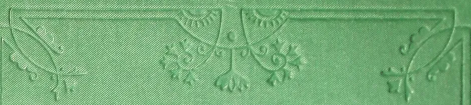The top section of the book cover features three embossed decorative elements. In the center is a symmetrical design with a central vertical stem and four curved, leaf-like or petal-like shapes extending outwards. On the left and right sides are smaller, similar but less complex floral or leaf motifs.A small, vertically oriented embossed decorative element on the left side of the cover, featuring a central circular or oval motif with symmetrical floral or scrollwork patterns extending from the top and bottom.A small, vertically oriented embossed decorative element on the right side of the cover, identical in design to the one on the left, featuring a central circular motif with symmetrical floral or scrollwork patterns.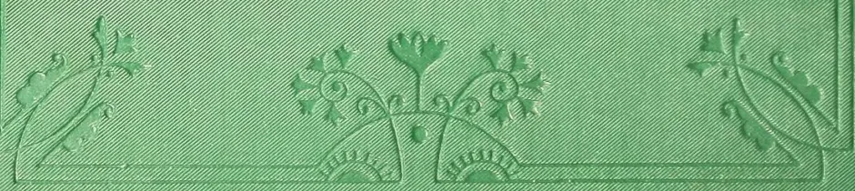The bottom section of the book cover features three embossed decorative elements, mirroring the top section. In the center is a symmetrical design with a central vertical stem and four curved, leaf-like or petal-like shapes extending outwards. On the left and right sides are smaller, similar but less complex floral or leaf motifs.